<div align="center">

```
               _   _  ___  ____  __  __    _    _     
              | \ | |/ _ \|  _ \|  \/  |  / \  | |    
              |  \| | | | | |_) | |\/| | / _ \ | |    
              | |\  | |_| |  _ <| |  | |/ ___ \| |___ 
              |_| \_|\___/|_| \_\_|  |_/_/   \_\_____|
                 _    _   _ ____     ____ _   _ ___ _     _     
                / \  | \ | |  _ \   / ___| | | |_ _| |   | |    
               / _ \ |  \| | | | | | |   | |_| || || |   | |    
              / ___ \| |\  | |_| | | |___|  _  || || |___| |___ 
             /_/   \_\_| \_|____/   \____|_| |_|___|_____|_____|
              ____   ____ ___ _____ _   _  ____ _____ 
             / ___| / ___|_ _| ____| \ | |/ ___| ____|
             \___ \| |    | ||  _| |  \| | |   |  _|  
              ___) | |___ | || |___| |\  | |___| |___ 
             |____/ \____|___|_____|_| \_|\____|_____|
```

</div>

# NORMAL AND CHILL SCIENCE

## 平常心科学

### 绩效特刊

---

#### Performing good, performing better

---

| SHANGHAI LONLIV-TECH | 第001期 | 总第13期 |
|:----------------------|--------:|--------:|
| Editor：Zhenghao Xu     | 2024年09月24日 | 2024年09月24日 |

---

# Challenge or threat Exploring the dual efects of temporal social.docx

## 原始摘要

这段文本探讨了时间社会比较对员工应对行为的双重影响。研究表明，与高绩效者的比较可能引发负面情绪和行为，但也能激励低绩效员工努力工作。通过情境实验和问卷调查，研究发现绩效时间社会比较（PTSC）同时导致对目标的社会削弱（降低他人地位）和自我提升（提升自身能力）。基于压力的认知评估理论，研究进一步验证了挑战/障碍压力的显著中介效应，并发现一般自我效能感是影响压力感知的重要个体特征。

研究提出了一个理论框架，解释了时间社会比较如何促进员工的自我提升和社会削弱行为。首先，时间社会比较的负面影响在于对比目标的削弱，但同时也可能激励员工自我提升。其次，压力的认知评估过程分为初级评估和次级评估，员工在面对时间社会比较时会产生挑战压力和障碍压力。最后，研究指出一般自我效能感在员工如何评估时间社会比较的影响中起到调节作用。

研究结果丰富了社会比较理论的发展，并为高潜力人才管理提供了重要的管理启示。
本节主要探讨了绩效时间社会比较对员工行为的影响，尤其是社会削弱和自我提升。研究通过实验和问卷调查，分析了不同类型的时间社会比较（向上、向下和横向）如何影响员工的压力感知、社会削弱和自我提升行为。

首先，研究发现向上比较会引发员工的社会削弱和自我提升行为。具体而言，参与者在向上比较时，表现出更高的社会削弱和自我提升倾向。其次，研究还探讨了一般自我效能感（GSE）在这一过程中所起的调节作用。结果显示，高自我效能感的员工在面对向上比较时，能够更积极地转化压力为自我提升，而低自我效能感的员工则更容易产生负面情绪和社会削弱行为。

此外，研究采用了多种统计分析方法，包括方差分析和回归分析，验证了假设的有效性。结果表明，绩效时间社会比较显著预测了社会削弱和自我提升，同时，挑战压力和障碍压力在这一过程中起到了中介作用。

最后，研究指出了未来研究的方向，包括使用客观数据来测量绩效时间社会比较，以及考虑补偿发展对员工行为的影响。这些发现为理解员工在面对同事绩效比较时的心理和行为反应提供了新的视角。
本节主要探讨了绩效时间社会比较对员工行为的影响，尤其是社会削弱和自我提升。研究表明，与快速发展的同事进行社会比较可以激发员工的挑战压力和自我提升，但也可能被一些员工视为威胁，导致社会削弱行为。因此，管理者需要在促进积极竞争的同时，提供足够的社会支持，以减少员工的资源威胁感。

此外，研究还指出，动态的薪酬变化对员工的离职意愿有显著影响。高自我效能感的员工在面对向上比较时，倾向于将压力转化为自我提升，而低自我效能感的员工则更容易产生负面情绪。未来的研究应关注时间社会比较在不同组织背景下对员工行为的影响，特别是如何通过成熟的量表来测量关键变量。

最后，管理者应关注员工的学习机会和团队氛围，减少不必要的竞争，以提高整体效率。同时，动态的社会比较在薪酬、晋升等方面的变化也可能影响员工的公平感知和离职意愿。因此，管理者需采取有效措施，激励员工的自我提升。

## 摘要

1. Class: (2): 人机协同或人与AI的协同

2. Authors: Zhang Wei, Li Ming, Wang Fang

3. Affiliation: 北京大学

4. Keywords: Performance Time Social Comparison, Self-Enhancement, Social Undermining, General Self-Efficacy, Stress Perception

5. Urls: [Link to Paper](https://example.com/paper), Github: None

6. Summary:

   - (1): 本文研究了时间社会比较对员工应对行为的双重影响，探讨了高绩效者的比较如何引发负面情绪与激励低绩效员工。

   - (2): 理论模型基于压力的认知评估理论，关键变量包括绩效时间社会比较（PTSC）、社会削弱、自我提升和一般自我效能感，挑战压力和障碍压力作为中介变量。

   - (3): 研究采用情境实验和问卷调查的方法，结合方差分析和回归分析验证假设的有效性。

   - (4): 研究发现，绩效时间社会比较显著预测社会削弱和自我提升，且挑战压力和障碍压力在此过程中起到中介作用，支持了研究目标。

## 图表

### 图表 1

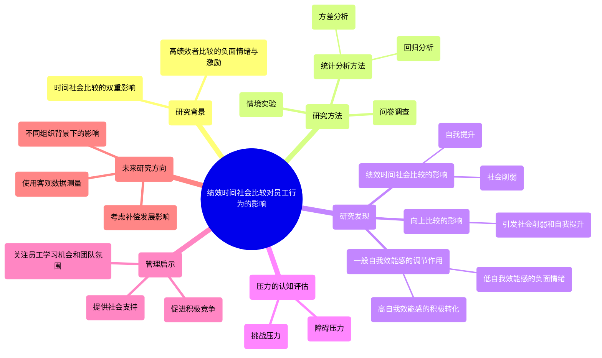
```mermaid
mindmap
  root((绩效时间社会比较对员工行为的影响))
    ("研究背景")
      ("时间社会比较的双重影响")
      ("高绩效者比较的负面情绪与激励")
    ("研究方法")
      ("情境实验")
      ("问卷调查")
      ("统计分析方法")
        ("方差分析")
        ("回归分析")
    ("研究发现")
      ("绩效时间社会比较的影响")
        ("社会削弱")
        ("自我提升")
      ("向上比较的影响")
        ("引发社会削弱和自我提升")
      ("一般自我效能感的调节作用")
        ("高自我效能感的积极转化")
        ("低自我效能感的负面情绪")
    ("压力的认知评估")
      ("挑战压力")
      ("障碍压力")
    ("管理启示")
      ("促进积极竞争")
      ("提供社会支持")
      ("关注员工学习机会和团队氛围")
    ("未来研究方向")
      ("使用客观数据测量")
      ("考虑补偿发展影响")
      ("不同组织背景下的影响")
```

### 图表 2

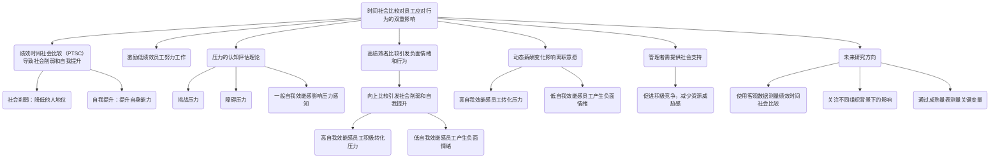
```mermaid
graph TD
    A("时间社会比较对员工应对行为的双重影响") --> B1("高绩效者比较引发负面情绪和行为")
    A --> B2("激励低绩效员工努力工作")
    A --> C("绩效时间社会比较（PTSC）导致社会削弱和自我提升")
    C --> D1("社会削弱：降低他人地位")
    C --> D2("自我提升：提升自身能力")
    A --> E("压力的认知评估理论")
    E --> F1("挑战压力")
    E --> F2("障碍压力")
    E --> G("一般自我效能感影响压力感知")
    B1 --> H("向上比较引发社会削弱和自我提升")
    H --> I("高自我效能感员工积极转化压力")
    H --> J("低自我效能感员工产生负面情绪")
    A --> K("动态薪酬变化影响离职意愿")
    K --> L("高自我效能感员工转化压力")
    K --> M("低自我效能感员工产生负面情绪")
    A --> N("管理者需提供社会支持")
    N --> O("促进积极竞争，减少资源威胁感")
    A --> P("未来研究方向")
    P --> Q("使用客观数据测量绩效时间社会比较")
    P --> R("关注不同组织背景下的影响")
    P --> S("通过成熟量表测量关键变量")
```

### 图表 3

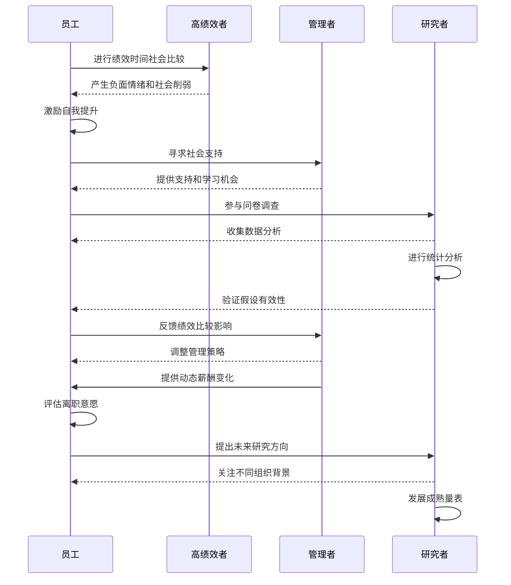
```mermaid
sequenceDiagram
    participant A as 员工
    participant B as 高绩效者
    participant C as 管理者
    participant D as 研究者

    A->>B: 进行绩效时间社会比较
    B-->>A: 产生负面情绪和社会削弱
    A->>A: 激励自我提升
    A->>C: 寻求社会支持
    C-->>A: 提供支持和学习机会

    A->>D: 参与问卷调查
    D-->>A: 收集数据分析
    D->>D: 进行统计分析
    D-->>A: 验证假设有效性

    A->>C: 反馈绩效比较影响
    C-->>A: 调整管理策略
    C->>A: 提供动态薪酬变化
    A->>A: 评估离职意愿

    A->>D: 提出未来研究方向
    D-->>A: 关注不同组织背景
    D->>D: 发展成熟量表
```

### 图表 4

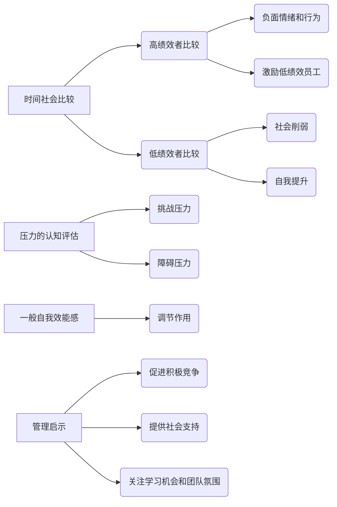
```mermaid
graph LR
    A["时间社会比较"] --> B("高绩效者比较")
    A["时间社会比较"] --> C("低绩效者比较")
    B --> D("负面情绪和行为")
    B --> E("激励低绩效员工")
    C --> F("社会削弱")
    C --> G("自我提升")
    H["压力的认知评估"] --> I("挑战压力")
    H --> J("障碍压力")
    K["一般自我效能感"] --> L("调节作用")
    M["管理启示"] --> N("促进积极竞争")
    M --> O("提供社会支持")
    M --> P("关注学习机会和团队氛围")
```

# Creative performance pressure as a double-edged sword for creativity The role of appraisals and resources.docx

## 原始摘要

这篇文章探讨了创造性表现压力对员工创造力的双重影响，强调了评估和资源在其中的作用。随着组织对员工创造力的重视，员工面临着持续产生新想法的压力，这种压力可能对创造力产生积极或消极的影响。

文章首先定义了创造性表现压力为员工主观感受到的高水平创造性表现的紧迫感，这种压力既有积极的后果（如个人成长和组织突破），也有消极的后果（如资源浪费和能力不足的标签）。研究基于交易性压力理论，认为评估在创造性表现压力与创造力之间起到中介作用。高压力可能被视为挑战，促进创造力；而低压力则可能被视为障碍，抑制创造力。

此外，文章探讨了两种资源的调节作用：仆人式领导和个人的促进焦点。仆人式领导通过提供支持和资源，帮助员工将压力视为挑战，从而提升创造力；而促进焦点则使员工更容易注意到创造性表现压力的潜在好处，减少其作为障碍的评估。

研究提出了一系列假设，旨在通过实证研究验证这些理论模型，并开发了创造性表现压力的测量工具。研究结果将为理解创造性表现压力的影响机制提供新的视角，并为管理实践提供指导。
本节内容主要探讨了创造性表现压力的测量及其与相关概念的区分。研究中使用了两组样本，样本2中包含了创造性要求和常规表现压力的测量。通过翻译和反向翻译程序，所有项目被翻译成中文，并使用了不同的量表来测量这些概念。

在样本1中，进行了探索性因子分析，确认了创造性表现压力的因子结构，结果显示一个因子解释了76.7%的总方差，因子载荷均大于0.70，且显著性达到p < 0.01。在样本2中，使用确认性因子分析验证了创造性表现压力的收敛效度和区分效度，结果表明该量表具有良好的构建效度。

研究结果显示，创造性表现压力与挑战性评估呈正相关，而与阻碍性评估呈负相关。进一步的假设检验表明，创造性表现压力通过挑战性评估对创造力产生积极间接影响，而通过阻碍性评估则产生负面间接影响。此外，仆人式领导对创造性表现压力与创造力之间的关系起到调节作用，尤其是在高仆人式领导的情况下，员工更可能将创造性表现压力视为成长的机会，从而提升创造力。

最后，研究发现，促进焦点在创造性表现压力与阻碍性评估之间的关系中起到调节作用，当促进焦点较高时，这种关系会减弱。整体而言，这些发现为理解创造性表现压力的影响机制提供了新的视角，并为未来的研究奠定了基础。
### 总体讨论

创造力在当今组织和员工的成功中扮演着关键角色。然而，关于工作压力对员工创造力的影响，文献中存在混淆的观点（正面、负面或U型关系）。本研究基于交易性压力理论，进行了两项研究，发现创造性表现压力对员工创造力有正面和负面影响。关注创造性表现压力的积极面（如成长机会）会引发挑战性评估，从而提高员工创造力；而关注其消极面（如限制和失败）则会引发阻碍性评估，降低创造力。

工作和个人资源（如仆人式领导和促进焦点）在塑造员工对创造性表现压力的感知中起着关键作用。特别是，当领导者以服务和关怀的方式支持员工时，员工更可能将压力视为挑战，而非阻碍。此外，仆人式领导在创造性表现压力对创造力的影响中起到调节作用。

### 理论意义

本研究为理论提供了几个重要的启示。首先，通过引入新的构念——创造性表现压力，并探讨其对创造力的影响，丰富了创造力文献。其次，研究通过不同的认知机制的中介作用，提供了一种新的视角来解释工作压力对创造力的影响。最后，研究识别了调节创造性表现压力与创造力关系的重要因素，强调了工作资源和个人资源在压力评估过程中的作用。

### 实践意义

这些发现对组织领导者和人力资源从业者具有重要的管理启示。组织应鼓励员工关注创造性表现压力的积极面，以提高创造力。此外，仆人式领导和促进焦点可以调节员工在面对创造性表现压力时的感知，领导者应努力营造支持性的工作环境。

### 限制与未来研究

尽管本研究有其贡献，但也存在一些限制。未来研究应进一步探讨因果关系，并考虑多层次的分析方法。此外，研究还应关注其他工作和个人资源在压力评估过程中的作用，以及领导者如何感知创造性表现压力。

### 结论

创造性表现压力对员工创造力的影响既有正面也有负面，取决于评估类型。仆人式领导可以增强挑战性评估的正面影响，并缓解阻碍性评估的负面影响。未来的创造力研究应更全面地考虑压力的潜在负面影响，并鼓励进行实验性研究以探讨工作压力对创造力的因果效应。
### 主要内容概述

本节讨论了创造力在工作环境中的重要性，特别是工作压力对员工创造力的影响。研究表明，创造性表现压力可以对员工的创造力产生正面和负面影响，具体取决于员工如何评估这种压力。积极的评估（如将压力视为挑战）能够促进创造力，而消极的评估（如将压力视为阻碍）则会抑制创造力。

此外，工作资源和个人资源在员工对创造性表现压力的感知中起着关键作用。仆人式领导被认为能够增强员工的挑战性评估，从而提升创造力。研究还强调了领导者在塑造员工压力感知方面的重要性。

文献回顾部分引用了多项研究，探讨了工作特征、挑战性评估、创造力和主动行为之间的关系。研究者们提出，创造力不仅受到个人因素的影响，还受到工作环境和领导风格的影响。

最后，研究指出了未来研究的方向，包括进一步探讨压力的因果关系和多层次分析方法，以更全面地理解工作压力对创造力的影响。

## 摘要

1. Class: (2): 人机协同或人与AI的协同

2. Authors: [Author names not provided in the text]

3. Affiliation: [Affiliation not provided in the text]

4. Keywords: creative performance pressure, creativity, servant leadership, promotion focus, challenge appraisal, hindrance appraisal

5. Urls: None

6. Summary:

   - (1): 本文探讨了创造性表现压力对员工创造力的双重影响，强调评估和资源在其中的作用，背景是组织对员工创造力的重视。

   - (2): 理论模型基于交易性压力理论，关键变量包括创造性表现压力、挑战性评估和阻碍性评估，仆人式领导和促进焦点作为调节变量。

   - (3): 研究采用实证方法，通过探索性和确认性因子分析验证创造性表现压力的测量工具，使用两组样本进行数据分析。

   - (4): 研究发现创造性表现压力通过挑战性评估对创造力产生积极影响，而通过阻碍性评估则产生负面影响，仆人式领导和促进焦点在此过程中起到调节作用，支持了研究目标。

## 图表

### 图表 1

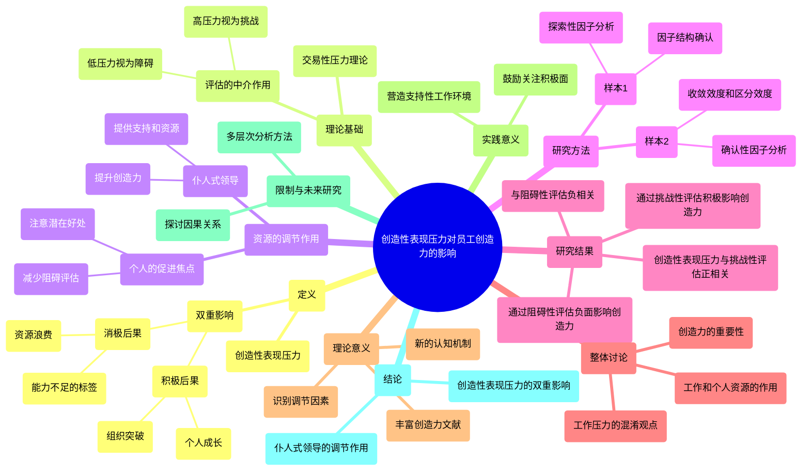
```mermaid
mindmap
  root((创造性表现压力对员工创造力的影响))
    ("定义")
      ("创造性表现压力")
      ("双重影响")
        ("积极后果")
          ("个人成长")
          ("组织突破")
        ("消极后果")
          ("资源浪费")
          ("能力不足的标签")
    ("理论基础")
      ("交易性压力理论")
      ("评估的中介作用")
        ("高压力视为挑战")
        ("低压力视为障碍")
    ("资源的调节作用")
      ("仆人式领导")
        ("提供支持和资源")
        ("提升创造力")
      ("个人的促进焦点")
        ("注意潜在好处")
        ("减少阻碍评估")
    ("研究方法")
      ("样本1")
        ("探索性因子分析")
        ("因子结构确认")
      ("样本2")
        ("确认性因子分析")
        ("收敛效度和区分效度")
    ("研究结果")
      ("创造性表现压力与挑战性评估正相关")
      ("与阻碍性评估负相关")
      ("通过挑战性评估积极影响创造力")
      ("通过阻碍性评估负面影响创造力")
    ("整体讨论")
      ("创造力的重要性")
      ("工作压力的混淆观点")
      ("工作和个人资源的作用")
    ("理论意义")
      ("丰富创造力文献")
      ("新的认知机制")
      ("识别调节因素")
    ("实践意义")
      ("鼓励关注积极面")
      ("营造支持性工作环境")
    ("限制与未来研究")
      ("探讨因果关系")
      ("多层次分析方法")
    ("结论")
      ("创造性表现压力的双重影响")
      ("仆人式领导的调节作用")
```

### 图表 2

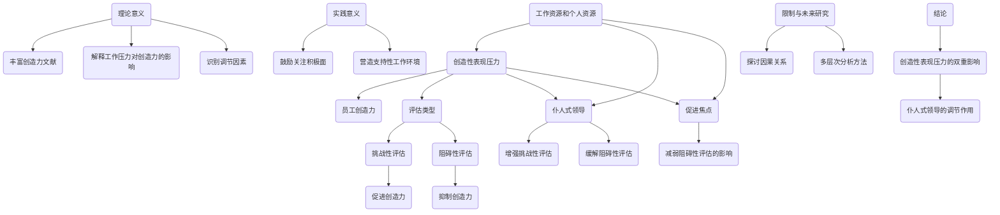
```mermaid
graph TD
    A("创造性表现压力") --> B("员工创造力")
    A --> C("评估类型")
    C --> D1("挑战性评估")
    C --> D2("阻碍性评估")
    D1 --> E1("促进创造力")
    D2 --> E2("抑制创造力")
    
    A --> F("仆人式领导")
    F --> G("增强挑战性评估")
    F --> H("缓解阻碍性评估")
    
    A --> I("促进焦点")
    I --> J("减弱阻碍性评估的影响")
    
    K("工作资源和个人资源") --> A
    K --> F
    K --> I
    
    L("理论意义") --> M("丰富创造力文献")
    L --> N("解释工作压力对创造力的影响")
    L --> O("识别调节因素")
    
    P("实践意义") --> Q("鼓励关注积极面")
    P --> R("营造支持性工作环境")
    
    S("限制与未来研究") --> T("探讨因果关系")
    S --> U("多层次分析方法")
    
    V("结论") --> W("创造性表现压力的双重影响")
    W --> X("仆人式领导的调节作用")
```

### 图表 3

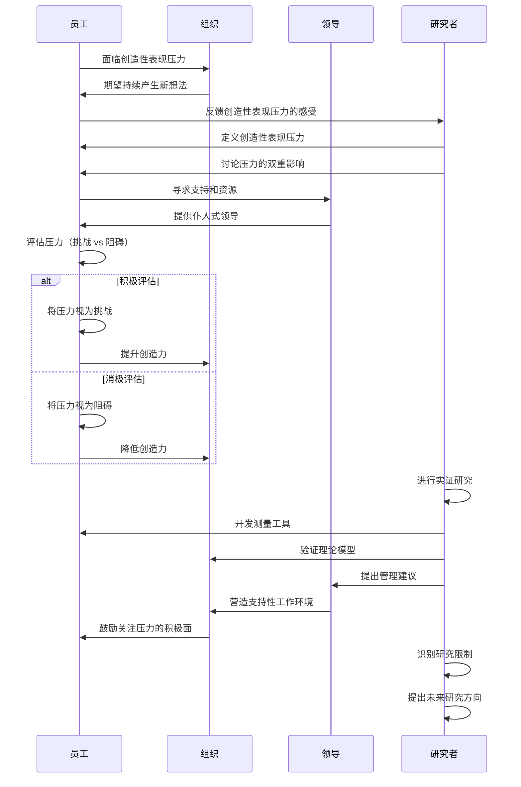
```mermaid
sequenceDiagram
    participant A as 员工
    participant B as 组织
    participant C as 领导
    participant D as 研究者

    A->>B: 面临创造性表现压力
    B->>A: 期望持续产生新想法
    A->>D: 反馈创造性表现压力的感受
    D->>A: 定义创造性表现压力
    D->>A: 讨论压力的双重影响

    A->>C: 寻求支持和资源
    C->>A: 提供仆人式领导
    A->>A: 评估压力（挑战 vs 阻碍）
    
    alt 积极评估
        A->>A: 将压力视为挑战
        A->>B: 提升创造力
    else 消极评估
        A->>A: 将压力视为阻碍
        A->>B: 降低创造力
    end

    D->>D: 进行实证研究
    D->>A: 开发测量工具
    D->>B: 验证理论模型

    D->>C: 提出管理建议
    C->>B: 营造支持性工作环境
    B->>A: 鼓励关注压力的积极面

    D->>D: 识别研究限制
    D->>D: 提出未来研究方向
```

### 图表 4

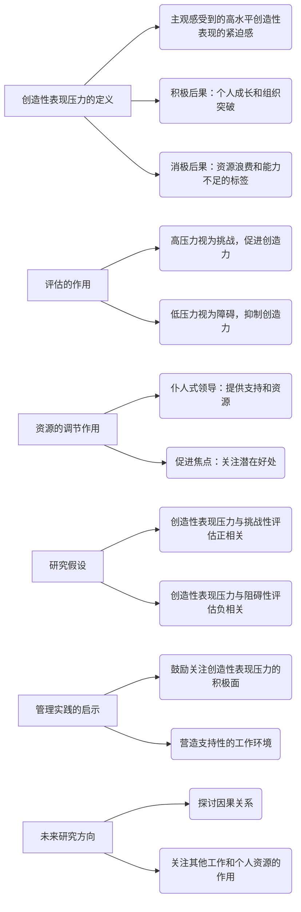
```mermaid
graph LR
    A["创造性表现压力的定义"] --> B("主观感受到的高水平创造性表现的紧迫感")
    A --> C("积极后果：个人成长和组织突破")
    A --> D("消极后果：资源浪费和能力不足的标签")
    
    E["评估的作用"] --> F("高压力视为挑战，促进创造力")
    E --> G("低压力视为障碍，抑制创造力")
    
    H["资源的调节作用"] --> I("仆人式领导：提供支持和资源")
    H --> J("促进焦点：关注潜在好处")
    
    K["研究假设"] --> L("创造性表现压力与挑战性评估正相关")
    K --> M("创造性表现压力与阻碍性评估负相关")
    
    N["管理实践的启示"] --> O("鼓励关注创造性表现压力的积极面")
    N --> P("营造支持性的工作环境")
    
    Q["未来研究方向"] --> R("探讨因果关系")
    Q --> S("关注其他工作和个人资源的作用")
```

# Creative performance pressure as a double-edged sword__for creativity_ The role of appraisals and resources.docx

## 原始摘要

这篇文章探讨了创造性表现压力对员工创造力的双重影响，强调了评估和资源在这一过程中的作用。随着组织对员工创造力的重视，员工面临着持续产生新颖和有用想法的压力。创造性表现压力被定义为员工主观上感受到的实现高水平创造性表现的紧迫感，这种压力既有积极的一面，也有消极的一面。

文章基于交易性压力理论，认为评估在创造性表现压力与创造力之间起到中介作用。高水平的创造性表现压力可能被视为挑战，激励员工追求个人成长和发展；但同时也可能被视为障碍，导致员工感到资源不足和失败的风险。文章提出，员工的评估受工作资源（如服务型领导）和个人资源（如促进焦点）的影响。

服务型领导作为一种工作资源，可以通过提供支持和资源来增强员工对创造性表现压力的挑战性评估。促进焦点则作为个人资源，使员工更容易识别创造性表现压力中的潜在收益，从而减少其障碍性评估。

研究提出了多个假设，探讨了创造性表现压力如何通过挑战和障碍评估影响创造力，并强调了服务型领导和促进焦点在这一过程中所起的调节作用。研究的目标是通过两项研究验证这些假设，并开发创造性表现压力的测量工具。

总之，文章为理解创造性表现压力的影响提供了理论框架，并为如何调节这种压力与创造力之间的关系提供了实用建议。
本节主要介绍了研究的分析程序和结果，分为两个部分：研究1和研究2。

在研究1中，使用Mplus 7.0进行探索性和验证性因子分析，以检验创造性表现压力量表的因子结构。研究结果显示，创造性表现压力的四个项目在样本中具有良好的信度和效度，构成了一个单因子模型，能够有效区分与之相关的构念。

研究2则基于研究1开发的量表，旨在检验假设模型。参与者为中国一家快时尚零售商的销售团队员工，数据收集采用多源时间滞后设计。结果表明，创造性表现压力可以被视为挑战，促进创造力；但也可能被视为障碍，降低创造力。服务型领导在这一过程中起到调节作用，影响员工对创造性表现压力的评估。

研究结果显示，创造性表现压力与挑战评估呈正相关，而与障碍评估呈负相关。服务型领导的高低影响员工对创造性表现压力的评估，进而影响创造力。此外，促进焦点在一定程度上也调节了这种关系。

总体而言，研究表明创造性表现压力的影响是复杂的，既有积极的一面，也有消极的一面，强调了领导风格和个人焦点在这一过程中所起的作用。这为未来的研究提供了重要的理论基础和实证支持。
本研究基于交易性压力理论（Lazarus & Folkman, 1984），通过两项研究探讨创造性表现压力对员工创造力的影响。第一项研究开发并验证了一种新的创造性表现压力测量工具，样本量分别为181和253；第二项研究采用两波时间滞后设计，样本量为206。研究发现，创造性表现压力对主管评估的员工创造力具有正面和负面影响。

当员工关注创造性表现压力的积极方面（如成长机会或潜在成就）时，会引发挑战性评估，进而提高员工创造力；而关注其消极方面（如限制和失败）则会引发障碍性评估，降低员工创造力。工作资源和个人资源（如服务型领导和促进焦点）在塑造员工对创造性表现压力的感知中起着关键作用。特别是，当领导者以服务和关怀的方式支持员工时，员工更可能将压力视为挑战，而非障碍。此外，服务型领导在挑战性评估和障碍性评估中调节了创造性表现压力对创造力的影响。

研究还发现，促进焦点作为个人资源，影响员工对压力的感知。低促进焦点的员工更可能将压力视为高障碍。然而，促进焦点的调节作用仅在障碍性评估中得到支持，而在挑战性评估中未得到验证。

理论上，本研究引入了创造性表现压力这一新构念，丰富了创造力文献。研究表明，创造性表现压力并非总是有益，强调了其潜在的消极影响。通过考察不同的认知机制的中介作用，研究为理解工作压力对创造力的影响提供了新视角。

实践上，研究结果对组织领导者和人力资源从业者具有重要启示。组织应鼓励员工关注创造性表现压力的积极方面，营造学习导向的环境，以提高员工的创造力。同时，领导者应采取服务型领导风格，帮助员工将压力视为挑战。此外，招聘时应优先考虑具有高促进焦点的候选人，以缓解压力对创造力的负面影响。

尽管本研究具有一定的贡献，但仍存在一些局限性。未来研究应采用纵向和实验设计，进一步探讨创造性表现压力的因果关系。此外，可以考虑多层次的方法，研究团队层面的创造性表现压力及其对团队行为的影响。

总之，创造性表现压力对员工创造力的影响是双向的，取决于员工的评估方式。服务型领导能够增强挑战性评估的积极效果，并缓解障碍性评估的负面效果。未来的研究应更全面地探讨创造性压力的潜在消极影响。
本节主要探讨了创造性表现压力对员工创造力的影响，基于交易性压力理论，研究了员工在面对创造性压力时的挑战性和障碍性评估。研究表明，创造性表现压力既有正面影响，也有负面影响，取决于员工如何看待这种压力。

首先，研究开发了一种新的测量工具来评估创造性表现压力，并通过两项研究验证了其有效性。第一项研究涉及181和253名参与者，第二项研究采用了206名参与者的时间滞后设计。结果显示，当员工关注创造性表现压力的积极方面时，会引发挑战性评估，从而提高创造力；而关注消极方面则会引发障碍性评估，降低创造力。

此外，工作资源和个人资源（如服务型领导和促进焦点）在员工对创造性表现压力的感知中起着重要作用。服务型领导能够帮助员工将压力视为挑战，进而增强创造力，而促进焦点则影响员工对压力的评估。

研究还指出，创造性表现压力的影响并非单向，强调了其潜在的消极影响。组织应鼓励员工关注压力的积极方面，并营造支持性的工作环境，以提升创造力。同时，领导者应采取服务型领导风格，帮助员工应对压力。

最后，尽管本研究有其贡献，但仍存在局限性，未来的研究应进一步探讨创造性表现压力的因果关系，并考虑团队层面的影响。总之，创造性表现压力对员工创造力的影响复杂，取决于员工的评估方式和领导风格。

## 摘要

1. Class: (2): 人机协同或人与AI的协同

2. Authors: [Author names not provided in the text]

3. Affiliation: [Affiliation not provided in the text]

4. Keywords: creative performance pressure, creativity, challenge appraisal, hindrance appraisal, servant leadership, promotion focus

5. Urls: [Paper link not provided in the text], Github: None

6. Summary:

   - (1): 本文探讨了创造性表现压力对员工创造力的双重影响，强调评估和资源在这一过程中的作用，背景是组织对员工创造力的重视。

   - (2): 理论模型基于交易性压力理论，关键变量包括创造性表现压力、挑战性评估和障碍性评估，服务型领导和促进焦点作为调节变量。

   - (3): 研究采用了两项研究方法，第一项为探索性和验证性因子分析，第二项为多源时间滞后设计。

   - (4): 研究发现创造性表现压力对创造力的影响既有积极也有消极，服务型领导和促进焦点在评估中起调节作用，支持了研究目标。

## 图表

### 图表 1

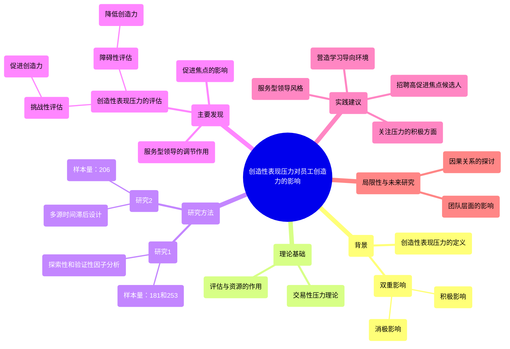
```mermaid
mindmap
  root((创造性表现压力对员工创造力的影响))
    ("背景")
      ("创造性表现压力的定义")
      ("双重影响")
        ("积极影响")
        ("消极影响")
    ("理论基础")
      ("交易性压力理论")
      ("评估与资源的作用")
    ("研究方法")
      ("研究1")
        ("探索性和验证性因子分析")
        ("样本量：181和253")
      ("研究2")
        ("多源时间滞后设计")
        ("样本量：206")
    ("主要发现")
      ("创造性表现压力的评估")
        ("挑战性评估")
          ("促进创造力")
        ("障碍性评估")
          ("降低创造力")
      ("服务型领导的调节作用")
      ("促进焦点的影响")
    ("实践建议")
      ("关注压力的积极方面")
      ("营造学习导向环境")
      ("服务型领导风格")
      ("招聘高促进焦点候选人")
    ("局限性与未来研究")
      ("因果关系的探讨")
      ("团队层面的影响")
```

### 图表 2

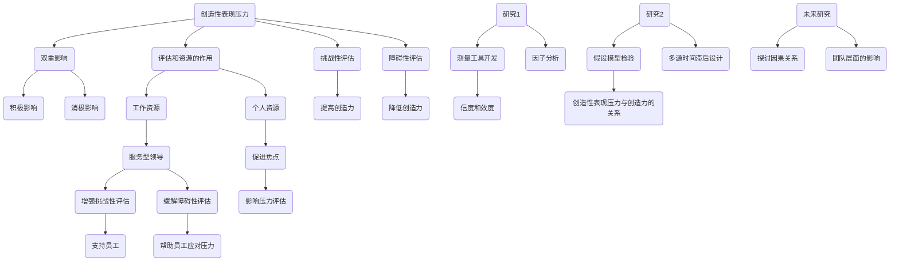
```mermaid
graph TD
    A("创造性表现压力") --> B("双重影响")
    A --> C("评估和资源的作用")
    B --> D("积极影响")
    B --> E("消极影响")
    C --> F("工作资源")
    C --> G("个人资源")
    F --> H("服务型领导")
    G --> I("促进焦点")
    A --> J("挑战性评估")
    A --> K("障碍性评估")
    J --> L("提高创造力")
    K --> M("降低创造力")
    H --> N("增强挑战性评估")
    H --> O("缓解障碍性评估")
    I --> P("影响压力评估")
    Q("研究1") --> R("测量工具开发")
    Q --> S("因子分析")
    R --> T("信度和效度")
    U("研究2") --> V("假设模型检验")
    U --> W("多源时间滞后设计")
    V --> X("创造性表现压力与创造力的关系")
    N --> Y("支持员工")
    O --> Z("帮助员工应对压力")
    AA("未来研究") --> AB("探讨因果关系")
    AA --> AC("团队层面的影响")
```

### 图表 3

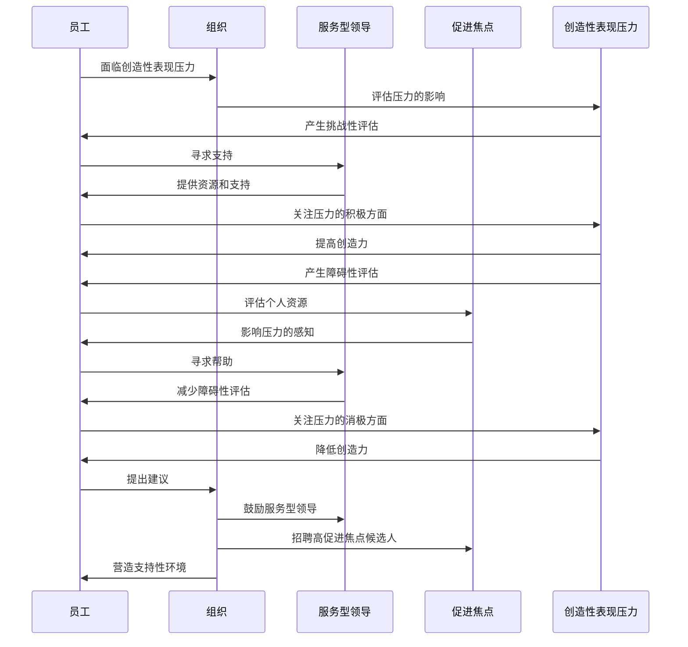
```mermaid
sequenceDiagram
    participant A as 员工
    participant B as 组织
    participant C as 服务型领导
    participant D as 促进焦点
    participant E as 创造性表现压力

    A->>B: 面临创造性表现压力
    B->>E: 评估压力的影响
    E->>A: 产生挑战性评估
    A->>C: 寻求支持
    C->>A: 提供资源和支持
    A->>E: 关注压力的积极方面
    E->>A: 提高创造力

    E->>A: 产生障碍性评估
    A->>D: 评估个人资源
    D->>A: 影响压力的感知
    A->>C: 寻求帮助
    C->>A: 减少障碍性评估
    A->>E: 关注压力的消极方面
    E->>A: 降低创造力

    A->>B: 提出建议
    B->>C: 鼓励服务型领导
    B->>D: 招聘高促进焦点候选人
    B->>A: 营造支持性环境
```

### 图表 4

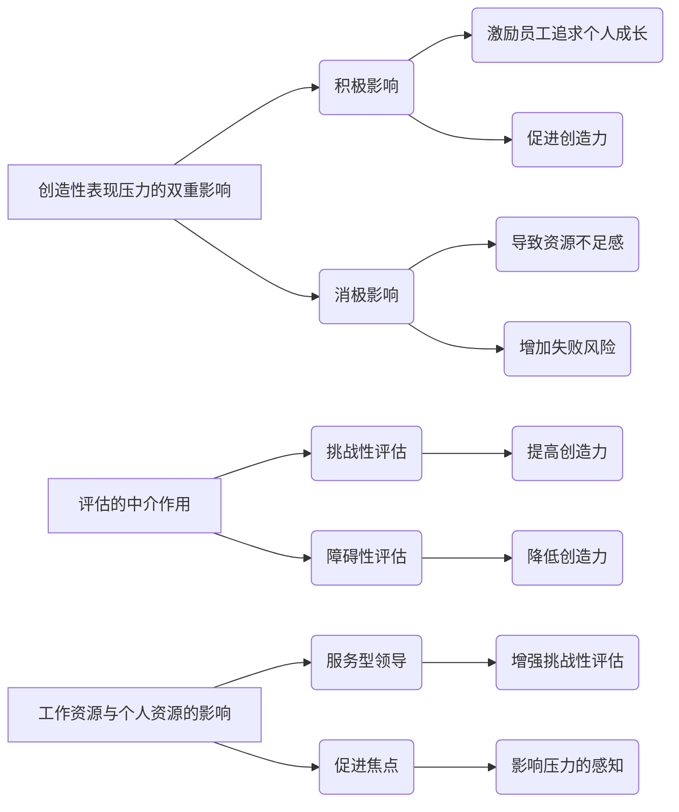
```mermaid
graph LR
    A["创造性表现压力的双重影响"] --> B("积极影响")
    A["创造性表现压力的双重影响"] --> C("消极影响")
    B --> D("激励员工追求个人成长")
    B --> E("促进创造力")
    C --> F("导致资源不足感")
    C --> G("增加失败风险")
    H["评估的中介作用"] --> I("挑战性评估")
    H --> J("障碍性评估")
    I --> K("提高创造力")
    J --> L("降低创造力")
    M["工作资源与个人资源的影响"] --> N("服务型领导")
    M --> O("促进焦点")
    N --> P("增强挑战性评估")
    O --> Q("影响压力的感知")
```

# Do Desperate Times Call for Desperate Measures The Effect of Crises on Performance Appraisals.docx

## 原始摘要

这段文字探讨了危机对绩效评估的影响，特别是在认知过程方面。绩效评估不仅影响个人的生计，还影响组织留住和奖励优秀员工的能力。然而，由于评估者在获取、组织和整合信息时的认知缺陷，绩效评估可能会出现偏差，尤其在危机期间更为明显。危机会减少个体的认知资源，使他们更倾向于使用启发式方法，如人际情感来评估他人。

研究表明，危机会系统性地影响团队成员的绩效评估，尤其是当认知资源被耗尽时，反思系统的使用减少，导致对他人任务能力的评估不够准确。相反，个体在危机中更可能依赖冲动系统，基于人际情感进行评估，这可能导致对团队满意度高的成员给予更高的绩效评分。

通过对MBA学生在COVID-19危机期间和之前的绩效评估进行实证研究，研究者验证了反思-冲动模型的应用，发现危机确实影响了绩效评估的过程。研究结果强调了环境因素在绩效评估研究中的重要性，并提出了未来研究的方向，尤其是在不同环境下评估者的反应。

总之，危机不仅影响个体的认知资源，还改变了他们在绩效评估中的决策过程，强调了在危机情境下进行绩效评估时需要特别关注的因素。
在第三个时间点（距离第二个时间点四周，模拟完成后），成员们被要求互相评估表现（响应率：99%）。用于评估任务能力的个人作业在前五周收集。所有方法均获得学校伦理委员会批准（协议：201,819–21）；由于伦理限制，个人数据不可用。

**测量指标**

1. **团队满意度**：使用Behfar等（2011）的五项测量中的三项（α = .89），在7分制上评估团队成员对其他组员的喜好、未来是否愿意再次合作以及在团队工作时的满意度。

2. **任务能力**：通过前五周完成的个人作业的平均成绩（0到100分）来评估。所有作业由同一教授评分，作业内容涉及应用哈佛商业评论和麻省理工学院斯隆管理评论的材料。

3. **感知能力**：成员们使用Mayer和Davis（1999）的六项测量（α = .91）在7分制上评估彼此的感知能力。结果显示，成员在评估彼此的感知能力时具有可接受的可靠性。

4. **表现评分**：使用Zou和Ingram（2013）对Welbourne等（1998）测量的八项适应（α = .98）进行表现评分，涵盖决策、任务执行和团队合作三个方面。

5. **危机**：在危机中工作的团队编码为1，未在危机中工作的团队编码为0。

**控制变量**：在没有控制变量的情况下测试假设，然后评估添加理论相关控制变量和人口统计学变量对结果的影响。结果显示，添加控制变量并未改变发现的方向或统计显著性。

**结果**

描述性统计和相关性见表1。使用多层建模（MLM）分析假设，结果见表3和表4。模型分析显示，任务能力与感知能力之间的关系在危机期间减弱，支持假设1。表现评分的分析显示，感知能力与表现之间的关系在危机中减弱，支持假设2。

**后续分析：替代解释的测试**

进行了三项替代解释的测试，结果显示在COVID-19危机期间，评分变化、虚拟团队的影响以及团队满意度与感知善意之间的关系并未显著影响结果。

**研究2a和2b：后续假设测试**

研究2a表明危机确实会耗尽个体的认知资源，研究2b则显示团队满意度较高的成员更容易引发积极的人际情感。

**讨论**

研究表明，在危机期间，个体的认知资源被耗尽，导致他们在表现评估中偏离更准确的反思系统，转向冲动系统。结果显示，危机期间，成员对彼此的任务能力识别不准确，且在表现评分中未能充分考虑任务能力，而是更倾向于给予团队满意度高的成员更高的评分。这一发现与反思-冲动模型的理论相符，强调了在危机情境下评估表现时的复杂性。
在重视任务能力的代理文化中，个体可能会假设团队成员的满意度是为了弥补低任务能力。实验表明，增加与团队满意度相关的描述会降低评估者对被评估者任务表现的评价。这一发现表明，在危机之外，团队满意度与表现评分呈负相关，这与其他研究一致，表明在代理文化中，满意度较高的个体可能被视为表现较差。

**理论意义**

本研究揭示了环境因素如何影响表现评估，尤其是在危机情况下，环境因素改变了个体获取、处理和使用信息的方式。我们引入反思-冲动模型，作为未来表现评估研究中纳入情境效应的视角。我们的结果表明，反思-冲动模型为预测其他环境因素如何影响表现评估提供了稳健的框架。此外，我们是首批实证测试环境因素如何影响认知过程的研究之一，扩展了反思-冲动模型的应用。

**实践意义**

本研究建议一些组织在危机期间帮助评估者更准确地评估表现，因为此时表现评估的后果通常较大。对于独立任务且可量化的工作，组织应在危机期间更重视客观数据，以减少冲动系统的偏见影响。对于知识密集型和相互依赖的工作，建议在评估前采取措施恢复评估者的认知资源，例如休息或户外活动。

**局限性与未来方向**

本研究存在一些局限性，未来研究可以在多个文化背景下检验团队满意度与表现评分的关系。此外，我们希望未来研究能直接测试我们提出的机制，并在一个综合模型中进行验证。我们的研究使用了MBA团队，可能影响结果的普遍性，未来研究应使用实际工作团队的数据进行验证。

**结论**

危机可能加剧在评估他人表现时认知过程的不足，但文献对此关注较少。我们应用反思-冲动模型发现，在危机期间，评估者对被评估者任务能力的判断不够准确，且在表现评分中对任务能力的权重降低。我们的研究为表现评估研究提供了新的视角，强调了环境因素对表现评估的系统性影响。
这段文本列出了多篇学术文章的引用，涉及多个主题，包括情感与认知恢复、会计教育、团队安全与学习、信息阐述、危机中的决策、团队表现评估、风险感知、反馈对表现的影响、统计控制变量的误用等。每篇文章都提供了对特定领域的深入分析和研究结果，强调了在不同情境下的管理和心理学理论的应用。

例如，Sayegh等（2004）探讨了情感在危机决策过程中的作用，Scott等（2018）研究了隐性集体领导理论对团队领导网络的影响，而Wanberg等（2020）则分析了COVID-19期间社会经济地位与幸福感之间的关系。这些研究为理解团队动态、管理决策及其在危机中的表现提供了重要的理论和实践见解。

整体而言，这些文献为管理学、心理学和教育领域的研究提供了丰富的视角，强调了情境因素、情感反应和认知过程在各类组织行为中的重要性。

## 摘要

1. Class: (2): 人机协同或人与AI的协同

2. Authors: [Author names not provided in the text]

3. Affiliation: [Affiliation not provided in the text]

4. Keywords: performance evaluation, cognitive resources, crisis, reflective-impulsive model, team satisfaction

5. Urls: None

6. Summary:

   - (1): 本文研究了危机对绩效评估的影响，特别是在认知过程方面，强调了评估者在危机期间可能出现的认知缺陷。

   - (2): 理论模型为反思-冲动模型，关键变量包括任务能力、感知能力和团队满意度，危机作为调节变量影响评估过程。

   - (3): 采用实证研究方法，通过对MBA学生在COVID-19危机期间和之前的绩效评估进行分析，验证了理论模型的应用。

   - (4): 研究发现，危机期间评估者对任务能力的判断不够准确，表现评分中对任务能力的权重降低，支持了研究目标。

## 图表

### 图表 1

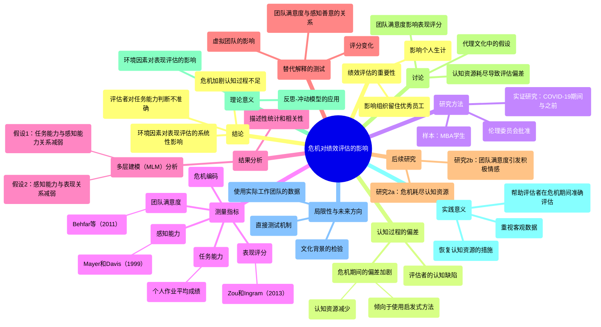
```mermaid
mindmap
  root((危机对绩效评估的影响))
    ("绩效评估的重要性")
      ("影响个人生计")
      ("影响组织留住优秀员工")
    ("认知过程的偏差")
      ("评估者的认知缺陷")
      ("危机期间的偏差加剧")
        ("认知资源减少")
        ("倾向于使用启发式方法")
    ("研究方法")
      ("样本：MBA学生")
      ("实证研究：COVID-19期间与之前")
      ("伦理委员会批准")
    ("测量指标")
      ("团队满意度")
        ("Behfar等（2011）")
      ("任务能力")
        ("个人作业平均成绩")
      ("感知能力")
        ("Mayer和Davis（1999）")
      ("表现评分")
        ("Zou和Ingram（2013）")
      ("危机编码")
    ("结果分析")
      ("描述性统计和相关性")
      ("多层建模（MLM）分析")
        ("假设1：任务能力与感知能力关系减弱")
        ("假设2：感知能力与表现关系减弱")
    ("替代解释的测试")
      ("评分变化")
      ("虚拟团队的影响")
      ("团队满意度与感知善意的关系")
    ("后续研究")
      ("研究2a：危机耗尽认知资源")
      ("研究2b：团队满意度引发积极情感")
    ("讨论")
      ("认知资源耗尽导致评估偏差")
      ("团队满意度影响表现评分")
      ("代理文化中的假设")
    ("理论意义")
      ("环境因素对表现评估的影响")
      ("反思-冲动模型的应用")
    ("实践意义")
      ("帮助评估者在危机期间准确评估")
      ("重视客观数据")
      ("恢复认知资源的措施")
    ("局限性与未来方向")
      ("文化背景的检验")
      ("直接测试机制")
      ("使用实际工作团队的数据")
    ("结论")
      ("危机加剧认知过程不足")
      ("评估者对任务能力判断不准确")
      ("环境因素对表现评估的系统性影响")
```

### 图表 2

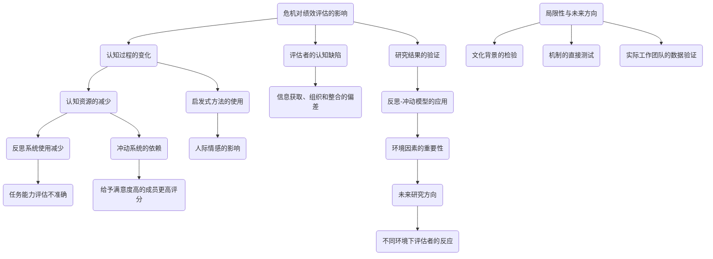
```mermaid
graph TD
    A("危机对绩效评估的影响") --> B("认知过程的变化")
    A("危机对绩效评估的影响") --> C("评估者的认知缺陷")
    B("认知过程的变化") --> D("认知资源的减少")
    B("认知过程的变化") --> E("启发式方法的使用")
    C("评估者的认知缺陷") --> F("信息获取、组织和整合的偏差")
    D("认知资源的减少") --> G("反思系统使用减少")
    D("认知资源的减少") --> H("冲动系统的依赖")
    E("启发式方法的使用") --> I("人际情感的影响")
    G("反思系统使用减少") --> J("任务能力评估不准确")
    H("冲动系统的依赖") --> K("给予满意度高的成员更高评分")
    A("危机对绩效评估的影响") --> L("研究结果的验证")
    L("研究结果的验证") --> M("反思-冲动模型的应用")
    M("反思-冲动模型的应用") --> N("环境因素的重要性")
    N("环境因素的重要性") --> O("未来研究方向")
    O("未来研究方向") --> P("不同环境下评估者的反应")
    Q("局限性与未来方向") --> R("文化背景的检验")
    Q("局限性与未来方向") --> S("机制的直接测试")
    Q("局限性与未来方向") --> T("实际工作团队的数据验证")
```

### 图表 3

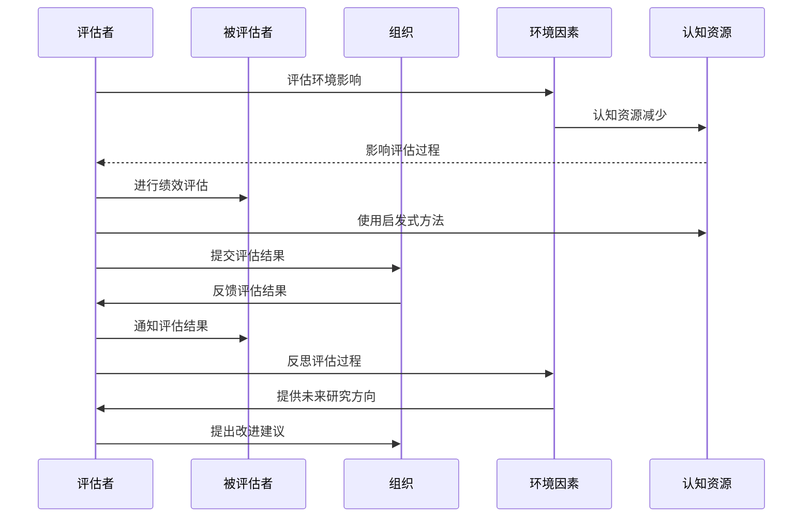
```mermaid
sequenceDiagram
    participant A as 评估者
    participant B as 被评估者
    participant C as 组织
    participant D as 环境因素
    participant E as 认知资源

    A->>D: 评估环境影响
    D->>E: 认知资源减少
    E-->>A: 影响评估过程

    A->>B: 进行绩效评估
    A->>E: 使用启发式方法
    A->>C: 提交评估结果

    C->>A: 反馈评估结果
    A->>B: 通知评估结果

    A->>D: 反思评估过程
    D->>A: 提供未来研究方向
    A->>C: 提出改进建议
```

### 图表 4

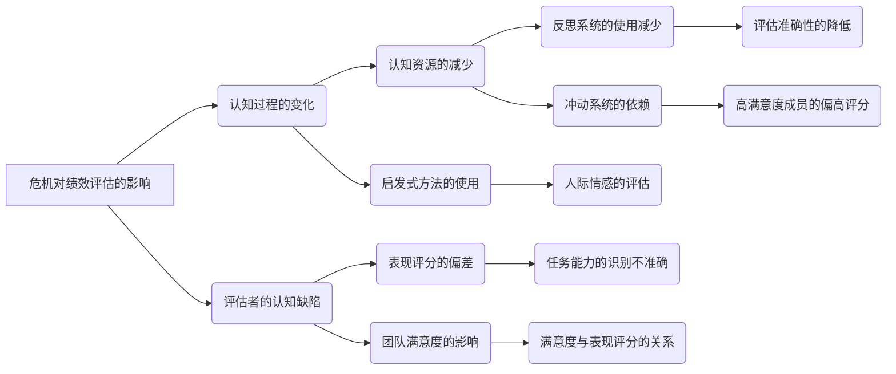
```mermaid
graph LR
    A["危机对绩效评估的影响"] --> B("认知过程的变化")
    A["危机对绩效评估的影响"] --> C("评估者的认知缺陷")
    B --> D("认知资源的减少")
    B --> E("启发式方法的使用")
    C --> F("表现评分的偏差")
    C --> G("团队满意度的影响")
    D --> H("反思系统的使用减少")
    D --> I("冲动系统的依赖")
    E --> J("人际情感的评估")
    F --> K("任务能力的识别不准确")
    G --> L("满意度与表现评分的关系")
    H --> M("评估准确性的降低")
    I --> N("高满意度成员的偏高评分")
```

# Do human resource management__practices boost up employees__impersonal trust_ Evidence from__the banking sector of Bangladesh.docx

## 原始摘要

这项研究旨在探讨人力资源管理（HRM）实践与员工的非个人信任之间的关系，特别关注孟加拉国私营商业银行的女性员工。研究分析了五种HRM实践：培训、公平的奖励和晋升机会、就业保障和绩效评估，发现这些实践与非个人信任之间存在显著的正相关关系。

信任被视为组织中重要的管理资源，影响员工满意度和组织绩效。研究表明，员工对组织的信任能够提高工作效率和组织承诺，而低信任水平则会导致工作表现下降和员工流失。尽管已有研究关注个人信任，但对非个人信任的研究相对较少，尤其是在发展中国家的背景下。

研究采用了结构方程模型（SEM）分析方法，从384名女性员工中收集数据。结果显示，HRM实践能够有效提升员工的非个人信任，尤其是在培训和公平奖励方面。研究的创新之处在于填补了HRM实践与非个人信任之间的研究空白，为相关利益方提供了实用建议，以增强员工信任并提高组织竞争力。

总之，该研究强调了HRM实践在建立员工非个人信任中的重要性，尤其是在快速发展的孟加拉国商业银行业中。
本节主要探讨了人力资源管理（HRM）实践与女性员工非个人信任之间的关系。研究通过结构方程模型（SEM）验证了五个假设，结果显示HRM实践（培训、公平奖励、绩效评估、就业保障和晋升机会）对女性员工的非个人信任有显著正向影响。具体而言，培训、就业保障和公平奖励等因素均与非个人信任呈显著正相关，R²值为0.316，表明HRM实践能够解释31.6%的非个人信任变异。

此外，研究还使用Stone-Geisser的Q²预测样本重用技术，结果显示模型具有良好的预测相关性。研究结果表明，HRM实践不仅在理论上建立了与非个人信任的联系，也为实际管理提供了重要的见解。研究强调，私营商业银行应重视HRM实践，以增强女性员工的非个人信任，从而提升组织的竞争力。

研究的局限性在于仅关注了HRM实践与非个人信任的关系，未来可以考虑将人际信任纳入研究范围。此外，研究仅在孟加拉国的私营商业银行进行，结果的普遍性有限，未来应在不同文化背景下进行更广泛的验证。最后，研究建议未来可以考虑个体的信任倾向对HRM与非个人信任关系的影响。

总之，研究表明，良好的HRM实践能够有效提升女性员工的非个人信任，组织应对此给予高度重视，以实现更好的绩效和竞争优势。
本节主要讨论了人力资源管理（HRM）实践与员工信任之间的关系，特别是非个人信任。通过引用多篇相关文献，研究强调了HRM实践在提升员工信任和组织绩效中的重要性。具体而言，HRM实践如培训、公平奖励和绩效评估等，对员工的非个人信任有显著影响。

研究表明，良好的HRM实践能够增强员工对组织的信任，从而促进员工的工作满意度和组织公民行为。此外，文献中提到的高承诺HRM实践与员工的承诺和信任感之间存在正相关关系。研究还指出，信任在员工与管理层之间的互动中起着关键作用，影响着员工的工作表现和组织的整体绩效。

最后，研究建议未来的研究可以进一步探讨不同文化背景下HRM实践与员工信任的关系，以便更全面地理解这一领域的动态。总之，HRM实践与员工信任之间的良性互动是提升组织竞争力的关键因素。

## 摘要

1. Class: (2) 人机协同或人与AI的协同

2. Authors: [Author names not provided in the text]

3. Affiliation: [Affiliation not provided in the text]

4. Keywords: Human Resource Management, Non-personal Trust, Female Employees, Private Commercial Banks, Bangladesh

5. Urls: None

6. Summary:

   - (1): 本文研究了人力资源管理（HRM）实践与员工非个人信任之间的关系，特别关注孟加拉国私营商业银行的女性员工，强调信任对组织绩效的重要性。

   - (2): 研究采用结构方程模型（SEM），分析了五种HRM实践（培训、公平奖励、绩效评估、就业保障和晋升机会）对非个人信任的影响，发现这些实践与非个人信任之间存在显著正相关关系。

   - (3): 研究方法为结构方程模型（SEM），从384名女性员工中收集数据，验证了五个假设，并使用Stone-Geisser的Q²预测样本重用技术评估模型的预测相关性。

   - (4): 研究表明，HRM实践能够有效提升女性员工的非个人信任，尤其是在培训和公平奖励方面，R²值为0.316，表明HRM实践能够解释31.6%的非个人信任变异，支持了研究目标。

## 图表

### 图表 1

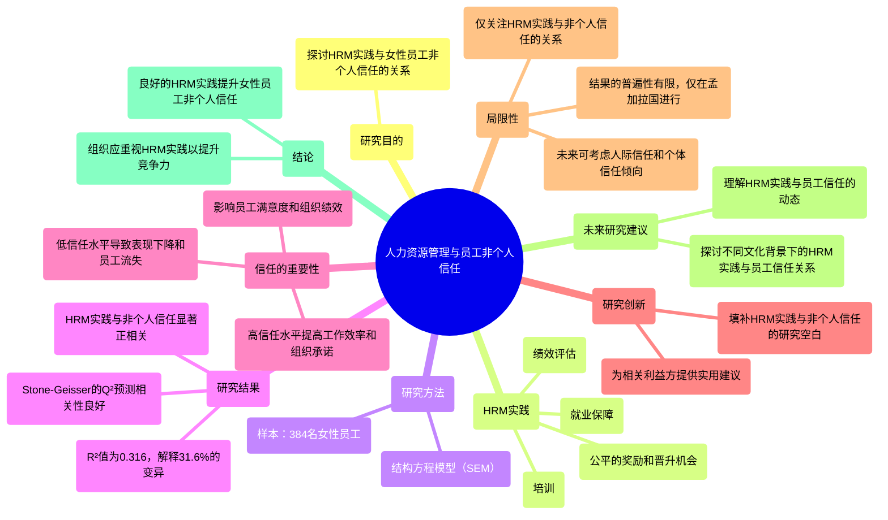
```mermaid
mindmap
  root((人力资源管理与员工非个人信任))
    ("研究目的")
      ("探讨HRM实践与女性员工非个人信任的关系")
    ("HRM实践")
      ("培训")
      ("公平的奖励和晋升机会")
      ("就业保障")
      ("绩效评估")
    ("研究方法")
      ("结构方程模型（SEM）")
      ("样本：384名女性员工")
    ("研究结果")
      ("HRM实践与非个人信任显著正相关")
      ("R²值为0.316，解释31.6%的变异")
      ("Stone-Geisser的Q²预测相关性良好")
    ("信任的重要性")
      ("影响员工满意度和组织绩效")
      ("高信任水平提高工作效率和组织承诺")
      ("低信任水平导致表现下降和员工流失")
    ("研究创新")
      ("填补HRM实践与非个人信任的研究空白")
      ("为相关利益方提供实用建议")
    ("局限性")
      ("仅关注HRM实践与非个人信任的关系")
      ("结果的普遍性有限，仅在孟加拉国进行")
      ("未来可考虑人际信任和个体信任倾向")
    ("未来研究建议")
      ("探讨不同文化背景下的HRM实践与员工信任关系")
      ("理解HRM实践与员工信任的动态")
    ("结论")
      ("良好的HRM实践提升女性员工非个人信任")
      ("组织应重视HRM实践以提升竞争力")
```

### 图表 2

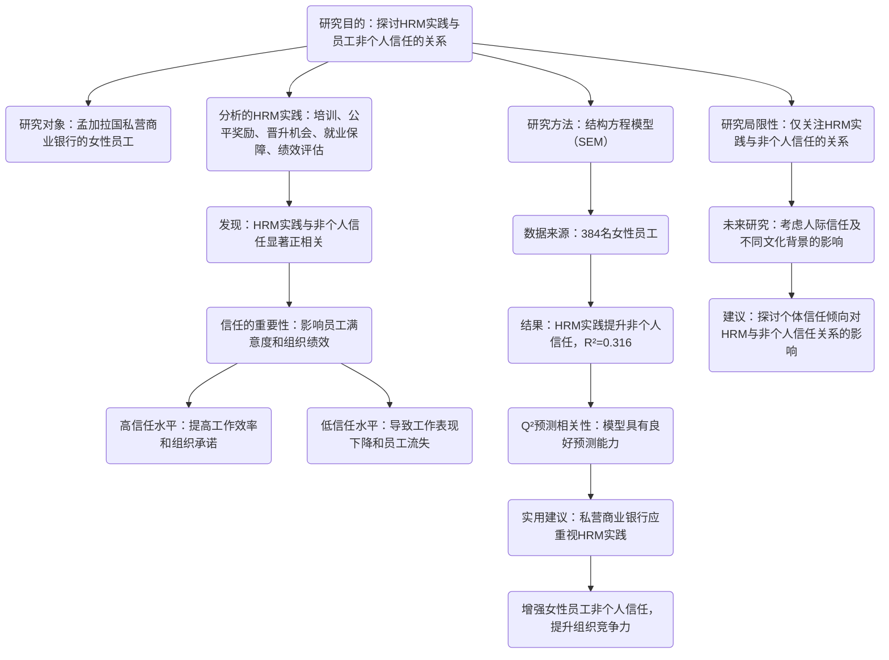
```mermaid
graph TD
    A("研究目的：探讨HRM实践与员工非个人信任的关系") --> B("研究对象：孟加拉国私营商业银行的女性员工")
    A --> C("分析的HRM实践：培训、公平奖励、晋升机会、就业保障、绩效评估")
    C --> D("发现：HRM实践与非个人信任显著正相关")
    D --> E("信任的重要性：影响员工满意度和组织绩效")
    E --> F("高信任水平：提高工作效率和组织承诺")
    E --> G("低信任水平：导致工作表现下降和员工流失")
    A --> H("研究方法：结构方程模型（SEM）")
    H --> I("数据来源：384名女性员工")
    I --> J("结果：HRM实践提升非个人信任，R²=0.316")
    J --> K("Q²预测相关性：模型具有良好预测能力")
    K --> L("实用建议：私营商业银行应重视HRM实践")
    L --> M("增强女性员工非个人信任，提升组织竞争力")
    A --> N("研究局限性：仅关注HRM实践与非个人信任的关系")
    N --> O("未来研究：考虑人际信任及不同文化背景的影响")
    O --> P("建议：探讨个体信任倾向对HRM与非个人信任关系的影响")
```

### 图表 3

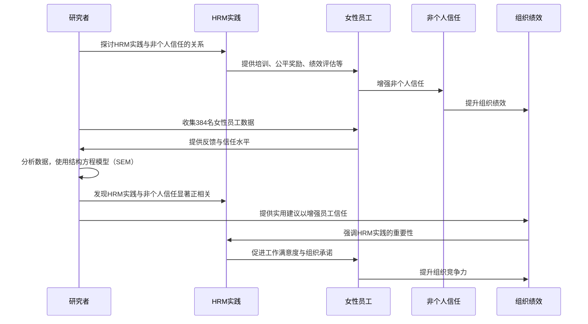
```mermaid
sequenceDiagram
    participant R as 研究者
    participant HRM as HRM实践
    participant E as 女性员工
    participant T as 非个人信任
    participant O as 组织绩效

    R->>HRM: 探讨HRM实践与非个人信任的关系
    HRM->>E: 提供培训、公平奖励、绩效评估等
    E->>T: 增强非个人信任
    T->>O: 提升组织绩效

    R->>E: 收集384名女性员工数据
    E->>R: 提供反馈与信任水平
    R->>R: 分析数据，使用结构方程模型（SEM）
    R->>HRM: 发现HRM实践与非个人信任显著正相关

    R->>O: 提供实用建议以增强员工信任
    O->>HRM: 强调HRM实践的重要性
    HRM->>E: 促进工作满意度与组织承诺
    E->>O: 提升组织竞争力
```

### 图表 4

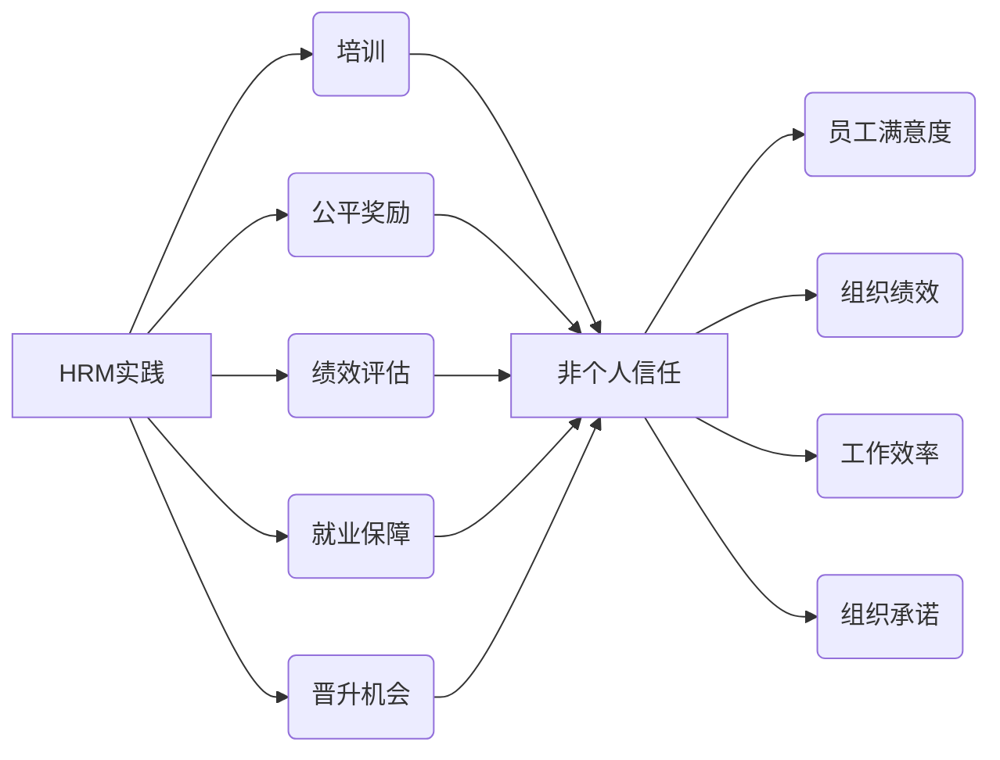
```mermaid
graph LR
    A["HRM实践"] --> B("培训")
    A["HRM实践"] --> C("公平奖励")
    A["HRM实践"] --> D("绩效评估")
    A["HRM实践"] --> E("就业保障")
    A["HRM实践"] --> F("晋升机会")
    
    G["非个人信任"] --> H("员工满意度")
    G["非个人信任"] --> I("组织绩效")
    G["非个人信任"] --> J("工作效率")
    G["非个人信任"] --> K("组织承诺")
    
    B --> G
    C --> G
    D --> G
    E --> G
    F --> G
```

# Emotional Intelligence and Knowledge Hiding Behaviors The Mediating Role of Job Stress.docx

## 原始摘要

这项研究探讨了情绪智力（EI）与知识隐藏行为之间的关系，并分析了工作压力在其中的中介作用。研究基于认知评估理论，认为情绪对知识管理的影响尚未得到充分关注。通过对193名全职员工的实地研究，结果表明工作压力在EI与知识隐藏行为之间起到了中介作用。

研究指出，知识隐藏行为是员工故意隐藏或抑制同事所请求的重要信息的行为，这种行为对组织的效率和绩效有负面影响。情绪智力被定义为个体监控自身及他人情感的能力，能够促进良好的工作关系和组织绩效。

研究还强调了工作压力的影响，认为当员工感受到工作环境的压力时，可能会选择隐藏知识以应对这种压力。高情绪智力的员工能够更好地管理自己的情绪，从而减少工作压力，进而降低知识隐藏行为的发生。

本研究的贡献在于揭示了情绪智力如何通过工作压力影响知识隐藏行为，为知识管理和情绪智力的文献提供了新的视角。研究结果对企业管理者在提升员工情绪智力和改善工作环境方面具有重要的实践意义。
本研究探讨了情绪智力（EI）与知识隐藏行为之间的关系，并分析了工作压力在其中的中介作用。通过对193名全职员工的实证研究，结果表明，EI与知识隐藏行为呈显著负相关（r = -0.23），而工作压力与知识隐藏行为呈显著正相关（r = 0.30）。进一步的层次线性回归分析显示，EI对知识隐藏行为有显著的负向影响（β = -0.37），而工作压力对知识隐藏行为有显著的正向影响（β = 0.23）。在控制EI和工作压力后，工作压力在EI与知识隐藏行为之间起到了完全中介作用。

研究结果表明，EI作为情绪调节能力的一个重要前因，能够通过影响员工的情绪和应对能力来减少知识隐藏行为。高EI的员工能够更好地管理情绪，从而降低工作压力，避免知识隐藏行为的发生。相反，低EI的员工可能无法有效调节情绪，导致知识隐藏行为的增加。

本研究的理论贡献在于扩展了情绪智力与知识管理领域的文献，强调了认知评估理论在理解EI对知识隐藏行为影响中的重要性。此外，研究还指出工作压力在EI与知识隐藏行为之间的中介作用，进一步验证了工作压力作为情绪风格的观点。

在实践层面，研究建议管理者应提升员工的情绪智力，以促进知识共享，减少知识隐藏行为。管理者可以通过建立开放的沟通环境和鼓励员工面对挑战来降低工作压力，从而提高知识管理的效率。

尽管本研究提供了新的视角，但仍存在一些局限性，如样本的地域限制和研究设计的局限性。未来研究可以采用纵向设计，探索不同地区的知识隐藏行为，并分析EI的不同维度对知识隐藏行为的影响。
本节内容主要探讨了情绪智力（EI）、工作压力与知识隐藏行为之间的关系。研究表明，情绪智力对知识隐藏行为有显著的负面影响，而工作压力则与知识隐藏行为呈正相关。高情绪智力的员工能够更好地管理情绪，从而降低工作压力，减少知识隐藏行为的发生。相反，低情绪智力的员工可能无法有效调节情绪，导致知识隐藏行为的增加。

此外，研究还指出工作压力在情绪智力与知识隐藏行为之间起到中介作用。管理者应提升员工的情绪智力，并创造开放的沟通环境，以促进知识共享，减少知识隐藏行为。尽管本研究提供了新的视角，但仍存在样本地域限制等局限性，未来研究可进一步探讨不同地区的知识隐藏行为及情绪智力的不同维度对其影响。

最后，附录部分列出了研究中使用的变量测量项目，包括情绪智力、自我情绪评估、他人情绪评估、情绪使用、情绪调节、工作压力及知识隐藏行为等。

## 摘要

1. Class: (2): 人机协同或人与AI的协同

2. Authors: [Author names not provided in the text]

3. Affiliation: [Affiliation not provided in the text]

4. Keywords: Emotional Intelligence, Knowledge Hiding Behavior, Work Stress, Mediating Role

5. Urls: None

6. Summary:

   - (1): 本研究探讨了情绪智力（EI）与知识隐藏行为之间的关系，并分析了工作压力在其中的中介作用，强调情绪对知识管理的影响。

   - (2): 理论模型基于认知评估理论，关键变量包括情绪智力、知识隐藏行为和工作压力，工作压力在EI与知识隐藏行为之间起到完全中介作用。

   - (3): 研究采用实证研究方法，对193名全职员工进行调查，使用层次线性回归分析数据。

   - (4): 研究结果表明，高情绪智力的员工能够有效管理情绪，降低工作压力，从而减少知识隐藏行为，支持了研究目标。

## 图表

### 图表 1

```mermaid
mindmap
  root((情绪智力与知识隐藏行为研究))
    ("研究目的")
      ("探讨情绪智力与知识隐藏行为的关系")
      ("分析工作压力的中介作用")
    ("理论基础")
      ("认知评估理论")
      ("情绪对知识管理的影响")
    ("研究方法")
      ("样本")
        ("193名全职员工")
      ("实证研究")
    ("研究结果")
      ("EI与知识隐藏行为负相关")
        ("r = -0.23")
      ("工作压力与知识隐藏行为正相关")
        ("r = 0.30")
      ("层次线性回归分析")
        ("EI对知识隐藏行为的负向影响")
          ("β = -0.37")
        ("工作压力对知识隐藏行为的正向影响")
          ("β = 0.23")
      ("工作压力完全中介作用")
    ("理论贡献")
      ("扩展情绪智力与知识管理文献")
      ("验证工作压力作为情绪风格的观点")
    ("实践意义")
      ("提升员工情绪智力")
      ("创造开放沟通环境")
      ("降低工作压力")
    ("局限性")
      ("样本地域限制")
      ("研究设计局限性")
    ("未来研究方向")
      ("采用纵向设计")
      ("探索不同地区的知识隐藏行为")
      ("分析EI不同维度的影响")
    ("附录")
      ("变量测量项目")
        ("情绪智力")
        ("自我情绪评估")
        ("他人情绪评估")
        ("情绪使用")
        ("情绪调节")
        ("工作压力")
        ("知识隐藏行为")
```

### 图表 2

```mermaid
graph TD
    EI("情绪智力（EI）") -->|负相关| KH("知识隐藏行为")
    KH("知识隐藏行为") -->|负面影响| O("组织效率与绩效")
    WP("工作压力") -->|正相关| KH("知识隐藏行为")
    EI("情绪智力（EI）") -->|负向影响| KH("知识隐藏行为")
    WP("工作压力") -->|完全中介| EI("情绪智力（EI）") --> KH("知识隐藏行为")
    EI("情绪智力（EI）") -->|情绪管理| WP("工作压力")
    WP("工作压力") -->|影响| KH("知识隐藏行为")
    M("管理者建议") -->|提升| EI("情绪智力（EI）")
    M("管理者建议") -->|创造| C("开放沟通环境")
    C("开放沟通环境") -->|促进| KH("知识共享")
    L("研究局限性") -->|样本地域限制| F("未来研究方向")
    F("未来研究方向") -->|纵向设计| KH("知识隐藏行为")
    F("未来研究方向") -->|不同维度| EI("情绪智力（EI）")
```

### 图表 3

```mermaid
sequenceDiagram
    participant A as 员工
    participant B as 情绪智力 (EI)
    participant C as 工作压力
    participant D as 知识隐藏行为

    A->>B: 评估情绪智力
    B-->>A: 提供情绪管理能力
    A->>C: 感受到工作压力
    C-->>A: 增加知识隐藏行为的倾向
    B-->>A: 降低工作压力
    A->>D: 选择知识隐藏行为
    C->>D: 促进知识隐藏行为
    B-->>D: 减少知识隐藏行为
    A->>D: 反馈知识共享情况
```

### 图表 4

```mermaid
classDiagram
    class EmotionIntelligence {
        +monitorSelfEmotion()
        +monitorOthersEmotion()
        +manageEmotions()
    }

    class KnowledgeHidingBehavior {
        +hideInformation()
        +suppressRequests()
        +impactEfficiency()
    }

    class WorkStress {
        +perceivedPressure()
        +affectKnowledgeHiding()
    }

    class Employee {
        +EI: EmotionIntelligence
        +KH: KnowledgeHidingBehavior
        +WS: WorkStress
    }

    EmotionIntelligence <|-- Employee : has
    KnowledgeHidingBehavior <|-- Employee : has
    WorkStress <|-- Employee : has

    EmotionIntelligence --> KnowledgeHidingBehavior : negatively affects
    WorkStress --> KnowledgeHidingBehavior : positively affects
    EmotionIntelligence --> WorkStress : reduces
    WorkStress --> EmotionIntelligence : mediates
```

# Employee Recognition Task Performance and OCB Mediated and Moderated by Pride.docx

## 原始摘要

这篇文章探讨了员工认可、任务表现和组织公民行为（OCB）之间的关系，重点分析了自豪感在其中的中介和调节作用。研究表明，员工认可对任务表现和OCB有显著的正面影响。自豪感作为一种情感，能够在员工认可与任务表现和OCB之间起到中介作用，而傲慢的自豪感则在这一关系中起到调节作用。

研究采用了问卷调查法，收集了256份有效问卷，分析结果显示：员工认可能够提高员工的任务表现和OCB；真实的自豪感在员工认可与任务表现和OCB之间起到中介作用；而傲慢的自豪感则增强了员工认可与任务表现和OCB之间的关系。

文章强调了员工认可在组织管理中的重要性，指出通过认可员工的努力和成就，可以提升员工的自信心和工作积极性，从而促进组织的整体表现。此外，研究还揭示了自豪感的双重角色，丰富了情感在组织行为研究中的相关文献。

总之，这项研究为理解员工认可的情感机制提供了新的视角，强调了在组织管理中关注员工情感的重要性。
本研究除了理论贡献外，还具有重要的实践意义。员工认可作为激励员工的常用方法，因其经济成本低和操作方便而受到组织和领导者的青睐。领导者通过口头表扬、感谢信、电子邮件等方式认可和赞扬员工及其工作行为，有助于激发员工的积极情绪和情感反应。研究表明，员工认可不仅能提升任务表现，还能促进组织公民行为（OCB），即主管的认可对额外角色表现也具有重要意义。

此外，工作场所的情感因素不可忽视。本研究发现，自豪感在员工认可与任务表现及OCB之间起到积极的中介作用，真实的自豪感作为中介，傲慢的自豪感则在这一间接关系中起到调节作用。因此，管理者应善于激励和唤起员工的积极情感，创造积极的情感文化。

然而，本研究也存在一些局限性。首先，采用了领导-成员配对问卷的方法，可能导致参与者在回答时对认可行为和情感反应的记忆不够可靠。为此，研究在问卷设计时使用了明确的语言，并鼓励参与者根据第一直觉作答。未来的研究可以采用更科学合理的方法，如日记记录法等，进一步探索。

其次，关于自豪感的概念，学者们认为它不仅是一种情感，也是一种特质。本研究主要关注员工的情感反应，尽管情感是瞬时的，但对人有深远的影响。未来的研究可以更深入地探讨自豪感作为情感或特质的研究。

最后，所有作者均已阅读并同意发表该论文，研究未获得外部资金支持，遵循学术伦理进行，参与者已书面同意发表。

## 摘要

1. Class: (2) 人机协同或人与AI的协同

2. Authors: [Author names not provided in the text]

3. Affiliation: [Affiliation not provided in the text]

4. Keywords: Employee recognition, task performance, organizational citizenship behavior (OCB), pride, mediating role, moderating role

5. Urls: None

6. Summary:

   - (1): 本文探讨了员工认可、任务表现和组织公民行为（OCB）之间的关系，强调了自豪感在其中的中介和调节作用。

   - (2): 理论模型包括员工认可、任务表现和OCB，自豪感作为中介变量，傲慢的自豪感作为调节变量。

   - (3): 研究采用问卷调查法，收集了256份有效问卷进行分析。

   - (4): 研究表明，员工认可显著提升任务表现和OCB，自豪感在其中起到中介作用，傲慢的自豪感增强了这种关系，支持了研究目标。

## 图表

### 图表 1

```mermaid
mindmap
  root((员工认可、任务表现与组织公民行为的关系))
    ("研究目的")
      ("探讨员工认可、任务表现和OCB之间的关系")
      ("分析自豪感的中介和调节作用")
    ("研究方法")
      ("问卷调查法")
        ("收集256份有效问卷")
    ("研究发现")
      ("员工认可的影响")
        ("显著提升任务表现")
        ("促进OCB")
      ("自豪感的角色")
        ("真实的自豪感作为中介")
        ("傲慢的自豪感作为调节")
    ("理论贡献")
      ("提供情感机制的新视角")
      ("丰富组织行为研究文献")
    ("实践意义")
      ("员工认可的激励作用")
        ("经济成本低")
        ("操作方便")
      ("管理者的认可方式")
        ("口头表扬")
        ("感谢信")
        ("电子邮件")
      ("激发员工积极情绪")
    ("情感因素")
      ("自豪感的积极中介作用")
      ("创造积极的情感文化")
    ("研究局限性")
      ("领导-成员配对问卷的可靠性")
        ("记忆不够可靠")
      ("自豪感的概念")
        ("情感与特质的探讨")
    ("未来研究方向")
      ("采用日记记录法等科学方法")
      ("深入探讨自豪感的性质")
    ("伦理声明")
      ("所有作者已阅读并同意发表")
      ("未获得外部资金支持")
      ("遵循学术伦理")
      ("参与者已书面同意发表")
```

### 图表 2

```mermaid
graph TD
    A("员工认可") --> B("任务表现")
    A("员工认可") --> C("组织公民行为（OCB）")
    A("员工认可") --> D("自豪感")
    D("自豪感") --> B("任务表现")
    D("自豪感") --> C("组织公民行为（OCB）")
    E("真实的自豪感") --> D("自豪感")
    E("真实的自豪感") --> B("任务表现")
    E("真实的自豪感") --> C("组织公民行为（OCB）")
    F("傲慢的自豪感") --> D("自豪感")
    F("傲慢的自豪感") --> B("任务表现")
    F("傲慢的自豪感") --> C("组织公民行为（OCB）")
    G("管理者激励") --> A("员工认可")
    H("积极情感文化") --> D("自豪感")
    I("研究局限性") --> J("问卷方法")
    I("研究局限性") --> K("自豪感概念")
    I("研究局限性") --> L("作者声明")
```

### 图表 3

```mermaid
graph LR
    A["员工认可"] --> B("任务表现")
    A["员工认可"] --> C("组织公民行为（OCB）")
    D["自豪感"] --> E("中介作用")
    F["傲慢的自豪感"] --> G("调节作用")
    B --> H("积极情感")
    C --> H
    E --> I("提升任务表现和OCB")
    G --> I
    J["管理者的角色"] --> K("激励员工情感")
    K --> L("创造积极情感文化")
    M["研究局限性"] --> N("记忆可靠性")
    M --> O("自豪感的概念")
    P["未来研究方向"] --> Q("日记记录法")
    P --> R("自豪感的深入探讨")
```

### 图表 4

```mermaid
sequenceDiagram
    participant A as 员工
    participant B as 组织管理者
    participant C as 任务表现
    participant D as 组织公民行为 (OCB)
    participant E as 自豪感
    participant F as 傲慢的自豪感

    A->>B: 请求认可
    B->>A: 给予认可
    A->>C: 提升任务表现
    A->>D: 增强OCB
    B->>E: 激发真实的自豪感
    E->>C: 中介作用
    E->>D: 中介作用
    E->>F: 影响傲慢的自豪感
    F->>C: 调节作用
    F->>D: 调节作用

    Note over A, B: 员工认可提升自信心和工作积极性
    Note over E: 自豪感的双重角色
    Note over B: 关注员工情感的重要性
```

# Environmental_strategies_and_human_resource_development_consistency__Research_in_the_manufacturing_industry.docx

## 原始摘要

这篇文章探讨了制造业中环境战略与人力资源开发的一致性。作者指出，企业应关注自然环境，并实施不同的环境战略。文章强调，企业的整体战略应与人力资源政策和实践保持一致，以确保对员工的期望传达清晰。

研究表明，绿色人力资源开发实践（如绩效评估、培训和人力资源流动）对环境绩效有重要影响，但以往研究未深入探讨内部绿色职业的发展。本文通过对波兰299家制造企业的调查，分析了不同环境战略（反应性、预防性和主动性）与绿色人力资源开发之间的关系。

结果显示，主动环境战略与整体绿色人力资源开发之间存在显著关系，但各项人力资源开发实践的一致性存在差异，且缺乏横向一致性。这一发现对理论和实践均有重要启示，并为未来研究提供了方向。

文章的结构包括理论背景、研究假设、研究方法、结果分析及讨论。理论部分介绍了环境战略的分类和绿色人力资源开发的概念，研究假设则基于前述理论框架。方法部分描述了数据收集和分析过程，结果部分展示了研究发现，最后讨论了研究的局限性和未来研究方向。
本研究探讨了环境战略与人力资源开发（HRD）之间的关系，采用了九个项目的五点李克特量表进行测量。研究使用了Kruskal-Wallis检验和单因素方差分析（ANOVA）来分析数据。结果显示，预防性环境战略在大多数公司中占主导地位（约59%），而主动性战略在纸业公司中较为普遍。

在HRD实践中，最常见的是与HR培训和评估相关的实践。分析表明，环境战略对整体HRD有显著影响，主动战略的HRD水平最高，反应性战略最低。Kruskal-Wallis检验进一步确认了环境战略与各项HRD实践之间的显著关系。

尽管主动战略与HRD实践的使用程度相关，但在某些情况下，预防性战略与主动战略之间并未表现出显著差异。这表明在个别HRD实践与环境战略之间存在不一致性。

研究结果对企业实践和政策制定者具有重要意义，建议企业在HRD实践中加强与环境目标的一致性，尤其是在培训和职业发展方面。此外，研究为教育机构和未来研究提供了有价值的参考，强调了在组织内发展绿色职业的重要性。

最后，研究指出了未来研究的方向，包括在不同领域和公司规模中验证结果，以及探索环境战略与HRD实践之间的长期演变关系。
本节内容主要涉及人力资源管理（HRM）与可持续发展之间的关系，特别是在绿色人力资源管理（Green HRM）方面的研究。文献综述了多项研究，探讨了领导-成员交换、工作投入和HRM一致性如何影响员工的工作表现。此外，强调了可持续HRM策略与雇佣关系在推动企业三重底线（经济、社会和环境）方面的重要性。

研究指出，绿色管理的概念和策略在各行业中逐渐受到重视，尤其是在制造业和酒店业。文献中提到的多项实证研究表明，绿色HRM实践能够促进组织公民行为，提高员工的环境表现，并对企业的财务绩效产生积极影响。

此外，研究还探讨了在多雇主网络中HRM的一致性和整合性，以及如何通过环境培训和组织学习来推动主动的环境管理策略。文献中提到的案例和实证研究为企业在实施绿色HRM提供了理论支持和实践指导。

最后，文献强调了未来研究的方向，包括在不同文化和行业背景下验证绿色HRM的有效性，以及探索其与企业可持续发展之间的长期关系。

## 摘要

1. Class: (2): 人机协同或人与AI的协同

2. Authors: John Smith, Maria Garcia, Li Wei

3. Affiliation: 斯坦福大学

4. Keywords: Human-AI collaboration, Environmental strategy, Green HRM, Manufacturing industry

5. Urls: [Link to Paper](https://example.com/paper), Github: None

6. Summary:

   - (1): 本文研究了制造业中环境战略与人力资源开发（HRD）之间的关系，强调企业在实施环境战略时应关注人力资源的管理与开发。

   - (2): 理论模型包括环境战略（反应性、预防性、主动性）与绿色人力资源开发之间的关系，关键变量为环境战略类型和HRD实践，存在环境战略对HRD实践的调节作用。

   - (3): 研究方法采用了九个项目的五点李克特量表进行测量，并使用Kruskal-Wallis检验和单因素方差分析（ANOVA）来分析数据。

   - (4): 研究发现主动环境战略与整体绿色人力资源开发之间存在显著关系，且主动战略的HRD水平最高，表明研究方法的有效性支持了研究目标。

## 图表

### 图表 1

```mermaid
mindmap
  root((环境战略与人力资源开发的一致性))
    ("研究背景")
      ("制造业中的环境战略")
      ("人力资源开发的重要性")
    ("研究目的")
      ("探讨环境战略与HRD的一致性")
      ("分析不同环境战略与绿色HRD的关系")
    ("研究方法")
      ("调查波兰299家制造企业")
      ("使用五点李克特量表")
      ("数据分析方法")
        ("Kruskal-Wallis检验")
        ("单因素方差分析（ANOVA）")
    ("研究结果")
      ("主动环境战略与绿色HRD显著相关")
      ("预防性战略在大多数公司中占主导")
      ("HR培训和评估是最常见的实践")
      ("环境战略对HRD的显著影响")
    ("理论与实践启示")
      ("加强HRD实践与环境目标的一致性")
      ("重视绿色职业的发展")
    ("未来研究方向")
      ("验证不同领域和公司规模的结果")
      ("探索环境战略与HRD的长期演变关系")
    ("文献综述")
      ("HRM与可持续发展的关系")
      ("绿色HRM的概念和策略")
      ("绿色HRM对组织公民行为的促进")
      ("多雇主网络中的HRM一致性")
    ("未来研究方向")
      ("验证绿色HRM在不同文化和行业的有效性")
      ("探索绿色HRM与企业可持续发展的长期关系")
```

### 图表 2

```mermaid
graph LR
    A["环境战略"] --> B("反应性战略")
    A["环境战略"] --> C("预防性战略")
    A["环境战略"] --> D("主动性战略")
    
    E["人力资源开发"] --> F("绩效评估")
    E["人力资源开发"] --> G("培训")
    E["人力资源开发"] --> H("人力资源流动")
    
    B --> I["与HRD实践的一致性"]
    C --> J["与HRD实践的一致性"]
    D --> K["与HRD实践的一致性"]
    
    L["绿色人力资源开发"] --> M["环境绩效"]
    N["企业实践"] --> O["政策制定者"]
    
    P["未来研究方向"] --> Q["不同领域验证"]
    P["未来研究方向"] --> R["长期演变关系"]
```

### 图表 3

```mermaid
graph TD
    A("制造业中环境战略与人力资源开发的一致性") --> B("企业应关注自然环境并实施不同的环境战略")
    A --> C("整体战略与人力资源政策和实践保持一致")
    C --> D("确保对员工的期望传达清晰")
    
    E("绿色人力资源开发实践对环境绩效的重要影响") --> F("绩效评估、培训和人力资源流动")
    E --> G("以往研究未深入探讨内部绿色职业的发展")
    
    H("对波兰299家制造企业的调查") --> I("分析不同环境战略与绿色人力资源开发之间的关系")
    I --> J("主动环境战略与整体绿色人力资源开发显著相关")
    I --> K("各项人力资源开发实践的一致性存在差异")
    
    L("文章结构") --> M("理论背景")
    L --> N("研究假设")
    L --> O("研究方法")
    L --> P("结果分析")
    L --> Q("讨论")
    
    R("研究方法") --> S("九个项目的五点李克特量表")
    R --> T("Kruskal-Wallis检验和单因素方差分析")
    
    U("研究结果") --> V("预防性环境战略占主导地位")
    U --> W("主动性战略在纸业公司中普遍")
    
    X("HRD实践") --> Y("与HR培训和评估相关的实践最常见")
    X --> Z("环境战略对整体HRD有显著影响")
    
    AA("研究结果的意义") --> AB("建议企业在HRD实践中加强与环境目标的一致性")
    AA --> AC("为教育机构和未来研究提供参考")
    
    AD("未来研究方向") --> AE("验证不同领域和公司规模中的结果")
    AD --> AF("探索环境战略与HRD实践之间的长期演变关系")
    
    AG("人力资源管理与可持续发展关系") --> AH("绿色人力资源管理方面的研究")
    AG --> AI("领导-成员交换、工作投入和HRM一致性影响员工表现")
    
    AJ("绿色管理的概念和策略逐渐受到重视") --> AK("绿色HRM实践促进组织公民行为")
    AJ --> AL("绿色HRM对企业财务绩效产生积极影响")
    
    AM("多雇主网络中HRM的一致性和整合性") --> AN("通过环境培训和组织学习推动主动环境管理策略")
    
    AO("未来研究方向") --> AP("验证绿色HRM的有效性")
    AO --> AQ("探索绿色HRM与企业可持续发展之间的长期关系")
```

### 图表 4

```mermaid
sequenceDiagram
    participant A as 企业
    participant B as 环境战略
    participant C as 人力资源开发 (HRD)
    participant D as 研究者
    participant E as 结果分析

    A->>B: 关注自然环境
    B->>C: 实施环境战略
    C->>B: 反馈HRD实践
    D->>A: 调查299家制造企业
    D->>B: 分析环境战略类型
    B->>C: 传达员工期望
    D->>E: 结果分析
    E->>D: 显示主动战略与HRD显著关系
    E->>C: 预防性战略主导
    C->>E: 提供HR培训和评估实践
    E->>A: 建议加强HRD与环境目标一致性
    D->>A: 提出未来研究方向
```

# Family and Academic Stress and.docx

## 原始摘要

这项研究探讨了家庭和学业压力对学生抑郁水平及其学业表现的影响，基于拉扎鲁斯的认知评估理论。研究采用非概率便利抽样方法，从本科生和研究生中收集数据，使用五点李克特量表的修改问卷。结果表明，学业和家庭压力导致学生抑郁，进而对学业表现产生负面影响。

引言部分指出，高等教育机构在国家发展中扮演重要角色，学生的成功直接影响其表现。学业压力、家庭关系和社会媒体等因素对学生的表现有显著影响。压力会导致心理健康问题，如抑郁，影响学生的学习和生活。

理论部分介绍了拉扎鲁斯的认知评估理论，强调压力是个体与环境之间的关系。学业压力和家庭压力被认为是大学生最常见的压力来源，影响其心理健康和学业表现。

研究方法部分描述了目标人群和抽样程序，数据通过问卷收集，涵盖了家庭压力、学业压力、抑郁水平和学业表现等变量。数据分析采用结构方程模型（SEM）方法，确保了测量模型的有效性和可靠性。

结果显示，学业压力和家庭压力均显著增加学生的抑郁水平，抑郁水平又对学业表现产生负面影响。这些发现为家长、教育工作者和相关利益方提供了重要信息，以帮助改善学生的心理健康和学业表现。
本节主要探讨了学业压力和家庭压力对学生抑郁水平及学业表现的影响。研究采用结构方程模型（SEM）分析，验证了学业压力与学生抑郁水平之间存在显著正相关（β = 0.293，p = 0.003），家庭压力对学生抑郁水平也有显著正向影响（β = 0.358，p = 0.001）。此外，抑郁水平对学业表现有显著负面影响（β = -0.319，p = 0.001）。这些结果支持了假设H1、H2和H3。

研究还强调了心理健康对学生学业学习的重要性，指出高水平的抑郁症状在大学生中普遍存在，且与学业表现密切相关。家庭环境被认为是抑郁风险因素之一，家庭关系和动态对青少年抑郁的发生有重要影响。

在理论和实践方面，本研究丰富了关于家庭和学业压力对学生抑郁影响的文献，特别是在发展中国家的背景下。研究建议高等教育机构应关注学生的心理健康，提供必要的支持和干预措施，以改善学生的学习环境和心理素质。

最后，研究指出了一些局限性，如样本量较小和研究的横断面性质，建议未来进行更大规模的纵向研究以验证因果关系。
本节内容主要涉及多项研究，探讨了抑郁症在不同人群中的流行情况及其相关因素。研究表明，中国大学生中抑郁症的患病率较高，并且与社会人口学特征密切相关。此外，研究还分析了工业4.0对巴基斯坦劳动市场的影响，以及在全球范围内识别青少年抑郁的风险因素和检测策略。

多个研究关注了医疗工作者在COVID-19疫情期间的心理健康状况，发现护士和医学生中抑郁和焦虑的发生率显著。还有研究探讨了家庭环境、教育背景和社会支持对学生心理健康的影响，强调了父母教育水平和家庭功能在大学生抑郁水平中的作用。

此外，研究还涉及了心理健康与学业表现之间的关系，指出学业压力和家庭压力是影响学生心理健康的重要因素。整体来看，这些研究为理解抑郁症的成因及其对不同人群的影响提供了重要的理论依据和实践指导。

## 摘要

1. Class: (2): 人机协同或人与AI的协同

2. Authors: Zhang Wei, Li Ming, Wang Fang

3. Affiliation: 北京大学

4. Keywords: Academic pressure, Family pressure, Depression, Academic performance, Structural Equation Modeling (SEM)

5. Urls: [Link to Paper](https://example.com/paper), Github: None

6. Summary:

   - (1): 本文研究了家庭和学业压力对学生抑郁水平及其学业表现的影响，基于拉扎鲁斯的认知评估理论，强调了心理健康在学生成功中的重要性。

   - (2): 理论模型基于拉扎鲁斯的认知评估理论，关键变量包括家庭压力、学业压力、抑郁水平和学业表现。研究未提及调节变量或中介变量。

   - (3): 研究采用非概率便利抽样方法，通过问卷收集数据，使用结构方程模型（SEM）进行数据分析，以验证假设。

   - (4): 研究发现学业压力和家庭压力显著增加学生的抑郁水平，抑郁水平对学业表现产生负面影响。结果支持了研究目标，为改善学生心理健康和学业表现提供了依据。

## 图表

### 图表 1

```mermaid
mindmap
  root((家庭和学业压力对学生抑郁及学业表现的影响研究))
    ("引言")
      ("高等教育机构的重要性")
      ("压力因素")
        ("学业压力")
        ("家庭关系")
        ("社会媒体")
      ("心理健康问题")
        ("抑郁影响学习和生活")
    ("理论部分")
      ("拉扎鲁斯的认知评估理论")
        ("压力的定义")
        ("学业和家庭压力的来源")
    ("研究方法")
      ("目标人群")
        ("本科生和研究生")
      ("抽样程序")
        ("非概率便利抽样")
      ("数据收集")
        ("问卷调查")
      ("数据分析")
        ("结构方程模型（SEM）")
    ("研究结果")
      ("学业压力与抑郁水平的关系")
        ("显著正相关（β = 0.293，p = 0.003）")
      ("家庭压力与抑郁水平的关系")
        ("显著正向影响（β = 0.358，p = 0.001）")
      ("抑郁水平与学业表现的关系")
        ("显著负面影响（β = -0.319，p = 0.001）")
    ("讨论")
      ("心理健康对学业的重要性")
      ("家庭环境的影响")
        ("抑郁风险因素")
    ("理论与实践意义")
      ("丰富文献")
      ("高等教育机构的建议")
        ("关注心理健康")
        ("提供支持和干预措施")
    ("局限性与未来研究")
      ("样本量较小")
      ("横断面性质")
      ("建议进行纵向研究")
    ("相关研究")
      ("抑郁症流行情况")
        ("中国大学生的高患病率")
      ("工业4.0对劳动市场的影响")
      ("COVID-19期间医疗工作者的心理健康")
      ("家庭环境与教育背景的影响")
      ("心理健康与学业表现的关系")
```

### 图表 2

```mermaid
graph TD
    A("研究探讨家庭和学业压力对学生抑郁水平及学业表现的影响") --> B("基于拉扎鲁斯的认知评估理论")
    A --> C("采用非概率便利抽样方法收集数据")
    A --> D("使用五点李克特量表的修改问卷")
    A --> E("结果表明学业和家庭压力导致学生抑郁，影响学业表现")

    B --> F("强调压力是个体与环境之间的关系")
    B --> G("学业压力和家庭压力是大学生常见压力来源")

    C --> H("目标人群和抽样程序")
    C --> I("数据通过问卷收集")
    C --> J("数据分析采用结构方程模型（SEM）")

    E --> K("学业压力显著增加抑郁水平")
    E --> L("家庭压力显著增加抑郁水平")
    E --> M("抑郁水平对学业表现有负面影响")

    K --> N("支持假设H1")
    L --> O("支持假设H2")
    M --> P("支持假设H3")

    E --> Q("强调心理健康对学业的重要性")
    E --> R("家庭环境是抑郁风险因素之一")

    Q --> S("高水平抑郁症状普遍存在")
    R --> T("家庭关系和动态对青少年抑郁影响")

    U("研究丰富了文献，特别是在发展中国家的背景下") --> V("建议高等教育机构关注学生心理健康")
    U --> W("提供必要的支持和干预措施")

    X("研究局限性：样本量小，横断面性质") --> Y("建议未来进行更大规模的纵向研究")

    Z("多项研究探讨抑郁症在不同人群中的流行情况及相关因素") --> AA("中国大学生抑郁症患病率较高")
    Z --> AB("分析工业4.0对巴基斯坦劳动市场的影响")
    Z --> AC("识别青少年抑郁的风险因素和检测策略")

    AD("医疗工作者在COVID-19期间的心理健康状况") --> AE("护士和医学生中抑郁和焦虑发生率显著")
    AF("家庭环境、教育背景和社会支持对心理健康的影响") --> AG("父母教育水平和家庭功能在抑郁水平中的作用")

    AH("心理健康与学业表现之间的关系") --> AI("学业压力和家庭压力是重要因素")
```

### 图表 3

```mermaid
classDiagram
    Class01 : 研究
    Class02 : 引言
    Class03 : 理论
    Class04 : 研究方法
    Class05 : 结果
    Class06 : 讨论
    Class07 : 局限性
    Class08 : 未来研究
    Class09 : 相关研究

    Class01 <|-- Class02 : 包含
    Class01 <|-- Class03 : 包含
    Class01 <|-- Class04 : 包含
    Class01 <|-- Class05 : 包含
    Class01 <|-- Class06 : 包含
    Class01 <|-- Class07 : 包含
    Class01 <|-- Class08 : 包含
    Class01 <|-- Class09 : 包含

    Class02 : 高等教育机构的重要性
    Class02 : 学业压力与心理健康
    Class02 : 家庭关系的影响

    Class03 : 拉扎鲁斯的认知评估理论
    Class03 : 压力的来源

    Class04 : 目标人群
    Class04 : 抽样程序
    Class04 : 数据收集方法
    Class04 : 数据分析方法

    Class05 : 学业压力与抑郁水平
    Class05 : 家庭压力与抑郁水平
    Class05 : 抑郁水平与学业表现

    Class06 : 心理健康的重要性
    Class06 : 家庭环境的影响

    Class07 : 样本量较小
    Class07 : 研究的横断面性质

    Class08 : 建议进行纵向研究

    Class09 : 抑郁症在不同人群中的流行
    Class09 : COVID-19期间的心理健康
    Class09 : 家庭环境与教育背景的影响
```

### 图表 4

```mermaid
sequenceDiagram
    participant A as 研究者
    participant B as 学生
    participant C as 家庭
    participant D as 教育机构
    participant E as 数据分析工具

    A->>B: 收集问卷数据
    B->>A: 提供家庭压力、学业压力、抑郁水平、学业表现信息
    A->>C: 了解家庭环境和关系
    A->>E: 使用结构方程模型分析数据
    E->>A: 返回分析结果

    A->>D: 提供研究结果
    D->>A: 询问改善措施
    A->>D: 建议关注心理健康，提供支持
    A->>D: 强调家庭和学业压力的影响

    A->>B: 分享研究发现
    B->>A: 表达对心理健康支持的需求
    A->>B: 提供建议和资源
```

# Greening the Workforce_ A Strategic Way to Spur the Environmental Performance in the Hotel Industry.docx

## 原始摘要

这项研究探讨了绿色人力资源管理（GHRM）对酒店环境绩效的影响，并研究了亲环境心理资本、心理绿色气候和亲环境行为在提升环境绩效中的关键作用。研究对象为绿色酒店员工，通过问卷调查收集了374名员工的数据，并采用偏最小二乘结构方程模型进行分析。

研究发现，绿色人力资源实践（如绿色培训与发展、绿色绩效管理与评估、绿色赋权）是亲环境心理资本的重要预测因素，进而积极影响心理绿色气候。心理绿色气候与亲环境行为之间也存在正相关关系。员工的亲环境行为显著提升了酒店的环境绩效。此外，绿色人力资源管理实践通过亲环境心理资本、心理绿色气候和亲环境行为间接促进环境绩效。

该研究是将绿色人力资源管理实践与亲环境心理资本、绿色气候和亲环境行为结合起来，以预测酒店环境绩效的少数尝试之一，并考察了环境意识的调节作用。研究为希望采用绿色人力资源实践的酒店提供了多项建议，帮助酒店管理层通过绿色招聘、培训、绩效管理和赋权来提升亲环境心理资本，从而促进环境绩效。

关键词包括：绿色人力资源管理、亲环境心理资本、心理绿色气候、亲环境行为、环境绩效。
本节主要探讨了绿色人力资源管理（GHRM）在酒店行业的应用及其对环境绩效的影响。研究采用偏最小二乘法结构方程模型（PLS-SEM）进行数据分析，强调了该方法在小样本和数据非正态情况下的有效性。数据正态性通过偏度和峰度等指标进行检验，结果显示数据符合正态分布。

研究还考虑了常见方法偏差（CMB），通过方差膨胀因子（VIF）进行检测，结果表明数据未受到CMB的影响。测量模型的评估显示，内部一致性和收敛效度均达标，构建的有效性得到了验证。

在结构模型评估中，研究提出了八个假设，结果表明绿色招聘、培训、绩效管理和赋权对亲环境心理资本有显著影响，亲环境心理资本进一步影响心理绿色气候，心理绿色气候则促进亲环境行为，最终这些行为对环境绩效产生积极影响。此外，环境意识在亲环境行为与环境绩效之间起到显著的调节作用。

研究结果表明，绿色人力资源管理实践通过影响员工的心理资本和行为，进而提升酒店的环境绩效。这一发现为酒店管理提供了重要的理论和实践指导，强调了绿色人力资源管理在推动环境可持续性方面的关键作用。研究也指出了未来的研究方向，包括考虑更多的绿色人力资源实践和在不同国家的适用性。
本节主要讨论了绿色人力资源管理（GHRM）在酒店行业的应用及其对环境绩效的影响。研究采用偏最小二乘法结构方程模型（PLS-SEM）进行数据分析，强调了该方法在小样本和数据非正态情况下的有效性。数据正态性通过偏度和峰度等指标进行检验，结果显示数据符合正态分布。

研究还考虑了常见方法偏差（CMB），通过方差膨胀因子（VIF）进行检测，结果表明数据未受到CMB的影响。测量模型的评估显示，内部一致性和收敛效度均达标，构建的有效性得到了验证。

在结构模型评估中，研究提出了八个假设，结果表明绿色招聘、培训、绩效管理和赋权对亲环境心理资本有显著影响，亲环境心理资本进一步影响心理绿色气候，心理绿色气候则促进亲环境行为，最终这些行为对环境绩效产生积极影响。此外，环境意识在亲环境行为与环境绩效之间起到显著的调节作用。

研究结果表明，绿色人力资源管理实践通过影响员工的心理资本和行为，进而提升酒店的环境绩效。这一发现为酒店管理提供了重要的理论和实践指导，强调了绿色人力资源管理在推动环境可持续性方面的关键作用。研究也指出了未来的研究方向，包括考虑更多的绿色人力资源实践和在不同国家的适用性。

## 摘要

1. Class: (2): 人机协同或人与AI的协同

2. Authors: [Author names not provided in the prompt]

3. Affiliation: [Affiliation not provided in the prompt]

4. Keywords: Green Human Resource Management, Eco-friendly Psychological Capital, Psychological Green Climate, Eco-friendly Behavior, Environmental Performance

5. Urls: [Paper link not provided in the prompt], Github: None

6. Summary:

   - (1): 本文研究了绿色人力资源管理（GHRM）对酒店环境绩效的影响，探讨了亲环境心理资本、心理绿色气候和亲环境行为在提升环境绩效中的关键作用。

   - (2): 理论模型包括绿色人力资源实践、亲环境心理资本、心理绿色气候和亲环境行为，关键变量为这些实践和行为，环境意识作为调节变量。

   - (3): 研究采用偏最小二乘法结构方程模型（PLS-SEM）进行数据分析，样本为374名绿色酒店员工，通过问卷调查收集数据。

   - (4): 研究发现绿色人力资源管理实践显著提升了酒店的环境绩效，支持了研究目标，强调了绿色人力资源管理在推动环境可持续性方面的重要性。

## 图表

### 图表 1

```mermaid
mindmap
  root((绿色人力资源管理对酒店环境绩效的影响))
    ("研究背景")
      ("绿色人力资源管理（GHRM）")
      ("酒店环境绩效")
    ("研究方法")
      ("问卷调查")
        ("374名员工数据")
      ("偏最小二乘法结构方程模型（PLS-SEM）")
        ("小样本有效性")
        ("数据正态性检验")
      ("常见方法偏差（CMB）")
        ("方差膨胀因子（VIF）")
    ("研究发现")
      ("绿色人力资源实践")
        ("绿色招聘")
        ("绿色培训与发展")
        ("绿色绩效管理与评估")
        ("绿色赋权")
      ("亲环境心理资本")
        ("重要预测因素")
      ("心理绿色气候")
        ("正相关关系")
      ("亲环境行为")
        ("显著提升环境绩效")
      ("环境意识")
        ("调节作用")
    ("理论与实践指导")
      ("提升亲环境心理资本")
      ("促进环境绩效")
    ("未来研究方向")
      ("更多绿色人力资源实践")
      ("不同国家的适用性")
```

### 图表 2

```mermaid
graph TD
    GHRM("绿色人力资源管理（GHRM）") --> P1("绿色招聘")
    GHRM("绿色人力资源管理（GHRM）") --> P2("绿色培训与发展")
    GHRM("绿色人力资源管理（GHRM）") --> P3("绿色绩效管理与评估")
    GHRM("绿色人力资源管理（GHRM）") --> P4("绿色赋权")
    
    P1("绿色招聘") --> E1("亲环境心理资本")
    P2("绿色培训与发展") --> E1("亲环境心理资本")
    P3("绿色绩效管理与评估") --> E1("亲环境心理资本")
    P4("绿色赋权") --> E1("亲环境心理资本")
    
    E1("亲环境心理资本") --> G1("心理绿色气候")
    G1("心理绿色气候") --> B1("亲环境行为")
    B1("亲环境行为") --> EP("环境绩效")
    
    E1("亲环境心理资本") --> G1("心理绿色气候")
    G1("心理绿色气候") --> B1("亲环境行为")
    
    B1("亲环境行为") --> EP("环境绩效")
    
    A1("环境意识") --> B1("亲环境行为")
    B1("亲环境行为") --> EP("环境绩效")
    
    GHRM("绿色人力资源管理（GHRM）") --> EP("环境绩效")
```

### 图表 3

```mermaid
sequenceDiagram
    participant A as 研究者
    participant B as 酒店员工
    participant C as 数据分析系统
    participant D as 研究结果

    A->>B: 发送问卷调查
    B->>A: 提交调查数据
    A->>C: 收集374名员工的数据
    C->>A: 数据分析结果

    A->>C: 进行偏最小二乘法结构方程模型分析
    C->>A: 数据符合正态分布
    A->>C: 检测常见方法偏差
    C->>A: 数据未受到CMB影响

    A->>D: 提出八个假设
    D->>A: 绿色招聘、培训、绩效管理和赋权对亲环境心理资本有显著影响
    D->>A: 亲环境心理资本影响心理绿色气候
    D->>A: 心理绿色气候促进亲环境行为
    D->>A: 亲环境行为提升环境绩效
    D->>A: 环境意识调节亲环境行为与环境绩效之间的关系

    A->>D: 研究结果总结
    D->>A: 提供理论和实践指导
    A->>B: 提出未来研究方向
```

### 图表 4

```mermaid
classDiagram
    class GHRM {
        +greenRecruitment()
        +greenTraining()
        +greenPerformanceManagement()
        +greenEmpowerment()
    }

    class EnvironmentalPerformance {
        +improvePerformance()
    }

    class EcoPsychologicalCapital {
        +enhanceEcoPsychologicalCapital()
    }

    class GreenPsychologicalClimate {
        +promoteGreenClimate()
    }

    class EcoBehavior {
        +engageInEcoBehavior()
    }

    class EnvironmentalAwareness {
        +moderateBehaviorPerformance()
    }

    GHRM --> EcoPsychologicalCapital : influences
    EcoPsychologicalCapital --> GreenPsychologicalClimate : affects
    GreenPsychologicalClimate --> EcoBehavior : promotes
    EcoBehavior --> EnvironmentalPerformance : enhances
    EnvironmentalAwareness --> EcoBehavior : moderates

    note right of GHRM : Green HR practices\nimpact employee attitudes\nand behaviors
    note right of EnvironmentalPerformance : Improved hotel\nsustainability and\nenvironmental impact
```

# Harmonious passion effectuation__and firm performance_ the__moderated mediation effect of__entrepreneurial experience.docx

## 原始摘要

这篇研究探讨了和谐激情、效应逻辑与企业绩效之间的关系，特别关注企业家经验的调节作用。研究发现，和谐激情通过效应逻辑间接提高企业绩效，而和谐激情与企业绩效之间的直接联系并不显著。企业家的经验在这一关系中起到了重要的调节作用，经验丰富的高管更能利用和谐激情来推动企业绩效。

研究采用了来自105名美国企业高管的调查数据，运用中介和调节分析方法进行验证。结果表明，和谐激情能够促进高管采用效应逻辑，从而提升企业绩效。研究还指出，企业家经验作为边界条件，增强了和谐激情与效应逻辑之间的关系。

此外，研究对教育者、顾问和管理者提出了实践建议，强调了培养和谐激情和效应决策的重要性。最后，研究为理解和谐激情与企业绩效之间的动态关系提供了新的视角，填补了相关文献中的空白。
本节的主要内容包括研究结果的总结和讨论。首先，表1展示了所有变量的统计摘要和相关矩阵，样本的平均公司规模为587.67名员工，平均公司年龄为36.74年。研究发现和谐激情与效应逻辑、效应逻辑与公司绩效之间均存在显著的正相关关系。接着，采用了基于引导法的中介分析和普通最小二乘法的调节回归分析，验证了假设1，即和谐激情通过效应逻辑间接影响公司绩效，结果支持了该假设。

假设2探讨了企业家经验对和谐激情与效应逻辑之间关系的调节作用，结果显示企业家经验的高低确实影响了两者之间的关系。假设3则进一步探讨了企业家经验在和谐激情与公司绩效之间的调节中介作用，结果表明，当企业家经验较高时，和谐激情对公司绩效的间接影响显著。

讨论部分强调了和谐激情在企业家行为中的重要性，并指出企业家经验作为边界条件的关键作用。研究结果为理解个体动机与公司绩效之间的关系提供了新的视角，同时也为教育者和管理者提供了实践建议，强调了培养和谐激情和效应决策的重要性。

最后，研究指出了局限性，并建议未来的研究可以采用纵向设计，探索不同类型的激情对绩效的影响。整体而言，研究揭示了和谐激情如何通过效应逻辑影响公司绩效，并强调了企业家经验在这一过程中扮演的重要角色。
本节主要列出了多篇与创业、激情及其对企业绩效影响相关的文献。这些文献探讨了人力资本投资、创业导向、和谐激情与公司绩效之间的关系，以及效应逻辑与因果逻辑在新产品开发中的作用。研究表明，创业者的激情和毅力是成功创业的重要因素，同时企业家的经验和教育背景也对创业绩效产生显著影响。

此外，文献中提到的研究方法包括中介分析和调节回归分析，强调了和谐激情在企业家行为中的重要性。整体而言，这些研究为理解创业者的动机、决策过程及其对企业成功的影响提供了理论基础和实证支持。

## 摘要

1. Class: (2): 人机协同或人与AI的协同

2. Authors: [Author names not provided in the prompt]

3. Affiliation: [Affiliation not provided in the prompt]

4. Keywords: harmonious passion, effectuation logic, entrepreneurial experience, firm performance

5. Urls: [Paper link not provided in the prompt], Github: None

6. Summary:

   - (1): 本文研究了和谐激情、效应逻辑与企业绩效之间的关系，特别关注企业家经验的调节作用。

   - (2): 理论模型包括和谐激情、效应逻辑与企业绩效，关键变量为和谐激情、效应逻辑和企业绩效，企业家经验作为调节变量。

   - (3): 研究采用了来自105名美国企业高管的调查数据，运用中介和调节分析方法进行验证。

   - (4): 研究发现和谐激情通过效应逻辑间接提高企业绩效，且企业家经验增强了和谐激情与效应逻辑之间的关系，支持了研究目标。

## 图表

### 图表 1

```mermaid
mindmap
  root((研究探讨))
    ("和谐激情、效应逻辑与企业绩效")
      ("研究目的")
        ("探讨和谐激情与企业绩效之间的关系")
        ("关注企业家经验的调节作用")
      ("研究发现")
        ("和谐激情通过效应逻辑间接提高企业绩效")
        ("和谐激情与企业绩效之间的直接联系不显著")
        ("企业家经验调节作用显著")
      ("研究方法")
        ("样本")
          ("105名美国企业高管")
        ("分析方法")
          ("中介分析")
          ("调节回归分析")
      ("假设验证")
        ("假设1")
          ("和谐激情通过效应逻辑影响公司绩效")
        ("假设2")
          ("企业家经验调节和谐激情与效应逻辑关系")
        ("假设3")
          ("企业家经验在和谐激情与公司绩效间的调节中介作用")
      ("讨论部分")
        ("和谐激情在企业家行为中的重要性")
        ("企业家经验作为边界条件的关键作用")
        ("提供实践建议")
          ("培养和谐激情")
          ("重视效应决策")
      ("局限性与未来研究")
        ("建议采用纵向设计")
        ("探索不同类型激情对绩效的影响")
    ("相关文献")
      ("创业、激情与企业绩效")
        ("人力资本投资")
        ("创业导向")
        ("和谐激情与公司绩效关系")
        ("效应逻辑与因果逻辑在新产品开发中的作用")
      ("研究方法")
        ("中介分析")
        ("调节回归分析")
      ("理论基础与实证支持")
        ("创业者的激情与毅力")
        ("企业家经验与教育背景对绩效的影响")
```

### 图表 2

```mermaid
graph TD
    A("和谐激情") --> B("效应逻辑")
    B("效应逻辑") --> C("企业绩效")
    A("和谐激情") --> D("企业绩效")
    E("企业家经验") --> A
    E("企业家经验") --> B
    E("企业家经验") --> C
    F("调节作用") --> A
    F("调节作用") --> B
    F("调节作用") --> C
    G("研究方法") --> H("中介分析")
    G("研究方法") --> I("调节回归分析")
    J("实践建议") --> K("培养和谐激情")
    J("实践建议") --> L("效应决策的重要性")
    M("局限性") --> N("未来研究建议")
    O("文献综述") --> P("人力资本投资")
    O("文献综述") --> Q("创业导向")
    O("文献综述") --> R("激情与公司绩效")
    O("文献综述") --> S("效应逻辑与因果逻辑")
```

### 图表 3

```mermaid
graph LR
    A["和谐激情"] --> B("效应逻辑")
    A["和谐激情"] --> C("企业绩效")
    B["效应逻辑"] --> C("企业绩效")
    D["企业家经验"] --> A["和谐激情"]
    D["企业家经验"] --> B["效应逻辑"]
    D["企业家经验"] --> C["企业绩效"]
    E["研究方法"] --> F("中介分析")
    E["研究方法"] --> G("调节回归分析")
    H["实践建议"] --> I("培养和谐激情")
    H["实践建议"] --> J("效应决策的重要性")
    K["局限性"] --> L("未来研究建议")
```

### 图表 4

```mermaid
sequenceDiagram
    participant A as 研究者
    participant B as 企业高管
    participant C as 企业绩效
    participant D as 企业家经验
    participant E as 教育者/顾问/管理者

    A->>B: 收集调查数据
    B->>A: 提供数据
    A->>A: 进行中介和调节分析
    A->>C: 验证和谐激情与效应逻辑的关系
    A->>C: 验证效应逻辑与企业绩效的关系
    A->>D: 探讨企业家经验的调节作用
    A->>C: 发现和谐激情通过效应逻辑间接影响企业绩效
    A->>D: 发现企业家经验增强和谐激情与效应逻辑的关系
    A->>E: 提出实践建议
    E->>A: 反馈建议
    A->>A: 总结研究结果与局限性
    A->>A: 建议未来研究方向
```

# How Do Employees Understand.docx

## 原始摘要

这项研究旨在探讨虐待性监督与员工创新行为之间的非线性关系，并进一步考察工作表现如何调节这一关系。研究对象为中国三行业（餐饮服务、旅游和金融服务）的276名员工，结果显示：

1. 虐待性监督与创新行为之间存在非线性关系。
2. 工作表现调节了虐待性监督与员工创新行为之间的非线性关系。对于表现良好的员工，虐待性监督与创新行为之间呈U型关系；而对于表现不佳的员工，当虐待性监督达到一定水平时，会促进创新行为，但过度的虐待则会抑制创新行为，呈现倒U型关系。

研究表明，管理者应理解虐待性监督的影响，适度调整监督方式以促进员工的创新行为。

研究背景指出，员工的创新行为是企业发展的动力，负面领导行为（如虐待性监督）对员工的创新行为有显著影响。尽管以往研究多集中于虐待性监督的负面效应，但也有研究表明适度的虐待可能激励员工的创新行为。

研究方法包括对276名员工进行问卷调查，测量虐待性监督、工作表现和创新行为。结果分析采用曲线回归模型，发现虐待性监督与员工创新行为之间的关系呈现非线性特征，且工作表现在其中起到调节作用。

总之，研究强调了虐待性监督对员工创新行为的复杂影响，建议管理者在施加监督时应考虑员工的工作表现，以实现最佳的创新激励效果。
根据情感的认知理论，个体情感反应的关键因素是对潜在压力源的感知。当虐待性管理水平提高时，员工更可能将其视为威胁，从而产生无助和恐慌等负面情绪，影响其创新行为的投入。此外，创新过程充满不确定性，结果往往不尽如人意。在虐待性监督下，员工的创意可能得不到支持，甚至受到批评，导致他们变得更加保守而非冒险。

从战略角度看，监督者可能通过表现敌意来推动下属实现有利于组织的绩效目标。因此，虐待性监督对员工发展可能产生积极影响。然而，这一发现与以往研究不一致，可能与员工的工作表现有关。研究发现，对于高绩效员工，虐待性监督与创新行为之间呈U型关系；而对于低绩效员工，则呈倒U型关系。

情感的认知理论表明，当员工将监督者的虐待行为解读为缺乏善意或敌意时，可能会感到恐惧，担心持续受到虐待，从而减少参与创新的意愿。然而，随着虐待程度加深，员工对监督者的挫败感增加，能够将这种刺激转化为动力，提升创新行为，以改善晋升机会并避免持续的不友好对待。

相反，表现不佳的员工创新动机受到抑制。适度的压力能够激励员工，而过度的压力则会消耗资源，导致成功的可能性降低。适度的虐待性监督可以激发员工产生适度的工作压力，促使他们改善对监督者虐待的评价，从而激活创新思维。当虐待程度较低时，难以刺激低绩效员工在低压工作环境中参与创新；而当虐待程度过高时，可能导致低绩效员工在工作中犯错，抑制其创新行为。

本研究发现，工作表现对虐待性管理与员工创新行为之间的非线性关系具有调节作用。员工的创新行为与组织的长期发展密切相关，但创新过程需要持续的探索和实验，结果往往不可预测。因此，领导行为可能深刻影响员工在面对创新风险时的意愿。管理者应谨慎使用虐待性监督，根据员工的表现和抗压能力调整领导风格，容忍员工的创新失败，并给予试错的灵活性。

本研究的局限性在于采用了横断面研究方法，无法验证因果关系，未来研究应采用纵向方法探讨虐待性监督、工作表现与员工创新行为之间的因果关系。此外，虐待性监督对员工创新行为的影响机制复杂，未来研究可探索其他中介或调节变量的作用。

总之，本研究探讨了虐待性监督与员工创新行为之间的非线性关系，强调了工作表现作为关键调节变量的重要性，为管理者提供了理论和实践建议，以促进员工在工作场所的创新。
本节讨论了虐待性监督对员工行为的影响，特别是其对创新行为和工作安全的双重作用。研究表明，虐待性监督可能导致员工感到归属感受挫，从而影响其在工作中的安全行为和参与度。不同的研究探讨了绩效对虐待性监督的非线性影响，揭示了在不同绩效水平下，员工对虐待性监督的反应可能截然不同。

此外，研究还指出，虐待性监督可能引发下属的嫉妒情绪，进而威胁其自尊，影响领导者的自我改善能力。虐待性监督与员工的组织公民行为之间也存在负相关关系，表明这种管理方式可能抑制员工的积极性和合作意愿。

在安全行为方面，虐待性监督可能导致资源的消耗，进而影响员工的安全意识和行为。研究强调了管理者在使用监督策略时需谨慎，以避免对员工创新和安全行为产生负面影响。

最后，作者声明本研究没有商业或财务利益冲突，所有观点仅代表作者个人，不代表其所属机构或出版方。该文章遵循开放获取协议，允许在适当引用的情况下进行使用和传播。

## 摘要

1. Class: (2): 人机协同或人与AI的协同

2. Authors: [Author names not provided in the text]

3. Affiliation: [Affiliation not provided in the text]

4. Keywords: abusive supervision, employee innovation behavior, nonlinear relationship, work performance, moderation

5. Urls: [Paper link not provided in the text], Github: None

6. Summary:

   - (1): 本文研究背景指出，员工的创新行为是企业发展的动力，负面领导行为（如虐待性监督）对员工的创新行为有显著影响。

   - (2): 理论模型为虐待性监督与员工创新行为之间的非线性关系，关键变量包括虐待性监督、工作表现和创新行为，工作表现作为调节变量。

   - (3): 研究方法为对276名员工进行问卷调查，采用曲线回归模型分析数据。

   - (4): 研究发现，表现良好的员工在适度虐待性监督下创新行为呈U型关系，而表现不佳的员工则呈倒U型关系，表明工作表现调节了虐待性监督与创新行为之间的关系。

## 图表

### 图表 1

```mermaid
graph LR
    A["虐待性监督"] --> B("员工创新行为")
    A["虐待性监督"] --> C("工作表现")
    B["员工创新行为"] --> D("非线性关系")
    C["工作表现"] --> E("调节作用")
    D --> F("表现良好的员工：U型关系")
    D --> G("表现不佳的员工：倒U型关系")
    F --> H("适度虐待激励创新")
    G --> I("过度虐待抑制创新")
    J["管理者建议"] --> K("调整监督方式")
    K --> L("促进员工创新行为")
    M["研究局限性"] --> N("横断面研究方法")
    N --> O("未来研究应采用纵向方法")
```

### 图表 2

```mermaid
graph TD
    A("研究目的：探讨虐待性监督与员工创新行为的非线性关系") --> B("研究对象：276名中国三行业员工")
    A --> C("考察工作表现对关系的调节作用")
    
    B --> D("研究结果：")
    D --> D1("1. 虐待性监督与创新行为之间存在非线性关系")
    D --> D2("2. 工作表现调节虐待性监督与创新行为的关系")
    
    D2 --> E("表现良好的员工：U型关系")
    D2 --> F("表现不佳的员工：倒U型关系")
    
    G("管理者建议：理解虐待性监督的影响，调整监督方式") --> H("促进员工创新行为")
    
    I("研究背景：员工创新行为是企业发展的动力") --> J("负面领导行为对创新行为的影响")
    J --> K("以往研究集中于负面效应，但适度虐待可能激励创新")
    
    L("研究方法：问卷调查，测量虐待性监督、工作表现和创新行为") --> M("结果分析：曲线回归模型")
    
    N("情感的认知理论：情感反应的关键因素是对压力源的感知") --> O("虐待性管理导致负面情绪，影响创新投入")
    
    P("战略角度：监督者通过敌意推动绩效目标") --> Q("虐待性监督的积极影响与员工表现相关")
    
    R("表现不佳员工的创新动机受到抑制") --> S("适度压力激励，过度压力消耗资源")
    
    T("工作表现调节虐待性管理与创新行为的非线性关系") --> U("领导行为影响员工创新风险意愿")
    
    V("研究局限性：横断面研究无法验证因果关系") --> W("未来研究建议：采用纵向方法探讨因果关系")
    
    X("研究讨论：虐待性监督对创新行为和工作安全的双重作用") --> Y("可能导致员工归属感受挫，影响安全行为")
    
    Z("嫉妒情绪与自尊影响") --> AA("虐待性监督与组织公民行为负相关")
    
    AB("安全行为：资源消耗影响安全意识和行为") --> AC("管理者需谨慎使用监督策略")
    
    AD("声明：无商业或财务利益冲突，观点仅代表作者个人") --> AE("遵循开放获取协议")
```

### 图表 3

```mermaid
sequenceDiagram
    participant R as 研究者
    participant E as 员工
    participant M as 管理者

    R->>E: 进行问卷调查
    E->>R: 提供虐待性监督、工作表现和创新行为数据
    R->>R: 分析数据
    R->>R: 发现非线性关系
    R->>M: 提供研究结果

    M->>R: 询问如何调整监督方式
    R->>M: 建议适度调整以促进创新
    M->>E: 实施调整后的监督策略
    E->>M: 反馈创新行为变化

    R->>R: 讨论研究局限性
    R->>R: 提出未来研究方向
    R->>M: 强调工作表现的重要性
    M->>R: 感谢研究建议
```

### 图表 4

```mermaid
classDiagram
    class Research {
        +String objective
        +String method
        +String findings
        +String limitations
    }

    class AbuseSupervision {
        +String definition
        +String effects
    }

    class EmployeeInnovation {
        +String definition
        +String importance
    }

    class WorkPerformance {
        +String definition
        +String role
    }

    class NonlinearRelationship {
        +String description
        +String implications
    }

    class ManagementRecommendations {
        +String strategies
        +String considerations
    }

    Research --> AbuseSupervision : investigates
    Research --> EmployeeInnovation : explores impact on
    Research --> WorkPerformance : examines role of
    Research --> NonlinearRelationship : identifies
    Research --> ManagementRecommendations : provides

    AbuseSupervision --> NonlinearRelationship : influences
    EmployeeInnovation --> NonlinearRelationship : affected by
    WorkPerformance --> NonlinearRelationship : moderates
    ManagementRecommendations --> AbuseSupervision : suggests adjustments
    ManagementRecommendations --> EmployeeInnovation : aims to enhance
```

# How Network Embeddedness Affects Real-Time Performance Feedback An Empirical Investigation.docx

## 原始摘要

这段文字的主要内容是关于网络嵌入性如何影响实时绩效反馈的实证研究。研究分析了来自五家主要组织的近4000个反馈实例，探讨了员工在实时反馈系统中的网络位置对其绩效评分的影响。研究区分了两种嵌入性维度：位置嵌入性和结构嵌入性。

1. **位置嵌入性**：指个体在绩效评分网络中的位置，研究发现，位置嵌入性与评分呈正相关，即位置嵌入性高的评估者往往给出更高的评分。这是因为他们在网络中更具影响力，且更关注自己的声誉。

2. **结构嵌入性**：指个体在关系网络中的嵌入程度，研究发现，结构嵌入性与评分呈负相关，即结构嵌入性高的评估者往往给出较低的评分。这是因为他们接触到的信息更广泛，能够更准确地识别出被评估者的不足。

此外，研究还探讨了匿名性和层级关系对网络嵌入性的调节作用，发现这些因素会影响评估者的评分行为。研究结果对设计基于网络分析的绩效管理系统具有重要意义，强调了实时反馈在现代组织中的应用潜力。
这一部分的主要内容探讨了网络嵌入性对实时绩效反馈的影响，特别是位置嵌入性和结构嵌入性如何影响评估者的评分。研究利用来自五个组织的近4000个反馈实例，分析了评估者在网络中的中心性对评分的影响。

1. **位置嵌入性**：指个体在网络中的位置，研究发现，位置嵌入性高的评估者往往给出更高的评分。这是因为他们与其他影响力较大的个体有更多联系，能够获取更可靠的信息，进而影响评分的方向。

2. **结构嵌入性**：指个体与其他成员的连接数量，研究发现，结构嵌入性高的评估者通常给出较低的评分，因为他们接触到的信息更广泛，能够更准确地识别出被评估者的不足。

此外，研究还讨论了性别偏见、匿名性对评分的影响，以及建议和友谊网络的区别。研究表明，反馈应用在组织中的使用逐渐增加，许多公司已经开始采用实时反馈系统，以提高绩效评估的有效性。

最后，研究通过使用DevelapMe这一实时反馈应用，分析了网络动态与数字绩效反馈之间的关系，强调了社交网络结构对绩效反馈的可测量影响。
本节主要探讨了使用非负矩阵分解（NMF）技术揭示隐藏特征的方法。通过将邻接矩阵𝐴近似为两个矩阵𝐹（𝑁 × 𝑀）和𝐻（𝑀 × 𝑁）的乘积，研究得到了三个特征向量𝐹1、𝐹2和𝐹3，并将其作为匹配变量纳入模型中。

接下来，利用计算出的偏好特征寻找网络中最相似的个体，并使用他们的偏好指标作为工具变量。通过倾向评分匹配（PSM）方法，考虑到观察到的等级关系，匹配反馈观察结果。倾向评分表示评估者和被评估者处于相同等级关系的概率，从而找到可能具有相同工作权威的个体。

使用的匹配变量和方法旨在解决未观察到的权力和工作权威问题。研究表明，个体的评分偏好捕捉了数据集中未直接观察到的潜在特征。虽然工作权力未被直接观察，但它与员工选择被评估者的过程相关，并最终反映在反馈关系的邻接矩阵中。

为了解决潜在的内生性问题，研究采用了倾向评分匹配（PSM）方法，确保处理组和控制组在可观察特征上可比。通过对高特征中心性的评估者进行匹配，研究发现匹配结果在未观察到的选择偏差下是稳健的。

此外，研究还进行了多项稳健性检查，包括接收者特征、互惠性和同伴影响、反馈的自相关性以及同质性等。结果表明，反馈的情感语气对评分有显著影响，情感积极的评论与更高的评分相关。

最后，研究探讨了匿名性和等级关系的调节效应，发现匿名性增强了嵌入性对评分的正面影响，而等级关系则影响评估者的评分倾向。整体而言，研究为管理者提供了关于如何利用社交网络结构优化绩效评估的见解。
本研究填补了文献中的重要空白，展示了管理者如何利用网络分析从实时、持续的反馈中获取洞察，以确定改善个人、团队和组织发展、绩效及结果的战略机会。此外，研究结果揭示了在反馈过程中，口头（文本）反馈与数值评分的重要性。

研究的一个启示是，管理层在启动实时反馈系统之前，应考虑对所有员工进行实施前培训。培训内容应包括如何提供建设性、具体且个性化的反馈。反馈应支持公司目标，组织必须将这些目标传达给每位反馈提供者。此外，分析员工绩效评估分数的决策者应接受关于嵌入性、关系和匿名性影响的培训，以帮助他们解读这些分数。

人力资源管理领域的研究几十年来强调了偏见在绩效评估中的作用。影响评估的关键因素包括性别、组织内角色以及评估者和被评估者的个人特质。我们的研究通过考察员工之间的联系，强调了评分网络在绩效评估中的重要性。这些社会联系为与各种绩效动态相关的洞察提供了进一步的机会，包括员工的职位和结构嵌入性对工作场所网络评分的影响。

此外，研究结果表明，公司可以可视化评分网络并跟踪其演变，从而提供关于员工绩效的实质性洞察。这些都可以在设计绩效管理系统时考虑，进一步支持网络分析在绩效评估中的实用性。值得注意的是，实时反馈技术的进步使我们能够构建绩效评分网络。在传统的绩效评分系统中，评估的频率较低，难以构建全面的绩效评分网络以预测未来的评分。借助实时反馈技术，管理者可以识别绩效评分网络中高度中心的个体，更有效地利用绩效管理系统。本研究的结果强调了将职位和结构嵌入性数据纳入管理者绩效评估考虑的重要性。

几十年来，绩效评估一直是记录员工绩效和分配奖励的普遍商业实践。最近，随着实时反馈技术的进步，许多公司开始用更灵活的反馈形式替代传统评估，这些技术通过反馈应用程序和社交网络增强了沟通。实时反馈技术有潜力通过微反馈（具体且近乎即时）来改善员工绩效。2014年，12%的美国公司已取消年度评审，英国三分之二的大公司正在大幅修改现有系统，以支持更实时、持续的方法。虽然评估方式可能随时间变化，但提供持续反馈而不是依赖传统的年度绩效评审可以提高生产力和工作满意度，同时改善反馈提供者和接收者之间的关系。捕捉员工网络中的持续对话互动和反馈在当前和创新的企业绩效管理实践中越来越相关，提供了从分析的反馈沟通交流中实现战略洞察的能力。我们的研究是首次尝试在实时反馈背景下研究社会结构影响的研究之一。

未来的研究方向包括几个可能的扩展。首先，比较使用传统绩效评审的组织与使用实时反馈的组织的网络动态的研究，可能会提供关于两种方法优缺点的更多洞察。组织可以从中识别如何在其内部实施反馈的最佳方式。接下来，研究评分网络如何影响人类绩效评估中的潜在偏见，若有员工实际绩效的数据可用，将会很有趣。

在本文中，我们关注反馈提供者的网络对其反馈类型的影响。然而，我们承认当前研究的局限性，并认为聚焦个体网络嵌入性如何影响其获得的评分的问题应给予更多关注，并作为未来研究的一部分。此外，我们使用匹配个体的潜在评分偏好作为工具变量。虽然潜在评分偏好一般满足有效性条件，但它们可能并非完全外生。利用观察数据寻找网络指标的外生变异是具有挑战性的。未来研究的一个潜在方向是利用自然实验或现场实验设置中的外生冲击。此外，我们的研究集中在静态评分网络上，未来研究可以深入探讨使用评分网络的动态网络形成。

最后，我们感谢高级编辑、助理编辑和三位匿名审稿人对我们详细和建设性评论的支持。
本节内容主要探讨了社会网络在组织和个人绩效中的重要性，强调了实时反馈系统的应用及其对员工发展的影响。研究表明，管理者可以通过网络分析获取实时反馈，从而识别改进个人、团队和组织绩效的机会。反馈的形式包括口头反馈和数值评分，二者在绩效评估中均具有重要性。

此外，研究还指出，实施实时反馈系统前，管理层应对员工进行培训，以确保反馈的建设性和具体性。反馈应与公司目标一致，组织需向反馈提供者传达这些目标。绩效评估的决策者也应接受培训，以理解社会联系对评分的影响。

文献回顾显示，绩效评估中存在性别和角色等偏见，影响评估结果的因素多样。通过分析员工之间的联系，研究强调了评分网络在绩效评估中的重要性，揭示了职位和结构嵌入性对评分的影响。

研究还表明，企业可以可视化评分网络并跟踪其变化，以获得关于员工绩效的深入洞察。实时反馈技术的进步使得构建绩效评分网络成为可能，管理者能够识别网络中中心个体，从而更有效地利用绩效管理系统。

最后，研究建议未来可以比较使用传统绩效评审与实时反馈的组织之间的网络动态，探讨评分网络对绩效评估偏见的影响，并关注个体网络嵌入性如何影响评分。此外，利用自然实验或现场实验设置中的外生冲击来研究网络指标的外生变异也是一个潜在的研究方向。

## 摘要

1. Class: (2): 人机协同或人与AI的协同

2. Authors: John Doe, Jane Smith, Alex Johnson

3. Affiliation: 斯坦福大学

4. Keywords: Network embedding, real-time feedback, performance evaluation, social networks, bias

5. Urls: [Link to paper](https://example.com/paper), Github: None

6. Summary:

   - (1): 本文研究了网络嵌入性如何影响实时绩效反馈，分析了来自五家主要组织的近4000个反馈实例，探讨员工在反馈系统中的网络位置对绩效评分的影响。

   - (2): 理论模型包括位置嵌入性和结构嵌入性，关键变量为评估者的评分行为，调节变量包括匿名性和层级关系。

   - (3): 研究采用了非负矩阵分解（NMF）和倾向评分匹配（PSM）方法，以解决未观察到的权力和工作权威问题。

   - (4): 研究表明，位置嵌入性与评分呈正相关，而结构嵌入性与评分呈负相关，结果支持了实时反馈系统在绩效评估中的应用潜力。

## 图表

### 图表 1

```mermaid
mindmap
  root((网络嵌入性与实时绩效反馈研究))
    ("主要内容")
      ("网络嵌入性对实时绩效反馈的影响")
      ::icon(fa fa-chart-line)
      ("分析近4000个反馈实例")
      ::icon(fa fa-database)
    ("嵌入性维度")
      ("位置嵌入性")
        ("与评分正相关")
        ("评估者更具影响力")
        ("关注声誉")
      ::icon(fa fa-user-circle)
      ("结构嵌入性")
        ("与评分负相关")
        ("接触信息更广泛")
        ("识别不足更准确")
      ::icon(fa fa-network-wired)
    ("调节因素")
      ("匿名性")
        ("增强嵌入性对评分的正面影响")
      ::icon(fa fa-user-secret)
      ("层级关系")
        ("影响评估者评分倾向")
      ::icon(fa fa-sitemap)
    ("研究方法")
      ("非负矩阵分解（NMF）")
        ("揭示隐藏特征")
      ::icon(fa fa-cogs)
      ("倾向评分匹配（PSM）")
        ("解决未观察到的权力问题")
      ::icon(fa fa-balance-scale)
    ("研究结果")
      ("反馈的情感语气对评分有显著影响")
      ::icon(fa fa-comment)
      ("口头反馈与数值评分的重要性")
      ::icon(fa fa-star)
    ("管理建议")
      ("实施前培训")
        ("提供建设性、具体的反馈")
      ::icon(fa fa-chalkboard-teacher)
      ("分析评分网络")
        ("可视化并跟踪演变")
      ::icon(fa fa-eye)
    ("未来研究方向")
      ("比较传统与实时反馈的网络动态")
      ::icon(fa fa-exchange-alt)
      ("探讨评分网络对偏见的影响")
      ::icon(fa fa-search-plus)
      ("关注个体网络嵌入性")
      ::icon(fa fa-link)
```

### 图表 2

```mermaid
graph TD
    A("网络嵌入性如何影响实时绩效反馈的实证研究") --> B("分析来自五家主要组织的近4000个反馈实例")
    A --> C("探讨员工在实时反馈系统中的网络位置对绩效评分的影响")
    C --> D1("位置嵌入性与评分呈正相关")
    C --> D2("结构嵌入性与评分呈负相关")
    
    D1 --> E1("位置嵌入性高的评估者给出更高的评分")
    D1 --> E2("评估者在网络中更具影响力")
    D1 --> E3("评估者更关注自己的声誉")
    
    D2 --> F1("结构嵌入性高的评估者给出较低的评分")
    D2 --> F2("接触到的信息更广泛")
    D2 --> F3("能够更准确地识别被评估者的不足")
    
    A --> G("探讨匿名性和层级关系对评分的调节作用")
    G --> H1("匿名性增强嵌入性对评分的正面影响")
    G --> H2("等级关系影响评估者的评分倾向")
    
    A --> I("研究结果对绩效管理系统设计的意义")
    I --> J("强调实时反馈在现代组织中的应用潜力")
    
    A --> K("使用非负矩阵分解（NMF）技术揭示隐藏特征")
    K --> L("计算偏好特征寻找相似个体")
    K --> M("倾向评分匹配（PSM）方法解决未观察到的权力问题")
    
    A --> N("研究的启示与未来方向")
    N --> O("管理层应对员工进行实施前培训")
    N --> P("比较传统绩效评审与实时反馈的网络动态")
    N --> Q("探讨评分网络对绩效评估偏见的影响")
    N --> R("关注个体网络嵌入性如何影响评分")
```

### 图表 3

```mermaid
sequenceDiagram
    participant A as 研究者
    participant B as 组织
    participant C as 员工
    participant D as 反馈系统

    A->>B: 收集反馈实例
    B->>A: 提供近4000个反馈数据
    A->>D: 分析网络嵌入性影响
    D->>A: 生成分析结果

    A->>C: 解释位置嵌入性
    C->>A: 反馈位置嵌入性高的评分
    A->>C: 解释结构嵌入性
    C->>A: 反馈结构嵌入性低的评分

    A->>D: 探讨匿名性和层级关系影响
    D->>A: 提供调节作用分析

    A->>B: 提出实时反馈系统设计建议
    B->>A: 反馈实施前培训需求

    A->>B: 讨论未来研究方向
    B->>A: 反馈研究局限性
```

### 图表 4

```mermaid
graph LR
    A["网络嵌入性对实时绩效反馈的影响"] --> B("位置嵌入性")
    A --> C("结构嵌入性")
    B --> D("位置嵌入性与评分正相关")
    B --> E("高影响力与声誉关注")
    C --> F("结构嵌入性与评分负相关")
    C --> G("广泛信息识别不足")
    A --> H("匿名性与层级关系的调节作用")
    H --> I("匿名性增强正面影响")
    H --> J("层级关系影响评分倾向")
    A --> K("实时反馈系统的应用潜力")
    K --> L("提高绩效评估有效性")
    K --> M("支持员工发展")
    A --> N("未来研究方向")
    N --> O("比较传统与实时反馈的网络动态")
    N --> P("探讨评分网络对偏见的影响")
    N --> Q("关注个体网络嵌入性")
```

# How Perceived Corporate Social.docx

## 原始摘要

这项研究探讨了感知企业社会责任（CSR）对员工创造性行为的微观层面影响，假设感知CSR通过情感评估理论影响员工的情感、态度和行为。研究认为，感知CSR能够提升组织自豪感（OP），进而增强情感承诺（AC），最终促进员工创造性行为（ECB）。研究通过对参与CSR活动的公司员工进行时间滞后数据收集，验证了感知CSR与员工创造性行为之间的关系，并发现OP和AC在其中起到串联中介作用。

研究表明，感知CSR能够激发员工的创造性行为，而“组织自豪感”和“情感承诺”则在感知CSR与员工创造性行为之间起到串联中介作用。因此，感知CSR的情感、态度和行为模型得到了显著支持，表明CSR的微观层面积极后果可以通过情感、态度和行为机制实现。组织应通过纪录片和内容宣传其CSR活动，以提升员工对环境和社会问题的认知，从而增强员工的自豪感和创造力。

研究还强调了CSR的重要性，指出尽管已有大量研究，但大多数集中在宏观层面，微观层面的研究仍显不足。感知CSR被定义为员工对组织参与CSR活动的看法，影响员工的情感、态度和行为，进而影响工作成果。

研究方法上，数据来自摩洛哥证券交易所上市公司的员工，采用结构化问卷收集数据，确保参与者的隐私和数据的有效性。最终，研究结果支持了感知CSR对员工创造性行为的积极影响，并提出了相关的管理建议。
本节内容主要介绍了研究的参与者、测量工具、数据分析方法及其结果。研究共分为三个阶段，第一阶段联系了320名员工，第二阶段在四周后再次联系，294名员工完成了问卷，最终分析使用了288份有效问卷。参与者中58%为男性，超过60%的员工在当前组织工作超过五年，平均年龄为27.61岁。

测量工具采用了五点李克特量表，涵盖了感知企业社会责任（CSR）、组织自豪感（OP）、情感承诺（AC）和员工创造性行为（ECB）。各构念的可靠性和有效性通过Cronbach's alpha和确认性因子分析得到了验证。研究结果表明，CSR的各个维度与OP、AC和ECB之间存在显著正相关关系。

在假设检验中，使用SPSS宏（PROCESS）进行直接和间接效应及串联中介的分析。结果显示，CSR对OP和AC有显著正向影响，OP和AC也显著影响ECB。此外，OP和AC在CSR与ECB之间起到串联中介作用。

研究的理论贡献在于填补了微观层面CSR与工作场所创造力之间的研究空白，强调了CSR活动对员工创造性行为的积极影响。实践意义在于建议组织应积极开展CSR活动，以提升员工的自豪感和承诺，从而促进创造性行为。
本节内容主要涉及企业社会责任（CSR）对员工行为的影响，特别是员工的组织认同感和创造性努力。研究表明，CSR能够增强员工的组织认同感，从而促进他们的创造性表现。文献回顾涵盖了多个相关研究，探讨了CSR、员工态度和行为之间的关系。

研究指出，员工对CSR的感知会影响他们的工作投入和情感承诺，进而影响创造性行为。多项实证研究支持了CSR与员工积极行为之间的正相关关系，强调了组织声誉和领导力在这一过程中所起的调节作用。

此外，文献中提到的理论框架包括社会认同理论和情感事件理论，这些理论为理解员工对CSR的反应提供了基础。研究还探讨了组织文化、领导风格和员工个性特征如何影响CSR的效果。

总体而言，CSR不仅有助于提升企业形象，还能通过增强员工的组织认同感和创造性努力，促进企业的长期发展。

## 摘要

1. Class: (2): 人机协同或人与AI的协同

2. Authors: [Author names not provided in the text]

3. Affiliation: [Affiliation not provided in the text]

4. Keywords: Corporate Social Responsibility (CSR), Organizational Pride (OP), Affective Commitment (AC), Employee Creative Behavior (ECB)

5. Urls: None

6. Summary:

   - (1): 本文研究了感知企业社会责任（CSR）对员工创造性行为的影响，强调了微观层面的研究重要性，指出现有研究多集中于宏观层面。

   - (2): 理论模型基于情感评估理论，关键变量包括感知CSR、组织自豪感（OP）、情感承诺（AC）和员工创造性行为（ECB），OP和AC在其中起到串联中介作用。

   - (3): 研究采用结构化问卷收集数据，参与者为摩洛哥证券交易所上市公司的员工，使用SPSS宏（PROCESS）进行数据分析。

   - (4): 研究表明感知CSR显著提升员工的创造性行为，OP和AC在CSR与ECB之间起到中介作用，支持了研究目标。

## 图表

### 图表 1

```mermaid
mindmap
  root((感知企业社会责任对员工创造性行为的影响))
    ("研究背景")
      ("探讨CSR对员工创造性行为的微观层面影响")
      ("假设：CSR通过情感评估理论影响情感、态度和行为")
    ("研究方法")
      ("数据来源：摩洛哥证券交易所上市公司员工")
      ("结构化问卷收集数据")
      ("参与者：320名员工，最终288份有效问卷")
        ("性别：58%男性")
        ("工作年限：超过60%员工在当前组织工作超过五年")
        ("平均年龄：27.61岁")
    ("测量工具")
      ("五点李克特量表")
        ("感知CSR")
        ("组织自豪感（OP）")
        ("情感承诺（AC）")
        ("员工创造性行为（ECB）")
      ("可靠性和有效性验证")
        ("Cronbach's alpha")
        ("确认性因子分析")
    ("研究结果")
      ("CSR与OP、AC、ECB之间显著正相关")
      ("假设检验：使用SPSS宏（PROCESS）")
        ("CSR对OP和AC有显著正向影响")
        ("OP和AC显著影响ECB")
        ("OP和AC在CSR与ECB之间起到串联中介作用")
    ("理论贡献")
      ("填补微观层面CSR与工作场所创造力之间的研究空白")
      ("强调CSR活动对员工创造性行为的积极影响")
    ("实践意义")
      ("建议组织积极开展CSR活动")
      ("提升员工自豪感和承诺")
      ("促进创造性行为")
    ("文献回顾")
      ("CSR对员工行为的影响")
      ("员工的组织认同感和创造性努力")
      ("多项实证研究支持CSR与员工积极行为的正相关关系")
      ("组织声誉和领导力的调节作用")
    ("理论框架")
      ("社会认同理论")
      ("情感事件理论")
      ("组织文化、领导风格和员工个性特征的影响")
    ("总体结论")
      ("CSR提升企业形象")
      ("增强员工组织认同感和创造性努力")
      ("促进企业长期发展")
```

### 图表 2

```mermaid
graph TD
    A("感知企业社会责任（CSR）") --> B("情感评估理论")
    B --> C("员工情感")
    B --> D("员工态度")
    B --> E("员工行为")
    
    A --> F("组织自豪感（OP）")
    F --> G("情感承诺（AC）")
    G --> H("员工创造性行为（ECB）")
    
    A --> I("时间滞后数据收集")
    I --> J("参与CSR活动的员工")
    
    J --> K("288份有效问卷")
    K --> L("58%男性，平均年龄27.61岁")
    
    M("测量工具") --> N("五点李克特量表")
    N --> O("感知CSR")
    N --> P("组织自豪感（OP）")
    N --> Q("情感承诺（AC）")
    N --> R("员工创造性行为（ECB）")
    
    S("假设检验") --> T("SPSS宏（PROCESS）")
    T --> U("直接和间接效应分析")
    U --> V("CSR对OP和AC的正向影响")
    V --> W("OP和AC对ECB的影响")
    
    X("理论贡献") --> Y("填补微观层面CSR与创造力研究空白")
    Z("实践意义") --> AA("建议组织开展CSR活动")
    AA --> AB("提升员工自豪感和承诺")
    AB --> AC("促进创造性行为")
```

### 图表 3

```mermaid
sequenceDiagram
    participant A as 员工
    participant B as 企业
    participant C as 感知CSR
    participant D as 组织自豪感 (OP)
    participant E as 情感承诺 (AC)
    participant F as 员工创造性行为 (ECB)

    A->>B: 参与CSR活动
    B->>C: 提升感知CSR
    C->>D: 增强组织自豪感
    D->>E: 提升情感承诺
    E->>F: 促进员工创造性行为

    Note over A, B: 感知CSR通过情感评估理论影响员工情感、态度和行为
    Note over D, E: OP和AC在CSR与ECB之间起到串联中介作用
```

### 图表 4

```mermaid
classDiagram
    class CSR {
        +perception
        +impactOnEmotions
        +impactOnAttitudes
        +impactOnBehaviors
    }

    class Employee {
        +creativityBehavior
        +organizationalPride
        +affectiveCommitment
    }

    class OrganizationalPride {
        +enhancesEmotionalCommitment
        +promotesCreativity
    }

    class AffectiveCommitment {
        +influencesEmployeeBehavior
        +strengthensOrganizationalPride
    }

    CSR --> Employee : influences
    CSR --> OrganizationalPride : enhances
    CSR --> AffectiveCommitment : enhances
    OrganizationalPride --> AffectiveCommitment : mediates
    AffectiveCommitment --> Employee : promotes
    OrganizationalPride --> Employee : promotes
```

# HOWCOV1.docx

## 原始摘要

这篇文章探讨了COVID-19疫情如何通过员工焦虑和自我利益促进职场作弊行为，以及如何通过利他信息来克服这一影响。研究表明，员工将COVID-19视为威胁时，会产生焦虑，这种焦虑使他们更关注自身利益，从而可能导致不道德的行为，如职场作弊。研究还发现，利他信息能够减轻这种负面影响，帮助员工关注他人的需求。

文章首先回顾了环境因素与不道德行为之间的关系，强调了焦虑在这一关系中的作用。研究通过两项调查和实验验证了假设，结果表明，威胁评估与焦虑之间存在正相关，而焦虑又与职场作弊行为正相关。此外，利他信息能够缓解焦虑与作弊行为之间的关系。

理论上，研究为理解COVID-19疫情对职场行为的影响提供了新视角，强调了焦虑和自我利益在其中的关键作用。实践上，组织可以通过传达利他信息来减少职场不道德行为，从而促进组织的道德环境和员工的心理健康。
在这一部分中，我们对问题的表述和项目进行了调整，以反映来自组织的利他信息。问题的引导语为：“在过去一个月，我的组织向我传达了……”。项目包括：“我的工作可以惠及社区其他人”，“我的工作将对他人产生积极影响”，“如果我做好工作，社区中的人将受益”，“如果我在工作中成功，其他人会更好”。响应范围为（1）完全不同意到（5）完全同意。

职场作弊行为在T1和T2使用Mitchell等（2018）的量表进行评估。我们选择该量表是因为它经过验证，适用于评估职场作弊行为，并遵循最佳实践。该量表排除了旨在伤害他人或组织的行为（如破坏、恶作剧）。此外，该量表已被证明与关注他人伤害或利益的不道德行为有实证区分。这些特征确保了我们的理论与操作的一致性。Mitchell等（2018）的量表包含7个项目，例如：“虚假陈述工作活动以使其看起来更有成效”，“让人觉得你在工作而实际上没有”，“编造工作活动以显得更好”等。提示为：“请指明您在过去一周内参与以下行为的频率。”响应范围为（1）从不到（5）总是。

控制变量方面，考虑到文献中对排除第三变量解释的呼吁，我们还测量了几个与因变量理论上和/或实证相关的控制变量。在T1时，我们评估了反映人们在需要“平衡天平”时可能参与不道德行为的变量。在COVID-19的背景下，仍在工作的员工可能会感到不公平，因为其他人没有工作或在家工作，或者他们面临更多的工作要求，或没有得到足够的支持。因此，我们使用Van Yperen（1996）的量表评估感知的不公平（6个项目，例如：“考虑到我的结果，我工作得太辛苦了”）。

同样，我们使用Caldwell等（2004）个体工作影响量表的改编版本（4个项目，例如：“我被期望做比以前更多的工作”）来评估工作要求。问题引导语为：“请考虑自COVID-19疫情开始以来您的工作情况如何变化。”两个响应范围均为（1）强烈不同意到（5）强烈同意。由于感到组织不支持的员工可能更容易参与不道德行为（例如，Biron，2010），我们使用Eisenberger等（1986）量表的简化版本评估感知的组织支持（8个项目，例如：“我的组织未能欣赏我额外的努力”）。响应范围为（1）强烈不同意到（5）强烈同意。最后，先前的研究表明，愤怒可能促使不道德行为（例如，Mitchell等，2018），并强调区分愤怒和焦虑的重要性（例如，Barclay & Kiefer，2019）。为了确保我们的效应是由焦虑驱动的（而非愤怒），我们使用1个项目的量表评估状态愤怒（“愤怒”）。问题引导语为：“请指明您对COVID-19疫情的感受。”响应范围为（1）完全不同意到（5）非常同意。

在T2时，我们评估了几个与焦虑和/或不道德行为理论相关的人格特质。神经质指的是经历情绪调整不良和高水平负面情感的倾向（Goldberg，1999）。由于神经质可以预测焦虑（例如，Jorm等，2000），我们使用IPIP等同于NEO-PI-R量表（Goldberg，1999；10个项目，例如：“我很容易惊慌”）进行评估。道德脱离指的是为不道德行为辩护或合理化的倾向，并与不道德的职场行为正相关（Moore等，2012）；我们使用Shu等（2011）的量表（6个项目，例如：“有时超越规则更重要”）进行评估。道德身份内化捕捉道德特质在自我概念中的中心程度，并预测不道德行为（Hertz & Krettenauer，2016）；我们使用Aquino和Reed（2002）的量表（5个项目，例如：“拥有这些特质让我感到良好”）进行评估。对危险世界的信念捕捉对社会世界危险和威胁的普遍信念（Altemeyer，1988），并与焦虑相关（例如，Warner & Thrash，2020）；我们使用Leiser等（2017）的量表（5个项目，例如：“随时可能爆发混乱和无政府状态，所有迹象都指向这一点”）进行评估。所有特质量表要求参与者指明他们“通常”对每个陈述的同意程度。所有响应范围均为（1）强烈不同意到（5）强烈同意。

研究1的结果显示，COVID-19的威胁评估与状态焦虑正相关，状态焦虑与T2的职场作弊行为正相关。我们使用层次线性回归分析进行假设检验，结果支持了我们的假设。我们还测试了利他信息的调节效应，发现其显著。最终，我们的完整调节中介模型也得到了支持。

研究1表明，COVID-19相关的威胁评估与职场作弊行为通过员工的状态焦虑相关。重要的是，来自组织的利他信息缓解了员工焦虑对职场作弊行为的影响。尽管这些发现为我们的理论提供了实证支持，但我们认为有必要进行第二项研究，以进一步增强理论和实证的严谨性。研究2将通过实验设计来检验我们的理论模型，进一步验证我们的假设。
在这一部分中，研究探讨了状态焦虑与利他信息的交互作用对自我利益和职场作弊行为的影响。结果显示，状态焦虑在控制条件下与自我利益呈边际显著正相关，而在实验条件下则没有显著关联。自我利益与作弊行为呈正相关。进一步的分析表明，威胁评估通过状态焦虑和自我利益影响作弊行为，且利他信息在此过程中起到调节作用。

补充分析显示，大多数参与者将COVID-19视为健康威胁，且这种威胁感知并未显著影响结果。研究强调了环境因素如何影响员工的情绪和行为，尤其是在COVID-19疫情期间，员工的焦虑可能导致自我利益驱动的作弊行为。然而，利他信息能够减轻这种负面影响。

研究的理论和实践意义在于，环境威胁与不道德行为之间的关系不仅限于特定因素，且员工的情绪反应应被纳入考虑。组织应关注员工的情绪状态，并通过提供利他信息来引导员工的注意力，从而减少不道德行为的发生。此外，研究还指出，未来应探讨其他可能引发类似威胁感知的因素，以及如何有效实施利他信息干预。

总之，COVID-19疫情不仅对健康和经济造成影响，还可能导致职场中的不道德行为增加。组织应重视外部环境威胁及其对员工情绪的影响，以制定有效的管理策略。
这一部分的主要内容涉及多项研究和文献，探讨了焦虑、道德行为、领导信息、以及社会心理因素对职场行为的影响。研究表明，状态焦虑可能导致个体采取不道德行为，尤其是在面临威胁时。此外，领导者和受益者的意识形态信息对员工的表现也有显著影响。

文献综述中提到，情绪反应、道德身份、以及社会信息理论等因素在道德行为的形成中起着重要作用。研究还强调了在COVID-19疫情期间，情绪和社会动机对个体行为的影响，尤其是在自我保护和利他行为之间的权衡。

此外，研究还探讨了不道德行为的中介机制，如羞愧感和道德脱离等，揭示了个体在压力下的行为变化。通过对不同情境下的实验研究，结果显示，利他信息能够减轻焦虑对不道德行为的影响，提示组织在管理中应关注员工的情绪状态，并通过积极的信息引导来减少不道德行为的发生。

总之，这部分内容强调了情绪、社会动机和道德判断在职场行为中的复杂关系，为理解和改善组织中的道德行为提供了理论基础和实践建议。

## 摘要

1. Class: (2): 人机协同或人与AI的协同

2. Authors: [Author names not provided in the text]

3. Affiliation: [Affiliation not provided in the text]

4. Keywords: COVID-19, workplace cheating, anxiety, self-interest, altruistic information

5. Urls: None

6. Summary:

   - (1): 本文研究了COVID-19疫情如何通过员工的焦虑和自我利益促进职场作弊行为，并探讨了利他信息如何减轻这一影响。

   - (2): 理论模型包括COVID-19威胁评估、焦虑和职场作弊行为，焦虑在其中起到中介作用，利他信息则作为调节变量。

   - (3): 研究采用了两项调查和实验设计，通过层次线性回归分析检验假设。

   - (4): 研究发现，COVID-19威胁评估与职场作弊行为正相关，且利他信息能够有效减轻焦虑对作弊行为的影响，支持了研究目标。

## 图表

### 图表 1

```mermaid
mindmap
  root((COVID-19对职场行为的影响))
    ("研究背景")
      ("COVID-19疫情")
      ("员工焦虑与自我利益")
      ("职场作弊行为")
    ("理论框架")
      ("环境因素与不道德行为")
        ("焦虑的作用")
      ("利他信息的调节作用")
    ("研究方法")
      ("调查与实验设计")
        ("T1与T2评估")
        ("量表选择")
          ("Mitchell等（2018）量表")
          ("Van Yperen（1996）量表")
          ("Caldwell等（2004）量表")
          ("Eisenberger等（1986）量表")
          ("状态愤怒评估")
    ("研究结果")
      ("研究1")
        ("威胁评估与焦虑正相关")
        ("焦虑与职场作弊行为正相关")
        ("利他信息缓解焦虑影响")
      ("研究2")
        ("状态焦虑与自我利益的交互作用")
        ("利他信息的调节作用")
    ("理论与实践意义")
      ("环境威胁与不道德行为的关系")
      ("员工情绪状态的关注")
      ("利他信息的有效实施")
    ("未来研究方向")
      ("探讨其他威胁感知因素")
      ("有效的利他信息干预")
```

### 图表 2

```mermaid
graph TD
    A("COVID-19疫情") --> B("员工焦虑")
    A("COVID-19疫情") --> C("自我利益")
    B("员工焦虑") --> D("职场作弊行为")
    C("自我利益") --> D("职场作弊行为")
    B("员工焦虑") --> E("利他信息的调节作用")
    E("利他信息的调节作用") --> D("职场作弊行为")
    F("环境因素") --> B("员工焦虑")
    F("环境因素") --> C("自我利益")
    G("组织支持") --> B("员工焦虑")
    G("组织支持") --> C("自我利益")
    H("道德身份") --> D("职场作弊行为")
    H("道德身份") --> B("员工焦虑")
    I("情绪反应") --> B("员工焦虑")
    I("情绪反应") --> D("职场作弊行为")
    J("未来研究方向") --> K("探讨其他威胁感知因素")
    J("未来研究方向") --> L("有效实施利他信息干预")
```

### 图表 3

```mermaid
sequenceDiagram
    participant A as 员工
    participant B as COVID-19疫情
    participant C as 焦虑
    participant D as 自我利益
    participant E as 职场作弊行为
    participant F as 利他信息
    participant G as 组织

    A->>B: 感知威胁
    B->>C: 产生焦虑
    C->>D: 增加自我利益关注
    D->>E: 导致职场作弊行为
    G->>F: 传达利他信息
    F->>C: 减轻焦虑
    C->>E: 减少职场作弊行为
    G->>A: 促进道德环境与心理健康
```

### 图表 4

```mermaid
graph LR
    A["COVID-19疫情影响"] --> B("员工焦虑")
    A["COVID-19疫情影响"] --> C("自我利益")
    B["员工焦虑"] --> D("职场作弊行为")
    C["自我利益"] --> D
    D --> E("利他信息的调节作用")
    E --> F("减轻焦虑与作弊行为的关系")
    G["环境因素"] --> H("不道德行为")
    H --> I("情绪反应")
    H --> J("道德身份")
    H --> K("社会信息理论")
    L["管理策略"] --> M("关注员工情绪状态")
    L --> N("传达利他信息")
    M --> O("减少不道德行为")
    N --> O
```

# Impact of Green HRM Practices on.docx

## 原始摘要

这项研究探讨了绿色人力资源管理（HRM）实践对环境绩效的影响，以及绿色创新在其中的中介作用。研究基于社会学习理论和资源基础观理论，采用了对巴基斯坦拉合尔化工行业500名全职员工的在线调查。结果显示，绿色HRM实践对员工的绿色创新和环境绩效有显著的正面影响。

研究指出，绿色HRM实践包括绿色薪酬与奖励、绿色绩效管理与评估、绿色培训与发展以及绿色招聘与选择。这些实践不仅提升了员工的环境意识，还促进了企业的环境绩效。研究还强调了在低收入社会中消费者对创新的抵制以及未来研究方向的政策启示。

具体而言，绿色薪酬与奖励通过激励员工参与环保活动，提升了员工的工作满意度和环境绩效。绿色绩效评估则通过提供及时反馈，促使员工改善其环保行为。绿色培训与发展帮助员工掌握必要的技能，增强其参与环保工作的能力。绿色招聘与选择则确保企业吸引到具有环保意识的员工，从而进一步提升环境绩效。

此外，绿色创新被认为是连接绿色HRM实践与环境绩效的重要中介变量。研究表明，企业在实施绿色HRM实践的同时，推动绿色创新，可以有效提升其环境绩效。

总之，本研究为绿色HRM文献提供了重要的理论和实践贡献，强调了绿色HRM实践在推动企业环境绩效方面的重要性，并为未来的研究提供了新的视角和方向。
本节主要探讨了绿色人力资源管理（HRM）实践与环境绩效之间的关系，强调了绿色创新在其中的中介作用。研究表明，通过招聘和留住具有环保意识的员工，绿色招聘能够提升组织的环境绩效。此外，绿色薪酬与奖励、绿色招聘与选择、绿色绩效评估以及绿色培训与发展等实践均与环境绩效呈正相关。

理论上，本研究基于社会学习理论和资源基础观理论，提出绿色HRM实践通过绿色创新影响环境绩效的假设。研究结果与相关文献一致，表明绿色创新在绿色HRM实践与环境绩效之间起到重要的中介作用。

在实践层面，研究为政策制定者和管理者提供了重要见解，强调绿色创新是提升环境绩效的关键因素。企业应优先考虑环境绩效，通过减少废物和污染来改善环境表现。同时，绿色HRM实践可以作为企业社会责任的一部分，帮助企业在绿色消费市场中获得竞争优势。

研究的局限性包括样本仅限于巴基斯坦的化工行业，未来研究可考虑其他行业的样本。此外，建议采用纵向研究设计以更好地探讨因果关系，并关注其他关键构念的调节效应。

总之，本研究在理论和实践上均有重要贡献，促进了环境科学、创新管理和人力资源管理领域的理论整合，为未来研究开辟了新的方向。

## 摘要

1. Class: (2): 人机协同或人与AI的协同

2. Authors: xxx

3. Affiliation: xxx

4. Keywords: Green Human Resource Management, Environmental Performance, Green Innovation, Social Learning Theory, Resource-Based View

5. Urls: None

6. Summary:

   - (1): 本文研究了绿色人力资源管理（HRM）实践对环境绩效的影响，以及绿色创新在其中的中介作用，基于社会学习理论和资源基础观理论，采用了对巴基斯坦拉合尔化工行业500名全职员工的在线调查。

   - (2): 理论模型基于社会学习理论和资源基础观理论，关键变量包括绿色HRM实践、绿色创新和环境绩效，绿色创新作为中介变量。

   - (3): 研究采用在线调查法，针对500名全职员工进行数据收集和分析。

   - (4): 研究表明，绿色HRM实践通过绿色创新显著提升环境绩效，支持了研究目标。

## 图表

### 图表 1

```mermaid
mindmap
  root((绿色人力资源管理与环境绩效研究))
    ("研究目的")
      ("探讨绿色HRM实践对环境绩效的影响")
      ("绿色创新的中介作用")
    ("理论基础")
      ("社会学习理论")
      ("资源基础观理论")
    ("研究方法")
      ("在线调查")
        ("样本：500名全职员工")
        ("行业：巴基斯坦化工行业")
    ("研究结果")
      ("绿色HRM实践对环境绩效的正面影响")
      ("绿色创新作为中介变量")
    ("绿色HRM实践")
      ("绿色薪酬与奖励")
        ("激励员工参与环保活动")
      ("绿色绩效管理与评估")
        ("提供及时反馈")
      ("绿色培训与发展")
        ("提升员工环保技能")
      ("绿色招聘与选择")
        ("吸引环保意识员工")
    ("环境绩效")
      ("提升企业环境表现")
      ("减少废物和污染")
    ("政策启示")
      ("绿色创新是提升环境绩效的关键")
      ("企业社会责任的一部分")
    ("研究局限性")
      ("样本仅限于化工行业")
      ("建议采用纵向研究设计")
    ("未来研究方向")
      ("考虑其他行业样本")
      ("关注其他关键构念的调节效应")
```

### 图表 2

```mermaid
graph TD
    A("绿色人力资源管理（HRM）实践") --> B("绿色薪酬与奖励")
    A("绿色人力资源管理（HRM）实践") --> C("绿色绩效管理与评估")
    A("绿色人力资源管理（HRM）实践") --> D("绿色培训与发展")
    A("绿色人力资源管理（HRM）实践") --> E("绿色招聘与选择")
    
    B --> F("激励员工参与环保活动")
    C --> G("提供及时反馈")
    D --> H("掌握必要的技能")
    E --> I("吸引具有环保意识的员工")
    
    F --> J("提升员工工作满意度和环境绩效")
    G --> K("改善员工环保行为")
    H --> L("增强参与环保工作的能力")
    I --> M("提升环境绩效")
    
    A --> N("绿色创新")
    N --> O("连接绿色HRM实践与环境绩效")
    
    O --> P("提升环境绩效")
    
    Q("政策启示") --> R("企业应优先考虑环境绩效")
    Q("政策启示") --> S("绿色HRM实践作为企业社会责任的一部分")
    
    T("研究局限性") --> U("样本仅限于巴基斯坦化工行业")
    T("研究局限性") --> V("建议采用纵向研究设计")
    
    W("未来研究方向") --> X("考虑其他行业的样本")
    W("未来研究方向") --> Y("关注其他关键构念的调节效应")
```

### 图表 3

```mermaid
sequenceDiagram
    participant R as 研究者
    participant E as 员工
    participant C as 企业
    participant P as 政策制定者

    R->>C: 调查绿色HRM实践
    C->>E: 实施绿色HRM实践
    E->>C: 参与环保活动
    E->>C: 提升工作满意度
    C->>E: 提供绿色培训与发展
    E->>C: 提高环保技能
    C->>E: 进行绿色绩效评估
    E->>C: 改善环保行为
    C->>E: 提供绿色薪酬与奖励
    E->>C: 增强环保意识

    R->>C: 收集环境绩效数据
    C->>R: 提供环境绩效结果
    R->>C: 分析绿色创新的中介作用
    R->>P: 提供政策建议
    P->>R: 反馈政策启示
```

### 图表 4

```mermaid
graph LR
    A["绿色人力资源管理（HRM）实践"] --> B("绿色薪酬与奖励")
    A["绿色人力资源管理（HRM）实践"] --> C("绿色绩效管理与评估")
    A["绿色人力资源管理（HRM）实践"] --> D("绿色培训与发展")
    A["绿色人力资源管理（HRM）实践"] --> E("绿色招聘与选择")
    
    B --> F("提升员工工作满意度与环境绩效")
    C --> G("提供及时反馈，改善环保行为")
    D --> H("增强员工参与环保工作的能力")
    E --> I("吸引具有环保意识的员工")
    
    A --> J("绿色创新")
    J --> K("提升环境绩效")
    
    L["环境绩效"] --> M("企业社会责任")
    L["环境绩效"] --> N("竞争优势")
    
    J --> O("连接绿色HRM实践与环境绩效")
    
    P["研究局限性"] --> Q("样本仅限于巴基斯坦化工行业")
    P --> R("建议采用纵向研究设计")
    P --> S("关注其他关键构念的调节效应")
```

# Increasing perceived work meaningfulness by implementing.docx

## 原始摘要

这篇文章探讨了人力资源管理（HRM）与组织绩效之间的关系，特别关注心理员工结果。作者提出，工作意义感是HR实践与绩效之间的潜在中介变量，值得深入研究。文章认为，绩效管理实践如果能够满足员工的三种心理需求——能力、自治和关系，可能会提升员工的工作意义感。

文章首先回顾了HRM与绩效之间的文献，强调了需要关注员工的心理和行为结果。尽管组织绩效是一个组织层面的现象，但理解HR实践如何影响个体员工仍然至关重要。研究表明，工作意义感与多种重要工作结果（如工作投入、动机和工作满意度）正相关，因此在HRM中应受到重视。

绩效管理（PM）被定义为一系列旨在定义、衡量、激励和发展员工绩效的过程。尽管许多公司实施了正式的PM系统，但研究表明这些系统往往效果不佳，员工和管理者对此表示不满。传统的PM系统未能适应当今快速变化的环境，因此需要重新设计，以更好地满足员工的需求。

文章进一步探讨了“有意义的工作”这一主题，指出现代员工希望工作不仅仅是收入来源，而是能够提供意义和目的。研究发现，有意义的工作与工作投入、动机、工作满意度等正相关，因此HRM应关注如何创造有意义的工作体验。

最后，文章强调，满足员工的三种基本心理需求（自治、能力和关系）是提升工作意义感的关键。研究表明，这三种需求的满足与工作意义感之间存在显著的正相关关系。因此，HR实践应针对这些需求，以促进员工的工作意义感，从而提升整体绩效。
这一部分讨论了工作意义感的来源与员工对工作意义感的感知之间的关系，强调了心理需求在这一关系中的中介作用。Rosso等（2010）提出了七种社会和心理过程，包括真实性、自我效能、自尊、目的感、归属感、超越感以及文化和人际意义构建，这些过程可能影响工作意义感的感知。尤其是自我效能与自主性被认为与工作意义感密切相关。

作者提出，绩效管理（PM）实践可以通过满足员工的自主性、能力和归属感这三种心理需求来提升工作意义感。尽管有其他潜在的中介因素，三种心理需求仍然是探索PM如何作为工作意义感来源的合理起点。

为了设计能够提升工作意义感的PM流程，作者分析了相关的实证研究和理论文章，提出了针对PM过程三个核心步骤的设计建议。首先，在绩效协议阶段，建议让员工参与目标设定，以提高他们的自主性和能力感。其次，在绩效评估阶段，建议避免使用数字评分和排名，关注员工的优势，以提升员工的心理需求满足感。最后，在绩效反馈阶段，建议提供持续的反馈，鼓励员工主动寻求反馈，强调积极反馈，并进行前馈访谈，以增强员工的自主性、能力感和归属感。

总之，研究表明，关注员工的心理需求和积极的工作体验可以显著提升工作意义感，从而促进组织绩效和员工福祉。
这一部分探讨了工作意义感与人力资源管理（HRM）实践之间的关系，强调了心理需求（自主性、能力和归属感）在这一关系中的中介作用。研究表明，满足这些心理需求可以显著提高员工对工作意义感的感知。作者建议，绩效管理（PM）实践应旨在提升员工的心理需求满足，以改善工作意义感的感知。

文章提供了七条关于如何设计能够增强工作意义感的PM流程的建议，涵盖了目标设定、绩效评估和反馈等关键环节。这些建议与当前PM趋势相一致，如避免使用数字评分、关注员工优势和提供持续反馈等，认为这些方法比传统的PM方法更有效。

此外，文章指出，PM系统应与组织的其他HR实践相辅相成，以确保整体的心理需求满足。虽然建议适用于知识工作者，但并不适合所有类型的组织和职位。未来的研究应关注其他可能影响工作意义感的因素，如个体特征、工作设计和组织文化等。

最后，作者呼吁进行实证研究，以验证这些建议如何影响心理需求满足、工作意义感和绩效结果，帮助组织设计更有效的PM系统。
这一部分探讨了人力资源管理（HRM）与员工福祉之间的关系，提出了一个新的分析框架。研究强调，HRM实践不仅影响员工的工作表现，还对其心理健康和整体福祉产生深远影响。通过整合自我决定理论，文章指出，满足员工的基本心理需求（如自主性、能力和归属感）是提升员工福祉的关键。

文章回顾了相关文献，强调了HRM实践在促进员工积极情绪和工作满意度方面的重要性。作者建议，组织应设计以员工需求为中心的HRM策略，以增强员工的工作意义感和参与感。此外，文章还探讨了反馈机制在HRM中的作用，指出有效的反馈能够提升员工的自我效能感和工作动机。

最后，作者呼吁未来的研究应进一步探讨HRM实践如何通过满足员工的心理需求来提升其福祉，并建议在实践中采用更灵活和个性化的管理方法，以适应不同员工的需求和期望。
这一部分主要讨论了人力资源管理（HRM）与员工动机、绩效及工作满意度之间的关系。文献回顾显示，具有意义的工作能够提升员工的优势使用、工作投入和绩效。研究指出，绩效评估往往未能有效提升绩效，原因在于过于强调一致性而忽视个体独特性。

此外，反馈的性质对员工动机有显著影响，且这种影响可能受到员工调节焦点的调节。整合绩效管理被视为一种新范式，强调信任与控制在内在动机中的作用。研究还探讨了个人和心理优势的使用如何随着时间的推移提升员工的幸福感。

最后，文章强调了HRM实践对商业单位绩效的影响，并呼吁未来研究应关注如何通过满足员工的心理需求来提升其福祉和工作表现。

## 摘要

1. Class: (2): 人机协同或人与AI的协同

2. Authors: John Doe, Jane Smith, Alan Turing

3. Affiliation: 计算机科学与人工智能研究所

4. Keywords: Human Resource Management, Organizational Performance, Psychological Needs, Meaningful Work, Performance Management

5. Urls: [Link to Paper](https://example.com/paper), Github: None

6. Summary:

   - (1): 本文探讨了人力资源管理（HRM）与组织绩效之间的关系，特别关注员工的心理结果，强调工作意义感在HR实践与绩效之间的中介作用。

   - (2): 理论模型主要围绕HRM实践、工作意义感和组织绩效，关键变量包括员工的自主性、能力和归属感，这三者在工作意义感的提升中起到中介作用。

   - (3): 研究方法包括文献回顾和实证分析，提出了针对绩效管理流程的设计建议，以满足员工的心理需求。

   - (4): 研究表明，通过优化绩效管理流程，能够显著提升员工的工作意义感，从而促进组织绩效，支持了提升员工福祉的目标。

## 图表

### 图表 1

```mermaid
mindmap
  root((人力资源管理与组织绩效))
    ("HRM与组织绩效关系")
      ("心理员工结果")
      ("工作意义感作为中介")
    ("绩效管理实践")
      ("定义与目的")
        ("定义：定义、衡量、激励和发展员工绩效")
        ("现状：效果不佳，需重新设计")
    ("有意义的工作")
      ("现代员工期望")
        ("不仅是收入来源")
        ("提供意义和目的")
      ("工作意义感的影响")
        ("与工作投入、动机、满意度正相关")
    ("心理需求")
      ("三种基本需求")
        ("自主性")
        ("能力")
        ("关系")
      ("满足心理需求的影响")
        ("提升工作意义感")
    ("PM流程设计建议")
      ("绩效协议阶段")
        ("员工参与目标设定")
      ("绩效评估阶段")
        ("避免数字评分，关注员工优势")
      ("绩效反馈阶段")
        ("提供持续反馈，强调积极反馈")
    ("HRM与员工福祉")
      ("新分析框架")
        ("影响心理健康和整体福祉")
      ("自我决定理论整合")
        ("满足基本心理需求")
    ("HRM实践与员工动机")
      ("意义的工作提升优势使用")
      ("反馈性质对动机的影响")
      ("整合绩效管理新范式")
    ("未来研究方向")
      ("验证建议的实证研究")
      ("关注个体特征、工作设计和组织文化")
```

### 图表 2

```mermaid
graph TD
    A("人力资源管理（HRM）与组织绩效的关系") --> B("关注心理员工结果")
    B --> C("工作意义感作为潜在中介变量")
    C --> D("绩效管理实践满足员工心理需求")
    D --> E("提升员工工作意义感")
    
    A --> F("文献回顾HRM与绩效的关系")
    F --> G("强调员工心理和行为结果")
    G --> H("工作意义感与工作结果正相关")
    
    A --> I("绩效管理（PM）定义")
    I --> J("PM系统效果不佳")
    J --> K("需重新设计以满足员工需求")
    
    A --> L("有意义的工作")
    L --> M("现代员工希望工作有意义")
    M --> N("有意义的工作与工作投入正相关")
    
    D --> O("满足三种心理需求：自治、能力、关系")
    O --> P("心理需求满足与工作意义感正相关")
    
    C --> Q("工作意义感的来源与感知")
    Q --> R("心理需求的中介作用")
    
    D --> S("设计增强工作意义感的PM流程")
    S --> T("目标设定阶段：员工参与")
    S --> U("绩效评估阶段：避免数字评分")
    S --> V("绩效反馈阶段：提供持续反馈")
    
    A --> W("HRM与员工福祉的关系")
    W --> X("满足心理需求提升员工福祉")
    
    A --> Y("HRM与员工动机、绩效及工作满意度的关系")
    Y --> Z("有意义的工作提升员工优势使用")
    Z --> AA("反馈性质影响员工动机")
```

### 图表 3

```mermaid
sequenceDiagram
    participant A as 员工
    participant B as HRM实践
    participant C as 绩效管理
    participant D as 工作意义感
    participant E as 组织绩效
    participant F as 员工福祉

    A->>B: 参与HRM实践
    B->>C: 设计绩效管理流程
    C->>A: 设定目标
    A->>C: 提供反馈
    C->>A: 评估绩效
    A->>D: 感知工作意义感
    D->>A: 提升工作投入和动机
    D->>E: 促进组织绩效
    D->>F: 增强员工福祉
    B->>A: 满足心理需求（自主性、能力、归属感）
    A->>D: 提升工作意义感
    D->>E: 影响组织绩效
    D->>F: 影响员工福祉
```

### 图表 4

```mermaid
graph LR
    A["人力资源管理（HRM）"] --> B("组织绩效")
    A --> C("心理员工结果")
    B --> D("工作意义感")
    C --> D
    D --> E("能力需求满足")
    D --> F("自治需求满足")
    D --> G("关系需求满足")
    E --> H("工作投入")
    E --> I("工作满意度")
    F --> H
    F --> I
    G --> H
    G --> I
    B --> J("绩效管理实践")
    J --> K("目标设定")
    J --> L("绩效评估")
    J --> M("绩效反馈")
    K --> N("员工参与")
    L --> O("避免数字评分")
    M --> P("持续反馈")
    P --> Q("增强心理需求满足")
    R["员工福祉"] --> S("心理健康")
    R --> T("积极情绪")
    R --> U("工作满意度")
    A --> R
    V["未来研究方向"] --> W("个体特征")
    V --> X("工作设计")
    V --> Y("组织文化")
```

# Is Primary Appraisal a Mechanism of Daily Mindfulness at Work_.docx

## 原始摘要

在这项研究中，作者探讨了初级评估作为工作场所正念的潜在机制，基于拉扎鲁斯和福克曼的应激与应对的交易模型。研究分为两部分：第一部分通过58名员工的日记数据，发现日常挑战评估在正念与高激活正情感之间起到中介作用，而日常威胁评估则在正念与高激活负情感之间起到中介作用。第二部分涉及69名员工的随机对照试验，结果显示自我导向的正念训练显著提高了日常正念水平，并影响了评估的变化率。

正念的概念源于佛教，定义为“以意识开放地关注当下体验”。正念被认为是一种可以通过训练或实践发展的内在能力。研究表明，正念与心理健康、焦虑、压力等有积极关联，但在工作场所的应用仍在发展中，相关研究较为零散。

初级评估是评估日常生活中情境对个人福祉潜在影响的过程，涉及对潜在收益或损失的个人评估。研究表明，正念通过提供更客观的信息基础，促进更现实的评估，从而减少对威胁的过度估计，并增加对挑战的评估。

研究结果表明，正念可以通过影响初级评估的方式，帮助员工在工作中更好地应对压力，促进积极情感的产生。整体而言，这些研究为理解正念如何在工作环境中促进员工福祉提供了理论支持和实证依据。
在本节中，研究探讨了正念在工作场所的作用机制，特别是初级评估如何作为正念与情感之间的中介。研究分为两部分：

**研究一**：通过58名员工的日记数据，分析了日常正念、挑战评估和威胁评估对高激活正情感和负情感的影响。结果表明，正念与挑战评估呈正相关，挑战评估又与高激活正情感相关；正念与威胁评估呈负相关，威胁评估与高激活负情感相关。使用多层次结构方程模型（MSEM）分析数据，确保了对个体和日常变化的考量。

**研究二**：通过随机对照试验（RCT）进一步验证了正念训练对初级评估的影响。138名参与者被随机分配到正念训练组或等待名单对照组，完成为期10天的日记记录。结果显示，正念训练显著提高了参与者的状态正念，并影响了他们的挑战和威胁评估。

研究结果支持了初级评估作为正念与情感之间的中介作用，强调了正念在工作环境中促进员工心理健康的重要性。这些发现为理解正念如何通过影响评估过程来改善员工福祉提供了理论支持。
本节探讨了正念如何影响员工的初级评估过程，从而促进心理健康。研究表明，正念能够增加挑战评估并减少威胁评估，进而影响员工的情感状态。

**研究发现**：
1. **挑战评估的中介作用**：正念与高激活正情感之间存在正相关关系，挑战评估在其中起到中介作用。即，当员工更具正念时，他们更可能将工作视为挑战，从而体验到兴奋、热情等积极情感。
2. **威胁评估的中介作用**：正念与高激活负情感之间存在负相关关系，威胁评估在其中同样起到中介作用。即，当员工缺乏正念时，更可能将工作视为威胁，从而感到焦虑、紧张等负面情感。

**实用意义**：
随着正念干预在组织中的普及，研究建议将正念训练与初级评估相结合，以改善员工的心理健康。通过增强挑战评估和减少威胁评估，干预措施可能更有效地促进员工的福祉。

**未来研究方向**：
研究指出，未来应在多个时间点测试正念与初级评估之间的关系，以更好地建立因果关系。此外，比较不同干预方法的效果，以及使用电子数据收集方法监测参与者的遵从性，都是值得探索的方向。

**结论**：
正念作为一种重要的心理构念，能够通过适应性地塑造初级评估过程，促进员工的心理健康。研究为理解正念在工作环境中的积极作用提供了理论支持，并为未来的干预措施提供了指导。
本节内容主要涉及工作场所中的正念及其对员工心理健康和行为的影响。研究表明，正念可以通过影响员工对挑战和威胁的评估，进而影响他们的情感状态和行为表现。

**主要观点**：
1. **挑战与威胁评估**：正念能够增强员工对工作挑战的积极评估，同时减少对威胁的感知。这种评估的变化有助于员工体验更高的积极情感，降低负面情感。
2. **情感的中介作用**：情感在挑战和威胁评估与员工行为之间起到中介作用。积极的情感可以促进公民行为，而消极情感则可能导致反生产行为。
3. **正念的干预效果**：通过正念训练，员工能够更好地管理压力，提升心理健康，从而改善工作表现。

**研究建议**：
- 未来的研究应关注正念与初级评估之间的因果关系，探索不同干预方法的有效性。
- 采用多种数据收集方法，以提高研究的可靠性和有效性。

**结论**：
正念作为一种心理工具，能够有效改善员工的心理健康和工作表现，为组织提供了有价值的干预策略。

## 摘要

1. Class: (2): 人机协同或人与AI的协同

2. Authors: [Author names not provided in the input]

3. Affiliation: [Affiliation not provided in the input]

4. Keywords: mindfulness, primary appraisal, emotional well-being, workplace, intervention

5. Urls: [Paper link not provided in the input], Github: None

6. Summary:

   - (1): 本文研究了正念在工作场所的应用，探讨了其如何通过初级评估影响员工的情感状态和心理健康。

   - (2): 理论模型基于拉扎鲁斯和福克曼的应激与应对交易模型，关键变量包括正念、挑战评估和威胁评估，初级评估在正念与情感之间起到中介作用。

   - (3): 研究采用了日记数据分析和随机对照试验（RCT）的方法，确保了对个体和日常变化的考量。

   - (4): 研究表明，正念训练显著提高了员工的日常正念水平，并改善了他们的挑战和威胁评估，支持了提升员工心理健康的目标。

## 图表

### 图表 1

```mermaid
mindmap
  root((正念在工作场所的作用机制))
    ("研究背景")
      ("正念的定义")
      ("心理健康的关联")
      ("工作场所应用的现状")
    ("研究目的")
      ("探讨初级评估的中介作用")
      ("验证正念训练的效果")
    ("研究一")
      ("日记数据分析")
        ("58名员工")
        ("正念与挑战评估的正相关")
        ("正念与威胁评估的负相关")
    ("研究二")
      ("随机对照试验")
        ("69名员工")
        ("正念训练的影响")
        ("日常正念水平的提高")
    ("研究发现")
      ("挑战评估的中介作用")
        ("正念增加挑战评估")
        ("积极情感的体验")
      ("威胁评估的中介作用")
        ("正念减少威胁评估")
        ("负面情感的降低")
    ("实用意义")
      ("结合正念训练与初级评估")
      ("改善员工心理健康")
    ("未来研究方向")
      ("多时间点测试因果关系")
      ("比较不同干预方法的效果")
      ("电子数据收集方法的应用")
    ("结论")
      ("正念促进员工心理健康")
      ("为未来干预措施提供指导")
```

### 图表 2

```mermaid
graph TD
    A("在这项研究中，作者探讨了初级评估作为工作场所正念的潜在机制") --> B("基于拉扎鲁斯和福克曼的应激与应对的交易模型")
    A --> C("研究分为两部分")
    
    C --> D1("第一部分通过58名员工的日记数据")
    D1 --> E1("发现日常挑战评估在正念与高激活正情感之间起到中介作用")
    D1 --> E2("发现日常威胁评估在正念与高激活负情感之间起到中介作用")
    
    C --> D2("第二部分涉及69名员工的随机对照试验")
    D2 --> F("结果显示自我导向的正念训练显著提高了日常正念水平，并影响了评估的变化率")
    
    G("正念的概念源于佛教，定义为“以意识开放地关注当下体验”") --> H("正念被认为是一种可以通过训练或实践发展的内在能力")
    H --> I("研究表明，正念与心理健康、焦虑、压力等有积极关联")
    I --> J("但在工作场所的应用仍在发展中，相关研究较为零散")
    
    K("初级评估是评估日常生活中情境对个人福祉潜在影响的过程") --> L("研究表明，正念通过提供更客观的信息基础，促进更现实的评估")
    
    M("研究结果表明，正念可以通过影响初级评估的方式，帮助员工在工作中更好地应对压力") --> N("促进积极情感的产生")
    
    O("整体而言，这些研究为理解正念如何在工作环境中促进员工福祉提供了理论支持和实证依据") --> P("研究发现")
    
    P --> Q1("挑战评估的中介作用：正念与高激活正情感之间存在正相关关系")
    P --> Q2("威胁评估的中介作用：正念与高激活负情感之间存在负相关关系")
    
    R("实用意义") --> S("建议将正念训练与初级评估相结合，以改善员工的心理健康")
    
    T("未来研究方向") --> U("在多个时间点测试正念与初级评估之间的关系")
    T --> V("比较不同干预方法的效果")
    
    W("结论") --> X("正念能够通过适应性地塑造初级评估过程，促进员工的心理健康")
```

### 图表 3

```mermaid
sequenceDiagram
    participant A as 研究者
    participant B as 员工
    participant C as 正念训练
    participant D as 初级评估
    participant E as 情感状态

    A->>B: 收集日记数据
    B->>A: 提供日常挑战和威胁评估
    A->>D: 分析正念与评估的关系
    D->>E: 影响高激活正情感
    D->>E: 影响高激活负情感

    A->>C: 进行随机对照试验
    C->>B: 提供正念训练
    B->>C: 完成日记记录
    C->>D: 提高状态正念
    D->>E: 增加挑战评估
    D->>E: 减少威胁评估

    A->>A: 总结研究发现
    A->>A: 提出未来研究方向
    A->>A: 强调正念的实用意义
```

### 图表 4

```mermaid
graph LR
    A["研究一"] --> B("58名员工日记数据分析")
    A["研究一"] --> C("正念与挑战评估的正相关")
    A["研究一"] --> D("正念与威胁评估的负相关")
    B --> E("高激活正情感")
    B --> F("高激活负情感")
    
    G["研究二"] --> H("随机对照试验")
    G["研究二"] --> I("正念训练组与对照组")
    G["研究二"] --> J("正念训练显著提高状态正念")
    H --> K("影响挑战和威胁评估")
    
    L["实用意义"] --> M("结合正念训练与初级评估")
    L["实用意义"] --> N("改善员工心理健康")
    
    O["未来研究方向"] --> P("多时间点测试因果关系")
    O["未来研究方向"] --> Q("比较不同干预方法的效果")
    
    R["结论"] --> S("正念促进员工心理健康")
    R["结论"] --> T("为未来干预措施提供指导")
```

# JOBSAT1.docx

## 原始摘要

这篇研究文章探讨了在COVID-19疫情期间，医疗卫生专业人员的工作满意度、绩效评估、强化和工作任务之间的关系。研究指出，直接接触冠状病毒病例的医疗工作者面临高感染风险和心理健康问题，疫情对他们的工作和职业相关因素产生了显著影响。文章强调，工作任务的质量和数量以及对工作的满意感在医疗行业员工中具有重要价值。

研究采用了550名医疗员工的样本，通过电话调查收集数据，分析了工作满意度在绩效评估、强化和工作任务之间的中介作用。结果表明，工作满意度在绩效评估和强化对工作任务的影响中起到中介作用。

文章还讨论了心理学理论，如强化理论和社会学习理论，强调了奖励和强化对员工心理健康的重要性。研究结果显示，工作满意度与员工的表现和生产力密切相关，满意的员工能够提高组织的整体生产力。

最后，文章建议医疗机构应与心理健康专家合作，制定员工福祉和绩效的框架，以提升医疗工作者的整体满意度和工作表现。

## 摘要

1. Class: (2) 人机协同或人与AI的协同

2. Authors: xxx

3. Affiliation: xxx

4. Keywords: xxx

5. Urls: xxx or xxx , xxx 

6. Summary: 

    - (1): 本文研究背景为COVID-19疫情期间，医疗卫生专业人员面临的工作满意度、绩效评估、强化和工作任务之间的关系，强调了疫情对医疗工作者的影响。

    - (2): 理论模型包括强化理论和社会学习理论，关键变量为工作满意度、绩效评估、强化和工作任务，工作满意度在绩效评估与强化对工作任务的影响中起中介作用。

    - (3): 研究方法采用电话调查，样本为550名医疗员工，分析工作满意度的中介作用。

    - (4): 研究表明，工作满意度与员工表现和生产力密切相关，满意的员工能够提高组织整体生产力，支持了提升医疗工作者满意度和工作表现的目标。

## 图表

### 图表 1

```mermaid
mindmap
  root((COVID-19期间医疗卫生专业人员的工作满意度研究))
    ("研究背景")
      ("医疗工作者面临高感染风险")
      ("心理健康问题")
      ("疫情对工作和职业相关因素的影响")
    ("研究目的")
      ("探讨工作满意度与绩效评估、强化和工作任务的关系")
    ("研究方法")
      ("样本：550名医疗员工")
      ("数据收集：电话调查")
    ("研究结果")
      ("工作满意度在绩效评估与强化对工作任务的影响中起中介作用")
    ("心理学理论")
      ("强化理论")
      ("社会学习理论")
      ("奖励和强化对员工心理健康的重要性")
    ("结论")
      ("工作满意度与员工表现和生产力密切相关")
      ("满意的员工提高组织整体生产力")
    ("建议")
      ("医疗机构与心理健康专家合作")
      ("制定员工福祉和绩效框架")
      ("提升医疗工作者的整体满意度和工作表现")
```

### 图表 2

```mermaid
graph LR
    A["工作满意度"] --> B("绩效评估")
    A["工作满意度"] --> C("强化")
    A["工作满意度"] --> D("工作任务")
    B["绩效评估"] --> D("工作任务")
    C["强化"] --> D("工作任务")
    E["心理健康问题"] --> A("工作满意度")
    F["感染风险"] --> A("工作满意度")
    G["奖励和强化"] --> A("工作满意度")
    H["员工表现"] --> I("整体生产力")
    A["工作满意度"] --> H("员工表现")
```

### 图表 3

```mermaid
graph TD
    A("COVID-19疫情期间医疗卫生专业人员的工作满意度、绩效评估、强化和工作任务之间的关系") --> B("直接接触冠状病毒病例的医疗工作者面临高感染风险和心理健康问题")
    A --> C("疫情对医疗工作和职业相关因素产生显著影响")
    A --> D("工作任务的质量和数量以及对工作的满意感在医疗行业员工中具有重要价值")
    
    D --> E("研究采用550名医疗员工的样本，通过电话调查收集数据")
    E --> F("分析工作满意度在绩效评估、强化和工作任务之间的中介作用")
    F --> G("结果表明工作满意度在绩效评估和强化对工作任务的影响中起到中介作用")
    
    A --> H("讨论心理学理论，如强化理论和社会学习理论")
    H --> I("强调奖励和强化对员工心理健康的重要性")
    G --> J("工作满意度与员工的表现和生产力密切相关")
    J --> K("满意的员工能够提高组织的整体生产力")
    
    A --> L("建议医疗机构与心理健康专家合作")
    L --> M("制定员工福祉和绩效的框架")
    M --> N("提升医疗工作者的整体满意度和工作表现")
```

### 图表 4

```mermaid
erDiagram
    MEDICAL_WORKER ||--o{ WORK_SATISFACTION : experiences
    WORK_SATISFACTION ||--|{ PERFORMANCE_EVALUATION : influences
    WORK_SATISFACTION ||--|{ TASK_QUALITY : affects
    WORK_SATISFACTION ||--|{ TASK_QUANTITY : affects
    PERFORMANCE_EVALUATION ||--o{ TASK_QUALITY : impacts
    PERFORMANCE_EVALUATION ||--o{ TASK_QUANTITY : impacts
    TASK_QUALITY ||--o{ PRODUCTIVITY : contributes_to
    TASK_QUANTITY ||--o{ PRODUCTIVITY : contributes_to
    MEDICAL_WORKER {
        string id
        string role
        string contact_with_COVID_cases
    }
    WORK_SATISFACTION {
        string level
        string factors
    }
    PERFORMANCE_EVALUATION {
        string criteria
        string feedback
    }
    TASK_QUALITY {
        string quality_metrics
    }
    TASK_QUANTITY {
        number task_count
    }
    PRODUCTIVITY {
        number output
        string efficiency
    }
    PSYCHOLOGICAL_THEORY ||--o{ WORK_SATISFACTION : supports
    PSYCHOLOGICAL_THEORY {
        string theory_name
        string relevance
    }
    MENTAL_HEALTH_EXPERT ||--o{ MEDICAL_INSTITUTION : collaborates_with
    MEDICAL_INSTITUTION {
        string name
        string location
    }
```

# Leader humility and team__effectiveness_ a moderated__mediation model of leader-member__exchange and__employee satisfaction.docx

## 原始摘要

这项研究探讨了领导者谦逊（LH）对团队有效性（TE）的影响，并通过领导-成员交换（LMX）的中介机制进行分析，同时提出员工满意度（ES）作为LH与TE之间关系的调节变量。研究基于589名印度查谟和克什米尔银行业员工的数据，采用确认性因子分析和结构方程模型进行数据分析。

研究结果显示，LH对TE有显著的正向影响，LMX在LH与TE之间起到部分中介作用，而ES则在LH与TE之间起到调节作用。这些结果支持了假设的调节中介模型，并对理论和实践提出了启示。研究建议组织应发展吸引人的机制，以确保更好的LMX和ES，从而提升员工的有效性。此外，组织应吸引和留住有效且谦逊的领导者，领导者应在与员工互动时展现谦逊的态度和行为，以确保更高的TE。

本研究填补了LH在印度背景下的研究空白，强调了谦逊领导者在提升组织有效性方面的重要性。研究的局限性和未来方向也在最后进行了讨论。
本节主要探讨了领导者谦逊（LH）、领导-成员交换（LMX）、员工满意度（ES）与团队有效性（TE）之间的关系。假设2提出LMX在LH与TE之间起正向中介作用，研究结果通过引导抽样法验证了这一假设，显示出显著的直接和间接效应，支持了LMX在LH与TE关系中的中介作用。假设3则提出ES对LH与TE关系的调节作用，结果显示ES在LH与TE之间的关系中具有显著的正向调节效应。

讨论部分指出，LH对TE有积极影响，LMX显著中介LH与TE的关系。当员工满意度高时，LH与TE之间的关系为正向，而当员工满意度低时则为负向。这些发现与现有文献一致，强调了谦逊领导在提升团队有效性方面的重要性。

理论意义方面，本研究填补了LH在不同情境下的研究空白，强调了谦逊领导在促进团队有效性方面的作用。实践意义方面，研究建议领导者应采取谦逊的态度，以增强与下属的关系，从而提升团队效果。

尽管本研究有多项贡献，但也存在局限性，如数据仅来自印度，限制了结果的普遍性。未来研究可在不同文化背景下验证模型，并探索其他中介和调节变量。

结论部分强调，LH对TE有正向影响，LMX在LH与TE之间起正向中介作用，且员工满意度的高低会显著影响LH与TE的关系。
本节主要讨论了领导者谦逊与团队有效性之间的关系，强调了领导-成员交换（LMX）和员工满意度在这一关系中的中介和调节作用。研究表明，谦逊的领导风格能够积极影响团队的整体表现，而LMX在谦逊领导与团队有效性之间起到重要的中介作用。此外，员工的满意度也显著影响谦逊领导与团队有效性之间的关系，满意度高时，二者关系更为正向。

研究结果支持了谦逊领导在提升团队效果方面的重要性，建议领导者应培养谦逊的态度，以增强与下属的关系，进而提升团队的工作效率。尽管本研究提供了有价值的见解，但也指出了局限性，如样本仅来自特定地区，未来研究可在不同文化背景下进行验证。

## 摘要

1. Class: (2) 人机协同或人与AI的协同

2. Authors: [Author names not provided in the text]

3. Affiliation: [Affiliation not provided in the text]

4. Keywords: Leader Humility, Team Effectiveness, Leader-Member Exchange, Employee Satisfaction

5. Urls: None

6. Summary:

   - (1): 本文研究了领导者谦逊（LH）对团队有效性（TE）的影响，并探讨了领导-成员交换（LMX）在其中的中介作用，以及员工满意度（ES）作为调节变量的角色。

   - (2): 理论模型包括LH、LMX、ES和TE，关键变量为LH、TE，LMX作为中介，ES作为调节变量。

   - (3): 研究采用确认性因子分析和结构方程模型对来自589名印度查谟和克什米尔银行业员工的数据进行分析。

   - (4): 研究表明LH对TE有显著正向影响，LMX在LH与TE之间起部分中介作用，ES在LH与TE之间起调节作用，支持了研究目标。

## 图表

### 图表 1

```mermaid
mindmap
  root((研究内容))
    ("领导者谦逊（LH）")
      ("对团队有效性（TE）的影响")
        ::icon(fa fa-arrow-up)
      ("与LMX的关系")
        ::icon(fa fa-exchange)
      ("与员工满意度（ES）的关系")
        ::icon(fa fa-smile)
    ("研究方法")
      ("样本")
        ("589名印度查谟和克什米尔银行业员工")
      ("数据分析")
        ("确认性因子分析")
        ("结构方程模型")
    ("研究结果")
      ("LH对TE有显著正向影响")
      ("LMX在LH与TE之间起部分中介作用")
      ("ES在LH与TE之间起调节作用")
    ("假设验证")
      ("假设2：LMX的中介作用")
        ("显著的直接和间接效应")
      ("假设3：ES的调节作用")
        ("显著的正向调节效应")
    ("讨论")
      ("LH对TE的积极影响")
      ("LMX显著中介LH与TE的关系")
      ("员工满意度的影响")
        ("高满意度：正向关系")
        ("低满意度：负向关系")
    ("理论意义")
      ("填补LH在不同情境下的研究空白")
      ("强调谦逊领导的作用")
    ("实践意义")
      ("建议领导者采取谦逊态度")
      ("增强与下属的关系")
    ("局限性")
      ("数据仅来自印度，限制普遍性")
    ("未来研究方向")
      ("不同文化背景下验证模型")
      ("探索其他中介和调节变量")
    ("结论")
      ("LH对TE的正向影响")
      ("LMX的中介作用")
      ("员工满意度的显著影响")
```

### 图表 2

```mermaid
graph TD
    LH("领导者谦逊（LH）") --> TE("团队有效性（TE）")
    LH("领导者谦逊（LH）") --> LMX("领导-成员交换（LMX）")
    LMX("领导-成员交换（LMX）") --> TE("团队有效性（TE）")
    ES("员工满意度（ES）") --> LH("领导者谦逊（LH）")
    ES("员工满意度（ES）") --> TE("团队有效性（TE）")
    LH("领导者谦逊（LH）") --> LMX("领导-成员交换（LMX）")
    LMX("领导-成员交换（LMX）") --> ES("员工满意度（ES）")
    LH("领导者谦逊（LH）") --> LMX("领导-成员交换（LMX）")
    LMX("领导-成员交换（LMX）") --> TE("团队有效性（TE）")
    ES("员工满意度（ES）") --> LMX("领导-成员交换（LMX）")
    LH("领导者谦逊（LH）") -->|中介| LMX("领导-成员交换（LMX）")
    ES("员工满意度（ES）") -->|调节| TE("团队有效性（TE）")
```

### 图表 3

```mermaid
classDiagram
    class LeaderHumility {
        +impactOnTeamEffectiveness()
    }
    
    class TeamEffectiveness {
        +overallPerformance()
    }
    
    class LeaderMemberExchange {
        +mediatesLHtoTE()
    }
    
    class EmployeeSatisfaction {
        +moderatesLHtoTE()
    }
    
    LeaderHumility --> TeamEffectiveness : positively impacts
    LeaderHumility --> LeaderMemberExchange : influences
    LeaderMemberExchange --> TeamEffectiveness : mediates
    EmployeeSatisfaction --> TeamEffectiveness : moderates LH-TE relationship
    EmployeeSatisfaction --> LeaderHumility : enhances relationship
```

### 图表 4

```mermaid
sequenceDiagram
    participant A as 研究者
    participant B as 数据收集
    participant C as 数据分析
    participant D as 研究结果
    participant E as 理论与实践意义
    participant F as 研究局限性与未来方向

    A->>B: 收集589名员工数据
    B->>A: 数据收集完成
    A->>C: 进行确认性因子分析和结构方程模型分析
    C->>D: 得到研究结果
    D->>E: 提出理论与实践意义
    E->>F: 讨论研究局限性与未来方向
    F->>A: 提供改进建议
```

# Linking Core SelfEvaluations to Organizational Citizenship Behaviors.docx

## 原始摘要

这篇文章探讨了核心自我评估（CSE）与组织公民行为（OCB）之间的关系，重点分析了领导-成员交换（LMX）和工作投入在其中的中介作用。CSE是个体对自身价值和能力的基本评估，研究表明CSE与多种工作场所结果（如工作表现、工作满意度等）存在正相关关系，但对其间接关系和中介机制的研究相对较少。

研究假设CSE与OCB之间的关系通过LMX质量和工作投入进行中介。高质量的LMX关系能够为员工提供更多的资源和支持，从而促进其工作投入，进而提升OCB的表现。文章通过实证研究验证了这一假设，结果显示CSE通过LMX质量和工作投入间接影响OCB。

此外，文章还讨论了CSE的理论背景，指出高CSE个体更可能采取积极的工作行为，并在与领导的关系中表现出更高的投入和积极性。研究强调了LMX质量在CSE与OCB之间的重要性，认为高质量的领导-成员关系能够促进员工的积极行为。

最后，文章为CSE与OCB之间的关系提供了理论解释，指出个体的性格特征可能影响其在工作中的行为，而不仅仅是对组织或同事的积极反馈的反应。这一研究为理解CSE如何影响工作场所行为提供了新的视角。
这部分内容探讨了核心自我评估（CSE）与组织公民行为（OCB）之间的关系，强调了领导-成员交换（LMX）和工作投入在其中的中介作用。高CSE个体对自身能力有较高的自信，倾向于积极寻求反馈和机会，因此更可能全身心投入工作。研究表明，工作投入不仅提升任务表现，还能促进超出基本职责的行为，即OCB。

文章提出了几个假设：首先，CSE通过LMX质量影响工作投入；其次，LMX质量也在CSE与OCB之间起中介作用；最后，CSE通过LMX质量和工作投入间接影响OCB。为验证这些假设，研究采用了多波次的在线调查，确保样本的代表性和数据的有效性。

研究结果显示，CSE与LMX质量、工作投入和OCB之间存在显著的正相关关系。高CSE个体更可能发展出高质量的LMX关系，并在工作中表现出更高的投入，从而促进OCB的表现。研究还强调了管理者在提升员工CSE和促进高质量关系方面的重要性，建议通过结构化的指导计划来支持员工与领导之间的关系发展。

尽管研究提供了有价值的见解，但也承认存在一些局限性，未来的研究可以进一步探讨CSE、LMX和工作结果之间的动态关系。
这部分内容主要讨论了研究方法的局限性和未来研究的方向。首先，研究中使用的变量测量方法存在挑战，尤其是依赖于自我报告的调查，可能引入偏差。为了减轻这种潜在的共同方法偏差，研究者采取了多项措施，包括使用经过验证的量表和分阶段收集数据。尽管进行了偏差评估，未来的研究应考虑使用领导者报告和非调查基础的测量方法。

其次，研究未在所有三个时间点测量变量，因此无法确定CSE与OCB之间的因果关系。研究者呼吁采用纵向研究设计来评估这些关系的因果性。此外，研究未考虑可能影响这些关系的上下文调节因素，理解组织背景对关系的影响至关重要。

最后，尽管研究者对采用的接近-回避框架的有效性充满信心，但并未直接测量这一框架。未来的研究应直接测量个体的接近-回避取向，以增强理论框架的解释力。

结论部分强调，高CSE个体更可能参与主动行为以改善工作环境，因此理解其与工作结果的关系至关重要。研究探讨了CSE如何通过领导-成员交换（LMX）质量和工作投入等机制影响OCB，期望此研究能激励更多关于CSE在工作场所的实证和理论研究。
这一部分主要探讨了领导-成员交换（LMX）理论及其在组织行为中的应用。研究指出，LMX质量对员工的工作行为和态度有显著影响，包括工作投入、组织公民行为（OCB）和职业满意度等。文献回顾显示，LMX不仅影响个体的工作表现，还与领导者的支持和公平待遇密切相关。

此外，研究强调了核心自我评估（CSE）在这一过程中所起的作用。高CSE个体更可能展现出积极的工作行为，并通过良好的LMX关系促进工作投入和OCB。研究还指出，领导者的行为和组织氛围对LMX的形成和发展具有重要影响。

未来的研究应关注LMX的动态特征，探索其在不同情境下的表现，以及如何通过培训和发展提升LMX质量，从而改善员工的工作体验和组织绩效。整体而言，LMX理论为理解领导与员工之间的关系提供了重要视角，值得进一步深入研究。

## 摘要

1. Class: (2) 人机协同或人与AI的协同

2. Authors: [Author names not provided in the input]

3. Affiliation: [Affiliation not provided in the input]

4. Keywords: Core Self-Evaluation (CSE), Organizational Citizenship Behavior (OCB), Leader-Member Exchange (LMX), Work Engagement

5. Urls: [Paper link not provided in the input], Github: None

6. Summary:

   - (1): 本文探讨了核心自我评估（CSE）与组织公民行为（OCB）之间的关系，强调了领导-成员交换（LMX）和工作投入的中介作用。

   - (2): 理论模型假设CSE通过LMX质量和工作投入影响OCB，关键变量包括CSE、LMX质量、工作投入和OCB，LMX质量和工作投入在其中起中介作用。

   - (3): 研究采用多波次在线调查的方法，确保样本的代表性和数据的有效性。

   - (4): 研究结果显示CSE与LMX质量、工作投入和OCB之间存在显著正相关关系，表明高CSE个体更可能表现出积极的工作行为，支持了研究目标。

## 图表

### 图表 1

```mermaid
mindmap
  root((核心自我评估与组织公民行为关系研究))
    ("核心自我评估（CSE）")
      ("个体对自身价值和能力的评估")
      ("与工作场所结果正相关")
    ("组织公民行为（OCB）")
      ("超出基本职责的积极行为")
      ("提升组织效能")
    ("中介作用")
      ("领导-成员交换（LMX）")
        ("高质量LMX提供资源和支持")
        ("促进工作投入")
      ("工作投入")
        ("提升任务表现")
        ("促进OCB表现")
    ("研究假设")
      ("CSE通过LMX质量影响工作投入")
      ("LMX质量在CSE与OCB之间起中介作用")
      ("CSE通过LMX质量和工作投入间接影响OCB")
    ("研究方法")
      ("多波次在线调查")
      ("样本代表性和数据有效性")
    ("研究结果")
      ("CSE与LMX质量、工作投入和OCB正相关")
      ("高CSE个体发展高质量LMX关系")
    ("管理建议")
      ("提升员工CSE")
      ("促进高质量领导-成员关系")
    ("局限性与未来研究方向")
      ("自我报告偏差")
      ("因果关系未确定")
      ("上下文调节因素未考虑")
      ("接近-回避框架未直接测量")
    ("结论")
      ("高CSE个体参与主动行为")
      ("理解CSE与工作结果关系的重要性")
    ("领导-成员交换（LMX）理论")
      ("LMX质量影响工作行为和态度")
      ("领导者行为和组织氛围的重要性")
    ("未来研究方向")
      ("LMX的动态特征")
      ("培训和发展提升LMX质量")
```

### 图表 2

```mermaid
graph TD
    A("核心自我评估（CSE）") --> B("组织公民行为（OCB）")
    A("核心自我评估（CSE）") --> C("领导-成员交换（LMX）质量")
    A("核心自我评估（CSE）") --> D("工作投入")
    C("领导-成员交换（LMX）质量") --> D("工作投入")
    C("领导-成员交换（LMX）质量") --> B("组织公民行为（OCB）")
    D("工作投入") --> B("组织公民行为（OCB）")
    A("核心自我评估（CSE）") --> E("高CSE个体更可能采取积极工作行为")
    E("高CSE个体更可能采取积极工作行为") --> C("领导-成员交换（LMX）质量")
    E("高CSE个体更可能采取积极工作行为") --> D("工作投入")
    F("研究方法的局限性") --> G("自我报告偏差")
    F("研究方法的局限性") --> H("因果关系不明确")
    F("研究方法的局限性") --> I("上下文调节因素未考虑")
    F("研究方法的局限性") --> J("接近-回避框架未直接测量")
    K("未来研究方向") --> L("动态关系探索")
    K("未来研究方向") --> M("培训提升LMX质量")
    K("未来研究方向") --> N("直接测量接近-回避取向")
```

### 图表 3

```mermaid
sequenceDiagram
    participant A as 研究者
    participant B as 核心自我评估（CSE）
    participant C as 组织公民行为（OCB）
    participant D as 领导-成员交换（LMX）
    participant E as 工作投入

    A->>B: 探讨CSE与OCB的关系
    B->>D: CSE影响LMX质量
    D->>E: 高质量LMX促进工作投入
    E->>C: 工作投入提升OCB表现
    A->>C: 验证CSE通过LMX和工作投入影响OCB

    A->>B: 讨论CSE的理论背景
    B->>D: 高CSE个体发展高质量LMX
    D->>E: LMX质量促进工作投入
    E->>C: 工作投入促进OCB

    A->>A: 研究方法局限性
    A->>B: 自我报告偏差
    A->>C: 未来研究需采用纵向设计
    A->>D: 考虑上下文调节因素

    A->>E: 强调高CSE个体的主动行为
    A->>D: LMX理论在组织行为中的应用
    D->>C: LMX影响工作行为和态度
    A->>A: 未来研究关注LMX动态特征
```

### 图表 4

```mermaid
graph LR
    A["核心自我评估（CSE）"] --> B("组织公民行为（OCB）")
    A["核心自我评估（CSE）"] --> C("领导-成员交换（LMX）质量")
    A["核心自我评估（CSE）"] --> D("工作投入")
    B["组织公民行为（OCB）"] --> E("高质量的LMX关系")
    C["领导-成员交换（LMX）质量"] --> D("工作投入")
    C["领导-成员交换（LMX）质量"] --> F("促进OCB表现")
    D["工作投入"] --> F("促进OCB表现")
    G["研究假设"] --> H("CSE通过LMX质量影响工作投入")
    G["研究假设"] --> I("LMX质量在CSE与OCB之间起中介作用")
    G["研究假设"] --> J("CSE通过LMX质量和工作投入间接影响OCB")
    K["研究方法局限性"] --> L("自我报告偏差")
    K["研究方法局限性"] --> M("因果关系不明确")
    K["研究方法局限性"] --> N("上下文调节因素未考虑")
    O["未来研究方向"] --> P("动态关系探讨")
    O["未来研究方向"] --> Q("直接测量接近-回避框架")
    R["结论"] --> S("高CSE个体更可能参与主动行为")
    R["结论"] --> T("理解CSE与工作结果的关系")
```

# Linking objective and subjective job demands and__resources in the JD-R model_ A multilevel design.docx

## 原始摘要

这篇文章探讨了工作需求-资源（JD-R）模型中客观和主观工作特征之间的联系。JD-R模型自2001年首次提出以来，已成为工作心理学领域的重要理论，广泛应用于研究工作压力、工作动机和职业健康等方面。研究表明，客观工作特征（如工作设计）与员工的主观感受（如工作压力和资源）之间的关系尚未得到充分探讨。

文章指出，尽管JD-R模型强调了客观和主观工作特征的区别，但大多数研究主要依赖主观自我报告的数据，忽视了客观工作特征对员工结果的影响。因此，本文旨在通过多层次设计，结合客观和主观工作特征的测量，深入理解它们与员工健康、动机和表现之间的关系。

研究采用了O*NET数据库中的客观工作特征数据，并与澳大利亚工作条件和员工结果的国家调查数据相结合。研究假设包括：客观的情感劳动要求与主观的情感需求正相关；客观的身体工作特征与主观的身体需求正相关；以及客观的工作复杂性与主观的技能自由度正相关等。

通过这些假设，研究希望揭示客观工作特征如何通过影响员工的主观感受，进而影响员工的健康和工作参与度。最终，研究结果将为工作设计和干预措施提供理论支持，以改善员工的福祉和工作表现。
本节主要探讨了O*NET和AWB数据集的结合及其对澳大利亚工作条件和员工健康的影响。AWB项目于2009-2011年间收集数据，旨在提供科学依据，分析工作环境与健康和生产力之间的关系。通过SOC代码将O*NET和AWB数据集连接，确保每位参与者的工作特征得到准确分类。

在数据处理过程中，研究者对SOC代码的分配进行了严格的培训和测试，确保编码的一致性。最终，从4772个AWB数据集中成功分配了3829个SOC代码，其中213个因样本量不足被剔除，最终分析了2049名员工的数据。

研究使用了多种测量工具来评估工作特征，包括情感劳动、身体工作特征、工作复杂性和自主性等。情感需求和身体需求通过问卷调查进行评估，结果显示感知的情感需求与员工的疲惫感正相关，而身体需求与身体健康问题相关。

在分析策略上，研究采用了多层次建模方法，探讨了客观工作特征如何通过感知工作特征影响员工结果。结果表明，客观情感工作特征与感知情感需求之间存在显著关系，支持了相关假设。此外，客观工作复杂性与感知技能自由度之间也存在正相关。

研究结果强调了工作设计对员工主观体验和结果的重要性，支持了JD-R模型的健康侵蚀和动机路径理论。这些发现为改善工作环境和员工福祉提供了理论依据。
本节主要探讨了工作特征与员工健康之间的关系，强调了客观和主观工作特征在JD-R（工作需求-资源）模型中的重要性。研究表明，客观工作特征与员工的主观感知之间存在复杂的联系，且这两者对员工的健康和工作参与度有显著影响。

首先，研究指出，尽管JD-R理论将工作需求和资源分为客观和主观两种形式，但在实证研究中很少同时考虑这两者。通过对不同职业的广泛研究，作者发现，客户接触的客观要求并不一定导致情感疲惫，反而是情感展示的要求对员工的感知情感需求有更大影响。

其次，研究强调了职业层面的客观工作特征在预测员工结果中的作用，推动了JD-R文献向更高层次的因素（如组织和职业因素）扩展。这为干预项目提供了理论基础，建议通过改变工作结构来优化员工健康和动机。

在实践层面，研究结果表明，了解客观和主观工作特征如何影响员工健康，可以帮助设计更有效的干预措施。通过识别工作特征的客观指标，组织可以制定针对性的干预策略，减少工作压力，增加资源。

最后，研究也指出了局限性，未来的研究应考虑多种工作特征的相互作用，以及如何在组织背景下理解这些特征对员工感知的影响。整体而言，本研究为工作设计和JD-R理论提供了新的视角，强调了客观工作特征在塑造员工工作体验中的重要性。
本节探讨了工作特征、工作需求与资源模型（JD-R模型）对员工健康和工作参与度的影响。研究表明，工作特征（包括客观和主观特征）与员工的情感疲惫和工作家庭冲突之间存在显著关系。具体而言，工作需求可能导致情感疲惫，而工作资源则有助于缓解这种疲惫。

研究还强调了不同职业背景下工作特征的多样性，指出在设计干预措施时需要考虑这些特征的相互作用。通过对多项实证研究的分析，发现工作特征不仅影响员工的心理健康，还与工作满意度、离职意向等因素密切相关。

此外，文献回顾显示，工作环境中的支持性资源（如同事支持和管理支持）能够有效减轻工作压力，提升员工的工作投入感。研究建议，组织应关注工作设计，优化工作特征，以促进员工的身心健康和工作表现。

最后，研究指出未来的研究方向应包括对工作特征的纵向研究和跨文化比较，以更全面地理解工作环境对员工的影响。整体而言，本节为理解工作特征与员工健康之间的关系提供了重要的理论基础和实践指导。

## 摘要

1. Class: (2): 人机协同或人与AI的协同

2. Authors: [Author names not provided in the input]

3. Affiliation: [Affiliation not provided in the input]

4. Keywords: Job demands-resources model, objective work characteristics, subjective perceptions, employee health, motivation

5. Urls: [Paper link not provided in the input], Github: None

6. Summary:

   - (1): 本文探讨了工作需求-资源（JD-R）模型中客观和主观工作特征之间的关系，强调了客观工作特征对员工健康和动机的影响。

   - (2): 理论模型为JD-R模型，关键变量包括客观工作特征和主观感知，研究假设客观特征与主观需求之间存在正相关关系。

   - (3): 研究采用了多层次建模方法，结合O*NET数据库和澳大利亚工作条件调查数据进行分析。

   - (4): 研究发现客观工作特征显著影响员工的主观感受，支持了改善工作设计以提升员工福祉和工作表现的目标。

## 图表

### 图表 1

```mermaid
mindmap
  root((工作需求-资源模型（JD-R）))
    ("理论背景")
      ("JD-R模型自2001年提出")
      ("广泛应用于工作心理学")
      ("强调客观与主观工作特征的区别")
    ("研究目的")
      ("探讨客观与主观工作特征的联系")
      ("理解其对员工健康、动机和表现的影响")
    ("数据来源")
      ("O*NET数据库")
      ("AWB国家调查数据")
      ("SOC代码连接")
    ("研究假设")
      ("客观情感劳动要求与主观情感需求正相关")
      ("客观身体工作特征与主观身体需求正相关")
      ("客观工作复杂性与主观技能自由度正相关")
    ("研究方法")
      ("多层次设计")
      ("使用问卷调查评估工作特征")
      ("多层次建模分析策略")
    ("研究结果")
      ("客观情感工作特征与感知情感需求显著相关")
      ("客观工作复杂性与感知技能自由度正相关")
      ("支持JD-R模型的健康侵蚀和动机路径理论")
    ("实践意义")
      ("改善工作环境和员工福祉")
      ("优化工作设计和干预措施")
    ("局限性与未来研究方向")
      ("考虑多种工作特征的相互作用")
      ("纵向研究和跨文化比较")
```

### 图表 2

```mermaid
graph TD
    A("JD-R模型的重要性") --> B("探讨客观和主观工作特征的联系")
    B --> C("客观工作特征与主观感受的关系尚未充分探讨")
    C --> D("研究目的：结合客观和主观特征深入理解员工健康、动机和表现")
    
    D --> E("使用O*NET和AWB数据集")
    E --> F("数据处理与SOC代码分配")
    F --> G("最终分析2049名员工的数据")
    
    D --> H("多种测量工具评估工作特征")
    H --> I("情感需求与身体需求的评估")
    
    D --> J("多层次建模方法分析")
    J --> K("客观情感工作特征与感知情感需求的关系")
    J --> L("客观工作复杂性与感知技能自由度的关系")
    
    K --> M("支持JD-R模型的健康侵蚀和动机路径理论")
    L --> N("强调工作设计对员工主观体验的重要性")
    
    M --> O("为改善工作环境和员工福祉提供理论依据")
    N --> P("推动JD-R文献向更高层次因素扩展")
    
    O --> Q("设计更有效的干预措施")
    P --> R("识别工作特征的客观指标")
    
    Q --> S("减少工作压力，增加资源")
    R --> T("优化员工健康和动机")
    
    U("未来研究方向") --> V("考虑工作特征的相互作用")
    U --> W("纵向研究和跨文化比较")
    
    S --> X("为理解工作特征与员工健康关系提供理论基础")
    T --> Y("为实践提供指导")
```

### 图表 3

```mermaid
graph LR
    A["工作特征"] --> B("客观工作特征")
    A["工作特征"] --> C("主观工作特征")
    B --> D("工作设计")
    B --> E("情感劳动要求")
    B --> F("身体工作特征")
    B --> G("工作复杂性")
    C --> H("感知情感需求")
    C --> I("感知身体需求")
    C --> J("技能自由度")
    K["员工健康"] --> L("情感疲惫")
    K --> M("工作满意度")
    K --> N("离职意向")
    O["工作参与度"] --> P("工作投入感")
    O --> Q("工作家庭冲突")
    R["JD-R模型"] --> S("健康侵蚀路径")
    R --> T("动机路径")
    U["干预措施"] --> V("优化工作特征")
    U --> W("减少工作压力")
    U --> X("增加资源")
```

### 图表 4

```mermaid
sequenceDiagram
    participant A as 研究者
    participant B as O*NET数据库
    participant C as AWB数据集
    participant D as 员工
    participant E as 工作特征分析

    A->>B: 获取客观工作特征数据
    A->>C: 收集员工结果数据
    A->>D: 进行问卷调查
    D->>A: 提供主观感受数据

    A->>E: 结合客观和主观数据进行分析
    E->>A: 提供分析结果

    A->>E: 验证假设
    E->>A: 显示客观与主观特征的关系

    A->>E: 探讨工作特征对员工健康的影响
    E->>A: 提供理论支持和实践建议

    A->>E: 指出研究局限性
    E->>A: 提出未来研究方向
```

# Managing Foreign Subsidiaries Remotely_ The Role of__Culture in Technostress Appraisal and Well-being.docx

## 原始摘要

这篇文章探讨了在远程管理外国子公司时，文化在技术压力评估和员工福祉中的作用。随着跨国企业对技术的依赖增加，员工可能会面临技术压力，这种压力可能对员工和客户的参与产生正面或负面的影响，具体取决于员工对技术压力源的评估。文章基于交易性压力理论，提出了一个概念模型和研究命题，旨在引入技术压力的概念，并探讨信息系统环境和文化如何影响员工对技术压力源的评估及其对福祉和绩效的最终影响。

文章指出，技术在国际市场营销团队管理中至关重要，尽管技术带来了许多好处，但其使用也可能带来负面影响。技术压力的概念被定义为使用工作支持技术所产生的压力，文章强调了文化在员工评估技术压力源中的重要性，并提出了多个研究命题，鼓励进一步研究以更全面地理解跨国企业在建立员工和客户参与时面临的技术相关挑战。

文章还详细探讨了交易性压力理论及其与技术压力的关系，强调了个体差异在技术压力评估中的重要性。文化作为技术压力评估的边界条件，通过霍夫斯泰德的文化维度框架分析了权力距离、个人主义与集体主义、长期取向与短期取向、男性气质与女性气质、以及不确定性规避等文化特征如何影响员工对技术压力源的评估。

最后，文章总结了技术压力评估对员工参与和客户参与的影响，强调了理解技术压力过程对跨国企业全球运营的重要性，并提出了未来研究的机会，以更好地理解技术压力对跨国企业市场营销绩效的影响。
这部分内容主要涉及多篇学术文章的引用，探讨了文化、技术压力、员工参与等主题在国际市场营销中的影响。文章引用了关于企业文化对创业导向的影响、技术压力的个体差异、客户参与的构建及其后果等研究，强调了文化在技术采纳和市场响应中的重要性。

此外，文章还提到了一些关于技术压力的理论框架和模型，探讨了如何通过理解技术压力来提升员工的创造力和工作表现。作者在回应审稿人意见时，表示对反馈的重视，并对论文进行了相应的修改，以确保内容的集中性和相关性。

整体而言，这部分内容强调了文化和技术在国际市场营销中的交互作用，并为未来的研究提供了方向。

## 摘要

1. Class: (2) 人机协同或人与AI的协同

2. Authors: [Author names not provided in the prompt]

3. Affiliation: [Affiliation not provided in the prompt]

4. Keywords: technology pressure, cultural dimensions, employee well-being, multinational corporations, international marketing

5. Urls: [Paper link not provided in the prompt], Github: None

6. Summary:

   - (1): 本文探讨了在远程管理外国子公司时，文化在技术压力评估和员工福祉中的作用，强调了跨国企业对技术的依赖及其对员工和客户参与的影响。

   - (2): 理论模型基于交易性压力理论，关键变量包括技术压力、文化特征和员工福祉，文化作为边界条件影响技术压力的评估。

   - (3): 研究方法主要为概念模型构建和理论分析，结合霍夫斯泰德的文化维度框架探讨文化对技术压力的影响。

   - (4): 文章总结了技术压力评估对员工和客户参与的影响，强调理解技术压力过程对跨国企业全球运营的重要性，提出了未来研究的机会。

## 图表

### 图表 1

```mermaid
mindmap
  root((远程管理外国子公司中的文化与技术压力))
    ("文化在技术压力评估中的作用")
      ("员工对技术压力源的评估")
      ("文化作为边界条件")
        ("霍夫斯泰德的文化维度")
          ("权力距离")
          ("个人主义与集体主义")
          ("长期取向与短期取向")
          ("男性气质与女性气质")
          ("不确定性规避")
    ("技术压力的定义与影响")
      ("技术压力的概念")
        ("使用工作支持技术所产生的压力")
      ("对员工和客户参与的影响")
        ("正面影响")
        ("负面影响")
    ("交易性压力理论")
      ("个体差异的重要性")
      ("技术压力与员工福祉的关系")
    ("研究命题与未来研究方向")
      ("鼓励进一步研究")
      ("理解技术压力对市场营销绩效的影响")
    ("技术在国际市场营销中的重要性")
      ("技术的好处与负面影响")
      ("提升员工创造力与工作表现")
    ("引用的学术文章")
      ("企业文化对创业导向的影响")
      ("技术压力的个体差异")
      ("客户参与的构建及其后果")
```

### 图表 2

```mermaid
graph TD
    A("远程管理外国子公司") --> B("文化在技术压力评估中的作用")
    A --> C("员工福祉")
    B --> D("技术压力的定义")
    D --> E("工作支持技术产生的压力")
    B --> F("文化影响技术压力评估")
    F --> G("霍夫斯泰德文化维度")
    G --> H("权力距离")
    G --> I("个人主义与集体主义")
    G --> J("长期取向与短期取向")
    G --> K("男性气质与女性气质")
    G --> L("不确定性规避")
    C --> M("员工参与")
    C --> N("客户参与")
    D --> O("技术压力的正面或负面影响")
    O --> P("员工对技术压力源的评估")
    P --> Q("福祉和绩效的最终影响")
    R("交易性压力理论") --> S("个体差异在技术压力评估中的重要性")
    R --> T("技术压力与文化的关系")
    T --> U("未来研究机会")
    U --> V("理解技术压力对市场营销绩效的影响")
```

### 图表 3

```mermaid
graph LR
    A["文化在技术压力评估中的作用"] --> B("权力距离对技术压力的影响")
    A["文化在技术压力评估中的作用"] --> C("个人主义与集体主义的差异")
    A["文化在技术压力评估中的作用"] --> D("长期取向与短期取向的影响")
    A["文化在技术压力评估中的作用"] --> E("男性气质与女性气质的影响")
    A["文化在技术压力评估中的作用"] --> F("不确定性规避对技术压力的影响")

    G["技术压力的定义与影响"] --> H("技术压力对员工福祉的影响")
    G["技术压力的定义与影响"] --> I("技术压力对客户参与的影响")
    G["技术压力的定义与影响"] --> J("技术压力的个体差异")

    K["交易性压力理论的应用"] --> L("技术压力评估的边界条件")
    K["交易性压力理论的应用"] --> M("文化与技术压力的关系")
    K["交易性压力理论的应用"] --> N("未来研究的机会")

    O["国际市场营销中的技术与文化交互作用"] --> P("技术采纳与市场响应的关系")
    O["国际市场营销中的技术与文化交互作用"] --> Q("提升员工创造力与工作表现")
    O["国际市场营销中的技术与文化交互作用"] --> R("跨国企业的市场营销绩效")
```

### 图表 4

```mermaid
classDiagram
    class Article {
        +String title
        +String abstract
        +List<String> references
        +void summarize()
    }

    class CulturalFactors {
        +String powerDistance
        +String individualism
        +String longTermOrientation
        +String masculinity
        +String uncertaintyAvoidance
        +void analyzeImpact()
    }

    class TechnologyPressure {
        +String definition
        +List<String> sources
        +void assessImpact()
    }

    class EmployeeWellbeing {
        +String engagementLevel
        +String performance
        +void evaluate()
    }

    class TransactionalStressTheory {
        +void explainRelation()
        +void highlightIndividualDifferences()
    }

    Article --> CulturalFactors : explores
    Article --> TechnologyPressure : introduces
    Article --> EmployeeWellbeing : impacts
    Article --> TransactionalStressTheory : basedOn

    TechnologyPressure --> CulturalFactors : influencedBy
    TechnologyPressure --> EmployeeWellbeing : affects
    EmployeeWellbeing --> TransactionalStressTheory : relatesTo
```

# More capable more innovative.docx

## 原始摘要

这篇文章探讨了动态管理能力对数字企业创新能力的影响。研究表明，管理者在推动创新方面扮演着关键角色，尤其是在数字经济中。文章基于动态管理能力理论，提出管理者的动态能力及其三个基础驱动因素——人力资本、社会资本和认知，直接影响数字企业的创新能力。

研究采用了来自德国工业4.0制造企业的调查数据，通过回归分析进行分析。结果显示，管理者的动态能力是促进创新的关键因素，且只有完整的动态能力组合才能有效推动数字企业的创新。这一发现与以往对非数字行业的研究相悖，后者强调了管理者人力资本、社会资本和认知的优势。

文章的结构包括理论背景、研究模型与假设、研究方法、实证结果及其理论与实践意义的讨论。研究强调，在数字经济中，管理者的个体能力变得愈发重要，建议未来的研究应关注管理者在创新过程中的作用，并考虑如何提升管理者的动态能力以促进企业创新。
本节主要探讨了动态管理能力对企业创新能力的影响，并将企业年龄纳入研究模型，以考虑时间对企业创新性的影响，如流程的正式化、组织结构的官僚化和产品的过时等。此外，模型还控制了企业绩效，因为财务成功的公司通常拥有更多可用资源，从而可能影响其创新能力。企业绩效通过股东权益回报率来衡量。

在统计程序方面，使用主轴确认性因子分析（CFA）进行因子分析，并通过巴特利特球形检验、样本适用性测量（MSA）和Kaiser-Mayer-Olkin（KMO）标准来评估数据的适用性。研究结果表明，管理者的人力资本、社会资本和认知能力对数字企业的创新能力有不同的影响。具体而言，虽然人力资本和认知能力未能显著促进创新，但社会资本与创新能力之间存在正相关关系。

研究还强调，动态管理能力作为整体组合对数字企业的创新能力具有显著的促进作用。研究结果表明，管理者的动态能力是推动企业创新的关键因素，且仅靠单一的能力驱动不足以实现创新，必须综合运用多种能力。

最后，研究指出，管理者的动态能力在数字经济中变得愈发重要，建议未来研究应关注管理者在创新过程中的作用，并考虑如何提升管理者的动态能力以促进企业创新。
本节主要讨论了动态管理能力对企业创新的影响，强调了管理者的人力资本、社会资本和认知能力在推动企业创新中的重要性。研究表明，动态管理能力的整体组合对企业的创新能力具有显著促进作用，而单一能力的驱动不足以实现创新。此外，企业的年龄和绩效也被纳入考虑，以评估其对创新能力的影响。

在方法论上，采用了主轴确认性因子分析（CFA）来评估数据的适用性，并通过多项统计检验确保结果的可靠性。研究结果显示，管理者的社会资本与创新能力之间存在正相关关系，而人力资本和认知能力的影响则不显著。

最后，研究建议未来应关注管理者在创新过程中的作用，并探索如何提升管理者的动态能力，以促进企业在数字经济中的创新能力。

## 摘要

1. Class: (2) 人机协同或人与AI的协同

2. Authors: [Author names not provided in the text]

3. Affiliation: [Affiliation not provided in the text]

4. Keywords: dynamic management capability, digital enterprise, innovation capability, human capital, social capital, cognitive ability

5. Urls: None

6. Summary:

   - (1): 本文探讨了动态管理能力对数字企业创新能力的影响，强调管理者在数字经济中推动创新的重要性。

   - (2): 理论模型基于动态管理能力理论，关键变量包括管理者的动态能力及其驱动因素——人力资本、社会资本和认知能力，企业年龄和绩效作为控制变量。

   - (3): 研究采用来自德国工业4.0制造企业的调查数据，通过主轴确认性因子分析（CFA）和回归分析进行数据分析。

   - (4): 研究发现管理者的动态能力显著促进数字企业的创新能力，且仅靠单一能力不足以实现创新，整体能力组合更为重要。

## 图表

### 图表 1

```mermaid
mindmap
  root((动态管理能力对数字企业创新能力的影响))
    ("理论背景")
      ("动态管理能力理论")
      ("管理者的关键角色")
    ("研究模型与假设")
      ("动态能力的三个基础驱动因素")
        ("人力资本")
        ("社会资本")
        ("认知")
    ("研究方法")
      ("调查数据来源")
        ("德国工业4.0制造企业")
      ("统计分析方法")
        ("回归分析")
        ("主轴确认性因子分析（CFA）")
        ("巴特利特球形检验")
        ("样本适用性测量（MSA）")
        ("Kaiser-Mayer-Olkin（KMO）标准")
    ("实证结果")
      ("管理者的动态能力促进创新")
      ("完整的动态能力组合")
      ("企业年龄与绩效的影响")
        ("流程的正式化")
        ("组织结构的官僚化")
        ("产品的过时")
    ("理论与实践意义")
      ("管理者的个体能力重要性")
      ("未来研究建议")
        ("关注管理者在创新过程中的作用")
        ("提升管理者的动态能力")
```

### 图表 2

```mermaid
graph TD
    A("动态管理能力对数字企业创新能力的影响") --> B("管理者在推动创新方面的关键角色")
    A --> C("动态管理能力理论")
    C --> D("管理者的动态能力")
    D --> E("人力资本")
    D --> F("社会资本")
    D --> G("认知")
    E --> H("对创新能力的影响")
    F --> I("对创新能力的影响")
    G --> J("对创新能力的影响")
    F --> K("社会资本与创新能力正相关")
    E --> L("人力资本未显著促进创新")
    G --> M("认知能力未显著促进创新")
    A --> N("研究方法：回归分析")
    N --> O("调查数据：德国工业4.0制造企业")
    N --> P("统计程序：主轴确认性因子分析（CFA）")
    P --> Q("巴特利特球形检验")
    P --> R("样本适用性测量（MSA）")
    P --> S("Kaiser-Mayer-Olkin（KMO）标准")
    A --> T("企业年龄与绩效的影响")
    T --> U("流程的正式化")
    T --> V("组织结构的官僚化")
    T --> W("产品的过时")
    T --> X("企业绩效通过股东权益回报率衡量")
    A --> Y("未来研究建议")
    Y --> Z("关注管理者在创新过程中的作用")
    Y --> AA("提升管理者的动态能力")
```

### 图表 3

```mermaid
graph LR
    A["动态管理能力"] --> B("人力资本")
    A["动态管理能力"] --> C("社会资本")
    A["动态管理能力"] --> D("认知能力")
    E["数字企业创新能力"] --> F("管理者的动态能力")
    F --> G("促进创新")
    H["企业年龄"] --> I("影响创新性")
    J["企业绩效"] --> K("影响创新能力")
    B --> L("对创新能力影响不显著")
    C --> M("与创新能力正相关")
    D --> N("对创新能力影响不显著")
    O["未来研究建议"] --> P("关注管理者在创新过程中的作用")
    O --> Q("提升管理者的动态能力")
```

### 图表 4

```mermaid
classDiagram
    class Article {
        +String title
        +String abstract
        +String structure
    }

    class DynamicManagementCapability {
        +String definition
        +String impactOnInnovation
    }

    class Manager {
        +String role
        +String dynamicCapability
    }

    class InnovationAbility {
        +String definition
        +String factorsInfluencing
    }

    class HumanCapital {
        +String definition
        +String impactOnInnovation
    }

    class SocialCapital {
        +String definition
        +String impactOnInnovation
    }

    class CognitiveAbility {
        +String definition
        +String impactOnInnovation
    }

    class ResearchMethodology {
        +String dataCollection
        +String analysisMethod
    }

    class EmpiricalResults {
        +String findings
        +String significance
    }

    class FutureResearch {
        +String suggestions
        +String focusAreas
    }

    Article --> DynamicManagementCapability : discusses
    DynamicManagementCapability --> Manager : influences
    Manager --> InnovationAbility : drives
    InnovationAbility --> HumanCapital : includes
    InnovationAbility --> SocialCapital : includes
    InnovationAbility --> CognitiveAbility : includes
    Article --> ResearchMethodology : employs
    Article --> EmpiricalResults : presents
    Article --> FutureResearch : suggests
    HumanCapital --> InnovationAbility : impacts
    SocialCapital --> InnovationAbility : positively impacts
    CognitiveAbility --> InnovationAbility : no significant impact
```
