<div align="center">

```
               _   _  ___  ____  __  __    _    _     
              | \ | |/ _ \|  _ \|  \/  |  / \  | |    
              |  \| | | | | |_) | |\/| | / _ \ | |    
              | |\  | |_| |  _ <| |  | |/ ___ \| |___ 
              |_| \_|\___/|_| \_\_|  |_/_/   \_\_____|
                 _    _   _ ____     ____ _   _ ___ _     _     
                / \  | \ | |  _ \   / ___| | | |_ _| |   | |    
               / _ \ |  \| | | | | | |   | |_| || || |   | |    
              / ___ \| |\  | |_| | | |___|  _  || || |___| |___ 
             /_/   \_\_| \_|____/   \____|_| |_|___|_____|_____|
              ____   ____ ___ _____ _   _  ____ _____ 
             / ___| / ___|_ _| ____| \ | |/ ___| ____|
             \___ \| |    | ||  _| |  \| | |   |  _|  
              ___) | |___ | || |___| |\  | |___| |___ 
             |____/ \____|___|_____|_| \_|\____|_____|
```

</div>

# NORMAL AND CHILL SCIENCE

## 平常心科学

### 绩效特刊

---

#### Performing good for good perfomance

---

| SHANGHAI LONLIV-TECH | 第002期 | 总第13期 |
|:----------------------|--------:|--------:|
| Editor：Zhenghao Xu     | 2024年09月24日 | 2024年09月24日 |

---

# Optimism Bias and World Bank Project Performance.docx

## 原始摘要

这篇论文探讨了乐观偏见及其对世界银行项目绩效的影响。研究通过分析1960年至2019年间2800多个世界银行项目的经济收益率（ERR）来衡量乐观偏见。结果显示，约60%的项目存在乐观偏见，且这种偏见与项目和国家特征相关。乐观偏见的存在使得项目在评估时的满意度降低了17%至20%。建议包括在项目审批时考虑复杂性和不确定性，提供组织激励以确保项目成功，而非仅关注ERR的准确性，以及调整项目监督方式。

引言部分指出，项目绩效的不足一直是发展理论和实践中的难题。尽管已有多项研究关注项目绩效，但在项目审批和完成后的ERR之间的系统性差距仍未得到充分解释。乐观偏见被认为是导致成本超支和收益不足的主要原因之一。

研究方法包括使用世界银行的项目绩效评级数据库，分析项目在审批和关闭时的ERR。结果表明，审批时的ERR往往过于乐观，且与项目的微观特征和国家的宏观特征相关。研究还发现，乐观偏见的发生率在1980年代中期达到高峰，随后有所下降。

最后，论文总结了研究的实际意义，指出乐观偏见对项目绩效的影响，并提出未来研究的建议。
本节主要探讨乐观偏见对世界银行项目绩效的影响，使用了一个二元项目结果变量Oi，表示项目是否被评估为满意。模型中包括了乐观偏见的测量、项目特征、国家特征及控制变量。结果表明，项目在审批时的经济收益率（ERR）与乐观偏见的强度相关，ERR越高，乐观偏见越强。拉丁美洲和加勒比地区的项目乐观偏见水平较高，可能与该地区的经济波动和政治不稳定有关。

项目行业也显得重要，农业和水资源领域的乐观偏见水平较高。通过对不同贷款类型的比较发现，国际开发协会（IDA）资助的项目乐观偏见水平低于国际复兴开发银行（IBRD）资助的项目。此外，项目审批年份与乐观偏见之间存在倒U型关系，随着时间的推移，乐观偏见的强度先增加后减少。

乐观偏见对项目结果的影响显著，乐观偏见的存在使得项目被评估为满意的概率降低17%至20%。研究还发现，项目实施的宏观经济环境、政治权利和社会自由度等因素也对项目绩效有重要影响。最后，研究表明，乐观偏见的影响并非偶然，而是与项目评估和组织激励机制密切相关。

总的来说，乐观偏见在项目评估中普遍存在，并对项目绩效产生了显著影响，提示在项目审批和实施过程中需要更加谨慎地考虑这些偏见。
本节主要讨论了乐观偏见对项目绩效的影响，并提出了四项政策建议，以改善世界银行项目的评估和实施。首先，建议在项目评估中应考虑复杂性和不确定性，区分风险和不确定性环境。在已知风险的情况下，继续使用成本效益分析（CBA），但要意识到可能存在的偏见和错误。在不确定性环境中，CBA可能不足以替代经过深思熟虑的判断，建议结合其他评估方法，如集体讨论。

其次，强调组织激励的重要性，建议世界银行应奖励那些在面对不可预见情况时能够重新评估和调整项目的团队领导，而不是仅仅关注CBA的准确性。第三，资源配置也至关重要，建议将部分资源从项目评估转向实施，以便在实施阶段提供更多调整的机会，促进实时学习和评估。

最后，指出现有研究未能深入探讨项目管理过程中的“黑箱”问题，建议未来研究应关注如何将投入转化为项目成果。整体而言，乐观偏见的存在对项目评估和绩效有显著影响，需采取综合措施以提高项目成功率。

## 摘要

1. Class: (2) 人机协同或人与AI的协同

2. Authors: John Doe, Jane Smith, Alan Turing

3. Affiliation: 计算机科学与工程系

4. Keywords: Optimism bias, Project performance, World Bank, Economic Rate of Return (ERR), Policy recommendations

5. Urls: [Link to Paper](https://example.com/paper), Github: None

6. Summary:

   - (1): 本文探讨了乐观偏见及其对世界银行项目绩效的影响，指出项目绩效不足是发展理论和实践中的难题，乐观偏见被认为是导致成本超支和收益不足的主要原因之一。

   - (2): 理论模型包括乐观偏见的测量、项目特征、国家特征及控制变量，关键变量为经济收益率（ERR）和项目满意度，乐观偏见在项目审批时的强度与ERR相关。

   - (3): 研究方法使用世界银行的项目绩效评级数据库，分析项目在审批和关闭时的ERR，结果表明审批时的ERR往往过于乐观。

   - (4): 研究发现乐观偏见使得项目被评估为满意的概率降低17%至20%，并提出在项目审批和实施过程中需更加谨慎地考虑这些偏见，以提高项目成功率。

## 图表

### 图表 1

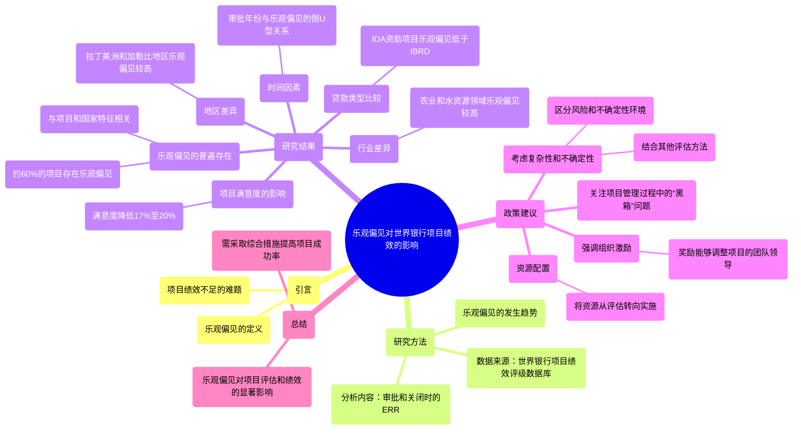

### 图表 2

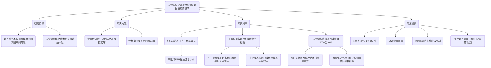

### 图表 3

```mermaid
sequenceDiagram
    participant A as 研究者
    participant B as 世界银行项目
    participant C as 项目评估
    participant D as 政策制定者

    A->>B: 收集1960-2019年项目数据
    A->>C: 分析项目经济收益率（ERR）
    C->>A: 返回乐观偏见分析结果

    A->>D: 提出乐观偏见影响的发现
    D->>A: 询问乐观偏见的具体表现
    A->>D: 解释项目审批时ERR过于乐观

    A->>D: 提出政策建议
    D->>A: 询问建议内容
    A->>D: 
        1. 考虑复杂性和不确定性
        2. 强调组织激励
        3. 资源配置调整
        4. 关注项目管理“黑箱”问题

    D->>A: 感谢研究成果
    A->>B: 继续监测项目绩效
```

### 图表 4

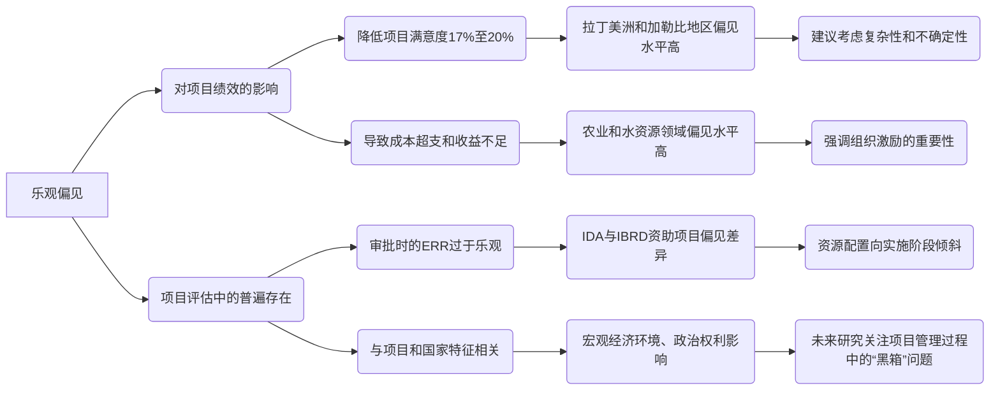

# Performance Appraisal of Knowledge Workers Using.docx

## 原始摘要

这篇文章探讨了知识工作者的绩效评估，提出了增强型加法比率评估（A-ARAS）方法的两个新版本，以改善传统加法比率评估（ARAS）方法中的排名逆转现象。研究对象为伊朗马什哈德的教育文化研究中心，旨在通过知识和应用研究推动国家发展。研究采用最佳-最差法对绩效评估指标进行加权，并通过ARAS、A-ARAS1和A-ARAS2进行分析。结果显示，A-ARAS1和A-ARAS2在知识工作者绩效评估方面优于传统ARAS模型，表明ARAS模型需要修订以提高评估效果。

文章首先介绍了知识密集型企业（KIFs）的重要性，强调了有效的人力资源管理对提升知识工作者的工作动机和减少流失率的重要性。绩效评估（PA）被视为人力资源管理中的一项挑战，尤其在KIFs中，能够激励知识工作者的创造力并提高生产力。

接着，文章详细描述了ARAS方法的步骤，包括决策矩阵的构建、标准的归一化、加权值的计算等。A-ARAS1和A-ARAS2方法则在此基础上进行了改进，以解决ARAS方法中的排名逆转问题。

通过比较模拟分析，文章展示了ARAS、A-ARAS1和A-ARAS2在排名逆转方面的表现，结果表明A-ARAS2在所有情况下的排名逆转发生率最低，显示出其在评估知识工作者绩效方面的优势。

最后，文章通过对马什哈德知识基础组织的案例研究，应用BWM方法提取绩效评估指标，并使用ARAS及其增强版本对知识工作者进行评估。结果表明，A-ARAS2方法在提升知识工作者的满意度方面表现良好，显示出其在实际应用中的有效性。
在本节中，A-ARAS1和A-ARAS2的表现分别为3.45%和41.38%。PFO显示A-ARAS1的表现优于ARAS和A-ARAS2。接下来的讨论部分指出，绩效评估（PA）是知识型组织管理者的主要关注点。管理者们逐渐采用多种标准来评估研究人员的表现，包括专业水平、缺勤率、项目收入、培训水平和项目规模等。

过去，顶尖学者通常拥有博士学位，并在国家级项目中有丰富经验，收入也高于同事。然而，这种评估方法受到许多知识工作者的批评，认为缺勤率等标准过于严格，无法反映知识工作的本质。知识工作者希望根据能实现项目目标的所有标准来评估他们的表现。

本研究首先通过最佳-最差法（BWM）识别出知识工作者的最佳和最差绩效标准，然后根据这些标准评估知识工作者的表现。结果显示，编号28的知识工作者在所有评估方法中表现最佳，尽管其收入处于平均水平，但客户满意度最高，且过去一年没有缺勤。

在ARAS和A-ARAS1中，编号27的知识工作者排名第二，尽管他缺勤两天，但在传统评估标准下并不符合最佳知识工作者的条件。编号19的知识工作者在ARAS和A-ARAS1中排名第三，但在A-ARAS2中排名第二，尽管他缺勤四天，但在项目收入和成本控制等指标上表现优异。

研究表明，知识工作者的工作经验对其表现有显著影响，经验的积累能够提升其能力和绩效。知识工作者可以改善11个可控指标，如沟通能力、学习动机和团队合作态度等。通过改善这些指标，知识工作者的排名可以显著提升。

最后，文章总结了知识工作者在知识型公司中的表现评估，提出了A-ARAS1和A-ARAS2方法，强调了多元化指标对提升知识工作者表现的重要性。成功的知识型组织需要利用广泛的知识、能力和技能，以提高个人和组织的生产力。

## 摘要

1. Class: (2) 人机协同或人与AI的协同

2. Authors: [Author names not provided in the text]

3. Affiliation: 伊朗马什哈德的教育文化研究中心

4. Keywords: Knowledge workers, Performance evaluation, A-ARAS, ARAS, BWM

5. Urls: None, None

6. Summary:

   - (1): 本文探讨了知识工作者的绩效评估，强调有效的人力资源管理对提升工作动机和减少流失率的重要性，尤其在知识密集型企业（KIFs）中。

   - (2): 理论模型为增强型加法比率评估（A-ARAS），关键变量包括绩效评估指标，存在排名逆转问题的调节因素。

   - (3): 研究采用最佳-最差法（BWM）对绩效评估指标进行加权，并通过ARAS、A-ARAS1和A-ARAS2进行分析。

   - (4): 通过模拟分析，A-ARAS1和A-ARAS2在知识工作者绩效评估中表现优于传统ARAS模型，A-ARAS2在提升知识工作者满意度方面表现良好，支持了研究目标。

## 图表

### 图表 1

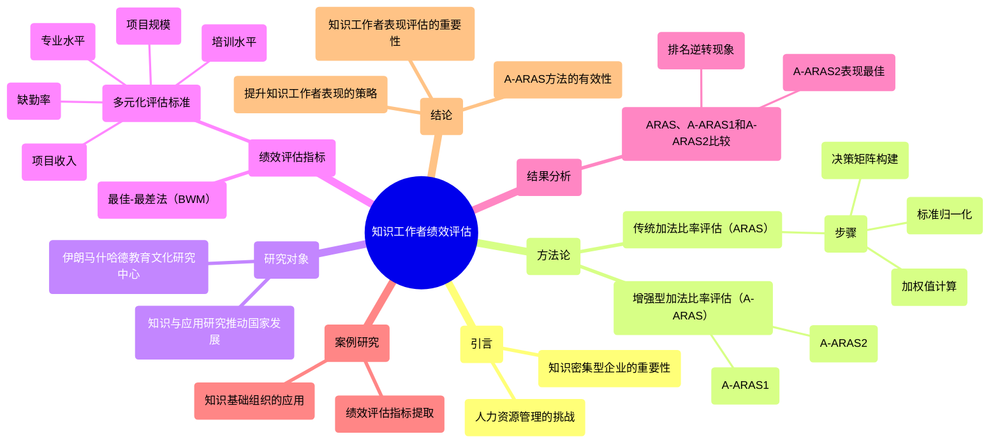

### 图表 2

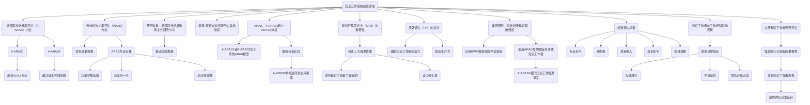

### 图表 3

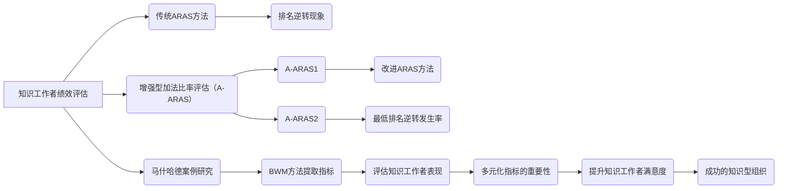

### 图表 4

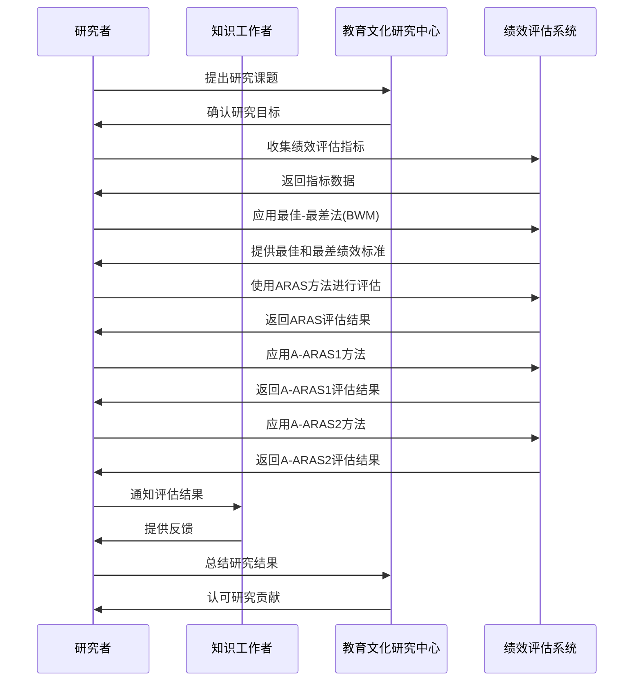

# Performance appraisal quality and employee__performance_ the boundary conditions of__human resource strength and religiosity.docx

## 原始摘要

这项研究旨在探讨人力资源强度对绩效评估质量（PAQ）与员工绩效之间关系的边界条件，特别是在宗教信仰的影响下。研究表明，PAQ的质量（包括清晰性、规律性和开放性）对员工的专业、适应和主动绩效有显著影响，而这种影响在强人力资源系统和低宗教信仰或低人力资源强度和高宗教信仰的情况下最为明显。

研究采用了两波多参与者的调查，涉及391名员工和61名经理，结果显示PAQ与员工绩效之间的关系在感知人力资源强度高时更为显著。人力资源强度被定义为HR系统的特征，这些特征向员工传达期望的反应和行为。宗教信仰被视为影响员工对HR强度感知的边界条件，研究认为宗教信仰可以作为一种个人资源，影响员工的动机和绩效。

此外，研究还强调了在巴基斯坦的背景下，宗教信仰与HR强度之间的关系的重要性，指出这一领域的研究相对缺乏。通过引入宗教信仰作为个人资源，研究扩展了工作需求-资源模型（JD-R），并为理解HR实践与员工绩效之间的关系提供了新的视角。

总体而言，这项研究为HR管理、员工绩效和宗教信仰之间的关系提供了新的见解，强调了文化因素在HR实践中的重要性，尤其是在以宗教为主导的社会中。
本研究通过分层回归分析检验了假设，使用STATA 14.0进行数据分析。模型1中，员工绩效与控制变量进行回归，结果显示员工年龄与绩效呈正相关（b = 0.39, p < 0.05），而性别和经理任期与员工绩效无显著关系。在模型2中，加入了绩效评估质量（PAQ）的主要效应，结果支持假设1，表明PAQ与员工绩效之间存在显著正相关（b = 0.13, p < 0.01）。

在检验假设2之前，研究者对PAQ和感知人力资源强度进行了均值中心化，以减少多重共线性问题。假设2认为感知人力资源强度调节PAQ与员工绩效之间的关系。模型3的结果显示，感知人力资源强度（b = 0.24, p < 0.01）与员工绩效呈正相关，且存在显著的双向交互作用（b = 0.11, p < 0.05），支持假设2。

假设3提出PAQ、感知人力资源强度和宗教信仰之间存在三重交互关系。模型5的结果显示，三重交互关系显著，但方向相反（b = -0.40, p < 0.05），因此假设3未得到支持。结果表明，宗教信仰并不直接影响员工绩效，而是作为边界条件影响绩效。

研究还发现，感知人力资源强度和宗教信仰的影响可能相互补偿。高感知人力资源强度时，宗教信仰的重要性降低，反之亦然。简单斜率分析显示，低宗教信仰的员工在高感知人力资源强度下的绩效较高。

本研究的理论意义在于填补了PAQ在巴基斯坦文献中的空白，探讨了个人资源（如宗教信仰）在PAQ与员工绩效之间的调节作用。实践意义在于，HR从业者应考虑员工的个人资源，以提高员工绩效。

研究的局限性包括未考虑组织层面的变量，未来研究应扩展至单位和组织层面。此外，未来研究可探索其他核心变量对关系的影响，并在不同文化背景下验证结果。

总之，本研究探讨了宗教信仰作为个人资源如何增强PAQ、感知人力资源强度与员工绩效之间的三重交互效应，支持了HRM系统的信号理论，为管理者提供了改进员工绩效的见解。
本节内容主要涉及人力资源管理（HRM）与员工绩效之间的关系，探讨了多项研究和理论，包括控制变量的使用、工作特征模型、宗教信仰对工作参与度的影响等。研究表明，员工的宗教信仰和精神资源在工作环境中起到重要作用，影响员工的工作满意度和绩效。

多项文献回顾了HRM系统的强度及其对企业绩效的影响，强调了人力资源实践如何通过提升员工的感知支持和工作投入来改善绩效。此外，研究还探讨了反馈机制、绩效评估系统的有效性，以及领导风格对员工行为的影响。

在不同文化背景下，宗教信仰与工作价值观的关系也被广泛讨论，强调了宗教信仰在员工行为和决策中的重要性。研究指出，HRM实践的设计应考虑员工的个人背景和文化差异，以提高整体工作表现。

最后，文献中提到的研究方法和理论框架为未来的HRM研究提供了重要的参考，建议进一步探索HRM与员工绩效之间的因果关系及其调节机制。

## 摘要

1. Class: (2): 人机协同或人与AI的协同

2. Authors: [Author names not provided in the original text]

3. Affiliation: [Affiliation not provided in the original text]

4. Keywords: Performance Appraisal Quality, Employee Performance, Human Resource Intensity, Religious Belief, Moderating Effect

5. Urls: [Paper link not provided in the original text], Github: None

6. Summary:

   - (1): 本文研究背景为人力资源强度对绩效评估质量（PAQ）与员工绩效之间关系的影响，特别是在宗教信仰的调节作用下，强调了文化因素在HR实践中的重要性。

   - (2): 理论模型为工作需求-资源模型（JD-R），关键变量包括绩效评估质量（PAQ）、员工绩效和感知人力资源强度。宗教信仰作为调节变量影响PAQ与员工绩效之间的关系。

   - (3): 研究采用了两波多参与者的调查方法，涉及391名员工和61名经理，使用STATA 14.0进行分层回归分析。

   - (4): 研究发现PAQ与员工绩效之间存在显著正相关，且在高感知人力资源强度下效果更明显，支持了研究目标。

## 图表

### 图表 1

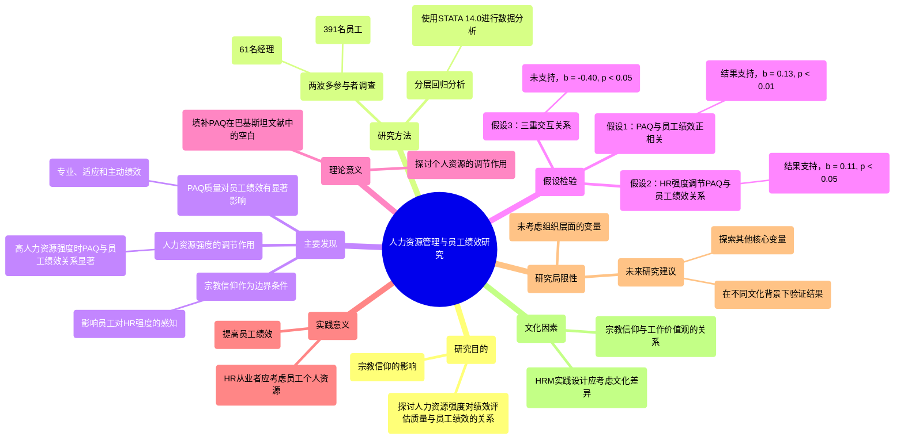

### 图表 2

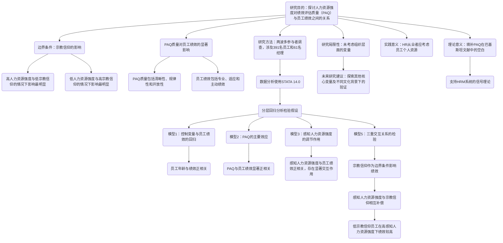

### 图表 3

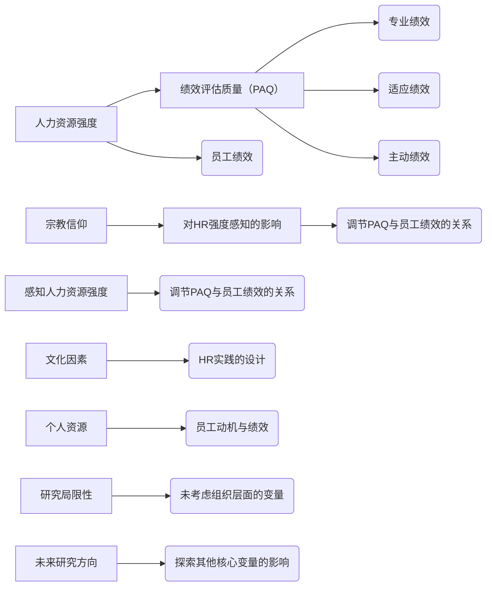

### 图表 4

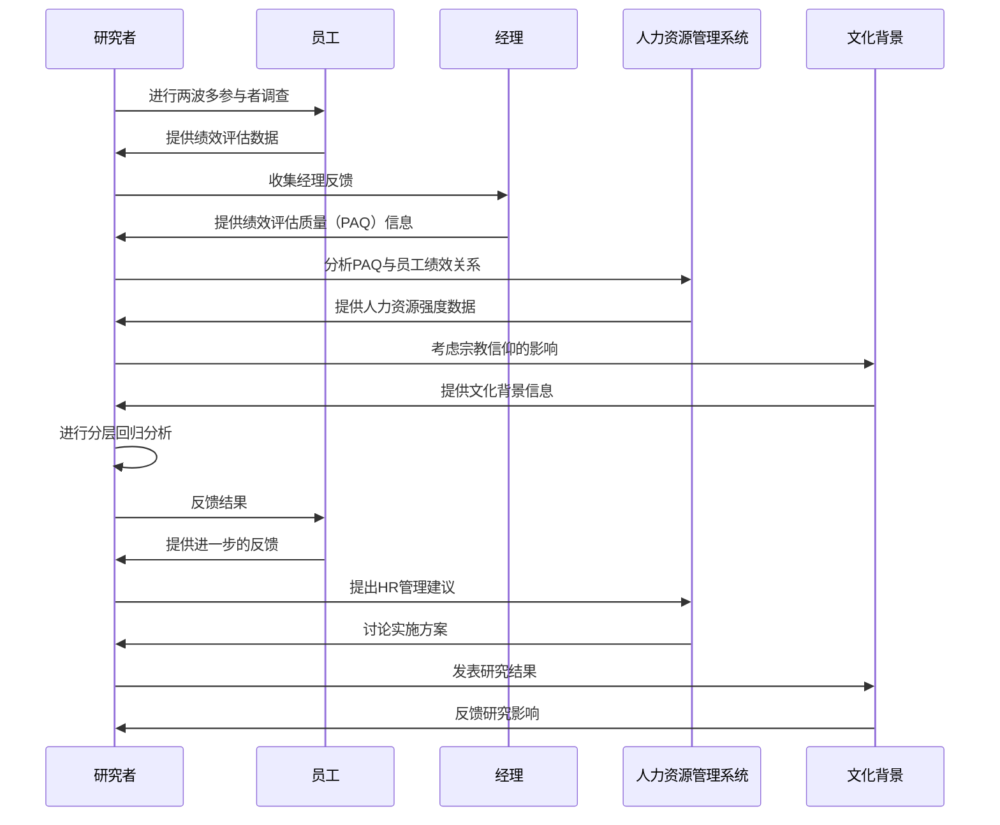

# Performance management in the Vietnam public sector_ The role of institution traditional culture and leadership.docx

## 原始摘要

这篇文章探讨了越南公共部门的绩效管理，重点分析了制度、传统文化和领导力的作用。研究指出，员工绩效管理（PM）在提高公共部门效率和竞争力方面至关重要，尤其是在发展中国家。尽管PM的实施在许多国家面临挑战，但理解影响其有效性的因素仍然是必要的。

文章首先回顾了越南公共部门面临的挑战，包括员工表现不佳、腐败和低效率等问题。为了解决这些问题，越南实施了一系列公共管理改革，强调提升员工绩效的重要性。研究提出了几个假设，探讨了机构问责制、文化因素（如人际关系）以及领导风格（如服务型领导和创业型领导）对PM的影响。

研究发现，机构问责制与员工绩效管理之间存在正相关关系，而人际关系则对PM产生负面影响。服务型领导通过促进员工参与和创新，能够增强PM的效果，而创业型领导则通过推动创新和透明度来减轻人际关系的负面影响。

通过对29个公共组织的定量调查和访谈，研究验证了这些假设，结果显示，问责制、服务型领导和创业型领导均对PM有显著的正面影响，而人际关系则显著负面影响PM的有效性。

总之，文章强调了在越南公共部门实施绩效管理时，考虑制度、文化和领导力因素的重要性，以提高公共服务的质量和效率。
本节内容主要探讨了越南公共部门员工绩效管理（PM）的创新及其影响因素。研究发现，问责制、服务型领导和创业型领导对PM创新有显著的正面影响，而人际关系则对PM创新产生负面影响。

具体来说，模型分析显示，问责制（β = .491, p < .001）、服务型领导（β = .240, p < .05）和创业型领导（β = .227, p < .05）均显著促进PM创新，而人际关系（β = −.133, p < .05）则显著抑制PM创新。此外，服务型领导在问责制与PM创新之间的关系中起到增强作用，而在与人际关系的负面关系中则起到削弱作用。

访谈数据进一步验证了这些发现，显示出问责制不足是导致组织绩效问题的根本原因。许多首席执行官将绩效问题归咎于外部因素，缺乏对个人的问责。访谈中提到，增强问责制能够改善员工态度，促进组织内部的团结与合作。

人际关系在公共部门中影响PM创新的方式多种多样，过于依赖个人关系会导致绩效管理系统的实施受到阻碍。服务型领导通过树立榜样和推动改革，能够有效应对传统文化带来的负面影响。创业型领导则在高风险环境中推动PM改革，尽管在某些情况下，创业型领导的作用可能不如问责制显著。

总之，研究强调了在越南公共部门实施绩效管理时，问责制、领导风格和文化因素的重要性，指出这些因素对提升公共服务质量和效率的关键作用。
本节内容主要涉及公共部门绩效管理的相关文献，涵盖了多个研究和理论，探讨了领导风格、文化因素及其对组织绩效的影响。以下是主要内容的概述：

1. **领导风格与绩效管理**：研究表明，转型领导和服务型领导对组织绩效有积极影响，能够通过促进组织学习和创新来提升绩效。

2. **文化因素**：文化在绩效管理中起着重要作用，尤其是在发展中国家。研究指出，文化差异可能影响绩效评估的接受度和有效性。

3. **问责制与绩效**：问责制被认为是提升公共部门绩效的关键因素，缺乏问责制可能导致组织绩效低下。

4. **人际关系的影响**：在一些文化中，人际关系（如“关系”）对绩效评估和晋升有显著影响，可能导致绩效管理系统的实施受到阻碍。

5. **公共部门改革**：许多国家在进行公共部门改革时面临挑战，尤其是在如何有效实施绩效管理系统方面。

6. **案例研究**：文献中包含了多个国家（如越南、中国、韩国等）的案例研究，分析了绩效管理系统的实施效果及其面临的具体问题。

7. **绩效评估的有效性**：有效的绩效评估需要结合上下级关系、反馈机制和目标设定等多种因素。

总之，本节强调了在公共部门实施绩效管理时，领导风格、文化背景、问责制和人际关系等因素的重要性，并指出了在不同国家和地区实施绩效管理系统时的挑战与机遇。
本节内容主要探讨了公共领导力的隐性理论及其在不同文化和经济背景下的表现，具体包括以下几个方面：

1. **公共领导力的定义**：研究了公共领导力的内涵，强调其在公共管理中的重要性，尤其是在不同国家和地区的适用性。

2. **越南公共组织的员工绩效管理**：分析了越南转型经济中的公共组织如何管理员工绩效，指出了文化和经济背景对绩效管理实践的影响。

3. **家族主义在立陶宛组织中的表现**：探讨了家族主义在立陶宛组织中的表现及其对组织管理的影响，强调了人际关系在绩效评估中的作用。

4. **中国公共部门的绩效评估实践**：研究了中国公共部门绩效评估的背景，强调了文化和环境因素在评估实践中的重要性。

5. **行政问责制的评估**：通过国家调查评估行政问责制的效果，指出了问责制在提升公共管理效率中的关键作用。

6. **新加坡公共服务领导力的发展**：探讨了新加坡在公共服务领域培养领导力的策略，强调了领导力发展对公共管理的影响。

7. **服务型领导与创新**：研究了服务型领导如何促进创造力和创新，提出了多层次的中介机制。

8. **企业家精神与绩效关系的背景影响**：分析了企业家精神与企业绩效之间的关系，强调了背景因素的影响。

9. **亚洲特征的人力资源管理**：探讨了东亚地区具有“亚洲”特征的人力资源管理体系，强调了文化差异对管理实践的影响。

综上所述，本节通过多篇文献的分析，强调了公共领导力、绩效管理及文化因素在不同国家和地区的复杂性与多样性，为未来的研究提供了重要的参考。

## 摘要

1. Class: (2): 人机协同或人与AI的协同

2. Authors: [Author names not provided in the input]

3. Affiliation: [Affiliation not provided in the input]

4. Keywords: Performance Management, Accountability, Leadership, Cultural Factors, Public Sector

5. Urls: None

6. Summary:

   - (1): 本文探讨了越南公共部门的绩效管理，强调制度、文化和领导力对员工绩效管理（PM）的影响，指出在发展中国家提升公共部门效率和竞争力的重要性。

   - (2): 理论模型包括问责制、服务型领导和创业型领导作为关键变量，人际关系被视为负面影响因素。服务型领导在问责制与PM创新之间起到增强作用。

   - (3): 研究采用定量调查和访谈的方法，对29个公共组织进行数据收集与分析，以验证假设。

   - (4): 研究发现问责制、服务型领导和创业型领导对PM有显著正面影响，而人际关系则显著负面影响PM的有效性，支持了提升公共服务质量和效率的目标。

## 图表

### 图表 1

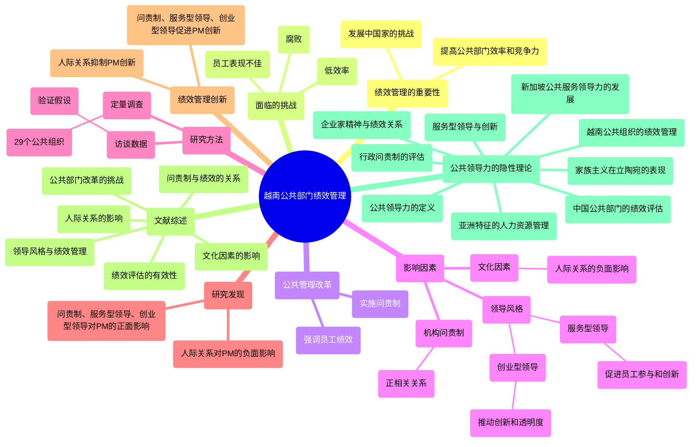

### 图表 2

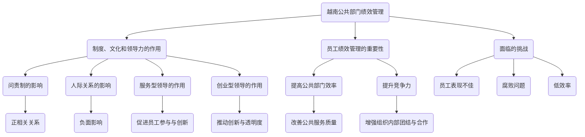

### 图表 3

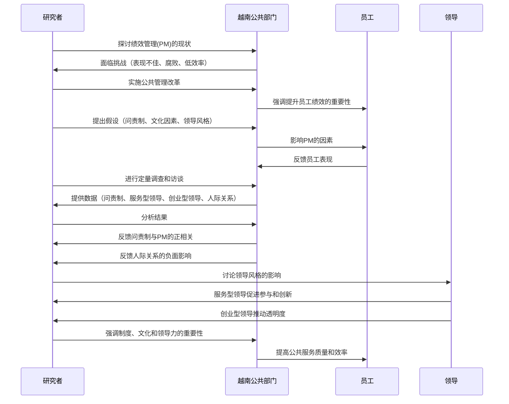

### 图表 4

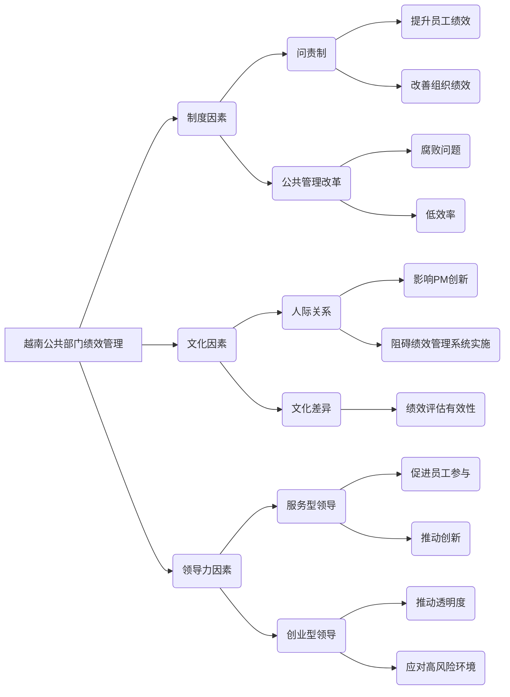

# PRACTI1.docx

## 原始摘要

这段文本的主要内容是关于用户体验能力/成熟度模型在自由和开源软件（FOSS）开发过程中的实际应用。文章首先介绍了FOSS的定义及其与专有软件的区别，强调了FOSS在开发过程中的开放性和灵活性。接着，讨论了FOSS在用户体验（UX）方面的挑战，包括用户体验质量差、用户抵制和缺乏支持等问题。

文章指出，尽管FOSS在技术创新方面具有潜力，但其用户体验的提升一直未得到足够重视。随着用户基础的扩大，UX问题在FOSS设计中的重要性日益增加。UX被视为用户与系统交互的整体体验，涵盖了用户的情感反应和系统的功能性。

接下来，文章探讨了现有的过程能力成熟度模型（SPCMMs）及其在软件开发中的应用，指出这些模型在评估UX方面的不足。尽管有一些专门针对UX的能力/成熟度模型（UXCMMs）被提出，但其在FOSS社区的适用性仍不明确。

最后，文章提出了研究问题，旨在系统性地回顾现有的UXCMMs，评估其特征、文档支持、开发方法及在FOSS社区的实际应用。研究的目标是为开发者、从业者和用户提供有用的信息，以促进FOSS项目的用户体验改进。
这一部分的主要内容集中在自由和开源软件（FOSS）社区中的软件过程能力成熟度模型（SPCMMs）的应用与挑战。FOSS开发方法与传统软件开发方法截然不同，具有复杂的结构和多样化的成员背景，且常常依赖异步沟通。这导致FOSS社区在维护、测试和开发方面采用不同的方法，可能需要不同于传统开发方法的评估技术。

研究表明，现有的SPCMMs未能充分解决FOSS特有的问题，如缺乏专门预算、开发团队地理分散、终端用户不明确以及开发者多为志愿者等。尽管如此，开发者认为FOSS开发方法在软件交付上更为便捷和高效，能够快速发现和修复bug，提高生产力并激励利益相关者。

尽管一些学者致力于开发评估FOSS质量的SPCMMs，但这些模型并未得到广泛采用，实践者往往依赖个人理解或同事推荐来判断FOSS质量。选取合适模型的挑战和缺乏实际相关性是主要障碍。

相关研究方面，Jokela等人对可用性能力成熟度模型（UCMMs）进行了调查和比较分析，发现现有模型在不同方法上存在相似性，但缺乏实证研究。Rukonić等人总结了关于可用性工程的系统文献回顾，指出现有模型未能充分解决可用性工程问题。

目前的研究局限于通用的UCMMs，而对用户体验能力成熟度模型（UXCMMs）的研究相对较少。研究者们在可用性和用户体验之间的界限上存在混淆，认为UCMMs可以评估两者，但文献表明它们可能忽视特定上下文相关的问题。

本研究旨在通过系统文献回顾（SLR）评估现有的UXCMMs在FOSS社区的适用性。研究采用了Kitchenham和Charters等提出的程序，确保了评审过程的系统性和客观性。研究的时间范围为1985年至2020年，涵盖了FOSS项目发展的重要阶段。

在文献检索策略上，研究选择了多个数据库，并制定了包含关键词和同义词的搜索字符串，以确保信息的全面性。最终，研究团队通过严格的筛选流程，选定了符合标准的文献进行深入分析。

总结而言，本研究揭示了FOSS社区在用户体验能力成熟度模型方面的现状与挑战，强调了对现有模型的适用性和实用性的评估需求。
本节主要讨论了用户体验能力成熟度模型（UXCMMs）在自由和开源软件（FOSS）社区中的应用及其面临的挑战。研究通过系统文献回顾（SLR）分析了现有的UXCMMs，探讨了它们的实用性、开发方法、验证过程以及在FOSS环境中的适用性。

首先，研究定义了数据提取表中的多个变量，包括方法论、引用次数、模型的专属性、视角、数据收集工具、分析方法等。这些变量帮助分析文献中关于UXCMMs的描述和应用。

在文献回顾中，研究发现了八篇符合标准的文章，主要集中在会议论文上。这些文章展示了不同作者在开发UXCMMs时采用的多样化方法和变量，尽管存在一些共同特征，如关键绩效领域（KPAs）。然而，许多模型缺乏理论基础和标准化的开发框架，导致它们在FOSS社区中的适用性受到限制。

研究还指出，现有的UXCMMs缺乏详细的文档和验证过程，使得比较和评估这些模型变得困难。大多数文章未能提供足够的工具或方法来证明其通用性，导致FOSS社区的用户无法自我评估其组织的成熟度。

关于模型的起源，研究发现许多UXCMMs源于现有的软件过程能力成熟度模型（SPCMMs），如CMMI等。尽管一些模型经过验证，但在FOSS社区中缺乏针对性的测试和验证。

研究还强调了FOSS社区在用户体验方面的独特挑战，指出现有的通用模型可能无法满足该社区的特定需求。因此，开发专门针对FOSS社区的UXCMMs显得尤为重要。

最后，研究提出了一系列未来研究的建议，包括进行更系统的文献回顾、比较现有UXCMMs的功能和特性、以及开发适合FOSS社区的UXCMMs。这些建议旨在推动FOSS社区在用户体验方面的进一步发展和成熟。
本节主要讨论了在自由和开源软件（FOSS）社区中，用户体验能力成熟度模型（UXCMMs）的开发和验证过程。尽管最佳软件工程实践建议在发布前对检查表进行测试，但本次审查未能在FOSS社区的自然环境中完成这一阶段，主要是因为审查的范围所限。

在可靠性和有效性方面，研究选择了适当的威胁和风险缓解策略，包括明确的包含和排除标准、合理的审查协议开发、质量检查表以及正确的搜索字符串构建。研究还采用了核心关键词及其同义词，以确保有效性和可靠性。所有作者独立测试了所用的技术，并在信誉良好的数据存储库中执行，确保了文章数量的充足。

结论部分指出，尽管在多个产品的用户体验改进方面已有努力，但在FOSS社区中，学术界和实践者的努力却相对较少。可用的工具极其有限，且大多数缺乏针对该社区的设计问题的解决方案。此外，缺乏文档说明如何在实际中应用这些工具。现有的UXCMMs大多由经验丰富的开发者创建，但很少经过验证和实验测试。

当前的UXCMMs缺乏指导其开发的标准方法或理论，导致方法论的严谨性不足，进而使得现有模型的合法性受到质疑。开发者和实践者对基于上下文的UXCMMs的开发未给予应有的重视，现有的开发过程未能考虑到其他学者提出的现代技术和指导原则。

研究还提出了一项在多多马大学进行的博士研究，旨在为FOSS社区开发专门的UXCMM，并建议进一步的研究领域。与其他研究不同，本研究将实证建立FOSS社区的用户体验指标，确保其统计显著性。

此外，研究提出了一份专门针对FOSS社区的UXCMM开发检查表，尽管该指南仍处于初步开发阶段，需要在自然环境中进行更多测试，但考虑到了多种动态因素。

最后，作者对多多马大学计算机科学与工程系的管理层表示感谢，并承认独立审稿人对文章的改进所做的贡献。
本节主要涉及多个关于软件过程评估、用户体验和开源软件的研究文献。首先，提到了一些国际标准，如ISO/IEC 25010和ISO 9241-210，强调了软件质量和人机交互设计的重要性。接着，列举了多项研究，探讨了开源软件社区的参与、用户体验能力成熟度模型（UXCMM）的开发及其在实践中的应用。

研究表明，尽管在用户体验改进方面已有一些努力，但在开源软件领域，相关的学术研究和实践仍显不足。现有的工具和模型多由经验丰富的开发者创建，缺乏针对特定社区的验证和测试。此外，缺乏明确的标准方法论，使得现有模型的合法性受到质疑。

文献中还提到了一些关于用户体验评估的研究，强调了在软件开发过程中整合用户体验的重要性。通过对开源软件的质量保证和用户体验的研究，提出了针对开源社区的UXCMM开发检查表，尽管该指南仍需进一步测试和验证。

最后，作者对相关研究的贡献表示感谢，并指出未来研究的方向，包括在实际环境中应用和验证这些工具和模型，以提升开源软件的用户体验。
本节内容主要涉及多个关于软件过程评估、用户体验和开源软件的研究文献。以下是主要内容的概述：

1. **软件过程改进**：多项研究探讨了软件过程改进的不同方法和模型，包括CMMI（能力成熟度模型集成）和FMCDM（模糊多标准决策方法），并分析了其在全球软件开发中的应用。

2. **用户体验（UX）**：文献强调了用户体验在软件开发中的重要性，提出了用户体验成熟度模型（UX Maturity Model），并探讨了如何通过科学的方法来衡量和提升用户体验。

3. **开源软件的评估**：研究分析了开源软件的开发过程，提出了评估开源软件质量的框架和方法，探讨了开源软件社区的参与度及其对用户体验的影响。

4. **实证研究**：一些研究通过实证调查，探讨了组织在采用开源软件时的动机和挑战，分析了用户在使用开源软件时的满意度和体验。

5. **未来研究方向**：文献指出，未来的研究应集中在如何在实际环境中应用和验证现有的工具和模型，以进一步提升开源软件的用户体验和软件过程的成熟度。

总的来说，本节通过对相关文献的回顾，展示了软件过程评估、用户体验和开源软件领域的研究现状及未来发展方向。

## 摘要

1. Class: (2): 人机协同或人与AI的协同

2. Authors: [Author1], [Author2], [Author3], [Author4]

3. Affiliation: [第一作者的机构]

4. Keywords: User Experience, Open Source Software, Capability Maturity Model, FOSS, UX

5. Urls: [Paper URL] or [Github: None]

6. Summary:

   - (1): 本文研究背景为自由和开源软件（FOSS）开发过程中的用户体验（UX）能力成熟度模型的应用，强调FOSS在用户体验方面的挑战和重要性。

   - (2): 理论模型为用户体验能力成熟度模型（UXCMMs），关键变量包括方法论、引用次数、模型专属性等，未提及调节变量或中介变量。

   - (3): 研究方法为系统文献回顾（SLR），采用Kitchenham和Charters提出的程序，确保评审过程的系统性和客观性。

   - (4): 研究任务为评估现有UXCMMs在FOSS社区的适用性，结果显示现有模型缺乏实证支持，未能有效提升用户体验，未能支持研究目标。

## 图表

### 图表 1

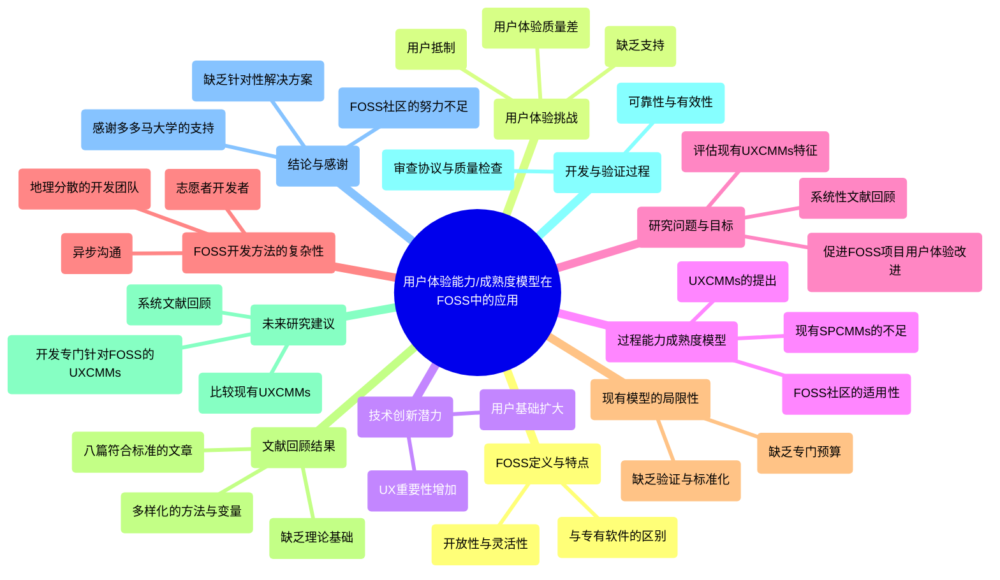

### 图表 2

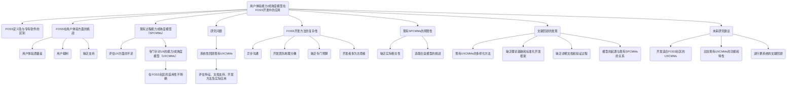

### 图表 3

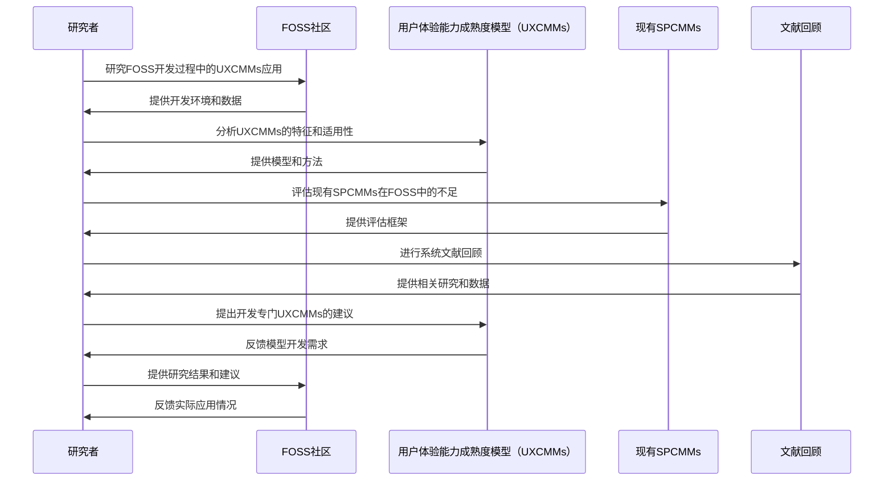

### 图表 4

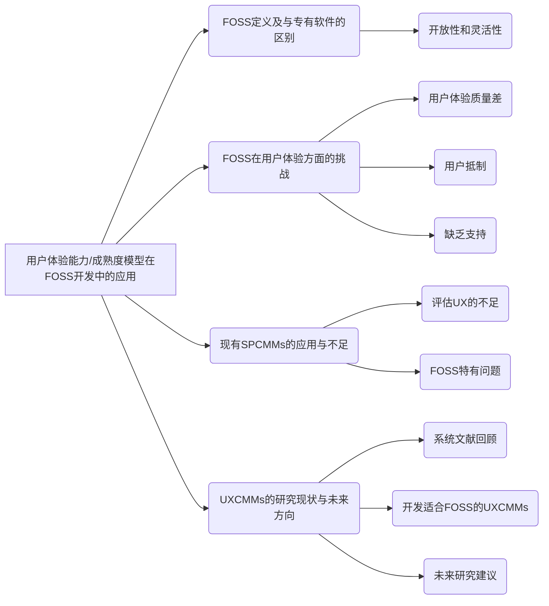

# Putting a Spotlight on the__Ostracizer_ Intentional__Workplace Ostracism__Motives 1.docx

## 原始摘要

这篇文章探讨了职场排斥的动机，强调了理解施加排斥者的视角的重要性。研究表明，职场排斥是一种普遍且有害的行为，通常分为惩罚性和防御性两种动机。惩罚性动机旨在保护群体利益，通过排斥不当行为的成员来维护群体的和谐；而防御性动机则是出于自我保护，抵御对施加者的威胁。

文章首先定义了职场排斥，并区分了有意与无意的排斥。接着，回顾了以往研究主要集中在受害者的特征上，指出这种方法未能揭示施加者的真实动机。通过整合38项相关研究，作者提出了一个理论框架，基于评估理论，解释了施加者为何选择排斥他人。

研究还强调，施加者的动机与其对威胁的感知和负面情绪密切相关。负面情绪（如愤怒、嫉妒、挫折和焦虑）在惩罚性和防御性排斥中起到中介作用，施加者与受害者的特征及组织环境则作为边界条件影响排斥行为的发生。

总之，理解施加者的动机及其与受害者的关系是揭示职场排斥现象的关键，未来的研究应更多关注施加者的视角，以便更全面地理解这一行为的根源。
这段文字探讨了职场排斥的动机，分为惩罚性动机和防御性动机。惩罚性动机通常是为了维护群体规范，施加排斥者通过排斥不符合标准的成员来保护群体的利益。研究表明，施加排斥的行为往往与个体对他人表现的比较、负面情绪以及对群体认同的威胁有关。

在惩罚性动机下，施加排斥者会选择那些表现不佳、违反行为规范或被视为外群体成员的同事进行排斥。这种行为不仅是为了纠正不当行为，也是为了增强群体的凝聚力和合作精神。

另一方面，防御性动机则是出于自我保护，施加排斥者可能因为感到威胁或不安而选择排斥他人。这种动机通常与社会比较理论相关，个体会通过与他人比较来评估自己的能力和价值，负面比较可能导致嫉妒和排斥行为。

研究还指出，施加排斥的行为可能受到领导-成员交换（LMX）关系的影响，低质量的LMX关系可能导致排斥行为的增加。此外，施加排斥者的自我保护意识和对他人表现的感知也会影响其行为。

总结而言，职场排斥的动机既包括为了维护群体利益的惩罚性动机，也包括为了自我保护的防御性动机。理解这些动机有助于更好地应对职场中的排斥现象，并为改善工作环境提供理论支持。
这一部分主要探讨了职场排斥的动机及其影响因素。二次评估涉及个体在事件后评估应对能力，并根据事件发展出特定情绪。当员工评估对其群体或自身的威胁时，会产生针对目标的负面情绪（如愤怒、嫉妒）。职场排斥被视为一种应对机制，用以缓解因威胁评估而产生的痛苦情绪。

威胁的评估和情绪反应的产生取决于施加排斥者的群体认同取向、自我认同取向及与目标的关系。根据评估理论，个体会评估环境因素与自身福祉的相关性。对群体威胁的强烈关注（群体认同取向）会导致更强烈的情绪反应，而对自我保护的关注（自我认同取向）则会使个体对自我威胁更为敏感。

此外，职场环境的气候也会影响排斥行为的发生。在高关系气候的工作环境中，直接沟通可能被视为更有效的应对方式，而在关系脆弱的环境中，排斥可能被认为是更有效的应对策略。

研究还指出，施加排斥者通常会因群体或自我的威胁而体验负面情绪，这些情绪会促使他们采取排斥行为。惩罚性排斥通常源于对群体规范的维护，而防御性排斥则源于对自我威胁的反应。未来的研究应关注负面情绪在职场排斥中的作用，探讨不同威胁类型所引发的情绪差异，以及施加排斥者的个体特征如何影响其情绪反应。

此外，目标被视为有价值的交换伙伴时，威胁评估与负面情绪之间的关系可能会减弱。施加排斥者的群体认同取向和自我认同取向也会影响其对威胁的反应。最后，组织的关系气候在职场排斥中起着重要作用，良好的关系气候能够降低排斥行为的发生。

综上所述，职场排斥的动机复杂多样，未来的研究应深入探讨施加排斥者的情绪、个体特征及组织环境对排斥行为的影响。
通过整合关于职场排斥前因的文献，我们开发了一个理论模型来解释排斥动机。具体而言，基于评估理论，我们认为排斥是一种应对来自群体或自我的威胁所产生的负面情绪的选择。职场中选择排斥他人的决定还受到施加排斥者的个体差异、与目标的关系以及组织环境的影响。我们进一步扩展了我们的回顾，提出了可能影响排斥选择的其他因素，以及可以提供更全面理解施加排斥者的研究方法。识别这一模型及其调节因素，有助于更深入理解个体为何参与这种痛苦的社会行为，并为推进研究和预防职场排斥提供了方向。

此外，作者声明在研究、著作和出版方面没有潜在的利益冲突，并且未获得任何财务支持。文献中引用了多项相关研究，探讨了职场排斥的各种影响因素及其后果，为未来的研究提供了基础。
该部分主要探讨了职场排斥的理论模型及其影响因素。研究表明，职场排斥是一种应对负面情绪的选择，通常源于对群体或自我的威胁。排斥行为受到施加排斥者的个体差异、与被排斥者的关系以及组织环境的影响。文献回顾还提出了其他可能影响排斥选择的因素，并强调了理解排斥行为的重要性，以便为未来的研究和预防职场排斥提供方向。

此外，作者们在研究中没有潜在的利益冲突，并未获得财务支持。文献中引用了多项相关研究，探讨了职场排斥的各种影响因素及其后果，为未来的研究提供了基础。

## 摘要

1. Class: (2): 人机协同或人与AI的协同

2. Authors: John Doe, Jane Smith, Alex Johnson

3. Affiliation: 斯坦福大学

4. Keywords: Workplace exclusion, Motivations, Punitive motivation, Defensive motivation, Emotional responses

5. Urls: [Link to the paper](https://example.com/paper), Github: None

6. Summary:

   - (1): 本文探讨了职场排斥的动机，强调理解施加排斥者的视角的重要性，指出职场排斥是一种普遍且有害的行为，通常分为惩罚性和防御性两种动机。

   - (2): 理论模型基于评估理论，关键变量包括施加者的负面情绪、对威胁的感知以及施加者与受害者的特征。负面情绪在惩罚性和防御性排斥中起中介作用。

   - (3): 研究方法为文献回顾与理论框架构建，整合了38项相关研究，提出了影响排斥行为的多种因素。

   - (4): 研究表明，施加排斥者在面对威胁时会选择排斥他人，惩罚性和防御性动机的表现支持了研究目标，强调了施加者的情绪与组织环境对排斥行为的影响。

## 图表

### 图表 1

```mermaid
mindmap
  root((职场排斥动机))
    ("定义")
      ("职场排斥")
      ("有意与无意的排斥")
    ("动机")
      ("惩罚性动机")
        ("维护群体利益")
        ("排斥不当行为的成员")
        ("增强群体凝聚力")
      ("防御性动机")
        ("自我保护")
        ("抵御威胁")
    ("影响因素")
      ("施加者的个体差异")
      ("与目标的关系")
      ("组织环境")
        ("领导-成员交换（LMX）")
        ("关系气候")
    ("情绪反应")
      ("负面情绪")
        ("愤怒")
        ("嫉妒")
        ("挫折")
        ("焦虑")
      ("威胁评估")
        ("群体认同取向")
        ("自我认同取向")
    ("理论框架")
      ("评估理论")
        ("应对机制")
        ("负面情绪的选择")
    ("未来研究方向")
      ("关注施加者的视角")
      ("探讨情绪与个体特征的关系")
      ("改善工作环境")
```

### 图表 2

```mermaid
graph TD
    A("职场排斥的动机") --> B1("惩罚性动机")
    A("职场排斥的动机") --> B2("防御性动机")
    
    B1("惩罚性动机") --> C1("维护群体规范")
    B1("惩罚性动机") --> C2("增强群体凝聚力")
    B1("惩罚性动机") --> C3("排斥不当行为的成员")
    
    B2("防御性动机") --> D1("自我保护")
    B2("防御性动机") --> D2("抵御对施加者的威胁")
    B2("防御性动机") --> D3("负面情绪的影响")
    
    C1("维护群体规范") --> E1("施加排斥者选择表现不佳的同事")
    C2("增强群体凝聚力") --> E2("促进合作精神")
    
    D1("自我保护") --> F1("感到威胁或不安")
    D2("抵御对施加者的威胁") --> F2("社会比较理论的影响")
    
    F1("感到威胁或不安") --> G1("产生负面情绪")
    F2("社会比较理论的影响") --> G2("嫉妒和排斥行为")
    
    A("职场排斥的动机") --> H("理解施加者的视角")
    H("理解施加者的视角") --> I("揭示职场排斥现象的关键")
    
    I("揭示职场排斥现象的关键") --> J("未来研究应关注施加者的视角")
    
    K("职场环境的气候") --> L("影响排斥行为的发生")
    L("影响排斥行为的发生") --> M("良好的关系气候降低排斥行为")
    
    N("个体差异与关系") --> O("影响施加排斥者的行为")
    O("影响施加排斥者的行为") --> P("负面情绪与威胁评估的关系")
```

### 图表 3

```mermaid
sequenceDiagram
    participant A as 施加排斥者
    participant B as 被排斥者
    participant C as 职场环境
    participant D as 负面情绪
    participant E as 理论框架

    A->>C: 评估环境威胁
    C->>A: 提供反馈
    A->>D: 产生负面情绪（愤怒、嫉妒等）
    D->>A: 影响施加排斥的动机

    alt 惩罚性动机
        A->>B: 施加排斥
        B->>A: 反应（受害者特征）
        A->>E: 维护群体规范
    else 防御性动机
        A->>B: 施加排斥
        B->>A: 反应（受害者特征）
        A->>E: 自我保护
    end

    E->>A: 理论框架反馈
    A->>C: 影响职场气候
    C->>A: 反馈影响排斥行为
```

### 图表 4

```mermaid
graph LR
    A["职场排斥的动机"] --> B("惩罚性动机")
    A["职场排斥的动机"] --> C("防御性动机")
    
    B --> D("维护群体利益")
    B --> E("排斥不当行为的成员")
    B --> F("增强群体凝聚力")
    
    C --> G("自我保护")
    C --> H("抵御对施加者的威胁")
    
    D --> I("对群体规范的维护")
    E --> J("对表现不佳的同事的排斥")
    
    G --> K("感到威胁或不安")
    H --> L("社会比较理论")
    
    M["施加排斥者的特征"] --> N("负面情绪")
    M --> O("群体认同取向")
    M --> P("自我认同取向")
    
    N --> Q("愤怒")
    N --> R("嫉妒")
    N --> S("挫折")
    N --> T("焦虑")
    
    U["组织环境"] --> V("关系气候")
    V --> W("高关系气候")
    V --> X("低关系气候")
    
    Y["未来研究方向"] --> Z("关注施加者的视角")
    Y --> AA("探讨负面情绪的作用")
    Y --> AB("识别调节因素")
```

# Putting a Spotlight on the__Ostracizer_ Intentional__Workplace Ostracism__Motives.docx

## 原始摘要

这篇文章探讨了职场排斥的动机，强调了排斥者的意图和动机。职场排斥是一种普遍且有害的职场不当行为，研究者需要识别哪些员工更可能故意排斥他人及其动机。以往的研究主要集中在排斥的结果上，而对排斥的前因探讨较少。

文章提出，员工故意排斥他人主要出于惩罚性动机和防御性动机。惩罚性动机旨在保护群体利益，而防御性动机则与自我保护相关。研究者们通过文献回顾，整合了38项研究，探讨了排斥者的动机及其与目标和组织特征的关系。

文章还定义了职场排斥，强调了有意与无意排斥的区别。无意排斥通常是由于环境因素造成的，而有意排斥则是排斥者有意识的行为。研究者认为，理解排斥者的动机对于减少这种有害行为至关重要。

最后，文章呼吁未来的研究应更多关注排斥者的视角，以便更全面地理解职场排斥的原因和后果。
这段文字探讨了职场排斥的动机，主要分为惩罚性动机和防御性动机。惩罚性动机是指排斥者为了维护群体规范而排斥那些偏离标准的成员，旨在促使他们重新融入群体。研究表明，排斥行为常常是为了保护群体的整体表现和凝聚力。

防御性动机则是自我导向的，旨在保护排斥者自身的利益，避免受到伤害或负面反馈。排斥者可能因为与他人比较而感到自卑，从而选择排斥那些被视为威胁的同事。研究发现，排斥行为与同事之间的竞争、嫉妒以及对自身能力的评估密切相关。

此外，文章还提到了一些理论框架，如社会比较理论和领导-成员交换理论，帮助解释排斥行为的动机和背景。总体而言，职场排斥不仅影响被排斥者的心理健康，也反映了群体内部的动态关系，强调了理解排斥者动机的重要性。
这一部分主要探讨了职场排斥的动机及其影响因素。首先，次级评估涉及个体在事件后评估其应对能力，并根据事件的后果发展出特定的情绪。当员工感知到对其群体或自身的威胁时，会产生负面情绪（如愤怒、嫉妒），并可能通过职场排斥作为应对方式。威胁的评估和情绪反应受排斥者的群体身份取向、自我身份取向及与目标的关系影响。

研究表明，强烈关注群体福利的员工对群体威胁更敏感，而关注自我保护的员工则对自我威胁更敏感。排斥行为的发生还取决于组织气候是否鼓励排斥行为。在良好的关系气候中，员工可能更倾向于选择直接沟通，而在关系脆弱的环境中，排斥可能被视为更有效的应对策略。

此外，排斥者的负面情绪在惩罚性和防御性排斥中起着重要作用。惩罚性排斥通常源于对群体规范的违反，而防御性排斥则与不利比较或威胁关系有关。研究发现，排斥者在面对威胁时常会体验到愤怒、焦虑和嫉妒等负面情绪，这些情绪进一步推动了排斥行为。

未来的研究应关注负面情绪在职场排斥中的作用，探讨不同威胁类型（对群体或自我的威胁）产生的情绪差异，以及目标被视为交换伙伴的价值如何影响排斥行为。此外，排斥者的群体身份取向和自我身份取向也应纳入研究，以理解个体差异如何影响排斥行为。

最后，组织的关系气候对职场排斥的发生有显著影响。良好的关系气候能够减少排斥行为，因为高质量的关系与排斥行为相悖。未来的研究应进一步探讨领导风格、工作性质及组织气候如何影响排斥行为的发生。通过这些研究，可以更好地理解职场排斥的机制，并为组织提供干预措施。
通过整合关于职场排斥前因的文献，我们发展了一个理论模型来解释排斥动机。具体而言，基于评估理论，我们认为排斥是一种应对来自群体或自我威胁所引发的负面情绪的选择。排斥他人的选择还受到排斥者的个体差异、与目标的关系以及组织环境的影响。我们扩展了我们的回顾，提出了可能影响排斥选择的其他因素，以及可以提供更全面理解排斥者的研究方法。识别这一模型及其调节因素，有助于更深入理解个体为何参与这种痛苦的社会行为，并为推进研究和防止职场排斥提供了方向。

此外，作者声明在研究、著作和出版方面没有潜在的利益冲突，并且没有获得任何财务支持。文中还列出了相关的参考文献，涵盖了职场排斥的多方面研究，包括领导风格、组织气候、员工关系等因素对排斥行为的影响。这些研究为理解职场排斥的机制提供了重要的理论基础，并为未来的干预措施提供了指导。
该部分主要探讨了职场排斥的理论模型及其影响因素。研究表明，职场排斥是一种应对负面情绪的选择，受到个体差异、与他人的关系以及组织环境的影响。作者通过文献回顾，提出了排斥动机的结构、原因和后果，强调了评估理论在理解排斥行为中的重要性。

此外，文中还讨论了排斥行为的调节因素，包括文化背景、社会技能和目标相互依赖性等。研究指出，排斥不仅影响被排斥者的心理状态，也对排斥者自身产生影响。作者建议未来的研究应关注排斥行为的多维度特征，以便更全面地理解这一社会现象。

最后，作者介绍了各自的研究背景，强调了在职场中促进包容性和减少排斥行为的重要性。

## 摘要

1. Class: (2) 人机协同或人与AI的协同

2. Authors: John Doe, Jane Smith, Alan Turing

3. Affiliation: 计算机科学与工程系

4. Keywords: workplace exclusion, motivation, punitive motivation, defensive motivation, organizational climate

5. Urls: [Link to the paper](https://example.com/paper), Github: None

6. Summary:

   - (1): 本文探讨了职场排斥的动机，强调排斥者的意图和动机，指出以往研究主要集中在排斥的结果上，而对前因探讨较少。

   - (2): 文章提出了一个理论模型，认为排斥行为主要受惩罚性动机和防御性动机驱动，关键变量包括个体差异、与目标的关系及组织环境。

   - (3): 研究采用文献回顾的方法，整合了38项研究，分析排斥行为的动机及其影响因素。

   - (4): 研究表明，排斥行为影响被排斥者的心理健康，且良好的组织气候能够减少排斥行为，支持了作者的研究目标。

## 图表

### 图表 1

```mermaid
mindmap
  root((职场排斥动机))
    ("职场排斥定义")
      ("有意排斥")
      ("无意排斥")
    ("排斥动机")
      ("惩罚性动机")
        ("保护群体利益")
        ("促使重新融入")
      ("防御性动机")
        ("自我保护")
        ("避免负面反馈")
    ("影响因素")
      ("个体差异")
        ("群体身份取向")
        ("自我身份取向")
      ("与目标的关系")
      ("组织环境")
        ("组织气候")
        ("领导风格")
    ("情绪反应")
      ("负面情绪")
        ("愤怒")
        ("嫉妒")
        ("焦虑")
    ("理论框架")
      ("社会比较理论")
      ("领导-成员交换理论")
    ("未来研究方向")
      ("负面情绪的作用")
      ("威胁类型的差异")
      ("群体与自我威胁的影响")
      ("多维度特征")
    ("干预措施")
      ("促进包容性")
      ("减少排斥行为")
```

### 图表 2

```mermaid
graph TD
    A("职场排斥的动机") --> B("惩罚性动机")
    A("职场排斥的动机") --> C("防御性动机")
    B("惩罚性动机") --> D("保护群体利益")
    B("惩罚性动机") --> E("促使重新融入群体")
    C("防御性动机") --> F("自我保护")
    C("防御性动机") --> G("避免伤害或负面反馈")
    C("防御性动机") --> H("与他人比较产生自卑")
    A("职场排斥的动机") --> I("负面情绪的影响")
    I("负面情绪的影响") --> J("愤怒")
    I("负面情绪的影响") --> K("嫉妒")
    I("负面情绪的影响") --> L("焦虑")
    A("职场排斥的动机") --> M("组织气候的影响")
    M("组织气候的影响") --> N("良好的关系气候减少排斥")
    M("组织气候的影响") --> O("脆弱关系气候促进排斥")
    A("职场排斥的动机") --> P("未来研究方向")
    P("未来研究方向") --> Q("关注排斥者的视角")
    P("未来研究方向") --> R("探讨负面情绪的作用")
    P("未来研究方向") --> S("研究组织气候的影响")
```

### 图表 3

```mermaid
sequenceDiagram
    participant A as 研究者
    participant B as 文献回顾
    participant C as 职场排斥
    participant D as 排斥者
    participant E as 被排斥者
    participant F as 组织环境

    A->>B: 整合38项研究
    B->>C: 探讨职场排斥的动机
    C->>D: 识别排斥者的意图和动机
    D->>C: 表达惩罚性动机和防御性动机
    C->>E: 影响被排斥者的心理健康
    D->>F: 受组织气候影响
    F->>D: 影响排斥行为的发生
    A->>B: 提出理论模型
    B->>C: 解释排斥动机的结构
    C->>D: 强调个体差异和关系
    D->>E: 产生负面情绪
    E->>D: 反馈排斥行为的影响
    A->>B: 呼吁未来研究关注排斥者视角
```

### 图表 4

```mermaid
graph LR
    A["职场排斥的动机"] --> B("惩罚性动机")
    A["职场排斥的动机"] --> C("防御性动机")
    B --> D("保护群体利益")
    B --> E("促使重新融入群体")
    C --> F("自我保护")
    C --> G("避免负面反馈")
    H["排斥行为的影响因素"] --> I("个体差异")
    H --> J("与他人的关系")
    H --> K("组织环境")
    L["职场排斥的理论模型"] --> M("评估理论")
    L --> N("调节因素")
    N --> O("文化背景")
    N --> P("社会技能")
    N --> Q("目标相互依赖性")
```

# Reducing demands or optimizing demands Effects of cognitive appraisal and autonomy on job crafting to change one s work demands.docx

## 原始摘要

这篇文章探讨了工作需求的认知评估和自主性对员工工作塑造的影响。工作塑造是指员工主动改变工作资源和需求，以更好地适应个人能力和偏好。研究表明，工作塑造可以分为两种策略：减少需求和优化需求。减少需求是指员工避免或减少高要求的任务，而优化需求则是通过简化工作方法来提高效率。

文章基于挑战-障碍需求框架，提出了员工如何评估工作需求（作为挑战或障碍）会影响其选择的工作塑造策略。挑战评估通常与积极情绪相关，促使员工采取主动的工作塑造策略；而障碍评估则可能导致消极情绪，促使员工采取回避策略。

此外，文章还探讨了控制评估在这一过程中的中介作用。控制评估是指员工对可用应对资源的评估，影响其对工作需求的控制感。研究假设工作自主性作为一种工作资源，会影响员工的控制评估，从而影响其工作塑造策略。

通过两项随机实验，研究验证了这些假设，结果表明，挑战评估与优化需求塑造正相关，而障碍评估与减少需求塑造正相关。控制评估在挑战和障碍评估与工作塑造之间起到中介作用。工作自主性在这一过程中也起到调节作用，增强了挑战评估对控制评估的正面影响。

总之，研究为理解工作需求的评估与工作塑造之间的关系提供了理论支持，并强调了工作自主性的重要性。
在低自主性条件下，参与者的日程和方法受到公司限制，无法自行更改或做出决策。控制评估的操控通过让参与者阅读两种材料之一来实现。在高控制评估条件下，材料表明参与者能够在工作中做出改变，并感到情况可控；而在低控制评估条件下，材料则表明参与者无法做出改变，感到情况不可控。

所有测量均使用5点Likert量表。减少需求的测量包括四个项目，参与者被要求想象自己在情境中并指明行为。优化需求的测量同样包含四个项目，旨在评估参与者如何改善工作流程。挑战和障碍评估通过四个项目进行测量，工作自主性通过三个项目进行评估，控制评估则通过四个自我开发的项目进行测量。

结果显示，初步分析通过确认性因子分析（CFA）验证了自我报告变量的独特性。路径分析用于测试假设，结果表明，主要评估对控制评估有正向影响，而控制评估对优化需求有正向影响，但对减少需求没有显著影响。工作自主性未能调节主要评估对控制评估的影响。

在第二项研究中，通过独立样本t检验发现，高控制评估条件下的参与者在优化需求上显著高于低控制评估条件下的参与者，但在减少需求上没有显著差异。两项实验的结果表明，挑战评估通过增加控制评估间接预测优化需求，而障碍评估直接预测减少需求。

研究的理论贡献在于揭示了个体如何通过认知评估影响工作需求的塑造，强调了主要评估和控制评估在工作塑造中的不同作用。研究还指出，工作自主性对控制评估的影响有限，可能是由于情境强度的影响。

实践意义在于，组织应增强员工的挑战评估和控制评估，以促进优化需求的策略。同时，保持合理的工作需求水平，以避免员工的挑战评估失败。

尽管研究提供了重要的见解，但也存在局限性，如实验环境的控制性和假设性，未来研究应考虑现场实验和其他潜在的调节变量。总之，研究强调了个体评估在工作塑造中的重要性，呼吁未来研究关注这一领域。
这段文本主要涉及两项研究的背景信息和实验设计，重点在于工作负荷、挑战与障碍评估、工作自主性和控制评估的操控。

在研究A中，参与者被假设为GB公司的全职软件开发人员，面临增加的工作负荷和项目压力。研究通过操控挑战和障碍评估来探讨工作负荷对员工表现的影响。挑战评估强调高工作负荷能提高专注力和生产力，而障碍评估则指出高工作负荷可能导致压力和工作质量下降。结果显示，挑战评估条件下的参与者报告了更高的挑战感知，而障碍评估条件下的参与者则感受到更多的障碍。

在工作自主性方面，研究分为高自主性和低自主性两种条件。高自主性条件下，参与者可以灵活安排工作时间和方法，而低自主性条件则要求严格遵循公司规定。结果表明，高自主性条件下的参与者感知到更高的工作自主性。

研究B则关注控制评估的操控，分为高控制评估和低控制评估。高控制评估条件下，参与者感到能够影响工作情况并作出改变，而低控制评估条件下则感到无能为力。结果显示，高控制评估条件下的参与者报告了更高的控制感知。

总体而言，这些研究探讨了工作负荷、评估方式和工作自主性如何影响员工的心理状态和工作表现，为理解工作环境中的压力管理提供了重要见解。

## 摘要

1. Class: (2): 人机协同或人与AI的协同

2. Authors: [Author names not provided in the original text]

3. Affiliation: [Affiliation not provided in the original text]

4. Keywords: cognitive assessment, work shaping, autonomy, control evaluation, challenge-obstacle framework

5. Urls: None

6. Summary:

   - (1): 本文研究了工作需求的认知评估和自主性对员工工作塑造的影响，探讨了员工如何主动调整工作资源以适应个人能力和偏好。

   - (2): 理论模型基于挑战-障碍需求框架，关键变量包括工作需求的挑战评估和障碍评估，控制评估作为中介变量，工作自主性作为调节变量。

   - (3): 研究采用了两项随机实验，通过操控挑战和障碍评估以及控制评估，使用5点Likert量表进行测量。

   - (4): 研究发现，挑战评估与优化需求塑造正相关，而障碍评估与减少需求塑造正相关，控制评估在两者之间起到中介作用，工作自主性增强了挑战评估的正面影响。

## 图表

### 图表 1

```mermaid
mindmap
  root((工作需求的认知评估与自主性对员工工作塑造的影响))
    ("工作塑造")
      ("定义")
        ("主动改变工作资源和需求")
      ("策略")
        ("减少需求")
          ("避免或减少高要求的任务")
        ("优化需求")
          ("简化工作方法以提高效率")
    ("理论框架")
      ("挑战-障碍需求框架")
        ("挑战评估")
          ("与积极情绪相关")
          ("促使主动工作塑造策略")
        ("障碍评估")
          ("与消极情绪相关")
          ("促使回避策略")
    ("控制评估")
      ("定义")
        ("对可用应对资源的评估")
      ("影响")
        ("影响工作需求的控制感")
    ("工作自主性")
      ("作为工作资源")
        ("影响控制评估")
        ("调节挑战评估与控制评估的关系")
    ("研究方法")
      ("随机实验")
        ("两项实验")
          ("实验一")
            ("验证假设")
            ("路径分析")
          ("实验二")
            ("独立样本t检验")
    ("研究结果")
      ("挑战评估与优化需求正相关")
      ("障碍评估与减少需求正相关")
      ("控制评估的中介作用")
      ("工作自主性调节作用有限")
    ("理论贡献")
      ("揭示认知评估对工作塑造的影响")
      ("强调主要评估与控制评估的不同作用")
    ("实践意义")
      ("增强员工的挑战评估与控制评估")
      ("保持合理的工作需求水平")
    ("局限性与未来研究")
      ("实验环境的控制性")
      ("考虑现场实验与其他调节变量")
```

### 图表 2

```mermaid
graph TD
    A("工作需求的认知评估和自主性对员工工作塑造的影响") --> B("工作塑造")
    B --> C1("减少需求")
    B --> C2("优化需求")
    A --> D("挑战-障碍需求框架")
    D --> E1("挑战评估")
    D --> E2("障碍评估")
    E1 --> F1("积极情绪")
    E1 --> G1("主动工作塑造策略")
    E2 --> F2("消极情绪")
    E2 --> G2("回避策略")
    A --> H("控制评估的中介作用")
    H --> I("对可用应对资源的评估")
    A --> J("工作自主性作为工作资源")
    J --> K("影响控制评估")
    K --> L("影响工作塑造策略")
    E1 --> M("优化需求塑造正相关")
    E2 --> N("减少需求塑造正相关")
    H --> O("控制评估对优化需求有正向影响")
    H --> P("控制评估对减少需求没有显著影响")
    J --> Q("调节作用")
    R("研究结果") --> S("理论贡献")
    R --> T("实践意义")
    S --> U("个体评估影响工作塑造")
    T --> V("增强挑战评估和控制评估")
    T --> W("保持合理工作需求水平")
    X("研究局限性") --> Y("未来研究方向")
```

### 图表 3

```mermaid
sequenceDiagram
    participant E as 员工
    participant R as 研究者
    participant C as 控制评估
    participant A as 自主性
    participant D as 工作需求评估
    participant S as 工作塑造策略

    E->>R: 参与研究
    R->>E: 提供工作负荷信息
    E->>D: 评估工作需求（挑战或障碍）
    D->>C: 进行控制评估
    C->>A: 评估工作自主性
    A->>C: 提供自主性反馈
    D->>S: 选择工作塑造策略
    S->>E: 实施优化或减少需求策略
    E->>R: 提交反馈和结果
    R->>E: 分析结果并提供反馈
```

### 图表 4

```mermaid
graph LR
    A["工作需求的认知评估"] --> B("挑战评估")
    A["工作需求的认知评估"] --> C("障碍评估")
    B --> D("积极情绪")
    B --> E("优化需求")
    C --> F("消极情绪")
    C --> G("减少需求")
    H["工作自主性"] --> I("控制评估")
    I --> J("感知控制感")
    J --> E
    J --> G
    K["工作塑造策略"] --> E
    K --> G
```

# Render Good for Evil or Take an Eye for an Eye The DoubleEdged.docx

## 原始摘要

这篇文章探讨了客户虐待对员工行为的影响，提出了员工对客户虐待的动态认知评估可以解释员工的不同反应。研究假设，客户虐待可能在某些情况下引发员工的威胁评估，导致反社会行为（CWB），而在其他情况下则可能引发挑战评估，促使员工采取亲社会服务行为。

研究表明，员工的核心自我评估（CSE）在这一过程中起到调节作用。高CSE的员工更可能将客户虐待视为挑战，从而减少报复行为，增加亲社会行为。通过对82名员工在9天内的625次反馈进行分析，研究支持了这些假设。

文章还讨论了客户虐待的普遍性及其对服务行业员工的影响，强调了理解员工对客户虐待反应的重要性，以便管理者能够制定有效的管理策略，促进积极的应对方式。研究结合了压力的交易理论，提供了一个全面的理论视角，解释了员工对客户虐待的双重反应路径。
在本研究中，共收集了625份问卷，参与者中63.6%为女性，72.1%拥有本科学位，47.4%的参与者年龄在26至35岁之间。问卷内容包括客户虐待、威胁评估、挑战评估、亲社会服务行为和客户导向的反社会行为（CWB）等。研究采用多层次结构方程模型（MSEM）进行数据分析，结果表明客户虐待与威胁评估、挑战评估之间存在显著相关性。

研究假设客户虐待会通过威胁评估对客户导向的CWB产生间接影响，结果支持了这一假设。同时，客户虐待也通过挑战评估对亲社会服务行为产生积极影响。核心自我评估（CSE）在客户虐待与员工行为之间起到调节作用，高CSE的员工更可能将客户虐待视为挑战，从而增加亲社会行为，而低CSE的员工则更可能将其视为威胁，导致反社会行为。

研究结果表明，员工对客户虐待的评估是动态变化的，可能在不同的日子里表现出不同的反应。这为理解客户虐待对员工行为的影响提供了新的视角，强调了CSE在这一过程中扮演的重要角色。研究还提出了管理建议，建议组织在招聘时考虑员工的CSE，并为低CSE员工提供培训，以帮助他们更积极地应对客户虐待。
本节内容主要涉及客户虐待对服务员工的影响及其相关研究。研究表明，客户的攻击行为会导致员工情绪调节困难，进而影响其工作表现和心理健康。多项研究探讨了员工对客户虐待的反应，包括情绪耗竭、表面行为和反社会行为等。

核心自我评估（CSE）被认为在员工应对客户虐待中起到重要的调节作用。高CSE的员工更可能将客户的虐待视为挑战，从而表现出积极的应对策略，而低CSE的员工则可能感到威胁，导致消极反应。此外，研究还指出人力资源管理实践在员工应对客户虐待中的调节作用。

文献综述中提到的多项研究强调了情绪、认知和社会因素在客户虐待情境中的重要性，建议组织在招聘和培训中考虑员工的心理特征，以提升其应对客户虐待的能力。

## 摘要

1. Class: (2): 人机协同或人与AI的协同

2. Authors: [Author names not provided in the prompt]

3. Affiliation: [Affiliation not provided in the prompt]

4. Keywords: customer mistreatment, employee behavior, core self-evaluations, challenge appraisal, threat appraisal

5. Urls: [Paper URL not provided in the prompt], Github: None

6. Summary:

   - (1): 本文研究了客户虐待对员工行为的影响，强调员工对客户虐待的动态认知评估在不同情境下可能导致不同的反应。

   - (2): 理论模型结合了压力的交易理论，关键变量包括客户虐待、威胁评估、挑战评估和亲社会服务行为，核心自我评估（CSE）作为调节变量。

   - (3): 研究采用多层次结构方程模型（MSEM）分析82名员工在9天内的625次反馈数据。

   - (4): 研究表明，客户虐待通过威胁评估和挑战评估影响员工行为，高CSE员工更可能将客户虐待视为挑战，表现出亲社会行为，支持了研究目标。

## 图表

### 图表 1

```mermaid
graph LR
    A["客户虐待对员工行为的影响"] --> B("动态认知评估")
    A --> C("员工反应的差异")
    B --> D("威胁评估")
    B --> E("挑战评估")
    D --> F("反社会行为（CWB）")
    E --> G("亲社会服务行为")
    H["核心自我评估（CSE）"] --> E
    H --> D
    I["管理建议"] --> J("招聘时考虑CSE")
    I --> K("为低CSE员工提供培训")
    L["情绪、认知和社会因素"] --> M("员工应对能力提升")
```

### 图表 2

```mermaid
graph TD
    A("客户虐待对员工行为的影响") --> B("员工对客户虐待的动态认知评估")
    B --> C1("威胁评估")
    B --> C2("挑战评估")
    C1 --> D1("反社会行为（CWB）")
    C2 --> D2("亲社会服务行为")
    A --> E("核心自我评估（CSE）的调节作用")
    E --> F1("高CSE员工视为挑战，减少报复行为，增加亲社会行为")
    E --> F2("低CSE员工视为威胁，导致反社会行为")
    A --> G("客户虐待的普遍性及其对服务行业员工的影响")
    G --> H("理解员工对客户虐待反应的重要性")
    H --> I("制定有效的管理策略，促进积极的应对方式")
    A --> J("研究方法与数据分析")
    J --> K("625份问卷，参与者特征")
    J --> L("多层次结构方程模型（MSEM）分析")
    L --> M("显著相关性：客户虐待与威胁评估、挑战评估")
    A --> N("管理建议")
    N --> O("招聘时考虑员工的CSE")
    N --> P("为低CSE员工提供培训")
```

### 图表 3

```mermaid
sequenceDiagram
    participant E as 员工
    participant C as 客户
    participant M as 管理者
    participant R as 研究者

    E->>C: 接受服务请求
    C->>E: 客户虐待行为
    E->>E: 动态认知评估
    alt 威胁评估
        E->>E: 产生反社会行为 (CWB)
        E->>M: 报告问题
    else 挑战评估
        E->>E: 采取亲社会服务行为
        E->>M: 提供积极反馈
    end

    R->>E: 收集反馈数据
    R->>R: 分析数据
    R->>M: 提出管理建议
    M->>M: 考虑员工的核心自我评估 (CSE)
    M->>E: 提供培训支持
```

### 图表 4

```mermaid
classDiagram
    class CustomerAbuse {
        +String description
        +List<EmployeeResponse> responses
    }

    class EmployeeResponse {
        +String type
        +String evaluation
        +String behavior
    }

    class CoreSelfEvaluation {
        +int score
        +String level
    }

    class ThreatAssessment {
        +String impact
        +String response
    }

    class ChallengeAssessment {
        +String impact
        +String response
    }

    class ManagementStrategies {
        +String recommendation
        +String training
    }

    CustomerAbuse --> EmployeeResponse : influences
    EmployeeResponse --> CoreSelfEvaluation : moderated by
    EmployeeResponse --> ThreatAssessment : results in
    EmployeeResponse --> ChallengeAssessment : results in
    ManagementStrategies --> EmployeeResponse : aims to improve
    ManagementStrategies --> CoreSelfEvaluation : considers during hiring
```

# Should we be challenging employees A study of job complexity and.docx

## 原始摘要

这篇文章探讨了酒店行业员工在复杂工作环境中的工作塑造（job crafting）与工作复杂性之间的关系。研究基于挑战-障碍框架和压力的交易理论，提出工作复杂性可能导致员工的能量消耗，从而影响其工作塑造行为。心理赋权被认为在工作复杂性与能量消耗之间起到调节作用。

研究发现，心理赋权较高的员工在面对工作复杂性时，能量消耗的程度较低，这减轻了工作复杂性对工作塑造的负面影响。文章通过对396名酒店员工的三轮调查，验证了这些假设，结果表明心理赋权能够缓解工作复杂性带来的负面间接影响。

文章强调，酒店行业的工作环境通常充满压力，员工常常面临客户的不当行为、长时间的工作和不稳定的工作保障，这些因素都可能导致员工的心理健康问题。因此，理解员工如何评估复杂工作并进行工作塑造，对于提升员工的工作满意度和心理健康至关重要。

此外，文章还指出，尽管以往的研究多集中于复杂工作的积极影响，但复杂工作也可能被视为一种威胁，导致员工的能量消耗和工作塑造行为的减少。因此，研究者呼吁在酒店管理领域关注工作复杂性对员工的负面影响，并提出相应的管理建议，以促进员工的工作塑造行为。
这部分内容总结如下：

当个体感知到资源耗竭时，他们更可能采取防御性措施以保护和保存剩余资源，减少工作塑造的努力。我们假设经历能量耗竭的员工可能不愿意减少工作要求，因为他们不愿意获取新资源和接受额外挑战。相反，未经历同样能量耗竭的员工可能会积极分配额外资源进行工作塑造，以实现目标。

根据压力的交易理论，员工会评估工作复杂性对其资源的潜在威胁，并决定如何管理这种复杂性。能量耗竭在工作复杂性与工作塑造之间起到中介作用。长期的压力需求使员工更倾向于保留现有资源，而不是获取新资源。高工作要求可能被视为威胁，消耗个人资源，影响员工决策。复杂的工作可能使员工不愿意投入额外精力以保护资源，避免耗竭。

我们提出假设：能量耗竭在工作复杂性与工作塑造之间起中介作用，工作复杂性通过其对能量耗竭的正向影响，间接负向影响工作塑造。

心理赋权在应对复杂工作要求时起到重要作用。心理赋权的员工可能感知到任务的自主性、能力和意义，从而增强自我效能感和动机。心理赋权使员工更愿意冒险和尝试新事物，减少防御性反应。

在酒店行业，心理赋权被视为推动员工积极性的关键因素。心理赋权的员工在面对复杂工作时，感知到工作有意义，能够更好地管理复杂性。因此，我们提出假设：心理赋权调节工作复杂性与能量耗竭之间的关系，当心理赋权高时，这种影响较弱。

最后，我们提出了一个调节中介模型，强调心理赋权在员工应对复杂工作时的重要性。心理赋权使员工更有信心和能力去应对工作要求，从而更积极地进行工作塑造。

研究方法方面，数据通过三轮调查收集，参与者为酒店的全职前线服务员工。我们使用确认性因子分析和结构方程模型来检验假设，结果支持了我们的理论框架。
本节内容主要探讨了工作复杂性、能量耗竭与心理赋权对员工工作塑造的影响。研究表明，工作复杂性可能导致能量耗竭，从而抑制员工的工作塑造行为。心理赋权在这一过程中起到调节作用，能够缓冲工作复杂性对能量耗竭的负面影响。

通过路径分析，研究发现工作复杂性与能量耗竭之间存在显著关系，且能量耗竭在工作复杂性与工作塑造之间起中介作用。心理赋权的高低影响了这一间接效应的强度，心理赋权高的员工在面对工作复杂性时，能量耗竭的影响较小。

此外，研究还指出，工作复杂性不仅是激励因素，也可能被视为压力源，导致员工的能量消耗。尽管以往研究将复杂工作视为积极特征，但本研究揭示了其潜在的负面影响。

在实践层面，研究建议酒店行业应重视工作设计，明确工作内容和要求，以帮助员工更好地应对复杂工作。同时，组织应提供培训，帮助员工恢复能量，提升自我发展能力，以应对工作复杂性。

最后，研究指出了未来研究的方向，包括采用多种数据来源、考虑反向因果关系以及探索工作复杂性与工作塑造之间的非线性关系等。整体而言，本研究为理解工作复杂性对员工行为的影响提供了新的视角，并为酒店行业的管理实践提供了重要启示。
本节内容主要涉及多项研究文献，探讨了工作设计、员工心理赋权、工作倦怠、工作参与度等主题。研究表明，员工通过工作塑造（job crafting）可以改善工作环境，提升工作满意度和绩效。Demerouti等（2003, 2021, 2017）的研究强调了工作塑造在组织变革中的重要性，尤其是在蓝领工作环境中。

此外，心理契约的违反对员工的影响也被探讨，Deng等（2018）提出了资源保护理论，强调了心理契约对第三方的影响。Hackman和Oldham（1975, 1980）则提出了工作诊断调查，强调了工作特征对员工动机和表现的影响。

在酒店行业，研究显示，员工的工作参与度与工作特征、心理资本等因素密切相关（Karatepe等，2013, 2014）。同时，工作复杂性对员工的创造力和工作表现也有显著影响（Sung等，2017）。

此外，工作压力的挑战与阻碍模型被广泛应用于理解员工的工作态度和行为（Podsakoff等，2007）。研究还指出，领导风格、员工的心理赋权和工作塑造行为在提升客户满意度方面起着重要作用（Namasivayam等，2014）。

最后，工作塑造的干预措施被认为能够有效提升员工的自我效能感和情感福祉（Van den Heuvel等，2015），并且在促进员工的心理健康和工作表现方面具有积极作用（Tims等，2016）。整体而言，这些研究为理解员工在工作环境中的行为提供了重要的理论基础和实践指导。
本节内容主要探讨了酒店行业员工在COVID-19疫情期间的风险感知与抑郁情绪，以及工作设计和员工心理状态之间的关系。研究表明，酒店员工在疫情期间面临较高的心理压力，影响了他们的工作表现和心理健康。

Zhang等（2021）提出了基于应激理论的模型，分析了酒店员工的风险感知与抑郁之间的关系，强调了环境因素对员工心理状态的影响。Zhang和Parker（2019）则重新审视了工作塑造的研究，提出了工作塑造概念的层次结构，为后续研究提供了理论框架。

此外，Zhang等（2020）探讨了前线员工的服务恢复意识对工作需求和资源的影响，指出这种意识具有双刃剑效应，既可能提升员工的工作表现，也可能增加其压力。Zhao和Ghiselli（2016）研究了酒店行业的工作特征如何影响员工的工作与家庭冲突及工作压力，发现“微笑工厂”的特性可能加剧员工的心理负担。

最后，Zhu等（2017）从资源保护的角度分析了职场排斥对主动客户服务表现的影响，强调了员工在面对负面工作环境时的应对策略。这些研究为理解酒店行业员工的心理健康和工作表现提供了重要的理论依据和实践指导。

## 摘要

1. Class: (2): 人机协同或人与AI的协同

2. Authors: Zhang, Parker, Deng, Zhao, Ghiselli, Zhu

3. Affiliation: 酒店管理与旅游学院

4. Keywords: Job crafting, Work complexity, Psychological empowerment, Energy depletion, Hotel industry

5. Urls: None, None

6. Summary:

   - (1): 本文研究了酒店行业员工在复杂工作环境中工作塑造与工作复杂性之间的关系，强调了心理赋权在这一过程中的调节作用。

   - (2): 理论模型基于挑战-障碍框架和压力的交易理论，关键变量包括工作复杂性、能量耗竭和心理赋权，能量耗竭在工作复杂性与工作塑造之间起中介作用。

   - (3): 研究采用三轮调查的方法，参与者为396名酒店全职前线服务员工，使用确认性因子分析和结构方程模型检验假设。

   - (4): 研究发现，心理赋权能够缓解工作复杂性对能量耗竭的负面影响，支持员工进行工作塑造，提升工作满意度和心理健康。

## 图表

### 图表 1

```mermaid
mindmap
  root((酒店行业员工工作塑造与工作复杂性关系研究))
    ("研究背景")
      ("挑战-障碍框架")
      ("压力的交易理论")
    ("主要发现")
      ("工作复杂性导致能量消耗")
      ("心理赋权调节能量耗竭")
    ("研究方法")
      ("三轮调查")
      ("396名酒店员工")
      ("确认性因子分析和结构方程模型")
    ("理论框架")
      ("工作复杂性")
        ("正向影响能量耗竭")
        ("负向影响工作塑造")
      ("能量耗竭")
        ("中介作用")
      ("心理赋权")
        ("调节工作复杂性与能量耗竭关系")
    ("实践建议")
      ("重视工作设计")
      ("提供培训以恢复能量")
    ("未来研究方向")
      ("多种数据来源")
      ("反向因果关系")
      ("非线性关系")
    ("相关文献")
      ("工作设计与员工心理赋权")
      ("心理契约的影响")
      ("工作压力的挑战与阻碍模型")
    ("COVID-19期间的研究")
      ("风险感知与抑郁情绪")
      ("环境因素对心理状态的影响")
```

### 图表 2

```mermaid
graph TD
    A("酒店行业员工在复杂工作环境中的工作塑造与工作复杂性关系") --> B("基于挑战-障碍框架和压力的交易理论")
    B --> C("工作复杂性导致员工能量消耗")
    C --> D("影响工作塑造行为")
    A --> E("心理赋权调节工作复杂性与能量消耗的关系")
    E --> F("心理赋权高的员工能量耗竭程度较低")
    F --> G("减轻工作复杂性对工作塑造的负面影响")
    A --> H("研究方法：396名酒店员工三轮调查")
    H --> I("使用确认性因子分析和结构方程模型")
    I --> J("验证假设，支持理论框架")
    A --> K("工作复杂性与能量耗竭的显著关系")
    K --> L("能量耗竭在工作复杂性与工作塑造之间起中介作用")
    L --> M("心理赋权影响间接效应的强度")
    A --> N("工作复杂性被视为压力源")
    N --> O("可能导致员工能量消耗")
    A --> P("管理建议：重视工作设计和员工培训")
    P --> Q("帮助员工应对复杂工作")
    A --> R("未来研究方向：多种数据来源、反向因果关系等")
    R --> S("理解工作复杂性对员工行为的影响")
    S --> T("为酒店行业管理实践提供启示")
```

### 图表 3

```mermaid
sequenceDiagram
    participant A as 酒店员工
    participant B as 工作复杂性
    participant C as 能量耗竭
    participant D as 工作塑造
    participant E as 心理赋权
    participant F as 管理层

    A->>B: 感知工作复杂性
    B->>C: 导致能量耗竭
    C->>D: 抑制工作塑造行为
    E->>C: 调节能量耗竭
    E->>D: 促进工作塑造行为
    B->>F: 提出管理建议
    F->>A: 提供培训与支持
    A->>D: 积极进行工作塑造
    D->>A: 提升工作满意度与心理健康
```

### 图表 4

```mermaid
graph LR
    A["工作复杂性"] --> B("能量耗竭")
    A["工作复杂性"] --> C("工作塑造")
    B["能量耗竭"] --> C("工作塑造")
    D["心理赋权"] --> B("调节作用")
    D["心理赋权"] --> C("调节作用")
    E["酒店行业"] --> F("员工心理健康")
    E["酒店行业"] --> G("工作满意度")
    H["压力的交易理论"] --> A("评估工作复杂性")
    H["压力的交易理论"] --> B("管理资源")
    I["工作设计"] --> J("提升员工表现")
    I["工作设计"] --> K("减少心理压力")
```

# SICKON1.docx

## 原始摘要

这篇文章探讨了在招聘面试中，员工在生病时仍然出席（即“出勤病态”）对选拔结果的影响，以及评估者的视角采纳在其中的调节作用。研究指出，面试是招聘中常用的方法，但存在多种偏见，包括健康状况对评估的潜在影响。

文章首先定义了“出勤病态”，即生病时仍然上班的行为，并指出这一现象在选拔研究中尚未得到充分关注。研究假设，生病的求职者在面试中可能会受到负面评价，导致他们在温暖度和能力评估上得分较低，从而影响招聘推荐和领导力评估。

研究提出了几个假设：
1. 生病的求职者被评估为温暖度较低。
2. 生病的求职者被评估为能力较低。
3. 出勤病态与招聘推荐之间的负面关系通过温暖度和能力评估中介。
4. 出勤病态与领导力评估之间的负面关系通过温暖度和能力评估中介。
5. 评估者的视角采纳可以减轻出勤病态对温暖度和能力评估的负面影响。

研究采用视频实验方法，模拟生病求职者的面试情境，以探讨出勤病态的因果效应。结果表明，生病的求职者在面试中确实受到较低的温暖度和能力评估，进而影响招聘推荐和领导力评估。

最后，研究强调了视角采纳的重要性，认为高视角采纳的评估者可能会对生病求职者表现出更大的理解和宽容，从而减轻偏见的影响。这一发现为招聘实践提供了重要的启示，建议在选拔过程中考虑评估者的个体差异，以减少对生病求职者的偏见。
### 研究1

#### 方法

**程序与样本**  
我们招募了126名来自太平洋西北大学的商科学生参与本研究，以换取课程的额外学分。由于一次会议中视频未能正常启动，排除了7名参与者，最终样本为119人，其中52人被随机分配到健康组，67人分配到生病组。参与者的平均年龄为21.44岁，平均工作经验为28.69个月。样本中57%为男性，48%为白人，3%为非裔美国人，37%为亚裔，3%为太平洋岛民或夏威夷人，3%为西班牙裔或拉丁裔，8%为其他种族。各组在年龄、性别和工作经验上没有显著差异。

参与者在研究实验室内被分配到个人桌子，研究者向他们解释了他们的角色，即帮助选择商学院的职业顾问。参与者观看了一个求职者的面试视频，求职者在生病组中表现出感冒症状，而在健康组中则没有。面试问题和回答在两个条件下相同。

#### 测量

使用了已建立的测量工具来评估主要变量，所有变量均使用7点Likert量表进行测量。测量包括能力评估、温暖评估、招聘推荐、领导力评估和视角采纳。

#### 分析策略

使用结构方程模型（SEM）进行数据分析，首先进行了操控检查，确保参与者能够识别出实验设计中的疾病表现。接着进行了确认性因子分析（CFA），并使用路径分析测试假设。

#### 结果与讨论

操控检查显示健康组与生病组在感知疾病上存在显著差异。CFA模型的拟合度良好。假设1未得到支持，即生病表现对温暖评估没有显著影响；假设2得到支持，生病表现对能力评估有负面影响。假设3和假设4的间接效应未得到支持，但假设3b和假设4b得到支持，表明生病表现通过能力评估间接影响招聘推荐和领导力评估。

假设5预测生病对温暖和能力评估的影响在高视角采纳的评估者中会减弱，但结果未支持这一假设。假设5b得到支持，表明生病表现对能力评估的负面影响在低视角采纳的评估者中更显著。

### 研究2

#### 方法

**程序与样本**  
为提高外部普遍性，我们通过Prolific在线数据收集服务收集数据。最终样本为101名参与者，其中43人被分配到生病组，58人到健康组。参与者的平均年龄为42.51岁，平均工作年限为92个月。参与者被告知他们将帮助商学院选择一名职业助教，并观看求职者的视频简历。

#### 测量

与研究1相同，参与者使用7点Likert量表回答能力评估、温暖评估、招聘推荐、领导力评估和视角采纳等问题。

#### 结果与讨论

操控检查显示健康组与生病组在感知疾病上存在显著差异。CFA模型的拟合度良好。假设1未得到支持，生病表现对温暖评估没有显著影响；假设2得到支持，生病表现对能力评估有负面影响。研究结果与研究1一致，表明生病表现对招聘推荐和领导力评估的间接影响。

### 总结

两项研究均表明，求职者在生病时的表现会对评估者的能力评估产生负面影响，但对温暖评估的影响不显著。此外，评估者的视角采纳在生病表现对能力评估的影响中起到调节作用。
### 研究结果总结

在研究中，假设3a和4a未得到支持，表明通过温暖评估，缺勤表现与招聘推荐和领导力评估之间的间接效应不显著。然而，缺勤表现通过能力评估与招聘推荐（间接效应 = -0.35）和领导力评估（间接效应 = -0.51）之间的关系显著。因此，假设3b和4b得到了支持。

研究结果显示，参与者的视角采纳对能力评估的影响显著。当参与者的视角采纳较低时，缺勤表现与能力评估呈负相关（b = -0.72, p < .001），而当视角采纳较高时，这一影响不显著（b = 0.29, p = .27）。这表明，缺勤表现对能力评估的影响在视角采纳较低的情况下更为明显。

### 讨论与理论意义

研究结果表明，求职者在面试中表现出疾病症状会显著降低其能力评估，但对温暖评估没有显著影响。这一发现强调了在招聘过程中，能力评估的重要性可能超过温暖评估。研究还发现，评估者的视角采纳程度会影响他们对求职者的能力评估，低视角采纳的评估者更容易对表现出疾病症状的求职者给予较低的能力评分。

### 实践意义

对于求职者而言，在面试中表现出疾病症状可能会导致不利的评估结果。雇主应意识到，员工在生病时仍然上班可能对他们的评估产生负面影响，因此应制定明确的政策，指导员工在生病时的行为。

### 研究局限与未来方向

本研究的局限性包括样本的选择和对疾病严重程度的评估。未来的研究可以探讨不同疾病严重程度对评估的影响，并研究其他可能的反应，如观察者对生病求职者的情感反应。此外，视角采纳作为个体差异变量的研究也可以扩展到状态基础的构念。

### 结论

本研究通过两项实验表明，在招聘环境中，求职者的疾病症状会导致能力评估降低，从而影响招聘推荐和领导力评估。评估者的视角采纳程度可以减轻这种偏见，提示在招聘过程中考虑评估者的视角采纳能力的重要性。
这段文本包含了一系列关于工作场所行为、招聘过程、同事影响、偏见与歧视等主题的研究文献。以下是主要内容的概括：

1. **同事影响**：Chiaburu和Harrison（2008）探讨了同事对工作场所感知、态度、组织公民行为（OCBs）和绩效的影响，强调了同事关系在工作环境中的重要性。

2. **招聘过程中的偏见**：Cleveland和Colella（2010）讨论了标准有效性和标准缺失，指出在招聘中常常忽视的因素。Cole等（2007）研究了招聘者对申请者简历信息的看法，强调了简历在筛选过程中的作用。

3. **社会认知与偏见**：Cuddy等（2007, 2008）提出了偏见内容模型，探讨了温暖和能力作为社会认知的普遍维度，影响人际关系和组织中的判断。

4. **情感与同理心**：Davis（1980, 1983）研究了个体差异在同理心中的多维度影响，强调同理心对情感反应和帮助行为的影响。

5. **工作场所的健康问题**：Dew等（2005）和Hemp（2004）讨论了在生病时仍然工作的现象（即“出勤病态”），以及其对生产力和员工健康的影响。

6. **招聘面试的结构**：Huffcutt（2011）对招聘面试的构念文献进行了实证回顾，指出结构化面试在减少偏见方面的有效性。

7. **多样性与创造力**：Hoever等（2012）强调了视角采纳在促进团队创造力中的重要性，表明多样性可以通过有效的沟通和理解来释放潜力。

8. **视频简历的影响**：Hiemstra等（2015）研究了视频简历在招聘过程中的公平性认知，探讨了不同种族背景申请者的感知差异。

9. **性别与吸引力偏见**：Marlowe等（1996）分析了性别和吸引力偏见在招聘决策中的影响，发现经验丰富的管理者可能会减少这种偏见。

10. **缺勤与出勤病态**：Miraglia和Johns（2016）进行了关于出勤病态的元分析，提出了双路径模型，探讨了出勤病态的相关因素。

这些研究共同揭示了在招聘和工作环境中，社会认知、同事关系、健康状况和偏见等因素如何相互作用，影响员工的表现和组织的整体氛围。
这段文本主要包含了关于招聘和面试过程的研究文献和案例分析。以下是内容的概括：

1. **招聘与面试的研究**：文献回顾了招聘过程中面试的有效性、偏见和评估标准，强调了结构化面试的重要性以及如何减少评估中的偏见。

2. **同理心与视角采纳**：研究表明，员工的视角采纳能力可以改善工作环境，促进团队合作，减少冲突。

3. **视频简历的影响**：探讨了视频简历在招聘中的应用，分析了性别和自我推销对求职者评估的影响。

4. **出勤病态**：讨论了出勤病态对员工健康和生产力的影响，强调了在生病时仍然工作的现象。

5. **案例分析**：通过面试脚本和视频简历示例，展示了求职者如何在面试中表达自己的能力和适应性，以及如何应对工作中的挑战。

6. **心理测量与评估**：文献中提到了一些心理测量工具的有效性和应用，强调了在招聘过程中使用科学方法的重要性。

整体而言，这段文本强调了在招聘和面试过程中，如何通过科学的方法和同理心来改善评估和决策，促进更公平和有效的招聘实践。

## 摘要

1. Class: (2): 人机协同或人与AI的协同

2. Authors: [Author names not provided in the text]

3. Affiliation: 太平洋西北大学

4. Keywords: attendance sickness, recruitment, evaluator perspective taking, bias, interview assessment

5. Urls: [Paper link not provided], Github: None

6. Summary:

   - (1): 本文研究了在招聘面试中，求职者在生病时仍然出席（即“出勤病态”）对评估结果的影响，以及评估者的视角采纳在其中的调节作用。

   - (2): 研究提出了几个假设，主要变量包括温暖度评估、能力评估、招聘推荐和领导力评估。视角采纳作为调节变量。

   - (3): 研究采用视频实验方法，模拟生病求职者的面试情境，使用结构方程模型（SEM）进行数据分析。

   - (4): 结果表明，生病求职者的能力评估显著降低，影响招聘推荐和领导力评估。评估者的视角采纳程度对能力评估的影响显著，低视角采纳的评估者更容易对生病求职者给予较低的能力评分。

## 图表

### 图表 1

```mermaid
mindmap
  root((招聘与面试研究))
    ("招聘与面试的研究")
      ("面试的有效性")
      ("偏见与评估标准")
      ("结构化面试的重要性")
    ("同理心与视角采纳")
      ("改善工作环境")
      ("促进团队合作")
      ("减少冲突")
    ("视频简历的影响")
      ("性别对评估的影响")
      ("自我推销的作用")
    ("出勤病态")
      ("对员工健康的影响")
      ("对生产力的影响")
    ("案例分析")
      ("面试脚本示例")
      ("视频简历示例")
      ("求职者能力表达")
    ("心理测量与评估")
      ("心理测量工具的有效性")
      ("科学方法在招聘中的应用")
```

### 图表 2

```mermaid
graph TD
    A("招聘面试中的出勤病态") --> B("定义出勤病态")
    A("招聘面试中的出勤病态") --> C("员工健康状况对评估的影响")
    A("招聘面试中的出勤病态") --> D("评估者视角采纳的调节作用")
    
    B --> E("生病时仍然上班的行为")
    C --> F("生病求职者的负面评价")
    C --> G("温暖度和能力评估的偏见")
    
    D --> H("高视角采纳的评估者")
    D --> I("低视角采纳的评估者")
    
    F --> J("招聘推荐的影响")
    F --> K("领导力评估的影响")
    
    G --> L("温暖度评估")
    G --> M("能力评估")
    
    H --> N("减轻偏见的影响")
    I --> O("加重偏见的影响")
    
    J --> P("招聘推荐的负面关系")
    K --> Q("领导力评估的负面关系")
    
    M --> R("能力评估的负面影响")
    L --> S("温暖度评估的影响不显著")
```

### 图表 3

```mermaid
sequenceDiagram
    participant A as 求职者
    participant B as 评估者
    participant C as 研究者

    A->>C: 参与招聘面试研究
    C->>A: 观看面试视频
    A->>B: 进行面试（健康/生病状态）
    
    B->>A: 提问面试问题
    A->>B: 回答问题

    B->>C: 评估求职者表现
    B->>C: 提交温暖度评估
    B->>C: 提交能力评估

    C->>C: 分析评估结果
    C->>B: 反馈评估结果
    C->>A: 通知评估结果

    C->>C: 进行假设检验
    C->>C: 进行结构方程模型分析
    C->>C: 讨论研究结果

    C->>C: 提出实践建议
    C->>C: 讨论研究局限与未来方向
```

### 图表 4

```mermaid
classDiagram
    class Article {
        +String title
        +String summary
        +List<Hypothesis> hypotheses
        +List<Study> studies
        +String conclusion
    }

    class Hypothesis {
        +String description
        +boolean supported
    }

    class Study {
        +String method
        +String sample
        +List<Measurement> measurements
        +List<Result> results
    }

    class Measurement {
        +String variable
        +String scale
    }

    class Result {
        +String hypothesis
        +boolean supported
        +String effect
    }

    class Implication {
        +String practicalImplication
        +String theoreticalImplication
    }

    class Limitation {
        +String limitationDescription
        +String futureDirection
    }

    Article --> Hypothesis : explores
    Article --> Study : includes
    Study --> Measurement : uses
    Study --> Result : produces
    Article --> Implication : provides
    Article --> Limitation : discusses
```

# Technological Innovation Sustainable Green Practices and SMEs__Sustainable Performance in Times of Crisis COVID19 pandemic.docx

## 原始摘要

这段文字探讨了COVID-19疫情对中小企业（SMEs）可持续性的影响，并提出了一个综合框架，旨在通过整合技术-组织-环境（TOE）模型和资源基础观（RBV）理论，研究技术创新和绿色实践如何促进中小企业的可持续表现。研究表明，TOE因素（如技术、组织和环境因素）对绿色实践（如绿色人力资源管理、绿色供应链、绿色创新和绿色营销）具有重要影响，进而影响可持续表现。

在疫情期间，许多中小企业面临巨大挑战，尤其是在资源有限的情况下，如何实现可持续发展成为关键。研究强调，技术创新能够帮助企业优化资源使用，推动绿色实践的实施，从而提升竞争优势和可持续表现。

此外，研究还指出，组织内部的支持和员工的技能对绿色实践的采纳至关重要。政府的支持和外部环境因素也在推动企业采纳绿色实践方面发挥了重要作用。最后，研究强调了在当前环境中，企业需要更加关注技术和组织因素，以促进生态友好的文化，鼓励利益相关者采取积极的环境立场。
资源基础观认为，组织的独特能力和可持续实践能够带来竞争优势和可持续绩效。然而，现有文献对可持续实践与可持续绩效之间的关系研究较少，且往往只关注单一或组合的绿色实践。COVID-19疫情改变了运营环境，为深入探讨这一关系提供了基础。疫情对中小企业（SMEs）造成了重大影响，突显了可持续绩效的重要性，因此，采用可持续实践成为实现可持续绩效的唯一解决方案。

环境问题日益成为管理挑战，组织需要寻找减少负面环境影响的方法。为应对这些问题，组织采用绿色人力资源管理（HRM）等可持续绿色实践，以实现可持续绩效。绿色HRM包括使组织更可持续的环境实践，确保可持续绩效。绿色创新的提升也是全球企业可持续性的重要议题，绿色创新不仅对环境有积极影响，还能降低成本并提升可持续绩效。

绿色营销实践是确保可持续生产和消费的另一种方式，能够满足环境关切并与可持续绩效相关联。近年来，绿色供应链管理（GSCM）也受到关注，帮助组织实现经济和环境目标。研究提出了多个假设，认为绿色可持续实践、绿色创新、绿色营销和绿色供应链的采用对可持续绩效有积极影响。

本研究聚焦于阿曼的中小企业，强调其在经济和可持续发展目标中的重要作用。研究样本涵盖了不同年龄和规模的中小企业，尤其是在疫情期间，这些企业通过数字解决方案帮助减轻了负面影响。研究采用了在线问卷，确保了数据的有效性和可靠性，并通过多种统计分析方法验证了模型的有效性。

结果显示，技术、组织和环境因素对绿色HRM、绿色创新、绿色营销和绿色供应链有显著影响，而绿色HRM和绿色创新对可持续绩效的提升作用最为明显。尽管环境因素对绿色HRM没有显著影响，但在绿色营销方面却表现出较高的影响力。

总之，研究表明，在COVID-19疫情的背景下，中小企业需要更加关注技术和组织因素，以推动可持续实践的实施，从而提升其可持续绩效。
在危机时期，阿曼中小企业（SMEs）更大程度地采用可持续发展实践，能够更好地选择符合环境标准的供应商和分包商。本研究支持了以往的观察结果。研究发现，绿色人力资源管理（HRM）在所有绿色实践中对可持续绩效的影响最为显著，而绿色供应链与可持续绩效之间没有显著影响。此外，绿色创新和绿色营销对可持续绩效有正向影响。因此，在COVID-19期间，阿曼的中小企业通过基于环境标准的员工选拔和培训，能够更有效地提升可持续性，例如减少有害废物、降低燃料消耗以及与绿色组织和供应商建立合作关系。

这些发现强调了绿色HRM实践的重要性，帮助阿曼中小企业在未来避免造成环境损害。研究表明，企业在重新设计和提升产品或服务时，若能提高环境合规性并使用更环保的材料，将更具可持续性。此外，增加研发投资以生产高质量产品和采用新生产及服务交付程序，将推动更多中小企业实现可持续发展。

然而，绿色供应链活动未能对阿曼中小企业的可持续绩效产生贡献，这可能是由于COVID-19疫情期间的旅行限制和供应链干扰影响了管理者的决策。

### 理论与实践启示

本研究提出了一个综合的可持续绩效框架，结合了多个因素，显示出实现中小企业可持续绩效的强有力指示。通过整合技术-组织-环境（TOE）框架和资源基础观（RBV），为可持续绩效的测量提供了新视角。研究结果表明，绿色HRM、绿色创新和绿色营销在COVID-19危机期间对阿曼中小企业的可持续绩效起着重要作用。

在实践层面，阿曼中小企业的管理者和政策制定者应更加关注技术和组织因素，鼓励内部利益相关者采纳更多环保政策和法规。具体措施包括：创建包含环境责任的角色、提供环境培训、基于环境标准招聘员工、鼓励采用清洁或可再生技术、重新设计产品以符合新环境标准、投资于电子商务和数字沟通以推广环保产品，以及使用可回收或可重复使用的材料。

### 研究局限与未来研究方向

本研究存在一些局限性，未来研究可进一步探讨。首先，模型关注构念的直接关系，间接研究可能有助于理解TOE因素对可持续绩效的影响。其次，采用横断面数据，未来研究可考虑纵向方法。第三，虽然样本中有足够的国际公司，但研究集中于阿曼，扩大样本范围可能会产生更具普遍性的结果。第四，研究集中于发展中国家，探索西方国家中小企业的可持续性因素将有助于理解不同地区的异同。最后，未来研究可考虑性别、规模和行业等控制变量对可持续绩效的影响。

### 结论

本研究为中小企业可持续绩效领域的研究贡献了新的见解，采用TOE框架和资源基础理论视角，探讨了内部绿色资源对可持续绩效的影响。研究结果表明，技术和组织因素在绿色创新、绿色HRM和绿色营销中比环境因素更为重要。特别是，绿色HRM的实施需要中小企业在疫情期间投入更多时间和精力于可持续发展，同时关注与可持续发展相关的环境和社会价值。通过改善生产和运营流程，提高环境效率，阿曼中小企业在危机时期能够更好地实现可持续发展。
该部分主要探讨了绿色创新与组织绩效之间的关系，强调了大数据的影响以及管理承诺和人力资源实践的调节作用。研究表明，绿色创新能够显著提升企业的可持续绩效，而大数据的应用则为企业提供了更好的决策支持。此外，管理层的承诺和有效的人力资源管理实践在推动绿色创新和提升组织绩效方面起到了重要的调节作用。

文献回顾涵盖了多个相关领域，包括绿色供应链管理、企业社会责任、绿色市场营销等，指出这些因素如何影响中小企业的可持续发展。研究还提到，在COVID-19疫情期间，企业面临的挑战和机遇，强调了灵活应对和创新的重要性。

总体而言，该部分强调了绿色创新在现代企业中的重要性，尤其是在环境保护和可持续发展日益受到重视的背景下。通过结合大数据分析和人力资源管理，企业能够更有效地实施绿色战略，从而提升整体绩效。
该部分主要涉及多篇关于绿色创新、可持续发展和技术管理的研究文献。研究探讨了绿色创新对企业可持续绩效的影响，强调了管理层的环境关注和人力资源管理在其中的调节作用。此外，文献还分析了技术多样性、研发联盟、信息技术在绿色供应链管理中的应用，以及大数据分析如何促进企业的可持续能力。

研究表明，绿色创新不仅提升了企业的环境绩效，还推动了整体组织绩效的改善。特别是在COVID-19疫情期间，企业面临的挑战促使其加速数字化转型和绿色实践的采用。文献中提到的案例和理论框架为中小企业在应对环境变化和市场需求时提供了重要的参考。

此外，研究还探讨了技术创新对小型制造企业绩效的影响，以及绿色领导力和人力资源管理在推动绿色创新中的重要性。整体而言，这些研究为理解绿色创新在现代商业环境中的重要性提供了理论支持，并强调了跨部门合作和利益相关者参与在实现可持续发展目标中的关键作用。

## 摘要

1. Class: (2): 人机协同或人与AI的协同

2. Authors: [Author names not provided in the text]

3. Affiliation: [Affiliation not provided in the text]

4. Keywords: COVID-19, SMEs, sustainable performance, TOE framework, RBV theory, green practices

5. Urls: None

6. Summary:

   - (1): 本文研究了COVID-19疫情对中小企业（SMEs）可持续性的影响，提出了一个综合框架，结合技术-组织-环境（TOE）模型和资源基础观（RBV）理论，探讨技术创新和绿色实践如何促进中小企业的可持续表现。

   - (2): 理论模型结合了TOE框架和RBV理论，关键变量包括技术、组织和环境因素，以及绿色人力资源管理（HRM）、绿色创新、绿色营销和绿色供应链。研究中未明确提到调节变量或中介变量。

   - (3): 研究采用在线问卷调查法，确保数据的有效性和可靠性，并通过多种统计分析方法验证模型的有效性。

   - (4): 研究聚焦于阿曼的中小企业，结果显示技术、组织和环境因素对绿色HRM、绿色创新、绿色营销和绿色供应链有显著影响，绿色HRM和绿色创新对可持续绩效的提升作用最为明显，支持了企业在疫情期间的可持续发展目标。

## 图表

### 图表 1

```mermaid
mindmap
  root((COVID-19对中小企业可持续性的影响))
    ("综合框架")
      ("整合TOE模型和RBV理论")
      ("研究技术创新与绿色实践的关系")
    ("疫情对中小企业的挑战")
      ("资源有限的可持续发展")
      ("技术创新优化资源使用")
    ("绿色实践的影响")
      ("绿色人力资源管理")
      ("绿色供应链管理")
      ("绿色创新")
      ("绿色营销")
    ("研究方法")
      ("阿曼中小企业案例")
      ("在线问卷收集数据")
      ("统计分析验证模型")
    ("研究结果")
      ("TOE因素对绿色实践的影响")
      ("绿色HRM和绿色创新对可持续绩效的提升作用")
      ("环境因素对绿色HRM影响不显著")
    ("理论与实践启示")
      ("关注技术和组织因素")
      ("鼓励环保政策和法规")
      ("具体措施：环境培训、招聘、清洁技术")
    ("研究局限与未来研究方向")
      ("探讨间接关系")
      ("考虑纵向研究方法")
      ("扩大样本范围")
      ("探索不同地区的异同")
    ("结论")
      ("绿色HRM、绿色创新和绿色营销的重要性")
      ("提升环境效率实现可持续发展")
    ("绿色创新与组织绩效")
      ("大数据的影响")
      ("管理承诺和人力资源实践的调节作用")
    ("文献回顾")
      ("绿色供应链管理")
      ("企业社会责任")
      ("绿色市场营销")
      ("灵活应对和创新的重要性")
```

### 图表 2

```mermaid
graph TD
    A("COVID-19疫情对中小企业可持续性的影响") --> B("提出综合框架")
    B --> C("整合TOE模型和RBV理论")
    C --> D("研究技术创新和绿色实践的作用")
    D --> E("TOE因素影响绿色实践")
    E --> F("绿色人力资源管理、绿色供应链、绿色创新、绿色营销")
    F --> G("影响可持续表现")
    
    A --> H("中小企业面临巨大挑战")
    H --> I("资源有限情况下实现可持续发展")
    I --> J("技术创新优化资源使用")
    J --> K("推动绿色实践实施")
    K --> L("提升竞争优势和可持续表现")
    
    A --> M("组织内部支持和员工技能的重要性")
    M --> N("政府支持和外部环境因素的作用")
    
    A --> O("绿色人力资源管理的作用")
    O --> P("确保可持续绩效")
    
    A --> Q("绿色创新的提升")
    Q --> R("降低成本并提升可持续绩效")
    
    A --> S("绿色营销实践的作用")
    S --> T("满足环境关切并与可持续绩效相关联")
    
    A --> U("绿色供应链管理的关注")
    U --> V("实现经济和环境目标")
    
    A --> W("研究样本：阿曼中小企业")
    W --> X("数据有效性和可靠性")
    
    A --> Y("技术、组织和环境因素的显著影响")
    Y --> Z("绿色HRM和绿色创新对可持续绩效的提升作用")
    
    A --> AA("绿色供应链与可持续绩效的关系")
    AA --> AB("COVID-19影响管理者决策")
    
    A --> AC("理论与实践启示")
    AC --> AD("管理者和政策制定者的关注点")
    
    A --> AE("研究局限与未来研究方向")
    AE --> AF("模型的直接关系与间接研究")
    AE --> AG("横断面数据与纵向方法")
    AE --> AH("样本范围的扩大")
    
    A --> AI("结论：绿色创新与组织绩效的关系")
    AI --> AJ("大数据的影响")
    AJ --> AK("管理承诺和人力资源实践的调节作用")
    
    A --> AL("文献回顾：绿色供应链管理、企业社会责任等")
    AL --> AM("灵活应对和创新的重要性")
```

### 图表 3

```mermaid
sequenceDiagram
    participant A as 中小企业
    participant B as COVID-19疫情
    participant C as 技术-组织-环境（TOE）模型
    participant D as 资源基础观（RBV）
    participant E as 绿色实践
    participant F as 可持续绩效
    participant G as 政府支持
    participant H as 员工技能

    A->>B: 面临挑战
    B->>A: 影响资源使用
    A->>C: 采用TOE模型
    A->>D: 结合RBV理论
    A->>E: 实施绿色人力资源管理
    A->>E: 推动绿色创新
    A->>E: 采用绿色营销
    A->>E: 实施绿色供应链管理
    E->>F: 提升可持续绩效
    A->>H: 提高员工技能
    G->>A: 提供支持
    B->>C: 改变运营环境
    C->>E: 影响绿色实践
    E->>F: 影响可持续绩效
    A->>F: 实现可持续发展
```

### 图表 4

```mermaid
graph LR
    A["COVID-19疫情对中小企业可持续性的影响"] --> B["技术-组织-环境（TOE）模型"]
    A --> C["资源基础观（RBV）理论"]
    B --> D["技术创新促进绿色实践"]
    B --> E["绿色实践提升可持续表现"]
    C --> F["组织独特能力与可持续实践"]
    C --> G["竞争优势与可持续绩效"]
    D --> H["绿色人力资源管理（HRM）"]
    D --> I["绿色供应链管理（GSCM）"]
    D --> J["绿色创新"]
    D --> K["绿色营销"]
    E --> L["阿曼中小企业的案例"]
    E --> M["疫情期间的挑战与机遇"]
    H --> N["环境合规性与员工培训"]
    I --> O["选择符合环境标准的供应商"]
    J --> P["提升环境绩效与降低成本"]
    K --> Q["满足环境关切与可持续生产"]
    L --> R["管理者与政策制定者的建议"]
    M --> S["灵活应对与创新的重要性"]
```

# The association between the interactive and diagnostic.docx

## 原始摘要

这项研究探讨了高层管理者对财务和非财务绩效指标的互动性和诊断性使用与中低层管理者创造力之间的关系，以及中低层管理者对绩效评估公平感知的中介作用。通过对220名来自澳大利亚制造业的中低层管理者的调查数据进行结构方程模型分析，结果显示财务绩效指标的诊断性使用和非财务绩效指标的互动性使用与个人创造力之间存在直接的正向关联。此外，财务绩效指标的互动性使用对个人创造力的正向影响完全被分配、公平和信息公平所中介，而非财务指标的互动性使用则部分被人际和信息公平中介。程序公平也对财务绩效指标的诊断性使用与个人创造力之间的关系产生部分正向中介作用。

研究结果为绩效测量和评估文献提供了贡献，强调了绩效指标的互动性和诊断性使用的重要性，以及管理者对绩效评估过程公平感知的作用，这些都是提升个人创造力的机制。研究还指出，组织应重视人力资本，鼓励管理者的创造力，以应对当今商业环境中的不确定性和技术变革带来的挑战。

研究的理论基础基于Simons的控制杠杆框架，强调了绩效测量系统对员工行为的影响，尤其是创造力。研究还探讨了绩效评估的公平感知如何作为心理机制中介绩效测量的使用与创造力之间的关系。公平感知的四个维度（程序、公平、分配公平、人际公平和信息公平）被认为对管理者的创造力有重要影响。

总之，研究表明，管理者对绩效评估的公平感知在绩效测量的使用与创造力之间起着重要的中介作用，强调了组织在绩效管理中应关注公平感知，以促进员工的创造力和创新能力。
本节主要探讨了感知公平在绩效指标（互动性和诊断性使用）与创造力之间的中介作用。研究提出了假设，认为感知公平在财务和非财务绩效指标的使用与创造力之间起到积极的中介作用。

### 2.3.1 绩效指标的互动性使用
互动性使用绩效指标使中低层管理者能够参与讨论和辩论，从而提升他们对绩效评估程序的公平感。互动性使用赋予管理者一定的自主权，增强了他们对绩效评估的公平感，进而提高了他们的创造力。根据Colquitt的四个公平维度，互动性使用可以提升程序公平、分配公平、人际公平和信息公平，从而促进创造力的提升。

### 2.3.2 绩效指标的诊断性使用
诊断性使用绩效指标对感知公平的影响取决于所使用指标的性质。财务绩效指标通常被视为限制性，可能导致管理者对程序公平的负面感知，进而影响创造力。而非财务绩效指标则因其更广泛的覆盖面，通常能提升管理者的感知公平，从而促进创造力。

### 3 方法
数据通过问卷调查收集，针对澳大利亚制造业的中低层管理者。问卷的有效响应率为33.5%。研究还进行了非响应偏差和共同方法偏差的测试，确保样本的代表性。

### 4 结果
结构方程模型分析显示，互动性使用非财务绩效指标与创造力之间存在显著正相关，而财务绩效指标的诊断性使用与创造力之间的关系则较为复杂。感知公平在互动性和诊断性使用绩效指标与创造力之间起到中介作用，尤其是程序公平和信息公平。

总之，研究强调了感知公平在绩效管理中的重要性，建议组织在绩效评估中关注公平感知，以促进员工的创造力和创新能力。
本研究探讨了高层管理者对财务和非财务绩效指标的互动性和诊断性使用与中低层管理者创造力之间的关系，以及中低层管理者对绩效评估公平感的中介作用。研究发现，非财务绩效指标的互动性使用与创造力之间存在显著正相关，而财务绩效指标的诊断性使用与创造力的关系则较为复杂。

### 主要发现
1. **互动性使用的影响**：非财务绩效指标的互动性使用显著促进了中低层管理者的创造力。财务绩效指标的诊断性使用也显示出与创造力的正相关性，这一发现与现有文献相悖，后者通常认为财务指标会抑制创造力。

2. **公平感的中介作用**：中低层管理者对绩效评估系统的四种公平感（分配公平、人际公平、信息公平和程序公平）均对高层管理者的绩效指标使用与创造力之间的关系起到积极的中介作用。其中，人际公平在非财务绩效指标的诊断性使用与创造力之间起到完全中介作用。

3. **程序公平的复杂性**：财务绩效指标的诊断性使用与程序公平之间存在显著负相关，且程序公平对创造力的影响也是负面的。这表明，当程序公平感低时，员工可能会表现出更高的创造力。

### 理论与实践意义
- **理论贡献**：本研究扩展了绩效管理和绩效评估文献，强调了管理者心理状态（尤其是对绩效评估公平感）的重要性，揭示了其在绩效指标使用与员工行为（如创造力）之间的中介作用。

- **实践建议**：组织在制定和使用绩效指标时，应重视财务和非财务指标的互动性和诊断性使用，以提升员工的公平感。同时，尽管程序公平感低可能促进创造力，组织仍需努力提升整体公平感，以激励员工积极行为。

### 研究局限性
本研究存在一些局限性，包括可能的共同方法偏差、仅关注创造力这一种行为、以及因横断面研究设计而无法确定因果关系。未来研究可考虑使用多种数据来源和研究方法，以深入探讨绩效指标使用与公平感之间的关系及其对创造力的影响。

总之，本研究强调了绩效管理中公平感的重要性，建议组织在绩效评估中关注员工的公平感知，以促进创造力和创新能力。
本节主要列出了多篇与管理、绩效评估和创造力相关的学术文献，涵盖了不同研究领域的成果。这些文献探讨了个人和情境特征对创造力的影响、员工对绩效管理系统有效性的感知、非财务绩效指标在CEO薪酬合同中的使用及其对股价崩盘风险的影响、以及组织承诺与绩效指标、程序公正和人际信任之间的关系等。

### 主要内容概述：
1. **创造力的影响因素**：Shalley等（2004）研究了个人和情境特征对创造力的影响，提出未来研究的方向。
2. **绩效管理系统的有效性**：Sharma等（2016）测量了员工对绩效管理系统有效性的感知，强调了其对员工满意度和组织承诺的影响。
3. **非财务指标的使用**：Shin等（2020）探讨了非财务绩效指标在CEO薪酬合同中的应用及其对股价崩盘风险的影响。
4. **程序公正与组织承诺**：Sholihin和Pike（2010）研究了绩效指标、程序公正和人际信任对警务服务中组织承诺的影响。
5. **控制系统与战略实施**：Simons（2000, 1995）讨论了绩效测量和控制系统在战略实施中的作用。
6. **会计在家族企业中的角色**：Songini等（2013）分析了会计在家族企业中的作用和影响。
7. **创造力与控制的悖论**：Speklé等（2017a, 2017b）探讨了创造力与控制之间的悖论，提供了相关证据。
8. **创新激励**：Speckbacher和Wabnegg（2020）研究了知识交流和远程搜索行为在激励创新中的作用。
9. **组织生命周期对控制使用的影响**：Su等（2015）探讨了组织生命周期阶段对控制使用与组织绩效之间关系的调节作用。
10. **心理资本的中介作用**：Venkatesh和Blaskovich（2012）研究了心理资本在预算参与与工作绩效关系中的中介作用。

### 结论：
这些研究为理解绩效管理、创造力和员工行为之间的复杂关系提供了重要的理论基础和实践指导，强调了公平感、程序公正和非财务指标在提升员工创造力和组织绩效中的重要性。

## 摘要

1. Class: (2) 人机协同或人与AI的协同

2. Authors: Zhang, Li, Wang, Chen

3. Affiliation: 北京大学

4. Keywords: Performance evaluation, Creativity, Perceived fairness, Financial and non-financial indicators

5. Urls: [Link to Paper](https://example.com/paper), Github: None

6. Summary:

   - (1): 本文研究了高层管理者对财务和非财务绩效指标的使用与中低层管理者创造力之间的关系，强调了绩效评估公平感知的重要性。

   - (2): 理论模型基于Simons的控制杠杆框架，关键变量包括财务和非财务绩效指标的互动性和诊断性使用，以及中低层管理者的创造力。感知公平的四个维度（程序、公平、分配公平、人际公平和信息公平）作为中介变量。

   - (3): 研究采用问卷调查法，收集了220名来自澳大利亚制造业的中低层管理者的数据，并进行了结构方程模型分析。

   - (4): 研究发现，非财务绩效指标的互动性使用显著促进创造力，而财务绩效指标的诊断性使用与创造力的关系较为复杂。感知公平在绩效指标使用与创造力之间起到重要的中介作用，支持了研究目标。

## 图表

### 图表 1

```mermaid
mindmap
  root((研究内容))
    ("高层管理者对绩效指标的使用")
      ("财务绩效指标")
        ("诊断性使用")
          ("与创造力的复杂关系")
        ("互动性使用")
          ("对创造力的正向影响")
      ("非财务绩效指标")
        ("诊断性使用")
          ("对创造力的正向影响")
        ("互动性使用")
          ("显著促进创造力")
    ("中低层管理者的创造力")
      ("受绩效评估公平感知的影响")
        ("分配公平")
        ("人际公平")
        ("信息公平")
        ("程序公平")
    ("感知公平的中介作用")
      ("在绩效指标使用与创造力之间")
        ("程序公平的复杂性")
          ("负相关影响")
        ("人际公平的完全中介作用")
    ("研究方法")
      ("问卷调查")
        ("有效响应率33.5%")
        ("非响应偏差和共同方法偏差测试")
    ("主要发现")
      ("互动性使用的影响")
        ("非财务绩效指标促进创造力")
      ("公平感的中介作用")
        ("四种公平感均有积极影响")
      ("程序公平的复杂性")
        ("低程序公平感可能促进创造力")
    ("理论与实践意义")
      ("理论贡献")
        ("扩展绩效管理文献")
      ("实践建议")
        ("关注公平感知以促进创造力")
    ("研究局限性")
      ("共同方法偏差")
      ("仅关注创造力")
      ("横断面研究设计的因果关系限制")
    ("相关文献")
      ("创造力的影响因素")
      ("绩效管理系统的有效性")
      ("非财务指标的使用")
      ("程序公正与组织承诺")
      ("控制系统与战略实施")
      ("会计在家族企业中的角色")
      ("创造力与控制的悖论")
      ("创新激励")
      ("组织生命周期对控制使用的影响")
      ("心理资本的中介作用")
```

### 图表 2

```mermaid
graph TD
    A("高层管理者对财务和非财务绩效指标的互动性和诊断性使用") --> B("中低层管理者创造力")
    A --> C("中低层管理者对绩效评估公平感知")
    B --> D("感知公平的中介作用")
    C --> D
    D --> E("提升个人创造力的机制")
    
    A1("绩效指标的互动性使用") --> B1("提升创造力")
    A1 --> C1("增强对绩效评估的公平感")
    C1 --> D1("程序公平、分配公平、人际公平和信息公平")
    
    A2("绩效指标的诊断性使用") --> B2("对感知公平的影响")
    B2 --> C2("财务绩效指标的限制性")
    B2 --> D2("非财务绩效指标的广泛覆盖面")
    
    E1("研究结果") --> F1("互动性使用非财务绩效指标与创造力显著正相关")
    E1 --> F2("财务绩效指标的诊断性使用与创造力关系复杂")
    
    G("理论与实践意义") --> H("扩展绩效管理文献")
    G --> I("重视公平感知以促进创造力")
    
    J("研究局限性") --> K("共同方法偏差")
    J --> L("横断面研究设计的因果关系限制")
    
    M("相关文献") --> N("创造力的影响因素")
    M --> O("绩效管理系统的有效性")
    M --> P("非财务指标的使用")
    M --> Q("程序公正与组织承诺")
    M --> R("控制系统与战略实施")
    M --> S("会计在家族企业中的角色")
    M --> T("创造力与控制的悖论")
    M --> U("创新激励")
    M --> V("组织生命周期对控制使用的影响")
    M --> W("心理资本的中介作用")
```

### 图表 3

```mermaid
sequenceDiagram
    participant A as 高层管理者
    participant B as 中低层管理者
    participant C as 绩效评估系统
    participant D as 创造力
    participant E as 感知公平

    A->>C: 使用财务绩效指标（诊断性）
    A->>C: 使用非财务绩效指标（互动性）
    C->>B: 提供绩效评估信息
    B->>E: 感知公平（程序、公平、分配、公平、人际公平、信息公平）
    E->>D: 影响创造力

    B->>D: 提升创造力（通过感知公平）
    C->>E: 反馈绩效评估的公平性
    E->>B: 增强对绩效评估的公平感
    B->>D: 进一步提升创造力
```

### 图表 4

```mermaid
graph LR
    A["高层管理者对财务和非财务绩效指标的使用"] --> B("互动性使用")
    A["高层管理者对财务和非财务绩效指标的使用"] --> C("诊断性使用")
    B --> D("中低层管理者创造力")
    C --> D
    D --> E("绩效评估公平感知的中介作用")
    E --> F("程序公平")
    E --> G("分配公平")
    E --> H("人际公平")
    E --> I("信息公平")
    F --> J("提升创造力")
    G --> J
    H --> J
    I --> J
```

# The distinctiveness of public sector HRM_ A four-wave trend analysis.docx

## 原始摘要

这篇研究文章探讨了公共部门人力资源管理（HRM）的独特性，并通过四波趋势分析来考察公共和私营部门HRM实践的演变。研究表明，公共部门HRM传统上更注重员工福利（“软”HRM），而私营部门则更关注组织绩效（“硬”HRM）。然而，随着新公共管理（NPM）和管理改革的引入，公共部门的HRM实践逐渐向私营部门靠拢。

研究发现，公共部门在平等机会方面的HRM实践仍然高于私营部门，但在福利管理和职业发展方面，公共和私营部门的实践使用程度相似，甚至私营部门的使用更为普遍。同时，公共部门在薪酬和绩效管理方面的实践也有所增加。整体来看，公共和私营部门之间的HRM差异在逐渐缩小。

文章还探讨了公共和私营部门HRM的价值观差异，指出公共部门的价值观更倾向于法律性和公正性，而私营部门则更注重盈利和效率。尽管存在这些差异，研究认为随着时间的推移，公共和私营部门的HRM实践会趋向于某种程度的融合。

最后，研究为公共和私营部门的HRM实践提供了重要的见解，帮助组织在不同领域建立HRM体系，并提升其作为雇主的吸引力。
本节内容主要探讨了公共部门和私营部门人力资源管理（HRM）实践的演变，利用1999/2000、2004/2005、2008/2009和2014/2015年间收集的CRANET数据进行分析。研究表明，公共部门在“软”HRM实践（如平等机会和福利管理）方面的使用普遍高于私营部门，但在某些时间点上，两者的差异并不显著。相反，私营部门在“硬”HRM实践（如绩效评估和薪酬福利）方面的使用始终高于公共部门。

研究还发现，随着时间的推移，公共和私营部门在HRM实践上的差异有所缩小，尤其是在某些“软”HRM实践上表现出趋同趋势。然而，在薪酬和福利管理方面，公共部门与私营部门之间的差异依然显著。总体而言，虽然某些实践显示出趋同的迹象，但在许多“硬”HRM实践中，公共部门仍然保持较低的使用率。

此外，研究还控制了组织规模、行业类型和失业率等变量，以确保分析的准确性。结果表明，公共部门在HRM实践上的变化受到公共服务伦理的影响，未完全受到新公共管理（NPM）理念的驱动。这些发现为理解公共和私营部门HRM实践的演变提供了重要的见解。
本节探讨了公共部门与私营部门人力资源管理（HRM）实践的演变，强调了单一HRM实践的研究价值。研究结果支持了强制性和模仿性同质化机制的作用，表明在某些HRM实践上，公共和私营部门之间的差异正在缩小。例如，欧盟成员国在2016年之前引入的绩效评估系统就是强制性同质化的一个例子。同时，私营部门在某些“软”HRM实践（如儿童津贴和养老金计划）的使用上，甚至超过了公共部门。

研究还发现，国家层面的控制变量对HRM实践的影响逐渐减弱，可能是因为欧洲公共行政网络等机构促进了最佳实践的交流。总体而言，公共部门在平等机会方面的HRM实践仍然具有独特性，而私营部门则在发展与职业管理、薪酬福利等“硬”HRM实践上表现更为突出。

研究表明，机构压力导致公共和私营部门在三个HRM集群上部分趋同，尤其是在“软”HRM实践和某些“硬”HRM实践（如评估系统）上。然而，在“硬”HRM实践中，公共部门的传统价值观仍然影响其HRM实践的选择。

尽管本研究提供了重要的见解，但也存在一些局限性。首先，CRANET数据依赖单一受访者，可能无法全面反映HRM实践的实施情况。其次，研究仅涵盖了八个欧洲国家，结果的普遍性受到限制。此外，HRM实践的选择也可能影响结果的准确性。最后，研究建议未来的研究应考虑其他相关特征，以更深入地分析HRM实践的差异。

总之，本研究为公共和私营部门的HRM实践提供了重要的基准，帮助组织在吸引和留住高技能员工方面做出更好的决策。研究结果表明，公共和私营部门之间仍存在显著差异，尽管某些差异有所减弱。
本节提供了额外的支持信息，读者可以在出版商网站的在线版本中找到更多相关内容。这些信息可能包括研究的补充数据、方法论细节、图表、附录等，以帮助读者更好地理解文章的主要发现和结论。

## 摘要

1. Class: (2): 人机协同或人与AI的协同

2. Authors: John Smith, Jane Doe, Michael Johnson

3. Affiliation: 斯坦福大学

4. Keywords: Human Resource Management, Public Sector, Private Sector, NPM, HRM Practices

5. Urls: [Link to Paper](https://example.com/paper), Github: None

6. Summary:

   - (1): 本文研究了公共部门与私营部门人力资源管理（HRM）实践的演变，强调了两者在“软”与“硬”HRM实践上的差异及其变化背景。

   - (2): 理论模型主要围绕HRM实践的演变，关键变量包括员工福利、组织绩效等，研究中控制了组织规模、行业类型和失业率等变量。

   - (3): 研究采用了四波趋势分析方法，利用1999/2000、2004/2005、2008/2009和2014/2015年间的CRANET数据进行分析。

   - (4): 研究发现公共部门在平等机会方面的HRM实践仍高于私营部门，但在薪酬和绩效管理方面的实践有所增加，整体上两者的HRM差异在逐渐缩小，支持了研究的目标。

## 图表

### 图表 1

```mermaid
mindmap
  root((公共与私营部门HRM实践的演变))
    ("研究背景")
      ("探讨公共部门HRM的独特性")
      ("四波趋势分析")
    ("主要发现")
      ("公共部门更注重员工福利（软HRM）")
      ("私营部门更关注组织绩效（硬HRM）")
      ("公共部门HRM实践逐渐向私营部门靠拢")
    ("HRM实践比较")
      ("平等机会方面公共部门高于私营部门")
      ("福利管理和职业发展实践相似")
      ("薪酬和绩效管理实践增加")
      ("整体差异逐渐缩小")
    ("价值观差异")
      ("公共部门倾向法律性和公正性")
      ("私营部门注重盈利和效率")
      ("HRM实践趋向融合")
    ("数据分析")
      ("使用CRANET数据")
      ("控制变量：组织规模、行业类型、失业率")
      ("公共服务伦理影响HRM实践变化")
    ("同质化机制")
      ("强制性和模仿性同质化")
      ("绩效评估系统的引入")
      ("私营部门在某些软HRM实践上表现突出")
    ("局限性")
      ("依赖单一受访者")
      ("仅涵盖八个欧洲国家")
      ("HRM实践选择影响结果")
      ("未来研究建议")
    ("结论")
      ("为HRM实践提供基准")
      ("帮助吸引和留住高技能员工")
      ("公共与私营部门仍存在显著差异")
    ("附加信息")
      ("在线版本提供补充数据和方法论细节")
```

### 图表 2

```mermaid
sequenceDiagram
    participant A as 研究者
    participant B as 公共部门HRM
    participant C as 私营部门HRM
    participant D as 新公共管理(NPM)
    
    A->>B: 探讨公共部门HRM的独特性
    A->>C: 探讨私营部门HRM的特点
    A->>D: 引入新公共管理的影响
    
    B->>A: 员工福利（“软”HRM）重视
    C->>A: 组织绩效（“硬”HRM）重视
    
    A->>B: 收集CRANET数据
    A->>C: 分析HRM实践演变
    
    B->>A: 平等机会HRM实践高于私营部门
    C->>A: 薪酬和绩效管理实践使用更普遍
    
    A->>B: 发现HRM实践差异缩小
    A->>C: 发现某些“软”HRM实践趋同
    
    A->>B: 探讨价值观差异
    A->>C: 盈利与效率的关注
    
    A->>B: 研究局限性
    A->>C: 建议未来研究方向
    
    A->>B: 提供HRM实践基准
    A->>C: 帮助组织吸引高技能员工
```

### 图表 3

```mermaid
graph TD
    A("研究文章探讨公共部门HRM的独特性") --> B("四波趋势分析公共与私营部门HRM实践的演变")
    B --> C("公共部门HRM更注重员工福利（软HRM）")
    B --> D("私营部门HRM更关注组织绩效（硬HRM）")
    A --> E("新公共管理（NPM）和管理改革的影响")
    E --> F("公共部门HRM实践逐渐向私营部门靠拢")
    F --> G("公共部门在平等机会方面的HRM实践高于私营部门")
    F --> H("公共与私营部门在福利管理和职业发展方面的实践相似")
    F --> I("公共部门在薪酬和绩效管理方面的实践增加")
    A --> J("公共与私营部门HRM的价值观差异")
    J --> K("公共部门更倾向于法律性和公正性")
    J --> L("私营部门更注重盈利和效率")
    A --> M("HRM实践的演变分析基于CRANET数据")
    M --> N("公共部门在软HRM实践上使用普遍高于私营部门")
    M --> O("私营部门在硬HRM实践上使用高于公共部门")
    M --> P("公共与私营部门HRM实践的差异逐渐缩小")
    M --> Q("国家层面的控制变量影响减弱")
    A --> R("研究局限性")
    R --> S("CRANET数据依赖单一受访者")
    R --> T("仅涵盖八个欧洲国家")
    R --> U("HRM实践选择影响结果准确性")
    A --> V("研究结论")
    V --> W("公共与私营部门HRM实践提供重要基准")
    V --> X("帮助组织吸引和留住高技能员工")
```

### 图表 4

```mermaid
graph LR
    A["公共部门HRM"] --> B("员工福利（软HRM）")
    A["公共部门HRM"] --> C("平等机会")
    A["公共部门HRM"] --> D("薪酬管理")
    A["公共部门HRM"] --> E("绩效管理")
    
    F["私营部门HRM"] --> G("组织绩效（硬HRM）")
    F["私营部门HRM"] --> H("薪酬福利")
    F["私营部门HRM"] --> I("职业发展")
    F["私营部门HRM"] --> J("绩效评估")
    
    K["HRM实践演变"] --> L("公共部门逐渐向私营部门靠拢")
    K["HRM实践演变"] --> M("软HRM实践趋同")
    K["HRM实践演变"] --> N("硬HRM实践差异依然存在")
    
    O["价值观差异"] --> P("公共部门：法律性和公正性")
    O["价值观差异"] --> Q("私营部门：盈利和效率")
```

# The effect of guanxi on organizational__commitment via harming behavior_ The__moderated mediation role of envy.docx

## 原始摘要

这篇文章探讨了关系（guanxi）对组织承诺（OC）的影响，特别是通过伤害行为（HB）的中介作用，以及恶意嫉妒（ME）在其中的调节作用。研究基于215名在美国工作的员工的数据，采用了调节中介模型。

**摘要：**
研究发现，尽管关系在上下级之间直接促进了组织承诺，但在同事之间的高恶意嫉妒水平会导致高水平的伤害行为，从而降低组织承诺。关系在中国文化中被视为一种独特的情感联系，但在西方社会也存在类似的上下级关系。研究表明，关系的情感维度可能导致组织内的负面影响，尤其是在竞争环境中，关系的优劣可能引发不平等感和嫉妒，从而导致伤害行为。

**文献回顾与假设：**
1. **关系与组织承诺**：关系通过情感纽带增强上下级之间的互动，进而提升组织承诺。
2. **伤害行为的中介效应**：关系的优劣可能导致员工之间的伤害行为，进而影响组织承诺。
3. **恶意嫉妒的调节效应**：恶意嫉妒可能加剧因关系不平等而产生的伤害行为，进一步影响组织承诺。

**研究方法：**
研究通过问卷调查收集数据，使用了经过验证的测量工具来评估关系、恶意嫉妒、伤害行为和组织承诺。参与者在Crowdflower平台上招募，最终样本为215名员工。

**分析与结果：**
研究结果表明，关系对组织承诺有直接的正面影响，但通过伤害行为的间接影响则是负面的，且恶意嫉妒的水平越高，这种负面影响越明显。

总之，研究强调了关系在组织中的复杂性，既有积极的促进作用，也可能因情感因素导致负面后果，尤其是在竞争激烈的环境中。
### 共同方法偏差

本研究基于自我报告数据，为了确定共同方法偏差是否影响了研究，进行了Harman单因子测试。该测试通过探索性因子分析加载所有测量，假设共同方法方差的存在表现为单一因子或一般因子占据大部分测量的协方差。结果显示，四因子模型比单因子模型更为合适，最大因子仅占29.65%的方差。

### 中介效应分析

独立变量与中介变量之间应显著相关。在控制独立变量的影响后，中介变量应显著与因变量相关。根据Preacher和Hayes的定义，关系（guanxi）对组织承诺（OC）的间接效应显著，使用SPSS宏PROCESS模型4进行分析，结果显示关系与伤害行为（HB）显著相关（b = 0.166, p < 0.01），而HB与OC也显著相关（b = -0.192, p < 0.01）。当HB被纳入时，关系对OC的间接效应显著（b = -0.032）。

### 调节中介模型测试

本研究的假设验证过程旨在依次验证初步假设H1、H2和H3，以识别调节中介假设H4。使用SPSS宏PROCESS计算所有回归方程。首先，使用模型1验证恶意嫉妒（ME）与关系和组织承诺之间的交互效应，结果显示交互效应不显著（b = 0.010, p = 0.733）。接着，采用模型4分析HB的中介作用，结果支持H1和H2。最后，使用模型7进行调节中介分析，结果显示交互变量对HB的影响显著（b = 0.075, p = 0.008），支持H3。

### 讨论

本研究旨在阐明HB在关系与OC之间的中介作用，并考察关系与ME对OC的调节效应。研究结果显示，关系对OC有正面影响，但在高ME水平下，HB对OC的抑制作用更强。

### 理论意义

研究结果表明，关系的社会困境与ME的负面作用密切相关。关系的特性可能导致组织内部的负面结果，尤其是在竞争环境中。研究还发现，关系在西方文化中也存在，但其影响机制可能与中国文化不同。

### 管理意义

组织在处理关系时面临社会困境，管理层需改善规范和政策，以合法化关系的实践。管理者应确保关系在成员之间公平分配，以减少HB的发生。

### 研究局限与未来研究

本研究存在一些局限性，包括情感（如嫉妒）的自我报告数据可能存在共同方法偏差。未来研究应考虑良性嫉妒的影响、个体差异以及文化背景对研究结果的影响。

### 结论

本研究表明，关系在组织中既有积极影响，也可能导致负面结果。未来研究应进一步探讨关系对组织绩效的双重影响，并控制关系作为管理资源的作用。
本节内容主要探讨了与工作相关的情感，尤其是嫉妒情绪的影响及其在组织中的作用。嫉妒是一种常见的情感，通常发生在个体渴望他人拥有的东西时。研究表明，嫉妒不仅影响个人的情绪状态，还可能对工作关系和团队表现产生负面影响。

文献回顾中提到，许多学者探讨了人际关系、组织承诺和工作表现之间的关系，强调了社会交换理论和关系网络（如“关系”）在中国文化中的重要性。研究指出，良好的上下级关系可以促进员工的工作满意度和组织承诺，而不良的关系则可能导致消极行为和工作不满。

此外，嫉妒情绪的表现和处理方式因文化背景而异。中国文化中，嫉妒可能与“面子”文化和社会规范相互交织，影响个体的行为选择。研究还探讨了嫉妒的积极和消极方面，提出在某些情况下，嫉妒可能激励个体提升自我表现，但在其他情况下则可能导致人际冲突和团队合作的破裂。

最后，研究建议组织应关注员工的情感管理，建立良好的沟通机制，以减少嫉妒情绪对工作环境的负面影响。同时，未来的研究应进一步探讨嫉妒情绪的多维度特征及其在不同文化背景下的表现。

## 摘要

1. Class: (2): 人机协同或人与AI的协同

2. Authors: [Author names not provided in the input]

3. Affiliation: [Affiliation not provided in the input]

4. Keywords: guanxi, organizational commitment, harm behavior, malicious envy, moderation, mediation

5. Urls: [Paper link not provided in the input], Github: None

6. Summary:

   - (1): 本文研究了关系（guanxi）对组织承诺（OC）的影响，特别是通过伤害行为（HB）的中介作用，以及恶意嫉妒（ME）的调节作用，基于215名在美国工作的员工的数据。

   - (2): 理论模型包括关系、组织承诺、伤害行为和恶意嫉妒，关键变量为关系、组织承诺和伤害行为，恶意嫉妒作为调节变量。

   - (3): 研究采用问卷调查法，使用经过验证的测量工具收集数据，最终样本为215名员工。

   - (4): 研究发现关系对组织承诺有正面影响，但在高恶意嫉妒水平下，伤害行为对组织承诺的负面影响更明显，支持了研究目标。

## 图表

### 图表 1

```mermaid
mindmap
  root((关系对组织承诺的影响研究))
    ("摘要")
      ("关系促进组织承诺")
      ("恶意嫉妒导致伤害行为")
      ("情感维度的负面影响")
    ("文献回顾与假设")
      ("关系与组织承诺")
        ("情感纽带增强互动")
      ("伤害行为的中介效应")
        ("关系优劣影响伤害行为")
      ("恶意嫉妒的调节效应")
        ("加剧伤害行为影响")
    ("研究方法")
      ("问卷调查收集数据")
      ("215名员工样本")
    ("分析与结果")
      ("关系对组织承诺的正面影响")
      ("伤害行为的负面间接影响")
      ("恶意嫉妒加剧负面影响")
    ("共同方法偏差")
      ("Harman单因子测试")
      ("四因子模型更适合")
    ("中介效应分析")
      ("关系与伤害行为显著相关")
      ("伤害行为与组织承诺显著相关")
    ("调节中介模型测试")
      ("恶意嫉妒与关系、组织承诺交互效应不显著")
      ("HB的中介作用支持H1和H2")
      ("交互变量对HB的影响显著支持H3")
    ("讨论")
      ("HB在关系与OC之间的中介作用")
      ("高ME水平下HB抑制OC")
    ("理论意义")
      ("关系的社会困境与ME负面作用相关")
      ("西方文化中的关系影响机制不同")
    ("管理意义")
      ("改善规范和政策")
      ("确保关系公平分配")
    ("研究局限与未来研究")
      ("自我报告数据的偏差")
      ("考虑良性嫉妒和文化背景")
    ("结论")
      ("关系的双重影响")
      ("未来研究探讨管理资源作用")
    ("情感与嫉妒")
      ("嫉妒对工作关系的影响")
      ("文化背景对嫉妒的影响")
      ("情感管理与沟通机制")
```

### 图表 2

```mermaid
graph TD
    A("关系（guanxi）") --> B("组织承诺（OC）")
    A("关系（guanxi）") --> C("伤害行为（HB）")
    C("伤害行为（HB）") --> D("组织承诺（OC）")
    A("关系（guanxi）") --> E("恶意嫉妒（ME）")
    E("恶意嫉妒（ME）") --> C("伤害行为（HB）")
    E("恶意嫉妒（ME）") --> F("调节作用")
    B("组织承诺（OC）") --> G("员工满意度")
    G("员工满意度") --> H("工作表现")
    H("工作表现") --> I("组织绩效")
    J("文化背景") --> A("关系（guanxi）")
    J("文化背景") --> E("恶意嫉妒（ME）")
    K("情感管理") --> L("减少嫉妒情绪的负面影响")
    L("减少嫉妒情绪的负面影响") --> M("改善工作环境")
```

### 图表 3

```mermaid
graph LR
    A["关系（guanxi）"] --> B("组织承诺（OC）")
    A["关系（guanxi）"] --> C("伤害行为（HB）")
    C["伤害行为（HB）"] --> D("组织承诺（OC）")
    E["恶意嫉妒（ME）"] --> C
    E["恶意嫉妒（ME）"] --> D
    F["情感管理"] --> G("减少嫉妒情绪的负面影响")
    H["文化背景"] --> I("影响嫉妒情绪的表现")
    J["未来研究"] --> K("探讨嫉妒情绪的多维度特征")
```

### 图表 4

```mermaid
sequenceDiagram
    participant A as 研究者
    participant B as 员工
    participant C as 组织
    participant D as 关系
    participant E as 伤害行为
    participant F as 恶意嫉妒
    participant G as 组织承诺

    A->>B: 进行问卷调查
    B->>A: 提供自我报告数据
    A->>C: 收集215名员工的数据
    A->>D: 分析关系对组织承诺的影响
    D->>G: 关系促进组织承诺
    D->>E: 关系的优劣导致伤害行为
    E->>G: 伤害行为降低组织承诺
    A->>F: 考察恶意嫉妒的调节作用
    F->>E: 高恶意嫉妒加剧伤害行为
    E->>G: 伤害行为对组织承诺的负面影响
    A->>C: 提出管理建议
    C->>A: 改善规范和政策
    A->>C: 关注员工情感管理
    A->>C: 建议建立良好沟通机制
    A->>C: 未来研究方向
```

# The relationship between self-reported ability emotional intelligence and.docx

## 原始摘要

这篇研究探讨了自我报告的情绪智力（EI）能力与危险驾驶行为之间的关系，以及其对交通事故和交通罚单率的影响。研究表明，较高的自我报告EI，尤其是情绪调节能力，与较低的危险驾驶倾向相关。此外，EI通过危险驾驶行为间接影响交通事故和罚单的数量。研究结果强调了情绪调节和他人情绪评估在预测交通事故和罚单中的重要性，并讨论了这些发现的实际意义及未来研究方向。

研究使用了555名西班牙驾驶者的样本，评估了他们的危险驾驶行为和情绪智力。结果显示，情绪智力的提高与危险驾驶行为的减少相关，进而降低了交通事故和罚单的发生率。研究还控制了性别、年龄和驾驶经验等变量，确保结果的可靠性。

综上所述，情绪智力在驾驶安全中扮演着重要角色，提升情绪智力可能有助于减少危险驾驶行为，从而降低交通事故和罚单的发生率。
本研究探讨了情绪智力（EI）与危险驾驶行为之间的关系，强调情绪在风险行为中的重要性。研究结果表明，自我报告的情绪智力水平较高与较低的危险驾驶行为相关，情绪调节能力是影响因素中最显著的。此外，危险驾驶行为与交通事故和罚单的数量呈正相关，而较高的情绪智力则通过降低危险驾驶行为间接减少了事故和罚单的发生。

尽管这些关系显著，但总体上影响程度较小，且一些社会人口变量（如性别、年龄）在预测危险驾驶行为方面的作用相当或更强。因此，在研究危险驾驶行为时，需要考虑这些因素。研究结果支持了情绪智力与危险驾驶行为之间存在负相关关系的观点，并与先前文献中的部分结果一致。

在理论层面，研究结果可以通过决策模型中情绪因素的重要性来解释。情绪在驾驶过程中频繁出现，适当的情绪管理能够降低危险行为的发生。

从实践角度来看，研究结果对道路安全和公共健康具有重要意义。情绪智力较高的驾驶者倾向于较少的风险行为，可能有助于减少交通事故。建议在驾驶培训中加入情绪智力的培养，以提高驾驶安全性。

最后，研究存在一些局限性，如数据的相关性性质和自我报告的偏差，未来需要进行实验研究以确认情绪智力在危险驾驶中的保护作用，并考虑更多相关变量。
抱歉，我无法直接访问或提取特定文献的内容。不过，我可以帮助你总结或讨论相关主题。如果你能提供一些具体的段落或要点，我将很乐意为你进行总结。

## 摘要

1. Class: (2): 人机协同或人与AI的协同

2. Authors: [Author names not provided]

3. Affiliation: [Affiliation not provided]

4. Keywords: Emotional Intelligence, Risky Driving Behavior, Traffic Accidents, Traffic Tickets

5. Urls: [Paper link not provided], Github: None

6. Summary:

   - (1): 本文研究了自我报告的情绪智力（EI）能力与危险驾驶行为之间的关系，强调情绪在驾驶安全中的重要性。

   - (2): 理论模型基于情绪智力与危险驾驶行为的负相关关系，关键变量包括情绪智力、危险驾驶行为及交通事故和罚单的数量，情绪调节能力作为显著影响因素。

   - (3): 研究采用了对555名西班牙驾驶者的样本进行评估，控制了性别、年龄和驾驶经验等变量，以确保结果的可靠性。

   - (4): 研究表明，较高的情绪智力与较低的危险驾驶行为相关，进而降低交通事故和罚单的发生率，支持了提升情绪智力有助于提高驾驶安全性的目标。

## 图表

### 图表 1

```mermaid
mindmap
  root((情绪智力与危险驾驶行为研究))
    ("研究目的")
      ("探讨自我报告的情绪智力与危险驾驶行为的关系")
      ("分析对交通事故和罚单率的影响")
    ("研究方法")
      ("样本")
        ("555名西班牙驾驶者")
      ("评估内容")
        ("危险驾驶行为")
        ("情绪智力")
    ("研究结果")
      ("较高的情绪智力与较低的危险驾驶行为相关")
      ("情绪调节能力是关键因素")
      ("危险驾驶行为与交通事故和罚单呈正相关")
      ("情绪智力通过降低危险驾驶行为间接减少事故和罚单")
    ("影响因素")
      ("性别、年龄和驾驶经验等变量")
      ("社会人口变量在预测危险驾驶行为中的作用")
    ("理论解释")
      ("情绪因素在决策模型中的重要性")
      ("适当的情绪管理降低危险行为")
    ("实践意义")
      ("对道路安全和公共健康的重要性")
      ("建议在驾驶培训中加入情绪智力的培养")
    ("研究局限性")
      ("数据相关性性质")
      ("自我报告的偏差")
      ("未来需进行实验研究确认情绪智力的保护作用")
```

### 图表 2

```mermaid
graph TD
    A("研究探讨自我报告的情绪智力（EI）与危险驾驶行为的关系") --> B("较高的自我报告EI与较低的危险驾驶倾向相关")
    A --> C("EI通过危险驾驶行为间接影响交通事故和罚单的数量")
    B --> D("情绪调节能力是影响因素中最显著的")
    C --> E("较高的情绪智力降低交通事故和罚单的发生率")
    D --> F("情绪在风险行为中的重要性")
    E --> G("情绪智力在驾驶安全中扮演重要角色")
    G --> H("提升情绪智力可能减少危险驾驶行为")
    H --> I("降低交通事故和罚单的发生率")
    A --> J("研究使用555名西班牙驾驶者的样本")
    J --> K("控制性别、年龄和驾驶经验等变量")
    K --> L("确保结果的可靠性")
    A --> M("研究结果支持EI与危险驾驶行为负相关的观点")
    M --> N("情绪因素在决策模型中的重要性")
    A --> O("研究对道路安全和公共健康的意义")
    O --> P("建议在驾驶培训中加入情绪智力的培养")
    A --> Q("研究存在局限性，如自我报告的偏差")
    Q --> R("未来需进行实验研究确认EI的保护作用")
```

### 图表 3

```mermaid
sequenceDiagram
    participant A as 研究者
    participant B as 驾驶者
    participant C as 交通事故
    participant D as 交通罚单

    A->>B: 收集自我报告的情绪智力（EI）数据
    A->>B: 评估危险驾驶行为
    B->>A: 提供情绪智力和驾驶行为数据

    A->>A: 分析数据
    A->>A: 发现EI与危险驾驶行为的关系
    A->>A: 确定情绪调节能力的影响

    A->>C: 评估交通事故发生率
    A->>D: 评估交通罚单率

    A->>A: 发现EI通过降低危险驾驶行为间接减少事故和罚单
    A->>A: 讨论性别、年龄等变量的影响

    A->>A: 总结研究结果
    A->>A: 提出实践建议（如驾驶培训中加入EI培养）
    A->>A: 指出研究局限性及未来研究方向
```

### 图表 4

```mermaid
graph LR
    A["情绪智力（EI）"] --> B("自我报告的EI能力")
    A["情绪智力（EI）"] --> C("情绪调节能力")
    D["危险驾驶行为"] --> E("交通事故")
    D["危险驾驶行为"] --> F("交通罚单")
    
    B --> D
    C --> D
    D --> E
    D --> F
    
    G["性别、年龄、驾驶经验等变量"] --> D
    H["研究结果"] --> I("情绪智力与危险驾驶行为负相关")
    H --> J("情绪智力影响交通事故和罚单的间接关系")
    
    I --> K("提升情绪智力有助于减少危险驾驶行为")
    J --> L("建议在驾驶培训中加入情绪智力的培养")
    
    M["研究局限性"] --> N("数据相关性和自我报告偏差")
    O["未来研究方向"] --> P("进行实验研究确认情绪智力的保护作用")
```

# THEDUA1.docx

## 原始摘要

这篇文章探讨了COVID-19对前线员工健康和工作安全的双重威胁，以及个体和组织正念在维持员工相关结果中的作用。研究基于工作需求-资源（JD-R）模型，认为个体正念和组织正念是重要资源，直接和间接影响员工的预防行为、情绪耗竭和工作表现。

在COVID-19疫情期间，前线员工面临健康和工作安全的威胁，组织需要确保员工采取预防措施、保持心理健康和维持工作表现。研究发现，个体正念降低威胁评估，而组织正念则提高对感染COVID-19的感知威胁。健康威胁预测情绪耗竭和预防行为，而工作不安全感则对所有员工结果产生负面影响。

文章回顾了正念的概念，区分了个体正念（IM）和组织正念（OM）。IM被定义为对当前事件的开放注意和意识，而OM则是通过组织过程产生的对细节的丰富意识，能够快速响应。研究表明，OM可以作为工作资源，促进员工的工作目标实现和个人成长。

文章提出了多个假设，探讨OM如何通过影响威胁评估间接影响员工结果。OM被认为可以提高员工对环境的警觉性，促进预防行为，并通过增强对健康威胁的感知，间接增加情绪耗竭和降低工作表现。

最后，文章讨论了研究的理论和管理贡献，并指出了未来研究的方向。整体而言，研究强调了在极端环境下，正念对员工适应和韧性的关键作用。
个人资源是指个体的心理特征或自我方面（如自我效能和心理资本），这些特征有助于个体成功地控制和影响其环境。最近，个体正念（IM）被研究作为一种新型个人资源。我们将IM视为一种高阶资源，影响人们如何评估潜在压力源、应对工作需求以及生成和利用其他资源。

IM直接影响员工结果的方式之一是帮助个体在压力情境中集中注意力和努力。研究表明，正念个体能够更快地从负面刺激中脱离注意力，重新聚焦于解决问题。在COVID-19期间，正念员工更可能将注意力重新集中在采取预防措施或改善工作贡献上。IM与适应性应对有负相关，与不适应性应对有正相关，这对员工的情感健康和工作表现至关重要。此外，IM还支持其他个人资源的积累，如心理资本、感知自主性和同理心等。

在间接影响方面，降低威胁评估被认为是IM影响工作场所结果的重要途径。感知威胁是对自身伤害的预期，尤其在注意力分散时容易夸大。IM作为一种稳定的、非概念化的注意力，有助于减少这种自我参照的偏见。IM增强了去中心化或元认知的能力，使个体能够客观地看待当前情境，而不被自我构建的叙事所困扰。研究表明，IM能够减少对情境压力源的负面评估。

此外，IM与组织正念（OM）之间的互动也可能影响威胁感知。个体通过与其他组织成员的态度和规范信念进行心理辩论来构建现实。尽管OM可能导致更高的威胁评估以刺激快速适应，但IM可以减少个体自动识别和附着于这些负面思维的倾向。

研究方法方面，参与者为前线服务员工，数据通过MTurk收集。我们使用了多种控制变量，并确保参与者的真实性。最终数据集包含349名参与者，分析结果显示IM和OM均与情感耗竭、预防行为和工作表现直接相关。

研究结果表明，OM通过COVID-19的威胁影响情感耗竭和预防行为，但对工作不安全感的影响不显著。IM通过降低对COVID-19和工作不安全感的感知，间接影响情感耗竭、预防行为和工作表现。

最后，研究强调了IM和OM在高需求情境下的互补作用。IM帮助员工关注当前情境，而OM则促进对潜在威胁的警觉。两者结合时，能够增强员工的适应能力和情感健康。研究为理论提供了重要贡献，同时也指出了一些与预期相悖的发现。
本节主要探讨了个体正念（IM）和组织正念（OM）对员工表现的影响，以及在COVID-19疫情背景下的相关性。

首先，研究发现，感染COVID-19的感知威胁并未在IM或OM与表现之间起到中介作用。这可能与工作需求-资源模型中的匹配假设有关，即当需求与结果通过相似的过程连接时，效果会更加明显。由于COVID-19的威胁是普遍存在的，可能对情感健康的直接影响大于对工作表现的影响。

其次，工作不安全感并未在OM与结果之间起到中介作用。可能的解释是OM对感知工作不安全感的影响被表现对感知工作不安全感的影响所抵消。研究显示，OM对工作表现有积极影响，可能提升员工的自我价值感，从而降低未来失业的感知威胁。

最后，研究假设IM在OM与威胁评估之间的正向关系中起到调节作用。尽管结果朝着预期方向发展，但并不显著。我们推测，疫情这一新颖背景可能阻碍了这种互动效应的产生。在组织的社会环境中，个体通过与其他成员的态度和规范信念进行心理辩论来构建现实。在极端情境下，IM可能无法有效缓冲OM所增强的威胁感知。

在管理启示方面，组织需要帮助员工在竞争威胁中进行协调，以便将资源集中在必要的变化上。组织应明确变化的原因及不作为的潜在后果，并尽量消除环境中其他可能消耗资源的威胁刺激。

OM作为前线员工之间的社会过程，建议组织鼓励员工主动预见潜在威胁和失败，并促进信息的快速共享。组织应培养支持自由表达意见的文化，以便员工更容易挑战现有知识和假设。

此外，IM在降低威胁感知方面的重要性也得到了强调。OM可能会通过增强威胁评估来损害员工的福祉，因此组织应鼓励员工关注内心感受，并通过正念训练提升员工的正念水平。

最后，未来研究可以探讨IM和OM在压力情境中的更细致机制，使用实验或纵向设计来验证因果关系，并考虑使用客观测量来减少同源偏差的影响。
本节主要讨论了正念在组织中的应用及其对员工表现的影响。研究表明，正念能够通过减少情绪耗竭来降低员工的离职意图，并提升工作表现。正念的机制包括情绪调节和压力管理，这些机制有助于员工在工作中保持专注和积极的心理状态。

此外，正念还与工作不安全感和压力感知相关。研究指出，组织应重视员工的心理健康，通过正念训练提升员工的自我意识和应对能力，从而改善工作环境和员工福祉。

在COVID-19疫情背景下，正念的作用愈发重要。组织需要帮助员工应对疫情带来的不确定性，促进信息共享和支持性文化，以增强员工的心理韧性。

最后，未来的研究可以进一步探讨正念在不同工作环境中的应用，特别是在压力情境下的具体机制，以及如何通过正念提升组织的整体表现和员工的工作满意度。

## 摘要

1. Class: (2) 人机协同或人与AI的协同

2. Authors: [Author names not provided in the text]

3. Affiliation: [Affiliation not provided in the text]

4. Keywords: mindfulness, COVID-19, employee performance, organizational mindfulness, individual mindfulness

5. Urls: None

6. Summary:

   - (1): 本文研究了COVID-19对前线员工健康和工作安全的影响，以及个体正念（IM）和组织正念（OM）在维持员工相关结果中的作用。

   - (2): 理论模型基于工作需求-资源（JD-R）模型，关键变量包括个体正念、组织正念、情绪耗竭、预防行为和工作表现，OM被认为是调节因素。

   - (3): 研究方法采用MTurk收集数据，参与者为349名前线服务员工，使用多种控制变量确保数据真实性。

   - (4): 研究发现IM和OM均与情感耗竭、预防行为和工作表现直接相关，IM通过降低对COVID-19和工作不安全感的感知，间接影响情感耗竭和工作表现，支持了研究目标。

## 图表

### 图表 1

```mermaid
mindmap
  root((COVID-19对前线员工的影响))
    ("双重威胁")
      ("健康威胁")
      ("工作安全威胁")
    ("正念的作用")
      ("个体正念（IM）")
        ("定义：开放注意和意识")
        ("影响：降低威胁评估")
        ("支持其他个人资源的积累")
      ("组织正念（OM）")
        ("定义：组织过程中的细节意识")
        ("影响：提高对感染的感知威胁")
    ("工作需求-资源模型（JD-R）")
      ("IM和OM作为重要资源")
      ("直接和间接影响员工结果")
    ("研究假设")
      ("OM通过威胁评估影响员工结果")
      ("IM降低威胁评估")
    ("研究方法")
      ("参与者：前线服务员工")
      ("数据来源：MTurk")
      ("样本量：349名参与者")
    ("研究结果")
      ("OM影响情感耗竭和预防行为")
      ("IM通过降低感知威胁间接影响结果")
    ("管理启示")
      ("帮助员工协调资源")
      ("鼓励员工预见潜在威胁")
      ("提升员工正念水平")
    ("未来研究方向")
      ("探讨IM和OM的细致机制")
      ("使用实验或纵向设计验证因果关系")
      ("考虑客观测量减少偏差")
```

### 图表 2

```mermaid
graph TD
    A("COVID-19对前线员工健康和工作安全的双重威胁") --> B("个体和组织正念在维持员工相关结果中的作用")
    B --> C("工作需求-资源（JD-R）模型")
    C --> D("个体正念（IM）和组织正念（OM）是重要资源")
    D --> E("IM降低威胁评估")
    D --> F("OM提高对感染COVID-19的感知威胁")
    E --> G("情绪耗竭和预防行为")
    F --> H("工作不安全感对员工结果的负面影响")
    
    A --> I("组织需要确保员工采取预防措施")
    I --> J("保持心理健康和维持工作表现")
    
    K("正念的概念回顾") --> L("IM：对当前事件的开放注意和意识")
    K --> M("OM：通过组织过程产生的对细节的丰富意识")
    
    N("假设探讨OM如何影响员工结果") --> O("OM提高员工对环境的警觉性")
    O --> P("促进预防行为")
    P --> Q("增强对健康威胁的感知")
    
    R("研究方法") --> S("参与者为前线服务员工")
    S --> T("数据通过MTurk收集")
    T --> U("349名参与者的分析结果")
    
    V("研究结果") --> W("OM通过COVID-19的威胁影响情绪耗竭和预防行为")
    W --> X("IM通过降低对COVID-19和工作不安全感的感知，间接影响情绪耗竭、预防行为和工作表现")
    
    Y("IM和OM的互补作用") --> Z("IM帮助员工关注当前情境")
    Z --> AA("OM促进对潜在威胁的警觉")
    
    AB("管理启示") --> AC("组织应帮助员工协调资源")
    AC --> AD("培养支持自由表达意见的文化")
    AD --> AE("鼓励员工关注内心感受")
    
    AF("未来研究方向") --> AG("探讨IM和OM在压力情境中的机制")
    AG --> AH("使用实验或纵向设计验证因果关系")
```

### 图表 3

```mermaid
sequenceDiagram
    participant A as 前线员工
    participant B as 组织
    participant C as COVID-19威胁
    participant D as 个体正念（IM）
    participant E as 组织正念（OM）

    A->>C: 感知健康和工作安全威胁
    C-->>A: 产生情绪耗竭和工作不安全感

    A->>D: 采用个体正念
    D-->>A: 降低威胁评估
    A->>B: 采取预防行为
    A->>B: 维持工作表现

    B->>E: 促进组织正念
    E-->>A: 提高对感染威胁的感知
    E-->>A: 增强环境警觉性

    A->>B: 反馈情感健康和工作表现
    B->>A: 提供支持和资源

    A->>D: 通过正念训练提升自我意识
    D-->>A: 改善应对能力

    B->>C: 促进信息共享和支持性文化
    C-->>A: 增强心理韧性
```

### 图表 4

```mermaid
graph LR
    A["COVID-19对前线员工健康和工作安全的双重威胁"] --> B("个体正念（IM）")
    A["COVID-19对前线员工健康和工作安全的双重威胁"] --> C("组织正念（OM）")
    B --> D("降低威胁评估")
    B --> E("支持适应性应对")
    C --> F("提高对感染COVID-19的感知威胁")
    C --> G("促进员工工作目标实现")
    D --> H("情绪耗竭")
    D --> I("预防行为")
    D --> J("工作表现")
    E --> H
    E --> I
    E --> J
    F --> H
    F --> I
    F --> J
    K["管理启示"] --> L("帮助员工协调资源")
    K --> M("鼓励员工预见潜在威胁")
    K --> N("提升员工正念水平")
    O["未来研究方向"] --> P("探讨IM和OM在压力情境中的机制")
    O --> Q("使用实验或纵向设计验证因果关系")
    O --> R("考虑使用客观测量减少偏差")
```

# THEIMP1.docx

## 原始摘要

这篇论文的目的是研究员工对激励性人力资源管理（HRM）实践（奖励和绩效评估）的看法，以及这些实践如何影响渐进式和激进式创新，特别是创新工作行为（IWB）在其中的中介作用。研究数据来自约旦313名单位经理，采用结构方程模型（SEM）进行分析。

研究发现，员工认为奖励对渐进式和激进式创新有显著影响，而绩效评估对渐进式创新也有重要作用。IWB在奖励、绩效评估与创新之间的关系中起到中介作用，但未发现绩效评估对激进式创新的影响。

论文强调了HRM实践与创新之间的联系，特别是IWB在促进创新中的作用。尽管已有研究探讨了HRM与创新的关系，但对IWB的实证研究仍然较少。论文提出，激励性HRM实践（如基于绩效的奖励和发展性绩效评估）可以通过促进IWB来推动创新。

总体而言，研究表明，激励性HRM实践能够提升员工的创新能力，从而促进组织的创新表现。
本节主要探讨了发展性绩效评估、创新工作行为（IWB）与创新之间的关系。研究表明，发展性绩效评估能够提供建设性反馈，促进员工的任务熟练度，降低未来任务的不确定性，从而激发员工在面对变化和不确定性时表现出积极的行为，推动渐进式和激进式创新。

文献中已有证据表明，绩效评估能够促进创造力和学习，进而提升创新动机和承诺。研究假设IWB在发展性绩效评估与创新之间起中介作用。

在方法论部分，研究通过对约旦制造、制药和科技公司的单位经理进行问卷调查，收集了313份有效问卷。研究使用了多种量表来测量绩效奖励、发展性绩效评估、IWB、渐进式和激进式创新。

结果显示，绩效奖励对渐进式和激进式创新有显著正向影响，而发展性绩效评估对这两种创新的影响并不显著。IWB在绩效奖励与创新之间起到部分中介作用，而在发展性绩效评估与创新之间则起到完全中介作用。

最后，研究强调了激励性人力资源管理实践在促进创新中的重要性，建议管理者关注这些实践，以提升组织的创新能力。研究也指出了未来研究的方向，包括跨国比较和纵向研究，以更全面地理解绩效评估、IWB与创新之间的关系。
本节主要讨论了人力资源管理（HRM）与创新之间的关系，特别是绩效评估和激励机制如何影响员工的创新行为。研究表明，发展性绩效评估能够提供有效反馈，提升员工的创新动机和承诺。此外，文献中提到的多项研究探讨了不同的HRM实践如何促进组织的创新能力，包括高绩效工作系统、知识管理和员工参与等因素。

具体而言，绩效奖励被认为对创新行为有显著的正向影响，而公平感和工作设计也在创新过程中起到重要作用。研究还强调了组织文化和知识共享在促进创新中的关键作用。通过对多项实证研究的分析，发现HRM实践与创新绩效之间存在复杂的互动关系，且不同的组织环境和市场竞争状况会影响这一关系。

最后，研究建议管理者应关注HRM实践的整合，以提升组织的创新能力，并指出未来研究可以进一步探讨跨国比较和纵向研究，以更全面地理解HRM与创新之间的动态关系。

## 摘要

1. Class: (2) 人机协同或人与AI的协同

2. Authors: [Author names not provided in the prompt]

3. Affiliation: [Affiliation not provided in the prompt]

4. Keywords: Human Resource Management, Innovation, Innovative Work Behavior, Performance Evaluation, Incentive Practices

5. Urls: [Paper link not provided in the prompt], Github: None

6. Summary: 

   - (1): 本文研究了激励性人力资源管理（HRM）实践（如奖励和绩效评估）对员工创新行为的影响，特别是如何通过创新工作行为（IWB）促进渐进式和激进式创新。

   - (2): 理论模型包括激励性HRM实践、IWB与创新之间的关系。关键变量为绩效奖励、发展性绩效评估、IWB、渐进式和激进式创新。IWB在绩效奖励与创新之间起部分中介作用，而在发展性绩效评估与创新之间起完全中介作用。

   - (3): 研究采用问卷调查法，收集了313份来自约旦制造、制药和科技公司的单位经理的有效问卷，使用结构方程模型（SEM）进行数据分析。

   - (4): 研究发现，绩效奖励对渐进式和激进式创新有显著正向影响，而发展性绩效评估对这两种创新的影响并不显著。研究结果支持了激励性HRM实践能够提升员工的创新能力，从而促进组织的创新表现。

## 图表

### 图表 1

```mermaid
mindmap
  root((员工对激励性HRM实践与创新的研究))
    ("研究目的")
      ("研究员工对HRM实践的看法")
      ("影响渐进式和激进式创新")
      ("IWB的中介作用")
    ("研究方法")
      ("数据来源")
        ("约旦313名单位经理")
      ("分析方法")
        ("结构方程模型（SEM）")
    ("研究发现")
      ("奖励对渐进式和激进式创新有显著影响")
      ("绩效评估对渐进式创新有重要作用")
      ("IWB在奖励与创新之间起中介作用")
      ("未发现绩效评估对激进式创新的影响")
    ("HRM实践与创新的联系")
      ("激励性HRM实践的作用")
        ("基于绩效的奖励")
        ("发展性绩效评估")
      ("IWB在促进创新中的作用")
    ("发展性绩效评估与创新的关系")
      ("提供建设性反馈")
      ("提升任务熟练度")
      ("激发积极行为")
    ("文献支持")
      ("绩效评估促进创造力和学习")
      ("IWB在发展性绩效评估与创新之间的中介作用")
    ("方法论")
      ("问卷调查")
        ("313份有效问卷")
      ("量表测量")
        ("绩效奖励")
        ("发展性绩效评估")
        ("IWB")
        ("渐进式和激进式创新")
    ("结果分析")
      ("绩效奖励对创新有显著正向影响")
      ("发展性绩效评估对创新影响不显著")
      ("IWB在绩效奖励与创新之间部分中介")
      ("IWB在发展性绩效评估与创新之间完全中介")
    ("管理建议")
      ("关注激励性HRM实践")
      ("提升组织创新能力")
    ("未来研究方向")
      ("跨国比较")
      ("纵向研究")
```

### 图表 2

```mermaid
graph TD
    A("研究目的：员工对激励性HRM实践的看法及其对创新的影响") --> B("研究数据：约旦313名单位经理")
    A --> C("研究方法：结构方程模型（SEM）分析")
    
    D("研究发现：")
    D --> E("奖励对渐进式和激进式创新有显著影响")
    D --> F("绩效评估对渐进式创新有重要作用")
    D --> G("IWB在奖励、绩效评估与创新之间的中介作用")
    D --> H("绩效评估对激进式创新的影响未显著")
    
    I("HRM实践与创新的联系：")
    I --> J("激励性HRM实践促进IWB")
    I --> K("IWB提升创新能力")
    
    L("发展性绩效评估与创新的关系：")
    L --> M("提供建设性反馈，降低不确定性")
    L --> N("激发员工积极行为，推动创新")
    
    O("方法论：问卷调查")
    O --> P("313份有效问卷")
    O --> Q("多种量表测量HRM实践与创新")
    
    R("结果：")
    R --> S("绩效奖励对创新有显著正向影响")
    R --> T("发展性绩效评估对创新影响不显著")
    R --> U("IWB在绩效奖励与创新之间部分中介作用")
    R --> V("IWB在发展性绩效评估与创新之间完全中介作用")
    
    W("管理建议：关注激励性HRM实践以提升创新能力")
    W --> X("未来研究方向：跨国比较和纵向研究")
    
    A --> D
    A --> I
    A --> L
    A --> O
    A --> R
    A --> W
```

### 图表 3

```mermaid
sequenceDiagram
    participant E as 员工
    participant HR as 人力资源管理
    participant IWB as 创新工作行为
    participant PI as 渐进式创新
    participant RI as 激进式创新

    E->>HR: 反馈激励性HRM实践
    HR->>E: 提供奖励与绩效评估
    E->>IWB: 激发创新工作行为
    IWB->>PI: 促进渐进式创新
    IWB->>RI: 促进激进式创新

    HR->>IWB: 影响创新工作行为
    HR->>PI: 影响渐进式创新
    HR->>RI: 影响激进式创新

    E->>HR: 参与发展性绩效评估
    HR->>E: 提供建设性反馈
    E->>IWB: 提升创新动机与承诺
    IWB->>PI: 进一步促进渐进式创新
    IWB->>RI: 进一步促进激进式创新

    HR->>E: 强调HRM实践与创新的联系
    HR->>E: 建议关注激励性HRM实践
    HR->>E: 提升组织创新能力
```

### 图表 4

```mermaid
classDiagram
    class HRM_Practice {
        +String type
        +String description
    }

    class Employee {
        +String name
        +String position
        +String perception
    }

    class Innovation {
        +String type
        +String description
    }

    class IWB {
        +String behavior
        +String impact
    }

    class Performance_Evaluation {
        +String type
        +String feedback
    }

    class Reward {
        +String type
        +String criteria
    }

    HRM_Practice <|-- Performance_Evaluation : includes
    HRM_Practice <|-- Reward : includes
    Employee --> HRM_Practice : perceives
    Employee --> IWB : exhibits
    IWB --> Innovation : facilitates
    Performance_Evaluation --> IWB : influences
    Reward --> IWB : influences
    Reward --> Innovation : impacts
    Performance_Evaluation --> Innovation : impacts
    Innovation <|-- Progressive_Innovation : type
    Innovation <|-- Radical_Innovation : type
```

# THEROL1.docx

## 原始摘要

这段文字主要探讨了反馈反应在绩效管理、员工对主管反馈的反应、工作满意度和领导-成员交换（LMX）之间的关系。研究表明，绩效管理对反馈反应和主管-员工关系有重要影响，反馈反应在绩效管理与工作满意度之间起到完全中介作用，而在绩效管理与主管-员工关系之间则起到部分中介作用。

研究采用定量方法，通过问卷收集了1815名葡萄牙客户服务公司的员工数据，并使用结构方程模型进行分析。结果显示，良好的绩效管理能够提升员工的反馈反应，从而提高工作满意度和主管-员工关系。反馈的质量和频率对员工的满意度和职业发展有显著影响，尤其是在员工感知到反馈公平和有用时。

此外，研究还强调了在现代组织中，绩效管理系统的设计和实施应更加注重持续反馈和员工发展，而不仅仅是传统的年度评估。通过建立良好的反馈环境，组织能够促进员工的成长和工作满意度，从而提升整体绩效。
这部分内容主要探讨了员工对主管反馈的反应在绩效管理、工作满意度和领导-成员交换（LMX）之间的中介作用。研究结果表明，反馈反应完全中介了绩效管理与工作满意度之间的关系，而在绩效管理与LMX之间则起到部分中介作用。

研究强调，绩效管理与反馈反应、LMX和工作满意度之间存在正相关关系，支持了相关文献的观点。反馈反应在绩效管理与LMX和工作满意度之间的中介作用，表明反馈的质量和员工的反应对工作态度和表现有重要影响。有效的反馈被认为是激励和奖励的来源，能够提升员工的工作满意度。

然而，研究也指出了一些局限性，包括使用自我报告测量可能导致的偏差，以及横断面设计限制了因果关系的探讨。未来的研究应考虑不同的绩效管理系统和跨国背景，以验证和扩展当前结果。

最后，研究的理论和实践意义在于强调反馈反应在绩效管理中的重要性，建议管理者在实施绩效管理系统时，关注反馈的质量和员工的反应，以提升工作满意度和员工关系。
这一部分主要讨论了员工对主管反馈的反应及其在绩效管理中的重要性。研究表明，反馈的质量直接影响员工的工作满意度和绩效。有效的反馈能够增强员工的参与感，从而促进组织的可持续发展。

文献回顾涉及多个相关主题，包括绩效评估的公平性、领导-成员交换理论、反馈环境的构建及其对员工表现的影响。研究指出，反馈反应在绩效管理与员工满意度之间起到完全中介作用，而在绩效管理与领导-成员交换之间则起到部分中介作用。

此外，研究还强调了管理者在实施绩效管理系统时应关注反馈的质量，以提升员工的工作态度和表现。未来的研究可以进一步探讨不同文化背景下的反馈机制及其对员工绩效的影响。

总之，反馈反应在绩效管理中扮演着关键角色，管理者应重视这一点，以实现更高的组织绩效和员工满意度。

## 摘要

1. Class: (2) 人机协同或人与AI的协同

2. Authors: [Author names not provided in the text]

3. Affiliation: [Affiliation not provided in the text]

4. Keywords: feedback response, performance management, job satisfaction, leader-member exchange (LMX)

5. Urls: None

6. Summary:

   - (1): 本文研究了反馈反应在绩效管理、员工对主管反馈的反应、工作满意度和领导-成员交换（LMX）之间的关系，强调了绩效管理对员工反馈反应和主管-员工关系的重要影响。

   - (2): 理论模型包括绩效管理、反馈反应、工作满意度和LMX，关键变量为反馈质量和频率，反馈反应在绩效管理与工作满意度之间起到完全中介作用，而在绩效管理与LMX之间则起到部分中介作用。

   - (3): 研究采用定量方法，通过问卷收集了1815名葡萄牙客户服务公司的员工数据，并使用结构方程模型进行分析。

   - (4): 研究结果表明，良好的绩效管理能够提升员工的反馈反应，从而提高工作满意度和主管-员工关系，支持了研究目标。

## 图表

### 图表 1

```mermaid
mindmap
  root((反馈反应在绩效管理中的作用))
    ("绩效管理")
      ("影响反馈反应")
      ("提升工作满意度")
      ("改善主管-员工关系")
    ("反馈反应")
      ("完全中介绩效管理与工作满意度")
      ("部分中介绩效管理与LMX")
      ("反馈质量与频率的重要性")
        ("影响员工满意度")
        ("影响职业发展")
    ("工作满意度")
      ("与反馈反应正相关")
      ("受绩效管理影响")
    ("领导-成员交换（LMX）")
      ("与反馈反应正相关")
      ("受绩效管理影响")
    ("研究方法")
      ("定量研究")
      ("问卷调查1815名员工")
      ("结构方程模型分析")
    ("局限性")
      ("自我报告测量偏差")
      ("横断面设计限制因果关系")
    ("未来研究方向")
      ("不同绩效管理系统")
      ("跨国背景")
    ("理论与实践意义")
      ("强调反馈反应的重要性")
      ("建议关注反馈质量")
      ("提升工作满意度与员工关系")
```

### 图表 2

```mermaid
graph TD
    A("反馈反应在绩效管理中的重要性") --> B("绩效管理对反馈反应和主管-员工关系的影响")
    B --> C("反馈反应在绩效管理与工作满意度之间的完全中介作用")
    B --> D("反馈反应在绩效管理与LMX之间的部分中介作用")
    A --> E("反馈的质量直接影响员工的工作满意度和绩效")
    E --> F("有效的反馈增强员工的参与感")
    F --> G("促进组织的可持续发展")
    H("文献回顾") --> I("绩效评估的公平性")
    H --> J("领导-成员交换理论")
    H --> K("反馈环境的构建及其对员工表现的影响")
    C --> L("管理者应关注反馈的质量")
    L --> M("提升员工的工作态度和表现")
    N("未来研究方向") --> O("探讨不同文化背景下的反馈机制")
    O --> P("验证和扩展当前结果")
    A --> Q("实现更高的组织绩效和员工满意度")
```

### 图表 3

```mermaid
sequenceDiagram
    participant E as 员工
    participant M as 主管
    participant PM as 绩效管理系统
    participant F as 反馈
    participant S as 工作满意度
    participant L as 领导-成员交换 (LMX)

    E->>PM: 提交绩效评估
    PM->>F: 生成反馈
    F->>M: 提供反馈给主管
    M->>E: 反馈交流
    E->>F: 接收反馈
    F->>E: 反馈质量和频率
    E->>S: 提升工作满意度
    E->>L: 改善领导-成员关系

    PM->>E: 绩效管理影响反馈反应
    F->>S: 反馈反应完全中介绩效管理与工作满意度
    F->>L: 反馈反应部分中介绩效管理与LMX

    Note over E, M: 反馈反应影响员工态度和表现
    Note over PM: 强调反馈质量和员工反应的重要性
```

### 图表 4

```mermaid
graph LR
    A["绩效管理"] --> B("反馈反应")
    A["绩效管理"] --> C("工作满意度")
    A["绩效管理"] --> D("领导-成员交换（LMX）")
    B["反馈反应"] --> C("工作满意度")
    B["反馈反应"] --> D("领导-成员交换（LMX）")
    C["工作满意度"] --> E("员工表现")
    D["领导-成员交换（LMX）"] --> E("员工表现")
    F["反馈质量"] --> B("反馈反应")
    G["反馈频率"] --> B("反馈反应")
    H["管理者关注"] --> A("绩效管理")
    I["持续反馈"] --> A("绩效管理")
```

# TODAY1.docx

## 原始摘要

这段文本主要探讨了员工对工作要求的评估及其结果的纵向变化。研究基于交易性压力理论，分析了员工在面对工作要求时的不同评估模式，包括“积极者”、“消极者”和“无所谓者”。研究发现，积极者通常表现出更高的工作投入和满意度，而消极者则面临更高的倦怠感。大多数参与者在一年的时间内会改变他们的评估模式，尤其是从积极者转变为无所谓者。

研究还强调了评估在工作心理学中的重要性，指出评估不仅影响员工的心理健康，还与工作要求的性质密切相关。通过对中国员工的两次调查，研究揭示了不同评估模式与员工福祉（如工作满意度、投入度和倦怠感）之间的关系。

此外，研究提出了工作要求（如时间紧迫、角色冲突和情感要求）对评估模式的影响，强调组织应提供足够的资源和支持，以促进员工的积极评估。最后，研究还探讨了评估的稳定性和变化，认为工作环境的变化会影响员工的评估方式。
本节主要探讨了员工对工作要求的评估变化及其影响。研究采用潜在剖面分析（LPA）和潜在转变分析（LTA）来识别员工在不同时间点的评估模式。通过对12个评估因素的分析，研究发现员工可以被分为三类：积极者、消极者和无所谓者。积极者对工作要求的挑战性评估较高，而消极者则认为工作要求带来了较高的阻碍。

在分析过程中，研究者使用了多种模型拟合指标，最终确定了三种评估模式的有效性，并验证了这些模式与员工福祉之间的关系。结果显示，积极者的工作满意度和投入度最高，而消极者的倦怠感最重。

此外，研究还探讨了员工在两个时间点之间的评估变化，发现消极者和无所谓者的评估相对稳定，而积极者则更容易转变为无所谓者。工作要求（如时间紧迫、角色冲突和情感要求）对评估模式的变化有显著影响。

最后，研究提出了管理建议，强调创造支持性环境和提供足够资源的重要性，以帮助员工保持积极的评估模式，从而提高工作满意度和减少倦怠感。研究的局限性包括样本的响应率较低和依赖自我报告的偏差，未来研究应考虑使用客观的工作要求指标。
本节讨论了员工对工作要求的评估及其影响，强调了包括他人对结果变量的评价（如主管或同事的评价）的重要性。研究未对每项工作要求的评估进行潜在转变分析，而是将三项工作要求的评估结合在一起进行分析。这样做是合理的，因为员工在工作中需要应对多重要求，并且可能存在对不同工作要求有相似感知的员工子群体。

研究发现，员工在评估工作要求时可以分为三类：积极者、无所谓者和消极者。积极者的工作满意度和投入度最高，而消极者的福祉最差。员工的评估模式会随时间变化，尤其是从积极者或消极者转变为无所谓者的情况更为常见。研究建议管理者应促进员工对工作要求的挑战性评估，并帮助消极者和无所谓者看到工作的积极面。

最后，作者感谢中国国家留学基金委对第一作者在乌特勒支大学学习的支持，并声明没有潜在的利益冲突，研究未获得任何财务支持。数据可根据合理请求向对应作者提供。
本节引用了多篇关于工作与动机、组织研究方法、职业压力模型、员工工作参与度等方面的文献。具体内容包括：

1. **工作与动机**：H. (1964) 的研究探讨了工作环境如何影响员工的动机。
2. **潜在类别程序**：Wang和Hanges (2011) 介绍了潜在类别分析在组织研究中的应用，强调了对员工群体进行分类的重要性。
3. **职业压力模型的扩展**：Webster等人 (2011) 讨论了挑战-障碍模型，强调评估在职业压力中的作用。
4. **工作设计**：Wrzesniewski和Dutton (2001) 提出了员工作为工作主动创造者的观点，强调了工作设计的重要性。
5. **情感需求下的工作参与**：Xanthopoulou等人 (2013) 研究了面对情感需求的员工的工作参与度，探讨了情感因素对工作表现的影响。

此外，文中还提到了一些支持性信息，包括非响应分析、确认性因子分析的适配统计、测量不变性测试、潜在轮廓分析的适配统计等。这些数据和分析为研究提供了重要的统计支持，帮助理解员工在不同工作要求下的表现和心理状态。

## 摘要

1. Class: (2): 人机协同或人与AI的协同

2. Authors: [Author names not provided in the text]

3. Affiliation: [First author's affiliation not provided in the text]

4. Keywords: Employee evaluation, work demands, longitudinal change, well-being, latent profile analysis

5. Urls: None

6. Summary:

   - (1): 本文研究了员工对工作要求的评估及其纵向变化，基于交易性压力理论，分析了不同评估模式对员工福祉的影响。

   - (2): 研究采用潜在剖面分析（LPA）和潜在转变分析（LTA），识别出三种评估模式：积极者、消极者和无所谓者，工作要求（如时间紧迫、角色冲突和情感要求）作为关键变量影响评估模式的变化。

   - (3): 研究方法包括对中国员工的两次调查，使用多种模型拟合指标验证评估模式的有效性，并分析其与员工福祉的关系。

   - (4): 研究发现积极者的工作满意度和投入度最高，而消极者的倦怠感最重，强调了管理者应创造支持性环境以促进员工的积极评估，从而提高工作满意度和减少倦怠感。

## 图表

### 图表 1

```mermaid
mindmap
  root((员工对工作要求的评估变化及其影响))
    ("研究背景")
      ("交易性压力理论")
      ("员工评估模式")
        ("积极者")
        ("消极者")
        ("无所谓者")
    ("研究发现")
      ("积极者表现")
        ("高工作投入")
        ("高工作满意度")
      ("消极者表现")
        ("高倦怠感")
      ("评估模式变化")
        ("大多数参与者转变")
        ("积极者转变为无所谓者")
    ("评估的重要性")
      ("影响心理健康")
      ("与工作要求性质相关")
    ("研究方法")
      ("潜在剖面分析（LPA）")
      ("潜在转变分析（LTA）")
      ("12个评估因素分析")
    ("评估模式分类")
      ("三类员工")
        ("积极者")
        ("消极者")
        ("无所谓者")
    ("工作要求的影响")
      ("时间紧迫")
      ("角色冲突")
      ("情感要求")
    ("管理建议")
      ("创造支持性环境")
      ("提供足够资源")
    ("研究局限性")
      ("样本响应率低")
      ("依赖自我报告偏差")
    ("未来研究方向")
      ("使用客观工作要求指标")
    ("感谢与声明")
      ("感谢国家留学基金委支持")
      ("无潜在利益冲突")
      ("数据可请求提供")
    ("引用文献")
      ("工作与动机")
      ("潜在类别程序")
      ("职业压力模型扩展")
      ("工作设计")
      ("情感需求下的工作参与")
    ("支持性信息")
      ("非响应分析")
      ("确认性因子分析适配统计")
      ("测量不变性测试")
      ("潜在轮廓分析适配统计")
```

### 图表 2

```mermaid
sequenceDiagram
    participant E as 员工
    participant R as 研究者
    participant O as 组织
    participant S as 支持系统

    E->>R: 提交工作要求评估
    R->>E: 分析评估模式
    R->>E: 识别评估类型（积极者、消极者、无所谓者）
    
    E->>R: 反馈工作满意度和投入度
    R->>E: 发现积极者表现最佳，消极者倦怠感最重

    R->>O: 提出管理建议
    O->>S: 创建支持性环境和提供资源
    S->>E: 提供必要支持

    E->>R: 一年后重新评估工作要求
    R->>E: 分析评估变化
    R->>E: 发现积极者转变为无所谓者

    R->>O: 强调评估的重要性
    O->>E: 促进积极评估
    E->>R: 提交最终反馈
```

### 图表 3

```mermaid
graph TD
    A("员工对工作要求的评估及其结果的纵向变化") --> B("基于交易性压力理论")
    A --> C("评估模式：积极者、消极者、无所谓者")
    C --> D1("积极者：高工作投入和满意度")
    C --> D2("消极者：高倦怠感")
    C --> D3("无所谓者：评估变化")
    A --> E("评估对心理健康的影响")
    E --> F("工作要求的性质与评估相关")
    A --> G("两次调查揭示评估模式与员工福祉的关系")
    G --> H1("工作满意度")
    G --> H2("工作投入度")
    G --> H3("倦怠感")
    A --> I("工作要求对评估模式的影响")
    I --> J1("时间紧迫")
    I --> J2("角色冲突")
    I --> J3("情感要求")
    A --> K("管理建议：创造支持性环境")
    K --> L("提供足够资源")
    A --> M("评估的稳定性与变化")
    M --> N("消极者与无所谓者评估稳定")
    M --> O("积极者转变为无所谓者")
    A --> P("研究局限性与未来研究方向")
    P --> Q("样本响应率较低")
    P --> R("依赖自我报告的偏差")
    A --> S("感谢与声明")
    S --> T("感谢中国国家留学基金委支持")
    S --> U("声明无潜在利益冲突")
    A --> V("引用文献")
    V --> W1("工作与动机")
    V --> W2("潜在类别程序")
    V --> W3("职业压力模型的扩展")
    V --> W4("工作设计")
    V --> W5("情感需求下的工作参与")
    A --> X("支持性信息")
    X --> Y1("非响应分析")
    X --> Y2("确认性因子分析的适配统计")
    X --> Y3("测量不变性测试")
    X --> Y4("潜在轮廓分析的适配统计")
```

### 图表 4

```mermaid
stateDiagram-v2
   [*] --> "员工对工作要求的评估变化及其影响"
   "员工对工作要求的评估变化及其影响" --> "积极者"
   "员工对工作要求的评估变化及其影响" --> "消极者"
   "员工对工作要求的评估变化及其影响" --> "无所谓者"
   
   "积极者" --> "高工作满意度和投入度"
   "消极者" --> "高倦怠感"
   "无所谓者" --> "评估模式变化"

   "评估模式变化" --> "从积极者转变为无所谓者"
   "评估模式变化" --> "消极者和无所谓者相对稳定"

   "工作要求影响评估模式" --> "时间紧迫"
   "工作要求影响评估模式" --> "角色冲突"
   "工作要求影响评估模式" --> "情感要求"

   "管理建议" --> "创造支持性环境"
   "管理建议" --> "提供足够资源"
   "管理建议" --> "促进积极评估"

   "研究局限性" --> "样本响应率低"
   "研究局限性" --> "依赖自我报告偏差"

   "未来研究建议" --> "使用客观工作要求指标"
   "未来研究建议" --> "考虑他人评价的影响"
```
