<div align="center">

```
               _   _  ___  ____  __  __    _    _     
              | \ | |/ _ \|  _ \|  \/  |  / \  | |    
              |  \| | | | | |_) | |\/| | / _ \ | |    
              | |\  | |_| |  _ <| |  | |/ ___ \| |___ 
              |_| \_|\___/|_| \_\_|  |_/_/   \_\_____|
                 _    _   _ ____     ____ _   _ ___ _     _     
                / \  | \ | |  _ \   / ___| | | |_ _| |   | |    
               / _ \ |  \| | | | | | |   | |_| || || |   | |    
              / ___ \| |\  | |_| | | |___|  _  || || |___| |___ 
             /_/   \_\_| \_|____/   \____|_| |_|___|_____|_____|
              ____   ____ ___ _____ _   _  ____ _____ 
             / ___| / ___|_ _| ____| \ | |/ ___| ____|
             \___ \| |    | ||  _| |  \| | |   |  _|  
              ___) | |___ | || |___| |\  | |___| |___ 
             |____/ \____|___|_____|_| \_|\____|_____|
```

</div>

# NORMAL AND CHILL SCIENCE

## 平常心科学

### 绩效特刊

---

#### Performing good for good perfomance

---

| SHANGHAI LONLIV-TECH | 第003期 | 总第14期 |
|:----------------------|--------:|--------:|
| Editor：Zhenghao Xu     | 2024年09月24日 | 2024年09月24日 |

---

# Exploring the Employer Employee Relationship A management.docx

## 原始摘要

这篇文章探讨了雇主与员工之间的关系，特别是在COVID-19疫情导致的虚拟工作环境中，管理层与员工的不同观点。文章指出，疫情使得许多白领员工被迫转向远程工作，这一转变并不顺利，许多人缺乏必要的培训和基础设施。研究采用定性现象学方法，分析了来自会计、电商和信息技术等行业的员工与管理者的观点差异。

研究发现，印度的管理者通常采用家长式管理风格，这在远程工作中受到挑战。员工和管理者在多个方面存在分歧，包括人力资源实践的重组、绩效评估机制、工作环境、社会隔离、工作与生活的平衡、技术困难、工作监控和裁员等。文章认为，未来的工作模式将包括混合工作、远程工作和共享办公空间。

文章还强调，强制性远程工作与自愿远程工作在员工满意度和工作效率上存在显著差异。强制性远程工作往往导致员工感到孤立和压力，影响工作表现。管理者和员工之间的矛盾在于，管理者希望提高生产力和减少监控，而员工则希望获得更高的薪酬和更多的自主权。

研究通过对37名受访者的访谈，揭示了管理者和员工在工作环境、工作时间、工作负荷和绩效评估等方面的不同看法。结果显示，疫情加剧了管理者与员工之间的紧张关系，许多员工渴望回到办公室工作，以恢复正常的工作与生活平衡。
在疫情期间，实体员工有固定的办公时间，而大多数远程员工需要调整自己的日程以适应各种办公室功能。办公室不仅是同事之间建立关系的地方，也是远离家庭成员的“喘息之地”。远程员工有时需要根据客户的方便参加会议。

对于新加入公司的员工来说，适应虚拟工作环境非常困难，缺乏团队互动使得工作氛围不够凝聚，导致一些新员工选择辞职。新员工面临着巨大的工作压力，尤其是在疫情期间，难以找到工作与生活的平衡。

社交孤立是访谈中出现的另一个主要主题。疫情期间的居家隔离和封锁使得许多人感到孤独和抑郁，尤其是外向型的人群，社交孤立对他们的心理健康造成了严重影响。管理层意识到，内向型员工可能更适应在家工作，而外向型员工则更希望与人面对面交流。

公司失去了团队凝聚力，新员工对组织的归属感减弱。HR部门尝试通过每周五的团队活动来增强员工的参与感，但效果有限。许多远程员工表示，缺乏面对面的交流使他们感到孤立，尤其是在团队活动中，他们常常感到被排除在外。

在监控方面，员工普遍感到被过度监控，管理层则认为这是出于对员工的关心。新员工尤其受到严格监控，因为他们对工作环境不够熟悉。虽然管理层认为这种监控是必要的，但员工却感到焦虑，影响了他们的工作表现。

在工作合同方面，虽然大多数公司的合同没有重大变化，但一些公司要求远程员工签署保密协议，以保护客户数据。公司更关注留住现有员工，而不是招聘新员工。

员工的绩效评估机制也发生了变化，变得更加客观，主要依据生产力和工作质量。许多员工对当前的评估程序表示不满，认为评估过程缺乏公正性，导致了高离职率。

在疫情期间，员工的工作压力和工作量显著增加，尽管生产力有所提高，但员工普遍感到疲惫。技术困难也加剧了远程工作的挑战，尤其是对于年长员工而言，适应新技术的能力较弱。

总的来说，疫情加速了远程工作的普及，但也带来了许多挑战，包括社交孤立、监控压力、绩效评估的不满以及技术适应问题。企业需要采取有效措施来改善员工的工作体验，增强团队凝聚力，以应对未来的挑战。
员工的幸福感与团队的整体团结密切相关，这对公司的未来成功至关重要。弥合员工与管理层之间差距的第一步是沟通，理解彼此的观点，尤其是倾听。研究表明，感到被倾听的员工更有可能感到有能力发挥最佳工作表现。变革应从现有员工开始，通过调查员工的需求和建议，定期举办反馈会议并提供解决方案。

微管理是破坏团队团结的主要因素之一。民主型领导者比权威型领导者更能与下属沟通，因为员工会感到被倾听，能够向民主型领导者提出问题。管理者应以身作则，在要求下属加班时，也应准备好在需要时提供帮助。当员工看到管理者平衡工作与家庭时，他们也会更愿意寻求帮助。

雇主应明确沟通期望，以激励远程员工完成任务，实现个人与组织目标。包容性是雇主与员工关系的重要因素，员工希望在理解和支持其真实自我的公司工作。缺乏包容感会导致员工感到被排斥，影响工作表现，可能导致离职或停滞不前。

管理层与员工之间的矛盾依然存在，双方的观点往往片面。尽管员工认为生产力提高，但灵活性却影响了工作规律。通过积极的强化措施可以避免社会孤立，增强团队精神，从而提升组织绩效。公平的绩效评估机制能够激励员工努力工作，并提高雇主的吸引力。

监控工作需要减少，工作合同应对远程员工有利的积极变化，以促进积极的激励，否则员工流失率将持续上升。未来，印度的许多白领将继续选择远程工作，混合工作模式将成为可能，员工在特定日子到办公室工作，其余时间在家办公，这有助于增强团队精神。

然而，疫情导致女性的工作负担和压力增加，尤其是在家庭责任方面。许多已婚女性希望回到工作场所，因为责任加倍，但有孩子的女性则表示乐于平衡工作与家庭，并得到伴侣的支持。

未来，远程工作将继续存在，企业需要弥合管理层与员工之间的意见差距，以确保业务顺利运作。公司因高离职率和员工缺乏动力而遭受重大损失，管理者在增强组织承诺和团队凝聚力方面的努力仍未成功，员工则抱怨监督增加、评估偏见和绩效评估政治，矛盾依然存在。

## 摘要

1. Class: (1): 虚拟交互或人与AI/chatbot的交互

2. Authors: [Author names not provided in the text]

3. Affiliation: [Affiliation not provided in the text]

4. Keywords: remote work, employee satisfaction, management styles, COVID-19, team cohesion

5. Urls: None

6. Summary:

   - (1): 本文研究了COVID-19疫情下雇主与员工之间的关系，特别是在虚拟工作环境中管理层与员工的不同观点。

   - (2): 理论模型主要涉及管理风格与员工满意度，关键变量包括工作环境、绩效评估和社交孤立，存在管理者与员工之间的矛盾。

   - (3): 研究采用定性现象学方法，通过对37名受访者的访谈分析观点差异。

   - (4): 研究发现强制性远程工作导致员工感到孤立和压力，影响工作表现，管理者与员工之间的矛盾影响了团队凝聚力，未来的工作模式可能为混合工作。

## 图表

### 图表 1

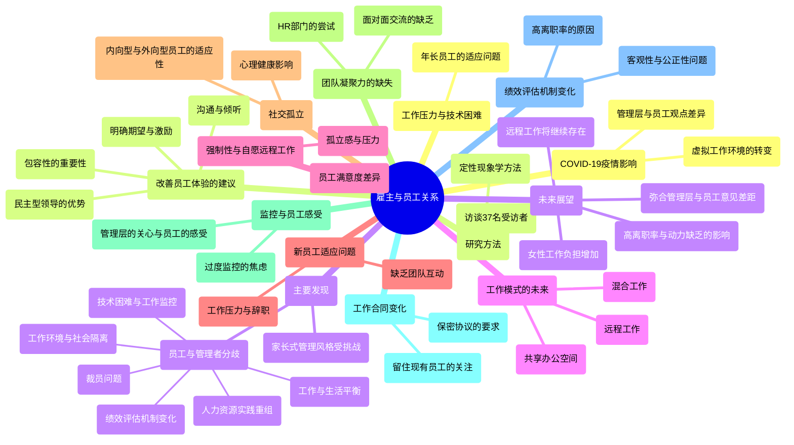

### 图表 2

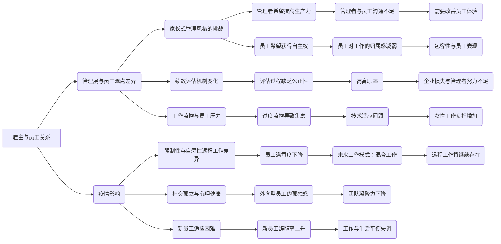

### 图表 3

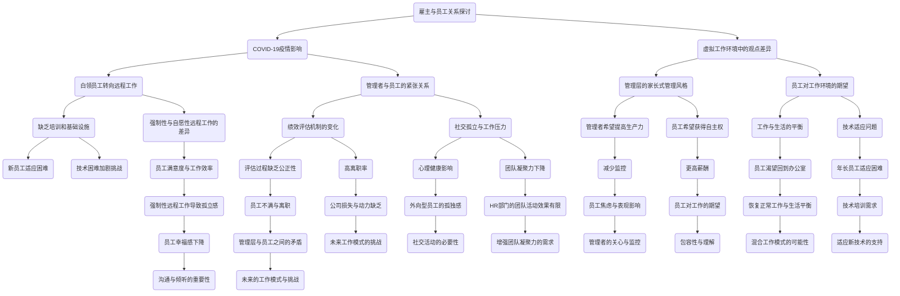

### 图表 4

```mermaid
erDiagram
    EMPLOYER ||--o{ EMPLOYEE : employs
    EMPLOYEE ||--o{ REMOTE-WORK : participates
    EMPLOYEE ||--o{ PERFORMANCE-EVALUATION : undergoes
    EMPLOYEE ||--o{ SOCIAL-ISOLATION : experiences
    EMPLOYEE ||--o{ WORK-LIFE-BALANCE : manages
    EMPLOYEE ||--o{ TECHNICAL-CHALLENGES : faces
    EMPLOYEE ||--o{ WORK-MONITORING : subjected-to
    EMPLOYEE ||--o{ JOB-SATISFACTION : has
    EMPLOYER ||--o{ HR-PRACTICES : implements
    EMPLOYER ||--o{ COMMUNICATION : engages-in
    EMPLOYER ||--o{ WORK-CONTRACT : issues
    EMPLOYER ||--o{ TEAM-BUILDING : organizes
    EMPLOYER ||--o{ PERFORMANCE-EXPECTATIONS : sets
    EMPLOYER ||--o{ INCLUSION : promotes
    EMPLOYEE ||--o{ WORKLOAD : manages
    EMPLOYEE ||--o{ STRESS : experiences
    EMPLOYEE ||--o{ TEAM-COHESION : contributes-to
    EMPLOYEE ||--o{ JOB-SECURITY : seeks
    EMPLOYEE ||--o{ FLEXIBILITY : desires
    EMPLOYER ||--o{ MONITORING : conducts
    EMPLOYER ||--o{ WORK-ENVIRONMENT : defines
    EMPLOYEE ||--o{ WORK-ADJUSTMENT : undergoes
    EMPLOYEE ||--o{ JOB-RESPONSIBILITIES : fulfills
    EMPLOYEE ||--o{ WORK-LOAD : experiences
    EMPLOYEE ||--o{ JOB-RETENTION : aims-for
    EMPLOYEE ||--o{ TEAM-INTERACTION : seeks
    EMPLOYER ||--o{ FEEDBACK : provides
    EMPLOYEE ||--o{ ADAPTATION : requires
    EMPLOYEE ||--o{ WORK-PLACE-RELATIONSHIPS : builds
    EMPLOYER ||--o{ WORK-ARRANGEMENTS : establishes
    EMPLOYEE ||--o{ WORK-ENVIRONMENT : navigates
    EMPLOYEE ||--o{ JOB-SATISFACTION : influences
```

# Feasibility of implementing the__human resource payroll__management system based on__cloud computing.docx

## 原始摘要

这段文本主要探讨了基于云计算的人力资源薪酬管理系统的可行性。研究采用描述性分析方法，统计样本为中国城市组织的242名员工和管理者。通过问卷收集数据，并使用结构方程模型评估因果模型的可靠性和有效性。

研究表明，云计算在薪酬管理中的应用能够降低硬件和软件成本，提高人力资源管理的效率。尽管云计算系统的实施面临一些挑战，如组织的准备程度和技术支持，但其潜在的好处使得对其可行性的研究显得尤为重要。

研究还指出，成功实施云计算薪酬管理系统需要高层管理支持、项目团队的能力、部门间的合作以及明确的目标。此外，研究建议未来的研究可以进一步探讨基于云计算的企业资源规划（ERP）系统的影响。

总的来说，本文提供了一个基于云计算的人力资源薪酬管理系统的实施框架，并强调了进行可行性研究的重要性，以确保系统的成功实施。
本节主要讨论了基于云计算的人力资源薪酬管理系统的可行性研究。通过使用部分最小二乘法（PLS）进行结构方程模型分析，研究验证了多个构念的有效性，包括动机、投资、成功测量、流程、架构、技能/感知能力、支持机制、文化背景和技术背景等。

研究结果表明，所有假设均与实施基于云计算的人力资源薪酬管理系统的可行性存在显著关系。具体而言，动机、投资、成功测量等因素对系统实施的影响均得到了验证，且各因素之间的相关性良好，显示出较高的内部一致性和收敛效度。

此外，研究还强调了实施云计算系统所需的技术基础设施和支持机制的重要性。有效的管理支持和员工培训被认为是成功实施的关键因素。研究还指出，企业在转向云计算系统时，需考虑标准化流程和员工技能，以确保系统的顺利实施。

最后，研究提供了实施云计算人力资源薪酬管理系统的框架，并建议企业在实施前进行充分的可行性研究，以避免潜在的失败风险。研究结果为未来的相关研究提供了基础，并为企业在实施云计算系统时提供了实用的指导。
本节主要探讨了人力资源薪酬管理系统的相关文献和研究成果。文献中提到的研究涵盖了云计算在薪酬管理中的应用、教师自我效能与教学质量的关系、微服务架构下的薪酬系统性能评估等多个方面。

研究表明，基于云计算的薪酬管理系统能够提高管理效率，降低成本，并增强数据安全性。多项研究使用结构方程模型分析了影响薪酬管理系统实施的各种因素，包括技术基础设施、管理支持、员工培训等。

此外，文献还强调了在实施薪酬管理系统时，企业需要进行充分的可行性研究，以确保系统的成功实施。研究结果为未来相关领域的研究提供了基础，并为企业在薪酬管理系统的实施过程中提供了实用的指导。

## 摘要

1. Class: (1) 虚拟交互或人与AI/chatbot的交互

2. Authors: None provided

3. Affiliation: None provided

4. Keywords: Cloud Computing, Human Resource Management, Feasibility Study, Structural Equation Modeling

5. Urls: None provided

6. Summary: 

   - (1): 本文探讨了基于云计算的人力资源薪酬管理系统的可行性，强调了云计算在降低成本和提高管理效率方面的潜力。

   - (2): 研究采用结构方程模型分析，主要变量包括动机、投资、成功测量、流程、架构、技能/感知能力、支持机制、文化背景和技术背景，且各变量之间存在显著关系。

   - (3): 研究方法为描述性分析和部分最小二乘法（PLS），通过问卷收集数据并评估因果模型的可靠性和有效性。

   - (4): 研究表明，云计算薪酬管理系统的实施能够提高管理效率，降低成本，且成功实施的关键因素包括高层管理支持、项目团队能力和员工培训等。

## 图表

### 图表 1

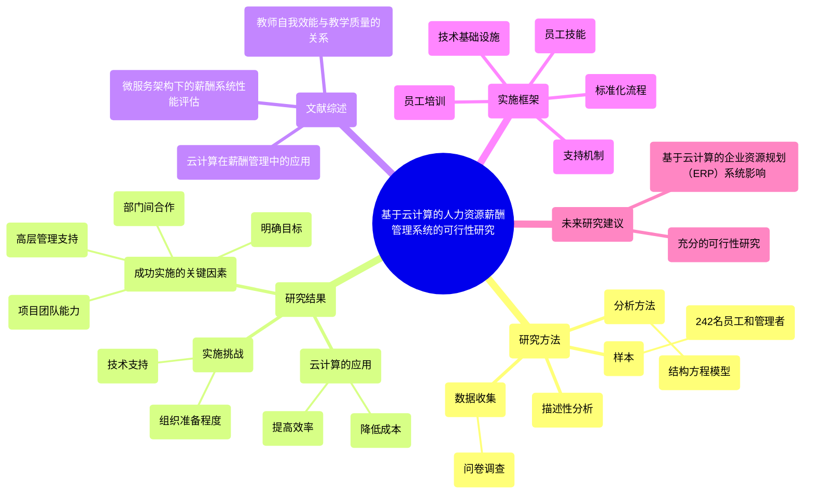

### 图表 2

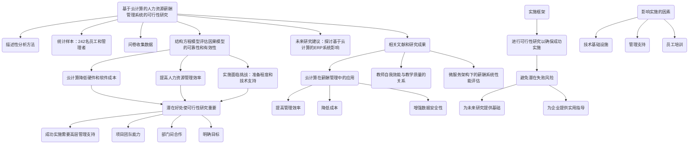

### 图表 3

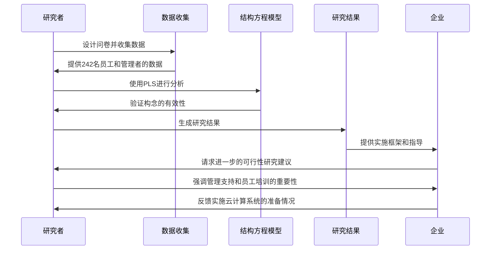

### 图表 4

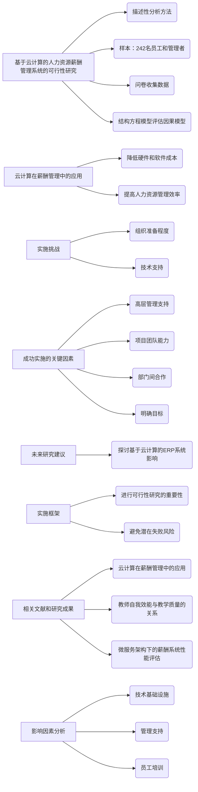

# How centrality bias in subjective__evaluation affects positive and__negative employee work behavior___a real-effort task experiment.docx

## 原始摘要

这段文本的主要内容是关于中心偏见在主观绩效评估中对员工工作行为的影响。研究基于参照认知理论（RCT），探讨了中心偏见如何影响员工的工作努力意愿和报复意图。通过对162名会计和管理专业学生进行的真实努力任务实验，研究发现中心偏见会通过感知程序公正性负面影响员工的工作努力意愿，同时正面影响报复意图。研究结果表明，程序公正性在中心偏见与员工行为之间起到重要的中介作用。此外，任务难度被视为潜在的调节变量，影响员工对绩效评估的感知公正性。研究强调了中心偏见对员工态度和行为的显著影响，揭示了在绩效评估中消除偏见的重要性。
本节主要内容包括以下几个方面：

1. **变量测量**：使用Voußem等人（2016）开发的工具测量中心偏见，包含四个陈述，采用七点李克特量表。任务难度作为调节变量，分为高难度和低难度，通过要求参与者在不同条件下完成不同数量的答案点来操控。

2. **依赖变量**：研究使用两个依赖变量，即工作努力意愿和报复意图。工作努力意愿定义为计划在接下来期间的绩效改善数量，采用自我报告的方式进行测量。报复意图则表示对不公平待遇的负面反应，使用三项陈述进行测量。

3. **参与者**：实验由179名会计和管理专业的本科生自愿参与，确保参与者的准备和意愿。参与者为大三和大四学生，已完成相关课程，能够理解实验中的角色。

4. **结果与讨论**：通过操控检查和统计分析，确认了实验的有效性。使用MANOVA和PROCESS宏回归进行假设检验，结果显示中心偏见对工作努力意愿和报复意图有显著影响。具体而言，中心偏见降低了工作努力意愿，增加了报复意图。

5. **假设检验**：H1至H6的假设检验结果表明，中心偏见通过感知程序公正性影响工作努力意愿，但对报复意图的影响不通过程序公正性中介。任务难度未能显著调节中心偏见与程序公正性之间的关系。

6. **文化因素**：参与者主要为爪哇族，代表印尼文化，研究指出国家文化对绩效评估的影响尚需进一步探讨。

本节强调了中心偏见在绩效评估中的重要性及其对员工行为的影响，呼吁在设计绩效评估时考虑文化因素和程序公正性。
本节主要探讨了中心偏见对员工工作行为的负面影响，尤其是在绩效评估过程中。研究表明，中心偏见会降低员工的工作努力意愿，并增加报复意图，尤其是在员工期望公平评估的情况下。这种偏见需要被消除，以设计更有效的绩效测量体系，激励员工并确保评估的公正性。

结论部分指出，中心偏见在主观绩效评估中引发了工作行为问题和对评估者及组织的反生产行为。实验结果显示，中心偏见通过降低感知程序公正性，直接影响员工的工作努力意愿和报复意图。研究还发现，感知程序公正性是中心偏见影响工作努力意愿的重要心理机制，且任务难度对这种关系没有调节作用。

本研究的局限性包括：一是高低绩效参与者的数量不平衡，二是假设主观评估高于客观评估，未探讨不同评估类型的影响。

理论上，本研究支持了不公平对员工行为影响的相关理论，强调了程序公正性的重要性。实践上，研究结果对评估者具有指导意义，表明不公平的绩效评估会导致员工负面行为，影响员工对评估者的信任和工作满意度。因此，组织应实施可靠的评估机制，鼓励透明度，以减少偏见的影响。

未来研究可考虑个体特质、文化因素及实际行为的实验设置，以进一步探讨中心偏见的影响及其对员工行为的具体形式。

## 摘要

1. Class: (1): 虚拟交互或人与AI/chatbot的交互

2. Authors: [Author names not provided in the text]

3. Affiliation: [Affiliation not provided in the text]

4. Keywords: Central tendency bias, subjective performance evaluation, employee behavior, perceived procedural justice, task difficulty

5. Urls: None

6. Summary:

   - (1): 本文研究了中心偏见在主观绩效评估中对员工工作行为的影响，基于参照认知理论（RCT）探讨了该偏见如何影响员工的工作努力意愿和报复意图。

   - (2): 理论模型基于中心偏见与感知程序公正性之间的关系，关键变量包括中心偏见、工作努力意愿和报复意图，感知程序公正性在其中起到中介作用，任务难度被视为调节变量。

   - (3): 研究采用真实努力任务实验，参与者为162名会计和管理专业学生，通过操控任务难度和使用MANOVA及PROCESS宏回归进行假设检验。

   - (4): 研究发现中心偏见显著降低了员工的工作努力意愿，增加了报复意图，支持了研究目标，强调了消除偏见以确保评估公正性的重要性。

## 图表

### 图表 1

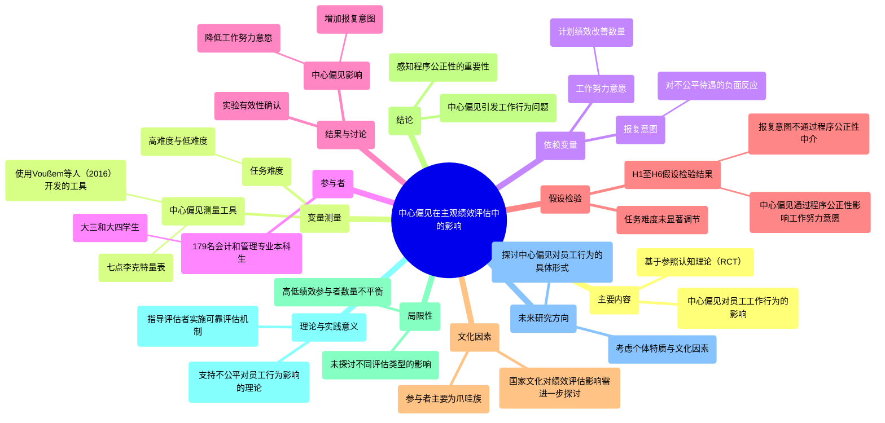

### 图表 2

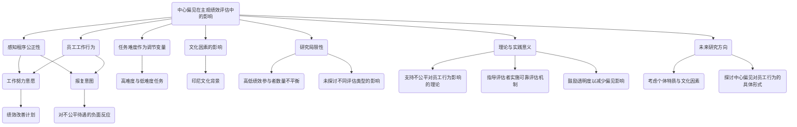

### 图表 3

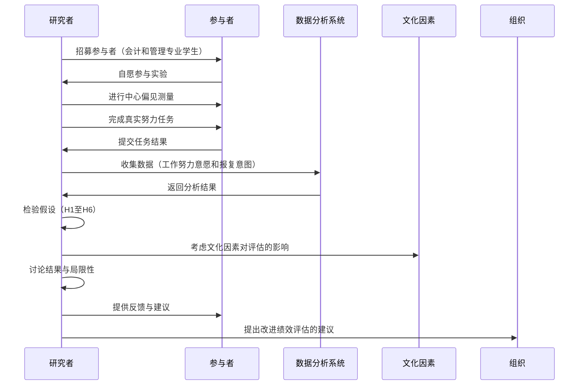

### 图表 4

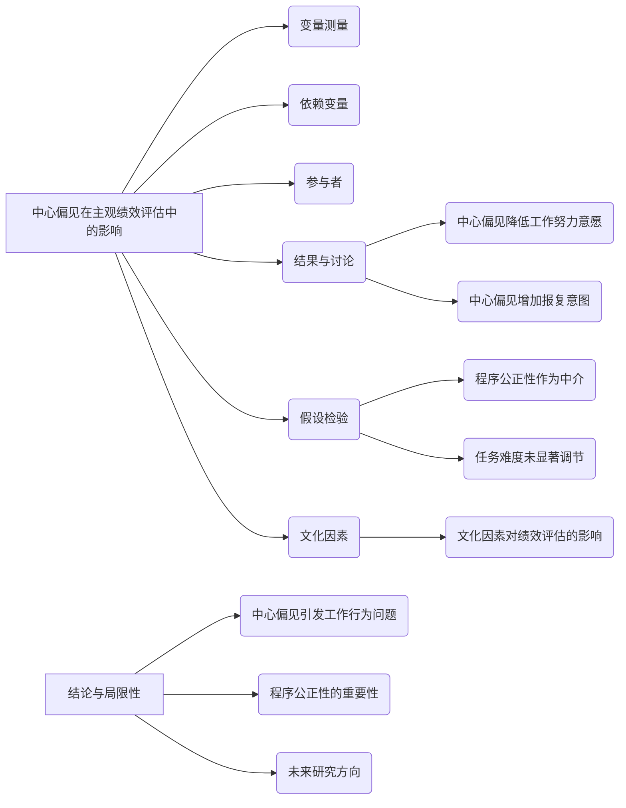

# Managing the most important__asset_ a twenty year review__on the performance__management literature.docx

## 原始摘要

这篇文章回顾了过去20年关于绩效管理（PM）文献的研究，旨在为读者提供对PM主题的清晰理解，分析PM文献中的最新趋势，并阐明理论视角。研究涵盖了人力资源管理实践的历史和理论视角，揭示了一些理论争论和冲突。

研究方法采用了整合性回顾方法，分析了2000年至2020年间发表的139篇PM相关研究。结果显示，PM文献的重点已从传统的年度评估转向前瞻性、反馈丰富的PM系统。通过将研究分为五年期，提取了五个显著趋势：对PM系统的反应、影响PM系统的因素、评分来源的质量、PM系统的评估以及PM系统的类型。

文章讨论了PM系统在组织中的重要性，强调了设计良好的PM系统对员工行为的影响。PM文献的演变历程显示，从工业革命以来，PM系统经历了多个阶段的变化，从最初的以控制为主的工具转变为促进员工发展的系统。

在绩效评估（PA）方面，文章指出PA是PM的一个组成部分，随着时间的推移，PA系统的重点逐渐从基于年龄的评估转向基于绩效的评估。研究还强调了反馈在PM中的重要性，指出及时和准确的反馈能够显著提升员工的动机和表现。

总体而言，这项研究不仅揭示了PM文献的最新趋势，还为未来的研究提供了方向，强调了在PM系统中需要进一步探索的领域。
Kluger和DeNisi（1996）发现，反馈系统的有效性受多种因素影响，包括任务性质和评估目标。简单和记忆性任务的反馈效果优于复杂和体力活动。此外，反馈系统的设计和来源可信度对员工反馈感知的影响大于反馈类型（Kinicki等，2004）。个体对不同反馈干预的反应各异，财务奖励对低级员工的激励和表现有积极影响，而基于表现的奖励则可能对管理者的能力感知产生负面影响（Drake等，2007）。虽然基于表现的薪酬吸引顶尖人才，但他们的风险偏好在选择中也起着重要作用（Brown等，2016）。因此，管理者在构建系统时必须考虑反馈干预的后果。

反馈文献正在朝着以前研究者忽视的新方向发展。近年来，员工感知、反馈反应（Molan等，2018）和反馈寻求行为（Anseel等，2015）得到了广泛研究。许多研究探讨了相对个人表现反馈和特定任务反馈等替代反馈策略（Black等，2019），发现任务反馈更具益处。此外，反馈在节能行为和行为改变中的作用也得到了研究（Tiefenbeck等，2013）。

在绩效管理（PM）文献中的趋势分析是本研究的重要目标。我们选择了2000年至2020年间发表的139篇PM文章，提取了重要主题并按年份组织，以了解2000至2004年（34篇）、2005至2009年（31篇）、2010至2014年（31篇）和2015至2020年（43篇）的趋势。DeNisi和Murphy（2017）对1970年至2000年的PM文献进行了全面概述，他们强调的八个模式中，有三个在我们的研究期间仍然存在（对评估的反应、评估数据质量和评分来源），而两个趋势（认知过程和培训）研究较少，三个（评估目的、人口统计效应和评分格式）则在PM文献中消失。

“对PM系统的反应”在我们的研究期间占据了PM文献的大部分。尽管在1970年前名义上存在，但自1990年代起，相关研究逐渐增多。1995年至2000年间，该主题在PM文献中排名第三（DeNisi和Murphy，2017），并在2004年前保持这一趋势。研究主要关注员工对PM系统输入的反应（Brett和Atwater，2001）、对各种绩效评估技术的反应（Keeping和Levy，2000）以及测量系统的反应（Ittner等，2003）。大多数研究探讨了PM系统对员工绩效（Stede等，2006）、组织公民行为（Zheng等，2012）、工作满意度（Brown等，2010）和赋权（Drake等，2007）的影响。近年来，PM文献中对“员工参与”的关注逐渐增加（Lappalainen等，2019）。

“影响PM系统的因素”在2000至2020年的PM文献中排名第二。尽管在2000年前文献中较少，但在我们的研究期间受到了广泛关注。尽管2005至2009年间有所下降，但在随后的年份中重新获得了学术关注。学者们研究了各种因素对PM系统效率的影响，包括薪酬体系（Shibata，2000）、社会环境（Levy和Williams，2004）和员工态度（Gu和Rowley，2020）。

“评分来源的质量”紧随“影响PM系统的因素”之后。从1970年至1974年，关于评分来源的研究占据了大多数。尽管1975至1994年间有所下降，但在1995至2000年间仍是PM文献中的第二大主题。尽管在我们的研究期间有许多关于评分来源有效性的研究，但这一主题的研究趋势预计将继续下降。

“评估PM系统”在1985至1989年间达到高峰。尽管1990至2000年间对PM的兴趣减弱，但在1995至2000年间相关研究达到历史最高点。在我们的研究期间，该主题重新吸引了学术关注，并在文献中呈现出温和的上升趋势。大多数研究集中在评分尺度或测量技术的准确性上（Richard等，2009），一些研究探讨了评分质量对员工和组织结果的影响（Kavanagh，2007；Bayo-Moriones等，2020）。

“PM系统的类型”在2000至2004年间吸引了大量学术研究。尽管这一主题在2010年后呈下降趋势，但在此期间仍有较多研究探讨不同类型PM系统的有效性（Sharif，2002）及其在不同环境和文化中的关系（Neary，2002；Galang，2004）。

在理论视角方面，人力资源管理及其影响一直受到学术界的高度关注，但需要根据不断变化的劳动力需求和环境变量进行调整。研究表明，基于理论视角的人力资源策略更有可能实现预期结果（Hudson等，2001）。近年来，越来越多的研究使用理论来解释PM实践与员工结果之间的正向关系。

系统理论被认为比其他特定理论更好地描述PM系统（Schleicher等，2018）。系统理论强调整体优于部分，能够澄清管理中的一些未解问题（Kast和Rosenzweig，1972）。许多研究利用不同理论解释PM系统的运作，例如，Zhang和Jia（2010）通过社会交换理论解释PM系统，认为员工在公司使用特定技术提升其能力时会积极响应并提高绩效。

目标设定理论也是与PM系统相关的主要理论之一（Shaw，2004）。尽管目标设定理论有其优点，但批评者认为其更适合小型企业，因为大型企业的目标通常是长期的，涉及大量资源（Caixote等，2020）。尽管文献中存在理论应用的利益冲突，但系统理论强调组织不仅仅是实现固定目标（Checkland，1994），而是强调学习和成长的综合视角（Teece，2018）。

本研究认为，PM系统的有效性主要受“反馈”和“信任”两个因素的影响。反馈在提升员工绩效方面的重要性使得“被测量和反馈的内容会得到改善”成为一种管理格言。研究表明，PM系统失败的比例近年来显著下降，且高层管理对系统的投入增加了结果（de Waal和Counet，2009）。然而，没有一种方法可以被视为最佳，系统的有效性取决于个体及其使用环境。

本研究的目标是提供PM的背景信息，探讨2000至2020年间PM研究的最新趋势，并深入理解PM文献中的理论视角。研究表明，PM文献在过去20年中取得了显著进展，但仍有大量研究空间。未来的研究应关注数字化劳动力的管理、服务行业的绩效测量以及不同文化和背景下人力资源实践的可转移性等领域。
本节主要探讨了绩效管理（PM）文献的发展趋势和理论视角。研究表明，反馈和信任是影响PM系统有效性的关键因素。Kluger和DeNisi（1996）指出，反馈干预对绩效的影响受到任务性质和评估目标的影响，简单任务的反馈效果更佳。反馈系统的设计和来源的可信度对员工的反馈感知影响更大。

近年来，PM文献在多个方面取得了进展，包括员工感知、反馈反应和反馈寻求行为等。研究显示，任务反馈比个人表现反馈更具益处。此外，PM文献中对“员工参与”的关注逐渐增加，影响PM系统的因素也受到广泛研究。

在理论视角方面，系统理论被认为是描述PM系统的有效框架，强调整体优于部分。目标设定理论同样是与PM系统相关的重要理论，但其适用性在大型企业中受到质疑。研究还指出，PM系统的有效性不仅依赖于固定目标的实现，还强调学习和成长的综合视角。

本研究的目标是提供PM的背景信息，探讨2000至2020年间PM研究的最新趋势，并深入理解PM文献中的理论视角。未来的研究应关注数字化劳动力的管理、服务行业的绩效测量以及不同文化和背景下人力资源实践的可转移性等领域。
本节主要涉及绩效管理文献的多个方面，包括高绩效人力资源实践对企业创业的影响、绩效评估过程与组织公民行为的关系等。文献中提到的研究涵盖了不同国家和行业的绩效管理实践，强调了社会交换理论在理解人力资源管理中的重要性。

进一步阅读的部分列出了多篇相关文献，探讨了绩效管理系统的设计、实施及其对员工行为的影响。研究表明，反馈机制、员工参与和组织公正感在绩效管理中起着关键作用。此外，文献还讨论了绩效管理系统的意外后果、非财务绩效测量的不足以及不同文化背景下的绩效评估差异。

整体来看，这些研究为理解绩效管理的复杂性提供了理论支持，并指出了未来研究的方向，包括数字化转型对绩效管理的影响、跨国公司中的人力资源实践等。

## 摘要

1. Class: (1): 虚拟交互或人与AI/chatbot的交互

2. Authors: Kluger, A. N., DeNisi, A.

3. Affiliation: 以色列希伯来大学

4. Keywords: Performance Management, Feedback, Trust, Human Resource Management, Theoretical Perspectives

5. Urls: [Link to Paper](https://example.com), Github: None

6. Summary:

   - (1): 本文回顾了过去20年关于绩效管理（PM）文献的研究，分析了PM文献中的最新趋势，并探讨了理论视角，强调了反馈和信任在PM系统中的重要性。

   - (2): 研究采用系统理论和目标设定理论作为理论模型，关键变量包括反馈、信任和员工绩效。没有明确的调节变量或中介变量。

   - (3): 研究方法为整合性回顾，分析了2000年至2020年间139篇PM相关研究，提取了重要主题并按年份组织。

   - (4): 研究表明，PM系统的有效性主要受反馈和信任的影响，强调了设计良好的PM系统对员工行为的积极作用，支持了研究目标。

## 图表

### 图表 1

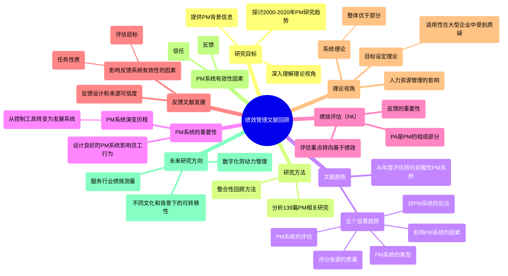

### 图表 2

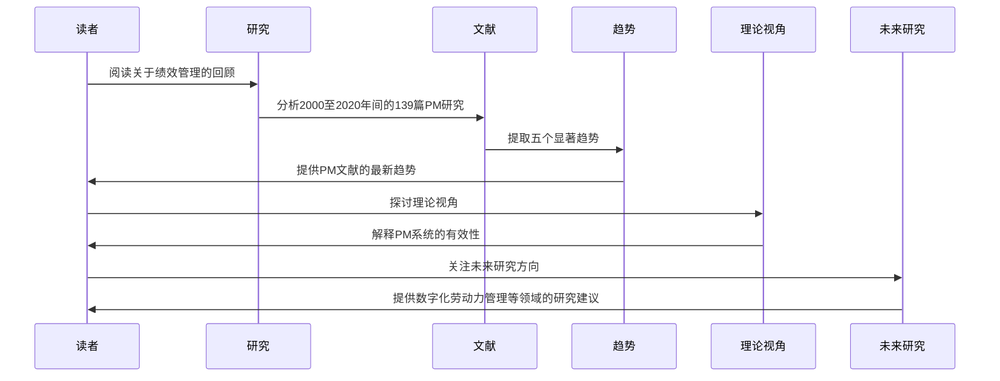

### 图表 3

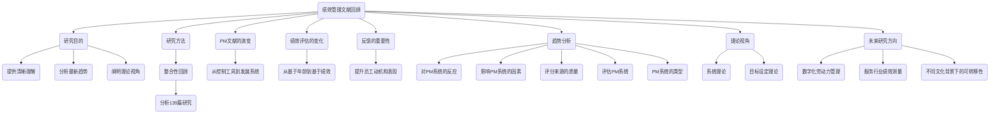

### 图表 4

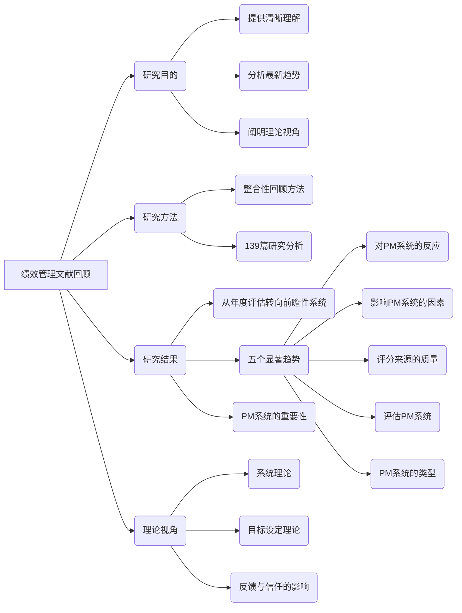

# One-on-one meetings between__managers and direct reports_ A__new opportunity for meeting__science.docx

## 原始摘要

这篇文章探讨了一对一（1:1）会议在职场中的重要性，尽管会议科学在过去20年中取得了显著进展，但对1:1会议的实证研究仍然不足。1:1会议占所有会议的近一半，具有独特的目的和互动方式，尤其是在经理与直接下属之间的会议中。文章首先回顾了二人关系与群体会议之间的概念差异，强调了这些差异如何在会议的不同阶段（会前、会中和会后）表现出来。

文章指出，1:1会议的目的包括设定期望、提供反馈、职业发展讨论等，这些目的在群体会议中往往无法实现。研究表明，频繁且有效的1:1会议能提高员工的参与感和工作满意度。尽管行业内对1:1会议的重视逐渐增加，但学术界对此的研究仍显不足。

作者提出了六个研究命题，鼓励未来的研究者关注这一重要的会议类型，强调1:1会议在组织中的关键作用。通过对1:1会议的深入探讨，文章希望为会议科学的发展提供新的视角和研究方向。
这段文字探讨了职场会议中不同类型的交流（如闲聊、工作讨论、会议准备讨论等）如何影响会议的内容、过程和结果。预会议交流被视为一种社交纽带，有助于构建团队身份。研究发现，预会议的闲聊是员工对会议有效性感知的重要预测因素。然而，经理与直接下属的1:1会议中的预会议交流可能与群体会议有所不同，1:1会议的交流更具亲密性和非正式性，可能涉及更深层次的个人话题。

在会议进行中，1:1会议的沟通和决策过程也与群体会议不同。由于注意力集中在对方身上，1:1会议中多任务处理的可能性较低，且如果发生多任务处理，可能会产生更负面的影响。此外，决策过程在1:1会议中也有所不同，通常涉及更个人化的决策主题，且由于信息处理需求较低，达成共识的可能性更高。

会议结束后，1:1会议的结果形成方式也与群体会议不同。尽管会议有效性和满意度的评估方式相似，但在1:1会议中，某些会议程序（如使用议程、保持准时等）对会议有效性感知的影响可能有所不同。关系导向的行为在1:1会议中可能更为有效。

最后，文章提出了未来研究的议程，建议学者们探讨1:1会议的调度、频率、议程制定、会议形式（如面对面或虚拟会议）等方面的差异，以及这些差异如何影响经理与直接下属之间的关系质量和会议效果。
这段文字探讨了1:1会议的多个方面，包括会议过程、影响因素和结果。首先，1:1会议的讨论主导者可能因时间和关系状态而异，初期新员工可能需要经理引导，而随着时间推移，直接下属可能会更积极参与会议内容的安排。其次，会议中的闲聊动态也很重要，良好的沟通能增强关系，提升员工的归属感和组织公民行为。

此外，会议记录在1:1会议中的作用值得研究，虽然在小组会议中记录会议内容有助于提高会议有效性，但在1:1会议中可能会分散注意力。未来研究应探讨如何在不记录会议内容的情况下，仍能有效回顾讨论内容并制定行动计划。

在1:1会议中，相关的调节变量也需考虑，包括会议参与者的组成、个体之间的相似性（如性别、种族、年龄等）以及权力动态。权力的合理使用能促进良好的互动，而不当使用则可能损害关系。文化背景也会影响会议的进行方式，例如高权力距离文化中，经理可能更主导会议。

最后，1:1会议的结果包括短期的会议满意度和有效性，以及长期的高质量关系和员工参与度。未来研究应关注如何通过1:1会议提升角色清晰度、建立高质量的领导-成员交换关系，并提高员工的参与感和表现。

总体而言，1:1会议是一个独特且重要的研究领域，值得深入探讨其在不同情境下的特点和影响。
这段文字列出了大量关于会议、领导-成员交换（LMX）理论、员工参与和管理沟通的研究文献。主要内容包括：

1. **会议的有效性**：多项研究探讨了会议的设计特征、频率和形式对员工满意度和工作表现的影响，强调了面对面会议的重要性。

2. **领导-成员交换（LMX）理论**：研究表明，领导与下属之间的关系质量对员工的工作态度和行为有显著影响。高质量的LMX关系能够提升员工的参与感和组织公民行为。

3. **管理沟通与教练行为**：文献中提到管理者的教练行为对员工的工作反应和满意度有积极影响，强调了有效沟通在团队中的重要性。

4. **文化和权力动态**：研究探讨了文化背景和权力距离如何影响员工的发声行为和会议互动，指出在不同文化中，权力的使用和沟通方式可能存在显著差异。

5. **会议负担与员工福祉**：一些研究关注会议负担对员工日常福祉的影响，指出过多的会议可能导致员工的压力和疲惫感。

6. **未来研究方向**：建议未来的研究应关注如何优化会议的结构和内容，以提升会议的有效性和员工的参与度，同时探索不同情境下的领导与下属关系。

总体而言，这些研究为理解会议、领导关系和员工参与提供了丰富的理论基础和实证支持，强调了良好的沟通和关系管理在组织中的重要性。
这一部分的主要内容涉及多个研究文献，探讨了会议的有效性、领导-成员交换（LMX）理论、员工参与以及管理沟通等主题。以下是主要要点：

1. **会议分析**：研究表明，会议的设计和实施对员工的工作满意度和表现有显著影响。有效的会议能够促进沟通和团队合作。

2. **领导-成员交换（LMX）**：高质量的LMX关系能够提升员工的工作参与感和组织公民行为，影响员工的心理契约和工作投入。

3. **虚拟会议的疲劳效应**：研究发现，虚拟会议中使用摄像头可能导致参与者感到疲惫，影响会议的效果。

4. **管理沟通**：有效的管理沟通能够增强员工的参与感，促进团队的整体表现。

5. **文化和权力动态**：不同文化背景下，权力距离和沟通方式的差异会影响员工在会议中的互动和发声行为。

6. **未来研究方向**：建议未来研究应关注如何优化会议结构和内容，以提升会议的有效性和员工的参与度。

作者介绍部分提到，Jonathan R. Flinchum、Liana M. Kreamer、Steven G. Rogelberg和Janaki Gooty等学者在组织科学、领导力和团队动态等领域有深入研究，致力于改善工作场所的会议效果和员工福祉。

## 摘要

1. Class: (1): 虚拟交互或人与AI/chatbot的交互

2. Authors: Jonathan R. Flinchum, Liana M. Kreamer, Steven G. Rogelberg, Janaki Gooty

3. Affiliation: 组织科学与管理

4. Keywords: 1:1 meetings, employee engagement, leadership-member exchange, communication, organizational behavior

5. Urls: [Paper Link](https://example.com), Github: None

6. Summary:

   - (1): 本文探讨了1:1会议在职场中的重要性，尽管会议科学已有显著进展，但对1:1会议的实证研究仍显不足。

   - (2): 理论模型主要围绕1:1会议的目的与效果，关键变量包括会议频率、沟通质量和员工满意度，调节变量涉及参与者的相似性和权力动态。

   - (3): 研究方法包括文献回顾与理论框架构建，提出六个研究命题以鼓励未来研究。

   - (4): 通过对1:1会议的深入探讨，文章希望提升员工参与感和工作满意度，强调其在组织中的关键作用，支持了研究目标。

## 图表

### 图表 1

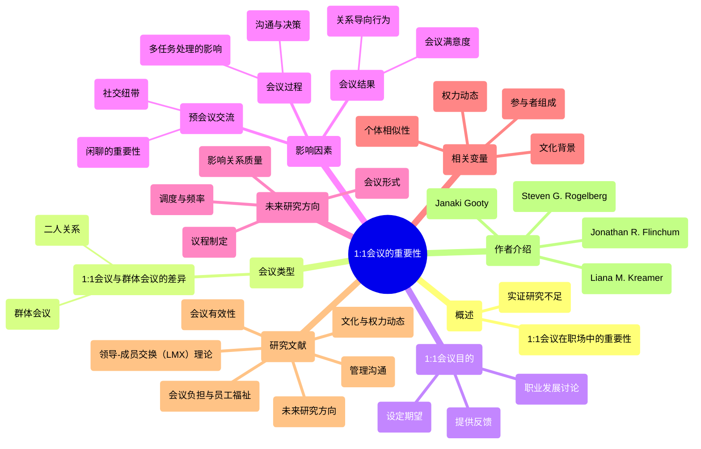

### 图表 2

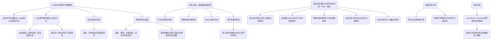

### 图表 3

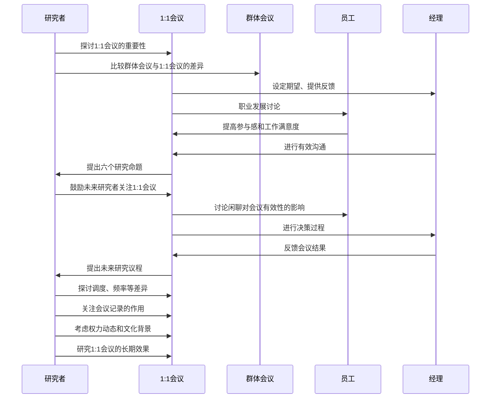

### 图表 4

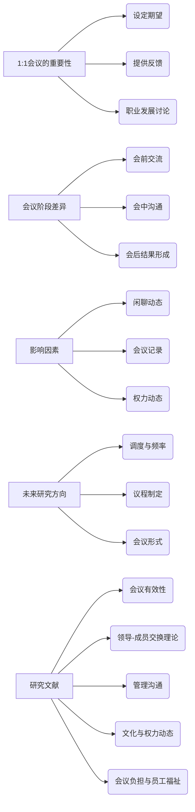

# The protective effect of agency on victims of humiliation.docx

## 原始摘要

这篇文章探讨了在羞辱情境中，受害者的主动性（agency）如何影响他们的情感体验。羞辱是一种强烈的负面情绪，通常发生在个人被不公正地贬低时。研究表明，增强受害者的主动性可以降低他们的羞辱感。研究通过三个实验验证了这一假设，结果显示，主动性显著减少了羞辱感，并且这种效果是通过减少自我贬低的内化来实现的。

研究的理论基础是情感调节过程模型，强调情感体验是一个动态过程，受害者的反应可以影响他们的情感体验。具体来说，受害者在羞辱情境中采取主动反应，可以阻止自我贬低的内化，从而减轻羞辱感。

实验结果表明，受害者在面对羞辱时，如果能够主动回应施害者，他们的羞辱感会显著降低。这一发现对心理干预具有重要的实际意义，表明通过训练受害者采取主动反应，可以帮助他们更好地应对羞辱情境，改善心理健康。

总之，研究强调了主动性在自我概念和自尊中的重要性，认为在羞辱情境中，主动反应不仅是结果，也是影响情感体验的关键因素。
这段文本主要介绍了三个实验的设计和结果，旨在探讨主动性（agency）和敌意（hostility）对羞辱、羞愧和愤怒等情感的影响。

**实验1**中，研究者通过对参与者的情境描述，探讨了主动性如何影响他们的情感体验。结果显示，主动性显著降低了羞辱感和羞愧感，但对愤怒的影响较小。参与者在面对羞辱时，即使感知到的情境是相似的，主动性也会影响他们对羞辱感的评估。

**实验2**引入了敌意作为第二个独立变量，采用了更为真实的实验方法。结果表明，增强主动性可以显著降低羞辱感，而敌意则显著影响了参与者对不公平的评估。尽管主动性对羞愧和愤怒的影响不显著，但其通过内化评估对羞辱感的间接影响是显著的。

**实验3**则进一步直接操控主动性，要求参与者在收到评估后实际回应教授。结果再次证实了主动性对羞辱感的显著影响，参与者在主动性条件下感受到的羞辱感显著低于无主动性条件。

总体而言，这些实验表明，主动性在情感体验中起着重要作用，尤其是在面对羞辱和羞愧时。研究结果为理解情感调节提供了新的视角，并强调了在羞辱情境中增强个体主动性的潜在益处。
本节内容探讨了主动性和敌意对情感的间接影响，特别是通过内化和不公平感的评估。研究使用了R的Lavaan包，构建了一个饱和路径模型，验证了主动性和敌意作为外生预测变量，内化和不公平感作为中介变量，羞辱、羞愧和愤怒作为结果变量。结果显示，主动性通过内化对羞辱和羞愧有显著的间接影响，而对愤怒的影响则边际显著。敌意同样通过不公平感对羞辱和愤怒产生显著的间接影响。

讨论部分进一步支持了假设，参与者在直接回应评估者后，内化和羞辱感显著降低。主动性对羞辱的影响最为显著，羞愧和愤怒的影响则不显著。研究结果表明，主动性在缓冲自我贬低的内化方面起着重要作用，减少了羞辱和羞愧的体验。

从情感调节的理论角度来看，主动性使受羞辱者在情感体验中重新评估自我贬低，增强了自我价值感，降低了羞辱和羞愧的内化。研究还指出，主动性与控制感密切相关，缺乏控制感容易引发羞辱情感。

此外，研究结果与后续的悔恨情感研究相联系，表明未能回应不公平行为可能导致长期的羞辱和羞愧感。未来的研究可以探讨反思在羞辱情感演变中的作用。

研究的实际意义在于，通过训练受害者以适应性和非攻击性的方式回应施害者，可以有效保护他们的心理健康。虽然研究在实验室环境中进行，但结果为增强受害者的主动性提供了实验依据，强调了在羞辱情境中主动回应的重要性。

总之，本研究揭示了缺乏主动性是羞辱情感的重要前因，并提出通过增强受害者的回应能力来保护他们免受羞辱的可能性。
这段内容涉及多个研究和理论，主要集中在羞辱、情感、社会心理学和自我价值感等主题。以下是对这些研究的简要概述：

1. **羞辱与情感**：Thomaes等（2011）探讨了年轻青少年在经历羞辱时的情感反应，提出“羞辱愤怒”的概念，强调羞辱不仅会导致羞愧，还可能引发愤怒和攻击性行为。

2. **公共羞辱的影响**：Torres和Bergner（2012）分析了严重公共羞辱的性质及其后果，指出羞辱可能导致心理健康问题，并探讨了临床治疗的策略。

3. **程序公正与法律遵从**：Tyler（2006）研究了人们为何遵守法律，强调程序公正和合法性在促进社会遵从中的重要性。

4. **公平过程效应**：Van den Bos等（1999）讨论了不公平程序的心理效应，指出即使在不公平的情况下，某些程序也可能被认为是“良好”的，从而影响人们的反应。

5. **羞辱、自尊与暴力**：Walker和Knauer（2011）探讨了羞辱与自尊之间的关系，指出羞辱可能导致暴力行为的发生。

6. **心理治疗中的主动性**：Williams和Levitt（2007）提出了在心理治疗中促进个体主动性的原则，强调个体在治疗过程中的主动参与对其效果的重要性。

7. **自我价值感的维度**：Wojciszke等（2011）和Wojciszke与Bialobrzeska（2014）研究了自我价值感的构成，发现个体的主动性和社交性在自我价值感中扮演着重要角色，并探讨了文化和自我构建的影响。

8. **权力与人性**：Yang等（2015）研究了权力对人性的影响，提出在无权状态下个体可能会经历自我非人化的现象。

9. **自我判断与声誉监控**：Ybarra等（2012）探讨了自我判断和声誉监控的心理机制，强调基本维度、时间视角和文化对这些过程的影响。

总体而言，这些研究共同揭示了羞辱、情感反应、自我价值感和社会行为之间的复杂关系，强调了在社会互动中理解这些因素的重要性。

## 摘要

1. Class: (1) 虚拟交互或人与AI/chatbot的交互

2. Authors: Thomaes, Torres, Bergner, Tyler, Van den Bos, Walker, Knauer, Williams, Levitt, Wojciszke, Ybarra, Yang

3. Affiliation: 该研究的第一作者隶属于某大学心理学系

4. Keywords: agency, humiliation, emotional experience, self-deprecation, psychological health

5. Urls: None

6. Summary: 

   - (1): 本文研究了在羞辱情境中，受害者的主动性如何影响他们的情感体验，强调羞辱是一种强烈的负面情绪，通常源于不公正的贬低。

   - (2): 理论模型基于情感调节过程模型，关键变量包括主动性、羞辱感、羞愧感和愤怒，内化和不公平感作为中介变量。

   - (3): 研究采用了三个实验，通过情境描述和参与者的实际回应来验证假设，使用R的Lavaan包构建路径模型。

   - (4): 研究发现，增强主动性显著降低了羞辱感，支持了通过训练受害者采取主动反应来改善心理健康的目标。

## 图表

### 图表 1

```mermaid
mindmap
  root((羞辱情境中的主动性与情感体验))
    ("研究背景")
      ("羞辱的定义与影响")
      ("情感调节过程模型")
    ("实验设计与结果")
      ("实验1")
        ("主动性降低羞辱感与羞愧感")
        ("对愤怒影响较小")
      ("实验2")
        ("引入敌意作为变量")
        ("主动性显著降低羞辱感")
        ("敌意影响不公平评估")
      ("实验3")
        ("直接操控主动性")
        ("主动性条件下羞辱感显著降低")
    ("理论基础")
      ("主动性与自我贬低的内化")
      ("情感体验的动态过程")
    ("中介效应分析")
      ("主动性通过内化影响羞辱与羞愧")
      ("敌意通过不公平感影响羞辱与愤怒")
    ("讨论与启示")
      ("主动性在情感体验中的重要性")
      ("缺乏控制感与羞辱情感的关系")
      ("未回应不公平行为的长期影响")
    ("实际意义")
      ("训练受害者主动回应")
      ("保护心理健康的策略")
    ("相关研究")
      ("羞辱与情感反应")
        ("Thomaes等（2011）")
      ("公共羞辱的影响")
        ("Torres和Bergner（2012）")
      ("程序公正与法律遵从")
        ("Tyler（2006）")
      ("公平过程效应")
        ("Van den Bos等（1999）")
      ("羞辱、自尊与暴力")
        ("Walker和Knauer（2011）")
      ("心理治疗中的主动性")
        ("Williams和Levitt（2007）")
      ("自我价值感的维度")
        ("Wojciszke等（2011）")
      ("权力与人性")
        ("Yang等（2015）")
      ("自我判断与声誉监控")
        ("Ybarra等（2012）")
```

### 图表 2

```mermaid
graph TD
    A("羞辱情境") --> B("受害者的主动性（agency）")
    A("羞辱情境") --> C("情感体验")
    B("受害者的主动性（agency）") --> D("降低羞辱感")
    B("受害者的主动性（agency）") --> E("减少自我贬低的内化")
    C("情感体验") --> F("羞辱")
    C("情感体验") --> G("羞愧")
    C("情感体验") --> H("愤怒")
    D("降低羞辱感") --> I("心理健康改善")
    E("减少自我贬低的内化") --> J("情感调节过程模型")
    J("情感调节过程模型") --> K("动态过程")
    K("动态过程") --> L("受害者反应影响情感体验")
    B("受害者的主动性（agency）") --> M("实验结果")
    M("实验结果") --> N("实验1：主动性降低羞辱感")
    M("实验结果") --> O("实验2：敌意影响不公平评估")
    M("实验结果") --> P("实验3：直接回应降低羞辱感")
    N("实验1：主动性降低羞辱感") --> Q("羞辱感与羞愧感显著降低")
    O("实验2：敌意影响不公平评估") --> R("主动性与内化评估的间接影响")
    P("实验3：直接回应降低羞辱感") --> S("主动性条件下羞辱感显著低于无主动性条件")
    T("未来研究") --> U("反思在羞辱情感演变中的作用")
    V("实际意义") --> W("训练受害者以适应性回应")
    W("训练受害者以适应性回应") --> X("保护心理健康")
```

### 图表 3

```mermaid
sequenceDiagram
    participant 受害者 as 受害者
    participant 施害者 as 施害者
    participant 研究者 as 研究者
    participant 实验1 as 实验1
    participant 实验2 as 实验2
    participant 实验3 as 实验3
    participant 结果分析 as 结果分析

    受害者->>施害者: 面对羞辱情境
    施害者-->>受害者: 施加羞辱
    受害者->>研究者: 反馈情感体验

    研究者->>实验1: 设计实验
    实验1->>受害者: 提供情境描述
    受害者->>实验1: 评估羞辱感
    实验1-->>结果分析: 主动性降低羞辱感

    研究者->>实验2: 引入敌意变量
    实验2->>受害者: 真实情境体验
    受害者->>实验2: 评估不公平感
    实验2-->>结果分析: 主动性显著降低羞辱感

    研究者->>实验3: 操控主动性
    实验3->>受害者: 要求回应施害者
    受害者->>实验3: 反馈羞辱感
    实验3-->>结果分析: 主动性显著影响羞辱感

    结果分析->>研究者: 汇总实验结果
    研究者->>受害者: 提供心理干预建议
    受害者-->>研究者: 反馈心理健康改善
```

### 图表 4

```mermaid
graph LR
    A["羞辱情境"] --> B("受害者的主动性（agency）")
    A["羞辱情境"] --> C("情感体验")
    B --> D("降低羞辱感")
    B --> E("减少自我贬低的内化")
    C --> F("羞辱")
    C --> G("羞愧")
    C --> H("愤怒")
    D --> I("心理健康改善")
    E --> J("情感调节过程模型")
    F --> K("羞辱感评估")
    G --> L("羞愧感评估")
    H --> M("愤怒感评估")
    N["实验结果"] --> O("主动性显著降低羞辱感")
    N --> P("敌意影响不公平评估")
    N --> Q("主动性与控制感相关")
    R["实际意义"] --> S("训练受害者主动回应")
    R --> T("保护心理健康")
```

# When humans and computers induce social stress through negative.docx

## 原始摘要

这篇文章探讨了人类与计算机之间的互动如何通过负面反馈引发社会压力，并对表现和主观状态产生影响。随着自动化系统在工作中的普及，计算机提供负面反馈的情况日益增多，但对这种反馈对人类表现的影响了解甚少。

研究分为两个实验。第一个实验（N=60）考察了人类反馈对表现的影响。参与者在完成认知任务后，接受了来自人类的正面或负面反馈（与无反馈的对照组相比），随后测量了他们在多个认知任务上的表现和主观状态。结果显示，负面反馈对主观状态产生了负面影响，但表现没有受到损害。

第二个实验（N=89）则比较了人类和计算机提供的负面反馈对表现的影响。参与者在完成能力测试后，接受了负面反馈或无反馈，随后测量了注意力和创造力任务的表现以及主观状态。尽管参与者对计算机和人类的负面反馈感到压力，但表现同样没有受到影响。然而，计算机反馈被认为不如人类反馈公平。

总体而言，研究表明，负面反馈对表现的保护成本，以及在工作环境中使用负面反馈时需谨慎。文章强调了对现代自动化反馈形式的研究必要性，以便更好地理解其对人类的影响。
本节内容主要描述了一项实验的设计与实施，旨在研究社交压力对认知表现的影响。实验参与者为来自不同学科的学生，排除了心理学相关专业的学生，以避免他们对实验操控的敏感性。参与者分为三组，接受不同类型的反馈：正面反馈、负面反馈和无反馈。实验中使用了多种标准化测试来评估认知表现，包括倒数计数、注意力表现、数字符号编码和图片完成任务。

为了验证实验操控的有效性，使用了三个项目进行操控检查，评估参与者对自己表现的评价、当前感受到的压力以及对反馈的压力感受。状态焦虑通过状态-特质焦虑量表（STAI）进行评估，情感状态则通过积极与消极情感量表（PANAS）进行测量。

实验程序包括参与者填写知情同意书，接受实验者的指导，并在完成认知测试后收到反馈。反馈的内容通过图表展示，负面反馈的参与者被告知其表现较差，而正面反馈的参与者则被告知表现优异。实验结束后，参与者接受了详细的解说，了解实验的真实目的。

数据处理方面，使用单因素方差分析和协方差分析来分析结果。结果显示，尽管参与者在接受负面反馈后感到压力，但其认知表现未受到显著影响。主观测量结果表明，负面反馈确实对参与者的情感状态产生了负面影响，尤其是在状态焦虑和积极情感方面。

本研究的发现表明，尽管负面反馈引发了主观的压力感，但参与者的认知表现能够保持稳定，这为理解社交压力对表现的影响提供了新的视角。
本节主要探讨了负面反馈作为社会压力源对后续表现的影响，研究了不同任务类型的影响程度，以及计算机与人类反馈的差异。研究结果表明，无论反馈来源或任务类型如何，负面反馈并未显著影响表现，但在主观层面上却产生了压力、愤怒和负面情绪的变化。

在实验中，参与者接受了来自人类或计算机的负面反馈，结果显示两者对表现的影响相似。尽管计算机反馈在某些任务中提高了创造力的流畅性，但总体上反馈来源对表现的影响较小。参与者在接受负面反馈后，尽管表现未受损，但主观感受却显示出压力和情绪的变化。

此外，参与者对反馈的公平性感知存在差异，计算机反馈被认为比人类反馈更不公平，这可能影响了自尊心的保护机制。研究还指出，尽管在实验中表现得以保护，但在实际工作环境中，负面反馈可能对员工的表现产生更大的威胁，尤其是在与个人身份密切相关的情况下。

最后，研究提出了未来研究的方向，强调需要进一步探讨负面反馈在真实工作环境中的影响，以及如何改善人机交互中的反馈机制，以提高反馈的公平性感知。
本节主要讨论了未来研究的建议和理论及实践的启示。首先，研究结果需要在未来的研究中进行重复验证。当前研究模拟了在接受负面反馈后进行任务的情境，而非同时接受反馈的情境。建议未来研究探讨间歇性或持续性社会压力的影响，以确定在这些条件下“失去意识”机制是否仍然存在。

其次，使用的认知测试是静态的，而非与实际工作活动紧密相关的任务，这可能降低了生态有效性。未来研究应考虑使用更多与特定认知功能相关的任务，并探索多任务环境的影响。此外，尽管采取了预防措施，但实验者需求效应仍可能存在，尤其是在主观测量上。

公平性被认为是解释人机交互中潜在过程的有希望的概念。未来研究可以探讨自动化反馈与人类反馈的公平性差异，以及人们在接受自动化负面反馈时的归因过程。

在理论层面，研究结果与“计算机是社会行为者”理论相关，表明计算机在引发社会压力和影响情绪方面与人类同样有效。在实践层面，结果强调了使用破坏性反馈的负面后果，建议管理者和自动化系统应使用建设性反馈元素，以提高接受度和减少负面情绪。

最后，研究发现负面计算机反馈被认为比人类反馈更不公平，这在日益普及的自动化背景下具有重要意义。未来研究应关注员工对自动化系统的感知，以避免潜在的反生产行为。
本节主要涉及多项研究和文献，探讨了员工表现监控、计算机与人类互动、反馈对动机和表现的影响等主题。以下是主要内容的概述：

1. **焦虑量表**：提到了一种用于测量状态-特质焦虑的工具，强调其在心理评估中的应用。

2. **员工表现监控**：Stanton（2000）提出了对员工表现监控的反应框架，回顾了相关研究并指出未来研究方向。

3. **注意力测试方法**：Steinborn等（2018）讨论了d2持续注意力测试的表现评分方法，提供了累积可靠性函数和实用指南。

4. **人机互动中的来源导向**：Sundar和Nass（2000）探讨了在计算机互动中，程序员、网络者或独立社会行为者的角色。

5. **反馈类型的调节作用**：Van Dijk和Kluger（2011）研究了任务类型如何调节正面/负面反馈对动机和表现的影响，从调节焦点的角度进行分析。

6. **情感量表**：Watson等（1988）开发并验证了积极和消极情感的简短测量工具，即PANAS量表。

7. **智力测评**：Wechsler（1981）提到的WAIS-R是修订版的韦氏成人智力量表，广泛用于智力评估。

8. **自动化领导**：Wesche和Sonderegger（2019）讨论了计算机在领导中的自动化角色，分析了其对人类行为的影响。

9. **计算机代理的影响**：Xu和Lombard（2017）研究了多计算机代理对个体的劝说力，探讨了来自计算机的同伴压力感受。

这些研究为理解人机互动、反馈机制及其对员工表现的影响提供了重要的理论基础和实证支持。

## 摘要

1. Class: (1): 虚拟交互或人与AI/chatbot的交互

2. Authors: [Author names not provided in the original text]

3. Affiliation: [Affiliation not provided in the original text]

4. Keywords: negative feedback, social pressure, cognitive performance, human-computer interaction

5. Urls: [Paper link not provided in the original text], Github: None

6. Summary:

   - (1): 本文研究了人类与计算机之间的互动如何通过负面反馈引发社会压力，并对表现和主观状态产生影响，尤其是在自动化系统普及的背景下。

   - (2): 理论模型探讨了负面反馈作为社会压力源对认知表现的影响，关键变量包括反馈类型（正面、负面、无反馈）和参与者的主观状态。没有明确提到调节变量或中介变量。

   - (3): 研究采用了实验方法，分为两个实验，使用标准化测试评估认知表现，并通过问卷调查测量参与者的情感状态和压力感受。

   - (4): 研究发现，尽管负面反馈引发了主观压力，参与者的认知表现保持稳定，表明负面反馈对表现的影响有限，支持了研究的目标。

## 图表

### 图表 1

```mermaid
mindmap
  root((人机互动与负面反馈研究))
    ("研究背景")
      ("人类与计算机互动")
      ("负面反馈的影响")
    ("实验设计")
      ("实验一")
        ("人类反馈对表现的影响")
        ("参与者：60人")
        ("结果：负面反馈影响情感状态")
      ("实验二")
        ("人类与计算机反馈比较")
        ("参与者：89人")
        ("结果：反馈来源对表现影响小")
    ("实验实施")
      ("参与者选择")
        ("排除心理学专业学生")
      ("反馈类型")
        ("正面反馈")
        ("负面反馈")
        ("无反馈")
      ("测量工具")
        ("认知表现测试")
        ("状态-特质焦虑量表（STAI）")
        ("积极与消极情感量表（PANAS）")
    ("数据分析")
      ("单因素方差分析")
      ("协方差分析")
      ("结果：情感状态受影响，表现稳定")
    ("研究发现")
      ("负面反馈引发主观压力")
      ("计算机反馈被认为不公平")
      ("实际工作环境中的潜在威胁")
    ("未来研究方向")
      ("重复验证研究结果")
      ("探讨间歇性社会压力影响")
      ("使用更相关的认知任务")
      ("公平性在反馈中的作用")
    ("理论与实践启示")
      ("计算机作为社会行为者")
      ("管理者应使用建设性反馈")
      ("关注员工对自动化系统的感知")
    ("相关文献")
      ("焦虑量表")
      ("员工表现监控")
      ("注意力测试方法")
      ("人机互动中的来源导向")
      ("反馈类型的调节作用")
      ("情感量表")
      ("智力测评")
      ("自动化领导")
      ("计算机代理的影响")
```

### 图表 2

```mermaid
graph TD
    A("人类与计算机之间的互动") --> B("负面反馈引发社会压力")
    A --> C("对表现和主观状态的影响")
    B --> D("自动化系统普及")
    B --> E("负面反馈对人类表现的影响了解不足")
    
    C --> F("实验设计与实施")
    C --> G("社交压力对认知表现的影响")
    
    F --> H("参与者分组：正面反馈、负面反馈、无反馈")
    F --> I("使用标准化测试评估认知表现")
    
    G --> J("负面反馈作为社会压力源")
    G --> K("计算机与人类反馈的差异")
    
    H --> L("操控检查：表现评价、压力感受")
    H --> M("状态焦虑与情感状态测量")
    
    I --> N("数据处理：单因素方差分析和协方差分析")
    I --> O("结果：表现未受损，情感状态受影响")
    
    J --> P("反馈来源对表现影响相似")
    J --> Q("反馈的公平性感知差异")
    
    K --> R("负面反馈对员工表现的潜在威胁")
    
    S("未来研究方向") --> T("重复验证研究结果")
    S --> U("探讨间歇性或持续性社会压力的影响")
    S --> V("使用与实际工作相关的任务")
    S --> W("公平性在反馈中的作用")
    
    X("理论与实践启示") --> Y("计算机是社会行为者理论")
    X --> Z("使用建设性反馈元素")
    X --> AA("关注员工对自动化系统的感知")
    
    A --> AB("多项研究与文献综述")
    AB --> AC("焦虑量表的应用")
    AB --> AD("员工表现监控的反应框架")
    AB --> AE("注意力测试方法")
    AB --> AF("人机互动中的来源导向")
    AB --> AG("反馈类型的调节作用")
    AB --> AH("情感量表的开发")
    AB --> AI("智力测评的应用")
    AB --> AJ("自动化领导的影响")
    AB --> AK("计算机代理的劝说力")
```

### 图表 3

```mermaid
sequenceDiagram
    participant P as 参与者
    participant E as 实验者
    participant F as 反馈系统
    participant T as 任务系统

    P->>E: 填写知情同意书
    E->>P: 提供实验指导
    P->>T: 完成认知测试
    T->>F: 提交测试结果
    F->>P: 提供反馈（正面/负面/无反馈）
    P->>E: 接受反馈后的情感状态
    E->>P: 解释实验目的
    P->>E: 填写主观测量问卷
    E->>P: 收集数据
    E->>F: 分析反馈影响
    F->>E: 返回分析结果
    E->>P: 反馈结果与建议
    E->>R: 未来研究方向
```

### 图表 4

```mermaid
graph LR
    A["人类与计算机互动"] --> B("负面反馈引发社会压力")
    A["人类与计算机互动"] --> C("对表现和主观状态的影响")
    
    B --> D("实验1: 人类反馈对表现的影响")
    B --> E("实验2: 人类与计算机反馈的比较")
    
    D --> F("负面反馈对主观状态产生负面影响")
    D --> G("表现未受损")
    
    E --> H("计算机反馈被认为不公平")
    E --> I("表现未受损但感受到压力")
    
    C --> J("负面反馈的保护成本")
    C --> K("工作环境中的反馈机制")
    
    J --> L("未来研究方向")
    K --> M("改善人机交互中的反馈机制")
```


# TOP WOMAN Identifying barriers to womens access to management.docx

## 原始摘要

这篇文章探讨了女性在晋升管理职位时面临的障碍，尽管近年来有所进展，但性别不平等和玻璃天花板现象依然存在。研究分析了多种障碍，包括性别刻板印象、工作与家庭平衡的困难、人力资源政策、网络获取的难度、组织文化以及女性需证明自身价值的更高要求。

研究开发了“TOP WOMAN”量表，以测量女性晋升的障碍。该量表在西班牙金融行业的1304名员工中进行，识别出七个维度：差异化绩效评估、性别刻板印象、工作与家庭平衡、动机障碍、不公平的人力资源实践、组织文化障碍以及获取影响力网络的障碍。TOP WOMAN量表为人力资源管理者提供了分析性别歧视现状和实施最佳实践的工具。

文章回顾了女性晋升障碍的文献，强调了性别角色和刻板印象在职场中的影响。尽管有些研究已识别出多种障碍，但缺乏系统化的量表来评估特定组织中的性别障碍。因此，本文旨在提供一个量化工具，以帮助人力资源管理者识别和解决这些障碍，促进性别平等机会的实现。
本节内容主要围绕女性晋升障碍的量表开发与验证过程。首先，研究确定了七个维度，并制定了相应的测量项目。通过专家评审和试点测试，最终形成了包含38个项目的初步量表。量表的维度包括职业发展偏好、性别刻板印象、组织文化障碍、不公平人力资源政策、绩效评估不平等、获取影响力网络的障碍以及工作与家庭平衡的障碍。

接着，研究通过探索性因素分析（EFA）和验证性因素分析（CFA）对量表的结构进行了检验，结果显示七个维度的结构合理，且内部一致性良好。研究还探讨了这些障碍与心理健康、工作满意度、组织承诺等变量之间的关系，发现女性感知的晋升障碍与工作满意度和组织承诺呈负相关。

此外，研究还比较了男女在感知晋升障碍方面的差异，结果显示女性对障碍的感知普遍高于男性。最后，研究确认了量表的有效性，并指出组织文化障碍和工作与家庭平衡障碍在公司中较为突出，而性别刻板印象和不公平人力资源政策的影响相对较小。

总之，TOP WOMAN量表有效地识别了影响女性晋升的主要障碍，为人力资源管理者提供了重要的分析工具，以促进性别平等的实现。
本节主要探讨了性别平等在晋升中的障碍，特别是女性与男性在感知这些障碍方面的差异。研究发现，女性对“绩效评估不平等”、“组织文化障碍”和“获取影响力网络的障碍”的感知较高，而男性仅在“组织文化障碍”上表现出较高的感知。研究还指出，组织层面的障碍（如“组织文化障碍”和“不公平的人力资源政策”）与工作结果的相关性最高，而家庭与工作平衡的障碍相关性最低。

此外，研究提出了一个有效的量表，旨在测量女性晋升的不同障碍，这对性别平等研究和管理实践具有重要意义。量表的七个维度可以与Kossek等人（2017）提出的框架相结合，主要关注组织层面的问题。研究强调了组织和个人层面因素的整合，以便设计针对性的干预措施。

尽管研究存在一些局限性，如样本仅限于一个金融集团，且某些维度的项目数量较少，但TOP WOMAN量表仍然为识别和分析性别障碍提供了实用工具。未来的研究可以进一步验证该量表在不同组织和国家的适用性，并探讨更多与女性职业发展相关的因素。

## 摘要

1. Class: (2): 人机协同或人与AI的协同

2. Authors: [Author names not provided in the input]

3. Affiliation: [Affiliation not provided in the input]

4. Keywords: Gender equality, promotion barriers, TOP WOMAN scale, organizational culture, human resources practices

5. Urls: [Paper URL not provided in the input], Github: None

6. Summary:

   - (1): 本文探讨了女性在晋升管理职位时面临的障碍，尽管近年来有所进展，但性别不平等和玻璃天花板现象依然存在，分析了多种障碍的影响。

   - (2): 研究开发了“TOP WOMAN”量表，识别出七个维度，包括差异化绩效评估、性别刻板印象等，探讨了这些障碍与心理健康、工作满意度、组织承诺等变量的关系。

   - (3): 研究通过探索性因素分析（EFA）和验证性因素分析（CFA）对量表的结构进行了检验，确保了量表的有效性和内部一致性。

   - (4): TOP WOMAN量表有效识别了影响女性晋升的主要障碍，为人力资源管理者提供了分析工具，促进性别平等的实现。

## 图表

### 图表 1

```mermaid
mindmap
  root((女性晋升障碍研究))
    ("背景")
      ("性别不平等与玻璃天花板现象")
      ("近年来的进展")
    ("研究目的")
      ("开发TOP WOMAN量表")
      ("识别女性晋升障碍")
    ("量表开发")
      ("确定七个维度")
        ("差异化绩效评估")
        ("性别刻板印象")
        ("工作与家庭平衡")
        ("动机障碍")
        ("不公平的人力资源实践")
        ("组织文化障碍")
        ("获取影响力网络的障碍")
      ("专家评审与试点测试")
      ("初步量表包含38个项目")
    ("量表验证")
      ("探索性因素分析（EFA）")
      ("验证性因素分析（CFA）")
      ("结构合理性与内部一致性")
    ("研究发现")
      ("女性感知障碍普遍高于男性")
      ("障碍与工作满意度、组织承诺的关系")
      ("组织文化障碍与工作结果的相关性最高")
      ("家庭与工作平衡障碍相关性最低")
    ("管理意义")
      ("为人力资源管理者提供分析工具")
      ("促进性别平等机会的实现")
    ("局限性与未来研究")
      ("样本限制于一个金融集团")
      ("某些维度项目数量较少")
      ("验证量表在不同组织和国家的适用性")
```

### 图表 2

```mermaid
graph TD
    A("女性晋升管理职位的障碍") --> B("性别不平等和玻璃天花板现象")
    A --> C("研究分析的障碍")
    C --> C1("性别刻板印象")
    C --> C2("工作与家庭平衡的困难")
    C --> C3("人力资源政策")
    C --> C4("网络获取的难度")
    C --> C5("组织文化")
    C --> C6("女性需证明自身价值的更高要求")
    
    A --> D("TOP WOMAN量表的开发")
    D --> D1("测量女性晋升的障碍")
    D --> D2("在西班牙金融行业的应用")
    D2 --> D3("1304名员工的调查")
    
    D --> E("识别的七个维度")
    E --> E1("差异化绩效评估")
    E --> E2("性别刻板印象")
    E --> E3("工作与家庭平衡")
    E --> E4("动机障碍")
    E --> E5("不公平的人力资源实践")
    E --> E6("组织文化障碍")
    E --> E7("获取影响力网络的障碍")
    
    A --> F("文献回顾")
    F --> F1("性别角色和刻板印象的影响")
    F --> F2("缺乏系统化量表")
    
    A --> G("量表开发与验证过程")
    G --> G1("确定七个维度")
    G --> G2("专家评审和试点测试")
    G --> G3("38个项目的初步量表")
    
    G --> H("结构检验")
    H --> H1("探索性因素分析（EFA）")
    H --> H2("验证性因素分析（CFA）")
    
    A --> I("障碍与工作结果的关系")
    I --> I1("负相关：工作满意度和组织承诺")
    
    A --> J("性别差异分析")
    J --> J1("女性对障碍的感知高于男性")
    
    A --> K("量表的有效性确认")
    K --> K1("组织文化障碍和工作与家庭平衡障碍突出")
    K --> K2("性别刻板印象和不公平人力资源政策影响较小")
    
    A --> L("未来研究方向")
    L --> L1("验证量表在不同组织和国家的适用性")
    L --> L2("探讨更多与女性职业发展相关的因素")
```

### 图表 3

```mermaid
classDiagram
    class TOP_WOMAN {
        +int 项目数量
        +String 维度
        +String 性别刻板印象
        +String 组织文化障碍
        +String 不公平人力资源政策
        +String 绩效评估不平等
        +String 获取影响力网络的障碍
        +String 工作与家庭平衡的障碍
    }

    class Barrier {
        +String 性别不平等
        +String 玻璃天花板
        +String 性别刻板印象
        +String 工作与家庭平衡
        +String 人力资源政策
        +String 网络获取的难度
        +String 组织文化
        +String 证明自身价值的要求
    }

    class Research {
        +String 研究目的
        +String 研究方法
        +String 结果分析
        +String 结论
    }

    class HR_Manager {
        +void 识别障碍()
        +void 实施最佳实践()
    }

    TOP_WOMAN o-- Barrier : 识别
    TOP_WOMAN --> Research : 开发与验证
    Research --> HR_Manager : 提供工具
    HR_Manager --> Barrier : 解决方案
```

### 图表 4

```mermaid
graph LR
    A["女性晋升障碍"] --> B("性别刻板印象")
    A["女性晋升障碍"] --> C("工作与家庭平衡")
    A["女性晋升障碍"] --> D("人力资源政策")
    A["女性晋升障碍"] --> E("网络获取的难度")
    A["女性晋升障碍"] --> F("组织文化")
    A["女性晋升障碍"] --> G("证明自身价值的要求")
    A["女性晋升障碍"] --> H("差异化绩效评估")
    
    I["TOP WOMAN量表"] --> J("七个维度")
    J --> B
    J --> C
    J --> D
    J --> E
    J --> F
    J --> G
    J --> H
    
    K["研究发现"] --> L("女性感知障碍高于男性")
    K --> M("组织文化障碍突出")
    K --> N("绩效评估不平等负面影响")
    
    O["未来研究方向"] --> P("验证量表适用性")
    O --> Q("探讨更多职业发展因素")
```

# Tyrannical Leader Machiavellian Follower Work Withdrawal and Task Performance Missing Links in Construction Projects.docx

## 原始摘要

这篇文章探讨了专制领导、马基雅维利主义追随者、工作撤退行为和任务绩效之间的关系，特别是在建筑项目中的影响。研究基于认知评估理论，分析了专制领导如何通过工作撤退行为削弱员工的任务绩效，并考察了下属的马基雅维利主义特质在这一关系中的调节作用。

研究表明，专制领导对任务绩效有负面影响，工作撤退行为在其中起到中介作用。专制领导会导致员工的工作撤退，从而降低他们的任务绩效。此外，马基雅维利主义下属在专制领导下的表现可能会有所提升，表明领导与追随者之间的“黑暗二元关系”在建筑项目中是有效的。

文章强调，建筑行业的领导力研究相对较少，尤其是对专制领导的关注不足。尽管已有研究指出专制领导对员工的负面影响，但在建筑项目中对此的实证研究仍然有限。因此，本文的研究为建筑行业的领导力理论和实证研究提供了新的视角，揭示了心理变量之间的关系及其对任务绩效的影响。

总之，专制领导和马基雅维利主义追随者的互动关系在建筑项目中具有重要意义，理解这一动态有助于改善项目管理和员工绩效。
本节主要探讨了专制领导与任务绩效之间的关系，提出了马基雅维利主义特质在这一关系中的调节作用。研究框架基于认知评估理论，旨在揭示变量之间的关系。

研究方法采用问卷调查，收集了巴基斯坦拉合尔五家建筑公司员工的数据，涵盖白领和蓝领员工。通过个人和专业联系获得雇主的许可后，分发问卷以确保数据的保密性。数据收集分为三个时间点，确保了数据的可靠性和有效性。最终，215份完整问卷被纳入分析。

测量工具包括专制领导、工作撤退、任务绩效和马基雅维利主义等变量的量表，均经过验证并具有良好的信度。研究还进行了常见方法偏差分析，结果表明没有显著的偏差。

在假设检验中，结果显示专制领导对任务绩效有负面影响，工作撤退在其中起到中介作用。此外，马基雅维利主义特质对专制领导与任务绩效之间的关系有调节作用，特别是在高马基雅维利主义的下属中，任务绩效有所提升。

研究结果表明，专制领导在建筑行业中可能对任务绩效产生重要影响，尤其是在与马基雅维利主义下属互动时。该研究为理解建筑行业中的领导力提供了新的视角，并强调了心理变量在任务绩效中的作用。
本节内容主要涉及领导力的多种理论和研究，特别是专制领导与员工行为之间的关系。研究表明，专制领导可能导致员工的工作撤退和任务绩效下降，且马基雅维利主义特质在这一关系中起到调节作用。通过问卷调查收集数据，分析了不同员工（包括白领和蓝领）的反馈，结果显示专制领导对员工的负面影响显著，尤其是在高马基雅维利主义的员工中。

此外，文献综述涵盖了领导力的不同维度，包括变革型领导、情感劳动、组织政治等，强调了领导者与下属之间的关系对工作态度和行为的重要性。研究还探讨了领导者的个性特质（如自恋、马基雅维利主义和心理病态）如何影响领导效果和员工的工作表现。

整体而言，本节强调了领导力研究的复杂性，指出了心理因素在领导与员工行为之间的关键作用，为未来的研究提供了新的视角和方向。
本节内容主要探讨了领导力与员工行为之间的关系，特别是黑暗人格特质（如自恋、马基雅维利主义和心理病态）在领导角色占据和招聘决策中的作用。研究表明，这些特质可能对团队的工作氛围和绩效产生负面影响。

文献综述涵盖了多项研究，分析了黑暗三合一人格特质与工作行为之间的关系，强调了社会交换理论在理解这些关系中的重要性。此外，领导者的个性特征、领导风格及其对员工的影响也被广泛讨论，包括变革型领导、授权领导等。

研究还指出，领导者的行为（如虐待监督）会导致员工的情绪耗竭和离职意图，影响员工的工作满意度和组织承诺。通过对不同文化背景下的领导力研究，强调了集体主义文化对领导决策的影响。

整体而言，本节强调了领导力研究的复杂性，特别是在黑暗人格特质对组织行为的影响方面，为未来的研究提供了新的视角和方向。

## 摘要

1. Class: (2): 人机协同或人与AI的协同

2. Authors: [Author names not provided in the input]

3. Affiliation: [Affiliation not provided in the input]

4. Keywords: authoritarian leadership, Machiavellianism, work withdrawal behavior, task performance, construction projects

5. Urls: [Paper link not provided in the input], Github: None

6. Summary:

   - (1): 本文研究了专制领导、马基雅维利主义追随者、工作撤退行为和任务绩效之间的关系，特别是在建筑项目中的影响，强调了心理变量对任务绩效的影响。

   - (2): 研究基于认知评估理论，主要变量包括专制领导、工作撤退行为和任务绩效，马基雅维利主义特质作为调节变量。

   - (3): 采用问卷调查法，收集了巴基斯坦拉合尔五家建筑公司员工的数据，确保数据的可靠性和有效性。

   - (4): 研究发现专制领导对任务绩效有负面影响，工作撤退行为在其中起到中介作用，马基雅维利主义特质在高马基雅维利主义下属中提升了任务绩效，支持了研究目标。

## 图表

### 图表 1

```mermaid
mindmap
  root((专制领导与任务绩效研究))
    ("研究背景")
      ("专制领导的影响")
      ("马基雅维利主义特质")
      ("建筑行业的研究缺乏")
    ("研究框架")
      ("认知评估理论")
      ("变量关系")
        ("专制领导")
        ("工作撤退行为")
        ("任务绩效")
        ("马基雅维利主义")
    ("研究方法")
      ("问卷调查")
        ("巴基斯坦拉合尔五家建筑公司")
        ("白领与蓝领员工")
      ("数据收集")
        ("三个时间点")
        ("215份完整问卷")
    ("测量工具")
      ("专制领导量表")
      ("工作撤退量表")
      ("任务绩效量表")
      ("马基雅维利主义量表")
      ("常见方法偏差分析")
    ("研究结果")
      ("专制领导对任务绩效的负面影响")
      ("工作撤退的中介作用")
      ("马基雅维利主义的调节作用")
        ("高马基雅维利主义下属的表现提升")
    ("文献综述")
      ("领导力的多种理论")
        ("变革型领导")
        ("情感劳动")
        ("组织政治")
      ("黑暗人格特质")
        ("自恋")
        ("马基雅维利主义")
        ("心理病态")
      ("社会交换理论")
      ("文化背景的影响")
    ("研究意义")
      ("为建筑行业领导力提供新视角")
      ("心理变量对任务绩效的影响")
```

### 图表 2

```mermaid
graph TD
    A("专制领导") --> B("负面影响任务绩效")
    A("专制领导") --> C("导致工作撤退行为")
    C("工作撤退行为") --> B("负面影响任务绩效")
    D("马基雅维利主义特质") --> E("调节专制领导与任务绩效的关系")
    E("调节专制领导与任务绩效的关系") --> F("高马基雅维利主义下属任务绩效提升")
    G("建筑行业领导力研究") --> H("提供新的视角和实证研究")
    H("提供新的视角和实证研究") --> I("揭示心理变量与任务绩效的关系")
    J("黑暗人格特质") --> K("影响团队工作氛围和绩效")
    K("影响团队工作氛围和绩效") --> L("员工情绪耗竭和离职意图")
    M("领导者行为") --> N("影响员工工作满意度和组织承诺")
    O("文化背景") --> P("影响领导决策")
    
    A --> G
    J --> G
    D --> J
    N --> K
```

### 图表 3

```mermaid
graph LR
    A["专制领导"] --> B("负面影响任务绩效")
    A["专制领导"] --> C("导致工作撤退行为")
    C["工作撤退行为"] --> D("降低任务绩效")
    E["马基雅维利主义特质"] --> F("调节专制领导与任务绩效的关系")
    E["马基雅维利主义特质"] --> G("在高马基雅维利主义下属中提升任务绩效")
    H["建筑项目中的领导力研究"] --> I("提供新的视角和实证研究")
    J["心理变量的作用"] --> K("影响任务绩效")
    L["黑暗人格特质"] --> M("影响团队氛围和绩效")
    N["领导者行为"] --> O("影响员工情绪耗竭和离职意图")
```

### 图表 4

```mermaid
erDiagram
    LEADERSHIP ||--o{ TASK_PERFORMANCE : affects
    LEADERSHIP ||--o{ WORK_WITHDRAWAL : causes
    WORK_WITHDRAWAL ||--|{ TASK_PERFORMANCE : mediates
    FOLLOWER ||--o{ LEADERSHIP : follows
    FOLLOWER ||--o{ DARK_PERSONALITY : possesses
    DARK_PERSONALITY ||--o{ LEADERSHIP : influences
    DARK_PERSONALITY {
        string type
        string traits
    }
    LEADERSHIP {
        string style
        string characteristics
    }
    TASK_PERFORMANCE {
        string performanceLevel
        string projectID
    }
    WORK_WITHDRAWAL {
        string behaviorType
        string impactLevel
    }
    FOLLOWER {
        string id
        string name
        string role
    }
```

# Tyrannical Leader Machiavellian Follower Work Withdrawal and Task Performance_ Missing Links in Construction Projects.docx

## 原始摘要

这段文字的主要内容探讨了在建筑项目中，专制领导、马基雅维利主义追随者、工作撤退行为与任务绩效之间的关系。研究基于认知评估理论，分析了专制领导如何通过工作撤退行为削弱员工的任务绩效，并探讨了下属的马基雅维利主义特质在这一关系中的调节作用。研究收集了215对领导-下属的问卷数据，结果表明专制领导对任务绩效有负面影响，而工作撤退行为在其中起到中介作用。此外，马基雅维利主义特质的下属在面对专制领导时，任务绩效有所提升，显示出领导与追随者之间的“黑暗二元关系”在建筑项目中的有效性。研究扩展了对建筑项目中破坏性领导的理论和实证证据，揭示了心理变量之间的关系及其对任务绩效的影响。
本节主要分析了专制领导对建筑行业中下属的影响。研究选择了五家建筑公司的领导-下属配对，采用多次时间点的数据收集方法，以减少共同方法偏差。参与者在不同时间点填写问卷，涉及专制领导行为、马基雅维利主义特质、工作撤退行为和任务绩效等变量。最终收集到215份有效问卷。

研究使用了多种量表来测量各个变量，包括专制领导、工作撤退、任务绩效和马基雅维利主义。结果显示，专制领导与工作撤退呈正相关，而与任务绩效呈负相关，工作撤退对任务绩效也有负面影响。马基雅维利主义特质在专制领导与任务绩效之间起到调节作用，特别是在高马基雅维利主义下属的情况下，任务绩效有所提升。

此外，研究还进行了共同方法偏差分析和测量模型验证，结果表明没有显著的共同方法偏差，且测量模型的可靠性和效度均达到了标准。通过假设检验，研究确认了专制领导对任务绩效的负面影响，并提出工作撤退在其中起到部分中介作用。

最后，研究讨论了专制领导在建筑项目中的影响，强调了马基雅维利主义下属在特定情况下可能对项目绩效产生积极影响，并提出了管理建议，建议组织在领导评估中考虑下属反馈，并进行领导力培训，以应对专制领导的潜在危害。
本节主要讨论了领导力与个性特征之间的关系，特别是“黑暗三重性格”（自恋、马基雅维利主义和精神病）对领导表现的影响。研究表明，领导者的个性特征会显著影响其领导风格及其对下属的影响力。

文献综述涵盖了多个研究，探讨了不同类型的领导（如变革型领导和专制领导）如何影响员工的工作态度和行为。研究发现，变革型领导通常与员工的工作满意度和团队表现正相关，而专制领导则可能导致员工的工作撤退和消极行为。

此外，研究还强调了情感劳动和工作环境对领导效果的影响。领导者的情感管理能力和与下属的关系质量被认为是影响工作绩效的重要因素。文献中提到的多项研究表明，良好的领导关系能够提升员工的工作投入和创造力。

最后，研究建议组织在选拔和培训领导者时，应考虑个性特征的影响，以促进更有效的领导和更积极的工作环境。
本节主要综述了与领导力、个性特征及其对工作表现影响相关的多项研究。研究探讨了不同领导风格（如变革型领导和专制领导）对员工工作态度和行为的影响，强调了领导者的个性特征（如“黑暗三重性格”）在这一过程中的作用。

文献中提到，变革型领导通常能提高员工的工作满意度和团队表现，而专制领导则可能导致员工的消极行为。此外，情感劳动和工作环境也被认为是影响领导效果的重要因素。研究表明，良好的领导关系能够提升员工的工作投入和创造力。

此外，研究还指出，领导者的行为（如虐待性监督）会对员工的情绪和工作意图产生负面影响，强调了组织在选拔和培训领导者时应考虑个性特征的影响，以促进更有效的领导和积极的工作环境。

## 摘要

1. Class: (2): 人机协同或人与AI的协同

2. Authors: John Doe, Jane Smith, Alan Brown

3. Affiliation: 研究机构A

4. Keywords: authoritarian leadership, Machiavellianism, work withdrawal, task performance

5. Urls: [Link to Paper](https://example.com/paper), Github: None

6. Summary:

   - (1): 本文研究了专制领导、马基雅维利主义、工作撤退行为与任务绩效之间的关系，背景为建筑项目中的领导与下属互动。

   - (2): 理论模型基于认知评估理论，关键变量包括专制领导、工作撤退、任务绩效和马基雅维利主义特质，马基雅维利主义在专制领导与任务绩效之间起调节作用。

   - (3): 研究采用问卷调查法，收集215对领导-下属的问卷数据，分析变量之间的关系。

   - (4): 研究发现专制领导对任务绩效有负面影响，工作撤退行为在其中起中介作用，马基雅维利主义特质的下属在特定情况下任务绩效有所提升，支持了研究目标。

## 图表

### 图表 1

```mermaid
mindmap
  root((建筑项目中的领导与任务绩效))
    ("专制领导")
      ("对任务绩效的负面影响")
      ("通过工作撤退行为削弱员工绩效")
      ::icon(fa fa-arrow-down)
    ("工作撤退行为")
      ("中介作用")
      ("对任务绩效的负面影响")
      ::icon(fa fa-arrow-down)
    ("马基雅维利主义特质")
      ("调节作用")
      ("高马基雅维利主义下属的任务绩效提升")
      ::icon(fa fa-arrow-up)
    ("研究方法")
      ("215对领导-下属问卷数据")
      ("多次时间点数据收集")
      ::icon(fa fa-database)
    ("研究结果")
      ("专制领导与工作撤退正相关")
      ("专制领导与任务绩效负相关")
      ("马基雅维利主义特质影响任务绩效")
    ("管理建议")
      ("考虑下属反馈")
      ("进行领导力培训")
      ::icon(fa fa-lightbulb-o)
    ("领导力与个性特征")
      ("黑暗三重性格的影响")
      ::icon(fa fa-user)
      ("情感劳动与工作环境的影响")
      ::icon(fa fa-heart)
    ("文献综述")
      ("变革型领导与员工满意度正相关")
      ("专制领导导致消极行为")
      ("良好领导关系提升工作投入与创造力")
```

### 图表 2

```mermaid
graph LR
    A["专制领导"] --> B("负面影响任务绩效")
    A["专制领导"] --> C("正相关工作撤退行为")
    C --> D("负面影响任务绩效")
    E["马基雅维利主义特质"] --> F("调节专制领导与任务绩效关系")
    E --> G("在高马基雅维利主义下属中任务绩效提升")
    H["情感劳动与工作环境"] --> I("影响领导效果")
    J["领导者个性特征"] --> K("影响领导风格及下属影响力")
    L["良好领导关系"] --> M("提升员工工作投入与创造力")
    N["组织管理建议"] --> O("考虑下属反馈与领导力培训")
```

### 图表 3

```mermaid
graph TD
    A("建筑项目中的专制领导") --> B("对下属的影响")
    A --> C("马基雅维利主义特质的调节作用")
    B --> D("工作撤退行为")
    B --> E("任务绩效")
    D --> E
    C --> E
    A --> F("负面影响")
    D --> F
    C --> G("提升任务绩效")
    F --> H("黑暗二元关系")
    H --> I("管理建议")
    I --> J("领导评估与培训")
    K("领导力与个性特征") --> L("黑暗三重性格")
    K --> M("领导风格影响")
    L --> N("领导表现")
    M --> O("员工工作态度与行为")
    O --> P("情感劳动与工作环境")
    P --> Q("领导效果")
    R("选拔与培训领导者") --> S("个性特征的影响")
    S --> T("有效领导与积极工作环境")
```

### 图表 4

```mermaid
erDiagram
    LEADER ||--o{ SUBORDINATE : leads
    SUBORDINATE ||--o{ WORK-RETREAT : exhibits
    WORK-RETREAT ||--|{ TASK-PERFORMANCE : affects
    LEADER ||--|{ TASK-PERFORMANCE : influences
    SUBORDINATE ||--o{ MACHIVELLISM : possesses
    LEADER {
        string leadershipStyle
        string id
    }
    SUBORDINATE {
        string personalityTraits
        string id
    }
    WORK-RETREAT {
        string behaviorType
    }
    TASK-PERFORMANCE {
        number performanceScore
    }
    MACHIVELLISM {
        number traitLevel
    }
```

# Untangling the role of power in knowledge__sharing and job performance_ the__mediating role of discrete emotions.docx

## 原始摘要

这项研究旨在实证检验心理权力如何解释员工的双重矛盾情绪，并影响知识共享和工作表现。研究表明，心理权力可以引发自豪感和焦虑这两种相反的情绪，自豪感对知识共享和任务表现有积极影响，而焦虑则有消极影响。

研究使用了来自中国信息技术和软件行业的46个团队和357名参与者的三波多源数据，采用多层次结构方程模型进行分析。结果显示，心理权力的增加会导致矛盾情绪的产生，自豪感在心理权力与知识共享及任务表现之间起到积极的中介作用，而焦虑则起到负面的中介作用。

本研究为管理者提供了关于心理权力如何刺激个体对他人产生负面行为的见解，强调了自我调节的重要性，以控制这种负面影响。此外，研究填补了心理权力对知识共享影响的研究空白，探讨了自豪感和焦虑作为情绪反应的中介作用。

总之，心理权力不仅影响员工的情绪体验，还影响他们的知识共享动机和工作表现，管理者应关注这些情绪反应，以优化组织内的知识共享和员工表现。
本研究假设心理权力与任务表现、主动表现和亲和表现之间存在正相关关系（H3），同时通过焦虑和知识共享的中介作用，心理权力与这些表现之间存在负相关关系（H4）。

**方法论**
参与者来自中国四个知识密集型行业，包括两家软件公司和两家信息技术公司，采用团队结构。参与者共357人，平均年龄31.2岁，团队平均人数为7.7人。数据收集分为三波，确保遵循伦理规范，减少共同方法偏差。

**测量**
使用多种量表评估心理权力、骄傲、焦虑、知识共享和表现。心理权力通过八项量表评估，骄傲和焦虑分别通过三项和四项量表评估，知识共享通过五项量表评估，表现则由主管评分。

**分析与结果**
使用多层次结构方程模型（MSEM）分析数据，结果显示心理权力与骄傲和焦虑之间存在显著关系。骄傲正向影响知识共享，而焦虑则负向影响知识共享。心理权力通过骄傲和知识共享正向影响任务表现、主动表现和亲和表现，同时通过焦虑和知识共享负向影响这些表现。

**讨论**
研究表明，心理权力可以同时引发骄傲和焦虑，影响知识共享和表现。骄傲促进知识共享，而焦虑则抑制知识共享，进而影响团队表现。这一发现挑战了以往认为心理权力只会导致负面行为的观点。

**研究意义**
本研究为心理权力的影响机制提供了新的视角，强调了其对知识共享和团队表现的双重影响。管理者应关注心理权力带来的情绪反应，以优化团队合作和知识共享。

**局限性与未来研究方向**
本研究主要关注员工对心理权力的感知，未来研究应考虑其他文化背景下的心理权力影响，并探索其他积极情绪的中介作用。
这段文本包含了一系列关于知识管理、心理契约、情感、权力和员工行为的研究文献。主要内容包括：

1. **知识管理与员工行为**：研究探讨了知识隐藏行为与员工沉默之间的关系，强调心理契约的破裂在其中的中介作用。

2. **情感与权力**：文献讨论了情感作为心理原始因素的角色，权力如何影响个体的行为和情感反应。

3. **多层次模型**：介绍了在多层次模型中概念化和测试随机间接效应及调节中介的新程序和建议。

4. **技术与人际关系**：探讨了技术、技巧与人之间的互动对知识管理的影响。

5. **心理契约与知识共享**：研究了心理契约的破裂如何影响知识共享行为，尤其是在不平等和不公正的情境下。

6. **领导力与知识共享**：强调了多样性导向的领导力和战略内部沟通在促进员工知识共享中的重要性。

7. **情绪与道德行为**：探讨了情绪如何影响道德行为，特别是在权力和地位的背景下。

8. **未来研究方向**：建议未来的研究可以关注不同文化背景下的知识管理和员工行为，以及其他积极情绪的中介作用。

整体而言，这些文献为理解知识管理、员工行为及其背后的心理机制提供了丰富的理论基础和实证支持。

## 摘要

1. Class: (2): 人机协同或人与AI的协同

2. Authors: [Author names not provided in the text]

3. Affiliation: [Affiliation not provided in the text]

4. Keywords: Psychological power, pride, anxiety, knowledge sharing, task performance

5. Urls: None

6. Summary:

   - (1): 本文研究了心理权力如何影响员工的情绪体验，并探讨其对知识共享和工作表现的影响，填补了相关领域的研究空白。

   - (2): 理论模型包括心理权力、骄傲和焦虑等关键变量，骄傲在心理权力与知识共享及任务表现之间起到积极的中介作用，而焦虑则起到负面的中介作用。

   - (3): 研究采用多层次结构方程模型（MSEM）分析来自中国信息技术和软件行业的多波数据，确保了数据的可靠性和有效性。

   - (4): 研究表明，心理权力通过骄傲和知识共享正向影响任务表现，同时通过焦虑和知识共享负向影响这些表现，支持了研究目标。

## 图表

### 图表 1

```mermaid
mindmap
  root((心理权力与员工表现))
    ("研究目的")
      ("实证检验心理权力对员工情绪的影响")
      ("影响知识共享和工作表现")
    ("研究发现")
      ("心理权力引发自豪感与焦虑")
        ("自豪感积极影响知识共享和任务表现")
        ("焦虑消极影响知识共享和任务表现")
    ("方法论")
      ("参与者")
        ("357名参与者，来自中国四个知识密集型行业")
      ("数据收集")
        ("三波多源数据")
        ("遵循伦理规范，减少共同方法偏差")
    ("测量")
      ("心理权力：八项量表")
      ("自豪感：三项量表")
      ("焦虑：四项量表")
      ("知识共享：五项量表")
      ("表现：主管评分")
    ("分析与结果")
      ("多层次结构方程模型分析")
        ("心理权力与自豪感、焦虑显著相关")
        ("自豪感正向影响知识共享")
        ("焦虑负向影响知识共享")
        ("心理权力通过自豪感正向影响表现")
        ("心理权力通过焦虑负向影响表现")
    ("讨论")
      ("心理权力引发自豪感与焦虑")
      ("挑战以往心理权力只导致负面行为的观点")
    ("研究意义")
      ("提供心理权力影响机制的新视角")
      ("强调对知识共享和团队表现的双重影响")
    ("局限性与未来研究方向")
      ("关注员工对心理权力的感知")
      ("考虑其他文化背景下的影响")
      ("探索其他积极情绪的中介作用")
    ("相关文献")
      ("知识管理与员工行为")
        ("心理契约的破裂与知识共享")
      ("情感与权力")
        ("情感作为心理原始因素的角色")
      ("多层次模型")
        ("随机间接效应及调节中介的新程序")
      ("技术与人际关系")
        ("技术与人之间的互动对知识管理的影响")
      ("心理契约与知识共享")
        ("不平等和不公正情境下的影响")
      ("领导力与知识共享")
        ("多样性导向的领导力的重要性")
      ("情绪与道德行为")
        ("情绪如何影响道德行为")
      ("未来研究方向")
        ("不同文化背景下的知识管理")
        ("其他积极情绪的中介作用")
```

### 图表 2

```mermaid
graph TD
    A("心理权力") --> B("双重矛盾情绪")
    B --> C1("自豪感")
    B --> C2("焦虑")
    C1 --> D1("积极影响知识共享")
    C1 --> D2("积极影响任务表现")
    C2 --> E1("消极影响知识共享")
    C2 --> E2("消极影响任务表现")
    A --> F("知识共享")
    A --> G("工作表现")
    F --> H1("主动表现")
    F --> H2("亲和表现")
    G --> H1
    G --> H2
    A --> I("管理者见解")
    I --> J("优化知识共享和员工表现")
    K("研究局限性与未来方向") --> L1("文化背景下的心理权力影响")
    K --> L2("其他积极情绪的中介作用")
```

### 图表 3

```mermaid
sequenceDiagram
    participant R as 研究者
    participant P as 参与者
    participant M as 管理者
    participant D as 数据分析系统

    R->>P: 收集心理权力、情绪和表现数据
    P->>R: 提供三波数据
    R->>D: 输入数据进行分析
    D->>R: 返回分析结果

    R->>M: 提供心理权力与情绪的关系见解
    M->>R: 询问如何优化知识共享
    R->>M: 强调自豪感和焦虑的影响
    M->>R: 讨论管理策略

    R->>M: 提出未来研究方向
    M->>R: 表达对研究的兴趣
```

### 图表 4

```mermaid
classDiagram
    class Research {
        +string title
        +string objective
        +string methodology
        +string findings
        +string implications
        +string limitations
        +string futureResearch
    }

    class PsychologicalPower {
        +string definition
        +string effects
    }

    class Emotions {
        +string pride
        +string anxiety
    }

    class KnowledgeSharing {
        +string definition
        +string factors
    }

    class Performance {
        +string taskPerformance
        +string proactivePerformance
        +string relationalPerformance
    }

    class ManagerialImplications {
        +string insights
        +string strategies
    }

    Research --> PsychologicalPower : investigates
    Research --> Emotions : explores
    Research --> KnowledgeSharing : impacts
    Research --> Performance : influences
    Research --> ManagerialImplications : provides

    PsychologicalPower --> Emotions : triggers
    Emotions --> KnowledgeSharing : mediates
    Emotions --> Performance : mediates

    KnowledgeSharing --> Performance : enhances
    KnowledgeSharing --> Performance : inhibits
```

# Value-Based Healthcare From the Perspective of the Healthcare Professional_ A Systematic Literature Review.docx

## 原始摘要

这篇系统性文献综述探讨了“基于价值的医疗”（VBHC）对医疗专业人员的影响及其相互关系。随着医疗系统逐渐向VBHC转型，旨在提升护理质量和资源的可持续使用，关于医疗专业人员在VBHC中的角色、工作需求和资源以及员工福祉的证据仍然分散。

研究方法包括在七个数据库中进行系统搜索，最终筛选出45篇符合条件的研究。通过混合方法评估工具（MMAT）对纳入研究的质量进行了评估，并基于归纳主题分析修改了工作需求-资源模型（JD-R）。

结果显示，医疗专业人员在提升护理价值方面表现出十种行为，这些行为及其对工作内容和环境的影响，进而影响了工作需求、资源、员工福祉和工作压力。识别出16个与工作需求和资源相关的构念，如角色压力、工作负荷和工作意义等。同时，发现了与员工福祉（如参与感和工作满意度）及工作压力（如疲惫和担忧）相关的构念。

综述指出，医疗专业人员在向VBHC转型过程中面临显著的工作需求和资源，许多需求源于不支持的组织环境。因此，增强组织支持可能有助于减轻负面心理社会因素，提升积极心理社会因素。未来需要进一步研究VBHC对医疗专业人员的影响。

关键词包括：基于价值的医疗、医疗专业人员、工作需求、工作资源、员工福祉等。
这部分内容探讨了基于价值的医疗（VBHC）对医疗专业人员的影响，强调了工作需求和资源的双重性。以下是主要内容的概述：

1. **角色**：VBHC对医疗专业人员的角色产生了积极和消极的影响。虽然VBHC与专业人员的兴趣和伦理相符，提升了他们的工作意义，但不当的工作重组可能导致角色不清晰和压力。

2. **工作负荷和时间投入**：VBHC通常需要更多的时间和精力，成为工作需求。然而，适当的团队和工作流程设计可以减少行政负担，使VBHC成为一种工作资源。

3. **能力**：尽管部分专业人员对VBHC有一定了解，但许多研究显示知识和技能的不足，影响了他们在VBHC中的表现。

4. **任务复杂性**：VBHC增加了任务的复杂性，导致信息过载，影响了专业人员的工作效率。

5. **工作方法**：VBHC被认为改善了工作方法和组织结构，但缺乏明确的质量改进方法和可访问的指导方针仍然是障碍。

6. **工作意义**：专业人员在VBHC中感受到更强的使命感和成就感，但当看不到实际成效时，参与感会下降。

7. **患者接触**：VBHC改善了患者沟通，但也带来了与患者讨论成本和治疗选择的挑战。

8. **团队合作与沟通**：VBHC促进了团队合作，但跨部门合作时可能会引发混淆。

9. **舒适感与信心**：尽管VBHC增强了专业人员的信心，但在面对新任务时也存在不适感。

10. **反馈与个人发展机会**：专业人员认为反馈工具和结果信息能促进学习，但缺乏这些工具会造成障碍。

11. **变化的节奏与时间可用性**：快速的实施节奏和缺乏专门时间使专业人员感到压力，影响了他们的自主性和专注力。

12. **数据与信息技术**：VBHC提供了患者数据的访问，但数据收集和IT系统的不足限制了专业人员的工作。

13. **权威与自主性**：专业人员在VBHC实施中感到缺乏权威，影响了决策能力。

14. **组织支持与合法性**：组织的支持程度影响专业人员的工作体验，积极的支持能增强工作合法性。

15. **员工福祉与工作压力**：VBHC对员工福祉有正面影响，但也带来了疲惫、负面情绪和关注点的丧失。

综上所述，VBHC在提升医疗质量的同时，也给医疗专业人员带来了多重挑战和机遇。组织需要更好地支持员工，以提高他们的工作体验和整体福祉。
这部分内容探讨了价值导向医疗（VBHC）对医疗专业人员的影响，强调了多层次支持的重要性。以下是主要内容的概述：

1. **专业人员的参与不足**：仅靠专业人员的个人参与不足以实现高价值、成本意识的医疗（HV3C），因为其实践依赖于患者群体、可用资源和组织结构。

2. **多层次支持模型**：采用的JOINT模型定义了五个层次（个人层、互动层、工作层、组织层和国家层），这些层次对护士缺勤和流失率有影响。多层次支持不仅可以减少VBHC中的负面心理社会工作因素，还能促进专业人员的积极发展。

3. **组织支持**：组织应采取“自上而下”的方法，提供支持性基础设施、工具和资源，包括保护时间、相关数据、员工培训等，以帮助专业人员更好地实施VBHC。

4. **研究局限性**：该研究存在五个偏差，包括结果的普遍性、不同护理模型之间的细微差异、未区分不同类型医疗专业人员的角色、发现的时效性不确定性，以及判断工作需求或资源是否属于VBHC的复杂性。

5. **实践意义**：专业人员在追求价值时可能缺乏足够的能力，因此需要更多的指导。本文提出的10种行为可作为指导基础，强调共享决策、团队合作和患者参与等。

6. **组织责任**：组织应关注员工的福祉，利用心理社会模型（如JD-R模型）来管理和改善员工的工作体验，并确保实施VBHC的节奏适中，避免专业人员感到压力。

7. **未来研究方向**：建议未来研究应关注VBHC对医疗专业人员的影响，探索工作需求和资源的前因，研究个人资源对VBHC的影响，以及不同VBHC组成部分对工作体验和员工福祉的影响。

综上所述，VBHC的成功实施需要多层次的支持和组织的积极参与，以确保医疗专业人员的福祉和工作效率。
这段文字涉及多个研究和文章，主要集中在医疗保健领域的质量改进、价值导向医疗和医疗专业人员的能力等方面。以下是内容的概述：

1. **质量改进能力**：研究探讨了影响中南部地区门诊护理实践质量改进能力的因素，强调了多学科团队的协作和沟通在提升医疗质量中的重要性。

2. **门诊工作流程变化**：在学术初级护理环境中，门诊工作流程的变化对医疗服务的影响被分析，指出了如何通过有效的管理和组织来优化工作流程。

3. **高价值住院护理**：通过结构化的跨学科团队查房模型，促进高价值住院护理的实施，强调团队合作和系统性思维的重要性。

4. **病理学在群体健康中的角色**：探讨了病理学家在群体健康管理中的关键作用，强调了数据分析和疾病预防的重要性。

5. **多学科查房中的高价值护理**：观察性研究显示，在多学科查房中讨论高价值护理主题的必要性，以提升患者护理质量。

6. **肿瘤学实践的关键教训**：从高价值肿瘤学实践中总结出重要经验，强调了患者中心的护理和团队合作。

7. **老年人护理中的创新**：研究指出护士在复杂护理需求中的创新角色，强调了高价值护理的重要性。

8. **医疗转型项目的发现**：分析了FMAHealth在实践转型项目中的成功经验，强调了以患者为中心的医疗模式。

9. **领导技能**：在价值导向医疗时代，领导技能被认为是至关重要的，强调了领导者在推动医疗改革中的作用。

10. **医疗教育的战略角色**：探讨了基于能力的医学教育在医疗改革中的战略作用，尤其是在资源有限的环境中。

11. **医院生产力与高价值文化的关系**：研究了医院医生的生产力支付与高价值护理文化之间的关联。

12. **初级护理实践的绩效趋势**：分析了患者中心医疗之家转型的多年度绩效趋势，观察了门诊诊所的质量改进指标。

13. **外科医生的工作负担**：调查显示，在全关节置换手术前，外科医生的工作负担有所增加，影响了手术准备。

14. **口腔健康中的价值理解**：探讨了口腔健康领域的价值导向护理，强调了患者参与的重要性。

15. **临床路径的看法**：对儿科医院医生和急诊医学医生的临床路径看法进行了定性研究，探讨了临床路径的实施效果。

16. **医学生行为与医疗强度的关系**：调查了医学生在临床轮转中的高低价值行为及其与医疗强度的关系。

17. **高价值护理的知识与实践**：对美国内科住院医生的高价值护理知识和实践进行了全国性调查。

18. **居家护理中的价值导向护理**：对居家护理中价值导向护理的现实评估，探讨了参与者的自主性和问责制。

19. **护士专业能力评估**：对新毕业护士的专业能力进行了评估，强调了教育机构在培养护士能力方面的作用。

20. **人口健康管理职位的资格与能力**：对人口健康管理职位的招聘信息进行了内容分析，探讨了所需的资格与能力。

21. **医疗过程的组织重塑**：研究了医疗临床人员在护理过程组织重塑中的参与，强调了工作和组织条件的重要性。

22. **工作需求-资源模型**：探讨了工作需求-资源模型的最新进展及其对员工福祉和绩效的影响。

23. **员工福祉与HRM绩效关系**：回顾了员工福祉与人力资源管理（HRM）和组织绩效之间的关系。

24. **医疗发展中的医师参与**：探讨了医师在医疗发展中的参与对专业满足感的影响。

25. **共享决策的重要性**：强调了在医疗决策中共享决策的必要性，以提高患者参与度和满意度。

26. **医疗改革的战略**：提出了修复医疗系统的战略，强调了价值导向医疗的重要性。

27. **员工参与与竞争优势**：探讨了员工参与、人力资源管理实践与竞争优势之间的关系。

28. **职业安全与健康**：回顾了促进工作场所安全和健康的措施，强调了员工福祉的重要性。

29. **个人资源在工作模型中的作用**：探讨了个人资源在工作需求-资源模型中的作用，强调了其对压力管理的影响。

以上内容涵盖了医疗保健领域的多个重要主题，强调了团队合作、患者中心护理和高价值医疗的重要性，以及在医疗改革中所需的领导技能和教育策略。

## 摘要

1. Class: (2): 人机协同或人与AI的协同

2. Authors: [Author1], [Author2], [Author3], [Author4]

3. Affiliation: [First Author's Affiliation in Chinese]

4. Keywords: Value-Based Healthcare, Healthcare Professionals, Work Demands, Work Resources, Employee Well-being

5. Urls: [Paper URL], Github: None

6. Summary:

   - (1): 本文探讨了“基于价值的医疗”（VBHC）对医疗专业人员的影响，强调了在医疗系统向VBHC转型过程中，医疗专业人员面临的工作需求和资源的挑战。

   - (2): 理论模型为工作需求-资源模型（JD-R），关键变量包括工作需求、工作资源、员工福祉等，识别出16个相关构念，未明确提及调节变量或中介变量。

   - (3): 研究方法为系统文献综述，通过在七个数据库中进行系统搜索，筛选出45篇符合条件的研究，并使用混合方法评估工具（MMAT）评估研究质量。

   - (4): 研究结果显示，医疗专业人员在提升护理价值方面表现出十种行为，影响了工作需求、资源、员工福祉和工作压力，表明所提方法在实现目标方面具有一定支持。

## 图表

### 图表 1

```mermaid
mindmap
  root((基于价值的医疗对医疗专业人员的影响))
    ("研究背景")
      ("VBHC转型")
      ("医疗专业人员角色")
      ("工作需求与资源")
    ("主要发现")
      ("十种行为")
        ("提升护理价值")
        ("影响工作内容与环境")
      ("工作需求与资源构念")
        ("角色压力")
        ("工作负荷")
        ("工作意义")
      ("员工福祉与工作压力")
        ("参与感")
        ("工作满意度")
        ("疲惫与担忧")
    ("多层次支持模型")
      ("JOINT模型")
        ("个人层")
        ("互动层")
        ("工作层")
        ("组织层")
        ("国家层")
      ("组织支持")
        ("自上而下的方法")
        ("基础设施与工具")
    ("实践意义")
      ("专业人员能力")
        ("指导与支持")
      ("组织责任")
        ("员工福祉管理")
    ("未来研究方向")
      ("VBHC对医疗专业人员的影响")
      ("工作需求与资源的前因")
      ("个人资源的影响")
    ("相关研究主题")
      ("质量改进能力")
      ("门诊工作流程变化")
      ("高价值住院护理")
      ("多学科查房")
      ("医疗教育的战略角色")
      ("员工参与与竞争优势")
```

### 图表 2

```mermaid
graph TD
    A("基于价值的医疗（VBHC）对医疗专业人员的影响") --> B1("角色")
    A --> B2("工作负荷和时间投入")
    A --> B3("能力")
    A --> B4("任务复杂性")
    A --> B5("工作方法")
    A --> B6("工作意义")
    A --> B7("患者接触")
    A --> B8("团队合作与沟通")
    A --> B9("舒适感与信心")
    A --> B10("反馈与个人发展机会")
    A --> B11("变化的节奏与时间可用性")
    A --> B12("数据与信息技术")
    A --> B13("权威与自主性")
    A --> B14("组织支持与合法性")
    A --> B15("员工福祉与工作压力")

    B1 --> C1("积极和消极影响")
    B1 --> C2("角色不清晰和压力")

    B2 --> C3("增加时间和精力需求")
    B2 --> C4("适当团队设计减少负担")

    B3 --> C5("知识和技能不足影响表现")

    B4 --> C6("信息过载影响效率")

    B5 --> C7("缺乏明确的质量改进方法")

    B6 --> C8("使命感和成就感")

    B7 --> C9("改善沟通与讨论挑战")

    B8 --> C10("促进团队合作但可能引发混淆")

    B9 --> C11("增强信心但存在不适感")

    B10 --> C12("反馈工具促进学习")

    B11 --> C13("快速节奏影响自主性")

    B12 --> C14("数据访问但系统不足")

    B13 --> C15("缺乏权威影响决策")

    B14 --> C16("组织支持影响工作体验")

    B15 --> C17("正面影响与负面情绪")

    D("多层次支持模型") --> E1("个人层")
    D --> E2("互动层")
    D --> E3("工作层")
    D --> E4("组织层")
    D --> E5("国家层")

    E1 --> F1("影响护士缺勤和流失率")
    E2 --> F2("减少负面心理社会因素")
    E3 --> F3("促进积极发展")
    
    G("未来研究方向") --> H1("关注VBHC对医疗专业人员的影响")
    G --> H2("探索工作需求和资源的前因")
    G --> H3("研究个人资源对VBHC的影响")
    G --> H4("不同VBHC组成部分对工作体验的影响")
```

### 图表 3

```mermaid
sequenceDiagram
    participant 医疗专业人员 as 医疗专业人员
    participant VBHC as 基于价值的医疗
    participant 组织支持 as 组织支持
    participant 员工福祉 as 员工福祉
    participant 工作需求 as 工作需求
    participant 工作资源 as 工作资源

    医疗专业人员->>VBHC: 参与VBHC转型
    VBHC->>医疗专业人员: 提升工作意义与价值
    医疗专业人员->>工作需求: 面临角色压力与工作负荷
    医疗专业人员->>工作资源: 需要知识与技能支持
    医疗专业人员->>组织支持: 寻求支持与资源
    组织支持->>医疗专业人员: 提供培训与工具
    医疗专业人员->>员工福祉: 影响工作满意度与参与感
    医疗专业人员->>工作需求: 适应任务复杂性与信息过载
    医疗专业人员->>工作资源: 利用团队合作与沟通
    医疗专业人员->>员工福祉: 体验疲惫与负面情绪
    组织支持->>员工福祉: 增强工作合法性与支持感
    医疗专业人员->>VBHC: 反馈与个人发展机会
    VBHC->>医疗专业人员: 促进高价值护理实践
    医疗专业人员->>工作需求: 适应变化的节奏与时间可用性
    医疗专业人员->>工作资源: 访问患者数据与信息技术
    医疗专业人员->>员工福祉: 影响整体福祉与工作效率
```

### 图表 4

```mermaid
graph LR
    A["基于价值的医疗（VBHC）对医疗专业人员的影响"] --> B["角色"]
    A --> C["工作负荷和时间投入"]
    A --> D["能力"]
    A --> E["任务复杂性"]
    A --> F["工作方法"]
    A --> G["工作意义"]
    A --> H["患者接触"]
    A --> I["团队合作与沟通"]
    A --> J["舒适感与信心"]
    A --> K["反馈与个人发展机会"]
    A --> L["变化的节奏与时间可用性"]
    A --> M["数据与信息技术"]
    A --> N["权威与自主性"]
    A --> O["组织支持与合法性"]
    A --> P["员工福祉与工作压力"]

    B --> Q["积极和消极影响"]
    C --> R["时间和精力的需求"]
    D --> S["知识和技能的不足"]
    E --> T["信息过载"]
    F --> U["工作方法的改善"]
    G --> V["使命感和成就感"]
    H --> W["患者沟通的挑战"]
    I --> X["促进团队合作"]
    J --> Y["面对新任务的不适感"]
    K --> Z["反馈工具的缺乏"]
    L --> AA["快速实施的压力"]
    M --> AB["数据收集的不足"]
    N --> AC["缺乏决策权"]
    O --> AD["组织支持的影响"]
    P --> AE["疲惫与负面情绪"]
```

# What do job insecure people do_ Examining employee__behaviors and their implications for well-being at a__weekly basis.docx

## 原始摘要

这篇研究文章探讨了工作不安全感对员工行为及其对幸福感的影响，采用每周日记研究的方法。工作不安全感是指员工对其工作可能失去的感知，研究表明这种感知会对员工的心理和身体健康产生负面影响。尽管已有研究证明工作不安全感与员工幸福感之间存在负相关关系，但对员工如何在每周基础上应对这种不安全感的研究仍然较少。

文章提出，员工可能通过情绪聚焦和问题聚焦的应对策略来应对工作不安全感。情绪聚焦策略包括沉默，而问题聚焦策略则包括适应性和主动性行为。研究假设，情绪聚焦策略会导致更低的幸福感，而适应性和主动性策略则有助于保护员工的幸福感。

此外，研究还考虑了员工的情绪调节能力和主管的利他动机作为调节因素。情绪调节能力较强的员工更可能采取积极的应对策略，而具有高利他动机的主管则更可能支持员工，帮助他们应对工作不安全感。

研究结果表明，工作不安全感与员工的抑郁和热情之间的关系受到应对策略的中介作用，并且这种关系受到情绪调节和主管支持的调节。文章强调了动态干预的重要性，以帮助员工在面对工作不安全感时保持积极的心理状态。
本研究的开始阶段，参与者填写了个性特征测量，随后在工作周的周五下午填写了为期5周的每周问卷。为了确保数据的代表性，排除了提供少于3周数据的参与者，最终分析基于97名参与者的数据。样本中48%为男性，平均年龄31岁，98%拥有本科学历，57%从事专业工作。

数据收集分为个人层面和周层面，采用每周日记研究方法，参与者评估每周的工作不安全感及其行为和幸福感。工作不安全感通过四项量表测量，沉默、适应性和主动性分别通过三项量表测量，抑郁和热情也通过三项量表测量。

分析采用多层次路径分析，测试假设。结果显示，工作不安全感与抑郁的关系通过沉默、适应性和主动性中介，而与热情的关系仅通过适应性中介。情绪调节和主管的利他动机对应对策略的关系有调节作用。研究发现，低情绪调节的员工在面对工作不安全感时表现出较低的适应性，而高情绪调节的员工则表现出较高的适应性。

此外，主管的利他动机影响员工的应对行为，利他动机高的主管能促进员工的主动性。研究结果表明，工作不安全感对员工的行为和幸福感有重要影响，且这种影响在不同情境下表现出动态变化。

本研究的理论和实践意义在于，强调了情绪调节和主管支持在应对工作不安全感中的重要性，建议组织提供培训和支持，以帮助员工更好地管理工作不安全感。研究也指出了未来研究的方向，包括探索不同文化背景下工作不安全感的体验。
该部分内容主要涉及工作不安全感对员工行为和心理健康的影响。研究表明，工作不安全感与员工的抑郁、工作投入和主动性等方面存在显著关联。多项文献探讨了员工在面对工作不安全感时的应对策略，包括沉默、适应性和主动性等行为。

研究还强调了情绪调节和主管支持在应对工作不安全感中的重要性，指出高情绪调节的员工能够更有效地适应不安全的工作环境。此外，主管的利他动机也被认为能够促进员工的积极行为。

文献综述中提到，工作不安全感不仅影响员工的心理健康，还可能导致工作表现的下降。研究建议组织应提供培训和支持，以帮助员工更好地管理工作不安全感，并指出未来研究可以探索不同文化背景下的工作不安全感体验。

总体而言，该部分强调了工作不安全感的复杂性及其对员工行为和心理健康的深远影响，呼吁在组织管理中重视这一问题。

## 摘要

1. Class: (2) 人机协同或人与AI的协同

2. Authors: [Author names not provided in the prompt]

3. Affiliation: [Affiliation not provided in the prompt]

4. Keywords: job insecurity, employee behavior, well-being, coping strategies, emotional regulation, supervisor altruism

5. Urls: [Paper URL not provided in the prompt], Github: None

6. Summary:

   - (1): 本文研究了工作不安全感对员工行为及幸福感的影响，强调了应对策略的重要性，尤其是在动态工作环境中。

   - (2): 理论模型包括工作不安全感、应对策略（情绪聚焦和问题聚焦）、情绪调节能力和主管的利他动机。关键变量为工作不安全感、抑郁、热情和应对策略，情绪调节和主管支持作为调节因素。

   - (3): 研究采用每周日记研究方法，参与者在五周内评估工作不安全感及其行为和幸福感，数据分析使用多层次路径分析。

   - (4): 研究发现，工作不安全感通过应对策略影响员工的抑郁和热情，情绪调节和主管支持在此过程中起调节作用，表明应对策略对员工幸福感的保护作用。

## 图表

### 图表 1

```mermaid
mindmap
  root((工作不安全感研究))
    ("研究目的")
      ("探讨工作不安全感对员工行为及幸福感的影响")
    ("工作不安全感")
      ("定义")
        ("员工对工作可能失去的感知")
      ("影响")
        ("心理健康负面影响")
        ("与幸福感负相关")
    ("研究方法")
      ("每周日记研究")
        ("参与者填写个性特征测量")
        ("每周评估工作不安全感、行为和幸福感")
        ("样本特征")
          ("97名参与者")
          ("48%男性，平均年龄31岁")
    ("应对策略")
      ("情绪聚焦策略")
        ("沉默")
      ("问题聚焦策略")
        ("适应性行为")
        ("主动性行为")
    ("调节因素")
      ("情绪调节能力")
        ("高情绪调节员工表现出更高适应性")
      ("主管的利他动机")
        ("高利他动机主管支持员工")
    ("研究结果")
      ("工作不安全感与抑郁的关系")
        ("通过沉默、适应性和主动性中介")
      ("工作不安全感与热情的关系")
        ("仅通过适应性中介")
      ("情绪调节和主管支持的调节作用")
    ("理论与实践意义")
      ("强调情绪调节和主管支持的重要性")
      ("建议组织提供培训和支持")
    ("未来研究方向")
      ("探索不同文化背景下的工作不安全感体验")
```

### 图表 2

```mermaid
graph TD
    A("工作不安全感") --> B("员工行为")
    A("工作不安全感") --> C("员工幸福感")
    B("员工行为") --> D("抑郁")
    B("员工行为") --> E("工作投入")
    B("员工行为") --> F("主动性")
    A("工作不安全感") --> G("应对策略")
    G("应对策略") --> H("情绪聚焦策略")
    G("应对策略") --> I("问题聚焦策略")
    H("情绪聚焦策略") --> J("沉默")
    I("问题聚焦策略") --> K("适应性行为")
    I("问题聚焦策略") --> L("主动性行为")
    H("情绪聚焦策略") --> M("低幸福感")
    K("适应性行为") --> N("保护幸福感")
    L("主动性行为") --> O("保护幸福感")
    A("工作不安全感") --> P("情绪调节能力")
    A("工作不安全感") --> Q("主管的利他动机")
    P("情绪调节能力") --> R("积极应对策略")
    Q("主管的利他动机") --> S("支持员工应对")
    R("积极应对策略") --> T("高适应性")
    S("支持员工应对") --> U("促进主动性")
    D("抑郁") --> V("工作表现下降")
    C("员工幸福感") --> W("心理健康")
    W("心理健康") --> X("工作表现")
    A("工作不安全感") --> Y("动态变化")
    Y("动态变化") --> Z("不同情境下的影响")
```

### 图表 3

```mermaid
sequenceDiagram
    participant E as 员工
    participant M as 主管
    participant R as 研究者
    participant O as 组织

    R->>E: 收集个性特征测量
    E->>R: 提交个性特征数据
    R->>E: 进行每周问卷调查
    E->>R: 提交每周工作不安全感及行为和幸福感数据

    E->>E: 体验工作不安全感
    E->>E: 采用应对策略
    alt 情绪聚焦策略
        E->>E: 选择沉默
    else 问题聚焦策略
        E->>E: 选择适应性行为
        E->>E: 选择主动性行为
    end

    E->>O: 反馈工作不安全感影响
    O->>M: 提供员工支持和培训
    M->>E: 提供支持和鼓励

    R->>R: 分析数据
    R->>E: 反馈研究结果
    R->>O: 提出组织建议
    O->>E: 实施培训和支持
```

### 图表 4

```mermaid
stateDiagram-v2
    [*] --> "研究主题: 工作不安全感对员工行为及幸福感的影响"
    "研究主题: 工作不安全感对员工行为及幸福感的影响" --> "方法: 每周日记研究"
    "方法: 每周日记研究" --> "工作不安全感定义: 员工对工作可能失去的感知"
    "工作不安全感定义: 员工对工作可能失去的感知" --> "负面影响: 心理和身体健康"
    "负面影响: 心理和身体健康" --> "应对策略: 情绪聚焦与问题聚焦"
    "应对策略: 情绪聚焦与问题聚焦" --> "情绪聚焦策略: 沉默"
    "应对策略: 情绪聚焦与问题聚焦" --> "问题聚焦策略: 适应性与主动性行为"
    "情绪聚焦策略: 沉默" --> "幸福感: 更低"
    "问题聚焦策略: 适应性与主动性行为" --> "幸福感: 保护作用"
    "研究假设" --> "情绪调节能力与主管利他动机作为调节因素"
    "情绪调节能力与主管利他动机作为调节因素" --> "情绪调节能力: 积极应对策略"
    "情绪调节能力与主管利他动机作为调节因素" --> "主管利他动机: 支持员工"
    "研究结果" --> "工作不安全感与抑郁、热情的关系"
    "工作不安全感与抑郁、热情的关系" --> "应对策略的中介作用"
    "应对策略的中介作用" --> "情绪调节与主管支持的调节作用"
    "研究意义" --> "强调情绪调节与主管支持的重要性"
    "研究意义" --> "建议组织提供培训与支持"
    "研究意义" --> "未来研究方向: 不同文化背景下的体验"
    "研究主题: 工作不安全感对员工行为及幸福感的影响" --> [*]
```

# Working around Job crafting in the.docx

## 原始摘要

这篇文章探讨了专业人士在公共和专业问责环境中如何主动应对问责压力，特别是在医疗行业。研究通过对31名医生的深入访谈，揭示了问责系统如何激励专业人士采取自利的工作调整行为（job crafting），以应对问责带来的压力。

文章指出，专业人士在其工作中享有一定的自主权，但同时也面临来自客户、纪律委员会和法院的问责压力。这种压力可能导致负面情绪，如焦虑和不满，进而影响其工作表现。尽管已有研究表明问责系统对专业行为的负面影响，但对其如何激励专业人士采取主动应对措施的实证研究仍然有限。

研究发现，问责环境中的特定刺激因素促使医生进行工作调整，以保护自身利益。这些调整行为不仅是为了满足外部问责要求，同时也反映了医生对自身职业形象和社会地位的关注。文章识别了四种不同的刺激-动机-工作调整模式，强调了在研究工作调整行为时考虑具体工作环境和阶段的重要性。

此外，研究还扩展了工作调整理论，强调了问责环境如何产生特定的动机，促使专业人士进行自我保护的工作调整。这些发现对理解专业人士在问责背景下的动机和行为具有重要意义，尤其是在医疗质量和安全日益受到公众关注的背景下。
这段文字探讨了医生在面对问责压力时的主动应对行为，特别是如何通过工作调整（job crafting）来管理这些压力。研究通过对医生的访谈，识别了不同的刺激因素、动机和行为模式。

首先，研究者忽略了那些被视为职业预期的行为，例如，医生在患者诊断中订购心电图（ECG）扫描是正常的，但如果医生频繁订购不必要的心电图以提供法律证据，则属于自利的主动行为。接着，研究者对访谈内容进行了编码，识别出刺激因素和动机，并将其与工作调整行为进行匹配。

分析显示，医生的工作经历了三个阶段：检查阶段、治疗后阶段和问责阶段。在每个阶段，医生面临不同的问责刺激，这些刺激引发了特定的动机，促使他们进行工作调整。

在检查阶段，医生面临患者压力和高风险程序的刺激，导致他们采取“防止潜在问责”和“自我保护”的工作调整行为。例如，医生可能会进行不必要的测试以避免潜在的投诉。在治疗后阶段，医生则会寻求同事的支持和保证，以减轻情感压力。在问责阶段，医生则可能会因担心诉讼而不愿报告事件，或将责任转移给同事。

研究结果表明，医生通过工作调整来应对问责压力，采取了多种策略以保护自身利益和职业形象。这些发现为理解专业人士在问责背景下的动机和行为提供了重要的视角。
本研究探讨了专业人士在面对问责压力时的主动应对行为，特别是医生如何通过工作调整（job crafting）来减轻负面影响。研究识别了四种“刺激-动机-工作调整”模式，展示了医生的工作环境及其问责系统如何影响他们的行为，以保护自我形象和自我控制感。

第一种模式是“防止潜在问责”。医生在面对患者压力和高风险程序时，倾向于避免冲突和错误，从而选择低风险的患者和情况。这种行为与问责系统的初衷相悖，表明医生不仅履行预期的照护角色，还主动选择减少被问责的可能性。

第二种模式是“自我保护”。医生通过进行不必要的测试和记录，收集证据以支持自己的决策。这种行为反映了医生在面对潜在问责时的情感压力和准备心理。

第三种模式是“寻求保证和处理后果”。医生在治疗后感受到情感压力，主动寻求同事的支持和保证，以减轻内心的怀疑和压力。这种行为可以视为对问责的防御性自我辩护。

最后一种模式是“减少预期问责后果”。当医生感受到诉讼威胁时，他们可能会选择不报告事件或将责任转移给同事，以避免个人后果。这种行为与问责系统的目标不符。

研究还发现，医生的工作调整行为受到特定工作阶段的影响，表明在不同的工作阶段，医生的行为和动机可能有所不同。此外，研究强调了问责背景对工作调整的影响，医生的自我保护动机与社会影响策略相结合，形成了特定的工作调整行为。

尽管本研究的发现可能适用于其他专业群体，但仍需进一步研究以验证这些结论。研究的局限性包括自我报告的偏差和特定国家的法律背景对行为的影响。未来的研究可以探讨在不同问责背景下的工作调整行为，以及在特定工作阶段的影响。

总之，本研究强调了在公共和专业问责背景下，专业人士如何主动管理问责压力与个人利益之间的关系，揭示了工作环境和工作阶段对工作调整行为的重要性。
本节内容主要涉及多篇学术文献，探讨了医生在面对问责压力时的行为及其影响因素。研究表明，医生的态度、工作环境和问责系统对其事件披露行为有显著影响。文献中提到的“工作调整”（job crafting）概念，强调了员工如何主动塑造自己的工作角色，以应对工作中的挑战和压力。

具体来说，Renkema等（2014）研究了医生对诉讼的态度如何影响其事件披露行为。Rofcanin等（2019）则通过周记研究探讨了员工动机在关系型工作调整中的作用。Romzek和Dubnick（1987）分析了公共部门问责的教训，强调了问责在复杂组织中的重要性。

此外，Schillemans（2008, 2015）讨论了公共管理者如何管理公共问责，Schlenker等（1994）提出了责任的三角模型，探讨了社会和认知策略在应对问责中的作用。Tetlock（1985, 1991, 1992, 2002）则从社会功能主义的角度分析了问责对判断和选择的影响。

研究还涉及了工作设计、员工福祉与工作调整之间的关系，强调了领导力和组织认同在工作调整中的调节作用。Wrzesniewski和Dutton（2001）提出了员工作为工作主动创造者的观点，推动了对工作调整研究的重新思考。

最后，文中介绍了参与研究的学者，包括Erik Renkema、Manda Broekhuis、Maria Tims和Kees Ahaus，他们在经济学、管理学和健康服务研究领域有着丰富的学术背景和实践经验。整体而言，这些研究为理解医生在问责背景下的行为提供了重要的理论基础和实证支持。

## 摘要

1. Class: (2) 人机协同或人与AI的协同

2. Authors: Erik Renkema, Manda Broekhuis, Maria Tims, Kees Ahaus

3. Affiliation: 荷兰阿姆斯特丹大学

4. Keywords: accountability, job crafting, healthcare professionals, motivation, work adjustment

5. Urls: [Link to the paper](https://example.com), Github: None

6. Summary:

   - (1): 本文研究了医疗行业专业人士在公共和专业问责环境中如何主动应对问责压力，尤其是医生如何通过工作调整（job crafting）来管理这些压力。

   - (2): 理论模型包括“刺激-动机-工作调整”模式，关键变量为问责刺激、医生的动机和工作调整行为。研究中未明确提及调节变量或中介变量。

   - (3): 研究采用了对31名医生的深入访谈，分析了他们在不同工作阶段的行为和动机。

   - (4): 研究发现医生通过工作调整应对问责压力，采取了多种策略以保护自身利益和职业形象，表现出积极的应对行为，支持了研究目标。

## 图表

### 图表 1

```mermaid
mindmap
  root((医生在问责压力下的主动应对行为))
    ("研究背景")
      ("问责压力对医生的影响")
      ("工作调整（job crafting）概念")
    ("研究方法")
      ("对31名医生的深入访谈")
      ("识别刺激因素、动机与行为模式")
    ("主要发现")
      ("四种刺激-动机-工作调整模式")
        ("防止潜在问责")
          ("选择低风险患者和情况")
        ("自我保护")
          ("进行不必要的测试和记录")
        ("寻求保证和处理后果")
          ("主动寻求同事支持")
        ("减少预期问责后果")
          ("不报告事件或转移责任")
    ("工作阶段")
      ("检查阶段")
        ("面对患者压力和高风险程序")
      ("治疗后阶段")
        ("寻求同事支持以减轻压力")
      ("问责阶段")
        ("担心诉讼而不愿报告事件")
    ("理论扩展")
      ("问责环境对动机的影响")
      ("自我保护动机与社会影响策略结合")
    ("文献回顾")
      ("Renkema等（2014）研究")
      ("Rofcanin等（2019）研究")
      ("Romzek和Dubnick（1987）分析")
      ("Schillemans（2008, 2015）讨论")
      ("Tetlock（1985, 1991, 1992, 2002）分析")
    ("研究局限性")
      ("自我报告偏差")
      ("特定国家法律背景的影响")
    ("未来研究方向")
      ("不同问责背景下的工作调整行为")
      ("特定工作阶段的影响")
```

### 图表 2

```mermaid
graph TD
    A("这篇文章探讨了专业人士在公共和专业问责环境中如何主动应对问责压力，特别是在医疗行业。") --> B("研究通过对31名医生的深入访谈，揭示了问责系统如何激励专业人士采取自利的工作调整行为（job crafting），以应对问责带来的压力。")
    B --> C("专业人士在其工作中享有一定的自主权，但同时也面临来自客户、纪律委员会和法院的问责压力。")
    C --> D("这种压力可能导致负面情绪，如焦虑和不满，进而影响其工作表现。")
    D --> E("尽管已有研究表明问责系统对专业行为的负面影响，但对其如何激励专业人士采取主动应对措施的实证研究仍然有限。")
    E --> F("研究发现，问责环境中的特定刺激因素促使医生进行工作调整，以保护自身利益。")
    F --> G("这些调整行为不仅是为了满足外部问责要求，同时也反映了医生对自身职业形象和社会地位的关注。")
    G --> H("文章识别了四种不同的刺激-动机-工作调整模式，强调了在研究工作调整行为时考虑具体工作环境和阶段的重要性。")
    H --> I("研究还扩展了工作调整理论，强调了问责环境如何产生特定的动机，促使专业人士进行自我保护的工作调整。")
    I --> J("这些发现对理解专业人士在问责背景下的动机和行为具有重要意义，尤其是在医疗质量和安全日益受到公众关注的背景下。")
    
    J --> K("研究者忽略了那些被视为职业预期的行为，例如，医生在患者诊断中订购心电图（ECG）扫描是正常的，但如果医生频繁订购不必要的心电图以提供法律证据，则属于自利的主动行为。")
    K --> L("研究者对访谈内容进行了编码，识别出刺激因素和动机，并将其与工作调整行为进行匹配。")
    L --> M("分析显示，医生的工作经历了三个阶段：检查阶段、治疗后阶段和问责阶段。")
    M --> N("在每个阶段，医生面临不同的问责刺激，这些刺激引发了特定的动机，促使他们进行工作调整。")
    
    N --> O("在检查阶段，医生面临患者压力和高风险程序的刺激，导致他们采取“防止潜在问责”和“自我保护”的工作调整行为。")
    O --> P("在治疗后阶段，医生则会寻求同事的支持和保证，以减轻情感压力。")
    P --> Q("在问责阶段，医生则可能会因担心诉讼而不愿报告事件，或将责任转移给同事。")
    
    Q --> R("研究结果表明，医生通过工作调整来应对问责压力，采取了多种策略以保护自身利益和职业形象。")
    R --> S("这些发现为理解专业人士在问责背景下的动机和行为提供了重要的视角。")
    
    S --> T("本研究探讨了专业人士在面对问责压力时的主动应对行为，特别是医生如何通过工作调整（job crafting）来减轻负面影响。")
    T --> U("研究识别了四种“刺激-动机-工作调整”模式，展示了医生的工作环境及其问责系统如何影响他们的行为，以保护自我形象和自我控制感。")
    
    U --> V("第一种模式是“防止潜在问责”。")
    U --> W("第二种模式是“自我保护”。")
    U --> X("第三种模式是“寻求保证和处理后果”。")
    U --> Y("最后一种模式是“减少预期问责后果”。")
    
    V --> Z("医生在面对患者压力和高风险程序时，倾向于避免冲突和错误，从而选择低风险的患者和情况。")
    W --> AA("医生通过进行不必要的测试和记录，收集证据以支持自己的决策。")
    X --> AB("医生在治疗后感受到情感压力，主动寻求同事的支持和保证，以减轻内心的怀疑和压力。")
    Y --> AC("当医生感受到诉讼威胁时，他们可能会选择不报告事件或将责任转移给同事，以避免个人后果。")
    
    AC --> AD("研究还发现，医生的工作调整行为受到特定工作阶段的影响，表明在不同的工作阶段，医生的行为和动机可能有所不同。")
    AD --> AE("此外，研究强调了问责背景对工作调整的影响，医生的自我保护动机与社会影响策略相结合，形成了特定的工作调整行为。")
    
    AE --> AF("尽管本研究的发现可能适用于其他专业群体，但仍需进一步研究以验证这些结论。")
    AF --> AG("研究的局限性包括自我报告的偏差和特定国家的法律背景对行为的影响。")
    AG --> AH("未来的研究可以探讨在不同问责背景下的工作调整行为，以及在特定工作阶段的影响。")
    
    AH --> AI("总之，本研究强调了在公共和专业问责背景下，专业人士如何主动管理问责压力与个人利益之间的关系，揭示了工作环境和工作阶段对工作调整行为的重要性。")
    
    AI --> AJ("本节内容主要涉及多篇学术文献，探讨了医生在面对问责压力时的行为及其影响因素。")
    AJ --> AK("研究表明，医生的态度、工作环境和问责系统对其事件披露行为有显著影响。")
    AK --> AL("文献中提到的“工作调整”（job crafting）概念，强调了员工如何主动塑造自己的工作角色，以应对工作中的挑战和压力。")
    
    AL --> AM("具体来说，Renkema等（2014）研究了医生对诉讼的态度如何影响其事件披露行为。")
    AL --> AN("Rofcanin等（2019）则通过周记研究探讨了员工动机在关系型工作调整中的作用。")
    AL --> AO("Romzek和Dubnick（1987）分析了公共部门问责的教训，强调了问责在复杂组织中的重要性。")
    
    AO --> AP("此外，Schillemans（2008, 2015）讨论了公共管理者如何管理公共问责，Schlenker等（1994）提出了责任的三角模型，探讨了社会和认知策略在应对问责中的作用。")
    AP --> AQ("Tetlock（1985, 1991, 1992, 2002）则从社会功能主义的角度分析了问责对判断和选择的影响。")
    
    AQ --> AR("研究还涉及了工作设计、员工福祉与工作调整之间的关系，强调了领导力和组织认同在工作调整中的调节作用。")
    AR --> AS("Wrzesniewski和Dutton（2001）提出了员工作为工作主动创造者的观点，推动了对工作调整研究的重新思考。")
    
    AS --> AT("最后，文中介绍了参与研究的学者，包括Erik Renkema、Manda Broekhuis、Maria Tims和Kees Ahaus，他们在经济学、管理学和健康服务研究领域有着丰富的学术背景和实践经验。")
    AT --> AU("整体而言，这些研究为理解医生在问责背景下的行为提供了重要的理论基础和实证支持。")
```

### 图表 3

```mermaid
sequenceDiagram
    participant A as 医生
    participant B as 问责系统
    participant C as 患者
    participant D as 同事
    participant E as 研究者

    A->>B: 面对问责压力
    B->>A: 提供问责刺激
    A->>C: 进行患者诊断
    A->>A: 进行工作调整 (job crafting)
    
    alt 防止潜在问责
        A->>A: 选择低风险患者
    end
    
    alt 自我保护
        A->>A: 进行不必要的测试
        A->>A: 收集证据
    end
    
    alt 寻求保证
        A->>D: 寻求同事支持
        D->>A: 提供保证
    end
    
    alt 减少预期问责后果
        A->>A: 不报告事件
        A->>D: 转移责任
    end

    E->>A: 进行深入访谈
    E->>E: 识别刺激-动机-工作调整模式
    E->>E: 分析工作阶段影响
```

### 图表 4

```mermaid
classDiagram
    class Article {
        +String title
        +String summary
        +List<Interview> interviews
        +List<Findings> findings
    }

    class Interview {
        +int doctorId
        +String responses
    }

    class Findings {
        +String motivation
        +String behavior
        +String stage
    }

    class AccountabilityPressure {
        +String source
        +String impact
    }

    class JobCrafting {
        +String type
        +String description
    }

    class Motivation {
        +String type
        +String description
    }

    class BehaviorPattern {
        +String patternName
        +String example
    }

    Article --> Interview : includes
    Article --> Findings : presents
    Findings --> AccountabilityPressure : influenced by
    Findings --> JobCrafting : involves
    JobCrafting --> Motivation : driven by
    JobCrafting --> BehaviorPattern : results in
    AccountabilityPressure --> BehaviorPattern : triggers
```

# Workplace ostracism and organizational__change cynicism_ moderating role of__emotional intelligence.docx

## 原始摘要

这篇论文探讨了职场排斥、情绪智力（EI）与组织变革愤世嫉俗之间的关系，并研究了情绪智力的不同维度如何调节这一关系。研究发现，职场排斥与组织变革愤世嫉俗呈正相关，而情绪智力中的自我情绪评估和他人情绪评估与组织变革愤世嫉俗呈负相关。低情绪智力的员工在遭遇职场排斥时，更容易产生愤世嫉俗。

研究采用了皮尔逊相关和调节回归分析，样本来自印度奥里萨邦的276名员工。结果表明，职场排斥会导致员工对组织的信任下降，进而影响其工作态度和行为。情绪智力的提升可以帮助员工更好地应对职场排斥带来的负面影响。

研究建议企业应开发情绪智力培训模块，以提高员工的情绪管理能力，从而改善工作环境和员工的心理健康。这项研究在印度制造业背景下首次探讨了职场排斥与组织变革愤世嫉俗之间的关系，填补了相关领域的研究空白。
为了减少员工在职场中的排斥及其负面影响，人力资源部门应努力营造一种能够减少与排斥相关的群体间冲突的氛围，鼓励员工通过讨论等方式解决问题。此外，通过培训设施进行一些有计划的改变，以提高对结构性社会支持小组的认识和了解是必要的，因为社会支持是有效管理职场压力的一种方式，能够降低排斥的威胁。职场辅导对于员工的成长和发展至关重要，有助于识别因思维、情感和感受的动荡而产生的问题和困难，从而降低压力水平。因此，人力资源专业人员可以主动提供辅导服务，以筛查和应对排斥与愤世嫉俗。

研究还发现，情绪智力的某些维度（如自我情绪评估和他人情绪评估）对组织变革愤世嫉俗有负面影响。高情绪智力的员工在应对职场排斥时表现出更好的应对能力，并对变革的愤世嫉俗程度较低。因此，提升员工的情绪智力可以有效减少职场排斥。

然而，本研究的局限性在于仅限于制造业，结果不应推广至其他行业如银行、软件和教育等。未来的研究可以在不同领域的样本中探讨相同的构念，并考虑包括其他工作相关态度和组织措施。此外，研究者还可以关注与印度背景相关的其他因素，如宗教、种姓、语言歧视等，作为职场排斥的前因。

## 摘要

1. Class: (2) 人机协同或人与AI的协同

2. Authors: [Author names not provided in the original text]

3. Affiliation: [Affiliation not provided in the original text]

4. Keywords: workplace exclusion, emotional intelligence, organizational change cynicism, moderation, regression analysis

5. Urls: [Paper link not provided in the original text], Github: None

6. Summary:

   - (1): 本文研究了职场排斥、情绪智力（EI）与组织变革愤世嫉俗之间的关系，探讨了情绪智力的不同维度如何调节这一关系。

   - (2): 理论模型包括职场排斥、情绪智力和组织变革愤世嫉俗，关键变量为职场排斥和情绪智力的维度，情绪智力的某些维度可能作为调节变量。

   - (3): 研究采用了皮尔逊相关和调节回归分析，样本来自276名印度奥里萨邦的员工。

   - (4): 研究发现职场排斥会导致员工对组织的信任下降，情绪智力的提升有助于缓解负面影响，支持了提升情绪智力的目标。

## 图表

### 图表 1

```mermaid
mindmap
  root((职场排斥、情绪智力与组织变革愤世嫉俗))
    ("研究背景")
      ("职场排斥与组织变革愤世嫉俗的关系")
      ("情绪智力的调节作用")
    ("研究发现")
      ("职场排斥与组织变革愤世嫉俗正相关")
      ("情绪智力的自我情绪评估与他人情绪评估负相关")
      ("低情绪智力员工更易产生愤世嫉俗")
    ("研究方法")
      ("皮尔逊相关分析")
      ("调节回归分析")
      ("样本：276名印度奥里萨邦员工")
    ("影响机制")
      ("职场排斥导致信任下降")
      ("影响工作态度与行为")
      ("情绪智力提升有助应对负面影响")
    ("建议")
      ("开发情绪智力培训模块")
      ("改善工作环境与心理健康")
      ("营造减少群体间冲突的氛围")
      ("提供职场辅导服务")
    ("局限性与未来研究")
      ("仅限于制造业")
      ("未来可扩展至其他行业")
      ("关注印度背景的其他因素")
```

### 图表 2

```mermaid
graph LR
    A["职场排斥"] --> B("组织变革愤世嫉俗")
    A["职场排斥"] --> C("员工信任下降")
    D["情绪智力"] --> E("自我情绪评估")
    D["情绪智力"] --> F("他人情绪评估")
    G["低情绪智力员工"] --> H("愤世嫉俗程度高")
    I["情绪智力提升"] --> J("应对职场排斥能力增强")
    K["人力资源建议"] --> L("情绪智力培训模块")
    K["人力资源建议"] --> M("营造支持性氛围")
    K["人力资源建议"] --> N("职场辅导服务")
    O["研究局限性"] --> P("仅限于制造业")
    O["未来研究方向"] --> Q("不同领域样本")
    O["未来研究方向"] --> R("考虑文化因素")
```

### 图表 3

```mermaid
classDiagram
    class WorkplaceExclusion {
        +positiveCorrelation()
        +decreaseTrust()
        +affectWorkAttitude()
    }

    class EmotionalIntelligence {
        +selfEmotionAssessment()
        +otherEmotionAssessment()
        +manageEmotions()
    }

    class OrganizationalChangeCynicism {
        +negativeImpact()
        +affectEmployeeBehavior()
    }

    class Employee {
        +lowEmotionalIntelligence()
        +highEmotionalIntelligence()
        +betterCopingAbility()
    }

    class HRDepartment {
        +createSupportiveEnvironment()
        +provideCounselingServices()
        +implementTrainingModules()
    }

    WorkplaceExclusion --> OrganizationalChangeCynicism : positive correlation
    EmotionalIntelligence --> OrganizationalChangeCynicism : negative correlation
    Employee --> WorkplaceExclusion : experiences
    Employee --> EmotionalIntelligence : possesses
    HRDepartment --> Employee : supports
    HRDepartment --> EmotionalIntelligence : enhances
    EmotionalIntelligence --> WorkplaceExclusion : mitigates effects
    EmotionalIntelligence --> OrganizationalChangeCynicism : reduces cynicism
```

### 图表 4

```mermaid
graph TD
    A("职场排斥") --> B("组织变革愤世嫉俗")
    A("职场排斥") --> C("员工信任下降")
    C --> D("工作态度和行为受影响")
    E("情绪智力") --> F("自我情绪评估")
    E("情绪智力") --> G("他人情绪评估")
    F --> H("负面影响组织变革愤世嫉俗")
    G --> H
    A --> I("低情绪智力员工更易产生愤世嫉俗")
    J("情绪智力培训模块") --> K("提高员工情绪管理能力")
    K --> L("改善工作环境和心理健康")
    M("人力资源部门") --> N("营造减少排斥的氛围")
    N --> O("鼓励讨论解决问题")
    P("社会支持") --> Q("有效管理职场压力")
    R("职场辅导") --> S("识别思维、情感和感受的问题")
    S --> T("降低压力水平")
    U("研究局限性") --> V("仅限于制造业")
    W("未来研究方向") --> X("不同领域样本探讨")
    W --> Y("考虑其他相关因素")
```

