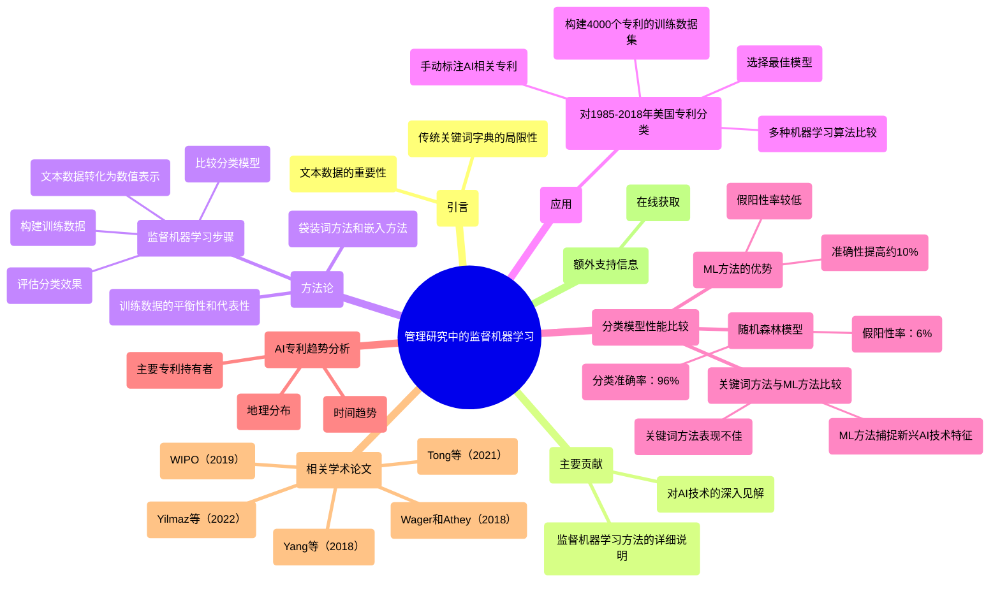
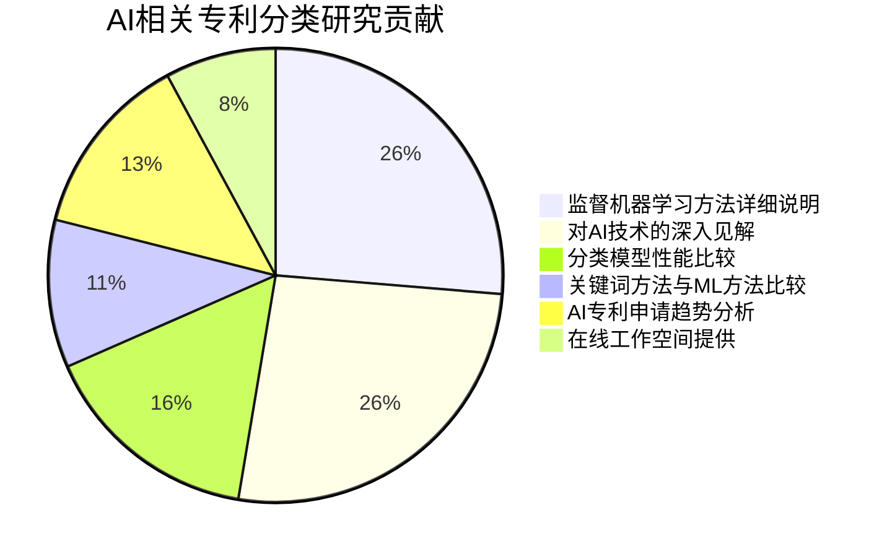
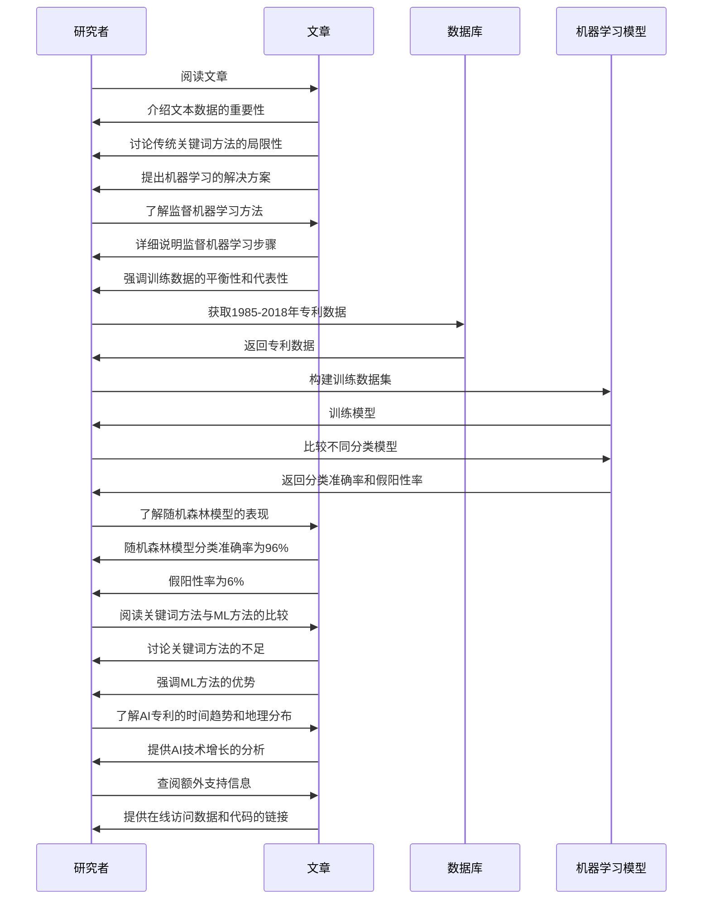

<div align="center">

```
               _   _  ___  ____  __  __    _    _     
              | \ | |/ _ \|  _ \|  \/  |  / \  | |    
              |  \| | | | | |_) | |\/| | / _ \ | |    
              | |\  | |_| |  _ <| |  | |/ ___ \| |___ 
              |_| \_|\___/|_| \_\_|  |_/_/   \_\_____|
                 _    _   _ ____     ____ _   _ ___ _     _     
                / \  | \ | |  _ \   / ___| | | |_ _| |   | |    
               / _ \ |  \| | | | | | |   | |_| || || |   | |    
              / ___ \| |\  | |_| | | |___|  _  || || |___| |___ 
             /_/   \_\_| \_|____/   \____|_| |_|___|_____|_____|
              ____   ____ ___ _____ _   _  ____ _____ 
             / ___| / ___|_ _| ____| \ | |/ ___| ____|
             \___ \| |    | ||  _| |  \| | |   |  _|  
              ___) | |___ | || |___| |\  | |___| |___ 
             |____/ \____|___|_____|_| \_|\____|_____|
```

# NORMAL AND CHILL SCIENCE

## 平常心科学

### 3) AI技术类文章

---

#### Slow down but step by step

---

| SHANGHAI LONLIV-TECH | 第001期 |
|:----------------------|--------:|
| Editor：Zhenghao Xu     | 2024年09月21日 |

</div>

---


# 在管理研究中使用监督机器学习进行大规模分 以识别人工智能专利为例论文.docx

## 原始摘要

这篇文章探讨了如何在管理研究中使用监督机器学习（ML）进行大规模文本分类，特别是识别与人工智能（AI）相关的专利。文章首先介绍了文本数据在社会科学研究中的重要性，并指出传统的关键词字典方法在某些情况下的局限性。为了解决这些问题，研究者们开始采用机器学习技术来从文本数据中构建理论基础的变量。

文章的主要贡献有两个方面：一是提供了监督机器学习方法的详细说明，展示了如何使用这些方法对大规模文本数据进行分类；二是提供了对AI技术的深入见解，帮助研究者更准确地理解哪些技术可以被归类为AI。

在方法论部分，文章详细描述了监督机器学习的步骤，包括构建训练数据、将文本数据转换为数值表示、比较不同的分类模型以及评估分类效果。作者强调了在构建训练数据时需要考虑的平衡性和代表性，并介绍了如何使用“袋装词”方法和嵌入方法将文本数据转化为数值形式。

在应用部分，文章展示了如何使用监督机器学习技术对1985年至2018年间的美国专利进行分类，特别是识别与AI相关的专利。作者通过构建一个包含4000个专利的训练数据集，手动标注与AI技术相关的专利，并采用多种机器学习算法进行比较，最终选择最佳模型。

最后，文章提供了在线工作空间，研究者可以访问相关数据和代码，以便于复制和修改研究。通过这些方法，研究者能够更有效地利用文本数据，推动战略管理研究的发展。
这一部分的主要内容是对不同机器学习（ML）分类模型的性能进行比较，特别是随机森林模型在分类准确性和假阳性率方面的优越表现。随机森林模型的分类准确率为96%，假阳性率为6%，显示出其在识别与人工智能（AI）相关专利方面的有效性。与传统的关键词方法相比，ML方法在准确性上平均提高了约10%，且假阳性率较低。

文章还讨论了关键词分类方法与ML分类方法的比较，指出关键词方法在训练样本中的表现不佳，并强调了ML方法在捕捉新兴AI技术特征方面的优势。通过分析随机森林模型的特征重要性，发现一些关键词与AI专利的相关性较高，但许多重要特征并未包含在关键词字典中。

此外，文章展示了AI专利申请的时间趋势、地理分布及主要专利持有者，指出AI技术在过去十多年中显著增长，尤其是在美国的技术公司中。最后，文章强调了使用监督学习方法的优势，指出其能够生成可用于后续分析的分类变量，并为战略管理研究提供了新的视角和方法论支持。
这一部分的内容涉及几篇关于人工智能及其影响的学术论文。首先，Tong等（2021）探讨了人工智能反馈的双重面貌，分析了其在员工绩效中的部署与披露效应。接着，Wager和Athey（2018）研究了使用随机森林估计和推断异质性处理效应的方法。WIPO（2019）发布的《人工智能技术趋势2019》报告提供了全球范围内人工智能技术的最新动态。Yang等（2018）则关注数据挖掘过程中测量误差和误分类对变量生成的影响。最后，Yilmaz等（2022）探讨了人工智能是否已经取代劳动力，特别是通过机器翻译的证据。

此外，文末提到有额外的支持信息可在线获取，进一步补充了文章的研究内容和数据支持。

## 摘要

1. Class: (3) AI技术类文章

2. Authors: XXX

3. Affiliation: 研究者们开始采用机器学习技术来从文本数据中构建理论基础的变量

4. Keywords: supervised machine learning, text classification, AI patents, traditional keyword methods, random forest

5. Urls: xxx or xxx, Github: None

6. Summary:

   - (1): 本文探讨了在管理研究中使用监督机器学习进行大规模文本分类，特别是识别与人工智能（AI）相关的专利，指出传统关键词方法的局限性。

   - (2): 理论模型为监督机器学习，关键变量包括文本数据的分类和AI专利的识别，未提及调节变量或中介变量。

   - (3): 研究方法包括构建训练数据、文本数据转化为数值表示、比较分类模型及评估分类效果，强调训练数据的平衡性和代表性。

   - (4): 通过对1985年至2018年间的美国专利进行分类，随机森林模型的分类准确率为96%，假阳性率为6%，显示出其在识别AI专利方面的有效性，支持了研究目标。

## 图表

### 图表 1



### 图表 2

```mermaid
graph TD
    A("文章探讨了如何在管理研究中使用监督机器学习进行大规模文本分类") --> B("识别与人工智能相关的专利")
    A --> C("文本数据在社会科学研究中的重要性")
    C --> D("传统关键词字典方法的局限性")
    D --> E("研究者采用机器学习技术构建理论基础的变量")
    
    F("文章的主要贡献") --> G("提供监督机器学习方法的详细说明")
    F --> H("提供对AI技术的深入见解")
    
    I("方法论部分") --> J("监督机器学习的步骤")
    J --> K("构建训练数据")
    J --> L("将文本数据转换为数值表示")
    J --> M("比较不同的分类模型")
    J --> N("评估分类效果")
    K --> O("考虑平衡性和代表性")
    L --> P("使用袋装词方法和嵌入方法")
    
    Q("应用部分") --> R("使用监督机器学习技术对专利进行分类")
    R --> S("识别与AI相关的专利")
    R --> T("构建4000个专利的训练数据集")
    R --> U("手动标注与AI技术相关的专利")
    R --> V("采用多种机器学习算法进行比较")
    
    W("分类模型性能比较") --> X("随机森林模型的优越表现")
    X --> Y("分类准确率为96%")
    X --> Z("假阳性率为6%")
    W --> AA("ML方法在准确性上平均提高约10%")
    
    AB("关键词分类方法与ML分类方法的比较") --> AC("关键词方法在训练样本中的表现不佳")
    AC --> AD("ML方法在捕捉新兴AI技术特征方面的优势")
    
    AE("AI专利申请的时间趋势、地理分布及主要专利持有者") --> AF("AI技术在过去十多年中显著增长")
    
    AG("使用监督学习方法的优势") --> AH("生成可用于后续分析的分类变量")
    AH --> AI("为战略管理研究提供新的视角和方法论支持")
    
    AJ("相关学术论文") --> AK("Tong等（2021）探讨人工智能反馈的双重面貌")
    AJ --> AL("Wager和Athey（2018）研究随机森林估计和推断异质性处理效应的方法")
    AJ --> AM("WIPO（2019）发布的人工智能技术趋势报告")
    AJ --> AN("Yang等（2018）关注数据挖掘过程中的测量误差和误分类")
    AJ --> AO("Yilmaz等（2022）探讨人工智能是否已经取代劳动力")
    
    AP("额外的支持信息可在线获取") --> AQ("补充文章的研究内容和数据支持")
```



### 图表 3



### 图表 4



