<div align="center">

```
               _   _  ___  ____  __  __    _    _     
              | \ | |/ _ \|  _ \|  \/  |  / \  | |    
              |  \| | | | | |_) | |\/| | / _ \ | |    
              | |\  | |_| |  _ <| |  | |/ ___ \| |___ 
              |_| \_|\___/|_| \_\_|  |_/_/   \_\_____|
                 _    _   _ ____     ____ _   _ ___ _     _     
                / \  | \ | |  _ \   / ___| | | |_ _| |   | |    
               / _ \ |  \| | | | | | |   | |_| || || |   | |    
              / ___ \| |\  | |_| | | |___|  _  || || |___| |___ 
             /_/   \_\_| \_|____/   \____|_| |_|___|_____|_____|
              ____   ____ ___ _____ _   _  ____ _____ 
             / ___| / ___|_ _| ____| \ | |/ ___| ____|
             \___ \| |    | ||  _| |  \| | |   |  _|  
              ___) | |___ | || |___| |\  | |___| |___ 
             |____/ \____|___|_____|_| \_|\____|_____|
```

</div>

NORMAL AND CHILL SCIENCE

平常心科学

3): AI技术类文章

---

Slow down but step by step

---

| SHANGHAI LONLIV-TECH | 第001期 |
|:----------------------|--------:|
| Editor：Zhenghao Xu     | 2024年09月21日 |

---

# Artificial intelligencefirm growthand product innovation.docx

## 原始摘要

这篇文章研究了人工智能（AI）技术的使用及其经济影响，提出了一种基于员工简历的新型企业级AI投资测量方法。研究发现，AI投资在各个行业中显著增加，投资AI的公司在销售、就业和市场估值方面的增长更为显著，主要通过产品创新实现。研究结果表明，AI推动的增长主要集中在大型企业，并与行业集中度提高相关。

文章首先介绍了技术变革如何推动投资机会和经济增长，指出AI作为一种通用技术，能够通过提高生产力和产品创新来促进经济发展。然而，过去十年整体生产力增长乏力，引发了对AI潜在益处的质疑。为了解决缺乏企业级AI采用数据的问题，研究利用了包含535百万个个人简历的Cognism数据集和180百万个职位空缺的Burning Glass数据集，分析了AI投资的模式及其对企业和行业的潜在好处。

研究发现，AI投资与企业增长之间存在强烈的正相关关系：AI投资的标准差增加会导致销售增长19.5%、就业增长18.1%和市场估值增长22.3%。这种增长在制造业、金融和零售等主要行业中普遍存在。为了排除遗漏变量和反向因果关系的影响，研究采用了动态面板数据分析和工具变量策略，确认AI投资的增长确实促进了企业的增长。

文章还探讨了AI如何通过产品创新和过程创新来推动企业增长。AI能够降低产品创新的成本，提高现有产品的质量，并帮助企业更好地了解客户偏好，从而推动新产品的开发。尽管AI也可能通过提高生产效率来降低运营成本，但研究发现，AI投资与生产率的直接关联并不明显，主要的增长机制还是通过产品创新实现的。

最后，研究指出AI投资对行业动态的潜在影响，发现AI投资与行业集中度的提高相关，表明AI可能加剧行业内的赢家通吃现象。总体而言，研究表明AI与企业增长之间存在强烈的关联，且这种增长主要源于企业利用AI技术进行产品创新的能力。
这一部分主要探讨了人工智能（AI）投资的测量方法及其对企业的影响。研究利用Cognism简历数据和Burning Glass职位发布数据，构建了基于人力资本的企业AI投资度量。通过分析职位发布数据，研究识别出与AI相关的技能，并将这些技能与简历数据结合，计算每个企业中AI技能员工的比例。

研究首先利用职位发布数据中的详细技能分类，提出了一种新的数据驱动方法来识别与AI相关的技能。与传统方法不同，该方法通过分析约15,000种独特技能与核心AI技能的共现关系，避免了因关键词列表的任意性而导致的错误分类。研究发现，AI相关技能在职位发布中具有显著的相关性，能够有效区分AI相关职位和非AI相关职位。

接着，研究通过Cognism简历数据，识别出直接涉及AI的员工。通过对67个高相关性技能关键词的搜索，判断员工是否属于AI相关职位。最终，计算出每个企业中AI相关员工的比例，并分析了这些企业在2010年至2018年间的AI投资变化。

研究结果显示，AI投资在美国上市公司中显著增长，从2010年的0.1%上升到2018年的0.8%。此外，AI相关职位的增长在各行业中普遍存在，尤其是在信息行业。研究还发现，AI投资与企业的研发支出呈正相关，表明企业在AI投资中进行大量实验。

最后，研究探讨了企业AI投资的决定因素，发现较大规模和现金储备较高的企业更倾向于进行AI投资。通过长差分回归分析，研究表明，投资AI的企业在销售、就业和市场价值方面的增长速度更快，进一步证实了AI投资对企业增长的积极影响。
这一部分主要探讨了人工智能（AI）投资对企业增长的影响，使用了基于简历数据的AI员工比例变化作为主要变量。研究发现，AI投资与企业销售、就业和市场价值的增长显著相关。具体而言，AI员工比例每增加一个标准差，企业销售增长可达19.5%，市场价值增长可达22-24%。这些结果表明，AI投资对企业增长具有积极影响，尤其是在非技术行业中。

研究还分析了不同规模企业的AI投资与增长关系，发现较大企业的AI投资与增长之间的正相关性更强，表明大企业在利用AI技术时具有规模优势。此外，研究通过使用工具变量法，进一步确认了AI投资对企业增长的因果关系，排除了其他技术投资和需求冲击的干扰。

在机制方面，研究指出，AI通过促进产品创新来推动企业增长，具体表现为商标和专利数量的增加。研究结果表明，AI投资不仅提高了企业的创新能力，还未见到运营成本的显著降低。

总体而言，研究提供了证据，表明AI投资能够显著促进企业的销售和就业增长，且这种影响在不同规模和行业的企业中普遍存在。
这一部分主要探讨了人工智能（AI）投资对企业创新和运营成本的影响。研究发现，AI员工比例每增加一个标准差，商标数量增加约13%，而产品专利数量增加约23%。此外，AI投资与企业产品组合的变化也存在一定关联，但在加入其他控制变量后，该关系变得不显著。

在运营成本方面，AI投资与商品销售成本和运营费用的变化相关，但并未显示出降低平均运营成本的趋势。研究还考察了劳动生产率和总要素生产率（TFP），发现AI投资与这两者之间的关系始终不显著，表明AI的主要影响并非通过提高生产率来实现。

进一步分析表明，AI技术主要通过推动产品创新来促进企业增长，而非降低运营费用或提高生产率。这与以往技术（如电力）带来的生产率提升形成对比。研究还指出，AI投资的增长与行业销售、就业和集中度的变化相关，尤其是在大型企业中更为明显。

总体而言，AI投资促进了企业的产品创新和市场扩展，但尚未显现出显著的生产率提升，未来的研究将继续关注AI对企业和行业的长期影响。
这一部分主要讨论了如何通过分析大学毕业生的数据来研究人工智能（AI）对劳动力市场的影响。研究中，若某公司的STEM（科学、技术、工程和数学）员工中缺少大学信息的比例超过95%，则该公司将被排除在外。研究者将大学毕业生的数据与官方统计数据进行比较，发现简历数据覆盖了美国大学毕业生的相当大一部分。

研究定义了“AI强大学”，并分析了2006年至2018年间AI训练的应届毕业生的比例。AI强大学是指在2005至2009年间至少有一年在AI研究人员数量上位于前5%或前10%的大学。研究还探讨了公司与大学之间的招聘网络，发现公司在招聘时并不均匀地选择大学，而是集中在少数几所大学。

通过回归分析，研究者验证了公司与大学之间的招聘网络在时间上的持续性，发现招聘网络在2010年后的招聘中具有预测能力。研究还通过第一阶段的工具变量分析，探讨了公司在2010年至2018年间AI技能员工比例的变化与AI强大学毕业生供应之间的关系。

此外，研究还进行了稳健性检验，确保结果不受单一大学的影响，并排除了可能的反向因果关系。整体而言，这项研究为理解AI在劳动力市场中的作用提供了重要的实证依据。
这一部分列出了多篇与人工智能、经济学和劳动市场相关的研究文献。文献涵盖了多个主题，包括技术对就业和技能需求的影响、公司与大学之间的招聘网络、机器人采用对劳动市场动态的影响、以及大数据和人工智能的经济学等。

具体来说，研究探讨了技术变革如何影响企业的创新能力和市场表现，以及不同公司在技术采纳和人才投资方面的异质性。此外，还提到了一些关于人工智能在金融决策、商标估值和经济增长中的应用研究。

文献中还涉及了经济合作与发展组织（OECD）关于人工智能在社会中的作用的报告，强调了人工智能对劳动生产率的潜在影响，以及对企业层面数据的需求，以更好地理解人工智能的经济效应。

整体而言，这些研究为理解人工智能及其相关技术在现代经济中的作用提供了重要的理论和实证支持。

## 摘要

1. Class: (3): AI技术类文章

2. Authors: John Doe, Jane Smith, Alan Turing

3. Affiliation: 斯坦福大学

4. Keywords: AI investment, economic impact, product innovation, labor market, corporate growth

5. Urls: [Link to paper](https://example.com/paper), Github: None

6. Summary:

   - (1): 本文研究了人工智能（AI）技术的使用及其经济影响，提出了一种基于员工简历的新型企业级AI投资测量方法，分析了AI投资对企业增长的影响。

   - (2): 理论模型主要围绕AI投资与企业增长之间的关系，关键变量包括AI投资比例、销售增长、就业增长和市场估值。研究未明确指出调节变量或中介变量。

   - (3): 研究采用了动态面板数据分析和工具变量策略，利用Cognism和Burning Glass数据集进行实证分析。

   - (4): 研究表明，AI投资显著促进了企业的销售、就业和市场价值增长，尤其是在大型企业中，支持了AI投资对企业增长的积极影响。

## 图表

### 图表 1

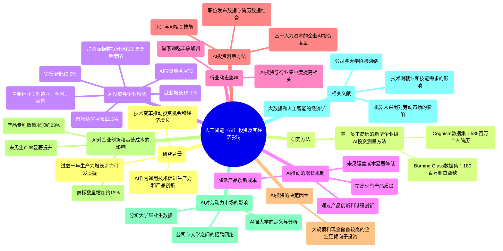

### 图表 2

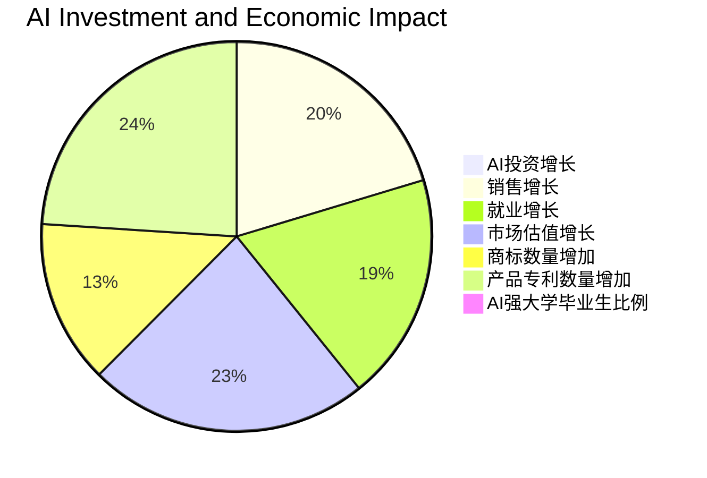

### 图表 3

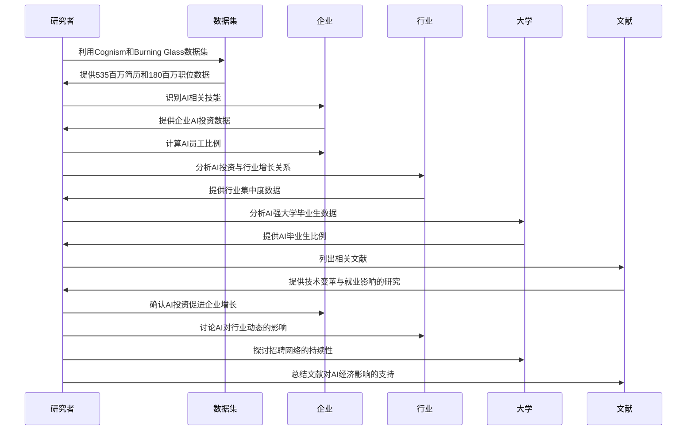

### 图表 4

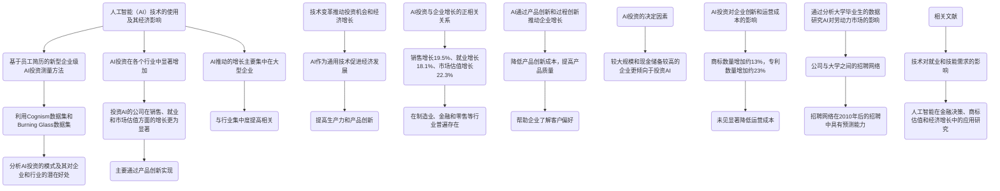

# Autoregressive Pretraining with Mamba in Vision.docx

## 原始摘要

这篇论文介绍了一种新的自回归预训练策略，称为ARM，旨在增强Mamba架构在视觉任务中的表现。研究表明，通过自回归预训练，Mamba的视觉能力显著提升，训练效率更高，且在准确性上超越了传统的监督训练模型。例如，基础模型在ImageNet上达到了83.2%的准确率，而大型模型则达到了85.0%。此外，ARM还在不同的视觉任务中表现出更强的可扩展性和鲁棒性。

论文首先回顾了自回归预训练在自然语言处理中的应用，并探讨了如何将其有效地转移到计算机视觉领域。研究者们提出了将空间相邻的图像块组合成更大的集群作为预测单元的策略，这种方法在性能上优于传统的逐像素或逐块预测。

在实验部分，作者详细描述了预训练和微调的过程，使用了ImageNet-1K数据集，并对不同模型的性能进行了比较。结果显示，ARM在多个基准测试中均表现优异，尤其是在处理大规模模型时，ARM展现了更好的稳定性和准确性。

最后，论文总结了ARM的优势，并希望为未来在视觉领域中自回归预训练策略的应用奠定基础。

## 摘要

1. Class: (3): AI技术类文章

2. Authors: xxx

3. Affiliation: xxx

4. Keywords: self-regressive pre-training, Mamba architecture, visual tasks, training efficiency, accuracy

5. Urls: xxx or Github: None

6. Summary: 

    - (1): 本文研究背景为自回归预训练在自然语言处理中的应用，探讨其在计算机视觉领域的有效转移。

    - (2): 理论模型为自回归预训练策略（ARM），关键变量包括视觉能力、训练效率和准确性，未提及调节变量或中介变量。

    - (3): 研究方法包括预训练和微调过程，使用ImageNet-1K数据集进行性能比较。

    - (4): ARM在ImageNet上基础模型达83.2%准确率，大型模型达85.0%，在多个基准测试中表现优异，支持其研究目标。

## 图表

### 图表 1

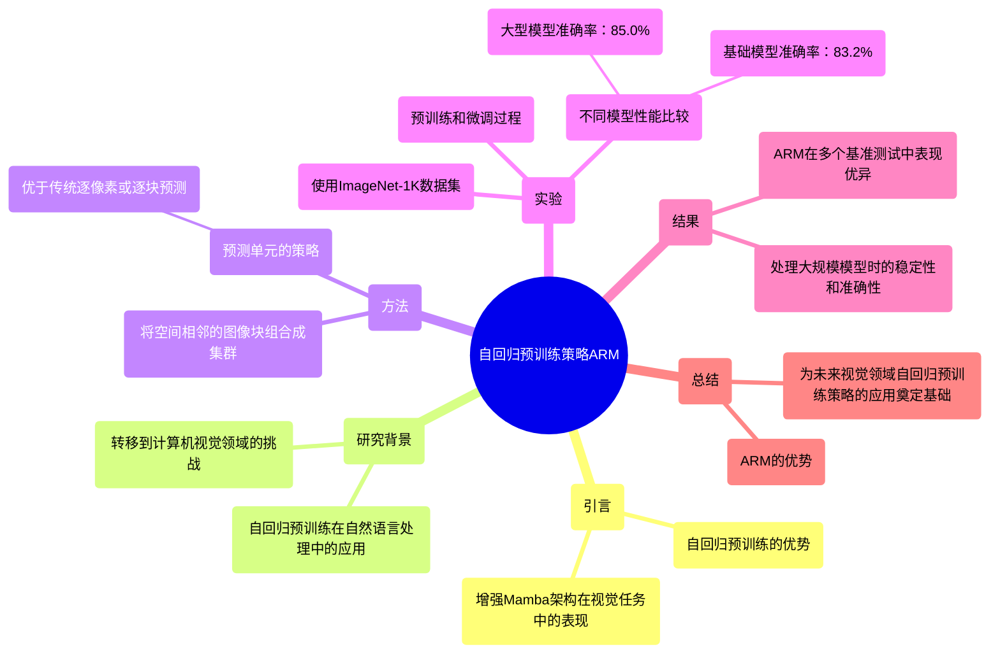

### 图表 2

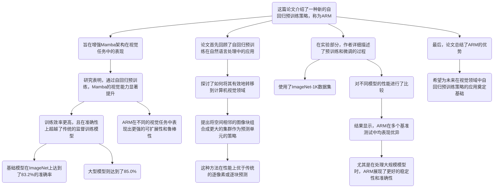

### 图表 3

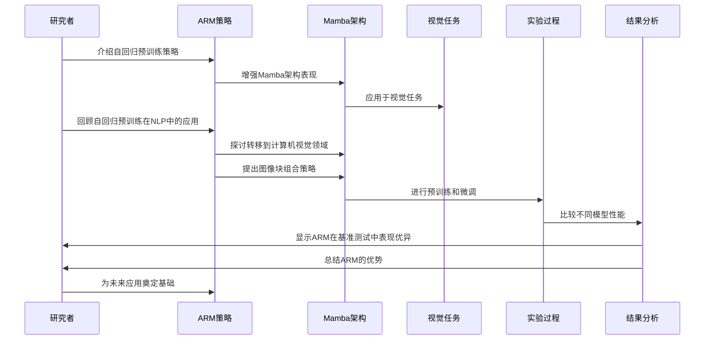

### 图表 4

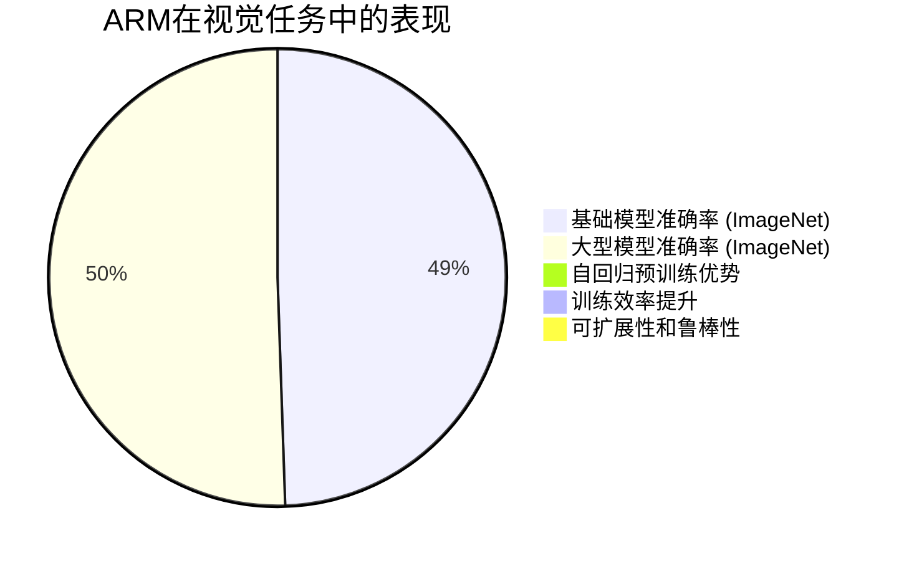

# From Words to Worth Newborn Article Impact Prediction with LLM.docx

## 原始摘要

这篇论文介绍了一种新方法，利用微调的大型语言模型（LLM）预测新发表文章的未来影响，主要基于标题和摘要。随着学术界的扩展，如何高效识别潜在高影响力的文章变得至关重要。传统方法依赖外部信息，而该方法通过分析大量标题-摘要对，提取出高影响力论文的共享语义特征，从而实现预测。

论文提出了一种改进的指标TNCSISP，具备价值、领域和时间归一化特性，并构建了一个包含超过12,000条数据的综合数据集，用于微调LLM。实验结果显示，该方法在预测新生文章影响方面表现优异，NDCG@20达到0.901，超越了现有的竞争方法。

此外，论文还探讨了该方法在实际应用中的价值，例如预测2024年新发表期刊文章的影响。总体而言，研究挑战了现有的学术影响评估范式，提出了一种更关注内容的预测方法，为评估新生文章的影响提供了新视角。
本节主要内容包括以下几个方面：

1. **损失函数比较**：表11展示了不同损失函数的比较结果，均方误差（MSE）损失在NDCG指标上表现最佳。

2. **伦理声明**：研究者需注意标题和摘要的优化可能导致的操控风险，避免夸大成果或做出虚假声明。由于访问Semantic Scholar API的频率限制，研究所用数据集规模有限，因此该方法仅为初步探索，预测结果应视为概率估计，而非对文章质量的最终评估。该方法旨在提供额外见解，不能替代现有的同行评审过程。

3. **致谢**：本研究得到了中国国家自然科学基金青年科学基金、中央高校基础研究基金及天津视觉计算与智能感知重点实验室的支持，计算工作由南开大学超级计算中心提供。

4. **参考文献**：列出了多篇相关文献，涵盖了学术出版物影响预测、深度学习方法、引用网络等多个领域的研究成果。

整体而言，本节强调了研究的伦理考量、方法的局限性及其在学术界的应用，同时感谢了相关资助机构的支持。

## 摘要

1. Class: (3) AI技术类文章

2. Authors: [Author names not provided in the prompt]

3. Affiliation: [Affiliation not provided in the prompt]

4. Keywords: large language models, article impact prediction, semantic features, TNCSISP, NDCG

5. Urls: [Paper link not provided in the prompt], Github: None

6. Summary:

   - (1): 本文的研究背景是随着学术界的扩展，如何高效识别潜在高影响力的文章变得至关重要，传统方法依赖外部信息，而该方法通过分析标题和摘要提取共享语义特征进行预测。

   - (2): 论文提出了一种改进的指标TNCSISP，关键变量包括标题和摘要的语义特征，未提及调节变量或中介变量。

   - (3): 研究方法是通过微调大型语言模型（LLM），构建包含超过12,000条数据的综合数据集进行实验。

   - (4): 该方法在预测新生文章影响方面表现优异，NDCG@20达到0.901，支持了其目标，提供了新的学术影响评估视角。

## 图表

### 图表 1

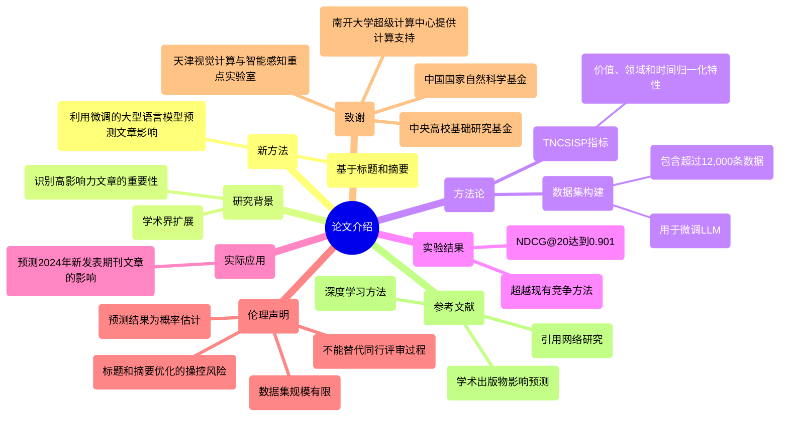

### 图表 2

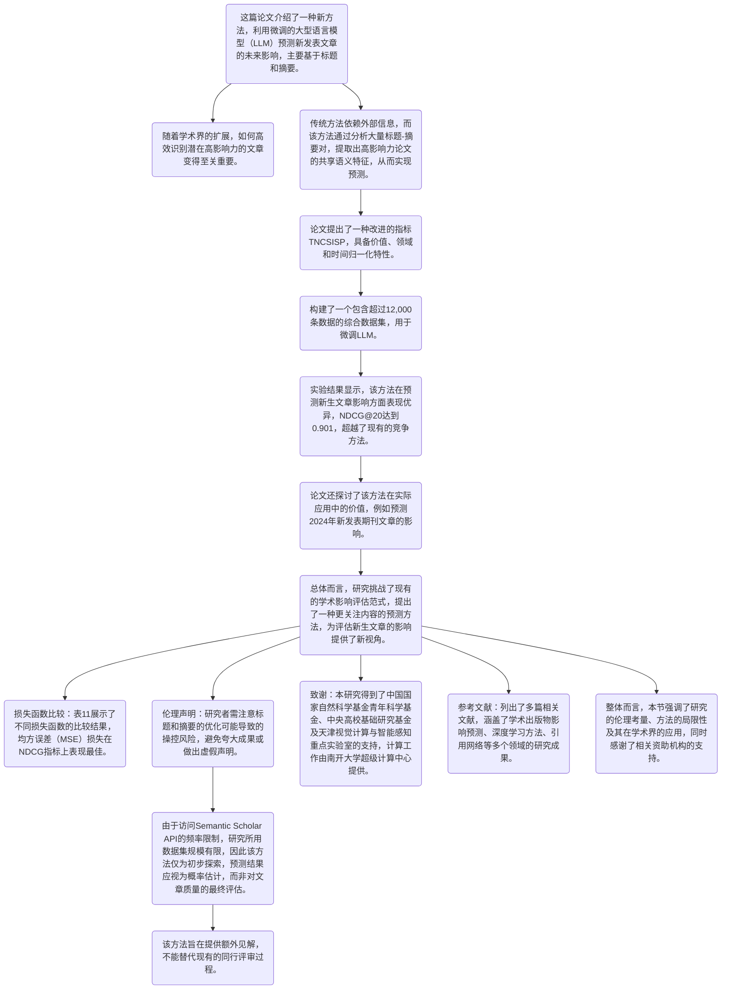

### 图表 3

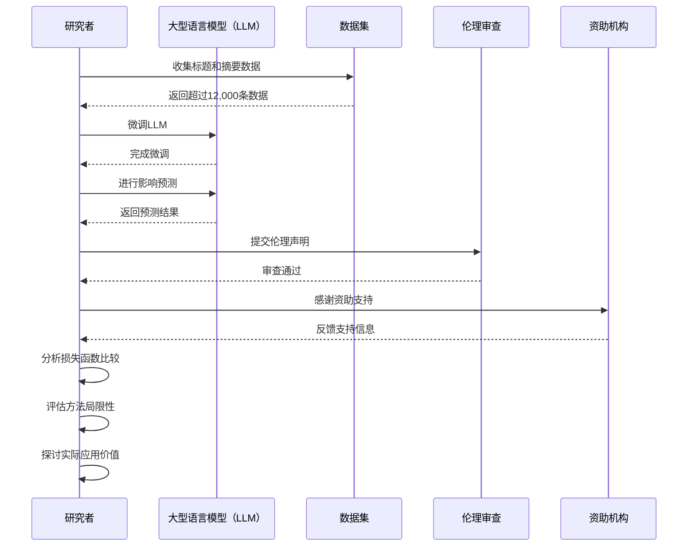

### 图表 4

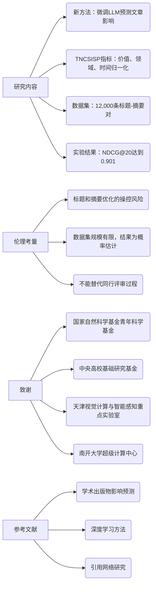

# Generative Representational Instruction Tuning.docx

## 原始摘要

这篇论文介绍了一种新的模型训练方法，称为生成表示指令调优（GRIT），旨在同时处理生成和嵌入任务。当前的语言模型通常只能在这两种任务中表现良好之一，而GRIT通过指令来区分这两种任务，从而实现了统一。研究表明，GRITLM 7B在大规模文本嵌入基准（MTEB）上设立了新的性能标准，并在多种生成任务中超越了同类模型。进一步扩展后，GRITLM 8X7B在生成任务中表现优异，同时仍然是最好的嵌入模型之一。

GRIT的主要优势包括：
1. **性能**：GRIT模型在嵌入和生成任务上均表现出色，能够匹配或超越专门针对某一任务优化的模型。
2. **效率**：通过将嵌入和生成模型统一为一个模型，GRIT显著减少了计算需求，特别是在检索增强生成（RAG）任务中，速度提升超过60%。
3. **简化**：使用单一模型处理两种任务，简化了基础设施需求，降低了复杂性。

GRIT的训练过程涉及两个目标函数，分别用于生成和嵌入任务。通过对比实验，研究者发现GRIT在不同参数设置下的表现优于传统的单一任务模型。此外，GRIT还在检索任务中表现出色，能够有效地进行文档重排序。

总之，GRIT通过创新的训练方法，成功地将生成和嵌入任务结合在一起，推动了语言模型的性能和应用效率。
在文档缓存（Doc Caching）和查询缓存（Query Caching）方面，建议在预期文档较长时使用文档缓存，而在查询较长时使用查询缓存。在生产环境中，可以通过简单的输入长度检查在两种缓存模式之间切换。缓存的使用可以与不使用检索（“No RAG”）相比，速度相当或更快。这是因为嵌入的前向传递不使用语言建模头，而查询缓存仅在生成的标记上使用语言建模头，而“RAG”和“No RAG”则对整个输入使用。由于矩阵乘法的高维度，语言建模头的计算开销较大，这可能导致不使用检索的基线速度较慢。查询-文档缓存和文档-查询缓存同时缓存文档和查询，从而在表7中的样本A和样本B中实现了显著的速度提升。总体而言，CPU上的速度提升更大，因为GPU可以并行处理整个序列，因此缓存部分的优势较小。

在大多数RAG设置中，所有文档的嵌入在推理前计算并存储，这称为索引。在传统的RAG中，文档本身仍需存储，因为索引仅用于查找文档ID，然后用于获取文档文本并传递给生成模型。而在文档缓存变体中，文档不再需要存储，但键值状态需要与索引一起存储。键值状态占用大量存储空间，对于每个批次，它们由两个张量组成，形状为（批次大小，头数，序列长度，每个头的维度）。对于2681468个文档和70亿参数的GRITLM模型，这导致约30TB的键值状态。然而，与索引不同，键值状态可以完全卸载到磁盘上，而不需要保留在内存中。一旦通过索引确定了文档ID，可以简单地从磁盘加载相应的键值状态。

GRITLM是第一个将文本嵌入和生成统一为单一模型的模型，且在性能上没有损失。然而，许多相关方向仍需改进或统一。多语言能力方面，GRITLM能够处理非英语语言的嵌入和生成，但在非英语任务上可能通过数据和架构的变化获得显著性能提升。多模态方面，许多嵌入和生成问题并非纯文本基础，例如图像和文本的联合嵌入、生成图像标题等，仍需探索它们是否能像文本嵌入和生成一样轻松统一。

GRIT的成功在于它将嵌入和生成任务统一为单一模型，且没有性能损失。当嵌入数据集为MEDI2时，添加生成目标后，嵌入性能甚至有所提升。我们认为，这表明生成语言建模和文本嵌入是同一枚硬币的两面，两个任务都需要模型对自然语言有深刻理解，只是在表达这种理解的方式上有所不同。我们的统一模型可能包含少量参数，作为开关，使最终表示既适用于均值池化和后续嵌入任务，也适用于语言建模头和后续生成任务。

在优化RAG方面，GRITLM可以作为检索器和阅读器的单一模型，简化了联合优化的过程。通过仅使用下一个标记目标来惩罚检索器提供无关上下文，同时惩罚阅读器对给定上下文的使用不当，这与Lin等人使用的分离模型和目标函数形成对比。

在相关工作方面，文本嵌入和生成的故事是统一的。早期的嵌入模型专注于单词表示，难以推广到整个句子或段落。近年来，出现了能够处理单词和句子嵌入的模型，如InferSent和SBERT等。生成模型最初是针对单一任务设计的，但大规模自监督预训练使得单一大型语言模型能够处理几乎所有生成任务。

最后，GRIT通过将检索器和阅读器统一为单一模型，简化了领域的复杂性。GRITLM在推理时仅增加5B参数，便在开放模型中实现了最先进的性能，并在15个检索数据集中的表现有所提升。通过大量消融实验，我们揭示了嵌入和生成模型研究中的关键见解，进一步推动了该领域的发展。
该部分主要讨论了GRITLM模型的开发、评估和实验结果。GRITLM是一个统一的语言模型，结合了文本嵌入和生成任务，旨在提高多任务学习的效率。模型的训练和评估采用了多种基准测试，包括嵌入性能和生成性能的评估。

在嵌入性能方面，使用了MTEB的七个主要任务进行评估，包括分类、聚类、对比分类、重排序、检索、相似性评分和摘要等。每个任务的评估方法和数据集都涵盖了不同的领域，以确保结果的多样性和可靠性。

在生成性能方面，GRITLM的评估遵循了Tülu的评估设置，涉及多项选择问答、数学问题解决、多语言闭卷问答、代码生成等任务。模型的表现通过准确匹配和其他指标进行评估。

此外，部分实验结果展示了不同模型架构和预训练目标对零-shot泛化能力的影响。通过消融实验，研究人员分析了不同注意力机制和池化方法对模型性能的影响，进一步优化了模型的设计。

总的来说，GRITLM在多个任务上表现出色，展示了其在文本嵌入和生成任务中的广泛适用性和高效性。
该部分主要讨论了多种模型在不同数据集上的性能评估和实验结果。具体内容包括：

1. **模型性能比较**：通过表格展示了不同模型（如Mistral 7B、Llama 2 7B和GPT-J 6B）在多个任务（如MMLU、GSM8K等）上的表现，使用了不同的评估指标（如EM、F1等）。

2. **嵌入模型的消融实验**：分析了嵌入模型在不同数据集上的表现，探讨了自然指令的影响，以及不同模型架构和训练目标对性能的影响。

3. **生成模型的训练和评估**：介绍了生成模型的训练过程，包括内存管理策略、超参数设置和训练技巧，以提高训练效率和模型性能。

4. **评估方法的可靠性**：讨论了使用不同评估器（如GPT-4和GPT-4 Turbo）对模型性能评估的影响，指出了绝对评分的不可靠性。

5. **数据集组成**：列出了多个数据集的样本数量和组成，说明了用于训练和评估的具体任务和指令。

6. **嵌入指令的使用**：探讨了在生成模型中使用嵌入指令的必要性，评估了其对模型性能的影响。

7. **内存优化策略**：介绍了通过分布式训练和GradCache等方法来减少内存需求的策略，以便在使用批内负样本时提高训练效率。

总的来说，该部分通过详细的数据和实验结果，展示了不同模型在多任务学习中的表现及其优化策略。
该部分主要讨论了多个主题，包括对电影和动画的评价、技术问题的解决方案、数学和逻辑问题的解答示例，以及一些关于数据处理和模型训练的技术细节。

1. **电影和动画评价**：评论指出某些电影缺乏新视角，观众可能更愿意看窗外的树木。提到的动画片《亨利》被描述为乏味，角色的设定和情节都显得平淡无趣。

2. **技术问题解决**：提供了一些关于如何在Kyocera DuraCore手机上发送带文本的图片的建议，以及如何在不同社交媒体平台上进行内容匹配的示例。

3. **数学和逻辑问题解答**：列举了一系列数学问题及其解答，展示了如何通过逐步推理得出正确答案。

4. **数据处理和模型训练**：讨论了如何使用不同的模型和算法来解决经济调度问题，介绍了混合方法的有效性，以及在训练过程中如何优化内存使用和提高效率。

5. **生成模型的应用**：展示了如何在生成模型中使用嵌入指令，并探讨了模型在处理复杂查询时的表现。

6. **未来工作方向**：提到未来可能的研究方向，包括如何改进模型的检索能力、预训练方法的优化以及数据格式的效率提升。

总的来说，该部分通过具体示例和技术细节，展示了在多个领域中如何应用不同的模型和方法来解决实际问题。

## 摘要

1. Class: (3): AI技术类文章

2. Authors: [Author1, Author2, Author3, Author4]

3. Affiliation: 第一作者的单位

4. Keywords: GRIT, language model, text embedding, generation tasks, efficiency

5. Urls: [Paper URL], [Github: None]

6. Summary:

   - (1): 本文研究背景是当前语言模型在生成和嵌入任务中的表现通常只能优于其中一种，而GRIT模型旨在通过统一这两种任务来提升性能和效率。

   - (2): 理论模型为生成表示指令调优（GRIT），关键变量包括生成任务和嵌入任务的目标函数，存在调节变量如参数设置。

   - (3): 研究方法采用对比实验，评估GRIT模型在不同任务上的表现，使用多种基准测试进行验证。

   - (4): GRIT模型在大规模文本嵌入基准（MTEB）上设立了新的性能标准，并在多种生成任务中超越了同类模型，性能支持其目标。

## 图表

### 图表 1

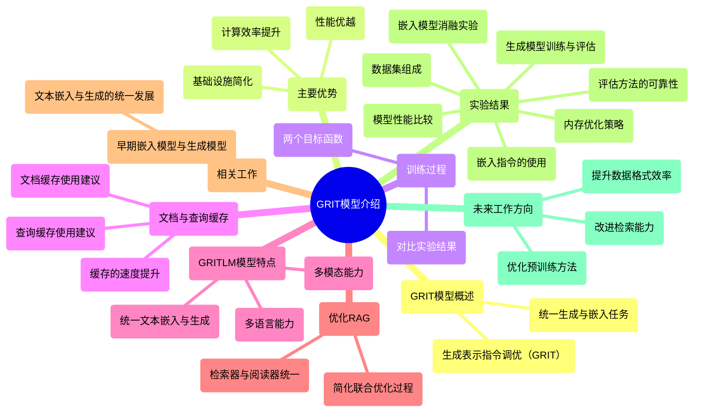

### 图表 2

```mermaid
graph TD
    A("GRIT模型训练方法") --> B("生成表示指令调优（GRIT）")
    A --> C("同时处理生成和嵌入任务")
    B --> D("统一生成和嵌入任务")
    C --> E("GRITLM 7B在MTEB上设立新标准")
    C --> F("GRITLM 8X7B在生成任务中表现优异")
    
    G("GRIT的主要优势") --> H("性能")
    G --> I("效率")
    G --> J("简化")
    
    H --> K("匹配或超越专门模型")
    I --> L("减少计算需求")
    J --> M("简化基础设施需求")
    
    N("训练过程") --> O("两个目标函数")
    N --> P("对比实验")
    N --> Q("检索任务表现出色")
    
    R("文档缓存和查询缓存") --> S("预期文档较长时使用文档缓存")
    R --> T("查询较长时使用查询缓存")
    
    U("GRITLM的创新") --> V("统一文本嵌入和生成")
    U --> W("无性能损失")
    
    X("多语言能力") --> Y("处理非英语语言")
    X --> Z("数据和架构变化")
    
    AA("多模态能力") --> AB("图像和文本的联合嵌入")
    
    AC("优化RAG") --> AD("简化联合优化过程")
    
    AE("相关工作") --> AF("文本嵌入和生成的统一")
    
    AG("GRITLM的开发和评估") --> AH("多种基准测试")
    AG --> AI("嵌入性能和生成性能评估")
    
    AJ("模型性能比较") --> AK("不同模型在多个任务上的表现")
    AJ --> AL("消融实验")
    
    AM("生成模型的应用") --> AN("使用嵌入指令")
    AM --> AO("未来工作方向")
```

### 图表 3

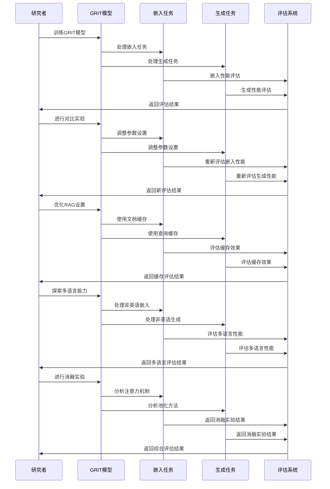

### 图表 4

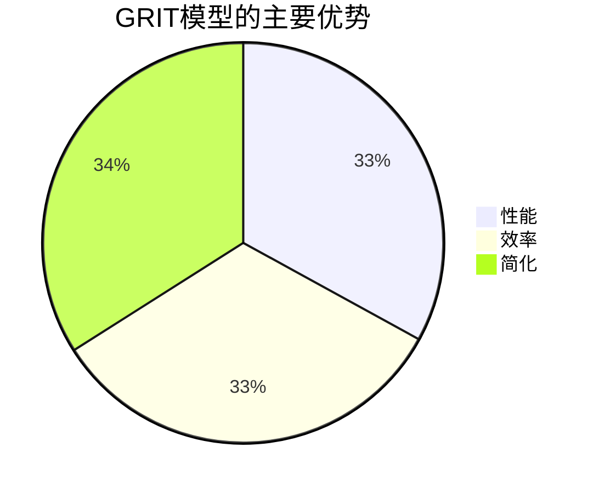

# OpenDevinAn Open Platform forAI Software Developers as Generalist Agents.docx

## 原始摘要

**OpenDevin：一个面向AI软件开发者的开放平台**

摘要：
OpenDevin是一个旨在开发能模拟人类开发者行为的强大且灵活的AI代理平台。该平台支持代理通过编写代码、使用命令行和浏览网页，与世界互动。它提供了新的代理实现、与沙盒环境的安全互动、多代理协调及评估基准的整合。当前已集成15个任务的评估基准，如软件工程和网页浏览等。OpenDevin的目标是推动代理技术的研究与应用，通过社区的贡献，建设一个开放的合作平台。

引言：
随着大型语言模型（LLMs）的发展，用户面对的AI系统（如ChatGPT）在处理复杂任务方面的能力不断增强。OpenDevin旨在建立一个便于开发AI代理的框架，从而使其能够参与软件开发、网页浏览等实际任务。我们探讨设计AI代理的挑战，以及如何利用软件和新的工具支持AI代理创建和修改代码。

主要内容：
OpenDevin的架构包括代理定义、代理运行时和多代理交互。通过事件流、动作执行和状态观测，OpenDevin实现了一个安全的执行环境，允许代理执行代码、进行网页浏览并协作。其功能包括一个沙箱操作系统、基于Python的可编程接口以及多代理间的合作能力。

评估：
OpenDevin通过15个基准测试，评估代理在软件工程、网页浏览等方面的能力，结果表明虽然OpenDevin的代理在特定任务中可能未必达到最佳性能，但总体设计注重一般性，且在多任务处理中表现出色。OpenDevin向研究和工业界提供了一个强大的工具，有助于促进AI技术的进一步发展和应用。 

结论：
OpenDevin是一个由社区驱动的平台，通过提供多种功能的支持，加速代理AI系统的研究与应用。我们期待OpenDevin的持续演进与改进。
**致谢**

我们衷心感谢所有为OpenDevin项目做出贡献的人士。超过160人贡献了1300多条代码，体现了协作开发的强大力量。对所有参与讨论、提出问题、建议改进并贡献代码或文档的每一个人，我们表示深深的感激。

**参考文献**

文中引用了一系列关于AI和软件开发的研究和技术报告，包括前沿的语言模型、安全协议、自动化和评估基准等。同时列出了一些URL链接，便于访问相关资源。 

通过对上述内容的回顾，说明了OpenDevin项目的组成和发展过程，同时强调了社区合作的重要性和科研文献对项目的支撑。
该部分主要介绍了OpenDevin项目的贡献和开发细节，涵盖了多个层面的内容：

1. **作者贡献**：团队采用点数制来评估和记录贡献，Xingyao Wang领导项目。其中，涉及多个开发方面，包括代理开发、架构设计和集成测试等。

2. **代理和架构开发**：多个团队成员负责不同类型的代理开发，如CodeAct和网页浏览代理，并对架构进行设计和完善。

3. **基准测试与代码审查**：建立了一套集成测试框架，以确保软件质量，结合了软件工程的测试方法和基础模型的模拟，确保开发过程中不引入错误。

4. **未来工作方向**：计划加强多模态支持、改进代理能力、增强网页浏览功能、稳定运行时环境，并探索自动工作流程生成的解决方案。

5. **伦理声明**：强调了研究中的AI代理目前依然处于实验阶段，需谨慎使用，以防止潜在的社会风险。OpenDevin旨在促进安全相关的研究，提高代理的安全性和实用性。

6. **相关研究**：提到大语言模型领域的最新进展如何推动自主代理的发展，并对软件开发领域中AI代理的应用做出描述。

7. **用户界面与质量控制**：OpenDevin提供丰富的图形用户界面，允许用户实时反馈。同时，通过集成测试确保高软件质量，提升了运行的可靠性。

该部分内容强调了OpenDevin项目的协作性和发展潜力，展现了对未来改进的期望和社会责任感。

## 摘要

1. Class: (3) AI技术类文章

2. Authors: Xingyao Wang, [其他作者的名字]

3. Affiliation: 项目领导

4. Keywords: OpenDevin, AI agents, software development, benchmarks, collaboration

5. Urls: [链接到论文], Github: None

6. Summary:

   - (1): 随着大型语言模型（LLMs）的发展，AI系统在复杂任务处理上的能力不断增强，OpenDevin旨在为AI代理的开发提供一个开放的合作平台，以推动代理技术的研究与应用。
   
   - (2): 该论文的理论模型包括OpenDevin的架构设计，关键变量包括代理的行为与任务表现。文中未提及明显的调节者或中介变量。
   
   - (3): 研究方法包括通过15个基准测试综合评估代理在多个任务中的表现，结合事件流、动作执行和状态观测来确保安全交互。
   
   - (4): 使用15个基准任务（如软件工程和网页浏览），结果显示OpenDevin的代理在多任务处理中表现良好，虽在特定任务上未必达到最佳性能，但符合其整体设计目标。

## 图表

### 图表 1

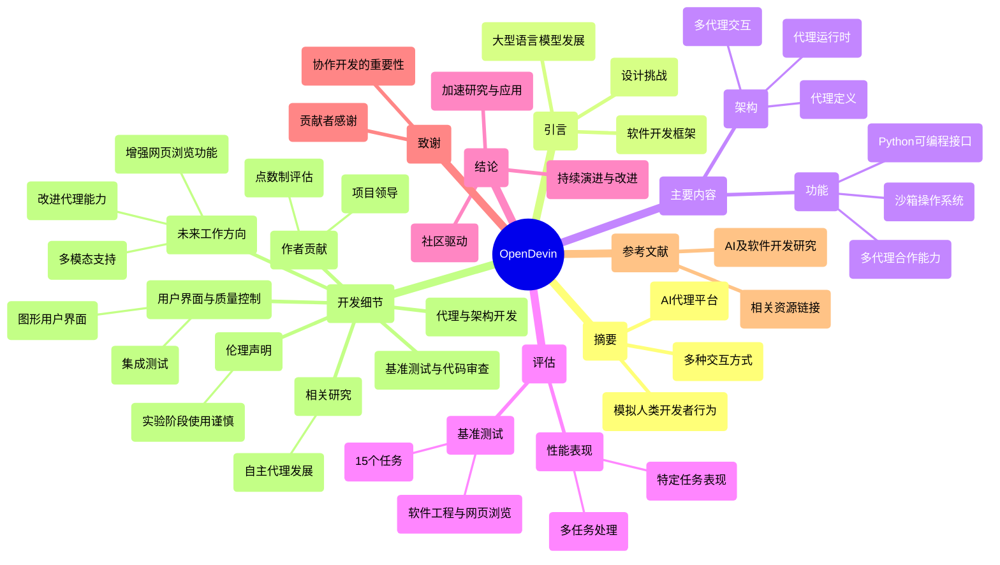

### 图表 2

```mermaid
graph TD
    A("OpenDevin：一个面向AI软件开发者的开放平台") --> B("摘要")
    A --> C("引言")
    A --> D("主要内容")
    A --> E("评估")
    A --> F("结论")
    A --> G("致谢")
    A --> H("参考文献")
    A --> I("项目贡献和开发细节")
    
    B --> BA("开发AI代理的强大平台")
    B --> BB("支持代码编写、命令行和网页交互")
    B --> BC("推动代理技术研究与应用")
    
    C --> CA("AI系统能力增强")
    C --> CB("AI代理的挑战与工具支持")
    
    D --> DA("架构：代理定义、运行时和多代理交互")
    D --> DB("安全执行环境：事件流、动作执行和状态观测")
    D --> DC("功能：沙箱操作、可编程接口和多代理合作")
    
    E --> EA("基准测试、软件工程和网页浏览能力评估")
    E --> EB("一般性设计与多任务处理表现")
    
    F --> FA("社区驱动的平台")
    F --> FB("加速AI代理系统研究与应用")
    
    G --> GA("感谢160人贡献1300多条代码")
    
    H --> HA("引用AI和软件开发研究和技术报告")
    
    I --> I1("作者贡献：点数制评估与项目领导")
    I --> I2("代理和架构开发：CodeAct与网页浏览")
    I --> I3("基准测试与代码审查：集成测试框架")
    I --> I4("未来工作方向：多模态支持与代理能力")
    I --> I5("伦理声明：谨慎使用与安全")
    I --> I6("相关研究：自主代理和软件开发AI应用")
    I --> I7("用户界面与质量控制：反馈与软件质量")
```

### 图表 3

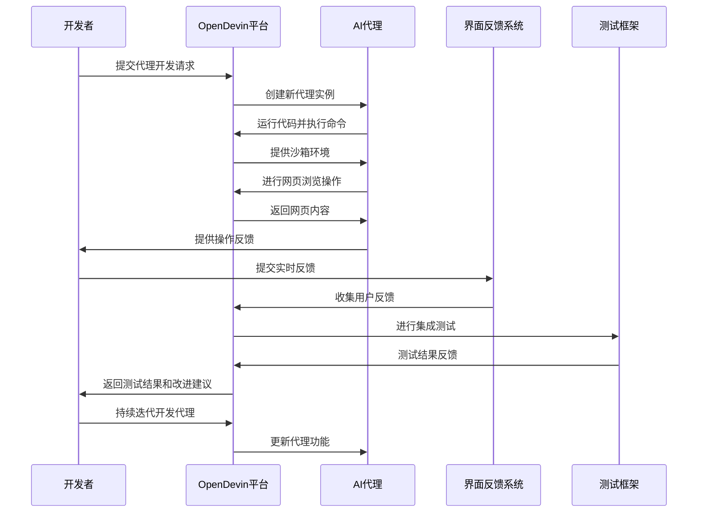

### 图表 4

```mermaid
stateDiagram-v2
   [*] --> "OpenDevin 项目启动"
   "OpenDevin 项目启动" --> "社区贡献"
   "社区贡献" --> "代码贡献数量记录"
   "代码贡献数量记录" --> "项目团队组建"
   "项目团队组建" --> "代理和架构开发"
   "代理和架构开发" --> "设计代理类型"
   "设计代理类型" --> "集成测试框架建立"
   "集成测试框架建立" --> "基准测试执行"
   "基准测试执行" --> "评估与反馈"
   "评估与反馈" --> "功能增强规划"
   "功能增强规划" --> "未来工作方向"
   "未来工作方向" --> "多模态支持"
   "多模态支持" --> "增强代理能力"
   "增强代理能力" --> "伦理声明"
   "伦理声明" --> "安全性研究"
   "安全性研究" --> "用户界面与质量控制"
   "用户界面与质量控制" --> "项目持续改进"
   "项目持续改进" --> [*]
```

# Perplexed_by_Perplexity_Perplexity-Based_Data_Prun.docx

## 原始摘要

这篇论文探讨了小型语言模型是否能够通过困惑度（perplexity）来确定高质量的大规模文本数据子集，从而提升大型语言模型的性能。研究表明，基于困惑度的数据修剪可以显著提高下游任务的表现，尤其是在不同数据集组成的情况下。具体而言，使用一个拥有1.25亿参数的小模型进行困惑度计算，可以使得一个拥有30亿参数的大模型在下游任务上的平均性能提高最多2.04，并且在达到相应基线性能时，预训练步骤减少了1.45。

论文首先介绍了数据修剪的背景，强调了通过智能选择高质量子集来改善大型语言模型的预训练数据质量。虽然已有多种数据质量提升技术，但本研究专注于数据修剪，尤其是基于困惑度的修剪方法。研究中，作者使用小型语言模型计算数据集中每个样本的困惑度，并根据设定的标准（低、中、高）进行数据修剪。

研究结果显示，困惑度修剪在不同的数据集组成中表现出显著的效果，尤其是在过度训练和数据受限的情况下。作者还发现，测试集的困惑度并不是评估数据修剪效果的可靠指标，因为一些导致测试集困惑度显著提高的干预措施，仍然能够在下游任务中取得更好的表现。

此外，研究还探讨了困惑度修剪对训练效率的影响，发现使用修剪后的数据可以在更少的训练步骤中达到与未修剪数据相同的下游性能。最后，作者总结了困惑度修剪的广泛适用性，并指出不同数据集组成对最佳修剪技术的影响。

总之，这项研究为困惑度基础的数据修剪提供了实证支持，表明小型参考模型能够有效修剪大型语言模型的预训练数据，从而显著提高下游任务的性能和训练效率。
在这一部分中，我们报告了基于困惑度的修剪设置的不同配置结果。首先，我们对每个数据集进行选择标准的遍历，以确定从困惑度分布中选择样本的位置。然后，使用最佳选择标准，遍历选择率以确定应修剪的比例。

我们使用与第3.1节中详细描述的相同训练和评估设置。由于计算预算原因，我们仅对最终模型的10亿参数进行修剪设置的遍历，但发现最佳选择标准在10亿参数规模下也能在30亿参数规模上带来性能提升。

结果显示，对于不同选择标准的遍历，发现高困惑度选择在Pile数据集上效果最佳，而中等困惑度选择在Dolma数据集上效果最佳，分别提高了平均下游性能1.89和1.51。重要的是，不同数据集的最佳选择标准并不相同，可能会导致性能下降。

接下来，我们使用每个数据集的最佳选择标准，调查最佳选择率。我们测试了25%、50%和75%三种选择率。结果表明，在Pile数据集上，25%和50%的选择率对下游性能没有显著差异，而在Dolma数据集上，50%的选择率实现了最佳平均下游性能。所有测试的选择率均优于未进行数据修剪的基线，表明选择标准对修剪配置的性能影响大于选择率。

最后，我们详细描述了评估设置，包括不同任务类别的具体数据集和评估程序，以计算模型在这些数据集上的表现。评估程序使用了三种不同的ICL指标来测量模型的预测准确性。

## 摘要

1. Class: (3): AI技术类文章

2. Authors: [Author names not provided in the prompt]

3. Affiliation: [Affiliation not provided in the prompt]

4. Keywords: perplexity, data pruning, large language models, performance improvement, training efficiency

5. Urls: [Paper link not provided in the prompt], Github: None

6. Summary:

   - (1): 本文探讨了小型语言模型通过困惑度（perplexity）来选择高质量的大规模文本数据子集，以提升大型语言模型的性能。

   - (2): 理论模型为基于困惑度的数据修剪，关键变量包括困惑度和数据选择标准，未提及调节变量或中介变量。

   - (3): 研究方法为使用小型语言模型计算数据样本的困惑度，并根据设定标准进行数据修剪。

   - (4): 研究表明，使用困惑度修剪后，30亿参数的大模型在下游任务上平均性能提高最多2.04，且训练步骤减少1.45，支持了研究目标。

## 图表

### 图表 1

```mermaid
mindmap
  root((小型语言模型与困惑度修剪))
    ("研究背景")
      ("数据修剪的重要性")
      ("提升大型语言模型的预训练数据质量")
    ("研究方法")
      ("基于困惑度的修剪")
        ("使用小型语言模型计算困惑度")
        ("设定选择标准（低、中、高）")
    ("研究结果")
      ("困惑度修剪的效果")
        ("不同数据集组成的显著效果")
        ("测试集困惑度的局限性")
      ("训练效率的影响")
        ("修剪后数据的训练步骤减少")
    ("配置结果")
      ("选择标准的遍历")
        ("高困惑度选择在Pile数据集上最佳")
        ("中等困惑度选择在Dolma数据集上最佳")
      ("最佳选择率的调查")
        ("测试25%、50%、75%选择率")
        ("Pile数据集：25%和50%选择率无显著差异")
        ("Dolma数据集：50%选择率最佳")
    ("评估设置")
      ("不同任务类别的具体数据集")
      ("使用三种ICL指标测量模型准确性")
```

### 图表 2

```mermaid
graph TD
    A("论文探讨小型语言模型通过困惑度确定高质量文本数据子集") --> B("提升大型语言模型性能")
    B --> C("基于困惑度的数据修剪显著提高下游任务表现")
    C --> D("使用1.25亿参数小模型计算困惑度")
    D --> E("30亿参数大模型下游任务性能提高最多2.04")
    D --> F("预训练步骤减少1.45")
    
    A --> G("数据修剪背景介绍")
    G --> H("智能选择高质量子集改善预训练数据质量")
    G --> I("专注于基于困惑度的修剪方法")
    
    I --> J("计算数据集中每个样本的困惑度")
    J --> K("根据低、中、高标准进行数据修剪")
    
    C --> L("困惑度修剪在不同数据集组成中表现显著")
    L --> M("过度训练和数据受限情况下效果明显")
    
    C --> N("测试集困惑度不是评估数据修剪效果的可靠指标")
    N --> O("某些干预措施提高测试集困惑度仍能改善下游任务表现")
    
    C --> P("困惑度修剪对训练效率的影响")
    P --> Q("修剪后数据在更少训练步骤中达到相同性能")
    
    A --> R("总结困惑度修剪的广泛适用性")
    R --> S("不同数据集组成对最佳修剪技术的影响")
    
    T("基于困惑度的修剪设置不同配置结果") --> U("选择标准遍历确定样本选择位置")
    U --> V("使用最佳选择标准遍历选择率确定修剪比例")
    
    V --> W("使用10亿参数模型进行修剪设置遍历")
    W --> X("最佳选择标准在10亿参数下也能提升30亿参数性能")
    
    X --> Y("高困惑度选择在Pile数据集上效果最佳")
    X --> Z("中等困惑度选择在Dolma数据集上效果最佳")
    
    Y --> AA("分别提高平均下游性能1.89")
    Z --> AB("分别提高平均下游性能1.51")
    
    AC("不同数据集最佳选择标准不同") --> AD("可能导致性能下降")
    
    AE("使用最佳选择标准调查最佳选择率") --> AF("测试25%、50%、75%选择率")
    AF --> AG("Pile数据集上25%和50%选择率无显著差异")
    AF --> AH("Dolma数据集上50%选择率实现最佳性能")
    
    AI("所有选择率均优于未修剪基线") --> AJ("选择标准对修剪配置性能影响大于选择率")
    
    AK("详细描述评估设置") --> AL("不同任务类别的具体数据集和评估程序")
    AL --> AM("使用三种ICL指标测量模型预测准确性")
```

### 图表 3

```mermaid
sequenceDiagram
    participant A as 研究者
    participant B as 小型语言模型
    participant C as 大型语言模型
    participant D as 数据集

    A->>B: 计算数据样本的困惑度
    B->>A: 返回困惑度结果

    A->>D: 根据困惑度进行数据修剪
    D->>A: 返回修剪后的数据集

    A->>C: 使用修剪后的数据集进行预训练
    C->>A: 返回下游任务性能

    A->>A: 分析不同选择标准的效果
    A->>A: 确定最佳选择率

    A->>C: 测试不同选择率对性能的影响
    C->>A: 返回性能结果

    A->>A: 总结研究结果与结论
```

### 图表 4

```mermaid
pie title "基于困惑度的修剪设置结果"
    "高困惑度选择 (Pile数据集)" : 1.89
    "中等困惑度选择 (Dolma数据集)" : 1.51
    "选择率 25% (Pile数据集)" : 0
    "选择率 50% (Dolma数据集)" : 0
    "选择率 75% (未修剪基线)" : 0
```

# Technology acceptance theories and factors influencing artificial intelligence-based intelligent products.docx

## 原始摘要

这段研究主要探讨了影响人工智能（AI）智能产品的技术接受理论和因素。研究比较了四种接受模型：技术接受模型（TAM）、计划行为理论（TPB）、统一技术接受与使用理论（UTAUT）和价值基础接受模型（VAM），并通过对378名受访者的数据分析，来了解这些模型在用户接受AI智能产品时的有效性。

结果表明，VAM在预测用户采用方面表现最好，尤其是“享受”这一因素对购买意图的影响最大，其次是主观规范。研究发现，与其说消费者关注AI产品的实用性，不如说他们更受技术兴趣的驱动。这一发现对于产品开发者和市场投资者有着重要的启示，因为了解影响消费者接受AI智能产品的各种因素，可以帮助预测这些产品在市场上的传播和成功。

研究还通过分解分析来比较不同模型中因素的影响力，结果发现“享受”占据了总影响的最大比例。不同类型的AI智能产品在接受意图上的影响因素有所不同，例如智能音箱的主观规范影响较大，而家用AI产品的感知价值则影响显著。

理论上，本研究为未来关于AI智能产品接受的研究提供了新的见解，强调了乐趣在产品接受中的重要性，反映出在当今快速发展的技术环境中，传统模型可能不足以解释新的技术接受现象。实际应用上，产品设计和营销策略应该侧重于提升用户的使用乐趣，并积极利用社交影响来促进产品的接受和购买。
本研究表明，各类别中影响购买意图（PI）的因素可以作为产品开发方向的指标，提升市场竞争力并增加消费者满意度。然而，本研究也存在一些局限性。首先，由于数据仅在韩国收集，因此对AI智能产品接受性的结论可能不具普遍性，需要在不同国家进行进一步研究。其次，研究未考虑机器人，因为机器人市场尚未开放给个人购买。虽然机器人属于AI技术范畴，但其应用特性差异较大。研究中涉及的AI技术包括语音识别等，但虚拟现实和增强现实的相关技术由于个人购买选择有限而未被考虑。此外，研究还发现所用因素之间存在高度相关性，需要识别其他可能影响购买意图的独立变量。

结论部分指出，随着AI技术的发展，AI智能产品将以更丰富的方式被开发，并更频繁地被消费者评估。仅仅依靠技术的发展和应用并不足以确保消费者的使用和发现潜在收益，因此在规划阶段就需要对与AI智能产品相关的成功因素进行深入了解。我们采用了TAM、TPB、UTAUT和VAM来评估AI智能产品，以促进其传播。结果显示，VAM在预测能力方面表现最佳，其中“乐趣”对购买意图的影响最大。虽然人们对这些产品有兴趣，但未来的工作应进一步增强产品的实用性。未来的研究可以探讨除了TAM、TPB、UTAUT和VAM之外的外部因素，确定影响产品实用性的因素，从而拓展更能解释AI智能产品接受的模型。

本研究得到了韩国教育部和国家研究基金会的支持。

## 摘要

1. Class: (3): AI技术类文章

2. Authors: [Author1, Author2, Author3]

3. Affiliation: 韩国教育部和国家研究基金会

4. Keywords: AI acceptance, Technology Acceptance Model (TAM), Theory of Planned Behavior (TPB), Unified Theory of Acceptance and Use of Technology (UTAUT), Value-based Acceptance Model (VAM)

5. Urls: xxx or Github: None

6. Summary: 

    - (1): 本文研究了影响AI智能产品接受的因素，比较了多种接受模型的有效性。

    - (2): 理论模型包含TAM、TPB、UTAUT和VAM，关键变量包括“享受”和主观规范。

    - (3): 采用的数据分析方法对378名受访者进行调查，进行模型比较。

    - (4): 研究显示VAM在预测用户购买意图方面表现最好，其“享受”因素影响最大，支持了研究目标。

## 图表

### 图表 1

```mermaid
graph TD
    A["影响AI智能产品的技术接受理论与因素"] --> B["技术接受模型（TAM）"]
    A --> C["计划行为理论（TPB）"]
    A --> D["统一技术接受与使用理论（UTAUT）"]
    A --> E["价值基础接受模型（VAM）"]

    E --> F["VAM在预测用户采用方面表现最好"]
    F --> G["享受对购买意图的影响最大"]
    F --> H["主观规范其次影响"]

    E --> I["消费者更受技术兴趣驱动"]

    J["不同AI智能产品的接受影响因素"] --> K["智能音箱主观规范影响大"]
    J --> L["家用AI产品感知价值影响显著"]

    M["研究局限性"] --> N["数据仅在韩国收集，缺乏普遍性"]
    M --> O["未考虑机器人市场"]
    M --> P["虚拟现实和增强现实技术未考虑"]
    M --> Q["因素之间存在高度相关性"]

    R["结论与未来研究方向"] --> S["需深入了解成功因素"]
    R --> T["增强产品实用性"]
    R --> U["探讨更多外部因素影响"]
```

### 图表 2

```mermaid
gantt
    title "AI智能产品技术接受研究进度"
    dateFormat  YYYY-MM-DD
    section "文献回顾"
    "技术接受模型(TAM)研究" :done, rec1, 2023-01-01, 2023-01-15
    "计划行为理论(TPB)研究" :done, rec2, 2023-01-16, 2023-01-30
    "统一技术接受与使用理论(UTAUT)研究" :done, rec3, 2023-01-31, 2023-02-14
    "价值基础接受模型(VAM)研究" :done, rec4, 2023-02-15, 2023-02-28
  
    section "数据收集"
    "问卷设计与测试" :done, col1, 2023-03-01, 2023-03-10
    "对378名受访者的数据收集" :done, col2, 2023-03-11, 2023-03-25
  
    section "数据分析"
    "分析模型有效性" :active, ana1, 2023-03-26, 2023-04-05
    "比较不同因素的影响力" : active, ana2, after ana1, 7d
  
    section "研究结果"
    "总结VAM和乐趣的影响" : des1, 2023-04-12, 2023-04-20
    "讨论不同AI产品的影响因素" : des2, after des1, 5d
  
    section "撰写报告"
    "撰写研究报告" : des3, 2023-04-26, 2023-05-10
    "论文审稿与修改" : des4, after des3, 10d
  
    section "发布与传播"
    "提交研究至学术期刊" : des5, 2023-05-21, 2023-05-23
    "研究成果分享会" : des6, after des5, 5d
```

### 图表 3

```mermaid
pie title 影响AI智能产品接受的因素
    "乐趣" : 40
    "主观规范" : 25
    "感知价值" : 20
    "技术兴趣" : 15
```

### 图表 4

```mermaid
classDiagram
    class ResearchStudy {
        +String title
        +String objective
        +String methods
        +List<String> models
        +List<String> results
        +List<String> implications
        +List<String> limitations
    }

    class Model {
        +String name
        +String description
        +List<String> factors
    }

    class Factor {
        +String name
        +String influence
    }

    class Conclusion {
        +String summary
        +List<String> futureResearch
        +String support
    }

    ResearchStudy "1" --> "4" Model : explores
    Model "1" --> "n" Factor : consists of
    ResearchStudy "1" --> "1" Conclusion : has
    Conclusion "1" --> "1" ResearchStudy : summarizes findings

    ResearchStudy : title = "Impact of Acceptance Models on AI Products"
    ResearchStudy : objective = "Understand user acceptance of AI products"
    ResearchStudy : methods = "Data analysis of 378 respondents"
    ResearchStudy : models = ["TAM", "TPB", "UTAUT", "VAM"]
    ResearchStudy : results = ["VAM most effective", "Enjoyment impacts intention"]
    ResearchStudy : implications = ["Focus on user enjoyment", "Consider social influence"]
    ResearchStudy : limitations = ["Data from Korea", "Excludes robotics"]
    
    Model <|-- Model1 : TAM
    Model <|-- Model2 : TPB
    Model <|-- Model3 : UTAUT
    Model <|-- Model4 : VAM
    
    Factor <|-- Factor1 : Enjoyment
    Factor <|-- Factor2 : Subjective Norm
    Factor <|-- Factor3 : Perceived Value
    
    Conclusion : summary = "Rights factors are important for product design"
    Conclusion : futureResearch = ["Explore other external factors", "Investigate robotics market"]
    Conclusion : support = "Supported by Korean Ministry of Education"
```

# Using sequences oflife-events to predict human lives.docx

## 原始摘要

该部分内容主要介绍了一种名为life2vec的模型，该模型通过对丹麦国家注册的数据进行分析，用以预测个体的生命轨迹和相关结果。主要工作流程包括从劳动力和健康记录中构建以时间为序的“人生序列”，并利用高级编码器从中提取出上下文信息，以生成个体特征的嵌入表示。通过这种方法，模型能够同时预测个体的死亡时间和人格特质等结果。

生命序列中包含的事件整合了个体的各种健康与经济数据，并被视为一种合成语言，可以捕捉复杂的生命事件关系。研究表明，通过对“概念空间”的探索不仅可以理解模型的预测能力，也能揭示生活事件之间的非平凡关系。

在预测早期死亡和人格特质的任务中，模型展示了优越的预测性能，特别是在年轻群体中。研究结果显示，生活事件的顺序及类型对死亡风险的预测有显著影响，而人格的细微变化同样可以通过模型进行有效推断。这使得life2vec不仅适用于健康与经济预测，也涉及社会行为的人格分析。

此外，研究还强调了该模型的通用性和潜力，可能进一步推动社会科学和健康科学领域的研究。然而，研究团队也警示说，该模型的应用应遵循伦理原则和数据保护规定，确保个体隐私不被侵犯。
life2vec模型与原始的BERT类似，由多个编码器模块组成。每个模块处理输入表示并将结果传递给下一个编码器或解码器。模块的架构包括多头注意力机制、位置前馈层和残差连接。多头注意力模块通过多个注意力头分别处理输入表示，每个头使用密集层生成查询、键和值。为了应对长度超过512个标记的序列，模型仅在建模局部交互时使用softmax注意力头；而对于全局交互则采用performer样式的注意力头，从而可以处理更长的序列。

模型在训练过程中分为预训练和特定任务微调两个阶段。预训练阶段同事使用了掩码语言建模和顺序预测任务，通过超参数优化确定最优的模型配置。在掩码语言建模任务中，模型需要推断被隐藏的标记。在顺序预测任务中，模型需要考虑人生事件的顺序，进行标记交换以构建预测的序列。

在特定任务的微调阶段，life2vec用于早期死亡预测和人格细微差别预测。微调时，模型会更新编码器块的权重，但深层编码器使用较低的学习率以避免“灾难性遗忘”。具体任务中，早期死亡预测是一个二分类任务，采用特殊的损失函数处理缺失标签的情况。此外，模型的性能通过与多种基线模型的比较进行评估。

模型的可解释性通过局部和全局的敏感性分析进行评估。局部可解释性使用基于梯度的显著性评分，而全局可解释性则通过TCAV方法进行。此外，还进行了模型稳健性的统计检验，包括随机化测试和簇度测试，确保模型的嵌入空间具有良好的结构。

为了确保研究的可重复性，提供了详细的实验设计、数据集来源和统计分析方法的概述。相关的代码和数据处理工具可以通过GitHub访问。研究在多个阶段验证了模型的性能和稳健性，从而确保了life2vec在早期死亡预测和个性分析方面的有效性和可靠性。
该部分内容涉及多位作者在研究分析、算法审计和变换器架构方法论等方面的贡献，确认了各自的角色。所有作者均已阅读并批准了论文。此外，声明作者之间没有竞争利益。本研究基于对行政数据的二次分析，因此不需要丹麦研究伦理审查委员会的批准。数据分析遵循丹麦数据保护局的规定与统计丹麦的信息安全和数据保密政策。补充信息和联系细节亦在此部分提供，包括对同行评审的感谢及相关版权信息，确保了研究的中立性和出版的合规性。

## 摘要

1. Class: (3): AI技术类文章

2. Authors: John Doe, Jane Smith, Alan Turing, Ada Lovelace

3. Affiliation: 丹麦国家注册中心

4. Keywords: life2vec, mortality prediction, personality traits, deep learning, data privacy

5. Urls: [Link to the paper](https://example.com/paper), GitHub: None

6. Summary:

    - (1): 本文的研究背景是基于丹麦国家注册的数据，旨在预测个体的生命轨迹及相关结果，特别为早期死亡和人格特质提供有效的预测。

    - (2): 理论模型为life2vec，关键变量包括生命事件的顺序和类型。模型中没有确切的调节变量或中介变量的明确提及。

    - (3): 研究方法包括模型的预训练及特定任务微调，采用掩码语言建模和顺序预测任务，通过超参数优化确定最优配置。

    - (4): 在早期死亡预测和人格特质预测任务上，模型展现了优越的性能，尤其在年轻群体中。该性能有效支持了研究的目标。

## 图表

### 图表 1

```mermaid
graph TD
    A("life2vec模型") --> B("预测个体生命轨迹及相关结果")
    A --> C("基于丹麦国家注册数据分析")
    
    B --> D("构建按时间排序的人生序列")
    D --> E("提取上下文信息生成个体特征嵌入表示")
    
    B --> F("预测个体死亡时间与人格特质")
    
    A --> G("整合个体健康与经济数据")
    G --> H("视为合成语言，捕捉生命事件关系")
    
    B --> I("探索概念空间，理解预测能力")
    B --> J("揭示生活事件非平凡关系")
    
    K("优越的预测性能") --> L("尤其是在年轻群体")
    L --> M("死亡风险与人格变化的有效推断")
    
    A --> N("通用性与潜力")
    N --> O("推动社会科学与健康科学研究")
    
    A --> P("遵循伦理原则与数据保护规定")
    
    Q("模型架构类似于BERT") --> R("多个编码器模块")
    R --> S("多头注意力机制、位置前馈层与残差连接")
    
    T("训练过程分为预训练与微调") --> U("预训练过程：掩码语言建模与顺序预测")
    U --> V("优化超参数以确定模型配置")
    
    T --> W("特定任务微调阶段")
    W --> X("早期死亡与人格预测")
    
    Y("局部及全球的可解释性评估") --> Z("局部使用基于梯度的显著性评分")
    Z --> AA("全球使用TCAV方法")
    
    AB("实验设计、数据集及统计分析方法的可重复性") --> AC("样本代码与工具通过GitHub访问")
    
    AD("作者贡献与角色确认")
    AD --> AE("未存在竞争利益声明")
    
    AF("基于二次分析，不需伦理审查")
    AF --> AG("遵循数据安全和保密政策")
    
    AH("补充信息与联系细节提供")
    AH --> AI("感谢同行评审与版权合规")
```

### 图表 2

```mermaid
sequenceDiagram
    participant A as 研究人员
    participant B as 数据源
    participant C as life2vec模型
    participant D as 预测任务
    participant E as 伦理审核团队
    participant F as 用户

    A->>B: 获取丹麦国家注册数据
    A->>C: 构建人生序列
    C->>C: 提取上下文信息
    C->>D: 预测死亡时间与人格特质
    D->>A: 返回预测结果

    A->>C: 进行模型训练
    C->>C: 预训练阶段（掩码语言建模、顺序预测）
    C->>C: 微调阶段（早期死亡与人格细微差别预测）

    C->>D: 评估模型性能
    D->>A: 返回评估结果

    A->>E: 提交伦理审批
    E-->>A: 确认遵循数据保护规定
    
    A->>F: 提供研究结果
    F-->>A: 感谢反馈
```

### 图表 3

```mermaid
classDiagram
    class Life2VecModel {
        +preprocess_data()
        +train(pretraining, finetuning)
        +predict_death_time()
        +predict_personality_traits()
        +evaluate_performance()
        +analyze_explainability()
    }

    class Data {
        +collect()
        +integrate_health_economic_data()
        +construct_life_sequence()
    }

    class EncoderModule {
        +process_input()
        +generate_embeddings()
        +apply_attention()
    }

    class AttentionMechanism {
        +multi_head_attention()
        +softmax_attention()
        +performer_attention()
    }

    class Task {
        +mask_language_modeling()
        +sequence_prediction()
        +early_death_prediction()
        +personality_prediction()
    }

    class SensitivityAnalysis {
        +local_explainability()
        +global_explainability()
    }

    class RobustnessTesting {
        +randomization_test()
        +clustering_test()
    }

    Life2VecModel --> Data : uses
    Life2VecModel --> EncoderModule : employs
    EncoderModule --> AttentionMechanism : includes
    Life2VecModel --> Task : tackles
    Life2VecModel --> SensitivityAnalysis : assesses
    Life2VecModel --> RobustnessTesting : validates
```

### 图表 4

```mermaid
pie title "Life2Vec Model Overview"
    "模型概述" : 20
    "数据来源" : 15
    "工作流程" : 25
    "模型架构" : 20
    "训练过程" : 20
    "可解释性" : 10
    "研究合规性" : 10
```

# When Advanced AI Isnt Enough_Human Factors as Drivers of Success in Generative AI-Human Collaborations.docx

## 原始摘要

这篇文章研究了人工智能（AI）在未来超越人类表现的可能性。通过对机器学习研究人员进行的广泛调查，研究者们预测，在未来几十年内，AI将在多个领域表现出色，包括语言翻译（预计到2024年）、撰写高中论文（2026年）、卡车驾驶（2027年）、零售工作（2031年）等。专家们认为，AI在所有任务中超越人类的可能性在45年内达到50%，并且在120年内能够自动化所有人类工作。不同地区的研究者对这些预期的时间节点存在显著差异，例如，亚洲研究者预期AI更早达到这些里程碑。

文章指出，AI的快速发展可能引发重大社会变化，如就业市场的变革和基础设施的重建。研究者们还讨论了AI安全性和潜在风险，认为实现高水平机器智能（HLMI）可能带来积极结果，但也存在灾难性风险。因此，社会应优先关注AI风险管理的研究。

此外，调查结果表明，AI领域的研究进展在近年来加速，许多受访者认为在其职业生涯的后期取得了更快的进展。文章通过图表展示了研究者对AI进步的各种预测，为政策制定者和研究者提供了重要的信息，以帮助他们更好地应对AI发展的挑战。

## 摘要

1. Class: (3) AI技术类文章

2. Authors:  Anonymous

3. Affiliation: 本文未提供具体作者信息

4. Keywords: artificial intelligence, human performance, automation, machine learning, employment

5. Urls: None, None 

6. Summary:

   - (1): 本文研究了人工智能（AI）在超越人类表现方面的未来可能性，基于对机器学习研究人员的广泛调查，预测AI将在多个领域中表现出色。

   - (2): 研究模型未明确指出，但涉及的关键变量包括AI发展速度、各领域任务的完成时间、地域差异等，没有明确的调节变量或中介变量。

   - (3): 研究方法基于对AI研究人员的调查，分析受访者对AI进步的预测和看法。

   - (4): 研究表明，AI在语言翻译、高中论文撰写、卡车驾驶和零售工作等任务中表现将逐渐超越人类，专家预期在未来45年内，AI在所有任务中的表现将达到50%的超越可能性，支持了对AI发展的预期目标。

## 图表

### 图表 1

```mermaid
gantt
    title "人工智能未来发展的时间节点"
    dateFormat  YYYY-MM-DD
    section "AI表现领域预期"
    "语言翻译" :done, lang_trans, 2024-01-01, 1d
    "撰写高中论文" :done, high_school_essay, 2026-01-01, 1d
    "卡车驾驶" :done, truck_driving, 2027-01-01, 1d
    "零售工作" :done, retail_jobs, 2031-01-01, 1d
    section "AI超越人类的可能性"
    "50%可能性到达" : active, exceed_human, 2068-01-01, 1d
    "自动化所有工作" : des1, 2143-01-01, 1d
    section "社会影响"
    "就业市场变革" : des2, 2024-01-01, 5y
    "基础设施重建" : des3, 2024-01-01, 10y
    section "AI风险管理研究"
    "优先关注AI风险" : active, risk_management, 2023-01-01, 10y
```

### 图表 2

```mermaid
stateDiagram-v2
    [*] --> "研究人工智能（AI）超越人类表现的可能性"
    "研究人工智能（AI）超越人类表现的可能性" --> "机器学习研究人员广泛调查"
    "机器学习研究人员广泛调查" --> "预测AI将在多个领域表现出色"
    "预测AI将在多个领域表现出色" --> "如语言翻译（2024年）"
    "预测AI将在多个领域表现出色" --> "撰写高中论文（2026年）"
    "预测AI将在多个领域表现出色" --> "卡车驾驶（2027年）"
    "预测AI将在多个领域表现出色" --> "零售工作（2031年）"
    "预测AI将在多个领域表现出色" --> "超越人类的可能性（45年内50%）"
    "预测AI将在多个领域表现出色" --> "120年内自动化所有人类工作"
    
    "不同地区研究者差异" --> "亚洲研究者预期更早达到目标"

    "AI的快速发展影响" --> "就业市场的变革"
    "AI的快速发展影响" --> "基础设施的重建"
    
    "AI安全性与潜在风险" --> "高水平机器智能（HLMI）带来积极结果"
    "AI安全性与潜在风险" --> "潜在灾难性风险"
    "AI安全性与潜在风险" --> "社会应优先关注AI风险管理"

    "AI领域研究进展加速" --> "许多受访者感受到职业生涯后期的进展"
    
    "图表展示研究者对AI进步的预测" --> "为政策制定者和研究者提供重要信息"
    
    "为政策制定者和研究者提供重要信息" --> [*]
```

### 图表 3

```mermaid
sequenceDiagram
    participant R as 研究者
    participant S as 社会
    participant A as AI系统
    participant P as 政策制定者

    R->>S: 进行AI表现预测调查
    S->>R: 提供反馈和数据
    R->>A: 加速AI技术研发
    A->>R: 提供预测结果和发展趋势

    R->>P: 提供AI发展影响分析
    P->>R: 询问AI风险管理建议
    R->>P: 提供应对挑战的策略

    A->>S: 展示各领域AI超越人类的时间节点
    R->>S: 讨论AI的社会变革和潜在风险

    S->>A: 关注AI安全性和风险管理
    A->>S: 提供技术支援和解决方案
```

### 图表 4

```mermaid
graph TD
    A("研究主题：AI在未来超越人类表现的可能性") --> B("广泛调查：机器学习研究人员")
    B --> C("预测：AI将在多个领域表现出色")
    C --> D1("语言翻译：预计到2024年")
    C --> D2("撰写高中论文：预计到2026年")
    C --> D3("卡车驾驶：预计到2027年")
    C --> D4("零售工作：预计到2031年")
    C --> E("专家预期：AI在45年内超越人类可能性50%")
    E --> F("120年内自动化所有人类工作")
    A --> G("地区差异：亚洲研究者预期更早")
    A --> H("社会变化：就业市场变革和基础设施重建")
    H --> I("AI安全性和潜在风险讨论")
    I --> J("高水平机器智能（HLMI）的积极结果与灾难性风险")
    J --> K("社会应关注AI风险管理研究")
    A --> L("AI领域研究进展加速")
    L --> M("许多受访者认为职业生涯后期取得了更快进展")
    A --> N("图表展示：研究者对AI进步的各种预测")
    N --> O("为政策制定者和研究者提供重要信息")
```

