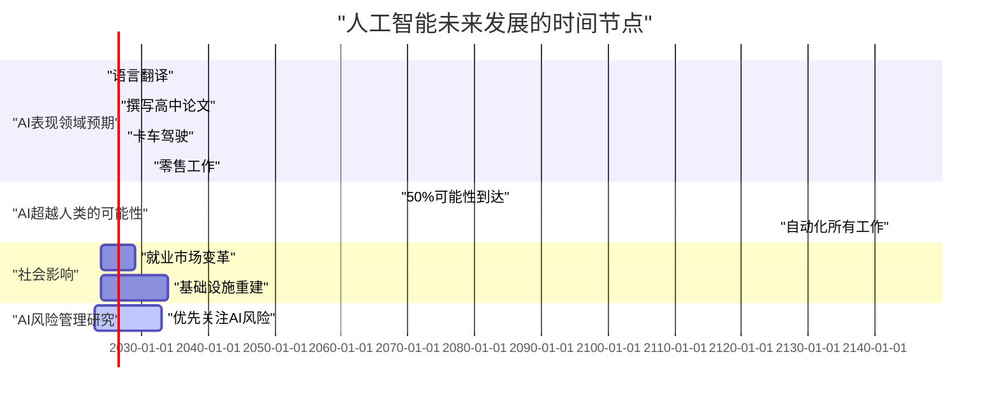
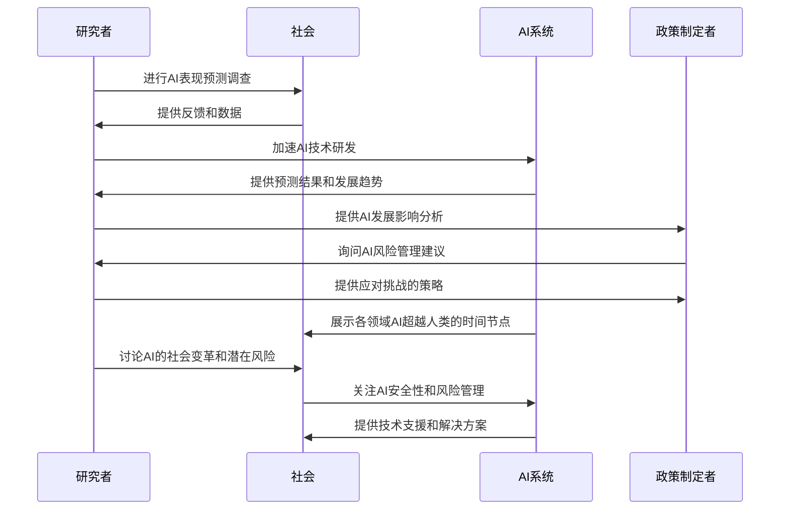
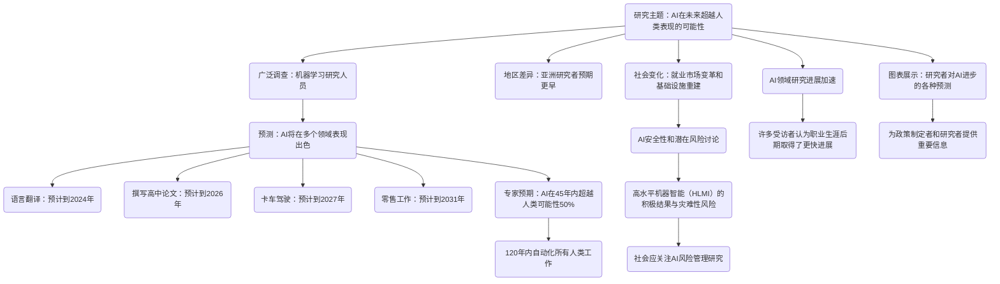

<div align="center">

```
               _   _  ___  ____  __  __    _    _     
              | \ | |/ _ \|  _ \|  \/  |  / \  | |    
              |  \| | | | | |_) | |\/| | / _ \ | |    
              | |\  | |_| |  _ <| |  | |/ ___ \| |___ 
              |_| \_|\___/|_| \_\_|  |_/_/   \_\_____|
                 _    _   _ ____     ____ _   _ ___ _     _     
                / \  | \ | |  _ \   / ___| | | |_ _| |   | |    
               / _ \ |  \| | | | | | |   | |_| || || |   | |    
              / ___ \| |\  | |_| | | |___|  _  || || |___| |___ 
             /_/   \_\_| \_|____/   \____|_| |_|___|_____|_____|
              ____   ____ ___ _____ _   _  ____ _____ 
             / ___| / ___|_ _| ____| \ | |/ ___| ____|
             \___ \| |    | ||  _| |  \| | |   |  _|  
              ___) | |___ | || |___| |\  | |___| |___ 
             |____/ \____|___|_____|_| \_|\____|_____|
```

</div>

NORMAL AND CHILL SCIENCE

平常心科学

3) AI技术类文章

---

Slow down but step by step

---

| SHANGHAI LONLIV-TECH | 第001期 |
|:----------------------|--------:|
| Editor：Zhenghao Xu     | 2024年09月21日 |

---


# When Advanced AI Isnt Enough_Human Factors as Drivers of Success in Generative AI-Human Collaborations.docx

## 原始摘要

这篇文章研究了人工智能（AI）在未来超越人类表现的可能性。通过对机器学习研究人员进行的广泛调查，研究者们预测，在未来几十年内，AI将在多个领域表现出色，包括语言翻译（预计到2024年）、撰写高中论文（2026年）、卡车驾驶（2027年）、零售工作（2031年）等。专家们认为，AI在所有任务中超越人类的可能性在45年内达到50%，并且在120年内能够自动化所有人类工作。不同地区的研究者对这些预期的时间节点存在显著差异，例如，亚洲研究者预期AI更早达到这些里程碑。

文章指出，AI的快速发展可能引发重大社会变化，如就业市场的变革和基础设施的重建。研究者们还讨论了AI安全性和潜在风险，认为实现高水平机器智能（HLMI）可能带来积极结果，但也存在灾难性风险。因此，社会应优先关注AI风险管理的研究。

此外，调查结果表明，AI领域的研究进展在近年来加速，许多受访者认为在其职业生涯的后期取得了更快的进展。文章通过图表展示了研究者对AI进步的各种预测，为政策制定者和研究者提供了重要的信息，以帮助他们更好地应对AI发展的挑战。

## 摘要

1. Class: (3) AI技术类文章

2. Authors:  Anonymous

3. Affiliation: 本文未提供具体作者信息

4. Keywords: artificial intelligence, human performance, automation, machine learning, employment

5. Urls: None, None 

6. Summary:

   - (1): 本文研究了人工智能（AI）在超越人类表现方面的未来可能性，基于对机器学习研究人员的广泛调查，预测AI将在多个领域中表现出色。

   - (2): 研究模型未明确指出，但涉及的关键变量包括AI发展速度、各领域任务的完成时间、地域差异等，没有明确的调节变量或中介变量。

   - (3): 研究方法基于对AI研究人员的调查，分析受访者对AI进步的预测和看法。

   - (4): 研究表明，AI在语言翻译、高中论文撰写、卡车驾驶和零售工作等任务中表现将逐渐超越人类，专家预期在未来45年内，AI在所有任务中的表现将达到50%的超越可能性，支持了对AI发展的预期目标。

## 图表

### 图表 1



### 图表 2

```mermaid
stateDiagram-v2
    [*] --> "研究人工智能（AI）超越人类表现的可能性"
    "研究人工智能（AI）超越人类表现的可能性" --> "机器学习研究人员广泛调查"
    "机器学习研究人员广泛调查" --> "预测AI将在多个领域表现出色"
    "预测AI将在多个领域表现出色" --> "如语言翻译（2024年）"
    "预测AI将在多个领域表现出色" --> "撰写高中论文（2026年）"
    "预测AI将在多个领域表现出色" --> "卡车驾驶（2027年）"
    "预测AI将在多个领域表现出色" --> "零售工作（2031年）"
    "预测AI将在多个领域表现出色" --> "超越人类的可能性（45年内50%）"
    "预测AI将在多个领域表现出色" --> "120年内自动化所有人类工作"
    
    "不同地区研究者差异" --> "亚洲研究者预期更早达到目标"

    "AI的快速发展影响" --> "就业市场的变革"
    "AI的快速发展影响" --> "基础设施的重建"
    
    "AI安全性与潜在风险" --> "高水平机器智能（HLMI）带来积极结果"
    "AI安全性与潜在风险" --> "潜在灾难性风险"
    "AI安全性与潜在风险" --> "社会应优先关注AI风险管理"

    "AI领域研究进展加速" --> "许多受访者感受到职业生涯后期的进展"
    
    "图表展示研究者对AI进步的预测" --> "为政策制定者和研究者提供重要信息"
    
    "为政策制定者和研究者提供重要信息" --> [*]
```

### 图表 3



### 图表 4



