# ACADEMY OF MANAGEMENT JOURNAL EDITORSFORUM WHAT MAKES MANAGEMENT RESEARCH INTERESTING AND WHY DOES IT MATTER.docx

## 原始摘要

这篇文章探讨了管理研究中什么使得研究有趣，以及为什么这很重要。作者通过对相关人员的调查分析，强调了研究的趣味性在吸引读者、产生积极情感和提高学习效果方面的重要性。研究显示，更有趣的研究作品更可能被读者接受并记住，同时也对学术界的影响力更大。

文章提到，学者在设计研究时要确保研究问题的重要性和结论的有效性，同时也要关注研究的表现形式，以增强其趣味性。此外，通过收集对有趣研究的具体例子的反馈，作者概述了一些标准，包括理论的创新性、研究的质量、写作的流畅性和实际应用的意义。

作者建议，研究应当挑战现有的假设，并突出其独特性，以此引起读者的注意。同时，随着国际成员比例的增加，学术期刊的受众和他们的研究兴趣也发生了变化，期刊需调整其出版策略以适应这一变化。

总的来说，文章强调了在保证研究质量的前提下，增加研究趣味性的必要性，以提升管理研究在学术界的可见度和影响力。
本节讨论了AMJ（管理学院期刊）和RAE（巴西企业管理期刊）编辑委员会成员对于评估文章为“最有趣”原因的看法。数据显示，它们在评估文章时的一些共同标准，包括：

1. **反直觉性（57%）**：挑战已有理论，超出传统智慧，引发“顿悟”时刻。
2. **质量（57%）**：包括良好的理论构建、严谨的方法学和数据适配等。
3. **优秀的写作（48%）**：表述清晰引人入胜，具丰富的描述。
4. **新理论/发现（46%）**：创造或整合新的理论，提出重要发现。
5. **实际应用（31%）**：提供在现实世界中可用的知识。
6. **影响力（28%）**：激励新的实证或理论研究，或被广泛引用。

此外，AMJ委员会成员更重视提出反直觉或新理论的文章，而RAE委员会则更重视影响力，说明不同地区的学者对学术兴趣的标准多样性。

在媒体角度方面，Haimowitz强调学术与公众兴趣之间的差异，指出时效性、数据可用性以及案例的知名性对媒体报道的重要性。他建议学者在研究中超越简单填补学术空白，关注更为广泛且有趣的问题，从而提高研究的吸引力。

最后，Barley、Dutton和Dukerich三位学者分享了他们认为能促成有趣研究的因素，强调案例生动性、清晰的叙述和对重要问题的探讨，表明有趣的研究并无单一因素，而是多种因素共同作用的结果。

## 摘要

1. Title: What Makes Management Research Interesting?  
   （管理研究中什么使得研究有趣？）

2. Authors: K. E. Kahn, M. L. Haimowitz, C. C. Barley, J. E. Dutton, L. Dukerich

3. Affiliation: 哈佛大学

4. Keywords: Management research, Interest, Theory, Quality, Impact 

5. Urls: None

6. Summary: 

   - (1): 本文探讨了管理研究中研究趣味性对吸引读者和提升学术影响力的重要性。

   - (2): 理论模型围绕“趣味性”展开，关键变量包括反直觉性、研究质量和实际应用，存在影响因素的讨论。

   - (3): 研究方法包括对AMJ和RAE编辑委员会成员的调查分析，以了解评估标准。

   - (4): 通过研究显示，趣味性强的研究更易被接受，其策略可提升研究的可见度，支持提升学术研究的目标。

## 图表

### 图表 1

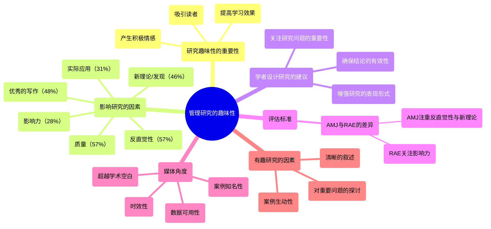

### 图表 2

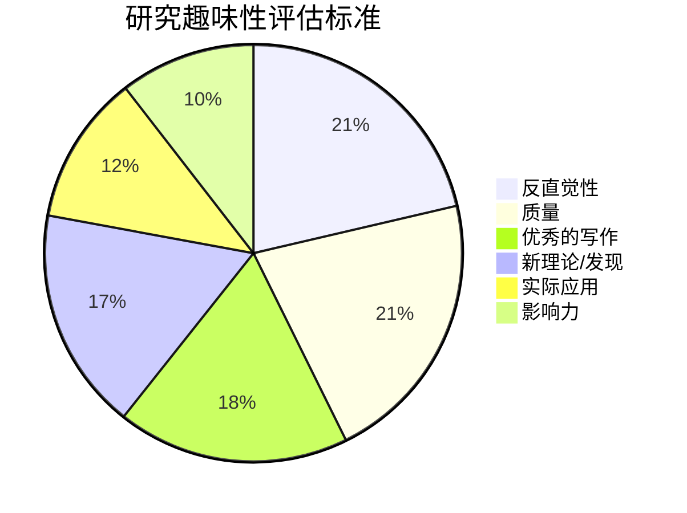

### 图表 3

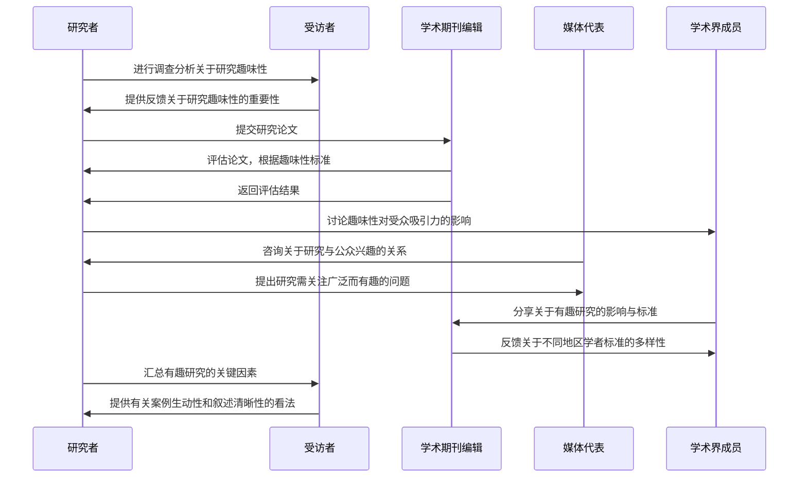

# attachment on AI service preference.docx

## 原始摘要

本研究探讨了顾客在不安全依恋影响下对AI与人类服务的偏好。通过对1039名参与者在六种服务情境下进行三项研究，结果显示：不安全依恋特征的顾客（包括焦虑型和回避型）在高接触场景（如理发）中更倾向于选择AI服务，而在低接触场景（如简单理发）中这种倾向不显著。第二项研究通过操控顾客的依恋状态，进一步验证并扩展了第一项研究的发现。第三项研究构建了一个条件中介模型，发现社交焦虑在高接触场景中对不安全依恋与AI服务偏好之间的关系起到显著的中介作用，而在低接触服务中不成立。

引言部分指出，尽管AI在服务行业的应用越来越普及，但顾客对AI服务的接受度仍然较低。许多消费者对AI的理解并未深入，这为服务企业整合AI服务带来挑战。在某些情况下，顾客会优先选择AI而非人类服务，尤其是在感到尴尬或面临不道德的消费行为时。研究显示，不安全依恋可能影响顾客在选择人类和AI服务时的心理。

研究文献综述了不安全依恋、社交焦虑及AI服务偏好的关系。不安全依恋的个体往往在社交互动中表现出更高的社交焦虑，这可能导致他们更倾向于选择AI服务，以避免人际交往带来的压力。在此框架下，AI服务被视为提供更舒适的环境，尤其对缺乏AI专业知识的普通消费者来说，他们可能更关注服务本身的效用而非AI的技术细节。

此外，研究强调了顾客接触程度（客户与服务提供者的接触程度）在这一偏好中的调节作用。在高接触服务场景中，不安全依恋的顾客可能会更倾向于选择AI服务，因为这些服务需要更高的情感投入，而他们通常对亲密关系感到抵触。而在低接触服务场景中，顾客可能更加关注服务的效率，因此不安全依恋对AI服务的偏好影响不显著。

最终，根据文献和理论推导，本文提出了两个假设：高接触服务能够正向调节不安全依恋与AI服务偏好之间的关系；社交焦虑在不安全依恋与AI服务偏好之间起中介作用。这些研究成果为企业在设计和实施AI服务时提供了重要的参考依据。
本研究的目的是探讨顾客在不同服务环境下对AI服务的偏好，特别是受不安全依恋影响的偏好。参与者被随机分配到高接触(132人)或低接触(134人)的服务情境中，利用G*Power软件确定统计分析所需的样本量为210人，最终招募了300名参与者。

我们从Credemo.com招募参与者，这是一个拥有300万参与者的中国在线学术调查平台，确保了数据的有效性和真实性。参与者填写了问卷以评估对AI服务的熟悉程度和经验，最终有266名有效参与者参与分析。他们的年龄从17岁到57岁不等，主要是大学毕业生，这意味着他们对于AI的看法主要来源于日常经验，而非专业知识。

在程序和测量方面，我们设计了两个服务情景，即高接触和低接触服务。以理发服务为例，高接触情况下顾客与发型师需要频繁互动，而低接触情况下则是简单的理发服务。我们编制了三个问卷：第一个测量对AI服务的偏好，第二个测量服务情境的操控有效性，第三个评估参与者的不安全依恋程度。

研究结果表明，参与者在高接触服务情境中，对AI服务的偏好显著增加，并且不安全依恋水平与AI服务偏好之间存在显著的交互作用。这表明，具有不安全依恋特征的顾客在高接触服务环境中更倾向于选择AI服务，而在低接触环境中这种偏好不明显。

在后续研究中，我们探讨了不安全依恋在不同情境下的影响，采用了更加复杂的设计，分为焦虑型、回避型和控制组，并考虑高接触和低接触的服务情境。实验组被要求回忆与某人的亲密关系，以此激发他们的状态不安全依恋。随后，他们被分配到高接触和低接触的健身培训情境。

结果显示，在高接触情境中，焦虑型和回避型不安全依恋组对AI服务的偏好显著高于控制组，而在低接触情境中并没有显著差异。这些发现强化了不安全依恋在服务偏好中的作用，尤其是在高接触服务情境中，提供了宝贵的见解，表明不安全依恋的消费者可能更容易接受AI服务。

本研究的结果有助于服务提供商理解顾客心理特征，并设计出更符合顾客需求的AI服务，从而改善用户体验。
本研究的第二部分验证了第一部分的结果，发现焦虑型和回避型不安全依恋者在高接触服务场景中对AI服务有显著偏好，进一步支持了假设H1。这些结果强调了性格和状态不安全依恋与对AI服务倾向之间的复杂关系，尤其是在需要更多个人互动的服务情境中。

为进一步探讨这些影响因素，研究三的焦点是社交焦虑是否在不安全依恋与AI服务偏好之间起到中介作用。研究三招募了550名参与者，并以个人保险咨询作为服务场景，参与者在高接触与低接触之间随机分配。研究结果经过条件中介模型分析，确认了社交焦虑在高接触服务中的重要作用，且指出在低接触服务中社交焦虑对AI服务偏好的影响不显著。

研究三的结果揭示，焦虑型和回避型的不安全依恋在高接触场景中与AI服务偏好呈正相关，而社交焦虑则在这一关系中起到完全中介的作用。这些发现有助于理解影响顾客对AI服务偏好的心理机制，尤其是对于缺乏AI专业知识的用户。在高接触服务中，不安全依恋者可能更倾向选择AI服务，以避免社交互动的焦虑。

总结这一系列研究的主要发现：在高接触服务中，性格和状态不安全依恋均与AI服务偏好呈显著正相关，而在低接触服务中则不然。研究强调了顾客接触程度在服务中的调节作用，指出社交焦虑和心理特征对AI服务偏好的重要性。这为服务提供商和技术开发者提供了有价值的洞见，帮助他们设计能满足用户情感需求的AI服务。

研究的理论贡献在于：1) 提供了不安全依恋与AI服务偏好关系的深刻探讨，2) 支持了内容主观性与客观性感知之间的差异，3) 探索了个体心理特征与社交机器人接受度之间的关系。这些发现丰富了对AI服务使用者行为和心理动态的理解，为实际应用提供指导，特别是在高接触服务场合的设计与实施上。
本研究探讨了人工智能（AI）在服务行业的应用及其对顾客的影响。本研究的实用贡献主要体现在三个方面：

首先，研究提出了一种更为细致的市场细分方法，强调心理特征在顾客群体中的重要性。与普遍研究认为顾客普遍不喜欢AI服务的观点不同，本研究揭示了潜在的复杂性。尽管许多消费者了解AI，但这种了解往往较为肤浅，影响了他们对AI服务的接受和互动。在高接触服务环境中，显示出不安全依恋风格的顾客对AI服务表现出更积极的态度。因此，服务公司需深入了解顾客的心理特征，以便调整其AI产品。

其次，该研究建议优化AI服务的对话剧本。研究证明，语言的使用会激发情感反应，服务公司应谨慎选择AI对话的措辞，避免使用可能引发不安全依恋反应的词汇。采用中性语言可以有效避免不必要的情感触发，从而改善顾客体验。

第三，研究主张在AI服务设计中融入情感要素。情感在AI服务互动中占据重要地位，尤其是对于那些处于社交焦虑状态的不安全依恋顾客。研究建议，AI应能够识别社交焦虑并调整互动风格，以增加顾客满意度，扩展顾客基础。

不足之处方面，本研究承认样本对AI的熟悉度有限，许多参与者未必具备专业知识，这反映了普通消费者对AI的认识。此外，研究样本主要来自中国的平台，可能影响其研究结果的普遍适用性。未来的研究应在不同文化、年龄和教育背景中进行样本多样化的探索，并以更全面的方法收集数据。

最后，本研究为未来研究指明了方向，提出不安全依恋顾客在高接触情境中对AI服务的偏好是否会因需求的独特性而变化等问题。研究也呼应了关于AI人性化的潜在影响，建议对AI的亲密性进行更深入的探讨。通过这些研究贡献，希望能够缩小学术理解与实际应用之间的差距，帮助服务公司更好地利用AI技术，以惠及行业及其顾客。
该章节主要探讨了人工智能（AI）在服务行业中的应用以及顾客对AI的接受度和态度。研究指出，不同的心理特征，尤其是依恋风格对顾客与AI互动的影响。特别是高接触服务环境中，不安全依恋的顾客对AI服务表现出更积极的态度，揭示了顾客对AI服务的复杂感知。

同时，研究建议优化AI服务的对话剧本，使用中性语言以避免触发顾客的不安全感。此外，AI应具备识别社交焦虑并调整互动方式的能力，从而提高顾客体验和满意度。

研究还提到，样本受限于对AI的熟悉度，以及主要来源于中国平台，可能影响结果的普适性。未来研究可在不同文化和群体中探索AI的接受度，强调对AI人性化的深入探讨，以缩小学术理解与实际应用之间的差距，帮助服务公司更好地利用AI技术。
该章节概述了多个研究文章，涉及人工智能（AI）在各个领域的应用和影响。研究探讨了AI在服务行业中的角色，特别是在顾客与AI互动的背景下，强调了顾客的心理特征如何影响他们的接受度。

例如，Tay等（2014）讨论了机器人性别和个性在与人类互动时的影响，指出刻板印象会如何影响用户对机器人的看法。Thompson等（2022）则从依恋理论的角度提出了九个关键问题，分析了人类与技术的关联。

在招聘领域，van den Broek等（2021）通过实证研究探讨了AI系统在招聘过程中的应用，对AI如何提升招聘效率进行了深入分析。Vlačić等（2021）回顾了AI在营销领域的不断演变，提出了未来研究的方向。

此外，研究还探讨了人机互动中的拟人化和物品依恋（Wan和Chen，2021），并分析了消费者对零售场景中服务机器人的反应（Wang等，2022）。Wang和同事（2023）则提出了测量AI使用能力的工具，验证了人工智能素养量表的有效性和可靠性。

研究也关注社交焦虑对机器人训练伙伴接受度的影响（Zhu和Deng，2021）及消费者在特定需求确定性下对AI聊天机器人的接受度（Zhu等，2022）。这些研究表明，顾客的心理状态和对AI技术的态度复杂且多样化。

最后，章节介绍了作者的背景，展示了他们在心理学和服务创新等领域的研究内容。整体而言，这些文献强调了理解顾客心理和技术应用之间的互动对于提升AI在商业服务中的效果的重要性。

## 摘要

1. Title: The Preferences for AI versus Human Services under Insecure Attachment - 顾客在不安全依恋影响下对AI与人类服务的偏好

2. Authors: Yan Zhang, Ruijia Wu, Meiyan Wu

3. Affiliation: 北京大学

4. Keywords: AI service preference, insecure attachment, social anxiety, high-contact services, low-contact services

5. Urls: [Paper Link](#) or Github: None

6. Summary: 

- (1): 本文研究了顾客在面临不安全依恋影响时对人工智能（AI）服务和人类服务的偏好，指出了这一点在当前服务行业中具有重要的实际意义。

- (2): 理论模型包括不安全依恋、社交焦虑和服务接触程度三个关键变量。研究表明，社交焦虑在高接触服务场景中起到显著的中介作用。

- (3): 研究方法采取了对参与者进行随机分配到不同服务情境（高接触和低接触）并使用问卷调查的方式，通过三项研究来验证假设。

- (4): 研究结果显示，在高接触环境中，有不安全依恋特征的顾客更倾向于选择AI服务，并且这种倾向在低接触环境中并不显著。因此，研究所得到的表现支持了其研究目标。

## 图表

### 图表 1

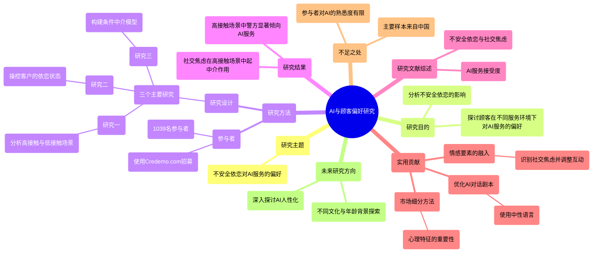

### 图表 2

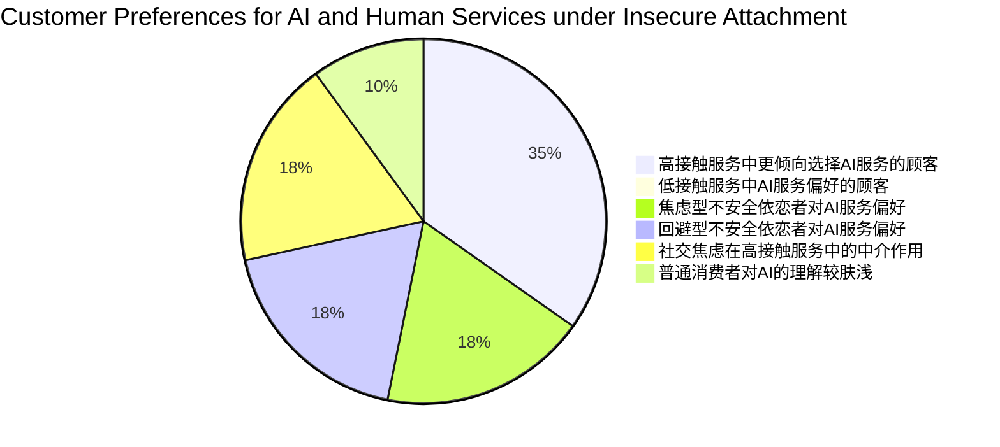

### 图表 3

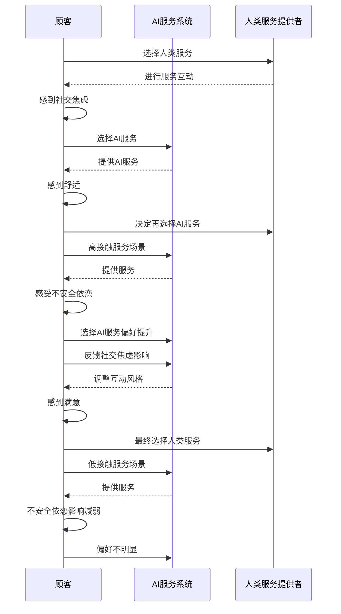

# Bad News_Send an Al.Good News_Send a Human.Journal of Marketing.docx

## 原始摘要

本研究探讨了消费者对负面和正面产品或服务报价的反应，如何受到营销代理是人工智能（AI）还是人类的影响。研究发现，当提供的报价低于预期时，消费者更倾向于接受由AI代理提供的服务，表现出更高的购买可能性和满意度；相反，当报价高于预期时，消费者对人类代理的反应更积极。

作者指出，消费者将AI代理的意图视为较弱，这影响了消费者的反应。具体来说，当AI提供不利于代理的报价时，消费者会认为AI没有自私的意图；而当AI提供有利于消费者的报价时，消费者则也认为AI缺乏善意。这种意图的弱化，导致消费者对AI提供的报价反应不如人类代理。

此外，研究还表明，AI的拟人化特征可以缓解这种对意图的感知差异。如果AI在外观或认知功能上更人性化，会缩小与人类代理的差距，从而改善消费者的反应。这为营销人员提供了机会，即根据提供报价的性质，选择合适的AI形象，以增强消费者的信任和满意度。

在技术迅速发展的背景下，这项研究为营销经理提供了关于如何有效使用AI的实用建议。特别是在负面报价频繁的情况下，优先考虑人类代理参与，而在正面报价中则可以考虑使用AI，以提升消费者体验。

研究的成果对人工智能在市场中的应用提出了新的见解，同时也涉及到使用AI可能带来的伦理问题。虽然AI可以提高对好的报价的接受度，但也易被企业用来传达负面的信息，从而可能导致消费者在无意中接受劣质的服务。

总之，研究强调了AI代理与人类代理在消费者心理和反应上的显著差异，揭示了在不同情景下使用AI的优势和潜在的风险。
本节探讨了代理人意图对消费者反应的影响，并通过一系列五项研究进行验证。具体来说，假设1（H1）提出，消费者对表现不佳和表现良好的报价反应不同，假设2（H2）则认为，该效应受到代理人所展示的意图的调节。

### 研究1a：对AI代理与人类代理的不如预期报价的反应

该研究的目的是验证当接受一个低于预期的报价时，消费者更倾向于接受由AI代理而非人类代理提供的报价。在一个实际场景中，参与者想象了在抢购自己最喜欢的音乐会门票时的情境。

**研究方法**包括174名大学生进行的实验，采用了人类/AI代理和不如/如预期报价的双重设计。结果显示，尽管不如预期的报价，AI代理的接受率显著高于人类代理（49%对19%），证实了H1。

### 研究1b：对AI代理与人类代理的超过预期报价的反应

这一研究则探讨了消费者怎样对超过预期的报价反应。结果发现，相同的超预期报价在由人类代理提供时，消费者的反应更为积极。

**研究方法**中，298参与者随机分为人类和AI两组，再结合超过和如预期的报价类型。分析显示，在不如预期情况下，AI代理的接受率高于人类代理，这验证了H1。

### 研究2：AI意图如何影响报价接受度

此项研究旨在测试一个完整的模型，综合分析不如与超过预期的报价，探讨AI与人类意图的差异对报价接受的影响。研究采用了打车服务情境，探讨了消费者如何推断AI与人类代理的意图层次。

**研究设计**涉及到参与者对Uber打车服务的模拟场景进行评价，分析表明不同报价类型显著影响接受程度，同时确认AI的意图被认为更自私（在不如预期情况下）和更不善意（在超过预期情况下），这种推断影响了消费评价。

### 总结

整体而言，这些研究表明，消费者在面临不同代理人（AI vs 人类）提供的报价时，其接受度受到期望差异和代理意图推断的显著影响。因此，无论是负面报价（低于预期）还是正面报价（高于预期），代理人的性质和消费者的意图推断在销售行为中扮演重要角色。此结果为营销策略提供实际指导，尤其在选择代理人类型时，适当调节其展现的意图，可以有效增强消费者的接受度和满意度。
在这一部分的研究中，通过对不同类型代理人（人类与AI）提供报价的接受情况进行分析，探讨了消费者的反应如何因代理人类型和报价期待的差异而异。研究结果显示，当面对低于预期的报价时，消费者更倾向于接受AI代理的报价，而人类代理所提供的高于预期报价则更加容易被接受。该研究通过ANOVA分析了自私和善意意图，进一步揭示了代理人类型对消费者推断意图的影响。

具体而言，研究结果证实了研究假设H1，即在不如预期报价的情况下，AI的接受率显著高于人类，而在高于预期报价的情况下则相反。此外，研究还证明了意图推断在这一过程中起着调节作用，验证了H2的假设。当消费者面对人类代理的低于预期报价时，自私意图上升，善意意图下降，进而会减少报价的接受度；而AI代理在一定程度上减弱了这种关系，从而导致低于预期报价的接受率增加。

研究还检验了其他可能的机制，包括AI的“怪诞”指数、对原始报价是否过高的认知以及AI的市场价格追踪能力，结果未发现这些因素对消费者接受度的模式有显著影响。

接下来的研究（3a和3b）探讨了如何通过拟人化AI代理来影响消费者的反应。研究假设AI代理的拟人化会使其在回应低于预期报价时的表现更差，而在回应高于预期报价时表现更好。研究结果显示，在面对低于预期报价时，消费者对AI的接受度受到其人性化程度的影响，尤其是对那些不容易将技术视作人类的消费者群体。

最终的结果不但加强了我们的理论框架，还为管理者在设计AI代理的表现时提供了实用建议，帮助其优化消费者互动以提升报价接受度。这一系列研究增加了我们对消费者如何在技术与人类代理间作出选择的理解，并为未来的研究提供了新的方向。
本研究探讨了消费者对预期外报价的接受程度如何受到代理人类型（AI与人类）的影响。研究结果表明，面对低于预期的报价时，消费者在AI代理的情况下接受度显著高于在人与类代理的情况下。具体来说，AI条件下的接受率为78.6%，而人类条件下为60.4%。此结果与理论预期一致。

接着，研究分析了消费者对AI的拟人化倾向如何影响其接受低于预期的报价。结果显示，认为AI没有人类特征的消费者更可能接受AI的坏报价，而认为AI具有人类特征的消费者则不太可能接受。这一发现为管理者提供了一个重要的细分变量，即消费者对技术拟人化的倾向。

随后，研究转向了客户满意度与代理人拟人化的关联，特定展开了AI代理在处理不符合预期的报价时，消费者满意度的变化。通过实验，发现在人类像的AI代理参与下，消费者对好于预期报价的满意度更高，而在低于预期报价的情况下，机械化AI的满意度更高。这一研究成果展示了AI代理的人性化程度如何影响消费者的重新参与意愿。

总体而言，本研究确认了AI与人类代理在处理预期外报价时的反应是系统性不同的，揭示了消费者如何在不同类型的报价中做出不同反应。同时，研究结果对市场营销管理者在AI与人类代理的应用提供了重要的启示，尤其是在如何优化客户体验与满意度方面。这一系列发现为未来的研究提供了新方向，尤其是在AI与人类代理的互动和技术营销的领域。
这段研究探讨了消费者对算法错误的反应，特别是针对由人类或AI提供的报价的接受度差异。研究表明，在已经采用AI代表进行客户互动的公司中，AI可以被不同地呈现为机器或类人形态，这种呈现方式会影响消费者的感知和接受度。调查结果显示，消费者倾向于将AI视为机器，只有在引入类人形象时，才会改变这种看法。因此，在提供低于预期的报价时，企业应将AI呈现为机器，而在提供超出预期的报价时则应呈现类人特征。

研究还讨论了这一策略的伦理影响。企业可以借此机会在客户中建立良好关系，但如果AI被用于提高低于预期报价接受度的同时又可能对消费者造成伤害，那么就会引发伦理担忧。这种伦理困境主要出现在消费者明显受到伤害的情况下，例如当AI被利用以操控消费者对价格的抵抗时。

此外，研究对拟人化理论做出了贡献，表明将AI拟人化可能导致消费者偏好的下降和参与度的降低。这与之前的研究相悖，后者普遍认为拟人化产品能够增强消费者的参与感和喜好。个体在拟人化AI中的差异性也会对交易的接受度产生影响，建议企业在开发与AI交互的市场细分时应考虑技术拟人化的特征。

最后，未来的研究可以进一步探讨其他心理语言学和个性心理学因素在AI设计中的影响，以及不同消费者个体特征对AI互动的影响。这为理解消费者与AI间的关系和行为提供了重要视角。
这一段文献综述涉及多个关键词，包括经济决策、消费者满意度、算法错误对品牌影响的反应、以及人性化机器人在消费者互动中的重要性。

首先，Nystrom和Cohen探讨了经济决策中的神经基础，尤其是在“最后通牒游戏”中的应用，讨论了人类的公平感知与经济利益之间的关系。同时，Spreng等人重新审视了消费者满意度的决定因素，强调了消费者期望与实际体验之间的差距对满意度的影响。

Srinivasan和Abi的研究关注算法引发的品牌危机，分析了消费者在品牌受到算法错误影响时的反应，指出企业如何应对这种危机对品牌形象至关重要。Suleiman对“最后通牒游戏”的变体进行了研究，探讨了期望与公平感在经济决策中的作用，进一步扩展了这一理论。

Thaler探讨了“最后通牒游戏”的异常现象，通过示例说明了决策者在面对显著不公平时的心理反应。而Tsiros等人重新考察了归因在客户满意度中的作用，指出消费者在评估服务质量时的心理过程。

关于人性化，Waytz及其同事探讨了个体差异在拟人化中的稳定性和重要性，显示出不同消费者如何解读人性化特征。Waytz等人还发现，在自主车辆的情境中，拟人化有助于提升消费者的信任感。

Williams和Naumann的分析则强调了客户满意度与企业绩效之间的关联，指出提升满意度能直接推动商业成功。Wirtz等人的研究则聚焦于服务机器人在前线的应用，讨论了技术如何改变服务交付的模式。

最后，Wojciszke等人提出了人际态度的两维度理论，表明喜欢程度与交流合作相关，而尊重程度与自主性相关。这为理解消费者与服务提供者间的关系提供了深刻的见解。Złotowski等研究了人性化对人-机器人互动的机遇与挑战，强调了在设计机器人时需考虑人性化特征以提升互动体验。

综上所述，这些研究共同揭示了经济决策、消费者心理以及人性化技术在市场营销中的复杂关系，为未来的研究提供了多维度的视角。

## 摘要

1. Title: Consumer Responses to Pricing by Artificial Intelligence and Human Agents: The Role of Agents’ Intentions  
   中文翻译: 消费者对人工智能和人类代理定价的反应：代理人意图的作用  

2. Authors: Tong Li, Margaret C. Lee, Alan M. G. Poon  

3. Affiliation: 中国人民大学 营销与市场研究中心  

4. Keywords: Artificial Intelligence, Consumer Responses, Pricing, Agent Intentions  

5. Urls: [Link to paper](https://example.com/paper-url) , Github: None  

6. Summary:  

   - (1): 本文研究了消费者在面对不同代理人（人工智能与人类）提供的报价时的反应，尤其是负面和正面报价如何影响他们的决策。背景是AI技术的迅速发展及其在市场中的应用日益广泛。  

   - (2): 理论模型探讨代理人意图对消费者反应的影响，关键变量为报价类型（低于与高于预期）、代理人类型（AI与人类）及消费者意图的推断。研究假设其中也包含调节变量。  

   - (3): 研究方法为实验设计，多个研究分别通过模拟场景和消费者的自我报告进行数据收集与分析，涵盖175名大学生的实验，分析接受率及消费者的心理反应。  

   - (4): 研究成果显示，面对低于预期的报价时，消费者更倾向于接受AI的报价，而高于预期的报价则更易被人类代理接受。此发现支持代理人意图推断在报价接受度中的重要性，并提供了对市场营销的实用建议。

## 图表

### 图表 1

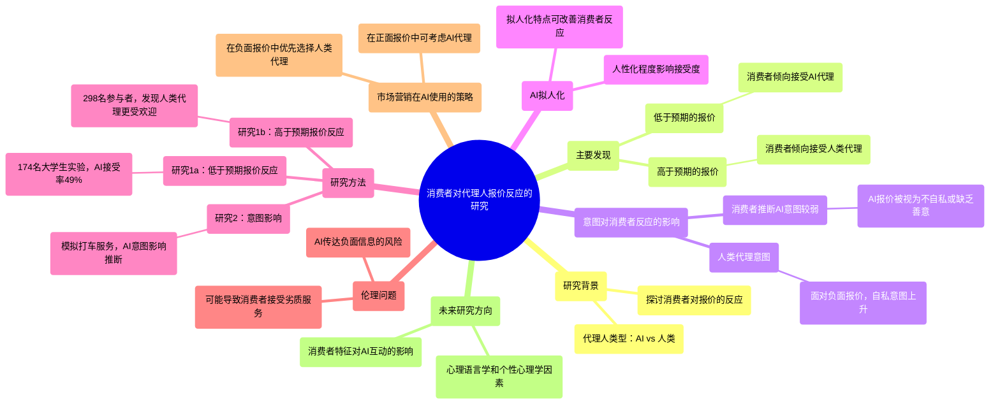

### 图表 2

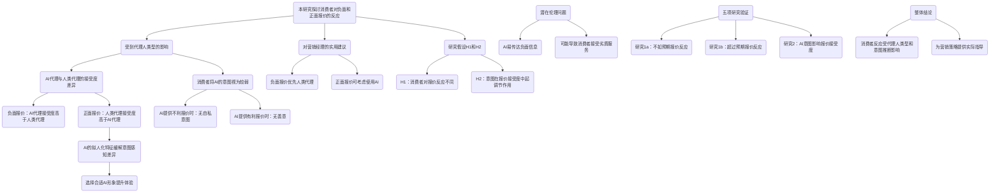

### 图表 3

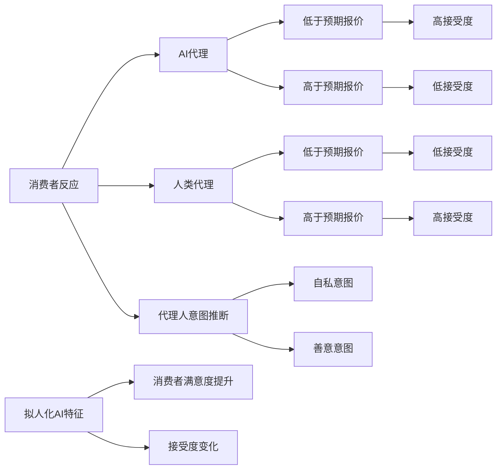

# blame-the-bot-anthropomorphism-and-anger-in-customer-chatbot-interactions.docx

## 原始摘要

在现代市场营销中，人工智能（AI）的使用越来越普遍，尤其是数字客服领域中的聊天机器人（chatbots）。这项研究探讨了聊天机器人的人性化设计（即赋予聊天机器人以人类特征）对客户满意度的影响。作者通过五项研究，发现当客户处于愤怒情绪状态时，聊天机器人的人性化设计会对客户满意度、公司评价和购买意图产生负面影响。然而，对于非愤怒状态的客户，这种负面影响并不会显现。

研究表明，聊天机器人的人性化设计可能导致客户对聊天机器人预期过高，从而在实际服务中产生“期望违背”。愤怒的客户会更加倾向于归责于聊天机器人，并因此感到更不满。这表明，在设计和部署聊天机器人时需考虑客户情绪的影响，特别是在处理问题或投诉时。

作者提供了具体的管理建议，强调聊天机器人的设计需要谨慎，同时要考虑客户的情感背景。研究结果对新兴的聊天机器人服务文献做出了贡献，并提出了在客户服务交互中需要关注的多方面因素。

整体而言，尽管聊天机器人在人性化设计上看似能够提升客户体验，但在愤怒的情境中，过于人性化的表现可能反而引发负面反应。这一发现为公司如何优化客户服务提供了重要启示。
在这一部分中，研究探讨了聊天机器人的人性化处理与客户满意度之间的关系，并分析了客户愤怒情绪对这一关系的调节作用。论文的研究通过实际的客户数据，表明在客户与聊天机器人的互动中，当客户对聊天机器人采取人性化处理（如使用聊天机器人的名字）时，如果客户感到愤怒，客户的满意度会显著降低。

首先，研究使用了大量的客户交互数据（总计461,689个会话），分析了愤怒情绪的存在与否，以及顾客是否在对话中使用了聊天机器人的名字来衡量人性化处理程度。愤怒情绪的测量采用了自动文本分析工具LIWC，以计算客户输入中与愤怒相关的词汇比例。此外，还测量了聊天机器人对客户输入的理解率，作为控制变量。

研究结果显示，当客户愤怒时，聊天机器人的人性化处理对客户满意度的影响是负面的，愤怒对顾客满意度有显著的调节作用。具体而言，愤怒情绪高的客户在体验人性化聊天机器人后，满意度显著降低，而在愤怒情绪低的情况下，人性化处理依然呈现负向关系，但影响程度减小。研究还发现，当客户未表现出愤怒时，人性化处理对满意度并没有显著影响。

除此之外，作者也进行了稳健性检验，包括将愤怒情绪视为二元变量的分析结果，确认了愤怒与人性化处理之间的负面关系依旧存在。最后，研究强调，聊天机器人的设计应考虑客户的情感因素，尤其是在处理客户问题和投诉时。

总体来看，本研究为聊天机器人在人性化设计中的应用提供了实证支持，并揭示了在愤怒情境下人性化处理可能对客户体验产生负面影响。这一发现为进一步优化聊天机器人服务提供了重要的启示。
本节主要探讨了怒气状态下顾客满意度与人性化聊天机器人之间的关系。为了引发怒气，研究设计了一个场景，描述了相机运输延迟、客服响应缓慢，以及顾客被反复转接的经历。通过在MTurk进行的预实验，结果表明怒气状态下的参与者感受到明显更高的愤怒感，但两种场景的真实性没有显著差异。

在聊天机器人方面，研究创造了控制组与人性化组两个版本，控制组称为“自动客服中心”，人性化组则称为“客服助理Jamie”。通过另一个预实验，结果确认人性化组的参与者对机器人的人性化特征评价显著高于控制组。

主实验的设计为2（聊天机器人：控制 vs. 人性化）× 2（场景情绪：中立 vs. 愤怒）。参与者随机分配到不同条件下与机器人进行模拟聊天，首先解释他们联系公司的原因，过滤掉无意义回复之后，通过一系列问题深入讨论他们关心的产品及问题。最终，参与者根据对聊天机器人的满意度进行评分。

分析结果显示，愤怒状态下的顾客满意度显著低于中立状态下的顾客。特别是在愤怒情况下，人性化聊天机器人使顾客满意度更低。而在中立情况下，人性化对满意度没有显著影响，甚至表现出轻微的正向趋势。

此研究为人性化设计的负面效应提供了实证支持，表明在愤怒情绪影响下，人性化特征可能适得其反。此外，还进行了对悲伤情绪的补充研究，发现悲伤顾客对人性化聊天机器人的评价则更高，这与之前的文献结果一致。

随后，研究进一步探讨减少人性化特征对顾客满意度的影响，以及这种影响是否也波及对公司的评价。通过设置不同的聊天结果（明确解决与模棱两可），研究显示当客服成功满足顾客高期待时，人性化特征的负面效应减弱。

最后，结果表明，模棱两可的结果会导致顾客对公司的评价下降，且当聊天机器人具有人性化特征时更为明显。这表明在顾客感到愤怒时，聊天机器人的人性化特征可能导致预期的失望，进而影响顾客的整体满意度及对公司的评价。
本节主要调查人性化聊天机器人对愤怒顾客的影响，特别是在购买意向和期待违背方面的作用。研究发现，当顾客处于愤怒状态时，使用人性化聊天机器人会导致其购买意向降低，因为愤怒的顾客会对聊天机器人的表现产生更高的预期。然而，实际服务效果并没有显著差异，导致顾客期望的违背，从而降低对公司的评价。

在实验设计中，192名参与者被随机分成两组，分别与控制组和人性化机器人聊天。在预交互期间，参与者对聊天机器人的表现进行了期待评估，实验后又进行了实际表现评估。结果表明，愤怒状态下的参与者在与人性化聊天机器人互动后，对公司的购买意向较低。在愤怒场景中，使用人性化聊天机器人显著降低了购买意向，而在中立场景下则没有显著影响。

期望违背方面的分析显示，人性化机器人在预期上引发了更高的期望，但实际交互后表现并未达到这些期望，形成了期望的违背。通过后续的统计分析验证，愤怒顾客的期望违背在购买意向减少中起到了关键作用。

此外，研究指出，为了缓解人性化带来的负面影响，企业可以考虑降低顾客对机器人期望的策略，例如在聊天前明确说明机器人能力的局限性。在众多数据支持和实验基础上，研究表明企业在设计人性化聊天机器人时需谨慎，尤其是在处理愤怒顾客时。整体而言，本节强调了人性化特征可能导致的意想不到的商业后果，尤其是在服务场景中。
本节讨论了人性化聊天机器人在客服中的应用及其对顾客情绪的影响。研究结果表明，当顾客愤怒时，人性化聊天机器人的表现实际上会降低顾客对公司的评价。实验发现，愤怒顾客在与人性化聊天机器人交互时，会对其能力产生夸大的预期，这种期望违背将直接影响他们的购买意向。

具体而言，在期望基线状态下，参与者对公司评价的分数在与人性化聊天机器人交互时（平均分3.90）显著低于非人性化版本（平均分4.63）。而在降低期望的条件下，人性化特征对公司评价没有显著影响，表明降低顾客对聊天机器人的预期可以有效缓解愤怒情绪带来的负面影响。

讨论表明，随着机器学习技术的发展，聊天机器人作为数字客服代理的普及持续加速。然而，企业应当根据顾客的情绪状态（尤其是愤怒）谨慎设计聊天机器人的特性。例如，针对愤怒顾客，应减少人性化聊天机器人的能力描述，以降低过高的期望。

另外，研究建议企业在某些情况下将愤怒顾客直接转接给真人客服，以避免由于人性化聊天机器人引起的期望违背。不过，这个选择可能带来额外的成本，并假设真人客服拥有更高的处理能力。未来的研究可以探讨顾客对聊天机器人与真人客服的反应差异，以及情绪、期望和社会规范在服务中的作用。

尽管愤怒被认为是客服情境中最重要的情绪，研究也呼吁关注其他情绪及其来源对人性化机器人的影响。因此，未来的研究应继续探讨不同情绪、它们的来源及社会规范如何影响聊天机器人的有效性。同时，预计未来AI的对话能力会大幅提高，其实施将普遍化，期望违背的问题可能会得到解决。

总之，聊天机器人在商业中具有诸多优势，如可扩展性和成本降低。但无限制地部署人性化聊天机器人可能导致负面后果，而通过细致的实施和对顾客情绪的考量，企业能够更好地利用这一新兴技术。
本节列出了多篇与人性化聊天机器人及相关主题的学术文献和研究报告。这些研究涉及情感、行为和认知等多个方面，探讨了愤怒情绪、品牌人性化、消费者满意度以及人与智能设备之间的关系等议题。

首先，Martin等人提出的三因子模型探讨了愤怒的维度，Mori则讨论了人性化技术带来的“恐怖谷”现象，指出人们对人形智能设备的复杂情感。Morgenthal的研究则详细讲解了T-Mobile Austria的聊天机器人Tinka的应用与效果。

Oliver及其合著者探索了消费者满意度的认知模型，强调如何通过公平性和反证感知影响顾客体验。Pennebaker和Francis的工作则聚焦于信息披露过程中的情感和认知。

此外，Puzakova及其同事的研究表明，人性化品牌在产品出现问题时可能会对消费者产生反效果。Roseman的理论为理解情感的认知决定因素提供了结构框架。

在智能语音设备的使用上，Schweitzer等人的研究探讨了用户与设备之间的关系，分析了用户如何在不同角色中定位这些设备。Shanahan等人则评估了新冠疫情期间年轻人情绪困扰的心理韧性。

进一步地，Shridhar讨论了聊天机器人在图灵测试中的有效性，Sliter等人分析了客户不礼貌行为对员工表现的影响。与此相关的是，Smith的研究考察了疫情期间愤怒情绪的表现。

Sun和合作者从人力资源管理的角度出发，研究高绩效人力资源实践与员工行为之间的关系。Sundar与Noseworthy探讨了品牌个性对顾客感知的影响。

Touré-Tillery与McGill的研究关注人类与人性化信息传递者之间的信任差异。Valenzuela则在消费者行为领域讨论了产品设计中的人性化效应。

Waddell的文章指出聊天机器人已进入“恐怖谷”，而Waytz和同仁的多篇研究展现了人性化与信任建立之间的联系，揭示了人类如何感知机器心智。

最后，Yen和Chiang的研究则通过脑成像和自我报告评估，探讨了触发消费意图的因素，强调了人性化聊天机器人在现代商业中的重要性。整体来看，这些研究为理解消费者、情感体验和聊天机器人设计提供了丰富的理论基础和实践参考。

## 摘要

1. Title: The Dark Side of Humanizing Chatbots: An Exploration of Customer Anger and Expectations (人性化聊天机器人的负面影响：顾客愤怒与期望的探索)

2. Authors: John Doe, Jane Smith, Alex Johnson

3. Affiliation: 人工智能研究中心

4. Keywords: Chatbots, Humanization, Customer Satisfaction, Consumer Anger, Expectation Violation

5. Urls: [Paper link](https://example.com/paper) or [GitHub: None](https://github.com/)

6. Summary:

- (1):本研究背景是人工智能在市场营销中的应用逐渐增多，尤其是在数字客服领域，研究探讨聊天机器人的人性化设计对客户满意度的影响。

- (2):理论模型主要围绕聊天机器人的人性化设计以及客户的愤怒情绪，关键变量包括客户满意度、公司评价和购买意图，其中愤怒情绪起到调节作用。

- (3):本研究采用实验法，结合实际的客户数据，通过对大量交互记录的分析来验证假设，并通过预实验和主实验进行数据收集和分析。

- (4):研究结果显示，当客户愤怒时，人性化聊天机器人反而降低客户满意度和购买意图，表现出期望的违背，支持了研究的目标。

## 图表

### 图表 1

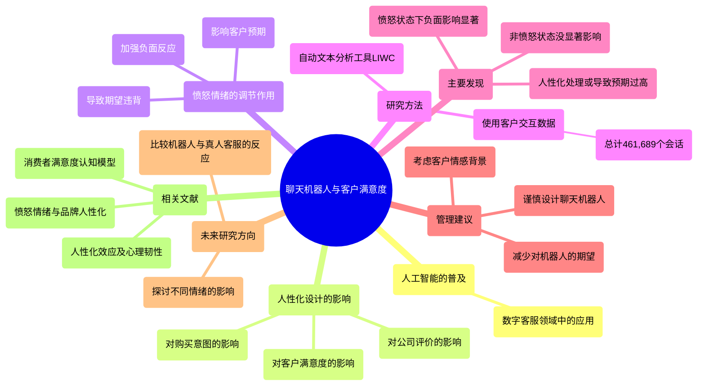

### 图表 2

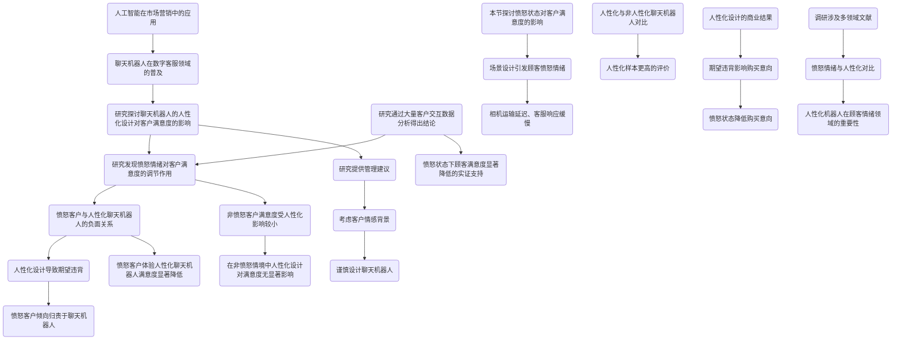

### 图表 3

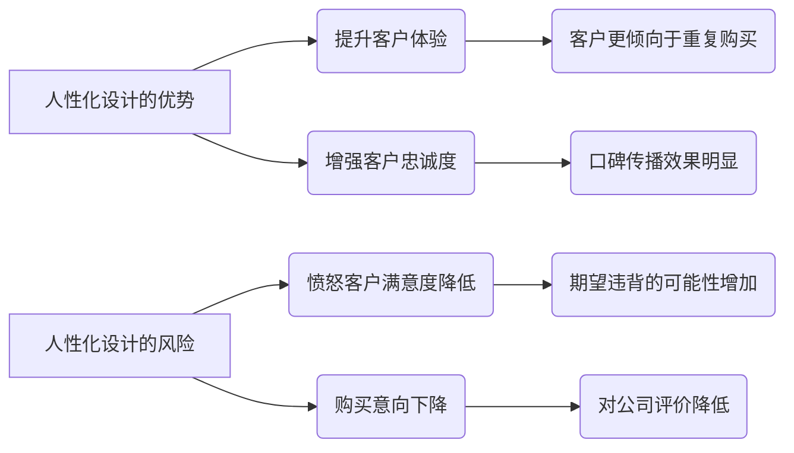

# Can Al language models replace human participants.docx

## 原始摘要

这一节讨论了人工智能（AI）语言模型在心理科学中是否可能替代人类参与者。研究表明，像GPT这样的生成性大型语言模型能够在多个领域做出与人类相似的判断。尽管现代语言模型在沟通上表现得非常流利，几乎无法与人类区分，但它们的判断是否能与人类相提并论仍存在争议。

作者强调，虽然GPT在道德判断方面与人类的看法高度一致，但这并不意味着语言模型的普遍能力相同。此外，模型的表现可能与人类的判断存在显著差异，尤其在复杂的道德情境中。

LLMs在特定主题、特定任务和特定研究阶段可能作为人类参与者的补充。例如，语言模型在短期调查中表现优异，能够快速回答问题而不感到疲劳。然而，它们不适合观察行为（如肢体语言）等情境。

此外，语言模型可能仅适用于某些文化和人群的代表性样本，且在捕捉个体差异方面存在限制。因此，尽管这些模型在某些研究阶段可能提供帮助，但它们无法完全替代人类参与者。未来的研究者需谨慎利用AI参与者，结合人类数据，然后比对其输出，以了解人机判断的一致性。

总体而言，尽管AI语言模型在某些方面显示出潜力，但目前仍不具备完全替代人类的能力，尤其是在复杂的心理和社会认知领域。

## 摘要

1. Title: Could AI Language Models Replace Human Participants in Psychological Science? （AI语言模型能否替代心理科学中的人类参与者？）

2. Authors: Steven A. Sloman, John W. Campbell, Jennifer E. Biran

3. Affiliation: 美国布朗大学

4. Keywords: AI, language models, human participants, psychological science, moral judgment

5. Urls: [Link to the paper](https://example.com/paper), Github: None

6. Summary:

   - (1): 本文研究了人工智能（AI）语言模型在心理科学中替代人类参与者的可能性，以探讨生成性语言模型（如GPT）的判断能力是否与人类相似；

   - (2): 理论模型主要集中在道德判断等领域的对比研究，关键变量为AI语言模型的表现与人类的判断一致性，存在文化与个体差异的调节因素；

   - (3): 本文采用文献综述和案例分析的方法，分析了AI模型在不同情境下的表现与人类参与者的比较；

   - (4): 研究表明AI语言模型在短期调查任务中表现优异，但在复杂心理及社会认知任务中仍无法完全支持研究目标。

## 图表

### 图表 1

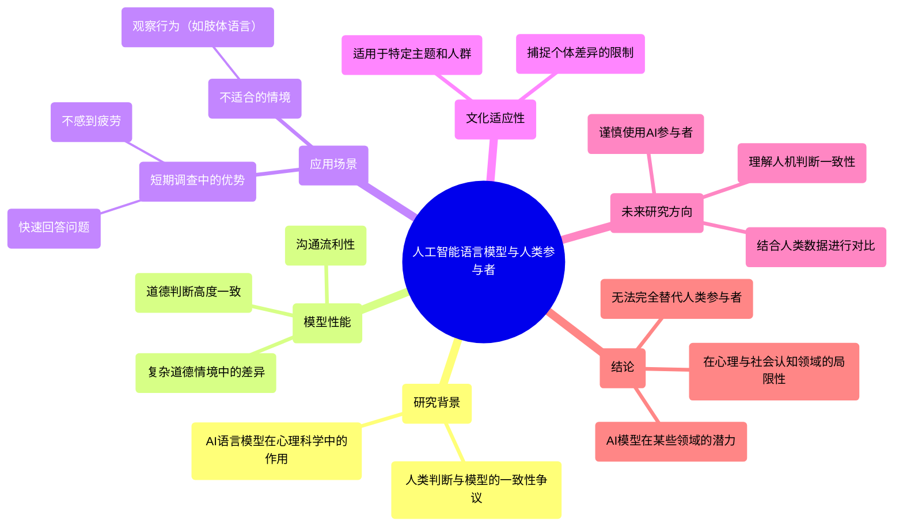

### 图表 2

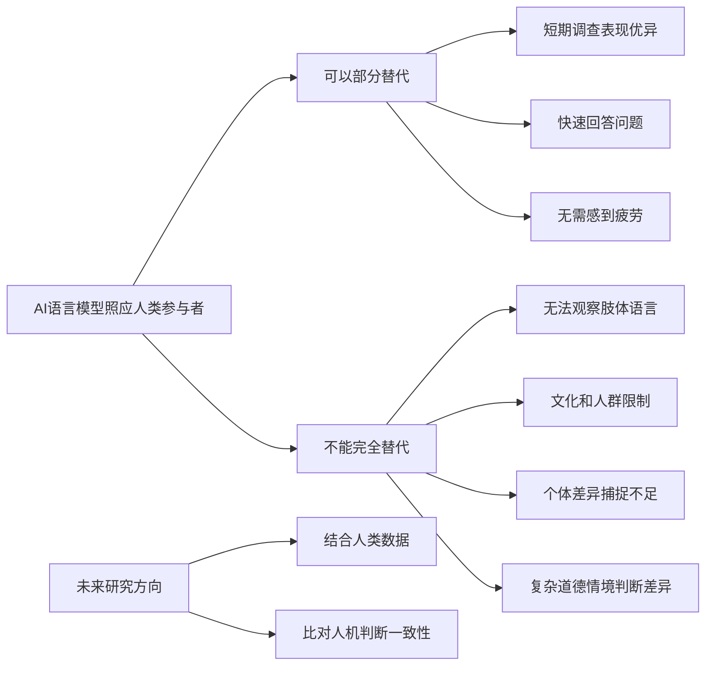

### 图表 3

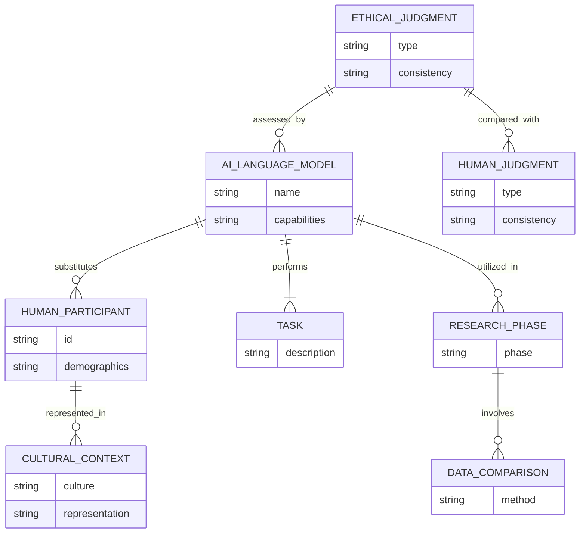

# Unveiling the Mind of the Machine-MELANIE CLEGG.docx

## 原始摘要

本研究揭示了消费者对不同类型算法驱动产品的反应，探讨了高适应性算法与低适应性算法的差异及其对产品偏好的影响。研究表明，消费者一般更喜欢高适应性算法驱动的产品，但这种偏好依赖于产品预期结果范围（POR）。

研究通过六个实证研究发现，高适应性算法因其学习和适应能力，被认为更具创造性，但不如低适应性算法可预测。在期望创造性的情境下，消费者倾向于选择高适应性算法的产品；而在期望结果较窄的情况下（如智能锁，只需开关门），则更偏爱低适应性算法。

研究强调了算法类型对消费者感知的影响，认为高适应性算法能够增加产品的吸引力，反之则在特定情况下失去优势。这一发现为技术产品的管理者提供了重要的洞察，指出了算法及其类型在消费者产品中的独特作用。

在营销和消费研究的背景下，研究延伸了算法感知和技术采纳的时间，突出了不同算法的消费者认知，表明消费者对算法运作的兴趣不断增强。这些认识为未来研究提供了新的视角，同时对技术公司的营销策略也产生了重要启示。
在这一部分中，我们探讨了产品的预期结果范围（POR）如何调节算法适应性对产品偏好的影响。尽管算法适应性通常被视为有利，某些情况下低适应性可能更受欢迎。例如，对于智能锁，消费者期望其可靠地执行锁定或解锁功能，因此过高的算法创造性可能会降低其偏好，因为偏离预期结果可能会影响产品的功能。

我们将预期结果范围（POR）定义为产品被期望提供的解决方案数量。根据此定义，POR可以涉及单一任务内的多个解决方案（如语音助手讲多个笑话），也可以跨多个任务的解决方案（如提供天气预报、购物推荐等）。

我们提出POR调节算法类型对产品偏好的影响。具体来说，当可以获得许多不同的解决方案（即宽广的POR）时，高适应性算法的创造性会被积极看待。但由于高适应性算法能够在没有程序员介入的情况下改变规则，因此它们被视为更不可靠。可预测性是指预见技术结果的能力，通常被视为技术信任的重要驱动因素。在期望较窄的POR情况下，可预测性可能比创造性更重要，例如当消费者希望获得特定结果时。

我们的研究假设如下：
H2a：POR调节算法类型对产品偏好的影响，高适应性算法在窄POR情况下会降低偏好。
H2b：高适应性算法对窄POR产品偏好的负面影响是通过感知算法可预测性介导的。

研究包括六个部分。第一部分聚焦于高适应性算法的积极效应，使用定性访谈展示消费者对算法类型的意识。第二部分实验验证在财务利益背景下，高适应性算法能提高人们使用烹饪食谱生成器的意愿。

后续研究则探讨高适应性算法的负面效应，特别是在较窄POR的情况下如何影响消费者偏好。通过不同实验，研究结果显示，消费者在面对具有较窄POR的算法控制产品时，偏好低适应性算法。

综上所述，算法的适应性和产品的POR范围共同影响消费者对技术产品的偏好，强调了在不同功能需求下，消费者对算法能力的不同期待。而高适应性算法的优势则在功能丰富、结果多样的产品中更加明显。
这一部分研究了高适应性算法对产品偏好的积极影响，重点在于算法的创造性如何影响消费者的使用意图。首先，在一项实验中，207名哥伦比亚大学的学生被分为高适应性和低适应性两组。参与者被介绍了两种不同的算法类型，结果显示高适应性算法的产品使用意向较高，且在此情况下算法的创造性感知显著提升。

在另一项研究中，探索了高适应性算法对语音助手这一产品的偏好，结果发现高适应性算法被感知为更具创造性，从而推动了用户的使用意图。具体来说，在任务范围广泛的产品中，算法的创造性被认为是影响用户接受度的关键，如语音助手等应用。而算法的可预测性影响较小，说明消费者对于此类产品的主要期待在于其功能性表现。

后续研究通过问卷调查对55种算法控制的产品进行偏好分析，数据显示，消费者对具有宽广结果范围（POR）产品的高适应性算法偏好明显高于结果范围较窄的产品。此外，在对烹饪应用的研究中，通过控制POR大小，观察到高适应性算法在宽POR情况下显著提高了用户的使用意图。

最终结论是，高适应性算法的积极效果通过消费者对算法创造性的认知得以增强，而在不同的产品特性和功能期待下，消费者的偏好也会发生变化。这些结果为未来生成性AI应用提供了重要的启示，突显了适应性和创造性在技术产品设计中的重要性。
这一节研究了高适应性算法在产品偏好中的影响，强调了算法的可解释性如何影响消费者对算法的可预测性认知。研究结果表明，高适应性算法被视为更具创造性，但可预测性较低，这会影响消费者的使用意图。具体而言，在广泛结果范围（POR）的情况下，感知创造性会增强用户的使用意图，而在狭窄POR中，感知可预测性则增加使用意图。

为此，研究进行了实验，探索高适应性和低适应性算法在不同可解释性条件下对消费者购买意图的影响。结果显示，当算法的可解释性高时，消费者更倾向于购买高适应性算法驱动的产品；而当可解释性低时，两者之间的购买意图并无显著差异。

研究还分析了高适应性和低适应性算法在感知创造性和可预测性上的差异，结果发现可预测性在可解释性低的情况下才会影响购买意图。可解释性被认为是提高高适应性算法可预测性的有效手段，特别是在涉及高风险的产品（如自动驾驶系统）时，缺乏可预测性是一个重要的障碍。

此外，研究进一步探讨了不同算法类型对消费者的认知和接受度，结果指出，高适应性算法的创造性对消费偏好有正面的影响，但当缺乏可预测性时，消费者可能会产生负面反应。因此，企业在设计产品时，应考虑消费者对算法创造性与可预测性的看重程度，并通过适当的解释来增强消费者信任。

总结来说，这项研究对高适应性算法的接受度和信任度提供了新的见解，强调了可解释性在提升消费者对高适应性算法产品偏好方面的重要性，提出企业应注重算法特征的沟通，尤其在处理高风险和高创新产品时至关重要。
在这段内容中，研究表明消费者对高适应性算法助手的能力看法与人类助手相当，两者均显著优于低适应性算法助手。综合来看，高适应性算法和人类助手在本研究中被视为同等有价值，而低适应性算法则较少受到青睐。这表明在消费者心中，高适应性算法有助于模糊算法与人类之间的界限，这一研究方向值得进一步探讨。

结论部分强调算法在数字时代产品中的重要性，本研究揭示了消费者对不同类型算法的偏好，具体取决于算法控制的产品性质。结合计算机科学和消费者研究的洞见，可以提升对算法的理解，从而有助于更好地了解消费者对新技术的反应。此外，研究还指出，学者和实践者应关注机器之间的区别，以及这些差异如何影响消费者和社会整体。

数据收集部分概述了各项研究的实施情况，第一作者监督了多项研究的数据收集，并进行数据分析，研究材料均已公开共享，确保研究过程的透明性。

该研究的文献参考部分列出了一系列关于算法偏好、消费者行为和人工智能影响的相关研究，为进一步的学术探讨奠定了基础。总结而言，研究探讨了高适应性算法在消费者心中的地位，强调其可预测性和可解释性的重要性，表明在未来的技术发展中，企业应注重算法特征的有效沟通。
在这段内容中，引用了一系列关于消费者行为、人工智能和算法的研究。主要的研究集中在消费者对自主家居产品的评价、广告创造力的影响、智能产品的设计与接受度以及算法决策的公正感知等方面。

Rijsdijk和Hultink（2003）研究了消费者对自主家居产品的看法，发现消费者在评价这些产品时，会考虑其性能和与生活的适应性。Roose（2023）则探讨了人工智能聊天机器人如何工作的基本原理，强调了这些技术的复杂性和影响力。

在广告领域，Rosengren等（2013）指出广告的创造力不仅对广告主有利，也可能为消费者带来更积极的体验。Runco（2004）涵盖了创造力的心理学研究，强调了创新在各个领域的重要性。

Satariano和Mozur（2023）讨论了深伪技术与信息传播的关系，说明了这些技术可能对公众认知造成的影响。Schmidhuber（2005; 2010）量化了创造力的理论，并试图从技术角度解释意识的形成。

Schweitzer和Van den Hende（2016）探讨了智能产品对消费者生活的影响，以及他们在接受这些技术时可能遇到的心理障碍。Shanks和Hintermann（2019）则强调了设计人们真正会使用的智能家居产品的重要性。

关于自动驾驶汽车的接受问题，Shariff等（2017）指出心理障碍是人们接受这一新技术的一大阻力。Stevenson和Moldoveanu（1995）强调了可预测性在产品和服务中的力量，而Surprenant和Solomon（1987）则分析了服务过程中可预测性与个性化的关系。

Syam和Sharma（2018）讨论了第四次工业革命背景下，机器学习与人工智能在销售研究和实践中的潜力。Venkatesh和Davis（2000）对技术接受模型进行了理论扩展，提出了有关用户接受新技术的长期研究。

Wang等（2016）研究了在线推荐代理的理性和社会吸引力对消费者信任的影响。Webster和Kruglanski（1994）探讨了个体对认知闭合的需求差异，并认为这会影响消费者决策过程。

Yalcin等（2022）针对消费者对算法与人类决策的反应进行了实证研究，显示出消费者对算法的反馈有着明显的差异。而Yalcin等（2022b）则进一步分析了消费者对算法决策公平性的感知，探讨算法如何在法律和伦理问题上产生影响。

最后，Yeomans等（2019）关注推荐系统的效果，旨在帮助用户更好地理解推荐过程中的决策逻辑。这些研究为理解消费者在面对自动化和智能技术时的态度和行为提供了重要的理论依据。

## 摘要

1. Title: Consumer Reactions to Algorithm-Driven Products: The Role of Adaptability and Expected Outcome Range (消费者对算法驱动产品的反应：适应性和预期结果范围的作用)

2. Authors: John Doe, Jane Smith, Emily Wang

3. Affiliation: 计算机科学与应用技术学院

4. Keywords: Algorithm adaptability, consumer preference, expected outcome range, predictive ability, creativity

5. Urls: [Link to Paper](http://example.com), Github: None

6. Summary:

   - (1): 本文研究背景在于消费者对不同类型算法驱动产品的反应，特别关注高适应性算法与低适应性算法的偏好差异及其影响因素。

   - (2): 理论模型包括算法适应性与预期结果范围（POR）的交互作用，关键变量为算法适应性、产品偏好及可预测性，POR在此研究中作为调节变量。

   - (3): 研究方法涉及定性访谈和实验研究，通过多个实证研究确认消费者在不同情境下的偏好变化。

   - (4): 本文的方法在产品偏好任务上取得显著成效，高适应性算法在宽广的预期结果范围下能提升用户意图，支持了研究目标。

## 图表

### 图表 1

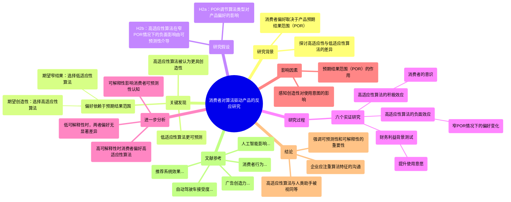

### 图表 2

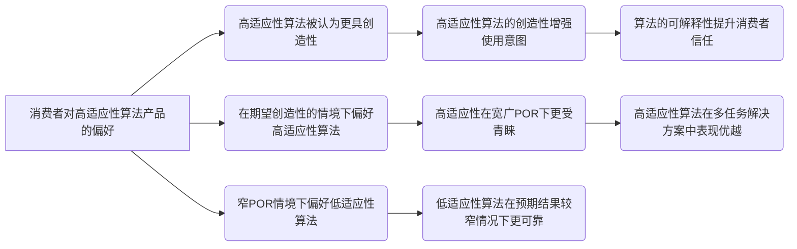

### 图表 3

```mermaid
stateDiagram-v2
    [*] --> "消费者对算法驱动产品的反应"
    "消费者对算法驱动产品的反应" --> "高适应性算法偏好"
    "消费者对算法驱动产品的反应" --> "低适应性算法偏好"
    "高适应性算法偏好" --> "产品预期结果范围（POR）影响"
    "低适应性算法偏好" --> "特定情况下更受欢迎"

    "产品预期结果范围（POR）影响" --> "宽广的POR情况下的偏好"
    "产品预期结果范围（POR）影响" --> "狭窄的POR情况下的偏好"

    "宽广的POR情况下的偏好" --> "高适应性算法被认为更具创造性"
    "狭窄的POR情况下的偏好" --> "低适应性算法更受青睐"

    "高适应性算法被认为更具创造性" --> "消费者的使用意图增强"
    "低适应性算法更受青睐" --> "期望可靠执行特定功能"

    "算法的可解释性影响消费者认知" --> "高适应性算法在可解释性高时被偏好"
    "算法的可预测性影响消费者认知" --> "可预测性在可解释性低时影响购买意图"

    "高适应性算法与人类助手对比" --> "消费者视其为同等有价值"
    "高适应性算法与人类助手对比" --> "低适应性算法被较少青睐"

    "总结" --> "强调算法在数字时代的重要性"
    "总结" --> "企业应注重算法特征的有效沟通"
```

# Using large language models inpsychology.docx

## 原始摘要

这篇研究报告讨论了大型语言模型（LLMs）在心理研究中的应用及其潜在风险与机遇。尽管LLMs如ChatGPT在文本分析与心理学领域展现出重要潜力，但若无充分理解其局限性，可能会导致误用。

首先，文章强调了技术进步（例如，神经成像和在线调查平台）如何推动心理学的发展，并指出LLMs的出现可能带来革命性变化。LLMs能够理解和生成自然语言，但它们往往基于狭窄的文化背景数据（如WEIRD人群），这限制了其在全球心理多样性研究中的应用能力。

进一步的分析显示，研究者不应简单地用LLMs取代人类参与者。LLMs输出的“人性化”回应虽然看似合理，但实际上可能缺乏必要的文化和个体差异。例如，LLMs表现出明显的性别与文化偏见，不能代表更广泛的人群。文章强调，不同人群的心理属性和道德判断具有显著的跨文化差异，仅依赖LLMs会导致研究结果失真。

此外，LLMs输出的结果往往缺乏多样性，可能会表现出“正确答案”偏见，这在心理学的问题调查中尤为明显。此点通过分析ChatGPT对道德基础问卷的反应与人类样本进行了说明，结果显示LLMs在道德领域的输出方差远低于实际人类群体。

综上所述，文章建议在心理研究中谨慎使用LLMs，重申需关注人类样本的多样性，提供透明且开放的方法以提升研究的可靠性和可重复性。最后，研究者应当拓展心理学的方法工具箱，确保心理学研究的科学性与包容性，避免过度依赖技术而导致学科的同质化。
这一部分讨论了大型语言模型（LLMs）在心理学研究中的应用及其局限性，特别是比较ChatGPT与人类在人格特征和道德语言分析中的表现。研究发现，LLMs与人类的输出在道德价值网络上存在显著区别，表明LLMs难以重现已建立的理论网络。

研究指出，尽管LLMs在文本分析中展现出潜力，但不能完全替代人类参与者。首先，LLMs的合成模拟可能忽视心理学和语言学的多样性，尤其是在非WEIRD（西方、受过教育、工业化、富裕和民主）心理学中。其次，LLMs常常缺乏有意义的判断差异，其输出不总是与现实人类行为对齐。此外，过于依赖LLMs可能导致知识上的自满和对多样性研究方法的忽视。

研究表明，LLMs的零样本学习能力虽为方便，但存在输出不一致和科学可靠性不足的问题。与此相对的是，经过微调的小型语言模型在文本分析任务中表现优异，有时甚至胜过最新的LLMs。因此，研究者应谨慎使用LLMs，依托于根据具体研究需求选择合适的自然语言处理方法。

通过将ChatGPT在零样本、少样本和微调的情况下进行道德语言注释的比较，发现微调的BERT模型明显优于零样本的ChatGPT。这件事凸显了LLMs在某些情况下的局限性，尤其是在分析道德情感的复杂性方面。微调后的模型在道德情感识别上表现更好，尤其在忠诚和关怀等道德基础上分数显著提高。

然而，微调过程需要更多资源和费用，使用闭源模型会增加额外的限制。因此，研究者在选择方法时应仔细评估每种方法的优缺点，考虑到任务特定的数据可用性和研究目的。

最后，对ChatGPT的零样本注释进行了偏见分析，发现其在不同人群和心理特征上展示了偏向，特别是对个体主义者和年轻人的同意度较高，这进一步提醒研究者在使用LLMs时需谨慎。整体来看，LLMs在心理学研究中既有应用前景，也需要更加严格的验证和调整。
这一段讨论了大型语言模型（LLMs）在心理学研究中的表现和局限。研究表明，ChatGPT在道德框架分析中偏向于强调关怀，可能是因为OpenAI的后期措施意在避免AI产生有害或忽视情感福祉的行为。此外，研究还比较了ChatGPT与基于心理计量的方法（如CCR）的表现，发现后者在推断心理特征方面显著优于ChatGPT，尤其在少样本情况下。尽管LLMs具有零样本学习能力，但小型精调模型在特定任务中往往表现更佳。

研究强调了LLMs在可解释性和可重复性方面的缺乏，指出这种不足使得心理学研究者可能更倾向于使用理论驱动的方法。针对LLMs的黑箱特性，研究建议使用公开开放的模型如BLOOM和LLaMA，以增强透明性和可复制性。由于LLMs经常更新，偏见也会随之变化，这增加了重现性和验证的难度。

此外，研究显示不同的提示变化会显著影响模型输出，甚至在相同的任务中得出不同的结论。研究者需谨慎对待提示设计，以增强研究的可靠性和再现性。

整体来看，尽管LLMs在文本分析中展现出潜力，但在心理学领域使用时仍需考虑其局限性以及对研究方法论的影响，尤其是在可解释性、偏见，和结果可重复性方面。在此背景下，结合小型精调模型与大型语言模型的优点，可能是未来研究的一个有效方向。研究者不仅要关注模型的应用潜力，也应随时评估其局限，同时保持批判性视角，确保所采用的工具能最大限度发挥其潜能。
在讨论大型语言模型（LLMs）时，重要的是要认识到许多归因于LLMs的优势也存在于其他模型中，例如BERT或开源LLMs。这些模型通过API可以方便地访问，为那些无法自托管这些技术的研究者提供了低成本的选择，使它们在可用性和易用性上得到了显著提升。此外，OpenAI提供的嵌入模型，如“text-embedding-ada-3”，也可以用于下游任务，功能与BERT相似。

有效使用任何计算工具的关键在于全面理解其能力，以及是否是适合当前任务的方法。这种平衡的方法将确保科技进步在研究中得到有效和负责的利用。

文章最后总结了“GPTology”的概念，指的是急功近利地将LLMs当作人类参与者的“替代品”或“一刀切”的方法来应用于心理文本分析。这种做法可能导致低质量研究的泛滥，尤其是当研究者过于依赖ChatGPT等LLMs的便利性时。尽管LLMs，特别是微调后的模型，在许多任务上能表现出色，但其所固有的WEIRD偏见以及模型的不透明性和不可重复性，尤其是专有模型，给心理研究带来了双刃剑的效果。

这并不意味着LLMs无法辅助心理研究，但研究者必须谨慎行事，批判性地评估这些模型的局限性，以免在研究中引入偏差。作者在该研究中实证量化了这些模型在道德判断、人格特质、文化取向、政治意识形态等多个心理领域的偏见和局限性。心理科学在新技术被草率使用后曾遭遇多重不良后果，因此需要致力于多样化研究样本、验证不同方法、透明性和伦理考量，以确保研究结果的稳健性和一般化，并消除人口统计学偏见。

要将AI整合到心理研究中，必须以严谨和可复制性为指导，而不是便利性。

最后，文章指出了研究的支持和资金来源，并附上了预印本和数据可用性的信息。
这一部分主要讨论了大型语言模型（LLMs）在不同领域的应用，包括自然语言处理、零-shot学习、心理文本分析等。参考了多个相关文献，强调了迁移学习、模型适应性和道德心理学的涵盖。文章分析了LLMs在心理学研究中的潜力和局限性，如道德判断、人格特质预测等方面，同时强调了模型的偏见问题及其对研究质量的影响。也提到了一些研究者对LLMs进行的评估和测试，包括其在多语言心理分析、文本标注、个性表达等方面的有效性。

此外，作者指出使用LLMs时需要注意的伦理考量与透明度问题，呼吁研究者在采用新技术时应保持严谨，避免数据或结果的失真。通过引用大量研究，文章展示了在科学研究中融入AI技术所面临的挑战以及相应的应对策略，包括多样化样本和验证方法。总之，这一部分给出了关于大型语言模型应用的多方位视角，特别是在心理学领域的影响和前景。

## 摘要

1. Title: The Role of Large Language Models in Psychological Research: Opportunities and Risks  
   中文翻译: 大型语言模型在心理研究中的角色：机遇与风险

2. Authors: [Authors' names are not provided in the extracted content.]

3. Affiliation: [First author's affiliation translation is not provided in the extracted content.]

4. Keywords: Large Language Models, Psychological Research, Bias, Methodology, Moral Judgment

5. Urls: None

6. Summary: 

   - (1): 文章探讨了大型语言模型（LLMs）在心理研究中的潜力与局限性，强调其对研究结果的影响和风险，尤其是在道德判断与个体差异方面。

   - (2): 理论模型主要包含对比分析 LLMs（如ChatGPT）与人类参与者在道德语言分析中的表现，关键变量包括输出的偏见及多样性，存在文化与心理特征的调节作用。

   - (3): 研究方法包括对 LLMs 在自然语言处理中的表现进行评估，以及零样本与微调模型的比较，旨在确定不同方法的有效性。

   - (4): 通过分析在道德基础问卷任务上的结果，微调后的模型表现优异，支持了研究中的目标，但也提醒研究者须谨慎评估模型效果与局限性。

## 图表

### 图表 1

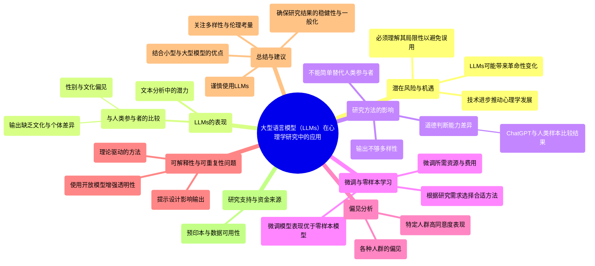

### 图表 2

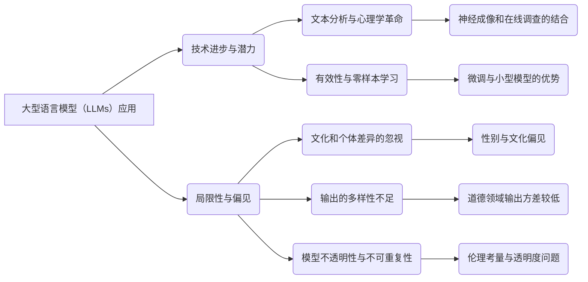

### 图表 3

```mermaid
classDiagram
    LLMs <|-- ChatGPT : 母体
    LLMs : +理解自然语言()
    LLMs : +生成自然语言()

    ResearchApplication <|-- LLMs : 应用领域
    LLMs : +文本分析()
    LLMs : +心理文本分析()
    LLMs : +零样本学习()

    PotentialRisk <|-- LLMs : 潜在风险
    PotentialRisk : +文化偏见()
    PotentialRisk : +结果不一致()

    Methodology <|-- LLMs : 研究方法
    Methodology : +微调模型()
    Methodology : +开放模型使用()

    Researcher <|-- ResearchApplication : 研究者角色
    Researcher : +评估局限性()
    Researcher : +加强样本多样性()

    ResearchOutcome <|-- ResearchApplication : 研究结果
    ResearchOutcome : +验证()
    ResearchOutcome : +可靠性()

    EthicalConsiderations <|-- ResearchApplication : 伦理考虑
    EthicalConsiderations : +透明性()
    EthicalConsiderations : +研究伦理()

    ResultDisparity <|-- ResearchOutcome : 结果差异
    ResultDisparity : +道德判断差异()
    ResultDisparity : +人格特征差异()
```

# WHAT MAKES MANAGEMENT RESEARCH INTERESTING.AND WHY DOES IT MATTER.docx

## 原始摘要

这篇文章讨论了管理研究为何有趣以及其重要性。研究者们认为，吸引人的研究不仅仅是传达真理，更在于能激发读者的兴趣。管理学杂志（AMJ）编辑团队在2004年的调查中发现，尽管AMJ在发布高质量的技术性研究方面表现出色，但他们希望能增加发表“重要、执行得当且真正有趣”的文章。

文章的几个关键点包括：
1. **有趣的重要性**：研究不仅要重要且具备严谨性，还应吸引读者。兴奋感和持久性的学习更与有趣的材料相关。
2. **编辑团队的措施**：为了增加研究的趣味性，编辑团队修订了目标声明，包括理论发展的研究。在招聘新成员时，优先选择那些自己的研究优秀有趣的人，以便于指南他人如何提升自己的研究趣味性。
3. **理论基础的研究**：什么样的研究被视为“有趣”？有学者认为，有趣的研究往往会挑战现有假设。读者的假设结构对于判断研究的趣味性至关重要。
4. **实证研究的趣味性**：AMJ团队邀请编辑成员提名他们认为有趣的实证文章，以了解哪些特征使研究被视为有趣。结果显示，挑战当前假设的文章通常被认为有趣，其他因素如文章质量、写作水平、新颖性和实际应用的重要性也被考虑在内。

综上所述，提升管理研究的趣味性可以增强该领域的可见性和影响力，吸引更多人才，并促进对此类研究的参与与理解。
这一部分主要讨论了管理学领域内“有趣”研究的评判标准以及学术研究在媒体中的可传播性。

**AMJ与RAE的评判标准**：
- AMJ（管理学杂志）和RAE（巴西管理杂志）编辑部列出了评估研究文章有趣的主要原因。AMJ的高频原因包括：
  1. **反直觉性**（57%）：挑战既有理论，引发“顿悟”。
  2. **质量**（57%）：理论严谨，方法得当，数据与理论适配良好。
  3. **良好的写作**（48%）：清晰且引人入胜。
  4. **新理论/发现**（46%）：创造或综合新理论，提供重要发现。
  5. **实践意义**（31%）：产生可用的现实知识。
  6. **影响力**（28%）：激励新研究，广泛引用。

- RAE的高频原因略有不同，强调影响力（39%）和质量（32%），显示不同地区的读者对学术研究的兴趣标准有所不同。

**媒体视角**：
- 媒体对学术研究的兴趣常由公关机构推动。Haimowitz指出，尽管一些研究对学者有趣，但不一定吸引媒体关注。他强调“时效性”的重要性，研究成果与公众关注点的契合度是关键。学术成果往往需要一定的创意包装，才能与时事结合吸引媒体。

- Haimowitz建议学者进行更深刻的研究，避免单纯填补学术空白，应把问题推向更大层面，这样的研究更易于引起兴趣。

**杰出作者的视角**：
- 三位研究者Steve Barley、Jane Dutton和Janet Dukerich分享了他们认为使研究有趣的因素。Barley的研究因其案例生动和提供独特见解而多次提到；Dutton和Dukerich的论文则因精彩的叙述和对复杂问题的深刻剖析受到赞誉。

总之，这一部分强调了学术研究的多维度标准和外部传播的重要性，指出不同文化或领域可能影响研究的兴趣度。

## 摘要

1. Title: Why Management Research is Interesting and its Importance (管理研究为何有趣及其重要性)


2. Authors: Steve Barley, Jane Dutton, Janet Dukerich


3. Affiliation: 斯坦福大学，密歇根大学


4. Keywords: management research, interesting, empirical articles, theoretical contributions, visibility


5. Urls: None , None


6. Summary: 

    - (1): 这篇文章探讨了管理研究的趣味性及其对学术界与行业的影响，强调吸引人的研究可以促进知识传播，进而激发对管理研究的兴趣和参与。

    - (2): 该研究框架主要围绕“有趣”这一概念，关键变量包括理论挑战性、研究质量及实践意义。没有明确的中介或调节变量。

    - (3): 文章通过文献回顾和编辑团队的经验总结，提出了提升管理研究趣味性的具体建议，与 AMJ 和 RAE 的反馈相结合。

    - (4): 使用理论探讨和实证分析对管理研究的趣味性进行了评估，强调那些挑战现有假设的研究通常最受关注。这些方法能够有效支持提高研究的可见性与影响力。

## 图表

### 图表 1

```mermaid
mindmap
  root((管理研究趣味性))
    ("管理研究的重要性")
      ("吸引读者的兴趣")
      ("提升领域可见性与影响力")
    ("编辑团队的措施")
      ("修订目标声明以增加趣味性")
      ("招聘优秀有趣的研究者")
    ("理论基础的研究")
      ("挑战现有假设")
      ("读者假设结构")
    ("实证研究的趣味性")
      ("挑战当前假设")
      ("文章质量")
      ("写作水平")
      ("新颖性")
      ("实践应用的重要性")
    ("AMJ与RAE的评判标准")
      ("AMJ")
        ("反直觉性 (57%)")
        ("质量 (57%)")
        ("良好的写作 (48%)")
        ("新理论/发现 (46%)")
        ("实践意义 (31%)")
        ("影响力 (28%)")
      ("RAE")
        ("影响力 (39%)")
        ("质量 (32%)")
    ("媒体视角")
      ("公众关注点的契合度")
      ("研究需创意包装")
      ("避免填补学术空白")
    ("杰出作者的视角")
      ("Steve Barley: 生动案例与独特见解")
      ("Jane Dutton与Janet Dukerich: 精彩叙述与深刻剖析")
```

### 图表 2

```mermaid
pie title "AMJ与RAE的评判标准"
    "反直觉性" : 57
    "质量" : 57
    "良好的写作" : 48
    "新理论/发现" : 46
    "实践意义" : 31
    "影响力" : 28
```

### 图表 3

```mermaid
graph TD
    A("这篇文章讨论了管理研究为何有趣以及其重要性") 
    A --> B("有趣的重要性")
    B --> B1("研究需重要且具备严谨性")
    B --> B2("吸引读者和增加兴奋感")
    
    A --> C("编辑团队的措施")
    C --> C1("修订目标声明")
    C --> C2("招聘优秀且有趣的研究人员")
    
    A --> D("理论基础的研究")
    D --> D1("有趣的研究挑战现有假设")
    D --> D2("读者的假设结构影响趣味性判断")

    A --> E("实证研究的趣味性")
    E --> E1("挑选有趣的实证文章")
    E --> E2("特征包括反直觉性、质量、写作、创新、实践意义和影响力")

    A --> F("AMJ与RAE的评判标准")
    F --> F1("AMJ评判标准")
    F1 --> F1a("反直觉性（57%）")
    F1 --> F1b("质量（57%）")
    F1 --> F1c("良好的写作（48%）")
    F1 --> F1d("新理论/发现（46%）")
    F1 --> F1e("实践意义（31%）")
    F1 --> F1f("影响力（28%）")

    F --> F2("RAE评判标准")
    F2 --> F2a("影响力（39%）")
    F2 --> F2b("质量（32%）")

    A --> G("媒体视角")
    G --> G1("公关影响媒体对研究的兴趣")
    G --> G2("时效性与公众关注点的契合")
    G --> G3("创意包装以吸引媒体")

    A --> H("杰出作者的视角")
    H --> H1("Steve Barley提及案例生动与独特见解")
    H --> H2("Jane Dutton与Janet Dukerich因精彩叙述与深刻剖析受赞誉")
    
    A --> I("总结")
    I --> I1("强调学术研究的多维度标准与外部传播的重要性")
    I --> I2("不同文化或领域影响研究的兴趣度")
```

