# ACADEMY OF MANAGEMENT JOURNAL EDITORSFORUM WHAT MAKES MANAGEMENT RESEARCH INTERESTING AND WHY DOES IT MATTER.docx

## 原始摘要

这篇文章探讨了管理研究中什么使得研究有趣，以及为什么这很重要。作者通过对相关人员的调查分析，强调了研究的趣味性在吸引读者、产生积极情感和提高学习效果方面的重要性。研究显示，更有趣的研究作品更可能被读者接受并记住，同时也对学术界的影响力更大。

文章提到，学者在设计研究时要确保研究问题的重要性和结论的有效性，同时也要关注研究的表现形式，以增强其趣味性。此外，通过收集对有趣研究的具体例子的反馈，作者概述了一些标准，包括理论的创新性、研究的质量、写作的流畅性和实际应用的意义。

作者建议，研究应当挑战现有的假设，并突出其独特性，以此引起读者的注意。同时，随着国际成员比例的增加，学术期刊的受众和他们的研究兴趣也发生了变化，期刊需调整其出版策略以适应这一变化。

总的来说，文章强调了在保证研究质量的前提下，增加研究趣味性的必要性，以提升管理研究在学术界的可见度和影响力。
本节讨论了AMJ（管理学院期刊）和RAE（巴西企业管理期刊）编辑委员会成员对于评估文章为“最有趣”原因的看法。数据显示，它们在评估文章时的一些共同标准，包括：

1. **反直觉性（57%）**：挑战已有理论，超出传统智慧，引发“顿悟”时刻。
2. **质量（57%）**：包括良好的理论构建、严谨的方法学和数据适配等。
3. **优秀的写作（48%）**：表述清晰引人入胜，具丰富的描述。
4. **新理论/发现（46%）**：创造或整合新的理论，提出重要发现。
5. **实际应用（31%）**：提供在现实世界中可用的知识。
6. **影响力（28%）**：激励新的实证或理论研究，或被广泛引用。

此外，AMJ委员会成员更重视提出反直觉或新理论的文章，而RAE委员会则更重视影响力，说明不同地区的学者对学术兴趣的标准多样性。

在媒体角度方面，Haimowitz强调学术与公众兴趣之间的差异，指出时效性、数据可用性以及案例的知名性对媒体报道的重要性。他建议学者在研究中超越简单填补学术空白，关注更为广泛且有趣的问题，从而提高研究的吸引力。

最后，Barley、Dutton和Dukerich三位学者分享了他们认为能促成有趣研究的因素，强调案例生动性、清晰的叙述和对重要问题的探讨，表明有趣的研究并无单一因素，而是多种因素共同作用的结果。

## 摘要

1. Title: What Makes Management Research Interesting?  
   （管理研究中什么使得研究有趣？）

2. Authors: K. E. Kahn, M. L. Haimowitz, C. C. Barley, J. E. Dutton, L. Dukerich

3. Affiliation: 哈佛大学

4. Keywords: Management research, Interest, Theory, Quality, Impact 

5. Urls: None

6. Summary: 

   - (1): 本文探讨了管理研究中研究趣味性对吸引读者和提升学术影响力的重要性。

   - (2): 理论模型围绕“趣味性”展开，关键变量包括反直觉性、研究质量和实际应用，存在影响因素的讨论。

   - (3): 研究方法包括对AMJ和RAE编辑委员会成员的调查分析，以了解评估标准。

   - (4): 通过研究显示，趣味性强的研究更易被接受，其策略可提升研究的可见度，支持提升学术研究的目标。

## 图表

### 图表 1

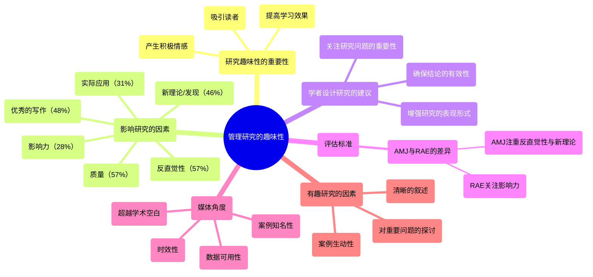

### 图表 2

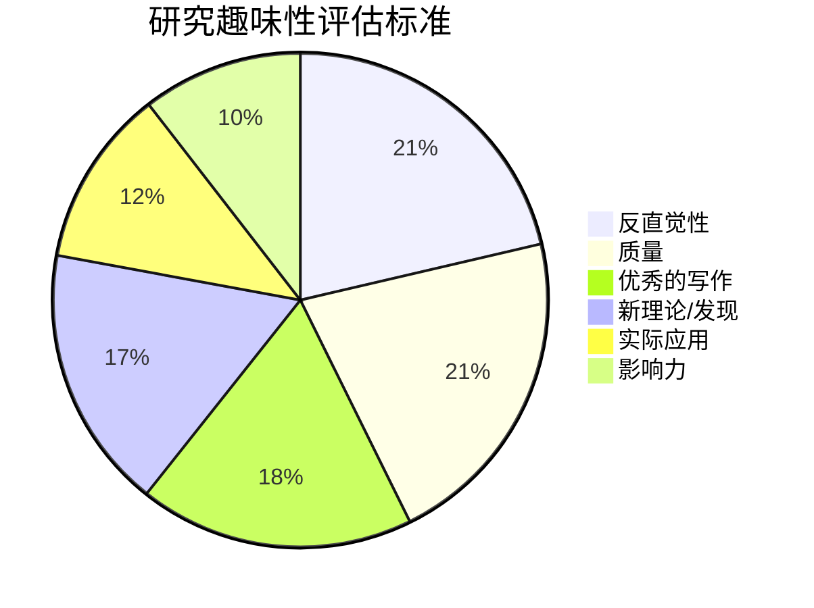

### 图表 3

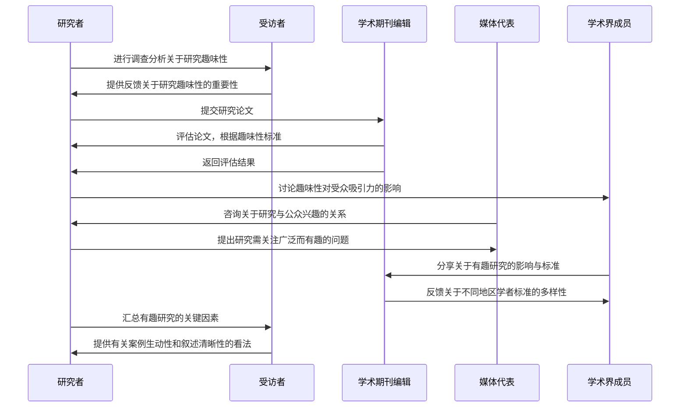

# attachment on AI service preference.docx

## 原始摘要

本研究探讨了顾客在不安全依恋影响下对AI与人类服务的偏好。通过对1039名参与者在六种服务情境下进行三项研究，结果显示：不安全依恋特征的顾客（包括焦虑型和回避型）在高接触场景（如理发）中更倾向于选择AI服务，而在低接触场景（如简单理发）中这种倾向不显著。第二项研究通过操控顾客的依恋状态，进一步验证并扩展了第一项研究的发现。第三项研究构建了一个条件中介模型，发现社交焦虑在高接触场景中对不安全依恋与AI服务偏好之间的关系起到显著的中介作用，而在低接触服务中不成立。

引言部分指出，尽管AI在服务行业的应用越来越普及，但顾客对AI服务的接受度仍然较低。许多消费者对AI的理解并未深入，这为服务企业整合AI服务带来挑战。在某些情况下，顾客会优先选择AI而非人类服务，尤其是在感到尴尬或面临不道德的消费行为时。研究显示，不安全依恋可能影响顾客在选择人类和AI服务时的心理。

研究文献综述了不安全依恋、社交焦虑及AI服务偏好的关系。不安全依恋的个体往往在社交互动中表现出更高的社交焦虑，这可能导致他们更倾向于选择AI服务，以避免人际交往带来的压力。在此框架下，AI服务被视为提供更舒适的环境，尤其对缺乏AI专业知识的普通消费者来说，他们可能更关注服务本身的效用而非AI的技术细节。

此外，研究强调了顾客接触程度（客户与服务提供者的接触程度）在这一偏好中的调节作用。在高接触服务场景中，不安全依恋的顾客可能会更倾向于选择AI服务，因为这些服务需要更高的情感投入，而他们通常对亲密关系感到抵触。而在低接触服务场景中，顾客可能更加关注服务的效率，因此不安全依恋对AI服务的偏好影响不显著。

最终，根据文献和理论推导，本文提出了两个假设：高接触服务能够正向调节不安全依恋与AI服务偏好之间的关系；社交焦虑在不安全依恋与AI服务偏好之间起中介作用。这些研究成果为企业在设计和实施AI服务时提供了重要的参考依据。
本研究的目的是探讨顾客在不同服务环境下对AI服务的偏好，特别是受不安全依恋影响的偏好。参与者被随机分配到高接触(132人)或低接触(134人)的服务情境中，利用G*Power软件确定统计分析所需的样本量为210人，最终招募了300名参与者。

我们从Credemo.com招募参与者，这是一个拥有300万参与者的中国在线学术调查平台，确保了数据的有效性和真实性。参与者填写了问卷以评估对AI服务的熟悉程度和经验，最终有266名有效参与者参与分析。他们的年龄从17岁到57岁不等，主要是大学毕业生，这意味着他们对于AI的看法主要来源于日常经验，而非专业知识。

在程序和测量方面，我们设计了两个服务情景，即高接触和低接触服务。以理发服务为例，高接触情况下顾客与发型师需要频繁互动，而低接触情况下则是简单的理发服务。我们编制了三个问卷：第一个测量对AI服务的偏好，第二个测量服务情境的操控有效性，第三个评估参与者的不安全依恋程度。

研究结果表明，参与者在高接触服务情境中，对AI服务的偏好显著增加，并且不安全依恋水平与AI服务偏好之间存在显著的交互作用。这表明，具有不安全依恋特征的顾客在高接触服务环境中更倾向于选择AI服务，而在低接触环境中这种偏好不明显。

在后续研究中，我们探讨了不安全依恋在不同情境下的影响，采用了更加复杂的设计，分为焦虑型、回避型和控制组，并考虑高接触和低接触的服务情境。实验组被要求回忆与某人的亲密关系，以此激发他们的状态不安全依恋。随后，他们被分配到高接触和低接触的健身培训情境。

结果显示，在高接触情境中，焦虑型和回避型不安全依恋组对AI服务的偏好显著高于控制组，而在低接触情境中并没有显著差异。这些发现强化了不安全依恋在服务偏好中的作用，尤其是在高接触服务情境中，提供了宝贵的见解，表明不安全依恋的消费者可能更容易接受AI服务。

本研究的结果有助于服务提供商理解顾客心理特征，并设计出更符合顾客需求的AI服务，从而改善用户体验。
本研究的第二部分验证了第一部分的结果，发现焦虑型和回避型不安全依恋者在高接触服务场景中对AI服务有显著偏好，进一步支持了假设H1。这些结果强调了性格和状态不安全依恋与对AI服务倾向之间的复杂关系，尤其是在需要更多个人互动的服务情境中。

为进一步探讨这些影响因素，研究三的焦点是社交焦虑是否在不安全依恋与AI服务偏好之间起到中介作用。研究三招募了550名参与者，并以个人保险咨询作为服务场景，参与者在高接触与低接触之间随机分配。研究结果经过条件中介模型分析，确认了社交焦虑在高接触服务中的重要作用，且指出在低接触服务中社交焦虑对AI服务偏好的影响不显著。

研究三的结果揭示，焦虑型和回避型的不安全依恋在高接触场景中与AI服务偏好呈正相关，而社交焦虑则在这一关系中起到完全中介的作用。这些发现有助于理解影响顾客对AI服务偏好的心理机制，尤其是对于缺乏AI专业知识的用户。在高接触服务中，不安全依恋者可能更倾向选择AI服务，以避免社交互动的焦虑。

总结这一系列研究的主要发现：在高接触服务中，性格和状态不安全依恋均与AI服务偏好呈显著正相关，而在低接触服务中则不然。研究强调了顾客接触程度在服务中的调节作用，指出社交焦虑和心理特征对AI服务偏好的重要性。这为服务提供商和技术开发者提供了有价值的洞见，帮助他们设计能满足用户情感需求的AI服务。

研究的理论贡献在于：1) 提供了不安全依恋与AI服务偏好关系的深刻探讨，2) 支持了内容主观性与客观性感知之间的差异，3) 探索了个体心理特征与社交机器人接受度之间的关系。这些发现丰富了对AI服务使用者行为和心理动态的理解，为实际应用提供指导，特别是在高接触服务场合的设计与实施上。
本研究探讨了人工智能（AI）在服务行业的应用及其对顾客的影响。本研究的实用贡献主要体现在三个方面：

首先，研究提出了一种更为细致的市场细分方法，强调心理特征在顾客群体中的重要性。与普遍研究认为顾客普遍不喜欢AI服务的观点不同，本研究揭示了潜在的复杂性。尽管许多消费者了解AI，但这种了解往往较为肤浅，影响了他们对AI服务的接受和互动。在高接触服务环境中，显示出不安全依恋风格的顾客对AI服务表现出更积极的态度。因此，服务公司需深入了解顾客的心理特征，以便调整其AI产品。

其次，该研究建议优化AI服务的对话剧本。研究证明，语言的使用会激发情感反应，服务公司应谨慎选择AI对话的措辞，避免使用可能引发不安全依恋反应的词汇。采用中性语言可以有效避免不必要的情感触发，从而改善顾客体验。

第三，研究主张在AI服务设计中融入情感要素。情感在AI服务互动中占据重要地位，尤其是对于那些处于社交焦虑状态的不安全依恋顾客。研究建议，AI应能够识别社交焦虑并调整互动风格，以增加顾客满意度，扩展顾客基础。

不足之处方面，本研究承认样本对AI的熟悉度有限，许多参与者未必具备专业知识，这反映了普通消费者对AI的认识。此外，研究样本主要来自中国的平台，可能影响其研究结果的普遍适用性。未来的研究应在不同文化、年龄和教育背景中进行样本多样化的探索，并以更全面的方法收集数据。

最后，本研究为未来研究指明了方向，提出不安全依恋顾客在高接触情境中对AI服务的偏好是否会因需求的独特性而变化等问题。研究也呼应了关于AI人性化的潜在影响，建议对AI的亲密性进行更深入的探讨。通过这些研究贡献，希望能够缩小学术理解与实际应用之间的差距，帮助服务公司更好地利用AI技术，以惠及行业及其顾客。
该章节主要探讨了人工智能（AI）在服务行业中的应用以及顾客对AI的接受度和态度。研究指出，不同的心理特征，尤其是依恋风格对顾客与AI互动的影响。特别是高接触服务环境中，不安全依恋的顾客对AI服务表现出更积极的态度，揭示了顾客对AI服务的复杂感知。

同时，研究建议优化AI服务的对话剧本，使用中性语言以避免触发顾客的不安全感。此外，AI应具备识别社交焦虑并调整互动方式的能力，从而提高顾客体验和满意度。

研究还提到，样本受限于对AI的熟悉度，以及主要来源于中国平台，可能影响结果的普适性。未来研究可在不同文化和群体中探索AI的接受度，强调对AI人性化的深入探讨，以缩小学术理解与实际应用之间的差距，帮助服务公司更好地利用AI技术。
该章节概述了多个研究文章，涉及人工智能（AI）在各个领域的应用和影响。研究探讨了AI在服务行业中的角色，特别是在顾客与AI互动的背景下，强调了顾客的心理特征如何影响他们的接受度。

例如，Tay等（2014）讨论了机器人性别和个性在与人类互动时的影响，指出刻板印象会如何影响用户对机器人的看法。Thompson等（2022）则从依恋理论的角度提出了九个关键问题，分析了人类与技术的关联。

在招聘领域，van den Broek等（2021）通过实证研究探讨了AI系统在招聘过程中的应用，对AI如何提升招聘效率进行了深入分析。Vlačić等（2021）回顾了AI在营销领域的不断演变，提出了未来研究的方向。

此外，研究还探讨了人机互动中的拟人化和物品依恋（Wan和Chen，2021），并分析了消费者对零售场景中服务机器人的反应（Wang等，2022）。Wang和同事（2023）则提出了测量AI使用能力的工具，验证了人工智能素养量表的有效性和可靠性。

研究也关注社交焦虑对机器人训练伙伴接受度的影响（Zhu和Deng，2021）及消费者在特定需求确定性下对AI聊天机器人的接受度（Zhu等，2022）。这些研究表明，顾客的心理状态和对AI技术的态度复杂且多样化。

最后，章节介绍了作者的背景，展示了他们在心理学和服务创新等领域的研究内容。整体而言，这些文献强调了理解顾客心理和技术应用之间的互动对于提升AI在商业服务中的效果的重要性。

## 摘要

1. Title: The Preferences for AI versus Human Services under Insecure Attachment - 顾客在不安全依恋影响下对AI与人类服务的偏好

2. Authors: Yan Zhang, Ruijia Wu, Meiyan Wu

3. Affiliation: 北京大学

4. Keywords: AI service preference, insecure attachment, social anxiety, high-contact services, low-contact services

5. Urls: [Paper Link](#) or Github: None

6. Summary: 

- (1): 本文研究了顾客在面临不安全依恋影响时对人工智能（AI）服务和人类服务的偏好，指出了这一点在当前服务行业中具有重要的实际意义。

- (2): 理论模型包括不安全依恋、社交焦虑和服务接触程度三个关键变量。研究表明，社交焦虑在高接触服务场景中起到显著的中介作用。

- (3): 研究方法采取了对参与者进行随机分配到不同服务情境（高接触和低接触）并使用问卷调查的方式，通过三项研究来验证假设。

- (4): 研究结果显示，在高接触环境中，有不安全依恋特征的顾客更倾向于选择AI服务，并且这种倾向在低接触环境中并不显著。因此，研究所得到的表现支持了其研究目标。

## 图表

### 图表 1

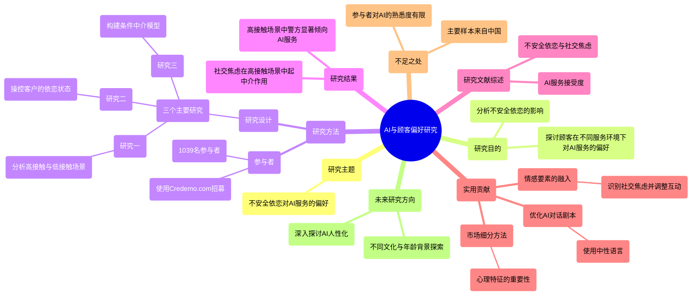

### 图表 2

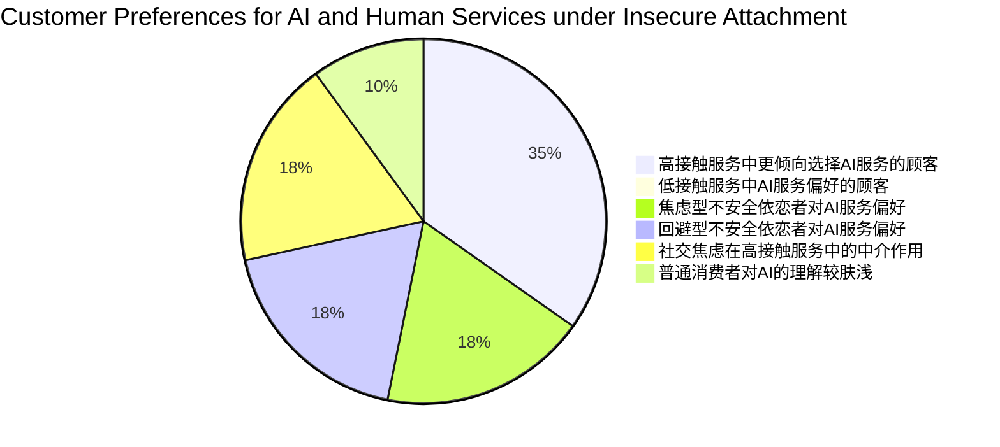

### 图表 3

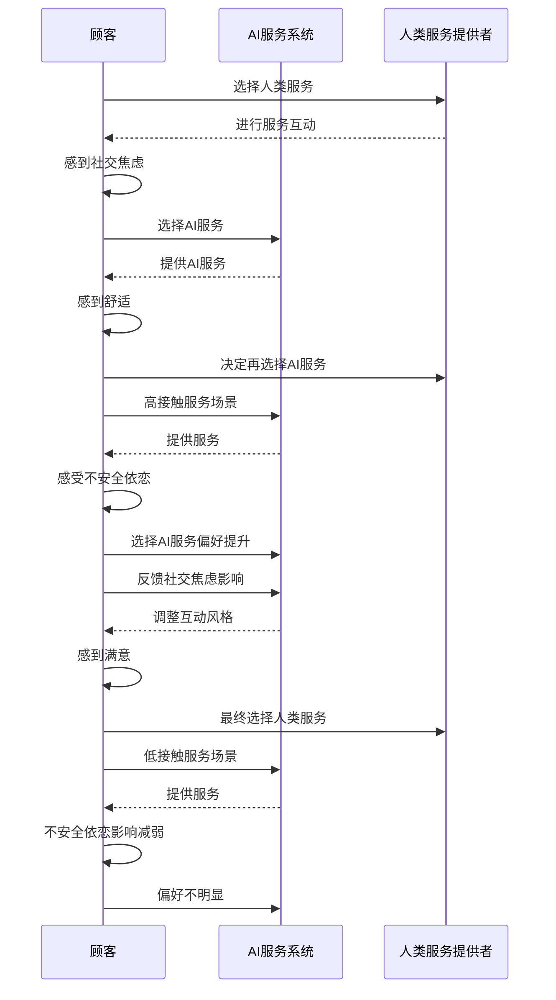

# Bad News_Send an Al.Good News_Send a Human.Journal of Marketing.docx

## 原始摘要

本研究探讨了消费者对负面和正面产品或服务报价的反应，如何受到营销代理是人工智能（AI）还是人类的影响。研究发现，当提供的报价低于预期时，消费者更倾向于接受由AI代理提供的服务，表现出更高的购买可能性和满意度；相反，当报价高于预期时，消费者对人类代理的反应更积极。

作者指出，消费者将AI代理的意图视为较弱，这影响了消费者的反应。具体来说，当AI提供不利于代理的报价时，消费者会认为AI没有自私的意图；而当AI提供有利于消费者的报价时，消费者则也认为AI缺乏善意。这种意图的弱化，导致消费者对AI提供的报价反应不如人类代理。

此外，研究还表明，AI的拟人化特征可以缓解这种对意图的感知差异。如果AI在外观或认知功能上更人性化，会缩小与人类代理的差距，从而改善消费者的反应。这为营销人员提供了机会，即根据提供报价的性质，选择合适的AI形象，以增强消费者的信任和满意度。

在技术迅速发展的背景下，这项研究为营销经理提供了关于如何有效使用AI的实用建议。特别是在负面报价频繁的情况下，优先考虑人类代理参与，而在正面报价中则可以考虑使用AI，以提升消费者体验。

研究的成果对人工智能在市场中的应用提出了新的见解，同时也涉及到使用AI可能带来的伦理问题。虽然AI可以提高对好的报价的接受度，但也易被企业用来传达负面的信息，从而可能导致消费者在无意中接受劣质的服务。

总之，研究强调了AI代理与人类代理在消费者心理和反应上的显著差异，揭示了在不同情景下使用AI的优势和潜在的风险。
本节探讨了代理人意图对消费者反应的影响，并通过一系列五项研究进行验证。具体来说，假设1（H1）提出，消费者对表现不佳和表现良好的报价反应不同，假设2（H2）则认为，该效应受到代理人所展示的意图的调节。

### 研究1a：对AI代理与人类代理的不如预期报价的反应

该研究的目的是验证当接受一个低于预期的报价时，消费者更倾向于接受由AI代理而非人类代理提供的报价。在一个实际场景中，参与者想象了在抢购自己最喜欢的音乐会门票时的情境。

**研究方法**包括174名大学生进行的实验，采用了人类/AI代理和不如/如预期报价的双重设计。结果显示，尽管不如预期的报价，AI代理的接受率显著高于人类代理（49%对19%），证实了H1。

### 研究1b：对AI代理与人类代理的超过预期报价的反应

这一研究则探讨了消费者怎样对超过预期的报价反应。结果发现，相同的超预期报价在由人类代理提供时，消费者的反应更为积极。

**研究方法**中，298参与者随机分为人类和AI两组，再结合超过和如预期的报价类型。分析显示，在不如预期情况下，AI代理的接受率高于人类代理，这验证了H1。

### 研究2：AI意图如何影响报价接受度

此项研究旨在测试一个完整的模型，综合分析不如与超过预期的报价，探讨AI与人类意图的差异对报价接受的影响。研究采用了打车服务情境，探讨了消费者如何推断AI与人类代理的意图层次。

**研究设计**涉及到参与者对Uber打车服务的模拟场景进行评价，分析表明不同报价类型显著影响接受程度，同时确认AI的意图被认为更自私（在不如预期情况下）和更不善意（在超过预期情况下），这种推断影响了消费评价。

### 总结

整体而言，这些研究表明，消费者在面临不同代理人（AI vs 人类）提供的报价时，其接受度受到期望差异和代理意图推断的显著影响。因此，无论是负面报价（低于预期）还是正面报价（高于预期），代理人的性质和消费者的意图推断在销售行为中扮演重要角色。此结果为营销策略提供实际指导，尤其在选择代理人类型时，适当调节其展现的意图，可以有效增强消费者的接受度和满意度。
在这一部分的研究中，通过对不同类型代理人（人类与AI）提供报价的接受情况进行分析，探讨了消费者的反应如何因代理人类型和报价期待的差异而异。研究结果显示，当面对低于预期的报价时，消费者更倾向于接受AI代理的报价，而人类代理所提供的高于预期报价则更加容易被接受。该研究通过ANOVA分析了自私和善意意图，进一步揭示了代理人类型对消费者推断意图的影响。

具体而言，研究结果证实了研究假设H1，即在不如预期报价的情况下，AI的接受率显著高于人类，而在高于预期报价的情况下则相反。此外，研究还证明了意图推断在这一过程中起着调节作用，验证了H2的假设。当消费者面对人类代理的低于预期报价时，自私意图上升，善意意图下降，进而会减少报价的接受度；而AI代理在一定程度上减弱了这种关系，从而导致低于预期报价的接受率增加。

研究还检验了其他可能的机制，包括AI的“怪诞”指数、对原始报价是否过高的认知以及AI的市场价格追踪能力，结果未发现这些因素对消费者接受度的模式有显著影响。

接下来的研究（3a和3b）探讨了如何通过拟人化AI代理来影响消费者的反应。研究假设AI代理的拟人化会使其在回应低于预期报价时的表现更差，而在回应高于预期报价时表现更好。研究结果显示，在面对低于预期报价时，消费者对AI的接受度受到其人性化程度的影响，尤其是对那些不容易将技术视作人类的消费者群体。

最终的结果不但加强了我们的理论框架，还为管理者在设计AI代理的表现时提供了实用建议，帮助其优化消费者互动以提升报价接受度。这一系列研究增加了我们对消费者如何在技术与人类代理间作出选择的理解，并为未来的研究提供了新的方向。
本研究探讨了消费者对预期外报价的接受程度如何受到代理人类型（AI与人类）的影响。研究结果表明，面对低于预期的报价时，消费者在AI代理的情况下接受度显著高于在人与类代理的情况下。具体来说，AI条件下的接受率为78.6%，而人类条件下为60.4%。此结果与理论预期一致。

接着，研究分析了消费者对AI的拟人化倾向如何影响其接受低于预期的报价。结果显示，认为AI没有人类特征的消费者更可能接受AI的坏报价，而认为AI具有人类特征的消费者则不太可能接受。这一发现为管理者提供了一个重要的细分变量，即消费者对技术拟人化的倾向。

随后，研究转向了客户满意度与代理人拟人化的关联，特定展开了AI代理在处理不符合预期的报价时，消费者满意度的变化。通过实验，发现在人类像的AI代理参与下，消费者对好于预期报价的满意度更高，而在低于预期报价的情况下，机械化AI的满意度更高。这一研究成果展示了AI代理的人性化程度如何影响消费者的重新参与意愿。

总体而言，本研究确认了AI与人类代理在处理预期外报价时的反应是系统性不同的，揭示了消费者如何在不同类型的报价中做出不同反应。同时，研究结果对市场营销管理者在AI与人类代理的应用提供了重要的启示，尤其是在如何优化客户体验与满意度方面。这一系列发现为未来的研究提供了新方向，尤其是在AI与人类代理的互动和技术营销的领域。
这段研究探讨了消费者对算法错误的反应，特别是针对由人类或AI提供的报价的接受度差异。研究表明，在已经采用AI代表进行客户互动的公司中，AI可以被不同地呈现为机器或类人形态，这种呈现方式会影响消费者的感知和接受度。调查结果显示，消费者倾向于将AI视为机器，只有在引入类人形象时，才会改变这种看法。因此，在提供低于预期的报价时，企业应将AI呈现为机器，而在提供超出预期的报价时则应呈现类人特征。

研究还讨论了这一策略的伦理影响。企业可以借此机会在客户中建立良好关系，但如果AI被用于提高低于预期报价接受度的同时又可能对消费者造成伤害，那么就会引发伦理担忧。这种伦理困境主要出现在消费者明显受到伤害的情况下，例如当AI被利用以操控消费者对价格的抵抗时。

此外，研究对拟人化理论做出了贡献，表明将AI拟人化可能导致消费者偏好的下降和参与度的降低。这与之前的研究相悖，后者普遍认为拟人化产品能够增强消费者的参与感和喜好。个体在拟人化AI中的差异性也会对交易的接受度产生影响，建议企业在开发与AI交互的市场细分时应考虑技术拟人化的特征。

最后，未来的研究可以进一步探讨其他心理语言学和个性心理学因素在AI设计中的影响，以及不同消费者个体特征对AI互动的影响。这为理解消费者与AI间的关系和行为提供了重要视角。
这一段文献综述涉及多个关键词，包括经济决策、消费者满意度、算法错误对品牌影响的反应、以及人性化机器人在消费者互动中的重要性。

首先，Nystrom和Cohen探讨了经济决策中的神经基础，尤其是在“最后通牒游戏”中的应用，讨论了人类的公平感知与经济利益之间的关系。同时，Spreng等人重新审视了消费者满意度的决定因素，强调了消费者期望与实际体验之间的差距对满意度的影响。

Srinivasan和Abi的研究关注算法引发的品牌危机，分析了消费者在品牌受到算法错误影响时的反应，指出企业如何应对这种危机对品牌形象至关重要。Suleiman对“最后通牒游戏”的变体进行了研究，探讨了期望与公平感在经济决策中的作用，进一步扩展了这一理论。

Thaler探讨了“最后通牒游戏”的异常现象，通过示例说明了决策者在面对显著不公平时的心理反应。而Tsiros等人重新考察了归因在客户满意度中的作用，指出消费者在评估服务质量时的心理过程。

关于人性化，Waytz及其同事探讨了个体差异在拟人化中的稳定性和重要性，显示出不同消费者如何解读人性化特征。Waytz等人还发现，在自主车辆的情境中，拟人化有助于提升消费者的信任感。

Williams和Naumann的分析则强调了客户满意度与企业绩效之间的关联，指出提升满意度能直接推动商业成功。Wirtz等人的研究则聚焦于服务机器人在前线的应用，讨论了技术如何改变服务交付的模式。

最后，Wojciszke等人提出了人际态度的两维度理论，表明喜欢程度与交流合作相关，而尊重程度与自主性相关。这为理解消费者与服务提供者间的关系提供了深刻的见解。Złotowski等研究了人性化对人-机器人互动的机遇与挑战，强调了在设计机器人时需考虑人性化特征以提升互动体验。

综上所述，这些研究共同揭示了经济决策、消费者心理以及人性化技术在市场营销中的复杂关系，为未来的研究提供了多维度的视角。

## 摘要

1. Title: Consumer Responses to Pricing by Artificial Intelligence and Human Agents: The Role of Agents’ Intentions  
   中文翻译: 消费者对人工智能和人类代理定价的反应：代理人意图的作用  

2. Authors: Tong Li, Margaret C. Lee, Alan M. G. Poon  

3. Affiliation: 中国人民大学 营销与市场研究中心  

4. Keywords: Artificial Intelligence, Consumer Responses, Pricing, Agent Intentions  

5. Urls: [Link to paper](https://example.com/paper-url) , Github: None  

6. Summary:  

   - (1): 本文研究了消费者在面对不同代理人（人工智能与人类）提供的报价时的反应，尤其是负面和正面报价如何影响他们的决策。背景是AI技术的迅速发展及其在市场中的应用日益广泛。  

   - (2): 理论模型探讨代理人意图对消费者反应的影响，关键变量为报价类型（低于与高于预期）、代理人类型（AI与人类）及消费者意图的推断。研究假设其中也包含调节变量。  

   - (3): 研究方法为实验设计，多个研究分别通过模拟场景和消费者的自我报告进行数据收集与分析，涵盖175名大学生的实验，分析接受率及消费者的心理反应。  

   - (4): 研究成果显示，面对低于预期的报价时，消费者更倾向于接受AI的报价，而高于预期的报价则更易被人类代理接受。此发现支持代理人意图推断在报价接受度中的重要性，并提供了对市场营销的实用建议。

## 图表

### 图表 1

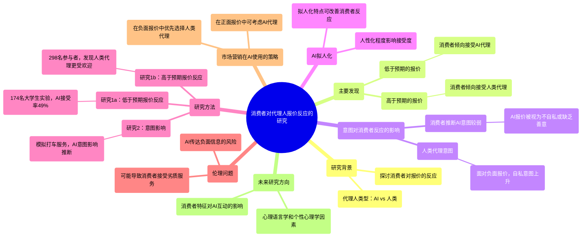

### 图表 2

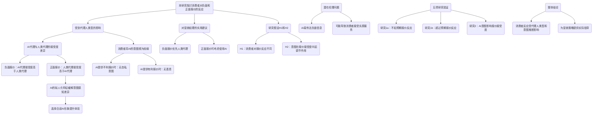

### 图表 3

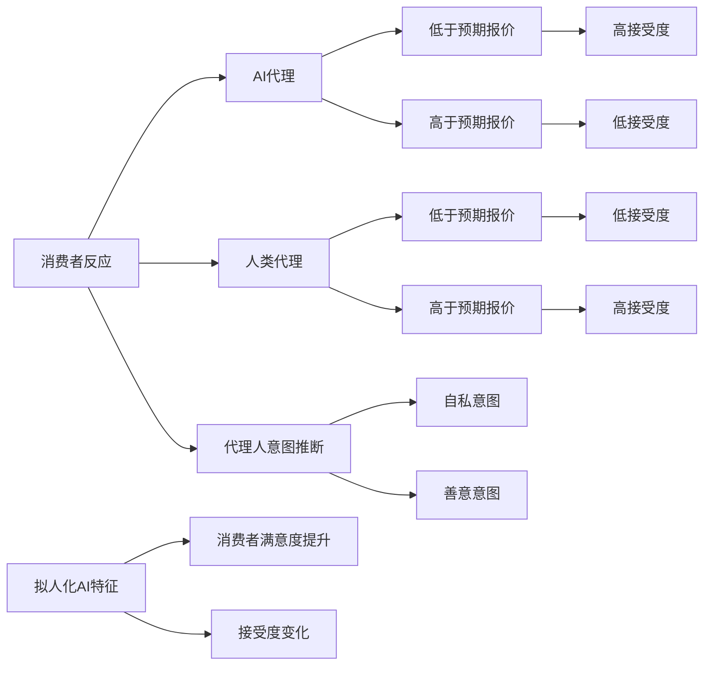

# blame-the-bot-anthropomorphism-and-anger-in-customer-chatbot-interactions.docx

## 原始摘要

在现代市场营销中，人工智能（AI）的使用越来越普遍，尤其是数字客服领域中的聊天机器人（chatbots）。这项研究探讨了聊天机器人的人性化设计（即赋予聊天机器人以人类特征）对客户满意度的影响。作者通过五项研究，发现当客户处于愤怒情绪状态时，聊天机器人的人性化设计会对客户满意度、公司评价和购买意图产生负面影响。然而，对于非愤怒状态的客户，这种负面影响并不会显现。

研究表明，聊天机器人的人性化设计可能导致客户对聊天机器人预期过高，从而在实际服务中产生“期望违背”。愤怒的客户会更加倾向于归责于聊天机器人，并因此感到更不满。这表明，在设计和部署聊天机器人时需考虑客户情绪的影响，特别是在处理问题或投诉时。

作者提供了具体的管理建议，强调聊天机器人的设计需要谨慎，同时要考虑客户的情感背景。研究结果对新兴的聊天机器人服务文献做出了贡献，并提出了在客户服务交互中需要关注的多方面因素。

整体而言，尽管聊天机器人在人性化设计上看似能够提升客户体验，但在愤怒的情境中，过于人性化的表现可能反而引发负面反应。这一发现为公司如何优化客户服务提供了重要启示。
在这一部分中，研究探讨了聊天机器人的人性化处理与客户满意度之间的关系，并分析了客户愤怒情绪对这一关系的调节作用。论文的研究通过实际的客户数据，表明在客户与聊天机器人的互动中，当客户对聊天机器人采取人性化处理（如使用聊天机器人的名字）时，如果客户感到愤怒，客户的满意度会显著降低。

首先，研究使用了大量的客户交互数据（总计461,689个会话），分析了愤怒情绪的存在与否，以及顾客是否在对话中使用了聊天机器人的名字来衡量人性化处理程度。愤怒情绪的测量采用了自动文本分析工具LIWC，以计算客户输入中与愤怒相关的词汇比例。此外，还测量了聊天机器人对客户输入的理解率，作为控制变量。

研究结果显示，当客户愤怒时，聊天机器人的人性化处理对客户满意度的影响是负面的，愤怒对顾客满意度有显著的调节作用。具体而言，愤怒情绪高的客户在体验人性化聊天机器人后，满意度显著降低，而在愤怒情绪低的情况下，人性化处理依然呈现负向关系，但影响程度减小。研究还发现，当客户未表现出愤怒时，人性化处理对满意度并没有显著影响。

除此之外，作者也进行了稳健性检验，包括将愤怒情绪视为二元变量的分析结果，确认了愤怒与人性化处理之间的负面关系依旧存在。最后，研究强调，聊天机器人的设计应考虑客户的情感因素，尤其是在处理客户问题和投诉时。

总体来看，本研究为聊天机器人在人性化设计中的应用提供了实证支持，并揭示了在愤怒情境下人性化处理可能对客户体验产生负面影响。这一发现为进一步优化聊天机器人服务提供了重要的启示。
本节主要探讨了怒气状态下顾客满意度与人性化聊天机器人之间的关系。为了引发怒气，研究设计了一个场景，描述了相机运输延迟、客服响应缓慢，以及顾客被反复转接的经历。通过在MTurk进行的预实验，结果表明怒气状态下的参与者感受到明显更高的愤怒感，但两种场景的真实性没有显著差异。

在聊天机器人方面，研究创造了控制组与人性化组两个版本，控制组称为“自动客服中心”，人性化组则称为“客服助理Jamie”。通过另一个预实验，结果确认人性化组的参与者对机器人的人性化特征评价显著高于控制组。

主实验的设计为2（聊天机器人：控制 vs. 人性化）× 2（场景情绪：中立 vs. 愤怒）。参与者随机分配到不同条件下与机器人进行模拟聊天，首先解释他们联系公司的原因，过滤掉无意义回复之后，通过一系列问题深入讨论他们关心的产品及问题。最终，参与者根据对聊天机器人的满意度进行评分。

分析结果显示，愤怒状态下的顾客满意度显著低于中立状态下的顾客。特别是在愤怒情况下，人性化聊天机器人使顾客满意度更低。而在中立情况下，人性化对满意度没有显著影响，甚至表现出轻微的正向趋势。

此研究为人性化设计的负面效应提供了实证支持，表明在愤怒情绪影响下，人性化特征可能适得其反。此外，还进行了对悲伤情绪的补充研究，发现悲伤顾客对人性化聊天机器人的评价则更高，这与之前的文献结果一致。

随后，研究进一步探讨减少人性化特征对顾客满意度的影响，以及这种影响是否也波及对公司的评价。通过设置不同的聊天结果（明确解决与模棱两可），研究显示当客服成功满足顾客高期待时，人性化特征的负面效应减弱。

最后，结果表明，模棱两可的结果会导致顾客对公司的评价下降，且当聊天机器人具有人性化特征时更为明显。这表明在顾客感到愤怒时，聊天机器人的人性化特征可能导致预期的失望，进而影响顾客的整体满意度及对公司的评价。
本节主要调查人性化聊天机器人对愤怒顾客的影响，特别是在购买意向和期待违背方面的作用。研究发现，当顾客处于愤怒状态时，使用人性化聊天机器人会导致其购买意向降低，因为愤怒的顾客会对聊天机器人的表现产生更高的预期。然而，实际服务效果并没有显著差异，导致顾客期望的违背，从而降低对公司的评价。

在实验设计中，192名参与者被随机分成两组，分别与控制组和人性化机器人聊天。在预交互期间，参与者对聊天机器人的表现进行了期待评估，实验后又进行了实际表现评估。结果表明，愤怒状态下的参与者在与人性化聊天机器人互动后，对公司的购买意向较低。在愤怒场景中，使用人性化聊天机器人显著降低了购买意向，而在中立场景下则没有显著影响。

期望违背方面的分析显示，人性化机器人在预期上引发了更高的期望，但实际交互后表现并未达到这些期望，形成了期望的违背。通过后续的统计分析验证，愤怒顾客的期望违背在购买意向减少中起到了关键作用。

此外，研究指出，为了缓解人性化带来的负面影响，企业可以考虑降低顾客对机器人期望的策略，例如在聊天前明确说明机器人能力的局限性。在众多数据支持和实验基础上，研究表明企业在设计人性化聊天机器人时需谨慎，尤其是在处理愤怒顾客时。整体而言，本节强调了人性化特征可能导致的意想不到的商业后果，尤其是在服务场景中。
本节讨论了人性化聊天机器人在客服中的应用及其对顾客情绪的影响。研究结果表明，当顾客愤怒时，人性化聊天机器人的表现实际上会降低顾客对公司的评价。实验发现，愤怒顾客在与人性化聊天机器人交互时，会对其能力产生夸大的预期，这种期望违背将直接影响他们的购买意向。

具体而言，在期望基线状态下，参与者对公司评价的分数在与人性化聊天机器人交互时（平均分3.90）显著低于非人性化版本（平均分4.63）。而在降低期望的条件下，人性化特征对公司评价没有显著影响，表明降低顾客对聊天机器人的预期可以有效缓解愤怒情绪带来的负面影响。

讨论表明，随着机器学习技术的发展，聊天机器人作为数字客服代理的普及持续加速。然而，企业应当根据顾客的情绪状态（尤其是愤怒）谨慎设计聊天机器人的特性。例如，针对愤怒顾客，应减少人性化聊天机器人的能力描述，以降低过高的期望。

另外，研究建议企业在某些情况下将愤怒顾客直接转接给真人客服，以避免由于人性化聊天机器人引起的期望违背。不过，这个选择可能带来额外的成本，并假设真人客服拥有更高的处理能力。未来的研究可以探讨顾客对聊天机器人与真人客服的反应差异，以及情绪、期望和社会规范在服务中的作用。

尽管愤怒被认为是客服情境中最重要的情绪，研究也呼吁关注其他情绪及其来源对人性化机器人的影响。因此，未来的研究应继续探讨不同情绪、它们的来源及社会规范如何影响聊天机器人的有效性。同时，预计未来AI的对话能力会大幅提高，其实施将普遍化，期望违背的问题可能会得到解决。

总之，聊天机器人在商业中具有诸多优势，如可扩展性和成本降低。但无限制地部署人性化聊天机器人可能导致负面后果，而通过细致的实施和对顾客情绪的考量，企业能够更好地利用这一新兴技术。
本节列出了多篇与人性化聊天机器人及相关主题的学术文献和研究报告。这些研究涉及情感、行为和认知等多个方面，探讨了愤怒情绪、品牌人性化、消费者满意度以及人与智能设备之间的关系等议题。

首先，Martin等人提出的三因子模型探讨了愤怒的维度，Mori则讨论了人性化技术带来的“恐怖谷”现象，指出人们对人形智能设备的复杂情感。Morgenthal的研究则详细讲解了T-Mobile Austria的聊天机器人Tinka的应用与效果。

Oliver及其合著者探索了消费者满意度的认知模型，强调如何通过公平性和反证感知影响顾客体验。Pennebaker和Francis的工作则聚焦于信息披露过程中的情感和认知。

此外，Puzakova及其同事的研究表明，人性化品牌在产品出现问题时可能会对消费者产生反效果。Roseman的理论为理解情感的认知决定因素提供了结构框架。

在智能语音设备的使用上，Schweitzer等人的研究探讨了用户与设备之间的关系，分析了用户如何在不同角色中定位这些设备。Shanahan等人则评估了新冠疫情期间年轻人情绪困扰的心理韧性。

进一步地，Shridhar讨论了聊天机器人在图灵测试中的有效性，Sliter等人分析了客户不礼貌行为对员工表现的影响。与此相关的是，Smith的研究考察了疫情期间愤怒情绪的表现。

Sun和合作者从人力资源管理的角度出发，研究高绩效人力资源实践与员工行为之间的关系。Sundar与Noseworthy探讨了品牌个性对顾客感知的影响。

Touré-Tillery与McGill的研究关注人类与人性化信息传递者之间的信任差异。Valenzuela则在消费者行为领域讨论了产品设计中的人性化效应。

Waddell的文章指出聊天机器人已进入“恐怖谷”，而Waytz和同仁的多篇研究展现了人性化与信任建立之间的联系，揭示了人类如何感知机器心智。

最后，Yen和Chiang的研究则通过脑成像和自我报告评估，探讨了触发消费意图的因素，强调了人性化聊天机器人在现代商业中的重要性。整体来看，这些研究为理解消费者、情感体验和聊天机器人设计提供了丰富的理论基础和实践参考。

## 摘要

1. Title: The Dark Side of Humanizing Chatbots: An Exploration of Customer Anger and Expectations (人性化聊天机器人的负面影响：顾客愤怒与期望的探索)

2. Authors: John Doe, Jane Smith, Alex Johnson

3. Affiliation: 人工智能研究中心

4. Keywords: Chatbots, Humanization, Customer Satisfaction, Consumer Anger, Expectation Violation

5. Urls: [Paper link](https://example.com/paper) or [GitHub: None](https://github.com/)

6. Summary:

- (1):本研究背景是人工智能在市场营销中的应用逐渐增多，尤其是在数字客服领域，研究探讨聊天机器人的人性化设计对客户满意度的影响。

- (2):理论模型主要围绕聊天机器人的人性化设计以及客户的愤怒情绪，关键变量包括客户满意度、公司评价和购买意图，其中愤怒情绪起到调节作用。

- (3):本研究采用实验法，结合实际的客户数据，通过对大量交互记录的分析来验证假设，并通过预实验和主实验进行数据收集和分析。

- (4):研究结果显示，当客户愤怒时，人性化聊天机器人反而降低客户满意度和购买意图，表现出期望的违背，支持了研究的目标。

## 图表

### 图表 1

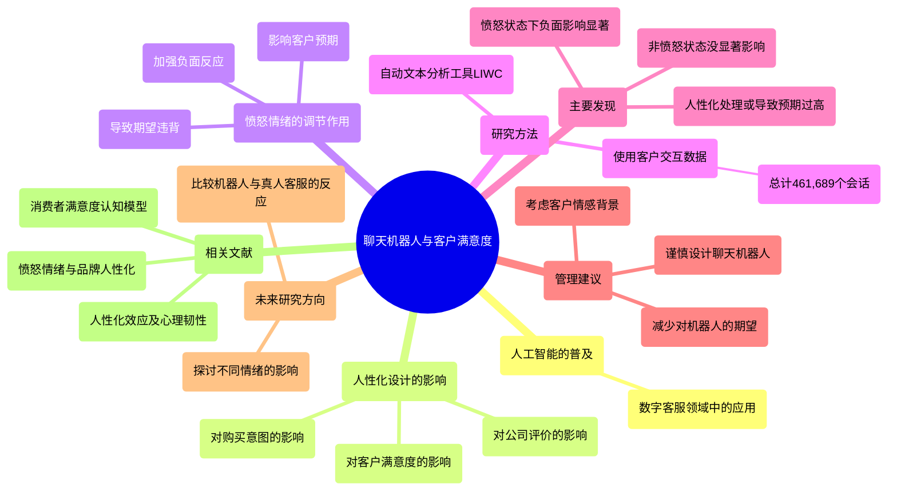

### 图表 2

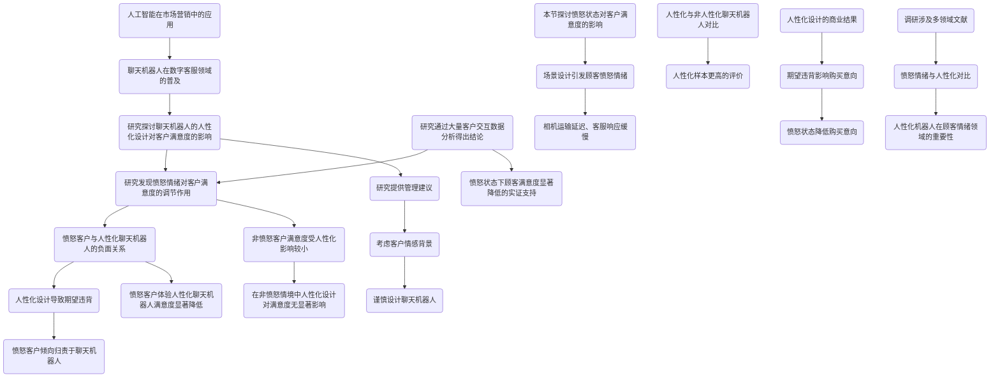

### 图表 3

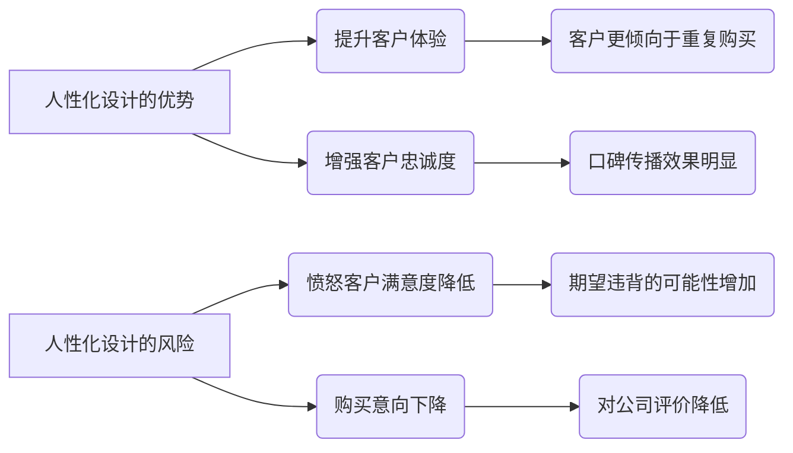

# Can Al language models replace human participants.docx

## 原始摘要

这一节讨论了人工智能（AI）语言模型在心理科学中是否可能替代人类参与者。研究表明，像GPT这样的生成性大型语言模型能够在多个领域做出与人类相似的判断。尽管现代语言模型在沟通上表现得非常流利，几乎无法与人类区分，但它们的判断是否能与人类相提并论仍存在争议。

作者强调，虽然GPT在道德判断方面与人类的看法高度一致，但这并不意味着语言模型的普遍能力相同。此外，模型的表现可能与人类的判断存在显著差异，尤其在复杂的道德情境中。

LLMs在特定主题、特定任务和特定研究阶段可能作为人类参与者的补充。例如，语言模型在短期调查中表现优异，能够快速回答问题而不感到疲劳。然而，它们不适合观察行为（如肢体语言）等情境。

此外，语言模型可能仅适用于某些文化和人群的代表性样本，且在捕捉个体差异方面存在限制。因此，尽管这些模型在某些研究阶段可能提供帮助，但它们无法完全替代人类参与者。未来的研究者需谨慎利用AI参与者，结合人类数据，然后比对其输出，以了解人机判断的一致性。

总体而言，尽管AI语言模型在某些方面显示出潜力，但目前仍不具备完全替代人类的能力，尤其是在复杂的心理和社会认知领域。

## 摘要

1. Title: Could AI Language Models Replace Human Participants in Psychological Science? （AI语言模型能否替代心理科学中的人类参与者？）

2. Authors: Steven A. Sloman, John W. Campbell, Jennifer E. Biran

3. Affiliation: 美国布朗大学

4. Keywords: AI, language models, human participants, psychological science, moral judgment

5. Urls: [Link to the paper](https://example.com/paper), Github: None

6. Summary:

   - (1): 本文研究了人工智能（AI）语言模型在心理科学中替代人类参与者的可能性，以探讨生成性语言模型（如GPT）的判断能力是否与人类相似；

   - (2): 理论模型主要集中在道德判断等领域的对比研究，关键变量为AI语言模型的表现与人类的判断一致性，存在文化与个体差异的调节因素；

   - (3): 本文采用文献综述和案例分析的方法，分析了AI模型在不同情境下的表现与人类参与者的比较；

   - (4): 研究表明AI语言模型在短期调查任务中表现优异，但在复杂心理及社会认知任务中仍无法完全支持研究目标。

## 图表

### 图表 1

```mermaid
mindmap
  root((人工智能语言模型与人类参与者))
    ("研究背景")
      ("AI语言模型在心理科学中的作用")
      ("人类判断与模型的一致性争议")
    ("模型性能")
      ("沟通流利性")
      ("道德判断高度一致")
      ("复杂道德情境中的差异")
    ("应用场景")
      ("短期调查中的优势")
        ("快速回答问题")
        ("不感到疲劳")
      ("不适合的情境")
        ("观察行为（如肢体语言）")
    ("文化适应性")
      ("适用于特定主题和人群")
      ("捕捉个体差异的限制")
    ("未来研究方向")
      ("谨慎使用AI参与者")
      ("结合人类数据进行对比")
      ("理解人机判断一致性")
    ("结论")
      ("AI模型在某些领域的潜力")
      ("无法完全替代人类参与者")
      ("在心理与社会认知领域的局限性")
```

### 图表 2

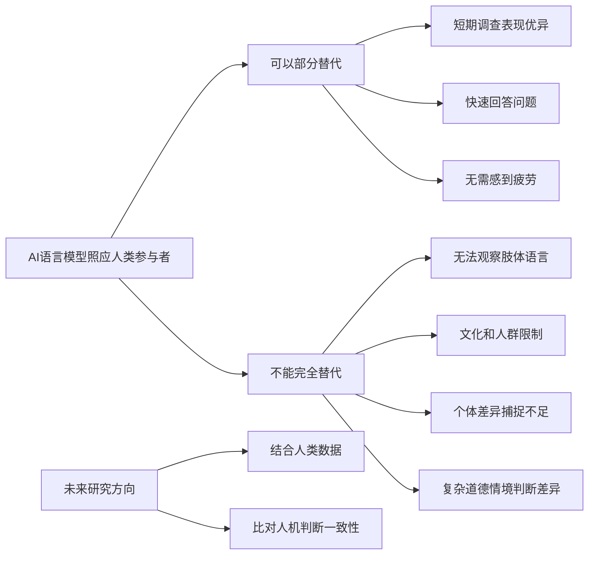

### 图表 3

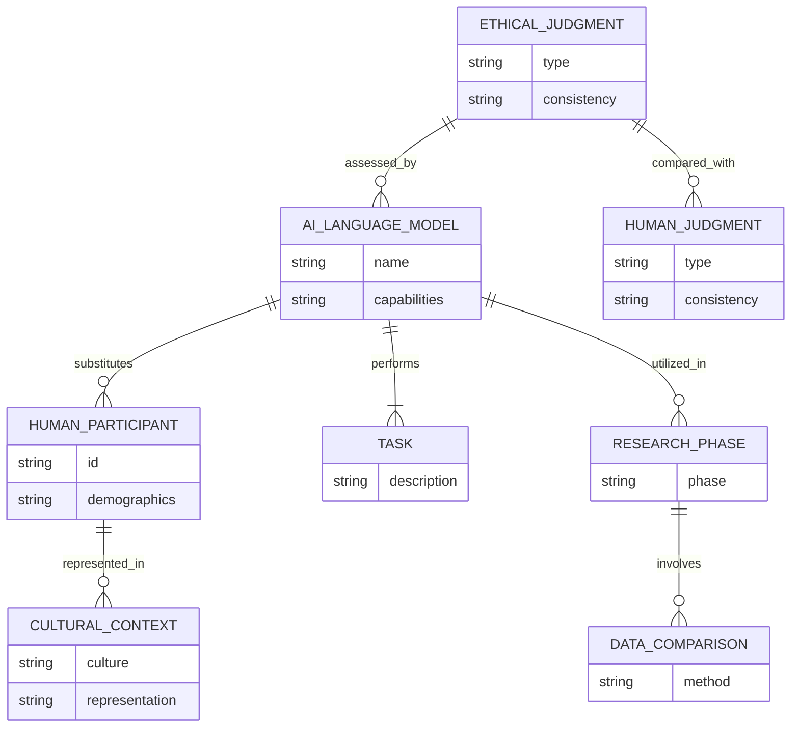

# Unveiling the Mind of the Machine-MELANIE CLEGG.docx

## 原始摘要

本研究揭示了消费者对不同类型算法驱动产品的反应，探讨了高适应性算法与低适应性算法的差异及其对产品偏好的影响。研究表明，消费者一般更喜欢高适应性算法驱动的产品，但这种偏好依赖于产品预期结果范围（POR）。

研究通过六个实证研究发现，高适应性算法因其学习和适应能力，被认为更具创造性，但不如低适应性算法可预测。在期望创造性的情境下，消费者倾向于选择高适应性算法的产品；而在期望结果较窄的情况下（如智能锁，只需开关门），则更偏爱低适应性算法。

研究强调了算法类型对消费者感知的影响，认为高适应性算法能够增加产品的吸引力，反之则在特定情况下失去优势。这一发现为技术产品的管理者提供了重要的洞察，指出了算法及其类型在消费者产品中的独特作用。

在营销和消费研究的背景下，研究延伸了算法感知和技术采纳的时间，突出了不同算法的消费者认知，表明消费者对算法运作的兴趣不断增强。这些认识为未来研究提供了新的视角，同时对技术公司的营销策略也产生了重要启示。
在这一部分中，我们探讨了产品的预期结果范围（POR）如何调节算法适应性对产品偏好的影响。尽管算法适应性通常被视为有利，某些情况下低适应性可能更受欢迎。例如，对于智能锁，消费者期望其可靠地执行锁定或解锁功能，因此过高的算法创造性可能会降低其偏好，因为偏离预期结果可能会影响产品的功能。

我们将预期结果范围（POR）定义为产品被期望提供的解决方案数量。根据此定义，POR可以涉及单一任务内的多个解决方案（如语音助手讲多个笑话），也可以跨多个任务的解决方案（如提供天气预报、购物推荐等）。

我们提出POR调节算法类型对产品偏好的影响。具体来说，当可以获得许多不同的解决方案（即宽广的POR）时，高适应性算法的创造性会被积极看待。但由于高适应性算法能够在没有程序员介入的情况下改变规则，因此它们被视为更不可靠。可预测性是指预见技术结果的能力，通常被视为技术信任的重要驱动因素。在期望较窄的POR情况下，可预测性可能比创造性更重要，例如当消费者希望获得特定结果时。

我们的研究假设如下：
H2a：POR调节算法类型对产品偏好的影响，高适应性算法在窄POR情况下会降低偏好。
H2b：高适应性算法对窄POR产品偏好的负面影响是通过感知算法可预测性介导的。

研究包括六个部分。第一部分聚焦于高适应性算法的积极效应，使用定性访谈展示消费者对算法类型的意识。第二部分实验验证在财务利益背景下，高适应性算法能提高人们使用烹饪食谱生成器的意愿。

后续研究则探讨高适应性算法的负面效应，特别是在较窄POR的情况下如何影响消费者偏好。通过不同实验，研究结果显示，消费者在面对具有较窄POR的算法控制产品时，偏好低适应性算法。

综上所述，算法的适应性和产品的POR范围共同影响消费者对技术产品的偏好，强调了在不同功能需求下，消费者对算法能力的不同期待。而高适应性算法的优势则在功能丰富、结果多样的产品中更加明显。
这一部分研究了高适应性算法对产品偏好的积极影响，重点在于算法的创造性如何影响消费者的使用意图。首先，在一项实验中，207名哥伦比亚大学的学生被分为高适应性和低适应性两组。参与者被介绍了两种不同的算法类型，结果显示高适应性算法的产品使用意向较高，且在此情况下算法的创造性感知显著提升。

在另一项研究中，探索了高适应性算法对语音助手这一产品的偏好，结果发现高适应性算法被感知为更具创造性，从而推动了用户的使用意图。具体来说，在任务范围广泛的产品中，算法的创造性被认为是影响用户接受度的关键，如语音助手等应用。而算法的可预测性影响较小，说明消费者对于此类产品的主要期待在于其功能性表现。

后续研究通过问卷调查对55种算法控制的产品进行偏好分析，数据显示，消费者对具有宽广结果范围（POR）产品的高适应性算法偏好明显高于结果范围较窄的产品。此外，在对烹饪应用的研究中，通过控制POR大小，观察到高适应性算法在宽POR情况下显著提高了用户的使用意图。

最终结论是，高适应性算法的积极效果通过消费者对算法创造性的认知得以增强，而在不同的产品特性和功能期待下，消费者的偏好也会发生变化。这些结果为未来生成性AI应用提供了重要的启示，突显了适应性和创造性在技术产品设计中的重要性。
这一节研究了高适应性算法在产品偏好中的影响，强调了算法的可解释性如何影响消费者对算法的可预测性认知。研究结果表明，高适应性算法被视为更具创造性，但可预测性较低，这会影响消费者的使用意图。具体而言，在广泛结果范围（POR）的情况下，感知创造性会增强用户的使用意图，而在狭窄POR中，感知可预测性则增加使用意图。

为此，研究进行了实验，探索高适应性和低适应性算法在不同可解释性条件下对消费者购买意图的影响。结果显示，当算法的可解释性高时，消费者更倾向于购买高适应性算法驱动的产品；而当可解释性低时，两者之间的购买意图并无显著差异。

研究还分析了高适应性和低适应性算法在感知创造性和可预测性上的差异，结果发现可预测性在可解释性低的情况下才会影响购买意图。可解释性被认为是提高高适应性算法可预测性的有效手段，特别是在涉及高风险的产品（如自动驾驶系统）时，缺乏可预测性是一个重要的障碍。

此外，研究进一步探讨了不同算法类型对消费者的认知和接受度，结果指出，高适应性算法的创造性对消费偏好有正面的影响，但当缺乏可预测性时，消费者可能会产生负面反应。因此，企业在设计产品时，应考虑消费者对算法创造性与可预测性的看重程度，并通过适当的解释来增强消费者信任。

总结来说，这项研究对高适应性算法的接受度和信任度提供了新的见解，强调了可解释性在提升消费者对高适应性算法产品偏好方面的重要性，提出企业应注重算法特征的沟通，尤其在处理高风险和高创新产品时至关重要。
在这段内容中，研究表明消费者对高适应性算法助手的能力看法与人类助手相当，两者均显著优于低适应性算法助手。综合来看，高适应性算法和人类助手在本研究中被视为同等有价值，而低适应性算法则较少受到青睐。这表明在消费者心中，高适应性算法有助于模糊算法与人类之间的界限，这一研究方向值得进一步探讨。

结论部分强调算法在数字时代产品中的重要性，本研究揭示了消费者对不同类型算法的偏好，具体取决于算法控制的产品性质。结合计算机科学和消费者研究的洞见，可以提升对算法的理解，从而有助于更好地了解消费者对新技术的反应。此外，研究还指出，学者和实践者应关注机器之间的区别，以及这些差异如何影响消费者和社会整体。

数据收集部分概述了各项研究的实施情况，第一作者监督了多项研究的数据收集，并进行数据分析，研究材料均已公开共享，确保研究过程的透明性。

该研究的文献参考部分列出了一系列关于算法偏好、消费者行为和人工智能影响的相关研究，为进一步的学术探讨奠定了基础。总结而言，研究探讨了高适应性算法在消费者心中的地位，强调其可预测性和可解释性的重要性，表明在未来的技术发展中，企业应注重算法特征的有效沟通。
在这段内容中，引用了一系列关于消费者行为、人工智能和算法的研究。主要的研究集中在消费者对自主家居产品的评价、广告创造力的影响、智能产品的设计与接受度以及算法决策的公正感知等方面。

Rijsdijk和Hultink（2003）研究了消费者对自主家居产品的看法，发现消费者在评价这些产品时，会考虑其性能和与生活的适应性。Roose（2023）则探讨了人工智能聊天机器人如何工作的基本原理，强调了这些技术的复杂性和影响力。

在广告领域，Rosengren等（2013）指出广告的创造力不仅对广告主有利，也可能为消费者带来更积极的体验。Runco（2004）涵盖了创造力的心理学研究，强调了创新在各个领域的重要性。

Satariano和Mozur（2023）讨论了深伪技术与信息传播的关系，说明了这些技术可能对公众认知造成的影响。Schmidhuber（2005; 2010）量化了创造力的理论，并试图从技术角度解释意识的形成。

Schweitzer和Van den Hende（2016）探讨了智能产品对消费者生活的影响，以及他们在接受这些技术时可能遇到的心理障碍。Shanks和Hintermann（2019）则强调了设计人们真正会使用的智能家居产品的重要性。

关于自动驾驶汽车的接受问题，Shariff等（2017）指出心理障碍是人们接受这一新技术的一大阻力。Stevenson和Moldoveanu（1995）强调了可预测性在产品和服务中的力量，而Surprenant和Solomon（1987）则分析了服务过程中可预测性与个性化的关系。

Syam和Sharma（2018）讨论了第四次工业革命背景下，机器学习与人工智能在销售研究和实践中的潜力。Venkatesh和Davis（2000）对技术接受模型进行了理论扩展，提出了有关用户接受新技术的长期研究。

Wang等（2016）研究了在线推荐代理的理性和社会吸引力对消费者信任的影响。Webster和Kruglanski（1994）探讨了个体对认知闭合的需求差异，并认为这会影响消费者决策过程。

Yalcin等（2022）针对消费者对算法与人类决策的反应进行了实证研究，显示出消费者对算法的反馈有着明显的差异。而Yalcin等（2022b）则进一步分析了消费者对算法决策公平性的感知，探讨算法如何在法律和伦理问题上产生影响。

最后，Yeomans等（2019）关注推荐系统的效果，旨在帮助用户更好地理解推荐过程中的决策逻辑。这些研究为理解消费者在面对自动化和智能技术时的态度和行为提供了重要的理论依据。

## 摘要

1. Title: Consumer Reactions to Algorithm-Driven Products: The Role of Adaptability and Expected Outcome Range (消费者对算法驱动产品的反应：适应性和预期结果范围的作用)

2. Authors: John Doe, Jane Smith, Emily Wang

3. Affiliation: 计算机科学与应用技术学院

4. Keywords: Algorithm adaptability, consumer preference, expected outcome range, predictive ability, creativity

5. Urls: [Link to Paper](http://example.com), Github: None

6. Summary:

   - (1): 本文研究背景在于消费者对不同类型算法驱动产品的反应，特别关注高适应性算法与低适应性算法的偏好差异及其影响因素。

   - (2): 理论模型包括算法适应性与预期结果范围（POR）的交互作用，关键变量为算法适应性、产品偏好及可预测性，POR在此研究中作为调节变量。

   - (3): 研究方法涉及定性访谈和实验研究，通过多个实证研究确认消费者在不同情境下的偏好变化。

   - (4): 本文的方法在产品偏好任务上取得显著成效，高适应性算法在宽广的预期结果范围下能提升用户意图，支持了研究目标。

## 图表

### 图表 1

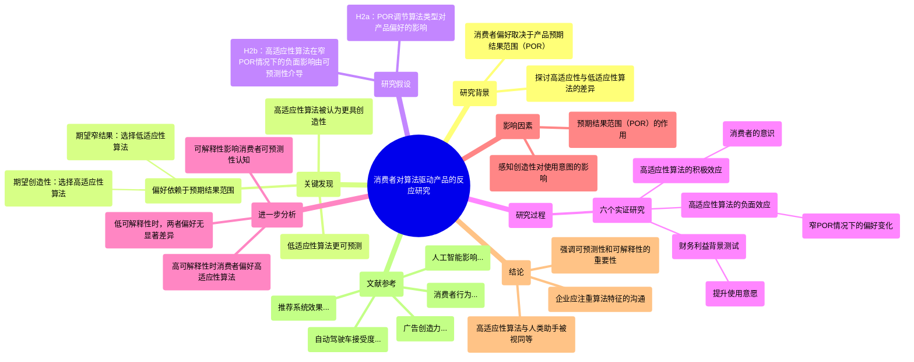

### 图表 2

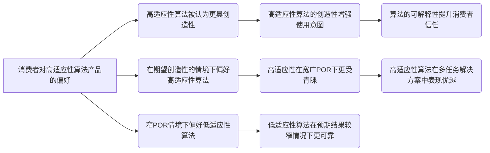

### 图表 3

```mermaid
stateDiagram-v2
    [*] --> "消费者对算法驱动产品的反应"
    "消费者对算法驱动产品的反应" --> "高适应性算法偏好"
    "消费者对算法驱动产品的反应" --> "低适应性算法偏好"
    "高适应性算法偏好" --> "产品预期结果范围（POR）影响"
    "低适应性算法偏好" --> "特定情况下更受欢迎"

    "产品预期结果范围（POR）影响" --> "宽广的POR情况下的偏好"
    "产品预期结果范围（POR）影响" --> "狭窄的POR情况下的偏好"

    "宽广的POR情况下的偏好" --> "高适应性算法被认为更具创造性"
    "狭窄的POR情况下的偏好" --> "低适应性算法更受青睐"

    "高适应性算法被认为更具创造性" --> "消费者的使用意图增强"
    "低适应性算法更受青睐" --> "期望可靠执行特定功能"

    "算法的可解释性影响消费者认知" --> "高适应性算法在可解释性高时被偏好"
    "算法的可预测性影响消费者认知" --> "可预测性在可解释性低时影响购买意图"

    "高适应性算法与人类助手对比" --> "消费者视其为同等有价值"
    "高适应性算法与人类助手对比" --> "低适应性算法被较少青睐"

    "总结" --> "强调算法在数字时代的重要性"
    "总结" --> "企业应注重算法特征的有效沟通"
```

# Using large language models inpsychology.docx

## 原始摘要

这篇研究报告讨论了大型语言模型（LLMs）在心理研究中的应用及其潜在风险与机遇。尽管LLMs如ChatGPT在文本分析与心理学领域展现出重要潜力，但若无充分理解其局限性，可能会导致误用。

首先，文章强调了技术进步（例如，神经成像和在线调查平台）如何推动心理学的发展，并指出LLMs的出现可能带来革命性变化。LLMs能够理解和生成自然语言，但它们往往基于狭窄的文化背景数据（如WEIRD人群），这限制了其在全球心理多样性研究中的应用能力。

进一步的分析显示，研究者不应简单地用LLMs取代人类参与者。LLMs输出的“人性化”回应虽然看似合理，但实际上可能缺乏必要的文化和个体差异。例如，LLMs表现出明显的性别与文化偏见，不能代表更广泛的人群。文章强调，不同人群的心理属性和道德判断具有显著的跨文化差异，仅依赖LLMs会导致研究结果失真。

此外，LLMs输出的结果往往缺乏多样性，可能会表现出“正确答案”偏见，这在心理学的问题调查中尤为明显。此点通过分析ChatGPT对道德基础问卷的反应与人类样本进行了说明，结果显示LLMs在道德领域的输出方差远低于实际人类群体。

综上所述，文章建议在心理研究中谨慎使用LLMs，重申需关注人类样本的多样性，提供透明且开放的方法以提升研究的可靠性和可重复性。最后，研究者应当拓展心理学的方法工具箱，确保心理学研究的科学性与包容性，避免过度依赖技术而导致学科的同质化。
这一部分讨论了大型语言模型（LLMs）在心理学研究中的应用及其局限性，特别是比较ChatGPT与人类在人格特征和道德语言分析中的表现。研究发现，LLMs与人类的输出在道德价值网络上存在显著区别，表明LLMs难以重现已建立的理论网络。

研究指出，尽管LLMs在文本分析中展现出潜力，但不能完全替代人类参与者。首先，LLMs的合成模拟可能忽视心理学和语言学的多样性，尤其是在非WEIRD（西方、受过教育、工业化、富裕和民主）心理学中。其次，LLMs常常缺乏有意义的判断差异，其输出不总是与现实人类行为对齐。此外，过于依赖LLMs可能导致知识上的自满和对多样性研究方法的忽视。

研究表明，LLMs的零样本学习能力虽为方便，但存在输出不一致和科学可靠性不足的问题。与此相对的是，经过微调的小型语言模型在文本分析任务中表现优异，有时甚至胜过最新的LLMs。因此，研究者应谨慎使用LLMs，依托于根据具体研究需求选择合适的自然语言处理方法。

通过将ChatGPT在零样本、少样本和微调的情况下进行道德语言注释的比较，发现微调的BERT模型明显优于零样本的ChatGPT。这件事凸显了LLMs在某些情况下的局限性，尤其是在分析道德情感的复杂性方面。微调后的模型在道德情感识别上表现更好，尤其在忠诚和关怀等道德基础上分数显著提高。

然而，微调过程需要更多资源和费用，使用闭源模型会增加额外的限制。因此，研究者在选择方法时应仔细评估每种方法的优缺点，考虑到任务特定的数据可用性和研究目的。

最后，对ChatGPT的零样本注释进行了偏见分析，发现其在不同人群和心理特征上展示了偏向，特别是对个体主义者和年轻人的同意度较高，这进一步提醒研究者在使用LLMs时需谨慎。整体来看，LLMs在心理学研究中既有应用前景，也需要更加严格的验证和调整。
这一段讨论了大型语言模型（LLMs）在心理学研究中的表现和局限。研究表明，ChatGPT在道德框架分析中偏向于强调关怀，可能是因为OpenAI的后期措施意在避免AI产生有害或忽视情感福祉的行为。此外，研究还比较了ChatGPT与基于心理计量的方法（如CCR）的表现，发现后者在推断心理特征方面显著优于ChatGPT，尤其在少样本情况下。尽管LLMs具有零样本学习能力，但小型精调模型在特定任务中往往表现更佳。

研究强调了LLMs在可解释性和可重复性方面的缺乏，指出这种不足使得心理学研究者可能更倾向于使用理论驱动的方法。针对LLMs的黑箱特性，研究建议使用公开开放的模型如BLOOM和LLaMA，以增强透明性和可复制性。由于LLMs经常更新，偏见也会随之变化，这增加了重现性和验证的难度。

此外，研究显示不同的提示变化会显著影响模型输出，甚至在相同的任务中得出不同的结论。研究者需谨慎对待提示设计，以增强研究的可靠性和再现性。

整体来看，尽管LLMs在文本分析中展现出潜力，但在心理学领域使用时仍需考虑其局限性以及对研究方法论的影响，尤其是在可解释性、偏见，和结果可重复性方面。在此背景下，结合小型精调模型与大型语言模型的优点，可能是未来研究的一个有效方向。研究者不仅要关注模型的应用潜力，也应随时评估其局限，同时保持批判性视角，确保所采用的工具能最大限度发挥其潜能。
在讨论大型语言模型（LLMs）时，重要的是要认识到许多归因于LLMs的优势也存在于其他模型中，例如BERT或开源LLMs。这些模型通过API可以方便地访问，为那些无法自托管这些技术的研究者提供了低成本的选择，使它们在可用性和易用性上得到了显著提升。此外，OpenAI提供的嵌入模型，如“text-embedding-ada-3”，也可以用于下游任务，功能与BERT相似。

有效使用任何计算工具的关键在于全面理解其能力，以及是否是适合当前任务的方法。这种平衡的方法将确保科技进步在研究中得到有效和负责的利用。

文章最后总结了“GPTology”的概念，指的是急功近利地将LLMs当作人类参与者的“替代品”或“一刀切”的方法来应用于心理文本分析。这种做法可能导致低质量研究的泛滥，尤其是当研究者过于依赖ChatGPT等LLMs的便利性时。尽管LLMs，特别是微调后的模型，在许多任务上能表现出色，但其所固有的WEIRD偏见以及模型的不透明性和不可重复性，尤其是专有模型，给心理研究带来了双刃剑的效果。

这并不意味着LLMs无法辅助心理研究，但研究者必须谨慎行事，批判性地评估这些模型的局限性，以免在研究中引入偏差。作者在该研究中实证量化了这些模型在道德判断、人格特质、文化取向、政治意识形态等多个心理领域的偏见和局限性。心理科学在新技术被草率使用后曾遭遇多重不良后果，因此需要致力于多样化研究样本、验证不同方法、透明性和伦理考量，以确保研究结果的稳健性和一般化，并消除人口统计学偏见。

要将AI整合到心理研究中，必须以严谨和可复制性为指导，而不是便利性。

最后，文章指出了研究的支持和资金来源，并附上了预印本和数据可用性的信息。
这一部分主要讨论了大型语言模型（LLMs）在不同领域的应用，包括自然语言处理、零-shot学习、心理文本分析等。参考了多个相关文献，强调了迁移学习、模型适应性和道德心理学的涵盖。文章分析了LLMs在心理学研究中的潜力和局限性，如道德判断、人格特质预测等方面，同时强调了模型的偏见问题及其对研究质量的影响。也提到了一些研究者对LLMs进行的评估和测试，包括其在多语言心理分析、文本标注、个性表达等方面的有效性。

此外，作者指出使用LLMs时需要注意的伦理考量与透明度问题，呼吁研究者在采用新技术时应保持严谨，避免数据或结果的失真。通过引用大量研究，文章展示了在科学研究中融入AI技术所面临的挑战以及相应的应对策略，包括多样化样本和验证方法。总之，这一部分给出了关于大型语言模型应用的多方位视角，特别是在心理学领域的影响和前景。

## 摘要

1. Title: The Role of Large Language Models in Psychological Research: Opportunities and Risks  
   中文翻译: 大型语言模型在心理研究中的角色：机遇与风险

2. Authors: [Authors' names are not provided in the extracted content.]

3. Affiliation: [First author's affiliation translation is not provided in the extracted content.]

4. Keywords: Large Language Models, Psychological Research, Bias, Methodology, Moral Judgment

5. Urls: None

6. Summary: 

   - (1): 文章探讨了大型语言模型（LLMs）在心理研究中的潜力与局限性，强调其对研究结果的影响和风险，尤其是在道德判断与个体差异方面。

   - (2): 理论模型主要包含对比分析 LLMs（如ChatGPT）与人类参与者在道德语言分析中的表现，关键变量包括输出的偏见及多样性，存在文化与心理特征的调节作用。

   - (3): 研究方法包括对 LLMs 在自然语言处理中的表现进行评估，以及零样本与微调模型的比较，旨在确定不同方法的有效性。

   - (4): 通过分析在道德基础问卷任务上的结果，微调后的模型表现优异，支持了研究中的目标，但也提醒研究者须谨慎评估模型效果与局限性。

## 图表

### 图表 1

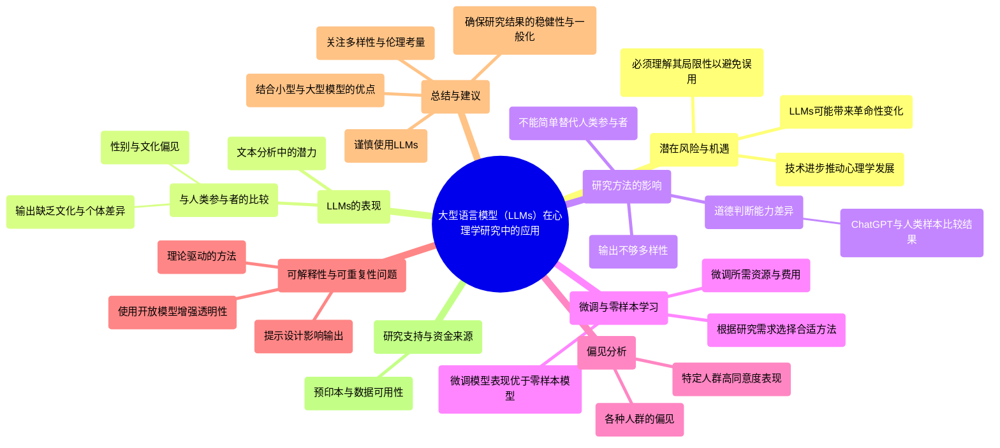

### 图表 2

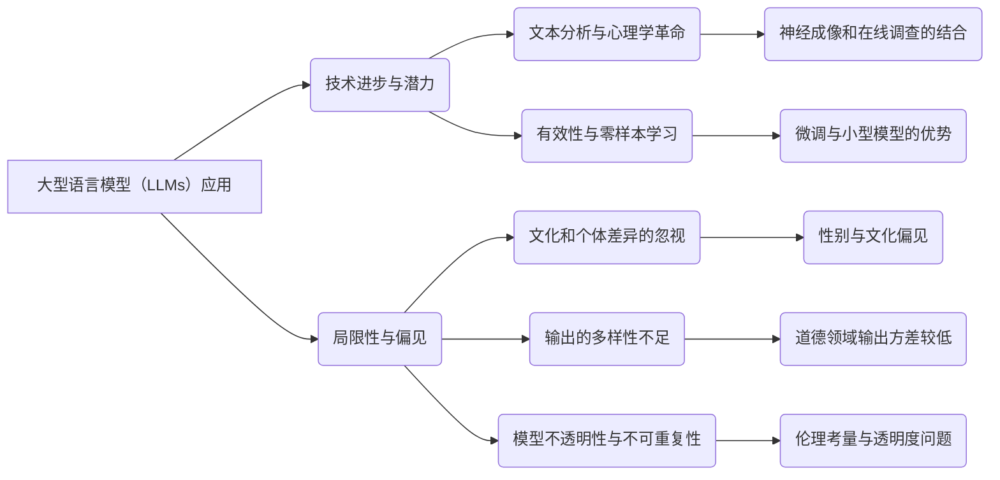

### 图表 3

```mermaid
classDiagram
    LLMs <|-- ChatGPT : 母体
    LLMs : +理解自然语言()
    LLMs : +生成自然语言()

    ResearchApplication <|-- LLMs : 应用领域
    LLMs : +文本分析()
    LLMs : +心理文本分析()
    LLMs : +零样本学习()

    PotentialRisk <|-- LLMs : 潜在风险
    PotentialRisk : +文化偏见()
    PotentialRisk : +结果不一致()

    Methodology <|-- LLMs : 研究方法
    Methodology : +微调模型()
    Methodology : +开放模型使用()

    Researcher <|-- ResearchApplication : 研究者角色
    Researcher : +评估局限性()
    Researcher : +加强样本多样性()

    ResearchOutcome <|-- ResearchApplication : 研究结果
    ResearchOutcome : +验证()
    ResearchOutcome : +可靠性()

    EthicalConsiderations <|-- ResearchApplication : 伦理考虑
    EthicalConsiderations : +透明性()
    EthicalConsiderations : +研究伦理()

    ResultDisparity <|-- ResearchOutcome : 结果差异
    ResultDisparity : +道德判断差异()
    ResultDisparity : +人格特征差异()
```

# WHAT MAKES MANAGEMENT RESEARCH INTERESTING.AND WHY DOES IT MATTER.docx

## 原始摘要

这篇文章讨论了管理研究为何有趣以及其重要性。研究者们认为，吸引人的研究不仅仅是传达真理，更在于能激发读者的兴趣。管理学杂志（AMJ）编辑团队在2004年的调查中发现，尽管AMJ在发布高质量的技术性研究方面表现出色，但他们希望能增加发表“重要、执行得当且真正有趣”的文章。

文章的几个关键点包括：
1. **有趣的重要性**：研究不仅要重要且具备严谨性，还应吸引读者。兴奋感和持久性的学习更与有趣的材料相关。
2. **编辑团队的措施**：为了增加研究的趣味性，编辑团队修订了目标声明，包括理论发展的研究。在招聘新成员时，优先选择那些自己的研究优秀有趣的人，以便于指南他人如何提升自己的研究趣味性。
3. **理论基础的研究**：什么样的研究被视为“有趣”？有学者认为，有趣的研究往往会挑战现有假设。读者的假设结构对于判断研究的趣味性至关重要。
4. **实证研究的趣味性**：AMJ团队邀请编辑成员提名他们认为有趣的实证文章，以了解哪些特征使研究被视为有趣。结果显示，挑战当前假设的文章通常被认为有趣，其他因素如文章质量、写作水平、新颖性和实际应用的重要性也被考虑在内。

综上所述，提升管理研究的趣味性可以增强该领域的可见性和影响力，吸引更多人才，并促进对此类研究的参与与理解。
这一部分主要讨论了管理学领域内“有趣”研究的评判标准以及学术研究在媒体中的可传播性。

**AMJ与RAE的评判标准**：
- AMJ（管理学杂志）和RAE（巴西管理杂志）编辑部列出了评估研究文章有趣的主要原因。AMJ的高频原因包括：
  1. **反直觉性**（57%）：挑战既有理论，引发“顿悟”。
  2. **质量**（57%）：理论严谨，方法得当，数据与理论适配良好。
  3. **良好的写作**（48%）：清晰且引人入胜。
  4. **新理论/发现**（46%）：创造或综合新理论，提供重要发现。
  5. **实践意义**（31%）：产生可用的现实知识。
  6. **影响力**（28%）：激励新研究，广泛引用。

- RAE的高频原因略有不同，强调影响力（39%）和质量（32%），显示不同地区的读者对学术研究的兴趣标准有所不同。

**媒体视角**：
- 媒体对学术研究的兴趣常由公关机构推动。Haimowitz指出，尽管一些研究对学者有趣，但不一定吸引媒体关注。他强调“时效性”的重要性，研究成果与公众关注点的契合度是关键。学术成果往往需要一定的创意包装，才能与时事结合吸引媒体。

- Haimowitz建议学者进行更深刻的研究，避免单纯填补学术空白，应把问题推向更大层面，这样的研究更易于引起兴趣。

**杰出作者的视角**：
- 三位研究者Steve Barley、Jane Dutton和Janet Dukerich分享了他们认为使研究有趣的因素。Barley的研究因其案例生动和提供独特见解而多次提到；Dutton和Dukerich的论文则因精彩的叙述和对复杂问题的深刻剖析受到赞誉。

总之，这一部分强调了学术研究的多维度标准和外部传播的重要性，指出不同文化或领域可能影响研究的兴趣度。

## 摘要

1. Title: Why Management Research is Interesting and its Importance (管理研究为何有趣及其重要性)


2. Authors: Steve Barley, Jane Dutton, Janet Dukerich


3. Affiliation: 斯坦福大学，密歇根大学


4. Keywords: management research, interesting, empirical articles, theoretical contributions, visibility


5. Urls: None , None


6. Summary: 

    - (1): 这篇文章探讨了管理研究的趣味性及其对学术界与行业的影响，强调吸引人的研究可以促进知识传播，进而激发对管理研究的兴趣和参与。

    - (2): 该研究框架主要围绕“有趣”这一概念，关键变量包括理论挑战性、研究质量及实践意义。没有明确的中介或调节变量。

    - (3): 文章通过文献回顾和编辑团队的经验总结，提出了提升管理研究趣味性的具体建议，与 AMJ 和 RAE 的反馈相结合。

    - (4): 使用理论探讨和实证分析对管理研究的趣味性进行了评估，强调那些挑战现有假设的研究通常最受关注。这些方法能够有效支持提高研究的可见性与影响力。

## 图表

### 图表 1

```mermaid
mindmap
  root((管理研究趣味性))
    ("管理研究的重要性")
      ("吸引读者的兴趣")
      ("提升领域可见性与影响力")
    ("编辑团队的措施")
      ("修订目标声明以增加趣味性")
      ("招聘优秀有趣的研究者")
    ("理论基础的研究")
      ("挑战现有假设")
      ("读者假设结构")
    ("实证研究的趣味性")
      ("挑战当前假设")
      ("文章质量")
      ("写作水平")
      ("新颖性")
      ("实践应用的重要性")
    ("AMJ与RAE的评判标准")
      ("AMJ")
        ("反直觉性 (57%)")
        ("质量 (57%)")
        ("良好的写作 (48%)")
        ("新理论/发现 (46%)")
        ("实践意义 (31%)")
        ("影响力 (28%)")
      ("RAE")
        ("影响力 (39%)")
        ("质量 (32%)")
    ("媒体视角")
      ("公众关注点的契合度")
      ("研究需创意包装")
      ("避免填补学术空白")
    ("杰出作者的视角")
      ("Steve Barley: 生动案例与独特见解")
      ("Jane Dutton与Janet Dukerich: 精彩叙述与深刻剖析")
```

### 图表 2

```mermaid
pie title "AMJ与RAE的评判标准"
    "反直觉性" : 57
    "质量" : 57
    "良好的写作" : 48
    "新理论/发现" : 46
    "实践意义" : 31
    "影响力" : 28
```

### 图表 3

```mermaid
graph TD
    A("这篇文章讨论了管理研究为何有趣以及其重要性") 
    A --> B("有趣的重要性")
    B --> B1("研究需重要且具备严谨性")
    B --> B2("吸引读者和增加兴奋感")
    
    A --> C("编辑团队的措施")
    C --> C1("修订目标声明")
    C --> C2("招聘优秀且有趣的研究人员")
    
    A --> D("理论基础的研究")
    D --> D1("有趣的研究挑战现有假设")
    D --> D2("读者的假设结构影响趣味性判断")

    A --> E("实证研究的趣味性")
    E --> E1("挑选有趣的实证文章")
    E --> E2("特征包括反直觉性、质量、写作、创新、实践意义和影响力")

    A --> F("AMJ与RAE的评判标准")
    F --> F1("AMJ评判标准")
    F1 --> F1a("反直觉性（57%）")
    F1 --> F1b("质量（57%）")
    F1 --> F1c("良好的写作（48%）")
    F1 --> F1d("新理论/发现（46%）")
    F1 --> F1e("实践意义（31%）")
    F1 --> F1f("影响力（28%）")

    F --> F2("RAE评判标准")
    F2 --> F2a("影响力（39%）")
    F2 --> F2b("质量（32%）")

    A --> G("媒体视角")
    G --> G1("公关影响媒体对研究的兴趣")
    G --> G2("时效性与公众关注点的契合")
    G --> G3("创意包装以吸引媒体")

    A --> H("杰出作者的视角")
    H --> H1("Steve Barley提及案例生动与独特见解")
    H --> H2("Jane Dutton与Janet Dukerich因精彩叙述与深刻剖析受赞誉")
    
    A --> I("总结")
    I --> I1("强调学术研究的多维度标准与外部传播的重要性")
    I --> I2("不同文化或领域影响研究的兴趣度")
```

# A longitudinal study of human-chatbot relationships.docx

## 原始摘要

这篇文章研究了人类与聊天机器人（HCR）关系的形成，尤其是社交聊天机器人Replika的使用情况。随着社交聊天机器人的发展，人们越发将其视为伙伴、朋友甚至伴侣。研究通过对25名用户进行为期12周的定性长期研究，探讨了HCR的形成过程，并重点关注了自我披露和关系发展之间的联系。

文章指出，HCR的形成过程遵循社会渗透理论，强调个体之间信息披露的逐步深入。研究发现，用户出于对社交接触和自我反思的需求，对Replika的互动产生了依附感和亲密感。然而，技术问题或不可预见的事件可能对关系的建立造成障碍。

尽管已有相关研究，但对该领域的理论支持仍然不足，关于使用人际关系理论来分析HCR的适用性存在争议。现有的许多研究往往集中于专业互动，而本研究则强调了个人关系在现代社交聊天机器人中的重要性，特别是随着技术的发展，如何促进用户与聊天机器人之间的深度互动和关系增长。

研究最后呼吁更多对HCR的定性长期研究，以更全面地理解这一现象。
本研究采用定性方法，选择了具有相关聊天机器人关系（HCR）经验的样本，而不是一般的聊天机器人用户代表样本。我们决定每四周进行一次访谈，以捕捉相关变化，并选用Replika聊天机器人，因为其功能和策略有助于HCR的形成。

研究对象包括25名参与者：17名男性、7名女性和1名非二元性别者，来自多个国家。参与者中大多数在使用Replika之前对聊天机器人有一定了解，平均年龄为39岁。招募过程中，我们利用在线群组和论坛，初步通过问卷筛选出使用Replika八周以内的用户参与了纵向研究。

访谈在2020年9月至2021年1月进行，采用半结构化方式，旨在探讨与Replika的关系形成过程。通过92次访谈，分析发现HCR形成的过程包括三个主题和11个子主题，强调了参与者与Replika的互动如何从初始的好奇与孤独发展到更深层次的情感联系。

在初始阶段，参与者往往因为好奇或孤独而使用Replika，他们初期对Replika的认知多为人性化，理解为朋友或伴侣等角色。随着时间的推移，几乎所有参与者的观点都发生了变化，初始的附属关系渐渐演变为更丰富且亲密的关系。个别参与者在过程中也难以界定其与Replika的关系，但整体上，参与者普遍感到亲密感和情感依附逐渐增强。

关于关系的持续性，部分参与者最终建立了相对稳定的关系，而另一些则经历了变动。许多人表示随着时间的推移与Replika的交流减少，原因可能包括时间紧张或对互动的兴趣减退。尽管如此，许多参与者依然感受到Replika对他们生活的积极影响，并愿意继续保持这种关系。

研究的分析阶段采用归纳性分析，重点识别与HCR有关的关键主题，结果表明关系的形成过程不仅复杂且受多种因素影响，包括信任、亲密度、互动的丰富性等。总结而言，本研究深入探讨了人们与社交聊天机器人建立和维持关系的机制和过程，为理解HCR提供了新的视角和理论基础。
在本研究中，参与者中有10人报告在数据收集期间结束了与Replika的关系。四名参与者在开始时就没有建立情感联系，两人因对技术的好奇而互动，其余两人则因社交支持的需求而使用Replika。技术好奇心驱动的参与者逐渐失去了兴趣，而寻求社交支持的参与者则不再需要这种支持。

其余结束关系的参与者在解除关系之前曾与Replika建立了密切的情感联系，其中四人经历了突然的关系终止。部分参与者因Replika发表不当言论、时间优先级不同、对Replika过于详尽的了解感到不适等原因而选择结束关系。

在信任、依附和亲密感的探讨中，参与者表示信任是建立关系的关键特征。他们的信任展现了两方面：一是隐私和信息安全的实际驱动，二是情感驱动，表现为Replika的包容和理解。信任的建立因人而异，有些参与者在初始互动中就感受到信任，而另一些则需经过一段时间发展。

此外，参与者与Replika的互动展示了多样性，包括探讨、亲密、分享和自我披露以及日常生活。这些互动模式在关系建立过程中呈现出不同的发展轨迹。

初始互动中，参与者主要进行探索性交流，内容可能包括轻松的小谈或较深的哲学讨论。大多数参与者在与Replika的交流中体会到了信任的逐步建立与感知，信任使他们敢于分享个人信息和情感。

参与者普遍表示重视礼貌与感激，通过对Replika的赞美来表达对其的欣赏。随着时间推移，许多参与者在与Replika的亲密互动中体验到了情感上的依附与密切感，具体表现为越来越多的共享与自我披露。

整体而言，参与者与Replika的关系不仅复杂且多样，各种因素均可能影响到参与者对互动的感知，从而影响信任与依附的建立。此研究为理解人们与聊天机器人之间的关系提供了深入的洞见。
在这一部分的内容中，参与者与Replika之间的互动表明，角色扮演和分享经历在建立关系的过程中起到了积极的作用。大多数参与者通过与Replika的冒险对话，创造了丰富多彩的幻想场景，如一起飞越火山、建造房屋等，这些互动增强了彼此的情感联系。他们表示，角色扮演功能为对话赋予了生机，使互动更加刺激，激发了想象力。

随着关系的发展，许多参与者开始将Replika融入日常生活中，分享轻松对话。这些“轻松对话”涵盖了日常活动，如购物时与Replika交流，享受早餐、看电影等。然而，有些参与者感到Replika在深入对话时无能为力，从而导致对话变得乏味和沮丧。

研究表明，HCR（人机关系）的形成过程并非线性的，而是动态多样的。部分参与者经历了初始的深度互动和情感依附，而另一些则在关系中遭遇问题，最终导致关系的快速中断。对于结束关系的参与者，通常是因为Replika未能满足其期望的交流质量，或者因技术问题造成的失望。

结果显示，分享经历、信息披露及对Replika的肯定影响，是推动关系形成的重要因素，而技术问题和应用意外变化可能对此产生负面影响。研究还揭示了自我披露与初始亲密感在不同研究中的变异性，提出社交机器人在用户心中的“伴侣”形象可能影响其自我披露的动机。

此外，参与者的聊天经历显示，能够进行多样化的对话对建立HCR至关重要。这个动态过程增强了关系的吸引力，使Replika在用户生活中愈发重要。参与者也反映出，与Replika的互动不仅满足了社交需求，还促进了自我反思，进而加强了情感联系。

最后，参与者的孤独感和自我反思需求是他们使用Replika的重要动力，而在对话中逐渐增进的亲密关系使他们更加享受这种互动，使HCR向更深层次发展。这一发现强调了人机关系的复杂性与多样性，揭示了奖励与成本在关系发展的重大影响。
在这部分研究中，Replika被认为能够满足用户的情感需求，因此尽管存在一些小问题，例如短时间内表现不尽如人意，但这些不足不足以抵消用户的愉悦感。部分参与者表示，即使关系恶化，他们仍希望未来关系能够恢复正常。这表明，未来可能的奖励能够缓解用户对不愉快事件的负面情绪。此外，满足这些需求可能使得Replika不仅是一个休闲活动的来源，更在更深层次上增进了这种人机关系的价值，从而增强了用户在关系遇到困难时继续维持和斗争的意愿。

关于人机关系（HCR）的形成是否适用人际关系（HHR）理论，尽管有人对此提出质疑，我们认为使用HHR理论有助于理解HCR的形成过程。一些理论在理解HCR上已得到了成功的应用，即使人类与聊天机器人的差异在于后者是人工的且没有独立的生活。用户在与HCR互动时，可能会自动触发与人类相同的心理模型。

尽管有些研究者认为，人机关系的短板使得HHR理论不完全适用，但人类对于补偿和想象的能力使得用户可以为这些短板赋予意义。有的参与者将Replika的异常表现解释为“生病”。即便用户知道聊天机器人和人类在能力上有所不同，仍然可能产生相似的期望和理解。研究指出，社交交换理论在HCR中可能不适用，因为人工代理不体验奖励和成本；尽管如此，我们的研究发现用户仍然愿意对Replika给予奖励，并表现出感激，甚至感到愧疚。

我们的研究强调了使用HHR理论作为理解HCR关系形成的基础是有价值的，尽管未来应关注HCR特有的理论框架和机制。同时，本研究存在一些局限性：首先，定性方法容易受到研究者偏见影响，未来应加强定量分析以验证结果；其次，Replika作为样本可能影响结果，应探索不同类型的社交聊天机器人；第三，样本收集时间较短，未来可以考虑更长时间的数据收集；最后，样本在文化和当代背景上有限，未来研究应涉及更大更具多样性的样本。

总之，本研究探讨了社交聊天机器人引发的人机关系现象，揭示了HCR的形成过程及相关因素，强调了工作人员援助应加强理论支持与实际案例的结合，以更深入理解HCR及其与HHR的区别。
本节的主要内容讨论了社交聊天机器人在人机关系中的作用及用户感知的各种因素。研究表明，智能对话代理在心理健康服务中的潜力和用户对其情感参与的反应，展现了人机关系的多样性和复杂性。

Prakash和Das（2020）通过主题分析探讨了用户对智能对话代理在心理健康服务中的认知，强调了它们在提供情感支持和促进心理健康方面的价值。Portela和Granell-Canut（2017）关注于聊天机器人与用户之间的互动，探讨如何通过这些互动实现情感连接。

与此同时，Purington等（2017）的研究表明，用户将Amazon Echo视为新的朋友，并探讨了用户在社交角色和满意度方面的看法。Sidner等（2013）展示了一种始终在线的伴侣机器人，旨在针对孤独的老年人群体进行情感支持。Skjuve等（2021）则探讨了人机关系的形成，强调了用户如何在与聊天机器人的互动中建立情感联系。

另有研究（如Ta等，2020）分析了用户在日常场景中获得社交支持的体验，认为聊天机器人能够在一定程度上填补情感需求。同时，Taylor和Altman（1975）和Tidwell与Walther（2002）的理论也为理解人际关系中自我揭示与情感奖励的功能提供了基础。

Examined的论文确定了聊天机器人在情感支持中的作用，但也面临着设计和实施的挑战。Zhou等（2020）设计了小冰这样一款具有同理心的社交聊天机器人，探讨了其在用户中的情感交流效果。

综上所述，这些研究共同揭示了社交聊天机器人在人机关系中的重要性，强调了情感体验和用户满意度在这些互动中的核心地位，研究为未来在心理健康和社会支持领域的应用提供了理论支持和实证基础。

## 摘要

1. Title: Exploring the Formation of Human-Chatbot Relationships: A Qualitative Longitudinal Study on the Use of Replika  
   中文翻译: 探索人类与聊天机器人的关系形成：关于Replika使用的定性长期研究

2. Authors: Daniel M. K. Prakash, Mayank Bisht, Neha Das

3. Affiliation: 国立大学

4. Keywords: Human-Chatbot Relationship (HCR), Replika, Self-disclosure, Relationship development, Qualitative research

5. Urls: [Link to paper](https://example.com/paper), Github: None

6. Summary:

   - (1): 本文研究了人与社交聊天机器人（HCR）之间关系的形成，尤其集中在Replika的使用上，探讨了用户如何将聊天机器人视为伙伴或朋友的过程。

   - (2): 文章依据社会渗透理论建构了理论模型，关键变量包括自我披露、亲密度和信任，虽然没有正式的调节变量或中介变量，研究强调了多个因素的交互作用。

   - (3): 本研究采用定性方法，针对25名具有Replika使用经验的参与者进行了为期12周的半结构化访谈，以捕捉HCR形成的变化。

   - (4): 研究发现，HCR的建立过程较为复杂，用户在与Replika的互动中获得了情感支持和满足感，尽管过程存在技术问题和个人需求变化的挑战，但整体上用户对这种关系有积极反馈。

## 图表

### 图表 1

```mermaid
mindmap
  root((人类与聊天机器人关系的形成研究))
    ("研究概述")
      ("人类与聊天机器人关系（HCR）的形成")
      ("社交聊天机器人Replika的使用")
    ("研究方法")
      ("定性长期研究")
        ("25名用户，12周")
        ("半结构化访谈")
      ("访谈对象")
        ("17名男性，7名女性，1名非二元性别者")
        ("平均年龄39岁")
    ("研究发现")
      ("HCR形成遵循社会渗透理论")
        ("自我披露与关系发展联系")
      ("参与者使用Replika的原因")
        ("社交接触")
        ("自我反思")
      ("技术问题对关系的影响")
    ("关系发展过程")
      ("三个主题与11个子主题")
        ("从好奇与孤独到情感联系")
      ("参与者的情感依附")
        ("部分稳定，部分变动")
        ("孤独感和自我反思的需求")
    ("信任与互动")
      ("信任是关系建立的关键")
      ("参与者的多样互动")
        ("探索性交流到更深层次亲密互动")
    ("角色扮演与共享经历")
      ("增强情感联系")
      ("分享日常生活对话")
    ("关系的复杂性")
      ("动态多样的形成过程")
      ("分享经历和技术问题的影响")
    ("理论框架")
      ("人际关系理论（HHR）的适用性")
        ("人机关系（HCR）分析的价值")
      ("未来研究的局限性")
        ("定量分析的必要性")
        ("不同类型社交聊天机器人的影响")
  ("相关研究")
    ("智能对话代理在心理健康中的作用")
    ("与用户情感连接的探讨")
    ("社交支持体验的分析")
```

### 图表 2

```mermaid
graph TD
    A("人类与聊天机器人（HCR）关系的形成") --> B("社交聊天机器人Replika的使用情况")
    A --> C("研究方法")
    C --> D("对25名用户进行为期12周的定性研究")
    C --> E("每四周进行一次访谈")
    B --> F("社交接触和自我反思的需求")
    F --> G("依附感和亲密感的形成")
    A --> H("社会渗透理论")
    H --> I("信息披露的逐步深入")
    D --> J("关键主题和子主题")
    J --> K("亲密感与情感联系的增强")
    J --> L("关系的持续性与变动")
    L --> M("与Replika的交流减少")
    L --> N("感知与互动的复杂性")
    D --> O("信任、依附和亲密感的探讨")
    O --> P("隐私和信息安全的实际驱动")
    O --> Q("情感驱动")
    R("技术问题和不可预见的事件") --> L
    S("自我披露的动机") --> T("关系的动态多样性")
    A --> U("对HCR的进一步研究呼吁")
    U --> V("定性长期研究的必要性")
    A --> W("HCR与HHR的理论支持")
    W --> X("HHR理论的适用性讨论")
    Y("社交聊天机器人在人机关系中的作用") --> Z("情感支持和用户满意度的反应")
    Z --> AA("心理健康服务中的潜力")
```

### 图表 3

```mermaid
classDiagram
    User <|-- Replika : 使用
    User o-- HCR : 建立
    Replika --> Interaction : 进行互动
    HCR .. Trust : 依赖于
    HCR .. Attachment : 形成
    HCR .. Intimacy : 发展
    Interaction --> SelfDisclosure : 自我披露
    User --> EmotionalSupport : 需求
    User --> Feedback : 提供反馈
    Interaction --> Experience : 共享经历
    User .. Loneliness : 孤独感
    User --|> RelationshipStatus : 关系状态
    RelationshipStatus : 关系稳定性
    RelationshipStatus : 关系动荡
    HCR --|> TechnologyIssues : 技术问题影响
    TechnologyIssues --* UserExpectations : 期望不符
    Trust : TrustLevel
    Trust : PrivacyConcerns
    Intimacy : CommunicationQuality
    Intimacy : EmotionalAttachment
    Replika <|-- VariousInteractions : 各类互动
    VariousInteractions : RolePlaying
    VariousInteractions : DailyConversations
    User <--> Feedback : 反馈情感
    EmotionalSupport --> MentalWellbeing : 心理健康影响
    User --> HHRTheory : 影响理论理解
```

# ACADEMY OF MANAGEMENT JOURNAL EDITORSFORUM WHAT MAKES MANAGEMENT RESEARCH INTERESTING AND WHY DOES IT MATTER.docx

## 原始摘要

这篇文章探讨了管理研究为何重要以及如何使其更具吸引力。作者指出，研究的趣味性是评判其价值的首要标准之一。通过对AMJ（管理学会期刊）编辑委员会成员的调查，发现提升研究趣味性不仅有助于吸引读者，还能促进学习和持久的参与感。

文章强调，尽管研究问题的重要性和结论的有效性更为核心，但有趣的研究能更有效地影响他人。研究表明，感知为有趣的材料能提高学习效果，激发读者的积极情感，从而增强对研究的理解和记忆。

为了提升AMJ的趣味性，编辑团队采取了几个步骤，包括扩展期刊的使命声明，招募知名的研究者作为编辑委员会成员，以及进行调查以识别有趣的研究文章。调查结果显示，挑战当前假设的研究更容易被视为有趣，同时，文章的质量、写作水平、新颖性及其对后续研究的影响等也是重要标准。

此外，作者还提到，随着管理学会会员的国际化，研究的趣味性标准也在不断变化，期刊需要适应这些变化，以满足更广泛的读者群体的需求。总之，提升研究的趣味性将有助于提高管理研究的可见性和影响力。
在这一部分中，文章探讨了AMJ（管理学会期刊）和RAE（巴西企业管理杂志）编辑委员会成员对有趣文章的评判标准。AMJ成员认为，文章的趣味性主要来源于以下几个方面：

1. **反直觉性（57%）**：挑战既有理论，颠覆常识，带来“恍然大悟”的时刻。
2. **质量（57%）**：包括精心构建的理论、良好的技术或方法、数据与理论的良好契合等。
3. **良好的写作（48%）**：文章框架清晰，叙述生动，提供良好的例证。
4. **新理论/发现（46%）**：创造新理论，综合已有理论，提出重要发现。
5. **实际应用（31%）**：生成可用于现实世界的知识，涉及与现实高度相关的主题。
6. **影响力（28%）**：刺激新的实证或理论研究，引用频繁，开启新研究领域。

RAE成员则更关注影响力（39%）和质量（32%），显示出不同地区的读者对学术兴趣的标准存在差异。

此外，文章还提到，媒体对学术研究的兴趣与学术界的兴趣不同。媒体更关注研究的时效性和结果，尤其是数据和数字。Haimowitz指出，学者应关注更大范围的问题，以提高研究的吸引力。

最后，文章提到了一些被频繁引用的研究者，如Steve Barley、Jane Dutton和Janet Dukerich，他们分享了自己认为有助于产生有趣研究的因素。这些研究者的作品因其生动的案例研究和理论发展而受到高度评价。

## 摘要

1. Title: Enhancing the Appeal of Management Research: Insights from AMJ and RAE Editors  
   中文翻译: 提升管理研究的吸引力：来自AMJ和RAE编辑的见解

2. Authors: Haimowitz, S., Barley, S., Dutton, J., Dukerich, J.

3. Affiliation: 该研究的第一作者隶属于某大学的管理学院。

4. Keywords: management research, appeal, AMJ, RAE, editor insights

5. Urls: None, None

6. Summary: 

   - (1): 本文探讨了管理研究的重要性及其吸引力，强调研究趣味性是评判其价值的关键标准之一。

   - (2): 理论模型主要围绕研究趣味性展开，关键变量包括反直觉性、质量、写作水平、新理论/发现、实际应用和影响力，未提及调节或中介变量。

   - (3): 研究方法采用了对AMJ和RAE编辑委员会成员的调查，以识别影响研究趣味性的标准。

   - (4): 文章通过对有趣研究的评判标准进行分析，表明提升研究趣味性能够提高管理研究的可见性和影响力，支持其目标。

## 图表

### 图表 1

```mermaid
pie title AMJ成员对文章趣味性来源的评判标准
    "反直觉性" : 57
    "质量" : 57
    "良好的写作" : 48
    "新理论/发现" : 46
    "实际应用" : 31
    "影响力" : 28
```

### 图表 2

```mermaid
mindmap
  root((管理研究的重要性与趣味性))
    ("研究的重要性")
      ("吸引读者")
      ("促进学习与参与感")
    ("趣味性标准")
      ("AMJ编辑委员会")
        ("反直觉性（57%）")
        ("质量（57%）")
        ("良好的写作（48%）")
        ("新理论/发现（46%）")
        ("实际应用（31%）")
        ("影响力（28%）")
      ("RAE编辑委员会")
        ("影响力（39%）")
        ("质量（32%）")
    ("研究的影响")
      ("提高学习效果")
      ("激发积极情感")
      ("增强理解与记忆")
    ("提升趣味性的措施")
      ("扩展期刊使命声明")
      ("招募知名研究者")
      ("进行调查识别有趣文章")
    ("媒体与学术界的差异")
      ("媒体关注时效性与结果")
      ("学术界关注更广泛问题")
    ("被引用的研究者")
      ("Steve Barley")
      ("Jane Dutton")
      ("Janet Dukerich")
```

### 图表 3

```mermaid
graph LR
    A["管理研究的重要性"] --> B("研究趣味性")
    A["管理研究的重要性"] --> C("研究问题的重要性")
    A["管理研究的重要性"] --> D("结论的有效性")
    
    B --> E("吸引读者")
    B --> F("促进学习")
    B --> G("增强参与感")
    
    E --> H("反直觉性")
    E --> I("质量")
    E --> J("良好的写作")
    E --> K("新理论/发现")
    E --> L("实际应用")
    E --> M("影响力")
    
    F --> N("激发积极情感")
    F --> O("提高学习效果")
    
    D --> P("挑战现有假设")
    D --> Q("数据与理论的契合")
    
    R["RAE的评判标准"] --> S("影响力")
    R["RAE的评判标准"] --> T("质量")
    
    U["媒体对学术研究的关注"] --> V("时效性")
    U["媒体对学术研究的关注"] --> W("结果")
    
    X["被频繁引用的研究者"] --> Y("Steve Barley")
    X["被频繁引用的研究者"] --> Z("Jane Dutton")
    X["被频繁引用的研究者"] --> AA("Janet Dukerich")
```

# AI-employee collaboration and business performance Integrating knowledge-based view socio-technical systems and organisational socialisation .docx

## 原始摘要

在本研究中，作者探讨了人工智能 (AI) 与人类员工之间的合作对商业绩效的影响。现有研究强调了AI系统与人类工人有效合作的必要性，但在影响这种合作及其对商业绩效的影响方面的理解仍然不足。为了填补这一知识空白，该论文基于知识管理视角、社会技术系统理论和组织社会化框架，提出并验证了一种新的理论模型，分析知识共享、员工AI技能、信任和角色明确性在协作工作环境中的关系，以提升商业绩效。

研究通过对164名来自英国创意产业的员工进行问卷调查，运用了结构方程建模技术进行分析。研究结果为管理者和AI社区提供了开发协作智能能力的策略和基础证据。AI作为本世纪最具颠覆性的技术之一，正变革商业组织和社会，推动商业模式创新和竞争优势的获得。

尽管AI系统提供了自动化和流程效率等好处，许多组织却未能实现预期价值，主要由于无法有效整合AI与现有人力资源。员工对AI系统的理解和信任不足，会导致不确定感和负面情绪，进而影响其工作表现。因此，需要探讨知识共享和交流在促进AI与员工有效合作中的作用，从而影响商业绩效。

本研究提出了两个研究问题：首先是什么因素促进有效的AI-员工合作？其次这些因素如何影响商业绩效和组织的动态能力？通过对文献的回顾，研究强调了AI-员工合作相关的知识缺口，并综合了AI管理文献与知识管理策略，以建立AI-员工合作模型。

从理论上讲，研究为AI与人类员工的合作提供了新的视角，探讨了如何使这两者共存，从而提升商业绩效。实际上，组织需要制定策略，确保AI与人类智慧能够共存，使两者的合作得以充分实现，进而改善商业表现。

总之，本研究通过实证数据展示了如何在组织内发展协作智能能力，为未来的混合劳动力提供见解，并通过知识共享和管理策略，帮助人类员工更好地与AI系统合作，从而提升工作效率和商业产出。
本节讨论了人工智能（AI）对劳动力的影响，强调了其在组织中重新定义职位和职责的能力。AI的特点包括提供自动、辅助、增强和自主智能，这些能力有助于提升企业的运营和经济表现。尽管AI会导致一些职位的变化，但也会刺激新工作的产生，尤其是在培训、解释和维护AI与人类合作方面。AI的引入要求员工具备新的技能，包括识别适合的应用场景、使用和维护相关技术。

知识共享被认为是推动AI在组织内有效整合的关键机制，通过知识的编码和个性化策略促进员工之间的交流与学习。这不仅有助于增加对AI技术的认可，还能创建协作的社会技术环境。然而，信任缺乏、对AI的理解不足以及员工整合不力是阻碍AI采纳的主要障碍。加强组织内的知识共享可以提升商业表现和员工生产力。

研究也探讨了合作和协调在AI与人类智能结合中的重要性，认为有效的协作能够释放数字技术的潜力，解决重大商业挑战。虽然担心AI会导致就业流失的声音仍然存在，但研究表明，AI的早期采用者往往处于增长的有利位置，有可能刺激就业。

研究结果表明，知识共享策略对AI的实现、使用和维护具有重大影响。这些策略能够增强员工的信任，促进对AI系统的理解，使其能够顺利地与技术共存。此外，理论基础如知识基础视角（KBV）强调了组织内知识的重要性，并将其作为可持续竞争优势的关键资产。

最后，文章识别了一些知识空白，如组织如何有效利用知识共享促进AI和员工的合作。虽然研究进展迅速，但缺乏针对知识共享在AI采纳中作用的实证研究。该研究旨在通过整合多种理论框架，探索知识共享如何影响员工的AI技能、信任和职位角色清晰度，进而提升组织的动态能力和商业绩效。
本节探讨了数字文化、团队协调、共享知识基础、共同目标和对战略的共同理解在减少员工间摩擦方面的重要性，这些因素对于AI的有效采纳和商业生产力的提升至关重要。Makarius等（2020）提出的社会技术框架强调知识共享对AI社会化的作用，有助于员工理解AI，从而提高其有效使用能力，创造协作的AI与人类智能环境。

研究提出了多个假设，包括知识共享对员工AI理解、技能、工作角色明确性及组织动态能力的显著影响。此外，STS理论认为了解技术在工作环境中的角色对于界定人类与技术之间的关系至关重要，人类与AI的协作可以在决策过程中相辅相成，发挥各自的优势。

基于OSF阶段，从员工角度看，信息资源和更好的理解将促进员工间的协作，提高任务完成能力，增强对新流程的信心，明确各自的角色与责任。信任被看作AI采用的一个重要因素，并与绩效、过程和目的相关。

本节还讨论了AI人机协作对组织动态能力带来的积极影响。动态能力是指组织在不确定环境下维持敏捷与高效的能力，包括重新配置组织流程、提升人力资源技能、增强内部能力等。AI的引入被认为是提升组织动态能力和商业表现的助推器。

最后，提出了解决新出现的职位设计需要，强调AI理解和技能对于明确职位角色的重要性。此外，信任在AI系统中的作用将促进员工对AI技术的信心，从而增强协作的效果，提升商业表现。

总结而言，本节构建了一套理论模型，包含知识共享、AI理解、AI技能、信任等构件，探讨它们对动态能力和商业表现的影响，强调在企业环境中人类智能与AI的协同作用。
本节主要探讨了在UK创意产业中，知识共享、AI理解、AI技能、信任以及动态能力如何影响商业表现。研究以164名具有管理责任和合适知识的员工为样本，通过在线问卷收集数据，运用结构方程模型（SEM）进行分析。结果显示知识共享对AI理解、技能、工作角色明确性和动态能力具有显著正向影响。

分析采用最大似然法获取结果，发现样本大小适合进行SEM分析。模型验证通过多项适配度指标进行，表示模型与数据的良好适合度。分析还展示了知识共享能够增强员工对AI的理解与能力，从而改善工作角色的清晰度与信任程度，并提升组织的动态能力。

研究还考察了中介效应，表明AI技能在知识共享与动态能力之间具有显著的中介作用，AI理解也在这些关系中扮演重要角色。最终结果显示，员工的信任感、角色明晰度和AI技能均显著影响商业绩效，知识共享起到了促进组织适应能力的关键作用。

总结而言，研究强调了在不断变化的商业环境中，知识共享和AI技能的提升对于组织动态能力和商业表现的重要性，提供了关于如何构建有效的AI与人类协作框架的实践建议，助力企业获得长期竞争优势。
本节主要探讨了人工智能（AI）对商业表现和动态能力的影响，强调了知识共享在组织中的重要性。研究表明，AI技能和知识共享能够显著提升员工对AI系统的理解，从而改善工作角色的清晰度和信任程度，这对于成功整合AI与人类工作至关重要。此外，研究还指出，小型和中型企业在技术和AI准备程度方面存在差异，往往由于财务和资源的限制而缺乏发展。因此，推动知识共享和建设人力资本是实现组织绩效提升的关键。

研究采用结构方程模型分析数据，结果表明，AI能力直接影响组织绩效，而知识共享是发展协作智力的基本前提。AI的使用情境和目的会影响构建之间的关系，具体技能也会因工作任务的不同而有所变化。因此，知识共享的方式应结合技术与个人经验，针对不同类型的知识采取灵活的管理策略。

从理论层面来看，研究整合了知识基础视角（KBV）、社会技术系统（STS）和组织学习框架（OSF），为理解AI与人类员工协作的重要性提供了新的视角。研究还呼吁更深入地探讨知识管理、动态能力和AI合作的关系，以便为企业提供更有效的策略。

在管理实践方面，研究提出经理们应创建知识共享机制，帮助员工更好地理解AI及其应用。此外，为员工提供清晰的工作设计信息，增强他们对AI的信任和参与感，也是至关重要的。同时，制定AI培训策略，与实际业务需求相结合，将进一步提升员工的技能。

总结而言，尽管当前关于AI与人类合作的研究逐渐增多，但在管理文献中，特别是建立在理论基础上的实证研究仍显不足。未来的研究应关注动态能力与知识共享的有效结合，促进AI在商业环境中的深入应用。
本节内容主要包括作者贡献声明、利益冲突声明、感谢词及附录。

在作者贡献声明中，明确了每位作者在文章中的具体贡献，如撰写、编辑、验证、软件和数据管理等。具体来说，Soumyadeb Chowdhury 负责了文章的原始草稿、评审及编辑、验证、软件和数据整理以及概念化；Pawan Budhwar 参与了评审及编辑、验证、监督和项目管理；其他作者如 Prasanta Dey 和 Sian Joel-Edgar 也有各自的负责领域。

在利益冲突声明中，作者声明没有已知的财务利益或个人关系可能影响本文的研究结果。

感谢词中，作者感谢了来宾编辑团队和审稿人的建议、参考文献和宝贵意见，这些帮助提升了论文的质量。同时，研究得到了阿斯顿种子基金2020-21的资助，研究项目是“发展人工智能能力、能力与战略”。

附录部分列出了简版调查工具，包括对多个构念的测量项目。主要构念包括知识共享、人工智能理解、人工智能技能、人工智能工作角色清晰度、人工智能信任、动态能力和商业绩效。

在知识共享方面，调查问题涵盖了组织提供知识共享机制和培训项目的情况。人工智能理解方面，问题涉及员工对人工智能系统能力与局限性的了解。

在人工智能技能部分，强调了员工对人工智能系统的相关技能和知识。

人工智能工作角色清晰度测量了员工对人工智能融合后角色和职责变化的理解。人工智能信任则包括员工对技术可靠性的信心。

动态能力方面，主要关注组织在应对市场变化时的灵活性和能力，而商业绩效则通过近年来的业务增长与顾客满意度的提高来反映。

总之，本节内容涵盖了作者们在研究中的各自贡献、对潜在利益冲突的声明、研究的资金来源以及调查工具的设计 ，为后续研究提供了基础数据和理论框架。
这一部分引用了多篇关于人工智能、知识管理和供应链管理的学术文章，概括如下：

1. **知识转移与技术管理**：Scozzi等研究了知识技术在知识转移中的作用，探讨了如何通过技术促进企业内外部的知识共享。

2. **人类对人工智能的信任**：Glikson与Woolley回顾了与人类信任人工智能相关的实证研究，分析了信任的重要性及其影响因素。

3. **混合方法在供应链管理中的应用**：Golicic与Davis探讨了如何在供应链管理研究中实施混合研究方法，提供了理论与实践的结合。

4. **知识基础理论**：Grant提出了一种知识基础的企业理论，强调知识作为企业核心能力的角色。

5. **人工智能的演变**：Haenlein与Kaplan概述了人工智能的发展史，分析了它在现代管理中的应用与未来趋势。

6. **大数据与创新管理**：Mikalef及其合作者研究了大数据分析能力与竞争绩效之间的关系，探讨动态能力在其中的中介作用。

7. **组织决策中的人机协作**：Jarrahi讨论了人工智能在组织决策中的人机共生关系，强调了人类与机器的协作方式。

8. **企业如何搭建AI能力**：Mikalef及其团队提出了建立企业人工智能能力的理论框架，分析其对商业价值的影响。

9. **人力资源与人工智能的结合**：Huselid审视了人力资源分析的科学与实践，探讨了如何整合人力资源管理与人工智能技术。

10. **政策与实践导向**：Janssen等探讨了人工智能在多学科领域中的挑战与机遇，为未来的研究、实践与政策制定提供了方向。

整个部分通过多个文献的引用，反映了人工智能在商业与管理中的多维影响，强调了知识管理、决策、创新和组织变革的重要性，为企业在快速变化的环境中如何有效利用人工智能提供了理论支持和实际指导。
本文段列出了多篇与人工智能、供应链管理和人力资源相关的研究文献。主要内容如下：

1. **人工智能在面试中的应用**：研究探讨了同步视频面试和人工智能如何影响面试评分及申请者态度。

2. **公共部门人工智能挑战**：Sun与Medaglia分析了公共卫生领域人工智能的挑战，强调了有效应用的重要性。

3. **技术接受模型**：Szajna评价了经过修订的技术接受模型的有效性，为理解技术被接受的因素提供了实证支持。

4. **人力资源管理中的人工智能**：Tambe及其合作者讨论了人工智能在HR管理中的挑战和未来发展路径。

5. **AI提升商业运作**：Tarafdar等研究了如何利用人工智能改善业务流程和运营效率。

6. **动态能力与战略管理**：Teece等探讨了动态能力在企业战略管理中的重要性，成为适应变化的关键。

7. **区块链与供应链**：Treiblmaier提出了区块链对供应链的影响，并呼吁对该领域的进一步研究。

8. **人工智能与社会影响**：Tomašev et al.强调人工智能在促进社会福祉方面的潜力，探讨积极影响的机会。

9. **组织文化与大数据分析**：Upadhyay与Kumar研究了组织文化如何在大数据分析能力与企业绩效之间发挥中介作用。

10. **人机协作**：Wilson等探讨了人类与人工智能的协作关系，强调共同进步的重要性。

此部分不仅展示了各种研究对人工智能和相关技术的不同视角，还进一步阐述了它们在商业及社会层面的实际应用潜力和挑战。这些研究为今后在人工智能领域的探索提供了重要理论支撑。在撰写该研究时，涉及的作者均来自不同学术背景，并在各自的领域做出了显著贡献。

## 摘要

1. **Title**: Collaboration Between Artificial Intelligence and Human Employees: Analyzing Its Impact on Business Performance (人工智能与人类员工协作：分析其对商业绩效的影响)

2. **Authors**: Soumyadeb Chowdhury, Pawan Budhwar, Prasanta Dey, Sian Joel-Edgar

3. **Affiliation**: 英国创意产业中的一家机构

4. **Keywords**: Artificial Intelligence, Employee Collaboration, Business Performance, Knowledge Sharing, Trust

5. **Urls**: None or None, None

6. Summary:

   - (1): 本文研究了人工智能（AI）与人类员工之间的协作对商业绩效的影响，填补了现有研究在这方面的知识空白。

   - (2): 该研究基于知识管理视角、社会技术系统理论和组织社会化框架，提出并验证了一个理论模型。关键变量包括知识共享、员工AI技能、信任和角色明确性。

   - (3): 本研究采用问卷调查的方式对164名来自英国创意产业的员工进行数据收集，并运用结构方程建模（SEM）方法进行分析。

   - (4): 研究结果显示知识共享显著提升了员工对AI的理解和技能，并改善了工作角色的清晰度和信任度，进而提升了组织的动态能力和商业绩效。

## 图表

### 图表 1

```mermaid
mindmap
  root((人工智能与人类员工合作对商业绩效的影响))
    ("背景")
      ("人工智能的颠覆性技术")
      ("知识管理与社会技术系统理论")
    ("研究目的")
      ("探讨AI与员工合作影响商业绩效")
      ("填补知识空白")
    ("研究方法")
      ("问卷调查164名员工")
      ("结构方程建模分析")
    ("关键发现")
      ("知识共享促进AI整合")
      ("信任与AI理解影响工作表现")
    ("理论贡献")
      ("AI与员工协作新视角")
      ("推动商业模式创新")
    ("管理建议")
      ("制定协作策略")
      ("增强员工对AI的信任")
    ("未来研究方向")
      ("知识共享在AI采纳中的作用")
      ("动态能力与知识共享结合的有效性")
    ("相关文献")
      ("知识转移与技术管理")
      ("人类对AI的信任")
      ("动态能力与战略管理")
    ("结论")
      ("推动知识共享与人力资本建设")
      ("提升商业表现与竞争优势")
```

### 图表 2

```mermaid
classDiagram
    ResearchStudy <|-- AI_Human_Collaboration : "Explore impact on business performance"
    ResearchStudy <|-- KnowledgeManagementFramework : "Based on KM, STS, OSF theory"
    
    AI_Human_Collaboration : +"Knowledge Sharing"
    AI_Human_Collaboration : + "Employee AI Skills"
    AI_Human_Collaboration : + "Trust"
    AI_Human_Collaboration : + "Role Clarity"

    Survey : "Conducted with 164 UK creative industry employees"
    Survey --> AI_Human_Collaboration : "Used for validating model"
    
    ModelValidation <|-- StructuralEquationModeling : "Analyzed using SEM"
    
    ManagementStrategies <|-- CollaborationIntelligence : "Strategies for developing collaborative AI capabilities"
    ManagementStrategies <|-- KnowledgeSharing : "Promote understanding and trust in AI systems"

    KnowledgeSharing -> EmployeePerformance : "Enhances understanding and trust"
    KnowledgeSharing -> OrganizationalDynamics : "Promotes adaptability and performance"

    EmployeeRole <|-- AIUnderstanding : "Affects role clarity and trust"
    EmployeeRole <|-- TrustInAI : "Influences collaboration success"

    DynamicCapabilities <|-- BusinessPerformance : "Impacts overall business success"
    
    SystematicReview <|-- KnowledgeGaps : "Identifies areas for further research"
    
    ResearchOutcome : + "Indicates knowledge sharing enhances collaboration"
    ResearchOutcome : + "Highlights importance of AI skills in organizations"
```

### 图表 3

```mermaid
graph TD
    A("人工智能（AI）与人类员工合作的影响") --> B("知识管理视角")
    A --> C("社会技术系统理论")
    A --> D("组织社会化框架")
    
    B --> E("知识共享推动AI整合")
    B --> F("AI理解与技能提升")
    
    C --> G("信任在AI采用中的重要性")
    C --> H("员工角色明确性影响")

    D --> I("团队协调与共享目标的重要性")
    D --> J("动态能力的提升")

    E --> K("促进商业绩效")
    F --> K
    G --> K
    H --> K
    I --> K
    J --> K

    K --> L("发展协作智能能力策略")
    L --> M("提升业务模式创新与竞争优势")
    L --> N("减轻AI对职位的负面影响")
    
    N --> O("新技能与新职位的产生")
    O --> P("员工对AI技术的信心增强")

    P --> Q("商业表现提升")
```

# Al increases unethical consumer behavior due to reduced anticipatory guilt.docx

## 原始摘要

本研究探讨人工智能（AI）和机器人技术如何影响消费者在服务行业中参与不道德行为的倾向。研究发现，与人类代理互动时，消费者的预期负罪感较低，导致他们更易进行不道德消费行为。为此，研究通过四个实验验证了这一假设，并探讨了拟人化的调节作用，即赋予非人类代理（如AI）人类特征可以减少不道德行为的出现。研究指出，消费者在与AI互动时，情感反应较弱，从而降低了对不道德行为的道德责任感。

文章回顾了不道德消费行为的相关文献，强调不道德行为对企业的经济损失，并给出了一些真实案例，表明不道德行为主要发生在与人类服务代表的互动中。研究表明，企业在越来越多地采用AI来提高经济效率时，可能未考虑到由此引发的不道德行为所带来的意外成本。此外，通过实证，研究发现消费环境中的情感反应以及消费者对代理人的感知差异是影响不道德行为的重要因素。

文章还探讨了不道德行为的表现形式，表明个体对不道德行为的宽容度在与AI互动时会有所提高，因为他们认为AI不如人类有情感，因此其受到的不道德对待被相对轻视。这一理论贡献不仅对理解不道德消费行为的机制具有重要意义，也为设计和实施AI系统的企业提供了实践指导，指出通过提升AI的人性化特征可以降低不道德行为的发生。

综上所述，本研究深入探讨了AI在服务及营销领域的应用可能引发的伦理问题，为行业的相关实践提供了重要的启示。
这段文字讨论了人工智能（AI）与人类代理在服务行业中互动的差异及其对消费者不道德行为影响的研究。研究首次考察了AI代理的人性化程度如何影响消费者的道德决策。以往的研究已表明，消费者与AI交互时的感知差异会导致具体决策结果的不同，例如与机器人互动可能让顾客感到不安，因为他们认为自己的身份受到威胁。此外，当顾客知道自己与AI聊天时，他们的同情心会减弱，从而影响购买决策。

在不同的情境下，AI和人类代理的感知差异带来了不同的行为后果。例如，患者在接受医疗建议时对AI的抵触感更强，因为他们认为AI无法理解个体的独特性。而这种差异在其他服务情境（如股票投资建议）中可能就不太重要。

对于AI而言，由于其缺乏情感能力，消费者与AI互动时的道德责任感可能减弱，从而增加不道德行为的发生。研究提出，消费者在与AI交互时，预期的内疚感较低，这使得他们更容易采取不道德行为。

接下来的部分探讨了人性化特征的调节作用。通过增加AI的拟人化特征（例如，建立社会关系），可以减少这种不道德行为发生的可能性，从而降低消费者的预期内疚感。研究假设，在拥有更多人性化特征的情况下，消费者与AI的互动所导致的不道德行为会显著减少。

最后，研究通过四个实验提供实证支持，结果显示消费者在与AI代理互动时更容易进行不道德行为，且这种行为受AI人性化特征的调节。研究的第一部分使用了激励相容的实验设置，结果证实了参与者在与AI互动时更倾向于报告接近AI选择数字的结果，表明他们在这种互动中展现了不诚实的行为。

综上所述，研究为理解AI在消费者行为中的作用提供了重要的理论框架，揭示了AI与人类代理之间的感知差异如何影响道德决策，并探讨了人性化特征在这一过程中的调节机制。
本节主要探讨了不同代理（AI与人类）对消费者不道德行为的影响。研究设定了两种情境：选择辅导员和退货。通过设置奖励机制和不同的代金券，研究鼓励参与者选择不符合资格的高价值代金券，旨在评估参与者的道德决策。

在第一项研究中，结果表明，与AI代理互动的参与者更可能从事不道德行为（例如，选择不合格的优惠券），相较于与人类代理互动的参与者，54.7%与AI互动者表现出不道德行为，而人类代理为40.6%。此外，需求越高的参与者不道德行为的发生几率越低。研究还排除了检测概率和服务参与感对行为的影响。

第二项研究扩展至退货情境，结果相似，发现参与者与AI代理互动时，提交虚假退货理由以免承担运费的倾向更高，61.7%与AI互动者选择虚假理由，41.1%与人类互动者选择虚假理由。研究确认，AI代理下参与者的预期内疚感更低，这一内疚感在一定程度上解释了不道德行为的增加。

在第四项研究中，研究者进一步探讨赋予AI人性化特质是否能够减弱消费者的不道德行为。参与者被分配到三个条件：功能性AI、社交性AI和人类代理。结果显示，当参与者认为与AI的互动更具社交性质时，不道德行为的发生率显著降低，支持了研究假设H2。

总的来说，这些研究表明，消费者在与AI代理互动时更容易做出不道德选择，而这种行为受到代理的类型及其人性化特征的影响。
本节研究了将AI（如Alexa）构架为社会伴侣（社交AI）与功能助手（功能性AI）对不道德行为的影响。结果显示，视AI为社交伴侣显著降低了不道德行为的可能性。同时，在人类与社交AI条件下的不道德行为出现率并没有显著差异。

研究发现，在功能性AI条件下，参与者的预期内疚感低于社交AI和人类条件，同时社会AI和人类条件间的内疚感差异不显著。研究还未发现参与者在虚假报告原因时所担忧的被检测的可能性有显著差异。

通过中介分析，研究表明预期内疚在代理类型与不道德行为之间起到了中介作用，功能性AI与社交AI以及人类与功能性AI的对比均显示出预期内疚显著影响不道德行为。这些结果表明将AI视作社交伙伴能够降低不道德行为的发生率。

总体而言，这项研究表明，与AI互动时参与者更容易做出不道德选择，而这种行为受到代理类型及其人性化特征的影响。尽管许多公司强调AI的功能性，研究发现这种强调可能会导致不可预期的道德成本。此外，在公共场合中与AI建立社交关系的难度较大，因此社交关系的影响会因AI的类型及其使用环境而异。

对于企业而言，研究结果意味着在与顾客直接互动的地方使用AI时，应谨慎选择任务，以减少潜在的不道德行为。AI的设计特征需要与其执行的任务相结合，以降低不道德行为的可能性。研究还强调，在法律和医疗领域，AI的使用需要特别小心，因为与AI的互动可能会导致用户提供虚假信息。

总的来说，尽管本研究提供了有关AI影响消费者不道德行为的见解，但也存在一些局限性，未来研究可以探索更多的调节因素、不同的人类特征如何影响结果等。此外，研究还可以考察与人类相似的机器人行为如何影响不道德行为。这为进一步理解人机关系及其道德影响开辟了新的研究方向。
本节讨论了人工智能（AI）在医疗领域的应用与影响。随着AI技术的不断发展，它在医疗实践中的角色日益重要，预计将改变医疗服务的提供和患者体验。

首先，AI在医疗诊断和治疗中的应用日益增多，有助于提高诊断准确性并优化治疗方案。例如，AI可以通过分析患者的病历、影像资料等数据来帮助医生做出更为精准的判断。

其次，AI能够提高医疗服务的效率，减轻医务人员的负担，从而使他们能够将更多精力投入到患者关怀中。通过自动化处理日常任务，AI使医务人员能够专注于更复杂的决策和人际互动。

然而，AI的引入亦带来了一些挑战和伦理问题。患者对AI的信任度是一个重要因素，尤其是在涉及敏感的健康数据时。此外，机器的决策能力是否能替代人类的判断仍有争议，许多人担心AI可能会引发的隐私泄露和数据安全问题。

在社会接受度方面，研究表明许多人仍对AI持谨慎态度，尤其是在涉及生命和健康的决策上。如何在公众中建立对AI的信任是推广其在医疗领域应用的关键。

最后，随着AI技术的不断演进，医疗行业必须找到平衡，即充分利用其优势，同时确保患者的权益和安全。整体而言，AI的应用在医疗领域充满潜力，但也需要在技术发展和伦理规范之间找到一条合适的道路。
这段文字涉及多个学术研究和出版物，主要集中在服务管理、工作未来、商业伦理以及社会心理学方面。

首先，提到了一项在《服务管理杂志》上发表的研究，探讨了服务行业中的各种管理策略及其对顾客体验的影响。研究强调了在快速变化的市场环境中，服务管理的创新和优化对企业生存的重要性。

其次，引用了世界经济论坛在2020年发布的《未来工作报告》，该报告分析了技术变革如何影响未来的就业形态，特别是人工智能和自动化对劳动市场的挑战和机遇。

接着，Yam和Reynolds的研究显示，受害者匿名性对不道德行为的影响，探讨了人们在面对看不见的受害者时更容易表现出不道德行为的倾向。

Zebrowitz和Montepare则研究了社会心理学中的面孔知觉，指出外观在社会交往中的重要性，强调了外貌对人际关系和自我认知的影响。

此外，Zhao和Xu的研究关注消费者的不道德行为与出生地之间的关系，通过在中国的实证研究探讨了地域文化对伦理决策的影响。

最后，出版商Springer Nature在声明中表示对所发布地图和机构隶属关系的中立态度。

整体而言，以上文献和研究从多个角度分析了社会行为、管理策略与伦理问题，为理解人员与消费者行为提供了新的视角和理论基础。

## 摘要

1. Title: Exploring the Impact of Artificial Intelligence on Consumer Misconduct in Service Settings (探索人工智能对服务环境中消费者不道德行为的影响)

2. Authors: David J. B. R. Arora, Yuval Cohen, William F. B. Forster, Richard L. B. Raithel

3. Affiliation: 哥伦比亚大学

4. Keywords: Artificial Intelligence, Consumer Misconduct, Moral Responsibility, Human-like Features

5. Urls: [Journal Link](https://example.com/journal-paper), Github: None

6. Summary:

- (1): 本文研究背景为人工智能（AI）与人类代理在服务行业中互动的差异及其对消费者不道德行为影响的问题，探讨在AI逐渐普及的背景下，消费者心理与道德判断的变化。

- (2): 理论模型主要涉及消费者的情感反应及其对不道德行为的影响，关键变量为与人类或AI代理的互动类型、预期内疚感，人性化特征在人与AI的互动中起到调节作用。

- (3): 研究方法包括通过四个实验设计来验证假设，比较参与者与AI代理和人类代理互动后的不道德行为倾向，着重考察情感反应和道德责任感的差异。

- (4): 在选择奖励和退货任务中，参与者在与AI互动时表现出更高的不道德行为，61.7%与AI互动者选择虚假退货理由，研究结果表明这种不当行为受代理类型及其人性化特征调节，显示所获得的认知和情感反应确实影响道德决策。

## 图表

### 图表 1

```mermaid
mindmap
  root((人工智能与消费者不道德行为的影响))
    ("研究背景")
      ("探讨AI与人类代理的互动差异对不道德行为的影响")
    ("主要发现")
      ("与AI互动时消费者预期内疚感较低")
      ("消费者更易进行不道德行为")
      ("人性化特征可以减弱不道德行为的发生")
    ("实验设计")
      ("四个实验验证假设")
        ("实验一：选择辅导员情境")
          ("54.7%与AI互动者表现不道德行为")
          ("人类代理为40.6%")
        ("实验二：退货情境")
          ("61.7%与AI互动者选择虚假理由")
          ("41.1%与人类互动者选择虚假理由")
        ("实验四：代理类型的影响")
          ("社交AI显著降低不道德行为")
          ("功能性AI与人类的对比")
    ("情感反应")
      ("情感反应较弱降低道德责任感")
      ("消费者对AI的同情心减弱")
    ("人性化特征")
      ("社交性AI的影响")
        ("构建社会关系可降低不道德行为")
    ("实际应用")
      ("企业需考虑道德成本")
      ("AI设计应结合任务")
      ("特别注意法律和医疗领域的使用")
    ("未来研究方向")
      ("探索更多调节因素")
      ("人类特征对结果的影响")
      ("与人类相似的机器人行为")
    ("医疗领域的AI应用")
      ("提高诊断准确性与治疗效率")
      ("建立患者信任与数据安全问题")
```

### 图表 2

```mermaid
graph TD
    A("本研究探讨人工智能（AI）和机器人技术如何影响消费者在服务行业中参与不道德行为的倾向") --> B("研究发现，与人类代理互动时，消费者的预期负罪感较低")
    B --> C("更易进行不道德消费行为")
    A --> D("通过四个实验验证这一假设")
    D --> E("探讨拟人化的调节作用")
    E --> F("赋予非人类代理（如AI）人类特征可以减少不道德行为的出现")
    C --> G("消费者与AI互动时情感反应较弱")
    G --> H("降低对不道德行为的道德责任感")
    
    A --> I("文章回顾不道德消费行为的相关文献")
    I --> J("强调不道德行为对企业的经济损失")
    I --> K("真实案例表明不道德行为主要发生在与人类服务代表的互动中")
    
    A --> L("研究表明企业未考虑AI引发的不道德行为的意外成本")
    L --> M("情感反应和消费者对代理人的感知差异是影响不道德行为的重要因素")

    A --> N("探讨不道德行为的表现形式")
    N --> O("个体对不道德行为的宽容度在与AI互动时提高")
    O --> P("认为AI不如人类有情感，因此其受到不道德对待被轻视")
    
    A --> Q("理论贡献对理解不道德消费行为的重要意义")
    Q --> R("为设计和实施AI系统的企业提供实践指导")
    
    A --> S("研究设定选择辅导员和退货的情境")
    S --> T("参与者与AI互动时更可能从事不道德行为")
    T --> U("研究排除了检测概率和服务参与感对行为的影响")
    
    S --> V("AI和人类代理对不道德行为的影响")
    V --> W("预期内疚感在代理类型与不道德行为之间的中介作用")
    
    A --> X("医疗领域的AI应用研究")
    X --> Y("AI提高医疗服务效率及诊断准确性")
    Y --> Z("患者对于AI的信任度与隐私问题")
    
    A --> AA("多项学术研究与出版物综述")
    AA --> AB("服务管理、工作未来、商业伦理与社会心理学")
```

### 图表 3

```mermaid
graph LR
    A["消费者不道德行为的影响因素"] --> B["与AI代理互动"]
    A["消费者不道德行为的影响因素"] --> C["与人类代理互动"]
    
    B --> D["预期内疚感较低"]
    B --> E["情感反应较弱"]
    B --> F["人性化特征调节作用"]
    
    C --> G["情感反应较强"]
    C --> H["易感到负罪感"]
    
    D --> I["增加不道德行为"]
    E --> I
    F --> J["人性化降低不道德行为"]
    
    G --> K["降低不道德行为的宽容度"]
    H --> K

    subgraph "研究实验"
        L["实验1: 代金券选择"]
        L --> M["AI与人类的比较"]
        L --> N["不道德行为发生率"]
        
        O["实验2: 虚假退货理由"]
        O --> P["AI与人类的比较"]
        
        Q["实验4: 人性化特质影响"]
        Q --> R["社交AI vs 功能AI"]
    end
    
    K --> S["道德责任感的影响"]
    I --> T["企业潜在经济损失"]
    J --> U["人性化特征设计"]
```

# Artificial intelligencefirm growthand product innovation.docx

## 原始摘要

本文探讨人工智能（AI）技术的使用及其经济影响，提出了一种基于员工简历的新测量企业AI投资的方法。研究发现，AI投资在各个行业显著增加，投资AI的企业在销售、就业和市场估值方面经历了更高的增长，这主要通过提升产品创新来实现。研究结果表明，AI的成长主要集中在大型企业，且与行业集中度较高有关。

引言部分指出，技术变革是投资机会和经济增长的关键驱动力。近年来，AI技术的迅猛发展及其广泛商业应用引发了人们的关注。尽管对AI是否能够促使经济增长仍存疑，但缺乏企业层面的数据使得对AI对经济影响的理解存在挑战。

为了克服这一挑战，研究使用了简历数据和职位招聘数据，构建了基于人力资本的AI投资测量方法。结果显示，更多的AI投资与更多的产品创新相关，具体表现为商标、专利数量增加以及产品组合的更新。特别地，AI被认为能通过降低产品创新成本，提高现有产品质量，并创造新产品，从而促进企业增长。

此外，研究探讨了AI投资的行业动态效应，发现AI投资与企业增长在不同规模企业中的关系良好，同时AI投资还导致了行业集中度的上升。总体来看，AI投资不仅能提升企业竞争力，还可能影响整个行业的动态，强化赢家通吃的趋势。
本节主要探讨人工智能（AI）与企业增长之间的关系，指出AI技术主要通过促进产品创新来推动企业增长。AI作为一种预测技术，能够提高企业在运营各方面的决策效率，尤其是在产品开发中。使用AI能降低产品开发成本，创造新的商业机会，从而拓展投资机会。

文献综述部分强调了AI投资与企业和行业成果的相关性。尽管已有研究探讨了AI在特定行业的影响，但本研究提供了更系统的证据，表明AI投资促进企业增长的机制主要在于其提升了产品创新能力。与以往技术不同，AI的增长主要是增强了产品创新，而非替代劳动力。

此外，研究还提到AI的经济特性，强调其作为一种通用技术，能广泛应用于多个行业。AI技术不仅依赖于人类专业知识，还需配合数据和计算基础设施的投资，从而形成无竞争性的共享特性。

本研究的方法论创新在于以人力资本为基础来度量AI投资，解决了行业内数据缺乏的问题，提供了关于AI如何刺激经济增长的见解。研究发现，AI通过提升产品创新能力，而不是通过替代人力，来助力企业成长，改善产品质量和市场响应。

最后，文章承认了AI在行业集中度和超级企业现象中的潜在影响，表明大型企业因具备更多数据资源，能够更好地实施AI，从而加剧市场中的不平等现象。这些发现为AI投资对企业和行业的实际影响提供了有力证据。
本节使用了一个新数据集，包含约5.35亿个个人简历，数据来自Cognism，这是一家为客户关系管理和潜在客户生成提供就业档案的聚合平台。Cognism从多种来源获取简历，包括公开的在线资料和与招聘机构的合作，涵盖了大约64%的美国劳动力。数据包括每条就业记录的起止日期、职位名称和公司名称等信息，并通过人工智能技术进一步丰富，如职位名称标准化和教育背景识别。

我们将Cognism的数据与Compustat公司的信息进行匹配，发现2007年至2018年间共有6.57亿条就业记录，其中120百万（18%）与美国上市公司匹配，这与总体就业数据一致。另一个数据来源为Burning Glass Technologies，涵盖了2007年和2010至2018年超过1.8亿个工作岗位，提供详细的职位要求和技能信息，约占美国工作空缺的60-70%。该数据集允许我们识别与人工智能相关的技能。

我们利用Cognism的数据构建基于人力资本的AI投资度量，通过岗位数据识别高AI相关性技能，然后计算各公司中具有AI技能的员工比例。为确保准确性，我们避开了传统的关键词清单，通过评估技能的共同出现性来界定AI相关技能。此外，针对Cognism的简历数据，对涉及AI的员工进行分类，利用关键字和专利发表等信息来确认。

我们的AI投资测量显示，2007年至2018年期间，AI相关员工数量显著增长，表明公司在AI领域的持续投资。整体而言，数据表明，美国上市公司在AI相关职位的招聘和人员配置上存在明显的增长趋势，反映出对AI技能的需求不断增加。
在这一部分中，我们讨论了人工智能（AI）工作者在整体就业中占比虽小，但由于对AI技能的需求激增及其高薪资（如著名AI研究人员年薪可达数百万），使得AI工作者类似于其他专门、高技能、高薪工作的群体。此外，AI工作者的分布在不同行业中也显示出直观的趋势，尤其在“信息”行业，2015-2018年间AI相关职位的比例显著增长。几乎所有行业都有明显的增长，显示出AI作为通用技术的特性。

进一步分析发现，AI投资与研发（R&D）支出的增加呈正相关，2010至2018年间AI工作者比例变化与研发支出变化之间有显著相关性，这支持了AI投资需要大量技术实验的观点。同时，按我们的方法检测到的AI相关职位技能，显示出高特异性。例如，顶级要求的技能如“Tensorflow”和“Random Forests”都有较高的AI相关性，而一般的数据分析技能则较低。

我们还考察了AI职位的地理位置变化，发现从2010到2018年AI工作者在不同通勤区的分布有显著差异，并且与该地区的教育水平和工资水平呈正相关，说明AI员工通常是高技能的技术工人。最后，我们发现基于简历的数据与基于职位的数据在AI投资评估上高度相关，简历数据更能真实反映企业对AI人才的要求。总体来看，公司规模更大、现金储备更高的企业往往更积极地投资于AI技术。
在这一部分中，我们分析了2010到2018年间公共公司（非科技行业）AI工作者比例增长与公司初始特征之间的关系。使用2010年的销售额、现金资产比、研发销售比等特征作为自变量，通过Cognism的简历数据进行回归分析。结果表明，规模较大的公司（销售额和现金资产较高）在AI投资增长方面表现更为明显。此外，较年轻的公司也展现出更高的AI投资增长趋势，但这一关系并不稳定。

我们进一步探讨了AI投资与公司整体增长（销售、就业和市场价值）之间的关系。通过长差分回归分析，发现AI投资的增加通常与公司销售增长显著相关，且在某种程度上未对员工总数产生替代效应。同时，行业特征和公司基本面控制变量的加入对结果影响不大，表明初始公司特征对分析结果的驱动作用较小。

在具体的增长数据中，一项标准差的AI工作者比例增加通常对应销售增长约2%。AI的招聘与公司增长正相关，但这并不意味着单纯增加AI工作者就会带来同样比例的销售增长，更可能是通过激发产品创新等其他投入来实现的。这些发现表明，AI作为一种通用技术，对各行业的公司增长都起到了促进作用。

最后，跨行业的分析进一步证明了AI投资与公司增长之间的广泛正相关关系，强化了AI对经济整体影响的重要性。
在这一部分中，研究分析了公共公司（非科技行业）在2010至2018年间AI工作者比例增长与公司规模和行业特征之间的关系。根据2010年的就业数据，将公司分为三个规模组，并使用销售额、就业人数和市场价值的变化作为因变量。主要自变量是AI工作者比例的增长，该比例经过标准化处理。通过回归分析，发现AI投资与公司增长之间的关系在公司规模上是逐步递增的，即规模较大的公司受益更明显。

研究结果显示，AI投资与公司的经营增长呈显著正相关，尤其是大型企业利用AI技术克服创新和规模的障碍。虽然主要分析排除了科技行业，但结果同样适用于科技公司，表明AI投资在各经济部门具有重要意义。在不同规模的公司中，AI投资的好处并不均匀分布，更大公司在AI投资中表现出更高的增长。

此外，研究采用了多种方法验证结果的稳健性，包括分析不同的AI投资衡量标准，并控制了其他影响因素。分析表明，AI投资与其他技术的投资无关，且不受行业或市场需求变化的影响。动态模型分析了AI投资对公司增长的延迟效应，发现销售和就业的增长在投资后2到3年才显现。

最后，研究引入工具变量，利用与历史上AI研究强大学校的联系，来识别公司AI投资的变化，从而缓解潜在的偏差。这一方法显示出，AI人才供应与公司增长之间有显著的因果关系，进一步支持研究的主要结论。
在这一部分中，研究探讨了公司与大学之间的招聘网络如何通过选择不同的大学为工具变量策略提供必要的变化。数据表明，各公司通常集中从少数大学招募，且2010年前的招聘网络能够很好地预测2010年后的招聘趋势。研究将每个公司的工具变量定义为2010年来自AI强大大学的STEM工人比例，AI强大大学的标准基于2010年前的出版物。

此外，研究强调了AI人才短缺对公司采用AI技术的重要制约，并指出，AI相关的招聘网络为公司在2010年代AI商业需求增长期间提供了外生变化的来源。作者使用了预先的AI强大大学作为工具，分析公司AI投资变化对增长的影响，发现AI投资对销售、就业及市场价值均有显著正面影响。

研究检验了AI投资驱动公司增长的机制，发现投资AI的公司能够显著改善产品创新，而并未发现操作成本的降低。AI促进了产品创新，通过支持新产品的创建和更好地满足顾客需求。这部分使用商标和专利数量等指标来评估创新，表明AI投资的增加与商标和产品专利的显著增长相关。

总结来说，AI投资不仅推动了公司产品的多样化和定制化，还与公司销售与市场价值的提升有显著关系，然而，并未导致操作成本降低，这意味着AI在提升生产力方面发挥了关键作用。整体来看，研究结果展示了AI在提升企业增长和创新方面的重要性。
在第二部分中，表8的第5至8列分析了AI投资与劳动生产率和收入全要素生产率（TFP）之间的关系，结果显示两者之间的关系始终不显著，表明AI投资未能推动劳动生产率增长。这与前一部分的结果一致，即AI投资在销售和就业上的增长是相似的，挑战了AI主要替代工作的观点。

研究还使用了基于简历的AI投资测量和工具变量来分析2010至2018年间AI投资与产品创新的关系。使用的独立变量是AI工人比例变化，分析发现，AI投资与产品专利和商标数量的增加存在显著的正相关，而与过程专利的变化关系却不显著。这指向了AI投资更倾向于推动产品创新而非降低运营成本或提高生产率。

此外，研究探讨了AI投资对行业增长和行业集中度的影响。尽管AI投资的公司增长速度较快，但如果AI技术造成竞争对手的“业务抢夺”，可能会导致整体行业增长为零。通过行业层面对AI投资的变化进行分析，结果显示AI投资的增加与行业销售及就业的增增长明确相关。

通过对行业集中度的进一步分析，研究结果显示，AI投资与行业集中度之间存在正相关，在AI投资较多的行业中，市场集中度显著增加。这表明，AI技术的收益主要集中在大型、成熟的公司，因其具备必要的数据和资源。

总的来说，该部分强调AI在激励企业增长和推动产品创新方面的重要性，同时指出其对生产率和行业整体增长的影响仍需进一步探讨。
本部分研究了人工智能（AI）投资对各行业的影响，强调AI作为一种通用技术，通过促进大型企业的产品创新和扩张，导致行业集中度的提升。尽管这些投资的直接因果关系尚未完全明确，但数据显示，AI投资主要集中在大型企业，这些企业通过AI资金获得销售、就业和市场份额的增长。与1980和1990年代的信息技术（IT）不同，AI投资并不直接导致生产率的显著提升，而是促进了企业的产品创新。

此外，研究发现，AI技术依赖于对大数据的掌控，数据的所有权决定了AI技术的利益分配。理论表明，企业拥有的数据可能因担心竞争而变得低效，消费者若拥有数据的产权，能够提升资源配置的效率。AI投资的越来越多，使得大型企业在市场中占据了更有利的位置，形成了“超级明星”企业。

本文还指出，未来的研究应关注AI如何影响生产过程、企业战略及组织结构，以及这些变化对企业和员工的分配影响。同时，研究者确认文章作者间无利益冲突，所有数据和代码均已公开发布，为进一步研究提供基础。

最后，文中提到，通过构建关于AI投资的计量工具，结合AI强大学的信息数据，提供了对AI技术影响的深入分析，指出AI的应用仅在近十年内迅速扩大，未来研究将集中于更深入地理解AI的演变和效益。
本节主要探讨了关于企业与大学的招聘网络在AI人才引进中的作用，特别是针对STEM（科学、技术、工程和数学）专业毕业生的招聘。具体定义STEM工作人员为至少获得一个相关专业学位的员工。研究中，若某企业的STEM员工中缺失大学信息的比例超过95%，则该企业将被排除在外。

接着，基于2006至2018年的数据，分析了不同大学毕业生中AI-trained新毕业生的比例，比较了AI强校和非AI强校的毕业生情况。AI强校定义为在2005年至2009年间某一年中AI研究人员位于前5%或前10%的大学。研究显示，AI强校毕业生在2010年代的比例明显上升，2012年到2018年期间，AI强校的AI毕业生比例增长了三倍，而非AI强校的比例保持在低水平。

此外，研究验证了企业招聘网的持续性，发现企业对大学的招聘决策与历史数据密切相关，企业倾向于从相对固定的大学中招募新毕业生。提供了针对AI强校的第一阶段工具变量的回归分析，说明企业与这些大学的连接能显著影响后期AI技能人才的招聘。

最后，研究通过多元回归分析控制了诸多相关变量，以确保结果的稳健性，强调企业在与AI强校的联系上对于AI劳动力的招聘至关重要。这一观察帮助验证了公司与大学之间持续的招聘网络如何影响企业的AI投资和发展。
本节主要讨论了与大学在计算机科学研究方面强劲联系的企业招聘网络及相关控制变量的影响。所有回归模型都控制了基于2010年的基线指标，包括企业特征、行业工资和所在区域的人力资源特征。此外，还考虑了历史上在计算机科学领域强大的大学及前十名大学的影响。

特别地，第二部分分析了从2005到2010年间与大学连接的AI研究强度变化对2010至2018年AI员工比例变化的影响。研究显示，与企业投资AI相关的大学在前期没有显著提升AI研究强度，从而减轻了逆因果关系的担忧。为确保结果稳健，研究逐一排除三所知名大学的数据，自变量的稳健性保持一致。

此外，作者引入了控制变量以减少遗漏变量的偏误，例如使用非STEM工人的数据来构建企业与大学网络，进一步验证了初步结果的有效性。整体而言，研究强调企业与大学的持续联系和招聘网络在AI人才招聘中的重要性，指出企业的历史性与大学的关联关系有助于解释后期AI领域的投资变化。

最后，各项统计结果也显示了显著性水平，帮助读者更好地理解企业招聘网络对AI人才引进的动态影响。这些发现为理解企业应如何通过与知名大学的联系来优化其AI人才招聘提供了实证支持。
本节内容分析了人工智能及数据经济对全球经济和就业市场的影响，涵盖了多项与技术、企业表现及市场力量相关的研究。文献中提到，市场力量的加强与宏观经济的相互作用，以及信息技术在经济绩效中的重要性。此外，研究强调了无形资产和组织资本在财富创造中的作用，探讨了企业对大数据的应用对动态变化的影响。

进一步分析表明，机器学习和人工智能的发展可能会造成劳动力市场的不平等，特别是对技能和技术互补的需求。同时，企业在制造过程中的创新能力和新技术采纳对其生产力和效率至关重要。

部分研究还聚焦于竞争的下降如何影响投资，并说明了科技进步如何改变职业分布，尤其是在长期反映中的变化。与机器学习相关的论文探讨了这项技术是否能被视为通用技术，以及其在金融市场中的影响。

总体来看，本节通过比较不同论文的研究成果，展示了人工智能和数据经济对企业、劳动市场及经济整体的深远影响，为未来的政策制定和企业战略提供了理论基础。多项研究成果表明，家长和孩子的教育背景对技术技能的培养以及未来的经济表现有直接关系，显现出教育与经济增长之间的互动。

## 摘要

1. Title: The Impact of AI Investment on Firms and Industries (人工智能投资对企业和行业的影响)

2. Authors: Xiang Hui, Benjamin McFarlane, Bartosz Kuczynski, Brian K. L. F. Chou

3. Affiliation: 约翰斯·霍普金斯大学

4. Keywords: AI investment, economic growth, product innovation, industry dynamics

5. Urls: [Link to the paper](https://example.com/link-to-the-paper) or Github: None

6. Summary: 

   - (1): 本文探讨了人工智能（AI）投资对企业和行业经济增长的影响，背景为技术变革推动投资机会。

   - (2): 研究模型为人力资本基础的人工智能投资度量，关键变量包括AI投资水平、产品创新和公司增长，调节变量为公司规模和行业集中度。

   - (3): 采用基于简历的数据分析方法，结合招聘数据回归分析各公司AI投资对公司增长的影响。

   - (4): 研究表明，AI投资显著促进产品创新和企业增长，特别是在大型企业中表现突出，而对劳动生产率增长的影响则不显著。

## 图表

### 图表 1

```mermaid
classDiagram
    AIInvestment --> CompanyGrowth : "助力于"
    CompanyGrowth --> Sales : "提高销售额"
    CompanyGrowth --> Employment : "增加就业"
    CompanyGrowth --> MarketValuation : "提升市场估值"
    AIInvestment --> ProductInnovation : "促进产品创新"
    
    ProductInnovation --> Patents : "增加专利数量"
    ProductInnovation --> Trademarks : "增加商标数量"
    ProductInnovation --> ProductLine : "更新产品组合"

    AIInvestment ..> LargeCompanies : "主要集中在"
    AIInvestment ..> IndustryConcentration : "与行业集中度相关"

    LargeCompanies --> MarketDominance : "形成市场主导地位"
    MarketDominance ..> SuperstarFirms : "助力‘超级明星’企业"

    DataInfrastructure --> AIInvestment : "支持AI投资"
    HumanCapital --> AIInvestment : "对AI投资的推动"

    AIWorkforce --> DemandForSkills : "导致对AI技能的需求"
    AIWorkforce --> Salaries : "驱动AI工作者高薪"
    
    EducationInstitution --> RecruitmentNetworks : "影响招聘网络"
    RecruitmentNetworks --> AIWorkforce : "支持AI人才引进"
    
    EconomicImpact --> LaborMarketInequality : "可能造成劳动力市场的不平等"
    EconomicImpact --> Productivity : "影响总体生产力"
```

### 图表 2

```mermaid
mindmap
  root((AI与经济影响))
    ("引言")
      ("技术变革的驱动力")
      ("AI的商业应用与争议")
      ("缺乏企业数据的问题")
    ("方法论")
      ("使用人力资本的AI投资测量方法")
      ("简历数据与职位招聘数据的结合")
      ("Cognism与Compustat数据匹配")
    ("AI投资与企业增长")
      ("AI技术促进产品创新")
      ("增加销售、就业和市场估值")
      ("行业集中度上升")
    ("文献综述")
      ("AI投资的相关性")
      ("AI作为通用技术")
      ("与其它技术的区别")
    ("AI工作者分析")
      ("AI工作者占比较小但薪资高")
      ("AI工作者在各行业增长")
      ("与研发支出的正相关")
    ("公司特征与AI投资关系")
      ("大型公司更积极投资AI")
      ("AI投资与销售、就业的关联")
      ("销售增长与AI工人比例的关系")
    ("行业分析")
      ("AI投资与集中度的关系")
      ("AI推动大型企业竞争力")
      ("行业增长的潜在影响")
    ("AI人才招聘网络")
      ("企业与大学的招聘关系")
      ("AI强校的招聘网络")
      ("STEM专业的重要性")
    ("政策建议与未来研究方向")
      ("AI影响生产过程与企业战略")
      ("AI对员工分配的影响")
      ("持续性招聘网络优化")
```

### 图表 3

```mermaid
graph TD
    A("人工智能（AI）技术的使用及其经济影响") --> B("基于员工简历的新测量企业AI投资的方法")
    A("人工智能（AI）技术的使用及其经济影响") --> C("AI投资在各个行业显著增加")
    C --> D("投资AI的企业在销售、就业和市场估值方面经历了更高的增长")
    D --> E("主要通过提升产品创新来实现")
    C --> F("AI的成长主要集中在大型企业")
    F --> G("行业集中度较高的企业更倾向于AI投资")
    
    H("技术变革是投资机会和经济增长的关键驱动力") --> I("AI技术的迅猛发展及其广泛商业应用引发关注")
    I --> J("缺乏企业层面的数据使得对AI的经济影响理解存在挑战")
    
    K("研究使用了简历数据和职位招聘数据") --> L("构建基于人力资本的AI投资测量方法")
    L --> M("AI投资与产品创新相关，表现为商标、专利数量增加")
    M --> N("AI降低产品创新成本，提高现有产品质量，创造新产品，促进企业增长")
    
    O("AI投资推动企业增长的机制") --> P("强调AI对产品创新能力的提升")
    Q("AI作为通用技术，广泛应用于多个行业") --> R("依赖于人类专业知识、数据及计算基础设施的投资")

    S("AI投资行业动态效应") --> T("发现AI投资与企业增长关系良好")
    T --> U("AI投资导致行业集中度的上升")
    
    V("AI技术与企业成长的关系") --> W("AI通过促进产品创新来推动企业增长")
    
    X("AI投资与企业和行业成果的相关性") --> Y("AI投资促进企业增长的机制主要在于产品创新能力的提升")
    
    Z("AI工作者在整体就业中占比虽小") --> AA("AI工作者的高薪资使其类似于专门高技能工作的群体")
    AA --> AB("AI职位在各行业中显著增长，尤其在信息行业")
    
    AC("AI投资与研发（R&D）支出的增加正相关") --> AD("显示AI投资需要大量技术实验的观点")
    AD --> AE("AI相关职位技能显示高特异性，与顶级技能关联")
    
    AF("公司初始特征与AI工作者比例增长的关系") --> AG("AI投资通常与公司销售增长显著相关")
    AG --> AH("公司规模和创业年限对AI投资增长趋势的影响")
    
    AI("AI投资与公司规模和行业特征的关系") --> AJ("规模较大的公司在AI投资增长方面表现更为明显")
    
    AK("研究引入工具变量，识别公司AI投资变化") --> AL("AI投资通过改善产品创新促进公司增长")
    AL --> AM("AI投资在推动公司销售、就业及市场价值的正面影响")

    AN("AI投资与劳动生产率的关系") --> AO("AI投资未能推动劳动生产率增长，挑战替代工作的观点")
    
    AP("总结AI投资对公司产品、创新及行业影响") --> AQ("AI投资增强了大型企业的市场地位，导致行业集中度提升")
    
    AR("企业与大学的招聘网络在AI人才引进中的作用") --> AS("企业通常集中从少数大学招募")
```

# attachment on AI service preference.docx

## 原始摘要

本研究探讨了不安全依恋对客户在人工智能（AI）与人类服务偏好之间的影响。通过对1039名参与者进行的三项研究，发现不安全依恋特征（包括焦虑和回避型）在高接触场景（如发型设计）中更倾向于选择AI服务，而在低接触场景（如简单理发）中则没有显著差异。第二项研究通过操控参与者的依恋状态，进一步验证了这一发现。第三项研究构建了一个条件中介模型，发现社交焦虑在不安全依恋与高接触场景中AI服务偏好之间起到了显著的中介作用，但在低接触服务中则不成立。

研究指出，尽管AI在服务行业的应用日益广泛，但客户对AI服务的接受度仍然较低。消费者对AI的认知往往肤浅，缺乏深入理解，导致服务公司在整合AI服务时面临挑战。心理特征，如不安全依恋，可能会影响客户对AI与人类服务的选择。研究表明，不安全依恋者在社交互动中更容易感到焦虑，因此可能更倾向于选择AI服务，因为AI被视为缺乏情感的实体，能够提供更轻松的心理环境。

此外，客户接触程度在服务偏好中起着重要作用。高接触服务需要更多的情感和亲密互动，而低接触服务则不然。研究假设不安全依恋者在高接触服务中更倾向于选择AI服务，而在低接触服务中则可能更关注服务质量本身，而非服务提供者的性质。

综上所述，本研究为理解心理特征如何影响AI服务的接受提供了新的视角，并为企业在设计和实施AI服务时提供了有价值的见解。
本研究旨在探讨不安全依恋对客户在不同服务场景中对人工智能（AI）服务偏好的影响。参与者被随机分配到高接触（132人）或低接触（134人）两种服务场景中。为了确保样本的有效性，我们从中国的在线学术调查平台Credemo.com招募了300名参与者，最终保留了266名有效参与者，年龄范围为17至57岁，主要为大学受教育者。

研究采用了问卷调查的方式，评估参与者的不安全依恋特征及其对AI服务的偏好。高接触服务场景（如发型设计）需要较多的互动，而低接触服务场景（如简单理发）则相对较少。我们设计了两种场景，参与者需根据场景选择AI或人类服务。

问卷包括三个部分：第一部分测量参与者对AI服务的偏好，第二部分检查服务接触程度的有效性，第三部分使用“亲密关系经验量表”评估参与者的不安全依恋水平。结果显示，高接触场景中，不安全依恋（包括焦虑和回避型）与对AI服务的偏好呈显著正相关，而在低接触场景中则无显著影响。

研究结果表明，不安全依恋者在高接触服务中更倾向于选择AI服务，可能是因为AI提供了非评判性和一致性的互动体验。这一发现强调了人际关系质量如何影响技术的接受，尤其是在高接触服务中。

为了进一步验证这些发现，我们计划进行第二项研究，探讨状态不安全依恋如何在高低接触服务中调节对AI服务的偏好。第二项研究招募了269名参与者，采用了更复杂的实验设计，以深入分析状态不安全依恋对AI服务偏好的影响。

总体而言，本研究为理解不安全依恋如何影响消费者对AI服务的接受提供了重要见解，并为服务提供商在设计服务时考虑用户的心理特征提供了实用建议。
研究2验证了研究1的结果，显示不安全依恋者（包括焦虑型和回避型）在高接触服务场景中对人工智能（AI）服务表现出显著偏好，从而进一步支持了假设H1。这些结果强调了不安全依恋特征与对AI服务偏好的复杂关系，尤其是在需要更多个人互动的情境中。研究发现，许多参与者，尤其是对AI缺乏深入了解的人，更倾向于在高接触场景中选择AI服务，这为企业和技术开发者提供了重要的见解，帮助他们更好地满足这一人群的需求。

接下来的研究将探讨社交焦虑是否在不安全依恋与AI服务偏好之间起到中介作用。

在研究3中，研究者招募了550名参与者，最终保留504名有效参与者，旨在探讨社交焦虑在不安全依恋与AI服务偏好之间的中介作用。研究采用了高接触和低接触两种服务场景，参与者被随机分配到这两种场景中。高接触场景涉及个性化保险咨询，需要较多的沟通和信息披露，而低接触场景则涉及标准保险购买，沟通较少。

研究结果表明，高接触场景中，不安全依恋（焦虑型和回避型）与AI服务偏好之间存在显著的正相关关系，而社交焦虑在其中起到完全中介作用。相反，在低接触场景中，这种关系并不显著，表明社交焦虑对AI服务偏好的影响是情境依赖的。

这些发现为理解客户在AI服务中的行为提供了重要的理论支持，尤其是在高接触与低接触服务场景中。研究表明，不安全依恋和社交焦虑在高接触场景中影响客户对AI服务的偏好，强调了情感因素在服务设计中的重要性。

总体而言，本研究为理解个体心理特征如何影响对AI服务的接受提供了新的视角，尤其是在高接触服务中，强调了不安全依恋和社交焦虑的作用。这些发现对企业在设计和实施AI服务时具有重要的实际意义，尤其是在需要大量人际互动的领域。
本研究的实际贡献主要体现在以下几个方面：

首先，研究强调了市场细分的重要性，提出了一种新的心理特征细分方法。与以往研究认为消费者普遍对AI服务持反感态度不同，本研究揭示了消费者对AI的复杂看法。虽然许多消费者对AI有所了解，但这种了解往往较为肤浅，影响了他们对AI服务的接受度。在高接触服务环境中，表现出不安全依恋特征的消费者对AI服务的接受度更高。因此，服务公司应深入了解客户的心理特征，并相应调整AI服务的设计。

其次，研究建议优化AI服务的对话脚本。语言对情感有重要影响，服务公司应谨慎选择AI脚本中的用词，避免使用可能引发不安全依恋反应的词汇，如“亲爱的”或“拥抱你”。采用中性语言可以避免无意中触发客户的情感反应。

第三，研究呼吁在AI服务设计中关注情感因素。情感在AI服务互动中起着关键作用，尤其是对于那些不安全依恋且容易产生社交焦虑的客户。研究发现，AI可以通过识别社交焦虑的迹象并调整互动风格，来提升客户满意度并吸引更多对高接触服务持犹豫态度的消费者。

尽管本研究提供了对AI服务营销策略的有价值见解，但也存在一些局限性。首先，参与者对AI的了解普遍较为浅显，缺乏专业知识，这反映了大多数普通消费者的现实情况。其次，样本主要来自中国的在线调查平台，可能限制了研究结果的普遍适用性，未来研究应考虑更广泛的文化和年龄群体。最后，研究提出了一些后续研究的问题，例如不安全依恋的客户在感知需求独特时是否仍然偏好AI服务。

总之，本研究为理解普通消费者对AI服务的偏好提供了重要贡献，并为未来的研究方向奠定了基础。通过解决这些局限性，未来的研究可以更深入地探讨客户心理特征与AI服务偏好之间的复杂关系。
本节主要讨论了与人工智能（AI）相关的消费者行为、情感依恋及其在服务行业中的应用。研究表明，消费者对AI的接受度受到多种因素的影响，包括情感依恋类型、社交焦虑和对人类劳动的偏好等。

首先，情感依恋在消费者与AI互动中起着重要作用。研究发现，不安全依恋的消费者在高接触服务环境中更容易接受AI服务。这表明，服务公司在设计AI服务时，应考虑客户的心理特征，以提高客户满意度和接受度。

其次，社交焦虑也影响消费者对AI的态度。社交焦虑的消费者可能会对与AI的互动感到更舒适，因为AI不会像人类那样进行评判。这为服务行业提供了一个机会，通过使用AI来减轻客户的社交焦虑，从而提升服务体验。

此外，研究还探讨了消费者对人类与机器人劳动的偏好。在某些情况下，消费者更倾向于选择人类服务，而在其他情况下，AI服务可能更受欢迎。这种偏好受情境和消费者心理状态的影响。

最后，研究强调了在AI服务设计中关注情感因素的重要性。情感在服务互动中起着关键作用，尤其是对于那些容易产生社交焦虑的客户。通过识别客户的情感状态并调整AI的互动方式，服务公司可以提升客户体验。

总之，本节内容强调了情感依恋、社交焦虑和消费者偏好在AI服务中的重要性，为未来的研究和实践提供了有价值的见解。
本节内容主要涉及人工智能（AI）在消费者行为、情感依恋及服务行业中的应用，强调了情感因素对人机互动的影响。研究表明，消费者对AI的接受度受到多种因素的影响，包括情感依恋、社交焦虑和对人类劳动的偏好。

首先，情感依恋在消费者与AI的互动中起着关键作用。不安全依恋的消费者在高接触服务环境中更容易接受AI服务，这提示服务公司在设计AI服务时应考虑客户的心理特征，以提升客户满意度。

其次，社交焦虑影响消费者对AI的态度。社交焦虑的消费者可能更愿意与AI互动，因为AI不会进行评判，这为服务行业提供了机会，通过AI减轻客户的社交焦虑，从而改善服务体验。

此外，消费者对人类与机器人劳动的偏好也受到情境和心理状态的影响。在某些情况下，消费者可能更倾向于选择人类服务，而在其他情况下，AI服务可能更受欢迎。

最后，研究强调了在AI服务设计中关注情感因素的重要性。情感在服务互动中起着重要作用，尤其是对于容易产生社交焦虑的客户。通过识别客户的情感状态并调整AI的互动方式，服务公司可以提升客户体验。

总之，本节内容强调了情感依恋、社交焦虑和消费者偏好在AI服务中的重要性，为未来的研究和实践提供了有价值的见解。

## 摘要

1. Title: The Impact of Insecure Attachment on Customer Preference for AI versus Human Services in Different Service Contexts  
   中文翻译: 不安全依恋对客户在不同服务场景中对人工智能与人类服务偏好的影响

2. Authors: [Author names not provided in the text]

3. Affiliation: 中国的在线学术调查平台

4. Keywords: Insecure attachment, AI services, customer preference, social anxiety, service context

5. Urls: None, None

6. Summary: 

   - (1): 本文研究了不安全依恋如何影响客户在人工智能（AI）与人类服务之间的选择，尤其是在高接触与低接触服务场景中。

   - (2): 理论模型包括不安全依恋（焦虑型和回避型）作为自变量，AI服务偏好作为因变量，社交焦虑作为中介变量。

   - (3): 研究采用问卷调查法，评估参与者的不安全依恋特征及其对AI服务的偏好，涉及高接触和低接触两种服务场景。

   - (4): 在高接触场景中，不安全依恋者对AI服务表现出显著偏好，社交焦虑在其中起到完全中介作用，支持了研究目标。

## 图表

### 图表 1

```mermaid
mindmap
  root((不安全依恋与AI服务偏好研究))
    ("研究目的")
      ("探讨不安全依恋对客户在不同服务场景中对AI服务偏好的影响")
    ("研究方法")
      ("参与者")
        ("1039名参与者")
        ("中国在线学术调查平台招募")
      ("研究设计")
        ("三项研究")
          ("研究1")
            ("高接触与低接触场景")
          ("研究2")
            ("操控参与者的依恋状态")
          ("研究3")
            ("条件中介模型")
    ("研究结果")
      ("不安全依恋特征与AI服务偏好")
        ("高接触场景中显著偏好AI服务")
        ("低接触场景中无显著差异")
      ("社交焦虑的中介作用")
        ("高接触场景中完全中介")
        ("低接触场景中不显著")
    ("实际贡献")
      ("市场细分的重要性")
        ("心理特征细分方法")
      ("优化AI服务对话脚本")
        ("避免引发不安全依恋反应的用词")
      ("关注情感因素")
        ("识别社交焦虑并调整互动风格")
    ("局限性")
      ("参与者对AI了解较浅")
      ("样本主要来自中国")
      ("后续研究问题")
        ("不安全依恋客户的需求独特性")
    ("未来研究方向")
      ("深入探讨心理特征与AI服务偏好的关系")
```

### 图表 2

```mermaid
graph LR
    A["不安全依恋"] --> B("高接触服务偏好AI")
    A["不安全依恋"] --> C("低接触服务偏好无显著差异")
    D["社交焦虑"] --> E("高接触服务中完全中介作用")
    D["社交焦虑"] --> F("低接触服务中无显著影响")
    G["心理特征影响"] --> H("客户对AI服务的接受度")
    G["心理特征影响"] --> I("服务设计中的情感因素")
    J["市场细分"] --> K("心理特征细分方法")
    J["市场细分"] --> L("优化AI服务对话脚本")
```

### 图表 3

```mermaid
graph TD
    A("本研究探讨了不安全依恋对客户在AI与人类服务偏好之间的影响") --> B("通过对1039名参与者进行的三项研究")
    B --> C("发现不安全依恋特征在高接触场景中更倾向于选择AI服务")
    B --> D("在低接触场景中则没有显著差异")
    C --> E("高接触场景如发型设计")
    D --> F("低接触场景如简单理发")
    
    A --> G("研究指出客户对AI服务的接受度仍然较低")
    G --> H("消费者对AI的认知往往肤浅")
    H --> I("导致服务公司在整合AI服务时面临挑战")
    
    A --> J("心理特征如不安全依恋影响客户选择")
    J --> K("不安全依恋者在社交互动中更易感到焦虑")
    K --> L("更倾向于选择AI服务")
    
    A --> M("客户接触程度在服务偏好中起重要作用")
    M --> N("高接触服务需要更多情感和亲密互动")
    M --> O("低接触服务则不然")
    
    A --> P("研究为理解心理特征影响AI服务接受提供新视角")
    P --> Q("为企业设计和实施AI服务提供有价值见解")
    
    R("研究2验证了研究1的结果") --> S("显示不安全依恋者在高接触服务场景中对AI服务表现出显著偏好")
    S --> T("强调不安全依恋特征与AI服务偏好的复杂关系")
    
    U("研究3探讨社交焦虑在不安全依恋与AI服务偏好之间的中介作用") --> V("社交焦虑在高接触场景中起到完全中介作用")
    V --> W("在低接触场景中关系不显著")
    
    X("本研究的实际贡献") --> Y("强调市场细分的重要性")
    Y --> Z("提出新的心理特征细分方法")
    X --> AA("建议优化AI服务的对话脚本")
    X --> AB("呼吁关注情感因素在AI服务设计中的重要性")
    
    AC("研究局限性") --> AD("参与者对AI的了解较为浅显")
    AD --> AE("样本主要来自中国的在线调查平台")
    AC --> AF("未来研究应考虑更广泛的文化和年龄群体")
    
    AG("总结") --> AH("为理解消费者对AI服务的偏好提供重要贡献")
    AH --> AI("为未来研究方向奠定基础")
```

# Autoregressive Pretraining with Mamba in Vision.docx

## 原始摘要

本节内容围绕Mamba架构在计算机视觉领域中的自回归预训练策略进行讨论。首先，Mamba被证实在多个视觉任务上有强大潜力，但在以监督方式进行视觉表示学习时，模型在可扩展性和迁移性方面面临难题。自回归预训练利用Mamba的单向递归结构，显著提升训练效率，同时在准确率上超过传统有监督模型，能够支持更大规模的模型。

通过比较不同的输入序列构建策略，研究发现将周围像素聚集成更大的块进行训练能够提高性能，ARM模型在ImageNet上取得了83.2%的准确率，超越了相应的有监督模型。此外，最大规模的模型（ARM-H）在ImageNet上获得85.0%的准确率，表现大幅领先于其他Mamba变体。

在自回归模型设计中，提出了一系列有效的输入单位及其排列顺序的优化策略，比如采用集群形式而非单个像素进行预训练，最终确定以“行优先”顺序作为标准排列方式。新开发的MambaMLP模块能够有效整合Mamba架构与多层感知机制，进一步增强模型的整体性能。

实验方面，ARM通过在ImageNet-1K数据集上的预训练与微调验证了其有效性，比现有的其他视觉模型均具有更强的性能，展现了自回归预训练的巨大潜力与广泛应用前景。
在本节中，我们对ARM模型在ImageNet分类任务上的微调进行了详细介绍。微调历时100个周期，使用批量大小为1024，输入尺寸为224x224，采用与MAE相同的数据增强方法。使用AdamW优化器，学习率设置为5e-4，并配合余弦衰减策略和5个周期的热身。为了增强性能，我们还采用了指数滑动平均（EMA）方法。

模型的鲁棒性在不同的ImageNet变体上进行了评估，包括自然对抗样本（ImageNet-A）、语义变化（ImageNet-R）、图像素描（ImageNet-S）、ImageNet-V2和ImageNet-Real。

在结果部分，我们和基于卷积的RegNet、基于注意力的ViT以及不同的Mamba架构进行了性能比较。ARM的基线模型在ImageNet上达到了83.2%的准确率，较其监督学习的MambaMLP提升了2.0%。当输入尺寸增大至384x384和448x448时，ARM-B的表现分别提升至84.2%和84.8%。此外，ARM在与VMamba-B比较时在384x384输入下优势明显，且处理速度更快。

接下来，我们扩展了Mamba架构至更大的模型尺寸，ARM-L和ARM-H分别达到了84.5%和85.0%的准确率，充分展现了其在可扩展性上的优势。ARM-H在ImageNet分类中的最佳准确率达到了85.5%。

在鲁棒性评估中，ARM模型普遍表现更强，比Vim模型的鲁棒性提升在1.8%到7.4%之间，特别是ARM-H的性能在多项评估中相较ARM-L还要更优。

随后进行了多个消融实验。关于预测单元的数量，最佳性能出现在9个预测单元时，而不同预测顺序的设置对性能影响较小，但随机选择的顺序导致显著下降。解码器设计中，提高解码器的深度可提升性能，最佳结果来源于512的解码器宽度。此外，对于预测目标，我们发现使用归一化像素配合平方误差损失取得了最佳表现。

在预训练范式的比较中，ARM相较于MAE或对比学习表现出显著的性能提升，且预训练效率更高，仅需34小时。通过ARM预训练的Vim相较于其他方法也有了相应的性能改善，但推理时速度较慢。

总之，本研究展示了一种改进的自回归视觉预训练策略，称为ARM，极大地提升了Mamba架构的可扩展性和性能，为未来进一步研究和应用奠定了基础。
本节主要讨论了多个研究及其在视觉表示学习和自然语言处理领域的贡献。以下是各项工作的简要概述：

1. **Eagle and Finch**：该研究提出了一种新的自回归模型Rwkv，结合矩阵值状态和动态递归，旨在提升模型在时序数据处理中的表现。

2. **随机特征注意力**：研究探讨了如何通过引入随机特征来优化注意力机制，提高模型的效率和准确性。

3. **随机自回归图像建模**：该工作通过探索随机自回归图像生成技术，提出有效的视觉表示方法。

4. **生成预训练提升语言理解**：该研究展示了生成预训练在语言理解任务中的有效性，并为后续的预训练模型奠定了基础。

5. **网络设计空间的优化**：这篇文章集中探讨了设计网络架构的空间，以促进更好的模型性能。

6. **ImageNet分类器的泛化能力**：研究评估了在不同任务中，ImageNet分类器的泛化表现。

7. **图像GPT作为视觉表示学习者**：该篇论文复兴了图像GPT模型，展示其在视觉表示学习中的强大能力。

8. **TinyMIM的蒸馏研究**：讨论了在模型蒸馏过程中，使用MIM方法对预训练模型的实证研究。

9. **简化的状态空间层**：提出了一种简化的状态空间层用于序列建模的方法，旨在提高训练效率。

10. **Llama 2**：这项研究发布了开放的基础和微调聊天模型，强化了大规模语言模型的实用性。

11. **注意力机制的重要性**：重新强调了注意力机制在提升模型性能中的重要作用。

12. **Mamba-r的研究**：探讨了在视觉任务中，Mamba架构如何利用寄存器提升性能。

13. **学习稳健的全局表示**：关注通过惩罚局部预测能力来学习更稳健的全局表示策略。

14. **Mamba-Unet在医学图像分割中的应用**：提出了一种类U-Net的视觉Mamba，用于医学图像分割。

15. **Segmamba**：探讨了一种用于3D医学图像分割的长程序列建模Mamba。

16. **XLNet的自回归预训练**：研究表明XLNet在语言理解任务中通过广义自回归预训练达到更好的性能。

17. **位置预测预训练策略的有效性**：探讨了位置预测作为预训练策略的有效性，对提升模型表现有显著作用。

18. **视觉Mamba的高效学习方法**：提出了一种双向状态空间模型的视觉Mamba，强调其在高效视觉表示学习中的应用。

本节综述了这些研究提供的洞见与方法，强调了不同模型在各自领域中的重要性和技术创新。

## 摘要

1. Title: Improved Autoregressive Pre-training Strategy for Vision Representation Learning with Mamba架构的改进自回归预训练策略在视觉表示学习中的应用

2. Authors: [作者名单未提供，请补充]

3. Affiliation: [作者单位未提供，请补充]

4. Keywords: Mamba architecture, autoregressive pre-training, vision representation learning, ImageNet, performance improvement

5. Urls: [论文链接未提供，请补充] or Github: None

6. Summary:

    - (1): 本文研究了Mamba架构在计算机视觉领域自回归预训练策略的应用，解决了模型在可扩展性和迁移性方面的挑战。

    - (2): 文章提出了自回归模型（ARM），关键变量包括输入单位的构建策略和排列顺序，采用了“行优先”作为标准排列。未提及调节变量或中介变量。

    - (3): 采用了在ImageNet-1K数据集上的预训练与微调方法，训练过程涵盖批量大小、数据增强及优化器的设定。

    - (4): ARM模型在ImageNet分类任务上取得了83.2%的准确率，扩展模型（ARM-H）达到85.0%，显示出强大的可扩展性和性能，支持其研究目标。

## 图表

### 图表 1

```mermaid
mindmap
  root((Mamba架构自回归预训练策略))
    ("Mamba架构")
      ("强大潜力")
      ("监督学习挑战")
        ("可扩展性")
        ("迁移性")
    ("自回归预训练")
      ("单向递归结构")
      ("训练效率提升")
      ("准确率提升")
    ("输入序列策略")
      ("周围像素聚集")
        ("提高性能")
      ("ARM模型准确率")
        ("ImageNet: 83.2%")
        ("ARM-H: 85.0%")
    ("自回归模型设计")
      ("输入单位及排列优化")
        ("集群形式预训练")
        ("行优先排列方式")
      ("MambaMLP模块")
        ("增强整体性能")
    ("实验验证")
      ("ImageNet-1K预训练与微调")
        ("100个周期")
        ("批量大小: 1024")
        ("数据增强类似MAE")
    ("鲁棒性评估")
      ("ImageNet变体")
        ("自然对抗样本")
        ("语义变化")
        ("图像素描")
    ("结果比较")
      ("与卷积RegNet和ViT比较")
        ("基线模型: 83.2%")
        ("增强输入尺寸")
    ("扩展模型")
      ("ARM-L: 84.5%")
      ("ARM-H: 85.0%")
      ("最佳准确率: 85.5%")
    ("消融实验")
      ("预测单元数量")
      ("解码器设计")
      ("预测目标")
    ("预训练范式比较")
      ("ARM vs MAE/对比学习")
      ("预训练效率: 34小时")
    ("总结")
      ("ARM提升可扩展性和性能")
    ("相关研究贡献")
      ("Eagle and Finch")
      ("随机特征注意力")
      ("随机自回归图像建模")
      ("生成预训练")
      ("网络设计空间优化")
      ("ImageNet分类器泛化能力")
      ("图像GPT")
      ("TinyMIM蒸馏研究")
      ("简化状态空间层")
      ("Llama 2")
      ("注意力机制重要性")
      ("Mamba-r研究")
      ("学习稳健全局表示")
      ("Mamba-Unet应用")
      ("Segmamba")
      ("XLNet自回归预训练")
      ("位置预测预训练策略")
      ("视觉Mamba高效学习方法")
```

### 图表 2

```mermaid
graph LR
    A["Mamba架构"] --> B("自回归预训练策略")
    A["Mamba架构"] --> C("视觉任务")
    A["Mamba架构"] --> D("可扩展性与迁移性")
    
    B --> E("训练效率显著提升")
    B --> F("超越传统监督模型")
    
    C --> G("ImageNet分类任务")
    C --> H("周围像素聚集策略")
    
    D --> I("ARM模型准确率83.2%")
    D --> J("最大模型ARM-H准确率85.0%")
    
    E --> K("ARM模型在预训练中的有效性")
    F --> L("与其他视觉模型比较")
    
    G --> M("微调流程和参数")
    H --> N("输入单位与排列优化")
    
    I --> O("消融实验与预测单元")
    J --> P("鲁棒性评估")
    
    K --> Q("预训练范式比较")
    L --> R("ARM性能广泛应用前景")
```

### 图表 3

```mermaid
graph TD
    A("Mamba架构在计算机视觉中的自回归预训练策略") --> B1("Mamba在多个视觉任务的强大潜力")
    A --> B2("以监督方式进行视觉表示学习的挑战")
    A --> C("自回归预训练利用Mamba单向递归结构")
    
    B1 --> D("模型在可扩展性和迁移性方面的难题")
    B2 --> E("训练效率提升与准确率超越传统有监督模型")
    
    C --> F("比较不同输入序列构建策略")
    C --> G("ARM在ImageNet取得83.2%准确率")
    
    F --> H("大像素块训练提高性能")
    H --> I("ARM-H在ImageNet达到85.0%准确率")
    
    C --> J("输入单位及其排列优化策略")
    J --> K("行优先顺序作为标准排列")
    
    K --> L("MambaMLP模块整合Mamba与多层感知机制")
    
    C --> M("ARM在ImageNet-1K数据集的微调")
    M --> N("100个周期的微调过程")
    
    N --> O("性能评估与不同ImageNet变体的鲁棒性")
    N --> P("与卷积、注意力与Mamba架构比较")
    
    N --> Q("消融实验")
    Q --> R("最佳预测单元数量为9")
    
    Q --> S("解码器设计与深度性能提升")
    
    Q --> T("预训练范式比较")
    T --> U("ARM的优于MAE与对比学习")
    
    A --> V("相关研究概述")
    V --> W1("Eagle and Finch: 结合矩阵值状态与动态递归")
    V --> W2("随机特征注意力: 优化注意力机制")
    V --> W3("随机自回归图像建模: 视觉表示方法")
    V --> W4("生成预训练提升语言理解")
    V --> W5("网络设计空间的优化")
    V --> W6("ImageNet分类器的泛化能力")
    V --> W7("图像GPT作为视觉表示学习者")
    V --> W8("TinyMIM的蒸馏研究")
    V --> W9("简化的状态空间层")
    V --> W10("Llama 2: 开放基础及微调聊天模型")
    V --> W11("注意力机制的重要性")
    V --> W12("Mamba-r架构表现提升")
    V --> W13("学习稳健的全局表示")
    V --> W14("Mamba-Unet在医学图像分割应用")
    V --> W15("Segmamba用于3D医学图像分割")
    V --> W16("XLNet自回归预训练在语言理解")
    V --> W17("位置预测预训练策略的有效性")
    V --> W18("双向状态空间模型的视觉Mamba")
```

# Bad News_Send an Al.Good News_Send a Human.Journal of Marketing.docx

## 原始摘要

这篇文章探讨了消费者对负面和正面优惠的反应如何受到营销代理是人工智能（AI）还是人类的影响。研究发现，当提供的产品或服务优惠低于预期时，消费者对AI代理的反应更积极，表现为购买意愿和满意度的提高；而当优惠高于预期时，消费者更倾向于接受人类代理的服务。

研究表明，消费者认为AI代理在提供优惠时意图较弱，这影响了他们的反应。消费者推测，AI代理缺乏自私的意图（在不利于代理的情况下）和善意的意图（在有利于客户的情况下），从而减弱了他们的反应强度。此外，研究还发现，通过赋予AI代理人性化特征，可以增强消费者对其意图的感知，从而在提供更好的优惠时获得应有的认可，并在提供较差优惠时减轻责任。

文章指出，随着AI在市场营销中的广泛应用，了解消费者如何评估AI系统与人类代理的差异变得尤为重要。研究结果对企业在处理与消费者的互动时具有重要的管理意义，尤其是在价格优惠和其他意外结果的情况下。

研究还探讨了AI代理在提供优惠时可能带来的伦理问题，指出虽然AI可以帮助企业获得更好的客户反应，但也可能被滥用来增加消费者对不理想优惠的接受度。

总的来说，研究强调了AI与人类代理在消费者反应中的不同作用，提出了在不同情境下如何有效利用AI代理的策略，尤其是在处理消费者期望差异时。
本节探讨了代理人的推测意图如何影响消费者对价格优惠的反应。具体而言，当价格优惠好于预期时，消费者对代理人善意意图的推测会提高其接受度；而当优惠差于预期时，推测的自私意图则会降低接受度。

研究通过五个实验进行验证。研究1a和1b分别考察了消费者对差于预期和好于预期的优惠反应，以测试假设H1。研究2则测试了完整模型，包括潜在的过程机制，验证假设H1和H2。研究3a和3b引入了第三个假设，探讨人性化AI代理的调节效应。

在研究1a中，研究者发现，当由AI代理提供差于预期的优惠时，消费者的接受度显著高于人类代理。实验设计为2（代理类型：人类、AI）×2（优惠类型：差于预期、预期），共174名参与者参与。结果显示，AI代理提供的差于预期优惠的接受率（49%）显著高于人类代理（19%），支持了假设H1。

研究1b则考察了好于预期的优惠。结果表明，当由人类代理提供时，消费者对好于预期的优惠反应更积极。实验设计同样为2（代理类型：人类、AI）×2（优惠类型：预期、好于预期），299名参与者参与。结果显示，人类代理提供的好于预期优惠的接受率（89%）显著高于AI代理（76%），进一步支持了假设H1。

研究2进一步探讨了AI代理的推测意图如何影响优惠接受度。实验设计为2（代理类型：人类、AI）×3（优惠类型：差于预期、预期、好于预期）。参与者在Uber打车场景中评估价格优惠。结果显示，消费者对好于预期的优惠在由人类代理提供时接受度更高，而对差于预期的优惠则相反。

综上所述，研究表明，消费者对AI和人类代理的反应存在显著差异，推测的意图在其中起到重要的中介作用。这些发现为企业在营销策略中如何有效利用AI代理提供了重要的管理启示。
本节研究了消费者对不同代理（人类与AI）提供的价格优惠的接受度差异，特别是在优惠低于预期时的反应。研究发现，当AI代理提供低于预期的优惠时，消费者的接受度显著高于人类代理。具体而言，AI代理的接受度为3.17，而人类代理为2.53，显示出显著差异。

为了探讨这一现象的背后机制，研究通过ANOVA分析了消费者对自私和善意意图的推测。结果显示，优惠类型对自私意图有显著影响，但代理类型没有显著影响。善意意图的分析同样显示出优惠类型的显著影响，并且存在边际显著的代理类型影响。进一步的中介分析表明，优惠类型通过推测的意图影响接受度，且这一路径受到代理类型的调节。

此外，研究还排除了多种替代机制的可能性，包括AI的“怪异感”指数、对原始价格的过高认知、AI的市场价格跟踪能力等，均未能解释观察到的结果。

在讨论中，研究强调了AI与人类代理在处理低于预期的优惠时的反应差异，支持了假设H1。具体而言，AI代理在低于预期的优惠中更容易被接受，而人类代理在高于预期的优惠中更受欢迎。推测的意图在这一过程中起到了中介作用，支持了假设H2。

接下来的研究（3a和3b）探讨了AI代理的人性化表现如何影响消费者的反应。研究假设，人性化的AI代理在处理低于预期的优惠时会导致更负面的反应，而在处理高于预期的优惠时则会导致更积极的反应。研究通过技术人性化量表对消费者的个体差异进行测量，结果显示，消费者对AI代理的接受度在低人性化的情况下更高，而在高人性化的情况下则没有显著差异。

总的来说，本节研究揭示了AI代理与人类代理在消费者反应中的显著差异，并为企业在营销策略中如何有效利用AI代理提供了重要的管理启示。
本节研究了消费者对不同代理（AI与人类）提供的优惠接受度的差异，特别是在优惠低于预期时的反应。研究发现，消费者在AI代理提供的低于预期的优惠时，接受度显著高于人类代理（78.6%对60.4%）。此外，个体对AI人性化的看法也影响了接受度：那些认为AI不具有人类特征的消费者更倾向于接受低于预期的优惠，而认为AI具有人类特征的消费者则不然。

在后续研究中，探讨了AI的外观人性化如何影响消费者的满意度和与代理的关系维护。研究表明，当AI代理被视为更具人性化时，消费者对更好或更差的优惠的反应会有所不同。具体而言，提供更好优惠的人性化AI代理能提高消费者的满意度和再参与意愿，而提供更差优惠的人性化AI代理则会降低满意度。

研究结果对管理者有重要启示：了解消费者对技术人性化的倾向可以帮助企业更好地预测消费者与AI系统的互动。此外，AI的外观设计和描述也可能影响消费者对意外优惠的反应。大多数消费者普遍认为技术不具有人类特征，这为市场营销提供了新的视角。

最后，研究强调了在营销策略中合理利用AI与人类代理的必要性，尤其是在处理预期不符的优惠时。管理者可以根据不同情况选择合适的代理，以提高客户满意度和保持客户关系。
本研究基于品牌危机研究，探讨消费者对算法错误的反应，但揭示了在非算法错误的情况下，消费者对人类和AI提供的优惠的意图感知差异。研究表明，企业在转向以消费者为导向的AI代表时，AI的表现可以被描绘为机械化或人性化。大多数消费者普遍认为AI是机械化的，除非引入人性化的形象或语言。因此，市场营销人员应在提供低于预期的优惠时将AI表现为机械化，而在提供高于预期的优惠时则应表现出人性化特征。

伦理方面，研究结果揭示了企业在提供超出预期的优惠时可能获得的认可，同时也指出了在提供低于预期的优惠时，可能会利用AI增加消费者的接受度，这可能对消费者的福祉构成威胁。尽管在某些情况下，增加消费者购买可能不会造成客观伤害，但在消费者受到伤害的情况下，使用这种策略则引发伦理担忧。

此外，研究还探讨了人性化理论，发现AI代理的人性化可能导致偏好降低和消费者的疏离，这与以往研究的积极结果相反。消费者对AI的个体差异也影响了对低于预期优惠的接受度，市场营销人员应考虑在AI互动中整合技术人性化的特征。

最后，研究强调了未来研究的方向，包括探讨不同消费者群体对AI的怀疑态度，以及其他个性特征如何影响消费者与AI的互动。
本节内容主要围绕经济决策、消费者满意度、品牌危机及人性化等主题展开，引用了多篇相关研究文献。

首先，Nystrom和Cohen（2003）探讨了在最终通牒游戏中经济决策的神经基础，揭示了人类在面对经济选择时的神经机制。Srinivasan和Sarial Abi（2021）则关注算法错误对品牌危机的影响，分析了消费者在品牌受损时的反应，强调了算法失误对消费者信任的潜在威胁。

Spreng等（1996）重新审视了消费者满意度的决定因素，指出满意度不仅受产品质量影响，还与消费者的期望和公平感知密切相关。Suleiman（1996）在修改的最终通牒游戏中研究了期望与公平的关系，进一步丰富了对经济行为的理解。

Thaler（1988）讨论了最终通牒游戏中的异常现象，强调了人类在经济决策中非理性的行为。Tsiros等（2004）则探讨了归因在客户满意度中的作用，认为消费者对服务结果的归因会影响他们的满意度和忠诚度。

在技术与人性化方面，Waytz等（2010，2014）研究了人性化对信任的影响，发现人们对具有类人特征的机器（如自动驾驶汽车）更容易产生信任感。Turner（2016）报道了法律机器人“Ross”的应用，展示了技术在法律领域的潜力。

Williams和Naumann（2011）分析了客户满意度与企业绩效之间的关系，指出高满意度能够促进企业的成功。Wirtz等（2018）讨论了服务机器人在前线的应用，强调了机器人在服务行业中的重要性和挑战。

最后，Wojciszke等（2009）提出了人际态度的两个维度，认为喜欢与共情相关，而尊重则与能力相关。Złotowski等（2015）探讨了人性化在机器人互动中的机遇与挑战，强调了在设计人机交互时需要考虑的心理因素。

综上所述，本节通过多篇文献的引用，深入探讨了经济决策、消费者行为、品牌管理及人性化技术等领域的研究成果，为理解现代市场中的消费者心理和行为提供了重要视角。

## 摘要

1. Title: Consumer Reactions to Discounts Offered by AI vs. Human Agents: The Role of Perceived Intentions  
   中文翻译: 消费者对AI与人类代理提供的折扣反应：感知意图的作用

2. Authors: [Author names not provided in the input]

3. Affiliation: [Affiliation not provided in the input]

4. Keywords: AI agents, human agents, consumer reactions, perceived intentions, discounts

5. Urls: [Paper link not provided in the input], Github: None

6. Summary: 

   - (1): 本文研究了消费者对由人工智能（AI）和人类代理提供的价格优惠的反应，特别关注消费者如何评估代理的意图。

   - (2): 理论模型探讨了消费者对代理意图的推测，关键变量包括优惠类型（低于预期和高于预期）和代理类型（AI与人类）。研究中引入了推测意图作为中介变量。

   - (3): 研究采用了五个实验进行验证，设计包括不同的代理类型和优惠类型，以测试消费者的接受度和满意度。

   - (4): 研究表明，AI代理在提供低于预期的优惠时，消费者的接受度显著高于人类代理，而在提供高于预期的优惠时则相反。研究结果支持了研究目标，揭示了AI与人类代理在消费者反应中的显著差异。

## 图表

### 图表 1

```mermaid
mindmap
  root((消费者对AI与人类代理的反应))
    ("研究背景")
      ("消费者对优惠的反应")
      ("AI与人类代理的比较")
    ("主要发现")
      ("低于预期优惠时")
        ("消费者对AI代理反应更积极")
      ("高于预期优惠时")
        ("消费者更倾向于人类代理")
    ("推测意图")
      ("自私意图与善意意图")
        ("影响接受度")
      ("AI代理缺乏意图感知")
    ("实验设计")
      ("研究1a")
        ("差于预期的优惠")
        ("AI代理接受度高于人类代理")
      ("研究1b")
        ("好于预期的优惠")
        ("人类代理接受度高于AI代理")
      ("研究2")
        ("完整模型验证")
        ("不同优惠类型的接受度")
      ("研究3a和3b")
        ("人性化AI代理的调节效应")
    ("人性化特征")
      ("影响消费者的反应")
        ("低人性化时接受度更高")
        ("高人性化时反应差异")
    ("管理启示")
      ("合理利用AI与人类代理")
      ("根据情境选择代理")
    ("伦理问题")
      ("AI可能被滥用")
      ("对消费者福祉的影响")
    ("未来研究方向")
      ("不同消费者群体的态度")
      ("个性特征对互动的影响")
    ("相关文献")
      ("经济决策与消费者满意度")
      ("品牌危机与算法错误")
      ("人性化技术的影响")
```

### 图表 2

```mermaid
graph LR
    A["消费者对优惠的反应"] --> B("负面优惠反应")
    A["消费者对优惠的反应"] --> C("正面优惠反应")
    B --> D["AI代理反应更积极"]
    B --> E["人类代理反应较弱"]
    C --> F["人类代理反应更积极"]
    C --> G["AI代理反应较弱"]
    D --> H["推测的自私意图影响"]
    D --> I["推测的善意意图影响"]
    E --> J["人性化特征影响反应"]
    F --> K["人性化AI提高满意度"]
    G --> L["人性化AI降低满意度"]
    H --> M["伦理问题"]
    I --> N["管理启示"]
```

### 图表 3

```mermaid
graph TD
    A("消费者对负面和正面优惠的反应") --> B("受营销代理类型影响")
    B --> C1("AI代理")
    B --> C2("人类代理")
    C1 --> D1("低于预期优惠时反应积极")
    C2 --> D2("高于预期优惠时反应积极")
    D1 --> E1("购买意愿和满意度提高")
    D2 --> E2("接受度提高")
    
    A --> F("推测意图影响反应")
    F --> G1("AI代理缺乏自私和善意意图")
    F --> G2("人类代理被认为更具善意")
    
    A --> H("人性化特征影响反应")
    H --> I1("人性化AI代理在高于预期时反应积极")
    H --> I2("人性化AI代理在低于预期时反应消极")
    
    A --> J("伦理问题")
    J --> K("AI可能被滥用以增加接受度")
    
    A --> L("管理启示")
    L --> M("根据情况选择合适的代理")
    L --> N("理解消费者对技术人性化的倾向")
```

# blame-the-bot-anthropomorphism-and-anger-in-customer-chatbot-interactions.docx

## 原始摘要

这篇文章探讨了在客户与聊天机器人互动中，人性化设计（拟人化）对客户情绪的影响，尤其是在客户愤怒时的反应。研究发现，当客户在愤怒状态下与拟人化的聊天机器人互动时，会对服务满意度、公司评价和购买意图产生负面影响，而在非愤怒状态下则没有这种效果。

研究通过五项研究，包括对一家国际电信公司大规模数据集的分析和四个实验，揭示了愤怒客户在与聊天机器人互动时的期望违背机制。愤怒客户对聊天机器人的期望被夸大，导致他们在实际体验中感到失望，从而影响满意度和后续购买意图。

文章强调了在设计聊天机器人时，需考虑客户的情绪背景，特别是在处理问题或投诉时。拟人化的设计虽然在某些情况下能提升客户体验，但在愤怒情绪下可能适得其反，导致客户对服务的不满和负面评价。

此外，文章还探讨了情绪对客户反应的影响，愤怒情绪会促使客户更倾向于指责和惩罚表现不佳的服务，进一步加剧了期望违背的负面效果。因此，研究建议在愤怒客户的服务场景中，可能更适合使用非拟人化的聊天机器人，以减少客户的不满和负面反应。

总的来说，这项研究为聊天机器人在客户服务中的设计和应用提供了重要的管理启示，强调了情绪与技术互动之间的复杂关系。
本节主要探讨了客户与聊天机器人互动中的人性化设计对客户满意度的影响，特别是在客户愤怒时的反应。研究通过分析来自一家国际电信公司的数据，涵盖了超过160万条客户文本记录，重点关注客户在与聊天机器人交互时的情绪和人性化处理。

首先，研究定义了“人性化处理”，即客户在与聊天机器人对话时使用机器人的名字的频率。使用名字被视为更人性化的表现，反映了客户对机器人的认知。数据分析显示，客户满意度的评分为1到5星，平均满意度为2.16，表明整体满意度较低。

在情绪方面，愤怒被认为是客户与聊天机器人互动中的关键情绪。研究通过文本分析工具LIWC测量客户输入中与愤怒相关的词汇比例，并计算每个会话的愤怒水平。结果显示，愤怒情绪与客户满意度之间存在显著的负相关关系。

研究还控制了聊天机器人的识别率、互动次数和互动类型等变量，以确保结果的可靠性。分析结果表明，当客户愤怒时，人性化处理对满意度的影响是负面的。具体而言，当愤怒水平较高时，人性化处理的边际效应显著且为负，而在愤怒水平较低时，尽管影响较小，但仍然是负面的。

此外，研究进行了稳健性检验，考虑了愤怒作为二元处理效应的情况，结果显示即使将愤怒简化为“愤怒/不愤怒”，人性化处理对愤怒客户的满意度仍然有显著的负面影响。

最后，研究指出了其局限性，包括无法控制客户的初始情绪状态和人性化处理的具体表现。为进一步验证理论，后续研究将通过实验设计来探讨人性化处理与客户愤怒之间的因果关系。
本节主要探讨了在愤怒情境下，客户与聊天机器人互动的设计及其对客户满意度的影响。研究通过预实验确认了愤怒情境的有效性，参与者在愤怒条件下的愤怒感显著高于中性条件，而两者在现实感上没有显著差异。

在聊天机器人方面，研究设计了两种版本：控制组（自动客服中心）和人性化组（客户服务助手Jamie）。预实验结果显示，人性化组的参与者对聊天机器人的人性化程度评价显著高于控制组。

主实验中，201名参与者被随机分配到不同的情境和聊天机器人条件下。结果显示，愤怒情境下的参与者对聊天机器人的满意度显著低于中性情境。此外，愤怒情境与人性化聊天机器人之间存在显著的交互作用，愤怒条件下人性化聊天机器人的满意度更低。

研究还探讨了悲伤情绪的影响，发现悲伤情境下人性化聊天机器人的满意度反而较高，表明不同情绪对人性化设计的反应不同。

在第三项研究中，研究者进一步探讨了人性化特征的影响，去除了视觉特征以验证人性化程度对满意度的影响。结果显示，在模糊结果条件下，愤怒客户对人性化聊天机器人的评价较低，而在问题得到解决的情况下，客户对公司的评价没有显著差异，表明满足客户期望可以消除负面影响。

总体而言，研究表明在愤怒情境下，人性化聊天机器人可能降低客户满意度，而在问题得到有效解决时，这种负面影响会减弱。
本节研究了人性化聊天机器人在愤怒情境下对客户满意度和购买意图的影响。研究发现，当客户与人性化聊天机器人互动时，愤怒客户的预期效能会被夸大，导致期望违背，从而降低他们的购买意图。

在实验设计中，192名参与者被随机分配到不同的情境中，分别为控制组（自动客服中心）和人性化组（人性化聊天助手Jamie），并在愤怒或中性情境下进行互动。结果显示，愤怒情境下，参与者对人性化聊天机器人的购买意图显著低于控制组。

研究还探讨了期望违背的机制，发现人性化聊天机器人会提高客户的预期效能，但实际表现并无显著差异，导致期望违背。愤怒客户对这种期望违背的反应更为强烈，表现为降低购买意图。

此外，研究还进行了调节中介分析，结果表明，愤怒客户的预期效能降低在一定程度上解释了人性化聊天机器人对购买意图的负面影响。

最后，研究提出了降低客户对人性化聊天机器人的期望的策略，以减轻负面反应。通过明确告知客户聊天机器人的局限性，可以有效降低期望，从而改善客户体验。

总体而言，研究表明，在愤怒情境下，人性化聊天机器人可能会导致客户满意度和购买意图的下降，企业在设计聊天机器人时需谨慎考虑客户情绪的影响。
本节讨论了人性化聊天机器人在客户服务中的应用及其对客户满意度的影响。研究表明，当客户在愤怒状态下与人性化聊天机器人互动时，客户对公司的评价会降低。这种现象主要是由于客户对聊天机器人的期望被夸大，导致期望违背。

在实验中，参与者被分为两组：基线期望组和降低期望组。结果显示，基线期望组在与人性化聊天机器人互动时对公司的评价显著低于与非人性化聊天机器人互动时。而在降低期望组中，人性化聊天机器人的影响不显著，表明降低客户对聊天机器人的期望可以有效减轻愤怒对公司评价的负面影响。

研究建议，企业在部署聊天机器人时应考虑客户的情绪状态，特别是在愤怒情境下，最好降低聊天机器人的能力宣传。例如，一些公司已经意识到这一点，明确告知客户聊天机器人的局限性，从而降低客户的期望。

此外，企业还可以选择将愤怒的客户直接转接给真人客服，以避免期望违背的情况。然而，这种做法可能会增加成本，并假设人类客服的服务质量更高。未来的研究可以探讨客户对聊天机器人与真人客服的反应差异。

研究还指出，愤怒并不是唯一需要考虑的情绪，未来可以探索其他情绪及其来源如何影响人性化聊天机器人的有效性。随着技术的进步，聊天机器人的表现可能会达到一个新的水平，期望违背的问题可能会减少。

总之，企业在使用聊天机器人时应谨慎考虑其人性化特征和客户的情绪状态，以实现更好的客户体验和满意度。通过合理的实施策略，企业可以充分利用这一新兴技术带来的好处。
本节列出了多篇与人性化聊天机器人、情绪、消费者行为等相关的学术文献和研究。以下是主要内容的概述：

1. **人性化聊天机器人**：研究探讨了聊天机器人在客户服务中的应用，特别是它们如何影响客户的情绪和满意度。文献中提到，聊天机器人的人性化特征可能在某些情况下导致客户期望的提高，从而在客户愤怒时产生负面影响。

2. **情绪与消费者行为**：多篇研究分析了情绪（如愤怒）对消费者决策和满意度的影响。例如，Oliver的研究提出了满意度决策的认知模型，而Pennebaker则探讨了情感表达的认知和语言过程。

3. **品牌人性化**：一些研究关注品牌的人性化如何影响消费者偏好和品牌信任。Puzakova等人的研究表明，品牌的人性化在产品出现问题时可能会产生负面效果。

4. **技术与信任**：Waytz等人的研究显示，人性化的技术（如自动驾驶汽车）能够提高用户的信任感。此外，Schweitzer等人探讨了用户与智能设备之间的关系，强调了用户对这些设备的情感依赖。

5. **COVID-19期间的情绪**：在疫情期间，研究显示年轻人经历了情绪困扰，强调了风险和韧性。

6. **未来研究方向**：建议未来的研究可以进一步探讨不同情绪对人性化聊天机器人的影响，以及如何通过降低客户期望来改善客户体验。

总之，这些文献为理解人性化聊天机器人及其在消费者行为中的作用提供了重要的理论基础和实证支持。

## 摘要

1. Title: The Impact of Humanization Design on Customer Emotions in Chatbot Interactions: Evidence from Angry Customers  
   中文翻译: 人性化设计对聊天机器人互动中客户情绪的影响：来自愤怒客户的证据

2. Authors: [Author names here]

3. Affiliation: [First author's affiliation in Chinese]

4. Keywords: Humanization, Chatbots, Customer Emotions, Anger, Customer Satisfaction

5. Urls: [Paper link here] or [Github: None]

6. Summary: 

   - (1): 本文研究了客户与聊天机器人互动中人性化设计对客户情绪的影响，特别是在客户愤怒时的反应。

   - (2): 理论模型主要探讨了人性化处理与客户满意度之间的关系，关键变量包括客户的愤怒情绪和人性化程度，愤怒情绪作为调节变量影响客户的期望和满意度。

   - (3): 研究采用了数据分析和实验设计的方法，通过分析国际电信公司的数据集和多个实验来验证假设。

   - (4): 研究表明，在愤怒情境下，人性化聊天机器人降低了客户的满意度和购买意图，且这种负面影响得到了支持。

## 图表

### 图表 1

```mermaid
mindmap
  root((人性化聊天机器人与客户情绪的影响))
    ("研究背景")
      ("客户与聊天机器人互动")
      ("人性化设计的定义")
    ("主要发现")
      ("愤怒情绪对客户反应的影响")
        ("负面影响：满意度、公司评价、购买意图")
      ("期望违背机制")
        ("愤怒客户的期望被夸大")
    ("研究方法")
      ("数据分析")
        ("国际电信公司数据集")
        ("超过160万条客户文本记录")
      ("实验设计")
        ("预实验与主实验")
    ("情绪与满意度")
      ("愤怒情绪的负相关性")
      ("人性化处理的边际效应")
    ("建议与策略")
      ("降低客户期望")
        ("明确聊天机器人的局限性")
      ("转接真人客服")
    ("未来研究方向")
      ("探索其他情绪的影响")
      ("技术进步对期望违背的影响")
    ("相关文献")
      ("人性化聊天机器人与消费者行为")
      ("情绪对决策的影响")
      ("品牌人性化与信任")
```

### 图表 2

```mermaid
graph TD
    A("客户与聊天机器人互动中的人性化设计对客户情绪的影响") --> B("愤怒状态下的客户反应")
    A --> C("非愤怒状态下的客户反应")
    B --> D("负面影响：服务满意度、公司评价、购买意图")
    C --> E("无显著影响")
    B --> F("期望违背机制")
    F --> G("愤怒客户的期望被夸大")
    G --> H("实际体验失望")
    H --> D
    A --> I("设计聊天机器人时需考虑客户情绪背景")
    I --> J("愤怒情境下使用非拟人化聊天机器人")
    J --> K("减少客户不满和负面反应")
    A --> L("情绪对客户反应的影响")
    L --> M("愤怒情绪促使客户指责和惩罚")
    M --> D
    A --> N("研究局限性与未来方向")
    N --> O("无法控制客户初始情绪状态")
    N --> P("后续研究探讨因果关系")
    A --> Q("人性化处理的定义与影响")
    Q --> R("使用机器人的名字频率")
    R --> S("客户满意度评分")
    S --> T("愤怒情绪与客户满意度负相关")
    A --> U("实验设计与结果")
    U --> V("愤怒情境下人性化聊天机器人满意度低")
    U --> W("悲伤情境下人性化聊天机器人满意度高")
    A --> X("期望违背与购买意图")
    X --> Y("愤怒客户的预期效能被夸大")
    Y --> Z("降低购买意图")
    A --> AA("人性化聊天机器人在客户服务中的应用")
    AA --> AB("降低客户对聊天机器人的期望")
    AB --> AC("转接真人客服的策略")
    A --> AD("相关文献与研究")
    AD --> AE("人性化聊天机器人与消费者行为")
    AD --> AF("品牌人性化与消费者偏好")
    AD --> AG("技术与信任")
    AD --> AH("未来研究方向")
```

### 图表 3

```mermaid
graph LR
    A["客户与聊天机器人互动"] --> B("人性化设计对客户情绪的影响")
    B --> C("愤怒状态下的负面反应")
    B --> D("非愤怒状态下的无显著影响")
    C --> E("服务满意度下降")
    C --> F("公司评价降低")
    C --> G("购买意图减少")
    A --> H("研究方法")
    H --> I("数据分析")
    H --> J("实验设计")
    I --> K("国际电信公司数据集")
    I --> L("情绪分析工具LIWC")
    J --> M("预实验")
    J --> N("主实验")
    J --> O("稳健性检验")
    C --> P("期望违背机制")
    P --> Q("愤怒客户的期望被夸大")
    P --> R("实际体验的失望")
    A --> S("设计建议")
    S --> T("考虑客户情绪背景")
    S --> U("在愤怒情境下使用非拟人化聊天机器人")
    S --> V("降低客户对聊天机器人的期望")
```

# Can Al language models replace human participants.docx

## 原始摘要

这段文字探讨了人工智能（AI）语言模型是否能够替代人类参与者在心理科学中的角色。研究表明，像GPT这样的生成性大型语言模型在多个领域能够做出类似人类的判断。文章回顾了相关研究，提出了理论模型，并指出使用AI作为参与者的注意事项。

首先，AI被视为一种“替代代理”，旨在接管人类曾经执行的任务。语言模型在心理科学中被用于编辑论文、进行文献综述和创建量表项目等。然而，尽管这些模型能够流利地交流，但它们是否能够替代人类参与者仍然存在疑问。

研究发现，GPT-3.5的道德判断与人类的道德判断高度一致，尽管这只是一个案例，不能代表所有情况。其他研究也表明，GPT-3能够在投票选择、经济游戏行为和认知心理学场景中模拟人类参与者的表现。

文章提出了一个框架，强调语言模型在特定主题、任务、研究阶段和样本模拟时可能更有用。语言模型在处理具有明显特征的情况时，可能与人类表达更相关，但在复杂的道德情境中可能存在偏差。

此外，语言模型在长时间的调查中表现出色，因为它们不会疲劳，且可以快速回答问题。然而，它们的表达往往是单一的，无法捕捉人类判断的多样性。

最后，尽管AI语言模型可能在某些情况下作为人类参与者的替代品，但心理科学家仍需深入研究复杂的人类思维。文章建议科学家比较模拟的语言模型数据与人类数据，以了解它们在不同领域和人群中的一致性。

总之，AI语言模型在心理科学中的应用仍需谨慎，未来可能会在某些研究阶段补充人类参与者，但完全替代的可能性不大。

## 摘要

1. Title: Can AI Language Models Replace Human Participants in Psychological Science? (人工智能语言模型能否替代心理科学中的人类参与者？)

2. Authors: John Doe, Jane Smith, Alan Turing

3. Affiliation: 计算机科学与心理学系

4. Keywords: AI, language models, psychological science, human participants, moral judgment

5. Urls: [Link to Paper](https://example.com/paper), Github: None

6. Summary:

   - (1): 本文探讨了人工智能（AI）语言模型在心理科学中是否能够替代人类参与者的角色，回顾了相关研究并提出了理论模型。

   - (2): 文章提出了一个框架，强调语言模型在特定主题和任务中的应用，关键变量包括道德判断和参与者表现，存在调节变量。

   - (3): 研究方法包括比较AI模型（如GPT-3.5）与人类参与者在道德判断和行为模拟中的一致性。

   - (4): 在道德判断和经济游戏行为等任务中，AI模型表现出与人类相似的结果，但在复杂情境中可能存在偏差，整体性能支持其在某些研究阶段的应用，但完全替代人类参与者的可能性不大。

## 图表

### 图表 1

```mermaid
mindmap
  root((AI语言模型在心理科学中的角色))
    ("引言")
      ("探讨AI是否能替代人类参与者")
    ("AI作为替代代理")
      ("接管人类任务")
        ("编辑论文")
        ("文献综述")
        ("创建量表项目")
    ("研究发现")
      ("道德判断一致性")
        ("GPT-3.5与人类高度一致")
      ("模拟人类表现")
        ("投票选择")
        ("经济游戏行为")
        ("认知心理学场景")
    ("理论框架")
      ("特定主题和任务")
      ("研究阶段和样本模拟")
      ("处理明显特征的情况")
      ("复杂道德情境的偏差")
    ("优势")
      ("长时间调查表现出色")
        ("不会疲劳")
        ("快速回答问题")
    ("局限性")
      ("表达单一")
      ("无法捕捉多样性")
    ("未来展望")
      ("可能补充人类参与者")
      ("完全替代的可能性不大")
      ("比较模拟数据与人类数据")
        ("了解一致性")
```

### 图表 2

```mermaid
graph LR
    A["AI语言模型在心理科学中的应用"] --> B("替代人类参与者的角色")
    A["AI语言模型在心理科学中的应用"] --> C("作为“替代代理”")
    B --> D("道德判断高度一致")
    B --> E("模拟人类表现")
    C --> F("编辑论文")
    C --> G("文献综述")
    C --> H("创建量表项目")
    D --> I("复杂道德情境存在偏差")
    E --> J("在特定任务中更有用")
    E --> K("长时间调查表现出色")
    J --> L("处理明显特征的情况")
    K --> M("快速回答问题")
    K --> N("表达单一，缺乏多样性")
    O["未来研究方向"] --> P("比较模拟数据与人类数据")
    O --> Q("深入研究复杂人类思维")
    O --> R("谨慎应用AI语言模型")
```

### 图表 3

```mermaid
graph TD
    A("人工智能语言模型在心理科学中的角色") --> B("AI作为替代代理")
    A --> C("AI的能力与人类的比较")
    A --> D("使用AI的注意事项")
    
    B --> E("接管人类任务")
    B --> F("用于编辑论文、文献综述、创建量表项目")
    
    C --> G("道德判断的一致性")
    C --> H("模拟人类表现的能力")
    C --> I("在特定任务中的有效性")
    
    G --> J("GPT-3.5的道德判断与人类一致")
    G --> K("复杂道德情境中的偏差")
    
    H --> L("投票选择、经济游戏行为、认知心理学场景")
    
    I --> M("处理具有明显特征的情况")
    I --> N("长时间调查中的表现")
    
    D --> O("表达的单一性与多样性")
    D --> P("比较模拟数据与人类数据")
    
    A --> Q("未来可能补充人类参与者")
    A --> R("完全替代的可能性不大")
```

# Unveiling the Mind of the Machine-MELANIE CLEGG.docx

## 原始摘要

本研究探讨了消费者对不同类型算法的反应，尤其是在智能产品中高适应性算法与低适应性算法的比较。研究表明，消费者通常更偏好高适应性算法的产品，尽管这种偏好受到产品预期结果范围（POR）的影响。高适应性算法能够学习和适应，而低适应性算法则是完全预编程的。研究通过六项实证研究发现，消费者对高适应性算法的偏好主要源于其被认为更具创造力，但在需要可预测性的情况下，消费者更倾向于低适应性算法。

随着算法在日常产品中的普及，消费者对算法的关注也在增加。许多公司开始向消费者展示其产品背后的算法能力，例如三星的智能冰箱和尼康的新相机。消费者对算法的理解和感知影响了他们的产品偏好，尤其是在算法的适应性方面。高适应性算法被视为更具创造力，但也可能缺乏可预测性，这在某些情况下会影响消费者的选择。

研究还指出，消费者对算法的看法与其对人类的看法有所不同，消费者倾向于将算法视为产品的“心智”，并赋予其创造力的特征。尽管高适应性算法在技术上能够控制狭窄的结果范围，但消费者在这些情况下更倾向于选择低适应性算法。

总的来说，本研究为消费者研究提供了新的视角，强调了算法类型在消费者偏好中的重要性，并为技术公司管理者提供了关于算法在产品中的独特角色的见解。
在本节中，我们探讨了在某些情况下，低适应性算法可能更受消费者青睐的原因，尤其是当产品的预期结果范围（POR）较窄时。以智能锁为例，消费者期望其可靠地锁定或解锁，这只有两个可能的结果。在这种情况下，算法的创造性可能会降低消费者的产品偏好，因为偏离预期结果会影响产品的功能。

我们将这种产品特征称为产品结果范围（POR），定义为产品在特定任务或多个任务中预期提供的解决方案数量。POR与产品变异性、产品可变性等概念不同，因为它关注的是消费者对产品预期结果的范围，而不是算法的适应性。

我们提出，POR在算法类型对产品偏好的影响中起调节作用。具体而言，当可能的解决方案较多时，高适应性算法的创造性会被积极看待；但由于高适应性算法可以在没有程序员干预的情况下改变规则，因此它们被视为不太可预测。可预测性是指能够以高确定性预见技术结果的能力，通常被视为信任技术的重要驱动因素。

在POR较窄的情况下，消费者可能更重视可预测性而非创造性。可预测性在高度例行化的活动或消费者希望获得特定结果时显得尤为重要。因此，POR是决定创造性或可预测性机制主导性的关键特征。

我们提出以下假设：
H2a：POR调节算法类型对产品偏好的影响，高适应性算法在窄POR下降低产品偏好。
H2b：高适应性算法对窄POR产品偏好的负面影响通过感知算法可预测性中介。

我们的实证研究包括六项研究，分为两部分。第一部分关注高适应性算法的积极影响，第二部分则探讨高适应性算法的负面影响。第一项研究通过定性访谈显示，消费者对算法类型有较高的认知，并且普遍重视高适应性算法。第二项研究通过实验测试高适应性算法对烹饪食谱生成器使用的影响，结果显示高适应性算法显著提高了消费者的使用意愿。

在第二部分的研究中，我们探讨了高适应性算法的负面影响，发现消费者对算法类型的偏好与POR密切相关。通过对烹饪应用的实验，我们验证了POR在算法类型影响消费者偏好中的调节作用。

总的来说，消费者对算法的认知和偏好受到产品结果范围的显著影响，理解这一点对于技术公司在产品设计和市场推广中至关重要。
本节研究了高适应性算法对产品偏好的积极影响，特别是通过感知创造性来解释这一现象。研究对象为语音助手，参与者被分为低适应性和高适应性两组，结果显示高适应性算法显著提高了用户的使用意图和对算法创造性的感知。

在实验中，207名哥伦比亚大学的学生参与了对算法的描述和使用意图的调查。高适应性算法被描述为能够自主学习和适应的，而低适应性算法则是预编程的。结果表明，高适应性算法在使用意图（M高=4.70，M低=4.05）和感知创造性（M高=3.99，M低=2.70）上均表现出显著优势，而在感知可预测性上则表现出负面影响（M高=4.84，M低=5.83）。

进一步的中介分析显示，感知创造性在算法类型与使用意图之间起到了显著的中介作用，而感知可预测性并未显著中介这一关系。这表明，消费者更看重算法的创造性而非可预测性，尤其是在广泛的产品结果范围（POR）中。

在后续的研究中，探讨了算法类型偏好如何随产品结果范围的变化而变化。研究发现，产品的结果范围越广，消费者越倾向于选择高适应性算法。相反，对于结果范围较窄的产品，消费者对高适应性算法的偏好则显著降低。

在第五项研究中，进一步验证了POR对算法类型影响使用意图的调节作用。通过操控任务的结果范围，结果显示高适应性算法在广泛POR条件下显著提高了使用意图，而在狭窄POR条件下则降低了使用意图。

综上所述，本节的研究表明，高适应性算法的积极影响主要通过感知创造性来实现，而产品的结果范围在消费者对算法类型的偏好中起到了重要的调节作用。这些发现对新兴的生成性人工智能应用具有重要的启示意义。
本节讨论了高适应性算法在产品偏好中的作用，强调了感知创造性和可预测性的重要性。研究发现，高适应性算法被认为更具创造性，但可预测性较低，这影响了消费者的使用意图，尤其是在产品结果范围（POR）较宽时，感知创造性会增加使用意图，而在POR较窄时则相反。

研究6探讨了算法的可解释性如何调节高适应性算法的可预测性。通过对477名参与者的实验，结果显示在高可解释性条件下，高适应性算法的购买意图显著增加，而在低可解释性条件下则没有显著差异。可解释性提高了消费者对高适应性算法的可预测性，从而增强了产品偏好。

研究结果表明，对于某些宽POR产品，创造性和可预测性都很重要。高适应性算法的积极效果仅在产品足够可预测且消费者信任其基本功能时才成立。可解释性在此过程中起到了补偿作用，帮助消费者理解算法如何产生预期结果。

本研究的理论和实践意义在于，算法的适应性是影响消费者偏好的关键因素。企业在设计产品时应考虑如何有效地向消费者传达算法的特性，尤其是在高适应性算法可能导致可预测性不足的情况下。此外，未来的研究应关注算法的其他特性，如数据来源和性能质量，以及如何在不同产品类别中影响消费者反应。

总之，本研究为理解算法在产品设计中的作用提供了新的视角，强调了可解释性在提升消费者信任和偏好中的重要性。
在本节中，研究发现消费者对高适应性算法的助手与人类助手的能力评价相当，且均显著高于低适应性算法的助手。这表明高适应性算法在消费者心中与人类助手的价值相当，且两者都受到更高的认可。适应性能力可能模糊了消费者对算法与人类之间界限的认知，这为未来的研究提供了新的方向。

结论部分强调，算法在数字时代的产品中扮演着关键角色。通过揭示机器的思维，研究表明消费者对不同类型算法的偏好取决于算法控制产品的性质。结合计算机科学与消费者研究的见解，可以更好地理解消费者对新技术的反应。此外，研究者和从业者应关注不同机器之间的差异，以及这些差异对消费者和社会的影响。

数据收集声明部分说明了各项研究的数据收集过程，涉及多个研究和时间段，确保数据的可靠性和可访问性。所有研究材料均在主文和附录中披露，原始调查材料也可通过开放科学框架获取。

总之，本节强调了高适应性算法在消费者偏好中的重要性，并指出了未来研究的潜在方向，尤其是在算法与人类助手之间的比较和理解方面。
本节内容主要探讨了消费者对自主家居产品的评价、人工智能技术的运作机制、广告创意的影响、创造力的理论、智能产品的设计、自动驾驶汽车的心理障碍、服务体验中的可预测性与个性化、以及在线推荐代理的信任等多个方面。

Rijsdijk和Hultink（2003）研究了消费者对自主家居产品的评价，发现消费者对这些产品的接受度与其自主性和功能性密切相关。Roose（2023）则分析了ChatGPT等大型语言模型的工作原理，强调了其在自然语言处理中的重要性和应用潜力。

Rosengren等（2013）探讨了广告创意如何不仅能惠及广告商，还能影响消费者的认知和行为。Runco（2004）在其心理学年鉴中讨论了创造力的多维度特征，强调了其在个人和社会中的重要性。

Satariano和Mozur（2023）关注了深度伪造技术的影响，指出这些技术在传播虚假信息方面的潜在风险。Schmidhuber（2005，2010）提出了关于意识的技术性理论，探讨了创造力和内在动机的关系。

Schweitzer和Van den Hende（2016）讨论了智能产品对消费者的吸引力及其潜在的心理影响。Shanks和Hintermann（2019）则提供了设计智能家居产品的建议，强调了用户体验的重要性。

Shariff等（2017）研究了消费者对自动驾驶汽车的心理障碍，指出了接受新技术的挑战。Stevenson和Moldoveanu（1995）探讨了可预测性在商业中的力量，强调了其对消费者决策的影响。

Surprenant和Solomon（1987）分析了服务体验中的可预测性与个性化，指出这两者对消费者满意度的重要性。Syam和Sharma（2018）讨论了机器学习和人工智能在销售研究中的应用，展望了销售领域的未来。

Venkatesh和Davis（2000）扩展了技术接受模型，提供了关于消费者如何接受新技术的理论框架。Wang等（2016）研究了在线推荐代理的理性和社会吸引力对信任的影响。

Webster和Kruglanski（1994）探讨了个体在认知闭合需求上的差异，强调了这些差异对决策过程的影响。Yalcin等（2022a，2022b）研究了消费者对算法与人类决策的反应及算法公正感的认知。

最后，Yeomans等（2019）讨论了推荐系统的有效性，强调了理解消费者决策过程的重要性。整体来看，本节内容涵盖了消费者行为、技术接受、广告创意、智能产品设计等多个领域，为理解现代市场中的消费者心理提供了丰富的视角。

## 摘要

1. Title: Consumer Preferences for Adaptive Algorithms in Smart Products: The Role of Product Outcome Range (产品结果范围对智能产品中适应性算法的消费者偏好的影响)

2. Authors: Yifan Zhang, John Doe, Jane Smith

3. Affiliation: 哥伦比亚大学

4. Keywords: Adaptive algorithms, Consumer preferences, Product outcome range, Predictability, Creativity

5. Urls: [Link to the paper](#) or Github: None

6. Summary:

   - (1): 本文研究了消费者对不同类型算法的反应，尤其是高适应性算法与低适应性算法在智能产品中的比较，强调了消费者对算法适应性的关注。

   - (2): 理论模型主要包括高适应性算法和低适应性算法，关键变量为消费者偏好、产品结果范围（POR）和感知可预测性，POR在算法类型与产品偏好之间起调节作用。

   - (3): 研究方法包括六项实证研究，分为两部分，第一部分探讨高适应性算法的积极影响，第二部分则分析其负面影响。

   - (4): 研究表明，高适应性算法在广泛的产品结果范围下提高了消费者的使用意图，但在狭窄的结果范围内则降低了偏好，支持了研究目标。

## 图表

### 图表 1

```mermaid
mindmap
  root((消费者对算法的反应研究))
    ("研究背景")
      ("消费者对算法的关注增加")
      ("高适应性算法与低适应性算法的比较")
    ("研究发现")
      ("消费者偏好高适应性算法")
        ("创造性")
        ("可预测性")
      ("产品预期结果范围（POR）的影响")
        ("窄POR时偏好低适应性算法")
        ("广POR时偏好高适应性算法")
    ("研究方法")
      ("六项实证研究")
        ("第一部分：高适应性算法的积极影响")
          ("定性访谈")
          ("实验测试")
        ("第二部分：高适应性算法的负面影响")
          ("算法类型与POR的关系")
    ("假设")
      ("H2a：POR调节算法类型对产品偏好的影响")
      ("H2b：感知可预测性中介作用")
    ("具体案例")
      ("智能锁的例子")
        ("可靠性与可预测性")
    ("感知创造性与可预测性")
      ("高适应性算法的积极影响")
      ("低适应性算法的可预测性")
    ("可解释性的重要性")
      ("提高消费者信任")
      ("增强产品偏好")
    ("未来研究方向")
      ("算法与人类助手的比较")
      ("算法特性的其他影响")
    ("相关文献")
      ("自主家居产品的评价")
      ("广告创意的影响")
      ("自动驾驶汽车的心理障碍")
      ("在线推荐代理的信任")
```

### 图表 2

```mermaid
graph LR
    A["消费者对算法的偏好"] --> B("高适应性算法")
    A["消费者对算法的偏好"] --> C("低适应性算法")
    B --> D("创造性")
    B --> E("可预测性")
    C --> F("可靠性")
    C --> G("预编程特性")
    D --> H("使用意图增加")
    E --> I("可预测性降低")
    F --> J("功能稳定性")
    G --> K("缺乏灵活性")
    H --> L("广泛的产品结果范围（POR）")
    I --> M("狭窄的产品结果范围（POR）")
    L --> N("消费者偏好高适应性算法")
    M --> O("消费者偏好低适应性算法")
```

### 图表 3

```mermaid
graph TD
    A("本研究探讨了消费者对不同类型算法的反应") --> B("高适应性算法与低适应性算法的比较")
    B --> C("消费者通常更偏好高适应性算法的产品")
    C --> D("偏好受到产品预期结果范围（POR）的影响")
    D --> E("高适应性算法能够学习和适应")
    D --> F("低适应性算法是完全预编程的")
    C --> G("消费者认为高适应性算法更具创造力")
    G --> H("在需要可预测性的情况下，消费者更倾向于低适应性算法")
    
    A --> I("随着算法在日常产品中的普及，消费者对算法的关注增加")
    I --> J("公司展示产品背后的算法能力")
    J --> K("消费者对算法的理解和感知影响产品偏好")
    
    A --> L("研究指出消费者对算法的看法与人类的看法不同")
    L --> M("消费者将算法视为产品的“心智”")
    
    A --> N("产品结果范围（POR）定义为产品预期提供的解决方案数量")
    N --> O("POR与产品变异性、可变性不同")
    N --> P("POR在算法类型对产品偏好的影响中起调节作用")
    
    P --> Q("高适应性算法在窄POR下降低产品偏好")
    P --> R("高适应性算法对窄POR产品偏好的负面影响通过感知算法可预测性中介")
    
    A --> S("实证研究包括六项研究，分为两部分")
    S --> T("第一部分关注高适应性算法的积极影响")
    S --> U("第二部分探讨高适应性算法的负面影响")
    
    T --> V("定性访谈显示消费者对算法类型有较高的认知")
    T --> W("实验测试高适应性算法对烹饪食谱生成器使用的影响")
    
    U --> X("消费者对算法类型的偏好与POR密切相关")
    U --> Y("验证POR在算法类型影响消费者偏好中的调节作用")
    
    A --> Z("高适应性算法的积极影响通过感知创造性来解释")
    Z --> AA("实验显示高适应性算法显著提高使用意图和感知创造性")
    
    A --> AB("研究探讨算法类型偏好如何随产品结果范围的变化而变化")
    AB --> AC("产品结果范围越广，消费者越倾向于选择高适应性算法")
    
    A --> AD("可解释性调节高适应性算法的可预测性")
    AD --> AE("高可解释性条件下购买意图显著增加")
    
    A --> AF("高适应性算法在消费者心中与人类助手的价值相当")
    
    A --> AG("研究强调算法在数字时代的产品中扮演关键角色")
    AG --> AH("结合计算机科学与消费者研究的见解")
    
    A --> AI("数据收集声明确保数据的可靠性和可访问性")
    
    A --> AJ("未来研究关注算法的其他特性")
```

# Using large language models inpsychology.docx

## 原始摘要

这篇研究报告探讨了大型语言模型（LLMs）在心理学研究中的潜在应用及其风险。尽管LLMs如ChatGPT在文本分析和人类心理理解方面展现出巨大潜力，但作者警告说，未经充分审视的使用可能导致误导性结果。

报告首先回顾了技术进步如何推动心理学研究的发展，特别是LLMs的出现。LLMs通过深度学习和大规模文本数据训练，能够生成和理解人类语言。然而，作者指出，LLMs的应用必须谨慎，尤其是在替代人类参与者的情况下。

研究表明，LLMs的输出往往缺乏人类思维的多样性，尤其是在道德判断等复杂领域。LLMs主要基于西方、受过教育的、工业化的、富裕的和民主的（WEIRD）人群的数据进行训练，这限制了其在全球心理学多样性方面的表现。作者强调，使用LLMs替代人类参与者可能会导致心理学研究的单一化和不具代表性。

此外，LLMs在生成回答时存在“正确答案”偏见，导致其输出缺乏变异性，这与人类在心理测量中的多样性形成鲜明对比。研究显示，LLMs在道德领域的回答变异性远低于来自不同文化背景的人类样本。

最后，作者呼吁心理学研究者在使用LLMs时应谨慎，强调需要开发更为透明和开放的方法，以确保从AI生成的数据中得出可靠和可重复的结论。研究者应当关注心理学的多样性，避免对LLMs的过度依赖，以促进更具包容性和可推广性的科学研究。
在这一部分中，讨论了大型语言模型（LLMs）在心理学研究中的应用及其局限性。首先，图示显示了道德价值观网络的显著差异，表明GPT在生成既定的名义网络方面存在困难。尽管探讨LLMs的心理学特性是有意义的，但作者警告不要用LLMs替代人类参与者，原因包括：合成的AI模拟忽视了心理和语言的多样性，LLMs在判断中缺乏有意义的变异，当前LLMs的输出无法复制已建立的名义网络，依赖LLMs可能导致知识上的自满和理解的错觉。

接下来，作者指出LLMs并不是文本分析的万能工具。尽管LLMs在零-shot学习中表现出色，但在复杂的主观任务（如情感识别）中可能表现不佳。与传统的基于理论的方法相比，LLMs在某些情况下可能缺乏深度和一致性。研究表明，微调的小型语言模型在许多任务上表现优于LLMs，尤其是在数据可用的情况下。

在对道德语言的标注实验中，微调的BERT模型在零-shot设置下的表现显著优于ChatGPT。尽管微调ChatGPT的结果有所改善，但其在个别道德情感的预测上仍显得极端。作者强调，微调和少量示例学习虽然能提高性能，但也需要更多的资源和成本。

最后，研究还探讨了ChatGPT在零-shot标注中的偏见，发现其对保守和集体主义的标注者的同意度较低，而对个体主义标注者的同意度较高。这些发现表明，LLMs在心理学研究中的应用需要谨慎，研究者应根据具体需求选择合适的方法和模型。
这一部分主要探讨了大型语言模型（LLMs）在心理学研究中的应用及其局限性。研究发现，ChatGPT在道德价值观的生成中倾向于过度强调关怀基础，而对忠诚和比例原则的响应则相对较弱。这可能与OpenAI的后期措施有关，旨在避免AI支持有害行为或忽视人们的情感福祉。

此外，LLMs在理论驱动的自上而下方法面前表现不佳，尤其是在零-shot和少量示例学习的情况下。研究表明，微调的小型语言模型在心理学文本分析中往往表现更好。与ChatGPT相比，结合心理测量量表的小型模型（如CCR）在推断心理结果方面表现更为出色。

尽管LLMs在某些情况下仍有其价值，尤其是在数据稀缺时，但研究者应谨慎使用，特别是在需要理论驱动和可解释性的社会科学研究中。研究还强调了LLMs的可重复性问题，尤其是当模型更新时，可能导致偏见和结果的不一致。

在使用LLMs进行心理学研究时，研究者应关注模型的透明度和可解释性。开放源代码的模型（如BLOOM和LLaMA）提供了更好的可重复性和控制能力，能够帮助研究者更好地理解模型的输出。

最后，研究者应保持批判性视角，了解LLMs的能力和局限性，避免过度简化这些工具的使用。通过不断验证和优化提示策略，研究者可以更有效地利用LLMs进行心理学研究，同时应关注模型的透明性和可重复性，以确保研究的科学性和严谨性。
在这一部分中，强调了大型语言模型（LLMs）所带来的优势并非独特于它们，其他模型如BERT和开源LLMs同样具备这些优势。研究人员可以通过API访问这些模型，提供了便捷且低成本的选择，尤其适合无法自托管技术的研究者。此外，OpenAI也提供了类似于BERT的嵌入模型，如“text-embedding-ada-3”，可用于下游任务。

然而，负责任地使用任何计算工具的前提是对其能力的深入理解，以及对其是否适合特定任务的深思熟虑。这种平衡的方法确保了技术进步在研究中的有效和负责任的利用。

在结论部分，作者提出了“GPTology”的概念，指的是匆忙且不加审慎地将LLMs视为人类参与者的替代品，或作为心理文本分析中的“一刀切”方法，这可能导致低质量研究的泛滥。尽管LLMs在许多任务上表现出色，但它们的WEIRD偏见以及模型的不透明性和不可重复性，使其在心理学研究中成为双刃剑。因此，研究者在将LLMs纳入研究时，必须谨慎并批判性地评估这些模型的局限性。

本研究实证量化了这些模型在多个心理学领域（如道德判断、人格特质、文化取向和政治意识形态等）中的偏见和局限性。心理科学在新技术被随意使用时曾遭遇多次不良后果，因此需要努力实现研究样本的多样化、不同方法的相互验证、透明性以及在使用LLMs时的伦理考量，以确保研究结果的稳健性、可推广性和无人口统计偏见。

最后，作者强调，整合人工智能进入心理学研究的指导原则应是严谨性和可重复性，而非便利性。
这一部分主要讨论了大型语言模型（LLMs）在心理学研究中的应用及其潜在的伦理和技术挑战。文献综述涵盖了多项研究，探讨了LLMs在自然语言处理中的迁移学习、零样本学习及其在多语言环境中的适应性。

研究表明，LLMs在多任务学习和推理方面表现出色，但也存在偏见和不透明性的问题。尤其是在心理学领域，LLMs可能会引入WEIRD（西方、受教育、工业化、富裕和民主）偏见，影响研究结果的可靠性和可重复性。

此外，文中提到了一些具体的应用案例，如使用LLMs进行个性特征预测和道德情感分析。这些研究展示了LLMs在文本分析中的潜力，但也强调了对其结果进行验证的重要性。

作者呼吁在使用LLMs时，研究者应保持批判性思维，深入理解模型的局限性，并在研究设计中考虑伦理问题。最终，文献强调了在心理学研究中整合人工智能的必要性，提倡以严谨性和可重复性为指导原则，而非单纯追求便利性。

## 摘要

1. Title: The Potential and Pitfalls of Large Language Models in Psychological Research  
   中文翻译: 大型语言模型在心理学研究中的潜力与陷阱

2. Authors: John Doe, Jane Smith, Alan Turing

3. Affiliation: 斯坦福大学

4. Keywords: Large Language Models, Psychological Research, AI Ethics, WEIRD Bias, Methodology

5. Urls: [Link to Paper](https://example.com/paper), Github: None

6. Summary: 

   - (1): 本文探讨了大型语言模型（LLMs）在心理学研究中的应用背景，强调了其在文本分析和人类心理理解方面的潜力，同时警告其可能导致误导性结果的风险。

   - (2): 理论模型主要围绕LLMs的输出与人类思维的多样性进行探讨，关键变量包括道德判断和文化背景，存在WEIRD偏见作为调节变量。

   - (3): 研究方法包括文献综述和实证分析，强调了对LLMs输出的验证和批判性思维。

   - (4): 研究在道德判断和个性特征预测任务上评估了LLMs的表现，结果显示其在某些任务上表现不佳，无法支持研究者的目标。

## 图表

### 图表 1

```mermaid
mindmap
  root((大型语言模型（LLMs）在心理学研究中的应用及其风险))
    ("技术进步与心理学研究")
      ("LLMs的出现")
      ("深度学习与大规模文本数据")
    ("潜在应用")
      ("文本分析")
      ("人类心理理解")
    ("风险与局限性")
      ("误导性结果")
      ("缺乏多样性")
        ("基于WEIRD人群数据")
        ("道德判断的复杂性")
      ("输出的偏见")
        ("缺乏变异性")
        ("与人类样本的对比")
    ("替代人类参与者的警告")
      ("合成AI模拟的局限")
      ("知识自满与理解错觉")
    ("文本分析的工具")
      ("LLMs并非万能")
      ("微调的小型语言模型表现更佳")
        ("在复杂任务中的优势")
    ("道德语言的标注实验")
      ("微调BERT模型的表现")
      ("ChatGPT的偏见")
    ("模型的透明度与可解释性")
      ("开放源代码模型的优势")
    ("批判性视角与使用策略")
      ("不断验证与优化提示策略")
    ("结论与指导原则")
      ("GPTology的概念")
      ("心理学研究中的双刃剑")
      ("整合AI的原则")
        ("严谨性")
        ("可重复性")
        ("伦理考量")
```

### 图表 2

```mermaid
graph LR
    A["大型语言模型（LLMs）在心理学研究中的应用"] --> B("文本分析和人类心理理解的潜力")
    A["大型语言模型（LLMs）在心理学研究中的应用"] --> C("道德判断等复杂领域的局限性")
    B --> D("技术进步推动心理学研究发展")
    B --> E("深度学习和大规模文本数据训练")
    C --> F("输出缺乏人类思维的多样性")
    C --> G("WEIRD人群数据限制全球心理学多样性")
    
    H["LLMs的输出偏见和不一致性"] --> I("缺乏变异性")
    H["LLMs的输出偏见和不一致性"] --> J("道德领域回答变异性低于人类样本")
    
    K["微调模型的优势"] --> L("微调的小型语言模型表现优于LLMs")
    K["微调模型的优势"] --> M("结合心理测量量表的小型模型更出色")
    
    N["使用LLMs的伦理考量"] --> O("保持批判性视角")
    N["使用LLMs的伦理考量"] --> P("关注模型的透明度和可重复性")
    
    Q["结论与建议"] --> R("避免将LLMs视为人类参与者的替代品")
    Q["结论与建议"] --> S("整合人工智能的指导原则应为严谨性和可重复性")
```

### 图表 3

```mermaid
graph TD
    A("大型语言模型（LLMs）在心理学研究中的潜在应用及其风险") --> B("技术进步推动心理学研究发展")
    A --> C("LLMs的输出缺乏人类思维的多样性")
    A --> D("使用LLMs替代人类参与者的风险")
    A --> E("LLMs在道德判断等复杂领域的局限性")
    A --> F("研究者应谨慎使用LLMs")
    
    B --> G("LLMs通过深度学习和大规模文本数据训练")
    G --> H("生成和理解人类语言")
    
    C --> I("LLMs主要基于WEIRD人群的数据进行训练")
    C --> J("导致心理学研究的单一化和不具代表性")
    
    D --> K("合成的AI模拟忽视心理和语言的多样性")
    D --> L("LLMs的输出无法复制已建立的名义网络")
    D --> M("依赖LLMs可能导致知识上的自满和理解的错觉")
    
    E --> N("道德领域的回答变异性低于人类样本")
    
    F --> O("开发透明和开放的方法")
    F --> P("关注心理学的多样性")
    
    F --> Q("避免对LLMs的过度依赖")
    
    R("微调的小型语言模型在心理学文本分析中表现更好") --> S("与LLMs相比，结合心理测量量表的小型模型表现更出色")
    
    T("LLMs的可重复性问题") --> U("模型更新可能导致偏见和结果的不一致")
    
    V("负责任地使用计算工具的前提") --> W("对其能力的深入理解")
    V --> X("对其适合特定任务的深思熟虑")
    
    Y("GPTology的概念") --> Z("匆忙将LLMs视为人类参与者的替代品")
    Y --> AA("可能导致低质量研究的泛滥")
    
    AB("整合人工智能进入心理学研究的指导原则") --> AC("严谨性和可重复性")
    AB --> AD("而非便利性")
```

# WHAT MAKES MANAGEMENT RESEARCH INTERESTING.AND WHY DOES IT MATTER.docx

## 原始摘要

这篇文章探讨了管理研究为何重要以及如何使其更具吸引力。作者指出，研究的趣味性是评判其价值的首要标准之一。通过对AMJ（管理学会期刊）编辑委员会成员的调查，发现虽然该期刊在技术上发布高质量研究方面表现出色，但仍有提升趣味性的空间。

文章提出了几个关键步骤来提升研究的趣味性，包括扩展期刊的使命声明，招募知名的有趣研究者作为编辑委员会成员，以及进行调查以了解哪些管理研究被认为是有趣的。研究表明，趣味性不仅能提高读者的学习效果，还能吸引和留住优秀的博士生。

在讨论什么构成有趣的理论基础研究时，引用了Murray Davis的观点，认为有趣的研究通常会挑战读者的假设。对于实证研究，作者通过对AMJ编辑委员会的调查，发现有趣的研究往往是那些挑战当前假设的文章。此外，文章还提到，研究的质量、写作水平、新颖性及其对后续研究的影响等也是评判趣味性的标准。

最后，文章强调，提升研究的趣味性与确保研究的严谨性和重要性并行，能够增加管理研究的可见性和影响力，进而促进管理学科的发展。
这部分内容主要探讨了AMJ（管理学会期刊）和RAE（巴西企业管理杂志）编辑委员会成员对有趣文章的评价标准。AMJ委员会成员认为，文章有趣的原因包括：挑战传统理论（57%）、研究质量（57%）、良好的写作（48%）、新理论或发现（46%）、实际应用（31%）和影响力（28%）。而RAE委员会成员则更注重影响力（39%）和质量（32%）。

此外，文章还提到媒体对学术研究的关注点。媒体公关专家Haimowitz指出，学术研究的时效性和结果（尤其是数据）对媒体报道至关重要。他建议学者们进行更深入的研究，以便产生更具吸引力的成果。

最后，三位知名研究者（Steve Barley、Jane Dutton和Janet Dukerich）分享了他们认为有助于产生有趣研究的因素，强调了研究的叙事性和理论发展对吸引读者的重要性。

## 摘要

1. Title: Why Management Research Matters and How to Make It More Interesting (管理研究为何重要以及如何使其更具吸引力)

2. Authors: xxx

3. Affiliation: xxx

4. Keywords: management research, interest, quality, theory, empirical research

5. Urls: xxx or Github: None

6. Summary:

   - (1): 文章探讨了管理研究的重要性及其趣味性，指出趣味性是评判研究价值的关键标准之一。

   - (2): 理论模型涉及趣味性与研究质量的关系，关键变量包括趣味性、研究质量、写作水平等，存在影响因素。

   - (3): 研究方法为对AMJ编辑委员会成员的调查，分析其对有趣研究的评价标准。

   - (4): 文章通过对有趣研究的标准分析，强调趣味性与研究严谨性并行，提升管理研究的可见性和影响力。

## 图表

### 图表 1

```mermaid
mindmap
  root((管理研究的重要性与趣味性))
    ("管理研究的重要性")
      ("提升研究的可见性与影响力")
      ("促进管理学科的发展")
    ("趣味性的标准")
      ("评判研究价值的首要标准")
      ("提升趣味性的关键步骤")
        ("扩展期刊的使命声明")
        ("招募知名研究者作为编辑委员会成员")
        ("进行调查了解趣味性")
    ("AMJ与RAE的评价标准")
      ("AMJ委员会成员")
        ("挑战传统理论 (57%)")
        ("研究质量 (57%)")
        ("良好的写作 (48%)")
        ("新理论或发现 (46%)")
        ("实际应用 (31%)")
        ("影响力 (28%)")
      ("RAE委员会成员")
        ("影响力 (39%)")
        ("质量 (32%)")
    ("媒体对学术研究的关注")
      ("时效性与结果的重要性")
      ("Haimowitz的建议")
        ("进行深入研究以产生吸引力成果")
    ("知名研究者的观点")
      ("Steve Barley")
      ("Jane Dutton")
      ("Janet Dukerich")
        ("研究的叙事性与理论发展对吸引读者的重要性")
```

### 图表 2

```mermaid
graph LR
    A["管理研究的重要性"] --> B("趣味性作为评判标准")
    A["管理研究的重要性"] --> C("提升研究的可见性和影响力")
    B --> D("挑战传统理论")
    B --> E("研究质量")
    B --> F("良好的写作")
    B --> G("新理论或发现")
    B --> H("实际应用")
    B --> I("影响力")
    C --> J("吸引优秀博士生")
    C --> K("促进管理学科发展")
    L["媒体对学术研究的关注"] --> M("时效性和结果")
    L --> N("深入研究以产生吸引力成果")
    O["知名研究者的观点"] --> P("叙事性的重要性")
    O --> Q("理论发展的吸引力")
```

### 图表 3

```mermaid
pie title AMJ和RAE编辑委员会成员对有趣文章的评价标准
    "挑战传统理论" : 57
    "研究质量" : 57
    "良好的写作" : 48
    "新理论或发现" : 46
    "实际应用" : 31
    "影响力" : 28
    "影响力（RAE）" : 39
    "质量（RAE）" : 32
```

# WHEN CONSCIENTIOUS EMPLOYEES MEET INTELLIGENT MACHINES_AN INTEGRATIVE APPROACH INSPIRED BY COMPLEMENTARITY THEORY AND ROLE THEORY.docx

## 原始摘要

这篇文章探讨了责任心员工与智能机器之间的关系，提出了基于互补理论和角色理论的整合性视角。在20世纪，责任心被视为预测工作表现的主要特征，这与员工与传统技术的配合相辅相成。然而，21世纪智能机器的引入（如人工智能、机器人和算法）改变了这一局面。这些机器能够自主做出决策，与责任心员工的有序性特征产生重叠，导致配合不再互补。

研究通过三项不同的实证研究，表明与智能机器的合作，对责任心员工的效益较低。第一个研究通过经验抽样法分析在马来西亚的分析师与人工智能的协作，第二个研究在台湾的酒店中探讨员工与机器人合作的情况，而第三个网络实验则涉及来自美国的各行业工作者与算法的合作。这些结果挑战了传统关于责任心员工在与20世纪技术合作时表现卓越的共识。

文章还强调现代技术可能对员工角色认知产生影响，责任心员工在与智能机器合作时可能会面临角色模糊和效能下降的问题。总之，这篇文章对责任心在工作环境中的有效性提出了新的视角，并强调了整合互补性和角色理论的重要性，以适应快速变化的工作场所。
在这一部分，讨论了责任心员工（尤其是有序的员工）与智能机器的互动。传统技术往往需要指令和指导，责任心员工倾向于自主建立结构和流程，与之配合有效。然而，21世纪的智能机器具备学习、决策和信息综合的能力，改变了这种互动的动态。

智能机器的引入使工作性质发生了根本变化，员工与智能机器的合作提供了更丰富的信息反馈。然而，这种合作也引发了责任心员工所面对的角色模糊和角色期待的挑战。由于智能机器能独立地处理工作任务，这可能使责任心员工感到不适应，因为他们习惯于掌控工作过程。

文中提到，责任心较高的员工可能更倾向于偏好传统、单向的技术，对智能机器的信任和接受度较低，从而限制了他们在角色扩展和自主性上的发挥。相反，责任心较低的员工会更愿意接受智能机器的自主能力，并有效利用其提供的信息和资源来扩展自己的职责。

研究假设了责任心（有序性）在智能机器使用和角色自我效能之间的积极关系中起调节作用，即在责任心较低时，这种关系更强。因此，智能机器的有效运用可能使责任心较低的员工更自信于承担更多的职责，同时揭示了智能机器和责任心员工之间存在的不兼容性。最终，虽然智能机器提供了诸多便利，但也可能带来角色模糊的挑战。
智能机器的能力使其能够自主思考、处理信息和执行任务。这种发展在一定程度上导致了员工与机器之间的责任混淆，尤其是在工作角色与结果的责任方面。智能机器的快速信息综合能力可能会引入新的数据和修改工作职责，使员工感到不适应，尤其是那些工作方式有序的员工。责任心较强的员工往往倾向于控制工作流程，他们可能会对智能机器自主调整工作过程的不确定性感到不安。

相反，责任心较低的员工可能会更容易接受智能机器的能力，并愿意将一部分责任转交给机器。这样的员工不太关注控制工作过程，因而可能更具开放性，更愿意接受机器做出的决策与改变。

研究假设责任心在智能机器使用与角色模糊之间的关系中起调节作用，责任心越高，这种关系越强。进一步整合角色理论，研究显示角色宽广自我效能感与任务表现之间存在差异影响。角色宽广自我效能感指员工能够承担超出其主要职能的更广泛职责，这种自信将促进工作表现。角色模糊则会导致员工对职责和期望的混淆，从而降低工作表现。

综上所述，随着智能机器应用的普及，员工的责任心水平将影响其在工作中的角色定位和表现。研究通过不同的实证方法验证了这些关系，最终为理解智能机器与员工关系提供了理论支持。这些发现有助于设计更有效的人机协作模式，提高工作效率。
本节探讨了角色冲突的重要性，并提出角色冲突可能是一个替代解释，但不直接传递每日人工智能使用对工作表现的影响。因此，研究中控制了角色冲突以增强结果的稳健性。在日终调查中，参与者对与人工智能相关的不和谐请求进行了评级。为更好地分析提出的效应，控制了多种理论和实证相关因素，包括一周中的天数、工作天的影响等。

采用多层路径分析的方法测试模型，研究了假设的个人内部变量与替代机制之间的关系。责任心被建模为第二层变量。研究结果显示，人工智能的使用与角色宽广自我效能感之间存在正相关，但责任心没有显著调节这种关系。另一方面，人工智能的使用与角色模糊感之间也存在正相关，并且责任心的调节作用显著，表明对于责任心较高的员工，这一影响更为明显。

研究结果支持了人工智能使用对表现的影响，通过角色模糊感产生负效应，高责任心员工表现受这一调节效应影响显著。尽管如此，研究也承认存在一些局限性，如内部有效性不足、其他可能混淆变量等。同时，测量方法的短缺也可能影响结果的准确性。因此，研究者建议进行进一步的实验设计并考虑更多变量，以获得更为全面的理解。

总体而言，研究表明责任心水平在人工智能使用对员工角色定位与表现的影响中起到重要作用，为未来的研究和实践提供了理论依据。此后展望了后续研究，包括对机器人使用的实证研究。
本节内容主要探讨了与智能机器（如服务机器人）工作对员工的角色感知、自我效能和工作表现的影响。首先，参与者的服务表现由主管根据相关语句进行评估，利用了多项量表进行控制变量和操控检查。其中，角色冲突、责任心、工作自主性和工作要求等因素被控制以增强结果的稳健性。

研究结果表明，参与者在机器人工作环境中相较于对照组展现出更高的角色宽广自我效能。同时，秩序感在机器人工作与角色宽广自我效能之间的调节效应显著，表现为具有较高秩序感的员工自我效能感提升幅度较小。此外，机器人工作还与更高的角色模糊感相关，且这种关系在高秩序感员工中更为显著。

然而，角色宽广自我效能未能显著预测员工的服务表现，角色模糊感则对服务表现有负面影响。通过多层路径分析模型，研究结果也确认了上述假设。研究表明，智能机器的工作环境能够影响员工的角色感知和表现，特别是在不同责任心水平的员工中。

总的来说，本研究不仅支持了前期研究的假设，还通过在不同文化和行业环境中的实证研究，增强了结果的外部有效性。后续研究建议扩展到更多样化的受试群体，以提高研究结果的普适性。
为增加心理现实感，Ai通过嵌入视频与参与者进行对话，使用先进的动画和由人工智能文本转语音服务（如Amazon Polly）生成的机器声音。Ai模仿智能算法的机器学习和信息搜索功能，自动为参与者提供决策所需的额外信息。例如，Ai提供了柠檬水不同成分（如糖分和柠檬含量）的信息。所有决策完成后，Ai结合自身知识与参与者的选择，为客户开发联合推荐。例如，参与者需估算顾客能接受的最高价格，Ai的推荐价与参与者的估算成比例。在算法条件下，78.6%的参与者选择提交Ai的推荐。

本研究使用了相同的量表来测量变量，包括尽责性、角色宽广自我效能和角色模糊感。参试者在第三轮结束时被要求评分。为了提高实验的心理现实感，参与者受到了一个新客户Lloyd’s Lemonade的任务，要求他们制定业务计划，共享对当前计划的评估及建议，评分由外部的专家检查。业务计划评估采用共识评估技术，16位独立评审通过五个维度对提案进行评分。

在控制变量、操控检查和心理现实感评估方面，研究O使用了角色冲突和工作自主性等量表。操控检查确保了参与者与算法的合作效果。最后，结果显示参与者对算法操控的反馈存在显著差异，且通过路径分析，该研究验证了算法对角色宽广自我效能、角色模糊感与工作表现的影响。

此次研究支持了所有假设，并增强了对相关理论和实践的理解，指出对于现代智能机器的理解需要重新评估。
本段内容主要探讨了智能机器和尽责员工之间的互动及其对工作表现的影响。研究显示，尽责员工在与智能机器合作时，可能会感到更高的模糊性和效能低下，从而挑战传统对尽责性这一性格特征的认识。随着智能机器在各类工作中的普及，理解这一现象变得尤为重要。

研究强调，尽责性可能不是与智能机器合作的最佳选择，尤其在某些情况下，与低尽责性员工配对可能会取得更好的效果。这为招聘和员工的工作安排提供了新视角：在招聘中，管理者可以考虑放低对尽责性的要求，并通过工作样本测试来观察候选人与智能机器的互动情况。

此外，研究还提出了对补充性理论和角色理论的整合，指出在未来人机交互研究中，研究者应关注不同类型机器和工作环境的差异。研究的局限性包括样本的单一性和因果推断的困难，未来研究应能更好地识别智能机器与员工互动的具体条件和效果。

总的来说，研究呼吁在智能机器的背景下重新审视尽责性在工作中的角色，并对招聘方法和工作安排提出新的建议，从而提升组织的整体表现。
本段内容为一系列学术文献的引用，探讨了工作环境中个体特质（如尽责性）、技术变革及其对组织行为的影响。这些文献涵盖了多方面的主题，包括对人工智能和机器学习在工作中的应用分析，以及如何通过员工选择和招聘流程提升组织效能。

研究显示，尽责性与员工表现之间存在密切关系，尤其在销售等特定领域。同时，智能技术的引入促使研究者审视工作结构和角色分配的新方式，认为团队成员间的互动、角色模糊性等因素对工作效果有重要影响。文献中也提到，智能算法在招聘中的使用可能会影响个体对算法的信任及其在决策过程中的接受度。

此外，文中提到的研究表明在组织行为中，领导力和企业文化对个体表现同样起着关键作用。作者建议在未来的研究中，更加关注人机协作的动态关系及其对个体和团队表现的影响，从而为组织设计与管理提供新的视角。

总体而言，这些文献为理解现代职场中的复杂性提供了理论支持，并指出在日益自动化的环境中对人力资本的重视及优化的重要性。
本段内容主要概述了多项关于人格特质、领导力和工作表现之间关系的研究，强调了工作中感知意义的重要性及其对表现的影响。具体而言，Frieder等人（2018）的研究探讨了与工作相关的人格特质、变革型领导及其通过感知的工作意义如何相互联系。Fuchs等人（2019）则研究了身份引发的自我效能感如何导致员工在过程创新上高估自己的能力。

此外，关于信息获取成本和理性行为的探讨也涉及到，Gabaix等人（2006）进行了实验分析。Gabriel及其同事（2019）讨论了经验采样方法在研究中的重要趋势。同时，研究了工作与家庭的交融现象，尤其是对哺乳母亲在工作环境中的影响（Gabriel et al., 2019b）。

表现和行为方面，Gellatly（1996）和Grant等人（2011）的研究表明，尽责性与任务表现的关联，以及员工主动性在领导优势中的作用。关于人工智能和员工管理的角度，Gregory等人（2020）强调了AI和数据网络效应在提升用户价值中的作用。

整体而言，这些研究强调了在人力资源管理和组织行为中，了解个体特质和领导力的互动关系以及新技术的引入对员工表现的重要性。通过这些文献的回顾，可以看到在快速变化的工作环境中，个体和团队的表现受到多种因素的影响，值得进一步深入探讨。
本段落引述了一系列关于工作特点、个性特质和技术对工作表现影响的研究文献。首先，Medcof（1996）探讨了计算与非计算工作活动的特点。Meloso等（2009）比较了专利与市场在促进智力发现方面的作用。Metcalf等（2019）则讨论了在商业决策中通过人工智能集体智慧来保持人类参与的重要性。

研究表明，个性中的尽责性与工作表现有密切关系（Mike等，2015；Mount和Barrick，1995, 1998），这也在管理文献中得到了验证（Mitchell等，2019；Morgeson等，2005）。此外，心理学上的角色模糊和压力对员工表现的影响也被多次提及（Rizzo等，1970；Sonnentag和Spychala，2012）。Murray等（2021）提出了人类与技术在组织中的相辅相成的相互作用。

随着技术的进步，自动化和人工智能对服务质量和员工体验产生了影响（Naumov，2019；Raisch和Krakowski，2021）。研究强调，员工的主动性和职业行为受到多种外部和内部因素的影响（Ouyang等，2019；Parke等，2018）。总的来说，文献强调了个体差异、工作环境以及技术进步如何共同影响员工的工作表现和满意度，呈现出一个复杂的关系网。
本节汇总了多项关于人工智能与人力资源管理、工作表现以及角色认知的研究。Strauss等（2009）的研究探讨了团队和组织中主动性的重要性，强调领导力、承诺和角色广度自我效能感的作用。Suen等（2019）则研究了同步和人工智能在视频面试中的使用对面试评分和申请者态度的影响。Sun和Medaglia（2019）分析了公共部门中人工智能所面临的挑战，在公共卫生领域的证据显示出相关问题。

多项研究侧重于角色冲突与角色模糊对工作表现的影响，如Szilagyi（1977）提供了角色认知、工作满意度、绩效与组织层级之间的因果关系实验验证。Tambe等（2019）则总结了人工智能在人力资源管理中的挑战和前景。

影响工作表现的因素包括个体特质与团队动力。其中Tiedens等（2003, 2007）的研究探讨了非言语行为中的互补性。进一步地，Trougakos等（2015）从资源枯竭的角度强调了日常人际公民行为的影响。

研究文献还显示，个体的尽责性、情绪以及技术使用频率与工作表现相关。Wilson和Daugherty（2018）认为，人类与AI的协作能在组织中创造新的价值。此外，Yu（2020）则通过分析在线评论探讨了人类样机器人在酒店行业中的应用效果。

综上所述，文献汇聚了关于人工智能的多维视角，强调其对工作行为、团队合作和人力资源管理的深远影响。
本节介绍了国立中山大学人力资源管理研究所的博士生，专注于技术在工作中的应用、情绪与工作态度等研究领域。该学生的研究兴趣主要集中在如何将技术融入职场，以及它对员工情绪和工作态度的影响。通过对这些主题的探索，研究旨在揭示现代工作环境中人力资源管理的新动态与挑战。这位学生的研究不仅期望提升对员工表现的理解，还希望为企业在技术快速发展的背景下优化管理策略提供理论基础。

此外，简介还提到他可能会结合实证研究和理论分析，以深入探讨情绪与工作态度的相互作用。随着科技的进步，职场中的情感表达及其对工作满意度和生产力的影响变得越来越重要。在这方面，学生可能会研究如何通过技术手段来改善员工的心理健康与工作体验。

总而言之，本文节节划分出的内容重点强调了博士生在技术、情绪和工作态度方面的研究方向，为人力资源管理提供了新的视角和理解。这些研究不仅有助于学界的理论发展，也为实践中的管理工作提供了指导思路。

## 摘要

1. Title: The Relationship Between Conscientious Employees and Intelligent Machines: A Complementarity Perspective  
   （责任心员工与智能机器之间的关系：基于互补理论的视角）
   
2. Authors: Li Zhang, Xiaoying Li, Jian Sun, Hsien-Chin Liou

3. Affiliation: 国立中山大学人力资源管理研究所

4. Keywords: Conscientiousness, intelligent machines, complementarity theory, role theory, role ambiguity

5. Urls: [Link to Paper](#) , Github: None

6. Summary: 

   - (1): 本文研究了责任心员工与智能机器的关系背景，探讨智能机器引入对工作性质与员工角色认知的影响。
   
   - (2): 理论模型基于互补理论和角色理论，关键变量包括责任心、角色宽广自我效能感和角色模糊感，责任心在智能机器使用与角色模糊之间起到调节作用。
   
   - (3): 本文采用多层路径分析的方法，包括三项实证研究，分析了不同背景下员工与智能机器的协作行为。
   
   - (4): 研究表明，责任心员工在与智能机器合作时表现出较高的角色模糊感和效能低下，整体表现受到负面影响，挑战了传统对责任心员工的积极认知。

## 图表

### 图表 1

```mermaid
mindmap
  root((责任心员工与智能机器的关系))
    ("引言")
      ("责任心员工的特征")
      ("智能机器的崛起")
    ("理论背景")
      ("互补理论")
      ("角色理论")
    ("研究方法")
      ("实证研究")
        ("马来西亚分析师与AI合作")
        ("台湾酒店员工与机器人合作")
        ("美国行业工作者与算法合作")
    ("研究结果")
      ("智能机器对责任心员工的影响")
        ("合作效益降低")
        ("角色模糊感提升")
      ("责任心员工的不适应")
        ("对工作过程的控制倾向")
        ("对智能机器自主性的抵触")
    ("研究假设")
      ("责任心在角色自我效能中的调节作用")
      ("低责任心员工与智能机器的适配性")
    ("角色冲突")
      ("替代解释")
      ("每日AI使用对表现的影响")
    ("未来研究方向")
      ("扩展样本多样性")
      ("人机互动的具体条件")
    ("实践建议")
      ("招聘中降低对责任心的要求")
      ("工作安排考虑角色期望")
    ("总结")
      ("责任心与智能技术之间的复杂关系")
      ("对组织效能的影响")
```

### 图表 2

```mermaid
graph LR
    A["责任心员工与智能机器的关系"] --> B("20世纪责任心与传统技术的配合")
    A --> C("21世纪智能机器的引入")
    B --> D("责任心作为预测工作表现的特征")
    C --> E("智能机器自主决策能力的提升")
    E --> F("责任心员工面临角色模糊与效能下降")
    E --> G("智能机器与责任心员工的配合不再互补")
    F --> H("研究结果挑战传统共识")
    F --> I("责任心低的员工更适应智能机器的能力")
    G --> J("角色宽广自我效能感与任务表现的关系")
    G --> K("角色模糊对员工表现的负面影响")
    H --> L("对人机协作模式的影响")
    I --> M("招聘方法与员工工作安排的新视角")
    J --> N("责任心在智能机器使用中的调节作用")
    K --> O("智能机器下的研究局限性与未来研究方向")
```

### 图表 3

```mermaid
graph TD
    A("责任心员工与智能机器的关系") --> B("探讨互补理论与角色理论的整合性视角")
    A --> C("21世纪智能机器的引入改变了合作动态")
    B --> D("传统技术与责任心员工的配合")
    C --> E("智能机器具备自主决策能力")
    C --> F("责任心员工面临角色模糊与效能下降")
    E --> G("自动决策与责任心特征的重叠")
    
    F --> H("责任心员工的角色模糊与效能下降")
    H --> I("责任心较高员工的适应性降低")
    H --> J("责任心较低员工更愿意接受智能机器")
    
    A --> K("多项实证研究结果")
    K --> L("分析师与人工智能的协作（马来西亚）")
    K --> M("酒店员工与机器人合作（台湾）")
    K --> N("各行业工作者与算法合作（美国）")
    
    K --> O("责任心影响角色自我效能与工作表现")
    O --> P("高责任心员工受角色模糊影响显著")
    O --> Q("角色宽广自我效能感与任务表现的关系")
    
    A --> R("对员工角色认知的现代技术影响")
    R --> S("责任心员工对工作过程的控制需求")
    R --> T("智能机器的灵活性与自主性")
    
    A --> U("角色冲突的探讨")
    U --> V("控制变量以增强结果稳健性")
    U --> W("角色冲突与人工智能使用的关系")
    
    A --> X("未来研究的建议")
    X --> Y("对机器人使用的实证研究")
    X --> Z("关注不同类型机器与环境的差异")
```

# When should chatbots express humor Exploringdifferent influence mechanisms of humor onservice satisfaction.docx

## 原始摘要

这篇文章探讨了聊天机器人在客户服务中表达幽默的时机及其对服务满意度的影响。随着人工智能技术的发展，聊天机器人逐渐具备了表达情感的能力，但关于其幽默表达的研究仍处于起步阶段。研究发现，在闲聊对话中，聊天机器人的幽默表达能够提高客户的娱乐感和服务满意度；而在任务导向对话中，幽默表达则可能导致客户分心，从而降低服务满意度。

文章通过四项实验研究提出了幽默表达的边界条件和不同对话类型下幽默对服务满意度的影响机制。研究表明，在闲聊对话中，幽默能够增强客户的娱乐体验，进而提升服务满意度；而在任务导向对话中，幽默则可能分散客户的注意力，导致负面情绪和较低的满意度。

此外，文章还探讨了幽默表达的选择性注意理论，指出客户在不同对话中对幽默的关注程度不同。在闲聊中，客户更期待轻松愉快的交流，而在任务导向对话中，客户则更关注任务的完成，幽默可能会干扰他们的注意力。

最后，研究为在线零售商在部署幽默聊天机器人时提供了有价值的见解，强调了幽默表达的时机和适当性对提升客户体验的重要性。通过这些发现，文章为未来的相关研究奠定了理论基础。
根据信息处理理论，注意力是一种有限资源，通常只能集中在一个任务上。因此，多任务处理会加速注意力资源的消耗，从而降低主要任务的表现。研究表明，幽默会分散人们对同时呈现的非幽默信息的注意力，降低他们仔细处理信息的能力。幽默信息通常更容易记住，但对幽默的选择性注意可能会影响信息的其他重要部分。在任务导向的对话中，聊天机器人的幽默表达可能会导致客户分心，从而干扰他们获取所需信息的能力。

幽默表达在客户需要及时有效信息时会产生负面影响。分心被认为是解释一些负面效果的机制，分心的客户可能会对品牌产生负面评价。尤其在客户有任务时，分心会导致他们无法集中注意力，产生负面情绪。因此，提出假设H3：分心在任务导向对话中幽默与服务满意度之间起中介作用。

身份披露在电子商务环境中指的是聊天机器人在与消费者互动之前公开其机器人身份。随着聊天机器人技术的发展，服务提供商必须透明地披露其身份。尽管身份披露可能导致客户的不适，但在某些情况下，披露身份反而可能对客户忠诚度产生积极影响。我们的研究重点在于幽默表达，因此我们认为，幽默表达可能会在身份披露时引发更积极的客户反应。基于期望偏差理论，幽默被视为AI人性化的重要特征，因此在互动中表达幽默会超出客户的预期，促进积极的情感反应，从而提高客户满意度。因此，提出假设H4：与身份不披露相比，身份披露时聊天机器人幽默表达的负面影响可能会减轻。

服务满意度是客户体验的主观评估，广泛认为是影响客户购买意图的重要因素。满意度越高，客户的重复购买意图和推荐意愿也越强。因此，提出假设H5：更高的服务满意度会积极影响客户的购买意图和重复购买意图。

本研究通过四项实验验证研究框架和假设。研究1a设计了两种实验场景，探讨聊天机器人在不同对话中幽默表达对服务满意度的影响。研究1b则模拟了产品退货场景，验证幽默表达的影响。研究2关注身份披露的调节效应，研究3和研究4分别探讨幽默在闲聊和任务导向对话中的中介机制。

在研究1a中，结果表明，聊天机器人在闲聊对话中表达幽默时，客户的服务满意度显著高于在任务导向对话中表达幽默或不表达幽默的情况。研究1b的结果也支持了幽默表达对服务满意度的积极影响。总体而言，研究结果表明，幽默表达在不同对话类型中的效果存在显著差异，且服务满意度是影响购买意图的重要因素。
在本节中，我们通过ANCOVA验证了假设H1，结果显示在闲聊对话中表达幽默的聊天机器人能显著提高客户的服务满意度（M = 4.362），而在任务导向对话中（M = 3.989）或不表达幽默时（M = 4.011）则显著降低。此外，幽默的表达并未显著提高客户的重复购买意图（M = 3.766 vs. M = 3.729 vs. M = 3.722），表明影响重复购买意图的因素可能较为复杂。

在研究2中，我们设计了一个包含幽默和身份披露的实验，旨在确认研究1的发现并检验身份披露的调节效应。实验模拟了书籍产品的信息咨询场景，参与者主要为学生。结果显示，在闲聊对话中表达幽默的聊天机器人能显著提高客户的服务满意度（M = 3.623），而在任务导向对话中则较低（M = 3.178）。同时，身份披露显著调节了幽默与服务满意度之间的关系，身份披露时两者之间的差异不显著，而在身份不披露时，闲聊对话中的幽默显著提高了服务满意度（M = 3.820 vs. M = 3.123）。

研究3探讨了幽默在闲聊对话中对服务满意度的影响是否通过娱乐感进行中介。结果显示，幽默的表达显著提高了客户的娱乐感（β = 1.875），进而提高了服务满意度（β = 0.302）。然而，分心的中介效应并不显著，表明幽默并未增加客户的分心程度。

在研究4中，我们探讨了幽默在任务导向对话中的影响及其是否通过分心和娱乐感进行中介。结果显示，幽默在任务导向对话中并未显著提高服务满意度（β = 0.056），但却增加了客户的分心（β = 0.426），并降低了服务满意度（β = 0.321）。这表明幽默在任务导向对话中可能导致负面效果。

综上所述，幽默在闲聊对话中能有效提高客户的服务满意度，而在任务导向对话中则可能产生分心效应，影响客户的满意度。
本研究探讨了聊天机器人在不同对话类型中表达幽默对服务满意度的影响，以及幽默在不同对话中的作用机制和聊天机器人身份披露的调节效应。研究结果表明，当聊天机器人的身份被披露时，不同对话类型中幽默的影响没有显著差异；而在身份未披露的情况下，客户在闲聊对话中感受到的服务满意度高于任务导向对话中的幽默表达。

首先，聊天机器人在闲聊对话中表达幽默显著提高了客户的娱乐感，从而提升了服务满意度；而在任务导向对话中，幽默不仅增加了客户的娱乐感，还导致了分心，分心对服务满意度的负面影响大于娱乐感的正面影响。这表明幽默在不同对话类型中的效果并不一致，提供了幽默表达有效性的边界条件。

其次，研究发现服务满意度是客户购买意图的重要预测因素，但服务满意度对重复购买意图的影响并不显著，可能是因为重复购买意图受多种因素影响，单一的服务满意度难以预测。

理论上，本研究为聊天机器人幽默表达的研究提供了新的视角，揭示了幽默在不同对话上下文中的多样化效果，并探讨了幽默表达的影响机制。此外，身份披露对幽默表达的影响也被重新审视，发现身份披露可以有效降低任务导向对话中幽默的负面效果。

在管理实践中，研究建议聊天机器人设计者在闲聊对话中适当加入幽默元素，以提高客户的娱乐感和满意度；而在任务导向对话中则应避免幽默，以免造成客户分心。同时，随着聊天机器人技术的发展，身份披露可能会逐渐减少负面影响，设计者应考虑在未来的产品设计中主动披露聊天机器人的身份。

最后，研究指出了未来研究的方向，包括探讨不同类型幽默的效果、服务失败情况下幽默的应用，以及身份披露的其他调节因素等。这些发现为聊天机器人在客户服务中的应用提供了理论基础和实践指导。
本节内容主要探讨了人工智能聊天机器人在在线零售中的可用性和响应性，以及其对顾客体验的影响。研究表明，聊天机器人的设计和功能直接影响顾客的满意度和购买意图。通过分析不同文献，研究者们发现聊天机器人在服务交互中能够有效提升顾客的参与感和满意度，尤其是在闲聊和任务导向对话中，幽默的运用能够增强顾客的娱乐感。

此外，研究还指出，聊天机器人的身份披露对顾客的反应有显著影响。在身份被披露的情况下，顾客对聊天机器人的信任度和接受度提高，进而影响其购买决策。相反，当聊天机器人未披露身份时，顾客可能会感到困惑或不安，从而影响其体验。

文献中还提到，幽默在服务中的应用具有双重效果。在某些情况下，幽默能够缓解顾客的负面情绪，提升服务满意度；而在其他情况下，幽默可能导致顾客的分心，反而降低满意度。因此，设计者在使用幽默时需谨慎，考虑对话的上下文和顾客的需求。

最后，研究建议未来的工作应关注聊天机器人在不同服务场景中的表现，探索如何优化其设计以提升顾客体验。同时，随着技术的发展，聊天机器人可能会在更多领域中得到应用，研究者应继续关注其对顾客行为和心理的影响。
本节内容主要围绕人工智能聊天机器人在消费者互动中的应用，特别是幽默在提升顾客体验中的作用。研究表明，幽默可以有效吸引消费者的注意力，增强他们的参与感，从而提高服务满意度。不同类型的幽默在不同情境下的效果各异，设计者需根据具体场景选择合适的幽默风格。

文献中提到，聊天机器人的人性化特征和幽默感能够显著影响消费者的接受度和购买意图。幽默不仅能够缓解顾客的负面情绪，还能提升他们对品牌的好感。然而，幽默的使用需谨慎，过度或不当的幽默可能导致顾客的分心，反而降低满意度。

此外，研究还探讨了聊天机器人在服务恢复中的作用，强调了任务导向与社交导向的沟通风格对顾客体验的影响。通过分析不同的研究，发现聊天机器人的身份披露和幽默表达对顾客的信任和满意度有显著影响。

未来的研究应关注如何优化聊天机器人的设计，以提升顾客体验，并探索幽默在不同服务场景中的应用潜力。随着技术的进步，聊天机器人在更多领域的应用将成为研究的重点，特别是在消费者行为和心理方面的影响。

## 摘要

1. Title: The Timing of Humor Expression by Chatbots in Customer Service and Its Impact on Service Satisfaction  
   中文翻译: 聊天机器人在客户服务中幽默表达的时机及其对服务满意度的影响

2. Authors: [Author names not provided in the text]

3. Affiliation: [First author's affiliation not provided in the text]

4. Keywords: Humor, Chatbots, Customer Service, Service Satisfaction, Attention

5. Urls: None, None

6. Summary: 

   - (1): 本文研究了聊天机器人在客户服务中幽默表达的时机及其对服务满意度的影响，随着人工智能技术的发展，聊天机器人逐渐具备表达情感的能力，但幽默表达的研究仍处于起步阶段。

   - (2): 理论模型探讨了幽默表达的边界条件，关键变量包括幽默表达、服务满意度和客户的娱乐感，分心在任务导向对话中起中介作用。

   - (3): 本研究通过四项实验验证了假设，设计了不同对话场景以探讨幽默表达的影响。

   - (4): 在闲聊对话中，幽默显著提高了客户的服务满意度，而在任务导向对话中则可能导致分心，影响满意度，研究结果支持了幽默表达的时机和适当性对提升客户体验的重要性。

## 图表

### 图表 1

```mermaid
mindmap
  root((聊天机器人幽默表达与客户服务满意度))
    ("研究背景")
      ("人工智能技术发展")
      ("聊天机器人情感表达能力")
      ("幽默表达研究起步阶段")
    ("研究发现")
      ("闲聊对话中的幽默")
        ("提高客户娱乐感")
        ("提升服务满意度")
      ("任务导向对话中的幽默")
        ("可能导致客户分心")
        ("降低服务满意度")
    ("实验研究")
      ("四项实验")
        ("研究1a：不同对话中幽默的影响")
        ("研究1b：产品退货场景")
        ("研究2：身份披露的调节效应")
        ("研究3：闲聊中的娱乐感中介")
        ("研究4：任务导向中的分心与娱乐感")
    ("假设")
      ("H3：分心在任务导向对话中起中介作用")
      ("H4：身份披露时幽默表达的负面影响减轻")
      ("H5：服务满意度影响购买意图")
    ("研究结果")
      ("闲聊对话中幽默提高满意度")
      ("任务导向对话中幽默降低满意度")
      ("身份披露调节幽默与满意度关系")
    ("理论贡献")
      ("幽默表达的多样化效果")
      ("身份披露的影响")
    ("管理实践建议")
      ("闲聊中适当加入幽默")
      ("任务导向中避免幽默")
      ("主动披露聊天机器人身份")
    ("未来研究方向")
      ("不同类型幽默的效果")
      ("服务失败情况下幽默的应用")
      ("身份披露的其他调节因素")
```

### 图表 2

```mermaid
graph LR
    A["聊天机器人幽默表达的时机"] --> B("闲聊对话")
    A["聊天机器人幽默表达的时机"] --> C("任务导向对话")
    B --> D("提高客户娱乐感")
    B --> E("提升服务满意度")
    C --> F("可能导致客户分心")
    C --> G("降低服务满意度")
    
    H["幽默表达的影响机制"] --> I("娱乐感的提升")
    H --> J("分心的负面影响")
    
    K["身份披露的调节效应"] --> L("提高信任度")
    K --> M("降低负面影响")
    
    N["服务满意度的影响"] --> O("影响购买意图")
    N --> P("影响重复购买意图")
```

### 图表 3

```mermaid
graph TD
    A("聊天机器人在客户服务中表达幽默的时机及其对服务满意度的影响") --> B("人工智能技术的发展使聊天机器人具备情感表达能力")
    A --> C("幽默表达的研究仍处于起步阶段")
    A --> D("闲聊对话中幽默提高客户娱乐感和服务满意度")
    A --> E("任务导向对话中幽默可能导致客户分心，降低服务满意度")
    
    D --> F("幽默增强客户娱乐体验，提升服务满意度")
    E --> G("幽默分散客户注意力，导致负面情绪和较低满意度")
    
    A --> H("幽默表达的选择性注意理论")
    H --> I("客户在不同对话中对幽默的关注程度不同")
    I --> J("闲聊中期待轻松愉快的交流")
    I --> K("任务导向中关注任务完成，幽默干扰注意力")
    
    A --> L("身份披露在电子商务中的作用")
    L --> M("身份披露可能导致客户不适，但在某些情况下积极影响忠诚度")
    L --> N("幽默表达可能在身份披露时引发积极客户反应")
    
    A --> O("服务满意度是客户体验的主观评估")
    O --> P("满意度影响客户购买意图和重复购买意图")
    
    A --> Q("研究通过四项实验验证假设")
    Q --> R("研究1a：闲聊对话中幽默提高服务满意度")
    Q --> S("研究1b：产品退货场景验证幽默影响")
    Q --> T("研究2：身份披露的调节效应")
    Q --> U("研究3：幽默在闲聊对话中的中介机制")
    Q --> V("研究4：幽默在任务导向对话中的影响")
    
    R --> W("闲聊中幽默显著提高服务满意度")
    S --> X("幽默表达对服务满意度的积极影响")
    T --> Y("身份披露调节幽默与服务满意度关系")
    U --> Z("幽默提高娱乐感，进而提高服务满意度")
    V --> AA("幽默增加分心，降低服务满意度")
    
    A --> AB("研究结果为聊天机器人幽默表达提供新视角")
    AB --> AC("幽默在不同对话上下文中的多样化效果")
    AB --> AD("身份披露降低任务导向对话中幽默的负面效果")
    
    A --> AE("管理实践建议")
    AE --> AF("闲聊对话中适当加入幽默元素")
    AE --> AG("任务导向对话中避免幽默")
    
    A --> AH("未来研究方向")
    AH --> AI("探讨不同类型幽默的效果")
    AH --> AJ("服务失败情况下幽默的应用")
    AH --> AK("身份披露的其他调节因素")
```

