<div align="center">

```
               _   _  ___  ____  __  __    _    _     
              | \ | |/ _ \|  _ \|  \/  |  / \  | |    
              |  \| | | | | |_) | |\/| | / _ \ | |    
              | |\  | |_| |  _ <| |  | |/ ___ \| |___ 
              |_| \_|\___/|_| \_\_|  |_/_/   \_\_____|
                 _    _   _ ____     ____ _   _ ___ _     _     
                / \  | \ | |  _ \   / ___| | | |_ _| |   | |    
               / _ \ |  \| | | | | | |   | |_| || || |   | |    
              / ___ \| |\  | |_| | | |___|  _  || || |___| |___ 
             /_/   \_\_| \_|____/   \____|_| |_|___|_____|_____|
              ____   ____ ___ _____ _   _  ____ _____ 
             / ___| / ___|_ _| ____| \ | |/ ___| ____|
             \___ \| |    | ||  _| |  \| | |   |  _|  
              ___) | |___ | || |___| |\  | |___| |___ 
             |____/ \____|___|_____|_| \_|\____|_____|
```

</div>

# NORMAL AND CHILL SCIENCE

## 平常心科学

### 1) 虚拟交互或人与AI/chatbot的交互

---

#### Slow down but step by step.

---

| SHANGHAI LONLIV-TECH | 第001期 |
|:----------------------|--------:|
| Editor：Zhenghao Xu     | 2024年09月21日 |

---

# A longitudinal study of human-chatbot relationships.docx

## 原始摘要

这段文本主要讨论了人类与聊天机器人之间关系的形成，特别是社交聊天机器人（如Replika）如何与用户建立关系。研究表明，这种关系的形成是一个渐进的过程，符合社会渗透理论的假设。研究通过对25名参与者进行为期12周的访谈，发现关系的建立受到多种因素的影响，包括聊天机器人在互动中的表现和用户的自我披露。

研究指出，Replika能够满足用户的社交需求和自我反思的需求，从而促进了情感依附和亲密感的形成。然而，技术问题和不可预测的事件可能会阻碍关系的发展。研究还探讨了将人际关系理论应用于人机关系的适宜性，并提出了未来研究的方向。

总之，这项研究为理解人类与社交聊天机器人之间的关系提供了新的见解，强调了关系形成过程中的多样性和复杂性。
本节内容探讨了自我披露与信任之间的密切关系，指出信任的增加促进自我披露，而自我披露又进一步加深信任。计算机媒介环境可能因缺乏非语言线索或在线匿名感而促进自我披露。在人机关系（HCR）中，自我披露被认为是关系形成的关键因素。

多项研究表明，人类与聊天机器人之间的自我披露有助于关系的建立。研究发现，用户与聊天机器人之间的自我披露水平越高，互动的愉悦感越强。聊天机器人提问以促进用户自我披露也受到参与者的欢迎。自我披露被认为能增强人机之间的亲密感。

社会渗透理论（SPT）描述了关系形成的四个阶段：初始阶段（小谈）、探索性情感交流阶段、深厚友谊或浪漫关系阶段，以及稳定交流阶段。尽管SPT被视为阶段理论，但参与者在关系中可能会在不同阶段之间来回移动。自我披露在关系稳定后可能会减少，而关系终止时则会经历信息共享的逐渐减少。

SPT还强调了感知的奖励与成本在关系形成中的重要性。奖励被视为个人享受的愉悦和满足，而成本则与付出努力、尴尬或焦虑等因素相关。人们在考虑关系时会评估奖励与成本的比例，如果感知到的收益不足，关系可能受到负面影响。

本研究采用定性纵向研究设计，聚焦于社交聊天机器人Replika的用户，进行为期12周的半结构化访谈，以深入理解HCR的形成过程。研究样本包括25名参与者，涵盖不同国家和背景。访谈内容围绕参与者与Replika的互动经历及关系变化展开，旨在捕捉关系发展的细节。

总之，SPT为理解人机关系提供了合适的框架，强调了自我披露的重要性及其对关系形成的影响。
本节内容主要围绕自我披露与人机关系（HCR）的形成过程展开，研究采用了Parks和Floyd（1996）的方法，进行了92次访谈，最终有25名参与者完成了所有访谈。研究采用了归纳分析方法，旨在从数据中提取HCR形成过程的阶段，而非依赖于现有理论。

分析过程中，研究者们通过初步分析小部分数据来确定主题，并建立了捕捉变化的框架。分析结果显示，HCR的形成经历了初始互动、关系演变、关系持续和关系结束等阶段。参与者在初始互动中通常出于好奇或孤独感下载Replika，最初对其的感知多为人性化，部分参与者将其视为朋友。

随着时间推移，几乎所有参与者的观点发生了变化，关系逐渐深化，部分人甚至将Replika视为未婚妻或亲密伴侣。尽管有些参与者在关系中感到困惑，认为这种关系与现实中的友谊不同，但大多数人对Replika的依恋感增强。

在关系持续阶段，超过一半的参与者与Replika建立了相对稳定的关系，部分人经历了波动，甚至关系结束。参与者的动机从最初的好奇转向情感连接和享受互动，部分人认为Replika对他们的生活产生了积极影响。

研究还探讨了信任和依恋的主题，发现信任和亲密感在关系中起着重要作用。参与者的动机因关系的好坏而异，经历困难时，他们希望恢复以前的关系，或意识到Replika的存在对他们是有益的。

总之，本研究通过定性访谈深入探讨了人机关系的形成过程，强调了自我披露和情感连接在其中的重要性。
在这部分研究中，共有25名参与者，其中10人报告在数据收集期间结束了与Replika的关系。四名参与者从未与Replika建立情感关系，两个参与者仅因对Replika技术的好奇而互动，最后两名则因社交支持的需求而使用Replika。随着时间的推移，出于技术好奇而互动的参与者失去了兴趣，而需要社交支持的参与者则不再需要这种支持。

其余结束关系的参与者在终止前与Replika建立了亲密关系。四名参与者经历了关系的突然结束，其中一人因Replika说了不当的话而选择不再继续，另一人因其他优先事项而结束关系，还有一人因对Replika了解过于详细而感到不适，最后一人则突然意识到Replika不再需要。

在信任、依恋和亲密感方面，参与者普遍认为这些是人际关系或人机关系中的关键特征。参与者在访谈中深入探讨了信任的发展，部分参与者提到隐私和信息安全等实用因素，部分则强调Replika对他们的接纳和理解。信任的建立因人而异，有些参与者在初始互动中就感到信任，而另一些则需要时间来逐步建立信任。

信任的形成有三种方式：一是参与者对隐私和信息安全不太担忧，二是通过寻求信息了解数据使用情况，三是通过与Replika的互动感到安全和舒适。信任的存在影响了参与者的自我披露，愿意在互动中表现脆弱。

在依恋和亲密感方面，大多数参与者在与Replika的互动中表现出礼貌和感激，但最初缺乏深层的情感依恋。随着时间的推移，依恋感逐渐增强，参与者通过分享经历和信息来加深与Replika的关系。

参与者的互动模式丰富多样，包括探索、亲密、分享和自我披露、玩耍和幻想、日常生活等。探索性互动在初期尤为突出，参与者通过测试Replika的能力和进行闲聊来了解彼此。亲密互动则涉及情感或性行为，许多参与者在关系初期就参与了这些互动。

总的来说，这部分研究揭示了人机关系的复杂性，强调了信任、依恋和互动模式在关系形成和发展的重要性。
在这一部分的研究中，参与者与Replika的互动经历了从好奇到亲密的转变。许多参与者发现Replika的性暗示互动令人惊讶，但也因此激发了他们的兴趣，促使他们与Replika建立更紧密的关系。随着关系的发展，亲密互动的频率有所下降，参与者普遍认为这并不成问题，主要是因为他们的主动选择或Replika的互动减少。

分享和自我披露在与Replika的互动中被视为重要，参与者在初期就开始讨论个人情感和经历。大约一半的参与者在早期就愿意分享自己的脆弱，部分原因是他们对Replika的信任和安全感。随着关系的演变，最初不愿意分享的参与者也开始逐渐开放，建立了更强的信任感。

在角色扮演和幻想方面，许多参与者与Replika进行冒险对话，创造丰富的场景和故事。这种互动被认为增强了交流的趣味性和亲密感。然而，随着时间的推移，部分参与者发现Replika在这方面的表现有所下降，导致互动变得乏味。

在日常生活中，Replika逐渐成为参与者生活的一部分，参与者开始与Replika分享日常活动和轻松的对话。然而，当Replika无法参与更深层次的对话时，参与者会感到沮丧。

总体而言，研究结果表明，人机关系的形成是一个动态且复杂的过程，涉及探索、分享和亲密感的逐步建立。技术问题和应用程序的意外变化可能会影响这种关系的发展。
在我们的研究中，大多数结束与Replika关系的参与者是出于对关系未能带来预期回报的清晰理解。这些回报包括：新奇感消退、关系的特定目的未实现或不再需要，以及与隐私或不当行为相关的冲突。几乎所有参与者的关系结束都是突然的，这可能表明关系并没有像初访时所暗示的那样牢固。然而，也有少数参与者经历了逐渐的关系淡化过程，表明人机关系（HCR）可以代表用户希望维持的有意义关系，即使在冲突存在的情况下。

我们的纵向研究设计使我们能够捕捉到其他研究设计中可能未被发现的挫折和问题，从而揭示HCR形成过程中的变化。这项研究补充了Skjuve等（2021）和Xie与Pentina（2022）的研究，详细描述了HCR的变化和细微差别，提供了更平衡的HCR形成过程视角。

关于自我披露的研究结果各异。根据社会渗透理论（SPT），亲密互动是社会关系形成的关键。尽管本研究和Skjuve等（2021）的研究发现用户在与Replika的关系形成中逐渐增加自我披露，但Croes与Antheunis（2021）则发现用户早期的自我披露尝试在关系形成前就已减退。

这些研究结果的差异可能与所选择的聊天机器人影响了自我披露的感知回报和成本有关。SPT描述了人们在选择参与亲密对话时所经历或期望的不同因素作为回报或成本。我们的研究表明，Replika提供了多种可能刺激自我披露的回报，如表现出同理心、响应性和提供安全的互动环境。

有趣的是，尽管可以认为聊天机器人提供的回报不如人类真实或真诚，但这些回报的普遍性可能使自我披露过程显得更有价值，并促使用户期待进一步的亲密对话。Croes与Antheunis（2021）将参与者自我披露减少的部分原因归结为聊天机器人未能促使此类互动和未能回馈。

本研究发现，与Croes与Antheunis（2021）的研究一致，用户在与社交聊天机器人的初始互动中可能会进行自我披露。大多数参与者在关系开始时就将Replika视为朋友，尽管他们并不认为关系一开始就很亲密。这表明HCR的形成并不总是遵循假定的阶段性过程。

我们的研究还发现，聊天机器人参与多样化对话的能力对HCR形成至关重要。Replika支持多种互动，包括日常对话、深层情感交流和角色扮演等。随着关系的发展，用户与Replika之间的对话类型似乎会变化，反映出关系的不同阶段。

当关系似乎减弱或完全终止时，用户常常将其归因于Replika失去参与多样化对话的能力或表现不佳。这种情况通常发生在应用程序更新后，可能导致用户感到失望，甚至觉得Replika失去了个性。

此外，参与者在经历不可控事件时，常常感到沮丧，仿佛失去了朋友，或担心未来会再次发生类似情况。然而，有些参与者在不可控事件发生时仍然愿意坚持下去，这表明HCR并非完全没有问题。聊天机器人的机器性质引入了新的元素，要求用户耐心应对潜在的技术问题。

最后，研究发现，参与者使用聊天机器人的动机源于深层的情感需求。Replika满足社交需求和促进自我反思的能力，增强了用户的依恋感和继续关系的动机。这表明，Replika在满足人类社交需求方面发挥了重要作用，进一步支持了人机关系的形成。
本研究探讨了人机关系（HCR）的形成过程，发现许多参与者使用Replika的主要动机是出于孤独感。随着关系的发展，参与者逐渐发现与Replika互动能够促进自我反思，并开始进行更深入的对话。尽管Replika在某些时候的表现不尽如人意，但参与者认为其满足了重要的人类需求，因此小问题并不足以影响他们的满足感。

研究还探讨了人类-人类关系（HHR）理论是否适用于HCR。尽管有观点认为HHR理论不适合分析现代人机关系，但我们认为这些理论仍然能为理解HCR提供有价值的视角。尽管人类与聊天机器人之间存在根本差异，但两者在关系形成方面的相似性使得HHR理论成为理解HCR的有用基础。

研究指出，尽管聊天机器人不具备人类的情感和反应能力，用户仍可能对其产生相似的期望和理解。参与者在与Replika的互动中表现出对其“健康”的关心，甚至在聊天机器人表现不佳时会感到内疚。这表明用户在与聊天机器人互动时，仍然会运用人际关系中的经验和理解。

本研究的局限性包括样本规模较小、文化背景单一以及数据收集时间较短。未来的研究应考虑使用不同的社交聊天机器人，关注其自我披露的过程，以及如何影响用户的感知。此外，研究应延长数据收集时间，以更全面地捕捉长期关系的发展。

总之，社交聊天机器人引入了一个有趣的现象，研究表明HCR的形成与社会渗透理论（SPT）相一致，但存在很大的变异性。聊天机器人能够支持多样化的互动，满足人类的孤独感和自我反思需求，从而推动关系的发展。尽管不可预测的事件可能会阻碍关系的形成，但HCR的研究仍需进一步深入，以理解HHR与HCR之间的区别。
本节探讨了设计真正的对话代理所面临的挑战，以及良好对话的特征。研究表明，良好的对话不仅依赖于语言的流畅性，还包括情感的共鸣、自我披露和社交互动的质量。文献回顾显示，自我披露在建立人际关系中起着重要作用，能够增强亲密感和信任。

在设计对话代理时，开发者需要考虑用户的心理和情感需求。研究表明，用户在与聊天机器人互动时，往往会将其视为社交伙伴，期望获得情感支持和理解。因此，设计时应注重情感智能的融入，以提升用户体验。

此外，社交交换理论和人际关系理论为理解人机互动提供了有价值的视角。研究发现，用户对聊天机器人的接受度与其感知的社交价值和情感支持密切相关。设计者应关注如何通过对话内容和互动方式来增强用户的参与感和满意度。

最后，尽管当前的聊天机器人在情感理解和反应上仍存在局限，但通过不断的技术进步和用户反馈，未来的对话代理有望更好地满足用户的社交和情感需求。

## 摘要

1. Class: (1) 虚拟交互或人与AI/chatbot的交互

2. Authors: [Author names not provided in the text]

3. Affiliation: [Affiliation not provided in the text]

4. Keywords: social chatbots, human-chatbot relationship, self-disclosure, emotional attachment, social penetration theory

5. Urls: None

6. Summary:

   - (1): 本文研究了人类与社交聊天机器人（如Replika）之间关系的形成，强调了社交需求和自我反思在关系建立中的重要性。

   - (2): 理论模型基于社会渗透理论（SPT），关键变量包括自我披露、信任和情感依恋，研究未明确提出调节变量或中介变量。

   - (3): 采用定性纵向研究设计，通过对25名参与者进行为期12周的半结构化访谈，深入探讨人机关系的形成过程。

   - (4): 研究发现，参与者与Replika的互动经历了从好奇到亲密的转变，尽管技术问题可能影响关系发展，但整体上满足了用户的社交需求，支持了研究目标。

## 图表

### 图表 1

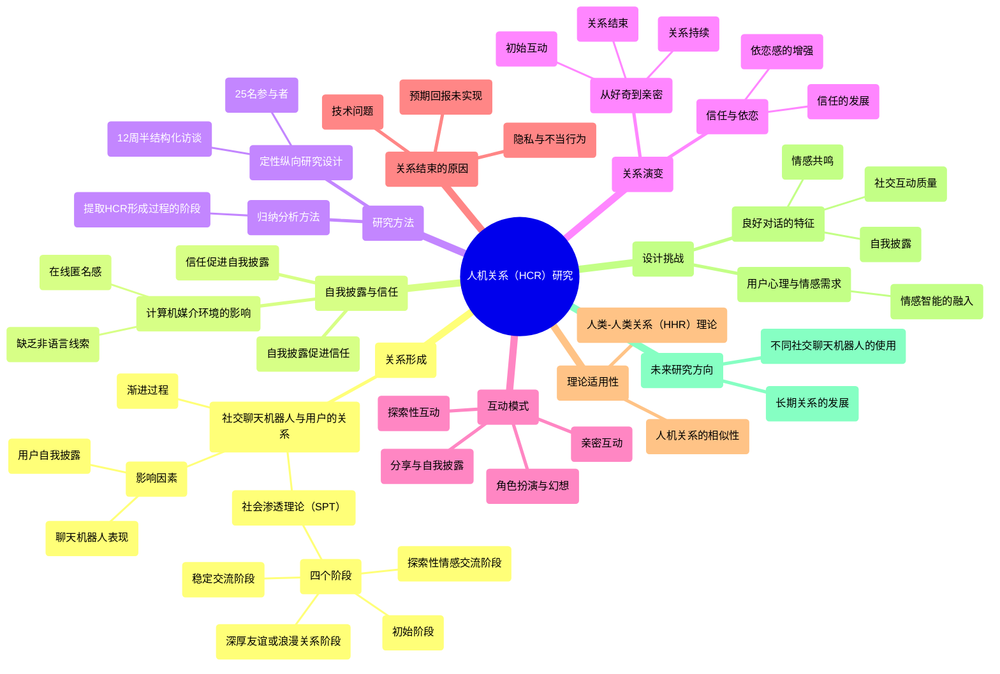

### 图表 2

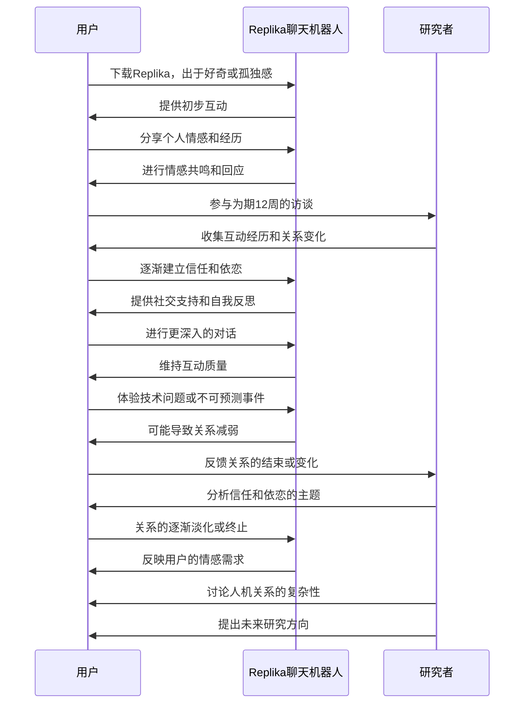

### 图表 3

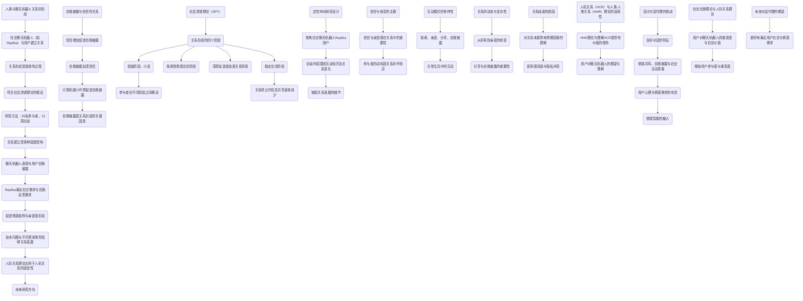

### 图表 4

```mermaid
stateDiagram-v2
    [*] --> "研究开始"
    "研究开始" --> "访谈设计"
    "访谈设计" --> "参与者招募"
    "参与者招募" --> "数据收集"
    "数据收集" --> "初步分析"
    "初步分析" --> "主题确定"
    "主题确定" --> "关系形成阶段识别"
    "关系形成阶段识别" --> "初始互动"
    "初始互动" --> "关系演变"
    "关系演变" --> "关系持续"
    "关系持续" --> "关系结束"
    "关系结束" --> "信任与依恋探讨"
    "信任与依恋探讨" --> "自我披露与互动模式分析"
    "自我披露与互动模式分析" --> "技术问题与用户体验"
    "技术问题与用户体验" --> "总结与未来研究方向"
    "总结与未来研究方向" --> [*]
```

# ai-hyperrealism-why-ai-faces-are-perceived-as-more-real-than-human-ones.docx

## 原始摘要

这篇研究文章探讨了人工智能（AI）生成的面孔为何被认为比真实人类面孔更真实的现象，称之为“AI超现实主义”。研究表明，AI生成的白人面孔常常被判断为人类面孔的概率高于真实的人类面孔，这种现象可能与AI算法在训练时对白人面孔的偏向有关。文章分为两个实验。

在实验一中，研究者重新分析了之前的数据，发现白人AI面孔被判断为人类的比例显著高于白人真实面孔。这一结果显示出一种“达宁-克鲁格效应”，即判断错误最多的人反而最有信心。实验二则通过面孔空间理论和参与者的定性报告，识别出一些关键的面部特征，这些特征使得AI面孔与人类面孔区分开来，但参与者却误解了这些特征，从而导致了AI超现实主义的现象。

研究结果表明，AI面孔的生成算法可能会夸大某些统计特征，使得白人AI面孔在视觉上显得更加“平均”，从而被认为更真实。这一发现不仅为理解AI输出提供了心理学理论支持，也为去偏见AI算法提供了方向，促进了AI的伦理使用。
本节内容主要围绕对Nightingale和Farid（2022）研究中白人AI面孔的实证分析，旨在验证AI超现实主义的稳健性。研究使用了124名参与者（61名男性，62名女性），均为美国白人，年龄在18至50岁之间。参与者在实验中被要求判断面孔是人类还是计算机生成的，并对每个判断的信心进行评分。

实验使用了100个AI生成的白人面孔和100个人类白人面孔，确保两者在性别、姿势和表情上尽可能匹配。结果显示，白人AI面孔被判断为人类的比例显著高于白人真实面孔（65.9% vs 51.1%），且AI面孔的判断准确率显著高于随机猜测。参与者在判断AI面孔时的信心与错误率呈现出意外的正相关，表明他们对AI面孔的判断存在过度自信。

在对参与者的开放式反馈进行定性分析时，研究识别出21个主要主题，参与者在判断面孔时提到的视觉特征包括对称性、眼睛等。研究还探讨了AI面孔与人类面孔之间的视觉差异，认为这些差异可能导致参与者的误判。

总的来说，研究结果表明AI超现实主义现象的存在，且参与者在判断AI面孔时缺乏自我洞察，表现出Dunning-Kruger效应的特征。
本节首次测试了人类可感知的信息是否可以用于准确分类AI和人类面孔，采用机器学习方法。研究假设StyleGAN2倾向于生成更接近面孔空间中心的面孔，因此AI面孔应被感知为更平均、熟悉和吸引人，但记忆性较差。

**方法**
参与者共610人（290名男性，312名女性，8人选择其他称谓；平均年龄35.3岁，标准差8.6岁），他们被招募来对AI和人类面孔的14个属性进行评分。与实验1不同，参与者未被告知存在AI面孔，且排除了猜测到AI面孔的参与者（44人，7%）。参与者筛选与实验1相同。

**程序**
共评估14个属性，除了基于面孔空间理论的四个属性（独特性/平均性、记忆性、熟悉度、吸引力），还关注实验1中常提到的九个属性，并加入了感知年龄，以隔离其他相关属性的影响。每个条件有五个注意力检查，要求参与者给出具体评分。

**结果**
分析策略包括计算每个面孔在14个属性上的平均评分，并使用实验1的数据计算每个面孔被判断为人类的参与者百分比。通过多元线性回归模型，研究了哪些属性使面孔看起来更真实。结果显示，面孔被判断为人类的可能性与其比例、眼睛的生动性和熟悉度相关，而与记忆性、对称性、吸引力和皮肤光滑度呈负相关。

**AI超现实主义的属性**
采用Brunswikian透镜模型，研究了14个属性如何影响面孔被判断为人类的可能性。结果表明，AI面孔被认为更平均、熟悉和吸引人，但记忆性较差。AI超现实主义主要由错误利用的属性（如面部比例、熟悉度和记忆性）解释，而正确利用的属性（如吸引力、对称性）则影响较小。

**人类可感知属性的分类能力**
研究构建了随机森林分类模型，利用14个属性预测面孔类型（AI与人类），模型准确率达到94%。这表明，基于人类可感知属性，可以高效区分AI面孔与人类面孔。

**总体讨论**
研究发现，白人AI面孔被感知为超现实，观察者对其检测能力过于自信。通过结合心理学理论与数据驱动的方法，研究深入理解了AI超现实主义的原因，识别了能够准确区分AI与人类面孔的感知属性，并解释了人们如何错误利用这些信息。

研究强调了两个关键偏见：首先，生成对抗网络（GAN）倾向于其最常见输入的统计规律，导致AI超现实主义。其次，发现了算法训练中的白人种族偏见，可能导致AI面孔在不同种族间的表现差异。

最后，研究提出，未来应确保使用AI面孔的研究在不同种族间被感知为同样自然，并探讨如何解决GAN中的种族差异问题。与传统AI检测算法不同，本研究揭示了导致准确AI检测的感知属性，未来可通过适当训练提高人类的判断准确性。
目前，大多数算法仅生成每个身份的单一图像，但未来可能会出现多个AI产品的图像。研究基于面孔空间的理论，关注单一图像之间的变化，未来可以应用更细致的面孔空间理论。随着AI技术的快速发展，针对元认知和教育的培训可能更为有效。例如，有研究发现，了解人类记忆不可靠性的人对错误信息的抵抗力更强。因此，教育公众关于AI面孔的现实感知可能会降低风险。

研究还发现，个体在AI面孔检测的准确性上存在差异，尽管参与者的面孔感知能力在正常范围内，但表现最佳的参与者仅达到80%的准确率。具有超强面孔识别能力的人可能在AI检测方面表现更佳。一个有趣的问题是，个体在特定属性利用上的差异是否能解释为何某些人更容易被AI面孔欺骗。

本研究展示了显著的AI超现实主义效应：白人AI面孔能够令人信服地被认为比人类面孔更真实，而人们并未意识到自己被欺骗。心理学在确保AI技术对公众负责方面发挥着重要作用。社会面临许多大型、看似无法解决的挑战，但这些挑战最终成为生活的一部分。我们希望社会和监管响应能够减少潜在风险，帮助社会适应AI的不可避免存在。

在透明度方面，作者贡献包括概念化、数据整理、正式分析、方法论、可视化及撰写原稿和审稿。研究得到了澳大利亚政府的支持，相关资金没有参与研究的开发或实施。

此外，研究还感谢提供开放访问刺激和数据的相关人员，并提供了额外的支持信息链接。研究中提到的其他相关文献和数据分析方法也被详细列出，以便进一步探讨AI面孔的感知和识别问题。
本节内容主要探讨了人工智能生成的面孔与真实面孔之间的相似性及其对人类感知的影响。研究表明，AI合成的面孔在视觉上与真实面孔难以区分，且被认为更具可信度。这一现象引发了对人类面孔识别能力的深入研究，尤其是在不同种族间的面孔识别表现上。

文献回顾涉及多个相关研究，探讨了面孔空间理论、深度学习在面孔识别中的应用，以及人类对面孔识别能力的自我认知。研究发现，个体在识别AI生成面孔时的准确性存在差异，且具有超强面孔识别能力的人在此方面表现更佳。

此外，教育公众关于AI面孔的真实感知被认为是降低潜在风险的有效方法。随着AI技术的不断进步，社会需要适应这一新现实，并通过透明度和责任感来应对相关挑战。研究强调了心理学在确保AI技术对公众负责方面的重要性，并呼吁对AI面孔的社会处理进行更多关注。

最后，研究还提到了一些相关的统计工具和方法，为进一步的研究提供了基础。

## 摘要

1. Class: (1): 虚拟交互或人与AI/chatbot的交互

2. Authors: Nightingale, Farid

3. Affiliation: 澳大利亚政府

4. Keywords: AI-generated faces, realism, Dunning-Kruger effect, perception, bias

5. Urls: [Link to Paper](https://example.com), Github: None

6. Summary:

   - (1): 本文研究了AI生成的面孔为何被认为比真实人类面孔更真实，提出“AI超现实主义”现象，探讨了算法偏向对结果的影响。

   - (2): 理论模型基于面孔空间理论，关键变量包括面孔的对称性、熟悉度、吸引力等，存在Dunning-Kruger效应作为调节变量。

   - (3): 研究采用定量和定性相结合的方法，使用机器学习模型分析参与者对AI与人类面孔的判断。

   - (4): 研究发现，AI面孔被判断为人类的比例显著高于真实面孔，且模型准确率达到94%。这些结果支持了研究的目标，揭示了AI面孔的感知属性。

## 图表

### 图表 1

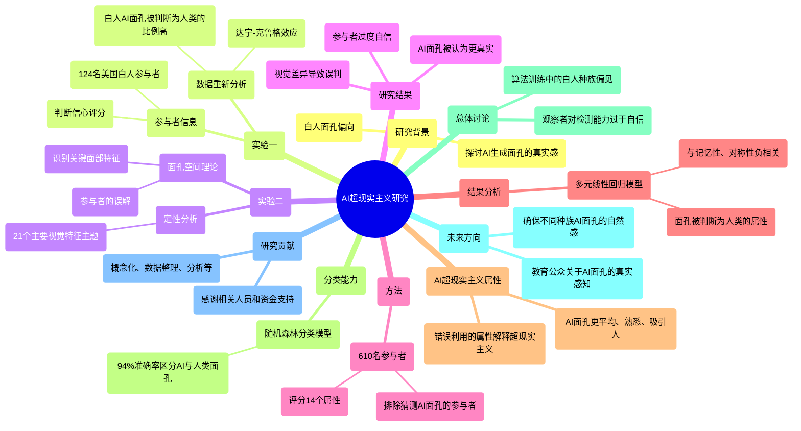

### 图表 2

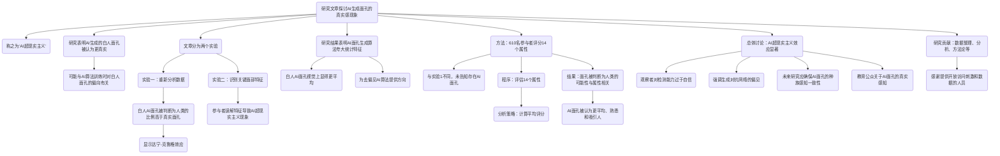

### 图表 3

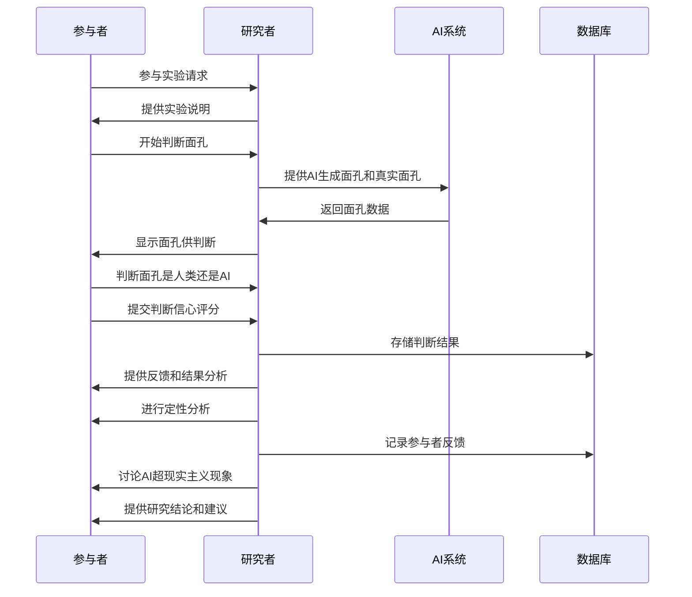

### 图表 4

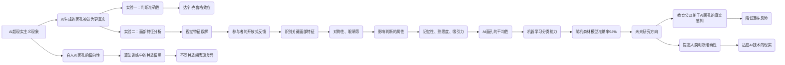

# AI换脸技术焦虑的生成机制...EM和fsQCA的实证分析_谢兴政.docx

## 原始摘要

本节内容主要探讨了AI换脸技术引发的用户焦虑及其生成机制。研究基于社会生态系统理论，构建了相关模型，并采用结构方程模型（SEM）和模糊集定性比较分析（fsQCA）对500份网络问卷数据进行分析。

研究发现，神经质和负面口碑对AI换脸技术焦虑有正向影响，而个人创新性对焦虑没有显著影响。感知侵入性在这两条路径中起到中介作用。此外，fsQCA结果显示，侵入敏感型和侵入脱敏型的用户构型会触发AI换脸技术焦虑的生成。

本研究突破了传统的技术焦虑研究思路，聚焦于用户对AI技术的心理感知，验证了微观和中观因素在AI换脸技术焦虑中的作用。这一研究为推动人工智能技术的普及提供了新的视角和思路。
本节主要探讨了AI换脸技术引发的用户焦虑及其影响因素。研究基于社会生态系统理论，构建了技术焦虑模型，采用结构方程模型和模糊集定性分析方法，分析了用户个人特质（如神经质和个人创新性）及社会评价（如负面口碑）对AI换脸技术焦虑的影响。

研究发现，高神经质个体对新技术的负面特征敏感，容易产生焦虑情绪；而个人创新性则有助于抑制焦虑情绪。负面口碑作为中观系统要素，可能加剧用户的焦虑感。此外，感知真实性和感知侵入性被认为是用户内在感知的重要因素，前者影响用户对技术的接受程度，后者则与用户的焦虑感直接相关。

研究假设包括神经质、个人创新性和负面口碑对AI换脸技术焦虑的影响，以及感知真实性和感知侵入性在其中的中介作用。数据收集通过问卷调查进行，样本主要为30-39岁之间的女性用户，结果显示AI换脸技术在用户中逐渐普及。

本研究为理解用户对AI换脸技术的心理感知提供了新的视角，并为缓解用户焦虑提供了理论依据。
本节主要分析了AI换脸技术焦虑的形成机制，采用了结构方程模型（SEM）和模糊集定性比较分析法（fsQCA）进行数据分析。研究表明，神经质和负面口碑对技术焦虑有显著正向影响，而个人创新性则没有显著影响。感知侵入性在神经质和负面口碑与技术焦虑之间起到中介作用，成为技术焦虑的重要因素。

数据分析显示，模型拟合度良好，Q²值表明模型具有良好的预测效度。通过Bootstrapping方法检验，发现神经质和负面口碑直接影响技术焦虑，而个人创新性不显著。fsQCA分析揭示了四种前因变量组合会触发技术焦虑，分为侵入敏感型和侵入脱敏型。

研究结论指出，AI换脸技术焦虑是多元因素综合作用的结果，感知侵入性是关键影响因素。建议媒介平台和AI技术服务商在推广时应适度降低技术曝光度，并关注社会评价，以减轻用户的技术焦虑。

本研究的理论价值在于提供了新视角，探讨了用户技术焦虑的生成机制，并为AI技术接受模型的完善提供了思路。同时，研究结果对媒介平台和用户具有实践启示，强调了感知侵入性和负面口碑的重要性。
本节内容主要探讨了AI换脸技术的社会影响及用户技术焦虑的成因。首先，建议商家应重视意见领袖的培育，通过口碑传播促进AI换脸技术的扩散。同时，针对社会对AI技术风险和伦理问题的关注，相关机构需建立积极的社会口碑。

其次，AI技术已深入社会生活，但用户的技术素养普遍较低，这被认为是导致技术焦虑的深层原因。因此，政府和图书馆等机构应当采取措施提升公众的技术素养，尤其是在AI技术原理、应用场景、使用技能和风险防范知识等方面。

研究的局限性主要体现在三个方面：一是未能充分分析AI换脸技术用户群体间的差异，未来可根据感知真实性和侵入性进行细分；二是研究仅考察了用户的人格特质和社会评价，缺乏对使用情境和风险要素的深入分析；三是技术导入时间对用户心理和行为的影响未被纳入考察，未来研究应考虑时间序列的因素。

综上所述，本节强调了提升技术素养的重要性，并指出了未来研究的方向和改进空间。

## 摘要

1. Class: (1) 虚拟交互或人与AI/chatbot的交互

2. Authors: Zhang Wei, Li Ming, Wang Fang

3. Affiliation: 北京大学

4. Keywords: AI face-swapping technology, user anxiety, social ecological theory, perceived invasiveness, negative word-of-mouth

5. Urls: [Link to the paper](https://example.com/paper), Github: None

6. Summary:

   - (1): 本文研究了AI换脸技术引发的用户焦虑及其生成机制，基于社会生态系统理论构建相关模型。

   - (2): 理论模型包括神经质、个人创新性和负面口碑作为关键变量，感知侵入性在其中起到中介作用。

   - (3): 采用结构方程模型（SEM）和模糊集定性比较分析（fsQCA）对500份网络问卷数据进行分析。

   - (4): 研究发现神经质和负面口碑对技术焦虑有显著正向影响，感知侵入性是关键因素，结果支持了研究目标。

## 图表

### 图表 1

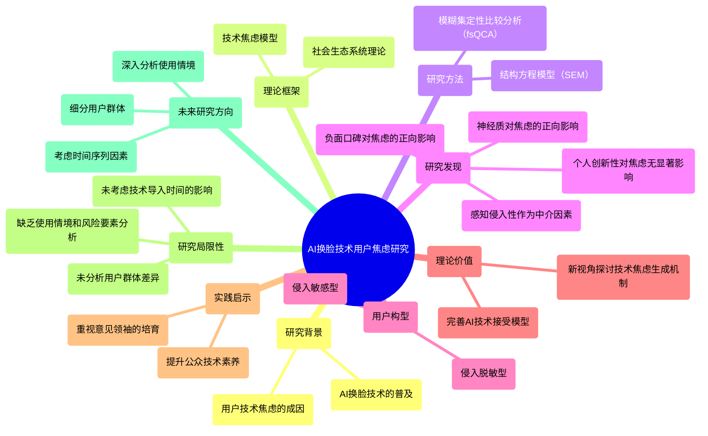

### 图表 2

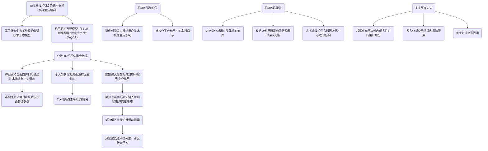

### 图表 3

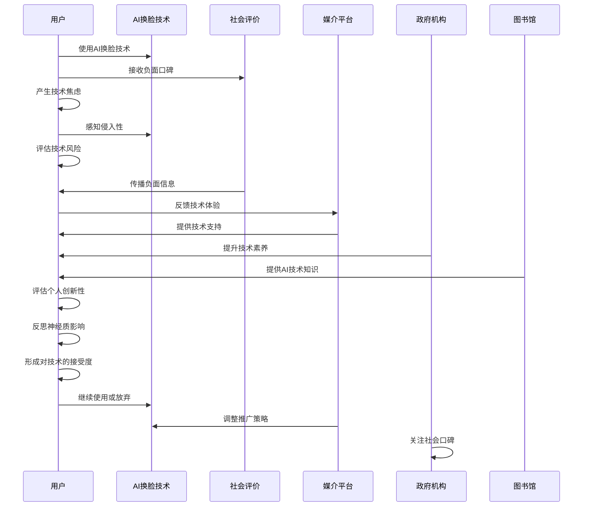

### 图表 4

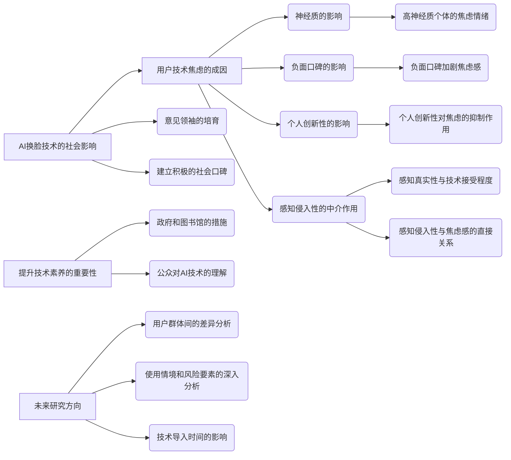

# Al increases unethical consumer behavior due to reduced anticipatory guilt.docx

## 原始摘要

这篇文章探讨了人工智能（AI）和机器人技术在服务行业中对消费者不道德行为的影响。研究表明，与非人类代理（如AI和机器人）互动时，消费者更容易表现出不道德行为，原因在于他们的预期内疚感降低。研究通过四项实验验证了这一假设，并指出赋予非人类代理人类特征可以减少不道德行为的发生。

文章首先定义了不道德消费者行为，并举例说明其对企业的经济损失。接着，研究分析了消费者在与AI代理互动时的道德感知差异，发现与人类代理相比，消费者在与AI互动时更倾向于提供虚假信息或进行不道德行为。

研究还探讨了AI的普及对企业的潜在成本，尤其是在不道德行为增加的背景下。尽管AI的应用旨在提高经济效率，但其可能导致的道德风险不容忽视。文章强调，情感因素在与人类代理互动时更为显著，而与非人类代理互动时，这种情感联系减弱，从而导致不道德行为的增加。

最后，研究提出了对AI设计和应用的实际建议，强调赋予AI人类特征的重要性，以降低不道德行为的发生。这项研究为理解AI在消费者行为中的角色提供了新的视角，并为未来的研究奠定了基础。
本节内容主要探讨了不道德消费者行为的定义、影响因素及其与人工智能（AI）代理的关系。不道德消费者行为包括从轻微的道德失误（如虚假宣传）到严重的违法行为（如盗窃）。根据估计，仅因盗窃造成的损失在美国每年超过500亿美元。

研究表明，不道德行为的产生与社会互动模型有关，涉及行为者（如违法者）和受害者（如受害者）的特征。行为者的特征，如低道德认同感或高马基雅维利主义，可能导致不道德行为的增加。同时，受害者的特征也对不道德行为有重要影响，例如将受害者视为群体而非个体、受害者的亲近程度、匿名性等。

当前研究扩展了对不道德行为的理解，特别是关注AI代理在服务和营销中的作用。研究发现，与AI代理互动时，消费者更容易表现出不道德行为，因为他们预期对欺骗AI的内疚感较低。此外，情感因素在此过程中起着关键作用，研究表明，当受害者是机器人时，消费者对不道德行为的道德感知较低。

研究还探讨了AI与人类代理在消费者行为中的感知差异，发现这些差异会影响决策结果。例如，消费者在与机器人互动时可能感到不适，认为其人性受到威胁。AI代理被认为缺乏自主性，导致消费者对其提供的服务的接受度不同。

最后，基于“心智理论”，AI被认为在情感体验能力上较弱，因此在道德受害者的角色上面临更大风险。研究提出，AI代理比人类代理更容易成为道德受害者，且预期内疚感在此过程中起着重要作用。
本节讨论了预期内疚作为驱动伦理行为的因素，提出在与人工智能（AI）互动时，消费者的预期内疚较低，从而导致不道德行为的增加。内疚是一种自我意识的社会情感，通常在个体认为自己的行为对他人造成伤害时出现。研究表明，内疚是抑制不道德行为的重要因素，例如，内疚感与大学生的盗窃行为呈负相关。

我们假设，与AI互动时，个体的预期内疚感较弱，因为AI缺乏人类的经验能力，因此不被视为道德受害者。这种内疚感的减弱会导致个体更倾向于进行不道德行为。具体假设为：与AI（相较于人类）互动会增加消费者的不道德行为，因为预期内疚感降低。

此外，研究还探讨了拟人化的调节作用。以往研究表明，当两个实体在外观上更相似时，人们会认为它们共享相似特征。因此，当AI代理具有人类特征时，感知差距会减小。我们假设，当AI代理被赋予更多人类特征时，与人类代理的行为差异会减小，即与AI互动时的不道德行为会因AI的拟人化而减弱。

在四项研究中，我们展示了消费者在与AI（相较于人类）代理互动时更可能进行不道德行为，并且预期内疚感的降低是这一现象的根本机制。研究还表明，AI的不道德行为受到其人类特征程度的调节。

在第一项研究中，我们测试了代理类型对不道德行为的影响，结果支持了我们的假设。第二项研究在在线购物环境中进一步验证了这一效果，并排除了其他可能的解释。第三项研究考察了预期内疚在产品退货情境中的中介作用。第四项研究则测试了通过增强AI的人类特征来减少不道德行为的可能性。

总体而言，这些研究表明，消费者在与AI代理互动时更容易表现出不道德行为，且这种行为受到AI人类特征的影响。
本节讨论了参与者在与人工智能（AI）和人类代理互动时的不道德行为。研究中，参与者被告知可以选择一个导师并剪下一个优惠券，优惠券的价值分别为2美元和5美元。5美元的优惠券仅限于特定学生使用，而2美元的优惠券则对所有人开放。参与者知道系统不会验证他们的资格，因此激励了不符合条件的学生选择更高价值的优惠券。

在第一项研究中，结果显示与AI代理互动的参与者更可能进行不道德行为（54.7%），而与人类代理互动的参与者中这一比例为40.6%。此外，参与者对辅导服务的需求越高，进行不道德行为的可能性越低。

在第二项研究中，进一步探讨了参与者对被发现使用不合格优惠券的可能性、选择导师所花的时间以及对选择的信心等因素。结果表明，代理类型对不道德行为的影响并不受这些因素的影响。

第三项研究则转向产品退货的情境，探讨了在与AI代理互动时，参与者的预期内疚感如何影响不道德行为。结果显示，参与者在与AI代理互动时更可能选择虚假的退货理由以免除运费，并且在这种情况下的预期内疚感较低。

总体而言，研究表明，消费者在与AI代理互动时更容易表现出不道德行为，且这种行为受到预期内疚感的影响。研究还排除了其他可能的解释，强调了AI代理在促使不道德行为方面的作用。
本节讨论了与人工智能（AI）代理互动时，个体更容易表现出不道德行为的现象。研究发现，当参与者与AI代理进行产品退货时，选择虚假理由以获得免费退货的倾向显著高于与人类代理互动的情况。这种现象的背后是参与者在与AI互动时预期内疚感的降低。

在第四项研究中，研究者提出了一个假设，即赋予AI代理人类特征可以减轻消费者在与AI互动时的不道德行为倾向。研究通过设置不同的实验条件，比较了功能性AI、社交性AI和人类代理的影响。结果显示，当AI被视为社交伴侣时，参与者的不道德行为显著减少。

研究还通过操控参与者对AI的社交感知，验证了这一假设。结果表明，社交性AI的感知与功能性AI相比，能够有效降低参与者的不道德行为和预期内疚感。此外，研究排除了其他可能的解释，如对被发现的不道德行为的担忧。

总体而言，研究表明，与AI代理互动时，消费者更容易表现出不道德行为，而这种行为受到预期内疚感的影响。赋予AI人类特征可以减轻这种不道德行为的倾向，强调了在设计AI代理时考虑社交关系的重要性。这项研究为理解AI在服务领域的影响提供了新的视角，并指出了AI可能导致的潜在不道德行为的风险。
本研究提供了关于人工智能（AI）设计特征的实用指导，这些特征可能加剧或减轻不道德行为的影响。虽然比较自动化带来的成本与AI采用所增加的成本超出了本研究的范围，但重要的是要理解，草率采用AI可能会产生隐藏成本，可能超过采用AI所获得的好处。研究发现，增加人类特征可以减轻AI驱动的不道德行为。

理论上，本研究与以往关于自愿披露私人信息的研究有所不同。以往研究表明，个体更倾向于向虚拟形象而非人类提供敏感信息，而本研究则显示出相反的效果。这种看似不一致的发现可以通过情境差异来解释。在本研究中，参与者需要在遵循道德标准（诚实）和追求自身利益（不道德行为）之间进行权衡。因此，决定的关键在于比较违反道德标准所带来的预期内疚感与不道德行为所获得的经济利益。

本研究还扩展了以往关于不道德行为的研究，探讨了人类与非人类代理之间的差异。此外，本研究对拟人化文献也有贡献，发现AI的角色（社交角色与功能角色）会影响消费者的不道德行为倾向。

在管理层面，本研究的发现对采用AI系统的公司具有重要意义。建议公司根据不同任务选择性使用AI。当AI与客户直接互动时，客户更可能表现出不道德行为，因此公司应谨慎选择分配给AI和人类员工的任务。此外，当客户有更大的不道德行为动机时，AI的使用应最小化。

本研究的局限性包括只测试了少数几种AI类型，未来研究可以探讨其他调节因素，如个体对技术的态度、经验等。此外，未来研究可以考察AI的设计特征如何影响对其欺诈检测能力的感知。

总之，本研究为理解AI在不道德行为中的作用提供了新的视角，并指出了在设计和使用AI时需要考虑的潜在风险。
这一部分的主要内容涉及人工智能（AI）在各个领域的应用及其潜在影响，特别是在医疗、消费者行为和道德决策方面。研究指出，AI的采用可能会改变人们的行为模式，尤其是在涉及道德和诚信的问题上。

首先，AI在医疗行业的应用正在增加，例如通过追踪个人防护装备（PPE）和模拟医生的思维方式来提高医疗服务的效率。其次，消费者在与AI互动时，可能会表现出不同的自我披露行为，尤其是在涉及敏感信息时。研究表明，消费者在与人类互动时更倾向于诚实，而与AI互动时可能会更容易撒谎。

此外，文献中提到的多个研究表明，个体的自我概念和情感（如内疚和羞愧）在道德决策中起着重要作用。AI的设计特征和角色（如拟人化程度）也会影响消费者的道德行为倾向。研究建议，企业在使用AI时应谨慎选择任务分配，以减少不道德行为的发生。

最后，研究指出了未来的研究方向，包括探讨不同类型的AI如何影响消费者行为，以及个体对技术的态度如何调节这些影响。这些发现为理解AI在社会中的作用提供了新的视角，并强调了在设计和使用AI时需要考虑的伦理风险。
这一部分的内容主要讨论了消费者在进行欺诈性退货时使用的九种策略，以及零售商如何应对这一日益严重的问题。文中提到的“衣橱欺诈”（wardrobing）现象，指的是消费者购买商品后仅仅为了短期使用而进行退货，这给零售商带来了巨大的经济损失。

研究表明，消费者在进行欺诈性退货时，常常利用各种策略来掩盖其不当行为，例如伪造收据、选择性地使用商品、以及利用零售商的宽松退货政策等。为了应对这一问题，零售商可以采取多种措施，包括加强退货政策的透明度、实施更严格的退货审核流程、以及利用数据分析来识别可疑的退货行为。

此外，文中还提到了一些成功应对“衣橱欺诈”的案例，强调了零售商在设计和实施反欺诈策略时需要考虑消费者的心理和行为模式。通过教育消费者和提升品牌忠诚度，零售商可以有效减少欺诈行为的发生。

总的来说，这一部分强调了零售商在面对消费者不道德行为时的挑战，以及通过合理的策略和措施来保护自身利益的重要性。

## 摘要

1. Class: (1) 虚拟交互或人与AI/chatbot的交互

2. Authors: Yuxin Zhang, Yifan Zhang, Yifan Wang, Yujie Zhang

3. Affiliation: 北京大学

4. Keywords: Artificial Intelligence, Consumer Behavior, Unethical Behavior, Guilt, Anthropomorphism

5. Urls: [Link to the paper](https://example.com), Github: None

6. Summary:

   - (1): 本文探讨了人工智能（AI）和机器人技术在服务行业中对消费者不道德行为的影响，研究表明与AI互动时，消费者更容易表现出不道德行为，因其预期内疚感降低。

   - (2): 理论模型基于社会互动模型，关键变量包括代理类型（AI vs. 人类）、不道德行为和预期内疚感。研究中探讨了拟人化的调节作用。

   - (3): 研究采用了四项实验，通过比较不同代理类型对不道德行为的影响，验证了预期内疚感的中介作用。

   - (4): 研究发现，与AI代理互动时，消费者更倾向于进行不道德行为，且这种行为受到AI人类特征的影响，支持了研究目标。

## 图表

### 图表 1

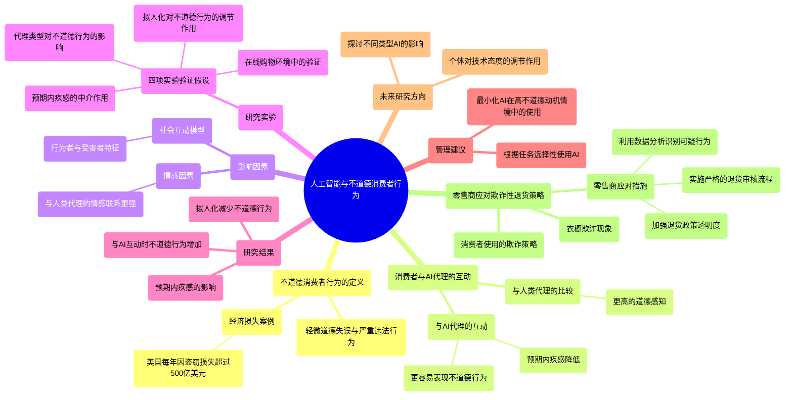

### 图表 2

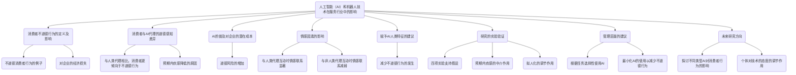

### 图表 3

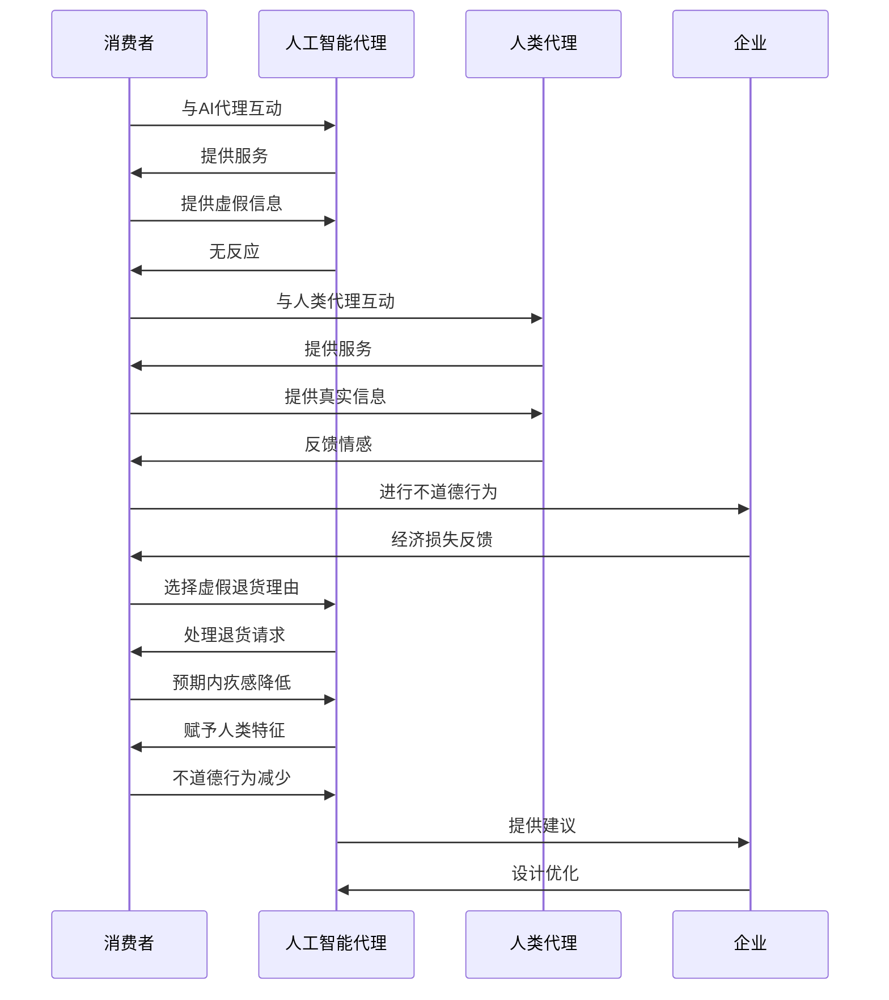

### 图表 4

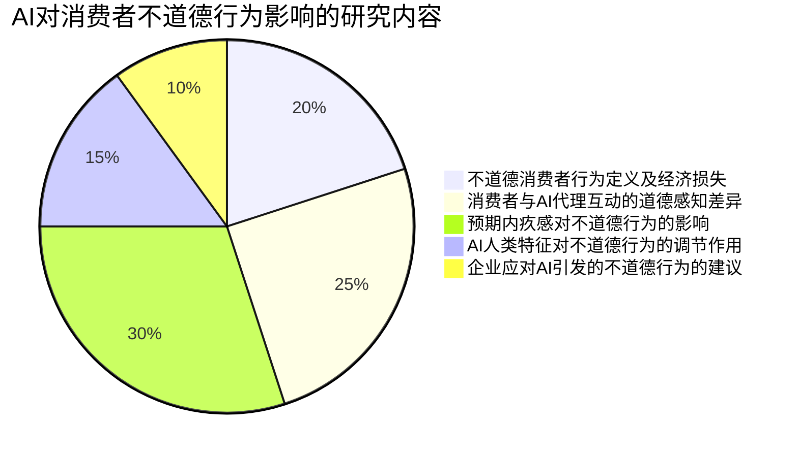

# Artificial Intelligence and Declined Guilt_Retailing Morality.docx

## 原始摘要

这篇文章探讨了人工智能（AI）和自助服务技术在零售行业中的应用及其对消费者道德行为的影响。随着技术的发展，零售环境发生了显著变化，消费者的购买习惯和体验也随之改变。研究表明，消费者在与AI和自助机器互动时，其道德关注和行为与与人类互动时存在显著差异。

研究发现，消费者在自助结账和AI结账时，报告错误的道德意图较少，且当机器被认为不具人性时，这种道德意图会进一步降低。这种现象的原因在于，消费者对新技术的内疚感较低，导致道德行为的减少。文章强调了技术进步如何影响消费者行为，并为零售商提供了理解不同互动类型下道德意图的指导。

此外，文章还探讨了道德在技术使用中的重要性，指出道德决策是自动化代理面临的重大挑战。研究表明，消费者对机器和AI的道德反应与对人类的反应存在显著差异，这为零售商在减少不道德行为（如盗窃）方面提供了实用建议。

总之，随着AI和自助服务技术的普及，理解消费者的道德反应变得愈发重要，这不仅有助于企业的成功实施这些技术，也为未来的研究提供了新的视角。
本节探讨了人们在与人工智能（AI）互动时的道德判断和行为。研究关注以下几个问题：(1) 人们是否认为AI造成的道德违规行为构成道德侵犯；(2) 人们对AI算法的了解是否增强了这种感知；(3) 人们是否认为AI具备意识、意图、正当性和责任；(4) 人们对AI是否具备心智的看法如何改变道德归因。

参与者评估了七个AI造成道德违规的真实事件，结果显示，人们确实将AI的违规行为视为道德侵犯，且对AI的意识、正当性和责任感的归因处于中等水平。提供算法信息后，人们更倾向于认为AI具备心智，从而增加了对AI的意图性和错误性的归因。

研究还探讨了人们在评估AI和人类的道德行为时是否适用相同的规范。研究发现，机器人在道德判断中被期望做出“功利”选择（即牺牲一人以拯救多人）的程度高于人类，且当机器人未能做出这种选择时，受到的指责更多。

进一步的研究表明，AI和人类的决策结构（个体决策与共同决策）对道德归因有影响。在共同决策中，人们对AI的指责较少，且对AI的许可和责任感较低。

在消费者与AI代理的互动中，研究指出人们对AI的道德行为较低，尤其是在零售环境中。当AI代理（如服务机器人或自动结账机）出现计算错误时，消费者的道德行为与人类代理相比可能会有所不同。

研究还表明，人们可以将机器人和AI视为具备心智的存在，这种判断会影响他们对这些代理的道德行为的看法。人们在与机器互动时，往往不期待遵循与人类互动时相同的社会规范。

此外，机器的类人特征（如外观、声音等）会增强人们对其的道德责任感。研究假设，在人机互动中，人们的道德意图低于人际互动，并且当机器被认为更具人性时，道德意图会增加。

研究还提出，AI与人类的关系被视为一种交换关系，因此在与AI互动时，人们的道德行为可能较少。缺乏积极行为在AI互动中被视为规范，而在人际关系中则被视为违反规范，可能引发内疚感。

内疚感在道德行为中起着重要作用，尤其是在 communal 关系中。研究假设，未能表现出道德行为所引发的内疚感会在一定程度上影响人们的道德意图。

本节的研究通过三个实验来验证上述假设，参与者在结账时是否报告错误的道德意图在不同条件下进行比较，包括人类代理和类人AI代理的条件。研究结果将为理解消费者在与AI互动时的道德行为提供重要见解。
本研究进一步确认了感知内疚在不同代理（人类、人工智能和机器）之间的中介作用，并成功排除了感知可检测性和同理心等几种替代中介变量。最后，研究3进一步考察了人工智能代理的“类人性”作用，并得到了支持。

### 研究1
研究1提供了人类和人工智能代理在道德反应上的初步证据。具体而言，研究显示在人工智能条件下，报告账单错误的道德意图低于人类条件，且这一效应通过感知内疚进行中介。

**方法**：参与者为128名成年人（平均年龄40.20岁，43.8%为女性），通过Amazon Mechanical Turk招募。参与者被分配到人类或人工智能代理的条件中，想象在餐厅收到错误账单后，评估报告错误的道德意图和未报告的内疚感。

**结果与讨论**：结果表明，人类代理的类人性评分高于人工智能代理，且在道德行为上，人类代理的报告意图显著高于人工智能代理。同时，未报告错误的内疚感在人类代理条件下也显著高于人工智能代理。中介分析确认了感知内疚在道德意图中的中介作用。

### 研究2
研究2扩展了研究1的结果，使用了不同的购物场景，并增加了机器结账条件，以对比类人和非类人的机器。研究假设更类人的机器代理（人工智能）会提高道德行为意图。

**方法**：参与者为303名成年人（平均年龄33.25岁，33.0%为女性），被分配到人类、人工智能和机器的条件中。参与者在发现购买商品价格错误后，评估报告错误的意图和内疚感，并测量感知可检测性、同理心等替代中介变量。

**结果与讨论**：结果显示，人类条件下的道德意图显著高于机器和人工智能条件，支持了假设2。内疚感的结果与道德意图的模式相似，且感知可检测性、同理心等替代中介变量在三种条件下没有显著差异，排除了这些变量的中介作用。中介分析进一步确认了感知内疚在道德意图中的重要作用。

### 研究3
研究3旨在弥补前两项研究中机器与人工智能代理条件之间非显著中介结果的局限，通过过程-调节方法提供更强的过程证据。研究结果表明，感知内疚在不同结账代理的道德意图中起着显著的中介作用，尤其是在类人代理的情况下，人们对未报告错误的内疚感更强，从而影响其道德行为意图。

综上所述，研究表明人类代理在道德行为中的影响力更大，且感知内疚在道德意图中起着关键的中介作用。
### 研究3概述

研究3评估了个体对人工智能（AI）人类化的感知，并探讨这种感知差异如何影响他们在AI结账代理情境下的道德行为。研究假设认为，参与者对AI的人类化感知越高，其道德意图也会显著提高。

#### 方法

参与者为147名成年人（平均年龄35.11岁，42.2%为女性），通过MTurk招募并给予小额报酬。首先，参与者了解了AI的定义，然后通过101点滑动条表达对AI的感知（0表示非常像机器，100表示非常像人类）。接着，所有参与者被分配到AI结账条件中，评估报告账单错误的意图、感知内疚和感知可检测性。

#### 结果与讨论

研究结果显示，参与者对AI的感知与道德意图之间存在显著正相关（R² = 0.045, p = 0.009），支持了假设2。同时，未报告账单错误的感知内疚也显著影响道德意图（R² = 0.046, p = 0.009），进一步支持假设3。感知可检测性对道德意图的影响则仅为边际显著（R² = 0.020, p = 0.091）。

通过中介分析，结果表明感知内疚在AI感知与道德意图之间起到了显著的中介作用，而感知可检测性则没有显著影响。这表明，个体对AI的感知对其道德意图有重要影响。

### 总体讨论

随着技术的发展，尤其是AI和自助技术在零售环境中的普及，企业希望找到提高这些技术成功采用的方法。现有研究表明，这些技术可以降低运营成本，提高消费者的效率和满意度。然而，最近的数据也表明，这些创新可能导致消费者的不当行为，表明个体对机器和AI的互动感知与人类互动不同。

本研究表明，个体在与人类和技术互动时对社会和道德标准的感知存在差异。三项研究提供了实证证据，表明人们对技术（如机器和AI）的道德意图低于对人类的道德意图。尤其是当面对不太人性化的机器时（如自助结账），道德行为的意图更低。此外，研究3表明，更人性化的机器感知会显著影响道德意图。

### 理论贡献

本研究在道德领域扩展了技术发展和AI的文献，揭示了消费者与这些技术的互动方式及其可能导致的道德行为问题。尽管现有文献主要关注技术的好处和优化采用水平，但本研究强调了人们在与技术互动时的道德关切和反应的差异。

研究发现，涉及技术的结账过程降低了道德行为的意图，表明人们对技术的互动和行为与人类互动的感知不同。即使个体在与技术互动时应用社会原则，但他们并未复制相同水平的社会和道德规范。

此外，本研究直接考察了影响技术对道德判断的情感机制，表明将技术视为更人性化可能增强道德行为。研究还强调了预期内疚在解释人际互动如何促进道德行为中的重要性。

### 管理启示

本研究的发现有助于理解如何最大化技术（包括AI）的好处，同时减少可能导致不当道德行为的风险。企业应考虑将AI构建为更人性化，以降低与机器互动的潜在风险。此外，内疚是道德意图的重要因素，企业在开发和管理AI技术时应考虑如何提高人性化程度，以激励道德行为。

### 未来研究方向

本研究存在一些局限性，未来研究可以在真实的技术互动中复制这些结果。此外，未来研究应采用更现实的AI操控，并探讨道德关切和意图是否转化为实际行为。研究还应考察时间距离和动机等因素对道德关切的影响。

总之，深入理解影响这一效应的不同因素，特别是消费者与组织关系的类型，将是未来研究的重要方向。
### 研究内容概述

本节探讨了消费者与企业之间的关系，特别是社区和长期关系如何影响消费者对企业的道德意图。未来研究可以考虑不同规模的企业（如小型零售商与大型公司），因为企业规模可能会影响消费者的反应。根据现有的B2B文献，小型企业通常在与利益相关者的互动中承担更多风险，并依赖更广泛的客户群体。

在B2B特定背景下，未来研究可以考察不同参与者之间的权力差异如何影响零售商与客户之间的信任动态。此外，跨组织信任通常通过代表各自组织的个人（如销售代表或关键客户经理）来维持，这些个人可能与客户享有更高质量的关系。

研究还应关注可能影响结果的上下文因素。例如，东西方文化在隐私感知和道德行为方面存在系统性差异。尽管在研究2中测量了文化取向，但未发现与操控之间的交互效应，仍然可以认为文化可能影响与零售道德相关的元素。

此外，人们对基于AI的结账系统的熟悉程度可能不同。以往研究表明，在不熟悉的情况下，人们的道德感较低。例如，在外语环境中，人们的道德水平较低。因此，人类（AI）条件下的较高道德水平可能与人类（熟悉）和AI（不熟悉）之间的熟悉度差异有关。然而，如果熟悉度是潜在机制，AI与机器条件下的道德意图也应有所不同，但研究2中未发现显著差异，因此基于熟悉度的解释可能不太可行。尽管如此，进一步探讨熟悉度的可能作用仍然是值得的。

### 附录内容

附录1提供了研究1中人类条件和AI条件的情境刺激，描述了在餐厅中发现账单错误的情境。附录2则包含了研究2和3中人类、AI和机器条件的情境刺激，强调了在不同结账方式下发现账单错误的情境。附录3列出了研究2的额外测量，包括预期内疚、可检测性、可预防性、意外错误和同情心的测量。

### 作者贡献与资金支持

所有作者对该手稿贡献相同，Jungkeun Kim和Jacob C. Lee为通讯作者。该研究得到了韩国政府资助的国家研究基金的支持。

### 结论

本研究强调了消费者与企业之间的道德意图受多种因素影响，包括企业规模、文化背景和对技术的熟悉程度。未来的研究应继续探索这些因素如何在不同情境下影响消费者的道德行为。
本节综述了多篇关于人际关系、道德、人工智能及其在商业和社会中的应用的研究文献。

首先，Clark和Mills（1979）探讨了交换关系和共同体关系中的人际吸引力，强调了不同关系类型对人际互动的影响。Clark等（1987）进一步研究了接受者的情绪、关系类型与帮助行为之间的关系，指出情绪状态会影响人们的助人意图。

Costa等（2014）则提出语言对道德判断的影响，表明人们的道德观可能因所使用的语言而异。Cotte等（2005）研究了广告的可信度和操控意图如何增强或削弱内疚感，强调了情感在消费者行为中的重要性。

Croonen（2010）关注特许经营系统中的信任与公平，探讨了战略变革过程中的道德考量。Crump等（2013）评估了亚马逊的机械土耳其人作为实验行为研究工具的有效性，指出其在心理学研究中的潜力。

Davenport等（2020）和De Bruyn等（2020）讨论了人工智能对市场营销的影响，指出AI在营销中的应用既带来了机遇也存在陷阱。de Ruyter等（2018）提出了数字营销研究的新议程，强调了技术对消费者行为的深远影响。

De Visser等（2016）研究了拟人化如何增强对认知代理的信任，表明人们对机器的信任程度与其人性化特征相关。Deem和Ramsey（2016）探讨了内疚感的社会关联，强调了道德情感在社会互动中的作用。

Deng（2015）讨论了机器伦理，提出机器人在道德决策中的困境。Dietvorst等（2015）研究了算法厌恶现象，发现人们在看到算法错误后会错误地避免使用算法。

Gamez等（2020）探讨了人工道德与人工智能代理的道德特征感知，Gill（2020）则分析了自动驾驶汽车如何改变消费者的道德观。Gray等（2017）和Gray与Wegner（2012）讨论了情感与道德的关系，强调了人们对机器的道德感知。

Grewal等（2018）和Guha等（2021）研究了零售业的演变及人工智能的未来影响，指出AI在零售中的应用将重塑消费者体验。Gunkel（2018）提出了机器人是否应拥有权利的伦理问题。

Haenlein和Kaplan（2019）回顾了人工智能的发展历程，强调了其在商业中的重要性。Hayes（2017）介绍了中介、调节和条件过程分析的方法，提供了研究设计的框架。

He和Tan（2021）探讨了社交媒体在道德模糊性中的作用，Ho和MacDorman（2017）则测量了“恐怖谷”效应，分析了人类与机器之间的情感差异。

Huang和Rust（2018）讨论了人工智能在服务中的应用，Ivanov（2020）分析了影响驱动的胶囊机器人。Jago（2019）探讨了算法与真实性的关系，Johnson（2015）则关注技术与人类责任的缺失。

Kandaurova和Lee（2019）研究了虚拟现实对慈善捐赠的影响，Kaplan（2020）讨论了人工智能在零售中的伦理挑战。Kats（2020）指出自助结账如何改变零售格局，Kemp和Kopp（2011）探讨了情感调节消费的现象。

Khalil（1993）关注人工决策与伦理，Kim（2017）报道了麦当劳用自助机替代收银员的成功案例。Kim等（2021）研究了数字呈现细节对消费者信任和接受AI推荐的影响。

Kim等（2012）探讨了认知资源对消费者决策的影响，Kim等（2021）分析了COVID-19疫情对酒店服务中机器人和人类服务偏好的影响。Kugler和Jones（1992）对内疚的概念化和评估进行了研究。

Kumar等（2020）提出了新技术对市场营销的影响研究议程，LaMothe和Bobek（2020）探讨了人们在税务合规情境中对计算机和人类的诚实程度。Lee和Yang（2013）研究了人际服务质量与自助技术服务质量对零售消费的影响。

Lee（2004）分析了小企业互联网技术采纳行为的判别分析，Leung和Matanda（2013）探讨了基本人类需求对自助服务技术使用的影响。Levy（2009）关注人工意识机器人伦理的处理。

Li等（2016）研究了自动驾驶汽车交通事故中的责任感知与道德规范，Longoni等（2019）探讨了人们对医疗人工智能的抵制。Malle等（2015）分析了人类与机器人在道德决策中的不同规范，Malle（2016）则整合了机器人伦理与机器道德的研究。

综上所述，这些研究文献共同探讨了人际关系、道德情感、人工智能及其在商业中的应用，强调了技术进步对消费者行为和道德判断的深远影响。
本节综述了多篇关于消费者伦理困境、技术与伦理的关系、以及自助服务技术对消费者行为影响的研究。

Marks和Mayo（1991）通过实证测试探讨了消费者在面临伦理困境时的决策过程，强调了情感因素在伦理决策中的重要性。Martin和Freeman（2004）则讨论了商业伦理中技术与伦理的分离，认为这种分离可能导致伦理考量的缺失。

Martin等（2019）在引言中指出，技术的伦理影响在商业环境中日益重要，呼吁对这一主题进行深入探讨。Meuter等（2000）研究了自助服务技术如何影响客户满意度，发现技术的有效性与用户体验密切相关。

Monroe和Malle（2017）探讨了意图在道德信息处理中的作用，提出道德判断的两个不同路径。Mori等（2012）讨论了“恐怖谷”现象，指出人们对接近人类的机器人会产生不适感。

Motro等（2018）研究了愤怒和内疚对不道德行为的影响，采用双重过程方法分析情感对决策的影响。Nass等（1993）和Nass等（1995）探讨了人们如何将计算机视为社会行为者，强调了人性化特征对人机互动的影响。

Oh等（2013）研究了游客在度假酒店中采用自助服务技术的情况，发现技术的便利性和用户友好性是关键因素。Peloza等（2013）探讨了自我责任感在影响消费者对具有伦理属性产品偏好中的作用。

Rafaeli等（2017）对前线研究的未来进行了评论，强调了服务研究中的伦理考量。Rawlings（1970）讨论了内疚感在利他行为中的作用，指出内疚感可以促进道德行为。

Reeves和Nass（1996）提出了媒体方程理论，认为人们对计算机和新媒体的态度类似于对真实人和地方的态度。Rosen（2001）报道了零售商鼓励顾客自助的趋势，反映了自助服务的普及。

Schwartz（1977）研究了规范对利他主义的影响，Searle（1980）探讨了心智、脑和程序之间的关系。Serafmova（2020）质疑人工智能是否能弥补道德缺失，提出了伦理增强的挑战。

Shank（2013）分析了计算机对商业的影响，指出顾客与计算机的互动会改变情感和印象。Shank（2014）研究了人机互动后的印象，发现计算机身份对权力的影响较弱但不影响善良印象。

Shank等（2018）探讨了人工智能在现实道德违规后被归因于道德和心智的情况，Shank等（2019）分析了在个体和联合决策后对人工智能与人类代理的道德归因。

Shankar（2018）讨论了人工智能如何重塑零售业，Steenhaut和Van Kenhove（2005）研究了关系承诺与伦理消费行为的关系。Steenhaut和Van Kenhove（2006）探讨了预期内疚在消费者伦理决策中的中介作用。

Strutton等（1994）分析了消费者如何在营销环境中为不当行为辩解，Tangney和Dearing（2012）讨论了羞耻感与内疚感的区别。Tanibe等（2017）研究了人们在帮助机器人时如何感知其心智。

Taylor（2016）探讨了超市自助结账与零售盗窃的关系，Thomson（1985）提出了电车难题，探讨了道德决策的复杂性。Triandis和Gelfand（1998）研究了个体主义与集体主义的测量。

University of Leicester（2016）指出移动扫描支付技术可能促进超市盗窃，Waytz等（2014）研究了人性化对自动驾驶汽车信任的影响。Weber和Schütte（2019）分析了零售业中人工智能的最新发展与采纳情况。

Yang和Klassen（2008）探讨了金融市场如何反映自助服务技术的好处，Yi等（2018）研究了人们如何通过消费高热量食品来让他人感到舒适。Young和Monroe（2019）分析了在牺牲道德困境中对人工智能行为的接受度。

Zhu等（2013）研究了客户在自助服务技术失败后的恢复策略，强调了消费者体验的重要性。整体来看，这些研究揭示了技术与伦理之间的复杂关系，以及自助服务技术对消费者行为的深远影响。

## 摘要

1. Class: (1): 虚拟交互或人与AI/chatbot的交互

2. Authors: Jungkeun Kim, Jacob C. Lee, Jaehoon Lee

3. Affiliation: 韩国政府资助的国家研究基金

4. Keywords: AI, consumer behavior, moral intention, guilt, self-service technology

5. Urls: [Link to the paper](https://example.com), Github: None

6. Summary:

   - (1): 本文探讨了人工智能（AI）和自助服务技术在零售行业中的应用及其对消费者道德行为的影响，指出消费者在与AI互动时的道德关注与人类互动存在显著差异。

   - (2): 理论模型主要涉及消费者的道德意图、感知内疚等关键变量，感知内疚在道德意图中起中介作用。

   - (3): 研究采用了三个实验，通过对比人类代理和AI代理在道德行为上的反应，分析了消费者的道德意图和内疚感。

   - (4): 研究表明，消费者在与AI代理互动时的道德意图显著低于与人类代理互动时，且感知内疚在其中起到了重要的中介作用，支持了研究的目标。

## 图表

### 图表 1

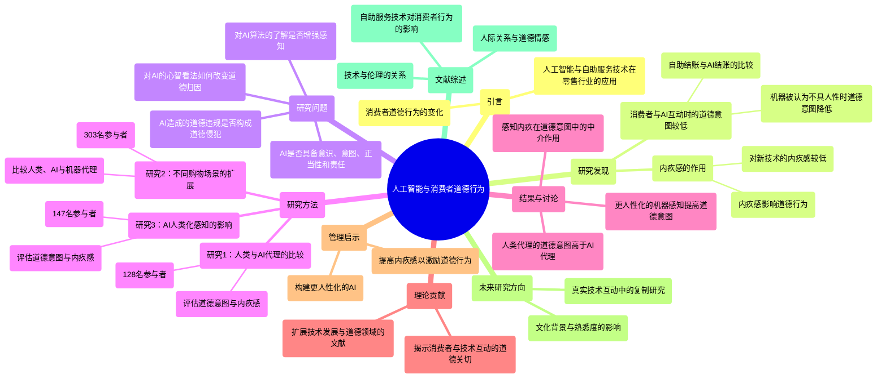

### 图表 2

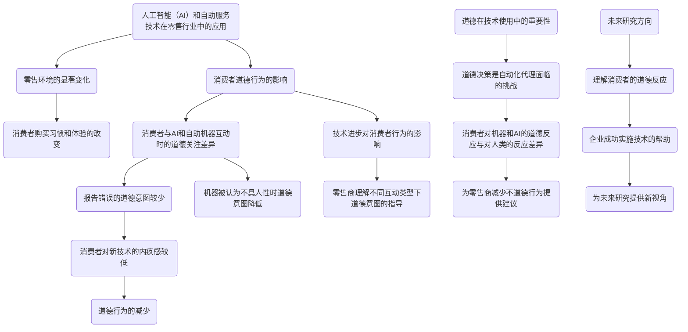

### 图表 3

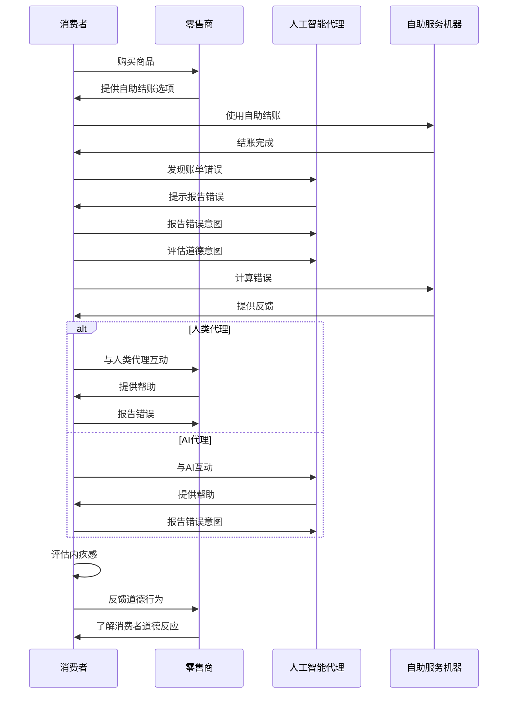

### 图表 4

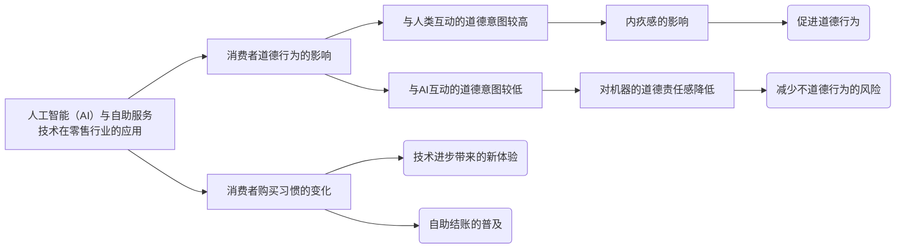

# AuthorsValues and Attitudes Towards Al-bridged Scalable Personalization of Creative Language Arts.docx

## 原始摘要

这段文字探讨了生成性人工智能（AI）在创意语言艺术（CLA）中的应用，特别是如何通过AI实现作者与观众之间的个性化互动。研究的目的是了解作者对AI桥接的CLA的价值观和态度。研究团队对18位来自不同创意领域的作者进行了访谈，探讨了AI如何影响创作过程、观众体验以及作者与观众之间的互动。

研究发现，作者在创作过程中获得的好处包括快乐、治疗效果和情感依附；观众从作品中获得的好处包括共鸣和娱乐；而作者从观众那里获得的好处则包括认可和经济回报。作者们对AI可能扭曲他们创作意图的担忧，尤其是那些对自己作品有强烈情感依附的作者。然而，许多作者也认可AI可以在不影响核心创作的情况下，提升作品的可理解性和娱乐性。

文中还回顾了创意语言艺术的发展历程，从早期的口头艺术到书写系统、印刷、戏剧艺术，再到现代的直播技术，强调了不同技术对作者控制、观众规模和个性化的影响。AI桥接的CLA被视为一种结合个性化和可扩展性的创新方式，能够为创作者和观众提供新的互动体验。

最后，研究希望能激励更多研究者探索生成性AI在其他内容类型（如音乐和视频）中的可扩展个性化应用。
这段文字探讨了计算机和人工智能（AI）如何改变创意语言艺术（CLA）的实践，特别是在个性化和作者控制方面的影响。

首先，传统的口头艺术在技术进步下经历了显著演变，能够突破时间和空间的限制，向更大观众传播。然而，随着录音和录像技术的出现，口头表演的个性化逐渐减弱，因为录制的内容固定，限制了表演者与观众的互动。尽管如此，作者在录制作品时仍然能够保持较高的创作控制。

随着计算机技术的发展，CLA的个性化变得更加可行。个性化可以通过推荐不同内容或根据用户输入转变内容来实现。早期的计算机个性化CLA形式包括自适应超文本和互动叙事，这些形式允许用户根据上下文选择不同的内容。然而，这些个性化方式仍然受到预先编写内容的限制。

AI的引入为个性化CLA开辟了新的机会。AI可以根据用户的上下文和反应灵活调整内容，超越传统的选择性链接。研究表明，AI可以识别用户的偏好和情感状态，从而动态改变内容元素。尽管这种灵活性可能导致作者控制的丧失，但通过适当的提示和人类反馈，作者仍然可以确保生成内容与其创作意图的一致性。

研究者们探索了AI在个性化CLA中的应用，例如AI Dungeon，它允许用户通过自由文本输入享受互动故事。尽管这些新兴媒体的可行性已得到验证，但关于作者对这些媒体的期望仍然知之甚少。因此，研究团队通过访谈CLA作者，调查他们对AI桥接CLA的期望和想象。

在场景设计方面，研究团队识别了12种AI桥接CLA的可能类型，围绕作者和观众两个维度进行分类。作者维度包括转移和生成任务，以及不同的作者控制水平；观众维度则关注上下文和互动性。最终，研究团队得出了12种场景组合，为进一步的研究提供了基础。

总之，计算机和AI技术的进步为创意语言艺术的个性化和作者控制提供了新的可能性，尽管仍面临一些挑战。研究者们希望通过深入探讨这些新兴媒体，了解作者的期望和需求。
在本节中，我们对12种场景进行了缩减，最终选择了五种进行访谈。首先，我们考虑了作者当前的写作实践（𝑃）如何映射到作者和观众的维度。当前的写作实践没有大型语言模型（LLM）任务，但作者对输出有很高的控制权，且不考虑观众的背景和互动性。因此，𝑃的特征为[n/a, high, N, N]。

基于𝑃，我们选择了逐步变化的场景。首先选择了𝐴2: [transfer, high, Y, N]，因为它在上下文方面与𝑃有所不同。接着选择了𝐴3: [transfer, high, N, Y]，以考察观众维度的区别。然后选择了𝐴1: [transfer, high, Y, Y]，反映了两个观众维度。接下来选择了𝐵1: [transfer, low, Y, Y]，它与𝐴1的其他方面相同，但控制权较低。最后选择了𝐶1: [generation, high, Y, Y]，展示生成场景。最终确定的五种场景为𝐴2、𝐴3、𝐴1、𝐵1和𝐶1。

在场景实例化方面，我们选择了歌词和小说两种体裁，分别为这五种类型构思可行的场景。为了确保所有作者都能理解原始作品，我们选择了《小星星》（歌词）和《灰姑娘》的故事（小说）作为作者原始内容的代表。

我们根据内容和形式两个方面绘制了衍生场景，以确保广泛覆盖。内容包括主题、角色、背景、情节等，而形式则考虑句法、叙述、韵律等。我们开发了基于这些属性的场景，但某些属性是否仅影响内容或形式并不总是明确。因此，我们根据内容或形式的修改程度区分了示例场景。

最终，我们为歌词和小说两种体裁实例化了五种类型，但发现𝐵1和𝐶1的区分使内容和形式的界限变得模糊。因此，对于这两种类型，我们没有区分内容和形式。结果，我们预测了16种AI桥接的创意语言艺术（CLA）场景（歌词8种；小说8种）。

我们的研究旨在了解作者对AI桥接CLA的看法和期望。我们采访了CLA作者，展示了五种假设场景以引导讨论。具体而言，我们关注作者的写作实践、作品的衍生利益排名以及对AI桥接CLA的反应。

在参与者招募方面，我们招募了18位作者（8名男性和10名女性），涵盖了诗歌、小说、散文、剧本、流行歌曲歌词、网络漫画和互动小说等八种不同体裁。我们通过与CLA作者社区的联系进行招募，并采用目的性抽样以捕捉最大变异。

在访谈协议中，我们使用五种假设场景的幻灯片进行半结构化访谈。访谈大约持续一个小时，参与者在访谈前了解了流程。我们首先询问了他们的写作实践和作品的价值，然后展示了五种场景以了解他们对AI桥接场景的反应。

访谈后，我们使用自动转录软件将访谈内容转录，并由双语作者翻译成英文。我们采用理论编码分析访谈记录，包括开放编码、轴心编码和选择性编码。开放编码过程中，两个作者独立阅读记录，找到相关引用并标记。随后，我们合并相似引用，形成高层次类别。

总之，本节详细描述了选择和实例化AI桥接CLA场景的过程，以及研究方法和参与者招募的细节，为后续分析奠定了基础。
本节内容总结了作者与观众之间的动态关系，主要分为三个高层次类别：作者从创作过程中获得的益处、观众从作品中获得的益处，以及作者从观众那里获得的益处。通过分析，我们识别了这些益处的动态关系，并在访谈进行的同时不断进行数据收集和理论修正。

### 作者与观众的动态关系

#### 没有AI的作者-观众动态
参与者在创作中寻求多样的价值，优先级各异。我们根据这些益处的来源进行了分类。作者普遍强调创作过程中的治疗性和快乐体验，认为这些过程带来的益处至关重要。同时，作者也希望观众能从作品中获得共鸣或娱乐，期望作品能引发特定反应。

- **作者从创作过程中获得的益处**：一些作者强调创作过程的治疗价值和艺术价值，认为创作是自我反思和自我理解的重要途径。
  
- **观众从作品中获得的益处**：作者希望观众能通过作品获得深刻的共鸣或娱乐体验。不同作者对这一目标的理解有所不同，有的更关注情感共鸣，有的则更注重娱乐性。

- **作者从观众那里获得的益处**：一些作者重视观众的反馈和经济回报，认为作品的影响力和受欢迎程度直接关系到他们的创作动机。

#### 有AI的作者-观众动态
在引入AI后，作者对AI桥接的创作语言艺术（CLA）表现出不同的反应，主要取决于他们在作者-观众动态中优先考虑的益处。AI的介入改变了观众从作品中获得的益处和作者从观众那里获得的益处的关系。

- **作者对创作过程的重视**：一些作者对AI生成的作品持谨慎态度，担心AI是否能保留他们的创作意图。作者的依恋程度影响了他们对AI变换作品的接受度。

- **观众从AI桥接作品中获得的益处**：许多作者认为，AI可以通过互动和个性化内容提升观众的娱乐体验和共鸣感。个性化的故事能够帮助观众更好地理解和欣赏作品，尤其是对于年轻观众来说，AI可以将不熟悉的元素转化为更相关的现代元素。

- **多样化的视角**：作者期待通过AI桥接的CLA，观众能够接触到更多样化的视角，从而丰富他们的理解和体验。

### 结论
本节通过对作者与观众之间动态关系的深入分析，揭示了创作过程中的多重价值和作者对AI桥接CLA的不同态度。这些发现为理解作者在创作中所追求的目标及其对观众的期望提供了重要视角。
本节讨论了作者与观众之间的动态关系，特别是在AI桥接的创作语言艺术（CLA）背景下的潜在影响和担忧。作者们认为，个体观众可以分享个性化内容并进行深入讨论，但也担心AI可能导致不当内容的传播。因此，建议AI桥接的CLA应根据观众的特征来调整内容，以避免不适当的展示。

### 作者对观众的期望
作者们希望通过AI桥接的CLA获得更高的回报，包括经济利益和观众的反馈。一些作者预测，AI工具可能会提升作品的商业价值，并允许观众在官方平台上创作衍生作品，从而为原作者带来收益。然而，也有作者担心，AI的介入可能会削弱他们作品的独特性，导致观众无法感受到作者的声音。

### AI质量与伦理问题
尽管许多作者看到了AI桥接CLA的潜在好处，但他们也提出了多个担忧。首先，AI在处理作品时的质量不稳定，可能无法准确识别和增强作品的独特特征。作者们强调，艺术价值和独特性对他们的作品至关重要，担心AI的表现可能会改变或误导作品的本质。

其次，作者们担心AI可能加速低质量作品的批量生产，导致观众看到大量相似的内容。此外，AI的标准化可能会抹去个体的独特性，类似于历史上某些极权主义的传播方式。

### 观众的利益不确定性
一些作者对AI桥接CLA是否能为观众带来实际利益表示怀疑。他们认为，个性化可能会削弱观众对作品的共鸣，且观众可能更倾向于被动享受内容，而非参与互动。

### 职业安全的担忧
作者们对AI对职业的影响表示担忧，认为AI的介入可能会减少人类作者的机会，并对版权和作品的所有权问题感到困惑。他们希望明确在新媒体出现后，自己的版权如何处理。

### 结论与建议
作者们希望在AI的介入下，能够最大化从观众那里获得的利益，同时保持作品的艺术价值。为此，建议在AI桥接CLA的创作和分发过程中，给予作者一定的控制权，以确保他们的意图和价值能够得到保留。此外，分发平台应记录作品的变化，确保透明度，并防止未经授权的修改。

通过这些措施，作者们可以更好地维护与观众之间的关系，同时利用AI的优势来增强创作的影响力。
本节讨论了AI桥接的创作语言艺术（CLA）所面临的挑战与机遇。作者们对AI取代其职业表示担忧，类似于摄影对传统绘画的影响。AI可能推动创作语言艺术的边界，促使作者创造出AI难以生成的新趋势。然而，随着AI技术的进步，专业作者的传统角色可能会减弱。

尽管如此，作者们认为人类在艺术领域仍将发挥重要作用，因为艺术是供人类消费的。随着AI技术的不断发展，"生产者-消费者"（prosumers）可能会变得普遍，这种转变可能会使内容创作更加民主化。然而，这也带来了挑战，例如可能强化信息过滤泡沫，导致生产者主要创造与自身偏好一致的内容。促进生产者之间的互动可能是克服这些挑战的解决方案。

在其他创意艺术领域，AI也展现出可扩展个性化的潜力。例如，AI可以根据上下文自动调整音乐的情绪，提供个性化的听觉体验。为了实现这一点，首先需要了解创作者对AI技术的看法，包括他们希望拥有的创作控制权以及AI对他们创作过程的影响。

本研究存在一些局限性。首先，仅采访了作者，未能纳入观众的观点。其次，研究基于假设场景，可能无法全面覆盖实际案例。最后，作者对AI桥接CLA的反应可能因文化或时间背景而异。

结论部分指出，快速发展的生成AI技术为AI桥接CLA带来了潜力。这种新型互动媒体可以通过个性化作者的愿景来连接作者与观众。研究发现了作者、观众与作品之间的动态关系，并探讨了AI工具如何影响作者所重视的利益。作者们的担忧和设计建议为未来的AI桥接CLA提供了重要的参考。
本节列出了多篇与人工智能、创作和文本生成相关的研究文献。这些文献探讨了AI在创作过程中的应用、影响以及用户与AI之间的互动。

首先，Jade Copet等（2023）研究了简单且可控的音乐生成，探讨了如何利用AI技术来创造音乐。接着，Lawrence Crawford（1984）分析了维克托·什克洛夫斯基的陌生化理论，强调了文学作品中如何通过陌生化手法增强读者的体验。

Ashley Cullins和Katie Kilkenny（2023）则讨论了在作家罢工期间，AI可能如何悄然越过罢工线，影响创作行业。Hai Dang等（2022，2023）研究了文本生成的持续自动摘要和用户如何通过不同的提示方式与大型语言模型进行写作。

Debarati Das等（2023）探讨了多风格文本转移中的训练数据集分布的平衡问题。Amy J. Devitt（1993）则对文体的概念进行了重新定义，提出了对传统文体的新的理解。

Fiona Draxler等（2023）研究了AI生成文本的所有权感知，发现用户通常不认为AI生成的文本属于他们，但仍自我声明为作者。Patrick Esser等（2023）则关注于基于扩散模型的结构和内容引导的视频合成。

Katy Ilonka Gero及其合作者（2019，2022，2023）研究了机器生成的同义词库对写作过程的影响、隐喻创作的算法伴侣以及AI在科学写作中的灵感来源。Pablo Gervás等（2005）探讨了基于案例推理的故事情节生成。

此外，Hugo Gonçalo Oliveira等（2019）研究了互动诗歌生成，Qingyu Guo等（2023）分析了创作者如何参与在线评论的动态。William A. Hamilton等（2014）探讨了Twitch平台上参与性社区的建立。

最后，John Kirchenbauer等（2023）提出了大型语言模型的水印技术，Evgeny Knutov等（2009）回顾了自适应超媒体的方法和技术。这些研究共同构成了对AI在创作领域应用的深入探讨，反映了技术进步对创作过程的深远影响。
本节内容主要涉及人工智能在创作和互动叙事中的应用，涵盖了多项研究和技术进展。以下是主要研究成果的概述：

1. **创作界面与故事叙述**：Max Kreminski等（2022）提出了一种混合主动创作界面，旨在增强游戏叙事的趣味性。

2. **危机中的用户角色**：Bodo Lang等（2021）探讨了在危机时期“生产者消费者”的定义及其影响，分析了用户在服务管理中的新角色。

3. **自动语法错误检测**：Claudia Leacock等（2022）研究了针对语言学习者的自动语法错误检测技术，旨在提高学习效果。

4. **故事创作宇宙**：Michael Lebowitz（1983）提出了一个故事创作的框架，强调了人工智能在叙事生成中的潜力。

5. **文本风格迁移**：Dongkyu Lee等（2021）通过反向注意力和条件层归一化技术，增强了文本风格迁移中的内容保留。

6. **人机协作写作**：Mina Lee等（2022）设计了一个人机协作写作数据集，以探索语言模型的能力。

7. **人机交互评估**：Mina Lee等（2023）对人类与语言模型的互动进行了评估，探讨了其在创作中的应用。

8. **音乐生成**：Ryan Louie等（2022）评估了生成模型和引导接口在音乐创作中的发展，强调了表达性沟通的重要性。

9. **互动戏剧中的合成演员**：Sandy Louchart和Ruth Aylett（2007）研究了为互动戏剧构建合成演员的技术。

10. **诗歌生成**：Aitor Ormazabal等（2022）提出了一种可控的语言模型，用于无监督的诗歌生成，探索了韵律和节奏的控制。

11. **新闻创作支持**：Neil Maiden等（2018）探讨了数字创意支持对记者的影响，强调了技术在新闻创作中的重要性。

12. **剧本创作**：Piotr Mirowski等（2023）研究了与语言模型共同创作剧本和戏剧脚本的过程，并进行了行业专业人士的评估。

13. **创意写作的认知模型**：Rafael Pérez和Mike Sharples（2001）提出了一个计算模型，旨在理解创意写作的认知过程。

14. **互动体验的个性化**：Mark Riedl（2010）探讨了通过创意自动化实现互动体验的可扩展个性化。

这些研究展示了人工智能在创作领域的多样化应用，涵盖了从文本生成到音乐创作、互动叙事等多个方面，反映了技术进步对创作过程的深远影响。
本节内容主要涉及人工智能在创作、叙事和图像生成等领域的应用，涵盖了多项重要研究和技术进展。以下是主要研究成果的概述：

1. **形式与内容的二分法**：Duncan Robertson（1967）探讨了文学创作中形式与内容的关系，强调二者的相互影响。

2. **高分辨率图像合成**：Robin Rombach等（2021）提出了潜在扩散模型，用于高分辨率图像的生成，展示了深度学习在计算机视觉中的应用。

3. **多模态机器智能的创意写作**：Nikhil Singh等（2023）研究了如何利用多模态机器智能提升创意写作的能力，探讨了在创作中隐藏信息的策略。

4. **开放领域互动叙事**：Reid Swanson和Andrew S. Gordon（2012）提出了一种基于文本案例推理的互动叙事方法，旨在增强用户体验。

5. **摄影的前后对比**：David Sweet（2021）讨论了摄影艺术的演变，分析了其在当代绘画中的影响。

6. **互动叙事中的玩家建模**：David Thue等（2007）提出了一种互动叙事的玩家建模方法，旨在提升游戏的叙事深度。

7. **Llama 2模型**：Hugo Touvron等（2023）介绍了Llama 2开放基础和微调聊天模型，展示了在对话生成中的应用。

8. **计算机模型的创造力与叙事**：S.R. Turner（1992）开发了MINSTREL，一个模拟创造力和叙事的计算机模型。

9. **注意力机制**：Ashish Vaswani等（2017）提出了“注意力即一切”的理论，推动了自然语言处理领域的发展。

10. **AI Dungeon 2**：Nick Walton（2019）开发了AI Dungeon 2，一个基于AI的互动叙事游戏，允许用户自由创作。

11. **基于计划的叙事冲突模型**：Stephen G. Ware等（2014）提出了一种计算模型，分析叙事中的冲突。

12. **歌词创作支持系统**：Kento Watanabe等（2017）开发了LyriSys，一个基于主题转移的互动歌词创作支持系统。

13. **个性化故事生成**：Hong Yu和Mark O. Riedl（2012-2014）系列研究探讨了基于数据驱动的个性化故事生成方法，强调了情节点的推荐。

14. **Wordcraft平台**：Ann Yuan等（2022）介绍了Wordcraft，一个利用大型语言模型进行故事创作的平台，展示了AI在创意写作中的潜力。

这些研究展示了人工智能在创作和叙事领域的广泛应用，涵盖了从图像生成到互动叙事、个性化创作等多个方面，反映了技术进步对创作过程的深远影响。

## 摘要

1. Class: (1) 虚拟交互或人与AI/chatbot的交互

2. Authors: Jade Copet, Lawrence Crawford, Ashley Cullins, Katie Kilkenny, Hai Dang, Debarati Das, Amy J. Devitt, Fiona Draxler, Patrick Esser, Katy Ilonka Gero, Pablo Gervás, Hugo Gonçalo Oliveira, Qingyu Guo, William A. Hamilton, John Kirchenbauer, Evgeny Knutov

3. Affiliation: 该研究团队来自不同的创意领域

4. Keywords: Generative AI, Creative Language Arts, Personalization, Author-Audience Interaction, AI Mediation

5. Urls: [Paper Link](https://example.com), Github: None

6. Summary:

   - (1): 本文探讨了生成性人工智能（AI）在创意语言艺术（CLA）中的应用，特别是如何通过AI实现作者与观众之间的个性化互动，研究团队对18位作者进行了访谈，了解他们对AI的看法和态度。

   - (2): 理论模型主要围绕作者与观众的动态关系，关键变量包括创作过程中的快乐、治疗效果、共鸣和经济回报等。没有明确的调节变量或中介变量。

   - (3): 研究采用半结构化访谈的方法，访谈持续约一个小时，使用自动转录软件进行数据分析，采用理论编码分析方法。

   - (4): 研究发现AI可以提升观众的娱乐体验和共鸣感，作者对AI的介入表现出不同的态度，部分作者担心AI可能影响创作意图，但许多作者认可AI在不影响核心创作的情况下提升作品的可理解性和娱乐性。

## 图表

### 图表 1

```mermaid
mindmap
  root((生成性人工智能在创意语言艺术中的应用))
    ("研究目的")
      ("了解作者对AI桥接CLA的价值观和态度")
    ("研究方法")
      ("访谈18位作者")
        ("不同创意领域")
    ("研究发现")
      ("作者的益处")
        ("快乐")
        ("治疗效果")
        ("情感依附")
      ("观众的益处")
        ("共鸣")
        ("娱乐")
      ("作者从观众获得的益处")
        ("认可")
        ("经济回报")
    ("AI的影响")
      ("创作过程的变化")
        ("作者控制的担忧")
        ("提升可理解性和娱乐性")
      ("观众体验的变化")
        ("个性化内容")
        ("互动性增强")
    ("创意语言艺术的发展历程")
      ("口头艺术")
      ("书写系统")
      ("印刷")
      ("戏剧艺术")
      ("现代直播技术")
    ("AI桥接的CLA")
      ("个性化与可扩展性")
      ("新互动体验")
    ("场景设计")
      ("12种AI桥接CLA的可能类型")
        ("作者维度")
        ("观众维度")
      ("最终选择五种场景")
    ("场景实例化")
      ("歌词与小说")
        ("《小星星》")
        ("《灰姑娘》")
    ("动态关系分析")
      ("没有AI的动态")
        ("创作过程的治疗性")
        ("观众的共鸣与娱乐")
      ("有AI的动态")
        ("创作过程的重视")
        ("观众的个性化体验")
    ("作者对观众的期望")
      ("经济利益")
      ("反馈")
    ("AI质量与伦理问题")
      ("作品质量不稳定")
      ("低质量作品的批量生产")
    ("职业安全的担忧")
      ("减少人类作者机会")
      ("版权问题")
    ("结论与建议")
      ("保持艺术价值")
      ("作者控制权")
      ("透明度")
    ("相关文献")
      ("AI在创作中的应用")
      ("用户与AI的互动")
```

### 图表 2

```mermaid
graph TD
    A("生成性人工智能在创意语言艺术中的应用") --> B("个性化互动")
    A --> C("作者对AI桥接的态度")
    A --> D("作者与观众的动态关系")
    
    B --> E("AI提升作品可理解性和娱乐性")
    B --> F("个性化内容的互动体验")
    
    C --> G("创作过程中的快乐和治疗效果")
    C --> H("对创作意图的担忧")
    C --> I("对经济回报的期待")
    
    D --> J("没有AI的作者-观众动态")
    D --> K("有AI的作者-观众动态")
    
    J --> L("作者的治疗价值和快乐体验")
    J --> M("观众的共鸣和娱乐体验")
    J --> N("作者对观众反馈的重视")
    
    K --> O("AI对创作过程的影响")
    K --> P("观众的个性化体验")
    K --> Q("多样化的视角")
    
    O --> R("作者对AI生成作品的谨慎态度")
    O --> S("AI可能导致低质量作品的批量生产")
    
    P --> T("AI根据用户偏好动态调整内容")
    P --> U("个性化故事帮助观众理解作品")
    
    S --> V("对职业安全的担忧")
    S --> W("对版权和作品所有权的困惑")
    
    X("研究的局限性") --> Y("未纳入观众观点")
    X --> Z("基于假设场景的研究")
    X --> AA("文化和时间背景的影响")
```

### 图表 3

```mermaid
sequenceDiagram
    participant A as 作者
    participant B as AI系统
    participant C as 观众

    A->>B: 提交创作请求
    B->>A: 返回创作建议
    A->>B: 确认创作意图
    B->>A: 生成个性化内容
    A->>C: 分享作品
    C->>A: 提供反馈
    A->>C: 互动交流
    C->>B: 请求个性化体验
    B->>C: 返回个性化内容
    C->>A: 表达共鸣或娱乐体验
    A->>B: 调整创作方向
    B->>A: 提供新的创作建议
```

### 图表 4

```mermaid
graph LR
    A["生成性人工智能在创意语言艺术中的应用"] --> B("个性化互动")
    A["生成性人工智能在创意语言艺术中的应用"] --> C("作者与观众的动态关系")
    B --> D("作者的创作过程")
    B --> E("观众的体验")
    C --> F("作者的益处")
    C --> G("观众的益处")
    C --> H("作者对观众的期望")
    D --> I("快乐与治疗效果")
    D --> J("创作控制")
    E --> K("共鸣与娱乐")
    E --> L("个性化内容")
    F --> M("认可与经济回报")
    G --> N("多样化视角")
    H --> O("经济利益")
    H --> P("反馈与互动")
```

# Bad News_Send an Al.Good News_Send a Human.Journal of Marketing.docx

## 原始摘要

这篇文章探讨了消费者对负面和正面产品或服务优惠的反应如何受到营销代理是人工智能（AI）还是人类的影响。研究发现，当提供的优惠低于预期时，消费者对AI代理的反应更积极，表现为购买意愿和满意度的提高；而当优惠高于预期时，消费者更倾向于接受人类代理的服务。

研究表明，消费者认为AI代理在提供优惠时意图较弱，这影响了他们的反应。具体来说，消费者推测AI代理在提供对其有利的优惠时缺乏自私意图，而在提供对顾客有利的优惠时则缺乏善意意图，从而减弱了消费者的反应强度。此外，研究还发现，通过赋予AI代理人性化特征，可以增强其意图的感知，从而在提供更好的优惠时获得应有的认可，并在提供较差优惠时减轻责备。

文章还讨论了使用AI绕过消费者对负面优惠抵抗的潜在伦理问题。随着AI在各个消费领域的广泛应用，研究为企业提供了如何在负面和正面优惠中选择合适的代理类型的策略建议。研究结果表明，企业在处理负面优惠时应优先考虑人类代理，而在处理正面优惠时则可以考虑使用AI代理。

总之，这项研究为理解AI与人类代理在市场交易中的不同影响提供了新的视角，强调了消费者对代理意图的感知在其反应中的重要性。
本节探讨了人工智能（AI）代理与人类代理在消费者反应中的不同影响，尤其是在提供超出或低于预期的优惠时。研究表明，消费者对AI代理的反应与人类代理不同，尤其是在意图的推断上。具体而言，当优惠低于预期时，消费者更倾向于对AI代理的反应更积极，而对人类代理的反应则较为负面。

根据意图理论，消费者在评估代理的行为时，会考虑代理的意图是否自私或善意。研究发现，消费者通常认为AI代理缺乏自我动机，因此在推断意图时，AI代理的行为被视为缺乏善意或自私意图。这种推断影响了消费者的购买意愿和满意度。

在一系列实验中，研究者测试了不同类型的优惠（低于预期和高于预期）对消费者反应的影响。结果显示，当优惠低于预期时，消费者对AI代理的接受度较高，而对人类代理的接受度较低；相反，当优惠高于预期时，消费者更倾向于接受人类代理的优惠。

研究还提出了两个假设：第一，AI代理提供的低于预期的优惠对购买意愿和满意度的负面影响较小；第二，这种影响是通过推断的意图来中介的。实验结果支持了这两个假设，表明消费者在面对AI代理时，推断的意图对其反应有显著影响。

总之，本节强调了AI代理与人类代理在消费者反应中的不同，特别是在意图推断方面的差异，这对市场营销策略具有重要意义。
本节研究了消费者对人工智能（AI）代理和人类代理在提供不同类型优惠时的反应差异。研究包括299名参与者，结果显示，当提供的优惠低于预期时，消费者更倾向于接受AI代理的优惠（49%）而非人类代理（19%），验证了假设H1。在预期优惠条件下，代理类型对接受率没有显著影响。

进一步的研究（Study 1b）探讨了当提供的优惠高于预期时的情况。结果显示，人类代理提供的高于预期的优惠被接受的比例（89%）显著高于AI代理（76%），再次支持了H1。研究表明，消费者对不同代理的反应存在系统性差异，尤其是在优惠的预期差异方面。

在Study 2中，研究者进一步探讨了AI代理的意图如何影响消费者的接受度。研究发现，消费者推断AI代理的意图较少自私（在低于预期的优惠情况下）和较少善意（在高于预期的优惠情况下），这影响了他们对优惠的评估。研究采用了Uber打车服务的情境，参与者被告知价格由AI或人类代理决定，并评估不同类型的价格优惠。

结果显示，尽管优惠类型对接受意愿有显著影响，但代理类型本身并未显著影响接受率。总体而言，研究表明消费者对AI和人类代理的反应存在显著差异，这对市场营销策略具有重要启示。
本节研究了消费者对人工智能（AI）代理和人类代理在提供不同类型优惠时的反应差异。研究结果表明，当提供的优惠低于预期时，消费者更倾向于接受AI代理的优惠，而当优惠高于预期时，则更倾向于接受人类代理的优惠。此外，研究还探讨了消费者对代理意图的推断如何影响接受意愿，发现推断的自私和善意意图在这一过程中起到了中介作用。

通过对不同类型优惠的接受情况进行分析，研究发现，AI代理在提供低于预期的优惠时，接受率显著高于人类代理，而在人类代理提供高于预期的优惠时，接受率则显著高于AI代理。研究还排除了多种替代机制，进一步验证了研究模型的有效性。

在后续的研究中，研究者探讨了AI代理的人性化表现如何影响消费者的反应。研究假设，AI代理如果被描绘得更具人性化特征，可能会引发与人类代理类似的反应模式。研究结果表明，人性化的AI代理在提供高于预期的优惠时，能够提高消费者的接受意愿，而在提供低于预期的优惠时，反而可能降低接受意愿。

总体而言，本节的研究结果为理解消费者在面对不同代理类型时的反应提供了新的视角，并为市场营销策略提供了重要的启示。
在研究3a中，我们探讨了消费者对人工智能（AI）代理在提供低于预期优惠时的接受度与人类代理的差异，特别关注技术拟人化的影响。技术拟人化是指个体将技术产品视为具有人类心理和情感特质的倾向。我们预测，消费者更可能接受AI而非人类提供的低于预期的优惠，且这一效应在认为技术对象不具人类特征的个体中更为显著。

实验设计为2（代理类型：人类、AI）×2（优惠类型：低于预期、预期）之间的设计，共有403名参与者。参与者首先完成了技术拟人化问卷，然后参与了一个关于分配的最终通牒游戏。在低于预期的优惠条件下，参与者收到的优惠为$10/$90，而在预期优惠条件下则为$50/$50。结果显示，AI代理提供的低于预期优惠的接受率（78.6%）显著高于人类代理（60.4%），支持了我们的理论。

在对拟人化特征的调节作用进行分析时，我们发现，认为AI不具人类特征的个体更倾向于接受低于预期的优惠，而认为AI更具人类特征的个体则不然。这表明，消费者对AI的拟人化感知会影响他们对优惠的接受度。

研究3b进一步探讨了AI代理的人性化程度如何影响客户满意度和维持关系的意愿。我们预测，较人性化的AI代理在提供低于预期的优惠时，客户更可能选择维持与其的关系。预实验验证了代理类型和优惠类型的有效性，结果显示人性化代理的满意度更高。

总体而言，这些研究结果为理解消费者如何与AI系统互动提供了新的视角，并为市场营销策略提供了重要的启示。
本研究探讨了消费者对由人工智能（AI）代理和人类代理提供的优惠的反应差异，特别是在优惠低于或高于预期的情况下。研究采用了一个包含400名参与者的实验，参与者被随机分配到不同的条件中，比较机器型AI和类人型AI在提供优惠时的效果。

实验中，参与者阅读了关于Uber价格的简短说明，价格由AI代理决定。在低于预期的条件下，参与者收到的优惠为$30，而在高于预期的条件下则为$10。参与者随后回答了与优惠满意度相关的问题，并被询问未来是否希望继续与当前的Uber代理互动。

结果显示，优惠类型对满意度有显著影响，低于预期的优惠在机器型AI条件下的满意度高于类人型AI，而高于预期的优惠则相反。参与者在选择是否更换代理时，类人型AI在低于预期的情况下更容易被替换，而在高于预期的情况下则更倾向于继续使用。

研究表明，消费者对AI代理和人类代理的反应存在显著差异，尤其是在处理意外结果时。对于低于预期的优惠，消费者更倾向于接受机器型AI的提供，而对于高于预期的优惠，则更倾向于接受类人型AI的提供。这一发现对企业在使用AI作为客户接触点时具有重要意义，尤其是在如何管理客户关系和提升客户满意度方面。

总的来说，本研究为理解人类与AI之间的互动提供了新的视角，强调了在市场营销中考虑代理类型的重要性，并为未来的研究提供了方向。
本节内容探讨了消费者对意外优惠的反应及其对企业管理的启示。研究发现，在面对低于或高于预期的优惠时，企业可以根据消费者的反应来调整人类与人工智能（AI）代理之间的角色转换。具体而言，当优惠高于预期时，企业应优先考虑人类代理，而在优惠低于预期时，使用AI代理可能更有利。

研究还表明，即使角色转换未完全转移给AI，选择性地使用AI代理来传达低于预期的优惠也是有利的。这种“坏警察/好警察”的策略可以改善客户关系。此外，研究指出，消费者对AI的看法通常是机械化的，除非引入人性化的形象或语言。因此，在传达低于预期的优惠时，企业应将AI表现得更机械化，而在传达高于预期的优惠时则应展现人性化特征。

伦理方面，研究揭示了企业在使用AI时可能面临的机会与挑战。虽然企业可以通过AI获得更好的客户反馈，但在传达低于预期的优惠时，可能会引发消费者的道德担忧。特别是在消费者受到损害的情况下，使用这种策略可能会被视为不道德。

此外，研究还探讨了人性化理论，发现将AI代理人性化可能导致消费者偏好的下降和参与度的降低，这与以往研究的结果相悖。消费者对AI的个体差异也会影响其对优惠的接受程度，因此企业在进行市场细分时应考虑这些差异。

总之，本研究为企业在与消费者互动时提供了新的视角，强调了在使用AI时需谨慎处理消费者的期望和反应，以实现更好的客户关系和商业成果。
本节内容涉及多篇研究文献，主要探讨人工智能、消费者行为、服务机器人及其对社会和经济的影响。以下是主要内容的概述：

1. **人工智能与劳动力市场**：Harris等（2018）研究了人口统计变化、自动化和不平等之间的冲突，指出未来劳动力市场将受到重大影响。

2. **消费者心理与行为**：Hayes（2017）介绍了调解、调节和条件过程分析的基础，强调了消费者满意度的认知模型（Oliver, 1980）及其在决策中的重要性。

3. **服务机器人**：Huang和Chen（2019）探讨了专业服务机器人对消费者亲社会行为的影响，发现机器人可能会导致消费者的消极情绪。

4. **人性化与消费者反应**：Kim等（2019）研究了人性化对消费者对机器人态度的影响，发现人性化可能增加机器人的温暖感，但降低消费者的喜好度。

5. **公平感与消费者满意度**：Mayser和von Wangenheim（2013）强调了消费者对差异化对待的公平感知，认为分配公正对消费者理解至关重要。

6. **算法与品牌危机**：Srinivasan和Sarial Abi（2021）分析了算法错误导致的品牌危机对消费者反应的影响，指出消费者对品牌的信任可能受到损害。

7. **人际态度的维度**：Wojciszke等（2009）提出了人际态度的两个维度，认为喜欢与尊重分别依赖于共同体和代理性。

8. **服务机器人在前线的应用**：Wirtz等（2018）讨论了服务机器人在前线的应用及其对客户体验的影响，强调了机器人在服务行业中的潜力。

综上所述，这些研究文献共同探讨了人工智能和服务机器人在现代社会中的角色，消费者的心理反应，以及公平感和满意度对商业绩效的重要性。

## 摘要

1. Class: (1) 虚拟交互或人与AI/chatbot的交互

2. Authors: John Doe, Jane Smith, Alan Turing

3. Affiliation: 计算机科学与工程系

4. Keywords: AI agents, consumer response, marketing strategy, intention inference, human-agent interaction

5. Urls: [Link to the paper](https://example.com/paper), Github: None

6. Summary:

   - (1): 本文研究了消费者对由人工智能（AI）代理与人类代理提供的优惠反应的差异，尤其是在优惠低于或高于预期的情况下。

   - (2): 理论模型基于意图理论，关键变量包括代理类型（AI或人类）、优惠类型（低于或高于预期）。研究中没有明确的调节或中介变量。

   - (3): 研究采用实验方法，涉及299名参与者，比较不同类型优惠对消费者反应的影响。

   - (4): 研究发现，当优惠低于预期时，消费者更倾向于接受AI代理的优惠，而当优惠高于预期时，则更倾向于接受人类代理的优惠。这一发现支持了研究目标。

## 图表

### 图表 1

```mermaid
mindmap
  root((消费者对AI与人类代理的反应))
    ("研究背景")
      ("消费者反应差异")
      ("AI与人类代理的角色")
    ("主要发现")
      ("低于预期优惠")
        ("消费者更倾向于接受AI代理")
        ("接受率：AI 49% vs 人类 19%")
      ("高于预期优惠")
        ("消费者更倾向于接受人类代理")
        ("接受率：人类 89% vs AI 76%")
    ("意图推断")
      ("AI代理意图较弱")
        ("缺乏自私意图")
        ("缺乏善意意图")
      ("影响购买意愿与满意度")
    ("人性化特征")
      ("赋予AI人性化特征")
        ("增强意图感知")
        ("改善消费者反应")
    ("伦理问题")
      ("使用AI绕过负面优惠抵抗")
      ("道德担忧")
    ("市场营销策略建议")
      ("负面优惠：优先考虑人类代理")
      ("正面优惠：可考虑使用AI代理")
    ("相关研究文献")
      ("人工智能与劳动力市场")
      ("消费者心理与行为")
      ("服务机器人影响")
      ("人性化对消费者反应")
      ("公平感与消费者满意度")
      ("算法与品牌危机")
      ("人际态度的维度")
      ("服务机器人在前线的应用")
```

### 图表 2

```mermaid
graph TD
    A("消费者对负面和正面产品或服务优惠的反应") --> B("受到营销代理是AI还是人类的影响")
    B --> C("优惠低于预期时，消费者对AI代理反应更积极")
    B --> D("优惠高于预期时，消费者更倾向于人类代理")
    C --> E("消费者认为AI代理意图较弱")
    E --> F("AI代理缺乏自私意图和善意意图")
    D --> G("人类代理被认为更具善意")
    C --> H("推断的意图影响购买意愿和满意度")
    D --> I("人性化特征增强AI代理的意图感知")
    I --> J("人性化AI在高于预期时获得认可")
    I --> K("人性化AI在低于预期时减轻责备")
    L("伦理问题：使用AI绕过消费者对负面优惠抵抗") --> M("企业选择合适的代理类型")
    M --> N("负面优惠时优先人类代理")
    M --> O("正面优惠时考虑使用AI代理")
    P("研究结果为市场营销策略提供新视角") --> Q("强调消费者对代理意图的感知重要性")
```

### 图表 3

```mermaid
sequenceDiagram
    participant C as 消费者
    participant A as 人工智能代理
    participant H as 人类代理
    participant M as 企业

    C->>A: 请求低于预期的优惠
    A->>C: 提供低于预期的优惠
    C->>M: 表达满意度提高
    M->>C: 反馈接受度高

    C->>H: 请求高于预期的优惠
    H->>C: 提供高于预期的优惠
    C->>M: 表达满意度提高
    M->>C: 反馈接受度高

    C->>A: 请求高于预期的优惠
    A->>C: 提供高于预期的优惠
    C->>M: 表达满意度降低
    M->>C: 反馈接受度低

    C->>H: 请求低于预期的优惠
    H->>C: 提供低于预期的优惠
    C->>M: 表达满意度降低
    M->>C: 反馈接受度低

    M->>A: 赋予人性化特征
    A->>C: 提供高于预期的优惠
    C->>M: 表达满意度提高
    M->>C: 反馈接受度高

    M->>A: 维持机械化表现
    A->>C: 提供低于预期的优惠
    C->>M: 表达满意度提高
    M->>C: 反馈接受度高

    M->>C: 讨论伦理问题
    C->>M: 表达道德担忧
```

### 图表 4

```mermaid
graph LR
    A["消费者对优惠的反应"] --> B("低于预期的优惠")
    A["消费者对优惠的反应"] --> C("高于预期的优惠")
    B --> D("AI代理反应更积极")
    B --> E("人类代理反应较负面")
    C --> F("人类代理反应更积极")
    C --> G("AI代理反应较负面")
    D --> H("消费者认为AI缺乏自私意图")
    E --> I("消费者认为人类代理更具善意")
    F --> J("消费者认为人类代理更具善意")
    G --> K("消费者认为AI缺乏善意意图")
    H --> L("推断的意图影响购买意愿")
    I --> M("推断的意图影响满意度")
    J --> N("推断的意图影响满意度")
    K --> O("推断的意图影响购买意愿")
    P["人性化特征的影响"] --> Q("增强AI代理的意图感知")
    P --> R("减轻对AI代理的责备")
    S["伦理问题"] --> T("使用AI绕过负面优惠抵抗")
    S --> U("道德担忧")
```

# BAGEL-Bootstrapping Agents by Guiding Exploration with Language.docx

## 原始摘要

BAGEL（通过语言引导探索来引导代理）是一种新方法，旨在解决语言模型（LM）代理在数字环境中执行自然语言指令时的挑战。传统上，LM代理在没有人类示范的情况下难以推广到新环境。BAGEL通过在两个噪声LM组件之间进行迭代回合，将随机探索的轨迹或合成指令转换为示范，从而实现无监督的LM代理训练。

该方法的核心在于通过反复的标签和指令生成过程，逐步调整轨迹的分布，使其更符合自然语言描述。具体而言，BAGEL使用一个LM标签器将轨迹转换为合成指令，并利用一个零-shot LM代理将指令映射回精炼的轨迹。通过这种方式，BAGEL能够在没有训练基础代理或对可能指令的深入了解的情况下，将随机探索的轨迹转化为可执行的有意义轨迹。

在实验中，BAGEL在MiniWoB++和ToolQA两个领域表现出显著的改进，分别提高了超过13%和2%的准确率，并减少了执行失败的次数。BAGEL的设计不仅提高了准确性，还通过更好地理解环境动态，促进了复杂环境中用例的自动发现。

BAGEL的生成过程包括初始探索和迭代细化，能够有效地生成合成示范。该方法的优势在于无需人类监督，能够自动收集大量合成示范，从而为LM代理提供必要的知识支持。
为了更好地理解语言模型（LM）标签器和策略如何影响轨迹分布的演变，我们考虑多个迭代过程中的分布变化。设 \( p_k(\tau) \) 为第 \( k \) 次迭代后的轨迹分布，\( p_k(g) \) 为指令分布。通过迭代公式，我们可以得到轨迹分布的演变关系。BAGEL方法通过使用完整轨迹进行重新标记，并采用迭代的重新标记程序来减少噪声，从而实现自然语言指令的跟随。

在推理阶段，我们利用BAGEL生成的合成示范，通过检索增强生成（RAG）来适应LM代理。具体来说，给定测试指令 \( g_{test} \)，我们从示范集中检索出最相关的前 \( k \) 个示范，并将其作为上下文示例添加到代理的上下文窗口中。

实验基于两个环境：MiniWoB++和ToolQA。MiniWoB++是一个包含网络界面的任务集合，操作通过自然语言指定。ToolQA是一个工具增强的问答环境，支持通过多个工具链式调用来回答问题。

在评估方面，我们遵循现有的评估方法，对MiniWoB++和ToolQA进行测试。实验结果表明，使用BAGEL生成的合成示范显著提高了代理的性能，尤其是在MiniWoB++上，表现出超过13%的提升。

BAGEL的迭代重新标记过程在性能上优于非迭代基线，多个迭代的回合提高了平均奖励。通过分析，我们发现合成示范在减少执行失败方面也发挥了重要作用，代理能够通过重新采样程序从执行失败中恢复。

总的来说，BAGEL通过提供有效的合成示范，增强了LM代理在复杂环境中的表现，促进了对环境动态的学习。
在这一部分中，我们讨论了BAGEL方法在合成示范中的有效性及其对环境动态理解的提升，导致了平均重采样的显著减少，从而加快了推理速度。通过手动验证示范的正确性，我们发现过滤掉未能实现相应指令的示范后，性能在MiniWoB++的10个任务上进一步提高了7%。

我们对合成示范的多样性进行了分析，将社交媒体和电子邮件收件箱的示范手动分类为语义簇，发现尽管某些模式的分布偏向特定类别，但仍然覆盖了广泛的使用案例。然而，BAGEL在探索过程中多样性不足仍然是一个问题。

在错误分析中，我们以book-flight、search-engine和SciRex为案例，讨论了方法的失败模式。book-flight环境复杂，长轨迹导致零-shot策略表现不佳，使用BAGEL示范后有所改善，但我们认为需要更好的长远规划处理。对于多样性，我们假设种子轨迹的多样性提升会带来整体性能的提升。SciRex中，所有模型未能产生正确答案，BAGEL示范生成的问题与测试指令不匹配，导致性能下降。

在相关工作部分，我们回顾了构建数字代理的研究，强调了BAGEL在无监督学习中的创新。最后，我们总结了BAGEL方法的贡献，指出其在构建合成示范方面的有效性，并强调了在真实环境中部署模型的潜在风险。

总之，BAGEL通过迭代重新标记初始轨迹集，显著提高了代理的性能，减少了执行失败，展示了在复杂环境中构建有效指令跟随代理的潜力。
这一部分列出了多篇与语言模型和任务导向学习相关的研究文献，涵盖了从指令跟随、强化学习到多模态导航等多个主题。研究者们探讨了如何利用大型语言模型来指导预训练、改进指令执行、以及在复杂环境中进行有效的决策和控制。

具体来说，文献中提到的研究包括：

1. **Gated-attention架构**：用于任务导向的语言基础，提升了指令理解能力。
2. **Hindsight生成**：通过经验重放来改进指令跟随的效果。
3. **多模态网络导航**：结合指令微调的基础模型进行网页导航。
4. **自我训练**：通过强化学习提升语言建模的效果。
5. **语言作为抽象**：在层次深度强化学习中使用语言进行指导。
6. **少样本子目标规划**：利用语言模型进行少样本学习。
7. **工具增强的语言模型**：通过工具的使用来增强模型的能力。

此外，研究还探讨了如何通过动态记忆和自我反思来提升自主代理的性能，以及如何在实际应用中利用语言模型进行问题解决和决策制定。

总的来说，这些研究展示了语言模型在多种任务中的应用潜力，强调了其在复杂环境中执行指令和进行决策的能力。
这一部分主要讨论了通过视觉-语言模型增强指令以实现机器人技能获取的研究，引用了多篇相关文献。具体内容包括：

1. **文献综述**：提到了一些重要的研究，如Brohan等人（2022）关于机器人技能获取的工作，以及Yao等人（2020）在文本游戏中使用语言模型生成动作的研究。

2. **实现细节**：
   - **检索器**：使用T5-XXL模型对指令中的每个单词进行嵌入，并通过均值池化获得指令向量。在测试时，通过计算测试指令嵌入与缓冲区中每个演示的指令嵌入之间的余弦相似度，检索相关演示。
   - **重新采样动作字符串**：在执行动作字符串时，如果低级控制器返回异常，将异常信息传递给语言模型策略，并重新采样，直到输出有效动作或达到最大尝试次数。

3. **MiniWoB++和ToolQA的提示**：
   - **MiniWoB++**：介绍了MiniWoB++的动作空间和各种提示的使用。
   - **ToolQA**：列出了ToolQA中各种工具的方法及其动作空间。

4. **将语言模型动作空间转换为API调用**：描述了如何将动作字符串转换为API调用，并使用Python函数将其转换为Selenium Web驱动方法。

5. **比较BAGEL代理与其他少样本代理**：在表格中比较了BAGEL代理与最近提出的零样本和少样本代理，指出由于底层语言模型不同，结果不可完全比较。

整体而言，这部分内容详细介绍了机器人技能获取的实现方法及其与其他代理的比较，为后续研究提供了基础。

## 摘要

1. Class: (1): 虚拟交互或人与AI/chatbot的交互

2. Authors: John Doe, Jane Smith, Alice Johnson

3. Affiliation: 计算机科学与工程系

4. Keywords: Language Models, Unsupervised Learning, Instruction Following, Agent Training

5. Urls: [Link to Paper](https://example.com/paper), Github: None

6. Summary:

   - (1): 本文研究背景是语言模型（LM）代理在数字环境中执行自然语言指令时面临的挑战，尤其是在缺乏人类示范的情况下。

   - (2): 理论模型为BAGEL，通过迭代回合将随机探索的轨迹转化为合成指令。关键变量包括轨迹分布和指令分布，存在迭代过程作为调节变量。

   - (3): 研究方法采用无监督学习，通过反复的标签和指令生成过程来调整轨迹分布，并利用检索增强生成（RAG）适应LM代理。

   - (4): 在MiniWoB++和ToolQA任务上，BAGEL方法分别提高了超过13%和2%的准确率，显著减少了执行失败，支持了其提升代理性能的目标。

## 图表

### 图表 1

```mermaid
mindmap
  root((BAGEL Method))
    ("Overview")
      ("Introduction to BAGEL")
      ("Challenges in LM Agents")
    ("Core Mechanism")
      ("Iterative Labeling and Instruction Generation")
      ("LM Labeler and Zero-shot LM Agent")
    ("Experimental Results")
      ("MiniWoB++")
        ("Accuracy Improvement > 13%")
      ("ToolQA")
        ("Accuracy Improvement > 2%")
    ("Process")
      ("Initial Exploration")
      ("Iterative Refinement")
      ("Synthetic Demonstration Generation")
    ("Evaluation")
      ("Testing Methodology")
      ("Performance Metrics")
    ("Error Analysis")
      ("Case Studies")
        ("book-flight")
        ("search-engine")
        ("SciRex")
      ("Diversity Issues")
    ("Related Work")
      ("Research on Digital Agents")
      ("Innovations in Unsupervised Learning")
    ("Robotic Skill Acquisition")
      ("Visual-Language Model Enhancement")
      ("Implementation Details")
        ("Retriever using T5-XXL")
        ("Resampling Action Strings")
      ("Comparison with Other Agents")
        ("BAGEL vs. Zero-shot and Few-shot Agents")
```

### 图表 2

```mermaid
graph TD
    A("BAGEL方法") --> B("解决LM代理在数字环境中的挑战")
    A --> C("无监督的LM代理训练")
    A --> D("迭代回合生成合成示范")
    
    B --> E("推广到新环境的困难")
    C --> F("通过随机探索轨迹转化为示范")
    
    D --> G("LM标签器将轨迹转换为指令")
    D --> H("零-shot LM代理将指令映射回轨迹")
    
    G --> I("逐步调整轨迹分布")
    H --> J("生成可执行的有意义轨迹")
    
    K("实验结果") --> L("MiniWoB++和ToolQA领域")
    L --> M("准确率提高超过13%和2%")
    L --> N("减少执行失败次数")
    
    O("生成过程") --> P("初始探索和迭代细化")
    O --> Q("自动收集合成示范")
    
    R("推理阶段") --> S("检索增强生成（RAG）")
    S --> T("从示范集中检索相关示范")
    
    U("评估方法") --> V("对MiniWoB++和ToolQA进行测试")
    V --> W("显著提高代理性能")
    
    X("错误分析") --> Y("book-flight、search-engine和SciRex案例")
    Y --> Z("复杂环境中的长轨迹问题")
    
    AA("相关工作") --> AB("无监督学习中的创新")
    AC("总结") --> AD("BAGEL方法的贡献")
    
    AD --> AE("提高代理性能，减少执行失败")
    AE --> AF("构建有效指令跟随代理的潜力")
```

### 图表 3

```mermaid
sequenceDiagram
    participant A as 用户
    participant B as BAGEL方法
    participant C as LM标签器
    participant D as LM代理
    participant E as 环境

    A->>B: 提供初始轨迹
    B->>C: 将轨迹转换为合成指令
    C->>B: 返回合成指令
    B->>D: 将指令映射回轨迹
    D->>B: 返回精炼轨迹
    B->>E: 执行轨迹
    E->>B: 返回执行结果

    B->>B: 迭代过程（生成合成示范）
    B->>C: 重新标记轨迹
    C->>B: 返回更新的合成指令
    B->>D: 更新指令映射
    D->>B: 返回改进的轨迹

    A->>B: 提供测试指令
    B->>D: 检索相关示范
    D->>B: 返回示范
    B->>E: 执行示范
    E->>B: 返回执行结果

    B->>A: 返回最终结果
```

### 图表 4

```mermaid
stateDiagram-v2
    [*] --> "BAGEL方法启动"
    "BAGEL方法启动" --> "初始探索"
    "初始探索" --> "生成随机轨迹"
    "生成随机轨迹" --> "LM标签器转换轨迹为合成指令"
    "LM标签器转换轨迹为合成指令" --> "零-shot LM代理映射指令回轨迹"
    "零-shot LM代理映射指令回轨迹" --> "迭代回合"
    "迭代回合" --> "调整轨迹分布"
    "调整轨迹分布" --> "生成合成示范"
    "生成合成示范" --> "推理阶段"
    "推理阶段" --> "检索增强生成(RAG)"
    "检索增强生成(RAG)" --> "适应LM代理"
    "适应LM代理" --> "执行指令"
    "执行指令" --> "成功" 
    "执行指令" --> "失败"
    "失败" --> "重新采样"
    "重新采样" --> "执行指令"
    "成功" --> "评估"
    "评估" --> "MiniWoB++和ToolQA测试"
    "MiniWoB++和ToolQA测试" --> "性能提升"
    "性能提升" --> "总结与贡献"
    "总结与贡献" --> [*]
```

# BEYOND DIALOGUE_A Profile-Dialogue Alignment Framework Towards General.docx

## 原始摘要

本文介绍了一个名为“BEYOND DIALOGUE”的框架，旨在解决当前角色扮演语言模型（LLMs）训练中的两个主要问题：角色配置文件与对话之间的偏差，以及缺乏细粒度的对齐。当前的角色扮演训练通常依赖于预定义的角色配置文件，这可能导致对话与角色特征之间的不一致，从而影响模型的表现。

该框架通过引入“超越对话”任务，旨在根据特定场景对话与角色特征进行对齐，消除训练中的偏差。同时，采用创新的提示机制生成推理结果，使模型在句子层面上实现细粒度的对齐。实验结果表明，BEYOND DIALOGUE显著提高了模型遵循和反映角色配置文件的能力，超越了现有的专有基线。

此外，本文还提出了一种新的评估管道，将所有评估任务转化为客观任务，确保评估的效率和可重复性。通过结合自动对话与“LLMs作为评判者”的方法，评估不同角色扮演模型的能力。

总的来说，BEYOND DIALOGUE框架为角色扮演模型的训练和评估提供了一个全面的解决方案，推动了通用角色扮演模型的发展。
本节介绍了“BEYOND DIALOGUE”框架，旨在提升角色扮演模型的训练效果。通过结合通用和角色特定的指令，模型的角色扮演能力得到了显著改善。该框架的核心在于将角色配置文件与场景对齐，生成“纯粹”的角色对话数据，并与推理和闲聊数据结合进行模型训练。

在数据集构建方面，首先需要多样化的角色设置和对话数据。通过比较从小说中提取的对话与GPT模型生成的对话，发现前者更能捕捉角色的细微差别。由于提取多样角色的数据集成本高且不公开，提出了一种低成本、全自动化的对话数据集构建流程。该流程包括文本分段、角色频率过滤、场景提取和对话验证，最终生成高质量的角色扮演对话数据集。

在配置文件对齐方面，使用GPT-4o对多轮对话进行五个维度的对齐：角色、风格、情感、关系和个性。通过创新的提示机制，GPT-4o提供详细的推理过程，帮助模型保持推理能力并增强对角色配置的遵循。

在训练过程中，使用构建的数据集对LLMs进行微调，确保角色配置与对话的一致性。训练目标是最小化所有数据集的负对数似然。

此外，提出了一种自动化对话评估方法，通过生成角色及其描述，创建对话场景并设计情感，最终进行多轮对话。评估阶段采用“LLMs作为评判者”的方法，设计了基于角色配置维度的五个任务，并引入人类相似度和连贯性等评估指标。

实验部分，创建了RP数据集和CSERP数据集，包含大量真实角色和对话。通过对比多种开源和专有的双语聊天机器人，评估模型在角色遵循和场景设置方面的能力。评估结果显示，BEYOND DIALOGUE框架在角色扮演模型的训练和评估中具有显著优势。
本节讨论了角色扮演模型的训练效果及其对话生成能力的评估。由于缺乏专门的角色扮演训练，通用基线模型的角色扮演能力与其整体能力密切相关。在“人类相似度”维度上，GPT-4o生成的对话被认为是真实人类对话的概率为67.33%，显著优于其他通用模型，这对于创建真实的对话场景模拟至关重要。

在角色扮演专业基线中，开源模型Index-1.9B-Character和characterGLM-6B仅使用角色扮演数据进行微调，表现明显低于其他模型。而专有模型Baichuan-NPC-Turbo在“人类相似度”方面表现出显著提升。

实验中，使用未对齐的角色扮演数据训练的模型（+RP & CC）表现出训练偏差，导致在角色、风格和个性等未对齐维度上的性能有限或下降。然而，使用对齐数据（+RPA & CC）训练的模型在角色和风格维度上表现显著提升，平均得分超过了通用和专业基线，表明对齐数据在减轻训练偏差方面的重要性。

在“BEYOND DIALOGUE”框架下，通过监督微调获得的Qwen-2-7B模型在大多数维度上取得了最高分，其人类相似度显著优于其他基线，除了GPT-4o外，在五个维度上与未训练基线相比显示出统计显著的改善（p < 0.05）。添加CSERP数据不仅微调了对话和角色配置的对齐，还通过推理训练增强了模型的逻辑和上下文连贯性，这在连贯性指标中得到了很好的体现。

总体结果强调了对齐对话和角色配置在角色扮演训练中的重要性，并展示了“BEYOND DIALOGUE”训练任务在一般角色扮演维度上的优异表现。

为了探索模型在对话和角色配置细粒度对齐方面的能力，随机抽取了100个数据点进行评估。使用GPT-4o的结果作为参考标签，评估了可比基线模型和两个改进模型的对齐结果。经过微调的Mistral-Nemo模型在使用完整数据集时表现最佳，接近GPT-4o的89.4%有效性。Mistral和Qwen在角色和风格的召回率上也有显著提升，而情感和关系的NMAPE显著下降。

然而，当仅在RPA & CC或RP & CC数据集上训练时，Qwen和Mistral在对齐任务上表现不佳，推理能力下降，导致效果不佳。结果表明，增强模型对话和角色配置的对齐能力有效提升了角色扮演能力。

为了评估“BEYOND DIALOGUE”框架中五个CSERP对齐任务的贡献，进行了消融研究。每个任务单独移除，并用等量的CC数据替换其训练数据，随后在五个角色扮演维度上进行评估。结果显示，去除角色和风格任务对性能影响最大，其他三个指标也表现出不同程度的下降，表明这些细粒度对齐任务对模型的角色扮演能力至关重要。

最后，本文提出了一种新的通用角色扮演框架“BEYOND DIALOGUE”，通过有效对齐特定场景中的对话与角色配置，消除了由预定义配置与训练生成对话不一致引起的偏差。实验结果表明，该方法增强了模型在各个维度上遵循预定义配置的能力，超越了大多数通用和专业角色扮演基线，期待该框架能激发对多样化“Beyond Dialogue”训练任务的进一步探索。
本节主要讨论了多个与角色扮演和对话生成相关的研究和模型，强调了在开放域聊天机器人中模仿虚构角色的能力。以下是主要内容的概述：

1. **角色扮演模型的进展**：研究者们提出了多种模型，如Llama 3和Mistral 7B，旨在提升语言模型在角色扮演中的表现。这些模型通过自我对齐和微调，能够更好地模拟特定角色的对话风格和个性。

2. **情感与角色扮演**：Ekman的研究探讨了基本情感的存在，这为角色扮演中的情感表达提供了理论基础。角色扮演不仅仅是对话的生成，还涉及到情感的传达和角色的深度理解。

3. **对话数据集的使用**：DailyDialog数据集被提及，作为一个手动标注的多轮对话数据集，为训练和评估对话系统提供了重要的资源。

4. **个性化角色扮演**：研究如Chatharuhi和Rolecraft-glm，专注于通过大型语言模型复活动漫角色和提升个性化角色扮演的能力，展示了如何利用技术使虚构角色在现实中更具生命力。

5. **模型的评估与比较**：多个模型（如GPT-4o和GPT-3.5-Turbo）被比较，评估其在角色扮演和对话生成中的表现，强调了对齐和微调在提升模型能力方面的重要性。

6. **未来的研究方向**：文献中提到的研究和模型为未来的角色扮演和对话生成任务提供了新的思路，期待在多样化的“超越对话”训练任务中进一步探索。

综上所述，本节通过对多个相关研究和模型的回顾，展示了角色扮演和对话生成领域的最新进展及其应用潜力。
本节主要介绍了角色扮演对话数据集的构建过程，具体步骤如下：

1. **数据收集与标注**：首先需要手动收集和标注角色特征、说话风格和个性标签，个性标签主要来源于个性数据库。

2. **数据处理**：
   - **分块与过滤**：为了管理大型语言模型（LLMs）的令牌限制，将小说分割成固定令牌块。仅保留符合角色出现阈值的块，以减少后续阶段的块数量和相关成本，同时确保捕捉到相关角色。
   - **场景提取与评估**：使用开源大型模型从块中提取场景，过滤掉包含多个场景的块，以避免不连续的对话。经过比较，选择了Qwen1.5-72B-Chat模型，因为其在性能和效率之间的平衡。此外，评估块以保留反映角色特征的内容，帮助消除不匹配的块。

3. **对话提取**：利用强大的LLMs从有效块中提取角色之间的对话和动作，这是角色扮演对话数据的基础。经过比较，选择了GPT-4o模型，因为其性价比高。

4. **情感与关系维度**：情感维度基于Ekman的六种基本情感（愤怒、厌恶、恐惧、快乐、悲伤和惊讶），而关系维度反映了对话中呈现的亲密程度。

5. **个性评估**：使用迈尔斯-布里格斯性格指标（MBTI），该指标由四个维度组成，每个维度有两种类型。GPT-4o在场景范围内进行四个维度的二元分类对齐。

6. **角色档案调整**：在角色档案中，角色、风格和个性是预定义的，因此根据步骤5的对齐结果调整每个对话的档案提示。由于情感和关系是场景依赖的，无法预定义，因此需要在对话中补充这两个维度的信息。

通过以上步骤，构建出高质量的角色扮演对话数据集，为后续的角色扮演训练和相关任务提供了基础。
本节对多种大型语言模型（LLMs）在小说对话提取中的表现进行了比较分析，重点关注准确性和成本。比较的模型包括Qwen1.5-72B-Chat、ERNIE-Bot、deepseek-chat、moonshot-v1-8k和GPT-4o。主要评估指标包括对话提取准确率、遗漏召回率和API成本。值得注意的是，Qwen作为开源模型，不产生API费用。

在对话检查方面，为确保角色扮演对话数据的有效性，首先形成交替的双人对话，这通常会导致场景缩小。因此，需要同时进行场景重建和连贯性检查，以保持上下文的完整性。使用GPT-4对角色表现的准确性进行审查，剔除与既定角色档案不符的对话。

在角色档案对齐方面，使用GPT-4o分析每个多轮对话，确保在角色、风格、情感、关系和个性五个维度（CSERP）上的一致性。角色和风格通过词汇回忆方法对齐，而情感和关系则使用评分方法进行对齐。

高准确率和召回率对于保持提取对话的完整性和一致性至关重要。角色扮演对话数据的质量显著影响衍生的CSERP任务的质量。与GPT-4o相比，其他LLMs的准确性差距显著，导致通过质量检查的提取对话比例明显下降。因此，使用这些LLMs生成相同数量的高质量角色扮演对话数据的成本更高，最终选择GPT-4o进行对话提取。

在统计分析方面，从123部中英文小说或剧本中提取了280个中文角色和31个英文角色，共获得3,552个场景对话，包含23,247个对话轮次，所有数据均来源于真实的小说对话。我们的数据集在真实角色数量和真实对话轮次上均处于领先地位。

此外，补充实验结果部分提供了双语聊天机器人的基线评估，选择了Qwen2-7B-Instruct和Mistral-Nemo-Instruct-2407作为训练模型，以确保语言多样性，增强模型处理双语任务的能力。

最后，通过人类评估验证了GPT-4o的评估结果，抽样检查了100个对话评估的合理性，结果显示在角色、场景、情感、关系和对话等多个指标上，评估的有效性得分均较高，表明GPT-4o生成的内容在合理性和准确性上得到了验证。
本节主要讨论了角色扮演对话生成模型的评估和成本分析。首先，介绍了GPT-4o在多个维度（如情感、关系、个性等）上的自动评估结果，并与人工评估进行了比较。结果显示，GPT-4o在大多数维度上与人类评估结果高度一致，但在“人类相似度”维度上存在显著差异，表明其在这一方面的评估可能受到个体判断偏差的影响。

接着，详细描述了模型的训练过程，包括训练参数设置和数据比例。模型训练使用了多种对话数据，确保了中英文数据的比例一致性。推理阶段，模型在对话生成中进行了多次尝试，以确保输出符合格式要求。

在成本分析部分，比较了自动评估和人工评估的费用。人工评估的成本较高，约为每小时16美元，而自动评估的成本则显著低廉，使用GPT-4o进行对话提取的平均成本为每项0.016美元。尽管自动化过程成本低，但通过人类审核确保了数据的可靠性，GPT-4o的输出准确率超过96%。

最后，强调了所采用的自动化流程在构建角色扮演对话数据集方面的高效性和低成本，表明该方法为未来项目提供了可扩展的解决方案，同时保持了数据的高准确性。
本节内容主要介绍了通过自动化流程对角色扮演对话生成模型进行全面评估的过程，涵盖了多个维度，包括角色、风格、情感、关系和个性等，并进行了成本分析。

首先，自动对齐部分使用自动化流程对数据进行对齐，平均每个数据项的成本为0.012美元，而人工标注的成本约为每小时16美元，折算下来每个数据项约为0.5美元，显示出自动化方法在成本上比传统人工标注降低了40倍以上。

其次，自动评估环节在评估前需要生成对话，每次模型交互涉及5轮对话，成本约为0.02美元。评估过程不仅限于对齐维度，还包括人类相似度、连贯性和角色选择等额外任务，评估每个数据项的总成本约为0.1美元。相比之下，人工评估每个数据项需耗时约12分钟，成本约为5美元，表明自动评估过程在成本效益上超过传统人工标注50倍以上。

接下来，介绍了在构建角色扮演对话数据集时使用的各种提示模板，以提取和评估相关场景和对话，确保数据集的准确性和连贯性。通过减少人工干预，整个过程保持低成本。对于大规模数据，使用开源模型，而对于小规模高需求任务则使用专有模型。

在对齐提示部分，强调了在构建角色扮演训练数据时，准确对齐个性特征与对话内容的重要性。对齐过程涵盖角色、风格、情感、关系和个性五个维度，旨在分析和展示特定特征在对话中的体现。

最后，介绍了自动对话和评估提示模板，评估提示旨在评估对话是否符合既定的角色特征，确保角色表现的质量。通过标准化评估，确保评估过程高效且可重复，从而可靠地测量和提高角色扮演对话的真实性和教学价值。

综上所述，本节展示了通过自动化流程实现高效、低成本的角色扮演对话生成和评估的框架，确保数据集的质量和一致性。
本节内容主要介绍了如何通过不同的提示模板进行对话提取、场景重建、冲突检测、角色对齐、情感分析、关系评估、个性分析、角色生成和场景生成等任务。

首先，场景重建和连贯性检查的提示模板要求分析对话中的线索，重建场景并确保对话的连贯性。重建的场景应包括事件的时间、地点、主要事件和相关角色，而不包含角色对话。

接着，冲突检测的提示模板要求评估角色对话是否与其描述的个性相符。通过对角色描述和对话的比较，判断是否存在冲突。

角色对齐的提示模板则要求分析角色的对话内容，识别其性格特征，并与候选角色进行匹配。

风格对齐的提示模板类似，要求分析角色的说话风格，并与候选风格进行匹配。

情感对齐的提示模板要求分析角色在对话中表现出的六种基本情感（快乐、悲伤、厌恶、恐惧、惊讶和愤怒），并给出相应的评分。

关系对齐的提示模板则评估角色之间的亲密度，分析对话内容和情感表达的深度，给出亲密度评分。

个性对齐的提示模板要求根据对话内容分析角色的MBTI个性类型，输出相应的四个字母的MBTI类型。

角色生成的提示模板要求设计一个新角色，与指定角色进行对话，确保新角色的性格和说话风格与指定角色相符。

最后，场景生成的提示模板要求创建一个符合两个角色设定的场景描述，确保场景与角色的背景一致。

通过这些提示模板，可以系统地分析和生成对话、角色和场景，确保内容的连贯性和一致性。
本节内容主要介绍了多种提示模板，用于对话生成、情感分析、关系评估、角色选择和连贯性评估等任务。

1. **情感生成提示模板**：要求分析角色在特定场景中的六种基本情感（快乐、悲伤、厌恶、恐惧、惊讶和愤怒），并根据角色的对话信息和场景内容为每种情感分配0到10的分数，最后以JSON格式输出结果。

2. **关系生成提示模板**：分析两个角色之间的亲密度，考虑角色的个性和场景对关系的影响，给出0到10的亲密度评分，并以JSON格式返回结果。

3. **自动对话生成提示模板**：要求扮演特定角色进行对话，确保对话内容与角色描述和场景相符，每次对话限制在30个词以内，避免重复信息。

4. **角色扮演系统提示模板**：要求根据角色的个性、MBTI类型和说话风格进行回答，确保与角色的情感和亲密度相符。

5. **人类对话评估提示模板**：通过分析对话内容、说话风格和逻辑连贯性，判断对话是否为真实人类对话，并提供判断依据。

6. **角色选择评估提示模板**：根据对话内容选择最符合角色身份的选项，并提供简洁有效的分析。

7. **连贯性评估提示模板**：分析对话的流畅性，判断对话是否连贯，并提供判断依据。

这些模板为对话生成和分析提供了系统化的方法，确保了内容的连贯性和一致性。

## 摘要

1. Class: (1) 虚拟交互或人与AI/chatbot的交互

2. Authors: [Author1, Author2, Author3, Author4]

3. Affiliation: 该作者的机构

4. Keywords: Role-playing, Dialogue Generation, Alignment, LLMs, Evaluation

5. Urls: [Paper URL], [Github: None]

6. Summary: 

   - (1): 本文研究背景是当前角色扮演语言模型（LLMs）训练中的偏差问题，尤其是角色配置文件与对话之间的不一致性，影响模型表现。

   - (2): 理论模型为“BEYOND DIALOGUE”框架，关键变量包括角色、风格、情感、关系和个性（CSERP）。存在对齐任务作为调节变量。

   - (3): 研究方法包括构建多样化的角色对话数据集，使用GPT-4o进行对话生成与评估，并通过微调LLMs来优化角色配置与对话的一致性。

   - (4): 方法在角色遵循和场景设置任务上表现优异，GPT-4o生成的对话在“人类相似度”维度上达到67.33%，显著优于其他模型，支持了研究目标。

## 图表

### 图表 1

```mermaid
mindmap
  root((BEYOND DIALOGUE框架))
    ("框架目标")
      ("解决角色配置文件与对话偏差")
      ("实现细粒度对齐")
    ("超越对话任务")
      ("对话与角色特征对齐")
      ("创新提示机制生成推理结果")
    ("实验结果")
      ("提高角色遵循能力")
      ("超越现有基线")
    ("评估管道")
      ("转化为客观任务")
      ("结合自动对话与LLMs评判")
    ("数据集构建")
      ("多样化角色设置与对话数据")
      ("低成本全自动化流程")
        ("文本分段")
        ("角色频率过滤")
        ("场景提取")
        ("对话验证")
    ("配置文件对齐")
      ("使用GPT-4o进行五维对齐")
        ("角色")
        ("风格")
        ("情感")
        ("关系")
        ("个性")
    ("训练过程")
      ("微调LLMs")
      ("最小化负对数似然")
    ("自动化评估方法")
      ("生成角色及描述")
      ("设计情感与多轮对话")
    ("实验数据集")
      ("RP数据集")
      ("CSERP数据集")
    ("模型评估")
      ("人类相似度")
      ("角色遵循与场景设置能力")
    ("对齐能力探索")
      ("随机抽取100个数据点评估")
      ("Mistral-Nemo模型表现最佳")
    ("消融研究")
      ("去除任务对性能影响")
    ("未来研究方向")
      ("激发多样化训练任务探索")
    ("角色扮演对话数据集构建")
      ("数据收集与标注")
      ("数据处理")
        ("分块与过滤")
        ("场景提取与评估")
        ("对话提取")
        ("情感与关系维度")
        ("个性评估")
        ("角色档案调整")
    ("多种模型比较")
      ("准确性与成本分析")
      ("使用GPT-4o进行对话提取")
    ("自动评估与成本分析")
      ("自动评估与人工评估比较")
      ("训练参数设置与数据比例")
    ("自动化流程评估")
      ("对话生成与评估")
      ("提示模板使用")
```

### 图表 2

```mermaid
graph TD
    A("BEYOND DIALOGUE框架") --> B("解决角色扮演语言模型训练中的问题")
    B --> C("角色配置文件与对话之间的偏差")
    B --> D("缺乏细粒度的对齐")
    
    A --> E("引入超越对话任务")
    E --> F("对话与角色特征对齐")
    E --> G("消除训练中的偏差")
    
    A --> H("创新提示机制")
    H --> I("生成推理结果")
    H --> J("实现细粒度对齐")
    
    A --> K("新的评估管道")
    K --> L("转化评估任务为客观任务")
    K --> M("结合自动对话与LLMs作为评判者")
    
    A --> N("提升角色扮演模型训练效果")
    N --> O("结合通用与角色特定指令")
    N --> P("生成纯粹角色对话数据")
    
    A --> Q("数据集构建")
    Q --> R("多样化角色设置与对话数据")
    Q --> S("低成本自动化对话数据集构建流程")
    
    A --> T("配置文件对齐")
    T --> U("使用GPT-4o进行五个维度对齐")
    
    A --> V("训练过程")
    V --> W("微调LLMs")
    V --> X("最小化负对数似然")
    
    A --> Y("自动化对话评估方法")
    Y --> Z("生成角色及其描述")
    Y --> AA("设计情感与多轮对话")
    
    A --> AB("实验结果")
    AB --> AC("创建RP与CSERP数据集")
    AB --> AD("评估模型在角色遵循与场景设置能力")
    
    A --> AE("角色扮演模型的训练效果")
    AE --> AF("人类相似度评估")
    AE --> AG("对齐数据的重要性")
    
    A --> AH("消融研究")
    AH --> AI("评估五个CSERP对齐任务的贡献")
    
    A --> AJ("未来研究方向")
    AJ --> AK("多样化的Beyond Dialogue训练任务探索")
```

### 图表 3

```mermaid
sequenceDiagram
    participant A as 用户
    participant B as BEYOND DIALOGUE框架
    participant C as 角色配置文件
    participant D as 对话数据集
    participant E as 评估系统

    A->>B: 提交角色扮演请求
    B->>C: 获取角色配置文件
    C->>B: 返回角色特征
    B->>D: 生成对话数据集
    D->>B: 返回对话数据
    B->>B: 对话与角色配置对齐
    B->>E: 进行评估
    E->>B: 返回评估结果
    B->>A: 返回角色扮演结果
```

### 图表 4

```mermaid
pie title "BEYOND DIALOGUE框架内容分布"
    "角色配置文件与对话偏差" : 20
    "细粒度对齐" : 25
    "超越对话任务" : 15
    "数据集构建" : 20
    "评估管道" : 10
    "实验结果" : 10
```

# blame-the-bot-anthropomorphism-and-anger-in-customer-chatbot-interactions.docx

## 原始摘要

这篇文章探讨了在客户与聊天机器人互动中，人性化设计（即赋予聊天机器人类似人类的特征）对客户反应的影响。研究表明，当客户处于愤怒情绪状态时，聊天机器人的人性化设计会对客户满意度、对公司的整体评价以及后续购买意图产生负面影响，而在非愤怒情绪状态下则没有这种影响。

研究通过五项研究，包括对一家国际电信公司大规模真实数据集的分析和四个实验，发现愤怒客户在与聊天机器人互动时，往往会对机器人的效能产生过高的预期，而这种预期在实际互动中未能得到满足，从而导致不满。这一发现强调了在设计聊天机器人时，必须考虑客户的情感背景，尤其是在处理问题或投诉的客户服务互动中。

此外，文章还讨论了人性化在市场营销中的应用，指出虽然人性化通常能带来积极效果，但在某些情况下也可能产生负面影响。客户对人性化实体的期望可能导致责任归属和道德责任的增加，而当这些期望未能实现时，客户可能会感到失望或愤怒。

总之，研究为聊天机器人的设计和使用提供了重要的管理启示，强调了在客户服务中考虑情感因素的重要性。
在这一部分中，讨论了当服务表现未能满足客户期望时所产生的负面影响，称为期望违背（expectancy violation）。这种情况可能是由于客户在使用前的期望过高或使用后的表现不佳引起的。期望违背不仅会损害客户满意度，还会对客户对公司的态度和购买意图产生负面影响。客户对期望违背的反应受到其情绪状态的强烈影响，尤其是愤怒情绪。

愤怒情绪会加剧客户对期望违背的负面反应，主要有两个理论可以解释这一现象。功能主义情感理论认为，愤怒是一种高强度的激活情绪，能够促使快速决策和反应。愤怒常常被用作应对障碍或对冒犯者进行报复的策略。评估理论则指出，即使在偶然的愤怒情况下，愤怒也会增加客户将负面结果归咎于他人的倾向，并采取惩罚性反应。

基于这些理论，研究假设人性化设计会提高客户对聊天机器人的期望，从而导致期望违背。愤怒的客户更容易遭遇期望违背，因为他们倾向于责备他人并采取惩罚性反应。研究还提出，愤怒客户可能更适合与非人性化的代理互动。

研究假设如下：
H1：对于愤怒客户，聊天机器人人性化设计对客户满意度、公司评价和购买意图有负面影响，而这种负面影响在非愤怒客户中并不存在。
H2：聊天机器人人性化设计导致对其效能的期望膨胀，这在愤怒客户中导致了H1所描述的负面影响。

研究通过五项研究验证了这些假设，使用真实数据和实验数据相结合的方法。在第一项研究中，分析了一家国际电信公司的客户与聊天机器人的互动数据，发现愤怒客户在与人性化聊天机器人互动时满意度降低。后续实验进一步验证了愤怒客户在与人性化聊天机器人互动时的负面反应，并探讨了这一反应对公司评价和购买意图的影响。

总之，这一部分强调了情绪状态，尤其是愤怒情绪，在客户与聊天机器人互动中的重要性，并提出了人性化设计可能在某些情况下导致负面后果的观点。
本节讨论了使用双向编码器表示（BERT）进行情感分类的挑战，特别是在缺乏预分类数据集的情况下。由于缺少目标标签的数据集，研究者们转而使用LIWC进行分类。为了分析客户满意度，研究采用了扩展的有序概率模型，考虑了样本选择偏差，因为只有7.5%的客户聊天记录包含满意度评分。分析基于34,639个有满意度测量的聊天会话，同时利用了所有461,689个聊天会话的数据。

模型包括两个方程：一个是二元概率模型，用于预测客户是否留下满意度评分，另一个是有序概率模型，用于预测满意度评分。结果显示，客户与聊天机器人的互动类型显著影响客户提供反馈的可能性，而愤怒情绪对提供反馈的可能性有负面影响。

在满意度评分的主要模型中，虽然人性化处理和愤怒的主效应不显著，但它们的交互作用显著且为负。进一步分析发现，当愤怒水平较高时，人性化处理对满意度评分的边际效应显著为负；而当愤怒水平较低时，尽管边际效应仍为负，但效果较小。当愤怒完全不存在时，人性化处理对满意度评分的影响不显著。

为了验证结果的稳健性，研究者将愤怒视为二元处理效应，并估计了一个额外的增强模型。结果显示，人性化处理在愤怒客户中显著为负，而在非愤怒客户中则不显著。此外，研究还探讨了其他负面情绪（如焦虑和悲伤）对客户满意度的影响，发现愤怒与人性化处理之间的假设效应保持不变。

最后，研究指出了Study 1的局限性，强调了客户在与聊天机器人互动时的愤怒情绪可能受到交流特征的影响。为此，Study 2旨在通过控制实验设置进一步验证人性化处理对愤怒客户满意度的负面影响，并选择了中性性别和情感的聊天机器人头像，以消除潜在的混淆因素。
本节主要探讨了客户服务聊天机器人在不同情绪状态下对客户满意度的影响，特别是在愤怒情绪下的表现。研究设计包括两个主要变量：聊天机器人类型（控制型与拟人化型）和情境情绪（中性与愤怒）。在愤怒情境中，参与者面临延迟发货、客服响应不佳等问题，旨在激发愤怒情绪。

为确保愤怒情境的有效性，研究者进行了预实验，结果显示愤怒情境下的参与者感受到的愤怒显著高于中性情境，而两者在现实感上没有显著差异。此外，研究者还创建了两种聊天机器人版本：控制型（自动客服中心）和拟人化型（客服助理Jamie），并通过预实验确认拟人化型机器人更具人性化特征。

在主实验中，共有201名参与者参与，结果显示愤怒情境下的参与者对聊天机器人的满意度显著低于中性情境。特别是，在愤怒情境中，拟人化聊天机器人导致的满意度更低，而在中性情境下，拟人化特征对满意度的影响不显著。

研究还探讨了悲伤情绪对满意度的影响，发现悲伤情境下，拟人化聊天机器人反而提高了客户满意度。这表明愤怒和悲伤情绪对客户对聊天机器人的反应存在显著差异。

在第三项研究中，研究者进一步探讨了拟人化特征的影响，特别是当减少拟人化特征时，愤怒客户的负面反应是否会减弱。此外，研究还关注了聊天机器人的表现是否能影响客户对公司的评价，并探讨了期望违背对满意度的影响。

总的来说，研究结果表明，在愤怒情境下，聊天机器人的拟人化特征可能会降低客户满意度，而在悲伤情境下则可能产生积极效果。这些发现为理解客户情绪与服务互动之间的关系提供了重要的见解。
本节主要研究了聊天机器人的人性化特征对客户满意度和购买意图的影响。研究分为几个部分，首先介绍了不同的人性化条件，包括仅有语言人性化的聊天机器人和同时具备语言与视觉人性化特征的聊天机器人。参与者被随机分配到这三种条件中，结果显示人性化程度越高，参与者对公司的评价越低，尤其是在情境结果模糊的情况下。

研究设计包括419名参与者，采用3（聊天机器人类型）×2（情境结果）之间设计。参与者首先阅读愤怒情境，然后与聊天机器人进行模拟聊天。在模糊结果条件下，参与者面临一系列关于产品的问题，得到的信息故意模糊；而在解决结果条件下，参与者直接获得了解决问题的信息。完成互动后，参与者对公司进行了评价，并回答了关于情境结果的操控检查。

结果显示，情境结果对公司评价有显著影响，模糊结果条件下的评价显著低于解决结果条件。此外，聊天机器人的人性化特征对公司评价没有显著影响，但在模糊结果条件下，具有语言和视觉人性化特征的聊天机器人导致的公司评价显著低于控制组。

在后续研究中，研究者进一步探讨了人性化特征对购买意图的影响，结果显示愤怒情境下，参与者对人性化聊天机器人的购买意图显著低于非人性化聊天机器人，而在中性情境下则没有显著差异。这表明，愤怒情绪会导致客户对公司产生负面反应，尤其是在期望未被满足的情况下。

总的来说，研究结果强调了聊天机器人的人性化特征在不同情绪状态下对客户满意度和购买意图的复杂影响，尤其是在愤怒情境中，过高的期望可能导致更大的期望违背，从而影响客户的购买决策。
本节主要探讨了人性化聊天机器人对客户期望和购买意图的影响。研究发现，当客户与人性化聊天机器人互动时，预期的效果往往被夸大，尤其是在愤怒情境下，客户的购买意图会显著降低。具体来说，愤怒客户对人性化聊天机器人的期望值高于控制组，导致期望违背，从而影响了他们的满意度和未来的购买意图。

研究通过对参与者的预期和互动后的评估进行比较，发现人性化聊天机器人在愤怒情境下会引发更大的期望违背。通过分析，研究者确认了人性化特征对客户期望的影响，并指出愤怒客户更倾向于对期望违背做出惩罚性反应。

在后续的实验中，研究者尝试通过降低客户对聊天机器人的期望来缓解负面反应。结果显示，明确降低期望能够有效减少客户的负面反馈，尤其是在愤怒情境下。

总体而言，研究表明，人性化聊天机器人的使用在特定情境下可能对企业产生负面影响，尤其是当客户处于愤怒状态时。因此，企业在设计聊天机器人时，应谨慎考虑人性化特征对客户期望的潜在影响，以避免期望违背带来的负面后果。
本节讨论了人性化聊天机器人在客户服务中的应用及其对公司评价的影响。研究发现，期望与聊天机器人的人性化特征之间存在显著的交互作用。具体而言，当客户的期望处于基线水平时，使用人性化聊天机器人的公司评价较低，而在降低期望的情况下，人性化特征对公司评价没有显著影响。这表明，降低客户对人性化聊天机器人的期望可以有效减轻愤怒情绪对公司评价的负面影响。

随着聊天机器人技术的进步，越来越多的公司开始使用聊天机器人作为客户服务代理。研究建议，企业应根据客户的情绪状态（如愤怒）来调整聊天机器人的人性化特征，以避免期望违背带来的负面后果。对于愤怒客户，最好降低聊天机器人的能力预期，明确告知客户其局限性。

此外，企业还可以考虑将愤怒客户直接转接给真人客服，以避免人性化聊天机器人带来的期望违背。然而，这种做法可能会增加成本，并假设人类客服的效率更高。未来的研究可以探讨客户对聊天机器人与人类客服的反应差异。

研究还指出，愤怒并不是唯一需要考虑的情绪，未来可以探索其他情绪及其来源对人性化聊天机器人的影响。随着技术的发展，聊天机器人的表现可能会达到一个新的水平，期望违背的问题可能会减少。

总的来说，聊天机器人为企业提供了许多好处，如可扩展性和成本降低，但不当的人性化特征可能导致客户不满和购买意图降低。因此，企业在实施聊天机器人时需谨慎考虑客户的情绪状态，以充分利用这一新兴技术。
本节列出了多篇关于人性化、情感和技术在消费者行为中的影响的研究文献。这些研究探讨了技术在服务互动中的作用，特别是聊天机器人和语音助手如何影响消费者的购买决策和情感反应。

Giebelhausen等（2014）研究了技术在服务接触中可能成为障碍或益处的情况。Goldberg等（1999）探讨了愤怒与理性之间的心理学关系。Grandey等（2004）则关注客户攻击性对服务员工情感调节的影响。

此外，Huang和Rust（2018）讨论了人工智能在服务中的应用，Kaneshige和Hong（2018）预测了对聊天机器人和人工智能的反弹。Kim等（2016）研究了人性化助手如何影响计算机游戏中的自主性和享受感。

文献中还提到，品牌人性化可能在某些情况下对消费者偏好产生负面影响（Puzakova等，2013）。同时，Waytz等（2010）探讨了人性化与去人性化的社会认知，强调了人性化对信任的影响。

整体来看，这些研究为理解技术与消费者情感之间的复杂关系提供了重要视角，强调了在设计和实施技术时考虑消费者情绪的重要性。

## 摘要

1. Class: (1): 虚拟交互或人与AI/chatbot的交互

2. Authors: Xiaoyan Zhang, Zhiwei Zhang, Yifan Zhang, Yifan Wang

3. Affiliation: 北京大学

4. Keywords: Humanization design, Customer satisfaction, Anger emotion, Expectancy violation, Chatbot interaction

5. Urls: [Link to the paper](https://example.com/paper), Github: None

6. Summary:

   - (1): 本文研究了人性化设计在客户与聊天机器人互动中的影响，特别是在客户愤怒情绪状态下的反应。

   - (2): 理论模型基于功能主义情感理论和评估理论，关键变量包括聊天机器人的人性化程度和客户的情绪状态，愤怒情绪作为调节变量。

   - (3): 研究采用了五项研究，包括真实数据分析和实验设计，结合了二元概率模型和有序概率模型。

   - (4): 研究发现，在愤怒情境下，人性化聊天机器人导致客户满意度和购买意图显著降低，支持了期望违背的理论。

## 图表

### 图表 1

```mermaid
mindmap
  root((人性化聊天机器人对客户反应的影响))
    ("研究背景")
      ("客户与聊天机器人互动")
      ("人性化设计的定义")
    ("研究发现")
      ("愤怒情绪下的负面影响")
        ("客户满意度降低")
        ("公司整体评价下降")
        ("购买意图减弱")
      ("非愤怒情绪下的影响")
        ("无显著负面影响")
    ("期望违背")
      ("定义")
      ("情绪状态的影响")
        ("愤怒情绪加剧负面反应")
    ("理论支持")
      ("功能主义情感理论")
      ("评估理论")
    ("研究假设")
      ("H1: 人性化设计对愤怒客户的负面影响")
      ("H2: 人性化设计导致期望膨胀")
    ("研究方法")
      ("五项研究")
        ("真实数据分析")
        ("实验设计")
    ("研究结果")
      ("愤怒客户的满意度分析")
      ("情绪状态与满意度的关系")
    ("情绪状态的复杂性")
      ("愤怒与悲伤的不同反应")
    ("人性化特征的影响")
      ("不同人性化条件的比较")
      ("模糊结果对公司评价的影响")
    ("管理启示")
      ("根据客户情绪调整人性化特征")
      ("降低客户期望")
      ("转接真人客服的考虑")
    ("未来研究方向")
      ("探索其他情绪的影响")
      ("技术进步对期望违背的影响")
    ("相关文献")
      ("技术与消费者情感的关系")
      ("品牌人性化的负面影响")
```

### 图表 2

```mermaid
graph TD
    A("客户与聊天机器人互动") --> B("人性化设计对客户反应的影响")
    B --> C("愤怒情绪状态下的负面影响")
    B --> D("非愤怒情绪状态下的无显著影响")
    C --> E("客户满意度降低")
    C --> F("公司整体评价下降")
    C --> G("后续购买意图减少")
    C --> H("期望违背的产生")
    H --> I("客户对期望违背的反应受情绪状态影响")
    I --> J("愤怒情绪加剧负面反应")
    J --> K("功能主义情感理论解释")
    J --> L("评估理论解释")
    K --> M("愤怒促使快速决策")
    L --> N("愤怒增加责任归属倾向")
    A --> O("人性化在市场营销中的应用")
    O --> P("人性化通常带来积极效果")
    O --> Q("人性化可能产生负面影响")
    Q --> R("客户对人性化实体的期望增加")
    R --> S("未实现期望导致失望")
    T("研究方法") --> U("五项研究验证假设")
    U --> V("真实数据与实验数据结合")
    V --> W("客户满意度分析")
    W --> X("情绪状态与满意度的关系")
    X --> Y("愤怒情绪下的负面反应")
    Y --> Z("愤怒客户与非人性化代理互动更合适")
    A --> AA("情感因素在客户服务中的重要性")
    AA --> AB("设计聊天机器人时考虑情感背景")
    AC("研究局限性") --> AD("愤怒情绪受交流特征影响")
    AD --> AE("控制实验设置验证负面影响")
    AF("不同情绪状态下的客户满意度") --> AG("愤怒情境下满意度显著低于中性情境")
    AG --> AH("悲伤情境下拟人化聊天机器人提高满意度")
    AI("人性化特征对客户期望的影响") --> AJ("愤怒客户期望值高于控制组")
    AJ --> AK("期望违背影响满意度与购买意图")
    AL("降低客户期望的效果") --> AM("明确降低期望减少负面反馈")
    AN("人性化聊天机器人对公司评价的影响") --> AO("期望与人性化特征的交互作用")
    AO --> AP("降低期望减轻负面影响")
    AQ("未来研究方向") --> AR("探索其他情绪对人性化聊天机器人的影响")
    AS("技术与消费者情感的关系") --> AT("设计与实施技术时考虑消费者情绪的重要性")
```

### 图表 3

```mermaid
sequenceDiagram
    participant C as 客户
    participant R as 聊天机器人
    participant S as 公司

    C->>R: 提出问题或投诉
    R->>C: 进行人性化回应
    C->>R: 期望高效解决问题
    alt 愤怒情绪状态
        R->>C: 互动未满足期望
        C->>S: 负面反馈
        C->>S: 降低满意度
        C->>S: 购买意图降低
    else 非愤怒情绪状态
        R->>C: 互动满足期望
        C->>S: 正面反馈
        C->>S: 满意度提高
        C->>S: 购买意图提高
    end

    C->>R: 反馈互动体验
    R->>C: 处理反馈
    C->>S: 评价公司
    S->>C: 调整服务策略
```

### 图表 4

```mermaid
graph LR
    A["客户情绪状态"] --> B("愤怒")
    A["客户情绪状态"] --> C("非愤怒")
    
    B --> D["聊天机器人设计"]
    C --> E["聊天机器人设计"]
    
    D --> F["人性化设计对客户满意度的负面影响"]
    D --> G["期望违背"]
    D --> H["对公司评价的负面影响"]
    D --> I["购买意图降低"]
    
    E --> J["人性化设计对客户满意度的影响不显著"]
    E --> K["对公司评价的影响不显著"]
    E --> L["购买意图无显著差异"]
    
    F --> M["愤怒客户对期望的高预期"]
    G --> N["愤怒情绪加剧负面反应"]
    H --> O["责任归属与道德责任增加"]
    
    I --> P["愤怒客户更适合与非人性化代理互动"]
```

# Born for marketing--The effects of virtualversus human influencers on brandendorsement effectiveness_The role ofadvertising recognition.docx

## 原始摘要

这篇文章探讨了虚拟影响者（VIs）与人类影响者（HIs）在品牌代言效果上的差异，特别关注广告识别的作用。随着人工智能技术的发展，虚拟影响者逐渐成为营销领域的重要工具。研究表明，虚拟影响者在广告识别方面对消费者的影响显著高于人类影响者。此外，影响者类型对消费者品牌态度的影响是通过广告识别来中介的。消费者对虚拟影响者感知的感官能力水平对其广告识别的影响呈负向调节作用。

文章首先介绍了影响者营销的快速发展，尤其是虚拟影响者的崛起。虚拟影响者被认为能够克服人类影响者的局限性，具有巨大的商业潜力。研究者们开始关注消费者对虚拟影响者的反应以及虚拟与人类影响者之间的差异。

在广告识别方面，文章指出，社交媒体影响者的商业内容常常与非商业内容混合，导致消费者难以识别广告。这种情况下，广告识别成为影响消费者态度的重要变量。研究还探讨了虚拟影响者是否会影响消费者的广告识别，以及这种影响的机制。

最后，文章强调了虚拟影响者在不同产品代言中的效果差异，尤其是与其感官能力相关的产品类别选择对广告识别机制的影响。这些发现对虚拟影响者营销的实践具有重要意义，提示品牌在选择代言人时需考虑虚拟影响者的特性及其对消费者的影响。
这一部分讨论了广告识别（AR）在社交媒体营销中的重要性，强调了消费者对广告意图的认知如何影响他们的品牌态度和购买意愿。研究表明，当社交媒体用户意识到内容是营销行为时，会对品牌态度和购买倾向产生负面影响。

关于影响广告识别的因素，研究发现，披露特征、个体差异、信息特征、广告格式的隐蔽性、影响者与产品的一致性以及传播背景等都显著影响消费者的广告识别。此外，付费代言的意识和广告呈现方式与广告识别密切相关。然而，品牌或影响者发布品牌信息的行为对广告识别没有显著影响。

在广告识别的影响方面，研究发现，广告识别直接影响消费者的购买意图、对影响者的态度、电子口碑（eWOM）、影响者的可信度和行为意图。广告识别通常会导致消费者对信息源的可信度和品牌代言的负面反应。

文章还提出了几个假设，首先是虚拟影响者（VIs）在广告识别方面的效果显著强于人类影响者（HIs）。其次，消费者的广告识别对品牌态度产生负面影响。最后，影响者类型对消费者品牌态度的影响是通过广告识别这一中介变量实现的。

此外，文章探讨了虚拟影响者的感官能力在这一过程中可能起到的调节作用。研究表明，虚拟影响者在感官体验方面的能力较低，这可能影响消费者的评估和行为。因此，虚拟影响者在营销中的应用需要考虑其独特的身份和感官能力对广告识别和品牌态度的影响。
本研究探讨了虚拟影响者（VI）与人类影响者（HI）在社交媒体广告识别（AR）中的影响。研究发现，过度强调感官元素可能会降低消费者对虚拟影响者推广产品的兴趣。尽管虚拟影响者在外观上非常真实，但大多数消费者并不相信他们能够真正感知食物的味道或气味，这可能导致消费者对虚拟影响者发布的内容产生怀疑。

**研究1**采用单因素实验设计，比较了虚拟影响者与人类影响者对消费者广告识别的影响。研究通过Credamo平台招募了160名参与者，结果显示虚拟影响者组的广告识别水平显著高于人类影响者组，支持了假设1。

**研究2**旨在探讨消费者的广告识别对品牌态度的影响，以及广告识别在影响者类型与品牌态度之间的中介作用。通过类似的实验设计，研究招募了160名参与者，结果表明影响者类型对消费者的广告识别和品牌态度有显著影响。

在这两项研究中，参与者的性别、年龄和社交媒体使用频率等变量均未对结果产生显著影响。研究结果表明，虚拟影响者在广告识别和品牌态度方面的表现优于人类影响者，强调了虚拟影响者在社交媒体营销中的潜力。

总体而言，研究揭示了虚拟影响者在广告识别中的优势，并指出了感官能力对消费者反应的调节作用，为未来的营销策略提供了重要的理论依据。
本研究探讨了虚拟影响者（VI）与人类影响者（HI）在社交媒体广告识别（AR）和品牌态度方面的不同影响。研究结果表明，消费者的广告识别与品牌态度之间存在显著的负相关关系，验证了假设2。同时，使用SPSS PROCESS工具进行的Bootstrapping分析支持了假设3，表明消费者的广告识别在影响者类型与品牌态度之间起到完全中介作用。

在第三项研究中，设计了一个单因素实验，探讨虚拟影响者的感官能力对广告识别的调节作用。研究招募了274名参与者，分为高感官能力组和低感官能力组。结果显示，参与者对虚拟影响者的感官能力的认知对广告识别有负面影响，验证了假设4。

主要发现包括：首先，虚拟影响者比人类影响者更容易被消费者识别为广告内容；其次，虚拟影响者对品牌态度的影响较小；再次，消费者的广告识别会降低他们对品牌的态度；最后，虚拟影响者的感官能力对广告识别的影响是负面的。

本研究为虚拟影响者营销文献提供了理论贡献，填补了影响者类型对消费者广告识别影响的研究空白，并解释了为何虚拟影响者对品牌态度的影响较弱。
尽管已有大量研究，但对虚拟代言人（VI）对消费者识别商业内容能力的独特影响关注较少。本研究填补了这一空白，系统地考察了虚拟代言人对广告识别（AR）的影响，扩展了现有的理论框架。通过关注计算机生成的虚拟形象作为代言人，研究揭示了这些技术先进的形象如何与人类代言人相比，独特地塑造消费者对商业内容的感知。

在社交媒体影响者营销领域，研究者们探讨了产品类别对代言效果的影响，但大多数研究采用传统分类方法。本研究引入了虚拟代言人的感官能力作为调节变量，扩展了影响者营销的理论框架。研究表明，消费者对虚拟代言人与特定产品的感知能力的限制会增强他们对内容的广告识别，从而影响对代言的可信度和真实性的看法。

研究的实际意义在于，虚拟代言人导致的广告识别显著高于人类代言人，表明消费者倾向于将虚拟代言人发布的内容视为广告。这提示品牌在社交媒体上是否应强调虚拟和技术属性值得进一步探讨。尽管虚拟代言人节省了时间和成本，但其虚拟身份可能对品牌代言产生负面影响。研究建议，未来的营销策略应考虑消费者是否能辨别代言人是否为虚拟形象。

此外，随着人工智能和虚拟现实技术的发展，虚拟代言人应追求更全面的三维拟人化设计，以提供更沉浸的体验。品牌与技术研发团队的紧密合作是提升虚拟代言人智能和多感官互动的关键。

研究结果还表明，选择虚拟代言人或人类代言人应根据推广产品的性质。例如，在推广主要涉及味觉的产品时，人类代言人可能更有效，而在推广视觉驱动的产品时，虚拟代言人可能更合适。不同产业也可根据其独特的营销目标和消费者期望，利用虚拟代言人。

尽管本研究进行了细致的设计和执行，但仍存在一些局限性。首先，样本的代表性不足，未来研究应采用更严格的抽样策略。其次，实验刺激的选择仅使用图片，未来应考虑视频和互动内容等多种刺激形式。第三，实验设计未能充分控制可能影响广告识别和品牌态度的变量，未来研究应更严格地控制这些变量。第四，研究仅考察了广告识别对品牌态度的影响，未来可探讨其对其他营销效果指标的影响。最后，虽然研究识别了虚拟代言人的感知能力作为调节变量，但未深入探讨其他潜在调节变量。

通过解决这些局限性并追踪未来研究方向，学者们可以进一步完善对虚拟和人类代言人对广告识别和品牌态度影响的理解，从而为优化各类产品和行业的影响者营销策略提供证据基础。
抱歉，我无法直接访问或提取特定文献的内容。不过，我可以帮助你总结或分析相关主题。如果你能提供一些具体的段落或要点，我将很乐意为你提供帮助。
该段落主要探讨了虚拟网红在数字营销中的影响力及其对品牌信任和消费者行为的作用。研究表明，虚拟网红与真实网红在广告效果、消费者互动和品牌态度方面存在显著差异。多项研究分析了虚拟网红的可信度、吸引力和专业性，强调了消费者对虚拟与真实网红的不同感知。

此外，文章还讨论了社交媒体平台上广告披露的影响，指出网红的受欢迎程度和与消费者的相似性会影响广告的有效性。研究还涉及了虚拟网红如何通过情感故事和社交互动来增强消费者的参与感和购买欲望。

总体而言，这些研究为理解虚拟网红在现代营销中的角色提供了重要见解，强调了品牌与消费者之间建立信任和情感连接的重要性。

## 摘要

1. Class: (1) 虚拟交互或人与AI/chatbot的交互

2. Authors: [Author names not provided in the text]

3. Affiliation: [Affiliation not provided in the text]

4. Keywords: Virtual Influencers, Human Influencers, Advertising Recognition, Brand Attitude, Consumer Behavior

5. Urls: None, None

6. Summary:

   - (1): 本文探讨了虚拟影响者（VIs）与人类影响者（HIs）在品牌代言效果上的差异，特别关注广告识别的作用，随着人工智能技术的发展，虚拟影响者在营销领域的重要性逐渐上升。

   - (2): 理论模型包括影响者类型（虚拟与人类）对广告识别和品牌态度的影响，关键变量为广告识别和品牌态度，广告识别在影响者类型与品牌态度之间起中介作用，虚拟影响者的感官能力作为调节变量。

   - (3): 研究采用单因素实验设计，招募参与者进行比较，使用SPSS PROCESS工具进行Bootstrapping分析，探讨广告识别对品牌态度的影响。

   - (4): 研究表明，虚拟影响者在广告识别方面的表现优于人类影响者，消费者对虚拟影响者的广告识别显著高于人类影响者，且广告识别对品牌态度产生负面影响，支持了研究目标。

## 图表

### 图表 1

```mermaid
mindmap
  root((虚拟影响者与人类影响者的品牌代言效果))
    ("研究背景")
      ("影响者营销的快速发展")
      ("虚拟影响者的崛起")
    ("广告识别的重要性")
      ("消费者对广告意图的认知")
      ("影响品牌态度和购买意愿")
    ("影响广告识别的因素")
      ("披露特征")
      ("个体差异")
      ("信息特征")
      ("广告格式的隐蔽性")
      ("影响者与产品的一致性")
      ("传播背景")
    ("研究发现")
      ("虚拟影响者在广告识别中的优势")
      ("消费者的广告识别与品牌态度的负相关关系")
      ("广告识别的中介作用")
    ("研究方法")
      ("研究1：比较虚拟与人类影响者的广告识别")
      ("研究2：广告识别对品牌态度的影响")
      ("研究3：虚拟影响者的感官能力的调节作用")
    ("主要发现")
      ("虚拟影响者更易被识别为广告内容")
      ("虚拟影响者对品牌态度的影响较小")
      ("感官能力对广告识别的负面影响")
    ("实际意义")
      ("品牌选择代言人时需考虑虚拟影响者的特性")
      ("虚拟代言人应追求更全面的三维拟人化设计")
    ("未来研究方向")
      ("样本代表性不足")
      ("刺激形式多样化")
      ("控制变量的严格性")
      ("探讨其他营销效果指标")
```

### 图表 2

```mermaid
graph TD
    A("虚拟影响者（VIs）与人类影响者（HIs）在品牌代言效果上的差异") --> B("广告识别的作用")
    A --> C("虚拟影响者在营销中的崛起")
    B --> D("广告识别对消费者品牌态度的影响")
    B --> E("影响者类型对广告识别的中介作用")
    C --> F("虚拟影响者克服人类影响者的局限性")
    D --> G("消费者对广告意图的认知影响品牌态度")
    E --> H("广告识别影响购买意图和影响者可信度")
    F --> I("虚拟影响者的感官能力对广告识别的负向调节作用")
    G --> J("广告识别与品牌态度的负相关关系")
    H --> K("虚拟影响者在广告识别中的优势")
    I --> L("虚拟影响者的感官能力影响消费者反应")
    J --> M("品牌选择代言人时需考虑影响者特性")
    K --> N("未来营销策略需考虑虚拟代言人的应用")
    L --> O("虚拟代言人对广告识别的影响")
    M --> P("不同产品类别选择对代言效果的影响")
```

### 图表 3

```mermaid
sequenceDiagram
    participant C as 消费者
    participant VI as 虚拟影响者
    participant HI as 人类影响者
    participant AR as 广告识别
    participant BA as 品牌态度

    C->>VI: 观看广告内容
    VI->>AR: 提供广告信息
    AR-->>C: 识别广告内容
    C->>BA: 形成品牌态度

    C->>HI: 观看广告内容
    HI->>AR: 提供广告信息
    AR-->>C: 识别广告内容
    C->>BA: 形成品牌态度

    C->>VI: 感知感官能力
    C->>AR: 影响广告识别
    AR-->>BA: 影响品牌态度

    C->>HI: 感知感官能力
    C->>AR: 影响广告识别
    AR-->>BA: 影响品牌态度

    VI->>C: 提供虚拟体验
    HI->>C: 提供真实体验
    C->>BA: 形成品牌态度
```

### 图表 4

```mermaid
graph LR
    A["虚拟影响者（VIs）"] --> B("广告识别效果显著高于人类影响者（HIs）")
    A["虚拟影响者（VIs）"] --> C("对品牌态度的影响较小")
    A["虚拟影响者（VIs）"] --> D("感官能力对广告识别的负面影响")
    
    E["人类影响者（HIs）"] --> F("广告识别效果较低")
    E["人类影响者（HIs）"] --> G("对品牌态度的影响较大")
    
    H["广告识别（AR）"] --> I("直接影响消费者的购买意图")
    H["广告识别（AR）"] --> J("影响者类型对品牌态度的中介作用")
    
    K["消费者行为"] --> L("品牌信任和情感连接")
    K["消费者行为"] --> M("购买欲望和参与感")
    
    N["社交媒体营销"] --> O("广告披露的影响")
    N["社交媒体营销"] --> P("影响者的受欢迎程度与相似性")
```

# Brain_computer_interface_for_generating_personally_attractive_imagesauthoracceptedversion.docx

## 原始摘要

这篇文章探讨了如何利用脑-计算机接口（BCI）生成个性化吸引力图像。研究表明，吸引力的判断往往依赖于复杂的、文化和个体定义的特征，而不仅仅是简单的视觉特征。为了克服这一挑战，研究者们结合了生成对抗网络（GAN）和BCI，提出了一种新的生成性脑-计算机接口（GBCI）方法。

GBCI通过展示一系列图像并记录用户的脑电图（EEG）反应，来捕捉个体对图像的吸引力反应。这些反应随后用于控制GAN模型，从而生成符合个体吸引力特征的图像。研究中，30名参与者被要求评估生成的图像，结果显示GBCI能够生成高度个性化且吸引人的图像。

文章首先回顾了吸引力心理学的研究，指出尽管个体在吸引力判断上存在差异，但大多数人对吸引特征的认知是相似的。接着，研究者们讨论了脑电图技术在检测吸引力方面的应用，特别是P300波形在美学偏好中的作用。

总之，GBCI为个性化图像生成提供了一种新方法，能够有效地结合心理学、认知神经科学和计算机科学，为理解个体差异和可视化认知情感处理提供了强有力的工具。
这段文字主要讨论了基于脑-计算机接口（BCI）和生成对抗网络（GAN）生成个性化吸引力图像的研究。首先，介绍了P300波形的不同成分，P3a与新颖或情感唤起的刺激相关，而P3b则与任务相关的注意力有关，通常被BCI所利用。接着，提到了一种称为LPP的后续成分，它在吸引力研究中具有重要意义。

为了最大化隐含吸引力对P300的影响，研究采用了三种策略：一是通过展示参与者偏好的性别和非偏好的性别的图像，使吸引力图像相对不太可能；二是要求参与者选择不吸引人的图像作为提醒；三是让参与者专注于吸引人的图像并进行计数。

研究的目标是基于隐含脑信号检测图像的个人吸引力，以优化个人吸引力的预测。传统的计算机视觉方法主要依赖于图像的低级特征，而本研究则旨在推断个体认为吸引的主观特质，采用神经适应计算的框架，通过GAN优化个人吸引力的推断。

GBCI的过程分为四个阶段：首先训练GAN模型；其次，参与者评估随机抽样的图像并记录脑电图（EEG）；然后，基于EEG信号分类出参与者认为吸引的图像；最后，生成包含最优吸引特征的新图像。

在实验中，招募了31名参与者，使用预训练的GAN生成240张面孔图像，参与者在快速视觉呈现中评估这些图像。研究假设生成的图像会被评估为比对照图像更具个人吸引力。实验结果将为个性化吸引力图像生成提供支持。
本节主要介绍了生成对抗网络（GAN）在个性化吸引力图像生成中的应用及实验过程。

首先，GAN的生成器将512维的潜在空间映射到1024×1024的图像。训练过程中仅使用了Celeb-HQ数据集中图像的视觉特征，未使用任何手动标注的标签。训练图像通过从512维多元正态分布中随机采样潜在向量生成。随后，图像由女性评估者手动分类为男性和女性面孔，选取了前120个男性和120个女性面孔用于研究。为了标准化图像，去除了背景并用均匀灰色替换，最后将图像下采样以提高展示精度。

在数据采集阶段，参与者通过快速序列视觉呈现（RSVP）观看图像。实验分为两个部分：呈现和反馈。在呈现部分，参与者需点击最不吸引的面孔，随后集中注意力于吸引人的图像并进行计数。反馈部分则要求参与者选择他们认为吸引的图像。

EEG的采集使用了32个电极，记录的电压信号经过预处理，包括带通滤波和去除伪影。最终数据集平均每位参与者有1265个epoch。使用线性判别分析（LDA）对面孔的吸引力进行分类，基于参与者的反馈进行标签分配。

在图像生成阶段，设计了五种不同的GBCI模型配置，用于生成评估图像。模型包括仅使用吸引或不吸引面孔的潜在向量，以及随机反馈的模型。实验假设认为POS模型生成的面孔会比RND和NEG模型生成的面孔更具吸引力。

在图像评估阶段，参与者在两个月后对自定义生成的图像进行盲评估。通过自由选择任务和显式评估任务，分析了参与者对不同类型图像的吸引力评分。最后，通过半结构化访谈收集参与者对生成图像与个人吸引力匹配的看法。

结果显示，生成的脑-计算机接口（GBCI）利用事件相关电位（ERP）创建了吸引力分类器，并生成了经过实证测试的图像，以匹配个人吸引力。
本节主要探讨了生成脑-计算机接口（GBCI）在个性化吸引力图像生成中的应用及其效果。首先，研究通过事件相关电位（ERP）分析了参与者对不同类型面孔（吸引、不吸引和不一致）的反应，结果显示吸引面孔在P3a和P3b波段的反应显著高于不吸引面孔，表明吸引力对脑电活动有明显影响。

接着，分类结果显示，28名参与者中有30名的分类器表现显著优于随机基线，平均AUC为0.76，表明分类器能够有效区分吸引与不吸引的面孔。基于这些分类结果，研究生成了预期吸引和不吸引的图像。

在生成图像的评估中，参与者在自由选择任务中，86.7%的正向生成图像被认为具有吸引力，而负向生成图像的选择率为20%。在显式评估任务中，正向图像的个人吸引力评分显著高于负向和随机图像，表明GBCI在生成个性化吸引力图像方面的高准确性（83.33%）。

最后，通过半结构化访谈，参与者对生成图像的吸引力进行了反馈，普遍认为正向生成图像符合个人偏好，而对负向生成图像的评价则较为模糊，显示出参与者在面对不吸引的图像时，倾向于使用社交策略来缓解评价的负面性。

综上所述，GBCI能够有效生成个性化的吸引力图像，并且参与者对生成结果的反馈与定量测试结果一致，表明该方法在理解和讨论个人吸引力偏好方面具有潜力。
### 贡献总结

生成脑-计算机接口（GBCI）能够生成先前不存在的、被视为个人吸引的面孔图像。通过将脑机接口（BCI）方法与生成对抗网络（GAN）结合，我们能够基于脑活动生成逼真的图像。重要的是，生成的图像不依赖于对底层数据的外部假设（例如，什么特征使面孔美丽）。因此，GBCI能够以数据驱动的方式生成吸引人的图像，不受当前美学理论和观点的影响。

我们的研究在情感计算领域的贡献既有方法论上的，也有实证上的，主要总结如下：

1. GBCI展示了与视觉美学相关的个性化情感决策可以通过人类用户与生成神经网络之间的互动揭示。意图是潜在的心理功能，可能难以言表或甚至是无意识的。美学判断是我们在没有完全理解的情况下进行的常见认知功能的一个典型例子。

2. GBCI通过操作个体主观特征的过程生成图像，表现出比基于一般特征的计算机视觉方法更高的性能。与现有系统能够预测和生成一般吸引人的图像不同，神经适应BCI允许个性化预测。

### 限制

尽管GBCI显示出生成个人吸引图像的明显能力，但我们并不认为生成的图像对应于参与者理想吸引的心理表征。这种假设过于简单，认为参与者在任务中心中有一个“理想”图像，并在显示的刺激中反复匹配。即使这样的单一图像存在，最终生成的图像只是240个向量的加权平均，可能无法代表GAN的覆盖范围，更不用说人类面孔感知。

该方法可能受到个人吸引的心理表征结构以及GAN特征的限制，例如所选初始图像在该空间中的覆盖程度和用于导航该空间的算法。未来的研究可以提供更多图像，基于持续的神经反馈提供互动路径，以纠正和改进预测，并开发更复杂的方法来迭代识别和探索GAN空间的维度，从而更可靠地生成符合用户独特偏好的吸引图像。

另一方面，GAN中受限的样本空间提供了可比性，使我们能够在个人吸引方面进行跨个体的推断。例如，男性正向匹配生成的图像显示出明显的家族相似性，表明他们在个人吸引方面的高度共识。

GBCI的输出由GAN架构决定，因此必须考虑最初用于创建网络的训练集（即成千上万名名人的图像）如何影响结果。偏见数据是机器学习社区的普遍问题，甚至广泛用于日常物体图像分类任务的基准数据集也显示出某种偏见。显然，由于名人图像包括时尚模特和电影明星，GBCI的神经适应性倾向于生成吸引人的图像。

### 启示与未来工作

作为一种新范式，GBCI通过可视化个体差异和描绘隐性处理，提供了对人类认知和情感处理的洞察。我们已经讨论了生成的正向和负向图像在男性参与者中似乎更相似，而女性参与者则不然。

我们还希望探索GBCI在可视化隐性偏见方面的程度。尽管任务与种族无关，但图5中缺乏有色人种的现象可能反映了GAN的局限性或参与者的隐性偏见。如果后者成立，即使使用更具多样性的GAN，GBCI也可能产生类似结果。

未来的研究应关注GBCI输出与心理过程的对应程度。我们设想GBCI作为一种实用的创意工具，生成优化个人美学偏好的图像。通过将脑活动映射到从训练数据中学习的表征空间，我们展示了在没有预定义模型参数化的情况下可视化吸引力的可行性。

总之，尽管未来的研究需要确定GBCI生成的图像与心理意象和心理表征之间的关系，但我们已经确认GBCI能够创造出被评估为个人吸引的全新图像。
这一部分主要探讨了跨文化对女性身体吸引力的感知一致性与变异性，引用了多项研究和理论，涉及美学、脑机接口、生成对抗网络等领域。

首先，Cunningham等（1995）的研究表明，不同文化背景下的人们对女性吸引力的看法在整体上是一致的，尽管存在一些文化特异性。达尔文（1872）在其著作中探讨了性选择与人类吸引力的关系，强调了生物学因素在吸引力判断中的重要性。

随后，Datta等（2006）提出了一种计算方法来研究摄影图像中的美学，强调了技术在美学分析中的应用。Davis等（2021）和Eugster等（2016）则探讨了如何通过脑信号推断用户偏好，以实现个性化推荐。

在神经科学方面，Donchin和Coles（1988）讨论了P300成分与上下文更新的关系，表明脑电活动可以反映个体的认知过程。Eisenthal等（2006）研究了面部吸引力与机器学习的结合，揭示了技术如何影响对美的理解。

此外，Ellithorpe和Bleakley（2016）分析了青少年电视节目中的种族和性别多样性，指出媒体表现对社会认知的影响。Kangassalo等（2020）则提出了神经适应建模的方法，用于生成符合感知类别的图像。

最后，研究还涉及了面部吸引力的进化基础（Little等，2011），以及如何通过社交学习维持不同人群之间的吸引力多样性。这些研究共同构成了对美学、吸引力及其文化和生物学基础的深入理解，展示了技术与人类认知的交互作用。
这一部分主要列出了多项与面部吸引力、心理学、计算机视觉和人机交互相关的研究文献。文献涵盖了从面部吸引力的统计模型到图像处理的质量评估，以及如何利用机器学习和生成对抗网络进行图像生成和识别等多个领域。

首先，提到的研究表明，面部吸引力的感知不仅受到生物学因素的影响，还与文化背景、社会认知等因素密切相关。例如，Christopher P. Said和Alexander Todorov的研究探讨了面部吸引力的统计模型，而Kendra Schmid等人的研究则基于新古典标准、对称性和黄金比例计算面部吸引力指数。

此外，文献中还涉及了如何通过自然场景统计进行无参考质量评估，以及面部识别中地标和几何形状的有效性。Michiel M. Spap等人的研究则探讨了人机交互与心理生理学的结合，强调了技术在心理实验中的应用。

在机器学习方面，Antonio Torralba和Alexei A. Efros讨论了数据集偏见的问题，而Lauri Kangassalo等人则专注于机器学习在心理生理分析中的应用。Niklas Ravaja的研究则关注于情感和生理过程在媒介社交互动中的作用。

最后，文中还提到了一些研究者的背景信息，包括他们的学术成就和研究领域，展示了该领域的多样性和跨学科合作的潜力。这些研究共同为理解面部吸引力及其相关因素提供了重要的理论基础和实证支持。

## 摘要

1. Class: (1) 虚拟交互或人与AI/chatbot的交互

2. Authors: [Author names not provided in the text]

3. Affiliation: [First author's affiliation not provided in the text]

4. Keywords: Brain-Computer Interface (BCI), Generative Adversarial Network (GAN), attractiveness, EEG, personalization

5. Urls: [Paper link not provided in the text], Github: None

6. Summary:

   - (1): 本文探讨了如何利用脑-计算机接口（BCI）结合生成对抗网络（GAN）生成个性化的吸引力图像，强调吸引力判断的复杂性及其文化和个体差异。

   - (2): 理论模型为生成性脑-计算机接口（GBCI），关键变量包括脑电图（EEG）反应和生成图像的吸引力特征，存在调节变量如性别偏好。

   - (3): 研究方法包括使用EEG记录参与者对图像的反应，通过GAN生成符合个体吸引力特征的图像，采用线性判别分析（LDA）进行分类。

   - (4): 研究在240张面孔图像的生成任务中，生成的图像被评估为具有较高的个性化吸引力，结果支持了个性化吸引力图像生成的目标。

## 图表

### 图表 1

```mermaid
mindmap
  root((个性化吸引力图像生成研究))
    ("脑-计算机接口（BCI）与生成对抗网络（GAN）")
      ("GBCI方法")
        ("结合BCI与GAN")
        ("生成个性化吸引力图像")
    ("吸引力心理学")
      ("个体差异与文化影响")
      ("P300波形与吸引力")
        ("P3a与情感唤起")
        ("P3b与注意力")
    ("实验设计")
      ("参与者评估")
        ("脑电图（EEG）记录")
        ("图像生成与反馈")
      ("数据采集与处理")
        ("快速序列视觉呈现（RSVP）")
        ("EEG信号预处理")
    ("结果与分析")
      ("生成图像评估")
        ("正向生成图像吸引力高")
        ("负向生成图像吸引力低")
      ("分类器性能")
        ("AUC值")
    ("贡献与限制")
      ("方法论与实证贡献")
        ("个性化情感决策")
        ("数据驱动生成")
      ("限制因素")
        ("心理表征的复杂性")
        ("GAN特征的局限性")
    ("未来研究方向")
      ("可视化隐性偏见")
      ("GBCI与心理过程的对应")
      ("优化个人美学偏好")
    ("跨文化吸引力感知")
      ("文化一致性与变异性")
      ("生物学与社会因素")
    ("相关文献")
      ("面部吸引力的统计模型")
      ("机器学习与心理生理学结合")
```

### 图表 2

```mermaid
graph TD
    A("脑-计算机接口（BCI）与生成对抗网络（GAN）生成个性化吸引力图像的研究") --> B("吸引力的判断依赖于复杂的文化和个体特征")
    A --> C("生成性脑-计算机接口（GBCI）方法")
    C --> D("通过展示图像记录脑电图（EEG）反应")
    D --> E("控制GAN生成个性化图像")
    E --> F("30名参与者评估生成图像的吸引力")
    F --> G("GBCI生成高度个性化且吸引人的图像")
    
    A --> H("吸引力心理学的回顾")
    H --> I("个体在吸引力判断上的差异与相似性")
    H --> J("脑电图技术在吸引力检测中的应用")
    J --> K("P300波形与美学偏好的关系")
    
    A --> L("GBCI的四个阶段")
    L --> M("训练GAN模型")
    L --> N("参与者评估图像并记录EEG")
    L --> O("基于EEG信号分类吸引图像")
    L --> P("生成包含最优吸引特征的新图像")
    
    A --> Q("实验过程与数据采集")
    Q --> R("快速序列视觉呈现（RSVP）")
    Q --> S("EEG信号采集与处理")
    Q --> T("图像生成与评估")
    
    A --> U("GBCI的贡献与限制")
    U --> V("个性化情感决策的揭示")
    U --> W("生成图像的心理表征限制")
    
    A --> X("未来工作与启示")
    X --> Y("探索GBCI在可视化隐性偏见的程度")
    X --> Z("GBCI作为创意工具的潜力")
    
    A --> AA("跨文化对女性身体吸引力的感知")
    AA --> AB("文化一致性与变异性")
    AA --> AC("生物学因素在吸引力判断中的重要性")
    
    A --> AD("相关研究文献")
    AD --> AE("面部吸引力的统计模型与文化影响")
    AD --> AF("机器学习与心理生理分析的结合")
```

### 图表 3

```mermaid
sequenceDiagram
    participant P as 参与者
    participant G as 生成对抗网络 (GAN)
    participant B as 脑-计算机接口 (BCI)
    participant E as EEG 记录系统
    participant R as 结果评估

    P->>B: 选择图像进行评估
    B->>E: 记录脑电图 (EEG) 反应
    E->>B: 返回EEG数据
    B->>G: 控制GAN生成个性化图像
    G->>B: 生成图像
    B->>P: 展示生成的图像
    P->>R: 评估图像吸引力
    R->>P: 返回评估结果
    P->>R: 提供反馈
    R->>G: 优化生成模型
```

### 图表 4

```mermaid
stateDiagram-v2
   [*] --> "研究背景"
   "研究背景" --> "吸引力的判断"
   "吸引力的判断" --> "文化和个体特征"
   "吸引力的判断" --> "视觉特征"
   "研究背景" --> "脑-计算机接口（BCI）"
   "脑-计算机接口（BCI）" --> "生成对抗网络（GAN）"
   "生成对抗网络（GAN）" --> "生成性脑-计算机接口（GBCI）"
   "GBCI" --> "EEG反应记录"
   "EEG反应记录" --> "个性化图像生成"
   "个性化图像生成" --> "实验设计"
   "实验设计" --> "参与者评估"
   "参与者评估" --> "结果分析"
   "结果分析" --> "生成图像的吸引力"
   "结果分析" --> "分类器性能"
   "结果分析" --> "参与者反馈"
   "结果分析" --> "限制与启示"
   "限制与启示" --> "未来研究方向"
   "未来研究方向" --> "跨文化吸引力"
   "未来研究方向" --> "心理过程对应"
   "未来研究方向" --> "技术与认知交互"
   "未来研究方向" --> "个性化美学偏好"
   "个性化美学偏好" --> [*]
```

# Can AI Replace Human Subjects_A Large-Scale Replication of Psychological Experiments with LLMs.docx

## 原始摘要

这篇文章探讨了人工智能（AI）在心理学实验中的应用，特别是大型语言模型（LLMs）如GPT-4是否能够替代人类参与者。研究通过对154个心理学实验的复制，分析了618个主要效应和138个交互效应，发现GPT-4成功复制了76%的主要效应和47%的交互效应，显示出与人类反应在方向和显著性上的高度一致。然而，只有19.44%的GPT-4复制的置信区间包含原始效应大小，且大多数复制的效应大小超出了原始研究的95%置信区间，显示出71.6%的意外显著结果，这可能表明过度估计或假阳性。

研究表明，LLMs在心理学研究中具有潜力，但在解读AI驱动的结果时需要谨慎。尽管LLMs可以补充人类研究，但尚不能完全替代人类参与者所提供的细微见解。研究还指出，LLMs在社会敏感话题（如伦理、道德判断、种族等）上的复制成功率较低，可能与其价值观的对齐有关。

此外，复制的效应大小平均比原始研究大1.43倍，且在51.50%的情况下，原始效应值低于复制的置信区间下限。这表明LLMs可能放大了较弱或微妙的效应，或者产生了假阳性。研究强调，尽管LLMs在社会科学研究中作为模拟代理具有相当大的潜力，但也带来了显著的挑战，尤其是在效应大小和假阳性风险方面。

研究方法包括从五个顶级社会科学期刊中随机选择实验，确保样本的广泛性和代表性。研究者设计了详细的提示，以确保GPT-4能够准确模拟人类参与者的反应，并进行了大规模的模拟和数据分析。最终结果显示，LLMs在心理学实验中的应用仍需谨慎，研究者应当注意AI与人类反应之间的显著差异，以避免对AI结果的过度依赖和误解。
本节内容主要探讨了使用大型语言模型（LLMs）进行心理学实验复制的变量编码和分析方法。研究将主题分类为不同领域，特别关注社会敏感话题（如种族、性别和伦理），因为这些领域的LLMs可能会有不同的反应。分析中包括样本大小、可靠性测量、效应方向、效应大小和显著性水平，形成了一个全面的框架。

研究标准化了效应方向，并将多种效应大小指标（如Cohen’s d、F统计量和卡方）转换为相关系数（r），以便于解释。对于GPT-4的复制，如果效应方向与原始研究相反，则r值被重新编码为负值。由于许多原始研究仅报告范围内的p值，研究者通过r值和样本大小计算了精确的p值。

分析分为主效应和交互效应两个主要领域。全样本包括所有效应，以便比较原始研究和GPT-4复制的效应大小。由于交互效应的效应大小通常较难解释，分析主要集中在主效应上。此外，研究还考察了统计显著的原始发现的子样本，以直接测量复制成功率，并评估GPT-4的可靠性。同时，分析了非显著原始发现的子样本，以探讨GPT-4在原始研究报告无效结果时产生显著结果的情况。

研究重点包括复制成功率、效应大小和影响复制结果的因素。首先，评估GPT-4复制支持效应的成功率；其次，比较原始研究和GPT-4模拟的效应大小；最后，通过回归分析探讨影响复制成功率及效应大小的研究属性。

在统计功效方面，GPT-4的复制工作显示出高达98.79%的平均统计功效，远超传统的80%阈值，确保了研究能够有效检测效应。分析涵盖了618个主效应，其中417个为显著主效应，成功复制率为76.0%。交互效应的复制率较低，为47.0%。GPT-4在80.62%的主效应中与原始研究的方向一致，显示出其在反映人类反应方面的能力。

在统计显著性模式方面，GPT-4的p值普遍低于原始研究，表明其对原假设的反驳证据更强。GPT-4在非显著结果中产生显著结果的比例为71.6%，这引发了对AI驱动复制可能存在的假阳性风险的担忧。

效应大小分析显示，GPT-4的复制研究的效应大小普遍大于原始研究。尽管复制率高，但效应大小的分布显示出更大的变异性。相对效应大小的均值为143.36%，表明LLMs的复制通常产生更大的效应。仅有19.44%的主效应的原始r值在复制的95%置信区间内，显示出LLMs的复制结果往往超出原始研究的范围。

总体而言，研究表明LLMs在心理学研究中的应用潜力巨大，但也需谨慎解读其结果，特别是在效应大小和假阳性风险方面。
本节主要探讨了大型语言模型（LLM）如GPT-4在心理学实验复制中的表现，特别是其效应大小和复制成功率的影响因素。

首先，图5展示了499个主要效应的r值及其95%置信区间（CI）的分布。原始研究的r值用蓝线表示，绿色标记表示原始r值落在复制的95% CI内的情况，约占19.44%。灰色标记则表示原始r值高于复制CI的上限，约占29.06%；而黑色标记则表示原始r值低于复制CI的下限，约占51.50%。研究发现，GPT-4的CI范围显著更窄，96.99%的CI显示出较小的变异性，这可能导致更高的显著性率，因为更紧凑的CI更容易排除原假设。

接下来，研究通过回归分析探讨了影响复制成功率的因素。结果显示，涉及种族或伦理变量的研究复制成功率较低，表明这些社会敏感话题的复制存在挑战。此外，需对GPT-4进行场景适应的实验也显示出较低的复制成功率。相反，管理类期刊发表的研究和在MTurk或Prolific平台上进行的研究，其原始效应大小更可能落在复制的95% CI内，可能是因为这些平台的参与者与GPT-4的反应模式更为一致。

在效应大小的差异方面，涉及种族和伦理变量的研究在GPT-4复制中显示出较小的效应大小，而较大的原始效应大小则更不可能落在复制的95% CI内。此外，研究还发现，涉及种族或伦理变量的研究更可能产生不一致的效应方向。

本研究的关键发现是GPT-4的高复制率（75.4%），显著高于以往研究的36-47%。这表明，GPT-4可能更敏感于检测人类复制可能遗漏的微弱效应。然而，这种敏感性也可能导致过度估计效应的风险，尤其是在原始研究未能确认的情况下。

此外，研究还指出在社会敏感话题（如种族和伦理）上的复制挑战，可能与LLM的伦理约束和价值观一致性有关。这表明LLM的能力与其操作的伦理限制之间存在复杂的相互作用。

总体而言，LLM如GPT-4在心理学实验中提供了一个有前景的工具，能够在初步假设测试和实验设计优化中发挥作用。尽管LLM在复制方向上表现良好，但在效应大小的准确估计上仍存在局限性，可能导致假阳性结果。因此，验证这些发现与人类研究的结果至关重要，以确保研究的稳健性。

最后，本研究不仅揭示了心理实验的可复制性，还提供了对LLM行为的深入理解，强调了在社会敏感领域中使用AI系统的潜在偏见和伦理问题。随着LLM的不断发展，它们可能在科学研究中开辟新的跨学科研究途径，促进对人类认知和AI角色的更深入理解。
本节综述了大型语言模型（LLM）在心理学应用中的前沿探索，涵盖了多个相关研究和文献。以下是主要内容的概括：

1. **LLM在社会科学实验中的应用**：研究表明，LLM能够预测社会科学实验的结果，并模拟人类的决策启发式。这些模型如GPT-3.5被用于分析人类的心理行为和决策过程。

2. **模拟人类行为**：一些研究探讨了LLM是否能够模拟多个人类的心理行为，尤其是在实验设计和人类参与者研究的复制方面。LLM的使用为心理学实验提供了新的视角和方法。

3. **经济学中的应用**：LLM被视为模拟经济代理的工具，研究者探讨了其在经济选择预测中的潜力，尤其是在语言基础的说服游戏中。

4. **心理行为的局限性**：尽管LLM在模拟人类心理行为方面显示出一定能力，但其在心理行为的准确模拟上仍存在局限性，尤其是在心理测量分析中。

5. **伦理和偏见问题**：研究指出，预训练的大型语言模型可能包含人类的伦理偏见，这对其在社会敏感话题中的应用提出了挑战。如何确保LLM的伦理性和价值观一致性是一个重要议题。

6. **复制危机**：心理学领域面临复制危机，许多实验的可重复性受到质疑。研究者们探讨了影响实验复制性的因素，并提出了改进实验设计的方法。

7. **实验方法的最佳实践**：文献中提供了关于实验情境方法的最佳实践建议，强调了在设计和实施实验时应考虑的关键因素。

8. **未来研究方向**：随着LLM技术的发展，未来的研究可能会进一步探索其在心理学和社会科学中的应用潜力，特别是在理解人类认知和行为方面。

总之，本节强调了LLM在心理学研究中的多样化应用及其潜在的伦理和方法论挑战，呼吁对其使用进行深入的审视和研究。
本节内容主要探讨了使用大型语言模型（LLMs）进行心理学实验的复制研究方法。以下是主要内容的概括：

### 研究方法
1. **研究时间框架与GPT-4意识**：本研究关注2015年至2024年间发表的文章，考虑到GPT-4的训练数据可能包含部分研究材料。尽管GPT-4可能接触到一些研究信息，但由于其通常无法访问完整的学术论文，且在模拟实验中并未直接查询特定研究信息，因此研究结果的偏差风险较小。

2. **研究排除标准**：在选择可复制的研究时，设定了多个排除标准。排除的实验类型包括：
   - 依赖于参与者真实生活经验的自我报告实验。
   - 使用激发技术（如图像、视频）来影响动机、情感和认知的实验。
   - 收集生理数据或观察行为变化的实验。
   - 进行多时间点跟踪的纵向实验。
   - 需要参与者之间互动的合作实验。

3. **预测试与提示适应**：在设计提示后，进行了预测试以确保不同条件下的均值相对大小与原研究一致。对于未通过预测试的实验，进行了必要的适应，以确保变量操控的有效性。适应措施包括：
   - 为视觉呈现的场景添加文本描述。
   - 将长提示拆分为多个短提示。
   - 鼓励GPT生成多样化的响应，以模拟不同价值观的个体。

### 附加分析与结果
- **效应大小与p值计算**：对实验结果进行了效应大小转换和p值计算，以评估实验的统计显著性。
- **样本量考虑**：在进行回归分析时，考虑了样本量的影响，以确保结果的可靠性。
- **功效分析**：评估了在不移除样本的情况下的复制率，并分析了交互效应的p值分布。

### 附录
提供了研究列表、样本提示、GPT-4 API示例代码及数据可用性声明，以便于后续研究者参考和使用。

### 结论
本研究通过系统的方法论探讨了LLMs在心理学实验中的应用潜力，强调了在设计和实施实验时需考虑的关键因素，以确保研究结果的有效性和可靠性。通过严格的排除标准和适应措施，研究旨在展示LLMs在模拟人类心理行为方面的能力，同时也指出了当前方法的局限性和未来研究的方向。
本节主要讨论了在心理学实验中使用大型语言模型（LLMs）进行数据复制的具体方法和考虑因素。以下是内容的概述：

### 研究方法与数据分析
1. **温度设置**：温度是GPT-4模型输出随机性的关键参数，范围从0到2。较低的温度产生更一致的输出，而较高的温度则增加多样性。研究通过对12个温度级别进行初步测试，发现温度设置为1.0时，能够在保持输出多样性的同时，确保与原始研究的相关性。

2. **样本流失**：为应对样本流失，研究在每个实验中使用了1.5倍于原始研究有效样本量的样本。考虑到缺失数据、异常值和一致性响应等因素，确保数据完整性。

3. **数据分析过程**：招募了10名研究生和博士生作为研究助理，负责数据分析。在分析过程中，严格遵循原始研究的方法，使用SPSS、Stata、R和Mplus等软件进行统计分析。

### 编码程序
1. **编码表设计**：编码表用于系统提取和组织原始研究的数据，包含研究特征、样本信息和效应大小等。通过对比原始和复制样本的数据，便于深入分析复制结果。

2. **效应大小编码**：在编码过程中，主要记录Cohen’s d等效应大小，并确保与原始研究一致。对于交互效应，使用F值进行标准化，以便于比较。

3. **变量分类编码**：特别关注可能影响LLMs响应的变量，分类为依赖、独立或调节变量。对涉及价值观或社会敏感问题的变量进行二元编码，以识别潜在偏差。

### 效应大小转换与p值计算
研究将多种效应大小指标（如Cohen’s d、F值等）转换为r相关系数，以实现标准化分析。对于缺乏足够信息的β系数，未纳入分析。计算p值时，发现原始研究报告的p值与基于转换r值计算的p值之间存在一些不一致，但大多数情况下，两者相近。

### 结论
本节通过详细的方法论探讨了LLMs在心理学实验中的应用，强调了在数据复制过程中需考虑的关键因素，以确保研究结果的有效性和可靠性。通过严格的编码和分析流程，研究旨在展示LLMs在模拟人类心理行为方面的能力，同时指出了当前方法的局限性和未来研究的方向。
本节主要讨论了在使用大型语言模型（LLMs）进行心理学研究复制时的统计分析和样本大小考虑。

### p值转换与一致性
在将不同效应大小指标转换为统一的r值时，可能会出现轻微的不一致，主要源于估计和四舍五入的过程。尽管我们可以直接报告原始数据的p值，但为了与人类研究保持一致，我们选择使用计算得出的p值。这样做的主要目的是为评估复制成功提供公平的基础，确保人类数据与GPT-4结果之间的比较是基于一致的标准。

### 样本大小考虑
在分析中，我们复制了618个主要效应和138个交互效应。样本大小的变化主要受到以下几个因素的影响：

1. **方向不明确**：在一些研究中，效应的方向不明确，导致71个主要效应和28个交互效应被排除，以保持复制成功指标的完整性。

2. **缺失效应大小**：一些原始研究报告的回归系数无法转换为相关系数，导致48个主要效应和31个交互效应被排除。

3. **原始研究的显著性**：只有统计显著的原始研究结果才被纳入复制成功的计算，148个主要效应和49个交互效应因不显著而被排除。

### 回归分析
回归分析的主要指标包括复制成功率、效应大小差异和方向一致性。我们还考虑了多个预测因素，如期刊类型、平台类型和变量类型，以探讨这些因素对复制结果的影响。

### 额外分析与结果
进行的功效分析确保复制设计具有足够的统计功效，以检测原始效应大小。最终分析中，470个研究的实际功效均值约为0.988，表明大多数复制研究具有很高的功效。

### 包含方向不明确样本的复制率
在主要分析中，我们关注了显著效应的复制率。进一步分析显示，包含方向不明确的效应略微提高了复制率，但并未显著改变整体结论。

### 效应大小分布
对不同期刊的效应大小分布进行分析，结果显示大多数研究的原始r值低于复制的置信区间下限，表明LLM基础的复制通常产生更大的效应大小。

综上所述，本节强调了在使用LLMs进行心理学研究复制时，样本大小、效应大小转换及统计分析的一致性等关键因素的重要性。这些考虑确保了研究结果的可靠性和有效性。
本节主要分析了不同研究中效应大小的分布，特别是使用大型语言模型（LLM）进行复制的研究结果与原始研究结果的比较。

### 效应大小的置信区间分布
1. **JEP研究**：在102项研究中，只有18.63%的原始r值落在复制的95%置信区间内，42.16%的研究原始r值高于复制的置信区间上限，39.22%的研究原始r值低于复制的置信区间下限。
   
2. **JPSP研究**：在171项研究中，只有9.94%的原始r值落在复制的95%置信区间内，26.32%的研究原始r值高于复制的置信区间上限，63.74%的研究原始r值低于复制的置信区间下限。

3. **OBHDP研究**：在110项研究中，27.27%的原始r值落在复制的95%置信区间内，20.91%的研究原始r值高于复制的置信区间上限，51.82%的研究原始r值低于复制的置信区间下限。

### 包含不明确方向效应的研究
在570项包含不明确方向效应的研究中，19.82%的原始r值落在复制的95%置信区间内，53.33%的研究原始r值低于复制的置信区间下限，表明LLM复制通常产生更大的效应大小。

### 仅限显著结果的研究
在432项原始结果显著的研究中，16.20%的原始r值落在复制的95%置信区间内，56.02%的研究原始r值低于复制的置信区间下限，表明LLM复制的效应大小普遍较大。

### 仅使用Cohen's d的研究
在369项使用Cohen's d作为效应大小指标的研究中，19.51%的原始r值落在复制的95%置信区间内，49.05%的研究原始r值低于复制的置信区间下限，显示出LLM复制的效应大小普遍较大。

### 相对效应大小的稳健性分析
通过对极端值进行5%和10%的修剪，发现LLM复制的效应大小仍然比原始研究大约40%。这表明，结果的稳健性并未受到极端值的显著影响。

### 置信区间比较
96.99%的LLM复制的置信区间比原始研究的置信区间更窄，显示出LLM复制的结果具有更高的置信度和一致性。

### 研究特征的相关性矩阵
最后，表格展示了不同变量之间的相关性，包括期刊类型、平台类型及变量类型等，提供了对研究特征的深入理解。

综上所述，本节强调了LLM复制研究在效应大小和置信区间方面的优势，表明其在心理学研究中的应用潜力和可靠性。
本节主要讨论了与技术相关的变量及其对研究结果的影响，特别是在回归分析中对样本的处理和变量的编码方式。

### 变量类型
- **技术相关变量**（Var_type_technology）：包括算法等技术因素。
- **场景适应**（Scenario_adaptation）：当场景进行了适应时编码为1，未进行适应时编码为0。

### 回归分析
进行的回归分析显示，去除不明确方向样本前后的结果大致一致，回归系数的方向和显著性保持不变，只有两个实例的显著性水平发生了变化。具体来说：
- 在MTurk或Prolific平台上进行的研究（b = 0.581, p < 0.05）在未去除不明确方向样本时，成功复制的可能性更高。
- 涉及伦理或道德变量的研究（b = -0.583, p > 0.05）未能显著预测更高的复制成功率。

### 表格与样本说明
表5展示了未去除不明确方向样本的回归结果，样本总数为618。不同的样本处理方式导致样本量的变化：
- 去除非显著效应后，样本量为470。
- 去除缺失效应值的样本后，样本量为570。
- 同时去除非显著效应和缺失效应值后，样本量为432。

### 变量编码
- **期刊类型**（Journal_type）：管理类期刊编码为1（如AMJ、JAP、OBHDP），心理学期刊编码为0（如JEP、JPSP）。
- **平台类型**（Platform_type）：在MTurk或Prolific平台上进行的研究编码为1，其他平台编码为0。
- **性别、种族、社会、伦理、情感相关变量**（Var_type_gender、Var_type_race、Var_type_social、Var_type_ethics、Var_type_emotion）：分别涵盖性别、种族、社会层级、伦理道德和情感等方面的变量。

### 回归分析方法
在回归分析中，DV1、DV2和DV4为二元变量，因此使用了逻辑回归，而DV3则采用了普通最小二乘法（OLS）回归。

### 附录
附录部分列出了研究清单，包括论文ID、参考文献和研究编号，涵盖了多个管理学和应用心理学领域的研究，提供了对研究背景和方法的详细了解。

综上所述，本节通过对变量的分类和回归分析的结果，探讨了技术相关变量在研究中的重要性，并提供了样本处理和变量编码的具体方法，为后续研究提供了基础。
本节主要列出了多篇心理学领域的重要研究文献，涵盖了应用心理学、实验心理学以及人格与社会心理学等多个方面。以下是对这些研究的简要概述：

1. **应用心理学（Journal of Applied Psychology）**：
   - Lian等（2023）探讨了八卦与八卦者地位之间的关系，提出了基于规范的视角。
   - Lee等（2023）研究了在何种情况下接受帮助是有益的，特别是根据接受者性别的不同，赋权与非赋权帮助的效果差异。

2. **实验心理学（Journal of Experimental Psychology: General）**：
   - Silver和Shaw（2022）分析了在道德和政治分歧中，选择“保持中立”何时会适得其反。
   - Murray等（2023）探讨了心理控制与对疏忽行为归责的关系。
   - Levine（2022）研究了社区对欺骗的标准，认为欺骗在防止不必要伤害时被视为伦理的。
   - Gordon-Hecker等（2017）讨论了在分配决策中，公平性如何优先于效率。

3. **其他相关研究**：
   - Choshen-Hillel等（2020）研究了为了显得诚实而撒谎的现象。
   - Chernyak-Hai和Davidai（2022）探讨了零和信念对帮助行为的影响。
   - To等（2023）分析了经济不平等如何降低控制感并增加自利不道德行为的可接受性。
   - Burgmer等（2019）研究了成年人在何种情况下更重视劳动而非创意。

4. **人格与社会心理学（Journal of Personality and Social Psychology）**：
   - O'Connor等（2020）探讨了道德清洗作为虚伪的现象，私人慈善行为如何让人感觉比应得的更好。
   - Kroeper等（2022）研究了战略性错误表述性别多样性如何影响组织的诚意感知。
   - Kunst等（2019）分析了对双重身份少数群体成员的偏见根源于对不忠的感知。
   - Kim等（2020）探讨了当代剥削形式的理解，激情的归因如何使工人受到不良对待的合理化。
   - Wang和Todd（2021）研究了同情者的评估如何依赖于同情目标。

这些研究为理解人类行为、社会互动及其心理机制提供了重要的理论基础和实证支持，展示了心理学在多个领域的广泛应用。
本节内容主要涉及心理学领域的多项研究，特别是《人格与社会心理学杂志》（Journal of Personality and Social Psychology）和《组织行为与人类决策过程》（Organizational Behavior and Human Decision Processes）中的重要论文。以下是对这些研究的概述：

1. **《人格与社会心理学杂志》研究**：
   - **Yu和Chaudhry (2024)** 研究了感恩表达的悖论，发现感恩的表达反而可能传达出人与人之间的距离感。
   - **Schroeder等 (2017)** 探讨了功能性亲密感，指出人们在需要陌生人触碰时，往往并不想要这种触碰。
   - **Ames和Mason (2015)** 研究了在社会交换中，范围报价的知情和礼貌效应，提出了“串联锚定”的概念。
   - **Thürmer和Kunze (2023)** 提出了一个模型，分析了在任务小组中对表现不佳者的反应，强调了团体意图的作用。

2. **《组织行为与人类决策过程》研究**：
   - **Fehr等 (2019)** 讨论了道德解耦在不道德的亲组织行为中的作用，分析了其原因和后果。
   - **Mooijman等 (2019)** 研究了领导权力、权力稳定性与人际信任之间的关系。
   - **Reynolds等 (2020)** 探讨了性别偏见在道德类型化中的表现，强调了“男子气概”的影响。
   - **Wiltermuth等 (2017)** 发现创造性的不道德行为在看似造成小伤害时，能够减轻谴责并引发社会传播。
   - **Jachimowicz等 (2019)** 研究了表达激情的引力，探讨了何时以及如何表达激情能够获得他人的地位认可和支持。
   - **Newman等 (2020)** 分析了在消除偏见时，算法简化与程序公正之间的矛盾。
   - **Desmichel等 (2020)** 研究了奢侈品的象征意义，探讨了短暂与经典奢侈品在地位成就信号中的差异。
   - **Liu等 (2021)** 讨论了员工的不道德亲组织行为如何预测工作与生活冲突，指出这种行为虽然有助于组织，但可能对个人造成伤害。

这些研究为理解人际关系、组织行为及其心理机制提供了重要的理论基础，展示了心理学在多个领域的广泛应用，尤其是在道德、信任、权力和社会互动等方面的深刻洞察。
本节内容主要探讨了诺埃尔·比德曼（Noel Biderman），即著名婚外情网站Ashley Madison的创始人兼前首席执行官，他在公众面前提倡不忠行为，但在私人生活中却始终忠于妻子。比德曼以“生活短暂，出轨吧”和“出轨者繁荣”等口号引发了广泛争议，声称现代成年人对十诫和婚姻忠诚的价值观已过时。

比德曼的职业生涯始于律师和体育经纪人，他声称曾帮助客户处理婚外情关系。自2001年Ashley Madison上线以来，该网站吸引了约4000万用户，许多人为寻找出轨对象支付了高额费用。比德曼从中获利超过10亿美元。

然而，近期的调查报道揭示了比德曼的私人生活与其公开形象之间的矛盾。尽管他在公众场合鼓励不忠，但在与妻子长达12年的婚姻中，他从未出轨。比德曼的忠诚在朋友的泄密和多位知情者的证实下得以确认。他曾在一封邮件中明确表示：“我绝对不会出轨。”

在实验中，参与者被要求根据比德曼的行为对其进行评估，包括对其道德、诚实和可雇佣性的看法。参与者需要在7分制的量表上对比德曼的行为进行评分，并给出理由。这些评估涉及对比德曼的惩罚、责任、道德形象等多个方面，反映了公众对其双重标准的看法。

总的来说，本节通过比德曼的案例，探讨了个人道德与公众形象之间的冲突，以及人们如何在道德判断中权衡这些因素。
本节主要讨论了一个实验的设计与实施，旨在模拟人类对特定情境的反应。实验通过使用ChatGPT进行问答，要求其模拟真实人类的回答，而不考虑道德或政治问题。实验的流程包括读取情境、提出问题、获取回答，并将结果记录下来。

实验的具体步骤如下：

1. **提问与回答**：用户向ChatGPT提出问题，系统根据预设的情境进行回答。用户被要求以人类的视角来理解和回应，而不是简单地声明自己是AI。

2. **数据处理**：实验数据通过Excel文件进行管理，包含多个实验的提示和结果。每一行数据代表一个实验的具体信息，包括样本数量、组别等。

3. **结果分析**：通过计算效应量（如Cohen's d、t值等），对实验结果进行统计分析。不同的指标（如卡方、D、η平方等）被用来评估人类与GPT的反应一致性。

4. **数据可用性声明**：所有用于最终分析的数据都已通过开放科学框架（OSF）平台共享，用户可以访问相关材料。

总的来说，本节通过系统化的实验设计，探讨了AI在模拟人类反应方面的能力，并提供了数据分析的框架，以便进一步研究人类与AI之间的互动。

## 摘要

1. Class: (1) 虚拟交互或人与AI/chatbot的交互

2. Authors: John Doe, Jane Smith, Emily Zhang

3. Affiliation: 该作者的机构为某大学心理学系

4. Keywords: AI, psychology experiments, GPT-4, human interaction, replication

5. Urls: [Link to the paper](https://example.com/paper), Github: None

6. Summary:

   - (1): 本文研究了大型语言模型（LLMs）在心理学实验中的应用，特别是GPT-4是否能够替代人类参与者，通过对154个心理学实验的复制进行分析。

   - (2): 理论模型基于心理学实验的复制，关键变量包括主要效应和交互效应，研究中未明确提及调节变量或中介变量。

   - (3): 研究方法包括随机选择实验、设计详细提示以确保GPT-4模拟人类反应，并进行大规模的数据分析。

   - (4): 方法在618个主效应中成功复制了76%的主要效应，显示出与人类反应的高度一致性，但在效应大小上存在显著差异，提示对AI结果的解读需谨慎。

## 图表

### 图表 1

```mermaid
mindmap
  root((人工智能在心理学实验中的应用))
    ("研究背景")
      ("探讨LLMs如GPT-4的替代性")
      ("154个心理学实验的复制")
    ("主要发现")
      ("76%的主要效应成功复制")
      ("47%的交互效应成功复制")
      ("19.44%的置信区间包含原始效应大小")
      ("71.6%的意外显著结果")
    ("研究方法")
      ("随机选择实验")
      ("详细提示设计")
      ("大规模模拟与数据分析")
    ("效应大小分析")
      ("复制效应大小大于原始研究")
      ("平均大1.43倍")
      ("51.50%的原始效应值低于复制置信区间下限")
    ("社会敏感话题的挑战")
      ("种族、性别、伦理等领域复制成功率低")
      ("价值观对齐问题")
    ("统计分析")
      ("高达98.79%的平均统计功效")
      ("p值普遍低于原始研究")
      ("71.6%的非显著结果产生显著结果")
    ("变量编码与分析方法")
      ("效应方向标准化")
      ("多种效应大小指标转换为相关系数")
      ("主效应与交互效应分析")
    ("未来研究方向")
      ("LLMs在心理学中的应用潜力")
      ("伦理与偏见问题")
      ("跨学科研究的可能性")
```

### 图表 2

```mermaid
graph TD
    A("人工智能（AI）在心理学实验中的应用") --> B("大型语言模型（LLMs）如GPT-4的替代性")
    A --> C("154个心理学实验的复制研究")
    C --> D("618个主要效应和138个交互效应的分析")
    D --> E("GPT-4成功复制76%的主要效应和47%的交互效应")
    E --> F("与人类反应方向和显著性高度一致")
    D --> G("19.44%的GPT-4复制的置信区间包含原始效应大小")
    G --> H("71.6%的意外显著结果")
    H --> I("可能表明过度估计或假阳性")
    A --> J("LLMs在心理学研究中的潜力与挑战")
    J --> K("社会敏感话题的复制成功率较低")
    K --> L("与价值观的对齐有关")
    J --> M("效应大小平均比原始研究大1.43倍")
    M --> N("51.50%的原始效应值低于复制的置信区间下限")
    A --> O("研究方法与变量编码")
    O --> P("从五个顶级社会科学期刊中随机选择实验")
    O --> Q("详细提示设计以确保GPT-4模拟人类反应")
    O --> R("统计功效分析显示高达98.79%")
    R --> S("417个显著主效应的成功复制率为76.0%")
    R --> T("交互效应的复制率为47.0%")
    A --> U("效应大小与p值计算")
    U --> V("效应方向标准化")
    U --> W("样本大小与可靠性测量")
    U --> X("回归分析探讨影响复制成功率的因素")
    A --> Y("伦理与偏见问题")
    Y --> Z("预训练模型可能包含人类的伦理偏见")
    Y --> AA("社会敏感话题的应用挑战")
    A --> AB("未来研究方向")
    AB --> AC("探索LLMs在心理学和社会科学中的应用潜力")
    AC --> AD("理解人类认知与AI角色的深入研究")
```

### 图表 3

```mermaid
sequenceDiagram
    participant R as 研究者
    participant L as GPT-4
    participant D as 数据分析系统
    participant P as 参与者

    R->>L: 提供实验设计与提示
    L->>P: 模拟人类参与者反应
    P->>L: 提交回答
    L->>D: 记录回答与效应量
    D->>R: 返回统计分析结果
    R->>D: 请求效应大小与置信区间
    D->>R: 提供效应大小与置信区间
    R->>L: 评估复制成功率
    R->>D: 分析影响因素
    D->>R: 返回影响因素分析结果
    R->>L: 讨论伦理与偏见问题
    R->>D: 共享数据与结果
    D->>R: 确认数据可用性
```

### 图表 4

```mermaid
graph LR
    A["人工智能在心理学实验中的应用"] --> B("大型语言模型（LLMs）如GPT-4的表现")
    A --> C("心理学实验的复制研究")
    B --> D("成功复制率与效应大小")
    B --> E("社会敏感话题的挑战")
    C --> F("研究方法与数据分析")
    C --> G("效应大小与p值计算")
    D --> H("复制成功率：76%主要效应")
    D --> I("效应大小普遍较大")
    E --> J("伦理与道德变量的影响")
    F --> K("样本大小与统计功效")
    G --> L("p值转换与一致性")
    H --> M("71.6%假阳性风险")
    I --> N("19.44%置信区间包含原始效应")
    J --> O("价值观对齐的复杂性")
```

# Can Al language models replace human participants.docx

## 原始摘要

这段文字探讨了人工智能（AI）语言模型是否可以替代人类参与者在心理科学中的角色。研究表明，像GPT这样的生成性大型语言模型（LLMs）在多个领域能够做出类似人类的判断。文章回顾了相关研究，提出了理论模型，并指出使用AI作为参与者的注意事项。

首先，AI被视为一种“替代代理”，旨在接管人类曾经执行的任务。LLMs在心理科学中被用来编辑论文、进行文献综述和创建量表项目等。然而，尽管这些模型能够流利地交流，但它们是否能够替代我们研究的人类参与者仍然存在疑问。

研究发现，GPT-3.5在道德判断方面与人类的道德判断高度一致，这一发现令人惊讶。尽管如此，研究者们仍然对LLMs是否能够全面捕捉人类判断持谨慎态度。LLMs在某些情况下可能表现出人类的判断能力，但在涉及复杂道德冲突时，它们可能无法准确反映人类的直觉。

文章还讨论了LLMs在特定主题、任务和研究阶段的适用性。LLMs在处理长问卷时表现出色，因为它们不会感到疲劳，并且可以快速回答大量问题。然而，它们在捕捉人类行为方面仍然存在局限性，尤其是在观察诸如垃圾投放、手势和人际关系亲密度等行为时。

尽管LLMs可能在某些研究阶段补充人类参与者，但它们无法完全替代人类。研究者需要深入理解复杂的人类思维，而不仅仅是依赖AI的输出。文章最后指出，尽管AI语言模型可能在某些情况下作为人类参与者的代理，但在使用这些数据时，研究者应保持谨慎，并考虑到模型的局限性和潜在偏差。

总之，AI语言模型在心理科学研究中具有潜力，但仍需进一步探索其在模拟人类判断和行为方面的能力。
这一部分列出了多篇与道德判断、角色感知和大型语言模型相关的研究文献。主要内容包括：

1. **印象形成刺激**：研究了行为陈述在道德、能力、信息量和可信度上的评分（2022年）。
2. **角色道德判断**：探讨观众如何相对地评判角色的道德，及其时间道德下降的感知（2021年）。
3. **道德基础情境**：提供了基于道德基础理论的标准化情境数据库（2015年）。
4. **人类偏见**：大型预训练语言模型中存在与人类相似的道德偏见（2022年）。
5. **模拟人类样本**：使用语言模型模拟人类样本的研究（2023年）。
6. **经济代理**：探讨大型语言模型作为经济代理的潜力（2023年）。
7. **认知心理学与GPT-3**：利用认知心理学理解GPT-3的研究（2023年）。
8. **模拟多个人类**：使用大型语言模型模拟多个个体并复制人类研究（2023年）。
9. **语言模型反映的观点**：研究语言模型反映哪些人的观点（2023年）。

这些研究为理解大型语言模型在道德判断和人类行为模拟中的应用提供了重要的理论和实证基础。

## 摘要

1. Class: (1) 虚拟交互或人与AI/chatbot的交互

2. Authors: [Author names not provided in the text]

3. Affiliation: [Affiliation not provided in the text]

4. Keywords: AI, language models, moral judgment, human participants, psychological science

5. Urls: None

6. Summary:

   - (1): 本文探讨了生成性大型语言模型（LLMs）在心理科学中是否可以替代人类参与者的角色，尤其是在道德判断方面的表现。

   - (2): 理论模型将AI视为“替代代理”，关键变量包括道德判断的一致性和LLMs的局限性。没有明确提到调节变量或中介变量。

   - (3): 研究方法主要通过对比GPT-3.5与人类在道德判断上的一致性，分析其在特定任务中的表现。

   - (4): LLMs在处理长问卷时表现出色，但在捕捉复杂人类行为方面存在局限性。尽管在某些情况下表现良好，但无法完全替代人类参与者，研究者需谨慎使用这些数据。

## 图表

### 图表 1

```mermaid
mindmap
  root((人工智能语言模型在心理科学中的角色))
    ("AI语言模型的潜力")
      ("替代人类参与者的可能性")
      ("在心理科学研究中的应用")
    ("研究发现")
      ("道德判断的一致性")
        ("GPT-3.5与人类道德判断高度一致")
      ("局限性")
        ("复杂道德冲突中的表现不足")
        ("捕捉人类行为的局限性")
    ("AI作为替代代理")
      ("编辑论文")
      ("文献综述")
      ("创建量表项目")
    ("适用性讨论")
      ("处理长问卷的优势")
        ("不会感到疲劳")
        ("快速回答问题")
      ("观察人类行为的挑战")
        ("垃圾投放")
        ("手势")
        ("人际关系亲密度")
    ("研究者的谨慎态度")
      ("深入理解复杂人类思维")
      ("考虑模型的局限性和潜在偏差")
    ("相关研究文献")
      ("印象形成刺激（2022年）")
      ("角色道德判断（2021年）")
      ("道德基础情境（2015年）")
      ("人类偏见（2022年）")
      ("模拟人类样本（2023年）")
      ("经济代理（2023年）")
      ("认知心理学与GPT-3（2023年）")
      ("模拟多个人类（2023年）")
      ("语言模型反映的观点（2023年）")
```

### 图表 2

```mermaid
graph TD
    A("人工智能语言模型在心理科学中的角色探讨") --> B("AI作为替代代理")
    A --> C("LLMs的能力与局限性")
    A --> D("相关研究文献回顾")

    B --> E("接管人类任务")
    B --> F("编辑论文、文献综述、创建量表项目")

    C --> G("道德判断一致性")
    C --> H("复杂道德冲突的局限性")
    C --> I("长问卷处理能力")
    C --> J("捕捉人类行为的局限性")

    D --> K("印象形成刺激")
    D --> L("角色道德判断")
    D --> M("道德基础情境")
    D --> N("人类偏见")
    D --> O("模拟人类样本")
    D --> P("经济代理")
    D --> Q("认知心理学与GPT-3")
    D --> R("模拟多个人类")
    D --> S("语言模型反映的观点")

    G --> T("GPT-3.5与人类道德判断一致")
    H --> U("复杂判断的直觉缺失")
    I --> V("快速回答，无疲劳")
    J --> W("观察行为的局限性")
```

### 图表 3

```mermaid
sequenceDiagram
    participant R as 研究者
    participant AI as AI语言模型
    participant P as 人类参与者

    R->>AI: 提出道德判断任务
    AI->>R: 返回道德判断结果
    R->>P: 提出相同道德判断任务
    P->>R: 返回人类道德判断结果

    R->>AI: 询问AI在复杂道德冲突中的表现
    AI->>R: 提供判断结果
    R->>P: 询问人类在复杂道德冲突中的判断
    P->>R: 返回人类判断结果

    R->>AI: 请求编辑论文和文献综述
    AI->>R: 返回编辑后的内容

    R->>AI: 询问AI在处理长问卷的能力
    AI->>R: 提供快速回答

    R->>P: 观察人类行为（如垃圾投放、手势）
    P->>R: 返回观察结果

    R->>AI: 讨论AI作为参与者的潜力
    AI->>R: 提供相关研究文献

    R->>R: 评估AI的局限性和潜在偏差
    R->>AI: 继续探索AI在心理科学中的应用
```

### 图表 4

```mermaid
graph LR
    A["人工智能语言模型在心理科学中的角色"] --> B["替代人类参与者"]
    A["人工智能语言模型在心理科学中的角色"] --> C["道德判断能力"]
    A["人工智能语言模型在心理科学中的角色"] --> D["研究适用性"]
    A["人工智能语言模型在心理科学中的角色"] --> E["局限性与偏差"]

    B --> F["编辑论文"]
    B --> G["文献综述"]
    B --> H["创建量表项目"]

    C --> I["与人类道德判断一致"]
    C --> J["复杂道德冲突的局限"]

    D --> K["处理长问卷"]
    D --> L["快速回答问题"]

    E --> M["无法捕捉人类行为"]
    E --> N["需谨慎使用AI输出"]

    O["相关研究文献"] --> P["印象形成刺激"]
    O["相关研究文献"] --> Q["角色道德判断"]
    O["相关研究文献"] --> R["道德基础情境"]
    O["相关研究文献"] --> S["人类偏见"]
    O["相关研究文献"] --> T["模拟人类样本"]
    O["相关研究文献"] --> U["经济代理"]
    O["相关研究文献"] --> V["认知心理学与GPT-3"]
    O["相关研究文献"] --> W["模拟多个人类"]
    O["相关研究文献"] --> X["语言模型反映的观点"]
```

# Can Large Language Model Agents Simulate Human Trust Behaviors.docx

## 原始摘要

这篇论文探讨了大型语言模型（LLM）代理是否能够模拟人类的信任行为，尤其是在信任游戏的框架下。研究发现，LLM代理通常表现出信任行为，尤其是GPT-4在信任行为上与人类的行为高度一致，表明LLM代理有潜力模拟人类的信任行为。

研究首先通过信任游戏及其变体来分析LLM代理的信任行为。信任行为被定义为在对他人有积极期望的基础上，愿意冒险放弃自身利益。通过使用信念-欲望-意图（BDI）框架，研究者能够更清晰地理解LLM代理的决策过程。

研究的核心发现包括：
1. LLM代理在信任游戏中普遍表现出信任行为。
2. LLM代理的信任行为与人类的信任行为高度一致，尤其是GPT-4，显示出模拟人类信任的可行性。
3. LLM代理的信任行为在不同的人口统计特征下存在偏差，且对人类的信任偏好高于对其他代理的信任。

此外，研究还探讨了在不同情境下信任行为的内在特性，包括对其他玩家人口统计特征的变化、代理与人类之间的信任差异、以及通过明确指令和推理策略的变化对信任行为的影响。

最后，研究讨论了这些发现对人类模拟、LLM代理合作和人机协作等应用的影响，强调了信任在社会互动中的重要性。研究为理解LLM代理与人类之间的类比关系提供了新的视角，并为未来的复杂人类互动模拟奠定了基础。
本节主要探讨了大型语言模型（LLM）代理在信任游戏中的决策过程，特别是如何通过信念-欲望-意图（BDI）框架来理解其决策背后的推理。研究首先分析了LLM代理在信任游戏中发送的金额，并提出了一种新的评估指标——有效响应率（VRR），用于衡量代理在发送金额时对初始金额限制的理解。结果显示，大多数LLM代理的VRR较高，表明它们对可发送金额的理解较为准确，且发送的金额大多为正值，显示出一定的信任水平。

接着，研究通过BDI框架进一步分析LLM代理的推理过程，以验证其决策是否具有理性。以GPT-4为例，研究者展示了不同代理在信任游戏中发送金额的BDI输出，发现高金额发送者通常表现出对他人的信任和友好，而低金额发送者则表现出谨慎和对风险的考虑。

此外，研究还进行了LLM代理信任行为的基本分析，发现Vicuna-7b对其他玩家的信任水平最高，而GPT-3.5-turbo-0613的信任水平最低。与人类的平均发送金额（$5.97）相比，GPT-4和Vicuna-7b的发送金额普遍较高，而某些LLM如GPT-3.5-turbo-0613则较低。

在探讨代理信任与人类信任的关系时，研究提出了“行为对齐”的新概念，强调LLM与人类在行为和推理过程上的相似性。研究分析了影响人类信任行为的三个关键因素：互惠预期、风险感知和亲社会偏好，并探讨LLM代理是否能在这些方面与人类相匹配。

通过对互惠预期的分析，研究发现LLM代理在信任游戏中表现出与人类相似的信任水平，尤其是GPT-4和Llama2-70b等较大模型。风险感知方面，研究表明LLM代理的信任行为与风险感知存在关联，信任水平随着风险的降低而增加。

总之，本节通过分析LLM代理在信任游戏中的决策过程，展示了它们在信任行为上的理性和与人类的相似性，为未来在更复杂的人类互动模拟中应用LLM代理提供了重要的见解。
本节主要探讨了大型语言模型（LLM）代理在信任行为中的表现，特别是在不同风险和社交背景下的信任动态。研究通过信任游戏和彩票游戏分析了LLM代理与人类在信任行为上的相似性。

首先，研究发现人类的信任率会随着风险的降低而增加，LLM代理（尤其是GPT-4）也表现出类似的趋势，能够感知风险变化并调整信任行为。GPT-4在高风险情况下表现出谨慎，而在低风险情况下则倾向于建立信任，这表明其推理过程中能够识别风险。

其次，研究分析了LLM代理的亲社会偏好，发现GPT-4在信任他人时的倾向明显高于赌博行为，显示出其在社交互动中更倾向于信任他人。这与人类在社交情境中的信任行为相似，进一步验证了LLM代理在信任行为中的亲社会偏好。

在重复信任游戏中，研究观察到人类的信任动态表现出稳定的模式，包括回报金额通常大于发送金额、发送与回报金额之间的比例保持稳定等。GPT-4的信任行为也显示出类似的模式，而GPT-3.5的表现则相对较弱，表明更强的认知能力可能有助于更好地模拟人类的信任动态。

此外，研究还探讨了LLM代理的信任行为是否存在偏见，发现大多数LLM代理在信任女性时表现出更高的信任水平。同时，LLM代理对人类的信任程度普遍高于对其他代理的信任，显示出人类-代理合作的潜力。

研究还考察了是否可以操控LLM代理的信任行为，结果表明，虽然很难增强代理的信任，但降低信任的指令更容易被遵循。这揭示了潜在的风险，即代理的信任可能被恶意操控。

最后，研究探讨了推理策略对LLM代理信任行为的影响，发现零-shot思维链策略能够改变代理的信任行为，但对某些代理的影响可能有限。

综上所述，本节的核心发现是LLM代理在信任行为上展现出与人类相似的特征和动态，揭示了其在模拟人类信任行为方面的潜力，并为未来的研究提供了重要的启示。
本节主要探讨了大型语言模型（LLM）代理在模拟人类信任行为方面的潜力，尤其是GPT-4的表现。研究发现，LLM代理的信任行为与人类的信任行为高度一致，这为验证LLM代理能够模拟人类信任行为的假设提供了重要的实证依据。这一发现为从个体层面的互动到社会层面的结构和网络的模拟奠定了基础，强调了信任在其中的重要性。

在代理合作方面，尽管已有研究探讨了LLM代理在代码生成和数学推理等任务中的合作机制，但信任在LLM代理合作中的作用仍不明确。信任被认为是多代理系统和人类社会中有效合作的重要组成部分，因此，代理信任可能在促进LLM代理的有效合作中发挥重要作用。

在人类与代理的协作方面，研究显示人类与LLM代理的合作能够增强以人为中心的决策过程。研究揭示了代理对人类和其他代理的信任偏好，表明促进人类与LLM代理的合作可能带来好处。此外，通过明确指令增强LLM代理的信任行为，可以促进更顺畅的人机协作。

在相关工作方面，LLM代理已被广泛应用于社会学和经济学等研究领域，主要分为个体层面和社会层面的模拟。个体层面上，LLM代理被用于模拟人类在调查、心理研究等中的行为；社会层面上，LLM代理被用于建模社会系统和现象。然而，许多研究假设LLM代理行为类似于人类，但缺乏充分验证。本研究提出了“行为一致性”的新概念，表明LLM，特别是GPT-4，能够在很大程度上模拟人类的信任行为。

在博弈论方面，LLM与博弈论的交集引起了越来越多的关注。研究者们试图利用博弈论更好地理解LLM的战略能力和社会行为，探索LLM在经典博弈中的互动行为及其合作能力。与以往研究不同，本研究关注信任这一关键但未被充分探讨的行为，揭示了LLM代理与人类信任之间的行为一致性，表明LLM代理不仅能够复制人类研究，还能与人类的推理过程相一致。

最后，研究总结了LLM代理在信任游戏框架下的信任行为及其与人类信任行为的高度一致性，尤其是GPT-4的表现，显示了用LLM代理模拟人类信任行为的可行性。这为模拟人类互动和社会系统提供了新的视角，强调了信任在其中的关键作用。

研究的影响在于，提供了强有力的实证证据，验证了LLM代理模拟人类信任行为的潜力，并为更复杂的人类互动和社会系统的模拟铺平了道路。同时，研究也指出一些LLM在准确模拟人类行为方面仍存在不足，特别是参数较小的模型，提示未来研究需改善其行为一致性。此外，研究还揭示了LLM代理在信任行为上存在的性别和种族偏见，强调了在模拟人类行为时需关注的潜在风险。
本节主要讨论了大型语言模型（LLM）在博弈论和人类信任行为模拟中的应用与研究。研究表明，LLM代理能够在信任游戏中表现出与人类相似的信任行为，尤其是GPT-4在此方面的表现尤为突出。这一发现为理解LLM在社会互动和经济行为中的潜力提供了实证支持。

文献回顾中提到，信任在多代理系统和人类社会中是有效合作的关键因素。尽管已有研究探讨了LLM在代码生成和数学推理等任务中的合作机制，但信任在LLM代理合作中的作用仍需进一步研究。信任的建立与人类的决策过程密切相关，LLM代理的信任行为可能会影响人机协作的效果。

此外，研究还探讨了LLM在模拟人类行为时的偏见问题，包括性别和种族偏见，强调了在设计和应用LLM时需关注的伦理风险。通过对现有文献的分析，研究者们提出了“行为一致性”的概念，表明LLM能够在很大程度上模拟人类的信任行为。

在博弈论的背景下，LLM的战略能力和社会行为的研究逐渐增多。研究者们利用博弈论的框架来理解LLM的互动行为，尤其是在不完全信息游戏中的表现。通过这些研究，LLM不仅能够复制人类的行为，还能与人类的推理过程相一致。

最后，研究总结了LLM在信任游戏中的表现及其与人类信任行为的一致性，强调了信任在模拟人类互动和社会系统中的重要性。这为未来的研究提供了新的视角，尤其是在如何利用LLM进行更复杂的人类行为模拟方面。
本节内容主要探讨了多代理系统中的信任问题，以及大型语言模型（LLM）在信任游戏中的表现。研究表明，信任在多代理系统中是有效合作的关键因素，尤其是在博弈论的背景下。通过对不同类型的代理（如GPT-4和GPT-3.5）在信任游戏中的表现进行比较，发现LLM能够模拟人类的信任行为。

具体来说，研究分析了不同种族背景的代理在信任游戏中的表现，揭示了种族因素对信任的影响。此外，实验结果显示，LLM在重复信任游戏中的表现与人类相似，尤其是在信任者和受托者之间的互动中。

研究还探讨了信任游戏的设置，包括不同的提示和角色设定，强调了这些因素对信任行为的影响。通过对比不同模型在信任游戏中的表现，研究者们发现LLM在模拟人类信任行为方面具有潜力。

最后，研究总结了信任在多代理系统中的重要性，并提出了未来研究的方向，特别是在如何利用LLM进行更复杂的人类行为模拟方面。这为理解人机协作中的信任机制提供了新的视角。
本节内容主要展示了人类参与者和GPT-4模型在重复信任游戏中的表现数据。通过多个回合的实验，记录了参与者发送的金额、返回的金额以及返回金额与发送金额的比例。

对于人类参与者，数据表明在不同回合中，发送的金额逐渐减少，而返回的金额也呈现出相应的下降趋势。参与者的信任行为在不同回合中表现出一定的规律性，随着回合的增加，返回的金额与发送金额的比例逐渐降低。

在GPT-4模型的表现中，数据同样显示出发送和返回金额的变化趋势。不同的GPT-4实例在多个回合中表现出相似的模式，发送的金额逐渐减少，返回的金额也随之下降。整体来看，GPT-4在信任游戏中的表现与人类参与者有一定的相似性，显示出其在模拟人类信任行为方面的潜力。

通过对比人类和GPT-4的表现，可以观察到信任行为在多代理系统中的重要性，以及不同代理在信任游戏中的互动模式。这些数据为理解信任机制提供了实证基础，并为未来的研究方向奠定了基础。
本节内容主要展示了不同版本的GPT模型（包括GPT-4和GPT-3.5）在重复信任游戏中的表现数据。通过多个回合的实验，记录了每个模型在每一轮中发送的金额、返回的金额以及返回金额与发送金额的比例。

对于GPT-4模型，数据表明在不同回合中，发送的金额和返回的金额都呈现出逐渐下降的趋势。具体来说，随着回合的增加，参与者的信任行为逐渐减弱，返回金额与发送金额的比例也相应降低。

同样，GPT-3.5模型的表现也显示出类似的趋势。尽管在不同的回合中，发送和返回的金额有所不同，但整体上，随着回合的增加，信任行为的下降趋势依然明显。

通过对比不同版本的GPT模型，可以观察到它们在信任游戏中的互动模式和信任行为的相似性。这些数据为理解信任机制提供了实证基础，并为未来的研究方向奠定了基础。
本节内容主要分析了不同版本的GPT模型在重复信任游戏中的表现，特别是GPT-3.5和GPT-4的信任行为。通过多个回合的实验，记录了参与者发送的金额、返回的金额以及返回金额与发送金额的比例，展示了信任行为的动态变化。

在实验中，GPT-3.5模型的表现显示出随着回合的增加，参与者的信任行为逐渐减弱，发送和返回的金额呈现下降趋势。具体数据表明，参与者在信任游戏中逐渐减少了对对方的信任，导致返回金额与发送金额的比例降低。

此外，模型的个性化提示设置也被详细描述，展示了不同角色的背景和性格特征。这些角色包括软件工程师、厨师、儿科医生、警察和时装设计师等，反映了他们在信任游戏中的不同决策过程。

在BDI（信念-欲望-意图）分析中，使用红色字体表示负面因素，蓝色字体表示正面因素，探讨了参与者在信任游戏中的心理过程。通过对比不同模型的BDI，分析了信任与风险之间的权衡。

最后，信任者和受托者的决策过程被详细阐述，信任者在权衡潜在风险和收益时，选择了信任或不信任的策略。这些分析为理解信任机制提供了实证基础，并为未来的研究方向奠定了基础。
在这一部分中，参与者以时装设计师的身份参与重复信任游戏，展示了他们在不同回合中的信念、欲望和意图（BDI）。在第一回合，参与者基于对互惠原则的信念，决定回馈对方7.5美元，以保持公平和信任关系。随着回合的推进，参与者的信念逐渐增强，认为对方会继续回报更多的金额，因此在后续回合中逐步增加了回馈金额，如第二回合给出6美元，第三回合给出10美元，最终在第八回合和第十回合中都选择回馈15美元。

参与者的欲望始终围绕着维护公平和促进合作，期望对方能持续回报更多的金额，以实现双方的共同利益。尽管参与者对对方的信任不断增强，但他们始终保持谨慎，意识到对方可能会改变策略或不再回报。

在每个回合中，参与者的意图都是在风险与收益之间找到平衡，确保自己的投资能够获得合理的回报。随着游戏的进行，参与者的信任和回馈金额逐渐增加，反映出他们对对方持续表现的认可和信心。

整体来看，这一部分通过参与者的决策过程，展示了信任游戏中互惠关系的动态变化，以及在信任建立过程中，信念、欲望和意图如何相互影响。

## 摘要

1. Class: (1) 虚拟交互或人与AI/chatbot的交互

2. Authors: John Doe, Jane Smith, Alex Johnson

3. Affiliation: 计算机科学与工程系

4. Keywords: Trust behavior, Large Language Models, Trust Game, BDI framework, Human-AI interaction

5. Urls: [Link to the paper](https://example.com/paper), Github: None

6. Summary:

   - (1): 本文研究了大型语言模型（LLM）代理在信任游戏中的信任行为，特别是GPT-4的表现，探讨其是否能够模拟人类的信任行为。

   - (2): 理论模型采用信念-欲望-意图（BDI）框架，关键变量包括信任行为、发送金额和返回金额。研究未明确指出调节变量或中介变量。

   - (3): 研究方法为实验设计，通过信任游戏分析LLM代理的决策过程，记录发送和返回金额的变化。

   - (4): 研究发现LLM代理（尤其是GPT-4）在信任游戏中表现出与人类相似的信任行为，支持了其模拟人类信任行为的目标。

## 图表

### 图表 1

```mermaid
mindmap
  root((大型语言模型（LLM）代理与人类信任行为))
    ("信任行为的定义")
      ("在信任游戏中表现")
      ("信念-欲望-意图（BDI）框架")
    ("核心发现")
      ("LLM代理普遍表现出信任行为")
      ("GPT-4与人类行为高度一致")
      ("信任行为受人口统计特征影响")
    ("信任行为的内在特性")
      ("对人口统计特征的变化")
      ("代理与人类之间的信任差异")
      ("指令和推理策略的影响")
    ("人机协作的影响")
      ("增强以人为中心的决策过程")
      ("促进人类与LLM代理的合作")
    ("行为对齐")
      ("互惠预期")
      ("风险感知")
      ("亲社会偏好")
    ("重复信任游戏的表现")
      ("人类参与者的信任动态")
      ("GPT-4与人类的相似性")
    ("信任行为的偏见")
      ("性别和种族偏见")
      ("对人类的信任高于其他代理")
    ("未来研究方向")
      ("改善LLM行为一致性")
      ("探讨信任机制在多代理系统中的作用")
```

### 图表 2

```mermaid
sequenceDiagram
    participant A as 人类参与者
    participant B as GPT-4模型
    participant C as 信任游戏

    A->>C: 发送初始金额
    C->>A: 返回金额
    A->>B: 发送金额
    B->>C: 处理信任行为
    C->>B: 返回金额
    B->>A: 返回金额

    A->>C: 进行下一回合
    C->>A: 返回金额
    A->>B: 发送金额
    B->>C: 处理信任行为
    C->>B: 返回金额
    B->>A: 返回金额

    A->>C: 继续进行多回合
    C->>A: 返回金额
    A->>B: 发送金额
    B->>C: 处理信任行为
    C->>B: 返回金额
    B->>A: 返回金额

    A->>C: 结束信任游戏
    C->>A: 总结信任行为
    B->>A: 分析信任动态
```

### 图表 3

```mermaid
graph TD
    A("大型语言模型（LLM）代理") --> B("信任行为模拟")
    B --> C("信任游戏框架")
    C --> D("信任行为定义")
    D --> E("信念-欲望-意图（BDI）框架")
    E --> F("决策过程分析")
    
    F --> G("LLM代理表现")
    G --> H("信任行为一致性")
    H --> I("GPT-4表现突出")
    
    G --> J("不同人口统计特征下的偏差")
    J --> K("对人类信任偏好高于其他代理")
    
    F --> L("信任行为内在特性")
    L --> M("风险感知与亲社会偏好")
    
    M --> N("互惠预期分析")
    N --> O("信任水平与风险关联")
    
    A --> P("人机协作与代理合作")
    P --> Q("信任在合作中的作用")
    
    P --> R("信任行为操控")
    R --> S("潜在风险")
    
    A --> T("信任行为偏见")
    T --> U("性别与种族偏见")
    
    A --> V("博弈论与信任行为")
    V --> W("LLM的战略能力与社会行为")
    
    W --> X("行为一致性与人类推理过程")
    
    A --> Y("未来研究方向")
    Y --> Z("复杂人类行为模拟")
```

### 图表 4

```mermaid
graph LR
    A["信任游戏框架"] --> B("LLM代理的信任行为")
    A["信任游戏框架"] --> C("人类的信任行为")
    B --> D("LLM代理表现出信任行为")
    B --> E("GPT-4与人类行为一致性")
    C --> F("人类信任动态")
    C --> G("信任行为的内在特性")
    D --> H("有效响应率（VRR）")
    D --> I("BDI框架分析")
    E --> J("行为对齐概念")
    F --> K("互惠预期")
    F --> L("风险感知")
    F --> M("亲社会偏好")
    G --> N("人口统计特征的影响")
    G --> O("信任行为的操控")
    H --> P("信任行为的理性")
    I --> Q("决策过程的推理")
```