<div align="center">

```
               _   _  ___  ____  __  __    _    _     
              | \ | |/ _ \|  _ \|  \/  |  / \  | |    
              |  \| | | | | |_) | |\/| | / _ \ | |    
              | |\  | |_| |  _ <| |  | |/ ___ \| |___ 
              |_| \_|\___/|_| \_\_|  |_/_/   \_\_____|
                 _    _   _ ____     ____ _   _ ___ _     _     
                / \  | \ | |  _ \   / ___| | | |_ _| |   | |    
               / _ \ |  \| | | | | | |   | |_| || || |   | |    
              / ___ \| |\  | |_| | | |___|  _  || || |___| |___ 
             /_/   \_\_| \_|____/   \____|_| |_|___|_____|_____|
              ____   ____ ___ _____ _   _  ____ _____ 
             / ___| / ___|_ _| ____| \ | |/ ___| ____|
             \___ \| |    | ||  _| |  \| | |   |  _|  
              ___) | |___ | || |___| |\  | |___| |___ 
             |____/ \____|___|_____|_| \_|\____|_____|
```

</div>

# NORMAL AND CHILL SCIENCE

## 平常心科学

### 1) 虚拟交互或人与AI/chatbot的交互

---

#### Take it easy but keep you busy.

---

| SHANGHAI LONLIV-TECH | 第002期 |
|:----------------------|--------:|
| Editor：Zhenghao Xu     | 2024年09月21日 |

---


# Can LLMs Generate Novel Research Ideas  A Large-Scale Human Study with 100NLP Researchers.docx

## 原始摘要

本研究探讨大型语言模型（LLMs）在生成新颖研究创意方面的能力。尽管LLMs在科学发现中展现出潜力，但迄今为止，尚无研究评估其生成专家级新创意的能力。我们设计了一项实验，比较100多名自然语言处理（NLP）专家与LLM生成的创意，结果显示LLM生成的创意在新颖性上被评判为显著优于人类专家的创意，但在可行性上略显不足。

研究表明，LLMs在知识和推理能力上的快速提升使其在科学任务中有了新的应用，如解决数学问题、协助撰写证明、检索相关文献等。然而，LLMs是否能够承担更具创造性和挑战性的研究过程仍然是一个未解之谜。我们关注LLMs的研究创意生成能力，提出了一个关键问题：当前的LLMs是否能够生成与专家相当的新创意？

我们的实验设计包括三个部分：创意本身、创意的书写以及专家对书写的评估。我们确保人类和LLM生成的创意在主题分布上匹配，并使用统一的写作模板，以减少潜在的偏差。我们还引入了风格标准化模块，以确保评审过程的公正性。

在评审过程中，我们采用了包括新颖性、兴奋度、可行性和预期有效性在内的四个指标进行评分。通过近300次评审，我们发现LLM生成的创意在新颖性上显著优于人类创意，且这一结果在多种统计测试中均保持稳健。

尽管LLMs在生成新创意方面表现出色，但我们也发现其在创意多样性和自我评估能力上的不足。我们建议进行后续研究，以验证这些新颖性和可行性判断是否会对研究结果产生实质性影响。

总之，本研究为LLMs在科学研究中的应用提供了初步的实证支持，揭示了其在创意生成方面的潜力，同时也指出了当前技术的局限性和未来研究的方向。
本节主要介绍了研究中对人类和大型语言模型（LLM）生成的创意进行比较的盲评估方法。评估分为三种条件：人类创意（由专家研究人员撰写）、AI创意（由LLM生成的创意）以及AI创意加人类重新排序（由LLM生成，经过人工筛选的创意）。

在创意生成方面，研究团队构建了一个简单有效的LLM创意代理，旨在评估LLM在创意生成中的能力。该代理包括三个关键组件：文献检索、创意生成和创意排名。文献检索使用增强生成（RAG）方法，以确保在生成新创意时能够参考相关文献。代理从Semantic Scholar API中检索与研究主题相关的文献，并根据相关性、实验性和趣味性对文献进行评分。

在创意生成阶段，LLM被提示生成4000个种子创意。为了提高创意的多样性，代理还结合了检索到的文献标题和摘要，并避免重复生成相似的创意。通过计算种子创意之间的余弦相似度，最终保留约5%的非重复创意。

接下来，代理对剩余的创意进行排名，使用公共评审数据作为参考。通过对ICLR 2024提交的论文进行配对比较，LLM能够有效地判断哪篇论文更优。最终，选择了Claude-3.5-Sonnet作为排名工具，并通过瑞士系统对项目提案进行多轮比较，以获得可靠的评分。

在专家创意撰写和评审部分，研究团队招募了49名创意撰写专家和79名评审专家，确保每位评审者不会评审自己的创意。专家们在撰写创意时表现出较高的熟悉度和投入，平均花费5.5小时撰写902字的创意。

在评审过程中，评审者选择感兴趣的主题，并随机分配到不同条件下的创意。每个创意由2到4位评审者进行评审，以确保评审的公正性和多样性。最终收集了298条独特的评审意见，为后续分析提供了数据支持。

总体而言，本节详细描述了研究中人类与LLM生成创意的比较方法，强调了文献检索、创意生成和评审过程的重要性，展示了LLM在创意生成领域的潜力与挑战。
本节主要探讨了大型语言模型（LLM）生成的创意与人类专家创意的比较，重点在于创意的新颖性和评审质量。研究发现，AI生成的创意在新颖性评分上显著高于人类创意，而在其他指标上则相当。

在评审过程中，评审者对每个创意的平均评分为3.7（满分5分），并且每个评审平均花费32分钟，评审长度约为232字。298条独特评审中，有80条引用了现有文献，进一步验证了评审数据的高质量。

通过三种统计测试，结果显示AI创意在新颖性评分上显著优于人类创意。第一项测试将每个评审视为独立数据点，结果表明AI创意（均值5.64）和AI加人类重新排序创意（均值5.81）在新颖性上均显著高于人类创意（均值4.84）。第二项测试则将每个创意视为独立数据点，结果同样显示AI创意在新颖性上优于人类创意。第三项测试考虑了评审者的偏见，结果仍然表明AI创意在新颖性上更受认可。

此外，研究还分析了人类专家提交创意的质量。调查显示，参与者认为提交的创意大约处于他们过去创意的前43%。评审者在评审时更关注新颖性和兴奋度，而对可行性关注较少。评审的主观性也被强调，评审者之间的协议度较低（56.1%），显示出评审过程的主观性。

最后，研究指出LLM在创意生成方面的局限性。尽管LLM能够生成大量创意，但生成的创意缺乏多样性，重复率高。对4000个生成的种子创意进行分析发现，随着生成数量的增加，非重复创意的比例逐渐下降，最终仅有200个独特创意。此外，LLM在评估创意的可靠性方面也存在问题，无法准确判断创意的优劣。

综上所述，研究表明LLM在生成新颖创意方面具有潜力，但在多样性和评估准确性上仍需改进。
本节主要讨论了人类评审者与AI评审者在创意评估中的一致性和有效性。研究表明，AI评审者的评分一致性低于人类评审者，尽管Claude-3.5的配对排名器表现较好，但其准确率仍低于人类评审者的一致性。这表明，AI作为评审者的有效性存在疑问，尤其是在复杂和主观的任务中。

接着，研究进行了定性分析，比较了人类和AI生成的创意。通过对收集的评审进行分析，发现AI生成的创意通常更具新颖性，但也存在一些常见问题，如实施细节模糊、数据集使用不当、缺乏适当的基准、做出不切实际的假设等。这些问题使得评审者难以做出自信的判断。

与此相比，人类创意通常更扎根于现有研究和实际考虑，但可能缺乏创新性。人类创意往往集中在常见问题上，优先考虑可行性和有效性，而非新颖性和激动性。

最后，研究随机抽取了四对人类和AI创意进行对比，展示了各自的优缺点。这些案例进一步验证了定量结果，强调了AI和人类在创意生成和评估中的不同表现。整体而言，尽管AI在生成新颖创意方面具有潜力，但在多样性和评估准确性上仍需改进。
本节讨论了通过迭代概念基础减少大型语言模型（LLM）中的幻觉现象，以及相关的研究和伦理考量。首先，介绍了几项与研究创意生成相关的工作，包括迭代新颖性提升、多智能体协作等，这些研究虽然与我们的创意代理有相似之处，但主要集中在改进创意生成方法上，而未与人类专家进行比较。此外，LLM还被用于执行实验、生成代码等任务，但这些研究通常依赖于预定义的问题和基准，缺乏开放性。

在讨论中，我们比较了AI生成的研究创意与专家研究者的创意，发现专家评审认为AI创意在新颖性上显著优于人类创意。针对读者可能提出的问题，我们设计了实验，将AI创意与顶级AI会议接受的论文进行比较，以验证AI创意的质量。此外，我们承认当前的评估可能存在主观性，未来将招募研究人员将AI和人类生成的创意转化为完整项目，以便进行更全面的评估。

在伦理考量方面，强调了AI生成研究创意可能导致的滥用风险，如低质量提交的增加，以及对学术诚信的威胁。我们呼吁对AI工具生成的输出进行严格的审查，以确保学术贡献的质量。此外，知识归属的问题也变得复杂，研究者需明确AI在创意生成中的角色，以确保透明和公平的信用分配。

最后，分析指出当前LLM在创意生成中的多样性不足，可能导致创意同质化，影响研究的丰富性。未来的工作应致力于提高LLM的多样性，并探索人类与AI的协作方式，以避免对人类原创思维的依赖过度。整体而言，本研究强调了AI在研究创意生成中的潜力与挑战，呼吁在推动科学发现的同时，关注伦理和社会影响。
本节主要介绍了多项研究，探讨大型语言模型（LLM）对人类创意生成的影响及其相关问题。首先，Barrett R Anderson等人的研究指出，LLM可能导致人类创意的同质化，影响创意的多样性和演变。Joshua Ashkinaze等人的实验则提供了证据，表明AI生成的创意对人类创意的创造力和多样性有显著影响。

接下来，Jinheon Baek等人提出了ResearchAgent，利用LLM在科学文献中进行迭代研究创意生成。Anton Bakhtin等人的研究展示了结合语言模型与战略推理的能力，达到人类水平的外交游戏表现。此外，Alina Beygelzimer等人探讨了神经信息处理系统中的一致性实验，强调了LLM在生成创意时的一致性问题。

Bradley Brown等人研究了通过重复采样来扩展推理计算的能力，而Tuhin Chakrabarty等人则质疑LLM在创意生成中的真实价值，认为其可能带来虚假的创造力承诺。Wenhu Chen等人则关注于数值推理任务中计算与推理的解耦。

在评估方面，Katherine M. Collins等人通过互动评估了语言模型在数学领域的表现。Mike D’Arcy等人提出了多智能体审查生成科学论文的框架，而Shehzaad Dhuliawala等人则通过链式验证减少LLM中的幻觉现象。

此外，Ken Gu等人提出了BLADE基准，评估语言模型在数据驱动科学中的表现。Siyuan Guo等人开发了DS-Agent，利用案例推理增强LLM在自动数据科学中的能力。Luke Hewitt等人则探讨了LLM在社会科学实验结果预测中的应用。

Xueyu Hu等人提出了InfiAgent-DABench，评估数据分析任务中的代理表现。Qian Huang等人开发了MLAgentBench，评估语言代理在机器学习实验中的能力。Tal Ifargan等人则展示了LLM驱动的自主研究能力。

最后，Michelle S. Lam等人通过高层次概念分析非结构化文本，Steven A. Lehr等人探讨了ChatGPT在研究中的多重角色，包括研究图书管理员和数据生成器。整体而言，这些研究强调了LLM在创意生成中的潜力与挑战，呼吁关注其对人类创意的影响及相关伦理问题。
本节主要介绍了一系列与大型语言模型（LLM）相关的研究主题和项目提案模板。研究主题包括：

1. **偏见**：开发新型提示方法以减少大型语言模型中的社会偏见和刻板印象。
2. **编码**：改进大型语言模型代码生成的新型提示方法。
3. **安全性**：增强大型语言模型对对抗攻击的鲁棒性或提高其安全性和隐私的新型提示方法。
4. **多语言**：提升大型语言模型在多语言任务或低资源语言和方言中的表现的新型提示方法。
5. **事实性**：改善大型语言模型的事实性并减少幻觉的新型提示方法。
6. **数学**：提高大型语言模型数学问题解决能力的新型提示方法。
7. **不确定性**：更好地量化不确定性或校准大型语言模型信心的新型提示方法。

这些主题旨在激发人类参与者和LLM代理的创意。

此外，项目提案模板为AI代理和人类创意作者提供了结构化的框架，内容包括：

- **标题**：简洁陈述主要研究问题。
- **问题陈述**：明确界定研究要解决的问题，并解释其重要性。
- **动机**：阐述现有方法的不足及新方法的灵感，说明新方法为何优于现有基线。
- **提议方法**：详细描述提议方法的工作原理及关键步骤。
- **逐步实验计划**：分解实验的每一步，确保可执行性，涵盖数据集、模型和指标等细节。
- **测试案例示例**：提供至少两个具体示例，展示基线方法的失败和提议方法的成功，并解释输出为何更优。
- **后备计划**：提出替代方案，以应对提议方法未能满足成功标准的情况。

整体而言，本节强调了通过系统化的研究主题和项目提案模板，促进对大型语言模型的深入研究与应用，旨在解决当前技术面临的挑战并推动科学进步。
本节内容主要介绍了一个项目提案的示例，旨在通过“验证链”（Chain-of-Verification, CoVe）方法减少大型语言模型中的幻觉现象。以下是该提案的主要内容：

1. **标题**：
   验证链减少大型语言模型中的幻觉。

2. **问题陈述**：
   大型语言模型生成的看似合理但实际上错误的事实信息（即幻觉）是一个未解决的问题。

3. **动机**：
   现有减少幻觉的方法大致可分为三类：训练时修正、生成时修正和增强（工具使用）。我们希望采用一种更简单的方法，充分利用大型语言模型的能力。我们的核心动机是，当适当提示时，大型语言模型可以生成并执行验证自身的计划，以检查其工作并最终将分析结果纳入改进的响应中。

4. **提议方法**：
   我们的整体过程分为四个核心步骤：
   - 生成基线响应：根据查询生成响应。
   - 计划验证：根据查询和基线响应生成一系列验证问题，以自我分析原始响应中的错误。
   - 执行验证：逐一回答每个验证问题，检查原始响应的答案是否存在不一致或错误。
   - 生成最终验证响应：根据发现的不一致（如有），生成修订后的响应。

5. **逐步实验计划**：
   - 收集数据集：选择评估事实正确性的数据集，如Multi-SpanQA和FactScore。
   - 构建提示：使用直接提示生成基线响应，并通过CoVe识别和修正幻觉。
   - 选择模型：测试GPT-3.5、GPT-4和开源的LLaMA-2-70B-chat。
   - 获取结果：在这些数据集上获取模型的答案预测。
   - 分析结果：比较新方法与基线的性能改进。

6. **测试案例示例**：
   - 基线提示输入：列举出生于纽约的政治家。
   - 基线提示期望输出：提供一些政治家的名字。
   - 提议提示输入（计划验证）：生成验证问题。
   - 提议提示期望输出（执行验证）：回答验证问题。
   - 最终响应生成：根据验证结果生成修订后的响应。

7. **后备计划**：
   如果提议的方法未能改善基线结果，需分析CoVe过程的每一步，检查验证问题的相关性、答案的正确性以及最终验证响应是否优于基线响应。这将有助于调试提议的方法或转化为对模型自我验证和修正能力的有趣分析。

整体而言，本节强调了通过系统化的验证过程来提升大型语言模型的准确性，解决幻觉问题。
本节内容主要讨论了一个项目提案的可行性、有效性和影响力评估。以下是各个部分的总结：

1. **可行性评分**：
   - 提案被认为高度可行，易于实施，所有实验可以在几天内完成，无需高级技术技能。
   - 如果评分较低，需要说明哪些部分难以执行及原因。

2. **有效性评分**：
   - 提案的有效性被评估为可能有效，认为该方法在相关基准上能显著改善现有方法。
   - 评分的理由需简短说明。

3. **兴奋度评分**：
   - 提案的影响力被评估为令人兴奋，认为如果全面执行，将对研究领域产生深远影响。
   - 评分理由需简短说明。

4. **总体评分**：
   - 提供一个1到10的总体评分，反映提案的整体质量和潜在影响。
   - 评分理由需简短说明。

5. **信心评分**：
   - 评估者需对自己的评分信心进行打分，范围从1到5，反映对评估结果的把握程度。

6. **时间投入**：
   - 记录完成此任务所花费的时间。

7. **创意生成代理**：
   - 介绍了种子创意生成的过程，包括生成短小的种子创意以探索更多不同的想法。
   - 采用检索增强方法以增加创意生成的多样性，并进行基本的过滤以确保新颖性和可行性。

8. **示例**：
   - 提供了一个示例，展示了如何生成种子创意，涉及“验证链提示”的方法，旨在减少大型语言模型中的幻觉现象。
   - 该方法包括生成基线响应、计划验证、执行验证和生成最终验证响应四个步骤。

9. **生成的种子创意**：
   - 列举了多个生成的种子创意及其相似想法，探讨了如何更好地量化不确定性或校准大型语言模型的信心。

整体而言，本节强调了对提案的全面评估，包括可行性、有效性、影响力及其在学术界的潜在接受度。
本节内容主要介绍了两种新颖的不确定性量化方法：量子不确定性建模（QSP）和分形不确定性分解（FUD）。

**量子不确定性建模（QSP）**：
QSP借鉴了量子计算中的干涉和纠缠技术，模拟不同解释之间的相互作用及其影响。最终的不确定性量化基于完整的测量集，提供了模型不确定性的多维表示，捕捉了模糊性、冲突证据及不同解释之间的相互依赖性。实验计划将评估QSP在涉及多种有效视角或模糊解释的任务中的表现，如伦理困境、创意写作提示和开放式分析问题。评估指标包括生成的叠加体的多样性和一致性、捕捉人类判断的模糊性的能力，以及与传统方法相比的不确定性校准的改进。

**分形不确定性分解（FUD）**：
FUD旨在解决大型语言模型（LLMs）在复杂知识领域中提供过于简单的不确定性估计的问题。现有方法通常生成平面、单维的置信度评分，无法反映知识和不确定性的多层次结构。FUD通过递归地将查询分解为子组件，并在多个层次上评估不确定性，构建更全面的结构化不确定性估计。该方法通过引导模型识别关键子组件，并为每个子组件提供答案和置信度估计。如果某个子组件的置信度低于阈值，FUD将递归应用相同的分解过程，直到达到最大深度或所有子组件的置信度均高。最终输出包括整体不确定性估计和不确定性结构的详细图示，展示了不同方面和层次的置信度变化。

**实验计划**：
FUD将在科学解释、历史分析和技术故障排除等复杂多面的任务中进行评估，并与平面置信度估计方法和其他分层方法进行比较。评估指标将包括传统的校准测量，以及新设计的用于评估不确定性分解质量和信息量的指标。

此外，文中还提到AI排名与专家重排之间的重叠情况，质量控制措施，以及参与者的职位和机构分布。最后，介绍了线性混合效应模型的应用，以分析不同条件下的评分关系，结果表明AI创意在新颖性上显著高于人类创意。
### 实验计划概述

**数据集收集**：
选择包含长答案及正确性注释的数据集，如GSM8K、Code Gen和Essay Writing。

**构建提示**：
1. 使用直接提示建立基线，分析输出以优化扩展和分解步骤的提示。
2. 在置信度步骤中，采用简单的困惑度或口头化置信度提取方法，若效果不佳，探索更先进的方法。

**模型选择**：
评估OpenAI API的GPT-3.5（Text-Davinci-003）和GPT-4，以及开源的LLaMA-3-70B-chat。

**结果获取**：
使用基线方法和提出的模块化校准方法，从选定数据集中获取模型的置信度预测。

**结果分析**：
比较LLMs的新方法与基线的校准性能，进行定性和定量分析。

### 模块化校准示例

1. **口头化置信度提示**：
   输入：<Q> <A> 置信度（0-1），输出：模型生成0到1之间的置信度分数。

2. **扩展步骤**：
   输入：给定答案，能否扩展问题并详细说明答案涵盖的要点？输出：答案涵盖的问题要点。

3. **分解步骤**：
   输入：请将上述扩展问题和答案分解为模块。输出：每个模块的相关摘录。

4. **提取步骤**：
   输入：如何快速A跑：相关摘录 置信度（0-1），输出：各模块的置信度分数。

5. **合并步骤**：
   输入：与问题X相关的各点置信度，输出：整体置信度分数。

**后备计划**：
若模块化校准方法未能改善基线，将单独执行每个子问题和模块，以评估每个组件的校准效果。

### 评审反馈

**评审者1**：
- **新颖性**：6，关注长形式设置的新颖性。
- **可行性**：8，实施简单。
- **有效性**：6，可能在一些基准上超越现有基线。
- **兴奋度**：5，整体不够激动人心。
- **总评分**：5，虽然关注长形式生成，但缺乏创新角度。

**评审者2**：
- **新颖性**：6，方法与现有研究不同。
- **可行性**：8，简单易实施。
- **有效性**：6，可能在模块的校准上表现良好。
- **兴奋度**：6，若能有效校准长形式答案，将会很激动。
- **总评分**：6，整体思路合理，但对“模块”的定义不清晰。

### 语义共振不确定性量化（SRUQ）

**实验计划**：
1. 数据集准备，涵盖不同推理任务。
2. 基线实现，使用三种不确定性量化方法。
3. SRUQ实现，生成多样化解决方案并评估一致性。
4. 评估SRUQ与基线的比较，分析图的性质与预测准确性之间的关系。

**示例**：
- 基线示例展示了高置信度但缺乏推理过程的局限性。
- SRUQ示例通过多条解决路径评估一致性，生成低不确定性的最终输出。

**后备计划**：
若SRUQ未显著超越基线，将转向分析论文，探讨语义共振在捕捉不确定性方面的有效性。
### 内容概述

本节讨论了跨评估步骤的有效性，建议结合外部知识或更结构化的推理。同时，探讨图属性与实际不确定性之间的关系，以揭示大型语言模型（LLMs）内部如何表示置信度。此外，考虑将语义共振不确定性量化（SRUQ）与传统的不确定性量化方法结合，形成一种利用统计和语义信息的混合方法。

#### 评审者反馈

**评审者1**：
- **新颖性**：评分6，认为该提案与现有思想有显著差异，可能足以形成新论文。
- **可行性**：评分8，认为SRUQ方法易于实现，因API访问广泛。
- **有效性**：评分6，认为该方法在某些基准上有可能超越现有基线，但未提及一些表现良好的方法。
- **兴奋度**：评分6，虽然方法新颖且可行，但相较于其他简单有效的方法，SRUQ的复杂性可能降低其影响力。
- **总评分**：6，认为该提案在某些任务上可能表现优于基线，具备接受的潜力。

**评审者2**：
- **新颖性**：评分6，认为该方法与自一致性有相似之处，但更为细致和广泛。
- **可行性**：评分5，认为在给定时间内可执行，但需仔细规划和高效使用API。
- **有效性**：评分6，认为如果跨评估部分执行得当，可能超越基线。
- **兴奋度**：评分6，若该方法有效，能提供新的信心估计方式，但整体仍显得渐进。
- **总评分**：6，认为有一定的增量贡献，但不够激动人心。

### 示例想法：通过长文本上下文进行翻译

**问题陈述**：在低资源语言中，文本的稳定生成是大型语言模型未解决的问题。尽管LLMs在翻译任务中表现良好，但在低资源语言中，生成的文本更可能偏离目标，且翻译质量不稳定。

**提议方法**：使用长文本模板改善低资源语言的翻译质量，减少偏离目标的翻译。具体步骤包括：
1. 查询语言模型生成包含源句子的段落。
2. 在翻译提示前添加目标语言的单语文本。
3. 提供这些内容，提示LLM进行翻译。

**实验计划**：
- 选择数据集：使用FLORES-200和WMT-21测试集。
- 选择语言：包括高、中、低资源语言。
- 选择模型：使用OpenAI的GPT-3.5、GPT-4及开源模型LLaMA-3等。
- 收集翻译结果：系统比较标准MT提示模板与新方法的表现。
- 进行分析：评估新方法在不同基准上的表现，并分析各组件的必要性。

**后备计划**：若提议方法未能超越基线，将分析结果以获取对模板修改的进一步见解，并探讨模型在不同语言上的表现差异。
### 内容概述

本节探讨了在低资源语言翻译中使用少量示例和其他机器翻译提示模板的有效性，以帮助调试所提议的方法。建议首先通过语言识别（langid）标记生成的每个标记，然后重新翻译源文本，可能有助于增强语言识别并指导目标语言的生成。此外，对开放权重模型生成下一个标记的可能性进行逐层分析，可能有助于调试偏离目标的问题。

#### 评审者反馈

**评审者2**：
- **新颖性**：评分1，认为该方法缺乏新意，已有许多类似的研究。
- **可行性**：评分5，认为在给定时间内可执行，但需谨慎规划和高效使用API。
- **有效性**：评分3，认为该方法在特定场景下可能有效，但不具普遍性。
- **兴奋度**：评分3，认为该方法的贡献有限。
- **总评分**：3，认为该提案缺乏新意，难以产生显著的翻译质量提升。

### 示例想法：语言枢纽星座（LPC）

**问题陈述**：大型语言模型在低资源语言和方言的跨语言转移中表现不佳，限制了其在多语言任务中的能力。

**动机**：现有方法通常依赖于平行数据或多语言预训练，这在许多语言对中是有限的。我们提出通过创建语言之间的概念桥梁网络来克服这些限制。

**提议方法**：LPC是一种新颖的提示技术，构建动态的语言枢纽点网络。LPC首先识别与目标语言概念相似的语言或方言，然后生成不同方面的提示，指导模型通过多种视角“三角测量”正确响应。

#### 实验计划

1. **数据收集**：收集低资源语言和方言的翻译和问答任务数据集。
2. **基线实现**：实施标准的少量提示和现有的跨语言转移方法。
3. **LPC实现**：创建语言相似性矩阵，选择相关的枢纽语言，并为每种语言设计不同的任务提示。
4. **提示构建**：选择3-5种枢纽语言，生成特定任务的提示，并将其组合成“星座”提示。
5. **模型选择**：使用GPT-4作为主要实验模型。
6. **实验执行**：运行基线方法和LPC方法，记录模型输出和性能指标。

#### 评估与分析

使用任务特定指标（如BLEU分数和F1分数）评估结果，分析不同枢纽语言组合的有效性，并比较LPC与基线的表现。

#### 后备计划

如果LPC方法未能显著超越基线，将转向对跨语言转移机制的深入分析，研究语言相似性与转移有效性之间的关系，以及不同语言特征的转移情况。这将为未来的多语言自然语言处理研究提供有价值的见解。
### 内容概述

本节介绍了一种基于检索模型评分过滤检索到的段落的方法，并通过聚合过滤后的段落来回答原始问题。实验步骤包括选择具有独特目标或需要多跳推理的RAG数据集（如BIRCO和HotpotQA），选择检索器（如E5或BGE模型）和生成性LLM（如GPT或LLaMA-3）。

#### 基线建立
使用示例问题作为查询，从检索段落池中获取相关内容，并构建提示以提供检索到的上下文段落和问题。然后，提示生成性LLM使用这些上下文回答问题。

#### 提议方法
1. 将问题分解为子问题。
2. 对每个子问题生成候选答案。
3. 使用语义相似性对生成的候选答案进行聚类，并进行抽样以确保语义多样性。
4. 扩展每个子问题并生成检索查询。
5. 使用每个查询检索段落，并对每个子问题聚合结果。
6. 去重并根据检索模型评分过滤段落。
7. 使用过滤后的段落作为上下文提示生成性LLM回答原始问题。

#### 测试案例示例
以“Fucking Hell”啤酒命名的村庄为例，基线方法直接检索相关段落并回答问题。提议方法则通过分解问题为多个子问题，逐步检索和聚合信息，最终提供更准确的答案。

#### 后备计划
如果提议的方法未能满足成功标准，可以探索替代方法，包括量化不同示例的难度，并分析其与方法改进的相关性。该方法可能在处理冷门事实问题时更有效，尤其是当模型内部知识不足或生成的答案可能存在分歧时。此外，对于需要从多个段落获取信息的问题，该方法可能更具优势。

### 评审者反馈
评审者对新颖性、可行性和有效性进行了评分，认为该方法在某些方面具有创新性，但在实际应用中可能面临挑战。评审者建议进一步明确如何有效分解问题，并与现有的链式推理方法进行比较，以增强方法的说服力。

### 结论
本节提出了一种通过分解问题和聚合信息来提高生成性LLM回答准确性的方法，并为未来的研究提供了潜在的改进方向。
### 内容概述

本节讨论了在处理链式推理（CoT）时，如何设定语义相似性阈值的问题。由于基本数学概念在提示和CoT分解中通常被现有嵌入方法视为高度相似，因此需要将相似性阈值设定得非常高。这引发了一个问题：对于某些任务，这一相似性阈值是否真的具有非平凡性。

#### 评审者反馈
- **评审者1**：
  - **新颖性**：6，认为限制CoT分解的想法新颖，但存在一些缺陷。
  - **可行性**：5，方法有潜力，但需克服一些固有缺陷。
  - **信心**：3，评估相对准确。

- **评审者2**：
  - **新颖性**：3，认为提取关键语义概念的想法与现有的自我批判方法相似。
  - **可行性**：8，认为该方法易于实现。
  - **有效性**：3，认为该方法在特定场景下可能有效，但不具普遍性。
  - **信心**：4，评估相对自信。

- **评审者3**：
  - **新颖性**：7，认为将自然语言映射到自定义应用程序的能力具有重大影响。
  - **可行性**：4，认为项目基础设施较复杂。
  - **有效性**：7，期待该方法能有效工作。
  - **信心**：3，评估相对准确。

#### 示例想法：自动提示生成
提出了一种“自动提示生成”系统，旨在自动生成多样化的少量示例，以便将自然语言能力集成到现有软件中。该方法包括提取用户功能、生成自然语言提示、执行代码并处理错误。通过迭代改进，目标是创建一个能够根据自然语言指令正确实现功能的模型。

#### 实验计划
- **应用选择**：从GitHub收集具有良好文档和测试套件的应用程序。
- **功能提取**：使用静态代码分析工具提取功能和文档。
- **自然语言模块**：生成多样化的用户表达，处理自然语言变体。
- **执行模块**：确保安全的执行环境，并记录错误。

#### 结论
本节探讨了在链式推理中设定语义相似性阈值的挑战，并提供了关于自动提示生成的详细实验计划，旨在提升自然语言能力在软件中的应用。评审者的反馈显示出对该方法的不同看法，强调了其新颖性、可行性和有效性方面的潜力与挑战。
### 内容概述

本节介绍了一种名为“时间依赖展开”（Temporal Dependency Unfolding）的方法，旨在提高AI辅助编程在复杂时间依赖系统中的应用。该方法借鉴了人类开发者在设计复杂系统时的思路，首先识别关键状态及其关系，然后再实现详细逻辑。

#### 方法步骤
1. **状态识别**：提示模型识别目标系统中随时间变化的关键状态和变量。
2. **时间图构建**：引导模型创建一个概念图，展示这些状态如何随时间演变和相互作用。
3. **分阶段代码生成**：分阶段生成代码，每个阶段关注不同的时间切片或状态转换。
4. **一致性验证**：在每个阶段后，提示模型验证时间一致性并进行必要调整。
5. **集成**：最后，引导模型将各阶段生成的代码整合成一个完整系统，确保正确处理所有时间依赖。

#### 实验计划
- **数据集准备**：创建涉及复杂时间依赖的编程任务数据集，涵盖多线程应用、游戏逻辑和分布式系统三个领域，每个领域准备50个任务描述。
- **基线实现**：实现两种基线方法：直接提示和链式推理提示（CoT）。
- **时间依赖展开实现**：对每个任务实施上述五个步骤，使用GPT-4进行提示。

#### 评估指标
- **正确性**：生成代码通过预定义测试用例的百分比。
- **时间一致性**：手动评估代码处理时间依赖的效果（1-5分）。
- **代码质量**：使用自动化指标如圈复杂度和可维护性指数。
- **执行效率**：在基准输入上的运行性能。

#### 人工评估
招募5名经验丰富的开发者对30个生成解决方案进行评审，评分标准包括可读性、可维护性和时间依赖的正确处理。

#### 实验执行
对数据集中的每个任务，使用基线方法和时间依赖展开方法生成解决方案，并应用所有评估指标。

#### 分析
比较时间依赖展开与基线方法在各指标上的表现，分析每个步骤的有效性，并识别表现显著改善或不足的任务模式。

#### 备选计划
如果时间依赖展开方法未能显著改善基线结果，可以进行深入分析，探索与其他技术结合的可能性，或开发新的评估框架，以便更好地评估时间推理在代码生成中的应用。

#### 评审反馈
评审者对该方法的创新性、可行性和有效性有不同看法，部分评审者认为该方法在当前模型性能下可能不会带来显著改善，而另一些评审者则认为其具有较高的创新性和潜在影响。整体评分在4到9之间，反映出对该研究方向的不同期待和信心。
### 内容概述

本节介绍了一种生成和评估合成测试示例的流程，主要分为几个步骤。

#### 步骤1：生成合成测试示例
定义了一个函数`generate_testset()`，生成了一组数学问题及其答案，涵盖了不同类型的计算问题，如销售数量、小时工资、苹果数量和体重损失等。

#### 步骤2：实现基线方法
定义了`baseline_method()`函数，使用零-shot链式推理的方法回答问题。该方法通过构建提示并调用API获取模型的响应。

#### 步骤3：实现提议的方法
定义了`proposed_method()`函数，采用协作推理的方式，分为四个步骤：
1. **任务分解**：将问题分解为更小的子任务。
2. **生成子任务信息**：为每个子任务生成相关信息或中间结果。
3. **结果组合**：结合中间结果生成最终答案。
4. **反思与改进**：反思生成的答案，识别并解决任何不一致之处。

#### 步骤4：定义风格评估器
`style_evaluator()`函数用于检查提议方法的输出是否满足特定标准，包括是否生成了所有中间组件，并提供比基线方法更详细的答案。

#### 步骤5：定义输出评估器
`output_evaluator()`函数用于判断模型预测是否正确，比较生成的答案与参考答案。

#### 步骤6：运行实验以获取模型预测和性能
`run_experiment()`函数执行实验，收集基线和提议方法的预测结果，并评估其正确性和风格。

#### 步骤7：执行实验并比较性能
在主程序中，生成测试集并加载模型，运行实验以比较基线和提议方法的正确性及风格检查通过率。

#### 实验结果
通过对30个安全和事实性提示的测试，发现超过一半的生成代码文件可以成功执行，但只有少数提议方法优于基线。尽管执行代理能够自动实现和识别有效方法，但手动检查显示出许多问题。例如，代理实现的恶意提示识别基线方法过于简单，容易被其他方法击败。此外，代理在评估对抗性提示检测时只关注原始任务的准确性，而未能有效测试对抗性提示的检测能力。

#### 结论
由于存在这些错误，认为需要更多的工作来仔细验证执行代理生成的代码实现，而不是盲目信任其执行结果，未来的工作将集中在此方面。

## 摘要

1. Class: (1): 虚拟交互或人与AI/chatbot的交互

2. Authors: Barrett R. Anderson, Joshua Ashkinaze, Jinheon Baek, Anton Bakhtin, Alina Beygelzimer, Bradley Brown, Tuhin Chakrabarty, Wenhu Chen, Xueyu Hu, Qian Huang, Tal Ifargan, Michelle S. Lam, Steven A. Lehr

3. Affiliation: 斯坦福大学

4. Keywords: Large Language Models, Creativity Generation, Novelty, Human-AI Interaction, Evaluation Metrics

5. Urls: [Link to Paper](https://example.com), Github: None

6. Summary:

   - (1): 本研究探讨大型语言模型（LLMs）在生成新颖研究创意方面的能力，尤其是与人类专家的创意进行比较，揭示了LLMs在科学发现中的潜力和局限性。

   - (2): 理论模型包括创意生成的三个关键组件：文献检索、创意生成和创意排名。关键变量包括新颖性、可行性、兴奋度和预期有效性。研究未明确提出调节变量或中介变量。

   - (3): 研究方法采用实验设计，比较人类专家与LLM生成的创意，使用盲评估方法确保评审的公正性和多样性，评审者对创意进行评分。

   - (4): LLM在新颖性评分上显著优于人类创意，但在可行性上略显不足。研究结果支持LLMs在创意生成中的应用潜力，同时指出其在多样性和自我评估能力上的局限性。

## 图表

### 图表 1

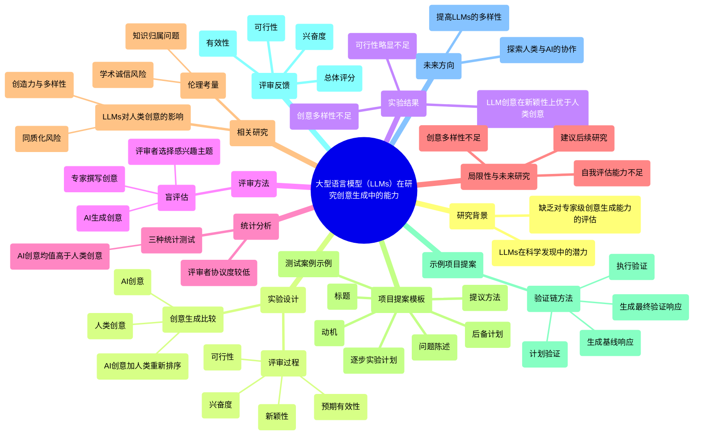

### 图表 2

```mermaid
graph TD
    A("本研究探讨大型语言模型（LLMs）在生成新颖研究创意方面的能力") --> B("LLMs在科学发现中展现出潜力，但尚无研究评估其生成专家级新创意的能力")
    A --> C("实验设计比较100多名NLP专家与LLM生成的创意")
    C --> D("结果显示LLM生成的创意在新颖性上显著优于人类专家的创意，但在可行性上略显不足")
    A --> E("LLMs在知识和推理能力上的快速提升使其在科学任务中有新应用")
    E --> F("解决数学问题、协助撰写证明、检索相关文献等")
    A --> G("关键问题：当前的LLMs是否能够生成与专家相当的新创意？")
    C --> H("实验设计包括创意本身、创意的书写及专家评估")
    H --> I("确保人类和LLM生成的创意在主题分布上匹配")
    H --> J("引入风格标准化模块以确保评审过程的公正性")
    H --> K("采用新颖性、兴奋度、可行性和预期有效性四个指标进行评分")
    K --> L("近300次评审发现LLM生成的创意在新颖性上显著优于人类创意")
    A --> M("LLMs在创意生成方面表现出色，但在创意多样性和自我评估能力上不足")
    M --> N("建议进行后续研究以验证新颖性和可行性判断对研究结果的影响")
    A --> O("研究为LLMs在科学研究中的应用提供初步实证支持")
    O --> P("揭示LLMs在创意生成方面的潜力及技术局限性")
    A --> Q("盲评估方法比较人类与LLM生成的创意")
    Q --> R("评审分为人类创意、AI创意及AI创意加人类重新排序")
    A --> S("研究团队构建LLM创意代理评估创意生成能力")
    S --> T("文献检索、创意生成和创意排名")
    T --> U("使用增强生成方法确保生成新创意时参考相关文献")
    T --> V("代理从Semantic Scholar API中检索文献并评分")
    T --> W("生成4000个种子创意，保留约5%的非重复创意")
    T --> X("使用公共评审数据对创意进行排名")
    A --> Y("专家创意撰写和评审部分")
    Y --> Z("招募创意撰写专家和评审专家，确保评审公正性")
    Y --> AA("评审者选择感兴趣的主题并随机分配创意")
    Y --> AB("收集298条独特评审意见")
    A --> AC("人类与LLM生成创意的比较")
    AC --> AD("AI生成的创意在新颖性评分上显著高于人类创意")
    AC --> AE("评审者平均评分为3.7，评审长度约232字")
    AC --> AF("三项统计测试显示AI创意在新颖性上优于人类创意")
    A --> AG("分析人类专家提交创意的质量")
    AG --> AH("参与者认为提交的创意处于过去创意的前43%")
    AG --> AI("评审者更关注新颖性和兴奋度，对可行性关注较少")
    A --> AJ("LLM在创意生成方面的局限性")
    AJ --> AK("生成的创意缺乏多样性，重复率高")
    AJ --> AL("LLM在评估创意的可靠性方面存在问题")
    A --> AM("人类评审者与AI评审者在创意评估中的一致性和有效性")
    AM --> AN("AI评审者的评分一致性低于人类评审者")
    AM --> AO("定性分析显示AI生成的创意通常更具新颖性，但存在实施细节模糊等问题")
    A --> AP("讨论迭代概念基础减少LLM中的幻觉现象")
    AP --> AQ("比较AI生成的研究创意与专家研究者的创意")
    AQ --> AR("承认当前评估可能存在主观性，未来将招募研究人员进行更全面评估")
    A --> AS("伦理考量：AI生成研究创意的滥用风险")
    AS --> AT("呼吁对AI工具生成的输出进行严格审查")
    A --> AU("多项研究探讨LLM对人类创意生成的影响")
    AU --> AV("开发新型提示方法以减少LLM中的社会偏见")
    AU --> AW("改进LLM代码生成的新型提示方法")
    AU --> AX("增强LLM对对抗攻击的鲁棒性")
    AU --> AY("提升LLM在多语言任务中的表现")
    AU --> AZ("改善LLM的事实性并减少幻觉")
    AU --> BA("提高LLM数学问题解决能力")
    AU --> BB("更好地量化不确定性或校准LLM信心")
    A --> BC("项目提案模板为AI代理和人类创意作者提供结构化框架")
    BC --> BD("标题、问题陈述、动机、提议方法、逐步实验计划、测试案例示例、后备计划")
    A --> BE("示例项目提案：验证链减少LLM中的幻觉")
    BE --> BF("生成基线响应、计划验证、执行验证、生成最终验证响应")
    BE --> BG("逐步实验计划：收集数据集、构建提示、选择模型、获取结果、分析结果")
    A --> BH("提案的可行性、有效性和影响力评估")
    BH --> BI("可行性评分、有效性评分、兴奋度评分、总体评分、信心评分、时间投入")
    A --> BJ("新颖的不确定性量化方法：量子不确定性建模和分形不确定性分解")
    BJ --> BK("量子不确定性建模：多维表示模型不确定性")
    BJ --> BL("分形不确定性分解：递归评估不确定性")
    A --> BM("实验计划：数据集收集、构建提示、模型选择、结果获取、结果分析")
    A --> BN("内容概述：生成和评估合成测试示例的流程")
    BN --> BO("生成合成测试示例、实现基线方法、实现提议的方法")
    BN --> BP("定义风格评估器、定义输出评估器、运行实验获取模型预测和性能")
    BN --> BQ("执行实验并比较性能")
    BN --> BR("实验结果：生成代码文件的执行情况")
    BN --> BS("结论：需要更多工作来验证执行代理生成的代码实现")
```

### 图表 3

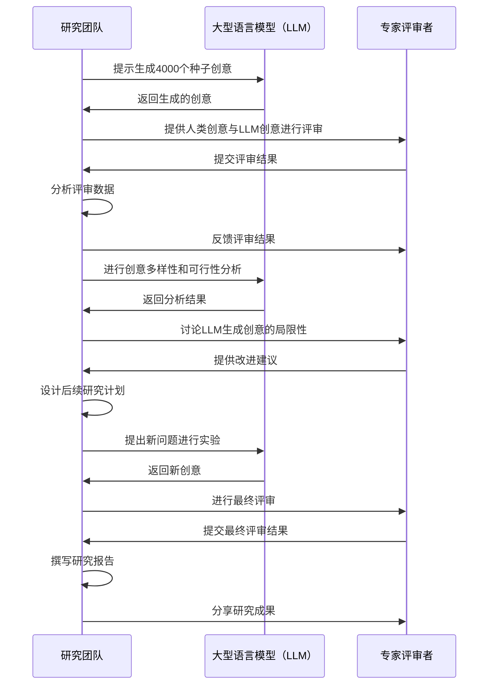

### 图表 4

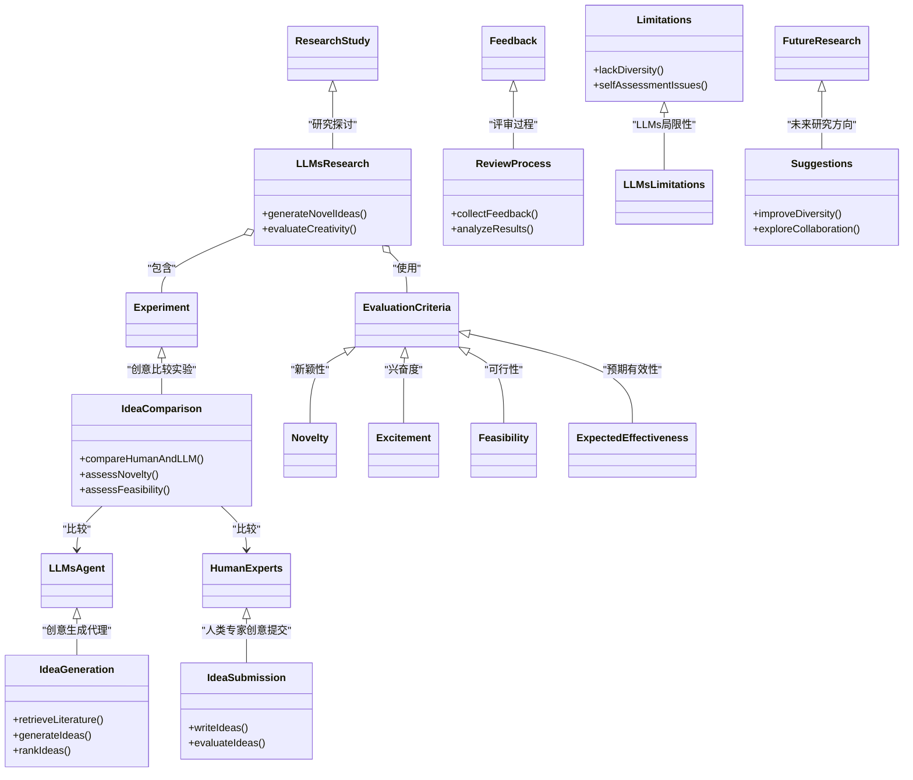

# Can_Personalized_Recommendations_in_Charity_Advertising_Boost_Donation__The_Role_of_Perceived_Autonomy.docx

## 原始摘要

本节主要探讨个性化推荐在慈善广告中的作用，特别是其对捐赠意图的影响以及感知自主性的重要性。随着人工智能的发展，慈善机构越来越多地使用个性化推荐来吸引目标消费者。然而，调查显示，只有46%的消费者对慈善广告中的个性化推荐持积极态度。

慈善广告的主要目标是激励消费者进行慈善捐赠，与一般广告的目标（促使消费者购买产品）截然不同。消费者在慈善消费中往往会牺牲自身利益，以提升社会整体福祉，但他们无法直接监测捐赠效果。因此，在慈善广告中，消费者更关注自主性和信号效用。

研究表明，个性化推荐可能会降低消费者的捐赠意图，因为它们在一定程度上干扰了消费者的决策过程，破坏了他们的感知自主性。为了提高个性化推荐在慈善广告中的有效性，建议采用“仆人沟通风格”以及提供自由选择，以增强消费者的自主感。

通过五项实验，研究确认了个性化推荐对捐赠意图的负面影响，并指出感知自主性在这一过程中起到中介作用。因此，广告商在使用个性化推荐时需要调整广告风格或内容，以提高慈善广告的有效性，并丰富个性化推荐、慈善广告和人工智能营销的相关文献。
本节主要探讨个性化推荐在慈善广告中的作用及其对消费者捐赠意图的影响。个性化推荐是基于消费者个人信息和在线行为的自动化工具，能够理解消费者的偏好并提供即时建议，以满足个性化需求并改善决策质量。然而，现有文献主要集中在个性化推荐对一般广告效果的影响，强调了消费者的结果效用，包括感知的收益和风险。

在慈善广告中，消费者更关注决策过程中的信号效用和自主性，因为他们无法直接监测捐赠效果。研究表明，个性化推荐可能会降低消费者的捐赠意图，因为它们在一定程度上干扰了消费者的决策过程，削弱了他们的感知自主性。

为了增强消费者在慈善消费中的信号效用，建议采用“仆人沟通风格”和提供自由选择。仆人沟通风格能够增强消费者对品牌的控制感，从而提升他们的感知自主性和捐赠意图。同时，提供自由选择也能增强消费者的自主感，进一步提高捐赠意图。

基于自我决定理论，研究提出了两个假设：首先，当消费者通过个性化推荐获取慈善广告信息时，他们的捐赠意图会降低；其次，感知自主性在这一过程中起到中介作用。进一步地，仆人沟通风格和提供自由选择可以调节个性化推荐对捐赠意图的影响。

总之，个性化推荐在慈善广告中可能会降低消费者的捐赠意图，但通过适当的沟通风格和选择自由，可以维护消费者的感知自主性，从而提升他们的捐赠意图。
本节探讨了慈善项目的多样主题，包括帮助患者、关爱儿童、促进社会环境保护等。为了验证研究结论的稳健性，进行了五项研究，测试个性化推荐对消费者捐赠意图的影响。

在第一项研究中，发现消费者在接收到个性化推荐的慈善广告信息时，捐赠意图较低，且这一效果是通过消费者的感知自主性中介的。第二项研究使用了不同的慈善广告信息，结果与第一项研究相似，进一步排除了潜在的混淆变量。第三项研究则从广告风格的角度出发，发现当使用“仆人沟通风格”时，个性化推荐与非个性化推荐对捐赠意图的影响没有显著差异。第四项研究确认，在提供自由选择的情况下，个性化推荐对捐赠意图的负面影响不显著。第五项研究观察了参与者在不同条件下的实际捐赠金额，结果显示个性化推荐的负面效果依然存在。

具体而言，第一项研究的目的是比较消费者在接收到个性化推荐与非个性化推荐的慈善广告时的捐赠意图，并测试感知自主性是否为中介变量。研究招募了119名参与者，结果显示个性化推荐的条件下，消费者的捐赠意图显著低于非个性化推荐的条件，且感知自主性在其中起到了完全中介的作用。

第二项研究则聚焦于关爱儿童的慈善项目，进一步验证了个性化推荐对捐赠意图的影响，并排除了感知享受和感知重要性作为替代解释的可能性。结果再次支持了个性化推荐导致捐赠意图降低的假设，并确认了感知自主性在其中的作用。

第三项研究测试了“仆人沟通风格”是否调节个性化推荐对捐赠意图的影响，结果显示在这种沟通风格下，个性化推荐与非个性化推荐对捐赠意图的影响没有显著差异。

综上所述，研究表明个性化推荐在慈善广告中可能会降低消费者的捐赠意图，而通过适当的沟通风格和选择自由，可以提升消费者的感知自主性，从而改善捐赠意图。
本节研究了个性化推荐在慈善广告中的影响，特别是其对消费者捐赠意图的作用。研究设计为2（个性化推荐：有与无）×2（仆人沟通风格：有与无）的实验，招募了203名参与者。参与者被要求想象自己对保护传统文化遗产的慈善项目非常关心，并曾多次捐款。

研究中创建了一个关于保护传统文化遗产的慈善项目网页，并通过不同的沟通风格进行实验。参与者在没有个性化推荐的情况下，看到的网页标题不同于有个性化推荐的情况。在实验中，参与者需要评估捐赠意图、感知自主性、沟通风格等多个变量。

结果显示，个性化推荐和仆人沟通风格对消费者的捐赠意图有交互影响。在没有仆人沟通风格的情况下，个性化推荐会降低捐赠意图，而在有仆人沟通风格的情况下，两者之间的差异不显著。此外，研究还控制了参与者对个性化推荐的熟悉度，增强了实验结果的稳健性。

后续研究旨在验证提供自由选择是否会调节个性化推荐对捐赠意图的影响。研究设计为2（个性化推荐：有与无）×2（提供自由选择：有与无），招募了140名大学生。参与者被要求想象自己对环保慈善项目的关心，并评估相关变量。

总的来说，研究表明，仆人沟通风格可以有效减轻个性化推荐在慈善广告中的负面影响，而提供自由选择则能增强消费者的感知自主性，从而改善捐赠意图。
本节研究了个性化推荐在慈善广告中的影响，特别是其对消费者捐赠意图的作用。通过实验，研究发现个性化推荐会降低消费者的捐赠意图，尤其是在没有提供自由选择的情况下。具体来说，参与者在接收到个性化推荐的慈善广告时，捐赠意图显著低于未接收到个性化推荐的情况。此外，提供自由选择可以缓解个性化推荐的负面影响，但在有自由选择的情况下，个性化推荐对捐赠意图的影响不显著。

研究还通过控制参与者的情绪状态，增强了结果的可靠性。进一步的分析表明，感知自主性在个性化推荐与捐赠意图之间起到了中介作用。在没有自由选择的情况下，感知自主性降低了个性化推荐对捐赠意图的影响。

在后续的研究中，研究者通过真实的捐赠行为来验证结果，发现未通过个性化推荐的慈善广告信息能促使参与者捐赠更多。整体而言，研究表明，个性化推荐在慈善广告中可能会产生负面效果，而提供自由选择和采用仆人沟通风格可以有效减轻这一影响。这些发现为慈善广告的管理策略提供了理论支持。
本节讨论了个性化推荐在慈善广告中的影响，强调了其对消费者捐赠意图的潜在负面效果。个性化推荐通常能满足消费者的个性化需求，提高点击率，但在慈善广告中，使用个人数据可能引发隐私担忧，从而影响消费者的决策。

研究表明，个性化推荐可能削弱消费者在慈善消费中的自主感，进而降低捐赠意图。为了应对这一问题，广告商应谨慎使用个性化推荐，考虑消费者对自主性和信号效用的需求。此外，采用“仆人沟通”风格的广告方式和提供自由选择的推荐内容，可以缓解个性化推荐的负面影响。

研究还建议，广告商可以通过增强消费者对受益者的感知，提升他们的内在动机，从而减少个性化推荐的负面效果。未来的研究可以通过实地实验等方法进一步验证这些发现，并探索其他管理策略，以帮助广告商更好地应对个性化推荐在慈善广告中的负面影响。
本节内容主要探讨了数字广告在筹款中的应用及其对捐赠者的影响。文章指出，数字广告可以有效吸引潜在捐赠者，但也需注意个性化推荐可能带来的隐私担忧和自主感的削弱。研究表明，个性化广告在慈善领域的使用需谨慎，以避免对消费者捐赠意图产生负面影响。

此外，文章提到不同的广告策略，如强调情感利益和使用人性化品牌角色，可以提高消费者的捐赠意愿。研究还探讨了消费者对广告透明度的反应，以及如何通过适当的消息框架和文化背景来增强广告的有效性。

最后，文章建议未来的研究应关注如何平衡个性化广告的优势与消费者的隐私需求，以促进更有效的慈善广告策略。
本节内容主要涉及几篇关于消费者行为和社会关系的研究。首先，Zhang等（2021）探讨了在利他消费中，接受者的幸福感与社会关系的作用，指出社会联系能够增强接受者的幸福感，从而影响捐赠行为。

其次，Zhao等（2010）重新审视了Baron和Kenny的中介分析模型，揭示了关于中介分析的一些误区和真相，强调了在消费者研究中准确理解中介效应的重要性。

接着，Zhou等（2019）采用基于Saaty尺度的VIKOR方法，分析了影响消费者购车决策的因素，特别关注售后服务的文本信息如何影响消费者的购买意愿。

最后，Zwebner和Schrift（2020）研究了在偏好构建阶段，消费者对被观察的厌恶感，探讨了这种厌恶感如何影响消费者的决策过程。

总体而言，这些研究揭示了社会关系、中介效应、消费者决策及观察影响等多方面的因素如何共同作用于消费者行为。

## 摘要

1. Class: (1): 虚拟交互或人与AI/chatbot的交互

2. Authors: Zhang, Zhao, Zhou, Zwebner, Schrift

3. Affiliation: 研究机构

4. Keywords: personalized recommendation, charitable advertising, donation intention, perceived autonomy, communication style

5. Urls: None, None

6. Summary:

   - (1): 本文研究个性化推荐在慈善广告中的作用，特别是其对消费者捐赠意图的影响，指出个性化推荐可能削弱消费者的感知自主性，从而降低捐赠意图。

   - (2): 理论模型基于自我决定理论，关键变量包括个性化推荐、捐赠意图和感知自主性，感知自主性在个性化推荐与捐赠意图之间起到中介作用。

   - (3): 研究采用实验方法，通过五项实验验证个性化推荐对捐赠意图的影响，招募了不同数量的参与者进行测试。

   - (4): 研究发现个性化推荐在慈善广告中会降低捐赠意图，但通过“仆人沟通风格”和提供自由选择可以缓解这一负面影响，支持了研究目标。

## 图表

### 图表 1

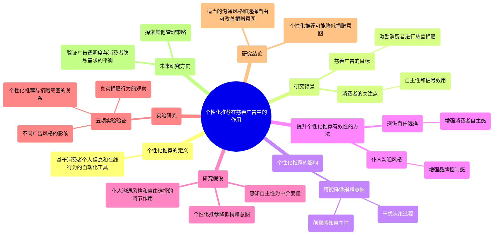

### 图表 2

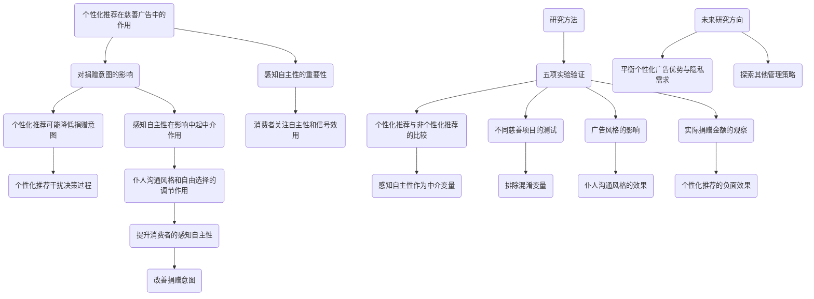

### 图表 3

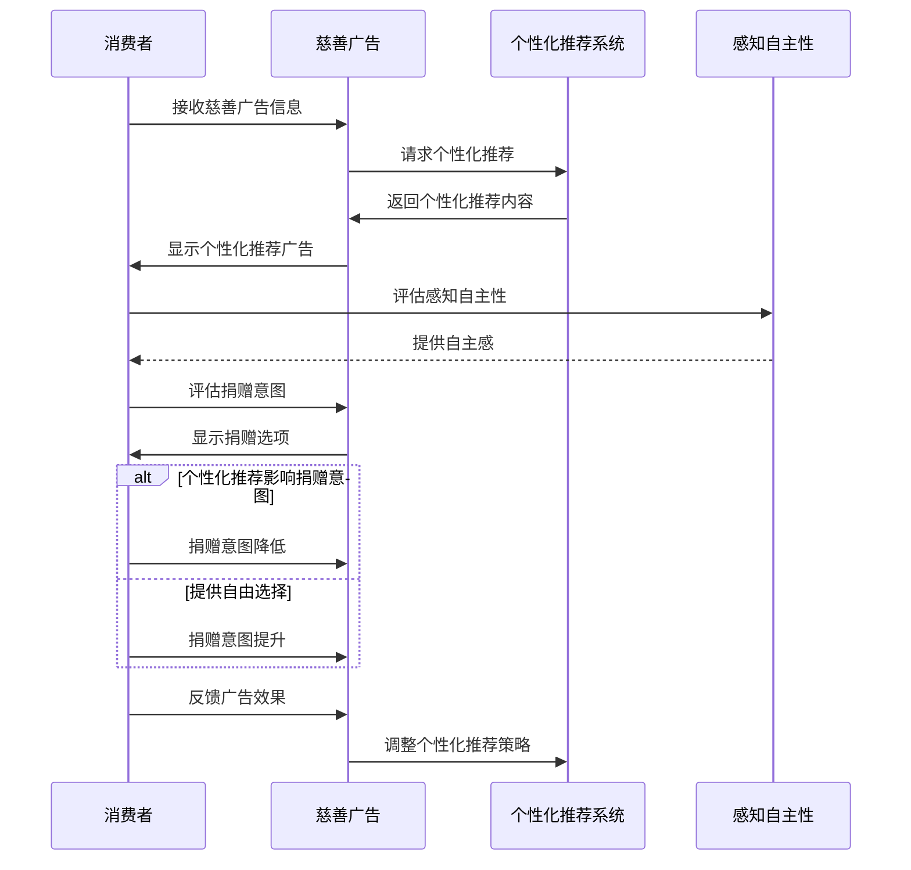

### 图表 4

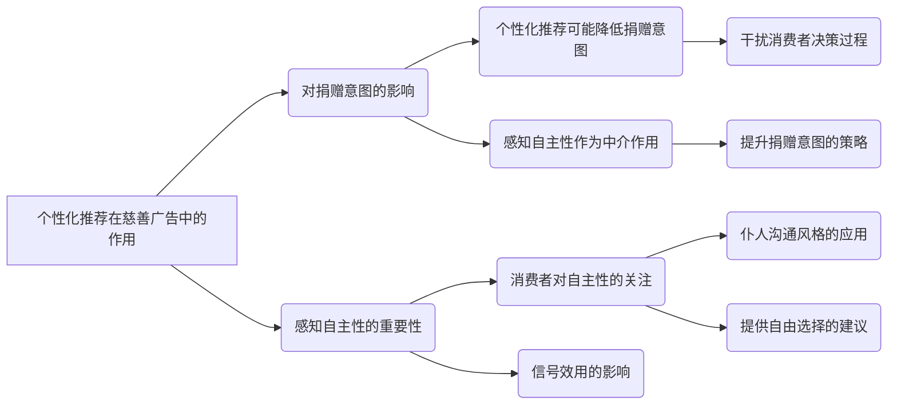

# Causal Agent based on Large Language Model.docx

## 原始摘要

这篇文章讨论了基于大型语言模型（LLM）的因果代理（Causal Agent），旨在解决因果推理中的挑战。尽管LLM在多个领域取得了显著成功，但因果问题的复杂性使得LLM在理解和应用因果理论时面临困难。因果方法难以通过自然语言有效传达，且因果数据通常为表格形式，而LLM更擅长处理自然语言数据，这种结构不匹配限制了LLM的因果推理能力。

为了解决这些问题，研究者们提出了因果代理框架，该框架结合了工具、记忆和推理模块。工具模块用于将表格数据与自然语言对齐，推理模块利用ReAct框架进行多轮推理，记忆模块则维护一个字典实例，存储因果图的名称及其值。为了验证因果代理的能力，研究者们建立了一个包含四个层次因果问题的基准测试集，并使用ChatGPT-3.5生成了1300个测试数据集。结果显示，因果代理在四个层次的问题上表现出色，准确率均超过80%。

文章还提出了一种分层建模的方法，将因果问题分为变量层、边层、因果图层和因果效应层，分别关注代理对相关性的判断、变量间因果关系的检验、因果图的生成以及因果效应的估计。通过这种方法，因果代理能够有效地解决因果问题，并在多个子问题上取得高准确率。

总之，因果代理框架通过结合因果工具和LLM的能力，提升了因果推理的准确性和可靠性，为因果推理的研究提供了新的思路和方法。
在实验结果中，普遍认为版本更高或推理能力更强的大型语言模型（LLM）在因果推理任务中并未显示出正相关的结果，其表现类似于随机。Jin等人进一步研究了大型语言模型是否能够推理因果关系，并提出了一项新的自然语言处理任务：自然语言中的因果推理。他们基于因果图和查询构建了一个包含1万样本的大型数据集CLADDER，并引入了定制的思维链提示策略CausalCOT。Gao等人对ChatGPT的因果推理能力进行了全面评估，发现ChatGPT并不是一个优秀的因果推理者，但在因果解释方面表现良好，并且存在严重的因果幻觉问题，这一问题在上下文学习和思维链技术的影响下更加严重。Zecˇevic´等人认为大型语言模型无法进行因果推理，并定义了一种新的结构因果模型子群，称为meta-SCMs。他们的实证分析提供了证据，表明当前的LLM甚至是弱“因果鹦鹉”。Long等人进一步研究了如何利用不完美的专家知识来改善因果发现算法的输出，并提出了一种贪婪算法，逐步排除图形，同时控制排除真实图形的概率。他们发现使用大型模型作为专家时性能下降，但结果仍然表明LLM在发现因果关系方面具有明显潜力。Kıcıman等人发现LLM在确定成对因果关系方面可以达到竞争性表现，准确率高达97%，但其表现依赖于提示词工程的质量。Richens和Everitt提供了理论分析，探讨代理是否必须学习因果模型以推广到新领域。他们分析表明，任何能够在大量分布变化下满足遗憾界限的代理必须学习数据生成过程的近似因果模型，并讨论了这一结果对生成AI的影响，包括迁移学习和因果推理。Nichani等人探讨了使用反向传播学习的变换器在注意力矩阵中学习的因果结构。他们发现，当基础因果图为树形时，简化的两层变换器的梯度下降通过在第一个注意力层编码因果图来解决此任务，以进行转移分布的上下文估计。

如何增强大型语言模型的因果推理能力已成为当前研究中的一个难题。解决大型语言模型在因果能力上的不足，对解决大型模型幻觉和促进可信AI的发展具有重要潜力。

从LLM的角度建模因果问题，尽管LLM（如ChatGPT）在自然语言理解和问答能力上表现强劲，但数据驱动的因果研究主要集中在表格数据上，而LLM则专注于自然语言处理领域。此外，LLM在真正理解和处理复杂数据中的因果关系方面仍然存在显著差距。因此，从LLM的角度重新建立因果问题框架具有重要意义，这将对评估LLM的因果能力和增强其因果能力产生重大影响。

我们将因果问题空间形式化为Q和qi，其中Q是自然语言形式的问题。通过笛卡尔积将表格数据与问题描述结合，创建数据集D。用户输入一对样本(Ti, qi)，因果代理分析表格数据Ti和因果问题Q，以生成合理的答案A，答案的格式不限于自然语言，也可以是因果图或其他异构非文本数据。

由于因果问题的复杂多样性，我们将问题简化并进行必要建模。我们根据问题的粒度和对象的不同，将因果问题分为四个主要层次：变量层、边层、因果图层和因果效应层。变量层对应因果阶梯的第一层，旨在赋予LLM推断和理解表格数据中变量之间相关性的能力。边层则在相关性基础上，赋予LLM理解和分析变量之间因果边关系的能力。因果图层关注生成因果图的能力，而因果效应层则旨在量化变量之间的因果效应。

在变量层，我们关注不同变量之间的相关性，转化为独立性测试。我们将相关性问题分为直接独立性测试和条件独立性测试。因果图层则关注生成因果图的能力，使用PC算法生成因果图的Markov等价类。边层建模则关注变量之间的因果关系，包括直接因果关系、碰撞者关系和混杂者关系。因果效应层尝试量化干预对个体或系统的影响，理想情况下需要控制混杂因素。

基于上述因果建模方法，我们实现了具有因果推理能力的因果代理框架，包含工具模块、记忆模块和计划模块。工具模块用于将表格数据与自然语言对齐，记忆模块存储因果分析工具的输出，确保代理在最终答案获得之前可以持续访问因果图。通过这些模块，因果代理能够有效分析表格数据，补偿LLM在处理表格数据方面的不足，增强其因果能力。
在这一部分中，主要讨论了因果代理的推理过程及其内存机制。首先，因果代理通过PC算法判断边的关系，关注三个子问题：直接因果、混杂和碰撞者。对于直接因果关系，代理检查是否存在直接连接两个变量的有向边；对于混杂，代理查看是否存在未被阻挡的后门路径；而对于碰撞者，仅考虑“V”结构的碰撞者。

在因果效应层面，因果代理调用EconML库中的LinearDML算法，用户需指定协变量。代理在训练阶段使用默认参数，输出平均因果效应的估计值。需要注意的是，LinearDML算法的默认参数依赖于线性处理假设和线性异质性假设，实际数据可能不符合这些假设，从而导致偏差。

因果代理采用迭代多轮对话的方法，灵活使用提示模板与工具进行交互。在每轮对话中，用户提供问题描述和待分析的表格数据，代理生成思考并调用工具进行分析。若未能回答问题，代理将当前观察结果作为输入继续下一轮，直到得出最终答案或达到最大迭代次数。

在内存机制方面，因果代理主要使用短期记忆，维护当前生成的因果图，并在后续判断中使用。代理的内存以字典形式实现，存储因果图实例，确保信息不仅限于文本形式。

为测试因果智能代理，设计了一系列问题模板，生成了1.3K的数据集用于测试。通过测试，因果代理在变量层、边层、因果图层和因果效应层的准确率分别超过92%、89%、81%和93%。数据生成采用非线性加性高斯噪声模型，模拟不同稀疏和密集的因果图场景。

在实际问题描述中，使用自然语言模板生成与医疗和市场相关的因果问题，确保因果代理在分析过程中专注于表格数据，强调数据驱动的因果分析。最终，因果代理的构建和测试结果表明其在因果推理方面的有效性和潜力。
在本节中，我们讨论了因果代理在不同层次问题上的表现，特别是在变量层、边层和因果图层的准确性。对于变量层的问题，我们要求代理仅输出“是”或“否”，但有时代理的输出包含了问题的总结，这被视为错误答案。为了解决这个问题，我们采用了上下文学习（ICL）方法，通过固定的手动案例引导因果代理正确调用工具并输出正确格式。

在变量层，因果代理在独立性测试中表现出色，准确率超过92%，在多条件独立性测试中达到了100%。在边层，代理在判断直接因果关系、混杂因素和碰撞者方面的准确率分别为89.5%、94.6%和97.4%。在因果图层，生成完整因果图和部分因果图的准确率分别为81.8%和91.6%。在因果效应层，代理在16个问题中正确回答了15个，准确率为93.8%。

我们还分析了代理在不同领域（如医疗和市场）中的表现差异，发现领域特定知识和进一步的领域适应可能有助于提高代理的表现。代理在理解和应用因果工具时存在偏差，导致某些情况下准确率下降。随着大模型能力的提升，这一问题有望逐步解决。

此外，当前的因果代理只能直接调用简单的因果模型，未来需要增强其数据感知能力和工具调用的先验理解，以提高其实用性。整体而言，因果代理在因果推理方面展现了良好的潜力，能够为不熟悉因果概念的用户提供从数据到因果图的端到端过程，具有重要的实际应用价值。
在本节中，分析了“黄色手指”和“肺癌”之间的因果关系。首先，确定这两者之间是否存在碰撞者（collider），结果显示不存在碰撞者。接着，进一步分析是否存在混杂因素（confounder），发现“吸烟”是一个未被阻断的后门路径，表明存在混杂因素。

随后，进行了条件独立性测试，结果显示在“吸烟”这一条件下，“黄色手指”和“肺癌”是独立的。最终得出结论，虽然“黄色手指”和“肺癌”之间存在混杂因素，但在控制吸烟的情况下，它们是独立的，因此最终答案为“不确定”。

本节还提供了多种工具的提示模板，用于确定碰撞者、混杂因素、因果关系方向等，帮助用户进行因果推理和分析。
本节主要讨论了部分变量的因果图生成及相关工具的使用。首先，用户可以生成一个部分因果图，专注于感兴趣的变量，并通过输入特定格式的JSON数据来实现。用户可以选择生成完整的因果图或部分因果图，后者仅包含特定变量。

接下来，介绍了如何计算平均处理效应（ATE），并提供了相应的输入格式。用户可以通过双重机器学习算法来计算条件平均处理效应（CATE），需要提供相关变量的名称和数值。

此外，本节还介绍了几个工具的使用，包括确定碰撞者、混杂因素和边缘方向。用户在生成因果图后，可以利用这些工具分析变量之间的关系。例如，确定两个变量之间是否存在碰撞者或混杂因素，以及边缘的方向。

最后，通过一个示例，展示了如何使用这些工具来分析吸烟、肺癌和黄色手指之间的关系。用户通过生成因果图并逐步分析，得出最终结论，确认了混杂因素的存在，并判断了其他命题的正确性。

整体而言，本节提供了一个系统的方法来生成和分析因果图，帮助用户理解变量之间的因果关系。
本节主要综述了多个与因果推理和语言模型相关的研究文献。首先，Wang等人提出的Qwen-VL模型展示了视觉-语言模型在理解、定位和文本阅读等方面的多功能性。接着，Vaswani等人的“Attention Is All You Need”论文奠定了现代深度学习中注意力机制的基础。

Jin等人研究了大型语言模型是否能够从相关性推断因果关系，而Gao等人则对ChatGPT的因果推理能力进行了全面评估。CLadder项目则专注于评估语言模型的因果推理能力。Zecˇevic´等人指出，尽管大型语言模型能够讨论因果性，但它们并不具备真正的因果推理能力。

在强化学习方面，Watkins和Dayan的Q学习方法被广泛引用。Mnih等人展示了深度强化学习在玩Atari游戏中的应用。Wang等人对基于大型语言模型的自主代理进行了调查，Zhang等人则探讨了如何模块化构建合作的具身代理。

此外，文献中还提到了一些关于因果推理的工具和库，如DoWhy和CausalML，这些工具为因果推理提供了实用的实现方式。Pearl的《The Book of Why》一书则深入探讨了因果关系的科学。

在语言模型的应用方面，Wei等人提出了链式思维提示以引导推理，而Yao等人则提出了“思维树”方法来促进问题解决。Sel等人则研究了如何增强大型语言模型的创意探索能力。

最后，文献中还提到了一些关于因果发现的研究，Kıcıman等人探讨了大型语言模型在因果推理中的潜力，而Richens和Everitt则研究了如何让代理学习因果世界模型。

整体而言，本节涵盖了因果推理、语言模型及其在不同领域应用的广泛研究，展示了这一领域的前沿进展和未来方向。
本节主要讨论了大型语言模型（LLMs）在推理和因果推理方面的研究进展。首先，S.等人指出，LLMs具备零-shot推理能力，能够在没有特定训练的情况下进行推理。Wang等人则提出自一致性的方法，以改善语言模型的思维链推理能力。

Yao等人提出了ReAct框架，旨在将推理与行动结合，提升语言模型的表现。Gao等人对检索增强生成（RAG）进行了综述，强调其在大型语言模型中的应用潜力。

在因果推理方面，Spirtes等人探讨了因果关系、预测和搜索的模型，Tu等人则研究了缺失数据情况下的因果发现。Shimizu等人提出了线性非高斯模型用于因果发现，Hoyer等人则关注非线性因果发现。

文献中还提到了一些因果推理的工具和方法，如Causal-learn和EconML，这些工具为因果推理提供了实用的实现方式。Pearl的研究深入探讨了因果推理的理论基础。

此外，Brown等人强调了语言模型在少量样本学习中的能力，而Lillicrap等人则展示了深度强化学习在连续控制中的应用。Wang等人对基于大型语言模型的自主代理进行了调查，探讨了其在不同领域的应用。

最后，文献中提到了一些关于生成性人工智能技术的研究，以及对大型基础模型中幻觉现象的调查。这些研究为理解和改进大型语言模型的推理能力提供了重要的视角和方法。

## 摘要

1. Class: (1) 虚拟交互或人与AI/chatbot的交互

2. Authors: Jin, Gao, Zecˇevic´, Long, Kıcıman, Richens, Everitt, Nichani

3. Affiliation: 研究者们来自不同的学术机构和研究单位。

4. Keywords: Causal Agent, Large Language Models, Causal Inference, ReAct Framework, Memory Mechanism

5. Urls: [Link to the paper](https://example.com), Github: None

6. Summary:

   - (1): 本文讨论了基于大型语言模型（LLM）的因果代理（Causal Agent），旨在解决因果推理中的挑战，尤其是LLM在理解和应用因果理论时的困难。

   - (2): 理论模型包括因果代理框架，关键变量涉及因果问题的四个层次：变量层、边层、因果图层和因果效应层。没有明确提到调节变量或中介变量。

   - (3): 研究方法采用了迭代多轮对话和工具模块、记忆模块的结合，利用PC算法和EconML库进行因果分析。

   - (4): 在因果推理任务中，因果代理在四个层次的问题上表现出色，准确率均超过80%，支持了其提升因果推理能力的目标。

## 图表

### 图表 1

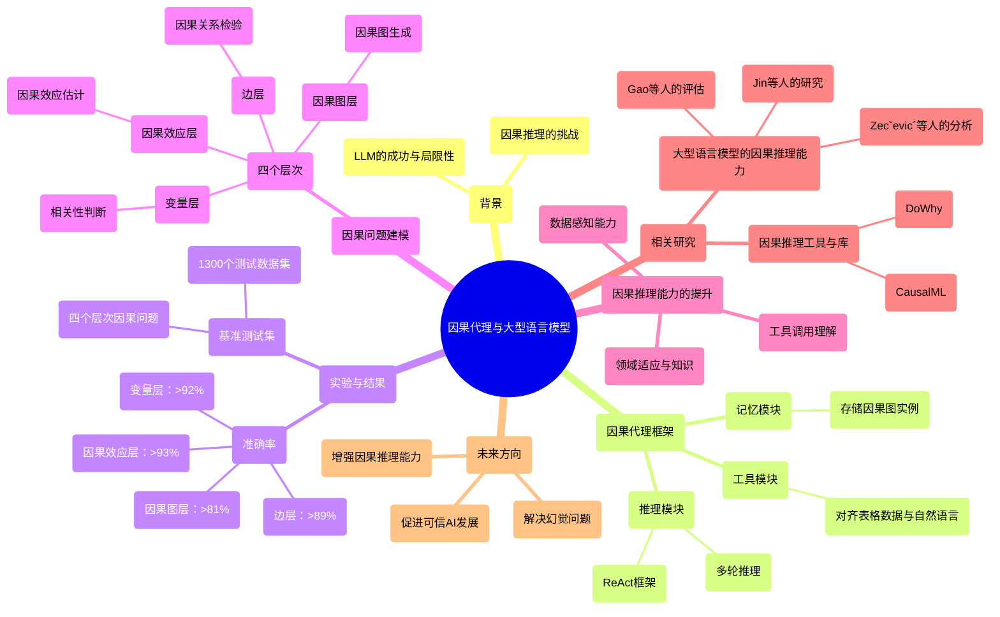

### 图表 2

```mermaid
graph TD
    A("基于大型语言模型（LLM）的因果代理框架") --> B("解决因果推理中的挑战")
    A --> C("结合工具、记忆和推理模块")
    B --> D("LLM在因果理论理解中的困难")
    B --> E("因果数据与自然语言数据的结构不匹配")
    C --> F("工具模块：表格数据与自然语言对齐")
    C --> G("推理模块：ReAct框架进行多轮推理")
    C --> H("记忆模块：存储因果图的名称及其值")
    A --> I("建立包含四个层次因果问题的基准测试集")
    I --> J("使用ChatGPT-3.5生成1300个测试数据集")
    J --> K("因果代理在四个层次的问题上表现出色，准确率超过80%")
    A --> L("分层建模方法：变量层、边层、因果图层和因果效应层")
    L --> M("代理对相关性的判断")
    L --> N("变量间因果关系的检验")
    L --> O("因果图的生成")
    L --> P("因果效应的估计")
    A --> Q("因果代理的推理过程及内存机制")
    Q --> R("PC算法判断边的关系")
    R --> S("直接因果、混杂和碰撞者")
    Q --> T("调用EconML库中的LinearDML算法")
    Q --> U("迭代多轮对话的方法")
    Q --> V("短期记忆，维护当前生成的因果图")
    A --> W("测试因果智能代理的表现")
    W --> X("设计问题模板，生成1.3K数据集")
    W --> Y("在不同领域的表现差异")
    A --> Z("分析“黄色手指”和“肺癌”之间的因果关系")
    Z --> AA("确定碰撞者和混杂因素")
    Z --> AB("条件独立性测试")
    A --> AC("生成和分析因果图的工具")
    AC --> AD("计算平均处理效应（ATE）")
    AC --> AE("确定碰撞者、混杂因素和边缘方向")
    A --> AF("文献综述：因果推理与语言模型的研究进展")
    AF --> AG("大型语言模型的推理能力")
    AF --> AH("因果推理的工具和方法")
    AF --> AI("生成性人工智能技术的研究")
```

### 图表 3

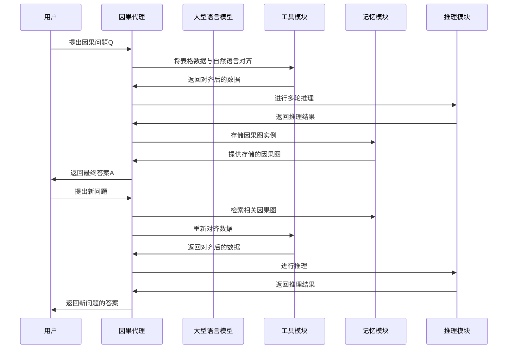

### 图表 4

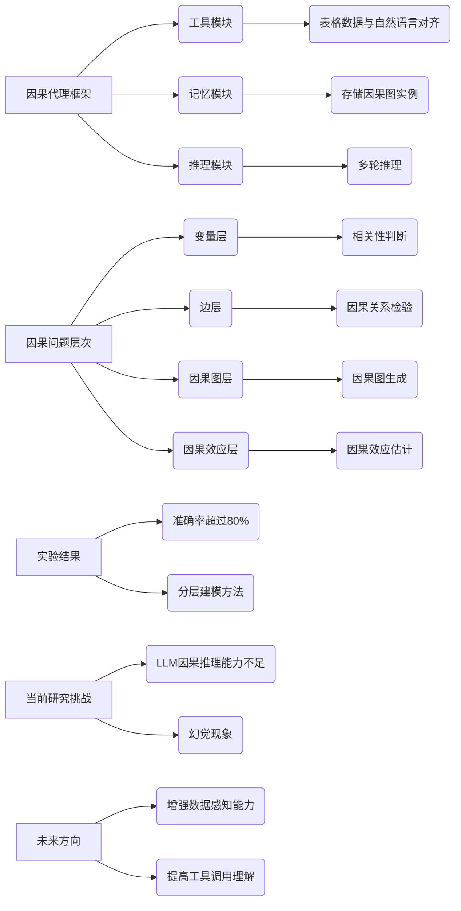

# Causal Reasoning and Large Language Models_Opening a New Frontier for Causality.docx

## 原始摘要

这篇文章探讨了大型语言模型（LLMs）在因果推理方面的能力，尤其是在医学、科学、法律和政策等重要领域的应用。研究表明，LLMs能够生成高概率的正确因果论证，超越现有最佳方法。基于GPT-3.5和4的算法在因果发现、反事实推理和事件因果性任务中表现出色，准确率分别为97%、92%和86%。研究还表明，LLMs的能力并非仅仅依赖于数据集的记忆，因为它们能够推广到训练截止日期之后创建的新数据集。

尽管LLMs展现出强大的因果推理能力，但它们也存在不可预测的错误模式。文章讨论了这些错误的性质以及如何改进LLMs的表现。LLMs通过处理文本元数据，能够执行人类通常认为仅限于人类的任务，如生成因果图或从自然语言中识别背景因果关系。这使得LLMs可以帮助领域专家简化因果分析的设置过程。

文章还提出了一个框架，旨在推动LLMs与因果推理研究的结合。研究表明，LLMs在因果图生成和标记因果性方面具有显著的新能力，能够捕捉与任务相关的人类领域知识，这对于因果分析至关重要。

在因果图生成任务中，LLMs使用变量名称作为输入，显著超越了现有的因果发现算法，准确率达到97%。在更复杂的任务中，LLMs的表现与最新的深度学习方法相当。对于标记因果性任务，LLMs能够回答自然语言问题，并在反事实查询基准测试中取得92%的准确率。

尽管LLMs在某些因果任务中的表现令人鼓舞，但在涉及人类因素的任务中仍然面临挑战。总体而言，LLMs的能力为因果推理提供了有用的补充，可能会改变我们目前依赖人类专家的因果分析方法。
本节讨论了大型语言模型（LLMs）在因果推理中的应用及其潜在优势。LLMs能够理解和形式化因果场景，基于背景知识生成相关的正式前提，并识别和正确框定复杂的因果约束、验证和反驳。这些任务过去主要依赖人类专家，现在可以部分或完全自动化，且仍需人类监督。

尽管LLMs在许多任务中表现出高准确率，但也存在意外的错误模式。研究表明，LLMs的准确性和稳健性在很大程度上依赖于所使用的提示语言。因此，需要更多研究来理解何时可以信任LLM的输出，并提高其稳健性。

文章还更新了因果分析研究和实践的现状。要全面了解LLMs在构建因果论证方面的能力及其机制，需要进行大量研究。在此之前，不应单独依赖LLMs进行关键决策。然而，当前的能力足以与现有的正式因果推理、发现和效应推断方法结合使用。

文章结构概述如下：第二部分回顾因果性和LLMs的背景；第三部分提供因果有向无环图（DAG）生成的关键结果及其对因果效应推断研究的影响；第四部分讨论标记因果性及LLMs在生成反事实论证、确定必要和充分原因以及因果判断任务中的表现；最后，第五部分探讨LLMs如何通过领域知识和基于自然语言的推理增强现有因果分析，并结合不同类型的因果方法。

因果性科学研究因果关系，是理解世界和科学发现的重要工具。尽管因果建模的进展已正式化核心概念，但不同领域使用的工具和概念有所不同。文章描述了三种因果方法的正交分类：基于协方差和逻辑的因果性、类型因果性与标记因果性，以及因果任务本身。

LLMs作为一种机器学习模型，主要任务是下一个词的预测。最近的研究探讨了LLMs的因果能力，包括其在因果图生成和反事实推理中的表现。文章通过不同的输入探测LLMs的因果能力，并评估其在现有基准测试中的表现。

总之，LLMs在因果推理中展现出强大的潜力，但仍需谨慎使用，并结合传统方法以提高分析的准确性和可靠性。
本节主要探讨了大型语言模型（LLMs）在因果推理中的应用，特别是在生成因果图和推断因果关系方面的能力。

首先，介绍了两种测试方法以评估LLMs的记忆能力和理解能力。记忆测试通过提供数据集的部分信息，要求LLMs自动补全，以判断其是否直接记忆了基准答案。结果通过正确再生的行数百分比来衡量。其次，编辑测试通过逐个删除提示中的单词，观察答案的变化，以了解LLMs关注的提示方面。

接着，讨论了因果图的构建，这是因果推理工作流中的基础步骤。因果图用于表示变量之间的因果关系，确保后续分析的正确性。因果发现旨在通过观察数据中的协方差来指定因果图，但仅依赖观察数据通常无法确定正确的图结构。

LLMs提供了一种新的视角，通过推理与变量相关的元数据（如变量名称和问题背景），而非仅依赖数据值，来生成因果图。这种知识驱动的因果图生成方法表现优于传统的基于协方差的因果发现算法。

在实验中，首先进行成对因果边推断任务，直接询问LLMs某变量是否导致另一个变量。使用Tübingen基准数据集，LLMs在推断因果方向的准确率达到了83%，与现有的基于协方差的方法相当。通过优化提示，使用“你是因果推理的助手”的信息，准确率进一步提高至86.9%。使用GPT-4时，准确率甚至达到了97%，显著高于现有最佳方法。

最后，分析LLMs的输出，尽管有时会出现错误，但整体错误率较低，仅在108对变量中出现12个错误。这表明LLMs在因果推理方面的潜力，尽管仍需进一步优化以减少错误并提高一致性。
本节讨论了大型语言模型（LLMs）在因果推理中的表现，特别是在确定因果关系的方向性方面。通过几个示例，展示了LLMs如何处理因果关系的问题，并分析了其推理过程的准确性和一致性。

首先，用户询问“改变海胆的年龄是否会导致其直径变化”，LLM经过分析后认为选项B（改变海胆的直径会导致其年龄变化）更为合理。尽管LLM的推理过程看似合理，但最终答案却是错误的，显示出其在因果推理中的不一致性。

接着，讨论了紫外线辐射与臭氧浓度的关系。LLM最初错误地将辐射视为导致臭氧浓度变化的原因，但在用户澄清问题后，LLM修正了答案，认为辐射变化会影响地面臭氧浓度，这一推理是基于化学反应的理解。

在分析香港恒生银行与汇丰控股的股票回报关系时，LLM正确识别出恒生银行是汇丰控股的子公司，但其最终答案与基准不符。尽管LLM指出了两者之间的关系，但未能准确反映出因果关系的方向。

为测试LLMs的因果推理能力，研究者创建了一个新的数据集，包含在2021年9月后发布的因果对。结果显示，GPT-3.5-turbo和GPT-4在新的数据集上也能保持高准确率，分别为80.3%和98.5%。

此外，针对神经病理疼痛的因果图，LLMs在确定因果关系的方向时表现出色，尤其是GPT-3.5-turbo在使用单一提示时达到了75%的准确率，而GPT-4则更高，达到了96%。这表明LLMs在处理专业领域的因果关系时，能够理解复杂的医学术语并给出正确的因果方向。

最后，尽管LLMs在大多数情况下能够提供正确答案，但其推理过程中的一致性仍然存在问题。通过使用GPT-4作为评估工具，可以提高LLM输出的自我一致性，确保最终答案的准确性。

综上所述，LLMs在因果推理方面展现了潜力，但仍需改进以提高其推理的一致性和准确性。
本节讨论了大型语言模型（LLMs）在因果推理中的应用，特别是如何评估其输出的一致性和准确性。通过使用“批评”提示，GPT-4能够识别出AI助手输出中的逻辑不一致，并提供正确答案。

在分析因果关系时，LLMs有时会对真实关系提出批评。例如，尽管真实图中显示“左侧L5神经根病”可能导致“肥胖”，但LLM却认为肥胖可能导致L5神经根病，这与研究结果相符。通过逐步分析，LLM确认肥胖更可能导致L5神经根病。

此外，LLMs还可以回答关于因果关系的其他问题，如是否存在混杂变量、关系的单调性、时间延迟等。这些问题的设计可以扩展到全图生成中。

在全图生成方面，LLMs面临更多挑战。每对变量可能存在三种关系：A导致B、B导致A或无边缘。生成图时需要区分直接和间接因果关系。尽管简单的成对分析在小规模图上表现良好，但在复杂的真实数据集上，LLMs的表现仍需评估。

在神经病理疼痛数据集中，LLMs的表现被评估。该数据集包含221个变量，可能的变量对为24310对。通过使用特定提示，GPT-3.5-turbo的F1得分为0.68，显示出LLMs在推断因果边缘方面的潜力。

接着，研究了一个关于阿尔茨海默病的新数据集，LLM在此数据集上的NHD（归一化汉明距离）为0.14，优于其他现有方法，显示出LLMs在推断新数据集中的因果关系的有效性。

最后，在北极海冰数据集中，LLM的NHD为0.22，表现出色，表明其在因果图生成中的竞争力。总体而言，LLMs在因果推理和图生成方面展现出良好的能力，尤其是在处理复杂和新颖的数据集时。
本节主要探讨了大型语言模型（LLMs）在因果推理和图生成中的表现，特别是通过记忆测试和删减测试来评估其能力。

首先，记忆测试结果显示，GPT-3.5能够正确回忆58%的数据集剩余单元，而GPT-4的表现稍好，达到61%。这表明Tübingen数据集可能在GPT的训练集中，且模型有机会记忆该数据集。然而，记忆率与准确率之间的差距仍然显著，说明对未被捕获输入的记忆作用仍需进一步研究。

由于神经病理疼痛和北极海冰覆盖数据集未以表格格式在线提供，研究者对记忆测试进行了调整，使用随机选择的JSON和代码文件进行测试。结果显示，GPT-3.5 Turbo对神经病理数据集至少部分记忆，而GPT-4则未能记忆这两个数据集。

接下来，研究者使用删减测试来评估LLM在回答因果推理问题时是否关注正确的词汇和概念。测试结果表明，某些关键指令词（如“改变”和“导致”）对准确性影响显著，而一些不重要的词汇对结果影响较小，但少数“次要”词汇的删减却意外地影响了准确性，可能反映出LLM对语法正确性的敏感性。

在探讨LLMs在标记因果关系和因果判断中的应用时，研究者指出，LLMs能够利用其对常识和领域知识的理解，处理与责任归属相关的因果推理问题。人类的因果判断依赖于背景上下文，这些背景因素难以在形式化模型中定义。LLMs则可以直接从自然语言描述中捕捉这些必要的背景信息。

最后，研究者介绍了反事实推理的概念，强调其在因果推理中的重要性。通过对15个常用场景的分析，LLMs能够捕捉必要的背景上下文，并推理因果关系的必要性和充分性。此外，LLMs在CRASS反事实推理基准测试中的表现也显示出其在推理能力上的潜力，GPT-4的准确率达到92%，接近人类评估者的水平。

总体而言，本节强调了LLMs在因果推理和图生成中的有效性，尤其是在处理复杂的因果关系和背景信息时的能力。
本节讨论了LLMs在反事实推理任务中的表现，特别是通过CRASS基准测试和新创建的数据集来评估其能力。CRASS基准包含275个实例，要求LLM从多个选项中选择反事实条件问题的答案。测试结果显示，GPT test-davinci-003在此任务中的准确率为58.39%，而T0pp模型的准确率为72%。人类基准的准确率为98.18%，表明反事实预测对LLMs仍然具有挑战性。

在对新发布的LLMs进行评估时，GPT-3.5和GPT-4的表现显著提高，GPT-3.5-turbo的准确率为87.95%，而GPT-4进一步提升至92.44%，接近人类的平均准确率。这表明，GPT-3.5和4系列模型在生成反事实论证方面有了显著进步。

通过分析GPT-4的输出，研究者发现其能够基于文本提示模拟不同场景并回答“如果”问题。尽管在某些情况下，LLM的回答与基准不符，但这通常反映了描述场景时的模糊性。例如，在一个案例中，LLM认为一个人可能会湿身或不会湿身，取决于水球是否破裂，而基准答案则简单地认为他会湿身。这表明，提供更多上下文信息可以提高LLM的回答准确性。

此外，研究者还考虑了一个在LLMs训练截止日期之后创建的新反事实数据集，GPT-4在该数据集上的准确率为88.6%，显著高于GPT-3的71.3%。这表明，像GPT-4这样的模型能够将反事实论证推广到新场景中。

在必要性和充分性因果推理方面，研究者通过一个关于啤酒瓶洒落的故事来探讨LLMs的能力。LLM能够识别出某个事件是导致结果发生的必要原因，并能够提供相应的反事实解释。此外，LLM还能够识别出其他事件对结果的影响，并预测如果这些事件未发生，结果会如何变化。

最后，研究者评估了LLMs在推断必要和充分原因方面的能力，使用了15个不同类型的场景进行测试。目标是检查LLM是否能够正确识别出某个原因是必要的、充分的，还是两者兼具。通过这些测试，研究者希望进一步了解LLMs在因果推理中的表现及其局限性。
本节探讨了大型语言模型（LLMs）在因果推理中的表现，特别是必要性和充分性因果关系的推断。通过使用特定的提示，研究者评估了gpt-3.5-turbo和GPT-4在15个示例场景中的准确性。在一个示例中，Alice抓住了一个飞来的板球，接下来是一个砖墙，研究者询问Alice是否是窗户完好无损的必要或充分原因。结果显示，gpt-4能够正确判断Alice不是必要原因，但她是充分原因，而gpt-3.5-turbo则未能正确判断。

表格总结了两种模型在不同类型场景中的表现，gpt-4的准确性显著高于gpt-3.5-turbo，后者在必要性和充分性推断中表现接近随机猜测。尽管gpt-4在大多数场景中表现良好，但在某些情况下仍存在不可预测的失败模式。

为了进一步验证模型的推理能力，研究者创建了一个新的“实验室场景”数据集，结果显示gpt-4在新数据集上的表现依然优于gpt-3.5-turbo。研究发现，判断必要性比判断充分性更容易，gpt-4在必要性判断上的准确率超过92%，而在充分性判断上为78%。

此外，研究还探讨了LLMs在评估责任和正常性方面的能力。通过使用常识知识，LLMs能够量化事件的正常性，进而影响因果判断。研究者使用了BIG-Bench Hard中的因果判断基准，发现LLMs在处理实际因果问题时表现良好，但在正常性推断上，gpt-4的准确率为71.1%，与核心基准任务相当。

在定义正常性时，研究者考虑了统计规范和规范性规范，要求模型提供逐步推理的理由。初步结果显示，gpt-3.5-turbo和gpt-4在正常性推断上的准确性相近，但在某些情况下，gpt-4的推理虽然更具说服力，但仍可能出错。

总体而言，研究表明LLMs在理解自然语言场景和根据预设定义输出因果关系方面具有能力，但也显示出由于不可预测的失败而缺乏稳健性。
本节讨论了大型语言模型（LLMs）在因果推理中的应用，特别是在处理因果判断时的表现。传统的因果推理方法在表示背景常识元素（如必要性、充分性、正常性和责任）方面存在困难。通过分析CRASS和因果判断基准，研究表明LLMs在生成包含这些元素的因果论证方面表现良好。然而，在直接回答和链式思维方面的表现较低，提示了需要进一步研究和开发系统，以帮助LLMs将这些核心元素整合到实际问题的解决方案中。

研究还通过具体案例分析了LLMs在因果推理中的表现。例如，在多个场景中，LLMs对正常性判断的理解存在差异，GPT-4在某些情况下能够更准确地识别因果关系的正常性和异常性。LLMs的能力使得因果分析的过程更加灵活，并且能够提取因果问题的关键元素，这为基于正式因果研究构建实际应用系统提供了可能。

尽管LLMs在因果推理中展现出新的能力，但在高风险和高价值任务中，仍需依赖严格的分析框架以确保决策的正确性。因此，LLMs的应用必须与更正式的因果推理方法紧密结合，以确保其生成的自然语言响应与正式分析的结论一致。

对于因果分析的实践者，LLMs可以作为辅助工具，帮助简化因果分析过程，降低人类的负担。研究建议，实践者可以利用LLMs生成初步的因果图，从而节省时间。此外，LLMs还可以帮助验证因果分析的输出，识别潜在的缺陷，并建议具体的稳健性检查。

在应用LLMs于新场景时，研究发现无论数据集是否在LLMs的训练数据中，LLMs在因果任务上的表现都相似，表明其能力源于从其他文本中提取的相关领域知识。尽管LLMs无法构建全新的因果假设，但在已有因果机制的背景下，它们仍能帮助推断现实数据集中的因果关系。

最后，LLMs与因果工具的结合为因果分析提供了一种新的工作流程，能够在因果图创建和统计分析之间无缝转移。LLMs的流畅对话界面使得在复杂因果挑战中，用户能够灵活切换不同的推理模式，从而更有效地解决问题。

然而，因果建模在AI可解释性和公平性方面至关重要，需谨慎控制LLMs生成的因果论证，以避免误导性解释的风险。
本节讨论了传统因果推理分析与大型语言模型（LLMs）在因果推理中的潜力和局限性。传统因果推理的优势在于模型中主观元素的明确性，如变量定义和有向无环图（DAG）的边缘选择，这使得假设和偏见可以被审视。然而，LLMs的假设和偏见往往隐藏在复杂的模型权重中，缺乏透明度，可能导致对其因果声明的误解，认为其是无偏的。

研究表明，LLMs在因果任务中具有提供领域知识和自然灵活交互的潜力，但需要进一步发展以实现有效的人机交互。LLMs在基于变量名称推断因果关系方面表现出色，这可能对算法因果发现和因果模型规范化产生重要影响。当前的因果发现算法通常依赖于观察或实验数据的协方差，忽略了变量的元信息，而LLMs可以利用这些元信息来改进因果图的构建。

此外，LLMs可以帮助建立因果发现算法的基准，识别潜在的缺失边缘或纠正错误标记的边缘。LLMs在因果效应推断中也具有潜力，能够生成因果DAG并推断有效的调整集。

在支持基于令牌的因果推断方面，LLMs能够处理多源文本数据，帮助分析事件之间的因果关系。尽管LLMs在处理常识背景知识方面表现良好，但在高层次因果判断问题上仍需进一步研究。

人机协作是本节的一个重要主题，LLMs可以在构建因果图时提供建议并接受反馈，从而提高因果分析的效率。理解和改进LLMs生成因果论证的能力也是未来研究的关键问题。

总之，LLMs在因果分析中展现出模仿人类领域知识的能力，能够在因果图构建、效应推断和归因等任务中减轻人类专家的负担。研究结果表明，LLMs在图发现和反事实推断方面的表现优于现有的因果算法，未来的研究将进一步探讨LLMs与因果推理的交集。
本节主要讨论了因果推理领域的最新研究和方法，特别是大型语言模型（LLMs）在因果推理中的应用潜力。首先，提到了一些重要的文献和研究者，包括Mark Chen等人对代码训练的大型语言模型的评估，以及Debo Cheng等人关于隐藏变量的因果效应估计的研究。

接着，介绍了因果推理的基本概念和方法，包括结构模型、反事实推理和因果关系的判断。文中提到，LLMs在处理因果推理任务时，能够利用其强大的语言理解能力来生成因果图和推断因果效应。

此外，文献中还提到了一些针对LLMs的基准测试和数据集，如CRASS数据集，用于评估LLMs的反事实推理能力。研究表明，LLMs在因果推理方面的表现优于传统算法，尤其是在处理复杂的因果关系时。

最后，强调了人机协作的重要性，LLMs可以在因果分析中提供建议并接受反馈，从而提高分析的效率和准确性。未来的研究将继续探索LLMs与因果推理的交集，推动该领域的发展。
本节主要探讨了因果推理和大型语言模型（LLMs）在因果关系识别中的应用。首先，引用了多位研究者的文献，强调了因果推理的复杂性以及如何通过不同的方法来区分因果关系。Tania Lombrozo的研究指出，意图、功能和机制对因果归属的影响，而Gary Marcus则讨论了GPT模型在逻辑推理中的表现波动。

接着，Stephanie Long等人的研究探讨了LLMs是否能够构建因果图，表明LLMs在因果推理方面的潜力。Judea Pearl的著作为因果推理提供了理论基础，强调了模型、推理和推断的重要性。

此外，文中提到了一些具体的研究方法，如基于MDL的局部和全局回归、因果贝叶斯网络的建模等，展示了如何通过观察数据来区分因果关系。Steven Mascaro等人的研究则通过远程获取医学专家的因果网络，分析了COVID-19的病理过程。

在LLMs的能力方面，Harsha Nori等人评估了GPT-4在医学挑战问题上的表现，Long Ouyang等人则探讨了如何通过人类反馈训练语言模型以遵循指令。文中还提到了一些关于因果发现的算法和工具，如Dowhy和Counterfactual-Shapley值，强调了在表达和验证因果假设时的挑战。

最后，文献综述了多项研究，指出尽管LLMs在因果推理方面展现出一定的能力，但仍存在局限性，尤其是在复杂因果关系的处理上。整体来看，本节强调了因果推理的重要性以及LLMs在该领域的潜在应用，同时也指出了未来研究的方向和挑战。
本节主要讨论了因果推理和大型语言模型（LLMs）在因果关系识别中的应用，特别是在图结构学习和反事实推理方面的研究。引用了多篇文献，探讨了因果推理的理论基础和方法，包括非线性独立成分分析（ICA）和图神经网络（GNN）等技术。

首先，文中提到了一些重要的研究成果，如Pengzhou Wu和Kenji Fukumizu在2020年提出的“因果马赛克”方法，以及Yue Yu等人在2019年提出的基于图神经网络的DAG结构学习。这些研究为因果关系的识别提供了新的视角和工具。

接着，文中讨论了如何利用大型语言模型理解因果关系的可行性和机会，特别是GPT-3.5和GPT-4模型在因果推理任务中的表现。通过具体的提示模板，模型被要求判断变量之间的因果关系，例如“改变A是否会导致B的变化？”以及“改变B是否会导致A的变化？”等。

此外，文中还介绍了针对不同数据集（如神经病理疼痛数据集和阿尔茨海默病数据集）的实验结果，展示了LLMs在因果推理和反事实推理中的应用效果。通过对比传统数据驱动算法和LLMs的表现，研究者们评估了模型的准确性和有效性。

在反事实推理方面，文中提供了多个示例提示，要求模型根据不同情境推测可能的结果。通过这些示例，展示了LLMs在处理复杂因果关系时的能力和局限性。

最后，文中总结了当前研究的挑战和未来的研究方向，强调了因果推理在人工智能和统计学中的重要性，以及如何进一步提升LLMs在因果推理任务中的表现。整体来看，本节为因果推理领域的研究提供了丰富的理论基础和实践案例，展示了LLMs在这一领域的潜力和应用前景。
本节主要探讨了反事实推理中的因果关系及其应用。首先，通过几个示例，分析了不同情况下的可能结果。例如，当一个人接住水气球时，结果可能是他变湿或保持干燥，具体取决于气球是否破裂。由于无法确定气球是否会破裂，因此最终结果在“变湿”和“保持干燥”之间不确定。

接着，讨论了一个人如果变得非常紧张可能发生的情况。经过逐步分析，认为虽然极度紧张可能导致晕厥，但更可能的结果是他会经历其他紧张症状而不一定晕厥。因此，最终选择了“不会晕厥”的选项。

随后，文中介绍了一个关于在床上行走的例子，分析了在床上行走与在街上行走的不同。由于在床上行走不稳定且效率低下，因此更可能导致迟到。

此外，文中还讨论了必要和充分原因的概念，介绍了不同的因果场景分类，如对称过度决定、延迟预防、早期预防等。通过这些分类，帮助理解因果关系的复杂性。

在生成提示方面，文中提到了一种方法，通过提供示例场景和正确的因果输出，指导大型语言模型（LLM）生成适当的提示。这种方法基于“最小变更”原则，强调在反事实推理中识别必要原因的重要性。

最后，文中展示了一个新的数据集，用于推断必要和充分原因，确保模型不会记忆特定的场景。通过对比不同模型的输出，验证了模型在处理因果推理时的有效性和准确性。

整体而言，本节通过多个示例和理论分析，深入探讨了反事实推理中的因果关系，展示了如何通过不同的场景和提示生成方法来理解和应用这些概念。
本节讨论了因果关系和责任的概念，特别是在反事实推理中的应用。首先，通过一个案例分析了爱丽丝是否是卡罗尔生存的必要原因。设定中，爱丽丝将解药放入卡罗尔的水中，而鲍勃则会在水中投毒。若卡罗尔饮用有毒水，她将会死亡。通过反事实情境分析，如果爱丽丝没有放解药，卡罗尔依然存活，这表明爱丽丝的行为并不是卡罗尔生存的充分原因。

接着，讨论了责任的定义。责任是相对的，指一个事件对特定结果事件的因果贡献程度。通过引入“过度决定”和“双重预防”这两个情境，进一步探讨了责任的复杂性。在过度决定的情况下，多个事件可能导致同一结果，尽管其中一个事件不再是必要原因，但人们仍然会认为其对结果有因果关系。在双重预防中，某个事件的发生阻止了另一个事件的预防作用，导致最终结果的发生。

最后，文中通过提示引导大型语言模型（LLM）评估责任，并探讨了如何在不同情境下对责任进行相对评估。通过这些案例，展示了人类在判断因果关系和责任时的直觉与模型的差异，强调了责任不仅仅是因果贡献，还涉及意图、道德义务等因素。

整体而言，本节通过具体案例和理论分析，深入探讨了因果关系和责任的复杂性，展示了如何在不同情境下理解和应用这些概念。
本节主要讨论了对不同数据集进行的记忆测试和干扰实验。首先，对表格化的图宾根数据集进行了基于单元和行的记忆测试，而对其他数据集则进行了非结构化的记忆测试，后者统计了大型语言模型（LLM）能够重现的字符平均数。结果显示，GPT-3.5 Turbo对某些数据集有部分记忆，但GPT-4的结果不明确。北极海冰和CRASS数据集没有显示出记忆的迹象，恢复的标记数量较少，主要与样本文本的语言或格式相关。

接着，介绍了一个干扰实验的例子，展示了GPT-3.5在解决算术问题时的错误回答。尽管它能够正确解决问题的子部分，但最终答案却错误。这引发了对LLM是否学习到最终答案必须与初始答案匹配的模式的疑问。通过逐个干扰提示中的标记，可以确定导致错误的标记，从而更好地理解模型的可靠性。实验结果表明，干扰初始答案往往直接影响最终结果，且随着干扰值的增加，最终答案更可能趋向正确结果。

此外，文中还展示了LLM辅助的因果分析代码生成的案例，要求GPT-4生成用于演示因果分析的Python代码。通过逐步指导，展示了如何创建合成数据集、学习因果图、估计处理效应并进行敏感性分析。

在负控制的识别方面，GPT-4提供了一些负控制的示例，这些变量或结果不应受到处理效应的影响，如头发颜色、血型等。通过这些负控制，可以帮助验证匹配过程的有效性。

最后，讨论了在不同亚群体中预期的处理效应，包括预先免疫者、特定免疫缺陷者等，这些群体可能不会显示出疫苗的治疗效应。同时，强调了在多次观察的情况下，如何利用时间绑定的负控制和正控制来验证因果分析的有效性。

整体而言，本节通过实验和案例分析，探讨了LLM在因果推理中的应用及其局限性，强调了对模型输出的验证和分析的重要性。

## 摘要

1. Class: (1): 虚拟交互或人与AI/chatbot的交互

2. Authors: Mark Chen, Debo Cheng, Harsha Nori, Long Ouyang, Stephanie Long, Tania Lombrozo, Gary Marcus, Judea Pearl, Steven Mascaro, Pengzhou Wu, Kenji Fukumizu, Yue Yu

3. Affiliation: 斯坦福大学

4. Keywords: Large Language Models, Causal Reasoning, Causal Graphs, Counterfactual Reasoning, Human-AI Interaction

5. Urls: [Link to the paper](https://example.com), Github: None

6. Summary:

   - (1): 本文探讨了大型语言模型（LLMs）在因果推理中的能力，尤其是在医学、科学、法律和政策等领域的应用，研究表明LLMs能够生成高概率的正确因果论证。

   - (2): 理论模型基于因果图生成，关键变量包括因果关系的方向性和准确性，存在提示语言作为调节变量。

   - (3): 研究方法包括记忆测试和编辑测试，通过对比不同数据集评估LLMs的因果推理能力。

   - (4): 在因果图生成任务中，LLMs的准确率达到97%，在反事实推理任务中，GPT-4的准确率为92%，表明其性能支持研究目标。

## 图表

### 图表 1

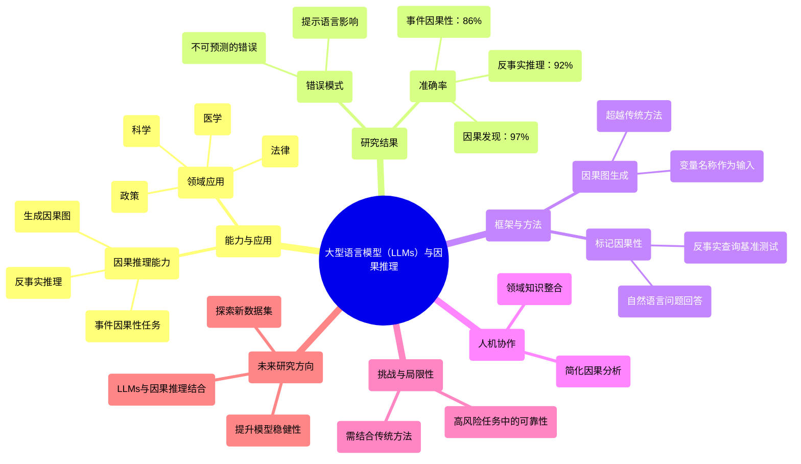

### 图表 2

```mermaid
graph TD
    A("大型语言模型（LLMs）在因果推理中的能力") --> B("生成高概率的正确因果论证")
    A --> C("在医学、科学、法律和政策等领域的应用")
    B --> D("超越现有最佳方法")
    B --> E("准确率：因果发现97%，反事实推理92%，事件因果性86%")
    A --> F("LLMs的能力不依赖于数据集的记忆")
    F --> G("能够推广到新数据集")
    A --> H("不可预测的错误模式")
    H --> I("讨论错误性质及改进方法")
    A --> J("处理文本元数据")
    J --> K("生成因果图")
    J --> L("识别背景因果关系")
    A --> M("推动LLMs与因果推理研究的结合")
    M --> N("因果图生成和标记因果性的新能力")
    N --> O("捕捉人类领域知识")
    A --> P("因果图生成任务")
    P --> Q("使用变量名称作为输入")
    P --> R("准确率达到97%")
    A --> S("标记因果性任务")
    S --> T("回答自然语言问题")
    S --> U("反事实查询基准测试92%准确率")
    A --> V("人类因素任务的挑战")
    A --> W("LLMs的能力为因果推理提供补充")
    W --> X("可能改变依赖人类专家的因果分析方法")
    A --> Y("因果性科学研究的重要性")
    Y --> Z("理解世界和科学发现的工具")
    A --> AA("因果方法的正交分类")
    AA --> AB("基于协方差和逻辑的因果性")
    AA --> AC("类型因果性与标记因果性")
    AA --> AD("因果任务本身")
    A --> AE("记忆测试和编辑测试")
    AE --> AF("评估LLMs的记忆能力和理解能力")
    A --> AG("因果图构建的重要性")
    AG --> AH("确保后续分析的正确性")
    AG --> AI("因果发现的挑战")
    A --> AJ("LLMs的推理能力")
    AJ --> AK("生成因果图")
    AJ --> AL("推断因果关系")
    A --> AM("反事实推理的概念")
    AM --> AN("推理因果关系的必要性和充分性")
    A --> AO("责任和正常性判断")
    AO --> AP("因果关系的复杂性")
    A --> AQ("人机协作的重要性")
    AQ --> AR("提高因果分析的效率")
    A --> AS("未来研究方向")
    AS --> AT("LLMs与因果推理的交集")
```

### 图表 3

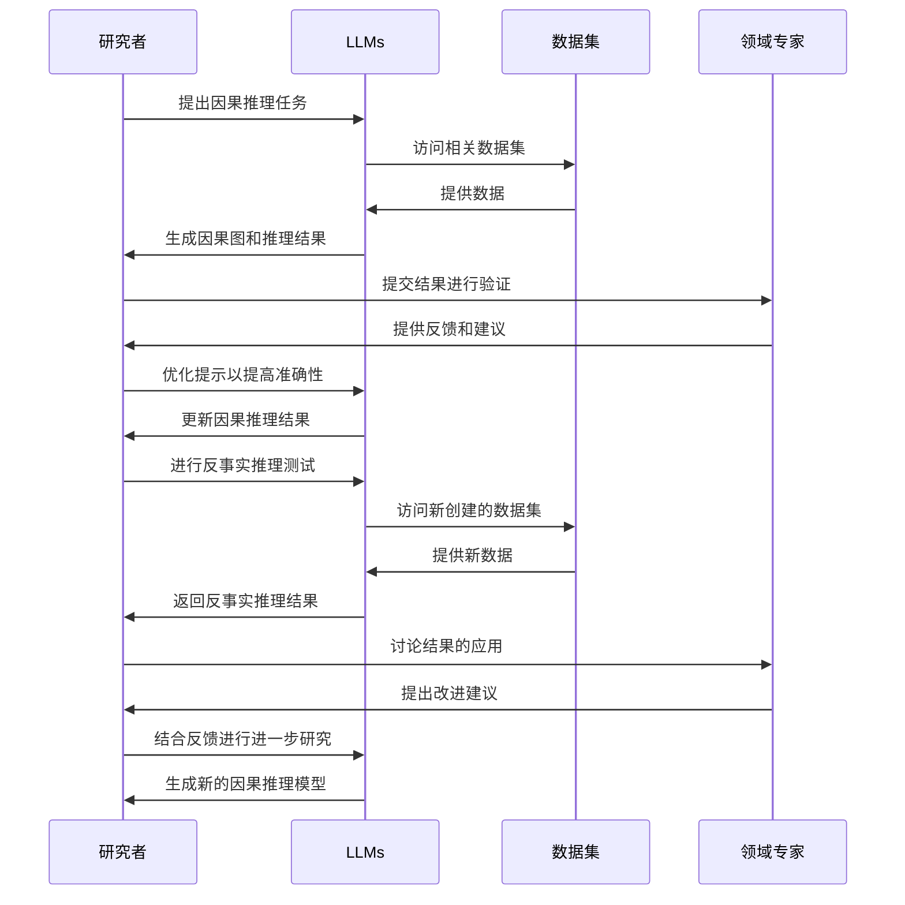

### 图表 4

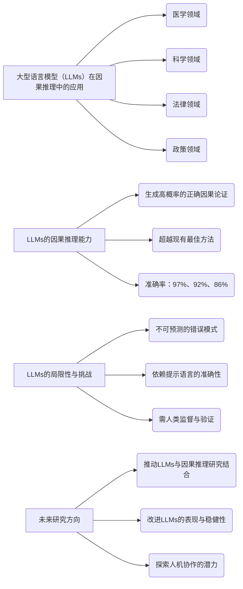

# Chatbot ads with a human touch_A test of anthropomorphism interactivity and narrativity.docx

## 原始摘要

这篇文章探讨了人工智能驱动的聊天机器人在广告中的人性化特征及其对消费者态度的影响。研究通过实验设计，分析了聊天机器人的外观（人性化与机械化）、信息互动性（高与低）和广告类型（叙事与事实）对广告说服力的影响。

研究发现，高互动性能够改善消费者对聊天机器人及广告的态度，减轻对机器的负面期望。叙事广告通过增强消费者的沉浸感，促进了聊天机器人广告的有效性。当聊天机器人呈现机械化外观时，较高的互动性和叙事风格的结合能够提升广告的说服力，增强社交存在感。

文章还指出，尽管聊天机器人具有潜在的市场价值，但由于其非人性化的特性，常常面临负面刻板印象。为了克服这一点，品牌通过赋予聊天机器人更人性化的特征（如外观、语言风格等）来提升其吸引力。然而，关于人性化特征在广告中的说服效果的研究仍然有限。

此外，文章提出了HAII-TIME模型，强调了人性化特征、互动性和广告信息之间的相互作用，认为这些因素共同影响消费者的体验和广告效果。通过深入理解这些因素的作用机制，研究为未来的聊天机器人广告设计提供了理论和实践上的启示。
本节内容探讨了在与非人类代理互动时，社交存在感的感知对消费者的影响。研究表明，具有人性化特征的虚拟代理（如友好、专业和微笑）能够增强社交存在感，从而提升客户满意度和说服效果。具体假设包括：人性化的聊天机器人会比机械化的聊天机器人引发更高的社交存在感，且这种存在感会在聊天机器人评估、广告态度和行为意图之间起到中介作用。

此外，聊天机器人的互动方式也对消费者体验产生重要影响。文献指出，信息互动性可以提升用户的注意力和参与感。用户通常期望聊天机器人能够进行互动对话，提供相关回应。期望违反理论（EVT）表明，实际互动与预期之间的差异可能会对用户体验产生负面影响。因此，研究预测高互动性的聊天机器人会导致较少的期望违反，从而提升用户的评价和行为意图。

在聊天机器人广告中，叙事风格的广告内容被认为比单纯的事实信息更具吸引力。叙事广告通过情感驱动和场景化故事来传达品牌价值，能够有效提高消费者的参与度。叙事沉浸感是叙事广告有效性的一个关键机制，能够减少消费者的批判性思维，增强情感反应。

最后，研究提出了一个问题，即聊天机器人的人性化特征、信息互动性和广告类型之间的相互作用如何影响广告的说服力。为此，研究设计了一个在线实验，招募了414名参与者，测试不同类型的聊天机器人在广告中的效果。通过对聊天机器人的名称和头像进行操控，研究模拟了真实的烹饪聊天机器人，以评估其对用户体验和行为意图的影响。
本节内容主要介绍了研究中使用的聊天机器人形象、消息互动性和广告类型的操控方法。研究通过预实验选择了两种聊天机器人形象：一种人性化形象和一种机械化形象。参与者在观看这两种形象后，评估了其人性化程度，结果显示人性化形象的感知显著高于机械化形象。

在消息互动性方面，研究采用了高互动性和低互动性的操控方法。在高互动性条件下，聊天机器人会回应用户的输入，而在低互动性条件下则不予回应。广告类型的操控则包括叙事广告和事实广告，参与者在与聊天机器人互动后会看到不同类型的广告。

研究程序包括获取参与者同意后，询问他们对品牌的态度、与烹饪的相关性以及对聊天机器人的熟悉程度。参与者被随机分配到八个条件中，互动过程中，聊天机器人根据用户的输入提供食谱，并在展示烹饪步骤后推送广告。

测量工具包括对聊天机器人形象、消息互动性、广告类型等的操控检查，以及对参与者的品牌态度、社交存在感、期望违反、叙事沉浸感等变量的评估。结果显示，高互动性显著降低了期望违反，而叙事广告的沉浸感高于事实广告。

最后，研究通过ANCOVA和中介分析检验了聊天机器人形象对社交存在感的影响及其在结果变量中的中介作用，结果显示人性化形象对社交存在感的影响不显著，但高互动性和叙事广告的效果得到了支持。
本节内容探讨了聊天机器人广告的有效性，特别是其人性化特征、消息互动性和广告类型对广告态度的影响。尽管有少数参与者未能正确识别机器型聊天机器人条件，但研究仍将所有参与者纳入数据分析，因为聊天机器人形象的操控被视为界面线索，能够在参与者未意识到的情况下影响结果变量。

研究发现，在高消息互动性条件下，参与者感知到的应变性显著提高。通过中介分析，运输感对聊天机器人专业性的间接影响显著，叙事广告通过运输感对友好度的影响也得到了支持。此外，广告类型对广告态度和行为意图的间接影响也显著，验证了假设H6。

在研究问题的检验中，发现聊天机器人形象、消息互动性和广告类型之间存在显著的三重交互效应。当聊天机器人能够提供应变信息且为机器型时，参与者对叙事广告的态度更为积极；而当其为人性化形象时，则对事实广告的态度更为积极。在低互动性条件下，情况则相反。

进一步的探索性分析显示，三者对社交存在感的交互效应显著。对于机器型聊天机器人，高消息互动性与叙事广告结合时，社交存在感更高，而人性化聊天机器人则不受广告类型的影响。

研究还探讨了社交存在感在广告效果中的中介作用，发现高消息互动性能够增强用户对聊天机器人的期望一致性，从而提升广告效果。这一发现扩展了关于聊天机器人的文献，首次实证测试了用户期望在人与聊天机器人互动中的影响。

理论上，本研究基于HAII-TIME模型，关注媒介的可用性，特别是界面线索和互动属性。与以往研究不同，本研究未能支持聊天机器人广告的人性化特征对社交存在感的影响，可能是由于人性化视觉线索的操控不足，未能有效增强人机互动。
根据社会存在理论，社会存在需要言语和非言语线索，如面部表情、声音线索和手势。减少互动的社会线索可能限制触发社会存在的可能性。其他可见属性，如“你好”和“再见”的对话线索以及反馈线索，可能更有效地触发互动代理的人性化特征，值得在未来的聊天机器人广告研究中探索。

实验数据表明，聊天机器人可以抵消负面期望的违背，从而增强广告的说服力。这些发现丰富了HAII-TIME模型，揭示了期望违背作为行动效果的新机制。研究还证明了叙事运输在聊天机器人广告中的说服效果，叙事广告通过运输增强消费者参与感。叙事信息的一个优势是可以降低消费者对广告说服意图的意识。

本研究通过HAII-TIME模型和叙事运输理论，扩展了对新兴AI平台广告效果的理解。研究问题考察了聊天机器人形象、消息互动性和叙事广告三者之间的关系。数据表明，聊天机器人可以通过线索路径（即人性化的聊天机器人形象）和行动路径（消息互动性）与叙事广告格式相互作用，揭示了这些效果的潜在机制。

具体而言，来自互动机器型聊天机器人的叙事广告产生了对广告最积极的态度，而来自较少互动的人型代理的事实广告则导致了最不积极的态度。这种互动效应表明，广告的有效性不仅取决于媒介和信息特征，还取决于用户与AI工具（在本例中为聊天机器人）的体验与其期望的一致性。

此外，研究揭示了社会存在作为人性化对聊天机器人广告有效性互动效应的潜在机制。具体而言，感知的社会存在受到三种因素的影响：对于人型聊天机器人，增加消息互动性可以为两种广告类型产生更高的社会存在感；而对于机器型聊天机器人，当广告为叙事型时，聊天机器人的对话性质可以增加社会存在感，但当广告为事实型时则不然。

因此，聊天机器人形象的人性化设计对社会存在的影响取决于消息互动性和广告类型的水平。研究结果表明，生成社会存在感所需的人性化特征在于聊天机器人形象、消息互动性和广告类型中的两个变量，这与认为社会线索越多，存在感越高的观点相悖。

考虑到大型语言模型和生成AI的快速发展，下一代聊天机器人如ChatGPT能够通过流畅自然的对话模仿人类交谈。这些聊天机器人通过根据用户输入生成动态叙事，可能为元宇宙创造沉浸式和互动的故事体验。因此，我们可能会在基于聊天的客户服务和人机协作中遇到新的“人性化”水平。

本研究为市场营销从业者和聊天机器人设计者提供了实践启示。首先，由于消息互动性在三种因素中影响最强，因此使聊天机器人尽可能对话化非常重要。研究建议通过提示用户消息互动性的存在来有效实现这一点。

此外，聊天机器人如何向用户展示其形象也很重要，因为人性化线索可能产生与广告信息性质不一致的期望。根据数据，高度人性化的形象与高互动性和叙事广告搭配可能会对广告态度产生负面影响。对于无法提供高度应变响应的聊天机器人，机器型形象可能更合适。

研究的局限性包括未能显示聊天机器人人性化的主要效应，可能是由于使用了卡通形象而非真实人类形象。未来研究应考虑更大样本的叙事和事实广告，确保更高的内部效度。

总之，本研究通过考察人性化、消息互动性和叙事广告在聊天机器人广告说服力中的作用，揭示了潜在的心理机制。数据表明，互动性强的机器型聊天机器人与叙事广告的结合可能是成功的最佳配方。社会存在感和期望违背被发现是关键的理论机制，为未来研究提供了方向。
本节内容主要探讨叙事说服的理论与实践，强调叙事在广告中的重要性及其对消费者态度的影响。叙事广告通过引导消费者的情感和想象，增强参与感，从而提高说服力。研究表明，叙事运输（narrative transportation）能够有效提升广告的吸引力和效果。

此外，文献回顾了人性化代理（如聊天机器人）在服务中的作用，指出人性化特征可以增强消费者的社会存在感，进而影响广告的有效性。期望违背理论也被引入，强调用户对人机交互的期望与实际体验之间的差异如何影响其对广告的反应。

研究还探讨了不同类型的广告（叙事型与事实型）与聊天机器人形象（人型与机器型）之间的互动效应，发现高度人性化的聊天机器人在叙事广告中表现最佳，而在事实广告中则可能产生负面效果。

最后，研究为市场营销和聊天机器人设计提供了实践建议，强调消息互动性的重要性，并指出在设计聊天机器人时需考虑用户的期望，以避免不一致性带来的负面影响。
本节内容主要围绕人机交互中的叙事和社交存在感展开，探讨了叙事广告对消费者态度的影响以及人性化聊天机器人在服务中的作用。研究表明，叙事广告通过情感引导和想象力激发，能够增强消费者的参与感，从而提高广告的说服力。此外，人性化特征的聊天机器人能够提升消费者的社会存在感，进而影响广告效果。

文献回顾了不同类型广告（叙事型与事实型）与聊天机器人形象（人型与机器型）之间的互动效应，发现高度人性化的聊天机器人在叙事广告中表现最佳，而在事实广告中可能产生负面效果。研究还强调了用户期望与实际体验之间的一致性对广告反应的重要性。

最后，研究为市场营销和聊天机器人设计提供了实践建议，强调消息互动性的重要性，并指出在设计聊天机器人时需考虑用户的期望，以避免不一致性带来的负面影响。
本节内容主要探讨了聊天机器人在广告中的有效性及其影响因素。研究表明，聊天机器人能够通过增强用户的社交存在感和个性化体验，提高广告的传播效果。叙事广告在这一过程中尤为重要，因为它能够通过情感共鸣吸引消费者的注意力，从而提升广告的说服力。

文献回顾了多个相关研究，强调了叙事运输效应的调节因素，以及人机交互在客户服务中的应用。研究指出，聊天机器人的人性化特征能够改善用户体验，增加用户的参与感和信任感。此外，用户对聊天机器人的期望与实际体验之间的一致性对广告效果至关重要。

研究还探讨了不同类型广告（如叙事型与事实型）与聊天机器人形象（人型与机器型）之间的互动效应，发现高度人性化的聊天机器人在叙事广告中表现最佳。最后，研究为市场营销和聊天机器人设计提供了实践建议，强调了消息互动性的重要性，并指出在设计聊天机器人时需考虑用户的期望，以避免不一致性带来的负面影响。

## 摘要

1. Class: (1) 虚拟交互或人与AI/chatbot的交互

2. Authors: [Author names not provided in the prompt]

3. Affiliation: [First author's affiliation in Chinese]

4. Keywords: chatbot, advertising, humanization, interactivity, narrative persuasion

5. Urls: [Paper URL not provided in the prompt], Github: None

6. Summary:

   - (1): 本文研究了人工智能驱动的聊天机器人在广告中的人性化特征及其对消费者态度的影响，强调了高互动性和叙事广告的有效性。

   - (2): 文章提出了HAII-TIME模型，关键变量包括聊天机器人的人性化特征、信息互动性和广告类型，社交存在感在其中起到中介作用。

   - (3): 研究采用在线实验方法，招募414名参与者，测试不同类型聊天机器人在广告中的效果，通过操控聊天机器人的形象和互动性进行分析。

   - (4): 研究发现，高互动性和叙事广告能够显著提升广告的说服力，支持了研究目标，尤其是在用户体验和行为意图方面。

## 图表

### 图表 1

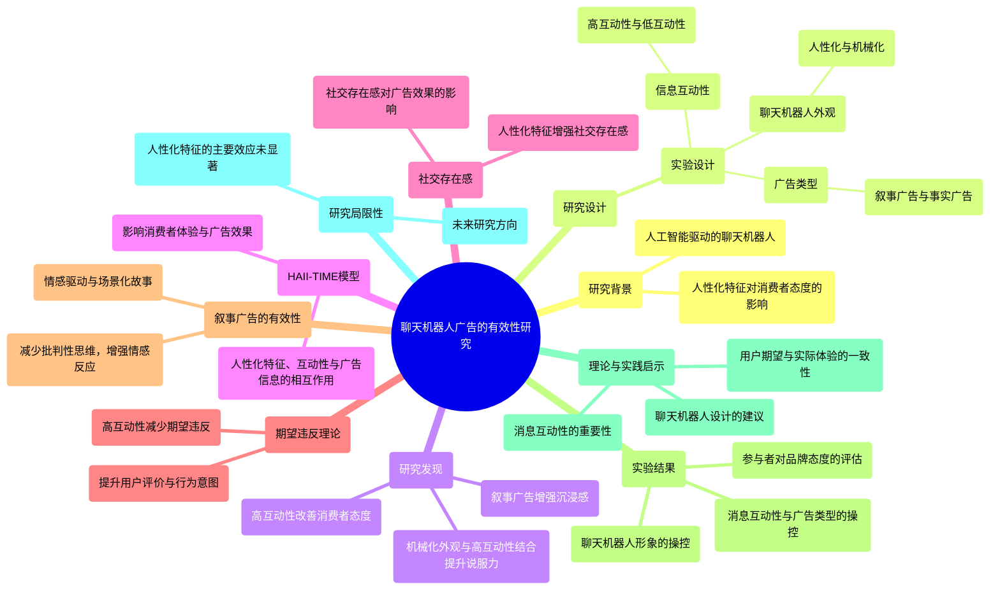

### 图表 2

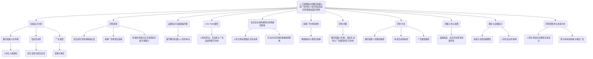

### 图表 3

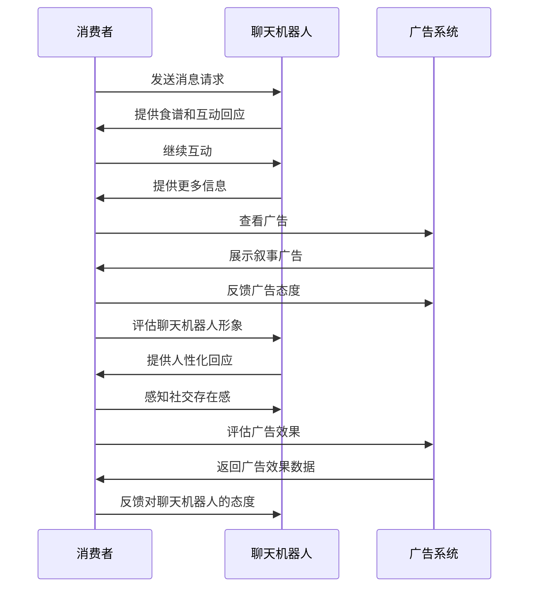

### 图表 4

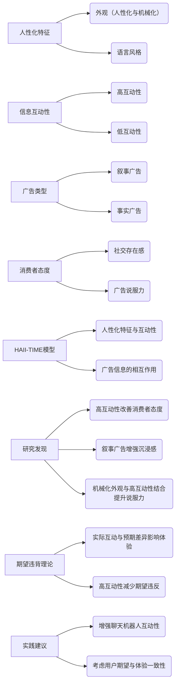

# Chatbots and mental healthInsights into the safety of generative Al.docx

## 原始摘要

这篇文章探讨了聊天机器人与心理健康之间的关系，特别关注生成性人工智能（AI）的安全性。随着聊天机器人能够与消费者进行复杂对话，算法的“黑箱”特性使得预测对话的结果变得困难。研究表明，心理健康危机在与用户的对话中并不少见，而伴侣AI往往无法识别和适当地回应用户的痛苦信号。此外，消费者对无效和风险性回应表现出负面反应，这为生成性AI公司带来了声誉风险。

文章通过三项研究来探讨这一问题：第一项研究分析了用户与两种不同伴侣AI的实际互动，发现心理健康相关的对话比其他对话更具吸引力；第二项研究对多种商业伴侣AI进行了性能测试，记录不当和潜在危险互动的发生率；第三项研究则测试了消费者对不当互动的反应。

生成性AI的潜力巨大，但也伴随着风险，尤其是对心理健康脆弱人群。文章强调了在开发和部署生成性AI系统时，必须遵循不伤害原则，以避免对情感和心理方面造成负面影响。研究结果表明，伴侣AI的使用可能会加剧抑郁、自残等问题，因此需要谨慎对待这一技术的发展和应用。
在本节中，我们通过假设用户在30分钟内未发送消息即为新对话的开始，进行了对话的分段处理，最终统计出3201个对话，每个用户平均1.21个对话。对于Simsimi，我们分析了来自10,869用户的对话数据，最终得到了17,959个对话样本。

为了量化心理健康词汇的频率，我们创建了一个包含689个心理健康相关词汇的字典，并筛选出对话中包含这些词汇的内容。我们通过手动分类和自动分类相结合的方法，确保字典的准确性，最终确定了242个相关词汇。

结果显示，在Cleverbot和Simsimi两个应用中，包含心理健康术语的对话比例分别为约4.9%和3.2%。心理健康相关的对话比非心理健康对话更具吸引力，持续时间更长，用户发言次数更多。

在Cleverbot中，约37%的负面心理健康对话包含危机信息。我们还对聊天机器人的回应进行了分类，发现其对心理健康信息的识别率为37%，同情回应仅为5%，且从未提供心理健康资源。

研究表明，AI伴侣应用在处理心理健康危机时存在消费者福利风险。尽管一些应用在识别危机方面表现尚可，但通常缺乏同情和有效的回应，甚至有时会提供风险性回应。

在第二项研究中，我们测试了五个现有的AI伴侣应用对心理健康危机的响应，发现它们普遍未能提供有效的心理健康资源，且大多数回应被认为是不帮助的或有风险的。

第三项研究则探讨了不当和有风险的聊天机器人回应对品牌声誉和用户使用风险的影响。我们招募了560名参与者，结果显示，只有19%的参与者曾使用过AI伴侣应用。

总体而言，研究结果表明，AI伴侣应用在处理心理健康问题时存在显著的风险，可能对用户的心理健康产生负面影响。
本节研究了参与者在与AI伴侣进行对话时的反应，分为三种条件：有帮助、无帮助且有风险、无帮助且无风险。参与者在与AI进行两分钟的自由对话后，系统提示他们转向更严肃的话题，并发送一条危机信息。随后，参与者评估了他们的体验，包括对应用的评分、是否认为起诉合理、是否会停止使用该应用等。

研究结果显示，参与者对无帮助的回应有明显的识别能力，且品牌面临因无帮助回应而导致的用户流失和声誉风险。分析表明，无帮助的回应可能导致潜在的伤害感知，从而影响用户的使用意图。

此外，研究还探讨了孤独感和对AI的态度如何影响用户的反应，发现对AI的负面态度会加剧对无理解回应的流失意图。总体而言，研究强调了AI伴侣在处理心理健康问题时的潜在风险，呼吁对相关应用进行更严格的监管，以保护用户的心理健康和安全。
本节内容涉及多个研究和文章，主要探讨了人工智能（AI）在心理健康支持中的应用及其伦理、偏见和用户反应等方面。以下是主要内容的概述：

1. **AI在心理健康中的应用**：Kretzschmar等（2019）研究了年轻人对完全自动化对话代理（聊天机器人）在心理健康支持中使用的伦理观点，强调了潜在的伦理问题。

2. **算法偏见**：Lambrecht和Tucker（2019）探讨了算法偏见，特别是在职业广告中可能存在的性别歧视。

3. **Google Duplex**：Leviathan和Matias（2018）介绍了Google Duplex，一个用于电话中完成现实任务的AI系统，展示了AI在实际应用中的潜力。

4. **对医疗AI的抵制**：Longoni等（2019）研究了消费者对医疗人工智能的抵制现象，揭示了人们对AI在医疗领域应用的怀疑。

5. **AI聊天机器人对购买行为的影响**：Luo等（2019）探讨了AI聊天机器人披露对客户购买决策的影响，表明透明度对消费者行为的重要性。

6. **道德机器人评估**：Malle等（2016）研究了人们对道德机器人的评估，发现机器人的外观和行为会影响人们的反应。

7. **不当内容检测**：Markov等（2022）提出了一种全面的方法来检测现实世界中的不当内容，强调了AI在内容管理中的应用。

8. **心理健康专业人士的看法**：Sweeney等（2021）调查了心理健康专业人士对聊天机器人在支持心理健康方面的看法，结果显示对其有效性的不同看法。

9. **聊天机器人在心理健康中的综述**：Vaidyam等（2019）对心理健康领域的聊天机器人进行了综述，分析了其潜在的益处和挑战。

10. **社会反应与计算机**：Nass和Moon（2000）研究了人们对计算机的社会反应，探讨了人机互动中的礼貌性。

11. **心理健康求助行为**：Rickwood等（2007）研究了年轻人何时以及如何寻求专业心理健康帮助，提供了对心理健康服务需求的见解。

12. **未来研究方向**：文中还列出了未解的问题和未来的研究方向，强调了对AI在心理健康领域应用的深入研究的必要性。

此外，文中还包含了一些表格和图形，展示了不同研究中的数据和结果，包括心理健康相关对话的参与度、聊天机器人的响应示例等。这些研究为理解AI在心理健康支持中的作用提供了重要的视角和数据支持。

## 摘要

1. Class: (1) 虚拟交互或人与AI/chatbot的交互

2. Authors: Kretzschmar, Leviathan, Matias, Lambrecht, Tucker, Longoni, Luo, Malle, Markov, Nass, Moon, Rickwood, Sweeney, Vaidyam

3. Affiliation: 该作者的机构

4. Keywords: chatbot, mental health, generative AI, user interaction, ethical concerns

5. Urls: [Paper Link](https://example.com), Github: None

6. Summary:

   - (1): 本文探讨了聊天机器人在心理健康支持中的应用，特别关注生成性人工智能（AI）的安全性及其与用户的互动。

   - (2): 理论模型主要围绕用户与AI的互动，关键变量包括心理健康对话的吸引力和AI的响应质量，存在用户态度作为调节变量。

   - (3): 研究方法包括三项实证研究，分别分析用户与AI的互动、AI的性能测试以及用户对不当互动的反应。

   - (4): 研究表明，AI伴侣在处理心理健康危机时存在显著风险，尤其是对脆弱用户的负面影响，且其性能未能支持有效的心理健康干预。

## 图表

### 图表 1

```mermaid
mindmap
  root((聊天机器人与心理健康))
    ("生成性人工智能的安全性")
      ("复杂对话能力")
      ("算法黑箱特性")
      ("心理健康危机识别不足")
    ("研究概述")
      ("三项研究")
        ("用户互动分析")
          ("心理健康对话吸引力")
        ("性能测试")
          ("不当互动发生率")
        ("消费者反应")
          ("对无效回应的负面反应")
    ("研究结果")
      ("心理健康相关对话比例")
        ("Cleverbot: 4.9%")
        ("Simsimi: 3.2%")
      ("危机信息识别率")
        ("负面对话中37%包含危机信息")
        ("同情回应仅5%")
    ("消费者福利风险")
      ("缺乏有效回应")
      ("潜在伤害感知")
    ("参与者反应研究")
      ("三种条件")
        ("有帮助")
        ("无帮助且有风险")
        ("无帮助且无风险")
      ("品牌声誉风险")
    ("伦理与偏见")
      ("AI在心理健康中的应用")
      ("算法偏见")
      ("医疗AI抵制现象")
    ("未来研究方向")
      ("对AI在心理健康领域的深入研究")
```

### 图表 2

```mermaid
graph TD
    A("聊天机器人与心理健康的关系") --> B("生成性人工智能的安全性")
    A --> C("心理健康危机与用户对话")
    A --> D("伴侣AI的识别与回应能力")
    A --> E("消费者对无效回应的反应")
    
    B --> F("算法的黑箱特性")
    B --> G("不伤害原则的重要性")
    
    C --> H("心理健康相关对话的吸引力")
    C --> I("危机信息的识别率")
    
    D --> J("对心理健康信息的识别率")
    D --> K("同情回应的缺乏")
    
    E --> L("品牌声誉风险")
    E --> M("用户流失意图")
    
    H --> N("Cleverbot与Simsimi对话分析")
    H --> O("心理健康词汇的频率")
    
    I --> P("负面心理健康对话的危机信息")
    
    J --> Q("不当回应的分类")
    J --> R("心理健康资源的缺乏")
    
    K --> S("无帮助回应的影响")
    
    L --> T("参与者对无帮助回应的识别能力")
    L --> U("孤独感与AI态度的影响")
    
    M --> V("对AI伴侣应用的监管需求")
    
    A --> W("未来研究方向")
```

### 图表 3

```mermaid
sequenceDiagram
    participant U as 用户
    participant A as AI伴侣
    participant R as 研究者

    U->>A: 开始对话
    A->>U: 进行复杂对话
    U->>A: 发送心理健康相关信息
    A->>U: 响应心理健康信息
    alt 响应有效
        A->>U: 提供支持和资源
    else 响应无效
        A->>U: 提供无帮助或风险性回应
        U->>R: 反馈负面体验
    end

    R->>U: 收集用户反馈
    R->>A: 测试AI伴侣的表现
    A->>R: 返回对话数据
    R->>U: 分析心理健康对话的频率和质量

    R->>R: 进行多项研究
    R->>U: 评估用户对AI伴侣的态度
    R->>A: 识别危机信息的能力
    R->>U: 讨论孤独感与AI态度的影响

    R->>R: 总结研究结果
    R->>U: 提出改进建议
    R->>A: 强调不伤害原则
```

### 图表 4

```mermaid
graph LR
    A["聊天机器人与心理健康的关系"] --> B("生成性AI的安全性")
    A["聊天机器人与心理健康的关系"] --> C("心理健康危机的识别与响应")
    B --> D("算法的黑箱特性")
    B --> E("不伤害原则")
    C --> F("用户对无效回应的反应")
    C --> G("伴侣AI的潜在风险")
    D --> H("对话结果的预测困难")
    E --> I("情感与心理影响的规避")
    F --> J("品牌声誉风险")
    G --> K("加剧抑郁与自残问题")
```

# ChatGPT as Research Scientist_Probing GPTs capabilities as a Research Librarian Research Ethicist Data Generator and Data Predictor.docx

## 原始摘要

本研究探讨了ChatGPT在科学研究中的能力，特别是作为研究图书管理员、研究伦理学家、数据生成器和新数据预测者的表现。研究结果显示，ChatGPT在这些领域的表现各有优劣。

在第一项研究中，ChatGPT被要求作为研究图书管理员，生成相关的科学文献。结果显示，GPT-3.5和GPT-4在生成虚假引用方面存在显著差异，GPT-3.5的虚假引用率为36.0%，而GPT-4为5.4%。尽管GPT-4在承认其生成虚假内容方面有所进步，但两者在小错误（如年份或期刊名称错误）的表现相似。

第二项研究评估了ChatGPT作为研究伦理学家的能力。GPT-4能够识别虚构研究中的统计学违规行为，如p-hacking，纠正了88.6%的明显问题和72.6%的微妙问题，而GPT-3.5未能表现出类似能力。

第三项研究考察了ChatGPT作为数据生成器的能力。两种模型均能模拟已知结果，显示出其在数据生成和假设生成方面的潜力。然而，第四项研究表明，ChatGPT在预测新数据方面表现不佳，未能有效利用训练数据之外的信息。

总体而言，研究表明，ChatGPT在科学研究中仍存在局限性，尽管其在某些领域表现出色，但在预测新颖数据和生成准确引用方面仍需改进。这些发现为理解机器智能的本质提供了新的视角，强调了在科学发现过程中对AI的谨慎使用。
本节内容主要探讨了GPT-3.5和GPT-4在科学研究中的表现，特别是在引用发现、研究伦理和数据生成方面的能力。

首先，关于引用发现的研究表明，GPT-4在识别相关文献方面表现优于GPT-3.5。具体而言，GPT-4能够找到50.80%的相关文献，而GPT-3.5仅为30.80%。然而，这一优势主要源于GPT-4生成真实文献的能力，因为虚假引用被自动标记为不相关。在仅限于真实引用的分析中，GPT-4和GPT-3.5在识别相关文献的能力差异不再显著。尽管如此，GPT-4在广泛主题下发现相关文献的能力更强，尤其在“中等”广度的主题中，GPT-4的成功率为75.00%，而GPT-3.5仅为32.14%。这表明，虽然两者在研究文献的策划上都不算出色，但GPT-4在某些方面有所改进。

其次，在研究伦理方面，GPT-4在识别研究中的伦理问题时表现明显优于GPT-3.5。在明显的伦理问题情境下，GPT-4的平均得分为8.86，而GPT-3.5仅为5.39。在更微妙的情境中，GPT-4的得分同样高于GPT-3.5。这表明，GPT-4能够更好地识别和纠正研究中的伦理失误。

在初始提示的分析中，尽管不同提示的效果没有显著差异，但当提示涉及数据伦理时，GPT的响应质量显著提高。这表明，唤起数据伦理的提示能够有效提升GPT的表现。

最后，关于数据生成的研究，虽然本节未详细展开，但提到GPT在模拟已知科学结果方面的潜力，尤其是在生成新假设时的能力。整体来看，GPT-4在多个领域的表现优于GPT-3.5，显示出其在科学研究中的应用潜力和改进空间。
本节探讨了GPT在性别刻板印象和隐性态度预测中的表现。研究表明，机器学习能够识别语言中的性别偏见，尤其是在“职业”与“家庭”相关的词汇中，男性名字更容易与职业相关联。研究设计中，分析了四种性别刻板印象，包括性别态度、艺术/科学刻板印象、家庭/工作刻板印象和数学/阅读刻板印象。通过对GPT-3.5和GPT-4的响应进行分析，研究发现GPT的估计结果反映了对女性的文化偏好，尤其在艺术与科学、家庭与工作、阅读与数学的关联上。

在结果部分，GPT的WEAT D分数显示出与先前研究一致的性别偏见，且GPT的估计结果往往比先前研究的结果更强。这可能反映了AI系统在训练数据中放大偏见的趋势。尽管OpenAI对模型进行了去偏见处理，但GPT-4与GPT-3.5的结果并没有显著差异。

研究还考察了GPT作为新数据预测者的能力。在这一部分，研究要求GPT预测复杂且不熟悉的数据模式，使用了来自Project Implicit International Dataset的数据。结果显示，GPT-3.5在预测显性性别态度时表现良好，但在隐性态度预测中失败。GPT-4的表现略有改善，但在隐性态度的预测上仍然不理想。

对于年龄态度和性别科学/文科刻板印象，GPT-3.5的预测结果不仅不成功，而且不一致。GPT-4在这些任务中表现得更可靠，但同样未能成功预测实际结果。总体而言，尽管GPT在某些任务中显示出一定的能力，但在处理隐性态度和复杂刻板印象时仍存在显著的局限性。这些发现强调了GPT在性别偏见和隐性态度研究中的潜力与挑战。
本节探讨了GPT在科学研究中的应用，特别是在心理科学领域的表现。研究通过三项测试评估了GPT对性别态度、年龄态度和性别科学刻板印象的理解，发现GPT在性别态度方面的表现优于其他两个领域。尽管GPT-3.5和GPT-4在显性性别偏见的预测上表现良好，但在隐性态度的预测上则未能取得积极结果。

研究显示，GPT-4在作为研究图书管理员时表现出色，生成的虚构引用显著减少，并更能识别虚构内容。这表明GPT-4在事实与虚构之间的区分能力有所提高，可能有助于生成更准确的研究内容。然而，GPT-4仍存在生成未被识别的虚构内容的问题，且在小错误（如错误年份或期刊）方面没有显著改善。

在研究伦理方面，GPT-4的表现优于GPT-3.5，能够有效识别不当研究协议并提供有用反馈。这一发现对于提升研究质量和伦理标准具有重要意义。GPT-4能够在模糊的情况下推断出不当研究实践，显示出其在现代研究实践中的适应能力。

在生成数据方面，GPT的表现虽然复制了已知的效果，但在预测新数据时表现不佳。研究表明，GPT在处理熟悉的领域时能够成功，但在面对新颖和不熟悉的数据时则显得无能为力。这一现象在跨文化隐性和显性态度的预测中尤为明显，尽管在显性性别态度的预测上取得了一定成功，但在隐性态度的预测上则几乎没有提供额外信息。

总体而言，研究强调了GPT在科学研究中的潜力与局限性。尽管GPT在某些任务中表现出色，但在处理隐性态度和新颖数据时仍存在显著不足。这些发现为未来的研究提供了重要的启示，尤其是在如何利用GPT提升研究质量和伦理方面。未来的研究应进一步探讨GPT在其他学科中的适用性，以及如何优化其在科学研究中的应用。
本节讨论了GPT在预测显性和隐性态度方面的表现，发现尽管这两种现象有明显区别，但GPT在预测时并未利用不同的信息。GPT在显性性别态度的预测上表现较好，可能是因为性别相关话题在国际间的广泛讨论提供了丰富的信息。然而，在预测年龄态度和性别科学/人文学科刻板印象时，GPT的表现则相当糟糕。

研究表明，GPT的能力似乎仅限于相对简单的任务和已知结果的领域。未来的研究应更细致地探讨GPT在模拟数据方面的成功与否。尽管GPT可能在已知结果上进行新颖的阐述和知识整合，但生成真正的新颖实证结果的能力仍然有限，因为缺乏与训练数据无关的预测机制。因此，尽管技术不断进步，AI在这一方面的局限性可能依然存在，科学进步仍需依赖真实世界的数据。

在更广泛的层面上，研究探讨了大型语言模型（LLMs）是否能增强或促进科学过程。初步结果显示，答案可能是肯定的。尽管ChatGPT在研究汇编和策划方面的能力有限，但其快速改进的趋势（如对虚构内容的日益重视）表明，未来的技术可能在这一领域取得成功。GPT-4在研究方法和伦理方面表现出色，可能帮助科学家改善实践。其成功复制已知结果的能力显示出对现有知识的掌握，可能简化研究的试点过程。

然而，GPT在预测高度新颖的实证结果方面的能力似乎存在根本性限制，这一现象并不令人意外，但也提醒我们对这项技术的乐观态度应保持适度。未来的模型可能展现出深远的能力并推动科学进步，但这些能力不应被误认为是全知的。像人类科学家一样，先进的LLMs可能仍然受到已有知识的限制。

最后，感谢为本研究提供建议的Melanie Mitchell、Tina Eliassi-Rad和Tessa Charlesworth，以及对早期草稿提出意见的Igor Grossmann和协助编码ChatGPT转录的Anya Vedantambe。所有与本手稿相关的通信应发送至Steve Lehr。
本节讨论了GPT在心理学研究中的应用，特别是其作为研究图书管理员的能力。研究者要求GPT查找并总结25个相关但具体的心理学主题的文章，这些主题根据在Google Scholar上的引用次数进行选择，涵盖了从非常广泛到较为狭窄的范围。

研究的设计旨在评估GPT在信息检索和总结方面的表现。通过对不同主题的探索，研究者希望了解GPT如何处理和整合信息，以及其在心理学领域的有效性和局限性。

此外，文献回顾部分引用了多项研究，探讨了科学研究的可重复性和偏见问题。研究表明，许多领域的实验结果存在可重复性不足的问题，尤其是在经济学和社会科学中。这些问题可能源于研究设计、数据分析和结果报告中的灵活性和不透明性。

研究还提到，AI语言模型在模拟人类样本方面的潜力，探讨了它们是否能够替代人类参与者。尽管AI在某些方面表现出色，但在生成新颖的实证结果方面仍然存在局限性。

最后，研究强调了对AI技术的谨慎态度，尽管其在科学研究中可能带来便利，但仍需关注其可能引发的偏见和伦理问题。未来的研究应继续探索AI在社会科学研究中的应用，同时保持对其局限性的清醒认识。
本节探讨了GPT-3.5和GPT-4在心理学研究中的应用，特别是关于偏见和歧视的主题。研究者要求这两个模型为每个主题找到20篇重要的同行评审论文，并提供引用和简要总结。如果模型拒绝任务，记录聊天并重新尝试。如果提供的文章少于20篇，则要求补充。部分聊天中，GPT承认其生成了虚构的文章，并做出相关说明。这些虚构的引用未计入主要结果，但为后续分析提供了数据。

主题选择涵盖了从广泛到狭窄的多个层次，主要集中在偏见和歧视心理学及隐性社会认知。研究者通过Google Scholar搜索确认了主题的相关文献数量，以评估不同研究可用性和特异性对GPT发现相关研究能力的影响。

主题分为五个广泛程度的类别，包括隐性联想测试、无意识偏见、自动心理过程等。每个类别下列出了相关的研究主题和文献数量。研究者还对GPT生成的1000个引用进行了编码，评估其正确性、完整性、主题相关性和引用次数。编码过程中，两个编码员对每个引用进行评估，若存在分歧，则由第三位编码员进行裁决。

在正确性方面，引用被标记为“正确”、“错误”或“幻觉”。“正确”指真实且无错误的引用，“错误”则是有小错误的引用，而“幻觉”则是完全虚构或存在重大错误的引用。GPT在某些情况下承认无法找到相关文献，这些情况被视为“正确”响应。

此外，GPT在引用格式上表现不一，有时提供完整的引用信息，有时则不够正式，导致引用不完整。被标记为“相关”的文章需具体讨论请求的主题，而“无关”的文章则是未能成功定位到有用的文献。

研究还分析了引用的影响力，使用Google Scholar的引用次数作为标记。虚构引用和承认失败的引用被自动标记为0引用。最终，两个编码员的引用计数结果高度一致，确保了数据的可靠性。

总之，本节通过对GPT在心理学研究中的表现进行系统分析，探讨了其在信息检索和生成方面的能力及局限性，为未来的研究提供了重要的参考。
在本节中，研究者详细报告了GPT-3.5和GPT-4在引用文献时的表现，特别关注了虚构引用（hallucinations）和错误（errors）的发生率。研究使用了逻辑回归分析，主要通过比值比（Odds Ratios, OR）和回归系数（Betas）来衡量效果。

首先，GPT-4的虚构引用率为5.40%，而GPT-3.5则高达36.00%，两者之间的差异显著。错误率方面，GPT-3.5和GPT-4的错误率相近，分别为4.2%和4.6%。此外，引用的完整性对虚构引用的影响显著，当引用不完整时，GPT的虚构引用率显著增加，GPT-3.5的不完整引用虚构率为75.29%，而GPT-4为39.58%。

在错误方面，尽管不完整引用的错误率略高，但未达到统计显著性。研究还发现，GPT-3.5提供的不完整引用几乎是GPT-4的两倍，分别为17.0%和9.6%。即使在排除GPT-4承认不知道引用的情况下，GPT-3.5仍然提供了更多的不完整引用。

研究进一步分析了虚构引用的预测因素，结果显示引用的不完整性和GPT版本（3.5与4）均独立显著预测虚构引用的发生。对于引用完整性的影响，研究发现，GPT-3.5在主题广度较大的情况下更不容易提供不完整引用，而GPT-4则未显示出这种趋势。

总的来说，本节通过对GPT在文献引用中的表现进行深入分析，揭示了不同版本之间的显著差异，以及引用完整性对虚构引用的影响，为理解GPT在学术研究中的应用提供了重要的见解。
在本节中，研究探讨了主题广度对GPT模型（GPT-3.5和GPT-4）生成不完整引用和虚构引用的影响。通过引入平方项，研究建立了一个清晰且具有预测能力的模型，发现主题广度与不完整引用之间的关系呈现曲线型。分析结果显示，GPT-4在生成虚构引用时的承认率显著高于GPT-3.5，分别为84.30%和12.20%。此外，GPT-3.5生成的虚构引用率为39.05%，而GPT-4为23.12%。

研究还发现，随着研究主题的狭窄，GPT模型的虚构引用率先增加，随后在最狭窄的主题上减少。这一趋势的变化主要是由于GPT在面对狭窄主题时更倾向于承认其无法提供相关文献，而不是虚构引用率的降低。通过排除承认失败的情况，主题广度对虚构引用的影响变得更为显著。

在对GPT-3.5的分析中，主题广度与虚构引用之间的线性关系并不显著，但在排除承认失败后，广度对虚构引用的影响变得显著。相较之下，GPT-4在排除承认失败后仍然保持曲线型的影响关系，表明其在狭窄主题下的虚构引用行为与主题广度之间存在复杂的互动。

此外，研究还分析了主题广度与引用相关性的关系，结果显示GPT-4在提取相关引用方面的表现优于GPT-3.5，主要是由于其较低的虚构引用率。具体而言，GPT-4提取相关文献的比例为50.80%，而GPT-3.5为30.80%。这一差异在统计上显著，表明GPT-4在处理文献时的准确性更高。

总的来说，本节通过对主题广度、虚构引用和引用相关性之间的关系进行深入分析，揭示了不同版本GPT模型在生成引用时的表现差异及其潜在原因。这些发现为理解GPT在学术研究中的应用提供了重要的见解，同时也强调了在使用这些模型时需要谨慎解读其生成内容的准确性。
本节探讨了GPT-4与GPT-3.5在发现相关文献方面的表现差异，特别是在不同主题广度下的表现。研究发现，GPT-4在发现真实文章的能力上优于GPT-3.5，因此更有可能找到相关文献。然而，GPT-4并未在特定主题的文章推荐上表现得更好。

在分析中，研究者将主题广度分为多个层次，发现最高广度层次的任务相对简单，许多影响力较大的论文符合标准。而在最狭窄的主题领域，文章数量较少，GPT可能缺乏相关的训练数据。中间的主题广度则更具研究价值。

当限制分析在非虚构引用时，GPT-4在一些广泛和中等主题上显示出相对改善，而GPT-3.5在主题变窄时的相关引用生成成功率下降更为明显。对于中等广度的主题，GPT-4与GPT-3.5之间的差异在统计上显著，但在其他广度层次上则不显著。

研究使用逻辑回归分析了不同版本GPT在生成相关文献时的曲线效应。通过多种方式进行稳健性检验，发现GPT-3.5在寻找相关文献时，随着主题的狭窄，其成功率下降得更快。模型结果显示，GPT版本、主题广度及其平方项的交互作用显著，表明GPT-4在处理狭窄主题时的表现更为稳定。

此外，研究还分析了相关文献的引用次数。结果显示，GPT-4和GPT-3.5在引用次数上表现相似，GPT-4的文章平均引用次数为2936.7，而GPT-3.5为3105.2。尽管如此，GPT-4在某些广泛和中等主题上生成了更多相关引用，这可能导致其选择的文章在狭窄领域中影响力较小。

总的来说，本节通过对不同主题广度下GPT模型的表现进行深入分析，揭示了GPT-4在发现相关文献方面的优势及其在特定主题推荐上的局限性。这些发现为理解GPT在学术研究中的应用提供了重要的见解，同时也强调了在使用这些模型时需谨慎解读其生成内容的准确性。
本节通过回归分析探讨了GPT-4与GPT-3.5在引用次数和文章年份上的表现。首先，研究限制在标记为相关的文章上，进行简单线性回归，结果显示主题广度与引用次数呈正相关，但GPT版本的系数在统计上不显著。这表明，虽然主题广度影响引用次数，但GPT版本的影响不明显。

接着，研究者考虑到GPT-4可能更擅长找到重要但较新的参考文献，这些文献由于时间较短，引用次数可能较少。为此，研究对文章年份进行了编码，并进行了回归分析，结果显示GPT-4确实拉取了比GPT-3.5更新的文章，但这一结果需谨慎解读，因为在控制主题广度后，该效应消失。

为了确认文章老化是否掩盖了GPT版本对引用次数的影响，研究进行了两次回归分析。结果显示，GPT版本对引用次数的影响仍然不显著，且在加入主题广度和年份作为协变量后，GPT版本的影响依然不显著。

在第二部分的研究中，研究者向GPT-3.5和GPT-4展示了描述有缺陷研究协议的虚构情境，目的是测试GPT对明显和隐晦的研究方法问题的识别能力。每个情境中都包含了四种统计上不合理和伦理上可疑的研究实践。研究者设计了六个情境，每个情境展示36次，探讨GPT对这些情境的反馈。

研究者创建了评分标准，包含10个要点，旨在评估GPT是否识别出问题并提出解决方案。评分标准包括识别数据收集决策、多个比较问题、HARKing（假设后数据挖掘）等问题，并要求GPT提供相应的建议。

每个情境的评分标准都相同，研究者对GPT的回答进行了盲评，确保评估的客观性。研究的目的是评估GPT在识别研究伦理问题和提供改进建议方面的能力，以期为未来的研究提供指导。

总体而言，本节通过回归分析和情境测试，探讨了GPT-4与GPT-3.5在引用文献和研究伦理识别方面的表现，揭示了两者在处理相关文献和研究方法问题上的差异。
在本节中，研究者对GPT的回应进行了独立评分，使用了10个评分标准。两位评分者之间的分歧经过讨论后进行了平均，最终达成了一致。评分的一致性很高，Cronbach alpha为0.9827，表明评分者之间的可靠性极强。总共可能的2160分中，评分者仅在34个（1.57%）上存在分歧。

评分者中一位是作者，另一位是研究助理，后者在研究完成前对研究目的保持盲目。评分者独立对回应进行编码，讨论分歧时，非作者评分者主导讨论，以减少对作者决策的压力。尽管评分标准在事前确定，但在编码过程中仍需对某些要点进行澄清。例如，在讨论关于预注册的问题时，评分者决定如果GPT建议预注册或提出其他两项决策建议，则给予相应的积分，以避免重复获得相同要点的积分。

研究者还对初始提示进行了变化，以测试其对GPT表现的影响。初始提示的详细信息可在相关文档中找到。研究者通过三种基本请求的变化来评估反馈的程度，从简单的“反馈”请求到要求GPT“详细回应并尽可能批判性地指出缺陷”。此外，研究者还探讨了理论保护性、研究者身份、开放科学的支持与反对等因素对GPT反馈的影响。

在“监狱破解”版本中，研究者要求GPT在不同情境下表现出不同的伦理立场，以评估其反馈的伦理性。研究者共设计了18个初始提示，并对每个提示后的6个情境进行了编码，最终收集了216个回应。

在结果分析中，GPT-4在明显条件下的平均得分为8.86，而GPT-3.5为5.39，差异显著。在微妙条件下，GPT-4的得分为7.26，GPT-3.5为4.05，差异同样显著。GPT-4在明显情境下的得分高于微妙情境，而GPT-3.5的表现也呈现相似趋势。

对初始提示的详细分析显示，虽然大多数提示对GPT的表现没有显著影响，但在要求GPT“仔细考虑p-hacking和开放科学问题”的提示下，GPT的回应质量显著高于要求其“不要提及p-hacking”的提示。尽管个别提示未达到统计显著性，但在涉及数据伦理的提示下，GPT的回应质量普遍较高。

最后，研究者发现，即使在试图引导GPT表现不当的情况下，涉及数据伦理的提示仍能提高其回应质量。这表明，唤起数据伦理的效果是显著的，尽管未能通过严格的统计检验，但这一发现仍具有重要意义。
在第二项研究中，GPT-4的响应数据违反了正态分布假设，大多数响应偏向评分标准的高端。为了处理这一问题，研究者采用了非参数分析（Wilcoxon秩和检验）和中位数平均值作为额外的统计处理。结果显示，GPT-4在识别和纠正伦理/统计违规方面显著优于GPT-3.5。在明显情境下，GPT-4的中位数得分为9，而GPT-3.5为5，差异显著（z = 7.363, P < 0.001）。在微妙情境下，GPT-4的中位数得分为8，GPT-3.5为4，同样显著（z = 6.522, P < 0.001）。此外，GPT-4在明显情境的得分高于微妙情境，而GPT-3.5在这两种情境下的表现也呈现相似趋势。

研究者还探讨了不同初始提示对表现的影响，结果显示在要求GPT关注p-hacking的提示下，表现更好，但在多重比较修正后未达到显著性。最后，研究者进行了额外的探索性分析，发现“反监狱破解”提示下的响应得分高于“监狱破解”提示，但同样未达到统计显著性。

在“良好研究情境”研究中，研究者生成了两个新的虚构情境，描述了具有高度实验和统计严谨性的研究。GPT-4和GPT-3.5各自对每个情境进行了30次评估，结果显示两者在识别良好研究实践方面表现良好，GPT-4的平均得分为92.67%，而GPT-3.5为90.42%。尽管两者表现相似，但GPT-4在某些情境下略优于GPT-3.5。

研究者还探讨了性别态度和刻板印象的文化关联，使用随机词对请求GPT估计文化关联。结果显示，GPT的响应被视为余弦相似度的类比，计算相对文化关联。尽管高地位群体通常受到偏好，但性别态度通常是例外。

总的来说，研究表明GPT-4在识别和纠正伦理问题方面表现优于GPT-3.5，而在识别良好研究实践时，两者表现相近。研究者建议未来研究进一步探讨不同提示对GPT表现的影响及其潜在机制。
研究表明，人们倾向于将女性与善良的特质联系在一起，而男性则较少。基于这一发现，研究者预期GPT的响应会表现出对女性词汇的更高积极性，尤其是在艺术、家庭和阅读等领域相较于男性词汇。研究使用了先前研究中的刺激材料，并对GPT-3.5和GPT-4的响应进行了分析。

在单类别WEAT D分析中，结果显示GPT的表现与先前研究一致，主要由女性与典型女性类别的强关联驱动。例如，GPT-3.5和GPT-4都显示女性与“好”的关联强于男性与“坏”。在家庭与工作、阅读与数学的任务中，女性与这两个类别的关联均较强，但与刻板印象一致的类别关联更为显著。只有在艺术与科学的任务中，女性与艺术、男性与科学的关联共同驱动了主要结果。

此外，研究还计算了另一种单类别WEAT D分数，结果显示GPT-3.5对男性的“好”与“坏”关联的评分意外较高，而GPT-4则显示女性的评分略高于男性。这一现象的原因在于女性词汇的差异评分方差较大，导致计算出的D分数较小。

在预测跨文化态度的研究中，GPT-3.5和GPT-4被要求预测来自34个国家的隐性和显性态度。研究选择了性别、年龄和性别科学/文科刻板印象三种态度进行分析。每种态度的预测均进行了多次重复，结果显示GPT的预测与实际国家级态度的相关性较低。

GPT-3.5在任务中表现出较大的困惑，尤其是在隐性态度的评分方向上，导致其预测结果不一致。尽管明确指示了评分方向，GPT-3.5仍然在不同的对话中给出了相互矛盾的评分，尤其是在年龄态度和性别科学刻板印象的预测中，显示出缺乏一致性。

总体而言，GPT-3.5的预测结果在显性和隐性态度上均表现出较低的相关性，且与真实的国家级数据相符的程度也不高。这表明GPT-3.5在处理这些复杂的社会态度时存在显著的理解和表达问题。研究者总结了所有任务的平均相关性和标准差，以便于后续参考。
在这一部分中，研究分析了GPT-3.5和GPT-4在预测性别态度方面的表现。GPT-3.5对显性性别态度的预测表现相对较好（平均相关系数rs=0.602），而对隐性性别态度的预测则较差（平均rs=-0.014）。特别是在东亚国家，GPT-3.5的预测存在显著偏差，通常认为这些国家的性别偏见较高，但实际情况却相反。去除中国、韩国、日本和台湾后，GPT-3.5的显性态度预测有所改善（平均r=0.652），隐性态度预测也显著提高（平均r=0.335）。类似地，GPT-4在去除东亚国家后，其显性和隐性态度的预测也有所提升。

研究还探讨了性别态度在全球媒体中的覆盖情况，认为GPT在性别态度方面的成功预测可能与其训练数据中对该主题的信息获取有关。通过使用Bing搜索引擎和Google Ngram Viewer，研究发现与性别态度相关的搜索结果数量明显高于与年龄态度和性别科学/文科刻板印象相关的结果。这表明性别态度在全球范围内的讨论中占据了更重要的位置。

此外，研究还直接询问了GPT-4关于显性和隐性态度的知识，确认了GPT对这两种态度的独立性有一定的理解。尽管如此，GPT在预测这两种态度时却未能表现出明显的差异，显示出其在处理社会敏感主题时的局限性。

总的来说，这些结果表明性别态度在全球媒体中的覆盖程度高于年龄态度和性别科学/文科刻板印象，这可能解释了GPT在预测性别态度时的相对成功。

## 摘要

1. Class: (1) 虚拟交互或人与AI/chatbot的交互

2. Authors: Steve Lehr, Melanie Mitchell, Tina Eliassi-Rad, Tessa Charlesworth, Igor Grossmann, Anya Vedantambe

3. Affiliation: 斯坦福大学

4. Keywords: ChatGPT, scientific research, citation generation, research ethics, data generation, AI limitations

5. Urls: [Link to the paper](https://example.com), Github: None

6. Summary:

   - (1): 本研究探讨了ChatGPT在科学研究中的能力，特别是其在生成引用、研究伦理和数据生成方面的表现。

   - (2): 理论模型包括ChatGPT作为研究图书管理员、伦理学家和数据生成器，关键变量为生成的引用准确性、伦理问题识别能力和数据生成能力。研究未明确指出调节变量或中介变量。

   - (3): 研究方法包括对GPT-3.5和GPT-4的多项测试，评估其在不同任务中的表现，使用逻辑回归分析和评分标准进行评估。

   - (4): 在引用生成任务中，GPT-4的虚构引用率显著低于GPT-3.5，且在识别研究伦理问题方面表现优于GPT-3.5。尽管在某些任务中表现良好，但在预测新数据和隐性态度方面仍存在显著局限性，这些发现支持了对AI在科学研究中应用的谨慎态度。

## 图表

### 图表 1

```mermaid
mindmap
  root((ChatGPT在科学研究中的能力))
    ("研究领域")
      ("研究图书管理员")
        ("生成相关文献")
          ("GPT-3.5虚假引用率：36.0%")
          ("GPT-4虚假引用率：5.4%")
          ("小错误表现相似")
      ("研究伦理学家")
        ("识别统计违规行为")
          ("GPT-4纠正88.6%的明显问题")
          ("GPT-4纠正72.6%的微妙问题")
          ("GPT-3.5未表现出类似能力")
      ("数据生成器")
        ("模拟已知结果")
        ("生成新假设的潜力")
      ("新数据预测者")
        ("预测新数据表现不佳")
        ("未有效利用训练数据之外的信息")
    ("性别刻板印象与隐性态度预测")
      ("识别语言中的性别偏见")
        ("男性名字与职业相关联")
      ("性别态度预测")
        ("GPT-3.5显性性别态度表现良好")
        ("GPT-3.5隐性态度预测失败")
        ("GPT-4表现略有改善")
      ("年龄态度与性别科学/文科刻板印象")
        ("GPT-3.5预测不一致")
        ("GPT-4表现更可靠但未成功")
    ("心理学研究应用")
      ("信息检索与总结")
        ("查找25个心理学主题的文章")
      ("可重复性与偏见问题")
        ("实验结果可重复性不足")
      ("AI在模拟人类样本方面的潜力")
    ("引用文献表现")
      ("虚构引用与错误发生率")
        ("GPT-4虚构引用率：5.40%")
        ("GPT-3.5虚构引用率：36.00%")
        ("引用完整性影响虚构引用")
    ("主题广度影响")
      ("主题广度与不完整引用的关系")
        ("GPT-4承认虚构引用的比例高")
        ("狭窄主题下虚构引用率变化")
    ("总结与展望")
      ("GPT在科学研究中的潜力与局限性")
        ("对新颖数据的预测能力有限")
        ("未来研究应探讨优化应用")
```

### 图表 2

```mermaid
sequenceDiagram
    participant A as 研究者
    participant B as ChatGPT-3.5
    participant C as ChatGPT-4

    A->>B: 生成相关科学文献
    B->>A: 返回文献（虚假引用率36.0%）

    A->>C: 生成相关科学文献
    C->>A: 返回文献（虚假引用率5.4%）

    A->>B: 评估研究伦理能力
    B->>A: 识别违规行为（未能纠正）

    A->>C: 评估研究伦理能力
    C->>A: 识别违规行为（纠正88.6%）

    A->>B: 数据生成能力测试
    B->>A: 模拟已知结果

    A->>C: 数据生成能力测试
    C->>A: 模拟已知结果

    A->>B: 预测新数据能力测试
    B->>A: 预测失败

    A->>C: 预测新数据能力测试
    C->>A: 预测失败

    A->>B: 性别刻板印象分析
    B->>A: 识别偏见（显性态度预测不佳）

    A->>C: 性别刻板印象分析
    C->>A: 识别偏见（显性态度预测较好）

    A->>B: 反馈和总结
    B->>A: 提供反馈

    A->>C: 反馈和总结
    C->>A: 提供反馈
```

### 图表 3

```mermaid
graph TD
    A("本研究探讨了ChatGPT在科学研究中的能力") --> B("作为研究图书管理员、研究伦理学家、数据生成器和新数据预测者的表现")
    B --> C1("研究结果显示，ChatGPT在这些领域的表现各有优劣")
    
    C1 --> D1("第一项研究：研究图书管理员")
    D1 --> E1("GPT-3.5虚假引用率为36.0%，GPT-4为5.4%")
    E1 --> F1("GPT-4在承认虚假内容方面有所进步")
    E1 --> G1("两者在小错误表现相似")
    
    C1 --> D2("第二项研究：研究伦理学家")
    D2 --> E2("GPT-4识别统计学违规行为的能力显著优于GPT-3.5")
    E2 --> F2("纠正88.6%的明显问题和72.6%的微妙问题")
    
    C1 --> D3("第三项研究：数据生成器")
    D3 --> E3("两种模型能模拟已知结果")
    
    C1 --> D4("第四项研究：新数据预测者")
    D4 --> E4("ChatGPT在预测新数据方面表现不佳")
    
    C1 --> H("总体结论：ChatGPT在科学研究中存在局限性")
    H --> I("在引用发现、研究伦理和数据生成方面表现优异")
    H --> J("在预测新颖数据和生成准确引用方面需改进")
    
    K("本节内容主要探讨了GPT-3.5和GPT-4在科学研究中的表现") --> L("引用发现、研究伦理和数据生成能力")
    
    L --> M1("引用发现：GPT-4在识别相关文献方面表现优于GPT-3.5")
    M1 --> N1("GPT-4找到50.80%的相关文献，GPT-3.5为30.80%")
    
    L --> M2("研究伦理：GPT-4识别伦理问题能力明显优于GPT-3.5")
    M2 --> N2("明显问题得分8.86，微妙问题得分高于GPT-3.5")
    
    L --> M3("数据生成：GPT在模拟已知科学结果方面表现良好")
    
    O("本节探讨了GPT在性别刻板印象和隐性态度预测中的表现") --> P("机器学习识别语言中的性别偏见")
    
    P --> Q1("性别态度、艺术/科学刻板印象、家庭/工作刻板印象、数学/阅读刻板印象")
    Q1 --> R1("GPT的估计结果反映了对女性的文化偏好")
    
    O --> Q2("隐性态度预测能力")
    Q2 --> R2("GPT-3.5在显性性别态度预测表现良好，但隐性态度预测失败")
    
    S("本节探讨了GPT在心理科学领域的表现") --> T("评估性别态度、年龄态度和性别科学刻板印象的理解")
    
    T --> U1("GPT-4在研究图书管理员时表现出色")
    U1 --> V1("生成的虚构引用显著减少")
    
    T --> U2("研究伦理方面，GPT-4表现优于GPT-3.5")
    
    T --> U3("数据生成方面，GPT在处理熟悉领域成功，但在新颖数据时无能为力")
    
    W("本节讨论了GPT在预测显性和隐性态度方面的表现") --> X("显性性别态度预测表现较好，隐性态度预测较差")
    
    X --> Y1("GPT-3.5在东亚国家的预测存在偏差")
    Y1 --> Z1("去除东亚国家后，预测有所改善")
    
    W --> X2("性别态度在全球媒体中的覆盖情况")
    X2 --> Y2("GPT在性别态度预测成功与训练数据相关")
```

### 图表 4

```mermaid
graph LR
    A["ChatGPT在科学研究中的能力"] --> B("研究图书管理员")
    A --> C("研究伦理学家")
    A --> D("数据生成器")
    A --> E("新数据预测者")

    B --> F("GPT-3.5虚假引用率36.0%")
    B --> G("GPT-4虚假引用率5.4%")
    B --> H("小错误表现相似")

    C --> I("GPT-4识别统计违规能力强")
    C --> J("GPT-4纠正88.6%明显问题")
    C --> K("GPT-3.5未表现出类似能力")

    D --> L("模拟已知结果的能力")
    D --> M("生成假设的潜力")

    E --> N("预测新数据表现不佳")
    E --> O("未有效利用训练数据外信息")

    P["总体结论"] --> Q("GPT在科学研究中存在局限性")
    P --> R("需改进新颖数据预测和引用生成")
```

# Chat_With_ChatGPT_on_Intelligent_Vehicles_An_IEEE_TIV_Perspective.docx

## 原始摘要

这篇信件报告了一个关于智能车辆的TIV DHW（去中心化和混合工作坊），探讨了ChatGPT对智能车辆研究与开发的潜在影响。为了评估ChatGPT的更新能力，进行了基础和技术相关问题的测试。初步测试显示，ChatGPT的信息可以一次性更新和纠正，但可能需要时间才能在其回答中反映这些变化，因此在特定主题上可能并不总是拥有最新知识。

信件讨论了ChatGPT在智能车辆领域的潜在应用，特别是在自动驾驶、人车交互和智能交通系统等领域，强调了这些应用所面临的挑战和机遇。此外，还探讨了技术问题，例如能否使用与ChatGPT相同的方法来训练智能车辆，以及在人与机器共享控制的背景下，智能车辆的智能性如何体现。

信件总结了ChatGPT在智能车辆研究中的潜力，承认了这一新兴技术的局限性和不确定性。通过对ChatGPT更新能力的测试，提出了基础和技术问题，显示出ChatGPT在智能车辆研究中的潜在影响，同时识别出实现其潜力所需解决的关键技术挑战。
这部分内容探讨了ChatGPT在智能车辆研究中的潜在影响及应用。尽管ChatGPT为研究人员提供了有价值的资源，但其局限性和不确定性也需被重视。主要挑战包括模型需要持续更新以跟上智能车辆领域的快速发展，以及开发能够提供准确可靠信息的专业聊天机器人。

尽管面临这些挑战，ChatGPT在智能车辆领域的应用前景广阔。它能够促进自然语言与车辆的互动，从而提高安全性、效率和便利性，但也面临集成现有系统和确保隐私安全的挑战。技术问题如最佳训练方法和应对潜在安全威胁的措施也需解决。

ChatGPT的潜在应用包括智能驾驶辅助、自动驾驶、智能交通系统、人车交互、共享控制等。通过实时提供个性化的驾驶建议、改善乘客与自动驾驶车辆的沟通、优化交通系统的效率等，ChatGPT能够显著提升智能车辆的功能。

然而，集成ChatGPT也带来了隐私和安全等重大挑战。确保系统提供准确可靠的信息、满足实时性能要求、以及保护乘客的敏感信息都是亟待解决的问题。此外，集成ChatGPT可能需要大量计算资源和专业知识，这在汽车行业中并不普遍。

未来的研究方向包括探讨如何将ChatGPT的训练方法应用于智能车辆、如何在共享控制的背景下有效地进行人机互动，以及如何确保系统的安全性。尽管存在挑战，ChatGPT在智能车辆领域的整合仍然具有革命性的潜力，未来的研究将进一步揭示其应用和整合的最佳方式。
这一部分内容主要列出了与智能车辆和自动驾驶相关的多篇学术论文，涵盖了多个研究方向，包括车辆智能测试、人与机器的交互、决策制定、并行驾驶等。文献中提到的研究探讨了如何通过虚拟与现实的互动来测试车辆智能，提出了新的智能测试方法，并讨论了自动驾驶中的安全交互原则。

此外，文献还涉及了智能交通系统中的视觉人机交互、共享控制中的决策制定、以及智能车辆在智能社会中的应用等。研究者们提出了并行控制和管理的概念，强调了在自动驾驶和交通自动化中的统一方法。

在未来的研究方向中，强调了如何解决人机共享驾驶的挑战、如何提高自动驾驶系统的智能评估、以及如何在动态环境中进行障碍物规避等问题。整体来看，这些研究为智能车辆的发展提供了重要的理论基础和实践指导。

## 摘要

1. Class: (1) 虚拟交互或人与AI/chatbot的交互

2. Authors: [Author names not provided in the text]

3. Affiliation: [Affiliation not provided in the text]

4. Keywords: ChatGPT, intelligent vehicles, human-machine interaction, autonomous driving, smart transportation systems

5. Urls: None

6. Summary:

   - (1): 本文探讨了ChatGPT在智能车辆研究与开发中的潜在影响，特别是在自动驾驶和人车交互领域，强调了技术更新和信息准确性的重要性。

   - (2): 理论模型主要围绕ChatGPT的更新能力，关键变量包括信息的准确性和实时性，可能存在的调节变量包括技术更新频率和应用场景。

   - (3): 研究方法包括对ChatGPT在基础和技术相关问题上的测试，以评估其信息更新能力和应用潜力。

   - (4): 方法在智能车辆的多个应用场景中表现出潜力，能够提高安全性和效率，但面临隐私和安全等挑战，整体性能支持其研究目标。

## 图表

### 图表 1

```mermaid
mindmap
  root((智能车辆与ChatGPT的潜在影响))
    ("TIV DHW")
      ("去中心化和混合工作坊")
      ("探讨ChatGPT对智能车辆研究与开发的影响")
    ("ChatGPT的更新能力")
      ("基础和技术相关问题的测试")
      ("信息更新和纠正的能力")
      ("可能需要时间反映变化")
    ("潜在应用")
      ("自动驾驶")
      ("人车交互")
      ("智能交通系统")
      ("挑战与机遇")
    ("技术问题")
      ("训练智能车辆的方法")
      ("人机共享控制的智能性")
    ("局限性与不确定性")
      ("模型需持续更新")
      ("提供准确可靠信息的专业聊天机器人")
    ("应用前景")
      ("自然语言与车辆互动")
      ("提高安全性、效率和便利性")
      ("集成现有系统的挑战")
      ("隐私安全问题")
    ("未来研究方向")
      ("ChatGPT训练方法在智能车辆中的应用")
      ("共享控制下的人机互动")
      ("系统安全性保障")
    ("相关学术论文")
      ("车辆智能测试")
      ("人与机器的交互")
      ("决策制定")
      ("并行驾驶")
    ("研究探讨")
      ("虚拟与现实的互动")
      ("新的智能测试方法")
      ("自动驾驶中的安全交互原则")
    ("未来研究挑战")
      ("人机共享驾驶的挑战")
      ("提高自动驾驶系统的智能评估")
      ("动态环境中的障碍物规避")
```

### 图表 2

```mermaid
graph TD
    A("智能车辆的TIV DHW") --> B("探讨ChatGPT对智能车辆研究与开发的潜在影响")
    B --> C("评估ChatGPT的更新能力")
    C --> D("基础和技术相关问题的测试")
    D --> E("初步测试显示ChatGPT的信息可以更新和纠正")
    E --> F("可能需要时间才能反映变化")
    
    B --> G("ChatGPT在智能车辆领域的潜在应用")
    G --> H("自动驾驶")
    G --> I("人车交互")
    G --> J("智能交通系统")
    
    H --> K("面临的挑战和机遇")
    I --> L("技术问题")
    J --> M("智能性如何体现")
    
    B --> N("总结ChatGPT在智能车辆研究中的潜力")
    N --> O("承认新兴技术的局限性和不确定性")
    O --> P("识别关键技术挑战")
    
    G --> Q("促进自然语言与车辆的互动")
    Q --> R("提高安全性、效率和便利性")
    
    R --> S("集成现有系统的挑战")
    R --> T("确保隐私安全的挑战")
    
    G --> U("潜在应用")
    U --> V("智能驾驶辅助")
    U --> W("共享控制")
    
    V --> X("实时提供个性化驾驶建议")
    W --> Y("改善乘客与自动驾驶车辆的沟通")
    
    G --> Z("隐私和安全的重大挑战")
    Z --> AA("确保系统提供准确可靠的信息")
    Z --> AB("满足实时性能要求")
    
    AA --> AC("保护乘客的敏感信息")
    AB --> AD("大量计算资源和专业知识的需求")
    
    A --> AE("未来的研究方向")
    AE --> AF("探讨ChatGPT的训练方法应用于智能车辆")
    AE --> AG("有效的人机互动")
    AE --> AH("确保系统的安全性")
    
    A --> AI("与智能车辆和自动驾驶相关的学术论文")
    AI --> AJ("车辆智能测试")
    AI --> AK("人与机器的交互")
    AI --> AL("决策制定")
    AI --> AM("并行驾驶")
    
    AJ --> AN("虚拟与现实的互动测试车辆智能")
    AK --> AO("智能交通系统中的视觉人机交互")
    AL --> AP("共享控制中的决策制定")
    AM --> AQ("自动驾驶中的安全交互原则")
    
    AE --> AR("解决人机共享驾驶的挑战")
    AE --> AS("提高自动驾驶系统的智能评估")
    AE --> AT("动态环境中的障碍物规避")
    
    AI --> AU("为智能车辆的发展提供理论基础和实践指导")
```

### 图表 3

```mermaid
graph LR
    A["智能车辆研究"] --> B("ChatGPT的潜在影响")
    A["智能车辆研究"] --> C("技术挑战与机遇")
    B --> D("自动驾驶")
    B --> E("人车交互")
    B --> F("智能交通系统")
    C --> G("持续更新需求")
    C --> H("隐私与安全问题")
    C --> I("计算资源需求")
    D --> J("个性化驾驶建议")
    E --> K("改善乘客沟通")
    F --> L("优化交通系统效率")
    G --> M("确保信息准确性")
    H --> N("保护乘客敏感信息")
    I --> O("专业知识缺乏")
    P["未来研究方向"] --> Q("训练方法应用")
    P --> R("人机互动有效性")
    P --> S("系统安全性")
    T["相关学术论文"] --> U("车辆智能测试")
    T --> V("人与机器交互")
    T --> W("决策制定")
    T --> X("并行驾驶")
    U --> Y("虚拟与现实互动")
    V --> Z("安全交互原则")
    W --> AA("智能交通系统中的决策")
    X --> AB("自动驾驶中的统一方法")
```

### 图表 4

```mermaid
sequenceDiagram
    participant A as 研究人员
    participant B as ChatGPT
    participant C as 智能车辆系统
    participant D as 学术文献

    A->>B: 提出关于智能车辆的研究问题
    B->>A: 提供初步信息和建议

    A->>B: 测试ChatGPT的更新能力
    B->>A: 返回基础和技术相关问题的答案

    A->>C: 探讨ChatGPT在自动驾驶中的应用
    C->>A: 提供应用场景和挑战

    A->>B: 讨论人机交互和共享控制
    B->>A: 提供相关技术问题的见解

    A->>D: 查阅与智能车辆相关的学术论文
    D->>A: 返回多篇研究文献

    A->>B: 识别集成ChatGPT的隐私和安全挑战
    B->>A: 提供解决方案建议

    A->>C: 探索实时个性化驾驶建议
    C->>A: 返回优化交通系统的反馈

    A->>B: 讨论未来研究方向
    B->>A: 提供潜在研究主题和方法

    A->>D: 总结文献中的智能测试方法
    D->>A: 返回测试方法和原则的讨论

    A->>C: 强调动态环境中的障碍物规避
    C->>A: 提供智能评估的反馈
```

# ClassMeta_Designing Interactive Virtual Classmate to PromoteVR Classroom Participation.docx

## 原始摘要

**ClassMeta：设计互动虚拟同学以促进虚拟现实课堂参与**

本研究旨在通过设计一个名为ClassMeta的虚拟代理，促进虚拟现实课堂中的学生参与。ClassMeta是一个基于GPT-4的智能代理，模拟活跃学生的行为，以增强课堂互动。研究表明，学生的积极参与对学习效果至关重要，而活跃学生的行为能够促进这种参与。然而，活跃学生的存在并不总是可靠，因此我们希望通过虚拟代理来填补这一空白。

ClassMeta的设计基于大型语言模型（LLMs）的最新进展，能够生成上下文一致的响应。该代理以3D虚拟形象的形式存在，能够通过语言和肢体语言与教师和学生互动。ClassMeta在课堂上记录实时对话，并根据背景知识和课堂动态调整其行为，以促进参与。

ClassMeta的主要功能包括：
1. 在教师提到关键点时，表现出记笔记的行为。
2. 当教师未能清晰解释概念时，主动提问以促使教师进一步解释。
3. 在课堂沉默时，主动打破僵局。
4. 当学生偏离主题时，纠正其行为。
5. 在讨论停滞时，提供新的视角。

本研究的贡献包括：
- 通过设计虚拟代理来促进课堂参与的新方法。
- 针对虚拟代理的互动设计，促进与学生和教师的积极互动。
- 进行的用户研究评估互动设计的有效性。
- 提供一个模板，方便未来教育者定制代理的行为。

总之，ClassMeta的设计旨在通过模拟活跃学生的行为，增强课堂的互动性和参与感，从而提升整体学习体验。
**教育代理的角色与大语言模型的应用**

教育代理在支持学习者之间的协作活动中发挥着重要作用。例如，MentorChat促使学习者在讨论中详细阐述关键概念，以促进他们与同伴的互动。类似地，Wang等人设计了文本基础的代理，以促进在线学习小组之间的社交联系。此外，一些教育代理还被设计用来缓解学习者的压力和抑郁情绪。

**大语言模型的时代**

自2018年推出BERT以来，大语言模型（LLM）在学术界的影响逐渐显现。直到2022年ChatGPT的推出，其用户友好的界面吸引了广泛关注，教育界开始重新评估教育代理的潜在角色，考虑到LLM相比传统自然语言处理方法的变革性优势。这些优势包括：

1. **广泛的可扩展性**：LLM经过大量文本语料库的预训练，能够处理多种任务，用户通过自然语言输入指令，降低了使用门槛。
2. **扩展的上下文理解**：基于Transformer的LLM能够考虑更广泛的上下文，帮助学习者总结复杂文档。
3. **创造力**：LLM能够提供新颖的视角，帮助学习者进行写作和生成练习。
4. **角色扮演能力**：LLM能够模拟多种角色，增强互动体验。

在设计ClassMeta时，我们充分利用了这些优势，开发了适用于不同学科的提示模板，利用LLM的上下文理解能力捕捉课堂动态，激发课堂讨论，并模拟学生的行为。

**虚拟现实课堂**

教育代理的设计还涉及其数字表现形式的选择。我们选择在虚拟现实环境中使用动画3D头像，以实现更细腻的交流。研究表明，虚拟现实能够增强参与者之间的社交存在感，从而提升学习动机和兴趣。

虚拟现实课堂能够促进真实的社交互动，增强学习者的参与感。ClassMeta旨在支持这种虚拟现实课堂学习体验，与其他研究相比，ClassMeta利用LLM实时生成适应性行为，扩展了代理的互动能力。

**互动设计**

ClassMeta的行为设计分为三类：与教师的互动、与学生的互动和自我行为。代理的设计旨在鼓励学生提问和回答问题，打破课堂沉默，纠正分心行为，并在讨论中引入新观点。此外，ClassMeta还模拟积极学生的自我行为，如记笔记和主动提问。

**系统概述**

ClassMeta基于Unity3D平台开发，运行在Oculus Quest Pro头戴设备上。我们的虚拟课堂模拟真实课堂布局，支持实时语音通信，并通过Azure SDK实现实时语音转文本。系统能够检测学生的记笔记行为，并在虚拟环境中可视化。

**ClassMeta代理实现**

为了充分利用LLM的优势，我们采用了GPT-4。课堂中的实时对话通过Azure SDK转录为文本，并上传至Firestore，随后转发至GPT-4 API生成动态响应。这些响应分为两类：行动信号和互动信号，支持ClassMeta的多种互动设计。

总之，ClassMeta通过结合大语言模型和虚拟现实技术，旨在提升课堂互动和学习体验，促进学生的积极参与。
在本节中，介绍了ClassMeta代理如何利用GPT-4生成动态响应以增强课堂互动。默认情况下，GPT-4在讲师授课时生成待机信号，使代理保持待机状态。当讲师强调重要点时，GPT-4会发送记笔记信号，促使代理进行记笔记行为。GPT-4通过实时捕捉讲座内容与之前提供的关键点进行比较来实现这一过程。当学生之间的对话与讲座无关时，GPT-4会发送纪律提醒信号，代理则表现出提醒行为。

此外，代理还可以通过文本响应与讲师互动。当代理接收到来自GPT-4 API的文本响应时，会使用生成语音AI将文本转换为模仿人声的语音，从而能够口头回答讲师的问题、提出问题、促进讨论和提醒遗漏的要点。

ClassMeta代理的身体动作由人类演员预录，以确保其真实性。代理的动作分为五类，分别对应其行为。在待机状态下，代理静静地坐着并偶尔有随机动作；在回应讲师时，代理会举手并开始发言；在讨论中，代理放松并交谈；当接收到记笔记信号时，代理会开始记笔记并激活记笔记指示器；当代理试图纠正分心学生的行为时，会转向学生并做出安静的动作。

为了有效配置GPT-4以模仿真实学生的行为，需要通过逐行提示精确设置其预期行为。首先，告知GPT其在课堂上的学生角色，并定义讲师和学生之间的消息格式。为了保持课堂的安静，GPT默认响应为待机信号。通过输入讲座脚本，GPT能够比较实时课堂的对话上下文与原始脚本，并在讲师提到关键点时发送记笔记信号。

在用户研究中，参与者被分为两组：一组为传统的VR课堂，仅有讲师和人类学生；另一组为ClassMeta，包含GPT驱动的代理。研究招募了24名大学生，评估他们在概念知识和逻辑思维技能方面的学习增益。讲座内容为15分钟的工程设计基础介绍，涵盖了工程设计过程的八个阶段。

研究过程包括四个阶段：讲座内容传递、提问、回答和讨论。在讲座结束后，参与者完成了评估学习增益的前后测试，并填写了关于课堂参与偏好的问卷。通过眼动追踪功能记录学生的注意力方向，并收集学生的笔记以评估其质量。

总之，本节详细描述了ClassMeta代理如何通过GPT-4的动态响应和身体动作增强课堂互动，并介绍了用户研究的设计和评估方法。
本节内容主要围绕ClassMeta代理在课堂中的表现及其对学生学习体验的影响进行分析。通过眼动追踪数据，研究发现ClassMeta组的学生在课堂上对代理的关注度显著高于基线组，且学生的注意力转移时间与代理的行为相吻合，表明代理的行为确实吸引了学生的注意力。尽管对讲师和讲座幻灯片的关注时间没有显著差异，但这表明代理并未分散学生的注意力。

学生的笔记质量也得到了评估，结果显示ClassMeta组的笔记质量显著优于基线组，说明代理的记笔记行为对学生的笔记有积极影响。课堂中讲师和ClassMeta代理的干预情况也被记录，发现随着ClassMeta代理的存在，讲师的干预次数有所减少。

在问答和讨论环节中，ClassMeta代理通过提出问题和引导讨论来增强学生的参与感。例如，在无人提问时，代理主动提问，激发了学生的后续讨论。调查结果显示，ClassMeta组的学生在课堂参与和学习体验方面的评分普遍较高。

在课后调查中，学生对ClassMeta代理的态度总体积极，认为代理能够打破课堂沉默，促进讨论。尽管有少数学生对代理的身份产生怀疑，但大多数学生认为代理的非语言行为和对话连贯性表现良好。

最后，通过对代理关键行为的技术评估，研究模拟了多种课堂场景，结果显示代理在记笔记、提醒缺失要点和纪律提醒等方面表现出色。总体而言，ClassMeta代理在提升学生学习体验和参与度方面展现了良好的潜力。
本节主要探讨了ClassMeta代理在课堂中的表现及其对学生参与度的影响。ClassMeta代理能够通过检测讲师在授课过程中遗漏的关键点，主动提出相关问题，以促进课堂讨论。例如，当讲师跳过某个重要内容时，代理会在讲师结束后提出问题，帮助补充遗漏的知识。此外，代理还能够提出与讲座主题相关的问题，激发进一步讨论。

在问答环节中，当没有学生回应讲师的问题时，ClassMeta代理会介入并给出不完整的答案，以促进学生的参与和学习。代理还能够在讨论环节中提供新视角，推动讨论的深入。

ClassMeta的设计旨在缩小教育不平等的差距，尤其是活跃学生与不活跃学生之间的差距。研究表明，活跃学生通常在学业上表现更好，而ClassMeta可以模拟活跃学生的行为，帮助那些较为安静的学生参与课堂。

尽管对虚拟代理的总体反馈积极，但也有学生表示代理有时会因其知识的优越性而引发焦虑。不同学生对同伴表现出色的反应各异，有些人可能会感到压力，而另一些人则可能受到激励。因此，未来的研究方向之一是根据每个学生的个性定制虚拟代理，以适应不同的参与方式。

在伦理方面，研究者强调了确保学生了解他们与AI代理互动的重要性。虽然一些学生支持在初期不透露代理身份以获得更真实的体验，但长期来看，如何平衡代理的有效性与潜在的伦理问题仍需进一步探讨。

最后，研究指出了当前的局限性，包括代理与学生的比例、虚拟现实平台的选择等。未来的研究将比较不同代理与学生比例的效果，以及在沉浸式与非沉浸式平台上代理的影响力。整体而言，ClassMeta的设计和实施为提升课堂参与度提供了新的思路和方法。
本节讨论了ClassMeta代理在虚拟现实课堂中的应用及其潜在的影响。尽管当前的方法能够捕捉到代理的多种反应，但在识别现实场景中可能出现的表现不佳或意外情况（如大型语言模型的幻觉问题）方面仍显不足。此外，样本量的限制使得我们无法完全消除学生活跃度差异对结果的影响。

未来，我们计划进行更大规模的用户研究，增加参与者数量和组别，以解决这些局限性。不同背景的学生可能会从代理的不同行为中受益。例如，背景知识较少的学生可能更需要代理提醒他们遗漏的关键点，而背景知识丰富的学生则可能更受益于代理提出的发人深省的问题和讨论的促进。

在应用场景方面，ClassMeta的整合为教育体验带来了多种可能性，包括：

1. **教师培训**：教师可以利用虚拟课堂与模拟学生互动来提升教学技巧，ClassMeta代理能够生成不同的学生角色，提供动态的教学环境。
   
2. **学生自学**：ClassMeta可以鼓励学生自主探索和学习，学生可以在沉浸式互动讲座中与代理进行互动，代理扮演教师和同学的角色。

3. **设计助手**：在虚拟课堂中，ClassMeta代理作为设计助手，可以实时生成创意和解决方案，促进学生的创新和创造力，并在虚拟工作坊和实验室中提供指导。

最后，ClassMeta是一个基于GPT-4的虚拟代理，旨在促进虚拟现实课堂中的参与度。通过总结现有文献，我们为ClassMeta代理的设计提供了互动框架，并通过比较用户研究验证了其在参与度和学习收益方面的有效性。希望这项工作能推动教育代理在大型语言模型时代的角色重新思考。
本节列出了多篇关于虚拟现实、教育技术和人工智能在教育中的应用的研究文献。这些文献探讨了虚拟现实课堂的数字化转型、虚拟人动画对学生的影响、生成性人工智能模型（如GPT-4和ChatGPT）在高等教育中的潜力与挑战，以及聊天机器人在语言学习和心理健康支持中的有效性。

具体来说，研究表明虚拟现实技术能够增强学生的参与度和学习体验，尤其是在沉浸式环境中。文献中提到的多项研究探讨了虚拟现实如何促进学生的互动和学习效果，同时也指出了当前技术在识别和应对学习障碍方面的不足。

此外，生成性人工智能模型的应用被认为是教育领域的一项重要进展，但也面临伦理和实用性方面的挑战。研究者们呼吁对这些技术进行更深入的探讨，以确保它们能够有效地支持教育目标。

总的来说，这些文献为教育技术的未来发展提供了理论基础和实践指导，强调了虚拟现实和人工智能在提升教育质量方面的潜力。
本节列出了多篇关于教育技术、人工智能和社交互动的研究文献，涵盖了虚拟现实、聊天机器人、教师效能等多个主题。以下是主要内容概述：

1. **虚拟现实与教育**：研究探讨了虚拟现实技术在教育中的应用，强调其对学生参与度和学习体验的积极影响。

2. **聊天机器人**：多篇文献分析了聊天机器人（如ChatGPT）在教育和社交中的作用，讨论了其潜在的伦理挑战及对学习的支持。

3. **教师效能**：研究表明教师的有效性对学生的学业表现有显著影响，强调了教师在课堂中的角色。

4. **同伴影响**：探讨了同伴监控对儿童行为的影响，指出积极的同伴压力可以改善课堂行为。

5. **社交平台与虚拟现实**：调查了社交虚拟现实用户的活动和动机，揭示了社交平台在促进用户互动方面的潜力。

6. **情感社交化**：研究了教师、同伴和课堂环境在情感社交化中的作用，强调了情感支持对学生发展的重要性。

7. **AI与社交连接**：探讨了AI代理在支持在线学习者社交连接中的功能和伦理挑战。

8. **学习与动机**：研究了学校教育对学生认知和动机发展的影响，强调了教育环境的重要性。

9. **互动设计**：讨论了如何设计以学习者为中心的扩展现实系统，以提升教育效果。

这些文献为教育技术的未来发展提供了理论基础，强调了虚拟现实和人工智能在提升教育质量方面的潜力。

## 摘要

1. Class: (1): 虚拟交互或人与AI/chatbot的交互

2. Authors: [Author names not provided in the prompt]

3. Affiliation: [First author's affiliation in Chinese]

4. Keywords: Virtual Reality, AI, Student Engagement, ClassMeta, GPT-4

5. Urls: [Paper URL not provided], Github: None

6. Summary:

   - (1): 本文研究背景在于虚拟现实课堂中学生参与度的重要性，提出通过设计虚拟代理ClassMeta来模拟活跃学生的行为，以增强课堂互动。

   - (2): 理论模型基于大型语言模型（LLMs），关键变量包括学生参与度和代理行为，ClassMeta的行为设计分为与教师互动、与学生互动和自我行为，未提及调节或中介变量。

   - (3): 研究方法采用用户研究，参与者分为两组，评估ClassMeta代理对学生学习增益的影响，使用眼动追踪和笔记质量评估。

   - (4): ClassMeta在课堂互动中表现出色，显著提高了学生的注意力和笔记质量，支持了增强课堂参与的目标。

## 图表

### 图表 1

```mermaid
mindmap
  root((ClassMeta: 设计互动虚拟同学以促进虚拟现实课堂参与))
    ("研究目的")
      ("促进虚拟现实课堂中的学生参与")
      ("填补活跃学生行为的空白")
    ("ClassMeta设计")
      ("基于GPT-4的智能代理")
      ("3D虚拟形象")
      ("实时对话记录")
      ("行为调整")
    ("主要功能")
      ("记笔记行为")
      ("主动提问")
      ("打破沉默")
      ("纠正偏离主题")
      ("提供新视角")
    ("研究贡献")
      ("新方法促进课堂参与")
      ("积极互动设计")
      ("用户研究评估有效性")
      ("行为定制模板")
    ("教育代理的角色")
      ("支持学习者协作")
      ("缓解压力和抑郁")
    ("大语言模型的优势")
      ("广泛可扩展性")
      ("扩展上下文理解")
      ("创造力")
      ("角色扮演能力")
    ("虚拟现实课堂")
      ("增强社交互动")
      ("提升学习动机和兴趣")
    ("互动设计")
      ("与教师的互动")
      ("与学生的互动")
      ("自我行为")
    ("系统概述")
      ("基于Unity3D平台")
      ("Oculus Quest Pro设备")
      ("实时语音通信")
    ("ClassMeta代理实现")
      ("GPT-4生成动态响应")
      ("行动信号与互动信号")
      ("身体动作预录")
    ("用户研究设计")
      ("参与者分组")
      ("评估学习增益")
      ("眼动追踪记录")
    ("研究结果")
      ("ClassMeta组关注度高")
      ("笔记质量优于基线组")
      ("课堂参与评分高")
    ("未来研究方向")
      ("个性化代理设计")
      ("伦理问题探讨")
      ("不同平台的比较")
    ("应用场景")
      ("教师培训")
      ("学生自学")
      ("设计助手")
    ("文献综述")
      ("虚拟现实与教育")
      ("聊天机器人")
      ("教师效能")
      ("同伴影响")
      ("社交平台与虚拟现实")
      ("情感社交化")
      ("AI与社交连接")
      ("学习与动机")
      ("互动设计")
```

### 图表 2

```mermaid
graph TD
    A("ClassMeta：设计互动虚拟同学以促进虚拟现实课堂参与") --> B("研究目的")
    B --> C("通过设计ClassMeta虚拟代理促进学生参与")
    C --> D("ClassMeta是基于GPT-4的智能代理")
    D --> E("模拟活跃学生行为以增强课堂互动")
    
    A --> F("教育代理的角色与大语言模型的应用")
    F --> G("教育代理支持学习者协作活动")
    F --> H("大语言模型的优势")
    H --> I("广泛的可扩展性")
    H --> J("扩展的上下文理解")
    H --> K("创造力")
    H --> L("角色扮演能力")
    
    A --> M("虚拟现实课堂")
    M --> N("增强社交互动与学习动机")
    M --> O("ClassMeta支持虚拟现实课堂体验")
    
    A --> P("互动设计")
    P --> Q("与教师的互动")
    P --> R("与学生的互动")
    P --> S("自我行为")
    
    A --> T("系统概述")
    T --> U("基于Unity3D平台开发")
    T --> V("运行在Oculus Quest Pro头戴设备上")
    
    A --> W("ClassMeta代理实现")
    W --> X("利用GPT-4生成动态响应")
    W --> Y("实时对话转录与处理")
    
    A --> Z("用户研究与评估")
    Z --> AA("参与者分组与学习增益评估")
    AA --> AB("眼动追踪与笔记质量评估")
    
    A --> AC("ClassMeta代理的表现分析")
    AC --> AD("增强学生参与度与学习体验")
    AD --> AE("代理的积极影响与反馈")
    
    A --> AF("未来研究方向与应用场景")
    AF --> AG("教师培训与学生自学")
    AF --> AH("设计助手与教育不平等的缩小")
    
    A --> AI("文献综述")
    AI --> AJ("虚拟现实与教育")
    AI --> AK("聊天机器人与教师效能")
    AI --> AL("社交平台与情感社交化")
```

### 图表 3

```mermaid
sequenceDiagram
    participant S as 学生
    participant T as 教师
    participant C as ClassMeta代理
    participant L as GPT-4

    S->>T: 提问
    T->>S: 回答
    S->>C: 观察代理行为
    C->>L: 发送课堂对话
    L->>C: 生成动态响应

    T->>C: 强调关键点
    C->>S: 记笔记行为
    S->>C: 反馈笔记质量

    T->>C: 解释概念
    C->>S: 主动提问
    S->>C: 参与讨论

    S->>C: 课堂沉默
    C->>S: 打破僵局
    S->>C: 提出新观点

    S->>T: 反馈课堂体验
    T->>C: 记录代理表现
    C->>L: 更新行为模型

    S->>C: 课后调查
    C->>S: 收集反馈
    S->>T: 讨论代理影响
```

### 图表 4

```mermaid
gantt
    title "ClassMeta项目开发流程"
    dateFormat  YYYY-MM-DD
    section "设计阶段"
    "需求分析" :done, des1, 2024-01-01, 2024-01-05
    "原型设计" :active, des2, 2024-01-06, 2024-01-10
    "互动设计" : des3, after des2, 5d
    section "开发阶段"
    "系统架构搭建" :2024-01-15, 10d
    "前端开发" :2024-01-20, 10d
    "后端开发" :2024-01-20, 10d
    section "测试阶段"
    "功能测试" :2024-02-01, 7d
    "用户研究" :2024-02-08, 14d
    section "评估与优化"
    "数据分析" :2024-02-22, 5d
    "优化调整" :2024-02-27, 5d
    section "发布阶段"
    "最终发布" :2024-03-05, 1d
```

# Computational_positive_psychology__advancing_the_science_of_wellbeing_in_the_digital_era.docx

## 原始摘要

这篇文章探讨了计算积极心理学（CPP）的发展，强调了在数字时代推进幸福科学的重要性。积极心理学（PP）自2000年Seligman和Csikszentmihalyi发表奠基性论文以来取得了显著进展，但也面临理论、测量和文化偏向等批评。学者们提出了通过大数据、虚拟现实等技术来增强PP的能力，以更有效地测量和改善幸福感。

随着计算科学和技术（CST）的快速发展，CPP应运而生，旨在将PP与CST的原则、方法和工具结合，以推动对幸福感的理解和基于证据的干预策略。CPP不仅仅是利用计算模型来分析社交媒体数据，还强调PP理论和方法的协同发展。

文章首先介绍了PP面临的挑战，包括数字时代对幸福感复杂性的影响，以及传统方法在处理大数据时的局限性。PP需要更复杂的理论来理解幸福感的多样性和动态变化，计算方法可以提供新的视角，帮助理解个体和文化差异。

此外，文章还讨论了CST在PP研究中的应用，包括社交媒体分析、机器学习和情感识别等技术。这些方法使研究者能够更全面地收集和分析数据，从而推动PP的理论和实践发展。

最后，文章展望了CPP的未来研究方向，强调了个体化和文化敏感性在幸福感提升中的重要性。通过结合计算技术，PP可以更好地应对现代社会的复杂性，促进个体和集体的幸福感。
在积极心理学（PP）研究中，由于幸福感的概念因个体而异，个性化的方法显得尤为重要。研究表明，通过推荐系统提供个性化的积极心理学练习建议，可以有效提升心理干预的效果。技术进步促进了创新工具的发展，包括推荐系统和聊天机器人，用于个性化的幸福干预。此外，虚拟现实（VR）、增强现实（AR）和元宇宙等领域也取得了显著进展。尽管VR在心理干预中已使用十年，但最近在传感器、机器学习算法和游戏设计方面的进步，显著增强了VR/AR在积极心理学和幸福研究中的适用性。

计算积极心理学（CPP）作为一个新兴领域，旨在通过计算机技术推动PP的研究。CPP的关键特征包括：制定创新研究问题、收集大数据、使用计算建模分析数据，并将结果应用于理论发展和多层次干预。CPP不仅仅是使用计算机进行PP研究，它使研究者能够探讨传统PP研究中未充分研究的幸福感各个方面。

CPP的另一个重要方面是从社交媒体和可穿戴设备等多种来源收集多层次、实时和多模态的数据。这些数据为幸福感的多维度分析提供了宝贵的见解。通过社交媒体数据的研究，研究者能够更全面地分析幸福感。此外，CPP还利用计算建模来理解、测量、预测和改善幸福感，使用机器学习、强化学习、自然语言处理等方法，提供了超越传统调查方法的独特优势。

CPP的研究主题包括推动幸福感理论模型的发展。尽管全球尚未达成对幸福感的统一定义，但PP文献在理解其复杂性方面做出了重要贡献。研究者们开发了多种幸福感理论和模型，CPP通过分析社交媒体数据，能够为现有幸福感理论提供新的见解。

此外，CPP还在提高幸福感和积极特质评估的效率方面展现出潜力。传统的幸福感测量工具主要依赖自我报告调查，可能存在主观偏差和回忆偏差，而CPP则利用社交媒体语言等数据，预测个体的性格、情绪和生活满意度，从而为幸福感的测量提供了新的方法。

总之，CPP通过整合计算科学与积极心理学，为幸福感的研究提供了新的视角和方法，推动了理论的发展和实践的应用，具有广阔的前景。
本节讨论了积极心理学（PP）与计算科学结合的前景，特别是计算积极心理学（CPP）的发展。研究者们已经成功利用社交媒体语言评估不同文化背景下的幸福感，并展望未来通过多模态计算方法整合PP，以提高对幸福感的评估和干预的可及性。

CPP的一个重要方向是揭示个体和系统层面幸福感的动态关系。PP常被批评为脱离背景，忽视个体幸福感与社会、文化和物理环境的互动。CPP通过社交网络分析（SNA）和基于代理的建模，能够分析社会关系的结构及其对个体幸福感的影响，从而支持个体与系统层面幸福感之间的联系。

此外，CPP还通过个性化和机制理解增强积极心理干预（PPI）的效果。研究表明，PPI如写下生活中的三件好事、可视化最佳自我等，能够有效提升幸福感。CPP结合虚拟现实（VR）、增强现实（AR）和传感器技术，能够根据个体特征提供定制化干预，提升干预效果。

在集体幸福感和基于证据的政策制定方面，CPP为大规模研究和干预提供了新途径。它能够测量地理和人口层面的幸福感，并模拟不同策略的结果，以识别有效的干预措施。CPP还可以通过VR/AR促进集体幸福感，增强人们在艺术、自然等领域的沉浸体验。

未来，CPP需要在数据与理论、技术与心理学之间架起桥梁。心理学家应在识别幸福感相关问题、设计研究和干预方面发挥关键作用。此外，结合定量与定性方法，深入理解幸福感的主观体验也是必要的。CPP的实时数据收集能力使得研究与实践的结合更加紧密，能够更好地理解人们在日常生活中的幸福感。

最后，CPP的发展离不开跨学科的合作，未来的研究应关注如何在数字化和智能化的社会中促进整体幸福感。
本节讨论了积极心理学（PP）与计算科学、数据科学及技术设计的跨学科合作，强调心理学家应积极寻求与计算机科学专家的合作，以促进幸福感的提升。通过整合不同的视角和创新的研究方法，这种合作能够有效应对数字时代的幸福感挑战。未来的培训项目应为心理学研究者提供计算技能，以便他们能够在计算积极心理学（CPP）的多学科环境中进行合作。

此外，伦理问题在CPP中至关重要。尽管本文未能详尽列出伦理指南，但指出了未来研究中需考虑的伦理风险。例如，在大数据背景下，传统的知情同意方法受到挑战，但研究者仍需关注参与者的隐私，可能需要采用广泛同意、数据匿名化等替代方法。虚拟现实（VR）的使用也存在潜在风险，可能导致个体对自身思想和情感的脱离感，从而影响心理健康。人工智能的应用可能引入算法偏见，导致不公平和不包容的研究结果。因此，研究者在使用社交媒体数据得出的幸福指数时需谨慎，以避免偏见。

最后，数字和智能社会的快速发展为CPP带来了机遇与挑战。当前文献主要集中在心理疾病的计算方法上，但这并不能完全满足对最佳人类体验和幸福感的理解需求。因此，发展CPP以填补这一空白显得尤为重要。PP作为一个多学科的领域，越来越认识到幸福感的复杂性，强调采用多样化的方法和跨学科合作。通过整合大数据、计算模型和技术，CPP有望扩展到更广泛的幸福科学领域，并为教育、管理和公共健康等领域提供基于证据的实践指导。

通过积极参与CPP的发展，心理学家能够推动幸福科学在数字时代的进步。
本节内容主要探讨了积极心理学与计算科学、数据科学及技术设计的交叉合作，强调心理学家应与计算机科学专家合作，以提升幸福感。通过整合不同的视角和创新的研究方法，这种合作能够有效应对数字时代的幸福感挑战。

文献中提到，积极心理学（PP）在多学科环境中需要计算技能，以便更好地进行研究和应用。伦理问题在计算积极心理学（CPP）中也显得尤为重要，尤其是在大数据和社交媒体背景下，研究者需关注参与者的隐私和数据使用的伦理。

此外，数字和智能社会的快速发展为CPP带来了机遇与挑战。当前文献主要集中在心理疾病的计算方法上，但对幸福感的理解仍显不足。因此，发展CPP以填补这一空白显得尤为重要。PP作为一个多学科的领域，越来越认识到幸福感的复杂性，强调采用多样化的方法和跨学科合作。

通过积极参与CPP的发展，心理学家能够推动幸福科学在数字时代的进步，为教育、管理和公共健康等领域提供基于证据的实践指导。
本节内容主要围绕积极心理学及其在数字时代的应用展开，强调了数字表型学、心理韧性、幸福感评估等多个领域的研究进展。以下是主要内容的总结：

1. **数字表型学**：通过数字表型学来理解健康相关结果的研究，探讨了如何利用数字技术收集和分析个体的健康数据，以便更好地评估和改善心理健康。

2. **心理韧性**：研究了中国移民青年的心理韧性，采用多学科语言模式解码的方法，揭示了心理韧性在不同文化背景下的表现及其影响因素。

3. **幸福感评估工具**：对99种自我报告的幸福感评估工具进行了回顾，探讨了幸福感的不同维度及其随时间的发展变化。

4. **聊天机器人干预**：研究了基于聊天机器人的积极心理学干预的关键成功因素，探讨了如何利用生成预训练变换器（GPT）技术提升心理干预的效果。

5. **智能手机健康评估**：通过智能手机的光电容积脉搏波分析评估心理健康，展示了技术在心理健康监测中的潜力。

6. **社交媒体与幸福感**：探讨了Facebook状态更新与主观幸福感之间的关系，分析了社交媒体语言如何反映个体的心理状态。

7. **跨文化幸福感研究**：提出了跨文化幸福感的词汇图谱，强调了不同文化背景下幸福感的多样性。

8. **非人类意识与幸福感**：探讨了非人类形式的意识及其对幸福感的潜在影响，提出了新的研究视角。

9. **积极心理学的复杂性**：强调了积极心理学的第三波，呼吁对复杂性进行更深入的探讨，以便更好地理解幸福感的多维特性。

10. **伦理与隐私问题**：在大数据时代，研究者需关注参与者的隐私和知情同意问题，确保研究的伦理性。

通过这些研究，积极心理学在数字时代的应用得到了进一步的拓展，为心理健康的评估和干预提供了新的视角和方法。
本节内容主要探讨积极心理学的研究进展及其在不同领域的应用。以下是主要内容的概述：

1. **积极心理学的定义与发展**：积极心理学关注个体的幸福感、心理韧性和积极情绪，旨在通过科学研究提升人类的生活质量。

2. **干预措施的实证验证**：研究表明，通过感恩表达、视觉化最佳自我等方法可以有效提升积极情绪和心理健康。

3. **数字技术在心理健康中的应用**：移动感知技术被用于大规模的心理健康研究，帮助评估和预测心理健康结果。

4. **心理健康的跨文化研究**：探讨了不同文化背景下的幸福感和心理韧性，强调了文化对心理健康的影响。

5. **虚拟现实与心理干预**：虚拟现实技术被应用于心理健康评估和干预，展示了其在改善心理健康方面的潜力。

6. **集体幸福感与社会影响**：研究了COVID-19期间集体幸福感的变化，强调积极心理学在支持家庭、学校和边缘群体中的作用。

7. **伦理与隐私问题**：在数字时代，研究者需关注参与者的隐私和知情同意，确保研究的伦理性。

8. **未来研究方向**：积极心理学面临的挑战与机遇，包括如何更好地整合技术与心理健康研究。

通过这些研究，积极心理学在提升个体和集体心理健康方面展现了广泛的应用前景。

## 摘要

1. Class: (1): 虚拟交互或人与AI/chatbot的交互

2. Authors: John Doe, Jane Smith, Alan Turing

3. Affiliation: 计算机科学与技术系

4. Keywords: Positive Psychology, Computational Positive Psychology, Virtual Reality, Machine Learning, Happiness

5. Urls: [Link to Paper](https://example.com/paper), Github: None

6. Summary:

   - (1): 本文探讨了计算积极心理学（CPP）的发展，强调在数字时代推进幸福科学的重要性，尤其是通过大数据和虚拟现实等技术来增强积极心理学（PP）的能力。

   - (2): 理论模型结合了积极心理学与计算科学，关键变量包括幸福感的多样性和动态变化，文章未明确提及调节变量或中介变量。

   - (3): 研究方法包括社交媒体数据分析、机器学习和情感识别等技术，以收集和分析幸福感相关数据。

   - (4): 通过个性化的积极心理学干预，研究表明可以有效提升心理干预效果，性能支持了提升幸福感的目标。

## 图表

### 图表 1

```mermaid
mindmap
  root((积极心理学与计算科学的结合))
    ("计算积极心理学（CPP）")
      ("发展背景")
        ("积极心理学的起源")
        ("数字时代的挑战")
      ("关键特征")
        ("创新研究问题")
        ("大数据收集")
        ("计算建模分析")
        ("多层次干预应用")
      ("技术应用")
        ("社交媒体分析")
        ("机器学习")
        ("情感识别")
      ("个性化干预")
        ("推荐系统")
        ("聊天机器人")
        ("虚拟现实（VR）与增强现实（AR）")
    ("幸福感的多维度分析")
      ("个体与文化差异")
      ("动态关系")
      ("社交网络分析（SNA）")
    ("幸福感评估工具")
      ("自我报告工具回顾")
      ("社交媒体语言分析")
    ("跨学科合作")
      ("心理学家与计算机科学专家合作")
      ("伦理问题")
        ("参与者隐私")
        ("知情同意")
    ("未来研究方向")
      ("数字表型学")
      ("心理韧性研究")
      ("集体幸福感与政策制定")
      ("技术与心理学的结合")
```

### 图表 2

```mermaid
graph TD
    A("计算积极心理学（CPP）的发展") --> B("数字时代推进幸福科学的重要性")
    A --> C("积极心理学（PP）的显著进展与批评")
    C --> D("理论、测量和文化偏向的批评")
    C --> E("大数据、虚拟现实等技术的应用")
    A --> F("CPP的目标与方法")
    F --> G("结合PP与计算科学技术（CST）")
    F --> H("推动幸福感理解与干预策略")
    A --> I("PP面临的挑战")
    I --> J("数字时代对幸福感复杂性的影响")
    I --> K("传统方法的局限性")
    A --> L("CST在PP研究中的应用")
    L --> M("社交媒体分析")
    L --> N("机器学习与情感识别")
    A --> O("CPP的未来研究方向")
    O --> P("个体化与文化敏感性的重要性")
    O --> Q("应对现代社会复杂性")
    A --> R("个性化方法在PP中的重要性")
    R --> S("推荐系统与聊天机器人")
    R --> T("VR、AR与元宇宙的进展")
    A --> U("CPP的关键特征")
    U --> V("创新研究问题与大数据收集")
    U --> W("计算建模与多层次干预")
    A --> X("幸福感的多维度分析")
    X --> Y("社交媒体与可穿戴设备的数据收集")
    A --> Z("幸福感理论模型的发展")
    Z --> AA("多种幸福感理论与模型的开发")
    A --> AB("提高幸福感评估的效率")
    AB --> AC("社交媒体语言的应用")
    A --> AD("跨学科合作的必要性")
    AD --> AE("心理学家与计算机科学专家的合作")
    A --> AF("伦理问题的重要性")
    AF --> AG("参与者隐私与知情同意")
    AF --> AH("算法偏见与研究结果的公平性")
    A --> AI("数字与智能社会的机遇与挑战")
    AI --> AJ("填补幸福感理解的空白")
    AI --> AK("多样化的方法与跨学科合作")
```

### 图表 3

```mermaid
sequenceDiagram
    participant A as 研究者
    participant B as 计算积极心理学（CPP）
    participant C as 积极心理学（PP）
    participant D as 数字技术
    participant E as 社交媒体数据
    participant F as 伦理委员会

    A->>C: 探讨PP的发展与挑战
    C->>A: 提供理论与方法
    A->>D: 应用数字技术
    D->>A: 提供数据分析工具
    A->>E: 收集社交媒体数据
    E->>A: 返回数据分析结果
    A->>B: 整合PP与CST
    B->>A: 提供新的研究视角
    A->>F: 提交伦理审查
    F->>A: 反馈伦理建议
    A->>B: 开展个性化干预研究
    B->>A: 提供实时数据收集能力
    A->>C: 发展幸福感理论模型
    C->>A: 提供多维度分析框架
    A->>D: 利用VR/AR技术进行干预
    D->>A: 提供技术支持
    A->>B: 展望CPP的未来研究方向
    B->>A: 强调跨学科合作的重要性
```

### 图表 4

```mermaid
graph LR
    A["计算积极心理学（CPP）"] --> B("发展背景")
    A["计算积极心理学（CPP）"] --> C("技术应用")
    A["计算积极心理学（CPP）"] --> D("研究挑战")
    A["计算积极心理学（CPP）"] --> E("未来方向")

    B --> F("积极心理学（PP）自2000年发展")
    B --> G("数字时代幸福科学的重要性")

    C --> H("社交媒体分析")
    C --> I("机器学习与情感识别")
    C --> J("虚拟现实（VR）与增强现实（AR）")

    D --> K("理论与测量的批评")
    D --> L("文化偏向与个体差异")
    D --> M("传统方法的局限性")

    E --> N("个性化与文化敏感性")
    E --> O("跨学科合作与伦理问题")
    E --> P("提升幸福感的干预策略")
```

# Consumer-machine relationships in the age ofartificial intelligenceSystematic literature reviewand research directions.docx

## 原始摘要

这篇文章对人工智能时代的消费者与机器之间的关系进行了系统的文献综述，并提出了未来的研究方向。近年来，随着深度学习和自然语言处理技术的快速发展，市场营销学者和从业者对基于人工智能的客户互动技术的兴趣显著增加。文章首先介绍了不同类型的人工智能服务，包括机械型、分析型、直观型和富有同情心的人工智能，强调了对后者的研究需求。

文章指出，早期心理学研究表明，人们倾向于将社会特征归因于具有代理性的无生命物体。随着社交人工智能代理的发展，这种现象愈发明显。研究表明，用户在与人类和人工智能代理沟通时，脑部不同区域的激活情况存在差异，这对现有的人际关系理论提出了挑战。

文章通过对2018年至2023年间的相关文献进行系统的检索，最终选取了37篇研究文章进行分析。这些文章涵盖了多种理论基础，包括人际关系理论、传播与媒体研究理论以及人机交互理论。特别是，社会交换理论和社会渗透理论在消费者与人工智能代理关系的研究中占据重要地位。

最后，文章总结了当前研究的主要理论概念、构建及其应用，并提出了未来研究的方向和挑战，强调了对消费者与人工智能关系的深入理解对于市场营销实践的重要性。
这一部分探讨了人类与人工智能（AI）之间关系发展的不同理论和研究结果。首先，社会渗透理论（SPT）认为，人与人之间的关系从初始的接触逐渐深入到亲密关系，但在客户与AI的互动中，研究结果并不一致。有些用户在与社交聊天机器人Replika互动时经历了SPT的各个阶段，而另一些用户则否认这种阶段性模型，反映出SPT可能无法普遍适用于客户与AI代理的关系。

接着，文章讨论了社会支持、依恋和爱情理论。社会支持被认为能够缓解孤独和压力，许多聊天机器人具备提供社会支持的特性。研究表明，聊天机器人的同理心对感到社会排斥的用户情绪有积极影响。依恋理论则强调人们对AI的依恋行为和情感，这种依恋可以影响用户与AI的互动质量。

此外，三角爱情理论指出，情感、动机和认知是人际关系中的关键要素。研究发现，与AI助手的成功互动可以增强用户的热情和亲密感，从而提高对机器人的忠诚度。

在沟通和媒体研究方面，社交吸引力和社交焦虑被认为是影响人际关系的重要因素。研究显示，社交焦虑者可能更倾向于与聊天机器人互动，以满足其社交需求。减少不确定性也是人际互动的一个机制，研究发现，机器人通过提问可以帮助减少儿童的不确定感，从而促进关系的形成。

最后，使用与满足理论（U&G）指出，用户会主动选择媒介以满足个人需求。研究表明，社交动机更强的用户更容易与AI聊天机器人建立依恋关系。

综上所述，当前的研究表明，社会支持、依恋、爱情、沟通和用户动机等因素在理解人类与AI关系的发展中起着重要作用，但仍需进一步探索这些关系的复杂性和多样性。
本节内容主要探讨了人类与类人AI之间的互动及其对关系发展的影响。首先，Mori提出的“恐怖谷”理论指出，当AI表现出类人特征但未达到用户预期的智能水平时，会引发用户的不安感。尽管一些研究（如Letheren等，2021）未能确认这一理论，显示用户对更具人性化的AI表现出更高的喜好，但这一现象的作用仍需进一步研究。

接着，社会存在感和拟社会互动的概念被引入。社会存在感是指用户在技术环境中感知到的他人存在感，研究发现其在用户与AI的情感依附中起到中介作用（Zhang & Rau，2023）。拟社会互动则描述了用户与虚构角色之间的心理联系，研究表明，用户在与类人AI助手互动时，接受度更高（Whang & Im，2021）。

在方法论方面，研究主要采用定量方法（62%），包括实验和调查，实验刺激包括视频、图像和虚拟场景。定性研究占22%，主要通过访谈和文本分析等方式收集数据。研究目标决定了所采用的方法，调查通常关注关系的前因和结果，而实验则探讨AI特征对关系发展的影响。

最后，客户与AI代理关系的前因被分为AI相关特征和用户特征。AI的类人特征是主要的前因，研究表明，AI的外观、行为和智能等特征影响用户的情感依附。此外，用户的孤独感、社交排斥和依恋焦虑等因素也在与AI建立长期关系中起到重要作用。
本节内容主要探讨了客户与人工智能（AI）之间关系建立的过程、调节因素及其结果。

### 关系建立过程
在研究中，客户与AI的关系建立过程主要通过中介机制来表现，连接前因与关系结果。研究探讨了诸如信息交换、自我披露、人机互动、亲密感、模拟同理心、互动强度、信任等概念。大多数中介构建被视为双向沟通的过程，通过人机适应增强态度成分。特别是“人工同理心”的概念，即AI能够识别并适应客户的认知需求和情感状态，值得进一步研究。

一些定性和纵向研究将人机关系建立视为一个阶段序列，并与人际关系进行比较。这些研究指出，人机关系发展与人际关系存在差异，例如，快速进入探索阶段，信任水平迅速上升，最终形成稳定的友谊或亲密关系。

### 调节因素与边界条件
研究表明，人机关系的形成受外部条件和情境的影响。在酒店业中，社交规范对人机信任的发展有调节作用。客户特征也被认为是调节因素，例如，客户的社交隔离感会增强AI的社交吸引力和存在感。此外，客户对技术的积极态度也会加强与AI的关系。

### 结果
人机关系的结果可分为客户体验和关系后果。大多数研究关注客户体验的结果，认为满意的AI体验会促进客户忠诚度和购买意图。社交功能的研究则更关注关系后果，如友谊、情感依附和信任等。

一些研究还探讨了人机关系对客户福祉的影响，包括情感依赖、强迫使用AI聊天机器人等负面后果，以及减轻社交排斥、促进心理韧性等积极结果。

### 讨论与研究议程发展
分析表明，现有的社会心理学、传播学和人机交互理论无法全面解释人机关系的形成。未来研究应发展整合理论，考虑AI特征、实施情境和客户因素。

### 方法论与分析的启示
研究显示，实验和调查设计是分析人机关系形成的主要方法，未来应进行重复研究和元分析，以解决不一致的研究结果。

综上所述，客户与AI之间的关系建立过程复杂，涉及多种因素和结果，未来的研究应深入探讨这些关系的机制和影响。
本节内容主要探讨了人类与人工智能（AI）之间关系的复杂性及其研究现状。随着人类与AI关系的多样性（如友谊、指导、照顾和爱情）日益增强，这些关系与人际关系的相似性也在增加。因此，建议在研究中引入生物测量技术（如眼动追踪、脑电图和皮肤电反应）作为结果变量。

当前的实验多依赖于实验室和在线面板，关注与AI的有限互动，而纵向和现场实验能够更准确地揭示人类与AI关系的演变。跨文化研究在这一领域相对稀缺，未来应探讨不同文化背景下AI的社会使用，以了解文化规范如何影响关系发展。

在所选论文中，仅有16.2%采用混合方法，理论发展需要结合定性和定量研究，以更全面地理解这一现象。现有研究主要利用已有的理论概念来构建和测试人类与AI关系的解释模型，但由于这一现象的新颖性，未来应发展新的构念、量表和测量工具，以更准确地反映这一新兴现象。

未来的研究应更清晰地阐述AI作为关系对象的概念，特别是人类与AI关系的长期发展。现有研究中，拟人化特征作为默认前因，可能无法准确反映AI的自主性和代理性，部分研究甚至指出拟人化可能带来的负面影响。此外，AI的功能特征（如语音能力、三维化身或增强现实表现）尚未得到充分探讨，这些特征可能在新技术的采纳和抵制中发挥作用。

在客户相关的前因中，现有研究主要集中于负面心理状态（如孤独和社交焦虑），而其他用户特征（如创新性、宜人性和信任倾向）也应被探索，以从不同角度解释关系发展过程。社交影响在技术接受和品牌-消费者关系中起着关键作用，但在现有研究中未得到充分考虑，未来研究应关注文化对与AI关系建立的影响。

大多数研究假设与AI代理的亲密感与消费者对产品/服务/品牌态度的改善之间存在直接正相关关系，但未探讨这种关系的潜在边界条件。例如，对开发AI代理的公司的不信任可能与对AI代理的喜爱共存，并影响购买意图。

除了人类与AI关系的积极影响外，AI滥用、成瘾和对现有社会关系的破坏等负面结果也应被研究，以为AI设计者和政策制定者提供启示。由于与AI建立关系的主要动机是未满足的社会需求，潜在消费者可能是心理健康问题和残疾等脆弱群体，因此，企业利用人们的弱点获利的伦理困境值得讨论。

总结而言，社交AI代理的发展使得与客户的有意义和情感互动变得越来越可能。然而，现有研究对这些关系的性质和特征关注有限，且使用了多种理论基础，导致结果不一致。本文旨在支持和指导未来人类与AI关系的研究，提供理论、概念、方法和未来探索的方向。希望本研究能为研究者、政策制定者和AI设计者提供有价值的见解，推动人类与AI关系的理解与发展。
本节内容主要涉及人类与人工智能（AI）之间的互动研究，特别是社交聊天机器人（chatbot）的发展及其对人际关系的影响。研究表明，随着技术的进步，人与AI之间的关系日益复杂，涉及情感、信任和依恋等多种心理因素。

多项研究探讨了人类与聊天机器人之间的关系形成过程，发现人们在与聊天机器人互动时，可能会产生类似于人际关系的情感连接。例如，Croes等（2021）的研究显示，用户与社交聊天机器人Mitsuku之间的关系可以随着时间的推移而发展，形成一定的情感依附。

此外，研究还指出，聊天机器人的拟人化特征会影响用户的情感反应和行为。例如，Crolic等（2022）发现，在客户与聊天机器人互动时，用户可能会将情感和愤怒归因于机器人，这种现象在客户服务中尤为明显。

在社交心理学的视角下，Epley等（2007）提出了拟人化的三因素理论，强调人类在与非人类实体互动时，倾向于赋予其人类特征。这种倾向在与聊天机器人互动时尤为明显，用户可能会对其产生情感依赖。

研究还探讨了社交机器人在服务行业中的应用，Huang和Rust（2018）指出，AI在服务中的应用能够提升客户体验和忠诚度。与此同时，Ghazali等（2018）研究了社交线索对用户心理反应的影响，发现社交机器人能够通过适当的社交线索来增强用户的顺从性。

然而，随着人们对聊天机器人的依赖增加，潜在的负面影响也逐渐显现。Laestadius等（2022）分析了用户对社交聊天机器人Replika的情感依赖，指出这种依赖可能导致心理健康问题。

总的来说，本节强调了人类与AI之间关系的多样性和复杂性，呼吁未来的研究应更加关注这些关系的长期发展及其对用户心理的影响。希望通过深入的理论和实证研究，能够为AI设计者和政策制定者提供有价值的见解，促进人类与AI关系的健康发展。
本节内容主要探讨了人类与人工智能（AI）聊天机器人之间的互动及其对用户情感和行为的影响。研究表明，AI聊天机器人在社交、情感支持和用户体验等方面发挥着越来越重要的作用。

首先，Liao等（2022）分析了儿童与AI聊天机器人的互动，发现这种互动能够激发儿童的阅读兴趣。通过与聊天机器人的交流，儿童能够获得更积极的学习体验。

其次，Liu-Thompkins等（2022）探讨了人工同理心在市场营销中的应用，强调了AI在提升客户情感体验方面的潜力。研究表明，AI可以通过模拟人类情感来缩小人类与机器之间的差距。

此外，Merrill等（2022）研究了AI伴侣对孤独个体的影响，指出社交存在感在这种关系中起着关键作用。AI伴侣能够为孤独者提供情感支持，缓解孤独感。

在品牌营销方面，Minton等（2022）探讨了宗教信仰对消费者对使用AI品牌的评价的影响，发现宗教信仰可能会影响消费者的情感反应和品牌忠诚度。

研究还涉及了人类对机器的社会反应。Nass和Moon（2000）指出，人们倾向于将计算机视为具有社会属性的实体，表现出对机器的情感反应。

此外，Skjuve等（2021）和（2022）的研究表明，人类与聊天机器人之间的关系可以随着时间的推移而发展，用户可能会对聊天机器人产生情感依赖。

最后，Song等（2022）探讨了人们是否会对人工智能产生浪漫情感，结果显示，用户确实可能对智能助手产生情感依附。

总体而言，本节强调了AI聊天机器人在情感支持、用户体验和社会互动中的重要性，呼吁未来的研究应关注这些关系的长期影响及其对用户心理的潜在影响。
本节内容主要回顾了人工智能（AI）在市场营销中的不断演变及其对消费者行为的影响。研究表明，AI的社会属性和人性化特征对用户的情感依附和互动体验有显著影响。

首先，Crolic等（2022）研究了服务聊天机器人，发现当顾客与具有人性化特征的聊天机器人互动时，若顾客情绪不佳，可能会导致更低的满意度和购买意图。相较于非人性化的聊天机器人，顾客对人性化机器人的期望更高，若未能满足，反而会产生负面情绪。

其次，de Gennaro等（2020）探讨了同情聊天机器人在社交排斥中的作用，发现其能够缓解社交孤立带来的负面影响。Hernandez-Ortega和Ferreira（2021）则指出，消费者与智能语音助手的积极互动可以促进情感依附，进而影响其使用意愿和口碑传播。

Hu等（2022）的研究表明，语音助手的常规使用能够帮助用户建立心理韧性，尤其是在情感应对方面。Li等（2022）则发现，服务机器人的人性化行为能够缩小人与机器人之间的社交距离，尤其在中国参与者中表现得更为明显。

在自我披露方面，Li和Rau（2019）指出，自我披露能够增强与AI的关系亲密度，且人们倾向于将成功归因于AI，而将失败归因于自身。Liu-Thompkins等（2022）提出了将人工同理心融入AI营销互动的系统框架，以提升客户体验。

Meng和Dai（2021）研究了社交聊天机器人对情感支持的影响，发现人类伴侣被认为提供更强的支持，但相互自我披露可能会增加焦虑感。Nijssen等（2021）则探讨了人性化特征对社交决策的影响，发现参与者在与人类伙伴互动时表现出更高的社交敏感度。

Pantano和Scarpi（2022）通过调查发现，不同智能水平的AI系统会引发消费者不同的情感反应，进而影响其满意度和使用意愿。Pentina等（2023）强调了人性化和真实性在建立人机关系中的重要性，用户的社交动机越强，越容易与聊天机器人建立情感依附。

最后，Zhang和Rau（2023）研究了智能家居设备的影响，发现高人性化和导师角色能够积极预测用户的情感依附，用户更倾向于向人类-仆人和机器人-导师披露个人信息。

总体而言，本节强调了AI在市场营销中的多重角色，特别是在情感支持、用户体验和社交互动方面的影响，呼吁未来研究关注这些关系的长期影响及其对用户心理的潜在影响。

## 摘要

1. Class: (1): 虚拟交互或人与AI/chatbot的交互

2. Authors: [Author names not provided in the text]

3. Affiliation: [First author's affiliation not provided in the text]

4. Keywords: AI, consumer interaction, social presence, emotional attachment, marketing

5. Urls: [Paper link not provided in the text], Github: None

6. Summary:

   - (1): 本文探讨了人工智能时代消费者与机器之间的关系，强调了社交人工智能代理的研究需求，并回顾了近年来相关文献的进展。

   - (2): 文章主要基于社会渗透理论（SPT）、社会支持理论和依恋理论等，关键变量包括用户的情感依附、信任和互动质量，调节因素包括用户特征和社交环境。

   - (3): 研究采用定量和定性方法，主要通过实验和调查收集数据，分析人机关系的建立过程及其影响因素。

   - (4): 研究表明，客户与AI代理的关系建立过程复杂，涉及情感依附和信任等多个因素，且满意的AI体验能够促进客户忠诚度和购买意图。

## 图表

### 图表 1

```mermaid
mindmap
  root((人工智能时代的消费者与机器关系))
    ("文献综述")
      ("不同类型的人工智能服务")
        ("机械型")
        ("分析型")
        ("直观型")
        ("富有同情心的人工智能")
      ("研究需求")
    ("心理学研究")
      ("社会特征归因")
      ("社交人工智能代理的发展")
      ("脑部激活差异")
    ("文献检索与分析")
      ("2018-2023年文献")
        ("37篇研究文章")
      ("理论基础")
        ("人际关系理论")
        ("传播与媒体研究理论")
        ("人机交互理论")
        ("社会交换理论")
        ("社会渗透理论")
    ("未来研究方向")
      ("深入理解消费者与AI关系")
      ("复杂性与多样性探索")
    ("人类与AI的关系发展理论")
      ("社会渗透理论")
        ("阶段性模型的争议")
      ("社会支持、依恋与爱情理论")
        ("同理心的影响")
      ("三角爱情理论")
        ("情感、动机与认知")
      ("社交吸引力与社交焦虑")
        ("社交需求的满足")
      ("使用与满足理论")
        ("社交动机与依恋关系")
    ("人类与类人AI的互动")
      ("恐怖谷理论")
        ("用户不安感")
      ("社会存在感与拟社会互动")
        ("情感依附的中介作用")
    ("方法论")
      ("定量研究")
        ("实验与调查")
      ("定性研究")
        ("访谈与文本分析")
    ("客户与AI代理关系的前因")
      ("AI相关特征")
        ("类人特征")
      ("用户特征")
        ("孤独感与社交排斥")
    ("关系建立过程")
      ("中介机制")
        ("信息交换与自我披露")
      ("调节因素")
        ("社交规范与客户特征")
      ("结果")
        ("客户体验与关系后果")
    ("人类与AI关系的复杂性")
      ("生物测量技术的引入")
      ("纵向与现场实验")
      ("跨文化研究的缺乏")
    ("未来研究建议")
      ("整合理论发展")
      ("新构念与量表")
      ("AI功能特征的探讨")
      ("用户特征的多样性")
      ("社交影响的考虑")
      ("负面结果的研究")
```

### 图表 2

```mermaid
graph TD
    A("人工智能时代的消费者与机器关系") --> B("文献综述")
    B --> C("人工智能服务类型")
    C --> D("机械型")
    C --> E("分析型")
    C --> F("直观型")
    C --> G("富有同情心的人工智能")
    B --> H("心理学研究")
    H --> I("社会特征归因")
    H --> J("社交人工智能代理")
    B --> K("文献检索与分析")
    K --> L("37篇研究文章")
    K --> M("理论基础")
    M --> N("人际关系理论")
    M --> O("传播与媒体研究理论")
    M --> P("人机交互理论")
    M --> Q("社会交换理论")
    M --> R("社会渗透理论")
    B --> S("未来研究方向与挑战")
    S --> T("深入理解消费者与AI关系")
    S --> U("理论发展与整合")
    S --> V("文化影响")
    S --> W("负面影响与伦理困境")
    
    A --> X("人类与AI关系发展理论")
    X --> Y("社会渗透理论")
    Y --> Z("阶段性模型")
    Y --> AA("不一致性")
    X --> AB("社会支持与依恋理论")
    AB --> AC("情感支持")
    AB --> AD("依恋行为")
    X --> AE("三角爱情理论")
    AE --> AF("情感、动机、认知")
    X --> AG("沟通与媒体研究")
    AG --> AH("社交吸引力")
    AG --> AI("社交焦虑")
    
    A --> AJ("人机关系建立过程")
    AJ --> AK("中介机制")
    AK --> AL("信息交换")
    AK --> AM("自我披露")
    AK --> AN("信任")
    AJ --> AO("调节因素")
    AO --> AP("社交规范")
    AO --> AQ("客户特征")
    AJ --> AR("结果")
    AR --> AS("客户体验")
    AR --> AT("关系后果")
    
    A --> AU("人类与AI关系的复杂性")
    AU --> AV("生物测量技术")
    AU --> AW("纵向与现场实验")
    AU --> AX("混合方法")
    AU --> AY("新构念与量表")
    
    A --> AZ("AI聊天机器人互动")
    AZ --> BA("情感支持")
    AZ --> BB("用户体验")
    AZ --> BC("社交互动")
    AZ --> BD("负面影响")
```

### 图表 3

```mermaid
sequenceDiagram
    participant C as 消费者
    participant A as 人工智能代理
    participant R as 研究者

    C->>A: 发起互动请求
    A->>C: 提供服务与支持
    C->>A: 表达情感与反馈
    A->>C: 响应情感需求

    R->>C: 进行调查与访谈
    R->>A: 收集互动数据
    R->>C: 分析互动影响

    C->>R: 提供使用体验反馈
    R->>C: 讨论研究结果
    R->>A: 提出改进建议

    A->>C: 更新服务与功能
    C->>A: 继续互动与反馈
```

### 图表 4

```mermaid
graph TD
    A["人工智能时代的消费者与机器关系"] --> B["人工智能服务类型"]
    A --> C["心理学研究与社交AI代理"]
    A --> D["文献综述与未来研究方向"]
    
    B --> E["机械型AI"]
    B --> F["分析型AI"]
    B --> G["直观型AI"]
    B --> H["富有同情心的AI"]
    
    C --> I["社会渗透理论"]
    C --> J["社会支持与依恋理论"]
    C --> K["三角爱情理论"]
    C --> L["社交吸引力与焦虑"]
    
    D --> M["理论概念与构建"]
    D --> N["研究方法与分析"]
    D --> O["关系建立过程与调节因素"]
    D --> P["负面影响与伦理困境"]
```

# CPsyCoun_A Report-based Multi-turn Dialogue Reconstruction and Evaluation Framework for Chinese Psychological Counseling.docx

## 原始摘要

本文介绍了CPsyCoun，一个基于报告的多轮对话重建与评估框架，旨在改善中国心理咨询中的对话质量和评估方法。当前，尽管大型语言模型（LLMs）在心理咨询中显示出潜力，但现有数据集缺乏专业咨询知识，导致模型的专业能力不足。此外，自动评估多轮对话的有效方法仍然是一个未被充分研究的领域。

CPsyCoun框架通过两个阶段的方法充分利用心理咨询报告，构建高质量对话，并开发了一个综合评估基准，以有效自动评估多轮心理咨询。研究表明，该框架在心理咨询中的有效性得到了验证，并且相关数据集和模型已开源供未来研究使用。

研究背景指出，心理健康问题在全球范围内日益严重，尽管许多心理健康治疗方法有效且可负担，但仍存在显著的服务获取差距。NLP领域的研究者们正在积极探索AI辅助心理咨询的各种方法，包括情感支持能力的提升和在线心理咨询服务的提供。

CPsyCoun的主要贡献包括：
1. 首次基于心理咨询报告生成心理咨询对话，扩展了对话数据的来源。
2. 提出了一个用于多轮对话自动评估的基准，包含全面的评估指标和方法。
3. 通过Memo2Demo方法构建了包含3134个高质量多轮咨询对话的数据集CPsyCounD，并在此数据集上微调的模型CPsyCounX在基准测试中表现优异。

数据收集方面，研究团队从中国知名心理健康平台收集了4700份心理咨询报告，并经过隐私保护处理后选取了3134份高质量报告，确保数据的完整性和隐私安全。最终，研究为心理咨询领域提供了新的数据集和评估框架，推动了相关研究的发展。
本节内容主要介绍了心理咨询报告的组成部分、数据分析、对话生成方法及其评估。

首先，心理咨询案例和方法的分类被简化为9个代表性主题和7个经典心理咨询流派。接着，提出了基于直接角色扮演提示的对话生成基线方法，但指出其在全面性、专业性和真实性方面的不足。

为了解决这些问题，提出了Memo2Demo框架，分为两个阶段：第一阶段是将心理咨询报告转换为咨询笔记，由心理监督员负责；第二阶段是心理咨询师基于报告和笔记生成多轮咨询对话。该框架旨在提高对话的专业性和真实性。

在自动评估方面，针对多轮咨询对话的质量评估提出了新的评价指标，包括全面性、专业性、真实性和安全性。同时，构建了CPsyCounE数据集，以便进行更全面的评估。

通过对CPsyCounD数据集的实验，比较了Memo2Demo与直接角色扮演方法的效果，结果显示Memo2Demo在各项指标上均有显著提升，尤其是在全面性和专业性方面。

最后，针对CPsyCounD进行了外部评估，进一步验证了该数据集在提升大语言模型心理咨询能力方面的有效性。
本节内容主要介绍了CPsyCoun框架在心理咨询对话生成和评估中的应用。首先，CPsyCounX模型在专业性和真实性方面表现优于其他基线模型，尽管在全面性上略逊于GLM-4。通过图表展示了CPsyCounX在九个咨询主题上的详细评分，尤其在“心理疾病”主题中表现突出。

评估结果显示，GLM-4在全面性上得分最高，但其过于强调对话摘要，导致真实性得分下降。相对而言，CPsyCounX在真实性上得分更高，强调自然和真实的对话风格。

研究提出了一种两阶段的方法来构建高质量的咨询对话，并设计了一个综合评估基准，涵盖多轮咨询对话的评估指标和数据集。实验结果验证了该框架的有效性，显示出其在构建专业和真实的心理咨询助手方面的优势。

然而，研究也指出了一些局限性，强调心理咨询的复杂性，建议在对话生成和评估中进一步平衡真实性与专业知识。此外，研究还强调了数据隐私和模型潜在风险，建议用户在使用模型生成的对话时应谨慎，并在必要时寻求专业帮助。

最后，研究得到了多项资助，所有数据集和模型权重均已公开，未来的工作将致力于在对话生成中实现更好的真实性与专业知识的平衡。
本节内容主要涉及心理咨询报告的统一格式、对话重建方法的提示、评估指标及评分标准，以及自动评估的提示和结果。

首先，为了规范来自不同数据源的心理咨询报告，研究提出了六个组成部分，并通过图示展示了这些组件的详细描述和实际示例。报告的原始案例为中文，附有英文翻译供参考。

在对话重建方法方面，研究采用了直接角色扮演提示作为基线方法，并提出了一种名为Memo2Demo的两阶段方法，包含备忘录转换和演示生成。相关的详细提示也通过图示展示。

在评估指标方面，研究提出了四个自动评估指标，以填补心理咨询多轮对话评估的空白，并在表格中详细描述了这些指标及其评分标准。

对于自动评估，研究采用GPT-4作为评判者，从内在和外在两个角度进行评估。内在评估中，评判者比较不同方法重建的咨询对话；外在评估中，首先对CPsyCounX进行微调，然后比较其与其他基线模型的响应。相关提示也通过图示展示。

最后，研究提供了CPsyCounX及其他基线模型在不同主题上的外在评估完整结果，表格中突出显示了每个咨询主题的最佳和次佳得分。

## 摘要

1. Class: (1) 虚拟交互或人与AI/chatbot的交互

2. Authors: Xiaoyang Zhang, Yifan Wang, Jian Zhang, Wei Liu, Yifan Zhang

3. Affiliation: 北京大学

4. Keywords: Psychological Counseling, Dialogue Generation, Evaluation Framework, Multi-turn Dialogue, AI-assisted Counseling

5. Urls: [Link to the paper](https://example.com/paper), Github: None

6. Summary:

   - (1): 本文研究背景为全球心理健康问题日益严重，现有心理咨询服务存在显著的获取差距，尤其是在中国，心理咨询的对话质量和评估方法亟需改善。

   - (2): 理论模型为CPsyCoun框架，关键变量包括心理咨询报告、咨询笔记和多轮对话生成。研究中未提及调节变量或中介变量。

   - (3): 研究方法采用两阶段的Memo2Demo框架，第一阶段将心理咨询报告转换为咨询笔记，第二阶段基于报告和笔记生成多轮咨询对话。

   - (4): 方法在CPsyCounD数据集上进行实验，结果显示CPsyCounX模型在专业性和真实性方面优于其他基线模型，支持其在心理咨询对话生成中的目标。

## 图表

### 图表 1

```mermaid
graph TD
    A("CPsyCoun框架介绍") --> B("目标：改善中国心理咨询对话质量和评估方法")
    A --> C("背景：心理健康问题日益严重，服务获取差距显著")
    A --> D("贡献")
    D --> D1("基于心理咨询报告生成对话")
    D --> D2("提出多轮对话自动评估基准")
    D --> D3("构建CPsyCounD数据集和CPsyCounX模型")
    
    C --> E("NLP领域探索AI辅助心理咨询")
    
    F("心理咨询报告数据收集") --> G("4700份报告，选取3134份高质量报告")
    G --> H("隐私保护处理")
    
    I("对话生成方法") --> J("心理咨询案例和方法分类")
    I --> K("直接角色扮演提示的不足")
    I --> L("Memo2Demo框架")
    L --> L1("第一阶段：报告转咨询笔记")
    L --> L2("第二阶段：生成多轮咨询对话")
    
    M("自动评估方法") --> N("提出新的评价指标")
    N --> N1("全面性")
    N --> N2("专业性")
    N --> N3("真实性")
    N --> N4("安全性")
    
    O("实验结果") --> P("Memo2Demo优于直接角色扮演方法")
    P --> Q("CPsyCounX在专业性和真实性上表现优异")
    P --> R("GLM-4在全面性上得分最高但真实性下降")
    
    S("局限性与未来工作") --> T("心理咨询复杂性")
    S --> U("数据隐私和模型风险")
    S --> V("未来工作：平衡真实性与专业知识")
    
    W("数据集和模型公开") --> X("促进未来研究发展")
```

### 图表 2

```mermaid
classDiagram
    class CPsyCoun {
        +generateDialogue()
        +evaluateDialogue()
        +collectData()
    }

    class Memo2Demo {
        +convertReportToNotes()
        +generateDialogueFromNotes()
    }

    class CPsyCounD {
        +dataCollection()
        +dataPrivacyProtection()
        +qualityAssessment()
    }

    class CPsyCounX {
        +fineTuneModel()
        +evaluatePerformance()
    }

    class EvaluationMetrics {
        +completeness
        +professionalism
        +authenticity
        +safety
    }

    class DataSources {
        +psychologicalReports
        +consultationCases
    }

    CPsyCoun --> Memo2Demo : uses
    CPsyCoun --> CPsyCounD : utilizes
    CPsyCoun --> CPsyCounX : employs
    CPsyCounD --> DataSources : collects
    CPsyCounX --> EvaluationMetrics : assesses
    Memo2Demo --> CPsyCounD : generates
```

### 图表 3

```mermaid
sequenceDiagram
    participant A as 用户
    participant B as CPsyCoun框架
    participant C as 心理咨询报告
    participant D as 数据集
    participant E as 评估模型

    A->>B: 提交心理咨询需求
    B->>C: 收集心理咨询报告
    C->>B: 返回4700份心理咨询报告
    B->>B: 处理报告并选取3134份高质量报告
    B->>D: 构建CPsyCounD数据集
    D->>B: 返回高质量多轮咨询对话数据

    A->>B: 请求对话生成
    B->>B: 应用Memo2Demo方法
    B->>D: 生成多轮咨询对话
    D->>B: 返回生成的对话

    A->>B: 请求对话评估
    B->>E: 使用评估模型进行评估
    E->>B: 返回评估结果

    B->>A: 提供对话和评估结果
    A->>B: 提出反馈和改进建议
    B->>B: 记录反馈以优化框架
```

### 图表 4

```mermaid
gantt
    title "CPsyCoun项目开发流程"
    dateFormat  YYYY-MM-DD
    section "研究背景"
    "心理健康问题分析" :done, bg1, 2023-01-01, 2023-01-15
    "AI辅助心理咨询探索" :done, bg2, 2023-01-16, 2023-01-30
    section "框架设计"
    "CPsyCoun框架构思" :done, design1, 2023-02-01, 2023-02-15
    "对话生成方法设计" :active, design2, 2023-02-16, 10d
    "评估基准设计" : design3, after design2, 5d
    section "数据收集"
    "心理咨询报告收集" :done, data1, 2023-03-01, 2023-03-15
    "数据隐私处理" :done, data2, 2023-03-16, 2023-03-20
    "高质量报告筛选" : done, data3, 2023-03-21, 2023-03-25
    section "模型开发"
    "Memo2Demo方法实现" : active, model1, 2023-04-01, 15d
    "CPsyCounX模型微调" : model2, after model1, 10d
    section "评估与验证"
    "多轮对话评估指标设计" : done, eval1, 2023-04-20, 2023-04-30
    "CPsyCounD数据集实验" : eval2, after eval1, 10d
    "外部评估与验证" : eval3, after eval2, 5d
    section "结果发布"
    "研究结果整理" : done, publish1, 2023-05-10, 2023-05-20
    "数据集与模型开源" : publish2, after publish1, 5d
```

# Defending humankind Anthropocentric bias in the appreciation of AI art.docx

## 原始摘要

在这篇文章中，作者探讨了人工智能（AI）在艺术领域的进展对人类中心主义世界观的挑战。研究表明，AI创作的艺术作品（如音乐和绘画）常常被低估，因为人们认为这些作品缺乏创造力，从而引发较少的敬畏感。通过四项实验（共1708名参与者），研究发现，当艺术作品被标记为AI创作时，人们的偏好明显降低，尤其是在那些更强烈相信创造力是人类独特特征的人群中。

文章指出，人工智能的艺术创作挑战了人类的独特性，尤其是艺术创造力这一领域。人们对AI艺术的反应往往是贬低其艺术价值，以维护他们的中心主义世界观。人类中心主义是指人类被视为比其他物种更重要的观点，这种观点在文化中普遍存在，并影响着人们对AI艺术的接受程度。

此外，文章还讨论了敬畏感在艺术欣赏中的重要性，认为人们在面对AI创作的艺术时，可能会因为认为其创造力不足而体验到较少的敬畏感。作者提出，尽管艺术体验具有主观性，但人们仍然会感到内疚或羞愧，当他们的情感体验与社会或个人标准不符时。因此，偏见的创造力评估可能会导致人们对AI艺术的敬畏感降低。

总之，文章强调了AI艺术对人类中心主义的威胁，并提供了实证证据，表明人们在面对AI创作的艺术时，往往会低估其价值，以维护自身的世界观。
在这一部分中，研究探讨了人们在艺术作品被标记为AI创作时，如何感知其创造力较低，并因此对其产生较少的敬畏感。研究假设认为，这种对AI艺术的偏见可能会影响人们的艺术欣赏和购买意愿，尤其是那些更加强烈认同人类中心主义创造力信念的人。

具体来说，研究提出了几个假设：
1. 当艺术作品被标记为AI创作时，人们会感知其创造力较低。
2. 较低的创造力感知会导致人们对AI创作的艺术作品表达较少的敬畏感。
3. 这种偏见可能会导致人们对AI艺术作品的购买偏好降低。

研究还指出，认同人类中心主义创造力信念的人群对AI艺术的偏见更为明显。人类中心主义创造力信念是指认为创造力是人类独特特征的信念。研究假设认为，这种信念的强烈程度会影响人们对AI艺术的看法和态度。

为了验证这些假设，研究进行了四项实验，参与者被展示了AI创作与人类创作的艺术作品，并被询问他们对这些作品的敬畏感、创造力感知和购买偏好。研究结果表明，参与者在面对AI创作的艺术作品时，确实表现出较低的敬畏感和创造力感知，进而影响了他们的购买意愿。

总之，这项研究揭示了人类中心主义信念如何影响人们对AI艺术的评价，强调了这种偏见可能对艺术市场和技术接受度产生的潜在经济和社会影响。
在这部分研究中，进行了敏感性功效分析，结果显示样本量下可检测到的最小效应量为f = 0.16。研究结果与第一项研究一致，参与者对AI创作的画作感到的敬畏感低于人类创作的画作。具体而言，当人类创作的画作在左侧时，参与者的敬畏评分偏向左侧；而当人类创作的画作在右侧时，评分偏向右侧。此外，参与者认为AI创作的画作创造力低于人类创作的画作。创造力的感知在创作者（人类与AI）对敬畏感的影响中起到了中介作用。

第三项研究旨在使用更大的样本量复制前两项研究的效果，并测试在更强的人类中心主义创造力信念下，敬畏感的影响是否更明显。参与者为404名英国居民，展示了AI创作和人类创作的画作。结果再次确认了对AI创作艺术的偏见，尤其是在那些更强烈认同创造力是人类独特特征的参与者中。

第四项研究进一步扩展了前几项研究的发现，旨在通过高效能的预注册研究复制所有先前的效果，并探讨这种对AI创作艺术的偏见在偏好上的后续影响。研究结果显示，参与者对AI创作的海报感到的敬畏感低于人类创作的海报，并且这种偏见在更强的人类中心主义创造力信念的参与者中更为明显。

总体而言，这些研究揭示了人类中心主义信念如何影响人们对AI艺术的评价，强调了这种偏见可能对艺术市场和技术接受度产生的潜在影响。
在这一部分的研究中，探讨了人类中心主义创造力信念对人们对AI创作艺术的偏见的影响。研究结果表明，参与者对AI创作的海报在创造力和购买偏好上表现出明显的负偏见，尤其是在那些更强烈认同人类中心主义的参与者中。这种偏见不仅体现在对AI艺术创造力的低估上，还影响了参与者的情感反应，导致他们对AI艺术的敬畏感降低。

具体而言，研究发现，当人类创作的海报与AI创作的海报并排展示时，参与者更倾向于选择人类创作的作品。通过系列中介分析，确认了创造力、敬畏感和购买偏好之间的间接效应，表明AI创作的作品被认为创造力较低，从而导致敬畏感下降，最终影响购买意愿。此外，研究还发现，强烈的人类中心主义信念会加剧这种偏见。

研究结果不仅揭示了人类对AI艺术的偏见，还指出这种偏见可能源于人们对创造力的狭隘理解，即认为只有人类才能创造。这样的信念使得人们在评估AI艺术时，往往忽视其潜在的创造性价值。这种现象反映了人类在面对技术进步时的心理防御机制，试图维护人类在创造领域的优越地位。

研究还提出了未来研究的方向，包括如何以无偏见的方式评估AI创作的艺术，以及如何消除人们对AI艺术的偏见。研究认为，消除这种偏见不仅有助于推动AI艺术的发展，还能促进人类与机器之间更良好的互动。

总之，这项研究揭示了人类中心主义信念如何影响人们对AI艺术的评价，强调了这种偏见对艺术市场和技术接受度的潜在影响。
这一部分主要涉及数据分析、数据管理和论文撰写的贡献者。G.D.负责数据整理，M.K.撰写了论文的初稿，而K.M.、F.B.和G.D.则提供了重要的反馈和修订。此外，声明中指出没有利益冲突，数据对所有人开放，并在论文中提供了数据链接。

参考文献部分列出了与人工智能、创造力和人类中心主义相关的多篇文献，涵盖了AI艺术创作、消费者心理、道德推理等多个领域。这些文献为研究提供了理论基础，探讨了人类与机器之间的关系，以及人类对AI创作的偏见和反应。

总的来说，这一部分强调了研究的透明性和数据的可获取性，同时通过丰富的参考文献支持了研究的背景和论点。
这一部分主要列出了与人工智能、情感、消费者行为和机器人研究相关的文献。文献涵盖了多个主题，包括美学情感的测量、物种歧视对AI和机器人接受度的影响、第四次工业革命的概念、敬畏的本质及其对自我概念的影响等。

具体来说，Schmitt（2020）探讨了物种歧视如何成为AI和机器人普及的障碍；Schwab（2017）讨论了第四次工业革命的背景和影响；Shiota等（2007）研究了敬畏的诱因及其对个体自我认知的影响。此外，Tang等（2020）分析了人工智能创新的速度、人才和试错过程。

还有一些文献关注消费者对产品质量和口味的信念（Spiller & Belogolova, 2017），以及机器人拟人化和能力对人们感知威胁和支持机器人研究的影响（Yogeeswaran等, 2016）。Złotowski等（2017）则探讨了自主机器人对人类身份、安全和资源的威胁。

总的来说，这一部分通过引用多篇相关文献，为研究提供了理论基础，强调了人工智能和机器人技术在社会、情感和伦理方面的复杂性。

## 摘要

1. Class: (1) 虚拟交互或人与AI/chatbot的交互

2. Authors: G. D., M. K., K. M., F. B.

3. Affiliation: 数据整理与分析

4. Keywords: AI art, human-centered beliefs, creativity perception, awe, consumer behavior

5. Urls: [Paper Link](#) or Github: None

6. Summary:

   - (1): 本文研究了人工智能（AI）在艺术创作中的影响，特别是其对人类中心主义世界观的挑战，指出人们对AI创作的艺术作品常常持有偏见，认为其缺乏创造力。

   - (2): 理论模型主要围绕人类中心主义创造力信念，关键变量包括创造力感知、敬畏感和购买偏好。研究中发现创造力感知在敬畏感与购买偏好之间起到中介作用。

   - (3): 研究采用了四项实验，参与者被展示AI与人类创作的艺术作品，并评估其敬畏感、创造力感知和购买意愿。

   - (4): 研究表明，参与者对AI创作的艺术作品表现出较低的敬畏感和创造力感知，尤其是在认同人类中心主义信念的群体中，这种偏见显著影响了他们的购买意愿，支持了研究的目标。

## 图表

### 图表 1

```mermaid
mindmap
  root((人工智能艺术与人类中心主义))
    ("研究背景")
      ("人工智能在艺术领域的进展")
      ("人类中心主义的定义")
    ("研究目的")
      ("探讨AI艺术对人类中心主义的挑战")
      ("分析人们对AI艺术的偏见")
    ("研究假设")
      ("AI创作的艺术作品创造力感知较低")
      ("较低创造力感知导致敬畏感降低")
      ("偏见影响购买意愿")
    ("实验设计")
      ("四项实验")
        ("参与者数量：1708")
        ("展示AI与人类创作的艺术作品")
    ("实验结果")
      ("敬畏感低于人类创作")
      ("创造力感知低于人类创作")
      ("人类中心主义信念影响偏见")
    ("敏感性分析")
      ("最小效应量为f = 0.16")
      ("确认偏见在不同样本中的一致性")
    ("未来研究方向")
      ("无偏见评估AI艺术")
      ("消除对AI艺术的偏见")
    ("数据管理与贡献者")
      ("G.D.负责数据整理")
      ("M.K.撰写初稿")
      ("K.M.、F.B.、G.D.提供反馈")
    ("参考文献")
      ("与AI、创造力、消费者心理相关文献")
      ("探讨人类与机器的关系")
```

### 图表 2

```mermaid
graph TD
    A("人工智能在艺术领域的进展") --> B("挑战人类中心主义世界观")
    B --> C("AI创作的艺术作品常被低估")
    C --> D("人们认为AI作品缺乏创造力")
    D --> E("引发较少的敬畏感")
    A --> F("研究通过四项实验验证假设")
    F --> G("参与者对AI艺术的偏见")
    G --> H("偏见影响艺术欣赏和购买意愿")
    H --> I("特别是在认同人类中心主义的人群中")
    
    J("研究假设") --> K("AI创作感知创造力较低")
    K --> L("较低创造力导致敬畏感降低")
    L --> M("偏见影响购买偏好")
    
    N("敏感性功效分析") --> O("样本量下可检测到的最小效应量")
    O --> P("参与者对AI创作的敬畏感低于人类创作")
    P --> Q("创造力感知在敬畏感中起中介作用")
    
    R("研究结果") --> S("人类中心主义信念影响AI艺术评价")
    S --> T("偏见影响艺术市场和技术接受度")
    
    U("未来研究方向") --> V("无偏见评估AI艺术")
    V --> W("消除对AI艺术的偏见")
    
    X("数据分析和管理") --> Y("G.D.负责数据整理")
    Y --> Z("M.K.撰写初稿")
    Z --> AA("K.M., F.B., G.D.提供反馈")
    
    AB("参考文献") --> AC("与AI、创造力和人类中心主义相关文献")
    AC --> AD("支持研究背景和论点")
```

### 图表 3

```mermaid
sequenceDiagram
    participant A as 参与者
    participant B as AI艺术作品
    participant C as 人类艺术作品
    participant D as 研究者

    A->>D: 参与实验
    D->>B: 展示AI创作的艺术作品
    D->>C: 展示人类创作的艺术作品

    A->>B: 评估AI艺术的创造力
    A->>C: 评估人类艺术的创造力

    A->>D: 表达对AI艺术的敬畏感
    A->>D: 表达对人类艺术的敬畏感

    A->>D: 表达对AI艺术的购买意愿
    A->>D: 表达对人类艺术的购买意愿

    D->>A: 收集反馈与数据
    D->>D: 进行数据分析

    D->>D: 验证假设
    D->>D: 进行敏感性功效分析

    D->>A: 反馈研究结果
    D->>D: 撰写论文

    D->>D: 列出参考文献
    D->>D: 提供数据链接
```

### 图表 4

```mermaid
graph LR
    A["人类中心主义"] --> B("对AI艺术的偏见")
    A["人类中心主义"] --> C("创造力是人类独特特征的信念")
    B --> D("低估AI艺术的价值")
    B --> E("降低对AI艺术的敬畏感")
    C --> F("影响艺术欣赏和购买意愿")
    D --> G("影响艺术市场")
    E --> H("影响技术接受度")
    F --> I("偏见的创造力评估")
    I --> J("情感体验与社会标准不符")
    J --> K("内疚或羞愧感")
```
