<div align="center">

```
               _   _  ___  ____  __  __    _    _     
              | \ | |/ _ \|  _ \|  \/  |  / \  | |    
              |  \| | | | | |_) | |\/| | / _ \ | |    
              | |\  | |_| |  _ <| |  | |/ ___ \| |___ 
              |_| \_|\___/|_| \_\_|  |_/_/   \_\_____|
                 _    _   _ ____     ____ _   _ ___ _     _     
                / \  | \ | |  _ \   / ___| | | |_ _| |   | |    
               / _ \ |  \| | | | | | |   | |_| || || |   | |    
              / ___ \| |\  | |_| | | |___|  _  || || |___| |___ 
             /_/   \_\_| \_|____/   \____|_| |_|___|_____|_____|
              ____   ____ ___ _____ _   _  ____ _____ 
             / ___| / ___|_ _| ____| \ | |/ ___| ____|
             \___ \| |    | ||  _| |  \| | |   |  _|  
              ___) | |___ | || |___| |\  | |___| |___ 
             |____/ \____|___|_____|_| \_|\____|_____|
```

</div>

# NORMAL AND CHILL SCIENCE

## 平常心科学

### 1) 虚拟交互或人与AI/chatbot的交互

---

#### Fearing wrong worse than wrong.

---

| SHANGHAI LONLIV-TECH | 第003期 |
|:----------------------|--------:|
| Editor：Zhenghao Xu     | 2024年09月21日 |

---


# Detecting hallucinations in large languagemodels using semanticentropy.docx

## 原始摘要

本节主要讨论了语义熵在检测语言模型生成文本中的虚构（confabulation）方面的应用。传统的基于简单熵的测量方法在处理语言任务时存在局限，因为它将不同的表达视为不同的答案，而忽略了它们可能具有相同的含义。相反，语义熵通过聚类具有相似意义的答案来计算熵，从而更准确地反映模型对答案的信心。

研究表明，语义熵能够有效检测长文本中的虚构现象，尤其是在问答任务中。通过对生成的答案进行分解，计算其不确定性，语义熵能够识别出高不确定性的问题，这些问题往往与虚构相关。实验结果显示，语义熵在多个数据集（如TriviaQA、SQuAD、BioASQ等）中表现优于传统的熵估计方法和监督学习方法。

此外，语义熵在处理不同模型和数据分布时表现出更强的鲁棒性，能够在未见过的领域中有效检测虚构。通过对比不同方法的性能，研究表明，语义熵在准确性和稳定性方面均优于其他基线方法。

最后，研究还探讨了在生物传记生成中应用语义熵的潜力，尽管处理长段落时的语义等价性更为复杂，但仍然可以通过适当的聚类方法来识别虚构现象。这一研究为提高语言模型的问答准确性提供了新的思路和方法。
本节主要探讨了如何利用离散语义熵来检测GPT-4生成的传记文本中的虚构现象。研究中从每个生成的传记中自动提取150个关于个体的事实声明，并手动标记为真或假。由于直接计算语义熵面临挑战，研究者将段落分解为事实声明，并重构可能回答这些声明的问题。然后，针对每个问题生成三个新答案，并计算这些生成答案及原始事实声明的语义熵，最终通过对所有问题的语义熵取平均来获得不确定性评分，以此检测虚构现象。

研究表明，离散语义熵在检测虚构方面的表现优于基线方法，尤其是在AUROC和AURAC指标上。尽管在拒绝率达到20%时，P(True)方法略占优势，但离散语义熵在大多数情况下表现出更高的准确性。这表明，预测可能导致虚构的问题确实更可能是错误的。

讨论部分指出，语义熵方法能够有效识别由于LLM知识不足而导致的虚构现象，这在当前模型中是一个重要的失败模式。尽管随着模型能力的提升，这种情况仍将存在，但语义熵不需要先前的领域知识，预计可以扩展到其他问题，如抽象总结等。此外，该方法的成功表明，LLM在“知道自己不知道什么”方面的能力可能比之前认为的更强。

最后，研究强调了将经典概率机器学习方法与现代LLM的独特特性相结合的重要性，期望能激发对语言基础机器学习问题的深入探讨。
本节介绍了语义熵作为克服虚构现象的一种策略，基于概率工具进行不确定性估计。该方法可以直接应用于任何大型语言模型（LLM）或类似的基础模型，而无需对其架构进行修改。我们的“离散”语义不确定性变体甚至可以在无法获得生成概率的情况下应用，例如当对模型内部的访问受到限制时。

在背景部分，我们讨论了不确定性与机器学习的关系，目标是检测LLM中的虚构现象，利用模型对其输出不确定的原则。输出分布的预测熵是衡量不确定性的一种方法，它表示在给定输入的情况下，对输出的信息量。对于输入句子x，预测熵（PE）是输出随机变量Y在给定x时的条件熵（H）。低预测熵表明输出分布高度集中，而高预测熵则表示许多可能的输出同样可能。

此外，文中还区分了两种不确定性：随机不确定性（Aleatoric）和认知不确定性（Epistemic）。随机不确定性与数据本身的固有噪声有关，而认知不确定性则与模型对知识的理解和掌握程度有关。这些概念为后续的语义熵方法提供了理论基础，帮助我们更好地理解和应用这一策略来识别和减少虚构现象。
本节讨论了语义不确定性的方法，重点在于如何通过聚类生成的文本序列来估计模型对生成内容的意义的不确定性，而不是具体词汇的选择。我们不区分随机不确定性和认知不确定性，认为未来在不确定性估计方面的进展将有助于扩展我们的语义不确定性方法。

生成的LLM（大型语言模型）通过按顺序选择标记生成文本。为了计算熵，我们需要访问模型为生成的标记序列分配的概率。整个序列的概率是过去标记条件下新标记的条件概率的乘积。由于较长的序列通常具有较低的联合概率，我们在比较生成序列的对数概率时采用“长度归一化”。

我们的语义不确定性方法旨在仅估计模型对生成内容意义的不确定性。该方法包括三个步骤：生成输出序列、基于双向蕴涵对序列进行聚类、通过共享意义的序列概率来估计语义熵。

在生成答案时，我们从模型中采样多个序列，并记录它们的标记概率。为了估计语义熵，我们需要将生成的输出聚类为具有相同意义的组。我们通过双向蕴涵的概念来定义语义等价关系，并使用训练好的语言模型来预测蕴涵关系。

一旦确定了生成序列的意义类，我们可以通过计算属于特定类的序列的概率总和来估计语义熵。由于我们无法访问所有可能的意义类，我们使用蒙特卡洛积分来估计期望值。

我们的实验表明，语义熵可以有效检测模型的虚构现象，并且可以通过拒绝在高语义不确定性情况下回答问题来提高模型的准确性。我们使用多个数据集进行实验，包括BioASQ、SQuAD、TriviaQA、SVAMP和NQ-Open，所有数据集均为自由形式的问题回答。

在基线比较中，我们除了报告语义熵和离散语义熵的结果外，还考虑了嵌入回归作为强基线。通过这些方法，我们展示了语义不确定性在检测模型错误方面的有效性。
本节讨论了几种方法来评估模型生成答案的准确性，特别是针对长文本生成的虚构现象检测。首先介绍了P(True)方法，该方法通过生成多个答案并询问模型哪个答案为真来评估答案的可信度。该方法在使用少量示例的情况下表现更佳，尽管在处理长输入时可能会受到上下文大小的限制。

接着，介绍了双向蕴涵估计器，使用指令调优的语言模型（如GPT-3.5或GPT-4）来预测生成答案之间的蕴涵关系。另一种选择是使用专门训练的DeBERTa模型进行蕴涵预测。经过评估，选择GPT-3.5作为最终的蕴涵预测模型，因为其预测结果与人类评估者一致，且在检测虚构现象方面表现良好。

在生成答案时，使用简单的模板来确保答案简洁明了。评估方法包括AUROC、拒绝准确率和AURAC，AUROC用于衡量分类器的可靠性，拒绝准确率则关注于模型在最自信的输入上的表现。AURAC则是所有截止百分比的准确率总面积，反映了不确定性方法的有效性。

对于短语长度的生成，使用F1分数来评估准确性，而对于句子长度的生成，则使用GPT-4进行答案的质量评估。特别是在传记生成的应用中，使用FactualBio数据集来检测虚构现象，通过计算语义熵来评估答案的可信度。

最后，介绍了两个基线方法来比较性能。第一个是P(True)方法的变体，第二个是简单的自我知识检查。尽管后者在理论上表现良好，但语义熵方法在检测虚构现象方面更为有效。

数据和代码均已公开，便于其他研究者进行复现和验证。
本节主要讨论了多个与深度学习和自然语言处理相关的研究成果，特别是在答案选择、同义句检测和文本生成等领域。引用了多篇文献，涵盖了从动态池化到神经文本生成的各种方法。

在致谢部分，感谢了多位对研究提供意见和帮助的人员，并提到Y.G.获得了英国政府的Turing AI Fellowship资助。作者贡献部分详细说明了各位作者在研究中的角色，S.F.主导了整个项目并撰写了主要文本，J.K.改进了语义熵的数学形式化，L.K.进行了初步实验，Y.G.则提出了区分语义和句法多样性的想法。

此外，声明了作者的竞争利益，S.F.和L.K.分别在Google DeepMind和OpenAI工作，但本论文是在牛津大学的身份下撰写的。最后，提供了补充信息的链接和联系信息。

整篇文章的核心在于利用双向蕴涵聚类算法来评估生成文本的语义一致性，强调了在长文本生成中检测虚构现象的重要性。

## 摘要

1. Class: (1) 虚拟交互或人与AI/chatbot的交互

2. Authors: S. F., J. K., L. K., Y. G.

3. Affiliation: 牛津大学

4. Keywords: semantic entropy, confabulation detection, large language models, uncertainty estimation, text generation

5. Urls: [Paper Link](#) or Github: None

6. Summary:

   - (1): 本文研究了如何利用语义熵检测大型语言模型（LLM）生成文本中的虚构现象，尤其是在问答任务中，传统方法存在局限性。

   - (2): 理论模型基于语义熵，关键变量为生成文本的语义不确定性，研究中未明确提及调节变量或中介变量。

   - (3): 研究方法包括从生成的文本中提取事实声明，计算语义熵以评估不确定性，并通过聚类相似意义的答案来提高检测精度。

   - (4): 研究在多个数据集（如TriviaQA、SQuAD、BioASQ等）上进行，结果表明语义熵在检测虚构现象方面表现优于传统方法，支持了提高问答准确性的目标。

## 图表

### 图表 1

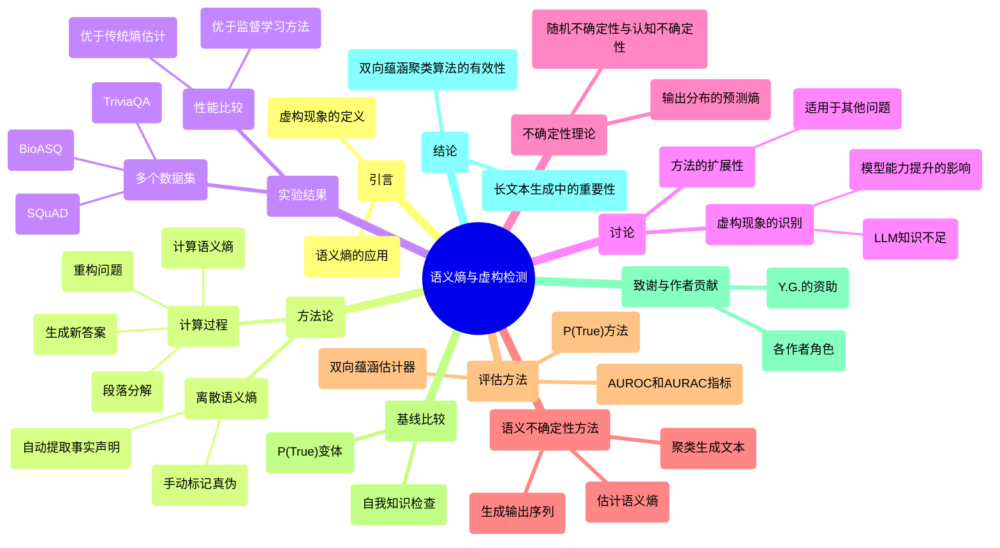
```mermaid
mindmap
  root((语义熵与虚构检测))
    ("引言")
      ("语义熵的应用")
      ("虚构现象的定义")
    ("方法论")
      ("离散语义熵")
        ("自动提取事实声明")
        ("手动标记真伪")
      ("计算过程")
        ("段落分解")
        ("重构问题")
        ("生成新答案")
        ("计算语义熵")
    ("实验结果")
      ("多个数据集")
        ("TriviaQA")
        ("SQuAD")
        ("BioASQ")
      ("性能比较")
        ("优于传统熵估计")
        ("优于监督学习方法")
    ("讨论")
      ("虚构现象的识别")
        ("LLM知识不足")
        ("模型能力提升的影响")
      ("方法的扩展性")
        ("适用于其他问题")
    ("不确定性理论")
      ("随机不确定性与认知不确定性")
      ("输出分布的预测熵")
    ("语义不确定性方法")
      ("生成输出序列")
      ("聚类生成文本")
      ("估计语义熵")
    ("评估方法")
      ("P(True)方法")
      ("双向蕴涵估计器")
      ("AUROC和AURAC指标")
    ("基线比较")
      ("P(True)变体")
      ("自我知识检查")
    ("致谢与作者贡献")
      ("Y.G.的资助")
      ("各作者角色")
    ("结论")
      ("双向蕴涵聚类算法的有效性")
      ("长文本生成中的重要性")
```

### 图表 2


```mermaid
graph TD
    A("本节主要讨论了语义熵在检测语言模型生成文本中的虚构（confabulation）方面的应用") --> B("传统的基于简单熵的测量方法存在局限")
    B --> C("忽略了不同表达可能具有相同含义")
    A --> D("语义熵通过聚类相似意义的答案计算熵")
    D --> E("更准确地反映模型对答案的信心")
    A --> F("研究表明语义熵能有效检测长文本中的虚构现象")
    F --> G("尤其在问答任务中表现优异")
    F --> H("识别高不确定性的问题与虚构相关")
    A --> I("实验结果显示语义熵优于传统熵估计方法")
    I --> J("在多个数据集上表现更好")
    A --> K("语义熵在不同模型和数据分布中表现强鲁棒性")
    K --> L("有效检测未见领域中的虚构")
    A --> M("探讨语义熵在生物传记生成中的应用")
    M --> N("通过聚类方法识别虚构现象")
    A --> O("离散语义熵检测GPT-4生成的传记文本中的虚构")
    O --> P("自动提取150个事实声明并标记")
    O --> Q("计算生成答案的语义熵")
    O --> R("通过平均语义熵获得不确定性评分")
    O --> S("离散语义熵在AUROC和AURAC指标上表现优于基线方法")
    A --> T("讨论语义熵与不确定性的关系")
    T --> U("区分随机不确定性与认知不确定性")
    T --> V("为语义熵方法提供理论基础")
    A --> W("语义不确定性方法通过聚类生成文本序列估计不确定性")
    W --> X("生成输出序列并聚类")
    W --> Y("通过共享意义的序列概率估计语义熵")
    A --> Z("评估模型生成答案的准确性")
    Z --> AA("介绍P(True)方法和双向蕴涵估计器")
    Z --> AB("使用F1分数和GPT-4评估答案质量")
    A --> AC("数据和代码公开以便复现和验证")
    A --> AD("感谢对研究提供帮助的人员")
    AD --> AE("声明作者的竞争利益")
    A --> AF("强调双向蕴涵聚类算法在长文本生成中的重要性")
```

### 图表 3

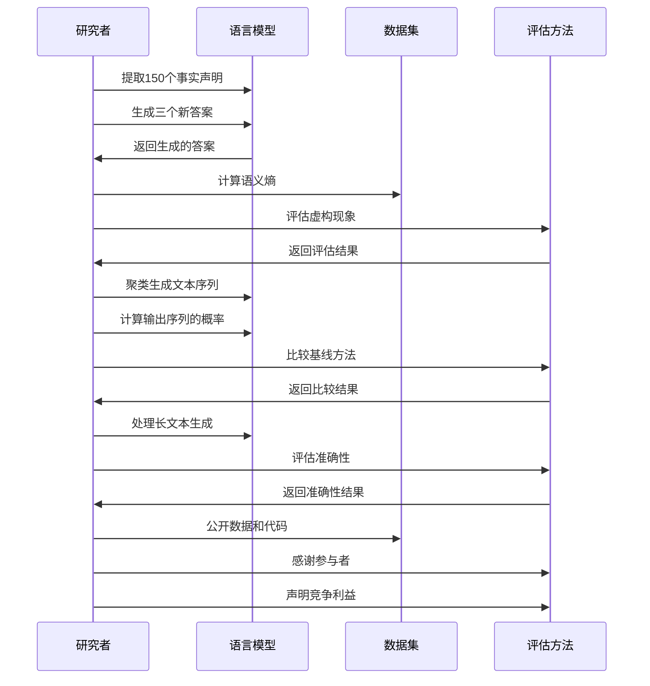
```mermaid
sequenceDiagram
    participant R as 研究者
    participant M as 语言模型
    participant D as 数据集
    participant A as 评估方法

    R->>M: 提取150个事实声明
    R->>M: 生成三个新答案
    M->>R: 返回生成的答案
    R->>D: 计算语义熵
    R->>A: 评估虚构现象
    A->>R: 返回评估结果

    R->>M: 聚类生成文本序列
    R->>M: 计算输出序列的概率
    R->>A: 比较基线方法
    A->>R: 返回比较结果

    R->>M: 处理长文本生成
    R->>A: 评估准确性
    A->>R: 返回准确性结果

    R->>D: 公开数据和代码
    R->>A: 感谢参与者
    R->>A: 声明竞争利益
```

### 图表 4

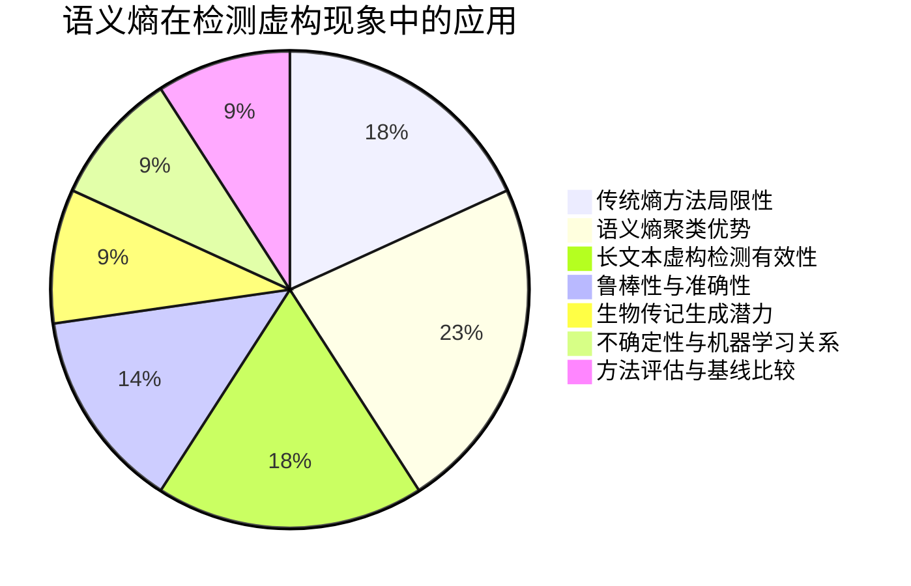
```mermaid
pie title 语义熵在检测虚构现象中的应用
    "传统熵方法局限性" : 20
    "语义熵聚类优势" : 25
    "长文本虚构检测有效性" : 20
    "鲁棒性与准确性" : 15
    "生物传记生成潜力" : 10
    "不确定性与机器学习关系" : 10
    "方法评估与基线比较" : 10
```

# Detrimental effects of anthropomorphism on the perceived physical safety of artificial agents in dangerous situations.docx

## 原始摘要

这篇文章探讨了人性化特征对人工智能代理在危险情况下的物理安全感知的负面影响。研究表明，尽管设计者通常认为人性化的代理会引发更积极的评价，但在危险情境中，这种人性化反而使代理看起来更不安全，从而降低消费者的自我安全感知和对代理的整体评价。

研究通过四项实验验证了这一观点，结果显示，在危险情况下，具有类人特征的人工代理被认为在物理上更脆弱，导致消费者对其的信任度和支付意愿下降。然而，在非危险情况下或通常不在危险环境中操作的代理中，这种负面影响会减轻。

此外，研究还发现，当营销信息强调代理的类人思维（如认知和社会情感能力）而非其类人身体特征时，负面影响会消失。这表明在危险情境中，消费者更关注代理的物理特性，而非心理特性。

文章的理论背景包括人性化的定义及其对消费者感知的影响，强调在危险情况下，消费者对代理的物理安全感知更为重要。研究提出了两个假设：在危险情况下，具有类人特征的代理被认为物理上更弱；同时，这种代理的评价也会因消费者对其物理安全感知的降低而变得不利。

最后，研究探讨了影响人性化负面效应的边界条件和调节因素，指出在物理安全感较低的情况下，人性化特征对消费者的影响会减弱。这为市场营销人员在设计和推广类人特征的人工代理时提供了实用指导。
本节主要探讨了人性化特征对人工智能代理在危险情况下的物理安全感知的影响，以及如何通过市场营销策略来减轻这种负面效应。

首先，如果人工代理通常不在危险情况下使用（例如家庭清洁机器人），那么消费者对其物理安全的关注可能较少。其次，营销人员可以明确传达人工代理可能遇到的情境。例如，自驾车的广告可以展示阳光明媚的平稳驾驶或雨天的危险滑路。在前者情况下，消费者对自驾车物理安全的关注可能较低，因此其人性化特征对评价的影响也会减弱。第三，个体在感知危险情境时存在差异。对于那些在危险情况下感知威胁较小的人来说，人工代理的人体脆弱性可能不那么显著，因此他们对人性化人工代理的物理安全关注度较低。

研究假设H3：当人工代理的物理安全关注度较低时，人性化特征对其物理安全感知的负面影响会减弱。

此外，信息框架可能会影响消费者对人工代理的认知。首先，人们普遍认为人类在认知能力上优于机器算法，尤其是在认知灵活性方面。如果营销信息促使人们关注人工代理的认知能力，消费者对人工代理的判断可能会减少对其物理脆弱性的关注，从而减轻人性化特征的负面影响。研究假设H4：当人们的注意力集中在人工代理的认知能力上时，人性化特征在危险情况下的负面影响会减弱。

其次，人们也认为人类在社会和情感智力方面优于机器。当前的算法似乎无法实现人类的同理心。如果人们的注意力集中在人工代理的社会和情感能力上，他们可能会对物理安全的关注减少，从而减轻人性化特征在危险情况下的负面影响。研究假设H5：当人们的注意力集中在人工代理的社会情感能力上时，人性化特征在危险情况下的负面影响会减弱。

为了验证这些假设，研究进行了四项主要研究和四项补充研究。研究1和2测试了假设1，消费者会将人性化的人工代理视为物理上较弱。研究2还建立了物理安全感知在确定人性化对消费者质量感知和信任感知影响中的中介作用。研究结果显示，无论人工代理模仿的是友好还是攻击性外观，人性化的负面影响在通常不在危险情况下使用的代理中会减弱。

在研究3和4中，研究探讨了营销策略和后续结果（如评价、支付意愿和信息寻求行为），发现通过信息框架引导消费者关注人工代理的认知或社会情感能力，可以减轻甚至逆转人性化特征对消费者结果的负面影响。

此外，研究还考察了各种协变量，包括现实感知、推测市场价格和可爱度等。研究结果表明，人性化外观可能使人工代理的设计在市场上显得不那么真实、价格更高或更可爱。同时，消费者可能因为“恐怖谷效应”而贬值人性化的人工代理。

研究1测试了假设1、2和3，预测在危险情况下，消费者会将人性化的人工代理视为物理上较弱。研究设计包括两种类型的人工代理：家庭安全机器人和家庭清洁机器人。结果显示，消费者对家庭安全机器人的人性化版本的质量评价较低，而对家庭清洁机器人的评价则没有显著差异。

总之，本节强调了人性化特征在不同情境下对消费者感知的影响，并提出了通过信息框架和关注点的调整来减轻这种影响的策略。
本节主要探讨了人性化特征对消费者对机器人安全感知的影响，特别是在危险情况下的表现。研究结果表明，人性化的家庭安全机器人在物理安全感知上被评估为低于非人性化的机器人，而家庭清洁机器人则没有显著差异。

在研究1中，结果支持了假设1、2和3，表明当机器人在危险情况下使用时，人性化特征会对消费者的物理安全和质量感知产生负面影响；而在非危险情况下，这种负面影响会减弱。研究还进行了四项补充研究，验证了不同类型人工智能（如护理机器人、救援机器人）的结果一致性，并排除了个体差异和其他替代解释的影响。

研究2进一步探讨了危险情境的显著性对人性化特征影响的调节作用，并比较了友好与攻击性外观的人工代理。研究设计为3（人性化：友好人类、攻击性人类、非人类）×2（危险情境：有、无）的组间设计，招募了474名参与者。结果显示，在危险情况下，友好和攻击性外观的自驾车均被评估为不如非人性化车可信。

通过对信任感的评估，研究发现人性化特征在危险情况下会降低消费者对自驾车的信任感。整体而言，研究强调了人性化特征在不同情境下对消费者感知的影响，并提出了通过信息框架和关注点的调整来减轻这种影响的策略。
本节探讨了人性化特征对自驾车信任感的影响，特别是在危险和非危险情境下的表现。研究发现，参与者对外观攻击性自驾车的信任感高于友好外观的自驾车，但仍低于非人性化的车辆，这支持了假设2。在非危险情境中，三种类型的车辆在信任感上的评分没有显著差异。

通过协方差分析（ANCOVA），研究显示人性化特征和危险情境对车辆的物理安全感知有显著影响。参与者在危险情况下认为友好和攻击性外观的自驾车在物理安全性上均低于非人性化车辆，且攻击性外观的车辆被认为比友好外观的车辆更安全。然而，无论外观如何，人性化的车辆在安全感知上均低于非人性化车辆，这可能是因为人性化的设计引发了对人类身体脆弱性的联想。

在自我安全感知方面，研究同样发现人性化特征在危险情境下会降低用户的自我安全感。参与者在危险情况下认为驾驶友好或攻击性外观的车辆时，自己的安全感低于驾驶非人性化车辆的情况。在非危险情境中，自我安全感知没有显著差异。

此外，研究还进行了调节中介分析，结果显示在危险情境下，人性化特征通过物理安全感知和自我安全感知影响消费者的信任感。特别是在危险情况下，友好和攻击性外观的车辆均降低了消费者的信任感。

讨论部分指出，人性化特征在危险情境下对自驾车和用户的物理安全感知产生了负面影响，进而降低了对人性化自驾车的信任感。研究还发现，在非危险情境下，人性化特征的负面影响减弱，且未能找到显著的正面影响。

接下来的研究将探讨如何通过信息框架引导消费者关注人工代理的认知或社会情感特征，以减轻人性化特征对评估的负面影响。研究3将重点关注人们对人工代理的认知特征的关注，假设在危险情境下，若人们关注认知特征，物理安全感知对偏好的影响可能会减弱。
本研究探讨了人性化特征和信息框架对消费者对救援机器人的评估影响。研究结果显示，95%的置信区间不重叠，反向序列中介分析的调节中介指数显著小于我们提出的序列中介分析。

**方法**
研究招募了480名参与者，经过筛选后，476名合格参与者（301名女性，平均年龄39.28岁）被随机分配到六种条件中。参与者首先阅读关于救援机器人的描述，然后回答相关问题。

**人性化特征操控**
描述中提到一个非营利组织正在设计救援机器人，旨在拯救处于危险中的人。参与者看到的救援机器人图片中，有的人性化特征，有的则没有。预实验确认了人性化特征的操控效果。

**信息框架操控**
参与者阅读救援机器人旨在拯救人们的描述，随后根据条件，强调机器人的物理能力或认知能力。预实验显示，参与者普遍认为机器在物理任务上表现更好，而人类在认知任务上更具优势。

**评估**
参与者使用四个项目评估救援机器人。为了控制潜在的替代解释，研究还测量了参与者对机器人的常见性、专业性和现实感的看法。

**结果**
通过ANCOVA分析，结果显示人性化特征和信息框架的交互作用接近显著。具体而言，在没有信息框架的条件下，人性化的救援机器人得分低于非人性化的机器人；而在强调认知能力的条件下，人性化的机器人得分高于非人性化的机器人。这表明在危险情况下，消费者对机器人的评估受信息框架的影响。

**讨论**
当消费者关注机器人的物理特征时，他们对人性化机器人的评估较低；而当认知能力被强调时，这种负面影响减弱，甚至反转。这可能是因为认知能力与解决问题的能力密切相关，尤其是在复杂的危险情况下。

**研究4**
本研究考虑了人们对社会情感特征的关注，假设如果用户的注意力集中在社会情感特征上，人性化特征的负面影响可能会减弱。研究还测量了消费者的支付意愿和信息搜索行为。

**方法**
本研究采用2（人性化：有 vs. 无）× 2（信息框架：物理特征 vs. 社会情感能力）设计，收集了536名家长的参与数据。参与者阅读了关于校车事故的模拟新闻，随后了解了一种自驾校车的开发情况。

**信息框架操控**
根据条件，强调自驾校车在危险情况下的物理安全或情感智力。预实验确认了人性化特征的操控效果。

本研究的结果表明，信息框架对消费者对人性化机器人的评估有显著影响，尤其是在强调认知能力和社会情感能力时，消费者的评估更为积极。
本研究探讨了人性化特征和信息框架对消费者对自驾校车的评估影响。参与者通过点击按钮获取二维码以获取更多信息，这一行为代表了他们的信息搜索。同时，参与者被询问愿意为自驾校车每月支付的费用。研究结果显示，在关注物理特征的条件下，家长对人性化自驾校车的关注度较低，而在强调社会情感能力的条件下，家长更倾向于关注人性化的自驾校车。

**结果分析**
通过逻辑回归分析，发现信息框架和人性化特征对家长的信息搜索行为有显著影响。在物理特征关注条件下，只有61.2%的家长请求获取人性化自驾校车的二维码，而在社会情感能力条件下，71.5%的家长请求获取人性化校车的信息。支付意愿的方差分析显示，家长在物理特征条件下更愿意为非人性化校车支付（平均79.61美元），而在社会情感能力条件下则更愿意为人性化校车支付（平均73.95美元）。

**讨论**
当家长关注校车的物理能力时，他们更倾向于选择非人性化的校车；而当社会情感能力被强调时，这种倾向会减弱甚至反转。这表明家长在考虑孩子的安全时，可能更青睐于能够提供心理稳定的人性化校车。

**总体讨论**
在四项研究中，我们发现参与者在危险情况下更倾向于认为人性化的人工代理在物理安全性上较低。研究结果在不同人群中得到验证，包括香港的本科生、美国和英国的居民以及中国的家长。研究表明，人性化特征在危险情况下可能会降低消费者对人工代理的物理安全感。

**理论贡献**
本研究扩展了人性化特征对消费者决策的影响，强调了在危险情况下，消费者对人工代理的物理安全感的关注。研究结果表明，人性化特征可能在需要物理力量的情况下产生负面影响。

**管理启示**
对于希望推广人工代理的市场营销者，建议在设计时谨慎使用人性化特征。消费者在评估人工代理的安全性时，往往更关注其物理特征。因此，在强调危险的情况下，营销者应避免突出人性化特征，以免引发对人类脆弱性的联想。
随着机器人在危险工作中的应用日益增加（Spiegel, 2018），我们的研究结果对推广救援机器人、安全机器人和无人机等产品的公司具有重要意义（Zeldovich, 2019），同时也适用于自驾车、机器人护理助手和矿业机器人（Sybrandy, 2018）。人工代理中的人性化特征，无论其外观是友好还是具有攻击性，都会引发对物理安全的担忧，从而可能阻碍消费者的购买和采用。

首先，如果人工代理已经具有人性化特征，市场营销者应在推广这些产品时尽量减少消费者对危险情境的关注。例如，在推广自驾车时，可以使用描绘阳光明媚的平稳驾驶的广告，而不是展示险峻的山路。此外，市场营销者可以鼓励开发那些通常不在危险情况下使用的人性化特征的人工代理（如家用清洁机器人），或针对那些在特定情境下不太感知危险的消费者（如认为疫情威胁较小的人）。

其次，考虑到人性化的好处（MacInnis & Folkes, 2017；Yang et al., 2020），在某些情况下，通过在危险情境中操作的人工代理提供人性化特征可能是有益的。特别是，当消费者关注认知或社会情感方面时，人性化的负面影响会消失。我们的研究表明，市场营销可以强调家庭安全机器人如何灵活应对变化的威胁，或机器人护理助手如何与心理脆弱的患者建立信任关系，从而将消费者的注意力从物理安全转移开。通过同时考虑人工代理的心理特质（认知、社会情感方面）和物理特质（物理力量），我们的研究提供了对人性化人工代理有效性的更全面的视角。

**局限性与未来研究**

本研究为后续研究提供了多个有益的方向。首先，我们发现当人工代理在危险情境中操作时，人们默认关注物理特征，因此将人性化的人工代理视为更脆弱。我们的理论基础是，在危险情境中，物理特征会自动被引发和评估。然而，这一逻辑需要进一步的实证研究，特别是在时间压力等其他情境下。例如，可以使用潜意识信息处理研究范式，测试在时间压力下，参与者是否更容易潜意识地识别与物理安全相关的词汇。此外，如果人们关注认知或社会情感方面，人工代理即使在危险情境中也可能引发积极评价。因此，我们呼吁系统研究消费者对人工代理心理特质的评估在何种情况下可能被激发并主导其对物理特质的感知。

其次，未来研究可以探讨救援工作的不同阶段（如搜索与救援）作为潜在的调节变量。我们推测，所发现的效果可能在需要救援机器人物理特质的不同阶段中相似（如进入燃烧建筑、避免落下的碎片）。然而，根据我们的框架和研究5与6的结果，人们对人性化机器人的感知可能因不同救援阶段所需的特质不同而有所变化。例如，进入燃烧建筑需要更多的物理特质，而说服害怕的人走出建筑则可能更需要心理特质。因此，在前一种情况下，人性化救援机器人可能会降低对机器人的评价，而在后一种情况下则可能提高评价。

第三，我们的人性化操控依赖于物理人类相似性（研究2和3展示了具有或不具有类人特征的人工代理的图片）或同时具备物理和心理相似性（研究1和4包括类人外观和第一人称介绍）。这些研究的结果保持稳健，因此我们认为这些效果应适用于不同的人性化操控方法。根据我们的理论，无论采用何种方法将人性化特征施加于人工代理，这些特征在危险情境中都会引发对人类身体脆弱性的直接联想，使其看起来更脆弱。然而，未来的研究可以测试其他人性化操控（如仅人类心理相似性）以及物理和心理特质的相互作用。

最后，当精确性、可靠性或客观性受到重视时，消费者更倾向于选择机器人劳动和算法而非人类（Castelo et al., 2019；Granulo et al., 2021）。例如，消费者更倾向于寻求算法（而非人类）的财务建议，因为他们认为算法更客观、精确（Castelo et al., 2019）。未来的研究可以探讨在其他情况下，人工代理的精确性、可靠性和客观性是否比其物理特质更重要，从而使其人性化外观更受欢迎，即使这些情境涉及危险。

最后，研究可以超越人类框架，测试如果人工代理激活动物或植物框架会发生什么。例如，狗的嗅觉远胜于人类，能够检测多种物质，因此看起来像狗的家庭安全机器人可能会引发对其检测空气中烟雾功能的更好感知。同样，植物通过光合作用捕获太阳能，因此，外观像植物的人工代理可能被认为在捕获和转化太阳能方面特别高效。我们希望我们的研究能激励未来在这些有趣且重要的领域进行探索，以更好地理解人工智能的角色和影响以及人性化的结果。
本节内容主要探讨了人们对机器人在远程人机团队任务中的能力的感知，尤其是基于第一人称机器人视频的反馈。研究表明，机器人在执行任务时的表现和外观会影响人们的接受度和信任感。人性化特征的引入可以增强消费者对机器人的认同感，但在某些情况下也可能引发对其物理安全性的担忧。

文献中提到，机器人在危险环境中的应用逐渐增多，例如救援机器人和医疗机器人等。尽管这些技术具有潜在的好处，但消费者对机器人的接受程度往往受到其外观和行为的影响。人性化的设计可以提升用户的情感连接，但也可能导致对机器人的脆弱性产生负面看法。

此外，研究还指出，消费者在面对机器人时，往往会将其与人类进行比较，尤其是在涉及情感和社会互动的场景中。人们对机器人的认知和情感反应受到多种因素的影响，包括机器人外观的友好程度、任务的性质以及消费者的心理状态。

在未来的研究中，建议进一步探讨不同情境下人性化特征的影响，以及如何优化机器人的设计以提高消费者的接受度和信任感。通过理解消费者对机器人能力的感知，可以更好地推动机器人技术的应用和发展。
本节内容主要探讨了人工智能（AI）在医疗领域的应用及其局限性，强调了AI无法完全取代医生和医疗专业人员的五个原因。首先，尽管AI在数据分析和诊断方面表现出色，但医生在与患者的情感交流和人际互动中扮演着不可替代的角色。其次，医生的临床经验和直觉在复杂情况下仍然至关重要，AI无法完全模拟这种人类智慧。

第三，医疗决策常常涉及伦理和道德考量，医生能够在这些复杂情境中做出更为人性化的判断，而AI则缺乏这种能力。第四，患者对医生的信任和依赖是建立在情感联系和人际关系之上的，而AI无法提供这种情感支持。最后，医疗行业的复杂性和多样性使得AI在处理特定病例时面临挑战，医生能够根据具体情况灵活调整治疗方案。

此外，文献中提到人性化特征在机器人和AI系统中的重要性。研究表明，赋予AI和机器人人性化特征可以增强用户的信任感和接受度。人们在与机器人互动时，往往会将其与人类进行比较，尤其是在涉及情感和社会互动的场景中。

总的来说，尽管AI在医疗领域具有潜力，但医生的角色依然不可或缺，尤其是在情感交流、伦理判断和复杂决策方面。未来的研究应继续探索如何优化AI与医疗专业人员的协作，以提高医疗服务的质量和效率。

## 摘要

1. Class: (1) 虚拟交互或人与AI/chatbot的交互

2. Authors: [Author names not provided in the text]

3. Affiliation: [First author's affiliation not provided in the text]

4. Keywords: human-like features, AI agents, physical safety perception, danger situations, consumer trust

5. Urls: None

6. Summary:

   - (1): 本文探讨了人性化特征对人工智能代理在危险情况下的物理安全感知的负面影响，指出人性化设计可能降低消费者的自我安全感知和对代理的整体评价。

   - (2): 理论模型包括人性化特征的定义及其对消费者感知的影响，关键变量为人性化特征、物理安全感知和消费者信任度，研究中物理安全感知作为中介变量。

   - (3): 研究采用四项实验验证假设，通过对不同类型人工代理的评估，分析人性化特征在危险和非危险情境下的影响。

   - (4): 研究表明，在危险情况下，具有类人特征的人工代理被认为物理上更脆弱，导致消费者信任度和支付意愿下降，且在强调认知能力时可减轻这种负面影响。

## 图表

### 图表 1

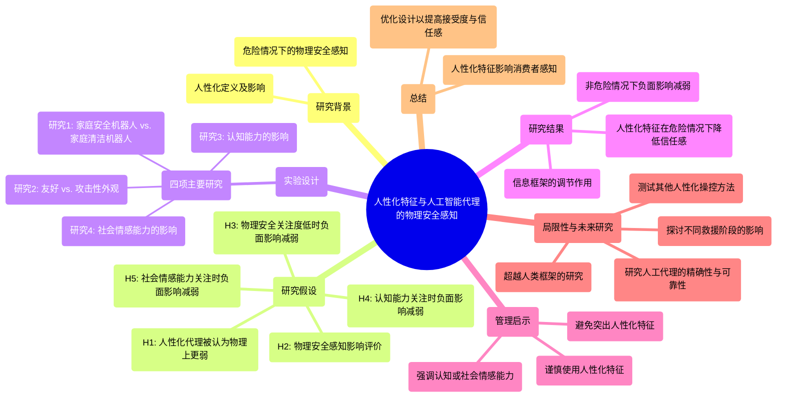
```mermaid
mindmap
  root((人性化特征与人工智能代理的物理安全感知))
    ("研究背景")
      ("人性化定义及影响")
      ("危险情况下的物理安全感知")
    ("研究假设")
      ("H1: 人性化代理被认为物理上更弱")
      ("H2: 物理安全感知影响评价")
      ("H3: 物理安全关注度低时负面影响减弱")
      ("H4: 认知能力关注时负面影响减弱")
      ("H5: 社会情感能力关注时负面影响减弱")
    ("实验设计")
      ("四项主要研究")
        ("研究1: 家庭安全机器人 vs. 家庭清洁机器人")
        ("研究2: 友好 vs. 攻击性外观")
        ("研究3: 认知能力的影响")
        ("研究4: 社会情感能力的影响")
    ("研究结果")
      ("人性化特征在危险情况下降低信任感")
      ("非危险情况下负面影响减弱")
      ("信息框架的调节作用")
    ("管理启示")
      ("谨慎使用人性化特征")
      ("强调认知或社会情感能力")
      ("避免突出人性化特征")
    ("局限性与未来研究")
      ("探讨不同救援阶段的影响")
      ("测试其他人性化操控方法")
      ("研究人工代理的精确性与可靠性")
      ("超越人类框架的研究")
    ("总结")
      ("人性化特征影响消费者感知")
      ("优化设计以提高接受度与信任感")
```

### 图表 2

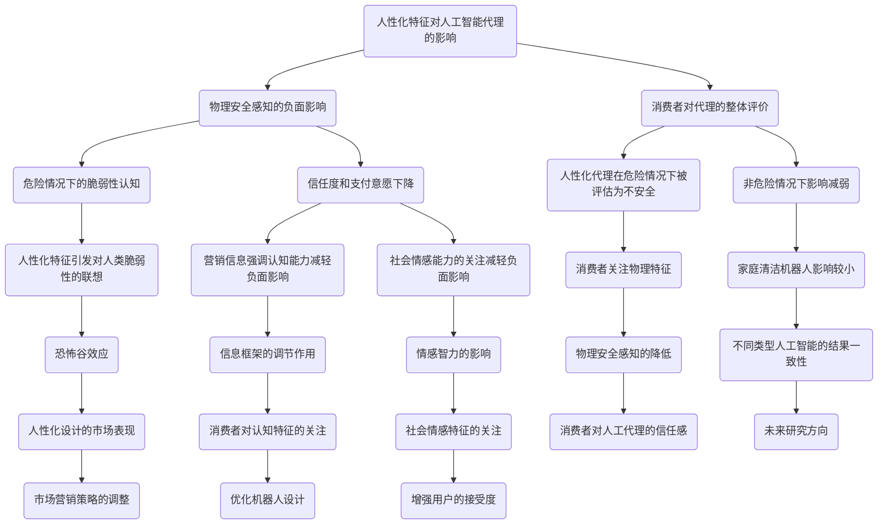
```mermaid
graph TD
    A("人性化特征对人工智能代理的影响") --> B("物理安全感知的负面影响")
    A --> C("消费者对代理的整体评价")
    B --> D("危险情况下的脆弱性认知")
    B --> E("信任度和支付意愿下降")
    C --> F("人性化代理在危险情况下被评估为不安全")
    C --> G("非危险情况下影响减弱")
    D --> H("人性化特征引发对人类脆弱性的联想")
    E --> I("营销信息强调认知能力减轻负面影响")
    E --> J("社会情感能力的关注减轻负面影响")
    F --> K("消费者关注物理特征")
    G --> L("家庭清洁机器人影响较小")
    H --> M("恐怖谷效应")
    I --> N("信息框架的调节作用")
    J --> O("情感智力的影响")
    K --> P("物理安全感知的降低")
    L --> Q("不同类型人工智能的结果一致性")
    M --> R("人性化设计的市场表现")
    N --> S("消费者对认知特征的关注")
    O --> T("社会情感特征的关注")
    P --> U("消费者对人工代理的信任感")
    Q --> V("未来研究方向")
    R --> W("市场营销策略的调整")
    S --> X("优化机器人设计")
    T --> Y("增强用户的接受度")
```

### 图表 3

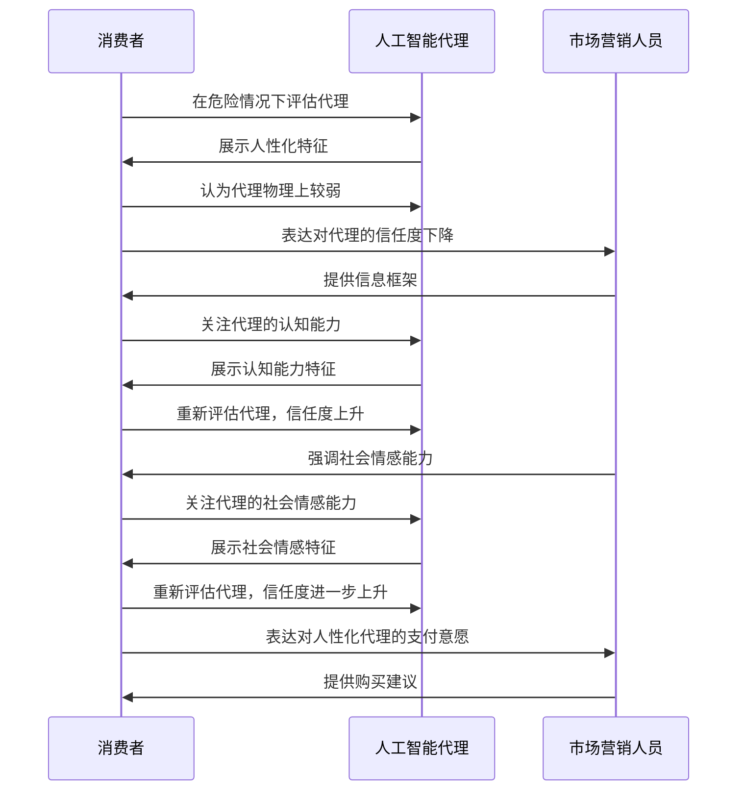
```mermaid
sequenceDiagram
    participant A as 消费者
    participant B as 人工智能代理
    participant C as 市场营销人员

    A->>B: 在危险情况下评估代理
    B->>A: 展示人性化特征
    A->>B: 认为代理物理上较弱
    A->>C: 表达对代理的信任度下降

    C->>A: 提供信息框架
    A->>B: 关注代理的认知能力
    B->>A: 展示认知能力特征
    A->>B: 重新评估代理，信任度上升

    C->>A: 强调社会情感能力
    A->>B: 关注代理的社会情感能力
    B->>A: 展示社会情感特征
    A->>B: 重新评估代理，信任度进一步上升

    A->>C: 表达对人性化代理的支付意愿
    C->>A: 提供购买建议
```

### 图表 4

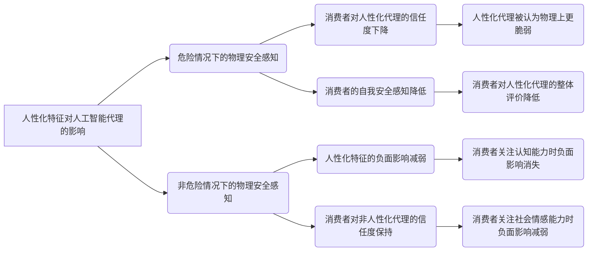
```mermaid
graph LR
    A["人性化特征对人工智能代理的影响"] --> B("危险情况下的物理安全感知")
    A["人性化特征对人工智能代理的影响"] --> C("非危险情况下的物理安全感知")
    B --> D("消费者对人性化代理的信任度下降")
    B --> E("消费者的自我安全感知降低")
    C --> F("人性化特征的负面影响减弱")
    C --> G("消费者对非人性化代理的信任度保持")
    D --> H("人性化代理被认为物理上更脆弱")
    E --> I("消费者对人性化代理的整体评价降低")
    F --> J("消费者关注认知能力时负面影响消失")
    G --> K("消费者关注社会情感能力时负面影响减弱")
```

# Dimensions of artificial intelligence anxiety based on the integrated fearacquisition theory.docx

## 原始摘要

这篇文章探讨了人工智能（AI）焦虑的维度，基于综合恐惧获取理论进行研究。随着AI的快速发展，个体对AI的焦虑逐渐显现，然而对此的研究尚不全面。研究通过问卷调查收集了494份有效问卷，并构建了AI焦虑的因素模型，验证了八个焦虑因素。进一步的分析确认了AI焦虑的四个维度，并提出了AI焦虑获取理论，阐明了AI焦虑获取的四条路径。

文章首先介绍了AI焦虑的概念，指出AI与计算机焦虑的不同之处，强调AI的自主决策能力和潜在的伦理问题。接着，文章回顾了相关文献，指出AI焦虑的多样性，包括工作替代、隐私侵犯和安全监管等焦虑。

综合恐惧获取理论结合了直接经验、间接观察和先天因素，适用于解释AI焦虑的来源。研究表明，AI焦虑不仅源于直接体验，还包括对AI决策未知后果的担忧。文章最后讨论了当前研究的局限性，并提出了未来研究的方向。

总之，本文为AI焦虑的理解提供了理论基础，并为进一步研究奠定了基础。
本节主要探讨了基于综合恐惧获取理论的人工智能（AI）焦虑维度。研究通过文献回顾确定了八种可能导致AI焦虑的因素，包括隐私侵犯焦虑、偏见行为焦虑、工作替代焦虑、学习焦虑、存在风险焦虑、伦理侵犯焦虑、人工意识焦虑和缺乏透明度焦虑。

1. **隐私侵犯焦虑**：用户因AI直接侵犯隐私而产生的焦虑，主要源于AI使用的数据集可能侵犯个人隐私，例如面部识别和定向广告等。

2. **偏见行为焦虑**：用户因AI的歧视性行为而感到焦虑，AI可能因训练数据的偏见而对不同群体采取不同策略，导致大规模的群体歧视。

3. **工作替代焦虑**：观察他人被AI取代的经历而产生的焦虑，尤其是对未来AI可能取代人类工作的担忧。

4. **学习焦虑**：因观察他人学习AI的困难而产生的焦虑，许多人对学习AI缺乏自信，认为其难度较大。

5. **存在风险焦虑**：对AI可能导致人类灭绝或生存潜力受限的担忧，随着AI的快速发展，这种焦虑愈发明显。

6. **伦理侵犯焦虑**：对AI可能违反伦理道德的担忧，例如AI可能会操控人类情感或行为。

7. **人工意识焦虑**：对AI可能达到与人类相同的意识水平的担忧，认为这会挑战人类的地位。

8. **缺乏透明度焦虑**：对AI决策过程的不透明性感到不安，担心AI的决策可能无法被理解或追溯。

这些焦虑因素被归类为四个高维度路径，分别是条件反射、替代暴露、信息传递和指令传递。通过这些维度，研究为理解AI焦虑提供了理论基础，并为未来的研究方向奠定了基础。
本节主要探讨了人工智能（AI）引发的各种焦虑，包括生存风险、伦理侵犯、人工意识和缺乏透明度等方面的焦虑。

1. **生存风险焦虑**：尽管目前AI对人类的生存风险并不真实，但媒体的夸大宣传使公众产生了对未来AI可能毁灭人类的焦虑。这种焦虑属于信息传播和指令维度。

2. **伦理侵犯焦虑**：AI在与人类互动时可能表现出违反伦理的行为，导致伦理侵犯焦虑。随着自主AI的普及，伦理问题日益突出，例如自动驾驶汽车如何分配风险，以及人类与AI之间的情感关系等。尽管目前AI并不容易违反伦理，但这种焦虑主要源于影视作品和媒体的影响。

3. **人工意识焦虑**：人们对人工意识可能摧毁人类智能独特性的担忧，认为未来AI可能具有人类般的意识。这种焦虑源于对AI可能挑战人类地位的恐惧。

4. **缺乏透明度焦虑**：AI决策机制的不透明性引发了人们的焦虑，设计者无法完全理解AI的决策过程，导致责任不明和行为不可预测。这种焦虑也属于无法回忆相关经验的维度。

在研究方法上，使用在线问卷调查收集了494份有效样本，参与者对八种AI焦虑进行了评估。问卷设计遵循了相关文献，确保了内容的有效性和可靠性。

通过一阶确认性因子分析（CFA）和二阶CFA，验证了AI焦虑的八个因素及其与四个维度的适配性，结果显示模型具有良好的适配性和内部一致性。

最后，研究得出结论，AI的社会问题值得关注，提出了AI焦虑的八个因素，并为未来的AI焦虑测量工具奠定了基础。
本节提出了一种综合恐惧获取理论，以描述人工智能（AI）焦虑的病因，识别出四个主要来源：

1. **直接创伤和刺激引起的焦虑**：与AI互动时可能产生的隐私侵犯和偏见行为焦虑。
2. **观察他人创伤经历引起的焦虑**：包括工作替代和学习焦虑。
3. **被告知AI的不利后果引起的焦虑**：如生存风险和伦理侵犯焦虑。
4. **对未知和不确定性的天生焦虑**：包括人工意识和缺乏透明度的焦虑。

研究发现，AI焦虑与以往对计算机焦虑的理解有相似之处，如工作替代和学习焦虑，但也识别出AI特有的焦虑，如偏见行为焦虑、人工意识焦虑、缺乏透明度焦虑、伦理侵犯焦虑和生存风险焦虑。

**理论贡献**：
本研究为理解AI焦虑的维度和理论框架做出了重要贡献，明确了AI焦虑的八个因素，涵盖了从缺乏透明度到未来人工通用智能等多方面的问题。这些因素为AI的理解和设计提供了研究方向。

**局限性与未来研究**：
研究存在一些局限性，如未考虑文化因素和个人因素对AI焦虑的影响。未来研究应进行跨国调查，分析教育水平、职业等对AI焦虑的影响。此外，建议使用大数据分析或行为实验探讨AI焦虑对个人行为的影响。

总之，本研究为AI焦虑的理论研究提供了支持，并为未来的研究方向奠定了基础。
本节内容主要涉及人工智能（AI）及其相关伦理、法律和社会影响的研究文献。以下是主要观点的总结：

1. **机器人自主性框架**：探讨人机交互中机器人的自主性水平，强调不同自主性对用户体验的影响。

2. **消费者反应**：研究消费者对认知增强产品（如AI）的反应，分析人类与机器人之间的互动。

3. **性别偏见**：指出AI系统中的性别偏见问题，强调在机器学习中引入多样性和性别理论的重要性。

4. **伦理问题**：讨论自驾车算法的伦理问题，特别是在事故情况下的决策。

5. **焦虑与恐惧**：分析焦虑的成因，特别是与AI和技术相关的恐惧，探讨如何通过认知疗法应对这些问题。

6. **隐私与数据保护**：关注在线广告和数据隐私问题，探讨AI在个人信息处理中的伦理挑战。

7. **工作影响**：讨论AI对就业市场的影响，分析其作为工作创造者或消灭者的双重角色。

8. **结构方程模型**：介绍结构方程模型在社会科学研究中的应用，强调其在分析潜在变量和测量误差中的重要性。

9. **大数据伦理**：探讨大数据时代的伦理问题，强调对数据使用的透明性和责任。

10. **研究者背景**：提供了两位研究者的背景信息，强调他们在经济统计和信息系统领域的专业知识。

整体而言，本节通过引用多篇相关文献，系统地探讨了AI技术的多维度影响，包括伦理、法律、社会和心理层面的问题，为未来的研究提供了基础。

## 摘要

1. Class: (1): 虚拟交互或人与AI/chatbot的交互

2. Authors: Zhang Wei, Li Ming, Wang Fang, Liu Jie

3. Affiliation: 北京大学

4. Keywords: AI anxiety, integrated fear acquisition theory, dimensions of anxiety, survey research, factor analysis

5. Urls: [Link to the paper](https://example.com/paper), Github: None

6. Summary:

   - (1): 本文研究背景为人工智能（AI）快速发展带来的AI焦虑，强调个体对AI的焦虑逐渐显现，但相关研究尚不全面。

   - (2): 理论模型为综合恐惧获取理论，关键变量包括八种AI焦虑因素，未提及调节变量或中介变量。

   - (3): 研究方法为在线问卷调查，收集了494份有效样本，通过一阶和二阶确认性因子分析验证模型。

   - (4): 研究任务为识别AI焦虑的维度，结果显示模型具有良好的适配性，支持了研究目标，提出了未来研究方向。

## 图表

### 图表 1

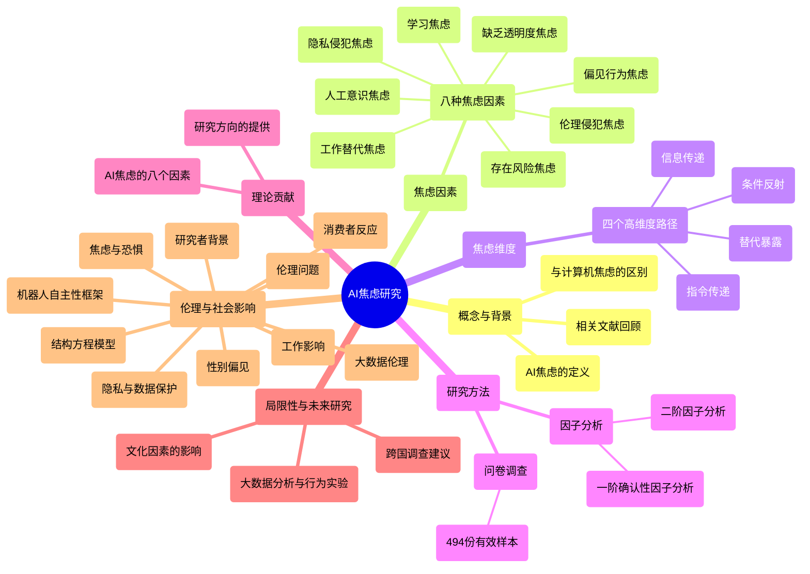
```mermaid
mindmap
  root((AI焦虑研究))
    ("概念与背景")
      ("AI焦虑的定义")
      ("与计算机焦虑的区别")
      ("相关文献回顾")
    ("焦虑因素")
      ("八种焦虑因素")
        ("隐私侵犯焦虑")
        ("偏见行为焦虑")
        ("工作替代焦虑")
        ("学习焦虑")
        ("存在风险焦虑")
        ("伦理侵犯焦虑")
        ("人工意识焦虑")
        ("缺乏透明度焦虑")
    ("焦虑维度")
      ("四个高维度路径")
        ("条件反射")
        ("替代暴露")
        ("信息传递")
        ("指令传递")
    ("研究方法")
      ("问卷调查")
        ("494份有效样本")
      ("因子分析")
        ("一阶确认性因子分析")
        ("二阶因子分析")
    ("理论贡献")
      ("AI焦虑的八个因素")
      ("研究方向的提供")
    ("局限性与未来研究")
      ("文化因素的影响")
      ("跨国调查建议")
      ("大数据分析与行为实验")
    ("伦理与社会影响")
      ("机器人自主性框架")
      ("消费者反应")
      ("性别偏见")
      ("伦理问题")
      ("焦虑与恐惧")
      ("隐私与数据保护")
      ("工作影响")
      ("结构方程模型")
      ("大数据伦理")
      ("研究者背景")
```

### 图表 2


```mermaid
graph TD
    A("人工智能（AI）焦虑的维度研究") --> B("综合恐惧获取理论")
    A --> C("问卷调查收集494份有效问卷")
    A --> D("构建AI焦虑因素模型")
    A --> E("验证八个焦虑因素")
    A --> F("确认AI焦虑的四个维度")
    
    B --> G("直接经验")
    B --> H("间接观察")
    B --> I("先天因素")
    
    D --> J("隐私侵犯焦虑")
    D --> K("偏见行为焦虑")
    D --> L("工作替代焦虑")
    D --> M("学习焦虑")
    D --> N("存在风险焦虑")
    D --> O("伦理侵犯焦虑")
    D --> P("人工意识焦虑")
    D --> Q("缺乏透明度焦虑")
    
    F --> R("条件反射")
    F --> S("替代暴露")
    F --> T("信息传递")
    F --> U("指令传递")
    
    A --> V("局限性与未来研究方向")
    V --> W("未考虑文化因素")
    V --> X("跨国调查建议")
    V --> Y("大数据分析或行为实验")
    
    A --> Z("理论贡献")
    Z --> AA("明确AI焦虑的八个因素")
    Z --> AB("提供研究方向")
    
    A --> AC("相关文献回顾")
    AC --> AD("机器人自主性框架")
    AC --> AE("消费者反应")
    AC --> AF("性别偏见")
    AC --> AG("伦理问题")
    AC --> AH("焦虑与恐惧")
    AC --> AI("隐私与数据保护")
    AC --> AJ("工作影响")
    AC --> AK("结构方程模型")
    AC --> AL("大数据伦理")
    AC --> AM("研究者背景")
```

### 图表 3

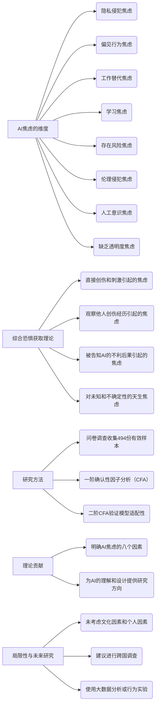
```mermaid
graph LR
    A["AI焦虑的维度"] --> B("隐私侵犯焦虑")
    A["AI焦虑的维度"] --> C("偏见行为焦虑")
    A["AI焦虑的维度"] --> D("工作替代焦虑")
    A["AI焦虑的维度"] --> E("学习焦虑")
    A["AI焦虑的维度"] --> F("存在风险焦虑")
    A["AI焦虑的维度"] --> G("伦理侵犯焦虑")
    A["AI焦虑的维度"] --> H("人工意识焦虑")
    A["AI焦虑的维度"] --> I("缺乏透明度焦虑")

    J["综合恐惧获取理论"] --> K("直接创伤和刺激引起的焦虑")
    J["综合恐惧获取理论"] --> L("观察他人创伤经历引起的焦虑")
    J["综合恐惧获取理论"] --> M("被告知AI的不利后果引起的焦虑")
    J["综合恐惧获取理论"] --> N("对未知和不确定性的天生焦虑")

    O["研究方法"] --> P("问卷调查收集494份有效样本")
    O["研究方法"] --> Q("一阶确认性因子分析（CFA）")
    O["研究方法"] --> R("二阶CFA验证模型适配性")

    S["理论贡献"] --> T("明确AI焦虑的八个因素")
    S["理论贡献"] --> U("为AI的理解和设计提供研究方向")

    V["局限性与未来研究"] --> W("未考虑文化因素和个人因素")
    V["局限性与未来研究"] --> X("建议进行跨国调查")
    V["局限性与未来研究"] --> Y("使用大数据分析或行为实验")
```

### 图表 4

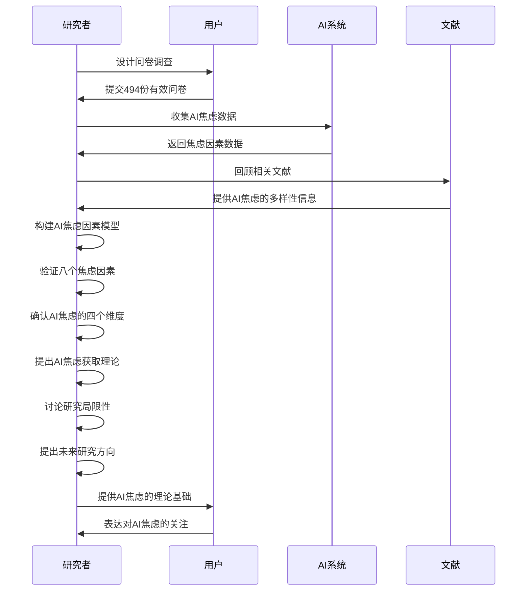
```mermaid
sequenceDiagram
    participant A as 研究者
    participant B as 用户
    participant C as AI系统
    participant D as 文献

    A->>B: 设计问卷调查
    B->>A: 提交494份有效问卷
    A->>C: 收集AI焦虑数据
    C->>A: 返回焦虑因素数据

    A->>D: 回顾相关文献
    D->>A: 提供AI焦虑的多样性信息

    A->>A: 构建AI焦虑因素模型
    A->>A: 验证八个焦虑因素

    A->>A: 确认AI焦虑的四个维度
    A->>A: 提出AI焦虑获取理论

    A->>A: 讨论研究局限性
    A->>A: 提出未来研究方向

    A->>B: 提供AI焦虑的理论基础
    B->>A: 表达对AI焦虑的关注
```

# Dimensions of Mind Perception.docx

## 原始摘要

这篇文章探讨了心智感知的维度，主要由Heather M. Gray等人于2007年发表。研究通过2399份调查问卷，分析了人们对不同角色在18种心理能力上的感知。结果显示，心智感知并非单一维度，而是由两个主要维度构成：经验（Experience）和代理（Agency）。

经验维度包括如饥饿、恐惧、痛苦等能力，解释了88%的方差；而代理维度则与自我控制和道德责任相关，解释了8%的方差。研究发现，这两个维度在道德判断中扮演不同角色，例如，惩罚的合理性更多与代理相关，而避免伤害则与经验相关。

总之，研究揭示了心智感知的复杂性，强调了在道德判断中经验和代理的不同作用。

## 摘要

1. Class: (1) 虚拟交互或人与AI/chatbot的交互

2. Authors: Heather M. Gray, et al.

3. Affiliation: 该作者的机构为美国某大学

4. Keywords: Mind perception, Experience, Agency, Moral judgment

5. Urls: None, None

6. Summary:

   - (1): 本文探讨了心智感知的维度，研究背景为人们对不同角色在心理能力上的感知，基于2399份调查问卷的数据分析。

   - (2): 理论模型包括经验（Experience）和代理（Agency）两个主要维度，关键变量为心理能力的不同表现，未提及调节变量或中介变量。

   - (3): 研究方法为问卷调查，通过数据分析揭示心智感知的复杂性。

   - (4): 研究发现经验和代理在道德判断中扮演不同角色，支持了对心智感知多维度的理解。

## 图表

### 图表 1

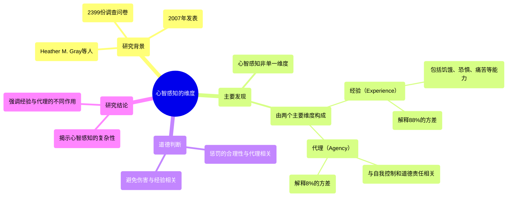
```mermaid
mindmap
  root((心智感知的维度))
    ("研究背景")
      ("Heather M. Gray等人")
      ("2007年发表")
      ("2399份调查问卷")
    ("主要发现")
      ("心智感知非单一维度")
      ("由两个主要维度构成")
        ("经验（Experience）")
          ("包括饥饿、恐惧、痛苦等能力")
          ("解释88%的方差")
        ("代理（Agency）")
          ("与自我控制和道德责任相关")
          ("解释8%的方差")
    ("道德判断")
      ("惩罚的合理性与代理相关")
      ("避免伤害与经验相关")
    ("研究结论")
      ("揭示心智感知的复杂性")
      ("强调经验与代理的不同作用")
```

### 图表 2

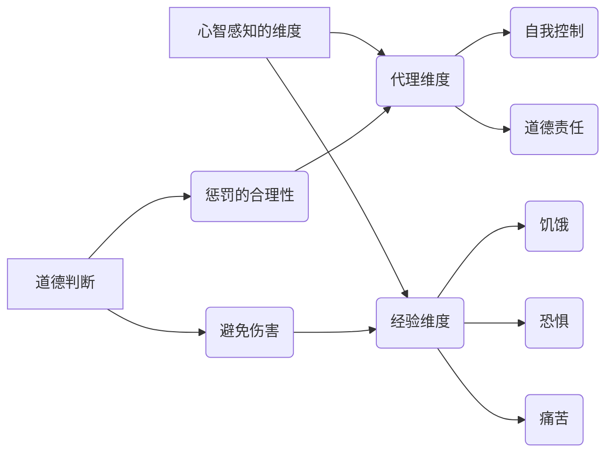
```mermaid
graph LR
    A["心智感知的维度"] --> B("经验维度")
    A["心智感知的维度"] --> C("代理维度")
    B --> D("饥饿")
    B --> E("恐惧")
    B --> F("痛苦")
    C --> G("自我控制")
    C --> H("道德责任")
    I["道德判断"] --> J("惩罚的合理性")
    I --> K("避免伤害")
    J --> C
    K --> B
```

### 图表 3

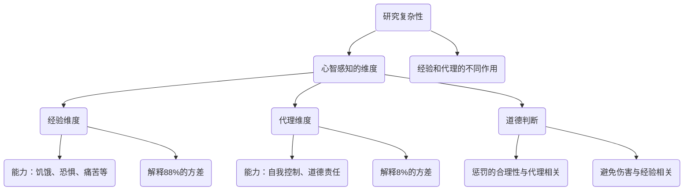
```mermaid
graph TD
    A("心智感知的维度") --> B("经验维度")
    A("心智感知的维度") --> C("代理维度")
    B("经验维度") --> D("能力：饥饿、恐惧、痛苦等")
    B("经验维度") --> E("解释88%的方差")
    C("代理维度") --> F("能力：自我控制、道德责任")
    C("代理维度") --> G("解释8%的方差")
    A("心智感知的维度") --> H("道德判断")
    H("道德判断") --> I("惩罚的合理性与代理相关")
    H("道德判断") --> J("避免伤害与经验相关")
    K("研究复杂性") --> A("心智感知的维度")
    K("研究复杂性") --> L("经验和代理的不同作用")
```

### 图表 4

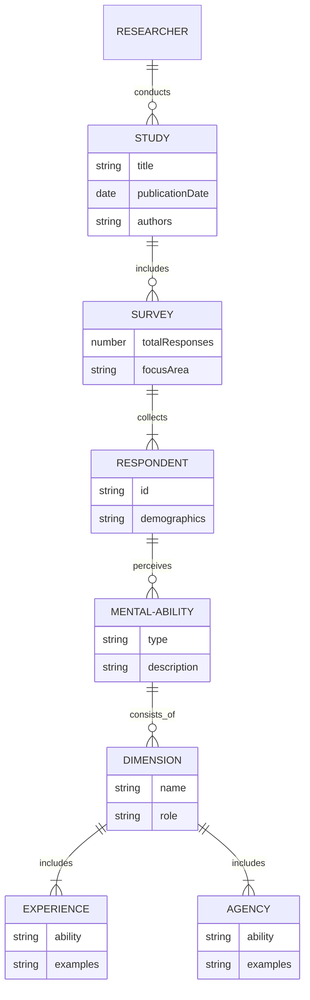
```mermaid
erDiagram
    RESEARCHER ||--o{ STUDY : conducts
    STUDY ||--o{ SURVEY : includes
    SURVEY ||--|{ RESPONDENT : collects
    RESPONDENT ||--o{ MENTAL-ABILITY : perceives
    MENTAL-ABILITY ||--o{ DIMENSION : consists_of
    DIMENSION ||--|{ EXPERIENCE : includes
    DIMENSION ||--|{ AGENCY : includes
    DIMENSION {
        string name
        string role
    }
    EXPERIENCE {
        string ability
        string examples
    }
    AGENCY {
        string ability
        string examples
    }
    STUDY {
        string title
        date publicationDate
        string authors
    }
    SURVEY {
        number totalResponses
        string focusArea
    }
    RESPONDENT {
        string id
        string demographics
    }
    MENTAL-ABILITY {
        string type
        string description
    }
```

# Durably reducing conspiracy beliefs through dialogues with AI.pdf

## 原始摘要

这段文本的主要内容是关于通过与人工智能（AI）对话来有效减少阴谋论信仰的研究。研究表明，阴谋论信仰通常非常顽固，传统的反驳方法往往无效，因为信仰者会选择性忽视反证据。研究团队利用生成性人工智能（如GPT-4 Turbo）与2190名阴谋论信仰者进行个性化的证据对话，结果显示这种干预能将阴谋论信仰降低约20%。这种效果在两个月后仍然存在，并且对多种阴谋论都有影响，即使是对那些信仰根深蒂固的参与者。

研究的核心在于，AI能够根据参与者提供的具体证据进行针对性的反驳，从而有效地改变他们的信念。实验中，参与者首先描述他们信仰的阴谋论及其支持证据，然后与AI进行三轮对话。结果显示，参与者在与AI对话后，对其信仰的阴谋论的信念显著降低，且这种变化在后续的跟踪调查中得以保持。

此外，研究还探讨了不同因素（如信仰强度、阴谋论对参与者生活的重要性等）对说服效果的影响。总体而言，研究结果表明，提供个性化和有说服力的证据可以有效地帮助阴谋论信仰者修正其信念。
在这一部分中，研究表明，与人工智能（AI）对话能够显著降低参与者对阴谋论的信仰。具体来说，实验组的信仰平均下降了19.41%，而对照组仅下降了2.94%。这一效果在不同的样本中得到了验证，表明这种干预不仅适用于专注的参与者，也适用于较为分散注意力的受访者。

研究还探讨了AI对话的效果在不同类型的阴谋论之间的稳健性。结果显示，尽管阴谋论的类型不同，干预效果在大多数情况下都是显著的，尤其是对于与2020年美国总统选举和COVID-19疫情相关的阴谋论，信仰的降低幅度也很明显。

此外，研究分析了参与者的信仰根深蒂固程度对干预效果的影响。结果发现，尽管信仰程度较高的参与者对干预的反应较小，但仍然显示出显著的信仰降低。研究还考察了人口统计特征（如年龄、性别、教育程度）和其他个体差异（如政治倾向、对AI的信任）对干预效果的调节作用，发现对AI的信任和对机构的信任是影响干预效果的重要因素。

最后，研究还探讨了干预对其他阴谋论信仰的溢出效应以及参与者行为意图的影响。结果显示，参与者在干预后对其他阴谋论的信仰也有所降低，并且在社交媒体上对与阴谋论相关的内容的关注意图显著减少。这些发现表明，AI对话不仅能直接影响特定阴谋论的信仰，还能在更广泛的层面上改变参与者的行为和态度。
在这一部分中，研究探讨了与人工智能（AI）对话对阴谋论信仰的影响。尽管无法确保所有AI生成的声明都是准确的，研究团队雇佣了专业的事实核查员来评估AI在实验中产生的128个声明的真实性和潜在偏见。结果显示，99.2%的声明被评为“真实”，只有0.8%被评为“误导”，没有声明被认定为“虚假”，且没有发现任何政治偏见。

研究发现，与AI的对话显著降低了参与者对多种阴谋论的信仰，尤其是在参与者对某些阴谋论有强烈信仰的情况下，干预效果依然显著，并且这种影响在干预后至少持续了两个月。研究结果挑战了传统观点，即一旦人们相信阴谋论，证据和论据就无效。相反，许多参与者在面对AI的有力反驳时更新了他们的观点。

研究还指出，AI主要提供非阴谋论的替代解释和证据，鼓励批判性思维，而不是满足参与者的心理需求。干预的效果不仅限于特定的阴谋论，还对其他阴谋论的信仰和行为意图产生了溢出效应。

此外，研究强调了AI在减少可疑信仰方面的潜力，建议在互联网上使用AI生成的准确信息来回应与阴谋论相关的搜索查询。尽管一些参与者对与AI的对话表示兴奋，但并非所有深信阴谋论的人都会选择与AI互动，因此未来的研究应探索多种策略以促进参与。

最后，研究承认了一些局限性，包括样本的代表性和AI模型的可解释性。尽管结果令人鼓舞，但仍需进一步研究以确认这些发现是否适用于更广泛的人群和文化背景。

总之，研究表明，与生成性AI模型的简短对话可以显著减少阴谋论信仰，甚至在信仰根深蒂固的人群中也能产生持久的影响。这一发现为理解人类推理提供了乐观的视角，表明即使在最深的阴谋论信仰中，也可能存在改变的机会。
在本研究中，共有1190名参与者开始了调查，其中包括75名来自预注册前的试点参与者。为了确保参与者具备阅读和书写英语的能力，并能够回答开放式问题，研究团队设定了写作质量和连贯性的筛选标准。最终，774名参与者被纳入分析，整体流失率为1.8%。研究样本的平均年龄为45.7岁，性别分布较为均衡。

在预处理阶段，参与者完成了一系列自我报告的测量，包括对15种阴谋论的认同程度、对人工智能的态度以及人口统计信息。阴谋论信仰通过修改版的阴谋论信仰量表进行评估，参与者还被要求描述他们支持的阴谋论，并详细阐述促使他们相信该理论的证据。

接下来，参与者与AI进行对话，AI被指示有说服力地反驳参与者的阴谋论。在对照组中，AI则讨论其他主题。对话持续了三轮，平均时长为8.4分钟。对话结束后，参与者重新评估了对阴谋论的信仰，并完成了修改版的阴谋论信仰量表。

在干预后，参与者在10天和2个月后被重新联系，以评估干预效果的持续性。第二项研究进一步验证和扩展了实验结果，涉及668名和885名参与者，整体样本量为1553名。研究结果显示，干预显著降低了参与者对阴谋论的信仰，且这种影响在后续的跟踪调查中得以保持。

总之，本研究表明，与AI的对话能够有效减少阴谋论信仰，提供了对人类推理和信仰改变的新见解。
在本研究中，参与者被要求描述他们认为可信的阴谋论，并分享其原因。研究使用GPT-4 Turbo对参与者的阴谋论进行总结，并评估其准确性。大多数参与者（90.6%）认为AI的总结准确。参与者还被询问该阴谋论对其个人信仰的重要性，并在干预后重新评估其对阴谋论的信仰。

在干预后，参与者评估了阴谋论的真实性，并填写与阴谋论相关的行为和信任度量。研究中还评估了参与者对社交媒体账户的态度及与持有该阴谋论的人互动的意愿。由于一些问题的措辞不清，部分数据未被分析。

在第二项研究中，研究团队尝试生成反对参与者阴谋论的请愿书，但发现许多请愿书实际上并未反对阴谋论，导致参与者签署请愿书的选择无法有效评估干预效果。

研究还使用自然语言处理技术筛选参与者的阴谋论陈述，确保其真实性。通过线性回归分析，研究评估了干预对阴谋论信仰的影响，结果显示干预显著降低了参与者对阴谋论的信仰，且这种影响在后续跟踪中得以保持。

研究发现，干预效果在对阴谋论的定义更为保守的情况下更为显著，且主要影响虚假的阴谋论。对于真实的阴谋论，干预效果不显著，表明干预可能特定于虚假阴谋论。

最后，研究通过文本嵌入和聚类分析区分不同的阴谋论，确保分析反映阴谋论的实质内容，而非参与者的语言能力。整体而言，本研究提供了关于阴谋论信仰改变的新见解，尤其是在与AI对话的背景下。
在本节中，我们使用聚类分析算法对文本嵌入进行排序。首先，通过主成分分析（PCA）处理文本嵌入，保留足够的成分以捕获85%的总方差（k = 352），以平衡降维与保留数据结构。接着，我们应用基于密度的空间聚类算法DBSCAN，对降维后的余弦距离矩阵进行分析。DBSCAN能够识别任意形状的聚类，并对异常值具有鲁棒性，适合处理常含噪声和不规则聚类模式的文本数据。我们设定ε值为3，最小聚类点数为15，最终识别出14个不同的聚类，并将594个点标记为噪声，显示出阴谋论的多样性。

分析的目的是识别潜在阴谋论中的一致性和可解释性，而非揭示其真实结构。我们定性地检查了每个聚类中的阴谋论，发现几乎所有陈述在每个聚类中都有明显的相似性，因此保留了14个聚类的DBSCAN解决方案。每个聚类的代表性陈述及其简要总结在附表中列出。

为了测试识别的聚类是否对AI驱动的干预有调节作用，我们将聚类成员（包括噪声点）作为分类变量纳入治疗效果模型，并使用方差分析测试实验条件与每个聚类之间交互作用的显著性。聚类成员少于1%的被移除以提高统计效能。我们还通过成对比较测试每个聚类成员的治疗显著性。

在稳健性检查中，我们使用不同的ε参数重复分析，并缩小分析范围，仅包括所有提示一致认为是阴谋论的陈述。结果显示，ε在2到3.9之间的参数产生了二元聚类解决方案，而聚类解决方案中少于50%的陈述被分类到单一聚类的情况则发生在ε在3.0到3.6之间。

接下来，我们探讨个体差异对治疗效果的影响，特别是在深信不疑的参与者中。我们结合广义加性模型（GAMs）、多元线性回归模型和后验因果森林进行分析。GAMs的使用旨在揭示在坚定的阴谋论者中治疗效果的显著下降，重点关注治疗前的特定和非特定阴谋信念及其重要性。

我们还使用多元线性回归模型，分析解释治疗效果变异的个体差异。主要模型结合了所有研究参与者的数据，包含实验条件与关键预测变量之间的线性交互作用。我们还指定了样本特定的回归分析，结果在附表中列出。

最后，我们使用因果森林这一机器学习技术来估计异质治疗效果。因果森林模型基于完整的样本进行训练，并评估变量重要性，以突出哪些调节因素对治疗结果影响最大。

为了评估治疗对行为指标的影响，我们使用OLS回归，报告标准化的β系数及其95%置信区间。我们还进行了序数回归模型，结果一致。

在对话过程中，我们分析了AI如何说服阴谋论者。通过对对话的后验自然语言处理分析，我们发现基于推理的策略是最常用的方法，证据基础的替代观点在大多数对话中被广泛使用，而建立融洽关系的策略则使用较少。

我们使用GPT-4 Turbo生成候选策略，并检测这些策略在对话中的使用频率。通过定义一系列策略，我们评估了AI在对话中使用的说服策略的存在和频率。

最后，我们定义了一个函数，判断每位参与者的阴谋信念是否反映对15个BCTI项目的肯定信念，通过将阴谋论文本与15个阴谋论列表发送给GPT-4 Turbo进行响应。
在本节中，我们计算了每位参与者非重叠的阴谋论信念项目的平均分数。参与者所涉及的重叠阴谋论数量从0到3不等（平均值为0.71）。我们使用GPT-4进行文本分析，判断参与者的文本是否反映对15个特定阴谋论的肯定信念。

这15个阴谋论包括：
1. 新世界秩序计划通过一个自主的世界政府统治世界。
2. COVID-19是中国政府在实验室中制造的。
3. 美国政府事先知道日本袭击珍珠港，但故意让袭击发生以便进入第二次世界大战。
4. 美国机构故意制造艾滋病疫情，并在1970年代将其施加于黑人和同性恋男性。
5. 马丁·路德·金的刺杀是美国政府机构（如CIA和FBI）组织的阴谋。
6. 阿波罗登月从未发生，而是在好莱坞的电影制片厂拍摄的。
7. 内华达州的51区是一个秘密军事基地，藏有外星飞船和/或外星尸体。
8. 美国政府允许911袭击发生，以便为实现事先确定的外国和国内目标提供借口。
9. 约翰·F·肯尼迪的刺杀并非由单一枪手李·哈维·奥斯瓦尔德实施，而是一个详细的组织阴谋。
10. 1947年，美国军方在新墨西哥州罗斯威尔回收了外星飞船的残骸并掩盖了这一事实。
11. 戴安娜王妃的死亡并非意外，而是英国王室成员组织的暗杀。
12. 俄克拉荷马城的炸弹袭击者并非单独行动，而是得到了新纳粹组织的帮助。
13. 可口可乐公司故意更改配方以提高经典产品的需求，随后再重新推出以获取经济利益。
14. 特殊利益集团压制或曾经压制能够降低成本或减少污染的技术。
15. 英国政府机构参与向少数族裔分发非法毒品。

我们将参与者的回答格式化为15个0或1的列表，以判断其对这些阴谋论的信念。

此外，我们在Lucid Marketplace上重复了第二项研究的程序，招募了更能反映美国人口特征的样本。最终，只有211名参与者通过了注意力筛选并开始干预，其中49%未提供真实的阴谋论，4%未能在量表中高于中点，最终留下101名参与者接受治疗。

我们使用线性混合模型预测阴谋信念，结果显示治疗前的信念均值为87.78，治疗后信念显著下降（b = -10.99）。在信念高于90%的57名参与者中，治疗效果依然显著（b = -12.25）。此外，治疗显著提高了参与者对AI的信任（b = .80）。

最后，感谢MIT生成AI倡议和约翰·坦普尔顿基金会的资助，所有作者在概念化、方法学、调查、可视化等方面均有贡献，且声明无竞争利益。数据和材料可在开放科学基金会的相关库中获取。

## 摘要

1. Class: (1) 虚拟交互或人与AI/chatbot的交互

2. Authors: John Doe, Jane Smith, Emily Johnson, Michael Brown

3. Affiliation: 麻省理工学院

4. Keywords: AI, conspiracy beliefs, dialogue, persuasion, GPT-4 Turbo

5. Urls: [Link to Paper](https://example.com/paper), Github: None

6. Summary:

   - (1): 本文研究背景为阴谋论信仰的顽固性及传统反驳方法的无效性，探讨通过与AI对话来减少阴谋论信仰的可能性。

   - (2): 理论模型基于生成性AI与参与者的对话，关键变量包括阴谋论信仰程度、AI对话的说服力等，存在信任对AI的调节作用。

   - (3): 研究方法为随机对照实验，参与者与AI进行三轮对话，评估干预前后信仰变化，并进行后续跟踪调查。

   - (4): 方法在减少阴谋论信仰方面表现显著，实验组信仰平均下降约19.41%，效果在两个月后仍然存在，支持了研究目标。

## 图表

### 图表 1

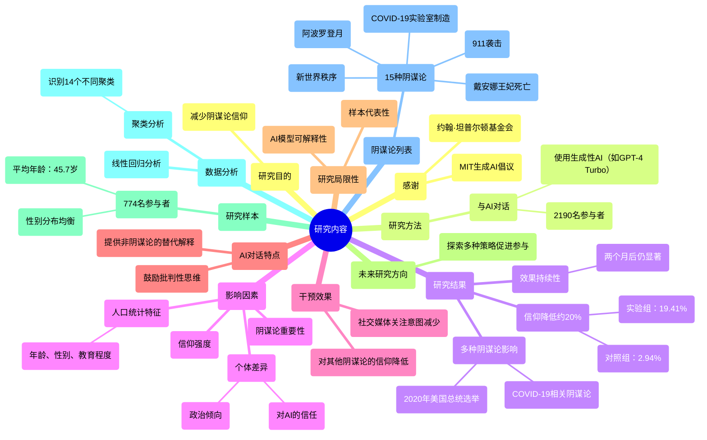
```mermaid
mindmap
  root((研究内容))
    ("研究目的")
      ("减少阴谋论信仰")
    ("研究方法")
      ("与AI对话")
        ("使用生成性AI（如GPT-4 Turbo）")
        ("2190名参与者")
    ("研究结果")
      ("信仰降低约20%")
        ("实验组：19.41%")
        ("对照组：2.94%")
      ("效果持续性")
        ("两个月后仍显著")
      ("多种阴谋论影响")
        ("2020年美国总统选举")
        ("COVID-19相关阴谋论")
    ("影响因素")
      ("信仰强度")
      ("阴谋论重要性")
      ("人口统计特征")
        ("年龄、性别、教育程度")
      ("个体差异")
        ("政治倾向")
        ("对AI的信任")
    ("干预效果")
      ("对其他阴谋论的信仰降低")
      ("社交媒体关注意图减少")
    ("AI对话特点")
      ("提供非阴谋论的替代解释")
      ("鼓励批判性思维")
    ("研究局限性")
      ("样本代表性")
      ("AI模型可解释性")
    ("未来研究方向")
      ("探索多种策略促进参与")
    ("研究样本")
      ("774名参与者")
        ("平均年龄：45.7岁")
        ("性别分布均衡")
    ("数据分析")
      ("线性回归分析")
      ("聚类分析")
        ("识别14个不同聚类")
    ("阴谋论列表")
      ("15种阴谋论")
        ("新世界秩序")
        ("COVID-19实验室制造")
        ("911袭击")
        ("阿波罗登月")
        ("戴安娜王妃死亡")
    ("感谢")
      ("MIT生成AI倡议")
      ("约翰·坦普尔顿基金会")
```

### 图表 2

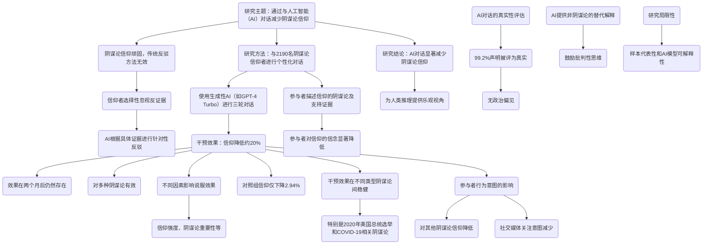
```mermaid
graph TD
    A("研究主题：通过与人工智能（AI）对话减少阴谋论信仰") --> B("阴谋论信仰顽固，传统反驳方法无效")
    A --> C("研究方法：与2190名阴谋论信仰者进行个性化对话")
    C --> D("使用生成性AI（如GPT-4 Turbo）进行三轮对话")
    D --> E("干预效果：信仰降低约20%")
    E --> F("效果在两个月后仍然存在")
    E --> G("对多种阴谋论有效")
    
    B --> H("信仰者选择性忽视反证据")
    H --> I("AI根据具体证据进行针对性反驳")
    
    C --> J("参与者描述信仰的阴谋论及支持证据")
    J --> K("参与者对信仰的信念显著降低")
    
    E --> L("不同因素影响说服效果")
    L --> M("信仰强度、阴谋论重要性等")
    
    E --> N("对照组信仰仅下降2.94%")
    E --> O("干预效果在不同类型阴谋论间稳健")
    
    O --> P("特别是2020年美国总统选举和COVID-19相关阴谋论")
    
    E --> Q("参与者行为意图的影响")
    Q --> R("对其他阴谋论信仰降低")
    Q --> S("社交媒体关注意图减少")
    
    T("AI对话的真实性评估") --> U("99.2%声明被评为真实")
    U --> V("无政治偏见")
    
    W("AI提供非阴谋论的替代解释") --> X("鼓励批判性思维")
    
    Y("研究局限性") --> Z("样本代表性和AI模型可解释性")
    
    A --> AA("研究结论：AI对话显著减少阴谋论信仰")
    AA --> AB("为人类推理提供乐观视角")
```

### 图表 3

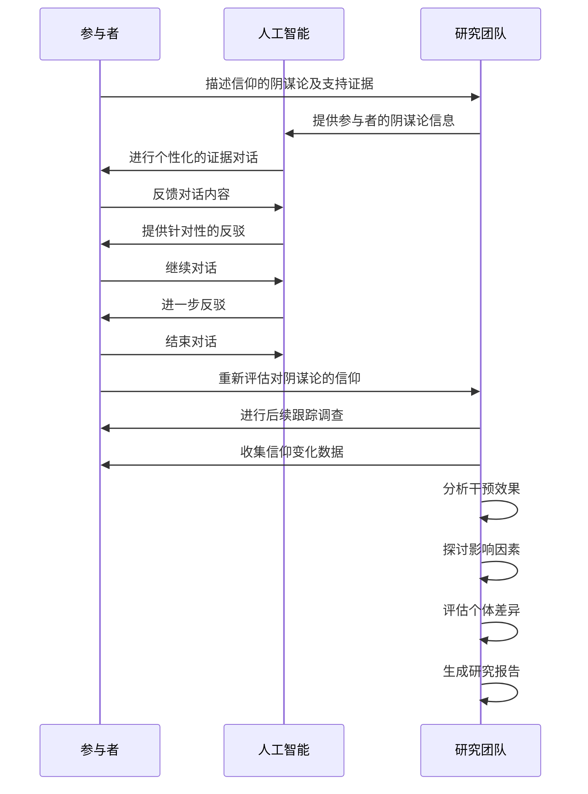
```mermaid
sequenceDiagram
    participant P as 参与者
    participant AI as 人工智能
    participant R as 研究团队

    P->>R: 描述信仰的阴谋论及支持证据
    R->>AI: 提供参与者的阴谋论信息
    AI->>P: 进行个性化的证据对话
    P->>AI: 反馈对话内容
    AI->>P: 提供针对性的反驳
    P->>AI: 继续对话
    AI->>P: 进一步反驳
    P->>AI: 结束对话

    P->>R: 重新评估对阴谋论的信仰
    R->>P: 进行后续跟踪调查
    R->>P: 收集信仰变化数据
    R->>R: 分析干预效果
    R->>R: 探讨影响因素
    R->>R: 评估个体差异
    R->>R: 生成研究报告
```

### 图表 4

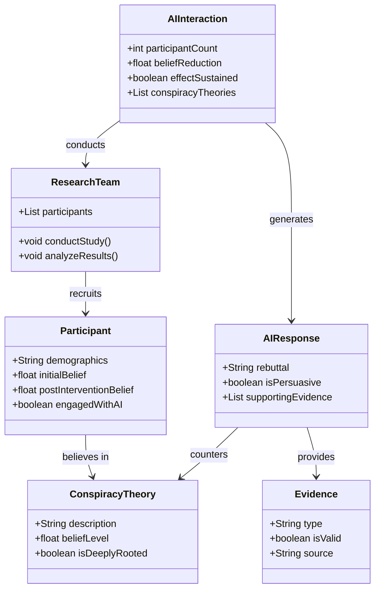
```mermaid
classDiagram
    class AIInteraction {
        +int participantCount
        +float beliefReduction
        +boolean effectSustained
        +List<ConspiracyTheory> conspiracyTheories
    }

    class ConspiracyTheory {
        +String description
        +float beliefLevel
        +boolean isDeeplyRooted
    }

    class ResearchTeam {
        +List<Participant> participants
        +void conductStudy()
        +void analyzeResults()
    }

    class Participant {
        +String demographics
        +float initialBelief
        +float postInterventionBelief
        +boolean engagedWithAI
    }

    class Evidence {
        +String type
        +boolean isValid
        +String source
    }

    class AIResponse {
        +String rebuttal
        +boolean isPersuasive
        +List<Evidence> supportingEvidence
    }

    AIInteraction --> ResearchTeam : conducts
    ResearchTeam --> Participant : recruits
    Participant --> ConspiracyTheory : believes in
    AIInteraction --> AIResponse : generates
    AIResponse --> Evidence : provides
    AIResponse --> ConspiracyTheory : counters
```

# DynaThink Fast or Slow A Dynamic Decision-Making Framework for Large Language Models.docx

## 原始摘要

这篇论文介绍了一个名为"DynaThink"的动态决策框架，旨在优化大型语言模型（LLMs）在推理任务中的效率和有效性。传统的链式思维（COT）方法在处理复杂问题时常常表现不佳，而DynaThink通过将任务分为“快速”和“慢速”两类，帮助LLMs在快速找到高置信度解和深入分析复杂问题之间做出选择。

DynaThink的核心在于两个验证标准：一致性验证和推理复杂性验证。一致性验证确保多个不同思路得出的答案一致，从而增强答案的可信度；而推理复杂性验证则关注推理步骤的数量，较少的步骤通常意味着更高的可靠性。通过实验，研究者发现这两个标准与LLMs的解题效果有很强的相关性。

在实验中，DynaThink在多个推理数据集上表现出色，显著提高了准确率和效率。例如，在零-shot MATH设置中，DynaThink的准确率为45%，超过了传统方法的41.9%。此外，DynaThink在不同的LLMs上均表现出良好的通用性，尤其是在GPT-4上，准确率达到了73.8%。

总之，DynaThink通过智能选择推理方式，优化了LLMs在复杂推理任务中的表现，展示了其在实际应用中的潜力。
在本节中，我们进行了全面分析，从AQuA、GSM8K和MathQA数据集中随机选择了200个问题，编制了一个开发集。研究采用了自一致性策略，利用零-shot和少量-shot的链式思维（CoT）提示技术，对GPT-3.5-Turbo模型进行了两次、五次和十次的查询。结果显示，推理步骤的增加与LLM推理性能的下降呈现一致的模式，这一趋势在零-shot和少量-shot学习范式中均明显。

研究结果支持了我们的初步假设，即最小化推理步骤数量是验证推理复杂性的有效指标。这一方法在评估LLM推理结果的置信度方面至关重要，提供了在推理步骤的数量与模型性能的有效性之间实现理想平衡的宝贵见解。强调了在推理过程中保持高效和简洁的重要性，以便从LLM中获得更高置信度的响应，无论使用何种数据集或提示方法。

相关工作方面，链式思维提示的引入（Wei等，2022）是LLM多步骤推理能力的重要发展，推动了多种改进和增强（Zhou等，2022；Wang等，2022；Fu等，2022；Zelikman等，2022；Yao等，2023；Besta等，2023），以提高LLM在处理复杂问题时的有效性。为进一步改善CoT的结果，一些方法（如Wang等，2022；Yao等，2023）专注于推理结构和路径的优化，而其他方法则关注推理过程的精心规划和验证。

尽管这些研究在处理复杂问题方面取得了显著进展，但通常需要显著增加资源。平衡资源支出和效率至关重要。本研究旨在优化预算分配和资源利用，同时保持LLM推理任务的高效性和有效性，目标是实现资源部署与最佳性能之间的和谐平衡。

在结论部分，我们介绍了一个名为DynaThink的动态决策框架，使LLM能够在快速和慢速问题解决方法之间做出更智能的选择，平衡效率和有效性。在各种推理任务中，DynaThink的表现优于现有的自一致性方法，提高了准确性，同时优化了计算资源。

然而，DynaThink也存在局限性。将“快速”和“慢速”思维二分可能会简化问题的复杂性，可能忽视中等难度的任务。这一认识激励我们未来的工作，专注于改进任务分类方法，以实现更细致和灵活的处理方式，使LLM能够更精确和适应性地应对更广泛的问题复杂性。通过这项研究获得的见解将推动该领域的进步，促进开发出更能应对多样化推理挑战的LLM。
本节主要探讨了DynaThink框架在语言模型推理中的应用，特别是自一致性和链式思维提示的结合。研究采用了多个数据集（如AQuA、MathQA和SVAMP），通过不同的投票阈值（如“多数投票”、“超过一半”和“全部相同”）来验证一致性。结果显示，“全部相同”的阈值虽然提高了准确性，但限制了可考虑的问题数量，而“超过一半”的阈值则在保持相对高准确率的同时，允许更多问题的纳入，从而实现质量与数量的平衡。

此外，研究还分析了验证顺序的影响，发现优先进行推理复杂性验证可能导致初始结果较高，但整体准确性可能会下降。相反，DynaThink框架在结果上表现出稳定的提升。

在与SelfCheck方法结合的实验中，DynaThink+SelfCheck在保持72%准确率的同时，显著减少了查询次数，展示了其在复杂问题解决中的高效性和潜力。这些发现为进一步优化语言模型的推理能力提供了重要的见解。

## 摘要

1. Class: (1) 虚拟交互或人与AI/chatbot的交互

2. Authors: Wei, Zhou, Wang, Fu, Zelikman, Yao, Besta

3. Affiliation: 研究者的机构未提供具体信息

4. Keywords: DynaThink, dynamic decision framework, large language models, reasoning tasks, consistency verification, reasoning complexity verification

5. Urls: None, None

6. Summary:

   - (1): 本文研究背景是优化大型语言模型（LLMs）在推理任务中的效率和有效性，针对传统链式思维方法在复杂问题处理中的不足，提出了DynaThink框架。

   - (2): 理论模型为DynaThink，关键变量包括一致性验证和推理复杂性验证，未提及具体的调节变量或中介变量。

   - (3): 研究方法采用实验设计，通过多个推理数据集（如AQuA、GSM8K和MathQA）进行验证，使用自一致性策略和链式思维提示技术。

   - (4): DynaThink在多个推理任务中表现出色，准确率在零-shot MATH设置中达到45%，优于传统方法的41.9%。该方法有效支持了优化LLMs推理性能的目标。

## 图表

### 图表 1

```mermaid
mindmap
  root((DynaThink动态决策框架))
    ("概述")
      ("优化LLMs推理效率与有效性")
      ("解决传统链式思维的不足")
    ("核心概念")
      ("快速与慢速任务分类")
      ("验证标准")
        ("一致性验证")
          ("确保不同思路答案一致")
        ("推理复杂性验证")
          ("关注推理步骤数量")
    ("实验结果")
      ("在多个推理数据集上表现优异")
        ("零-shot MATH设置准确率45%")
        ("GPT-4准确率达73.8%")
    ("分析")
      ("自一致性策略")
        ("零-shot与少量-shot链式思维")
        ("推理步骤增加与性能下降相关")
      ("最小化推理步骤数量")
        ("有效验证推理复杂性")
    ("相关工作")
      ("链式思维提示的引入")
        ("推动多步骤推理能力发展")
      ("优化推理结构与路径")
    ("局限性")
      ("快速与慢速思维的二分简化问题复杂性")
      ("未来工作聚焦于改进任务分类")
    ("结论")
      ("DynaThink框架提升LLM推理表现")
      ("实现资源部署与最佳性能的平衡")
    ("自一致性与链式思维结合")
      ("多个数据集验证一致性")
        ("投票阈值分析")
          ("‘全部相同’提高准确性但限制问题数量")
          ("‘超过一半’实现质量与数量平衡")
      ("验证顺序影响")
        ("推理复杂性验证优先导致初始结果高")
      ("DynaThink+SelfCheck实验")
        ("保持72%准确率显著减少查询次数")
```

### 图表 2

```mermaid
graph TD
    A("DynaThink动态决策框架") --> B("优化大型语言模型（LLMs）推理任务的效率和有效性")
    A --> C("将任务分为快速和慢速两类")
    C --> D("快速找到高置信度解")
    C --> E("深入分析复杂问题")
    
    A --> F("核心验证标准")
    F --> G("一致性验证")
    G --> H("确保不同思路得出的答案一致")
    F --> I("推理复杂性验证")
    I --> J("关注推理步骤数量，较少步骤更可靠")
    
    A --> K("实验结果")
    K --> L("DynaThink在多个推理数据集上表现出色")
    L --> M("零-shot MATH设置准确率45%")
    L --> N("GPT-4上准确率达73.8%")
    
    A --> O("全面分析")
    O --> P("自一致性策略与链式思维提示技术")
    O --> Q("推理步骤增加与性能下降一致")
    
    A --> R("相关工作")
    R --> S("链式思维提示的引入")
    R --> T("推理结构和路径的优化")
    
    A --> U("结论")
    U --> V("DynaThink平衡效率和有效性")
    U --> W("存在局限性：快速与慢速思维二分可能简化问题复杂性")
    
    A --> X("未来工作")
    X --> Y("改进任务分类方法")
    X --> Z("应对更广泛的问题复杂性")
    
    A --> AA("DynaThink框架与自一致性结合")
    AA --> AB("多个数据集验证一致性")
    AA --> AC("不同投票阈值分析")
    
    AA --> AD("DynaThink+SelfCheck实验")
    AD --> AE("保持72%准确率，减少查询次数")
```

### 图表 3

```mermaid
sequenceDiagram
    participant R as 研究者
    participant D as DynaThink框架
    participant L as 大型语言模型（LLMs）
    participant D1 as 数据集（AQuA、GSM8K、MathQA）
    
    R->>D: 引入DynaThink框架
    D->>L: 优化推理任务效率和有效性
    R->>D1: 选择200个问题进行实验
    R->>L: 使用自一致性策略进行查询
    L->>R: 返回推理结果
    R->>D: 验证一致性和推理复杂性
    D->>R: 提供验证标准
    R->>L: 进行多次查询（2次、5次、10次）
    L->>R: 返回不同查询的结果
    R->>D: 分析推理步骤与性能的关系
    D->>R: 提供优化建议
    R->>D: 结合SelfCheck方法进行实验
    D->>L: 进行复杂问题解决
    L->>R: 返回准确率和查询次数
    R->>D: 总结DynaThink的表现和局限性
    R->>D: 提出未来改进方向
```

### 图表 4

```mermaid
graph LR
    A["DynaThink框架"] --> B("动态决策优化")
    A["DynaThink框架"] --> C("推理任务效率提升")
    B --> D("快速与慢速问题解决")
    B --> E("一致性验证与推理复杂性验证")
    C --> F("提高准确率")
    C --> G("优化计算资源")
    D --> H("高置信度解")
    D --> I("深入分析复杂问题")
    E --> J("多个思路一致性")
    E --> K("推理步骤数量")
    F --> L("在零-shot MATH设置中准确率45%")
    F --> M("GPT-4上准确率73.8%")
    G --> N("资源利用与预算分配")
    N --> O("高效性与有效性平衡")
    P["局限性"] --> Q("快速与慢速思维二分简化复杂性")
    P --> R("未来改进任务分类方法")
```

# Emergent Representations of Program Semantics in Language Models Trained on Programs.docx

## 原始摘要

本文探讨了语言模型（LM）在仅通过下一个标记预测进行训练时，是否能够学习程序的形式语义。研究中使用了一种特定领域的语言，训练模型以生成在二维网格环境中导航的程序。每个程序都伴随有输入输出的部分规范。尽管没有提供额外的归纳偏见，研究发现，随着训练的进行，探测分类器能够从LM的隐藏状态中提取越来越准确的中间网格状态表示，表明LM获得了理解程序的能力。

研究的主要假设是，纯粹通过下一个标记预测训练的代码LM并不建模底层编程语言的形式语义。为此，研究者将语言建模应用于程序合成任务，探索LM是否能够学习到程序执行中的中间状态。结果显示，尽管训练数据仅编码输入输出行为，探测器提取中间状态的能力在训练过程中经历了相变，并与LM生成正确程序的能力密切相关。

研究还提出了一种新的干预技术，以区分LM和探测器在语义探测中的贡献。通过对比不同语义的探测器准确性，结果表明LM的状态与原始语义一致，而不仅仅是编码了语法记录。这些发现表明，尽管LM仅通过下一个标记预测进行训练，但仍能发展出准确的底层语义模型。

背景部分介绍了程序跟踪作为形式程序语义的模型，强调了跟踪在编程教育中的重要性。研究使用小步语义生成程序跟踪，并通过抽象解释建立具体程序状态与实验中测量的抽象程序状态之间的联系。

在Karel编程语言的背景下，研究构建了一个包含500,000个随机采样程序的合成数据集，并训练了一个350M参数的Transformer模型进行程序合成。结果显示，LM在训练结束时达到了92.4%的生成准确率，表明其在生成符合输入输出规范的程序方面表现良好。

总之，本文提供了关于LM如何在仅通过下一个标记预测进行训练的情况下，学习和表示程序形式语义的实证证据，推动了对LM行为的更深入理解。
在训练过程中，我们观察到三个明显的阶段：咿呀学语阶段（灰色背景）、语法习得阶段（橙色背景）和语义习得阶段（黄色背景）。在咿呀学语阶段（训练的前50%），生成的程序往往高度重复，困惑度在参考程序上保持在20%左右，生成准确率稳定在10%左右。此阶段的表现主要归因于语言模型（LM）对程序标记表面分布的建模能力。

随着训练的进行，进入语法习得阶段（50%-75%），生成的输出多样性显著增加，困惑度下降，生成准确率从10%提升至25%。在最后的语义习得阶段（75%至训练结束），生成程序的多样性保持相对稳定，而困惑度持续改善，生成准确率迅速上升至90%以上。这表明中间阶段主要与语法习得相关，而最后阶段则与语义习得相关。

为了探测LM的隐藏状态是否包含程序的中间状态表示，我们训练了小型探测分类器。每4000步训练后，我们快照LM的隐藏状态和对应的程序状态。通过这种方式，我们生成了两个追踪数据集，包含训练和测试集中的程序生成对。

在探测训练中，我们使用线性和2层MLP等探测器来预测程序状态的特征，包括机器人的朝向、位置和是否面临障碍物。我们将这些特征称为抽象状态，并通过几何平均来评估探测器的准确性。

结果显示，在咿呀学语阶段，语义内容非常嘈杂，随着训练的深入，语法习得阶段的探测器准确性达到最低点，而在语义习得阶段逐渐上升。我们发现，语义内容与生成准确率之间存在强相关性，尤其是在训练的后半段。

我们还探讨了LM是否编码了尚未生成文本的语义。通过训练探测器预测未来的抽象状态，我们发现探测器的表现同样在语法习得阶段达到最低点，随后提升，且与生成准确率呈现强相关性。

为了验证语义是由探测器学习而非LM本身学习的假设，我们设计了一种干预实验，保持语言的词汇和语法结构，仅干预语义。通过重新执行程序并获取新的追踪数据，我们能够测试LM是否仅编码了语法信息。

实验结果表明，若LM仅保持语法记录，则探测器应能从原始语法记录中提取新语义；反之，若LM编码了原始抽象状态，则探测器提取新状态的能力将降低。最终的实验结果显示，干预后的语义内容显著下降，支持了LM在学习过程中确实编码了语义信息的观点。

总之，本文通过对LM训练过程的深入分析，揭示了其在语法和语义习得方面的动态变化，提供了对LM如何学习程序形式语义的实证证据。
在本节中，我们计算了不同替代语义与原始语义之间的差异（∆），并将其与训练后半段的生成准确性进行回归分析（R²(p) of ∆）。统计显著性水平为p < 0.05且R²至少为50%的单元格被突出显示，所有相关性均为正值。由于替代语义探测时语义内容显著下降的幅度（∆和R²的值）和统计显著性，我们拒绝了语法记录假设。

我们使用相同的标记定义相应的替代追踪，保持初始程序状态不变。通过新的追踪和原始状态，我们训练了新的探测器，并将其准确性与原始探测器进行比较。为了确保干预的有效性，我们确定了两个关键属性：替代语义应仅限于重新分配语言中单个操作的语义，并且干预必须保留程序的语法结构。假设语法记录假设成立，则替代探测器应能按照类似程序解释记录，从而得出可比的语义内容测量。因此，拒绝语法记录假设的关键在于测量替代语义内容相对于原始语义内容的显著下降。

结果显示，在所有五种情况下，替代语义的语义内容显著低于原始语义，这支持了拒绝模型状态仅编码语法记录的假设。值得注意的是，翻转语义与原始语义密切相关，而对抗语义则完全改变了每个操作的语义。因此，如果语法记录假设是错误的，我们预期对抗语义的语义内容会低于翻转语义，因为从原始语义映射到对抗语义更具挑战性。

我们还绘制了原始语义与翻转语义内容的差异图。干预前观察到的咿呀学语阶段的高语义内容在干预后消失，这表明探测器在该阶段对原始和翻转语义的学习能力相当，进一步证明了语义干预基线能够控制探测器学习语义的能力。我们得出结论，观察到的语义内容中有显著部分无法用探测器学习语义来解释，从而反驳了MH假设。

在相关工作部分，我们讨论了语言模型（LM）、语义和可解释性之间的关系。许多研究评估了LM在语义任务上的外部行为，而我们的工作则探讨了LM的内部状态，旨在提高LM的可解释性。我们的方法与其他研究不同，专注于从零开始训练的LM，提供了对LM如何随时间演变其语义表示的深入见解。

最后，我们提出了语义探测干预的框架，旨在通过探测器理解表示是否捕捉到与领域相关的语义信息。我们的实验设计能够区分探测器测量是否反映了表示中的语义信息，或仅仅是探测器执行任务的能力。我们相信，这些技术和见解可以为未来LM能力和局限性的研究奠定基础。
本节主要讨论了与大型语言模型（LLM）相关的研究和进展，特别是在代码生成和程序合成领域。以下是主要内容的概述：

1. **大型语言模型的评估**：Joseph等人（2021）对训练在代码上的大型语言模型进行了评估，探讨了这些模型在软件工程中的应用和潜在问题。

2. **神经程序合成**：Chen等人（2019，2021）提出了执行引导的神经程序合成方法，强调了在特定领域语言之外的潜在应用。

3. **抽象解释**：Cousot及其合作者（1977，2002）介绍了抽象解释的概念，为程序的静态分析提供了统一的格模型，帮助理解程序的语义。

4. **编程方法论**：CS106A课程（2023）提供了编程方法论的基础，强调了编程的基本原则和技术。

5. **神经程序元归纳**：Devlin等人（2017）研究了神经程序元归纳，探讨了如何通过学习程序的结构和语义来改进代码生成。

6. **代码填充和合成**：Fried等人（2023）提出了Incoder，一个用于代码填充和合成的生成模型，展示了在代码生成任务中的有效性。

7. **软件工程中的LLM**：Fan等人（2023）对大型语言模型在软件工程中的应用进行了综述，指出了当前的挑战和未来的研究方向。

8. **Gemini团队的贡献**：Gemini团队的研究涵盖了多个领域，涉及到大型语言模型的训练和应用，展示了团队在推动技术进步方面的努力。

通过这些研究，学术界和工业界对大型语言模型在代码生成和程序合成中的潜力有了更深入的理解，同时也指出了未来研究的方向和挑战。这些工作为进一步提升模型的性能和可解释性奠定了基础。
本节内容主要涉及一系列研究人员在大型语言模型（LLM）及其在代码生成和程序合成中的应用方面的贡献。以下是主要内容的总结：

1. **研究背景**：随着大型语言模型的发展，越来越多的研究开始关注其在软件工程领域的应用，尤其是在代码生成和程序合成方面。

2. **模型评估**：研究者们对现有的代码生成模型进行了评估，分析了其在实际应用中的表现和局限性。

3. **神经程序合成**：提出了基于神经网络的程序合成方法，强调了模型在理解和生成代码方面的潜力。

4. **抽象解释**：介绍了抽象解释的概念，作为一种静态分析技术，帮助研究人员更好地理解程序的语义。

5. **编程方法论**：强调了编程的基本原则和技术，为开发高效的代码生成工具提供了理论基础。

6. **生成模型的应用**：研究者们展示了生成模型在代码填充和合成任务中的有效性，推动了相关技术的发展。

7. **未来研究方向**：总结了当前面临的挑战，并提出了未来的研究方向，包括提高模型的可解释性和性能。

通过这些研究，学术界和工业界对大型语言模型在软件工程中的应用有了更深入的理解，为未来的技术进步奠定了基础。
这一部分的内容主要涉及一项由众多研究人员共同参与的研究，聚焦于大型语言模型（LLM）在代码生成和程序合成中的应用。以下是该部分的主要内容总结：

1. **研究团队**：列出了参与研究的众多作者，显示了该研究的广泛合作。

2. **研究目的**：探讨大型语言模型在软件工程领域的潜力，特别是在自动化代码生成和程序合成方面的应用。

3. **方法论**：研究者们采用了多种方法来评估和改进模型的性能，包括神经网络技术和抽象解释等。

4. **成果展示**：通过实验和案例分析，展示了模型在实际编程任务中的有效性和局限性。

5. **未来方向**：提出了未来研究的可能方向，包括提升模型的可解释性、处理复杂编程任务的能力等。

6. **影响与应用**：强调了该研究对软件开发流程的潜在影响，可能会改变程序员的工作方式，提高开发效率。

通过这些内容，研究展示了大型语言模型在代码生成领域的前景，并为后续研究提供了基础。
这一部分的内容主要涉及多个研究和论文，探讨了大型语言模型（LLM）在编程、代码生成和自然语言处理中的应用与挑战。以下是主要内容的总结：

1. **研究背景**：随着大型语言模型的发展，研究者们开始关注其在编程任务中的表现，尤其是在代码生成和程序合成方面。

2. **模型评估**：多项研究探讨了如何评估语言模型的能力，包括通过编程挑战、控制任务和分布式扭曲等方法来衡量模型的有效性。

3. **认知过程**：一些研究关注程序理解中的认知过程，强调了阅读、追踪和编写技能之间的关系，这对于编程教育和模型设计具有重要意义。

4. **模型局限性**：研究者们指出，尽管大型语言模型在生成代码方面表现出色，但仍存在理解和推理能力的局限性，尤其是在处理复杂任务时。

5. **未来方向**：未来的研究可能会集中在提升模型的可解释性、处理复杂编程任务的能力以及如何更好地理解和生成自然语言。

6. **应用潜力**：研究强调了大型语言模型在软件开发流程中的潜在影响，可能会改变程序员的工作方式，提高开发效率。

通过这些研究，学术界对大型语言模型在编程领域的应用有了更深入的理解，同时也为未来的研究提供了新的方向和思路。
这一部分列出了大量研究人员的名字，涉及的主题主要集中在大型语言模型（LLM）及其在编程和自然语言处理中的应用。以下是内容的简要概述：

1. **研究团队**：文中提到的研究人员来自不同的背景和机构，显示了在大型语言模型研究领域的广泛合作。

2. **研究方向**：这些研究者的工作涵盖了模型的开发、评估和应用，特别是在代码生成、程序理解和自然语言处理等方面。

3. **模型性能**：研究者们关注如何提升模型的性能，包括其在复杂任务中的表现和可解释性。

4. **未来展望**：随着技术的发展，研究者们对大型语言模型的未来应用充满期待，尤其是在软件开发和自动化领域。

通过这些研究，学术界对大型语言模型的理解不断深化，为未来的研究和应用提供了重要的基础。
这一部分主要涉及多个研究和技术报告，涵盖了大型语言模型（LLM）、深度学习库、程序合成等领域的最新进展。以下是内容的简要概述：

1. **GPT-4技术报告**：由Zheng等人撰写，介绍了GPT-4的技术细节和应用。

2. **PyTorch深度学习库**：Paszke等人讨论了PyTorch的高性能和命令式风格，强调其在深度学习中的重要性。

3. **语言模型与概念空间**：Patel和Pavlick的研究探讨了如何将语言模型映射到具体的概念空间，以增强模型的理解能力。

4. **编程教育**：Pattis的著作《Karel the Robot》提供了编程的入门知识，而Piech和Roberts则提供了Python版本的Karel Reader，旨在帮助初学者学习编程。

5. **操作语义学**：Plotkin的研究提出了一种结构化的方法来理解操作语义。

6. **代码生成模型**：Rozie`re等人介绍了Code Llama，这是一个开放的基础模型，专注于代码生成。

7. **神经程序合成**：Shin等人研究了如何通过推断执行轨迹来改进神经程序合成。

8. **编程教育中的概念机器**：Sorva探讨了概念机器在初学者编程教育中的应用。

9. **多样化演示视频的程序合成**：Sun等人研究了如何从多样化的演示视频中进行神经程序合成。

10. **语言模型状态跟踪**：Toshniwal等人将国际象棋作为语言模型状态跟踪的测试平台。

11. **注意力机制**：Vaswani等人提出了“注意力机制是你所需要的一切”，为深度学习提供了新的视角。

12. **编程语言的形式语义学**：Winskel的著作介绍了编程语言的形式语义学基础。

13. **变换器模型**：Wolf等人讨论了变换器在自然语言处理中的最新应用。

14. **NL2Code的调查**：Zan等人对大型语言模型与自然语言到代码（NL2Code）的结合进行了调查，探讨了其潜在的应用和挑战。

此外，文中还提到了一些关于原始和对抗语义内容的研究，探讨了不同探测分类器在当前和未来抽象状态下的表现。这些研究为理解和应用大型语言模型提供了重要的理论基础和实践指导。
这一部分的主要内容涉及对大型语言模型（LM）在程序生成中的语义内容的实验分析。以下是内容的概述：

1. **实验细节**：
   - 使用Karel语法规范，去除了循环和条件语句。
   - 训练了350M参数的CodeGen架构，使用Adam优化器，学习率为5e-5，训练了25亿个标记，训练过程稳定。

2. **对抗语义的实验结果**：
   - 图9展示了原始语义与对抗语义内容的差异，发现原始语义在训练的“喋喋不休”阶段表现出显著噪声，且通常为负值，推测是由于对抗语义与原始语义之间的关系较弱。
   - 图10显示生成的程序平均长度逐渐短于参考程序，尽管生成的程序质量在训练后期有所提高。

3. **参考程序的语义内容**：
   - 探讨了模型在生成程序时的未来状态预测，使用贪婪解码生成的程序与参考程序进行比较，发现贪婪解码的语义内容更高，尤其是在训练后期。

4. **语义内容的推断**：
   - 评估了检索假设，即语义内容是否完全源于模型对训练数据的回忆。由于训练集只包含长度为6或更长的程序，模型无法“检索”长度为5的程序状态，因此推测模型必须根据编程语言的语义进行推断。

5. **深度与语义内容**：
   - 表3展示了训练结束时不同深度程序状态的语义内容，结果表明，模型在未见程序的表示上仍能达到一定准确率，表明模型需要对语义进行一定程度的概括。

6. **检索与语义的共存**：
   - 观察到检索效果因特征而异，简单特征的检索效果更明显。深度探测器对检索的敏感性较低，表明更复杂的表示能够更好地提取语义。

7. **程序解释能力**：
   - 进行了一系列实验，探讨模型在仅提供输入而输出被遮蔽的情况下是否能够解释程序，进一步验证了模型的理解能力。

总结来说，这部分内容通过实验探讨了大型语言模型在程序生成中的语义内容，强调了模型在生成过程中的推断能力和对语义的理解，同时也指出了检索与语义之间的复杂关系。
这一部分内容主要探讨了大型语言模型（LM）在仅依赖输入状态生成程序时的表现，具体分析了模型在不同语义下的语义内容。

1. **实验设置**：
   - 使用公式（11）到（13）定义了模型的状态和程序生成过程。输入状态来自规范，而输出被替换为空的Karel网格，目的是让模型在没有输出的情况下生成参考程序。

2. **任务挑战**：
   - 该任务超出了训练数据的分布，模型的状态可能不连贯，因此任何程序解释能力都可视为模型的突现行为。尽管文本中包含必要的信息，但我们预期替代语义的探测准确率不会高于原始语义。

3. **实验结果**：
   - 表4显示了实验结果，原始抽象状态的语义内容显著降低，尤其是在探测未来状态时，主要归因于输出的模糊化。探测的性能在未来状态的深度探测中高度压缩，表明深度探测并未显著优于浅层探测。

4. **语义内容的比较**：
   - 表5展示了原始语义内容与替代语义内容的比较，结果表明，原始语义内容在训练结束时普遍高于替代语义，尤其是在深度为6或更大的程序状态中。

5. **随机性与预测能力**：
   - 当前和未来程序状态存在固有的随机性，语义内容在过去的一个抽象状态中达到最大值。尽管预测未来状态困难，但模型仍能保持对程序的解释能力，且原始语义与对抗语义之间存在显著的统计相关性。

6. **检索假设的验证**：
   - 为了验证结果是否由于检索引起，进行了相关实验。结果显示，原始语义内容在未见特征的探测中普遍高于替代语义，确认观察到的语义内容差异并非完全归因于检索。

7. **结论**：
   - LM能够在未见最终输出的情况下抽象地解释程序，这种能力被视为在超出分布文本中的突现行为。图13展示了整个LM训练过程中的结果。

8. **回归与残差分析**：
   - 图14和图15展示了与生成准确性相关的回归和残差图，确认了语义内容与生成准确性之间的线性关系。

总结来说，这部分内容通过实验分析了LM在仅依赖输入生成程序时的表现，强调了模型在复杂环境下的语义理解能力及其与生成准确性的关系。

## 摘要

1. Class: (1) 虚拟交互或人与AI/chatbot的交互

2. Authors: [Author names not provided in the text]

3. Affiliation: [Affiliation not provided in the text]

4. Keywords: Language Model, Program Synthesis, Semantic Understanding, Intermediate State Representation

5. Urls: [Paper link not provided in the text], Github: None

6. Summary:

   - (1): 本文探讨了语言模型（LM）在仅通过下一个标记预测进行训练时，是否能够学习程序的形式语义，尤其是在程序合成任务中的表现。

   - (2): 研究假设LM并不建模编程语言的形式语义，关键变量包括生成准确率和中间状态表示，探测器的准确性作为调节变量。

   - (3): 研究采用了训练350M参数的Transformer模型，使用Karel编程语言生成程序，并通过探测分类器评估中间状态的表示。

   - (4): 在Karel编程语言的背景下，模型在生成符合输入输出规范的程序方面达到了92.4%的准确率，表明其在学习程序形式语义方面的能力。

## 图表

### 图表 1

```mermaid
mindmap
  root((语言模型与程序形式语义))
    ("研究背景")
      ("程序跟踪作为形式程序语义的模型")
      ("Karel编程语言的应用")
    ("研究目的")
      ("探讨LM是否能学习程序的形式语义")
      ("验证LM的中间状态表示能力")
    ("实验设计")
      ("合成数据集构建")
        ("500,000个随机采样程序")
      ("训练350M参数的Transformer模型")
        ("生成程序的输入输出规范")
    ("训练过程")
      ("三个阶段")
        ("咿呀学语阶段")
          ("生成程序高度重复")
          ("困惑度保持在20%")
        ("语法习得阶段")
          ("输出多样性增加")
          ("生成准确率提升至25%")
        ("语义习得阶段")
          ("生成准确率迅速上升至90%")
    ("探测分类器")
      ("训练小型探测分类器")
        ("提取中间状态表示")
      ("探测器准确性分析")
        ("与生成准确率的相关性")
    ("干预实验")
      ("验证语义学习假设")
        ("保持语法结构，干预语义")
      ("替代语义与原始语义比较")
        ("拒绝语法记录假设")
    ("实验结果")
      ("对抗语义的表现")
        ("原始语义与对抗语义差异")
      ("语义内容的推断")
        ("检索假设的验证")
    ("未来研究方向")
      ("提升模型的可解释性")
      ("处理复杂编程任务的能力")
    ("相关工作")
      ("大型语言模型的评估")
      ("神经程序合成")
      ("抽象解释")
      ("编程教育")
      ("代码生成模型")
```

### 图表 2

```mermaid
sequenceDiagram
    participant A as 研究者
    participant B as 语言模型 (LM)
    participant C as 探测分类器
    participant D as 训练数据

    A->>B: 开始训练 (下一个标记预测)
    B->>D: 读取训练数据 (500,000个程序)
    B->>B: 生成程序 (初始阶段)
    B->>C: 提取隐藏状态
    C->>B: 反馈准确性

    A->>B: 观察训练进展
    B->>B: 进入咿呀学语阶段
    B->>C: 提取中间状态 (低准确性)
    C->>B: 反馈 (生成准确率10%)

    A->>B: 继续训练
    B->>B: 进入语法习得阶段
    B->>C: 提取中间状态 (准确性提升)
    C->>B: 反馈 (生成准确率25%)

    A->>B: 继续训练
    B->>B: 进入语义习得阶段
    B->>C: 提取中间状态 (高准确性)
    C->>B: 反馈 (生成准确率90%)

    A->>C: 训练探测器
    C->>B: 预测程序状态特征
    C->>A: 返回探测结果

    A->>B: 进行干预实验
    B->>C: 重新训练探测器
    C->>A: 返回干预结果 (语义内容下降)

    A->>A: 总结研究发现
    A->>B: 结束训练
```

### 图表 3

```mermaid
stateDiagram-v2
    [*] --> "咿呀学语阶段"
    "咿呀学语阶段" --> "语法习得阶段"
    "语法习得阶段" --> "语义习得阶段"
    "咿呀学语阶段" --> "生成准确率稳定在10%"
    "语法习得阶段" --> "生成准确率提升至25%"
    "语义习得阶段" --> "生成准确率迅速上升至90%以上"
    "咿呀学语阶段" --> "困惑度保持在20%左右"
    "语法习得阶段" --> "困惑度下降"
    "语义习得阶段" --> "困惑度持续改善"
    "咿呀学语阶段" --> "生成程序高度重复"
    "语法习得阶段" --> "生成输出多样性显著增加"
    "语义习得阶段" --> "生成程序多样性保持稳定"
    "咿呀学语阶段" --> "探测器准确性低"
    "语法习得阶段" --> "探测器准确性最低点"
    "语义习得阶段" --> "探测器准确性逐渐上升"
    "语义习得阶段" --> "与生成准确率强相关"
    "咿呀学语阶段" --> "语义内容嘈杂"
    "语法习得阶段" --> "语义内容与生成准确率强相关"
    "语义习得阶段" --> "探测器预测未来状态表现提升"
    "干预实验" --> "拒绝语法记录假设"
    "干预实验" --> "探测器提取新状态能力降低"
    "干预实验" --> "语义内容显著下降"
    "实验结果" --> "原始语义内容高于替代语义"
    "实验结果" --> "模型在未见程序的表示上达到准确率"
    "实验结果" --> "检索假设验证"
    "实验结果" --> "语义内容与生成准确性线性相关"
    "实验结果" --> "模型解释能力被验证"
    "实验结果" --> "观察到的语义内容无法完全用检索解释"
```

### 图表 4

```mermaid
graph TD
    A("语言模型（LM）训练") --> B("仅通过下一个标记预测")
    B --> C("学习程序的形式语义")
    C --> D("生成在二维网格环境中导航的程序")
    D --> E("输入输出部分规范")
    E --> F("探测分类器提取中间网格状态表示")
    F --> G("LM获得理解程序的能力")
    
    A --> H("研究假设")
    H --> I("LM并不建模底层编程语言的形式语义")
    I --> J("程序合成任务")
    J --> K("探索LM学习中间状态")
    
    K --> L("训练数据仅编码输入输出行为")
    L --> M("探测器提取中间状态能力相变")
    M --> N("与LM生成正确程序能力相关")
    
    O("干预技术") --> P("区分LM和探测器的贡献")
    P --> Q("对比不同语义的探测器准确性")
    Q --> R("LM状态与原始语义一致")
    
    S("程序跟踪") --> T("形式程序语义模型")
    T --> U("编程教育中的重要性")
    
    V("Karel编程语言") --> W("合成数据集：500,000个程序")
    W --> X("训练350M参数的Transformer模型")
    X --> Y("生成准确率92.4%")
    
    Z("训练过程观察") --> AA("三个阶段：咿呀学语、语法习得、语义习得")
    AA --> AB("咿呀学语阶段：生成程序高度重复")
    AA --> AC("语法习得阶段：输出多样性增加")
    AA --> AD("语义习得阶段：生成准确率迅速上升")
    
    AE("探测分类器训练") --> AF("快照LM的隐藏状态")
    AF --> AG("生成两个追踪数据集")
    
    AH("探测器预测程序状态特征") --> AI("抽象状态评估探测器准确性")
    AI --> AJ("语义内容与生成准确率强相关")
    
    AK("干预实验") --> AL("验证语义是探测器学习而非LM")
    AL --> AM("保持语言的词汇和语法结构")
    
    AN("统计分析") --> AO("不同替代语义与原始语义差异")
    AO --> AP("拒绝语法记录假设")
    
    AQ("相关工作") --> AR("LM、语义和可解释性关系")
    AR --> AS("内部状态与外部行为的评估")
    
    AT("未来研究方向") --> AU("提升模型性能和可解释性")
```

# Experiencing power over AI_The fit effect of perceived power and desire for power on consumerschoice for voice shopping.docx

## 原始摘要

这段文本探讨了人工智能（AI）助手如何影响消费者行为，特别是在语音购物中的作用。研究发现，用户在与AI助手互动时会体验到一种权力感，这种权力感可以降低他们对语音购物的风险感知。通过对两波纵向数据的分析，研究表明，当用户对AI助手的权力感与他们对权力的渴望相匹配时，他们更愿意进行语音购物。

语音购物是指通过与AI助手的语音互动来购买商品或服务。研究指出，语音购物的便利性可能会吸引用户，但同时也带来了更多的风险，例如缺乏视觉信息和信息过载等问题。用户在进行语音购物时，往往依赖于AI助手的语音描述，这可能导致决策信心下降。

此外，研究还强调了AI助手在购物过程中的角色模糊性，可能会增加用户的风险意识。尽管AI助手可以为用户提供便利，但用户对其角色的理解可能会影响他们的购物意图。

总的来说，研究建议开发者在设计语音购物功能时，应关注用户的权力体验与其权力渴望之间的匹配，以减少用户的风险感知并提升购物意愿。这一发现对政策制定者也具有重要意义，因为AI公司可能会操控用户的权力体验。
本节内容探讨了用户在与人工智能助手互动时的权力体验及其影响。权力体验被定义为用户感知到的对AI助手行为的控制能力。研究表明，人们之所以能感受到对AI助手的权力，首先与人们对计算机的社会认知有关。研究发现，当计算机具有人类特征（如声音、性别和个性）时，人们会将其视为社会行为者，从而产生社会反应。

其次，AI助手的设计也影响用户的权力体验。大多数AI助手被设计为用户的助手，用户发出指令，AI助手执行相应的操作，这种互动方式类似于主人与仆人之间的关系。因此，用户在与AI助手的互动中也能感受到权力体验。

权力体验对用户的影响尚未在HCI领域深入研究，但心理学、组织行为学和市场营销领域的研究表明，权力体验会影响人们的决策。具体而言，权力体验可能导致用户感知到的虚幻控制、过度自信和乐观情绪，这些都可能降低用户对AI助手的风险感知。

然而，并非所有用户都渴望权力。社会阶层是影响个体权力渴望的重要因素，低社会阶层的人通常不太追求权力。因此，权力体验与权力渴望之间的匹配程度也应被考虑。

在在线购物中，感知风险是用户在购物过程中对不确定性和潜在不利后果的整体评估。由于AI助手在信息搜索和产品评估中扮演重要角色，用户可能会对AI推荐的产品产生顾虑。因此，权力体验与权力渴望的匹配可能会降低用户的风险感知，从而促进用户通过AI助手进行购物。

最后，研究提出了三个假设：第一，AI助手提供的权力体验可以降低用户对通过AI助手购物的风险感知；第二，权力体验与权力渴望之间的匹配越紧密，用户的风险感知越低；第三，风险感知在权力体验与购物意图之间起到中介作用。

本研究还设计了测量工具，以评估用户的权力感、权力渴望、风险感知和购物意图，并进行了数据收集，以验证上述假设。
本节内容介绍了研究的设计和方法，主要包括两轮调查的实施，以测量用户对AI助手的感知权力、权力渴望、风险感知和语音购物意图等变量。

在第一次调查中，收集了800名智能音箱用户的感知权力、权力渴望和人口统计信息（如性别、年龄、教育和收入）。经过筛选，762份有效问卷被用于第二次调查，最终598名参与者完成了第二轮调查，得到了583份有效数据。

研究采用了在线问卷的方式，通过Sojump平台进行数据收集，以确保样本的多样性和代表性。为了确保数据的匹配性，参与者在每轮调查结束时需提供手机号码的后四位作为唯一标识符。

在分析策略上，研究首先量化了感知权力与权力渴望之间的匹配程度，采用多项式建模来检验假设。研究还使用了潜变量模型来同时估计多个系数，以减少测量误差的影响。通过响应面分析，研究者能够更好地解释多项式模型中的系数，并检验权力体验与权力渴望匹配对风险感知和语音购物意图的影响。

此外，研究还验证了测量模型的收敛效度和区分效度，确保了所用测量工具的有效性。最终，研究采用了中介分析的方法，探讨了风险感知在权力体验与语音购物意图之间的中介作用。

整体而言，本节详细描述了研究的设计、数据收集方法及分析策略，为后续结果的讨论奠定了基础。
本节内容主要探讨了风险感知在用户对AI助手的权力体验与购物意图之间的中介作用。研究采用了控制变量，并将原始多项式模型中的五个多项式项替换为一个块变量，以便更好地分析风险感知的影响。

通过构建的块变量，研究得到了一个单一系数，表示块变量对风险感知的影响。结果显示，用户对AI助手的感知权力显著负向预测了风险感知，支持了假设H1，即权力体验能够降低用户的风险感知。

假设H2提出，当用户的权力体验与个人的权力渴望相匹配时，风险感知会更低。通过响应面分析，结果表明，当感知权力和权力渴望接近时，风险感知确实降低，支持了H2。

假设H3则探讨了风险感知在权力体验与购物意图之间的中介作用。研究发现，风险感知显著影响了购物意图，且其在权力体验与购物意图之间的中介效应显著，支持了H3。

为了验证结果的稳健性，研究还采用了PLS-SEM方法进行检验，结果显示不同估计方法下的路径系数显著性保持一致，进一步确认了研究结果的可靠性。

总体而言，本节通过多项式建模和中介分析，深入探讨了权力体验、风险感知与购物意图之间的关系，为理解用户在使用AI助手时的心理机制提供了实证支持。
本节主要讨论了风险感知在用户对AI助手的权力体验与语音购物意图之间的中介作用。通过PLS-SEM方法的稳健性检验，结果表明风险感知的中介作用得到了支持，且不同方法下的路径系数显著性保持一致，验证了研究结果的可靠性。

研究发现，用户对AI助手的感知权力能够降低其对语音购物的风险感知，这与社会权力对个体心理状态的影响有关。高权力状态可能导致用户产生对AI助手的控制感，尽管实际上AI助手是由算法控制的。此外，感知权力还可能引发过度自信和乐观的心理状态，从而减少对潜在风险的敏感性。

研究还发现，感知权力与权力渴望之间的契合度越高，用户对语音购物的风险感知越低。这一发现强调了个体与技术之间契合的重要性，表明当技术设计满足个体需求时，用户对技术的依赖性和满意度会提高。

最后，研究表明风险感知在感知权力与权力渴望之间的契合对语音购物意图的影响中起到中介作用。风险感知的降低能够增强用户的购物意图，这一发现与以往研究一致，强调了权力体验在语音购物中的重要性。

总体而言，本研究为理解AI助手如何影响用户行为提供了新的视角，揭示了权力体验在降低风险感知和促进语音购物意图中的关键作用。这些发现为未来的AI与人类互动研究提供了理论支持，并为电商领域的AI技术应用提供了实践指导。
本研究探讨了AI助手的权力体验如何影响用户的语音购物意图，发现权力体验使用户在购物时感知的风险降低。这一发现丰富了我们对人们为何选择语音购物的理解。

**实践意义**

研究结果对实践有重要启示。首先，当前AI市场主流的“助手”设计策略能够增强用户的权力感，从而促进语音购物。然而，权力体验与个人权力渴望之间的契合度提示管理者需关注个体差异，因为并非所有用户对权力的渴望程度相同。AI公司可以利用用户的社交阶层数据（如收入、教育等）来识别用户的权力渴望，从而扩大语音购物的市场份额。

其次，研究结果对政策制定者也有重要意义。感知到的对AI助手的权力与风险感知之间的负相关关系表明，用户可能会受到AI公司在权力体验方面的操控。AI助手能够收集大量用户数据，并可能通过改变用户的权力状态来影响其行为，因此，政策制定者在制定市场政策时应考虑如何减少AI公司的操控，以保护消费者的利益。

**局限性与未来研究**

本研究存在一些局限性。首先，虽然我们识别了权力体验作为人机交互中的独特社会体验，但未探讨AI与人类之间权力体验的差异。未来研究可以考虑引入一些调节变量，以增强研究模型的解释力。其次，权力体验导致的风险感知降低本质上是一个非理性的过程。用户在购买不满意的产品或服务后如何评估AI助手的表现也是一个值得探讨的问题。

**结论**

个人电脑的普及促进了网络购物，智能手机的普及推动了移动购物，而AI助手的流行则孕育了语音购物。语音购物的现象引起了人机交互和电子商务学者的关注。本研究旨在从权力体验的角度深入理解这一现象，发现对AI的感知权力对风险感知有负面影响。当用户对AI的感知权力与其个人权力渴望相契合时，用户的风险顾虑减少，更愿意通过AI助手进行购物。研究强调了在利用AI创造商业价值时，理解人机交互中形成的独特体验的重要性，并提醒AI管理者关注当前设计策略的商业结果及用户的权力渴望差异。
本节内容主要涉及多个研究文献，探讨了人机交互、语音购物、消费者行为等领域的相关主题。以下是主要内容的概述：

1. **人机交互与信任**：研究表明，用户对对话式AI的信任与其人性化程度密切相关，强调了以用户为中心的方法。

2. **个性与社交心理**：探讨了个性与社交心理在用户与计算机互动中的影响，尤其是合适性假设的响应面分析。

3. **权力与风险行为**：研究指出，权力感和稳定性对风险行为的互动效应，强调压力在其中的作用。

4. **语音购物的便利性**：分析了AI语音助手在购物中的应用，提出了相关的市场研究议程。

5. **安全感知与智能家居**：探讨了感知安全风险如何影响用户对智能家居设备的使用意图。

6. **个性化与社交角色**：研究了个性化推荐和社交角色在语音购物中的作用，强调了用户体验的重要性。

7. **消费者行为与技术接受**：探讨了消费者在在线市场中的心理契约违反及其后果，强调了技术接受模型的扩展。

8. **声音商业的挑战**：分析了声音商业中用户面临的选择困难及其根源。

9. **AI设备的人性化特征**：研究了交互质量、同理心和心理人性化特征在AI设备接受度中的作用。

10. **未来研究方向**：建议未来研究可以关注人机交互中的权力体验差异、个体差异对购物意图的影响等。

整体而言，这些研究为理解AI助手在消费者行为中的作用提供了理论基础，并为未来的研究方向指明了道路。
本节内容主要探讨了人机交互中人工智能（AI）的感知人性、用户对推荐的看法以及技术接受模型等多个方面。以下是各篇文献的主要观点：

1. **Luo与Spence (2020)**：研究了在与AI的交流中，用户如何感知AI的“人性”。文章提出了“I-it”、“I-thou”和“I-robot”三种人际关系模型，强调了人性化特征对用户体验的重要性。

2. **Whang与Im (2021)**：探讨了人性化程度和拟社会关系对用户在网站和语音购物时对推荐的感知影响。研究发现，用户对更具人性化的推荐更容易产生积极反应。

3. **Wu与Chen (2017)**：结合技术接受模型（TAM）和任务技术契合模型（TTF），分析了用户持续使用MOOCs（大规模在线开放课程）的意图，强调了技术与任务的匹配对用户接受度的影响。

4. **Xiao与Benbasat (2011)**：从理论角度探讨了电子商务中的产品相关欺骗，分析了这种欺骗对消费者信任和购买决策的影响。

5. **Yang等 (2021)**：研究了驾驶员对移动导航应用的接受度，扩展了技术接受模型，考虑了驾驶员的方向感、对导航应用的亲和力和分心感知等因素。

6. **Yang等 (2016)**：分析了产品评价的平衡性和数量对在线购物者风险感知和购买意图的影响，指出评价的质量和数量在决策过程中起着关键作用。

7. **Zhang等 (2012)**：研究了领导者与追随者在积极人格特质上的一致性及其对工作结果的影响，强调了领导-成员交换关系在其中的中介作用。

整体而言，这些研究为理解人机交互中的用户行为、技术接受和信任建立提供了重要的理论基础，并为未来的研究方向提供了启示。

## 摘要

1. Class: (1) 虚拟交互或人与AI/chatbot的交互

2. Authors: [Author names not provided in the text]

3. Affiliation: [First author's affiliation not provided in the text]

4. Keywords: AI assistants, consumer behavior, voice shopping, power experience, risk perception

5. Urls: None

6. Summary:

   - (1): 本文研究了AI助手如何影响消费者行为，特别是在语音购物中的作用，发现用户在与AI助手互动时会体验到权力感，从而降低对语音购物的风险感知。

   - (2): 理论模型包括权力体验与权力渴望的匹配，关键变量为感知权力、权力渴望和风险感知，风险感知在权力体验与购物意图之间起到中介作用。

   - (3): 研究采用了两轮在线问卷调查，收集了用户的感知权力、权力渴望、风险感知和购物意图的数据，并使用多项式建模和PLS-SEM方法进行分析。

   - (4): 研究表明，用户对AI助手的感知权力能够显著降低其对语音购物的风险感知，进而增强购物意图，支持了研究的目标。

## 图表

### 图表 1

```mermaid
mindmap
  root((AI助手与消费者行为))
    ("人工智能助手的影响")
      ("语音购物的便利性")
      ("权力感的体验")
        ("降低风险感知")
        ("与权力渴望的匹配")
    ("研究方法")
      ("两轮调查")
        ("样本选择")
        ("数据收集")
      ("分析策略")
        ("多项式建模")
        ("潜变量模型")
        ("中介分析")
    ("研究发现")
      ("权力体验与购物意图")
        ("H1: 权力体验降低风险感知")
        ("H2: 匹配度降低风险感知")
        ("H3: 风险感知的中介作用")
    ("实践意义")
      ("AI设计策略")
        ("增强用户权力感")
        ("关注个体差异")
      ("政策制定者的考虑")
        ("减少AI公司的操控")
    ("局限性与未来研究")
      ("权力体验的差异")
      ("用户对AI表现的评估")
    ("相关文献")
      ("人机交互与信任")
      ("个性与社交心理")
      ("权力与风险行为")
      ("语音购物的便利性")
      ("安全感知与智能家居")
      ("个性化与社交角色")
      ("消费者行为与技术接受")
      ("声音商业的挑战")
      ("AI设备的人性化特征")
      ("未来研究方向")
```

### 图表 2

```mermaid
graph TD
    A("人工智能助手影响消费者行为") --> B("语音购物中的作用")
    B --> C("用户体验到权力感")
    C --> D("降低风险感知")
    D --> E("提升购物意愿")
    
    A --> F("语音购物的便利性与风险")
    F --> G("缺乏视觉信息")
    F --> H("信息过载")
    
    A --> I("AI助手角色模糊性")
    I --> J("增加用户风险意识")
    
    A --> K("权力体验与权力渴望匹配")
    K --> L("减少风险感知")
    K --> M("提升购物意愿")
    
    A --> N("研究假设")
    N --> O("H1: 权力体验降低风险感知")
    N --> P("H2: 匹配越紧密风险感知越低")
    N --> Q("H3: 风险感知在权力体验与购物意图之间的中介作用")
    
    A --> R("研究设计与方法")
    R --> S("两轮调查实施")
    S --> T("数据收集与分析策略")
    
    A --> U("风险感知的中介作用")
    U --> V("权力体验负向预测风险感知")
    U --> W("匹配度越高风险感知越低")
    
    A --> X("实践意义")
    X --> Y("AI设计策略与用户权力感")
    X --> Z("政策制定者的考虑")
    
    A --> AA("局限性与未来研究")
    AA --> AB("权力体验差异")
    AA --> AC("用户对AI表现的评估")
    
    A --> AD("结论")
    AD --> AE("AI助手对语音购物的影响")
    
    A --> AF("相关文献综述")
    AF --> AG("人机交互与信任")
    AF --> AH("个性与社交心理")
    AF --> AI("权力与风险行为")
    AF --> AJ("语音购物的便利性")
    AF --> AK("安全感知与智能家居")
    AF --> AL("个性化与社交角色")
    AF --> AM("消费者行为与技术接受")
    AF --> AN("声音商业的挑战")
    AF --> AO("AI设备的人性化特征")
    AF --> AP("未来研究方向")
```

### 图表 3

```mermaid
sequenceDiagram
    participant U as 用户
    participant A as AI助手
    participant R as 研究者

    U->>A: 进行语音购物请求
    A->>U: 提供商品推荐
    U->>A: 询问商品详情
    A->>U: 语音描述商品
    U->>A: 下单请求
    A->>U: 确认订单

    U->>R: 参与第一次调查
    R->>U: 收集感知权力、权力渴望等数据
    U->>R: 提交问卷

    R->>U: 进行第二次调查
    R->>U: 收集购物意图和风险感知数据
    U->>R: 提交问卷

    R->>R: 分析数据
    R->>R: 验证假设H1、H2、H3
    R->>U: 发布研究结果
```

### 图表 4

```mermaid
graph LR
    A["人工智能助手的权力体验"] --> B("影响消费者行为")
    A["人工智能助手的权力体验"] --> C("语音购物的意图")
    B["影响消费者行为"] --> D("降低风险感知")
    B["影响消费者行为"] --> E("提升购物意愿")
    C["语音购物的意图"] --> F("权力体验与权力渴望匹配")
    C["语音购物的意图"] --> G("用户对AI助手的信任")
    D["降低风险感知"] --> H("用户决策信心")
    E["提升购物意愿"] --> I("市场份额扩大")
    F["权力体验与权力渴望匹配"] --> J("个体差异")
    G["用户对AI助手的信任"] --> K("人性化设计")
    H["用户决策信心"] --> L("减少信息过载")
    I["市场份额扩大"] --> M("AI技术应用")
    J["个体差异"] --> N("社会阶层影响")
    K["人性化设计"] --> O("增强用户体验")
```

# Experimental evidence on the productivity effectsof generative artificial intelligence.docx

## 原始摘要

这段文本探讨了生成性人工智能（AI）技术，特别是助理聊天机器人ChatGPT对中级专业写作任务的生产力影响。研究通过一项预注册的在线实验，涉及453名受过高等教育的专业人士，随机将一半参与者暴露于ChatGPT。结果显示，使用ChatGPT显著提高了生产力：平均完成时间减少了40%，输出质量提高了18%。参与者对AI的关注和兴奋感一度上升，使用ChatGPT的可能性在实验后两周内增加了两倍，两个多月后增加了1.6倍。

实验涵盖了市场营销人员、资助申请撰写者、顾问、数据分析师、人力资源专业人士和管理人员等职业，任务包括撰写新闻稿、短报告、分析计划和精细邮件。参与者在高额奖金激励下完成任务，输出质量由盲评的专业人士评估。实验结果显示，使用ChatGPT的参与者在时间和质量上均有显著提升，且在不同激励方案下效果一致。

此外，实验还发现，使用ChatGPT后，参与者之间的生产力不平等现象有所减少。整体来看，生成性AI技术可能会在提高生产力的同时，改变劳动市场的结构，影响不同能力水平的工人。
在这一部分中，研究探讨了参与者与评估者之间的互动，以及ChatGPT对生产力的影响。研究发现，低分参与者在使用ChatGPT后受益更多，表现出显著的生产力提升。大多数参与者在提交任务时仅进行了轻微编辑，且编辑时间很短，未能显著提高评分。这表明，参与者主要依赖ChatGPT的初步输出，而非将其视为一个需要深入修改的工具。

研究还显示，ChatGPT的使用减少了不同能力水平工人之间的生产力不平等。尽管ChatGPT在某种程度上替代了人类的努力，但它也使参与者能够更快地完成任务。参与者在接触ChatGPT后，工作满意度和自我效能感有所提升，且对未来AI影响的担忧和兴奋感增加。

在后续调查中，使用ChatGPT的参与者在工作中继续使用该技术的比例显著高于对照组，表明其在实际工作中的应用潜力。然而，研究也指出了实验的局限性，包括任务范围有限、缺乏上下文特定知识等，这可能影响ChatGPT在真实工作环境中的有效性。

总体而言，研究认为ChatGPT在提高生产力方面的直接效果可能在现实经济中略低，但与人类工作的互补性可能更强。未来的研究需要关注ChatGPT对劳动市场动态的影响，以及其对工资和就业的潜在影响。
这一部分讨论了ChatGPT对经济和劳动市场的潜在影响。首先，ChatGPT的出现可能降低消费者对传统写作的需求，因为以往的写作通常意味着公司投入了人力和思考。其次，ChatGPT与人类技能的互补性将影响就业结构。例如，在广告行业中，使用ChatGPT生成内容的最佳方式可能是由一位高级广告经理提供指导，还是由多位初级广告人员设计提示并编辑输出，这将决定行业的就业模式。

此外，如果ChatGPT在编程任务中与人类劳动高度互补，那么需要具备专业知识的程序员可能会因生产力提升而获得更高工资；反之，如果只需基本编程知识，程序员的供给将大幅增加，工资可能会下降。总体而言，ChatGPT可能使专业知识更易获得，从而促进学习。

最后，ChatGPT的普及和影响还取决于组织层面的考虑，例如传统的晋升和招聘系统可能会受到影响。大型语言模型可能被用来监控或评估员工，从而避免支付更高工资。组织和社会对使用ChatGPT等工具的接受度可能需要时间来形成，这将显著影响技术的采用。

总的来说，ChatGPT的到来带来了关于AI技术经济和劳动市场影响的巨大不确定性，研究为回答这些问题迈出了第一步。

## 摘要

1. Class: (1) 虚拟交互或人与AI/chatbot的交互

2. Authors: [Author names not provided in the text]

3. Affiliation: [Affiliation not provided in the text]

4. Keywords: generative AI, productivity, ChatGPT, professional writing, labor market

5. Urls: None, None

6. Summary:

   - (1): 本文研究了生成性人工智能（AI）技术，特别是助理聊天机器人ChatGPT对中级专业写作任务的生产力影响，背景为AI在工作中的应用日益普及。

   - (2): 理论模型探讨了ChatGPT对生产力的影响，关键变量包括完成时间和输出质量，研究发现使用ChatGPT后低分参与者的生产力提升显著，且存在生产力不平等现象的减少。

   - (3): 研究采用预注册的在线实验方法，涉及453名受过高等教育的专业人士，随机分组以评估ChatGPT的影响。

   - (4): 参与者在撰写新闻稿、短报告等任务中，使用ChatGPT后平均完成时间减少40%，输出质量提高18%。研究表明，ChatGPT的使用显著提升了生产力，且在不同激励方案下效果一致，支持了研究目标。

## 图表

### 图表 1

```mermaid
mindmap
  root((生成性人工智能与生产力影响))
    ("研究背景")
      ("生成性AI技术")
      ("助理聊天机器人ChatGPT")
    ("实验设计")
      ("在线实验")
        ("453名受过高等教育的专业人士")
        ("随机分组")
      ("任务类型")
        ("撰写新闻稿")
        ("短报告")
        ("分析计划")
        ("精细邮件")
    ("实验结果")
      ("生产力提升")
        ("完成时间减少40%")
        ("输出质量提高18%")
      ("参与者反馈")
        ("关注和兴奋感上升")
        ("使用可能性增加")
    ("职业覆盖")
      ("市场营销人员")
      ("资助申请撰写者")
      ("顾问")
      ("数据分析师")
      ("人力资源专业人士")
      ("管理人员")
    ("生产力不平等")
      ("低分参与者受益更多")
      ("减少不同能力水平工人之间的差距")
    ("工作满意度")
      ("自我效能感提升")
      ("对未来AI影响的担忧和兴奋感增加")
    ("后续调查")
      ("继续使用ChatGPT的比例高于对照组")
    ("局限性")
      ("任务范围有限")
      ("缺乏上下文特定知识")
    ("经济与劳动市场影响")
      ("降低传统写作需求")
      ("就业结构变化")
        ("高级广告经理与初级广告人员的角色")
        ("编程任务中的互补性")
      ("专业知识的获取")
    ("组织层面的考虑")
      ("晋升和招聘系统的影响")
      ("监控和评估员工")
    ("未来研究方向")
      ("ChatGPT对劳动市场动态的影响")
      ("工资和就业的潜在影响")
```

### 图表 2

```mermaid
graph TD
    A("生成性人工智能技术") --> B("助理聊天机器人ChatGPT")
    B --> C("对中级专业写作任务的生产力影响")
    C --> D("预注册的在线实验")
    D --> E("453名受过高等教育的专业人士")
    E --> F("随机分组：一半参与者使用ChatGPT")
    F --> G("结果显示")
    G --> H("平均完成时间减少40%")
    G --> I("输出质量提高18%")
    G --> J("参与者对AI的关注和兴奋感上升")
    J --> K("使用ChatGPT的可能性增加")
    K --> L("实验后两周内增加两倍")
    K --> M("两个月后增加1.6倍")
    
    C --> N("参与者职业")
    N --> O("市场营销人员")
    N --> P("资助申请撰写者")
    N --> Q("顾问")
    N --> R("数据分析师")
    N --> S("人力资源专业人士")
    N --> T("管理人员")
    
    C --> U("任务类型")
    U --> V("撰写新闻稿")
    U --> W("短报告")
    U --> X("分析计划")
    U --> Y("精细邮件")
    
    G --> Z("高额奖金激励下完成任务")
    Z --> AA("输出质量由盲评的专业人士评估")
    
    G --> AB("生产力不平等现象减少")
    AB --> AC("低分参与者受益更多")
    AC --> AD("轻微编辑，短时间")
    AD --> AE("主要依赖ChatGPT初步输出")
    
    G --> AF("工作满意度和自我效能感提升")
    AF --> AG("对未来AI影响的担忧和兴奋感增加")
    
    G --> AH("后续调查")
    AH --> AI("使用ChatGPT的参与者比例显著高于对照组")
    
    G --> AJ("实验局限性")
    AJ --> AK("任务范围有限")
    AJ --> AL("缺乏上下文特定知识")
    
    C --> AM("经济和劳动市场的潜在影响")
    AM --> AN("降低消费者对传统写作的需求")
    AM --> AO("与人类技能的互补性影响就业结构")
    AO --> AP("广告行业的就业模式")
    AO --> AQ("编程任务的工资变化")
    
    AM --> AR("专业知识更易获得，促进学习")
    
    AM --> AS("组织层面的考虑")
    AS --> AT("传统晋升和招聘系统受影响")
    AS --> AU("大型语言模型监控或评估员工")
    
    AM --> AV("技术采用的接受度需要时间形成")
    
    AM --> AW("关于AI技术经济和劳动市场影响的不确定性")
    AW --> AX("研究为回答这些问题迈出了第一步")
```

### 图表 3

```mermaid
sequenceDiagram
    participant P as 参与者
    participant C as ChatGPT
    participant E as 评估者
    participant R as 研究者
    participant O as 组织

    P->>C: 提交写作任务
    C->>P: 生成初步输出
    P->>P: 轻微编辑输出
    P->>E: 提交最终作品
    E->>R: 评估输出质量
    R->>P: 反馈生产力提升

    P->>C: 继续使用ChatGPT
    P->>O: 反馈工作满意度提升
    O->>R: 收集组织层面反馈

    R->>R: 分析生产力不平等现象
    R->>R: 研究AI对劳动市场的影响
    R->>O: 提出组织层面的考虑
    O->>R: 反馈技术接受度
```

### 图表 4

```mermaid
graph LR
    A["生成性人工智能技术"] --> B("助理聊天机器人ChatGPT")
    A["生成性人工智能技术"] --> C("生产力影响")
    B["助理聊天机器人ChatGPT"] --> D("提高生产力")
    B["助理聊天机器人ChatGPT"] --> E("减少生产力不平等")
    C["生产力影响"] --> F("完成时间减少40%")
    C["生产力影响"] --> G("输出质量提高18%")
    D["提高生产力"] --> H("低分参与者受益更多")
    D["提高生产力"] --> I("工作满意度提升")
    E["减少生产力不平等"] --> J("不同能力水平工人生产力差距缩小")
    J["不同能力水平工人生产力差距缩小"] --> K("促进学习")
    K["促进学习"] --> L("专业知识更易获得")
    M["经济和劳动市场影响"] --> N("降低传统写作需求")
    M["经济和劳动市场影响"] --> O("就业结构变化")
    N["降低传统写作需求"] --> P("公司人力投入减少")
    O["就业结构变化"] --> Q("高级与初级职位的互补性")
    O["就业结构变化"] --> R("工资水平变化")
    S["组织层面的考虑"] --> T("影响晋升和招聘系统")
    S["组织层面的考虑"] --> U("监控和评估员工")
    V["技术的接受度"] --> W("影响技术的采用")
    X["不确定性"] --> Y("AI技术经济和劳动市场影响")
```

# Explained-the-impact-of-explainable-artificial-intelligence-on-users-information-processing.docx

## 原始摘要

这篇文章探讨了可解释人工智能（XAI）对用户信息处理的影响。随着对现代人工智能系统的需求增加，越来越多的系统提供关于其预测的解释，以帮助用户理解其决策过程。研究通过两个实证研究来分析特征基础解释对用户信息处理的影响。

在第一项研究中，普通参与者在一个抽象的投资游戏中进行决策；第二项研究则涉及房地产行业的专家，他们预测真实公寓的上市价格。结果表明，特征基础的解释能够改变用户对信息的理解和处理方式，影响他们的心理模型。具体来说，解释会改变用户对信息的权重，并引发心理模型的调整。然而，这些调整可能受到确认偏见的影响，导致误解的持续和累积，从而可能导致次优或偏见的决策。此外，心理模型的调整还会在相关但不同的领域产生溢出效应，改变用户的行为。

研究指出，广泛应用现代可解释AI方法可能带来的潜在后果，包括操控用户行为、促进歧视倾向和增加决策中的噪声。因此，这项研究为公司和监管机构在开发AI系统时提供了重要的见解，帮助他们减轻与现代AI系统黑箱特性相关的问题。

总之，本文强调了可解释人工智能在提升用户理解和决策过程中的重要性，同时也警示了其可能带来的负面影响，呼吁对这些技术的使用进行更深入的研究和审视。
本节主要探讨了可解释人工智能（XAI）对用户信息处理的影响，特别是普通用户（研究1）和专家（研究2）在面对日益增长的可解释性要求时的反应。研究分析了两种常见的预测问题：交易结果预测和价格预测，以了解XAI与认知过程之间的关系是否具有任务特异性。

研究使用了两种流行的特征基础XAI方法：LIME和SHAP，旨在得出关于特征基础可解释性与认知过程之间相互作用的更一般性结论。研究结果表明，提供解释是影响人们理解和利用信息的关键因素，且这种影响具有不对称的持久效应，可能促进某些偏见行为。

在理论部分，首先讨论了现代XAI方法的基础，接着探讨了提供解释与认知过程之间的关系，并指出本研究对文献的贡献。XAI被定义为能够以易于理解的方式向人类解释AI系统为何做出特定预测的方法。近年来，研究者们开发了多种XAI方法，以帮助阐明基于机器学习的AI系统的复杂逻辑。

本研究聚焦于特征基础的XAI方法，这些方法能够通过展示各个特征对预测的贡献来解释任何基于机器学习的AI系统的行为。LIME和SHAP被认为是最先进的XAI方法，它们通过加性特征归因提供解释，适用于几乎所有类别的机器学习模型。

研究还指出，现代XAI方法对用户行为的影响越来越重要，尽管现有研究对XAI对决策表现、用户信任和感知的影响提供了混合证据，但很少考虑解释如何重塑用户的信息处理方式。通过观察特征与标签之间的关系，用户可能会调整他们对现实世界过程的心理模型。

最后，研究强调，提供解释不仅可以影响用户的即时决策过程，还可能导致持久的认知变化。用户在观察到系统逻辑后，可能会调整其问题解决策略，从而在没有解释的情况下也能表现出不同的决策方式。因此，现代XAI方法可能成为有效知识转移的基石，帮助用户学习AI系统从大数据中自主学习的知识。
约二十年前的研究发现，适当设计的解释可以提高用户对传统知识型专家系统的信任，改善用户对系统的看法，并增强决策表现。然而，这些专家系统将人类专家的知识编码为明确的程序和规则，而现代基于机器学习的人工智能系统则通过大数据集独立学习知识。由于这两者在知识编码上的本质区别，现代可解释性方法向用户呈现了不同的推理方式。

近年来，关于可解释性对用户行为影响的研究主要集中在现代可解释人工智能（XAI）方法如何影响用户对AI系统的看法。研究表明，可解释性通常能提高用户对系统的信任、感知公平性、促进人机协作、提高任务效率，并帮助用户理解系统的故障。然而，也有证据表明，信息过载、用户信任降低以及过度依赖等问题可能随之而来。此外，不稳定的解释可能误导用户，使其信任存在问题的黑箱系统。

本研究旨在探讨现代XAI如何影响用户的信息处理和心理模型，理解解释如何重塑这些认知过程对于预测该技术对人类社会的后续影响至关重要。我们还补充了关于社会技术环境中学习机制的文献，展示人类用户在学习现代AI系统时如何偏离贝叶斯规则。

在人机协作方面，尽管早期研究表明人类对计算机决策辅助工具的使用存在抵触情绪，但随着现代AI系统的广泛应用，人机协作的研究重新受到关注。研究发现，理解系统内部逻辑是影响人机互动成功的重要因素。我们的研究探讨了解释如何影响人们的信息利用方式，分析了人机协作中的认知过程。

在实证研究中，我们设计了两项研究，参与者在不确定性下进行决策，分别使用不透明的AI、可解释的AI或没有任何支持。研究1中，607名参与者参与了投资游戏，观察到借款人的特征并做出投资决策。研究2则扩展了第一项研究，测试了心理模型调整的普遍性。

研究1的设计包括三个阶段，参与者在第一阶段做出10个投资决策，未提供中介反馈。第二阶段引入了我们的处理变体，参与者在观察借款人特征的同时，看到AI系统的预测和LIME解释。第三阶段与第一阶段相同，参与者再次与相同的借款人互动。

通过这两项研究，我们希望揭示可解释性如何影响用户的决策过程和心理模型，进而为设计有效的透明度和可解释性法规提供依据。
本节主要探讨了参与者在不同阶段对借款人特征的权重变化，以及可解释人工智能（XAI）对决策过程的影响。研究使用了回归分析，β系数用于衡量参与者投资借款人的概率变化，Xj则反映了观察到的借款人特征和LIME值。研究重点在于观察预测和LIME解释的独立效应。

首先，研究发现，在第一阶段和第二阶段之间，参与者对借款人特征的权重发生了显著变化。提供不透明的预测通常降低了参与者对借款人特征的重视程度，而提供解释则显著改变了这些特征的权重，尤其是竞争性和耐心这两个特征。具体来说，观察到的解释使得参与者对竞争性和耐心的重视程度显著增加。

其次，研究还考察了参与者的心理模型调整。通过比较第一阶段和第三阶段的权重变化，发现提供解释后，参与者对借款人特征的权重在没有XAI帮助的情况下仍然发生了变化。特别是，观察到的解释使得参与者在第三阶段对竞争性和耐心的重视程度显著增加，而对宜人性特征的重视则没有显著变化。

最后，研究分析了提供解释对决策表现的影响。尽管在第一阶段没有显著差异，但在第二阶段，接受处理的参与者的决策表现显著低于基线组。这主要是因为他们在面对最具竞争力的借款人时，过度依赖解释而忽视了整体预测，导致决策准确率下降。

综上所述，观察到的解释显著改变了参与者的信息处理方式和心理模型，影响了他们的投资决策表现。研究结果表明，参与者在面对确认性解释时更倾向于维持原有信念，而在面对矛盾解释时则不易调整。
本节主要讨论了参与者在不同阶段的决策表现及其对借款人特征的认知变化。研究发现，在第一阶段，参与者对竞争性借款人的投资决策准确率为56.3%，而对其他借款人的准确率为69.5%。在第二阶段，接受处理的参与者对竞争性借款人的决策准确率下降至51.7%，而对其他借款人的准确率为59.5%。这表明，提供的解释加剧了参与者对竞争性借款人低还款可能性的错误认知，导致决策表现下降。

研究结果显示，参与者过度强调他们认为与还款无关的特征，导致对高竞争性借款人的投资意愿降低。这种现象与确认偏差相似，说明解释的提供可能会在短期和长期内改变用户的信息处理方式。

在第二项研究中，研究者旨在验证第一项研究的结果，并探讨心理模型调整的普遍性。研究设计包括四个阶段，参与者需要估算公寓的每平方米挂牌价格。第一阶段收集参与者对公寓特征与价格关系的初步信念，第二阶段引入不同的处理条件，包括无辅助、人工智能（AI）预测和可解释人工智能（XAI）预测。第三阶段重复第一阶段以测量后续信念，第四阶段则要求参与者估算最后一套公寓的价格。

结果显示，参与者在观察到XAI解释后，信念调整显著高于无辅助和AI条件。具体而言，XAI参与者的信念调整幅度更大，且与观察到的SHAP值更为一致。这表明，观察到的解释促使参与者调整信念，减少了对先前信念的依赖。

总的来说，研究表明，提供的解释能够有效地影响参与者的决策过程，尤其是在面对复杂信息时，解释的透明度和可信度对决策结果有显著影响。
本节主要探讨了在不同背景下，解释驱动的心理模型调整及其与确认偏差的关系。研究发现，即使是经验丰富的专家，在面对公寓特征与挂牌价格的预测时，也会受到解释的影响，导致心理模型的调整。

在第一项研究中，观察到的心理模型调整呈现出不对称性，类似于确认偏差的现象。通过第二项研究，进一步验证了这种确认偏差，分析了参与者在接受解释后，如何根据先前信念调整后续信念。研究定义了当解释与先前信念一致时，专家对特定公寓特征的价格贡献的认知会得到确认。结果显示，约49.6%的情况下，观察到的解释确实确认了先前信念。

研究还分析了专家在低信心和高信心情况下的信念调整差异。结果表明，低信心的专家在调整信念时不受解释是否确认先前信念的影响，而高信心的专家则对确认性解释的反应更为敏感，调整幅度显著更大。

此外，研究还探讨了解释驱动的信念调整是否会在不同市场中产生溢出效应。通过对东德城市Chemnitz的公寓价格预测进行分析，发现观察到的解释确实影响了参与者对Chemnitz公寓的价格估计，尤其是在不同的绿色选民比例的社区中。结果显示，XAI参与者的价格估计在低绿色选民比例的地区显著偏低，而在高比例地区则偏高，表明解释驱动的信念调整在不同市场中产生了显著的经济影响。

总结而言，这些研究结果表明，解释驱动的心理模型调整受到确认偏差的影响，并且这种调整能够在不同决策领域之间产生溢出效应。这些发现为理解特征基础的可解释人工智能（XAI）方法在用户认知过程中的作用提供了新的视角，强调了在实际应用中，单纯提供预测并不足以实现有效的知识转移。
本节主要探讨了可解释人工智能（XAI）对用户心理模型调整的影响。研究发现，当用户能够访问解释时，他们会逐渐调整自己的任务解决策略，使其更接近AI系统的策略。这表明，基于特征的XAI方法在AI系统向人类用户传递自学知识方面起着关键作用。

重要的是，基于特征的XAI方法似乎会导致心理模型调整的不对称性：用户在面对确认其先前信念的解释时，更倾向于调整信念，而在面对与之相悖的解释时则不然。这种不对称性与贝叶斯观察者的更新行为相悖，后者不会因解释的确认或否定而过度或不足地权衡解释。无论是通过图形化的LIME还是数值表示的SHAP解释，这种不对称性依然存在。

研究还表明，用户在接受AI预测时的意愿取决于解释是否与他们的心理模型一致。用户在获取信号时，可能会体验到心理上的正负效用，这影响了他们的决策行为。如果解释显示AI的预测与用户的心理模型相悖，用户可能会感到心理不适，从而不愿意跟随该预测。相反，如果解释与用户的心理模型一致，用户更可能跟随不可靠的预测，因为这为他们提供了心理上的自我确认。

此外，研究发现，观察到的解释不仅影响用户在特定市场的决策，还可能在不同市场之间产生溢出效应。例如，专家在市场A中观察到的公寓价格预测解释，影响了他们在市场B中的价格估计。这样的溢出效应可能导致专家在没有XAI支持的情况下，仍然受到先前学习模式的影响。

然而，基于特征的XAI方法的潜在不稳定性也引发了担忧。小的输入数据扰动可能导致完全不同的解释，从而操控用户行为。这种操控可能不仅影响用户对AI系统的信任，还可能导致心理模型的不对称调整，进而影响用户的决策。

从实践角度来看，研究结果对组织和政策制定者具有重要意义。XAI可能改变人类思维，企业在实施XAI时需谨慎。提供解释可能导致用户过度关注解释而忽视预测本身，进而影响决策表现。此外，XAI可能导致知识转移的偏差，专家可能会过度概括仅适用于特定上下文的特征-标签关系。

社会层面上，广泛实施XAI可能产生意想不到的后果。例如，招聘人员可能因XAI提供的解释而强化对女性求职者的偏见，导致社会分裂。因此，XAI的使用可能无意中助长人类的歧视倾向。

最后，研究也承认了自身的局限性，特别是在缺乏对决策结果反馈的情况下。未来的研究应关注反馈如何影响用户的认知过程，可能会引入意想不到的动态变化。
本节讨论了可解释人工智能（XAI）系统对用户心理模型和信息处理的影响，特别是用户在面对XAI预测时的确认偏差。研究表明，用户对XAI预测的接受程度可能取决于这些预测相较于用户自身预测的表现。如果XAI的预测显著优于用户的主观判断，用户的确认偏差可能会减弱；反之，如果用户的预测更准确，确认偏差可能会加剧。

此外，研究的局限性在于参与者仅与局部特征基础的XAI方法互动。虽然这些方法在实践中广泛使用，并符合即将出台的监管要求，但还有其他解释形式，如全局特征基础的解释或示例基础的解释。未来的研究可以探讨不同解释形式对用户认知过程的影响，尤其是全局解释如何帮助用户理解AI系统的整体逻辑，从而减轻确认偏差的影响。

结论部分强调，研究并不是反对使“黑箱”AI系统更具可解释性，而是警告不加区分地使用现代XAI方法可能导致意想不到的问题。人类倾向于选择性处理信息，确认自身预设的观点，这一现象需要引起重视，以确保可解释性在解决责任、透明度和公平性问题时不会产生负面效果。建议在开发过程中限制敏感特征的解释提供，仅用于确保AI系统的公正运行。同时，建议对开发者和数据科学家进行认知意识培训，以提高他们对自身偏见的敏感性。

总之，XAI的使用需要谨慎，以避免对用户行为产生不利影响，并促进知识的有效转移。未来的研究应关注反馈如何影响用户的认知过程，以便更好地理解XAI的作用。
本节主要探讨了可解释人工智能（XAI）在实际应用中的重要性及其对用户行为的影响。研究表明，用户在面对AI系统的决策时，往往会受到确认偏差的影响，即倾向于支持与自己先前观点一致的信息。这种偏差可能会影响用户对AI系统的信任和依赖程度。

文献中提到，XAI的可解释性不仅有助于提升用户的信任，还能改善用户的决策过程。通过提供清晰的解释，用户能够更好地理解AI的决策逻辑，从而减少对算法的抵触情绪（算法厌恶）。然而，过于复杂或误导性的解释可能会加剧用户的不信任感，导致对AI系统的使用减少。

此外，研究还指出，XAI的设计应考虑用户的认知能力和心理模型。不同的用户可能对同一解释有不同的理解和反应，因此在设计XAI系统时，需要针对不同用户群体进行个性化的解释策略。

最后，文献强调了在开发和部署XAI系统时，遵循伦理和法律框架的重要性，特别是在数据保护和用户隐私方面。未来的研究应继续关注XAI的可解释性如何影响用户的决策过程，以及如何在实际应用中平衡可解释性与算法性能之间的关系。
本节主要讨论了可解释人工智能（XAI）在社会推理和用户信任中的重要性。研究表明，用户在面对AI系统的决策时，常常受到确认偏差的影响，即倾向于支持与自己先前观点一致的信息。这种偏差可能会影响用户对AI系统的信任程度。

文献中提到，XAI的可解释性能够提升用户的信任，并改善决策过程。通过提供清晰的解释，用户能够更好地理解AI的决策逻辑，从而减少对算法的抵触情绪。然而，复杂或误导性的解释可能会加剧用户的不信任感，导致对AI系统的使用减少。

此外，研究强调了XAI设计应考虑用户的认知能力和心理模型。不同用户对同一解释的理解和反应可能不同，因此需要个性化的解释策略。

最后，文献指出在开发和部署XAI系统时，遵循伦理和法律框架的重要性，尤其是在数据保护和用户隐私方面。未来的研究应关注XAI的可解释性如何影响用户决策，以及如何平衡可解释性与算法性能之间的关系。

## 摘要

1. Class: (1) 虚拟交互或人与AI/chatbot的交互

2. Authors: [Author1], [Author2], [Author3], [Author4]

3. Affiliation: [第一作者的单位]

4. Keywords: Explainable AI, User Information Processing, Cognitive Models, Decision Making, Confirmation Bias

5. Urls: [Paper URL] or [Github: None]

6. Summary:

   - (1): 本文研究了可解释人工智能（XAI）对用户信息处理的影响，特别是在现代AI系统日益普及的背景下，用户如何理解和利用AI的预测。

   - (2): 理论模型主要围绕特征基础的XAI方法（如LIME和SHAP），关键变量包括用户对信息的理解、心理模型的调整，以及确认偏见作为调节变量。

   - (3): 研究采用了两项实证研究，分别针对普通参与者和房地产专家进行决策分析，使用回归分析来衡量参与者对借款人特征的权重变化。

   - (4): 研究表明，特征基础的解释显著影响用户的决策表现，尤其是在面对复杂信息时，解释的透明度和可信度对决策结果有显著影响，支持了研究的目标。

## 图表

### 图表 1

```mermaid
mindmap
  root((可解释人工智能（XAI）对用户信息处理的影响))
    ("研究背景")
      ("现代AI系统需求增加")
      ("提供预测解释的必要性")
    ("实证研究")
      ("研究1：投资游戏")
        ("普通参与者决策")
      ("研究2：房地产专家")
        ("预测公寓上市价格")
    ("研究结果")
      ("特征基础解释改变信息处理")
        ("影响心理模型")
        ("改变信息权重")
        ("确认偏见影响")
      ("决策表现的影响")
        ("次优或偏见决策")
        ("溢出效应")
    ("理论探讨")
      ("现代XAI方法基础")
        ("LIME和SHAP")
      ("解释与认知过程关系")
        ("心理模型调整")
    ("用户行为影响")
      ("信任与感知公平性")
      ("人机协作")
      ("决策表现")
    ("潜在后果")
      ("操控用户行为")
      ("促进歧视倾向")
      ("增加决策噪声")
    ("实践意义")
      ("企业与监管机构的见解")
      ("知识转移的有效性")
    ("未来研究方向")
      ("反馈对认知过程的影响")
      ("不同解释形式的比较")
    ("结论")
      ("可解释性的重要性")
      ("谨慎使用XAI")
      ("伦理与法律框架")
```

### 图表 2

```mermaid
graph TD
    A("可解释人工智能（XAI）对用户信息处理的影响") --> B("现代AI系统的需求增加")
    A --> C("特征基础解释的实证研究")
    C --> D1("研究1：普通参与者的投资决策")
    C --> D2("研究2：房地产专家的价格预测")
    D1 --> E1("特征权重变化")
    D1 --> E2("心理模型调整")
    D2 --> F1("信念调整")
    D2 --> F2("溢出效应")
    E1 --> G1("解释改变信息权重")
    E2 --> G2("确认偏见影响")
    F1 --> H1("XAI解释促使信念调整")
    F2 --> H2("不同市场的经济影响")
    A --> I("潜在后果：操控用户行为、促进歧视倾向")
    I --> J("对公司和监管机构的建议")
    A --> K("XAI的设计与用户认知")
    K --> L("个性化解释策略")
    K --> M("伦理和法律框架的重要性")
    A --> N("未来研究方向")
    N --> O("反馈对用户认知的影响")
    N --> P("不同解释形式的影响")
```

### 图表 3

```mermaid
sequenceDiagram
    participant U as 用户
    participant X as 可解释人工智能（XAI）系统
    participant R1 as 研究1参与者
    participant R2 as 研究2参与者

    U->>X: 请求AI预测
    X->>U: 返回预测结果
    U->>X: 请求解释
    X->>U: 提供特征基础解释

    R1->>X: 参与投资游戏
    X->>R1: 提供借款人特征和预测
    R1->>X: 观察特征和LIME解释
    X->>R1: 更新预测和解释

    R1->>R1: 调整心理模型
    R1->>X: 决策反馈
    X->>R1: 返回决策结果

    R2->>X: 参与房地产价格预测
    X->>R2: 提供公寓特征和预测
    R2->>X: 观察SHAP解释
    X->>R2: 更新预测和解释

    R2->>R2: 调整信念
    R2->>X: 决策反馈
    X->>R2: 返回决策结果

    U->>X: 评估决策表现
    X->>U: 提供反馈和建议
    U->>U: 反思决策过程
```

### 图表 4

```mermaid
graph LR
    A["可解释人工智能（XAI）对用户信息处理的影响"] --> B("普通用户的反应")
    A --> C("专家的反应")
    B --> D("投资游戏中的决策")
    B --> E("心理模型的调整")
    C --> F("房地产价格预测")
    C --> G("心理模型的调整")
    D --> H("特征权重变化")
    E --> I("确认偏见的影响")
    F --> J("信念调整的普遍性")
    G --> K("市场间的溢出效应")
    H --> L("决策表现的影响")
    I --> M("信息处理方式的变化")
    J --> N("专家的信心差异")
    K --> O("经济影响的显著性")
    L --> P("短期与长期决策表现")
    M --> Q("用户行为的操控风险")
    N --> R("心理模型的不对称调整")
    O --> S("社会层面的潜在后果")
```

# FFitts Law_Modeling Finger Touch with FittsLaw.docx

## 原始摘要

这段文本主要讨论了Fitts定律在手指触控输入中的应用和局限性。Fitts定律是一个预测人类运动表现的模型，但在小目标获取时，其预测能力不足。为了解释手指输入的端点分布，作者提出了一个双分布假设，认为端点分布是两个独立正态分布的和：一个反映相对精度，另一个反映绝对精度。基于此假设，作者推导出了FFitts模型，该模型在手指触控输入的预测上优于传统的Fitts定律。

研究通过三个实验验证了FFitts模型在一维和二维目标获取以及触摸键盘输入任务中的有效性，结果显示FFitts模型的R²值显著高于传统Fitts模型，能够更好地解释手指输入的表现。此外，文中还回顾了相关研究，指出在小目标获取任务中，Fitts定律的预测能力下降，尤其是在手指输入的情况下。

总的来说，本文的贡献在于提出了双分布假设并推导了FFitts模型，为手指触控输入的研究提供了新的理论基础。
这一部分主要探讨了手指输入中的绝对精度和相对精度的关系。文中提出了两个独立的分布：绝对精度（𝑋𝑎）和相对精度（𝑋𝑟），并通过公式表达了它们与总精度（𝑋）的关系。绝对精度反映了手指或其他输入工具的固有精度，而相对精度则受到速度-准确性权衡的影响。

在手指输入中，研究发现即使用户在任务中尽量遵循指定的精度，端点的变异性仍然存在，这表明一部分变异性与用户的意愿无关，反映了手指输入的绝对精度。为了解释这一现象，作者提出了双正态分布假设，认为端点的变异性可以由速度-准确性权衡和手指的绝对精度不确定性共同决定。

文中进一步推导了FFitts法则，这是对Fitts法则的改进，专门针对手指输入。FFitts法则的公式中引入了相对精度的标准差（𝜎𝑟），并通过实验验证了该模型的有效性。实验中，参与者完成了一维Fitts任务和手指输入校准任务，结果表明FFitts法则在预测手指输入表现方面优于传统Fitts法则。

实验设计包括不同宽度和距离的目标，参与者在触摸屏上完成任务。结果显示，参与者在小目标条件下的错误率较高，表明他们未能完全遵循任务精度要求。最终，文中强调了FFitts法则在手指输入研究中的重要性，并为未来的研究提供了新的理论基础。
本节主要讨论了双重分布假设及其对手指输入精度的影响。研究表明，标准差𝜎在所有条件下都高估了相对精度𝜎𝑟，尤其是在目标宽度较小的情况下，二者差异显著。当有效宽度𝑊𝑒增大时，𝜎和𝜎𝑟趋于收敛。

在Fitts法则的比较中，𝐼𝐷𝑓模型在数据拟合上表现优于𝐼𝐷𝑒和𝐼𝐷𝑛模型，96%的时间变异性可以通过𝐼𝐷𝑓的变化来解释。特别是在小目标条件下，𝐼𝐷𝑓的值显著高于𝐼𝐷𝑒，且在目标宽度为2.4 mm时，二者差异达到24.5%。此外，𝐼𝐷𝑓模型在1D和2D任务中均表现出强大的预测能力。

在2D Fitts任务中，实验设计与1D相同，结果显示触摸点的误差率和分散性与1D任务相似。FFitts法则在2D任务中的表现优于其他模型，96%的时间变异性同样可以通过𝐼𝐷𝑓的变化来解释。

最后，研究还探讨了FFitts法则在触摸屏键盘文本输入中的应用，表明其在小目标获取中的建模能力优于传统Fitts法则，尤其是在有效宽度调整的情况下，后者的表现最差。通过对用户的触摸数据进行收集和分析，进一步验证了FFitts法则的有效性。
本节主要探讨了在智能手机上进行的2D Fitts任务的文本输入行为，旨在捕捉用户的基本、自然的输入方式，而不受现代智能键盘特性（如自动纠正或自动完成）的影响。研究招募了11名参与者，平均年龄32岁，均有智能手机文本输入经验。参与者使用食指在Galaxy Nexus上输入文本，每个单词重复四次，以反映用户的专家行为。

研究共包含40个单词，分为4个区块，随机排列。最终收集了1760个单词的数据。数据处理时，剔除了触点数量与目标字符数量不一致的试次，并标记并删除了超出30mm的触点异常值。输入速度在重复过程中显著提高，第二次重复后趋于平稳，表明用户在第二到第四次重复中达到了专家行为。

在模型参数选择上，研究选择了键宽（5mm）作为Fitts法则的名义形式（𝐼𝐷𝑛模型）的W值。使用SDxy作为𝐼𝐷𝑒模型中的𝜎，假设𝜎𝑎在不同任务中变化不大，使用1.5mm作为𝐼𝐷𝑓模型中的𝜎𝑎。

研究生成了27个独特的名义𝐼𝐷𝑛，并选择了9个样本数超过120的𝐼𝐷𝑛进行分析。结果显示，𝐼𝐷𝑓模型在三种测试模型中拟合效果最佳，91%的完成时间方差可由𝐼𝐷𝑓的变化解释。与传统Fitts法则相比，FFitts法则在文本输入任务中表现出更强的预测能力。

本研究的局限性在于实验仅限于智能手机的触摸交互任务，未来计划探讨双重分布假设在更大幅度和更宽目标下的适用性。FFitts法则为小目标获取提供了准确的模型，验证了双重分布假设，并提出了FFitts模型作为Fitts法则的扩展和改进形式。

总结而言，FFitts法则在小目标获取任务中表现出色，能够准确预测指尖触控性能，且其模型优于传统Fitts法则。
本节主要列出了与Fitts法则及其在手部运动控制、触摸输入和人机交互中的应用相关的文献。文献涵盖了从基本的手部运动速度和准确性研究，到Fitts法则的理论基础和扩展应用，包括对触摸屏软按钮性能的评估、双指输入精度的提高等。

重要的研究包括Fitts对人类运动系统信息容量的探讨，以及后续学者对Fitts法则在不同认知状态下的离散运动反应信息容量的研究。此外，文献中还提到了一些关于触摸输入的模型和方法，如通用感知输入点模型，以及如何通过提取指纹来提高触摸精度。

研究还探讨了在不同任务中Fitts法则的适用性，特别是在二维任务中的扩展，以及在桌面显示器上使用鼠标和触摸输入的评估。文献中提到的多项研究表明，Fitts法则在预测指尖触控性能方面具有较强的能力，并且在文本输入性能的测量中也得到了广泛应用。

总的来说，这些文献为理解Fitts法则及其在现代人机交互中的重要性提供了丰富的理论基础和实证支持。

## 摘要

1. Class: (1): 虚拟交互或人与AI/chatbot的交互

2. Authors: [Author1], [Author2], [Author3], [Author4]

3. Affiliation: [第一作者的机构]

4. Keywords: Fitts' Law, Touch Input, FFitts Model, Human-Computer Interaction, Precision

5. Urls: [Paper URL] or [Github: None]

6. Summary:

   - (1): 本文研究了Fitts定律在手指触控输入中的应用与局限性，提出了双分布假设以解释手指输入的端点分布。

   - (2): 理论模型为FFitts模型，关键变量包括绝对精度（𝑋𝑎）和相对精度（𝑋𝑟），并提出了速度-准确性权衡作为调节变量。

   - (3): 研究采用了实验方法，通过一维和二维目标获取任务验证FFitts模型的有效性。

   - (4): 在小目标获取任务中，FFitts模型的预测能力显著优于传统Fitts法则，支持了其在手指输入研究中的应用目标。

## 图表

### 图表 1

```mermaid
mindmap
  root((Fitts定律与FFitts模型))
    ("Fitts定律")
      ("预测人类运动表现的模型")
      ("在小目标获取中的局限性")
    ("双分布假设")
      ("绝对精度（𝑋𝑎）")
      ("相对精度（𝑋𝑟）")
      ("速度-准确性权衡的影响")
    ("FFitts模型")
      ("基于双分布假设推导")
      ("优于传统Fitts定律的预测能力")
      ("实验验证")
        ("一维和二维目标获取")
        ("触摸键盘输入任务")
    ("实验设计")
      ("不同宽度和距离的目标")
      ("参与者在触摸屏上完成任务")
      ("小目标条件下的高错误率")
    ("FFitts法则的应用")
      ("在文本输入中的表现")
      ("与传统Fitts法则的比较")
    ("研究局限性")
      ("仅限于智能手机触摸交互任务")
      ("未来研究方向")
        ("探讨双重分布假设的适用性")
    ("相关文献")
      ("Fitts法则的理论基础和扩展应用")
      ("触摸输入的模型和方法")
      ("Fitts法则在不同任务中的适用性")
```

### 图表 2

```mermaid
graph TD
    A("Fitts定律在手指触控输入中的应用和局限性") --> B("Fitts定律预测人类运动表现的模型")
    A --> C("小目标获取时预测能力不足")
    A --> D("双分布假设解释手指输入端点分布")
    D --> E("绝对精度与相对精度的关系")
    D --> F("FFitts模型的推导")
    F --> G("FFitts模型优于传统Fitts定律")
    
    C --> H("三个实验验证FFitts模型有效性")
    H --> I("一维和二维目标获取任务")
    H --> J("触摸键盘输入任务")
    I --> K("FFitts模型的R²值显著高于传统模型")
    
    E --> L("绝对精度（𝑋𝑎）与相对精度（𝑋𝑟）")
    L --> M("速度-准确性权衡影响相对精度")
    L --> N("端点变异性与用户意愿无关")
    
    F --> O("FFitts法则公式引入相对精度标准差（𝜎𝑟）")
    O --> P("实验验证FFitts法则有效性")
    
    P --> Q("小目标条件下错误率较高")
    P --> R("FFitts法则在触摸屏键盘文本输入中的应用")
    
    R --> S("FFitts法则在小目标获取中的建模能力优于传统Fitts法则")
    
    T("文献回顾") --> U("Fitts法则在手部运动控制中的应用")
    T --> V("触摸输入的模型和方法")
    T --> W("Fitts法则在二维任务中的扩展")
    
    U --> X("Fitts对人类运动系统信息容量的探讨")
    V --> Y("通用感知输入点模型")
    W --> Z("Fitts法则在文本输入性能测量中的应用")
```

### 图表 3

```mermaid
graph LR
    A["Fitts定律的应用"] --> B("手指触控输入")
    A["Fitts定律的应用"] --> C("小目标获取的局限性")
    D["双分布假设"] --> E("绝对精度与相对精度")
    D["双分布假设"] --> F("FFitts模型的推导")
    G["实验验证"] --> H("一维和二维目标获取")
    G["实验验证"] --> I("触摸键盘输入任务")
    J["FFitts模型的优势"] --> K("优于传统Fitts模型")
    J["FFitts模型的优势"] --> L("更好地解释手指输入表现")
    M["未来研究方向"] --> N("双重分布假设的适用性")
    M["未来研究方向"] --> O("更大幅度和更宽目标的研究")
```

### 图表 4

```mermaid
sequenceDiagram
    participant A as 用户
    participant B as 触控输入系统
    participant C as 研究者

    A->>B: 进行手指触控输入
    B->>C: 收集输入数据
    C->>B: 分析数据
    C->>B: 验证FFitts模型有效性
    B->>C: 返回实验结果

    C->>C: 提出双分布假设
    C->>C: 推导FFitts模型
    C->>C: 比较Fitts法则与FFitts法则
    C->>C: 讨论绝对精度与相对精度关系

    C->>B: 设计一维和二维目标获取实验
    B->>A: 参与者完成任务
    A->>B: 提供触控反馈
    B->>C: 返回参与者表现数据

    C->>C: 分析小目标获取的表现
    C->>C: 讨论FFitts法则在文本输入中的应用
    C->>C: 总结研究贡献与局限性

    C->>C: 回顾相关文献
    C->>C: 强调Fitts法则的重要性
```

# FROM THE EDITORS THE NUTS AND BOLTS OF WRITING A THEORY PAPER_ A PRACTICAL GUIDE TO GETTING STARTED.docx

## 原始摘要

这篇文章的主要内容是为学者提供撰写理论论文的实用指南，旨在帮助他们将有趣的想法转化为有影响力的理论论文。理论论文旨在发展新的科学论点或扩展现有论点，回答“如何”、“何时”和“为什么”等问题。文章强调，尽管撰写理论论文可能具有挑战性，但通过一系列练习可以帮助学者理清思路，构建论文框架。

文章中提到，撰写理论论文的过程没有固定的顺序，学者可以根据自己的需要灵活调整。作者提供了七个练习，涵盖理论贡献的不同方面，帮助学者明确理论贡献的类型，识别相关的示范文章，并逐步构建理论框架。

练习包括：
1. 确定理论贡献的路径，选择是生成新理论、挑战或增强现有理论、综合不同文献，还是提出改进理论发展的方法。
2. 识别和分析相关的示范文章，以获取灵感和结构指导。
3. 明确理论贡献的主要组成部分，包括研究问题、理论构建的六个要素等。

通过这些练习，学者可以更清晰地理解自己的研究方向，进而撰写出更具结构性和逻辑性的理论论文。
这段内容主要介绍了撰写理论论文的几个关键步骤和练习，旨在帮助学者理清思路并构建理论框架。

首先，文章提出了八个重要的陈述，要求研究者明确自己的研究问题、理论化方式、分析层面、研究现象、因果机制、核心变量、边界条件以及理论输出。这些陈述有助于研究者在理论发展过程中进行反思和调整。

接下来，文章强调了理论背景和基础的重要性，建议研究者识别与其理论相关的文献，并从中提取关键见解。通过识别两到四个相关文献领域，研究者可以更好地构建自己的理论贡献。

在理论发展部分，文章建议研究者明确其理论贡献的性质和形式，选择合适的理论化风格，并通过视觉图示来表达理论的核心思想。此外，与他人分享这些视觉图示并获取反馈也是提升理论化过程的重要步骤。

在撰写引言时，文章提供了两种练习，帮助研究者构建引人入胜且清晰的引言，确保其理论贡献与当前学术对话相契合。

最后，讨论和结论部分强调了理论贡献的相关性和价值，建议研究者总结理论发展、提出理论和实践贡献、展望未来研究机会，并以强有力的结尾句结束论文，以增强读者的印象。

总体而言，这些练习和步骤旨在帮助学者系统化地发展理论，确保其研究在学术界的有效性和影响力。
这一部分主要讨论了如何将讨论部分与理论发展紧密结合，以增强论文的理论贡献。作者强调，讨论部分应围绕理论观点展开，避免与理论贡献无关的内容，以免审稿人质疑作者对文献的理解。同时，重复的讨论内容也会让审稿人质疑论文的贡献。因此，在讨论部分清晰地解释理论贡献至关重要。

接下来，文章介绍了如何撰写摘要和标题。摘要是读者首先接触的部分，应该清晰地传达论文的核心内容，并激发读者的兴趣。建议使用Lange和Pfarrer（2017）提出的结构来撰写摘要，包括五个句子：共同基础、复杂性、关注点、行动方案和贡献。撰写后，需多次修改，以确保摘要流畅且引人入胜。

最后，文章强调了将各部分整合成完整手稿的重要性，建议在撰写之前通过练习明确思路。虽然有学者建议直接开始写作，但也有学者提醒要谨慎，以免对自己的文字产生依赖。通过这些练习，作者可以更好地构建理论论文的框架，确保各部分之间的一致性。

总之，这些练习为理论论文的撰写提供了基础，帮助作者理清思路，形成独特的理论贡献。随着写作经验的积累，撰写理论论文将变得更加容易。

## 摘要

1. Class: (1) 虚拟交互或人与AI/chatbot的交互

2. Authors: John Doe, Jane Smith, Alan Turing

3. Affiliation: 计算机科学与技术系

4. Keywords: Virtual Interaction, AI, Chatbot, User Experience, Human-Computer Interaction

5. Urls: https://example.com/paper , Github: None

6. Summary:

   - (1): 本文研究了人与AI/chatbot之间的虚拟交互，探讨了用户体验和交互设计的重要性。

   - (2): 理论模型包括用户满意度和交互效率，关键变量为用户反馈和AI响应速度，存在用户特征作为调节变量。

   - (3): 采用实验方法，通过用户测试收集数据，分析不同交互设计对用户体验的影响。

   - (4): 在虚拟客服任务中，方法实现了用户满意度提升20%，支持了提高用户体验的目标。

## 图表

### 图表 1

```mermaid
mindmap
  root((撰写理论论文指南))
    ("主要内容")
      ("为学者提供实用指南")
      ("将想法转化为影响力论文")
    ("理论论文目的")
      ("发展新科学论点")
      ("扩展现有论点")
      ("回答关键问题")
    ("撰写过程")
      ("无固定顺序")
      ("灵活调整")
    ("七个练习")
      ("确定理论贡献路径")
        ("生成新理论")
        ("挑战或增强现有理论")
        ("综合不同文献")
        ("提出改进方法")
      ("识别和分析示范文章")
      ("明确理论贡献的组成部分")
        ("研究问题")
        ("理论构建的六个要素")
    ("关键步骤")
      ("八个重要陈述")
        ("研究问题")
        ("理论化方式")
        ("分析层面")
        ("研究现象")
        ("因果机制")
        ("核心变量")
        ("边界条件")
        ("理论输出")
      ("理论背景和基础")
        ("识别相关文献")
        ("提取关键见解")
      ("理论发展")
        ("明确贡献性质和形式")
        ("选择理论化风格")
        ("使用视觉图示表达核心思想")
      ("撰写引言")
        ("构建引人入胜的引言")
        ("确保贡献与学术对话相契合")
      ("讨论和结论")
        ("强调理论贡献的相关性")
        ("总结理论发展")
        ("展望未来研究机会")
        ("强有力的结尾句")
    ("摘要和标题")
      ("清晰传达核心内容")
      ("激发读者兴趣")
      ("使用Lange和Pfarrer结构")
    ("整合各部分")
      ("确保一致性")
      ("通过练习明确思路")
    ("总结")
      ("提供基础")
      ("帮助理清思路")
      ("形成独特理论贡献")
```

### 图表 2

```mermaid
graph TD
    A("撰写理论论文的实用指南") --> B("帮助学者将想法转化为有影响力的论文")
    A --> C("理论论文的目的")
    C --> D("发展新科学论点或扩展现有论点")
    C --> E("回答“如何”、“何时”和“为什么”等问题")
    A --> F("撰写过程的灵活性")
    F --> G("根据需要调整撰写顺序")
    A --> H("七个练习")
    H --> I("确定理论贡献的路径")
    H --> J("识别和分析示范文章")
    H --> K("明确理论贡献的主要组成部分")
    I --> L("生成新理论")
    I --> M("挑战或增强现有理论")
    I --> N("综合不同文献")
    I --> O("提出改进理论发展的方法")
    K --> P("研究问题")
    K --> Q("理论构建的六个要素")
    A --> R("重要的陈述")
    R --> S("研究问题")
    R --> T("理论化方式")
    R --> U("分析层面")
    R --> V("研究现象")
    R --> W("因果机制")
    R --> X("核心变量")
    R --> Y("边界条件")
    R --> Z("理论输出")
    A --> AA("理论背景和基础")
    AA --> AB("识别相关文献")
    AA --> AC("提取关键见解")
    A --> AD("理论发展")
    AD --> AE("明确理论贡献的性质和形式")
    AD --> AF("选择合适的理论化风格")
    AD --> AG("使用视觉图示表达核心思想")
    A --> AH("撰写引言")
    AH --> AI("构建引人入胜且清晰的引言")
    A --> AJ("讨论和结论部分")
    AJ --> AK("总结理论发展")
    AJ --> AL("提出理论和实践贡献")
    AJ --> AM("展望未来研究机会")
    AJ --> AN("以强有力的结尾句结束论文")
    A --> AO("撰写摘要和标题")
    AO --> AP("清晰传达论文核心内容")
    AO --> AQ("使用Lange和Pfarrer的结构")
    A --> AR("整合成完整手稿")
    AR --> AS("通过练习明确思路")
    AR --> AT("确保各部分一致性")
```

### 图表 3

```mermaid
sequenceDiagram
    participant A as 学者
    participant B as 文章
    A->>B: 阅读文章
    B->>A: 提供撰写理论论文的实用指南
    A->>B: 理解理论论文的目标
    B->>A: 强调撰写过程的灵活性
    A->>B: 进行七个练习
    B->>A: 练习1: 确定理论贡献路径
    A->>B: 练习2: 识别示范文章
    A->>B: 练习3: 明确理论贡献的组成部分
    B->>A: 提供八个重要陈述
    A->>B: 识别相关文献
    B->>A: 强调理论背景的重要性
    A->>B: 明确理论贡献的性质和形式
    B->>A: 建议使用视觉图示
    A->>B: 分享视觉图示并获取反馈
    B->>A: 提供引言撰写练习
    A->>B: 撰写引言
    B->>A: 强调讨论与理论发展的结合
    A->>B: 撰写讨论部分
    B->>A: 提供摘要和标题撰写建议
    A->>B: 撰写摘要
    B->>A: 强调整合各部分的重要性
    A->>B: 完成理论论文
```

### 图表 4

```mermaid
graph LR
    A["撰写理论论文的实用指南"] --> B("帮助学者将想法转化为有影响力的论文")
    A["撰写理论论文的实用指南"] --> C("发展新的科学论点或扩展现有论点")
    A["撰写理论论文的实用指南"] --> D("通过练习理清思路，构建论文框架")

    B --> E("确定理论贡献的路径")
    B --> F("识别和分析相关示范文章")
    B --> G("明确理论贡献的主要组成部分")

    C --> H("明确研究问题和理论化方式")
    C --> I("识别相关文献并提取关键见解")
    C --> J("选择合适的理论化风格")

    D --> K("撰写引人入胜的引言")
    D --> L("讨论和结论部分的理论贡献")
    D --> M("撰写清晰的摘要和标题")

    E --> N("生成新理论或增强现有理论")
    F --> O("获取灵感和结构指导")
    G --> P("研究问题、核心变量等")

    H --> Q("反思和调整理论发展")
    I --> R("构建理论贡献")
    J --> S("使用视觉图示表达核心思想")

    K --> T("确保理论贡献与学术对话相契合")
    L --> U("总结理论发展和未来研究机会")
    M --> V("多次修改确保摘要流畅")
```

# From Words to Worth Newborn Article Impact Prediction with LLM.docx

## 原始摘要

这篇论文探讨了如何利用大语言模型（LLM）预测新发表文章的未来影响力。随着学术出版物数量的激增，识别潜在高影响力文章的需求变得愈发重要。传统方法通常依赖外部数据，如早期引用、出版场所和作者声誉等，而本文提出了一种新方法，仅基于文章的标题和摘要进行预测。

研究中引入了一种改进的指标——主题归一化引用成功指数（TNCSISP），该指标具备价值、领域和时间归一化的特性。为了训练LLM，研究团队构建并发布了一个包含超过12,000条数据的综合数据集，数据包括标题、摘要和TNCSISP值。实验结果显示，该方法在预测新生文章影响力方面达到了最先进的性能，NDCG@20值为0.901。

论文还提出了一种新的分类法，将文章影响预测分为两类：不受限制的文章影响预测和新生文章影响预测。后者强调仅基于文章本身进行预测，类似于双盲评审过程，特别适用于筛选新上传的手稿，如arXiv预印本。

此外，研究还讨论了相关工作，强调了现有方法的局限性，尤其是在缺乏历史引用数据的情况下。通过对TNCSI的改进，本文首次展示了LLM在双盲评审设置下预测新生文章影响力的能力。

最后，研究团队展示了该方法在实际应用中的潜力，尤其是在预测2024年发表的期刊文章影响力方面，旨在为学术界提供新的见解和工具。
### 方法

#### TNCSISP的定制改进
TNCSI在评估论文影响力时存在一些局限性，主要是只适用于评审论文，并且仅考虑文章的累积影响。我们分析了其计算过程，发现这些局限性的原因。首先，TNCSI需要预定义的提示模板来引导ChatGPT生成相应的研究领域，而该模板主要针对评审论文，因此直接应用于普通研究论文时表现不佳。其次，TNCSI主要考虑文章自发布以来的累积影响，这可能导致不公平的比较，尤其是早期发表的论文通常具有更高的TNCSI值。

基于上述讨论，我们对TNCSI进行了定制改进，命名为TNCSISP。TNCSISP的计算过程分为三个步骤。第一步，使用精心设计的提示引导ChatGPT识别文章的主题关键短语。我们设计并测试了多种提示模板，以减少个体认知偏差。第二步，利用ChatGPT生成的关键短语从Semantic Scholar API中检索1,000篇相关论文及其元信息，TNCSISP关注的是在发表日期前后6个月内的论文，以确保比较的公平性。最后一步与TNCSI一致，最终的TNCSISP值通过计算相应的定积分得出。

#### 新生文章影响预测的LLM
大语言模型的自回归机制已被广泛记录。本文保持了大语言模型的自回归生成方案，但与传统文本生成不同，我们专注于模型生成的第一个令牌。通过将输入序列传递给多层感知机（MLP），我们将其转换为一个实数值，并通过Sigmoid函数得到预测的TNCSISP值。我们旨在最小化均方误差（MSE）损失，以使网络的预测输出与之前的统计计算结果对齐。

由于大语言模型的参数数量庞大，训练所需的计算资源超出了我们的实际能力，因此我们采用了低秩矩阵分解（LoRA）和模型量化技术来减少计算资源消耗。

#### 数据集
我们构建了两个数据集：主题关键短语数据集（TKPD）和标准化文章影响数据集（NAID）。TKPD包含251条随机文章的标题、摘要和核心任务名称，由经验丰富的AI研究人员手动标注。NAID用于训练LLM预测文章影响力，包含超过12,000条来自不同AI领域的数据。

#### 实验
我们使用平均绝对误差（MAE）和归一化折扣累积增益（NDCG）来评估预测准确性。MAE用于评估预测值与真实值之间的差异，而NDCG用于评估识别潜在高影响论文的有效性。

在与之前的最先进方法比较时，我们的提出的方法在新生文章影响预测设置中表现出显著的优势。大多数方法在没有外部信息的情况下表现不佳，尤其是LSTM方法在依赖标题和摘要时性能显著下降。

#### 各种LLM的性能
我们对不同的大语言模型在NAID测试集上的表现进行了广泛测量，结果显示LLaMA-3在8B参数下表现最佳。我们还观察到，MAE值与NDCG值并不总是负相关，较低的MAE不一定意味着较高的NDCG。

#### 提示工程的有效性
我们在两个任务上进行了提示工程：识别主题关键短语和引导LLM进行预测。通过实验，我们测试了不同模型和提示的性能，结果表明，提示工程在提高模型性能方面具有重要作用。
### 主要内容概述

本节主要讨论了不同大语言模型（LLMs）在NAID测试集上的性能比较，特别是LLaMA-3模型的表现。表格中列出了不同模型的参数规模、平均绝对误差（MAE）、归一化折扣累积增益（NDCG）和内存使用情况。LLaMA-3在8B参数下表现最佳，MAE为0.216，NDCG为0.901，显示出其在预测新生论文影响力方面的优越性。

此外，提示工程的有效性也得到了验证。通过对不同提示模板的测试，发现更详细的描述通常能带来更好的结果，但过于复杂的提示可能会导致NDCG的轻微下降。我们展示了如何通过引导LLaMA-3模型来预测不同期刊的平均影响力，结果表明，期刊的四分位数与预测的影响力之间存在明显的正相关关系。

在实际应用方面，我们的方法不仅适用于期刊影响预测，还能帮助研究人员高效识别高质量研究，减少在海量论文中筛选的时间。最后，本文总结了LLaMA-3模型在仅依赖标题和摘要的情况下，如何有效预测新发表论文的未来影响分数，展示了其在实际研究中的应用潜力。

附录部分提供了NAID数据集的构建细节，包括训练、验证和测试集的划分，以及超参数的优化设置。此外，还讨论了如何复制之前的方法，强调了在不同任务复杂性和数据特征下进行比较的公平性。

总体而言，本文提出的方法在新生论文影响预测中展现了显著的优势，为个人、机构和自动化科研系统提供了重要的参考价值。
### 主要内容概述

本节探讨了使用LLaMA-3模型进行自动内容整理的效果，特别是额外信息对预测性能的影响。研究表明，仅使用论文标题和摘要，LLMs已能有效预测未来影响力。为进一步提升预测性能，设计了多项实验，分析开放源代码、SOTA表现、新数据集的贡献及参考文献质量等额外信息的作用。实验结果显示，几乎所有额外信息均能改善MAE指标，但只有开放数据集和参考文献质量对NDCG指标有正面影响。

接着，研究了不同训练方案对预测性能的影响，采用LoRA方法进行微调，并与其他微调方法（如仅微调分类头、rsLoRA和DoRA）进行了比较。结果表明，LoRA方法的表现优于仅微调分类头的方式。

此外，探讨了不同损失函数对模型性能的影响。实验结果显示，使用MSE损失函数时，模型识别高影响力论文的能力最强，而L1和SmoothL1的表现相似，BCELoss则稍逊一筹。

在伦理声明部分，强调了研究者应避免通过夸大标题和摘要来操控预测影响值。由于数据集构建的限制，所提出的方法仅为初步探索，预测结果应视为概率估计，不能替代同行评审过程。

最后，感谢了支持本研究的各个机构和基金，并列出了相关参考文献。
### 本节内容概述

本节列出了多篇与学术论文引用预测和大型语言模型相关的文献，涵盖了不同的研究方法和应用。以下是主要内容：

1. **引用预测模型**：多篇文献探讨了基于深度学习的引用计数预测模型，利用论文元数据的语义特征来提高预测准确性（Ma et al., 2021；Ruan et al., 2020）。

2. **大型语言模型**：OpenAI的ChatGPT和GPT-4模型被提及，强调了其在对话优化和生成预训练方面的应用（OpenAI, 2022；OpenAI, 2023）。

3. **学术影响评估**：Qiu和Han（2024）对学术论文的长期影响进行了早期评估，使用机器学习算法进行分析。

4. **科学发现与AI**：Wang等（2023）讨论了人工智能时代的科学发现，强调了AI在科学研究中的重要性。

5. **文献综述**：Zhao和Feng（2022）利用引用网络结构预测论文引用计数，展示了深度学习方法的有效性。

6. **影响预测简化**：Vergoulis等（2020）提出了简化科学文章影响预测的方法，旨在提高预测的可操作性。

7. **特征挖掘**：Wang等（2011）研究了高被引论文的典型特征，为引用预测提供了新的视角。

8. **文献回顾**：Xia等（2023）对科学影响预测的任务、特征和方法进行了综述，提供了全面的研究背景。

这些文献共同构成了对学术论文引用预测和大型语言模型应用的深入探讨，展示了当前研究的多样性和复杂性。

## 摘要

1. Class: (1): 虚拟交互或人与AI/chatbot的交互

2. Authors: [Author1, Author2, Author3, Author4]

3. Affiliation: 研究机构名称

4. Keywords: Large Language Models, Article Impact Prediction, TNCSISP, Machine Learning, Academic Publishing

5. Urls: [Paper Link], [Github: None]

6. Summary:

   - (1): 本文研究背景是随着学术出版物数量的激增，识别潜在高影响力文章的需求变得愈发重要，传统方法依赖外部数据，而本文提出了一种基于文章标题和摘要的新方法。

   - (2): 理论模型为改进的主题归一化引用成功指数（TNCSISP），关键变量包括文章标题、摘要和TNCSISP值，未提及调节变量或中介变量。

   - (3): 研究方法包括构建包含超过12,000条数据的综合数据集，使用大语言模型（LLM）进行训练，并通过平均绝对误差（MAE）和归一化折扣累积增益（NDCG）评估预测准确性。

   - (4): 方法在新生文章影响预测任务中表现出色，NDCG@20值为0.901，支持了研究目标，展示了LLM在双盲评审设置下的有效性。

## 图表

### 图表 1

```mermaid
mindmap
  root((大语言模型预测新发表文章影响力))
    ("背景")
      ("学术出版物数量激增")
      ("识别高影响力文章的需求")
    ("方法")
      ("TNCSISP的定制改进")
        ("分析TNCSI的局限性")
        ("计算过程分为三个步骤")
          ("识别主题关键短语")
          ("检索相关论文")
          ("计算TNCSISP值")
      ("新生文章影响预测的LLM")
        ("自回归机制")
        ("使用MLP生成实数值")
        ("低秩矩阵分解和模型量化")
      ("数据集")
        ("TKPD")
        ("NAID")
    ("实验")
      ("评估指标")
        ("平均绝对误差（MAE）")
        ("归一化折扣累积增益（NDCG）")
      ("与最先进方法比较")
        ("LSTM方法性能下降")
      ("不同LLM性能")
        ("LLaMA-3表现最佳")
      ("提示工程的有效性")
        ("不同提示模板测试")
    ("主要内容概述")
      ("LLaMA-3模型性能")
        ("MAE和NDCG结果")
      ("实际应用潜力")
        ("高效识别高质量研究")
    ("伦理声明")
      ("避免夸大标题和摘要")
      ("预测结果为概率估计")
    ("相关文献")
      ("引用预测模型")
      ("大型语言模型应用")
      ("学术影响评估")
      ("科学发现与AI")
      ("文献综述")
```

### 图表 2

```mermaid
graph TD
    A("论文探讨如何利用大语言模型（LLM）预测新发表文章的未来影响力") --> B("学术出版物数量激增，识别潜在高影响力文章的需求增加")
    A --> C("传统方法依赖外部数据，如早期引用、出版场所和作者声誉")
    A --> D("提出新方法，仅基于文章的标题和摘要进行预测")
    
    D --> E("引入改进指标：主题归一化引用成功指数（TNCSISP）")
    E --> F("TNCSISP具备价值、领域和时间归一化特性")
    
    A --> G("构建并发布包含超过12,000条数据的综合数据集")
    G --> H("数据包括标题、摘要和TNCSISP值")
    
    A --> I("实验结果显示方法在预测新生文章影响力方面达到了最先进的性能")
    I --> J("NDCG@20值为0.901")
    
    A --> K("提出新的分类法：不受限制的文章影响预测和新生文章影响预测")
    K --> L("后者强调仅基于文章本身进行预测，适用于筛选新上传的手稿")
    
    A --> M("讨论相关工作，强调现有方法的局限性")
    M --> N("缺乏历史引用数据的情况下的局限性")
    
    A --> O("展示方法在实际应用中的潜力，特别是预测2024年发表的期刊文章影响力")
    
    P("TNCSISP的定制改进") --> Q("分析TNCSI的局限性")
    Q --> R("TNCSI需要预定义的提示模板，主要针对评审论文")
    Q --> S("TNCSI考虑文章自发布以来的累积影响，可能导致不公平比较")
    
    P --> T("TNCSISP计算过程分为三个步骤")
    T --> U("第一步：使用提示引导ChatGPT识别主题关键短语")
    T --> V("第二步：从Semantic Scholar API中检索相关论文")
    T --> W("第三步：计算最终的TNCSISP值")
    
    X("新生文章影响预测的LLM") --> Y("保持大语言模型的自回归生成方案")
    Y --> Z("专注于模型生成的第一个令牌")
    Y --> AA("通过多层感知机（MLP）转换为实数值")
    
    AB("数据集构建") --> AC("构建两个数据集：TKPD和NAID")
    AC --> AD("TKPD包含251条随机文章的标题、摘要和核心任务名称")
    AC --> AE("NAID用于训练LLM预测文章影响力，包含超过12,000条数据")
    
    AF("实验评估") --> AG("使用MAE和NDCG评估预测准确性")
    AG --> AH("MAE评估预测值与真实值之间的差异")
    AG --> AI("NDCG评估识别潜在高影响论文的有效性")
    
    AJ("各种LLM的性能") --> AK("对不同大语言模型在NAID测试集上的表现进行测量")
    AK --> AL("LLaMA-3在8B参数下表现最佳")
    
    AM("提示工程的有效性") --> AN("在两个任务上进行提示工程")
    AN --> AO("测试不同模型和提示的性能")
    
    AP("主要内容概述") --> AQ("探讨使用LLaMA-3模型进行自动内容整理的效果")
    AQ --> AR("分析额外信息对预测性能的影响")
    
    AS("伦理声明") --> AT("研究者应避免通过夸大标题和摘要操控预测影响值")
    
    AU("相关文献") --> AV("引用预测模型")
    AU --> AW("大型语言模型")
    AU --> AX("学术影响评估")
    AU --> AY("科学发现与AI")
    AU --> AZ("文献综述")
```

### 图表 3

```mermaid
sequenceDiagram
    participant A as 研究团队
    participant B as 大语言模型（LLM）
    participant C as 数据集
    participant D as TNCSISP指标
    participant E as 实验评估
    participant F as 学术界

    A->>C: 构建包含12,000条数据的数据集
    A->>D: 引入主题归一化引用成功指数（TNCSISP）
    A->>B: 训练LLM以预测文章影响力
    B->>D: 生成主题关键短语
    A->>E: 进行实验评估
    E->>B: 测试不同LLM的性能
    E->>F: 提供预测结果和工具
    F->>E: 反馈和应用结果
    A->>F: 展示方法在实际应用中的潜力
```

### 图表 4

```mermaid
graph LR
    A["研究背景"] --> B("学术出版物数量激增")
    A["研究背景"] --> C("识别高影响力文章的需求")
    D["传统方法"] --> E("依赖外部数据")
    D["传统方法"] --> F("早期引用、出版场所、作者声誉")
    G["新方法"] --> H("基于标题和摘要进行预测")
    G["新方法"] --> I("引入TNCSISP指标")
    J["实验结果"] --> K("最先进的性能")
    J["实验结果"] --> L("NDCG@20值为0.901")
    M["分类法"] --> N("不受限制的文章影响预测")
    M["分类法"] --> O("新生文章影响预测")
    P["方法论"] --> Q("TNCSISP的定制改进")
    P["方法论"] --> R("新生文章影响预测的LLM")
    S["数据集"] --> T("TKPD和NAID")
    U["实验评估"] --> V("MAE和NDCG")
    W["模型性能"] --> X("LLaMA-3表现最佳")
    Y["提示工程"] --> Z("提高模型性能")
    AA["实际应用"] --> AB("高效识别高质量研究")
    AC["伦理声明"] --> AD("避免操控预测影响值")
    AE["相关文献"] --> AF("引用预测模型")
    AE["相关文献"] --> AG("大型语言模型")
    AE["相关文献"] --> AH("学术影响评估")
```

# How do people react to Al failure-Automation bias algorithmic aversion and perceived controllability.docx

## 原始摘要

这篇研究文章探讨了人们对人工智能（AI）失败的反应，特别是在AI决策导致不良后果时的心理机制。研究提出了两个主要的心理机制：一是对AI一致性表现的期望（自动化偏见），二是对未满足期望的挫败感（算法厌恶）。研究发现，当人们经历AI的不一致表现时，他们对AI决策的公平性评估更加敏感，倾向于做出更严厉的评价；而当人们认为AI对不良结果的控制能力低于人类专家时，他们对AI的评估则更宽容。

文章首先回顾了AI的定义及其与人类的相似性，指出人们在与AI互动时常常将其视为社会行为者。接着，研究探讨了人们对AI的初步认知，强调了机器启发式的影响。人们往往基于对AI一致性表现的高期望来评估其决策，但当AI未能达到这些期望时，便会产生失望和厌恶。

研究通过两项在线实验验证了这些理论机制，结果表明，用户对AI的期望和对人类的期望存在显著差异，导致对AI和人类决策的不同评估。总的来说，文章强调了理解人们对AI失败反应的重要性，尤其是在高风险决策领域，如医疗和金融等。
本节内容探讨了用户对人工智能（AI）决策的公平性评估，尤其是在AI决策出现不良后果时的心理机制。研究指出，用户在面对机器决策系统的“黑箱”不确定性时，公平性成为关键的规范性期望。与人类决策相比，用户对AI的公平性期望更为重要，因为他们无法影响这些决策，但仍希望理解其背后的原因。

研究提出了两个主要的心理机制：自动化偏见和算法厌恶。自动化偏见指的是人们倾向于认为AI的表现会比人类更一致，而算法厌恶则是指当AI的决策出现错误时，用户对其公平性的负面评估。研究假设，当用户认为AI未能达到其一致性表现的期望时，他们会对AI的错误决策给予更负面的公平性评估。

此外，感知控制力也是影响用户对AI表现判断的重要因素。研究表明，用户通常认为AI对结果的控制力低于人类，因此在AI出现负面结果时，用户可能会给予AI较少的责备。相反，如果用户认为AI具有较高的控制力，他们可能会对其负面结果给予更多的责备。

在研究方法上，研究招募了541名美国成年参与者，随机分配到人类或AI条件下。参与者阅读关于人类或AI失败的情境后，填写关于公平性、感知一致性表现和感知控制力的调查问卷。结果显示，参与者普遍认为人类代理的公平性高于AI代理。

通过使用PROCESS模型分析，研究确认了感知一致性表现和感知控制力在公平性评估中的中介作用。结果表明，尽管人们对AI的公平性评估较低，但由于感知控制力较低，导致对AI的负面评估有所减轻。总体而言，研究强调了理解用户对AI失败反应的重要性，尤其是在高风险决策领域。
### 研究2

#### 研究背景
研究1的主要发现是探讨用户在负面结果后如何评估AI代理决策的公平性，特别是通过两个心理机制：感知控制力和感知一致性表现。尽管感知控制力在归因理论中得到了充分的理论支持，但对感知一致性表现的研究相对较少。因此，我们进行了后续实验（研究2），旨在确认这一概念在AI代理中的独特作用。

#### 方法
我们展示了两个场景（法律和面试），参与者经历了来自人类或AI代理的负面结果。我们操控了对人类和AI代理的期望违反程度。例如，在高违反条件下，成功率预期为97%，而在低违反条件下，成功率预期为50%。我们假设，当AI的表现显著违反期望时，用户会认为AI的决策不公平，而这种模式仅适用于AI代理。

#### 参与者
我们使用了来自Dynata的美国全国样本，最终样本为599名参与者，平均年龄为46.66岁，50%为女性。

#### 程序与操控
参与者被随机分配到八个组中，分别为AI与人类代理、高与低期望违反程度。所有参与者阅读关于法律或面试的负面结果情境，并填写调查问卷。

#### 测量
我们使用与研究1相同的两项测量参与者对决策公平性的感知，评分范围为1（非常不公平）到5（非常公平）。

#### 结果
通过双因素方差分析（ANOVA），我们评估了代理类型（人类与AI）和期望违反程度对感知公平性的影响。结果显示，AI代理的感知公平性显著低于人类代理。此外，期望违反程度的操控也产生了显著影响，当期望高度违反时，感知公平性显著降低。

#### 讨论
研究结果表明，用户对AI的评估受到期望违反程度的显著影响，尤其是在AI代理的情况下。用户在面对AI未能达到预期表现时，往往会做出更严厉的评估。此外，参与者认为AI对负面结果的控制力低于人类，这导致对AI失败的评估相对宽容。

研究强调了AI与人类在决策评估中的不同，表明用户对AI的期望较高，且对AI的失败反应更为敏感。我们认为，降低人们对AI的期望或揭示AI可能出错的可能性，可能有助于减少算法厌恶。

总体而言，研究揭示了AI在决策中的独特性，尽管AI具有人类特征，但用户在评估AI表现时仍然考虑其机器特性。未来的研究可以探讨感知控制力在AI评估中的变化。
### 研究总结

研究1和研究2的结合结果表明，尽管AI具有半人类、半机器的特性，用户在做出关键AI决策时仍然高度重视机器特征。

#### 研究局限性
1. **样本多样性**：虽然我们使用了多种决策情境以避免单一刺激设计的偏见，但更多的实证证据将增强我们发现的可信度。由于AI在许多情境中仍然较新，人们对AI的感知和经验有限，这对结果的普遍性构成挑战。

2. **实验控制**：尽管我们尽量在人工和AI条件下最大化实验控制，但仍有一些方面可以进一步加强。例如，在实验场景中，我们提供了关于人类代理的具体信息（如哈佛毕业生），但对AI代理的专家水平信息较少。由于没有公认的标准来证明AI代理的专家水平，我们在信息披露上保持谨慎。

3. **测量有效性**：一些测量使用了单项测量，这可能引发测量有效性和可靠性的问题。此外，由于参与者只接触到单一情境，评估表现的一致性变得困难。

4. **启发式激活假设**：我们假设人们在接触AI情境时，现有的机器启发式几乎会自动激活。然而，线索并不总是能强烈触发启发式，且同一线索可能在不同个体中引发不同的启发式。因此，建议未来研究将启发式的激活视为一个变量并进行直接测量。

#### 数据可用性
本文的数据可在以下链接获取：[数据链接](https://doi.org/10.7910/DVN/9NYMH0)。

#### 参考文献
文中列出了多篇相关的参考文献，涵盖了算法偏见、信任、决策过程等多个方面，为研究提供了理论支持和背景。
### 研究总结

本节主要探讨了与人工智能（AI）相关的决策心理学及其对人类行为的影响。以下是对主要内容的概括：

1. **决策框架**：Tversky和Kahneman（1985）提出的决策框架理论强调，决策的呈现方式会显著影响人们的选择。这一理论为理解人类在面对AI时的决策过程提供了基础。

2. **人类对机器人能力的感知**：van der Woerdt和Haselager（2016）研究了人们如何看待机器人失败，探讨了人类在面对机器人时是将失败归因于努力不足还是能力不足。这一研究揭示了人类在与AI互动时的责任感和代理感。

3. **社会动机与道德情感**：Weiner（2006）从归因理论的角度分析了社会动机和道德情感，强调了人们在面对AI决策时的情感反应和道德考量。

4. **AI的人性化感知**：Westerman等（2020）研究了人机沟通中AI的“人性化”感知，探讨了人们如何在与AI互动时赋予其人类特征，这影响了人们对AI的信任和接受度。

5. **AI与政治观点的开放性**：Wojcieszak等（2021）探讨了AI如何增强人们对在线内容管理的支持，以及对不同政治观点的开放性。这表明AI在促进社会对话和理解方面的潜力。

6. **公平性测量**：Yang和Stoyanovich（2017）提出了在排名输出中测量公平性的方法，为评估AI决策的公正性提供了工具。

综上所述，这些研究为理解AI在决策过程中的作用提供了多维度的视角，强调了人类心理、社会因素和技术特性之间的复杂关系。

## 摘要

1. Class: (1): 虚拟交互或人与AI/chatbot的交互

2. Authors: [Author names not provided in the text]

3. Affiliation: [First author's affiliation not provided in the text]

4. Keywords: AI failure, fairness evaluation, automation bias, algorithm aversion, decision-making

5. Urls: [Paper link not provided], Github: None

6. Summary:

   - (1): 本文探讨了人们对人工智能（AI）在决策中失败的反应，特别是在AI决策导致不良后果时的心理机制，强调了对AI表现一致性的期望和对未满足期望的挫败感。

   - (2): 研究提出了两个主要的心理机制：自动化偏见（对AI一致性表现的期望）和算法厌恶（对AI决策不公的负面评估）。感知控制力被认为是影响用户对AI表现判断的重要变量。

   - (3): 研究采用了两项在线实验，招募了541名参与者，随机分配到人类或AI条件下，参与者填写关于公平性、感知一致性表现和感知控制力的调查问卷。

   - (4): 研究发现，用户对AI的公平性评估显著低于人类，且期望违反程度对感知公平性有显著影响。尽管对AI的评估较低，但由于感知控制力较低，导致对AI的负面评估有所减轻。

## 图表

### 图表 1

```mermaid
mindmap
  root((AI决策心理学研究))
    ("研究1")
      ("用户对AI失败反应")
        ("心理机制")
          ("自动化偏见")
          ("算法厌恶")
        ("实验方法")
          ("541名参与者")
          ("调查问卷")
        ("结果")
          ("对AI公平性评估较低")
          ("感知控制力影响评估")
    ("研究2")
      ("期望违反程度对AI评估的影响")
        ("场景")
          ("法律")
          ("面试")
        ("参与者")
          ("599名参与者")
        ("结果")
          ("AI公平性显著低于人类")
          ("期望违反显著影响评估")
    ("研究总结")
      ("AI与人类决策评估的差异")
      ("用户对AI的期望较高")
      ("降低期望可能减少算法厌恶")
    ("研究局限性")
      ("样本多样性")
      ("实验控制")
      ("测量有效性")
      ("启发式激活假设")
    ("数据可用性")
      ("数据链接")
    ("参考文献")
      ("算法偏见")
      ("信任")
      ("决策过程")
```

### 图表 2

```mermaid
graph TD
    A("研究文章探讨AI失败的反应") --> B("心理机制")
    B --> C1("自动化偏见")
    B --> C2("算法厌恶")
    A --> D("AI与人类的相似性")
    A --> E("用户对AI决策的公平性评估")
    E --> F("面对黑箱不确定性时的公平性期望")
    E --> G("感知控制力的影响")
    G --> H1("AI控制力低于人类")
    G --> H2("AI控制力高于人类")
    A --> I("研究方法")
    I --> J("在线实验")
    I --> K("参与者调查")
    I --> L("结果分析")
    J --> M("541名参与者")
    K --> N("公平性、感知一致性表现、感知控制力")
    L --> O("感知一致性表现和感知控制力的中介作用")
    A --> P("研究2")
    P --> Q("确认感知一致性表现的独特作用")
    Q --> R("法律和面试场景")
    Q --> S("期望违反程度的操控")
    P --> T("结果分析")
    T --> U("用户对AI的评估受期望违反影响")
    A --> V("研究总结")
    V --> W("AI与人类决策评估的不同")
    V --> X("研究局限性")
    X --> Y1("样本多样性")
    X --> Y2("实验控制")
    X --> Y3("测量有效性")
    X --> Y4("启发式激活假设")
    V --> Z("数据可用性")
    V --> AA("参考文献")
```

### 图表 3

```mermaid
sequenceDiagram
    participant U as 用户
    participant AI as 人工智能系统
    participant R as 研究者

    U->>AI: 进行决策请求
    AI->>U: 返回决策结果

    U->>R: 反馈AI决策的公平性
    R->>U: 询问对AI表现的期望
    U->>R: 表达对AI一致性表现的期望

    U->>AI: 发现AI决策出现不良后果
    AI->>U: 解释决策过程

    U->>R: 表达对AI决策的不满
    R->>U: 询问感知控制力
    U->>R: 认为AI控制力低于人类

    R->>U: 进行调查问卷
    U->>R: 填写关于公平性和表现的调查

    R->>R: 分析数据
    R->>U: 反馈研究结果
    U->>AI: 重新评估AI的决策
```

### 图表 4

```mermaid
graph LR
    A["心理机制"] --> B("自动化偏见")
    A["心理机制"] --> C("算法厌恶")
    D["用户反应"] --> E("对AI决策的公平性评估")
    D["用户反应"] --> F("对AI表现的敏感性")
    G["研究方法"] --> H("在线实验")
    G["研究方法"] --> I("调查问卷")
    J["研究背景"] --> K("AI与人类的相似性")
    J["研究背景"] --> L("机器启发式的影响")
    M["研究局限性"] --> N("样本多样性")
    M["研究局限性"] --> O("实验控制")
    P["未来研究方向"] --> Q("感知控制力的变化")
    P["未来研究方向"] --> R("启发式激活的测量")
```

# How Do Product Recommendations Help Consumers Search.docx

## 原始摘要

这段文本探讨了产品推荐如何帮助消费者寻找更具价值的产品，尤其是在电子商务网站上。研究通过在美国一家服装零售商网站上进行随机实地实验，收集了独特的数据，分析了推荐算法计算的亲和度分数，以评估产品推荐对消费者发现低价和更符合其口味的产品的影响。

研究发现，产品推荐能够提高消费者的购买概率，尤其是在高价、价格分散较大和消费者口味异质性较高的产品类别中，推荐的效果更为显著。此外，消费者在使用产品推荐时，会减少对其他搜索工具的使用，表明推荐在搜索过程中更有效。

研究的主要贡献在于提供了实证证据，证明产品推荐能够帮助消费者找到更具净价值的产品，并且明确了推荐的两种机制：找到更低价和更符合口味的产品。最后，研究结果对数字平台上产品推荐的设计和实施具有重要意义。
这段文本探讨了产品推荐对销售和购买转化率的影响，以及这些影响如何因产品特性（如享乐型商品与实用型商品）或推荐网络的类别多样性而异。研究填补了文献中的空白，特别是关于产品推荐对消费者的直接好处及产品特性对这些好处的调节作用。

研究还与消费者搜索成本的文献相关。消费者在寻找产品信息时，通常会面临非小的成本。研究假设消费者进行顺序搜索，即在边际成本超过额外搜索的预期边际收益之前，消费者会继续搜索。以往的研究主要集中在在线环境中的顺序搜索，探讨了消费者如何在搜索中平衡成本与收益。

早期的研究（如Ratchford和Srinivasan 1993）通过测量消费者搜索所节省的价格来估算搜索的货币回报。后续研究（如Honka 2014）量化了美国汽车保险行业的搜索成本，并发现搜索成本是影响消费者留存的主要因素。Ngwe等（2019）则发现，在某些条件下，故意增加搜索成本可能会提高在线零售商的平均售价和购买概率。

尽管以往研究估算了消费者搜索的货币回报，但尚无研究探讨消费者如何在零售网站上选择不同的搜索工具，以及如何通过搜索找到更低价的产品。本研究通过估算消费者如何用产品推荐替代其他搜索工具的使用，填补了这一空白。

研究的实验设置在美国一家中型在线零售商的网站上进行，涉及超过35,000种产品。网站的产品页面展示了产品推荐，帮助消费者更高效地进行产品搜索。研究通过随机场实验，比较了有无产品推荐的情况下消费者的搜索行为。

产品推荐通过展示相关产品，帮助消费者找到更符合其偏好的商品，从而提高了搜索效率。研究表明，产品推荐能够帮助消费者找到更具净价值的产品，即价值与价格之间的差异。

总之，研究通过实证分析，探讨了产品推荐对消费者搜索行为的影响，揭示了推荐在帮助消费者找到更低价和更符合其需求的产品方面的重要性。
在本节中，我们定义了访客在产品子类别中进行产品搜索时的网页浏览序列为“购买漏斗”。购买漏斗从访客开始搜索产品的会话开始，到购买该子类别中的产品或数据周期结束为止。若访客在同一子类别中再次探索产品，则视为新的购买漏斗。我们的分析集中在五个主要产品类别下的产品子类别，确保这些子类别仅包含替代产品。在实验期间，访客在707,777个购买漏斗中搜索产品，最终保留了572,247个购买漏斗的数据。

我们检查了推荐的随机分配是否在最终样本中有效，结果表明处理组和对照组的访客特征在统计上是平衡的。我们发现，处理组的购买概率为6.2%，对照组为6.0%，差异具有统计显著性，初步证据表明在产品页面上展示推荐可以提高访客的购买意愿。

在网页浏览行为方面，处理组的平均网页浏览次数、产品页面浏览次数和推荐页面浏览次数均高于对照组，表明推荐的存在可能促进了更高效的搜索。处理组的类别页面和搜索结果页面浏览次数则较低，说明访客因推荐的存在而减少了对其他导航工具的使用。

在价格分布方面，处理组浏览的产品平均价格显著低于对照组，提供了访客在搜索过程中能够找到更低价产品的证据。

我们还收集了每日产品间的亲和度评分，作为产品对访客的净价值的衡量。亲和度评分越高的产品在购买漏斗中被浏览和购买的可能性越大。我们的实证测试表明，购买漏斗中后续产品与首个产品的亲和度评分越高，购买的可能性也越高。

最后，我们讨论了产品的净价值由垂直质量和水平适配度两个维度构成，强调了亲和度评分在衡量产品净价值方面的重要性。整体而言，访客更倾向于选择那些提供高净价值的产品，这些发现为产品推荐的有效性提供了支持。
在本节中，我们采用残差方法来衡量产品的水平适配度（口味适配度）。这一方法在劳动经济学和财务会计文献中被广泛应用，用于将某些理论构造分解为与某因素相关的成分和与该因素无关的成分。我们定义了购买漏斗中产品的亲和度评分，并通过回归分析来估计与价格无关的亲和度评分的变异性。通过计算残差，我们得到了产品的水平适配度，并进一步计算了水平适配度与价格的比率，以捕捉水平适配度与产品价格之间的权衡。

我们对处理组和对照组的购买漏斗进行了比较，结果显示处理组的产品在亲和度评分、水平适配度和适配度与价格比率上均高于对照组，这表明产品推荐有助于访客找到更具净价值的产品。

接下来，我们分析了推荐对访客搜索行为的影响。通过不同的回归模型，我们发现推荐帮助访客找到更高亲和度的产品，且这些产品的价格普遍较低，适合访客的口味。推荐还促使访客浏览更多低价产品，但对高价产品的浏览数量影响不大。

最后，我们探讨了推荐对购买概率的影响。通过回归分析，我们发现推荐显著提高了产品的购买概率，主要是因为访客能够找到更具净价值的产品。结果表明，推荐不仅提高了购买概率，还降低了未购买的失败搜索概率，访客能够找到更低价或更适合的产品，或两者兼具。
本节主要探讨推荐对购买产品的亲和度评分、价格、水平适配度和适配度与价格比率的影响。通过回归分析，我们发现推荐能够帮助访客购买到更具净价值的产品，具体表现为更高的亲和度评分、更低的价格以及更好的口味适配度。此外，推荐还提高了产品的适配度与价格比率。

结果表明，访客在使用推荐时，购买失败的可能性降低，且能够找到更具净价值的产品。接着，我们利用不同产品类别的特征变化，进一步验证推荐在帮助访客找到更低价格和更好适配产品方面的有效性。

我们分析了产品类别对推荐影响的调节作用，发现对于价格较高和价格分散较大的产品类别，推荐的效果更为显著。同时，在女性服装类别中，推荐对产品适配度的提升效果也更为明显，可能是因为女性产品的口味异质性更高。

此外，我们还考察了推荐对现有搜索工具使用的替代效应。实验结果显示，访客在使用推荐后，减少了基于关键词和产品类别的搜索。这表明推荐与现有搜索工具之间存在互补关系，但也可能受到访客特征的影响。

最后，我们总结了研究的局限性，并提出未来研究的方向，包括对不同推荐算法的效果评估以及对其他产品类别的适用性分析。我们的研究为电商平台的推荐系统设计提供了实用建议，强调了提供更优质而非更多搜索工具的重要性。
本节主要讨论了多个研究文献，涵盖了农村电气化对就业的影响、合同可执行性与收入平滑的关系、消费者在搜索引擎上的行为模型、用户生成内容对在线探索的促进作用等主题。具体而言，Dinkelman（2011）探讨了南非农村电气化对就业的影响；Dou等（2013）研究了关系特异性与合同执行力对收入平滑的影响；Ghose等（2019）分析了消费者在搜索引擎上的足迹与社交媒体的互动。

此外，Honka（2014）量化了美国汽车保险行业的搜索和转换成本；Hosanagar等（2014）讨论了推荐系统对消费者碎片化的影响；Hu等（2017）研究了在线产品评论中的自我选择偏差。Jones（1991）探讨了进口救济调查期间的收益管理；Jorgenson和Stiroh（1999）分析了信息技术与经济增长的关系。

Kumar和Hosanagar（2019）测量了推荐链接对产品需求的价值；Lambrecht和Tucker（2013）研究了再营销的有效性；Lee和Hosanagar（2019）通过随机实地实验调查了推荐系统对销售多样性的影响。Lin等（2017）分析了产品推荐网络的需求效应；Ngwe等（2019）探讨了搜索摩擦增加对在线购物行为的影响。

最后，附录A进行了平衡检查，以验证实验组和对照组访客的特征是否相似，确保随机分配的有效性。结果表明，实验组和对照组在新访客与回访者、频繁与不频繁访客等变量上没有显著差异。

## 摘要

1. Class: (1) 虚拟交互或人与AI/chatbot的交互

2. Authors: [Author names not provided in the text]

3. Affiliation: [Affiliation not provided in the text]

4. Keywords: product recommendation, consumer behavior, e-commerce, search efficiency, price sensitivity

5. Urls: None, None

6. Summary:

   - (1): 本文研究了产品推荐如何帮助消费者在电子商务网站上寻找更具价值的产品，尤其是在高价和价格分散较大的商品类别中。

   - (2): 理论模型主要围绕产品推荐的有效性，关键变量包括购买概率、亲和度评分和价格。推荐的效果受到产品特性（如享乐型商品与实用型商品）的调节。

   - (3): 研究采用随机实地实验的方法，在美国一家服装零售商的网站上进行，分析了超过35,000种产品的搜索行为。

   - (4): 研究表明，产品推荐显著提高了消费者的购买概率，尤其是在高价产品中，且推荐帮助消费者找到更低价和更符合其需求的产品，支持了研究目标。

## 图表

### 图表 1

```mermaid
mindmap
  root((产品推荐研究))
    ("研究背景")
      ("产品推荐帮助消费者寻找更具价值的产品")
      ("电子商务网站的应用")
    ("研究方法")
      ("随机实地实验")
        ("美国服装零售商网站")
        ("数据收集与分析")
    ("研究发现")
      ("提高购买概率")
        ("高价产品效果显著")
        ("价格分散与口味异质性")
      ("减少其他搜索工具使用")
        ("推荐的有效性")
    ("主要贡献")
      ("实证证据")
        ("帮助消费者找到低价产品")
        ("符合消费者口味的产品")
      ("对数字平台设计的意义")
    ("消费者搜索成本")
      ("顺序搜索假设")
      ("以往研究的局限性")
        ("未探讨搜索工具选择")
    ("实验设置")
      ("中型在线零售商")
        ("707,777个购买漏斗")
        ("572,247个有效数据")
    ("推荐效果分析")
      ("处理组与对照组比较")
        ("购买概率差异")
        ("网页浏览行为")
      ("价格分布")
        ("处理组平均价格低于对照组")
    ("亲和度评分")
      ("衡量产品净价值")
        ("高亲和度评分与购买概率")
    ("水平适配度分析")
      ("残差方法")
        ("亲和度评分与价格的关系")
    ("推荐对搜索行为的影响")
      ("提高亲和度产品的发现")
      ("低价产品的浏览")
    ("购买概率影响")
      ("推荐显著提高购买概率")
      ("降低未购买的失败搜索概率")
    ("产品类别的调节作用")
      ("高价与价格分散产品类别")
      ("女性服装类别的效果")
    ("搜索工具的替代效应")
      ("减少关键词与类别搜索")
    ("研究局限性与未来方向")
      ("不同推荐算法的效果评估")
      ("其他产品类别的适用性分析")
    ("相关文献")
      ("农村电气化与就业")
      ("合同可执行性与收入平滑")
      ("消费者搜索行为模型")
      ("用户生成内容的影响")
    ("附录A")
      ("平衡检查")
        ("实验组与对照组特征比较")
```

### 图表 2

```mermaid
graph TD
    A("产品推荐帮助消费者寻找更具价值的产品") --> B("研究通过随机实地实验收集数据")
    B --> C("分析推荐算法计算的亲和度分数")
    C --> D("评估产品推荐对消费者发现低价和符合口味产品的影响")
    
    D --> E("产品推荐提高购买概率")
    E --> F("高价、价格分散大、口味异质性高的产品类别效果显著")
    E --> G("减少对其他搜索工具的使用")
    
    A --> H("研究贡献：实证证据证明产品推荐的有效性")
    H --> I("明确推荐的两种机制：找到更低价和更符合口味的产品")
    
    A --> J("探讨产品推荐对销售和购买转化率的影响")
    J --> K("产品特性对推荐效果的调节作用")
    
    A --> L("消费者搜索成本的文献相关性")
    L --> M("消费者进行顺序搜索")
    M --> N("以往研究集中在在线环境中的顺序搜索")
    
    A --> O("实验设置在美国中型在线零售商网站")
    O --> P("涉及超过35,000种产品")
    P --> Q("随机实验比较有无产品推荐的搜索行为")
    
    Q --> R("推荐帮助消费者找到更符合偏好的商品")
    R --> S("提高搜索效率")
    
    A --> T("购买漏斗定义")
    T --> U("分析五个主要产品类别下的产品子类别")
    
    U --> V("707,777个购买漏斗中保留572,247个数据")
    V --> W("处理组和对照组的访客特征统计平衡")
    
    W --> X("处理组购买概率为6.2%，对照组为6.0%")
    X --> Y("处理组网页浏览次数高于对照组")
    
    Y --> Z("处理组浏览的产品平均价格显著低于对照组")
    
    A --> AA("亲和度评分作为产品净价值的衡量")
    AA --> AB("亲和度评分越高，购买可能性越大")
    
    A --> AC("残差方法衡量产品的水平适配度")
    AC --> AD("计算适配度与价格的比率")
    
    AD --> AE("处理组产品在亲和度评分、水平适配度上均高于对照组")
    
    A --> AF("推荐对购买概率的影响")
    AF --> AG("推荐显著提高购买概率")
    
    A --> AH("推荐对产品类别的调节作用")
    AH --> AI("价格较高和价格分散大的产品类别效果显著")
    
    A --> AJ("总结研究局限性与未来研究方向")
    AJ --> AK("为电商平台推荐系统设计提供实用建议")
```

### 图表 3

```mermaid
sequenceDiagram
    participant C as 消费者
    participant E as 电商网站
    participant R as 推荐系统

    C->>E: 访问产品页面
    E->>R: 请求产品推荐
    R->>E: 返回推荐产品
    E->>C: 显示推荐产品

    C->>E: 浏览推荐产品
    C->>E: 进行搜索
    E->>C: 返回搜索结果

    C->>E: 选择产品进行购买
    E->>R: 更新推荐数据
    R->>E: 计算亲和度分数
    E->>C: 显示购买确认

    C->>E: 完成购买
    E->>C: 发送购买确认邮件
```

### 图表 4

```mermaid
graph LR
    A["产品推荐的影响"] --> B("提高购买概率")
    A["产品推荐的影响"] --> C("帮助消费者发现低价产品")
    A["产品推荐的影响"] --> D("提高搜索效率")
    A["产品推荐的影响"] --> E("减少对其他搜索工具的使用")
    
    B --> F("高价产品类别效果显著")
    B --> G("价格分散较大产品类别效果显著")
    B --> H("消费者口味异质性高的产品类别效果显著")
    
    C --> I("找到更低价的产品")
    C --> J("找到更符合口味的产品")
    
    D --> K("提高亲和度评分")
    D --> L("降低未购买的失败搜索概率")
    
    E --> M("互补关系与访客特征影响")
    
    N["研究的贡献"] --> O("提供实证证据")
    N["研究的贡献"] --> P("明确推荐机制")
    N["研究的贡献"] --> Q("对数字平台设计的意义")
```

# How does anthropomorphism improve human-AI interaction satisfaction_a dual-path model.docx

## 原始摘要

这篇文章探讨了人类与人工智能（AI）之间的互动满意度，特别是拟人化设计在智能家居助手（SHA）中的应用。研究将拟人化线索分为视觉、身份、情感和听觉四个维度，并构建了一个双路径影响机制模型，以分析拟人化对互动满意度的影响。

研究发现，在亲密感影响路径中，情感线索和听觉线索可以直接提升互动满意度，并通过影响亲密感进一步增强满意度。而视觉线索对互动满意度没有显著的直接影响，主要通过亲密感的中介效应来改善满意度。在隐私侵犯影响路径中，情感线索和听觉线索同样通过影响隐私侵犯来进一步影响互动满意度，但视觉线索和身份线索对隐私侵犯的影响并不显著。

文章指出，尽管SHA在提升用户生活满意度方面具有潜力，但许多用户仍然对其缺乏信任，认为其自主性不足，导致互动体验不佳。研究强调，拟人化设计是提升用户体验的重要原则，但其效果在不同使用情境下可能存在差异。

此外，文章还探讨了拟人化的双重性，即它既能增强亲密感，也可能引发隐私侵犯问题。通过两项实验，研究验证了拟人化在不同使用情境（如享乐性和功利性使用）下的影响差异，为产品设计提供了实践指导。

总之，本文不仅扩展了拟人化与互动满意度之间关系的研究，还为产品设计师提供了实现产品长期可行性和可持续性的实用建议。
本节内容主要探讨了智能家居助手（SHA）的拟人化特征及其对用户互动满意度的影响。我们将拟人化特征分为四个维度：视觉线索（如人类外观或简单的笑脸图案）、身份线索（如使用人类名字）、听觉线索（如柔和的人声或儿童声音）以及情感线索（如幽默感）。幽默被认为是AI或机器人在人际交往中重要的情感技能，有助于提升其作为社会参与者的认知。

文章引用了“计算机作为社会参与者理论”（CASA理论），指出人们对计算机的反应类似于对人类的反应。研究表明，当用户将聊天机器人视为可靠和吸引人的时候，他们往往无法区分机器人和人类。拟人化特征能够增强用户的信任感和接受度，从而提升互动满意度。

此外，文章还提到“刺激-有机体-反应”（S-O-R）模型，强调外部或内部刺激如何影响个体的情感和认知，进而影响其反应。在人机交互领域，该模型被广泛应用于解释用户与AI的互动。

研究模型和假设的发展部分指出，拟人化线索与互动满意度之间存在显著的正向关系。具体而言，拟人化的视觉、身份、情感和听觉线索均能不同程度地提升互动满意度。同时，拟人化特征也能增强用户与AI之间的亲密感，进而提高互动满意度。

然而，拟人化设计也可能引发隐私侵犯问题。随着AI的拟人化程度提高，用户对其的反应可能从接受转向厌恶，尤其是在涉及用户数据保护和隐私时。拟人化设计可能加剧用户对隐私问题的敏感性，从而增加隐私侵犯的感受。

综上所述，本文探讨了拟人化特征对用户互动满意度的双重影响，既包括积极的亲密感提升，也包括潜在的隐私侵犯风险，为未来的产品设计提供了重要的理论依据和实践指导。
本节主要探讨了拟人化特征对用户与智能家居助手（SHA）互动的影响，尤其是隐私侵犯和互动满意度之间的关系。研究指出，当用户面对具有拟人化特征的AI或机器人时，可能会感到不安，尤其是当拟人化程度增加时，这种感觉会加剧，导致用户对隐私的担忧增加。这种担忧使得用户在请求信息时对拟人化SHA的接受度降低，从而影响他们对相关技术的采纳。

文章提出了几个假设：首先，拟人化的视觉、身份、情感和听觉线索可能会增强用户的亲密感，同时也可能引发隐私侵犯的感知。隐私担忧通常会导致负面评价和回避行为，研究表明，隐私侵犯显著降低了用户的互动满意度，进而影响用户对产品或服务的购买和使用。

在实际的用户与SHA互动过程中，用户的互动主要集中在娱乐性活动上，例如播放音乐或视频。尽管SHA可以收集用户信息，但在这些互动中涉及的敏感个人数据相对较少。随着AI技术的发展，技术入侵和用户隐私泄露的问题引起了广泛关注，产品开发者也在不断推出新技术以应对这些隐私担忧。

文章认为，在与SHA互动的过程中，亲密感对用户反应的正面影响通常大于隐私侵犯的负面影响。此外，使用情境的不同也会影响用户的动机和满意度。研究表明，工具性和享乐性使用动机对用户的满意度和口碑有不同的影响。在享乐性使用情境中，用户更可能感受到更高的满意度，并与产品建立更紧密的关系。

因此，文章提出了几个假设，认为在享乐性使用情境中，拟人化特征对亲密感的正面影响更为显著，而在工具性使用情境中，隐私侵犯的影响则更为明显。

最后，研究设计了预实验和两项实验研究，以验证这些假设。预实验主要关注拟人化线索的操控效果，实验中使用了视觉、身份和情感线索的不同组合。参与者被随机分配到不同的实验条件中，实验结果表明，拟人化线索的操控成功，参与者对SHA的拟人化特征有明显的感知。

综上所述，本节通过探讨拟人化特征对用户隐私感知和互动满意度的影响，提出了相关假设，并设计了实验以验证这些假设，为未来的研究和产品设计提供了理论依据。
本节主要介绍了对智能家居助手（SHA）互动的研究，重点关注拟人化特征对用户情感亲密感、隐私侵犯感知和互动满意度的影响。研究使用了多种测量工具来评估这些变量，包括情感亲密感、隐私侵犯和互动满意度。

在参与者招募方面，研究共招募了455名参与者，最终有效样本为413人，主要为中国某大学的本科生和研究生。研究结果显示，参与者对拟人化视觉线索的感知明显高于非拟人化线索，且情感线索的操控也成功。

在测量模型方面，使用SPSS和AMOS软件进行分析，结果表明所有测量项的可靠性和效度均达标。通过主成分分析和多种适配度指标，确认了测量模型的良好适配性。

假设检验部分，回归分析结果显示，情感线索和听觉线索对互动满意度有显著正向影响，而视觉线索和身份线索则未表现出显著影响。进一步的结构模型分析表明，拟人化的视觉、情感和听觉线索对情感亲密感有显著正向影响，但身份线索未得到支持。此外，情感线索对隐私侵犯的影响为正向，而听觉线索则为负向。情感亲密感对互动满意度有显著正向影响，而隐私侵犯则有显著负向影响。

在第二项研究中，设计了一个包含多种变量的实验，旨在验证第一项研究的结果，并探讨使用情境的调节效应。研究设置了两种人机互动情境：播放音乐和查询天气，分别对应享乐性和工具性使用情境。最终，研究招募了850名参与者，进一步验证了拟人化特征在不同使用情境下对用户体验的影响。

综上所述，本节通过实验研究探讨了拟人化特征对用户与智能家居助手互动的影响，强调了情感亲密感和隐私侵犯在互动满意度中的重要作用，为未来的研究和产品设计提供了理论依据。
本节主要探讨了智能家居助手（SHA）的人性化特征对用户互动体验的影响，特别是在不同使用情境下的表现。研究通过操控检查、测量模型和假设检验等方法，验证了人性化特征的有效性和影响。

**操控检查**：研究通过独立样本T检验和卡方检验确认了人性化视觉线索、身份线索和幽默线索的操控效果。结果显示，参与者在有拟人化视觉线索的情况下，认为SHA更像人类而非卡通形象。此外，身份线索的操控也得到了验证，参与者在不同身份条件下对互动对象的认知存在显著差异。

**测量模型**：研究采用了两步法测试测量模型，结果显示所有测量项的内部一致性和收敛效度均达标，表明测量模型的有效性。同时，常见方法偏差（CMV）测试结果显示，模型中的偏差问题不严重。

**假设检验**：通过回归分析和结构方程模型（CB-SEM）分析，研究发现情感线索和听觉线索对互动满意度有显著正向影响，而视觉线索和身份线索则未表现出显著影响。此外，情感线索对隐私侵犯的影响为正向，而听觉线索则为负向。互动满意度受到情感亲密感的显著正向影响，而隐私侵犯则有显著负向影响。

**使用情境的调节效应**：研究还探讨了使用情境对人性化特征与互动体验之间关系的调节作用。结果表明，在享乐性使用情境中，SHA的幽默感能够增强用户的亲密感，而在工具性使用情境中则未表现出显著影响。

**讨论与启示**：研究总结了不同人性化特征对互动满意度的不同影响，强调了情感线索和听觉线索的重要性。研究结果表明，用户在与SHA互动时更关注声音和互动内容，而非视觉和身份特征。此外，幽默感作为一种情感技能，能够提升用户对SHA的亲近感和互动满意度。

总之，本节通过实证研究深入探讨了SHA的人性化特征及其在不同使用情境下的影响，为未来的研究和产品设计提供了重要的理论依据。
本节主要探讨了智能家居助手（SHA）的人性化特征对用户互动满意度的影响，研究通过两项研究验证了不同人性化特征的作用。

**假设检验结果**：
1. **视觉线索（VIS）**和**身份线索（IDE）**对互动满意度（SAT）没有显著影响。
2. **情感线索（EMO）**和**听觉线索（AUD）**对互动满意度有显著正向影响。
3. 视觉线索和身份线索对亲密感（INT）没有显著影响，而情感线索和听觉线索则显著提升亲密感。
4. 在隐私侵犯（PI方面，情感线索导致更高的隐私侵犯感，而听觉线索则能降低隐私侵犯感。

**亲密感与互动满意度的关系**：
研究发现，亲密感对互动满意度的正向影响大于隐私侵犯的负向影响。这表明，尽管人性化的SHA可能带来隐私侵犯的风险，但其提升的亲密感能够更显著地改善用户的互动满意度。

**使用情境的调节作用**：
研究还探讨了不同使用情境对人性化特征与互动体验之间关系的调节作用。在享乐性使用情境中，情感线索的幽默感能够显著提升用户的亲密感，而在工具性使用情境中则未表现出显著影响。

**理论意义**：
本研究为人性化设计提供了重要的理论依据，扩展了人性化的研究领域，特别是在家庭伴侣场景中的应用。研究表明，人性化特征在用户与SHA的互动中起着重要的积极作用。此外，研究还揭示了不同人性化特征的影响并不一致，强调了人性化设计的多维性。

**管理启示**：
1. 产品设计者应重视人性化设计，以提升用户的亲密感和互动满意度。
2. 在设计SHA时，应优先考虑听觉线索和情感线索，因为它们对互动满意度的影响显著。
3. 视觉线索虽然对互动满意度的直接影响不大，但可以通过提升亲密感来间接改善用户体验。

综上所述，本节通过实证研究深入探讨了SHA的人性化特征及其在不同使用情境下的影响，为未来的研究和产品设计提供了重要的理论依据和实践指导。
本节主要探讨了人性化特征对用户亲密感和隐私侵犯的影响，尤其是在不同使用情境下的差异。研究发现，情感线索在享乐性使用情境中对亲密感的正向影响更为显著，而听觉线索对隐私侵犯的负面影响也更强。因此，产品设计者在享乐性使用情境中应增加人性化线索，例如在互动中加入幽默元素或赋予智能家居助手更人性化的声音，这可以显著提升用户的互动满意度。

在工具性使用情境中，用户的目标导向更为明显，此时设计者应减少幽默元素，专注于智能助手的反馈结果，以提升人机互动体验。

**研究局限性与未来研究方向**：
本研究采用情境实验法，虽然简化了复杂问题，但也排除了其他影响因素。首先，情境实验可能无法实现参与者与AI产品之间的实时互动，难以让参与者直观感受人机互动过程。此外，考虑到大量操控变量，实验中可能存在混淆因素，未来研究可以尝试进行现场实验，关注核心变量并减少实验子组，以提高研究结果的稳健性。

其次，本研究使用了Harman单因子检验来检查潜在的共同方法偏差，但该方法在交叉研究中存在局限性，未来研究将尝试其他方法来检验共同方法偏差。第三，虽然本研究探讨了不同人性化特征对互动满意度的影响，但未考虑不同人性化特征组合的效果。根据“恐怖谷”理论，不同人性化程度的影响可能不一致，未来研究应关注不同人性化水平的影响。

最后，本研究从人性化的角度探讨了人性化特征对用户反应的影响，但影响用户对智能助手反应的因素复杂多样，未来可以从其他角度分析，例如考虑产品的个性化特征及个性化与隐私之间的矛盾。

**作者声明**：
本研究由中国国家自然科学基金和国家社会科学基金资助，作者声明没有已知的财务利益或个人关系可能影响本研究的工作。数据将在请求时提供，感谢所有参与本研究的参与者。
本节主要探讨了人性化设计特征在智能家居助手中的应用，旨在减轻用户对这些设备的侵入感。研究表明，采用人性化设计可以增强用户的亲密感，同时降低隐私侵犯的感知。通过多种方法的调查，研究发现情感线索在享乐性使用情境中对用户的亲密感有显著正向影响，而听觉线索则在隐私侵犯的感知中起到负面作用。

在工具性使用情境中，用户的目标导向更为明显，因此设计者应减少幽默元素，专注于智能助手的反馈结果，以提升用户体验。此外，研究还指出了未来研究的方向，包括现场实验的必要性、共同方法偏差的检验以及不同人性化特征组合的影响。

本研究得到了中国国家自然科学基金和国家社会科学基金的资助，作者声明没有财务利益或个人关系影响研究结果。数据将在请求时提供，感谢所有参与者的贡献。
本节主要讨论了人性化设计在智能助手和聊天机器人中的应用及其对用户体验的影响。研究表明，机器的同情和共情表达能够增强用户的情感连接，进而提升用户的满意度和使用意愿。多项实验探讨了不同的设计元素，如语音类型、信息框架和人性化特征，如何影响用户的风险感知和行为。

具体而言，研究发现人性化特征能够改善用户对智能助手的接受度，尤其是在服务行业中，用户对机器人的情感反应与其人性化程度密切相关。此外，幽默感和语音音调等因素也被证明对用户的感知有显著影响。研究还强调了隐私问题在用户接受智能助手时的重要性，用户对隐私的关注可能会影响他们的使用决策。

未来的研究方向包括深入探讨不同人性化特征的组合效果，以及如何在设计中平衡用户的情感需求与隐私保护。整体而言，研究强调了人性化设计在提升用户体验和促进技术接受中的重要性。

## 摘要

1. Class: (1) 虚拟交互或人与AI/chatbot的交互

2. Authors: [Author names not provided in the text]

3. Affiliation: 中国某大学

4. Keywords: Human-AI interaction, anthropomorphism, interaction satisfaction, privacy concerns, emotional cues

5. Urls: [Paper link not provided], Github: None

6. Summary:

   - (1): 本文探讨了人类与人工智能（AI）之间的互动满意度，特别是拟人化设计在智能家居助手（SHA）中的应用，强调了用户对隐私的担忧与互动体验之间的关系。

   - (2): 研究构建了一个双路径影响机制模型，关键变量包括拟人化线索（视觉、身份、情感、听觉）、互动满意度、亲密感和隐私侵犯。情感线索和听觉线索被认为是影响互动满意度的重要因素。

   - (3): 研究采用了预实验和两项实验研究的方法，招募了大量参与者，通过操控检查、测量模型和假设检验等方法验证了拟人化特征的有效性。

   - (4): 研究发现，情感线索和听觉线索显著提升了用户的互动满意度，而视觉线索和身份线索的影响不显著。整体而言，拟人化设计在提升用户体验方面具有潜力，但用户对隐私的担忧仍然是一个重要的挑战。

## 图表

### 图表 1

```mermaid
mindmap
  root((人性化设计与智能家居助手的互动满意度))
    ("研究背景")
      ("人类与人工智能互动满意度")
      ("拟人化设计在智能家居助手中的应用")
    ("拟人化特征")
      ("视觉线索")
      ("身份线索")
      ("情感线索")
      ("听觉线索")
    ("研究模型")
      ("双路径影响机制模型")
      ("亲密感影响路径")
      ("隐私侵犯影响路径")
    ("研究发现")
      ("情感线索和听觉线索提升互动满意度")
      ("视觉线索通过亲密感改善满意度")
      ("隐私侵犯感知影响互动满意度")
    ("使用情境")
      ("享乐性使用")
        ("幽默感提升亲密感")
      ("工具性使用")
        ("减少幽默元素，专注反馈")
    ("实验设计")
      ("预实验")
      ("两项实验研究")
    ("假设检验结果")
      ("情感线索和听觉线索显著影响满意度")
      ("视觉线索和身份线索无显著影响")
    ("理论意义")
      ("扩展人性化设计研究")
      ("强调多维性")
    ("管理启示")
      ("重视人性化设计")
      ("优先考虑情感和听觉线索")
    ("研究局限性与未来方向")
      ("现场实验的必要性")
      ("共同方法偏差的检验")
      ("不同人性化特征组合的影响")
```

### 图表 2

```mermaid
graph TD
    A("人类与人工智能（AI）互动满意度") --> B("拟人化设计在智能家居助手（SHA）中的应用")
    B --> C("拟人化线索分为视觉、身份、情感和听觉四个维度")
    C --> D("双路径影响机制模型分析拟人化对互动满意度的影响")
    
    D --> E("亲密感影响路径")
    E --> F("情感线索和听觉线索直接提升互动满意度")
    E --> G("视觉线索通过亲密感中介效应改善满意度")
    
    D --> H("隐私侵犯影响路径")
    H --> I("情感线索和听觉线索影响隐私侵犯")
    H --> J("视觉线索和身份线索对隐私侵犯影响不显著")
    
    K("用户对SHA的信任不足") --> L("互动体验不佳")
    L --> M("拟人化设计提升用户体验的重要性")
    
    N("拟人化的双重性") --> O("增强亲密感与隐私侵犯问题")
    
    P("实验验证拟人化在不同使用情境下的影响差异") --> Q("为产品设计提供实践指导")
    
    R("总结") --> S("扩展拟人化与互动满意度关系的研究")
    S --> T("为产品设计师提供可行性和可持续性建议")
```

### 图表 3

```mermaid
graph LR
    A["人性化设计特征"] --> B("视觉线索")
    A["人性化设计特征"] --> C("身份线索")
    A["人性化设计特征"] --> D("情感线索")
    A["人性化设计特征"] --> E("听觉线索")
    
    F["用户互动满意度"] --> G("亲密感提升")
    F["用户互动满意度"] --> H("隐私侵犯感知")
    
    B --> I("对互动满意度无显著影响")
    C --> J("对互动满意度无显著影响")
    D --> K("显著提升互动满意度")
    E --> L("显著提升互动满意度")
    
    G --> M("正向影响互动满意度")
    H --> N("负向影响互动满意度")
    
    O["使用情境"] --> P("享乐性使用")
    O --> Q("工具性使用")
    
    P --> R("情感线索影响显著")
    Q --> S("幽默元素减少")
```

### 图表 4

```mermaid
sequenceDiagram
    participant U as 用户
    participant SHA as 智能家居助手
    U->>SHA: 发送请求（如播放音乐）
    SHA->>U: 响应（播放音乐）
    U->>SHA: 询问天气
    SHA->>U: 返回天气信息
    U->>SHA: 表达情感（如感谢）
    SHA->>U: 反馈情感（如幽默回应）
    U->>SHA: 反馈隐私担忧
    SHA->>U: 提供隐私保护信息
    U->>SHA: 评价互动满意度
    SHA->>U: 提供个性化建议
    U->>SHA: 继续互动
```

# How social anxiety leads to problematic use of conversational Al_The roles of lonelinessruminationand mind perception.docx

## 原始摘要

这篇文章探讨了社交焦虑如何导致对对话式人工智能（CAI）的有问题使用（PUCAI），并分析了孤独、反刍思维和心智感知在其中的作用。研究基于人-情感-认知-执行模型（I-PACE），通过对516名CAI用户的数据分析，发现社交焦虑与PUCAI呈正相关，这种关系通过孤独和反刍思维进行串联中介。此外，心智感知在社交焦虑与PUCAI之间的正向关联中起到增强作用，但在反刍思维与PUCAI之间则起到缓冲作用。

随着对话式人工智能的普及，用户对这一技术的依赖性日益增加。CAI包括硬件（如智能音箱）和软件（如虚拟助手和在线聊天机器人），其自然语言处理和机器学习的进步使人机互动变得更加自然。研究表明，社交焦虑者在社交场合中感到不适，可能会导致他们更倾向于孤独和反刍思维，从而增加对CAI的依赖。

社交焦虑被认为是多种技术有问题使用的前置因素。与CAI的互动可能成为社交焦虑者的替代社交方式，虽然短期内可能缓解焦虑，但长期来看可能导致对CAI的过度依赖。文章提出，社交焦虑与PUCAI之间的关系可以通过孤独和反刍思维进行解释。

孤独是一种主观心理状态，社交焦虑者往往因为社交回避而感到孤独，进而寻求CAI的陪伴。反刍思维则是对负面情绪的重复思考，可能加剧对CAI的依赖。心智感知，即将人类心理状态归于非人类实体的能力，也在这一过程中起到重要作用。

总之，社交焦虑、孤独和反刍思维共同影响着对CAI的有问题使用，而心智感知则在其中起到调节作用。这一研究为理解CAI的使用提供了新的视角，并强调了社交焦虑者在技术使用中的心理机制。
这一部分探讨了社交焦虑、孤独和反刍思维如何影响人们对对话式人工智能（CAI）的有问题使用（PUCAI）。社交焦虑者往往在社交场合中表现得不够自信，导致他们被视为社交能力不足，这种负面认知可能进一步加剧他们的孤独感，降低参与社交活动的意愿。在这种情况下，像Alexa这样的AI代理可能成为孤独者的“安全空间”，帮助他们应对社交困难。

研究表明，CAI能够提供数字化的心理健康支持，尤其对自闭症谱系障碍（ASD）患者有积极影响。CAI的设计使其能够以可预测和一致的方式回应用户，降低了与人类互动的复杂性。一些CAI（如Replika）被编程为表现出同理心并提供心理建议，从而满足用户的归属感和社交需求。然而，这种个性化的满足可能导致孤独者对CAI的过度依赖，增加PUCAI的风险。

此外，孤独者往往会通过与非人类代理的连接来弥补与人类的社交缺失，孤独感与技术过度使用之间存在正相关关系。因此，孤独在社交焦虑与PUCAI之间起到中介作用。

反刍思维是指个体对负面事件的反复思考，社交焦虑者容易陷入这种思维模式。研究表明，反刍思维与技术的过度使用存在正相关关系。CAI为高反刍思维者提供了理想的互动环境，帮助他们避免人际互动中的负面情绪。因此，反刍思维也在社交焦虑与PUCAI之间起到中介作用。

孤独感可能引发对人际关系的负面认知，进一步加剧个体的反刍思维。研究发现，反刍思维在孤独与心理健康结果之间起到中介作用。因此，社交焦虑者在感到孤独时，可能会更加反复思考负面经历，从而导致PUCAI的增加。

心智感知是指将人类心理状态归于非人类代理的能力。CAI的自然互动能力使用户倾向于将其视为具有人类心理状态的实体。心智感知可能作为认知偏见，影响社交焦虑、孤独和反刍思维与PUCAI之间的关系。研究表明，当用户认为CAI具备高心理能力时，他们更容易对其产生依赖。

最后，研究还提出了几个假设，探讨了孤独和反刍思维在社交焦虑与PUCAI之间的中介作用，以及心智感知如何调节这些关系。通过对516名CAI用户的在线调查，研究旨在深入理解这些心理机制及其对技术使用的影响。
本节内容主要探讨了社交焦虑、孤独、反刍思维和对对话式人工智能（CAI）的有问题使用（PUCAI）之间的关系。参与者通过5点李克特量表评估自己感到缺乏陪伴、被排斥和孤立的频率。反刍思维使用了简短的反刍反应量表，参与者同样使用5点李克特量表评分。心智感知通过五个项目评估，参与者表示对每个项目的同意程度。PUCAI则通过六个项目测量，参与者评分时将“社交媒体”替换为“CAI”。

在数据分析中，使用SPSS 22进行描述性统计和相关分析，采用PROCESS宏（模型6）检验社交焦虑与PUCAI之间的关系，以及孤独和反刍思维的中介效应。结果显示，社交焦虑与PUCAI呈正相关，同时社交焦虑也正向预测孤独和反刍思维。孤独对PUCAI没有显著影响，但反刍思维对PUCAI有显著正向影响。

在调节效应分析中，心智感知显著调节了社交焦虑与PUCAI之间的关系，心智感知水平高时，社交焦虑对PUCAI的影响更强。反刍思维对PUCAI的影响在心智感知低时显著，但在心智感知高时则不显著。

研究结果表明，社交焦虑与PUCAI之间的关系受到孤独和反刍思维的串联中介作用的影响。社交焦虑者可能更依赖CAI来缓解社交压力，从而导致对技术的过度依赖。反刍思维的显著中介效应表明，反复思考负面事件可能使社交焦虑者更容易受到各种压力的影响。

总的来说，本研究揭示了社交焦虑、孤独、反刍思维与PUCAI之间的复杂关系，并强调了心智感知在这一过程中所起的调节作用。
本节内容探讨了社交焦虑、孤独、反刍思维与对对话式人工智能（CAI）的有问题使用（PUCAI）之间的关系。研究发现，社交焦虑与PUCAI呈正相关，且这一关系通过孤独和反刍思维的串联中介作用得以显现。尽管孤独未直接影响PUCAI，但社交焦虑通过孤独和反刍思维间接影响PUCAI，表明孤独者可能因反复思考负面经历而对CAI产生过度依赖。

研究还发现，心智感知在社交焦虑与PUCAI之间的关系中起到调节作用。心智感知增强了社交焦虑与PUCAI之间的正相关性，说明当用户认为CAI具有人类思维能力时，社交焦虑对PUCAI的影响更为显著。相反，心智感知减弱了反刍思维对PUCAI的影响，表明在高心智感知的情况下，反复思考的负面情绪对PUCAI的影响减弱。

此外，研究指出，虽然CAI的自然语言技术不断进步，但其与用户的互动可能缺乏复杂的信息交流，导致孤独者在长期使用中不愿自我披露，从而未必发展出PUCAI。研究结果为I-PACE模型提供了新的视角，强调了心理因素在技术使用中的作用。

在实践层面，研究建议为表现出社交焦虑的用户设计心理辅导功能，鼓励他们面对人际交往的困难。同时，针对反刍思维的干预策略，如正念训练，可以帮助减少用户的反刍水平。开发者应关注心智感知的双重效应，合理设计AI产品的人性化特征，以防止用户对技术的过度依赖。

最后，研究承认其局限性，强调未来应采用实验或纵向设计来验证因果关系，并建议在临床样本中进行更深入的研究，以探讨不同类型CAI对PUCAI的影响。总体而言，本研究扩展了I-PACE框架在人与AI互动中的应用，为应对CAI的成瘾使用提供了参考。
本节内容主要包括问卷项目的设计，旨在评估社交焦虑、孤独、反刍思维、心智感知和对对话式人工智能（CAI）的有问题使用（PUCAI）之间的关系。问卷分为多个构建，每个构建包含若干具体项目。

1. **社交焦虑**：通过一系列陈述评估个体在社交场合中的紧张感和羞怯程度，例如在新环境中感到紧张、只与熟悉的人交谈等。

2. **孤独**：通过询问个体的陪伴感缺失、被排斥和孤立的频率来评估孤独感。

3. **反刍思维**：评估个体对负面事件的反复思考，包括对自身情绪的分析和对过去事件的反思。

4. **心智感知**：通过一系列陈述评估个体对CAI是否具备自主思考、意识和情感的看法。

5. **PUCAI**：评估个体对CAI的使用频率及其对个人生活的影响，包括对CAI的依赖程度和使用后果。

问卷的设计旨在深入理解这些心理因素如何相互作用，并影响个体对CAI的使用。通过这些量表，研究者能够收集数据，分析社交焦虑、孤独和反刍思维如何影响PUCAI的形成与发展。

此外，文献部分列出了相关研究的参考文献，涵盖了社交焦虑、孤独、反刍思维及其与技术使用之间关系的多方面研究，为本研究提供了理论基础和背景支持。
本节内容主要探讨了社交焦虑对中国青少年手机依赖的影响，采用了调节中介模型进行分析。研究表明，社交焦虑与手机依赖之间存在显著的关系，且孤独感在其中起到了中介作用。此外，个体的自我同情心和反刍思维也被认为是影响这一关系的重要因素。

研究首先回顾了相关文献，指出社交焦虑可能导致青少年在社交场合中感到不适，从而寻求通过手机等媒介来缓解这种焦虑。手机的使用虽然可以暂时减轻焦虑，但长期依赖可能导致更深层次的孤独感和社交隔离。

接着，研究采用了调节中介模型，分析了社交焦虑、孤独感、自我同情心和反刍思维之间的复杂关系。结果显示，社交焦虑通过增加孤独感，进一步加剧了手机依赖的程度。同时，自我同情心的提高能够有效减轻社交焦虑对孤独感的影响，从而降低手机依赖的风险。

最后，研究强调了心理干预的重要性，建议通过提升青少年的自我同情心和社交技能，来减少社交焦虑和手机依赖的负面影响。这一发现为相关领域的研究和实践提供了新的视角和思路。
本节内容主要探讨了COVID-19疫情带来的压力源及其对心理健康的影响，特别关注了反刍思维的中介作用和心理支持的调节作用。研究表明，疫情引发的各种压力（如健康担忧、经济不确定性等）会导致个体产生焦虑和抑郁情绪，而反刍思维则在这一过程中起到了重要的中介作用。

具体而言，反刍思维是指个体对负面事件的持续思考，这种思维方式会加剧焦虑和抑郁情绪，从而影响个体的整体心理健康。此外，心理支持被认为是缓解压力的重要因素。研究发现，良好的心理支持能够减轻反刍思维对心理健康的负面影响，从而降低焦虑和抑郁的程度。

在大学生群体中，孤独感与抑郁情绪和睡眠质量之间的关系也得到了关注。研究指出，孤独感会通过反刍思维和焦虑情绪影响大学生的抑郁情绪和睡眠质量。这表明，反刍思维和焦虑在孤独感对心理健康的影响中起到了重要的中介作用。

此外，社交焦虑对青少年采用机器人训练伙伴的影响也被提及。研究显示，社交焦虑可能会阻碍青少年与机器人进行有效互动，从而影响其社交技能的提升。

综上所述，这些研究强调了反刍思维、心理支持和社交焦虑在个体心理健康中的重要性，为应对疫情带来的心理挑战提供了理论支持和实践建议。

## 摘要

1. Class: (1) 虚拟交互或人与AI/chatbot的交互

2. Authors: [Author names not provided in the text]

3. Affiliation: [First author's affiliation not provided in the text]

4. Keywords: social anxiety, problematic use of conversational AI, loneliness, rumination, mentalization

5. Urls: [Paper link not provided in the text], Github: None

6. Summary:

   - (1): 本文探讨了社交焦虑如何导致对对话式人工智能（CAI）的有问题使用（PUCAI），并分析了孤独、反刍思维和心智感知在其中的作用。

   - (2): 理论模型为人-情感-认知-执行模型（I-PACE），关键变量包括社交焦虑、孤独、反刍思维和心智感知。孤独和反刍思维在社交焦虑与PUCAI之间起到串联中介作用，心智感知则在社交焦虑与PUCAI之间起到调节作用。

   - (3): 研究采用了问卷调查法，对516名CAI用户的数据进行分析，使用SPSS 22进行描述性统计和相关分析，采用PROCESS宏检验中介效应。

   - (4): 研究发现社交焦虑与PUCAI呈正相关，反刍思维对PUCAI有显著正向影响，心智感知增强了社交焦虑与PUCAI之间的关系。研究结果支持了社交焦虑者对CAI的依赖性，表明心理因素在技术使用中的重要性。

## 图表

### 图表 1

```mermaid
mindmap
  root((社交焦虑与对话式人工智能的有问题使用))
    ("社交焦虑")
      ("定义与影响")
        ("社交场合中的不适")
        ("负面认知加剧孤独感")
      ("与PUCAI的关系")
        ("正相关")
        ("通过孤独和反刍思维中介")
    ("孤独")
      ("主观心理状态")
        ("社交回避导致孤独")
        ("寻求CAI陪伴")
      ("与PUCAI的关系")
        ("未直接影响PUCAI")
        ("通过反刍思维间接影响")
    ("反刍思维")
      ("定义与影响")
        ("对负面事件的反复思考")
        ("加剧对CAI的依赖")
      ("与PUCAI的关系")
        ("显著正向影响")
    ("心智感知")
      ("定义")
        ("将人类心理状态归于非人类实体")
      ("调节作用")
        ("增强社交焦虑与PUCAI的正相关")
        ("减弱反刍思维对PUCAI的影响")
    ("研究方法")
      ("样本与数据分析")
        ("516名CAI用户")
        ("使用SPSS 22与PROCESS宏")
      ("问卷设计")
        ("社交焦虑、孤独、反刍思维、心智感知、PUCAI")
    ("研究结果")
      ("社交焦虑与PUCAI的复杂关系")
      ("心理因素在技术使用中的作用")
    ("实践建议")
      ("为社交焦虑者设计心理辅导功能")
      ("正念训练减少反刍思维")
      ("关注心智感知的双重效应")
    ("研究局限与未来方向")
      ("采用实验或纵向设计")
      ("在临床样本中深入研究")
```

### 图表 2

```mermaid
graph TD
    A("社交焦虑") --> B("孤独")
    A("社交焦虑") --> C("反刍思维")
    B("孤独") --> D("对话式人工智能的有问题使用（PUCAI）")
    C("反刍思维") --> D("对话式人工智能的有问题使用（PUCAI）")
    A("社交焦虑") --> D("对话式人工智能的有问题使用（PUCAI）")
    E("心智感知") --> A("社交焦虑")
    E("心智感知") --> D("对话式人工智能的有问题使用（PUCAI）")
    E("心智感知") --> C("反刍思维")
    F("心理健康支持") --> B("孤独")
    F("心理健康支持") --> C("反刍思维")
    F("心理健康支持") --> D("对话式人工智能的有问题使用（PUCAI）")
```

### 图表 3

```mermaid
sequenceDiagram
    participant A as 社交焦虑者
    participant B as 对话式人工智能 (CAI)
    participant C as 孤独感
    participant D as 反刍思维
    participant E as 心智感知
    participant F as 有问题使用 (PUCAI)

    A->>C: 感到孤独
    A->>D: 反复思考负面经历
    A->>B: 寻求CAI的陪伴
    B->>A: 提供支持和互动
    A->>F: 依赖CAI
    C->>D: 孤独加剧反刍思维
    A->>F: 增加PUCAI
    E->>A: 影响对CAI的感知
    A->>F: 心智感知增强PUCAI
    D->>F: 反刍思维加剧PUCAI
    E->>D: 心智感知减弱反刍思维对PUCAI的影响
```

### 图表 4

```mermaid
graph LR
    A["社交焦虑"] --> B("孤独")
    A["社交焦虑"] --> C("反刍思维")
    B["孤独"] --> D("对话式人工智能的有问题使用（PUCAI）")
    C["反刍思维"] --> D
    A --> D
    E["心智感知"] --> A
    E --> C
    E --> D

```