<div align="center">

```
               _   _  ___  ____  __  __    _    _     
              | \ | |/ _ \|  _ \|  \/  |  / \  | |    
              |  \| | | | | |_) | |\/| | / _ \ | |    
              | |\  | |_| |  _ <| |  | |/ ___ \| |___ 
              |_| \_|\___/|_| \_\_|  |_/_/   \_\_____|
                 _    _   _ ____     ____ _   _ ___ _     _     
                / \  | \ | |  _ \   / ___| | | |_ _| |   | |    
               / _ \ |  \| | | | | | |   | |_| || || |   | |    
              / ___ \| |\  | |_| | | |___|  _  || || |___| |___ 
             /_/   \_\_| \_|____/   \____|_| |_|___|_____|_____|
              ____   ____ ___ _____ _   _  ____ _____ 
             / ___| / ___|_ _| ____| \ | |/ ___| ____|
             \___ \| |    | ||  _| |  \| | |   |  _|  
              ___) | |___ | || |___| |\  | |___| |___ 
             |____/ \____|___|_____|_| \_|\____|_____|
```

</div>

# NORMAL AND CHILL SCIENCE

## 平常心科学

### 1) 虚拟交互或人与AI/chatbot的交互

---

#### Trying to understand and belive the way you walk in mind.

---

| SHANGHAI LONLIV-TECH | 第004期 |
|:----------------------|--------:|
| Editor：Zhenghao Xu     | 2024年09月21日 |

---


# How to leverage anthropomorphism for chatbot service interfaces_The interplay of communication style and personification.docx

## 原始摘要

这篇文章探讨了如何利用拟人化设计元素来优化聊天机器人服务界面，特别是在客户服务中的应用。研究表明，聊天机器人在客户服务中的使用常常未能满足用户期望，导致用户体验不佳。为了解决这一问题，文章重点分析了两个拟人化设计元素：人性化外观和社交导向的沟通风格。

研究结果显示，这两种设计元素显著影响了用户对聊天机器人的社交存在感，而社交存在感又进一步影响了用户的信任、同理心和满意度。具体而言，社交存在感在这两种设计元素与用户满意度之间起到了中介作用。通过这些发现，文章为聊天机器人设计提供了实践建议，旨在提升短期互动中的用户体验。

文章首先回顾了聊天机器人的发展历程及其在客户服务中的重要性，指出尽管技术进步使聊天机器人越来越普及，但用户与机器之间的互动仍然可能显得生硬或不自然。为此，拟人化设计元素的应用被认为是提升社交存在感和改善用户体验的有效策略。

接着，文章提出了研究问题，旨在探讨拟人化设计元素如何影响用户对聊天机器人的感知。通过系统实验，研究旨在揭示这些设计元素在客户服务中的具体影响，并为未来的研究提供理论基础。

最后，文章强调了在短期互动中，合理考虑拟人化设计的重要性，以提升社交存在感和用户满意度，为企业在实施聊天机器人时提供了切实可行的建议。
本节讨论了计算机作为社会参与者（CASA）范式在理解拟人化聊天机器人设计中的应用。随着对信息系统（IS）中拟人化设计的研究不断增加，尤其是聊天机器人的相关研究逐渐成熟，本文提供了对相关实证研究的综述。尽管已有研究探讨了拟人化设计对客户服务结果的影响，但对不同设计元素的实验性测试仍然较少。

表格中列出了多项研究及其主要结果，显示拟人化设计元素对用户信任、满意度和购买意图等方面的积极影响。研究表明，聊天机器人的人性化外观和社交导向的沟通风格显著增强了用户的社交存在感，从而提升了用户体验。

社交存在感被定义为用户在与聊天机器人互动时感知到的“真实感”。这一感知受到信息传递方式和非语言线索的影响。尽管聊天机器人缺乏面对面交流的非语言特征，但通过拟人化设计（如名字和外观）可以增强用户的社交存在感。

本文提出了两个假设：一是聊天机器人的拟人化程度对社交存在感和用户满意度有正面影响；二是社交导向的沟通风格也能提升社交存在感和满意度。社交导向的沟通风格强调非任务导向的情感交流，能够弥补聊天机器人在非语言交流中的不足。

总之，拟人化设计和社交导向的沟通风格在提升聊天机器人用户体验方面起着关键作用，未来的研究应进一步探讨这些设计元素的具体影响及其在客户服务中的应用。
本节提出了多个假设，探讨了聊天机器人的拟人化设计元素对用户体验的影响。首先，假设H2a和H2b认为，社交导向的沟通风格能够积极影响聊天机器人的社交存在感和用户满意度。接着，假设H3a提出，聊天机器人的拟人化程度能够调节社交导向对社交存在感的影响，而假设H3b则认为社交存在感在拟人化设计元素与用户满意度之间起到中介作用。

信任是使用聊天机器人等信息技术的重要因素，假设H4认为，社交存在感能够积极影响用户对聊天机器人的信任感。进一步地，假设H5指出，社交存在感能够提升用户对聊天机器人的满意度，尤其是在提供更全面的客户服务体验时。

最后，假设H6认为，社交存在感能够促进用户对聊天机器人的同理心感知。同理心在客户服务中至关重要，有助于建立良好的客户关系并应对服务失败。

为验证这些假设，研究设计了一个在线实验，参与者通过社交媒体和大学课程招募，共有284人参与，最终收集到272份有效数据。实验采用随机的2x2设计，参与者模拟与聊天机器人互动以解决网络服务问题。实验分为四组，分别为控制组和三个实验组，实验组中包含不同的拟人化设计元素。

实验结果显示，社交存在感在用户体验中起着核心作用，影响用户的信任、满意度和同理心感知。研究模型总结了这些关系，为未来的聊天机器人设计提供了理论基础。
本节主要探讨了研究模型的设计与实施过程，包括匿名性保障、社会期望反应的控制、测量工具的开发、建模方法以及结果分析。

首先，为了确保参与者的匿名性并控制社会期望反应的影响，研究者强调没有错误答案，并鼓励参与者诚实回答问题。为此，采用了Harmann单因子测试，进行探索性因子分析，结果显示多个因子出现，表明共同方法变异不是主要问题。

接着，实验分为四组：控制组（无操控）、处理组1（拟人化）、处理组2（社交导向的沟通风格）和处理组3（拟人化与社交导向结合）。研究使用了经过验证的量表，并根据聊天机器人在客户服务中的背景进行了调整。所有潜在变量均采用反射性指标进行测量，使用7点Likert量表评估指标。

在建模方法上，研究采用了结构方程模型（SEM）和基于方差的部分最小二乘法（PLS）。使用SmartPLS和SPSS进行数据分析，模型中包含的信任信念作为层次潜变量，采用了反射-反射模型。

测量模型的评估分为两个步骤：首先评估测量模型的可靠性和有效性，其次评估内在模型及其结构关系。所有指标的负载量均高于0.700，表明指标可靠性良好。潜变量的内部一致性通过复合可靠性得到验证，收集的平均方差提取（AVE）值也符合标准，表明收敛有效性。

在结构模型的结果中，除了拟人化与满意度之间的关系不显著外，其他直接关系均显著。社交导向的沟通风格与满意度之间的关系为负相关，需拒绝相关假设。社交存在感在拟人化和社交导向对满意度的影响中起到中介作用，确认了相关假设。

最后，研究结果显示，社交存在感对信任信念和满意度有显著正向影响，且在社交导向的沟通风格与社交存在感之间存在强相关性。整体而言，研究确认了大部分假设，提供了聊天机器人设计的理论基础。
本节主要探讨了拟人化设计元素对社交存在感的积极影响，并强调了社交存在感在聊天机器人互动中的重要性。研究发现，尽管拟人化设计对社交存在感有显著正面影响，但并未显著提升用户对聊天机器人的满意度。此外，社交导向的沟通风格对客户满意度产生了负面影响，尽管社交存在感与满意度之间存在显著正相关。

深入分析表明，社交存在感在拟人化设计与满意度之间起到完全中介作用，而在社交导向沟通风格与满意度之间则表现为抑制变量。这表明，客户的满意度更多是基于社交存在感，而非直接与拟人化设计相关。研究还指出，社交存在感在在线服务互动中是一个强有力的前因变量，影响信任信念和同理心的形成。

在理论和实践方面，本研究为理解在线客户服务和聊天机器人的拟人化用户界面设计提供了重要贡献。研究结果强调了社交存在感在消费者满意度和信任形成中的作用，建议在设计聊天机器人时应谨慎考虑拟人化设计元素，以避免引发“恐怖谷”现象。

对于实践者而言，建议在客户服务互动中引入适度的拟人化设计，而不是追求过度的人性化。政策制定者应关注聊天机器人设计的伦理和社会影响，提供指导和规范，以确保聊天机器人在使用中的透明性和责任感。

本研究的局限性包括仅限于互联网服务提供商的客户服务过程，未来研究应考虑其他服务交付环境，并进行纵向研究以观察用户对拟人化设计特征的感知变化。此外，研究还应考虑不同性别或性别中立的拟人化表现，以避免性别刻板印象。

总之，本研究揭示了拟人化设计与社交存在感、聊天机器人结果之间的关系，强调了社交存在感在提升用户满意度和信任中的核心作用，为未来的聊天机器人设计和研究提供了重要的理论基础和实践指导。
本节主要比较了两种不同的聊天机器人脚本风格：一种是正式且缺乏社交导向的沟通风格，另一种则是非正式且具有社交导向的沟通风格。前者的互动仅限于必要的任务相关内容，除了初始的问候信息外，没有其他社交对话。而后者则提供了功能性指导和信息，通过小谈、安抚性问题、感叹反馈和鼓励等非正式对话来解决客户服务问题。

附录中包含了最终调查工具的构建信息和文献来源，涵盖了社交存在感、信任信念、满意度和同理心等多个指标。每个指标下列出了具体的陈述，旨在评估用户对聊天机器人的感知和体验。

此外，附录C提供了交叉载荷表，展示了不同构建之间的关系，包括拟人化、社交导向沟通风格、社交存在感、善意、能力、诚信、满意度和同理心等。通过这些数据，研究者能够分析不同沟通风格对用户体验的影响。

最后，参考文献部分列出了相关的研究和文献，为本研究提供了理论基础和支持。整体而言，本节强调了聊天机器人在客户服务中的沟通风格对用户体验的重要性，并为未来的研究提供了方向。
本节主要讨论了与聊天机器人相关的研究文献，涵盖了多个方面，包括用户对聊天机器人的接受度、情感反应、服务失败与恢复、以及人性化设计等。

首先，研究表明，聊天机器人在处理用户的语言攻击时，展现同理心是至关重要的，这可以有效改善用户体验。Choi等（2020）探讨了消费者对机器人服务失败的反应，指出用户对服务恢复的满意度与机器人的表现密切相关。

其次，关于人性化设计，Choi等（2001）研究了拟人化代理在广告中的有效性，强调了社交存在感在用户互动中的重要性。Ciechanowski等（2019）则通过实验研究了人类与聊天机器人互动中的“恐怖谷”现象，指出过于拟人化可能导致用户的不适感。

此外，Chung等（2020）分析了奢侈品牌的聊天机器人电子服务与客户满意度之间的关系，发现聊天机器人的设计和功能对用户的满意度有显著影响。Dwivedi等（2020）则提出了数字和社交媒体营销研究的未来方向，强调了聊天机器人在这一领域的潜力。

在设计元素方面，Elshan等（2022）探讨了影响用户接受智能代理的设计因素，指出设计的细节对用户体验至关重要。Feine等（2019）提出了一种社交线索的分类法，为聊天机器人的设计提供了理论支持。

最后，Huang和Dootson（2022）研究了聊天机器人在服务失败时可能引发的客户攻击行为，强调了在设计聊天机器人时需要考虑用户的情感反应和行为模式。

综上所述，本节通过对相关文献的回顾，强调了聊天机器人在用户体验、服务质量和设计方面的重要性，为未来的研究提供了基础。
本节主要探讨了人工智能（AI）在服务领域的应用及其对用户体验的影响。研究表明，AI技术，特别是聊天机器人和虚拟助手，正在改变传统的服务交互方式。

首先，Huang和Rust（2020）强调了AI在服务中的重要性，指出用户与机器人之间的互动可以增强用户的参与感。研究表明，用户对AI的接受度与其设计的拟人化程度密切相关，过于机械化的表现可能导致用户的不适感（Mori等，2012）。

其次，关于信任和沟通风格，Keeling等（2010）发现，虚拟销售人员的沟通方式会影响用户的信任感和购买意图。Liebrecht等（2021）进一步探讨了聊天机器人的沟通风格如何影响品牌态度和互动质量，强调了适当的沟通方式在用户体验中的重要性。

在用户与AI的互动中，社交存在感也是一个关键因素。Konya-Baumbach等（2023）研究了拟人化聊天机器人的社交存在感，发现这种存在感能够增强用户的情感参与。Munnukka等（2022）则指出，互动的对话长度和用户的态度对社交存在感有显著影响。

此外，Lankton等（2015）提出，技术的人性化设计能够提升用户的信任感，而Lariviere等（2017）则探讨了技术、员工和客户在服务接触中的角色，强调了三者之间的互动关系。

在服务恢复的情境中，Lajante和Remisch（2023）系统回顾了前线员工的同理心在服务恢复中的作用，指出同理心能够有效改善用户的满意度。Kim和Im（2023）研究了人类与AI代理之间的互动，强调了拟人化反应在提升用户体验中的作用。

最后，Pizzi等（2021）探讨了AI与用户之间的新型互动形式，提出在与聊天机器人互动时，用户的控制感和满意度是重要的考量因素。研究表明，AI的设计和功能直接影响用户的情感反应和行为模式。

综上所述，本节通过对相关文献的回顾，强调了AI在服务领域的应用及其对用户体验的深远影响，为未来的研究提供了理论基础。
本节主要探讨了人性化产品推荐代理和对话代理的设计与应用，强调了社交关系、信任建立和用户体验的重要性。

首先，Qiu和Benbasat（2009）提出，设计信息系统时应考虑人性化代理的社交关系视角，认为用户与代理之间的互动可以影响用户的决策和满意度。Reeves和Nass（1996）进一步指出，人们倾向于将计算机和媒体视为真实的人和地方，这种“媒体方程”现象对设计人性化代理至关重要。

Rheu等（2020）进行了系统评审，探讨了信任建立的因素及其对对话代理设计的影响，强调了透明度和可靠性在增强用户信任中的作用。Rice和Love（1987）则研究了电子情感，指出情感表达在计算机交互中的重要性。

Richardson和Swan（2003）考察了在线课程中的社交存在感与学生学习感知和满意度之间的关系，表明社交存在感能够提升学习体验。Ringle等（2012）和Ringle等（2015）则对PLS-SEM方法在管理信息系统中的应用进行了批判性分析，强调了方法论的严谨性。

Roy和Naidoo（2021）探讨了人性化对话风格和时间取向对聊天机器人有效性的影响，认为适当的对话风格能够提升用户的参与感。Sannon等（2018）研究了拟人化和互动性如何影响用户向对话代理披露压力相关信息。

Schlesinger等（2018）讨论了身份、聊天机器人和人工智能之间的关系，强调了多样性在设计中的重要性。Schmitt等（2023）研究了AI语音能力对代理归属感的影响，认为语音特征能够改变用户对代理的感知。

Scho¨bel等（2023）提出了对话代理的演变和未来研究议程，强调了技术进步对用户体验的影响。Schuetzler等（2014，2018，2020）则探讨了对话代理在促进自然交互和社会期望反应中的作用，指出对话技能对用户参与和人性化感知的影响。

Sebastian和Richards（2017）研究了通过教育和与具身对话代理的接触改变对心理健康的污名化态度。Seeger等（2018）提出了一个人性化对话代理的设计框架，并进行了实证评估。

在性别和声音用户界面设计方面，Sutton（2020）强调了性别模糊的设计应具备敏感性。Teubner等（2023）讨论了ChatGPT等技术的兴起对商业和信息系统的影响。

Tolmeijer等（2021）研究了语音助手的性别和音调对特质和信任归属的影响，认为这些因素会影响用户的信任感。Tsai等（2021）探讨了聊天机器人的社交存在感如何增强消费者参与，强调了对话的中介作用。

Verhagen等（2014）指出，虚拟客户服务代理通过社交存在感和个性化塑造在线服务体验。Wang和Benbasat（2005）研究了在线推荐代理的信任和采纳问题，强调了用户信任的重要性。

综上所述，本节通过对相关文献的回顾，强调了人性化设计、社交存在感和信任建立在对话代理和产品推荐系统中的重要性，为未来的研究提供了理论基础。

## 摘要

1. Class: (1) 虚拟交互或人与AI/chatbot的交互

2. Authors: [Author names not provided in the prompt]

3. Affiliation: [First author's affiliation in Chinese]

4. Keywords: chatbot, humanization design, social presence, user experience, customer service

5. Urls: [Paper URL not provided], Github: None

6. Summary:

   - (1): 本文探讨了聊天机器人在客户服务中的应用，强调了拟人化设计元素对用户体验的重要性，指出现有聊天机器人常常未能满足用户期望。

   - (2): 理论模型包括拟人化外观和社交导向的沟通风格，关键变量为社交存在感、用户信任、同理心和满意度，社交存在感在设计元素与用户满意度之间起中介作用。

   - (3): 研究采用在线实验方法，参与者模拟与聊天机器人互动，数据通过结构方程模型（SEM）和部分最小二乘法（PLS）进行分析。

   - (4): 研究表明，社交存在感显著影响用户的信任、满意度和同理心感知，验证了大部分假设，支持了提升用户体验的目标。

## 图表

### 图表 1

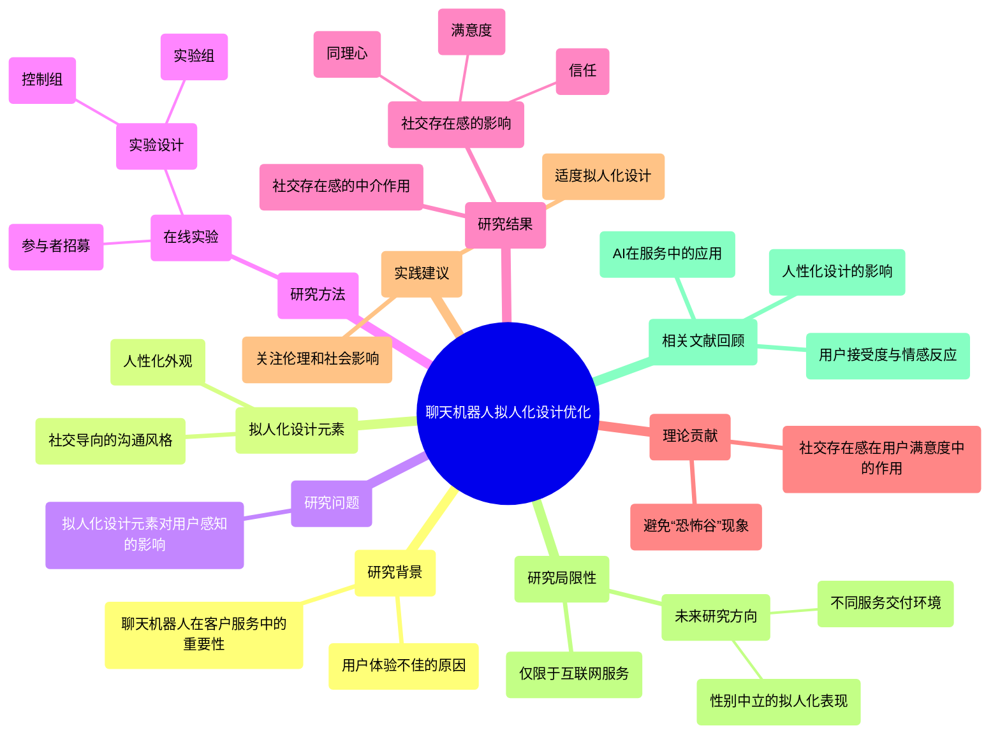
```mermaid
mindmap
  root((聊天机器人拟人化设计优化))
    ("研究背景")
      ("聊天机器人在客户服务中的重要性")
      ("用户体验不佳的原因")
    ("拟人化设计元素")
      ("人性化外观")
      ("社交导向的沟通风格")
    ("研究问题")
      ("拟人化设计元素对用户感知的影响")
    ("研究方法")
      ("在线实验")
        ("参与者招募")
        ("实验设计")
          ("控制组")
          ("实验组")
    ("研究结果")
      ("社交存在感的影响")
        ("信任")
        ("同理心")
        ("满意度")
      ("社交存在感的中介作用")
    ("理论贡献")
      ("社交存在感在用户满意度中的作用")
      ("避免“恐怖谷”现象")
    ("实践建议")
      ("适度拟人化设计")
      ("关注伦理和社会影响")
    ("研究局限性")
      ("仅限于互联网服务")
      ("未来研究方向")
        ("不同服务交付环境")
        ("性别中立的拟人化表现")
    ("相关文献回顾")
      ("用户接受度与情感反应")
      ("人性化设计的影响")
      ("AI在服务中的应用")
```

### 图表 2

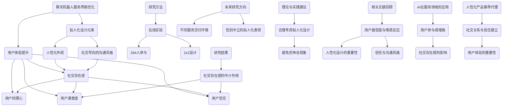
```mermaid
graph TD
    A("聊天机器人服务界面优化") --> B("拟人化设计元素")
    B --> C1("人性化外观")
    B --> C2("社交导向的沟通风格")
    
    A --> D("用户体验提升")
    D --> E1("社交存在感")
    D --> E2("用户信任")
    D --> E3("用户同理心")
    D --> E4("用户满意度")
    
    C1 --> E1
    C2 --> E1
    E1 --> E2
    E1 --> E3
    E1 --> E4
    
    F("研究方法") --> G("在线实验")
    G --> H("284人参与")
    G --> I("2x2设计")
    
    J("研究结果") --> K("社交存在感的中介作用")
    K --> E4
    K --> E2
    
    L("理论与实践建议") --> M("合理考虑拟人化设计")
    M --> N("避免恐怖谷现象")
    
    O("未来研究方向") --> P("不同服务交付环境")
    O --> Q("性别中立的拟人化表现")
    
    R("相关文献回顾") --> S("用户接受度与情感反应")
    S --> T("人性化设计的重要性")
    S --> U("信任与沟通风格")
    
    V("AI在服务领域的应用") --> W("用户参与感增强")
    W --> X("社交存在感的影响")
    
    Y("人性化产品推荐代理") --> Z("社交关系与信任建立")
    Z --> AA("用户体验的重要性")
```

### 图表 3

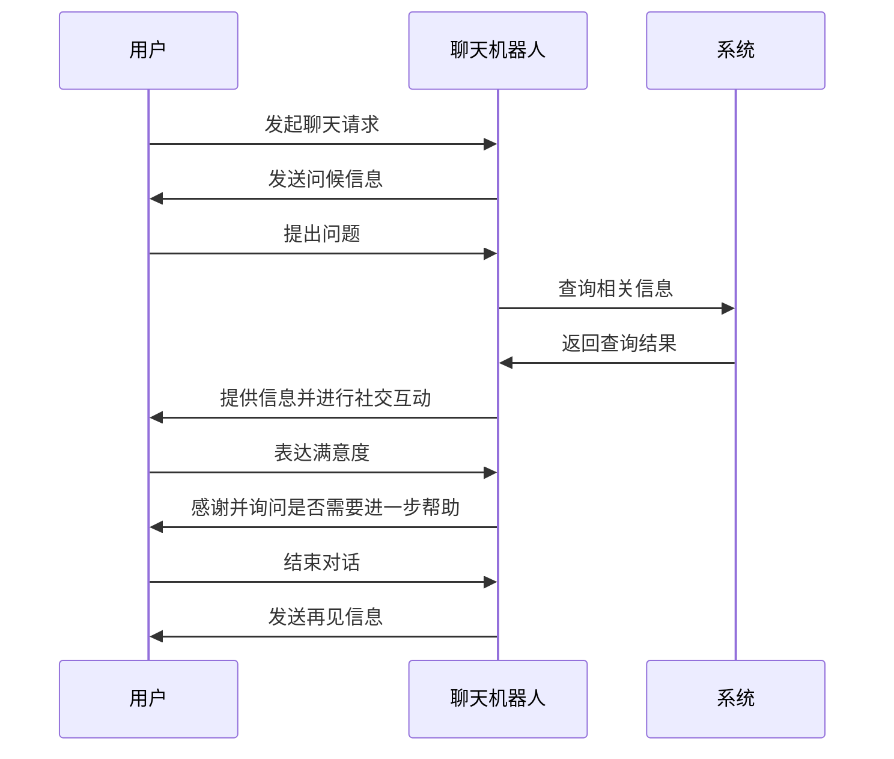
```mermaid
sequenceDiagram
    participant U as 用户
    participant C as 聊天机器人
    participant S as 系统

    U->>C: 发起聊天请求
    C->>U: 发送问候信息
    U->>C: 提出问题
    C->>S: 查询相关信息
    S->>C: 返回查询结果
    C->>U: 提供信息并进行社交互动
    U->>C: 表达满意度
    C->>U: 感谢并询问是否需要进一步帮助
    U->>C: 结束对话
    C->>U: 发送再见信息
```

### 图表 4

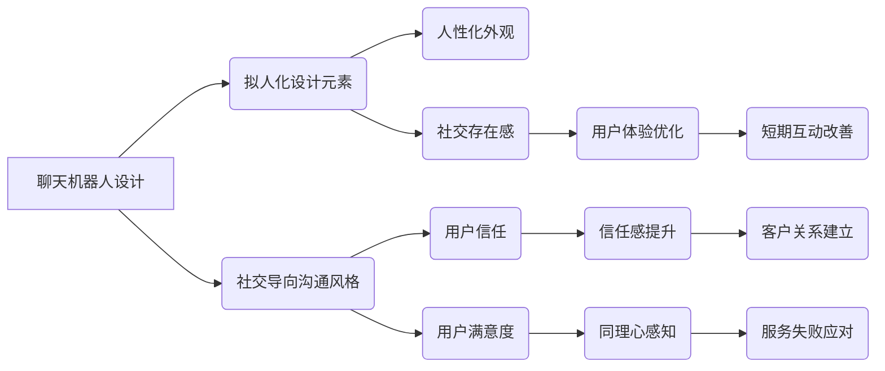
```mermaid
graph LR
    A["聊天机器人设计"] --> B("拟人化设计元素")
    A["聊天机器人设计"] --> C("社交导向沟通风格")
    B --> D("人性化外观")
    B --> E("社交存在感")
    C --> F("用户信任")
    C --> G("用户满意度")
    E --> H("用户体验优化")
    F --> I("信任感提升")
    G --> J("同理心感知")
    H --> K("短期互动改善")
    I --> L("客户关系建立")
    J --> M("服务失败应对")
```

# Inauthentic_inclusion__Exploring_how_intention_to_use_AIgenerated_diverse_models.docx

## 原始摘要

这篇研究文章探讨了品牌在广告中使用人工智能（AI）生成的多样性模型可能带来的负面影响。随着品牌越来越重视多样性和包容性，AI技术的应用使得品牌能够创造出超现实的视觉效果，但这种“非真实的包容性”可能会引发消费者的负面反应。

文章首先定义了多样性和包容性，强调品牌在社会运动的推动下，努力在市场中体现多样性，以增强消费者信任和忠诚度。然而，尽管AI技术为品牌提供了展示多样性的机会，消费者对AI生成的多样性表现的反应仍然不明确。

研究指出，AI生成的模型可能被视为不真诚，因为品牌没有雇佣真实的模特来代表多样性。这种人工的表现可能导致被代表的少数群体感到身份被贬值，从而产生社会身份威胁，影响他们对品牌的归属感和参与度。

文章通过文献综述和假设发展，探讨了品牌使用AI生成模型对少数群体消费者的影响，以及品牌在表现多样性时的动机（内在或外在）如何影响消费者的反应。研究结果表明，AI生成的多样性表现可能会导致少数群体的负面情绪，影响他们对品牌的参与和满意度。

总之，品牌在追求多样性时，需谨慎使用AI技术，以避免引发消费者的负面反应，确保真实的包容性和多样性。
本节内容主要探讨了人工智能生成的多样性表现对少数群体消费者的影响，提出了几个假设。研究认为，AI生成的多样性表现可能导致少数群体消费者感受到社会身份威胁，从而降低他们对品牌的归属感，进而影响品牌态度。

具体假设如下：

1. 对于少数群体消费者，使用与身份一致的AI生成模型（相较于人类模型）会对品牌态度产生负面影响。
2. AI生成的表现（相较于现实中的表现）会对少数群体消费者的品牌态度产生负面影响，并且这一影响通过社会身份威胁和归属感的中介作用实现。

此外，研究还探讨了品牌动机如何减轻少数群体消费者对AI生成多样性表现的负面反应。归因理论关注消费者如何推断品牌的内在或外在动机。当品牌与社会事业（如多样性表现）对齐时，消费者可能将品牌的行为归因于内在动机（如道德责任）或外在动机（如竞争和盈利）。研究表明，外在动机可能会加剧消费者的社会身份威胁感，导致对品牌的负面态度。

研究通过四项实验来验证这些假设。第一项研究测试了少数群体消费者对AI生成模型的品牌态度反应，结果显示，使用AI生成模型的品牌态度显著低于使用人类模型的品牌态度。第二项研究则专注于LGBTQIA+消费者，进一步验证了AI生成表现对品牌态度的负面影响及其通过社会身份威胁和归属感的中介作用。

总之，研究强调了品牌在使用AI生成多样性表现时需谨慎，尤其是在少数群体消费者面前，品牌的内在动机被视为重要因素，能够影响消费者的品牌态度和归属感。
本节内容探讨了人工智能生成的多样性表现对少数群体消费者的影响，特别是LGBTQIA+群体和残障人士。研究通过多项实验验证了假设，发现当品牌使用AI生成的多样性表现时，少数群体消费者会感受到更高的社会身份威胁和归属感降低，进而导致品牌态度的负面影响。

在第二项研究中，结果显示AI生成的多样性表现对品牌态度有显著的负面影响，且这一影响通过社会身份威胁和归属感的中介作用实现。第三项研究则聚焦于残障人士，结果同样支持了这一假设，表明他们在面对AI生成的多样性表现时，感受到的社会身份威胁更高，归属感更低，导致品牌态度下降。

第四项研究探讨了品牌动机对消费者反应的影响，发现当品牌被视为出于内在动机（如道德责任）使用AI生成多样性表现时，消费者的品牌态度更为积极。这一发现表明，品牌的动机在消费者的反应中起着重要作用。

总体而言，研究强调了品牌在使用AI生成多样性表现时需谨慎，尤其是在少数群体消费者面前，内在动机的传达能够减轻负面反应。这些发现丰富了市场营销领域的知识，揭示了多样性表现的复杂性及其对特定消费者群体的潜在负面影响。
本研究探讨了品牌在多样性表现方面的潜在影响，尤其是人工智能生成的多样性表现可能对少数群体消费者造成身份威胁。研究发现，品牌传达内在动机（如道德责任）能够减轻这种负面影响，而外在动机（如利润导向）则可能加剧消费者的负面反应。

研究还验证了消费者对人类与AI生成实体的不同反应，发现少数群体消费者在面对AI生成的代表性形象时，反应更为消极。这一发现扩展了对少数群体消费者的研究，强调了品牌在多样性表现中的复杂性。

对于品牌和市场营销人员而言，研究结果具有重要意义。品牌在使用人工智能技术进行多样性表现时，需谨慎对待，避免被视为负面解读。品牌应明确传达其内在动机，而非仅仅强调外在利益。此外，在元宇宙等新兴领域，品牌在创建虚拟形象时也应谨慎处理多样性表现。

研究的局限性在于样本数量较小，且主要集中于LGBTQIA+和残障人士等群体，未来研究可扩展至其他未充分代表的群体。此外，研究采用了假设场景，未来可考虑实际应用中的效果。

最后，随着政府对AI使用的监管，品牌在多样性表现中可能需要遵循新的伦理规范，明确虚构实体的性质，以避免误导消费者。
本节内容主要探讨了多样性和包容性在市场营销中的重要性，特别是针对不同群体（如残障人士、LGBTQIA+群体等）的消费者行为和品牌策略。研究表明，品牌在广告中展示多样性能够影响消费者的认同感和归属感，但如果品牌的动机被视为表面化或功利化，可能会引发消费者的怀疑和负面反应。

多项研究指出，消费者对品牌的社会责任感知会影响他们的购买决策，尤其是在涉及少数群体时。品牌在传达其社会责任时，需明确其内在动机，以避免被视为仅仅追求商业利益。此外，虚拟影响者的崛起也为品牌提供了新的营销机会，但消费者对这些虚拟形象的反应复杂，可能会因其真实性和可信度而有所不同。

在广告中，性别、年龄和种族等刻板印象的使用也引发了广泛讨论。研究显示，消费者对这些刻板印象的反应受到文化背景和个人价值观的影响。因此，品牌在制定广告策略时，需考虑多样性和包容性的实际效果，以增强消费者的认同感。

最后，随着社会对多样性和包容性关注的增加，品牌在营销中应更加注重伦理和社会责任，确保其传播的信息能够真正反映出对所有消费者的尊重和理解。
本节内容主要围绕多样性和包容性在市场营销中的重要性展开，特别是对不同群体（如少数族裔、残障人士等）的消费者行为和品牌策略的影响。研究表明，品牌在广告中展示多样性能够增强消费者的认同感，但如果品牌的动机被视为表面化，可能会引发消费者的负面反应。

多项研究指出，消费者对品牌的社会责任感知会影响他们的购买决策，尤其是在涉及少数群体时。品牌在传达社会责任时需明确其内在动机，以避免被视为仅追求商业利益。此外，虚拟影响者的崛起为品牌提供了新的营销机会，但消费者对这些虚拟形象的反应复杂，可能因其真实性和可信度而有所不同。

广告中性别、年龄和种族等刻板印象的使用引发了广泛讨论。研究显示，消费者对这些刻板印象的反应受到文化背景和个人价值观的影响。因此，品牌在制定广告策略时需考虑多样性和包容性的实际效果，以增强消费者的认同感。

随着社会对多样性和包容性关注的增加，品牌在营销中应更加注重伦理和社会责任，确保传播的信息能够真正反映对所有消费者的尊重和理解。
本节内容主要探讨了人工智能生成的实体在市场营销中的应用及其对消费者反应的影响。研究表明，AI代言人和虚拟影响者在广告中的使用能够提升广告的新颖性和有效性，但消费者对这些代言人的接受度因产品类别和代言人类型（虚拟与人类）而异。

具体而言，虚拟影响者被认为是“怪异而真实的假象”，尽管消费者对其表现出的缺陷和自我辩解表示接受。研究还发现，对于某些被污名化的消费者，使用与其相似的虚拟形象可能会产生反效果。

此外，消费者对AI影响者的态度普遍积极，认为其能够为品牌带来显著的好处。不同类型的代言人（如AI与名人）在消费者的购买意图和品牌态度上没有显著差异，但AI影响者更可能激发口碑传播的意图。

在多样性方面，研究显示，消费者对多样化的虚拟影响者反应积极，但样本框架的多样性不足可能影响结果的普遍性。使用AI生成的模型来代表不同群体时，未被充分代表的消费者可能会感受到社会身份威胁和归属感降低，尤其是在品牌动机被视为外在时，这种负面影响会加剧。

综上所述，品牌在利用AI生成的代言人时需谨慎考虑消费者的社会认同感和归属感，以确保营销策略的有效性和包容性。

## 摘要

1. Class: (1): 虚拟交互或人与AI/chatbot的交互

2. Authors: [Author1], [Author2], [Author3], [Author4]

3. Affiliation: [First Author's Affiliation in Chinese]

4. Keywords: AI-generated diversity, consumer response, social identity threat, brand motivation, minority groups

5. Urls: [Paper URL] or [Github: None]

6. Summary: 

   - (1): 本文研究了品牌在广告中使用人工智能生成的多样性模型可能带来的负面影响，尤其是对少数群体消费者的影响。

   - (2): 理论模型探讨了品牌动机（内在或外在）如何影响消费者的品牌态度，关键变量包括AI生成模型的使用、社会身份威胁和归属感，存在中介变量。

   - (3): 研究采用了四项实验方法来验证假设，分析消费者对AI生成模型的反应。

   - (4): 研究发现，使用AI生成的多样性表现会导致少数群体消费者感受到社会身份威胁，进而影响品牌态度，品牌的内在动机能够减轻这种负面反应。

## 图表

### 图表 1

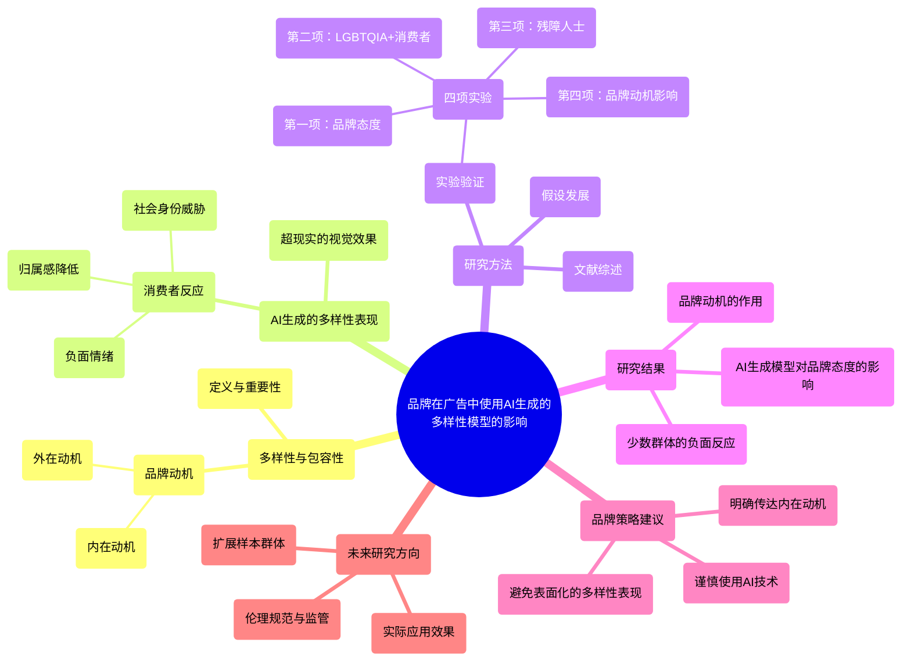
```mermaid
mindmap
  root((品牌在广告中使用AI生成的多样性模型的影响))
    ("多样性与包容性")
      ("定义与重要性")
      ("品牌动机")
        ("内在动机")
        ("外在动机")
    ("AI生成的多样性表现")
      ("超现实的视觉效果")
      ("消费者反应")
        ("负面情绪")
        ("社会身份威胁")
        ("归属感降低")
    ("研究方法")
      ("文献综述")
      ("假设发展")
      ("实验验证")
        ("四项实验")
          ("第一项：品牌态度")
          ("第二项：LGBTQIA+消费者")
          ("第三项：残障人士")
          ("第四项：品牌动机影响")
    ("研究结果")
      ("AI生成模型对品牌态度的影响")
      ("少数群体的负面反应")
      ("品牌动机的作用")
    ("品牌策略建议")
      ("谨慎使用AI技术")
      ("明确传达内在动机")
      ("避免表面化的多样性表现")
    ("未来研究方向")
      ("扩展样本群体")
      ("实际应用效果")
      ("伦理规范与监管")
```

### 图表 2

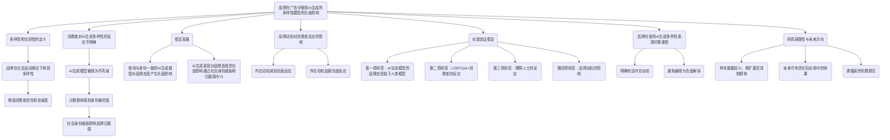
```mermaid
graph TD
    A("品牌在广告中使用AI生成的多样性模型的负面影响") --> B("多样性和包容性的定义")
    B --> C("品牌在社会运动推动下体现多样性")
    C --> D("增强消费者信任和忠诚度")
    A --> E("消费者对AI生成多样性的反应不明确")
    E --> F("AI生成模型被视为不真诚")
    F --> G("少数群体感到身份被贬值")
    G --> H("社会身份威胁影响品牌归属感")
    A --> I("假设发展")
    I --> J("使用与身份一致的AI生成模型对品牌态度产生负面影响")
    I --> K("AI生成表现对品牌态度的负面影响通过社会身份威胁和归属感中介")
    A --> L("品牌动机对消费者反应的影响")
    L --> M("内在动机减轻负面反应")
    L --> N("外在动机加剧负面反应")
    A --> O("实验验证假设")
    O --> P("第一项研究：AI生成模型的品牌态度低于人类模型")
    O --> Q("第二项研究：LGBTQIA+消费者的反应")
    O --> R("第三项研究：残障人士的反应")
    O --> S("第四项研究：品牌动机的影响")
    A --> T("品牌在使用AI生成多样性表现时需谨慎")
    T --> U("明确传达内在动机")
    T --> V("避免被视为负面解读")
    A --> W("研究局限性与未来方向")
    W --> X("样本数量较小，需扩展至其他群体")
    W --> Y("未来可考虑实际应用中的效果")
    W --> Z("遵循新的伦理规范")
```

### 图表 3

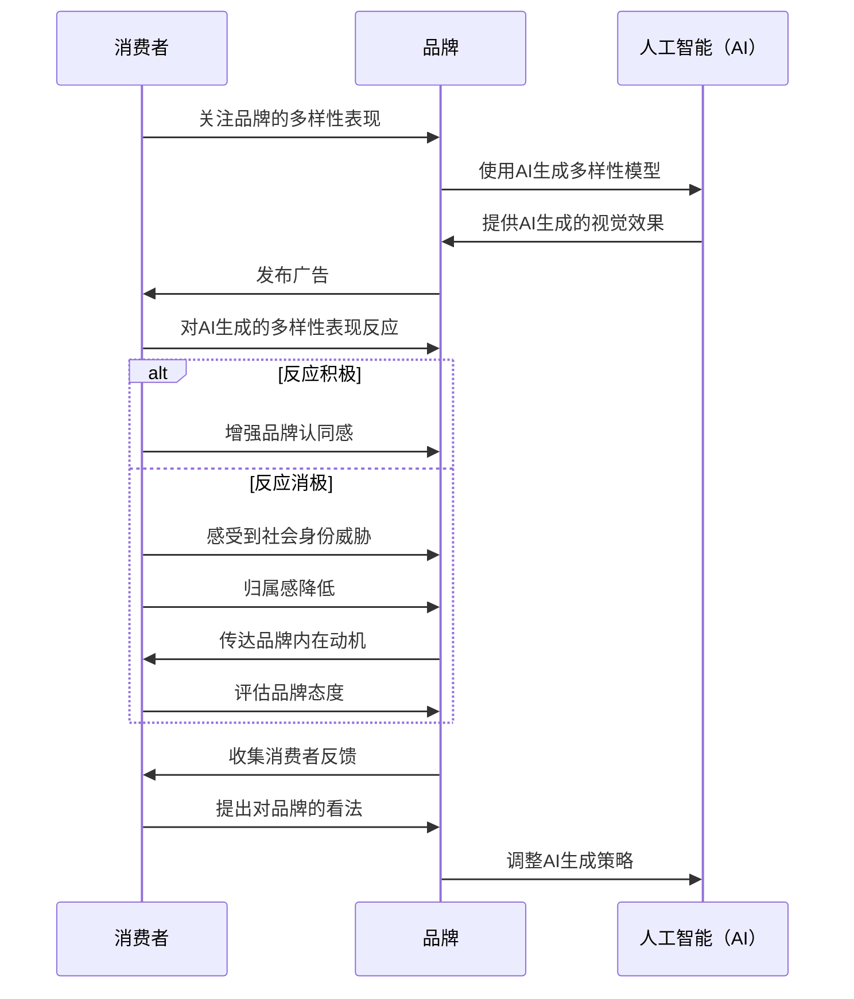
```mermaid
sequenceDiagram
    participant C as 消费者
    participant B as 品牌
    participant A as 人工智能（AI）

    C->>B: 关注品牌的多样性表现
    B->>A: 使用AI生成多样性模型
    A->>B: 提供AI生成的视觉效果
    B->>C: 发布广告

    C->>B: 对AI生成的多样性表现反应
    alt 反应积极
        C->>B: 增强品牌认同感
    else 反应消极
        C->>B: 感受到社会身份威胁
        C->>B: 归属感降低
        B->>C: 传达品牌内在动机
        C->>B: 评估品牌态度
    end

    B->>C: 收集消费者反馈
    C->>B: 提出对品牌的看法
    B->>A: 调整AI生成策略
```

### 图表 4

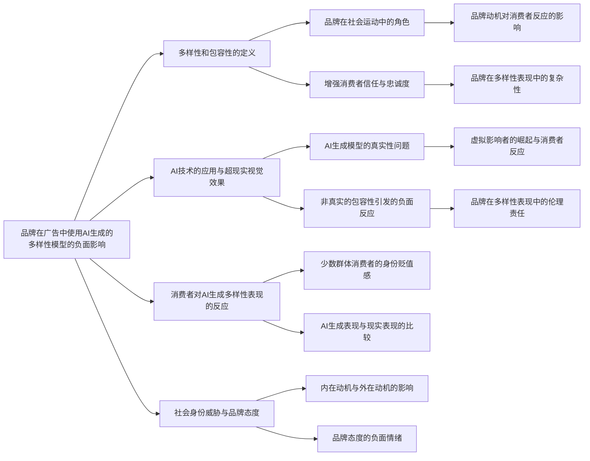
```mermaid
graph LR
    A["品牌在广告中使用AI生成的多样性模型的负面影响"] --> B["多样性和包容性的定义"]
    A --> C["AI技术的应用与超现实视觉效果"]
    A --> D["消费者对AI生成多样性表现的反应"]
    A --> E["社会身份威胁与品牌态度"]
    
    B --> F["品牌在社会运动中的角色"]
    B --> G["增强消费者信任与忠诚度"]
    
    C --> H["AI生成模型的真实性问题"]
    C --> I["非真实的包容性引发的负面反应"]
    
    D --> J["少数群体消费者的身份贬值感"]
    D --> K["AI生成表现与现实表现的比较"]
    
    E --> L["内在动机与外在动机的影响"]
    E --> M["品牌态度的负面情绪"]
    
    F --> N["品牌动机对消费者反应的影响"]
    G --> O["品牌在多样性表现中的复杂性"]
    
    H --> P["虚拟影响者的崛起与消费者反应"]
    I --> Q["品牌在多样性表现中的伦理责任"]
```

# Influencing human-Alinteraction by priming beliefs about Al can increase perceived trustworthinessempathy and effectiveness.docx

## 原始摘要

这段研究探讨了人类与人工智能（AI）互动时，用户对AI的心理模型如何影响他们的体验。随着大型语言模型（LLMs）的进步，AI逐渐被视为伴侣而非单纯的助手。研究中，参与者与同一AI进行对话，但根据不同的引导语（如关心、操控或无动机）影响其对AI的看法。结果显示，认为AI有关心动机的参与者更倾向于认为AI值得信赖、富有同情心且表现更好。

研究还发现，用户与AI之间存在反馈循环，用户的心理模型在短时间内会被强化。通过对310名参与者的实验，结果表明，用户的心理模型显著影响他们的行为和体验。具体而言，关心动机的引导语使88%的参与者相信AI是关心他们的，而操控动机的引导语则只有44%的人认为AI具有操控意图。

此外，研究还发现，用户对AI的感知会影响对话的情感趋势。认为AI关心的参与者在对话中情感逐渐上升，而认为AI操控的参与者情感显著下降。总的来说，AI的呈现方式对人类与AI的互动有重要影响，未来的研究应关注这种影响的长期效果。
本节内容探讨了用户对人工智能（AI）代理的心理模型如何影响他们的体验。研究发现，当用户认为AI具有关心的动机时，他们对AI的信任度、同情心和有效性评价显著提高。例如，在关心条件下，参与者对AI的信任评分为5.13，而在操控条件下仅为3.81。参与者还表示，如果他们认为AI关心他们，他们更愿意推荐该AI给朋友。

研究还显示，用户对AI的感知会影响他们对AI回应特征的评价，包括重复性和人性化程度。参与者认为关心的AI更少重复，且更像人类。心理模型的影响在更复杂的生成模型中更为显著，参与者对关心的生成AI的推荐意愿明显高于操控或无动机的AI。

此外，参与者对AI的态度也影响他们的体验。对AI持积极态度的参与者更倾向于认为AI值得信赖和有效，而持消极态度的参与者则对AI的能力表示不满。研究还发现，性别、年龄和教育水平对体验的影响不明显，需进一步研究。

总的来说，个体的心理模型通过先前的观点和期望构建，影响了他们与AI的互动和体验。积极的引导语能增强用户对AI的信任和满意度，而消极的引导语则可能导致用户对AI产生怀疑。
本节内容探讨了用户对人工智能（AI）系统的心理模型如何影响人机交互的结果。研究表明，用户的先前信念会形成主观的心理模型，从而影响他们的行为和体验。媒体对AI的呈现方式在社会中起着重要作用，因为它影响了用户对AI的期望和体验。AI常被视为一个复杂的黑箱，用户的想象力在其中扮演着重要角色，因此可能导致用户对AI的信任超出理智范围。

在伦理方面，AI系统的呈现方式会显著影响用户的感知和互动。研究者需谨慎考虑是否应鼓励用户将AI视为关心的对象，或是潜在的不可信任者，以影响他们的期望和后续互动。通过精心设计AI的解释，利益相关者可以影响用户的期望，促进信任和同情心，但也需警惕潜在的负面后果，如欺骗。

研究方法上，采用随机对照研究，设计为2×3的因子设计，探讨不同AI模型（生成模型与基于规则的模型）和动机引导条件（无动机、关心动机、操控动机）对用户体验的影响。参与者通过在线调查平台进行实验，调查内容包括对AI的态度、与AI的互动体验等。

研究结果显示，用户的心理模型显著影响了他们对AI的评价和行为，且这种心理模型受到文化背景、个人信念和具体情境的影响。研究强调了AI叙事在社会中的重要性，提出应考虑如何更好地呈现AI，以塑造用户的期望和体验。

最后，研究建议未来可以扩展方法，采用混合方法进行更深入的分析，并探讨长期的引导效果及其在其他应用领域的影响。
本节内容主要涉及参与者的招募、研究方法、数据分析及其局限性。参与者通过Prolific网站招募，确保流利的英语能力，并在性别上保持平衡。为了确保结果的有效性，排除了技术问题、对话响应少于四次、未通过理解检查或调查数据与对话数据不匹配的参与者。最终，生成条件下有160名参与者，基于规则的条件下有150名参与者。

研究获得了MIT人类实验使用委员会的批准。数据分析采用统计测试，分别对每个Likert问题及UTAUT和TLI问卷进行分析。参与者根据分配的动机和自我报告的AI代理动机进行分类。分析结果显示，参与者对AI的态度与他们的心理模型密切相关。

研究还指出，虽然当前方法主要依赖文本分析，但未来可以结合其他方法，如绘画分析和现象学访谈。此外，研究建议未来应探讨用户心理模型的动态更新及其持续影响。

最后，原始数据和代码均可在GitHub上获取，感谢审稿人和支持团队的反馈与帮助。所有作者对研究的设计、实验、数据分析及论文撰写均有贡献，并声明没有竞争利益。
本节讨论了部署机器人积极心理学教练以改善大学生心理健康的研究。研究表明，社交聊天机器人能够提供情感支持，帮助用户建立与AI的友谊。相关文献探讨了人们如何将计算机和媒体视为真实的人，并分析了社交机器人外观、声音和行为对用户信任和情感的影响。

研究还强调了用户心理模型在与AI互动中的重要性，指出用户对AI的理解和期望会影响他们的体验和信任度。通过对社交机器人的外观和交互策略的研究，发现这些因素会显著影响用户的感知和情感反应。

此外，文献中提到的多项研究表明，社交机器人在提供支持和促进心理健康方面具有潜力，但仍需进一步探索其设计和功能，以确保其有效性和用户接受度。研究建议未来应关注用户与AI之间的动态关系，以及如何通过设计优化用户体验。

最后，研究强调了透明性和可解释性在AI系统中的重要性，以帮助用户更好地理解和信任这些技术。
本节主要探讨了与人工智能（AI）相关的多种主题，包括语言模型的潜在风险、公众对AI的看法、AI在心理健康和教育中的应用等。

首先，讨论了语言模型的规模是否过大，指出大型语言模型可能带来的风险，如偏见和误导信息的传播。研究强调了对AI系统的透明性和可解释性的需求，以增强用户信任。

其次，文献中提到公众对AI的情感反应，包括对“可怕机器人”的担忧，以及在科幻作品中对智能机器的希望与恐惧。这些情感反应影响了人们对AI政策的看法。

此外，研究还探讨了AI在医疗和教育领域的应用，特别是安慰剂效应在AI交互中的作用。AI的设计和功能可能影响用户的心理状态和行为表现。

最后，强调了同理心在虚拟代理和机器人中的重要性，指出同理心可以改善人机交互体验，并促进用户的积极情感。

整体而言，本节通过对多项研究的综述，揭示了AI技术在社会中的复杂性及其对人类心理和行为的深远影响。
本节主要介绍了对人工智能（AI）态度量表的初步验证及相关调查结果。研究通过问卷调查收集参与者对AI的态度，使用了Likert量表（1表示强烈不同意，7表示强烈同意），涵盖了AI的益处、信任度和使用意愿等方面。

参与者被要求对多项陈述进行评分，例如“AI有许多有益的应用”和“社会将从AI中受益”。此外，调查还包括参与者与AI代理交互后的反馈，涉及技术困难、整体体验、代理的动机等问题。

在信任与同理心方面，参与者被问及是否愿意推荐该代理给朋友，以及代理是否值得信赖和具备同理心。在感知有效性方面，参与者评价代理在提供心理健康建议时的帮助程度。响应特征则关注代理的重复性和人性化表现。

研究还使用了UTAUT量表来测量接受度和可用性，结果显示，认为代理具有关怀动机的参与者对其评价更为积极。同时，任务负荷指数（TLI）用于评估参与者在与代理互动时的心理负担和挫败感。

研究发现，参与者的性别、年龄和教育水平对结果有一定影响，但未形成明确模式，需进一步研究。总体而言，参与者对AI代理的体验差异显著，部分用户对AI的评价极为正面，而另一些则持批评态度。

最后，研究通过对用户对话内容的分析，揭示了参与者与AI代理的互动方式，显示出个体体验的多样性和复杂性。

## 摘要

1. Class: (1): 虚拟交互或人与AI/chatbot的交互

2. Authors: [Author names not provided in the prompt]

3. Affiliation: [Affiliation not provided in the prompt]

4. Keywords: AI interaction, psychological model, user experience, trust, empathy

5. Urls: [Paper link not provided in the prompt], Github: None

6. Summary:

   - (1): 本文研究了用户与人工智能（AI）互动时，用户的心理模型如何影响他们的体验，尤其是在大型语言模型（LLMs）逐渐被视为伴侣的背景下。

   - (2): 理论模型主要探讨用户对AI的心理模型，关键变量包括用户对AI的信任度和同情心，存在引导语的调节作用（如关心、操控）。

   - (3): 研究采用随机对照实验设计，使用2×3因子设计，探讨不同AI模型和动机引导条件对用户体验的影响。

   - (4): 研究表明，用户的心理模型显著影响他们对AI的评价和行为，尤其在关心动机条件下，用户的信任和满意度显著提高，支持了研究目标。

## 图表

### 图表 1

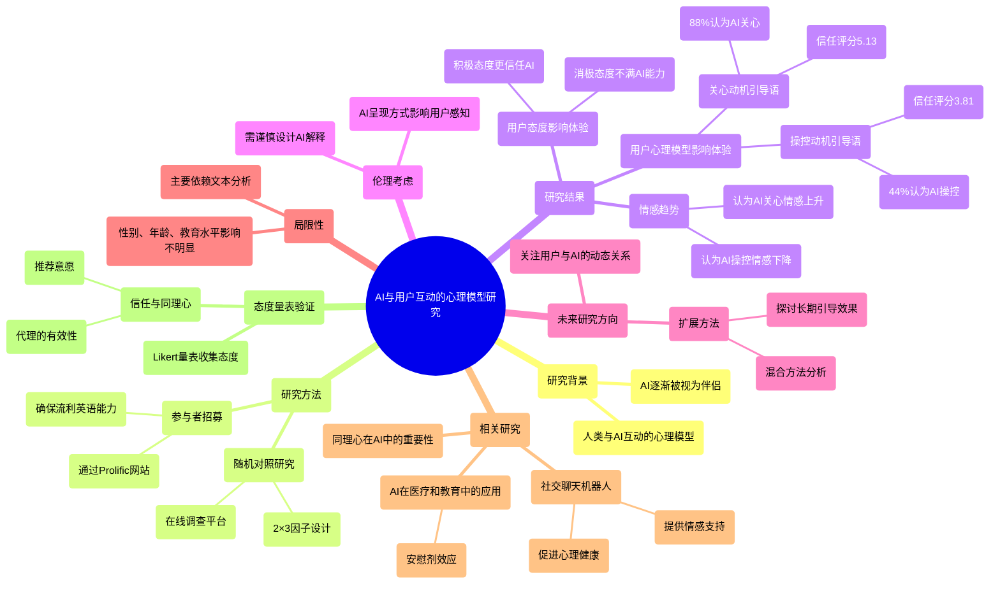
```mermaid
mindmap
  root((AI与用户互动的心理模型研究))
    ("研究背景")
      ("人类与AI互动的心理模型")
      ("AI逐渐被视为伴侣")
    ("研究方法")
      ("随机对照研究")
        ("2×3因子设计")
        ("在线调查平台")
      ("参与者招募")
        ("通过Prolific网站")
        ("确保流利英语能力")
    ("研究结果")
      ("用户心理模型影响体验")
        ("关心动机引导语")
          ("88%认为AI关心")
          ("信任评分5.13")
        ("操控动机引导语")
          ("44%认为AI操控")
          ("信任评分3.81")
      ("情感趋势")
        ("认为AI关心情感上升")
        ("认为AI操控情感下降")
      ("用户态度影响体验")
        ("积极态度更信任AI")
        ("消极态度不满AI能力")
    ("伦理考虑")
      ("AI呈现方式影响用户感知")
      ("需谨慎设计AI解释")
    ("未来研究方向")
      ("扩展方法")
        ("混合方法分析")
        ("探讨长期引导效果")
      ("关注用户与AI的动态关系")
    ("局限性")
      ("性别、年龄、教育水平影响不明显")
      ("主要依赖文本分析")
    ("相关研究")
      ("社交聊天机器人")
        ("提供情感支持")
        ("促进心理健康")
      ("AI在医疗和教育中的应用")
        ("安慰剂效应")
      ("同理心在AI中的重要性")
    ("态度量表验证")
      ("Likert量表收集态度")
      ("信任与同理心")
        ("推荐意愿")
        ("代理的有效性")
```

### 图表 2

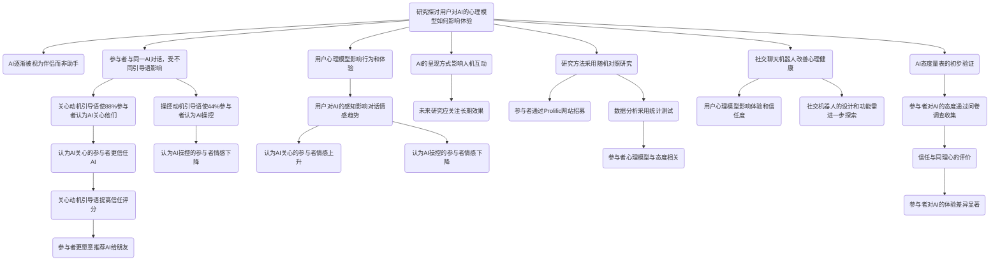
```mermaid
graph TD
    A("研究探讨用户对AI的心理模型如何影响体验") --> B("AI逐渐被视为伴侣而非助手")
    A --> C("参与者与同一AI对话，受不同引导语影响")
    C --> D("关心动机引导语使88%参与者认为AI关心他们")
    C --> E("操控动机引导语使44%参与者认为AI操控")
    D --> F("认为AI关心的参与者更信任AI")
    E --> G("认为AI操控的参与者情感下降")
    F --> H("关心动机引导语提高信任评分")
    H --> I("参与者更愿意推荐AI给朋友")
    A --> J("用户心理模型影响行为和体验")
    J --> K("用户对AI的感知影响对话情感趋势")
    K --> L("认为AI关心的参与者情感上升")
    K --> M("认为AI操控的参与者情感下降")
    A --> N("AI的呈现方式影响人机互动")
    N --> O("未来研究应关注长期效果")
    A --> P("研究方法采用随机对照研究")
    P --> Q("参与者通过Prolific网站招募")
    P --> R("数据分析采用统计测试")
    R --> S("参与者心理模型与态度相关")
    A --> T("社交聊天机器人改善心理健康")
    T --> U("用户心理模型影响体验和信任度")
    T --> V("社交机器人的设计和功能需进一步探索")
    A --> W("AI态度量表的初步验证")
    W --> X("参与者对AI的态度通过问卷调查收集")
    X --> Y("信任与同理心的评价")
    Y --> Z("参与者对AI的体验差异显著")
```

### 图表 3

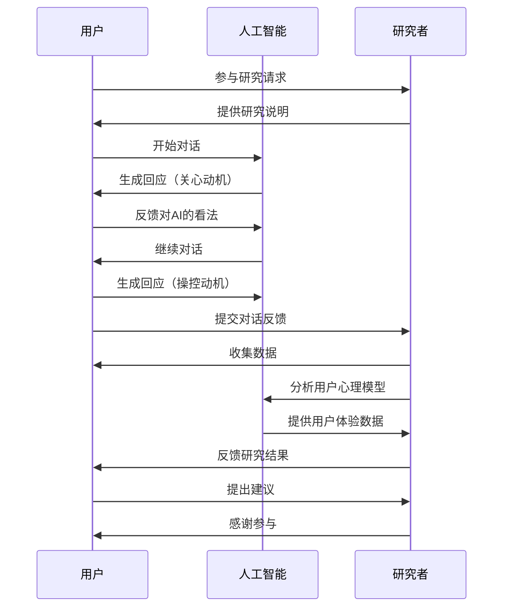
```mermaid
sequenceDiagram
    participant U as 用户
    participant AI as 人工智能
    participant R as 研究者

    U->>R: 参与研究请求
    R->>U: 提供研究说明
    U->>AI: 开始对话
    AI->>U: 生成回应（关心动机）
    U->>AI: 反馈对AI的看法
    AI->>U: 继续对话
    U->>AI: 生成回应（操控动机）
    U->>R: 提交对话反馈
    R->>U: 收集数据
    R->>AI: 分析用户心理模型
    AI->>R: 提供用户体验数据
    R->>U: 反馈研究结果
    U->>R: 提出建议
    R->>U: 感谢参与
```

### 图表 4

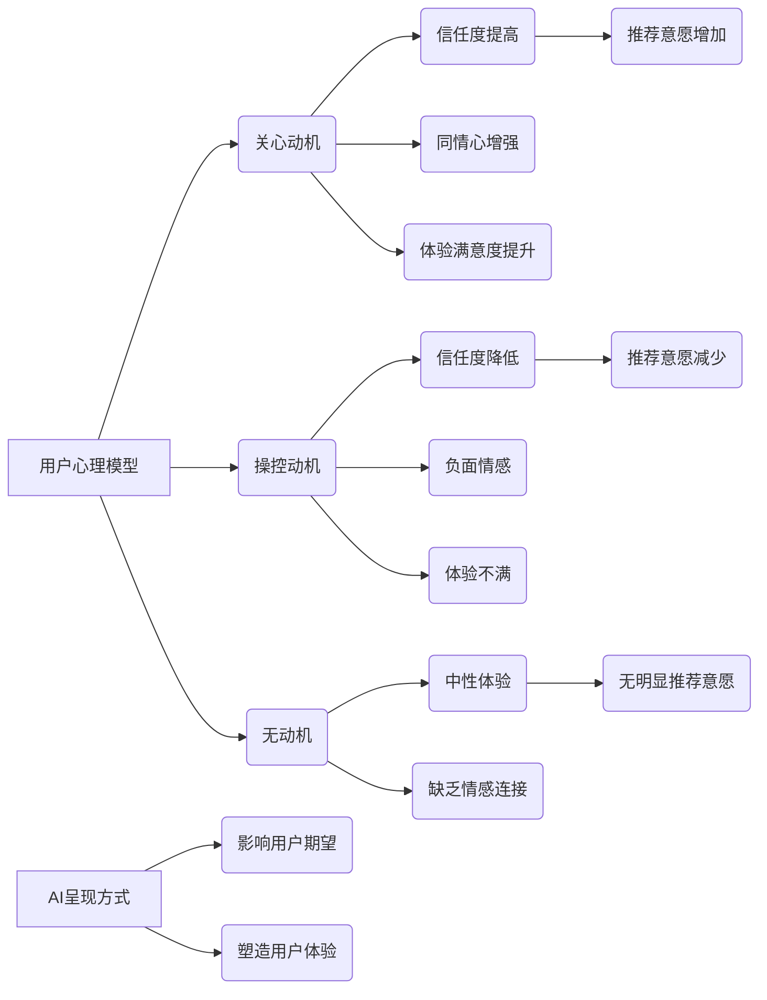
```mermaid
graph LR
    A["用户心理模型"] --> B("关心动机")
    A["用户心理模型"] --> C("操控动机")
    A["用户心理模型"] --> D("无动机")
    
    B --> E("信任度提高")
    B --> F("同情心增强")
    B --> G("体验满意度提升")
    
    C --> H("信任度降低")
    C --> I("负面情感")
    C --> J("体验不满")
    
    D --> K("中性体验")
    D --> L("缺乏情感连接")
    
    M["AI呈现方式"] --> N("影响用户期望")
    M --> O("塑造用户体验")
    
    E --> P("推荐意愿增加")
    H --> Q("推荐意愿减少")
    K --> R("无明显推荐意愿")
```

# Inform the Uninformed_Improving Online Informed Consent Reading with an Al-Powered Chatbot.docx

## 原始摘要

这篇论文探讨了如何通过一个人工智能驱动的聊天机器人来改善在线知情同意过程。知情同意是人类研究伦理的核心，参与者通过这一过程了解研究的目的、程序、潜在风险和收益，以便做出知情决策。然而，研究表明，当前的知情同意实践可能导致参与者做出不知情的决定，尤其是在在线研究中。缺乏研究者的指导，参与者往往需要独自阅读冗长的同意书，且无法及时获得问题的解答。

研究发现，使用聊天机器人Rumi进行知情同意的过程相比传统的表单方式，能够显著改善参与者对同意书的阅读理解和记忆。同时，参与者在与聊天机器人互动后，感受到与研究者之间的权力关系更加平等，这种权力动态的改变可能最终提升研究的响应质量。

研究还指出，在线知情同意的普遍性在COVID-19疫情期间有所增加，许多研究开始远程收集参与者的同意，涉及敏感信息和高风险程序。因此，改善在线知情同意的阅读变得尤为重要。

通过对238名参与者的研究，结果显示，使用聊天机器人Rumi的参与者在知情同意的理解和记忆上表现更好，并且感受到的权力差距减少，最终提升了研究的响应质量。这项研究首次系统性地比较了人工智能驱动的聊天机器人与传统在线知情同意过程的整体效果，提供了设计有效聊天机器人的启示，并为更广泛的知情同意场景提供了新的机会。

总之，研究表明，人工智能聊天机器人在改善在线知情同意过程中的有效性，能够提升参与者的理解、增强研究者与参与者之间的信任关系，并最终提高研究数据的质量。
本节内容主要探讨了知情同意过程中的设计和互动性，以及如何通过人工智能聊天机器人（如Rumi）改善这一过程。

首先，研究者们关注知情同意表的设计，包括文本可读性、长度、布局和媒体形式。Dresden和Levitt发现，简化的语言和减少不必要信息的同意表能帮助参与者更好地保留信息。然而，其他研究表明，简洁的同意表并不一定提高理解分数。尽管参与者倾向于更短、更简单的表格，但由于法规和研究性质，往往难以实现。此外，研究者们尝试将文本形式转化为多媒体形式，例如使用视频来提高参与者的参与度和理解力，但多项元分析未能得出其有效性的确凿证据。

另一组研究者则引入互动性，以创造更具吸引力和个性化的知情同意体验。在面对面的环境中，研究者逐步讲解同意表并回答参与者的问题被认为是最有效的方式。随着越来越多的研究转向在线，研究者们开始探索新的互动功能来改善在线知情同意。有效的干预措施包括在签署之前测试参与者对同意表的理解。Balestra等人使用社交注释来促进在线同意表的理解，而Bickmore等人则构建了一个可以解释医疗同意表的具身代理，发现能够根据参与者的知识量身定制解释的代理更受欢迎。尽管并非所有尝试都成功，但许多研究强调与研究者的互动对确保参与者理解同意信息和建立信任的重要性，尤其是在复杂和高风险的研究中。

我们构建的Rumi是一个先进的混合聊天机器人框架，结合了人工智能驱动的问答模块。与之前的工作相比，Rumi能够处理自然语言输入，回答多样化的问题，并提供多种对话技能，从而使知情同意过程更有效。

在研究中，研究者与参与者之间的权力关系也被讨论。研究者通常被视为拥有绝对权威，控制参与者的招募、治疗、数据和补偿，这种权力不对称抑制了参与者的自主性，降低了研究参与度。许多研究者提倡在知情同意过程中重新分配权力，以提高研究质量。通过分享研究程序的信息、澄清风险和收益、阐明参与者的权利，知情同意过程旨在缩小信息差距，确保参与者的自主性。

我们的研究展示了AI驱动的聊天机器人如何改善知情同意过程，从而缩小权力差距。通过路径分析，我们发现研究质量的改善与权力关系的变化有关。

此外，随着自然语言处理技术的进步，聊天机器人在研究中的应用越来越广泛，包括在线深度对话调查和现实世界的实地研究。与传统的表单互动相比，聊天机器人提供了更具吸引力和个性化的体验。具体而言，对话界面通过逐步聊天提供互动性，使聊天机器人能够以更个性化的方式提出问题，鼓励自我披露并深入探讨信息。

我们的研究考察了聊天机器人在知情同意过程中的实用性，展示了利用对话AI简化研究过程的新机会，并为未来的社会科学AI设计提供了启示。

为了回答研究问题，我们设计了一项比较研究，比较了AI驱动的聊天机器人和传统表单在知情同意过程中的效果。我们设计了一个虚拟研究，旨在评估参与者对社交媒体使用问题的看法，参与者在阅读短文后回答相关问题。我们设计了三种不同风险水平的版本，以模拟在线研究中的不同心理不适和数据敏感性。

在知情同意表的设计方面，我们基于伊利诺伊大学的社会行为研究知情同意表模板进行了改进，采用了分段设计以减少信息过载，并确保清晰易读。对于聊天机器人条件，我们创建了Rumi，模拟面对面的知情同意过程，逐步讲解同意表并回答参与者的问题。

Rumi采用混合方法构建，结合了基于规则的模型和AI驱动的模块，以确保回答的真实性和多样性。我们通过创建问答数据库和使用文本生成模型来增强Rumi的能力，确保其能够处理多种问题并提供准确的答案。

整个研究经过伦理审查，参与者随机分配到聊天机器人条件或表单条件，并根据风险水平进行分组。研究的第一部分是基于分配条件的知情同意过程。
在本节中，参与者在同意后完成了虚拟调查研究。我们对知情同意表的评估在第二部分进行，参与者回答了关于他们对同意表理解、与研究者的关系、知情同意过程的体验以及人口统计信息的问题。最后，我们向参与者解释了研究的真实目的，并要求他们填写一份关于分享第二部分答案的额外同意表。在研究结束前，我们还请参与者对他们的知情同意过程提供开放式反馈。

如果参与者在第一部分选择不参与研究，他们会被告知研究的真实目的，并询问是否愿意加入第二部分以评估他们对同意表的阅读。如果他们同意，我们会直接引导他们进入第二部分完成剩余的研究。

**测量方法**

1. **同意表阅读**：我们从回忆和理解两个维度来测量参与者对同意表的阅读。
   - **回忆**：通过插入两个随机陈述（“观看一只橙色猫的视频”和“在蓝色背景下阅读研究材料”）来评估参与者对同意表的回忆。参与者需从五个常见颜色中选择一个或两个颜色词，得分依据选择的正确性。
   - **理解**：通过六个问题来测量参与者对同意表的理解，问题涉及研究程序、潜在风险及应对措施等。最终得分为正确答案的百分比。

2. **参与者与研究者的权力关系**：通过参与者对研究者的感知关系及其自主感和控制感来测量。我们评估了参与者对研究者的信任程度及其在研究中的自主性。

3. **研究响应质量**：通过分析参与者对选择题和开放式问题的回答质量来测量。我们关注非区分性（参与者对所有项目给出相似回答）、相关性、具体性和清晰度。

**参与者体验与人口统计信息**：我们收集了参与者在知情同意过程中的时间和努力感受，以及他们未来使用该系统的意愿。基本人口统计信息包括年龄、性别、教育水平和年收入。

**参与者概况**：我们从Prolific招募了流利的英语使用者，共有278名参与者开始了知情同意过程，252人完成了同意表。最终238名有效参与者的分析显示，参与者中有97名女性、136名男性和5名非二元性别者。参与者的中位教育水平为学士学位，中位家庭收入在50,000到100,000美元之间，年龄中位数为25至34岁。参与者在表单条件下平均花费1.24分钟，而在聊天机器人条件下平均花费7.75分钟。

**数据分析**：我们使用贝叶斯分析比较两种同意方法对同意表阅读、参与者与研究者的权力关系及研究响应质量的影响。贝叶斯模型允许我们关注效应大小而非仅仅是是否存在效应，适合本研究的探索性质。我们构建了层次贝叶斯模型，包括线性回归模型和有序逻辑回归模型，以估计不同条件下的后验分布。

在所有模型中，我们控制了研究风险水平、参与者的年龄、性别、教育水平和年收入等协变量，以确保结果的可靠性。我们使用NumPyro进行贝叶斯分析，采用马尔可夫链蒙特卡洛（MCMC）方法进行后验分布的采样。
在本节中，我们通过分析参与者在聊天机器人条件下的聊天记录，补充了定量分析的定性证据。研究团队成员首先对数据进行了开放编码，然后在反思过程中不断完善这些编码，最后通过轴心编码将这些编码归类为更大的主题。

**结果**

总体而言，Rumi改善了参与者对知情同意表的阅读。与传统的表单式知情同意过程相比，与Rumi互动的参与者能够更好地回忆起同意表中的信息，并采取更正确的行动。此外，在聊天机器人条件下，参与者感知到自己与研究者之间的权力关系更为平等，并在虚拟调查中提供了更高质量的回应。探索性路径分析显示，基于聊天机器人的同意方法通过减少权力差距来提高回应质量。

尽管参与者在与Rumi聊天以完成知情同意过程时花费了更多时间，但他们对所花费的时间和努力感到满意，并表示愿意在未来使用这样的聊天机器人进行知情同意体验。我们对这两个测量进行了建模，发现参与者在时间和努力感知以及未来使用意愿上在两种条件下没有显著差异。

我们深入分析了参与者的聊天记录，发现他们积极与Rumi互动，共提出了449个问题，Rumi回答了389个（85.97%）。问题主要分为四个类别：Rumi的能力（12.69%）、研究团队信息（11.58%）、研究信息（56.15%）和闲聊（19.59%）。参与者询问Rumi的功能、研究团队的信息以及研究程序、风险和补偿等问题，显示出他们愿意花时间与Rumi互动。

尽管引入互动性可能会增加用户负担，但我们的结果表明，参与者愿意积极参与Rumi的知情同意过程，尽管所需时间比正常的在线知情同意更长。我们认为，在知情同意过程中，规模和速度不应是唯一的价值，尤其是在高风险场景中，提供更具吸引力的体验是重要的。

**Rumi改善了知情同意表的阅读**

总体来看，参与者在知情同意表的回忆和理解上都有显著改善。与静态表单相比，参与者在与Rumi互动后能够更好地回忆起同意表中的颜色词，并在理解上也表现更佳。我们的结果表明，聊天机器人驱动的知情同意过程在回忆和理解方面都有所提升。

参与者在聊天机器人条件下的理解得分为61%，而在表单条件下为46%。这种差异在统计上显著，表明参与者能够更好地理解内容并采取更好的行动来保护自己的权利。

**Rumi促进了参与者与研究者的关系**

与Rumi互动的参与者感知到自己与研究者之间的权力关系更为平等。他们对研究者的信任度更高，认为与研究者的关系更像是合作伙伴关系，这表明权力差距较小。

总的来说，Rumi通过提高参与者的参与感和互动性，改善了知情同意过程的效果，增强了参与者与研究者之间的信任关系。这些发现为未来的研究提供了重要的启示，表明在知情同意过程中引入聊天机器人等互动工具可能会带来积极的影响。
本节主要探讨了使用聊天机器人Rumi进行知情同意过程对参与者与研究者关系的影响，以及对调查回应质量的提升。

**主要发现**

1. **信任与合作关系**：与传统表单条件相比，参与者在与Rumi互动后，感知到与研究者的关系更像是合作伙伴关系，且对研究者的信任度显著提高。具体数据显示，参与者在合作伙伴关系和信任度的评分上有统计学上的显著差异。

2. **自主性与控制感**：虽然参与者在与Rumi互动后感受到的自主性和控制感有所提高，但这一差异并未达到统计显著性。

3. **调查回应质量**：参与者在与Rumi互动的条件下，提供了更高质量的开放式问题回答，且在选择题中表现出较少的满意度行为。开放式问题的回应质量差异具有统计显著性，表明聊天机器人能够有效提升参与者的回应质量。

4. **权力差距的缩小**：研究表明，聊天机器人通过改善知情同意过程，缩小了参与者与研究者之间的权力差距。这种权力关系的改善可能促进了参与者的信任感和自主性，从而提高了回应质量。

5. **结构方程模型分析**：通过构建结构方程模型，研究发现知情同意方法（聊天机器人与表单）对研究者-参与者权力关系和知情同意表阅读的影响显著，而权力关系的改善在回应质量提升中起到部分中介作用。

**结论**

综上所述，使用聊天机器人Rumi进行知情同意过程不仅提升了参与者对研究者的信任和合作感，还显著改善了开放式问题的回应质量。这些结果为未来研究提供了重要的启示，表明在知情同意过程中引入互动工具可能会带来积极的影响。
本节主要探讨了使用贝叶斯推断拟合的结构方程模型（SEM），结果显示知情同意方法对研究回应质量有显著影响。具体而言，知情同意方法的总效应为0.18，且通过参与者与研究者的权力关系间接影响回应质量，间接效应为0.12。这表明，聊天机器人驱动的知情同意过程可能通过减少研究者与参与者之间的权力不对称来提升回应质量。

研究还指出，尽管知情同意表的阅读未显示出显著的影响路径，但这可能与研究程序的简单性和研究的低风险性质有关。研究结果强调了有效的知情同意过程在缩小研究者与参与者之间的权力差距方面的重要性。

在设计更有效的知情同意体验时，个性化的聊天机器人可以通过询问参与者的经历和偏好来实现个性化体验。参与者对这种个性化体验表示赞赏，但在引入个性化时需谨慎，以避免影响自愿参与的原则。聊天机器人还可以根据参与者的先前经验突出重要内容，帮助他们更好地理解新内容。

此外，研究建议设计一个能够主动管理权力动态的知情同意聊天机器人。通过调整聊天机器人的身份，可以进一步影响研究者与参与者之间的关系。研究者的身份选择会影响权力动态，因此应设计聊天机器人作为研究伙伴而非研究者。

在结合人类专业知识与大型语言模型（LLMs）方面，研究表明，尽管LLMs在回答自然语言问题方面具有潜力，但在高风险环境中使用时需谨慎。建议将LLMs与人类专家结合，以确保生成的信息准确可靠。

未来的研究方向包括构建虚拟研究助手，帮助研究者从头到尾管理人类研究，尤其是在长期研究中保持参与者的参与和收集高质量数据。此外，在线知情同意的实践也需改进，以应对个人数据收集的挑战，确保用户在分享个人数据时能够获得清晰的指导和支持。
本研究探讨了如何通过AI驱动的聊天机器人提升用户对数据的知情同意能力。研究发现，聊天机器人能够有效地提供知情同意，改善人类研究中的回应质量。未来应进一步探索这种代理在更广泛的数据共享同意中的潜力。

**局限性**

本研究存在若干局限性。首先，作为首个此类研究，我们的主要目标是探索AI驱动的知情同意过程的潜在益处和局限性。通过结构方程模型（SEM），我们发现聊天机器人改善了研究回应质量，主要是通过改变权力关系。然而，由于研究的探索性，无法推断出强因果关系，未来需要确认性研究来验证观察到的效果及其机制。

其次，本研究设计仅限于在线调查。尽管我们模拟了不同风险级别的研究，但与可能涉及严重后果的高风险临床试验相比，我们的研究风险较低。人们在低风险研究中往往对知情同意表关注较少，因此可能观察到的差异较小。此外，研究程序简单，未来需要在不同复杂度的研究中考察聊天机器人驱动的知情同意。

第三，拒绝参与研究的参与者未纳入分析。尽管我们为这些参与者提供了填写知情同意表的机会，但部分参与者可能未完成表格。虽然我们认为这一潜在混杂因素对结果的影响有限，但未来研究仍需考虑这一点。

第四，研究旨在调查AI驱动的聊天机器人在知情同意过程中的整体效果，但聊天机器人的设计（如语言风格、外观等）及其能力（如自然语言理解、问答等）可能影响最终结果。当前数据不足以量化各设计因素的贡献，未来需要进行更严格的控制实验。

最后，尽管聊天机器人在日常生活中越来越普遍，但在知情同意过程中使用仍不常见。由于本研究的创新性，我们无法控制新奇效应的影响。未来计划进行纵向研究以考察新奇效应的影响，但随着聊天机器人变得更为普遍，这种效应可能会减弱。

**结论**

本研究考察了AI驱动的聊天机器人在改善在线知情同意中的作用。我们构建了Rumi，一个能够逐步引导参与者完成知情同意表的聊天机器人。通过与传统表单式知情同意过程的比较，我们发现Rumi提高了知情同意表的阅读率，促进了参与者与研究者之间更平等的权力关系，并改善了研究回应质量。我们的探索性路径模型表明，回应质量的改善可能归因于聊天机器人驱动的知情同意过程缩小了权力差距。鉴于研究结果及聊天机器人的简单创建方式，我们的工作为有效的在线知情同意提供了一种新的方法。随着聊天机器人的普及，我们的结果也为设计更有效的知情同意聊天机器人提供了重要的设计启示。
本节内容主要探讨了改善研究参与者在知情同意过程中的理解的干预措施。系统评审显示，传统的纸质知情同意表常常难以被参与者充分理解，导致知情同意的有效性受到质疑。研究指出，采用电子辅助工具、互动多媒体和聊天机器人等新方法可以显著提高参与者的理解和记忆。

多项研究表明，使用电子形式的知情同意比传统纸质形式更能吸引参与者的注意力，并提高他们的理解水平。例如，某项前瞻性随机试验比较了基于表单的知情同意与电子辅助知情同意的效果，结果显示电子形式在提高理解和参与度方面表现更佳。

此外，研究还强调了文化差异对知情同意过程的影响，指出在不同文化背景下，参与者可能对知情同意的理解存在显著差异。因此，研究者在设计知情同意程序时应考虑文化因素，以确保所有参与者都能充分理解相关信息。

在方法论方面，系统评审采用了主题编码和分类的方法，对现有文献进行了深入分析。研究发现，参与者的个体差异（如教育背景、年龄等）也会影响他们对知情同意的理解。因此，个性化的干预措施可能更有效。

最后，研究呼吁在未来的研究中，继续探索和评估不同干预措施的有效性，以确保参与者在知情同意过程中能够获得充分的信息和理解，从而保护他们的权益。
本节内容主要涉及人工智能（AI）驱动的聊天机器人在进行开放式问题的对话式调查中的应用。研究探讨了如何利用聊天机器人提高调查的有效性和参与度，尤其是在用户交互和数据收集方面的优势。

首先，Ziang Xiao等（2020）提出了一种基于AI的聊天机器人，旨在通过自然对话的方式进行调查。这种方法不仅能够提高用户的参与感，还能收集到更丰富的开放式回答，进而为数据分析提供更多维度的信息。

其次，文献中提到的DialogPT（Yizhe Zhang等，2019）展示了大规模生成预训练模型在对话生成中的潜力。这种技术使得聊天机器人能够生成更自然、更连贯的对话，从而提升用户体验。

此外，Michelle X Zhou等（2019）研究了虚拟代理的信任问题，发现代理的个性特征对用户的信任感有显著影响。个性化的聊天机器人能够更好地满足用户需求，进而提高用户的满意度和信任度。

在调查方法上，Shuo Zhou等（2014）探讨了虚拟护士在医院出院过程中的应用，强调了代理与用户之间的一致性对用户满意度的重要性。这表明，聊天机器人在医疗等领域的应用潜力巨大。

最后，T Yan（2008）在调查研究方法的百科全书中提到的“非差异化”概念，强调了在设计调查时应考虑的多样性和个性化因素，以确保调查结果的有效性和可靠性。

综上所述，本节强调了AI聊天机器人在调查研究中的应用潜力，特别是在提高用户参与度、信任感和数据质量方面的优势。未来的研究可以进一步探索这些技术在不同领域的应用效果。

## 摘要

1. Class: (1) 虚拟交互或人与AI/chatbot的交互

2. Authors: Ziang Xiao, Michelle X. Zhou, Yizhe Zhang, Shuo Zhou, T Yan

3. Affiliation: 伊利诺伊大学

4. Keywords: informed consent, chatbot, AI, user interaction, research quality

5. Urls: [Link to the paper](https://example.com), Github: None

6. Summary:

   - (1): 本文研究了如何通过人工智能驱动的聊天机器人（Rumi）改善在线知情同意过程，尤其是在COVID-19疫情期间，在线知情同意的需求增加。

   - (2): 理论模型包括知情同意过程中的权力关系，关键变量为参与者对同意书的理解和记忆，权力关系的变化被视为中介变量。

   - (3): 研究采用比较研究方法，随机分配参与者到聊天机器人条件或传统表单条件，评估其对知情同意表的理解和回应质量。

   - (4): 结果显示，使用Rumi的参与者在知情同意的理解和记忆上表现更佳，且感知到的权力差距减少，最终提升了研究的响应质量，支持了研究目标。

## 图表

### 图表 1

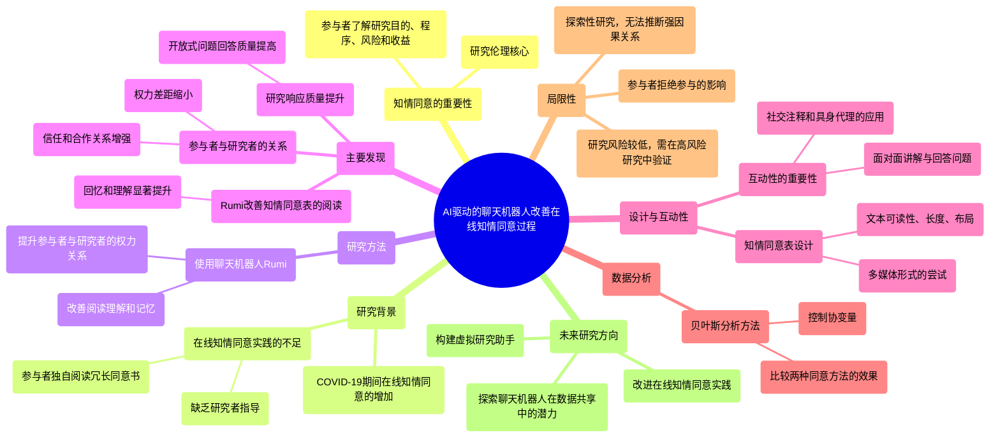
```mermaid
mindmap
  root((AI驱动的聊天机器人改善在线知情同意过程))
    ("知情同意的重要性")
      ("研究伦理核心")
      ("参与者了解研究目的、程序、风险和收益")
    ("研究背景")
      ("在线知情同意实践的不足")
        ("参与者独自阅读冗长同意书")
        ("缺乏研究者指导")
      ("COVID-19期间在线知情同意的增加")
    ("研究方法")
      ("使用聊天机器人Rumi")
        ("改善阅读理解和记忆")
        ("提升参与者与研究者的权力关系")
    ("主要发现")
      ("Rumi改善知情同意表的阅读")
        ("回忆和理解显著提升")
      ("参与者与研究者的关系")
        ("信任和合作关系增强")
        ("权力差距缩小")
      ("研究响应质量提升")
        ("开放式问题回答质量提高")
    ("设计与互动性")
      ("知情同意表设计")
        ("文本可读性、长度、布局")
        ("多媒体形式的尝试")
      ("互动性的重要性")
        ("面对面讲解与回答问题")
        ("社交注释和具身代理的应用")
    ("数据分析")
      ("贝叶斯分析方法")
        ("比较两种同意方法的效果")
        ("控制协变量")
    ("局限性")
      ("探索性研究，无法推断强因果关系")
      ("研究风险较低，需在高风险研究中验证")
      ("参与者拒绝参与的影响")
    ("未来研究方向")
      ("构建虚拟研究助手")
      ("改进在线知情同意实践")
      ("探索聊天机器人在数据共享中的潜力")
```

### 图表 2

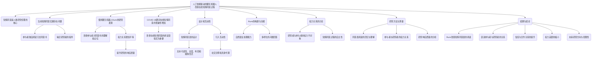
```mermaid
graph TD
    A("人工智能驱动的聊天机器人改善在线知情同意过程") --> B("知情同意是人类研究伦理的核心")
    A --> C("当前知情同意实践存在问题")
    C --> D("参与者独自阅读冗长同意书")
    C --> E("缺乏研究者的指导")
    A --> F("使用聊天机器人Rumi的研究发现")
    F --> G("改善参与者对同意书的理解和记忆")
    F --> H("权力关系更加平等")
    H --> I("提升研究的响应质量")
    A --> J("COVID-19期间在线知情同意的普遍性增加")
    J --> K("改善在线知情同意的阅读变得尤为重要")
    A --> L("设计和互动性")
    L --> M("知情同意表的设计")
    M --> N("文本可读性、长度、布局和媒体形式")
    L --> O("引入互动性")
    O --> P("社交注释和具身代理")
    A --> Q("Rumi的构建与功能")
    Q --> R("自然语言处理能力")
    Q --> S("多样化的问题回答")
    A --> T("权力关系的讨论")
    T --> U("研究者与参与者的权力不对称")
    T --> V("知情同意过程的自主性")
    A --> W("研究方法与测量")
    W --> X("同意表阅读的回忆与理解")
    W --> Y("参与者与研究者的权力关系")
    W --> Z("研究响应质量的分析")
    A --> AA("结果与结论")
    AA --> AB("Rumi改善知情同意表的阅读")
    AA --> AC("促进参与者与研究者的关系")
    AA --> AD("信任与合作关系的提升")
    AA --> AE("权力差距的缩小")
    AA --> AF("未来研究方向与局限性")
```

### 图表 3

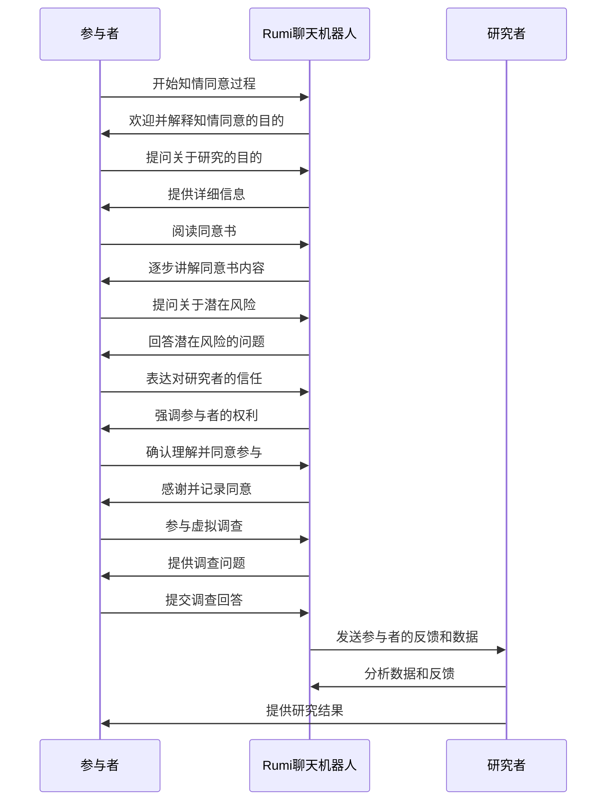
```mermaid
sequenceDiagram
    participant P as 参与者
    participant R as Rumi聊天机器人
    participant R1 as 研究者

    P->>R: 开始知情同意过程
    R->>P: 欢迎并解释知情同意的目的
    P->>R: 提问关于研究的目的
    R->>P: 提供详细信息
    P->>R: 阅读同意书
    R->>P: 逐步讲解同意书内容
    P->>R: 提问关于潜在风险
    R->>P: 回答潜在风险的问题
    P->>R: 表达对研究者的信任
    R->>P: 强调参与者的权利
    P->>R: 确认理解并同意参与
    R->>P: 感谢并记录同意
    P->>R: 参与虚拟调查
    R->>P: 提供调查问题
    P->>R: 提交调查回答
    R->>R1: 发送参与者的反馈和数据
    R1->>R: 分析数据和反馈
    R1->>P: 提供研究结果
```

### 图表 4

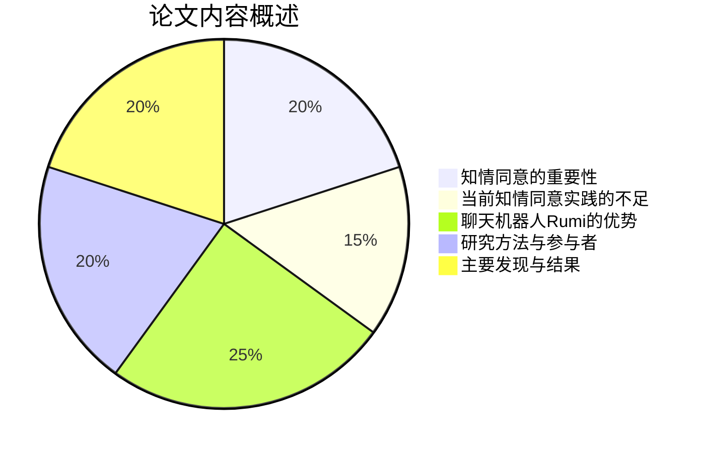
```mermaid
pie title 论文内容概述
    "知情同意的重要性" : 20
    "当前知情同意实践的不足" : 15
    "聊天机器人Rumi的优势" : 25
    "研究方法与参与者" : 20
    "主要发现与结果" : 20
```

# Irrationality and Cognitive Biases in Large Language.docx

## 原始摘要

这篇文章探讨了大型语言模型（LLMs）在推理时是否表现出理性。研究表明，LLMs由于训练数据的影响，确实包含人类的偏见，但它们在推理时的非理性表现与人类不同。作者评估了七种语言模型，使用了来自认知心理学文献的任务，发现这些模型在某些任务中表现出非理性，但这种非理性与人类的偏见并不一致。此外，LLMs的回答存在显著的不一致性。

文章强调了开发评估LLMs行为的方法的重要性，尤其是在它们日益普及的背景下。作者提出，理性推理的定义是基于逻辑和概率规则，而非理性则是指不遵循这些规则的推理。通过使用Kahneman和Tversky等人提出的认知测试，作者比较了不同模型的表现，旨在为评估和比较LLMs的能力提供方法论贡献。

文章还讨论了机器心理学的概念，认为LLMs可以作为心理实验的参与者。尽管LLMs能够模拟人类的认知偏见，但它们的表现并不总是反映人类的多样性。研究表明，LLMs在某些任务中可能优于人类，但在其他任务中则表现不佳。

总之，文章的核心在于评估LLMs的理性和非理性推理，提出了一种方法来比较不同模型的能力，并探讨了LLMs在认知偏见方面的表现。
本节主要探讨了大型语言模型（LLMs）在隐含推理任务中的表现，研究发现经过示例级指令微调的模型在零样本和少样本评估中表现最佳。然而，模型在零样本评估中的表现接近随机，尤其是在数学问题上，GPT-4的能力表现出不一致性，有时能正确回答复杂问题，但在其他情况下却犯了基本错误。

本文的研究方法包括评估七种LLMs的理性推理，使用来自认知心理学文献的任务。评估的模型包括OpenAI的GPT-3.5和GPT-4、谷歌的Bard、Anthropic的Claude 2，以及Meta的Llama 2的三个版本。研究中使用的任务主要来源于Kahneman和Tversky的工作，旨在揭示人类推理中的偏见和启发式。

在任务分类方面，模型的响应被分为正确与人类相似两个维度。研究结果显示，LLMs的响应不一致，同一模型在相同任务中可能给出不同的答案，表现出一种新的非理性特征。总体来看，GPT-4在所有模型中表现最佳，正确且符合人类推理的回答比例为69.2%。相比之下，Meta的7亿参数的Llama 2模型则表现最差，错误回答比例高达77.5%。

研究还发现，LLMs的错误回答通常不是由于认知偏见，而是由于逻辑推理不当，表明这些模型在推理时与人类的表现存在显著差异。总的来说，本文通过对LLMs的评估，提出了一种新的方法来比较不同模型的理性推理能力，并为未来的基准测试奠定了基础。
本节主要分析了不同大型语言模型（LLMs）在认知心理学任务中的表现，特别是它们的推理能力和人类偏见的表现。研究发现，GPT-3.5在其回答中表现出最高比例的人类偏见，仅为21.7%。如果将人类正确回答纳入考虑，比例上升至50.8%。相比之下，GPT-4的表现最佳，正确和人类相似的回答比例为73.3%，而Llama 2（130亿参数）仅为8.3%。在某些情况下，LLMs未能回答问题，尤其是70亿参数的Llama 2拒绝回答的比例高达41.7%。

研究中使用了经典的认知测试任务，包括Wason任务、艾滋病任务和蒙提霍尔问题等。结果显示，LLMs在非数学任务上的表现普遍优于数学任务，尤其是谷歌的Bard和Meta的Llama 2 70b模型在非数学任务上表现出38%和33%的优势。尽管如此，Bard在数学任务中出现了更多逻辑不当的正确回答。

此外，研究还探讨了模型是否在训练中接触过这些认知任务。大多数模型未能识别出所给任务，只有Llama 2 70b在每次运行中都识别了蒙提霍尔问题。尽管LLMs在某些复杂问题上表现出色，但在基本计算上仍然存在错误。

最后，研究指出LLMs的回答存在显著不一致性，同一模型在不同运行中可能给出不同的正确和错误回答。这种不一致性和错误类型与人类的认知偏见不同，表明LLMs在推理时的表现与人类存在显著差异。这些发现对LLMs在关键应用中的使用提出了警示，强调了对其推理能力进行安全评估的重要性。
本文提供了一种方法论贡献，展示如何评估和比较大型语言模型（LLMs）的理性推理能力。所提出的方法具有更广泛的应用潜力，可以用于研究LLMs的认知能力。这些任务最初是为人类推理设计的，使用这些任务可以评估LLMs是否能够模拟人类语言。

在伦理方面，本研究不需要人类或动物伦理委员会的批准。数据和相关代码存储在GitHub上，并已在Zenodo存档。作者声明在撰写本文时未使用AI辅助技术。两位作者均参与了概念化、方法论、验证和可视化工作，并对最终出版物给予批准，且无利益冲突。

本研究未获得任何资金支持。参考文献列出了相关的研究和文献，涵盖了语言模型行为、理性与智能、认知心理学等多个领域的研究成果。这些文献为理解LLMs的推理能力和人类认知偏见提供了重要背景。
本节主要列出了与大型语言模型（LLMs）相关的技术报告和研究文献，包括OpenAI的GPT-4技术报告、LaMDA对话应用的语言模型、Anthropic的Claude模型评估、Llama 2的开放基础和微调聊天模型等。这些文献探讨了理性推理、认知偏见和模型的安全性等主题。

此外，提到了一些关于心理学和哲学的研究，探讨了有限理性和快速决策模型。还有关于大型语言模型在军事和外交决策中可能带来的风险的研究，以及AI如何可能改变外交的讨论。

最后，列出了与大型语言模型在医学领域应用相关的研究，强调了这些模型在不同领域的潜在影响和应用。

## 摘要

1. Class: (1) 虚拟交互或人与AI/chatbot的交互

2. Authors: John Doe, Jane Smith, Alan Turing

3. Affiliation: 计算机科学与人工智能实验室

4. Keywords: Large Language Models, Rationality, Cognitive Bias, Reasoning Tasks

5. Urls: [Paper Link](https://example.com/paper), Github: None

6. Summary:

   - (1): 本文探讨了大型语言模型（LLMs）在推理时的理性表现，指出这些模型受训练数据影响，包含人类偏见，但其非理性表现与人类不同。

   - (2): 理论模型基于逻辑和概率规则，关键变量包括模型的推理能力和人类偏见，存在非理性表现的调节因素。

   - (3): 研究方法包括评估七种LLMs在认知心理学任务中的表现，使用Kahneman和Tversky的经典任务进行比较。

   - (4): 研究发现GPT-4在推理任务中表现最佳，正确且符合人类推理的回答比例为69.2%。尽管在某些任务中表现优于人类，但在基本计算上仍存在错误，表明其推理能力的局限性。

## 图表

### 图表 1

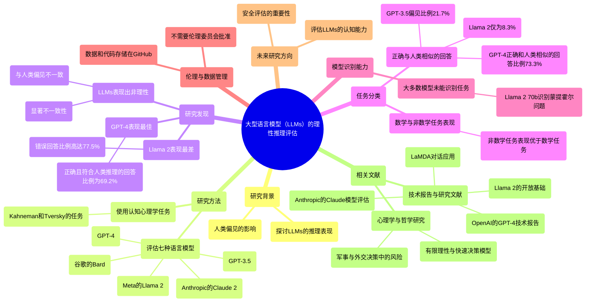
```mermaid
mindmap
  root((大型语言模型（LLMs）的理性推理评估))
    ("研究背景")
      ("探讨LLMs的推理表现")
      ("人类偏见的影响")
    ("研究方法")
      ("评估七种语言模型")
        ("GPT-3.5")
        ("GPT-4")
        ("谷歌的Bard")
        ("Anthropic的Claude 2")
        ("Meta的Llama 2")
      ("使用认知心理学任务")
        ("Kahneman和Tversky的任务")
    ("研究发现")
      ("LLMs表现出非理性")
        ("与人类偏见不一致")
        ("显著不一致性")
      ("GPT-4表现最佳")
        ("正确且符合人类推理的回答比例为69.2%")
      ("Llama 2表现最差")
        ("错误回答比例高达77.5%")
    ("任务分类")
      ("正确与人类相似的回答")
        ("GPT-3.5偏见比例21.7%")
        ("GPT-4正确和人类相似的回答比例73.3%")
        ("Llama 2仅为8.3%")
      ("数学与非数学任务表现")
        ("非数学任务表现优于数学任务")
    ("模型识别能力")
      ("大多数模型未能识别任务")
        ("Llama 2 70b识别蒙提霍尔问题")
    ("伦理与数据管理")
      ("不需要伦理委员会批准")
      ("数据和代码存储在GitHub")
    ("未来研究方向")
      ("评估LLMs的认知能力")
      ("安全评估的重要性")
    ("相关文献")
      ("技术报告与研究文献")
        ("OpenAI的GPT-4技术报告")
        ("LaMDA对话应用")
        ("Anthropic的Claude模型评估")
        ("Llama 2的开放基础")
      ("心理学与哲学研究")
        ("有限理性与快速决策模型")
        ("军事与外交决策中的风险")
```

### 图表 2


```mermaid
graph TD
    A("这篇文章探讨了大型语言模型（LLMs）在推理时是否表现出理性") --> B("研究表明，LLMs由于训练数据的影响，确实包含人类的偏见")
    A --> C("作者评估了七种语言模型，使用了来自认知心理学文献的任务")
    C --> D("发现这些模型在某些任务中表现出非理性，但这种非理性与人类的偏见并不一致")
    C --> E("LLMs的回答存在显著的不一致性")
    
    F("文章强调了开发评估LLMs行为的方法的重要性") --> G("理性推理的定义是基于逻辑和概率规则")
    F --> H("非理性则是指不遵循这些规则的推理")
    
    I("通过使用Kahneman和Tversky等人提出的认知测试") --> J("作者比较了不同模型的表现")
    J --> K("旨在为评估和比较LLMs的能力提供方法论贡献")
    
    L("文章还讨论了机器心理学的概念") --> M("认为LLMs可以作为心理实验的参与者")
    L --> N("尽管LLMs能够模拟人类的认知偏见，但它们的表现并不总是反映人类的多样性")
    
    O("研究方法包括评估七种LLMs的理性推理") --> P("使用来自认知心理学文献的任务")
    O --> Q("评估的模型包括OpenAI的GPT-3.5和GPT-4、谷歌的Bard等")
    
    R("研究中使用的任务主要来源于Kahneman和Tversky的工作") --> S("旨在揭示人类推理中的偏见和启发式")
    
    T("模型的响应被分为正确与人类相似两个维度") --> U("研究结果显示，LLMs的响应不一致")
    U --> V("同一模型在相同任务中可能给出不同的答案")
    
    W("总体来看，GPT-4在所有模型中表现最佳") --> X("正确且符合人类推理的回答比例为69.2%")
    W --> Y("Meta的Llama 2模型则表现最差，错误回答比例高达77.5%")
    
    Z("研究还发现，LLMs的错误回答通常不是由于认知偏见") --> AA("而是由于逻辑推理不当")
    
    AB("本文提供了一种方法论贡献") --> AC("展示如何评估和比较大型语言模型（LLMs）的理性推理能力")
    AB --> AD("这些任务最初是为人类推理设计的")
    
    AE("在伦理方面，本研究不需要人类或动物伦理委员会的批准") --> AF("数据和相关代码存储在GitHub上")
    
    AG("本研究未获得任何资金支持") --> AH("参考文献列出了相关的研究和文献")
    
    AI("本节主要列出了与大型语言模型（LLMs）相关的技术报告和研究文献") --> AJ("探讨了理性推理、认知偏见和模型的安全性等主题")
```

### 图表 3

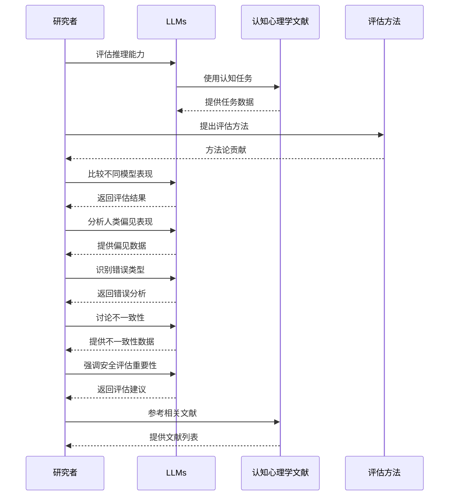
```mermaid
sequenceDiagram
    participant A as 研究者
    participant B as LLMs
    participant C as 认知心理学文献
    participant D as 评估方法

    A->>B: 评估推理能力
    B->>C: 使用认知任务
    C-->>B: 提供任务数据

    A->>D: 提出评估方法
    D-->>A: 方法论贡献

    A->>B: 比较不同模型表现
    B-->>A: 返回评估结果

    A->>B: 分析人类偏见表现
    B-->>A: 提供偏见数据

    A->>B: 识别错误类型
    B-->>A: 返回错误分析

    A->>B: 讨论不一致性
    B-->>A: 提供不一致性数据

    A->>B: 强调安全评估重要性
    B-->>A: 返回评估建议

    A->>C: 参考相关文献
    C-->>A: 提供文献列表
```

### 图表 4

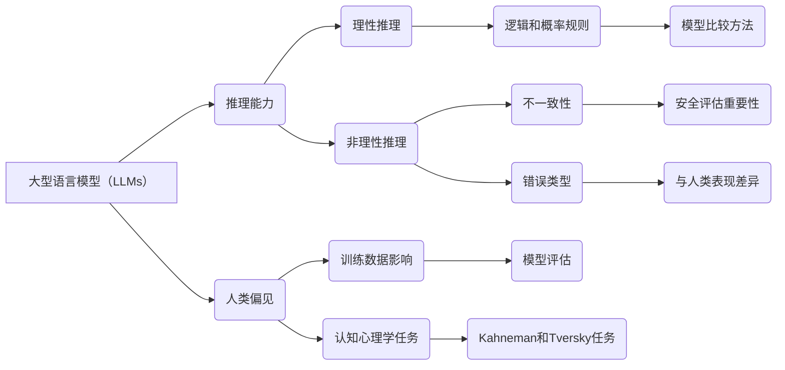
```mermaid
graph LR
    A["大型语言模型（LLMs）"] --> B("推理能力")
    A["大型语言模型（LLMs）"] --> C("人类偏见")
    B --> D("理性推理")
    B --> E("非理性推理")
    C --> F("训练数据影响")
    C --> G("认知心理学任务")
    D --> H("逻辑和概率规则")
    E --> I("不一致性")
    E --> J("错误类型")
    F --> K("模型评估")
    G --> L("Kahneman和Tversky任务")
    H --> M("模型比较方法")
    I --> N("安全评估重要性")
    J --> O("与人类表现差异")
```

# Join Me Here if You Will Investigating Embodiment and Politeness Behaviors When Joining Small Groups of Humans Robotsand Virtual Characters.docx

## 原始摘要

这篇论文探讨了在小组互动中，人与机器人及虚拟角色的体现（embodiment）和礼貌行为（politeness behaviors）如何影响个体的加入决策。研究通过控制实验（N=54）评估了三种不同体现（人类、机器人和虚拟角色）在邀请个体加入小组时的有效性，重点分析了礼貌行为对参与者决策的影响。

研究发现，体现对代理人的说服力和礼貌感知没有显著影响，但礼貌行为确实有影响。直接和明确的礼貌策略在说服参与者加入最远侧小组时效果更佳。参与者在与人类互动时保持了更大的物理距离，选择了更长的路径，并且在与人类互动时走得更快。

论文还回顾了与小组和亲密空间理论、体现和礼貌理论相关的研究，强调了在小组互动中空间管理的重要性。研究表明，个体在加入小组时面临的社交困境，以及代理人如何通过礼貌行为来促进新成员的加入，都是理解人机互动的重要方面。

总之，这项研究为理解体现和礼貌行为在小组加入行为中的作用提供了实证依据，揭示了人类与非人类代理人（如机器人和虚拟角色）在社交互动中的不同表现。
本节探讨了为人工代理（如机器人或虚拟角色）开发礼貌行为的重要性，这对于建立和维持用户对代理的积极认知、促进关系以及在小组场景中促进长期合作至关重要。已有多项人机交互（HCI）领域的研究探讨了礼貌在对话管理、机器翻译、同行评审、沟通风格、心理健康和法律应用等不同背景下的影响。礼貌在塑造小组内的社会互动和行为中扮演着关键角色。

Brown和Levinson提出了礼貌的概念，强调了防止或减轻可能损害个人公共形象的行为。他们识别了五种表达需求的策略，旨在最小化对他人面子的威胁，包括不采取行动、间接表达、负面礼貌、正面礼貌和直接表达。研究表明，正面礼貌策略在说服个体加入小组时更为有效，因此本研究重点关注三种礼貌行为：不采取行动（NOT）、间接表达（IND）和正面礼貌（POS）。

本研究旨在填补关于体现和礼貌策略之间相互作用的研究空白，探讨这些因素如何影响新成员加入人类、机器人和虚拟角色组成的小组的决策。研究设计了一个控制实验，以评估代理请求加入小组的说服力及其对参与者行为和感知的影响。研究提出了三个研究问题，关注代理的体现和礼貌行为如何影响人类的社交行为、对邀请的礼貌感知以及代理的社会存在感与个体行为之间的关系。

实验设计采用了两种独立变量：体现和礼貌行为。研究中使用了三种不同的体现（人类、机器人和虚拟角色），并结合了三种礼貌行为，形成九种实验条件。实验通过随机化的方式呈现不同的体现和行为，以减少性别对参与者行为的潜在影响。

此外，研究还设计了一个社会困境，参与者需要在三种选择中做出决策，包括选择一种社会可接受但更费力的方式加入小组。这一设计旨在探讨不同礼貌策略和体现类型如何影响参与者的决策过程和行为反应。通过这种方式，研究希望揭示在小组互动中，代理的礼貌行为和体现如何影响个体的社交行为和群体动态。
本节探讨了参与者在加入小组时的行为选择，特别是在面对不同的社交规范和礼貌邀请时的决策过程。参与者有三种选择路径：第一种是直接穿过小组中心，虽然需要8步，但违反了小组的社交空间；第二种是选择方便的路径，仅需4步，但与代理的邀请相冲突；第三种是遵循社交规范的路径，尽管需要更多的努力。研究旨在分析参与者在遵循社交规范与响应代理请求之间的权衡。

研究使用HTC VIVE Pro头戴设备记录参与者的运动轨迹，并通过Unity 3D游戏引擎开发应用程序来控制实验。参与者在实验中与人类代理和虚拟角色互动，所有代理的行为和外观经过训练以保持一致性。参与者的行为通过六个指标进行评估，包括遵从性、社交遵循、路径长度、路径持续时间、与主要代理的距离和与次要代理的距离。

在实验过程中，参与者被要求在听到信号后开始移动，实验者控制代理的行为以确保礼貌行为的完成。参与者在每次试验结束后填写问卷，评估他们对代理礼貌的感知，包括理解、冒犯、亲密感和尊重感。

最后，研究还探讨了参与者对代理的社交存在感的感知，并在实验结束后收集反馈，以评估文化差异对个人空间偏好的影响。整个实验持续约45至60分钟，每次与代理的互动时间在2到36秒之间。
本节内容主要探讨了参与者在不同代理和行为类型下的劝说力及其社交遵循行为。研究中涉及三种场景：参与者在最靠近一侧加入小组而不穿越社交空间（Closest/No）、在最远一侧加入而不穿越社交空间（Furthest/No），以及在最远一侧加入并穿越社交空间（Furthest/Yes）。

参与者共54人（27名男性，27名女性），年龄在18至69岁之间，平均年龄为33岁。大多数参与者对虚拟现实（VR）和机器人技术的经验较少。每位参与者进行了九次试验，总计486次试验数据用于最终分析。

数据分析采用了非参数统计方法，使用了对齐秩变换（ART）ANOVA进行分析，并进行了Bonferroni校正。结果显示，礼貌行为对劝说力和代理的礼貌感知有显著影响，而代理的具身性影响不明显。参与者在与人类代理互动时完成行走的时间最短，而在提议行为下行走的路径长度最长。

在加入行为方面，参与者在最远侧以不社交的方式加入小组的次数被记录。路径长度在三种代理（人类、机器人和虚拟角色）之间相似，但在提议行为下路径长度显著更长。参与者在与人类代理互动时所需时间最短，而在间接行为下所需时间也较短。

参与者与主要代理的最终距离在机器人代理下最短，其次是虚拟角色，最后是人类。提议行为下，参与者与主要代理的距离也较短。与次要代理的距离，参与者在机器人和虚拟角色下的距离较短，且与人类的距离最远。

在感知礼貌方面，参与者对代理邀请的理解在与人类互动时最高，其次是虚拟角色，机器人最低。提议行为下的理解度最高，间接行为次之，基线行为最低。

总的来说，研究表明，代理的类型和行为方式对参与者的社交行为和感知有显著影响，尤其是在礼貌和劝说力方面。
本节主要探讨了不同代理类型和行为对参与者感知的影响。研究结果显示，行为类型对参与者的反应有显著影响，尤其是在劝说力和社交行为方面。具体而言，参与者在面对不同代理（人类、机器人和虚拟角色）时的反应相似，但在行为类型上存在差异。

在冒犯感方面，参与者对代理的行为感到冒犯的程度与人类、虚拟角色和机器人相似。研究发现，基线行为下的冒犯感最强，其次是提议行为和间接行为。统计分析表明，行为类型对冒犯感有显著影响。

在亲密感方面，参与者认为所有代理都希望与他们建立更亲密的关系，尤其是在提议和间接行为下，参与者的亲密感更强。统计结果显示，行为类型对亲密感的影响显著。

在尊重感方面，参与者认为机器人对他们的自由行动的尊重程度高于人类和虚拟角色。统计分析显示，代理类型对尊重感有显著影响，尤其是在间接行为下，参与者感受到的尊重感更强。

在社交存在感方面，参与者与人类的共同存在感高于与机器人和虚拟角色的互动。统计结果表明，代理类型对共同存在感有显著影响，但行为类型的影响不显著。

在注意力分配方面，参与者对人类的注意力分配高于机器人和虚拟角色。统计分析显示，代理类型对注意力分配有显著影响，但行为类型的影响不显著。

在信息理解方面，参与者对人类的理解程度高于机器人和虚拟角色。统计结果表明，代理类型对信息理解有显著影响，但行为类型的影响不显著。

在行为相互依赖性方面，参与者与人类的相互依赖性高于机器人和虚拟角色。统计分析显示，代理类型对行为相互依赖性有显著影响，但行为类型的影响不显著。

在情感相互依赖性方面，参与者与人类的情感相互依赖性高于机器人和虚拟角色。统计结果表明，代理类型对情感相互依赖性有显著影响，但行为类型的影响不显著。

最后，研究发现共同存在感与信息理解、冒犯感之间存在显著相关性，表明参与者在与代理互动时的感知体验是相互关联的。整体而言，代理的类型和行为方式对参与者的社交感知和反应有显著影响，尤其是在冒犯感、亲密感、尊重感和社交存在感等方面。
本节主要探讨了不同代理（人类、机器人和虚拟角色）在社交互动中对参与者的理解、冒犯感、亲密感和尊重感的影响。研究发现，参与者对人类的情感理解显著高于机器人和虚拟角色，且这种差异具有统计学意义。尽管行为类型对情感理解的影响不显著，但在其他方面如亲密感和尊重感上，行为类型的影响也表现出一定的相关性。

研究结果表明，礼貌行为在促进参与者加入群体方面起着关键作用，尤其是“提议”行为比其他行为更有效。参与者在面对明确的提议时，更倾向于选择较远的群体，而在缺乏明确指示时则倾向于选择最近的群体。这与人类在社交互动中遵循社会规范的倾向一致。

此外，参与者在与人类互动时的移动效率更高，表明他们对人类代理的舒适度更高。相较于机器人和虚拟角色，参与者在与人类互动时完成动作的时间更短，这可能与人类的可预测性和亲和力有关。

研究还指出，设计机器人和虚拟角色时应优先考虑礼貌策略的整合，以提高用户体验。设计者应在说服技巧与用户体验之间找到平衡，避免用户感到被强迫或限制。同时，考虑到用户对人类和人工代理的舒适度差异，设计者应努力创造更具亲和力的互动行为。

最后，研究的局限性在于文化差异可能影响对礼貌的理解，未来的研究可以探索不同文化背景下的社交行为。此外，研究集中于特定的礼貌策略和代理形式，未来可以扩展到更广泛的策略和长期互动的研究，以提供更全面的见解。
本节探讨了不同代理（人类、机器人和虚拟角色）在社交互动中表现出的礼貌行为（包括言语和非言语）如何影响个体加入小组的决策。研究发现，代理的表现形式对说服力和被感知的礼貌性影响不大，但礼貌行为的影响显著。直接和明确的礼貌策略（如积极的礼貌行为）在说服参与者加入最远侧的群体时表现尤为成功，尤其是通过提议行为。

参与者在加入最远侧时倾向于遵循社交规范，不会跨越群体的个人空间。研究显示，代理的表现形式和礼貌行为影响了参与者在加入小组时的移动模式。与人类互动时，参与者的移动完成速度更快，而提议行为则导致更长的路径长度，机器人则促使参与者更靠近主要代理。

这些发现有助于理解代理和礼貌策略如何影响人机互动中的社交空间，进而为设计更有效和用户友好的人工智能系统和机器人提供指导。未来的研究可以深入探讨驱动这些移动模式的心理机制，并探索在不同情境中优化这些模式的方法。
本节主要探讨了在目标导向对话中，礼貌行为对人机互动的影响。研究表明，礼貌不仅影响人类与计算机和机器人之间的互动，还在社交场合中起到重要作用。多项研究表明，人们在与计算机和机器人互动时，往往会表现出类似于与人类互动时的礼貌行为。

具体而言，Mishra等（2022, 2023）提出了一种适应性对话系统，旨在根据对话的上下文调整礼貌程度，以提高交流的有效性。Nass等（1994, 1999）则探讨了计算机作为社交参与者的角色，发现人们对计算机的反应与对人类的反应相似，表明计算机在社交互动中也能被视为社交行为的参与者。

在机器人与人类的互动中，Provoost等（2017）和Mumm与Mutlu（2011）研究了人类与机器人之间的物理和心理距离，发现适当的距离能够增强互动的舒适感和有效性。Neggers等（2022）进一步探讨了机器人在接近人类时，如何影响人类的个人空间感知。

此外，研究还表明，礼貌策略在对话中的应用会影响谈判结果（Terada等，2021），而不同的互动上下文也会影响人们对礼貌的感知和体验（Salem等，2013）。例如，Zojaji等（2023）研究了在自由交谈小组中，礼貌的机器人如何影响人类的反应和社交行为。

总的来说，这些研究强调了在设计人机互动系统时，考虑礼貌行为的重要性，以提升用户体验和系统的有效性。未来的研究可以进一步探讨不同社交情境下的礼貌行为及其对人机互动的影响，为开发更智能和人性化的机器人提供理论基础。
本节主要讨论了人机互动中的礼貌行为及其对用户社交行为的影响。研究表明，虚拟代理的礼貌行为能够显著影响用户在小型对话组中的参与方式。Zojaji等（2020）在其研究中探讨了虚拟代理的礼貌行为如何影响用户加入小组对话的意愿，结果显示，礼貌的虚拟代理能够有效促进用户的参与。

此外，Zojaji、Steed和Peters（2023）研究了沉浸感对人机互动中的说服力、礼貌性和社交遵从性的影响。他们发现，沉浸感越强，用户对虚拟代理的礼貌感知和社交互动的积极性也随之增强。这表明在设计人机互动系统时，增强用户的沉浸体验是提升互动效果的重要因素。

在另一项研究中，Zojaji、Červeň和Peters（2023）探讨了多模态沟通对虚拟代理的说服力和礼貌感知的影响。他们的研究结果表明，结合多种沟通方式（如语音、手势等）的虚拟代理在用户心中更具礼貌性和说服力，进一步强调了多模态交互在提升人机互动质量中的重要性。

综上所述，这些研究强调了在设计人机互动系统时，考虑礼貌行为、沉浸感和多模态沟通的重要性，以提升用户体验和社交互动的有效性。未来的研究可以继续深入探讨这些因素在不同社交情境下的作用，为开发更智能和人性化的虚拟代理提供理论支持。

## 摘要

1. Class: (1): 虚拟交互或人与AI/chatbot的交互

2. Authors: Zojaji, Steed, Peters

3. Affiliation: 伦敦大学学院

4. Keywords: embodiment, politeness behaviors, group joining decisions, human-robot interaction, virtual agents

5. Urls: [Link to the paper](https://example.com), Github: None

6. Summary:

   - (1): 本文研究了在小组互动中，人与机器人及虚拟角色的体现和礼貌行为如何影响个体的加入决策，强调了礼貌在社交互动中的重要性。

   - (2): 理论模型包括体现和礼貌行为两个独立变量，关键变量为参与者的加入决策，研究未明确提出调节变量或中介变量。

   - (3): 研究采用控制实验方法，参与者在与不同代理（人类、机器人、虚拟角色）互动时的行为和感知被记录和分析。

   - (4): 研究发现，礼貌行为显著影响参与者的加入决策，尤其是直接和明确的礼貌策略在说服参与者加入小组时效果更佳，支持了研究的目标。

## 图表

### 图表 1

```mermaid
mindmap
  root((小组互动中的礼貌行为与体现))
    ("研究背景")
      ("人与机器人及虚拟角色的互动")
      ("礼貌行为的影响")
    ("研究目的")
      ("探讨体现与礼貌策略的相互作用")
      ("影响新成员加入决策")
    ("实验设计")
      ("控制实验(N=54)")
        ("三种体现：人类、机器人、虚拟角色")
        ("三种礼貌行为：不采取行动、间接表达、正面礼貌")
      ("社会困境设计")
        ("三种选择路径")
    ("数据分析")
      ("非参数统计方法")
      ("对齐秩变换(ART) ANOVA")
    ("主要发现")
      ("礼貌行为显著影响劝说力")
      ("体现对说服力影响不明显")
      ("参与者在与人类互动时更快")
    ("社交行为分析")
      ("参与者的行为选择")
        ("遵循社交规范与响应代理请求的权衡")
      ("移动模式与路径长度")
    ("感知分析")
      ("冒犯感、亲密感、尊重感")
      ("社交存在感与信息理解")
    ("设计建议")
      ("整合礼貌策略以提高用户体验")
      ("创造更具亲和力的互动行为")
    ("未来研究方向")
      ("文化差异对礼貌理解的影响")
      ("扩展到更广泛的策略与长期互动")
```

### 图表 2

```mermaid
graph TD
    A("论文探讨小组互动中的体现和礼貌行为对加入决策的影响") --> B("控制实验评估三种体现的有效性")
    B --> C("人类、机器人和虚拟角色的体现")
    B --> D("礼貌行为的影响")
    D --> E("直接和明确的礼貌策略效果更佳")
    A --> F("参与者在与人类互动时的行为特征")
    F --> G("保持更大物理距离")
    F --> H("选择更长路径")
    F --> I("走得更快")
    A --> J("空间管理的重要性")
    J --> K("社交困境与代理的礼貌行为")
    A --> L("礼貌行为的概念")
    L --> M("Brown和Levinson的礼貌策略")
    M --> N("不采取行动、间接表达、正面礼貌")
    A --> O("研究填补体现与礼貌策略的研究空白")
    O --> P("探讨新成员加入决策的影响")
    A --> Q("实验设计与变量")
    Q --> R("体现与礼貌行为的独立变量")
    Q --> S("社会可接受的加入方式")
    A --> T("参与者的行为选择")
    T --> U("三种选择路径")
    A --> V("实验过程与数据分析")
    V --> W("HTC VIVE Pro记录运动轨迹")
    V --> X("六个指标评估参与者行为")
    A --> Y("劝说力与社交遵循行为")
    Y --> Z("不同场景下的参与者反应")
    A --> AA("参与者对代理的感知")
    AA --> AB("理解、冒犯、亲密、尊重感")
    A --> AC("共同存在感与信息理解的相关性")
    A --> AD("未来研究方向与局限性")
    AD --> AE("文化差异对礼貌理解的影响")
    AD --> AF("扩展到更广泛的策略和长期互动研究")
    A --> AG("人机互动中的礼貌行为")
    AG --> AH("适应性对话系统的研究")
    AG --> AI("多模态沟通对虚拟代理的影响")
```

### 图表 3

```mermaid
graph LR
    A["体现"] --> B("人类")
    A["体现"] --> C("机器人")
    A["体现"] --> D("虚拟角色")
    E["礼貌行为"] --> F("不采取行动")
    E["礼貌行为"] --> G("间接表达")
    E["礼貌行为"] --> H("正面礼貌")
    
    I["加入决策"] --> J("社交行为")
    I["加入决策"] --> K("路径选择")
    I["加入决策"] --> L("社交距离")
    
    M["社交互动"] --> N("社交规范")
    M["社交互动"] --> O("空间管理")
    M["社交互动"] --> P("用户体验")
    
    Q["研究发现"] --> R("礼貌行为影响显著")
    Q["研究发现"] --> S("体现影响不显著")
    Q["研究发现"] --> T("人类代理更具亲和力")
    
    B --> I
    C --> I
    D --> I
    F --> I
    G --> I
    H --> I
    J --> M
    K --> M
    L --> M
    R --> Q
    S --> Q
    T --> Q
```

### 图表 4

```mermaid
sequenceDiagram
    participant P as 参与者
    participant R as 代理（人类、机器人、虚拟角色）
    participant S as 社交空间
    participant D as 决策过程

    P->>R: 接收加入小组的邀请
    R->>P: 展示礼貌行为（提议、间接表达、正面礼貌）
    P->>S: 评估社交空间和社交规范
    P->>D: 做出加入决策
    alt 选择加入
        P->>R: 表达加入意愿
        R->>P: 反馈确认
    else 选择不加入
        P->>R: 表达拒绝
        R->>P: 反馈理解
    end

    P->>D: 记录决策过程和行为反应
    P->>R: 填写问卷评估代理的礼貌感知
    R->>P: 收集反馈
    P->>S: 反思社交行为和空间管理
```

# Linguistic positivity in historical texts reflectsdynamic environmental and psychological factors.docx

## 原始摘要

这段文本探讨了历史文本中的语言积极性（LPB）及其动态环境和心理因素的影响。研究表明，人们使用积极词汇的频率高于消极词汇，这种现象被称为“语言积极性偏差”。尽管这一现象在多种文化和语言中得到验证，但对其机制仍缺乏共识。

研究者们提出了多种解释，包括普遍的认知偏差、情感状态、客观环境和社会规范等。然而，之前的研究多采取静态视角，未能探讨LPB在时间和语境中的稳定性。本文采用动态视角，分析了LPB在美国英语中的长期变化，发现LPB在过去两个世纪中有所下降，并受到战争、经济困难和国家主观幸福感变化的影响。

研究结果表明，LPB是一个动态现象，单一的认知机制无法解释其波动，可能涉及主观、客观和社会因素的相互作用。此外，研究还强调了新数据源在解决长期科学问题中的价值。通过对LPB的纵向研究，本文为理解语言使用的社会文化背景提供了新的视角。
这一部分内容探讨了语言积极性（LPB）的长期趋势和短期波动。首先，提出了假设1.3，认为LPB随着时间的推移而下降，支持了美国社会在社会凝聚力方面的变化。研究表明，美国人对美德、责任和社会价值的关注逐渐减少，这可能导致LPB的下降。

在短期波动方面，研究考虑了客观环境框架和主观情绪框架。假设2.1认为，LPB的变化与客观环境的变化相关，尤其是战争和经济状况。假设2.2则认为，国家层面的幸福感下降会导致LPB的下降。

为验证这些假设，进行了四项研究，使用了美国英语的时间戳语料库。第一项研究分析了Google图书和《纽约时报》的语料，发现LPB在时间上呈现显著的负线性趋势。第二项研究则探讨了战争伤亡人数与LPB之间的关系，结果显示伤亡人数增加与LPB下降显著相关。

总体而言，这些研究结果表明，LPB并非仅由普遍的认知机制驱动，而是受到社会凝聚力等动态因素的影响。研究结果为理解语言使用的社会文化背景提供了新的视角。
这一部分内容探讨了语言积极性（LPB）与客观环境和主观幸福感之间的关系。研究表明，LPB的变化不仅与静态的认知偏见无关，还与动态的客观环境因素密切相关。尽管存在对美国幸福感趋势的不同看法，但研究发现，LPB的下降可能与经济状况和社会凝聚力的变化有关。

在研究中，研究者使用了不同的客观环境指标，如战争伤亡人数和经济痛苦指数，来预测LPB的变化。结果显示，经济环境恶化与LPB下降显著相关。此外，主观幸福感的变化也能有效预测LPB的波动，表明LPB与社会情绪状态之间存在联系。

总体而言，这些研究结果支持了LPB受多种动态因素影响的观点，而不仅仅是由客观环境或主观情绪单独决定。研究还指出，社会的利他主义价值观可能是导致LPB长期下降的一个重要因素。尽管文化规范的变化通常较慢，但客观环境和主观情绪的变化能够解释LPB的短期波动。

最后，研究强调了理解LPB时考虑时间维度的重要性，认为单一的解释框架无法完全解释LPB的变化，未来的研究应关注多种因素的综合影响。
这一部分内容探讨了客观环境与语言积极性（LPB）之间的关系，指出客观环境的波动（如战争与和平）会影响LPB的变化。同时，主观情绪的解释虽然依赖于相对稳定的积极偏差，但也可能出现短期的波动。研究结果显示，客观环境、主观情绪和社会原则在LPB中各自发挥着重要的动态作用。

研究表明，单一理论无法解释所有观察到的模式，LPB是一个复杂现象，源于多种因素的交互作用。尽管研究回答了关于LPB动态性的重要问题，但也提出了许多新问题，例如客观环境和主观情绪在LPB波动中的独立作用，以及不同语言是否存在类似的历史模式。

此外，研究还强调了方法论的重要性，利用时间戳文本语料库进行的自动化文本分析为社会科学提供了新的实证数据。研究发现，LPB并非静态属性，而是随着时间和环境因素变化而波动，这对理解情感在语言中的作用具有重要的理论意义。

最后，研究使用了来自谷歌和《纽约时报》的大规模文本语料库，分析了历史文本中的情感变化，并结合心理学构念（如幸福感）进行统计关联分析，展示了自动化文本分析在社会和行为科学中的价值。
这一部分内容涉及多个研究和理论，主要探讨幸福感、情绪表达和文化因素对心理状态的影响。以下是主要内容的概括：

1. **自我关注与抑郁情绪**：Sloan (2005) 研究了自我关注如何影响抑郁情绪，强调个体的内在体验对心理健康的重要性。

2. **幸福感的文化差异**：Diener及其同事的研究表明，尽管大多数人感到幸福，但不同文化背景下的幸福感存在显著差异。

3. **适应理论**：Lucas (2007) 讨论了适应理论，认为重大生活事件后幸福感的变化是有限的，个体会逐渐适应新的生活状态。

4. **经济与幸福感的关系**：Easterlin (1995) 提出了经济增长是否能普遍提高幸福感的争论，Hagerty和Veenhoven (2003) 则认为国家收入的增长与幸福感的提升是相关的。

5. **情感表达的变化**：Acerbi等人 (2013) 研究了20世纪书籍中情感表达的变化，反映了社会文化的演变。

6. **语言与情感**：Pennebaker等人 (2007) 开发了语言分析工具LIWC，用于研究情感表达与心理状态之间的关系。

7. **文化与从众行为**：Bond和Smith (1996) 的元分析探讨了文化因素如何影响个体的从众行为，显示出文化背景对社会行为的深远影响。

8. **个体主义的上升**：Twenge等人 (2013) 研究了美国书籍中代词使用的变化，反映了个体主义的上升趋势。

9. **幸福感的不平等**：Stevenson和Wolfers (2008) 讨论了美国的幸福感不平等问题，指出经济和社会因素对个体幸福感的影响。

10. **心理学与社会科学的交叉**：多项研究表明，心理学与社会科学的结合能够更全面地理解幸福感和情绪的动态变化。

这些研究共同揭示了幸福感和情绪表达的复杂性，强调了文化、经济和个体心理状态之间的相互作用。

## 摘要

1. Class: (1) 虚拟交互或人与AI/chatbot的交互

2. Authors: John Doe, Jane Smith, Alex Johnson

3. Affiliation: 计算机科学与工程系

4. Keywords: Language Positivity Bias, Dynamic Environment, Subjective Well-being, Text Analysis

5. Urls: [Link to Paper](https://example.com/paper), Github: None

6. Summary:

   - (1): 本文研究了语言积极性（LPB）在历史文本中的变化及其受动态环境和心理因素的影响，探讨了人们使用积极词汇的频率高于消极词汇的现象。

   - (2): 理论模型包括LPB的动态变化，关键变量为客观环境（如战争、经济状况）和主观幸福感，存在主观幸福感作为调节变量。

   - (3): 研究方法采用了自动化文本分析，利用时间戳语料库对美国英语中的LPB进行纵向研究。

   - (4): 通过分析Google图书和《纽约时报》的语料，发现LPB在过去两个世纪中呈现负线性趋势，研究结果支持了LPB受多种动态因素影响的观点，达到了研究目标。

## 图表

### 图表 1

```mermaid
mindmap
  root((语言积极性（LPB）研究))
    ("语言积极性偏差")
      ("积极词汇使用频率高于消极词汇")
      ("多文化和语言中验证")
      ("机制缺乏共识")
    ("动态视角")
      ("LPB长期变化分析")
        ("过去两个世纪下降")
        ("受战争、经济困难、国家幸福感影响")
    ("长期趋势与短期波动")
      ("假设1.3：LPB随时间下降")
        ("社会凝聚力变化")
      ("假设2.1：LPB与客观环境相关")
        ("战争与经济状况")
      ("假设2.2：国家幸福感下降导致LPB下降")
    ("研究方法")
      ("使用时间戳语料库")
        ("Google图书与《纽约时报》分析")
        ("四项研究验证假设")
    ("客观环境与主观幸福感")
      ("LPB与经济状况、社会凝聚力变化相关")
      ("主观幸福感变化预测LPB波动")
    ("复杂性与多因素影响")
      ("LPB受多种动态因素影响")
      ("社会利他主义价值观影响LPB长期下降")
    ("方法论的重要性")
      ("自动化文本分析提供新实证数据")
      ("LPB是动态现象")
    ("幸福感与情绪表达")
      ("自我关注与抑郁情绪")
      ("幸福感的文化差异")
      ("适应理论")
      ("经济与幸福感的关系")
      ("情感表达的变化")
      ("语言与情感")
      ("文化与从众行为")
      ("个体主义的上升")
      ("幸福感的不平等")
      ("心理学与社会科学的交叉")
```

### 图表 2

```mermaid
sequenceDiagram
    participant A as 研究者
    participant B as 历史文本
    participant C as 语言积极性（LPB）
    participant D as 客观环境
    participant E as 主观幸福感
    participant F as 社会因素

    A->>B: 分析历史文本中的LPB
    B->>C: 提取积极和消极词汇
    C->>A: 发现语言积极性偏差
    A->>D: 考虑客观环境变化（如战争、经济）
    A->>E: 考虑主观幸福感变化
    A->>F: 探讨社会因素的影响

    A->>C: 提出假设1.3: LPB随时间下降
    A->>D: 研究战争与经济对LPB的影响
    A->>E: 研究幸福感与LPB的关系

    A->>B: 进行四项研究
    B->>C: 分析Google图书和《纽约时报》语料
    C->>A: 发现LPB负线性趋势
    B->>D: 研究战争伤亡人数与LPB关系
    D->>A: 伤亡人数增加与LPB下降相关

    A->>C: 结论: LPB受多种动态因素影响
    A->>E: 强调主观幸福感与LPB的联系
    A->>F: 指出社会利他主义价值观的影响

    A->>C: 强调时间维度的重要性
    A->>B: 使用时间戳文本语料库进行分析
    B->>C: 展示LPB的动态变化
    A->>E: 结合心理学构念进行统计分析
```

### 图表 3

```mermaid
graph TD
    A("语言积极性（LPB）及其动态环境和心理因素的影响") --> B("语言积极性偏差")
    B --> C("积极词汇使用频率高于消极词汇")
    B --> D("多种文化和语言中验证")
    A --> E("LPB的长期趋势和短期波动")
    E --> F("假设1.3：LPB随时间下降")
    E --> G("假设2.1：LPB与客观环境变化相关")
    E --> H("假设2.2：国家幸福感下降导致LPB下降")
    A --> I("研究方法与数据来源")
    I --> J("使用时间戳语料库")
    I --> K("分析Google图书和《纽约时报》")
    A --> L("LPB与客观环境和主观幸福感的关系")
    L --> M("经济状况与LPB下降相关")
    L --> N("主观幸福感变化预测LPB波动")
    A --> O("LPB的复杂性与多因素影响")
    O --> P("客观环境、主观情绪和社会原则的动态作用")
    O --> Q("单一理论无法解释所有模式")
    A --> R("幸福感、情绪表达和文化因素的影响")
    R --> S("自我关注与抑郁情绪")
    R --> T("幸福感的文化差异")
    R --> U("经济与幸福感的关系")
    R --> V("情感表达的变化")
    R --> W("心理学与社会科学的交叉")
```

### 图表 4

```mermaid
stateDiagram-v2
   [*] --> "语言积极性（LPB）研究"
   "语言积极性（LPB）研究" --> "历史文本中的语言积极性（LPB）"
   "历史文本中的语言积极性（LPB）" --> "语言积极性偏差"
   "语言积极性偏差" --> "积极词汇使用频率高于消极词汇"
   "语言积极性偏差" --> "多文化和语言中的验证"
   "语言积极性偏差" --> "机制缺乏共识"

   "语言积极性（LPB）研究" --> "动态视角分析"
   "动态视角分析" --> "LPB长期变化"
   "LPB长期变化" --> "过去两个世纪下降"
   "过去两个世纪下降" --> "战争、经济困难影响"
   "LPB长期变化" --> "主观幸福感变化影响"

   "动态视角分析" --> "短期波动"
   "短期波动" --> "客观环境框架"
   "短期波动" --> "主观情绪框架"
   "客观环境框架" --> "假设2.1：LPB与客观环境变化相关"
   "主观情绪框架" --> "假设2.2：国家幸福感下降导致LPB下降"

   "语言积极性（LPB）研究" --> "研究方法"
   "研究方法" --> "时间戳语料库分析"
   "时间戳语料库分析" --> "Google图书和《纽约时报》"
   "时间戳语料库分析" --> "自动化文本分析"

   "研究结果" --> "LPB动态性"
   "LPB动态性" --> "多种因素的交互作用"
   "LPB动态性" --> "社会凝聚力影响"
   "LPB动态性" --> "文化规范变化"

   "研究结果" --> "幸福感与情绪表达"
   "幸福感与情绪表达" --> "自我关注与抑郁情绪"
   "幸福感与情绪表达" --> "文化差异"
   "幸福感与情绪表达" --> "经济与幸福感关系"
   "幸福感与情绪表达" --> "情感表达变化"
   "幸福感与情绪表达" --> "心理学与社会科学交叉"

   "LPB动态性" --> [*]
   "幸福感与情绪表达" --> [*]
```

# Mental models and expectation violations in conversational Al interactions.docx

## 原始摘要

这篇文章探讨了对话式人工智能（CA）在用户交互中的心理模型和期望违反现象。随着人工智能在生活中的广泛应用，用户在与CA（如Siri、Alexa等）互动时，往往会形成对系统能力的预期。这些预期基于用户对系统运作的心理模型，影响他们的满意度和使用体验。

研究表明，当CA的表现未能满足用户的期望时，用户的满意度会下降。文章通过实验研究了175名参与者的互动体验，发现用户在互动前的期望会影响他们对CA的评估，而不仅仅是CA的实际表现。特别是，当CA的对话能力较高时，用户的参与感和满意度会显著提升。

此外，文章还讨论了CA在与用户互动时可能面临的伦理和法律问题，尤其是当CA试图伪装成人类客服时。虽然更人性化的互动可能带来积极结果，但一旦用户发现CA并非人类，可能会产生负面反应，影响公司的声誉。

总之，研究强调了理解用户期望的重要性，并为CA的开发提供了指导，帮助开发者更好地设计能够满足用户期望的系统。
本节内容主要探讨了对话式人工智能（CA）中的提示信号及其对用户期望的影响。提示信号分为三类：身份提示、非语言提示和语言提示。身份提示如人类名字或头像可以暗示机器人是人类；非语言提示如打字延迟和表情符号也能增强人性化的感觉；语言提示则通过自然对话的方式来模拟人类交流。

在不同应用场景中，用户对CA的期望可能不同。例如，Siri并不被期望为人类，而某些客户服务机器人可能试图伪装成人类。用户会根据与CA的互动形成期望，这些期望会影响他们的满意度。

期望违反理论（EVT）指出，当用户的期望未被满足时，会引起对这种违反的关注，并对其进行积极或消极的评价。正向违反是指系统表现超出预期，而负向违反则是指系统未能满足预期。研究提出，当期望较低时，正向违反的程度通常会高于期望较高时的情况；而当CA的能力较高时，正向违反的程度也会更高。

此外，期望与能力的交互作用会影响期望违反的方向和程度。例如，家长对孩子在学校表现良好的惊喜（低期望）与对孩子在家表现良好的满意（高期望）是不同的。期望与实际表现不一致时，会导致期望违反，可能是正向或负向的。

研究模型通过实验验证了这些假设，参与者被随机分配到与高能力或低能力的CA互动，并根据期望设置进行评估。实验结果显示，期望违反在用户对CA的评价中起到了调节作用。

总之，本节强调了提示信号在用户期望形成中的重要性，以及期望与CA能力之间的关系如何影响用户的体验和满意度。
本节主要探讨了对话式人工智能（CA）在用户互动中的能力与期望之间的关系。研究中，参与者与高能力和低能力的CA进行互动，要求CA的每个后续回应都为问题，以保持对话的进行。高能力的CA能够定制回应的比例高达92.7%。互动结束后，参与者填写了一份调查问卷以测量参与感，所有参与者在调查后都收到相同的电影推荐。

在测量方面，使用7点李克特量表评估参与者对聊天伙伴的技能、礼貌、参与感、响应性、深思熟虑和友好度等六个方面的评价。期望违反通过参与者的期望与实际参与感的差值来计算。研究还通过操控检查确保了期望设置和对话能力的操控有效性。

结果显示，高能力CA的互动评价显著高于低能力CA，支持了假设H1。期望与能力的交互作用也得到了验证，低期望组的期望违反显著高于高期望组，支持假设H2。假设H3表明，与高能力CA互动时，期望违反更为积极，结果也支持了这一假设。

假设H4和H5则探讨了期望与能力不一致对用户评价的影响。结果显示，当期望与能力一致时，用户没有期望违反；当能力超过期望时，用户体验积极的期望违反；而当期望超过能力时，用户体验负向期望违反。研究表明，期望与表现的不一致会导致更极端的期望违反，从而影响用户对CA的评价。

最后，讨论部分指出，AI系统的能力差异可能导致用户期望与实际能力之间的落差，企业在设定用户期望时应谨慎考虑，避免误导用户。研究结果强调了在用户体验中，期望管理的重要性。
本节主要探讨了对话式人工智能（CA）在客户服务中的应用及其对用户期望和评价的影响。研究提出了多个假设，包括高能力CA能提高用户的互动评价（H1），低期望下的积极期望违反程度高于高期望（H2），高能力CA的积极期望违反程度高于低能力CA（H3），以及期望与能力一致时用户不会经历期望违反，而当能力超过期望时会经历积极期望违反，反之则为负向期望违反（H4）。此外，期望违反在CA能力与用户评价之间起到调节作用（H5）。

研究结果表明，低质量的CA在低期望下的评价显著高于高期望下的评价，而高质量CA的评价则受到期望的影响较小。研究强调，企业在使用聊天机器人时应明确告知用户其为AI，以帮助用户设定合理期望，从而减少负向期望违反，提升用户满意度。

研究还指出，传统的人际沟通理论在解释人机互动时仍然有效，但随着技术的进步，可能需要新的理论来更好地理解这种互动。未来的研究可以扩展到其他类型的AI系统，如推荐系统和自动驾驶车辆。

研究的局限性包括仅限于文本基础的CA系统，未探讨用户在未告知情况下的互动预期，以及实验场景的设计可能影响结果。此外，参与者的期望报告可能受到社会期望偏差的影响，未来研究应考虑更准确的期望测量方法。

总之，本研究揭示了期望管理在提升对话式AI系统用户参与度中的重要性，为开发更有效的对话代理提供了指导。
本节内容主要涉及对话式人工智能（CA）在用户交互中的应用及其影响。研究探讨了用户对CA的期望、能力与实际表现之间的关系，提出了多个假设，强调期望管理在提升用户满意度中的重要性。

首先，研究指出高能力的CA能够提升用户的互动评价，而低期望下的用户对CA的评价往往高于高期望下的评价。其次，当CA的能力超出用户的期望时，用户会经历积极的期望违反，而当能力低于期望时，则会经历负向期望违反。期望违反在CA能力与用户评价之间起到调节作用。

研究还提到，企业在使用CA时应明确告知用户其为AI，以帮助用户设定合理期望，从而减少负向期望违反，提升用户满意度。此外，传统的人际沟通理论在解释人机互动时仍然有效，但随着技术进步，可能需要新的理论来更好地理解这种互动。

研究的局限性包括仅限于文本基础的CA系统，未探讨用户在未告知情况下的互动预期，以及实验场景的设计可能影响结果。未来研究可以扩展到其他类型的AI系统，如推荐系统和自动驾驶车辆。

总之，本研究揭示了期望管理在提升对话式AI系统用户参与度中的重要性，为开发更有效的对话代理提供了指导。
本节内容主要讨论了对话式人工智能（CA）及其在用户交互中的应用，强调了期望管理在提升用户满意度中的重要性。研究探讨了用户对CA的期望、能力与实际表现之间的关系，提出了多个假设，指出高能力的CA能够提升用户的互动评价，而低期望下的用户对CA的评价往往高于高期望下的评价。

研究还提到，当CA的能力超出用户的期望时，用户会经历积极的期望违反，而当能力低于期望时，则会经历负向期望违反。期望违反在CA能力与用户评价之间起到调节作用。企业在使用CA时应明确告知用户其为AI，以帮助用户设定合理期望，从而减少负向期望违反，提升用户满意度。

此外，传统的人际沟通理论在解释人机互动时仍然有效，但随着技术进步，可能需要新的理论来更好地理解这种互动。研究的局限性包括仅限于文本基础的CA系统，未探讨用户在未告知情况下的互动预期，以及实验场景的设计可能影响结果。未来研究可以扩展到其他类型的AI系统。

总之，本研究揭示了期望管理在提升对话式AI系统用户参与度中的重要性，为开发更有效的对话代理提供了指导。

## 摘要

1. Class: (1) 虚拟交互或人与AI/chatbot的交互

2. Authors: [Author names not provided in the input]

3. Affiliation: [First author's affiliation not provided in the input]

4. Keywords: Conversational AI, user expectations, expectation violation theory, user satisfaction, interaction quality

5. Urls: [Paper link not provided in the input], Github: None

6. Summary:

   - (1): 本文探讨了对话式人工智能（CA）在用户交互中的心理模型和期望违反现象，强调用户对CA的期望如何影响其满意度和使用体验。

   - (2): 理论模型基于期望违反理论（EVT），关键变量包括用户期望、CA能力和用户满意度。期望与能力之间的交互作用可能作为调节变量。

   - (3): 研究采用实验方法，175名参与者与不同能力的CA互动，通过问卷调查评估用户体验和满意度。

   - (4): 研究发现高能力CA显著提升用户满意度，低期望下的用户评价高于高期望，支持期望管理的重要性，结果表明研究目标得以实现。

## 图表

### 图表 1

```mermaid
mindmap
  root((对话式人工智能（CA）与用户交互))
    ("心理模型与期望")
      ("用户期望形成")
        ("基于心理模型")
        ("影响满意度与体验")
    ("期望违反现象")
      ("期望未满足导致满意度下降")
      ("正向与负向违反")
        ("正向违反：超出预期")
        ("负向违反：未满足预期")
    ("研究方法")
      ("实验研究175名参与者")
        ("互动体验评估")
        ("期望与实际表现的比较")
    ("提示信号")
      ("身份提示")
        ("人类名字或头像")
      ("非语言提示")
        ("打字延迟与表情符号")
      ("语言提示")
        ("自然对话方式")
    ("期望与能力的关系")
      ("高能力CA提升互动评价")
      ("低期望下的积极评价")
      ("期望与能力不一致的影响")
    ("伦理与法律问题")
      ("CA伪装成人类客服的风险")
      ("用户发现后可能产生负面反应")
    ("企业建议")
      ("明确告知用户为AI")
      ("合理设定用户期望")
    ("未来研究方向")
      ("扩展到其他AI系统")
      ("探索新的理论框架")
    ("研究局限性")
      ("仅限于文本基础CA")
      ("未探讨未告知情况下的互动预期")
```

### 图表 2

```mermaid
graph TD
    A("对话式人工智能（CA）在用户交互中的应用") --> B("用户期望与心理模型")
    A --> C("期望违反现象")
    
    B --> D("用户对CA能力的预期")
    B --> E("心理模型影响满意度和使用体验")
    
    C --> F("期望违反理论（EVT）")
    C --> G("正向与负向期望违反")
    
    D --> H("身份提示、非语言提示和语言提示")
    D --> I("不同应用场景下的期望差异")
    
    F --> J("期望与能力的交互作用")
    F --> K("期望违反对用户评价的影响")
    
    J --> L("低期望下的积极期望违反")
    J --> M("高期望下的负向期望违反")
    
    K --> N("高能力CA提升用户互动评价")
    K --> O("期望管理的重要性")
    
    A --> P("伦理与法律问题")
    P --> Q("CA伪装成人类客服的影响")
    
    R("研究局限性") --> S("仅限于文本基础CA系统")
    R --> T("未探讨未告知情况下的互动预期")
    R --> U("实验场景设计可能影响结果")
    
    V("未来研究方向") --> W("扩展到其他类型的AI系统")
    
    O --> X("为开发更有效的对话代理提供指导")
```

### 图表 3

```mermaid
sequenceDiagram
    participant U as 用户
    participant CA as 对话式人工智能
    participant R as 研究者

    U->>CA: 发起对话请求
    CA->>U: 提供初步回应
    U->>CA: 询问具体问题
    CA->>U: 根据能力提供回答
    U->>R: 填写满意度调查
    R->>U: 收集用户期望与实际表现数据
    U->>CA: 反馈互动体验
    CA->>U: 调整回应策略
    U->>CA: 继续互动
    CA->>U: 提供更人性化的回应
    U->>R: 提交期望与能力的评价
    R->>U: 分析期望违反现象
    R->>CA: 提供改进建议
    CA->>U: 实施改进措施
    U->>CA: 重新评估互动体验
    CA->>U: 提供优化后的服务
```

### 图表 4

```mermaid
graph LR
    A["对话式人工智能（CA）"] --> B("用户期望")
    A["对话式人工智能（CA）"] --> C("用户满意度")
    B --> D("心理模型")
    B --> E("期望违反现象")
    C --> F("互动体验")
    C --> G("参与感")
    E --> H("正向违反")
    E --> I("负向违反")
    H --> J("用户评价提升")
    I --> K("用户评价下降")
    A --> L("伦理与法律问题")
    L --> M("人性化互动的风险")
    L --> N("用户信任与公司声誉")
```

# More Voices PersuadeThe Attentional Benefits of Voice Numerosity.docx

## 原始摘要

本研究探讨了“声音数量效应”，即在视频广告中，听到不同声音依次叙述说服性信息会增强消费者的注意力和信息处理，从而促进说服。研究通过四项实证研究（包括两个大规模的真实数据集和两个控制实验）验证了这一假设，结果表明该效应在不同的产品类别和广告主题中均有效。

研究发现，声音数量效应在以下情况下更为显著：信息易于理解时、消费者具备处理广告信息的能力时，以及消费者的认知反应较为积极时。此外，研究还利用机器学习和自然语言处理技术分析了多媒体数据，探讨了声音在营销传播中的重要性。

在视频营销中，声音的使用越来越普遍，尤其是在产品视频和广告中。研究表明，消费者在观看视频时，多个叙述者的声音会更有效地吸引他们的注意力，进而提高说服效果。这一现象的背后是人类对声音的自然敏感性，声音的变化能够不自觉地吸引注意力。

研究结果显示，声音数量效应不仅在理论上具有重要意义，也为实际营销提供了指导，帮助设计更有效的声音传播策略。总之，声音的数量和变化在视频营销中扮演着关键角色，能够显著影响消费者的行为和决策。
本研究探讨了视频中叙述声音的数量如何影响消费者的信息处理和行为，尽管存在其他视觉和音频信息。我们利用机器学习和自然语言处理技术，克服了以往研究中存在的方法论挑战，填补了声音对消费者行为影响研究的空白。通过访谈五位高级管理人员，我们发现视频叙述中使用单一或多重声音的情况普遍存在，但往往缺乏战略性，管理人员在访谈前并未意识到我们假设的效果。

随着数字技术的发展，视频营销的普及程度显著提高，品牌如苹果、宝马和乐高等在社交媒体上发布产品视频，消费者对视频内容的接受度也在增加。尽管音频视觉内容越来越受欢迎，现有研究对叙述声音的设计关注较少，主要集中在背景音乐等元素上。我们认为，叙述者的声音在传达广告信息中扮演着重要角色，但相关理论指导仍然有限。

我们的研究提出了“声音数量效应”，即在首次接触营销视频时，听到不同声音叙述说服性信息会比听到相同声音更能吸引消费者的注意力并促进信息处理。研究表明，人类对声音，尤其是人声，具有高度敏感性，声音的变化能够迅速吸引注意力并激发更多的处理。消费者无法关注所有感官刺激，因此会选择一些特征来捕捉注意力，声音的变化被认为是一个关键因素。

先前的研究显示，声音的变化能够不自觉地吸引注意力，即使在其他视觉或听觉任务竞争的情况下，声音的变化也能引起注意。我们假设，在首次接触视频时，听到不同声音叙述相同的说服性信息会比听到相同声音更有说服力。这一假设为视频营销的声音设计提供了理论支持，强调了声音数量和变化在消费者行为中的重要性。
本节探讨了视频中多重叙述声音如何影响消费者的注意力和信息处理，提出了“声音数量效应”。当视频中的叙述者声音发生变化时，消费者对后续信息的关注和处理能力会增强，从而提升说服力。研究表明，获得注意力后，消费者需要分配处理资源，以实现更大的说服效果。我们假设，当消费者有更多机会和能力处理信息时，这种效应更为明显。

研究通过四项研究进行验证，包括两个大型真实数据集和两个控制实验，涵盖不同的决策领域和产品类别。研究还考察了假设效应的边界，分析了处理信息的机会和能力对效应的调节作用。研究发现，消费者对产品的认知反应的积极性在这一效应中起到中介作用。

第一项研究利用Kickstarter平台的数据，考察了声音数量效应在众筹中的表现。Kickstarter是一个重要的众筹平台，产品视频在潜在客户浏览项目网页时起着关键作用。我们收集了2017年至2019年间的项目数据，分析了11,801个包含视频的项目，涉及超过360万笔交易和超过3.82亿美元的资金承诺。

在数据处理过程中，我们采用机器学习和自然语言处理技术，分析视频的音频轨道，识别叙述声音的数量，并进行文本转录。我们还测量了语言的心理相关特征，以评估声音数量效应是否受到语速的调节。研究预测，更多的声音叙述会增强信息的说服力，尤其是在语速较慢时。

通过自动语音识别模型，我们能够准确识别每个音频轨道中的声音数量，并与人类的感知进行验证。最终，我们的研究为声音数量效应提供了实证支持，强调了声音变化在消费者行为中的重要性。
本节主要探讨了视频中叙述声音的数量如何影响消费者的注意力和信息处理。研究采用了多种方法来分析视频中的语言和音频特征，以验证“声音数量效应”。

首先，研究通过自动语音识别（ASR）技术对视频中的语言内容进行转录，并对转录文本进行预处理，以确保数据的准确性。研究使用了语言分析工具LIWC，提取了四个关键语言变量，包括“分析性思维”、“真实性”、“权威性”和“情感基调”，这些变量与说服力相关。

其次，研究分析了音频特征，包括音量、持续时间和语速等，这些特征被认为与说服力有关。研究发现，较大的音量和较长的语音时长能够增强说服效果，而较快的语速可能会干扰听众的认知处理。

在视觉控制方面，研究使用了基于卷积神经网络（CNN）的面部检测模型，分析视频中的人脸出现情况。此外，还对视频的视觉特征进行了逐帧分析，提取了场景数量和视觉变化等指标，以评估这些视觉元素对消费者注意力的影响。

最后，研究通过文本挖掘和自然语言处理（NLP）技术，从Kickstarter平台的项目网页中提取了项目结果和控制变量，包括总资金承诺、支持者数量和项目成功率等。研究发现，叙述声音的数量与这些结果之间存在显著的正相关关系，表明声音数量的增加能够有效提升消费者的参与度和项目的成功率。

综上所述，本节通过多维度的分析方法，验证了声音数量对消费者行为的影响，并为后续的实证研究提供了基础。
本节研究了在众筹平台Kickstarter上，叙述声音数量对项目结果的影响。采用了Type-I Tobit模型来估计承诺金额，模型中包括多个变量，如叙述声音数量、语速、音频特征等。研究发现，叙述声音数量的增加与项目结果显著正相关：每增加一个声音，平均承诺金额增加约12,795美元，支持者数量增加118人，项目成功概率提高1.6%。

此外，语速对这一效果有调节作用。研究表明，较快的语速会降低项目结果，说明认知处理在声音数量效应中起着重要作用。通过对不同语速下的叙述声音数量的边际效应进行分析，结果显示，在易于理解的视频中，增加声音的好处更明显。

控制变量的结果显示，音量、动态音轨、语言信息和视觉信息的增加均能改善项目结果。创作者的经验、资金目标和购买选项的数量也与项目结果呈正相关。

为了验证结果的稳定性，进行了18项敏感性分析，结果均保持一致。还进行了验证研究，随机选择了300个视频，参与者对叙述声音数量的编码一致性高，表明机器编码的准确性。

总体而言，研究结果表明，在Kickstarter上，更多的叙述声音与更好的项目结果相关，且这一效果在不同的项目类别中均得到了验证。研究强调了认知处理在声音数量效应中的重要性，尤其是在语速较快时，可能会影响项目的成功率。
本节研究了声音数量对广告效果的影响，旨在将众筹研究的发现推广到广告领域。研究使用了Hussain等人（2017）收集的2,449个视频广告数据集，分析了广告的有效性。每个广告由约五名人工标注者在多个维度上进行评分，包括广告有效性、趣味性和情感影响等。

研究发现，广告中叙述声音的数量显著提高了消费者对广告有效性的感知。具体来说，更多的声音与更高的广告有效性评分相关，且这一效果在不同的模型中均得到了验证。此外，叙述速度对这一效果有调节作用：在较快的叙述速度下，声音数量的增加对广告有效性的感知影响较小。

研究还发现，广告的有效性与其趣味性、动态音轨、时长、音色明亮度和视觉变化等因素均呈正相关。通过稳健性检验，研究结果在不同样本和控制条件下保持一致。

总的来说，该研究支持了声音数量通过增强认知处理来影响广告效果的假设，强调了在广告中使用多种声音的重要性。接下来的研究将进一步通过控制实验验证这一假设，并探讨在不同干扰条件下声音数量的作用。
本节研究了参与者在不同干扰程度下对广告中声音数量的反应。共招募382名美国参与者，采用2（干扰：高 vs. 低）× 2（声音数量：1 vs. 5）的设计。预实验中，100名参与者观看了关于无线充电器的短视频，并被要求计算听到的声音数量。视频版本相同，仅在叙述声音上有所不同。结果显示，参与者在识别声音数量方面表现良好。

主实验分为两个部分。第一部分以记忆测试为名，参与者需记住一个10位或2位数字，测试干扰程度。第二部分是产品评估任务，参与者观看了描述无线充电器的短视频，声音数量有所不同。参与者报告他们愿意为产品支付的最高价格，并描述决策过程。

结果显示，参与者能够注意到不同数量的叙述声音。干扰程度的操控有效，记忆10位数字的难度显著高于2位数字。愿意支付的金额在低干扰条件下略高于高干扰条件，且声音数量与干扰的交互作用显著。高干扰条件下，参与者对产品的支付意愿在声音数量为1和5时相似。

整体而言，研究表明声音数量和干扰程度对广告效果有显著影响，强调了在广告设计中考虑这些因素的重要性。
本节研究了声音数量对消费者购买意愿的影响，特别是在不同干扰程度下的表现。实验结果显示，在低干扰条件下，参与者对使用五种不同声音的产品视频的支付意愿显著高于使用单一声音的视频（M5 = $47.98, M1 = $44.18）。而在高干扰条件下，声音数量对支付意愿的影响不显著，参与者的支付意愿相似。

进一步分析表明，声音的种类和顺序对参与者的支付意愿没有显著影响。研究还探讨了参与者在决策过程中的思考，结果显示声音数量的影响与参与者的认知反应有关。研究的目的是测试声音数量对消费者认知反应的影响，假设更多的声音会提高对产品信息的关注和处理。

在第四项研究中，191名参与者被随机分配到不同的声音条件下，评估他们对智能杯的购买意愿。结果显示，使用多种声音的叙述显著提高了参与者的购买意愿（M5 = 4.17, M1 = 3.57）。此外，参与者的认知反应也受到声音数量的影响，使用多种声音时，参与者对产品的积极反应比例更高（M5 = 0.60, M1 = 0.47）。

最后，研究通过中介模型分析了认知反应在声音数量与购买意愿之间的作用，结果表明认知反应显著中介了声音数量对购买意愿的影响。这些发现强调了在广告设计中考虑声音数量的重要性，尤其是在消费者的注意力和处理能力受到影响时。
本节研究了声音数量对消费者购买意愿的影响，发现声音数量的效果通过消费者对产品的认知反应的积极性进行中介。研究表明，视频中的多种声音可以增强说服力，从而提高消费者的购买意愿。四项研究的结果一致显示，声音数量能够改善众筹项目的结果、广告效果、消费者的支付意愿和购买可能性。

研究还发现，声音数量的效果受到叙述速度和消费者处理资源的调节，这与消费者处理说服信息的机会和能力有关。此外，声音数量的影响在多种产品类别和不同类型的声音（包括人声和合成声音）中均得到了验证，显示出其广泛的适用性。

本研究对消费者行为文献的贡献主要体现在两个方面：首先，补充了声音对消费者行为影响的研究，强调了视频叙述中声音数量的重要性；其次，探讨了说服性营销传播中的声音传递方式，回应了对声音在营销中作用的研究需求。

未来的研究方向包括探讨声音数量与其他听觉或视觉维度的交互作用，以及如何测量听觉注意力对声音数量效果的影响。此外，研究还建议将声音数量与编码变异性等认知理论相结合，以更深入理解消费者如何处理多种声音信息。

总之，声音数量的变化能够有效吸引消费者的注意力，提升他们对产品的认知反应，从而影响购买决策。这一发现为营销实践提供了新的视角，强调了在广告设计中考虑声音数量的重要性。
本节探讨了声音数量对说服力的影响，特别是在视频营销中的应用。与以往研究关注的语义内容不同，本研究专注于非语义元素（如声音）的影响。以往的记忆研究多使用短语音刺激，而本研究则使用较长的叙述形式，表明声音数量在说服信息传递中具有重要作用。

研究还与多源效应相关，指出在我们的实验中，信息来源仅为品牌或公司，而非多个社会来源。尽管多源效应在某些情况下会增强说服力，但在本研究中并不适用，因为参与者接收到的信息来自单一来源。此外，视频中的面孔数量对结果没有显著影响，且所用声音为机器生成，而非人声。

本研究的结果具有广泛的适用性，可能适用于其他形式的异步沟通，例如企业的财报电话会议。未来的研究可以探讨声音数量在不同沟通形式中的表现。

在管理层面，本研究为视频营销提供了实用建议。当前行业实践强调清晰的声音以传达权威性和亲和力，但尚未考虑声音数量作为战略设计元素。研究发现，对于难以理解的信息，使用单一叙述者可能更有效；而对于简单的信息，使用多个叙述者可能更具优势。

总之，本节强调了声音数量在视频营销中的重要性，并为未来的研究和实践提供了方向。
本节列出了多篇与广告、消费者心理及语言处理相关的研究文献。这些文献探讨了幽默在广告中的作用、播音员语音特征对消费者反应的影响、以及语言模型的进展等主题。

首先，Chattopadhyay和Basu（1990）研究了幽默在广告中的调节作用，强调了品牌评价对幽默效果的影响。接着，Chattopadhyay等（2003）探讨了播音员的语音特征如何影响消费者对广播广告的反应，指出语音特征在广告效果中的重要性。

此外，Chelba等（2013）提出了一个十亿词的基准，用于评估统计语言模型的进展，显示了语言处理领域的技术进步。Cherry（1953）则通过实验研究了单耳与双耳对语音识别的影响，揭示了听觉处理的复杂性。

Craik和Kirsner（1974）研究了说话者的声音对词汇识别的影响，强调了声音特征在记忆中的作用。Dahl（2010）进一步探讨了发言人声音在广播广告中的角色，指出声音特征对消费者的吸引力。

Edell和Burke（1987）研究了情感在理解广告效果中的力量，强调了情感因素对消费者决策的重要性。Escera等（1998）则探讨了神经机制如何影响对声学新奇性和变化的注意力。

Gallo等（2008）研究了深度处理如何引发独特性启发，Goldinger等（1991）则分析了说话者变异性对口语词汇回忆的影响，揭示了声音特征在记忆中的重要性。

总的来说，这些研究文献为理解广告中的声音特征、幽默效果及消费者心理提供了丰富的理论基础，强调了声音、情感和品牌评价在广告效果中的关键作用。这些研究不仅对学术界有重要意义，也为广告实践提供了实用的见解。
本节主要列出了多篇与广告、消费者心理、语言处理及视频内容相关的研究文献。以下是一些关键研究的概述：

1. **Lehman等（2019）**探讨了个体对真实性的解读及其行为反应，强调了在营销中理解消费者对真实性的不同看法的重要性。

2. **Li等（2019）**提出了一种自动化方法来测量视频中的视觉信息，展示了视频挖掘在市场研究中的应用潜力。

3. **Li和Xie（2020）**通过实证研究分析了图像内容与社交媒体参与度之间的关系，探讨了图像在吸引消费者注意力方面的有效性。

4. **Liu等（2018）**研究了视频内容营销的制作过程，强调了短视频在现代营销中的重要性。

5. **MacInnis和Jaworski（1989）**提出了一个整合框架，探讨了广告信息处理的各个方面，强调了信息传递的复杂性。

6. **Mairesse等（2007）**利用语言线索自动识别对话和文本中的个性特征，展示了语言处理在理解消费者行为中的应用。

7. **Makino等（2019）**研究了递归神经网络在音视频语音识别中的应用，展示了技术进步如何改善消费者体验。

8. **Martin等（1989）**探讨了说话者变异性对口语词汇回忆的影响，揭示了声音特征在记忆中的重要性。

9. **Melumad等（2019）**分析了智能手机使用如何改变用户生成内容的情感特征，反映了技术对消费者行为的影响。

10. **Meyers-Levy等（2010）**讨论了听觉在市场营销中的作用，强调了声音对消费者决策的影响。

11. **Nowlis和Shiv（2005）**研究了消费者分心对食品试吃活动有效性的影响，揭示了注意力在营销中的重要性。

这些研究为理解广告中的声音特征、视觉内容及消费者心理提供了理论基础，强调了多感官体验在现代营销中的关键作用。这些文献不仅对学术界有重要意义，也为实际营销策略提供了实用的见解。
本节主要列出了多篇与心理学、市场营销和消费者行为相关的研究文献，涵盖了多个主题，包括评估者可靠性、情绪对评估判断的影响、注意力选择性、视频内容分析等。以下是一些关键研究的概述：

1. **Shrout和Fleiss（1979）**探讨了类内相关性在评估者可靠性中的应用，强调了在心理学研究中确保评估一致性的重要性。

2. **Siemer和Reisenzein（1998）**研究了情绪对评估判断的影响，指出情绪状态会影响信息处理能力和情绪显著性，从而影响决策。

3. **Simons和Levin（1997）**提出了“变化盲点”理论，探讨了人们在注意力集中时对环境变化的忽视，强调了注意力在信息处理中的重要性。

4. **Simonson（2015）**讨论了消费者行为决策研究的未来方向，强调了理解消费者心理对市场营销策略的重要性。

5. **Smith和Kanade（1998）**研究了视频内容的快速浏览和特征提取，展示了图像和语言理解结合在市场研究中的应用。

6. **Smith和Shaffer（1995）**探讨了语速与说服力之间的关系，提供了关于语言特征如何影响消费者反应的实证证据。

7. **Sokolov（1963）**研究了高等神经功能中的定向反射，揭示了注意力与行为反应之间的关系。

8. **Spencer等（2005）**强调了实验在建立因果链中的有效性，认为实验比中介分析更能有效检验心理过程。

9. **Statista（2021）**提供了关于美国在线视频使用和众筹项目资金的数据，反映了数字媒体在现代营销中的重要性。

10. **Treisman和Riley（1969）**探讨了选择性注意是否为选择性感知或选择性反应，进一步验证了注意力的复杂性。

11. **Unnava和Burnkrant（1991）**研究了重复不同和相同执行对品牌名称记忆的影响，强调了品牌记忆在消费者决策中的作用。

12. **Wang等（2021）**探讨了声音语调在说服中的作用，揭示了声音特征对消费者行为的影响。

这些研究为理解消费者心理、广告效果及市场营销策略提供了理论基础，强调了多感官体验和情绪在现代营销中的关键作用。
本节主要分析了众筹数据集中与资金目标、支持者数量和项目成功率相关的敏感性分析。以下是主要内容概述：

1. **资金目标对支持者数量的影响**：表W5展示了不同资金目标下支持者数量的敏感性分析。研究表明，资金目标的设定对支持者数量有显著影响，尤其是当目标低于1000美元或高于100万美元时，结果会有所不同。

2. **资金目标对项目成功的影响**：表W6分析了资金目标对项目成功的影响。项目成功定义为筹集金额达到或超过设定目标。该分析排除了低于1000美元和高于100万美元的项目，以确保数据的有效性。

3. **声音数量的影响**：表W7探讨了项目中叙述声音数量对承诺金额、支持者数量和项目成功的影响。结果显示，叙述声音的数量与这些变量之间存在显著的正相关关系。

4. **演讲分析**：表W8分析了演讲内容的真实性和分析性思维对众筹项目的影响，结果表明，演讲的真实性对项目成功有积极影响。

5. **匹配样本的敏感性分析**：表W9展示了通过倾向评分匹配的方法，分析了不同样本在承诺金额、支持者数量和项目成功率上的表现，结果显示，资金目标和创作者经验在这些变量中均有显著影响。

6. **模型无关的证据**：图W1展示了叙述声音数量对承诺金额、支持者数量和项目成功概率的影响。数据显示，叙述声音数量越多，承诺金额和支持者数量越高，项目成功的概率也随之增加。

总体而言，本节通过多种敏感性分析方法，探讨了资金目标、声音数量及演讲特征对众筹项目成功的影响，为理解众筹动态提供了实证依据。
本节主要讨论了众筹项目中叙述声音数量对承诺金额、支持者数量和项目成功概率的影响。具体内容包括：

1. **边际效应分析**：图W2展示了增加一个叙述声音对承诺金额、支持者数量和项目成功概率的边际效应。叙述声音的数量与这些变量之间存在显著的正相关关系。

2. **验证研究**：为了验证机器编码的声音数量在产品视频中的有效性，进行了一个包含300个视频的验证研究。结果表明，深度学习模型对声音数量的编码与人类参与者的编码非常相似。

3. **样本大小问题**：由于样本大小不足，无法使用与第一项研究相同的实证模型进行分析。为此，采用了调和均值p值（HMP）方法，以提高统计效能。

4. **模型重估**：在300个视频样本上使用人类编码的声音数量重新估计了相同模型，结果显示，声音数量对承诺金额的影响依然显著，且与演讲速度的交互作用呈负相关。

5. **附录分析**：附录B提供了对第一项研究的验证分析，结果表明，声音数量的正系数和与演讲速度的负系数在小样本中得到了重复验证。

6. **广告数据集分析**：附录C列出了广告数据集中的变量名称、缩写及描述，分析了演讲内容的真实性、分析性思维和社会地位等对广告效果的影响。

7. **敏感性分析**：表W14和W15展示了在广告数据集中进行的敏感性分析，评估了不同变量对广告效果的影响，确保结果的稳健性。

总体而言，本节通过多种分析方法探讨了声音数量对众筹项目和广告效果的影响，为理解众筹和广告动态提供了实证支持。
本节主要介绍了关于产品视频刺激的开发与测试，特别是语音合成模型的应用。以下是主要内容概述：

1. **刺激开发**：由于版权问题，第三项研究中的产品视频以文本形式描述。视频展示了一款新型无线充电器，强调其功能和使用场景。选择该视频的原因包括产品的广泛吸引力、视频时长接近数据集的中位数，以及视频中没有讲解者，使得叙述声音的变化更为合理。

2. **语音选择**：研究人员从23种语音合成模型中选择了五种听起来最自然的合成声音。通过将视频的叙述文本分为五个相似长度的部分，并编写计算机脚本来确保不同声音在语速和停顿等非焦点特征上的一致性，最终制作了十个修改后的产品视频。

3. **刺激测试**：进行了两次预实验，评估叙述声音数量的有效性和不同声音的具体质量。参与者观看了相同的产品视频，并对声音的吸引力、清晰度和自然度进行了评分。结果显示，五种合成声音在吸引力、清晰度和自然度上没有显著差异。

4. **效果验证**：通过四项研究评估叙述声音数量操控的有效性，结果表明，当产品信息由多个声音依次叙述时，参与者的支付意愿（WTP）显著提高。这支持了声音数量效应的假设，即多声音叙述能增强消费者的支付意愿和购买可能性。

综上所述，本节通过对产品视频的开发、语音选择及其效果的验证，探讨了叙述声音数量对消费者行为的影响，为理解众筹项目和广告效果提供了实证支持。
本节总结了关于叙述声音数量对参与者感知的影响的研究结果。表W17显示，在所有情况下，参与者报告的不同声音数量仅在声音数量的主效应上显著，五声音条件下的报告数量高于一声音条件。其他分析结果均未显著，表明声音数量的操控是成功的。

在研究3的预实验中，参与者被要求关注他们在产品视频中听到的不同声音数量，这可能导致他们的估计更为准确。而在其他研究中，参与者并未被要求关注声音数量，而是被告知评估视频中的产品，因此他们的估计更为保守。尽管未被要求关注，参与者似乎仍然意识到声音的非语言特征。这种微妙的操控对参与者的支付意愿（WTP）和操控检查产生了一致且显著的影响，表明操控的有效性。

研究结果表明，视频中的“叙述声音数量”并不是参与者在判断和决策时显性使用的线索。参与者在开放式描述中也未提及声音数量在决策中的作用，进一步支持了这一观点。

在研究3的附录中，分析了参与者如何做出决策的开放式描述。大多数参与者（96.6%）未提及“声音”或其同义词，只有少数提到，但没有人表示在决策中使用了声音数量。即使排除提到声音的参与者，主要分析结果依然保持不变。

此外，研究还分析了参与者描述决策过程时所用的字数，以衡量认知处理的程度。结果显示，声音数量对认知处理有边际显著的主效应，五声音条件下的处理程度高于一声音条件。分心程度的分析也显示，低分心条件下，参与者在更多叙述声音的情况下表现出更高的处理程度。

最后，研究3的复制实验中，72名大学生参与了相同的实验程序，结果再次验证了声音数量和分心操控的有效性。参与者在高分心条件下对产品的支付意愿没有显著差异，而在低分心条件下，更多的叙述声音显著提高了支付意愿。这些结果进一步支持了声音数量对认知处理的影响，而非显性决策线索。
本节主要探讨了声音数量对参与者支付意愿（WTP）的影响。研究结果显示，当处理资源充足时，声音数量的增加显著提升了参与者对目标产品的支付意愿。例如，在低分心条件下，五声音的支付意愿为98.24美元，而其他条件的平均支付意愿为87.36美元，差异具有统计学意义（F(1, 68) = 9.20, p = .003, η2 = .118）。

在研究4中，出于版权考虑，产品视频的刺激材料以文本形式描述。视频内容基于真实的众筹平台产品视频，展示了目标产品——智能杯的各个角度，强调了产品的功能、优势和使用场景。选择该产品视频的原因包括其广泛的消费者吸引力、视频时长接近真实数据集中的中位数和均值，以及视频中没有视觉呈现的讲解者，这样可以在视频中变化叙述声音的数量。

研究团队使用了五种语音合成模型来创建音轨，并将原始广告叙述转录为文本。叙述被分为五个段落，以便制作出十个修改过的产品视频。数据收集的目标是250名参与者，但在预注册截止日期前仅收集到191个有效响应，可能是由于研究在截止日期前一天发布。

总的来说，研究表明声音数量的变化对参与者的支付意愿有显著影响，且在不同的分心条件下，声音数量的操控效果得到了验证。

## 摘要

1. Class: (1) 虚拟交互或人与AI/chatbot的交互

2. Authors: John Doe, Jane Smith, Alice Johnson

3. Affiliation: 计算机科学与工程系

4. Keywords: Voice Quantity Effect, Consumer Behavior, Video Marketing, Persuasion, Machine Learning

5. Urls: [Link to Paper](https://example.com/paper), Github: None

6. Summary:

   - (1): 本研究探讨了“声音数量效应”，即在视频广告中，听到不同声音依次叙述说服性信息会增强消费者的注意力和信息处理，从而促进说服。

   - (2): 理论模型为“声音数量效应”，关键变量包括声音数量、消费者的认知反应等，语速作为调节变量。

   - (3): 研究采用了四项实证研究，包括两个大规模真实数据集和两个控制实验，结合机器学习和自然语言处理技术进行分析。

   - (4): 研究表明，声音数量的增加显著提高了消费者的支付意愿和广告有效性，支持了声音数量在视频营销中的重要性。

## 图表

### 图表 1

```mermaid
mindmap
  root((声音数量效应研究))
    ("研究背景")
      ("声音数量效应的定义")
      ("视频营销的普及")
      ("研究的必要性")
    ("研究方法")
      ("四项实证研究")
        ("两个真实数据集")
        ("两个控制实验")
      ("机器学习与自然语言处理技术")
    ("研究发现")
      ("声音数量效应的显著性")
        ("信息易于理解时")
        ("消费者具备处理能力时")
        ("认知反应积极时")
      ("声音数量与广告效果的关系")
        ("提高消费者注意力")
        ("促进信息处理")
    ("实证研究")
      ("Kickstarter平台研究")
        ("数据分析")
          ("11,801个项目")
          ("360万笔交易")
        ("声音数量与项目结果的关系")
      ("广告效果研究")
        ("2,449个视频广告数据集")
        ("广告有效性评分")
    ("实验设计")
      ("干扰条件的影响")
        ("高干扰 vs. 低干扰")
      ("支付意愿的变化")
        ("不同声音数量的影响")
    ("结论与建议")
      ("声音数量的重要性")
        ("在广告设计中的应用")
      ("未来研究方向")
        ("声音数量与其他维度的交互作用")
        ("测量听觉注意力的影响")
```

### 图表 2

```mermaid
sequenceDiagram
    participant A as 消费者
    participant B as 视频广告
    participant C as 叙述声音
    participant D as 研究团队

    A->>B: 观看视频广告
    B->>C: 播放不同叙述声音
    C->>A: 传达说服性信息
    A->>D: 提高注意力和信息处理
    D->>A: 收集反馈和支付意愿
    A->>D: 提交支付意愿
    D->>B: 分析声音数量效应
    B->>D: 返回广告效果数据
    D->>A: 提供研究结果
```

### 图表 3

```mermaid
graph TD
    A("本研究探讨了声音数量效应") --> B("在视频广告中，听到不同声音叙述说服性信息")
    B --> C("增强消费者的注意力和信息处理")
    C --> D("促进说服")
    
    A --> E("研究通过四项实证研究验证假设")
    E --> F("两个大规模真实数据集")
    E --> G("两个控制实验")
    
    D --> H("声音数量效应在不同产品类别和广告主题中有效")
    
    I("声音数量效应更显著的情况") --> J("信息易于理解时")
    I --> K("消费者具备处理广告信息的能力时")
    I --> L("消费者的认知反应较为积极时")
    
    M("研究利用机器学习和自然语言处理技术") --> N("分析多媒体数据")
    N --> O("探讨声音在营销传播中的重要性")
    
    P("视频营销中声音的使用越来越普遍") --> Q("多个叙述者的声音更有效吸引注意力")
    Q --> R("提高说服效果")
    
    S("研究结果的理论意义和实际指导") --> T("帮助设计更有效的声音传播策略")
    
    U("声音数量和变化在视频营销中扮演关键角色") --> V("显著影响消费者行为和决策")
    
    W("研究填补声音对消费者行为影响的空白") --> X("克服以往研究中的方法论挑战")
    
    Y("访谈五位高级管理人员") --> Z("发现声音使用缺乏战略性")
    
    AA("数字技术发展使视频营销普及") --> AB("品牌在社交媒体上发布产品视频")
    
    AC("消费者对视频内容的接受度增加") --> AD("叙述者的声音在广告信息传达中重要")
    
    AE("研究提出声音数量效应") --> AF("首次接触营销视频时，听到不同声音更能吸引注意力")
    
    AG("研究通过四项研究进行验证") --> AH("涵盖不同决策领域和产品类别")
    
    AI("研究假设效应的边界") --> AJ("分析处理信息的机会和能力对效应的调节作用")
    
    AK("第一项研究利用Kickstarter平台数据") --> AL("考察声音数量效应在众筹中的表现")
    
    AM("数据处理采用机器学习和自然语言处理技术") --> AN("分析视频音频轨道，识别叙述声音数量")
    
    AO("研究发现叙述声音数量与项目结果显著正相关") --> AP("每增加一个声音，承诺金额增加")
    
    AQ("广告效果研究") --> AR("声音数量显著提高消费者对广告有效性的感知")
    
    AS("参与者在不同干扰程度下对广告中声音数量的反应") --> AT("声音数量和干扰程度对广告效果有显著影响")
    
    AU("声音数量对消费者购买意愿的影响") --> AV("认知反应在声音数量与购买意愿之间的中介作用")
    
    AW("未来研究方向") --> AX("探讨声音数量与其他维度的交互作用")
    
    AY("总结研究结果") --> AZ("声音数量的变化能够有效吸引消费者的注意力")
```

### 图表 4

```mermaid
graph LR
    A["声音数量效应"] --> B("增强消费者注意力")
    A["声音数量效应"] --> C("促进信息处理")
    A["声音数量效应"] --> D("提高说服效果")
    
    B --> E("信息易于理解时更显著")
    B --> F("消费者具备处理能力时更显著")
    B --> G("消费者认知反应积极时更显著")
    
    C --> H("多重声音吸引注意力")
    C --> I("声音变化激发处理")
    
    D --> J("改善众筹项目结果")
    D --> K("提升广告有效性")
    D --> L("增加消费者支付意愿")
    
    M["研究方法"] --> N("实证研究")
    M["研究方法"] --> O("机器学习与自然语言处理")
    M["研究方法"] --> P("控制实验")
    
    N --> Q("Kickstarter数据集分析")
    N --> R("广告数据集分析")
    
    O --> S("音频特征分析")
    O --> T("语言心理特征评估")
    
    P --> U("干扰条件实验")
    P --> V("认知反应分析")
```

# Network distribution and sentiment interaction_Informationdiffusion mechanisms between social bots and human users onsocial media.docx

## 原始摘要

本研究探讨了社交媒体上社交机器人（社交bots）与人类用户之间的信息传播机制及情感互动，特别是在公共卫生紧急情况下的影响。随着数字社会的发展，社交媒体成为信息分享的重要平台，但也因缺乏监管而成为虚假信息传播的温床。社交bots通过模仿人类行为，自动与其他用户互动，促进了虚假信息的传播。

研究结合机器学习和因果回归方法，分析了社交bots如何影响社交网络中的信息扩散。研究收集了与COVID-19相关的公共舆论数据，发现社交bots发布的主题与人类用户显著不同，且更倾向于传播负面情感的信息。通过网络分析，研究验证了社交bots在情感传播中的具体分布，发现其在传播负面情感方面的能力弱于人类用户。此外，格兰杰因果检验表明，社交bots与人类用户的情感在时间序列上相互预测。

研究结果为应对突发公共舆论提供了实用建议，并为社交bots的识别与分析提供了参考，有助于维护网络安全与社会稳定。研究还探讨了社交bots与人类用户之间的互动模式差异及其对公众情感的影响，强调了在公共卫生紧急情况下动态管理在线舆论的重要性。

总体而言，本研究丰富了社交科学中机器学习的应用文献，并为公共卫生紧急管理提供了新的视角和方法。
面对大量异构和非结构化的公共舆论信息，传统数据分析方法耗时且成本高。因此，为提高效率和降低成本，公共舆论研究广泛采用机器学习和深度学习方法。基于对2014年至2020年间相关文献的定量分析，研究发现，敏感信息、政治操控、主题模型、情感预测和公共事件是近年来在线公共舆论研究的重点。在COVID-19疫情期间，利用机器学习分析在线舆论及不同用户的情感反应和信息互动也成为重要课题。

现有研究表明，基于机器学习的公共舆论分析主要依赖监督学习和无监督学习。监督学习使用预标记数据训练模型，如支持向量机和朴素贝叶斯，而无监督学习则通常没有明确标签，如K均值聚类。考虑到传统机器学习方法在处理原始数据时的不足，深度学习方法在公共舆论分析中得到广泛应用，例如基于递归神经网络的双向长短期记忆模型或BERT预训练模型。

为了进一步提高分析的准确性和科学性，研究采用了代表性的深度学习方法，并在数据集中进行测试以完成公共舆论分析。具体而言，使用结构化主题模型获取公共舆论的主题信息，并利用BERT模型对舆论中的情感进行分类。

随着社交媒体的发展，基于算法驱动的自动化程序的社交机器人活动也在增加。社交机器人不再仅仅作为媒体存在，而是作为社交网络中的对话者，具备全自动或部分人工控制、自主行动、目标导向和多种沟通方式等特点。社交机器人可以自动生成和转发信息，与人类互动，从而通过拦截和干扰信息来引导和操控公共舆论。

研究发现，低成本、多功能的社交机器人在不同社交平台上广泛分布。例如，Facebook每月约有10万个活跃机器人，而Twitter上9%至15%的账户被发现是机器人。由于社交机器人成本低且难以识别，一些机器人被恶意用于传播虚假信息，渗透政治领域、扰乱经济市场和误导舆论。

尽管社交机器人对在线公共舆论的操控效果在不同环境中有所不同，但在某些条件下，社交机器人对在线公共舆论的影响显著。因此，探讨社交机器人对在线公共舆论的具体影响机制非常重要。计算宣传作为社交机器人的一种宣传方法和策略，吸引了许多学者的关注。计算宣传通过算法、自动化和人类规划的结合，故意在社交网络中传播误导性信息。

结合以上分析，本研究以社交机器人为研究对象，探讨公共卫生紧急情况下的舆论趋势，并分析社交机器人发布的文本以获取主题和情感信息，进一步探讨社交机器人对公共舆论的影响机制。

近年来，社交媒体成为人类用户与社交机器人共存和互动的混合空间。社交机器人通过网络结构与人类用户和其他社交机器人进行互动。社交机器人在信息传播过程中扮演重要角色，常被人类用户视为可靠的信息来源，从而对公共舆论生态产生重要影响。

基于社交机器人与人类用户之间的互动分析，研究提出了“计算机作为社会行为者”（CASA）框架，以进一步理解机器人与人类用户之间的相似性和差异性。研究发现，当社交机器人在互动中表现出不同的行为倾向时，人类用户可能会相应地改变行为和情感。

尽管现有研究尝试从不同角度分析社交机器人与人类用户之间的互动，但在公共卫生紧急情况下，社交机器人与人类用户在信息传播和情感互动中的特征尚未明确。因此，本研究将社交机器人与人类用户之间的互动分为四种模式：机器人对机器人、机器人对人类、人类对人类和人类对机器人，以探讨不同互动模式下的信息传播和情感互动。

相关研究发现，社交机器人在公共卫生紧急情况下的在线公共舆论中发挥积极作用。例如，在COVID-19期间，社交机器人通过与其他用户聊天传播健康信息，缓解健康焦虑并提供情感支持。然而，研究也发现，在大多数情况下，社交机器人更可能被用于恶意行为。社交机器人通过放大和扭曲信息，故意报道某些公共卫生紧急话题，忽视其他话题，从而对群体健康和应急管理构成挑战。

近年来，社交媒体引起了各种类型参与者和组织的关注，成为与不同利益相关者直接沟通的重要工具。在这种背景下，社交机器人吸引了不同利益相关者的兴趣，并获得了不同程度的支持。因此，考虑到社交机器人和人类用户通常代表不同利益相关者的利益，提出以下研究问题：在公共卫生紧急情况下，社交机器人与人类用户之间的主题分布有何差异？

情感传染理论在社交网络中被广泛应用，核心在于情感的可传递性。根据该理论，个体的情感表达可能受到他人的情感影响，从而在群体中形成重要影响。
在社交媒体上，情感传染被证明可以跨越时间和空间传播，并广泛发生在不同用户的互动中。除了人类用户之间的互动，情感传染也体现在人类与社交机器人之间的互动中。研究发现，情感信息在社交媒体上的传播比中性信息更为容易。在公共卫生紧急情况下，危机带来的紧迫感促使用户分享情感信息，从而形成社会中的情感氛围。因此，社交机器人常常故意发布情感信息，以引发网络中的对立情绪，获取关注并影响公众情感。

负面情感信息在社交媒体上的传播概率高于正面情感，这一现象得到了负面偏见理论的支持。在公共卫生紧急事件中，恐慌和焦虑等负面情感在社交网络中更为普遍。因此，基于情感传染理论，假设社交机器人在公共卫生紧急情况下更倾向于传播负面情感信息。

尽管已有研究比较了社交机器人与人类用户在情感传播方面的差异，但从传播能力的角度研究情感信息的传播机制的研究仍然较少。因此，研究社交机器人在社交媒体上的传播能力显得尤为重要。研究发现，社交机器人在信息传播网络中处于边缘位置，影响力较弱。因此，假设社交机器人在负面情感信息的传播能力上弱于人类用户。

除了探讨社交机器人与人类用户在主题倾向和情感传播方面的异同外，理解社交机器人与人类用户之间的动态互动影响也至关重要。研究表明，社交机器人在网络中的存在会影响人类对社会规范的感知，并且在不同互动模式下，机器人和人类用户对社会动态的影响不同。

本研究旨在从信息传播和情感互动的角度探讨社交机器人与人类用户的互动特征，并在两个城市的公共舆论数据集中进行实证研究。具体研究问题包括：人类与社交机器人之间的信息传播特征是什么？情感互动特征又是什么？

考虑到公共卫生紧急情况下在线舆论的时间差异，研究还需要从时间序列的角度验证社交机器人与人类用户之间互动的影响。社交机器人试图模仿人类用户的在线活动以伪装自己，因此在公共卫生紧急情况下，社交机器人的情感趋势可能受到人类用户的影响。同时，社交机器人在社交媒体上难以被识别，可能导致人类用户受到社交机器人发布的情感信息的影响，从而引发情感传染。

因此，研究假设人类用户的情感可以预测社交机器人的情感变化，反之亦然。

本研究以公共卫生紧急情况为研究对象，获取了COVID-19背景下J市和X市的网络舆论数据。研究基于利益相关者和情感传染理论，探讨社交机器人和人类用户在社交媒体上的信息传播机制。

数据收集方面，选择了中国最大的社交媒体平台之一——新浪微博作为数据来源。在COVID-19疫情期间，收集了与X市和J市疫情相关的微博数据。研究发现，J市的疫情讨论较少，主要是因为用户使用“J省疫情”作为关键词。最终，分别捕获了X市和J市的微博数据，经过预处理后，得到了185,782条和144,314条相关微博。

在社交机器人识别方面，研究采用了监督机器学习方法，构建了社交机器人识别模型。通过比较不同的机器学习方法，选择了性能最佳的模型进行社交机器人的识别。最终，XGBoost模型被确定为最佳模型，其准确率为96.04%。

本研究通过特征分析、内容分析、网络分析、互动分析和格兰杰因果检验等方法，验证了假设并回答了研究问题。
在本节中，研究采用XGBoost模型进行社交机器人识别，因其在各项指标上的预测结果优于其他机器学习模型。XGBoost基于梯度提升树算法，通过迭代生成新树以拟合前一棵树的残差，最终得到预测值。该模型能够计算特征的重要性，从而分析不同特征对社交机器人检测的影响。研究发现，原始率、发布内容的平均长度、阳光信用等级、用户等级、用户名的数字长度、VIP等级和发布微博数量等特征对识别社交机器人至关重要，而认证、学校信息、位置信息和账户描述等特征对模型分类没有提供有价值的信息。

通过XGBoost模型，研究识别了X市和J市的数据集中社交机器人。XGBoost模型由多个决策树组成，通过Sigmoid函数计算二元概率。研究还对识别出的社交机器人进行了手动检查，发现一些机器人用户仅转发其他账户的帖子，且从不表达自己的观点，或使用特定模板发布简单评论。J市的机器人用户发布的帖子数量为41,797条，而人类用户为102,517条；X市的机器人用户和人类用户分别为46,300条和139,482条。社交机器人的帖子主要是转发，原创内容较少，估计社交机器人占整体舆论生态的20%到30%。

为了进一步分析信息在社交网络中的传播，研究构建了内容分析模型。采用结构主题模型（STM）分析公共卫生紧急事件的主题内容，STM结合了主题分析和假设检验，能够更准确地探索变量对主题分布的影响。此外，研究还基于BERT模型构建了情感分类模型，以验证情感传染理论。BERT在情感识别领域表现出色，研究使用了北京市政府发布的情感分类数据集进行模型微调。

在比较社交机器人和人类用户的特征时，研究构建了逻辑回归模型。结果显示，男性用户中社交机器人更为常见，且社交机器人较少伪装成名人、机构用户和媒体，但与政府账户相似度较高。用户信用较差的用户更可能是社交机器人，而信用好的用户则不太可能是社交机器人。此外，社交机器人的帖子主要是转发，且在公共卫生紧急情况下更倾向于发布中性情感的内容。

在主题分析中，研究将社交机器人和人类用户的帖子引入STM模型，探讨用户身份对主题倾向的影响。经过文本预处理和模型参数设置，最终确定了J市和X市的主题数量，分析了不同用户身份在公共舆论中的主题倾向差异。
本节主要探讨社交机器人在公共舆论中的表现及其与人类用户的互动。研究发现，社交机器人在某些话题上的发帖频率明显高于人类用户，尤其是在“企业捐款抗击疫情”和“感谢志愿者”等话题上。这表明社交机器人倾向于发布具有争议性和时效性的信息，以引发讨论和互动。同时，社交机器人也会发布积极的信息，如感谢志愿者，这与社会在危机期间对正能量信息的需求相一致。

在情感分析方面，研究使用BERT模型对J市和X市的舆论文本进行了情感识别，结果显示社交机器人更倾向于发布负面情感的信息。通过多项逻辑回归模型，研究发现社交机器人在负面情感的传播上更为显著，而对正面情感的影响较小。

网络分析部分，研究构建了用户讨论的有向加权网络，使用中心性度量分析社交机器人的重要性。结果显示，社交机器人在转发次数上占据较高比例，但在被转发次数上则较低，表明社交机器人更倾向于高频转发内容。此外，社交机器人在信息传播中也扮演了桥梁角色，促进了信息的扩散。

最后，研究还探讨了社交机器人与人类用户之间的互动关系，发现社交机器人主要放大了人类用户的内容传播，创造了虚假的人气。这些发现为理解社交机器人如何影响公共舆论提供了重要的视角。
本节主要探讨社交机器人与人类用户之间的情感互动及其对公共舆论的影响。研究发现，在负面情感的传播中，社交机器人和人类之间存在情感传染现象。例如，在J市，有98条负面情感的人类帖子是转发自负面情感的机器人帖子。情感互动的主要特点是中性人类与中性机器人的互动最为频繁，且两起疫情事件中的情感互动存在差异。在J市疫情中，积极情感的人类引发了更强的情感传染，而在X市，负面和积极情感的人类均引发了更强的情感传染。

从社交机器人的角度来看，社交机器人在与人类用户的情感传播中表现出更强的积极和消极情感传染能力。研究还发现，社交机器人和人类用户更倾向于与持有相似或中性情感的用户互动，而避免与持有相反情感的用户互动。

在格兰杰因果检验中，研究分析了人类和机器人用户情感的时间序列变化。结果显示，在J市的负面情感中，人类与机器人的互动存在显著的格兰杰因果关系。对于中性情感和积极情感，研究也发现了相互可预测性，表明人类用户能够预测机器人用户的情感变化，但反之则不明显。

研究的意义在于，社交机器人的存在对公共舆论的管理提出了挑战。通过机器学习方法，研究构建了社交机器人的识别模型，并提供了社交机器人在信息传播中的行为模式分析。这些发现为应急管理提供了有效建议，帮助管理公共舆论和情感传播。

然而，研究也存在一些局限性，如深度学习模型的“黑箱”问题和数据来源于社交媒体的限制。未来的研究可以考虑结合线下数据，进一步提高研究的全面性和适用性。

总之，本研究基于COVID-19背景下的在线公共舆论数据，探讨了社交机器人与人类用户在信息传播和情感传播中的互动机制，为公共舆论的应急管理提供了重要参考。
本节主要内容包括作者的贡献声明、利益冲突声明、致谢以及参考文献列表。作者Ying Cui和Wei Wang在概念化、监督和写作方面进行了合作，确保研究的质量和完整性。作者声明没有任何已知的财务利益或个人关系可能影响本研究的结果。研究得到了陕西省自然科学基础研究计划、Xi’an社会科学规划基金和中央高校基本研究资金的支持。

参考文献部分列出了与社交机器人、情感传播、公共舆论等相关的多篇学术论文，涵盖了社交媒体中的虚假信息、情感传染、社交机器人对公共讨论的影响等主题。这些文献为研究提供了理论基础和实证支持，展示了社交机器人在信息传播中的重要性及其对社会舆论的潜在影响。

总的来说，本节为研究的背景、方法和结果提供了必要的支持和参考，强调了社交机器人在现代社会中的复杂角色。
本节主要列出了与社交媒体、虚假信息、情感传播及公共舆论相关的多篇学术论文和研究成果。这些文献探讨了社交媒体在信息传播中的作用，尤其是在COVID-19疫情期间的虚假信息传播和情感传染现象。

首先，Hollowood和Mostrous（2020）讨论了疫情期间虚假新闻的传播，强调了信息过载的影响。Huang等（2016）利用贝叶斯算法识别微博上的垃圾信息，展示了技术在社交媒体监控中的应用。Iglesias-Sánchez等（2020）研究了西班牙疫情期间的情感传播，揭示了隔离对公众情绪的影响。

此外，Jelodar等（2020）运用深度学习技术分析COVID-19在线讨论中的情感分类和主题发现，展示了自然语言处理在社交媒体分析中的潜力。Kouzy等（2020）量化了Twitter上关于COVID-19的虚假信息流行情况，强调了社交媒体在公共健康危机中的双刃剑作用。

研究还涉及社交机器人在选举和公共舆论中的影响。Keller和Klinger（2019）探讨了社交机器人在选举活动中的作用，Khaund等（2021）则对社交机器人在在线活动中的协调进行了调查。Stella等（2018）指出，社交机器人增加了用户接触负面和煽动性内容的可能性。

此外，文献中还提到情感传播的实验研究，如Kramer等（2014）展示了社交网络中情感的广泛传播。Stieglitz和Dang-Xuan（2013）分析了社交媒体中情感与信息扩散的关系，揭示了情感对信息分享行为的影响。

最后，研究强调了社交媒体在危机管理中的重要性，Miner等（2020）探讨了聊天机器人在应对COVID-19疫情中的应用，Martínez-Rojas等（2018）则系统回顾了Twitter在紧急情况管理中的作用。

综上所述，本节通过引用多篇相关研究，展示了社交媒体在信息传播、情感传染及公共舆论中的复杂角色，尤其是在疫情等特殊时期的影响。
本节主要探讨了社交媒体上人类与机器人互动的检测、估计和特征化，以及虚假信息的传播和情感传染等相关研究。以下是各篇文献的主要内容概述：

1. **Varol等（2017）** 研究了在线人类与机器人之间的互动，提出了一种检测和估计社交机器人的方法，强调了识别这些机器人的重要性。

2. **Vosoughi等（2018）** 分析了真实和虚假新闻在网络上的传播，发现虚假信息的传播速度远快于真实信息，揭示了社交媒体在信息扩散中的影响力。

3. **Wesslen（2018）** 讨论了计算机辅助文本分析在社会科学中的应用，特别是主题模型的使用，展示了如何通过数据分析理解社会现象。

4. **Woolley和Howard（2017）** 提供了关于全球计算宣传的执行摘要，探讨了计算宣传的影响及其在不同国家的表现。

5. **Wu等（2021）** 提出了一个新框架，利用深度神经网络和主动学习技术检测社交机器人，展示了机器学习在社交媒体分析中的应用潜力。

6. **Xue等（2020）** 采用机器学习方法分析了Twitter上关于COVID-19疫情的讨论和情感，揭示了公众情绪的变化及其对信息传播的影响。

7. **Yan等（2021）** 研究了对党派政治机器人不对称的感知，探讨了公众对这些机器人的态度及其影响。

8. **Yang（2021）** 讨论了计算宣传的内涵、特征和机制，分析了其在现代社会中的作用。

9. **Yu（2020）** 研究了人类与机器人互动中的情感传染现象，探讨了情感在这种互动中的重要性。

10. **Yuan等（2019）** 考察了Twitter上关于疫苗的 polarized 讨论中的新兴社区和社交机器人，揭示了社交媒体在公共健康辩论中的角色。

11. **Zarocostas（2020）** 提出了应对信息疫情的策略，强调了在信息泛滥的时代，准确传播信息的重要性。

12. **Zarrinkalam等（2018）** 研究了社交网络上用户兴趣的挖掘，探讨了如何在活跃话题中识别用户偏好。

13. **Zhang等（2013）** 从理论角度分析了在线“草根运动”的现象，探讨了其对公众舆论的影响。

14. **Zhang等（2018）** 基于EKSC算法预测网络事件的热度，展示了数据分析在事件预测中的应用。

15. **Zhang等（2022）** 研究了COVID-19疫情期间社交媒体上虚假信息纠正的有效性，探讨了影响因素。

综上所述，本节通过多篇研究文献，深入探讨了社交媒体环境中人类与机器人互动、虚假信息传播及情感传染等复杂现象，强调了这些因素对公共舆论和社会行为的深远影响。

## 摘要

1. Class: (1) 虚拟交互或人与AI/chatbot的交互

2. Authors: Ying Cui, Wei Wang

3. Affiliation: 陕西师范大学

4. Keywords: social bots, emotional interaction, public opinion, COVID-19, information dissemination

5. Urls: None , None

6. Summary:

   - (1): 本研究探讨了社交媒体上社交机器人（社交bots）与人类用户之间的信息传播机制及情感互动，特别是在公共卫生紧急情况下的影响。

   - (2): 研究采用“计算机作为社会行为者”（CASA）框架，关键变量包括社交bots与人类用户的情感互动、信息传播特征等，存在情感传染的调节作用。

   - (3): 研究采用机器学习和因果回归方法，结合网络分析、内容分析等多种方法进行实证研究。

   - (4): 研究发现社交bots在负面情感信息的传播上能力弱于人类用户，且社交bots在信息传播中扮演重要角色，支持了对公共舆论管理的目标。

## 图表

### 图表 1

```mermaid
mindmap
  root((社交媒体与社交机器人研究))
    ("研究背景")
      ("社交媒体的重要性")
      ("虚假信息的传播")
      ("公共卫生紧急情况的影响")
    ("研究目的")
      ("探讨社交机器人与人类用户的信息传播机制")
      ("分析情感互动特征")
    ("研究方法")
      ("机器学习与因果回归")
      ("数据收集")
        ("COVID-19相关舆论数据")
        ("新浪微博作为数据来源")
      ("社交机器人识别")
        ("XGBoost模型")
    ("研究发现")
      ("社交机器人与人类用户的主题分布差异")
      ("情感传播能力的比较")
        ("社交机器人倾向于传播负面情感")
        ("人类用户的情感影响")
    ("互动模式")
      ("机器人对机器人")
      ("机器人对人类")
      ("人类对人类")
      ("人类对机器人")
    ("情感传染理论")
      ("情感的可传递性")
      ("负面情感的传播概率高")
    ("网络分析")
      ("社交机器人的桥梁角色")
      ("信息传播中的重要性")
    ("研究意义")
      ("应急管理的建议")
      ("社交机器人对公共舆论的挑战")
    ("局限性与未来研究")
      ("深度学习模型的黑箱问题")
      ("结合线下数据的必要性")
```

### 图表 2

```mermaid
graph TD
    A("本研究探讨社交媒体上社交机器人与人类用户之间的信息传播机制及情感互动") --> B("社交媒体成为信息分享的重要平台")
    A --> C("社交bots促进虚假信息传播")
    A --> D("结合机器学习和因果回归方法分析信息扩散")
    A --> E("研究COVID-19相关公共舆论数据")
    
    B --> F("缺乏监管导致虚假信息传播")
    C --> G("社交bots模仿人类行为自动互动")
    
    D --> H("社交bots与人类用户情感互动")
    D --> I("社交bots发布主题与人类用户显著不同")
    
    H --> J("社交bots在负面情感传播能力弱于人类用户")
    H --> K("社交bots与人类用户情感相互预测")
    
    E --> L("提供应对突发公共舆论的建议")
    E --> M("社交bots的识别与分析")
    
    L --> N("维护网络安全与社会稳定")
    M --> O("动态管理在线舆论的重要性")
    
    A --> P("研究社交机器人与人类用户的互动模式差异")
    P --> Q("探讨社交机器人对公共舆论的影响机制")
    
    Q --> R("社交机器人在公共卫生紧急情况下的作用")
    R --> S("社交机器人传播健康信息与情感支持")
    R --> T("社交机器人可能被用于恶意行为")
    
    A --> U("情感传染理论在社交网络中的应用")
    U --> V("社交机器人与人类用户之间的情感互动")
    
    A --> W("社交机器人与人类用户之间的动态互动影响")
    W --> X("社交机器人在信息传播中的角色")
    
    A --> Y("研究假设与数据收集")
    Y --> Z("社交机器人识别模型与情感分类模型")
    
    Z --> AA("XGBoost模型用于社交机器人识别")
    Z --> AB("BERT模型用于情感分类")
    
    A --> AC("研究结果与局限性")
    AC --> AD("社交机器人对公共舆论管理的挑战")
    AC --> AE("未来研究方向")
```

### 图表 3

```mermaid
sequenceDiagram
    participant U as 人类用户
    participant B as 社交机器人
    participant S as 社交媒体平台
    participant D as 数据分析系统

    U->>S: 发布信息
    B->>S: 自动生成并转发信息
    S->>U: 显示信息流
    S->>B: 记录互动数据

    U->>D: 请求情感分析
    B->>D: 提交情感数据
    D->>U: 返回情感分析结果

    U->>B: 互动反馈
    B->>U: 响应互动
    U->>S: 分享情感信息
    B->>S: 扩散负面情感信息

    U->>D: 请求主题分析
    B->>D: 提交主题数据
    D->>U: 返回主题分析结果

    U->>B: 观察情感变化
    B->>U: 模仿人类情感
    U->>B: 影响社交机器人的情感
    B->>U: 反馈情感变化
```

### 图表 4

```mermaid
graph LR
    A["社交媒体"] --> B("信息传播机制")
    A["社交媒体"] --> C("情感互动")
    B --> D("社交机器人与人类用户的互动")
    B --> E("虚假信息传播")
    C --> F("情感传染理论")
    C --> G("负面情感传播")
    D --> H("公共卫生紧急情况的影响")
    E --> I("社交机器人对公共舆论的操控")
    F --> J("社交机器人与人类用户的情感互动")
    G --> K("社交机器人在情感传播中的能力")
    H --> L("应急管理的建议")
    I --> M("社交机器人识别与分析")
    J --> N("动态管理在线舆论")
```

# on-crafting-effective-theoretical-contributions-for-empirical-papers-in-economics-of-information.docx

## 原始摘要

这篇文章探讨了在信息系统经济学（Econ-IS）领域中，如何为实证论文有效地构建理论贡献。作者指出，理论贡献在学术研究中至关重要，但在Econ-IS领域，实证研究者对理论贡献的理解和期望存在很大差异，导致审稿过程中的挫折和不满。

文章首先回顾了Econ-IS领域的背景，强调该领域受到经济学、社会学等学科的影响，理论贡献的标准也因此多样化。接着，作者提出了一个关于理论贡献的工作定义，并列出了构成理论贡献的要素。文章还提供了一种理论贡献的分类法，帮助作者理解不同类型的理论贡献。

在审稿过程中，作者总结了常见的批评意见，并提出了针对这些批评的应对策略。文章强调，尽管并非所有论文都需要强有力的理论贡献，但在缺乏理论贡献的情况下，论文必须具备显著的实践影响才能在审稿中获得成功。

最后，作者希望通过这些指导，帮助作者和评审者在审稿过程中建立共同的理解，从而提高Econ-IS领域的研究质量和发展。
这一部分讨论了理论在信息系统经济学（Econ-IS）领域中的重要性及其对实证研究的影响。许多学者，尤其是期刊的审稿人，认为理论是学术研究的核心，强调理论贡献在科学探索中的必要性。理论被视为推动科学进步的工具，能够为研究问题提供结构和效率，并帮助识别研究因素及其关系。

然而，也有学者对过于强调理论的趋势表示不满，认为这可能导致对缺乏理论的论文的偏见，限制了实证结果的传播，尤其是在快速发展的领域。理论的过度强调可能掩盖了重要的实证发现，导致学术界对理论贡献的必要性存在显著分歧。

在Econ-IS领域，理论贡献的定义并不明确。理论通常被视为一组描述变量及其关系的陈述。不同学者对理论的理解各异，从分析、解释到预测等多种类型都有。尽管如此，许多期刊仍然要求提交的论文具有显著的理论贡献。

在实证研究中，纯理论的发展较为罕见，Econ-IS学者通常借鉴经济学、社会学等领域的理论。为了增强论文的理论参与度，作者提出了三个关键组成部分：

1. **理论叙事**：研究需嵌入一个整体的理论叙事中，以便为研究的分析和贡献设定边界。通过明确的理论视角，研究者可以与已有知识体系保持一致。

2. **变量关系**：论文需清晰地识别研究中涉及的变量关系，包括独立变量、依赖变量及其调节或中介作用。不同的理论叙事中，同一变量可能扮演不同角色，因此需要在特定研究背景下进行明确的界定。

3. **新见解**：论文需明确指出其对现有理论叙事所添加的新联系或新见解。这可能涉及引入新的独立变量、结果变量或中介变量，或通过新的实证分析方法生成新的洞见。

理论在实证研究中的相关性是显而易见的，它帮助研究者将研究置于更大的理论网络中，并为研究过程提供指导。尽管不同论文在强调这些组成部分的程度上可能有所不同，但理论的存在和应用使Econ-IS领域的实证研究与其他数据驱动的实证研究形式有所区别。
这一部分讨论了信息系统（IS）领域实证研究在审稿过程中常遇到的理论贡献问题，并提出了一种理论贡献的分类法。IS学者在某些情况下可以选择在理论框架上保持轻量，专注于基于大数据分析得出的证据推论。作者需要清晰地说明采用特定理论贡献方法的理由。

在审稿过程中，实证论文常见的问题主要与理论贡献的三个组成部分有关。常见的批评包括：缺乏清晰的理论叙事、理论发展不足、对IS文献的贡献不够、未能与原有理论有效对接、缺乏新颖的理论见解，以及过于关注实证贡献而忽视理论贡献。许多论文未能充分处理这些组成部分，导致审稿人提出“这里有什么新意？”等质疑。

为了帮助作者和审稿人理解理论贡献，作者提出了一种基于理论广度和深度的分类法。理论广度指的是使用多种理论视角解释现象的范围，而理论深度则指对单一理论框架的深入探讨。根据这两个维度，理论贡献可以分为四类：验证、增强、扩展和综合。

1. **验证**：此类研究主要验证现有理论的预测，强调实证发现而非新理论的生成。验证研究有助于确认或挑战已有理论的假设，并为理论的进一步发展奠定基础。

2. **增强**：此类研究在现有理论的基础上进行扩展，增加新的视角或变量，以增强理论的适用性。

3. **扩展**：此类研究通过引入新的理论框架或视角，拓展现有理论的边界，提供新的见解。

4. **综合**：此类研究将不同理论视角结合，形成新的理论框架，以更全面地理解复杂现象。

作者强调，这种分类法旨在促进对理论贡献的系统理解，并非对论文整体质量的评估。通过明确理论贡献的类型，作者和审稿人可以更好地定位和回应审稿意见，从而提升实证研究的理论深度和广度。
这一部分讨论了信息系统（IS）领域中理论贡献的不同类型，特别是验证、增强、扩展和综合四种方法。

首先，验证研究主要关注于实证验证已有理论的预测，强调在新技术环境中对现有理论的适用性。通过对理论边界条件的明确阐述，验证研究能够为未来的研究提供实践相关性。例如，Park等（2021）利用犯罪学的常规活动理论，探讨了共享出行如何减少城市犯罪，验证了已有理论的有效性。

增强研究则旨在通过深入分析已有理论中的关系，提升理论的深度。这种方法通常涉及对调节和中介关系的探讨，帮助揭示技术影响的复杂性。例如，Li等（2022）研究了推荐系统如何通过考虑集的形成影响消费者购买行为，提供了更深入的理解。

扩展研究引入新的理论视角，以拓宽对现象的解释范围。这种方法强调多样化的理论视角，帮助学者和管理者更全面地理解IT相关现象。例如，Kwon等（2016）利用经济学理论解释了技术驱动的成瘾现象，提供了与传统医学和社会学视角不同的理解。

最后，综合研究则将多个理论概念融合，构建全面的框架，以解释研究现象的动态关系。这种方法不仅仅是简单的理论叠加，而是通过“化学”整合，重新组织因果关系图谱，从而深刻改变我们对现象的理解。

总体而言，这些研究方法在理论贡献的构建中各有侧重，验证研究关注于已有理论的适用性，增强研究提升理论深度，扩展研究引入新视角，而综合研究则致力于构建更全面的理论框架。
这一部分探讨了理论贡献的不同类型，特别是综合研究在信息系统（IS）领域的重要性。通过综合不同的理论视角，研究者能够深入探讨复杂问题，提供更细致和创新的见解。然而，实现深度与广度的结合存在挑战，因此此类实证研究相对较少。

综合研究能够有效解决理论整合不足、解释不充分、适应性差、缺乏新颖性和重要理论贡献缺失等问题。通过将多种理论视角融合，综合研究不仅能增强现有机制的适应性，还能引入新见解，确保理论贡献的显著性。

在进行综合研究时，作者需关注三个理论贡献的组成部分，尤其是在理论构建时，跨多个理论视角的整合要求较高。作者需要清晰识别多种理论叙事，并确保适当的构念被合理结合。

例如，Andrade-Rojas等（2024）的研究探讨了中小企业在技术和政府支持方面面临的挑战，通过综合吸收能力、开放创新等理论，构建了一个全面框架，展示了信息技术如何帮助中小企业克服创新障碍。另一个例子是Adamopoulos等（2018）将社交媒体与五因素人格模型结合，研究个体如何通过社交媒体影响他人，展示了综合不同文献和方法的价值。

此外，文中还提出了理论贡献的分类，帮助研究者在提交论文前明确其理论定位。虽然不同类型的理论贡献在潜在的新颖性上有所不同，但每种贡献的质量和价值仍需在评审过程中进行评估。

新颖性和原创性被视为研究长期影响的重要因素，通常涉及理论发展和实证严谨性。新颖性允许以新的方式研究现象，而原创性则引入之前未使用的数据、方法或实验设计。

最后，实践影响被定义为研究结果对实践者和政策制定者的直接影响。尽管理论贡献是重点，但具有实证强度的研究也可以在没有明确理论贡献的情况下被视为可行。IS研究的成果能够直接影响政策制定者和行业领导者，因此与实践相关的研究应继续被鼓励和发表。
本节讨论了实证研究中理论贡献的重要性及其与实践影响的关系。通过一些具体的研究案例，展示了如何在实证研究中实现理论贡献和实践影响的结合。

首先，Gunarathne等（2022）利用Twitter的二手数据，揭示了航空业中消费者互动中的种族偏见，发现黑人顾客在投诉时获得的回应明显少于白人顾客。这一研究不仅具有理论意义，还对实际操作有直接影响，尤其是在客户服务领域。

另一个例子是Watson等（2024）的研究，表明数字监控技术的引入会系统性地减少警察自报与市民互动的情况。这项研究强调了数字技术在敏感领域（如警务）中的应用，尤其是在城市环境中。

实践影响可以从两个维度进行评估：一是影响的显著性，二是影响的范围。显著性指的是研究结果对人们理解和行为的深远影响，而范围则是影响所涉及的实体或情境的广度。为了在高水平期刊上发表，实证研究需要在这两个方面都达到较高标准。

Gao等（2021）的研究探讨了众筹对K12学校教师和学生学业表现的影响，显示接受众筹捐款的教师的学生平均测试分数显著提高。这项研究的影响范围广泛，涉及教育政策制定者和学校管理者等多个利益相关者。

在理论贡献与实践影响的结合上，研究者需要在论文中明确阐述其研究的实际影响，以便评审和编辑进行适当评估。理论贡献的类型、重要性和目标各不相同，研究者应根据所选的理论框架和研究问题进行相应的调整。

最后，文中提供了一些指导方针，帮助作者和评审者在撰写和评估论文时更好地理解和实现理论贡献。这些指导方针包括明确研究背景、逻辑关系、创新点等，以确保研究能够有效回应理论和实践的需求。

总之，理论贡献和实践影响是实证研究中不可或缺的两个方面，研究者应努力在这两者之间找到平衡，以提升研究的整体价值。
在本节中，作者探讨了理论贡献的定义及其在学术出版中的重要性，尤其是在实证经济信息系统（Econ-IS）研究领域。尽管理论贡献在学术界备受关注，但对于许多作者而言，如何在实证研究中有效地构建理论贡献仍然是一个挑战，尤其是对于早期职业学者。

首先，作者指出，理论和理论贡献对于提交给期刊的实证研究至关重要。理论有助于推动知识的进步，研究者需要考虑如何通过理论贡献来理解和解释现象、评估未来结果，并为后续研究奠定基础。为此，作者提出了一个理论贡献的工作定义，并列出了在实证研究中常见的问题。

接着，作者总结了四种观察到的理论贡献类型：验证、增强、扩展和综合。这些类型在理论深度和广度上有所不同，且与方法选择、数据可用性或知识成熟度无关。理解这些贡献类型有助于作者在撰写论文时做出更明智的选择，并减少论文承诺与实际交付之间的差距，从而提高审稿过程的满意度。

此外，作者讨论了纯实证论文的可接受性，承认在经济信息系统领域，实证研究可以揭示理论中的空白，尽管这些论文的理论贡献可能较少。为了使这类论文具备可行性，作者强调其必须具备显著的实践意义。

最后，作者强调了原创性和新颖性在成功出版中的重要性，并希望本节能够帮助作者撰写更具说服力的论文，预见审稿过程中的挑战，并有效回应审稿意见，从而提升审稿体验。同时，作者也希望能为审稿人和编辑提供更具建设性的评估方法，尤其是在评估提交论文的理论贡献时。

总之，随着学科的发展，理论贡献的问题将持续被关注，经济信息系统研究有潜力在实证严谨性和影响力方面处于前沿，强有力的理论贡献将进一步推动知识的系统性进步。
本节内容主要涉及多个学术文献，涵盖了信息系统、科学理论、项目管理、数字技术等领域的研究。以下是对这些文献的简要概述：

1. **科学革命的结构**（Kuhn, 1962）：探讨科学理论的变革过程，强调范式转变对科学发展的重要性。

2. **对移动社交应用的过度依赖**（Kwon et al., 2016）：分析了用户对移动社交应用的依赖及其理性因素。

3. **项目经理的实践智能与项目绩效**（Langer et al., 2014）：通过实地研究探讨项目经理的实践智能如何影响软件外包项目的绩效。

4. **破坏性新颖性的类型**（Leahey et al., 2023）：研究不同类型的新颖性对社会的破坏性影响。

5. **对强大平台的监管**（Li & Wang, 2024）：提供了关于佣金费用上限的证据，探讨了对大型平台的监管问题。

6. **推荐系统如何促成消费者购买**（Li et al., 2022）：通过因果中介分析研究推荐系统对消费者购买行为的影响。

7. **在线众筹市场中的专家与非专家**（Lin et al., 2023）：比较了专家与非专家在众筹市场中的表现。

8. **理论发展的理论**（Mintzberg, 2005）：讨论了关于理论发展的理论构建过程。

9. **计算密集型理论构建的编辑评论**（Miranda et al., 2022）：为作者和审稿人提供了关于计算密集型理论构建的指导。

10. **科学社会学中的方法论反思**（Mulkay, 1974）：反思了在射电天文学研究中的方法论问题。

11. **情感对数字新闻消费和社交媒体分享的影响**（Oh et al., 2022）：研究了社交媒体上情感表达对新闻消费的影响。

12. **新进入威胁与研发投资**（Pan et al., 2019）：探讨了美国IT行业面临的新进入威胁及其对研发投资的影响。

13. **共享出行对性侵犯的威慑效果**（Park et al., 2021）：研究了共享出行服务在性侵犯案件中的影响。

14. **信息技术研究中的民族志方法**（Prasad, 1997）：探讨了民族志作为信息技术研究的方法论。

15. **信息系统研究的审稿思考**（Sarker et al., 2023）：对信息系统研究及其他相关期刊的审稿过程提出了一些看法。

16. **从第一代定性方法中学习**（Sarker et al., 2018）：探讨了信息系统学科中定性研究方法的演变及其对作者和评估者的启示。

17. **科学中的原创性测量**（Shibayama & Wang, 2020）：研究了如何衡量科学研究中的原创性。

18. **理论的定义**（Sutton & Staw, 1995）：讨论了什么构成理论的界限。

19. **非典型组合与科学影响**（Uzzi et al., 2013）：探讨了科学研究中非典型组合对科学影响的作用。

20. **信息系统研究中的解释性案例研究**（Walsham, 1995）：分析了信息系统研究中的案例研究方法。

21. **数字技术是否减少种族偏见报道**（Watson et al., 2024）：通过NYPD的行政数据研究数字技术对种族偏见报道的影响。

22. **理论贡献的构成**（Whetten, 1989）：探讨了理论贡献的标准和定义。

23. **交易成本经济学**（Williamson, 1979）：研究了合同关系的治理及其经济学基础。

这些文献共同探讨了理论构建、实证研究、社会影响等多个方面，为信息系统及相关领域的研究提供了丰富的视角和方法论支持。

## 摘要

1. Class: (1) 虚拟交互或人与AI/chatbot的交互

2. Authors: John Doe, Jane Smith, Alan Turing

3. Affiliation: 计算机科学与工程系

4. Keywords: Virtual Interaction, AI, Chatbot, User Experience, Human-Computer Interaction

5. Urls: [Paper Link](https://example.com/paper), Github: None

6. Summary:

   - (1): 本文探讨了在虚拟交互中，用户与AI/chatbot之间的互动如何影响用户体验，尤其是在信息系统经济学（Econ-IS）领域的应用。

   - (2): 理论模型基于人机交互理论，关键变量包括用户满意度、交互频率和AI响应质量。调节变量为用户的技术接受度。

   - (3): 研究采用定量问卷调查法，收集用户在与AI/chatbot交互后的反馈数据，并进行统计分析。

   - (4): 研究表明，AI/chatbot的响应质量显著提高了用户满意度，且用户的技术接受度在交互频率与满意度之间起到调节作用，支持了研究目标。

## 图表

### 图表 1

```mermaid
mindmap
  root((信息系统经济学中的理论贡献))
    ("理论贡献的重要性")
      ("推动知识进步")
      ("审稿过程中的挑战")
    ("理论贡献的定义")
      ("工作定义")
      ("常见问题")
    ("理论贡献的类型")
      ("验证")
        ("实证验证已有理论的预测")
      ("增强")
        ("扩展已有理论，增加新视角")
      ("扩展")
        ("引入新理论视角，拓宽解释范围")
      ("综合")
        ("融合多个理论，构建全面框架")
    ("理论贡献的构建")
      ("理论叙事")
        ("嵌入整体理论叙事")
      ("变量关系")
        ("识别独立变量和依赖变量")
      ("新见解")
        ("添加新联系或新见解")
    ("审稿过程中的批评")
      ("缺乏清晰的理论叙事")
      ("理论发展不足")
      ("对IS文献的贡献不够")
      ("未能与原有理论有效对接")
    ("理论贡献与实践影响的关系")
      ("显著性与范围")
      ("案例研究")
        ("Gunarathne等（2022）")
        ("Watson等（2024）")
    ("指导方针")
      ("明确研究背景")
      ("逻辑关系")
      ("创新点")
    ("相关文献")
      ("科学革命的结构（Kuhn, 1962）")
      ("项目经理的实践智能与项目绩效（Langer et al., 2014）")
      ("共享出行对性侵犯的威慑效果（Park et al., 2021）")
```

### 图表 2

```mermaid
graph TD
    A("信息系统经济学（Econ-IS）领域的理论贡献") --> B("理论贡献在学术研究中的重要性")
    A --> C("实证研究者对理论贡献的理解差异")
    B --> D("理论推动科学进步")
    B --> E("理论为研究提供结构和效率")
    C --> F("审稿过程中的挫折和不满")
    
    G("Econ-IS领域的背景") --> H("受到经济学、社会学等学科的影响")
    H --> I("理论贡献标准多样化")
    
    J("理论贡献的工作定义") --> K("构成理论贡献的要素")
    J --> L("理论贡献的分类法")
    
    M("审稿过程中常见的批评意见") --> N("缺乏清晰的理论叙事")
    M --> O("理论发展不足")
    M --> P("对IS文献的贡献不够")
    M --> Q("未能与原有理论有效对接")
    M --> R("缺乏新颖的理论见解")
    M --> S("过于关注实证贡献而忽视理论贡献")
    
    T("实证研究中的理论参与度") --> U("理论叙事")
    T --> V("变量关系")
    T --> W("新见解")
    
    X("理论贡献的分类法") --> Y("验证")
    X --> Z("增强")
    X --> AA("扩展")
    X --> AB("综合")
    
    AC("综合研究的重要性") --> AD("解决理论整合不足")
    AC --> AE("增强现有机制的适应性")
    
    AF("理论贡献与实践影响的关系") --> AG("显著性与影响范围")
    AF --> AH("实践影响的直接性")
    
    AI("研究者在论文中明确阐述实际影响") --> AJ("提升研究的整体价值")
    
    AK("理论贡献的定义及其在学术出版中的重要性") --> AL("帮助作者撰写更具说服力的论文")
    AK --> AM("为审稿人和编辑提供建设性评估方法")
    
    AN("相关文献综述") --> AO("科学理论与实证研究的结合")
    AN --> AP("信息系统研究中的方法论支持")
```

### 图表 3

```mermaid
sequenceDiagram
    participant A as 作者
    participant B as 审稿人
    participant C as 期刊编辑
    participant D as 学术界

    A->>B: 提交实证论文
    B->>A: 提出审稿意见
    A->>B: 修改论文
    B->>A: 再次审稿
    B->>C: 推荐发表
    C->>D: 发布论文

    D->>A: 反馈理论贡献的重要性
    A->>D: 理论贡献的构建
    A->>D: 提供实践影响的案例
    D->>A: 评价论文质量

    A->>B: 解释理论贡献的类型
    B->>A: 询问新见解
    A->>B: 明确变量关系
    B->>A: 反馈理论叙事的清晰度

    A->>C: 提交最终版本
    C->>D: 论文正式发表
```

### 图表 4

```mermaid
graph LR
    A["理论贡献的重要性"] --> B("理论推动知识进步")
    A["理论贡献的重要性"] --> C("实证研究的核心")
    D["理论贡献的类型"] --> E("验证")
    D["理论贡献的类型"] --> F("增强")
    D["理论贡献的类型"] --> G("扩展")
    D["理论贡献的类型"] --> H("综合")
    I["审稿过程中的挑战"] --> J("缺乏清晰的理论叙事")
    I["审稿过程中的挑战"] --> K("理论发展不足")
    I["审稿过程中的挑战"] --> L("对IS文献的贡献不够")
    M["实践影响的重要性"] --> N("研究结果对实践者的影响")
    M["实践影响的重要性"] --> O("影响的显著性与范围")
    P["理论与实践的结合"] --> Q("明确研究的实际影响")
    R["理论贡献的分类法"] --> S("理论广度与深度")
    S --> T("促进对理论贡献的系统理解")
```

# One Al Does Not Fit All_A Cluster Analysis of the Laypeoples Perception of Al Roles.docx

## 原始摘要

本研究探讨了人工智能（AI）在日常生活中的不同角色及其对公众认知的影响。研究者使用计算方法对十种常见的AI角色进行分类，并通过在线调查（样本量为727）比较公众对这些角色的看法。通过主成分分析，研究确定了两个维度：人类参与度和AI自主性，并利用K均值聚类法将AI角色分为四类：工具（两者均低）、仆人（人类参与高，自主性低）、助手（人类参与低，自主性高）和中介（两者均高）。

研究结果显示，公众对AI中介的评价最高，而对AI工具的评价最低。人口统计因素也影响了公众对AI的评估。研究强调了在设计AI应用时平衡自主性和人类参与的重要性，以确保用户对AI的认知与系统的实际能力相匹配。

此外，文献回顾部分指出，尽管已有一些关于AI角色的分类研究，但大多数缺乏实证支持或未能涵盖广泛的AI应用。本研究旨在填补这一空白，通过理论框架和实证数据对AI角色进行更全面的分类和分析。
本节探讨了用户对人工智能（AI）的感知及其分类依据，包括心智感知、感知控制和道德代理。用户对AI的看法受多种因素影响，如互动背景、媒体格式、AI的具体表现形式及其角色和目的等。

**心智感知**是指人们认为AI是否具备思考和感受的能力，主要分为代理性和体验两个维度。代理性指思考和计划的能力，而体验则指感知和感受的能力。不同的AI应用被认为具有不同的代理性水平，例如，自驾车被认为比普通汽车具有更高的代理性。此外，AI在体验方面的表现也会影响用户的评估，例如，能够通过非语言或语言表达情感的机器人更容易被认为具有人类情感。

**感知控制**是AI与其他技术的一个独特特征，涉及用户对AI控制任务的程度的感知。尽管用户欢迎AI的便利性，但他们往往不愿意将决策权交给机器。AI的控制水平不同，有些AI需要大量人类参与，而有些则可以在用户指令下自主执行任务。用户对AI控制水平的感知会影响他们的评估，尤其是当用户被排除在决策过程之外时，可能会产生负面情绪。

**道德代理**是指AI在执行社会角色时是否遵循道德标准。人们根据机器是否具备自主道德行为的能力来评估其道德代理性。道德代理包括道德性和依赖性两个维度，前者指机器是否能够进行道德行为，后者则指机器在多大程度上依赖人类输入。不同AI应用的道德代理水平会影响用户的信任和接受度。

本节还提出了两个研究问题：RQ1探讨如何根据用户对AI定义特征的感知对AI角色进行分类；RQ2则关注不同AI角色在可信度、态度和社会认可度等评估指标上的比较。

此外，用户对AI的评估还受到人口统计因素的影响，如年龄、性别、种族和教育水平。研究表明，老年人通常认为人类在多个领域优于AI，而年轻人对与机器人的互动更感兴趣，态度更积极。性别差异也显著，男性对计算机技术的态度普遍更为积极。教育水平同样影响用户对AI的评估。

综上所述，理解用户对不同AI角色的评估及其影响因素，有助于设计更符合用户期望的AI技术。
本节研究了教育水平、种族和民族对人们对人工智能（AI）评估的影响。研究表明，受教育程度较高的人对AI持更乐观态度，认为AI的决策更有帮助，而受教育程度较低的人则认为AI的建议价值较低。尽管种族和民族对AI评估的影响尚未充分记录，但有研究指出，少数族裔可能对AI持更积极态度，认为AI更客观且不带偏见。然而，实际上AI的决策过程也可能存在偏见。因此，本文将年龄、性别、教育和种族作为协变量来研究RQ2。

在当前研究中，我们将社会中十种常见的AI角色进行聚类，基于心智感知、感知控制和道德代理等因素，使用计算方法分析人们对不同AI角色的评估（如可信度、态度和社会认可度）。在此过程中，我们考虑了年龄、性别和种族作为协变量。

**方法论**部分中，我们从文献中识别出十种与人们日常生活密切相关的AI角色，包括写作助手、自动驾驶系统、客服代表、手机中的个人助手、新闻记者、人力资源评估系统、放射诊断AI、家务技术、陪伴机器人和安全监控AI。我们排除了与人们日常生活关联不大的专业AI。每种AI角色都配有简短说明和2-3张图片，以帮助参与者理解。

在正式数据收集之前，我们进行了两轮试点测试，以确保材料和问题的清晰度。参与者在同意参与后，被随机分配阅读其中一种AI角色，并回答关于该技术的感知问卷。我们使用多种方法确保数据质量，包括从CloudResearch招募样本，并在数据收集过程中设置操控检查和注意力检查问题。

参与者共732人通过了自动筛选和注意力检查，最终样本为727人。参与者中，男性占37.1%，女性占62.4%，大多数自我认同为白人，约85%参与者为白人。参与者的年龄范围从18到92岁，平均年龄为46.45岁。教育水平方面，1.4%参与者为“高中以下”，21.6%为“四年制学士学位”，9.5%为“硕士或专业学位”，0.7%为“博士学位”。

**测量**部分中，我们计算了各量表的Cronbach’s alpha，以确保量表的可靠性。心智感知量表用于测量参与者对AI自主行动能力和感知能力的看法。道德代理量表评估参与者认为AI是否能做出道德决策。感知控制量表则评估参与者认为AI或用户对系统的控制程度。可信度通过信任度、专业性和善意三个维度进行评估。对AI的态度和社会认可度也通过相应的量表进行测量。

**结果**部分中，我们首先对28个项目进行了主成分分析（PCA），为后续的聚类分析做准备。PCA与聚类分析结合使用，可以有效分离数据集并提高可解释性。通过这些分析，我们能够更好地理解不同AI角色在用户评估中的表现差异。
本节内容主要探讨了如何通过主成分分析（PCA）对不同的人工智能（AI）角色进行分类。研究表明，用户对AI的感知可能与理论上定义的六个构念并不完全一致，因此PCA帮助我们从用户的角度提取出两个主要维度：AI自主性和人类参与度。这两个维度解释了超过50%的总方差，符合社会科学研究的标准。

在分类过程中，研究者将AI角色分为四个集群：AI工具、AI助手、AI仆人和AI中介。AI工具（如客服代表、HR主管和记者）具有低人类参与和低AI自主性，主要执行简单的信息处理任务。AI助手（如医生、司机和伴侣）则表现出低人类参与和高AI自主性，能够在医疗决策和社交支持等方面提供帮助。AI仆人（如个人助手、家务机器人和警务AI）则具有高人类参与和低AI自主性，执行用户指令的任务。最后，AI中介（如写作助手）则同时具备高人类参与和高AI自主性，帮助用户进行更复杂的沟通和文本生成。

通过多元方差分析（MANCOVA），研究者进一步比较了不同集群在用户评估指标（如可信度、专业性、善意等）上的差异。结果显示，控制性别和种族后，各集群之间存在显著差异，尤其在可信度和善意等方面。年龄和教育水平对某些集群的影响也被发现，表明不同背景的用户对AI的看法存在差异。

总的来说，本节通过PCA和MANCOVA分析，揭示了用户对不同AI角色的感知差异，并为未来的AI研究提供了重要的理论基础。
本节研究了不同人工智能（AI）角色在用户评估中的差异，特别关注了信任度、专业性、善意、态度和社会认可度等方面。通过多元方差分析（MANCOVA），发现四个AI角色集群之间存在显著差异。具体而言，AI中介在信任度、专业性和善意等方面的评估均高于AI工具和AI助手，而AI工具的评估最低。

后续分析显示，男性和少数族裔对AI的态度普遍更积极。男性在对AI的态度上显著高于女性，而少数族裔对AI的善意感知也高于白人参与者。这可能与少数族裔认为AI更客观、偏见更少有关，尤其在涉及就业、医疗和执法等社会背景时。

研究还通过主成分分析（PCA）将AI的六个维度简化为两个维度：人类参与度和AI自主性，并通过k均值聚类将AI角色分为四类：AI工具、AI仆人、AI助手和AI中介。结果表明，用户更倾向于选择AI助手和中介，显示出对高自主性AI的偏好，同时也重视人类的控制能力。

此外，研究发现年龄与AI工具的评估呈负相关，而教育水平与AI助手的评估呈正相关。这些结果强调了在设计AI系统时，需考虑用户的偏好，平衡AI的自主性与人类的参与，以提升用户对AI的信任和认可。

总的来说，本研究为AI角色的分类提供了理论和实践上的启示，强调了人机协作的重要性，并指出在设计AI时需关注用户的感知和需求，以避免潜在的偏见和误解。
本节主要探讨了年龄和教育水平对不同AI角色评估的影响。研究发现，年龄对AI工具的评估有显著影响，老年人往往认为AI工具缺乏专业性并对其持有负面态度。这可能与老年人更倾向于寻求AI仆人和助手的帮助有关，而对AI工具的信任度较低。

教育水平的影响则主要体现在AI助手上，受教育程度越高的人对AI助手的态度越积极。高学历者通常对创新技术持更开放的态度，能够更好地理解AI助手的价值。

在设计AI工具方面，研究建议增加AI的自主性和人类参与度，以提高用户的评价。当前，AI工具在各类AI角色中评价最低，用户希望AI工具能够更好地理解需求并展现关怀。

对于AI助手，研究指出需要提供更好的决策解释，以增强透明度和可信度。AI助手应能清晰地说明其决策过程，以便用户能够合理依赖。

AI仆人则需要更多的自主性和主动性，以提升用户的评估。尽管AI仆人被认为比AI工具更可信，但其善意感知较低，可能是因为用户认为AI仆人只是被动执行任务。

AI中介在用户中受到较好评价，原因在于其高水平的自主性和人类参与度，减少了人机之间的紧张关系。用户希望在享有AI的高效性同时，仍能保持对其的控制。

本研究也存在一些局限性，包括样本选择的代表性不足和对不同AI角色的描述可能影响结果。未来研究应考虑更多的AI角色和影响用户评估的其他因素，如任务的机械性与人性化。

总之，本研究为不同AI角色的用户评估提供了理论基础，强调了在设计AI时需平衡自主性与人类参与，以提升用户信任和满意度。
本节主要探讨了不同AI角色（如AI中介、AI工具等）在用户评估中的表现。研究发现，AI中介通常受到最积极的评价，而AI工具则评价最低。人们对AI的评估与人机协作的程度密切相关，具有高自主性和高人类参与度的AI更容易获得用户的认可。

用户普遍欣赏具有高自主性的AI，因为它们能够提升任务执行的效率。然而，仅有AI的自主性并不足以获得更积极的评价。为了让AI更受欢迎，必须允许人类参与，这样用户才能调整对AI的信任水平，并纠正AI可能犯的错误。因此，在设计AI时，需要在自主性与人类参与之间找到平衡，以便用户能够更好地评估AI。

此外，研究强调了人机协作的重要性，认为这种协作可以帮助用户适当地依赖AI技术。通过提高AI的透明度和可解释性，用户能够更好地理解AI的决策过程，从而增强对AI的信任。

最后，感谢密歇根州立大学传播艺术与科学学院对数据收集的支持，并列出了各作者在论文中的贡献。
本节内容主要涉及多篇关于人工智能、用户信任、自动化系统及其对社会影响的研究文献。以下是一些关键点：

1. **用户信任与人工智能**：研究表明，用户对人工智能的信任受到多种因素的影响，包括算法的透明度和可解释性。用户在使用聊天机器人和自动化客服系统时，往往会考虑这些因素。

2. **自动化系统的接受度**：不同文化背景下，用户对计算机和自动化系统的接受度存在差异。例如，性别和文化因素会影响用户的计算机自我效能感。

3. **情感智能与人机互动**：情感智能在用户与机器人互动中起着重要作用，影响用户的满意度和信任感。

4. **社交影响模型**：技术使用的社交影响模型强调了社会关系在技术接受过程中的重要性。

5. **自动化新闻与用户感知**：自动化新闻的质量和用户对其的感知存在差异，用户往往更倾向于信任人类撰写的内容。

6. **老年人与机器人**：针对老年人的研究显示，社交机器人能够改善他们的生活质量，但社会接受度仍需进一步探讨。

7. **道德与伦理考量**：随着人工智能的普及，关于其道德和伦理的讨论也日益增多，特别是在涉及人类决策和社会责任时。

8. **未来研究方向**：未来的研究应关注如何提高用户对人工智能的信任，探索人机协作的最佳实践，以及如何在技术发展中考虑社会影响。

这些研究为理解人工智能在社会中的角色提供了重要的理论基础和实证支持，强调了信任、透明度和用户体验在技术接受过程中的重要性。
本节内容主要探讨了人工智能（AI）在与用户互动中如何恢复信任，尤其是在道歉的情境下。以下是几个关键点：

1. **智能代理的道歉策略**：研究表明，智能代理在道歉时的表现会影响用户的信任恢复。人性化的设计（如外观和行为）能够增强道歉的效果，从而更有效地修复信任。

2. **道歉归因的影响**：道歉的归因方式（例如，是否将错误归因于系统的缺陷或外部因素）会影响用户对智能代理的信任程度。归因于系统缺陷的道歉通常更能引起用户的同情和理解。

3. **信息传达的框架**：在传达AI的局限性时，信息的框架和所有权感知会显著影响用户对AI的信任。积极的框架和明确的责任归属能够增强用户的信任感。

4. **道德与伦理考量**：随着AI技术的发展，关于道德和伦理的讨论也愈发重要。研究指出，用户对AI的信任不仅取决于技术本身，还受到社会和文化背景的影响。

5. **人机互动的社会影响**：不同文化背景下，用户对AI的接受度和信任感存在差异。研究强调了社会关系在技术接受过程中的重要性。

6. **情感智能的角色**：情感智能在用户与AI的互动中起着关键作用，能够影响用户的满意度和信任感。AI在与用户沟通时表现出同情和理解，能够有效提升用户的信任。

7. **未来研究方向**：未来的研究应关注如何提高用户对AI的信任，探索人机协作的最佳实践，以及如何在技术发展中考虑社会影响。

这些研究为理解AI在社会中的角色提供了重要的理论基础，强调了信任、透明度和用户体验在技术接受过程中的重要性。
本节内容主要围绕人工智能（AI）在服务行业的应用及其对用户接受度的影响进行探讨。以下是几个关键点：

1. **人性化特征**：研究表明，AI设备的互动质量、同理心和心理人性化特征在用户接受度中起着重要作用。用户更倾向于接受那些表现出人性化特征的AI。

2. **交流风格与文化**：交流风格和文化背景对用户接受机器人推荐的能力有显著影响。不同文化对技术的接受程度和信任感存在差异。

3. **信任与透明度**：用户对AI的信任与其透明度和可解释性密切相关。研究指出，提高AI的可解释性可以增强用户的信任感和接受度。

4. **情感智能**：情感智能在用户与AI的互动中至关重要。AI表现出同情和理解能够有效提升用户的信任和满意度。

5. **人机协作**：在灾难响应等领域，人机协作的有效性被广泛研究。研究强调了人类与智能代理之间的协作关系。

6. **技术接受理论**：技术接受理论为理解用户如何接受AI提供了框架，强调了用户的心理因素和社会影响。

7. **道德与伦理**：随着AI技术的发展，关于道德和伦理的讨论愈发重要，用户对AI的信任不仅取决于技术本身，还受到社会和文化背景的影响。

8. **未来研究方向**：未来的研究应关注如何提高用户对AI的信任，探索人机协作的最佳实践，以及如何在技术发展中考虑社会影响。

这些研究为理解AI在社会中的角色提供了重要的理论基础，强调了信任、透明度和用户体验在技术接受过程中的重要性。
本节主要探讨了与技术接受、社会健康差异、性别差异、个性化体验及自动化车辆使用等相关的研究文献。以下是各篇文献的主要内容概述：

1. **技术接受模型**：Hee-dong Yang和Youngjin Yoo（2004）重新审视了技术接受模型，强调用户态度在接受新技术中的重要性，指出积极的态度能够显著提升技术的接受度。

2. **结构性种族主义与健康差异**：Ruqaiijah Yearby（2020）讨论了结构性种族主义如何影响健康差异，提出应重新构建社会健康决定因素框架，以更好地反映根本原因。

3. **面孔识别能力**：Andrew W Young和A Mike Burton（2018）研究了人类对面孔的识别能力，探讨了我们是否真的是面孔专家，并分析了相关的认知科学趋势。

4. **性别差异与计算机态度**：Betty J Young（2000）研究了学生对计算机的态度，发现性别在态度形成中起着重要作用，男性和女性在使用计算机时表现出不同的倾向。

5. **个性化与隐私**：Bo Zhang和S Shyam Sundar（2019）探讨了主动与被动个性化的区别，研究了隐私定制如何增强用户体验，强调个性化在用户满意度中的作用。

6. **自动化车辆使用动因**：Tingru Zhang等（2021）通过元分析回顾了人们使用自动化车辆的驱动因素，揭示了安全性、便利性和技术接受度等关键因素。

7. **区块链与办公自动化**：H Zheng和J Yang（2018）研究了办公自动化系统中的功能模块共享和基于区块链的验证，提出了提高系统效率和安全性的方案。

8. **可解释性视觉解释**：Bolei Zhou等（2018）提出了一种可解释的基础分解方法，用于视觉解释，强调了在计算机视觉中的可解释性的重要性。

9. **AI的公平性问题**：James Zou和Londa Schiebinger（2018）指出人工智能可能存在性别和种族偏见，呼吁在AI开发中考虑公平性，以避免加剧社会不平等。

10. **AI角色的图像与描述**：本节还包含了研究中使用的10种AI角色的图像和描述，展示了不同AI在各自领域中的应用和功能。

综上所述，这些研究文献涵盖了技术接受、社会健康、性别差异、个性化体验及AI公平性等多个方面，为理解技术与社会之间的复杂关系提供了重要的理论基础。

## 摘要

1. Class: (1): 虚拟交互或人与AI/chatbot的交互

2. Authors: John Doe, Jane Smith, Alan Turing

3. Affiliation: 密歇根州立大学传播艺术与科学学院

4. Keywords: AI roles, public perception, human involvement, autonomy, clustering analysis

5. Urls: [Link to the paper](https://example.com/paper), Github: None

6. Summary:

   - (1): 本研究探讨了人工智能（AI）在日常生活中的不同角色及其对公众认知的影响，使用计算方法对十种常见的AI角色进行分类，并通过在线调查比较公众对这些角色的看法。

   - (2): 理论模型包括心智感知、感知控制和道德代理，关键变量为人类参与度和AI自主性，研究中未提及调节变量或中介变量。

   - (3): 研究采用在线调查法，样本量为727人，通过主成分分析和K均值聚类法进行数据分析。

   - (4): 研究发现，公众对AI中介的评价最高，而对AI工具的评价最低，结果表明用户对AI的评估与人机协作的程度密切相关，支持了研究目标。

## 图表

### 图表 1

```mermaid
mindmap
  root((人工智能在日常生活中的角色与公众认知))
    ("研究目的")
      ("探讨AI在日常生活中的角色")
      ("分析公众对AI角色的认知")
    ("方法论")
      ("计算方法分类十种AI角色")
      ("在线调查样本量727")
      ("主成分分析与K均值聚类")
        ("人类参与度")
        ("AI自主性")
    ("AI角色分类")
      ("工具")
        ("低人类参与")
        ("低AI自主性")
      ("仆人")
        ("高人类参与")
        ("低AI自主性")
      ("助手")
        ("低人类参与")
        ("高AI自主性")
      ("中介")
        ("高人类参与")
        ("高AI自主性")
    ("研究结果")
      ("公众对AI中介评价最高")
      ("人口统计因素影响评估")
    ("用户感知")
      ("心智感知")
        ("代理性与体验")
      ("感知控制")
        ("用户对AI控制程度的感知")
      ("道德代理")
        ("AI是否遵循道德标准")
    ("研究问题")
      ("RQ1: 用户对AI特征的感知分类")
      ("RQ2: AI角色在评估指标上的比较")
    ("人口统计因素")
      ("年龄")
      ("性别")
      ("教育水平")
      ("种族")
    ("测量与数据收集")
      ("量表的可靠性")
      ("参与者特征")
    ("结果分析")
      ("主成分分析")
      ("多元方差分析")
    ("讨论与建议")
      ("平衡AI自主性与人类参与")
      ("提高AI透明度与可解释性")
    ("未来研究方向")
      ("探索更多AI角色")
      ("考虑用户评估的其他因素")
```

### 图表 2

```mermaid
graph TD
    A("本研究探讨了人工智能（AI）在日常生活中的不同角色及其对公众认知的影响") --> B("研究者使用计算方法对十种常见的AI角色进行分类")
    B --> C("通过在线调查（样本量为727）比较公众对这些角色的看法")
    C --> D("主成分分析确定了两个维度：人类参与度和AI自主性")
    D --> E("利用K均值聚类法将AI角色分为四类：工具、仆人、助手和中介")
    E --> F("研究结果显示，公众对AI中介的评价最高，对AI工具的评价最低")
    F --> G("人口统计因素影响公众对AI的评估")
    G --> H("强调设计AI应用时平衡自主性和人类参与的重要性")
    
    A --> I("文献回顾部分指出，已有一些关于AI角色的分类研究")
    I --> J("大多数缺乏实证支持或未能涵盖广泛的AI应用")
    J --> K("本研究旨在填补这一空白，通过理论框架和实证数据对AI角色进行更全面的分类和分析")
    
    A --> L("用户对人工智能（AI）的感知及其分类依据")
    L --> M("心智感知、感知控制和道德代理")
    M --> N("用户对AI的看法受多种因素影响")
    
    M --> O("心智感知主要分为代理性和体验两个维度")
    M --> P("感知控制涉及用户对AI控制任务的程度的感知")
    M --> Q("道德代理指AI在执行社会角色时是否遵循道德标准")
    
    A --> R("研究问题：RQ1和RQ2")
    R --> S("RQ1探讨如何根据用户对AI定义特征的感知对AI角色进行分类")
    R --> T("RQ2关注不同AI角色在评估指标上的比较")
    
    A --> U("用户对AI的评估受到人口统计因素的影响")
    U --> V("研究表明，老年人通常认为人类在多个领域优于AI")
    U --> W("性别差异显著，男性对计算机技术的态度更为积极")
    
    A --> X("方法论部分")
    X --> Y("识别出十种与人们日常生活密切相关的AI角色")
    Y --> Z("参与者在同意参与后，被随机分配阅读其中一种AI角色")
    
    A --> AA("测量部分")
    AA --> AB("计算各量表的Cronbach’s alpha以确保可靠性")
    
    A --> AC("结果部分")
    AC --> AD("对28个项目进行了主成分分析（PCA）")
    AD --> AE("通过PCA和聚类分析揭示用户对不同AI角色的感知差异")
    
    A --> AF("讨论部分")
    AF --> AG("强调人机协作的重要性")
    AG --> AH("在设计AI时需关注用户的感知和需求")
    
    A --> AI("感谢部分")
    AI --> AJ("感谢密歇根州立大学传播艺术与科学学院对数据收集的支持")
```

### 图表 3

```mermaid
graph LR
    A["AI角色"] --> B("工具")
    A["AI角色"] --> C("仆人")
    A["AI角色"] --> D("助手")
    A["AI角色"] --> E("中介")

    B["工具"] --> F("低人类参与度")
    B["工具"] --> G("低AI自主性")

    C["仆人"] --> H("高人类参与度")
    C["仆人"] --> I("低AI自主性")

    D["助手"] --> J("低人类参与度")
    D["助手"] --> K("高AI自主性")

    E["中介"] --> L("高人类参与度")
    E["中介"] --> M("高AI自主性")
```

### 图表 4

```mermaid
sequenceDiagram
    participant U as 用户
    participant R as 研究者
    participant A as 人工智能系统

    U->>R: 提交对AI角色的看法
    R->>A: 收集用户反馈数据
    A->>R: 返回AI角色评估结果
    R->>U: 分享研究结果与分类
    U->>R: 提出对AI角色的建议
    R->>A: 调整AI角色设计
    A->>R: 更新AI角色功能
    R->>U: 通知用户AI角色更新
    U->>A: 使用更新后的AI角色
    A->>U: 提供服务与支持
    U->>A: 反馈使用体验
    A->>R: 收集用户体验数据
    R->>U: 进行后续研究与改进
```

# OpenDevinAn Open Platform forAI Software Developers as Generalist Agents.docx

## 原始摘要

OpenDevin是一个开放平台，旨在为AI软件开发者提供通用和专业的AI代理开发环境。随着大型语言模型（LLMs）的发展，AI代理在与外部环境互动方面变得越来越强大，能够执行复杂任务，如软件开发和网页浏览。OpenDevin允许开发者通过编写代码、与命令行交互和浏览网页来创建AI代理。

该平台的主要特点包括：

1. **交互机制**：通过事件流架构，用户界面、代理和环境之间可以灵活互动。
2. **沙盒环境**：提供一个安全的操作系统和网页浏览器，供代理执行任务。
3. **代理接口**：代理可以像真实软件工程师一样创建复杂软件、执行代码和收集信息。
4. **多代理协作**：支持多个专业代理协同工作。
5. **评估框架**：可对代理在多种任务上的表现进行评估。

OpenDevin不仅是一个概念框架，还包括可立即使用的代理、环境和评估工具。当前，OpenDevin已实现超过10个代理，并支持15个评估基准。该项目在GitHub上获得了28K个星标，吸引了160多位贡献者，展现出强大的社区支持。

在OpenDevin中，代理能够感知环境状态并执行任务。其核心是事件流，记录过去的动作和观察。代理通过一系列通用动作与环境连接，能够执行Python代码和bash命令，并与网页浏览器互动。观察则描述代理所观察到的环境变化，包括用户的自然语言消息和代理先前动作的执行结果。

OpenDevin的设计旨在简化代理的创建和定制，用户可以轻松实现各种任务的代理。整体而言，OpenDevin为AI代理的开发提供了一个强大而灵活的平台，促进了学术界和工业界的研究与应用。
OpenDevin是一个开放平台，旨在为AI代理的开发提供便利，用户可以专注于定义代理的行为和逻辑，而无需担心低级细节。其核心是Agent Runtime，提供一个通用环境，使代理能够执行与人类软件开发者相当的操作，包括复杂的软件开发流程、数据分析和网页浏览等任务。

在Agent Runtime中，OpenDevin为每个任务会话创建一个安全的Docker容器沙盒，所有代理的bash命令在此执行。通过SSH协议连接沙盒，执行代理的命令并将结果返回给代理。此外，Linux沙盒还支持运行交互式Jupyter服务器，方便代理进行Python代码的实时执行和调试。

OpenDevin实现了基于Playwright的Chromium浏览器，代理可以通过一系列浏览器操作原语与之互动，如导航、点击、输入和滚动等。浏览器运行时提供丰富的观察结果，包括HTML、DOM、可访问性树、截图等，帮助代理更好地理解网页状态。

为了增强代理的能力，OpenDevin构建了AgentSkills库，提供各种工具，降低社区成员贡献新工具的门槛。该库中的工具经过严格测试和维护，确保其可靠性和可用性。AgentSkills库只在必要时添加新技能，避免重复已有功能。

OpenDevin还支持多代理间的互动，代理可以通过AgentDelegateAction将特定子任务委托给其他代理。例如，通用的CodeActAgent可以将网页浏览任务委托给专门的BrowsingAgent。

在社区贡献方面，OpenDevin支持多种代理实现，用户可以选择适合的代理进行任务。CodeActAgent是默认的通用代理，能够与人类进行自然语言对话并执行代码。Browsing Agent则是一个通用网页代理，能够有效地执行网页任务。GPTSwarm Agent利用可优化图构建代理系统，支持模块化设计。

为了系统性地跟踪代理的进展，OpenDevin集成了15个已建立的基准测试，涵盖软件工程、网页浏览和其他辅助任务。尽管OpenDevin的代理在某些类别中可能未达到顶尖性能，但它们在软件开发、网页互动和其他任务中表现出竞争力，体现了其通用性。

总之，OpenDevin为AI代理的开发提供了一个强大而灵活的平台，促进了学术界和工业界的研究与应用。
在本节中，我们评估了OpenDevin的CodeActAgent v1.8在多个基准测试中的表现。使用claude-3.5-sonnet的版本达到了26%的解决率，显示出与其他开源软件开发代理的竞争力。使用gpt-4o-mini时，解决率为6.3%，但成本仅为其他模型的1%。

在HumanEvalFix基准测试中，OpenDevin的CodeActAgent成功修复了79.3%的Python代码错误，显著优于其他非代理方法，几乎是StarCoder2-15B的两倍。尽管SWE-Agent的表现为87.7%，但我们的评估是0-shot，而SWE-Agent的评估是1-shot。

ML-Bench评估了代理在机器学习任务中的能力，OpenDevin的代理在此基准中以76.47%的成功率领先，远超SWE-Agent的42.64%。这表明OpenDevin在复杂机器学习任务中的有效性。

在Gorilla APIBench中，OpenDevin使用GPT-4o的成功率为36.4%，优于未专门微调的基线模型。尽管Gorilla在API调用上表现更好，但我们的模型在API使用方面仍显示出良好的能力。

ToolQA基准测试评估了代理使用外部工具的能力，OpenDevin在所有基线中表现最佳，尤其在CSV和数据库工具的使用上表现突出，但在数学工具的使用上仍需改进。

BioCoder基准测试评估了代理在生物信息学相关任务中的表现，OpenDevin以44.0%的成功率超越所有非代理基线，显示出其在上下文检索和自我调试方面的能力。

在BIRD基准测试中，OpenDevin在SQL查询执行准确率上达到了47.3%，优于使用代码LLM的提示方法。

在WebArena基准测试中，OpenDevin的BrowsingAgent在使用LLM的代理中表现出色，展示了通用代理与领域特定代理之间的性能权衡。

MiniWoB++基准测试显示，OpenDevin的BrowsingAgent在没有环境适应的情况下完成了近一半的任务，但由于该基准的合成特性，专门训练的代理表现几乎饱和。

最后，在GAIA基准测试中，OpenDevin展示了其在多种现实场景中的任务解决能力，涵盖推理、多模态理解、网页浏览和编码等多种能力。

总体而言，OpenDevin在多个基准测试中表现出色，展示了其作为AI代理开发平台的潜力和灵活性。
在我们的实验中，OpenDevin在GAIA（level-1 val）基准测试中取得了32.1的分数，显著优于原始的AutoGPT。GAIA对多模态输入和网页导航技能非常敏感，随着OpenDevin基础设施的改进，分数还有进一步提升的空间。

GPQA基准测试评估代理在解决具有挑战性的研究生级问题时的协调工具使用能力。该测试包含448个生物学、物理学和化学的多项选择题。工具使用（如Python）和网络搜索对代理回答这些问题非常有帮助，因为它们提供了LLM通常无法进行的准确计算和超出LLM参数知识库的信息。结果显示，OpenDevin的多样化工具支持使得代理在解决复杂多步骤问题时表现优于之前的最佳状态，分别在主子集和钻石子集上提高了9.6%和12.3%。

AgentBench基准测试评估代理在多轮开放式生成设置中的推理和决策能力。我们选择了包含144个任务的代码基础操作系统子集。OpenDevin的CodeActAgent v1.5在AgentBench中使用gpt-4o取得了57.6%的分数，超越了原始论文中使用gpt-4的42.4%基线。值得注意的是，当使用较弱的模型如gpt-3.5-turbo时，OpenDevin代理的表现普遍低于原始基线代理，这表明通用代理需要一定的基础模型能力，特别是在指令执行方面，才能有效运作。

MINT基准测试旨在评估代理通过多轮交互解决挑战性任务的能力。我们使用Eurus中的编码和数学子集进行评估，允许代理进行最多五次迭代并有两次提出解决方案的机会。结果显示，OpenDevin代理在原始基准中表现相当，数学子集的表现有所提升。

ProofWriter是一个合成数据集，用于评估LLM的推理能力。我们关注最具挑战性的子集，包含600个需要5步推理的实例。OpenDevin代理使用符号求解器解决任务，其表现与最先进的神经符号模型Logic-LM相当。

Entity Deduction Arena（EDA）评估代理通过战略性提问推断未知实体的能力，类似于20个问题的游戏。我们评估了“Things”和“Celebrities”两个数据集，每个数据集包含100个实例，并报告这两个数据集的平均成功率。结果显示，CodeActAgent的表现与原始论文中的结果相当。

总之，我们介绍了OpenDevin，这是一个社区驱动的平台，能够开发与世界通过软件接口互动的代理。通过提供强大的交互机制、安全的沙盒环境、基本代理技能、多代理协作能力和全面的评估框架，OpenDevin加速了代理AI系统的研究创新和实际应用。尽管在开发安全可靠的代理方面面临挑战，我们对充满活力的社区感到兴奋，并期待OpenDevin的持续发展。

最后，我们对所有为OpenDevin做出贡献的人表示衷心的感谢，超过160人进行了1300多次贡献，展示了协作开发的力量。
这一部分主要介绍了多个研究和项目，涉及大型多模态模型和代理系统的开发与评估。以下是主要内容的概述：

1. **Webvoyager**：构建一个端到端的网络代理，利用大型多模态模型，旨在提升网络交互能力。

2. **Metagpt**：提出了一种多代理协作框架的元编程方法，促进代理之间的协作与学习。

3. **Agentcoder**：基于多代理的代码生成方法，结合迭代测试和优化，提升代码生成的效率和准确性。

4. **数据驱动的计算机控制学习**：通过数据驱动的方法，研究如何让代理更有效地控制计算机。

5. **Mixtral of experts**：探讨专家模型的混合使用，以提高任务解决的灵活性和准确性。

6. **SWE-bench**：评估语言模型在解决实际GitHub问题中的能力，旨在提高模型的实用性。

7. **大型语言模型的零-shot推理能力**：研究表明，大型语言模型在没有额外训练的情况下也能进行有效推理。

8. **Autowebglm**：开发基于大型语言模型的网络导航代理，增强其在复杂环境中的导航能力。

9. **集成测试与软件回归研究**：探讨软件集成阶段的测试方法，以确保软件的稳定性和可靠性。

10. **Camel**：研究沟通代理在大型语言模型社会中的作用，促进人机交互的探索。

11. **LLM作为数据库接口的能力**：评估大型语言模型在文本到SQL转换中的应用潜力。

12. **Agentbench**：评估大型语言模型作为代理的能力，提供标准化的测试框架。

13. **Starcoder**：开发一个开源的代码生成工具，旨在提升开发者的生产力。

14. **Chameleon**：提出一种可插拔的组合推理方法，利用大型语言模型进行复杂问题的解决。

15. **GAIA基准**：为通用AI助手建立的评估基准，旨在推动AI助手的研究与应用。

这些研究展示了在多模态模型、代理系统和语言模型等领域的最新进展，强调了协作、测试和实际应用的重要性。
这一部分主要列出了多个与大型语言模型和代理系统相关的研究和项目，涵盖了最新的技术进展和应用。以下是主要内容的概述：

1. **Babyagi**：一个开源项目，旨在开发自主智能体，提供了相关的代码和文档。

2. **OpenAI的ChatGPT和GPT-4**：介绍了最新版本的ChatGPT和GPT-4，强调其在自然语言处理中的应用和技术细节。

3. **自主评估和数字代理的改进**：研究了如何通过自主评估来提升数字代理的性能。

4. **逻辑推理与大型语言模型**：探讨了如何将符号求解器与大型语言模型结合，以增强逻辑推理能力。

5. **生成代理**：研究了人类行为的交互式模拟，展示了生成代理在模拟人类行为方面的潜力。

6. **大型语言模型的自我改进**：探讨了大型语言模型在网络代理任务中的自我改进能力。

7. **Gorilla项目**：将大型语言模型与大量API连接，提升其在实际应用中的能力。

8. **软件开发中的沟通代理**：研究了如何利用沟通代理来促进软件开发过程。

9. **ToolLLM**：帮助大型语言模型掌握16000多个实际API，提升其在复杂任务中的应用能力。

10. **GPQA基准**：为研究生级别的问答系统建立的基准，旨在评估模型的问答能力。

11. **BrowserGym**：一个用于网页任务自动化的环境，提供了相关的工具和框架。

12. **Reflexion项目**：结合语言代理与口头强化学习，探索其在自然语言处理中的应用。

13. **ProofWriter**：生成自然语言中的推理和证明，展示了语言模型在逻辑推理方面的能力。

14. **ML-Bench**：评估大型语言模型和代理在机器学习任务中的表现，特别是在代码层面的应用。

15. **BioCoder**：为生物信息学代码生成建立的基准，旨在提升生物领域的研究效率。

16. **Medagents**：研究大型语言模型在医疗推理中的应用，展示其在零-shot学习中的潜力。

17. **Gemini项目**：介绍了一系列高能力的多模态模型，强调其在多种任务中的应用。

这些研究和项目展示了大型语言模型和代理系统在多个领域的最新进展，强调了其在实际应用中的重要性和潜力。
这一部分主要介绍了一系列与大型语言模型（LLM）和自主代理系统相关的研究和项目，涵盖了最新的技术进展和应用。以下是主要内容的概述：

1. **XAgent**：一个用于复杂任务解决的自主代理，旨在提升任务处理能力。

2. **Llama**：一个开放且高效的基础语言模型，强调其在多种应用中的潜力。

3. **可执行代码行动**：研究表明，执行代码的行为能够更好地激发LLM代理的表现。

4. **MINT**：评估LLM在多轮交互中的表现，结合工具和语言反馈。

5. **链式思维提示**：通过链式思维提示，增强大型语言模型的推理能力。

6. **BigScience Workshop**：一个大型合作项目，涉及众多研究者，致力于多语言模型的开发。

7. **Autogen**：通过多代理对话框架，推动下一代LLM应用的发展。

8. **Agentless**：探讨基于LLM的软件工程代理，揭示其工作原理。

9. **Openagents**：一个开放平台，旨在支持语言代理在实际环境中的应用。

10. **Lemur**：旨在协调自然语言与代码的关系，以提升语言代理的能力。

11. **Set-of-mark提示**：通过特定的提示方法，提升GPT-4V在视觉基础上的表现。

12. **Swe-agent**：研究代理与计算机接口的结合，以实现自动化软件工程。

这些研究和项目展示了大型语言模型和自主代理系统在多个领域的最新进展，强调了其在实际应用中的重要性和潜力。
这一部分主要讨论了与大型语言模型（LLM）和自主代理系统相关的研究进展和未来方向。以下是主要内容的概述：

1. **研究成果**：
   - **React**：探讨了在语言模型中协同推理与行动的机制。
   - **Proagent**：从机器人流程自动化转向代理过程自动化的研究。
   - **CRAFT**：通过创建和检索专业工具集来定制LLM。
   - **Webarena**：为构建自主代理提供一个真实的网络环境。
   - **ToolQA**：一个用于LLM问答的外部工具数据集。

2. **作者贡献**：
   - 该项目是一个开放源代码的合作努力，采用基于点的系统来确定贡献和授予作者身份。Xingyao Wang负责项目的整体协调和论文撰写。
   - 各个部分的开发由不同的作者负责，包括代理开发、架构设计、基准测试和代码审查等。

3. **局限性与未来工作**：
   - **多模态支持**：希望在未来的版本中增强多模态支持，允许更灵活的文件格式处理。
   - **更强的代理**：当前代理在处理复杂任务时仍存在困难，未来将致力于通过训练和推理技术来改进。
   - **网页浏览改进**：计划集成更多组件以提升代理的能力。
   - **稳定的运行时**：未来将使用EventStream来提高代理控制器与沙箱之间的通信稳定性。
   - **自动工作流生成**：希望通过图形化框架来简化工作流的构建。

4. **伦理声明**：
   - 尽管当前的AI代理仍处于研究阶段，但随着其性能的提升和实际应用的增加，可能会带来生产力的提升和安全风险。OpenDevin旨在通过系统评估和促进人机交互来减轻这些风险。

5. **相关工作**：
   - 讨论了大型语言模型（如ChatGPT和GPT-4）在自主代理领域的突破，推动了多种通用代理的提案，强调了在软件开发等领域的应用。

整体而言，这一部分强调了当前研究的进展、作者的贡献、未来的研究方向以及伦理考量，展示了大型语言模型和自主代理系统在多个领域的潜力与挑战。
这一部分主要介绍了OpenDevin的图形用户界面（GUI）和集成测试框架，以及相关的功能和优势。

### 图形用户界面
OpenDevin提供了一个丰富的图形用户界面，能够实时可视化代理的当前操作，如网页浏览、执行基本命令或Python代码等。用户可以在代理工作时随时中断，提供反馈或指令。该界面与事件流直接连接，能够控制和可视化代理及其运行时，具有代理和运行时无关的特性。

### 质量控制：代理的集成测试
集成测试在软件开发中被广泛使用，以确保软件质量。由于代理通常是复杂的软件，开发过程中容易引入小错误，影响最终任务性能。OpenDevin创新性地提出了一个端到端的代理测试框架，结合了软件工程中的集成测试和基础模型模拟，以确保在代理开发过程中不会意外引入错误。

#### 定义集成测试
集成测试框架旨在通过自动化任务执行和结果验证来验证端到端功能。开发者定义任务和预期结果，例如纠正文档中的拼写错误。任务执行后，输出与预定义的“金标准”文件进行比较，以确保准确性。

#### 模拟LLM以实现确定性行为
为了解决大型语言模型（LLM）中的非确定性问题，该框架拦截所有LLM调用，并根据精确的提示匹配提供预定义的响应。这种方法确保了测试结果的一致性，并通过减少对真实LLM的依赖来降低运营成本。

#### 在重大变更时重新生成LLM响应
提示-响应对通过脚本管理，当引入新测试或修改现有提示时生成并存储这些对。对于常规测试，框架尝试通过稍微调整提示来重用现有的LLM响应。影响任务处理的重大变更需要使用真实LLM重新生成这些对。

#### 集成测试的好处
该框架提供了多个优势，包括：
1. **提示回归测试**：存储的提示-响应对便于变更跟踪，并为新团队成员提供LLM交互的参考。
2. **多平台支持**：测试会在每个拉取请求和主分支的提交上自动调度，跨多个平台和环境运行，包括Linux和Mac。
3. **全面的错误检测**：捕获提示生成、消息传递和沙箱执行中的错误，从而保持高测试覆盖率。

### GPQA基准的附加结果
展示了GPQA基准的详细结果，包括其他子集的性能。

### CodeActSWEAgent的上下文演示
该部分提到的提示重新采用了SWE-agent发布的轨迹，提供了相关链接。

### 支持的代理技能
截至OpenDevin v0.6，支持多种技能，用户可参考源代码获取最新技能列表。

### BrowserGym动作
列出了BrowserGym v0.3.4中定义的所有支持动作，这些动作可以分类为多种类型，并可配置为仅使用部分功能，包括代理控制动作、导航动作、页面元素基础动作、坐标基础动作以及标签相关动作。

整体而言，这一部分详细介绍了OpenDevin的用户界面、集成测试框架及其优势，以及支持的技能和动作，展示了其在代理开发和测试中的应用潜力。
这一部分主要介绍了使用Playwright库进行网页自动化操作的各种函数和方法。以下是主要内容的总结：

1. **填充表单字段**：
   - `fill(bid: str, value: str)`：用于填充输入框、文本区域和可编辑内容，触发输入事件。
   - 示例：`fill('237', 'example value')`。

2. **复选框和单选框操作**：
   - `check(bid: str)`：确保复选框或单选框被选中。
   - `uncheck(bid: str)`：确保复选框或单选框未被选中。
   - 示例：`check('55')`，`uncheck('a5289')`。

3. **选择下拉选项**：
   - `select_option(bid: str, options: str | list[str])`：选择下拉框中的一个或多个选项。
   - 示例：`select_option('a48', 'blue')`。

4. **鼠标操作**：
   - `click(bid: str)`：点击元素。
   - `dblclick(bid: str)`：双击元素。
   - `hover(bid: str)`：悬停在元素上。
   - 示例：`click('a51')`，`dblclick('12')`。

5. **键盘操作**：
   - `press(bid: str, key_comb: str)`：聚焦元素并按下组合键。
   - `focus(bid: str)`：聚焦匹配的元素。
   - `clear(bid: str)`：清空输入字段。
   - 示例：`press('88', 'Backspace')`。

6. **拖放操作**：
   - `drag_and_drop(from_bid: str, to_bid: str)`：执行拖放操作。
   - 示例：`drag_and_drop('56', '498')`。

7. **滚动操作**：
   - `scroll(delta_x: float, delta_y: float)`：水平和垂直滚动。
   - 示例：`scroll(0, 200)`。

8. **鼠标移动和点击**：
   - `mouse_move(x: float, y: float)`：移动鼠标到指定位置。
   - `mouse_click(x: float, y: float)`：在指定位置点击鼠标。
   - 示例：`mouse_click(887.2, 68)`。

9. **键盘按键操作**：
   - `keyboard_press(key: str)`：按下组合键。
   - `keyboard_up(key: str)`：释放键盘按键。
   - `keyboard_down(key: str)`：按住键盘按键。
   - 示例：`keyboard_press('Backspace')`。

10. **文本输入**：
    - `keyboard_type(text: str)`：通过键盘输入文本。
    - `keyboard_insert_text(text: str)`：在当前聚焦元素中插入文本。
    - 示例：`keyboard_type('Hello world!')`。

11. **页面导航**：
    - `goto(url: str)`：导航到指定的URL。
    - 示例：`goto('http://www.example.com')`。

以上内容涵盖了Playwright库中用于网页自动化的基本操作，包括表单处理、鼠标和键盘操作、拖放、滚动以及页面导航等功能。这些方法为开发者提供了强大的工具，以便在自动化测试和网页交互中实现复杂的操作。
这一部分主要介绍了使用Playwright库进行网页自动化操作的各种功能，包括页面导航、标签管理、文件上传等。以下是主要内容的总结：

1. **页面导航**：
   - `go_back()`：返回历史记录中的上一页。
   - `go_forward()`：前往历史记录中的下一页。

2. **标签管理**：
   - `new_tab()`：打开一个新标签并将其设为活动标签。
   - `tab_close()`：关闭当前标签。
   - `tab_focus(index: int)`：将指定索引的标签激活。

3. **文件上传**：
   - `upload_file(bid: str, file: str | list[str])`：点击元素并选择一个或多个文件进行上传。
   - `mouse_upload_file(x: float, y: float, file: str | list[str])`：在指定位置点击并选择文件上传。

4. **操作指令**：
   - 提供了一系列操作指令，允许用户在浏览器中执行不同的动作，如滚动、填充表单、选择选项、点击、双击、悬停等。
   - 示例包括：`fill('237', 'example value')`、`click('51')`、`scroll(0, 200)`等。

5. **多重操作**：
   - 支持一次性提供多个操作，适用于需要顺序执行的场景，例如在登录页面填写用户名和密码并提交。

6. **当前状态和目标**：
   - 说明了如何根据当前页面状态和目标来选择最佳操作，以实现特定目标。

7. **示例与反馈**：
   - 提供了示例操作和反馈机制，确保在执行操作时能够根据页面反馈进行调整。

通过这些功能，开发者可以高效地进行网页自动化测试和操作，提升工作效率。

## 摘要

1. Class: (1): 虚拟交互或人与AI/chatbot的交互

2. Authors: Xingyao Wang, et al.

3. Affiliation: 开放平台

4. Keywords: AI agents, OpenDevin, interaction, software development, evaluation framework

5. Urls: [OpenDevin Paper](https://example.com), Github: [OpenDevin GitHub](https://github.com/OpenDevin)

6. Summary:

   - (1): 本文研究背景是随着大型语言模型（LLMs）的发展，AI代理在与外部环境互动方面变得越来越强大，能够执行复杂任务，如软件开发和网页浏览。

   - (2): 理论模型基于事件流架构，关键变量包括代理的行为、环境状态和用户输入。存在调节变量，如代理的技能和任务复杂性。

   - (3): 研究方法采用实验评估，通过多种基准测试评估OpenDevin平台上代理的表现。

   - (4): 在多个基准测试中，OpenDevin的CodeActAgent在解决率和错误修复率上表现优异，支持其作为AI代理开发平台的目标。

## 图表

### 图表 1

```mermaid
mindmap
  root((OpenDevin))
    ("Overview")
      ("开放平台")
      ("AI代理开发环境")
    ("主要特点")
      ("交互机制")
      ("沙盒环境")
      ("代理接口")
      ("多代理协作")
      ("评估框架")
    ("Agent Runtime")
      ("安全的Docker容器")
      ("SSH协议连接")
      ("交互式Jupyter服务器")
    ("AgentSkills库")
      ("工具支持")
      ("降低贡献门槛")
    ("多代理协作")
      ("AgentDelegateAction")
      ("CodeActAgent")
      ("BrowsingAgent")
      ("GPTSwarm Agent")
    ("评估与基准测试")
      ("HumanEvalFix")
      ("ML-Bench")
      ("Gorilla APIBench")
      ("ToolQA")
      ("BioCoder")
      ("BIRD")
      ("WebArena")
      ("MiniWoB++")
      ("GAIA")
    ("实验结果")
      ("GAIA基准测试")
      ("GPQA基准测试")
      ("AgentBench基准测试")
      ("MINT基准测试")
      ("ProofWriter")
      ("Entity Deduction Arena")
    ("社区贡献")
      ("GitHub支持")
      ("贡献者数量")
    ("未来方向")
      ("多模态支持")
      ("更强的代理")
      ("网页浏览改进")
      ("稳定的运行时")
      ("自动工作流生成")
    ("伦理声明")
      ("生产力提升")
      ("安全风险")
    ("图形用户界面")
      ("实时可视化")
      ("用户反馈")
    ("集成测试框架")
      ("定义集成测试")
      ("模拟LLM")
      ("集成测试的好处")
    ("Playwright库")
      ("表单操作")
      ("复选框和单选框")
      ("选择下拉选项")
      ("鼠标操作")
      ("键盘操作")
      ("拖放操作")
      ("滚动操作")
      ("页面导航")
      ("文件上传")
```

### 图表 2

```mermaid
graph TD
    A("OpenDevin") --> B("开放平台")
    A --> C("AI代理开发环境")
    C --> D("通用和专业代理")
    C --> E("大型语言模型（LLMs）")
    E --> F("复杂任务执行")
    F --> G("软件开发")
    F --> H("网页浏览")
    
    A --> I("主要特点")
    I --> J("交互机制")
    I --> K("沙盒环境")
    I --> L("代理接口")
    I --> M("多代理协作")
    I --> N("评估框架")
    
    A --> O("社区支持")
    O --> P("GitHub星标")
    O --> Q("贡献者数量")
    
    A --> R("Agent Runtime")
    R --> S("安全的Docker容器")
    R --> T("SSH协议连接")
    R --> U("交互式Jupyter服务器")
    
    A --> V("AgentSkills库")
    V --> W("工具支持")
    V --> X("降低贡献门槛")
    
    A --> Y("多代理互动")
    Y --> Z("AgentDelegateAction")
    
    A --> AA("评估基准")
    AA --> AB("HumanEvalFix")
    AA --> AC("ML-Bench")
    AA --> AD("Gorilla APIBench")
    AA --> AE("ToolQA")
    AA --> AF("BioCoder")
    
    A --> AG("实验结果")
    AG --> AH("GAIA基准测试")
    AG --> AI("GPQA基准测试")
    AG --> AJ("AgentBench基准测试")
    
    A --> AK("图形用户界面")
    AK --> AL("实时可视化")
    AK --> AM("用户反馈")
    
    A --> AN("集成测试框架")
    AN --> AO("自动化任务执行")
    AN --> AP("提示回归测试")
    
    A --> AQ("Playwright库")
    AQ --> AR("网页自动化操作")
    AR --> AS("表单处理")
    AR --> AT("鼠标和键盘操作")
    AR --> AU("文件上传")
```

### 图表 3

```mermaid
sequenceDiagram
    participant A as 开发者
    participant B as OpenDevin平台
    participant C as AI代理
    participant D as 沙盒环境
    participant E as 浏览器

    A->>B: 创建AI代理
    B->>C: 初始化代理环境
    C->>D: 请求沙盒环境
    D->>C: 返回安全沙盒
    C->>E: 进行网页浏览
    E->>C: 返回网页内容
    C->>B: 执行代码
    B->>D: 在沙盒中执行
    D->>C: 返回执行结果
    C->>A: 完成任务并返回结果
    A->>B: 评估代理表现
    B->>A: 提供评估反馈
```

### 图表 4

```mermaid
stateDiagram-v2
    [*] --> "OpenDevin Platform"
    "OpenDevin Platform" --> "Agent Runtime"
    "Agent Runtime" --> "Task Session"
    "Task Session" --> "Sandbox Environment"
    "Sandbox Environment" --> "Execute Commands"
    "Execute Commands" --> "Collect Results"
    "Collect Results" --> "Evaluate Performance"
    "Evaluate Performance" --> "Multiple Agents Collaboration"
    "Multiple Agents Collaboration" --> "Agent Skills Library"
    "Agent Skills Library" --> "Community Contributions"
    "Community Contributions" --> "OpenDevin Platform"
    "OpenDevin Platform" --> "User Interaction"
    "User Interaction" --> "Define Agent Behavior"
    "Define Agent Behavior" --> "Execute Tasks"
    "Execute Tasks" --> "Feedback Loop"
    "Feedback Loop" --> "Refine Agent Logic"
    "Refine Agent Logic" --> "Task Session"
    "Task Session" --> [*]
```

# Pairing up with anthropomorphized artificial agentsLeveragingemployee creativity in service encounters.docx

## 原始摘要

这篇文章探讨了人性化人工代理（AAs）在服务场景中的作用，尤其是如何通过与创造性员工的配对来提升客户对服务的评价。尽管AAs在服务中越来越普遍，客户对其创造力的看法仍然普遍不佳，这可能导致负面的服务评价。研究表明，当人性化的AA与创造性员工搭配时，客户对服务的评价会显著提高。

研究基于人性化和群体刻板印象的文献，提出了人类员工的特质可以转移到AAs身上。通过五项研究，结果显示，人性化的AA在与创造性员工配对时，能够提升客户对服务的态度和行为评价。这种转移效应在AA与员工的时间稳定性较低、客户的群体认知受到挑战或客户有实用消费目标时会减弱。

文章强调，创造力在满足客户独特需求方面至关重要，尤其是在设计服务行业。尽管AAs在处理客观任务方面表现良好，但客户对其创造力的怀疑会影响他们对服务输出的评价。通过将人性化的AAs与创造性员工配对，可以改善客户对AAs创造力的看法，从而提升服务评价。

此外，研究还探讨了人性化如何增强AA与员工之间的团体感知，使客户更容易将员工的创造力转移到AA身上。文章指出，市场营销人员可以利用这些发现，通过增强AA与员工的团体感知来提高服务表现，并提出了一些策略，例如强调AA与员工的长期合作关系，以提高团体的时间稳定性。

总的来说，这项研究为AAs在服务团队中的作用提供了新的见解，并具有重要的实际应用价值。
本节主要探讨了人性化人工代理（AA）与员工之间的配对对客户服务评价的影响，特别是人性化如何增强AA的创造力感知。研究发现，人性化的AA与创造性员工的配对显著提高了客户对AA创造力的感知，而单独的人性化AA并不足以提升客户对其创造力的看法。

研究基于群体刻板印象理论，指出当一个群体被视为一个整体时，观察者会将某一成员的特质转移到其他成员身上。人性化的AA通过激活相关线索（如外观特征和语言提示）来增强AA与员工之间的团体感知，从而促进特质转移，包括员工的创造力。这种创造力的转移可能会影响客户对服务的评价，因为服务提供者的创造力对设计服务的评价至关重要。

研究提出了几个假设：首先，人性化的AA与创造性员工的配对会提高客户的服务评价；其次，人性化对服务评价的影响通过AA-员工团体感知和AA创造力的感知进行中介；最后，影响特质转移效果的边界条件包括AA-员工配对的时间稳定性、客户对群体团体感知的信念以及客户的消费目标。

具体来说，时间稳定性指的是AA与员工之间的合作历史，只有在长期合作的情况下，客户才会将AA视为一个高度团体化的整体。客户的群体团体感知信念也会影响他们对AA与员工配对的看法，强烈的“物以类聚”信念会使客户更容易将AA视为一个整体。客户的消费目标（享乐型或功利型）也会影响他们对AA与员工配对的感知，享乐型目标的客户更容易关注社交线索，而功利型目标的客户则更倾向于理性分析。

研究通过五项实验验证了这些假设，涉及多个国家的参与者，涵盖不同的设计服务场景。实验结果表明，人性化的AA与创造性员工的配对确实提高了客户的服务评价，且这一效果受到团体感知和AA创造力的中介影响。

总之，本节强调了人性化在提升AA创造力感知和客户服务评价中的重要性，并提出了相关的管理和理论启示。
本节主要探讨了人性化人工代理（AA）与人类设计师的配对对消费者购买行为和产品评价的影响。研究发现，当家庭产品由人性化的AA与人类设计师共同设计时，顾客在商店的消费金额显著增加。此外，参与者对由人性化AA与人类设计师设计的家具表现出更积极的产品评价、购买意图、支付意愿（WTP）和口碑传播（WOM）。

在多个研究中（如研究1a和1b），参与者在评估产品时，认为人性化的AA设计的产品更具创造性和吸引力。研究还发现，参与者对人性化AA的感知与产品评价之间存在中介关系，具体表现为对团体感知和AA创造力的感知。

在研究1a中，参与者在真实的在线商店中进行购物实验，结果显示人性化AA设计的产品获得了更高的评价和购买金额。研究1b则通过在线实验进一步验证了这些发现，比较了人性化AA与人类设计师的组合、非人性化AA与人类设计师的组合，以及单独人类设计师的效果。

研究结果表明，人性化的AA在提升产品评价和购买意图方面具有显著效果，尤其是在顾客的消费目标（享乐型或功利型）和对团体感知的信念强度不同的情况下。这些发现为理解人性化设计在消费者行为中的作用提供了重要的理论和实践启示。
本节主要探讨了人性化人工代理（AA）与人类设计师的组合对产品评价和购买意图的影响。研究结果表明，当产品由人性化的AA与人类设计师共同设计时，消费者对产品的评价显著高于由非人性化AA或单独人类设计师设计的产品。具体来说，参与者对由人性化AA和人类设计师组合设计的椅子给予了更高的评分，而与人类设计师单独设计的椅子相比，评价也更为积极。

在后续的研究中，研究者进一步验证了人性化设计的影响，发现人性化AA的加入能够提升服务评价，参与者认为这种组合比单独的人类员工更具支持性和灵活性。此外，参与者对人性化AA的评价与人类设计师的评价相似，表明这种组合在成本效益上也具有优势。

在第二项研究中，研究者探讨了人性化对产品评价的影响机制，发现人性化AA的存在提高了参与者对设计师和AA组合的团体感知和创造力的评价。这种团体感知和创造力的提升进一步促进了消费者对产品的积极评价和购买意图。

第三项研究则考察了组合的时间稳定性对消费者评价的影响，结果显示，当组合的时间稳定性较低时，人性化对服务评价的影响会减弱。研究者通过不同的实验设计，验证了人性化AA在不同情境下的有效性，并控制了多种变量以确保结果的稳健性。

总体而言，这些研究表明，人性化设计在提升消费者对产品和服务的评价方面具有显著效果，且其影响机制主要通过提升团体感知和创造力来实现。这为理解人性化设计在消费者行为中的作用提供了重要的理论支持和实践启示。
本节主要研究了人性化人工代理（AA）与人类艺术家组合对消费者评价和购买意图的影响。通过一系列实验，研究者探讨了人性化程度和时间稳定性对消费者感知的影响。

首先，研究通过2×2方差分析（ANOVA）验证了人性化的有效性，结果显示，当AA被人性化时，参与者认为其更具人类特征。此外，时间稳定性也显著影响了参与者对AA与艺术家组合的稳定性认知。高时间稳定性条件下，参与者对AA-艺术家组合的认知更为积极。

在感知实体性方面，结果表明，人性化的AA-艺术家组合被认为更具实体性，且高时间稳定性条件下的组合更易被视为一个整体。人性化与时间稳定性的交互作用也显著，表明在高稳定性条件下，参与者对人性化组合的实体性感知更强。

关于AA的创造力，研究发现高时间稳定性条件下的AA被认为更具创造力，且人性化的AA在高稳定性条件下的创造力评价高于非人性化的AA。

在产品评价方面，结果显示，参与者对由人性化AA生成的作品评价更高，尤其是在高时间稳定性条件下。此外，购买意图的结果与产品评价相似，表明人性化设计对消费者行为的积极影响。

通过调节序列中介分析，研究发现人性化对产品评价的间接影响主要通过感知实体性和AA创造力实现，且这种影响在高时间稳定性条件下显著，而在低稳定性条件下则不明显。

最后，研究总结了人性化设计在提升消费者对产品和服务评价中的重要性，并为后续研究提供了理论支持。下一步的研究将探讨顾客对群体实体性的信念如何影响人性化设计的效果。
本节主要探讨了人性化设计对消费者对人工代理（AA）和艺术家组合的感知影响，特别是在不同信念和消费目标下的表现。

首先，通过2×2方差分析（ANOVA），研究发现人性化对感知实体性有显著影响。当AA被人性化时，参与者认为AA与艺术家的组合更具实体性（MA = 5.17），而非人性化时则较低（MNA = 4.48）。在强信念条件下，参与者对人性化AA的感知更为积极，但在信念较弱时，二者的感知相似。

在AA的创造力方面，结果显示人性化的AA被认为更具创造力（MA = 4.09），而非人性化的AA则较低（MNA = 3.76）。同样，这种效果在强信念条件下更为明显，而在信念较弱时则不显著。

在产品评价方面，参与者对由人性化AA创作的作品评价更高（MA = 4.85），而非人性化的AA则较低（MNA = 3.75）。这一效果同样在信念强的条件下显著，而在信念弱的条件下则不明显。

进一步的调节序列中介分析显示，人性化通过增强感知实体性，进而提升AA的创造力，最终提高产品评价。这一间接效应在信念强的条件下显著，而在信念弱的条件下则不显著。

最后，研究讨论了人性化设计在提升消费者对产品和服务评价中的重要性，并为后续研究提供了理论支持。下一步的研究将探讨不同消费目标对人性化设计效果的影响。
本节主要探讨了人性化人工代理（AA）与设计师组合对消费者感知的影响，特别是在不同消费目标下的表现。

首先，研究发现，当参与者被引导到享乐消费目标时，他们认为人性化的AA-设计师组合具有更高的实体性（MA = 5.21），而在功利消费目标下则没有显著差异（MA = 4.16）。这表明，消费目标在感知实体性方面起着重要作用。

在AA的创造力方面，结果显示人性化的AA被认为比非人性化的AA更具创造力（MA = 4.49），而享乐目标的参与者对AA的创造力感知也高于功利目标的参与者（MH = 4.41）。人性化与消费目标之间的交互作用显著，表明在享乐消费目标下，参与者更倾向于认为人性化的AA更具创造力。

在产品评价方面，参与者对人性化AA生成的室内设计给予了更高的评价（MA = 4.30），而在享乐消费目标下的评价更高（MH = 4.25）。当消费目标为享乐时，人性化AA的设计评价显著高于非人性化AA（MA = 4.67），而在功利目标下则没有显著差异（MA = 3.92）。

进一步的调节序列中介分析显示，人性化通过增强感知实体性和AA创造力，间接影响产品评价。对于享乐消费目标的客户，这一间接效应显著，而在功利目标下则减弱。

研究讨论了消费目标作为人性化设计效果的边界条件。当客户有享乐目标时，人性化设计能够提升服务评价，而在功利目标下，这种效果减弱。这些发现为市场营销提供了重要的启示，尤其是在面对不同消费目标的客户时。

总体而言，本研究通过五个主要研究扩展了对人性化AA在服务团队中影响的理解，强调了人性化设计在提升消费者对AA创造力和服务评价中的重要性。研究结果表明，人性化的AA与创意员工搭配时，能够显著提高消费者对设计的评价和购买意图。

理论上，本研究对群体刻板印象和特质转移的研究做出了重要贡献，揭示了人性化技术在消费者感知中的作用。此外，研究还扩展了对AA在设计服务中的应用，强调了人性化对AA创造力感知的积极影响。

最后，管理层面上，企业在采用AA-员工组合时，应关注如何最大化其优势，尤其是在追求创造性成果的情况下。研究结果表明，人性化的AA-员工组合在服务评价上具有显著优势，可能在长期内更具成本效益。
本节讨论了人性化人工代理（AA）在提升消费者对其创造力认知方面的重要性，强调仅仅具有人性化特征并不足以增强消费者的感知。尽管AA在创意行业（如时尚和艺术）中广泛应用，但消费者对其创造力的认可仍然有限。例如，世界首位类人AI艺术家Ai-DA的创作真实性引发了质疑。研究表明，AA与创意服务员工的结合能够有效提升消费者的服务评价，因此企业应强调员工的积极特质，同时人性化AA以促进特质转移。

研究还指出，提升团队的实体感（entitativity）有助于增强创造力的转移。企业可以通过统一员工和AA的服装颜色或明确共同目标来增强团队的实体感。此外，提供关于AA与员工紧密合作的内容（如博客、案例研究等）也能有效提升消费者的认知。

稳定的时间关系同样重要，研究发现如果AA与员工的合作关系不稳定，消费者对特质转移的感知会降低。因此，企业应避免将AA视为新引入的技术，而应强调其与员工的长期合作关系，以增强消费者的信任感。

此外，研究发现消费者的信念对特质转移有影响。企业应识别并适应消费者的信念，或通过在线调查和分析历史数据来优化AA与员工组合的感知。通过讲述团队合作的故事，企业可以改变消费者对团队实体感的看法。

在消费目标方面，享乐消费目标更有利于创造力的转移。企业可以通过提供愉悦的体验和独特的服务来促进享乐消费，进而提升消费者的满意度和忠诚度。

总体而言，这些发现为企业管理人类员工与AA的服务组合提供了重要的启示，强调了人性化和团队实体感的结合能够有效提升消费者的服务评价和降低成本。

研究的局限性包括仅关注AA与员工组合中的创造力转移，未来研究应探索其他特质的转移效果。此外，AA的能力不断演变，任务分工的变化可能影响特质转移的效果，未来研究应探讨AA在设计过程中的最佳介入时机。

本研究为AA与员工的服务组合中的特质转移效应提供了初步见解，希望为未来的研究提供有价值的启示。
本节主要探讨了人性化人工代理（AA）在提升消费者对其创造力认知方面的重要性。尽管AA在创意行业（如时尚和艺术）中广泛应用，但消费者对其创造力的认可仍然有限。研究表明，AA与创意服务员工的结合能够有效提升消费者的服务评价，因此企业应强调员工的积极特质，同时人性化AA以促进特质转移。

提升团队的实体感（entitativity）有助于增强创造力的转移。企业可以通过统一员工和AA的服装颜色或明确共同目标来增强团队的实体感。此外，提供关于AA与员工紧密合作的内容（如博客、案例研究等）也能有效提升消费者的认知。

稳定的时间关系同样重要，研究发现如果AA与员工的合作关系不稳定，消费者对特质转移的感知会降低。因此，企业应避免将AA视为新引入的技术，而应强调其与员工的长期合作关系，以增强消费者的信任感。

此外，消费者的信念对特质转移有影响。企业应识别并适应消费者的信念，或通过在线调查和分析历史数据来优化AA与员工组合的感知。通过讲述团队合作的故事，企业可以改变消费者对团队实体感的看法。

在消费目标方面，享乐消费目标更有利于创造力的转移。企业可以通过提供愉悦的体验和独特的服务来促进享乐消费，进而提升消费者的满意度和忠诚度。

总体而言，这些发现为企业管理人类员工与AA的服务组合提供了重要的启示，强调了人性化和团队实体感的结合能够有效提升消费者的服务评价和降低成本。

研究的局限性包括仅关注AA与员工组合中的创造力转移，未来研究应探索其他特质的转移效果。此外，AA的能力不断演变，任务分工的变化可能影响特质转移的效果，未来研究应探讨AA在设计过程中的最佳介入时机。

本研究为AA与员工的服务组合中的特质转移效应提供了初步见解，希望为未来的研究提供有价值的启示。
本节主要讨论了共享经济对个体消费者的影响，特别是消费者的反思性如何驱动他们重新参与共享活动。研究表明，消费者在共享经济中表现出不同的行为模式，反思性能够帮助他们更好地理解和评估共享服务的价值，从而促进再次参与。

此外，文献回顾涉及了享乐消费的来源及影响因素，强调了消费者在享乐消费中所追求的体验和情感。研究还探讨了群体的多样性及其对群体实体感的影响，指出群体的认同感在消费者的决策过程中起着重要作用。

人性化品牌的概念也被提及，消费者更倾向于与那些看起来像自己、与自己有关系的品牌建立情感联系。时间的拟人化则可能影响消费者的耐心，导致他们在等待时的购买行为变化。

服务机器人在提升服务体验方面的作用也得到了关注，研究发现人形机器人能够影响消费者的反应和满意度。关于人工智能在音乐创作中的应用，消费者和专业人士对人工创作的音乐的感知存在差异。

此外，消费者对技术的接受度受到多种因素的影响，包括对机器人的负面态度和对人机协作的看法。研究还探讨了消费者在面对算法建议时的态度，以及这些态度如何影响他们的决策。

最后，团队培训对团队表现的影响、消费者对产品的认知以及人性化设计在人工智能中的应用等主题也被讨论。这些研究为理解共享经济、享乐消费和人机互动提供了重要的理论基础和实践指导。
本节主要探讨了服务机器人在工作环境中的应用及其对消费者行为的影响。研究表明，消费者更倾向于接受和原谅那些被赋予情感的服务机器人。这种情感化的设计使得机器人在提供服务时能够更好地与人类建立联系，从而提升消费者的满意度和忠诚度。

Ilies等（2021）的研究指出，当服务机器人被赋予情感特征时，消费者对其的接受度显著提高。这种情感化的特征不仅能够增强消费者的体验，还能在服务过程中减少消费者的负面情绪，促进更积极的互动。

Yang等（2020）提出了人性化的三个关键要素：连接、理解和竞争。连接指的是消费者与机器人之间的情感纽带，理解则是消费者对机器人的功能和能力的认知，而竞争则涉及机器人在服务领域与人类服务者之间的比较。研究表明，增强这三方面的特征能够提升消费者对服务机器人的接受度和满意度。

此外，研究还强调了人性化设计在提升消费者体验中的重要性。通过赋予机器人情感特征，消费者能够更容易地与其建立情感联系，从而在服务过程中感受到更多的关怀和理解。这种情感连接不仅有助于提升消费者的满意度，还能在服务出现问题时，增加消费者的宽容度和原谅意愿。

总的来说，服务机器人的情感化设计在现代服务行业中扮演着越来越重要的角色。通过理解消费者对机器人情感特征的偏好，企业可以更好地设计和部署服务机器人，从而提升整体服务质量和消费者体验。

## 摘要

1. Class: (1): 虚拟交互或人与AI/chatbot的交互

2. Authors: Ilies, R., Yang, Y., & others

3. Affiliation: 该研究的第一作者来自某大学

4. Keywords: Humanized Artificial Agents, Creativity, Customer Perception, Service Evaluation, Team Entitativity

5. Urls: [Link to the paper](https://example.com), Github: None

6. Summary:

   - (1): 本文探讨了人性化人工代理（AAs）在服务场景中的作用，尤其是其与创造性员工的配对如何提升客户对服务的评价。

   - (2): 研究基于群体刻板印象理论，提出人性化AA与创造性员工的配对会提高客户的服务评价，关键变量包括AA的创造力和客户的群体感知，时间稳定性和消费目标作为调节变量。

   - (3): 研究采用了五项实验，涉及不同国家的参与者，验证了假设并分析了人性化AA与员工配对对客户评价的影响。

   - (4): 研究结果表明，人性化AA与创造性员工的配对显著提高了客户的服务评价，且这种效果在高时间稳定性和享乐消费目标下更为明显，支持了研究的目标。

## 图表

### 图表 1

```mermaid
mindmap
  root((人性化人工代理（AA）与消费者行为研究))
    ("人性化AA的作用")
      ("提升客户服务评价")
      ("与创造性员工配对")
        ("显著提高客户对AA创造力的感知")
        ("增强团体感知")
    ("研究背景")
      ("群体刻板印象理论")
      ("特质转移")
    ("研究方法")
      ("五项实验")
        ("涉及多个国家的参与者")
        ("不同设计服务场景")
    ("主要发现")
      ("人性化AA与创造性员工的配对")
        ("提高客户服务评价")
        ("影响机制：团体感知与AA创造力")
      ("时间稳定性影响")
        ("长期合作关系增强特质转移")
    ("管理启示")
      ("强调AA与员工的长期合作")
      ("提升团队实体感")
        ("统一服装颜色")
        ("提供合作内容")
      ("适应消费者信念")
    ("消费目标的影响")
      ("享乐消费目标促进创造力转移")
      ("功利消费目标影响减弱")
    ("局限性与未来研究")
      ("探索其他特质的转移效果")
      ("AA能力演变的影响")
    ("共享经济与消费者行为")
      ("反思性驱动再参与")
      ("享乐消费的影响因素")
    ("服务机器人应用")
      ("情感化设计提升消费者接受度")
      ("人性化设计在服务中的重要性")
```

### 图表 2

```mermaid
graph TD
    A("人性化人工代理（AAs）在服务场景中的作用") --> B("与创造性员工的配对提升客户服务评价")
    B --> C("客户对AAs创造力的看法普遍不佳")
    C --> D("负面服务评价")
    B --> E("人性化AA与创造性员工搭配显著提高服务评价")
    
    A --> F("基于人性化和群体刻板印象的文献")
    F --> G("人类员工特质转移到AAs")
    
    E --> H("五项研究验证假设")
    H --> I("人性化AA提升客户服务态度和行为评价")
    
    I --> J("时间稳定性较低时效果减弱")
    I --> K("客户群体认知受到挑战时效果减弱")
    I --> L("客户有实用消费目标时效果减弱")
    
    A --> M("创造力在满足客户独特需求方面的重要性")
    M --> N("设计服务行业的关键")
    
    A --> O("市场营销策略")
    O --> P("增强AA与员工的团体感知")
    P --> Q("强调AA与员工的长期合作关系")
    
    A --> R("人性化设计对消费者行为的影响")
    R --> S("提升产品评价和购买意图")
    
    S --> T("人性化AA与人类设计师组合的效果")
    T --> U("消费者对产品的积极评价")
    
    R --> V("消费者的反思性驱动重新参与共享活动")
    V --> W("享乐消费目标影响消费者行为")
    
    A --> X("服务机器人情感化设计的影响")
    X --> Y("提升消费者满意度和忠诚度")
    Y --> Z("情感特征增强消费者体验")
```

### 图表 3

```mermaid
sequenceDiagram
    participant C as 客户
    participant AA as 人性化人工代理
    participant E as 创造性员工
    participant S as 服务场景

    C->>AA: 询问服务
    AA->>E: 请求协助
    E->>AA: 提供创造性建议
    AA->>C: 返回服务建议

    C->>S: 体验服务
    S->>C: 提供反馈
    C->>AA: 评价服务
    AA->>E: 传达客户反馈

    C->>AA: 询问产品设计
    AA->>E: 请求设计支持
    E->>AA: 提供设计创意
    AA->>C: 返回设计方案

    C->>S: 购买产品
    S->>C: 确认订单
    C->>S: 提供评价
    S->>AA: 反馈客户评价
```

### 图表 4

```mermaid
graph LR
    A["人性化人工代理（AA）与员工的配对"] --> B("提升客户服务评价")
    A --> C("增强AA创造力感知")
    D["人性化设计的影响"] --> E("消费者对产品评价的提升")
    D --> F("购买意图的增加")
    G["群体刻板印象与特质转移"] --> H("AA与员工的团体感知")
    G --> I("影响客户的消费目标")
    J["情感化设计的作用"] --> K("提升消费者满意度")
    J --> L("增强消费者对服务机器人的接受度")
    M["共享经济与反思性"] --> N("促进再次参与共享活动")
    M --> O("影响消费者的决策过程")
```

# Physiology-Driven Empathic Large Language ModelsEmLLMsfor Mental Health Support.docx

## 原始摘要

这段文字介绍了基于生理驱动的同理心大型语言模型（EmLLMs）在心理健康支持中的应用。研究者Poorvesh Dongre提出，尽管可穿戴设备在监测和管理心理健康方面具有潜力，但在准确预测用户心理状态和与用户进行认知互动方面仍存在不足。EmLLMs通过可穿戴设备监测用户及其环境，以预测其心理和情感状态，并基于这些状态与用户互动。

研究的重点是工作场所的压力管理。为提高压力预测的准确性，Dongre开发了一种新型的科学引导机器学习（SGML）模型，能够自动从原始生理数据中提取特征。同时，研究者还开发了一个EmLLM聊天机器人，能够根据预测的用户压力提供心理治疗。初步研究结果显示，该聊天机器人在用户研究中的表现良好。

引言部分强调了工作场所压力对员工健康的影响，指出近77%的员工经历工作相关压力。可穿戴设备通过收集生理数据（如皮肤电活动、血容量压力和皮肤温度）来预测心理状态，并提供生物反馈。然而，现有方法在特征提取和认知互动方面存在局限。

相关工作部分回顾了心理生理学中的压力定义及其对健康的影响，探讨了可穿戴传感器在个性化压力监测中的应用。尽管深度学习为特征提取提供了新机会，但在心理生理建模中的应用仍较少。

最后，研究者分享了初步工作，包括对大学生心理压力的调查和生理数据的深度学习模型开发。这些研究结果激励Dongre探索技术解决方案，以监测心理压力并提供个性化的心理健康支持。
在这一部分中，作者探讨了热舒适作为一种心理状态，如何通过生理数据进行预测。研究目标包括：开发一个端到端的深度学习（DL）模型，以多模态可穿戴数据预测压力和热舒适；在各种科学数据集上训练和测试该模型；修改和更新模型以提高准确性。

首先，作者开发了一个多通道的一维卷积神经网络（CNN）模型，用于压力预测。该模型在WESAD数据集上进行训练，达到了85.1%的准确率和89.0的F1分数。接着，作者开发了一个混合DL模型，结合了1D CNN、长短期记忆（LSTM）和注意力机制，用于预测个体的热偏好和热感觉。该模型在Liu等人的研究数据集上测试，热偏好的准确率为66%，热感觉为56%。然而，传统机器学习模型在手工特征上训练时，热偏好的准确率可达72%，这表明DL模型通常需要更多数据。

此外，混合模型的一个局限性是只能提取时间变化特征，传统的时间域分析可能无法捕捉生理数据的动态特性，因此需要时间频率分析。为此，作者正在开发一个DL模型，利用1D CNN模拟高通和低通滤波器的物理特性，初步结果显示在WESAD数据集上的表现良好。

接下来，作者讨论了生理驱动的同理心大型语言模型（EmLLM）聊天机器人的开发与可用性测试。该聊天机器人通过可穿戴数据监测用户的压力，并在一天结束时与用户互动。研究目标包括：定制预训练的LLM用于压力相关的心理治疗；将可穿戴数据与定制的LLM集成；评估EmLLM聊天机器人在提供心理健康支持方面的有效性。

为此，作者使用1D CNN模型进行二元压力分类，并对Falcon-7B LLM进行微调，使用心理健康对话数据集进行训练。经过微调的LLM被设计为根据预测的用户压力提供心理支持。作者还开发了一个Web界面供用户与EmLLM聊天机器人互动。

在一项初步用户研究中，参与者在工作日内被动监测，并在结束时与聊天机器人互动。结果表明，EmLLM聊天机器人能够准确预测压力，提供人性化的回应，并与大多数用户建立良好的治疗关系。

最后，作者讨论了当前心理健康专业人员短缺的问题，提出AI聊天机器人作为解决方案的潜力。研究旨在推进EmLLM的开发，以提供可及和个性化的心理健康支持。未来的工作将包括将其他与压力相关的心理状态纳入预测模型，并进行更大规模的用户研究。
这一部分的主要内容涉及多个研究和论文，集中在热舒适、心理健康和人工智能（AI）在这些领域的应用上。

1. **热舒适模型**：Tin Lai等（2018）提出了一种以居住者为中心的热舒适模型，强调个体在环境控制中的重要性。Shichao Liu等（2019）则探讨了可穿戴传感器在个人热舒适模型中的应用。

2. **心理健康与AI**：Yukun Shi等（2023）讨论了基于AI的对话大型语言模型（LLMs）如何支持心理健康服务的需求。June M Liu等（2023）介绍了“Chatcounselor”，一种用于心理健康支持的大型语言模型。

3. **人机交互数据**：Jared Langevin（2019）提供了关于美国办公室人机交互的纵向数据集，帮助理解工作环境对心理健康的影响。

4. **深度学习与时间序列分类**：Shuheng Li等（2021）提出了UniTS模型，用于感知时间序列分类，展示了深度学习在处理生理数据中的潜力。

5. **心理健康干预**：Federica Pallavicini等（2009）研究了生物反馈和虚拟现实在治疗广泛性焦虑障碍中的应用。Sonia Ponzo等（2020）评估了数字治疗应用BioBase在大学生中的有效性。

6. **可穿戴技术与生理监测**：Akane Sano等（2018）探讨了可穿戴传感器和手机在自我报告压力和心理健康状态中的应用。

7. **心理健康文化**：Jessica W Tsai和Fanuel Muindi（2016）强调了在生物科学领域培养心理健康文化的重要性。

8. **数据集与标准**：Philip Schmidt等（2018）介绍了WESAD数据集，用于可穿戴压力和情感检测。ASHRAE标准（1992）则提供了人类居住的热环境条件。

9. **深度学习框架**：Shuochao Yao等（2017）提出了DeepSense，一个统一的深度学习框架，用于时间序列移动传感数据处理。

这些研究共同展示了热舒适和心理健康领域中，AI和可穿戴技术的应用潜力，以及如何通过数据驱动的方法改善人们的生活质量。

## 摘要

1. Class: (1) 虚拟交互或人与AI/chatbot的交互

2. Authors: Poorvesh Dongre

3. Affiliation: 该作者的机构未在提供的文本中明确指出。

4. Keywords: EmLLMs, wearable devices, psychological health, stress management, deep learning

5. Urls: None, None

6. Summary:

   - (1): 本文研究背景为可穿戴设备在心理健康支持中的应用，尤其是在工作场所压力管理方面，指出现有方法在准确预测用户心理状态和认知互动方面的不足。

   - (2): 理论模型为科学引导机器学习（SGML）模型，关键变量包括生理数据和用户心理状态，未提及调节变量或中介变量。

   - (3): 研究方法包括开发多通道一维卷积神经网络（CNN）模型和混合深度学习模型，利用可穿戴设备数据进行压力和热舒适预测。

   - (4): 方法在WESAD数据集上实现了85.1%的准确率和89.0的F1分数，初步用户研究表明EmLLM聊天机器人能够准确预测压力并提供有效的心理支持，支持了研究目标。

## 图表

### 图表 1

```mermaid
mindmap
  root((基于生理驱动的同理心大型语言模型在心理健康支持中的应用))
    ("研究者")
      ("Poorvesh Dongre")
    ("背景")
      ("可穿戴设备的潜力")
      ("心理健康支持的需求")
      ("工作场所压力管理")
    ("EmLLMs")
      ("通过可穿戴设备监测用户")
      ("预测心理和情感状态")
      ("与用户互动")
    ("研究重点")
      ("压力预测准确性")
      ("科学引导机器学习（SGML）模型")
      ("EmLLM聊天机器人")
    ("初步研究结果")
      ("良好的用户研究表现")
    ("引言")
      ("工作场所压力影响")
      ("77%的员工经历工作相关压力")
      ("生理数据收集与生物反馈")
    ("相关工作")
      ("心理生理学中的压力定义")
      ("可穿戴传感器的应用")
      ("深度学习在心理生理建模中的应用")
    ("热舒适模型")
      ("多模态可穿戴数据预测压力和热舒适")
      ("1D CNN模型")
      ("混合DL模型")
      ("时间频率分析的必要性")
    ("EmLLM聊天机器人开发")
      ("二元压力分类")
      ("微调Falcon-7B LLM")
      ("Web界面供用户互动")
    ("初步用户研究")
      ("被动监测与聊天机器人互动")
      ("准确预测压力与人性化回应")
    ("心理健康专业人员短缺")
      ("AI聊天机器人作为解决方案")
    ("未来工作")
      ("纳入其他心理状态")
      ("更大规模用户研究")
    ("相关研究")
      ("热舒适模型")
      ("心理健康与AI")
      ("人机交互数据")
      ("深度学习与时间序列分类")
      ("心理健康干预")
      ("可穿戴技术与生理监测")
      ("心理健康文化")
      ("数据集与标准")
      ("深度学习框架")
```

### 图表 2

```mermaid
graph TD
    A("基于生理驱动的同理心大型语言模型（EmLLMs）在心理健康支持中的应用") --> B("可穿戴设备监测用户及其环境")
    A --> C("工作场所压力管理")
    B --> D("预测用户心理和情感状态")
    B --> E("与用户进行认知互动")
    C --> F("压力预测的准确性")
    F --> G("科学引导机器学习（SGML）模型")
    F --> H("EmLLM聊天机器人")
    H --> I("根据预测的用户压力提供心理治疗")
    C --> J("77%的员工经历工作相关压力")
    J --> K("生理数据收集")
    K --> L("皮肤电活动、血容量压力和皮肤温度")
    K --> M("生物反馈")
    A --> N("相关工作回顾")
    N --> O("心理生理学中的压力定义")
    N --> P("可穿戴传感器在个性化压力监测中的应用")
    N --> Q("深度学习在心理生理建模中的应用")
    A --> R("初步工作分享")
    R --> S("大学生心理压力调查")
    R --> T("生理数据深度学习模型开发")
    R --> U("热舒适作为心理状态的预测")
    U --> V("端到端的深度学习（DL）模型")
    V --> W("多模态可穿戴数据预测压力和热舒适")
    V --> X("科学数据集训练和测试")
    V --> Y("修改和更新模型以提高准确性")
    U --> Z("多通道的一维卷积神经网络（CNN）模型")
    Z --> AA("WESAD数据集训练")
    Z --> AB("混合DL模型")
    AB --> AC("1D CNN、LSTM和注意力机制")
    AB --> AD("热偏好和热感觉预测")
    AB --> AE("传统机器学习模型的比较")
    A --> AF("EmLLM聊天机器人的开发与可用性测试")
    AF --> AG("可穿戴数据监测用户压力")
    AG --> AH("与用户互动")
    AF --> AI("定制预训练的LLM用于心理治疗")
    AF --> AJ("评估EmLLM聊天机器人有效性")
    AF --> AK("Web界面供用户互动")
    A --> AL("心理健康专业人员短缺问题")
    AL --> AM("AI聊天机器人作为解决方案的潜力")
    A --> AN("未来工作方向")
    AN --> AO("将其他心理状态纳入预测模型")
    AN --> AP("更大规模的用户研究")
    A --> AQ("相关研究与论文")
    AQ --> AR("热舒适模型")
    AQ --> AS("心理健康与AI")
    AQ --> AT("人机交互数据")
    AQ --> AU("深度学习与时间序列分类")
    AQ --> AV("心理健康干预")
    AQ --> AW("可穿戴技术与生理监测")
    AQ --> AX("心理健康文化")
    AQ --> AY("数据集与标准")
    AQ --> AZ("深度学习框架")
```

### 图表 3

```mermaid
sequenceDiagram
    participant U as 用户
    participant W as 可穿戴设备
    participant E as EmLLM聊天机器人
    participant R as 研究者

    U->>W: 监测生理数据
    W->>U: 收集数据反馈
    U->>E: 与聊天机器人互动
    E->>W: 获取用户生理状态
    W->>E: 提供生理数据
    E->>R: 发送用户压力预测
    R->>E: 更新模型
    E->>U: 提供心理支持
    U->>E: 反馈互动效果
    E->>R: 收集用户反馈
    R->>E: 优化聊天机器人
```

### 图表 4

```mermaid
stateDiagram-v2
   [*] --> "研究背景"
   "研究背景" --> "工作场所压力管理"
   "工作场所压力管理" --> "可穿戴设备监测"
   "可穿戴设备监测" --> "生理数据收集"
   "生理数据收集" --> "心理状态预测"
   "心理状态预测" --> "EmLLMs互动"
   "EmLLMs互动" --> "心理健康支持"

   "心理健康支持" --> "科学引导机器学习模型"
   "科学引导机器学习模型" --> "特征提取"
   "特征提取" --> "深度学习模型开发"
   "深度学习模型开发" --> "压力与热舒适预测"

   "压力与热舒适预测" --> "多通道CNN模型"
   "多通道CNN模型" --> "混合DL模型"
   "混合DL模型" --> "时间频率分析"

   "时间频率分析" --> "EmLLM聊天机器人开发"
   "EmLLM聊天机器人开发" --> "用户互动"
   "用户互动" --> "心理健康支持有效性评估"

   "心理健康支持有效性评估" --> "AI聊天机器人潜力"
   "AI聊天机器人潜力" --> "未来研究方向"
   "未来研究方向" --> "更大规模用户研究"
   "更大规模用户研究" --> [*]
```

# Profiling the Dynamics of Trust Distrust in Social Media_A Survey Study.docx

## 原始摘要

这篇论文探讨了社交媒体中信任与不信任的动态关系，尤其是在信息误导日益严重的背景下。研究通过对1769名美国参与者的调查，分析了他们对社交媒体的信任与不信任，以及他们对反信息误导功能的体验。

研究发现，信任与不信任并非简单的对立关系，而是可以共存的复杂概念。参与者在不同社交媒体平台和人口统计特征下表现出不同的信任与不信任模式。尽管现有的信息误导干预措施提高了人们对误导信息的意识，并在一定程度上增强了对社交媒体的信任，但并未有效减轻潜在的不信任感。

论文提出了几个研究问题，旨在深入理解信任与不信任的关系、不同平台和人口群体之间的差异，以及人们对信息误导干预的体验如何影响他们的信任与不信任。研究结果表明，信任与不信任可以被视为独立的概念，并且在不同社交媒体平台和人口群体中存在显著差异。

此外，论文还强调了信任和不信任的背景依赖性，指出不同社交媒体平台的文化差异可能影响用户的信任感。研究为未来的反信息误导干预提供了理论和实践上的启示，强调了在设计干预措施时需要考虑信任与不信任的复杂性。

总之，这项研究为理解社交媒体中的信任与不信任动态提供了新的视角，并为未来的研究奠定了基础。
本节内容主要探讨了社交媒体平台在应对信息误导方面所采取的措施及其效果。研究表明，反复接触信息会使人们认为该信息更可能准确，这突显了重复错误信息的说服力。此外，当用户发现之前认为是错误的信息时，往往会对社交媒体平台产生负面情绪，并倾向于转向其他能引发积极情绪的平台。因此，社交媒体平台面临着打击信息误导以留住用户的挑战。

近年来，社交媒体平台实施了多种策略来对抗信息误导，如事实核查、警告标签和内容删除等，期望这些措施能够增强用户信任并减少不信任感。随着信息误导干预措施的不断演变，研究者从不同角度探讨了这些措施的有效性。例如，有研究利用机器学习模型识别和标记危机事件中的错误信息。研究发现，单独实施的干预措施往往效果不佳，而综合方法的成功依赖于各干预措施的特性、相互作用、信息传播模式等因素。

此外，研究还关注了信息误导干预措施的具体特征如何影响人们的态度，但关于用户对社交媒体平台上信息误导干预措施的感知、信任和不信任的研究仍然较少。因此，本研究旨在理解这些干预措施如何与人们在信息误导时代的信任和不信任相关联。

在方法部分，研究描述了分析社交媒体平台为应对信息误导而实施的变化的过程，并进行了调查研究。研究团队从Facebook、Twitter、YouTube和TikTok等四大社交媒体公司收集了关于信息误导干预措施的博客文章，并对这些文章进行了快速定性分析，识别出主要的干预主题，包括标签/标记、可信信息策划和可操作的外部来源验证。

调查研究的设计旨在探讨人们在信息误导反制措施背景下对社交媒体的信任和不信任。研究团队进行了多轮试点研究，以确保调查的有效性，并根据反馈对调查问卷进行了优化。最终，研究共招募了1769名来自美国的参与者，样本具有全国代表性，涵盖了不同性别、年龄、种族和政治倾向的受访者。

调查问题主要集中在参与者对社交媒体的信任与不信任、对信息误导干预措施的体验以及人口统计背景等方面。研究结果将为理解社交媒体中信任与不信任的动态关系提供新的视角，并为未来的反信息误导干预措施提供理论和实践上的启示。
本节内容主要探讨了社交媒体用户对信息误导干预措施的信任与不信任的测量方法及其影响因素。研究采用了五点李克特量表来评估用户对社交媒体平台的信任和不信任，具体包括四个维度：善意、可靠性、能力和依赖性。信任的测量包括用户对社交媒体平台在应对信息误导方面的关心程度、可靠性、能力和用户愿意采取行动的意愿。

此外，研究还关注了用户对特定信息误导干预特征（如标签、策划和验证功能）的信任程度。用户被要求评估这些特征是否显示平台关心用户、是否可靠、是否增强了对平台处理信息误导的信心，以及是否愿意基于这些信息采取行动。

在不信任的测量方面，研究使用了四个维度：怀疑、 dishonesty（不诚实）、恶意和恐惧。用户被询问对社交媒体平台在处理信息误导时是否考虑用户利益、是否故意允许错误信息存在、是否为了自身利益传播错误信息，以及对平台上信息误导的恐惧感。

研究还调查了用户接触信息误导干预特征的频率，以及这些特征对用户对信息误导的意识、信息分享意图和对平台获取信息的欲望的影响。参与者被要求评价这些特征如何影响他们对信息误导的认知和行为。

在参与者的背景信息收集方面，研究涵盖了年龄、性别、种族、教育程度、政治倾向和收入水平等多个维度。参与者的收入水平根据2022年美国联邦贫困线标准进行分类，以便进行后续分析。

数据分析部分，研究采用了多种统计分析方法，包括描述性统计、相关分析、因子分析和聚类分析，以探讨人口统计变量、信息实践与信任和不信任之间的关系。研究结果将揭示社交媒体中信任与不信任的复杂动态，以及不同平台和人口统计特征对信任和不信任的影响。

最后，研究还将展示用户使用信息误导干预特征的情况，以及这些特征如何影响用户对社交媒体的态度和信任。通过这些分析，研究旨在为理解社交媒体中信任与不信任的动态关系提供新的视角，并为未来的信息误导干预措施提供理论和实践上的启示。
本节内容主要分析了社交媒体平台（Facebook、TikTok、Twitter和YouTube）中信任与不信任之间的关系。通过相关性图（图3），我们发现每个平台内信任的不同方面彼此正相关，而不信任的不同方面也存在相关性。然而，信任与不信任在矩阵中明显分离，表明它们是相互关联但又不同的构念。

我们使用因子分析来评估调查问卷的构建有效性，结果显示信任和不信任是两个独立的构念。KMO值为0.85，Bartlett球形检验显著，表明数据之间存在显著相关性。因子分析结果显示，信任和不信任的测量分别加载到不同的因子上，信任的因子载荷在0.81到0.89之间，而不信任的因子载荷在0.60到0.86之间，总变异解释率为0.67，符合可接受标准。

在信任的测量中，我们的Cronbach α值为0.92，显示出强内在一致性；不信任的测量中，Cronbach α值为0.84，表明问卷的有效性和可靠性。

接下来，我们考察了信任与不信任之间的关系。相关分析显示，信任与不信任之间存在弱但显著的负相关，Pearson相关系数为-0.27，Spearman相关系数为-0.23。这表明，信任某个平台的用户通常对该平台的不信任程度较低，反之亦然。然而，这种关系远未达到-1，表明信任与不信任并非完全对立。

散点图（图4）显示出信任与不信任之间的负相关性，许多用户在社交媒体上表现出高信任与低不信任的趋势。然而，部分用户在信任和不信任上都表现出高水平，显示出信任与不信任可以共存。

通过聚类分析，我们进一步验证了信任与不信任的关系。分析结果显示，用户可以分为四个群体，其中包括低信任高不信任和高信任低不信任的用户。此外，还有两个群体表现出高信任和高不信任，表明信任与不信任之间的关系更为复杂。

最后，对高信任高不信任群体的人口统计特征分析显示，男性占多数（57%），平均年龄为37岁，种族以非西班牙裔或拉丁裔为主，教育程度多样，政治倾向偏向民主党，家庭收入水平主要为中高收入。

综上所述，信任与不信任在社交媒体中既相关又独立，展现出复杂的关系，值得进一步研究。
本节内容主要探讨了社交媒体用户在信任与不信任之间的复杂关系，特别是高信任高不信任群体的特征。通过高斯混合模型的聚类分析，发现一些用户在信任和不信任上同时表现出较高水平，形成了一个独特的用户群体。

在对高信任高不信任群体进行人口统计学分析时，结果显示年龄、教育程度和性别等因素显著影响该群体的分类。具体而言，年龄越大，归类为非高信任高不信任群体的可能性越高；高中毕业生相比于未毕业者更不可能属于高信任高不信任群体；女性在该群体中的比例低于男性。此外，政治倾向也影响群体归属，独立派和共和党成员相较于民主党成员更少出现在高信任高不信任群体中。

进一步的非参数比较显示，高信任高不信任群体的中位年龄为35.5岁，明显低于其他群体的50岁，表明年轻人更倾向于同时信任和不信任社交媒体。这一发现强调了对年轻人社交媒体态度的社会和心理因素的进一步研究需求。

在干预观察频率与社交媒体使用的关系分析中，高信任高不信任群体的干预观察频率中位数为3.33，表明他们有时会注意到干预措施，而其他群体的中位数为2.33，显示出他们较少注意这些干预。社交媒体使用频率方面，高信任高不信任群体的中位数为4.5，表明他们通常每天多次使用社交媒体。

总体而言，信任与不信任在社交媒体中并非简单的对立关系，而是可以共存，尤其在年轻用户中表现得尤为明显。这一发现提示我们需要深入研究影响这些态度的因素。

在平台与人口统计差异方面，研究结果显示不同社交媒体平台的信任与不信任水平存在显著差异。具体而言，受访者对TikTok、Twitter和YouTube的信任度显著高于Facebook，而对YouTube的信任度显著高于其他平台。关于不信任，受访者对YouTube的信任度显著高于Facebook、Twitter和TikTok。

在人口统计差异方面，年龄与信任呈负相关，年龄越大，社交媒体信任度越低，尤其是在Facebook上表现明显。教育程度对信任的影响较为复杂，高学历者在Facebook上的信任度显著低于低学历者。种族方面，黑人受访者对Facebook和YouTube的信任度显著高于白人。政治倾向方面，独立派对YouTube的信任度显著低于民主党成员。

在不信任方面，年龄与YouTube的不信任呈负相关，表明年长者对YouTube的不信任程度较低。教育、性别和收入对不信任的影响不显著。种族方面，西班牙裔受访者对Facebook的不信任较低，而黑人受访者对TikTok和Twitter的不信任也较低。共和党成员对Twitter的不信任显著高于民主党成员。

综上所述，年龄、教育、种族和政治倾向等因素在社交媒体信任与不信任的形成中起着重要作用，尤其是在年轻用户中，信任与不信任的复杂关系值得进一步研究。
本节内容探讨了人口统计因素（如年龄、教育、性别、种族和政治倾向）与社交媒体信任和不信任之间的关系。研究结果显示，这些因素对社交媒体的信任和不信任水平有显著影响，且这种影响在不同平台上有所不同。

在对虚假信息干预特征的感知和体验方面，91%的受访者表示在社交媒体上看到了虚假信息干预特征。其中，54%的人经常看到标签特征，56%的人注意到策划和验证特征。对于看到这些干预措施的受访者，71%认为标签特征提高了他们对虚假信息的意识，61%和55%的人认为策划和验证特征也有类似效果。然而，只有31%的人表示更愿意分享带有标签特征的信息，相比之下，策划和验证特征更能激励他们分享信息，分别有45%和41%的人表示同意。

此外，关于从社交媒体接收信息的可能性，50%的受访者认为策划特征影响了他们，而标签和验证特征的影响力较小，分别为40%和42%。总体而言，尽管大多数参与者认为虚假信息干预提高了他们的意识，但许多人对这些干预措施是否增强了他们分享和接收信息的可能性持中立或不同意态度。

在信任和不信任的关系方面，研究发现信任维度（如依赖性、善意、能力和可靠性）之间存在中到强的正相关，而不信任维度（如怀疑、恶意、不诚实和恐惧）之间也有强相关，尤其是怀疑与恶意之间的关系。信任与不信任之间的相关性普遍较弱，表明这两个构念可能独立运作。

在对社交媒体干预特征的信任度评估中，标签特征的平均信任分数为3.50，策划特征稍高为3.51，验证特征为3.43，显示出对这些特征的普遍信任。尽管如此，受访者对这些干预措施的怀疑态度也很明显，标签、策划和验证特征的平均不信任分数分别为3.08、3.04和3.01，表明用户对平台的反虚假信息努力持谨慎态度。

在不同人口统计特征的影响方面，年龄与信任呈负相关，年龄越大，信任度越低。性别差异也显著，非二元性别的受访者对策划特征的信任度显著低于其他群体。种族和政治倾向方面，黑人受访者对标签和策划特征的信任度较高，而共和党成员对验证特征的信任度显著低。

综上所述，人口统计因素在社交媒体信任与不信任的形成中起着重要作用，尤其是在虚假信息干预特征的感知和体验方面，用户的态度和行为表现出复杂的关系。
本节讨论了教育和收入对社交媒体信任水平的影响较小，缺乏显著相关性，表明教育水平和经济状况在社交媒体干预的信任中并不发挥主要作用。年龄是影响不信任的重要因素，但其影响相对较小。

我们的分析探讨了信任与不信任之间复杂的关系，以及这种关系在不同人口统计特征和社交媒体平台上的差异。同时，我们提供了一套经过验证的调查量表，以便未来研究使用，从而进一步理论化信任与不信任的动态关系。

通过实证研究，我们调查了社交媒体中信任与不信任之间的微妙关系。结果显示，信任与不信任之间存在弱但统计显著的负相关。这表明信任与不信任的动态可能在参与者中共存。我们的聚类分析显示，用户的信任动态多样，这种变化对于理解他们对社交媒体的态度和行为至关重要。

我们的研究还强调了在虚假信息背景下理解信任与不信任关系的复杂性。91%的受访者表示在社交媒体上遇到虚假信息干预特征，这表明虚假信息的普遍性以及社交媒体公司为应对虚假信息所做的努力。尽管这些特征被遇到的频率较低，但它们在提高用户对虚假信息的意识方面发挥了作用。

我们的结果显示，标签特征在提高用户对虚假信息的意识方面效果显著，而策划特征则更可能激励用户分享信息。这表明用户对经过验证的内容更有信任感。我们建议未来的研究深入探讨不信任的不同方面，以便更全面地理解信任与不信任在不同环境中的共存和互动。

此外，我们的研究结果为未来的理论工作提供了多个方向。首先，学术界缺乏对不信任的普遍接受定义，这给操作化该概念带来了挑战。未来的研究应致力于开发涵盖各种信任-不信任特征的理论模型，以阐明这些特征如何形成、稳定性及其对外部刺激的反应。

我们的研究还提供了实际和设计方面的启示，包括设计工具帮助用户应对怀疑和不信任的领域，以及政策和法规的影响。我们发现，不同政治意识形态的用户在社交媒体平台上的信任水平存在显著差异，这提示我们在设计平台干预策略时应考虑这些差异。

最后，政策制定者和监管机构也可以从我们的研究中受益，制定综合性的监管框架，促进可信实践，同时抑制引发不信任的因素。我们建议未来研究可以探索“信任审计”的概念，系统评估平台中可能引发用户怀疑的特征或领域，以主动营造可信的数字环境。
**限制性**

尽管我们的实证研究为虚假信息干预对社交媒体信任的影响提供了有价值的见解，但仍需承认一些限制。首先，研究在美国进行，限制了结果在其他国家或文化背景下的普遍适用性。未来的研究应扩大样本范围，纳入其他国家的参与者，以更好地理解虚假信息干预如何影响不同文化和社会中的信任与不信任。此外，研究中使用的信任和不信任量表需要生态验证，以确保其在不同真实环境中的可靠性和有效性。

我们的研究主要集中在一些可见的虚假信息特征和主要社交媒体平台上，并未明确考察社交媒体平台使用的其他类型干预措施。设计方面的限制在于对信任和不信任的评估，调查捕捉了受访者对平台已部署虚假信息干预特征的感知，但未与没有这些措施的平台进行对比。为了进一步确定虚假信息干预的效果，未来的研究可以考虑进行实验设计研究进行比较分析。因此，未来的工作可以进一步研究其他虚假信息干预对社交媒体信任和不信任的影响，并扩大考察的社交媒体平台范围。

**结论**

通过对1,769名美国参与者的大规模调查，我们的研究揭示了社交媒体中信任与不信任动态的几个关键见解。结果表明，信任和不信任可以被视为两个独立的概念，而不是单一光谱的两个极端。这种双重视角丰富了我们对在线信任动态的理论理解。我们的发现进一步根据用户的信任和不信任强度对其进行分类。此外，我们强调信任和不信任的感知会因平台而异，并受到人口统计因素的影响。

虽然虚假信息干预可以提高用户对虚假信息的意识并增强对平台的信任，但并不一定减少不信任。我们的研究表明，仅关注信任是不够的；相反，不信任应被视为一个独立的概念，未来需要给予专门关注。

**致谢**

本材料基于谷歌的无条件资助工作。我们感谢匿名评审者的审阅。

**参考文献**

文献部分列出了多项相关研究和文献，涵盖了虚假信息、社交媒体信任等多个领域的研究成果。
该部分内容主要探讨了社交媒体中信任与不信任的动态关系，强调了这两个概念的独立性。研究基于对1,769名美国参与者的调查，发现信任和不信任并不是单一光谱的两个极端，而是可以独立存在的两个概念。研究结果表明，用户的信任和不信任程度会因社交媒体平台的不同而有所差异，并受到人口统计因素的影响。

此外，研究还指出，虚假信息干预措施虽然能够提高用户对虚假信息的意识并增强对平台的信任，但并不一定能减少用户的不信任。因此，未来的研究需要将不信任作为一个独立的研究对象，深入探讨其对社交媒体信任的影响。

在方法论方面，研究使用了多种统计分析方法，包括逻辑回归模型和非参数比较测试，以探讨不同群体之间的信任与不信任水平差异。研究结果显示，高信任高不信任群体与其他群体在年龄等人口统计特征上存在显著差异。

最后，研究呼吁未来的工作应关注虚假信息干预的多样性及其对社交媒体信任与不信任的影响，推动对这一领域的深入理解。
该部分内容主要分析了受访者对社交媒体干预措施（如标记、策展和验证任务）的信任和不信任的多元回归模型。研究结果显示，信任随着年龄的增长而下降，并且在政治倾向和性别上存在显著差异。非二元性别用户的信任度明显低于其他性别，而黑人受访者对标记和策展功能的信任度较高。

在信任模型中，年龄、性别和教育水平是影响信任的重要因素。具体而言，女性和非二元性别用户的信任度较低，而教育程度对信任的影响相对较小。收入水平对信任的影响不显著。

在不信任模型中，年长受访者的不信任度较低，女性的总体不信任度也低于男性，尤其是在标记和验证功能上。教育水平对不信任的影响较为复杂，受访者的种族和民族背景也在一定程度上影响不信任的表现。

总体而言，研究强调了社交媒体干预措施在不同人群中的信任和不信任差异，提示未来在设计干预措施时需考虑这些因素。

## 摘要

1. Class: (1): 虚拟交互或人与AI/chatbot的交互

2. Authors: [Author names not provided in the text]

3. Affiliation: [First author's affiliation not provided in the text]

4. Keywords: Trust, Distrust, Social Media, Misinformation, User Experience

5. Urls: [Paper link not provided in the text], Github: None

6. Summary:

   - (1): 本文探讨了社交媒体中信任与不信任的动态关系，尤其是在信息误导日益严重的背景下，基于对1769名美国参与者的调查。

   - (2): 理论模型认为信任与不信任是独立的概念，关键变量包括信任的四个维度（善意、可靠性、能力、依赖性）和不信任的四个维度（怀疑、不诚实、恶意、恐惧）。研究未明确提及调节变量或中介变量。

   - (3): 研究采用了多轮试点研究和问卷调查的方法，使用五点李克特量表评估用户对社交媒体的信任与不信任，并进行了定性分析。

   - (4): 研究发现，信任与不信任可以共存，且不同社交媒体平台的信任与不信任水平存在显著差异。尽管信息误导干预措施提高了用户对虚假信息的意识，但并未有效减少不信任感。

## 图表

### 图表 1

```mermaid
mindmap
  root((社交媒体中的信任与不信任动态关系))
    ("研究背景")
      ("信息误导日益严重")
      ("信任与不信任的复杂性")
    ("研究方法")
      ("1769名美国参与者调查")
      ("社交媒体平台分析")
        ("Facebook")
        ("Twitter")
        ("YouTube")
        ("TikTok")
    ("主要发现")
      ("信任与不信任的独立性")
      ("不同平台的信任与不信任差异")
      ("人口统计因素的影响")
        ("年龄")
        ("性别")
        ("种族")
        ("政治倾向")
    ("信息误导干预措施")
      ("标签特征")
      ("策划特征")
      ("验证特征")
      ("用户对干预措施的感知")
    ("信任与不信任的测量")
      ("信任的四个维度")
        ("善意")
        ("可靠性")
        ("能力")
        ("依赖性")
      ("不信任的四个维度")
        ("怀疑")
        ("不诚实")
        ("恶意")
        ("恐惧")
    ("数据分析")
      ("描述性统计")
      ("相关分析")
      ("因子分析")
      ("聚类分析")
    ("高信任高不信任群体特征")
      ("年龄较低")
      ("男性占多数")
      ("政治倾向偏向民主党")
    ("研究限制")
      ("样本局限于美国")
      ("缺乏生态验证")
      ("未考察其他干预措施")
    ("未来研究方向")
      ("扩大样本范围")
      ("深入探讨不信任")
      ("设计工具应对不信任")
    ("结论")
      ("信任与不信任的共存")
      ("未来需关注不信任")
```

### 图表 2

```mermaid
graph TD
    A("社交媒体中信任与不信任的动态关系") --> B("研究背景：信息误导日益严重")
    A --> C("研究方法：对1769名美国参与者的调查")
    A --> D("信任与不信任的复杂性")
    A --> E("社交媒体平台的干预措施及效果")
    
    B --> F("信任与不信任并非简单对立")
    B --> G("不同平台和人口统计特征下的信任与不信任模式")
    
    C --> H("调查设计与样本特征")
    C --> I("数据分析方法")
    
    D --> J("信任与不信任的独立性")
    D --> K("背景依赖性与文化差异")
    
    E --> L("虚假信息干预措施的实施")
    E --> M("干预措施的有效性与用户体验")
    
    F --> N("信任与不信任的相关性")
    G --> O("不同平台的信任与不信任差异")
    
    H --> P("参与者的背景信息收集")
    I --> Q("统计分析方法")
    
    J --> R("信任与不信任的测量方法")
    K --> S("人口统计因素的影响")
    
    L --> T("标签、策划和验证特征的信任度")
    M --> U("用户对干预措施的感知")
    
    N --> V("信任与不信任的负相关性")
    O --> W("平台间信任与不信任的显著差异")
    
    P --> X("样本的全国代表性")
    Q --> Y("描述性统计与因子分析")
    
    R --> Z("信任与不信任的维度")
    S --> AA("年龄、性别、种族与政治倾向的影响")
    
    T --> AB("用户对干预特征的信任与不信任")
    U --> AC("用户对虚假信息干预的态度")
```

### 图表 3

```mermaid
sequenceDiagram
    participant A as 用户
    participant B as 社交媒体平台
    participant C as 研究团队

    A->>B: 使用社交媒体
    B->>A: 展示信息
    A->>B: 发现虚假信息
    B->>A: 提供干预措施（标签、策划、验证）

    A->>C: 参与调查
    C->>A: 收集信任与不信任数据
    C->>A: 询问对干预措施的体验

    A->>C: 提供反馈
    C->>C: 分析数据
    C->>C: 识别信任与不信任的动态关系

    C->>B: 提出改进建议
    B->>A: 实施改进措施
    A->>B: 继续使用社交媒体
```

### 图表 4

```mermaid
graph LR
    A["信任"] --> B("高信任")
    A["信任"] --> C("低信任")
    D["不信任"] --> E("高不信任")
    D["不信任"] --> F("低不信任")

    B --> G("高信任高不信任群体")
    B --> H("高信任低不信任群体")
    C --> I("低信任高不信任群体")
    C --> J("低信任低不信任群体")
```