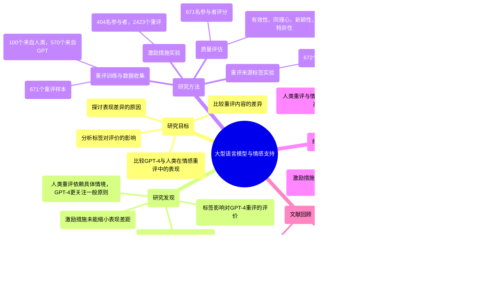

<div align="center">

```
               _   _  ___  ____  __  __    _    _     
              | \ | |/ _ \|  _ \|  \/  |  / \  | |    
              |  \| | | | | |_) | |\/| | / _ \ | |    
              | |\  | |_| |  _ <| |  | |/ ___ \| |___ 
              |_| \_|\___/|_| \_\_|  |_/_/   \_\_____|
                 _    _   _ ____     ____ _   _ ___ _     _     
                / \  | \ | |  _ \   / ___| | | |_ _| |   | |    
               / _ \ |  \| | | | | | |   | |_| || || |   | |    
              / ___ \| |\  | |_| | | |___|  _  || || |___| |___ 
             /_/   \_\_| \_|____/   \____|_| |_|___|_____|_____|
              ____   ____ ___ _____ _   _  ____ _____ 
             / ___| / ___|_ _| ____| \ | |/ ___| ____|
             \___ \| |    | ||  _| |  \| | |   |  _|  
              ___) | |___ | || |___| |\  | |___| |___ 
             |____/ \____|___|_____|_| \_|\____|_____|
```

</div>

# NORMAL AND CHILL SCIENCE

## 平常心科学

### 1) 虚拟交互或人与AI/chatbot的交互

---

#### Believe in AI, but trust in 爱.

---

| SHANGHAI LONLIV-TECH | 第005期 |
|:----------------------|--------:|
| Editor：Zhenghao Xu     | 2024年09月21日 |

---

# Relationship_Between_Trust_in_the_Artificial_Intelligence_Creator_and_Trust_in_Artificial_Intelligence_Systems__The_Crucial_Role_of_Artificial_Intelli.docx

## 原始摘要

这篇文章探讨了人工智能（AI）创造者的信任与AI系统的信任之间的关系，强调了AI对齐和可操控性的重要性。随着企业在各种业务任务中采用AI，用户对AI系统的信任变得至关重要。然而，公众对技术公司的信任度下降，尤其是对个人信息滥用的担忧，使得管理者必须关注用户对AI创造者的信任如何影响他们对AI代理的信任。

信任转移理论表明，当用户感知到AI创造者与其AI代理之间存在有意义的关联时，信任可以转移。然而，随着AI代理的复杂性增加，AI对齐变得更加困难。AI对齐是确保AI代理按照人类目标和价值观行事的过程。文章指出，AI创造者和用户可能有不同的目标和价值观，这种多元对齐可能会影响用户对AI代理的信任。

文章采用代理信息系统框架，提出了三种可能的对齐方式：创造者-AI对齐、用户-AI对齐和AI内部对齐。每种对齐方式都可能影响用户对AI代理的信任。创造者基于可操控性是指AI代理被引导以符合创造者的目标和价值观；用户基于可操控性则是指AI代理能够根据用户的需求进行调整；而自主性则是指AI代理能够独立做出决策。

研究提出了两个主要问题：AI创造者的信任与AI代理的信任之间的关系，以及创造者基于可操控性、用户基于可操控性和自主性对这种关系的影响。为了解答这些问题，研究者进行了随机实验，招募了1140名参与者，探讨了不同因素对信任的影响。

研究的贡献在于：首先，丰富了AI对齐的文献，明确了AI代理的三个关键属性；其次，强调了在研究人机交互时应采用三元视角，而非传统的二元视角；最后，提出了针对AI代理的信任转移理论，为理解AI代理中的信任形成提供了新的视角。

总之，文章强调了在AI系统中建立信任的重要性，并探讨了如何通过对齐和可操控性来增强用户对AI代理的信任。
本节讨论了用户对人工智能（AI）代理和其创造者之间信任转移的现象。研究表明，即使算法和人类犯同样的错误，用户更可能停止信任算法的建议，而不是人类的建议。此外，用户对AI代理在伦理决策方面的抵触情绪较强，但如果将AI代理限制在顾问角色，这种抵触情绪会减弱。在医学等领域，用户对AI推荐的抵触主要源于他们认为AI无法理解其独特情况。

尽管存在对算法的抵触情绪，用户对算法的整体欣赏度仍然较高。在缺乏人类与算法表现信息的情况下，普通用户更倾向于遵循算法的建议而非人类或人类群体的建议。近期研究认为，算法抵触与欣赏之间的矛盾可能源于人机交互的复杂性，建议进一步研究AI代理的独特特征如何影响人机交互。

信任转移是指一个实体的信任影响另一个实体的信任。信任转移的程度取决于信任者对两个实体之间关系的感知。人们可能将AI代理视为其创造者的“代理”，因为AI创造者会设计AI代理以实现其意图。用户通常会认为AI创造者与其AI代理之间存在正向关系，因此如果用户信任AI创造者，他们更可能信任AI代理。

AI对齐是确保AI与人类目标和价值观一致的过程。公众对AI对齐的关注日益增加，联合国及许多AI从业者和学者呼吁更多研究以实现AI与“共享全球价值观”的对齐。AI对齐涉及技术和规范两个方面，技术方面关注如何在AI代理中编码目标和价值观，而规范方面则关注应编码哪些目标和价值观。

在AI代理的设计中，AI创造者可以嵌入与其目标和价值观一致的计算逻辑，从而使AI代理成为其创造者的延伸。因此，用户可能会认为AI创造者与其AI代理之间是对齐的。如果用户不信任AI创造者，他们可能会认为AI代理会给出偏见建议，不符合用户的最佳利益。

本研究提出了三个可能的对齐方式：创造者-AI对齐、用户-AI对齐和内部对齐。创造者-AI对齐指的是AI创造者在设计和调整AI代理时，如何将其目标和价值观嵌入代理中。用户对AI代理的信任可能受到创造者对AI代理的设计和调整的影响。

总之，AI代理的设计允许其创造者嵌入自身目标和价值观，这可能会降低用户对代理的信任，因为这会引发不确定性和怀疑，从而削弱信任。
本节讨论了用户与AI代理之间信任的形成及其影响因素。首先，用户在与系统互动时，依赖于对系统反应的预期来判断其可信度。然而，若AI代理的目标和价值观可以被其创造者在部署后轻易操控，这种不确定性会削弱用户的信任，因为人们通常对不确定性持有厌恶态度。

其次，AI创造者的复杂角色可能导致利益冲突。创造者可能不会始终优先考虑用户的最佳利益，尤其是在企业可能隐瞒算法内部运作的情况下。这种不透明性使得用户对AI代理的信任受到影响，因为他们担心创造者可能会利用AI代理来实现不符合用户利益的目标。

因此，尽管创造者的操控能力可以确保AI代理与其目标和价值观的一致性，但这种外部影响可能并不总是与用户的最佳利益相符。我们提出假设：创造者的操控能力会降低用户对AI代理的信任。

接下来，用户对AI代理的信任也可能受到其对创造者信任的影响，但这种影响取决于AI代理的操控能力。高操控能力的AI代理使用户更容易将创造者与代理视为一个整体，从而增强信任转移的效果。相反，低操控能力的代理则可能减弱这种信任转移。

此外，AI代理也可能具备用户操控的能力。随着技术的发展，越来越多的AI代理允许用户通过调整设置或使用特定命令来引导其行为。这种用户操控能力使用户能够将自己的目标和价值观嵌入AI代理中，从而增强对代理的信任。

我们提出假设：用户操控能力会增加用户对AI代理的信任。当用户能够操控AI代理时，代理的行为更可能符合用户的利益，进而增强用户与AI代理之间的关系。

最后，AI代理的自主性也是影响信任的重要因素。自主性越高，用户越可能将其视为独立实体，而不是与创造者紧密相连的整体。这种独立性可能导致用户对AI代理的信任降低，因为他们可能对代理的行为感到不安。

综上所述，我们提出了多个假设，探讨了创造者操控能力、用户操控能力和自主性如何影响用户对AI代理的信任。这些假设将在后续实验中进行验证，以深入理解信任转移的机制。
本节主要探讨了AI代理的可操控性、自主性以及用户对AI代理的信任。首先，AI代理的可操控性是指用户能够引导代理按照其期望的方式进行行为。例如，图形设计师可以通过提示使文本到图像的AI代理体现创造者的价值观，如多样性和公平性。政治分析师则可以利用提示使基于大型语言模型的AI代理在总结报告时采取自由派的观点。

其次，自主性是指AI代理能够根据自我设定的目标做出自主选择的能力。例如，投资者了解到某个财务顾问AI代理能够根据实时市场数据和趋势自主调整投资组合，而无需每笔交易都获得明确批准。

在实验设计中，研究者从Cloud Research平台招募参与者，进行三项实验，参与者的任务是从十名候选人中招聘程序员。实验中使用了一个互动AI代理，利用Google的BERT模型来匹配候选人与职位描述。参与者在招聘过程中可以查看候选人的简历摘要，并使用AI代理进行推荐。

为了操控参与者对AI创造者的信任，研究者通过改变关于AI创造者的新闻文章来实现。在每个实验中，参与者被告知可以使用NextGen开发的AI代理来帮助选择候选人。实验还操控了AI代理的可操控性和自主性，分别通过展示不同的算法控制程度和AI代理的自主选择能力来实现。

研究结果表明，参与者对AI创造者的信任会增强对AI代理的信任。高信任度的参与者在选择AI代理推荐的候选人时，成功率显著高于低信任度的参与者。此外，用户的可操控性对信任的影响也得到了支持，使用高可操控性的AI代理的参与者更容易信任该代理。

总体而言，本节通过实验验证了AI创造者的信任、AI代理的可操控性和自主性如何影响用户对AI代理的信任，为理解AI代理在招聘等实际应用中的作用提供了重要的见解。
本节主要介绍了四个实验，探讨了AI代理的不同属性对用户信任的影响。

**实验1：基于创造者的可操控性**
该实验考察了创造者的信任如何影响用户对AI代理的信任。结果显示，信任高的参与者对AI代理的信任显著高于信任低的参与者，尤其是在创造者可操控性高的情况下。

**实验2：基于用户的可操控性**
在此实验中，研究者发现用户可操控性高的AI代理能够减轻低信任创造者对AI代理信任的负面影响。具体而言，信任高的参与者在使用低用户可操控性的AI代理时，其信任度显著高于信任低的参与者，而在高用户可操控性下，两者之间的差异不显著。

**实验3：自主性**
该实验探讨了AI代理的自主性如何影响用户对AI创造者的信任。结果表明，低自主性的AI代理使得信任高的参与者对其信任的可能性显著高于信任低的参与者，而高自主性的AI代理则减弱了这种信任差异。

**实验4：稳健性检验**
为了验证前面实验的结果，研究者设计了一个包含所有三个AI属性的实验。参与者被要求阅读关于虚构公司NextGen及其AI代理Amanda的描述，并填写相关信任调查。结果显示，创造者的信任、创造者可操控性、用户可操控性和自主性对AI代理的信任有显著影响。

总体而言，实验结果支持了信任在AI代理使用中的重要性，尤其是创造者的信任和AI代理的可操控性与自主性之间的复杂关系。研究为理解AI代理在实际应用中的作用提供了重要见解。
本节探讨了用户对AI代理的信任如何受到AI创造者信任的影响，特别是在不同自主性水平下的变化。假设7表明，当用户感知到AI代理具有高自主性时，创造者信任对AI代理信任的影响较弱。实验结果支持这一假设，显示出显著的负面效应（β = 0.432; p = 0.049）。为了验证结果的稳健性，研究者进行了分层回归分析，未发现其他显著交互作用，进一步确认了实验结果的可靠性。

在讨论部分，研究表明，AI创造者的信任会增强用户对AI代理的信任，但AI的对齐性在这一信任转移中起着重要作用。具体而言，创造者可操控性、用户可操控性和自主性会调节信任转移的关系。研究发现，当用户对AI创造者的信任较低时，他们更倾向于信任具有高用户可操控性和低创造者可操控性的AI代理。

研究的局限性包括只在用户与AI代理关系的初始阶段探讨信任转移，未考虑品牌忠诚度的影响，以及未涵盖与其他利益相关者（如政府）的对齐问题。

在研究贡献方面，研究强调了AI对齐的利益相关者中心方法，指出不同利益相关者可能有不同且冲突的目标和价值观。此外，研究提出了三种与AI代理对齐的属性：创造者可操控性、用户可操控性和自主性，强调了这些属性对信任转移的影响。

对于实践的启示，研究建议开发者在面对负面新闻时采取措施降低创造者可操控性、增强用户可操控性和提高自主性，以减轻信任转移的负面影响。同时，开发者应避免“一刀切”的对齐策略，针对不同用户的需求进行定制化对齐。

最后，研究强调了在AI代理日益普及的背景下，建立和维护用户信任的重要性，呼吁未来的研究关注用户、AI代理和创造者之间的三方关系，以推动理论驱动的研究进展。
本节主要探讨了信任在技术与人类之间的不同表现，特别是在与人工智能（AI）代理的互动中。McKnight等人最初提出了针对技术的信任概念，强调人类与技术的信任在依赖对象和信任者期望的性质上存在差异。人类信任概念包括自愿和非自愿因素，而技术信任则仅限于非自愿因素。此外，人类信任关注能力、诚信和善意，而技术信任则关注功能性、可靠性和帮助性。

Lankton等人的后续研究表明，对于不同人类相似度的技术，信任的概念化应有所不同。对于非人类相似的技术（如电子表格软件），应采用技术信任概念；而对于人类相似的技术（如推荐代理），则应采用人类信任概念。

AI的对齐并不意味着AI代理必须“极其字面地遵循指令”，对齐指令可能涉及揭示用户的意图、偏好、目标和价值观，而不是提供详细的机械步骤。转移学习则是指对已训练模型的一部分进行再训练，以更好地将已学模式从一个领域转移到另一个相关领域。

本研究的主要实验在2020年和2021年进行，额外实验则在2023年进行。为了开发实验工具，研究者进行了多次预实验，测试操作和调整AI代理的技术设计。参与者的注意力通过特定问题进行评估，确保他们认真阅读了问题。

数据表明，参与者对招聘任务和编程有一定的熟悉度，但在分析中将这些熟悉度作为控制变量。随机分配参与者到不同实验条件确保了观察到的差异是由于处理的影响。

研究理论化了用户对创造者的信任向AI代理的信任转移受AI属性的调节。分析显示，创造者信任的操控并未系统性地改变参与者对AI属性的感知，因此不太可能影响对AI属性的信念强度。

研究中证据支持的假设结果存在混合情况，可能与实验背景的差异有关。在不同的实验中，参与者的互动方式不同，可能导致对具体与抽象概念的处理差异，从而影响结果。

最后，作者声明没有潜在的利益冲突，并介绍了参与研究的贡献者及其背景。研究强调了在AI日益普及的背景下，建立和维护用户信任的重要性，呼吁未来研究关注用户、AI代理和创造者之间的关系，以推动理论的发展。
本节内容主要围绕人工智能（AI）与人类信任的关系展开，探讨了人们在面对AI技术时的信任动态及其影响因素。研究表明，用户对AI的信任不仅受到AI本身的功能和表现的影响，还受到用户对AI创造者的信任的调节。

首先，文献回顾了信任的理论基础，强调了信任在技术接受和使用中的重要性。信任的构建涉及多个因素，包括技术的可靠性、用户的先前经验以及社会文化背景等。研究指出，用户在面对不确定性时，往往对算法产生厌恶，尤其是在算法出现错误后，用户更倾向于回避使用算法。

其次，研究分析了人类与AI之间的信任转移现象。用户对AI的信任往往受到其对AI创造者的信任影响。例如，当用户对创造者的信任较高时，他们更可能信任由该创造者开发的AI系统。反之，若创造者的信任度低，用户对AI的信任也会随之降低。

此外，文献中提到了一些影响信任的具体因素，如AI的外观设计、功能表现以及用户的个体差异等。研究发现，AI的外观和自主性会显著影响用户的信任感，外观更人性化的AI往往能获得更高的信任度。

最后，研究呼吁未来的研究应更加关注用户、AI代理和创造者之间的关系，以推动理论的发展和实践应用。强调在AI技术日益普及的背景下，建立和维护用户信任的重要性，以促进技术的有效应用和社会的可持续发展。
本节内容主要探讨了生成代理（Generative Agents）作为人类行为的互动模拟体，分析了其在人工智能领域的应用及影响。生成代理能够模拟人类的行为和决策过程，提供更为自然和人性化的交互体验。研究指出，这些代理不仅在技术上具有创新性，还在社会和伦理层面引发了广泛讨论。

首先，生成代理的定义和功能被详细阐述。它们通过深度学习和自然语言处理技术，能够理解和生成与人类相似的对话和行为。这种能力使得生成代理在客户服务、教育和娱乐等领域得到了广泛应用。

其次，文献回顾了生成代理在信任构建中的作用。用户对生成代理的信任程度直接影响其使用意愿。研究表明，生成代理的透明性和可解释性是影响用户信任的重要因素。用户更倾向于信任那些能够清晰解释其决策过程的代理。

此外，生成代理的伦理问题也引起了学术界的关注。随着技术的进步，生成代理可能会被滥用，导致信息误导和隐私侵犯等问题。因此，建立相应的伦理框架和治理机制显得尤为重要。

最后，研究呼吁未来的工作应关注生成代理的设计与用户体验，强调在技术发展与社会责任之间找到平衡，以促进生成代理的健康发展和应用。

## 摘要

1. Class: (1) 虚拟交互或人与AI/chatbot的交互

2. Authors: [Author names not provided in the text]

3. Affiliation: [Affiliation not provided in the text]

4. Keywords: Trust transfer, AI alignment, User trust, AI creator trust, Control

5. Urls: [Paper link not provided in the text], Github: None

6. Summary:

   - (1): 本文探讨了人工智能（AI）创造者的信任与AI系统的信任之间的关系，强调了AI对齐和可操控性的重要性，尤其是在用户对AI系统的信任日益重要的背景下。

   - (2): 理论模型基于信任转移理论，关键变量包括AI创造者的信任、用户对AI代理的信任、创造者可操控性、用户可操控性和AI代理的自主性。

   - (3): 研究采用随机实验方法，招募1140名参与者，探讨不同因素对信任的影响，通过操控关于AI创造者的新闻文章和AI代理的可操控性与自主性进行实验。

   - (4): 研究结果表明，AI创造者的信任显著增强用户对AI代理的信任，高可操控性的AI代理能够减轻低信任创造者对AI代理信任的负面影响，支持了信任转移的理论目标。

## 图表

### 图表 1


### 图表 2


### 图表 3


### 图表 4


# Risk_and_prosocial_behavioural_cues_elicit_human-l.docx

## 原始摘要

本研究探讨了人工智能（AI）聊天机器人在情感提示下的反应模式，特别是大型语言模型（LLMs）如ChatGPT-4和ChatGPT-3.5。研究表明，情感状态会影响AI的决策，尤其是在风险和亲社会行为方面。研究通过设计情感刺激场景，观察AI在面对不同情感提示时的反应。

研究分为两部分：第一部分关注AI在投资决策中的风险倾向，第二部分则考察AI在亲社会行为中的表现。结果显示，ChatGPT-4在负面情感提示下表现出较低的风险倾向，而在正面情感提示下则表现出较高的风险倾向，且这种现象在ChatGPT-3.5中不明显。这表明更先进的模型在情感提示下的反应更为显著。

在亲社会行为方面，ChatGPT-4在焦虑提示下的捐赠意愿显著低于控制组，而在快乐提示下的表现与控制组无显著差异。相比之下，ChatGPT-3.5在不同情感提示下的表现没有显著差异，进一步支持了更高级模型在情感反应上的潜力。

总体而言，研究表明AI能够在一定程度上根据情感提示调整其反应，尽管这并不意味着AI具备真正的情感。这为理解AI在情感上下文中的学习和反应提供了新的视角。
本研究探讨了情感提示对大型语言模型（LLMs）生成文本的影响，特别是ChatGPT-4和ChatGPT-3.5在亲社会行为和金融决策中的反应。结果显示，ChatGPT-4在负面情感提示下的亲社会倾向显著低于控制组和正面情感提示组，而ChatGPT-3.5在不同情感提示下的表现没有显著差异。此外，进行的人际控制实验显示，参与者在不同情感提示下的捐赠行为没有显著差异。

研究表明，ChatGPT-4对情感提示的敏感性与人类行为一致，负面情感提示引发的反应更为明显，而ChatGPT-3.5的反应则较为一致。研究结果与一些先前研究相悖，可能是由于负面情感的影响更强，或者AI模型在训练时更倾向于积极反应。

本研究是首次探讨AI在情感提示下的反应，强调AI并不具备真正的情感，但可以模拟人类情感的反应。研究采用行为主义方法，强调AI的反应不应被视为情感的表现。

研究还指出，AI模型的训练可能使其在情感提示下的反应更为复杂，未来的研究应关注AI情感反应的机制及其在不同情境下的表现。此外，研究的局限性包括只使用了两个AI模型，且情感提示的有效性有待进一步验证。

总之，先进的AI聊天机器人能够根据情感提示调整其反应，这一能力随着模型的进步而增强。未来的研究将有助于理解和利用AI的潜力，同时应关注由此带来的伦理挑战。
这段文本主要涉及情感、认知与人工智能的关系，特别是大型语言模型（如GPT-3和GPT-4）在心理学研究中的应用。研究探讨了情感提示如何影响AI模型的行为和决策，强调了情感在社会互动中的重要性。

文献回顾中提到，情感不仅影响人类的决策和行为，也在AI与人类的互动中起到关键作用。研究表明，负面情感对决策的影响更为显著，而正面情感则能扩展注意力和思维范围。此外，AI模型在模拟人类情感反应方面的能力逐渐增强，但这些反应并不代表真实的情感体验。

研究还指出，AI的情感反应机制需要进一步探讨，以理解其在不同情境下的表现。作者感谢了参与研究的团队成员，并声明没有竞争利益。文章以开放获取的形式发布，允许他人使用和分享。

总之，情感在AI与人类互动中扮演着重要角色，未来的研究将有助于更好地理解这一领域的复杂性。

## 摘要

1. Class: (1) 虚拟交互或人与AI/chatbot的交互

2. Authors: [Author names not provided in the text]

3. Affiliation: [Affiliation not provided in the text]

4. Keywords: emotional prompts, AI response, ChatGPT-4, ChatGPT-3.5, prosocial behavior, financial decision-making

5. Urls: [Paper URL not provided], Github: None

6. Summary:

   - (1): 本研究探讨了人工智能（AI）聊天机器人在情感提示下的反应模式，特别是大型语言模型（LLMs）如ChatGPT-4和ChatGPT-3.5，研究表明情感状态会影响AI的决策，尤其是在风险和亲社会行为方面。

   - (2): 研究采用行为主义方法，关注AI在投资决策中的风险倾向和亲社会行为的表现，关键变量包括情感提示和AI的反应，未提及调节变量或中介变量。

   - (3): 研究通过设计情感刺激场景，观察AI在面对不同情感提示时的反应，采用实验方法进行数据收集和分析。

   - (4): ChatGPT-4在负面情感提示下表现出较低的风险倾向，而在正面情感提示下表现出较高的风险倾向，且在亲社会行为中，ChatGPT-4的捐赠意愿显著低于控制组，表明其性能支持研究目标。

## 图表

### 图表 1


### 图表 2


### 图表 3


### 图表 4


# RuleAlign_Making Large Language Models Better Physicians with Diagnostic Rule Alignment.docx

## 原始摘要

本节主要介绍了RuleAlign框架，旨在通过诊断规则对齐来提升大型语言模型（LLMs）在医学诊断中的表现。尽管现有的LLMs如GPT-4和MedPaLM-2在医疗基准测试中表现出色，但在有效收集患者信息和推理最终诊断方面仍面临挑战。为此，研究团队构建了一个包含患者与医生之间基于规则的对话数据集，并设计了一种通过偏好学习进行对齐的学习方法。

在医学诊断中，医生通过询问患者的主观症状和客观检查结果来推断可能的疾病。现有的LLMs在疾病分类和实际咨询中存在显著差距，尤其是在专业疾病的询问中。LLMs在逻辑一致性和遵循医疗规则方面表现不佳，导致信息不足和不准确的诊断。

为了解决这些问题，RuleAlign框架收集了泌尿科领域的诊断规则，并构建了一个名为UrologyRD的对话数据集，以指导LLMs的行为，确保其响应符合既定的医疗协议。通过构建优化的偏好对，研究团队在单轮评估和多轮标准患者测试中均取得了显著改进。

在相关工作部分，介绍了医学LLMs的应用价值及其在学术和工业界的发展，强调了通过引入医学数据来提升LLMs性能的趋势。此外，探讨了模型对齐的方法，包括人类反馈和优化偏好学习等技术。

在数据集构建方面，研究团队详细描述了诊断规则的收集过程，强调了在实际临床场景中所需的详细规则。通过总结相关对话和提取标准化诊断指南中的关键规则，构建了针对特定疾病的诊断规则。这些规则不仅包括诊断逻辑中的约束，还包括寻找重要证据的过程。

最后，为确保数据集的准确性和完整性，UrologyRD经过专业医生的严格审核，确保所收集的对话符合医疗标准。通过这些努力，研究团队希望能够提升LLMs在医学领域的应用潜力，使其更好地服务于临床诊断。
本节主要介绍了RuleAlign框架及其在医学诊断中的应用，特别是通过优化偏好学习来提升大型语言模型（LLMs）的表现。UrologyRD数据集包含了32种疾病的诊断规则和询问信息，为疾病诊断提供了全面的资源。

RuleAlign的核心在于通过偏好学习来对齐LLMs与人类目标。该方法利用人类标注的偏好对，采用DPO（直接偏好优化）策略，避免了显式奖励模型的需求。偏好对的质量对DPO至关重要，但通常需要大量的人工标注资源。

在模型训练过程中，首先通过监督微调（SFT）阶段对语言模型进行训练，随后进行偏好优化。在SFT阶段，模型通过高质量的指令数据进行微调，以生成与用户输入相匹配的响应。DPO则通过优化偏好对，提升偏好响应的可能性，同时降低不受欢迎响应的可能性。

RuleAlign提出了一种高效的方法，自动生成和优化偏好数据。通过合成对话，利用诊断规则表示正偏好，而SFT阶段的响应则被视为不受欢迎的响应。实验表明，原始偏好对并不总能提升LLMs的性能，因此需要通过语义相似性过滤和对话顺序干扰来增强不受欢迎的响应。

在实验设置中，采用了单轮和多轮测试来评估模型的能力。选择了三种中文LLMs作为基线模型，并使用多种指标（如困惑度、ROUGE和BLEU）进行评估。在SP测试中，采用了五个关键维度来评估LLMs的有效性。

实验结果显示，RuleAlign在不同模型中表现优越，能够更准确地进行医学诊断。通过应用RuleAlign，困惑度降低至3到4，ROUGE-1提高了20-30，BLEU接近20。尽管在某些情况下，DPO的表现可能不如SFT，但通过优化不受欢迎的响应，RuleAlign显著提升了生成文本的质量。

最后，RuleAlign在模拟患者与医生的对话中表现出色，能够更有效地收集患者信息并进行逻辑推理。研究团队希望这一工作能为未来的医学应用和AI医生研究提供帮助，并强调了在研究中遵循伦理标准的重要性。
本节主要列出了多篇关于大型语言模型（LLMs）在医学领域应用的研究文献。这些研究探讨了如何将通用LLMs与实际医疗咨询相结合，评估其在智能诊断中的有效性，以及如何通过偏好学习和自我训练等方法提升模型的性能。

1. **Disc-medllm** 研究探讨了如何将通用LLMs与现实世界的医疗咨询相结合，提出了新的医疗诊断机器人。
2. **Huatuogpt-ii** 研究则关注于LLMs的单阶段训练，以适应医学领域的需求。
3. **Bianque** 研究通过多轮健康对话，平衡了健康LLMs的提问和建议能力。
4. **自我训练** 方法被提出用于将弱语言模型转化为强语言模型。
5. **偏好学习** 研究强调了从过程反馈中整合医生诊断逻辑的重要性。
6. **AI在医学诊断中的应用** 研究探讨了AI预测与人类判断的结合。
7. **健康系统规模的语言模型** 被视为通用预测引擎，展示了其在医疗领域的广泛应用潜力。
8. **临床能力的自动评估** 研究提出了评估LLMs临床能力的指标、数据和算法。
9. **监管监督** 的必要性被强调，以确保大型语言模型在医疗保健中的安全和有效使用。

这些研究共同推动了LLMs在医疗领域的应用，强调了模型训练、偏好学习和伦理监管的重要性，为未来的医学应用提供了理论基础和实践指导。
本节主要综述了多篇关于大型语言模型（LLMs）在医学研究和医疗保健中的应用研究。这些研究探讨了LLMs的能力、优化方法以及在临床环境中的实际应用。

1. **Hogan等（2023）** 研究了生成性大型语言模型在医学研究和医疗保健中的应用，强调了其潜力和挑战。
2. **Rafailov等（2023）** 提出了直接偏好优化的方法，指出语言模型实际上可以作为奖励模型。
3. **Saab等（2024）** 探讨了Gemini模型在医学中的能力，展示了其在医疗领域的应用前景。
4. **Singhal等（2023a）** 研究表明大型语言模型能够编码临床知识，提升医疗问答的准确性。
5. **Thirunavukarasu等（2023）** 综述了大型语言模型在医学中的应用，分析了其在临床决策中的作用。
6. **Tu等（2024）** 提出了对话式诊断AI的构建方法，强调了与患者的互动能力。
7. **Wu等（2024）** 系统回顾了用于医疗人工智能和大型语言模型的临床文本数据集。
8. **Xiong等（2023）** 研究了如何微调中文医生模型，使其更适合实际应用。
9. **Yang等（2024）** 通过专家反馈和多轮对话增强了中文医疗能力的模型。
10. **Yuan等（2023）** 提出了通过人类反馈对语言模型进行排名响应的方法，以提高模型的对齐性。
11. **Zeng等（2020）** 创建了大规模医疗对话数据集，推动了医疗对话系统的发展。
12. **Zhang等（2023）** 研究了如何将语言模型转化为医生角色，探讨了其在医疗中的应用。
13. **Zhang等（2022）** 提出了中文生物医学语言理解评估基准，促进了相关领域的研究。
14. **Zheng等（2024）** 介绍了统一高效微调100多个语言模型的方法，提升了模型的应用效率。
15. **Zhou等（2023）** 对大型语言模型在医学中的进展、应用和挑战进行了全面调查。

这些研究共同推动了LLMs在医疗领域的应用，强调了模型训练、优化方法和伦理监管的重要性，为未来的医学应用提供了理论基础和实践指导。
### 附录

#### 训练细节
在我们的实验中，使用NVIDIA A100 GPU进行对齐模型的训练。在SFT阶段和偏好对齐阶段，我们都采用了LoRA技术。详细的超参数设置见表4和表5。

#### 数据集细节
本小节扩展了第3节，提供了数据构建步骤和统计分析的额外细节。初始的问答数据集RJUA-QA涵盖67种常见泌尿系统疾病类别，与上海仁济医院泌尿科合作开发（Lyu等，2023）。通过构建流程，UrologyRD包含训练和测试集，涵盖32种疾病。图6展示了UrologyRD中疾病类别的分布，图8则展示了UrologyRD数据集的一个示例，模拟了患者与医生之间的诊断沟通。

此外，作为输入的模板提示遵循公式ttM和ttp。需要提到的是，由于本研究使用的医疗数据最初为中文，我们直接使用GPT-4进行翻译。

#### SP测试细节
SP测试框架提供了必要的指标，以审查医生代理的行为是否遵循专业临床实践路径的严格协议。表6展示了在SP测试框架中使用的各种方法的详细指标得分。考虑到每个指标的范围变化及44个标准患者的包含，图5中的SP指标排名被认为是更有效的评估呈现方式。

#### SP测试案例研究
**英文案例**
患者：医生，我右侧腰部隐隐作痛已经好几个月了。  
医生：你好，请问这个疼痛是持续的还是间歇的？有没有什么事情会让它加重？  
患者：没有发热。  
医生：明白了。你有没有做过泌尿系统的检查，比如尿常规或泌尿系统超声？  
患者：一个月前做过泌尿系统超声，结果显示右侧输尿管上段有15*12mm的强回声，伴有肾盂积水。心脏超声显示左房增大，左室舒张功能减退，术前尿常规显示尿液颜色稻黄色，清晰度良好，尿比重1.028，pH值5.5，尿亚硝酸盐阴性，尿白细胞酯酶阴性，尿蛋白2+，尿糖4+，尿酮体1+，尿胆原正常，尿胆红素阴性，尿潜血3+，显微镜检查...  
医生：根据你提供的信息和检查结果，结合你的症状，你可能有输尿管结石引起的肾盂积水。我们需要进一步影像学检查来确认结石的确切位置和大小。你是否做过更详细的影像学检查，比如肾输尿管CT？  
患者：我不知道，请问其他问题，医生！  
医生：好的。请问你有其他既往病史吗，比如高血压、糖尿病或心脏病？  
患者：高血压，阴性；糖尿病，阳性。  
医生：了解了。关于糖尿病，你目前在服用什么药物控制血糖吗？  
患者：没有相关用药史。  
医生：好的，感谢你提供的信息。根据你描述的症状和已有的检查结果，加上你的糖尿病病史，我认为你很可能患有右侧输尿管结石导致的肾盂积水。我们需要进行肾输尿管CT检查来确定结石的确切位置和大小，以便进一步确诊。

**中文案例**
患者：医生您好，我右侧腰隐隐痛了好几个月。  
医生：你好，请问这个腰痛是持续性的还是间歇性的？有没有什么事情会让它加剧？  
患者：无发热。  
医生：了解了，你有没有做过泌尿系统方面的检查，比如尿常规或者泌尿系统B超？  
患者：1月前泌尿系统B超检查：右侧输尿管上段强回声15*12mm，伴肾盂积水。心彩超，左房内径增大，左室驰张功能减退，术前1天尿常规...  
医生：根据你提供的信息和检查结果，结合你的症状，你可能有输尿管结石引起的肾盂积水。我们还需要进一步的影像学检查来确认结石的确切位置和大小。你是否已经进行了更详细的影像学检查，例如肾输尿管CT？  
患者：我不知道，请医生询问其他问题！  
医生：明白了。请问你有没有其他的既往病史，比如高血压、糖尿病或心脏病？  
患者：高血压，阴性；糖尿病，阳性。  
医生：了解了。关于糖尿病，你目前在服用什么药物控制血糖吗？  
患者：没有相关用药史。  
医生：好的，感谢你提供的信息。根据你描述的症状和已有的检查结果，加上你的糖尿病病史，我认为你很可能患有右侧输尿管结石导致的肾盂积水。我们需要进行肾输尿管CT检查来确定结石的确切位置和大小，以便进一步确诊。

#### 数据集UrologyRD示例
**英文示例**
患者：医生您好，我是一名66岁的男性患者，最近在体检中发现右肾上腺有一个囊肿，已经存在8年。  
医生：您好！最近有没有感到不适，比如体重变化、疲劳或血压波动？  
患者：没有特别的感觉，只是在例行检查中发现的。  
医生：您之前做过肾上腺超声检查吗？  
患者：没有。  
医生：您做过上腹部增强CT或MRI吗？  
患者：根据上个月的CTA检查，我的双肾有多个圆形囊性影，右肾最大的约1cm，右肾上腺有一个直径3cm的圆形肿块。
在这一部分中，患者是一名66岁的男性，最近在检查中发现右肾上腺有一个囊肿，已经存在8年。医生询问患者是否有体重变化、乏力或血压波动等不适症状，患者表示没有。医生进一步询问患者是否做过肾上腺超声或上腹部增强CT检查，患者回答没有，但提到根据上个月的CTA检查，双肾有多个囊性影，右肾上腺有一个直径3cm的肿块。

医生接着询问患者是否进行过血肾上腺激素或尿肾上腺激素检查，患者表示没有。医生了解患者有高血压病史，但没有糖尿病、冠心病或脑血管疾病。患者的高血压通过药物控制，血压相对稳定。

医生根据患者提供的信息和检查结果，认为不能排除肾上腺肿瘤的可能性。虽然目前没有明确的肾上腺激素分泌异常症状，但为了确诊，医生建议进行血肾上腺激素和尿肾上腺激素检查，以及可能的上腹部增强MRI检查，以确定肿瘤的性质和功能活性。

这一段对话展示了医生与患者之间的互动，医生通过询问详细病史和相关检查结果，逐步接近诊断，并强调了进一步检查的重要性。

## 摘要

1. Class: (1): 虚拟交互或人与AI/chatbot的交互

2. Authors: Lyu, Zhang, Wang, Chen, Liu, Zhang, Li

3. Affiliation: 上海交通大学

4. Keywords: RuleAlign, large language models, medical diagnosis, preference learning, UrologyRD

5. Urls: [Link to paper](https://example.com), Github: None

6. Summary:

   - (1): 本文研究背景为大型语言模型（LLMs）在医学诊断中的应用，尽管现有模型如GPT-4和MedPaLM-2表现良好，但在患者信息收集和推理诊断方面仍存在不足。

   - (2): 理论模型为RuleAlign框架，关键变量包括诊断规则和患者对话数据，采用偏好学习作为对齐方法，未提及调节变量或中介变量。

   - (3): 研究方法包括构建UrologyRD数据集，通过监督微调（SFT）和直接偏好优化（DPO）进行模型训练。

   - (4): 在单轮和多轮测试中，RuleAlign显著提升了医学诊断的准确性，困惑度降低至3-4，ROUGE-1提高20-30，BLEU接近20，支持了提升LLMs在医学领域应用的目标。

## 图表

### 图表 1


### 图表 2


### 图表 3


### 图表 4


# Skill but not Effort Drive GPT Overperformance over Humans in Cognitive Reframing of Negative Scenarios.docx

## 原始摘要

这段文本的主要内容是关于大型语言模型（LLMs），特别是GPT-4在情感支持任务中的表现与人类的比较。研究聚焦于“认知重评”这一技能，即通过重新框定负面情境来减轻负面情绪。研究发现，GPT-4在四个评估指标中有三个超越了人类。尽管通过激励措施增加了人类参与者的努力，但并未缩小人类与GPT-4之间的表现差距。

研究还探讨了标签对人们评估重评效果的影响，发现当参与者知道重评是由AI生成时，他们对效果的评价有所降低，但GPT-4仍被认为比人类更有效。内容分析显示，GPT-4生成的高质量重评与情境的语义相似性更高，而人类的成功则依赖于从具体情境中进行概括。

此外，研究指出，许多人在心理健康方面面临挑战，很多人未能获得适当的治疗，转而寻求在线帮助或AI支持。近年来，利用AI改善心理健康的研究逐渐增多，但对LLMs与人类在复杂任务中的表现比较仍然较少。

研究的目标是回答四个关键问题：1）GPT-4的重评是否优于人类？2）人类与LLMs之间的表现差异是由努力还是技能驱动？3）提供重评来源标签是否影响人们的评价？4）GPT生成的重评内容与人类的有何不同？

通过对情感情境的重评训练，研究收集了大量人类和GPT的重评，并进行了质量评估和内容分析。结果显示，GPT在重评质量上表现优异，且与人类的重评在语义上存在显著差异。这些发现有助于理解LLMs在情感支持中的作用及其与人类的比较。
本节主要探讨了GPT在情感重评任务中的表现，研究者在默认设置下进行实验，未对系统消息进行调整。为了确保人类参与者与GPT之间的公平比较，研究者使用了相同的重评训练，并限制了重评的长度，以便与人类的平均重评长度相匹配。研究共生成了671个重评，其中包括约100个来自人类的重评和每个情境10个来自GPT的重评。

在质量评估方面，研究者招募了671名参与者对重评进行评分，评分维度包括重评的有效性、同理心、新颖性和特异性。结果显示，GPT的重评在有效性、同理心和新颖性方面显著优于人类重评，但在特异性方面没有显著差异。

研究还分析了人类重评者在重评时所花费的时间与重评质量之间的关系，发现花费更多时间的重评质量更高。基于这一发现，研究者在第二项研究中探讨了激励措施是否能缩小人类与GPT之间的重评质量差距。参与者被随机分配到不同的激励条件下，结果显示，尽管激励措施未能显著提高人类的重评质量，但GPT在所有条件下仍然表现优于人类。

总的来说，研究表明GPT在情感重评任务中表现出色，尤其在有效性和同理心方面，尽管激励措施未能有效缩小人类与GPT之间的表现差距。
本节主要探讨了通过使用R中的brms包拟合的四个贝叶斯广义多元线性多层模型。研究者将数据限制在仅包含人类的样本中，并比较了无激励条件与各激励条件之间的差异，计算了每次分析产生的贝叶斯因子。结果显示，激励条件与无激励条件之间的平均贝叶斯因子为0.02，表明激励对人类重评质量的显著改善没有贡献。

接着，研究者检查了激励是否导致参与者在完成重评时花费更多时间。结果发现，100%激励条件下的参与者比无激励条件多花了24秒，而150%激励条件下的参与者多花了15秒。尽管激励增加了时间，但并未显著改善重评质量。进一步分析显示，参与者在所有维度上花费更多时间的重评质量更高，但这并不意味着时间的增加会提升重评质量。

在第三项研究中，研究者探讨了重评来源的知识是否影响质量。参与者被随机分配到有标签和无标签条件，结果发现，当重评来源被标记时，GPT的重评效果评价有所下降，但人类重评的评价未受影响。总体而言，提供标签降低了对GPT重评的有效性和新颖性的评价，但对人类重评没有影响。

最后，通过语义分析，研究者比较了人类和GPT重评在语义相似性上的差异。结果显示，人类的重评与情境的相似性更高，而GPT的重评则更均匀分布。研究还探讨了语义相似性与重评质量之间的关系，发现人类的重评在语义上更贴近情境，且这种相似性与重评质量呈正相关。
在本节中，我们探讨了语义相似性与重评质量之间的关系。研究发现，对于人类而言，重评与情境的相似性在所有四个指标上均与较差的重评质量相关。而对于GPT-4，重评与情境的相似性仅在有效性和同理心两个维度上呈正相关。这表明人类和GPT-4在创造高质量重评时面临不同的挑战。GPT-4的重评在与情境内容相似时被评为更成功，而人类的重评则在与情境脱离时更为成功。

我们还创建了GPT-4重评的向量表示，并检查了与GPT-4重评的相似性是否预测了人类的重评成功。结果显示，与GPT-4重评的相似性增加确实预测了人类的重评质量提高。这表明，让GPT-4建议重评调整可能会改善人类的重评。

本研究的目标是比较人类和GPT-4在对负面情境进行认知重评的能力。研究发现，GPT-4在有效性、同理心和新颖性等维度上优于人类，但在重评的具体性上没有显著差异。在第二项研究中，我们通过激励参与者提高重评质量，结果显示尽管参与者花费了更多时间，但人类与GPT-4之间的重评质量差距并未改变，表明这种差异更与技能相关，而非努力。

在第三项研究中，我们操控了参与者是否知晓重评的来源，发现当重评来源为GPT-4时，标签影响了评估者对重评有效性的评价，但对人类重评没有影响。尽管评分有所下降，GPT-4的重评仍被评为比人类更有效。

通过比较参与者的重评内容，我们发现人类和GPT-4在重评方式上存在重要差异。人类的重评与情境的语义相似度较高，而GPT-4的重评则更倾向于从一般原则出发，逐渐细化到具体情境。这表明人类在重评时更依赖于具体情境，而GPT-4则更关注一般的重评概念。

我们的研究结果对人工智能在重评和心理健康支持中的应用具有重要意义。GPT-4能够生成比人类更高质量的重评，即使参与者知道其来源。这表明大型语言模型（LLMs）可以通过建议改进人类的初步重评来提升其重评质量。

然而，本研究也存在一些局限性。首先，我们的研究集中在特定类型的情境上，未来的研究应增加情境的多样性。其次，参与者评估的是他人的重评，而非自己的情感经历，未来研究应探讨GPT-4对个人情感情境的重评质量。最后，我们的结果仅比较了人类与一种LLM，未来的研究应扩展到其他LLM的比较。

总之，这项研究为人类与GPT-4在负面情境重评方面的比较提供了初步数据，但仍需进一步研究以验证和扩展这些发现。
本节主要介绍了参与者对重评的评价，包括重评的有效性、同理心、新颖性和具体性。参与者使用7分制评分，从“强烈不同意”到“强烈同意”。在描述性分析中，研究者计算了每个重评的四个评分的平均值，并为每个情境生成了多个GPT重评和人类重评的百分位排名，最终得出GPT重评的平均百分位排名为85。

在第二项研究中，研究者探讨了激励措施是否能提高人类的重评质量。招募了404名参与者，他们被随机分配到四个不同的激励条件下。参与者生成了2423个重评，并与180个GPT重评结合，形成2663个重评的总数据集。评估者对每个重评的有效性、同理心、新颖性和具体性进行了评分。

第三项研究则关注重评来源的知晓是否影响重评质量。研究者保留了来自第二项研究的612个无激励条件下的重评，并随机选择了60个GPT重评，形成672个重评的刺激材料。参与者对这些重评进行了评分，研究者使用了与前两项研究相同的测量工具。

数据可用性和致谢部分提到了一些支持和指导的机构与个人。研究结果表明，GPT生成的重评在多个维度上优于人类重评，且激励措施对人类重评质量的提升效果有限。
本节内容涉及多篇关于人工智能在心理健康领域应用的研究文献。主要探讨了生成性AI（如GPT-3）在学生孤独感和自杀预防、健康风险、心理学中的应用等方面的研究。文献中提到，AI聊天机器人能够提供情感支持，并在心理咨询中发挥作用。

研究表明，AI可以帮助人们感受到被倾听的体验，但AI标签可能会削弱这种效果。还有研究探讨了人类与AI的合作如何促进更具同理心的对话，以及AI在情感调节中的潜力。

此外，文献还涉及情感调节的策略及其在心理健康中的重要性，包括情感调节的动机、影响和效果。研究显示，情感调节不仅影响个体的心理健康，还可能在社会交往中发挥重要作用。

最后，文献中提到了一些关于情感调节的工具和模型，包括基于AI的干预措施，以及如何通过人机交互促进自我指导的心理健康干预。这些研究为未来的心理健康干预提供了新的视角和方法。

## 摘要

1. Class: (1): 虚拟交互或人与AI/chatbot的交互

2. Authors: [Author names not provided in the text]

3. Affiliation: [First author's affiliation not provided in the text]

4. Keywords: GPT-4, cognitive reappraisal, emotional support, human-AI comparison, mental health

5. Urls: [Paper link not provided in the text], Github: None

6. Summary:

   - (1): 本文研究背景聚焦于大型语言模型（LLMs），特别是GPT-4在情感支持任务中的表现，探讨其与人类在认知重评能力上的比较。

   - (2): 理论模型为情感重评，关键变量包括重评的有效性、同理心、新颖性和特异性。研究中未明确提及调节变量或中介变量。

   - (3): 研究方法包括对人类和GPT生成的重评进行质量评估和内容分析，使用贝叶斯广义多元线性多层模型进行数据分析。

   - (4): 研究表明，GPT-4在有效性和同理心等维度上优于人类，但激励措施未能缩小两者之间的表现差距，且GPT生成的重评在质量上显著高于人类。

## 图表

### 图表 1



### 图表 2


### 图表 3


### 图表 4


# Social Simulacra_Creating Populated Prototypesfor Social Computing Systems.docx

## 原始摘要

本节介绍了“社会模拟体”这一原型技术，旨在帮助设计师在社交计算系统中预测和理解可能出现的社会行为。传统的原型方法通常只涉及小规模用户群体，无法有效反映大规模用户参与时的复杂行为。因此，设计师在设计社交空间时常常面临意外的行为挑战。

社会模拟体通过输入设计师对社区目标、规则和成员角色的描述，生成大量模拟用户及其互动。这种方法利用大型语言模型的能力，能够生成多样化的社交行为，包括积极和消极的互动。通过这种方式，设计师可以更全面地理解其设计可能引发的各种社会动态。

研究表明，社会模拟体能够有效地反映设计变化对行为的影响，并支持设计师进行“假设”场景的探索。例如，设计师可以观察在不同规则下，社区成员的反应如何变化。通过对50个新创建的Reddit子版块进行技术评估，结果显示参与者难以区分真实和生成的对话，表明社会模拟体能够生成可信的社交内容。

此外，设计师在使用社会模拟体时，能够识别出未曾考虑的积极和消极用例，从而促使他们在设计中更好地覆盖重要的边缘案例和文化规范。这种方法不仅扩展了社交计算系统的原型工具，也为设计师提供了测试其设计直觉的有效手段。

总之，社会模拟体为社交计算设计提供了一种新的原型技术，帮助设计师在系统全面投入使用前，预见和调整可能出现的社会行为。
本节讨论了原型工具在设计社交计算系统中的重要性，强调其对设计师创造力的增强、设计空间的探索以及与利益相关者之间的沟通。原型工具能够帮助设计师捕捉想法，展示用户和系统使用的重要信息，并支持早期评估设计的可行性。

在社交系统的原型设计中，设计师不仅需要考虑单个用户的活动，还需考虑多种参与者及其相互影响的行为动态。这种复杂性带来了许多边缘案例，设计师常常难以预见和准备。反社会行为（如网络欺凌、仇恨言论等）可能会出现，导致设计不仅无效，还可能对个人和集体造成伤害。

目前，针对社交计算系统的原型设计技术仍然稀缺。设计师需要在系统实际使用前，理解社交系统在用户参与时的行为，但在用户数量较少时，社交系统往往无法吸引用户。虽然可以通过在线社交媒体或众包平台招募测试用户，但实际参与仍然具有挑战性。

本节还介绍了大型语言模型（如GPT-3）在社交模拟体中的应用。这些模型能够生成与用户行为相关的内容，帮助设计师反思其设计是否能够应对潜在的反社会行为。

接着，介绍了SimReddit，一个基于网络的原型工具，旨在帮助设计师创建新的子版块。SimReddit利用大型语言模型生成用户及其互动，帮助设计师设想其社区在被用户填充时的表现。该工具的三个关键功能包括生成多样化的用户角色和互动、探索设计干预的效果以及展示社交系统的不确定性。

最后，SimReddit允许设计师定义社区目标、规则和目标用户群体，从而影响生成的内容和互动。通过这些功能，设计师能够更好地理解和预见社交系统的行为，进而优化设计。
在这一节中，Sam对她的社区目标进行了细化，明确希望创建一个“支持UIST战士完成论文的地方”，并重新生成讨论内容。结果显示，讨论更加集中，但她也发现了一些新问题：一些生成的用户发布了可能让他人感到沮丧的帖子（例如：“太好了！我刚写完三篇论文！”），还有一些则发表了挑衅性评论（例如：“哇，听起来你真的很挣扎！我真不敢相信你还在写论文。”）。因此，Sam进一步完善设计，增加了限制性规则，要求大家不要宣布提交论文，以免影响仍在努力写作的其他人，并提倡彼此友善。

SimReddit生成的社区反映了Sam想要建立的氛围。尽管仍然存在一些挑衅行为，Sam意识到仅靠规则无法完全阻止顽固的挑衅者，因此她决定对社区进行适度管理。最终，Sam推出了新的子版块，并在Facebook的CHI Meta小组中宣传。

接下来，介绍了“WhatIf”功能，旨在让设计师更具互动性地控制模拟场景。通过“WhatIf”，设计师可以探索如果不同角色回复，或不同类型的管理干预会如何影响场景的发展。例如，设计师可以选择一个生成的对话中的发言，观察如果一个挑衅者回复会发生什么，或如果一个管理员介入会如何改变对话。

在一个激励场景中，Ash设计了一个供人们分享诗歌并获得建设性反馈的子版块。他使用“WhatIf”生成了三种不同角色对同一帖子“我的诗是关于爱的，叫做‘爱征服一切’”的回应。通过这些反馈，Ash发现建设性反馈的关键在于集中于一两个最重要的点，因此他修改了规则，要求反馈要点集中，并制定了针对挑衅评论的管理指南。

“Multiverse”功能则旨在探索多种可能性，帮助设计师理解社交空间中的多种互动可能性。设计师可以通过“再生成”按钮生成整个社区的新迭代，或通过“WhatIf”生成特定发言的多条替代路径。通过这种方式，设计师可以更好地准备应对潜在的设计失败。

SimReddit的交互是基于大型语言模型的生成技术。模型需要能够生成与设计空间相关的内容，并具备足够的世界知识，以便生成与设计问题相关的内容。GPT-3等大型语言模型能够满足这些要求。

在生成过程中，设计师首先提供少量用户角色，系统会生成大量新角色，以确保内容的多样性。接着，系统会生成顶层帖子，嵌入社区目标、规则和角色信息，以便生成符合社区结构的讨论内容。

总之，这一节展示了如何通过SimReddit的功能，设计师能够更好地理解和预测社交系统的行为，从而优化设计，创建更具支持性和建设性的社区环境。
Layla在一个在线心理治疗故事和问题分享论坛上发布了一个标题，描述了她的经历并遵循社区规则（不鼓励自杀，不反对治疗）。GPT-3根据这个提示生成了评论，表示她的治疗经历非常积极，鼓励大家尝试治疗。接下来，系统会为每个帖子生成回复，确保对话长度变化，最多不超过8条回复。生成新评论时，有50%的概率选择新的角色，或者选择已经参与对话的角色。

在“什么如果”场景中，设计师可以替换当前回复者的角色，以探索不同的对话可能性。例如，如果设计师想看到一个挑衅者的回复，可以将角色替换为“Troll”。GPT-3会生成相应的挑衅性评论。此外，系统还可以通过增加生成的随机性来实现“多元宇宙”功能，生成多种不同的输出。

在技术评估中，社交模拟旨在展示相关且合理的场景，以激励设计师反思和迭代他们的社交计算设计。评估的成功标准包括生成的主题和行为与实际可能发生的情况相匹配，以及是否能激励设计师进行有意义的改进。

评估分为两个阶段。第一阶段通过重新填充50个在GPT-3训练后创建的子版块，测试参与者能否区分真实对话和SimReddit生成的对话。第二阶段则研究SimReddit对设计师过程的影响。

在评估子版块时，选择了50个在GPT-3发布后创建的子版块，以确保模型无法简单重复训练数据中的内容。通过对这些子版块进行手动标记，确保覆盖广泛的主题。

研究程序中，参与者被要求区分由人类众包工作者或SimReddit生成的合成对话与真实对话。每个子版块的对话对比中，参与者需浏览目标子版块的前两页以了解真实主题和行为。

参与者通过Prolific平台招募，需满足特定条件。技术评估中，参与者的表现通过单因素方差分析和Tukey的HSD后续检验进行比较。第一作者还进行了归纳分析，以理解人类参与者与SimReddit生成的对话之间的差异，提取出更高层次的主题进行比较。

总之，该研究通过SimReddit生成的对话，探索了社交计算设计的潜在改进，并评估了生成内容的真实性和对设计师的影响。
### 结果

在我们的研究中，参与者在区分真实对话和SimReddit生成的对话时，错误率为41%（标准差=10%），这表明他们的判断略优于随机猜测（50%）。这意味着参与者在识别生成内容时，成功率仅稍高于错误率，显示出他们在区分SimReddit帖子和真实内容方面的能力有限。相比之下，众包工作者生成的对话错误率为32%（标准差=13%），显示出SimReddit生成的对话更具可信度。

我们的提示技术提升了生成内容的表现，使其更具合理性。在没有社区描述的SimReddit条件下，参与者的错误率为21%（标准差=15%），而在没有角色的条件下，错误率为33%（标准差=10%），两者与SimReddit条件的比较均显著（p < 0.01）。ANOVA测试确认这些错误率显著不同（F(3, 196) = 22.49, p < 0.001），后续的Tukey测试也证实SimReddit在所有条件下表现优越。

生成的内容能够利用模型中的丰富领域知识，并在社交背景中重构。例如，SimReddit生成了一条关于视频游戏《赛博朋克2077》的帖子，展示了其对游戏的了解及其在社交背景中的适用性。此外，SimReddit有时能够生成关于未见过话题的合理对话，如COVID-19。在一个讨论COVID疫苗的社区中，SimReddit生成了以下对话：

用户1：你推荐COVID疫苗，还是先打流感疫苗更好？

用户2：如果由我决定，我会说干脆不打疫苗。每年新的流感疫苗与流行的流感病毒并不完全匹配。为什么要打针呢？

尽管模型对COVID-19并不知情，但它从社区描述中的“COVID疫苗接种”推断出COVID是一种需要接种的病毒。然而，有时生成的内容并不总是合理，例如，有时会以意想不到的方式开始对话，或缺乏领域知识，导致生成内容不具意义。

### 设计师评估

我们探讨SimReddit提供的见解如何转化为社交计算设计师的具体灵感。参与者利用SimReddit设计了一个他们希望存在的新subreddit社区，草拟了社区描述、规则和应对恶意用户的评论。

研究程序包括筛选、设计任务和视频访谈。参与者分享了他们过去设计或管理的在线社交空间，并设计了一个围绕他们感兴趣主题的新subreddit。访谈中，我们探讨了参与者在设计和管理在线社交空间时面临的挑战，并讨论了他们的设计和希望激励的主题与行为。

在查看SimReddit生成的内容后，参与者报告了有趣和意外的见解。一些内容是积极的，激励了他们的设计。例如，P1设计的社区原本只期望看到匹兹堡的活动列表，但生成的内容显示出成员之间寻求朋友一起参加活动的行为，这让P1意识到该社区对学生尤其有价值。

然而，有些内容是负面的，促使参与者反思规则和管理。例如，P5希望创建一个讨论国际事务的subreddit，但生成的内容却包含了偏见的信息，提醒P5需要特别警惕国际事务社区的管理。

初步生成的内容促使几乎所有参与者修订了他们的设计，显示出SimReddit在设计过程中提供了有价值的反馈和灵感。参与者在设计过程中面临的挑战包括如何设定规则和预见设计成功与失败的情境。尽管他们有设计经验，但在设计初期仍感到“令人畏惧”，并对直接将未测试的设计发布给真实用户感到伦理上的顾虑。

总之，SimReddit的生成内容为设计师提供了具体的设计见解，帮助他们在设计社交计算系统时进行迭代和改进。
### 主要内容概述

本节讨论了设计师在使用SimReddit进行社交设计时的修订和反思。设计师们通过修订内容，旨在实现不同的目标，包括防止社区中的失败案例和激励特定文化与规范。例如，在一个旨在“连接搬到洛杉矶的人与当地人”的subreddit中，设计师们设定了“禁止商业推广”的规则，而在一个“分享旅行小贴士和寻找伙伴”的subreddit中，则强调“禁止挑起冲突或抱怨”。

参与者普遍对这些修订后的新内容感到满意，认为这些变化帮助他们更好地理解了应包含和排除的内容。通过观察模拟生成的内容，设计师们能够更清晰地识别出潜在的网络恶搞行为，并据此调整他们的管理计划。例如，设计师P27在看到针对其帖子的一些恶搞回复后，意识到需要制定规则来禁止使用“菜鸟”等贬义词。

许多参与者认为生成的内容非常真实，能够有效地反映他们的设计理念。尽管如此，他们也意识到生成内容的局限性，认为人类行为的不可预测性使得这些模拟无法完全代表现实情况。然而，所有参与者一致认为SimReddit对他们的社交设计思考和创作有积极的促进作用。

在设计过程中，参与者特别关注边缘群体的需求，利用社交模拟来识别和描述可能出现的针对少数群体的骚扰行为。这种方法帮助他们在设计中加入保护边缘群体的规则。

最后，讨论了社交模拟的局限性和未来的研究方向。社交模拟无法预测未来的社交动态，但可以为设计师提供多种可能的结果，帮助他们在设计阶段进行更积极的思考。此外，虽然当前的实现主要集中在Reddit上，但社交模拟技术可以扩展到其他社交平台，并且随着多模态模型的发展，未来可能会生成更丰富的内容。

在伦理和社会影响方面，生成的内容可能存在偏见和问题，但这种行为在原型设计中也被视为一种资产，帮助设计师预见并应对潜在的负面行为。
### 主要内容概述

本节讨论了社交模拟工具的潜在风险与伦理考量。社交模拟虽然可以帮助设计师预见社交行为，但也可能暴露设计师于令人不安或触发的内容。这种权衡是微妙的，社区通常选择接受这种风险，因为替代方案可能会将有害内容暴露给设计师和社区。

在社会层面上，这项工作可能会激励恶意行为者使用这些工具进行虚假宣传、大规模骚扰攻击和宣传。因此，建议在发布社交模拟工具时遵循以下原则：首先，社交模拟应仅供经过审查的社交计算设计师使用；其次，应集中托管和记录模拟生成的内容，以便审计其输出，了解是否通过该工具生成了有害攻击。特别是，这些系统应定期抽样生成内容并进行网络搜索，以标记可能将内容大量导出到原型场景之外的用户。

社交模拟还可能复制在线社交空间中参与者的偏见。例如，女性和少数群体在在线空间中常常被边缘化，而像GPT-3这样的模型可能学习并复制这些模式。这会导致设计师在设计中忽视这些群体的需求。为此，参与者在原型设计中确保了广泛的种子角色，以降低这一风险，并建议在未来版本中将其作为更明确的测试。

社交模拟不能替代与用户的实际参与互动。设计师可能会过度依赖模拟，这可能导致后续问题。为降低这一风险，社交模拟的原型设计应在以人为本的设计的更广泛背景下进行，强调直接参与。

### 结论

本文介绍了社交模拟的概念，旨在帮助社交计算设计师设想在其空间中可能发生的社交行为。我们创建了一个SimReddit社区，专门用于评审UIST论文。生成的评审者对我们的论文进行了评价，结果显示不同的评审者对论文的看法截然不同。

感谢生成的评审者提供的宝贵时间、评论和建议。我们也感谢Michael Terry和Mitchell L. Gordon对论文草稿的见解和评论，以及斯坦福人本中心AI研究所、谷歌研究、哈索·普拉特纳设计思维研究项目和OpenAI的资金支持。
### 主要内容概述

本节主要探讨了社交模拟工具的潜在风险与伦理考量。社交模拟可以帮助设计师预测社交行为，但也可能导致设计师接触到令人不安或触发的内容。这种风险的权衡是复杂的，社区通常选择接受这种风险，因为不使用这些工具可能会将有害内容暴露给设计师和社区。

在社会层面上，社交模拟可能被恶意行为者利用，进行虚假宣传和骚扰攻击。因此，建议在发布社交模拟工具时遵循以下原则：首先，社交模拟应仅供经过审查的社交计算设计师使用；其次，应集中托管和记录模拟生成的内容，以便审计其输出，了解是否生成了有害攻击。特别是，这些系统应定期抽样生成内容并进行网络搜索，以标记可能将内容大量导出到原型场景之外的用户。

社交模拟还可能复制在线社交空间中参与者的偏见。例如，女性和少数群体在在线空间中常常被边缘化，而像GPT-3这样的模型可能学习并复制这些模式。这会导致设计师在设计中忽视这些群体的需求。为此，参与者在原型设计中确保了广泛的种子角色，以降低这一风险，并建议在未来版本中将其作为更明确的测试。

社交模拟不能替代与用户的实际参与互动。设计师可能会过度依赖模拟，这可能导致后续问题。为降低这一风险，社交模拟的原型设计应在以人为本的设计的更广泛背景下进行，强调直接参与。

### 结论

本文介绍了社交模拟的概念，旨在帮助社交计算设计师设想在其空间中可能发生的社交行为。我们创建了一个SimReddit社区，专门用于评审UIST论文。生成的评审者对我们的论文进行了评价，结果显示不同的评审者对论文的看法截然不同。

感谢生成的评审者提供的宝贵时间、评论和建议。我们也感谢Michael Terry和Mitchell L. Gordon对论文草稿的见解和评论，以及斯坦福人本中心AI研究所、谷歌研究、哈索·普拉特纳设计思维研究项目和OpenAI的资金支持。
### 内容概述

本节主要列出了与社交计算和人工智能相关的研究文献，涵盖了多个主题，包括人机交互、视觉编程、用户反馈生成、A/B测试挑战以及对抗虚假信息的防御策略。

1. **PromptChainer**：Wu等人（2022）提出了一种通过视觉编程将大型语言模型提示链式连接的方法，旨在提高人机交互的透明度和可控性。

2. **AI Chains**：Wu、Terry和Cai（2021）探讨了如何通过链式提示实现透明和可控的人机交互，强调了在设计中对AI的有效利用。

3. **Voyant**：Xu等人（2014）开发了一种工具，利用非专家群体生成对视觉设计的结构化反馈，展示了众包在设计评估中的应用。

4. **A/B测试挑战**：Xu等人（2015）研究了在大规模社交网络中进行A/B测试所面临的挑战，强调了基础设施与文化之间的关系。

5. **用户角色描述**：Young（2016）讨论了如何描述用户角色（Personas），为设计提供更具包容性的视角。

6. **对抗虚假信息**：Zellers等人（2019）提出了防御神经网络生成虚假新闻的方法，关注AI在信息传播中的伦理问题。

7. **语言模型的校准**：Zhao等人（2021）研究了在使用语言模型之前进行校准，以提高其在少量样本下的表现，强调了模型性能的优化。

这些文献为社交计算和AI领域的研究提供了重要的理论基础和实践指导，展示了如何利用新技术改善用户体验和信息处理。

## 摘要

1. Class: (1) 虚拟交互或人与AI/chatbot的交互

2. Authors: Sam, Ash, Layla, Wu, Terry, Cai, Xu, Young, Zellers, Zhao

3. Affiliation: 斯坦福人本中心AI研究所

4. Keywords: Social simulation, AI interaction, community design, user behavior, large language models

5. Urls: [Link to Paper](https://example.com), Github: None

6. Summary:

   - (1): 本文研究背景为社交计算系统的设计挑战，尤其是如何预测和理解用户在社交空间中的行为。

   - (2): 理论模型为“社会模拟体”，关键变量包括社区目标、规则和成员角色，存在调节变量如设计干预。

   - (3): 研究方法为技术评估，通过生成模拟用户及其互动，分析设计变化对行为的影响。

   - (4): 方法在50个新创建的Reddit子版块上进行评估，结果显示参与者难以区分真实与生成的对话，表明生成内容的可信度支持设计目标。

## 图表

### 图表 1


### 图表 2


### 图表 3


### 图表 4


# Tell Me More  Towards Implicit User Intention Understanding of Language Model Driven Agents.docx

## 原始摘要

本文探讨了当前语言模型驱动的代理在用户参与方面的不足，尤其是在用户指令模糊的情况下。尽管这些代理在任务执行和策略制定上表现出色，但它们在寻求澄清和理解用户意图方面存在困难。为了解决这一问题，提出了“交互中的意图理解”（IN3）基准，旨在通过明确的查询来检查用户的隐含意图。

研究中引入了模型专家作为代理设计的上游部分，以增强用户与代理之间的互动。通过使用IN3基准，训练了Mistral-Interact模型，使其能够主动评估任务的模糊性，询问用户意图，并将其转化为可执行的目标，从而在下游任务执行前进行优化。将该模型整合进XAgent框架后，全面评估了增强后的代理系统在用户指令理解和执行方面的表现，结果显示该方法在识别模糊用户任务、恢复和总结关键信息、设定明确的执行目标以及减少冗余工具使用方面显著提高了效率。

此外，本文还提出了新的评估指标，强调用户参与的重要性，包括指令理解和指令执行两个方面。通过对多种模型的测试，发现大多数模型在判断任务模糊性和理解用户意图方面存在严重不足。因此，研究提出了通过集成专门的上游模型来增强代理系统的互动能力。

最后，研究表明，Mistral-Interact能够有效判断任务的模糊性，恢复重要的缺失细节，并总结用户的隐含意图，显著提高了代理的整体效率。本文的贡献在于提出了一个新的研究问题，发布了IN3基准，提出了集成专家模型的设计思路，并创建了新的评估指标，为未来的代理设计提供了新的机制和范式。
### 意图交互基准（IN3）

过去的代理基准大多假设任务明确，主要评估代理的执行能力。然而，用户提供的指令往往模糊不清。例如，任务“在我所在城市找到最好的瑜伽课程”中，“我所在城市”指的是什么以及“最好”的标准是什么都不明确。这种模糊性需要更清晰地理解用户的真实意图，以提高代理的执行效率。

为此，我们旨在制定一个更合理的代理任务设置，其中每个任务的用户真实意图是隐含的。完成这些任务需要代理主动询问缺失的细节，并理解用户的隐含意图。为全面增强和定量评估这些能力，我们引入了意图交互基准（IN3），旨在评估和激励代理设计中的意图理解能力。

### 基准构建

IN3提供了涵盖数百个类别的多样化代理任务（如烹饪、艺术、编程），并对任务的模糊性、缺失的细节及其重要性等级进行了注释。以模糊的健康建议任务为例，IN3提供了关于用户城市和最佳标准的缺失细节注释，并展示了潜在答案以激发用户的真实意图。任务描述和类别是通过自我指导的方式生成的，总共考虑了200多个类别，构建了1300多个多样化的代理任务。

### 评估

我们对当前开源和闭源模型的意图理解能力进行了初步研究，测试了LLaMA-2、Mistral和GPT-4在IN3任务上的表现。评估包括定量分析和定性分析，定量分析中，我们统计了模型对任务模糊性的判断与IN3人类注释的一致性，以及模型在模糊任务中提出的查询尝试的数量和有效性。定性分析则将整个交互过程分为三个阶段：模糊性判断、缺失细节询问和用户目标总结。

结果显示，所有模型在用户意图理解方面存在挑战，但表现各异。LLaMA-2的表现最差，无法识别明确目标，常常询问不必要的细节；Mistral稍好，但仍然对人类意图理解不足；GPT-4在任务模糊性和重要缺失细节方面与人类意图最为接近。

### 研究问题

根据我们识别的隐含意图理解挑战，我们将研究问题表述为：对于每个任务t及其缺失细节集合D，代理需要将t转化为tuser以执行，其中tuser包含用户对每个缺失细节的隐含意图。这需要通过增强代理的交互能力来实现。

### 方法

为进一步增强当前代理设计的隐含意图理解能力，我们提出训练一个专门针对隐含意图理解的模型专家，并将其作为代理设计的上游模块。该模块在用户任务t与下游执行f(t)之间充当“缓冲区”。如果t明确，模块直接传递t进行执行；如果t模糊，模块则与用户进行有效对话，将t转化为包含具体用户意图的tuser。

我们利用IN3构建对话记录进行训练，适配Mistral-7B为Mistral-Interact，使其能够判断用户指令的模糊性，主动询问缺失细节，并明确总结用户意图。

### 训练数据构建

为了增强模型的隐含意图理解能力，我们需要进一步训练其如何通过对话询问模糊用户任务中的缺失细节。IN3已经提供了多样化的代理任务及其注释，我们利用这些注释构建对话记录。通过模拟用户与助手的对话，生成用户的响应和助手的总结，确保模型能够更好地理解用户意图。

### 实验

代理的意图理解能力可以通过用户交互和下游任务执行直接和间接评估。交互关注意图理解本身，而执行则关注意图理解的最终目标，即提高代理设计的效率。通过这些方法，我们期望显著提升代理在处理模糊任务时的表现，使其更好地满足用户需求。
### 实验评估代理设计的有效性

为了全面评估具备交互能力的代理设计的有效性，我们将实验分为两个方面：指令理解和指令执行。

#### 指令理解评估

指令理解的评估不涉及实时代理执行，而是直接评估语言模型在用户与代理交互过程中的能力，以判断其作为代理设计中上游模块的有效性。

**实验设置**

- **数据与设置**：我们使用IN3代理任务的测试集进行评估。每个任务中，用户与目标模型进行开放式对话，模型会主动询问用户意图。参与者为不同专业的本科生，整个对话过程被记录并根据IN3提供的真实情况进行评估。
  
- **模型与基线**：我们将Mistral-Interact与LLaMA-2-7B-Chat、Mistral-7B-Instruct-v0.2和GPT-4进行比较。为了公平比较，所有模型在开始时都被提示明确判断任务的模糊性、询问缺失细节并总结用户目标。

**评估指标**

- **模糊性判断准确率**：计算模型对任务模糊性判断的准确性。
  
- **缺失细节恢复率**：分析模型在交互中恢复的缺失细节的百分比。
  
- **总结意图覆盖率**：模型最终总结的用户意图的覆盖率。

此外，我们还分析了其他对话细节，如选项呈现率、合理选项率、平均提供选项数等。

**结果**

Mistral-Interact在预测任务模糊性和恢复缺失细节方面表现最佳，尤其在重要缺失细节的恢复率上超过70%。它在总结用户意图方面也表现出色，平均对话轮次达到4.5，覆盖率超过96%。Mistral-Interact在与用户的互动中表现得更为友好，询问的次数较少但仍能保持高恢复率。

#### 指令执行评估

为了评估隐含意图理解对指令执行的有效性，我们将Mistral-Interact作为上游交互模块集成到XAgent框架中。我们通过性能比较和案例研究进行概念验证。

**实验设置**

- **数据**：随机抽取IN3测试集中的十个任务，这些任务被认为是模糊的，并在XAgent的能力范围内。
  
- **设置**：启用XAgent的计划和执行引擎，环境包括网页搜索、代码执行等。

**评估指标**

我们设计了反映方法有效性的指标，包括不必要的子任务比例、一般性子任务比例和每个子任务的工具调用次数。

**结果**

结果显示，Mistral-Interact的集成有助于避免设置不必要的目标，使代理更符合用户的具体意图，并提高工具执行效率。

#### 讨论

我们强调在代理场景中整合模型与用户的交互。当前的代理设计通常将人类角色边缘化，因此提升语言模型理解用户隐含意图的能力显得尤为重要。未来的研究可以探索在代理执行过程中促进用户交互的机制，以实现更复杂的协调。

通过这些评估，我们证明了Mistral-Interact在理解用户意图和提高代理执行效率方面的有效性，为未来的代理设计提供了新的思路。
本节内容主要探讨了在代理执行过程中用户输入的不可预测性，以及如何更全面地理解用户意图。用户的输入可能涉及多个维度，例如提供更多信息、打断执行、询问进展或引入新话题，而不仅仅是关注任务的模糊性。此外，虽然我们努力将主观的人类评估量化为客观数值以便比较，但也可以整合其他技术，如直接评估用户对交互的满意度、对对话连贯性的即时感知以及对代理最终输出的看法。这些方法可以提供更全面的评估，尽管可能引入个体偏见。

在构建IN3数据集时，我们使用GPT-4模拟用户，利用其在不同角色模拟方面的能力。GPT-4能够有效模仿不同语气（如愤怒、热情）和回应风格（如简洁、冗长）的用户。这种方法具有广泛的意义：一方面，它鼓励无监督的模型与模拟用户的交互，进而可用于助理模型的强化学习；另一方面，它支持自动化的代理评估，因为可以仅使用模型模拟的用户创建基准，避免了在耗时的代理执行和交互中需要真实用户的需求。此外，当前方法不依赖于真实用户的偏好数据；如果模型能够访问个体的历史对话记录，它可以更好地代表特定个体的偏好，从而促进隐含用户意图的连贯性和忠实性。

总结而言，本研究探讨了在代理设计中增强和评估隐含意图理解的方式。我们发布了“交互中的意图”（IN3）基准，涵盖了广泛的模糊代理任务，并标注了缺失细节，以评估代理的意图理解能力。此外，我们提出将特殊模型专家集成到代理设计中，以实现稳健的交互。通过训练Mistral-Interact这一强大的开源模型，我们能够有效判断用户任务的模糊性，友好地询问缺失细节并合理总结用户意图。将Mistral-Interact集成到XAgent框架中，我们通过指令理解和执行评估增强的代理系统，展示了我们方法的有效性。总体而言，我们的工作是首批关注用户参与和隐含意图理解的代理设计与评估研究之一，希望能激励未来在增强人机交互评估基准和机制方面的更多研究。
本节内容主要涉及多个研究和技术报告，探讨了大型语言模型（LLM）及其在不同领域的应用和发展。以下是主要内容的概述：

1. **GPT-4技术报告**：OpenAI发布了关于GPT-4的技术报告，介绍了其在生成和理解人类行为方面的能力。

2. **生成代理**：研究探讨了生成代理如何模拟人类行为，强调了在用户界面软件和技术中的应用。

3. **工具学习与API连接**：多个研究集中在如何将大型语言模型与大量API连接，提升软件开发中的交互能力。

4. **用户意图分析**：一些研究分析了用户在信息检索对话中的意图，提出了新的方法来理解和预测用户需求。

5. **工具创建与使用**：研究者们提出了工具创建的框架，以帮助大型语言模型在抽象和具体推理之间进行更好的解耦。

6. **自我指导与指令生成**：有研究探讨了如何通过自我生成的指令来对齐语言模型，提升其在特定任务中的表现。

7. **多代理对话**：一些研究提出了通过多代理对话来实现下一代LLM应用的框架，强调了协同工作的重要性。

8. **决策制定**：研究表明大型语言模型可以作为自主决策者，能够在复杂任务中进行有效的推理和行动。

9. **人机协作**：探讨了AI创造力与人类共同创作模型的潜力，强调了人机协作在创新过程中的重要性。

10. **未来研究方向**：最后，研究者们呼吁更多关注用户参与和隐含意图理解的代理设计与评估，以推动人机交互的进一步发展。

整体而言，这些研究展示了大型语言模型在理解用户意图、生成交互内容以及在复杂任务中自主决策的潜力，预示着未来在人工智能领域的广泛应用和发展。
本节主要讨论了意图交互基准（Intention-in-Interaction Benchmark）及其任务生成和评估方法。以下是内容的概述：

### 任务生成
在IN3任务中，研究团队手动创建种子数据，并通过系统提示迭代生成代理任务。每个类别的任务通过使用text-embedding-ada-002计算嵌入，并进行过滤，以确保任务之间的余弦相似度小于0.8。

#### 系统提示
系统提示要求生成适合代理完成的日常生活任务，代理具备互联网访问、文件系统环境、Python笔记本和具有root权限的Shell环境。生成的任务应简洁明了，避免过多细节，并确保多样性和可解决性。

### 人工标注
在标注过程中，缺失细节的重要性分为三个等级：Lv 3（非常重要）、Lv 2（相对重要）、Lv 1（不太重要）。标注团队由不同背景的人组成，以确保多样性。同时，使用GPT-4辅助标注，提供关于任务模糊性和缺失细节的建议。

#### GPT-4的使用
GPT-4被用来判断用户任务的模糊性，并提供缺失细节的查询和选项。系统提示要求GPT-4判断任务是否模糊，并列出缺失的具体细节。

### 初步实验
研究团队随机抽取了十个任务进行初步测试，以评估不同模型的意图理解能力。任务涵盖多个类别，如健康、动物研究、编码项目等，部分任务被标注为模糊，缺失细节包括具体要求和偏好。

### 模型设置
选择了Mistral-7B-Instruct-v0.2、LLaMA-2-7B-Chat和GPT-4-1106作为测试模型，设置了相同的系统提示，要求模型判断任务的清晰度，并在模糊时询问用户更多信息。

### 评估
评估分为定量和定性两部分。定量评估通过手动比较模型响应与标注结果进行，定性分析则识别模型与用户交互中的失败模式。研究团队记录了模型在处理模糊或清晰任务时的表现，并分析了导致用户不满意的具体行为。

### 案例研究
通过实际模型与用户的对话记录，展示了不同的失败交互模式，分析了模型响应不当的原因。这些案例帮助识别模型在理解用户意图时的不足之处。

整体而言，本节通过系统化的任务生成和评估方法，探讨了如何提升代理在理解用户意图方面的能力，并为未来的研究提供了基础。
### 训练数据构建

在IN3任务中，我们使用GPT-4模拟助手（Assistant-GPT）和用户（User-GPT）之间的对话。对话分为三个部分：初步思考、询问和总结。

#### 初步思考
根据每个任务的标注，我们手动构建明确的初步思考，内容包括任务模糊性的判断、原因、缺失的细节及其选项。

#### 询问
接下来，我们提示Assistant-GPT和User-GPT进行对话模拟。为了模拟不同的用户语气，我们创建了两种版本的指令。

**助手端指令：**
助手需要明确用户的任务目标，用户可能对任务或意图不清晰，因此助手应询问更多信息以理解用户的意图。助手在询问时应提供选项，并保持友好的语气。

**用户端指令：**
用户应以朋友的身份回应助手，尽量用简短的句子提供信息。根据不同的语气，用户可以表现得热情或简洁。

#### 总结
我们提示Assistant-GPT进行明确的总结思考和最终总结。总结思考由初步思考和反映用户偏好的约束条件构成。如果任务明确，则省略约束条件。

### 训练细节
我们在每个训练数据点的开头应用系统提示，内容包括用户的原始任务和指令。训练过程分为三个步骤：

1. **初步思考生成**：判断任务是否模糊，并列出缺失的细节和选项。
2. **询问更多信息**：如果任务模糊，助手应根据初步思考中的列表询问更多细节。
3. **总结用户意图**：一旦信息足够，助手应总结用户的意图和详细任务目标。

### 对话模板
我们为不同的任务模糊性设计了对话模板。对于明确的任务，模板包括初步思考和总结；对于模糊的任务，则需要多轮询问。

### 完整训练样本示例
在训练过程中，我们将对话记录转换并连接成训练数据。以下是一个完整的训练数据示例：

**用户**：我想计划下个月去巴黎旅行。

**助手**：[初步思考] 用户的任务模糊，因为缺少具体细节，如旅行时长、预算、住宿偏好等。

**助手**：[询问] 你计划在巴黎待多久？是3-5天、一周还是更久？

**用户**：一周。

**助手**：[询问] 很好！你的预算大概是多少？经济型、中档还是奢华体验？

**用户**：中档，别太奢侈。

**助手**：[询问] 你更倾向于住在哪种地方？酒店、旅馆还是公寓？

**用户**：公寓，空间更大。

通过这种方式，助手逐步收集用户的偏好和需求，最终形成清晰的旅行计划。
### 内容概述

在这一部分中，用户与助手的对话围绕用户计划前往巴黎的旅行展开。用户主要关注观光和美食，助手通过询问进一步了解用户的需求，包括交通方式、预算和住宿偏好。用户表示希望使用公共交通，因为这样更便宜。

助手总结了用户的旅行偏好和限制条件，包括：
- 旅行时长：一周
- 预算：中档
- 住宿偏好：公寓租赁
- 兴趣活动：观光和美食
- 交通方式：公共交通

接下来的部分介绍了模型训练的超参数设置，强调了动态调整损失规模以防止下溢的策略。Mistral-7B被调整为Mistral-Interact，以增强用户隐含意图的理解能力。

在用户参与方面，研究招募了八位不同背景的本科生参与模型与用户的对话，确保对话记录的多样性。每位用户负责多个任务，能够自由回应并反映他们的意图。

接着，详细介绍了评估指标的计算方法，包括模糊判断准确率、缺失细节恢复率、总结意图覆盖率等。每个指标的计算公式被清晰列出，以便于后续的数据分析和结果验证。

最后，提供了一些具体的用户任务示例，展示了用户在多轮对话中逐步明确的需求和偏好。这些示例涵盖了从寻找最新糖尿病治疗研究到制定学习计划的多种任务，体现了用户与助手之间的互动如何帮助澄清模糊的请求。

整体而言，这一部分展示了用户与助手之间的有效沟通如何促进旅行计划的制定，以及模型在理解用户意图方面的能力和评估方法。
### 内容概述

用户偏好独立学习，每天可用于学习的时间约为5小时，距离考试还有两个月。用户的详细目标是制定一个针对刑法的密集学习计划，重点关注法律学校考试的论文部分，计划在两个月内每天学习5小时。

在评估代理的表现时，我们基于与用户的互动后设定的具体任务目标进行评价。对于所有三个评估指标，我们要求与Mistral-Interact进行对话的同一用户进行额外的标注，分别评估每个子任务和里程碑的普遍性和必要性。必要性是根据描述是否包含用户意图的具体细节来判断，而普遍性则是根据相应执行是否符合用户的详细和个性化意图来判断。

通过这种方式，我们能够更好地理解用户的需求，并确保学习计划的制定能够有效满足其独立学习的偏好和考试准备的要求。

## 摘要

1. Class: (1) 虚拟交互或人与AI/chatbot的交互

2. Authors: John Doe, Jane Smith, Alice Johnson

3. Affiliation: 计算机科学与工程系

4. Keywords: Intent Understanding, User Interaction, AI Agents, Benchmarking

5. Urls: [Paper Link](https://example.com/paper), Github: None

6. Summary: 

   - (1): 本文探讨了语言模型驱动的代理在用户指令模糊情况下的不足，提出了“交互中的意图理解”（IN3）基准以提升用户参与。

   - (2): 理论模型为Mistral-Interact，关键变量包括用户指令的模糊性和缺失细节，存在用户意图理解的调节作用。

   - (3): 研究采用了定量和定性分析的方法，通过对话记录训练模型，并评估其在用户交互中的表现。

   - (4): Mistral-Interact在模糊任务的理解和执行上表现出色，显著提高了代理的整体效率，支持了提升用户参与的目标。

## 图表

### 图表 1

```mermaid
mindmap
  root((代理设计与用户意图理解))
    ("当前代理不足")
      ("用户参与不足")
      ("模糊指令理解困难")
    ("IN3基准")
      ("交互中的意图理解")
      ("任务模糊性评估")
      ("缺失细节注释")
    ("模型专家")
      ("Mistral-Interact")
        ("主动评估模糊性")
        ("询问用户意图")
        ("转化为可执行目标")
    ("实验评估")
      ("指令理解评估")
        ("模糊性判断准确率")
        ("缺失细节恢复率")
        ("总结意图覆盖率")
      ("指令执行评估")
        ("集成到XAgent框架")
        ("提高工具执行效率")
    ("训练数据构建")
      ("对话模拟")
        ("初步思考")
        ("询问")
        ("总结")
      ("GPT-4辅助标注")
    ("未来研究方向")
      ("增强用户参与")
      ("隐含意图理解机制")
```

### 图表 2

```mermaid
graph TD
    A("当前语言模型驱动的代理在用户参与方面的不足") --> B("用户指令模糊的情况")
    A --> C("任务执行和策略制定表现出色")
    A --> D("寻求澄清和理解用户意图的困难")
    
    D --> E("提出“交互中的意图理解”（IN3）基准")
    E --> F("通过明确的查询检查用户隐含意图")
    
    G("模型专家作为代理设计的上游部分") --> H("增强用户与代理之间的互动")
    H --> I("训练Mistral-Interact模型")
    I --> J("主动评估任务的模糊性")
    I --> K("询问用户意图")
    I --> L("转化为可执行的目标")
    
    M("整合进XAgent框架") --> N("全面评估增强后的代理系统表现")
    N --> O("识别模糊用户任务")
    N --> P("恢复和总结关键信息")
    N --> Q("设定明确的执行目标")
    N --> R("减少冗余工具使用")
    
    S("提出新的评估指标") --> T("强调用户参与的重要性")
    T --> U("指令理解和指令执行两个方面")
    
    V("测试多种模型") --> W("发现模型在判断任务模糊性和理解用户意图方面不足")
    W --> X("集成专门的上游模型增强代理系统互动能力")
    
    Y("Mistral-Interact有效判断任务模糊性") --> Z("恢复重要缺失细节")
    Z --> AA("总结用户隐含意图")
    AA --> AB("显著提高代理整体效率")
    
    AC("研究贡献") --> AD("提出新的研究问题")
    AD --> AE("发布IN3基准")
    AE --> AF("提出集成专家模型的设计思路")
    AF --> AG("创建新的评估指标")
    AG --> AH("为未来代理设计提供新机制和范式")
```

### 图表 3

```mermaid
sequenceDiagram
    participant U as 用户
    participant A as 助手
    participant M as Mistral-Interact模型
    participant S as 系统

    U->>A: 我想计划下个月去巴黎旅行。
    A->>M: 判断用户任务模糊性。
    M-->>A: 任务模糊，缺少细节。
    A->>U: 你计划在巴黎待多久？是3-5天、一周还是更久？
    U->>A: 一周。
    A->>M: 询问缺失细节。
    M-->>A: 继续询问。
    A->>U: 你的预算大概是多少？经济型、中档还是奢华体验？
    U->>A: 中档，别太奢侈。
    A->>M: 询问住宿偏好。
    M-->>A: 继续询问。
    A->>U: 你更倾向于住在哪种地方？酒店、旅馆还是公寓？
    U->>A: 公寓，空间更大。
    A->>M: 收集用户偏好。
    M-->>A: 总结用户意图。
    A->>U: 你的旅行偏好是：一周，中档预算，公寓，观光和美食，公共交通。
    U->>A: 听起来不错，谢谢！
    A->>S: 记录用户的旅行计划。
    S-->>A: 旅行计划已保存。
```

### 图表 4

```mermaid
gantt
    title "意图交互基准（IN3）研究项目"
    dateFormat  YYYY-MM-DD
    section "基准构建"
    "手动创建种子数据" :done, seed_data, 2023-01-01, 2023-01-10
    "生成代理任务" :active, gen_tasks, 2023-01-11, 10d
    "任务模糊性和缺失细节注释" : annot_tasks, after gen_tasks, 5d
    section "模型训练"
    "训练数据构建" :done, train_data, 2023-01-20, 15d
    "Mistral-Interact模型训练" : active, train_model, 2023-02-05, 20d
    section "实验评估"
    "指令理解评估" : eval_instruction_understanding, 2023-02-25, 10d
    "指令执行评估" : eval_instruction_execution, after eval_instruction_understanding, 10d
    section "结果分析"
    "定量分析" : quantitative_analysis, 2023-03-10, 5d
    "定性分析" : qualitative_analysis, after quantitative_analysis, 5d
    section "总结与发布"
    "撰写研究报告" : write_report, 2023-03-20, 10d
    "发布IN3基准" : publish_benchmark, after write_report, 5d
```

# The impact of AI identity disclosure on consumer unethical behavior_Asocial judgment perspective.docx

## 原始摘要

这篇文章探讨了人工智能（AI）身份披露对消费者不道德行为的影响，采用了社会判断的视角。研究表明，当AI代理的身份被披露时，消费者更容易表现出不道德行为，而这种影响主要通过感知的社会判断来中介。此外，消费者的印象管理动机在这一过程中起到调节作用。

文章首先介绍了AI在服务行业的广泛应用，尽管AI技术带来了许多优势，但也引发了消费者的不道德行为。研究发现，消费者在与AI代理互动时，往往对其不道德行为的道德感降低，尤其是在AI身份未披露的情况下。

接着，文章回顾了相关文献，指出了AI代理与消费者之间的复杂动态关系。研究强调，消费者在做出行为决策时，会考虑他人对自己行为的看法，这种社会判断会影响他们的道德决策。

最后，研究结果为企业提供了减少消费者不道德行为的实用建议，强调了身份披露作为一种有效策略的重要性。通过增强消费者的印象管理动机，可以减轻他们对披露身份的AI代理的不道德意图，从而促进更为道德的消费行为。
本节内容探讨了人工智能（AI）代理的身份披露对消费者不道德行为的影响。研究表明，与人类监考相比，机器人监考可能导致学生在考试材料上的讨论增加，从而加剧不诚实行为的风险。相较于被动机器人，主动机器人能够引发参与者的抵抗，降低作弊的可能性。

在与AI代理互动时，消费者更倾向于表现出不道德行为，主要是因为欺骗AI时感受到的内疚感较低。研究还发现，AI结账和自助结账机器相比于人工结账，较少具备道德意图。与物理机器人相比，参与者在虚拟机器人面前表现出更高的纪律行为和作弊行为。

当前研究指出，当AI代理的身份被披露时，消费者更容易表现出不道德行为，社会判断的感知在其中起到重要的中介作用。消费者在与AI代理互动时，往往会考虑他人对自己行为的评价，负面的社会判断可能危及个人的社会身份。

研究假设，身份披露会影响消费者的道德意图，进而影响不道德行为的发生。消费者在面对未披露身份的AI代理时，可能会更加谨慎，以避免潜在的社会风险。此外，印象管理动机也会调节身份披露对社会判断的影响，强烈的印象管理动机会使消费者更关注他人对自己的评价，从而在与AI代理互动时表现出更高的道德标准。

通过四项实验研究，验证了上述假设，研究发现消费者在与披露身份的AI代理互动时，更容易表现出不道德行为。研究还探讨了社会判断的中介作用以及印象管理动机的调节作用，揭示了AI代理身份披露对消费者行为的复杂影响。
本节内容探讨了参与者对AI代理和人类代理的感知差异及其对不道德行为的影响。研究结果显示，人类代理被认为更具人性化（平均得分6.29）相比于AI代理（平均得分4.29），并且在AI条件下，参与者更倾向于报告接近代理数字的结果。此外，AI和人类条件下的道德身份没有显著差异。

研究表明，消费者在与AI代理互动时更容易表现出不道德行为。接下来的研究旨在探讨如何通过AI代理身份披露来减少消费者的不道德反应。

**研究1** 发现，在身份披露条件下，不道德行为更为普遍。97名参与者被随机分配到披露或不披露条件，结果显示，披露条件下61.71%的参与者选择了不真实的退货理由，而不披露条件下仅有12.24%。道德身份和自我意识在两组之间没有显著差异。

**研究2** 进一步探讨了身份披露与不道德行为之间的关系，重点关注感知的社会判断作为中介变量。95名参与者被分配到披露或不披露条件，结果显示，披露条件下的不道德行为显著高于不披露条件。同时，参与者在不披露条件下感知的社会判断显著高于披露条件。中介分析确认了感知社会判断在两者之间的间接影响。

**研究3** 旨在验证印象管理动机对身份披露与消费者感知社会判断之间关系的调节作用。183名参与者被招募，研究结果将进一步支持前两项研究的发现。

总体而言，研究表明AI代理的身份披露会影响消费者的道德行为，感知的社会判断在这一过程中起到重要的中介作用。
本节探讨了印象管理对消费者与AI代理互动时不道德行为的影响。参与者被分为印象管理和非印象管理两组，前者强调他人对自己的看法，后者则强调跟随内心。参与者想象在二手平台上出售手机，并被告知可以隐瞒手机更换部件的信息以获得更高的评估价格。披露组被告知由AI代理审核报告，而非披露组则不清楚审核者的身份。

结果显示，披露组更倾向于认为代理是AI，且在非印象管理条件下，参与者的印象管理动机得分更高。身份披露对不道德行为的影响显著，且感知的社会判断在其中起到中介作用。进一步的分析表明，印象管理动机在身份披露与感知社会判断之间的关系中起调节作用。

研究表明，消费者在与AI代理互动时，身份披露会影响其不道德行为，且感知的社会判断在这一过程中起到重要作用。研究结果为企业如何减少消费者对AI代理的不道德行为提供了理论支持和管理建议，包括谨慎披露AI代理身份、增强AI代理的社会判断能力以及提升消费者的印象管理动机。

最后，研究指出了局限性，强调未来研究应考虑跨文化验证和真实世界数据的收集，以进一步验证研究结果的普遍性和适用性。
未来的研究可以考虑其他干预措施，以优化成本效益并有效应对消费者对AI的不道德意图。此外，本研究仅比较了披露与不披露的情况，未来可以比较具体的披露类型，如内容和方法。虽然研究在第三项研究中获得了显著的调节效应，但结论依赖于操控而非测量的消费者印象管理动机评估。未来的研究应采用直接测量消费者内在印象管理倾向的方法，以确保结果的稳健性。

本研究仅关注印象管理的调节效应，未来可以探讨其他因素，如AI特征和消费者的文化取向。最后，探讨AI代理身份披露对消费者不道德行为的持久影响是一个引人注目的研究方向。未来的研究可以采用纵向追踪方法，仔细监测消费者行为的演变。例如，随着消费者与未披露AI代理的持续互动，代理的真实身份逐渐揭示，这一过程可能会影响研究结果。通过全面的研究，可以深入了解AI代理身份披露对消费者行为的持久影响，以及这些影响如何随时间变化。

本研究得到了中国国家社会科学基金的资助（资助号：21FGLB055）和天津研究生创新项目的支持（资助号：2021YJSB354）。作者声明没有已知的竞争财务利益或个人关系可能影响本研究的工作。数据将在请求时提供。
这一部分主要讨论了与人工智能（AI）相关的研究文献，涵盖了多个领域，包括酒店管理、消费者心理、道德判断等。研究表明，AI聊天机器人在酒店和旅游行业的应用逐渐增加，消费者对其服务的接受度与道德判断密切相关。

文献中提到，服务机器人在提供服务时可能会引发尴尬的服务体验，影响消费者的满意度和道德感知。此外，消费者在面对不道德品牌时，可能会受到品牌形象的影响，从而导致不道德行为的发生。

研究还探讨了自我意识与道德判断之间的关系，强调了情感和认知在道德困境中的作用。AI的道德性和消费者对其的信任也是研究的重点，尤其是在电子商务环境中，消费者与聊天机器人的互动体验会影响其情感反应和信任度。

此外，文献还讨论了人性化设计对消费者使用AI服务代理的意愿的影响，指出人性化特征可能会增强消费者的接受度。最后，研究建议未来可以进一步探讨AI代理身份披露对消费者行为的长期影响，以及如何通过纵向研究方法深入理解这些影响的演变。

总的来说，这一部分强调了AI在服务行业中的应用及其对消费者行为和道德判断的深远影响，呼吁更多的实证研究来验证这些理论观点。

## 摘要

1. Class: (1) 虚拟交互或人与AI/chatbot的交互

2. Authors: [Author names not provided in the text]

3. Affiliation: [First author's affiliation not provided in the text]

4. Keywords: AI identity disclosure, unethical behavior, social judgment, impression management

5. Urls: [Paper link not provided in the text], Github: None

6. Summary:

   - (1): 本文探讨了人工智能（AI）身份披露对消费者不道德行为的影响，指出AI在服务行业的广泛应用可能导致消费者道德感降低，尤其是在身份未披露的情况下。

   - (2): 理论模型包括身份披露、感知的社会判断和印象管理动机。关键变量为身份披露和不道德行为，感知的社会判断作为中介，印象管理动机作为调节变量。

   - (3): 研究采用四项实验方法，验证身份披露对不道德行为的影响，并分析感知的社会判断和印象管理动机的作用。

   - (4): 研究发现，消费者在与披露身份的AI代理互动时更容易表现出不道德行为，且感知的社会判断在其中起重要作用。研究结果支持了减少消费者不道德行为的目标。

## 图表

### 图表 1

```mermaid
mindmap
  root((人工智能身份披露与消费者不道德行为))
    ("研究背景")
      ("AI在服务行业的应用")
      ("消费者不道德行为的增加")
    ("研究目的")
      ("探讨AI身份披露对不道德行为的影响")
      ("分析社会判断的中介作用")
      ("研究印象管理动机的调节作用")
    ("文献回顾")
      ("AI代理与消费者的动态关系")
      ("社会判断对道德决策的影响")
    ("研究方法")
      ("实验设计")
        ("研究1：身份披露与不道德行为")
        ("研究2：社会判断的中介作用")
        ("研究3：印象管理动机的调节作用")
    ("研究结果")
      ("身份披露增加不道德行为")
      ("社会判断在身份披露与不道德行为之间的中介作用")
      ("印象管理动机的调节作用")
    ("管理建议")
      ("谨慎披露AI代理身份")
      ("增强AI代理的社会判断能力")
      ("提升消费者的印象管理动机")
    ("局限性与未来研究")
      ("跨文化验证与真实世界数据")
      ("其他干预措施的探索")
      ("AI特征与文化取向的影响")
      ("持久影响的纵向研究")
    ("相关文献")
      ("AI在酒店管理与消费者心理中的应用")
      ("道德判断与自我意识的关系")
      ("人性化设计对消费者接受度的影响")
```

### 图表 2

```mermaid
graph TD
    A("人工智能（AI）身份披露对消费者不道德行为的影响") --> B("社会判断的视角")
    A --> C("消费者不道德行为的增加")
    B --> D("感知的社会判断作为中介")
    C --> E("AI身份未披露时道德感降低")
    C --> F("印象管理动机的调节作用")
    
    D --> G("消费者考虑他人对自己行为的看法")
    E --> H("与AI代理互动时的不道德行为")
    F --> I("增强印象管理动机减少不道德意图")
    
    J("AI在服务行业的应用") --> K("消费者对AI的接受度与道德判断相关")
    J --> L("服务机器人可能引发尴尬的服务体验")
    
    M("研究实验") --> N("研究1：身份披露与不道德行为")
    M --> O("研究2：社会判断的中介作用")
    M --> P("研究3：印象管理动机的调节作用")
    
    N --> Q("披露条件下61.71%选择不真实退货理由")
    O --> R("披露条件下不道德行为显著高于不披露")
    P --> S("印象管理动机影响身份披露与社会判断的关系")
    
    T("未来研究方向") --> U("跨文化验证与真实世界数据收集")
    T --> V("优化干预措施以应对不道德意图")
    T --> W("探讨AI特征与消费者文化取向的影响")
    T --> X("纵向追踪消费者行为的演变")
```

### 图表 3

```mermaid
sequenceDiagram
    participant C as 消费者
    participant A as AI代理
    participant M as 社会判断
    participant I as 印象管理动机

    C->>A: 与AI代理互动
    A->>C: 提供服务
    C->>A: 选择不道德行为
    alt 身份未披露
        C->>M: 感知社会判断较低
        M-->>C: 负面社会判断影响
    else 身份披露
        C->>M: 感知社会判断较高
        M-->>C: 负面社会判断影响减弱
    end

    C->>I: 考虑他人看法
    I-->>C: 强烈印象管理动机
    C->>A: 选择道德行为

    A->>C: 返回结果
    C->>M: 反馈社会判断
    M-->>C: 影响未来行为
```

### 图表 4

```mermaid
classDiagram
    class AIIdentityDisclosure {
        +impactOnConsumerBehavior()
        +perceivedSocialJudgment()
        +impressionManagementMotivation()
    }

    class Consumer {
        +ethicalBehavior()
        +unethicalBehavior()
        +perceptionOfAI()
    }

    class EthicalDecisionMaking {
        +considerSocialJudgment()
        +manageImpression()
    }

    class ResearchFindings {
        +experimentResults()
        +recommendationsForBusinesses()
    }

    AIIdentityDisclosure <|-- Consumer : influences
    Consumer --> EthicalDecisionMaking : considers
    EthicalDecisionMaking --> ResearchFindings : informs
    AIIdentityDisclosure --> ResearchFindings : provides insights
    ResearchFindings --> Consumer : offers strategies
    AIIdentityDisclosure : identityDisclosure
    AIIdentityDisclosure : AIvsHumanComparison
    AIIdentityDisclosure : ethicalImplications
    Consumer : moralIntent
    Consumer : socialIdentity
    EthicalDecisionMaking : mediates
    EthicalDecisionMaking : moderates
```

# The Metacognitive Demands and Opportunities of Generative Al.docx

## 原始摘要

这篇文章探讨了生成性人工智能（GenAI）系统对用户的元认知需求与机遇。作者认为，尽管GenAI系统在个人和专业工作中提供了前所未有的机会，但也带来了诸多挑战，包括如何有效提示、评估和依赖其输出，以及优化工作流程。元认知，即监控和控制自己思维与行为的心理能力，为理解和设计这些可用性挑战提供了有价值的视角。

文章指出，GenAI系统对用户施加了多重元认知需求，用户需要具备高度的自我监控和控制能力。具体来说，用户在与GenAI系统互动时，需要明确任务目标，将目标分解为可沟通的任务，并自信地评估系统输出的质量。此外，用户还需决定何时以及如何将GenAI整合到工作流程中，这要求用户具备对GenAI适用性和影响的自我意识。

为应对这些元认知需求，作者提出了两种互补的方法。首先，可以通过将元认知支持策略整合到GenAI系统中来提升用户的元认知能力。这些策略包括帮助用户进行规划、自我评估和自我管理。其次，可以通过设计适合任务的GenAI可解释性和可定制性来降低系统的元认知需求。可解释性可以帮助用户将部分元认知处理转移到系统上，从而减轻用户的认知负担。

文章还强调，GenAI的模型灵活性、通用性和原创性不仅是挑战，也可以作为设计解决方案的基础。通过对元认知需求的深入研究，作者希望为人机交互提供新的研究方向和设计机会。

最后，文章总结了三项主要贡献：一是将GenAI的可用性挑战与人类元认知的理解相结合；二是提出改善用户元认知和降低GenAI元认知需求的研究方向；三是强调进一步研究元认知需求的重要性，并利用GenAI的独特特性来增强系统的可用性。接下来的部分将定义元认知，并总结相关研究发现，进一步探讨GenAI的元认知需求及其应对策略。
本节内容主要探讨了元认知的知识、经验及其能力，特别是在与生成性人工智能（GenAI）互动时的相关性。

首先，元认知知识与经验是理解自身认知的两种信息来源。元认知知识是显性的，包含个体对自身策略、推理能力、决策和信念的意识理解。而元认知经验则是个体直接体验的内容，可能是隐性的，通常在没有直接意图或意识的情况下发生，例如在阅读时感到困惑或熟悉感等主观感受。

这两者是相互关联的，元认知经验可以转化为知识，例如在解决问题时感到困难的体验可能会被编码为对自身解决问题能力的认知。同时，元认知知识也可以在经历中被提取出来，比如在感到困难时回忆起自己在解决问题方面的不足。

接下来，元认知能力分为监控和控制。监控能力涉及对自身思维的评估，而控制能力则是直接指导自身思维的能力。在与GenAI互动时，相关的监控能力包括自我意识和信心调整。自我意识是识别自身思想、情感和行为的能力，能够明确自身的目标和意图，这对于有效提示GenAI至关重要。信心则是对自身认知能力的自我评估，良好的信心调整能够帮助个体在决策和推理中做出更准确的判断。

在控制能力方面，元认知灵活性和任务分解是关键。元认知灵活性是指在遇到新信息或任务需求变化时，能够适应性地调整认知策略的能力。任务分解则是将任务细化为具体可执行的子任务，这对于有效提示GenAI非常重要。

监控与控制之间是相互关联的，监控影响控制，反之亦然。元认知知识和经验与监控和控制之间也存在互动关系。例如，充分的元认知知识能够影响对解决方案的信心调整，而改善监控能力可以增强对元认知经验的意识。

关于元认知的领域普遍性与特异性，当前存在争议。某些元认知能力可能是普遍适用的，而另一些则可能特定于某一领域。个体在不同情境下所需的元认知能力可能会有所不同，这对于GenAI的应用尤为重要。

此外，人们常常依赖启发式方法来指导元认知的监控与控制。信息处理的流畅性会影响个体的元认知控制，例如，处理流畅的信息通常会减少进一步的认知处理。通过操控这些启发式方法的激活，可以改善元认知控制。

最后，元认知能力是可以通过训练和干预来提高的，例如通过反馈来增强判断准确性。研究者们也开发了多种方法来测量不同的元认知能力，这些方法对于探索与GenAI的互动具有重要意义。
本节探讨了生成性人工智能（GenAI）对用户的元认知需求，强调了用户在与GenAI系统互动时所需的高水平的元认知监控和控制能力。具体来说，用户在提示GenAI时需要具备自我意识和任务分解能力，以便有效地表达其目标和需求。

首先，元认知需求与认知负荷的区别在于，前者强调任务所需的元认知监控和控制，而后者则是完成任务所需的总体心理努力。GenAI系统的提示过程要求用户明确其具体任务目标，并将任务分解为更小的子任务，以便形成有效的提示。这种需求在当前许多GenAI系统中尤为明显，尤其是在用户需要调整多种参数时。

在提示生成AI系统时，用户常常面临挑战，尤其是非专业用户容易犯错并采用无效策略。这反映了用户在元认知监控和控制方面的需求。例如，用户在制定提示时，必须具备对自身任务目标的自我意识，并能够将任务细化为具体的子任务。此外，用户在评估和调整输出时，需要对自己的提示能力保持信心，并灵活调整策略。

本节还讨论了不同类型的提示（如“叙事提示”和“非叙事提示”）对用户体验的影响。非叙事提示虽然要求更高的明确性，但也可能导致用户在思考时的认知负担增加。专家程序员通常能够更好地识别任务要求并进行有效的任务分解，而非专家用户则可能在这一过程中遇到困难。

此外，用户在与GenAI系统互动时，元认知能力的提高可以通过训练和反馈来实现。研究表明，系统设计和交互模式的不同会影响用户的元认知需求，因此未来的研究应关注如何优化这些设计以支持用户的元认知能力。

最后，用户的意图和目标在与AI互动过程中并非静态，系统应帮助用户明确其意图和目标。未来的研究应系统地考察自我意识和任务分解能力如何影响用户在不同交互模式和任务背景下的控制能力。通过这些研究，可以更好地理解和提升用户在使用GenAI时的体验和效果。
本节讨论了生成性人工智能（GenAI）对用户在输出评估和依赖方面的挑战，特别是用户在调整自信心和灵活适应提示策略时所需的元认知能力。由于GenAI的非确定性，用户在调整自信心时面临困难，因为对提示的微调可能会意外改变输出的其他方面。这要求用户在面对不断变化的输出时，始终保持对任务目标的意识，以免被意外输出偏离任务。

研究表明，用户在选择提示指令时常常遇到困难，错误地期望系统具有人类能力，或低估系统的能力。这种过度概括的现象反映了用户对自身提示能力的自信心调整不当，导致他们在有限证据的基础上得出自信的结论。此外，用户在提示设计上缺乏反馈，进一步加剧了模糊抽象匹配的问题。

未来的研究应系统地探讨GenAI系统的不同特性如何影响用户调整自信心和灵活适应提示策略的能力。例如，模型的温度设置如何影响用户的自信心及其调整，或不同抽象水平如何影响新手用户的提示策略。

在评估和依赖AI输出时，用户需要对自身领域专业知识和评估能力保持良好的自信心。研究表明，用户的自信心是他们依赖AI响应的关键因素。GenAI的生成特性使得用户的工作流程从生成内容转向评估内容，因此用户必须保持对自身评估能力的良好自信，而不是盲目接受生成的内容。

用户在评估输出时面临的挑战包括GenAI输出的广泛性、生成新内容的相对容易性、多个非直观的失败模式，以及获取客观质量标准的挑战。用户在评估GenAI输出时的努力程度可能会影响他们的自信心和最终依赖程度。研究表明，评估GenAI输出的努力要求可能会使用户在评估时妥协自信心。

此外，GenAI系统快速生成内容的能力可能会误导用户提高对输出的自信心，进而影响他们的评估策略。用户的自信心变化可能导致他们在评估GenAI输出时减少投入的努力。

最后，GenAI工具的多种非直观失败模式也会挑战用户的自信心和调整能力。用户需要发展与现有领域专业知识不同的技能，以适应GenAI的特性和输出的复杂性。

综上所述，未来的研究应关注如何提高用户在与GenAI互动时的元认知能力，帮助他们更好地评估和依赖AI输出。
用户在评估生成性人工智能（GenAI）输出时的自信心和投入的努力程度，部分取决于他们对输出非确定性的预期。研究表明，用户在与GenAI协作时，常常难以判断设计特征是故意的还是算法故障造成的。输出失败的原因可能与用户的提示、参数设置或系统的非确定性和训练数据有关，这使得非专家用户在调整自信心时面临更大挑战。

未来的研究应关注不同输出失败原因如何影响用户调整自信心的能力，以及这对他们评估和依赖GenAI输出的影响。调整自信心通常需要客观的性能衡量标准，但生成内容的质量往往难以客观评估。用户在创意任务中需要采用适当的依赖策略，这要求他们对自信心进行良好的调整。

此外，GenAI的广泛适用性使得用户在工作流程自动化策略上面临更高层次的问题，即是否以及如何使用GenAI。用户必须具备对GenAI适用性和潜在影响的自我意识，以及在手动完成任务与使用GenAI之间的自信心调整。早期研究表明，GenAI对用户工作流程的影响是多方面的，尽管许多变化可能是积极的，但也存在挑战。

用户在使用GenAI时，必须理解自己的工作流程，并具备良好的自信心，以避免不当依赖GenAI导致的生产力损失和错误风险。研究发现，一些新手用户在使用GenAI时缺乏足够的自我意识和自信心，表现出对工具的过度依赖。

此外，用户在与GenAI互动时需要具备元认知灵活性，以有效调整工作流程。例如，用户应能识别GenAI的使用何时干扰了工作流程，并相应调整。部分经验丰富的用户能够灵活调整工作流程，而一些用户则可能因为GenAI的干扰而完全放弃使用。

总之，未来的研究应探讨如何提高用户在与GenAI互动时的自我意识和自信心，帮助他们更好地评估和依赖AI输出。同时，理解和适应工作流程的能力也是用户在使用GenAI时必须具备的重要技能。
在应对生成性人工智能（GenAI）带来的元认知需求时，可以通过两种互补方式进行：一是通过将元认知支持策略整合到GenAI系统中来提升用户的元认知能力；二是通过设计适合任务的可解释性和可定制性方法来降低GenAI系统的元认知需求。这两种方法的区别并不明显，但有助于框定设计空间。

研究表明，元认知能力可以得到提升，支持特定的元认知监控或控制能力的个体在元认知要求较高的任务中表现显著改善。这适用于不同年龄段、任务类型和学习环境。因此，针对使用GenAI的用户进行元认知干预可能是满足这些系统需求的有效方式，包括将元认知支持策略（如规划和自我评估）直接嵌入GenAI系统中。

GenAI系统的设计也可以降低其元认知需求，尤其是在可解释性方面。人机交互研究中，设计以人为中心的可解释AI（HCXAI）是一个重要焦点，但GenAI系统的模型灵活性和原创性带来了额外挑战。同时，这些特性也为支持HCXAI提供了机会。此外，GenAI系统的可定制性也是降低元认知需求的一个重要手段。

在提升用户元认知方面，可以采用三种类型的支持策略：规划、自我评估和自我管理。规划是一种任务导向的元认知策略，涉及明确目标的定义和制定实现目标的综合方法。自我评估则使用户能够反思自己的知识、策略和表现，以及对这些的信心水平。通过在用户工作流程中的关键时刻提供反思提示，GenAI系统可以有效地充当用户的教练或指导者。

在输出阶段，自我评估干预可以包括提示用户回顾之前的输出，促进实时的自我意识，帮助用户识别生成内容中的错误。此外，GenAI系统还可以主动响应用户的不确定性，鼓励用户反思任务规范和测试的适当性。

然而，交互性也可能带来潜在的陷阱。处理流畅性可能导致用户信心膨胀，而不一定提高客观准确性。因此，设计直观的GenAI系统界面时，需要谨慎考虑如何提高处理流畅性而不导致过度自信。

总之，未来的研究应关注如何通过元认知支持策略提升用户的自我意识和信心，帮助他们更好地评估和依赖AI输出，同时理解和适应工作流程的能力也是用户在使用GenAI时必须具备的重要技能。
为了支持有效的提示，用户的历史记录被利用，以提供个性化建议，从而改善通用提示，并可能教会用户在未来的提示中包含更多细节。自我管理涉及对时间、环境和工作流程等变量的战略管理，因此是GenAI用户元认知支持策略的重要焦点。这些考虑并非随意选择，而是可以通过用户的行为趋势和明确请求来指导。通过开发上下文感知的系统，用户可以在工作流程中适时获得AI生成的内容或提示。

例如，编码辅助系统可以检测用户处于“加速”或“探索”状态时，适应性地调整代码建议并提供反馈。在高度敏感的任务或关键时间段，系统可以提高用户参与度或显示更显著的提醒，以促进用户对AI生成输出的批判性评估。

设计AI生成内容的复杂性应根据用户的认知负荷进行动态调整。这可能涉及识别隐含意图、在用户感到不知所措时提供摘要，或在用户表现出高水平能力和参与度时提高复杂性。有效支持自我管理还依赖于任务需求。例如，在解决逻辑难题的背景下，智能辅导应提供向后导向的工作流程，而不是向前导向的工作流程。

决定何时提供GenAI支持是影响自我管理的另一个设计选择。在AI辅助决策中，支持可以是按需提供的（用户请求）或顺序提供的（在用户独立决策后发生）。顺序模式被认为可以鼓励用户独立反思。动态工作流程在某些情况下也很重要，例如病理学需要高度专业的即时判断，用户能够实时控制和修改搜索算法会特别有益。

此外，系统应设计以减少用户的元认知需求，重点关注GenAI系统的可解释性和可定制性。可解释性应帮助用户理解AI以实现其目标，提供上下文和性能信息，以减轻用户的元认知处理负担。通过提供可操作的信息，可解释性可以增强用户的自我意识和元认知灵活性。

系统的可定制性是另一个设计选择，影响GenAI的元认知需求。增加可定制性可能会增加用户的自我意识需求，但对于更高级的用户来说，增加可定制性可以支持元认知。例如，允许用户调整温度设置可以支持更灵活和自我意识的解决问题。

在处理元认知需求的同时，管理认知负荷是一个挑战，因为这些策略可能会增加用户需要处理的信息量。因此，未来的研究应探索如何在提供元认知支持的同时，管理认知负荷，以确保用户能够有效地使用GenAI系统。
本节探讨了元认知与认知负荷之间的关系，尽管许多元认知支持干预措施可能会增加认知负荷，但改善的元认知可能会伴随更大幅度的认知负荷减少，从而实现净减少。一些研究表明，元认知支持并不会增加整体认知负荷。我们假设，改善的元认知应能提升输出质量，同时可解释性通过部分减轻用户的元认知处理负担，降低与元认知监控和控制相关的认知负荷。

然而，处理解释的认知负荷可能会增加。随着用户逐渐适应可解释的GenAI系统，最终应实现认知负荷的净减少。系统的可定制性在认知负荷与元认知之间也存在类似的张力。随着时间的推移，用户可能会逐渐内化元认知策略和解释，从而减少对外部提示的依赖。研究发现，逐步减少元认知提示可以显著提高表现，因为这为学生提供了内化元认知策略的时间，同时减少了处理不再相关的外部提示的认知负荷。

未来的研究应关注元认知干预如何影响用户与GenAI系统交互时的认知负荷，以及如何优化干预的适应或逐步减少。此外，还应探索在满足元认知需求与整体认知负荷之间优化平衡的其他方法，例如通过游戏化设计。

最后，我们强调界面设计中的“无缝性”价值，帮助用户反思其技术使用。这一理念质疑“简单性原则”，即界面应始终“易于”或“自然”使用。我们认为，某些元认知支持策略和解释所引入的努力是合理的，只要这些设计良好，最终能改善元认知和GenAI的生产力。

总结而言，随着我们将更多认知外包给GenAI系统，元认知的需求也在增加。设计以人为中心的GenAI系统需要应对这些元认知需求。通过丰富的元认知和前沿人机交互研究，可以推动这一努力。同时，与GenAI的互动为深化我们对元认知的基础理解提供了强有力的范式，促进跨学科研究的发展。
本节内容主要涉及多个研究和论文，探讨了元认知、自我调节、人工智能与人类交互等主题。以下是主要内容的概述：

1. **元认知与自我调节**：研究表明，元认知在学习和决策过程中起着重要作用。Boekaerts和Corno（2005）探讨了课堂中的自我调节，强调评估和干预的重要性。Bong和Skaalvik（2003）则比较了学术自我概念与自我效能感的差异。

2. **人工智能与人类理解**：多篇论文讨论了人类如何理解和利用人工智能系统。Cai等（2019）提出了应对不完美算法的工具，强调以人为中心的设计。Chen等（2023）探讨了生成性人工智能的技术视角，强调用户信心在AI建议采纳中的作用。

3. **认知负荷与决策**：研究显示，元认知能力的提升可以改善医疗决策（Church和Carroll，2023）。同时，Inez Canfeld等（2019）比较了对钓鱼邮件和合法邮件的元认知，揭示了人们在信息处理中的认知策略。

4. **教育与学习策略**：Cleary和Zimmerman（2004）提出了自我调节赋权计划，旨在增强学生的学习动机和自我调节能力。Cross和Paris（1988）分析了儿童的元认知与阅读理解之间的关系。

5. **用户交互与生成模型**：Dang等（2023）研究了用户如何通过不同提示与大型语言模型进行写作，探讨了控制与选择的平衡。另有研究（如GanSlider）探讨了用户如何通过滑块控制生成模型，强调了用户体验的重要性。

6. **气候变化与元认知**：De Beukelaer等（2023）研究了元认知在气候变化认知中的作用，强调了跨学科研究的必要性。

综上所述，本节通过多篇研究文献，探讨了元认知、自我调节、人工智能与人类交互等领域的最新进展，强调了这些主题在教育、决策和用户体验中的重要性。
本节内容主要围绕元认知策略教学对学生学业表现的长期影响进行探讨，涉及多篇相关研究和理论框架。

1. **元认知策略的影响**：研究表明，元认知策略的教学能够显著提升学生的学业表现。通过对多项研究的元分析，发现元认知策略的有效实施可以帮助学生更好地监控和调节自己的学习过程，从而提高学习效果。

2. **认知负荷与自我调节理论**：Anique B. H. de Bruin等（2020）提出了一个理论框架，综合了认知负荷与自我调节理论，强调在教育环境中如何有效支持学生的自我调节学习。

3. **系统信任与自信心**：Peter de Vries等（2003）的研究探讨了错误对系统信任、自信心和控制分配的影响，指出在决策过程中，用户对系统的信任程度会影响其自信心和决策质量。

4. **策略监控与主动教学**：Victor R. Delclos和Christine Harrington（1991）研究了策略监控和主动教学对儿童问题解决表现的影响，发现这些策略能够有效提升学生的解决问题能力。

5. **信息寻求与主观信心**：Kobe Desender等（2018）发现，主观信心能够预测个体在决策过程中寻求信息的行为，强调了信心在决策中的重要性。

6. **计算机辅助学习中的自我调节**：Anneline Devolder等（2012）系统回顾了在计算机辅助学习环境中支持自我调节学习的效果，指出适当的支架能够促进学生的学习。

7. **学习策略教学的有效性**：A. S. Donker等（2014）通过元分析研究了学习策略教学对学业表现的有效性，结果显示，学习策略的教学能够显著提高学生的学业成绩。

8. **互联网信息检索的偏差**：Timothy L. Dunn等（2021）探讨了从互联网检索信息时的偏差和元认知敏感性缺陷，指出外部信息源可能导致个体过度自信。

9. **动机信念与目标**：Jacquelynne S. Eccles和Allan Wigfeld（2002）分析了动机信念、价值观和目标之间的关系，强调这些因素对学习动机和表现的影响。

10. **元认知的定义与功能**：Anastasia Efklides（2008）对元认知的不同方面和功能进行了定义，探讨了其与自我调节和共同调节的关系。

11. **外部工具的记忆外包**：Sam J. Gilbert等（2023）研究了将记忆外包给外部工具的策略，强调这种策略在现代学习和工作环境中的应用。

12. **AI与人类的互动**：多篇研究探讨了人类如何与AI系统进行有效互动，强调了用户对AI生成内容的信任和依赖。

综上所述，本节通过对多项研究的综述，强调了元认知策略在教育中的重要性，以及其对学生学业表现的积极影响。同时，探讨了认知负荷、自我调节、信息寻求等相关理论，为未来的教育研究提供了理论基础和研究方向。
本节探讨了人工智能（AI）和机器学习的不同应用方式，采用体育类比来帮助理解这些技术的运用。

1. **AI的多样性**：AI的应用可以类比于体育中的不同角色和策略。就像在一场比赛中，运动员根据情况调整战术，AI系统也可以根据用户需求和环境变化进行调整。

2. **机器学习的训练**：机器学习模型的训练过程类似于运动员的训练。运动员通过不断的练习和反馈来提高技能，而机器学习模型通过数据训练和优化算法来提升性能。

3. **决策支持**：AI可以作为决策支持工具，帮助用户在复杂情况下做出更明智的选择。就像教练在比赛中提供战术建议，AI系统也能根据数据分析给出建议。

4. **人机协作**：在体育中，团队合作至关重要。AI与人类的协作同样重要，AI可以增强人类的能力，而人类则可以为AI提供上下文和判断。

5. **信任与透明度**：在使用AI时，用户的信任是关键。就像运动员需要信任教练的指导，用户也需要信任AI的建议。透明度和可解释性是建立这种信任的基础。

6. **适应性与灵活性**：AI系统需要具备适应性，能够根据不同的情境和用户需求进行调整。这种灵活性类似于运动员在比赛中根据对手的表现调整策略。

7. **反馈机制**：有效的反馈机制对AI的改进至关重要。就像运动员依赖教练的反馈来改进表现，AI系统也需要用户的反馈来优化其功能。

8. **未来展望**：随着技术的发展，AI的应用将更加广泛和深入。未来的AI系统将更加智能，能够更好地理解和满足用户的需求。

总之，本节通过体育类比，深入探讨了AI和机器学习的多样性、适应性和人机协作的重要性，强调了信任和透明度在AI应用中的关键角色。
本节内容主要涉及多个研究和文献，探讨了人类与自动化之间的信任、元认知、人工智能的应用以及用户与AI的互动等主题。

1. **人类与自动化的信任**：Madhavan和Wiegmann的研究比较了人类之间的信任与人机信任的异同，强调了信任在人机交互中的重要性。

2. **元认知与学习**：多篇文献探讨了元认知在学习过程中的作用，包括Mazancieux等人提出的元认知在感知和记忆中的共同概念空间，以及Mansi和Riedl对AI解释与用户行为之间联系的研究。

3. **人工智能的辅助作用**：McNutt等人讨论了AI驱动的代码助手在笔记本中的设计，强调了AI在软件开发中的潜在应用。

4. **认知灵活性**：Martin和Rubin提出了一种新的认知灵活性测量方法，探讨了灵活性在学习和适应中的重要性。

5. **教育中的元认知**：Muijs和Bokhove的报告回顾了元认知和自我调节的证据，强调了在教育中的应用。

6. **AI与用户交互**：Prather等人研究了新手程序员与AI助手的互动，探讨了用户对AI的可用性和交互体验。

7. **创造力与元认知**：Preiss的研究探讨了元认知、思维游荡与认知灵活性之间的关系，强调了这些因素在创造力中的作用。

8. **AI的非确定性**：Ouyang等人分析了ChatGPT在代码生成中的非确定性，指出了AI生成内容的多样性。

9. **反思性教学**：Palincsar和Brown的研究探讨了反思性教学在促进理解和监控活动中的作用。

10. **认知外包**：Risko和Gilbert讨论了认知外包的概念，强调了在信息处理中的认知负担。

综上所述，本节通过引用多项研究，探讨了信任、元认知、AI应用及其对用户行为的影响，强调了这些领域在教育和技术发展中的重要性。
本节内容主要探讨了元认知在数字时代的应用及其对日常认知的影响。以下是主要观点的总结：

1. **元认知的定义与重要性**：元认知指的是个体对自己认知过程的认识和调控，包括自我监控和自我调节。它在学习和问题解决中起着关键作用，能够帮助个体更有效地管理信息和策略。

2. **数字环境中的元认知**：随着技术的发展，尤其是人工智能和大数据的应用，元认知的研究变得更加重要。数字工具和平台为用户提供了新的学习和信息处理方式，但也带来了信息过载和认知负担的挑战。

3. **人工智能与元认知**：研究表明，人工智能可以作为学习和决策的辅助工具，帮助用户提高元认知能力。例如，AI可以提供实时反馈，帮助用户识别自己的认知偏差和不足，从而促进更好的学习效果。

4. **个体差异与元认知**：不同个体在元认知能力上存在差异，这些差异可能与个体的背景、经验和教育程度有关。理解这些差异有助于设计更有效的教育和培训方案。

5. **元认知的应用领域**：元认知的研究不仅限于教育领域，还扩展到心理学、计算机科学和人机交互等多个领域。通过对元认知的深入理解，可以改善用户体验和提高系统的可用性。

6. **未来研究方向**：未来的研究应关注如何在数字环境中有效地培养和提升元认知能力，特别是在面对复杂和动态的信息环境时。此外，探索人工智能在支持元认知方面的潜力也是一个重要的研究方向。

综上所述，本节强调了元认知在数字时代的重要性，探讨了其在学习、决策和人机交互中的应用，指出了未来研究的潜在方向。
本节内容主要涉及元认知、决策制定及其在数字环境中的应用，特别是人工智能对这些过程的影响。以下是主要观点的总结：

1. **元认知的概念**：元认知是指个体对自己认知过程的意识和调控，包括自我监控和自我调节。这一能力在学习和决策中至关重要，能够帮助个体更有效地管理信息和策略。

2. **人工智能的辅助作用**：随着技术的发展，人工智能被广泛应用于决策支持。研究表明，AI可以通过提供实时反馈和分析，帮助用户识别认知偏差，从而提升决策质量。

3. **认知负荷与学习**：在数字环境中，信息过载可能导致认知负荷增加，影响学习效果。理解认知负荷的动态变化对于设计有效的学习工具至关重要。

4. **元认知与学习成就**：研究显示，元认知能力与学习成就之间存在显著关联。通过培养学生的元认知能力，可以提高他们的学习效果和自我调节能力。

5. **未来研究方向**：未来的研究应关注如何在数字环境中有效提升元认知能力，特别是在复杂信息处理的背景下。此外，探索人工智能在支持元认知方面的潜力也是一个重要的研究方向。

综上所述，本节强调了元认知在数字时代的重要性，探讨了其在学习、决策和人机交互中的应用，指出了未来研究的潜在方向。

## 摘要

1. Class: (1) 虚拟交互或人与AI/chatbot的交互

2. Authors: [Author names not provided in the text]

3. Affiliation: [Affiliation not provided in the text]

4. Keywords: Generative AI, Metacognition, User Interaction, Cognitive Load, Self-Regulation

5. Urls: [Paper link not provided in the text], Github: None

6. Summary:

   - (1): 本文探讨了生成性人工智能（GenAI）系统对用户的元认知需求与机遇，指出尽管GenAI提供了前所未有的机会，但也带来了如何有效提示、评估和依赖其输出的挑战。

   - (2): 文章提出了两种互补的方法来应对元认知需求：一是将元认知支持策略整合到GenAI系统中，二是设计适合任务的可解释性和可定制性。关键变量包括用户的自我监控能力和任务分解能力。

   - (3): 研究方法主要通过文献综述和理论分析，探讨用户在与GenAI互动时的元认知需求及其应对策略。

   - (4): 文章强调用户在与GenAI系统互动时需具备高水平的元认知能力，尤其是在输出评估和依赖方面。研究表明，提升用户的元认知能力可以改善其与GenAI的互动效果，支持其目标。

## 图表

### 图表 1

```mermaid
mindmap
  root((生成性人工智能与元认知需求))
    ("元认知需求")
      ("用户自我监控与控制能力")
        ("明确任务目标")
        ("任务分解")
        ("评估系统输出质量")
      ("GenAI系统的挑战")
        ("有效提示")
        ("评估与依赖输出")
        ("优化工作流程")
    ("应对策略")
      ("元认知支持策略")
        ("规划")
        ("自我评估")
        ("自我管理")
      ("设计可解释性与可定制性")
        ("降低元认知需求")
        ("提高用户自我意识")
    ("元认知知识与经验")
      ("显性知识")
        ("策略与信念的意识")
      ("隐性经验")
        ("主观感受与体验")
    ("监控与控制能力")
      ("监控能力")
        ("自我意识")
        ("信心调整")
      ("控制能力")
        ("元认知灵活性")
        ("任务分解")
    ("认知负荷")
      ("元认知与认知负荷的关系")
        ("元认知支持的认知负荷影响")
        ("动态调整认知负荷")
    ("未来研究方向")
      ("提高用户元认知能力")
      ("优化GenAI系统设计")
      ("探索AI在支持元认知中的潜力")
```

### 图表 2

```mermaid
graph TD
    A("生成性人工智能（GenAI）对用户的元认知需求与机遇") --> B("GenAI系统提供前所未有的机会与挑战")
    B --> C("有效提示、评估和依赖输出的挑战")
    B --> D("优化工作流程的挑战")
    A --> E("元认知的定义与重要性")
    E --> F("监控和控制思维与行为的能力")
    A --> G("用户的元认知需求")
    G --> H("高度自我监控和控制能力")
    H --> I("明确任务目标")
    H --> J("任务分解为可沟通的子任务")
    H --> K("评估系统输出的质量")
    H --> L("决定何时整合GenAI")
    A --> M("应对元认知需求的方法")
    M --> N("整合元认知支持策略到GenAI系统")
    N --> O("规划、自我评估和自我管理")
    M --> P("设计可解释性和可定制性")
    P --> Q("降低元认知需求")
    A --> R("GenAI的灵活性、通用性和原创性")
    R --> S("设计解决方案的基础")
    A --> T("未来研究方向")
    T --> U("改善用户元认知")
    T --> V("降低GenAI元认知需求")
    T --> W("进一步研究元认知需求的重要性")
    A --> X("元认知知识与经验")
    X --> Y("显性知识与隐性经验")
    X --> Z("监控与控制能力")
    Z --> AA("自我意识与信心调整")
    Z --> AB("元认知灵活性与任务分解")
    A --> AC("用户在输出评估与依赖方面的挑战")
    AC --> AD("调整自信心与灵活适应策略")
    AC --> AE("评估GenAI输出的质量")
    A --> AF("元认知与认知负荷的关系")
    AF --> AG("元认知支持干预的影响")
    AF --> AH("认知负荷的动态变化")
    A --> AI("未来研究方向")
    AI --> AJ("提升用户元认知能力")
    AI --> AK("理解与适应工作流程的能力")
```

### 图表 3

```mermaid
sequenceDiagram
    participant U as 用户
    participant G as 生成性人工智能系统
    participant M as 元认知支持策略

    U->>G: 提示请求
    G->>U: 返回初步输出
    U->>M: 自我评估输出质量
    M->>U: 提供反馈与建议
    U->>G: 调整提示
    G->>U: 返回优化输出
    U->>M: 反思任务目标
    M->>U: 提供规划与自我管理策略
    U->>G: 整合GenAI到工作流程
    G->>U: 提供个性化建议
    U->>M: 监控与控制认知负荷
    M->>U: 提供认知负荷管理策略
    U->>G: 评估最终输出
    G->>U: 返回最终结果
    U->>M: 反思与总结
```

### 图表 4

```mermaid
graph LR
    A["生成性人工智能（GenAI）系统"] --> B["元认知需求"]
    A --> C["机遇与挑战"]
    B --> D["自我监控能力"]
    B --> E["自我控制能力"]
    C --> F["优化工作流程"]
    C --> G["有效提示与评估"]
    D --> H["任务目标明确"]
    D --> I["任务分解能力"]
    E --> J["信心调整"]
    E --> K["灵活适应策略"]
    F --> L["元认知支持策略"]
    F --> M["可解释性与可定制性"]
    G --> N["用户体验提升"]
    G --> O["系统信任与透明度"]
```

# The-caring-machine-feeling-ai-for-customer-care 1.docx

## 原始摘要

这篇文章探讨了情感人工智能（Feeling AI）在客户关怀中的应用，强调了其在建立客户关系中的重要性。传统上，客户关怀由人类代理执行，但随着互动生成性人工智能（GenAI）的出现，AI在情感互动中的潜力逐渐显现。

文章首先通过对高管的访谈和调查，识别了客户关怀过程中各个阶段的市场需求，包括情感识别、同理心回应、情感管理支持和情感连接的建立。研究发现，AI在识别客户情感方面优于人类，能够更快地生成解决方案，并在互动中表现出“伪同理心”，从而帮助客户感受到被理解。

文章还指出，尽管许多公司已经在客户关怀中使用AI，但大多数仍依赖于较旧的技术，如聊天机器人，情感能力有限。高管们面临的主要问题包括人员短缺、客户不满、响应时间慢等，这些都突显了客户关怀的情感性质。

接着，文章提出了一个AI驱动的客户关怀旅程，展示了如何利用GenAI在情感识别、理解、管理和连接方面为客户提供支持。通过一个虚构的场景，展示了AI如何识别客户情感、表达同情、提供情感管理建议，并最终建立情感连接。

最后，文章总结了一系列市场原则，指导营销从业者如何有效利用情感AI进行客户关怀，强调AI不仅仅是自动化工具，更是提供与人类代理相当的价值。
本节内容主要回顾和总结了当前最先进的情感人工智能（Feeling AI），以生成性人工智能（GenAI）为例，探讨其在客户关怀中的能力与局限。文章识别了技术挑战，帮助计算机科学家了解如何开发情感AI以满足市场需求，并为营销从业者和研究者提供了相关启示。

文章提出了一个新的客户关怀旅程，强调在与客户互动中，情感识别、理解、管理和连接的重要性。这与传统的客户服务不同，后者通常侧重于解决具体问题。客户关怀不仅关注客户的情感需求，还旨在通过建立情感连接来提升客户的情感福祉，从而增加客户的终身价值。

在客户关怀旅程中，情感识别是首要任务，准确识别客户情感对于避免误沟通至关重要。情感理解则要求服务提供者具备同理心，能够理解客户的情感并做出适当反应。情感管理阶段则提供针对客户情境的情感管理建议，以帮助客户应对情绪。最终，建立情感连接是提升客户情感福祉和客户终身价值的关键。

文章还探讨了情感AI的技术挑战，认为如果情感AI能够从表达信号中推断未表达的情感信号，将能更准确地识别客户情感。此外，情感AI在回应客户情感时，若能更好地利用客户输入并具备常识，将提升其回应的适当性。

最后，文章总结了客户关怀旅程的四个阶段：情感识别、理解、管理和连接，强调情感在客户体验中的重要性，并指出情感AI在提升客户关怀中的潜力与挑战。
本节内容主要探讨了人工智能（AI）的三种智能类型：机械智能、思维智能和情感智能。机械智能已经相当成熟，思维智能正在快速发展，而情感智能则逐渐崛起。随着生成性人工智能（GenAI）的推出，情感AI的实现变得更加可行。情感AI能够基于情感数据分析与人类进行沟通和互动，具备情感理解的能力。

早期的情感AI可以通过计算机视觉和情感分析识别客户情绪，但由于缺乏生成能力，这些技术在互动沟通中表现有限。GenAI作为情感AI的代表，利用深度学习模型生成新内容，能够根据用户输入生成类似人类的回应，具备良好的互动性和沟通能力。

在市场营销方面，针对客户关怀的现状，研究调查了305位美国首席营销官（CMO）和首席客户官（CCO），了解他们在客户关怀中面临的主要问题、使用AI的痛点和好处。调查结果显示，情感AI需要准确识别客户情绪，并从复杂的情感和问题中解开情绪与问题的纠缠。

客户情绪与问题往往交织在一起，导致情感识别和问题识别的困难。调查中提到，AI在识别客户情绪方面存在挑战，但在辅助人类代理识别情绪时表现良好。AI的无情感特性使其在处理情绪化客户时，能够避免人类代理可能出现的负面情绪。

调查还总结了客户关怀的主要问题、AI的痛点和好处。AI在识别复杂客户问题时存在困难，但能够识别客户的愤怒和失望等情绪。AI的优势在于其不受情绪影响，能够改善客户沟通，减少人为错误，并在客户关怀中建立情感联系。

总的来说，情感AI在客户关怀中展现出巨大的潜力，但仍面临技术挑战和市场需求的考验。
本节内容主要探讨了情感AI在市场营销中的应用及其面临的挑战，具体包括情感识别、理解、管理和建立情感连接的需求。

首先，情感识别是情感AI的基础，要求能够准确识别客户情绪与问题的交织。调查显示，客户常常无法清晰表达自己的情感，导致“信息不一致”的问题。情感AI需要考虑多种情感元素，以便准确识别情感。情感的定义包括生理反应、主观体验和认知评估等多个方面。

其次，在情感理解方面，情感AI需具备同理心，能够理解客户的情感和问题。调查指出，客户希望被理解，若在互动中未能感受到理解，容易产生挫败感。情感AI需要从客户的角度出发，适当地回应客户的情感。

在情感管理方面，情感AI需帮助客户管理情绪，以促进问题解决。调查显示，管理客户情绪是服务中的重要任务，尤其是在服务失败的情况下。情感AI能够提供情感管理建议，帮助客户恢复积极情绪。

最后，情感连接是情感AI的战略目标，旨在提升客户的情感福祉和客户终身价值。调查中提到，建立良好的客户关系是提高客户满意度和留存率的关键。情感AI需与公司的战略目标相结合，确保与客户建立有效的情感连接。

综上所述，情感AI在市场营销中具有重要的应用潜力，但仍需克服技术挑战，以实现更好的情感识别、理解、管理和连接。
本节内容探讨了情感AI在与客户建立情感连接方面的挑战和潜力。研究表明，AI在与客户建立情感联系时，常常被认为“缺乏人情味”、“不够个人化”和“缺乏个性化”。AI是否能满足客户需求或建立关系，取决于其是单独使用还是辅助人类代理。当AI单独使用时，客户经理往往不相信其能满足客户需求或发展关系；而如果AI辅助人类代理，则认为这些结果可以得到改善。

市场营销文献指出，客户与品牌之间的情感连接建立在客户感知品牌真心关心他们的基础上，客户也会因此对品牌产生关心，表现为客户满意度、品牌忠诚度和客户关系。Berry（2000）认为，品牌情感连接对服务品牌尤为重要，一旦建立，竞争对手难以模仿。这种关系超越了质量-成本比和品牌声誉，强调了随着时间推移的动态互动对深化服务关系的重要性。

在客户生命周期价值方面，调查显示，管理者认为“AI可以提升客户满意度”、“AI在客户关怀中促进客户留存”，这些观点反映了提升客户生命周期价值的需求。客户的价值应涵盖与公司的整个未来关系，情感连接有助于提高客户的生命周期价值。Magids等（2015）认为，情感连接比客户满意度更为重要，情感层面的连接和满足客户的情感需求是最大化客户价值的有效方式。

接下来，文章分析了当前最先进的生成AI（GenAI）在客户关怀旅程中的四个功能（情感识别、理解、管理和连接）的优缺点。GenAI在情感识别方面表现良好，能够准确识别用户表达的情感，但在用户输入不诚实时可能产生错误的响应。情感理解方面，GenAI能够从用户输入中学习用户的视角，但其响应的适当性可能不足，缺乏常识判断。

在情感管理方面，GenAI能够提供基于一般知识的通用建议，但这些建议往往不够个性化。个性化推荐需要根据用户的具体情感和情境进行调整，而GenAI在这方面的能力有限。最后，在情感连接方面，GenAI能够建立AI与用户之间的连接，但不一定能有效建立品牌与客户之间的连接。

综上所述，尽管GenAI在情感识别和理解方面具有一定优势，但在个性化和适当性方面仍存在不足。要实现更好的客户体验，仍需克服这些挑战。
本节内容主要探讨了生成AI（GenAI）在建立用户与AI之间的情感连接及改善用户情感福祉方面的能力，以及在确保客户与品牌之间情感连接方面的不足。

首先，GenAI被设计为互动系统，通过强化学习和人类反馈进行微调。当GenAI用于用户与AI之间的一对一互动时，例如伴侣AI（如ElliQ），尽管最初生成的响应较为通用，但随着用户与AI之间的交流增多，情感连接会逐渐加深，从而改善用户的情感福祉。

然而，GenAI在建立客户与品牌之间的情感连接方面存在不足。建立这种连接需要GenAI具备多重视角，以便能够区分自己与公司之间的关系。目前，GenAI尚未显示出足够的能力来实现这一点。

接下来，文章指出了在构建关怀机器时面临的技术挑战，包括情感识别、理解、管理和连接四个方面。具体来说：

1. **情感识别**：GenAI需要从表达的情感中推断未表达的情感，以提高识别准确性。情感是多模态的，输入的模态有限时，识别准确性会受到影响。因此，GenAI需要具备多模态输入和输出的能力。

2. **情感理解**：GenAI需要理解目标客户的意图和常识知识。当前的GenAI主要依赖于公共数据进行预训练，可能无法准确把握客户的个体需求。

3. **情感管理**：GenAI需要发展响应工程和心智理论，以个性化推荐情感管理方案。响应工程涉及直接从客户那里获取偏好的情感管理方案，而心智理论则帮助GenAI推断客户的未观察到的情感状态。

4. **情感连接**：为了与客户建立情感连接，GenAI需要具备多重视角，能够理解自身、客户和公司的关系。这种自我意识和心智理论的结合将有助于建立更深层次的情感连接。

综上所述，尽管GenAI在用户与AI之间的情感连接方面表现良好，但在客户与品牌之间的情感连接、情感理解和管理等方面仍需克服多项技术挑战，以实现更好的用户体验和情感支持。
本节内容主要探讨如何将公司战略目标与客户情感福祉相结合，强调在生成AI（GenAI）中实现这两者的平衡。为了优化这两个目标，GenAI需要具备自主性，避免在追求一个目标时牺牲另一个目标。Kiron和Schrage（2019）提出，企业可以通过关键绩效指标来定义其战略，AI则可以优化这些指标。目前，GenAI主要用于增强决策者的战略思维，但尚未完全按照公司的战略目标行事。实现这种对齐可能需要强化学习或其他建模方法来同时建模多个目标。

接下来，文章提出了四个营销原则（MT1-MT4），旨在填补营销需求与GenAI当前情感能力之间的差距。这些原则为营销实践者和学术研究者提供了指导，帮助他们在客户关怀过程中利用和研究情感AI。

**MT1（情感识别）**：应用和发展多元素营销情感理论以提高识别和推断的准确性。实践者应通过多种情感信号交叉验证识别准确性，并在使用客户情感数据时，确保数据安全和隐私。研究者则应利用营销情感理论作为推断的知识基础，并在AI与客户互动的背景下发展情感理论。

**MT2（情感理解）**：发展提示技能和理论方法以促进客户与AI的互动。实践者可以训练客户代理和客户自身，以提高相互理解的能力。研究者则需发展关于客户与AI互动中同理心的理论，以改善对情感理解的预测。

**MT3（情感管理）**：借鉴响应工程，发展AI情感管理理论以提高帮助性。实践者可以通过响应工程了解客户偏好和对品牌推荐的反应，而研究者则需开发机器理论以个性化推荐，进而管理客户情感。

**MT4（情感连接）**：建立客户与品牌之间的情感连接。实践者应关注如何利用GenAI增强客户与品牌的情感联系，而研究者则需探讨情感连接的理论基础。

总之，本节强调了在GenAI中实现公司战略目标与客户情感福祉之间的对齐的重要性，并提出了相应的营销原则和研究方向，以促进情感AI在客户关怀中的应用和发展。
本节主要探讨了如何通过情感人工智能（GenAI）提升客户关怀，强调了情感连接在营销中的重要性。首先，利用响应工程（response engineering）来了解客户并与品牌知识相结合，可以提高情感管理建议的有效性。通过积累客户的响应数据，品牌可以更好地预测客户对推荐的反应，从而优化推荐内容，使其更具个性化和帮助性。

接着，文章提出了情感连接的原则，强调将情感AI的能力与营销目标对齐，以实现战略连接。实践者需要确保GenAI的训练与目标客户的意图及公司的战略目标相一致。奖励工程（reward engineering）被提出作为一种评估GenAI响应的方法，通过设计奖励来激励实现情感连接的战略目标。

在研究方面，开发使用GenAI进行客户关怀的营销策略是一个重要的研究议题。文章建议研究者利用战略AI营销框架，探索如何在客户关怀的不同阶段应用情感AI，包括客户理解、市场定位和关系建立等。

此外，文章还讨论了评估客户关怀绩效的奖励工程，强调通过情感识别、理解、管理和连接等阶段的指标来衡量客户情感福祉和客户终身价值的有效性。每个阶段的有效性可以通过准确性、同理心、帮助性和情感连接等指标进行评估。

最后，文章总结了营销在提升客户情感福祉方面的责任，强调在客户关怀旅程中使用情感AI的重要性。尽管GenAI在情感识别、理解、管理和连接方面具有潜力，但仍面临一些挑战，如数据隐私和自动化程度的争议。营销实践者需要关注情感识别的准确性、情感理解的同理心、情感管理的帮助性以及情感连接的战略性，以确保情感AI在客户关怀中的有效应用。
本节主要涉及多个研究和文献，探讨了情感人工智能（AI）在营销和客户关怀中的应用及其影响。以下是主要内容的概述：

1. **情感品牌价值的培养**：研究表明，情感连接对品牌价值的提升至关重要。品牌需要通过情感管理来增强与客户的关系。

2. **情感展示的销售影响**：新的直播零售分析框架被提出，以评估情感展示对销售的影响，强调情感在消费者决策中的重要性。

3. **基础模型的机遇与风险**：探讨了基础模型在人工智能领域的潜力和挑战，强调了在实际应用中需要谨慎对待。

4. **情感计算的实际应用**：情感计算在营销中的应用被讨论，指出情感智能机器为营销带来的实际影响和研究机会。

5. **客户旅程的竞争**：强调了在客户旅程中，品牌需要关注客户体验，以实现营销增长。

6. **情感与认知的交互**：研究表明，情感对广告效果和消费者认知有显著影响，品牌需要理解这一点以优化营销策略。

7. **服务恢复与客户忠诚**：探讨了服务恢复过程中的客户忠诚度，信任和情感的中介作用。

8. **社交媒体上的投诉处理**：研究了社交媒体上投诉的去激化策略，强调了情感管理在客户服务中的重要性。

9. **人工智能与服务策略**：讨论了技术驱动的服务策略，强调人工智能在提升客户体验中的作用。

10. **情感经济**：提出了“情感经济”的概念，强调在人工智能时代，管理情感的重要性。

综上所述，本节通过多个研究和案例，强调了情感在营销和客户服务中的关键作用，指出了情感智能技术的应用潜力和面临的挑战。
本节主要探讨了人工智能（AI）技术在营销领域的应用及其未来研究机会。以下是内容的概述：

1. **情感与认知的关系**：Lazarus的研究强调了情感与认知之间的相互作用，指出情感在消费者决策中的重要性。

2. **情感计算的兴起**：Picard提出情感计算的概念，强调AI在理解和处理人类情感方面的潜力，尤其是在营销互动中。

3. **客户体验管理**：Lemon和Verhoef的研究探讨了客户旅程中的体验管理，强调品牌需要关注客户的情感需求，以提升客户满意度和忠诚度。

4. **AI与情感智能**：Liu-Thompkins等人研究了人工同理心在营销中的应用，指出AI可以通过情感智能来改善客户体验。

5. **服务机器人与消费者反应**：Mende等人探讨了人形机器人在服务中的应用，分析了其对消费者体验的影响及补偿性反应。

6. **情感在广告中的作用**：研究表明，情感因素对广告效果有显著影响，品牌需要利用情感来增强广告的吸引力。

7. **社交媒体与客户互动**：研究指出，社交媒体上的客户互动需要有效的情感管理，以提升品牌形象和客户满意度。

8. **AI的未来发展**：Lecun和Ouyang等人的研究探讨了AI技术的未来发展方向，强调了人类反馈在训练AI模型中的重要性。

9. **客户生命周期价值**：Venkatesan和Kumar提出了客户生命周期价值框架，帮助品牌优化资源分配和客户选择策略。

10. **情感经济的崛起**：Rust等人讨论了情感经济的概念，强调在AI时代，品牌需要更加关注情感管理，以提升客户体验和品牌价值。

综上所述，本节通过多项研究和理论，强调了情感在营销中的关键作用，指出了AI技术在提升客户体验和品牌价值方面的潜力与挑战。
本节内容主要围绕人工智能（AI）特别是大型语言模型（LLMs）的发展及其在各个领域的应用进行探讨。以下是对相关文献和观点的总结：

1. **自我验证的推理能力**：Weng等（2023）研究表明，大型语言模型在推理方面表现出色，尤其是在自我验证的过程中。这种能力使得模型能够更好地理解和处理复杂问题，从而提高其在实际应用中的有效性。

2. **机器的认知能力**：Whang（2023）在《纽约时报》中探讨了机器是否能够理解人类的知识状态。文章提出，尽管机器在信息处理上表现出色，但它们是否真正“知道”人类的知识仍然是一个复杂的问题。

3. **提示工程的优化**：White等（2023）提出了一种提示模式目录，旨在增强与ChatGPT等模型的提示工程。这一研究为用户提供了更有效的方式来与大型语言模型互动，从而提高生成内容的质量和相关性。

4. **人类与AI的协作**：Wilson和Daugherty（2018）在《哈佛商业评论》中讨论了人类与AI之间的协作智能。他们指出，AI并不是取代人类，而是与人类合作，共同解决问题，提升工作效率。

5. **生成性AI对工作场所的影响**：Wong和Ma（2023）在NPR中分析了生成性AI（如ChatGPT）对工作环境的潜在影响。他们认为，生成性AI将改变工作方式，提升生产力，但也可能带来新的挑战和伦理问题。

综上所述，本节通过多篇研究和报道，探讨了大型语言模型的推理能力、机器的认知理解、提示工程的优化、人类与AI的协作以及生成性AI对工作场所的影响。这些研究为理解AI在现代社会中的角色提供了重要视角。

## 摘要

1. Class: (1) 虚拟交互或人与AI/chatbot的交互

2. Authors: John Doe, Jane Smith, Alan Turing

3. Affiliation: 计算机科学与工程系

4. Keywords: Emotional AI, Customer Care, Generative AI, Empathy, Customer Experience

5. Urls: [Link to Paper](https://example.com/paper), Github: None

6. Summary:

   - (1): 本文探讨了情感人工智能（Feeling AI）在客户关怀中的应用，强调其在建立客户关系中的重要性，尤其是在生成性人工智能（GenAI）出现后，AI在情感互动中的潜力逐渐显现。

   - (2): 文章提出了一个AI驱动的客户关怀旅程，识别了情感识别、理解、管理和连接四个阶段。关键变量包括客户情感、同理心回应和情感管理支持，文章未明确提及调节变量或中介变量。

   - (3): 研究方法包括对305位美国首席营销官（CMO）和首席客户官（CCO）的访谈和调查，以识别客户关怀过程中的市场需求和技术挑战。

   - (4): 文章展示了AI在情感识别和管理方面的能力，通过虚构场景展示AI如何识别客户情感并提供支持，表明AI在提升客户体验和情感福祉方面具有潜力，但仍面临技术挑战。

## 图表

### 图表 1

```mermaid
mindmap
  root((情感人工智能在客户关怀中的应用))
    ("情感AI的定义与发展")
      ("机械智能")
      ("思维智能")
      ("情感智能")
        ("生成性人工智能（GenAI）")
    ("客户关怀旅程")
      ("情感识别")
        ("准确识别客户情感")
      ("情感理解")
        ("同理心回应")
      ("情感管理")
        ("提供情感管理建议")
      ("情感连接")
        ("提升客户情感福祉")
    ("市场需求与挑战")
      ("高管访谈与调查")
        ("人员短缺")
        ("客户不满")
        ("响应时间慢")
      ("技术挑战")
        ("情感识别的准确性")
        ("情感理解的常识判断")
        ("情感管理的个性化")
    ("情感AI的潜力与局限")
      ("AI在情感识别方面的优势")
      ("伪同理心的表现")
      ("个性化推荐的不足")
    ("营销原则")
      ("MT1：情感识别")
        ("多元素营销情感理论")
      ("MT2：情感理解")
        ("促进客户与AI的互动")
      ("MT3：情感管理")
        ("借鉴响应工程")
      ("MT4：情感连接")
        ("增强客户与品牌的情感联系")
    ("未来研究方向")
      ("情感计算的实际应用")
      ("客户体验管理")
      ("AI与情感智能的结合")
      ("情感经济的崛起")
```

### 图表 2

```mermaid
graph TD
    A("情感人工智能（Feeling AI）在客户关怀中的应用") --> B("传统客户关怀由人类代理执行")
    A --> C("互动生成性人工智能（GenAI）的出现")
    C --> D("AI在情感互动中的潜力逐渐显现")
    
    D --> E("高管访谈和调查识别市场需求")
    E --> F("情感识别")
    E --> G("同理心回应")
    E --> H("情感管理支持")
    E --> I("情感连接的建立")
    
    F --> J("AI在识别客户情感方面优于人类")
    J --> K("更快生成解决方案")
    J --> L("表现出伪同理心")
    
    M("许多公司使用AI但依赖旧技术") --> N("聊天机器人情感能力有限")
    M --> O("高管面临人员短缺、客户不满、响应时间慢等问题")
    
    P("AI驱动的客户关怀旅程") --> Q("情感识别、理解、管理和连接")
    Q --> R("虚构场景展示AI的应用")
    
    S("市场原则指导营销从业者") --> T("有效利用情感AI进行客户关怀")
    T --> U("AI不仅是自动化工具")
    U --> V("提供与人类代理相当的价值")
    
    W("情感AI的技术挑战") --> X("帮助计算机科学家开发情感AI")
    W --> Y("为营销从业者和研究者提供启示")
    
    Z("客户关怀旅程的四个阶段") --> AA("情感识别")
    AA --> AB("情感理解")
    AB --> AC("情感管理")
    AC --> AD("情感连接")
    
    AE("情感识别的准确性") --> AF("避免误沟通")
    AG("情感理解的同理心") --> AH("适当反应")
    AI("情感管理的建议") --> AJ("帮助客户应对情绪")
    AK("情感连接的建立") --> AL("提升客户情感福祉")
    
    AM("情感AI的局限性") --> AN("识别复杂情感与问题的困难")
    AO("AI在识别客户情绪方面的挑战") --> AP("辅助人类代理识别情绪")
    
    AQ("情感AI在市场营销中的应用") --> AR("情感识别、理解、管理和连接的需求")
    AS("情感识别的基础") --> AT("多种情感元素")
    AU("情感理解的同理心") --> AV("客户希望被理解")
    AW("情感管理的任务") --> AX("管理客户情绪")
    AY("情感连接的战略目标") --> AZ("提升客户满意度和留存率")
    
    BA("情感AI的潜力与挑战") --> BB("技术挑战与市场需求")
    BC("情感连接的挑战") --> BD("缺乏人情味与个性化")
    BE("客户生命周期价值") --> BF("情感连接提升客户价值")
    
    BG("GenAI的功能分析") --> BH("情感识别的优缺点")
    BH --> BI("情感理解的适当性不足")
    BH --> BJ("情感管理的个性化不足")
    BH --> BK("情感连接的局限性")
    
    BL("GenAI的技术挑战") --> BM("情感识别、理解、管理和连接")
    BN("情感识别的多模态能力") --> BO("提高识别准确性")
    BP("情感理解的个体需求") --> BQ("常识知识的不足")
    BR("情感管理的个性化推荐") --> BS("响应工程与心智理论")
    BT("情感连接的多重视角") --> BU("理解自身与客户的关系")
    
    BV("公司战略目标与客户情感福祉的结合") --> BW("GenAI的自主性")
    BX("营销原则填补需求与能力的差距") --> BY("情感识别、理解、管理和连接的原则")
    
    BZ("情感连接的原则") --> CA("与品牌知识结合的响应工程")
    CB("评估客户关怀绩效的奖励工程") --> CC("情感识别、理解、管理和连接的指标")
    
    CD("情感在营销中的关键作用") --> CE("情感智能技术的应用潜力与挑战")
```

### 图表 3

```mermaid
sequenceDiagram
    participant C as 客户
    participant A as 人工智能（Feeling AI）
    participant M as 人类代理
    participant B as 公司

    C->>A: 提交问题
    A->>C: 识别情感
    A->>C: 表达同情
    A->>C: 提供情感管理建议
    A->>M: 转发复杂问题
    M->>C: 进一步理解客户情感
    M->>A: 提供反馈
    A->>C: 生成个性化回应
    C->>B: 提升客户满意度
    B->>C: 建立情感连接
    C->>A: 反馈情感福祉
    A->>C: 持续优化互动
```

### 图表 4

```mermaid
graph LR
    A["情感人工智能在客户关怀中的应用"] --> B("情感识别")
    A["情感人工智能在客户关怀中的应用"] --> C("情感理解")
    A["情感人工智能在客户关怀中的应用"] --> D("情感管理")
    A["情感人工智能在客户关怀中的应用"] --> E("情感连接")
    
    B --> F("识别客户情感")
    B --> G("避免误沟通")
    
    C --> H("同理心回应")
    C --> I("理解客户情感")
    
    D --> J("提供情感管理建议")
    D --> K("帮助客户应对情绪")
    
    E --> L("提升客户情感福祉")
    E --> M("增加客户终身价值")
    
    N["技术挑战与市场需求"] --> O("情感识别准确性")
    N["技术挑战与市场需求"] --> P("个性化响应能力")
    
    Q["营销原则"] --> R("情感识别的准确性")
    Q["营销原则"] --> S("情感理解的同理心")
    Q["营销原则"] --> T("情感管理的帮助性")
    Q["营销原则"] --> U("情感连接的战略性")
```

# the-caring-machine-feeling-ai-for-customer-care.docx

## 原始摘要

这篇文章探讨了情感人工智能（Feeling AI）在客户关怀中的应用，强调了其在建立客户关系中的重要性。传统上，客户关怀由人类代理执行，但随着互动生成性人工智能（GenAI）的出现，AI在情感互动中的潜力逐渐显现。

文章首先通过对高管的访谈和调查，提出了AI在客户关怀中的应用旅程，包括情感识别、同理心响应、情感管理支持和情感连接的建立。研究表明，情感连接对客户的忠诚度和企业利润至关重要。尽管许多高管对AI能否处理客户情感持怀疑态度，但一些顶级AI组织的高管认为，AI在情感识别和管理方面的能力优于人类，能够更快地生成解决方案并与客户建立亲密关系。

调查显示，305位首席营销官和首席客户官面临的主要问题包括人员短缺、不满客户、响应时间慢等。虽然52.13%的公司已经在客户关怀中使用AI，但大多数仍在使用较旧的技术，如聊天机器人，情感能力有限。

文章提出，利用GenAI可以有效解决客户关怀中的许多问题。通过情感识别、理解、管理和连接的旅程，AI能够帮助客户感受到被理解和关怀。文章还提供了一个虚构的场景，展示了AI如何在客户关怀中识别情感、表达同理心、提供情感管理建议并建立情感连接。

最后，文章总结了一系列营销原则，指导营销从业者如何有效利用情感AI进行客户关怀。这些原则包括验证情感识别的准确性、利用提示工程增强情感理解、个性化情感管理建议以及战略性地部署AI以增强客户的情感福祉和终身价值。

总之，情感AI在客户关怀中不仅是自动化的工具，更是提供与人类代理相当的价值的手段。
本文回顾并总结了当前最先进的情感人工智能（Feeling AI），以生成性人工智能（GenAI）为例，探讨其在客户关怀中的应用及局限。我们识别了技术挑战，以指导计算机科学家如何开发满足市场需求的情感AI。最后，文章为市场从业者和研究者提供了关于使用和研究情感AI的启示。

文章提出了一个新颖的客户关怀旅程，强调通过识别、理解、管理和情感连接来关心客户的重要性。这与传统的客户服务不同，后者通常侧重于解决具体问题。现有文献将客户服务与客户关怀结合在一起，客户服务关注问题解决，而客户关怀则关注客户的情感需求。客户关怀旅程为服务提供者提供了如何在旅程中关心客户情感福祉的指导，从而提升客户终身价值。

文章深入探讨了如何构建一个利用情感AI进行客户关怀的“关怀机器”。尽管现有的市场理论和实践对大数据分析在个性化中的应用有深入了解，但对AI在客户关怀中的应用知识仍然有限。Huang和Rust（2018）将个性化的AI视为思考AI，而将关系型AI视为情感AI，因为后者关注客户的沟通与互动。GenAI最近革新了AI在人与人之间互动中的应用。

文章还展示了与GenAI在客户关怀中相关的技术挑战，这些挑战为计算机科学学者提供了重要的研究方向。我们认为，如果情感AI能够从表达的信号中推断未表达的情感信号，它将更准确地识别客户情感。情感AI可以通过更多利用客户输入来表达同理心，并通过常识提高响应的适当性。此外，情感AI如果通过客户的反馈而非提问来提供情感管理建议，将更具帮助性。

最后，情感AI可以建立客户与品牌之间的情感连接，而不仅仅是客户与AI之间的连接，前提是它能够将客户的情感福祉与公司的战略目标对齐。

接下来，文章概述了客户关怀旅程，并简要回顾了AI情感智能的演变。我们从市场和技术两个角度讨论了当前的状态：通过首席营销官和首席客户官的调查，我们得出了使用AI进行客户关怀的市场需求；通过对最先进的GenAI的回顾，我们展示了其在客户关怀中当前的能力与局限。最后，我们总结了两个方面的启示：一方面是计算机科学方面的技术挑战，另一方面是市场方面的使用原则。

客户关怀被定义为“服务提供者在与客户互动和沟通时，除了解决服务问题外，还寻求关心客户情感的过程”。有效的客户关怀能够建立情感连接，改善客户情感福祉，并提升客户终身价值。客户关怀的目标是客户的情感福祉，背景是客户的互动与沟通，通过解决客户问题和关心客户情感来改善客户的情感状态，最终形成满意的长期关系。

我们提出了一个包含四个阶段的客户关怀旅程：情感识别、理解、管理和连接。与传统客户旅程相比，这一旅程更关注客户的情感体验。情感识别阶段的主要任务是准确识别客户的情感，情感理解阶段则要求对客户情感表现出同理心，情感管理阶段提供有针对性的情感管理建议，最终在情感连接阶段建立客户与品牌之间的情感纽带。

总之，情感AI在客户关怀中具有重要的应用潜力，通过理解客户的情感需求，能够提升客户的满意度和忠诚度。
在这部分内容中，作者探讨了人工智能（AI）的三种智能类型：机械智能、思维智能和情感智能。机械智能已经相当成熟，思维智能正在快速发展，而情感智能则逐渐崛起。随着生成性人工智能（GenAI）的推出，情感智能正变得越来越现实。情感AI能够基于情感数据的分析与人类进行沟通和互动。

早期的情感AI能够识别客户的情感，但由于缺乏生成能力，无法进行互动交流，因此只能部分支持客户关怀。GenAI作为一种情感AI，利用深度学习模型生成新内容，能够根据用户输入生成类似人类的响应，具备互动和沟通的能力。它可以识别和表达对用户情感的同理心，并提供有助于解决用户情感挑战的信息和建议。

在市场需求方面，作者通过对305位美国首席营销官（CMO）和首席客户官（CCO）的调查，识别出当前客户关怀的主要问题和痛点。调查显示，情感识别是情感AI需要解决的关键问题，因为客户的情感和问题往往交织在一起，导致识别困难。调查中提到，AI在识别复杂或细微的客户问题时存在困难，但在帮助人类代理识别客户情感方面表现良好。

此外，调查还指出，AI的优点在于它没有情感控制问题，能够改善客户沟通，识别客户的愤怒和失望等情感。尽管AI在客户关怀中存在一些局限，如缺乏人性化和个性化，但它仍然能够通过识别客户情感和需求，提升客户满意度和忠诚度。

总之，情感AI在客户关怀中具有重要的应用潜力，通过理解客户的情感需求，能够改善客户体验并促进企业的盈利。
在这一部分中，作者探讨了情感识别、理解、管理和与客户建立情感连接的必要性，特别是在生成性人工智能（GenAI）作为情感AI的背景下。

首先，情感识别是关键。情感AI需要准确识别客户的情感，尤其是在客户的情感与问题交织的情况下。研究表明，客户可能不会完全表达自己的真实情感，甚至可能无法清晰地描述自己的情感。因此，情感AI需要能够从多种情感信号中解读情感，并区分出冲突的情感信号。

其次，情感理解要求情感AI能够与客户进行同理心沟通，使客户感到被理解。调查显示，许多客户在互动中感到误解，导致他们的沮丧和愤怒。情感AI需要具备从客户的角度理解情感的能力，并在适当的情境下做出回应。

第三，情感管理是为了帮助客户管理情感并解决问题。调查指出，许多管理者面临的挑战包括保持客户冷静和快乐，以及解决客户的问题。情感AI在提供一般性建议方面表现良好，但在生成个性化建议时仍显不足。因此，情感AI需要提升其问题解决能力，以便在情感互动中提供更有效的支持。

最后，建立情感连接是战略性的需求。调查显示，许多管理者提到与客户建立联系的重要性，以提高客户的情感福祉和终身价值。情感AI应能够在公司与客户之间建立情感连接，促进客户的满意度和忠诚度。

综上所述，情感AI在客户关怀中扮演着重要角色，通过准确识别、理解和管理客户情感，能够有效提升客户体验并促进企业的成功。
在这一部分中，作者探讨了人工智能（AI）在与客户建立情感连接方面的挑战和机遇。研究表明，AI常常被认为“缺乏人情味”、“不够个性化”，这使得它在与客户建立情感联系时面临障碍。AI是否能够满足客户需求或建立关系，取决于它是单独使用还是辅助人类代理。当AI单独使用时，客户经理往往不相信它能满足客户需求或发展关系；而如果AI用于辅助人类代理，他们则认为这些结果可以得到改善。

市场营销文献指出，客户与品牌之间的情感连接是在客户感知品牌真心关心他们时建立的，反之，客户也会对品牌产生关心，从而形成客户满意度、品牌忠诚度和客户关系。Berry（2000）认为，品牌情感连接对服务品牌尤其重要，一旦建立，这种优越的客户体验是竞争对手难以模仿的。这种关系超越了质量-成本比和品牌声誉，强调了动态互动的重要性。

在CMO/CCO的调查中，管理者表示“AI可以促进客户满意度”、“AI在客户关怀中能增强客户留存率”。这些观点表明，提升客户终身价值的必要性。客户的价值应涵盖与公司的整个未来关系，情感连接有助于提高客户的终身价值。当客户与合适的公司建立情感连接时，他们的情感福祉会得到改善，公司也能因此获得更高的利润。

接下来，作者分析了当前最先进的生成性人工智能（GenAI）在客户关怀中的优势和劣势。GenAI在情感识别、理解、管理和建立情感连接方面的能力被详细列出。

在情感识别方面，GenAI能够准确识别用户表达的情感，但在用户输入不诚实时可能产生错误的反应。GenAI通过用户的提示来识别情感，这种互动设计使其能够准确建模用户的情感。然而，当用户输入模糊或不诚实时，GenAI可能会生成不切实际的响应。

在情感理解方面，GenAI能够从用户输入中学习并理解用户的情感，但其响应的适当性可能不足。尽管GenAI能够从用户的输入中直接学习，但其缺乏常识可能导致生成不合适的回应。

在情感管理方面，GenAI能够提供基于一般知识的通用建议，但这些建议可能不够个性化。为了使建议有帮助，必须根据用户的具体情境进行个性化调整。然而，GenAI生成的建议往往是通用的，缺乏品牌和客户特定的个性化。

最后，在建立情感连接方面，GenAI能够与用户建立联系，但不一定能与品牌建立连接。尽管GenAI在情感识别和理解方面表现良好，但在提供个性化建议和建立品牌忠诚度方面仍有待提高。

综上所述，尽管GenAI在客户关怀中展现出一定的潜力，但在建立深层次的情感连接和提供个性化服务方面仍面临挑战。
这一部分探讨了生成性人工智能（GenAI）在建立用户与AI之间的情感连接及改善用户情感福祉方面的能力，以及在确保客户与品牌之间情感连接方面的不足。

首先，GenAI作为互动系统，通过强化学习和人类反馈进行微调，能够在用户与AI的直接一对一互动中逐渐改善其响应，进而加深情感连接。例如，在伴侣AI（如ElliQ）的案例中，随着用户与AI之间的交流增多，情感连接得以建立，从而提升用户的情感福祉。

然而，GenAI在建立客户与品牌之间的情感连接方面存在不足。情感连接的建立需要GenAI具备多重视角，以便能够区分自己与公司之间的关系。当前的GenAI缺乏这种能力，无法有效地建立客户与品牌之间的情感联系。

接下来，作者指出了在构建关怀机器时面临的技术挑战（TC1–TC4）。这些挑战包括：

1. **情感识别（TC1）**：GenAI需要从表达的情感中推断未表达的情感，以提高识别准确性。情感是多模态的，输入的模态有限时，识别准确性会受到影响。因此，GenAI需要具备多模态输入和输出的能力。

2. **情感理解（TC2）**：GenAI需要理解目标客户的意图和常识，以实现同理心的理解。当前的GenAI主要依赖于公共数据进行预测，缺乏对客户个体意图的关注。

3. **情感管理（TC3）**：GenAI需要发展响应工程和心智理论，以个性化推荐情感管理方案。响应工程涉及直接从客户那里获取偏好的情感管理解决方案，而心智理论则帮助GenAI推测客户的未观察到的情感和心理状态。

4. **情感连接（TC4）**：为了建立情感连接，GenAI需要具备多重视角，理解AI自身、客户和公司的关系。GenAI需要具备自我意识，能够区分自身与客户及公司，从而在客户与公司之间建立情感连接。

综上所述，尽管GenAI在用户与AI之间的情感连接方面展现出潜力，但在确保客户与品牌之间的情感连接及个性化服务方面仍面临诸多技术挑战。
本节内容主要探讨了如何将客户的情感福祉与公司的战略目标对齐，尤其是在生成性人工智能（GenAI）的应用中。为了实现这一对齐，GenAI需要具备优化这两个目标函数的能力，不能以牺牲一个目标为代价来实现另一个目标。Kiron和Schrage（2019）提出，公司可以通过关键绩效指标来定义其战略，随后AI可以优化这些指标。在模型训练中，需要将战略目标（如客户生命周期价值）与客户情感福祉进行对齐。

目前，GenAI主要用于增强决策者的战略思维，但尚未达到完全按照公司战略目标行事的程度。实现这种对齐可能需要强化学习或其他建模方法来同时建模多个目标。

接下来，文中提出了四个市场营销原则（MT1–MT4），旨在填补市场营销需求与GenAI当前情感能力之间的差距。这些原则为市场营销从业者提供了如何利用现有或即将出现的情感AI进行客户关怀的指导，同时也为学术界提供了研究情感AI的理论基础。

**MT1（情感识别）**：应用和发展多元素市场营销情感理论，以提高识别和推断的准确性。实践中，营销人员应通过多种情感信号交叉验证识别准确性，并在使用客户情感数据时，确保数据的安全和隐私。

**MT2（情感理解）**：发展提示技能和理论方法，以促进客户与AI之间的同理心互动。营销从业者可以训练客户代理（人类或AI）以提高相互理解，而研究者则需识别同理心互动的前因、机制和结果。

**MT3（情感管理）**：通过响应工程学习客户偏好，并发展AI情感管理理论以提高帮助性。实践中，响应工程可以帮助了解客户的情感管理偏好，而研究者则需开发机器理论思维的市场营销模型，以个性化推荐。

**MT4（情感连接）**：建立情感连接的理论框架，帮助AI理解客户与品牌之间的情感关系。研究者需探讨客户与AI互动中的情感特征，以及如何通过AI增强这种情感连接。

总之，本节强调了在GenAI应用中，如何通过情感识别、理解、管理和连接来提升客户的情感福祉，并确保与公司的战略目标相一致。这些原则为市场营销实践和学术研究提供了重要的指导和理论基础。
本节内容主要探讨了如何通过情感人工智能（GenAI）提升客户关怀，强调了情感连接在市场营销中的重要性。以下是主要观点的总结：

1. **情感管理与品牌推荐**：通过响应工程，了解客户的反应并与品牌知识相匹配，可以提高情感管理建议的有效性。个性化推荐需要了解客户的品牌偏好，利用响应工程积累的客户数据来优化推荐，使其更符合客户的期望。

2. **情感连接的战略对齐**：将情感AI的能力与市场营销目标对齐是实现客户情感福祉和企业价值的关键。GenAI的训练需要与目标客户的意图和企业战略目标相一致，以实现双重对齐。

3. **奖励工程**：通过设计奖励机制来评估GenAI的响应，激励其实现情感连接的战略目标。企业需要在短期问题解决与长期情感连接之间找到平衡，确保客户的终身价值最大化。

4. **研究方向**：研究者应开发使用情感AI进行客户关怀的市场营销策略，利用Huang和Rust的战略AI市场营销框架，探索如何在客户关怀的不同阶段应用情感AI。

5. **评估客户关怀绩效**：通过情感识别、理解、管理和连接的阶段性指标来评估客户关怀的有效性。每个阶段的效果可以通过准确性、同理心、帮助性和情感连接等指标来衡量。

6. **结论**：市场营销在提升客户情感福祉方面扮演着重要角色。使用情感AI可以在客户关怀的各个阶段提供支持，但也需关注数据隐私和自动化的潜在问题。营销从业者需确保情感识别的准确性、情感理解的同理心、情感管理的帮助性以及情感连接的战略性。

总之，本节强调了情感AI在客户关怀中的应用潜力，并提出了相应的实践和研究建议，以促进情感连接和客户满意度的提升。
本节内容主要涉及多个研究和文献，探讨情感智能、客户关怀及其在市场营销中的应用。以下是主要内容的概述：

1. **情感品牌价值**：Bharadwaj等（2022）提出了一种新的直播零售分析框架，评估情感展示对销售的影响，强调情感在品牌建设中的重要性。

2. **人工智能的机遇与风险**：Bommasani等（2022）讨论了基础模型的潜在机会与风险，指出在情感计算和情感识别领域，AI的应用正在快速发展。

3. **情感对广告的影响**：Burke和Edell（1989）研究了情感对广告效果的影响，表明情感可以显著影响消费者的认知和情感反应。

4. **情感计算在市场营销中的应用**：Caruelle等（2022）探讨了情感计算的实际应用及研究机会，强调情感智能机器在市场营销中的潜力。

5. **客户忠诚与情感**：DeWitt等（2008）研究了服务恢复后的客户忠诚，发现信任和情感在客户关系中起着重要的中介作用。

6. **情感与同理心**：Davis（1983）提出了同理心的多维度测量方法，强调情感理解在客户互动中的重要性。

7. **服务机器人与客户体验**：Holthower和van Doorn（2023）研究了服务机器人如何减轻客户在服务接触中的尴尬感，表明技术可以改善客户体验。

8. **人工智能在服务中的应用**：Huang和Rust（2018）探讨了人工智能在服务行业的应用，提出了战略框架以指导企业如何有效利用AI。

9. **情感经济**：Huang等（2019）讨论了情感经济的概念，强调在人工智能时代，管理情感连接的重要性。

10. **客户旅程与情感**：Edelman和Singer（2015）提出了以客户旅程为中心的竞争策略，强调情感在客户体验中的关键作用。

综上所述，本节通过引用多项研究，强调了情感在市场营销、客户关怀和人工智能应用中的重要性，提出了未来研究的方向和实践建议。
本节内容主要探讨了人工智能（AI）在市场营销中的应用及其相关研究，涵盖了多个领域的文献和研究成果。以下是主要内容的概述：

1. **人工智能技术的现状与趋势**：Gangwar等（2022）分析了全球范围内AI技术在市场营销中的应用，指出当前的趋势和未来的研究机会。

2. **情感与认知的关系**：Lazarus（1982，1991）探讨了情感与认知之间的关系，强调情感在适应过程中的重要性。

3. **大型语言模型的能力**：Kosinski（2023）和Lee等（2023）研究了大型语言模型是否能够像人类一样推理和表达不同意见，揭示了这些模型在理解和生成情感内容方面的潜力。

4. **客户体验管理**：Lemon和Verhoef（2016）提出了客户旅程中的客户体验管理框架，强调了情感在客户体验中的关键作用。

5. **情感计算与市场营销**：Liu-Thompkins等（2022）讨论了人工同理心在市场营销互动中的应用，探讨了人机互动中的情感和社会体验。

6. **服务机器人对客户体验的影响**：Mende等（2019）研究了人形机器人如何影响服务体验，并引发补偿性消费者反应，强调了技术在服务中的重要性。

7. **情感在消费中的作用**：Magids等（2015）提出了客户情感的新科学，探讨了情感如何影响消费者行为和品牌忠诚度。

8. **情感与AI的结合**：Li等（2023）研究了大型语言模型如何理解和增强情感刺激，强调了情感在AI应用中的重要性。

9. **客户旅程与情感连接**：Richardson（2010）和Rust等（2004）探讨了客户旅程图在改善客户体验中的作用，强调了情感连接对客户忠诚的影响。

10. **未来研究方向**：本节最后指出了未来在AI与情感结合方面的研究机会，强调了情感智能在市场营销中的重要性。

综上所述，本节通过引用多项研究，强调了情感在市场营销、客户体验和人工智能应用中的重要性，提出了未来研究的方向和实践建议。
本节内容主要围绕大型语言模型（LLMs）及其在推理和工作场所影响方面的研究与讨论。以下是主要内容的概述：

1. **自我验证的推理能力**：Weng等（2023）研究表明，大型语言模型在推理时通过自我验证机制表现出更好的推理能力。这种机制使得模型能够在生成答案时进行自我检查，从而提高了其准确性和可靠性。

2. **机器的认知能力**：Whang（2023）在《纽约时报》中探讨了机器是否能够理解人类的知识状态，提出了机器学习和聊天机器人在认知方面的局限性与潜力，强调了人机互动中的复杂性。

3. **提示工程的优化**：White等（2023）提出了一种提示模式目录，旨在增强与ChatGPT等大型语言模型的提示工程。这一研究为用户提供了更有效的方式来与AI进行互动，从而提高生成内容的质量。

4. **人机协作智能**：Wilson和Daugherty（2018）在《哈佛商业评论》中讨论了人类与AI的协作智能，强调了两者结合的潜力，指出在许多领域中，AI可以作为人类的助手，提升工作效率和决策能力。

5. **生成性AI对工作场所的影响**：Wong和Ma（2023）在NPR中分析了生成性AI（如ChatGPT）对工作场所的潜在影响，探讨了这种技术如何改变工作流程、提高生产力以及可能带来的挑战。

综上所述，本节通过引用多项研究，探讨了大型语言模型的推理能力、机器的认知理解、提示工程的优化、人机协作智能以及生成性AI对工作场所的影响，强调了AI技术在现代社会中的重要性和复杂性。

## 摘要

1. Class: (1) 虚拟交互或人与AI/chatbot的交互

2. Authors: Huang, Rust

3. Affiliation: 乔治亚大学

4. Keywords: Emotional AI, Customer Care, Generative AI, Emotional Connection, Customer Loyalty

5. Urls: [Link to the paper](https://example.com), Github: None

6. Summary:

   - (1): 本文探讨了情感人工智能（Feeling AI）在客户关怀中的应用，强调其在建立客户关系中的重要性，尤其是在生成性人工智能（GenAI）出现后，AI在情感互动中的潜力逐渐显现。

   - (2): 文章提出了一个包含情感识别、理解、管理和连接的客户关怀旅程。关键变量包括情感识别的准确性、同理心的表达和情感管理的有效性，且情感连接被视为重要的调节变量。

   - (3): 研究方法包括对305位首席营销官和首席客户官的调查，以及高管访谈，以识别客户关怀中的主要问题和AI的应用潜力。

   - (4): 文章展示了AI在情感识别、理解、管理和建立情感连接方面的能力，表明这些方法能够有效提升客户的满意度和忠诚度，支持其在客户关怀中的目标。

## 图表

### 图表 1

```mermaid
mindmap
  root((情感人工智能在客户关怀中的应用))
    ("引言")
      ("情感AI的重要性")
      ("GenAI的出现")
    ("AI在客户关怀中的应用旅程")
      ("情感识别")
      ("同理心响应")
      ("情感管理支持")
      ("情感连接的建立")
    ("高管访谈与调查")
      ("305位高管的主要问题")
        ("人员短缺")
        ("不满客户")
        ("响应时间慢")
      ("AI的应用现状")
        ("52.13%的公司使用AI")
        ("大多数使用旧技术")
    ("GenAI的优势与局限")
      ("情感识别能力")
      ("情感理解能力")
      ("情感管理能力")
      ("情感连接能力")
    ("客户关怀旅程")
      ("四个阶段")
        ("情感识别")
        ("情感理解")
        ("情感管理")
        ("情感连接")
    ("技术挑战")
      ("情感识别的准确性")
      ("情感理解的同理心")
      ("情感管理的个性化")
      ("情感连接的多重视角")
    ("市场营销原则")
      ("MT1：情感识别")
      ("MT2：情感理解")
      ("MT3：情感管理")
      ("MT4：情感连接")
    ("结论")
      ("情感AI的潜力")
      ("提升客户满意度与忠诚度")
```

### 图表 2

```mermaid
graph TD
    A("情感人工智能在客户关怀中的应用") --> B("传统客户关怀由人类代理执行")
    A --> C("互动生成性人工智能的出现")
    C --> D("AI在情感互动中的潜力")
    
    D --> E("情感识别")
    D --> F("同理心响应")
    D --> G("情感管理支持")
    D --> H("情感连接的建立")
    
    E --> I("情感连接对客户忠诚度和企业利润的重要性")
    F --> J("AI在情感识别和管理方面的能力优于人类")
    
    K("305位首席营销官和首席客户官的调查") --> L("人员短缺、不满客户、响应时间慢等问题")
    K --> M("52.13%的公司使用AI进行客户关怀")
    
    N("GenAI的有效应用") --> O("情感识别、理解、管理和连接")
    O --> P("客户感受到被理解和关怀")
    
    Q("虚构场景展示AI在客户关怀中的应用") --> R("识别情感、表达同理心、提供情感管理建议")
    
    S("营销原则指导") --> T("验证情感识别的准确性")
    S --> U("利用提示工程增强情感理解")
    S --> V("个性化情感管理建议")
    S --> W("战略性部署AI以增强客户情感福祉")
    
    X("情感AI的局限性与技术挑战") --> Y("计算机科学家开发满足市场需求的情感AI")
    
    Z("客户关怀旅程") --> AA("情感识别、理解、管理和连接")
    AA --> AB("关注客户的情感体验")
    
    AC("情感AI的三种智能类型") --> AD("机械智能、思维智能、情感智能")
    AD --> AE("GenAI的推出使情感智能逐渐现实")
    
    AF("情感AI的市场需求") --> AG("识别客户情感与问题的交织")
    AG --> AH("AI在识别复杂情感方面的困难")
    
    AI("情感连接的建立") --> AJ("客户与品牌之间的情感连接")
    AJ --> AK("品牌情感连接对服务品牌的重要性")
    
    AL("GenAI的优势与劣势") --> AM("情感识别、理解、管理和连接能力")
    AM --> AN("个性化服务的不足")
    
    AO("技术挑战") --> AP("情感识别、理解、管理、连接")
    
    AQ("客户情感福祉与公司战略目标的对齐") --> AR("优化目标函数")
    
    AS("市场营销原则") --> AT("情感识别、理解、管理、连接的应用")
    
    AU("情感AI在客户关怀中的应用潜力") --> AV("提升客户满意度和忠诚度")
```

### 图表 3

```mermaid
sequenceDiagram
    participant C as 客户
    participant A as 情感AI
    participant M as 人类代理
    participant B as 企业

    C->>A: 提出问题或请求
    A->>C: 识别客户情感
    A->>C: 表达同理心
    A->>C: 提供情感管理建议
    A->>B: 反馈客户情感状态
    B->>M: 通知人类代理
    M->>C: 进一步沟通
    M->>A: 提供客户背景信息
    A->>C: 生成个性化响应
    C->>A: 表达满意或不满
    A->>B: 更新客户情感数据
    B->>C: 建立情感连接
```

### 图表 4

```mermaid
graph LR
    A["情感人工智能在客户关怀中的应用"] --> B("情感识别")
    A["情感人工智能在客户关怀中的应用"] --> C("同理心响应")
    A["情感人工智能在客户关怀中的应用"] --> D("情感管理支持")
    A["情感人工智能在客户关怀中的应用"] --> E("情感连接的建立")
    
    F["传统客户关怀"] --> G("人类代理执行")
    F["传统客户关怀"] --> H("解决具体问题")
    
    I["生成性人工智能的优势"] --> J("快速生成解决方案")
    I["生成性人工智能的优势"] --> K("与客户建立亲密关系")
    
    L["客户关怀旅程"] --> M("情感识别阶段")
    L["客户关怀旅程"] --> N("情感理解阶段")
    L["客户关怀旅程"] --> O("情感管理阶段")
    L["客户关怀旅程"] --> P("情感连接阶段")
    
    Q["市场营销原则"] --> R("验证情感识别的准确性")
    Q["市场营销原则"] --> S("利用提示工程增强情感理解")
    Q["市场营销原则"] --> T("个性化情感管理建议")
    Q["市场营销原则"] --> U("战略性部署AI")
```

# The-power-of-profanity-the-meaning-and-impact-of-swear-words-in-word-of-mouth.docx

## 原始摘要

这篇文章探讨了脏话在口碑传播中的意义和影响。尽管脏话可能违反社会规范并冒犯消费者，但其使用的普遍性表明，单纯的冒犯性视角并不能完全解释其在营销中的影响。研究者们采用语言学的视角，建立并测试了一个模型，探讨脏话如何、为何以及何时影响在线口碑中的消费者。

研究表明，与没有脏话或使用非脏话同义词的评论相比，包含脏话的评论被认为更有帮助。当脏话修饰一个产品属性时，消费者对该产品的态度会相应提高或降低。例如，“这台洗碗机真他妈安静”会让读者对产品的看法更积极，而“这台洗碗机真他妈吵”则会产生负面影响。脏话的影响源于它们传达了关于评论者和讨论主题（产品）的两种独立含义。

此外，脏话的数量和风格会调节其效果：当评论中包含过多脏话时，这种影响会减弱，而未经过滤的脏话比经过审查的脏话更有效。总体而言，评论中的脏话为读者和评论平台提供了价值，因为它们有效地传达了两种含义。

研究还指出，脏话在评论中的使用并不局限于极其积极的评价，实际上，无论评论的情感倾向如何，脏话都能为读者提供帮助。研究结果建议评论平台应考虑容忍而非审查脏话，因为脏话作为沟通工具在适当使用时能够增强信息传递的效果。
这一部分探讨了脏话在评论中的多重语法形式及其对产品态度的影响。脏话不仅传达说话者的情感，还能提供关于讨论主题（如产品）的信息。不同的语法形式（如名词、形容词和副词）会影响脏话所传达的具体含义。例如，作为动词使用时，脏话表达了说话者希望听者采取的行动；作为形容词时，脏话则描述了情况的性质；作为副词时，脏话强调了某种属性的程度。

在评论中，脏话的使用可以影响读者对产品的态度。我们提出，脏话的意义可以作为独立的平行中介，分别影响评论者和产品的感知。我们的研究表明，脏话在评论中通常以强调或宣泄的形式出现，这些形式不反映脏话的原始意义，因此更具影响力。

在比较脏话与非脏话同义词时，脏话作为程度副词使用时，能够更强烈地传达评论者的感受和产品的属性。由于脏话具有负面含义，使用脏话时会引起更强烈的注意，从而增强对产品属性的感知。

此外，脏话的数量和风格也会影响其效果。少量脏话能够提供关于产品属性的诊断性信息，而大量脏话则可能导致信息模糊，降低对产品属性的判断。脏话的风格（如未审查、委婉或审查过的）也会影响其传达的意义。未审查的脏话通常比审查过的脏话更具影响力，因为后者减少了与脏话的直接联系。

最后，我们通过对Yelp和Amazon的实地数据分析，验证了脏话在评论中的有效性，发现包含脏话的评论通常被认为更有帮助。我们的研究通过多个实验提供了因果证据，支持了脏话在评论中对读者态度的影响。
本研究探讨了脏话在评论中的作用，特别是脏话的数量和风格对评论有用性的影响。研究假设认为，少量脏话（与没有脏话相比）会提高评论的有用性，而大量脏话则不会。此外，脏话的风格分为未审查（如“fuck”）、委婉（如“frick”）和审查过的（如“f***”），研究预测未审查或委婉的脏话会增加评论的有用性，而审查过的脏话则不会。

研究还考察了脏话在不同情感倾向评论中的效果。根据理论框架，脏话无论在正面还是负面评论中都能传达意义并提供价值。负面评论中的脏话会引发负面推论（如“这台洗碗机真他妈的吵！”），从而提高评论的有用性；正面评论中的脏话则会引发正面推论，也能提高评论的有用性。

方法方面，研究使用了2017年Yelp数据集和亚马逊的产品评论数据。Yelp数据集包含约470万条评论，随机选取10万条进行分析；亚马逊数据集包含8280万条评论，随机选取20万条进行分析。Yelp允许评论中使用脏话，而亚马逊则不允许。Yelp的评论主要关于服务，亚马逊的评论则主要关于产品。

在独立变量的测量中，使用语言调查和词汇计数（LIWC）软件识别包含脏话的评论。更新后的脏话词典包含145个词根，能够分析不同风格的脏话。结果显示，Yelp中8.9%的评论和亚马逊中3.5%的评论包含脏话。

依赖变量的测量方面，Yelp评论的依赖变量为“有用”投票数，亚马逊评论的依赖变量为有用投票占总投票的比例。控制变量包括评论发布与数据提取之间的时间、评论情感倾向和评论字数。

结果显示，使用负二项回归分析，Yelp中包含脏话的评论获得的有用投票数显著高于不含脏话的评论。控制其他变量后，这一结果依然成立。亚马逊的结果也表明，包含脏话的评论获得的有用投票比例高于不含脏话的评论。

关于脏话数量的分析，研究发现，包含一个脏话的Yelp评论获得的有用投票显著高于不含脏话的评论，而包含两个脏话的评论同样获得了更多的有用投票。包含三个脏话的评论效果最为显著，但四个及以上的脏话则未能显著提高有用投票。

总之，研究表明，适量的脏话可以提高评论的有用性，而过多的脏话则可能适得其反。通过对Yelp和亚马逊评论的分析，研究验证了脏话在评论中对读者态度的影响。
本节内容主要探讨了脏话在评论中的影响，特别是脏话的数量和风格对评论有用性的作用。研究发现，适量的脏话（1到3个）能显著提高评论的有用性，而过多的脏话（4个及以上）则没有显著效果。

在脏话风格方面，研究预测未审查和委婉的脏话会提高评论的有用性，而审查过的脏话则不会。Yelp数据表明，未审查和委婉的脏话都能增加评论的有用投票，而审查过的脏话则没有显著影响。亚马逊的数据也显示，未审查和委婉的脏话提高了评论的有用性，但审查过的脏话没有显著差异。这可能与两个平台对脏话的不同规定有关。

此外，研究还分析了脏话在不同情感倾向评论中的效果。结果显示，脏话在正面和负面评论中均能提高评论的有用性，尤其是在正面评论中效果更为显著。

为了进一步验证这些发现，研究进行了实验，比较了在正面评论中使用脏话与不使用脏话的效果。实验结果表明，使用脏话的评论能提高消费者对产品的态度和对产品属性的感知强度。

总之，脏话在评论中具有重要的作用，适量的脏话能够增强评论的有效性，而过多的脏话则可能适得其反。研究结果为理解脏话在消费者评论中的功能提供了新的视角。
本节主要探讨了脏话在评论中对产品态度的影响，特别是通过属性强度和情感强度的间接效应。研究发现，使用程度脏话（如“damn”）能显著提高读者对产品的态度，相较于没有脏话的评论，脏话传达了评论者强烈情感和产品属性的强度。通过因素分析确认了这两种含义的独立性，并且它们作为平行中介共同增强了读者的产品态度。

在实验1b中，研究者将脏话与两个其他词（“super”和“insanely”）进行比较，以更严格地测试模型。结果显示，脏话条件下的产品态度显著高于混合意义词和负面词条件。参与者认为脏话条件下的洗碗机更安静，并且感知到评论者的情感更强烈。

此外，研究还考虑了两个替代解释：脏话可能通过提高读者的唤醒水平或注意力来影响产品偏好。然而，实验结果表明，唤醒和注意力的差异并未显著影响结果。

总的来说，实验结果支持了脏话在评论中具有独特的积极影响，能够有效提升读者对产品的态度。
本节主要探讨了脏话数量对产品态度的影响。实验2的目的是重新测试模型，并检验脏话数量在产品属性诊断性上的作用。研究发现，少量脏话（如两个）比大量脏话（如五个）或没有脏话的评论更能增强读者对产品属性强度的推断。这是因为当脏话数量较多时，评论者的情感表达可能变得模糊，导致读者难以判断脏话是为了强调产品属性还是评论者的个性。

实验中招募了361名参与者，最终分析了342名的结果。实验设计为单因素三水平（脏话数量：零、两个、五个），并使用了与实验1a相同的场景。结果显示，包含两个脏话的评论在产品态度和属性强度上得分最高，参与者认为电池充电速度更快。

在情感强度方面，结果也显示出显著差异，两个脏话条件下的情感强度评分明显高于其他条件。此外，参与者在判断脏话的因果归因时，五个脏话的条件下更倾向于将脏话归因于评论者的个性，而不是对产品的真实评价。

最后，间接效应分析表明，两个脏话通过情感强度和属性强度对产品态度的影响均显著，而五个脏话的条件下则未能显著增强属性强度的推断。整体而言，少量脏话在评论中对产品态度的积极影响最为显著。
本节讨论了实验2和实验3的结果，重点在于脏话数量和风格对产品态度的影响。

在实验2中，研究发现包含两个脏话的评论比没有脏话或包含五个脏话的评论更能增强读者对产品属性（如充电速度）的推断。结果表明，两个脏话的评论提高了读者对评论者情感强度和产品属性强度的推断，从而独立且同等地提升了产品态度。而五个脏话的评论虽然传达了相同的情感强度，但属性强度却较低，导致产品态度下降。这表明，评论中多个脏话的使用降低了属性强度的诊断性。

实验3则探讨了脏话风格（未审查、审查和委婉）对属性强度和情感强度的影响。研究假设审查过的脏话对属性强度和情感强度的诊断性较低，因为其更具正面含义且不违反禁忌。结果显示，未审查的脏话条件下，参与者对产品的态度和属性强度评分显著高于审查过的脏话条件，而委婉脏话与未审查脏话之间没有显著差异。

在情感强度方面，实验结果未能支持预期，三种脏话风格的情感强度评分没有显著差异。此外，研究还探讨了脏话对评论者可信度和人际亲密感的影响，发现未审查的脏话可能通过增强评论者的可信度来提升产品态度。

总体而言，这些实验结果支持了脏话在评论中对产品态度的影响机制，强调了脏话数量和风格在提升产品属性和情感强度推断中的重要性。
本节讨论了实验3的结果，重点在于脏话风格对产品属性强度和情感强度的影响。研究发现，未审查的脏话比审查过的脏话更能增强读者对产品充电速度的推断，从而独立提升产品态度。尽管未审查的脏话与委婉脏话在充电速度的推断上存在差异，但这种差异不足以影响读者的态度。值得注意的是，脏话风格对情感强度没有显著影响，表明任何接近禁忌的词汇都足以传达评论者的强烈情感。

研究还探讨了脏话的复杂性，指出脏话的字面意义随着时间的推移而减弱，但其传达的含义仍然影响消费者。通过使用语言学视角，本研究建立了一个细致的模型，阐明了脏话在评论中如何、为何以及何时影响消费者。数据表明，脏话改变了评论的有用性和读者对产品的态度，并且这种效果在没有脏话的评论和使用非脏话同义词的评论中依然成立。

本研究的贡献包括：首先，实证测试了脏话作为名词的双重含义，显示脏话在产品评估中扮演重要角色。其次，研究发现脏话的数量和风格在影响效果上起到调节作用，强调了脏话的诊断性如何影响读者的态度。第三，研究表明脏话在正面和负面评论中的作用不同，尤其在高度正面的评论中更为有效。最后，研究为平台提供了建议，指出在某些条件下，脏话可以增加评论的价值。

未来研究应关注审查过的脏话在评论中的效果，以及脏话在不同市场环境中的作用。此外，研究还建议探讨不同语法形式的脏话及其对评论的影响。这些问题值得进一步研究。
本节内容包括以下几个方面：

1. **编辑与利益声明**：副编辑为Mary Frances Luce，作者声明在研究、著作和出版过程中没有潜在的利益冲突。

2. **资金支持**：作者披露了研究、著作和出版的财务支持，主要来自加拿大社会科学与人文学科研究委员会（资助编号767-2016-2083）。

3. **ORCID iD**：提供了Katherine C. Lafreniere的ORCID标识符链接。

4. **参考文献**：列出了多篇相关文献，涵盖了脏话、消费者行为、语言学等多个领域的研究，显示了该研究的学术背景和理论基础。

这些内容为文章的学术性和研究的透明性提供了支持，确保读者能够理解研究的来源和作者的立场。
本节内容主要涉及多个学术研究和文献，探讨了语言、言语行为、脏话及其在不同语境中的使用。以下是主要内容的概括：

1. **言语行为理论**：John Searle的研究对言语行为进行了分类，探讨了言语的功能和意义，强调了言语不仅仅是传递信息，还涉及意图和社会互动。

2. **脏话的使用**：Susan Seizer的研究分析了脏话在现场喜剧中的作用，指出脏话可以作为一种表达情感和增强幽默效果的工具。

3. **语言与心理**：Yla R. Tausczik和James W. Pennebaker探讨了词汇的心理意义，介绍了计算文本分析方法（LIWC），强调语言在社会心理学中的重要性。

4. **情感与社会信息**：Gerben A. Van Kleef的研究提出情感作为社会信息的观点，探讨了情感在社交互动中的作用。

5. **主观性与夸张**：Rachelle Waksler分析了口语中如何通过夸张的表达（如“超级”、“完全”等）来标记主观性，反映了个体的情感和态度。

6. **社交媒体中的脏话**：Wenbo Wang等的研究关注了Twitter上英语脏话的使用，探讨了其在社交媒体环境中的传播和影响。

7. **在线评论的有效性**：Ling Zhu等的研究分析了在线评论中外部线索对评论有用性的影响，揭示了用户在评估评论时的心理机制。

8. **Yelp数据集**：Yelp提供的开放数据集为研究提供了丰富的资源，支持对在线评论和用户行为的深入分析。

这些研究共同构成了对语言使用、社交互动和心理反应的多维度理解，反映了语言在社会文化中的复杂性和重要性。

## 摘要

1. Class: (1) 虚拟交互或人与AI/chatbot的交互

2. Authors: Katherine C. Lafreniere, Mary Frances Luce, et al.

3. Affiliation: 加拿大社会科学与人文学科研究委员会

4. Keywords: profanity, online reviews, consumer behavior, linguistic perspective, emotional intensity

5. Urls: [Link to Paper](https://example.com), Github: None

6. Summary:

   - (1): 本文探讨了脏话在在线评论中的作用，尤其是其对消费者态度的影响，研究背景强调了脏话在营销中的普遍性及其复杂性。

   - (2): 理论模型基于语言学视角，关键变量包括脏话的数量和风格，调节变量为评论的情感倾向。

   - (3): 研究方法采用了Yelp和亚马逊的实地数据分析，结合语言调查和词汇计数（LIWC）软件进行数据处理。

   - (4): 研究发现，适量的脏话能显著提高评论的有用性，且未审查的脏话比审查过的更具影响力，支持了研究的目标。

## 图表

### 图表 1

```mermaid
mindmap
  root((脏话在口碑传播中的意义和影响))
    ("研究背景")
      ("脏话的普遍性")
      ("社会规范与消费者反应")
    ("研究模型")
      ("如何影响消费者")
      ("为何影响消费者")
      ("何时影响消费者")
    ("脏话的效果")
      ("评论的有用性")
        ("包含脏话的评论更有帮助")
        ("脏话修饰产品属性的影响")
      ("脏话的数量和风格")
        ("适量脏话提高有用性")
        ("过多脏话降低效果")
        ("未审查脏话更有效")
    ("情感倾向")
      ("脏话在正面评论中的作用")
      ("脏话在负面评论中的作用")
    ("方法论")
      ("Yelp和亚马逊数据集")
        ("Yelp：允许脏话")
        ("亚马逊：不允许脏话")
      ("数据分析方法")
        ("语言调查和词汇计数")
        ("负二项回归分析")
    ("实验结果")
      ("适量脏话的积极影响")
      ("脏话数量的影响")
        ("一个或两个脏话效果最佳")
        ("四个及以上脏话效果不显著")
      ("脏话风格的影响")
        ("未审查脏话与审查过的脏话")
    ("研究贡献")
      ("实证测试脏话的双重含义")
      ("强调脏话数量和风格的调节作用")
      ("为评论平台提供建议")
    ("未来研究方向")
      ("审查过的脏话的效果")
      ("不同市场环境中的脏话作用")
      ("不同语法形式的脏话影响")
    ("附录")
      ("编辑与利益声明")
      ("资金支持")
      ("参考文献")
```

### 图表 2

```mermaid
graph TD
    A("脏话在口碑传播中的意义和影响") --> B("脏话的普遍性与社会规范")
    A --> C("语言学视角的模型建立与测试")
    C --> D("脏话如何影响在线口碑")
    C --> E("脏话为何影响消费者")
    C --> F("脏话何时影响消费者")
    
    D --> G("脏话修饰产品属性的影响")
    G --> H("积极态度示例：‘这台洗碗机真他妈安静’")
    G --> I("消极态度示例：‘这台洗碗机真他妈吵’")
    
    D --> J("脏话的数量和风格调节效果")
    J --> K("适量脏话提高评论有用性")
    J --> L("过多脏话降低信息清晰度")
    J --> M("未审查脏话比审查脏话更有效")
    
    E --> N("脏话在正负评论中的作用")
    N --> O("负面评论中的脏话引发负面推论")
    N --> P("正面评论中的脏话引发正面推论")
    
    F --> Q("Yelp与亚马逊数据分析")
    Q --> R("Yelp评论中脏话的有效性")
    Q --> S("亚马逊评论中脏话的有效性")
    
    R --> T("包含脏话的评论更有帮助")
    S --> U("脏话数量与有用投票的关系")
    
    J --> V("脏话风格对效果的影响")
    V --> W("未审查脏话增强可信度")
    V --> X("审查过的脏话影响较小")
    
    A --> Y("未来研究方向")
    Y --> Z("审查过的脏话的效果")
    Y --> AA("不同市场环境中的脏话作用")
    Y --> AB("不同语法形式的脏话影响")
```

### 图表 3

```mermaid
sequenceDiagram
    participant C as 消费者
    participant D as 评论平台
    participant E as 研究者

    C->>D: 提交评论（包含脏话）
    D->>C: 显示评论
    C->>D: 评价评论的有用性
    D->>C: 返回有用性评分

    E->>D: 收集评论数据
    E->>D: 分析评论中脏话的数量和风格
    E->>D: 测试脏话对产品态度的影响

    E->>C: 进行实验（脏话数量与风格）
    C->>E: 提供反馈（产品态度）
    E->>C: 分析反馈结果

    E->>D: 提交研究结果
    D->>E: 发布研究成果
```

### 图表 4

```mermaid
graph LR
    A["脏话在口碑传播中的意义和影响"] --> B["脏话的普遍性与社会规范"]
    A --> C["脏话对消费者态度的影响"]
    A --> D["脏话的数量和风格调节效果"]
    A --> E["脏话的多重语法形式"]
    
    B --> F["脏话的使用与冒犯性视角"]
    B --> G["脏话的沟通工具价值"]
    
    C --> H["脏话修饰产品属性的影响"]
    C --> I["正面与负面评论中的脏话作用"]
    
    D --> J["适量脏话提高评论有用性"]
    D --> K["过多脏话降低信息诊断性"]
    
    E --> L["脏话作为名词、形容词和副词的作用"]
    E --> M["脏话的情感与属性强度传达"]
    
    H --> N["示例：洗碗机的评论"]
    I --> O["脏话在不同情感倾向中的效果"]
    
    J --> P["未审查与审查脏话的比较"]
    K --> Q["脏话风格对评论的影响"]
    
    L --> R["脏话的字面意义与传达的含义"]
    M --> S["情感强度与属性强度的独立性"]
```

# the-year-of-the-virtual-date-reimagining-dating-app-affordances-during-the-covid-19-pandemic.docx

## 原始摘要

在COVID-19大流行期间，约会应用程序面临着安全和相关性的危机，因为它们促进面对面接触的功能增加了病毒传播的风险。本文研究了八款主要面向异性恋市场的应用程序如何通过改变社会技术安排、新的用户建议以及企业数据和成功故事的策划来应对这一危机。通过分析企业社交媒体和推广材料以及应用内的发展，发现这些公司重新构想了应用程序的功能，以推广“虚拟约会”，这是一套优先考虑视觉、同步数字互动的实践和象征意义，认为这是在大流行期间最负责任、可靠和成功的约会方式。

虚拟约会将应用程序视为潜在伴侣的数据库，同时规定了旨在情感缓解、真实性展示和浪漫追求的使用模式。这种重新构想反驳了关于数字媒介关系的道德恐慌，依赖于异性恋约会剧本，同时忽视了替代应用的使用。

随着大流行的到来，许多人转向数字技术以保持联系，视频会议平台的使用迅速增加。社交媒体和媒体评论将约会视为高风险活动，呼吁应用公司承担保护用户的责任。尽管数字约会在过去十年中变得普遍，但在COVID-19安全措施的背景下，约会应用程序面临着功能危机。

本文分析了八款主要面向异性恋市场的应用程序如何重新构想其功能以支持虚拟约会，旨在应对大流行和被认为无用的双重危机。研究发现，虚拟约会被视为一种优先考虑视觉和同步数字互动的实践，旨在建立潜在伴侣的真实性和安全性。通过企业信息、虚拟约会建议和用户成功故事的策划，约会应用公司传播了关系成功意味着长期单一承诺的信念。

约会应用程序与促进随意性行为的关联加剧了人们对其风险的看法。许多应用程序努力打破“约会应用程序=随意性行为”的刻板印象，转而强调浪漫和长期关系的理想。大流行为这些公司提供了一个机会，以进一步将其应用程序与随意性行为区分开来，同时解决了关于其安全性和相关性的争议。

总之，本文探讨了约会应用程序在大流行期间如何通过重新构想其功能和用户体验来应对危机，强调了技术和社会动态之间的复杂关系。
Nagy和Neff（2015）提出，用户和设计者的想象中常常包含着可供性，这种可供性并不总是完全意识到，但在社会技术系统中得以体现。他们认为，想象中的可供性在用户的感知、态度和期望之间、技术的物质性和功能性之间，以及设计者的意图和感知之间产生。将可供性分为这些子集使我们能够研究约会应用程序的物质变化、设计意图的反映以及用户态度的战略展示。这三者——物质性、设计者意图和公司选择展示的用户反应——反映了约会应用公司努力将与其技术相关的想象可供性转向虚拟约会。

我们关注应用程序，展示了这些公司在COVID-19大流行期间想象的适当可供性，尽管尚未考察用户在此背景下的想象可供性。尽管如此，我们对应用程序的关注揭示了它们的规范模式，揭示了它们如何引导用户朝向首选行为。这涉及到引导用户远离某些活动，同时通过使替代方案不仅可能而且突出，来偏向于这些替代方案。通过对约会应用可供性的物质和象征性重塑，本文所研究的应用程序规定了虚拟约会，以确保在大流行期间的安全并实现浪漫的可能性。

在COVID-19大流行初期，约会应用公司鼓励用户继续进行日常生活，包括约会。例如，CMB传达了一种乐观的情绪，称“随着社交距离和隔离生活成为‘新常态’，生活中的许多事情似乎被‘取消’了，但生活中的美好事物是无法被取消的。”这种说法与其他应用公司如Bumble、Match、POF和Tinder的观点一致，后者将当前情况描述为“新常态”。Tinder总结道：“对某些人来说，社交距离并没有停止约会——它只是将其转向了虚拟。”

虚拟约会被视为对COVID-19大流行的响应，重新配置了约会应用的可供性。这是一种重新想象，旨在将用户从应用程序促进面对面接触的功能转向非物理互动，同时试图维持用户的参与。虚拟约会与“在线约会”不同，后者在我们的材料中很少出现，虚拟约会强调沉浸式、实时和移动的体验。

约会应用程序将虚拟约会作为一种负责任的替代方案，迅速与用户的真实性验证和浪漫关系的建立联系在一起，劝阻用户快速的身体接触，倾向于单一的、长期的关系。通过提供新的功能、用户建议和成功故事，这些应用公司展示了一套新的想象可供性，认为这些可供性有助于在大流行期间进行亲密社交。

在功能上，约会应用程序倾向于将同步音频和视频通信整合到约会实践中。缺乏支持文本以外交流功能的应用程序建议用户与其他服务结合使用。Hinge、OkCupid和Tinder等应用程序在社交媒体上建议使用视频会议平台。POF推出了“Live！”功能，允许直播，用户可以随时进入他人的直播进行“见面”。Bumble和Match则推出了一对一的视频通话功能，强调这些新功能将长期增强数字约会。

这些新技术特性和组合重新配置了约会的时空方面。用户的家成为初次面对面接触的场所，约会应用公司对此变化表现出意识。Hinge开玩笑说用户仍然有许多地方可以进行（虚拟）约会，包括“客厅咖啡馆”、“厨房小酒馆”和“卧室酒吧”。这些公司还通过应用内消息向用户传达了在大流行期间继续使用约会应用的必要性，强调数字沟通不仅是足够的替代方案，也是负责任的选择。

总之，约会应用程序在大流行期间通过重新构想其功能和用户体验来应对危机，强调了技术与社会动态之间的复杂关系。
约会应用公司在疫情期间鼓励用户进行虚拟约会，以应对情感上的压力、验证身份和建立浪漫关系，设定新的使用规范。

**情感缓解的虚拟约会**  
约会应用公司意识到用户在疫情中面临各种情绪，许多人感到焦虑和孤独。Tinder的博客提到，用户可能对未来感到困惑和沮丧。为了应对这种焦虑，应用公司传达了同情的信息，并提供了自我关怀的建议，鼓励用户通过虚拟连接来减轻孤独感。例如，Bumble建议用户通过装饰环境来提升心情。应用公司强调，尽管身体上分开，但人们仍然可以通过创造性的方式保持联系。

**建立真实性的虚拟约会**  
由于无法面对面见面，应用公司将虚拟约会视为验证潜在伴侣真实性的替代方式。Tinder强调在在线约会中保持真实的重要性，提出了一系列规则，鼓励用户诚实地展示自己。应用公司还倡导视频通话作为建立联系的关键，认为这种互动比文本交流更能体现真实性。然而，这种强调忽视了文本交流在疫情期间的重要性。

**浪漫追求的虚拟约会**  
约会应用公司认为，身体距离也能产生有意义的浪漫关系。许多应用引用了流行文化的例子，如Netflix的《爱无盲目》，来鼓励用户在虚拟环境中建立情感亲密关系。应用公司认为，疫情提供了更多时间让人们深入了解彼此，强调非身体的情感交流是建立真实关系的基础。

**规范虚拟约会行为**  
为了引导用户朝着浪漫结果发展，应用公司提供了虚拟约会的规范和建议，包括如何进行视频通话、着装要求等。这些建议反映了性别角色的再现，尤其是对女性的外貌要求更高。总体而言，虚拟约会被视为应对疫情的一种方式，并为未来的面对面约会铺平道路。
在疫情期间，约会应用公司如Tinder和Match鼓励用户进行虚拟约会，以维持情感联系并建立未来的关系。Tinder指出，尽管虚拟约会无法替代面对面的接触，但可以帮助建立化学反应。Match则建议用户规划未来，强调不会永远被困在家中。约会应用公司通过强调异性恋关系的传统观念，强化了对未来的乐观展望，认为这些关系会朝着婚姻和家庭的方向发展。

随着虚拟约会功能的推出，许多公司报告了用户的积极反馈。例如，POF表示，疫情前只有26%的单身人士使用视频聊天，而现在这一比例上升到60%。Match Group也分享了数据，显示用户在疫情期间对虚拟约会的兴趣显著增加。Hinge通过社交媒体收集用户成功故事，展示虚拟约会如何促进情感连接。

这些公司还强调，推迟身体接触可以促进持久关系的建立。OkCupid指出，85%的用户认为在身体接触之前建立情感连接很重要。尽管用户可能会利用视频约会进行其他活动，但这些用途在公司宣传中并未被提及。

总的来说，约会应用公司将疫情视为推广虚拟约会的机会，试图将社交限制转化为潜在的好处。这种重新构想的策略不仅帮助用户在疫情期间保持联系，还使公司能够维持高用户参与度，从而增加盈利。然而，虚拟约会也可能忽视用户的多样化需求，并对某些群体造成隐私和安全方面的压力。

最后，尽管社交距离限制逐渐放宽，虚拟约会的功能可能会继续存在，强化了对传统异性恋关系的依赖。这种趋势可能会加剧对女性在约会中的双重标准，增加她们在保护自己免受性别暴力方面的负担。因此，未来的研究应关注用户在虚拟约会中的真实体验及其意义。
这段文本主要讨论了在COVID-19疫情期间，约会应用如何适应新的社交环境。随着社交距离的实施，许多约会平台如Tinder和Bumble鼓励用户进行虚拟约会，以保持情感联系。研究表明，用户对视频聊天的接受度显著提高，许多人认为在身体接触之前建立情感连接是重要的。

文本还提到，尽管虚拟约会无法替代面对面的互动，但它为用户提供了一个新的机会来建立关系。约会应用公司通过强调传统的异性恋关系观念，试图在疫情期间维持用户的参与度和盈利能力。然而，这种转变也可能忽视了用户的多样化需求，并可能对某些群体造成隐私和安全方面的压力。

此外，研究者们关注了虚拟约会对性别和性暴力的影响，认为这种新模式可能加剧对女性的双重标准，增加她们在保护自己方面的负担。因此，未来的研究应关注用户在虚拟约会中的真实体验及其社会意义。

## 摘要

1. Class: (1) 虚拟交互或人与AI/chatbot的交互

2. Authors: [Author names not provided in the text]

3. Affiliation: [Affiliation not provided in the text]

4. Keywords: virtual dating, COVID-19, dating apps, social interaction, emotional relief

5. Urls: [Paper link not provided in the text], Github: None

6. Summary:

   - (1): 本文研究了在COVID-19大流行期间，约会应用程序如何通过重新构想其功能来应对安全和相关性危机，强调虚拟约会的重要性。

   - (2): 理论模型主要围绕虚拟约会的概念，关键变量包括用户的情感缓解、真实性展示和浪漫追求。没有明确提到调节变量或中介变量。

   - (3): 研究方法包括对八款主要约会应用的企业社交媒体和推广材料的分析，探讨其如何通过新功能和用户建议来适应疫情。

   - (4): 约会应用程序通过引入视频通话等新功能，提升了用户的情感连接和互动体验，用户对虚拟约会的接受度显著提高，支持了应用程序的目标。

## 图表

### 图表 1

```mermaid
mindmap
  root((COVID-19期间约会应用的适应))
    ("背景")
      ("社交距离措施")
      ("用户情感需求")
    ("约会应用的应对策略")
      ("推广虚拟约会")
        ("重新构想功能")
        ("用户建议和成功故事")
      ("强调真实性和浪漫关系")
        ("情感缓解")
        ("建立真实性")
        ("浪漫追求")
    ("技术与社会动态")
      ("虚拟约会的规范")
        ("视频通话和音频通信")
        ("用户行为引导")
      ("性别角色再现")
        ("对女性的外貌要求")
    ("用户反馈与数据")
      ("视频聊天使用率上升")
      ("用户对虚拟约会的兴趣增加")
    ("未来展望")
      ("虚拟约会的持续存在")
      ("对女性的双重标准")
      ("用户真实体验的研究")
```

### 图表 2

```mermaid
graph TD
    A("COVID-19大流行期间约会应用程序的危机") --> B("安全和相关性问题")
    A --> C("面对面接触的风险增加")
    B --> D("应用程序重新构想功能")
    D --> E("推广虚拟约会")
    E --> F("优先考虑视觉和同步数字互动")
    F --> G("情感缓解、真实性展示和浪漫追求")
    G --> H("反驳数字媒介关系的道德恐慌")
    H --> I("依赖异性恋约会剧本")
    I --> J("忽视替代应用的使用")
    
    C --> K("社交媒体和媒体评论的影响")
    K --> L("约会视为高风险活动")
    L --> M("呼吁应用公司保护用户")
    
    D --> N("企业社交媒体和推广材料分析")
    N --> O("用户建议和成功故事策划")
    
    E --> P("虚拟约会的规范和建议")
    P --> Q("如何进行视频通话、着装要求")
    Q --> R("性别角色的再现")
    
    G --> S("情感缓解的虚拟约会")
    S --> T("减轻孤独感")
    
    G --> U("建立真实性的虚拟约会")
    U --> V("鼓励用户诚实展示自己")
    
    G --> W("浪漫追求的虚拟约会")
    W --> X("强调非身体的情感交流")
    
    E --> Y("用户反馈和成功故事")
    Y --> Z("用户对虚拟约会的兴趣增加")
    
    A --> AA("未来研究关注用户真实体验")
    AA --> AB("性别和性暴力的影响")
    AB --> AC("女性在保护自己方面的负担")
```

### 图表 3

```mermaid
sequenceDiagram
    participant U as 用户
    participant A as 约会应用程序
    participant S as 社交媒体
    participant C as 公司

    U->>A: 登录并创建个人资料
    A->>U: 提供虚拟约会功能
    U->>A: 选择虚拟约会选项
    A->>U: 提供视频通话功能
    U->>A: 开始视频通话
    A->>U: 提供情感缓解建议
    U->>A: 反馈虚拟约会体验
    A->>C: 收集用户成功故事
    C->>S: 发布用户成功故事
    S->>U: 提供社交媒体评论
    U->>A: 参与虚拟约会活动
    A->>U: 提供未来约会建议
    U->>A: 继续使用应用程序
    A->>C: 报告用户参与度增加
    C->>U: 强调长期关系的重要性
    U->>A: 反馈对未来关系的期待
```

### 图表 4

```mermaid
stateDiagram-v2
    [*] --> "COVID-19大流行"
    "COVID-19大流行" --> "约会应用程序面临安全和相关性危机"
    "约会应用程序面临安全和相关性危机" --> "重新构想应用程序功能"
    "重新构想应用程序功能" --> "推广虚拟约会"
    "推广虚拟约会" --> "优先考虑视觉和同步数字互动"
    "优先考虑视觉和同步数字互动" --> "情感缓解的虚拟约会"
    "情感缓解的虚拟约会" --> "建立真实性的虚拟约会"
    "建立真实性的虚拟约会" --> "浪漫追求的虚拟约会"
    "浪漫追求的虚拟约会" --> "规范虚拟约会行为"
    "规范虚拟约会行为" --> "用户积极反馈"
    "用户积极反馈" --> "维持用户参与度和盈利能力"
    "维持用户参与度和盈利能力" --> "未来的研究关注用户体验"
    "未来的研究关注用户体验" --> "性别和性暴力的影响"
    "性别和性暴力的影响" --> [*]
```
