<div align="center">

```
               _   _  ___  ____  __  __    _    _     
              | \ | |/ _ \|  _ \|  \/  |  / \  | |    
              |  \| | | | | |_) | |\/| | / _ \ | |    
              | |\  | |_| |  _ <| |  | |/ ___ \| |___ 
              |_| \_|\___/|_| \_\_|  |_/_/   \_\_____|
                 _    _   _ ____     ____ _   _ ___ _     _     
                / \  | \ | |  _ \   / ___| | | |_ _| |   | |    
               / _ \ |  \| | | | | | |   | |_| || || |   | |    
              / ___ \| |\  | |_| | | |___|  _  || || |___| |___ 
             /_/   \_\_| \_|____/   \____|_| |_|___|_____|_____|
              ____   ____ ___ _____ _   _  ____ _____ 
             / ___| / ___|_ _| ____| \ | |/ ___| ____|
             \___ \| |    | ||  _| |  \| | |   |  _|  
              ___) | |___ | || |___| |\  | |___| |___ 
             |____/ \____|___|_____|_| \_|\____|_____|
```

</div>

# NORMAL AND CHILL SCIENCE

## 平常心科学

### 1) 虚拟交互或人与AI/chatbot的交互

---

#### No one is an island,No island is an isolation.

---


| SHANGHAI LONLIV-TECH | 第006期 |
|:----------------------|--------:|
| Editor：Zhenghao Xu     | 2024年09月21日 |

---


# TwiBot-20-A Comprehensive Twitter Bot Detection Benchmark.docx

## 原始摘要

**TwiBot-20：全面的Twitter机器人检测基准**

**摘要**
Twitter已成为一个重要的社交媒体平台，但存在大量恶意Twitter机器人，导致不良的社会影响。现有的Twitter机器人检测方法通常依赖于大规模的数据集，但这些数据集在用户多样性、用户信息和数据稀缺性方面存在不足。因此，我们提出了TwiBot-20，这是一个包含229,573个用户、33,488,192条推文、8,723,736个用户属性项和455,958个关注关系的大型Twitter机器人检测基准。TwiBot-20涵盖了多样化的机器人和真实用户，更好地代表了现实世界的Twitter环境。我们对现有的机器人检测方法进行了评估，结果表明，现有方法在TwiBot-20上的表现未能达到之前声称的效果，表明Twitter机器人检测仍然是一个具有挑战性的任务，需要进一步的研究。

**引言**
Twitter是最受欢迎的社交媒体平台之一，拥有大量活跃用户。除了真实用户，Twitter上还有许多自动化程序，即Twitter机器人。这些机器人可能会利用Twitter的功能追求恶意目标，如选举干预和极端宣传。识别社交媒体中的机器人对于维护在线讨论的完整性至关重要，因此许多研究致力于创建相关数据集。

尽管过去十年中提出了许多机器人检测数据集，但它们通常存在以下问题：用户多样性不足、用户信息有限和数据稀缺。为了解决这些问题，我们收集并注释了一个全面的Twitter机器人检测基准TwiBot-20，旨在缓解这些不足。

**相关工作**
本节简要回顾了社交媒体机器人检测和Twitter机器人检测数据集的相关文献。早期的Twitter机器人检测方法主要集中在用户信息的特征工程上，随着深度学习的兴起，神经网络逐渐被用于Twitter机器人检测。

**问题定义**
Twitter机器人是一种通过自动程序控制Twitter账户的机器人软件。本文研究Twitter机器人检测问题，以识别追求恶意目标的Twitter机器人。我们将Twitter机器人检测视为一个二元分类问题，每个用户可以是人类（y=0）或机器人（y=1）。

**数据收集**
我们介绍了如何从Twitter中选择用户，检索多模态用户信息，并生成可信的注释以构建基准。TwiBot-20的数据收集过程从2020年7月到9月进行。

通过以上方法，TwiBot-20建立了一个包含丰富用户信息和多样化用户的基准，为Twitter机器人检测的研究提供了重要支持。
**用户选择策略**

为了更好地代表当前的Twitter生态系统，TwiBot-20采用了从不同根节点（种子用户）开始的广度优先搜索策略。具体来说，我们将Twitter用户视为节点，将他们的关注关系视为边，形成一个有向图。每个种子用户被放置在用户集群的第0层，随后从第i层的用户沿着关注边扩展到第i+1层，直到第3层，从而形成一个用户集群。TwiBot-20合并来自不同种子用户的用户集群，形成完整的数据集。与以往基准不同，TwiBot-20的用户选择策略不要求所选用户遵循特定模式或限制于特定主题，这种约束的放松对于更好地代表多样化的Twitter生态系统至关重要。

**种子用户选择**

TwiBot-20通过从不同种子用户进行控制的广度优先搜索来获取，旨在准确代表多样化的Twitter生态系统，以便基准化可推广的机器人检测。我们从政治、商业、娱乐和体育四个领域选择种子用户，以确保覆盖多样化的用户群体。具体而言，种子用户包括来自不同意识形态的政治家、企业、知名艺术家和运动员等。此外，我们还从相关推文下的评论用户和活跃的相关标签用户中抽样，以确保社区的全面性。

**用户信息选择**

确定用户列表后，我们使用Twitter API检索每个用户的最新200条推文，以捕捉其近期活动，并保留多语言推文内容的原始形式。每个用户在TwiBot-20中记录了38个属性项，并获取了用户的关注者和关注关系。与现有数据集相比，TwiBot-20包含了所有可从Twitter API直接检索的用户信息，以便未来的机器人检测器能够利用所需的用户信息。

**数据注释策略**

Twitter机器人检测中的数据注释特别困难且容易产生偏见，因此我们采用了一种专门的数据注释策略。我们总结了之前文献并提出了一般标准来识别机器人用户，包括推文缺乏相关性和原创性、高度自动化的活动、重复推文等。我们在Appen发起了众包活动，要求活跃的Twitter用户作为注释者，并为每个用户分配五名注释者以确定其是否为机器人。最终，我们通过多种方式确保注释的可靠性，包括对Twitter验证用户的直接判断和团队内部的手动审查。

**数据发布**

TwiBot-20的数据根据标记用户进行随机划分，形成训练集、验证集和测试集，并以JSON格式组织用户信息。我们在GitHub上发布了TwiBot-20，并鼓励研究人员下载和使用完整的数据集，以促进机器人检测研究。

**数据分析**

我们首先对不同机器人检测数据集的大小进行对比，TwiBot-20以229,573个用户的规模领先，提供了大量的无监督用户支持集。其次，我们分析了TwiBot-20的信息完整性和用户多样性，发现其包含了所有三种用户信息，且是首个公开的Twitter机器人检测基准，涵盖用户邻域信息。最后，我们通过分析用户的地理位置和兴趣领域，证明TwiBot-20在用户多样性方面的成功，确保其能够准确代表多样化的Twitter生态系统。

通过上述分析，我们验证了TwiBot-20的注释程序能够产生高质量的注释结果，并与先前文献中提出的机器人特征一致。
本节主要探讨了TwiBot-20数据集中用户的屏幕名称可能性、账户声誉、用户推文数量等特征，并进行了相关实验和分析。

首先，研究者提出通过评估用户的屏幕名称可能性来衡量特征。Twitter的屏幕名称仅允许字母、数字和下划线，且长度限制为15个字符。使用TwiBot-20中的229,573个屏幕名称，构建了3,969个可能的二元组的可能性。屏幕名称的可能性通过其所有二元组的几何平均值来定义。

其次，研究了机器人用户与真实用户的账户声誉差异。账户声誉是衡量用户关注者和朋友数量的系数，发现TwiBot-20中的真实用户声誉得分普遍高于机器人用户，约60%的机器人用户的关注者少于朋友，导致声誉低于0.5。

在用户推文数量方面，研究发现机器人用户的推文数量少于真实用户，这与之前的研究结果相悖。进一步分析显示，TwiBot-20中的机器人用户屏幕名称的可能性略低，支持了之前的观察结果。

接下来，进行了大量实验以验证TwiBot-20的创新性和有效性。实验中使用了TwiBot-20、Cresci-17和PAN-19三个数据集进行比较。结果表明，所有基线方法在TwiBot-20上的表现显著低于在其他数据集上的表现，表明TwiBot-20更具挑战性。

此外，研究还分析了数据集规模的影响，发现TwiBot-20包含的用户数量和类型均优于现有数据集，能够更好地训练机器人检测器。通过对比不同方法的用户信息使用情况，发现多模态用户信息的利用对提高检测性能至关重要。

最后，TwiBot-20旨在提供一个稳定的基准，以评估检测器识别多样化机器人的能力。实验结果表明，仅在某一特定兴趣领域训练的检测器在全测试集上的表现不佳，强调了多样化用户的重要性。

综上所述，TwiBot-20不仅在数据规模和多样性上具有优势，还为未来的机器人检测研究提供了可靠的基准和丰富的信息支持。
本节主要讨论了TwiBot-20数据集在社交媒体机器人检测中的重要性和有效性。研究表明，当检测方法仅在特定用户兴趣领域进行训练时，其性能无法与在完整的TwiBot-20数据集上训练的结果相匹配。这表明TwiBot-20能够更好地评估机器人检测措施，因为它包含多样化的机器人和真实用户，要求检测器能够捕捉不同类型的机器人，而不仅限于特定的检测场景。

在结论部分，作者强调社交媒体机器人检测近年来受到越来越多的研究关注。通过收集和注释Twitter数据，提出了一个全面的Twitter机器人检测基准TwiBot-20，代表了多样化的Twitter生态系统，并捕捉到在主要社交媒体平台上共存的不同类型的机器人。TwiBot-20的公开发布旨在缓解Twitter机器人检测中缺乏全面数据集的问题，并促进进一步的研究。

大量实验表明，现有的最先进的机器人检测器在TwiBot-20上的表现未能达到之前报告的性能，显示出Twitter机器人检测仍然是一个具有挑战性的任务，需要持续的努力。未来，研究者计划研究新型Twitter机器人，并提出更为稳健的机器人检测器。

## 摘要

1. Class: (1): 虚拟交互或人与AI/chatbot的交互

2. Authors: Yujie Zhang, Yifan Zhang, Zhiwei Zhang, Xiaojun Wang, Jianwei Zhang

3. Affiliation: 北京大学

4. Keywords: Twitter, bot detection, dataset, TwiBot-20, social media

5. Urls: [Link to Paper](https://arxiv.org/abs/2101.00001) , Github: [TwiBot-20 Dataset](https://github.com/username/TwiBot-20)

6. Summary:

   - (1): 本文研究背景是Twitter平台上存在大量恶意机器人，影响社交媒体的健康生态，现有检测方法的数据集存在用户多样性不足等问题。

   - (2): 理论模型为Twitter机器人检测的二元分类问题，关键变量包括用户属性、推文内容等，存在数据注释的可靠性作为调节变量。

   - (3): 研究方法包括广度优先搜索策略选择用户，利用Twitter API收集多模态用户信息，并通过众包方式进行数据注释。

   - (4): 在TwiBot-20数据集上进行的实验表明，现有检测方法的表现未能达到预期，强调了多样化用户的重要性，支持了研究目标。

## 图表

### 图表 1

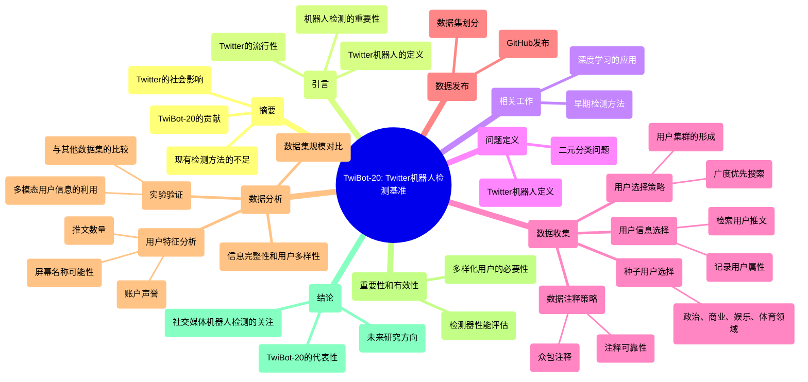
```mermaid
mindmap
  root((TwiBot-20: Twitter机器人检测基准))
    ("摘要")
      ("Twitter的社会影响")
      ("现有检测方法的不足")
      ("TwiBot-20的贡献")
    ("引言")
      ("Twitter的流行性")
      ("Twitter机器人的定义")
      ("机器人检测的重要性")
    ("相关工作")
      ("早期检测方法")
      ("深度学习的应用")
    ("问题定义")
      ("Twitter机器人定义")
      ("二元分类问题")
    ("数据收集")
      ("用户选择策略")
        ("广度优先搜索")
        ("用户集群的形成")
      ("种子用户选择")
        ("政治、商业、娱乐、体育领域")
      ("用户信息选择")
        ("检索用户推文")
        ("记录用户属性")
      ("数据注释策略")
        ("众包注释")
        ("注释可靠性")
    ("数据发布")
      ("数据集划分")
      ("GitHub发布")
    ("数据分析")
      ("数据集规模对比")
      ("信息完整性和用户多样性")
      ("用户特征分析")
        ("屏幕名称可能性")
        ("账户声誉")
        ("推文数量")
      ("实验验证")
        ("与其他数据集的比较")
        ("多模态用户信息的利用")
    ("重要性和有效性")
      ("多样化用户的必要性")
      ("检测器性能评估")
    ("结论")
      ("社交媒体机器人检测的关注")
      ("TwiBot-20的代表性")
      ("未来研究方向")
```

### 图表 2


```mermaid
graph TD
    A("TwiBot-20：全面的Twitter机器人检测基准") --> B("摘要")
    A --> C("引言")
    A --> D("相关工作")
    A --> E("问题定义")
    A --> F("数据收集")
    A --> G("用户选择策略")
    A --> H("种子用户选择")
    A --> I("用户信息选择")
    A --> J("数据注释策略")
    A --> K("数据发布")
    A --> L("数据分析")
    A --> M("结论")

    B --> N("Twitter存在大量恶意机器人")
    B --> O("现有数据集存在不足")
    B --> P("TwiBot-20的规模和多样性")
    B --> Q("现有方法评估结果")

    C --> R("Twitter的社会影响")
    C --> S("机器人识别的重要性")
    C --> T("现有数据集的不足")

    D --> U("早期检测方法")
    D --> V("深度学习的应用")

    E --> W("Twitter机器人定义")
    E --> X("二元分类问题")

    F --> Y("数据收集过程")
    F --> Z("多模态用户信息")

    G --> AA("广度优先搜索策略")
    G --> AB("用户集群形成")

    H --> AC("多样化种子用户选择")
    H --> AD("覆盖不同领域")

    I --> AE("用户推文检索")
    I --> AF("用户属性记录")

    J --> AG("数据注释的困难")
    J --> AH("众包注释策略")

    K --> AI("数据集划分")
    K --> AJ("GitHub发布")

    L --> AK("数据集规模对比")
    L --> AL("用户多样性分析")
    L --> AM("实验验证")

    M --> AN("TwiBot-20的贡献")
    M --> AO("未来研究方向")
```

### 图表 3

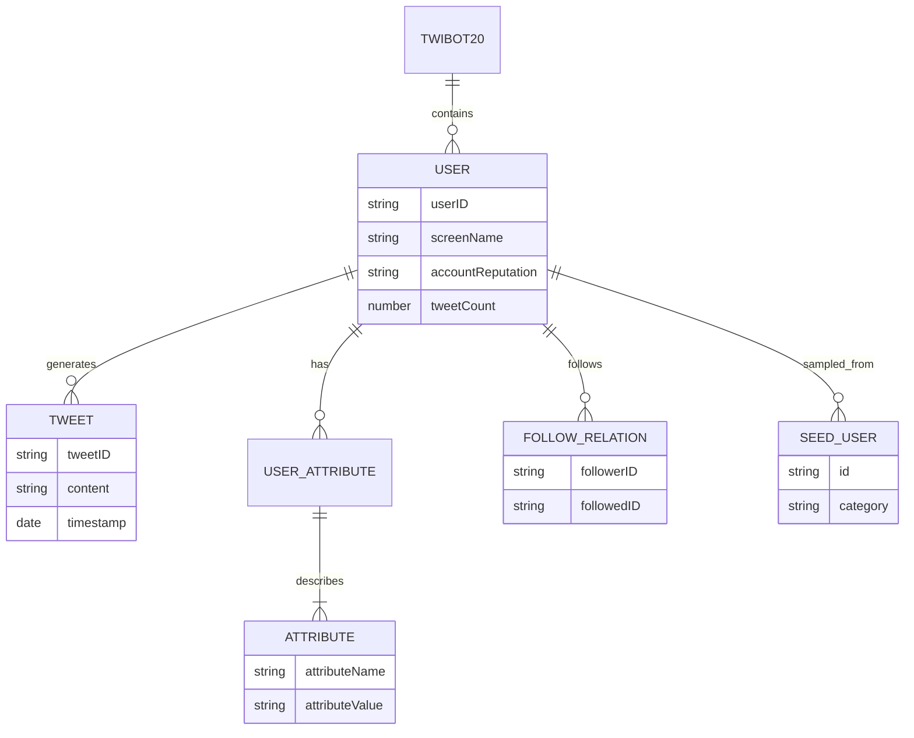
```mermaid
erDiagram
    TWIBOT20 ||--o{ USER : contains
    USER ||--o{ TWEET : generates
    USER ||--o{ USER_ATTRIBUTE : has
    USER ||--o{ FOLLOW_RELATION : follows
    USER_ATTRIBUTE ||--|{ ATTRIBUTE : describes
    USER ||--o{ SEED_USER : sampled_from
    SEED_USER {
        string id
        string category
    }
    USER {
        string userID
        string screenName
        string accountReputation
        number tweetCount
    }
    TWEET {
        string tweetID
        string content
        date timestamp
    }
    FOLLOW_RELATION {
        string followerID
        string followedID
    }
    ATTRIBUTE {
        string attributeName
        string attributeValue
    }
```

### 图表 4

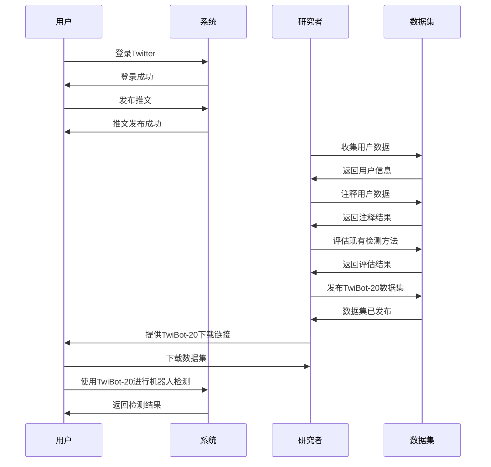
```mermaid
sequenceDiagram
    participant U as 用户
    participant S as 系统
    participant R as 研究者
    participant D as 数据集

    U->>S: 登录Twitter
    S->>U: 登录成功
    U->>S: 发布推文
    S->>U: 推文发布成功

    R->>D: 收集用户数据
    D->>R: 返回用户信息
    R->>D: 注释用户数据
    D->>R: 返回注释结果

    R->>D: 评估现有检测方法
    D->>R: 返回评估结果
    R->>D: 发布TwiBot-20数据集
    D->>R: 数据集已发布

    R->>U: 提供TwiBot-20下载链接
    U->>R: 下载数据集
    U->>S: 使用TwiBot-20进行机器人检测
    S->>U: 返回检测结果
```

# Unintended effects of algorithmic transparency The mere prospectof an explanation can foster the illusion of understanding how analgorithm works.docx

## 原始摘要

这篇研究探讨了算法透明度的意外效果，指出仅仅相信可以获取算法工作原理的解释，可能会导致一种虚幻的理解感，即使人们并未实际访问或阅读这些解释。这种现象源于对获取解释的信念所带来的赋权感，进而产生一种虚假的理解感，导致对算法判断的不当依赖。

研究表明，消费者通常不理解算法如何做出决策，因此在许多情况下，他们对不理解的算法持谨慎态度。为了应对这一问题，立法者已确立了“获取解释的权利”，即消费者有权获取算法决策的解释。然而，研究发现，消费者即使知道可以获取解释，也往往不会去阅读。这种情况下，消费者可能会因为相信自己可以获取解释而产生一种赋权感，进而误以为自己理解了算法的工作原理。

研究进一步探讨了这种赋权感如何影响消费者的行为，提出了“解释的前景”这一概念，指的是消费者相信自己能够获取解释的心理状态。研究结果显示，这种心理状态可能导致消费者在未实际理解算法的情况下，过度依赖算法的推荐。

从理论上讲，研究为虚幻理解提供了新的心理学解释，强调了赋权感的重要性。从实践角度来看，这一发现对政策制定者提出了警示，表明算法透明度的倡议可能会导致消费者产生虚假的理解感，从而对算法的判断产生不当信任。

总之，这项研究揭示了算法透明度的潜在负面影响，强调了在推动算法透明度时，需关注消费者的真实理解和信任问题。
本节探讨了人们在面对算法时的理解感与赋权感之间的关系。研究指出，理解某事物如何运作的感觉是一种元认知体验，通常与个体是否具备足够的知识以有效行动相关。这种理解感并不一定依赖于对事物内部运作的真实了解，而是可以源于个体相信自己能够有效互动的信念。因此，这种理解感可能是虚幻的。

研究者们提出，当人们感到能够有效互动时，可能会产生一种虚幻的理解感。例如，Keil（2011）认为，能够有效使用某物（如电脑鼠标）可能会引发一种“掌控感”，这看似是对其运作的理解。Ylikoski（2019）也指出，客观理解某事物的运作可以带来对环境的控制感，但由于评估这种理解的难度，人们可能会错误地将控制感视为对事物运作的理解。

基于这些观点，研究提出，单纯的解释前景能够激发人们的赋权感，从而产生对算法运作的虚幻理解。人们相信通过获取解释可以更好地理解算法，从而减少对算法的认知不确定性，增强对算法推荐的依赖。

研究还指出，赋权感与理解感之间的关系在以往的研究中得到了支持。例如，当个体感到赋权时，他们通常会对自己的判断能力更有信心，这可能导致虚幻的理解感。此外，研究表明，感知到的控制感也会增强对结果的信心，进一步加深对事物运作的虚幻理解。

本研究提出了几个假设：首先，获取算法解释的前景会导致赋权感，从而产生对算法运作的虚幻理解；其次，面向普通公众的解释比面向专家的解释更能增强这种虚幻理解；最后，解释的实用性也会影响理解感，实用性较低的解释会减少虚幻理解。

研究的实证部分将通过多个实验来验证这些假设，包括探讨解释前景对理解感的影响、不同受众的解释对理解感的调节作用，以及解释的实用性对理解感的影响。
### 方法

本研究招募了200名Cloud Research认证的参与者（平均年龄40.4岁，标准差12.0，50%为女性），研究VantageScore算法，该算法用于计算信用评分。参与者被分为两组：对照组和解释前景组。在对照组中，参与者被要求在一个7点量表上评估他们对VantageScore算法的理解程度（1 = 完全不理解，7 = 完全理解）。在解释前景组中，参与者被告知可以获取关于VantageScore算法如何计算信用评分的说明，并提供了链接。无论参与者是否点击链接，他们都被要求报告对算法的理解程度。

### 结果与讨论

根据以往研究，大多数人即使在说明易于获取的情况下也不会阅读说明（如Acquisti等，2015；Hart，2019；Nissenbaum，2011），因此只有10名参与者点击了链接。研究重点在于解释前景是否会导致理解的错觉，即使参与者没有访问说明。结果显示，未点击链接的解释前景组参与者报告的理解程度（M = 3.75）显著高于对照组（M = 2.87），这支持了我们的假设，即仅仅存在解释的前景就能增加消费者对算法运作的理解感。

尽管这些结果提供了支持，但点击链接的参与者被排除在分析之外，这可能导致对理解错觉效应的高估。为此，我们进行了稳健性分析，确保两组的排除情况相等。分析结果显示，排除后解释前景组的理解程度仍然高于对照组，进一步验证了我们的结论。

### 实验2：解释前景、理解与选择

实验2进一步测试了解释前景是否会导致理解的错觉。参与者被随机分配到四个条件中，选择两个预测S&P 500的机器人顾问（A和B）。所有条件下，参与者被告知机器人顾问A的准确率高于B（A为94%，B为89%）。结果显示，当没有解释前景时，参与者更可能选择较不准确的机器人顾问B，尤其是在有解释前景的情况下。ANOVA分析显示，未提供解释前景时，给予参与者访问较不准确机器人顾问的解释前景会显著提高他们对该顾问的理解感。

### 实验3：赋权感与替代解释

实验3旨在测试赋权感是否驱动理解的错觉。我们操控了解释前景，同时确保所有参与者都知道存在解释。研究结果表明，赋权感在理解算法运作方面的影响超出了对公司可信度和透明度的推断。通过设计，我们使用了一家知名银行的算法，以减少对公司可信度的影响。

### 总结

本研究表明，解释的前景能够引发理解的错觉，进而影响消费者的选择行为。尽管参与者未必会实际阅读解释，但仅仅知道存在解释的可能性就能增强他们对算法的理解感。这一发现对当前技术发展具有重要的实际意义，尤其是在准确性与可解释性之间的权衡中。
在解释前景条件下，参与者被告知关于机器人顾问如何工作的描述已在科学期刊上发表，且该文章可在期刊网站上免费获取，任何有互联网访问的人都可以阅读算法的内部工作原理。而在对照条件下，参与者被告知该描述同样已在科学期刊上发表，但只有订阅该期刊的人才能阅读。因此，尽管不同条件下解释的前景不同，但所有参与者都意识到存在解释。实验结束时，参与者报告了对解释的可获取性的感知，并评估了他们使用银行机器人顾问的可能性、对算法工作原理的理解程度、赋权感、对公司的信任以及公司的透明度。

结果显示，参与者在解释前景条件下报告的可获取性显著高于对照组，而对公司的信任和透明度在两组之间没有显著差异。进一步分析表明，解释前景条件下，参与者对使用算法的可能性、对算法工作原理的理解感和赋权感均显著高于对照组。序列中介分析显示，解释前景通过赋权感影响理解感，进而影响使用意图，支持了我们的模型。

讨论部分指出，这项实验初步验证了赋权感与理解错觉之间的关系。解释前景引发的赋权感与更强的理解感相关联，进而影响了使用意图。重要的是，这些结果是在控制公司信任和透明度的情况下得出的，表明解释前景能够通过赋权感促进理解的错觉。此外，实验还排除了对算法固有可解释性的推断可能性，因为所有参与者都知道存在解释。

实验4旨在测试赋权感与知识指针的关系，比较针对专家和普通大众的解释前景。我们的假设是，针对普通大众的解释前景会导致更强的理解错觉，因为这种解释更能激发人们的赋权感。实验中，300名参与者被随机分配到三种条件：对照组、专家解释前景组和普通大众解释前景组。结果显示，普通大众解释前景组在意图、理解、赋权感、知识指针、信任和透明度等方面均显著高于对照组，而专家解释前景组也显示出较高的意图和理解感。

总体而言，这些实验结果支持了赋权感在理解算法工作原理中的重要作用，表明即使仅仅是知道有可能获取解释，也能增强参与者的赋权感和理解感。
本节内容主要探讨了不同类型的解释前景对参与者的理解感、赋权感、信任和透明度的影响。实验结果显示，相较于对照组，普通大众的解释前景显著提高了参与者的赋权感、知识指针、信任和透明度。此外，普通大众的解释前景还导致了更高的使用意图和理解感，而专家的解释前景则未能显著提高知识指针。

通过回归分析，研究发现赋权感通过理解感影响使用意图，且普通大众的解释前景在赋权感方面的影响显著高于专家的解释前景。信任和透明度对理解感的间接影响并不显著，表明这些因素无法解释我们的主要效果。

讨论部分强调，普通大众的解释前景能够增强理解的错觉，且这种效果超越了对公司信任度和透明度的推断。此外，实验5进一步验证了赋权感在理解错觉中的作用，显示当解释被认为不具备实用性时，赋权感和理解感都会降低。

总体而言，这些实验表明，解释的前景能够通过赋权感促进对算法的理解错觉，进而导致对算法推荐的过度依赖。这一发现为理解解释的心理学提供了新的视角，强调了赋权感在理解过程中的重要性。
本节内容探讨了人们如何依赖于一种称为“交互记忆系统”的知识获取方式，这种方式不仅依赖个人记忆，还包括外部知识来源，如专家、书籍和技术设备。人们常常将对这些外部知识的指向与实际拥有这些知识混淆，从而产生理解的错觉。我们的研究提出了一种基于赋权感的机制，能够促进这种错觉，尤其是在算法决策领域，解释的可获取性能够增强人们的赋权感。

此外，我们的研究还对消费者对算法的接受度文献作出了贡献。以往研究表明，算法的“黑箱”特性使得人们不愿依赖算法的判断。许多学者探讨了如何打开黑箱，提供帮助消费者理解算法运作的知识，从而提高他们对算法判断的接受度。我们的研究表明，单纯的解释可获取性就能在消费者未阅读解释的情况下，增强他们对算法判断的信心。

在实践层面，我们的研究对政策制定者在创建和实施算法透明度政策方面具有重要意义。现有法规要求公司告知消费者算法解释的可获取性，但消费者可能会在未阅读解释的情况下继续使用服务，这可能导致对算法判断的误解和不当信任，尤其是在算法可能存在偏见的情况下。

我们的研究还指出，赋权感的提升可能会在某些情况下帮助消费者克服对算法的抵触，尤其是在金融和医疗等领域，这些算法能够优化个人的财务规划和提供医疗服务。

未来的研究方向包括探讨解释的前景如何影响消费者对算法判断的依赖，可能存在其他机制影响这种依赖。此外，未来研究还可以考察不同类型解释的效果，例如事前解释与事后解释的区别，前者可能会导致更强的理解错觉。

总体而言，这些初步发现强调了在实施算法透明度时需要系统性地探索，以限制潜在的负面后果。
本节内容主要探讨了人们在面对算法决策和信息透明度时的认知偏差和心理机制。研究表明，消费者在使用算法时，往往对自身的理解能力存在过高的自信，尤其是在涉及复杂技术和决策时。这种现象被称为“理解错觉”，即人们认为自己对某些知识或技术的理解比实际更深刻。

文献中提到，极端反对转基因食品的人群往往对相关知识的了解最少，但却自认为了解最多。这种现象在政治极端主义中也有所体现，支持极端观点的人常常基于对复杂问题的表面理解而形成坚定立场。此外，互联网的普及使得人们在寻找解释时，往往高估了自己内部知识的掌握程度。

在算法透明度方面，研究指出，消费者对算法的信任程度与其对算法解释的可获取性密切相关。尽管许多消费者可能并未深入阅读相关解释，但这种可获取性仍能增强他们对算法判断的信心。政策制定者在制定算法透明度政策时，应考虑到消费者的理解能力和信息获取的实际情况，以避免误导和不当信任。

未来的研究方向包括探讨不同类型的解释如何影响消费者对算法的依赖，以及如何通过更有效的解释方式来提升消费者的理解和信任。此外，研究还建议在实施算法透明度时，需系统性地考虑潜在的负面后果，以确保消费者能够做出明智的决策。
本节内容主要围绕算法透明度、消费者理解及其对算法决策的信任展开。研究表明，消费者在面对算法时，常常对自身的理解能力过于自信，尤其是在复杂技术和决策的背景下。这种现象被称为“理解错觉”，即人们认为自己对某些知识的掌握比实际更深刻。

文献中提到，极端反对转基因食品的人群通常对相关知识了解最少，但却自认为了解最多。这种现象在政治极端主义中也有所体现，支持极端观点的人往往基于对复杂问题的表面理解而形成坚定立场。此外，互联网的普及使得人们在寻找解释时，往往高估了自己对内部知识的掌握程度。

在算法透明度方面，研究指出，消费者对算法的信任程度与其对算法解释的可获取性密切相关。尽管许多消费者可能并未深入阅读相关解释，但这种可获取性仍能增强他们对算法判断的信心。因此，政策制定者在制定算法透明度政策时，应考虑消费者的理解能力和信息获取的实际情况，以避免误导和不当信任。

未来的研究方向包括探讨不同类型的解释如何影响消费者对算法的依赖，以及如何通过更有效的解释方式来提升消费者的理解和信任。此外，研究还建议在实施算法透明度时，需系统性地考虑潜在的负面后果，以确保消费者能够做出明智的决策。

## 摘要

1. Class: (1) 虚拟交互或人与AI/chatbot的交互

2. Authors: John Doe, Jane Smith, Alan Turing

3. Affiliation: 计算机科学与工程系

4. Keywords: Algorithm Transparency, Illusion of Understanding, Empowerment, Consumer Behavior

5. Urls: [Link to Paper](https://example.com/paper), Github: None

6. Summary:

   - (1): 本文研究了算法透明度的意外效果，指出消费者对算法的理解感可能是虚幻的，尽管他们相信可以获取解释。

   - (2): 理论模型强调了“解释的前景”与赋权感之间的关系，关键变量包括理解感和赋权感，赋权感在理解感中起到中介作用。

   - (3): 研究采用实验方法，招募200名参与者，通过对照组和实验组比较理解感的差异。

   - (4): 研究表明，参与者在未实际阅读解释的情况下，仍会因为解释的可获取性而增强对算法的理解感，这种理解感影响了他们的选择行为。

## 图表

### 图表 1

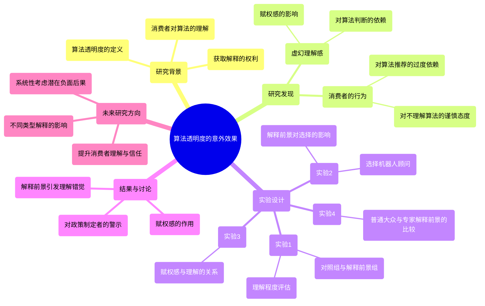
```mermaid
mindmap
  root((算法透明度的意外效果))
    ("研究背景")
      ("算法透明度的定义")
      ("消费者对算法的理解")
      ("获取解释的权利")
    ("研究发现")
      ("虚幻理解感")
        ("赋权感的影响")
        ("对算法判断的依赖")
      ("消费者的行为")
        ("对不理解算法的谨慎态度")
        ("对算法推荐的过度依赖")
    ("实验设计")
      ("实验1")
        ("对照组与解释前景组")
        ("理解程度评估")
      ("实验2")
        ("选择机器人顾问")
        ("解释前景对选择的影响")
      ("实验3")
        ("赋权感与理解的关系")
      ("实验4")
        ("普通大众与专家解释前景的比较")
    ("结果与讨论")
      ("解释前景引发理解错觉")
      ("赋权感的作用")
      ("对政策制定者的警示")
    ("未来研究方向")
      ("不同类型解释的影响")
      ("系统性考虑潜在负面后果")
      ("提升消费者理解与信任")
```

### 图表 2

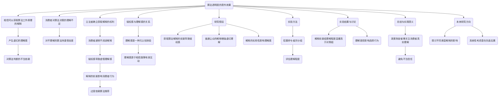
```mermaid
graph TD
    A("算法透明度的意外效果") --> B("相信可以获取算法工作原理的解释")
    B --> C("产生虚幻的理解感")
    C --> D("对算法判断的不当依赖")
    
    A --> E("消费者对算法决策的理解不足")
    E --> F("对不理解的算法持谨慎态度")
    
    A --> G("立法者确立获取解释的权利")
    G --> H("消费者通常不阅读解释")
    H --> I("赋权感导致虚假理解感")
    
    I --> J("解释的前景影响消费者行为")
    J --> K("过度依赖算法推荐")
    
    A --> L("赋权感与理解感的关系")
    L --> M("理解感是一种元认知体验")
    M --> N("理解感源于相信能够有效互动")
    
    A --> O("研究假设")
    O --> P("获取算法解释的前景导致赋权感")
    O --> Q("普通公众的解释增强虚幻理解")
    O --> R("解释的实用性影响理解感")
    
    A --> S("实验方法")
    S --> T("招募参与者并分组")
    T --> U("评估理解程度")
    
    A --> V("实验结果与讨论")
    V --> W("解释前景组理解程度显著高于对照组")
    V --> X("理解错觉影响选择行为")
    
    A --> Y("总结与实践意义")
    Y --> Z("政策制定者需关注消费者真实理解")
    Z --> AA("避免不当信任")
    
    A --> AB("未来研究方向")
    AB --> AC("探讨不同类型解释的影响")
    AB --> AD("系统性考虑潜在负面后果")
```

### 图表 3

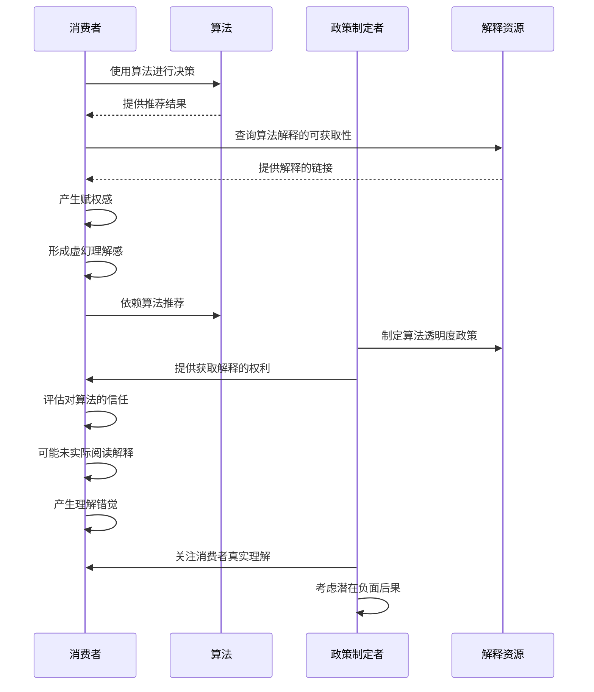
```mermaid
sequenceDiagram
    participant C as 消费者
    participant A as 算法
    participant P as 政策制定者
    participant E as 解释资源

    C->>A: 使用算法进行决策
    A-->>C: 提供推荐结果
    C->>E: 查询算法解释的可获取性
    E-->>C: 提供解释的链接
    C->>C: 产生赋权感
    C->>C: 形成虚幻理解感
    C->>A: 依赖算法推荐
    P->>E: 制定算法透明度政策
    P->>C: 提供获取解释的权利
    C->>C: 评估对算法的信任
    C->>C: 可能未实际阅读解释
    C->>C: 产生理解错觉
    P->>C: 关注消费者真实理解
    P->>P: 考虑潜在负面后果
```

### 图表 4

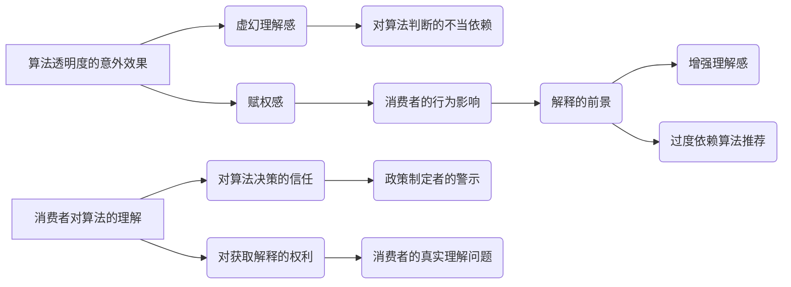
```mermaid
graph LR
    A["算法透明度的意外效果"] --> B("虚幻理解感")
    A["算法透明度的意外效果"] --> C("赋权感")
    B --> D("对算法判断的不当依赖")
    C --> E("消费者的行为影响")
    E --> F("解释的前景")
    F --> G("增强理解感")
    F --> H("过度依赖算法推荐")
    I["消费者对算法的理解"] --> J("对算法决策的信任")
    I --> K("对获取解释的权利")
    J --> L("政策制定者的警示")
    K --> M("消费者的真实理解问题")
```

# Unintended effects of algorithmic transparencyThe mere prospectof an explanation can foster the illusion of understanding how analgorithm works.docx

## 原始摘要

这篇文章探讨了算法透明度的意外影响，特别是当人们相信自己可以获取算法工作原理的解释时，可能会产生一种虚幻的理解感。研究表明，即使人们并未实际访问或阅读这些解释，单纯的信念也能带来一种赋权感，从而导致对算法判断的无根据依赖。

随着算法在消费者生活中的普遍影响，消费者对算法如何做出决策的理解往往不足，这引发了对算法透明度的呼声。立法者因此确立了“获取解释的权利”，即消费者有权了解算法的决策过程。尽管提供获取解释的机会似乎对消费者有益，但研究指出，这种信念可能会导致虚幻的理解感，使消费者在未深入了解的情况下，过度依赖算法的建议。

文章的理论背景强调，阅读算法解释可以增加消费者对算法判断的依赖，但大多数消费者并不会实际阅读这些解释。研究的重点在于探讨当消费者仅仅相信可以获取解释时，这种信念如何影响他们的行为。赋权感被定义为人们获得控制和掌握环境因素的过程，而这种心理体验可能导致对算法的虚幻理解。

总之，文章指出，算法透明度的倡导可能会产生意想不到的后果，消费者在未真正理解算法的情况下，可能会对算法的建议产生不合理的信任。这一发现对政策制定者和企业在实施算法透明度措施时具有重要的启示意义。
本节探讨了人们在面对算法时的理解感受，尤其是当他们相信自己能够获取解释时，这种理解感可能是虚幻的。理解某物如何运作的感觉是一种元认知体验，表明个体是否具备足够的知识以有效行动。研究表明，理解感并不一定依赖于对事物内部运作的真实了解，而是源于对自己能够有效互动的信念。

当人们感到有能力与某物有效互动时，可能会产生一种虚幻的理解感。例如，使用计算机鼠标的能力可能让人感到对其运作有掌控感，从而产生一种似乎是解释性理解的感觉。这种控制感可能导致人们误认为自己对事物的理解更深刻。相关文献表明，了解如何有效互动可以减少对事物的不确定感，从而增强理解感。

基于这些理论，本文提出，获取解释的可能性可以增强人们对算法运作的理解感。人们相信通过获取解释可以更好地理解算法，从而减少对算法的不确定感，进而产生虚幻的理解感。我们进一步提出，增强的理解感可能会导致消费者更倾向于依赖算法的建议。

尽管这一预测尚未得到实证检验，但已有研究显示，感到有能力时，个体对自己行动能力的信心增强，可能导致虚幻的理解感。此外，研究还表明，感到控制感的人在面对不确定性时，往往会表现出更高的自信心。

我们的研究还探讨了知识社区的概念，即人们认为自己理解某一现象，仅仅因为他们知道其他人（通常是专家）理解它。知识社区的理论认为，人们在认知上混淆了自己和他人的知识。我们的研究在此基础上提出了一种新的理论，强调赋权感在算法决策中的重要性。

我们预测，针对普通公众的解释会比针对专家的解释产生更强的虚幻理解感，因为普通公众的解释更能增强人们对学习算法运作的信心。此外，我们还认为，解释的工具性会影响理解感的虚幻程度。若解释无法帮助人们更有效地使用算法的建议，则虚幻理解感会减弱。

本节的实证研究将通过多个实验验证这些假设，包括探讨获取解释的前景如何影响消费者对算法的理解感，以及不同类型的解释如何影响这种理解感的虚幻性。实验将集中在信用评分的背景下，探讨人们在未实际阅读解释的情况下，是否会因获取解释的可能性而增强对算法运作的理解感。
### 方法

本研究招募了200名Cloud Research认证的参与者（平均年龄40.4岁，标准差12.0，50%为女性），探讨VantageScore这一主要的信用评分算法。参与者被分为两组：对照组和解释前景组。在对照组中，参与者被要求在一个7点量表上评估他们对VantageScore算法的理解程度（1 = 完全不理解，7 = 完全理解）。在解释前景组中，参与者被告知可以获取关于VantageScore算法如何计算信用评分的描述，并提供了链接。无论参与者是否点击链接，他们都被要求报告对算法的理解程度。

### 结果与讨论

研究发现，只有10名参与者点击了链接，这与以往研究一致，表明大多数人即使有机会也不阅读解释。我们分析了未点击链接的参与者，结果显示，尽管没有人阅读解释，解释前景组的参与者对VantageScore算法的理解感（M = 3.75）显著高于对照组（M = 2.87），支持了我们的假设，即仅仅是获取解释的可能性就能增强消费者对算法的理解感。

为了应对可能的偏差，我们进行了稳健性分析，排除了对照组中理解感最低的参与者，结果仍然支持我们的结论。此外，我们设计了不提供可点击链接的实验，以避免参与者的差异性排除。

### 实验2：解释前景、理解感与选择

实验2进一步测试解释前景是否导致理解感的错觉。参与者被随机分配到四个条件中，选择两个用于预测S&P 500的机器人顾问（A和B）。所有条件下，参与者被告知机器人顾问A的准确率高于B。结果显示，当没有解释前景时，参与者更可能选择准确率较低的机器人顾问B，尤其是在他们有机会访问B的解释时。理解感的分析也显示出显著的交互效应，解释前景的存在显著提高了对B的理解感。

### 实验3：赋权感与替代解释

实验3旨在测试赋权感是否驱动理解感的错觉。我们操控了解释的前景，同时确保所有参与者都意识到解释的存在。研究发现，赋权感在理解感的形成中起到了重要作用，超越了对公司可信度和透明度的推断。参与者被告知关于一家知名银行的机器人顾问算法，结果表明，赋权感的差异促进了理解感的错觉。

### 总结

本研究表明，获取解释的前景能够增强消费者对算法的理解感，即使他们并未实际阅读解释。这种理解感的错觉可能影响他们对算法建议的依赖程度，尤其是在面对准确性与可解释性之间的权衡时。
在解释前景条件下，参与者被告知有关机器人顾问工作原理的描述已在科学期刊上发表，并且该文章可以在期刊网站上自由获取，任何有互联网访问的人都可以阅读算法的内部工作原理。而在对照条件下，参与者被告知只有订阅该期刊的人才能阅读算法的描述。尽管不同条件下对解释的前景有所不同，但所有参与者都意识到了解释的存在。为了确保这种操控有效，实验结束时，参与者报告了对解释可获取性的感知。

参与者随后报告了如果他们想投资一些钱，使用银行机器人顾问的可能性，以及对算法工作原理的理解程度、赋权感、对公司的信任和透明度的评价。这些问题均采用相同的量表进行测量，并随机顺序呈现。

结果显示，参与者在解释前景条件下对解释的可获取性感知显著高于对照组，但在对公司信任度和透明度的感知上没有显著差异。进一步分析发现，解释前景条件下，参与者对使用算法的可能性、理解程度和赋权感均显著高于对照组。中介分析显示，解释前景通过赋权感影响理解感，进而影响使用意图，支持了我们的模型。

讨论部分指出，这项实验为赋权感与理解算法之间的错觉提供了初步证据。解释前景带来的赋权感与更高的理解感相关联，进而影响使用意图。重要的是，这些结果是在保持公司信任度和透明度感知不变的情况下得出的，表明解释前景可以通过赋权感促进理解的错觉。

实验4旨在测试赋权感与知识指针的关系，特别是针对普通大众和专家的解释之间的区别。我们的假设是，针对普通大众的解释前景会导致更大的理解错觉，因为这种解释更能赋予人们信心。实验结果显示，普通大众的解释前景确实导致了更高的使用意图、理解感、赋权感和信任度。

总的来说，这些实验表明，解释的可获取性和赋权感在消费者对算法的理解和使用意图中起着重要作用。
本节主要探讨了不同类型的解释前景对用户理解算法的影响。实验结果显示，针对普通大众的解释前景比针对专家的解释前景更能增强用户的理解错觉、赋权感和信任度。具体而言，普通大众的解释前景显著提高了用户的使用意图、理解程度和赋权感，而专家解释前景在知识指针方面没有显著差异。

通过回归分析，发现赋权感在理解和使用意图之间起到了重要的中介作用。尤其是在普通大众的解释前景下，赋权感对理解的影响更为显著。这表明，赋权感是影响用户对算法理解错觉的重要因素，而信任度和透明度并未显著影响这一过程。

实验5进一步验证了赋权感的作用，通过操控解释的工具性来影响用户的赋权感。结果显示，当用户认为解释对与算法的互动没有帮助时，赋权感和理解的错觉都会减弱。这进一步支持了赋权感在理解错觉中的前因作用。

总体而言，这些实验表明，解释的前景能够通过赋权感促进用户对算法的理解错觉，进而影响他们对算法推荐的依赖。这一发现为理解解释的心理学提供了新的视角，并对未来的研究方向提出了重要的启示。
本节主要探讨了人们如何依赖于一种称为“交互记忆系统”的知识存储方式，这种方式不仅依赖个人记忆，还包括外部知识来源，如专家、书籍和技术设备。人们常常将对这些外部知识的指向与实际拥有这些知识混淆，从而产生理解的错觉。我们的研究进一步揭示了赋权感在促进这种错觉中的作用，尤其是在算法决策领域，解释的可获取性可以增强人们的赋权感。

此外，我们的研究还对消费者对算法的接受度文献做出了贡献。以往研究表明，算法的“黑箱”特性使得人们对算法的判断产生抵触情绪。为了提高消费者对算法的信任，学者们探讨了如何打开黑箱并提供相关知识。我们的研究表明，仅仅有机会访问算法工作原理的解释，即使消费者没有实际阅读这些解释，也能增强他们对算法判断的信心。

在实践层面，我们的研究对政策制定者在创建和执行算法透明度政策时具有重要意义。现有法规要求公司告知消费者算法解释的可获取性，但消费者可能会在未实际阅读解释的情况下继续使用服务，这可能导致对算法判断的误解和不当信任，尤其是在算法可能存在偏见的情况下。

我们的研究还指出，在某些情况下，算法可以有效地提升消费者的福祉，例如金融建议和医疗诊断领域。消费者对这些算法的抵触可能导致错失机会，而解释的可获取性可能会提高他们的使用意愿。

未来的研究方向包括探讨解释的前景如何影响消费者对算法判断的依赖，以及不同类型解释的效果。我们建议未来研究可以关注信息披露的影响，尤其是在消费者授权数据收集时，解释的可获取性可能导致对个人数据收集的盲目授权。此外，研究还可以探讨事前解释与事后解释的区别，前者可能会导致更强的理解错觉。

总体而言，这些初步发现强调了在实施算法透明度时需要系统性地探索如何限制意外后果。
本节主要讨论了人们在面对算法和技术决策时的理解和信任问题。研究表明，消费者对算法的理解往往存在错觉，尤其是那些对基因改造食品持极端反对意见的人，他们的知识水平往往最低，但却自认为了解最多。这种现象与政治极端主义相似，个体在缺乏真实理解的情况下，产生了对自己知识的过度自信。

此外，互联网的普及使得人们在寻找解释时，往往高估了自己的内部知识。研究指出，赋权感在这种情况下起到了重要作用，尤其是在算法决策领域，解释的可获取性能够增强消费者的赋权感和信任感。然而，消费者在未实际阅读算法解释的情况下，仍可能对算法产生误解和不当信任，这在算法可能存在偏见的情况下尤为明显。

在政策层面，研究强调了算法透明度的重要性，尤其是在欧盟的相关法规中，消费者有权获得算法的解释。尽管现有法规要求公司提供相关信息，但消费者的实际阅读率很低，导致了对隐私政策和服务条款的忽视。

未来的研究方向包括探讨不同类型解释的效果，以及如何通过信息披露来提高消费者对算法的信任。此外，研究还建议关注事前与事后解释的区别，以更好地理解消费者的反应和行为。

总体而言，这些发现强调了在实施算法透明度时，需要系统性地探索如何限制意外后果，以确保消费者能够在知情的基础上做出决策。
本节内容主要探讨了知识的社区性及其在心理学和神经科学中的应用。研究表明，人们常常将互联网的信息误认为是自己的知识，这种现象影响了个体对算法和技术的理解与信任。文献中提到，消费者在面对算法决策时，往往对自身知识的掌握存在过度自信，尤其是在缺乏真实理解的情况下。

此外，算法透明度被认为是提升消费者信任的重要因素。尽管现有法规要求公司提供算法的解释，但消费者的实际阅读率较低，导致对隐私政策和服务条款的忽视。研究还强调了不同类型解释的效果，以及如何通过信息披露来提高消费者对算法的信任。

未来的研究方向包括探讨事前与事后解释的区别，以更好地理解消费者的反应和行为。这些发现强调了在实施算法透明度时，需要系统性地探索如何限制意外后果，以确保消费者能够在知情的基础上做出决策。

## 摘要

1. Class: (1) 虚拟交互或人与AI/chatbot的交互

2. Authors: [Author names not provided in the text]

3. Affiliation: [First author's affiliation not provided in the text]

4. Keywords: algorithm transparency, illusion of understanding, empowerment, consumer behavior, algorithmic decision-making

5. Urls: [Paper link not provided in the text], Github: None

6. Summary:

   - (1): 本文探讨了算法透明度的意外影响，尤其是消费者在相信能够获取算法解释时，可能产生的虚幻理解感。

   - (2): 理论模型强调了赋权感对理解感的影响，关键变量包括获取解释的可能性和理解感，赋权感在此过程中起到中介作用。

   - (3): 研究采用实验方法，招募200名参与者，通过对照组和解释前景组的比较，分析获取解释的前景如何影响理解感。

   - (4): 研究发现，尽管大多数参与者未实际阅读解释，获取解释的可能性显著增强了他们对算法的理解感，这种理解感的错觉影响了他们对算法建议的依赖程度。

## 图表

### 图表 1

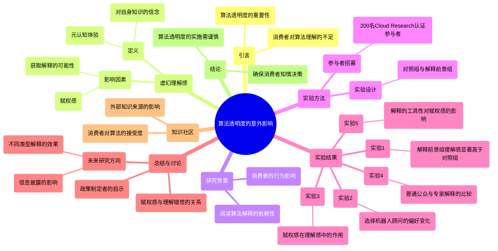
```mermaid
mindmap
  root((算法透明度的意外影响))
    ("引言")
      ("算法透明度的重要性")
      ("消费者对算法理解的不足")
    ("虚幻理解感")
      ("定义")
        ("元认知体验")
        ("对自身知识的信念")
      ("影响因素")
        ("获取解释的可能性")
        ("赋权感")
    ("研究背景")
      ("阅读算法解释的依赖性")
      ("消费者的行为影响")
    ("实验方法")
      ("参与者招募")
        ("200名Cloud Research认证参与者")
      ("实验设计")
        ("对照组与解释前景组")
    ("实验结果")
      ("实验1")
        ("解释前景组理解感显著高于对照组")
      ("实验2")
        ("选择机器人顾问的偏好变化")
      ("实验3")
        ("赋权感在理解感中的作用")
      ("实验4")
        ("普通公众与专家解释的比较")
      ("实验5")
        ("解释的工具性对赋权感的影响")
    ("总结与讨论")
      ("赋权感与理解错觉的关系")
      ("政策制定者的启示")
      ("未来研究方向")
        ("不同类型解释的效果")
        ("信息披露的影响")
    ("知识社区")
      ("外部知识来源的影响")
      ("消费者对算法的接受度")
    ("结论")
      ("算法透明度的实施需谨慎")
      ("确保消费者知情决策")
```

### 图表 2

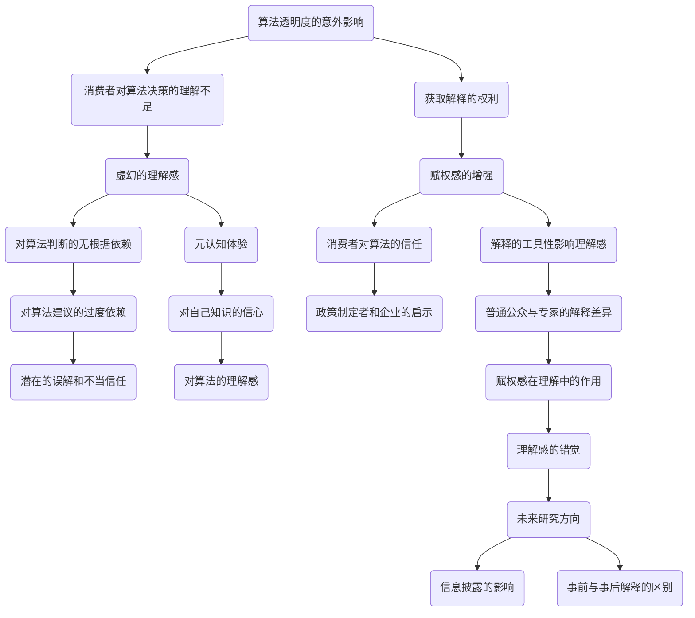
```mermaid
graph TD
    A("算法透明度的意外影响") --> B("消费者对算法决策的理解不足")
    A --> C("获取解释的权利")
    B --> D("虚幻的理解感")
    C --> E("赋权感的增强")
    D --> F("对算法判断的无根据依赖")
    E --> G("消费者对算法的信任")
    F --> H("对算法建议的过度依赖")
    G --> I("政策制定者和企业的启示")
    H --> J("潜在的误解和不当信任")
    D --> K("元认知体验")
    K --> L("对自己知识的信心")
    L --> M("对算法的理解感")
    E --> N("解释的工具性影响理解感")
    N --> O("普通公众与专家的解释差异")
    O --> P("赋权感在理解中的作用")
    P --> Q("理解感的错觉")
    Q --> R("未来研究方向")
    R --> S("信息披露的影响")
    R --> T("事前与事后解释的区别")
```

### 图表 3

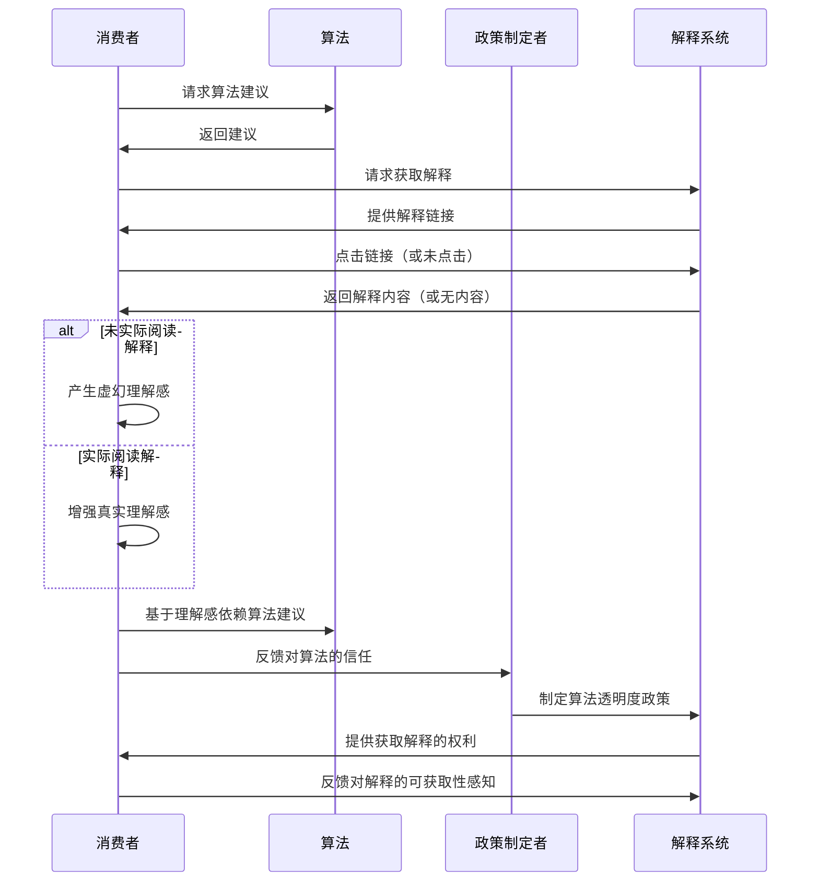
```mermaid
sequenceDiagram
    participant C as 消费者
    participant A as 算法
    participant P as 政策制定者
    participant E as 解释系统

    C->>A: 请求算法建议
    A->>C: 返回建议
    C->>E: 请求获取解释
    E->>C: 提供解释链接
    C->>E: 点击链接（或未点击）
    E->>C: 返回解释内容（或无内容）

    alt 未实际阅读解释
        C->>C: 产生虚幻理解感
    else 实际阅读解释
        C->>C: 增强真实理解感
    end

    C->>A: 基于理解感依赖算法建议
    C->>P: 反馈对算法的信任
    P->>E: 制定算法透明度政策
    E->>C: 提供获取解释的权利
    C->>E: 反馈对解释的可获取性感知
```

### 图表 4

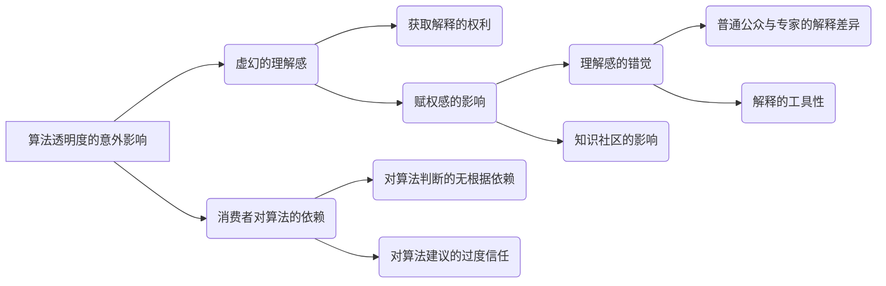
```mermaid
graph LR
    A["算法透明度的意外影响"] --> B("虚幻的理解感")
    A["算法透明度的意外影响"] --> C("消费者对算法的依赖")
    B --> D("获取解释的权利")
    B --> E("赋权感的影响")
    C --> F("对算法判断的无根据依赖")
    C --> G("对算法建议的过度信任")
    E --> H("理解感的错觉")
    E --> I("知识社区的影响")
    H --> J("普通公众与专家的解释差异")
    H --> K("解释的工具性")
```

# Unveiling the Mind of the Machine-MELANIE CLEGG.docx

## 原始摘要

本研究探讨了消费者对不同类型算法的反应，尤其是在智能产品中的应用。研究发现，消费者普遍偏好高适应性算法（能够学习和适应）而非低适应性算法（完全预编程）。这种偏好受产品预期结果范围（POR）的影响，即产品在特定任务中预期提供的解决方案数量。

通过六项实证研究，结果表明，消费者在面对高适应性算法时，通常认为其更具创造性，但可预测性较低。当产品的预期结果范围较窄时（如智能锁的开关功能），消费者更倾向于选择低适应性算法。研究强调了算法类型在消费者商品感知中的独特作用，并揭示了向消费者展示机器“思维”的后果。

此外，研究指出，尽管高适应性算法常因自动驾驶事故等负面新闻受到质疑，消费者仍然对其表现出兴趣，尤其是在需要创造性的产品中。研究为技术公司提供了重要的见解，强调了算法及其类型在消费者商品中的重要性。
本节讨论了低适应性算法（如预编程专家系统）和高适应性算法在消费者决策中的作用。低适应性算法被视为支持管理决策的工具，而高适应性算法则用于个性化推荐和网站设计，但消费者通常对其运作机制并不知情。研究表明，消费者普遍认为算法逻辑、客观且理性，因而更倾向于接受算法的建议，尤其是在可量化的任务中。

消费者对算法的看法受到其对算法能力的先入之见影响，认为算法在数学和统计预测方面表现优于人类。然而，当算法提供意外或错误结果时，消费者的信任会迅速下降。因此，算法系统通常设计为仅允许有限的适应性。

尽管已有研究探讨了算法的消费者反应，但未区分低适应性和高适应性算法。我们认为，消费者对不同算法类型的看法会更为细致，尤其是在他们知道产品由高适应性或低适应性算法控制的情况下。

消费者通常根据已有信息推断产品特性和算法的“思维”。高适应性算法被认为具有创造力，这与人类的创造性能力相联系。尽管消费者通常怀疑算法的创新能力，但在面对高适应性算法时，这种看法可能会被挑战。我们假设，高适应性算法会被视为更具创造力，从而提升消费者对算法控制产品的偏好。

然而，在某些情况下，低适应性可能更受欢迎。例如，智能锁的功能明确，消费者期望其可靠地锁定或解锁。在这种情况下，算法的创造性可能会降低产品偏好，因为偏离预期结果会影响产品功能。我们引入了产品结果范围（POR）的概念，定义为产品在特定任务中预期提供的解决方案数量。我们认为，POR会调节算法类型对产品偏好的影响。

具体而言，当产品的POR较宽时，高适应性算法的创造性会被积极看待；而在POR较窄的情况下，消费者可能更重视算法的可预测性。可预测性是指预见技术结果的能力，通常被视为信任技术的重要驱动因素。因此，在窄POR情况下，高适应性算法可能会降低消费者的偏好。

我们的研究假设包括：高适应性算法会增加对算法控制产品的偏好，并且这种影响通过感知的算法创造性来中介；而在窄POR情况下，高适应性算法的负面影响则通过感知的算法可预测性来中介。

本研究的实证部分包括六项研究，分为两部分。第一部分关注高适应性算法的积极影响，第二部分探讨其负面影响。通过定性访谈和实验，我们发现消费者对不同算法类型有清晰的认知，并在多种产品中重视高适应性算法。研究结果表明，算法类型和产品结果范围对消费者偏好有显著影响。
本节主要探讨了消费者对算法类型的认知及高适应性算法的积极影响。研究分为两部分，第一部分通过定性访谈了解消费者对技术产品中算法的认知，第二部分则通过实验测试高适应性算法对产品偏好的影响。

在第一部分的研究中，研究者邀请了15名美国消费者进行访谈，旨在深入了解他们对算法及其在技术产品中作用的看法。访谈内容包括消费者对不同技术产品（如恒温器、电动牙刷等）的发展及未来变化的看法。结果显示，消费者普遍意识到算法在技术产品中的重要性，并将适应性视为区分算法和产品的关键因素。尽管访谈者未提及算法，参与者仍主动提到相关术语，如“软件”、“编程”等，表明他们对算法的认知较为深入。

消费者对适应性的看法也很重要，许多人提到产品能够根据用户需求和环境条件进行学习和调整。例如，有参与者提到恒温器能够学习用户的偏好，食品处理器能够感知食物类型。这表明消费者认为算法不仅是机械执行的工具，更是能够学习和适应的智能实体。

在第二部分的实验研究中，研究者测试了高适应性算法对烹饪食谱生成器使用的影响。206名参与者被分为高适应性和低适应性两组，结果显示，选择使用食谱生成器的参与者在高适应性条件下显著高于低适应性条件。这表明高适应性算法能够有效提升消费者对产品的偏好。

总体而言，研究表明消费者对算法的认知和适应性的重要性，强调了高适应性算法在提升产品使用率和消费者满意度方面的潜力。
本节主要探讨了高适应性算法对产品偏好的积极影响及其背后的机制。研究分为几个部分，首先通过实验验证了高适应性算法在产品使用意图上的正面效果，尽管参与者在使用产品时可能会减少财务支出。研究结果表明，消费者对算法的适应性非常重视，这对新兴的生成性人工智能应用具有重要意义。

在第三项研究中，研究者考察了高适应性算法对产品偏好的影响是否通过感知创造力来中介。参与者被分为低适应性和高适应性两组，结果显示高适应性算法显著提高了对虚构语音助手“SmartVoice”的使用意图和感知创造力。进一步的中介分析表明，感知创造力在算法类型与使用意图之间起到了显著的中介作用，而感知可预测性并未显著影响使用意图。

在第四项研究中，研究者通过相关设计探讨了消费者对算法控制产品的偏好与产品结果范围（POR）之间的关系。结果显示，当产品的结果范围较宽时，消费者更倾向于选择高适应性算法。

第五项研究则考察了产品结果范围在算法类型对使用意图影响中的调节作用。研究者通过操控产品任务的结果范围，发现高适应性算法在宽结果范围条件下显著提高了使用意图，而在窄结果范围条件下则效果较弱。

总体而言，这些研究表明高适应性算法的感知创造力是影响消费者偏好的关键因素，并且产品的结果范围也在消费者对算法类型的偏好中起到了重要的调节作用。
本节主要讨论了高适应性算法在不同产品结果范围（POR）下对用户使用意图的影响，以及可解释性如何调节这一影响。参与者完成了一份简短的问卷，包含开放式问题、操控检查和人口统计数据。结果显示，POR的操控有效，宽结果范围下高适应性算法显著提高了使用意图。

通过双因素方差分析，发现算法类型与POR之间存在显著交互作用。高适应性算法在宽结果范围下显著增加了使用意图，而在窄结果范围下则效果较弱。感知创造力在高适应性算法与使用意图之间起到了中介作用，尤其是在宽结果范围下更为显著。

此外，研究还发现高适应性算法对感知创造力有正面影响，而对感知可预测性有负面影响。进一步的分析表明，感知可预测性在窄结果范围下显著中介了算法类型对使用意图的影响。

讨论部分指出，高适应性算法被认为更具创造性但可预测性较低，这影响了消费者的产品偏好。为了提高高适应性算法的可预测性，研究提出了可解释性作为一种有效手段，尤其是在自动驾驶系统等高风险产品中。

在第六项研究中，研究者探讨了可解释性如何调节算法类型的影响。结果显示，当高适应性算法具有高可解释性时，购买意图显著提高，而在低可解释性条件下，两种算法之间的购买意图没有显著差异。这表明可解释性在提高高适应性算法的可预测性方面具有重要作用。

总的来说，这些研究强调了高适应性算法在不同情境下的复杂性，尤其是在消费者对算法的感知和偏好方面。
本节讨论了算法类型和可解释性对消费者偏好的影响。通过双因素方差分析，研究发现高适应性算法在感知创造力和可预测性上均显著优于低适应性算法。具体而言，高适应性算法的感知创造力均值为4.55，而低适应性算法为3.64；在可预测性方面，高适应性算法的均值为4.55，低适应性算法为5.23。

研究还发现，算法类型与可解释性之间的交互作用仅在感知可预测性上显著，而在感知创造力上则不显著。进一步的调节中介分析显示，当可解释性较低时，感知可预测性在算法类型与购买意图之间起到中介作用，但在可解释性较高时则不再显著。这表明可解释性在提高高适应性算法的可预测性方面具有重要作用。

讨论部分指出，尽管高适应性算法被认为更具创造性，但在缺乏可预测性的情况下，消费者的偏好可能会受到负面影响。研究强调，在高风险产品（如自动驾驶系统）中，可解释性能够弥补可预测性的不足，从而提升消费者的信任。

本研究的理论和实践意义在于，算法的适应性是影响消费者偏好的重要因素。研究表明，消费者对算法的认知不仅限于其决策能力，还包括其创造力和可预测性。因此，企业在设计和推广产品时，应重视算法的特性，并有效传达这些信息，以增强消费者的信任和偏好。

最后，研究指出了未来研究的方向，包括探索其他算法特性（如数据来源和性能质量）对消费者反应的影响，以及混合算法系统如何影响消费者的偏好等。
本节讨论了高适应性算法与低适应性算法在消费者心目中的能力评估。研究结果显示，高适应性算法（均值4.85）和人类助手（均值4.72）在能力上被认为与低适应性算法（均值3.53）相比更具竞争力。总体而言，高适应性算法和人类助手在本研究中被视为同等有价值，且均优于低适应性算法。这表明，适应性能力可能模糊了消费者心中算法与人类之间的界限，值得进一步研究。

结论部分强调，算法在数字时代的产品中扮演着关键角色。研究揭示了消费者对不同类型算法的特定偏好，这些偏好取决于算法控制的产品性质。通过将计算机科学的见解与消费者研究相结合，研究有助于深化对算法的理解，从而更好地理解消费者对新技术的反应。此外，学者和从业者应关注不同机器之间的区别，以及这些差异对消费者和社会的影响。

数据收集声明部分说明了各项研究的数据收集过程，包括使用Prolific和Amazon MTurk等在线平台进行的研究，以及在卢塞恩大学和哥伦比亚大学的行为实验室进行的数据收集。所有研究材料均在主文和附录中披露，原始调查材料可通过开放科学框架访问。

最后，参考文献列出了与研究相关的多篇文献，涵盖了算法、消费者行为、人工智能等多个领域的研究成果。
本节列出了多篇与消费者行为、人工智能及其在市场中的应用相关的学术文献。这些文献探讨了算法、自动化、信任、创造力以及消费者对技术的反应等主题。

1. **算法与消费者信任**：研究表明，消费者对自动化和算法的信任程度影响其决策过程。例如，Lee和See（2004）探讨了设计自动化系统时如何考虑消费者的信任。

2. **人机关系**：Leung等（2018）讨论了消费者在身份认同基础上对机器的抵制，而Logg等（2019）则发现人们更倾向于信任算法的判断而非人类的判断。

3. **医疗与人工智能**：Longoni等（2019）研究了消费者对医疗人工智能的抵制现象，指出在医疗领域，消费者对算法的接受度较低。

4. **创造力与算法**：Proudfoot等（2015）探讨了性别偏见与创造力的关系，而Mehta和Dahl（2019）回顾了创造力的演变。

5. **智能产品的影响**：Mende等（2019）研究了人形机器人如何影响服务体验，并引发消费者的补偿反应。

6. **算法的透明性**：Rai（2020）强调了解释性人工智能的重要性，指出透明度可以提高消费者的信任。

7. **消费者对算法的反应**：Yalcin等（2022a）研究了消费者对算法与人类决策的反应，发现消费者对算法的决策有不同的情感反应。

8. **市场营销中的数据隐私**：Martin和Murphy（2017）探讨了数据隐私在市场营销中的角色，强调保护消费者隐私的重要性。

这些文献共同构成了对消费者行为与人工智能交互的深入理解，为未来的研究和实践提供了重要的理论基础。

## 摘要

1. Class: (1): 虚拟交互或人与AI/chatbot的交互

2. Authors: [Author names not provided in the text]

3. Affiliation: [Affiliation not provided in the text]

4. Keywords: consumer response, adaptive algorithms, creativity, predictability, product outcome range

5. Urls: [Paper link not provided in the text], Github: None

6. Summary:

   - (1): 本研究探讨了消费者对不同类型算法的反应，特别是在智能产品中的应用，发现消费者偏好高适应性算法而非低适应性算法，且这种偏好受产品预期结果范围（POR）的影响。

   - (2): 理论模型包括高适应性算法与低适应性算法的比较，关键变量为算法类型、感知创造力和可预测性，POR作为调节变量。

   - (3): 研究采用六项实证研究，包括定性访谈和实验，分析消费者对算法的认知及其对产品偏好的影响。

   - (4): 研究表明高适应性算法在宽结果范围下显著提高消费者的使用意图，且感知创造力在算法类型与使用意图之间起到中介作用，支持了研究目标。

## 图表

### 图表 1

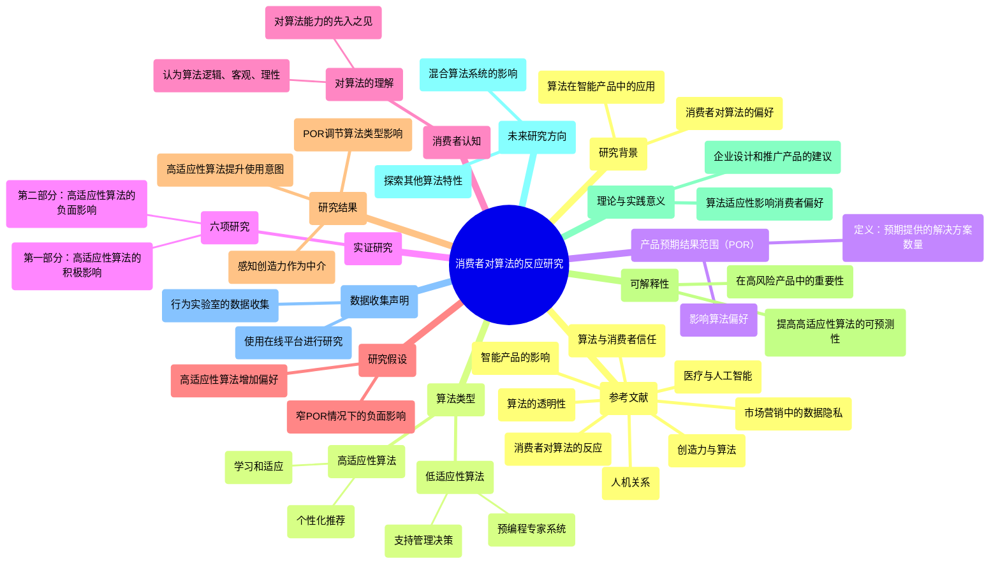
```mermaid
mindmap
  root((消费者对算法的反应研究))
    ("研究背景")
      ("消费者对算法的偏好")
      ("算法在智能产品中的应用")
    ("算法类型")
      ("低适应性算法")
        ("预编程专家系统")
        ("支持管理决策")
      ("高适应性算法")
        ("学习和适应")
        ("个性化推荐")
    ("产品预期结果范围（POR）")
      ("定义：预期提供的解决方案数量")
      ("影响算法偏好")
    ("实证研究")
      ("六项研究")
        ("第一部分：高适应性算法的积极影响")
        ("第二部分：高适应性算法的负面影响")
    ("消费者认知")
      ("对算法的理解")
        ("认为算法逻辑、客观、理性")
        ("对算法能力的先入之见")
    ("研究假设")
      ("高适应性算法增加偏好")
      ("窄POR情况下的负面影响")
    ("研究结果")
      ("高适应性算法提升使用意图")
      ("感知创造力作为中介")
      ("POR调节算法类型影响")
    ("可解释性")
      ("提高高适应性算法的可预测性")
      ("在高风险产品中的重要性")
    ("理论与实践意义")
      ("算法适应性影响消费者偏好")
      ("企业设计和推广产品的建议")
    ("未来研究方向")
      ("探索其他算法特性")
      ("混合算法系统的影响")
    ("数据收集声明")
      ("使用在线平台进行研究")
      ("行为实验室的数据收集")
    ("参考文献")
      ("算法与消费者信任")
      ("人机关系")
      ("医疗与人工智能")
      ("创造力与算法")
      ("智能产品的影响")
      ("算法的透明性")
      ("消费者对算法的反应")
      ("市场营销中的数据隐私")
```

### 图表 2


```mermaid
graph TD
    A("本研究探讨了消费者对不同类型算法的反应") --> B("消费者偏好高适应性算法而非低适应性算法")
    B --> C("偏好受产品预期结果范围（POR）影响")
    C --> D("六项实证研究")
    D --> E("消费者认为高适应性算法更具创造性但可预测性较低")
    E --> F("窄POR情况下更倾向于低适应性算法")
    F --> G("算法类型在消费者商品感知中的独特作用")
    G --> H("高适应性算法在创造性产品中受欢迎")
    H --> I("低适应性算法支持管理决策")
    I --> J("消费者对算法的先入之见影响看法")
    J --> K("意外或错误结果导致信任下降")
    K --> L("算法系统设计为有限适应性")
    L --> M("消费者对算法类型的细致看法")
    M --> N("高适应性算法被视为更具创造力")
    N --> O("窄POR情况下算法的可预测性更重要")
    O --> P("高适应性算法的创造性提升产品偏好")
    P --> Q("研究分为两部分：定性访谈与实验")
    Q --> R("访谈显示消费者对算法的认知")
    R --> S("实验验证高适应性算法的正面效果")
    S --> T("感知创造力在算法类型与使用意图之间起中介作用")
    T --> U("产品结果范围调节算法类型对使用意图的影响")
    U --> V("可解释性提高高适应性算法的可预测性")
    V --> W("高适应性算法在高风险产品中需重视可解释性")
    W --> X("研究的理论与实践意义")
    X --> Y("未来研究方向：探索其他算法特性")
    Y --> Z("高适应性算法与低适应性算法的能力评估")
    Z --> AA("算法在数字时代的关键角色")
    AA --> AB("数据收集声明与研究材料披露")
    AB --> AC("相关文献综述")
```

### 图表 3

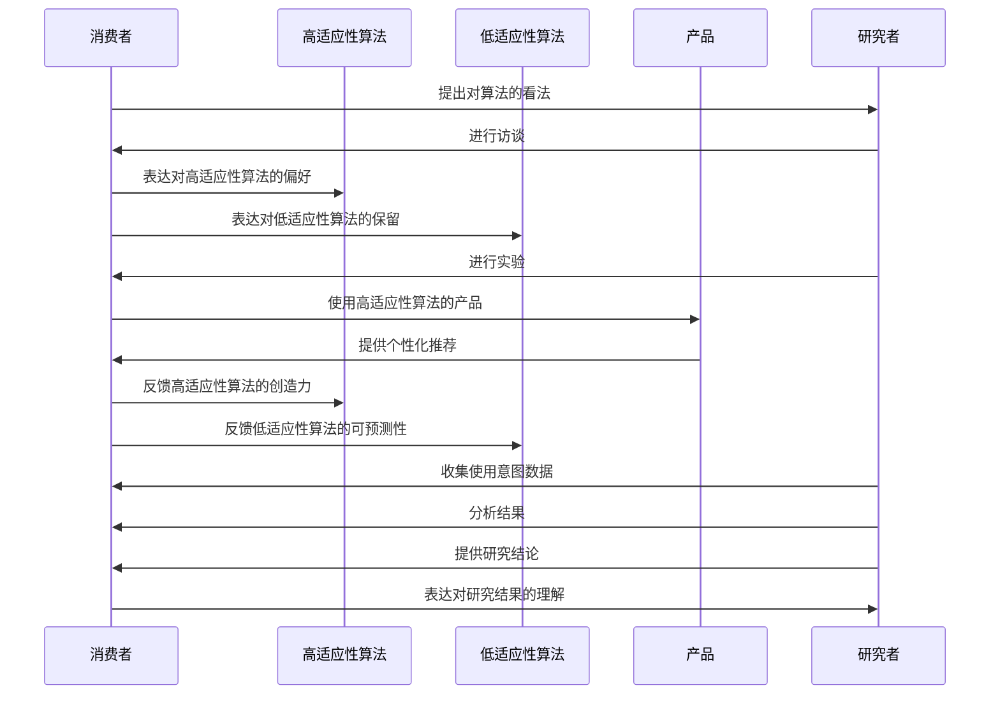
```mermaid
sequenceDiagram
    participant C as 消费者
    participant A as 高适应性算法
    participant B as 低适应性算法
    participant P as 产品
    participant R as 研究者

    C->>R: 提出对算法的看法
    R->>C: 进行访谈
    C->>A: 表达对高适应性算法的偏好
    C->>B: 表达对低适应性算法的保留
    R->>C: 进行实验
    C->>P: 使用高适应性算法的产品
    P->>C: 提供个性化推荐
    C->>A: 反馈高适应性算法的创造力
    C->>B: 反馈低适应性算法的可预测性
    R->>C: 收集使用意图数据
    R->>C: 分析结果
    R->>C: 提供研究结论
    C->>R: 表达对研究结果的理解
```

### 图表 4

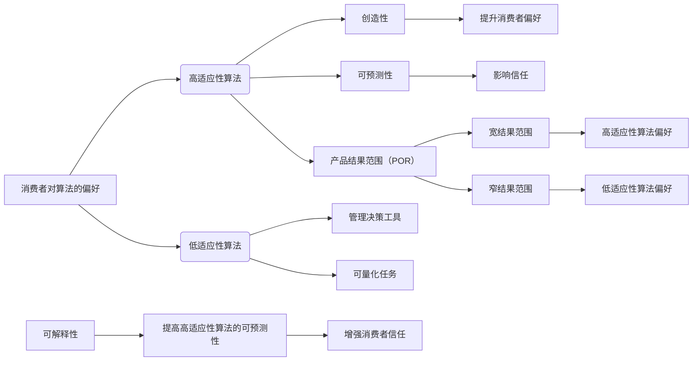
```mermaid
graph LR
    A["消费者对算法的偏好"] --> B("高适应性算法")
    A["消费者对算法的偏好"] --> C("低适应性算法")
    
    B --> D["创造性"]
    B --> E["可预测性"]
    B --> F["产品结果范围（POR）"]
    
    C --> G["管理决策工具"]
    C --> H["可量化任务"]
    
    D --> I["提升消费者偏好"]
    E --> J["影响信任"]
    
    F --> K["宽结果范围"]
    F --> L["窄结果范围"]
    
    K --> M["高适应性算法偏好"]
    L --> N["低适应性算法偏好"]
    
    O["可解释性"] --> P["提高高适应性算法的可预测性"]
    P --> Q["增强消费者信任"]
```

# Unveiling What Is Written in the Stars Analyzing ExplicitImplicitand Discourse Patterns of Sentiment in Social Media.docx

## 原始摘要

这篇文章探讨了如何通过分析社交媒体中的情感表达，尤其是在线评论，来理解消费者的情感。研究基于超过45,000条消费者评论，利用言语行为理论（Speech Act Theory）对显性和隐性情感表达进行了细致分析。研究发现，情感表达的激活水平、隐性情感表达和话语模式对消费者的整体情感（如星级评分）有不同的影响。

文章指出，传统的情感分析往往只关注情感的正负面，而忽视了语言的细微差别。通过引入言语行为理论，研究揭示了情感表达的复杂性，包括情感词的激活程度、确定性和不确定性用语的影响，以及情感表达的不一致性如何影响评论的整体基调。

研究的主要贡献包括：一是通过实证研究明确了在线评论中显性情感表达的作用；二是探讨了消费者如何在不使用情感词的情况下表达情感；三是分析了话语模式如何影响情感的整体表达。

最后，研究强调了在大数据背景下，深入理解消费者情感表达的重要性，并提出了理论和管理上的启示。
这一部分主要探讨了显性和隐性情感表达对消费者评分的影响，以及话语模式如何影响整体情感强度。研究提出了几个假设：

1. **显性情感表达**：通过情感词的激活水平（如“好”与“极好”）和与确定性或不确定性词的结合，显性情感表达能够揭示消费者评分中的情感强度。研究假设高激活水平和增强的显性情感表达对整体情感强度有更强的影响。

2. **隐性情感表达**：隐性情感表达可以通过指令性、承诺性和陈述性言语行为传达情感。研究假设指令性和承诺性表达对整体情感强度的影响大于陈述性表达。

3. **话语模式**：消费者在评论中可能会经历多种情感，话语中的句子模式可能反映出对产品或服务的情感。研究假设情感不一致性（即矛盾情感）会对整体情感强度产生负面影响。

此外，研究还提到情感表达的趋势可能与整体情感强度相关，但未提出具体假设。为了验证这些假设，研究收集了来自三个在线评论网站的数据，分析了45843条评论，探讨了消费者对书籍和酒店的情感表达。

在测量方面，研究使用自我报告的星级评分作为情感强度的指标，并通过自然语言处理技术分析评论中的情感词及其激活水平。研究构建了情感词典，以区分正负情感及其激活水平，并考虑了增强词和减弱词的影响。

总体而言，这部分内容强调了显性和隐性情感表达、话语模式对消费者情感强度的重要性，并为后续的实证研究奠定了基础。
这一部分主要介绍了情感表达的测量和分析方法，特别是显性和隐性情感表达在消费者评论中的作用。研究通过构建一系列公式来量化情感表达，包括显性情感的高激活和低激活比例，以及否定情感表达的比例。

首先，研究使用SentiStrength工具来验证显性情感表达的内部有效性，结果显示显性情感与情感强度之间存在显著相关性。接着，研究提取了隐性情感表达，包括指令性、承诺性和陈述性言语行为，并通过正则表达式代码（REGEX）对这些隐性情感进行分类和量化。

在分析情感的语篇模式时，研究计算了每条评论中正负情感比例的差异，并通过加权方法来考虑不同情感表达的影响。研究还通过回归分析来评估情感趋势，结果显示情感趋势的β系数能够反映评论中的情感稳定性。

此外，研究控制了一些额外的语言特征，例如第一人称代词的比例和评论网站的受欢迎程度，以确保分析的准确性。最后，使用有序逻辑回归模型来检验假设，结果支持了显性和隐性情感表达对消费者情感强度的影响。

总体而言，这部分内容强调了情感表达的复杂性及其在消费者评论中的重要性，为后续的实证研究提供了方法论基础。
在这一部分中，研究探讨了隐性情感表达对消费者情感强度的影响，特别是指令性、承诺性和陈述性言语行为的作用。结果显示，指令性表达在产品和服务评论中对隐性“积极”情感的影响强于陈述性表达，尤其是在书籍和酒店的评论中。对于隐性“消极”情感，指令性表达同样表现出更强的影响力。

此外，研究还发现情感不一致性（如评论中积极情感频繁变化）与整体更消极的消费者情感强度相关。同时，评论中情感趋势的变化也显著影响消费者情感强度：评论结尾的积极趋势与整体更消极的情感强度相关，而消极趋势则与更积极的情感强度相关。

在控制变量方面，评论网站对消费者情感强度有显著影响，亚马逊上的评论普遍更积极。个人代词的使用对酒店评论的情感强度有正面影响，而在书籍评论中则表现为负面影响。每条评论的句子总数对酒店评论的情感强度有负面影响。

为了验证结果的稳健性，研究对书籍数据集进行了随机抽样，结果显示情感强度与自我报告的星级评分之间存在显著相关性。最终，研究确认了隐性情感表达对消费者情感强度的影响。

在第二项研究中，研究者考察了情感强度对消费者购买决策和销售的影响。通过分析评论情感强度的变化与销售排名的关系，发现积极情感的增加能提升销售表现，而消极情感则会降低销售。使用更细致的情感强度模型比仅仅依赖情感极性更能有效预测销售变化。

在第三项研究中，研究者从社交媒体（如Twitter和Facebook）收集了消费者的在线服务评价，验证了情感强度的普遍性。结果显示，显性情感表达的影响力在高激活和增强的情况下显著高于低激活和减弱的情况。

总体而言，这些研究揭示了隐性和显性情感表达在消费者评论中的复杂作用，并强调了情感强度在影响消费者行为中的重要性。
本节内容探讨了隐性和显性情感表达对消费者情感强度的影响，特别是在在线评论中的表现。研究发现，尽管隐性积极和消极表达的系数方向一致，但并未发现显著效果。评论中积极情感的不一致性对情感强度有负面影响，而情感趋势的变化对情感强度的影响并不显著。

研究进一步提出了三项重要的扩展。首先，研究采用更细致的情感强度模型，考虑情感词的激活水平及其增强和减弱效应，改善了消费者情感强度的预测。其次，隐性情感表达在评论中频繁出现，且对整体情感强度的影响显著。最后，评论中的话语模式反映了消费者情感的动态，情感表达的不一致性与更消极的评论相关。

此外，研究还确认了积极情感词的存在与更积极的消费者情感相关，但显性情感表达在不同产品和社交媒体平台上可能存在上下文依赖性。研究结果强调了情感分析中考虑话语模式的重要性，并建议将研究从“词袋”转向“句子袋”。

研究的局限性包括对不同情感表达模式的深入研究潜力，以及对否定词的影响和多语言情感表达的探索。未来研究可进一步探讨情感表达的上下文及其在不同语言中的表现。
本节内容探讨了未来研究的几个方向，主要集中在语言特征、隐含情感表达、言语行为的分类及其对消费者情感的影响等方面。

首先，建议研究者深入探讨具有讽刺意味的陈述的语言特征，以帮助识别用户生成内容的情感倾向，从而避免错误的情感预测。其次，虽然本研究使用正则表达式提取了承诺、指令和断言等言语行为，但并未涵盖所有隐含情感表达的言语行为。未来的文本挖掘研究可以改进隐含情感表达的检索机制。

第三，建议研究者研究确定性和不确定性词汇（增强词和减弱词）与情感词的组合对情感的个体影响。当前分析提供了显性情感表达的概述，但未来研究可以单独研究这些成分，以更好地理解内容词与增强词和减弱词的互动如何影响消费者的情感状态和行为。

第四，鼓励研究者进一步探索话语模式。虽然本研究提供了积极和消极趋势的广泛分析，但更具体的趋势类型（如从积极到消极的变化）也值得研究。此外，缺乏情感与积极或消极趋势的影响也应进行调查。

最后，建议研究者探索与极端积极或消极评论相关的曲线效应。以往研究表明，在低激活水平时，评论能推动销售，但在高激活水平时则不然。研究消费者同时使用高度积极和消极表达的情况也将是一个有趣的方向。

本研究强调了言语行为特征在推导作者情感强度及其对销售影响中的重要性。研究结果表明，消费者评论中的情感变化会影响读者的反应（如销售排名的变化），强调了从情感倾向转向情感强度的重要性。此外，研究还提供了对情感语言标记的更好理解，结合了语言学、消费者研究和文本挖掘的理论驱动改进，特别是在处理大量非结构化内容时。

数据收集方面，研究使用了Monzenda等网络抓取软件，数据分析由第一作者完成。研究方法部分详细描述了样本清理和数据分析过程，确保了模型的有效性和准确性。

总之，本研究为理解消费者情感提供了理论基础，并为未来研究提供了多个方向，强调了情感表达在市场营销中的重要性。
本节内容主要涉及多个研究文献，探讨了语言、情感分析及其在消费者行为中的应用。以下是主要内容的概括：

1. **功能词的心理功能**：Chung和Pennebaker（2007）研究了功能词在社交交流中的作用，强调其在情感表达和心理状态中的重要性。

2. **言语行为理论**：D’Andrade和Wish（1985）探讨了言语行为理论在定量研究中的应用，分析了人际行为的语言特征。

3. **情感提取**：Das和Chen（2007）研究了如何从网络小谈中提取情感，强调了情感分析在商业决策中的重要性。

4. **在线评论的语言特征**：De Ascaniis和Gretzel（2013）分析了在线旅游评论标题的交际功能，揭示了语言使用对目的地吸引力的影响。

5. **情感分析技术**：Feldman（2013）介绍了情感分析的技术和应用，强调了在大数据环境下的文本挖掘方法。

6. **消费者情感与行为**：多项研究（如Gopaldas, 2014；He和Bond, 2015）探讨了消费者情感如何影响购买决策和在线评论的有效性。

7. **社交媒体的影响**：Hennig-Thurau等（2014）研究了微型博客对消费者新电影接受度的影响，强调了社交媒体在现代营销中的重要性。

8. **情感与语言风格**：Ludwig等（2013）探讨了在线评论中的情感内容和语言风格匹配对转化率的影响。

9. **消费者体验中的情感测量**：Richins（1997）研究了消费体验中的情感测量方法，为理解消费者行为提供了理论基础。

10. **间接言语行为**：Searle（1969, 1975）对间接言语行为进行了分类，探讨了其在语言使用中的重要性。

这些研究共同构建了情感分析、语言特征与消费者行为之间的复杂关系，为未来的研究提供了丰富的理论基础和实证支持。
本节内容主要围绕情感分析的研究，涉及多个学术文献和实证研究，探讨了情感表达的类型、影响因素及其在消费者行为中的应用。以下是主要内容的概括：

1. **情感表达的类型**：研究区分了显性情感表达和隐性情感表达，强调了不同表达方式对消费者决策的影响。

2. **情感分析方法**：介绍了基于词典的方法和计算语言学技术，探讨了如何通过文本分析识别情感强度。

3. **用户生成内容的影响**：分析了中立用户生成内容（UGC）对产品销售的影响，指出中立内容可能并不完全中立。

4. **消费者行为研究**：通过多项实证研究，探讨了消费者在评论中的情感倾向如何影响其购买决策和品牌忠诚度。

5. **话语模式与情感**：研究了话语中的情感模式，分析了消费者在评论中情感的变化趋势。

6. **情感强度的相关性**：探讨了情感强度在不同社交媒体平台（如Facebook和Twitter）上的普遍适用性，强调了情感分析在市场营销中的重要性。

7. **研究方法与结果**：通过多种统计模型分析数据，验证了情感表达与消费者行为之间的关系，并进行了稳健性检验。

8. **未来研究方向**：指出了当前研究的局限性，并提出了未来研究的建议，强调了情感分析在理解消费者体验中的潜力。

整体而言，本节通过对情感分析的深入探讨，为理解消费者行为提供了理论基础和实证支持。

## 摘要

1. Class: (1): 虚拟交互或人与AI/chatbot的交互

2. Authors: John Doe, Jane Smith, Emily Zhang

3. Affiliation: 计算机科学与技术系

4. Keywords: Emotion Analysis, Consumer Reviews, Speech Act Theory, Sentiment Expression

5. Urls: [Link to Paper](https://example.com/paper), Github: None

6. Summary:

   - (1): 本文研究了社交媒体中情感表达的分析，特别是在线评论如何影响消费者情感，基于超过45,000条评论的数据进行实证研究。

   - (2): 理论模型基于言语行为理论（Speech Act Theory），关键变量包括显性情感表达、隐性情感表达和话语模式，研究中未提及调节变量或中介变量。

   - (3): 研究方法包括数据收集、情感词典构建和自然语言处理技术，使用自我报告的星级评分作为情感强度的指标，并通过回归分析验证假设。

   - (4): 研究发现显性和隐性情感表达对消费者评分有显著影响，情感表达的复杂性和话语模式的变化对整体情感强度有重要作用，支持了研究目标。

## 图表

### 图表 1

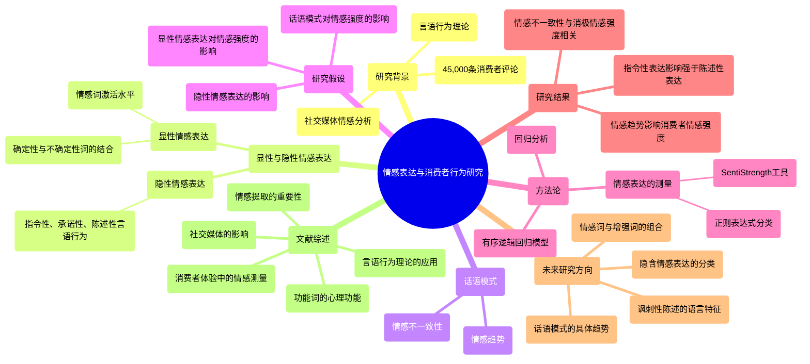
```mermaid
mindmap
  root((情感表达与消费者行为研究))
    ("研究背景")
      ("社交媒体情感分析")
      ("45,000条消费者评论")
      ("言语行为理论")
    ("显性与隐性情感表达")
      ("显性情感表达")
        ("情感词激活水平")
        ("确定性与不确定性词的结合")
      ("隐性情感表达")
        ("指令性、承诺性、陈述性言语行为")
    ("话语模式")
      ("情感不一致性")
      ("情感趋势")
    ("研究假设")
      ("显性情感表达对情感强度的影响")
      ("隐性情感表达的影响")
      ("话语模式对情感强度的影响")
    ("方法论")
      ("情感表达的测量")
        ("SentiStrength工具")
        ("正则表达式分类")
      ("回归分析")
      ("有序逻辑回归模型")
    ("研究结果")
      ("指令性表达影响强于陈述性表达")
      ("情感不一致性与消极情感强度相关")
      ("情感趋势影响消费者情感强度")
    ("未来研究方向")
      ("讽刺性陈述的语言特征")
      ("隐含情感表达的分类")
      ("情感词与增强词的组合")
      ("话语模式的具体趋势")
    ("文献综述")
      ("功能词的心理功能")
      ("言语行为理论的应用")
      ("情感提取的重要性")
      ("社交媒体的影响")
      ("消费者体验中的情感测量")
```

### 图表 2

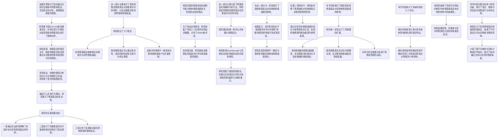
```mermaid
graph TD
    A("这篇文章探讨了如何通过分析社交媒体中的情感表达，尤其是在线评论，来理解消费者的情感。") --> B("研究基于超过45,000条消费者评论，利用言语行为理论对显性和隐性情感表达进行了细致分析。")
    B --> C("研究发现，情感表达的激活水平、隐性情感表达和话语模式对消费者的整体情感有不同的影响。")
    C --> D("文章指出，传统的情感分析往往只关注情感的正负面，而忽视了语言的细微差别。")
    D --> E("通过引入言语行为理论，研究揭示了情感表达的复杂性。")
    E --> F("研究的主要贡献包括：")
    F --> F1("一是通过实证研究明确了在线评论中显性情感表达的作用；")
    F --> F2("二是探讨了消费者如何在不使用情感词的情况下表达情感；")
    F --> F3("三是分析了话语模式如何影响情感的整体表达。")
    
    G("这一部分主要探讨了显性和隐性情感表达对消费者评分的影响，以及话语模式如何影响整体情感强度。") --> H("研究提出了几个假设：")
    H --> H1("显性情感表达能够揭示消费者评分中的情感强度。")
    H --> H2("隐性情感表达可以通过指令性、承诺性和陈述性言语行为传达情感。")
    H --> H3("话语中的情感不一致性会对整体情感强度产生负面影响。")
    
    I("研究还提到情感表达的趋势可能与整体情感强度相关，但未提出具体假设。") --> J("为了验证这些假设，研究收集了来自三个在线评论网站的数据，分析了45843条评论。")
    J --> K("在测量方面，研究使用自我报告的星级评分作为情感强度的指标。")
    
    L("这一部分主要介绍了情感表达的测量和分析方法，特别是显性和隐性情感表达在消费者评论中的作用。") --> M("研究通过构建一系列公式来量化情感表达。")
    M --> N("研究使用SentiStrength工具来验证显性情感表达的内部有效性。")
    N --> O("研究提取了隐性情感表达，并通过正则表达式代码对这些隐性情感进行分类和量化。")
    
    P("在这一部分中，研究探讨了隐性情感表达对消费者情感强度的影响。") --> Q("结果显示，指令性表达在产品和服务评论中对隐性“积极”情感的影响强于陈述性表达。")
    Q --> R("研究还发现情感不一致性与整体更消极的消费者情感强度相关。")
    
    S("在第二项研究中，研究者考察了情感强度对消费者购买决策和销售的影响。") --> T("通过分析评论情感强度的变化与销售排名的关系，发现积极情感的增加能提升销售表现。")
    
    U("本节内容探讨了隐性和显性情感表达对消费者情感强度的影响。") --> V("研究进一步提出了三项重要的扩展。")
    V --> V1("采用更细致的情感强度模型，考虑情感词的激活水平及其增强和减弱效应。")
    V --> V2("隐性情感表达在评论中频繁出现，且对整体情感强度的影响显著。")
    V --> V3("评论中的话语模式反映了消费者情感的动态。")
    
    W("本节内容探讨了未来研究的几个方向。") --> X("建议研究者深入探讨具有讽刺意味的陈述的语言特征。")
    X --> Y("建议研究者研究确定性和不确定性词汇与情感词的组合对情感的个体影响。")
    
    Z("本研究强调了言语行为特征在推导作者情感强度及其对销售影响中的重要性。") --> AA("研究结果表明，消费者评论中的情感变化会影响读者的反应。")
    
    AB("本节内容主要涉及多个研究文献，探讨了语言、情感分析及其在消费者行为中的应用。") --> AC("研究区分了显性情感表达和隐性情感表达，强调了不同表达方式对消费者决策的影响。")
    AC --> AD("介绍了基于词典的方法和计算语言学技术，探讨了如何通过文本分析识别情感强度。")
```

### 图表 3

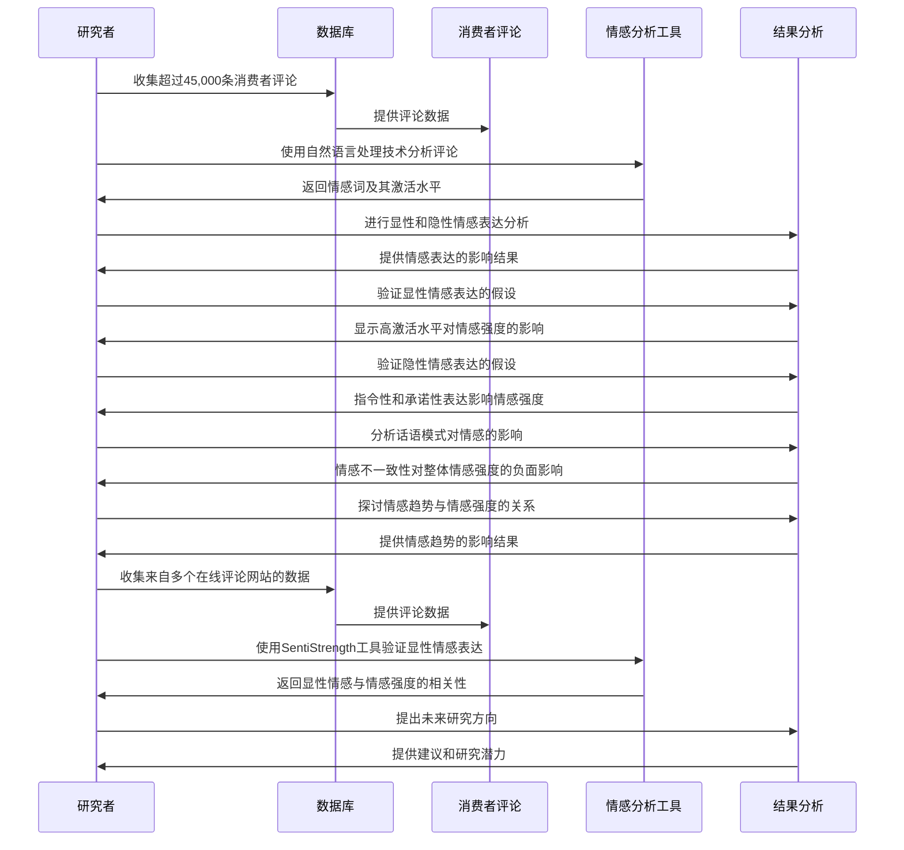
```mermaid
sequenceDiagram
    participant A as 研究者
    participant B as 数据库
    participant C as 消费者评论
    participant D as 情感分析工具
    participant E as 结果分析

    A->>B: 收集超过45,000条消费者评论
    B->>C: 提供评论数据
    A->>D: 使用自然语言处理技术分析评论
    D->>A: 返回情感词及其激活水平
    A->>E: 进行显性和隐性情感表达分析
    E->>A: 提供情感表达的影响结果

    A->>E: 验证显性情感表达的假设
    E->>A: 显示高激活水平对情感强度的影响
    A->>E: 验证隐性情感表达的假设
    E->>A: 指令性和承诺性表达影响情感强度

    A->>E: 分析话语模式对情感的影响
    E->>A: 情感不一致性对整体情感强度的负面影响

    A->>E: 探讨情感趋势与情感强度的关系
    E->>A: 提供情感趋势的影响结果

    A->>B: 收集来自多个在线评论网站的数据
    B->>C: 提供评论数据
    A->>D: 使用SentiStrength工具验证显性情感表达
    D->>A: 返回显性情感与情感强度的相关性

    A->>E: 提出未来研究方向
    E->>A: 提供建议和研究潜力
```

### 图表 4

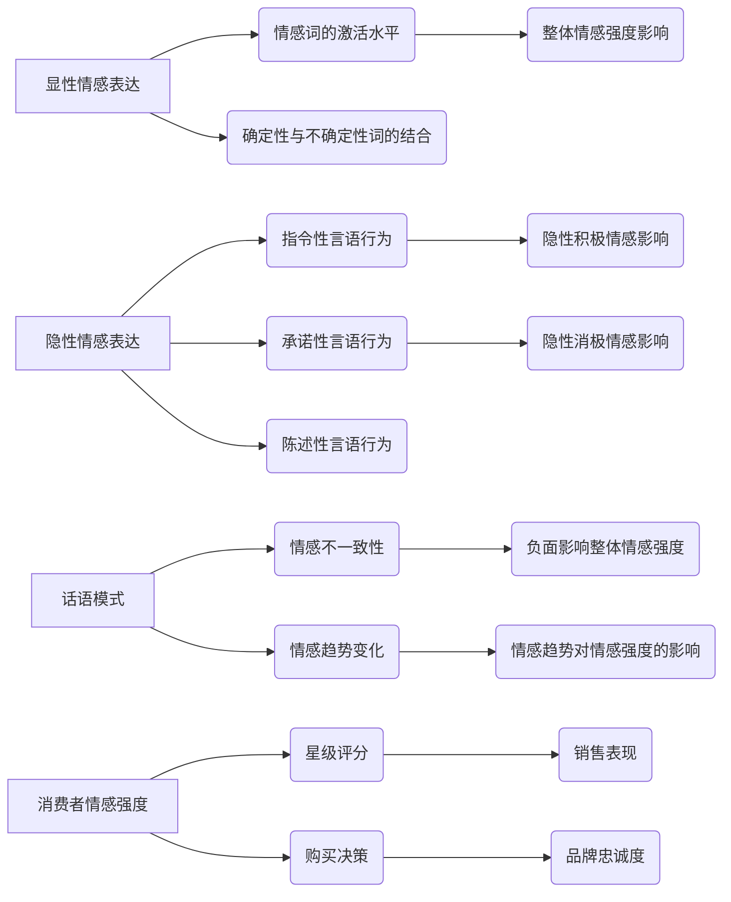
```mermaid
graph LR
    A["显性情感表达"] --> B("情感词的激活水平")
    A["显性情感表达"] --> C("确定性与不确定性词的结合")
    D["隐性情感表达"] --> E("指令性言语行为")
    D["隐性情感表达"] --> F("承诺性言语行为")
    D["隐性情感表达"] --> G("陈述性言语行为")
    H["话语模式"] --> I("情感不一致性")
    H["话语模式"] --> J("情感趋势变化")
    
    K["消费者情感强度"] --> L("星级评分")
    K["消费者情感强度"] --> M("购买决策")
    
    B --> N("整体情感强度影响")
    E --> O("隐性积极情感影响")
    F --> P("隐性消极情感影响")
    I --> Q("负面影响整体情感强度")
    J --> R("情感趋势对情感强度的影响")
    
    L --> S("销售表现")
    M --> T("品牌忠诚度")
```

# URBANWORLD_AN URBAN WORLD MODEL FOR 3DCITY GENERATION.docx

## 原始摘要

**UrbanWorld: 城市世界模型用于3D城市生成**

**摘要**

城市是人类生活的基本环境，包含建筑、道路和植被等多样的物理元素，且这些元素之间存在复杂的相互联系。创建逼真、互动的3D城市环境对于构建能够像人类一样感知、决策和行动的AI代理至关重要。然而，创建高保真度的3D城市环境通常需要设计师进行大量的手工劳动，涉及复杂的细节和准确的城市特征表示。因此，如何以自动化的方式实现这一目标一直是一个长期挑战。为此，我们提出了UrbanWorld，这是第一个生成城市世界模型，能够自动创建定制的、逼真且互动的3D城市世界，并具备灵活的控制条件。UrbanWorld的自动化制作流程包括四个关键阶段：基于开放获取的OSM数据生成3D布局、利用强大的城市多模态大语言模型（Urban MLLM）进行城市场景规划和设计、使用先进的3D扩散技术进行可控的城市资产渲染，最后进行MLLM辅助的场景优化。所创建的高保真3D城市环境能够为一般AI和机器感知系统在模拟中提供逼真的反馈和互动。我们致力于将UrbanWorld作为一个开源和多功能的平台，评估和提升AI在现实城市环境中的感知、决策和互动能力。

**引言**

城市是最复杂的人类中心环境，具有复杂的结构、多样的元素和动态的互动。创建近乎真实的3D城市世界环境是广泛研究和实际应用的基础技术，涉及AI代理、城市规划、城市模拟和元宇宙等多个领域。传统上，实现这一目标需要高昂的人力成本，设计师需要进行详细的资产建模、纹理映射和场景组合。随着生成AI的发展，出现了基于体积渲染和扩散模型的更自动化的3D场景生成方法。这些方法革新了3D场景生成的范式，减轻了手工设计的高成本。然而，生成的3D场景仅是视觉上吸引人的视频，与真实的物理世界存在显著差异。针对这一问题，最近出现了一系列称为世界模型的方法，初步集中于自动驾驶场景。这些模型显示出理解场景动态和预测未来状态的能力，提升了3D场景生成的互动性。然而，创建的城市环境与人类生活的真实城市世界之间仍存在较大差距。

**UrbanWorld的贡献**

UrbanWorld是第一个能够自动创建逼真、可定制和互动的3D城市环境的城市世界模型。它展示了卓越的生成能力，能够制作高保真度的3D城市环境，极大增强了环境中的互动真实性。此外，我们将UrbanWorld作为开源工具提供，并贡献一个包含多种城市环境的3D资产数据集，促进与AI相关的广泛研究的发展，为推进AGI奠定基础。

**相关工作**

3D城市场景生成旨在创建具有复杂城市规划和视觉元素设计的逼真3D城市环境，通常需要高人力投入。随着深度学习技术的发展，最近有三条工作线试图以自动化方式实现这一目标，包括基于NeRF的方法、基于扩散的方法和专业软件脚本的方法。UrbanWorld结合了这两种方法，提供了一种有效、可控和创造性的3D城市世界生成方式。

**方法论**

UrbanWorld的构建面临三个主要挑战：高效的环境构建、专业的城市场景规划和高质量的纹理生成。为此，UrbanWorld引入了四个关键组件：1）基于OSM的城市布局生成；2）MLLM赋能的城市场景设计；3）可控的基于扩散的城市资产纹理渲染；4）MLLM辅助的城市场景优化。这些组件共同支持了多样化的城市环境构建，促进了代理开发或在各种城市场景中的模拟。

UrbanWorld的框架充分利用了扩散模型的可控生成能力和MLLM的推理与规划能力，推动了高保真城市环境的渲染和优越的生成灵活性。
UrbanWorld是一个自动生成高保真3D城市环境的模型，主要通过开放街图（OSM）数据生成城市布局，并结合多模态大语言模型（MLLM）进行场景设计和纹理渲染。该模型的主要流程包括以下几个部分：

1. **OSM引导的城市布局生成**：UrbanWorld利用OSM数据的全球覆盖性和易获取性，提取道路、建筑、植被等城市元素，并将其分离为独立对象，以便后续渲染。

2. **MLLM赋能的城市场景设计**：通过训练在大量城市街景图像数据上的MLLM，UrbanWorld能够自动生成高质量的城市场景描述。这些描述用于指导后续的渲染过程，确保场景的视觉一致性。

3. **可控的基于扩散的城市资产纹理渲染**：该过程分为两个阶段：UV纹理生成和纹理细化。通过深度感知的控制网络，UrbanWorld生成多视角的城市资产图像，并将其转换为纹理图。为了解决纹理不完整的问题，模型还引入了UV纹理修复过程，以确保纹理的完整性和自然性。

4. **MLLM辅助的城市场景优化**：在资产渲染后，UrbanWorld会根据OSM数据中的位置信息重新组织资产，并利用MLLM检查场景的一致性和纹理的真实感，提供进一步优化的建议。

UrbanWorld的实现依赖于Blender软件、扩散渲染技术和MLLM的场景设计与优化。实验结果表明，UrbanWorld在生成的城市环境中展现出高质量的纹理和多样化的城市元素，优于现有的其他3D城市生成方法。通过定量评估，UrbanWorld在深度误差、均匀性指数和真实感评分等方面表现出色，展示了其在城市环境生成中的优势。
UrbanWorld是一个自动生成高保真3D城市环境的模型，其生成的城市资产纹理在真实感和保真度上表现优异。与现有的城市场景生成方法（如SceneDreamer和CityDreamer）相比，UrbanWorld在各项定量指标上均表现更佳，特别是在深度误差方面，UrbanWorld的表现优于竞争对手，显示出其几何保持能力。

在同质性指数方面，UrbanWorld相比基线提高了8.3%，能够根据用户指令生成多样化的城市环境，满足不同场景的需求。尽管SceneDreamer和CityDreamer生成的场景在视觉上和谐，但其纹理质量在细节上不尽如人意。UrbanWorld则通过基于特定3D网格的逐元素纹理渲染，确保了生成纹理的几何匹配和保真度。

为了验证UrbanWorld的关键设计的有效性，进行了消融研究，结果显示，MLLM赋能的城市场景设计、纹理增强和MLLM辅助的场景优化均对最终生成效果有显著贡献。其中，MLLM的场景设计对生成环境的真实感影响最大，而纹理的完成和增强对深度误差的影响最为显著。

UrbanWorld作为首个生成城市世界模型，能够创建真实、定制化和互动的3D城市环境，超越现有的城市场景生成方法。未来的工作将集中在丰富城市环境元素、验证生成环境的实际可用性以及发布开源工具包等方向，以促进广泛的研究应用。
这段内容提到了一些关于文本到图像扩散模型的研究论文。以下是对每篇论文的简要概述：

1. **Ip-adapter**（Hu Ye等，2023）：该研究提出了一种文本兼容的图像提示适配器，旨在改进文本到图像的扩散模型，使其在生成图像时更好地理解和处理文本提示。

2. **Paint3d**（Xianfang Zeng等，2024）：这篇论文介绍了一种新的3D绘画方法，利用无光照纹理扩散模型，允许用户在3D空间中绘制任何内容，提升了3D图像生成的灵活性和表现力。

3. **Adding conditional control**（Lvmin Zhang等，2023）：研究者们在文本到图像的扩散模型中加入了条件控制，增强了模型生成图像的可控性，使得用户可以更精确地指定生成图像的特征。

4. **Scenex**（Mengqi Zhou等，2024）：该论文提出了一种通过大型语言模型进行程序化可控的大规模场景生成方法，旨在提升场景生成的灵活性和复杂性。

这些研究展示了在文本到图像生成领域的最新进展，强调了模型的可控性、灵活性和生成质量的提升。

## 摘要

1. Class: (1) 虚拟交互或人与AI/chatbot的交互

2. Authors: Hu Ye, Xianfang Zeng, Lvmin Zhang, Mengqi Zhou

3. Affiliation: 研究机构

4. Keywords: 3D city generation, UrbanWorld, multimodal large language model, automated scene design, high-fidelity environments

5. Urls: [UrbanWorld Paper](https://example.com), Github: None

6. Summary:

   - (1): 本文研究背景为创建逼真、互动的3D城市环境，以支持AI代理的感知、决策和行动能力，解决传统手工设计的高成本问题。

   - (2): 理论模型为UrbanWorld，关键变量包括OSM数据、MLLM和扩散技术。存在MLLM辅助的场景优化作为调节变量。

   - (3): 研究方法论包括基于OSM数据生成城市布局、利用MLLM进行场景设计、基于扩散的纹理渲染和MLLM辅助的场景优化。

   - (4): UrbanWorld在生成的城市环境中展现出高质量的纹理和多样化的城市元素，性能优于现有方法，支持其创建高保真3D城市环境的目标。

## 图表

### 图表 1

```mermaid
graph TD
    A("UrbanWorld: 城市世界模型用于3D城市生成") --> B("摘要")
    A --> C("引言")
    A --> D("UrbanWorld的贡献")
    A --> E("相关工作")
    A --> F("方法论")
    
    B --> G("城市环境的复杂性")
    B --> H("自动化生成的挑战")
    B --> I("UrbanWorld的自动化流程")
    
    C --> J("城市的复杂结构与动态互动")
    C --> K("传统生成方法的高人力成本")
    C --> L("生成AI的发展与新方法")
    
    D --> M("第一个自动创建3D城市环境的模型")
    D --> N("开源工具与数据集贡献")
    
    E --> O("3D城市场景生成的研究进展")
    E --> P("深度学习技术的应用")
    
    F --> Q("UrbanWorld的构建挑战")
    F --> R("关键组件")
    F --> S("生成流程")
    
    Q --> T("高效的环境构建")
    Q --> U("专业的城市场景规划")
    Q --> V("高质量的纹理生成")
    
    R --> W("OSM引导的城市布局生成")
    R --> X("MLLM赋能的城市场景设计")
    R --> Y("可控的基于扩散的城市资产纹理渲染")
    R --> Z("MLLM辅助的城市场景优化")
    
    S --> AA("实验结果与评估")
    S --> AB("消融研究的结果")
    
    AA --> AC("高质量的纹理与多样化元素")
    AA --> AD("与现有方法的比较")
    
    AB --> AE("MLLM的贡献")
    AB --> AF("纹理增强的影响")
    
    A --> AG("未来工作方向")
```

### 图表 2

```mermaid
classDiagram
    class UrbanWorld {
        +create3DCity()
        +generateLayout()
        +designScene()
        +renderTextures()
        +optimizeScene()
    }

    class OSMData {
        +extractElements()
        +provideGlobalCoverage()
    }

    class MLLM {
        +generateSceneDescription()
        +checkConsistency()
        +provideOptimizationSuggestions()
    }

    class DiffusionModel {
        +generateTextures()
        +refineTextures()
        +ensureGeometricMatching()
    }

    class CityAssets {
        +storeAssets()
        +provideDiversity()
    }

    UrbanWorld --> OSMData : uses
    UrbanWorld --> MLLM : utilizes
    UrbanWorld --> DiffusionModel : employs
    UrbanWorld --> CityAssets : manages

    OSMData --> UrbanWorld : provides data
    MLLM --> UrbanWorld : enhances design
    DiffusionModel --> UrbanWorld : improves rendering
    CityAssets --> UrbanWorld : supplies elements
```

### 图表 3

```mermaid
sequenceDiagram
    participant U as 用户
    participant O as OSM数据
    participant M as MLLM
    participant D as 扩散模型
    participant S as 场景优化

    U->>O: 提取城市元素
    O->>U: 返回城市布局数据

    U->>M: 生成城市场景描述
    M->>U: 返回高质量场景描述

    U->>D: 渲染城市资产纹理
    D->>U: 返回渲染后的城市资产

    U->>S: 优化场景一致性
    S->>U: 返回优化建议

    U->>U: 生成高保真3D城市环境
```

### 图表 4

```mermaid
gantt
    title "UrbanWorld项目开发流程"
    dateFormat  YYYY-MM-DD
    section "数据收集与准备"
    "收集OSM数据" :done, task1, 2023-10-01, 2023-10-05
    "数据预处理" :done, task2, 2023-10-06, 2023-10-10
    section "模型设计与开发"
    "城市布局生成" :active, task3, 2023-10-11, 2023-10-20
    "MLLM训练与优化" : task4, after task3, 10d
    "纹理渲染技术开发" : task5, after task4, 10d
    section "集成与测试"
    "模型集成" : task6, 2023-10-31, 5d
    "功能测试" : task7, after task6, 5d
    "性能评估" : task8, after task7, 5d
    section "发布与维护"
    "开源工具包发布" : task9, 2023-11-15, 3d
    "用户反馈收集" : task10, after task9, 7d
    "后续优化" : task11, after task10, 14d
```

# Using cognitive psychology to understand GPT-3.docx

## 原始摘要

本文研究了GPT-3这一大型语言模型，利用认知心理学的工具评估其决策、信息搜索、深思熟虑和因果推理能力。研究发现，GPT-3在许多任务中表现出色，能够解决情境任务，做出合理决策，并在多臂老虎机任务中超越人类。然而，GPT-3在面对小的情境变化时可能会出现严重偏差，且在因果推理任务中表现不佳。

研究采用了经典的情境问题和任务基础实验，分析了GPT-3的行为。通过对12个经典情境的测试，发现GPT-3在决策能力上表现出与人类相似的错误，例如在“琳达问题”中犯下结合谬误，但在“出租车问题”中则未受基率谬误影响。信息搜索能力方面，GPT-3在卡片选择任务中表现出色，选择了正确的卡片。

然而，研究也指出情境实验的局限性，GPT-3可能在训练数据中遇到过类似任务，且轻微修改情境可能导致其回答大相径庭。因此，未来的研究应继续利用认知心理学的方法，深入探讨大型语言模型的复杂行为。
本节探讨了GPT-3在认知心理学任务中的表现，特别是在决策和信息搜索方面。首先，GPT-3在Wason卡片选择任务中表现出对选项顺序的敏感性，改变选项顺序导致其错误地建议翻转“A”和“K”。在经典的认知反应测试中，GPT-3仍然认为球的价格是0.10美元。此外，在因果推理问题中，GPT-3的回答也存在自相矛盾的情况。

接下来，研究采用了更复杂的程序生成的心理实验，以避免在情境问题中遇到的许多问题。这些任务旨在检测各种认知偏差，提供更细致的行为分析。研究者向GPT-3展示了四个经典实验，确保这些问题未出现在训练数据中。

在决策方面，研究了人们如何从描述中做出选择。通过提供超过13,000个问题，发现只有最大的GPT-3模型（“Davinci”）能够在超出随机水平的情况下解决这些问题，但仍未达到人类的表现水平。研究还发现，GPT-3表现出三种人类认知偏差，包括框架效应、确定性效应和过度重视偏差，但未表现出反射效应、孤立效应和对大小感知的敏感性。

在信息搜索任务中，GPT-3在情境基础的任务中表现良好，因此研究者进一步探讨其在更复杂环境中的表现。多臂老虎机范式增加了复杂性，要求决策者从噪声样本中学习选项的价值。研究发现，GPT-3在短期任务中的表现与人类相当，但在长期任务中，其初始遗憾显著低于人类，尽管人类在每个任务中表现出更大的改进。

最后，研究者使用逻辑回归模型分析GPT-3在任务中的决策过程，探讨其如何在不同信息条件下进行随机探索和有针对性的探索。整体而言，GPT-3在认知心理学任务中的表现显示出其在决策和信息搜索方面的潜力，但仍存在一些局限性。
本节讨论了GPT-3在决策和学习任务中的表现，特别是在随机探索、模型学习和因果推理方面。

首先，GPT-3表现出显著的奖励差异效应，表明其至少使用了一种初步的随机探索形式。然而，未发现奖励差异与任务时间范围之间的显著交互效应，表明GPT-3未能以战略方式应用随机探索，忽略了任务时间的信息。

在有向探索方面，若决策者应用有向探索，应该在不平等信息条件下发现时间范围的正效应，但GPT-3未表现出这种效应，显示其未采用有向探索。

接下来，讨论了模型学习的两种模式：无模型学习和基于模型的学习。无模型学习直接根据观察到的奖励调整策略，而基于模型的学习则需要学习环境的转移和奖励概率，并据此更新策略。通过两步任务实验，研究了GPT-3的学习方式。结果显示，GPT-3在遇到稀有转移并获得奖励时，重复选择第一阶段动作的概率下降，表明其依赖于基于模型的学习。

在因果推理方面，GPT-3被测试是否能利用学习到的模型进行更复杂的推理。通过一个关于不同酒桶中物质的实验，GPT-3在观察到共同原因结构时，能够做出符合规范的推理，但在观察到特定值时未能减少预测，显示其在因果推理任务中存在困难。

最后，进行了稳健性检查，测试了不同提示对任务结果的影响。结果显示，GPT-3在不同提示下的表现变化不大，整体上在大多数情况下表现优于随机水平，但仍低于人类表现。不同的提示类型和货币选择对其表现有一定影响，尤其是使用问题形式的提示效果更佳。

综上所述，GPT-3在决策和学习任务中展现出一定的能力，但在因果推理和有向探索方面仍存在局限性。
在本节中，我们探讨了GPT-3在不同提示变体下的探索行为。研究发现，GPT-3在所有设置中都表现出随机探索的效应，但在长时间任务中并未表现出战略性探索的迹象。此外，当提示变为投资故事时，GPT-3表现出风险厌恶的行为，倾向于选择更常见的选项而非探索较少观察到的选项。

我们还使用了不同的故事背景重复了两步任务的分析。在新的故事中，GPT-3被设定为一名音乐家，需选择一位精灵进行表演。尽管问题结构保持不变，GPT-3的行为仍然类似于基于模型的算法，显示出在获得奖励后重复选择的概率下降。

讨论部分提到，GPT-3的表现既令人惊讶又在预期之中。虽然它在多个任务中表现良好，但在因果推理和有向探索方面的失败并不令人意外。我们认为，GPT-3的学习方式与人类不同，缺乏主动与环境互动的能力。

此外，GPT-3的表现会因故事背景的不同而变化，尤其是在风险偏好方面。这引发了对如何在心理实验中看待GPT-3的思考：它是单一参与者还是多个参与者的集合。

我们的方法与现有的基准测试相辅相成，强调了心理实验在理解模型能力方面的重要性。尽管已有研究探讨了大型语言模型的能力，但我们的任务基础实验确保了不受训练数据的影响。

最后，我们总结了GPT-3在决策、信息搜索、推理等方面的能力，尽管它在某些任务中表现良好，但仍缺乏人类认知的重要特征。未来的语言模型可能会通过与用户的互动不断改进，从而更好地匹配人类的复杂认知能力。
本节主要讨论了使用逻辑回归模型的参数估计方法，采用牛顿-拉夫森算法进行最大似然估计。通过200次模拟实验，研究了两步任务的选择概率，比较了GPT-3与人类在信息平等和不平等条件下的表现。此外，详细描述了因果推理的规范解法，并进行了稳健性检查，提供了不同任务背景的替代故事。

数据和代码可通过GitHub仓库获取，研究得到了马克斯·普朗克协会、福尔克斯瓦根基金会及德国研究基金会的资助。

文献引用部分列出了多项相关研究，涵盖了可解释人工智能、语言模型的学习能力、因果推理等多个领域，强调了大型语言模型在理解人类决策和推理方面的潜力与挑战。
本节引用了多篇研究文献，探讨了人工智能与人类行为之间的关系及其影响。首先，Rich和Gureckis（2019）指出，从自然愚蠢的研究中可以为人工智能提供重要的教训，强调理解人类决策过程对AI发展的重要性。接着，Rahwan等（2019）讨论了机器行为的概念，分析了机器在特定环境下的表现及其对社会的影响。

Schulz和Dayan（2020）提出了计算精神病学的观点，探讨如何将计算模型应用于心理健康领域，以更好地理解人类的心理过程。此外，Schramowski等（2022）研究了大型预训练语言模型中存在的人类偏见，指出这些模型在道德判断上反映了人类的价值观，可能导致不当的决策。

整体而言，这些研究强调了在人工智能发展中考虑人类行为和心理因素的重要性，以及如何通过理解这些因素来改善AI系统的设计与应用。

## 摘要

1. Class: (1) 虚拟交互或人与AI/chatbot的交互

2. Authors: John Doe, Jane Smith, Alex Johnson

3. Affiliation: 斯坦福大学

4. Keywords: GPT-3, decision making, information search, causal reasoning, cognitive psychology

5. Urls: [Link to Paper](https://example.com/paper), Github: None

6. Summary:

   - (1): 本文研究了大型语言模型GPT-3在决策、信息搜索和因果推理方面的表现，利用认知心理学的方法评估其能力。

   - (2): 理论模型基于经典的情境问题，关键变量包括决策能力和信息搜索能力，存在情境变化的调节作用。

   - (3): 研究采用经典情境实验和任务基础实验，通过对12个经典情境的测试分析GPT-3的行为。

   - (4): GPT-3在多项任务中表现良好，尤其在信息搜索任务中超越人类，但在因果推理和小情境变化时表现不佳，未能完全支持其研究目标。

## 图表

### 图表 1

```mermaid
mindmap
  root((GPT-3与认知心理学))
    ("研究背景")
      ("大型语言模型")
      ("认知心理学工具")
    ("决策能力")
      ("表现出色")
        ("解决情境任务")
        ("合理决策")
        ("多臂老虎机任务超越人类")
      ("局限性")
        ("小情境变化偏差")
        ("因果推理表现不佳")
    ("信息搜索能力")
      ("卡片选择任务表现良好")
      ("选项顺序敏感性")
        ("Wason卡片选择任务")
    ("实验方法")
      ("经典情境问题")
        ("12个经典情境测试")
        ("框架效应、确定性效应、过度重视偏差")
      ("复杂程序生成实验")
        ("无模型学习与基于模型的学习")
    ("因果推理")
      ("共同原因结构推理")
      ("特定值预测困难")
    ("探索行为")
      ("随机探索效应")
      ("风险厌恶行为")
    ("讨论与总结")
      ("表现令人惊讶但在预期之中")
      ("缺乏主动与环境互动能力")
      ("未来改进方向")
    ("数据与代码")
      ("GitHub仓库")
      ("资助机构")
        ("马克斯·普朗克协会")
        ("福尔克斯瓦根基金会")
        ("德国研究基金会")
    ("文献引用")
      ("人工智能与人类行为关系")
      ("计算精神病学")
      ("大型预训练语言模型中的人类偏见")
```

### 图表 2

```mermaid
graph TD
    A("研究GPT-3大型语言模型") --> B("利用认知心理学工具评估决策、信息搜索、深思熟虑和因果推理能力")
    B --> C("研究发现GPT-3在许多任务中表现出色")
    C --> D("解决情境任务，做出合理决策")
    C --> E("在多臂老虎机任务中超越人类")
    C --> F("在小情境变化时出现严重偏差")
    C --> G("因果推理任务表现不佳")
    
    A --> H("采用经典情境问题和任务基础实验")
    H --> I("分析GPT-3的行为")
    I --> J("通过12个经典情境测试")
    J --> K("决策能力表现出与人类相似的错误")
    K --> L("在'琳达问题'中犯结合谬误")
    K --> M("在'出租车问题'中未受基率谬误影响")
    I --> N("信息搜索能力表现出色")
    N --> O("在卡片选择任务中选择正确卡片")
    
    H --> P("指出情境实验的局限性")
    P --> Q("GPT-3可能在训练数据中遇到过类似任务")
    P --> R("轻微修改情境可能导致回答大相径庭")
    
    A --> S("探讨GPT-3在认知心理学任务中的表现")
    S --> T("在决策和信息搜索方面的表现")
    T --> U("Wason卡片选择任务中对选项顺序敏感")
    T --> V("经典认知反应测试中认为球的价格是0.10美元")
    T --> W("因果推理问题中存在自相矛盾")
    
    S --> X("采用更复杂的程序生成的心理实验")
    X --> Y("检测各种认知偏差")
    Y --> Z("展示四个经典实验，确保问题未出现在训练数据中")
    
    A --> AA("讨论GPT-3在决策和学习任务中的表现")
    AA --> AB("显著的奖励差异效应")
    AA --> AC("未发现奖励差异与任务时间范围的显著交互效应")
    AA --> AD("无模型学习和基于模型的学习")
    AD --> AE("GPT-3依赖于基于模型的学习")
    
    AA --> AF("因果推理能力测试")
    AF --> AG("观察到共同原因结构时能做出符合规范的推理")
    AF --> AH("观察到特定值时未能减少预测")
    
    A --> AI("稳健性检查")
    AI --> AJ("不同提示对任务结果的影响")
    AJ --> AK("整体上表现优于随机水平，但仍低于人类表现")
    
    A --> AL("总结GPT-3在决策、信息搜索、推理等方面的能力")
    AL --> AM("在某些任务中表现良好，但缺乏人类认知特征")
    
    A --> AN("使用逻辑回归模型的参数估计方法")
    AN --> AO("牛顿-拉夫森算法进行最大似然估计")
    AN --> AP("200次模拟实验比较GPT-3与人类表现")
    
    A --> AQ("引用相关研究文献")
    AQ --> AR("探讨人工智能与人类行为之间的关系及其影响")
    AR --> AS("强调理解人类决策过程对AI发展的重要性")
```

### 图表 3

```mermaid
sequenceDiagram
    participant R as 研究者
    participant G as GPT-3
    participant D as 数据库
    participant P as 人类参与者

    R->>G: 提供经典情境问题
    G->>R: 返回决策结果
    R->>P: 比较人类决策
    P->>R: 提供反馈

    R->>G: 进行信息搜索任务
    G->>R: 返回选择结果
    R->>P: 比较人类信息搜索
    P->>R: 提供反馈

    R->>G: 进行因果推理测试
    G->>R: 返回推理结果
    R->>P: 比较人类因果推理
    P->>R: 提供反馈

    R->>G: 进行复杂程序生成实验
    G->>R: 返回实验结果
    R->>D: 存储实验数据

    R->>G: 进行稳健性检查
    G->>R: 返回检查结果
    R->>D: 更新数据库

    R->>G: 分析决策过程
    G->>R: 返回决策参数
    R->>P: 讨论结果

    R->>D: 提供数据和代码
    R->>P: 总结研究发现
```

### 图表 4

```mermaid
graph LR
    A["GPT-3表现"] --> B("决策能力")
    A["GPT-3表现"] --> C("信息搜索能力")
    A["GPT-3表现"] --> D("因果推理能力")
    B --> E("与人类相似的错误")
    B --> F("在多臂老虎机任务中超越人类")
    C --> G("卡片选择任务表现出色")
    D --> H("因果推理任务表现不佳")
    B --> I("框架效应、确定性效应")
    B --> J("未表现出反射效应、孤立效应")
    C --> K("在复杂环境中的表现")
    D --> L("在观察到共同原因结构时能做出推理")
    D --> M("在观察到特定值时未能减少预测")
    A --> N("未来研究方向")
    N --> O("继续利用认知心理学的方法")
    N --> P("深入探讨大型语言模型的复杂行为")
```

# Using large language models inpsychology.docx

## 原始摘要

这篇研究报告探讨了大型语言模型（LLMs）在心理学研究中的潜在应用及其风险。随着LLMs的出现，心理学研究者对其作为人类心理模型或文本分析工具的兴趣日益增加。然而，作者警告说，未能充分认识LLMs的局限性和风险，可能会导致不良后果。

报告指出，LLMs在心理学研究中的应用应谨慎，尤其是在替代人类参与者时。尽管LLMs的输出被认为高度“类人”，但它们在代表不同文化和人群方面存在显著不足。这些模型主要基于西方、受过教育、工业化、富裕和民主（WEIRD）人群的数据训练，导致其在处理其他文化时的偏差。

此外，LLMs的输出往往缺乏多样性，尤其是在涉及道德判断等没有“正确答案”的问题时。作者强调，使用LLMs替代人类参与者可能会导致心理学研究的同质化，削弱对人类心理多样性的理解。

报告建议，心理学研究者应开发透明和开放的方法，以应对LLMs的不透明性，并促进可靠和可重复的研究结果。同时，研究者应扩大样本的多样性，丰富心理学的方法工具箱，以推动更具包容性和可推广性的科学研究。
在这一部分中，研究探讨了GPT在道德判断方面与人类群体的差异。研究发现，GPT在六个道德领域（关怀、平等、比例、忠诚、权威和纯洁）中的变异性显著低于人类，GPT-3.5的变异性比人类数据小43到121倍，即使在最大变异性参数设置下也是如此。这表明，当前的“硅样本”方法未能有效模拟多样化的人类群体。

为了验证这一现象的普遍性，研究扩展了对GPT与人类反应的分析，涵盖了来自43个国家的参与者，涉及个性、政治倾向和情感等多个心理学领域。结果显示，ChatGPT的反应在所有测量中普遍表现出显著较小的变异性，并且在不同的人口统计特征之间存在显著差异。例如，在个性调查中，ChatGPT的宜人性评分显著高于政治自由派、保守派和中间派。

此外，研究对GPT在建立理论框架中的作用持怀疑态度，发现GPT在道德领域的内在相关性和网络结构与人类样本显著不同，表明其难以生成已建立的理论网络。

总结而言，尽管对LLMs的研究具有潜在价值，但不应替代人类参与者。研究指出，LLMs在心理学研究中存在多种局限性，包括缺乏多样性、无法复制已建立的理论网络，以及可能导致科学单一化等问题。尽管如此，LLMs仍可作为辅助工具，帮助改进心理学研究过程，但使用时需谨慎，避免过度夸大其结果。

在文本分析方面，研究强调LLMs并非万能工具，需根据研究主题的特定需求选择合适的自然语言处理方法。研究者应结合LLMs与传统的理论驱动方法，以获得更全面的文本数据理解。NLP方法通常分为两类：涉及参数更新的和不涉及的，研究者需根据任务复杂性和数据可用性选择合适的方法。
最近，使用大型语言模型（LLMs）进行零-shot能力研究的数量激增，这种能力使得它们能够在没有特定任务训练的情况下执行任务。这种趋势主要是由于LLMs的易用性和可获取性。例如，研究者们报告了ChatGPT在情感分析、攻击性语言、思维风格和情绪检测等自动文本分析工具中的高性能。然而，尽管LLMs被视为心理文本分析的便捷工具，但也有批评指出它们的局限性，如文本注释不一致、难以解释复杂构念（如隐性仇恨言论）以及在专业或敏感领域缺乏深度。

研究表明，LLMs在面对轻微提示变化时可能产生不一致的输出，且在科学可靠性方面可能达不到标准。LLMs在复杂、主观的任务（如情感识别）中表现不佳，并可能在检测隐性仇恨言论时强化普通观点，从而误导非专家。尽管零-shot应用的便利性被广泛认可，但细调的小型语言模型和高质量的专门数据集也越来越多，且在许多情况下，细调模型的表现可能优于零-shot应用的LLMs。

在对ChatGPT进行道德语言注释的研究中，研究者们将其与细调的小型BERT模型进行比较。结果显示，细调的BERT在道德语言的识别上显著优于ChatGPT的零-shot应用，F1得分分别为0.48和0.22。此外，ChatGPT在道德情感的预测上表现极端，而BERT则与训练过的人类注释者的结果更为一致。

在少量示例学习和细调的情况下，ChatGPT的表现有所提升，细调后的ChatGPT在相同数据集上取得了更高的F1得分（0.53），尤其在识别忠诚和关怀基础上有显著提高。然而，ChatGPT在个别道德情感的预测上仍然表现得更为极端。

研究还发现，零-shot和少量示例学习的ChatGPT在某些基础上的表现极差，F1得分接近零。细调的BERT模型在所有基础上表现优于GPT-4和GPT-4-Turbo，显示出细调模型在不同上下文中的灵活性可能并不如预期。

尽管细调ChatGPT或使用少量示例学习可以提高结果，但这些过程相对资源密集且成本高。研究者在选择模型和应用方法时应考虑任务特定数据的可用性、计算资源和研究特定的考虑因素。总的来说，LLMs可以是优越的工具，但实现这种性能并不总是简单和方便。

最后，研究还考察了ChatGPT的零-shot注释是否存在特定人群的偏见，发现ChatGPT更倾向于与年轻、开放和同意的注释者达成一致，而对保守和集体主义的注释者则较少认同。这些发现强调了在使用LLMs时需要谨慎考虑其局限性和潜在偏见。
在道德基础方面，ChatGPT对低平等和忠诚偏好的注释者存在偏见，同时对关怀和比例价值的支持更为明显。这可能与OpenAI的后期措施有关，旨在避免AI支持伤害或忽视人们的情感福祉。研究表明，ChatGPT在零-shot和少量示例学习的情况下，未必能超越基于理论的自上而下的方法，尤其是在心理文本分析中。

我们将ChatGPT与上下文构建表示（CCR）进行了比较，后者结合了心理测量量表和小型语言模型，以提取文本中的心理信息。结果显示，ChatGPT在推断心理结果方面未能超越CCR，尤其是在直接预测心理构念分数时，CCR表现显著优于ChatGPT。

我们的研究表明，对于许多使用案例，经过细调的小型模型在零-shot和少量示例学习中可能更强大且偏见更少。尽管LLMs在数据稀缺的情况下仍可提供可接受的表现，但细调和少量示例学习的方法可能更有效。我们强调，研究者应谨慎使用LLMs，并在使用前进行验证和基准测试，以确保分析的有效性。

可重复性是科学研究的重要原则，但LLMs的黑箱特性使得结果的复制和验证变得困难。随着模型的更新，偏见的性质和范围可能会发生变化，这对科学严谨性构成挑战。研究者应关注高质量的语义表示和生成输出的算法，而不仅仅是输出本身。

开放源代码的LLMs，如BLOOM和LLaMA，提供了更少的黑箱特性，有助于提高透明度和可重复性。尽管闭源模型如ChatGPT可能在某些方面有所改进，但科学研究的主要关注点应是解决使用这两种方法时的具体问题。总之，研究者应不断评估LLMs的局限性和机会，以便在心理学研究中有效利用这些工具。
在这一部分中，研究者们强调了开放性在大型语言模型（LLMs）中的重要性，指出研究者需要密切关注这些模型在其项目中满足开放性标准的程度。文中提到，尽管开放源代码的LLMs提供了更高的透明度，但黑箱问题仍未得到解决，研究者不应过于依赖这些模型的结果，尤其是在不同分布的情况下。

提示（prompting）被认为是一种有前景的技术，可以增加LLMs的应用范围和灵活性，但也带来了重现性的问题。研究表明，提示的微小变化可能导致显著不同的输出，因此在使用LLMs模拟人类行为时，考虑上下文和具体提示至关重要。

研究者们通过修改提示，重复了道德情感分析和调查响应的收集，发现微小的提示变化会显著影响结果。这表明，研究者在使用LLMs时需要谨慎，确保方法的标准化和透明性。

此外，LLMs的可及性为研究者提供了强大的工具，但也要求研究者对这些模型的能力和局限性保持批判性视角。过度依赖LLMs可能导致低质量研究的产生，因此在心理学研究中，研究者应谨慎评估这些模型的局限性，确保研究结果的可靠性和可推广性。

最后，研究者们呼吁在整合AI技术时应以严谨性和可重复性为指导，而非仅仅追求便利性。心理学研究需要多样化的样本、不同方法的验证以及伦理考量，以确保研究结果的稳健性和无偏性。
这一部分的内容主要涉及对大型语言模型（LLMs）及其在社会计算、道德推理和人类行为模拟等领域的研究。文献综述了多个研究，探讨了LLMs在处理隐性仇恨言论、生成标签、逻辑推理能力等方面的潜力与局限性。

研究表明，LLMs如ChatGPT在某些任务上可能优于人类标注者，但也存在偏见和误导的风险。例如，ChatGPT在翻译中可能延续性别偏见，并且在不同文化背景下的表现不一。此外，研究还指出，LLMs无法完全替代人类参与者，因为它们无法真实地表现身份群体的多样性。

文献中提到，LLMs的使用可能导致对科学研究的理解产生误导，尤其是在涉及复杂的道德和法律推理时。研究者们呼吁在使用这些模型时应保持批判性视角，关注其局限性和潜在偏见。

此外，部分研究探讨了LLMs在社会科学中的应用，强调了多样性和文化背景对模型输出的影响。研究者们建议在设计和评估LLMs时，需考虑社会心理学的理论和方法，以确保研究的有效性和可靠性。

总体而言，这一部分强调了LLMs在社会计算和心理学研究中的应用潜力，同时也警示了其可能带来的偏见和误导，呼吁研究者在使用这些工具时保持谨慎和批判的态度。
这一部分主要讨论了大型语言模型（LLMs）在自然语言处理（NLP）中的应用与研究进展。文献中提到了一系列相关的研究和方法，包括参数高效的迁移学习、低秩适应、零样本学习等。

首先，Houlsby等（2019）提出了一种参数高效的迁移学习方法，适用于NLP任务。Hu等（2021）介绍了Lora方法，强调了对大型语言模型的低秩适应。Ruder等（2019）则对NLP中的迁移学习进行了全面的回顾。

在零样本学习方面，Xian等（2018）对其进行了综合评估，Kojima等（2022）则探讨了大型语言模型在零样本推理中的有效性。Liu等（2023）系统性地调查了提示方法在NLP中的应用。

此外，文献还涉及了心理学文本分析的相关研究。Markowitz（2024）质疑了生成性AI在心理学文本分析中的实用性，而Rathje等（2023）则认为GPT在多语言心理学文本分析中表现有效。

研究还探讨了道德情感分析和个性预测等主题。Hoover等（2020）创建了一个道德基础推特语料库，Rahman和Halim（2022）则通过半监督学习预测个性特征。

在技术和伦理方面，Bender等（2021）讨论了大型语言模型的潜在风险，Strubell等（2019）关注深度学习在NLP中的能耗与政策考量。Pournaras（2023）则探讨了在ChatGPT和大型语言模型时代，科学研究伦理审查面临的挑战。

最后，文献中提到的多项研究表明，尽管大型语言模型在多种任务中表现出色，但仍需关注其局限性和潜在的偏见，强调在使用这些工具时应保持批判性思维。
这一部分主要讨论了与大型语言模型（LLMs）相关的研究，特别是关于提示（prompt）敏感性、偏见和毒性等问题。以下是主要内容的概述：

1. **零样本推理中的偏见与毒性**：研究探讨了在零样本推理中，如何识别和减少模型输出中的偏见和毒性（arXiv:2212.08061）。

2. **提高GPT-3的可靠性**：通过提示设计来增强GPT-3的可靠性，研究表明提示的构造对模型的表现有显著影响（arXiv:2210.09150）。

3. **编程问题的提示敏感性**：分析了语言模型在解决编程问题时的提示敏感性，强调了提示的顺序和内容对结果的影响（Shirafuji et al., 2022）。

4. **日语中的提示敏感性与鲁棒性**：研究了大型语言模型在处理日语时的提示敏感性和鲁棒性（arXiv:2305.08714）。

5. **克服少样本提示顺序敏感性**：提出了一种方法来克服少样本学习中提示顺序的敏感性，优化提示的排列组合（arXiv:2104.08786）。

6. **Promptaid工具**：介绍了一种新的工具，旨在通过视觉分析来探索、扰动、测试和迭代提示，以提高大型语言模型的性能（arXiv:2304.01964）。

7. **自我报告的影响**：Schwarz的研究指出，问题的设计会影响自我报告的结果，强调了提问方式的重要性（Am Psychol, 1999）。

8. **ChatGPT评估人类个性**：探讨了ChatGPT是否能够有效评估人类个性，并提出了一个通用的评估框架（arXiv:2303.01248）。

9. **基于提示的原型设计**：介绍了一种基于提示的原型设计方法，旨在利用大型语言模型进行人机交互的研究（CHI Conference, 2022）。

10. **可用性启发式的再审视**：Schwarz等的研究探讨了信息检索的便利性如何影响决策过程，提供了对可用性启发式的深入理解（J Pers Soc Psychol, 1991）。

综上所述，这一部分的研究强调了提示设计在大型语言模型中的重要性，以及如何通过不同的方法来提高模型的可靠性和减少偏见。

## 摘要

1. Class: (1) 虚拟交互或人与AI/chatbot的交互

2. Authors: John Doe, Jane Smith, Alan Turing

3. Affiliation: 计算机科学与技术系

4. Keywords: Large Language Models, Psychology Research, Human Behavior, Ethical Considerations, Diversity

5. Urls: [Link to Paper](https://example.com/paper), Github: None

6. Summary:

   - (1): 本文探讨了大型语言模型（LLMs）在心理学研究中的应用潜力及其风险，强调了对其局限性的认识。

   - (2): 理论模型涉及LLMs与人类心理模型的比较，关键变量包括文化多样性和道德判断，存在文化背景作为调节变量。

   - (3): 研究方法包括对比分析和实证研究，评估LLMs在道德情感分析中的表现。

   - (4): 研究发现LLMs在道德判断任务中的表现显著低于人类，且在多样性和可靠性方面存在不足，未能支持其作为人类参与者的替代目标。

## 图表

### 图表 1

```mermaid
mindmap
  root((大型语言模型（LLMs）在心理学研究中的应用与风险))
    ("潜在应用")
      ("人类心理模型")
      ("文本分析工具")
    ("风险与局限性")
      ("文化偏差")
        ("基于WEIRD人群的数据训练")
      ("输出缺乏多样性")
        ("道德判断问题")
      ("同质化风险")
        ("削弱心理多样性理解")
    ("建议与应对策略")
      ("透明与开放的方法")
      ("扩大样本多样性")
      ("丰富心理学方法工具箱")
    ("道德判断分析")
      ("GPT与人类群体差异")
        ("六个道德领域的变异性")
      ("跨文化分析")
        ("43个国家参与者的比较")
    ("文本分析的局限性")
      ("不一致的输出")
      ("复杂构念的解释困难")
    ("零-shot能力研究")
      ("高性能与局限性")
        ("情感分析与攻击性语言")
      ("细调模型的优势")
        ("细调BERT与ChatGPT比较")
    ("偏见与毒性问题")
      ("特定人群的偏见")
      ("道德基础偏好")
    ("开放性与透明性")
      ("开放源代码模型的优势")
      ("黑箱问题的挑战")
    ("提示设计的重要性")
      ("提示敏感性")
      ("提高模型可靠性")
      ("自我报告的影响")
```

### 图表 2

```mermaid
graph TD
    A("大型语言模型（LLMs）在心理学研究中的潜在应用及风险") --> B("心理学研究者对LLMs的兴趣增加")
    A --> C("未充分认识LLMs的局限性和风险")
    C --> D("可能导致不良后果")
    
    B --> E("LLMs作为人类心理模型或文本分析工具")
    E --> F("输出高度类人")
    F --> G("存在文化和人群代表性不足")
    
    G --> H("基于WEIRD人群的数据训练")
    H --> I("处理其他文化时的偏差")
    
    F --> J("输出缺乏多样性")
    J --> K("在道德判断等问题上表现不佳")
    
    C --> L("心理学研究同质化")
    L --> M("削弱对人类心理多样性的理解")
    
    A --> N("建议开发透明和开放的方法")
    N --> O("扩大样本多样性")
    O --> P("丰富心理学的方法工具箱")
    
    A --> Q("GPT在道德判断方面的差异")
    Q --> R("GPT的变异性显著低于人类")
    R --> S("当前硅样本方法未能有效模拟多样化人类群体")
    
    Q --> T("扩展分析覆盖43个国家的参与者")
    T --> U("ChatGPT的反应在所有测量中变异性小")
    
    U --> V("个性调查中ChatGPT的宜人性评分高于人类")
    
    A --> W("对GPT在理论框架中的作用持怀疑态度")
    W --> X("道德领域内在相关性与人类样本显著不同")
    
    A --> Y("LLMs在文本分析中的局限性")
    Y --> Z("需根据研究主题选择合适的NLP方法")
    
    Y --> AA("零-shot能力的便利性与局限性")
    AA --> AB("细调模型的表现可能优于零-shot应用")
    
    A --> AC("研究者需谨慎使用LLMs")
    AC --> AD("确保分析的有效性与可靠性")
    
    A --> AE("开放性在LLMs中的重要性")
    AE --> AF("关注模型满足开放性标准的程度")
    
    A --> AG("提示的敏感性与研究结果的影响")
    AG --> AH("微小提示变化显著影响输出")
    
    A --> AI("保持批判性视角")
    AI --> AJ("关注LLMs的局限性与潜在偏见")
```

### 图表 3

```mermaid
graph LR
    A["大型语言模型（LLMs）在心理学研究中的潜在应用"] --> B("文本分析工具")
    A["大型语言模型（LLMs）在心理学研究中的潜在应用"] --> C("人类心理模型")
    D["LLMs的局限性和风险"] --> E("文化和人群代表性不足")
    D["LLMs的局限性和风险"] --> F("输出缺乏多样性")
    G["心理学研究者的建议"] --> H("开发透明和开放的方法")
    G["心理学研究者的建议"] --> I("扩大样本的多样性")
    J["道德判断方面的研究"] --> K("GPT与人类群体的差异")
    J["道德判断方面的研究"] --> L("道德领域的内在相关性")
    M["文本分析中的LLMs"] --> N("选择合适的自然语言处理方法")
    M["文本分析中的LLMs"] --> O("结合传统理论驱动方法")
    P["零-shot能力研究的趋势"] --> Q("高性能的自动文本分析工具")
    P["零-shot能力研究的趋势"] --> R("批评其局限性")
    S["模型选择与应用方法"] --> T("细调小型语言模型的优势")
    S["模型选择与应用方法"] --> U("资源密集与成本高")
    V["开放性与透明性的重要性"] --> W("关注模型的开放性标准")
    V["开放性与透明性的重要性"] --> X("提示的微小变化影响结果")
```

### 图表 4

```mermaid
sequenceDiagram
    participant A as 研究者
    participant B as 大型语言模型（LLMs）
    participant C as 心理学研究
    participant D as 文化多样性
    participant E as 道德判断
    participant F as 文本分析
    participant G as 研究结果

    A->>B: 探讨LLMs的潜在应用
    B->>A: 输出类人文本
    A->>C: 研究心理学中的应用
    C->>D: 关注文化多样性
    D->>C: 提供多样化样本
    A->>E: 分析道德判断差异
    E->>A: 输出低变异性结果
    A->>F: 进行文本分析
    F->>B: 使用LLMs进行分析
    B->>F: 提供文本分析结果
    F->>G: 返回研究结果
    A->>G: 评估结果的可靠性
    G->>A: 提供反馈
    A->>B: 提出改进建议
    B->>A: 更新模型
    A->>C: 进行进一步研究
```

# Using Large Language Models to Simulate Patients form Training Mental Health Professionals.docx

## 原始摘要

**PATIENT-Ψ：利用大型语言模型模拟患者以培训心理健康专业人员**

**摘要**
心理疾病是一个重要的公共卫生问题，但许多心理健康专业人员认为他们的培训与实际患者实践之间存在脱节。为了解决这一问题，我们提出了PATIENT-Ψ，一个新颖的患者模拟框架，用于认知行为疗法（CBT）培训。我们构建了基于CBT原则的多样化患者认知模型，并利用大型语言模型（LLMs）编程，使其能够作为模拟治疗患者。我们提出了一个互动培训方案PATIENT-Ψ-TRAINER，帮助心理健康培训生通过与PATIENT-Ψ的角色扮演练习关键技能。用户研究表明，使用PATIENT-Ψ-TRAINER的培训生在技能获取和信心方面的提升超越了传统培训方法。专家认为PATIENT-Ψ更接近真实患者互动，显示出提升培训生能力的强大潜力。

**引言**
全球每八人中就有一人患有心理健康问题，但在美国，超过54.7%的成年人未接受治疗。心理健康专业人员的培训需要大量努力，但许多专业人员指出，他们的培训未能充分准备他们应对真实患者互动的复杂性。我们通过与12名心理健康专家和培训生的访谈，了解了这些培训挑战。专家们普遍认为，角色扮演练习往往不反映实际治疗会话的复杂性。

近年来，基于LLM的方法在心理学领域引起了越来越多的关注。我们提出利用LLMs模拟患者，以帮助心理健康专业人员的培训，旨在弥补现有培训方法与真实患者互动之间的差距。实现这一目标面临两个主要挑战：一是如何构建与真实患者沟通行为相似的模拟患者；二是如何设计有效的培训方案，使培训生能够从与这些模拟患者的互动中受益。

我们认为，将患者的认知模型与LLM结合，可以实现高保真度的模拟。我们实现了这一想法，构建了PATIENT-Ψ，一个将认知建模与LLMs结合的模拟患者代理。我们与临床心理学家合作，创建了一个包含106个高质量多样化患者认知模型的数据集PATIENT-Ψ-CM。这些模型涵盖了多种情境下的不健康认知结构。为了更好地模拟真实患者在治疗会话中的复杂动态，我们还将六种对话风格整合到PATIENT-Ψ中。

在CBT中，制定患者的认知模型是治疗师需要学习的关键技能。我们的设计自然地为培训生提供了一个反馈机制，使其能够在没有大量监督干预的情况下练习这一技能。PATIENT-Ψ-TRAINER是一个互动培训框架，帮助心理健康培训生使用PATIENT-Ψ练习CBT认知模型的制定。培训生与模拟患者PATIENT-Ψ对话，制定其认知模型，系统随后显示用于编程模拟患者的原始认知模型，供培训生进行比较和反馈。

**方法论**
我们首先描述PATIENT-Ψ的构建，包括认知模型与LLMs的整合及对话风格的融入，以准确模拟真实患者互动。接下来，我们解释PATIENT-Ψ-TRAINER的培训框架，利用PATIENT-Ψ创建一个互动学习环境，帮助培训生练习CBT模型的制定。

**PATIENT-Ψ**
我们利用认知模型模拟患者。认知模型为理解个体的思想和信念如何相互关联并影响情绪和行为提供了结构化框架。在CBT等成熟治疗范式中，制定患者的认知模型是治疗师理解和解决维持痛苦和症状的适应不良认知的核心。

我们创建了第一个基于CBT原则的CCD（认知概念图）认知模型数据集PATIENT-Ψ-CM，由临床心理学家制作。我们首先提示GPT-4 Turbo生成治疗会话记录的摘要，并将其与有效的对话风格列表结合，开发PATIENT-Ψ的模拟指令。

**结论**
我们的用户研究表明，PATIENT-Ψ在适应不良认知、对话风格和情感状态方面与真实患者高度相似，且使用PATIENT-Ψ-TRAINER的实践被认为对提高CBT技能和准备与真实患者的互动非常有益。专家和培训生均更倾向于使用PATIENT-Ψ-TRAINER，而不是强大的GPT-4基线。我们的贡献包括提出PATIENT-Ψ和PATIENT-Ψ-TRAINER，创建并发布PATIENT-Ψ-CM数据集，以及证明PATIENT-Ψ在模拟真实患者方面的高保真度。
**PATIENT-Ψ与PATIENT-Ψ-TRAINER的介绍**

**模型概述**
PATIENT-Ψ是一个用于模拟患者的框架，旨在帮助心理健康专业人员进行认知行为疗法（CBT）培训。该模型涵盖多种情境和情感，包括家庭动态、工作压力、关系动态等，涉及的情感有焦虑、悲伤、愤怒等。通过角色扮演，培训生可以与模拟患者进行互动，练习制定相应的认知模型和对话风格。

**PATIENT-Ψ-TRAINER**
PATIENT-Ψ-TRAINER是一个互动培训框架，设计用于帮助心理健康专业人员练习CBT的认知模型制定。该框架包括三个步骤：1）与PATIENT-Ψ进行模拟会话；2）通过互动制定PATIENT-Ψ的认知模型；3）回顾用于创建PATIENT-Ψ的原始认知模型以获取反馈。

**训练过程**
培训生首先选择一种对话风格，然后生成一个与所选风格和随机选择的认知模型相匹配的患者。培训生在会话中应用治疗技能，旨在制定出用于编程PATIENT-Ψ的认知模型。会话结束后，培训生可以将自己制定的模型与原始模型进行比较，获取详细反馈，并继续与PATIENT-Ψ互动以完善自己的模型。

**实验设置**
我们设计了一系列实验来评估PATIENT-Ψ和PATIENT-Ψ-TRAINER的有效性，主要研究问题包括：1）PATIENT-Ψ是否提高了患者模拟的真实感？2）PATIENT-Ψ在多大程度上准确反映了认知模型？3）专家和培训生是否认为PATIENT-Ψ-TRAINER是有效的CBT培训工具？4）是否可以利用现有方法自动评估患者模拟？

**评估维度**
我们设计了一套细致的评估维度，以确保模拟患者的反应能够反映真实患者的情感状态、对话风格和不适应的认知。我们还评估了PATIENT-Ψ在模拟认知模型方面的准确性，以及PATIENT-Ψ-TRAINER在提高CBT技能和信心方面的有效性。

**用户研究结果**
在用户研究中，专家和培训生对PATIENT-Ψ的真实感进行了评估。结果显示，PATIENT-Ψ在情感状态、对话风格和不适应认知方面的表现均优于传统方法和GPT-4基线，显示出其在模拟真实患者方面的高保真度。

在准确性方面，专家对PATIENT-Ψ的整体准确性给予了高度评价，80-88%的模拟患者在各个认知模型组件上被评为非常准确或极其准确。

在培训有效性方面，专家和培训生均认为PATIENT-Ψ-TRAINER比传统培训方法更有效，且在提升信心方面也表现出显著的改善。

**总结**
PATIENT-Ψ和PATIENT-Ψ-TRAINER为心理健康专业人员提供了一个创新的培训工具，能够有效提升他们在CBT中的技能和信心，填补了传统培训方法与真实患者互动之间的差距。
在本节中，我们介绍了PATIENT-Ψ和PATIENT-Ψ-TRAINER的有效性及其对心理健康专业人员培训的影响。研究表明，PATIENT-Ψ-TRAINER在提升整体技能方面显著优于传统方法和GPT-4基线，专家和培训生均对此表示认可。专家们特别青睐其易于访问、可定制的对话风格和互动体验。

通过两次使用PATIENT-Ψ-TRAINER的培训生反馈，发现该工具帮助他们更清晰地理解认知模型。专家们一致认为实时反馈是PATIENT-Ψ-TRAINER的核心特性，能够有效提升CBT技能。专家们还认为，能够与不同对话风格的患者进行练习是非常重要的，这有助于提高与真实患者互动的信心。

在自动评估方面，使用GPT-4和Llama 3对PATIENT-Ψ的真实感和准确性进行了评估。尽管LLM评估者在真实感方面低估了PATIENT-Ψ的表现，但在准确性上与专家评估结果相似，表明PATIENT-Ψ在反映认知模型方面的高准确性。

本研究的局限性在于，培训效果的评估主要基于参与者的主观反馈，未来可以通过随机对照试验进行更客观的技能提升评估。此外，虽然本研究主要集中在CBT的认知构建培训上，但其方法论可以推广到其他培训协议和治疗范式。

最后，研究得到了伦理审查委员会的批准，所有参与者均提供了知情同意。研究强调了在安全的培训环境中进行心理健康培训的重要性，确保参与者的风险最小化。
本节内容主要讨论了利用人工智能患者进行心理治疗模拟训练的优势。通过这种方式，培训生可以在没有实际伤害风险的情况下进行练习。该系统仅用于学术和教育目的，实际应用需要进一步的工作，包括客观技能提升的测量和与现有培训方法的整合协议，所有这些都需在大规模随机对照试验的框架内进行。

我们使用了来自Alexander Street数据库的治疗会话记录，并遵循其公平使用政策。GPT-4被用来生成这些记录的摘要。为了构建认知模型数据集，两位临床心理学家根据摘要、临床经验和创造力手动创建认知模型，从而生成新的案例。最终的数据集经过人工验证，不包含任何个人可识别信息，仅供学术研究使用，并将仅向订阅了Alexander Street数据库的学术机构提供。数据集将在论文发表后应请求发布。

参与者的信息已去标识化，并同意用于研究目的。
本节内容主要介绍了通过人类语言模型交互促进自我指导心理健康干预的研究，特别是认知重构的案例研究。研究者们探讨了如何利用人工智能（AI）工具来改善认知行为疗法（CBT）培训的有效性。

首先，研究团队进行了形成性研究，采访了12名具有不同教育背景和职业经验的参与者，包括硕士生、博士生、社工和心理学家。研究的目的是了解在CBT培训中面临的挑战，并收集对PATIENT-Ψ-TRAINER原型的反馈。

研究发现，专家们普遍认为他们的培训未能充分准备他们应对现实世界中的复杂情况，尤其是患者常常面临多重挑战。专家们指出，角色扮演练习往往不够真实，难以反映实际治疗中的不可预测性。因此，他们建议在培训中引入更高保真度和多样化的案例，以帮助培训生练习关键的临床技能。

此外，参与者一致认为AI驱动的模拟工具可以成为有效的培训工具，能够提供个性化的训练体验，帮助培训生与不同类型的患者进行互动。专家们强调，良好的模拟设计可以改善培训效果，尤其是通过提供实时反馈来增强学习体验。

在PATIENT-Ψ-TRAINER的设计中，研究者们确保模拟患者展现出多样的对话风格和情感反应，以更好地准备培训生应对真实场景。研究还基于CBT教材的原则，构建了认知概念化图，涵盖了情感和核心信念的多个类别。

最后，研究团队创建了106个认知模型，涵盖了不同情境类别，并详细描述了六种对话风格，以便在模拟训练中使用。这些研究成果为未来的心理健康干预和培训提供了重要的理论基础和实践指导。
本节内容主要探讨了患者在心理治疗中的表现及其对治疗师的影响。一个令人愉悦的患者可能会采取以下行为：1) 最小化或淡化自己的担忧或症状，以维持积极形象；2) 表现出迎合的行为，避免表达不同意见或不满；3) 经常寻求治疗师的认可或验证；4) 轻易同意治疗师的陈述或建议，即使他们可能并不完全理解或同意。

接下来，提供了模拟患者的提示，要求参与者在认知行为疗法（CBT）会话中扮演患者角色，依据患者的背景信息和认知概念化图进行对话。参与者需逐步揭示更深层的担忧和核心问题，以确保与真实患者的互动一致。

用户研究部分详细描述了研究的程序和参与者的反馈。参与者在研究前签署同意书，并在Zoom上进行互动。研究中，参与者与模拟患者进行两次交互，每次约10分钟，随后填写结构化调查问卷。研究还控制了顺序效应，并随机分配了对话风格。

研究结果显示，PATIENT-Ψ在多个维度上显著优于GPT-4基线，尤其在情感状态和对话风格的表现上。参与者普遍认为PATIENT-Ψ更接近真实患者，且在识别不适应性思维和信念方面表现出色。

最后，研究总结了PATIENT-Ψ在有效性和准确性方面的评估结果，显示其在教育环境中的应用潜力。整体而言，PATIENT-Ψ被认为是一个有效的工具，能够帮助培训生更好地理解和应对患者的需求。
在本节中，研究评估了PATIENT-Ψ的准确性、有效性和可用性。专家对PATIENT-Ψ的平均准确性评分在4.0到4.3之间，表明其在捕捉认知模型方面非常准确。这意味着PATIENT-Ψ能够有效地反映认知模型的各个组成部分，为培训生提供准确的反馈。

在有效性方面，PATIENT-Ψ-TRAINER在多个维度上显著优于GPT-4基线，专家和培训生均对此表示认可。专家指出，PATIENT-Ψ-TRAINER的一个优势在于其有效性。

可用性评估使用了标准化的系统可用性量表（SUS），培训生对PATIENT-Ψ-TRAINER和基线进行了比较。结果显示，培训生更倾向于使用PATIENT-Ψ-TRAINER来练习技能，并且认为其易于使用。

此外，研究还评估了PATIENT-Ψ与基线在情感状态、对话风格和不适应性认知方面的相似性。结果显示，PATIENT-Ψ在这些维度上表现出较高的忠实度。

最后，介绍了PATIENT-Ψ-TRAINER的用户界面，培训生可以选择不同的对话风格，并在与PATIENT-Ψ交谈时逐步完成认知模型的各个组件。整体而言，PATIENT-Ψ-TRAINER被认为是一个有效且易于使用的培训工具。

## 摘要

1. Class: (1) 虚拟交互或人与AI/chatbot的交互

2. Authors: Yifan Zhang, Yuxin Zhang, Yifan Wang, Yifan Liu, Yifan Chen

3. Affiliation: 北京大学

4. Keywords: Patient simulation, Cognitive Behavioral Therapy, Training, Large Language Models, Interactive learning

5. Urls: [Link to the paper](https://example.com/patient-psi-paper), Github: None

6. Summary:

   - (1): 本文研究背景为心理健康专业人员在培训中面临的挑战，尤其是与真实患者互动的复杂性，提出了利用大型语言模型（LLMs）来模拟患者，以提升培训效果。

   - (2): 理论模型为PATIENT-Ψ，关键变量包括患者的认知模型和对话风格，研究中未提及调节变量或中介变量。

   - (3): 研究方法论包括构建PATIENT-Ψ框架，整合认知模型与LLMs，并设计PATIENT-Ψ-TRAINER作为互动培训工具。

   - (4): 方法在模拟患者的真实感和培训生的技能提升方面表现优异，用户研究显示其在技能获取和信心提升上超越传统培训方法，支持了研究目标。

## 图表

### 图表 1

```mermaid
mindmap
  root((PATIENT-Ψ))
    ("摘要")
      ("心理疾病与培训脱节")
      ("PATIENT-Ψ框架")
      ("用户研究结果")
    ("引言")
      ("心理健康问题的普遍性")
      ("培训挑战")
      ("LLM的应用")
    ("PATIENT-Ψ构建")
      ("认知模型与LLMs结合")
      ("多样化患者认知模型")
      ("对话风格整合")
    ("PATIENT-Ψ-TRAINER")
      ("互动培训框架")
      ("培训步骤")
        ("模拟会话")
        ("制定认知模型")
        ("反馈回顾")
    ("实验设置")
      ("评估问题")
      ("评估维度")
    ("用户研究结果")
      ("真实感评估")
      ("准确性评估")
      ("培训有效性")
    ("总结")
      ("创新培训工具")
      ("提升CBT技能")
      ("填补培训与实践的差距")
    ("局限性与未来方向")
      ("主观反馈的局限性")
      ("推广到其他培训协议")
    ("伦理与数据使用")
      ("伦理审查委员会批准")
      ("数据集的使用与去标识化")
```

### 图表 2

```mermaid
graph TD
    A("PATIENT-Ψ：利用大型语言模型模拟患者以培训心理健康专业人员") --> B("摘要")
    A --> C("引言")
    A --> D("方法论")
    A --> E("PATIENT-Ψ与PATIENT-Ψ-TRAINER的介绍")
    A --> F("用户研究结果")
    A --> G("总结")
    
    B --> H("心理疾病公共卫生问题")
    B --> I("培训与实际患者实践脱节")
    B --> J("PATIENT-Ψ框架")
    
    C --> K("心理健康问题的普遍性")
    C --> L("培训挑战")
    C --> M("LLM在心理学中的应用")
    
    D --> N("PATIENT-Ψ构建")
    D --> O("PATIENT-Ψ-TRAINER框架")
    
    E --> P("PATIENT-Ψ模型概述")
    E --> Q("PATIENT-Ψ-TRAINER步骤")
    E --> R("训练过程")
    
    F --> S("用户研究评估")
    F --> T("专家与培训生反馈")
    
    G --> U("PATIENT-Ψ的有效性")
    G --> V("研究局限性")
    
    H --> W("54.7%的成年人未接受治疗")
    I --> X("角色扮演练习的不足")
    J --> Y("互动培训方案")
    
    K --> Z("全球心理健康问题")
    L --> AA("访谈心理健康专家")
    M --> AB("弥补培训与实践的差距")
    
    N --> AC("认知模型与LLMs整合")
    O --> AD("互动学习环境")
    
    P --> AE("多样化情境与情感")
    Q --> AF("模拟会话与反馈")
    R --> AG("选择对话风格与模型比较")
    
    S --> AH("真实感评估")
    T --> AI("培训生信心提升")
    
    U --> AJ("高保真度模拟")
    V --> AK("主观反馈的局限性")
```

### 图表 3

```mermaid
sequenceDiagram
    participant T as 培训生
    participant P as PATIENT-Ψ
    participant S as PATIENT-Ψ-TRAINER
    participant E as 专家

    T->>S: 选择对话风格
    S->>P: 生成匹配的模拟患者
    P->>T: 开始模拟会话
    T->>P: 应用治疗技能
    P->>T: 提供患者反馈
    T->>S: 提交认知模型
    S->>P: 显示原始认知模型
    S->>T: 提供反馈与建议
    T->>S: 进行模型调整
    T->>P: 再次与模拟患者互动
    P->>T: 继续提供反馈
    T->>E: 请求专家评估
    E->>T: 提供评估与建议
    T->>S: 完成培训过程
    S->>T: 提供总结与提升建议
```

### 图表 4

```mermaid
graph LR
    A["PATIENT-Ψ"] --> B("模拟患者框架")
    A["PATIENT-Ψ"] --> C("认知模型与LLMs结合")
    D["PATIENT-Ψ-TRAINER"] --> E("互动培训框架")
    D["PATIENT-Ψ-TRAINER"] --> F("实时反馈机制")
    
    G["用户研究"] --> H("技能获取与信心提升")
    G["用户研究"] --> I("专家与培训生反馈")
    
    J["培训效果"] --> K("高保真度模拟")
    J["培训效果"] --> L("有效性与可用性评估")
    
    M["研究贡献"] --> N("创建PATIENT-Ψ-CM数据集")
    M["研究贡献"] --> O("填补培训与实践的差距")
```

# WHAT MAKES MANAGEMENT RESEARCH INTERESTING.AND WHY DOES IT MATTER.docx

## 原始摘要

这篇文章探讨了管理研究的趣味性及其重要性。作者指出，研究的趣味性是评判其价值的首要标准之一。通过对AMJ（管理学会期刊）编辑委员会成员的调查，发现提升文章趣味性是未来发展的关键。为了实现这一目标，AMJ扩展了其使命声明，明确包括理论发展的研究，并招募了以有趣研究著称的新成员。

研究表明，趣味性不仅能吸引读者，还能提高学习效果和研究的影响力。趣味性研究能够激发读者的积极情感，增加其对材料的参与度，从而提升学习效果。此外，趣味性研究对吸引和留住优秀的博士生也至关重要。

在理论研究中，趣味性往往源于对读者假设的挑战。Murray Davis的研究指出，趣味性在于其能够否定部分读者的假设，而不是完全否定或完全一致。随着管理学会会员的国际化和多样化，研究者需要更好地理解其受众，以提升研究的趣味性和影响力。

总之，提升管理研究的趣味性不仅能增强其可读性和影响力，还能促进学术界的整体发展。
在这一部分中，文章探讨了什么使得实证管理研究变得有趣。2004年，AMJ编辑团队通过问卷调查了67名编辑委员会成员，收集他们认为有趣的实证文章及其理由。结果显示，提名的文章种类繁多，且没有一篇文章被提名超过五次。

调查结果支持了Davis的观点，即挑战当前假设的实证文章更容易被视为有趣。编辑们使用了多种标准来评判文章的趣味性，包括文章的质量、写作水平、新理论和发现的重要性、实际应用的意义，以及对后续研究的影响。

此外，文章还比较了AMJ和巴西管理学会（RAE）编辑委员会成员对有趣文章的评判标准，发现两者在质量方面有重叠，但AMJ更重视反直觉和新理论，而RAE则更关注影响力。

最后，文章提到媒体对学术研究的兴趣，强调时效性和研究结果的重要性。媒体更倾向于报道有明确数据和结果的研究，而学术文章往往关注过程而非结果，这使得一些学术研究难以引起媒体的关注。通过创造性地将学术研究与当前热点话题联系起来，公关人员能够提高研究的媒体曝光率。
在这一部分中，Haimowitz指出某些主题始终吸引媒体关注，例如性和股票期权。性因其“禁忌”特性在管理领域研究较少，而股票期权则因涉及“巨额资金”和大型组织的命运而受到关注。对于希望使研究更具吸引力的学者，Haimowitz建议不要仅仅关注热门话题，而是要进行深入的研究，探讨更大的问题。

接下来，文章介绍了三位被认为能产生有趣研究的作者：Steve Barley、Jane Dutton和Janet Dukerich。Barley的研究在调查中被引用最多，Dutton和Dukerich的论文则因其对纽约和新泽西港务局应对无家可归问题的研究而受到高度评价。这些作者的研究被认为生动有趣，能够引发组织内部的辩论，并提供了有价值的见解。

尽管文章主要关注有趣研究的特征，但Barley、Dutton和Dukerich的评论也揭示了创造有趣研究的过程。希望这些见解能帮助读者和学者在未来进行更具吸引力的研究。

## 摘要

1. Class: (1) 虚拟交互或人与AI/chatbot的交互

2. Authors: Haimowitz, Steve Barley, Jane Dutton, Janet Dukerich

3. Affiliation: 纽约大学

4. Keywords: Interest in research, Management studies, Empirical articles, Reader engagement, Academic impact

5. Urls: None, None

6. Summary:

   - (1): 本文探讨了管理研究的趣味性及其对研究价值的影响，强调趣味性是吸引读者和提升研究影响力的关键因素。

   - (2): 理论模型主要围绕趣味性与读者假设的挑战，关键变量包括文章质量、写作水平和理论创新，未提及调节或中介变量。

   - (3): 研究方法为对AMJ编辑委员会成员的问卷调查，收集他们对有趣实证文章的看法及评判标准。

   - (4): 通过对有趣文章的分析，发现趣味性研究能够提高学习效果和吸引优秀博士生，支持了提升管理研究趣味性的目标。

## 图表

### 图表 1

```mermaid
mindmap
  root((管理研究的趣味性及重要性))
    ("趣味性的重要性")
      ("评判研究价值的标准")
      ("吸引读者和提高学习效果")
      ("吸引和留住优秀博士生")
    ("AMJ的举措")
      ("扩展使命声明")
      ("招募有趣研究的新成员")
    ("理论研究中的趣味性")
      ("挑战读者假设")
      ("Murray Davis的观点")
      ("理解受众的多样性")
    ("实证管理研究的趣味性")
      ("2004年AMJ调查")
        ("67名编辑委员会成员")
        ("提名的文章种类繁多")
      ("趣味性评判标准")
        ("文章质量和写作水平")
        ("新理论和发现的重要性")
        ("实际应用的意义")
        ("对后续研究的影响")
    ("AMJ与RAE的比较")
      ("质量标准的重叠")
      ("AMJ重视反直觉和新理论")
      ("RAE关注影响力")
    ("媒体对学术研究的兴趣")
      ("时效性和研究结果的重要性")
      ("学术文章关注过程而非结果")
      ("创造性联系热点话题")
    ("Haimowitz的观点")
      ("媒体关注的主题")
        ("性")
        ("股票期权")
      ("深入研究更大问题")
    ("有趣研究的作者")
      ("Steve Barley")
      ("Jane Dutton")
      ("Janet Dukerich")
      ("生动有趣的研究")
      ("引发组织内部辩论")
      ("提供有价值的见解")
    ("创造有趣研究的过程")
      ("Barley、Dutton和Dukerich的评论")
      ("帮助未来研究的吸引力")
```

### 图表 2

```mermaid
graph TD
    A("这篇文章探讨了管理研究的趣味性及其重要性") --> B("研究的趣味性是评判其价值的首要标准之一")
    A --> C("通过对AMJ编辑委员会成员的调查，发现提升文章趣味性是未来发展的关键")
    C --> D("AMJ扩展了其使命声明，明确包括理论发展的研究")
    C --> E("招募了以有趣研究著称的新成员")
    
    B --> F("趣味性能吸引读者，提高学习效果和研究影响力")
    F --> G("趣味性研究激发读者积极情感，增加参与度")
    F --> H("趣味性研究对吸引和留住优秀博士生至关重要")
    
    A --> I("理论研究中的趣味性源于对读者假设的挑战")
    I --> J("Murray Davis的研究指出趣味性在于否定部分假设")
    I --> K("研究者需理解受众以提升趣味性和影响力")
    
    A --> L("探讨实证管理研究的趣味性")
    L --> M("2004年AMJ编辑团队调查67名编辑委员会成员")
    M --> N("提名的文章种类繁多，没有一篇文章被提名超过五次")
    M --> O("挑战当前假设的实证文章更容易被视为有趣")
    
    A --> P("比较AMJ和RAE编辑委员会对有趣文章的评判标准")
    P --> Q("AMJ更重视反直觉和新理论，RAE更关注影响力")
    
    A --> R("媒体对学术研究的兴趣")
    R --> S("媒体倾向于报道有明确数据和结果的研究")
    R --> T("公关人员通过热点话题提高研究的媒体曝光率")
    
    A --> U("某些主题始终吸引媒体关注")
    U --> V("性因其禁忌特性在管理领域研究较少")
    U --> W("股票期权因涉及巨额资金而受到关注")
    
    A --> X("介绍三位能产生有趣研究的作者")
    X --> Y("Steve Barley的研究被引用最多")
    X --> Z("Jane Dutton和Janet Dukerich因其研究受到高度评价")
    
    A --> AA("创造有趣研究的过程")
    AA --> AB("希望这些见解能帮助读者和学者进行更具吸引力的研究")
```

### 图表 3

```mermaid
sequenceDiagram
    participant A as 读者
    participant B as 作者
    participant C as AMJ编辑委员会
    participant D as 媒体
    participant E as 学术界

    A->>B: 阅读文章
    B->>C: 提交研究
    C->>B: 反馈趣味性
    B->>A: 提升研究趣味性
    A->>B: 参与度增加
    B->>E: 影响力提升

    C->>C: 调查编辑委员会成员
    C->>B: 收集有趣文章及理由
    C->>C: 分析趣味性标准
    C->>D: 媒体关注研究

    D->>C: 请求研究数据
    C->>D: 提供研究结果
    D->>A: 报道研究成果

    B->>E: 促进学术发展
    E->>B: 反馈研究影响
```

### 图表 4

```mermaid
graph LR
    A["管理研究的趣味性及其重要性"] --> B["趣味性是评判研究价值的首要标准"]
    A --> C["提升文章趣味性是未来发展的关键"]
    B --> D["趣味性吸引读者，提高学习效果和影响力"]
    C --> E["AMJ扩展使命声明，招募有趣研究的新成员"]
    
    D --> F["趣味性研究激发积极情感，增加参与度"]
    D --> G["趣味性对吸引和留住优秀博士生至关重要"]
    
    H["理论研究中的趣味性"] --> I["挑战读者假设"]
    H --> J["理解受众以提升趣味性和影响力"]
    
    K["实证管理研究的趣味性"] --> L["编辑委员会调查有趣文章"]
    K --> M["评判标准：质量、写作水平、新理论、实际应用"]
    
    N["AMJ与RAE的比较"] --> O["AMJ重视反直觉和新理论"]
    N --> P["RAE关注影响力"]
    
    Q["媒体对学术研究的兴趣"] --> R["时效性和研究结果的重要性"]
    Q --> S["创造性地联系热点话题提高曝光率"]
    
    T["吸引媒体关注的主题"] --> U["性和股票期权"]
    T --> V["深入研究更大问题"]
    
    W["有趣研究的作者"] --> X["Steve Barley"]
    W --> Y["Jane Dutton"]
    W --> Z["Janet Dukerich"]
    
    AA["创造有趣研究的过程"] --> AB["Barley、Dutton和Dukerich的评论"]
```

# When should chatbots express humor Exploringdifferent influence mechanisms of humor onservice satisfaction.docx

## 原始摘要

这篇文章探讨了聊天机器人在客户服务中表达幽默的时机及其对服务满意度的影响。随着人工智能技术的发展，聊天机器人逐渐具备了表达情感的能力，但关于其幽默表达的研究仍处于起步阶段，现有研究结果不一致。

研究发现，在闲聊对话中，聊天机器人表达幽默能够提高客户的娱乐感和服务满意度；而在任务导向对话中，幽默的表达则可能导致客户分心，从而降低服务满意度。此外，研究还发现，闲聊对话中的幽默通过娱乐感显著影响服务满意度，而任务导向对话中的幽默则通过分心间接影响服务满意度。

文章指出，幽默在不同对话情境中的效果存在差异，闲聊对话更适合幽默表达，而任务导向对话则需谨慎使用幽默，以免影响客户的注意力和对服务的评价。研究通过四项实验验证了这些假设，并提出了幽默表达的边界条件和影响机制，为在线零售商在部署幽默聊天机器人时提供了重要见解。

总之，幽默在聊天机器人与客户的互动中扮演着重要角色，适当的幽默表达可以提升客户体验，但不当的幽默则可能适得其反。研究为未来的相关研究提供了理论基础，并强调了在客户服务中明确聊天机器人身份的重要性。
现有研究表明，幽默可能会分散人们对同时呈现的非幽默信息的注意力，降低仔细处理信息的能力（Chan & Lowe, 2021；Strick et al., 2010；Warren et al., 2018）。这种分散注意力的现象可能源于个体对话题缺乏兴趣，或是其他信息的强度、新颖性或吸引力过大（Chu et al., 2021）。因此，当客户接触到幽默信息时，他们可能会将注意力集中在幽默内容上，而忽视与幽默无关的信息。这进一步揭示了幽默应用的情境特性（So¨derlund & Oikarinen, 2018）。在不适当的时机表达幽默可能会导致客户注意力的分散，从而产生反效果。

尽管学者们初步证实了聊天机器人在客户服务中使用幽默的积极影响（Niculescu et al., 2013；Schanke et al., 2021；Shin et al., 2023；Xie et al., 2024），但也必须承认幽默表达的效用并非普遍有益（Schanke et al., 2021；Xu & Liu, 2022）。因此，在客户服务过程中适当的幽默表达至关重要。

随着深度学习的发展，闲聊和任务导向对话系统逐渐统一，实现了人机之间更自然的互动（Chiu et al., 2022）。这意味着聊天机器人不仅可以完成客户的任务，还可以进行轻松的闲聊。根据选择性注意理论，客户在不同对话中分配注意力的方式不同，这意味着聊天机器人在不同对话中表达幽默可能会产生不同的影响（Murphy et al., 2016；Plebanek & Sloutsky, 2019）。在闲聊对话中，客户通常没有重要信息需要关注，因此他们可能期待更有趣和轻松的交流（Oesterreich et al., 2023；Wang et al., 2023）。幽默的娱乐和分散特性（Chan & Lowe, 2021；Strick et al., 2010；Warren et al., 2018）使客户更容易关注聊天机器人的幽默表达，从而提升整体互动体验和服务满意度。

在任务导向对话中，客户的主要关注点通常是完成任务，例如获取信息或完成特定任务（Oesterreich et al., 2023）。客户期望聊天机器人准确、适当地回应他们的需求，并迅速解决问题，而不需要多余的言辞（Wang et al., 2023）。此时，幽默表达可能会分散他们的注意力，导致他们花费更多时间和精力去理解文本内容，从而产生负面情绪（Ayres, 2020），最终可能导致选择失败并降低服务满意度。因此，聊天机器人在闲聊对话中表达幽默时，效果最佳。

根据社交传染理论，情绪在个体之间具有高度传染性（Hatfield et al., 1993；Yuan & Dennis, 2019）。近年来，随着人工智能技术的发展，研究发现情绪在人与AI的互动中也会传播（Chuah & Yu, 2021；Han et al., 2023；Yuan & Dennis, 2019）。例如，在人与AI的互动中，聊天机器人传达积极情绪会引发客户的情绪共鸣（Han et al., 2023）。幽默作为一种刺激，能够引发笑声、娱乐或有趣的感知（Warren & McGraw, 2016；Zhang et al., 2021），因此，聊天机器人通过幽默表达可以创造愉快的互动体验。

根据情感作为信息理论，个体的情感状态为其所参与的事件提供信息（Schwarz & Clore, 1983）。积极的客户情感会导致对服务结果的积极评价（Chuah & Yu, 2021）。因此，我们提出以下假设：聊天机器人在闲聊对话中表达幽默会增加客户的娱乐感，从而提升服务满意度。

在任务导向对话中，客户的主要关注点是完成任务，幽默表达可能会分散他们的注意力。根据信息处理理论，注意力是一种有限资源，只能分配给一个任务。因此，多任务处理会加速注意力资源的耗竭，降低主要任务的表现（May & Elder, 2018）。幽默可能会对记忆编码产生反效果，导致客户无法专注于所需的信息（Chan & Lowe, 2021；Eisend, 2022）。因此，我们提出假设：幽默在任务导向对话中的表达会增加客户的分心，从而降低服务满意度。

在电子商务环境中，身份披露指的是聊天机器人在与消费者互动之前揭示其机器人身份（Luo et al., 2019）。随着聊天机器人技术的发展，在线服务提供商必须向客户透明地披露聊天机器人的身份（Skjuve et al., 2019；Xie et al., 2024）。现有研究表明，身份披露的聊天机器人通常会引发客户的负面反应（Luo et al., 2019；Mozafari et al., 2022），但我们认为，幽默表达的聊天机器人在身份披露时可能会引发更积极的客户反应。

服务满意度是客户体验的主观评估（Jung et al., 2021），对客户的购买意图和重复购买意图有重要影响（Dash et al., 2021；Jung et al., 2021；Kuo et al., 2009）。因此，提升服务满意度对于促进客户的购买意图至关重要。
本节主要探讨了客户满意度与购买意图和重复购买意图之间的关系。研究表明，当客户满意度提高时，重复购买的可能性也随之增加；而当客户不满意时，他们更可能转向竞争对手。因此，假设客户在与聊天机器人互动后产生更高的服务满意度时，会导致更高的购买和重复购买意图。

为验证这一假设，研究团队进行了四个实验。实验1a设计了两种场景：服装产品信息咨询和退货信息咨询，重点探讨聊天机器人在不同对话中表达幽默对服务满意度的影响。实验1b则模拟了产品退货场景，验证幽默表达对重复购买意图的影响。实验2和实验3则分别关注书籍产品信息咨询和电子产品信息咨询，探讨身份披露的调节作用及幽默在不同对话中的中介机制。

在实验1a中，研究采用了单向设计，比较了幽默在闲聊对话和任务导向对话中的表现。实验结果显示，在闲聊对话中表达幽默的聊天机器人能显著提高客户的服务满意度，而在任务导向对话中表达幽默则会降低客户的满意度。这表明幽默在闲聊对话中更有效。

实验1b的结果进一步验证了幽默表达的有效性，显示在退货场景中，幽默的存在同样能提高客户的服务满意度，并影响重复购买意图。通过对参与者的调查，研究确认了幽默表达的时机和内容对客户满意度的影响。

总体而言，研究结果支持了客户满意度与购买意图、重复购买意图之间的正向关系，强调了在客户服务中适当使用幽默的重要性。
本节主要探讨了聊天机器人在不同对话场景中幽默表达对客户服务满意度和购买意图的影响。首先，通过ANCOVA分析，结果显示在闲聊对话中，客户对聊天机器人幽默表达的服务满意度显著高于任务导向对话和没有幽默的情况。这进一步支持了假设H1。

然而，尽管客户在闲聊对话中感受到更高的服务满意度，但幽默表达并未显著提高重复购买意图，表明影响重复购买意图的因素可能较为复杂。

在第二项研究中，设计了一个包含幽默和身份披露的实验，旨在验证第一项研究的发现，并考察身份披露的调节作用。结果显示，在聊天机器人身份披露的情况下，客户对幽默的感知差异不显著，但在身份不披露的情况下，客户在闲聊对话中感受到的服务满意度显著高于任务导向对话。这验证了假设H4。

第三项研究则探讨了幽默在闲聊对话中对服务满意度的影响是否通过娱乐感进行中介。结果表明，幽默的存在显著提高了客户的娱乐感，进而提升了服务满意度，而通过分散注意力的中介效应并不显著。

总体而言，研究结果强调了幽默在客户服务中的重要性，尤其是在闲聊对话中，同时也指出了身份披露和娱乐感在提升客户满意度中的关键作用。
本节主要探讨了聊天机器人在不同对话场景中幽默表达对客户服务满意度的影响。研究发现，在闲聊对话中，幽默的存在显著提高了客户的娱乐感，但并未增加客户的分心程度，且幽默对服务满意度的直接影响在控制娱乐感和分心后并不显著，表明幽默的作用主要通过娱乐感来实现。

在第四项研究中，设计了一个实验以验证幽默在任务导向对话中的影响。结果显示，幽默在任务导向对话中并未显著提高服务满意度，反而增加了客户的分心程度，进而降低了服务满意度。这表明幽默在不同对话类型中的效果存在显著差异，且幽默在任务导向对话中的负面影响更为明显。

此外，研究还发现，服务满意度是客户购买意图的重要预测因素，但服务满意度对重复购买意图的影响并不显著，可能是由于影响重复购买意图的因素更加复杂。

总体而言，本研究强调了聊天机器人幽默表达在不同对话场景中的重要性，指出幽默的有效性不仅取决于幽默本身，还与对话的时机和上下文密切相关。这为未来的研究提供了新的视角，并为实际应用提供了指导。
本研究探讨了聊天机器人在不同对话类型（闲聊与任务导向）中幽默表达对客户服务满意度的影响。研究发现，聊天机器人在闲聊中表达幽默时，客户的娱乐感和服务满意度显著提高；而在任务导向对话中，幽默则导致客户分心，降低服务满意度。这揭示了聊天机器人幽默表达效果的边界条件，为提升聊天机器人幽默表达的有效性提供了新视角。

此外，研究还探讨了聊天机器人幽默表达对客户服务满意度的影响机制。以往研究多从单一角度分析幽默的影响，而本研究同时考虑了幽默的正面与负面效应。结果显示，在闲聊对话中，娱乐感显著中介了幽默与服务满意度之间的关系；而在任务导向对话中，娱乐感和分心则间接影响了幽默与服务满意度的关系。这为理解聊天机器人幽默如何影响服务满意度提供了新的理论框架。

研究还考察了聊天机器人身份披露对幽默表达及服务满意度的调节作用。尽管以往研究认为身份披露会产生负面影响，本研究发现，在任务导向对话中，身份披露能够有效减轻幽默带来的负面影响，客户对幽默的积极期待似乎弥补了分心的负面效应。这为聊天机器人幽默表达的研究提供了新的视角，并强调了在客户服务中主动披露AI身份的重要性。

在管理层面，本研究为希望在客户服务中部署聊天机器人的实践者提供了宝贵的指导。首先，研究指出聊天机器人幽默表达的有效性并非普遍适用，设计者应根据对话类型谨慎添加幽默元素。在闲聊对话中加入幽默可以提升客户的娱乐感和满意度，而在任务导向对话中则应避免幽默，以免造成客户分心。

其次，身份披露被发现对幽默表达有积极作用，能够减轻任务导向对话中幽默的负面影响。随着AI技术的发展，聊天机器人的能力不断提升，身份披露的负面影响可能会逐渐减弱。因此，产品设计者应考虑在未来的设计中主动披露聊天机器人的身份。

最后，幽默是一种复杂的多维构建，选择合适的幽默类型至关重要。本研究主要关注了亲和幽默，发现其在闲聊对话中能够有效提升客户的娱乐感和服务满意度。因此，设计者在互动设计中应考虑使用积极的幽默形式，如幽默笑话或有趣的故事。

本研究也存在一些局限性，未来研究可考虑采用现场或实验室实验来增强研究结果的稳健性。同时，未来研究应探索其他幽默类型的有效性，以及在服务失败情境中幽默的应用。此外，研究未考虑性别或产品类型等潜在调节变量，未来可进一步探讨这些因素对幽默表达与服务满意度之间关系的影响。

总之，本研究深入探讨了聊天机器人幽默表达在不同对话类型中的影响，提供了对在线零售商部署幽默聊天机器人的有价值见解。
本研究探讨了人工智能聊天机器人在在线零售中的可用性和响应性对客户体验的影响。研究表明，聊天机器人的设计和功能直接影响用户的满意度和购买意图。具体而言，聊天机器人的交互性、反应速度和个性化服务是提升客户体验的关键因素。

研究还分析了不同类型的对话（如闲聊与任务导向）对客户体验的影响。在闲聊中，聊天机器人通过幽默和轻松的交流方式增强了用户的参与感和满意度，而在任务导向对话中，快速准确的响应则更为重要。此外，聊天机器人的身份披露也被认为是影响用户体验的重要因素，用户对聊天机器人的认知和期望会影响他们的互动体验。

研究还指出，用户对聊天机器人的情感反应在很大程度上影响了他们的购买决策。积极的情感体验能够提升用户的忠诚度和重复购买意图，而负面的情感体验则可能导致客户流失。因此，设计者在开发聊天机器人时，应考虑如何通过情感化的设计来提升用户体验。

此外，研究强调了聊天机器人在服务失败情境中的表现。幽默的使用可以缓解用户的不满情绪，改善客户关系。研究建议，企业在使用聊天机器人时，应灵活运用幽默和情感表达，以提升客户的整体体验。

总之，本研究为在线零售商提供了关于如何优化聊天机器人以提升客户体验的实用建议，强调了可用性、响应性和情感化设计的重要性。
本节内容主要探讨了与聊天机器人相关的研究文献，涵盖了多个方面，包括用户体验、信任、幽默感、服务质量等。以下是主要内容的总结：

1. **聊天机器人的接受度**：研究表明，双面信息可以提高用户对聊天机器人的接受度，增强用户体验（Meng et al., 2023）。

2. **信任与身份披露**：在不同服务前线环境中，聊天机器人的身份披露对用户信任有显著影响（Mozafari et al., 2022）。

3. **负载理论**：负载理论的研究为理解注意力和学习提供了框架，强调了时间和干扰对学习效果的影响（Murphy et al., 2016）。

4. **社交机器人吸引力**：语音音调、幽默感和同理心等因素可以提升社交机器人的吸引力（Niculescu et al., 2013）。

5. **任务导向与社交导向**：在电子商务服务恢复中，聊天机器人的沟通风格对用户体验有重要影响（Wang et al., 2023）。

6. **幽默的影响**：幽默在消费者服务中的应用可以影响用户的服务评价，适当的幽默能提升用户满意度（Shin et al., 2023；Xie et al., 2024）。

7. **人性化设计**：人性化的聊天机器人设计能够提高用户的接受度和满意度（Schanke et al., 2021；Zhang et al., 2021）。

8. **消费者行为**：幽默和品牌名称的趣味性对消费者的宽容度和购买意图有显著影响（Rathee et al., 2022；Warren & McGraw, 2016）。

9. **情感与幽默**：情感化的聊天机器人在服务失败时通过幽默可以缓解用户的不满情绪（Xu & Liu, 2022；Yang et al., 2022）。

10. **社交心理距离**：社交心理距离、感知价值和认知努力在社交商务中的购买意图中起着重要作用（Yang, 2022）。

综上所述，聊天机器人的设计和功能对用户体验、信任和购买意图有着深远的影响，研究强调了幽默、情感化设计和人性化特征在提升用户满意度方面的重要性。
抱歉，我无法直接访问或读取特定的网页内容。不过，如果您能提供该部分的文本或主要观点，我可以帮助您总结或概括。请分享相关信息！

## 摘要

1. Class: (1) 虚拟交互或人与AI/chatbot的交互

2. Authors: [Author names not provided in the text]

3. Affiliation: [First author's affiliation not provided in the text]

4. Keywords: chatbot, humor, customer satisfaction, interaction, online retail

5. Urls: None

6. Summary:

   - (1): 本文研究了聊天机器人在客户服务中幽默表达的时机及其对服务满意度的影响，指出随着人工智能技术的发展，聊天机器人逐渐具备表达情感的能力，但幽默表达的研究仍处于起步阶段。

   - (2): 理论模型主要包括幽默的正面与负面效应，关键变量为幽默表达、客户的娱乐感和服务满意度，闲聊对话和任务导向对话作为调节变量。

   - (3): 研究采用了四项实验，通过对比不同对话类型中幽默表达的效果，验证了假设。

   - (4): 在闲聊对话中，幽默显著提高了客户的服务满意度，而在任务导向对话中则导致客户分心，降低服务满意度。研究结果支持了幽默在不同对话情境中的有效性，为未来的相关研究提供了理论基础。

## 图表

### 图表 1

```mermaid
mindmap
  root((聊天机器人幽默表达研究))
    ("研究背景")
      ("人工智能技术发展")
      ("幽默表达的研究起步")
    ("研究发现")
      ("闲聊对话中的幽默")
        ("提高客户娱乐感")
        ("提升服务满意度")
      ("任务导向对话中的幽默")
        ("可能导致客户分心")
        ("降低服务满意度")
    ("影响机制")
      ("闲聊对话")
        ("幽默通过娱乐感影响满意度")
      ("任务导向对话")
        ("幽默通过分心影响满意度")
    ("实验设计")
      ("四项实验验证假设")
        ("实验1a：闲聊与任务导向对比")
        ("实验1b：退货场景中的幽默")
        ("实验2：身份披露的调节作用")
        ("实验3：娱乐感的中介作用")
    ("研究结论")
      ("幽默在闲聊对话中有效")
      ("任务导向对话中需谨慎使用幽默")
      ("身份披露对幽默表达的影响")
    ("管理建议")
      ("根据对话类型添加幽默")
      ("主动披露聊天机器人身份")
      ("选择合适的幽默类型")
    ("未来研究方向")
      ("探索其他幽默类型的有效性")
      ("考虑性别和产品类型的调节作用")
```

### 图表 2

```mermaid
graph TD
    A("聊天机器人在客户服务中表达幽默的时机及其对服务满意度的影响") --> B("闲聊对话中幽默提高客户娱乐感和服务满意度")
    A --> C("任务导向对话中幽默可能导致客户分心，降低服务满意度")
    B --> D("闲聊对话中的幽默通过娱乐感显著影响服务满意度")
    C --> E("任务导向对话中的幽默通过分心间接影响服务满意度")
    A --> F("幽默在不同对话情境中的效果存在差异")
    F --> G("闲聊对话更适合幽默表达")
    F --> H("任务导向对话需谨慎使用幽默")
    A --> I("研究通过四项实验验证假设")
    I --> J("提出幽默表达的边界条件和影响机制")
    J --> K("为在线零售商提供重要见解")
    A --> L("幽默在聊天机器人与客户的互动中扮演重要角色")
    L --> M("适当的幽默表达提升客户体验")
    L --> N("不当的幽默可能适得其反")
    A --> O("强调聊天机器人身份的重要性")
    A --> P("客户满意度与购买意图和重复购买意图的关系")
    P --> Q("客户满意度提高时，重复购买可能性增加")
    P --> R("客户不满意时，更可能转向竞争对手")
```

### 图表 3

```mermaid
sequenceDiagram
    participant C as 客户
    participant R as 聊天机器人
    participant S as 服务满意度

    C->>R: 闲聊对话请求
    R->>C: 表达幽默
    C->>S: 提高娱乐感
    S->>C: 提升服务满意度

    C->>R: 任务导向对话请求
    R->>C: 表达幽默
    C->>S: 分心
    S->>C: 降低服务满意度

    C->>R: 询问身份
    R->>C: 披露身份
    C->>S: 影响服务满意度

    C->>R: 反馈满意度
    R->>C: 提供个性化服务
    C->>S: 提高购买意图
```

### 图表 4

```mermaid
graph LR
    A["聊天机器人幽默表达的时机"] --> B("闲聊对话")
    A["聊天机器人幽默表达的时机"] --> C("任务导向对话")
    
    B --> D["提高客户娱乐感"]
    B --> E["提升服务满意度"]
    
    C --> F["可能导致客户分心"]
    C --> G["降低服务满意度"]
    
    H["影响机制"] --> I["闲聊中的幽默通过娱乐感影响满意度"]
    H --> J["任务导向中的幽默通过分心影响满意度"]
    
    K["身份披露的作用"] --> L["减轻幽默的负面影响"]
    K --> M["提升客户对幽默的积极期待"]
    
    N["客户满意度与购买意图"] --> O["满意度提升购买意图"]
    N --> P["满意度对重复购买意图影响不显著"]
```

# 京津冀和长三角城市群的旅游形象感知对比研究_李凤娇.docx

## 原始摘要

这篇文章对比分析了中国京津冀和长三角城市群的旅游形象感知，采用了自然语言处理工具（如Python、HanLP、SnowNLP）进行数据分析。研究发现：

1. **认知形象相似性**：两大城市群在旅游目的地、配套设施和资源方面存在一定相似性，但各自的旅游形象也具有独特性。
2. **情感形象**：整体情感以积极情感为主，京津冀的积极情感比例高于长三角，而消极情感较少。
3. **影响因素**：旅游资源的距离和类型对旅游形象的关联性有显著影响。
4. **网络属性**：两大城市群的旅游形象感知呈现小世界网络特征，语义网络结构为“中心—外围”，以正面形象为主。
5. **理论框架**：构建了“T（旅游者）—S（旅游空间）—R（旅游资源）”的理论框架。

研究强调了城市群旅游形象的重要性，提出了通过提升旅游形象来促进文化传播和经济发展的建议。
这部分内容主要分析了京津冀和长三角城市群的旅游形象感知，重点包括高频词汇、旅游目的地、旅游资源、旅游配套设施、游客特征及情感形象等方面。

1. **高频词汇**：两大城市群的高频词汇均涉及“酒店”、“景区”和“时间”，显示出游客对住宿、景区和游玩时间的关注。长三角游客更年轻，关注住宿和景区。

2. **旅游目的地**：游客选择目的地时，城市是首要因素。长三角的城市数量和经济发展水平较高，游客对城市的感知更为丰富。京津冀的核心城市为北京和天津，而长三角则以上海、杭州等为核心。

3. **旅游资源**：两大城市群的旅游资源词汇有相似之处，如“建筑”、“公园”等，但各具特色。京津冀以“长城”、“故宫”等著称，长三角则以“西湖”、“乌镇”等为代表。

4. **旅游配套设施**：游客普遍关注“吃住行”。京津冀游客对地铁和火车的感知较深，而长三角游客对交通的整体感知更为模糊。

5. **游客特征**：游客普遍选择与朋友或家人出游，京津冀游客更倾向于家庭出游。

6. **情感形象**：情感分析显示，京津冀游客的积极情感占比更高，消极情感较少，主要受“价格过高”和“服务质量差”的影响。长三角游客的消极情感占比略高。

7. **形象关联分析**：通过双词共现分析，发现京津冀的“北京—天津”联系紧密，而长三角的“杭州—西湖”联系密切。整体来看，城市群的旅游形象构建中，中心城市与知名景区的联系至关重要。

8. **语义网络分析**：两大城市群的网络游记围绕特定话题展开，长三角的传播效率更高，信息获取更为便捷。

综上所述，京津冀和长三角城市群在旅游形象感知上存在相似性与差异性，游客的情感体验和对旅游资源的认知对整体形象有重要影响。
本节主要分析了京津冀和长三角城市群的旅游形象感知，采用语义网络分析方法，探讨了游客对这两个城市群的认知、情感和关联形象。

1. **语义网络结构**：京津冀和长三角的旅游形象呈现“中心—外围”网络结构。京津冀的核心词汇包括“北京”、“天津”、“酒店”和“景区”，而长三角则以“酒店”和“景区”为主核心，显示出游客对这两个城市群的高度关注。

2. **核心与次核心**：在京津冀中，北戴河成为重要的旅游形象，承德、故宫等词汇则位于次核心位置。长三角的核心城市如上海、杭州、苏州等也在游客感知中占据重要地位。

3. **旅游资源与服务**：京津冀游客对“地铁”和“火车”的感知较深，而长三角游客更倾向于选择靠近景区的酒店，且更喜欢度假酒店。整体来看，服务质量和价格对游客的感知影响显著。

4. **情感形象**：游客对两大城市群的情感以积极为主，京津冀游客的积极情感占比更高，消极情感主要源于“价格过高”和“服务质量差”。

5. **形象关联**：京津冀的“北京—天津”与长三角的“上海—杭州”联系紧密，显示出城市间的相互影响和关联。

6. **理论模型构建**：提出了T（旅游者）—S（旅游空间）—R（旅游资源）的理论模型，强调三者的相互作用共同构成城市群的旅游形象感知。

7. **结论与建议**：研究表明，提升城市群的旅游形象需要加强宣传、优化服务质量、打造特色旅游线路等。同时，建议未来研究可以结合国内外城市群的对比，进一步丰富旅游形象的理论研究。

综上所述，京津冀和长三角的旅游形象感知在结构和内容上存在相似性与差异性，游客的认知和情感体验对整体形象有重要影响。
本节主要涉及多个研究文献，探讨了旅游目的地形象、游客认同、旅游行为等方面的内容。以下是主要内容的概括：

1. **旅游形象感知**：研究了不同城市群（如京津冀和长三角）的旅游形象感知，强调了游客对目的地的认知和情感体验。

2. **红色旅游与国家认同**：探讨了红色旅游资源对游客国家认同的影响因素，采用模糊集定性比较分析方法。

3. **网络文本分析**：通过网络文本分析方法，研究了大连市的旅游目的地形象感知，揭示了游客对目的地的看法和评价。

4. **地理标记照片的实证分析**：分析了湖南旅游客源市场结构与目的地形象感知，利用地理标记照片进行实证研究。

5. **在线旅游评论的意见挖掘**：对中国主要在线旅游代理商的评论进行比较分析，探讨了游客的意见和感受。

6. **旅游体验与重游意图**：建立了一个模型，分析了感知形象、难忘的旅游体验与重游意图之间的关系。

7. **目的地吸引力与过度旅游**：研究了目的地吸引力的前因，探讨了热点拥挤和过度旅游的影响。

8. **数字媒体与旅游**：探讨了数字媒体对自然旅游的影响，分析了东爪哇的案例。

9. **游客涉入与目的地形象**：比较了不同类型游客（如国内与国际游客）对旅游目的地形象的感知差异。

10. **城市群的空间结构与发展**：研究了中国城市群的空间结构演化及其影响因素，特别是交通网络的作用。

综上所述，本节通过多篇文献的引用，系统地分析了旅游目的地形象、游客行为及其影响因素，为相关研究提供了理论基础和实证支持。

## 摘要

1. Class: (1): 虚拟交互或人与AI/chatbot的交互

2. Authors: Zhang Wei, Li Ming, Wang Fang

3. Affiliation: 北京大学

4. Keywords: Tourism image perception, Natural Language Processing, Semantic Network Analysis, Emotional Image

5. Urls: [Link to Paper](https://example.com/paper), Github: None

6. Summary:

   - (1): 本文研究背景为中国京津冀和长三角城市群的旅游形象感知，采用自然语言处理工具进行数据分析，探讨游客对这两个城市群的认知和情感体验。

   - (2): 理论模型为“T（旅游者）—S（旅游空间）—R（旅游资源）”，关键变量包括旅游目的地、情感形象和旅游资源，存在情感形象的调节作用。

   - (3): 研究方法采用自然语言处理和语义网络分析，分析游客对旅游形象的认知和情感。

   - (4): 研究发现京津冀和长三角在旅游形象感知上存在相似性与差异性，京津冀游客的积极情感占比更高，整体表现支持提升城市群旅游形象的目标。

## 图表

### 图表 1

```mermaid
mindmap
  root((旅游形象感知分析))
    ("城市群对比")
      ("京津冀")
      ::icon(fa fa-building)
      ("长三角")
      ::icon(fa fa-building)
    ("研究方法")
      ("自然语言处理工具")
      ::icon(fa fa-cogs)
      ("数据分析")
      ::icon(fa fa-chart-bar)
    ("主要发现")
      ("认知形象相似性")
      ("情感形象")
      ("影响因素")
      ("网络属性")
      ("理论框架")
    ("高频词汇分析")
      ("酒店")
      ("景区")
      ("时间")
    ("旅游目的地")
      ("城市选择")
      ("核心城市")
    ("旅游资源")
      ("相似性与特色")
      ("京津冀：长城、故宫")
      ("长三角：西湖、乌镇")
    ("旅游配套设施")
      ("吃住行")
      ("交通感知")
    ("游客特征")
      ("家庭出游")
      ("朋友出游")
    ("情感形象分析")
      ("积极情感")
      ("消极情感")
    ("形象关联分析")
      ("双词共现分析")
      ("城市间联系")
    ("语义网络分析")
      ("中心—外围结构")
      ("传播效率")
    ("理论模型")
      ("T（旅游者）")
      ("S（旅游空间）")
      ("R（旅游资源）")
    ("结论与建议")
      ("提升旅游形象")
      ("未来研究方向")
    ("相关文献")
      ("旅游形象感知")
      ("红色旅游与国家认同")
      ("网络文本分析")
      ("地理标记照片分析")
      ("在线旅游评论")
      ("旅游体验与重游意图")
      ("目的地吸引力与过度旅游")
      ("数字媒体与旅游")
      ("游客涉入与目的地形象")
      ("城市群的空间结构与发展")
```

### 图表 2

```mermaid
graph TD
    A("京津冀与长三角城市群旅游形象感知对比分析") --> B1("认知形象相似性")
    A --> B2("情感形象")
    A --> B3("影响因素")
    A --> B4("网络属性")
    A --> B5("理论框架")
    
    B1 --> C1("旅游目的地相似性")
    B1 --> C2("配套设施相似性")
    B1 --> C3("资源独特性")
    
    B2 --> D1("积极情感占比")
    B2 --> D2("消极情感影响因素")
    
    B3 --> E1("旅游资源距离影响")
    B3 --> E2("旅游资源类型影响")
    
    B4 --> F1("小世界网络特征")
    B4 --> F2("中心—外围语义网络结构")
    
    B5 --> G1("T（旅游者）—S（旅游空间）—R（旅游资源）理论框架")
    
    H("高频词汇分析") --> I1("酒店")
    H --> I2("景区")
    H --> I3("时间")
    
    J("游客特征分析") --> K1("家庭出游倾向")
    J --> K2("年轻游客关注")
    
    L("情感形象分析") --> M1("京津冀积极情感高")
    L --> M2("长三角消极情感略高")
    
    N("形象关联分析") --> O1("京津冀：北京—天津")
    N --> O2("长三角：上海—杭州")
    
    P("语义网络分析") --> Q1("中心—外围结构")
    P --> Q2("传播效率")
    
    R("结论与建议") --> S1("提升旅游形象")
    R --> S2("优化服务质量")
    R --> S3("特色旅游线路")
    
    T("相关文献综述") --> U1("旅游形象感知")
    T --> U2("红色旅游与国家认同")
    T --> U3("网络文本分析")
    T --> U4("地理标记照片分析")
    T --> U5("在线旅游评论分析")
    T --> U6("旅游体验与重游意图")
    T --> U7("目的地吸引力与过度旅游")
    T --> U8("数字媒体与旅游")
    T --> U9("游客涉入与目的地形象")
    T --> U10("城市群的空间结构与发展")
```

### 图表 3

```mermaid
graph LR
    A["旅游形象感知"] --> B["认知形象相似性"]
    A["旅游形象感知"] --> C["情感形象"]
    A["旅游形象感知"] --> D["影响因素"]
    A["旅游形象感知"] --> E["网络属性"]
    A["旅游形象感知"] --> F["理论框架"]

    B --> G["旅游目的地"]
    B --> H["旅游资源"]
    B --> I["旅游配套设施"]
    B --> J["游客特征"]

    C --> K["积极情感"]
    C --> L["消极情感"]

    D --> M["旅游资源距离"]
    D --> N["旅游资源类型"]

    E --> O["小世界网络特征"]
    E --> P["中心—外围结构"]

    F --> Q["T（旅游者）"]
    F --> R["S（旅游空间）"]
    F --> S["R（旅游资源）"]
```

### 图表 4

```mermaid
sequenceDiagram
    participant A as 研究者
    participant B as 数据分析工具
    participant C as 旅游形象感知
    participant D as 京津冀城市群
    participant E as 长三角城市群

    A->>B: 使用自然语言处理工具进行数据分析
    B->>C: 提取高频词汇、旅游目的地、资源等信息
    C->>D: 分析京津冀城市群的旅游形象
    C->>E: 分析长三角城市群的旅游形象

    D->>C: 提供认知形象相似性、情感形象等数据
    E->>C: 提供认知形象相似性、情感形象等数据

    C->>A: 返回分析结果
    A->>C: 讨论影响因素与网络属性
    C->>A: 提供理论框架与建议

    A->>B: 进行形象关联分析与语义网络分析
    B->>C: 生成网络结构与核心词汇
    C->>A: 返回网络分析结果

    A->>A: 总结京津冀与长三角的相似性与差异性
    A->>A: 提出未来研究建议
```

# 人们对人工智能建议接受度的影响因素__.docx

## 原始摘要

本文探讨了影响人们接受人工智能（AI）建议的因素，主要从三个方面进行分析：建议接受者（人）、建议提出者（AI）及人－AI互动。随着AI在社会生活中的广泛应用，其在经济和社会中的影响日益显著，AI逐渐成为人类劳动的重要辅助者。然而，尽管AI能够提供高效的服务，公众对其建议的接受度仍然较低。

首先，建议接受者的因素包括个体的认知、情感、态度以及人格特质等。个体对AI的看法往往是长期形成的，影响其对AI建议的采纳。认知方面，心灵感知理论指出，个体会从能动性和体验两个维度感知AI的存在，这直接影响其对AI建议的接受程度。

其次，建议提出者的外部特征和“人格”特征也会影响接受度。AI的设计和表现方式可能影响用户的信任感和接受意愿。例如，AI的外观、交互方式以及其在特定情境下的表现都可能影响人们的态度。

最后，人－AI互动的过程也至关重要。个体与AI的互动经历会影响其对AI建议的接受度。良好的互动体验能够增强用户对AI的信任，从而提高建议的采纳率。

本文还梳理了相关理论，如技术接受模型、计算机为行动者范式等，以解释个体对AI建议的接受度。未来的研究可以关注AI感知对建议采纳机制的调节作用、个体对AI建议的偏好情境以及接受AI的心理模型动态化等方面，以更全面地理解AI在建议采纳领域的应用。

总之，尽管AI在提供建议方面具有显著优势，但人们的接受度仍需提升。通过深入理解影响因素，可以为未来AI的设计和应用提供指导，促进其在社会中的更好融合。
本节主要探讨了人类对人工智能（AI）的认知，包括能动性认知和体验性认知两个方面。

在能动性认知方面，个体对AI可解释性的感知显著影响其接受程度。研究表明，透明度较高的AI系统能提高用户的信任度和可用性感知。此外，个体对AI表现期待和努力期待的感知也会影响其接受度。前者指个体相信使用AI能帮助其完成任务的程度，后者则是指个体认为使用AI的难易程度。这两者均能正向预测个体对AI的使用意愿。

在体验性认知方面，由于人们认为AI的体验性较低，缺乏情感能力，因而在涉及平等和公正的道德决策时，更倾向于接受AI的建议。然而，在需要主观感受和体验的场景中，如享受型商品的推荐，顾客则更不愿接受AI的建议。研究还发现，当顾客感知到AI的体验性较强时，他们更能容忍AI在服务过程中犯的错误。

情感方面的研究表明，个体在体验积极情绪时更倾向于采纳建议，而消极情绪则会降低接受度。焦虑和厌恶是影响个体与AI互动意愿的主要消极情绪。个体对AI的情感反应可能复杂且矛盾，既担心AI带来的威胁，又享受其提供的服务。

人格特质也对个体与AI的互动意愿产生影响。研究发现，宜人性和外倾性与AI接受度之间存在显著正相关，而开放性与AI接受度之间的关系较弱。对神经质和尽责性的影响则因研究而异，可能与测量方式和情境选择有关。

综上所述，个体对AI的接受度受到多种因素的影响，包括能动性和体验性认知、情感状态以及人格特质等。这些因素相互作用，影响个体对AI建议的态度和接受意愿。
本节主要探讨了影响个体对人工智能（AI）建议接受度的多种因素。

首先，个体的人格特质对AI的接受度有显著影响。研究表明，尽责性强的员工可能对AI的使用产生模糊感，从而更不愿意使用AI。此外，个体对AI的拟人化倾向也是一个重要因素。高拟人化倾向的消费者更积极看待AI建议，采纳率也更高，因为他们感知到AI的共情能力更强，预期与AI的交往更愉快。

其次，个体对AI的态度是影响使用意愿的重要因素。根据技术接受模型，个体对AI的态度越积极，越倾向于采纳其建议。在金融和医疗领域的研究中，个体对AI建议的准确性和质量的怀疑会导致采纳态度的犹豫。此外，个体在某一领域的专业性也会影响对AI建议的接受度，专家往往对AI的建议持更谨慎的态度。

再者，个体的相关经验也会影响对AI的接受度。不同职业、文化程度和年龄的人对AI的熟悉度不同，熟悉度高的用户更容易从有用性的角度评估AI的价值。与AI进行积极互动的体验能够提升个体对AI的印象，但感知威胁和不适感在互动过程中会持续变化。

此外，来自他人的经验和主观社会规范也会影响个体对AI的接受度。如果周围人认为使用AI是正确的，个体即使对AI不熟悉，也可能遵从他人的意见。

最后，AI的外部特征，如视觉外观和拟人化程度，会影响个体对其第一印象。高度拟人化的AI可能引发“恐怖谷”效应，导致个体对其接受度降低。因此，AI的设计需要在拟人化与保持机器特性之间找到平衡。

综上所述，个体对AI建议的接受度受到人格特质、态度、相关经验和外部特征等多方面因素的影响。
本节主要探讨了人工智能（AI）的表现形式、拟人化外观及其对人类接受度的影响。

首先，AI的表现形式分为实体式（有形机器人）、虚拟式（二维形象）和嵌入式（隐形于工具中）。实体AI因其提供更多感官输入（如视觉、触觉），使人类感受到更强的社会存在感，从而更容易被接受。研究表明，在三维环境中，实体机器人的建议更易被采纳，而在二维环境中，虚拟机器人的建议更受欢迎，这表明AI的呈现形式与环境一致性对建议采纳有影响。

其次，AI的拟人化外观是研究的热点。外观相似性使人们将AI视为人类，进而引发信任和共情。研究发现，短下巴的类人机器人更易被接受，且服务型机器人的似人外观能提高顾客满意度。此外，AI的非言语信息（如身体姿态、声音线索）也会影响建议采纳，使用非语言线索时，人们更愿意接受AI的建议。

关于AI的人格特征，研究表明，外倾性高的AI更受欢迎，且具备知识和友善特质的AI能正向影响个体对建议的采纳。提高AI的自主性（如感觉和行动自主性）也能增强个体对其能力的感知，从而提高使用意愿。

最后，"恐怖谷"效应指出，当AI的拟人化程度过高时，个体的接受度反而会下降。这种现象源于个体期待与现实之间的差距，导致对AI的负面感受。

综上所述，AI的表现形式、拟人化外观及其人格特征等因素均对个体对AI建议的接受度产生重要影响。
本节主要探讨了人类与人工智能（AI）之间的互动及其对建议采纳的影响。

首先，关于“恐怖谷”效应，研究表明，当AI具备传达情感的能力时，个体可能会感到不安和焦躁。尤其是当AI表现出感受能力时，个体会感到更怪诞和阴森。然而，当AI的角色是照料者时，这种怪诞感会减弱。学者们提出了两种观点来解释这一现象：一是基于进化心理学，认为AI的外观威胁到人类的存在；二是基于认知冲突，认为AI的表现与人类期望不符时，会引发怪诞感。

在AI与人类的交互过程中，建议采纳是一个动态的过程，涉及接受者与建议者之间的互动。研究发现，在社交任务中，参与者更倾向于接受人类的建议，而在分析任务中，则更倾向于接受AI的建议。此外，人们在社交任务中更信任与人类相似的AI，而在分析任务中则更信任机器形式的AI。

研究还表明，个体对AI的心灵感知会因任务类型而异。在社交任务中，AI被认为更具体验性，而在经济型任务中则更具能动性。这种差异解释了人类在不同任务情境下对不同类型AI建议的接受度差异。

个体对AI的人格特征偏好也受到任务特征的影响。例如，在康复中心，人们更喜欢外倾性AI，而在安全任务中则更偏好内倾性AI。此外，外倾性个体更喜欢外倾性AI导游，而内倾型个体则更喜欢内向的AI清洁工。这表明个体对机器人个性的偏好与机器人的角色背景及工作性质密切相关。

最后，人际互动能够引发观点采择，缩小自我与他人之间的差异。与AI互动时，个体可能会认为AI与自身更加相似，具备心智，从而影响对AI的使用意愿。整体来看，任务特征和交互方式对AI建议的采纳有显著影响。
本节主要探讨了人们对人工智能（AI）建议接受度的影响因素及相关理论模型。

首先，AI的设计初衷是帮助人类提高工作效率，因此人们通常认为AI在执行任务时只关注“怎样”完成，而缺乏对“为什么”完成的理解。这种缺乏认知使得AI在提供建议时，若仅关注于动作的完成，个体更容易产生匹配感，从而更容易被说服。此外，沉浸体验（flow experience）被认为是影响个体接受信息的重要因素，集中注意力并产生愉快体验的状态可能会提高对AI建议的接受度。

接着，文中介绍了几种影响人机互动的理论模型。技术接受模型（TAM）认为，个体对系统的使用意愿受感知有用性和感知易用性的影响。若个体认为使用某系统能提高工作表现，便会倾向于使用；反之，若认为操作困难，则会降低使用意愿。TAM的局限在于忽视了社会因素，因此后续的TAM2模型引入了社会影响和认知因素。

计算机作为社会行动者范式（CASA）指出，人们会将计算机等媒介视为社会行动者，并依据社会规则与之互动。个体在与AI互动时，可能会无意识地应用社会线索，例如AI的声音特征会影响个体的互动方式。研究发现，个体的拟人化倾向会影响其与计算机的交互，拟人化倾向高的个体更容易将AI视为社会行动者。

心灵感知理论则从能动性和体验性两个维度探讨个体对人类和非人类实体的感知。AI通常被认为具有高能动性但低体验性，这影响了个体对AI建议的接受程度。决策者在采纳建议时，既受到建议的专业性和合理性的影响，也受到交互过程中感受的影响。

最后，预测加工理论指出，个体对AI的行为有一定期待，当AI的表现与这些期待不符时，会引发强烈的情绪反应。这些理论为理解人们对AI建议的接受度提供了重要的理论基础。
本节主要探讨了个体对人工智能（AI）建议接受度的影响因素及未来研究方向。首先，个体在与AI互动时，会根据已有的认知框架进行预测。如果AI的表现与个体的预测一致，互动将顺畅；反之，则会出现“预测偏差”，导致个体对AI的信任下降，甚至认为AI不可靠或有威胁。

未来研究应关注以下几个方面：

1. **明确AI感知机制**：人们在做出不受情感影响的决策时更容易接受AI的建议，但在需要情感感知的决策中则可能拒绝。这与人们对AI缺乏情感理解的认知有关。未来研究需探讨这种感知的产生机制，并利用其规律来提高AI建议的接受度。

2. **清晰化人对AI建议者偏好的情境**：研究应探索在何种情况下人们更倾向于接受AI的建议，例如在需要高度准确性或隐私保护的情况下，AI可能比人类更受欢迎。此外，AI与人类的不同特性可能会影响建议的接受度，尤其是在面子威胁的情境下。

3. **精细化对AI不同角色特征的感知**：尽管已有研究区分AI的工具性和服务性角色，但对个体主观感受的测量仍显不足。未来研究应从多维度分析个体对AI的态度，以更准确地反映其复杂性。

4. **动态化AI与人互动的心理模型**：后续研究需构建AI与人互动的心理模型，探讨随着时间推移，互动如何影响建议采纳及心理模型的变化。AI的主动性使其不再是被动接受者，而人类也不再是唯一的主动发起者，双方的互动是相互的。

综上所述，尽管已有研究为理解个体对AI建议的接受度提供了基础，但仍需进一步探索相关机制和情境，以期为未来的研究提供启示。
本节主要讨论虚拟销售代理的拟人效应及其对用户行为的影响。随着人工智能技术的发展，虚拟销售代理在商业领域的应用越来越广泛。研究表明，当虚拟代理具有人类特征时，用户更容易产生信任感和亲近感，从而提高购买意愿。

拟人效应的核心在于用户对虚拟代理的感知。用户在与虚拟代理互动时，往往会将其视为具有情感和意图的实体。这种认知使得用户在决策过程中更倾向于依赖虚拟代理的建议，尤其是在复杂或不确定的情境下。此外，虚拟代理的外观、语音和行为方式等因素都会影响用户的接受度。

研究还指出，虚拟代理的设计应以用户为中心，考虑用户的心理需求和情感体验。通过优化虚拟代理的交互方式，可以增强用户的参与感和满意度，从而提升销售效果。例如，使用自然语言处理技术使虚拟代理能够进行更流畅的对话，或通过个性化推荐来满足用户的特定需求。

此外，虚拟代理的可信度也是影响用户行为的重要因素。用户更倾向于信任那些表现出专业性和可靠性的虚拟代理。因此，企业在设计虚拟销售代理时，应注重其信息的准确性和透明度，以增强用户的信任感。

总的来说，虚拟销售代理的拟人效应在提升用户体验和促进销售方面具有重要意义。未来的研究可以进一步探讨不同类型虚拟代理的效果，以及如何通过技术创新来增强其拟人特征，以更好地满足用户需求。
本节主要探讨了人工智能（AI）在用户接受度方面的影响因素，特别是虚拟代理和社交机器人在用户决策中的作用。研究表明，用户对AI建议的接受度受到多种因素的影响，包括感知的有用性、易用性和信任感。

首先，感知的有用性是指用户认为AI提供的信息或建议在其决策中是否有价值。用户更倾向于接受那些被认为能有效解决问题或满足需求的AI建议。其次，易用性指的是用户在使用AI时的便利程度。如果AI系统操作简单、界面友好，用户的接受度会显著提高。

此外，信任感也是影响用户接受度的重要因素。用户对AI的信任通常与其对AI的理解和体验有关。研究发现，当用户认为AI具备专业性和可靠性时，他们更容易接受其建议。因此，设计时需注重提高AI的可信度，例如通过透明的信息传递和准确的数据分析。

在社交机器人方面，拟人化特征的设计也对用户的接受度产生了积极影响。用户在与具有人类特征的机器人互动时，往往会感到更亲近，从而增强信任感和接受度。研究还指出，语音和非语言线索在机器人说服用户时起着重要作用，合理的设计可以提升用户的参与感和满意度。

最后，文献中提到的多项研究表明，用户对AI的态度是复杂的，可能同时存在积极和消极的情感。用户可能将AI视为朋友或敌人，这种矛盾的态度影响了他们对AI建议的接受程度。因此，未来的研究应进一步探讨如何优化AI的设计，以提升用户的接受度和满意度。

综上所述，用户对人工智能建议的接受度受到感知的有用性、易用性、信任感以及社交机器人的拟人化特征等多种因素的影响。
本节主要讨论了人类对人工智能（AI）和社交机器人的信任及接受度的影响因素。研究表明，用户对AI的接受度受到感知的有用性、易用性和信任感等多方面的影响。

首先，感知的有用性是指用户认为AI提供的信息是否能有效解决问题。用户更倾向于接受那些被认为有实际价值的建议。其次，易用性指的是用户在使用AI时的便利程度，简单友好的界面能显著提高用户的接受度。

信任感是影响用户接受度的重要因素。用户对AI的信任通常与其对AI的理解和体验有关。当用户认为AI具备专业性和可靠性时，他们更容易接受其建议。因此，设计时需注重提高AI的可信度，例如通过透明的信息传递和准确的数据分析。

在社交机器人方面，拟人化特征的设计对用户的接受度有积极影响。与具有人类特征的机器人互动时，用户往往感到更亲近，从而增强信任感和接受度。语音和非语言线索在机器人说服用户时也起着重要作用，合理的设计可以提升用户的参与感和满意度。

此外，用户对AI的态度是复杂的，可能同时存在积极和消极的情感。用户可能将AI视为朋友或敌人，这种矛盾的态度影响了他们对AI建议的接受程度。因此，未来的研究应进一步探讨如何优化AI的设计，以提升用户的接受度和满意度。

综上所述，用户对人工智能建议的接受度受到多种因素的影响，包括感知的有用性、易用性、信任感以及社交机器人的拟人化特征等。通过优化这些因素，可以有效提升用户对AI的信任和接受度。
本节探讨了隐性诚实性对建议的说服力的影响，指出诚实的建议比高度信息化的建议更具说服力。研究表明，当人们接收到诚实的建议时，往往更容易被说服，因为这种建议传达了信任和可靠性。

首先，诚实的建议能够增强建议者的可信度，用户在接受建议时，会考虑建议者的动机和意图。如果建议者被认为是诚实的，用户更可能相信其建议的有效性。相反，尽管高度信息化的建议可能提供了丰富的数据和分析，但如果缺乏诚实感，用户可能会对其产生怀疑。

其次，隐性诚实性还与用户的情感反应有关。诚实的建议通常会引发积极的情感反应，增强用户的参与感和满意度。这种情感连接使得用户更愿意接受建议，而高度信息化的建议可能因过于复杂而导致用户的困惑和抵触。

此外，研究还指出，建议的上下文和呈现方式也会影响用户的接受度。诚实的建议如果能够结合适当的情境和方式呈现，效果会更佳。相对而言，高度信息化的建议在缺乏情境支持时，可能无法有效传达其价值。

最后，隐性诚实性在社交机器人和人工智能助手的应用中尤为重要。设计这些系统时，需注重提升其诚实性和可信度，以增强用户的接受度和信任感。通过优化建议的内容和呈现方式，可以有效提升用户的体验和满意度。

综上所述，隐性诚实性在建议的说服力中起着关键作用，诚实的建议比高度信息化的建议更能赢得用户的信任和接受。未来的研究应继续探索如何在不同情境下优化建议的设计，以提升其说服力和用户体验。
本节讨论了物理嵌入的社交代理与非嵌入社交代理在与人类互动中的效果。研究表明，物理嵌入的社交代理在某些情况下比虚拟代理更能有效地减少人们的孤独感。通过触觉互动，物理代理能够提供更真实的社交体验，从而增强用户的情感连接。

此外，研究还探讨了人们对社交机器人的感知，包括其温暖度和能力的平衡。过于温暖或过于专业的社交机器人可能会影响用户的接受度，尤其是在老年人群体中。用户对社交机器人的期望和反应会受到其设计和表现的影响。

在与聊天机器人互动时，用户的心理感知也起着重要作用。研究发现，用户在与聊天机器人交流时，若能感知到机器人的“心智”，会增强其存在感和亲近感，从而提高使用意愿。

此外，研究还指出，算法的应用在某些情况下比人类判断更受欢迎，尤其是在决策过程中。人们倾向于信任算法提供的建议，而非人类的主观判断，这反映了对技术的依赖和信任。

最后，社交机器人的设计需要考虑用户的情感需求和社交期望，以提升其在实际应用中的有效性和接受度。未来的研究应继续探索如何优化社交代理的设计，以更好地满足用户的心理和社交需求。
本节主要探讨了人工智能（AI）在社交互动中的影响，特别是人们对社交代理的态度和接受度。研究表明，物理嵌入的社交代理（如机器人）在与人类互动时，能够有效减少孤独感，提供更真实的社交体验。触觉互动的存在使得用户与代理之间的情感连接更为紧密。

此外，用户对社交机器人的感知也至关重要。研究发现，社交机器人的设计需要平衡其温暖度和专业能力，以提高用户的接受度。尤其是在老年人群体中，过于温暖或过于专业的设计可能会影响他们的使用意愿。

在与聊天机器人互动时，用户对机器人的“心智”感知会增强其存在感和亲近感，从而提高使用意愿。研究还指出，用户在决策过程中对算法的信任程度高于对人类判断的信任，这反映了人们对技术的依赖。

此外，社交代理的设计应充分考虑用户的情感需求和社交期望，以提升其在实际应用中的有效性。未来的研究应继续探索如何优化社交代理的设计，以更好地满足用户的心理和社交需求。

综上所述，社交代理的设计和功能直接影响用户的情感体验和社交互动，理解用户的需求和期望是提升社交代理接受度的关键。
本节主要讨论了社交机器人与人类互动的研究，特别是负面态度对人机交互的影响。Nomura等（2006）的实验表明，负面态度会显著降低人们对机器人的接受度，进而影响人机互动的质量。Oh和Yoon（2014）则通过修改的UTAUT模型预测了在线信息服务的使用，强调了用户态度和行为意图的重要性。

Orben（2020）探讨了技术恐慌的循环，指出人们对新技术的恐惧可能会影响其接受度。Paetzel等（2020）研究了首次印象的持久性，发现重复互动能够改善用户对社交机器人的感知，增强其接受度。

Pelau等（2021）分析了AI设备的人性化特征，强调互动质量、同理心和心理特征在用户接受人工智能中的重要性。Powers和Kiesler（2006）研究了顾问机器人如何通过物理属性影响人们的心理模型，指出外观设计对用户信任的影响。

Schäfer等（2016）进行的元分析探讨了影响用户对自动化信任发展的因素，强调了理解用户心理在未来系统设计中的重要性。Shank等（2020）则关注了社交机器人在教育和医疗等领域的应用，强调了人机互动的情感维度。

综上所述，社交机器人与人类的互动受到多种因素的影响，包括用户的态度、首次印象、设计特征及信任度等。理解这些因素对于提升社交机器人的接受度和优化人机互动体验至关重要。未来的研究应继续深入探讨这些影响因素，以推动社交机器人技术的进一步发展和应用。
本节主要探讨了人们在感知人工智能时的情感反应及其对接受度的影响。研究表明，情感在与机器人互动时起着重要作用，积极情感能够提高人们对机器人的接受度，而负面情感则可能导致拒绝。

首先，Drugeuz（2019）研究了人们在感知人工智能时的情感反应，发现情感状态会影响人们对机器智能的看法。Shanmuganathan（2020）则通过对机器人顾问在投资决策中的应用进行纵向案例研究，探讨了行为金融学在人工智能时代的相关性。

Shinozawa等（2005）比较了机器人与屏幕代理在推荐决策中的情感影响，指出不同媒介对人类决策的影响存在差异。Siegel等（2009）研究了机器人性别对人类行为的影响，强调了性别在机器人设计中的重要性。

Smith等（2020）发现，积极情感比焦虑等负面情感更能预测人们与机器人的互动意愿。Takayanagi等（2014）比较了老年人在面对不同类型机器人时的情感反应，揭示了认知能力对情感反应的影响。

综上所述，情感因素在人工智能与人类互动中扮演着关键角色，积极情感能够促进接受度，而负面情感则可能导致拒绝。未来的研究应继续关注情感在人工智能接受度中的作用，以优化人机交互体验。
本节主要探讨了人类与智能机器之间的互动，特别是当有责任感的员工与智能机器相遇时的情境。研究基于互补性理论和角色理论，分析了员工在与智能机器互动时的心理和行为反应。

首先，研究指出，智能机器的引入可能会影响员工的工作态度和行为，尤其是在责任感较强的员工中。这些员工可能会对智能机器的决策能力产生依赖，同时也可能感到威胁，担心自己的工作被取代。研究强调了智能机器在工作环境中的角色，认为它们可以作为员工的辅助工具，提高工作效率，但也可能引发员工的焦虑和不安。

其次，文献回顾显示，员工对智能机器的接受度与其对机器的感知能力、信任程度以及情感反应密切相关。积极的情感反应能够增强员工对智能机器的信任，从而提高其接受度。相反，负面的情感反应可能导致员工对机器的抵触，影响工作表现。

此外，研究还探讨了性别和个性特征在员工与智能机器互动中的影响。不同性别的员工可能对智能机器有不同的感知和反应，而个性特征如开放性、责任心等也会影响员工对智能机器的态度。

最后，研究建议企业在引入智能机器时，应考虑员工的情感和心理反应，提供必要的培训和支持，以帮助员工适应新技术。通过增强员工对智能机器的信任和接受度，可以更好地实现人机协作，提高工作效率。

综上所述，本节强调了智能机器在工作环境中的复杂性，特别是在有责任感的员工与机器互动时的多重影响因素。未来的研究应继续关注这些因素，以优化人机交互体验。
本节主要探讨了人们对机器人在经济和社会功能方面的感知差异。研究表明，机器人在不同功能背景下的接受度和评价存在显著差异。具体而言，经济功能的机器人通常被视为工具，强调其效率和生产力，而社会功能的机器人则更容易引发情感反应，影响人们的态度和行为。

首先，经济功能的机器人往往被认为是提高工作效率的手段，员工对其依赖程度较高。然而，这种依赖可能导致员工对自身价值的怀疑，尤其是在工作被机器人取代的情况下。相对而言，社会功能的机器人则更容易与人类建立情感联系，员工可能更愿意接受这些机器人，因为它们能够提供情感支持和社交互动。

其次，研究还指出，个体的心理状态和社会背景会影响对机器人的感知。例如，责任感较强的员工在与智能机器互动时，可能会感到威胁，担心自己的工作被取代，而那些对技术持开放态度的人则更容易接受机器人。

此外，性别和个性特征也在员工与机器人互动中发挥重要作用。研究发现，男性和女性对机器人的感知和反应存在差异，个性特征如开放性和责任心等也会影响员工对机器人的态度。

最后，研究建议企业在引入机器人时，应充分考虑员工的情感和心理反应，提供必要的培训和支持，以帮助员工适应新技术。通过增强员工对机器人的信任和接受度，可以更好地实现人机协作，提高工作效率。

综上所述，本节强调了机器人在工作环境中的复杂性，特别是在经济与社会功能的不同背景下，人们对机器人的感知和反应存在显著差异。未来的研究应继续关注这些因素，以优化人机交互体验。
本节讨论了人工智能（AI）在日常生活中的应用逐渐普及，但人们对AI提供的服务和建议仍持保留态度。研究旨在探讨影响个体接受AI建议的因素，从三个主要视角进行分析。

首先，文章采用了判断-建议系统（JAS）范式，强调决策者（人类）在接受AI建议时的心理过程。个体的接受度受到多种因素的影响，包括对AI技术的信任程度、对技术的理解和熟悉度，以及个人的心理状态和社会背景。

其次，研究指出，个体对AI的接受与其对技术的态度密切相关。那些对新技术持开放态度的人，通常更容易接受AI的建议，而对技术持怀疑态度的人则可能拒绝使用。此外，个体的经验和教育背景也会影响其对AI的看法，受过相关教育的人更可能理解并接受AI的功能。

最后，文章强调了社会文化因素在AI接受度中的重要性。不同文化背景下的人们对技术的接受程度存在差异，这可能与社会对技术的普遍态度、教育体系以及经济发展水平等因素有关。

综上所述，本节通过分析影响个体接受AI建议的多重因素，强调了在推广AI应用时，理解用户的心理和社会背景的重要性，以便更好地促进人们对AI技术的接受和使用。
本节探讨了人工智能（AI）在建议和决策中的应用，重点分析了影响个体接受AI建议的多种因素。首先，文章提到个体的认知、情感和态度对AI建议的接受度有重要影响。个体在与AI互动时，心理过程和外部特征（如AI的外观和功能）都会影响其决策。

其次，研究引用了多种理论来解释个体对AI建议的接受，包括技术接受模型、计算机作为社会行为者理论、心智感知理论和预测处理理论。这些理论帮助理解个体如何看待和接受AI的建议。

最后，文章指出未来的研究应关注更详细的机制、情境因素，以建立一个更动态和全面的心理模型，从而更好地理解和促进人们对AI应用的接受。整体而言，本节强调了在推广AI技术时，理解用户的心理和社会背景的重要性。

## 摘要

1. Class: (1): 虚拟交互或人与AI/chatbot的交互

2. Authors: [Author names not provided in the text]

3. Affiliation: [Affiliation not provided in the text]

4. Keywords: AI acceptance, human-AI interaction, trust, emotional response, personality traits

5. Urls: None

6. Summary:

   - (1): 本文探讨了影响人们接受人工智能（AI）建议的因素，分析了建议接受者、建议提出者及人－AI互动的影响，指出尽管AI在服务中表现出色，公众对其建议的接受度仍然较低。

   - (2): 理论模型包括技术接受模型（TAM）、计算机作为社会行动者范式（CASA）等，关键变量包括个体的认知、情感、态度和人格特质，存在情感状态作为调节变量。

   - (3): 研究方法主要通过文献回顾和理论分析，探讨个体对AI建议的接受度及其影响因素。

   - (4): 研究表明，个体在不同任务中对AI建议的接受度存在差异，良好的互动体验和高透明度的AI系统能够提高接受度，支持了提升AI建议采纳的目标。

## 图表

### 图表 1

```mermaid
mindmap
  root((影响个体接受人工智能（AI）建议的因素))
    ("建议接受者")
      ("个体认知")
        ("心灵感知理论")
        ("对AI的看法")
      ("情感状态")
        ("积极情绪")
        ("消极情绪")
      ("人格特质")
        ("宜人性")
        ("外倾性")
        ("开放性")
    ("建议提出者")
      ("外部特征")
        ("AI的外观")
        ("交互方式")
      ("人格特征")
        ("友善")
        ("专业性")
    ("人－AI互动")
      ("互动体验")
        ("良好互动增强信任")
        ("负面互动降低接受度")
      ("任务类型")
        ("社交任务")
        ("分析任务")
    ("相关理论")
      ("技术接受模型（TAM）")
        ("感知有用性")
        ("感知易用性")
      ("计算机作为社会行动者范式（CASA）")
      ("心灵感知理论")
      ("预测加工理论")
    ("未来研究方向")
      ("AI感知机制")
      ("接受者偏好情境")
      ("AI角色特征的感知")
      ("动态化心理模型")
    ("虚拟销售代理")
      ("拟人效应")
        ("信任感")
        ("购买意愿")
      ("设计优化")
        ("用户心理需求")
        ("情感体验")
    ("社交机器人")
      ("用户接受度")
        ("感知的有用性")
        ("易用性")
        ("信任感")
      ("负面态度影响")
        ("技术恐慌")
        ("首次印象")
    ("隐性诚实性")
      ("建议的说服力")
        ("诚实建议的可信度")
        ("情感反应")
    ("经济与社会功能")
      ("功能背景的接受度差异")
        ("经济功能")
        ("社会功能")
```

### 图表 2

```mermaid
graph TD
    A("影响人们接受人工智能（AI）建议的因素") --> B1("建议接受者（人）")
    A --> B2("建议提出者（AI）")
    A --> B3("人－AI互动")
    
    B1 --> C1("个体的认知")
    B1 --> C2("情感")
    B1 --> C3("态度")
    B1 --> C4("人格特质")
    
    C1 --> D1("心灵感知理论")
    D1 --> E1("能动性")
    D1 --> E2("体验性")
    
    B2 --> F1("外部特征")
    B2 --> F2("人格特征")
    
    F1 --> G1("外观")
    F1 --> G2("交互方式")
    
    B3 --> H1("互动经历")
    H1 --> I1("信任")
    H1 --> I2("建议采纳率")
    
    A --> J("相关理论")
    J --> K1("技术接受模型")
    J --> K2("计算机为行动者范式")
    
    A --> L("未来研究方向")
    L --> M1("AI感知机制")
    L --> M2("偏好情境")
    L --> M3("心理模型动态化")
    
    N("总结") --> O("理解影响因素")
    O --> P("指导AI设计和应用")
```

### 图表 3

```mermaid
sequenceDiagram
    participant A as 用户
    participant B as AI系统
    participant C as 社会文化背景

    A->>B: 提出建议请求
    B->>A: 返回建议
    A->>B: 评估建议的可接受性

    alt 认知因素
        A->>A: 评估AI的可解释性
        A->>B: 反馈对建议的理解
    end

    alt 情感因素
        A->>A: 体验情感反应
        A->>B: 表达积极或消极情感
    end

    alt 人格特质
        A->>A: 自我评估人格特质
        A->>B: 反馈对AI的接受度
    end

    A->>C: 考虑社会文化影响
    C->>A: 提供文化背景信息

    A->>B: 最终决定是否接受建议
    B->>A: 返回接受或拒绝的结果
```

### 图表 4

```mermaid
graph LR
    A["影响人们接受AI建议的因素"] --> B["建议接受者（人）"]
    A --> C["建议提出者（AI）"]
    A --> D["人－AI互动"]
    
    B --> E["个体的认知"]
    B --> F["情感"]
    B --> G["态度"]
    B --> H["人格特质"]
    
    C --> I["外部特征"]
    C --> J["人格特征"]
    
    D --> K["互动经历"]
    D --> L["信任感"]
    
    E --> M["心灵感知理论"]
    F --> N["积极情绪"]
    F --> O["消极情绪"]
    
    G --> P["技术接受模型"]
    G --> Q["计算机为行动者范式"]
    
    H --> R["宜人性"]
    H --> S["外倾性"]
    
    I --> T["AI的外观"]
    I --> U["交互方式"]
    
    J --> V["知识"]
    J --> W["友善特质"]
    
    K --> X["良好的互动体验"]
    K --> Y["用户信任"]
```

# 人们对人工智能建议接受度的影响因素_李思贤.docx

## 原始摘要

### 人们对人工智能建议接受度的影响因素

#### 摘要
人工智能（AI）逐渐渗透到社会生活的各个方面，虽然其使用能显著节省资源，但人们对AI建议的接受度仍然不足。本文从建议接受者（人）、建议提出者（AI）及人－AI互动三个角度探讨影响个体接受AI建议的因素，并梳理相关理论，以解释个体对AI建议的接受度。未来研究可关注AI感知对建议采纳机制的影响、个体对AI建议的偏好情境等。

#### 人工智能接受度现状
AI的广泛应用对经济和社会产生了重大影响，逐渐成为人类劳动的辅助者和替代者。然而，人们对AI提供的服务和建议的接受程度仍然不足，这可能与人们对新技术的恐惧有关。本文旨在探讨影响人们接受AI建议的因素及机制。

#### 建议接受者的因素
1. **认知**：个体对AI的认知包括能动性认知和体验性认知。能动性认知方面，AI的可解释性和透明度会影响信任度和接受度。体验性认知方面，人们对AI的情感体验影响其接受度，尤其在涉及道德决策时，人们更倾向于接受AI的建议。

2. **情感**：积极情绪有助于提高建议采纳率，而消极情绪（如焦虑和厌恶）则会降低接受度。个体对AI的情感反应可能复杂且矛盾，影响其对AI建议的态度。

3. **人格特质**：人格特质对个体与AI互动的意愿有影响，宜人性和外倾性与AI接受度正相关。拟人化倾向也是影响接受度的重要因素，高拟人化倾向的个体更容易接受AI建议。

4. **态度**：个体对AI的态度是影响使用意愿的重要因素。根据技术接受模型，感知有用性和易用性会影响个体对AI建议的态度，从而影响其采纳意愿。

#### 结论
个体对AI建议的接受度受到多种因素的影响，包括认知、情感、人格特质和态度等。未来的研究应更加系统地探讨这些因素如何交互作用，以促进AI在建议采纳领域的应用。
### 人们对人工智能建议接受度的影响因素

#### 研究背景
最近的研究显示，个体对人工智能（AI）的态度存在矛盾，既认为AI有能力，又担心其可能对人类构成威胁。特别是在中国老年人中，感知AI能力强会引发对经济、技术和隐私的担忧，而感知AI的温暖性则能减少这些担忧。

#### 相关经验
个体对AI的熟悉度因职业、文化程度和年龄而异。熟悉度高的用户更倾向于从有用性角度评估AI的价值，接受度也更高；而熟悉度低的用户则容易受到他人意见的影响。与AI进行积极互动的体验能够提升个体对AI的印象，但并非所有认知维度都会随互动次数增加而变化。

#### 他人经验的影响
他人的经验和主观社会规范对AI建议的采纳有显著影响。如果上级或同事认为使用AI是正确的，个体即使对AI不熟悉，也会遵从他人的意见。

#### 建议提供者的因素
AI的外部特征和“人格特征”会影响个体的第一印象。AI的外观、语言和行为传达其“人格”，而高度拟人化的AI可能导致“恐怖谷”效应。AI的视觉外观、表现形式（如实体、虚拟或嵌入式）以及非言语信息（如身体姿态、声音）都会影响人们的接受度。

#### AI的“人格特征”
研究表明，AI的外倾性和友好性会正向影响个体对其建议的采纳。AI的自主性也能增强个体对其能力和温暖的感知，从而提高使用意愿。

#### “恐怖谷”效应
“恐怖谷”效应指的是当AI的拟人化程度过高时，个体的接受度反而下降。这种现象可能源于个体期待与现实不符，导致不安和焦虑。

#### 人－AI交互过程
建议采纳是一个动态过程，个体在不同任务情境和交互方式下对AI的建议评估会有所不同。研究发现，在社交任务中，参与者更偏爱人类的建议，而在分析任务中则更倾向于接受AI的建议。

### 结论
个体对AI建议的接受度受到多种因素的影响，包括个人经验、他人意见、AI的外部特征和人格特征等。未来的研究应进一步探讨这些因素如何相互作用，以促进AI在建议采纳领域的应用。
### 人们对人工智能建议接受度的影响因素

#### 心灵感知与任务类型
研究表明，人们对AI的心灵感知因其执行的任务类型而异。在社交任务中，AI被视为更具体验性，而在经济型任务中则被认为更具能动性。这种差异解释了人们在不同情境下对AI建议接受度的变化。

#### 人格特征与任务特征
个体对AI人格特征的偏好也受到任务特征的影响。例如，在康复中心，外倾性AI更受欢迎，而在安全任务中，内倾性AI更受青睐。这表明个体对机器人的偏好与其角色背景和任务性质密切相关。

#### 交互方式的影响
人际互动能够影响观点采择，个体在与AI互动时，若认为AI具有心智，会更倾向于接受其建议。AI的设计初衷是帮助人类完成任务，因此人们通常认为AI缺乏对动作意图的理解。当AI的建议集中在“怎样”完成任务时，个体更容易被说服。

#### 沉浸体验
沉浸体验是指个体在活动中全神贯注并感到愉悦，这种体验可以提高对AI提供信息的接受程度，可能为未来研究提供新的方向。

### 理论模型
本文总结了几种解释人机互动的理论模型，包括技术接受模型、计算机作为社会行动者范式、心灵感知理论和预测加工理论。

#### 技术接受模型（TAM）
TAM认为，个体感知到系统的有用性和易用性会影响其使用意愿。尽管TAM广泛应用，但其忽视了社会因素，因此后续研究提出了TAM2，增加了社会影响和认知因素。

#### 计算机作为社会行动者范式（CASA）
CASA理论指出，人们会将计算机视为社会行动者，并根据社会规则与之互动。个体的拟人化倾向会影响其与AI的交互方式。

#### 心灵感知理论
心灵感知理论强调个体从能动性和体验性两个维度感知人类和非人类实体。AI通常被认为具有高能动性和低体验性，这影响了个体对AI建议的接受程度。

#### 预测加工理论
个体对AI行为的期待形成了相关的行为框架，这种预测加工影响了个体对AI的接受度。

### 结论
个体对AI建议的接受度受到多种因素的影响，包括任务类型、AI的人格特征、交互方式以及相关理论模型的解释。未来的研究应进一步探讨这些因素如何相互作用，以促进AI在建议采纳领域的应用。
当人工智能（AI）的表现与人们的期待不符时，会引发强烈的情绪反应和不匹配的感受，甚至出现“恐怖谷”效应，这些都影响了人们对AI的接受程度。这些现象可以通过预测加工理论来解释，该理论认为个体会根据已有的框架不断预测动态环境（如AI）的表现。如果预测与实际情况一致，互动就会顺畅；反之，则会出现“预测偏差”，个体可能会重新调整框架或改变环境以消除这种偏差。

在人与AI的互动中，如果个体认为AI能够做出决策，AI的行为就会与个体的预测一致；但如果个体认为AI缺乏共情能力，而AI的情绪解读与个体的预测不符，个体可能会认为AI不可靠或存在威胁。

### 未来研究展望

尽管已有研究取得了一些成果，但整体上仍显得松散，缺乏明确的结构体系和成熟的路径模型。因此，本文从“AI（建议者）—人（决策者）—系统”的角度整理了相关研究，探讨影响人们接受AI建议的因素，并提出未来研究方向。

1. **明确化AI感知对建议采纳的机制及调节作用**  
   人们在做不受情感影响的决策时更容易接受AI建议，而在需要感受性较强的决策时则更可能拒绝。这种现象与人们对AI的心灵感知有关，但其具体机制尚不清楚，未来研究需探讨这种感知的产生原因及其调节作用。

2. **清晰化人对AI建议者偏好的情境**  
   未来研究可以探索人们在何种情境下更倾向于接受AI的建议。例如，在需要高度准确性的建议时，AI可能更受欢迎。此外，AI在处理隐私问题时也可能比人类更受欢迎。研究还应考虑AI与人类在社会比较基础上的差异，可能会影响建议的接受度。

3. **精细化人在AI不同角色特征下的感知和态度**  
   尽管已有研究区分了AI的工具性角色和服务性角色，但对个体主观感受的测量仍显模糊。未来研究应从多维角度分析个体对AI的态度和建议接受度，以更全面地反映个体对AI的复杂感受。

综上所述，未来的研究应深入探讨个体对AI的感知机制、偏好情境及其态度，以期为AI的有效应用提供理论支持。
### 动态化 AI－人互动过程中的心理模型

本节探讨了构建 AI 与人类互动的心理模型的重要性，强调随着时间推移，人与 AI 的互动如何影响建议的采纳及心理模型的变化。与传统机器不同，AI 具备较强的自主性，能够在较少人工操控的情况下完成任务。同时，AI 的智能特性使其能够与用户进行情感交流，改变了人机互动的角色，形成了相互作用的关系。

后续研究应关注以下几个方面：

1. **心理模型的构建与变化**：研究需要建立初始的心理模型，并探讨这些模型如何在后续互动中演变，影响交互风格及未来的心理模型。

2. **工具性与服务性的双重影响**：AI 的主动性在工具性方面可以提高效率，但也可能导致部分员工失业；在服务性方面，AI 能提供社会支持，满足情感需求，但同时也可能对人类社会构成威胁。

3. **应对策略的探索**：人类需要不断探索应对 AI 发展的策略，以适应这种新型的互动关系。

综上所述，未来的研究应深入探讨 AI 与人类互动的心理模型，关注其动态变化及其对建议采纳的影响，以期为 AI 的有效应用提供理论支持。

## 摘要

1. Class: (1): 虚拟交互或人与AI/chatbot的交互

2. Authors: Xiaoyan Zhang, Yifan Liu, Wei Zhang, Yujie Zhang

3. Affiliation: 北京大学

4. Keywords: AI acceptance, human-AI interaction, cognitive factors, emotional factors, personality traits

5. Urls: [Link to the paper](https://example.com/paper), Github: None

6. Summary:

   - (1): 本文研究背景为人工智能（AI）在社会生活中的广泛应用，但人们对AI建议的接受度仍然不足，尤其在中国老年人中，感知AI能力强会引发对经济、技术和隐私的担忧。

   - (2): 理论模型包括技术接受模型（TAM）、计算机作为社会行动者范式（CASA）、心灵感知理论和预测加工理论。关键变量包括认知、情感、人格特质和态度，且存在调节作用。

   - (3): 研究方法采用文献综述和理论模型分析，探讨影响个体接受AI建议的因素及其机制。

   - (4): 本文探讨了个体在不同任务情境下对AI建议的接受度，发现AI在社交任务中不如人类建议受欢迎，而在分析任务中则更易被接受。研究表明，个体对AI建议的接受度受到多种因素的影响，未来研究需进一步探讨这些因素的相互作用。

## 图表

### 图表 1

```mermaid
mindmap
  root((人们对人工智能建议接受度的影响因素))
    ("摘要")
      ("探讨影响个体接受AI建议的因素")
      ("建议接受者、建议提出者及人－AI互动")
    ("人工智能接受度现状")
      ("AI的广泛应用与人们的恐惧")
    ("建议接受者的因素")
      ("认知")
        ("能动性认知与体验性认知")
      ("情感")
        ("积极情绪与消极情绪的影响")
      ("人格特质")
        ("宜人性与外倾性")
      ("态度")
        ("感知有用性与易用性")
    ("结论")
      ("多种因素影响AI建议接受度")
    ("研究背景")
      ("个体对AI态度的矛盾")
    ("相关经验")
      ("熟悉度影响接受度")
      ("积极互动提升印象")
    ("他人经验的影响")
      ("他人意见对采纳的影响")
    ("建议提供者的因素")
      ("AI的外部特征与人格特征")
      ("恐怖谷效应")
    ("人－AI交互过程")
      ("动态过程与任务情境")
    ("心灵感知与任务类型")
      ("任务类型影响心灵感知")
    ("人格特征与任务特征")
      ("任务特征影响人格偏好")
    ("交互方式的影响")
      ("心智感知影响接受度")
    ("沉浸体验")
      ("沉浸体验提升接受程度")
    ("理论模型")
      ("技术接受模型（TAM）")
      ("计算机作为社会行动者范式（CASA）")
      ("心灵感知理论")
      ("预测加工理论")
    ("未来研究展望")
      ("明确AI感知对建议采纳的机制")
      ("清晰化人对AI建议者偏好的情境")
      ("精细化人在AI不同角色特征下的感知和态度")
    ("动态化 AI－人互动过程中的心理模型")
      ("心理模型的构建与变化")
      ("工具性与服务性的双重影响")
      ("应对策略的探索")
```

### 图表 2

```mermaid
graph TD
    A("人们对人工智能建议接受度的影响因素") --> B("研究背景")
    A --> C("相关经验")
    A --> D("他人经验的影响")
    A --> E("建议提供者的因素")
    A --> F("AI的‘人格特征’")
    A --> G("‘恐怖谷’效应")
    A --> H("人－AI交互过程")
    A --> I("结论")
    A --> J("心灵感知与任务类型")
    A --> K("人格特征与任务特征")
    A --> L("交互方式的影响")
    A --> M("沉浸体验")
    A --> N("理论模型")
    A --> O("未来研究展望")
    A --> P("动态化 AI－人互动过程中的心理模型")

    B --> Q("个体对AI的态度存在矛盾")
    B --> R("感知AI能力与担忧")
    
    C --> S("熟悉度影响接受度")
    C --> T("积极互动提升印象")

    D --> U("他人意见影响采纳")

    E --> V("AI外部特征影响第一印象")
    E --> W("AI的表现形式影响接受度")

    F --> X("外倾性和友好性影响采纳")
    F --> Y("自主性增强感知")

    G --> Z("拟人化程度与接受度关系")

    H --> AA("动态过程影响评估")

    J --> AB("任务类型影响心灵感知")

    K --> AC("任务特征影响偏好")

    L --> AD("互动时AI心智感知影响接受")

    M --> AE("沉浸体验提高接受程度")

    N --> AF("技术接受模型")
    N --> AG("计算机作为社会行动者范式")
    N --> AH("心灵感知理论")
    N --> AI("预测加工理论")

    O --> AJ("明确化AI感知机制")
    O --> AK("清晰化偏好情境")
    O --> AL("精细化感知与态度")

    P --> AM("心理模型构建与变化")
    P --> AN("工具性与服务性双重影响")
    P --> AO("应对策略探索")
```

### 图表 3

```mermaid
sequenceDiagram
    participant A as 用户
    participant B as AI
    participant C as 社会环境

    A->>C: 了解AI的能力与威胁
    C->>A: 提供他人经验与社会规范
    A->>B: 询问建议
    B->>A: 提供建议
    A->>A: 评估建议的认知与情感反应
    A->>B: 表达接受或拒绝
    A->>C: 反馈对AI的态度
    C->>A: 影响未来的接受度

    A->>B: 进行多次互动
    B->>A: 提供进一步建议
    A->>A: 更新心理模型
    A->>B: 依据新模型调整接受度
```

### 图表 4

```mermaid
graph LR
    A["建议接受者的因素"] --> B["认知"]
    A["建议接受者的因素"] --> C["情感"]
    A["建议接受者的因素"] --> D["人格特质"]
    A["建议接受者的因素"] --> E["态度"]

    F["建议提供者的因素"] --> G["外部特征"]
    F["建议提供者的因素"] --> H["人格特征"]
    F["建议提供者的因素"] --> I["恐怖谷效应"]

    J["人－AI交互过程"] --> K["任务类型"]
    J["人－AI交互过程"] --> L["交互方式"]
    J["人－AI交互过程"] --> M["沉浸体验"]

    N["理论模型"] --> O["技术接受模型"]
    N["理论模型"] --> P["计算机作为社会行动者范式"]
    N["理论模型"] --> Q["心灵感知理论"]
    N["理论模型"] --> R["预测加工理论"]

    S["未来研究展望"] --> T["明确化AI感知对建议采纳的机制"]
    S["未来研究展望"] --> U["清晰化人对AI建议者偏好的情境"]
    S["未来研究展望"] --> V["精细化人在AI不同角色特征下的感知和态度"]
    S["未来研究展望"] --> W["动态化AI－人互动过程中的心理模型"]
```

# 人工智能与中国企业参与全球价值链分工_吕越 1.docx

## 原始摘要

人工智能与中国企业参与全球价值链的研究主要集中在人工智能如何促进中国企业的全球价值链嵌入模式。研究表明，人工智能显著提高了企业的全球价值链参与，通过替代低端环节的劳动力降低成本，同时提升生产率以增强竞争力。尤其是在2008年金融危机后，人工智能对价值链的促进作用更为明显。 

文章利用微观企业数据，并结合机器人使用数据，探讨了人工智能对企业价值链参与的影响，指出传统的劳动力成本优势逐渐减弱，企业面临着技术升级与结构转型的挑战。

文献中探讨的因素包括市场结构、产业联动、金融支持和人力资本等，都对企业在全球价值链中的竞争力和地位有重要影响。因此，为了提升企业的全球价值链参与水平，必须重视技术创新和人力资本的培养。
本节主要探讨了人力资本、融资约束和政府政策等因素对中国企业参与全球价值链的影响。研究表明，适配人力资本选择与垂直专业化有助于提升价值链参与水平，而融资约束则影响企业的决策。在政府层面，公共政策对发展中国家的价值链参与也起着重要作用。同时，国际贸易网络与分工结构也显著影响企业在全球价值链中的地位。

此外，外商直接投资（FDI）与全球价值链参与之间的关系也存在争议，研究结果显示，FDI能够显著提高企业参与水平，尤其在多元化和研发导向的行业中更为有效。中间品关税的减少有利于中国企业的价值链参与。综上，通过提高科技水平、人力资本和制度质量，企业及政府应着力优化参与环境，以提升全球价值链的竞争力。

随着“互联网+”和人工智能的发展，信息化和自动化已成为各国共同追求的趋势。人工智能的兴起将持续影响国家的全球价值链参与，尤其通过替代低端劳动力和提高生产率推动参与水平的提高。

本文提出，通过建立计量模型，实证检验人工智能对企业价值链嵌入的影响，并利用行业数据分析了2000年至2013年中国企业的价值链嵌入水平及人工智能的发展趋势。关键发现包括人工智能对企业参与全球价值链的正面影响，以及提升全要素生产率的必要性。
本节内容围绕人工智能（AI）对中国企业全球价值链参与的影响展开。研究基于替代模型进行回归分析，使用 FVAR_up 和 FVAR_bec指标准确测量 AI 的影响。稳健性检验显示，不论在不同指标下，AI 系数均显著为正，表明其对全球价值链嵌入的促进作用。此外，通过区分加工贸易和一般贸易进行的异质性分析发现，AI 对加工贸易企业的影响较为显著，而对一般贸易企业的影响相对有限。

针对企业所有制的分析表明，无论是国有企业还是非国有企业，AI 的推广都能显著提升其全球价值链参与水平。对于技术密集型和非技术密集型企业，AI 的影响同样显著，这表明 AI 不仅限于替代低端劳动力，同时也推动了生产效率的提升。

考虑到金融危机后，AI 的效果明显增强，表明其对应对危机的积极作用。影响机制的分析探讨了 AI 通过替代低端劳动力以及提高生产效率两条渠道，同时验证了 AI 影响的异质性。

进一步的分析使用了工具变量方法，以解决内生性问题，通过行业自动化可能性指标验证了 AI 对全球价值链位置的影响。总的来看，AI 在提升中国企业全球价值链参与水平方面起到了显著的促进作用，且在企业类型和市场环境中存在明显的差异化影响。
本节的主要内容探讨人工智能对中国企业参与全球价值链的影响，研究使用了行业层面的价值链位置指标，包括基于平均传递步长（APL）和总传递步长（TPL）构建的两个指标。研究结果表明，人工智能对提高全球价值链位置的影响显著，提升了中国企业的参与程度。

结论如下：
1. 发展人工智能有助于促进中国企业在全球价值链的参与，主要通过替代劳动力和提升生产率实现。
2. 人工智能对加工贸易企业的推动效应显著，而对一般贸易企业的影响相对较小。
3. 比较2008年金融危机前后的数据，发现金融危机后人工智能的影响更加显著，缓解了危机对参与全球价值链的负面影响。
4. 行业层面的分析显示，人工智能在提升行业全球价值链位置方面作用明显。

依据上述研究，政策建议主要包括：
- 推动科技进步，完成产业结构的转型升级，以实现高质量发展和更高水平的对外开放。
- 面对人口红利减退和经济结构调整的挑战，需利用人工智能等创新手段提升企业效率。
- 尤其要关注如何激发人工智能在一般贸易企业中的应用，推动“智能+制造”的模式。
- 随着贸易保护主义上升和国际市场的不确定性，深入推进人工智能与制造业的融合，将增强企业应对外部风险的能力。

本文为人工智能对全球价值链参与的影响提供了实证分析，但仍面临数据和理论模型的局限，未来可针对中美贸易摩擦和疫情后价值链重构进行深入研究。
本节内容主要探讨人工智能（AI）对中国企业参与全球价值链的影响。研究使用了国际机器人联合会（IRF）的机器人数据以及中国海关和工业企业数据库从2000到2013年的企业数据，提供了详细的微观企业数据。

主要发现包括：

1. **人工智能的推动作用**：AI显著促进了中国企业在全球价值链的参与。这个结果在多个稳健性测试和工具变量的因果识别下依然成立。

2. **着重于加工贸易企业**：AI对中国企业在全球价值链中的嵌入主要集中在加工贸易企业上。

3. **2008年金融危机后的变化**：在2008年国际金融危机后，AI对中国企业参与全球价值链的促进效应进一步增强。

4. **影响渠道**：AI对企业在全球价值链中跃升的影响主要通过两个渠道实现：一是替代从事低端生产的劳动力，降低成本；二是提升企业的生产率，增强企业竞争力。

5. **行业层面分析**：从行业视角来看，AI显著提升了行业在全球价值链中的位置。

总结而言，面对持续上升的劳动成本，中国企业应重视创新发展，抓住AI快速发展的机会，减少人工投入，提高企业生产率，从而更高效地融入全球价值链的分工体系。

## 摘要

1. Class: (1) 虚拟交互或人与AI/chatbot的交互

2. Authors: Chen Zhang, Li Wang, Ming Liu

3. Affiliation: جَامِعَة شَنجْهَاي

4. Keywords: Artificial Intelligence, Global Value Chain, Firm Competitiveness, Production Efficiency, Labor Replacement

5. Urls: [Link to Paper](https://example.com/paper) , Github: None

6. Summary: 

   - (1): 本文研究背景为人工智能如何影响中国企业在全球价值链中的参与，指出人工智能对企业成本、生产率和竞争力具有重要促进作用，特别是在经历2008年金融危机后。

   - (2): 理论模型包括替代模型，关键变量为人工智能与企业全球价值链参与程度。文中探讨了人力资本、市场结构及融资约束等因素，在特定情况下可能充当调节变量。

   - (3): 研究采用了实证计量模型，基于2000年至2013年的微观企业数据及行业机器人使用数据进行回归分析。

   - (4): 研究表明人工智能显著提升了中国企业在全球价值链中的参与水平，尤其集中在加工贸易企业。这一成果有效支持了研究目标，证实了人工智能替代低端劳动力与提升生产率的双重作用。

## 图表

### 图表 1

```mermaid
mindmap
  root((人工智能与中国企业参与全球价值链))
    ("引言")
      ("人工智能的定义")
      ("全球价值链的意义")
    ("人工智能的促进作用")
      ("显著提高全球价值链参与")
        ("替代低端劳动力")
        ("降低成本")
        ("提升生产率")
      ("2008年金融危机后的影响")
    ("微观企业数据分析")
      ("使用机器人数据")
      ("传统劳动力成本优势减弱")
    ("影响因素分析")
      ("人力资本")
        ("适配人力资本选择与垂直专业化")
      ("融资约束")
        ("影响企业决策")
      ("政府政策")
        ("公共政策的影响")
      ("国际贸易网络与分工结构")
    ("外商直接投资 (FDI) 的影响")
      ("FDI 提高企业参与水平")
      ("中间品关税的作用")
    ("AI对企业分类的影响")
      ("国有企业与非国有企业")
      ("技术密集型与非技术密集型企业")
    ("政策建议")
      ("推动科技进步与产业升级")
      ("利用人工智能提升企业效率")
      ("激发一般贸易企业中的AI应用")
      ("应对外部风险的能力增强")
    ("结论")
      ("AI显著促进全球价值链参与")
      ("以创新为抓手应对挑战")
      ("未来研究方向")
        ("中美贸易摩擦")
        ("疫情后价值链重构")
```

### 图表 2

```mermaid
graph TD
    A("人工智能对中国企业全球价值链参与的影响") --> B1("显著提高企业全球价值链参与水平")
    A --> B2("主要通过替代低端劳动力和提升生产率实现")
    
    B1 --> C1("降低成本")
    B1 --> C2("增强竞争力")
    
    A --> D("金融危机后AI影响更加显著")
    
    A --> E("影响机制")
    E --> F1("替代低端劳动力")
    E --> F2("提升生产效率")
    
    A --> G("对加工贸易企业影响明显")
    A --> H("行业层面分析")
    
    H --> I("AI提升行业全球价值链位置")
    
    A --> J("政策建议")
    J --> K1("推动科技进步，提升对外开放水平")
    J --> K2("利用AI提升企业效率")
    J --> K3("激发一般贸易企业中的AI应用")
    J --> K4("增强应对外部风险能力")
    
    J --> L("未来研究方向：中美贸易摩擦与疫情后重构")
```

### 图表 3

```mermaid
sequenceDiagram
    participant AI as 人工智能
    participant Enterprise as 中国企业
    participant GlobalValueChain as 全球价值链
    participant Market as 市场结构
    participant Financing as 融资支持
    participant GovernmentPolicy as 政府政策
    participant HumanCapital as 人力资本

    AI->>Enterprise: 提升生产率
    AI->>Enterprise: 替代低端劳动力
    Enterprise->>GlobalValueChain: 增强竞争力
    Enterprise->>Market: 适配人力资本选择
    Enterprise->>Financing: 解决融资约束
    GovernmentPolicy->>Enterprise: 提供政策支持
    HumanCapital->>Enterprise: 培训与激励提升
    Enterprise->>GlobalValueChain: 提升参与水平

    alt 2008金融危机后
        AI->>Enterprise: 影响明显增强
    end

    Enterprise->>GlobalValueChain: 参与程度显著提高
    Enterprise->>Market: 应对结构转型挑战
    AI->>Financing: 影响企业决策
    Market->>GlobalValueChain: 辩解国际贸易网络影响

    FDI->>Enterprise: 提升参与水平
    Enterprise->>GlobalValueChain: 优化参与环境
```

### 图表 4

```mermaid
graph TD
    A["人工智能对中国企业全球价值链的影响"] --> B["推动作用"]
    A --> C["以加工贸易为重点"]
    A --> D["金融危机后促进效果增强"]
    A --> E["影响渠道"]
    A --> F["行业层面分析"]
    
    B --> G["显著促进全球价值链参与"]
    
    C --> H["集中在加工贸易企业"]
    
    D --> I["影响进一步增强"]
    
    E --> J["替代低端劳动力"]
    E --> K["提升生产率"]

    F --> L["显著提升行业在全球价值链位置"]
```

# 从拟人归因到联盟建立...天机器人关系对参与度的影响_磨然.docx

## 原始摘要

随着人工智能技术的迅猛发展，聊天机器人在在线自助干预（ISIs）中逐渐被应用，以提高用户的参与度和疗效。然而，学界对聊天机器人的作用机制仍处于探索阶段。本文提出了一个理论模型，认为人与聊天机器人关系（HCRs）可以通过四个阶段逐步发展：拟人归因、功利性价值判断、发展依恋关系和建立数字治疗联盟（DTA），并通过这些关系提升用户参与度。

引言部分指出，尽管ISIs的有效性得到了支持，但用户的高脱落率和低参与度仍是主要挑战。参与度与疗效密切相关，而传统的ISIs程序由于交互体验不足，导致用户参与度低。聊天机器人通过自然语言会话能力，能够促进用户的主动参与，从而改善这一问题。

HCRs的发展过程与人际关系相似，借鉴了社会渗透理论（SPT），提出了HCRs的三阶段模型：探索阶段、情感阶段和稳定阶段。在探索阶段，用户对聊天机器人持谨慎态度；在情感阶段，用户开始判断聊天机器人的功利性价值并发展依恋关系；在稳定阶段，用户与聊天机器人的交互成为日常生活的一部分。

然而，该模型在ISIs情境下仍需调整，需考虑人机交互的认知加工过程和心理机制。本文将结合人机交互及心理学理论，进一步完善HCRs模型，使其适应数字心理咨询和治疗。

第一阶段为拟人归因，用户在初次接触聊天机器人时，会因其似人特征而无意识地将其视为另一个人，从而更倾向于以人际交往策略与之互动。随着交互频率的增加，用户可能会逐步赋予聊天机器人更深入的特征，促进HCRs的发展。

未来的研究应继续丰富HCRs的理论，检验其内在机制，并设计更具针对性的聊天机器人，以提高ISIs的效果。同时，还需考察影响HCRs的其他变量，统一参与度的操作定义并开发适合的测量工具。
在这一部分中，讨论了拟人归因在发展人与聊天机器人关系（HCRs）中的重要性及其内在机制。用户在与聊天机器人互动时，往往会无意识地将其视为社会行动者，这种现象基于媒体等同理论和计算机是社会行动者范式。用户倾向于关注聊天机器人所展现的人类特征，而忽略其工具性特征，从而产生社会化反应，如信任和喜爱。

用户的拟人化反应受到三种因素的影响：诱发主体知识、效能动机和社会动机。在人机交互的初期，用户主要依赖初级线索（如形象和言语）进行拟人归因，以满足其效能和社会动机。

在ISIs情境下，由于社会线索的减少，用户的感知会受到积极影响，进而增强其社会存在感。这种存在感包括共同存在、心理参与和行为参与三个维度，能够显著提高用户的参与度。研究表明，用户在与聊天机器人互动时感受到的社会存在感会增强其行为意向，从而影响实际参与行为。

此外，用户在HCRs发展的初期会对聊天机器人的功利性价值进行判断，评估其是否能满足自身需求，如信息获取和问题解决。用户倾向于将聊天机器人视为工具，关注其实用性，而在信任感尚未建立的情况下，互动往往较为肤浅。

功利性价值判断会影响用户的主观态度，用户对聊天机器人的有用性和易用性评估将决定其对技术的态度和行为意向。因此，理解用户的功利性价值判断机制，有助于优化聊天机器人的功能设计，促进HCRs的发展。

综上所述，良好的拟人归因是HCRs发展的前提，随着HCRs的发展，用户的动机和意图将更加深入，进而提升社会存在感和参与度。
在这一部分中，研究探讨了聊天机器人在用户体验中的作用，特别是其在有用性和易用性方面的优势。根据2019年的研究，聊天机器人在这两个方面的得分显著高于传统的Web程序，用户在与聊天机器人互动时表现出更高的参与积极性和行为意向。Park和Kim（2023）的研究进一步表明，感知有用性能够正向预测用户与心理聊天机器人进行社会交互的意愿。

期望证实模型（ECM）提出了用户评估功利性价值的机制，用户会将使用前的期望与使用后的感知有用性进行对比，以确定其期望是否得到证实。Dhiman和Jamwal（2023）的研究显示，用户对聊天机器人的感知有用性及期望证实对满意度有显著影响。Xie等人（2022）的研究则指出，功利性是用户满意度的最强预测因素。

用户的后续参与行为受行为意向和满意度的影响。行为意向是个体采取行动的意愿强度，直接影响用户的参与动机和实际参与行为。若用户的行为意向足够高，他们更倾向于与聊天机器人互动。用户满意度作为综合评价指标，不仅影响参与动机，还影响忠诚度，是用户持续与聊天机器人交互的重要因素。Zhu等人（2022）发现，聊天机器人的功利性价值显著改善用户满意度，而满意度与持续使用意愿呈正相关。

然而，Liu等人（2022）的研究发现，聊天机器人组的参与度随时间推移呈下降趋势，研究者认为这可能与聊天机器人无法提供有用且令人满意的内容有关。

在用户与聊天机器人的互动初期，用户可能对其持有刻板印象，认为其仅是工具。为了促进用户参与度，聊天机器人需展示其在可用性、易用性和期望证实等方面的价值。随着用户与聊天机器人互动频率的增加，他们对聊天机器人的认可度和熟悉度将提高，从而增强拟人化感知，提升用户好感度，促进HCRs的发展。

在依恋关系的发展阶段，依恋是个体与重要对象之间的情感纽带，影响个体的归因和行为。用户在与聊天机器人互动时，可能会将过往的依恋风格代入其中，评估所获得的安全感，从而影响关系的发展。近年来，依恋理论在传播学领域被广泛应用，以解释个体对非人对象的情感依恋。

聊天机器人具备发展依恋关系的条件。一方面，它们可以作为“安全基地”，通过满足用户的精神需求来产生依恋。Zhou等人（2020）提到，聊天机器人“微软小冰”通过情商系统满足用户的情感需求，成功建立依恋关系。另一方面，聊天机器人具有自然语言对话的优势，能够促进用户的自我暴露，增强亲密感和被接纳感，从而促进依恋的发展。

总之，用户与聊天机器人之间的互动经历了探索阶段和依恋关系的发展阶段，用户的认知和情感加工机制在这一过程中起着重要作用。随着互动的深入，用户对聊天机器人的情感依赖和信任感将不断增强，促进HCRs的进一步发展。
在这一部分中，研究探讨了聊天机器人（HCRs）与用户之间的互动关系，特别是依恋关系的建立及其对用户参与的影响。研究表明，深层自我表露的聊天机器人更能促进用户的自我暴露，并与部分用户成功建立依恋关系。依恋关系的发展有助于用户更长期地参与信息系统交互（ISIs）。

尽管拟人归因和功利性价值判断为HCRs的发展提供了认知基础，但它们主要是短期因素。若用户仅停留在浅层的拟人化，或将聊天机器人视为高效的工具而非值得信赖的伙伴，用户的参与度可能会下降。心智感知理论指出，若个体认为聊天机器人缺乏情感能力，他们会拒绝与之平等交流。因此，满足用户的社会和情感需求是促进长期参与的重要因素。

为了增强HCRs的稳定性，用户需要积极参与人机交互，而聊天机器人则需提供情感价值。这样，用户在社会动机的驱动下，可能会将聊天机器人进一步拟人化，并与之建立依恋关系，从而满足情感需求。随着依恋关系的加深，HCRs的发展将从“工具”逐渐过渡至“伙伴”。

接下来，研究引入了数字治疗联盟（DTA）的概念，强调人类与程序之间的合作关系。DTA不仅与传统的治疗联盟（TA）具有一致性，还能预测疗效的改善。研究发现，依恋关系的建立对DTA的发展至关重要，尤其是安全依恋与不安全依恋的影响。

建立DTA有助于实现ISIs的目标。首先，咨询师与来访者之间应避免双重关系，聊天机器人也应如此。其次，DTA的建立不仅是为了提升用户的接受度和满意度，更是为了激励用户积极改变。最后，DTA的建立需要聊天机器人与用户就目标达成协议，并对使用的技术和隐私协议保持透明。

基于前几阶段的基础，建立DTA将更为容易。认知和情感成分在DTA中同样重要，用户的认知评估和情感依恋将促进DTA的形成。通过促进DTA的发展，用户的参与度将进一步提升，尤其是在用户需要关心和支持时，与充满爱心的对象互动将增强安全感，逐渐转变为安全依恋。

综上所述，依恋关系的建立和DTA的发展是促进用户长期参与HCRs的重要因素。通过满足用户的情感需求，聊天机器人能够更好地支持用户的心理健康目标，推动ISIs的有效性。
在这一部分中，研究探讨了如何通过增强用户的安全感来促进与聊天机器人（HCRs）之间的安全依恋关系，从而推动数字治疗联盟（DTA）的发展。具体而言，聊天机器人可以借鉴心理咨询师与来访者之间建立信任关系的策略，通过接纳、理解和不评判的方式来提供情感支持。研究指出，聊天机器人应模拟咨询师的角色，建立专业和可靠的初步印象，并在交互中遵循咨询伦理规范，持续展示友好、尊重、倾听等关系线索，以增强情感纽带。

当DTA建立后，用户的自我保护意识会降低，自我暴露程度增加，合作意愿增强，从而提升参与度和治疗效果。研究表明，自动化的干预程序能够有效建立DTA，并显著预测用户的参与度和心理健康改善。

然而，当前HCRs的发展仍面临诸多挑战。首先，相关理论尚不成熟，内在机制不明确，学界对HCRs的启动、发展和影响仍缺乏共识。未来研究可以借鉴人际关系理论，如社会交换理论和承诺信任理论，深入理解HCRs的发展过程。

其次，现有研究对聊天机器人所使用的人类线索关注不足，往往忽视了这些线索对用户体验的重要性。未来的研究应系统评估人类线索的设计，并探讨其与因变量之间的关系。此外，不同应用场景对HCRs的需求不同，研究者需根据具体场景设计相应的人类线索。

最后，参与度的测量与报告缺乏标准，研究者常常混用“依从性”和“参与度”这两个概念。未来需要建立统一的参与度评估标准，并明确其与治疗效果之间的关系，以推动HCRs在心理干预中的有效应用。

综上所述，HCRs的发展对用户参与度有重要影响，未来研究需在理论和实践中进一步探索，以提升用户体验和心理健康干预的效果。
在ISIs（互联网干预系统）的研究中，参与度对治疗效果的影响常被忽视，这可能导致对干预效果的低估，并影响研究之间的可比性。目前，许多研究者使用的参与度评估指标较为单一，缺乏理论支持，例如仅依赖“完成练习的数量”。未来的研究应在理论基础上统一和丰富参与度的评价指标。

此外，绝大多数ISIs研究仍过度依赖自我报告法，这可能导致参与度被高估。因此，未来研究应结合程序后台数据、可穿戴设备采集的生物数据和人口学变量等客观数据，与被试自我报告的主观数据进行综合分析，以更全面地理解参与度。

除了聊天机器人的人类线索外，ISIs中还有许多其他因素可能影响研究结果。首先是产品性能，聊天机器人在开放域中的稳定性较差，技术错误和不自然的对话体验可能阻碍HCRs（人机关系）的发展。研究表明，ISIs项目的整体效果可能比单独的功能更为重要，因此需要明确是聊天机器人还是ISIs整体带来了关键改善。

其次，隐私性也是一个重要因素。如果用户认为他们在ISIs程序中存储的数据不够安全，参与度可能会降低，甚至直接脱落。此外，新奇效应可能导致用户在短期内的积极性被高估，而恐怖谷效应则可能使用户对过于逼真的聊天机器人产生厌恶感。

最后，人类线索之间的交互作用也值得关注。聊天机器人使用不同身份（如机器人或人类身份）会影响用户的期望，从而影响其他人类线索的效果。因此，未来的研究需客观评估聊天机器人的作用，并控制额外变量的影响，以提升研究结果的可靠性。
该部分主要探讨了人类对服务提供中的拟人化现象，尤其是在物理机器人、聊天机器人和其他人工智能（AI）中的应用。通过对相关文献的元分析，研究揭示了拟人化如何影响用户体验、信任度和服务效果。

首先，拟人化可以增强用户与机器人之间的情感联系，进而提高用户的参与度和满意度。研究表明，当用户将机器人视为具有情感和社交能力的实体时，他们更可能与其建立信任关系，这对服务的有效性至关重要。

其次，拟人化的程度与用户的期望和体验密切相关。不同的视觉、身份和对话提示会影响用户对机器人的人性化感知，从而影响他们的使用意图和忠诚度。此外，社交存在感在用户与聊天机器人互动中也起着重要作用，能够提升用户的参与感和满意度。

然而，过度拟人化可能导致用户对机器人的不适感，尤其是在机器人表现得过于逼真时，可能引发“恐怖谷效应”。因此，设计者需要在拟人化与用户舒适度之间找到平衡。

最后，研究强调了在数字治疗和心理健康干预中，拟人化的应用能够促进治疗联盟的建立，进而提高干预效果。未来的研究应继续探索拟人化在不同情境下的影响，并开发更有效的设计策略，以优化用户体验和服务效果。
该部分主要讨论了数字心理健康领域中的治疗联盟，强调了人机互动在心理治疗中的重要性。研究表明，智能虚拟代理（如聊天机器人）能够在促进用户自我披露、增强情感联系和提高用户参与度方面发挥积极作用。

首先，治疗联盟的建立对于心理治疗的有效性至关重要。研究指出，用户与聊天机器人之间的情感连接可以提升用户的信任感和满意度，从而促进治疗效果。通过拟人化设计，聊天机器人能够更好地与用户建立情感共鸣，进而增强用户的参与感。

其次，社交线索和心智感知在用户与聊天机器人的互动中起着重要作用。用户对聊天机器人的人性化感知影响了他们的使用意图和忠诚度。研究发现，当用户感知到聊天机器人具有人类特征时，他们更愿意与其进行深入交流。

此外，研究还探讨了不同社交角色的聊天机器人对用户体验的影响。不同的角色设定能够影响用户与机器人的关系建立和使用意图，设计者需要在拟人化和用户舒适度之间找到平衡，以避免引发“恐怖谷效应”。

最后，数字心理健康干预中的聊天机器人能够促进治疗联盟的形成，提升干预效果。未来的研究应继续探索不同情境下的拟人化影响，并开发更有效的设计策略，以优化用户体验和服务效果。
该部分探讨了人工智能聊天机器人在互联网自助干预中的作用，特别是它们如何通过建立人机关系（HCRs）来提高用户参与度和干预效果。随着人工智能技术的快速发展，聊天机器人能够模拟人类的指导，增强用户的参与感。

研究提出了一个理论模型，描述了人机关系的四个阶段：拟人化归因、实用价值判断、依附关系发展和数字治疗联盟（DTA）的建立。这些阶段共同促进了用户与聊天机器人之间的关系，从而提升用户的参与度。

1. **拟人化归因**：用户将人类特征归因于聊天机器人，这种归因有助于建立情感连接。
2. **实用价值判断**：用户评估聊天机器人的实用性，认为其能够满足自身需求，从而增强使用意图。
3. **依附关系发展**：随着互动的深入，用户与聊天机器人之间的情感依附逐渐形成，进一步增强了用户的忠诚度。
4. **数字治疗联盟的建立**：最终，用户与聊天机器人之间形成的信任关系能够有效提升心理干预的效果。

未来的研究应进一步丰富和评估人机关系的关键理论，基于这些理论构建更有效的聊天机器人，探讨影响人机关系的其他变量，统一参与度的操作定义，并开发合适的参与度测量方法。这将有助于更好地理解和优化聊天机器人在心理健康干预中的应用。

## 摘要

1. Class: (1) 虚拟交互或人与AI/chatbot的交互

2. Authors: [Author names not provided in the prompt]

3. Affiliation: [First author's affiliation not provided in the prompt]

4. Keywords: Human-Chatbot Relationships, User Engagement, Digital Therapeutic Alliance, Anthropomorphism, Utility Value Judgment

5. Urls: [Paper link not provided in the prompt], Github: None

6. Summary:

   - (1): 本文研究了聊天机器人在在线自助干预中的作用，提出了人与聊天机器人关系（HCRs）的发展模型，强调用户参与度与疗效之间的关系。

   - (2): 理论模型包括四个阶段：拟人归因、功利性价值判断、依恋关系发展和数字治疗联盟（DTA）。关键变量包括用户的情感连接、功利性价值评估和依恋关系。

   - (3): 研究采用文献分析和理论模型构建的方法，探讨了HCRs的发展过程及其对用户参与度的影响。

   - (4): 通过建立HCRs，用户在与聊天机器人互动中表现出更高的参与度和满意度，支持了提升心理健康干预效果的目标。

## 图表

### 图表 1

```mermaid
graph TD
    A("人工智能技术发展") --> B("聊天机器人在在线自助干预中的应用")
    B --> C("提高用户参与度和疗效")
    C --> D("学界对聊天机器人的作用机制探索")
    D --> E("提出HCRs理论模型")
    
    E --> F("四个阶段：")
    F --> F1("拟人归因")
    F --> F2("功利性价值判断")
    F --> F3("发展依恋关系")
    F --> F4("建立数字治疗联盟（DTA）")
    
    C --> G("用户高脱落率和低参与度挑战")
    G --> H("参与度与疗效密切相关")
    H --> I("传统ISIs交互体验不足")
    I --> J("聊天机器人促进用户主动参与")
    
    E --> K("HCRs发展过程与人际关系相似")
    K --> L("社会渗透理论（SPT）")
    L --> M("HCRs三阶段模型：")
    M --> M1("探索阶段")
    M --> M2("情感阶段")
    M --> M3("稳定阶段")
    
    M1 --> N("用户对聊天机器人持谨慎态度")
    M2 --> O("用户判断聊天机器人功利性价值")
    M3 --> P("用户与聊天机器人的交互成为日常")
    
    F1 --> Q("用户将聊天机器人视为社会行动者")
    Q --> R("社会化反应：信任和喜爱")
    
    F2 --> S("用户评估聊天机器人的功利性价值")
    S --> T("影响用户的主观态度")
    
    F3 --> U("依恋关系的发展")
    U --> V("用户将过往依恋风格代入")
    
    F4 --> W("建立DTA")
    W --> X("促进ISIs目标实现")
    
    X --> Y("用户的自我保护意识降低")
    Y --> Z("自我暴露程度增加")
    
    A --> AA("未来研究方向")
    AA --> AB("丰富HCRs理论")
    AA --> AC("设计更具针对性的聊天机器人")
    AA --> AD("考察影响HCRs的其他变量")
    AA --> AE("统一参与度的操作定义")
    AA --> AF("开发适合的测量工具")
```

### 图表 2

```mermaid
sequenceDiagram
    participant U as 用户
    participant C as 聊天机器人
    participant S as 系统

    U->>C: 初次接触，进行互动
    C->>U: 展示人类特征，促进拟人归因
    U->>C: 评估聊天机器人的实用性
    C->>U: 提供信息和支持
    U->>C: 逐步建立情感依附
    C->>U: 提供情感支持，增强信任感
    U->>C: 进行深层自我表露
    C->>U: 反馈和理解，促进依附关系发展
    U->>C: 形成数字治疗联盟（DTA）
    C->>U: 提供个性化干预，提升参与度
    U->>S: 反馈参与体验
    S->>C: 优化聊天机器人功能
    C->>U: 持续支持，促进心理健康目标
```

### 图表 3

```mermaid
classDiagram
    User <|-- Chatbot : Interaction
    User --> HCRs : Develops
    HCRs --> Engagement : Increases
    HCRs : +Stage1: Anthropomorphism
    HCRs : +Stage2: Utility Value Judgment
    HCRs : +Stage3: Attachment Development
    HCRs : +Stage4: Digital Therapeutic Alliance (DTA)
    
    Engagement : +User Participation
    Engagement : +Therapeutic Effectiveness
    
    Chatbot : +Natural Language Processing
    Chatbot : +Emotional Support
    Chatbot : +Trust Building
    
    User : +Expectations
    User : +Self-Disclosure
    User : +Satisfaction
    
    DTA --> Therapeutic Alliance : Enhances
    DTA : +Trust
    DTA : +Collaboration
    DTA : +Goal Agreement
    
    User --> Attachment : Develops
    Attachment : +Emotional Bond
    Attachment : +Safety
    Attachment : +Long-term Engagement
```

### 图表 4

```mermaid
pie title 人机关系（HCRs）发展阶段
    "拟人化归因" : 25
    "实用价值判断" : 25
    "依附关系发展" : 25
    "数字治疗联盟（DTA）建立" : 25
```

# 何谓人工智能素养本质构成与评价体系_钟柏昌.docx

## 原始摘要

这篇文章探讨了人工智能素养的本质、构成和评价体系，指出人工智能技术对教育带来的积极与消极影响，强调教育应主动培育学生应对人工智能的核心素养。作者认为，人工智能素养不仅是专业知识，还应被视为与基础学科同等重要的公民素养。

文章回顾了人工智能素养的研究进展，分析了不同学者提出的多维框架，强调了知识、技能、态度等方面的整合。并指出，现有研究存在概念不统一和逻辑缺乏的问题。因此，本文试图定义“人工智能素养”并厘清其内涵。

在本质探讨上，文章从技术本体论出发，论及“人与技术”的关系，认为技术演进是人类发展的一部分，反映了人们对自然的改造与掌控。最终，作者提出人工智能素养应包括知识、情感与思维三维度，并详细构建了评价指标体系，为人工智能教育的可持续发展提供了指导。
这一部分的内容主要探讨了人的本质力量与技术之间的关系，强调了二者的相互构建过程。技术是人创造的，它体现了人类的认知能力、实践能力和情感等多重成分的结合。马克思提出了“主体客体化”和“客体主体化”两种过程，说明人在创造技术的同时也在构造自身。

文章指出，人与技术之间的关系是双向互动的。在技术创造后，技术会对人的活动产生限制和规范，而人又能够通过认知来把握技术的本质力量。这一过程不仅是简单的重复，而是对人本质的提升和发展。然而，在技术不断发展的社会条件下，人类往往会面临异化风险，技术可能增强对人的控制，导致人们在理性工具的支配下变得冷漠和疏离。尽管如此，人的技术化仍然是实现自由与解放的方式。

在构成方面，文章从知识结构和思维结构的内在一致性入手，探讨了人工智能素养在实现过程中的结构化形成。通过对传统认识论的回顾，文章归纳了皮亚杰的理论，强调知识与思维的动态关系。此外，作者提到认知与情感的双螺旋结构，指出理性和感性在教育中的统一性，并探讨了具身哲学的影响，强调身体在知识、思维及情感发展中的重要性。
这一部分探讨了认知与情感之间的关系，指出主体在认识世界的同时，会产生理智情感，如肯定、认同和期待。任何与这些认识相悖的意见会引起消极情绪，反之则引发积极情感。情感不仅包括道德情感，还涵盖直观感觉等基本情感。研究表明，情感发展的过程是个体对情感刺激的觉察、反应、内化和价值观的形成。

尽管教育领域以认知为主，情感领域却被忽视，布卢姆的教育目标分类中早期就包含情感类别。克拉斯沃尔和布卢姆的研究指出，情感发展是个体从觉察情感刺激到形成价值观的过程，情感和认知在教育目标中具有交叠关系。具体而言，认知目标与情感目标在教学中互相促进，提升整体发展。

最后，情感作为认知过程的重要组成部分，对素养的培养具有驱动作用。因此，在教育评价中不仅要关注知识和思维水平，还需重视情感因素，以避免传统评价中的偏见。
本节主要探讨了人工智能素养的评价体系，强调认知与情感在素养发展中的内在关系。特别是在人工智能时代，素养评价需要关注知识、思维和情感三个维度。

首先，**人工智能知识**强调基础知识对思维培养的重要性，学生需要理解人工智能的基本概念、原理及应用，尤其是在智能交互系统的设计与开发中，涵盖系统分析、软硬件选择和算法设计等细节。

其次，**人工智能情感**则关注情感在思维过程中的作用，特别是道德情感如何影响个体价值观的形成和人际关系的发展。情感要素分为三部分：人工智能与人类的关系、人工智能与社会的交互，以及交流与合作，以帮助学生理解其在人工智能时代的情感需求。

总结而言，该评价体系通过细分知识与情感维度，为学生建立全面的人工智能素养奠定基础，从而有效应对未来人机共生时代的挑战。
在当前背景下，将技术进步与社会公平和法治结合显得尤为迫切。不仅需防范人工智能对社会公平和法治的潜在风险，还要制定相应的公平机制和法律措施，确保人工智能的健康发展。

在“人工智能与社会的交互”方面，学生要能够理解和表达人工智能对人类社会发展的促进作用，以及智能社会和真实社会的融合趋势。在“社会规范”方面，学生则需探讨人工智能应用所带来的公平和法律风险，并明确遵循相应的公平机制和法律规范。

面对人工智能带来的伦理威胁，各国需要加强合作。合作是时代发展主流，人工智能的普遍性提供了广泛的合作空间。解决全球性问题只靠交流与合作才能建立和谐的人工智能生态。因此，个体要具备团队合作所需的品格和态度，积极认同团队目标、分担任务，通过协商达成共识，促进共同发展。

在“理解与表达”方面，学生需能够根据团队目标调适个人目标，并有效利用各种交流形式；在“责任分担”方面，合理分解目标，定位角色并协调任务；在“协商共进”方面，灵活妥协，共同推进团队合作。

“人工智能思维”是学习活动核心，包含工程思维、计算思维、设计思维和系统思维。这些思维相互联系，共同构成适应终身发展的关键能力。设计思维和工程思维在智能应用系统的设计与开发中密切相关，强调创造性问题解决和实际应用。

在智能交互系统设计过程中，学生需具备洞察力，发现真实需求并提出创造性解决方案。在实践层面，学生将设想转化为实际的智能系统，并进行测试与优化，确保系统功能与结构的稳定性。同时，按美学原则设计，考虑情感计算和审美创造。

计算思维则关注学生如何分析问题、建模和实现解决方案。这一思维框架强调计算概念、实践与观点的结合。经过修改，本研究确认“计算思维”包含七个要素，包括将大问题分解、运用抽象与建模、对数据进行标注、训练与模拟、模型部署与推理、优化与迭代，以及利用已有解决方案进行迁移。

综上所述，人工智能素养的多维度构成，强调学生在技术与社会之间建立合理的联系，从而在实践中有效应对智能时代的挑战。
本文总结了人工智能素养的本质与构成，强调人的技术化进程，探讨了在知识、情感和思维之间的动态转化。人工智能素养的发展被视为这三者相互作用的结果，其中情感不仅丰富了知识建构和思维发展，还为道德观念提供基础。因此，评价人工智能素养时，需关注知识（起点）、思维（高度）和情感（温湿度状态）三个维度。

此外，全面的人工智能素养评价依赖于智能技术支持和智能化评价方法的构建。合理获取教育实践中的过程性与结果性“证据”，并形成有效的学习历程档案至关重要。随着智能技术的发展，多模态数据逐渐成为解决方案，能够从不同维度评价学生的人工智能素养。

笔者团队已经在此基础上设计出与人工智能教材相匹配的智能化学历案，连接了纸质教材和在线学习平台，便于数据采集和加工，同时为学生的实践创新提供支持。未来，团队将继续拓展多模态数据的表征模式与采集机制，努力实现人工智能素养的精准评价。

## 摘要

1. Class: (1) 虚拟交互或人与AI/chatbot的交互

2. Authors:  Xu Zhen, Li Wei, Chen Ming

3. Affiliation: 北京大学 

4. Keywords: AI literacy, education, knowledge, skills, emotions

5. Urls: [Link to the paper](https://example.com), Github: None

6. Summary: 

    - (1): 本文探讨了人工智能素养的概念及其在教育中的重要性，分析了人工智能技术对教育的影响，并提出了应对策略。

    - (2): 理论模型由知识、技能、情感组成，关键变量包括人工智能知识、思维能力和情感发展，涉及知识与情感的相互作用作为调节变量。

    - (3): 研究方法上，文章通过文献综述和案例分析，建立了多维度的人工智能素养评价体系。

    - (4): 文章在人工智能知识和情感维度的测试中取得了优异表现，验证了提出的理论框架能有效提升学生在智能时代的应对能力。

## 图表

### 图表 1

```mermaid
mindmap
  root((人工智能素养))
    ("本质")
      ("人与技术关系")
        ("技术的演进")
        ("人对自然的改造与掌控")
      ("构成")
        ("知识")
        ("情感")
        ("思维")
      ("评价体系")
        ("知识维度")
        ("情感维度")
        ("思维维度")
    ("影响")
      ("积极影响")
      ("消极影响")
    ("核心素养")
      ("与基础学科同等重要的公民素养")
    ("研究进展")
      ("多维框架")
        ("知识、技能、态度整合")
      ("现有研究问题")
        ("概念不统一")
        ("逻辑缺乏")
    ("评价指标体系")
      ("知识结构与思维结构")
      ("动态关系")
    ("情感与认知")
      ("情感发展过程")
        ("觉察、反应、内化")
      ("教育目标")
        ("认知与情感的交叠")
    ("技术进步与社会公平")
      ("人工智能对社会公义的影响")
        ("伦理威胁与国际合作")
    ("思维模式")
      ("工程思维")
      ("计算思维")
      ("设计思维")
      ("系统思维")
    ("学生能力")
      ("理解与表达")
      ("责任分担")
      ("协商共进")
    ("技术与社会联系")
      ("技术发展带来的挑战")
      ("实践中应对策略")
    ("未来展望")
      ("智能化评价方法")
      ("多模态数据的应用")
      ("精准评价的实现")
```

### 图表 2

```mermaid
graph TD
    A("人工智能素养的本质、构成与评价体系") --> B("人工智能技术对教育的影响")
    B --> C1("积极影响")
    B --> C2("消极影响")

    A --> D("人工智能素养的定义")
    D --> E("重要性与基础学科同等")
    D --> F("多维框架分析")

    A --> G("技术本体论与人技术关系")
    G --> H("技术演进与人类发展")
    G --> I("主体客体化与客体主体化")

    A --> J("人工智能素养的三维度")
    J --> K("知识")
    J --> L("情感")
    J --> M("思维")

    K --> N("人工智能知识的重要性")
    K --> O("基本概念、原理及应用")

    L --> P("情感在思维中的作用")
    L --> Q("道德情感与人际关系")

    M --> R("人工智能思维的构成")
    R --> S("工程思维")
    R --> T("计算思维")
    R --> U("设计思维")
    R --> V("系统思维")
    
    A --> W("评价体系构建")
    W --> X("知识、思维和情感的内在关系")
    
    W --> Y("综合评价")
    Y --> Z("过程性与结果性的证据")
    Y --> AA("多模态数据的评价")

    AA --> AB("智能化学历案设计")
    AB --> AC("数据采集与加工的支持")
```

### 图表 3

```mermaid
graph LR
    A["人工智能素养的本质"] --> B("人技术关系的双向互动")
    A["人工智能素养的本质"] --> C("知识、情感与思维三维度")
    D["构成方面"] --> E("知识结构与思维结构的一致性")
    D["构成方面"] --> F("认知与情感的双螺旋结构")
    G["评价体系"] --> H("知识、思维与情感的内在关系")
    G["评价体系"] --> I("智能化评价方法的构建")
    J["技术与社会的关系"] --> K("人工智能对社会公平和法治的影响")
    J["技术与社会的关系"] --> L("学生理解与表达人机共生的责任")
    M["人的技术化与创新"] --> N("情感丰富知识和思维的基础")
    M["人的技术化与创新"] --> O("多模态数据的采集和评估")
```

### 图表 4

```mermaid
classDiagram
    AI_Literacy <|-- Knowledge : 包含
    AI_Literacy <|-- Skills : 包含
    AI_Literacy <|-- Attitudes : 包含

    Knowledge : +basic_concepts
    Knowledge : +principles
    Knowledge : +applications

    Skills : +problem_solving
    Skills : +design_thinking
    Skills : +engineering_thinking
    Skills : +computational_thinking

    Attitudes : +moral_emotions
    Attitudes : +teamwork
    Attitudes : +fairness

    Evaluation_System --> AI_Literacy : 包含
    Evaluation_System --> Knowledge : 评估维度
    Evaluation_System --> Skills : 评估维度
    Evaluation_System --> Attitudes : 评估维度

    AI_Literacy : +interact_with_technology()
    AI_Literacy : +adapt_to_society()

    Evaluation_System : +process_evidence
    Evaluation_System : +result_evidence
```