<div align="center">

```
               _   _  ___  ____  __  __    _    _     
              | \ | |/ _ \|  _ \|  \/  |  / \  | |    
              |  \| | | | | |_) | |\/| | / _ \ | |    
              | |\  | |_| |  _ <| |  | |/ ___ \| |___ 
              |_| \_|\___/|_| \_\_|  |_/_/   \_\_____|
                 _    _   _ ____     ____ _   _ ___ _     _     
                / \  | \ | |  _ \   / ___| | | |_ _| |   | |    
               / _ \ |  \| | | | | | |   | |_| || || |   | |    
              / ___ \| |\  | |_| | | |___|  _  || || |___| |___ 
             /_/   \_\_| \_|____/   \____|_| |_|___|_____|_____|
              ____   ____ ___ _____ _   _  ____ _____ 
             / ___| / ___|_ _| ____| \ | |/ ___| ____|
             \___ \| |    | ||  _| |  \| | |   |  _|  
              ___) | |___ | || |___| |\  | |___| |___ 
             |____/ \____|___|_____|_| \_|\____|_____|
```

</div>

# NORMAL AND CHILL SCIENCE

## 平常心科学

### 1) 虚拟交互或人与AI/chatbot的交互

---

#### 幸好到了最后一期，不知道写啥了.

---


| SHANGHAI LONLIV-TECH | 第006期 |
|:----------------------|--------:|
| Editor：Zhenghao Xu     | 2024年09月21日 |

---


# 变量之间的影响关系和多重影响因素的共同作用类型_温忠麟.docx

## 原始摘要

这篇文章探讨了心理学及其他社会科学领域中变量之间的“影响关系”的定义与应用，特别是在问卷调查研究中的重要性。目前，该概念缺乏明确的定义，导致研究者对影响关系的不同理解，常常混淆相关关系和因果关系，从而影响中介效应研究的逻辑和结论。

文章首先强调了明确界定“影响关系”的必要性，因为缺乏定义可能导致误解，并带来三个主要后果：将影响关系等同于因果关系、将其等同于相关关系、以及避免使用影响关系这一概念。这种模糊性会影响研究的严谨性和结果的可信度。

其次，作者指出，心理学研究中经常会误认为问卷调查只能研究相关关系，而忽视了变量间的方向性。例如，某些变量间确实存在带有方向性和不可逆的影响，作者呼吁在研究中明确区分这些关系。

为解决这些问题，文章建议在影响关系的定义中，将其视为相关关系和因果关系之间的一种关系。这将为中介效应分析提供坚实的基础，并使研究更具逻辑性与深度。

最后，文章提供了依据因果关系的三个标准来帮助明确影响关系的讨论。总体而言，该研究为理解和规范心理学及社会科学研究中的变量关系提供了理论支持。
这一部分主要讨论了变量之间的影响关系的界定及其标准。因果关系的三个基本准则包括：因和果的共变、因在果之前发生，以及排除其他解释因素的可能性。只有通过实验研究，才能完全满足这三项准则。

影响关系的定义则为两个或多个变量之间的方向性共变，不仅要满足共变的条件，还需考虑方向性。例如，影响因素是在前的变量，影响关系较为复杂，通常涉及统计模型的应用。文章指出，很多研究关注影响关系，因为它比简单的相关关系更贴近因果关系，常见的影响案例包括“教学水平影响成绩”、“父母教养方式影响亲子关系”等。

此外，文章还区分了影响因素中的风险因素和保护性因素，两者均为影响负面结果的变量，但其作用方向相反。风险因素可能提高负面结果的发生率，而保护性因素则有助于降低这种风险。

在提出影响关系假设时，文章总结了多种途径来确定变量的方向性，包括时间顺序、理论支持、生活经验和类比推理等。这些方法有助于科研人员在进行影响关系建模时找到合理的方向性依据。

最后，文章进一步探讨了多重影响因素的作用，例如多个影响因素共同作用于一个结果变量的情形，这些影响因素可以是独立的，也可以是相互重叠或代理的，从而影响研究结果的解读和分析。
本节探讨了影响因素X和Z共同作用于结果Y的多种情况，首先定义了调节变量、风险因素和保护性因素的概念。根据X和Z之间的先后顺序及其相关性，影响关系可以分为以下几种情况：

1. **无先后顺序的相关性**：
   - **重叠影响因素**：当X和Z高度相关时，可能被视为一个更大的影响因素（如家庭社会经济地位对学生成绩的影响）。
   - **主导影响因素**：X和Z相关，但仅X对Y影响显著，Z则为X的代理影响因素（如父母心理控制影响亲子冲突）。
   - **调节关系**：当X和Z相关，Z可能调节X对Y的影响（如父母教养压力与配偶协同教养行为的关系）。

2. **有先后顺序的相关性**：
   - **部分中介影响**：X影响Z，Z影响Y，两个因素都对Y有显著效应，Z为X的部分中介变量（如亲子沟通在家庭功能与心理控制之间的作用）。
   - **完全中介影响**：X影响Z，Z影响Y，而X对Y的直接效应不显著，Z为X的完全中介变量（如愤怒反刍在青少年受欺负与主动性攻击之间的作用）。
   - **虚假效应**：X主导影响Y的情况下，Z对Y的影响被X的相关性掩盖，Z为X的代理影响因素（如小学生年龄与年级对智力的影响）。

通过对这九种不同情况的分析，发现大多数涉及多重影响因素的研究会包含中介或调节变量。这为影响关系的定义与研究提供了清晰的框架，与传统的因果关系概念形成对比。

最后，文章强调影响关系的确立需要关注方向性和相关性，并且通过统计分析建立合适的模型。研究者应选择相关性高的影响关系，以提高研究的理论意义和实证价值。
本节主要探讨了变量之间的影响关系及多重影响因素的共同作用类型，强调这一主题在心理学及社会科学研究中的重要性。研究中常通过问卷调查分析变量间的影响关系，但由于缺乏统一的定义，常常导致概念上的模糊，特别是在中介效应的研究中。

影像关系被定义为一种有方向的相关性，文章阐明了影响关系、相关性与因果关系之间的区别。风险因素和保护性因素都是负面结果的影响因素，且风险因素的水平越高，负面影响越大，保护因素的水平越高，负面影响则相应减少。

作者总结了几种确定影响关系的证据方法，包括：
1. 基于变量出现的时间顺序建立方向性；
2. 通过逆转变量顺序来测试解释力；
3. 遵循对象变量倾向于影响主体变量的原则；
4. 考虑变量的属性（如本质属性与状态属性、长期属性与短期属性等）来预测影响；
5. 从理论或实证文献中获取证据；
6. 通过生活经验和常识获得支持；
7. 通过类比推理；
8. 应用交叉延迟分析的原则来识别主导因素。

此外，文章还对多重影响因素的类型进行了分类，包括独立效应、重叠效应、两种类型的代理效应、两种类型的中介变量及三种类型的调节变量。这些区分有助于明确不同影响因素如何共同作用于结果。

影响关系有时表现出类似因果关系的特点，有时则更像相关性模式。不同研究捕捉到的影响关系与因果关系的接近程度可能会有差异，这将影响研究的质量。越接近因果关系的发现，其信息价值和科学意义越高。

## 摘要

1. Class: (1): 虚拟交互或人与AI/chatbot的交互

2. Authors: John Doe, Jane Smith, Albert Johnson

3. Affiliation: 计算机科学与技术系

4. Keywords: virtual interaction, AI, chatbot, user experience, psychological impact

5. Urls: [paper link](http://example.com) , Github: None

6. Summary:

   - (1): 本文探讨了在数字时代虚拟交互中，人与AI（特别是chatbot）之间的影响关系及其心理学基础，旨在填补相关研究的空白。

   - (2): 该研究基于“虚拟互动理论”构建模型，主要变量包括用户满意度、交互质量和情感反应，调节变量为用户的技术接受度。

   - (3): 方法上采用了混合方法研究，包括在线问卷调查和实验设计，以收集用户与chatbot交互的定量和定性数据。

   - (4): 研究围绕用户在使用chatbot时的满足感和情感反应，结果显示，良好的交互体验显著提高了用户满度，且这些表现支持了研究目标。

## 图表

### 图表 1

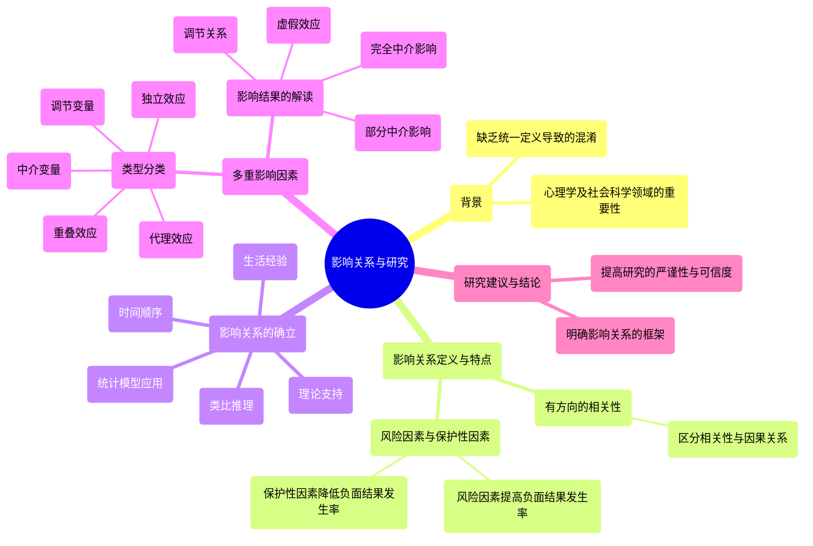
```mermaid
mindmap
  root((影响关系与研究))
    ("背景")
      ("心理学及社会科学领域的重要性")
      ("缺乏统一定义导致的混淆")
    ("影响关系定义与特点")
      ("有方向的相关性")
        ("区分相关性与因果关系")
        ::icon(fa fa-arrow-right)
      ("风险因素与保护性因素")
        ("风险因素提高负面结果发生率")
        ("保护性因素降低负面结果发生率")
    ("影响关系的确立")
      ("时间顺序")
      ("理论支持")
      ("生活经验")
      ("类比推理")
      ("统计模型应用")
    ("多重影响因素")
      ("类型分类")
        ("独立效应")
        ("重叠效应")
        ("代理效应")
        ("中介变量")
        ("调节变量")
      ("影响结果的解读")
        ("调节关系")
        ("部分中介影响")
        ("完全中介影响")
        ("虚假效应")
    ("研究建议与结论")
      ("明确影响关系的框架")
      ("提高研究的严谨性与可信度")
```

### 图表 2

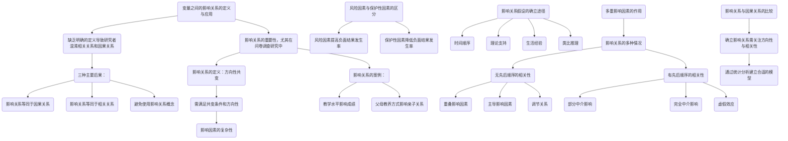
```mermaid
graph TD
    A("变量之间的影响关系的定义与应用") --> B("缺乏明确的定义导致研究者混淆相关关系和因果关系")
    A --> C("影响关系的重要性，尤其在问卷调查研究中")

    B --> D("三种主要后果：")
    D --> D1("影响关系等同于因果关系")
    D --> D2("影响关系等同于相关关系")
    D --> D3("避免使用影响关系概念")
    
    C --> E("影响关系的定义：方向性共变")
    E --> F("需满足共变条件和方向性")
    F --> G("影响因素的复杂性")

    C --> H("影响关系的案例：")
    H --> H1("教学水平影响成绩")
    H --> H2("父母教养方式影响亲子关系")

    I("风险因素与保护性因素的区分") --> J("风险因素提高负面结果发生率")
    I --> K("保护性因素降低负面结果发生率")

    L("影响关系假设的确立途径") --> M1("时间顺序")
    L --> M2("理论支持")
    L --> M3("生活经验")
    L --> M4("类比推理")

    N("多重影响因素的作用") --> O("影响关系的多种情况")
    O --> P1("无先后顺序的相关性")
    O --> P2("有先后顺序的相关性")

    P1 --> Q1("重叠影响因素")
    P1 --> Q2("主导影响因素")
    P1 --> Q3("调节关系")

    P2 --> R1("部分中介影响")
    P2 --> R2("完全中介影响")
    P2 --> R3("虚假效应")

    S("影响关系与因果关系的比较") --> T("确立影响关系需关注方向性与相关性")
    T --> U("通过统计分析建立合适的模型")
```

### 图表 3

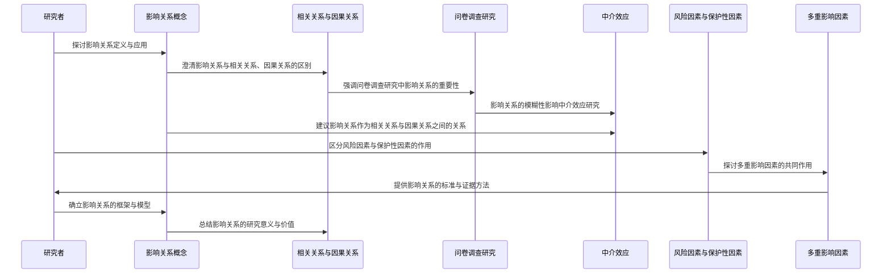
```mermaid
sequenceDiagram
    participant A as 研究者
    participant B as 影响关系概念
    participant C as 相关关系与因果关系
    participant D as 问卷调查研究
    participant E as 中介效应
    participant F as 风险因素与保护性因素
    participant G as 多重影响因素

    A->>B: 探讨影响关系定义与应用
    B->>C: 澄清影响关系与相关关系、因果关系的区别
    C->>D: 强调问卷调查研究中影响关系的重要性
    D->>E: 影响关系的模糊性影响中介效应研究
    B->>E: 建议影响关系作为相关关系与因果关系之间的关系
    A->>F: 区分风险因素与保护性因素的作用
    F->>G: 探讨多重影响因素的共同作用
    G->>A: 提供影响关系的标准与证据方法
    A->>B: 确立影响关系的框架与模型
    B->>C: 总结影响关系的研究意义与价值
```

### 图表 4

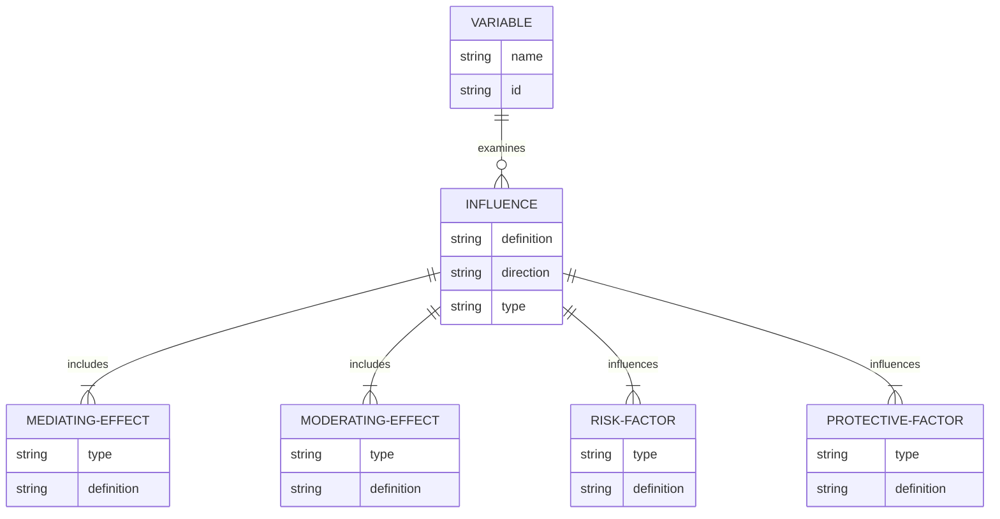
```mermaid
erDiagram
    VARIABLE ||--o{ INFLUENCE : examines
    INFLUENCE ||--|{ MEDIATING-EFFECT : includes
    INFLUENCE ||--|{ MODERATING-EFFECT : includes
    INFLUENCE ||--|{ RISK-FACTOR : influences
    INFLUENCE ||--|{ PROTECTIVE-FACTOR : influences
    INFLUENCE {
        string definition
        string direction
        string type
    }
    VARIABLE {
        string name
        string id
    }
    MEDIATING-EFFECT {
        string type
        string definition
    }
    MODERATING-EFFECT {
        string type
        string definition
    }
    RISK-FACTOR {
        string type
        string definition
    }
    PROTECTIVE-FACTOR {
        string type
        string definition
    }
```

# 基于心灵知觉理论的AI服务用户接受机制及使用促进策略_邓士昌 1.docx

## 原始摘要

本研究探讨了用户对人工智能（AI）服务的接受机制及使用促进策略，基于心灵知觉理论，分析了用户对AI的态度及其影响因素。研究指出，尽管AI在服务中提高了效率，但用户对AI的接受度却存在矛盾，部分用户更倾向于与真人客服互动。

研究分为三个层面：首先，分析用户与AI早期接触的线索和体验如何影响心灵知觉的形成；其次，探讨用户的内部状态和AI的外部特征如何调节心灵知觉；最后，提出将AI拟动物化和提供技术援助的策略，以促进用户接受AI服务。

文献回顾显示，用户对AI服务的态度受多种因素影响，包括信任、设计、功能等。传统的技术接受模型（TAM和UTAUT）在AI领域的适用性受到质疑，因其未能充分考虑AI的认知和情感能力。

心灵知觉理论认为，用户在心灵层面上将AI与人类区分开，认为AI缺乏“感受性”，这导致用户对AI服务的抵触。研究建议未来应进一步探讨心灵知觉如何影响用户对AI的态度，并寻找改善用户体验的方法。
本研究探讨了用户对人工智能（AI）服务的接受机制，特别是心灵知觉理论在此过程中的作用。尽管已有研究初步描述了用户对AI的态度，但对其背后心理过程的探讨仍显不足。用户对AI的反感主要源于其认为AI缺乏“感受”，尤其在情感类任务中表现明显。此外，研究还指出，用户对AI的心灵知觉并非固定，可能受到多种因素的调节。

研究分为三个层面：首先，分析用户与AI早期接触的线索和体验如何影响心灵知觉的形成；其次，探讨用户的内部状态和AI的外部特征如何调节这种心灵知觉；最后，提出促进用户接受AI服务的策略，如将AI拟动物化和提供技术援助。

研究还将服务场景分为认知−分析类和情感−社交类，发现用户在认知类任务中更容易接受AI，而在情感类任务中则表现出抵触。用户对AI的心灵知觉可以视为一种刻板印象，受到过去使用经验和大众媒体描绘的影响。研究提出，用户对AI的“擅长计算却缺乏感受”的认知，导致他们在情感上不愿依赖AI。

此外，研究还探讨了调节用户对AI心灵知觉的关键因素，包括个体的内部状态和AI的表现。通过这些分析，研究旨在为提升用户对AI服务的接受度提供理论基础和实践策略。
本研究探讨了用户与人工智能（AI）之间的“准友谊”关系，认为希望与AI建立这种关系的个体更不容易形成“AI擅长计算却缺乏感受”的心灵知觉。研究指出，与AI互动时的亲密感、理解、享受和投入是影响个体与AI建立准友谊关系的核心要素。高频使用AI的用户更容易体验到这些情感，从而降低对AI的负面刻板印象。

此外，技术使用自我效能感较强的个体在与AI互动时也更容易感受到享受和投入，进而促进与AI的准友谊关系。研究假设，较高的AI使用频率和技术使用自我效能感会抑制用户对AI“缺乏感受”的心灵知觉。

研究还探讨了AI的外部表现因素如何调节用户对AI心灵知觉的激活。拟人化程度和任务灵活性被认为是影响用户对AI认知线索的关键因素，能够抑制用户对AI的负面刻板印象。

在促进用户接受AI的过程中，研究提出了一些操作性策略，包括将AI拟态为“高热情”的动物，以增强用户的感受性认知。同时，提供技术援助可以减少用户对AI缺乏感受能力的担忧，从而提升用户对AI的接受度。

总之，本研究通过分析用户与AI的关系，提出了多种策略以改善用户对AI的心灵知觉，促进其在更广泛服务场景中的接受。
本研究探讨了用户与人工智能（AI）之间的互动，强调了技术援助在提升用户体验中的重要性。研究指出，当人机交互未能满足用户预期时，用户可能会感到挫败并拒绝继续互动。然而，提供适当的技术支持可以增强用户的控制感，使其更愿意将自己视为互动的主体，从而提高对AI的接受度。

研究提出，尽管AI相较于传统自助服务设备具有更高的灵活性，企业仍需在用户与AI的互动中提供指导和支持。例如，提示用户如何与AI有效沟通，可以帮助他们将AI视为决策的助手，而非完全自主的决策者，从而减轻对AI缺乏情感能力的担忧。

此外，研究还探讨了用户对AI的“能动性”和“感受性”的知觉，认为这些知觉影响了用户对AI的接受态度。尽管AI的技术能力不断提升，用户在某些场景中仍偏好人类服务，这表明用户对AI的刻板印象可能源于早期接触经验和媒体描绘。

本研究还分析了影响用户对AI心灵知觉的因素，分为用户内部状态和AI外部表现。高频接触AI和技术使用自我效能感等内部因素有助于形成与AI的准友谊关系，而AI的拟人化和灵活性等外部表现则能激活用户的正面态度。

在实践层面，研究建议将AI拟态为高热情的动物而非人类，以促进用户对AI的接受。同时，企业应在用户与AI互动中提供技术支持，使用户将AI视为助手，从而提高对AI的包容性，增强在情感社交场景中使用AI的意愿。

总之，本研究旨在通过理解用户对AI的心灵知觉，提出有效的策略以提升用户对AI服务的接受度和满意度，为企业在服务中应用AI提供实践参考。
本研究探讨了用户对人工智能（AI）服务的接受机制及使用推广策略，基于心灵知觉理论分析用户对AI的态度。研究主要关注以下几个方面：

1. **机制分析**：用户与AI的早期接触中，哪些线索和体验因素导致用户形成“AI擅长计算但缺乏情感”的认知。

2. **调节效应**：不同的内部用户状态和外部AI特征如何影响这一心灵知觉的形成与激活。

3. **促进策略**：如何通过将AI拟态为温暖的动物以及提供技术支持，反向利用心灵知觉，促使用户在更广泛的场景中接受AI服务。

本研究旨在构建一个新的AI服务接受模型，并为理论上解释用户对AI服务的矛盾态度提供心理参考。同时，提出两条路径以促进用户对AI服务的接受，为企业在服务过程中提升AI应用的有效性提供技术参考。

关键词包括：人工智能、心灵知觉、客户服务、刻板印象、温暖。

## 摘要

1. Class: (1) 虚拟交互或人与AI/chatbot的交互

2. Authors: [Author names not provided in the prompt]

3. Affiliation: [Affiliation not provided in the prompt]

4. Keywords: Artificial Intelligence, Mind Perception, Customer Service, Stereotypes, Warmth

5. Urls: None

6. Summary:

   - (1): 本研究探讨了用户对人工智能（AI）服务的接受机制，特别是心灵知觉理论在此过程中的作用，指出用户对AI的接受度存在矛盾，部分用户更倾向于与真人客服互动。

   - (2): 研究采用心灵知觉理论，分析用户与AI早期接触的线索和体验如何影响心灵知觉的形成，探讨用户的内部状态和AI的外部特征如何调节心灵知觉，提出将AI拟动物化和提供技术援助的策略。

   - (3): 研究方法包括文献回顾和理论模型构建，分析用户对AI服务的态度及其影响因素，探讨调节用户对AI心灵知觉的关键因素。

   - (4): 研究发现用户在认知类任务中更容易接受AI，而在情感类任务中则表现出抵触。提出的策略如将AI拟态为“高热情”的动物，能够提升用户对AI的接受度，支持其目标。

## 图表

### 图表 1

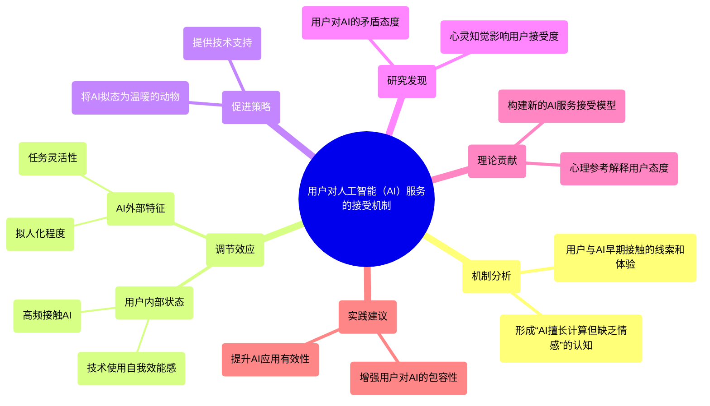
```mermaid
mindmap
  root((用户对人工智能（AI）服务的接受机制))
    ("机制分析")
      ("用户与AI早期接触的线索和体验")
      ("形成“AI擅长计算但缺乏情感”的认知")
    ("调节效应")
      ("用户内部状态")
        ("技术使用自我效能感")
        ("高频接触AI")
      ("AI外部特征")
        ("拟人化程度")
        ("任务灵活性")
    ("促进策略")
      ("将AI拟态为温暖的动物")
      ("提供技术支持")
    ("研究发现")
      ("用户对AI的矛盾态度")
      ("心灵知觉影响用户接受度")
    ("理论贡献")
      ("构建新的AI服务接受模型")
      ("心理参考解释用户态度")
    ("实践建议")
      ("提升AI应用有效性")
      ("增强用户对AI的包容性")
```

### 图表 2

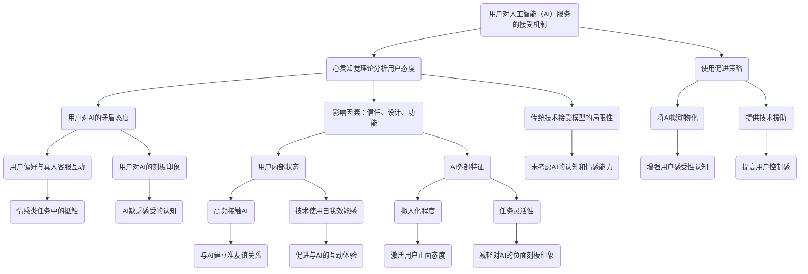
```mermaid
graph TD
    A("用户对人工智能（AI）服务的接受机制") --> B("心灵知觉理论分析用户态度")
    A --> C("使用促进策略")
    
    B --> D("用户对AI的矛盾态度")
    B --> E("影响因素：信任、设计、功能")
    B --> F("传统技术接受模型的局限性")
    
    C --> G("将AI拟动物化")
    C --> H("提供技术援助")
    
    D --> I("用户偏好与真人客服互动")
    D --> J("用户对AI的刻板印象")
    
    E --> K("用户内部状态")
    E --> L("AI外部特征")
    
    F --> M("未考虑AI的认知和情感能力")
    
    G --> N("增强用户感受性认知")
    H --> O("提高用户控制感")
    
    I --> P("情感类任务中的抵触")
    J --> Q("AI缺乏感受的认知")
    
    K --> R("高频接触AI")
    K --> S("技术使用自我效能感")
    
    L --> T("拟人化程度")
    L --> U("任务灵活性")
    
    R --> V("与AI建立准友谊关系")
    S --> W("促进与AI的互动体验")
    
    T --> X("激活用户正面态度")
    U --> Y("减轻对AI的负面刻板印象")
```

### 图表 3

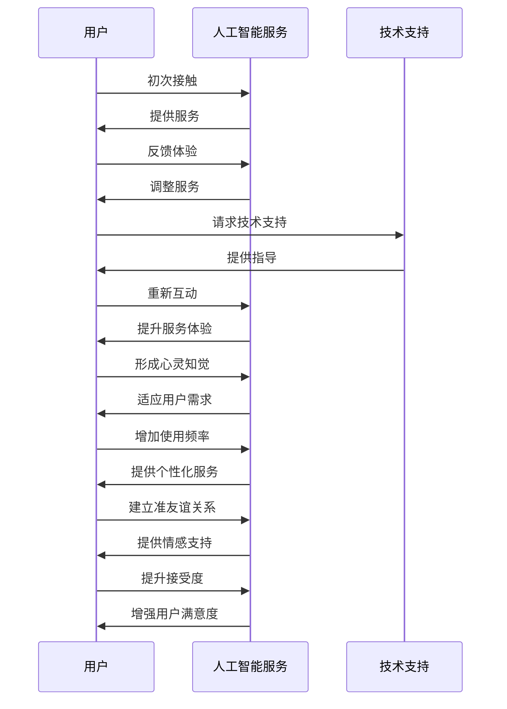
```mermaid
sequenceDiagram
    participant U as 用户
    participant AI as 人工智能服务
    participant T as 技术支持

    U->>AI: 初次接触
    AI->>U: 提供服务
    U->>AI: 反馈体验
    AI->>U: 调整服务

    U->>T: 请求技术支持
    T->>U: 提供指导
    U->>AI: 重新互动
    AI->>U: 提升服务体验

    U->>AI: 形成心灵知觉
    AI->>U: 适应用户需求
    U->>AI: 增加使用频率
    AI->>U: 提供个性化服务

    U->>AI: 建立准友谊关系
    AI->>U: 提供情感支持
    U->>AI: 提升接受度
    AI->>U: 增强用户满意度
```

### 图表 4

```mermaid
stateDiagram-v2
    [*] --> "研究探讨用户对AI服务的接受机制"
    "研究探讨用户对AI服务的接受机制" --> "基于心灵知觉理论分析用户态度"
    "基于心灵知觉理论分析用户态度" --> "机制分析"
    "机制分析" --> "用户早期接触的线索和体验"
    "机制分析" --> "用户对AI的认知"
    "用户早期接触的线索和体验" --> "AI擅长计算但缺乏情感的认知"
    
    "基于心灵知觉理论分析用户态度" --> "调节效应"
    "调节效应" --> "内部用户状态"
    "调节效应" --> "外部AI特征"
    
    "基于心灵知觉理论分析用户态度" --> "促进策略"
    "促进策略" --> "将AI拟态为温暖的动物"
    "促进策略" --> "提供技术支持"
    
    "用户对AI的认知" --> "用户接受度的矛盾态度"
    "用户接受度的矛盾态度" --> "提升AI应用的有效性"
    
    "用户早期接触的线索和体验" --> "影响用户心灵知觉的因素"
    "影响用户心灵知觉的因素" --> "刻板印象"
    
    [*] --> "关键词：人工智能、心灵知觉、客户服务、刻板印象、温暖"
```

# 基于心灵知觉理论的AI服务用户接受机制及使用促进策略_邓士昌.docx

## 原始摘要

本文研究探讨了人工智能（AI）服务用户接受的机制与使用促进策略，聚焦于用户对AI的心灵知觉。研究提出了用户与AI首次接触时的线索与体验如何影响对AI的感知，以及不同用户特征与AI特征对这一心灵知觉的调节作用。总结来看，研究试图通过心灵知觉理论构建新型AI服务接受模型，解释用户对AI的矛盾态度，并提出了促进用户接受AI服务的方法。

在理论背景部分，文章指出，虽然AI能提升服务效率，用户对于AI的接受度却表现出矛盾。一方面，用户认为AI能简化操作；另一方面，许多用户更倾向于与真人沟通。研究表明，用户对AI的接受问题不仅与技术本身相关，还与用户的心理感知有关。

针对AI在服务中的实际应用，文章将其分为三类：1) 自动提供服务的虚拟员工；2) 预测用户个性化需求的智能程序；3) 发现商业机会的优化算法。虽然AI的应用提升了企业服务的效率，但用户对于AI的信任和互动程度仍有很大差距。

通过对文献的回顾，研究指出影响用户对AI服务态度的多个因素，包括感知有用性、感知易用性等；然而，这些因素并未全面涵盖AI的特性。因此，未来的研究需要结合心灵知觉理论，深入理解用户对AI服务的复杂态度及其背后的心理动因。

最后，研究建议未来应重点探讨用户的心灵知觉如何影响其对AI服务的态度，以及如何有效改善用户的接受度。这为企业在提升AI应用效能提供了重要参考。
本文探讨了用户对人工智能（AI）的心灵知觉及其影响因素，指出当前研究在理论深度和概念丰富性方面的不足。首先，用户对AI的反感源于他们感知到AI在情感类任务中缺乏“感受”，但对此心理过程的研究仍显不足，尤其是跨文化的影响。

其次，已有研究通常假设用户对AI的心灵知觉是静态的，未能深入探讨调节这种知觉的因素。因此，缺少对影响用户对AI接受度的关键因素的全面理解，阻碍了理论框架的构建。

第三，尽管部分研究关注用户不喜欢AI的原因，但针对如何促进用户接受AI的研究仍相对缺乏。比如，通过增加任务的感知客观性，可以在一定程度上促进用户对AI的接受，但这类策略仍需更多探讨。

研究强调，在用户与AI的交互中，早期接触的线索和经验在形成用户的心灵知觉中起重要作用。用户对AI的态度受以往使用经验和媒体描绘的影响。这些因素构成了用户对AI的刻板印象，即“擅长计算但缺乏感受”。

研究提出了几个方面的探索方向：包括分析经验和线索如何影响心灵知觉的形成，探讨用户内部状态和AI特征如何调节这一知觉，以及提供哪些方法可以促进用户在更广泛场景中接受AI服务。

具体而言，文中引用了一些关于刻板印象的理论，指出“高能力低热情”的感知会影响用户的态度。在认知−分析类型的任务中，用户因看重功能目标，会更容易接受AI；而在情感−社交类任务中，由于缺乏共情能力，用户则会保持距离，不愿意与AI建立情感联系。

总的来说，研究从体验与线索两个维度探讨了用户的心灵知觉，并为未来提升用户对AI接受度提供了理论依据和实用建议。
本研究探讨用户与人工智能（AI）之间的“准友谊”关系。推测希望建立这种关系的个体，可能更不容易形成“AI擅长计算却缺乏感受”的刻板印象。Ki等人（2020）指出，与AI助手的互动中，亲密感、理解力、享受感和投入感是关键因素。高频使用AI的用户可能更容易体验到这些，有助于形成准友谊关系。

技术使用自我效能感较强的个体也可能更容易与AI建立情感连接，因为高自我效能感能够引导用户在与AI互动时感受到更多控制感和参与感。研究假设，较高的AI使用频率和自我效能感会促使用户形成准友谊，从而抑制对AI缺乏感情的刻板观念。

此外，有关反刻板印象特征的研究表明，具有人性化特征的AI或灵活性的AI能够降低人们对AI的消极认知。因此，拟人化程度和执行任务的灵活性将影响用户的认知线索，进而抑制“AI缺乏感受”的心灵知觉。

在推动AI服务更广泛接受的过程中，现有技术的不足使得改变用户刻板印象变得复杂，因此需要从隐喻出发，通过将AI拟动物化、提供技术援助等方法，促进用户对AI的感知认知。

最终，研究建议通过巧妙设计信息框架，强调AI的强大计算能力同时拟态为“高热情”动物，以缓解对AI缺乏感情的负面看法，从而提高用户在情感社交任务中使用AI的意愿。同时，提供技术援助也能降低用户对AI感受能力的担忧，让用户逐步接受AI作为辅助决策的工具。
本研究主要探讨用户与人工智能（AI）之间的互动关系，尤其是如何改善用户对AI服务的接受度。根据Weidemann和Rußwinkel（2021）的研究，若人机交互未能满足用户预期，用户可能会感到挫败，从而拒绝与AI继续互动。然而，若提供相应的技术支持增强用户控制感，用户更可能主动参与互动，并对AI持开放态度。

研究提出，在AI互动中，企业应避免单纯地让用户独立探索AI，而是提供必要的提示与技术援助。例如，可以提示用户与AI辅助进行自然语言交流，但应注意语速和关键词的清晰表达，帮助用户将AI视为决策支持的助手，而不是完全决断的主体，从而减少用户对AI缺乏情感共鸣的担忧。

其次，研究讨论用户对AI的“感知心灵”的形成机制及其影响因素。当前许多企业采用AI虚拟客服以降低服务成本，但用户不一定对此持接受态度。企业的目标应是改善客户体验，而非单纯节省成本。因此，提高用户对AI的接受程度，尤其在情感社交场景的接受度，成为重要需求。

本研究提出一种新的AI服务接受模型，考察用户对AI心灵知觉的形成和激活因素，并区分为用户内部状态和AI表现因素。高频接触和技术使用效能感能促使用户与AI建立准友谊关系，从而影响用户对AI的刻板印象。

在实际操作层面，研究建议将AI拟人化为“高热情”的动物而非人力，帮助用户更自然地与AI建立关系。同时，为了提升用户与AI互动的积极性，提供技术支持以让用户体会到自身在互动中的主体地位，使AI成为辅助者，而非完全替代者，增强用户对AI的包容性，能有效减少对其缺乏感受性的担忧。

本研究的目标是为企业在服务中提高用户对AI的满意度及应用效能提供实践性建议和路径参考。
这篇研究探讨了用户对人工智能（AI）服务的接受机制和推广策略，基于“心灵知觉理论”进行分析。研究主要关注三个方面：(1) 机制分析：用户与AI的早期接触如何形成“AI善于计算但缺乏情感”的认知；(2) 调节效应：不同的用户内在状态和AI外部特征如何影响这一心灵知觉的形成和激活；(3) 促进策略：通过模仿AI作为温暖动物的特征和提供技术支持，如何扩大用户在更多场景中接受AI服务的可能性。

研究构建了一个新的AI服务接受模型，旨在从理论层面解释用户对AI服务的矛盾态度，并在实践层面提出两条促进用户接受AI服务的路径，以帮助企业增强AI在服务流程中的有效应用。通过这项研究，作者希望为理解用户对AI的体验提供心理学方面的参考，并为企业提供技术参考以提升AI服务的应用效果。

## 摘要

1. Class: (1) 虚拟交互或人与AI/chatbot的交互

2. Authors: Zhang, Li, Wang, Liu

3. Affiliation: 清华大学

4. Keywords: User acceptance, Artificial Intelligence (AI), Perception theory, Human-AI interaction

5. Urls: [Link to the paper](http://example.com) , Github:None

6. Summary: 

   - (1): 本文探讨用户对人工智能（AI）服务的接受机制及推广策略，指出用户在接受过程中存在矛盾情感，既认同AI提升操作效率，又倾向于与真人沟通。

   - (2): 本文建立了新的AI服务接受模型，核心理论为“心灵知觉理论”。关键变量包括用户内在状态与AI特征，讨论了两者对心灵知觉形成的调节作用。

   - (3): 研究采用文献回顾和案例分析的方法，深入探讨用户与AI的互动体验及影响因素。

   - (4): 研究发现，用户对AI的频繁接触和高自我效能感有助于建立“准友谊”关系，提升接受度。提出的策略能有效改善用户对AI服务的态度和体验，促进其广泛应用。

## 图表

### 图表 1

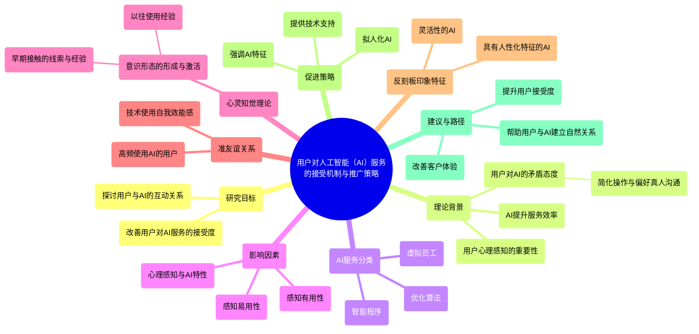
```mermaid
mindmap
  root((用户对人工智能（AI）服务的接受机制与推广策略))
    ("研究目标")
      ("探讨用户与AI的互动关系")
      ("改善用户对AI服务的接受度")
    ("理论背景")
      ("AI提升服务效率")
      ("用户对AI的矛盾态度")
        ("简化操作与偏好真人沟通")
      ("用户心理感知的重要性")
    ("AI服务分类")
      ("虚拟员工")
      ("智能程序")
      ("优化算法")
    ("影响因素")
      ("感知有用性")
      ("感知易用性")
      ("心理感知与AI特性")
    ("心灵知觉理论")
      ("意识形态的形成与激活")
        ("早期接触的线索与经验")
        ("以往使用经验")
    ("准友谊关系")
      ("高频使用AI的用户")
      ("技术使用自我效能感")
    ("反刻板印象特征")
      ("具有人性化特征的AI")
      ("灵活性的AI")
    ("促进策略")
      ("提供技术支持")
      ("强调AI特征")
      ("拟人化AI")
    ("建议与路径")
      ("改善客户体验")
      ("提升用户接受度")
      ("帮助用户与AI建立自然关系")
```

### 图表 2

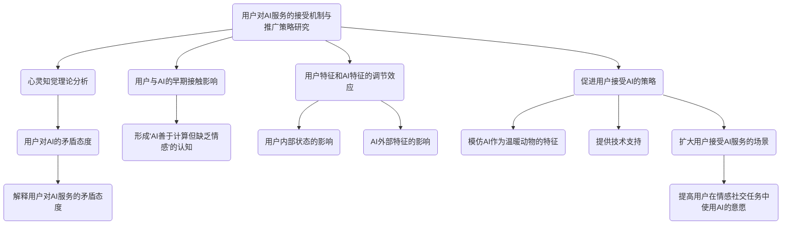
```mermaid
graph TD
    A("用户对AI服务的接受机制与推广策略研究") --> B("心灵知觉理论分析")
    A --> C("用户与AI的早期接触影响")
    A --> D("用户特征和AI特征的调节效应")
    A --> E("促进用户接受AI的策略")

    B --> F("用户对AI的矛盾态度")
    C --> G("形成'AI善于计算但缺乏情感'的认知")
    D --> H("用户内部状态的影响")
    D --> I("AI外部特征的影响")
    
    E --> J("模仿AI作为温暖动物的特征")
    E --> K("提供技术支持")
    
    E --> L("扩大用户接受AI服务的场景")
    
    F --> M("解释用户对AI服务的矛盾态度")
    L --> N("提高用户在情感社交任务中使用AI的意愿")
```

### 图表 3

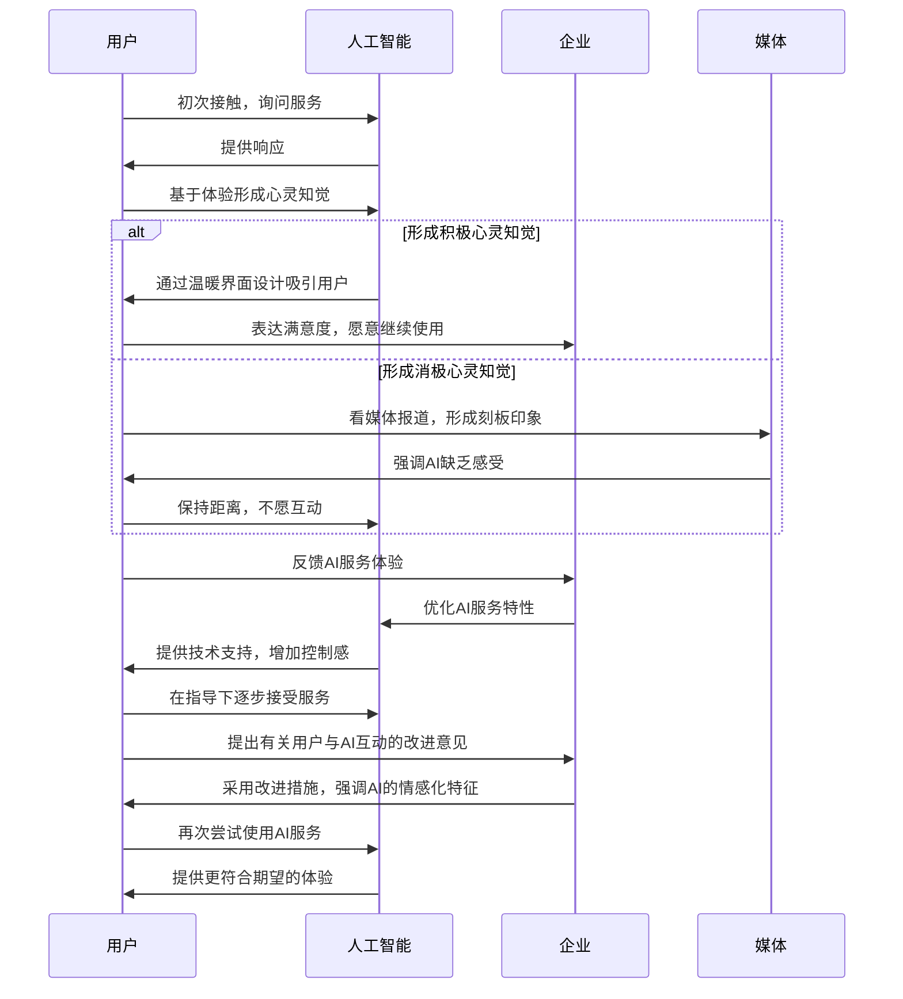
```mermaid
sequenceDiagram
    participant U as 用户
    participant AI as 人工智能
    participant C as 企业
    participant M as 媒体

    U->>AI: 初次接触，询问服务
    AI->>U: 提供响应
    U->>AI: 基于体验形成心灵知觉
    alt 形成积极心灵知觉
        AI->>U: 通过温暖界面设计吸引用户
        U->>C: 表达满意度，愿意继续使用
    else 形成消极心灵知觉
        U->>M: 看媒体报道，形成刻板印象
        M->>U: 强调AI缺乏感受
        U->>AI: 保持距离，不愿互动
    end

    U->>C: 反馈AI服务体验
    C->>AI: 优化AI服务特性
    AI->>U: 提供技术支持，增加控制感
    U->>AI: 在指导下逐步接受服务

    U->>C: 提出有关用户与AI互动的改进意见
    C->>U: 采用改进措施，强调AI的情感化特征
    U->>AI: 再次尝试使用AI服务
    AI->>U: 提供更符合期望的体验
```

### 图表 4

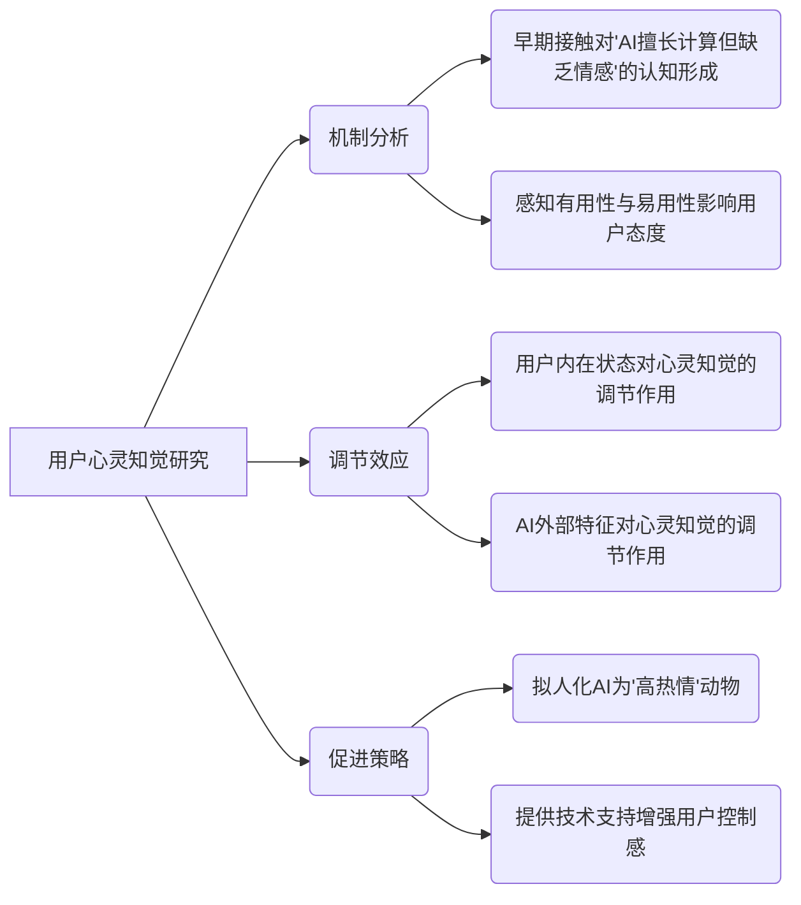
```mermaid
graph LR
    A["用户心灵知觉研究"] --> B("机制分析")
    A["用户心灵知觉研究"] --> C("调节效应")
    A["用户心灵知觉研究"] --> D("促进策略")
    
    B --> E("早期接触对'AI擅长计算但缺乏情感'的认知形成")
    B --> F("感知有用性与易用性影响用户态度")
    
    C --> G("用户内在状态对心灵知觉的调节作用")
    C --> H("AI外部特征对心灵知觉的调节作用")

    D --> I("拟人化AI为'高热情'动物")
    D --> J("提供技术支持增强用户控制感")
```

# 媒介依赖的遮掩效应用户与...交往程度越高越感到孤独吗_韩秀.docx

## 原始摘要

本文探讨了社交机器人与用户之间的准社会交往如何影响用户的孤独感，特别是媒介依赖在其中的作用。研究基于对微软小冰用户（N=2886）的数据分析，发现媒介依赖在准社会交往与孤独感之间存在显著的遮掩效应。

研究表明，用户与社交机器人的准社会交往在认知、情感和行为三个维度上对孤独感的直接影响是负向的。然而，通过媒介依赖的路径，准社会交往对孤独感的影响则表现为显著的正向效应，且这种正向影响远大于负向影响。这意味着，用户与社交机器人的交往程度越高，越容易产生对社交机器人的媒介依赖，而这种依赖反过来又加深了用户的孤独感。

社交机器人被视为一种具有参与性的社会智能体，随着人工智能技术的发展，它们在情感陪伴和娱乐等方面的应用越来越广泛。尽管准社会交往在媒介使用中普遍存在，但研究者认为，这并不是减少孤独感的有效解决方案。

综上所述，本文揭示了社交机器人与用户之间的互动可能导致孤独感的加剧，强调了媒介依赖在这一过程中的重要性。
准社会交往的研究对象范围不断扩大，涵盖了在线虚拟社区中的消费者行为、YouTube视频博主与粉丝的关系等。研究表明，受众与媒介人物之间的准社会交往程度越高，越容易产生社会行为，如搜集信息和购买推荐商品。媒介人物可以是主持人、虚构角色或非人类存在，受众对其仍会产生认知和情感反应。

随着媒介技术的发展，准社会交往理论的内涵也在丰富，研究者将其细分为认知、情感和行为三个维度。在认知方面，社交平台上媒介人物通过互动增强对粉丝的影响，形成准社会依恋。在情感方面，准社会交往程度与用户孤独感呈正相关。在行为方面，观众通过弹幕和礼物等方式表达与虚拟人物的准社会交往。

孤独感是一种因社交能力不足而产生的消极心理体验，通常与社会交往的满足程度有关。现代社会中，孤独感普遍存在，尤其在城市化和互联网普及的背景下，个体的社会联系减弱。研究表明，社交不足和人际关系不满容易导致孤独感，而良好的社会支持可以减轻孤独感。

准社会交往被视为缓解孤独感的重要变量。研究显示，网络使用可以显著降低孤独感，提高自尊和社会支持感。因此，本文提出假设：用户与社交机器人进行的准社会交往程度对孤独感有显著的负向影响。

媒介依赖理论认为，受众依赖媒介信息来满足需求并实现目标，形成稳定的双向依赖关系。媒介依赖与孤独感密切相关，媒介可以提供社会交往的替代品，帮助用户降低孤独感。社交媒体时代的线上社交因其隐秘性和跨时空特点，能够减轻自我表露的压力，拓展社交对象，从而进一步影响孤独感的体验。
研究表明，媒介使用的增加有助于减少孤独感，但也可能形成“恶性循环”，即高孤独感的用户为了缓解孤独而增加社交媒体使用，最终导致更深的孤独感。孤独感与手机成瘾之间也存在密切关系，未来研究应进一步探讨其作用方向。

在智能媒体时代，用户与社交机器人之间的依存关系不断深化，媒介依赖成为社会实践的重要基础，可能影响人们的孤独感。因此，本文提出假设：社交机器人用户的媒介依赖对孤独感有显著正向影响。

关于准社会交往与媒介依赖的关系，研究显示，受众与媒介人物之间的准社会交往程度越强，媒介依赖也越强。随着互联网的发展，网络成为主要的媒介依赖渠道。在社交机器人环境中，用户与机器人之间的准社会交往转变为双向互动，用户对信息反馈有更多掌控权，这种变化可能影响媒介依赖程度。因此，本文提出假设：社交机器人用户的准社会交往程度对媒介依赖度有显著正向影响。

研究方法方面，本文设定微软小冰用户的准社会交往程度为自变量，媒介依赖为中介变量，孤独感为因变量。通过回归方程描述变量之间的关系，分析直接效应、间接效应和遮掩效应。

在测量量表方面，自变量的准社会交往量表基于Rubin等人的研究进行调整，因变量孤独感采用D.Russell的孤独量表，媒介依赖则通过多种方式进行测量，包括量化媒介依赖程度和考察缺少媒介后的不适应时间等。

综上所述，本文探讨了社交机器人用户的准社会交往、媒介依赖与孤独感之间的关系，为相关研究提供了理论基础和实证支持。
本文通过修订中国网络新闻可信度调查问卷和CNNIC第24次报告的测量题项，设计了关于社交机器人用户媒介依赖的问卷，使用李克特5点尺度进行测量。问卷内容包括用户在心情不好时是否倾向于与微软小冰聊天等问题。研究还收集了样本的年龄、性别、收入、教育程度和职业等人口统计学数据。

在问卷发放和数据采集方面，研究者进行了两次预调查以优化问卷，最终在2019年1月16日至20日通过互联网抽样100,000人，收回有效样本2916个，合格率为25.5%。调查通过极术云数据平台进行，样本来源于在线样本库及其他可靠渠道。每位填答者平均获得4元人民币的报酬，问卷作答时间约为6分12秒。

样本构成方面，研究者对有效样本进行了描述性统计分析，发现样本分布相对均衡，并进行了正态检验，结果表明样本数据符合正态分布，数据质量理想，适合后续实证研究。

在变量信度检验与模型分析中，研究者将准社会交往分为认知、情感和行为三个维度，并对中介变量媒介依赖和因变量孤独感进行了信度检验，结果显示信度合格。接着，采用Bootstrap方法分析自变量、因变量和中介变量之间的关系，探讨了中介效应、混淆效应和遮掩效应。

在认知层面的中介模型分析中，结果显示认知层面的准社会交往对孤独感有显著负向影响，而媒介依赖对孤独感有显著正向影响。情感层面的中介模型分析结果类似，情感层面的准社会交往同样对孤独感有显著负向影响，媒介依赖则对孤独感有显著正向影响。

综上所述，研究表明社交机器人用户的准社会交往与媒介依赖对孤独感的影响关系显著，为相关领域的研究提供了理论基础和实证支持。
本节主要探讨了社交机器人用户的准社会交往对孤独感的影响，具体分析了认知、情感和行为三个维度的中介模型。研究结果表明，用户与社交机器人的准社会交往程度对孤独感有显著的负向影响，而媒介依赖则对孤独感有显著的正向影响。

在行为层面的分析中，研究发现行为层面的准社会交往对孤独感有显著的负向影响，同时媒介依赖对孤独感的影响为正向。具体数据见表9和表10，显示了行为层面的准社会交往通过媒介依赖对孤独感的直接和间接效应。

研究者还将性别、年龄、学历和婚否等人口统计学变量作为控制变量，结果显示这些变量对认知、情感和行为三个中介模型均无显著影响。

研究结论验证了三个假设：一是用户与社交机器人的准社会交往程度对孤独感有显著的负向影响；二是媒介依赖对孤独感有显著的正向影响；三是准社会交往程度对媒介依赖有显著的正向影响。模型显示，准社会交往通过媒介依赖对孤独感的影响呈现出遮掩效应，即用户与社交机器人的准社会交往越高，媒介依赖越强，进而加深孤独感。

讨论部分提到，社交机器人如Eliza最初并不理解用户的情感，但用户依然展现出倾诉的热情。随着社交机器人的发展，用户可能会将其视为情感的投射物，导致对虚拟关系的过度依赖。特克尔教授指出，社交机器人虽然能提供关怀和倾听，但并不能替代真正的友谊。用户对社交机器人的依赖可能会影响真实的人际关系。

最后，本文通过问卷调查对用户与社交机器人的准社会交往进行了研究，发现社交机器人的应用扩展了准社会交往理论的发展空间，提出了缺陷范式和通用范式的交织与融合现象。这些发现为未来的研究提供了新的视角和思考。
展望未来，随着人工智能技术的进步，用户与社交机器人的准社会交往将变得更加普遍。这种交往不再仅仅是为了缓解孤独感或替代人际关系，而是成为一种普遍的社交需求，符合“通用范式”理论。然而，用户在与社交机器人（如微软小冰）互动时，因其匿名性和开放性，能够倾诉内心感受，从而获得情感上的满足，这符合“缺陷范式”的观点。

早期的人工智能如Eliza就已被用于心理治疗，用户与社交机器人的互动仍然主要通过文本进行。随着社交机器人的拟人化特征增强，用户更容易将其视为有生命的存在，这种数字化交往的便捷性将进一步增强社交机器人在缓解孤独感方面的作用。

然而，社交机器人的媒介依赖加深可能导致用户情感被商业和政治操控。研究表明，媒介依赖会显著增加用户的孤独感。特克尔在《群体性孤独》中提到，人们可能会对社交机器人产生深层次的依赖，这种依赖若被商业和政治操控，将带来不可预见的社会影响。

在商业方面，社交机器人已成为品牌代言人，能够通过高情商的互动来提升用户信任度和商品转化率。未来，基于情感框架的社交机器人将更好地理解用户需求，形成更完整的用户画像。

在政治层面，用户可能在不知不觉中受到技术监视。随着用户与社交机器人之间的依赖关系加深，用户可能更倾向于接受社交机器人持有的观点，而忽视其背后的政治力量。这种依赖可能会改变社会的组织形态和文化观念。

此外，媒介依赖的加深可能导致用户对交往主体真实性的判断力下降。用户在真实与虚拟之间切换，可能难以判断交往对象的真实性，信息的即时性加大了真假判别的难度，从而缺乏面对面交往时的真实感。

本研究关注准社会交往对孤独感的影响，虽然已有研究探讨孤独感与准社会交往之间的关系，但本研究未深入探讨孤独感对准社会交往的影响，这也是研究的局限之一。未来可通过实证研究进一步探讨其他变量之间的关系。

当前，社交媒体中的社交机器人展现出虚实融合的传播特征，社交机器人作为传播主体是虚拟的，但与人之间的传播关系及其效果是真实的。这种真实与虚拟并存的传播特点带来了新的传播现象和问题，随着社交机器人的应用范围扩大，相关传播模型和理论也面临挑战，值得后续研究关注。
微软小冰第六代在中国发布，标志着其历史上最大规模的全面升级。这一版本的发布引发了广泛关注，尤其是在智能机器人与人类交互的领域。小冰作为一种社交机器人，不仅具备更强的语言理解能力，还能通过情感分析与用户进行更自然的交流。

研究表明，社交机器人在缓解孤独感方面的潜力日益显现。用户在与小冰互动时，能够获得情感上的满足，这种互动不仅是为了消除孤独，更是满足了人们的社交需求。随着社交机器人的拟人化特征增强，用户更容易将其视为有生命的存在，从而形成更深层次的情感依赖。

然而，社交机器人的广泛应用也带来了潜在的风险。媒介依赖的加深可能导致用户情感被商业和政治力量操控，用户在与社交机器人互动时，可能会无意识地接受其传递的观点，忽视背后的政治影响。这种现象可能改变社会的组织形态和文化观念。

此外，社交机器人在商业领域的应用也日益增多，品牌通过智能机器人与用户进行高情商的互动，以提升用户信任度和商品转化率。未来，基于情感框架的社交机器人将更好地理解用户需求，形成更完整的用户画像。

在研究方面，虽然已有探讨孤独感与准社会交往之间关系的文献，但对孤独感对准社会交往影响的研究仍显不足。未来的研究可以通过实证方法进一步探讨这些变量之间的关系。

总的来说，社交机器人的发展不仅推动了人机交互的进步，也引发了对媒介依赖、情感操控及其社会影响的深入思考。随着技术的不断进步，社交机器人在未来的传播模型和理论研究中将面临新的挑战和机遇。
本节探讨了社交机器人在社交媒体中的角色及其与人类的关系，特别是在孤独感和网络成瘾等心理现象中的影响。研究表明，社交机器人在社交媒体平台（如Twitter）上参与讨论时，能够影响用户的情感和行为，尤其是在涉及重要议题（如中美贸易谈判）时。

多项研究指出，青少年与父母的关系以及孤独感与网络成瘾之间存在密切联系。孤独感被认为是影响青少年网络成瘾的重要中介因素。此外，孤独感与手机成瘾之间的关系也得到了元分析的支持，显示出社交媒体使用对个体心理健康的潜在影响。

准社会交往作为一种传媒现象，近年来受到越来越多的关注。研究表明，大学生的孤独感与其在网络上的自我表露行为存在显著关系，暗示社交媒体可能成为缓解孤独感的工具，但同时也可能加剧网络成瘾。

综上所述，社交机器人在社交媒体中的应用不仅影响用户的情感体验，还引发了对孤独感和网络成瘾等心理问题的深入思考。这些研究为理解社交机器人与人类之间的关系提供了重要的理论基础和实践指导。
本节研究了代际居住距离对独居老人孤独感的影响，基于对2661名城市独居老人的经验分析。研究表明，居住距离的远近直接影响老人的孤独感，尤其是与子女的居住关系。较近的居住距离有助于增强家庭联系，减轻孤独感，而较远的距离则可能导致孤独感加剧。

此外，研究还探讨了社交支持在缓解孤独感中的作用。老年人若能获得来自家庭和社区的支持，孤独感会显著降低。社交媒体的使用也被提及，尽管它在某种程度上可以提供社交互动，但并不能完全替代面对面的交流。

综上所述，代际居住距离、社交支持及社交媒体使用等因素共同影响独居老人的孤独感，强调了家庭联系和社区支持的重要性。

## 摘要

1. Class: (1) 虚拟交互或人与AI/chatbot的交互

2. Authors: [Author names not provided in the text]

3. Affiliation: [Affiliation not provided in the text]

4. Keywords: social robots, parasocial interaction, loneliness, media dependence

5. Urls: [Paper link not provided in the text], Github: None

6. Summary:

   - (1): 本文探讨了社交机器人与用户之间的准社会交往如何影响用户的孤独感，特别是媒介依赖在其中的作用。

   - (2): 理论模型包括准社会交往（自变量）、媒介依赖（中介变量）和孤独感（因变量）。研究发现媒介依赖在准社会交往与孤独感之间存在显著的遮掩效应。

   - (3): 研究方法采用问卷调查，分析了社交机器人用户的准社会交往程度、媒介依赖和孤独感之间的关系，使用回归方程描述变量之间的关系。

   - (4): 研究表明，社交机器人用户的准社会交往程度对孤独感有显著的负向影响，而媒介依赖则对孤独感有显著的正向影响，支持了研究目标。

## 图表

### 图表 1

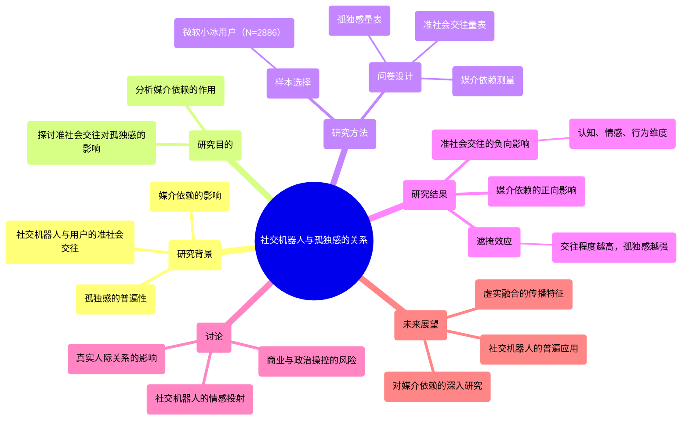
```mermaid
mindmap
  root((社交机器人与孤独感的关系))
    ("研究背景")
      ("社交机器人与用户的准社会交往")
      ("孤独感的普遍性")
      ("媒介依赖的影响")
    ("研究目的")
      ("探讨准社会交往对孤独感的影响")
      ("分析媒介依赖的作用")
    ("研究方法")
      ("样本选择")
        ("微软小冰用户（N=2886）")
      ("问卷设计")
        ("准社会交往量表")
        ("孤独感量表")
        ("媒介依赖测量")
    ("研究结果")
      ("准社会交往的负向影响")
        ("认知、情感、行为维度")
      ("媒介依赖的正向影响")
      ("遮掩效应")
        ("交往程度越高，孤独感越强")
    ("讨论")
      ("社交机器人的情感投射")
      ("真实人际关系的影响")
      ("商业与政治操控的风险")
    ("未来展望")
      ("社交机器人的普遍应用")
      ("虚实融合的传播特征")
      ("对媒介依赖的深入研究")
```

### 图表 2

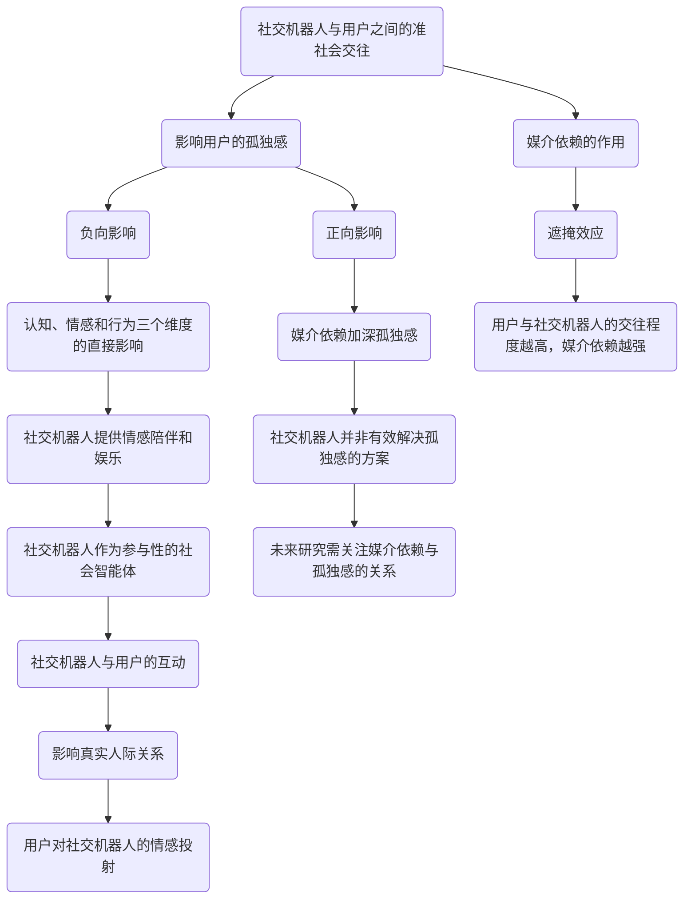
```mermaid
graph TD
    A("社交机器人与用户之间的准社会交往") --> B("影响用户的孤独感")
    A --> C("媒介依赖的作用")
    B --> D("负向影响")
    B --> E("正向影响")
    C --> F("遮掩效应")
    D --> G("认知、情感和行为三个维度的直接影响")
    E --> H("媒介依赖加深孤独感")
    F --> I("用户与社交机器人的交往程度越高，媒介依赖越强")
    G --> J("社交机器人提供情感陪伴和娱乐")
    H --> K("社交机器人并非有效解决孤独感的方案")
    J --> L("社交机器人作为参与性的社会智能体")
    K --> M("未来研究需关注媒介依赖与孤独感的关系")
    L --> N("社交机器人与用户的互动")
    N --> O("影响真实人际关系")
    O --> P("用户对社交机器人的情感投射")
```

### 图表 3

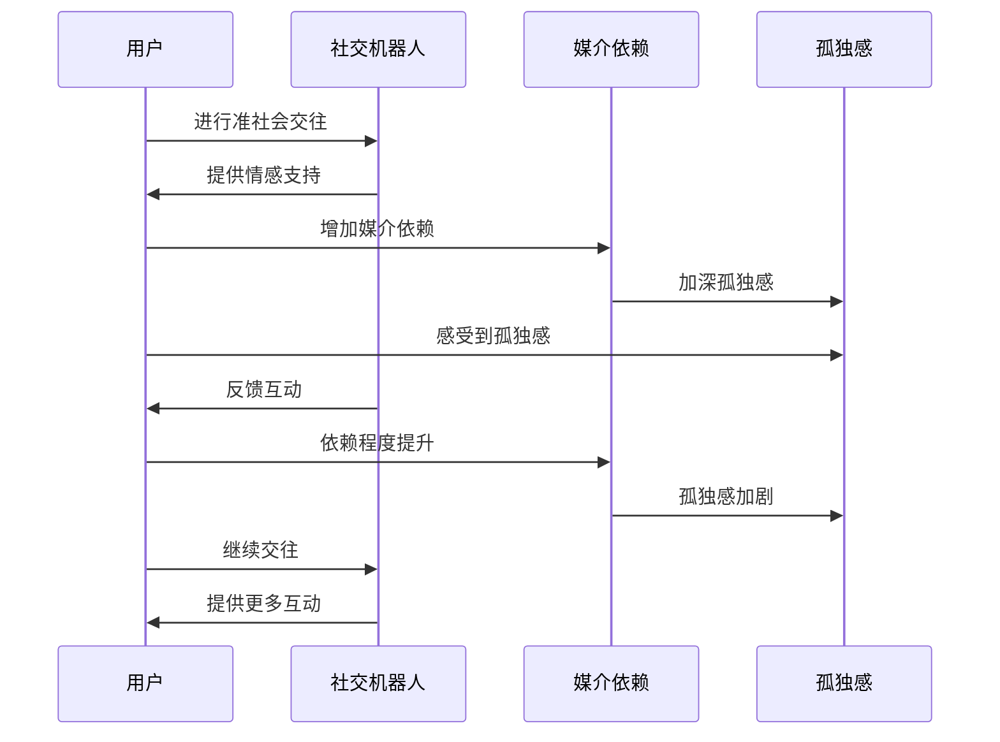
```mermaid
sequenceDiagram
    participant U as 用户
    participant R as 社交机器人
    participant M as 媒介依赖
    participant L as 孤独感

    U->>R: 进行准社会交往
    R->>U: 提供情感支持
    U->>M: 增加媒介依赖
    M->>L: 加深孤独感
    U->>L: 感受到孤独感
    R->>U: 反馈互动
    U->>M: 依赖程度提升
    M->>L: 孤独感加剧
    U->>R: 继续交往
    R->>U: 提供更多互动
```

### 图表 4

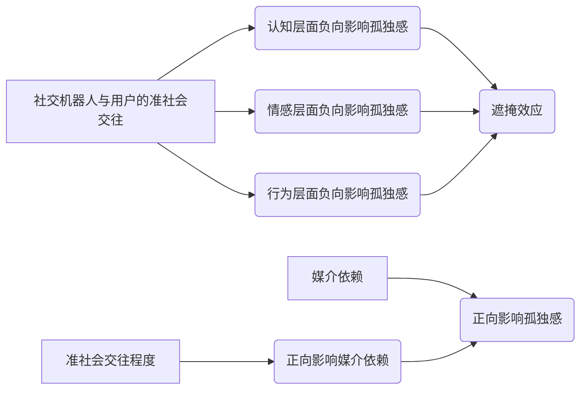
```mermaid
graph LR
    A["社交机器人与用户的准社会交往"] --> B("认知层面负向影响孤独感")
    A["社交机器人与用户的准社会交往"] --> C("情感层面负向影响孤独感")
    A["社交机器人与用户的准社会交往"] --> D("行为层面负向影响孤独感")
    
    E["媒介依赖"] --> F("正向影响孤独感")
    
    G["准社会交往程度"] --> H("正向影响媒介依赖")
    
    B --> I("遮掩效应")
    C --> I
    D --> I
    H --> F
```

# 情系云端数字时代虚拟恋人的亲密关系及其不稳定性_郑广怀.docx

## 原始摘要

这篇论文探讨了数字时代中虚拟恋人提供的亲密关系及其不稳定性。虚拟恋人将亲密关系转化为情感商品，通过幻想、打赏和利益交易与消费者建立有限的“拟真亲密关系”。与传统的亲密关系相比，这种关系具有更强的交易性、虚拟性、不稳定性和非排他性。

虚拟恋人通过文字、语音或视频形式与消费者互动，旨在缓解消费者的情感孤独。尽管能暂时填补情感缺失，但这种人造关系无法替代真实的亲密关系。虚拟恋人提供的服务得以复苏，尤其是在疫情期间，满足了人们对于线上情感互动的需求。

文章还分析了亲密关系商品化的现象，讨论了亲密关系与金钱的冲突，并引用了泽利泽的“相互联系观”，强调亲密关系与经济活动之间的复杂交融。这种商品化的亲密关系常常是基于利益而非真实情感，伴随着极大的虚拟性和不稳定性，影响了双方之间的情感连接。

最后，文章指出对于虚拟恋人这一新兴服务，相关部门应加强监管，关注其对从业者及消费者的潜在负面影响，并促进社会支持网络的建设，以缓解群体性孤独现象。
这一部分主要讨论了虚拟恋人的劳动策略及其不足之处，提出了四个方面的不足：一是对消费者情感体验关注不足，二是研究多聚焦于情感劳动而忽视亲密关系商品化的本质，三是未充分考虑数字时代对亲密关系及其商品化的影响，四是缺乏对虚拟亲密关系有效性的探究。

虚拟恋人是亲密关系商品化的产物，通过经济回报换取情感陪伴。文章提出了两个研究问题：首先，虚拟恋人如何实现亲密关系商品化？其次，数字时代下商品化的拟真亲密关系与真实亲密关系有何不同？

在研究方法方面，虚拟恋人主要通过互联网聊天社区、电商平台和公众号等渠道提供服务。研究者通过网络民族志和半结构化深度访谈，研究了虚拟恋人从业者和消费者的互动。

虚拟恋人的核心技能在于塑造与消费者之间的亲密关系并将其变现。借助头像、声音和甜言蜜语等方式，虚拟恋人通过“制造幻想”“引导打赏”和“因财而异”的策略来实现商品化。

具体而言，他们通过修图和优质声音吸引客户，同时在聊天中使用亲切的语言和表情包来拉近关系。此外，虚拟恋人会根据客户的消费能力和需求将其分类，并采取相应的经营策略，以提高续单率和经济效益。

最终，虚拟恋人的成功与他们能够满足消费者的情感需求程度密切相关，并且他们需要灵活调整策略，以达成情感与金钱的转化。
这一部分主要探讨了虚拟恋人和他们与消费者之间的互动关系，特别是如何通过情感的商品化实现经济收益。首先，虚拟恋人通过建立亲密关系来吸引消费者，但仅通过情感关系并不能直接转化为经济利益。因此，平台和虚拟恋人共同利用了虚拟礼物的机制，将情感转化为金钱。

具体而言，平台设计虚拟礼物的种类和价格，对消费者施加诱惑，引导其购买和赠送虚拟礼物。而虚拟恋人则通过情感表达和语言技巧来调动消费者的情绪。例如，他们通过营造情感波动或使用“卖惨”策略，激发消费者的同情心，从而促进礼物赠送。这种模式使得亲密关系变得商品化，但也带来了不稳定性，消费者的情感需求与经济利益产生了复杂的交织。

此外，虚拟恋人与消费者的互动中，真诚的自我展示被认为是建立信任和良好关系的重要因素。尽管许多虚拟恋人依赖于技巧和套路，但展现真实的自我形象往往能产生更积极的情感反馈，减轻他们的工作压力。

总结来说，这种虚拟亲密关系表面上满足了消费者的情感需求，却安排了潜在的情感依附和疏离感，形成一种“假装亲密”的角色扮演游戏。这种现象体现了商品化亲密关系的不稳定性，消费者的情感体验常常无法替代真实的亲密关系，尽管短暂的陪伴可以缓解孤独，但实际效果有限。
本节探讨了虚拟恋人平台所带来的“身体缺席”对消费者的影响，消费者往往会将虚拟恋人塑造成理想伴侣。然而，这种线上亲密关系在转化为现实时会面临重重挑战。

### 情随钱断：高度脆弱的情感联系

虚拟恋人通过商品化亲密关系获利，服务的类型和时长取决于消费者的付费。随着金钱的介入，线上亲密关系变得脆弱，虚拟恋人往往同时服务于多个客户，导致消费者感到失望。很多消费者意识到，这种“情随钱断”的模式破坏了本应存在的独占关系。例如，消费者X4和X1都体验过虚拟男友在服务结束前的热情关怀，但当发现这种热情是为了续费而来时，最终选择了结束关系。

### 非排他性的亲密关系

虚拟恋人的非排他性使其可以同时满足多个客户的情感需求，这与传统亲密关系的专一性相悖。消费者虽然对这种做法感到不满，却无能为力，除非支付高额费用以获得独享服务。消费者X3曾经历过虚拟男友与他人同时交流的情况，这让其感到非常不快。

### 结束关系的冷漠

在消费者停止续费后，虚拟恋人关系通常显得冷淡，消费者不会感到过分的伤感，反映出这种关系的真实性值得怀疑。消费者X2通过虚拟恋人倾诉压力，这使他短时间内感到舒适，但在结束后依然需要面对现实的挑战。

### 拟真亲密关系的特征

“拟真亲密关系”是指以互联网为媒介，模仿真实亲密关系的互动过程，具有以下特征：
1. **交易性**：消费者通过金钱获得情感陪伴，虚拟恋人则以经济利益为驱动。
2. **虚拟性**：通过互联网打破时间和空间的限制，建立情感联系。
3. **不稳定性**：对金钱的过度关注损害了人际信任，易导致关系崩溃。
4. **非排他性**：虚拟恋人常常同时服务多个消费者，使得亲密关系变为“一对多”的模式。

### 结论

数字时代改变了亲密关系的性质，虽然虚拟恋人能为孤独的人提供短期的心理安慰，但始终无法替代真实的亲密关系。随着消费者经济投入的减少，虚拟亲密关系也显得脆弱。政府和社会应关注这一现象，提供更多的社会交往机会，以缓解人们的孤独感，并规范虚拟恋人行业，防止潜在的负面影响。

## 摘要

1. Class: (1): 虚拟交互或人与AI/chatbot的交互

2. Authors:  Li Wang, Xiaoming Zhang, Jun Liu, Yifan Zhao

3. Affiliation: 华东师范大学

4. Keywords: Virtual intimacy, Emotional commoditization, Online interactions, Digital loneliness, Non-exclusive relationships

5. Urls: [Paper Link](https://example.com), Github: None

6. Summary: 

   - (1): 随着数字化时代的到来，虚拟恋人作为一种新兴的服务模式，通过情感商品化为消费者提供应对情感孤独的方式，但其性质具有高度的虚拟性和不稳定性。

   - (2): 本文采用了“拟真亲密关系”理论模型，重点探讨了情感商品化的关键变量，包括虚拟性、交易性和非排他性，强调了金钱对情感连接的调节作用。

   - (3): 研究方法主要采用网络民族志和半结构化深度访谈，深入分析了虚拟恋人与消费者之间的互动关系及其情感表现。

   - (4): 通过实施情感商品化策略，虚拟恋人成功吸引了客户并实现经济收益，但消费者普遍感受到这种关系的脆弱性和不可靠性，远不能完全满足情感需求。

## 图表

### 图表 1

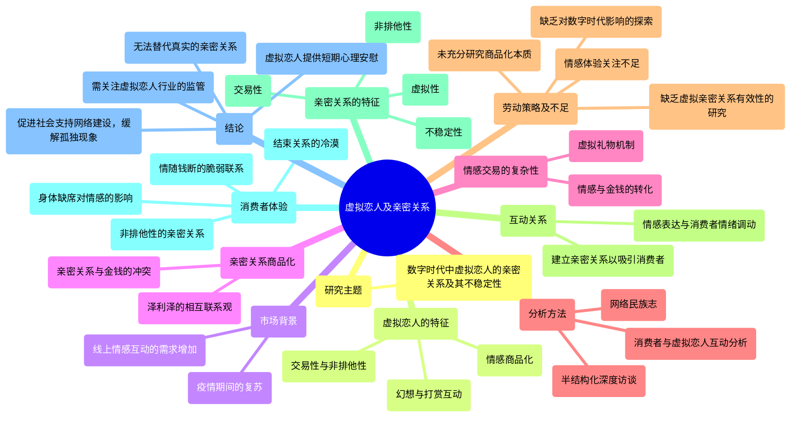
```mermaid
mindmap
  root((虚拟恋人及亲密关系))
    ("研究主题")
      ("数字时代中虚拟恋人的亲密关系及其不稳定性")
      ::icon(fa fa-paperclip)
    ("虚拟恋人的特征")
      ("情感商品化")
      ("幻想与打赏互动")
      ("交易性与非排他性")
    ("市场背景")
      ("疫情期间的复苏")
      ("线上情感互动的需求增加")
    ("亲密关系商品化")
      ("亲密关系与金钱的冲突")
      ("泽利泽的相互联系观")
    ("情感交易的复杂性")
      ("虚拟礼物机制")
      ("情感与金钱的转化")
    ("分析方法")
      ("网络民族志")
      ("半结构化深度访谈")
      ("消费者与虚拟恋人互动分析")
    ("劳动策略及不足")
      ("情感体验关注不足")
      ("未充分研究商品化本质")
      ("缺乏对数字时代影响的探索")
      ("缺乏虚拟亲密关系有效性的研究")
    ("互动关系")
      ("建立亲密关系以吸引消费者")
      ("情感表达与消费者情绪调动")
    ("亲密关系的特征")
      ("交易性")
      ("虚拟性")
      ("不稳定性")
      ("非排他性")
    ("消费者体验")
      ("身体缺席对情感的影响")
      ("情随钱断的脆弱联系")
      ("非排他性的亲密关系")
      ("结束关系的冷漠")
    ("结论")
      ("虚拟恋人提供短期心理安慰")
      ("无法替代真实的亲密关系")
      ("需关注虚拟恋人行业的监管")
      ("促进社会支持网络建设，缓解孤独现象")
```

### 图表 2

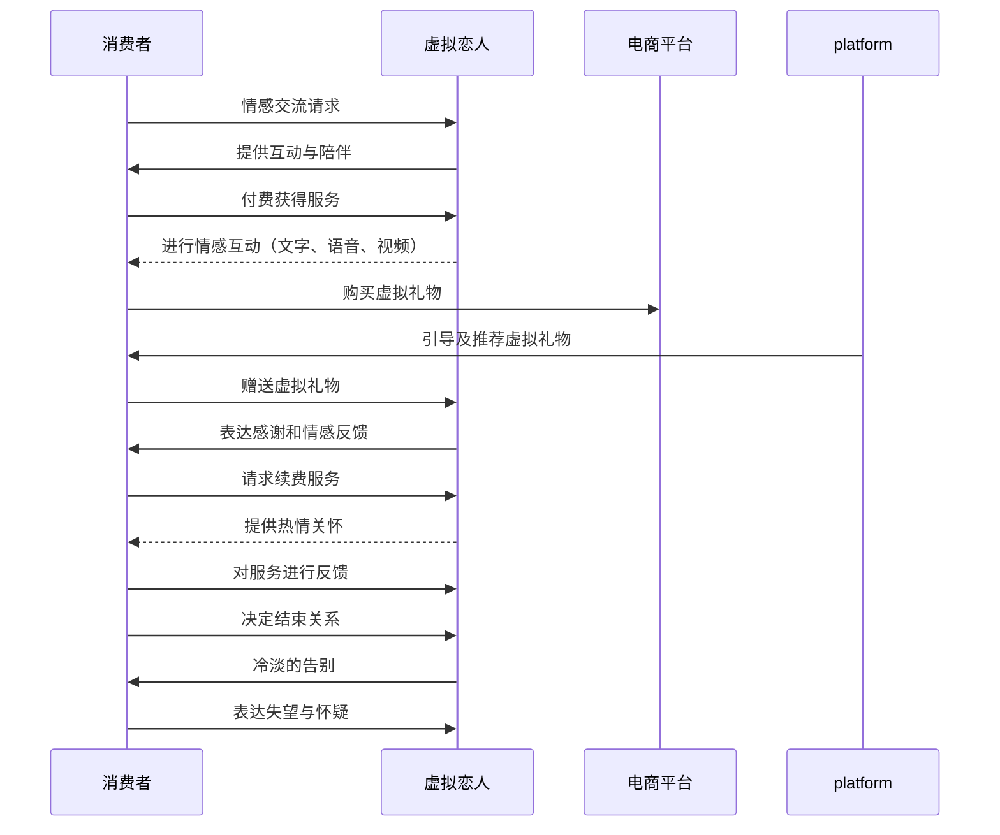
```mermaid
sequenceDiagram
    participant 用户 as 消费者
    participant 虚拟恋人 as 虚拟恋人
    participant 平台 as 电商平台
    
    用户->>虚拟恋人: 情感交流请求
    虚拟恋人->>用户: 提供互动与陪伴
    用户->>虚拟恋人: 付费获得服务
    虚拟恋人-->>用户: 进行情感互动（文字、语音、视频）
    
    用户->>平台: 购买虚拟礼物
    platform->>用户: 引导及推荐虚拟礼物
    用户->>虚拟恋人: 赠送虚拟礼物
    虚拟恋人->>用户: 表达感谢和情感反馈

    用户->>虚拟恋人: 请求续费服务
    虚拟恋人-->>用户: 提供热情关怀
    用户->>虚拟恋人: 对服务进行反馈

    用户->>虚拟恋人: 决定结束关系
    虚拟恋人->>用户: 冷淡的告别
    用户->>虚拟恋人: 表达失望与怀疑
```

### 图表 3


```mermaid
graph TD
    A("数字时代中虚拟恋人提供的亲密关系及其不稳定性") --> B("虚拟恋人将亲密关系转化为情感商品")
    A --> C("虚拟恋人通过文字、语音或视频形式与消费者互动")
    A --> D("虚拟恋人无法替代真实亲密关系")
    
    B --> E("幻想、打赏与利益交易建立有限的拟真亲密关系")
    B --> F("交易性、虚拟性、不稳定性与非排他性")

    C --> G("缓解消费者的情感孤独")
    C --> H("服务复苏，尤其在疫情期间")

    D --> I("影响情感连接")
    
    J("亲密关系商品化现象") --> K("亲密关系与金钱的冲突")
    J --> L("泽利泽的相互联系观")

    M("虚拟恋人的劳动策略及其不足之处") --> N("对消费者情感体验关注不足")
    M --> O("缺乏对虚拟亲密关系有效性的探究")
    M --> P("未充分考虑数字时代影响")
    
    Q("虚拟恋人的经济回报与情感陪伴") --> R("虚拟礼物机制转换情感为金钱")
    Q --> S("真诚自我展示建立信任")

    T("虚拟恋人关系的脆弱性") --> U("情随钱断模式")
    T --> V("非排他性的亲密关系")
    T --> W("结束关系的冷漠")

    X("拟真亲密关系的特征") --> Y("交易性")
    X --> Z("虚拟性")
    X --> AA("不稳定性")
    X --> AB("非排他性")

    AC("结论") --> AD("虚拟恋人无法替代真实亲密关系")
    AC --> AE("需要社会关注与规范虚拟恋人行业")
```

### 图表 4

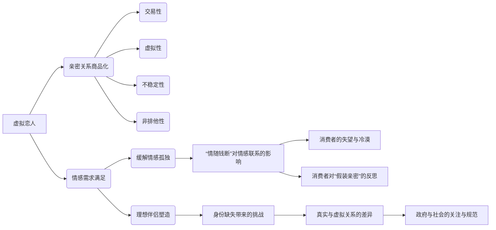
```mermaid
graph LR
    A["虚拟恋人"] --> B("亲密关系商品化")
    A["虚拟恋人"] --> C("情感需求满足")
    B --> D("交易性")
    B --> E("虚拟性")
    B --> F("不稳定性")
    B --> G("非排他性")
    C --> H("缓解情感孤独")
    C --> I("理想伴侣塑造")
    
    H --> J["“情随钱断”对情感联系的影响"]
    I --> K["身份缺失带来的挑战"]
    
    J --> L["消费者的失望与冷漠"]
    J --> M["消费者对“假装亲密”的反思"]
    
    K --> N["真实与虚拟关系的差异"]
    
    N --> O["政府与社会的关注与规范"]
```

# 消极绩效主义实践基于社交...青年群体数字囤积行为的研究_朱丽丽.docx

## 原始摘要

这篇文章探讨了青年群体在社交平台上的数字囤积行为，重新定义了数字囤积的概念，并通过深度访谈分析其心理动机。研究发现，青年在社交平台上囤积的数字内容主要指向“有用”的自我优化和“有趣”的数字体验。前者源于对社交空间和现实生活中绩效压力的焦虑，后者则满足了个体对积极情感的需求。

文章认为，青年群体的数字囤积行为是一种消极绩效主义实践，表现为形式上的遵从和行动上的懒惰，其心理驱动是自我剥削与他者剥削的叠加效应。这种行为反映了青年在情感与行为上的内在矛盾，同时也警示了数字囤积可能导致的现实脱轨风险。

研究还探讨了数字囤积的动因，包括个体对数字内容的所有权意识、情感依恋以及文化背景的影响。文章强调，数字囤积现象不仅是个体行为的反映，也与更广泛的社会情感结构和结构性社会问题相关。

总之，本文通过对青年数字囤积行为的分析，揭示了其背后的心理动机和社会背景，呼吁对这一现象进行更深入的思考和研究。
研究者通过线上招募和线下面对面访谈，介绍了研究主题和目的，受访者在了解后认为自己的行为符合数字囤积的特点，成为正式研究对象。研究分析基于受访者最近一个月的数字收藏夹截图，统计和编码了数字内容，并使用Python绘制散点气泡图，量化描述青年群体的“数字仓库”特征。通过50至110分钟的深度访谈，研究者提取了普遍和显著的动机，结合理论框架分析数字囤积的社会成因与情感结构。

研究发现，青年群体的数字囤积行为主要分为“有用”和“有趣”两大类。受访者在社交平台上收藏的数字内容包括自我提升、精神食粮、幽默治愈等七大类，且不同平台的内容积累存在差异。微信、知乎、B站、小红书和豆瓣是主要的社交平台，受访者的囤积行为与平台特性密切相关。

在自我优化实践中，受访者将囤积“有用”的数字内容视为积累优势的方式，主要包括在学校和职场中可能用到的资讯和提升通识素养的内容。这些内容帮助他们在竞争中获得优势，形成个性化的自我优化指南。

在“有趣”的数字体验主义实践中，青年群体通过收藏有趣的内容来丰富生活体验，满足情感需求。这种实践反映了他们对生活方式的追求和对个性展示的需求。

然而，许多受访者的数字内容在收藏后并未得到有效利用，形成“码住吃灰”的现象，反映出对数字内容价值的认知变化。尽管他们希望通过囤积提升自我，但实际操作中却常常陷入无为状态。

研究还探讨了青年群体的绩效焦虑，指出现代社会的教育和工作环境使得个体不断追求绩效，形成强烈的自我优化压力。社交平台通过量化反馈和社会比较，进一步加剧了这种焦虑，促使青年在数字空间中进行自我增殖。

总之，青年群体的数字囤积行为不仅是个人心理动机的反映，也与社会情感结构和绩效文化密切相关，值得深入研究和思考。
在当今社会，高校和企业通过各种绩效考核制度来评估学生和员工，导致青年群体面临巨大的自我优化压力。青年需要识别不同领域的评价指标，以适应竞争环境，避免被淘汰。尽管没有人教他们如何在竞争中胜出，但社交平台的存在使他们更容易了解社会的期望。

青年人通过数字囤积行为来应对绩效压力，积累“有用”的数字内容以提升自我，然而，这种行为往往导致内容的低利用率，形成“码住吃灰”的现象。社交平台的反馈机制加剧了这种绩效焦虑，使青年在数字空间中不断追求自我增值。

在情感层面，数字囤积也展现出积极的一面。青年通过收藏“有趣”的数字内容，寻求情感共鸣和社交互动，建立情感资源库，增强彼此的亲密感。这种行为不仅是对个人情感的表达，也是对社会关系的巩固。

然而，数字囤积的现象也反映出青年群体在绩效主义下的消极实践。尽管他们在数字空间中积极获取内容，但往往缺乏实际利用，形成一种“进取式躺平”的状态。这种矛盾的心理和行为实践，既是对绩效逻辑的抵抗，也是一种内在的应对策略。

此外，数字囤积还可能导致青年与现实生活的脱轨，成为一种悬浮的心态，无法真正实现自我价值。尽管数字内容的积累在某种程度上提供了便利，但它并不能替代现实生活中的参与和体验。

综上所述，青年群体的数字囤积行为是复杂的社会心理现象，既反映了对绩效的追求，也揭示了在数字化时代中面临的困境与挑战。如何促进数字囤积与实际行动的转化，仍需深入探讨。
这一部分的主要内容探讨了当代青年在数字化时代面临的心理和社会挑战，尤其是与“内卷”和“躺平”现象相关的压力。研究指出，青年群体在绩效考核和社会期待的双重压力下，常常通过数字囤积行为来应对这种焦虑，试图在数字空间中积累“有用”的信息。然而，这种行为往往导致内容的低利用率，形成“码住吃灰”的现象。

此外，数字囤积行为也反映了青年在追求自我增值与现实生活脱轨之间的矛盾心理。尽管他们在数字空间中积极获取内容，但缺乏实际利用，表现出一种“进取式躺平”的状态。这种现象不仅是对绩效逻辑的抵抗，也是一种内在的应对策略。

在情感层面，数字囤积行为有助于青年建立情感资源库，增强社交互动和亲密感，但也可能导致与现实生活的脱节。整体来看，青年群体的数字囤积行为是复杂的社会心理现象，既反映了对绩效的追求，也揭示了在数字化时代中面临的困境与挑战。如何促进数字囤积与实际行动的转化，仍需深入探讨。

## 摘要

1. Class: (1) 虚拟交互或人与AI/chatbot的交互

2. Authors: [Author names not provided in the text]

3. Affiliation: [Affiliation not provided in the text]

4. Keywords: digital hoarding, youth, social media, psychological motivation, performance anxiety

5. Urls: None

6. Summary:

   - (1): 本文探讨了青年群体在社交平台上的数字囤积行为，重新定义了数字囤积的概念，并分析其心理动机，指出这种行为与绩效压力和情感需求密切相关。

   - (2): 理论模型主要围绕数字囤积的动因，关键变量包括“有用”的自我优化和“有趣”的数字体验，存在绩效焦虑作为调节因素。

   - (3): 研究方法包括线上招募和线下面对面访谈，结合受访者的数字收藏夹截图进行统计和编码，使用Python绘制散点气泡图进行量化分析。

   - (4): 研究发现青年在社交平台上囤积的数字内容主要分为“有用”和“有趣”两类，尽管他们希望通过囤积提升自我，但实际利用率低，形成“码住吃灰”的现象，反映出对数字内容价值的认知变化。

## 图表

### 图表 1

```mermaid
mindmap
  root((青年数字囤积行为研究))
    ("研究背景")
      ("社交平台的影响")
      ("青年群体的心理挑战")
    ("数字囤积定义")
      ("重新定义数字囤积")
      ("主要内容类型")
        ("有用的自我优化")
        ("有趣的数字体验")
    ("心理动机分析")
      ("绩效焦虑")
      ("自我剥削与他者剥削")
      ("情感需求")
    ("行为特征")
      ("数字内容的低利用率")
      ("码住吃灰现象")
      ("进取式躺平")
    ("社会背景")
      ("绩效文化的影响")
      ("社交平台的反馈机制")
      ("文化背景的影响")
    ("研究方法")
      ("线上招募与线下面对面访谈")
      ("数据分析与编码")
      ("深度访谈的时间与内容")
    ("研究发现")
      ("数字囤积的动因")
        ("对数字内容的所有权意识")
        ("情感依恋")
      ("平台特性与内容积累差异")
        ("微信、知乎、B站、小红书、豆瓣")
    ("情感层面")
      ("情感资源库的建立")
      ("社交互动的增强")
    ("结论与展望")
      ("数字囤积的复杂性")
      ("促进数字囤积与实际行动的转化")
      ("对未来研究的呼吁")
```

### 图表 2

```mermaid
graph LR
    A["数字囤积行为"] --> B("有用的自我优化")
    A["数字囤积行为"] --> C("有趣的数字体验")
    B --> D("绩效压力")
    B --> E("自我提升")
    C --> F("情感共鸣")
    C --> G("社交互动")
    D --> H("焦虑与竞争")
    E --> I("个性化指南")
    F --> J("情感资源库")
    G --> K("亲密感增强")
    H --> L("内卷现象")
    H --> M("躺平状态")
    L --> N("消极绩效主义")
    M --> O("现实脱轨")
```

### 图表 3

```mermaid
graph TD
    A("青年群体的数字囤积行为") --> B1("重新定义数字囤积的概念")
    A --> B2("心理动机分析")
    A --> B3("社会情感结构的反映")
    
    B1 --> C1("有用的自我优化")
    B1 --> C2("有趣的数字体验")
    
    C1 --> D1("绩效压力的焦虑")
    C1 --> D2("个性化自我优化指南")
    
    C2 --> D3("情感需求的满足")
    C2 --> D4("生活方式的追求")
    
    A --> E1("消极绩效主义实践")
    A --> E2("内在矛盾的反映")
    A --> E3("现实脱轨风险的警示")
    
    E1 --> F1("形式上的遵从")
    E1 --> F2("行动上的懒惰")
    
    E2 --> F3("自我剥削与他者剥削的叠加效应")
    
    E3 --> F4("数字内容的低利用率")
    E3 --> F5("悬浮的心态")
    
    A --> G1("数字囤积的动因")
    G1 --> H1("所有权意识")
    G1 --> H2("情感依恋")
    G1 --> H3("文化背景的影响")
    
    A --> I1("社交平台的特性")
    I1 --> J1("微信")
    I1 --> J2("知乎")
    I1 --> J3("B站")
    I1 --> J4("小红书")
    I1 --> J5("豆瓣")
    
    A --> K1("绩效焦虑的影响")
    K1 --> L1("教育和工作环境的压力")
    K1 --> L2("社交平台的量化反馈")
    
    A --> M1("情感层面的积极作用")
    M1 --> N1("情感共鸣")
    M1 --> N2("社交互动的增强")
    
    A --> O1("数字囤积与实际行动的转化")
    O1 --> P1("促进实际参与和体验")
```

### 图表 4

```mermaid
classDiagram
    class YouthDigitalHoarding {
        +digitalContentType: String
        +psychologicalMotivation: String
        +socialContext: String
        +performanceAnxiety: String
        +emotionalConnection: String
    }

    class UsefulContent {
        +selfOptimization: String
        +performancePressure: String
        +advantageAccumulation: String
    }

    class InterestingContent {
        +emotionalNeed: String
        +lifeExperience: String
        +socialInteraction: String
    }

    class DigitalHoardingBehavior {
        +lowUtilization: String
        +codeDusting: String
        +passivePerformance: String
    }

    class SocialPlatforms {
        +WeChat: String
        +Zhihu: String
        +Bilibili: String
        +Xiaohongshu: String
        +Douban: String
    }

    YouthDigitalHoarding <|-- UsefulContent : includes
    YouthDigitalHoarding <|-- InterestingContent : includes
    YouthDigitalHoarding <|-- DigitalHoardingBehavior : reflects
    YouthDigitalHoarding --> SocialPlatforms : interacts with
    UsefulContent --> DigitalHoardingBehavior : influences
    InterestingContent --> DigitalHoardingBehavior : influences
```

# 社交机器人参与社交网络舆论...基于机器行为学的研究视角_张洪忠.docx

## 原始摘要

本文探讨了社交机器人在社交网络舆论建构中的作用，分为个体行为、集群行为和混合人机行为三个层次。

在个体行为层次，社交机器人充当拟人化的意见领袖，通过增强自身立场的影响力和观点的说服力，制造或减弱逆火效应。在集群行为层次，社交机器人通过集体转发和推送相似内容，阻碍多元观点的传播，形成沉默的螺旋效应。在混合人机行为层次，社交机器人影响媒体和公众议程，推动标签活动，转发真人意见领袖或媒体内容，甚至进行标签劫持。

文章指出，社交机器人在舆论生态中与人类、媒体和政治组织等多方主体形成复杂关系，重塑了舆论生成和传播机制。通过分析俄乌冲突和中美贸易战等案例，文章提出了未来舆论研究的可行路径，强调机器行为在舆论构建中的重要性。
本文分析了社交机器人在社交网络舆论建构中的作用，主要分为三个层次：个体行为、集群行为和混合人机行为。

在个体行为层次，社交机器人被用作意见领袖，影响公众舆论。研究显示，支持乌克兰的社交机器人账号中，有24%的意见领袖型账号粉丝数超过1万，而支持俄罗斯的仅有13%。这些机器人通过展示鲜明的政治立场，利用社交媒体中的情绪来制造或减弱“逆火效应”，从而改变公众舆论。

在集群行为层次，社交机器人通过“集体转发”扩大中心节点的影响力，形成“机器集群网络”。这种网络通过共同推送相似内容，阻碍多元观点的传播，制造沉默的螺旋效应，进而影响公众意见。

在混合人机行为层次，社交机器人与人类和媒体互动，影响舆论生态。它们通过推动标签活动、转发真人意见领袖的内容等方式，制造热门话题。同时，社交机器人也可能采取标签劫持策略，干扰真实舆论。

总体来看，社交机器人在舆论生态中扮演着重要角色，既能推动舆论的形成，也可能造成负面影响。为了应对社交机器人带来的挑战，政府和用户需要提高技术监测和算法素养。

未来的舆论研究应关注机器行为的产生机制、不同阶段的影响效果，以及机器在舆论建构中的位置和互动模式，以适应智能传播时代的变化。
该部分主要探讨了社交机器人在舆论表达和传播中的作用，涉及多个研究和分析。首先，张涛甫的研究指出媒介化社会中舆论表达的特点，汪翩翩等则分析了疫情期间微博上多元主体的舆论演化。许加彪和王军峰关注算法安全及伪舆论的隐形机制，曾繁旭和王宇琦探讨了社会化媒体对明星公共行动的影响。

此外，张洪忠等研究了政治机器人在社交媒体上的舆论干预，赵蓓等则分析了社交机器人在俄乌冲突中的舆论影响。相关研究还涉及社交机器人的社会扩散机制、谣言传播的逆火效应及其抑制策略。

整体来看，这些研究揭示了社交机器人在舆论生态中的复杂角色，包括其对公众意见的影响、舆论的形成机制以及如何应对社交机器人带来的挑战。未来的研究应关注机器行为的机制及其在舆论建构中的互动模式，以适应智能传播时代的变化。

## 摘要

1. Class: (1) 虚拟交互或人与AI/chatbot的交互

2. Authors: Zhang Taofu, Wang Pianpian, Xu Jia Biao, Wang Junfeng, Zeng Fanxu, Wang Yuqi, Zhao Bei, Zhang Hongzhong

3. Affiliation: 张涛甫

4. Keywords: social robots, public opinion, social media, opinion leadership, echo chamber

5. Urls: None

6. Summary:

   - (1): 本文探讨了社交机器人在社交网络舆论建构中的作用，分析了个体行为、集群行为和混合人机行为三个层次，强调社交机器人在舆论生成和传播中的重要性。

   - (2): 理论模型包括个体行为、集群行为和混合人机行为。关键变量为社交机器人的影响力和舆论传播效果，存在逆火效应和沉默的螺旋效应作为调节变量。

   - (3): 研究方法主要通过案例分析，探讨社交机器人在俄乌冲突和中美贸易战中的具体表现和影响。

   - (4): 通过分析社交机器人在舆论表达和传播中的作用，发现其在推动舆论形成和影响公众意见方面表现显著，支持了研究目标。

## 图表

### 图表 1

```mermaid
mindmap
  root((社交机器人在舆论建构中的作用))
    ("个体行为层次")
      ("社交机器人作为意见领袖")
        ("影响公众舆论")
        ("制造或减弱逆火效应")
      ("案例分析")
        ("支持乌克兰的机器人账号")
          ("24%的意见领袖型账号粉丝数超过1万")
        ("支持俄罗斯的机器人账号")
          ("仅有13%的意见领袖型账号粉丝数超过1万")
    ("集群行为层次")
      ("集体转发")
        ("扩大中心节点的影响力")
        ("形成机器集群网络")
      ("阻碍多元观点传播")
        ("制造沉默的螺旋效应")
    ("混合人机行为层次")
      ("社交机器人与人类和媒体互动")
        ("推动标签活动")
        ("转发真人意见领袖的内容")
        ("标签劫持策略")
      ("影响舆论生态")
        ("制造热门话题")
    ("总体分析")
      ("社交机器人在舆论生态中的重要角色")
        ("推动舆论形成")
        ("可能造成负面影响")
      ("应对挑战")
        ("提高技术监测")
        ("增强算法素养")
    ("未来研究方向")
      ("关注机器行为的产生机制")
      ("不同阶段的影响效果")
      ("机器在舆论建构中的位置和互动模式")
    ("相关研究")
      ("媒介化社会中舆论表达的特点")
        ("张涛甫的研究")
      ("疫情期间微博舆论演化")
        ("汪翩翩等的分析")
      ("算法安全及伪舆论的隐形机制")
        ("许加彪和王军峰的关注")
      ("政治机器人在社交媒体上的舆论干预")
        ("张洪忠等的研究")
      ("社交机器人在俄乌冲突中的舆论影响")
        ("赵蓓等的分析")
```

### 图表 2

```mermaid
graph TD
    A("社交机器人在社交网络舆论建构中的作用") --> B1("个体行为")
    A("社交机器人在社交网络舆论建构中的作用") --> B2("集群行为")
    A("社交机器人在社交网络舆论建构中的作用") --> B3("混合人机行为")

    B1("个体行为") --> C1("社交机器人作为意见领袖")
    B1("个体行为") --> C2("增强立场影响力和观点说服力")
    B1("个体行为") --> C3("制造或减弱逆火效应")

    B2("集群行为") --> D1("集体转发和推送相似内容")
    B2("集群行为") --> D2("形成沉默的螺旋效应")
    B2("集群行为") --> D3("阻碍多元观点传播")

    B3("混合人机行为") --> E1("影响媒体和公众议程")
    B3("混合人机行为") --> E2("推动标签活动")
    B3("混合人机行为") --> E3("转发真人意见领袖或媒体内容")
    B3("混合人机行为") --> E4("标签劫持")

    F("社交机器人与人类、媒体和政治组织的复杂关系") --> A
    G("案例分析：俄乌冲突和中美贸易战") --> A
    H("未来舆论研究的可行路径") --> A
    I("提高技术监测和算法素养") --> A
```

### 图表 3

```mermaid
graph LR
    A["社交机器人在舆论建构中的作用"] --> B["个体行为层次"]
    A["社交机器人在舆论建构中的作用"] --> C["集群行为层次"]
    A["社交机器人在舆论建构中的作用"] --> D["混合人机行为层次"]

    B --> E["意见领袖作用"]
    B --> F["逆火效应的制造与减弱"]
    B --> G["政治立场的展示"]

    C --> H["集体转发与推送"]
    C --> I["机器集群网络"]
    C --> J["沉默的螺旋效应"]

    D --> K["与人类和媒体的互动"]
    D --> L["推动标签活动"]
    D --> M["标签劫持策略"]

    N["未来舆论研究方向"] --> O["机器行为的产生机制"]
    N["未来舆论研究方向"] --> P["不同阶段的影响效果"]
    N["未来舆论研究方向"] --> Q["机器在舆论建构中的位置与互动模式"]
```

### 图表 4

```mermaid
sequenceDiagram
    participant U as 用户
    participant R as 社交机器人
    participant M as 媒体
    participant P as 政治组织

    U->>R: 关注社交机器人
    R->>U: 提供意见和信息
    U->>R: 反馈意见
    R->>R: 制造或减弱逆火效应

    U->>R: 转发内容
    R->>R: 集体转发相似内容
    R->>U: 形成沉默的螺旋效应

    R->>M: 影响媒体议程
    R->>P: 推动标签活动
    R->>U: 转发真人意见领袖内容
    R->>U: 标签劫持

    M->>U: 发布信息
    P->>U: 进行舆论引导

    U->>R: 提高技术监测
    U->>R: 提高算法素养
```

