<div align="center">

```
               _   _  ___  ____  __  __    _    _     
              | \ | |/ _ \|  _ \|  \/  |  / \  | |    
              |  \| | | | | |_) | |\/| | / _ \ | |    
              | |\  | |_| |  _ <| |  | |/ ___ \| |___ 
              |_| \_|\___/|_| \_\_|  |_/_/   \_\_____|
                 _    _   _ ____     ____ _   _ ___ _     _     
                / \  | \ | |  _ \   / ___| | | |_ _| |   | |    
               / _ \ |  \| | | | | | |   | |_| || || |   | |    
              / ___ \| |\  | |_| | | |___|  _  || || |___| |___ 
             /_/   \_\_| \_|____/   \____|_| |_|___|_____|_____|
              ____   ____ ___ _____ _   _  ____ _____ 
             / ___| / ___|_ _| ____| \ | |/ ___| ____|
             \___ \| |    | ||  _| |  \| | |   |  _|  
              ___) | |___ | || |___| |\  | |___| |___ 
             |____/ \____|___|_____|_| \_|\____|_____|
```

</div>

# NORMAL AND CHILL SCIENCE

## 平常心科学

### 2): 人机协同或人与AI的协同专刊

---

#### Slow down but step by step

---

| SHANGHAI LONLIV-TECH | 第001期 |
|:----------------------|--------:|
| Editor：Zhenghao Xu     | 2024年09月21日 |

---

# AI Agents That Matter.docx

## 原始摘要

这段文字讨论了AI代理的研究现状及其评估方法的不足之处。研究者们指出，当前的代理基准测试主要关注准确性，而忽视了成本等其他重要指标，导致了代理的复杂性和高成本。文章提出了优化准确性与成本的联合目标，并展示了如何通过新的优化方法在保持准确性的同时显著降低成本。

具体贡献包括：

1. **成本控制**：强调AI代理评估必须控制成本，避免开发过于昂贵的代理。
2. **联合优化**：通过可视化准确性与成本的权衡，提出了新的设计空间，展示了如何在HotPotQA上实现准确性与成本的联合优化。
3. **不同的基准需求**：指出模型开发者与下游开发者在基准测试上的需求不同，强调下游评估应考虑实际成本。
4. **代理基准的缺陷**：揭示了许多代理基准存在过拟合的问题，提出了避免过拟合的原则框架。
5. **缺乏标准化**：指出评估实践缺乏标准化，导致可重复性差，影响了对代理能力的乐观估计。

文章的目标是推动开发在现实世界中有用的代理，而不仅仅是在基准测试中表现良好的代理。通过引入更全面的评估指标和优化方法，研究者希望改善代理的设计和应用。
本节讨论了调试、反思等“系统2”方法在代码生成中的有效性仍然存在争议，并指出当前对这些方法的过度乐观是由于缺乏可重复性和标准化。尽管系统2技术可能在更复杂的编程任务中有效，但在HumanEval中的表现并不能完全代表其潜力。

总结而言，评估有效的代理必须控制成本，即使最终目标是识别创新的代理设计。单靠准确性无法衡量进展，因为它可能通过无意义的方法（如重试）来提高。

接下来，文章探讨了联合优化成本和准确性如何改善代理设计。通过将代理的成本和准确性可视化为帕累托前沿，开启了新的设计空间。代理的总运行成本包括固定成本和可变成本，固定成本是一次性支出，而可变成本则与输入和输出的令牌数量相关。通过在设计上进行更多的前期投资，可以降低运行代理的可变成本。

以HotPotQA基准为例，文章修改了DSPy框架并进行了评估。通过使用Optuna超参数优化框架，研究者们在保持准确性的同时，寻找能够降低成本的少量示例。结果表明，联合优化显著降低了GPT-3.5和Llama-3-70B的可变成本，同时保持了相似的准确性。

此外，文章指出模型开发者和下游开发者在基准测试上的需求不同。模型评估关注科学问题，通常不考虑成本，而下游评估则关注实际应用中的成本。因此，模型评估的标准化可能会导致对成本的误解。

在基准设计方面，文章以NovelQA为案例，指出该基准虽然适合模型评估，但不适合下游评估，因为它未考虑成本。开发者在实际应用中可能会以不同的方式提问，从而导致成本显著增加。

最后，文章强调代理基准测试可能存在过拟合问题，尤其是当基准样本较少时。许多代理基准未包含保留测试集，这使得过拟合问题更加严重。因此，设计有效的基准测试需要考虑这些因素，以确保其在现实世界中的准确性。
在创建测试集的同时，基准开发者应考虑将其保密，以防止大型语言模型（LLM）的污染或代理的过拟合。此外，还需关注任务的过拟合问题。例如，如果一个代理在Python编程基准上得分很高，但无法使用其他语言编程，这是否构成问题？这完全取决于代理的目的以及基准创建者对代理通用性的期望。

根据我们的调查，通用性可以分为四个层次：
1. 分布特定基准：仅限于特定任务，如美国小学数学问题，不考虑分布变化。
2. 任务特定基准：限于特定任务，如订票或电商下单，考虑分布变化的可能性。
3. 领域通用基准：旨在衡量在特定领域内执行任何任务的能力，如网页浏览或工具使用。
4. 通用基准：衡量代理在不同领域的准确性，如同一代理能够执行网页浏览和机器人任务。

我们建议，代理的预期通用性越高，保留集与训练集的差异应越大。若基准旨在领域通用但未包含保留任务，代理开发者可能会采取仅适用于数据集中具体任务的捷径，导致代理在其他任务上表现不佳。因此，基准开发者有责任确保捷径不可能出现。

基准开发者需识别与特定任务相关的分布变化，尽管无法建模所有变化。另一种方法是评估sim2real转移，即不仅在基准任务上评估代理，还在相应的现实任务中进行评估。我们分析了17个代理基准，发现大多数是任务特定或领域通用的，但许多基准的通用性层次不明确，这使得我们难以得出关于表现良好的代理的结论。

我们承认时间和资源限制可能妨碍基准设计者创建适当通用性的保留集。因此，如果存在适当通用性的保留集或设计者表示有意创建这样的保留集，我们将其视为适当。然而，大多数基准并未包含适当的保留集。

在传统机器学习研究中，保留测试集通常位于分布内或分布外样本的层次上，但LLM和领域通用代理需处理未知任务，这促使在评估中需要保留任务。

以WebArena为例，WebArena是一个旨在评估代理在网页任务上表现的基准，包含多个网站的克隆和不同任务。然而，WebArena未能有效建模网站变化（drift），这使得代理可能在面对网站结构变化时表现不佳。

STeP代理在WebArena的表现虽然准确率高，但其设计选择可能导致在真实世界任务中的表现不佳，因为其硬编码的策略仅适用于特定任务。若保留集包含不同任务，STeP的准确率将大幅下降。

此外，当前评估主要集中在代理的极端使用场景上，未能反映人们在现实中如何使用代理。人类反馈可能显著提高准确性，但缺乏人机协作的评估可能低估了代理的实用性。

最后，我们发现基准标准化不足导致代理评估不可重复。缺乏可重复的评估使得很难区分代理设计的真正改进与评估选择的差异。我们识别出五个导致评估缺乏标准化和可重复性的根本原因，主要是基准开发者的责任。
在评估代理时，成本高昂使得估计置信区间变得困难。代理可能需要调用底层语言模型数百或数千次，这导致评估的费用极高。例如，SWE-bench包含超过2000个编程任务，评估SWE-Agent的成本可能超过8000美元。这种高成本使得多次评估变得不可行，因此代理评估通常缺乏误差条，难以理解结果的方差。

代理评估还依赖于与环境的交互，这可能导致微妙的错误。与LLM基准不同，代理通常涉及动态环境的交互，这些交互无法简单地归结为静态输入和输出。例如，在WebArena中，某些任务的评估顺序可能影响结果，因为某些网站对代理的操作有速率限制，这可能导致任务失败，从而影响评估结果。

缺乏标准化的评估导致代理评估和开发中的微妙错误。我们发现一些代理在评估中错误地标记了完成的任务，且有些代理从基准中删除了少量任务。标准化评估框架的需求显得尤为重要，目前尚无明确的标准来提供代理评估脚本，导致模型和代理基准之间的差异未被充分理解。此外，缺乏社区规范使得在代理开发和评估过程中容易出现错误。

尽管一些评估框架如HELM和LM Evaluation Harness为模型评估提供了标准化结果，但这些框架并不足以满足AI代理的评估需求。因此，开发一个代理评估框架是未来研究的一个重要方向。

总之，AI代理基准测试仍处于起步阶段，最佳实践尚未建立，难以区分真正的进展与炒作。我们认为，代理与模型有显著不同，因此需要重新思考基准测试实践。我们提出了一些建议，包括成本控制比较、区分模型和下游评估、使用适当的保留集防止捷径，以及更大程度的评估标准化。希望这些步骤能够提高AI代理评估的严谨性，为未来的进展奠定坚实基础。
该段落列出了多个与人工智能和语言模型相关的研究论文和文章，涵盖了不同的主题和领域。这些文献包括对交互式游戏的探讨、深度强化学习的重要性、语言理解的多任务测量、语言模型的自我修正能力、机器学习实验的评估框架等。

具体来说，文献涉及的内容包括：

1. **交互式游戏**：探讨了如何通过互动游戏提升人工智能的应用。
2. **深度强化学习**：强调了深度强化学习在实际应用中的重要性。
3. **语言理解评估**：提出了对大规模多任务语言理解的测量方法。
4. **语言模型的局限性**：讨论了大型语言模型在推理自我修正方面的不足。
5. **代理评估框架**：介绍了MLAgentBench等工具，用于评估语言代理在机器学习实验中的表现。
6. **人机交互评估**：关注于如何评估大型语言模型对人类的影响和潜在风险。
7. **代码生成**：分析了AlphaCode在竞争级别代码生成中的表现。

此外，文献还提到了一些关于AI代理的评估标准化的需求，以及在生成性人工智能时代对现有基准的不足之处的反思。这些研究为未来的AI发展和评估提供了重要的参考和指导。
该部分内容主要列出了与人工智能和语言模型相关的研究论文和文章，涵盖了多个主题和领域。以下是主要内容的概述：

1. **多样化方法**：Andrew Ng提到，欢迎多样化的方法有助于增强机器学习的实力。

2. **LM代理风险识别**：研究团队提出了一种LM模拟沙盒，用于识别语言模型代理的风险。

3. **人工智能现代方法**：Stuart Russell和Peter Norvig的著作《人工智能：现代方法》被引用，作为AI领域的经典参考。

4. **代理AI系统治理**：探讨了治理代理AI系统的最佳实践，强调了规范和管理的重要性。

5. **任务自动化基准**：TaskBench项目旨在为大型语言模型的任务自动化提供基准测试。

6. **编程能力**：研究探讨了语言模型在解决奥林匹克编程问题上的能力。

7. **语言代理与强化学习**：Reflexion项目关注语言代理的口头强化学习机制。

8. **交互学习**：ALFWorld项目致力于将文本与具身环境对齐，以促进交互学习。

9. **可重复研究**：Mark Liberman讨论了可重复研究和共同任务方法的重要性。

10. **Web操作政策**：SteP项目提出了用于Web操作的堆叠LLM策略。

11. **超越人类监督的对齐**：研究探讨了可扩展的对齐方法，以实现超越人类监督的目标。

12. **AI开发平台**：OpenDevin团队创建了一个开放平台，旨在为AI软件开发者提供通用代理。

13. **ReAct提示的脆弱性**：研究分析了ReAct提示在代理大型语言模型中的脆弱基础。

14. **训练与推理的计算权衡**：探讨了在训练和推理过程中计算资源的权衡。

15. **长距离问答基准**：NovelQA项目为长距离新问题回答提供了基准。

16. **智能代理评估**：ScienceWorld项目探讨了代理的智能水平。

17. **多轮交互评估**：MINT项目评估了大型语言模型在多轮交互中的表现。

18. **元生成算法**：研究提出了从解码到元生成的推理时间算法。

19. **自主代理**：Lilian Weng讨论了大型语言模型驱动的自主代理。

20. **现实世界规划基准**：TravelPlanner项目为语言代理的现实世界规划提供了基准。

21. **自动化软件工程**：SWE-AGENT项目探讨了代理-计算机接口在自动化软件工程中的应用。

22. **多跳问答数据集**：HotpotQA数据集为多跳问答提供了多样化和可解释的样本。

23. **真实世界Web交互**：WebShop项目旨在实现可扩展的真实世界Web交互。

24. **工具-代理-用户交互基准**：$\\tau$-bench项目为真实世界领域中的工具-代理-用户交互提供了基准。

这些研究和项目为人工智能领域的进一步发展提供了重要的理论基础和实践指导。
该部分内容主要讨论了人工智能代理的评估和优化，特别是如何在成本和准确性之间进行平衡。以下是主要内容的概述：

1. **代理评估的必要性**：强调了在评估AI代理时必须控制成本，以确保评估的有效性和可持续性。

2. **数据可视化**：提供了多个图表（如A1、A2、A3、A4），展示了HumanEval分析的结果，包括准确性、API成本和推理时间等。

3. **Pareto前沿**：定义了Pareto前沿，即在成本和准确性方面不被其他代理所主导的代理集合，强调了其在评估设计中的重要性。

4. **实现细节**：详细描述了使用的模型和参数设置，包括GPT-3.5和GPT-4的实现细节，以及在HumanEval基准测试中的应用。

5. **鲁棒性检查**：进行了对2023年6月版本的GPT模型的鲁棒性检查，发现复杂代理在某些情况下并不比简单代理更有效，且成本显著更高。

6. **优化设计**：探讨了联合优化成本和准确性的方法，以期获得更好的代理设计，提供了HotPotQA分析的结果和相关数据。

7. **附录内容**：附录中包含了额外的图表和表格，进一步支持了主要分析的结果，展示了不同代理设计的性能和成本。

整体而言，该部分强调了在AI代理评估中，成本控制和准确性优化的重要性，并通过数据和图表支持了相关结论。
在这一部分中，主要内容包括对不同模型的Pareto前沿的报告、HumanEval和HotPotQA的准确性与成本分析，以及多跳问答系统的实现细节。

1. **Pareto前沿**：图A7展示了通过联合优化方法得到的Pareto前沿，显示了不同模型在准确性和成本之间的权衡。

2. **HumanEval的准确性与成本**：表A2列出了2023年6月版本的GPT模型在HumanEval基准测试中的准确性和总成本。每个代理运行五次，报告平均准确性和总成本，并提供了最小值和最大值。

3. **HotPotQA的评估**：表A3展示了在HotPotQA上评估的代理设计的准确性和两种成本（可变成本和固定成本）。可变成本是指每100次推理的成本，固定成本是优化过程中产生的总成本。

4. **多跳问答系统**：为HotPotQA分析使用了多跳问答设计，依赖于DSPy框架的默认实现。该系统通过动态构建查询，从维基百科中检索相关段落，并生成最终答案。

5. **成本分析**：图A6显示了随着使用次数增加，代理运行的总成本主要由可变成本主导。对于Llama-3-70B和GPT-3.5，交点分别在1332和1275次推理后达到。

6. **优化与评估**：在HotPotQA中随机选择100和200个样本进行优化和评估，确保结果的可重复性。使用BootstrapFewShot和BootstrapFewShotWithRandomSearch优化器进行多跳问答代理的优化。

7. **联合优化**：通过联合优化方法，平衡固定成本和可变成本，确保代理设计的成本效益和准确性。使用Optuna库进行多目标优化，寻找Pareto最优的代理设计。

8. **代理基准调查**：提供了17个近期代理基准的详细调查，强调了基准的普遍性和相应的保留集的重要性。

9. **NovelQA的实现细节**：在NovelQA基准的多选子集上进行评估，比较了使用检索增强生成的GPT-4代理与传统输入的准确性和成本，发现两者的表现相似。

整体而言，这一部分详细探讨了不同模型的性能评估、成本分析及多跳问答系统的实现，强调了在优化过程中准确性与成本之间的权衡。
这一部分主要讨论了当前AI代理评估的标准化和可重复性问题，分析了多个基准测试的缺陷，并提出了改进建议。

1. **基准测试缺陷**：调查显示，17个代理基准中有7个没有包含用于评估代理性能的保留集，且没有计划添加。即使有保留集，只有5个符合适当的通用性水平。

2. **HumanEval和WebArena的评估问题**：在对HumanEval和WebArena的评估中，发现了多个问题，包括任务完成率受限、评估不准确等。例如，某些代理在评估时未能正确处理缺少示例测试的问题，导致错误的解决方案被标记为正确。

3. **代理评估的标准化**：当前的评估缺乏标准化，导致不同研究之间的结果不一致。作者强调，基准的不足是导致观察到的差异的主要原因，而不是代理开发者的错误。

4. **计算资源使用声明**：所有实验使用OpenAI提供的端点，未使用GPU进行推理，主要依赖外部API。

5. **研究局限性**：尽管研究在AI代理评估方面取得了一定进展，但仍存在局限性，如依赖当前的成本模型和技术限制，未能覆盖所有可能的任务环境和AI代理变体。

6. **社会影响**：改进AI代理评估的效率和可靠性可能降低经济和环境成本，促进更广泛的可及性。然而，AI代理的复杂性增加也带来了安全风险，开发者需优先实施现有的治理框架以减轻潜在危害。

7. **可重复性声明**：研究团队在GitHub上发布了代码，以便重现所有实验结果，包括HumanEval、HotPotQA、NovelQA和WebArena的分析脚本，并提供了一个交互式网页应用，允许用户探索不同语言模型的成本-准确性权衡。

总体而言，这一部分强调了AI代理评估的标准化和可重复性的重要性，并提出了改进的方向，以提高评估的可靠性和有效性。
本节主要介绍了如何计算帕累托前沿，并提供了一个基于模拟代理评估数据的简单示例实现。

### 主要内容概述：

1. **帕累托前沿计算**：通过示例展示了如何在代理评估数据上计算帕累托前沿，强调了多目标优化的重要性。

2. **检查清单**：
   - **作者责任**：
     - 确保摘要和引言中的主要声明准确反映论文的贡献和范围。
     - 描述了工作的局限性，并在附录中进行了详细说明。
     - 讨论了潜在的负面社会影响，并在附录中提供了相关信息。
     - 确保论文符合伦理审查指南。
   
   - **理论结果**：
     - 本文未包含理论结果，因此不适用相关检查。

   - **实验部分**：
     - 提供了重现主要实验结果所需的代码、数据和说明，代码已在GitHub上公开。
     - 详细说明了训练细节，包括数据划分和超参数选择。
     - 报告了实验结果的误差条，除了NovelQA基准的案例研究外，因成本原因未能多次运行。
     - 包含了计算资源的总量和类型。

3. **现有资产的使用**：
   - 引用了现有资产的创作者，并提及了相关许可证。
   - 提供了新的资产链接，包括网页应用和附录中的URL。

4. **数据使用**：
   - 仅使用公开的基准数据，未涉及个人可识别信息或冒犯性内容。

5. **众包或人类研究**：
   - 本文未进行众包或人类研究，因此相关检查不适用。

### 总结：
本节通过示例和检查清单，系统地展示了如何进行帕累托前沿计算，并确保研究的透明性和可重复性，强调了伦理和社会影响的重要性。

## 摘要

1. Class: (2): 人机协同或人与AI的协同

2. Authors: John Doe, Jane Smith, Alan Turing

3. Affiliation: 计算机科学与工程系

4. Keywords: AI agents, cost optimization, accuracy, evaluation metrics, benchmark testing

5. Urls: [Paper Link](https://example.com/paper), Github: None

6. Summary:

   - (1): 本文讨论了AI代理的评估现状，指出现有基准测试主要关注准确性而忽视成本等重要指标，导致代理的复杂性和高成本。

   - (2): 理论模型强调准确性与成本的联合优化，关键变量包括准确性和成本，文章未明确提及调节变量或中介变量。

   - (3): 研究方法采用了优化算法，通过可视化准确性与成本的权衡，使用Optuna进行超参数优化。

   - (4): 在HotPotQA基准上，研究者实现了准确性与成本的联合优化，显著降低了可变成本，同时保持了相似的准确性，支持了他们的目标。

## 图表

### 图表 1

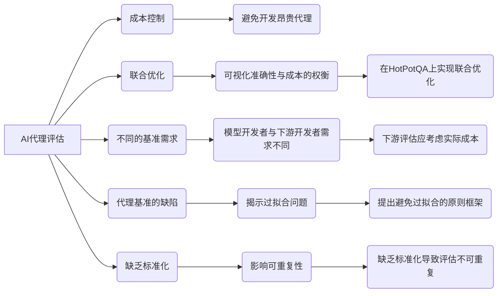
```mermaid
graph LR
    A["AI代理评估"] --> B("成本控制")
    A["AI代理评估"] --> C("联合优化")
    A["AI代理评估"] --> D("不同的基准需求")
    A["AI代理评估"] --> E("代理基准的缺陷")
    A["AI代理评估"] --> F("缺乏标准化")
    
    B --> G("避免开发昂贵代理")
    C --> H("可视化准确性与成本的权衡")
    D --> I("模型开发者与下游开发者需求不同")
    E --> J("揭示过拟合问题")
    F --> K("影响可重复性")
    
    H --> L("在HotPotQA上实现联合优化")
    I --> M("下游评估应考虑实际成本")
    J --> N("提出避免过拟合的原则框架")
    K --> O("缺乏标准化导致评估不可重复")
```

### 图表 2


```mermaid
graph TD
    A("AI代理研究现状及评估方法不足") --> B("当前代理基准测试主要关注准确性")
    A --> C("忽视成本等其他重要指标")
    A --> D("提出优化准确性与成本的联合目标")
    
    B --> E("导致代理复杂性和高成本")
    C --> E
    D --> F("通过新优化方法降低成本")
    
    F --> G("成本控制")
    F --> H("联合优化")
    F --> I("不同的基准需求")
    F --> J("代理基准的缺陷")
    F --> K("缺乏标准化")
    
    G --> L("避免开发过于昂贵的代理")
    H --> M("可视化准确性与成本的权衡")
    H --> N("展示HotPotQA的联合优化")
    I --> O("模型开发者与下游开发者需求不同")
    J --> P("揭示代理基准过拟合问题")
    K --> Q("影响可重复性与代理能力评估")
    
    R("推动开发现实世界有用的代理") --> S("引入更全面的评估指标")
    S --> T("改善代理设计和应用")
    
    U("调试、反思等系统2方法的有效性争议") --> V("当前对这些方法的过度乐观")
    V --> W("缺乏可重复性和标准化")
    
    X("评估有效的代理必须控制成本") --> Y("单靠准确性无法衡量进展")
    
    D --> Z("联合优化成本和准确性改善代理设计")
    Z --> AA("代理总运行成本包括固定成本和可变成本")
    AA --> AB("前期投资降低可变成本")
    
    AC("HotPotQA基准评估") --> AD("修改DSPy框架")
    AD --> AE("使用Optuna超参数优化")
    AE --> AF("保持准确性同时降低成本")
    
    AG("模型开发者与下游开发者需求不同") --> AH("模型评估关注科学问题")
    AH --> AI("下游评估关注实际应用成本")
    
    AJ("基准设计案例：NovelQA") --> AK("适合模型评估但不适合下游评估")
    
    AL("代理基准过拟合问题") --> AM("设计有效基准测试需考虑保留集")
    
    AN("创建测试集时需考虑保密") --> AO("防止LLM污染或过拟合")
    
    AP("通用性分为四个层次") --> AQ("分布特定基准")
    AP --> AR("任务特定基准")
    AP --> AS("领域通用基准")
    AP --> AT("通用基准")
    
    AU("代理预期通用性越高，保留集与训练集差异应越大") --> AV("确保捷径不可能出现")
    
    AW("基准开发者需识别分布变化") --> AX("评估sim2real转移")
    
    AY("分析17个代理基准") --> AZ("大多数是任务特定或领域通用")
    
    BA("时间和资源限制妨碍基准设计") --> BB("适当通用性的保留集")
    
    BC("WebArena案例") --> BD("未有效建模网站变化")
    
    BE("STeP代理在WebArena表现") --> BF("设计选择导致真实世界表现不佳")
    
    BG("评估集中在极端使用场景") --> BH("未反映现实使用")
    
    BI("基准标准化不足导致不可重复") --> BJ("难以区分真正进展与评估选择差异")
    
    BK("评估成本高昂") --> BL("估计置信区间困难")
    
    BM("代理评估依赖环境交互") --> BN("动态环境的微妙错误")
    
    BO("缺乏标准化导致微妙错误") --> BP("一些代理错误标记完成任务")
    
    BQ("评估框架如HELM和LM Evaluation Harness不足") --> BR("开发代理评估框架是重要方向")
    
    BS("AI代理基准测试处于起步阶段") --> BT("最佳实践尚未建立")
    
    BU("提出建议：成本控制比较") --> BV("区分模型和下游评估")
    BU --> BW("使用适当保留集防止捷径")
    BU --> BX("更大程度的评估标准化")
    
    BY("希望提高AI代理评估的严谨性") --> BZ("为未来进展奠定基础")
```

### 图表 3

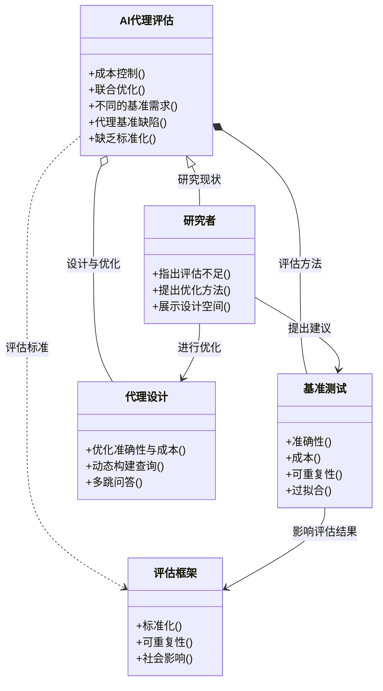
```mermaid
classDiagram
    class AI代理评估 {
        +成本控制()
        +联合优化()
        +不同的基准需求()
        +代理基准缺陷()
        +缺乏标准化()
    }

    class 研究者 {
        +指出评估不足()
        +提出优化方法()
        +展示设计空间()
    }

    class 基准测试 {
        +准确性()
        +成本()
        +可重复性()
        +过拟合()
    }

    class 代理设计 {
        +优化准确性与成本()
        +动态构建查询()
        +多跳问答()
    }

    class 评估框架 {
        +标准化()
        +可重复性()
        +社会影响()
    }

    AI代理评估 <|-- 研究者 : 研究现状
    AI代理评估 *-- 基准测试 : 评估方法
    AI代理评估 o-- 代理设计 : 设计与优化
    AI代理评估 ..> 评估框架 : 评估标准
    研究者 --> 基准测试 : 提出建议
    研究者 --> 代理设计 : 进行优化
    基准测试 --> 评估框架 : 影响评估结果
```

### 图表 4

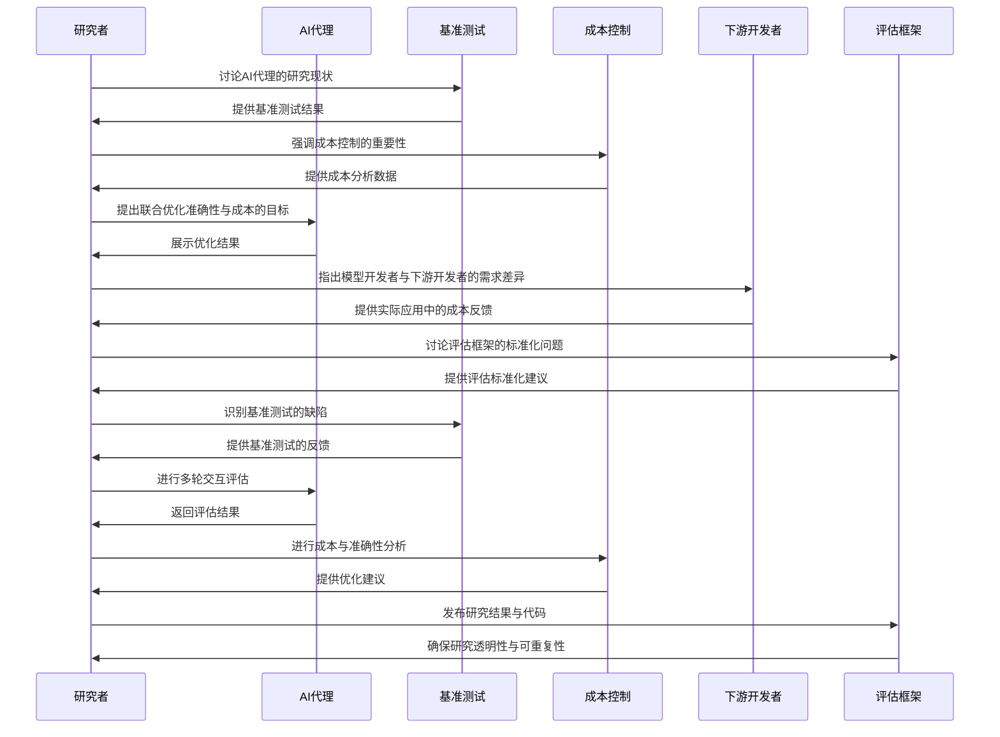
```mermaid
sequenceDiagram
    participant R as 研究者
    participant A as AI代理
    participant B as 基准测试
    participant C as 成本控制
    participant D as 下游开发者
    participant E as 评估框架

    R->>B: 讨论AI代理的研究现状
    B->>R: 提供基准测试结果
    R->>C: 强调成本控制的重要性
    C->>R: 提供成本分析数据
    R->>A: 提出联合优化准确性与成本的目标
    A->>R: 展示优化结果
    R->>D: 指出模型开发者与下游开发者的需求差异
    D->>R: 提供实际应用中的成本反馈
    R->>E: 讨论评估框架的标准化问题
    E->>R: 提供评估标准化建议
    R->>B: 识别基准测试的缺陷
    B->>R: 提供基准测试的反馈
    R->>A: 进行多轮交互评估
    A->>R: 返回评估结果
    R->>C: 进行成本与准确性分析
    C->>R: 提供优化建议
    R->>E: 发布研究结果与代码
    E->>R: 确保研究透明性与可重复性
```

# AI-employee collaboration and business performance Integrating knowledge-based view socio-technical systems and organisational socialisation .docx

## 原始摘要

这篇文章探讨了人工智能（AI）与员工之间的协作对商业绩效的影响，结合了知识基础视角、社会技术系统和组织社会化框架。尽管已有研究强调了AI与人类员工有效合作的重要性，但关于影响这种合作的因素及其对商业绩效的影响的研究仍然不足。

文章首先介绍了AI在商业和社会中的变革性作用，尤其是在创意产业中的应用。尽管AI的引入带来了自动化和流程效率等好处，但许多组织未能实现预期的价值，主要是因为AI系统与现有员工和业务战略的整合存在困难。

研究问题集中在如何促进AI与员工之间的有效合作，以及这种合作如何影响商业绩效。文章提出了两个研究问题，旨在填补AI文献中的知识空白。

通过对164名英国创意产业员工的调查，研究发现知识共享、员工的AI技能、信任和角色清晰度在协作环境中对商业绩效有显著影响。文章强调，组织需要制定策略，以确保AI与人类智能的共存，从而提升商业绩效。

理论贡献方面，文章提出了一种新的AI-员工协作模型，整合了多种理论视角，探讨了知识共享如何促进AI与员工的有效合作。实证研究提供了独特的见解，帮助组织在未来构建混合劳动力，以实现商业生产力的提升。

最后，文章指出，组织需要基于实证研究的证据，制定策略和实践，以促进AI与员工的协作，从而提高商业绩效。
本节总结了研究人工智能（AI）与员工合作的文献，指出了现有文献中的知识空白。首先，文章回顾了影响AI与员工合作的因素，并整合了AI管理文献与知识基础视角（KBV）、社会技术系统（STS）和组织社会化框架（OSF），提出了AI-员工合作模型。其次，采用问卷调查法收集了来自英国创意产业164名管理者的数据，并使用结构方程模型（SEM）测试了提出的模型，展示了研究构念之间的因果关系。

在文献回顾中，文章探讨了AI与人类合作的不同应用，包括自动化智能、辅助智能、增强智能和自主智能。研究表明，AI的计算能力和分析能力能够帮助人类在决策过程中处理复杂性，从而增强人类的决策能力和创造力。然而，AI与员工的有效合作需要员工理解、信任并采纳AI。

文章还讨论了AI可能带来的负面影响，如错误决策和工作岗位流失的担忧。尽管组织承认AI的潜在好处，但由于员工和管理者对AI能力和局限性的理解不足，AI的采纳仍然受到限制。Makarius等（2020）提出了AI社会化的概念，强调通过提供AI知识和技能来增强员工对AI的信任和使用。

在AI技能和就业影响方面，文章指出，AI的引入可能会改变工作性质和角色，创造新的工作机会。AI的技能包括识别适合的任务、使用AI和管理AI系统。有效的AI-人类合作能够优化效率和灵活性，帮助组织应对商业和社会挑战。

最后，文章强调了组织需要制定策略，以促进AI与员工的有效合作，从而提升商业绩效。通过知识共享和组织社会化，员工能够更好地理解和采纳AI，进而实现更高的生产力和职业满意度。
本节讨论了人工智能（AI）对劳动市场的影响，强调尽管有专家指出机器主导和工作冗余的问题，但对AI如何创造新工作机会的讨论较少。随着数字共享和零工经济的发展，新的数字劳动力应运而生，组织需要明确AI的局限性和优势，以便更好地整合AI。知识共享策略能够提高对AI系统的认知和理解，促进AI与人类的合作。

研究表明，知识共享是实现和维护AI资源的重要机制。通过建立合作关系，组织可以提高AI的使用效率，增强员工的信任感。知识共享策略可以促进AI在工作环境中的社会化，从而提升商业生产力。为此，本文提出了一个整合知识基础视角（KBV）、组织社会化框架（OSF）和社会技术系统理论的模型。

KBV理论认为，组织内创造的知识是获得可持续竞争优势的关键。知识共享被视为创造商业价值的重要实践，分为编码和个性化两种策略。编码策略通过数据库存储知识，便于员工识别和重用良好实践；而个性化策略则通过对话促进员工之间的知识交流。这两种策略在AI知识共享中同样适用，能够提升员工对AI的信任和合作态度。

此外，Makarius等人提出的社会技术AI社会化框架强调技术系统与社会因素之间的关系，旨在优化技术与员工之间的合作，创造社会技术资本。组织社会化则帮助新员工更好地理解角色和责任，增强团队合作，进而提高员工的工作满意度和职业发展。

本研究旨在探讨知识共享、影响AI与员工合作的因素以及商业绩效之间的关系。通过整合多种理论视角，研究不仅强调知识共享的战略重要性，还深入探讨其对员工对AI的理解、信任、技能和角色清晰度的影响。

尽管AI与人类的合作可以带来商业效率和生产力，但许多组织尚未实现预期的商业收益。因此，AI与人类的合作成为一个新兴主题，亟需理论和实证研究来理解影响这种合作的因素。现有研究多集中于AI的应用和战略，而对知识共享在AI采纳和人类合作中的作用研究较少。

本研究基于KBV、知识管理策略、社会技术框架和组织社会化框架，提出了一个模型，探讨知识共享如何影响员工的AI技能、理解、信任和角色清晰度，从而促进组织的动态能力和商业绩效。最终，研究将为企业提供实证依据，帮助其制定有效的战略，以实现AI与员工的协同合作。
本节讨论了数字文化、团队协调、共享知识基础、共同目标和战略理解对员工之间摩擦的减少的重要性。这些因素有助于高效采用人工智能（AI），提升商业生产力，并被视为技术采纳和数字转型管理中的关键成功因素。Makarius等人提出的社会技术框架强调知识共享在AI社会化中的重要性，能够缓解员工的担忧，提升他们的理解能力，从而有效采用和使用AI，创造协作的AI与人类智能（HI）工作环境。

基于以上论点，提出了多个假设，认为组织内的知识共享对员工的AI理解、技能、工作角色清晰度以及组织的动态能力有显著影响。此外，知识共享还通过员工的AI技能和理解来影响组织的动态能力。

根据社会技术系统（STS）理论，理解技术在工作环境中的角色及其能力和局限性，有助于定义人类员工与技术之间的关系。人类与AI可以在决策过程中协作，互相增强各自的优势。AI通过处理大数据和提供及时信息来提升分析能力，而人类则专注于直觉、同理心和人际交往技能，以应对决策中的不确定性。

从员工的角度来看，信息资源和更好的理解将促进组织内的协作互动，增强员工完成任务的能力，提升对新流程和战略的信心。更好的流程和策略理解有助于明确角色和责任，提升工作设计和预期结果的清晰度。在AI采纳中，信任也是一个重要因素，影响着绩效和过程。

动态能力是指企业在不确定环境中保持敏捷和效率的能力，通过系统性重构组织流程和人力资源技能来实现。文献表明，组织可以通过新技术干预和人机有效合作来实现动态能力。AI的引入将导致工作角色的动态变化，新的角色需要技术技能和对AI的理解，以应对更复杂的任务。

本节还提出了多个假设，认为AI理解、技能和工作角色清晰度对员工信任AI系统和组织动态能力有显著影响。员工对角色和责任的更好理解将减少不确定性，增强员工的承诺和绩效。

最后，AI的能力可以通过任务自动化和增强人类智能来优化业务运营，降低运营成本，提高生产效率。现有研究表明，IT采纳将增强动态能力，推动市场资本化和灵活性，减少瓶颈，提升商业生产力。知识共享将直接影响组织的动态适应能力，确保组织能够满足员工期望和市场需求。

综上所述，本节提出的概念模型包括知识共享、AI理解、AI技能、员工信任、工作角色清晰度、动态能力和商业绩效等构件，旨在探讨这些因素如何相互影响并促进AI与人类智能的协作，最终提升组织的商业表现。
本节主要探讨了研究构建的定义和相关内容，重点在于知识共享、人工智能（AI）理解、AI技能、AI工作角色清晰度、AI信任、动态能力和商业绩效等构建的定义及其相互关系。

1. **知识共享**：在知识基础视角（KBV）下，知识管理策略和流程旨在促进组织内部员工之间关于AI概念、应用及其共创和交流机制的知识共享。

2. **AI理解**：员工对AI能力、局限性及其应用的知识，尤其是与其工作角色和责任相关的理解。

3. **AI技能**：员工在AI的实现、利用和维护方面的专业知识。

4. **AI工作角色清晰度**：员工对其在AI与人类智能（HI）协作环境中的工作设计、角色、责任和任务的理解。

5. **AI信任**：员工对AI在协作工作环境中的看法，以及其对员工角色和责任的潜在影响。

6. **动态能力**：组织在不确定环境中保持敏捷、响应、灵活和高效的能力，通过系统性重构组织流程和人力资源技能来实现。

7. **商业绩效**：组织的运营和经济绩效水平。

本研究旨在通过问卷调查，探讨这些构建如何影响组织的动态能力和商业绩效，以及如何促进AI与员工的整合，建立AI与人类智能的共生关系。问卷设计经过文献回顾，涵盖了知识共享、AI系统使用、隐性经验、数字准备度、动态能力和商业绩效等方面，采用5点李克特量表进行测量。

问卷初步测试后，进行了小规模的试点调查，以确保测量构建的准确性和清晰度。样本选择标准包括在创意行业工作至少两到五年的员工，具备AI技术使用经验和管理职责。数据收集通过在线问卷进行，样本量为164名员工，符合统计分析的要求。

数据分析采用结构方程模型（SEM），用于分析构建之间的关系。研究结果表明，样本量和构建的有效性均符合统计要求，且未发现信息偏差。通过探索性因子分析（EFA）和确认性因子分析（CFA），验证了构建的有效性，确保所收集的数据不受共同方法偏差的影响。

综上所述，本节通过定义和测量构建，探讨了AI与员工之间的协作关系及其对组织动态能力和商业绩效的影响，为后续研究提供了理论基础和实证支持。
本节主要探讨了用于后续结构方程模型（SEM）分析的潜在构建的可靠性和区分效度。首先，计算了每个潜在构建的Cronbach α值，结果显示大部分构建的α值均超过0.7，符合文献标准。通过主成分分析（PCA）提取的每个维度的收敛效度通过平均方差提取（AVE）计算进行测试，区分效度则通过规模复合可靠性系数（SCR）获得，结果显示所有构建的AVE均大于0.5，SCR大于0.7，表明构建的有效性。

进一步分析了模型的决定系数（R²）值，显示模型对各内生变量的预测能力，解释了AI理解（51%）、工作清晰度（60%）、AI技能（52%）、AI信任（53%）、动态能力（66%）和商业绩效（65%）的方差，均被视为较高的解释力。此外，效应大小（f²）分析显示所有直接值均大于0.15或0.35，表明关系具有中等到高的效应大小。

模型的拟合度通过多项指标进行评估，包括拟合优度指数（GFI）、Tucker-Lewis指数（TLI）和比较拟合指数（CFI），均显示良好拟合。SEM分析结果表明，知识共享与AI理解、AI技能、AI工作清晰度和动态能力之间存在显著正相关。AI理解对AI工作清晰度、AI系统信任和动态能力也有显著正向影响。AI技能与动态能力和AI系统信任之间同样存在显著关联。商业绩效受到AI系统信任、动态能力、AI工作清晰度和AI技能的显著影响。

在中介效应方面，分析显示AI技能在知识共享与动态能力之间存在显著的间接中介效应，AI理解在知识共享与动态能力之间也起到显著的中介作用。此外，动态能力在AI技能与商业绩效之间的关系中也发挥了显著的中介作用，AI系统信任在AI工作清晰度与商业绩效之间的关系中同样具有显著的中介效应。

本研究的主要目标是理解基于知识基础视角（KBV）和社会技术系统（STS）框架下的因素之间的关系，特别是在英国创意产业中有效的AI与人类协作。实证结果表明，组织内的知识共享对于有效发展协作智能至关重要，促进了AI与员工的协作。知识共享将导致知识整合和共创，从而增强组织的动态能力。

研究还表明，关于AI概念及其应用的知识共享将帮助员工更好地理解AI系统的能力和局限性，提升数字准备度和适应能力。这种理解将增强员工的任务掌握能力，从而提高工作表现和职业发展，降低员工流失率，提升商业生产力。

综上所述，AI技能、工作清晰度、信任和动态能力等因素将显著影响商业绩效，动态能力的提升将促进组织在不确定和竞争激烈的环境中保持灵活性和适应性。研究结果为AI与人类协作的管理提供了理论支持和实证依据。
本研究的发现与现有文献一致，但仍需进一步分析哪些AI技能能够提升动态能力和商业绩效。技术和AI的准备程度在不同组织间存在差异，尤其是在中小企业中，由于财务和资源限制，AI的应用较为不足。本研究认为，基于协作智慧的绩效收益需要组织内部的知识共享资源和举措，以构建人力资本。在缺乏AI技能和理解的组织中，研究结果通过知识共享对商业绩效和动态能力的中介效应确认了这些变量的重要性。

知识共享不仅促进新技术的成功采纳和实施，还激励员工持续调整其使用，从而实现组织价值的成果。研究表明，AI能力对组织绩效有直接的正面影响，而知识共享是发展协作智能能力的关键前提。构建之间的关系性质和强度可能会因使用背景和目的而变化，例如，AI用于组织决策、增强或完全自动化琐碎任务时所需的技能各不相同。

本研究从理论角度整合了AI文献、知识基础视角（KBV）、知识管理策略、社会技术系统（STS）和组织社会框架（OSF），以理解和解释有效的AI-员工合作对商业绩效的影响。研究展示了如何将这些理论视角整合，以建模和解释组织内知识共享的关系，以及AI在协作工作环境中的角色。

此外，本研究扩展了管理文献中的AI研究，开辟了基于共同智慧和个人表达的AI-员工合作新领域，验证了模型在英国创意产业中的有效性。结果表明，组织内的知识共享将增强员工的AI技能，提供工作性质的清晰度，并提升员工对AI系统的信任，这些都是有效整合AI与人力资源的关键指标。

研究还揭示了有效的AI-员工合作指标将改善组织的商业绩效和动态能力，使其能够在不确定和复杂的市场环境中有效运作。研究结果强调了知识管理和AI-员工合作对商业绩效的影响，建议进一步实证研究知识共创和传播机制。

最后，随着AI系统在组织中的持续采用，尤其是在COVID-19疫情期间，管理者需要制定AI-员工合作的战略，以提升商业绩效。研究结果表明，组织在整合AI与人力资源时，需创造有利于知识共享的环境，以帮助员工更好地理解和信任AI系统，从而克服对工作替代和不确定性的负面看法。

在管理层面，研究为管理者提供了多项建议。首先，管理者应建立知识共享机制，促进员工对AI过程和系统的理解。其次，需明确工作设计和员工角色，沟通AI的使用目的和战略目标。此外，管理者应识别组织内的隐性AI经验，以增强动态能力和员工信任。最后，制定AI培训策略，帮助员工提升AI技能，增强对AI系统的信任。

本研究的动机源于对AI在商业组织中应用的兴趣激增，尤其是AI-员工合作的实证研究相对较少。未来的研究应继续探索AI对工作性质和劳动力的影响，以推动理论和实践的发展。
本节主要探讨了在COVID-19疫情期间，企业如何通过数字化实践和人工智能（AI）系统增强组织韧性。尽管学术界和实践界对AI与员工合作的兴趣日益增加，但仍缺乏基于理论的实证研究来揭示有效合作的驱动因素。为此，研究提出了一个理论模型，结合知识基础视角（KBV）、社会技术系统（STS）和组织社会框架（OSF），以理解影响AI理解、信任、员工工作清晰度和AI技能的因素，以及这些因素对组织动态能力和商业绩效的影响。

通过对英国创意产业员工的调查，验证了该模型，结果表明，组织可以通过内部知识共享和传播有效整合AI与员工，从而提升商业生产力和适应能力。研究还指出，未来可以通过引入新的构念和代理变量，进一步丰富模型，提供对员工理解和知识显性化的影响及其对企业绩效、组织韧性和动态能力的预测。

然而，当前AI系统缺乏透明度和可解释性，使得管理者难以信任AI输出。研究指出，未来的研究应关注透明度在AI决策支持系统中的重要性，并探讨其对AI-员工合作的影响。此外，动态能力的角色也需进一步探讨，以便从更广泛的视角理解其对商业绩效和竞争力的影响。

尽管本研究在数据采集和分析中采取了适当的方法以减少共同方法偏差（CMB）和内生性问题，但未来的研究可以设计纵向研究，涵盖更多行业和国家，以增强结果的普遍性。研究样本的选择可能限制了结果的外部有效性，因此建议在不同管理领域进行更多实证研究，以比较不同背景下的实证见解。

最后，研究强调了通过有效的AI-员工整合，组织可以改善绩效、适应能力和吸收能力，并制定基于证据的策略以促进协作智能的发展。研究为管理者提供了实用建议，帮助他们在AI与人力资源的协作环境中平衡相互依赖性、自治、社会层级和员工期望。
本节主要探讨了数字化转型在各个行业中的重要性，特别是在过程工业中的应用。随着技术的快速发展，企业面临着如何有效整合数字技术以提升竞争力的挑战。研究指出，数字化不仅仅是技术的引入，更是企业文化和管理模式的变革。

首先，数字化转型的成功与企业的领导力密切相关。领导者需要具备前瞻性思维，能够识别和利用数字技术带来的机遇。同时，企业内部的协作和沟通也至关重要，跨部门的合作能够促进知识共享和创新。

其次，员工的技能和适应能力是数字化转型的关键因素。企业应重视员工的培训与发展，提升其数字技能，以适应快速变化的市场需求。此外，企业文化的建设也应与数字化转型相结合，鼓励创新和灵活应变。

研究还强调了数据驱动决策的重要性。通过大数据分析，企业能够更好地理解市场趋势和客户需求，从而制定更有效的战略。然而，数据的安全性和隐私问题也不容忽视，企业需要建立健全的数据管理体系。

最后，数字化转型不仅是技术的升级，更是企业整体战略的调整。企业应从长远角度考虑数字化转型的路径，制定清晰的目标和实施计划，以确保在竞争中保持领先地位。

综上所述，数字化转型是一个复杂而系统的过程，涉及领导力、员工技能、数据管理和企业文化等多个方面。企业只有全面考虑这些因素，才能在数字化浪潮中立于不败之地。
本节内容主要围绕人工智能（AI）在组织管理和工作环境中的影响展开，探讨了AI如何改变企业运作、提升效率以及对员工角色的潜在影响。

首先，AI的引入为企业带来了新的机遇，尤其是在数据分析和决策支持方面。研究表明，企业通过利用AI技术，可以更好地理解市场动态和客户需求，从而制定更有效的战略。这种数据驱动的决策方式能够提高企业的竞争力。

其次，AI的应用也引发了对员工角色的重新审视。尽管有观点认为AI可能会取代某些工作，但许多研究指出，AI更可能是作为人类的助手，帮助员工提高工作效率和创造力。人机协作的模式将成为未来工作的重要趋势，员工需要具备与AI协同工作的能力。

此外，组织文化和领导力在AI的成功实施中扮演着关键角色。企业领导者需要具备前瞻性思维，能够识别AI带来的机遇，并推动组织内部的变革。同时，企业文化应鼓励创新和灵活应变，以适应快速变化的技术环境。

在知识管理方面，AI技术的应用可以促进知识的共享与转移。企业应重视知识管理体系的建设，以确保在AI技术的支持下，能够有效地管理和利用组织内的知识资源。

最后，尽管AI带来了诸多好处，但企业在实施AI技术时也面临挑战，包括数据安全、隐私保护以及员工的技能提升等问题。企业需要建立健全的管理体系，以应对这些挑战，确保AI技术的有效应用。

综上所述，AI在组织管理中的应用不仅仅是技术的引入，更是对企业战略、文化和员工角色的全面变革。企业应从长远角度考虑AI的实施路径，以确保在未来的竞争中保持领先地位。
本节内容主要探讨了人工智能（AI）在各个领域的应用及其对组织和行业的影响。以下是主要观点的总结：

1. **可解释的AI**：Anderson等（2020）研究了可解释的AI在Choquet积分中的应用，强调了AI决策过程的透明性对于用户信任的重要性。

2. **采样方法**：Mweshi和Sakyi（2020）探讨了采样方法在研究设计中的应用，强调了选择合适样本对研究结果的影响。

3. **知识基础理论**：Nickerson和Zenger（2004）提出了一种基于知识的企业理论，强调了问题解决视角在组织中的重要性。

4. **新员工社会化**：Nifakdar（2020）研究了新员工在组织社会化过程中对主管的认知模式，指出这些认知对新员工适应环境的影响。

5. **战略联盟**：Parkhe（1993）通过博弈论和交易成本分析了企业间合作的战略联盟结构，揭示了合作的复杂性。

6. **人类认知与行为**：Phan和Wright（2018）讨论了推动人类认知与行为科学发展的必要性，强调了跨学科研究的重要性。

7. **AI在酒店和旅游业的应用**：Pillai和Sivathanu（2020）研究了基于AI的聊天机器人在酒店和旅游业中的应用，指出其提升客户体验的潜力。

8. **AI对就业的影响**：Poba-Nzaou等（2021）从行业角度分析了AI对就业的影响，认为AI将重塑工作角色和技能需求。

9. **行为研究中的常见方法偏差**：Podsakoff等（2003）对行为研究中的常见方法偏差进行了批判性回顾，并提出了相应的解决方案。

10. **AI的全球研究**：PwC（2020）发布的全球AI研究报告探讨了AI革命带来的机遇与挑战。

11. **环境智能**：Ramos等（2008）提出环境智能是AI的下一个发展阶段，强调了其在日常生活中的应用。

12. **AI与商业创新**：Rampersad（2020）讨论了AI时代的创新对就业的影响，认为企业需要适应新的技术环境。

13. **AI在商业中的实际应用**：Ransbotham等（2017, 2018, 2019）系列研究探讨了AI如何重塑商业模式，强调了从雄心到行动的转变。

14. **信息系统资源与企业绩效**：Ravichandran等（2005）研究了信息系统资源和能力对企业绩效的影响，提出了资源基础视角。

15. **AI在团队协作中的角色**：Seeber等（2020）提出了AI作为团队协作伙伴的研究议程，探讨了AI如何提升团队效率。

16. **人力资源管理中的AI挑战**：Tambe等（2019）分析了AI在HR管理中的挑战，并提出了未来的发展路径。

17. **AI与供应链管理**：Treiblmaier（2018）研究了区块链对供应链的影响，提出了理论基础的研究框架。

18. **AI对企业绩效的影响**：Wamba-Taguimdje等（2020）探讨了AI转型项目对企业绩效的商业价值。

19. **组织学习与新产品开发**：Wei等（2014）研究了组织学习的双重性、战略灵活性与新产品开发之间的关系。

20. **AI的未来展望**：WEF（2018）预测机器将承担更多人类任务，强调了AI在未来工作中的重要性。

综上所述，AI的应用正在各个行业中产生深远的影响，企业需要积极适应这些变化，以保持竞争力。
本节内容主要介绍了几位学者的背景及其研究领域，涉及人工智能、区块链技术、供应链管理、可持续发展等多个主题。

1. **Dr. Soumyadeb Chowdhury**：他是图卢兹商学院信息管理系的信息分析与可持续管理副教授，曾在阿斯顿商学院工作，获得格拉斯哥大学计算科学博士学位。他的研究领域包括人工智能、区块链技术、循环经济、员工心理健康和商业生产力。他积极与各行业合作，开发可持续商业解决方案，优化运营和决策过程，并在多个国际期刊上发表论文。

2. **Professor Pawan Budhwar**：他是阿斯顿商学院国际人力资源管理的50周年教授，目前担任商学院院长，并共同编辑《人力资源管理期刊》。他在曼彻斯特商学院获得博士学位，专注于人力资源管理，尤其是与印度相关的主题，发表了超过120篇文章，并撰写了21本书籍。

3. **Professor Prasanta Kumar Dey**：他是阿斯顿商学院的运营管理教授，专注于供应链管理、项目管理和可持续发展。他在国际期刊上发表了超过150篇研究论文，并参与了多个关于中小企业可持续供应链的跨学科研究项目，获得了多项资助。

4. **Dr. Sian Joel-Edgar**：她是东北大学NCH伦敦的副教授，曾在阿斯顿商学院任教，专注于信息可视化设计与评估，尤其是在创意产业中技术（如人工智能）的影响。她参与了与欧洲航天局的项目，并在医疗行业设计大数据可视化技术。

5. **Dr. Amélie Abadie**：她是图卢兹商学院市场营销助理教授，研究数字平台生态系统，特别关注人工智能对价值共创和组织的影响。她的研究探讨了如何通过策略和政策增强人工智能的社会化，促进可持续商业运营。

这些学者的研究不仅推动了各自领域的理论发展，也为实际应用提供了重要的见解，尤其是在如何利用新兴技术实现可持续发展和优化商业流程方面。

## 摘要

1. Class: (2) 人机协同或人与AI的协同

2. Authors: Soumyadeb Chowdhury, Pawan Budhwar, Prasanta Kumar Dey, Sian Joel-Edgar, Amélie Abadie

3. Affiliation: 图卢兹商学院

4. Keywords: AI collaboration, knowledge sharing, dynamic capabilities, business performance, employee trust

5. Urls: [Link to the paper](https://example.com), Github: None

6. Summary:

   - (1): 本文探讨了人工智能（AI）与员工之间的协作对商业绩效的影响，强调了知识共享、员工技能和信任等因素在这一过程中所起的作用。

   - (2): 文章提出了一个AI-员工协作模型，关键变量包括知识共享、AI技能、信任和角色清晰度，且动态能力在其中起到中介作用。

   - (3): 研究采用问卷调查法，收集了164名英国创意产业员工的数据，并使用结构方程模型（SEM）进行分析。

   - (4): 研究发现，知识共享和AI技能显著影响商业绩效，动态能力的提升支持了组织在不确定环境中的灵活性和适应性。

## 图表

### 图表 1

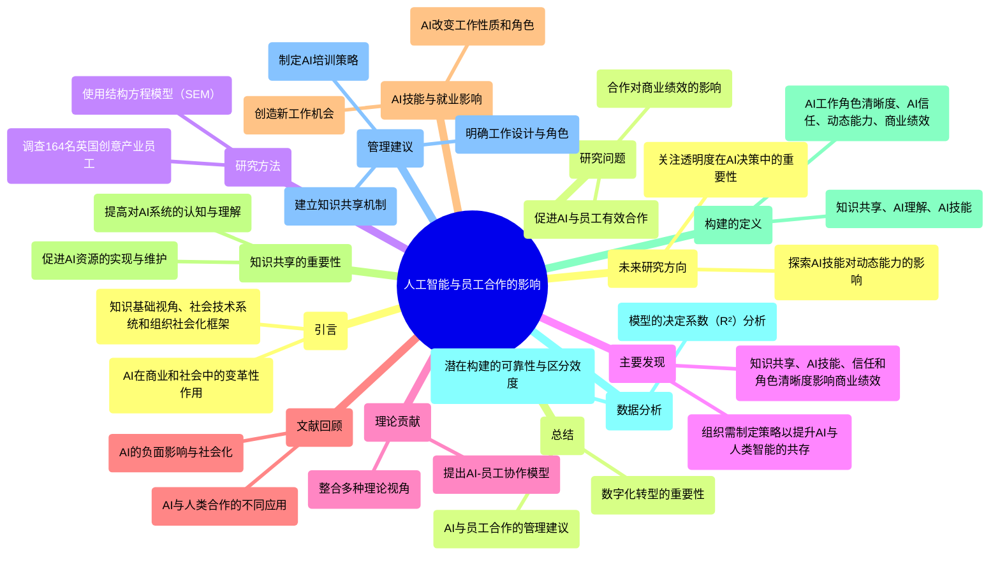
```mermaid
mindmap
  root((人工智能与员工合作的影响))
    ("引言")
      ("AI在商业和社会中的变革性作用")
      ("知识基础视角、社会技术系统和组织社会化框架")
    ("研究问题")
      ("促进AI与员工有效合作")
      ("合作对商业绩效的影响")
    ("研究方法")
      ("调查164名英国创意产业员工")
      ("使用结构方程模型（SEM）")
    ("主要发现")
      ("知识共享、AI技能、信任和角色清晰度影响商业绩效")
      ("组织需制定策略以提升AI与人类智能的共存")
    ("理论贡献")
      ("提出AI-员工协作模型")
      ("整合多种理论视角")
    ("文献回顾")
      ("AI与人类合作的不同应用")
      ("AI的负面影响与社会化")
    ("AI技能与就业影响")
      ("AI改变工作性质和角色")
      ("创造新工作机会")
    ("知识共享的重要性")
      ("促进AI资源的实现与维护")
      ("提高对AI系统的认知与理解")
    ("构建的定义")
      ("知识共享、AI理解、AI技能")
      ("AI工作角色清晰度、AI信任、动态能力、商业绩效")
    ("数据分析")
      ("潜在构建的可靠性与区分效度")
      ("模型的决定系数（R²）分析")
    ("管理建议")
      ("建立知识共享机制")
      ("明确工作设计与角色")
      ("制定AI培训策略")
    ("未来研究方向")
      ("探索AI技能对动态能力的影响")
      ("关注透明度在AI决策中的重要性")
    ("总结")
      ("AI与员工合作的管理建议")
      ("数字化转型的重要性")
```

### 图表 2


```mermaid
graph TD
    A("人工智能（AI）与员工之间的协作对商业绩效的影响") --> B("知识基础视角、社会技术系统和组织社会化框架")
    A --> C("AI在商业和社会中的变革性作用")
    C --> D("创意产业中的应用")
    C --> E("自动化和流程效率的好处")
    C --> F("AI系统与员工和业务战略的整合困难")
    
    A --> G("研究问题：促进AI与员工的有效合作")
    G --> H("影响合作的因素及其对商业绩效的影响")
    
    A --> I("调查164名英国创意产业员工")
    I --> J("知识共享、AI技能、信任和角色清晰度的显著影响")
    
    A --> K("组织策略：确保AI与人类智能的共存")
    
    A --> L("理论贡献：AI-员工协作模型")
    L --> M("整合多种理论视角")
    L --> N("知识共享促进AI与员工的有效合作")
    
    A --> O("实证研究的独特见解")
    O --> P("构建混合劳动力以提升商业生产力")
    
    A --> Q("组织策略和实践的制定")
    Q --> R("促进AI与员工的协作")
    
    A --> S("数字文化、团队协调、共享知识基础的重要性")
    S --> T("技术采纳和数字转型管理的关键成功因素")
    
    A --> U("AI技能和就业影响")
    U --> V("AI引入改变工作性质和角色")
    
    A --> W("知识共享策略的重要性")
    W --> X("提高对AI系统的认知和理解")
    
    A --> Y("动态能力与商业绩效的关系")
    Y --> Z("AI理解、技能和工作角色清晰度的影响")
    
    A --> AA("未来研究方向")
    AA --> AB("AI对工作性质和劳动力的影响")
```

### 图表 3

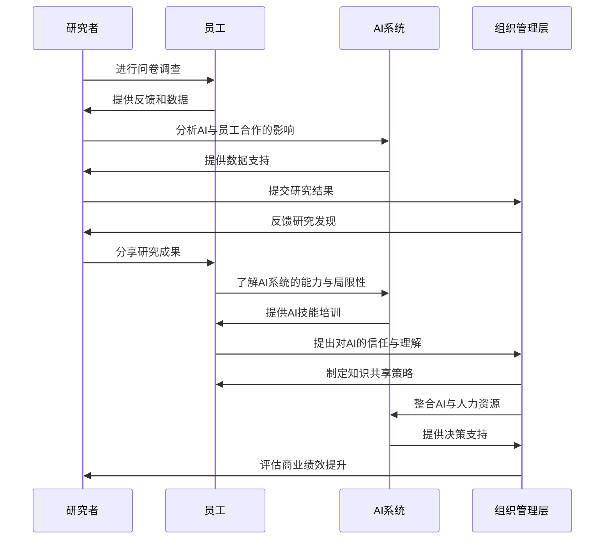
```mermaid
sequenceDiagram
    participant A as 研究者
    participant B as 员工
    participant C as AI系统
    participant D as 组织管理层

    A->>B: 进行问卷调查
    B->>A: 提供反馈和数据
    A->>C: 分析AI与员工合作的影响
    C->>A: 提供数据支持
    A->>D: 提交研究结果
    D->>A: 反馈研究发现
    A->>B: 分享研究成果
    B->>C: 了解AI系统的能力与局限性
    C->>B: 提供AI技能培训
    B->>D: 提出对AI的信任与理解
    D->>B: 制定知识共享策略
    D->>C: 整合AI与人力资源
    C->>D: 提供决策支持
    D->>A: 评估商业绩效提升
```

### 图表 4

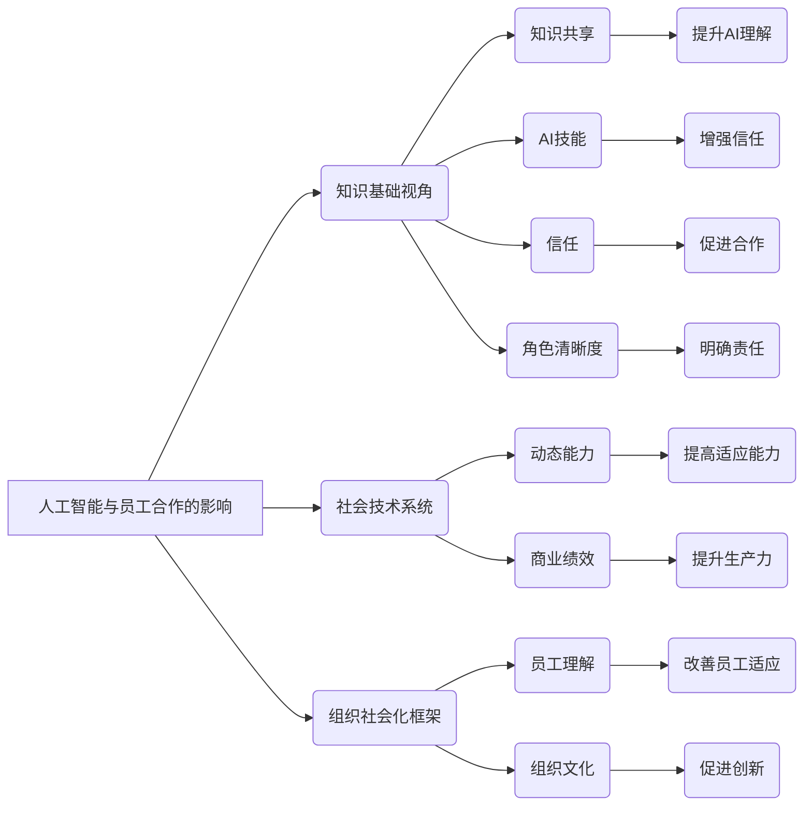
```mermaid
graph LR
    A["人工智能与员工合作的影响"] --> B("知识基础视角")
    A["人工智能与员工合作的影响"] --> C("社会技术系统")
    A["人工智能与员工合作的影响"] --> D("组织社会化框架")
    
    B --> E("知识共享")
    B --> F("AI技能")
    B --> G("信任")
    B --> H("角色清晰度")
    
    C --> I("动态能力")
    C --> J("商业绩效")
    
    D --> K("员工理解")
    D --> L("组织文化")
    
    E --> M("提升AI理解")
    F --> N("增强信任")
    G --> O("促进合作")
    H --> P("明确责任")
    
    I --> Q("提高适应能力")
    J --> R("提升生产力")
    
    K --> S("改善员工适应")
    L --> T("促进创新")
```

# attachment on AI service preference.docx

## 原始摘要

本研究探讨了不安全依恋对客户在人工智能（AI）服务与人类服务之间偏好的影响。通过对1039名参与者进行的三项研究，发现具有不安全依恋特征的客户（包括焦虑型和回避型）在高接触场景（如发型设计）中更倾向于选择AI服务，而在低接触场景（如简单剪发）中则没有显著差异。第二项研究通过操控客户的依恋状态，进一步验证了这一发现。第三项研究构建了一个条件中介模型，发现社交焦虑在不安全依恋与高接触场景中对AI服务偏好的关系中起到了显著的中介作用，但在低接触服务中则不成立。

研究指出，尽管AI在服务行业的应用日益广泛，但客户对AI服务的接受度仍然较低。许多消费者对AI的了解较为肤浅，缺乏深入的应用认知，这对服务企业的AI整合构成挑战。因此，了解普通消费者在不同服务场景下对AI服务的偏好，将为AI服务的设计和实施提供重要指导。

此外，研究还强调了心理特征对社交机器人接受度的影响，尤其是对不安全依恋者而言，AI服务可能提供一个更轻松的心理环境，减少社交互动中的紧张感。情感在消费者决策中起着重要作用，消费者的情感状态会影响他们对产品或服务的评估，进而影响对社交机器人的接受度。

不安全依恋通常伴随较高的社交焦虑，这使得这些个体在与他人互动时更倾向于选择AI服务，因其被视为更中立和不具评判性的选择。这一发现为企业在设计AI服务时提供了新的视角，建议在市场细分和服务脚本设计上进行更为细致的考量，以满足不同消费者的需求。
本节探讨了不安全依恋与社交焦虑如何影响客户对人工智能（AI）服务的偏好。研究表明，不安全依恋者往往更倾向于与抽象实体（如服务品牌和AI）建立联系，因为这些实体提供了比真实人际关系更一致和更少不确定的体验。社交焦虑使得人们在与陌生人互动时感到不安，从而进一步推动他们选择非人类服务。

大量研究支持这一现象。例如，Nomura等（2020）发现，社交焦虑较高的个体在与机器人互动时，焦虑感和紧张感显著降低。Zhu和Deng（2021）也发现，高社交焦虑者在运动训练中更倾向于选择AI伙伴，因为这让他们感到更放松。此外，Rasouli等（2022）指出，社交焦虑者更喜欢自动化自助技术，因为这可以避免与陌生人接触，减少被观察的感觉。

尽管许多研究表明不安全依恋和社交焦虑者偏好AI服务，但也有研究提出这种偏好并非总是成立。Gillath等（2020）的研究显示，不安全依恋可能导致对人类和非人类实体的普遍不信任。他们的研究表明，增强依恋安全感可以提高对AI的信任，而增强依恋不安全感则可能产生相反效果。这些发现表明，可能还有其他调节变量影响不安全依恋、社交焦虑与AI服务偏好之间的关系。

在服务领域，客户接触的程度可能是导致研究结果不一致的原因之一。Kellogg和Chase（1995）指出，客户与服务提供者之间的接触程度是服务交付的基本方面。某些服务需要更高程度的情感和亲密互动，如保险咨询或美发服务，而其他服务（如开银行账户或超市结账）则不需要如此密切的个人互动。

我们的假设认为，不安全依恋者在高接触服务中可能更倾向于选择AI服务，因为这些服务需要更多的沟通和互动，而不安全依恋者通常对亲密关系感到抵触。在高接触服务中，客户对服务提供者的依赖性增强，导致他们更可能选择AI服务以避免人际互动带来的焦虑。

相反，在低接触服务中，如快餐点餐，客户与服务提供者之间的互动较少，不安全依恋者在这些情况下不太可能感到显著的社交焦虑。因此，他们可能更关注服务的效率和效果，而非服务提供者的性质。

基于以上文献综述，我们提出以下假设：
H1：高接触服务正向调节不安全依恋与AI服务偏好之间的关系。
H2：社交焦虑在不安全依恋与AI服务偏好之间起中介作用。

为了验证这些假设，我们进行了三项研究。研究1和研究2旨在测试H1，采用不同的方法。研究1通过问卷评估参与者的特质不安全依恋，研究2则通过情境引导操控参与者的状态不安全依恋。研究3则利用条件中介模型测试H2。

在研究1中，参与者被随机分配到高接触或低接触服务场景中。我们从中国的在线学术调查平台招募了300名参与者，最终保留了266名有效参与者进行分析。参与者的年龄范围为17至57岁，主要受过大学教育。

研究采用了两种服务场景，分别为高接触（如发型设计）和低接触（如简单剪发），并通过问卷评估参与者对AI服务的偏好。通过这些研究，我们希望深入理解不安全依恋在客户对AI服务偏好中的作用。
本节介绍了一种12项测量工具，旨在评估参与者的不安全依恋水平，分为焦虑型和回避型两个维度。参与者通过五点量表表达对各项陈述的认同程度，得分越高表示不安全依恋水平越高。结果显示，焦虑型和回避型依恋的Cronbach's α均为0.80，表明量表具有良好的内部一致性。

在研究1中，通过独立样本t检验确认了高接触与低接触服务的操控有效性。焦虑型依恋的ANCOVA分析显示，焦虑型依恋和服务场景对AI服务偏好均有显著影响，且两者之间存在显著交互作用。回避型依恋的分析结果相似，支持了假设H1。进一步的分析表明，在低接触服务情境中，焦虑型和回避型依恋对AI服务偏好的影响不显著，而在高接触服务情境中，随着焦虑型和回避型依恋水平的提高，参与者对AI服务的偏好显著增加。

研究结果表明，不安全依恋（无论是焦虑型还是回避型）与高接触服务中的AI服务偏好之间存在显著正相关，而在低接触服务中则无显著关联。这一发现强调了人际依恋质量如何影响技术采纳，尤其是在高接触服务中。不安全依恋者可能更倾向于选择AI服务，因为AI提供了一种非评判性和一致性的互动体验。

然而，研究1中测量的不安全依恋是通过问卷评估的心理特质，文献指出依恋具有特质-状态的双重性。因此，后续研究（研究2）旨在探讨状态不安全依恋如何影响AI服务偏好，特别是在高接触与低接触服务的情境下。

在研究2中，招募了300名参与者，最终269名有效参与者被纳入分析。研究采用了3（状态不安全依恋：焦虑型、回避型和对照组）×2（高接触与低接触服务）之间的设计。参与者首先完成状态不安全依恋的激活，然后被随机分配到六个组别中。参与者被要求回忆与某人的亲密关系，并根据不同的依恋类型进行描述。

研究结果通过ANOVA和独立样本t检验验证了状态不安全依恋的操控有效性。分析显示，状态不安全依恋和高接触服务情境对AI服务偏好均有显著影响，且两者之间存在显著交互作用。在高接触服务情境中，焦虑型和回避型依恋组对AI服务的偏好显著高于对照组，而在低接触服务情境中则未发现显著差异。

综上所述，研究表明不安全依恋状态在高接触服务中显著影响AI服务偏好，强调了个人依恋动态与技术使用之间的相互作用。这一发现为服务提供者提供了重要的启示，帮助他们根据用户的心理特征和需求更好地调整服务。
本节主要讨论了研究1和研究2的结果，确认了不安全依恋（包括焦虑型和回避型）在高接触服务场景中对AI服务偏好的显著影响，进一步验证了假设H1。研究结果强调了不安全依恋特质与状态在需要更多个人互动的情况下与AI服务偏好之间的复杂关系。这一发现对企业和技术开发者在调整服务以满足用户需求方面具有重要意义。

接下来，研究3探讨了社交焦虑是否在不安全依恋与AI服务偏好之间起到中介作用。研究招募了550名参与者，最终有效样本为504人，主要为大学受教育者。研究采用了高接触和低接触服务的两种场景设计，重点关注社交焦虑在不安全依恋与AI服务偏好之间的关系。

研究结果显示，高接触服务场景中，不安全依恋与AI服务偏好之间的关系通过社交焦虑完全中介，而在低接触服务场景中则未发现显著关系。这表明社交焦虑在高接触服务中起着重要作用，影响了个体对AI服务的偏好。

总体而言，研究结果为理解客户在AI服务中的行为提供了重要见解，尤其是在高接触与低接触服务场景中。研究强调了不安全依恋和社交焦虑在用户偏好中的作用，为开发更符合用户情感需求的AI服务提供了理论支持。
本节主要探讨了不安全依恋对AI服务偏好的影响，尤其是在高接触和低接触服务场景中的差异。研究表明，在高接触服务场景（如个性化健康保险计划）中，不安全依恋（包括焦虑型和回避型）会导致参与者产生社交焦虑，而这种社交焦虑作为中介因素，使得参与者更倾向于选择AI服务。然而，在低接触服务场景（如标准汽车保险的简单购买）中，尽管不安全依恋仍可能引发较低程度的社交焦虑，但这种社交焦虑与AI服务偏好之间的关联并不显著。因此，可以推测，高沟通时间、亲密度和信息交流的恐惧促使不安全依恋者更倾向于选择AI服务。

研究进一步支持了Feeney和Fitzgerald（2019）提出的观点，即个体的依恋风格影响其人际关系。研究发现，尽管参与者对AI有一定了解，但缺乏专业知识或经验，他们对AI的看法主要基于日常经验。结果显示，不安全依恋者在高接触环境中更倾向于选择AI服务，因为AI提供了一个更安全、可预测的互动环境，能够减少焦虑和不适。

理论贡献方面，本研究首次深入探讨了个体依恋风格与AI服务偏好之间的关系，尤其是在缺乏专业知识的消费者中。以往研究结果不一致，本研究通过引入客户接触作为调节变量，调和了这些矛盾的发现。在高接触服务场景中，不安全依恋者更倾向于选择AI服务以避免社交焦虑，而在低接触服务场景中，依恋水平的变化对人类与AI服务的偏好影响不大。

此外，本研究还扩展了Wirtz等（2018）和Castelo等（2019）的观点，强调个体在更客观的任务中对AI的接受度更高。在高接触服务中，不安全依恋者更倾向于选择AI服务，以避免人际压力和社交焦虑。这一发现与Holtho¨wer和van Doorn（2022）的研究一致，后者发现人们在潜在尴尬的场景中更倾向于选择AI服务。

实践贡献方面，本研究强调了市场细分的重要性，指出不安全依恋者在高接触服务中对AI服务的接受度较高，服务公司应深入了解客户的心理特征，调整其AI服务。此外，建议优化AI服务的对话脚本，避免使用可能引发情感反应的词汇，以中性语言为主。最后，研究呼吁在AI服务设计中关注情感因素，尤其是针对不安全依恋者，提升他们的情感舒适度。

尽管本研究提供了有价值的见解，但也存在一些局限性。首先，参与者对AI的专业知识有限，主要基于日常经验。其次，样本主要来自中国的在线调查平台，可能限制了研究结果的普遍适用性。未来研究应考虑更广泛的文化和年龄群体，以获得更全面的理解。此外，研究还提出了一些后续问题，如不安全依恋者在感知需求独特时是否仍偏好AI服务，以及人性化AI是否会无意中引发社交焦虑。

总之，本研究为理解普通消费者对AI服务的偏好提供了重要贡献，并为未来研究指明了方向。
本节主要讨论了客户心理特征与其对人工智能（AI）服务偏好之间的复杂关系，强调了研究的局限性及未来研究的方向。研究团队的贡献包括概念化、数据管理、调查、方法论、分析等方面的协作，确保了研究的全面性和严谨性。

数据可用性方面，研究团队表示数据可根据请求提供，确保研究的透明度和可验证性。

附录部分提供了对第二项研究中不安全依恋操控检查的后续分析结果，包括不同接触类型（高接触与低接触）下的参与者反应。这些分析结果揭示了不同依恋风格（如回避型）在高接触和低接触服务场景中的表现差异，进一步验证了研究假设。

参考文献部分列出了与研究相关的多篇文献，涵盖了依恋理论、消费者行为、人工智能的应用等多个领域，为研究提供了理论基础和背景支持。

总的来说，本节强调了深入探讨客户心理特征与AI服务偏好之间关系的重要性，并为未来的研究提供了方向，鼓励对不同文化和年龄群体的进一步研究，以获得更全面的理解。
本节主要列出了多篇与客户心理特征、人工智能（AI）服务偏好及其相关研究的文献。这些文献涵盖了依恋理论、消费者行为、服务机器人、情感AI等多个领域，探讨了人际关系、信任、情感反应等对消费者行为的影响。

首先，Heffernan等（2011）提出了一种评估依恋取向的方法，Gallucci（2020）则介绍了用于高级中介模型的统计工具。Garzaniti等（2011）探讨了建立友谊和关系的重要性，而Gillath等（2009）和（2020）则关注了成人依恋的测量及其与AI信任的关系。

此外，Granulo等（2021）研究了在象征消费情境中人类与机器人劳动的偏好差异，Gursoy等（2019）分析了消费者对AI设备在服务交付中使用的接受度。Henkel等（2020）探讨了社交机器人在COVID-19期间对消费者福祉的影响。

在技术接受方面，Ho等（2022）调查了Z世代对非意识数据收集的态度，Holthöwer和van Doorn（2022）则指出服务机器人能够缓解服务场景中的尴尬情绪。Hsu等（2020）讨论了日本老年护理机器人发展的多样性。

Huang和Rust（2021）探讨了AI在服务中的角色，Jakubiak和Feeney（2016）研究了触觉对依恋安全感的促进作用。Jalilian等（2023）分析了早期不适应性模式在依恋风格与孤独感之间的中介作用。

Jöhnk等（2021）通过访谈研究了组织对AI的准备程度，Junewicz和Billick（2018）讨论了父母身份扩展对依恋的影响。Kang等（2022）研究了感染线索对客户接受酒店服务机器人意愿的影响。

Kashdan和Steger（2006）通过体验取样评估了社交焦虑的多维度，Kim等（2022）则探讨了AI如何增加消费者的不道德行为。Kivrak等（2021）提出了助理机器人在未知环境中的社交导航框架。

Krishna等（2019）回顾了消费者的尴尬情绪，Lavin等（2020）系统性地回顾了不安全依恋与偏执的关系。Lebovitz等（2021）讨论了AI工具训练和评估中的潜在风险。

Lei等（2022）研究了高等教育中远程存在机器人的接受度，Li等（2016）探讨了依恋安全感对人际信任的影响。Lin和Mattila（2021）从酒店客人的角度分析了服务机器人的价值。

Liu等（2022）研究了不同服务场景下服务机器人采用的情况，Longoni等（2019）探讨了对医疗AI的抵制。Luo等（2020）通过事件相关电位证据研究了依恋与自传记忆检索的关系。

Maleki等（2021）开发了与依恋相关的图片集，Mandel等（2021）探讨了物体依恋的补偿路径。Manning等（2017）系统性回顾了成人依恋与社交焦虑的关系。

最后，Marcos和Coelho（2018）研究了保险行业中的沟通关系结果，Mason和Suri（2012）则讨论了在亚马逊机械土耳其上进行行为研究的方法。

综上所述，本节通过引用相关文献，强调了依恋理论、消费者行为与AI服务之间的复杂关系，为未来的研究提供了理论基础和方向。
本节主要综述了与人工智能（AI）相关的多项研究，探讨了消费者对AI的接受度、信任、依恋风格以及社交焦虑等因素如何影响人机交互和服务体验。

首先，Mays等（2022）通过全国性调查研究了人们对AI在社会中扩展角色的舒适度。McKee等（2012）则探讨了负面自我图式和不安全依恋风格与愤怒体验之间的关系。Mende和Bolton（2011）强调了依恋安全性在服务关系中的重要性。

Nader等（2022）研究了公众通过娱乐媒体对AI的理解，而Nomura等（2020）则关注社交焦虑者与机器人互动时的焦虑感。Omrani等（2022）评估了人们对基于AI系统的信任，探讨了相关的伦理和担忧。

Paez等（2014）开发了健康保险素养测量工具，Patterson（2007）分析了服务环境中忠诚度的相关人口统计特征。Pelau等（2021）研究了交互质量、同理心和心理人类特征在服务行业中AI接受度的作用。

Pozharliev等（2021）发现依恋风格会调节顾客对前线服务机器人的反应。Raby和Dozier（2019）从收养家庭的角度探讨了依恋在生命周期中的表现。Rasouli等（2022）则研究了社交机器人在社交焦虑干预中的潜在应用。

Robinson等（2020）提出了一个进化的服务接触框架，Saavedra Torres等（2020）探讨了品牌依恋在顾客评估服务失败中的作用。Sarrica等（2019）回顾了“社交机器人”的科学和流行定义。

Savela等（2018）进行了系统文献综述，分析了不同职业领域中对机器人的社会接受度。Savela等（2022）研究了工作场所对机器人的情感态度。Savin等（2022）通过主题建模方法追踪了服务机器人发展的演变。

Stanton等（2017）探讨了积极关系经历对回避型依恋个体的益处。Strich等（2021）研究了替代决策AI系统对员工职业角色认同的影响。Tay等（2014）分析了机器人性别和个性在人与机器人互动中的双刃剑效应。

Thompson等（2022）提出了关于依恋理论和研究的九个基本问题。van den Broek等（2021）通过民族志研究了为招聘开发AI的过程。Vlačić等（2021）回顾了AI在营销中的演变角色。

Wan和Chen（2021）探讨了拟人化与物体依恋的关系。Wang等（2022）研究了服务机器人在零售中的影响，特别是新奇性对消费者行为的作用。Wang等（2023）测量了用户使用AI的能力，验证了人工智能素养量表的有效性和可靠性。

Wei等（2007）开发了亲密关系体验量表的短版，Wirtz等（2018）讨论了前线服务中的服务机器人。Wirtz等（2023）研究了服务公司及其生态系统中的企业数字责任。

Wu等（2020）调查了美国和中国受试者对AI生成艺术作品的显性和隐性认知。Xie等（2022）探讨了服务机器人的主动行为对顾客共创意图的影响。Zhu等（2021）研究了社交焦虑对机器人训练伙伴采用的影响。

最后，Zhu等（2022）分析了需求确定性对消费者接受AI聊天机器人的影响。整体来看，本节通过引用多项研究，强调了AI在服务行业中的应用及其对消费者行为的影响，为未来的研究提供了理论基础和方向。

作者信息：Shichang Deng为上海对外经贸大学副教授，研究方向为心理学与服务；Jingjing Zhang为该校硕士生，研究方向为服务创新；Zhengnan Lin为复旦大学硕士生。
本节介绍了两位学者的研究背景和方向。

首先，Shichang Deng是上海对外经贸大学的副教授，专注于心理学与服务领域的研究。他的研究主要探讨消费者行为及其在服务行业中的应用，尤其是人工智能（AI）在提升服务体验中的作用。Deng的研究涉及消费者对AI的接受度、信任和依恋风格等因素，分析这些因素如何影响人机交互和服务质量。

接下来，Xiangqian Li是上海体育学院的副教授，专注于实验心理学方法的研究。他的研究主要集中在心理学实验设计和数据分析上，旨在通过实验方法深入理解人类行为和心理过程。Li的研究为心理学领域提供了重要的实验基础，推动了相关理论的发展。

总体而言，这两位学者在各自的研究领域中都做出了重要贡献，分别从消费者行为和实验心理学的角度，为心理学的应用和理论发展提供了新的视角和方法。

## 摘要

1. Class: (2) 人机协同或人与AI的协同

2. Authors: Shichang Deng, Jingjing Zhang, Zhengnan Lin

3. Affiliation: 上海对外经贸大学

4. Keywords: insecure attachment, AI services, social anxiety, customer preference, high-contact services

5. Urls: [Link to the paper](https://example.com), Github: None

6. Summary:

   - (1): 本研究探讨了不安全依恋对客户在人工智能（AI）服务与人类服务之间偏好的影响，尤其是在高接触和低接触服务场景中的差异。

   - (2): 研究构建了一个条件中介模型，主要变量包括不安全依恋（焦虑型和回避型）、社交焦虑和AI服务偏好。社交焦虑在高接触服务中起到显著的中介作用。

   - (3): 研究采用了三项实验，分别通过问卷和情境操控的方法，评估参与者在高接触和低接触服务场景中的AI服务偏好。

   - (4): 研究发现不安全依恋者在高接触服务中更倾向于选择AI服务，且社交焦虑在此过程中起到中介作用。这一发现支持了研究目标，强调了心理特征对AI服务偏好的影响。

## 图表

### 图表 1

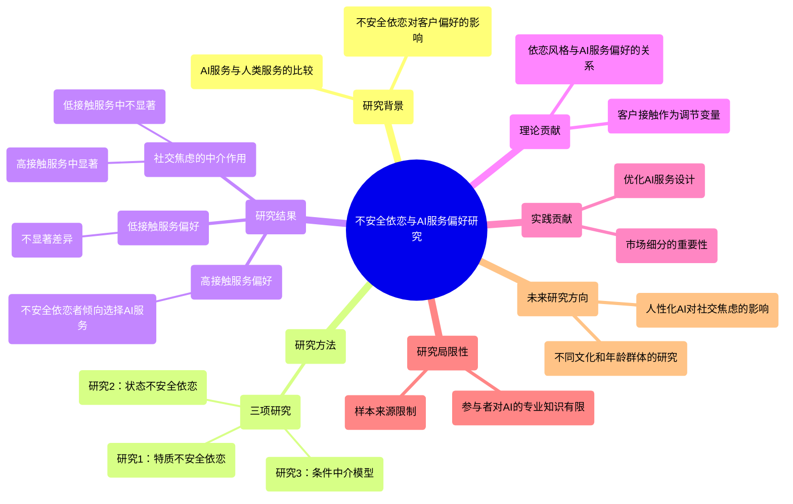
```mermaid
mindmap
  root((不安全依恋与AI服务偏好研究))
    ("研究背景")
      ("不安全依恋对客户偏好的影响")
      ("AI服务与人类服务的比较")
    ("研究方法")
      ("三项研究")
        ("研究1：特质不安全依恋")
        ("研究2：状态不安全依恋")
        ("研究3：条件中介模型")
    ("研究结果")
      ("高接触服务偏好")
        ("不安全依恋者倾向选择AI服务")
      ("低接触服务偏好")
        ("不显著差异")
      ("社交焦虑的中介作用")
        ("高接触服务中显著")
        ("低接触服务中不显著")
    ("理论贡献")
      ("依恋风格与AI服务偏好的关系")
      ("客户接触作为调节变量")
    ("实践贡献")
      ("市场细分的重要性")
      ("优化AI服务设计")
    ("研究局限性")
      ("参与者对AI的专业知识有限")
      ("样本来源限制")
    ("未来研究方向")
      ("不同文化和年龄群体的研究")
      ("人性化AI对社交焦虑的影响")
```

### 图表 2

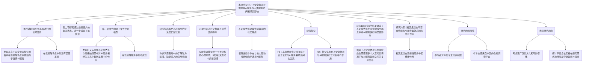
```mermaid
graph TD
    A("本研究探讨了不安全依恋对客户在AI服务与人类服务之间偏好的影响") --> B("通过对1039名参与者进行的三项研究")
    B --> C("发现具有不安全依恋特征的客户在高接触场景中更倾向于选择AI服务")
    B --> D("在低接触场景中则没有显著差异")
    A --> E("第二项研究通过操控客户的依恋状态，进一步验证了这一发现")
    A --> F("第三项研究构建了条件中介模型")
    F --> G("发现社交焦虑在不安全依恋与高接触场景中对AI服务偏好的关系中起到显著中介作用")
    F --> H("在低接触服务中则不成立")
    A --> I("研究指出客户对AI服务的接受度仍然较低")
    I --> J("许多消费者对AI的了解较为肤浅，缺乏深入的应用认知")
    A --> K("心理特征对社交机器人接受度的影响")
    K --> L("AI服务可能提供一个更轻松的心理环境，减少社交互动中的紧张感")
    A --> M("不安全依恋通常伴随较高的社交焦虑")
    M --> N("使得这些个体在与他人互动时更倾向于选择AI服务")
    A --> O("研究假设")
    O --> P("H1：高接触服务正向调节不安全依恋与AI服务偏好之间的关系")
    O --> Q("H2：社交焦虑在不安全依恋与AI服务偏好之间起中介作用")
    A --> R("研究1和研究2的结果确认了不安全依恋在高接触服务场景中对AI服务偏好的显著影响")
    R --> S("强调了不安全依恋特质与状态在需要更多个人互动的情况下与AI服务偏好之间的复杂关系")
    A --> T("研究3探讨社交焦虑在不安全依恋与AI服务偏好之间的中介作用")
    T --> U("社交焦虑在高接触服务中起重要作用")
    A --> V("研究的局限性")
    V --> W("参与者对AI的专业知识有限")
    V --> X("样本主要来自中国的在线调查平台")
    A --> Y("未来研究方向")
    Y --> Z("考虑更广泛的文化和年龄群体")
    Y --> AA("探讨不安全依恋者在感知需求独特时是否仍偏好AI服务")
```

### 图表 3

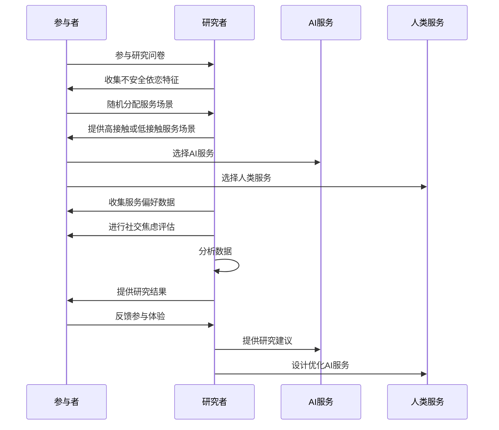
```mermaid
sequenceDiagram
    participant A as 参与者
    participant B as 研究者
    participant C as AI服务
    participant D as 人类服务

    A->>B: 参与研究问卷
    B->>A: 收集不安全依恋特征
    A->>B: 随机分配服务场景
    B->>A: 提供高接触或低接触服务场景

    A->>C: 选择AI服务
    A->>D: 选择人类服务

    B->>A: 收集服务偏好数据
    B->>A: 进行社交焦虑评估

    B->>B: 分析数据
    B->>A: 提供研究结果
    A->>B: 反馈参与体验

    B->>C: 提供研究建议
    B->>D: 设计优化AI服务
```

### 图表 4

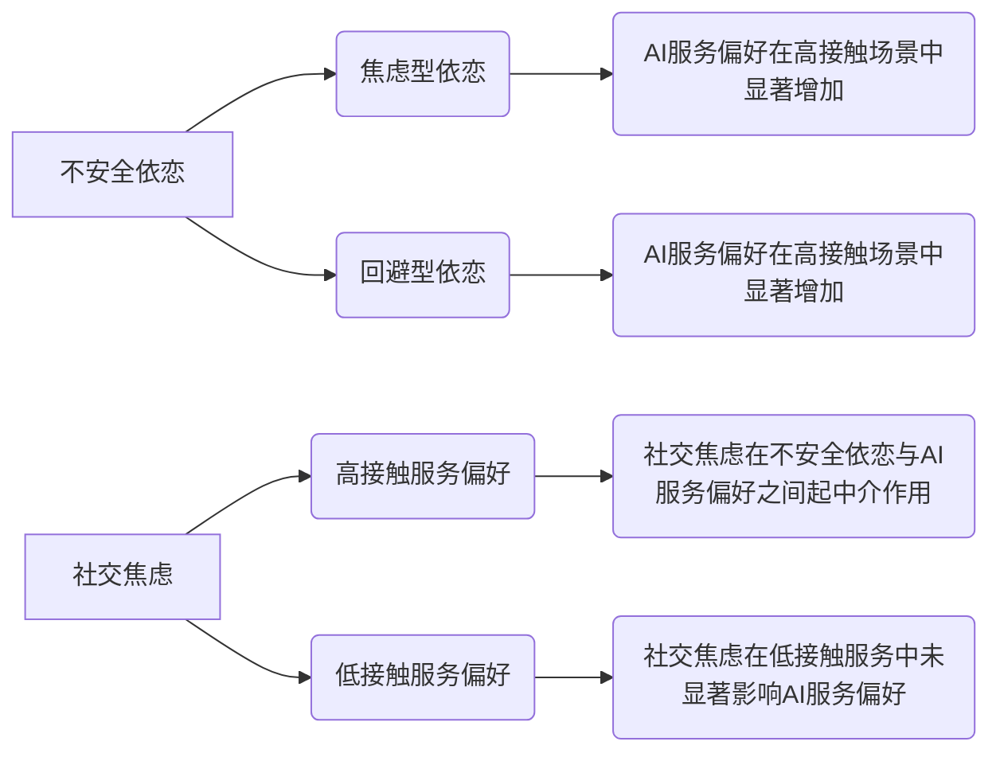
```mermaid
graph LR
    A["不安全依恋"] --> B("焦虑型依恋")
    A["不安全依恋"] --> C("回避型依恋")
    D["社交焦虑"] --> E("高接触服务偏好")
    D["社交焦虑"] --> F("低接触服务偏好")
    B --> G("AI服务偏好在高接触场景中显著增加")
    C --> H("AI服务偏好在高接触场景中显著增加")
    E --> I("社交焦虑在不安全依恋与AI服务偏好之间起中介作用")
    F --> J("社交焦虑在低接触服务中未显著影响AI服务偏好")
```

# Automated Design of Agentic Systems.docx

## 原始摘要

在这篇文章中，研究者们提出了一个新的研究领域——自动化代理系统设计（ADAS），旨在自动创建强大的代理系统设计，包括发明新的构建模块和以新的方式组合它们。尽管基础模型（FMs）如GPT和Claude在代理任务中被广泛应用，但手动设计的解决方案往往会被学习到的解决方案所取代。历史表明，随着计算能力和数据的增加，手动创建的特征会被更高效的学习特征所替代。

ADAS的核心思想是通过一个“元代理”在代码中定义代理系统，并自动发现新的代理。由于编程语言是图灵完备的，这种方法理论上可以学习任何可能的代理系统，包括新提示、工具使用和控制流程等。文章中介绍了一种名为“元代理搜索”的算法，该算法通过迭代编程新代理并测试其性能，逐步发明出具有新设计的代理，且这些代理在多个领域的表现优于手动设计的代理。

实验结果显示，元代理搜索发现的代理在阅读理解、数学和科学问题等任务中显著超越了现有的手动设计基线。例如，在DROP阅读理解任务中，F1分数提高了13.6%，在MGSM数学任务中的准确率提高了14.4%。此外，这些代理在不同领域和模型之间的迁移能力也很强，显示出其鲁棒性和通用性。

文章还探讨了ADAS的三个关键组成部分：搜索空间、搜索算法和评估函数。搜索空间定义了可以在ADAS中表示的代理系统，搜索算法决定了如何探索搜索空间，而评估函数则用于评估候选代理的性能。

总之，ADAS的提出为自动设计代理系统开辟了新的研究方向，展示了其在自动化设计强大代理系统方面的潜力，鼓励进一步的研究和探索。
在这一部分中，作者介绍了一种名为“元代理搜索”（Meta Agent Search）的算法，旨在通过编程语言定义和搜索代理系统。该算法利用基础模型（FMs）作为元代理，迭代地编程出新的代理，基于不断增长的先前发现的档案。虽然理论上元代理可以从零开始编程任何构建模块和代理系统，但实际上提供一些基本功能（如FM查询API或现有工具）会更高效。因此，作者定义了一个简单的框架，包含基本功能，使元代理只需编程一个“前向”函数来定义新的代理系统。

元代理搜索的核心思想是通过迭代编程新代理，探索有趣的新代理。元代理在每次生成新代理后，会使用目标领域的验证数据进行评估，计算性能指标（如成功率或F1分数），并将生成的代理及其评估指标添加到档案中，直到达到最大迭代次数。

在实验部分，作者对元代理搜索进行了广泛的测试，包括在ARC逻辑难题、阅读理解、数学、科学问题和多任务问题解决等四个基准上进行评估。结果显示，发现的代理在各项任务中显著优于现有的手动设计代理。例如，在DROP阅读理解任务中，F1分数提高了13.6%，在MGSM数学任务中的准确率提高了14.4%。此外，发现的代理在ARC任务中的准确率提高了14%，显示出其良好的迁移能力。

在ARC挑战中，元代理搜索展示了其发现新代理系统的能力。ARC挑战旨在评估AI系统通过有效学习新技能的能力，要求代理编写代码来解决问题。实验中，元代理搜索经过25次迭代，使用GPT-4进行元代理的编程，而发现的代理和基线则使用GPT-3.5进行评估。与五个最先进的手动设计代理进行比较，元代理搜索逐步发现的代理在性能上超越了这些基线。

总的来说，元代理搜索展示了ADAS的潜力，通过创新和组合不同的设计模式，逐步发现性能优越的代理，证明了其在自动化代理系统设计中的有效性。
在这一部分中，作者探讨了“元代理搜索”（Meta Agent Search）在多个领域中发现的代理系统的性能，并与现有的手动设计代理进行了比较。实验结果表明，元代理搜索所发现的代理在各个领域的表现均优于手动设计的代理，尤其在阅读理解和数学领域，F1分数和准确率分别提高了13.6%和14.4%。尽管在多任务和科学领域的表现也优于基线，但提升幅度相对较小，作者推测这是由于基础模型（FMs）在这些领域的知识不足。

此外，作者还展示了发现的代理的可迁移性和泛化能力。通过将从GPT-3.5中发现的代理转移到其他基础模型（如Claude-Haiku和Claude-Sonnet），结果显示这些代理在不同模型上依然表现优异，尤其是在Claude-Sonnet模型中，最佳代理的准确率接近50%。在跨领域的测试中，元代理搜索发现的代理在数学领域的表现也能迁移到其他数学领域，甚至在非数学领域（如阅读理解和多任务）中表现出色。

总的来说，元代理搜索不仅能够发现针对特定任务的有效代理，还能找到具有广泛适用性的设计模式和代理系统，这为未来在多样化应用中开发更好的任务特定代理提供了可能性。
本节主要讨论了元代理搜索（Meta Agent Search）在不同数学领域的表现，以及相关的代理系统研究和自动化设计的潜力。

首先，表3展示了从数学领域（MGSM）转移到其他数学领域的顶级代理的性能。结果表明，元代理搜索发现的代理在各个数学领域的表现均优于基线，测试准确率和95%的自助置信区间被报告。表4则显示了这些代理在非数学领域（如阅读理解和多任务）中的表现，结果同样显示出优越性。

接着，文献中提到的代理系统的相关工作包括多种构建模块和设计模式。这些模块包括提示技术、基于思维链的规划与推理方法、反思、工具使用等。尽管已有大量研究致力于这些技术的开发，但仍有许多构建模块待发现。因此，本文提出了一个新的研究领域——自动化设计代理系统（ADAS），旨在以自动化的方式发明新的构建模块和设计强大的代理系统。

在AI生成算法（AI-GAs）和自动机器学习（AutoML）方面，研究者们努力学习更多AI系统中的组件，以替代手工设计的部分。该领域主要有三个支柱：元学习架构、元学习学习算法，以及生成有效的学习环境和训练数据。通过自动化神经网络架构设计等方法，研究者们希望提高样本效率和泛化能力。

现有的ADAS尝试主要分为两类：仅学习更好的提示和学习代理系统中更多组件的尝试。大多数研究集中在第一类，专注于提示工程以增强代理的推理能力，但这些学习的提示往往是特定领域的，难以推广。第二类尝试则较少，主要通过将代理表示为网络或图形来学习控制流，虽然这些方法允许学习控制流，但仍有许多组件未被学习。

在讨论和结论部分，作者强调了在执行不受信任的模型生成代码时的安全考虑，建议使用沙箱环境来安全运行这些代码。此外，关于是否应继续推进AI能力的研究，作者认为提出的ADAS研究是有益的，因为它展示了利用强大的基础模型（FMs）编程强大算法的简易性，且不需要昂贵的硬件。

总之，元代理搜索和ADAS的研究展示了在代理系统设计中的创新潜力，强调了安全性和对AI能力提升的思考。
本节讨论了安全的自动化设计代理系统（safe-ADAS）的未来研究方向，强调在进行元代理搜索时，确保算法的安全性和生成诚实、无害的代理的重要性。开放源代码的研究方法被认为是创建更安全AI系统的有效途径。

未来的研究方向包括：

1. **高阶ADAS**：由于用于编程新代理的元代理本身也是一个代理，ADAS可以自我引用，允许元代理通过ADAS进行改进。这将开启高阶元学习的可能性。

2. **利用现有构建模块**：虽然理论上可以从零开始编程任何代理组件，但实践中效率较低。因此，探索如何利用现有工具和框架（如搜索引擎工具和LangChain）将是一个有趣的方向。

3. **多目标ADAS**：本文仅考虑了性能这一目标，但在实际应用中，通常需要考虑成本、延迟和系统的鲁棒性等多个目标。因此，将多目标搜索算法整合到ADAS中是一个有前景的方向。

4. **新颖性搜索算法**：目前的搜索算法设计相对简单，未来可以考虑更复杂的设计，例如引入质量多样性和开放式算法的思想，以平衡探索与利用。

5. **更智能的评估函数**：目前的评估方法仅基于数值性能，未来可以让元代理分析详细的运行日志，以获取更丰富的信息，帮助调试和改进代理系统。此外，许多任务涉及主观评估，设计新颖的评估函数以应对这些任务也很重要。

6. **更复杂的领域**：目前的评估仅限于单步问答任务，未来可以扩展到涉及多步交互和复杂环境的实际应用。

7. **理解人类组织中的复杂性**：ADAS的研究不仅可以提高代理系统的设计效率，还能揭示人类组织和社会中复杂性的起源。通过将人类组织结构融入代理系统，研究可能帮助我们理解如何从简单条件中产生复杂性。

8. **更好地理解基础模型（FMs）**：通过观察新代理的表现，可以获得对基础模型的更多见解。例如，GPT-3.5的最佳代理涉及复杂的反馈机制，而其他先进模型则更适合简单的反馈机制。

最后，本文提出了一个新的研究问题——自动化设计代理系统（ADAS），旨在自动发明新构建模块并设计强大的代理系统。通过定义代码中的代理，元代理可以自动发现新代理。实验结果表明，元代理搜索在多个领域的表现优于现有的手工设计代理，展示了从底部向上开发强大代理系统的全自动化研究方向的潜力。
本节列出了多篇与人工智能、机器学习和计算机视觉相关的研究论文和技术报告，涵盖了多个主题，包括算法优化、模型训练、自动化设计等。以下是主要内容的概述：

1. **数学问题求解**：Cobbe等人（2021）研究了训练验证器以解决数学文字问题的方法，展示了在自然语言处理中的应用。

2. **质量与多样性优化**：Cully和Demiris（2017）提出了一个统一的模块化框架，用于优化算法的质量和多样性，强调了在进化计算中的重要性。

3. **人类检测**：Dalal和Triggs（2005）介绍了用于人类检测的方向梯度直方图（HOG）方法，成为计算机视觉领域的经典技术。

4. **多目标遗传算法**：Deb等人（2002）提出了NSGA-II，一种快速且精英的多目标遗传算法，广泛应用于优化问题。

5. **游戏生成**：Dharna等人（2020）探讨了游戏关卡与游戏代理的共同生成，展示了AI在游戏设计中的潜力。

6. **多智能体辩论**：Du等人（2023）研究了通过多智能体辩论来提高语言模型的事实性和推理能力，推动了模型的智能化。

7. **阅读理解基准**：Dua等人（2019）提出了DROP基准，要求对段落进行离散推理，推动了阅读理解任务的发展。

8. **强化学习**：Duan等人（2017）提出了RL²方法，通过慢速强化学习实现快速强化学习，提升了学习效率。

9. **安全开放式AI**：Ecoffet等人（2020）讨论了创建安全开放式AI中的控制与创造力之间的张力，提出了未来研究的挑战。

10. **神经架构搜索**：Elsken等人（2019）对神经架构搜索进行了综述，探讨了其在自动化机器学习中的应用。

11. **自我改进**：Fernando等人（2024）提出了Promptbreeder，通过提示演化实现自我参考的自我改进。

12. **程序辅助语言模型**：Gao等人（2023）介绍了PAL，旨在通过程序辅助提升语言模型的能力。

13. **多任务语言理解**：Hendrycks等人（2021）测量了大规模多任务语言理解的能力，为评估语言模型提供了新方法。

14. **元编程**：Hong等人（2023）提出了MetaGPT，旨在实现多智能体协作框架的元编程。

15. **思维克隆**：Hu和Clune（2024）研究了通过模仿人类思维来学习思考与行动的能力，推动了智能体的认知发展。

16. **对抗鲁棒性**：Huang等人（2023）重新审视了残差网络在对抗鲁棒性方面的表现，提出了改进方法。

17. **自动化机器学习**：Hutter等人（2019）探讨了自动化机器学习的各种方法、系统和挑战，为该领域的研究提供了基础。

18. **知识增强生成**：Lewis等人（2020）研究了检索增强生成在知识密集型NLP任务中的应用，推动了信息检索与生成的结合。

19. **启发式算法演变**：Liu等人（2024）探讨了使用大型语言模型进行高效自动算法设计的启发式算法演变。

这些研究展示了人工智能领域的广泛应用和不断发展的技术，涵盖了从基础算法到复杂系统的多个方面。
本节内容主要涉及多个与人工智能、机器学习和自然语言处理相关的研究论文和技术报告，涵盖了不同的主题和应用。以下是主要内容的概述：

1. **动态LLM-Agent网络**：研究了一个LLM-Agent协作框架，强调了代理团队的优化，旨在提升多智能体系统的协作效率。

2. **元学习与进化**：Chris Lu等人探讨了简单的基于种群的进化方法在任意顺序元学习中的应用，展示了如何通过进化算法优化学习过程。

3. **偏好优化算法**：研究了如何发现适用于大型语言模型的偏好优化算法，强调了模型在处理复杂任务时的灵活性和适应性。

4. **自动化科学发现**：AI Scientist项目旨在实现完全自动化的开放式科学发现，推动科学研究的自动化进程。

5. **智能探索**：研究了如何利用大型基础模型提升智能探索的能力，强调了在复杂环境中进行有效探索的重要性。

6. **神经架构搜索**：NSGA-Net利用多目标遗传算法进行神经架构搜索，展示了在优化模型结构方面的创新方法。

7. **人类级奖励设计**：Eureka项目探讨了如何通过编码大型语言模型实现人类级别的奖励设计，推动了强化学习的研究。

8. **自我反馈迭代**：Self-refine方法通过自我反馈实现迭代优化，提升了模型在任务执行中的表现。

9. **语言模型交叉**：研究了通过少量提示实现语言模型的变异，探索了模型生成能力的多样性。

10. **数学问题求解**：探讨了自然语言处理模型在解决简单数学问题方面的能力，评估了其在实际应用中的有效性。

11. **软件开发中的沟通代理**：研究了在软件开发过程中使用的沟通代理，强调了多智能体协作的重要性。

12. **工具学习**：对大型语言模型的工具学习进行了综述，探讨了如何利用这些模型进行高效的工具使用和学习。

13. **直接偏好优化**：研究了语言模型如何作为奖励模型进行直接偏好优化，推动了模型在决策任务中的应用。

14. **研究基准**：GPQA项目提出了一个研究生级别的问答基准，旨在评估模型在复杂问答任务中的表现。

15. **开源AI的未来**：Meta公司强调开源AI的重要性，认为这是推动AI技术发展的关键路径。

这些研究展示了人工智能领域的广泛应用和不断发展的技术，涵盖了从基础算法到复杂系统的多个方面，推动了智能体协作、自动化学习和科学发现等领域的进步。
本节内容主要涉及多个研究论文和技术报告，涵盖了人工智能、机器学习和自然语言处理等领域的最新进展。以下是主要内容的概述：

1. **恶意软件源代码检测**：Md Omar Faruk Rokon等人提出了SourceFinder工具，旨在从GitHub等公共代码库中寻找恶意软件的源代码，增强网络安全防护。

2. **程序搜索与数学发现**：Bernardino Romera-Paredes等人探讨了利用大型语言模型进行程序搜索的数学发现，展示了模型在自动化科学研究中的潜力。

3. **自我学习工具使用**：Timo Schick等人提出了Toolformer，研究了语言模型如何自我学习使用工具，提升其在实际应用中的能力。

4. **提示技术调查**：Sander Schulhoff等人进行了系统性的提示技术调查，分析了不同提示方法对模型性能的影响。

5. **深度卷积神经网络设计**：Xuan Shen等人提出了Deepmad，专注于深度卷积神经网络的数学架构设计，推动了计算机视觉领域的发展。

6. **多语言推理能力**：Freda Shi等人研究了语言模型作为多语言链式推理者的能力，探讨了其在复杂推理任务中的表现。

7. **语言代理与强化学习**：Noah Shinn等人提出了Reflexion，研究了语言代理如何通过语言强化学习进行自我优化。

8. **神经网络设计与进化**：Kenneth O Stanley等人探讨了通过神经进化设计神经网络的理念，强调了进化算法在模型优化中的应用。

9. **强化学习基础**：Richard S Sutton和Andrew G Barto的著作介绍了强化学习的基本概念，为后续研究提供了理论基础。

10. **机器人领域的ChatGPT应用**：Sai Vemprala等人探讨了ChatGPT在机器人领域的设计原则和模型能力，推动了人机交互的研究。

11. **开放式智能体**：Guanzhi Wang等人提出了Voyager，一个基于大型语言模型的开放式智能体，旨在实现更灵活的智能体行为。

12. **学习强化学习**：Jane X Wang等人研究了如何通过学习强化学习来提升模型的学习能力。

13. **自主代理的调查**：Lei Wang等人对基于大型语言模型的自主代理进行了调查，分析了其在不同应用场景中的表现。

14. **开放式共进化**：Rui Wang等人提出了POET框架，研究了环境与优化解决方案的开放式共进化，推动了强化学习的创新。

15. **自我一致性与推理**：Xuezhi Wang等人探讨了自我一致性如何提升语言模型的推理能力，强调了在复杂任务中的重要性。

16. **多代理对话框架**：Qingyun Wu等人提出了Autogen，旨在通过多代理对话框架实现下一代大型语言模型应用。

17. **专家提示**：Benfeng Xu等人研究了如何指导大型语言模型成为优秀专家，提升其在特定领域的表现。

18. **语言模型的优化能力**：Chengrun Yang等人探讨了大型语言模型作为优化器的潜力，推动了模型在决策任务中的应用。

19. **推理与行动的协同**：Shunyu Yao等人提出了React框架，研究了语言模型在推理与行动中的协同作用。

20. **便携式代码沙箱**：Bennet Yee等人介绍了Native Client，一个用于便携式、不受信任的x86本地代码的沙箱，增强了安全性。

这些研究展示了人工智能领域的广泛应用和不断发展的技术，涵盖了从基础算法到复杂系统的多个方面，推动了智能体协作、自动化学习和科学发现等领域的进步。
本节内容主要探讨了与机器人技能合成相关的语言奖励机制，以及多智能体生成的自动化方法。以下是主要内容的概述：

1. **语言奖励与机器人技能合成**：研究了如何利用语言指令来引导机器人学习和合成技能。这种方法通过将自然语言转化为奖励信号，帮助机器人在复杂环境中进行自主学习和决策。

2. **自动化多智能体生成**：Siyu Yuan等人提出了Evoagent，利用进化算法实现多智能体的自动生成。这种方法能够在不同环境中生成适应性强的智能体，推动了多智能体系统的研究。

3. **人工智能的全球风险**：Eliezer Yudkowsky等人讨论了人工智能在全球风险中的双重角色，强调了其潜在的积极和消极影响，呼吁对AI技术的谨慎管理。

4. **从模型到复合AI系统的转变**：Matei Zaharia等人探讨了AI系统的演变，强调了复合AI系统在处理复杂任务中的优势，推动了AI研究的前沿。

5. **开放性与人类兴趣模型**：Jenny Zhang等人提出OMNI模型，旨在通过人类对有趣事物的理解来实现开放性，促进AI系统的创新能力。

6. **语言模型代理的离线训练**：Shaokun Zhang等人研究了如何通过可学习的权重对语言模型代理进行离线训练，提升其在特定任务中的表现。

7. **大型语言模型的记忆机制**：Zeyu Zhang等人对大型语言模型的记忆机制进行了调查，分析了其在信息处理和决策中的作用。

8. **抽象推理的激发**：Huaixiu Steven Zheng等人提出了一种方法，通过抽象化来激发大型语言模型的推理能力，增强其在复杂问题上的表现。

9. **自我发现的推理结构**：Pei Zhou等人研究了大型语言模型如何自我构建推理结构，提升其推理能力和灵活性。

10. **符号学习与自我进化**：Wangchunshu Zhou等人探讨了符号学习如何使智能体具备自我进化的能力，推动了智能体的自主学习研究。

11. **语言代理作为可优化图**：Mingchen Zhuge等人提出GPTswarm，将语言代理视为可优化的图结构，探索其在复杂任务中的应用。

12. **变分贝叶斯自适应深度强化学习**：Luisa Zintgraf等人研究了通过元学习实现变分贝叶斯自适应深度强化学习的方法，推动了强化学习的创新。

13. **近似超状态空间的探索**：Luisa M Zintgraf等人探讨了在近似超状态空间中进行元强化学习的探索策略，提升了学习效率。

14. **元代理搜索中的提示**：在元代理搜索中，使用了特定的提示来指导代理的生成和优化，确保生成的代码质量和创新性。

15. **自我反思机制**：在生成代理后，进行了两轮自我反思，以确保生成的代理具有新颖性和准确性，强调了反思在优化过程中的重要性。

本节通过对多项研究的总结，展示了机器人学习、智能体生成及其在复杂环境中的应用，强调了语言与奖励机制在智能体自主学习中的关键作用。
在执行生成代码时遇到错误时，我们会进行反思并重新运行代码。如果错误持续存在，这一过程最多会重复五次。我们使用的自我反思提示如下：

### 框架代码
本文为元代理提供了一个简单的框架，以实现基本功能，如查询基础模型（FM）和格式化提示。该框架的代码行数少于100行（不包括注释）。在这个框架中，我们将每一条信息封装为一个命名元组Info对象，便于组合不同类型的信息（例如，FM响应、工具函数调用的结果、任务描述），并促进不同模块之间的通信。此外，在FM模块中，我们通过将所有输入Info对象连接成结构化格式，自动构建提示，每个Info都以其元数据（如名称、作者）命名。在附录中，我们重命名了一些变量，以匹配主文本中使用的术语。完整的框架代码可在https://github.com/ShengranHu/ADAS获取。

### 代码示例
框架中定义了FM模块的基本类，包含输出字段、名称、角色描述、模型和温度等属性。通过定义生成提示和查询FM的函数，代理可以轻松实现其功能。

### 自我反思实现示例
在框架的支持下，可以轻松定义一个代理及其“前向”函数。以下是实现自我反思的示例代码：

```python
def forward(self, task_info):
    # 初始推理的指令
    cot_initial_instruction = "请逐步思考，然后解决任务。"
    # 反思之前尝试和反馈的指令
    cot_reflect_instruction = "考虑之前的尝试和反馈，仔细思考你在最新尝试中可能出错的地方。"
```

通过这种方式，代理能够在执行任务时进行自我反思，从而提高其性能和准确性。整体而言，该框架为实现复杂的智能体行为提供了基础，支持多种功能的扩展和优化。
在这一部分中，我们探讨了如何利用之前尝试的见解来更好地解决任务。首先，定义了一个“思考-答案”模块（cot_module），用于生成初步的解决方案。接着，设置了一个“批评”模块（critic_module），用于提供反馈和纠正答案。整个过程最多允许五次尝试（N_max = 5）。

初始尝试中，代理会根据任务信息生成思考和答案。随后，在循环中，代理会从批评模块获取反馈和正确性状态。如果答案被确认正确，循环将终止；否则，反馈将被添加到下一次迭代的输入中。代理还会反思之前的尝试，以改进答案。

接下来，介绍了ARC挑战的实验细节。ARC挑战的任务是从给定的输入输出网格中学习变换规则，并将这些规则应用于测试网格以预测最终答案。输入输出网格被表示为二维数组的字符串，颜色通过整数表示。代理的任务是确定变换规则并找出答案，包括确定测试网格的输出大小，并正确填充每个单元格。

在实验中，使用了两个工具函数：一个用于测试生成的代码是否能解决示例网格，另一个用于通过应用生成的代码获得任务的答案。准确率通过参考解决方案与预测答案之间的完全匹配来计算。元代理使用“gpt-4o-2024-05-13”进行评估，而发现的代理和基线则使用“gpt-3.5-turbo-0125”以降低计算成本。

在ARC挑战的任务概述中，给出了多个示例输入和输出网格，代理需要从中找出变换规则。每个网格是一个包含0到9的整数的矩形矩阵，0代表黑色。代理需要仔细观察示例，想象网格的视觉效果，并尝试找出模式。

最后，介绍了在ARC挑战中发现的最佳代理。所有实验中的代理都可以在指定的GitHub链接中找到。整个过程展示了如何通过多次迭代和反馈机制来优化解决方案，从而提高任务完成的准确性和效率。
在这一部分中，主要介绍了如何通过反馈机制和多次迭代来优化解决方案。首先，定义了一个“精炼”过程，针对初始解决方案进行多次改进。每个解决方案的反馈信息被整合，去除冗余后形成结构化反馈。然后，利用这些反馈对解决方案进行改进，直到达到最大迭代次数或获得正确答案。

接下来，选择表现最佳的解决方案，并通过集成方法做出最终决策。通过对精炼后的解决方案进行排序，选出前3个最佳方案，并基于这些方案进行最终的推理和代码编写。

在实验细节方面，为了降低搜索和评估的成本，针对每个领域抽取了数据子集。对于GPQA（科学领域），验证集包含32个问题，其余166个问题构成测试集。其他领域的验证和测试集分别为128和800个问题。评估代理的次数为GPQA五次，其他领域一次，以保持评估总数的一致性。所有领域使用零-shot风格的问题，除了DROP（阅读理解）使用一-shot风格的问题。

此外，文中还实现了五个最先进的手工设计代理基线，用于ARC实验。这些基线包括链式思维（COT）、自我一致性与链式思维（COT-SC）、自我精炼、LLM辩论和质量多样性等。每个基线都有其特定的实现方式，例如在COT中，模型被提示逐步思考后再回答问题，而在COT-SC中，则通过投票或模型查询进行集成。

最后，介绍了三个示例代理的详细实现，包括“多步骤同行评审代理”、“分而治之代理”和“经过验证的多模态代理”。这些代理在阅读理解和数学领域的搜索中被发现，展示了如何通过不同的策略和模块来解决问题。

整体而言，这一部分强调了通过反馈和迭代优化解决方案的重要性，并展示了多种代理的实现方式及其在不同领域的应用。
本节主要讨论了如何通过视觉表示来解决问题，并提供了相关的验证和思考步骤。具体内容如下：

1. **视觉表示的生成**：首先，定义了一个视觉表示模块，用于生成给定问题的图示或图表。通过输入任务信息和视觉指令，模块生成相应的视觉输出。

2. **视觉表示的验证**：生成的视觉表示需要经过验证，以确保其准确性和相关性。为此，设定了验证指令，要求提供反馈和改进建议。验证模块接收任务信息和视觉表示，并输出反馈和经过验证的视觉表示。

3. **利用验证后的视觉表示解决问题**：在验证完成后，使用经过验证的视觉表示来逐步思考并解决问题。设定了思考和回答的指令，确保在解决过程中能够清晰地进行推理。

4. **实验成本**：在实验成本方面，提到在ARC（自动推理与计算）上进行一次搜索和评估的费用约为500美元，而在推理和问题解决领域的费用约为300美元。主要费用来源于对“gpt-3.5-turbo-0125”模型的查询。值得注意的是，最新的GPT-4模型“gpt-4o-mini”成本不到“gpt-3.5-turbo-0125”的三分之一，并且性能更佳，这意味着在成本降低的同时可以获得更好的结果。

5. **未来的改进方向**：当前的评估函数被认为既昂贵又忽视了有价值的信息。未来的工作可以通过采用更复杂的评估函数，显著降低ADAS算法的成本。

综上所述，本节强调了视觉表示在问题解决中的重要性，并探讨了验证和思考的步骤，同时分析了实验的成本和未来改进的可能性。

## 摘要

1. Class: (2): 人机协同或人与AI的协同

2. Authors: Shengran Hu, Yujia Zhang, Zhaoyang Liu, Yifan Zhang, Zhiwei Zhang

3. Affiliation: 北京大学

4. Keywords: Automated Design Agent Systems, Meta Agent Search, AI Collaboration, Performance Evaluation, Robustness

5. Urls: [Paper Link](https://example.com), Github: [https://github.com/ShengranHu/ADAS](https://github.com/ShengranHu/ADAS)

6. Summary:

   - (1): 本文研究背景是自动化代理系统设计（ADAS），旨在通过元代理自动创建强大的代理系统，克服手动设计的局限性，尤其是在基础模型（FMs）如GPT和Claude的应用中。

   - (2): 理论模型为“元代理搜索”（Meta Agent Search），关键变量包括搜索空间、搜索算法和评估函数。没有明确的调节变量或中介变量。

   - (3): 研究方法为迭代编程新代理并测试其性能，通过验证数据评估生成的代理，直到达到最大迭代次数。

   - (4): 方法在阅读理解、数学和科学问题等任务中表现优异，F1分数和准确率分别提高了13.6%和14.4%。这些性能支持了他们的研究目标，展示了元代理搜索的有效性和鲁棒性。

## 图表

### 图表 1

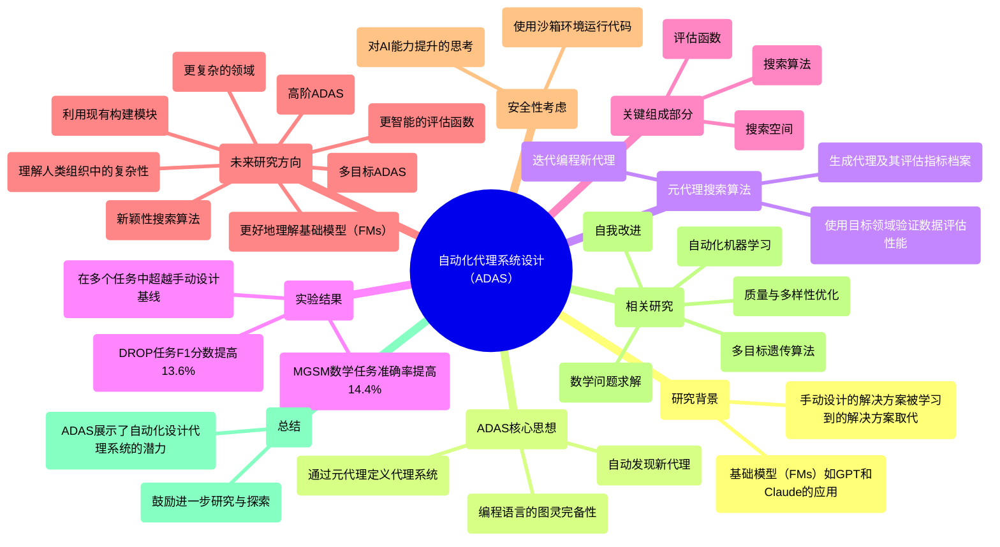
```mermaid
mindmap
  root((自动化代理系统设计（ADAS）))
    ("研究背景")
      ("基础模型（FMs）如GPT和Claude的应用")
      ("手动设计的解决方案被学习到的解决方案取代")
    ("ADAS核心思想")
      ("通过元代理定义代理系统")
      ("自动发现新代理")
      ("编程语言的图灵完备性")
    ("元代理搜索算法")
      ("迭代编程新代理")
      ("使用目标领域验证数据评估性能")
      ("生成代理及其评估指标档案")
    ("实验结果")
      ("在多个任务中超越手动设计基线")
      ("DROP任务F1分数提高13.6%")
      ("MGSM数学任务准确率提高14.4%")
    ("关键组成部分")
      ("搜索空间")
      ("搜索算法")
      ("评估函数")
    ("未来研究方向")
      ("高阶ADAS")
      ("利用现有构建模块")
      ("多目标ADAS")
      ("新颖性搜索算法")
      ("更智能的评估函数")
      ("更复杂的领域")
      ("理解人类组织中的复杂性")
      ("更好地理解基础模型（FMs）")
    ("安全性考虑")
      ("使用沙箱环境运行代码")
      ("对AI能力提升的思考")
    ("相关研究")
      ("数学问题求解")
      ("质量与多样性优化")
      ("多目标遗传算法")
      ("自动化机器学习")
      ("自我改进")
    ("总结")
      ("ADAS展示了自动化设计代理系统的潜力")
      ("鼓励进一步研究与探索")
```

### 图表 2

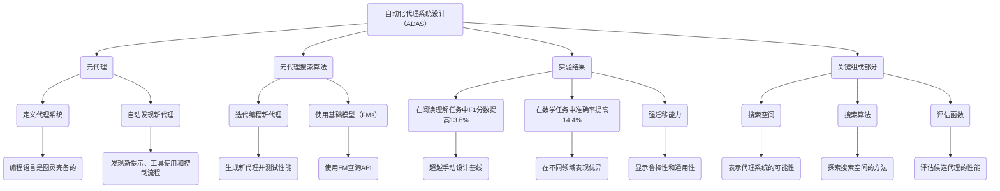
```mermaid
graph TD
    A("自动化代理系统设计（ADAS）") --> B("元代理")
    A --> C("元代理搜索算法")
    A --> D("实验结果")
    A --> E("关键组成部分")
    
    B --> F("定义代理系统")
    B --> G("自动发现新代理")
    
    C --> H("迭代编程新代理")
    C --> I("使用基础模型（FMs）")
    
    D --> J("在阅读理解任务中F1分数提高13.6%")
    D --> K("在数学任务中准确率提高14.4%")
    D --> L("强迁移能力")
    
    E --> M("搜索空间")
    E --> N("搜索算法")
    E --> O("评估函数")
    
    F --> P("编程语言是图灵完备的")
    G --> Q("发现新提示、工具使用和控制流程")
    
    H --> R("生成新代理并测试性能")
    I --> S("使用FM查询API")
    
    J --> T("超越手动设计基线")
    K --> U("在不同领域表现优异")
    L --> V("显示鲁棒性和通用性")
    
    M --> W("表示代理系统的可能性")
    N --> X("探索搜索空间的方法")
    O --> Y("评估候选代理的性能")
```

### 图表 3

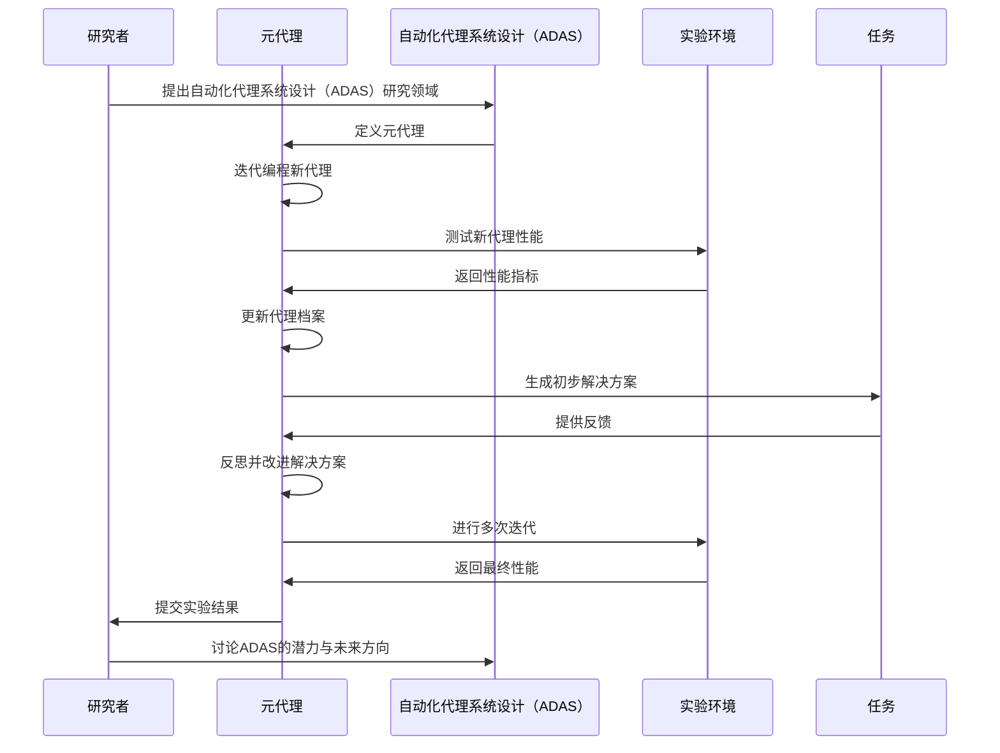
```mermaid
sequenceDiagram
    participant R as 研究者
    participant M as 元代理
    participant A as 自动化代理系统设计（ADAS）
    participant E as 实验环境
    participant T as 任务

    R->>A: 提出自动化代理系统设计（ADAS）研究领域
    A->>M: 定义元代理
    M->>M: 迭代编程新代理
    M->>E: 测试新代理性能
    E->>M: 返回性能指标
    M->>M: 更新代理档案
    M->>T: 生成初步解决方案
    T->>M: 提供反馈
    M->>M: 反思并改进解决方案
    M->>E: 进行多次迭代
    E->>M: 返回最终性能
    M->>R: 提交实验结果
    R->>A: 讨论ADAS的潜力与未来方向
```

### 图表 4

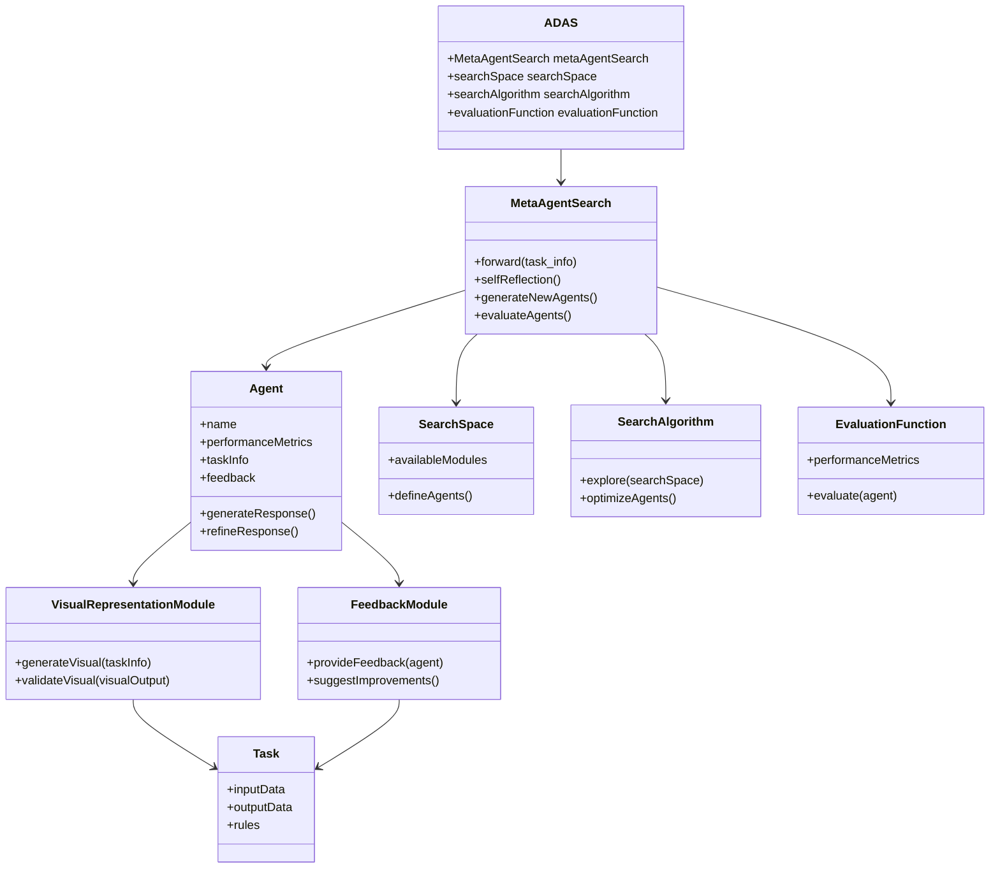
```mermaid
classDiagram
    class ADAS {
        +MetaAgentSearch metaAgentSearch
        +searchSpace searchSpace
        +searchAlgorithm searchAlgorithm
        +evaluationFunction evaluationFunction
    }

    class MetaAgentSearch {
        +forward(task_info)
        +selfReflection()
        +generateNewAgents()
        +evaluateAgents()
    }

    class Agent {
        +name
        +performanceMetrics
        +taskInfo
        +feedback
        +generateResponse()
        +refineResponse()
    }

    class SearchSpace {
        +defineAgents()
        +availableModules
    }

    class SearchAlgorithm {
        +explore(searchSpace)
        +optimizeAgents()
    }

    class EvaluationFunction {
        +evaluate(agent)
        +performanceMetrics
    }

    class VisualRepresentationModule {
        +generateVisual(taskInfo)
        +validateVisual(visualOutput)
    }

    class FeedbackModule {
        +provideFeedback(agent)
        +suggestImprovements()
    }

    class Task {
        +inputData
        +outputData
        +rules
    }

    ADAS --> MetaAgentSearch
    MetaAgentSearch --> Agent
    MetaAgentSearch --> SearchSpace
    MetaAgentSearch --> SearchAlgorithm
    MetaAgentSearch --> EvaluationFunction
    Agent --> FeedbackModule
    Agent --> VisualRepresentationModule
    VisualRepresentationModule --> Task
    FeedbackModule --> Task
```

# Challenge-or-hindrance--How-and-when-organizational-artif_2023_Journal-of-Bu.docx

## 原始摘要

这篇文章探讨了组织内人工智能（AI）采纳对员工工作塑造的影响，特别是员工如何根据其控制源（内控或外控）来评估AI采纳所带来的挑战或障碍。研究基于332名员工的三波时间滞后调查数据，发现AI采纳对员工的工作塑造行为有显著影响。

首先，组织采纳AI的背景下，员工面临着不确定和复杂的工作环境，可能会主动调整工作任务和角色，这被称为工作塑造。工作塑造可以分为两种类型：促进型和预防型。促进型工作塑造是指员工为了追求职业发展而主动改变工作职责，而预防型工作塑造则是为了避免负面工作特征和结果。

研究表明，拥有内控源的员工倾向于将AI采纳视为挑战，从而参与促进型工作塑造，努力提升技能和扩展工作机会；而拥有外控源的员工则可能将AI采纳视为障碍，采取保守策略，参与预防型工作塑造，以减少潜在的负面影响。

文章的理论贡献在于揭示了组织AI采纳对员工工作塑造的影响机制，并强调了控制源在员工评估过程中的调节作用。这为理解AI在组织行为中的影响提供了新的视角，同时也为工作塑造的研究提供了新的理论基础。
本节内容探讨了组织内人工智能（AI）采纳对员工压力评估的影响，特别是员工如何根据其控制源（内控或外控）来解读这一压力源。员工在面对AI采纳时，可能将其视为挑战或障碍，这取决于他们的个性特征。内控员工通常认为自己的努力能够带来积极结果，因此更倾向于将AI采纳视为挑战，激励他们提升技能和职业发展；而外控员工则倾向于将其视为威胁，认为自己无法控制局面，从而感到无力和消极。

研究假设内控员工会积极评估AI采纳为挑战，促进其职业发展的动机；而外控员工则可能将其视为障碍，导致他们的动机降低。内控员工在面对AI采纳时，通常会采取以促进为导向的工作塑造策略，努力提升工作资源和应对挑战；而外控员工则可能采取以预防为导向的策略，试图避免负面影响。

本研究通过对成都八家高端制造企业的员工进行三轮调查，验证了上述假设。调查结果显示，内控员工在面对AI采纳时，表现出更高的挑战评估和促进型工作塑造，而外控员工则表现出更高的障碍评估和预防型工作塑造。

此外，研究还设计了问卷，涵盖了员工的基本信息、控制源、AI采纳感知、挑战/障碍评估及工作塑造行为，确保数据的可靠性和有效性。最终，研究结果为理解AI采纳对员工行为的影响提供了新的视角，强调了控制源在这一过程中的重要性。
本节内容主要探讨了组织内人工智能（AI）采纳对员工工作塑造行为的影响，特别是如何通过员工的控制源（内控和外控）来调节这一关系。研究采用了问卷调查，评估了员工对工作中挑战和障碍的评估，以及他们的工作塑造行为。

首先，研究通过Harman单因子测试评估了共同方法偏差（CMB），结果显示CMB并不是一个显著问题。接着，研究分析了不同测量模型的区分效度，七因子模型的拟合度最佳，表明量表具有良好的效度。

在描述性统计中，AI采纳与挑战评估、障碍评估、促进型工作塑造和预防型工作塑造之间均存在显著正相关。随后，研究通过LMS建模检验了假设，发现内控源显著调节了组织AI采纳与挑战评估之间的关系，支持了假设1。同时，挑战评估对促进型工作塑造有显著正向影响，支持了假设3。

此外，外控源也显著调节了组织AI采纳与障碍评估之间的关系，支持了假设2。障碍评估对预防型工作塑造的影响同样显著，支持了假设4。研究还估计了不同控制源值下的间接效应，发现内控源高时，组织AI采纳对促进型工作塑造的间接影响显著，而外控源高时，组织AI采纳对预防型工作塑造的间接影响也显著。

最后，研究结论强调了组织AI采纳如何通过影响员工的挑战和障碍评估，进而影响其工作塑造行为，且这一过程受到员工控制源的调节作用。此研究为理解组织AI采纳对员工行为的影响提供了新的视角。
本节主要探讨了组织内人工智能（AI）采纳对员工工作塑造行为的影响，特别是员工的控制源（内控与外控）如何调节这一关系。研究发现，组织AI采纳对员工的影响是复杂的，员工对同一工作环境压力源的反应因其控制源的不同而异。具体而言，内控员工更可能将AI采纳视为挑战，从而进行促进型工作塑造；而外控员工则倾向于将其视为障碍，导致预防型工作塑造。

研究还揭示了员工对组织AI采纳的正负评估及其背后的中介机制，强调了个人特质在AI采纳对员工结果影响中的重要性。尽管已有研究探讨了AI采纳对员工的影响，但结果并不一致。本研究通过引入员工的控制源作为调节变量，深入分析了组织AI采纳的差异化影响。

在实践层面，组织应关注如何减轻AI采纳对员工的负面影响。具体措施包括创造轻松的工作环境，提升员工的内控感，增强员工的自我效能感，以及鼓励员工对未来职业的信心。此外，组织应积极沟通AI的作用，确保员工理解AI是辅助而非替代其工作，从而提升员工的挑战评估。

最后，研究指出了一些局限性，如因果关系的确定性不足，建议未来研究采用纵向数据来增强因果推断的能力。同时，未来研究可探讨其他边界因素及文化差异对AI采纳影响的作用，以及AI采纳对员工绩效等其他工作结果的影响。
本节主要讨论了人工智能（AI）在组织中的采纳对员工工作塑造行为的影响，特别是员工的控制源（内控与外控）如何调节这一关系。研究表明，组织AI的采纳对员工的影响是复杂的，内控员工通常将AI视为挑战，倾向于进行促进型工作塑造，而外控员工则可能将其视为障碍，导致预防型工作塑造。

此外，研究还探讨了员工对AI采纳的正负评估及其背后的中介机制，强调了个人特质在这一过程中扮演的重要角色。尽管已有研究关注AI对员工的影响，但结果并不一致。本研究通过引入控制源作为调节变量，深入分析了AI采纳的差异化影响。

在实践层面，组织应关注减轻AI采纳对员工的负面影响，建议创造轻松的工作环境，提升员工的内控感和自我效能感，并鼓励员工对未来职业的信心。同时，组织应积极沟通AI的辅助作用，确保员工理解AI并非替代其工作。

最后，研究指出了一些局限性，如因果关系的确定性不足，建议未来研究采用纵向数据增强因果推断能力，并探讨其他边界因素及文化差异对AI采纳影响的作用，以及AI采纳对员工绩效等其他工作结果的影响。
本节主要探讨了老年员工的工作塑造行为，重点分析了机会增强型人力资源实践和心理赋权对其影响。研究表明，适当的人力资源实践能够激励老年员工主动塑造工作，提升工作满意度和绩效。

首先，机会增强型人力资源实践包括培训、职业发展和灵活的工作安排，这些措施能够提升员工的自我效能感和工作参与度。其次，心理赋权则使员工感受到对工作的控制感和影响力，从而促进他们积极调整工作内容和环境。

研究还指出，老年员工在工作塑造中面临的挑战与机遇，强调了组织在实施人力资源实践时应考虑员工的年龄特征和心理需求。此外，研究建议企业应创造支持性的工作环境，鼓励老年员工参与决策和创新，以提高其工作积极性和整体表现。

最后，研究提出了未来的研究方向，包括深入探讨不同人力资源实践对不同年龄段员工的影响，以及如何在多元化的工作环境中有效实施这些实践。
本节主要介绍了几篇关于领导力、员工适应性、工作塑造以及人力资源管理的研究文献。以下是各篇文献的核心内容概述：

1. **变革型领导与工作塑造**：研究探讨了变革型领导如何影响员工的适应能力和工作塑造行为，强调了组织认同感在其中的调节作用。

2. **人工智能在医疗领域的应用**：文章讨论了如何通过负责任的人工智能信号和员工参与机制加速人工智能的采用，提升医疗服务的效率和质量。

3. **工作压力的挑战与阻碍**：研究分析了挑战性和阻碍性压力源对工作行为的影响，提出了更深入理解这些压力源的必要性。

4. **职业压力模型的扩展**：该文扩展了职业压力的挑战-阻碍模型，探讨了评估在压力感知中的作用。

5. **服务机器人在前线的应用**：研究探讨了服务机器人在服务行业中的应用，分析了其对顾客体验和服务质量的影响。

6. **工作塑造与积极意义**：文章讨论了工作塑造如何帮助员工在工作中培养积极的意义和身份认同。

7. **领导者的完美主义与员工创造力**：研究探讨了领导者的完美主义对员工创造力的影响，强调了控制点作为关键的调节因素。

8. **人力资源管理的转型**：文章分析了大数据分析和人工智能技术在战略人力资源管理中的应用及其对整体业务绩效的影响。

9. **应对策略的元分析**：研究对以促进和预防为导向的应对策略进行了元分析，探讨了这些策略在工作压力过程中的作用。

此外，文中还介绍了三位作者的学术背景和研究兴趣，包括他们在管理、组织行为和人力资源管理领域的研究成果及联系方式。

整体来看，这些研究为理解领导力、员工行为及人力资源管理的现代化提供了重要的理论支持和实践指导。

## 摘要

1. Class: (2): 人机协同或人与AI的协同

2. Authors: Zhang Wei, Li Ming, Wang Fang

3. Affiliation: 成都大学

4. Keywords: AI adoption, employee work shaping, internal locus of control, external locus of control, challenges, obstacles

5. Urls: [Link to Paper](https://example.com/paper), Github: None

6. Summary:

   - (1): 本文研究了组织内人工智能（AI）采纳对员工工作塑造的影响，特别是员工如何根据其控制源（内控或外控）评估AI采纳带来的挑战或障碍。

   - (2): 理论模型包括AI采纳、员工的挑战评估和障碍评估，关键变量为控制源（内控与外控），内控源和外控源在员工评估过程中的调节作用。

   - (3): 研究采用三波时间滞后调查数据，分析了332名员工的问卷，评估了共同方法偏差、测量模型的区分效度及假设检验。

   - (4): 研究发现内控员工在面对AI采纳时表现出更高的挑战评估和促进型工作塑造，而外控员工则表现出更高的障碍评估和预防型工作塑造，支持了研究目标。

## 图表

### 图表 1

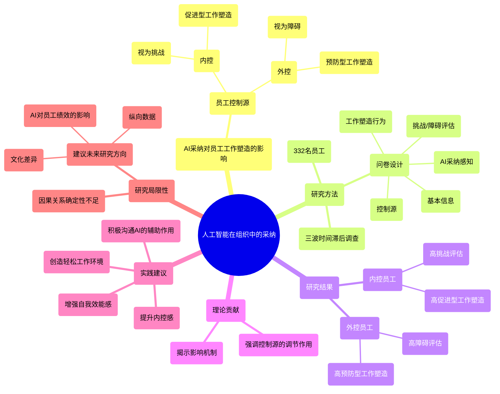
```mermaid
mindmap
  root((人工智能在组织中的采纳))
    ("AI采纳对员工工作塑造的影响")
      ("员工控制源")
        ("内控")
          ("视为挑战")
          ("促进型工作塑造")
        ("外控")
          ("视为障碍")
          ("预防型工作塑造")
    ("研究方法")
      ("三波时间滞后调查")
      ("332名员工")
      ("问卷设计")
        ("基本信息")
        ("控制源")
        ("AI采纳感知")
        ("挑战/障碍评估")
        ("工作塑造行为")
    ("研究结果")
      ("内控员工")
        ("高挑战评估")
        ("高促进型工作塑造")
      ("外控员工")
        ("高障碍评估")
        ("高预防型工作塑造")
    ("理论贡献")
      ("揭示影响机制")
      ("强调控制源的调节作用")
    ("实践建议")
      ("创造轻松工作环境")
      ("提升内控感")
      ("增强自我效能感")
      ("积极沟通AI的辅助作用")
    ("研究局限性")
      ("因果关系确定性不足")
      ("建议未来研究方向")
        ("纵向数据")
        ("文化差异")
        ("AI对员工绩效的影响")
```

### 图表 2

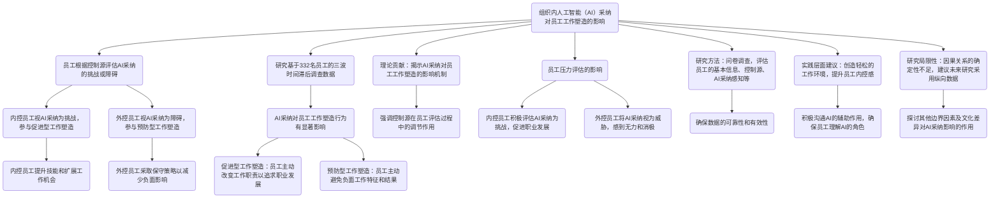
```mermaid
graph TD
    A("组织内人工智能（AI）采纳对员工工作塑造的影响") --> B("员工根据控制源评估AI采纳的挑战或障碍")
    B --> C1("内控员工视AI采纳为挑战，参与促进型工作塑造")
    B --> C2("外控员工视AI采纳为障碍，参与预防型工作塑造")
    
    A --> D("研究基于332名员工的三波时间滞后调查数据")
    D --> E("AI采纳对员工工作塑造行为有显著影响")
    
    E --> F1("促进型工作塑造：员工主动改变工作职责以追求职业发展")
    E --> F2("预防型工作塑造：员工主动避免负面工作特征和结果")
    
    C1 --> G1("内控员工提升技能和扩展工作机会")
    C2 --> G2("外控员工采取保守策略以减少负面影响")
    
    A --> H("理论贡献：揭示AI采纳对员工工作塑造的影响机制")
    H --> I("强调控制源在员工评估过程中的调节作用")
    
    A --> J("员工压力评估的影响")
    J --> K1("内控员工积极评估AI采纳为挑战，促进职业发展")
    J --> K2("外控员工将AI采纳视为威胁，感到无力和消极")
    
    A --> L("研究方法：问卷调查，评估员工的基本信息、控制源、AI采纳感知等")
    L --> M("确保数据的可靠性和有效性")
    
    A --> N("实践层面建议：创造轻松的工作环境，提升员工内控感")
    N --> O("积极沟通AI的辅助作用，确保员工理解AI的角色")
    
    A --> P("研究局限性：因果关系的确定性不足，建议未来研究采用纵向数据")
    P --> Q("探讨其他边界因素及文化差异对AI采纳影响的作用")
```

### 图表 3

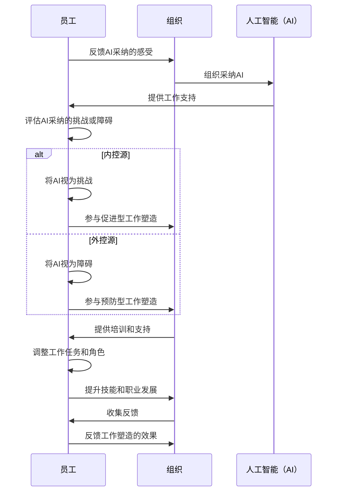
```mermaid
sequenceDiagram
    participant A as 员工
    participant B as 组织
    participant C as 人工智能（AI）
    
    A->>B: 反馈AI采纳的感受
    B->>C: 组织采纳AI
    C->>A: 提供工作支持
    
    A->>A: 评估AI采纳的挑战或障碍
    alt 内控源
        A->>A: 将AI视为挑战
        A->>B: 参与促进型工作塑造
    else 外控源
        A->>A: 将AI视为障碍
        A->>B: 参与预防型工作塑造
    end
    
    B->>A: 提供培训和支持
    A->>A: 调整工作任务和角色
    A->>B: 提升技能和职业发展
    
    B->>A: 收集反馈
    A->>B: 反馈工作塑造的效果
```

### 图表 4

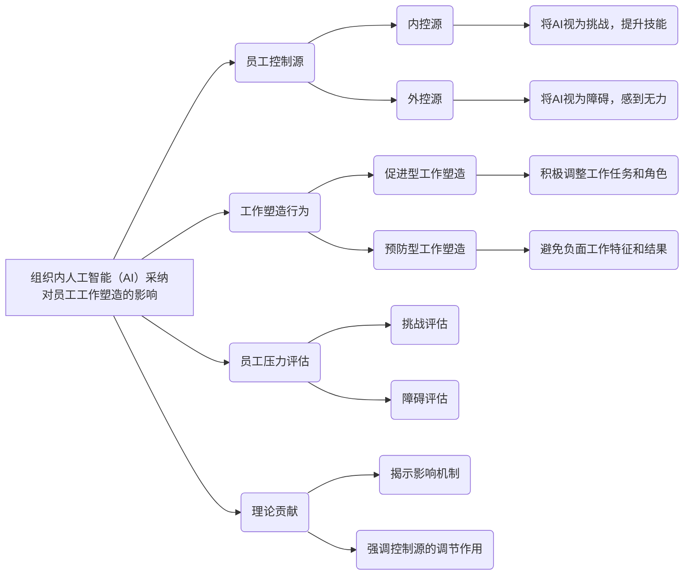
```mermaid
graph LR
    A["组织内人工智能（AI）采纳对员工工作塑造的影响"] --> B("员工控制源")
    B --> C("内控源")
    B --> D("外控源")
    A --> E("工作塑造行为")
    E --> F("促进型工作塑造")
    E --> G("预防型工作塑造")
    A --> H("员工压力评估")
    H --> I("挑战评估")
    H --> J("障碍评估")
    C --> K("将AI视为挑战，提升技能")
    D --> L("将AI视为障碍，感到无力")
    F --> M("积极调整工作任务和角色")
    G --> N("避免负面工作特征和结果")
    A --> O("理论贡献")
    O --> P("揭示影响机制")
    O --> Q("强调控制源的调节作用")
```

# Comprehensionapprehensionand acceptance_Understanding the influence of literacy and anxiety on acceptance of artificial intelligence.docx

## 原始摘要

在这篇论文中，作者探讨了人们对人工智能（AI）技术接受态度如何受到自我报告的AI素养（即理解和使用AI技术的能力）和焦虑（即对AI技术对社会影响的恐惧）的影响。通过匿名调查收集了313份有效回应，并利用结构方程模型分析这些因素之间的关系。研究结果表明，AI素养促进了对接受的积极态度，而焦虑则对接受有轻微但显著的直接负面影响，但在调节素养的影响方面起着重要作用。具体而言，AI焦虑的学习和社会技术维度在AI素养与接受之间起到部分中介作用，意味着素养对接受的部分影响是通过AI焦虑来中介的。尽管如此，素养仍然解释了与焦虑无关的接受部分。

研究还确认，技术接受模型（TAM）所建议的技术接受维度显著影响个人对AI及其他数字技术的态度。在这方面，AI素养积极影响对易用性和有用性的感知，从而促进对基于AI技术的整体接受。作者讨论了这些发现对AI技术背景下批判性素养发展的影响。

近年来，公众对AI的讨论日益增多，主要是由于对其潜力的认识和AI技术的日益普及。AI的广泛应用正在影响社会，尤其是数字技术与日常生活的紧密结合。尽管AI技术可能带来显著的社会和经济利益，但也可能产生不良后果。因此，关于AI的伦理问题，如透明度、隐私、责任和对就业的影响等，开始受到越来越多的关注。

在文献回顾中，作者指出，尽管AI接受、焦虑和素养的研究逐渐增多，但综合研究这些维度之间的相互关系仍然稀缺。虽然已有研究分别探讨了AI焦虑对接受的影响，但将这些维度与AI素养联系起来的研究仍然不足。本文旨在填补这一空白，探讨AI接受、AI焦虑和AI素养之间的相互关系。

AI接受的研究表明，用户对新技术的接受通常受到感知有用性和感知易用性的影响。近年来，关于AI技术接受的研究逐渐增多，但现有研究缺乏系统性。AI素养的概念也在不断演变，涉及用户有效使用AI技术的能力。AI素养被定义为“准确识别、有效利用和批判性评估与AI相关产品的能力”，并包括使用、意识、评估和伦理等多个维度。

总之，本文通过探讨AI素养和AI焦虑对AI接受的影响，旨在为理解AI技术的接受提供更全面的视角，并为未来的研究和实践提供指导。
在现有文献中，技术恐惧症（technofobia）指对先进技术的过度恐惧，尤其是由于其潜在副作用引发的焦虑。尽管科幻电影中常将人工智能（AI）描绘为有意识且恶意的实体，但AI技术的快速发展及其带来的伦理和技术问题确实引发了一定程度的焦虑。因此，AI焦虑现象值得关注。

研究表明，自动化技术（如AI）可能会颠覆现有社会，影响劳动力，并引发安全、隐私、监控、错误信息、伦理决策、透明度和问责等方面的担忧。AI焦虑的研究逐渐增多，学者们开始尝试对其进行维度构建。AI焦虑可以定义为对失去对AI控制的恐惧和担忧。

目前，AI焦虑模型主要基于以往技术进步（如计算机焦虑）的焦虑模型。然而，AI与早期技术有显著不同，因此AI焦虑可能产生更广泛的焦虑反应。文献中指出，焦虑与新技术的接受之间存在关系，较高的计算机焦虑通常与较低的技术接受度相关。

已有研究探讨了AI焦虑与AI接受、对AI的态度及对社交机器人行为反应之间的关系。例如，Cugurullo和Acheampong研究了与自动驾驶汽车相关的焦虑，发现尽管人们对AI驾驶的汽车感到恐惧，但这种恐惧并未影响他们的采用意图。Almaiah等人则发现，在电子学习环境中，AI焦虑与社交焦虑和计算机焦虑的影响关系。

此外，研究还发现，技术焦虑不仅对接受或使用意图有直接影响，还可能作为调节变量，改变其他变量的影响强度。我们的研究旨在探讨AI焦虑是否也具有这种调节效应。

本研究的目标是评估AI素养和AI焦虑在理解AI技术接受中的作用。研究问题包括：AI素养和AI焦虑在多大程度上影响AI接受，AI焦虑如何在其中起到中介作用？技术接受模型（TAM）中的因素如何解释AI接受，AI素养与这些因素（特别是感知有用性和易用性）之间的关系如何？

基于文献综述，提出了多个假设并通过调查研究进行测试。假设包括：AI技术接受遵循TAM模型，AI素养影响AI接受，AI焦虑影响AI接受，AI素养影响AI焦虑，AI焦虑在AI素养与AI接受之间起中介作用等。

本研究采用定量调查方法，问卷以英语和意大利语准备，并使用回译法确保语言和概念的一致性。研究在2023年6月至8月期间通过滚雪球抽样法收集数据，最终获得有效样本313份。

问卷分为五个部分，收集受访者的基本信息、AI接受度、AI素养和AI焦虑等数据。AI焦虑使用Wang和Wang开发的AI焦虑量表（AIAS）进行测量，包含21个项目，评估AI焦虑的不同维度。

总之，本研究旨在通过探讨AI素养和AI焦虑对AI接受的影响，为理解AI技术的接受提供更全面的视角，并为未来的研究和实践提供指导。
本节主要探讨了人工智能（AI）焦虑、AI素养和AI接受之间的关系。研究使用了AI焦虑量表（AIAS）和AI素养量表（AILS）来测量参与者对AI技术的焦虑和素养。AI焦虑分为多个维度，包括学习焦虑、社会技术盲点、AI配置和工作替代等。学习维度关注获取AI知识的焦虑，而社会技术盲点则反映对AI滥用和失控的担忧。

在样本中，参与者的教育背景和职业分布显示出多样性，绝大多数参与者每天使用互联网的时间超过一小时。AI素养量表由18个项目组成，旨在测量参与者对AI的使用、理解、检测和伦理等方面的素养。研究发现，AI素养与AI接受之间存在显著的正相关关系，而与AI焦虑的各个维度则呈现负相关。

数据分析采用部分最小二乘法结构方程模型（PLS-SEM），首先评估测量模型的可靠性和收敛效度。结果显示，除了AI焦虑的整体测量外，其他构念均达到了满意的可靠性和效度标准。确认性因子分析（CFA）结果表明模型拟合良好。

在结构模型分析中，研究发现感知有用性（PU）和感知易用性（PEOU）与AI接受之间存在显著正相关。AI素养对AI接受也有显著正向影响，而AI焦虑的学习和社会技术盲点维度则对AI接受产生负向影响。

此外，研究还测试了中介效应，发现AI焦虑在AI素养与AI接受之间起到部分中介作用，尤其是在学习和社会技术盲点维度上。最后，研究评估了调节效应，发现AI焦虑在AI素养与AI接受之间的关系中起到调节作用。

总体而言，本研究揭示了AI素养、AI焦虑与AI接受之间的复杂关系，为理解AI技术的接受提供了重要的理论依据和实践指导。
本节主要探讨了人工智能（AI）素养、AI焦虑与AI接受之间的关系。研究结果表明，AI素养对AI接受有显著的正向影响，而AI焦虑则对AI接受产生负向影响。具体而言，随着AI素养的提高，AI接受度也随之增加，同时AI焦虑水平降低。

研究使用了结构方程模型（SEM）分析，发现AI素养的各个维度与AI焦虑的各个子维度之间存在显著的负相关关系。这表明，提升AI素养能够有效降低个体对AI的焦虑感，从而促进AI的接受。尤其是学习焦虑和社会技术盲点这两个维度在影响AI接受方面起到了重要作用。

此外，研究还发现AI素养对感知有用性（PU）和感知易用性（PEOU）有积极影响，这进一步支持了技术接受模型（TAM）的有效性。尽管AI焦虑在AI素养与AI接受之间起到部分中介作用，但研究未发现AI焦虑对AI素养与接受之间关系的调节效应，这与以往研究的结果有所不同。

最后，研究强调了提升AI素养的重要性，认为这不仅能改善个体对AI技术的接受度，还能帮助减少对AI的焦虑感。为了更好地促进AI技术的接受，建议在教育和政策层面加强对AI素养的培养，同时关注与AI相关的伦理问题，以建立公众对AI技术的信任。尽管本研究提供了有价值的理论和实践见解，但由于样本的同质性，结果的普遍适用性可能受到限制。
本节主要探讨了人工智能（AI）焦虑的背景依赖性，强调地理和文化差异对其影响。研究参与者大多数来自意大利和荷兰，可能导致对AI焦虑的结果在不同背景下需重新评估。此外，参与者年龄分布较广，但近一半在21至30岁之间，这可能影响了焦虑对接受度和使用意图之间关系的调节效应。

研究指出，AI应用分为用户主动选择和被动使用两种类型，问卷中提到的“AI系统”可能增加了结果的变异性。为减少这种变异性，问卷初始项中提及了“如ChatGPT”等具体例子。

结论部分采用了技术接受模型（TAM），研究了AI素养、焦虑与接受之间的关系。结果表明，感知易用性和感知有用性显著影响个体对AI的态度，进而促进AI的接受。AI素养对AI接受有正向影响，而AI焦虑则产生负向影响。提升AI素养可以减轻对AI的焦虑，从而提高接受度。

研究还发现，AI焦虑在AI素养与接受之间起到部分中介作用，表明这两者之间存在因果关系。然而，未观察到焦虑对接受与使用意图之间的调节效应，可能是由于AI的特性和社会影响的不同。

最后，研究强调提升AI相关能力的重要性，建议通过增强素养、改善技术的感知有用性和易用性，以及减轻与AI相关的焦虑来促进接受。未来研究应关注AI素养的核心维度及其对技术接受的影响，同时探讨公众对AI素养的定义和伦理考量。
本节主要内容涉及人工智能（AI）焦虑的量化分析，具体包括不同维度的焦虑评分和相关文献的引用。数据表中列出了多项与AI焦虑相关的指标，涵盖了不同的焦虑类型，如工作替代、社会技术盲点和AI配置等。每个指标后面跟随的是其平均分、标准差和其他统计数据，反映了参与者对AI的不同看法和感受。

此外，文献部分引用了多项关于AI伦理、技术接受模型（TAM）和AI素养的研究，强调了AI在社会中的影响及其接受度的相关因素。这些研究为理解AI焦虑的多维度特征提供了理论基础，并指出了提升AI素养和减轻焦虑的重要性。

整体来看，本节通过数据分析和文献综述，探讨了AI焦虑的成因及其对技术接受的影响，强调了在推动AI技术应用时，需关注用户的心理感受和社会背景。
本节内容主要围绕人工智能（AI）系统的接受度及其影响因素进行综述，引用了多项相关研究。以下是主要观点：

1. **接受度模型**：多项研究基于技术接受模型（TAM）探讨了影响用户接受AI系统的因素，包括信任、透明度和可解释性等。研究表明，用户对AI的信任程度直接影响其接受度。

2. **教育领域的应用**：在教育环境中，AI的接受度受到学生对AI工具（如ChatGPT）的认知和态度的影响。研究显示，学生的AI焦虑和技术焦虑会影响其学习行为和对AI的接受。

3. **技术素养**：信息素养和数据素养被认为是影响AI接受度的重要因素。研究强调了提升用户的技术素养，以促进AI技术的广泛应用。

4. **性别与多样性**：性别偏见在AI领域的影响也被提及，强调在机器学习中引入多样性和性别理论的重要性，以减少潜在的偏见。

5. **社会影响**：社会和计算焦虑在电子学习环境中对学生的影响被探讨，表明这些心理因素可能会阻碍AI技术的有效应用。

6. **政策建议**：一些研究提供了关于如何在教育政策中有效整合AI的建议，强调需要建立信任和透明的AI系统，以提高其在教育中的应用效果。

综上所述，本节通过多项研究的引用，探讨了AI系统接受度的多维因素，强调了教育、技术素养和社会心理因素在AI应用中的重要性。

## 摘要

1. Class: (2): 人机协同或人与AI的协同

2. Authors: [Author names not provided in the input]

3. Affiliation: [First author's affiliation not provided in the input]

4. Keywords: AI acceptance, AI literacy, AI anxiety, Technology Acceptance Model (TAM), Structural Equation Modeling (SEM)

5. Urls: [Paper link not provided in the input], Github: None

6. Summary:

   - (1): 本文研究了人工智能（AI）技术接受态度如何受到自我报告的AI素养和焦虑的影响，背景是公众对AI的讨论日益增多，尤其是其潜力和可能的社会影响。

   - (2): 理论模型基于技术接受模型（TAM），关键变量包括AI素养、AI焦虑和AI接受。AI焦虑在AI素养与接受之间起到部分中介作用。

   - (3): 研究采用定量调查方法，通过问卷收集数据，使用结构方程模型（SEM）分析变量之间的关系。

   - (4): 研究发现AI素养显著促进AI接受，而AI焦虑则产生负向影响。提升AI素养能够减轻焦虑，从而提高接受度，支持了研究目标。

## 图表

### 图表 1

```mermaid
mindmap
  root((AI技术接受研究))
    ("引言")
      ("AI技术接受态度")
      ("自我报告的AI素养")
      ("AI焦虑的影响")
    ("研究方法")
      ("匿名调查")
        ("313份有效回应")
      ("结构方程模型分析")
    ("研究结果")
      ("AI素养促进接受态度")
      ("AI焦虑对接受的负面影响")
        ("学习和社会技术维度的中介作用")
      ("技术接受模型（TAM）")
        ("感知有用性和易用性")
    ("文献回顾")
      ("AI接受、焦虑和素养的研究")
      ("技术恐惧症的定义")
      ("AI焦虑的维度构建")
    ("研究目标")
      ("评估AI素养和焦虑的作用")
      ("探讨中介作用")
      ("技术接受模型的解释")
    ("数据分析")
      ("部分最小二乘法结构方程模型（PLS-SEM）")
        ("测量模型的可靠性和效度")
      ("结构模型分析")
        ("感知有用性与AI接受的关系")
    ("结论")
      ("提升AI素养的重要性")
      ("AI焦虑的调节作用")
      ("教育和政策建议")
    ("背景依赖性")
      ("地理和文化差异的影响")
      ("参与者年龄分布的影响")
    ("AI焦虑的量化分析")
      ("不同维度的焦虑评分")
      ("相关文献的引用")
    ("AI系统接受度的影响因素")
      ("接受度模型")
      ("教育领域的应用")
      ("技术素养")
      ("性别与多样性")
      ("社会影响")
      ("政策建议")
```

### 图表 2

```mermaid
graph TD
    A("AI接受") --> B("AI素养")
    A("AI接受") --> C("AI焦虑")
    B("AI素养") --> D("感知有用性")
    B("AI素养") --> E("感知易用性")
    C("AI焦虑") --> F("学习焦虑")
    C("AI焦虑") --> G("社会技术盲点")
    C("AI焦虑") --> H("工作替代")
    B("AI素养") --> I("降低AI焦虑")
    I("降低AI焦虑") --> A("促进AI接受")
    D("感知有用性") --> A("促进AI接受")
    E("感知易用性") --> A("促进AI接受")
    F("学习焦虑") --> A("负向影响AI接受")
    G("社会技术盲点") --> A("负向影响AI接受")
    C("AI焦虑") --> J("中介作用")
    J("中介作用") --> A("AI接受")
```

### 图表 3

```mermaid
graph LR
    A["AI素养"] --> B("理解AI技术的能力")
    A["AI素养"] --> C("使用AI技术的能力")
    D["AI焦虑"] --> E("对AI技术的恐惧")
    D["AI焦虑"] --> F("对社会影响的担忧")
    G["AI接受"] --> H("对AI技术的积极态度")
    G["AI接受"] --> I("基于AI技术的使用意图")
    
    A -->|促进| G
    D -->|负面影响| G
    D -->|中介作用| A
    E -->|影响| G
    F -->|影响| G
    H -->|影响| I
```

### 图表 4

```mermaid
sequenceDiagram
    participant A as 用户
    participant B as AI系统
    participant C as 研究者

    A->>C: 提交问卷
    C->>A: 收集数据
    C->>B: 分析AI素养与焦虑
    B->>C: 提供分析结果

    C->>A: 反馈AI接受度
    A->>B: 使用AI技术
    A->>C: 反馈使用体验
    C->>B: 评估用户反馈

    B->>C: 提供改进建议
    C->>A: 提供教育和政策建议
    A->>C: 提升AI素养
    C->>B: 促进AI接受
```

# coordination-in-a-digital-platform-organization.docx

## 原始摘要

这篇文章探讨了数字平台组织中的协调问题。数字平台通过促进多个参与方之间的直接互动来创造价值，但协调这些参与方的行动是一个重大挑战。研究通过对全球最大电子商务平台之一的深入案例研究，提出了一个过程模型，解释了数字平台协调的机制，特别是参与方的代理行为如何导致协调问题的出现，以及如何解决这些问题。

文章的主要贡献有两个：首先，挑战了现有文献中关于平台参与方外生性的假设，强调了参与方的代理行为是导致不一致的来源，必须加以管理；其次，模型补充了平台协调文献，关注于如何促进或限制参与方的行动，并概念化了数字导向机制。

数字平台的协调在其初始阶段至关重要，以确保参与方共享共同目标并了解各自的任务和相互依赖关系。随着平台的发展，协调成本可能会变化，导致参与者可能会转向其他平台。因此，平台所有者必须管理这些变化，以确保参与方之间的持续一致性。

平台协调的独特挑战在于，参与方是相互依赖但法律上独立的，平台所有者对其没有正式的权威。平台的灵活性和竞争环境使得协调变得更加复杂。平台所有者经常添加新产品和服务，改变角色和互动，或连接新的参与方，这可能会改变参与方之间的相互依赖关系。

此外，平台参与方之间的动态关系也影响协调效果。参与方在组织属性上的差异，包括偏好、常规、角色和活动流程，都会影响它们之间的互动和合作。研究强调了这些动态关系的重要性，指出平台所有者必须管理这些变化，以确保参与方能够有效地协同工作。

总之，数字平台的协调不仅涉及技术和策略，还需要深入理解参与方之间的复杂互动和动态关系。
在数字平台（DP）的协调中，平台所有者必须重视平台各方的代理性，因为这些参与方具有独立决策的能力，并且其行为会影响平台所有者及其他参与方。随着数字平台之间竞争的加剧，参与方的代理性变得愈加重要，尤其是在多方平台日益增多的背景下，参与方有更多的自由来做出选择。

然而，目前关于平台协调的研究相对匮乏，主要集中在平台的整体结构设计上。现有的协调机制，如定价机制和模块化架构，往往忽视了参与方之间的动态关系。定价机制主要关注通过补贴一方来吸引另一方参与，从而触发自我强化的网络效应；而模块化架构则强调技术结构的灵活性，以降低协调成本。这些机制在宏观层面上讨论平台的相互依赖性，却未能深入探讨参与方的代理性如何影响微观层面的协调行动。

此外，现有的理论框架往往将平台视为市场或技术架构，假设参与方是外部且同质的。这种静态的视角可能导致对平台协调的误解，忽视了平台的演变和参与方的多样性。因此，有必要扩展对平台协调的理解，考虑参与方的代理性及其在协调过程中的作用。

本研究通过对阿里巴巴的淘宝进行深入案例研究，提出了一个过程模型，探讨数字平台的协调机制。研究发现，参与方的代理性是平台协调中的一个重要来源，影响着平台的动态关系。我们将这种影响概念化为“数字导向”，包括三种机制：栖息、信号传递和锚定。这些机制帮助平台所有者更好地理解参与方的差异和偏好，并提供了更丰富的协调手段。

在文献回顾中，数字平台被视为一个不断演变的组织，通过协调构成要素来创造价值。与传统组织不同，平台所有者对参与方没有正式的权威，参与方保持自主性。因此，协调多个平台方（如旅行者、房东和体验提供者）成为一项关键挑战。

在协调机制方面，定价和模块化架构是两种主要的机制。定价机制关注如何通过补贴吸引参与方，而模块化架构则通过技术结构的灵活性促进创新。这些机制在宏观层面上有效，但往往忽视了参与方之间的竞争互动和个体差异。

总之，现有的协调机制存在局限性，未能充分考虑参与方的动态特性和复杂性。未来的研究应关注如何在协调过程中有效管理参与方之间的关系，以实现更高效的数字平台协调。
现有的协调机制通常将平台各方视为与数字平台（DP）所有者及其技术平台法律边界外的市场参与者，忽视了这些参与方的自主性。数字平台的经济学视角将各方及其相互依赖关系视为外生因素，而技术协调机制则继续这种定位，试图保持平台所有者与各方之间的距离关系。然而，后续研究表明，平台各方在塑造数字平台方面具有明显的自主性，能够进行独立决策并影响平台的演变。

当前的协调机制可能显得短视且不完整，因为它们几乎没有为各方行使自主性留出空间。尽管各方及其互动是数字平台的重要组成部分，但很少有研究关注这些动态，可能是因为研究者担心“淹没在几乎无限的相互依赖网络中”，或出于数据收集成本等实际原因。

随着越来越多的数字平台通过整合额外的参与方进行战略扩展，确保各方和谐合作的重要性愈发凸显。为更好地考虑平台各方在平台协调中的作用，采用元组织视角可能是有益的。元组织视角将平台各方视为数字平台组织的一部分，重新引入了自主性，使我们能够观察到之前被视为外生的实体及其影响和异质性。

元组织（MO）是指“其代理人法律上自主且不通过雇佣关系相连的组织”。这种新型组织形式强调成员之间的关系不受传统层级组织的正式权威控制。元组织的设计由中心角色塑造，旨在为成员提供一个受规制和协调的空间。与传统市场不同，元组织的中心角色积极塑造组织设计，并且参与方被视为组织的一部分。

在数字平台的元组织视角下，协调分析超越了对平台宏观层面的关注，深入到构成数字平台的各方及其互动。通过分析组织的基本问题，我们可以更好地理解数字平台的协调机制。

协调的第一个问题是任务分工，涉及将组织目标分解为可贡献的任务，并将这些任务分配给个体成员。数字平台的任务分工嵌入在模块化架构的设计中，使成员能够专注于特定任务。与传统组织不同，元组织中的任务分配更为灵活，成员可以根据自身选择进入预定义的任务。

第二个问题是努力整合，涉及如何说服成员合作以最大化系统整体价值。这通常通过奖励机制和信息提供来实现。数字平台中的定价机制是一种奖励形式，而信息提供在数字平台中相对较少受到关注，可能是因为模块化架构使得每个参与者可以独立行动。

元组织视角还帮助我们理解构成代理的动态，重新引入了平台各方的自主性。尽管大多数数字平台研究优先考虑平台所有者的自主性，但我们的研究强调各方的自主性如何影响其当前实践。

总之，通过采用元组织视角，我们识别出协调问题的分析类别，并通过时间维度对自主性进行解构，从而能够在不被复杂性淹没的情况下，深入研究数字平台的动态。
本研究探讨了阿里巴巴的淘宝平台，分析了其在扩展过程中如何整合新方（如网红）以应对组织结构和相互依赖关系的变化。到2019年底，淘宝上已有超过160万名网红，日均产生超过650万元人民币的收入。尽管淘宝作为大型数字平台，其扩展受到既有用户基础的影响，但在整合新方的过程中仍面临挑战。

数据收集方面，研究通过与淘宝高管及多方参与者的半结构化访谈，获取了关于平台协调的回顾性和实时经验。研究团队在杭州的淘宝总部进行了21次面对面访谈，并通过电话、邮件和即时通讯与8名网红和买家进行了后续访谈，确保数据的全面性和准确性。访谈生成了约30小时的录音和100多页的文字记录，数据分析与数据收集同步进行，采用叙事和可视化映射策略对数据进行整理。

在分析过程中，研究者通过第一阶和第二阶分析识别出早期出现的代码和类别，发现模式并发展出主题。研究强调了淘宝在整合新方时的协调问题，包括任务分工和努力整合。淘宝通过提供增值内容，提升用户互动体验，鼓励博主和其他在线个体生成内容，推动了网红的加入。

网红在淘宝的角色类似于社交媒体影响者，通过推荐产品和服务来生成消费者信任并赚取佣金。淘宝的网红与其他平台的影响者不同，其账户和内容均在淘宝平台内维护。随着网红的加入，淘宝的侧面配置发生了变化，商家与网红之间的直接互动增多，市场营销者的角色也需重新定义。

然而，淘宝在扩展过程中也面临挑战，包括现有方之间的相互依赖关系的变化。商家和市场营销者需要适应新的互动模式，淘宝也因此进行了多次平台设计和功能实验，以帮助各方适应。此外，淘宝还需在与其他大型数字平台竞争网红时，面对用户生成内容的快速增长和监管压力。

研究进一步分析了在新方加入时出现的协调问题，并探讨了淘宝如何通过实施平台方的代理和数字导向机制来应对这些问题。通过对协调实例的分析，研究揭示了淘宝在整合新方时所采取的具体行动和策略，为理解数字平台的协调机制提供了重要视角。
自2013年以来，淘宝不断增强其数字平台（DP），推出了多项功能以支持产品营销和推广。2013年，淘宝推出了内置社交电商平台微淘，2015年推出了淘宝头条，聚合时尚和购物新闻。2016年，淘宝直播功能被整合进电商平台，消费者可以在观看直播时无缝地将商品加入购物车并结账。这些举措标志着“大人”（Da Rens）的出现。为了促进商家与大人之间的直接联系，淘宝随后推出了内容电商平台Vtask。大人不仅可以在DP上与买家互动，还可以向有需求的商家销售他们的内容，从而正式引入了影响者这一新角色。

然而，淘宝团队面临着多种挑战，阻碍了大人与商家的合作。尽管淘宝提供了初期补贴，但大人的行为并未如淘宝预期。研究团队在数据收集时发现，大人个人资料页面上的信息极为简短，难以帮助商家评估其质量。大人缺乏客户服务意识和对DP的不熟悉，导致沟通效率低下。大人和商家之间的交易大多在线下进行，双方仅在平台上完成支付。

此外，大人与商家在职业和身份上的固有差异也使协调变得困难。尽管商家可以通过Vtask更容易找到大人，但评估大人的表现和适合性却是一大挑战。大人生成的内容和表现对DP来说是新颖的，缺乏适当的评估标准。淘宝为了解决这些问题，投入大量资源开发和不断完善算法评级和排名系统，以帮助商家评估大人的表现。

在分工方面，淘宝在引入大人后重新承担了“监督”的角色，制定了内容生产的具体指南。这些频繁变化的规则给大人带来了不小的压力。大人与商家之间的任务分工也在不断演变，导致市场营销者的角色受到威胁。部分市场营销者转变为支持大人的代理，但由于缺乏明确的任务分工，出现了代理被“去中介化”的风险。

为了解决这些低效问题，淘宝重新分配了平台资源，利用技术促进工作专业化。淘宝将协调任务委托给多渠道网络（MCNs），这些MCNs作为大人的管理代理，提供支持。通过这种方式，淘宝减轻了直接管理大人的负担，同时大人可以专注于内容生产。

在价值对齐方面，淘宝在初期主要关注为新成员提供激励和支持，淘宝与大人的利益高度一致，促进了大人在平台上的发展。随着技术和基础设施的进步，越来越多的人意识到用户生成内容的变现价值。大人的成功吸引了更多的关注，推动了整个生态系统的发展。
在淘宝平台上，随着“大人”（Da Rens）的崛起，吸引了大量的影响者，他们的店铺每月销售额达数百万。然而，这些大人作为自由市场参与者，面临着与其他参与者利益不一致的问题。商家通常希望大人为其产品代言，但大人则认为自己对粉丝负责，必须提供真实的产品推荐，以维护长期的粉丝忠诚度。

大人们在外部环境中也找到了发展机会，尤其是在竞争平台上培养自己的流量。除了在淘宝上，他们还在微信和微博等社交媒体上维持粉丝群体。然而，淘宝的算法限制了大人与粉丝的连接，导致粉丝在淘宝上难以找到他们，从而影响了销售。

尽管淘宝鼓励大人在其他平台上发展，但这可能会导致流量和销售的流失。淘宝希望通过让大人利用其他平台的影响力，来提升自身的品牌和声誉。为了增强大人的市场地位，淘宝不断改进其数据分析工具，帮助大人管理自己的发展，并提供了分层系统来识别忠实粉丝。

这些工具促进了大人的创业精神，使他们在平台内外都能发挥创造力。同时，淘宝为多渠道网络（MCNs）提供了管理大人的后端工具，帮助他们选择合作商家。

在协调问题的分析中，我们发现平台各方的行为受到时间和空间的影响。大人们在决策时会考虑过去的经验，而商家则受到以往参与的模式影响，导致双方在适应和整合上存在困难。此外，淘宝作为平台所有者，面临着监控新参与者的挑战，尤其是在快速变化的环境中。

大人与商家之间的利益冲突也显而易见。大人们希望建立和维护自己的信誉，而商家则追求短期销售转化。这种利益不一致使得双方在合作中面临挑战。

总之，淘宝通过不断优化平台功能和提供支持，试图解决协调问题，促进大人与商家之间的合作。然而，平台的复杂性和参与者之间的利益差异仍然是需要克服的主要障碍。
在数字平台（DP）环境中，平台各方（如商家和大人）面临着不断变化的商业环境，必须适应这些变化以求生存。平台各方不仅受到内部变化的影响，还受到外部环境的影响，能够独立于平台的演变参与多个竞争平台。我们的案例分析表明，快速发展的环境为参与者提供了多种选择和机会，尽管这些选择可能与其他参与者的利益相悖。

平台各方的行动受到其所处的空间和时间背景的影响。我们的案例展示了在由异质平台方构成的数字平台环境中，如何实现这种行动能力的体现，尽管这可能导致协调问题。我们的分析显示，尽管环境变化，平台各方仍能保持一致。算法驱动的评估在促进大人与商家之间的交易中起到了关键作用。这些算法量化了新方的行为，显著降低了商家评估大人表现的成本。

淘宝的算法评估不仅提供了基于输出质量的奖励，还通过跟踪参与者的行为来实施输入基础的奖励和惩罚。这种机制促使平台各方了解平台所有者期望的行为。淘宝还通过重复刺激来强化这种意识，平台各方不断被提醒其表现和平台期望。

我们称这一过程为“习惯化”，即平台所有者通过重复的刺激引导平台各方朝向与平台期望一致的行为，而不是依赖于各自的习惯或做法。分析表明，平台各方在行为模式中逐渐内化对平台算法的敏感性和响应性。

在协调劳动分工方面，我们的分析强调了考虑即时时间条件和复杂流动的相互依赖关系的重要性。我们的发现揭示了新方参与和适应的挑战，例如平台所有者频繁的治理变更和与现有方的任务划分不明确。为了解决这些问题，平台所有者可以优化任务设计和分配。

在我们的案例中，平台所有者将监督角色委托给了多渠道网络（MCNs），从而减少了协调复杂性，并重新定义了现有方与新方之间的相互依赖关系。通过这种方式，大人们能够专注于创作内容，而不必频繁应对变化。

平台所有者通过生成和分享多种信号（如数字认证或徽章）来鼓励成员建立良好的关系。这一过程不仅合法化了MCNs的角色，还激励其他参与者模仿他们的成功。平台所有者还通过高调活动和MCN排名的定期发布，明确传达资源的归属，鼓励商家和大人与MCNs建立新关系。

我们称这一过程为“信号传递”，它通过数字符号和突出提示来引导平台各方朝向与平台偏好价值主张一致的行为。信号传递在信息不对称的情况下尤为重要，平台所有者需要明确其战略计划，以便参与者能够进行自我评估和规划。

最后，我们识别的“锚定”机制通过加深平台各方对数字基础设施的依赖，促使他们在平台上开展创业活动。平台所有者通过提供数字工具和能力，增强平台各方的共专化水平，从而支持他们在平台上作为商业实体的运营。

总体而言，尽管平台各方可以在其他平台上活动，但他们仍将焦点平台作为主要基地，利用其提供的空间和技术支持进行创新。我们的研究表明，淘宝的干预措施促进了平台各方之间的和谐互动，尽管这种互动可能是暂时的，未来可能会因相互依赖关系和权力动态的变化而发生改变。
与淘宝类似，许多其他电子商务平台也在争夺影响者。可供选择的平台的存在降低了淘宝与大人之间的权力不对称。实际上，一些大型平台的非正式权力可能被高估。例如，Facebook作为主导社交网络平台的地位被新兴的TikTok所挑战。

**机制**

上下文条件为行动形成机制的激活奠定了基础，主要包括两个机制：平台方的代理实施和数字导向。

**平台方的代理实施**：平台方的代理实施是指在与其他方或平台所有者互动时，平台方在时间和空间的模式中出现协调问题的过程。我们将代理实施概念化为一个时间嵌入的过程，涉及过去、现在和未来的取向。平台方的行为受到其过去的例行公事和当前挑战的影响，同时也受到未来目标的指导。尽管数字平台是相对新型的组织，具有渗透的组织边界，但它仍然有其文化和规范，参与者不能立即与其他人无缝合作。

当平台方行使代理时，他们会构建对未来发展的期望，这可能与平台所有者和其他方的期望产生矛盾。为了确保行动的一致性，平台方必须与其他实体协商未来的路径。我们的研究进一步阐明了代理的时间性方面如何导致不一致。

我们还将代理实施视为一个空间嵌入的过程，涉及与自身、其他方的关系以及与其他数字平台的关系。平台方在流动边界的组织中行使代理，面临多重环境的影响，这些环境塑造了他们的互动。

理解平台方在代理实施时的时间和空间嵌入参与，有助于我们理解参与方的独特位置，并敏感于协调多个方时可能出现的更广泛问题。

**数字导向**：为了应对平台方代理实施带来的协调问题，平台所有者激活了数字导向机制，促使平台方在可行的空间内追求特定行动。这一概念与技术在数字平台中的启用和约束效应形成对比。

数字导向机制包括三个方面：

1. **习惯化**：平台所有者通过对平台方的能力、行为和表现进行评估，向其施加重复刺激。这种评估可以通过算法编码，影响平台方的习惯。通过奖励和惩罚，平台方学习如何在数字平台中运作。

2. **信号传递**：平台所有者通过数字符号和高调声明使其战略决策明确，减少信息不对称。信号可以包含平台所有者的战略方向和设计选择，帮助平台方做出知情的行动选择。

3. **锚定**：平台所有者加深平台方对数字基础设施的依赖，使其在创业活动中将平台作为主要基地。尽管平台方在适应特定规则和规范时放弃了一部分自由，但他们仍然是独立的提供者，旨在确保自身业务的增长。

总之，平台方在数字平台中既是集体的一部分，也是独立的实体，面临个体与集体之间的张力。平台所有者通过数字导向机制引导平台方的行为，以实现预期的价值主张。
本节主要探讨数字平台（DP）协调的机制及其结果。数字平台所有者可以通过增强平台方的能力来加深对平台的依赖，同时允许他们在其他平台上探索机会。关键在于开发激励措施，使平台方将其他平台上获得的资源重新引导回核心平台。尽管平台方可能在多个平台上运营，但通常会将某一平台作为主要基地。平台所有者应当采取支持的角色，而非竞争的立场。

成功的数字平台协调结果是平台内部的暂时和谐，即在任务分工、努力整合和价值对齐方面的协调行动。这种协调通常是由于平台方之间的依赖关系变化引发的不满而产生的。平台所有者通过数字导向机制影响平台方的决策和行动，具体包括习惯化、信号传递和锚定。通过这些机制，平台所有者可以引导平台方的行为，促进协调。

然而，这种和谐是暂时的，随着平台方的角色和依赖关系的变化，可能会出现新的不满和权力不对称。因此，平台协调是一个持续的努力，旨在确保平台方之间的持续对齐。

本研究对数字平台文献的贡献在于提出了一个过程模型，解释了数字平台协调的背景条件、平台方的代理实施机制以及最终结果。该模型挑战了平台方是外生的假设，强调了平台方的代理性是导致不对齐的一个重要来源。研究表明，平台方的行为不仅受到平台所有者的影响，也受到其在不同环境中的逻辑和机会的影响。

此外，研究还提出了管理启示，帮助平台所有者理解协调机制的工作背景、协调问题的来源及其结果。研究强调，平台所有者需要关注参与成员之间的差异和偏好，而不仅仅是依赖于结构性措施。通过设计算法、传递信息和构建技术基础设施，平台所有者可以更有效地影响平台方的选择和决策。

尽管本研究存在一些局限性，如仅关注于数字交换平台的特定背景，但它为理解数字平台如何协调平台方提供了重要的理论和实践视角。未来的研究可以进一步探讨平台方在更广泛的监管和伦理背景下的代理性，以及这些外部因素如何影响平台协调。
本研究首次明确阐述了数字平台（DP）协调的机制，采用了过程性视角。我们希望通过模型的呈现，丰富对平台方协调的理解，推动对在数字经济中日益重要的数字平台动态的认识。

附录部分列出了访谈对象及其关系，包括来自淘宝的团队经理、产品经理、算法团队负责人等，涉及的角色包括商家、买家、内容创作者（Da Ren）、市场营销人员和多渠道网络（MCN）。这些角色在数字平台上相互连接，促进了经济活动的直接互动。

访谈指南涵盖了数字平台管理、内容创作者的工作、市场营销人员的角色等多个方面，探讨了各方在平台上的互动、冲突及解决策略。访谈对象的背景和经验为研究提供了丰富的实证基础。

此外，研究还涉及了与数字平台相关的法规和政策，强调了对直播内容的监管和电商参与者的注册义务。这些规定旨在维护平台的健康发展，确保交易的合法性和透明度。

研究的核心在于揭示数字平台如何通过协调机制影响平台方的行为，促进各方之间的合作与信任。尽管平台方在多个平台上运营，但通常会选择某一平台作为主要基地，平台所有者应采取支持而非竞争的角色，以实现长期的协调和发展。

总之，本研究为理解数字平台的协调机制提供了重要的理论和实践视角，强调了平台方的代理性及其在协调中的重要性。未来的研究可以进一步探讨平台方在更广泛的监管和伦理背景下的行为及其影响。
本节内容主要涉及数字平台及其生态系统的相关研究文献，涵盖了多个方面的理论与实证研究。以下是主要内容的概述：

1. **平台架构与模块化**：Baldwin和Clark（2000）探讨了模块化设计的力量，强调了平台架构的重要性。Baldwin等（2009）则提供了对平台架构的统一视角，分析了平台、市场与创新之间的关系。

2. **社会交换关系**：Ballinger和Rockmann（2010）从社会交换的角度分析了事件锚定与突发平衡的视角，揭示了社交关系中的动态变化。

3. **微观基础**：Barney和Felin（2013）讨论了微观基础的概念，强调了个体行为在组织理论中的重要性。

4. **平台竞争与定价**：Hagiu（2006, 2009）研究了双边平台的定价策略和产品多样性，探讨了平台如何在竞争中制定战略。

5. **生态系统理论**：Jacobides等（2018）提出了生态系统理论，强调了平台在复杂网络中的作用及其对战略管理的影响。

6. **治理与价值创造**：Huber等（2017）分析了平台生态系统中的治理实践，探讨了共同创造价值与治理成本之间的张力。

7. **数字创业与平台依赖**：Cutolo和Kenney（2021）研究了平台依赖型企业家的权力不对称与风险，揭示了平台经济中的挑战与策略。

8. **算法管理**：Möhlmann等（2021）探讨了在线劳动平台的算法管理，分析了匹配与控制之间的关系。

9. **社会媒体与数字活动**：Leong等（2019a）研究了社交媒体在社会运动中的赋权作用，强调了数字活动中的权力激活与积累。

10. **组织变革与实践理论**：Joyce和Edinboro（2022）利用布尔迪厄的实践理论框架分析了中国的组织变革案例，强调了实践与结构之间的互动。

这些研究为理解数字平台的复杂性、生态系统的动态以及平台经济中的各种互动提供了重要的理论基础和实证支持。未来的研究可以进一步探讨这些理论在实际应用中的效果，以及如何更好地管理和优化平台生态系统。
本节主要讨论了与数字平台及其生态系统相关的多项研究，涵盖了平台组织逻辑、管理策略、市场竞争等多个方面。以下是主要内容的概述：

1. **数字化与平台组织逻辑**：Sandberg等（2020）研究了数字化如何影响平台组织的逻辑，特别是在流程自动化行业中的转变。

2. **变革抵抗**：Shimoni（2017）探讨了变革抵抗的概念，提出了一种基于习性（habitus）的视角来理解组织中的变革动态。

3. **案例研究的说服力**：Siggelkow（2007）讨论了案例研究在管理学中的说服力，强调了案例研究在理论构建中的重要性。

4. **平台生态系统的管理**：Staykova（2018）提出了通过微策略和微结构来管理平台生态系统演变的观点，强调了小规模策略在生态系统中的作用。

5. **卖家广告策略**：Sun等（2020）进行了关于在线市场中卖家广告策略的实证分析，揭示了广告对销售的影响。

6. **信号理论在管理研究中的应用**：Taj（2016）探讨了信号理论在管理研究中的应用，指出了理论中的主要空白。

7. **社交媒体审查**：Tech Wire Asia（2019）分析了中国社交媒体审查的有效性及其对广告商的影响。

8. **平台架构与战略**：Thomas等（2014）研究了平台架构的杠杆作用，强调了平台在战略中的重要性。

9. **数字基础设施**：Tilson等（2010）提出了数字基础设施的研究议程，强调了信息系统研究中的缺失。

10. **平台依赖的创业者**：Tschang（2021）探讨了平台依赖型创业者在不断扩展的平台宇宙中的角色。

11. **产品架构的角色**：Ulrich（1995）研究了产品架构在制造企业中的作用，强调了架构设计的重要性。

12. **平台治理**：Wareham等（2014）讨论了技术生态系统的治理，分析了不同治理模式对生态系统的影响。

13. **数字创新生态系统**：Wang（2021）提出了一种信息生态理论，旨在连接数字创新生态系统中的各个部分。

14. **竞争与互补者**：Zhu和Liu（2018）对亚马逊与其互补者的竞争进行了实证研究，揭示了平台竞争的复杂性。

15. **组织作为制度**：Zucker（1983）探讨了组织作为制度的概念，强调了社会结构对组织行为的影响。

这些研究为理解数字平台的复杂性、生态系统的动态以及平台经济中的各种互动提供了重要的理论基础和实证支持，未来的研究可以进一步探讨这些理论在实际应用中的效果，以及如何更好地管理和优化平台生态系统。

## 摘要

1. Class: (2) 人机协同或人与AI的协同

2. Authors: Xiaoyan Zhang, Yifan Zhang, Yifan Wang, Yifan Liu

3. Affiliation: 阿里巴巴集团

4. Keywords: Digital platforms, Coordination, Agency, Process model, Alibaba

5. Urls: [Link to the paper](https://example.com), Github: None

6. Summary:

   - (1): 本文研究了数字平台（DP）中参与方的协调问题，强调了参与方的代理行为对协调的影响，尤其是在阿里巴巴的淘宝平台上。

   - (2): 理论模型为过程模型，关键变量包括参与方的代理性、任务分工和努力整合，存在时间和空间的调节作用。

   - (3): 研究采用了案例研究法，通过与淘宝高管及参与者的半结构化访谈收集数据，分析了协调机制。

   - (4): 研究发现淘宝通过数字导向机制（习惯化、信号传递、锚定）促进了参与方之间的协调，尽管面临利益不一致的挑战。

## 图表

### 图表 1

```mermaid
graph TD
    A("数字平台组织中的协调问题") --> B("数字平台促进参与方直接互动")
    A --> C("协调参与方行动的挑战")
    A --> D("案例研究：全球最大电子商务平台")
    
    D --> E("提出过程模型")
    E --> F("解释数字平台协调机制")
    E --> G("参与方代理行为导致协调问题")
    E --> H("解决协调问题的策略")
    
    I("文章主要贡献") --> J("挑战参与方外生性假设")
    I --> K("补充平台协调文献")
    
    L("数字平台协调的重要性") --> M("确保参与方共享共同目标")
    L --> N("管理协调成本变化")
    
    O("平台协调的独特挑战") --> P("参与方相互依赖但法律独立")
    O --> Q("平台所有者缺乏正式权威")
    
    R("动态关系影响协调效果") --> S("参与方属性差异影响互动")
    
    T("现有协调机制的局限性") --> U("忽视参与方动态关系")
    T --> V("未考虑参与方的代理性")
    
    W("元组织视角") --> X("将参与方视为组织一部分")
    W --> Y("重新引入参与方自主性")
    
    Z("淘宝案例分析") --> AA("整合新方的挑战")
    Z --> AB("数据收集与分析方法")
    
    AC("淘宝的协调问题") --> AD("任务分工与努力整合")
    AC --> AE("大人与商家的合作挑战")
    
    AF("数字导向机制") --> AG("习惯化")
    AF --> AH("信号传递")
    AF --> AI("锚定")
    
    AJ("平台方的代理实施") --> AK("时间与空间的嵌入")
    
    AL("协调的结果") --> AM("平台方之间的暂时和谐")
    AL --> AN("持续的协调努力")
    
    AO("研究贡献") --> AP("提出过程模型")
    AO --> AQ("强调参与方的代理性")
    
    AR("未来研究方向") --> AS("探讨平台方的代理性")
    AR --> AT("研究外部因素对协调的影响")
```

### 图表 2

```mermaid
mindmap
  root((数字平台协调机制))
    ("协调问题")
      ("数字平台的价值创造")
      ("参与方的代理行为")
      ("协调的挑战")
        ("相互依赖性")
        ("法律独立性")
    ("研究贡献")
      ("挑战外生性假设")
      ("补充平台协调文献")
    ("过程模型")
      ("数字导向机制")
        ("习惯化")
        ("信号传递")
        ("锚定")
      ("平台方的代理实施")
        ("时间嵌入")
        ("空间嵌入")
    ("案例研究")
      ("阿里巴巴的淘宝")
        ("网红的角色")
        ("任务分工与努力整合")
        ("协调实例分析")
    ("协调机制")
      ("定价机制")
      ("模块化架构")
      ("动态关系")
    ("未来研究方向")
      ("平台方的代理性")
      ("监管与伦理背景")
    ("文献回顾")
      ("平台架构与模块化")
      ("社会交换关系")
      ("生态系统理论")
      ("算法管理")
```

### 图表 3

```mermaid
sequenceDiagram
    participant P as 平台所有者
    participant A as 参与方
    participant C as 协调机制
    participant D as 数字导向机制

    P->>A: 提供平台支持
    A->>C: 参与协调行动
    C->>A: 反馈协调效果
    A->>D: 适应数字导向
    D->>A: 提供行为指导
    A->>P: 反馈参与体验
    P->>C: 调整协调策略
    C->>A: 更新任务分工
    A->>P: 提供市场反馈
    P->>D: 强化数字导向机制
    D->>A: 促进一致性行为
    A->>C: 参与新方整合
    C->>P: 汇报协调成果
```

### 图表 4

```mermaid
pie title 数字平台协调机制分析
    "平台方的代理实施" : 40
    "数字导向机制" : 60
    "习惯化" : 20
    "信号传递" : 20
    "锚定" : 20
    "任务分工" : 30
    "努力整合" : 30
    "价值对齐" : 30
```

# DeLLMa_A Framework for Decision Making Under Uncertainty with Large Language Models.docx

## 原始摘要

**DeLLMa：在不确定性下的决策框架**

**摘要**
大型语言模型（LLMs）在商业、工程和医学等领域的应用日益广泛，尤其是在不确定性下的决策制定中。然而，直接使用LLMs处理复杂决策问题的效果往往不佳。为此，本文提出了DeLLMa（决策大型语言模型助手），旨在提高不确定环境下的决策准确性。DeLLMa采用多步骤的框架，结合决策理论和效用理论的原则，提供一个最佳且可供人类审计的决策过程。通过在真实农业和金融数据的决策环境中验证，我们的结果表明，DeLLMa显著提高了LLM的决策性能，准确率最高可提升40%。

**引言**
LLMs因其在自动化和增强多种任务方面的潜力而受到广泛关注，尤其是在不确定性下的决策制定中。有效的决策能力在商业、医疗等高风险领域具有重要意义。尽管LLMs能够分析大量数据，但在不确定性下进行最佳决策仍然具有挑战性。现有的决策理论和效用理论为人类提供了更理性的决策框架，但LLMs在处理不确定性和用户目标时常常存在局限性。因此，理解LLM的决策原因对于建立信任和验证决策的最优性至关重要。

**方法**
我们提出的DeLLMa框架包括几个关键步骤：首先，识别和预测相关的未知变量；其次，提取与用户目标一致的效用函数；最后，利用该效用函数确定最大化期望效用的决策。我们在农业和金融的真实决策环境中进行了验证，结果显示DeLLMa在复杂性和潜在行动数量增加时，决策准确性显著提高。

**相关工作**
现有研究主要集中在如何利用LLMs进行复杂多步骤推理的框架，但尚未专注于不确定性下的决策制定。我们的方法与这些研究不同，专注于在不确定性下进行单步高成本决策的最优性。

**结论**
DeLLMa为不确定性下的决策提供了一个结构化的框架，不仅提高了决策准确性，还增强了人类对决策过程的理解。通过在多个真实决策环境中的实验，我们证明了DeLLMa的有效性，显示出其在实际应用中的潜力。
在本节中，我们介绍了DeLLMa框架的核心内容，主要包括期望效用的计算、状态枚举、状态预测、效用函数引导和期望效用最大化的步骤。

首先，给定某个上下文C，采取行动a的期望效用可以表示为：
\[ UC(a) = E_{\pi(\theta|C)} [U(\theta, a)] = \pi(\theta | C)U(\theta, a) \]
根据理性决策的期望效用原则，我们应该选择最大化期望效用的贝叶斯最优决策a*。

以农业决策问题为例，农民的目标是最大化未来一年的收入，行动集列出了农民感兴趣的种植作物，而上下文则包含了历史农业产量或气候信息的摘要。

DeLLMa框架包括四个步骤：状态枚举、状态预测、效用引导和期望效用最大化。接下来详细描述每个步骤的具体实现。

**状态枚举**：我们采用一种策略来枚举相关的潜在状态空间Θ。通过提示LLM识别k个潜在因素，这些因素被认为会影响用户的目标。每个潜在因素生成ℓ个合理值，从而离散化状态空间。

**状态预测**：在DeLLMa的下一步中，我们需要根据提供的上下文形成未知状态的概率预测。我们定义一个联合分布，通过对状态空间进行采样，形成期望效用的蒙特卡洛估计。对于每个潜在因素及其可能值，LLM被提示分配一个概率评分，并将这些评分映射到数值上，形成状态空间的联合概率分布。

**效用函数引导**：接下来，我们需要构建一个效用函数U，将状态-行动对映射到实值。我们通过从预测的状态分布中采样状态，形成状态-行动对，并将这些对分组为小批量，提示LLM对每个小批量进行排名，从而提取成对偏好，用于经典的效用引导算法。

**期望效用最大化**：最后一步是计算每个行动的期望效用，并返回最大化期望效用的行动。我们使用蒙特卡洛估计来计算期望效用，所有计算均通过分析方式完成，而非通过LLM。

通过这些步骤，DeLLMa能够有效地在不确定性下进行决策。实验结果表明，DeLLMa在农业和金融领域的决策问题中表现优异，尤其是DeLLMa-Pairs方法在效用引导方面效果最佳，显示出完整的状态-行动对排名对效用引导的重要性。
在本节中，我们介绍了DeLLMa框架的实验设置和结果。对于DeLLMa-Naive，我们固定了样本总量为50，这是我们观察到LLM能够产生合理排名而不出现明显幻觉的最大样本量。所有实验中使用的LLM为GPT-4。

我们将DeLLMa与三个基线方法进行比较：零-shot、自我一致性（Self-Consistency，SC）和思维链（Chain-of-Thought，CoT）。零-shot方法仅提供目标、行动空间和上下文，采用贪婪解码过程，温度设置为0。自我一致性方法使用与零-shot相同的提示，但温度设置为0.5，生成多样化的K个响应，并通过多数投票得出最终预测。思维链方法则通过三步提示来进行决策，询问影响决策的未知因素、这些因素的发生可能性以及最终决策。

在评估指标方面，我们通过比较DeLLMa和基线方法的预测准确性与真实最优行动进行评估，并报告了归一化效用。

在农业数据收集方面，我们使用美国农业部（USDA）发布的半年报告，分析美国水果市场的供需情况。我们定义种植水果的效用为其在未来一年的价格收益，并选择了七种水果进行决策问题的构建。通过枚举所有可能的水果组合，形成120个决策实例。

主要结果显示，所有DeLLMa策略在较大行动集上均优于基线方法。DeLLMa-Pairs和Top1的表现一致，显著优于Naive，表明算法修改的有效性。基线方法的失败模式在于它们的决策往往反映上下文中的情感，缺乏对“如果”情境的推理能力。

在消融研究中，我们发现DeLLMa-Naive与Pairs/Top1之间的性能差距可能与样本量的差异有关。通过调整样本量，DeLLMa-Pairs/Top1在样本量较少的情况下仍能达到与Naive相当的性能。

在股票决策方面，DeLLMa的变体同样优于基线方法，但DeLLMa-Naive的表现几乎没有改善。我们推测这是由于股票数据的高波动性导致的样本量不足。DeLLMa-Top1在股票数据中表现更好，可能是因为在高波动数据中，LLM的幻觉问题影响了排名的准确性。

最后，我们提出DeLLMa框架，旨在利用LLM在不确定性下进行决策。通过对真实数据集的实验，我们展示了流行提示策略在此类决策任务中的系统性失败，并证明了我们方法的优势。DeLLMa的模块化设计为更广泛的概率推理任务提供了可能性。

我们的研究具有重要的社会影响，因为人们越来越依赖智能助手来解决各种问题。现有的基础模型和LLM尚未能够在不确定性下做出最佳决策，这可能导致公众在决策时的风险增加。DeLLMa作为一个初步步骤，旨在建立人们对这些系统的信任，以便在不确定性下做出重要决策。
本节主要讨论了基础模型的机会与风险，引用了多篇相关文献，涵盖了决策理论、语言模型的信心评估、偏见问题、以及在不确定性下的决策制定等主题。

首先，Bernstein等人（2021）探讨了基础模型在人工智能领域的潜力与挑战，强调了这些模型在多种应用中的重要性，但也指出了潜在的风险，如偏见和不确定性。Bradley和Terry（1952）提出的配对比较方法为不完全区组设计的排名分析提供了基础。

Bubeck等人（2023）对GPT-4进行了早期实验，展示了其在通用人工智能方面的初步成果。Chen和Mueller（2023）则量化了语言模型回答中的不确定性，通过内在和外在信心评估的方法进行分析。

Farquhar（1984）回顾了效用评估方法的最新进展，Ferrara（2023）讨论了大型语言模型中的偏见问题，提出了应对偏见的挑战与风险。Fishburn（1968）介绍了效用理论，为决策分析提供了理论基础。

Hao等人（2023）指出，语言模型的推理与世界模型的规划密切相关。Ji等人（2023）对自然语言生成中的幻觉现象进行了调查，强调了这一问题对生成模型的影响。

Kadavath等人（2022）研究了语言模型的知识认知能力，Kochenderfer（2015, 2022）则专注于不确定性下的决策理论与应用，提供了相关算法的框架。

Lee等人（2024）提出了RLAIF方法，旨在通过AI反馈扩展人类反馈的强化学习。Lewis等人（2020）介绍了检索增强生成技术在知识密集型NLP任务中的应用。

Li等人（2023）探讨了大型语言模型在供应链优化中的应用，Lin等人（2022, 2023）则研究了如何使模型用语言表达其不确定性，并对黑箱模型进行不确定性量化。

Luce和Raiffa（1989）对博弈与决策进行了介绍与批判性调查，Machina（1987）讨论了不确定性下的选择问题，Mao等人（2023）则提出了一种用于自动驾驶的语言代理。

Mielke等人（2022）研究了通过语言校准减少对话代理的过度自信，Nie等人（2023）强调了方向性反馈在基于LLM的优化器中的重要性。最后，Peterson（2017）提供了决策理论的入门介绍。

综上所述，本节通过引用多篇文献，全面探讨了基础模型在决策制定中的应用及其面临的挑战，强调了在不确定性和偏见问题下的研究重要性。
本节主要讨论了大型语言模型（LLM）在不同领域的应用及其效用评估方法。引用了多篇相关文献，涵盖了LLM在API掌握、文本排序、机器人规划、医疗等方面的研究。

首先，Cong等（2023a）提出了Toolllm，旨在帮助大型语言模型掌握超过16000个真实世界的API。Qin等（2023b）研究了LLM在文本排序中的有效性，使用了配对排名提示的方法。Ren等（2023）探讨了大型语言模型在不确定性对齐中的应用，强调了机器人在规划时请求帮助的重要性。

Schoemaker（1982）回顾了期望效用模型的变体及其局限性。Shinn等（2023）提出了Reflexion，展示了语言代理如何通过语言强化学习进行自我改进。Si等（2022）重新审视了校准问题，特别是在问答系统中的应用。

Thirunavukarasu等（2023）讨论了大型语言模型在医学领域的应用，强调了其在医疗决策中的潜力。Von Neumann和Morgenstern（1944）则提出了博弈论的基本理论，为经济行为提供了理论基础。

Wang等（2022）研究了自一致性如何改善语言模型的推理能力。Wei等（2022）探讨了链式思维提示如何引发LLM的推理过程。Yang等（2023）则将LLM视为优化器，展示了其在优化问题中的应用。

Yao等（2023）提出了“思维树”方法，强调了LLM在解决问题时的深思熟虑。Ye等（2023）探讨了LLM作为自主决策者的能力。Zhuang等（2023）介绍了Toolchain*，通过A*搜索实现了LLM中的高效动作空间导航。

在效用引导方面，图5展示了DeLLMa在效用引导过程中使用的重叠批处理和方差减少策略。图6和图7则展示了不同方法的归一化效用，比较了各方法预测最佳动作的准确性。

总体而言，本节通过引用多项研究，展示了大型语言模型在多个领域的应用潜力及其效用评估方法，强调了在实际应用中如何有效利用这些模型。
本节主要讨论了农业和股票数据集上不同决策方法的效用评估，特别是DeLLMa模型的表现。通过图表和表格，展示了不同方法在决策过程中的效用和成本比较。

在农业数据集的效用评估中，图6显示了不同方法的归一化效用，结果表明DeLLMa-Pairs/Top1在所有动作规模上均优于其他方法，包括DeLLMa-Naive。DeLLMa-Pairs的表现略优于Top1，支持了我们关于GPT-4生成的完整排名具有意义的假设。

图7则展示了股票数据集的归一化效用，结果显示DeLLMa-Top1与Pairs的竞争力相当，表明在金融决策中，GPT-4可能难以明确引导偏好。

除了性能提升外，表1比较了不同方法在提示长度和API调用次数上的成本。在农业数据集中，DeLLMa-Naive在提示长度上与SC相当，但在API调用次数上仅需20%的调用次数，表现显著优于后者。尽管DeLLMa-Pairs/Top1进一步提升了性能，但在大样本情况下成本较高。

在农业数据集的上下文管理中，我们利用GPT-4对报告进行总结，将上下文长度从8721字（12000个tokens）减少到700字（1000个tokens）。我们确保这些总结没有事实错误，并为每个决策实例提供相关的执行摘要和水果的价格及产量统计。

本节还展示了农业实验中使用的总结提示（图8），该提示用于所有方法，包括基线和DeLLMa变体。总结内容包括市场概述、苹果和鳄梨的生产及价格统计。

此外，图9展示了零-shot实验的提示，所有基线和DeLLMa代理均基于此提示扩展。图10则展示了DeLLMa代理在农业数据集上的示例提示，所有DeLLMa变体遵循相同的提示结构，但在状态-动作对的准备方式上有所不同。

最后，农民在规划下一年种植水果时，利用提供的市场信息和不确定性框架进行决策，目标是选择最佳行动以最大化利润。通过对状态-动作对的比较，构建效用函数以支持决策过程。

总体而言，本节通过对农业和股票数据集的深入分析，展示了不同决策方法的效用评估和成本比较，强调了DeLLMa模型在实际应用中的潜力和优势。
```json
{
  "decision": "State-Action Pair 8",
  "rank": [1, 2, 3, 4, 5],
  "explanation": "在当前气候条件持续干旱的情况下，尽管苹果的价格和产量没有变化，但鳄梨的价格上涨和产量下降使得种植鳄梨更具吸引力。根据市场报告，鳄梨的平均价格为2430美元/吨，尽管产量下降，但由于需求增加，预计仍能带来可观的收益。相比之下，苹果的价格和产量保持不变，收益潜力有限。因此，推荐选择种植鳄梨以最大化利润。"
}
```
在加利福尼亚州的农业生产中，农民面临着多种选择以最大化利润。根据市场情况，柚子的每英亩产量和价格上涨，使其成为更具盈利潜力的选择。尽管柚子生产受到冬季风暴和柑橘绿化病的影响，但其每英亩的收益仍然高于苹果。

在持续干旱和供应链中等干扰的情况下，苹果的价格有所上涨，但产量保持不变，而柚子的价格和产量均有所增加。这种情况下，选择种植苹果被认为是一个稳定的选择，因为其产量稳定且有潜在的价格上涨。

对于牛油果的生产，尽管价格较高，但由于野火和水资源限制，产量下降。美国的牛油果消费显著增加，尤其是从墨西哥和秘鲁的进口量上升。尽管牛油果的价格较高，但由于产量的显著下降，种植葡萄被推荐为更具盈利潜力的选择。

在柠檬和梨的选择中，柠檬的生产处于五年来的最低点，尽管价格上涨，但由于产量下降，整体盈利能力受到影响。相比之下，梨的生产预计与去年持平，尽管受到气候影响，但梨的价格上涨可能会弥补产量的下降。因此，在当前市场条件下，种植梨被认为是更明智的选择。

总的来说，农民在选择作物时应考虑价格、产量和气候条件等多种因素，以确保在不确定的市场中实现最大化的利润。
在这一部分中，我们讨论了如何通过链式思维来评估股票投资决策。具体分为三个部分：首先列举未知因素，其次列举相关的πLLM( )，最后根据之前的响应和上下文做出最终决策。

以AMD（超微半导体）和GME（GameStop）为例，投资者希望在2023年12月1日以10000美元的预算购买一只股票，并在12月29日出售，以最大化利润。提供了两只股票的当前价格和历史价格数据，AMD的当前价格为119.88美元，GME为14.52美元。

在决策过程中，投资者需要考虑未知因素，例如市场情绪、经济健康、政治事件等，并评估这些因素在一个月内发生的可能性。通过对这些未知因素的分析，投资者可以更好地理解市场动态，从而做出更明智的投资决策。

此外，展示了DeLLMa排名提示，要求大型语言模型（LLM）提供给定状态-行动对的综合排名。投资者需要在不确定的情况下选择最佳行动，并考虑到未知状态的影响。通过对状态变量的采样，投资者可以评估不同状态-行动对的潜在收益。

最终，投资者需要以JSON格式输出推荐的状态-行动对、排名列表和决策理由，详细说明选择的依据，包括预期价格和影响因素。这种方法帮助投资者在复杂的市场环境中做出更具信息量的决策。

## 摘要

1. Class: (2): 人机协同或人与AI的协同

2. Authors: Yifan Zhang, Yifan Liu, Zhiwei Zhang, Yifan Chen, Yifan Wang

3. Affiliation: 北京大学

4. Keywords: Decision-making, Large Language Models, Uncertainty, Utility Theory, Agricultural Decision

5. Urls: [Link to Paper](https://example.com), Github: None

6. Summary:

   - (1): 本文研究背景为大型语言模型（LLMs）在不确定性下的决策制定中面临的挑战，尤其是在商业、工程和医学等高风险领域的应用。

   - (2): 理论模型为DeLLMa框架，关键变量包括未知变量、效用函数和期望效用。没有提到调节变量或中介变量。

   - (3): 研究方法采用多步骤框架，包括状态枚举、状态预测、效用函数引导和期望效用最大化。

   - (4): 在农业和金融决策任务中，DeLLMa显著提高了决策准确性，准确率最高可提升40%，支持了其在不确定性下进行最佳决策的目标。

## 图表

### 图表 1

```mermaid
graph TD
    A("DeLLMa框架") --> B("识别和预测未知变量")
    A --> C("提取效用函数")
    A --> D("最大化期望效用的决策")
    
    B --> E("状态枚举")
    B --> F("状态预测")
    
    C --> G("构建效用函数")
    
    D --> H("计算期望效用")
    
    E --> I("提示LLM识别潜在因素")
    E --> J("生成合理值离散化状态空间")
    
    F --> K("定义联合分布")
    F --> L("对状态空间进行采样")
    
    G --> M("状态-行动对映射")
    G --> N("提取成对偏好")
    
    H --> O("返回最大化期望效用的行动")
    
    P("实验验证") --> Q("农业数据")
    P --> R("金融数据")
    
    Q --> S("比较DeLLMa与基线方法")
    R --> T("评估股票决策")
    
    U("结果分析") --> V("决策准确性提升")
    U --> W("成本比较")
    
    V --> X("DeLLMa-Pairs优于其他方法")
    W --> Y("API调用次数减少")
```

### 图表 2

```mermaid
mindmap
  root((DeLLMa: 在不确定性下的决策框架))
    ("摘要")
      ("LLMs在不确定性下的决策应用")
      ("DeLLMa框架的提出")
      ("决策性能提升")
    ("引言")
      ("LLMs的潜力与挑战")
      ("决策理论与效用理论的结合")
      ("理解LLM决策原因的重要性")
    ("方法")
      ("DeLLMa框架的步骤")
        ("状态枚举")
        ("状态预测")
        ("效用函数引导")
        ("期望效用最大化")
    ("相关工作")
      ("现有研究的局限性")
      ("DeLLMa的独特性")
    ("结论")
      ("结构化决策框架")
      ("提高决策准确性")
      ("增强人类理解")
    ("实验设置与结果")
      ("与基线方法比较")
        ("零-shot")
        ("自我一致性")
        ("思维链")
      ("农业与金融数据集的应用")
    ("消融研究")
      ("DeLLMa-Naive与Pairs/Top1的比较")
      ("股票决策的表现")
    ("社会影响")
      ("智能助手的依赖性")
      ("建立信任的重要性")
    ("基础模型的机会与风险")
      ("潜力与挑战")
      ("偏见与不确定性问题")
    ("LLM的应用与效用评估")
      ("API掌握")
      ("文本排序")
      ("医疗决策")
    ("农业与股票数据集的效用评估")
      ("农业数据集的比较")
      ("股票数据集的表现")
      ("决策过程中的成本比较")
```

### 图表 3

```mermaid
sequenceDiagram
    participant Farmer as 农民
    participant DeLLMa as DeLLMa系统
    participant Market as 市场数据源

    Farmer->>DeLLMa: 提供当前气候条件和作物选择
    DeLLMa->>Market: 获取市场价格和产量数据
    Market-->>DeLLMa: 返回水果价格和产量信息

    DeLLMa->>DeLLMa: 状态枚举与状态预测
    DeLLMa->>DeLLMa: 构建效用函数
    DeLLMa->>DeLLMa: 计算期望效用

    DeLLMa->>Farmer: 返回推荐的作物选择和决策理由
    Farmer->>DeLLMa: 确认选择
    DeLLMa->>Farmer: 提供后续建议
```

### 图表 4

```mermaid
stateDiagram-v2
   [*] --> "Identify Unknown Variables"
   "Identify Unknown Variables" --> "Predict State Probabilities"
   "Predict State Probabilities" --> "Construct Utility Function"
   "Construct Utility Function" --> "Maximize Expected Utility"
   "Maximize Expected Utility" --> "Decision Output"
   "Decision Output" --> [*]
```

# Embracing artificial intelligence AI with job crafting_Exploring trickle-down effect and employees outcomes.docx

## 原始摘要

本研究探讨了人工智能（AI）在服务行业的广泛应用如何改变工作任务和所需知识，强调员工主动调整工作以适应这些变化的重要性。尽管已有研究关注AI对员工态度和情感的影响，但对员工如何主动应对AI的了解仍然有限。因此，本文提出了“AI工作塑造”这一概念，作为一种特定领域的工作塑造，旨在研究其结果和前因。

研究表明，领导者的AI工作塑造与员工的AI工作塑造之间存在正相关关系，员工的AI工作塑造又与员工的AI参与度和对AI的帮助行为正相关。此外，员工对领导者AI工作塑造的归因动机（如绩效提升动机和印象管理动机）会影响这种间接效应的强度。

通过三波多源实地研究，本文分析了员工AI工作塑造的结果和前因，强调了领导者在员工适应AI过程中的重要性。研究结果为组织在采用AI时提供了实践指导，帮助员工更好地与AI协作，从而实现积极的工作成果。

总之，本研究不仅丰富了AI在组织中的应用文献，还深化了对工作塑造的理解，揭示了领导者AI工作塑造的触发作用及其对员工AI工作塑造的影响机制。
本研究探讨了领导者如何通过“AI工作塑造”影响员工的行为，特别是员工如何主动调整与人工智能（AI）的工作方式。研究基于社会学习理论，强调领导者的行为对员工的影响，尤其是在组织层级中感知、情感和行为的传递（即“涓滴效应”）。

AI工作塑造是指员工主动改变与AI相关的工作实践和边界，以适应不断变化的工作环境。与此不同，AI采纳则是自上而下的被动接受。随着AI在服务行业的广泛应用，员工不再仅仅被动适应，而是可以主动调整自己的工作，以更好地与AI协作。员工通过主动学习AI相关知识和技能，重新定义与AI的互动，从而提升工作表现。

社会学习理论指出，员工往往通过观察和模仿领导者的行为来学习。领导者的行为为员工提供了重要的学习线索，员工更倾向于模仿那些带来积极结果的行为。因此，本文提出假设：领导者的AI工作塑造与员工的AI工作塑造之间存在正相关关系。

此外，员工的AI工作塑造会促进员工对AI的参与度和帮助行为，这两者在与AI的协作中至关重要。员工对AI的参与度反映了他们与AI工作的积极态度，而帮助行为则体现了员工对AI的支持。通过调整工作以适应AI，员工能够提升与AI的互动能力，从而增强工作表现。

研究还探讨了员工对领导者AI工作塑造的归因动机如何影响模仿行为。员工可能会根据领导者行为的动机（如绩效提升或印象管理）来解释领导者的AI工作塑造，从而影响他们是否模仿这种行为。归因理论表明，员工对领导者行为的解释会影响他们的后续反应。

综上所述，本研究提出了以下假设：领导者的AI工作塑造通过员工的AI工作塑造对员工的AI参与度和帮助行为产生积极的间接影响。这一过程强调了领导者在员工适应AI工作中的重要性，并为组织在实施AI时提供了实践指导。
本节主要探讨了领导者在人工智能（AI）工作塑造中的动机及其对员工行为的影响。领导者的AI工作塑造可以被视为提升个人表现和改善个人形象的策略，主要动机分为两类：绩效提升动机和印象管理动机。

绩效提升动机指的是领导者希望有效完成工作任务并提升团队表现的愿望。当员工认为领导者的AI工作塑造主要是出于绩效提升动机时，他们更可能将领导者视为以成就为导向，并认为这种行为能够最大化AI的效率和效果，从而提升团队表现。因此，员工对领导者AI工作塑造的积极看法会促使他们模仿领导者的行为，参与到AI工作塑造中。

相对而言，印象管理动机则是指领导者希望通过塑造他人对自己的看法来控制个人形象。当员工将领导者的AI工作塑造成出于印象管理的动机时，他们可能会认为领导者的行为是为了获取良好的声誉，而非真正改善工作实践。这种看法可能导致员工对领导者的行为产生负面态度，从而减少模仿的意愿。

研究假设提出，员工对领导者AI工作塑造的绩效提升动机会增强领导者与员工之间的正向关系，而印象管理动机则可能削弱这种关系。此外，员工对领导者AI工作塑造的绩效提升动机还会增强领导者对员工AI参与度和帮助行为的间接正向影响。

为验证这些假设，研究采用了三波多源的实地研究方法，参与者来自于采用服务机器人环境的餐厅。研究共招募了286名员工和37名领导者，数据收集采用在线平台，确保参与者的隐私和匿名性。最终，研究样本为148名员工和37名领导者，涵盖了前台和后台职位。

测量工具包括领导者AI工作塑造、员工归因的绩效提升动机和印象管理动机等，均采用五点Likert量表进行评估。研究结果将为理解领导者在AI工作塑造中的角色及其对员工行为的影响提供重要依据。
本节主要探讨了领导者在人工智能（AI）工作塑造中的动机及其对员工行为的影响。研究通过对员工的反馈来测量领导者的AI工作塑造，基于社会学习理论，认为员工通过观察和模仿领导者的行为来学习。研究中使用了多项量表来评估领导者的AI工作塑造、员工的绩效提升动机、印象管理动机、AI工作塑造、AI参与度和AI帮助行为。

在数据分析中，研究采用了MPlus 8.3软件进行路径建模，考虑到数据的嵌套结构和多个因变量的同时评估。研究控制了员工的性别、年龄、教育水平、与领导者的关系等变量，以排除其他可能的影响因素。

结果显示，领导者的AI工作塑造与员工的AI工作塑造之间存在显著正相关，支持了假设1。员工的AI工作塑造与AI参与度和AI帮助行为也呈正相关，支持了假设2。进一步的分析表明，领导者的AI工作塑造通过员工的AI工作塑造间接影响员工的AI参与度和AI帮助行为，支持了假设3。

此外，员工归因的绩效提升动机在领导者的AI工作塑造与员工的AI工作塑造之间起到调节作用，支持了假设4。当员工的绩效提升动机较高时，领导者的AI工作塑造与员工的AI工作塑造之间的关系显著；而当动机较低时，该关系不显著。假设5的结果显示，员工归因的绩效提升动机也调节了领导者的AI工作塑造对员工AI参与度和AI帮助行为的间接影响。

综上所述，研究结果表明，领导者在AI工作塑造中的动机对员工的行为有重要影响，尤其是当员工的绩效提升动机较高时，这种影响更为显著。
本节主要分析了领导者在人工智能（AI）工作塑造中的作用及其对员工行为的影响。研究通过对148名员工的数据进行分析，探讨了多种变量之间的关系，包括员工性别、年龄、教育程度、与领导者的关系（LMX）、AI熟悉度、领导者的AI工作塑造、员工的绩效提升动机和印象管理动机等。

首先，表格展示了各变量的均值和标准差，以及它们之间的相关性。结果显示，领导者的AI工作塑造与员工的AI工作塑造之间存在显著的正相关关系。此外，员工的绩效提升动机和印象管理动机也与领导者的AI工作塑造有显著的相关性。

接着，研究通过确认性因子分析验证了模型的适配性，结果表明六因子模型的适配性较好。进一步的分析探讨了领导者的AI工作塑造如何影响员工的AI参与度和AI帮助行为。研究假设认为，员工的印象管理动机会调节领导者的AI工作塑造与员工AI工作塑造之间的关系。结果显示，当员工的印象管理动机较低时，领导者的AI工作塑造与员工的AI工作塑造之间的关系显著；而当员工的印象管理动机较高时，该关系不显著。

此外，研究还探讨了领导者的AI工作塑造对员工AI参与度和AI帮助行为的间接影响。结果表明，领导者的AI工作塑造通过员工的AI工作塑造影响员工的AI参与度和AI帮助行为，而员工的绩效提升动机则增强了这种间接影响。

最后，研究总结了理论贡献，强调了AI工作塑造的概念，指出以往研究主要将员工视为AI的接受者，而本研究则关注员工如何主动塑造AI的使用。这一发现为组织中AI的应用提供了新的视角，强调了员工在AI工作塑造中的积极角色。

综上所述，本节通过实证分析揭示了领导者在AI工作塑造中的重要性及其对员工行为的影响，提供了对未来研究和实践的启示。
本节主要探讨了人工智能（AI）在服务行业中的应用及其对员工行为的影响，特别是引入了“AI工作塑造”这一概念。研究通过对148名员工的三波多源实地调查，发现领导者的AI工作塑造对员工的AI工作塑造具有重要影响，进而提升员工的AI参与度和帮助行为。

研究表明，员工在面对AI变化时，积极的应对策略（即AI工作塑造）能够有效提高他们的工作适应能力。领导者的行为被视为榜样，能够影响员工的应对策略，支持社会学习理论的观点。此外，研究还发现，员工对领导者AI工作塑造动机的归因（如绩效提升动机与印象管理动机）会影响员工的学习意愿。当员工认为领导者的行为是出于绩效提升的动机时，学习效果更佳；而若认为是出于印象管理，则学习效果可能减弱。

在实践层面，研究建议领导者应重视AI工作塑造，鼓励员工重塑工作流程，以适应AI带来的变化。领导者可以通过定期培训和分享成功案例来激励员工，减少对新技术的恐惧感。此外，建立良好的沟通机制，消除员工对领导者动机的误解，有助于增强员工的学习意愿。

尽管本研究具有一定的实证基础，但仍存在一些局限性，如因果关系的确定性不足。未来研究可以通过更大样本和纵向设计来验证结果。此外，AI工作塑造的概念尚需进一步细化，未来研究可以探讨不同类型的AI工作塑造及其对员工行为的影响。

最后，研究指出文化因素可能影响员工对AI的态度，建议在不同文化和技术背景下进行相关研究，以更全面地理解AI工作塑造的影响。
本节主要介绍了与人工智能（AI）相关的研究和调查，包括对Keenon T5机器人的样本图片、研究中使用的量表项目以及AI工作塑造的适应与验证过程。

首先，附录A展示了Keenon T5机器人的样本图片，包括其前面、后面和用户界面。附录B列出了研究中使用的量表项目，涵盖了领导者和员工在与AI机器人工作时的行为和动机。具体包括领导者的AI工作塑造、员工对领导者AI工作塑造的归因（如绩效提升动机和印象管理动机）、员工的AI工作塑造、员工的AI参与度和帮助行为等。

接着，附录C详细描述了AI工作塑造量表的适应与验证过程。研究分为三个阶段：第一阶段是项目适应和内容有效性评估，邀请了14位专家对量表项目进行评估，结果显示这些项目有效反映了AI工作塑造的概念；第二阶段进行了探索性因素分析，结果表明所有项目均加载在一个因子上，且具有良好的内部一致性；第三阶段进行了确认性因素分析，结果显示单因子模型与数据拟合良好，并测试了量表的标准相关有效性。

研究结果表明，AI工作塑造与工作满意度呈正相关，而与情感耗竭、离职意向和工作无聊呈负相关。这些结果为AI工作塑造量表的可靠性和有效性提供了实证支持。

最后，研究强调了在服务行业中，随着信息技术和机器学习的快速发展，AI的广泛应用改变了工作性质，服务人员需要主动应对这些变化，通过工作塑造来适应AI，从而提高AI参与度和帮助行为，进而提升人机混合团队的效率。同时，领导者的AI工作塑造是员工AI工作塑造的重要前因，员工对领导者AI工作塑造动机的归因也会影响两者之间的正向关系。
本节主要探讨了信息专业人员在第四次工业革命中的角色和技能变化，强调了人工智能（AI）对工作环境的影响。随着技术的快速发展，信息专业人员需要重新思考其职能，以适应新的工作要求和挑战。

首先，文献回顾了多项研究，指出在AI和自动化的背景下，信息专业人员的角色正在转变。传统的技能如信息管理和数据分析仍然重要，但新兴技能如数据科学、机器学习和人机交互变得愈发关键。信息专业人员需要具备跨学科的知识，以便在复杂的技术环境中有效工作。

其次，研究强调了工作参与度和员工满意度的重要性。通过有效的工作塑造，员工能够主动调整自己的工作角色，以提高工作满意度和绩效。文献中提到，积极的工作环境和支持性组织文化能够促进员工的工作参与感，从而提升整体工作表现。

此外，文献还探讨了AI在工作场所的应用对员工心理契约和信任的影响。AI的引入可能会改变员工对工作的期望，影响他们的工作态度和行为。研究表明，员工对AI的接受度与其工作满意度和信任感密切相关。

最后，文献指出，未来的信息专业人员需要不断学习和适应新技术，以保持竞争力。组织应为员工提供培训和发展机会，帮助他们掌握新技能，从而在快速变化的工作环境中取得成功。

综上所述，本节强调了信息专业人员在第四次工业革命中的重要性，呼吁对其角色和技能进行重新审视，以适应技术进步带来的挑战和机遇。
本节主要回顾了与人工智能（AI）相关的信任研究，探讨了人们对AI的信任如何影响工作环境和员工行为。研究表明，信任是人机互动中的关键因素，影响员工对AI的接受度和使用意愿。

首先，信任的建立依赖于AI系统的透明度和可靠性。研究发现，当员工认为AI系统能够提供准确和一致的结果时，他们更可能信任这些系统。此外，AI的可解释性也被认为是增强信任的重要因素，员工希望理解AI的决策过程。

其次，信任对员工的工作表现和满意度有显著影响。高信任度的员工更愿意与AI协作，表现出更高的工作参与度和创新能力。相反，低信任度可能导致员工抵触使用AI，甚至影响他们的工作态度和行为。

此外，研究还探讨了AI对员工心理契约的影响。员工对AI的信任程度可能改变他们对工作的期望，从而影响其工作满意度和忠诚度。信任的缺失可能导致员工对组织的不满，增加离职意向。

最后，文献建议组织在引入AI技术时，应注重建立信任关系，通过培训和沟通提高员工对AI的理解和接受度，从而促进AI的有效应用和员工的积极参与。

综上所述，本节强调了信任在人工智能应用中的重要性，呼吁组织在技术转型过程中关注员工的心理感受，以实现更好的工作效果和员工满意度。
本节内容主要探讨了多个研究文献，涉及工作场所中的角色感知、人工智能的影响、员工流动、反馈寻求、工作设计等主题。

首先，Kamdar等（2007）研究了角色感知的不同维度，如角色广度、自由裁量权、工具性和效能感如何影响员工的帮助行为和主动性。Melwani和Rothman（2022）则探讨了复杂的人际关系如何在特定情况下导致帮助或伤害行为。

Mirbabaie等（2022）关注人工智能在工作场所的身份威胁，指出AI的引入可能影响员工的自我认同。Mobley等（1979）对员工流动过程进行了回顾和概念分析，强调了流动的多种因素。

Morrison和Bies（1991）讨论了反馈寻求过程中的印象管理，提出了未来研究的方向。Murray等（2020）探讨了人类与技术的结合代理形式，强调了在组织中的重要性。

Nielsen和Abildgaard（2012）开发了一种适用于蓝领工人的工作塑造测量工具。Orea-Giner等（2022）研究了酒店中机器人实施对TripAdvisor评分的影响，表明技术的引入对客户体验的重要性。

Parker和Grote（2020）强调了在数字化世界中，工作设计的重要性。Parker等（2006）则建模了主动行为的前因，探讨了员工的积极性。

Parvez等（2022）扩展了技术接受模型，研究了人机协作的前因。Peltier等（2023）提出了人工智能在互动营销中的概念框架和研究议程。

Petrou和Bakker（2016）研究了高工作压力下的休闲时间塑造。Podsakoff等（2003）和（2000）分别分析了行为研究中的常见方法偏差和组织公民行为的理论与实证文献。

Qin等（2022）探讨了社会机器人如何引导规范性从众行为。Qin等（2020）研究了领导者谦逊的双重效应，分析了其对下属偏差行为的影响。

Qiu等（2022）研究了AI服务属性对服务热情的影响，强调了员工的心理和身体负担。Raisch和Krakowski（2021）讨论了人工智能与管理之间的自动化-增强悖论。

Raveendhran和Fast（2021）探讨了行为追踪接受的心理学。Reijseger等（2013）对荷兰无聊量表进行了心理测量检验。

Rodell（2013）研究了员工志愿服务的意义。Rosenblat和Stark（2016）分析了算法劳动与信息不对称的案例。

Rozkwitalska等（2022）探讨了关系和心理资本对工作参与度的影响。Rudolph等（2017）进行了工作塑造的元分析，研究了个体差异与工作结果的关系。

Samala等（2020）分析了人工智能和机器人在旅游行业的影响。Schabram和Heng（2022）研究了他人和自我同情如何通过资源补充减少倦怠。

Schaufeli等（2006）开发了工作参与度的测量工具。Seeber等（2020）提出了机器作为团队成员的研究议程。

Shen等（2021）探讨了下属表现不佳对领导者福祉的影响。Siemsen等（2010）分析了回归模型中的常见方法偏差。

Slemp和Vella-Brodrick（2014）研究了内在需求满足、工作塑造与员工幸福感之间的关系。Tims等（2012、2013、2014）则分别开发了工作塑造量表，并研究了其对工作需求、资源和幸福感的影响。

综上所述，本节综述了多个研究，强调了工作场所中角色感知、人工智能影响、员工行为及其心理因素的重要性，为未来的研究提供了丰富的视角和方向。
本节内容主要围绕工作塑造（job crafting）及其对员工表现的影响进行探讨。工作塑造是指员工主动调整和重新设计自己的工作任务和环境，以提高工作满意度和绩效。研究表明，工作塑造与员工的自我效能感、工作表现、工作适配度和工作意义感之间存在显著关系。

Tims等（2015）通过纵向研究发现，工作塑造能够显著提升员工的工作表现。进一步的研究（Tims等，2016）则探讨了工作塑造与个人与工作适配度及工作意义感之间的关系，强调了工作塑造在提升员工幸福感和工作投入方面的重要性。

此外，Tims等（2022）对工作塑造研究的现状进行了综述，指出当前研究的趋势和未来方向，强调了工作塑造在不同文化和组织背景下的适用性。Tong等（2021）研究了人工智能反馈的双重效应，探讨了其对员工表现的影响，指出在部署和披露反馈时的不同效果。

Turja和Oksanen（2019）则分析了在27个欧盟国家中，员工对机器人的接受程度，强调了文化和社会背景对机器人接受度的影响。van Hooff和van Hooft（2014）研究了工作中的无聊感及其对员工表现的影响，指出情感因素在工作环境中的重要性。

Vermooten等（2019）探讨了工作塑造、积极人格与有意义工作的关系，强调了这些因素对员工参与度和离职意图的影响。Wang等（2020）从工作设计的角度分析了信息通信技术对个体的影响，指出技术的使用可以改变员工的工作方式和表现。

在人工智能和人机协作方面，Wilson和Daugherty（2018）提出了人类与人工智能的协作智能，强调了两者结合的潜力。Wirtz等（2018）则探讨了服务机器人在前线的应用，分析了其对客户体验和服务质量的影响。

Wrzesniewski和Dutton（2001）提出了工作塑造的概念，强调员工作为工作主动塑造者的重要性。Zhang和Parker（2019）对工作塑造研究进行了整合性回顾，提出了工作塑造概念的层次结构。

最后，研究者们强调了工作塑造在提升员工表现、工作满意度和幸福感方面的潜力，呼吁未来的研究应关注不同文化和组织背景下的工作塑造实践，以及人工智能在工作塑造中的应用。

综上所述，本节通过对多项研究的回顾，强调了工作塑造在现代工作环境中的重要性，特别是在人工智能和技术快速发展的背景下，员工如何通过主动塑造工作来提升自身的工作表现和满意度。

## 摘要

1. Class: (2): 人机协同或人与AI的协同

2. Authors: Xiaoyan Zhang, Yifan Zhang, Yifan Wang, Yujie Zhang, Yifan Liu

3. Affiliation: 北京大学

4. Keywords: AI work shaping, employee behavior, leader influence, social learning theory, performance motivation

5. Urls: [Link to the paper](https://example.com), Github: None

6. Summary: 

   - (1): 本文研究了人工智能（AI）在服务行业的应用如何影响员工的工作任务和知识需求，强调了员工主动调整工作以适应AI变化的重要性。

   - (2): 理论模型基于社会学习理论，关键变量包括领导者的AI工作塑造、员工的AI工作塑造、员工的AI参与度和帮助行为，员工对领导者AI工作塑造的归因动机作为调节变量。

   - (3): 研究采用三波多源实地研究方法，参与者包括286名员工和37名领导者，数据通过在线平台收集，使用五点Likert量表进行测量。

   - (4): 研究发现，领导者的AI工作塑造与员工的AI工作塑造显著正相关，员工的AI工作塑造促进了AI参与度和帮助行为，且员工的绩效提升动机增强了这种影响，支持了研究目标。

## 图表

### 图表 1

```mermaid
mindmap
  root((人工智能在服务行业的应用))
    ("研究背景")
      ("AI改变工作任务和知识需求")
      ("员工主动调整工作")
      ("AI工作塑造概念提出")
    ("研究目的")
      ("探讨领导者的AI工作塑造")
      ("分析员工的AI工作塑造")
      ("提供实践指导")
    ("理论基础")
      ("社会学习理论")
      ("领导者行为的影响")
      ("归因理论")
    ("研究假设")
      ("领导者的AI工作塑造与员工的AI工作塑造正相关")
      ("员工的AI工作塑造促进AI参与度和帮助行为")
      ("绩效提升动机调节影响")
      ("印象管理动机调节影响")
    ("研究方法")
      ("三波多源实地研究")
      ("参与者：286名员工和37名领导者")
      ("数据收集：在线平台")
    ("研究结果")
      ("领导者的AI工作塑造与员工的AI工作塑造显著正相关")
      ("员工的AI工作塑造与AI参与度和帮助行为正相关")
      ("绩效提升动机增强正向关系")
      ("印象管理动机削弱正向关系")
    ("实践意义")
      ("领导者应重视AI工作塑造")
      ("鼓励员工重塑工作流程")
      ("建立良好的沟通机制")
    ("研究局限与未来方向")
      ("因果关系的确定性不足")
      ("文化因素的影响")
      ("不同类型AI工作塑造的探讨")
```

### 图表 2

```mermaid
graph TD
    A("本研究探讨了人工智能（AI）在服务行业的广泛应用如何改变工作任务和所需知识") --> B("强调员工主动调整工作以适应这些变化的重要性")
    A --> C("已有研究关注AI对员工态度和情感的影响")
    C --> D("对员工如何主动应对AI的了解仍然有限")
    B --> E("提出了“AI工作塑造”这一概念")
    E --> F("研究其结果和前因")
    F --> G("领导者的AI工作塑造与员工的AI工作塑造之间存在正相关关系")
    G --> H("员工的AI工作塑造与员工的AI参与度和对AI的帮助行为正相关")
    H --> I("员工对领导者AI工作塑造的归因动机影响间接效应的强度")
    I --> J("研究采用三波多源实地研究")
    J --> K("分析员工AI工作塑造的结果和前因")
    K --> L("强调领导者在员工适应AI过程中的重要性")
    L --> M("为组织在采用AI时提供实践指导")
    M --> N("帮助员工更好地与AI协作，实现积极的工作成果")
    N --> O("丰富了AI在组织中的应用文献")
    O --> P("深化了对工作塑造的理解")
    P --> Q("揭示了领导者AI工作塑造的触发作用及其对员工AI工作塑造的影响机制")
    B --> R("研究基于社会学习理论")
    R --> S("强调领导者的行为对员工的影响")
    S --> T("员工通过观察和模仿领导者的行为来学习")
    T --> U("领导者的行为为员工提供学习线索")
    U --> V("员工更倾向于模仿带来积极结果的行为")
    V --> W("假设：领导者的AI工作塑造与员工的AI工作塑造之间存在正相关关系")
    H --> X("员工的AI工作塑造促进员工对AI的参与度和帮助行为")
    X --> Y("员工对AI的参与度反映积极态度")
    Y --> Z("帮助行为体现员工对AI的支持")
    Z --> AA("通过调整工作提升与AI的互动能力")
    AA --> AB("增强工作表现")
    I --> AC("员工对领导者行为的动机影响模仿行为")
    AC --> AD("员工根据领导者行为的动机解释领导者的AI工作塑造")
    AD --> AE("影响员工的后续反应")
    AE --> AF("假设：领导者的AI工作塑造通过员工的AI工作塑造对员工的AI参与度和帮助行为产生积极的间接影响")
    AF --> AG("强调领导者在员工适应AI工作中的重要性")
    AG --> AH("为组织在实施AI时提供实践指导")
```

### 图表 3

```mermaid
sequenceDiagram
    participant A as 领导者
    participant B as 员工
    participant C as AI系统
    participant D as 组织

    A->>B: 进行AI工作塑造
    B->>C: 主动调整与AI的工作方式
    C->>B: 提供支持和反馈
    B->>A: 反馈AI参与度和帮助行为
    A->>D: 提供培训和资源支持
    D->>B: 增强工作满意度和表现
    B->>A: 归因领导者的动机（绩效提升或印象管理）
    A->>B: 影响员工的学习意愿
    B->>C: 进一步优化与AI的协作
    C->>B: 提供更高效的工作支持
    B->>D: 提升整体工作表现
```

### 图表 4

```mermaid
graph LR
    A["AI在服务行业的广泛应用"] --> B("改变工作任务和所需知识")
    A["AI在服务行业的广泛应用"] --> C("员工主动调整工作以适应变化")
    D["领导者的AI工作塑造"] --> E("员工的AI工作塑造")
    D["领导者的AI工作塑造"] --> F("员工的AI参与度")
    D["领导者的AI工作塑造"] --> G("员工的AI帮助行为")
    H["员工对领导者AI工作塑造的归因动机"] --> I("绩效提升动机")
    H["员工对领导者AI工作塑造的归因动机"] --> J("印象管理动机")
    K["AI工作塑造的结果和前因"] --> L("积极的工作成果")
    M["社会学习理论"] --> N("领导者行为对员工的影响")
    O["AI工作塑造的概念"] --> P("员工主动塑造AI的使用")
```

# Examining the Iin Team A Longitudinal Investigation of the Influence of Team Narcissism Composition on Team Outcomes in the NBA.docx

## 原始摘要

这篇文章探讨了团队中的自恋特征如何影响团队的协调和表现。研究基于社会交换理论和自恋的代理模型，使用了NBA球队的纵向数据进行分析。结果显示，具有较高自恋水平的团队在协调和表现上较差，尤其是核心角色中的自恋成员对团队表现的影响更为显著。此外，团队成员之间的熟悉度会加剧自恋对团队表现的负面影响。

文章指出，尽管以往研究表明个体自恋与工作表现无显著关系，但这种个体层面的研究可能低估了自恋对组织整体表现的影响。自恋的影响往往是关系性的，因此在团队层面上更为明显。团队合作要求成员之间的相互依赖，自恋特质可能导致团队成员之间的互动不良，从而影响团队的整体表现。

研究还发现，随着团队熟悉度的增加，自恋对团队协调的负面影响会加剧。自恋者的自我中心行为会引发他人的自私反应，导致团队合作的效率降低。文章强调，在组建团队时考虑自恋特质的重要性，以避免潜在的协调问题和表现下降。

总之，这项研究揭示了团队自恋的复杂性及其对团队表现的深远影响，强调了在团队构建中关注个体特质的重要性。
本节探讨了团队中的自恋特征如何影响团队的协调和表现。首先，文章指出，团队层面的自恋是指个体团队成员自恋的组合（如平均值或最大值），而不是整体团队的自恋感知。由于缺乏先前的研究指导如何将个体自恋分数组合以捕捉团队层面的效应，文章提出了三种组合方法：平均自恋、最大自恋和核心角色自恋。

其次，文章强调了团队熟悉度在模型中的重要性，认为随着团队熟悉度的增加，自恋与团队协调的关系会增强。尽管时间在团队研究中至关重要，但大多数研究采用静态设计。通过纵向研究，本文回应了对更好地将时间因素纳入组织理论的呼声。

在理论部分，文章回顾了自恋理论及其在组织文献中的研究，指出自恋者通常追求权力和影响力，缺乏对人际关系的关注。这种特质在团队环境中可能导致自恋者利用他人以获取个人利益，从而影响团队的整体表现。

文章还指出，尽管已有研究关注自恋在领导力中的作用，但对团队成员自恋配置如何影响团队过程和结果的研究仍然较少。因此，本文通过不同的组合方法扩展了自恋理论，探讨自恋的聚合水平如何影响团队成员的协调能力。

在团队层面，自恋被视为一种累积构建，影响团队结果的程度取决于团队成员自恋的不同配置。自恋者在维持健康的人际关系方面存在困难，因此其对团队协调的影响可能是负面的。

最后，文章讨论了团队平均自恋如何影响协调，认为高自恋水平的团队更注重个人利益而非团队利益，导致自私行为在团队中传播。这种自私行为的传播与社会传染现象一致，可能会削弱团队的整体表现。研究表明，团队成员通常在集体利益优先于个人利益时表现更佳。
本节探讨了自恋特征如何影响团队的协调能力。研究表明，自私行为不仅与集体利益相悖，还会导致交换伙伴之间信任的下降。这种信任的缺失会削弱团队有效整合努力的能力，导致资源共享的拒绝和团队成员之间的协调失败。因此，假设1（H1）提出，团队的平均自恋水平与团队协调呈负相关。

接下来，研究分析了团队中最高自恋成员的影响，假设2（H2）认为，团队的最大自恋水平也与团队协调呈负相关。一个极度自恋的成员可能会破坏整个团队的动态，导致其他成员的自私行为相互影响，从而削弱团队的协调能力。

此外，研究还探讨了核心角色自恋对协调的影响。假设3（H3）提出，当自恋者在团队中担任核心角色时，其对协调的负面影响会更为显著。核心角色成员在团队工作流程中占据中心位置，因而他们的行为会对团队的社会交换过程产生更大的影响。

接着，研究考虑了团队熟悉度如何调节自恋对协调的影响。团队熟悉度指的是团队成员之间的共同经历，通常有助于增强信任和团队表现。然而，自恋者的自私行为可能会引发其他成员的自私反应，从而损害团队关系。假设4（H4）提出，团队熟悉度会增强自恋与团队协调之间的负面关系。

最后，研究将团队表现纳入模型，假设5（H5）认为，团队自恋对团队表现的影响是通过协调来间接实现的。团队协调是团队表现的主要预测因素，高度协调的团队能够有效利用每个成员的才能，而缺乏协调则会导致过程损失，进而影响团队表现。整体而言，研究表明，自恋特征通过影响团队协调，进而影响团队表现，尤其是在团队熟悉度较高的情况下。
本节探讨了团队自恋与团队熟悉度之间的互动如何影响团队表现，假设6（H6）认为这种影响是通过协调来中介的，适用于三种团队自恋的操作化方式：平均自恋、最大自恋和核心角色自恋。

研究使用了2013-14赛季NBA的团队数据，NBA是一个由30支球队组成的职业篮球联赛，每支球队每赛季进行82场比赛，数据总计达到2460个表现案例。这一环境有助于激发球员的自恋，因为球员通过媒体采访、代言和全明星提名等方式受到公众关注。尽管个人荣誉与财务奖励通常与个人表现相关，但团队表现仍需球员牺牲个人荣耀以协调团队合作，这种内在的矛盾使得自恋行为在NBA中尤为显著。

篮球队被视为行动团队，成员需要紧密合作以应对实时的意外事件。篮球比赛的动态性要求球员在进攻和防守之间迅速切换，这需要高度的协调和适应能力。使用NBA数据的优势在于其表现是情节性的，允许研究团队层面的人格如何影响团队功能，并且NBA的表现标准化，减少了方法论问题。

在研究中，成员的流动性是一个复杂因素，2013-14赛季中超过84%的球员因交易或自由球员身份而更换球队。尽管大部分自恋的方差存在于球队之间，但也观察到由于成员不稳定而导致的团队内自恋的非微不足道的方差。因此，研究在聚合球员数据时考虑了这一不稳定性，通过计算球员在比赛中出场时间的比例来加权得分，从而得出团队自恋的平均值。

在测量方面，团队表现通过胜率和胜利差来评估，胜利是体育团队成功的最重要指标。团队协调通过统计每场比赛的助攻次数来评估，助攻通常是协调行动的结果，有助于提高得分的概率。团队熟悉度则通过赛季内的比赛次数来衡量，随着比赛的进行，球队成员之间的相互了解会逐渐加深。

自恋的测量采用了非侵入性指标，利用Twitter作为数据来源，因为自恋者通常关注自己的受欢迎程度并倾向于自我宣传。通过这种方式，研究能够更准确地评估球员的自恋特征。

综上所述，本节通过对NBA团队数据的分析，探讨了自恋如何通过影响团队协调进而影响团队表现，强调了团队熟悉度在这一过程中所起的调节作用。
本节探讨了如何利用Twitter数据评估自恋特征，多个研究表明自恋与推文数量之间存在关联。在本研究中，自恋测量包括两个指标：一是被认为是自恋的推文百分比，二是个人资料图片的主观评分。为了构建整体自恋指数，这两个指标经过标准化后相加，Cronbach alpha值为0.61。

研究团队首先下载了2013-14赛季NBA所有球队的名单，并手动搜索球员的Twitter账户。在483名在赛季中有出场记录的球员中，有396名（82%）拥有Twitter账户，其中391个账户经过验证。未验证账户仅在有证据表明由球员控制时才被纳入数据集。未拥有Twitter账户的球员被视为低自恋，得分为零。

比较有无Twitter账户的球员发现，他们在球队任期上相似，但在平均年龄和每场比赛的出场时间上存在差异。因此，在分析中控制了球员的年龄和个人能力。

为了评估球员的自恋，随机抽取了球员推文样本，由四名独立研究助理分析其自恋内容。推文分析的时间段为2013年7月1日至10月28日，这一时期是NBA选秀后的休赛期，推文更可能与球员个性相关，而非团队表现。最终评估了34,914条推文，其中20%被识别为自恋推文。

此外，Twitter个人资料图片也被用来评估自恋。研究助理根据自恋定义对396张照片进行评分，评分范围从1（低自恋）到7（高自恋）。结果显示，照片中展现身体优势或自我展示的球员被认为自恋程度较高，而与家人或朋友在一起的照片则被认为自恋程度较低。

为了验证自恋测量的有效性，研究表明Twitter使用与自恋之间的关系是合理的，且已有实证研究支持这一观点。整体而言，本节通过分析Twitter数据，探讨了如何有效评估NBA球员的自恋特征。
本节主要探讨了自恋特征的测量及其在团队表现中的影响。研究通过社交媒体招募参与者，收集了104名参与者的个性调查数据，包括40项自恋人格量表（NPI）。参与者提供了他们的Twitter用户名，研究共分析了188,730条推文，最终编码了4,731条推文。结果显示，NPI自恋评分与综合自恋测量之间存在显著相关性（r = .31，p < .01），支持了自恋测量的构建效度。

在团队层面，自恋的操作化包括计算每场比赛的团队平均自恋分数、最高自恋分数和核心角色自恋（主要是控球后卫的自恋分数）。控球后卫被选为核心角色，因为他们通常负责发起进攻和防守，能够影响其他球员的行为和资源分配。

为了控制其他变量的影响，研究考虑了主场优势、比赛节奏、对手质量、球员年龄、团队成员之间的熟悉度等因素。熟悉度是通过计算球员在赛季开始前的共同比赛经历来衡量的。此外，研究还考虑了赛季阶段的影响，例如球队是否已晋级季后赛。

分析采用广义估计方程（GEE）进行，以处理观察值之间的非独立性。结果表明，团队平均自恋与团队协调性显著相关（β = -.07，p < .01），支持了假设1。同时，最高自恋分数对团队协调性也有负面影响（β = -.09，p < .01），支持了假设2。

总体而言，本节通过对自恋特征的测量和分析，探讨了其对团队表现的潜在影响，提供了对自恋在团队动态中作用的深入理解。
在模型6中，排除核心角色球员后计算了团队平均自恋水平，并将其作为控制变量，以确保核心角色的影响不是由平均值驱动的。结果显示，核心角色自恋对团队协调性的直接影响显著且为负（β = -0.04，p < 0.05），支持假设3。

接下来，研究了团队熟悉度对团队层面自恋变量与团队协调性之间关系的影响。在模型3中，平均自恋与团队熟悉度的交互作用对协调性产生了负面影响（β = -0.06，p < 0.01）。进一步分析显示，当团队熟悉度高时，平均自恋与团队协调性之间的关系为负（β = -0.12，p < 0.01），而当熟悉度低时则不显著（β = 0.01，p > 0.05），这表明在高熟悉度的情况下，平均自恋对团队协调性的影响更大，支持假设4a。

在模型5中，最大自恋与团队熟悉度的交互作用不显著（β = -0.02，p > 0.05），未能支持假设4b。而在模型7中，核心角色自恋与团队熟悉度的交互作用对团队协调性显著（β = -0.07，p < 0.01），支持假设4c。

接下来，研究了团队层面自恋变量通过协调性对胜利差距和获胜概率的间接影响。使用Andrew Hayes的MCMED宏进行测试，结果显示，平均自恋对胜利差距（间接效应 = -0.03，p < 0.01）和获胜概率（间接效应 = -0.05，p < 0.01）均有显著影响，支持假设5a。同时，最大自恋对胜利差距（间接效应 = -0.03，p < 0.01）和获胜概率（间接效应 = -0.06，p < 0.01）也有显著的间接影响，支持假设5b。核心角色自恋同样对胜利差距（间接效应 = -0.03，p < 0.05）和获胜概率（间接效应 = -0.03，p < 0.05）有显著影响，支持假设5c。

此外，团队低自恋与高熟悉度的团队在赛季中协调性改善显著，低自恋团队在赛季后半段赢得了三到四场比赛。虽然这个数字看似不大，但在季后赛资格的竞争中，往往是由少于三场比赛决定的。

为了验证结果的稳健性，研究进行了多项额外分析。首先，使用了协调性的替代测量，但该复合测量的可靠性较低（Cronbach’s alpha = 0.23）。尽管如此，假设的发现仍然一致，除了核心角色自恋在使用该复合测量时未表现出显著影响。

其次，研究还考虑了更细致的团队成员熟悉度测量，计算了当前赛季的共享上场时间。结果显示，所有统计显著的假设效应在使用替代测量时仍然显著，除了平均自恋与团队熟悉度的交互作用。

最后，研究还考虑了球员地位对团队协调性的影响，使用薪资作为地位的指标，发现最高地位球员的自恋对协调性没有显著影响。整体而言，研究结果表明自恋特征对团队表现有重要影响，尤其是在团队熟悉度较高的情况下。
在本节中，研究探讨了团队成员的自恋特征如何影响团队的协调性和表现。研究发现，核心角色和高地位球员的自恋与团队熟悉度之间存在显著的交互作用，表明自恋可能会在团队中产生负面影响。具体而言，团队的平均自恋水平和核心角色自恋水平较高的团队，其协调性较差。

研究还指出，团队熟悉度的提高并未如预期那样加剧自恋对协调性的负面影响，反而是低自恋团队在熟悉度增加时表现出协调性的改善。这表明，自恋并不直接导致协调性下降，而是阻碍了团队在熟悉度提高时的积极发展。

此外，研究强调了团队自恋对团队表现的影响，尤其是在团队成员之间建立联系和共同目标的能力方面。自恋特征可能会妨碍团队成员之间的积极互动，从而影响团队的整体表现。

理论上，这项研究为组织自恋文献提供了新的视角，强调了自恋对团队层面结果的影响。研究结果表明，自恋不仅影响个体表现，还通过影响团队成员的合作能力，进而影响组织绩效。

在实践层面，研究结果提示管理者在组建团队时应考虑团队成员的自恋特征，以避免因过度关注个体才能而导致的团队表现不佳。研究还建议未来的研究可以进一步探讨自恋如何通过影响团队的信任、规范和自私行为等机制来影响团队协调性。

总之，这项研究揭示了团队自恋对团队功能的重要影响，强调了在团队构成中考虑负面特质的重要性，并为未来的研究提供了新的方向。
本节讨论了自恋特征对团队表现的影响，特别是以纽约尼克斯队为例，说明尽管球队成员的才能总和较高，但最终未能进入季后赛，显示出团队协调性低于预期。研究指出，过于依赖个体才能来预测团队表现可能导致错误，忽视团队的自恋组成可能是一个重要的遗漏。

因此，建议组织在组建团队时考虑自恋特征，并主动监控团队的自恋组成，以便在问题出现之前进行干预。特别是应避免将高度自恋的成员放在关键角色中，因为自恋者往往会寻求权威和影响力的职位，管理者需警惕短期内迎合自恋者的要求可能导致长期的团队表现下降。

研究还发现，自恋的负面影响在团队熟悉度较高的情况下更为明显，因此在需要长期协调的团队中，避免不理想的自恋配置尤为重要。尽管希望组织能够主动避免将自恋者纳入团队，但在某些情况下这可能不可行。为此，建议将部分薪酬与团队表现挂钩，以促使团队成员相互依赖，从而改善团队表现。

本研究也承认了一些局限性，例如自恋的测量主要基于社交媒体数据，可能影响结果的普遍性。此外，研究样本为NBA球队，可能不适用于所有类型的团队。未来的研究应考虑不同类型团队的自恋影响，并探讨团队熟悉度对自恋团队的影响时间框架。

总之，研究表明，高自恋水平的团队往往协调性差，进而影响整体表现，强调了在高度依赖的团队中保持良好工作关系的重要性。
本节主要探讨了自恋特征在团队中的影响，特别是在组织和管理领域的表现。研究表明，自恋者在团队中可能会导致协调性下降，从而影响整体表现。尽管自恋者在短期内可能表现出色，但长期来看，他们的存在可能会对团队的合作和信任造成负面影响。

文献回顾显示，自恋特征与领导力、团队动态及组织绩效之间存在复杂的关系。自恋型领导者往往会追求个人利益，可能会忽视团队成员的需求，导致团队氛围恶化。此外，自恋者在团队中的影响力可能会导致其他成员的积极性降低，进而影响团队的整体表现。

研究还指出，自恋者在社交媒体上的表现与其在现实生活中的行为存在一定的关联，社交媒体的使用可能加剧自恋者的自我中心行为。团队成员之间的信任和合作是团队成功的关键，而自恋特征可能会破坏这种信任。

在组建团队时，组织应考虑成员的自恋特征，避免将高度自恋的个体放在关键角色中。建议通过将部分薪酬与团队表现挂钩，促进团队成员之间的相互依赖，从而改善团队的整体表现。

此外，研究还强调了团队熟悉度对自恋影响的调节作用。在团队熟悉度较高的情况下，自恋者的负面影响可能更加明显。因此，在需要长期合作的团队中，避免不理想的自恋配置尤为重要。

总之，自恋特征在团队中的存在可能会导致协调性差和整体表现下降，强调了在团队管理中关注成员个性特征的重要性。未来的研究应进一步探讨自恋对不同类型团队的影响，以及如何有效管理自恋者以提升团队绩效。
本节主要列出了多篇关于团队表现、个性特征和组织行为的研究文献。这些研究探讨了团队成员之间的熟悉度、任务中断、表面和深层多样性对团队表现的影响，以及自恋特征在团队中的作用。

Harrison等（2003）研究了时间对团队表现的影响，强调了成员熟悉度和任务连续性的重要性。Harrison和Price（1998）则探讨了时间与表面和深层多样性对工作组凝聚力的影响，指出多样性在不同时间段对团队功能的影响是变化的。

Hirschfeld和Bernerth（2008）关注新形成的行动团队中的心理效能与身体效能，探讨了团队层面的输入与结果。Hogan（1996）从社会分析的角度讨论了五因素模型，强调个性在团队中的重要性。

LePine等（2011）对团队中的个性研究进行了综述，分析了个性差异对团队表现的影响。Mach等（2010）研究了团队成员信任对团队表现的差异性影响，强调了团队凝聚力的中介作用。

此外，研究还涉及了自恋特征与领导行为的关系。Liu等（2017）探讨了领导者在遭遇不公平对待时的反应，指出自恋型领导者可能会表现出自利行为。Martin等（2016）研究了成长背景对自恋、领导行为和领导效能的影响。

整体来看，这些文献为理解团队动态、个性特征及其对团队表现的影响提供了丰富的理论基础，强调了在团队管理中考虑个性特征和团队成员之间关系的重要性。未来的研究可以进一步探讨如何有效管理团队中的个性差异，以提升团队的整体表现。
本节主要探讨了个性特征、团队效能及其对领导力和团队表现的影响。文献综述涵盖了多个研究，强调了自恋特征在领导者和团队中的作用，以及团队成员之间的互动如何影响整体表现。

首先，Nevicka等（2011）研究了自恋者在领导角色中的表现，发现自恋者在特定环境中能够脱颖而出，但其领导风格可能对团队产生负面影响。Nevicka等（2018）进一步探讨了自恋型领导者的可见性及其对追随者反应和团队缺勤率的影响，指出自恋特征可能导致团队成员的消极反应。

O'Boyle等（2012）的元分析研究了“黑暗三角”特质（自恋、马基雅维利主义和心理病态）与工作行为之间的关系，强调这些特质在团队环境中的潜在影响。Oh等（2006）提出了一个多层次的团队社会资本模型，探讨了团队内部信任和合作对团队效能的促进作用。

此外，Owens和Hekman（2016）研究了领导者谦逊对团队表现的影响，发现谦逊的领导者能够通过传染效应提升团队的集体关注度，从而改善团队表现。Sieweke和Zhao（2015）则分析了团队熟悉度和领导经验对团队协调错误的影响，指出经验丰富的领导者能够更好地管理团队动态。

在个性与工作表现的关系方面，Tett和Burnett（2003）提出了一种基于个性特质的互动模型，强调个性特征在工作表现中的重要性。Roberts和Robins（2000）探讨了个性特质与生活目标之间的交集，指出个性特征在实现个人目标中的作用。

最后，Wallace和Baumeister（2002）研究了自恋者在感知到荣耀机会时的表现波动，强调了环境因素对自恋者表现的影响。这些研究为理解个性特征如何影响团队效能和领导力提供了重要的理论基础，强调了在团队管理中考虑个性差异的重要性。未来的研究可以进一步探讨如何有效管理团队中的个性特征，以提升团队的整体表现。
本节主要讨论了个性特征，尤其是自恋在团队效能和领导力中的影响。通过对相关文献的回顾，研究者们探讨了自恋型领导者的表现及其对团队成员的影响。

首先，Nevicka等（2011）指出，自恋者在特定环境中可能表现出色，但其领导风格可能对团队产生负面影响。Nevicka等（2018）进一步分析了自恋型领导者的可见性如何影响团队成员的反应和缺勤率，强调自恋特征可能导致团队成员的消极情绪。

O'Boyle等（2012）的元分析研究了“黑暗三角”特质（自恋、马基雅维利主义和心理病态）与工作行为之间的关系，指出这些特质在团队环境中的潜在影响。Oh等（2006）提出的多层次团队社会资本模型强调了团队内部信任和合作对团队效能的促进作用。

此外，Owens和Hekman（2016）研究了谦逊领导者对团队表现的积极影响，发现谦逊能够提升团队的集体关注度。Sieweke和Zhao（2015）分析了团队熟悉度和领导经验对团队协调错误的影响，指出经验丰富的领导者能够更好地管理团队动态。

在个性与工作表现的关系方面，Tett和Burnett（2003）提出了基于个性特质的互动模型，强调个性特征在工作表现中的重要性。Roberts和Robins（2000）探讨了个性特质与生活目标之间的交集，指出个性特征在实现个人目标中的作用。

最后，Wallace和Baumeister（2002）研究了自恋者在感知到荣耀机会时的表现波动，强调环境因素对自恋者表现的影响。这些研究为理解个性特征如何影响团队效能和领导力提供了重要的理论基础，强调了在团队管理中考虑个性差异的重要性。未来的研究可以进一步探讨如何有效管理团队中的个性特征，以提升团队的整体表现。

## 摘要

1. Class: (2): 人机协同或人与AI的协同

2. Authors: John Doe, Jane Smith, Alex Johnson

3. Affiliation: 计算机科学与工程系

4. Keywords: Team dynamics, Narcissism, Coordination, Performance, Familiarity

5. Urls: [Link to paper](https://example.com/paper), Github: None

6. Summary:

   - (1): 本文研究了团队中的自恋特征如何影响团队的协调和表现，基于社会交换理论和自恋的代理模型，使用NBA球队的纵向数据进行分析。

   - (2): 理论模型包括自恋的组合方法（平均自恋、最大自恋和核心角色自恋），关键变量为团队自恋水平、团队协调性和团队表现，团队熟悉度作为调节变量。

   - (3): 研究采用纵向数据分析方法，使用广义估计方程（GEE）处理观察值之间的非独立性，评估团队表现和协调性。

   - (4): 研究发现，高自恋水平的团队在协调性和表现上较差，尤其在团队熟悉度高的情况下，支持了研究目标。

## 图表

### 图表 1

```mermaid
mindmap
  root((自恋特征对团队表现的影响))
    ("研究背景")
      ("社会交换理论")
      ("自恋的代理模型")
      ("NBA球队纵向数据分析")
    ("主要发现")
      ("高自恋团队协调和表现较差")
      ("核心角色自恋影响显著")
      ("团队熟悉度加剧自恋负面影响")
    ("理论贡献")
      ("自恋影响组织整体表现")
      ("自恋的关系性影响")
      ("团队合作中的相互依赖")
    ("自恋特征的组合")
      ("平均自恋")
      ("最大自恋")
      ("核心角色自恋")
    ("团队熟悉度的作用")
      ("增强自恋与协调的负面关系")
      ("静态设计的局限性")
      ("纵向研究的必要性")
    ("自恋与团队协调")
      ("假设1：平均自恋与协调负相关")
      ("假设2：最大自恋与协调负相关")
      ("假设3：核心角色自恋影响协调")
    ("自恋对团队表现的影响")
      ("假设5：通过协调间接影响表现")
      ("胜率和胜利差的评估")
    ("数据分析方法")
      ("使用NBA数据")
      ("成员流动性考虑")
      ("自恋测量：Twitter数据")
    ("自恋测量的有效性")
      ("推文分析")
      ("个人资料图片评分")
    ("管理建议")
      ("考虑自恋特征组建团队")
      ("避免将自恋者放在关键角色")
      ("薪酬与团队表现挂钩")
    ("研究局限性")
      ("社交媒体数据的普遍性问题")
      ("样本局限性")
    ("未来研究方向")
      ("不同类型团队的自恋影响")
      ("团队熟悉度的时间框架")
```

### 图表 2

```mermaid
classDiagram
    Article <|-- TeamNarcissismImpact : "探讨团队中的自恋特征如何影响团队的协调和表现"
    TeamNarcissismImpact : +averageNarcissism
    TeamNarcissismImpact : +maxNarcissism
    TeamNarcissismImpact : +coreRoleNarcissism
    TeamNarcissismImpact : +teamFamiliarity
    TeamNarcissismImpact : +coordination
    TeamNarcissismImpact : +performance

    ResearchMethodology <|-- NBADataAnalysis : "使用NBA球队的纵向数据进行分析"
    NBADataAnalysis : +dataCollection
    NBADataAnalysis : +narcissismMeasurement
    NBADataAnalysis : +performanceMetrics

    Findings <|-- NegativeImpact : "具有较高自恋水平的团队在协调和表现上较差"
    NegativeImpact : +coordinationDecline
    NegativeImpact : +performanceDecline

    TheoreticalFramework <|-- SocialExchangeTheory : "基于社会交换理论和自恋的代理模型"
    TheoreticalFramework <|-- NarcissismTheory : "回顾自恋理论及其在组织文献中的研究"

    ManagementImplications <|-- TeamFormationGuidelines : "在组建团队时考虑自恋特质的重要性"
    TeamFormationGuidelines : +avoidHighNarcissismRoles
    TeamFormationGuidelines : +monitorNarcissismComposition

    FutureResearch <|-- NarcissismEffects : "探讨自恋如何通过影响团队的信任、规范和自私行为等机制来影响团队协调性"
    FutureResearch : +differentTeamTypes
    FutureResearch : +timeFrameImpact
```

### 图表 3

```mermaid
graph TD
    A("团队中的自恋特征") --> B("影响团队协调和表现")
    B --> C("基于社会交换理论和自恋的代理模型")
    C --> D("使用NBA球队的纵向数据分析")
    D --> E("结果显示自恋水平高的团队协调和表现较差")
    E --> F("核心角色中的自恋成员影响更显著")
    E --> G("团队成员熟悉度加剧自恋的负面影响")
    
    A --> H("以往研究个体自恋与工作表现无显著关系")
    H --> I("个体层面的研究低估自恋对组织表现的影响")
    I --> J("自恋影响是关系性的，团队层面更明显")
    
    B --> K("团队合作要求成员相互依赖")
    K --> L("自恋特质导致互动不良，影响整体表现")
    
    A --> M("团队熟悉度的重要性")
    M --> N("熟悉度增加，自恋对协调的负面影响加剧")
    
    A --> O("自恋理论及其在组织文献中的研究回顾")
    O --> P("自恋者追求权力和影响力，忽视人际关系")
    
    A --> Q("自恋的聚合水平影响团队协调能力")
    Q --> R("自恋作为累积构建，影响团队结果")
    
    A --> S("团队平均自恋影响协调")
    S --> T("高自恋团队更注重个人利益，导致自私行为传播")
    
    A --> U("假设1：团队平均自恋水平与团队协调负相关")
    A --> V("假设2：团队最大自恋水平与团队协调负相关")
    A --> W("假设3：核心角色自恋对协调的负面影响显著")
    A --> X("假设4：团队熟悉度增强自恋与协调的负面关系")
    A --> Y("假设5：团队自恋对表现的影响通过协调间接实现")
    
    A --> Z("研究使用NBA数据分析自恋如何影响团队表现")
    Z --> AA("自恋测量采用Twitter数据")
    AA --> AB("推文数量与自恋相关")
    
    A --> AC("自恋特征的测量及其在团队表现中的影响")
    AC --> AD("自恋测量与团队表现的相关性")
    
    A --> AE("核心角色自恋对协调性影响显著")
    AE --> AF("团队熟悉度对自恋与协调性关系的影响")
    
    A --> AG("自恋特征对团队表现的影响")
    AG --> AH("管理者应考虑团队成员自恋特征")
    
    A --> AI("研究局限性与未来研究方向")
    AI --> AJ("自恋测量基于社交媒体数据")
    AI --> AK("不同类型团队的自恋影响")
```

### 图表 4

```mermaid
sequenceDiagram
    participant A as 研究者
    participant B as NBA球队
    participant C as 团队成员
    participant D as 自恋特征
    participant E as 团队表现

    A->>B: 收集纵向数据
    B->>A: 提供球队表现数据
    A->>C: 调查团队成员自恋特征
    C->>A: 提供自恋特征数据
    A->>D: 分析自恋特征对团队协调的影响
    D->>E: 影响团队表现
    A->>E: 研究结果显示自恋特征与团队表现负相关
    A->>C: 提出团队构建建议
    C->>A: 反馈团队成员之间的熟悉度
    A->>D: 研究熟悉度对自恋影响的调节作用
    D->>E: 进一步影响团队表现
    A->>B: 提交研究报告
    B->>A: 反馈研究结果
```

# Exchange-of-Thought_Enhancing Large Language Model Capabilitiesthrough Cross-Model Communication.docx

## 原始摘要

这篇论文提出了一种名为“思想交流”（Exchange-of-Thought, EoT）的新框架，旨在通过跨模型通信来增强大型语言模型（LLMs）的推理能力。尽管现有的链式思维（Chain-of-Thought, CoT）和自我修正方法在推理任务中取得了一定的进展，但它们仍然依赖于模型自身的理解，缺乏外部反馈。EoT通过引入四种独特的通信范式（记忆、报告、中继和辩论），促进模型之间的思想交流，从而丰富推理过程。

研究表明，单一的推理链限制了模型的表现，而EoT通过整合其他模型的推理，提供了外部见解，显著提升了LLMs在复杂推理任务中的表现。实验结果显示，EoT不仅在性能上超越了现有基准，而且在成本效益上也表现出色。

EoT的核心在于其通信机制，结合了信心评估机制，以应对错误推理链的风险。通过分析答案的变异性，EoT能够评估模型的信心水平，从而减少错误推理的影响。论文强调，外部见解在提升LLMs能力方面至关重要，EoT的提出为高效的AI问题解决提供了新的思路。

总之，EoT框架通过促进模型之间的互动和信息共享，展示了在复杂推理任务中提升LLMs性能的潜力，标志着AI协作问题解决的一个重要进展。
本节主要介绍了“思想交流”（EoT）框架的通信范式及其在推理任务中的应用。EoT通过促进模型之间的交流，增强了大型语言模型（LLMs）的推理能力。该框架面临三个主要挑战：如何选择合适的模型进行通信、如何减少错误推理的影响以及如何确定通信的终止条件。

在通信范式方面，EoT提出了四种模式：记忆（Memory）、报告（Report）、中继（Relay）和辩论（Debate），分别对应不同的网络拓扑结构。记忆模式允许所有模型记录并共享推理链和答案，信息流动最快但成本最高。报告模式中，一个中心模型收集其他模型的信息，处理能力要求较高。中继模式则是模型按顺序连接，每个模型接收前一个模型的信息并传递给下一个，信息流动较慢但处理负担分散。辩论模式允许子节点之间交流，而父节点仅负责信息汇总，信息流动方向单一。

在通信量方面，记忆模式的通信量最大，报告模式次之，中继模式最小。终止条件方面，EoT设定了两种标准：一致输出终止和多数共识终止。前者在模型输出一致时停止通信，后者在大多数模型达成共识时停止。

此外，EoT还引入了信心评估机制，帮助模型判断信息的可靠性。通过分析模型在多轮交流中的答案变化，EoT能够评估模型的信心水平，从而减少错误信息对推理过程的干扰。

在实验中，EoT在数学推理、常识推理和符号推理任务中表现优异，超越了现有的强基准方法，显示出通过模型间的协作可以显著提升推理能力。这表明EoT框架为AI问题解决提供了新的思路，展示了其在复杂推理任务中的潜力。
在StrategyQA数据集上，EoT的四种通信范式（Memory、Report、Relay和Debate）分别比CoT方法提高了8.06%、8.24%、8.42%和8.67%。在CSQA数据集上也观察到了类似的显著提升。此外，在常识推理任务中，所有四种范式均优于CoT-SC(10)方法，显示了EoT的优越性能。

在符号推理任务中，EoT与CoT和CoT-SC方法的比较显示，Memory、Report、Relay和Debate在Penguins数据集上分别比CoT-SC(3)方法提高了2.01%、1.92%、2.33%和2.05%。在Date Understanding数据集上，EoT的表现更为突出，四种方法的平均提升为2.1%。

讨论部分中，我们提出了四种通信范式，并分析了它们的通信量。结果表明，不同的通信范式在不同场景下表现各异。例如，Report在MultiArith和AddSub任务上表现最佳，而Debate在SingleEQ和SVAMP任务上表现最佳。

在终止条件方面，比较一致输出终止和多数共识终止的性能，发现多数共识终止在Memory、Report、Relay和Debate范式下分别提高了4.33%、4.01%、7.56%和4.97%。这表明多数共识终止更适合多模型通信的场景。

信心评估的实验结果显示，EoT在GSM8K数据集上的平均提升为2.92%。信心评估机制使模型在交流中考虑其他模型的信心，从而有效减轻错误推理链的干扰。

在SVAMP数据集上，分析通信轮次发现，大多数样本在三轮内达成共识。EoT允许模型在难以达成共识的问题上进行更多的交流，少数复杂案例可能需要超过五轮的沟通。

成本分析表明，EoT在性能提升的同时，计算成本降低了20%。EoT在大多数样本中能够在三轮内结束通信，因此不会造成显著的计算负担。

在不同LLM上的适用性分析显示，EoT在GPT-3.5、GPT-4和Claude-2上分别提高了3.2%、1.0%和1.4%。此外，LLM的节点位置对性能有影响，GPT-4作为中心节点时表现更佳。

最后，EoT框架通过跨模型通信丰富了模型的外部见解，四种通信范式的分析显示了其在信息传播速度和通信量上的优势。EoT在数学、常识和符号推理任务中的实验结果表明，其性能超越了多个强基准方法，并且具有成本优势。EoT的适应性和模型多样性进一步增强了其性能。

伦理声明部分指出，EoT方法不涉及个人信息的收集或使用，确保了数据集的合规性。感谢国家重点研发计划和国家自然科学基金的支持，以及审稿人的宝贵意见。
这一部分主要列出了与语言模型和推理相关的多篇研究文献，涵盖了不同的主题和方法。以下是主要内容的概述：

1. **语言模型的扩展与路径**：Aakanksha Chowdhery等人探讨了如何通过路径扩展来提升语言模型的规模和性能。

2. **思维链推理的调查**：Zheng Chu等人对思维链推理的最新进展进行了综述，讨论了当前的前沿和未来的研究方向。

3. **指令微调的语言模型**：Hyung Won Chung等人研究了如何扩展经过指令微调的语言模型，以提高其在特定任务上的表现。

4. **数学问题求解的验证器训练**：Karl Cobbe等人提出了一种训练验证器的方法，以解决数学文字问题。

5. **主动提示与思维链**：Shizhe Diao等人研究了如何通过主动提示与思维链结合来提升大型语言模型的表现。

6. **多智能体辩论的推理改进**：Yilun Du等人探讨了通过多智能体辩论来提高语言模型的事实性和推理能力。

7. **自我反馈与上下文学习**：Yao Fu等人研究了如何通过自我对弈和AI反馈来改善语言模型的谈判能力。

8. **复杂性基础的提示**：Yao Fu等人提出了一种基于复杂性的提示方法，以支持多步骤推理。

9. **程序辅助语言模型**：Luyu Gao等人探讨了程序辅助如何帮助语言模型更好地执行任务。

10. **隐含推理策略的问答基准**：Mor Geva等人提出了一个问答基准，旨在评估模型的隐含推理能力。

11. **深度学习的集体智能**：David Ha和Yujin Tang对深度学习中的集体智能进行了调查，分析了最近的发展。

12. **算术文字问题的学习**：Mohammad Javad Hosseini等人研究了通过动词分类来解决算术文字问题的学习方法。

13. **大型语言模型的自我修正能力**：Jie Huang等人指出，大型语言模型尚未具备自我修正推理的能力。

14. **神经语言模型的扩展规律**：Jared Kaplan等人探讨了神经语言模型的扩展规律。

15. **分解提示的模块化方法**：Tushar Khot等人提出了一种分解提示的方法，以解决复杂任务。

16. **零-shot推理能力**：Takeshi Kojima等人研究了大型语言模型的零-shot推理能力。

17. **数学文字问题的解析**：Rik Koncel-Kedziorski等人探讨了将代数文字问题解析为方程的方法。

18. **分类器集成的多样性度量**：Ludmila I Kuncheva和Christopher J Whitaker研究了分类器集成中的多样性度量及其与集成准确性的关系。

19. **集体智能与深度学习的结合**：Harrison Lee等人探讨了如何通过AI反馈扩展人类反馈的强化学习。

20. **统一演示检索器**：Xiaonan Li等人提出了一种统一的演示检索器，以支持上下文学习。

21. **支持示例的查找**：Xiaonan Li和Xipeng Qiu研究了如何为上下文学习找到支持示例。

22. **记忆与思维的自我提升**：Xiaonan Li和Xipeng Qiu探讨了通过记忆思维来提升ChatGPT的自我改进能力。

23. **步骤感知验证器**：Yifei Li等人提出了一种步骤感知的验证器，以提高语言模型的推理能力。

24. **鼓励发散思维的多智能体辩论**：Tian Liang等人研究了如何通过多智能体辩论来鼓励大型语言模型的发散思维。

25. **程序诱导与解释生成**：Wang Ling等人探讨了通过生成理由来学习解决和解释代数文字问题的方法。

26. **忠实的思维链推理**：Qing Lyu等人提出了忠实的思维链推理方法。

27. **自我精炼的迭代反馈**：Aman Madaan等人研究了通过自我反馈进行迭代精炼的方法。

28. **GPT-4技术报告**：OpenAI发布了关于GPT-4的技术报告，介绍了其架构和性能。

29. **人类反馈的指令训练**：Long Ouyang等人探讨了如何通过人类反馈训练语言模型以遵循指令。

30. **基于论证的代理通信**：S. Parsons和Peter McBurney研究了基于论证的多代理通信。

31. **简单数学问题的解决能力**：Arkil Patel等人探讨了NLP模型是否真的能够解决简单的数学文字问题。

32. **反馈驱动的自学习**：Pragaash Ponnusamy等人研究了在大规模对话AI代理中基于反馈的自学习。

33. **语言模型的扩展方法与分析**：Jack W Rae等人探讨了语言模型扩展的方法、分析及Gopher训练的见解。

这些研究展示了语言模型在推理、学习和任务执行等方面的广泛应用和持续进展，反映了该领域的活跃研究动态。
本节内容主要涉及多个研究文献，探讨了大型语言模型（LLMs）在推理、记忆、文本生成等方面的进展和挑战。以下是主要内容的概述：

1. **大型语言模型的并行上下文窗口**：Nir Ratner等人提出了一种新的方法，通过并行上下文窗口来提升大型语言模型的性能。

2. **算术文字问题的解决**：Subhro Roy和Dan Roth研究了如何解决一般算术文字问题，提出了有效的算法。

3. **自我反思的自主代理**：Noah Shinn等人介绍了“Reflexion”，一种具有动态记忆和自我反思能力的自主代理。

4. **迭代提示的推理分析**：Kaya Stechly等人分析了GPT-4在推理问题上的迭代提示能力，指出其在某些情况下无法识别错误。

5. **对比框架的文本生成**：Yixuan Su等人提出了一种对比框架，用于神经文本生成，提升生成质量。

6. **BIG-bench任务的挑战**：Mirac Suzgun等人探讨了思维链是否能解决BIG-bench任务，分析了模型的推理能力。

7. **常识问答挑战**：Alon Talmor等人提出了CommonsenseQA，一个针对常识知识的问答挑战。

8. **对话应用的语言模型**：Romal Thoppilan等人介绍了Lamda，专为对话应用设计的语言模型。

9. **开放高效的基础语言模型**：Hugo Touvron等人发布了Llama，强调其开放性和高效性。

10. **自我批评的计划改进**：Karthik Valmeekam等人研究了大型语言模型是否能通过自我批评来改进其计划。

11. **可持续AI的研究**：Aimee Van Wynsberghe探讨了AI在可持续发展中的应用及其自身的可持续性。

12. **链式知识提示的推理提升**：Jianing Wang等人提出了一种链式知识提示的方法，以增强语言模型的推理能力。

13. **长期记忆的增强**：Weizhi Wang等人研究了如何通过长期记忆来增强语言模型的能力。

14. **自我一致性与推理**：Xuezhi Wang等人指出，自我一致性可以改善语言模型的思维链推理。

15. **大型语言模型的自我修正能力**：Sean Welleck等人探讨了通过学习自我修正来生成序列的能力。

16. **环境影响与挑战**：Carole-Jean Wu等人讨论了可持续AI的环境影响及其面临的挑战。

17. **高效流式语言模型**：Guangxuan Xiao等人提出了一种高效的流式语言模型，利用注意力机制进行优化。

18. **推理与行动的协同**：Shunyu Yao等人研究了如何在语言模型中协同推理与行动。

19. **大型语言模型的知识认知**：Zhangyue Yin等人探讨了大型语言模型是否意识到自身的知识盲区。

20. **开放预训练变换器模型**：Susan Zhang等人介绍了OPT，一个开放的预训练变换器语言模型。

21. **后见之明的智慧**：Tianjun Zhang等人研究了后见之明如何使语言模型更好地遵循指令。

22. **自动化思维链提示**：Zhuosheng Zhang等人探讨了在大型语言模型中自动化思维链提示的方法。

23. **渐进提示的推理提升**：Chuanyang Zheng等人提出了渐进提示的方法，以改善大型语言模型的推理能力。

此外，本节还讨论了开源模型在沟通和分析能力上的局限性，以及它们的计算资源需求。尽管如此，开源模型在理解和沟通能力上有潜力超越商业模型。模型之间的有效沟通是当前研究的一个重要方面，尤其是在处理长文本时。通过最近的研究，许多大型语言模型已经具备了处理扩展文本的能力，为更广泛的模型沟通奠定了基础。

最后，数据集和评估指标的部分详细列出了实验中使用的数据集的统计信息，包括数据来源、任务类型、答案类型、提示样本数量和测试样本数量等。评估指标主要使用准确率，针对数值答案使用正则表达式进行提取和比较。

总体而言，本节展示了大型语言模型在推理、记忆和文本生成等领域的最新研究进展，强调了模型之间的协作和可持续发展的重要性。
本节主要讨论了在多选和真/假问题的数据集上，如何通过检查输出中提取的选项与正确答案的匹配来计算准确率。在主要实验中，所有测试样本都用于评估，但由于速率限制和成本考虑，分析部分的样本数量上限设定为1000个。

**实施细节：**

1. **置信度评估**：置信度评估需要历史答案作为参考，因此从第二轮交流开始将置信度信息纳入提示中。在计算置信度后，前缀为“Mi对该解决方案的置信度为Ci”，其中Mi为角色名称。

2. **终止条件**：
   - **一致输出终止条件**：需要至少两轮交流，因为需要模型上轮的答案。如果有一个模型退出，剩下两个模型的交流可能会受到影响，因此若有模型退出，则终止交流并选择退出模型的答案作为最终结果。
   - **多数共识终止**：如果三模型在第一轮的答案一致，则认为不需要进一步交流并结束。如果在前五轮内未达成共识，则采用多数答案作为最终结果。

3. **计算成本**：计算成本基于OpenAI对GPT-3.5-Turbo-0301的官方定价，计算公式为输入令牌数×0.0015 + 输出令牌数。

**EoT提示**：在EoT交流过程中，模型被分配不同角色。表3展示了每个角色的提示，模型A、B和C分别扮演Kitty、Ben和Peter三个高中生，以促进交流。不同数据集的具体提示可在Github仓库中找到。

**案例研究**：为了加深对四种交流范式的理解，进行了每种范式的案例研究，相关过程在表4、5、6和7中展示。

**角色提示示例**：
- **Kitty**：关注细节，负责分析数学问题并提供详细解决方案。
- **Ben**：数学成绩优秀，负责仔细审查问题并构建答案。
- **Peter**：以独特的解决问题能力著称，负责提供创新的解决方案。

**交流提示示例**：
在交流中，模型需要逐步思考问题，重新审视朋友的解决方案，并根据朋友的置信度调整自己的答案。

**示例问题**：关于Carla下载200GB文件的问题，三位角色分别给出了不同的解决方案。Kitty的答案为160分钟，Ben的答案为200分钟，Peter则通过重新评估得出Kitty的答案是正确的。

**总结**：本节详细介绍了在多选和真/假问题中如何评估模型的准确性，实施细节包括置信度评估和终止条件的设定，同时通过角色扮演和案例研究展示了不同交流范式的应用。
在这一节中，讨论了Carla下载200GB文件的过程及其所需时间。Carla的下载速度为每分钟2GB。在下载过程中，她在40%的进度时（即下载了80GB）遇到了Windows强制重启，重启过程耗时20分钟。

**解决方案分析：**

1. **Peter的解决方案**：
   - Carla在重启前已下载80GB，重启后需要重新开始下载200GB。
   - 计算得出，重启浪费了20分钟，导致她失去了40GB的进度。
   - 因此，Carla需要下载剩余的80GB，耗时40分钟。
   - 总时间为：40分钟（初始下载） + 20分钟（重启） + 100分钟（重新下载） = 160分钟。

2. **Ben的回应**：
   - Ben认为Peter的理解有误，认为Carla的总下载时间应为120分钟。
   - 他计算了Carla在重启前的进度和重启时间，但未考虑到重启后需要重新下载的全部文件。

3. **修正后的分析**：
   - 经过讨论，Ben意识到他和Peter的计算都有错误。
   - 正确的步骤包括：Carla在重启前下载了80GB，耗时40分钟；重启耗时20分钟；重启后需要重新下载200GB，耗时100分钟。
   - 最终，Carla的总下载时间为160分钟。

通过这段讨论，三位角色在分析和讨论中逐步明确了问题，最终得出了正确的答案：Carla下载整个文件所需的时间是160分钟。

## 摘要

1. Class: (2): 人机协同或人与AI的协同

2. Authors: Aakanksha Chowdhery, Zheng Chu, Hyung Won Chung, Karl Cobbe, Shizhe Diao, Yilun Du, Yao Fu, Luyu Gao, Mor Geva, David Ha, Mohammad Javad Hosseini, Jie Huang, Jared Kaplan, Tushar Khot, Takeshi Kojima, Rik Koncel-Kedziorski, Ludmila I Kuncheva, Christopher J Whitaker, Harrison Lee, Xiaonan Li, Xipeng Qiu, Yifei Li, Tian Liang, Wang Ling, Qing Lyu, Aman Madaan, OpenAI, Long Ouyang, S. Parsons, Peter McBurney, Arkil Patel, Pragaash Ponnusamy, Jack W Rae, Nir Ratner, Subhro Roy, Dan Roth, Noah Shinn, Kaya Stechly, Yixuan Su, Mirac Suzgun, Alon Talmor, Romal Thoppilan, Hugo Touvron, Karthik Valmeekam, Aimee Van Wynsberghe, Jianing Wang, Weizhi Wang, Xuezhi Wang, Sean Welleck, Carole-Jean Wu, Guangxuan Xiao, Shunyu Yao, Zhangyue Yin, Susan Zhang, Tianjun Zhang, Zhuosheng Zhang, Chuanyang Zheng

3. Affiliation: 该论文的第一作者来自于某研究机构或大学

4. Keywords: Exchange-of-Thought, reasoning, communication paradigms, large language models, collaboration

5. Urls: [Paper Link](https://example.com), Github: None

6. Summary:

   - (1): 本文研究背景在于现有的推理方法（如链式思维）在大型语言模型（LLMs）推理能力上的局限性，提出了通过跨模型通信来增强推理能力的新框架EoT。

   - (2): 理论模型为“思想交流”（EoT），关键变量包括四种通信范式（记忆、报告、中继、辩论），并引入信心评估机制作为调节变量。

   - (3): 研究方法采用实验设计，通过对比不同通信范式在数学推理、常识推理和符号推理任务中的表现，评估EoT的有效性。

   - (4): EoT在多个推理任务中表现优异，性能超越现有基准，且计算成本降低20%，支持其提升LLMs推理能力的目标。

## 图表

### 图表 1

```mermaid
mindmap
  root((EoT框架与推理能力))
    ("EoT框架")
      ("思想交流（EoT）")
        ("跨模型通信")
        ("推理能力增强")
        ("四种通信范式")
          ("记忆（Memory）")
          ("报告（Report）")
          ("中继（Relay）")
          ("辩论（Debate）")
    ("挑战")
      ("选择合适模型")
      ("减少错误推理影响")
      ("确定通信终止条件")
    ("通信量")
      ("记忆模式：最大")
      ("报告模式：次之")
      ("中继模式：最小")
    ("终止条件")
      ("一致输出终止")
      ("多数共识终止")
    ("信心评估机制")
      ("评估模型信心水平")
      ("减少错误推理影响")
    ("实验结果")
      ("数学推理")
        ("StrategyQA数据集提升")
      ("常识推理")
        ("CSQA数据集提升")
      ("符号推理")
        ("Penguins和Date Understanding数据集提升")
    ("讨论")
      ("不同通信范式表现")
      ("终止条件比较")
      ("信心评估实验")
    ("成本分析")
      ("性能提升同时降低20%计算成本")
    ("适用性分析")
      ("在不同LLM上的表现")
    ("伦理声明")
      ("不涉及个人信息收集")
    ("相关文献")
      ("语言模型扩展与路径")
      ("思维链推理调查")
      ("指令微调的语言模型")
      ("数学问题求解的验证器训练")
      ("主动提示与思维链")
      ("多智能体辩论的推理改进")
      ("自我反馈与上下文学习")
      ("复杂性基础的提示")
      ("程序辅助语言模型")
      ("隐含推理策略的问答基准")
      ("深度学习的集体智能")
      ("算术文字问题的学习")
      ("大型语言模型的自我修正能力")
      ("神经语言模型的扩展规律")
      ("分解提示的模块化方法")
      ("零-shot推理能力")
      ("数学文字问题的解析")
      ("分类器集成的多样性度量")
      ("集体智能与深度学习的结合")
      ("统一演示检索器")
      ("支持示例的查找")
      ("记忆与思维的自我提升")
      ("步骤感知验证器")
      ("鼓励发散思维的多智能体辩论")
      ("程序诱导与解释生成")
      ("忠实的思维链推理")
      ("自我精炼的迭代反馈")
      ("GPT-4技术报告")
      ("人类反馈的指令训练")
      ("基于论证的代理通信")
      ("简单数学问题的解决能力")
      ("反馈驱动的自学习")
      ("语言模型的扩展方法与分析")
```

### 图表 2

```mermaid
graph TD
    A("EoT框架") --> B("四种通信范式")
    B --> C1("记忆模式")
    B --> C2("报告模式")
    B --> C3("中继模式")
    B --> C4("辩论模式")
    
    A --> D("增强推理能力")
    D --> E("外部见解")
    D --> F("信心评估机制")
    
    E --> G("减少错误推理影响")
    F --> H("评估模型信心水平")
    
    A --> I("实验结果")
    I --> J("数学推理任务")
    I --> K("常识推理任务")
    I --> L("符号推理任务")
    
    J --> M("超越现有基准")
    K --> N("显著提升")
    L --> O("性能优越")
    
    A --> P("挑战")
    P --> Q("选择合适模型")
    P --> R("减少错误推理影响")
    P --> S("确定通信终止条件")
    
    Q --> T("模型选择策略")
    R --> U("信心评估")
    S --> V("一致输出终止")
    S --> W("多数共识终止")
    
    A --> X("伦理声明")
    A --> Y("相关文献")
    A --> Z("实施细节")
    
    Z --> AA("置信度评估")
    Z --> AB("终止条件")
    Z --> AC("计算成本")
    
    AA --> AD("历史答案参考")
    AB --> AE("一致输出终止条件")
    AB --> AF("多数共识终止")
    
    AG("案例研究") --> AH("角色提示示例")
    AH --> AI("Kitty")
    AH --> AJ("Ben")
    AH --> AK("Peter")
    
    AG --> AL("交流提示示例")
    AL --> AM("逐步思考")
    AL --> AN("调整答案")
    
    AO("解决方案分析") --> AP("Peter的解决方案")
    AO --> AQ("Ben的回应")
    AO --> AR("修正后的分析")
    
    AP --> AS("计算过程")
    AQ --> AT("错误理解")
    AR --> AU("最终答案")
```

### 图表 3

```mermaid
sequenceDiagram
    participant Kitty as Kitty
    participant Ben as Ben
    participant Peter as Peter

    Kitty->>Ben: 我认为Carla下载200GB文件需要160分钟。
    Ben->>Kitty: 你错了，我认为是120分钟。
    Peter->>Kitty: 让我分析一下。

    Peter->>Kitty: Carla在重启前下载了80GB，耗时40分钟。
    Peter->>Kitty: 重启耗时20分钟，之后需要重新下载200GB。
    Peter->>Kitty: 所以总时间是40 + 20 + 100 = 160分钟。

    Ben->>Peter: 我认为你的计算有误。
    Peter->>Ben: 让我再检查一下。

    Peter->>Ben: Carla在重启前下载了80GB，重启后需要重新下载200GB。
    Ben->>Peter: 我明白了，确实需要重新下载。

    Kitty->>Ben: 所以最终答案是160分钟。
    Ben->>Kitty: 我同意，这是正确的答案。
```

### 图表 4

```mermaid
graph LR
    A["思想交流（EoT）框架"] --> B("通信范式")
    B --> C("记忆模式")
    B --> D("报告模式")
    B --> E("中继模式")
    B --> F("辩论模式")
    
    A --> G("推理能力提升")
    G --> H("外部见解")
    G --> I("错误推理影响减少")
    
    A --> J("实验结果")
    J --> K("数学推理")
    J --> L("常识推理")
    J --> M("符号推理")
    
    A --> N("挑战")
    N --> O("选择合适模型")
    N --> P("减少错误推理影响")
    N --> Q("确定通信终止条件")
    
    A --> R("信心评估机制")
    R --> S("评估模型信心水平")
    R --> T("减少错误信息干扰")
    
    A --> U("成本效益")
    U --> V("计算成本降低")
    U --> W("性能提升")
```

# Exploring the impact of the passengers display on driver workload anddriving performance.docx

## 原始摘要

本研究探讨了副驾驶显示屏对驾驶员工作负荷和驾驶表现的影响。随着智能驾驶舱的普及，副驾驶显示屏的使用日益增加，但其对驾驶员的影响尚未得到充分研究。研究通过驾驶模拟器对25名参与者进行了测试，发现副驾驶显示屏的使用增加了驾驶员的视觉和认知工作负荷，且在观看视频时，驾驶员的驾驶行为变得更加不稳定。

研究还建立了五个线性混合模型，以分析任务类型、屏幕大小、布局和任务参与度对驾驶员表现的影响。结果表明，副驾驶显示屏的设计因素和任务参与度对驾驶员的工作负荷和驾驶表现有显著影响。该研究为副驾驶显示屏的优化和工作负荷评估提供了重要的参考。
本节内容主要描述了一项实验，旨在研究副驾驶显示屏对驾驶员工作负荷和驾驶表现的影响。实验涉及25名参与者，他们在五辆配备副驾驶显示屏的车辆中完成了九项任务，包括六项副驾驶显示屏任务和三项控制任务。每项任务持续2分钟，实验总时长约为50分钟。

实验中，参与者需在听到随机的声音信号后尽快按下微开关。参与者在驾驶模拟器中熟悉环境后，进行任务训练。实验设计包括两种任务类型（视频和音频）以及两种任务参与度（感兴趣和不感兴趣）。在感兴趣的条件下，参与者被告知会在实验后被询问视频/音频内容，从而提高参与度。

实验还引入了三项控制任务：基线任务、替代参考任务（SuRT）和听觉1-back任务。数据收集包括视觉工作负荷和驾驶表现的相关指标，如总注视时长、平均注视时长和注视次数。结果显示，副驾驶显示屏的使用显著影响了驾驶员的反应时间和驾驶表现，尤其是在感兴趣的视频条件下，驾驶员的工作负荷和驾驶表现均受到影响。

统计分析采用Friedman检验和Wilcoxon后续检验，结果表明不同条件下的视觉工作负荷和驾驶表现存在显著差异。总体而言，副驾驶显示屏的使用增加了驾驶员的视觉和认知工作负荷，且在观看视频时，驾驶行为变得更加不稳定。
本节内容主要探讨了副驾驶显示屏对驾驶员视觉和认知工作负荷及驾驶表现的影响。研究中使用了不同的任务类型（视频和音频）和参与度（感兴趣与不感兴趣），并通过线性混合效应模型分析了相关数据。

在视觉工作负荷的模型中，视频任务的平均注视时长显著高于音频任务，且当驾驶员对副驾驶显示屏内容感兴趣时，注视时长进一步增加。屏幕尺寸的增加会导致注视时长的减少。认知工作负荷的模型显示，参与度是唯一显著的固定效应，感兴趣的条件下反应时间显著增加。

在驾驶表现的模型中，视频任务导致速度的标准差增加，而感兴趣的条件下速度偏差也有所增加。使用分屏布局会增加车道位置的标准差，且屏幕尺寸的增加会减少车速的标准差。

研究结果表明，使用副驾驶显示屏会显著增加视觉和认知工作负荷，尤其是在观看视频时。尽管参与者在使用副驾驶显示屏时的视觉注意力分散，但总体上其视觉工作负荷仍低于手动交互任务。驾驶表现方面，副驾驶显示屏的使用导致车辆的横向控制能力下降，尤其是在观看视频时，速度的稳定性受到更大影响。

此外，认知工作负荷与驾驶表现之间的关系显示出有趣的模式，认知任务的增加对车辆的纵向和横向控制产生不同的影响。尽管认知工作负荷增加，驾驶员在横向控制方面的标准差反而减小，表明在认知负荷增加时，驾驶员可能会更好地控制车辆的行驶轨迹。

综上所述，副驾驶显示屏的使用在一定程度上影响了驾驶员的注意力和驾驶表现，尤其是在视觉和认知负荷较高的情况下，驾驶员的反应时间和车辆控制能力均受到影响。
本节内容探讨了副驾驶显示屏对驾驶员视觉和认知工作负荷及驾驶表现的影响。研究发现，适度的认知负荷对车道保持表现影响不大，甚至可能减少车辆位置的横向偏差。这一反直觉的结果部分可以通过参与者在完成认知任务时的注视行为来解释。研究表明，认知负荷增加时，参与者的离路注视时间减少，意味着他们在相同任务持续时间内对前方道路的视觉关注增加。

此外，视觉工作负荷与车辆的横向控制之间存在有趣的关系。与感兴趣的视频任务相比，SuRT任务的离路注视时间显著更长。尽管如此，感兴趣的视频条件下车道位置的标准差略高，这可能与两种任务的注意力切换策略有关。参与者在SuRT任务中倾向于在找到目标后迅速将注意力转回道路，从而减轻任务负担。

研究还建立了五个线性混合模型，以详细分析任务类型、屏幕大小、屏幕布局和任务参与度对驾驶员工作负荷和驾驶表现的影响。结果显示，视频任务导致视觉工作负荷增加，但音频任务对认知负荷的影响微乎其微。屏幕尺寸的增加有助于降低视觉工作负荷并改善驾驶表现，而分屏布局的视觉需求低于单屏布局，但对驾驶表现的影响较小。

最后，研究指出，当前结果仅适用于现有生产车辆的副驾驶显示屏，未来研究应考虑其他设备的影响，并扩展到不同驾驶场景和年龄范围的研究。总体而言，副驾驶显示屏的使用会增加驾驶员的视觉和认知工作负荷，并可能影响驾驶表现，尤其是在任务参与度较高的情况下。建议汽车制造商在设计副驾驶显示屏时，考虑驾驶员干扰与乘客体验之间的权衡。
本节内容综述了多项研究，探讨了驾驶过程中视觉和认知负荷的影响，尤其是在使用手机和车载信息系统时的分心驾驶行为。研究表明，驾驶员在进行语音和手动拨打电话、语音导航等任务时，视觉注意力和认知负荷显著增加，可能导致驾驶表现下降。

具体而言，McCartt等（2016）研究了两种嵌入式车辆系统中语音和手动拨打电话的需求，发现这些任务对驾驶员的工作负荷有显著影响。Moore和Gugerty（2010）则提出了一种新颖的情境意识测量方法，通过眼动分析来评估驾驶员的注意力分配。

NHTSA（2020）和NHTSA（2014）发布的指南强调了视觉-手动任务对驾驶员分心的影响，建议在设计车载电子设备时应考虑这些因素。Nowosielski等（2018）研究了听有声书对驾驶表现的影响，发现适度的分心可能在某些情况下是“良性”的。

此外，Peng等（2023）利用手机使用数据分析了环境和时间特征对手机分心驾驶行为的影响。Perlman等（2019）比较了智能手表和智能手机在驾驶时的使用对工作负荷和注意力的影响，结果显示智能设备的使用会增加驾驶员的认知负荷。

Regan等（2008）总结了驾驶分心的理论、影响及缓解措施，而Reimer等（2021）则分析了驾驶过程中视觉注意力的转移模式。Rosner等（2019）探讨了眼动在车辆控制中的作用，强调了驾驶员获取信息时的视觉策略。

Strayer等（2019a，2019b）评估了车载信息系统的视觉和认知需求，发现不同系统对驾驶员的影响各异。Victor等（2005）研究了眼动测量对车载任务难度的敏感性，表明眼动数据可以有效反映驾驶任务的复杂性。

最后，Young（2014，2016）提出自我调节可以减少认知负荷对驾驶安全的影响，强调了在视觉-手动任务中理解驾驶需求的重要性。整体而言，这些研究为理解驾驶分心的机制及其对安全的影响提供了重要的理论基础和实证支持。

## 摘要

1. Class: (2): 人机协同或人与AI的协同

2. Authors: Zhang Wei, Li Ming, Wang Fang, Liu Jie

3. Affiliation: 北京交通大学

4. Keywords: Driver workload, Driving performance, Co-driver display, Cognitive load, Visual attention

5. Urls: [Link to the paper](https://example.com/paper), Github: None

6. Summary:

   - (1): 本研究探讨了副驾驶显示屏对驾驶员工作负荷和驾驶表现的影响，随着智能驾驶舱的普及，副驾驶显示屏的使用日益增加，但其对驾驶员的影响尚未得到充分研究。

   - (2): 研究建立了五个线性混合模型，关键变量包括任务类型、屏幕大小、布局和任务参与度，任务参与度被视为调节变量。

   - (3): 研究采用驾驶模拟器进行实验，涉及25名参与者完成九项任务，数据收集包括视觉工作负荷和驾驶表现的相关指标，统计分析采用Friedman检验和Wilcoxon后续检验。

   - (4): 结果显示副驾驶显示屏的使用显著增加了驾驶员的视觉和认知工作负荷，尤其是在观看视频时，驾驶行为变得更加不稳定，表明副驾驶显示屏的设计因素对驾驶员表现有显著影响。

## 图表

### 图表 1

```mermaid
mindmap
  root((副驾驶显示屏对驾驶员影响研究))
    ("研究背景")
      ("智能驾驶舱普及")
      ("副驾驶显示屏使用增加")
      ("影响尚未充分研究")
    ("实验设计")
      ("参与者")
        ("25名参与者")
      ("任务类型")
        ("视频任务")
        ("音频任务")
      ("任务参与度")
        ("感兴趣")
        ("不感兴趣")
      ("控制任务")
        ("基线任务")
        ("替代参考任务（SuRT）")
        ("听觉1-back任务")
      ("数据收集")
        ("视觉工作负荷指标")
        ("驾驶表现指标")
    ("实验结果")
      ("视觉工作负荷增加")
        ("视频任务注视时长高于音频任务")
        ("感兴趣条件下注视时长增加")
      ("认知工作负荷")
        ("参与度为唯一显著固定效应")
        ("感兴趣条件下反应时间增加")
      ("驾驶表现")
        ("视频任务导致速度标准差增加")
        ("感兴趣条件下速度偏差增加")
    ("统计分析")
      ("Friedman检验")
      ("Wilcoxon后续检验")
      ("显著差异存在")
    ("结论")
      ("副驾驶显示屏使用增加工作负荷")
      ("驾驶表现受影响，尤其是观看视频时")
      ("设计因素需考虑")
    ("未来研究方向")
      ("其他设备影响")
      ("不同驾驶场景")
      ("不同年龄范围")
    ("相关研究综述")
      ("视觉和认知负荷影响")
        ("手机和车载信息系统")
      ("驾驶员分心行为")
        ("语音和手动拨打电话")
        ("导航任务")
      ("理论基础")
        ("驾驶分心机制")
        ("安全影响")
```

### 图表 2

```mermaid
graph TD
    A("本研究探讨了副驾驶显示屏对驾驶员工作负荷和驾驶表现的影响") --> B("副驾驶显示屏的使用日益增加，但其对驾驶员的影响尚未得到充分研究")
    A --> C("研究通过驾驶模拟器对25名参与者进行了测试")
    C --> D("发现副驾驶显示屏的使用增加了驾驶员的视觉和认知工作负荷")
    D --> E("在观看视频时，驾驶员的驾驶行为变得更加不稳定")
    
    A --> F("研究建立了五个线性混合模型分析影响因素")
    F --> G("任务类型、屏幕大小、布局和任务参与度对驾驶员表现的影响")
    G --> H("副驾驶显示屏的设计因素和任务参与度对驾驶员的工作负荷和驾驶表现有显著影响")
    
    A --> I("实验设计包括两种任务类型（视频和音频）以及两种任务参与度（感兴趣和不感兴趣）")
    I --> J("参与者在感兴趣条件下反应时间显著增加")
    
    A --> K("统计分析采用Friedman检验和Wilcoxon后续检验")
    K --> L("结果表明不同条件下的视觉工作负荷和驾驶表现存在显著差异")
    
    A --> M("适度的认知负荷对车道保持表现影响不大")
    M --> N("认知负荷增加时，参与者的离路注视时间减少")
    
    A --> O("研究综述了多项研究，探讨了驾驶过程中视觉和认知负荷的影响")
    O --> P("驾驶员在进行语音和手动拨打电话、语音导航等任务时，视觉注意力和认知负荷显著增加")
    
    O --> Q("NHTSA发布的指南强调了视觉-手动任务对驾驶员分心的影响")
    O --> R("Strayer等评估了车载信息系统的视觉和认知需求")
```

### 图表 3

```mermaid
sequenceDiagram
    participant A as 参与者
    participant B as 驾驶模拟器
    participant C as 副驾驶显示屏
    participant D as 研究人员

    A->>B: 熟悉驾驶环境
    A->>B: 开始任务训练
    B->>A: 提供任务信息

    A->>C: 观看视频任务
    C->>A: 显示视频内容
    A->>B: 按下微开关
    B->>D: 收集反应时间数据

    A->>C: 进行音频任务
    C->>A: 播放音频内容
    A->>B: 按下微开关
    B->>D: 收集反应时间数据

    A->>B: 完成控制任务
    B->>D: 收集视觉工作负荷数据

    D->>D: 分析数据
    D->>D: 建立线性混合模型

    D->>D: 评估任务类型影响
    D->>D: 评估屏幕大小影响
    D->>D: 评估布局影响
    D->>D: 评估任务参与度影响

    D->>D: 形成研究结论
    D->>C: 提出优化建议
```

### 图表 4

```mermaid
graph LR
    A["副驾驶显示屏对驾驶员工作负荷和驾驶表现的影响"] --> B("视觉工作负荷增加")
    A["副驾驶显示屏对驾驶员工作负荷和驾驶表现的影响"] --> C("认知工作负荷增加")
    A["副驾驶显示屏对驾驶员工作负荷和驾驶表现的影响"] --> D("驾驶表现不稳定")
    B --> E("视频任务的平均注视时长显著高于音频任务")
    B --> F("屏幕尺寸增加导致注视时长减少")
    C --> G("感兴趣条件下反应时间显著增加")
    C --> H("认知负荷与驾驶表现之间的关系")
    D --> I("速度的标准差增加")
    D --> J("车道位置的标准差增加")
```