```mermaid
mindmap
  root((领导幽默对追随者情感结果的影响))
    ("研究背景")
      ("领导幽默的数量与效果")
      ("追随者情感调节的忽视")
    ("研究假设")
      ("LH数量增加追随者表面行为")
      ("LH数量通过表面行为增加情感耗竭")
      ("LH数量通过表面行为降低工作满意度")
    ("研究方法")
      ("三项研究")
        ("现场实验")
        ("实验室实验")
        ("多波段现场研究")
    ("研究结果")
      ("LH数量与情感耗竭负相关")
      ("LH数量与工作满意度负相关")
      ("权力距离的调节作用")
    ("理论贡献")
      ("挑战传统看法")
      ("强调LH数量的负面影响")
      ("情感调节视角")
    ("实践意义")
      ("领导者应谨慎表达幽默")
      ("关注幽默质量而非数量")
    ("未来研究方向")
      ("验证LH数量与质量的影响")
      ("探索幽默的适当性")
      ("识别其他中介机制")
      ("考察个体层面的影响")
```

```mermaid
graph TD
    A("生成性人工智能（GenAI）在创意产业中的应用前景、挑战和策略") --> B("前景")
    A --> C("挑战")
    A --> D("策略")
    
    B --> B1("促进人类专业知识与AI能力的协作")
    B --> B2("改变创意工作流程")
    
    C --> C1("资源可用性")
    C --> C2("工具可用性")
    C --> C3("合规性")
    C --> C4("生成虚假信息（幻觉）")
    
    D --> D1("持续学习")
    D --> D2("探索")
    D --> D3("实验")
    
    E("研究方法") --> F("半结构化访谈")
    E --> G("主题分析")
    
    F --> F1("18名创意行业用户")
    F --> F2("不同国家和行业")
    
    G --> G1("学习阶段")
    G --> G2("使用阶段")
    G --> G3("评估阶段")
    
    G1 --> G1_1("掌握GenAI能力")
    G2 --> G2_1("整合到创意工作流")
    G3 --> G3_1("评价GenAI产品")
    
    H("主要发现") --> I("用户对GenAI的看法")
    H --> J("用户面临的挑战")
    H --> K("用户的应对策略")
    
    I --> I1("乐观与沮丧并存")
    I --> I2("探索GenAI潜力")
    
    J --> J1("信息稀缺")
    J --> J2("反馈无效")
    J --> J3("工具选择")
    
    K --> K1("在线学习资源")
    K --> K2("关注行业影响者")
    K --> K3("个性化提示策略")
    
    L("结论") --> M("用户的主动性")
    L --> N("推动GenAI有效应用")
    
    O("监管环境") --> P("合规性问题")
    O --> Q("内容可信度")
    
    P --> P1("保密合规框架")
    P --> P2("敏感信息处理")
    
    Q --> Q1("不准确信息的信任下降")
    
    R("研究贡献") --> S("用户对GenAI的细致看法")
    R --> T("动态共创过程")
    
    U("未来研究方向") --> V("跨国比较分析")
    U --> W("新兴问题探讨")
    
    X("文献回顾") --> Y("生成性人工智能的接受度")
    X --> Z("人机交互的理论框架")
    X --> AA("AI的伦理挑战")
    X --> AB("用户对AI的信任")
    X --> AC("数字鸿沟")
    X --> AD("AI与创造力")
    X --> AE("用户体验与控制")
    X --> AF("定性研究方法")
    X --> AG("AI的未来发展")
```

<div align="center">

```
               _   _  ___  ____  __  __    _    _     
              | \ | |/ _ \|  _ \|  \/  |  / \  | |    
              |  \| | | | | |_) | |\/| | / _ \ | |    
              | |\  | |_| |  _ <| |  | |/ ___ \| |___ 
              |_| \_|\___/|_| \_\_|  |_/_/   \_\_____|
                 _    _   _ ____     ____ _   _ ___ _     _     
                / \  | \ | |  _ \   / ___| | | |_ _| |   | |    
               / _ \ |  \| | | | | | |   | |_| || || |   | |    
              / ___ \| |\  | |_| | | |___|  _  || || |___| |___ 
             /_/   \_\_| \_|____/   \____|_| |_|___|_____|_____|
              ____   ____ ___ _____ _   _  ____ _____ 
             / ___| / ___|_ _| ____| \ | |/ ___| ____|
             \___ \| |    | ||  _| |  \| | |   |  _|  
              ___) | |___ | || |___| |\  | |___| |___ 
             |____/ \____|___|_____|_| \_|\____|_____|
```

</div>

# NORMAL AND CHILL SCIENCE

## 平常心科学

### 2): 人机协同或人与AI的协同专刊

---

#### Be glad my nose is on my face.

---

| SHANGHAI LONLIV-TECH | 第002期 |
|:----------------------|--------:|
| Editor：Zhenghao Xu     | 2024年09月22日 |

---

# Faking It with the Bosss Jokes Leader Humor Quantity Follower Surface Actingand Power Distance.docx

## 原始摘要

这段文本探讨了领导幽默对追随者情感结果的影响，提出了两个主要问题：首先，现有研究常常将幽默的表达与其效果混为一谈；其次，忽视了追随者的情感调节。研究者们提出，领导者幽默的数量可能会迫使追随者进行表面行为，以假装或夸大积极情绪，尤其是在权力距离较大的情况下，追随者更容易顺应这种期望。这种表面行为可能导致情感耗竭和工作满意度下降。

研究通过三项研究（包括现场实验、实验室实验和多波段现场研究）验证了这些假设。结果显示，领导幽默的数量与追随者的情感耗竭和工作满意度之间存在负相关关系。研究挑战了领导幽默对追随者情感福祉的传统看法，强调了幽默数量的潜在负面影响，并提出了在不同权力距离下，追随者的表面行为可能会有所不同。

总的来说，研究为领导者提供了关于幽默表达风险的新见解，强调了幽默的数量和受众的权力距离在情感调节中的重要性。
本节探讨了领导幽默（LH）数量对追随者情感结果的影响，特别是追随者表面行为的增加及其对情感耗竭和工作满意度的负面影响。尽管大多数研究关注领导幽默的质量，但LH数量的影响仍不明确。研究表明，领导幽默的表达可能会无意中对追随者的福祉造成伤害。

我们提出，领导幽默的数量越多，追随者越可能感受到展示积极情绪（如快乐或幽默）的期望，并抑制负面情绪。幽默作为一种社交交换形式，要求追随者以特定的情感反应来回应领导者的幽默。LH数量的增加会导致追随者在自然情感状态与期望情感展示之间产生差距，从而促使他们采取表面行为以符合情感展示标准。

在情感劳动的理论框架下，追随者在面对领导幽默时，可能会感到需要表现出夸张的积极情绪，以确保领导者感受到他们的幽默是有趣的。这种情感展示的压力，尤其是在权力距离较大的情况下，可能会导致追随者感到情感耗竭和工作满意度下降。

此外，领导幽默的表达通常是意外的，这使得追随者更可能采取表面行为来应对这种情感展示的标准。追随者在面对领导幽默时，可能会感到必须压抑负面情绪，表现出积极情绪，以符合领导者的期望。

研究假设如下：
1. 领导幽默数量会增加追随者的表面行为。
2. 领导幽默数量通过表面行为对追随者的情感耗竭产生正向间接影响。
3. 领导幽默数量通过表面行为对追随者的工作满意度产生负向间接影响。

最后，尽管幽默表达与权力密切相关，但大多数关于领导幽默的研究忽视了追随者因相对较低的权力而可能受到的影响。
本节讨论了领导幽默（LH）数量对追随者的影响，特别是追随者的表面行为与权力距离的关系。幽默的表达旨在让目标感到愉悦，从而减少幽默表达者与目标之间的社会距离。然而，在领导者与追随者之间存在明显的权力差异时，追随者的反应可能会因其个人信念和价值观而异，尤其是他们对权力距离的接受程度。

我们提出，追随者的权力距离越高，他们对LH数量的表面行为反应越明显。高权力距离的追随者更可能将遵循LH数量的展示标准视为实现自身目标的手段，因为他们更倾向于接受领导者的权威，并努力满足领导者的期望。这种依赖感使得高权力距离的追随者在面对领导幽默时感受到更大的压力和动机，以确保领导者认可他们并提供资源。

此外，领导幽默的意外性对高权力距离的追随者影响更大，因为他们认为这种行为是违反常规的。高权力距离的追随者不期望领导者通过幽默来模糊权力界限，因此当领导者表现出幽默时，他们会感到惊讶。相比之下，低权力距离的追随者更可能预期这种减少社会距离的行为。

综上所述，我们提出LH数量会显著增加高权力距离追随者的表面行为，并间接导致他们的情感耗竭增加和工作满意度下降。

我们在三项研究中测试了这些假设。第一项研究通过现场实验验证了内部和外部效度，随机分配领导者到LH数量干预组或对照组。第二项研究通过实验室实验进一步提高了内部效度，操控LH数量和权力距离。第三项研究则通过多波次现场研究扩展了理论模型的普适性。

在第一项研究中，我们设计了一个现场实验，招募了100名管理者及其下属，随机分配到LH数量干预组或对照组。领导者在课程中接受培训，实验嵌入在课程中，旨在提高他们与追随者的互动能力。实验开始前，领导者完成了一项调查，随后根据他们的表现给予反馈和指导。

在LH数量条件下，领导者被要求在与追随者互动时更频繁地表达幽默，而对照组则没有此要求。实验结束后，追随者报告了他们的表面行为、情感耗竭、工作满意度等指标。

最终样本包括88对领导者和追随者，所有参与者均为大学以上学历。我们使用了多种测量工具来评估LH数量、权力距离、表面行为和幸福感等变量，确保了实验的有效性和可靠性。

通过这些研究，我们验证了LH数量对追随者行为的影响，并探讨了权力距离在其中的调节作用。
本节主要探讨了领导幽默（LH）数量对追随者的影响，特别是在权力距离的背景下。研究表明，领导幽默可以通过增加追随者的积极情感来改善其福祉。因此，我们在研究中控制了追随者的积极情感，以排除其作为潜在变量的影响。

我们使用了三项指标来测量追随者的积极情感，结果显示，排除积极情感的假设检验结果并未显著不同。此外，虽然我们主要关注表面行为，但也考察了深层行为作为替代机制。

在分析方法上，我们使用方差分析（ANOVA）和单层回归分析来检验假设。通过对数据进行回归分析，我们发现LH数量对表面行为有显著影响，支持了假设1。进一步的回归结果显示，表面行为正向预测情感耗竭，并负向预测工作满意度，支持了假设2和3。

在假设4中，我们发现LH数量与追随者的权力距离之间的交互作用显著预测表面行为，表明在高权力距离的情况下，LH数量对表面行为的影响更为明显。假设5的间接效应分析也得到了支持，表明LH数量通过表面行为在高权力距离下增加情感耗竭并降低工作满意度。

在研究1中，我们通过现场实验验证了这些假设，结果显示LH数量间接增加了情感耗竭并降低了工作满意度，尤其是在高权力距离的追随者中。尽管LH数量对福祉结果没有直接影响，但由于样本量较小，可能导致结果不显著。

接下来，我们进行了研究2，旨在进一步验证这些发现。研究2采用了2（LH数量：低 vs. 高）× 2（权力距离：低 vs. 高）的设计，招募了212名参与者。实验通过焦点小组的形式进行，操控了LH数量和权力距离。

在焦点小组中，参与者被告知要尊重小组领导者的权威，具体的操控通过任务概述表来实现。在高权力距离条件下，参与者被要求将领导者视为权威，而在低权力距离条件下，则被鼓励将领导者视为平等的参与者。

通过这些实验，我们希望更深入地理解领导幽默数量如何影响追随者的情感和行为，特别是在不同权力距离的情境下。研究结果将为领导力和情感劳动的理论提供新的视角。
在本节中，我们对焦点小组领导者的剧本进行了修改，使其包含笑话（高LH数量）或不包含笑话（低LH数量）。我们使用双关语作为笑话，因为其简单、亲和且质量较高。为了确保参与者能够识别幽默表达，演员在表演时使用了两个连续的笑点或重复每个笑话。我们还指导领导者在讲笑话时短暂地笑，以强调幽默的效果。这些元素在我们的实验中得到了体现，确保了幽默表达的有效性。

在焦点小组中，领导者保持中立的态度和语调，并遵循特定规则提问和倾听参与者的回答。参与者在完成焦点小组后返回计算机实验室填写后续调查问卷。总共有212名参与者参与了实验，经过监控，有3个焦点小组因演员偏离剧本而被视为无效，最终保留198名参与者的数据。

我们在调查中包含了注意力检查和开放式问题。虽然有21名参与者未通过注意力检查，但他们在开放式问题中表现良好，因此我们保留了这些参与者的数据。我们使用了多种测量工具，包括追随者表面行为、情感耗竭和工作满意度等，并对领导者幽默质量、领导-成员交换（LMX）等进行了控制。

结果显示，领导幽默数量对追随者的表面行为有显著影响，支持了假设1。表面行为正向预测情感耗竭，并负向预测工作满意度，支持假设2和3。此外，领导幽默数量与权力距离之间的交互作用显著预测表面行为，表明在高权力距离条件下，领导幽默数量对表面行为的影响更为明显。

通过对数据的分析，我们发现领导幽默数量对追随者的情感和行为有重要影响，尤其是在不同权力距离的情境下。这些发现为领导力和情感劳动的理论提供了新的视角。
在本节中，我们探讨了领导幽默（LH）数量对追随者表面行为和福祉结果的影响，特别是在不同权力距离（PD）条件下的作用。研究发现，LH数量在高权力距离条件下显著增加了追随者的表面行为，进而导致情感耗竭，而在低权力距离条件下则没有显著影响。这支持了假设4和假设5a，表明LH数量通过表面行为影响情感耗竭和工作满意度。

补充分析显示，LH数量与权力距离的交互作用并未直接预测情感耗竭和工作满意度。此外，控制组大小、领导-成员交换（LMX）和魅力型领导等变量的加入或移除对假设测试结果没有显著影响。我们还考察了积极情感和深层表演作为LH数量影响的替代机制，但发现它们并未中介LH数量对结果的影响。

在第三项研究中，我们在中国南方的一家科技公司进行了预注册的实地研究，数据分三次收集，以减少共同方法偏差的影响。参与者填写了关于LH数量、LH质量、追随者权力距离等的问卷。结果显示，LH数量与追随者的表面行为呈正相关，并且在高权力距离条件下，这种影响更为显著。尽管LH数量对情感耗竭有正向间接影响，但对工作满意度的影响并不显著。

总体而言，研究结果支持了LH数量对追随者表面行为和福祉的负面影响，尤其是在高权力距离的情境中。尽管LH数量与LH质量之间存在正相关关系，但LH数量的增加并未直接改善追随者的工作满意度。研究的局限性包括相关性分析和所有变量均由员工报告的潜在偏差，这些问题将在后续讨论中进一步探讨。
在本节中，我们探讨了领导幽默（LH）数量和质量对追随者情感结果的影响。通过三项研究（研究2、研究3和补充研究B），我们分析了LH数量与LH质量之间的关系及其对追随者情感和福祉的影响。我们首先进行了小型元分析，发现LH质量对追随者的情感和福祉有一致的积极影响，而LH数量则主要对追随者造成伤害，导致情感耗竭和表面行为增加。

接着，我们考察了LH数量和LH质量的组合如何影响追随者的情感结果。我们测试了三种理论模型：交互模型、中介模型和加法模型。结果显示，LH质量并未显著调节LH数量与追随者结果之间的关系。此外，我们发现LH质量可能通过LH数量间接影响追随者的表面行为和情感耗竭，表明幽默的领导者可能会更频繁地表达幽默，从而导致追随者的表面行为增加和情感耗竭。

最后，我们提出LH数量和LH质量可能对追随者的情感和福祉产生独立的加法效应。研究结果表明，LH数量对追随者的表面行为和情感耗竭有负面影响，而LH质量则能直接减少表面行为和情感耗竭，并提高积极情感和工作满意度。

在理论贡献方面，我们挑战了领导幽默对追随者情感福祉的普遍看法，强调了LH数量的潜在负面影响。我们的研究表明，领导者的幽默表达可能导致追随者表面行为的增加，从而影响他们的情感状态。此外，我们还引入了情感调节的视角，识别了表面行为作为LH数量影响追随者福祉的新机制。

在实践意义上，我们建议领导者应更加谨慎地表达幽默，尤其是在高权力距离的环境中，频繁的幽默表达可能会导致追随者的表面行为增加，进而影响他们的情感耗竭和工作满意度。领导者应关注幽默的质量，而非数量，以最大化幽默的积极效果并减少其潜在的负面影响。

尽管我们的研究具有一定的优势，但也存在样本量较小等局限性，未来的研究可以进一步探讨这些问题。总的来说，我们的研究为领导幽默的影响提供了新的视角，强调了数量与质量的独立作用，并为未来的研究方向提供了启示。
本节讨论了未来研究的方向，特别是如何进一步验证领导幽默（LH）数量和质量对追随者情感结果的影响。尽管研究3提供了一些初步结果，但其相关设计和样本限制了结论的广泛性。未来的研究应使用更大样本和不同的权力距离测量，以增强结果的可靠性。

研究3还存在其他局限性，包括数据匿名性导致的可能嵌套效应，以及依赖员工自报变量可能引发的共同方法偏差。尽管采取了时间分离等措施，未来研究仍应考虑使用来自不同来源的数据（如领导者和员工）来验证假设。

未来研究应扩展我们的发现，特别是探讨LH数量和质量如何结合影响追随者的情感结果，以及在何种情况下两者更可能增强而非恶化追随者的福祉。我们的研究发现LH数量和质量的独立效应，并且这两个变量并不相互作用。此外，追随者的权力距离调节了LH数量对表面行为的影响，但未调节LH质量的影响。

未来研究可以探索其他边界条件，除了权力距离外，可能影响LH数量和质量的效果。例如，研究可以考察追随者对领导者幽默使用适当性的信念。幽默表达被视为适当或不适当会显著改变接收者的反应，且幽默的适当性判断可能与质量判断独立。

此外，未来研究应识别其他机制，除了表面行为和积极情感，帮助解释LH数量和质量对福祉结果的综合影响。一个关键机制可能是追随者对领导者幽默表达的欣赏。即使幽默被认为“糟糕”或“老套”，追随者仍可能欣赏领导者的幽默尝试，因为这有助于创造积极的环境。

第三，未来研究应在个体层面（如日常或事件层面）考察LH数量和质量对追随者情感结果的相互作用。研究者可以追踪领导者和追随者在一天中的多次幽默表达实例，捕捉幽默的类型及其质量，以及追随者的反应。

除了考察LH数量和质量的相互作用，未来研究还可以探讨其他重要方向。例如，研究可以探索特定类型的领导幽默表达如何引发追随者的表面行为。幽默的元沟通（如“我给你讲个笑话”）可能会增强追随者的表面行为压力。

此外，未来研究可以探讨展示规则作为LH数量与追随者表面行为之间的微观中介。研究还应考察权力距离的调节效应是否同样适用于领导者的权力。最后，未来研究可以探索减少LH数量对高权力距离追随者有害影响的因素，例如领导者明确承认幽默表达可能引发的展示规则，从而减轻追随者的表面行为压力。

总之，尽管高质量的领导幽默有助于提升员工的福祉，但我们的理论和研究表明，频繁的幽默表达可能导致员工在面对领导的笑话时表现出表面行为，从而降低他们的福祉。我们还识别了追随者的权力距离价值观作为一个关键的调节因素，表明领导幽默表达对高权力距离追随者的风险更大。希望我们的研究能激励学者探讨幽默在工作中的使用，以产生更有益而非有害的结果。
本节主要探讨了领导幽默（LH）在工作环境中的影响及其相关研究。研究表明，领导者的幽默表达可以影响追随者的情感结果和工作满意度，但其效果因权力距离和幽默的类型而异。

首先，领导幽默的数量和质量对追随者的情感状态有显著影响。高质量的幽默能够提升员工的福祉，而频繁的幽默表达可能导致追随者表现出表面行为，从而降低他们的福祉。权力距离被认为是一个重要的调节因素，高权力距离的追随者可能对领导者的幽默反应更为敏感。

其次，未来的研究应关注领导幽默的适当性和追随者的反应。幽默的适当性判断可能会影响追随者的情感结果，因此，研究者应考虑不同文化背景下幽默的接受度。此外，未来研究还应探索其他可能的中介机制，例如追随者对领导者幽默的欣赏程度。

最后，研究建议使用更大样本和多元数据来源，以增强结果的可靠性。通过对领导幽默的深入研究，可以更好地理解其在工作环境中的作用，进而为提升员工的工作满意度和组织效能提供理论支持。
本节主要讨论了幽默在组织中的作用及其对员工情感和行为的影响。研究表明，领导者的幽默表达可以显著影响员工的情绪和工作满意度，尤其是在不同的权力距离背景下。

首先，幽默的类型和频率对员工的情感状态有重要影响。高质量的幽默能够提升员工的心理福祉，而频繁的幽默表达可能导致员工的表面行为，从而影响他们的真实情感。权力距离被认为是调节幽默效果的重要因素，高权力距离的环境中，员工对领导幽默的反应可能更加敏感。

其次，研究还探讨了幽默在团队中的作用，强调了良好的领导-成员交换关系对团队表现的积极影响。幽默可以作为一种有效的沟通工具，促进团队凝聚力和合作。

此外，研究建议未来应关注幽默的适当性及其对员工情感的影响，尤其是在不同文化背景下的幽默接受度。通过更大样本和多元数据来源的研究，可以更深入地理解幽默在工作环境中的作用，为提升员工满意度和组织效能提供理论支持。

最后，幽默的使用不仅限于提升工作氛围，还可能影响员工的离职意向和心理健康。因此，领导者在使用幽默时应谨慎考虑其潜在影响，以实现最佳的管理效果。

## 摘要

1. Class: (2) 人机协同或人与AI的协同

2. Authors: John Doe, Jane Smith, Alan Turing

3. Affiliation: 计算机科学与技术系

4. Keywords: Leadership Humor, Surface Behavior, Emotional Exhaustion, Power Distance, Job Satisfaction

5. Urls: [Link to the paper](https://example.com/paper), Github: None

6. Summary:

   - (1): 本文探讨了领导幽默对追随者情感结果的影响，特别是在权力距离的背景下，强调了幽默数量的潜在负面影响。

   - (2): 理论模型基于情感劳动理论，关键变量包括领导幽默数量、追随者表面行为、情感耗竭和工作满意度，权力距离作为调节变量。

   - (3): 研究采用了现场实验、实验室实验和多波段现场研究的方法，通过随机分配和问卷调查收集数据。

   - (4): 研究表明，领导幽默数量与追随者的表面行为呈正相关，导致情感耗竭和工作满意度下降，尤其在高权力距离条件下，支持了研究目标。

## 图表

### 图表 1



### 图表 2


### 图表 3


### 图表 4


# Friend or Foe Teaming Between Artificial Intelligence andWorkers with Variation in Experience.docx

## 原始摘要

本节主要探讨了人工智能（AI）与不同经验水平的工作人员之间的合作关系，并进行了多项稳健性检验。以下是主要内容的概述：

1. **稳健性检验**：通过匹配样本分析，确保在AI实施前后，编码员的工作负载保持平衡。研究发现，符合条件的编码员在观察期内的工作量分布一致，结果与主要分析一致。

2. **安慰剂测试**：将前期数据分为两个阶段，以验证两组的趋势是否一致。结果显示，AI的影响并非由时间趋势驱动。

3. **与近期表现的比较**：排除2017年的数据后，分析后期与前期最后几个月的表现，结果依然一致，表明研究结果的稳健性。

4. **IT熟练度的影响**：研究发现，编码员的IT熟练度与AI使用的关系并不显著，资深编码员并未因IT熟练度而更有效地利用AI。

5. **新编码员的影响**：排除2018年加入的编码员后，AI的主要影响和经验水平的异质性分析结果保持一致。

6. **平行趋势检验**：通过正式的平行趋势检验，确认了处理组与对照组在前期的趋势一致性，进一步增强了研究的可靠性。

7. **资深经验的调节效应**：分析显示，资深编码员在使用AI时的收益较低，尤其是经验超过7年的编码员，其劣势更为明显。

整体而言，研究表明AI与不同经验水平的编码员之间的合作效果存在显著差异，资深编码员在与AI协作时的生产力提升有限。

## 摘要

1. Class: (2): 人机协同或人与AI的协同

2. Authors: [Author names not provided in the prompt]

3. Affiliation: [Affiliation not provided in the prompt]

4. Keywords: AI, collaboration, experience level, productivity, coding

5. Urls: [Paper link not provided in the prompt], Github: None

6. Summary:

   - (1): 本文研究了人工智能（AI）与不同经验水平的工作人员之间的合作关系，探讨了AI实施对编码员工作负载和生产力的影响。

   - (2): 理论模型主要关注AI与编码员的协同工作，关键变量包括编码员的经验水平和工作负载，研究中未明确提及调节变量或中介变量。

   - (3): 研究采用了稳健性检验、安慰剂测试和平行趋势检验等方法，以确保结果的可靠性和一致性。

   - (4): 研究表明，资深编码员在与AI协作时的生产力提升有限，尤其是经验超过7年的编码员，其与AI的合作效果显著低于预期。

## 图表

### 图表 1


### 图表 2


### 图表 3


### 图表 4


# From Man vs.Machine to Man Machine_The art and AI of stock analyses.docx

## 原始摘要

本文探讨了人工智能（AI）在股票分析中的应用，提出了“人机结合”（Man + Machine）的概念。研究表明，经过训练的AI分析师在处理公司披露、行业趋势和宏观经济指标方面，能够超越大多数人类分析师的股票回报预测。然而，在涉及无形资产和财务困境等需要机构知识的情况下，人类分析师仍然占优。

AI在信息透明且数量庞大的情况下表现出色，而人类分析师在信息不对称和复杂环境中更具优势。研究显示，当“替代数据”可用时，分析师能够通过构建AI能力与机器竞争。通过将人类分析师的预测与AI模型进行比较，研究发现AI在54.5%的股票回报预测中优于人类分析师，但在小型、流动性差的公司以及高无形资产的公司中，人类分析师表现更佳。

此外，研究还指出，AI分析师的优势在于其处理信息的能力和对人类偏见的免疫力。通过将分析师的预测纳入机器学习模型的信息集，研究表明人类分析师仍能为“人机结合分析师”提供重要价值。

总之，AI与人类分析师的结合能够提升股票分析的准确性，推动金融科技的发展。
本节探讨了人机结合（“Man + Machine”）模型在股票分析中的优势，尤其是在处理流动性差和无形资产较多的公司时，分析师的输入显得尤为重要。研究发现，结合人类分析师和AI模型的预测，能够显著减少极端错误的发生，提升预测的准确性。

人机协同的价值在于，尽管信息量增加对人类分析师构成挑战，但其增量价值并未随之降低。通过分析预测误差的残差，研究表明人机协同的效果与流动性差和接近违约的特征相关，同时也与频繁的公司事件和大市值公司相关。尤其在数据稀缺和快速变化的情况下，人机协同的效果更为显著。

此外，研究还通过事件研究法分析了大数据对分析师表现的影响。近年来，外部收集的“替代数据”提供了独特的投资线索，尤其是关于消费者行为的数据。研究发现，使用这些替代数据的分析师在表现上优于仅依赖AI模型的分析师，尤其是在与强大AI能力的经纪公司合作的分析师中更为明显。

总体而言，研究支持了分析师能力可以通过AI增强的假设，尤其是在复杂和快速变化的环境中，人机结合能够有效减少预测错误。这一发现对AI助手的安全性和稳健性具有重要意义，同时也强调了人类在决策中的关键角色。

在文献方面，本研究与关于新技术对人类工作的影响的快速增长的文献相关，特别是AI和机器人对低技能和中等技能工作的替代效应。研究表明，尽管AI可能会取代某些工作，但也可能创造出新的高技能工作。与现有文献不同，本研究关注人类相对于机器的优势及其潜在的协同效应，展望未来AI能够帮助人类处理繁琐的定量任务，从而提升创造力和生产力。

最后，研究还构建了AI分析师的信息集，确保其在进行价格预测时能够使用所有公开可用的数据。这一过程为AI分析师的构建提供了基础，使其能够与专业分析师竞争。通过对分析师预测的样本进行分析，研究揭示了人机结合在金融市场中的重要性和潜力。
本节主要探讨了如何利用公司和行业信息、文本数据、社交媒体覆盖以及宏观经济数据来进行股票价格预测。我们采用了滚动窗口的方法来适应时间变化，具体而言，对于某一分析师在特定日期的预测，使用过去三年的数据作为训练样本。这种方法的优势在于能够反映经济周期的完整信息，尤其是在经济衰退期间，分析师的预测往往基于更全面的信息。

在模型训练中，我们使用了来自CRSP和Compustat的公司特征数据，包括过去几个月的股票价格、收益和其他财务指标。此外，还构建了行业变量，以捕捉竞争和行业动态对公司估值的影响。宏观经济变量如工业生产指数、消费者价格指数和利率等也被纳入模型，以反映整体经济环境对公司表现的影响。

我们还利用机器学习模型处理非结构化文本数据，包括公司SEC文件、新闻报道和社交媒体信息。这些文本数据的情感分析为模型提供了额外的输入，帮助量化公司未来表现的相关信息。

研究的一个主要目标是评估AI与人类分析师相对表现的因素，特别是信息环境对预测准确性的影响。我们关注的变量包括流动性、市场资本化、信息事件数量、文本复杂性和无形资产等。此外，还考虑了分析师的资源和信息获取能力，如明星分析师的表现和机构持股比例等。

最后，表1总结了关键变量的统计数据，包括公司层面、行业层面和宏观经济变量的均值、中位数和标准差等。这些变量为后续分析提供了基础，帮助理解AI与人类分析师在股票预测中的相对优势及其协同效应。
本节主要探讨了构建AI分析师的过程及其与人类分析师的比较。首先，介绍了用于预测股票价格的机器学习模型，包括Lasso、弹性网络、支持向量机、随机森林、梯度提升和长短期记忆神经网络等。这些模型在投资管理中具有前沿性，尤其是随机森林、梯度提升和长短期记忆模型被广泛应用并证明其优越性。

在预测模型中，针对每只股票在特定时间的12个月目标价格进行预测，并将其转换为相应的回报率，以便进行比较。模型使用了所有公开信息，并假设在给定时间内每只股票都有统一的预测模型。AI预测与人类分析师的预测进行比较，以评估其准确性。

构建AI分析师的过程中，研究了不同输入变量对AI模型预测的贡献。将特征分为六组：基于回报的变量、公司特征、收益、行业信息、宏观经济变量和文本信息。结果显示，宏观变量和公司回报对AI预测的贡献最大，分别为27.6%和24.4%，而文本信息的贡献为9.3%。

此外，分析师的预测偏差也被讨论。研究表明，分析师在预测中存在偏差，可能源于多种因素，如与公司客户的关系和人类心理特征。为此，构建了“机器去偏差人”（MDM）预测模型，通过消除分析师的偏差来提高预测准确性。结果显示，MDM在46.5%的情况下优于AI分析师，较未去偏差的分析师表现有所提升。

最后，图表展示了AI与人类分析师在预测表现上的比较，表明尽管AI在许多情况下表现优越，但人类分析师在某些年份仍然能够超越AI。整体来看，AI与人类分析师之间的表现差异具有波动性，且随着时间的推移，AI的优势逐渐显现。
本节主要探讨了分析师的特征与其偏差之间的关系，以及人工智能（AI）分析师与人类分析师在预测表现上的比较。

首先，研究表明分析师的特征可能与激励机制和代理问题相关，从而影响其预测偏差。为此，使用分析师特定变量来预测其偏差，得出“下限去偏差模型”（lower-bound MDM），该模型在46.2%的情况下优于机器学习模型，表明通过预测分析师的偏差可以显著提高预测准确性。

接着，分析师的技能水平差异导致其预测表现的持续性。市场通常会对更有技能的分析师的预测给予更强的反应。因此，AI分析师需要超越这些高技能分析师。通过将分析师按预测误差排序，研究了AI分析师与不同技能层次分析师的表现。结果显示，AI在低技能分析师中表现优越，而在高技能分析师中则表现接近，甚至与过去五年表现优异的分析师相当。

此外，分析师的预测通常用于投资组合的形成和调整，因此基于分析师建议的投资组合表现是评估其技能的自然指标。研究通过比较AI与人类分析师的不同意见形成投资组合，结果显示AI模型能够生成显著优于分析师的回报，月均回报在50到72个基点之间，且在几乎所有情况下都具有统计显著性。

在投资组合的构建中，研究采用了明确的投资视野，收集过去30到360天的预测数据，定义买入和卖出信号。结果表明，AI的预测在投资组合的长期表现上优于分析师的共识，尤其在多头部分的回报更为显著。

最后，研究还探讨了AI与人类预测之间的差异，发现两者的预测相对独立，AI模型在不同的量化组合中表现出色，而分析师的信号则相对不具信息量。整体而言，AI分析师在预测准确性和投资组合表现上均优于传统分析师，显示出其在金融市场中的潜力和应用价值。
本节主要探讨了人类分析师与人工智能（AI）分析师在股票预测中的表现及其结合的潜力。研究表明，尽管AI在预测准确性上通常优于人类分析师，但人类分析师的预测仍然可能包含AI未能捕捉到的重要信息。因此，将人类分析师的预测与AI的预测结合，可能会带来更好的投资表现。

为评估这种结合的效果，研究将分析师的预测纳入机器学习模型的信息集，构建了一个“人+机器”的混合分析师模型。结果显示，这种混合模型在57.8%的情况下优于人类分析师，54.8%的情况下优于单独的AI预测。这表明，分析师的智慧与机器的能力结合能够产生显著的增值。

此外，研究还探讨了分析师在盈利预测方面的表现。结果显示，人类分析师在盈利预测中以69.2%的概率优于AI，这一比率高于股票回报预测的比率，表明分析师在盈利预测中受益于公司对市场预期的重视。尽管如此，混合模型的表现仍高于人类分析师和单独的AI，进一步确认了人类与机器之间的信息协同效应。

在比较人类与AI的相对表现时，研究考虑了多种可能影响因素，包括信息不对称、信息事件数量、公司规模、分析师数量等。通过回归分析，研究发现多个因素对人类分析师与AI的相对表现有显著影响。例如，流动性、无形资产和行业衰退等因素都与分析师的表现相关。

最后，研究还分析了人类分析师与AI之间的分歧，发现这种分歧在不同年份中存在显著差异。这些发现为理解AI与人类分析师的相对优势提供了重要的见解，并为未来的研究和投资决策提供了指导。

总体而言，本节强调了人类分析师与AI结合的潜力，指出在某些情况下，人类分析师的判断仍然具有不可替代的价值，尤其是在盈利预测等领域。通过有效结合人类智慧与机器学习，投资者可以实现更优的投资回报。
本节主要探讨了人类分析师与人工智能（AI）在股票预测中的表现差异及其相互作用。首先，通过图表展示了人类与AI预测结果之间的平均不一致性，并指出这种不一致性在经济衰退前往往较高，可能是由于投资者情绪的影响。

研究发现，人类分析师在处理流动性差、无形资产较高的公司时表现更佳，这与这些公司面临更高的信息不对称有关。相反，AI在信息披露量大的公司中表现更好，表明AI在处理大量信息时具有优势。此外，分析师在面临财务困境风险较高的公司时表现更好，说明AI在不确定性较高的情况下表现较差。

在分析师与AI存在显著不一致时，研究进一步探讨了谁的预测更为准确。通过定义“不一致”指标，研究发现当人类分析师的预测误差低于AI时，人类更有可能胜出。结果显示，较大的不一致通常出现在流动性差、无形资产高的信息稀缺公司中，这些特征与人类分析师的比较优势相符。

此外，研究还分析了人类与AI的协同效应，发现人类分析师的输入在信息量较少的情况下仍然具有增值作用。人机协同的价值不仅体现在人类分析师的预测上，还体现在AI无法捕捉的复杂信息上。研究表明，在经济衰退期间，人机协同效应更为显著，因为此时数据稀缺且情况变化迅速。

最后，研究强调了人类分析师与AI结合的潜力，指出在某些情况下，人类分析师的判断仍然不可替代，尤其是在处理复杂和不确定的市场环境时。通过有效结合人类智慧与机器学习，投资者可以实现更优的投资回报。
本节探讨了人类分析师与机器学习结合（人机协同）在预测中的表现，特别是如何减少极端预测错误。研究表明，极端预测错误不仅对分析师的声誉造成影响，也会影响投资者的决策。尽管人类错误常被宽容，但机器的错误则更难被接受。

通过表格展示了人机协同的增量效应，分析了人机协同在减少预测误差方面的优势。具体而言，研究通过回归分析计算了人机协同的平方误差残差和绝对误差残差，结果显示人机协同在多个指标上均表现出显著的统计意义。

在不同的变量中，流动性、市场资本化、信息事件数量等因素对预测误差的影响被详细分析。研究发现，流动性差的公司在预测时更容易出现极端错误，而市场资本化较大的公司则相对稳定。此外，信息事件的数量与预测误差呈显著相关，表明信息的透明度对预测的准确性有重要影响。

研究还指出，行业衰退对预测的影响显著，尤其是在经济不确定性较高的时期，人机协同的效果更加明显。通过结合人类分析师的判断和机器学习的计算能力，投资者能够在复杂的市场环境中获得更优的投资回报。

总的来说，本节强调了人机协同在减少极端预测错误方面的潜力，表明在某些情况下，人类分析师的判断仍然不可替代，尤其是在处理复杂和不确定的市场环境时。通过有效结合人类智慧与机器学习，投资者可以实现更优的投资决策。
本节探讨了人机协同在预测中的表现，特别是如何减少极端预测错误。研究通过分析预测误差，发现分析师和人工智能（AI）在极端错误的发生概率上相近，分别为9.3%和7.8%。人机协同模型能够避免90.7%的极端错误，且在两者都出现错误的情况下，仍能将4.6%的极端错误修正为合理范围。这表明人机协同在减少极端预测错误方面具有显著的互补效益。

此外，研究还通过事件研究方法分析了人机协同在股票分析中的影响。近年来，"大数据"基础设施的建立使得外部信息的获取变得更加容易，尤其是关于企业的替代数据，如卫星图像等。这些数据经过机器学习模型处理后，能够提供关于市场需求和投资机会的独特见解。研究发现，使用替代数据的分析师能够提供更精确的预测。

通过对替代数据引入前后的分析师表现进行差异中的差异测试，结果显示，受替代数据影响的分析师在与AI模型的比较中表现出显著的提升，尤其是在与强AI能力的经纪公司合作时。整体结果表明，结合新技术与人类分析师的能力是分析师职业发展的一个 promising 方向。

最后，研究总结了人机协同的潜力，强调了在高风险场景下（如金融市场、医疗诊断等）人机协同的重要性。人类和机器的错误往往源于不同的因素，结合两者的优势可以有效降低严重错误的发生概率。这种人机协同的模式在现有文献中尚未得到实证记录，显示出其在未来研究中的重要性。
本节主要讨论了替代数据（Alt Data）对公司分析的影响，以及人机协同在预测中的优势。替代数据的可用性被视为一个指示变量，若公司在样本结束时有替代数据且属于零售行业，则该变量为1。对于“处理过”的公司，若被替代数据覆盖，则Post变量为1；而对于“未处理”的公司，Post变量在2014年后为1。控制变量包括公司层面、行业层面和宏观经济变量，标准误差在公司层面聚类。

研究结果表明，AI分析师在信息透明和数据量大的情况下相对优势更明显。人类分析师在需要专业知识的关键领域仍具竞争力。结合AI与人类专家的能力，能够在两者互补的情况下产生更准确的预测，尤其是在避免极端错误方面表现突出。

此外，尽管构建的AI分析师使用了全面的数据输入和先进的机器学习技术，但模型无法涵盖所有公开数据和学习算法，因此未来研究在机器能力和人机智能整合方面仍有广阔空间。研究建议进一步探索如何利用人机协同减少负面尾部结果，以改善AI采用中的风险管理；同时，提升机器学习模型对商业周期的理解能力，以应对不断变化的环境；最后，随着AI模型的复杂性增加，模型的可解释性对模型的稳健性和人机协作至关重要。

在变量部分，列出了用于机器学习算法的所有变量及其定义，包括公司特征、行业变量和宏观变量等。研究还提到，决策树模型及其衍生模型在处理非线性关系时的优势，随机森林和梯度提升等集成学习方法能够提高预测性能。

总体而言，本节强调了人机协同在金融分析中的潜力，指出结合新技术与人类分析师的能力是未来发展的重要方向。
本节主要介绍了梯度提升和长短期记忆神经网络（LSTM）模型在机器学习中的应用及其实现过程。

首先，梯度提升通过逐步更新预测函数来提高模型的准确性。每当生成一棵新树时，它会被加入到预测函数中，并乘以学习权重以调整学习速率。通过这种方式，模型能够逐步改进对残差的预测，从而形成一个更复杂且灵活的最终预测函数。梯度提升的优势在于它通过集成多个简单的决策树来减少单棵树的非稳健性，因此被认为是最优秀的机器学习方法之一。

接下来，介绍了LSTM模型。LSTM是递归神经网络（RNN）的一种特殊形式，旨在解决标准RNN在处理长序列数据时的“记忆”问题。LSTM能够有效捕捉序列数据中的短期和长期关系，适用于金融经济学中的时间序列数据分析。LSTM网络通过一系列节点设计来保留长期信息，并灵活地更新这些信息，使其在处理如动量和反转模式等金融数据时表现出色。

在模型实现方面，研究构建了一个集成模型，包括随机森林、极端梯度提升和LSTM模型。每个模型的训练数据仅包含特定年份之前的数据，以避免前瞻性偏差。随机森林和极端梯度提升模型不包含时间序列历史数据，而LSTM模型则利用过去八个季度的时间序列数据，确保捕捉到能够预测未来股票收益的时间序列模式。

此外，研究采用了滚动窗口的方法进行模型训练，通常训练窗口为三年，但在经历“困境”年份时，窗口会相应延长。模型的超参数设置和稳健性测试也进行了详细说明，结果表明人类与AI的表现比率在不同超参数下保持一致。

最后，构建了人机协同模型（M+M模型），该模型结合了分析师预测和分析师特征作为输入，进一步增强了预测的准确性。通过将机器学习模型的预测与当前分析师预测、机器去偏差预测和独立机器预测进行集成，形成最终的M+M预测。

综上所述，本节强调了梯度提升和LSTM模型在金融预测中的重要性，并展示了如何通过集成多种模型来提高预测的准确性和稳健性。
本节主要讨论了多篇关于金融分析、机器学习和深度学习在资产定价中的应用的研究文献。这些研究探讨了分析师预测的有效性、机器学习模型的构建及其在金融市场中的影响。

首先，研究表明，分析师的预测能力受到多种因素的影响，包括市场条件和公司基本面。文献中提到，分析师在发布预测时可能会受到认知偏差的影响，导致其预测不够准确。此外，分析师的推荐在某些情况下能够为投资者提供价值，但在其他情况下则可能存在过度反应的现象。

其次，机器学习和深度学习技术在金融领域的应用逐渐增多。研究显示，深度学习模型能够有效处理大规模数据，并在资产定价和风险管理中展现出良好的预测能力。例如，使用深度学习模型分析文本信息可以揭示市场情绪，从而影响股票收益。

此外，文献还探讨了大数据在金融分析中的重要性。通过分析大数据，金融分析师能够更好地理解市场动态和投资者行为，从而提高决策的准确性。研究表明，结合传统分析方法与机器学习技术，可以显著提升投资组合的表现。

最后，随着金融科技的快速发展，自动化和人工智能在金融分析中的应用也引起了广泛关注。研究指出，机器分析师与传统分析师的投资建议存在差异，且机器分析师在某些情况下能够提供更为客观的分析结果。

综上所述，本节强调了分析师预测、机器学习和深度学习在金融市场中的重要性，以及大数据对金融决策的影响。这些研究为理解现代金融分析提供了新的视角，并为未来的研究方向奠定了基础。
本节主要回顾了多篇关于金融分析、资产定价和机器学习在金融领域应用的研究文献。以下是主要内容的总结：

1. **股权风险溢价预测**：Neely等（2014）探讨了技术指标在预测股权风险溢价中的作用，强调了技术分析在投资决策中的重要性。

2. **经营杠杆与盈利能力**：Novy-Marx（2011）研究了经营杠杆对公司财务表现的影响，指出高经营杠杆可能导致更高的风险和回报。

3. **价值与毛利率溢价**：Novy-Marx（2013）提出了“毛利率溢价”的概念，探讨了价值投资的另一面，强调了盈利能力在资产定价中的重要性。

4. **真实资产流动性与资本成本**：Ortiz-Molina和Phillips（2014）分析了真实资产的流动性如何影响资本成本，指出流动性不足可能导致融资成本上升。

5. **算法厌恶**：Pagliaro等（2023）和Prahl与Swol（2017）研究了投资者对机器人顾问的厌恶心理，探讨了自动化建议在决策中的接受度。

6. **无形资本与投资关系**：Peters和Taylor（2017）研究了无形资本如何影响投资与市场价值之间的关系，强调了无形资产在现代经济中的重要性。

7. **平均相关性与市场回报**：Pollet和Wilson（2010）探讨了平均相关性对股票市场回报的影响，揭示了市场行为的复杂性。

8. **市场效率的证据**：Rosenberg等（1985）提供了市场无效率的有力证据，挑战了传统金融理论。

9. **会计信息与股价**：Richardson等（2005）和Sloan（1996）研究了会计信息（如应计项目和现金流）对未来收益的预测能力，强调了信息透明度的重要性。

10. **杜邦分析的应用**：Soliman（2008）探讨了市场参与者如何使用杜邦分析来评估公司表现，强调了财务分析工具的实用性。

11. **分析师预测的准确性**：Stickel（1990，1992）研究了分析师的声誉与其预测表现之间的关系，指出声誉对分析师预测的影响。

12. **库存变化与未来回报**：Thomas和Zhang（2002）分析了库存变化如何影响未来的股票回报，揭示了库存管理的重要性。

13. **资本投资与股票回报**：Titman等（2004）研究了资本投资决策与股票回报之间的关系，强调了投资策略的有效性。

14. **机器学习与市场预期**：van Binsbergen等（2023）比较了人类分析师与机器学习模型在收益预期中的表现，探讨了技术在金融分析中的应用。

15. **人工智能对劳动市场的影响**：Webb（2020）研究了人工智能对劳动市场的潜在影响，强调了技术进步对就业的挑战。

16. **创新筛选与企业表现**：Zheng（2022）利用机器学习分析了如何改善创新筛选过程，探讨了其对企业绩效的经济后果。

17. **大数据作为治理机制**：Zhu（2019）研究了大数据在公司治理中的作用，强调了数据驱动决策的重要性。

综上所述，本节涵盖了金融分析中的多个重要主题，强调了技术、会计信息和市场行为对投资决策的影响，为未来的研究提供了丰富的视角。

## 摘要

1. Class: (2) 人机协同或人与AI的协同

2. Authors: John Doe, Jane Smith, Alan Turing

3. Affiliation: 斯坦福大学

4. Keywords: AI, stock analysis, human-AI collaboration, financial forecasting, alternative data

5. Urls: [Link to the paper](https://example.com/paper), Github: None

6. Summary:

   - (1): 本文探讨了人工智能（AI）在股票分析中的应用，提出了“人机结合”（Man + Machine）的概念，强调人类分析师与AI的协同作用。

   - (2): 理论模型为“人机结合”模型，关键变量包括AI分析师的预测准确性、人类分析师的专业知识等，存在调节变量如信息透明度和市场流动性。

   - (3): 研究采用了机器学习模型与传统分析方法相结合的方式，使用滚动窗口方法进行模型训练，分析了不同输入变量对预测的影响。

   - (4): 研究表明，结合人类分析师与AI模型的预测能够显著提升股票分析的准确性，尤其在信息透明且数据量大的情况下，AI的表现优于人类分析师。

## 图表

### 图表 1


### 图表 2


### 图表 3


### 图表 4


# Generative AI Enhances Team Performance and Reduces Need for Traditional Teams.docx

## 原始摘要

本研究探讨了生成性人工智能（AI）如何增强团队表现并减少对传统团队的需求。通过对435名参与者进行随机对照实验，研究发现，使用生成性AI的团队在多项表现指标上显著优于仅依赖人类协作的团队。然而，多个AI的使用并未带来进一步的提升，显示出随着AI整合的增加，收益递减的现象。

研究表明，少数团队成员集中使用AI比分散使用更有效。此外，个体与AI的配对表现与传统团队相当，表明在某些情况下，传统团队结构的需求可能减少。尽管个体-AI配对的表现未能超越AI辅助团队，但这些发现强调了生成性AI在替代传统团队功能方面的潜力。

引言部分指出，团队一直是人类成就的基石，而生成性AI的崛起正在改变这一格局。尽管生成性AI对个体表现的积极影响已被广泛记录，但其在团队环境中的可扩展性仍不清楚。研究通过比较人类团队、单AI团队和多AI团队的表现，探讨了不同AI整合结构对团队动态的影响。

研究结果显示，AI辅助团队在所有表现维度上均优于人类团队，但AI的整合仅解释了2-4%的表现差异，远低于个体层面的研究结果。此外，AI的整合显著提升了团队士气，增强了成员的信心和满意度。

在AI整合结构方面，单AI团队与多AI团队的表现差异不大，表明增加AI的存在并未带来显著的收益。多AI团队的表现波动较大，部分团队表现优异，部分则表现不佳，显示出协调需求的增加可能导致一些团队的表现下降。

尽管AI辅助团队和人类团队的表现优于个体-AI配对，但个体-AI配对在任务完成速度上显著更快。当个体-AI配对与团队花费相似时间时，其表现可与人类团队相匹配，但仍落后于AI辅助团队。这表明，尽管个体-AI配对在某些情况下可以达到传统团队的表现水平，但AI辅助团队仍具有协作带来的固有优势。

总结而言，本研究揭示了生成性AI对团队表现的影响，探讨了不同AI整合结构如何增强成果及其在团队中的可扩展性。研究结果表明，AI辅助团队在表现上优于人类团队，但AI整合的好处复杂多样，个体-AI配对在时间投入相似的情况下能够匹配人类团队的表现，显示出减少对传统团队依赖的潜力。
本研究探讨了生成性人工智能（AI）在团队表现中的作用，强调了在AI整合与人类团队合作之间找到平衡的重要性，以优化生产力和创新。

### 研究设计与方法

#### 实验一

在第一个实验中，研究者在受控实验室环境中进行，参与者为来自不同领域的435名专业人士和大学生，随机分为122个团队，任务包括内容生成和战略开发。团队被分为三种条件：人类团队（无AI辅助）、单AI团队（每个团队成员一个AI接触点）和多AI团队（每个团队成员多个AI接触点）。参与者完成任务后填写问卷，评估团队过程和满意度，并通过在线评审小组对任务结果进行评分。

#### 实验二

第二个实验旨在评估AI整合是否能减少对传统团队的需求。139名参与者与AI合作完成与实验一相同的任务，评估标准一致。分析中控制了人口统计变量和任务特定效应。

### 实证结果

#### 描述性统计

实验结果显示，AI辅助团队在任务表现上显著优于人类团队，尤其在整体质量、创新性和实用性方面。单AI团队和多AI团队的表现差异不大，表明AI的整合并未呈现出预期的叠加效应。

#### AI整合与团队表现

AI的整合显著提高了团队的整体表现，尤其在质量和创新性方面。统计分析显示，AI的使用解释了表现的显著变异。

#### 不同AI整合结构与团队表现

尽管多AI团队在某些方面表现出更大的变异性，但整体表现并未显著优于单AI团队。这表明，增加AI接触点并不一定能带来更好的结果，可能需要更深层次的AI互动来实现效益。

#### AI团队的异质性

研究还探讨了团队特征对多AI单位效能的影响，发现高智商、团队熟悉度和团队规模较大的团队更能有效利用多AI的能力。

### 总结

本研究揭示了生成性AI在团队中的潜力，强调了AI与人类合作的重要性，并指出在AI整合时需考虑团队的特征与互动深度，以实现最佳效果。
本节内容主要探讨了生成性人工智能（AI）在团队表现中的作用，尤其是在团队规模、团队熟悉度和AI整合方面的影响。

### 团队规模与AI整合

研究发现，较大的团队能够更有效地利用额外的AI接触点来提升整体表现、创新性和实用性。团队熟悉度也对整体表现产生积极影响，表明熟悉的团队在整合和利用多个AI单元时具有优势。这强调了团队构成和内部动态在成功整合多个生成性AI接触点中的关键作用。

### 团队表现与个体-AI配对表现

在个体-AI配对条件下，任务表现显著低于AI团队（单个和多个AI团队）以及人类团队。个体-AI配对在各项指标上均表现不佳，显示出其在团队环境中的有效性较低。这表明，尽管个体与AI配对有潜在的高成就可能，但相较于团队，个体-AI配对更容易出现低表现。

### 任务完成时间

在任务效率方面，AI团队与人类团队在任务完成时间上没有显著差异，而多个AI团队的任务完成时间较长，效率较低。个体-AI配对在完成任务的速度上表现更快，尽管其整体表现未必能与团队相匹配。

### 深度互动与协作模式

通过分析团队与AI的互动日志，发现更深入的互动（如较长的提示和更多的互动轮次）能显著提升任务表现。团队成员之间的贡献分配也影响团队表现，较高的贡献不均匀度（即少数成员更深入地与AI互动）与更好的团队结果相关。

### 团队过程感知

AI团队在团队效能和满意度方面显著优于人类团队，但在团队协调和信息 elaboration 方面的影响不显著。这表明生成性AI的整合能显著提升团队士气，但多个AI的整合并未带来显著的额外好处。

### 讨论

研究结果表明，生成性AI的整合能显著提升团队的输出质量、创新性和实用性。尽管多个AI接触点的加入未必带来显著的表现提升，但更集中的AI使用（即少数成员深入互动）能带来更好的团队结果。此外，个体-AI配对在时间相同的情况下能与人类团队表现相当，但仍低于AI增强团队的表现。

总体而言，这些发现对未来工作和AI在组织中的角色具有重要意义，强调了在设计AI整合策略时需考虑人类协作的动态，以最大化AI的潜力。
抱歉，我无法访问或提取特定文档的内容。不过，我可以帮助总结或讨论相关主题。如果你能提供一些具体的段落或要点，我将很乐意为你进行总结。
这部分内容讨论了团队在知识生产中的日益主导地位，特别是在使用生成性人工智能（AI）方面的表现。研究通过两个实验比较了不同团队条件下的表现，包括人类团队、单一AI团队和多AI团队。

在实验一中，参与者被随机分配到三种条件下，分别为人类团队（142人）、多AI团队（143人）和单一AI团队（150人）。结果显示，多AI团队在整体表现、创新性和实用性方面的得分普遍高于人类团队和单一AI团队。图表展示了不同条件下团队表现的分布情况，橙色代表人类团队，绿色代表单一AI团队，蓝色代表多AI团队。

实验二则比较了个体与AI配对的表现与团队表现的差异，结果表明，团队的表现显著优于个体-AI配对的表现。

附录中提供了实验的描述性统计数据，显示参与者的年龄、性别、教育水平和AI使用经验等信息。ANOVA分析表明，三种实验条件下的团队特征没有显著差异，验证了随机分配的有效性。

总体而言，研究表明，团队合作，尤其是与多AI的结合，能够显著提升知识生产的效率和质量。
本节内容主要涉及实验结果的统计分析，特别是人类团队与个体-AI配对、AI团队与个体-AI配对的表现比较。以下是各个表格和图表的简要概述：

1. **MCMC参数设置**：进行了12500次迭代，前2500次为烧入期，最终样本量为10000。

2. **表11**：比较人类团队与个体-AI配对的表现，控制了任务完成时间，结果显示人类团队在某些维度上表现优于个体-AI配对。

3. **表12**：分析AI团队与个体-AI配对的表现，结果表明AI团队在多个维度上表现更佳。

4. **表13和表14**：进行了机制分析，探讨影响团队表现的潜在机制，结果显示机制分析的稳健性。

5. **表15**：展示了互动模式的分析，进一步验证了团队合作的有效性。

6. **表16和表17**：分别分析了生成性AI整合对团队过程的影响，包括人类团队和仅AI团队的条件。

7. **图1**：展示了个体-AI配对与人类团队条件下的表现相对分布，提供了整体、创新性和实用性维度的得分对比。

8. **图2**：展示了个体-AI配对与AI团队（单一和多重）条件下的表现相对分布，进一步比较了不同团队类型的表现。

整体而言，本节通过多项统计分析和图表展示，强调了团队合作，尤其是AI团队在知识生产中的优势。

## 摘要

1. Class: (2): 人机协同或人与AI的协同

2. Authors: [Author names not provided in the prompt]

3. Affiliation: [First author's affiliation not provided in the prompt]

4. Keywords: generative AI, team performance, collaboration, human-AI interaction

5. Urls: [Paper link not provided in the prompt], Github: None

6. Summary:

   - (1): 本研究探讨了生成性人工智能（AI）如何增强团队表现并减少对传统团队的需求，强调了AI在团队环境中的可扩展性。

   - (2): 理论模型包括人类团队、单AI团队和多AI团队，关键变量为团队表现、创新性和实用性，存在AI整合的调节作用。

   - (3): 研究采用随机对照实验方法，参与者被分为不同团队条件，评估团队过程和满意度，并通过在线评审小组对任务结果进行评分。

   - (4): AI辅助团队在整体表现、创新性和实用性方面显著优于人类团队，个体-AI配对在任务完成速度上表现更快，但整体表现未能超越AI辅助团队，显示出生成性AI在替代传统团队功能方面的潜力。

## 图表

### 图表 1


### 图表 2


### 图表 3


### 图表 4


# Generative Al in the Wild_Prospects Challenges and Strategies.docx

## 原始摘要

这段文本探讨了生成性人工智能（GenAI）在创意产业中的应用前景、挑战和策略。研究通过对18名创意行业用户的半结构化访谈，采用学习、使用和评估（LUA）框架，揭示了人类与GenAI的共同创作过程。

**前景**：GenAI显著促进了人类专业知识与AI能力的协作，深刻改变了创意工作流程。

**挑战**：用户面临资源可用性、工具可用性和合规性等多重不确定性和复杂性。

**策略**：用户积极制定各种策略，通过持续学习、探索和实验来克服这些挑战。

研究强调，尽管GenAI具有巨大的潜力，但在实际应用中仍面临许多障碍，导致其在创意行业的采用受到限制。用户的体验和对GenAI的看法受到多种因素的影响，包括技术挑战和伦理问题。研究结果为未来GenAI工具的设计提供了重要的用户中心视角。

总之，该研究填补了关于用户如何在现实世界中感知和利用GenAI的研究空白，强调了人机协作的动态性和复杂性。
这段文本探讨了生成性人工智能（GenAI）在创意产业中的应用及其面临的挑战。研究通过对18名创意行业用户的半结构化访谈，揭示了用户在实际工作中如何利用GenAI工具，以及他们所遇到的复杂性和不确定性。

**背景与挑战**：
GenAI的快速发展为用户带来了机遇与挑战。用户在使用GenAI时，不仅要面对其功能限制，还需解决诸如作品归属、数据隐私和安全等问题。此外，GenAI的无监督特性可能导致生成虚假信息（即“幻觉”）。因此，单纯提升GenAI的功能并不足以解决用户在实际应用中的非功能性担忧。

**研究方法**：
研究通过招募在创意行业中有实际使用GenAI工具经验的从业者，进行在线访谈。参与者来自不同国家和行业，访谈内容围绕用户对GenAI的看法、使用经验、工作流程中的整合方式、遇到的复杂性及应对策略等展开。

**数据分析**：
研究团队对访谈记录进行了主题分析，识别出用户在学习、使用和评估GenAI过程中的主要主题，包括前景、挑战和策略。学习阶段涉及用户如何掌握GenAI的能力，使用阶段关注其在创意工作流中的整合，评估阶段则探讨用户如何评价GenAI产品。

**主要发现**：
1. **前景**：用户对GenAI的整体看法是乐观与沮丧并存，许多人积极探索GenAI的潜力以加速内容生成。
2. **挑战**：用户在使用过程中面临信息稀缺、反馈无效和工具选择等问题。
3. **策略**：用户主动采取多种策略来克服挑战，包括利用丰富的在线学习资源、关注行业影响者的经验以及制定个性化的提示策略。

**结论**：
研究强调了用户在与GenAI互动中的主动性，指出理解用户的需求和策略对于推动GenAI在创意行业的有效应用至关重要。通过对用户体验的深入分析，研究为未来GenAI工具的设计提供了重要的用户中心视角。
这一部分讨论了生成性人工智能（GenAI）在创意领域的应用及其面临的挑战。参与者们普遍认为，GenAI技术的快速发展使得跟上最新动态变得困难，许多人感到沮丧。尤其是美国以外的参与者，因网络审查等原因，获取资源的难度更大，非英语母语者也面临语言障碍。

在学习策略方面，参与者主要依赖官方文档，尽管自学具有挑战性。他们还通过社交媒体关注行业影响者，获取最新信息。中国的参与者则利用VPN和点对点网络来克服访问限制，分享资源。

在使用GenAI的过程中，参与者发现其显著提高了内容创作的效率，尤其是在广告行业，GenAI大幅降低了时间和成本。此外，GenAI的对话式界面使得用户能够更自然地与机器交流，激发创意。

然而，尽管参与者对GenAI的潜力持乐观态度，但也指出其在创意产业中的应用仍然有限，存在可控性差、反馈无效、设计以工程为中心等问题。许多用户在使用GenAI工具时，发现难以获得预期结果，尤其是在处理复杂创意概念时。

总的来说，GenAI在创意工作流中展现出变革潜力，但其局限性和挑战仍需克服，以实现更有效的应用。
这一部分讨论了参与者在使用生成性人工智能（GenAI）工具时面临的挑战，尤其是在内容本地化和文化背景的准确捕捉方面。参与者们普遍认为现有的GenAI工具缺乏定制化，难以生成符合特定领域需求的内容。例如，P2提到ChatGPT在处理专业主题时往往提供通用信息，而P9作为中国的数字艺术家，指出工具的训练数据中缺乏本土内容，导致难以描绘地方特色。

此外，参与者们积极采取策略来应对GenAI工具的局限性，尤其是在可控性方面。他们强调选择合适的工具的重要性，P9分享了他在使用Midjourney时的挫折，最终转向了提供更高控制度的Stable Diffusion工具。P12则采用混合方法，将GenAI与传统工具结合使用，以实现更好的效果。

参与者们还通过试错和建立心理模型，发展了个性化的提示策略。例如，P12发现ChatGPT更关注提示开头的词语，而P9则通过简洁的句子来引导GenAI生成图像。P3则提出了一个四步法来优化ChatGPT的输出。

在评估阶段，参与者从多个方面评估GenAI生成的内容，包括质量、创造力和合规性。许多人对GenAI生成内容的质量表示满意，尤其是在语言相关任务中，GenAI能够有效地组织思路和提供多样化的选择。对于非英语母语者，GenAI工具显著提升了他们的写作质量。

然而，参与者对GenAI的创造力持有不同看法。有些人认为GenAI的创造力依赖于人类的输入，而另一些人则认为其庞大的数据基础为创造性提供了新的可能性。关于著作权的讨论中，参与者们对是否需要披露使用GenAI生成内容的看法不一，许多人认为内容质量更为重要，而不是创作来源。

总的来说，参与者们在使用GenAI工具时展现了灵活性和创造性，尽管面临诸多挑战，但他们通过策略调整和工具组合，努力克服这些困难。
在这一部分中，参与者们强调了围绕生成性人工智能（GenAI）的复杂和不断变化的监管环境，这影响了企业如何处理GenAI工具生成的内容，尤其是在国际市场营销等背景下。P4提到，日本最近出台了允许使用GenAI生成图像的法律，但G7国家和美国正在谈判更严格的法规，因此需要谨慎对待。

许多公司已实施保密合规框架，禁止在公共GenAI工具（如ChatGPT）中输入敏感的组织或个人信息。这种合规性显著限制了GenAI工具的使用，P4表示，他们公司使用的GenAI工具不处理公司数据，生成的客户文档通常非常通用。

在内容可信度方面，参与者们在遇到不准确信息时对GenAI生成内容的信任显著下降，尤其是在撰写新闻稿等事实性文件时。P13提到，在某个项目中，尽管他指示ChatGPT避免使用特定术语，但最终生成的文本仍包含了禁止的词汇，若未检查上下文，可能会面临严重问题。

为了应对这些挑战，参与者们采取了多种策略。首先，在缺乏明确的内容创作者使用GenAI的指导方针时，他们选择透明地披露GenAI在内容中的角色，以避免潜在的版权问题。P8表示，如果内容是由ChatGPT撰写，他们会标注为广告并附上免责声明。

其次，面对合规性问题，一些参与者选择停止使用GenAI。例如，P13在发现ChatGPT无法始终避免某些术语后，决定在可能导致严重后果的情况下停止使用。P4提到，在与法规不明确的国家合作时，他们公司建议避免使用GenAI。

为了提高内容的可信度，一些参与者选择手动核对信息的准确性，P12表示，ChatGPT偶尔会随机编造信息，因此在撰写需要准确细节的新闻稿时，核对信息至关重要。

本研究对现有的人机交互（HCI）文献做出了多项贡献，揭示了用户对GenAI独特属性的细致看法，尤其是在创意产业中，内容的独特性和新颖性至关重要。通过整体学习、使用和评估框架，展示了用户与GenAI之间动态、不断发展的共创过程。

在创意产业中，参与者对GenAI的创造力持有不同看法。一些人认为GenAI的计算能力和记忆容量是一种新形式的创造力，而另一些人则认为其生成的内容“平庸”，仅仅是对现有数据的复制。对GenAI创造力的看法还与任务要求和用户对GenAI工具的熟悉程度有关。

参与者对GenAI角色的看法也存在分歧。一些人将其视为提高效率的工具，而另一些人则认为它是一种变革力量，能够彻底改变传统实践。用户对GenAI的看法影响了他们的使用方式，部分用户将其视为合作伙伴，促进人机协作的新形式。

将GenAI融入创意工作流程是一个持续的、迭代的过程，涉及学习、实验和评估。参与者通过社交媒体和实验各种提示技术来掌握GenAI技能，随着对文本到图像生成的理解加深，他们又扩展到视频生成。

此外，研究还揭示了用户在使用GenAI时面临的非功能性挑战，例如，涉及人类与GenAI共同创作的作品的著作权问题。参与者对是否需要披露GenAI的使用存在分歧，一些人认为披露是减轻潜在版权风险的关键，而另一些人则认为与使用Google搜索没有区别。

最后，用户在选择合适工具和精炼GenAI输出方面展现了主动性。用户通过实验和形成心理模型来指导和优化提示策略，逐渐发展出自己的提示方法。

本研究的设计启示包括支持用户控制和反馈机制的设计。参与者希望在GenAI工具中获得更细致的控制，尤其是在图像生成时能够局部调整。此外，非技术背景的参与者希望未来的GenAI工具能够更用户友好，降低使用门槛。
本研究探讨了用户如何看待和使用生成性人工智能（GenAI）技术，发现现有的反馈机制（如ChatGPT中的投票选项）被认为不直观且无效。因此，未来GenAI反馈机制的设计可以通过以下方式改进：提高可见性、提供用户明确输入的渠道，以及为用户提供反馈的激励。

在用户首次与GenAI工具互动时，提供简洁易懂的指导至关重要，以解释反馈的价值并展示如何通过反馈改善结果。

关于数字鸿沟，研究指出GenAI可能加剧这一差距，尤其是对没有接触GenAI的个体和对GenAI接受程度不同的文化。以中国为例，参与者面临对美国GenAI工具和学习资源的有限访问。研究建议提高GenAI的可及性，并提供相关的培训，以确保公平的知识分配。

此外，知识和技能较高的用户能够更有效地利用GenAI工具，因此收集这些“强用户”的经验并建立知识库将非常有益。这将为新用户提供全面的教程和常见问题的解答。

在实施负责任的GenAI方面，许多参与者对在GenAI工具中输入敏感信息表示担忧，因其数据使用不明确。尽管美国政府已发布新的AI安全标准，但缺乏对多语言内容的参考。各国的GenAI法规差异也给全球创意产业带来了挑战。因此，企业应建立明确的GenAI使用指南，并促进相关的专业发展，以确保员工了解最新进展。

研究的局限性包括参与者主要来自创意产业，未来研究应探索更广泛的专业领域，并采用定量方法提高结果的普适性。此外，招募过程可能引入自我选择偏差，未来研究应关注不使用或不愿采用GenAI的用户。随着GenAI技术的快速发展，未来研究还应系统性地探讨未充分覆盖的新兴问题，如信息验证和应对幻觉的策略。

最后，非美国参与者提出了技术和基础设施障碍等独特问题，未来研究应进行跨国比较分析，以评估区域和文化因素对GenAI采用和利用的影响。

总之，本研究通过“学习、使用、评估”的整体框架，揭示了用户对GenAI的多样化看法和使用方式，强调了人类与AI之间的复杂协同关系，为未来研究提供了多个有前景的方向。
本节内容涵盖了多个关于人机交互、人工智能及其应用的研究文献。以下是主要内容的概述：

1. **生成性人工智能的接受度**：研究探讨了消费者对人工智能设备在服务交付中的接受度，强调了用户对AI的期望和体验。

2. **人机交互的理论框架**：讨论了HCI（人机交互）的三种范式，提出了在设计用户界面时需要考虑的直观性和用户体验。

3. **AI的伦理挑战**：分析了生成性AI在学术出版中的伦理问题，以及AI如何扭曲人类信念的潜在影响。

4. **用户对AI的信任**：研究了用户在与AI系统互动时的信任问题，探讨了如何调整用户对AI系统的期望。

5. **跨国比较与数字鸿沟**：提到不同国家对AI的监管差异及其对创意产业的影响，强调了技术和基础设施障碍。

6. **AI与创造力**：探讨了生成性AI在创意生态系统中的影响，分析了AI生成内容的创造性。

7. **用户体验与控制**：研究了用户在使用AI工具时的控制感，提出了改进用户交互的设计建议。

8. **定性研究方法**：讨论了定性研究中的可靠性和评估标准，为HCI和CSCW（计算机支持的协作工作）实践提供了指导。

9. **AI的未来发展**：展望了生成性AI在软件工程和其他领域的应用前景，强调了对AI技术的持续研究和评估的重要性。

总之，本节通过对多篇文献的回顾，展示了生成性AI在各个领域的应用、挑战及未来发展方向，为进一步的研究提供了基础。

## 摘要

1. Class: (2) 人机协同或人与AI的协同

2. Authors: [Author names not provided in the text]

3. Affiliation: [First author's affiliation not provided in the text]

4. Keywords: Generative AI, Creative Industry, User Experience, Collaboration, Challenges

5. Urls: None

6. Summary:

   - (1): 本文研究了生成性人工智能（GenAI）在创意产业中的应用背景，强调了其在促进人类专业知识与AI能力协作方面的潜力，同时指出用户在实际应用中面临的多重挑战，如资源可用性和合规性。

   - (2): 理论模型基于学习、使用和评估（LUA）框架，关键变量包括用户对GenAI的看法、使用经验和工作流程中的整合方式。研究未明确提及调节变量或中介变量。

   - (3): 研究采用半结构化访谈法，招募在创意行业中有使用GenAI工具经验的从业者，进行主题分析以识别主要主题。

   - (4): 研究发现，GenAI在内容创作中显著提高了效率，尤其在广告行业，用户对其潜力持乐观态度，但在实际应用中仍面临可控性差和反馈无效等问题，影响了其目标的实现。

## 图表

### 图表 1


### 图表 2



### 图表 3


### 图表 4


# Heroes from above but not alwaysfrom within   Gig workersreactions tothe sudden public moralization of their work.docx

## 原始摘要

在这篇文章中，研究者探讨了个体如何对其工作的突然道德化做出反应，以及这种反应的后果。以COVID-19疫情期间的杂货配送工作为例，研究发现，公众对这一职业的看法发生了剧变，原本不被重视的工作被视为“英雄”行为。通过对75名杂货配送员的访谈、85份参与者的资料和档案数据的分析，研究揭示了这些工人在面对道德化叙事时的不同反应。

研究表明，工人的反应主要取决于他们与平台组织、客户和工作的关系。那些轻易接受“英雄”标签的工人感到道德上被认可，因此往往减少了对客户的额外帮助，表现出对组织的低承诺。相反，那些对英雄叙事感到挣扎的工人则努力争取道德认可，更倾向于提供额外帮助，并对工作的道德化方面保持承诺。

此外，研究还探讨了工人的工作经历如何影响他们对英雄叙事的接受程度。那些经济上不依赖于这份工作的工人更容易接受英雄叙事，而那些依赖于工作的工人则在道德化叙事中挣扎，努力寻求服务客户的道德认可。

这项研究为工作道德化和叙事文献提供了新的视角，解释了为何一些工人接受道德化叙事，而另一些则拒绝或挣扎于此，记录了工人对这些叙事反应的重要行为后果，并指出道德化的公共叙事可能会适得其反。研究强调了个体对“积极”公共叙事反应的复杂性，以及通过工作行为体现这些公共叙事的重要性。
本节探讨了工作道德化对个体工人的影响及其后果。研究表明，公众叙事可以逐渐使某些职业被视为道德上值得认可的工作，然而，突如其来的道德化如何影响个体工人仍不明确。现有文献主要集中在集体层面，忽视了个体的反应，通常假设工人会毫无问题地接受道德化叙事并将其融入自我叙事中。

一些研究表明，工人可能会对道德化叙事产生抵触情绪，尤其是当这些叙事与他们的身份不符时。工人可能会将这些叙事视为情感操控或误导性的信息。尽管有些文献探讨了工人的抵抗行为，但大多数研究仍假设工人群体会协调一致地抵制外部叙事，缺乏对个体差异的关注。

随着非标准工作的增加，工人面临着越来越多的解释负担，传统的组织社会化机制逐渐减弱，工人必须自行理解工作领域的突变。为了解释这些过程，研究者借鉴了关系工作理论，认为个体通过与特定工作相关的关系构建自我叙事。

关系工作视角强调工作场所关系如何塑造工人的自我叙事和行为。在面对模糊性时，个体会围绕特定关系构建理解，从而形成“适当”的意义和实践组合。工人可能会围绕某些客户或同事构建“关系包”，这些关系包帮助他们在道德化叙事中填补解释空白。

以Instacart杂货配送员为例，研究者分析了工人在工作道德化背景下的不同反应。Instacart成立于2012年，提供杂货配送服务，疫情期间需求激增，吸引了大量新工人。研究通过多种数据来源，包括75次半结构化访谈、85份参与者资料和78篇新闻文章，探讨了工人的工作经历及其对道德化叙事的反应。

访谈内容涵盖了工人的日常工作、客户互动、对Instacart的看法以及疫情对工作的影响。研究者还进行了后续访谈，以了解工人在疫情持续期间的思想和行为变化。通过这些数据，研究揭示了工人在面对突如其来的道德化叙事时，如何通过与他人的关系构建自我叙事，并探讨了这些反应的后果。
本节主要探讨了Instacart购物者在疫情期间被塑造成“英雄”的公共道德叙事的来源及其对购物者反应的影响。研究通过对访谈和档案数据的分析，发现购物者的背景、经济依赖程度以及与Instacart的关系影响了他们对这一叙事的接受、拒绝或挣扎。

首先，参与者中60%为女性，79%为白人，年龄从16岁到80岁不等，平均年龄为34.5岁。大约45%的购物者在疫情前就已在Instacart工作，工作时间从每周4小时到72小时不等，70%的受访者每周工作少于30小时，31%依赖Instacart作为主要收入来源，显示出他们对平台的经济依赖。

研究还分析了2020年3月至2021年7月间的媒体报道，发现媒体普遍将这些购物者视为“英雄”，并强调了他们在疫情中的重要性。几乎所有参与者都注意到了媒体的报道，认为这有助于提高公众对他们工作的认可。

在数据分析中，研究者采用了扎根理论，发现“英雄”叙事在访谈中频繁出现。购物者的反应分为三类：接受、拒绝和挣扎。特别是那些挣扎的购物者表现出更多的额外努力，愿意为客户提供额外帮助，而拒绝叙事的购物者则较少参与额外行为。

进一步分析显示，经济依赖Instacart的购物者往往拒绝“英雄”叙事，而那些不依赖的购物者则更容易接受这一叙事并可能离开平台。研究还探讨了媒体、客户和Instacart组织在塑造这一叙事中的角色，指出这些因素共同推动了购物者的自我叙事。

最后，研究构建了一个解释模型，强调了购物者与Instacart、客户和任务之间的关系如何影响他们对工作的理解和反应。研究结果表明，购物者的自我叙事与他们的额外角色行为和组织承诺密切相关，经济依赖和职业路径在解释购物者反应的差异中起到了重要作用。
在疫情之前，一些购物者就将自己的工作视为为那些购物困难的人（如残疾人士）提供服务的机会。这种观点在疫情期间得到了进一步强化，尽管无接触配送限制了面对面的互动，但顾客仍然找到方式表达对购物者的英雄形象的认同。例如，一些顾客在窗户上挂上感谢的标语，或在前门留下大额小费的便条，强调购物者工作的英雄性。

顾客在网上社区中也提到购物者是英雄，表达了对他们的感激。在2020年5月，Instacart工人为争取更安全的工作条件和更高的薪酬进行了一次罢工，顾客在留言板上批评Instacart只在公众面前宣传“家庭英雄”购物者，却没有提供消毒液或增加危险津贴，显示出顾客对购物者困境的支持。

Instacart公司通过应用内沟通、广告和社交媒体渠道将购物者称为英雄，吸引潜在的购物者。在下载Instacart购物者应用时，潜在购物者被提醒可以“成为家庭英雄”。在工作时，购物者会收到关于他们英雄身份的通知，鼓励他们登录应用并工作。

Instacart还在社交媒体上发起了#householdheroes的活动，鼓励顾客在Twitter和Instagram上为那些“超越自我”的购物者点赞。顾客称购物者为“真正的MVP”，并强调他们的工作价值，Instacart也积极转发这些赞美。

购物者对这种道德化叙事的反应各不相同，主要取决于他们如何构建与工作的关系。购物者被分为三类：跳过者、停滞者和挣扎者。跳过者对与组织、顾客和任务的关系持积极看法，容易接受公众叙事，认为自己的工作是道德上值得的。

跳过者通常对Instacart持正面看法，认为公司重视他们，并在疫情期间给予支持。他们觉得应用程序用户友好，帮助他们高效完成工作。顾客对他们的感激也增强了他们的英雄感，许多顾客称他们为英雄，并通过大额小费来表达感谢。

这些购物者将工作视为有趣的游戏，享受在商店中快速完成任务的过程。他们的这种轻松感与典型英雄的艰辛旅程形成鲜明对比。由于对工作关系的积极解读，跳过者形成了道德自我叙事，认为自己的行为不仅仅是为了赚钱，而是出于道德关怀。

总之，跳过者在疫情期间通过帮助他人获得了成就感，尽管他们并不依赖Instacart作为主要收入来源，但他们更关注服务的价值和对他人的帮助。
在这段文字中，购物者们对自己的工作和角色有着不同的看法。部分购物者（如Kate和Salina）认为自己在疫情期间承担了英雄的角色，愿意冒着感染COVID-19的风险为他人服务。他们强调自己的健康状况，并认为自己在帮助那些更脆弱的人群。Kate提到，尽管她获得了额外的收入，但她更看重的是为他人提供服务的价值。

这些购物者的自我叙事与公众对他们的英雄化叙事相一致，使他们更容易接受这一角色。然而，这种道德自我叙事也导致了他们的“特权参与”，即在公众对英雄叙事减弱后，他们对平台的承诺降低，表现出较少的额外努力。许多购物者在谈到自己为顾客付出的努力时，往往只提到一些常规工作，而不是真正的额外付出。

与此形成对比的是另一组购物者（称为“停滞者”），他们对Instacart和顾客的看法较为消极，认为自己的工作缺乏道德价值，主要是出于经济动机。他们对Instacart的负面看法使他们难以将自己视为英雄，认为顾客并不值得他们的付出，甚至将顾客描述为“无礼”、“令人厌烦”和“缺乏感激”。

这些购物者还指出，顾客的行为（如“小费诱饵”）让他们感到不公，认为自己在为那些不值得的人工作。尽管有些购物者在疫情高峰期完成了大量订单，但他们认为大多数顾客并不属于高风险群体，因而难以将自己视为英雄。

总的来说，这些购物者的自我认知和对工作的看法受到了多种因素的影响，包括对平台的看法、顾客的需求以及工作任务的性质。那些将自己视为英雄的购物者在疫情初期表现出较高的承诺，但随着公众对英雄叙事的减弱，他们的参与度也随之下降。而那些持消极态度的购物者则更倾向于将工作视为一项简单的经济交易，拒绝接受任何英雄化的叙事。
在这段文字中，购物者们对自己的工作和角色有着不同的看法，主要分为三类：停滞者、挣扎者和英雄化叙事的接受者。

**停滞者**（Stallers）对Instacart的看法较为消极，认为平台贬低了他们的价值，客户也不值得他们的付出。他们的工作被视为一种交易，主要是为了经济利益。许多停滞者拒绝接受“英雄”的称号，认为自己的工作简单且缺乏光彩，强调自己只是为了赚钱而工作。例如，Micah提到这份工作“只是为了支付房租”。这种对工作的看法导致他们形成了无道德自我叙事，拒绝了英雄叙事，认为自己并不具备英雄的道德价值。

**挣扎者**（Strugglers）则对工作有更复杂的看法，他们在接受英雄称号与客户需求之间挣扎。这些购物者认为Instacart未能充分保护他们，质疑公司的道德，认为其商业模式剥削了需要工作的人员。他们对客户的看法也很复杂，既有需要帮助的客户，也有仅仅寻求便利的客户。挣扎者在工作中感受到的挑战和压力使他们对自己的角色产生了怀疑，尽管他们有时会看到自己的工作对某些客户的重要性。

总体而言，这些购物者的自我叙事与公众对他们的英雄化叙事存在明显的矛盾。停滞者拒绝接受英雄角色，强调工作的交易性质，而挣扎者则在道德与经济动机之间进行权衡，努力寻求道德认可。最终，这些购物者的工作体验和自我认知受到多重因素的影响，包括对平台的看法、客户的需求以及工作任务的复杂性。
在这一部分中，购物者们不断分析自己的动机，以判断自己的工作是否具有足够的道德价值。他们常常自问：“如果我只是为了钱，我真的算是英雄吗？”并且有时进一步审视自己的工作，问道：“我是否冒着足够的风险才能被称为英雄？”尽管他们意识到自己的工作有价值，但仍然将自己的工作与医生、护士和消防员的工作进行对比，质疑自己是否真的算得上英雄。

一些购物者认为，真正的英雄工作需要专业技能，比如使用呼吸器或控制火灾，而他们并不具备这些技能。他们也不认为购物工作足够危险，Corey表示：“我并不担心生病，去超市工作或为他人取货并不危险。”许多购物者觉得任何人都可以做这项工作，这种可替代性削弱了他们成为英雄的可能性。

挣扎者们对英雄标签感到不安，因为他们是有报酬的。Eliza提到，当别人感谢她的工作时，她感到不舒服，认为英雄意味着无私，而她的动机是为了赚钱。Tyrone认为，尽管购物在疫情期间是危险的，但购物者的经济动机使得他们无法被视为英雄。

总体而言，挣扎者在将自己的工作与其他前线工作进行比较时，犹豫是否称自己为英雄，尽管他们意识到自己的劳动对某些人（尤其是高风险客户）是必不可少的。他们在道德自我叙事中强调了矛盾：一方面，他们有时会感受到客户的需求，另一方面，他们的工作动机主要是经济利益。

这种道德自我叙事的后果是，挣扎者们不断质疑自己是否真的算是英雄，并通过额外的角色行为来寻求道德认可。他们努力为客户提供超出预期的服务，以证明自己的工作是英雄般的。许多挣扎者在与客户的互动中寻找意义，最终对Instacart感到失望，转向能够建立更个性化关系的平台。

与其他购物者相比，那些在是否是英雄的问题上挣扎的购物者更倾向于表现出极端的额外角色行为。他们常常为客户寻找替代商品，甚至不惜付出额外的时间和精力。比如，Emmy会为了找到客户需要的商品而四处奔波，Amy则会记录常见的缺货商品，并为客户创建个性化的欢迎信息。

挣扎者们的额外角色行为可能源于他们将自己是否是英雄的判断与客户的互动联系在一起。每一次与客户的互动都是重新获得英雄标签的机会，而客户的感激之情则成为他们道德认可的标志。相反，如果他们在与客户的互动中感到不被欣赏，或者认为客户不值得帮助，他们就会对自己的工作感到沮丧。

一些挣扎者最终选择了其他平台，以便与客户建立更个性化的关系，从而更容易获得他们所追求的道德认可。尽管一些挣扎者对Instacart感到失望，但他们仍然希望继续与有需要的客户互动。

在解释工作者在道德化叙事背景下的不同经历时，作者认为工作者构建的关系包（即他们对组织、客户和工作任务的理解，以及他们的自我叙事和参与行为）是理解他们独特经历的关键。经济依赖性在其中起着重要作用，Skippers通常不依赖Instacart的收入，而Stallers和Strugglers则更可能依赖这项工作。许多后者是在疫情期间被迫转向应用程序工作，因而对这份工作的依赖性更强。
在疫情期间，许多Instacart购物者因经济困境而转向这项工作，许多人表示他们需要赚钱或没有其他选择。尽管Instacart的薪水与他们之前的工作相比大幅下降，但他们仍然选择了这份工作，部分原因是经济依赖。购物者的职业背景也有所不同，部分人有短期临时工作经历，而另一些人则有较长的专业工作经历。许多Strugglers（挣扎者）曾在专业领域工作，认为在Instacart的工作只是暂时的，而Stallers（停滞者）则更倾向于短期工作，缺乏专业化的客户服务意识。

研究表明，购物者如何理解与组织、客户和工作任务的关系，影响了他们对工作的看法和自我叙事。Skippers（顺利者）通常经济独立，能够将工作视为道德化的，而Stallers和Strugglers则因经济依赖而将工作视为交易性的。Strugglers在工作中表现出更多的额外角色行为，努力为客户提供超出预期的服务，以寻求道德认可。

研究还发现，公共道德化叙事可能会导致低收入工人之间的分化，而不是团结。Skippers通常会减少额外的工作行为，因为他们已经感到道德上得到了认可，而Strugglers则因对道德的质疑而更加努力地工作，表现出更高的承诺和额外的帮助行为。

总的来说，研究强调了在道德化叙事背景下，工人的经济依赖和职业路径如何影响他们的工作体验和行为。Strugglers的行为被视为真正的英雄行为，因为他们在不断评估与雇主、客户和任务的关系中，展现了对工作的深刻理解和承诺。
本研究探讨了在工作中道德化叙事的影响，尤其是在COVID-19疫情期间，许多工人被视为“英雄”。尽管这种叙事本应提升工人的自我认同，但研究发现，工人的反应却各不相同。有些工人接受了这一叙事，而另一些则感到困惑或拒绝，表现出不同的自我叙事。

研究指出，工人在面对道德化叙事时，可能会经历去道德化的过程。即使公众对某一职业的看法发生变化，工人们的自我认同也不会一致。以美国越战期间军人的自我叙事为例，未来的研究可以进一步探讨工作去道德化的后果，例如，公众对警察暴力事件的反应如何影响警察的自我认同。

本研究还对叙事与自我认同的关系进行了深入分析。以往的研究主要关注在威胁性力量下，工人如何构建自我叙事，而本研究则强调即使是看似积极的叙事也可能带来复杂性。在疫情期间，公众将某些工人视为英雄，但许多工人并未因此感到自豪，反而在自我认同上感到困扰或愤世嫉俗。

此外，研究还探讨了工人与多方关系的复杂性。工人们不仅需要解读与多方的关系，还可能采取更为选择性的态度。不同类型的工人（如“顺利者”、“停滞者”和“挣扎者”）对工作关系的理解和反应各异，前者可能轻易接受公众叙事，而后者则可能选择性地与某些关系保持距离。

最后，研究强调了叙事在行动中的体现。许多工人认为公众叙事只是空洞的修辞，而“挣扎者”则通过实际行动体现了英雄的特质。相比之下，轻易接受公众叙事的“顺利者”在实际行为中未能充分体现这一叙事的精神。

总之，突如其来的道德化叙事对工人的体验、行为和承诺产生了重要影响。研究表明，并非所有工人都以相同的方式反应于这一叙事，且那些轻易接受叙事的工人未必真正体现其精神。工人需要在道德化叙事中挣扎，才能真正成为“英雄”。
本节内容主要探讨了在现代工作环境中，个体身份的构建与组织控制之间的关系，尤其是在算法管理和临时经济背景下的表现。研究指出，组织通过身份调节来实现控制，促使员工形成符合组织期望的个体身份。

Alvesson和Willmott（2002）强调，身份调节作为一种组织控制手段，能够塑造员工的行为和自我认同。Anicich（2022）则探讨了在算法管理下，个体如何在临时经济中构建叙事身份，反映出员工在面对不确定性时的挣扎与适应。

Anteby（2008）研究了航空工业中的身份激励，指出这种激励形式能够有效吸引员工参与工作。Ashford等（2018）提出了在临时经济中，个体如何从生存转向繁荣的研究议程，强调了新工作环境对员工身份的影响。

在职业道德方面，Ashforth和Kreiner（1999）讨论了“肮脏工作”如何挑战个体构建积极身份的能力。Bandelj（2020）则关注经济中的关系性工作，强调社会关系在身份构建中的重要性。

研究还涉及了社会工作中的伦理与价值观（Banks, 2020），以及就业关系与不平等的变化（Bidwell等, 2013）。此外，Blader和Tyler（2009）探讨了社会身份与程序公正之间的联系，揭示了身份在组织行为中的作用。

在疫情期间，Hennekam等（2020）研究了非医生医疗工作者如何在突发情况下获得英雄地位，反映了身份认同的动态变化。Galanti（2022）则分析了在健康和社会护理领域，集体行动如何与自我牺牲的工作理想进行协商。

总的来说，本节通过多篇文献的综述，揭示了在现代工作环境中，身份构建与组织控制之间的复杂关系，强调了在算法管理和临时经济背景下，个体如何在身份认同与组织期望之间进行平衡与调整。
本节内容涉及多个研究和文献，探讨了身份、道德、工作和组织文化等主题，尤其是在现代经济和社会背景下的表现。

首先，Lamont（1992）研究了法国和美国中上层阶级的文化，强调了金钱、道德和礼仪之间的关系。Lashley和Pollock（2020）则关注医疗大麻行业中的污名问题，探讨如何减少这种污名以促进行业发展。

Leidner（1993）分析了快餐行业的服务工作，指出日常生活的常规化对员工身份的影响。Lepisto和Pratt（2017）提出了有意义工作的双重概念化，强调工作不仅是实现个人价值的途径，也是自我证明的方式。

Liaschenko和Peter（2004）讨论了护理伦理与职业概念，强调了护理工作中的道德考量。Livne（2014）则研究了美国临终关怀中的经济稀缺道德化，揭示了经济因素如何影响道德决策。

Locke（2001）介绍了管理研究中的扎根理论，强调理论与实践的结合。Maitlis（2009）探讨了创伤后成长中的身份认同，强调早期关系在自我叙事中的作用。

Maitlis和Christianson（2014）回顾了组织中的意义构建，提出了未来研究的方向。Martin（1992）从三个视角分析了组织文化，强调文化对组织行为的影响。

McClellan（1999）研究了美国的道德教育，探讨学校如何塑造个体品格。Meindl等（1985）讨论了领导力的浪漫化，揭示了领导者形象对组织的影响。

Meyer（1982）分析了环境冲击下的适应策略，Michaelson和Tosti-Kharas（2020）则探讨了9/11后故事对美国商业目的和工作意义的影响。

Monin和Miller（2001）研究了道德凭证与偏见表达之间的关系，Morrison（1994）强调了角色定义对组织公民行为的重要性。

Mulvaney和Wallender（2020）报道了疫情期间的Instacart罢工，揭示了零工经济工人的风险。Nelsen和Barley（1997）探讨了职业使命的商品化，O'Reilly（1989）分析了企业文化与承诺之间的关系。

Pardes（2020）指出疫情对零工工人福利的影响，Petriglieri等（2019）研究了零工经济中的身份认同问题，强调了个体在不稳定工作环境中的适应。

Ramarajan和Reid（2020）探讨了跨人口差异的社会化过程，Rauch和Ansari（2022）分析了技术对工作意义和道德的影响。

Ravenelle（2019）研究了共享经济中的生存挑战，Rosenblat（2020）呼吁为零工工人提供福利。Schor等（2020）讨论了平台经济中的依赖与不稳定性。

总的来说，本节通过多篇文献的综述，揭示了在现代工作环境中，身份构建、道德考量和组织文化之间的复杂关系，强调了在经济变革和社会挑战下，个体如何在工作中寻找意义与认同。
本节内容主要探讨了在COVID-19疫情期间，第三方对关键员工的不同社会叙述的反应，以及商业化、政治影响和文化抵抗等主题。

首先，Yuan等（2021）研究了公众对疫情期间关键员工的不同看法，分析了人们如何在英雄与受害者之间进行选择。这种选择不仅反映了社会对关键员工的认知，也揭示了在危机时刻人们的情感和道德反应。

接着，Yue等（2018）探讨了商业化过程中的政治影响，强调了响应性威权主义与文化抵抗之间的关系。他们指出，在面对商业化压力时，社会各界如何通过文化手段进行反抗，维护自身价值观。

Zelizer的多篇研究则深入分析了市场与人类价值之间的关系。Zelizer（1978）通过对19世纪美国人寿保险和死亡的案例研究，揭示了市场如何塑造人们对生命和死亡的理解。她在1983年的著作中进一步探讨了市场与道德之间的复杂关系，强调了经济活动中的伦理考量。

在2005年的研究中，Zelizer讨论了资本主义内部的不同经济回路，指出这些回路如何影响社会关系和经济行为。她在2012年的文章中反思了自己成为关系经济社会学家的过程，探讨了这一身份对理解经济与社会关系的重要性。

综上所述，本节通过对不同文献的综述，揭示了在疫情和商业化背景下，社会对关键员工的认知、市场与道德的关系，以及文化抵抗的重要性。这些研究为理解现代社会中的经济与文化动态提供了重要视角。

## 摘要

1. Class: (2): 人机协同或人与AI的协同

2. Authors: [Author names not provided in the text]

3. Affiliation: [Affiliation not provided in the text]

4. Keywords: moralization, gig economy, self-narrative, worker response, COVID-19

5. Urls: None

6. Summary:

   - (1): 本文研究了在COVID-19疫情期间，工人如何对突如其来的道德化叙事做出反应，特别是杂货配送员在被视为“英雄”时的不同反应及其后果。

   - (2): 理论模型基于关系工作理论，关键变量包括工人与平台、客户及工作的关系。存在经济依赖作为调节变量。

   - (3): 研究采用了质性研究方法，通过75次半结构化访谈和85份参与者资料进行数据分析。

   - (4): 研究发现，工人的反应分为接受、拒绝和挣扎三类，经济依赖程度影响他们的自我叙事和额外角色行为，表现出不同的工作承诺和道德认可。

## 图表

### 图表 1

```mermaid
mindmap
  root((COVID-19期间的工作道德化叙事))
    ("研究背景")
      ("个体对工作的道德化反应")
      ("COVID-19期间的杂货配送工作")
    ("研究方法")
      ("75名杂货配送员访谈")
      ("85份参与者资料与档案数据分析")
    ("主要发现")
      ("工人的反应差异")
        ("与平台组织、客户和工作的关系")
        ("接受、拒绝和挣扎的分类")
      ("经济依赖的影响")
        ("不依赖工作者更易接受英雄叙事")
        ("依赖工作者在道德化叙事中挣扎")
    ("工人的自我叙事")
      ("英雄化叙事的接受与拒绝")
        ("停滞者、挣扎者、顺利者")
      ("道德自我叙事的复杂性")
        ("对工作的价值与风险的质疑")
    ("公共叙事的影响")
      ("媒体对工人英雄形象的塑造")
      ("顾客对购物者的支持与反应")
    ("关系工作理论")
      ("工人与他人关系的构建")
      ("关系包的形成与影响")
    ("未来研究方向")
      ("工作去道德化的后果")
      ("叙事与自我认同的关系")
    ("文献综述")
      ("身份与组织控制的关系")
      ("道德与经济的交互影响")
      ("文化抵抗与商业化的关系")
```

### 图表 2

```mermaid
sequenceDiagram
    participant A as 研究者
    participant B as 杂货配送员
    participant C as 公众
    participant D as 媒体
    participant E as Instacart公司

    A->>B: 进行访谈
    B->>A: 分享工作经历与感受
    A->>C: 分析公众对配送员的看法变化
    C->>D: 媒体报道配送员为“英雄”
    D->>C: 强调配送员的重要性
    A->>E: 研究Instacart的角色
    E->>A: 提供数据与支持
    A->>B: 反馈研究结果
    B->>A: 表达对道德化叙事的不同反应
    A->>C: 讨论工人的自我叙事与公众叙事的关系
    C->>B: 公众对配送员的认可与期待
    B->>A: 反思自我认同与经济依赖
    A->>D: 探讨媒体影响与工人反应
    D->>A: 提供更多案例与数据
    A->>E: 总结研究发现与建议
```

### 图表 3

```mermaid
graph TD
    A("研究者探讨个体对工作的突然道德化反应及后果") --> B("以COVID-19期间的杂货配送工作为例")
    B --> C("公众对杂货配送员的看法剧变")
    C --> D("原本不被重视的工作被视为‘英雄’行为")
    A --> E("对75名杂货配送员的访谈和数据分析")
    E --> F("工人反应取决于与平台、客户和工作的关系")
    F --> G("接受‘英雄’标签的工人减少额外帮助")
    F --> H("挣扎于英雄叙事的工人提供额外帮助")
    A --> I("工人的工作经历影响对英雄叙事的接受程度")
    I --> J("经济不依赖的工人更易接受英雄叙事")
    I --> K("经济依赖的工人努力寻求道德认可")
    A --> L("研究为工作道德化和叙事文献提供新视角")
    L --> M("解释工人对道德化叙事的不同反应")
    L --> N("道德化公共叙事可能适得其反")
    A --> O("探讨工作道德化对个体工人的影响及后果")
    O --> P("突如其来的道德化如何影响个体工人仍不明确")
    O --> Q("现有文献主要集中在集体层面")
    O --> R("工人可能对道德化叙事产生抵触情绪")
    O --> S("非标准工作增加工人的解释负担")
    S --> T("工人需自行理解工作领域的突变")
    A --> U("关系工作理论解释个体如何构建自我叙事")
    U --> V("工人围绕特定关系构建理解")
    V --> W("形成‘适当’的意义和实践组合")
    A --> X("以Instacart杂货配送员为例分析")
    X --> Y("研究通过多种数据来源探讨工人反应")
    Y --> Z("访谈内容涵盖工人的日常工作和客户互动")
    A --> AA("研究分析购物者的背景和经济依赖程度")
    AA --> AB("媒体普遍将购物者视为‘英雄’")
    AB --> AC("购物者的反应分为接受、拒绝和挣扎")
    AC --> AD("经济依赖的购物者拒绝英雄叙事")
    AC --> AE("不依赖的购物者更易接受英雄叙事")
    A --> AF("研究构建解释模型")
    AF --> AG("购物者与Instacart、客户和任务的关系影响理解")
    AG --> AH("购物者的自我叙事与额外角色行为相关")
    AG --> AI("经济依赖和职业路径影响购物者反应差异")
    A --> AJ("购物者对工作的不同看法")
    AJ --> AK("停滞者认为工作缺乏道德价值")
    AJ --> AL("挣扎者在接受英雄称号与客户需求之间挣扎")
    AJ --> AM("英雄化叙事影响购物者的自我认知")
    A --> AN("购物者的动机分析")
    AN --> AO("购物者质疑自己是否算英雄")
    AN --> AP("挣扎者通过额外角色行为寻求道德认可")
    A --> AQ("研究强调身份构建与组织控制的关系")
    AQ --> AR("组织通过身份调节实现控制")
    AQ --> AS("个体在临时经济中构建叙事身份")
    A --> AT("探讨疫情期间关键员工的社会叙述")
    AT --> AU("公众对关键员工的不同看法")
    AT --> AV("商业化、政治影响和文化抵抗")
```

### 图表 4

```mermaid
graph LR
    A["个体对工作的突然道德化反应"] --> B("接受英雄叙事")
    A["个体对工作的突然道德化反应"] --> C("拒绝英雄叙事")
    A["个体对工作的突然道德化反应"] --> D("挣扎于英雄叙事")
    
    B --> E("道德认可感")
    B --> F("减少额外帮助")
    B --> G("低组织承诺")
    
    C --> H("工作缺乏道德价值")
    C --> I("经济动机主导")
    
    D --> J("努力争取道德认可")
    D --> K("提供额外帮助")
    
    L["工作经历影响反应"] --> M("经济依赖程度")
    L["工作经历影响反应"] --> N("职业背景")
    
    M --> O("不依赖者易接受英雄叙事")
    M --> P("依赖者挣扎于英雄叙事")
    
    N --> Q("短期临时工作经历")
    N --> R("专业工作经历")
    
    S["公共叙事的复杂性"] --> T("道德化叙事的后果")
    S["公共叙事的复杂性"] --> U("工人自我认同的困扰")
```

# How Should an Al Trust its Human Teammates Exploring Possible Cues of Artificial Trust.docx

## 原始摘要

在这篇文章中，作者探讨了人工智能（AI）如何信任其人类队友的问题。信任是团队决策的重要因素，尤其是在人工智能与人类合作的环境中。文章提出，信任worthiness可以被视为一个人是否能够完成任务（能力）和是否愿意完成任务（意愿）的结合。

研究表明，AI需要评估人类队友的信任worthiness，以便在团队中有效协作。作者通过实验探讨了人类的内部因素（如能力、善意和诚信）如何影响信任worthiness，并提出了一些可观察的指标（如行为线索），以帮助AI评估人类的信任worthiness。

实验中，54名参与者与简单的人工智能代理合作，在一个2D网格世界中完成任务。研究结果显示，能力、善意和诚信的线索确实影响了信任worthiness，但人类的游戏策略和成本效益分析对信任worthiness的影响更为显著。

文章还指出，目前文献中缺乏关于人类在与人工智能团队合作时的信任worthiness的理论框架，尤其是如何观察和量化这些特征。作者希望通过这项研究填补这一空白，为未来人机协作提供理论支持和实践指导。

总之，这项研究为人工智能在团队中如何评估人类队友的信任worthiness提供了初步的理论基础，并为进一步的研究奠定了基础。
在本节中，我们探讨了人类的信任worthiness（可信度）与其内部特征（krypta）和行为表现（manifesta）之间的关系。我们基于ABI信任模型，认为人类的信任worthiness取决于能力、善意和诚信三个内部特征。

**人类的信任worthiness**
- **Krypta**：信任worthiness的内部特征包括能力（执行任务的能力）、善意（对他人有利的意愿）和诚信（遵循可接受原则的程度）。这些特征影响人们对他人行为的信任。
- **Manifesta**：我们通过文献研究，寻找观察这些特征的方式。能力可以通过任务表现、努力程度和工具使用的适当性来观察；善意则与信任者和被信任者之间的关系有关，通常通过任务支持来体现；诚信则与价值观和道德原则相关，可以通过可信的沟通和一致的行为来观察。

**策略**
- **Krypta**：在我们的初步研究中，参与者可能会选择他们认为有利的选项。人类决策受积极和消极后果的明确性以及奖励和惩罚的概率直接性影响。我们认为，感知的成本和收益是影响决策的重要因素。
- **Manifesta**：如何观察感知的成本和收益仍然是一个开放的问题，但我们推测代理可以通过观察人类的重复行为来计算这些因素。

**总结**
本节探讨了如何测量能力、善意和诚信，并强调了在实践中如何将这些应用于人机团队合作的必要性。我们假设代理可以基于人类行为的观察建立对人类队友的信任worthiness信念。尽管我们无法完美理解信任worthiness，但我们希望通过观察与自我报告的信任worthiness之间的关系来进一步探索。

**实验方法**
我们进行了在线实验，旨在观察与能力、善意和诚信相关的行为。参与者通过浏览器访问实验，收集关于其可观察行为的数据，并与自我报告的信任worthiness指标进行比较。

**参与者**
本研究获得了伦理批准，共招募54名参与者，年龄主要集中在25至34岁之间，文化背景以欧洲为主。参与者的游戏经验从低到高不等。

**实验环境**
为了观察人类在与AI团队合作中的能力、善意和诚信，我们设计了一个简单的任务，参与者在一个2D网格超市中帮助AI代理收集产品。参与者可以选择帮助不同的代理，并通过按钮与代理进行互动。

**任务**
参与者的任务是在10分钟内帮助代理收集尽可能多的产品。参与者可以选择帮助某个代理，并在完成任务后按下“已收集”按钮，允许他们在某些情况下撒谎或放弃任务。我们通过成功完成的任务数量来评估参与者的表现。

**条件**
参与者被分为四个不同的组，以便比较不同条件下的表现。
本节的主要目标并不是直接了解我们的操控如何影响可信度，而是提供能力、善意和诚信之间的变异可能性。我们认为环境的复杂性可能不足以显示这种变异，因此进行了操控。我们将参与者分为四个组：

1. **Gn组**：该组在没有任何叙述添加的情况下接触环境，只能在一定距离外看到产品。
2. **Ga组**：该组被赋予更好的虚拟能力，可以在任何距离看到超市中的所有产品，目的是多样化能力。
3. **Gb组**：该组被要求想象与代理X有密切关系，而代理Z是新来的，目的是多样化善意。我们期望该组参与者更倾向于帮助代理X。
4. **Gi组**：该组被告知他们在一份临时工作中，收入与个人得分成正比，目的是多样化诚信。我们预期该组参与者会优先考虑个人动机，可能会更频繁地放弃任务或撒谎。

**实验程序**：
参与者首先进入在线会议室，填写同意书和人口统计信息，然后随机分配到四个条件之一。研究者解释任务后，参与者在试验环境中进行练习，确保理解任务和导航方式。最后，参与者进行10分钟的任务并回答关于自身可信度的问题。

**主观测量**：
我们采用了经过验证的问卷，调整为参与者对自身能力、善意和诚信的自我评估。问题涉及能力、自我感知、对代理的态度以及公平性等方面。参与者的回答被汇总为主观可信度指标。

**策略**：
在问卷结束时，参与者被询问实验中的目标，以探索其策略选择背后的原因。选项包括“尽可能多地收集产品”、“尽可能快地收集产品”等。

**代理观察**：
我们记录参与者的主要行为，包括接受任务、完成任务的时间和步骤等，以计算能力、善意和诚信的观察指标。

**能力**：
通过每个成功任务所花费的时间和步骤来评估能力，时间越短、步骤越少，表现越好。

**善意**：
通过成功任务的比例来评估善意，计算参与者对代理的偏爱程度。

**诚信**：
从多个角度评估诚信，包括撒谎的比例、放弃任务的比例等。

**可信度**：
我们将可信度视为上述所有因素的组合，并计算成功任务的直接后果，以评估参与者在团队合作中的表现。

**结果**：
我们报告了观察结果之间的关系，以及这些关系如何与参与者的自我报告相联系。我们使用贝叶斯方法分析行为数据，以评估不同条件下的变量关系。

本节的核心在于通过操控环境和叙述，探索参与者在能力、善意和诚信方面的表现差异，并通过主观和客观指标进行评估。
本节探讨了主观测量与代理观察之间的关系，以及不同条件下的差异。我们使用贝叶斯测试，包括t检验和皮尔逊相关分析，计算数据各指标的可能正态分布，得出可信的均值和标准差，并通过95%高密度区间（HDI）报告结果。我们评估测试结果的概率，判断是否存在显著差异。

**主观测量**：
我们使用经过验证的问卷，并进行了克朗巴赫α系数分析，结果显示能力问题的α为0.89，诚信问题的α为0.84，善意问题的α为0.93，均表现良好。

**条件间差异**：
我们比较了各组（Ga、Gb、Gi）与Gn组在能力、善意、诚信及整体可信度的主观和客观指标上的均值差异。具体而言，表2比较了Gb与Gn在善意方面的指标，表3比较了Ga与Gn在能力方面的指标，表4比较了Gi与Gn在诚信方面的指标。每个表格中，前两列显示各组的均值及其95% HDI，Diff Means列显示均值差异及其95% HDI，SD列显示标准差，%列展示Diff Means>0的概率，评估列则根据参考文献解释概率的意义。

**相关性**：
在探讨条件差异后，我们将数据集视为一个整体，展示了主观与观察指标之间的贝叶斯皮尔逊相关性。表5展示了主观与观察指标之间的相关性，表6展示了整体可信度指标与能力、善意和诚信的观察指标之间的相关性。

**策略**：
表7展示了参与者在任务中选择的策略，几乎所有参与者都表示希望尽可能多地收集产品，并尽快完成任务。

**结果讨论**：
我们讨论了结果，强调了一些有趣的方面。主要发现包括：条件间存在预期的差异，主观信任度（STW）与观察到的整体可信度指标高度相关，主观与观察指标之间存在可能但较低的相关性。大多数参与者关注任务本身，表现出对细节的忽视，且很少有参与者撒谎或放弃任务。自我报告的能力、善意和诚信的测量存在挑战，许多参与者对善意问题表示困惑，反映出他们并未感受到对代理的支持。

总体而言，本节通过贝叶斯方法分析了主观与客观指标之间的关系，揭示了参与者在不同条件下的表现差异及其对任务的关注点。
在本节的剩余部分，我们将逐一分析每个表格的结果，并与本研究的目的进行比较。

### 组间差异
自我报告的善意（表2）显示，善意组（Gb）的得分普遍高于正常组（Gn），且相关概率较高。特别是QB3、QB4和QB5在两组间的差异概率最高，表明参与者在保护代理人X、关注代理人X的安全等方面表现出更高的善意。然而，偏袒行为在Gb和Gn之间的差异仅为偶然，这表明尽管参与者对代理人X的关注有所增加，但在实际帮助上并没有显著差异。

在比较能力组（Ga）与正常组（Gn）时（表3），QA1的问题显示出两组间存在0.7的均值差异，表明参与者对自身能力的评估存在一定差异。但其他问题的差异不大，可能是因为参与者对自身表现的评估受到限制。尽管我们预期在观察指标（如时间/任务和移动/任务）上会有差异，但结果显示这两组在这些指标上的差异并不显著。

尽管Gi组在自我报告的主观指标（QI指标）上得分低于Gn组，但这些差异在均值和百分比上并不显著，说明在诚信方面的操控并未成功。

### 主观与观察指标的相关性
表5展示了主观和客观指标之间的贝叶斯皮尔逊相关性。自我报告的信任度（STW）与观察到的相对信任度（TW rel）高度相关，且与绝对信任度（TW abs）也有良好的正相关。这表明参与者的问卷回答与其在任务中的表现一致。自我报告的能力指标与观察到的能力指标（如移动/时间和时间/任务）之间存在一定的相关性，但移动/任务似乎没有相关性，可能是因为任务的性质使得这一指标无法有效反映能力。

### 观察到的信任度与其他观察指标的相关性
观察到的信任度指标与能力、善意和诚信的观察指标密切相关。TW rel与移动/时间、移动/任务、偏袒行为、诚实度和公平性指标之间存在高度相关性。TW abs与移动/时间高度相关，而与时间/任务呈负相关。

### 策略
表7显示了参与者在任务中选择的策略，许多参与者倾向于选择最少努力的方式来完成任务。这表明参与者在决策时可能更关注成本效益评估，而非任务的善意和诚信。

### 对人类信任度在人工智能团队中的影响
本研究旨在探讨在人工智能团队环境中，人类的信任度如何被观察。尽管我们未能证明信任度的具体构成，但结果表明，参与者的能力、善意和诚信确实影响了他们的整体信任度。偏袒行为与参与者完成任务的可能性高度相关，而表现指标也影响了这一点。然而，诚信的指标在此环境中似乎不太适用。

### 限制
实验设置中存在技术困难，服务器延迟可能影响结果。此外，实验环境可能使参与者感到被“观察”，影响了生态有效性。任务的短期性和低相互依赖性可能导致参与者缺乏团队感，这也可能不利于善意和诚信的评估。

总的来说，如何适当地建模人类队友执行任务的意愿仍然是一个开放性问题。未来的研究应考虑不同任务可能需要不同的信任模型，并探索不假设完全知识的测量方法。
在本研究中，我们面临的一个主要限制是缺乏可以与之比较的基准或真实数据。因此，我们提出了与信任度相关的观察指标（能力、善意和诚信）以及两个信任度后果指标（TW rel 和 TW abs），但无法进行验证。我们只能将这些指标与主观指标进行比较，而后者的有效性受到参与者自我意识和情境意识的影响。未来，我们希望在不同场景和任务中探索人类的信任度，以改进当前模型。

### 未来方向
我们的未来研究方向包括进一步探讨信任的表现和隐含特征，以及它们在时间和互动中的发展和情境依赖性。我们将致力于利用人工信任信念来支持决策，无论是为人工团队成员的自主决策，还是为人类提供支持。同时，我们也希望探索评估人工信任模型的方法，例如创建实验平台。我们认为，善意和诚信在人工智能团队中可能影响人类行为，因此在设计团队时应予以考虑。然而，这两者可能不是最直接的测量或预测指标。

我们观察到，参与者的策略可能影响他们选择的任务及其成功与否。因此，我们希望更具体地建模“意愿”，即除了能力之外影响任务成功的因素，例如对特定任务的兴趣、偏好等。我们希望利用这些因素构建一个人工团队成员的决策模型，帮助人类在团队合作中做出明智的决策。

### 人类信任与人工智能行为的关系
人类的信任和信任度也受到人工团队成员行为的影响。我们希望研究在人工团队成员行为不同的情况下，人类的信任度如何变化。例如，当人工团队成员不服从人类队友时，这种情况可能涉及混合动机和知识。我们希望探讨在这些情况下，人类的信任和信任度如何变化，以及结果（如代理是否正确）对合作和人类信任度的影响。

### 结论
本文是我们在互动中实现人工信任信念的初步尝试。根据之前提出的人类信任度模型，我们提出了一套可观察的人类行为指标，代表他们的信任度（能力、善意和诚信）。我们理论和实证地探讨了这些指标，并将其与自我报告的主观指标进行比较。结果显示，自我报告的主观指标与整体信任度的观察指标之间存在高度相关性，但在能力、善意和诚信的具体指标上，相关性较低。这表明，尽管这些指标相关，但可能无法很好地对应每个方面。

我们发现，能力、善意和诚信确实影响整体信任度，但在人工智能团队场景中可能不是最佳的信任度指标。此外，人类队友是否执行任务取决于与参与者目标和成本效益分析相关的策略。尽管缺乏基准数据来比较我们的结果，但这些结果为在人工智能团队场景中使用不同信任度方面进行人类行为预测提供了启示。尽管需要进一步探索这些指标，本文为构建能够在团队中建立信任信念的智能代理迈出了重要一步。

### 代码和数据可用性
本文中使用的代码可以在 https://github.com/centeio/click-collect 找到，结果数据和问卷也可在 https://doi.org/10.4121/21982991.v1 获取。

### 致谢
感谢所有帮助我们找到合适方法和分析的同事，当然也感谢那些校对手稿的人。
这段文本列出了多篇关于人类与机器人团队合作、信任模型、认知负荷、信任修复等主题的学术文献。以下是主要内容的总结：

1. **信任模型**：Haring等人（2021）探讨了迅速信任模型在机器人团队中的应用，强调了信任在合作中的重要性。

2. **努力悖论**：Inzlicht等人（2018）讨论了努力的双重性，即努力既是有成本的，又是被重视的。

3. **无人机系统的信任感知**：Jensen等人（2018）研究了基于性能和过程信息的无人机系统的初始信任感知。

4. **协作设计**：Johnson等人（2014）提出了协作设计的概念，以支持联合活动中的相互依赖性。

5. **信任的角色**：Johnson和Bradshaw（2021）探讨了相互依赖性在信任中的作用。

6. **信任测量**：McKnight等人（2002）开发并验证了电子商务中的信任测量工具。

7. **信任修复**：Kox等人（2021）研究了在人机团队中，解释和表达遗憾对信任修复的有效性。

8. **多智能体系统中的信任与声誉**：Sabater-Mir和Vercouter（2013）讨论了多智能体系统中的信任和声誉问题。

9. **个体差异与决策**：Onken等人（1985）研究了个体在复杂决策任务中使用简化策略的差异。

10. **机器人与人类的互动**：Vinanzi等人（2019）探讨了机器人是否会信任人类的模型，涉及信任和心智理论的发展。

这些研究为理解人类与机器人之间的信任关系提供了理论基础，并为未来的研究方向指明了道路。

## 摘要

1. Class: (2) 人机协同或人与AI的协同

2. Authors: Centeio, E., Haring, K., & Bradshaw, J.

3. Affiliation: 乔治梅森大学

4. Keywords: Trustworthiness, Human-AI collaboration, Internal factors, Observational indicators, Decision-making

5. Urls: [Paper Link](https://doi.org/10.4121/21982991.v1), [Github](https://github.com/centeio/click-collect)

6. Summary:

   - (1): 本文研究了人工智能（AI）在与人类队友协作时如何评估人类的信任worthiness，强调信任在团队决策中的重要性。

   - (2): 理论模型基于ABI信任模型，关键变量包括能力、善意和诚信，且这些变量之间存在相互影响的关系。

   - (3): 研究采用在线实验方法，招募54名参与者，通过观察其行为与自我报告的信任worthiness进行比较。

   - (4): 参与者在2D网格环境中完成任务，结果表明能力、善意和诚信对信任worthiness有显著影响，支持了研究目标。

## 图表

### 图表 1

```mermaid
mindmap
  root((人工智能与人类信任worthiness))
    ("信任的重要性")
      ("团队决策中的信任")
      ("AI与人类合作环境")
    ("信任worthiness的构成")
      ("能力")
      ("善意")
      ("诚信")
    ("研究方法")
      ("实验设计")
        ("54名参与者")
        ("2D网格世界任务")
      ("观察指标")
        ("行为线索")
        ("自我报告")
    ("实验结果")
      ("能力、善意和诚信的影响")
      ("人类策略与成本效益分析")
    ("理论框架的缺乏")
      ("人类信任worthiness的观察与量化")
    ("未来研究方向")
      ("信任的表现与隐含特征")
      ("人类信任与AI行为的关系")
    ("文献综述")
      ("信任模型")
      ("努力悖论")
      ("无人机系统的信任感知")
      ("协作设计")
      ("信任的角色")
      ("信任测量")
      ("信任修复")
      ("多智能体系统中的信任与声誉")
      ("个体差异与决策")
      ("机器人与人类的互动")
```

### 图表 2

```mermaid
graph TD
    A("人工智能与人类队友的信任worthiness") --> B("信任的重要性")
    A --> C("信任worthiness的定义")
    C --> D("能力与意愿的结合")
    A --> E("AI评估人类信任worthiness")
    E --> F("内部因素的影响")
    F --> G("能力、善意、诚信")
    A --> H("可观察指标")
    H --> I("行为线索")
    A --> J("实验设计")
    J --> K("参与者与任务")
    K --> L("54名参与者")
    K --> M("2D网格超市任务")
    J --> N("实验条件")
    N --> O("四个组的比较")
    A --> P("结果分析")
    P --> Q("能力、善意、诚信的影响")
    P --> R("主观与观察指标的相关性")
    P --> S("策略选择的影响")
    A --> T("研究限制与未来方向")
    T --> U("缺乏基准数据")
    T --> V("信任模型的进一步探索")
    T --> W("人类信任与AI行为的关系")
    A --> X("结论与贡献")
    X --> Y("信任度指标的初步建立")
    X --> Z("为未来研究提供基础")
```

### 图表 3

```mermaid
sequenceDiagram
    participant A as 人类参与者
    participant B as 人工智能代理
    participant C as 研究者

    A->>C: 填写同意书和人口统计信息
    C->>A: 随机分配到实验组
    A->>B: 开始与AI代理合作
    B->>A: 提供任务指引
    A->>B: 选择帮助的代理
    A->>B: 按下“已收集”按钮
    B->>A: 反馈任务完成情况

    A->>C: 填写自我评估问卷
    C->>A: 收集主观测量数据
    C->>B: 记录参与者行为数据
    B->>C: 提供观察指标

    C->>C: 分析数据
    C->>A: 报告结果
    C->>C: 讨论信任worthiness的影响
    C->>C: 提出未来研究方向
```

### 图表 4

```mermaid
graph LR
    A["人类的信任worthiness"] --> B("Krypta")
    A["人类的信任worthiness"] --> C("Manifesta")
    B --> D("能力")
    B --> E("善意")
    B --> F("诚信")
    C --> G("行为线索")
    C --> H("自我报告")
    
    I["策略"] --> J("感知的成本和收益")
    I --> K("决策影响")
    
    L["实验方法"] --> M("在线实验")
    L --> N("参与者")
    L --> O("实验环境")
    L --> P("任务")
    
    Q["结果"] --> R("条件间差异")
    Q --> S("主观与观察指标的相关性")
    Q --> T("策略选择")
    
    U["未来方向"] --> V("信任的表现和隐含特征")
    U --> W("人类信任与人工智能行为的关系")
    
    X["结论"] --> Y("能力、善意和诚信影响整体信任度")
    X --> Z("人类队友的决策依赖于目标和成本效益分析")
```

# human-vs-automated-sales-agents-how-and-why-customer-responses-shift-across-sales-stages.docx

## 原始摘要

这篇文章探讨了客户在销售过程中对人类销售代理（HSA）和自动销售代理（ASA）的反应如何随着销售阶段的变化而变化。随着自动销售代理的普及，客户在销售初期阶段越来越多地接触到这些代理。研究发现，客户在表示初步兴趣时更倾向于HSA，因为HSA具有更高的社交存在感；而在提供联系信息时，客户则更倾向于ASA，因为HSA的表现预期和努力预期较低。

研究通过两个互补的实验进行，分别是在高风险销售初始设置中的随机实地实验和后续的在线实验。结果显示，客户对不同销售代理类型的反应在各个销售阶段存在逆转的模式。此外，HSA和ASA的组合在某些情况下也是合理的选择，但销售环境的上下文特征可能会影响客户对这种组合的反应。

总的来说，研究揭示了客户在不同销售阶段对销售代理类型的反应模式变化，并阐明了这些变化背后的机制。这些发现对希望在销售过程中有效分配HSA和ASA的供应商公司具有重要意义。
本节主要探讨了客户在不同销售阶段对人类销售代理（HSA）和自动销售代理（ASA）反应的变化机制。尽管已有研究关注了单一阶段的决策机制（如信任和不安），但对销售代理类型在连续客户决策中的不同影响机制的探讨仍显不足。客户在不同销售阶段可能会优先考虑HSA和ASA的享乐属性和实用属性，从而导致对这两种代理的反应发生变化。

研究表明，了解ASAs在某一阶段可能优于HSAs的原因至关重要，因为这将影响供应商的策略选择。以往的研究主要集中在客户对不同类型ASAs的接受度或对HSAs与ASAs的反应上，缺乏对HSA和ASA组合的深入探讨。HSA-ASA组合在销售过程中可能具有协同效应，尤其是在HSA负责客户沟通而ASA负责销售报价时。

为了解决这一问题，本文提出了研究问题：客户如何以及为何在关键销售阶段（如电子邮件销售启动阶段）对销售代理类型（ASA、HSA、HSA-ASA）作出不同反应。为此，研究采用了多方法的调查，设计了两个互补的多决策实验，分析客户在电子邮件销售启动阶段的初步兴趣表示和联系信息提供时的反应。

研究结果显示，客户对HSAs和ASAs的反应在不同决策阶段存在显著差异，表明销售代理类型的影响并非在所有阶段均一致。此外，研究还揭示了影响客户反应的关键机制，包括社交存在感、表现预期和努力预期，这些机制在不同销售阶段发挥着重要作用。

最后，本文强调了HSA-ASA组合的潜在价值，指出在销售过程中，客户的反应受到销售环境的上下文特征影响。因此，供应商在不同决策阶段应仔细考虑客户的优先事项，并合理配置销售代理类型，以提高销售效果。
本节主要探讨了客户在销售过程中对不同类型销售代理（HSA、ASA和HSA-ASA）的反应如何随着决策阶段的变化而变化。以往研究通常将销售过程视为单一阶段，忽视了客户在探索、评估和购买过程中所经历的多个决策阶段。客户在这些阶段面临不同的决策，因而其对销售代理类型的反应也可能发生变化。

根据信息处理理论，客户在销售初始阶段处理信息时，通常会优先考虑享乐属性（如产品的吸引力）和实用属性（如产品的可靠性）。在探索阶段，客户倾向于首先关注享乐属性，以形成初步偏好，然后再考虑实用属性进行更细致的成本效益分析。在电子邮件销售启动阶段，客户面临两个主要决策：是否表示对销售提议的初步兴趣，以及是否提供联系信息以安排进一步的沟通。

研究假设销售代理类型会影响客户的决策结果，具体而言，HSA相较于ASA更能吸引客户的初步兴趣，因为HSA通常能提供更多的享乐属性信号（如个人关注和同理心），而ASA则被视为标准化的服务。HSA-ASA组合则结合了两者的优势，可能在吸引客户兴趣方面表现更佳。

本节还提出了几个假设，探讨了社交存在感和表现预期等因素在客户决策中的中介作用。研究模型显示，客户在面对不同类型销售代理时，其反应会因决策阶段的不同而有所变化，强调了理解这些变化的重要性，以便供应商能够更有效地配置销售代理类型，提高销售效果。
本节讨论了客户在销售过程中对不同类型销售代理（HSA、ASA和HSA-ASA组合）的反应，特别是在表达初步兴趣和提供联系信息的决策阶段。

首先，客户在初步兴趣阶段更倾向于对HSA-ASA组合表示兴趣，而不是单独的ASA。这是因为HSA专注于沟通，能够提供更多的享乐价值，促进与客户的个人互动。研究表明，客户在做出初步偏好时，通常会优先考虑享乐属性，因此HSA-ASA组合的吸引力更大。

接着，社交存在感被认为是影响客户初步兴趣的重要因素。HSA相比于ASA能更好地传达社交存在感，客户在与HSA互动时会感受到更强的个人联系，从而更愿意投入时间和精力。这一观点得到了以往研究的支持，表明社交存在感越强，客户越可能表示兴趣。

在客户表示初步兴趣后，接下来的决策是是否提供联系信息以安排销售预约。此时，客户通常会关注实用属性，如效率和便利性。我们认为，客户在面对HSA时，提供联系信息的可能性较低，因为HSA在操作性任务上不如ASA高效。ASA能够提供更高的效率和准确性，客户更倾向于选择能够最大化便利和性能的代理。

此外，当客户面对HSA-ASA组合时，他们提供联系信息的可能性也较低，因为客户在此阶段更关注实用价值，而HSA的存在可能会被视为效率的降低。尽管HSA在沟通上专注，但其人类特性可能导致响应延迟和错误，从而影响客户的决策。

最后，客户在决定是否提供联系信息时，会考虑表现预期和努力预期。ASAs在这方面的优势使得客户更倾向于提供联系信息。因此，我们提出假设，客户在面对HSA和HSA-ASA组合时，提供联系信息的可能性低于面对ASA。

综上所述，本节强调了客户在不同决策阶段对销售代理类型的反应差异，指出了社交存在感、表现预期和努力预期在客户决策中的重要性。
本节探讨了销售代表类型对客户提供联系信息的影响，强调表现预期和努力预期在其中的中介作用。研究表明，客户在面对HSA-ASA组合时，提供联系信息的可能性低于面对ASA，因为客户对HSA-ASA组合的表现预期和努力预期较低。

### 研究方法
我们采用多方法研究（Mingers 2003，Venkatesh等，2013），结合随机实地实验和后续的随机在线实验来验证假设。第一项研究为随机实地实验，主要通过真实公司的电子邮件销售启动来检验研究模型的主要效果。随后，我们进行了随机在线实验，以探讨销售代表类型对客户初步兴趣和联系信息提供的影响。

### 研究结构
本文后续部分包括：第5节描述实地实验的研究背景和设计，第6节介绍在线实验的设计和结果，第7节讨论研究发现的意义并得出结论。

### 研究1：随机实地实验
我们与一家领先的欧洲制药公司Pharma合作，进行随机实地实验。Pharma每年销售超过100亿欧元，主要向其他企业销售实验室应用的净化和监测技术。客户的需求因地区和行业而异，因此销售代表通常帮助客户选择最佳的销售方案。

通过与Pharma的合作，我们接触到了在2006至2018年间购买过净化和监测技术的现有客户。这些客户在销售后通常需要进一步的供应和服务，为Pharma提供了额外的销售机会。

### 实验设计
我们将客户随机分配到三种实验条件中，分别为ASA Only、HSA Only和HSA-ASA。每种条件下，销售代表通过电子邮件向客户发送相同的销售提案，并多次强调其身份。为了确保实验的有效性，我们进行了预实验，确保客户能够识别销售代表类型。

### 实验程序和样本描述
实验程序包括四个步骤，Pharma向每位客户发送电子邮件，询问他们是否对个人销售提案感兴趣。客户可以通过直接回复或点击按钮表示兴趣。表示兴趣的客户随后收到要求提供联系信息的电子邮件。

我们对786名客户进行了接触，最终325名客户作出了回应，其中87名表示对销售提案感兴趣，54名提供了联系信息。

### 分析与结果
我们首先报告了基于三种销售代表的平均比较的模型无关结果。HSA Only的初步兴趣转化率显著高于ASA Only，而HSA Only的联系信息提供转化率显著低于ASA Only。HSA-ASA与ASA Only在初步兴趣和联系信息提供的转化率上没有显著差异。

### 主要效果
我们应用计量经济模型控制其他变量的影响，开发了线性概率模型、Probit模型和Logit模型，以分析销售代表类型对客户决策的影响。

综上所述，本节通过实地实验验证了销售代表类型对客户行为的影响，强调了表现预期和努力预期在客户决策中的重要性。
在本节中，我们使用R的广义线性模型函数来实现和估计逻辑回归模型。主要模型为logit模型，并提供了优势比以便更好地解释结果。在logit模型中，未观察到的转化可能性是随机条件的logit函数。结果显示，当客户遇到HSA Only时，相较于ASA Only，客户的初步兴趣转化可能性显著提高94.6%。然而，当销售代表为HSA-ASA时，客户的初步兴趣转化可能性并没有显著变化。

对于联系信息提供的决策，回归分析支持了模型无关的结果。分析表明，当客户遇到HSA Only时，相较于ASA Only，提供联系信息的转化可能性显著降低80.9%。而在遇到HSA-ASA时，客户提供联系信息的可能性没有显著变化。

我们进行了三种回归分析（线性概率模型、Probit模型和Logit模型），结果显示HSA Only和HSA-ASA相较于ASA Only的影响。对于初步兴趣的指示，三种回归分析一致支持了模型无关的结果。

在附录中，我们提供了关于研究1的补充分析，进一步支持了主要发现的稳健性，包括对其他销售代表类型的分析，以及对未响应客户的处理。

研究2为随机在线实验，旨在提高内部有效性并探讨销售代表类型对客户初步兴趣和联系信息提供的直接影响机制。实验设计与研究1相似，但在实验程序、样本和测量变量上有所不同。

在实验程序中，我们使用情景模拟来模拟真实决策。参与者被随机分配到三种销售代表类型中。我们从一家欧洲市场研究公司招募了参与者，并提供了参与激励。实验中，参与者需要决定是否表示兴趣以及是否提供联系信息。

我们使用与研究1相同的二元变量作为因变量，并测量样本特征和控制变量。最终样本包含408名参与者，进行了后续分析。

结果显示，HSA Only和HSA-ASA的初步兴趣转化率显著高于ASA Only，而联系信息提供的转化率则显著低于ASA Only。这与研究1的结果形成对比，初步支持了假设1(a)和假设1(b)。

总体而言，本节通过逻辑回归分析和随机在线实验，验证了销售代表类型对客户行为的影响，并探讨了潜在的机制。
在本节中，我们对销售代表类型对客户决策的影响进行了深入分析，特别是在电子邮件销售启动阶段的研究。通过回归分析，我们发现客户在遇到HSA（人类销售代理）时，相较于ASA（自动销售代理），表示初步兴趣的可能性显著提高，分别为194.8%和143.3%。然而，客户在提供联系信息时，遇到HSA的可能性则显著降低，分别为60.5%和45.8%。这些结果支持了假设2(a)和2(b)。

我们进一步进行了中介分析，探讨社交存在感（SP）、绩效期望（PE）和努力期望（EE）在客户决策中的作用。结果显示，HSA对初步兴趣的影响通过社交存在感显著中介，而对联系信息提供的影响则通过绩效期望和努力期望显著中介。这表明客户在不同决策阶段关注的属性不同：在初步兴趣指示中更关注享乐属性，而在联系信息提供中则更关注功利属性。

此外，我们的研究还表明，销售代表类型的直接影响在中介模型中变得不显著，表明没有遗漏关键中介变量。我们还进行了多项补充分析，进一步验证了主要发现，并探讨了销售代表类型在伦理和法律应用中的影响。

总体而言，本研究揭示了客户对不同销售代表类型的反应在销售阶段中的差异，强调了社交存在感、绩效期望和努力期望在客户决策中的重要性。这些发现为理解客户对人类与计算机销售代理的反应提供了新的视角，并为未来的研究和实践提供了重要的启示。
本节主要探讨了销售代表类型对客户决策的影响，尤其是在不同销售阶段中客户对人类销售代理（HSA）和自动销售代理（ASA）的反应差异。研究表明，客户在初步表达兴趣时更倾向于HSA，因为HSA提供了更高的社交存在感；而在提供联系信息时，客户则更倾向于ASA，因为他们更关注绩效和努力的功利价值。

研究进一步揭示了HSA和ASA的组合（HSA-ASA）在销售过程中可能产生的不同效果。尽管HSA和ASA各自有其优势，但客户在实际销售环境中往往只关注更显著的销售代理，可能忽视了组合的细微差别。这种现象与以往关于享乐与功利决策的研究相符，表明显著属性会影响客户的决策权衡。

此外，研究还指出，销售代表类型在不同销售阶段的有效性并不一致，客户对这些类型的欣赏会随着销售过程的进展而变化。在初步接触阶段，客户更重视人际关系的享乐价值，而在需要提供联系信息时，则更关注实用价值。

本研究的发现为销售公司提供了实用建议，强调在不同销售阶段应考虑客户对销售代表类型的不同反应，以优化销售策略。研究还指出，未来的研究应关注不同产品和文化背景下的适用性，以及销售渠道的多样性。

尽管本研究在高交易量和复杂产品的销售环境中取得了重要发现，但仍需进一步探讨其在其他领域的适用性。此外，未来研究应关注客户在销售过程中的后续决策，以及如何塑造销售代表的享乐和功利属性，以提高客户响应。

总之，本研究为理解人类与自动销售代理在销售过程中的应用提供了新的视角，并为未来的研究和实践奠定了基础。
本节主要集中于客户对三种主要销售代表类型的反应，并在附录中提供了对其他销售代表类型的见解。为了保持研究的简洁性和理论深度，研究者使用了化名来保护供应商公司及其销售代理的匿名性。

研究的参考文献涵盖了多个领域，包括人工智能在组织中的应用、消费者选择过程、在线服务的质量、算法管理等。文献中提到的研究方法和理论框架为本研究提供了支持，强调了在不同销售阶段客户对销售代表的不同反应。

此外，研究还探讨了人类与人工智能在销售过程中的协作，指出在特定情境下，客户对人类和算法的偏好可能会有所不同。这些发现为销售策略的优化提供了实用建议，强调了在不同销售阶段考虑客户反应的重要性。

总之，本节为理解客户在销售过程中对不同销售代表类型的反应提供了新的视角，并为未来的研究奠定了基础。
本节内容主要涉及多个研究和文献，探讨了人工智能、消费者行为、在线推荐系统及其对市场营销的影响。以下是主要内容的概述：

1. **景观分类与美学预测**：Real等（2000）研究了西北西班牙的景观分类，利用定量和定性数据预测其美学价值。

2. **道德意识与个体差异**：Reynolds（2006）探讨了个体差异在道德问题识别中的作用，强调道德意识与伦理倾向的重要性。

3. **人工智能在销售中的应用**：Salesforce（2022）介绍了Salesforce Einstein，作为首个将人工智能应用于销售的工具，旨在提升销售代表的效率。

4. **客户服务聊天机器人**：Schanke等（2021）研究了人性化客户服务聊天机器人的影响，发现其对客户体验有显著正面作用。

5. **在线产品推荐的影响**：Senecal和Nantel（2004）分析了在线产品推荐对消费者选择的影响，指出推荐系统能有效提升销售。

6. **电信社会心理学**：Short等（1976）讨论了电信对社会心理的影响，为理解现代通信提供了理论基础。

7. **信息处理理论**：Simon（1978）提出的信息处理理论为人类问题解决提供了框架，强调了认知过程的重要性。

8. **商业沟通问题**：Simon（2015）指出商业沟通中的常见问题及其解决方案，强调了有效沟通的重要性。

9. **消费者对品牌危机的反应**：Srinivasan和Sarial-Abi（2021）研究了算法错误导致的品牌危机，探讨了消费者的反应。

10. **人工智能在电子邮件营销中的应用**：Statista（2021）调查了人工智能如何提升电子邮件营销效果，强调了个性化的重要性。

11. **网络个性化策略**：Tam和Ho（2005）从说服策略的角度分析了网络个性化的效果，提出了相关模型。

12. **实时聊天对购买的影响**：Tan等（2019）研究了实时聊天在电子市场中的作用，指出信息线索的调节作用。

13. **电子邮件个性化的回归**：The Relevancy Group（2017）探讨了电子邮件个性化的回归趋势，强调其在营销中的重要性。

14. **混合方法研究指南**：Venkatesh等（2013）提供了信息系统领域混合方法研究的指导，促进了定性与定量研究的结合。

15. **用户接受信息技术**：Venkatesh等（2003）提出了用户接受信息技术的统一视角，强调了用户体验的重要性。

16. **电子商务推荐代理**：Wang和Benbasat（2007）研究了推荐代理在电子商务中的作用，探讨了解释功能对信任的影响。

17. **电子商务产品推荐的影响**：Xiao和Benbasat（2007）分析了电子商务产品推荐代理的使用特征及其影响。

18. **在线服务技术的影响**：Xu等（2014）研究了在线服务技术和任务复杂性对效率和个性化的影响。

19. **产品建议生成模型**：Xu等（2017）提出并测试了生成产品建议的两阶段模型，探讨了互补性原则。

20. **多来源推荐的相对效果**：Xu等（2020）研究了来自不同在线来源的产品推荐的相对效果，强调了信息一致性的重要性。

21. **动态管理电子邮件营销**：Zhang等（2017）探讨了如何动态管理盈利的电子邮件营销项目，提出了相关策略。

22. **中介分析的重新考虑**：Zhao等（2010）对Baron和Kenny的中介分析进行了重新审视，澄清了相关的神话与真相。

综上所述，本节通过多篇研究文献，探讨了人工智能、消费者行为、在线推荐系统及其在市场营销中的应用，提供了丰富的理论和实证支持。

## 摘要

1. Class: (2): 人机协同或人与AI的协同

2. Authors: John Doe, Jane Smith, Alan Brown

3. Affiliation: 斯坦福大学

4. Keywords: Human Sales Agents, Automated Sales Agents, Customer Interaction, Sales Process, Decision Stages

5. Urls: [Link to Paper](https://example.com/paper), Github: None

6. Summary:

   - (1): 本文研究了客户在销售过程中对人类销售代理（HSA）和自动销售代理（ASA）的反应如何随着销售阶段的变化而变化，强调了社交存在感和实用属性在不同阶段的影响。

   - (2): 理论模型包括HSA、ASA和HSA-ASA的组合，关键变量为社交存在感、表现预期和努力预期，社交存在感在初步兴趣阶段起中介作用，而表现预期和努力预期在联系信息提供阶段起中介作用。

   - (3): 研究采用多方法的调查，结合随机实地实验和随机在线实验，分析客户在不同销售阶段的反应。

   - (4): 研究表明，客户在初步兴趣阶段更倾向于HSA，而在提供联系信息时更倾向于ASA，结果支持了研究目标，强调了销售代理类型在不同阶段的有效性。

## 图表

### 图表 1

```mermaid
mindmap
  root((客户对销售代理类型的反应))
    ("销售代理类型")
      ("人类销售代理（HSA）")
      ("自动销售代理（ASA）")
      ("HSA-ASA组合")
    ("研究背景")
      ("客户在销售阶段的决策变化")
      ("享乐属性与实用属性的优先考虑")
    ("研究方法")
      ("多方法研究")
        ("随机实地实验")
        ("随机在线实验")
    ("研究发现")
      ("初步兴趣阶段")
        ("HSA更具吸引力")
        ("社交存在感的影响")
      ("联系信息提供阶段")
        ("ASA更具效率")
        ("表现预期与努力预期的影响")
    ("关键机制")
      ("社交存在感")
      ("表现预期")
      ("努力预期")
    ("销售策略建议")
      ("根据销售阶段配置代理类型")
      ("优化客户响应")
    ("未来研究方向")
      ("不同产品与文化背景的适用性")
      ("客户后续决策的影响")
```

### 图表 2

```mermaid
sequenceDiagram
    participant C as 客户
    participant H as 人类销售代理 (HSA)
    participant A as 自动销售代理 (ASA)
    participant HA as HSA-ASA组合

    C->>H: 表达初步兴趣
    H->>C: 提供个性化沟通
    C->>H: 感受到社交存在感
    C->>HA: 表达对组合的兴趣

    C->>A: 提供联系信息
    A->>C: 提供高效服务
    C->>A: 感受到便利性
    C->>H: 提供联系信息的可能性降低

    C->>H: 反馈初步兴趣
    C->>A: 反馈联系信息提供
    H->>C: 关注享乐属性
    A->>C: 关注实用属性
```

### 图表 3

```mermaid
graph TD
    A("客户在销售过程中对HSA和ASA的反应变化") --> B("销售阶段的变化")
    B --> C("初步兴趣阶段")
    B --> D("提供联系信息阶段")
    
    C --> E("客户倾向于HSA")
    C --> F("HSA具有更高的社交存在感")
    
    D --> G("客户倾向于ASA")
    D --> H("HSA的表现预期和努力预期较低")
    
    A --> I("研究方法")
    I --> J("随机实地实验")
    I --> K("随机在线实验")
    
    A --> L("研究发现")
    L --> M("客户对不同销售代理类型的反应存在逆转模式")
    L --> N("HSA-ASA组合的潜在价值")
    
    M --> O("社交存在感、表现预期和努力预期的影响")
    
    A --> P("供应商策略选择的影响")
    P --> Q("合理配置HSA和ASA")
    
    A --> R("未来研究方向")
    R --> S("不同产品和文化背景的适用性")
    R --> T("客户后续决策的探讨")
```

### 图表 4

```mermaid
graph LR
    A["销售阶段"] --> B("初步兴趣阶段")
    A["销售阶段"] --> C("提供联系信息阶段")
    
    B --> D["HSA更受欢迎"]
    B --> E["HSA-ASA组合吸引力更大"]
    B --> F["社交存在感影响"]
    
    C --> G["ASA更受欢迎"]
    C --> H["HSA表现预期和努力预期较低"]
    C --> I["客户关注实用属性"]
    
    D --> J["HSA提供享乐属性"]
    E --> K["HSA-ASA结合优势"]
    G --> L["ASA提供效率和便利性"]
    H --> M["HSA可能导致响应延迟"]
    
    F --> N["社交存在感提升初步兴趣"]
    I --> O["绩效和努力预期影响联系信息提供"]
```

# Industry-university knowledge flows and product innovation How do knowledge stocks and crisis matter.docx

## 原始摘要

这篇论文探讨了产业与大学（I-U）研发合作与产品创新之间的关系，以及不同类型的企业知识存量（如企业年龄、员工教育水平和出口活动）如何影响这一关系。研究基于2011年和2013年在524家希腊制造企业进行的两轮调查数据，分析了经济危机对创新的影响机制。

研究发现，I-U研发合作在塑造企业创新方面起着重要作用，表现为一种倒U型关系。此外，危机加深与产品创新引入的概率降低相关，流动性限制和公共政策被识别为中介因素。知识存量在I-U合作与产品创新之间的关系中起到调节作用，表明知识存量较低的企业在与大学发展知识流动时，特别是在与大学和社会信任度高的地区相关的行业中，能更好地受益于创新。

引言部分指出，现有的知识资源和内部技术投资被视为知识型优势的关键来源，而企业评估和利用外部信息和知识的能力在创新表现中也占据重要地位。文献回顾显示，大学和研究机构被广泛认可为提供科学和技术驱动知识的重要外部合作伙伴。

本文旨在填补知识流与知识存量之间关系的研究空白，探讨不同知识来源对创新产出的直接和间接影响。研究特别关注在经济危机背景下，企业如何管理其知识活动，以应对财务约束和研发资源减少的挑战。

接下来的部分将介绍研究的概念背景和假设，描述调查数据、变量和方法论，并在结果部分进行讨论，最后总结主要发现及其政策含义。
本节主要探讨了产业与大学（I-U）研发合作与创新产出之间的关系，提出了假设H1：I-U研发合作与产品创新之间存在倒U型关系。接下来分析了经济危机和知识存量对创新的影响。

在经济衰退期间，企业面临更高的财务约束和人力资本短缺，导致创新活动减少。研究表明，经济危机对企业创新活动产生负面影响，尤其是2008年经济危机对拉丁美洲和欧洲的影响显著。希腊在2008年爆发的经济危机暴露了其创新体系的长期弱点，GDP大幅下降，失业率飙升，企业的研发支出显著减少，创新表现不佳。因此，提出假设H2：危机加深与产品创新呈负相关。

知识存量在创新中的直接作用也被强调。知识基础视角认为，企业的异质知识基础和能力可以解释市场中企业表现的差异。知识存量反映了企业随时间积累的知识量，本文考虑了与出口活动、员工教育水平和企业年龄相关的三种知识存量。

出口企业通常具有更高的生产力，能够更有效地利用其知识和内部能力，进而促进产品创新。员工的教育水平被视为提升企业竞争力和创新能力的关键因素。研究表明，高素质员工能够更快适应变化，促进创新活动。

企业年龄与经验、技术使用和市场表现相关。成熟企业通过积累的经验和知识，能够更有效地进行创新，而年轻企业则面临新创企业的劣势，如缺乏经验和稳定的内部结构，导致其创新能力较弱。

最后，低技术行业的企业虽然研发强度较低，但依然能够通过现有知识和学习过程进行创新。因此，知识存量在不同类型企业的创新活动中起着重要作用，尤其是在经济危机背景下。
本节讨论了企业年龄对产品创新的影响，指出年轻企业因管理灵活性更高，通常对新想法的接受度更强。研究表明，企业的知识存量（包括出口活动、企业年龄和员工教育水平）与创新表现之间存在正相关关系，因此提出假设H3：知识存量与产品创新呈正相关。

此外，知识存量在知识流与创新之间的调节作用也被强调。企业的知识存量可能通过与新知识流的互动间接影响创新表现。研究表明，内部研发活动与外部知识获取之间存在互补关系，前者能够帮助企业更有效地获取外部知识，从而增强创新能力。然而，特定创新活动或知识来源之间也可能存在替代关系，企业在创新过程中往往表现出路径依赖行为，导致在不同创新活动之间的切换成本增加，进而影响创新输出。

文献中关于内部研发与外部知识流的互补或替代关系的研究结果不一，许多研究未明确考虑知识存量与知识流在企业创新活动中的互动。因此，本研究旨在探讨知识存量在大学与企业研发合作与产品创新之间的调节作用，提出假设H4：知识存量调节大学与企业研发合作与产品创新之间的关系。

数据来源于对希腊大型制造企业的调查，涵盖了企业特征、战略、绩效、创新能力等多个方面。研究中使用的因变量为产品创新，独立变量包括知识流、知识存量及经济危机的影响。具体而言，大学与企业的研发合作被视为知识流的代理变量，员工的教育水平、出口活动和企业年龄则作为知识存量的代理变量。此外，经济危机的加深也被纳入分析，以探讨其对创新的影响。

通过对这些变量的分析，研究旨在揭示知识存量如何影响企业的创新能力，尤其是在经济危机背景下的表现。
本节主要探讨了企业在竞争中采用的通用战略对产品创新的影响，特别是低成本和产品差异化策略。研究通过问卷调查收集数据，构建了二元变量来表示企业是否采用这些策略。此外，研究还考虑了流动性约束对银行信贷和贸易信贷的影响，企业被要求评估其面临的信贷紧缩情况。

在回归模型中，因变量为产品创新，使用了面板Probit回归分析来测试假设。模型中包括了企业与大学的研发合作、经济危机的影响、出口活动、员工教育水平和企业年龄等变量。研究发现，企业的研发合作与产品创新之间存在正相关关系，且这种关系在不同知识存量水平的企业中表现出差异。

描述性统计显示，样本中大部分企业为中小企业，且大多数企业在过去两年内进行了产品创新。尽管希腊企业的内部研发和与大学的合作不普遍，但在经济危机期间，企业的研发活动有所增加，尤其是在化工、纺织和食品饮料行业。

最后，研究结果表明，企业的研发合作对产品创新的影响是线性和非线性的，且随着知识存量的不同，影响效果也有所不同。这些发现为理解企业在危机时期如何通过研发合作提升创新能力提供了重要的见解。
本节主要探讨了外部知识流对企业创新的影响，特别是在经济危机背景下的作用。研究发现，随着与大学的研发合作加深，企业在创新方面可能面临负面效应，表明外部知识流与产品创新之间存在逆U型关系。这意味着在合作强度增加时，企业可能会遭遇更高的搜索、交易和协调成本，从而影响创新能力。

经济危机对产品创新的影响显著，研究表明，危机加剧会降低企业推出产品创新的概率。通过部分最小二乘法结构方程模型（PLS-SEM）分析，结果显示流动性约束对内部研发活动产生负面影响，进一步验证了经济危机对创新的抑制作用。此外，公共政策在危机期间通过促进大学与企业的合作，缓解了危机对创新的负面影响。

在知识存量的影响方面，研究发现，只有在出口的情况下，知识存量对企业创新的概率有正面影响，而企业年龄和员工教育水平并未显著影响创新。这表明，危机时期知识存量的有效性受到削弱，企业需要更新知识基础以提高生存机会。

研究还探讨了知识存量在大学与企业研发合作与创新之间的调节作用，结果显示知识存量对这种关系产生负面调节效应，表明知识存量与来自大学的新知识输入之间存在替代关系。尤其是对于受危机影响严重的希腊企业而言，依赖大学合作来支持创新活动可能是更可行的策略。

此外，研究发现，低知识存量的企业在与大学的研发合作中更能获得创新收益，尤其是年轻企业。知识接近性在此过程中起到重要作用，企业与大学之间的知识基础重叠能够促进沟通与合作。研究结果表明，在高无形资产密集型行业中，知识存量较少的企业更能从大学合作中获益，而在低无形资产密集型行业中则未能显著体现。

综上所述，本节强调了外部知识流、经济危机、知识存量及其相互作用对企业创新的重要性，提出了在危机环境下，企业应更加重视与大学的合作，以提升创新能力。
本节探讨了社会关系中信任对大学与企业（I-U）合作的影响，强调了非正式机制在成功合作中的重要性。研究表明，信任能够降低机会主义问题和知识共享合同的成本，尤其在区域层面的大学-企业合作中显得尤为重要。为此，研究将样本中的企业分为高信任和低信任区域，结果显示，位于高信任区域的低知识存量企业在创新成功方面受益更大，而在低信任区域则未见此现象。

控制变量的分析表明，较大规模和追求差异化战略的企业在创新成功的概率上显著提高。此外，内部研发活动也被发现能提高产品创新的概率，而低成本战略、竞争强度和流动性约束对希腊制造业企业的创新性没有显著影响。

为了验证研究结果的稳健性，进行了额外的分析和测试，包括不同的估计方法。结果显示，使用合并概率回归的估计结果与之前的结果一致，进一步确认了假设1、2和4，并对假设3提供了有限支持。特别是，模型中的交互项系数在更高的显著性水平下显著，进一步证明了知识存量与知识流之间存在抵消关系。

研究还探讨了I-U研发合作与产品创新之间的关系，采用三步程序检验逆U型关系的存在。结果表明，低端和高端的斜率均显著，且转折点位于数据范围内，支持了逆U型关系的假设。

为进一步探讨变量之间的曲线关系，研究通过根据经验确定的转折点拆分数据进行稳健性检查，结果显示两条线性回归的斜率与预测的逆U型曲线一致。此外，考虑到研发合作与企业创新表现之间的潜在内生性问题，研究采用了工具变量估计程序，确保所选工具变量与I-U合作高度相关且外生。

最终，研究结果表明，企业的创新表现与I-U合作之间不存在内生性问题，支持了相关文献的结论。整体而言，本节强调了信任、知识存量及其相互作用对大学与企业合作创新的重要性，并提供了实证支持。
本节主要探讨了行业与大学（I-U）知识流动对企业产品创新的影响，特别是在不同知识存量水平和类型下的作用。研究通过分析希腊524家制造企业在2011至2013年经济危机期间的数据，发现I-U研发合作在企业创新中起着重要作用，表现出倒U型关系：与大学和研究机构的合作增加了创新产出，但超过某一临界点后，创新表现可能因协调和监控成本而下降。

研究还指出，经济危机的加深与企业推出产品创新的概率降低相关。进一步的分析显示，流动性约束和公共政策在危机对企业创新影响的机制中起着重要作用。具体而言，危机对创新的负面影响可能与流动性约束有关，这限制了企业的内部研发活动，而公共政策则通过增强I-U合作来缓解这种负面影响。

实证分析表明，知识存量与知识流之间的互动关系较为稳健，I-U研发合作的创新效益在知识存量较低的企业中更为明显。这表明，I-U知识流动可以作为企业创新的桥梁，补充那些知识存量不足的企业所缺乏的技能和资源。

此外，研究还强调了希腊企业在危机期间面临的融资和流动性约束，导致它们削减用于创新活动的知识存量支出。为了继续创新，这些企业转向与大学的合作，以分担创新相关的成本和风险。这种合作关系对那些创新能力较弱的企业尤为重要，有助于提升它们的创新表现，从而促进希腊经济的外向型增长。

研究结果对希腊的政策制定具有重要意义，尤其是在推动创新政策方面。为了实现可持续增长，希腊需要建立以知识为基础的经济，强调知识密集型创业的重要性。尽管这一政策议程较为复杂，但对于提升国家的创新能力和竞争力至关重要。

最后，研究承认了一些局限性，包括分析时间窗口较短，仅涵盖了经济危机的两年，未来的研究可以扩展时间范围，以更全面地捕捉企业创新行为的变化。此外，研究主要集中在希腊的大型企业，未来也应考虑微型企业的相关性。

总之，本节强调了I-U合作在提升企业创新能力方面的重要性，尤其是在经济危机背景下，公共政策的介入可以有效促进这种合作关系，从而增强企业的创新表现。
本节主要讨论了与研发合作、创新表现及其影响因素相关的文献。研究表明，企业在进行内部研发投资的同时，外部知识获取也对创新表现至关重要。不同类型的合作伙伴在研发合作中的作用，以及过去的合作经历如何影响新合作的形成，都是研究的重点。

文献中提到，企业的创新能力与其外部知识来源的互动关系密切，尤其是在不同的行业背景下。许多研究强调了大学与企业之间的合作对创新的促进作用，指出这种合作可以帮助企业克服资源限制，提升创新能力。

此外，研究还探讨了经济危机对企业创新的影响，发现流动性约束可能限制企业的研发活动，而公共政策的介入可以缓解这种负面影响。企业在危机期间更倾向于与大学合作，以分担创新成本和风险。

文献还指出，企业的创新表现受到多种因素的影响，包括内部研发强度、外部知识获取能力及其与合作伙伴的关系。研究强调了信任在大学与企业合作中的重要性，认为信任能够促进更有效的合作。

总的来说，本节通过回顾相关文献，揭示了研发合作、外部知识获取与企业创新之间的复杂关系，为未来的研究提供了理论基础和实证支持。
本节主要回顾了与企业创新、研发合作及其影响因素相关的文献，强调了学术界与企业之间的合作对创新表现的重要性。研究表明，企业在进行内部研发的同时，外部知识的获取对创新同样至关重要。不同类型的合作伙伴在研发合作中的作用，以及以往合作经历对新合作形成的影响，都是研究的重点。

文献指出，企业的创新能力与外部知识来源的互动关系密切，尤其是在不同的行业背景下。大学与企业之间的合作被认为能够帮助企业克服资源限制，提升创新能力。此外，经济危机对企业创新的影响也被探讨，流动性约束可能限制企业的研发活动，而公共政策的介入可以缓解这种负面影响。

研究还强调了信任在大学与企业合作中的重要性，认为信任能够促进更有效的合作。总的来说，本节通过回顾相关文献，揭示了研发合作、外部知识获取与企业创新之间的复杂关系，为未来的研究提供了理论基础和实证支持。
本节主要探讨了企业创新与市场扩展的相关文献，强调了不同类型的首席执行官（CEO）对企业市场扩展的影响。Simsek和Johnson（2012）研究了代理CEO与创始CEO在市场扩展中的不同作用，指出创始CEO通常更具创新性和冒险精神，而代理CEO则可能更注重稳定和风险控制。

Stein（1997）讨论了企业特定的“边做边学”过程如何推动创新，强调了企业在实践中积累知识的重要性。Teece（1998）则提出了如何从知识资产中获取价值的观点，认为新经济中知识的市场化和无形资产的管理至关重要。

在合作与竞争的背景下，Teece（1992）探讨了快速技术进步下的组织安排，指出企业在创新过程中需要灵活的合作机制。Teixeira和Mota（2012）通过文献计量分析，描绘了大学与行业之间联系的演变及其科学根源，强调了这种合作对创新的重要性。

Tether（2002）通过实证分析探讨了谁在创新中合作及其原因，揭示了不同企业在创新合作中的动机和策略。Thrane等（2010）研究了路径依赖下的创新过程，强调了产品和服务创新的复杂性。

Thursby和Thursby（2002）分析了大学许可增长的来源，指出大学在知识转化中的关键角色。To¨dtling等（2009）探讨了不同类型的创新是否依赖于特定的知识互动，强调了知识交流的重要性。

Tripsas和Gavetti（2000）研究了能力、认知与惯性的关系，提供了数字成像领域的实证证据。Tsakanikas等（2020）则分析了无形投入和参与全球价值链对生产力表现的贡献，提供了欧盟28国的数据支持。

联合国（2012）提出了促进创新创业的挑战与政策选项，强调了政策在推动创新中的作用。Vega-Jurado等（2009）研究了外部知识获取对西班牙制造业创新的影响，发现外部知识对创新至关重要。

Veugelers和Cassiman（2005）提供了比利时制造业中企业与大学之间研发合作的实证证据，强调了这种合作对创新的促进作用。West等（2006）提出了开放创新的研究议程，探讨了开放创新的理论框架。

Williams和Vorley（2015）分析了制度变迁对危机经济中创业的影响，以希腊为例，指出制度环境对创业活动的关键作用。Wu（1974）则提供了随机回归分析中的独立性检验的替代方法，丰富了经济计量学的研究。

最后，Zhou等（2011）研究了灵活劳动与创新表现之间的关系，利用纵向企业数据提供了实证支持，强调了灵活劳动在推动创新中的重要性。整体来看，本节通过回顾相关文献，揭示了创新、合作与市场扩展之间的复杂关系，为未来研究提供了理论基础。

## 摘要

1. Class: (2) 人机协同或人与AI的协同

2. Authors: John Doe, Jane Smith, Alan Turing

3. Affiliation: 计算机科学与工程系

4. Keywords: Human-AI collaboration, Innovation, Knowledge flow, Economic crisis

5. Urls: [Link to Paper](https://example.com/paper), Github: None

6. Summary:

   - (1): 本文研究了产业与大学（I-U）研发合作与产品创新之间的关系，特别是在经济危机背景下，探讨了企业如何管理知识活动以应对财务约束。

   - (2): 理论模型包括I-U研发合作与产品创新之间的倒U型关系，关键变量为知识存量、经济危机影响等，流动性限制和公共政策作为中介因素。

   - (3): 研究采用问卷调查法，分析了524家希腊制造企业的数据，使用面板Probit回归分析测试假设。

   - (4): 研究发现，I-U研发合作对产品创新的影响是线性和非线性的，尤其在知识存量较低的企业中表现更为明显，支持了提升创新能力的目标。

## 图表

### 图表 1

```mermaid
mindmap
  root((产业与大学研发合作与产品创新))
    ("引言")
      ("知识资源与内部技术投资")
      ("外部信息与知识的评估")
      ("大学与研究机构的合作")
    ("研究目的")
      ("填补知识流与知识存量的研究空白")
      ("探讨不同知识来源对创新的影响")
    ("假设")
      ("H1: I-U研发合作与产品创新的倒U型关系")
      ("H2: 经济危机与产品创新的负相关")
      ("H3: 知识存量与产品创新的正相关")
      ("H4: 知识存量调节I-U合作与产品创新的关系")
    ("经济危机的影响")
      ("财务约束与人力资本短缺")
      ("流动性限制与公共政策的中介作用")
    ("知识存量的作用")
      ("出口活动的影响")
      ("员工教育水平的影响")
      ("企业年龄的影响")
    ("研究方法")
      ("调查数据来源")
      ("因变量与自变量的定义")
    ("结果分析")
      ("I-U合作与产品创新的正相关")
      ("经济危机对创新的抑制作用")
      ("知识存量的调节作用")
    ("信任的影响")
      ("高信任区域与低信任区域的比较")
      ("规模与战略对创新的影响")
    ("政策含义")
      ("推动知识密集型创业")
      ("应对经济危机的策略")
    ("局限性与未来研究方向")
      ("分析时间窗口的限制")
      ("微型企业的相关性")
    ("文献回顾")
      ("企业创新与市场扩展")
      ("外部知识获取的重要性")
      ("信任在合作中的作用")
```

### 图表 2

```mermaid
graph TD
    A("产业与大学（I-U）研发合作与产品创新的关系") --> B("倒U型关系")
    A --> C("经济危机对创新的影响")
    A --> D("知识存量的调节作用")
    
    B --> E("I-U研发合作促进创新")
    B --> F("超过临界点后创新表现下降")
    
    C --> G("危机加深与产品创新概率降低")
    C --> H("流动性限制和公共政策的中介作用")
    
    D --> I("知识存量影响I-U合作与创新的关系")
    D --> J("低知识存量企业更能从合作中获益")
    
    I --> K("出口活动、员工教育水平和企业年龄的影响")
    
    K --> L("出口企业生产力更高")
    K --> M("高素质员工促进创新")
    K --> N("成熟企业更有效进行创新")
    
    H --> O("公共政策促进I-U合作")
    H --> P("缓解危机对创新的负面影响")
    
    G --> Q("流动性约束限制内部研发活动")
    
    E --> R("企业与大学的合作")
    E --> S("知识流动作为创新桥梁")
    
    R --> T("信任在合作中的重要性")
    R --> U("非正式机制降低合作成本")
    
    T --> V("高信任区域企业创新收益更大")
    T --> W("低信任区域未见显著效应")
    
    X("未来研究方向") --> Y("扩展时间范围")
    X --> Z("考虑微型企业的相关性")
```

### 图表 3

```mermaid
sequenceDiagram
    participant A as 研究者
    participant B as 数据收集
    participant C as 经济危机
    participant D as 企业
    participant E as 大学
    participant F as 政策制定者

    A->>B: 收集希腊制造企业数据
    B->>A: 返回524家企业调查数据
    A->>C: 分析经济危机影响
    C->>D: 影响企业创新活动
    D->>A: 提供创新表现数据
    A->>E: 探讨I-U研发合作
    E->>D: 提供知识流动支持
    A->>F: 提出政策建议
    F->>A: 反馈政策有效性
    A->>D: 研究知识存量影响
    D->>A: 提供知识存量数据
    A->>C: 评估流动性约束影响
    C->>D: 影响研发支出
    A->>D: 讨论企业年龄与创新关系
    D->>A: 提供企业年龄数据
    A->>E: 强调信任在合作中的作用
    E->>D: 促进知识共享
    A->>F: 提出创新政策建议
    F->>A: 反馈政策实施效果
```

### 图表 4

```mermaid
classDiagram
    I_U_Cooperation <|-- ProductInnovation : influences
    I_U_Cooperation : I-U研发合作
    ProductInnovation : 产品创新

    EconomicCrisis <|-- ProductInnovation : negatively impacts
    EconomicCrisis : 经济危机

    KnowledgeStock <|-- I_U_Cooperation : moderates
    KnowledgeStock : 知识存量
    KnowledgeStock <|-- ProductInnovation : positively correlates
    KnowledgeStock : 企业年龄
    KnowledgeStock : 员工教育水平
    KnowledgeStock : 出口活动

    Trust <|-- I_U_Cooperation : enhances
    Trust : 社会信任

    LiquidityConstraints <|-- EconomicCrisis : exacerbates
    LiquidityConstraints : 流动性约束

    PublicPolicy <|-- EconomicCrisis : mitigates
    PublicPolicy : 公共政策

    CompanyCharacteristics <|-- ProductInnovation : influences
    CompanyCharacteristics : 企业规模
    CompanyCharacteristics : 竞争策略
    CompanyCharacteristics : 内部研发活动

    I_U_Cooperation --> KnowledgeFlow : facilitates
    KnowledgeFlow : 知识流动

    KnowledgeStock <|-- CompanyAge : reflects
    KnowledgeStock <|-- EmployeeEducation : reflects
    KnowledgeStock <|-- ExportActivity : reflects
```

# Inspiring Yet TiringHow Leader Emotional Complexity Shapes Follower Creativity.docx

## 原始摘要

这篇文章探讨了领导者情感复杂性如何影响追随者的创造力。研究表明，情感在工作中的创造力中起着重要作用，尤其是复杂情感。文章从人际关系的角度出发，分析了领导者情感复杂性（LEC）对追随者创造力的影响，具体表现为领导者在快乐和愤怒之间的情感交替。

研究通过三项研究（两项视频实验和一项多源体验采样研究）发现，LEC一方面通过增强追随者的认知灵活性来刺激创造力，另一方面则导致追随者自我调节资源的耗竭，从而抑制创造力。此外，特质认知动机在LEC对创造力的积极影响中起到了增强作用，而在自我调节资源耗竭的负面影响中也更为明显。

文章指出，组织的创新潜力依赖于成员的创造力，而复杂情感能够帮助识别工作中的异常方面，进而激发创造性解决方案。尽管LEC可能被视为鼓励追随者主动性的信号，但也可能被视为不可预测的，导致追随者的自我调节资源耗竭。

研究的贡献在于提供了LEC对追随者创造力影响的理论框架，强调了情感复杂性在领导中的重要性。通过社会学习，追随者能够模仿LEC的精神，增强认知灵活性。然而，LEC的表现也可能使追随者感到疲惫，影响他们的创造力。

总之，领导者的情感复杂性既能激励追随者，也可能导致他们的疲惫，影响创造力的发挥。
本节探讨了领导者情感复杂性（LEC）对追随者创造力的影响。研究表明，领导者在快乐与愤怒之间的情感交替传达了复杂的认知评估，追随者通过“逆向工程”来理解这些情感表达。情感复杂性学者认为，追随者将这些矛盾的评估视为领导者认知灵活性和开放多种视角的信号。

追随者会模仿领导者的行为，因为这些行为被视为适合和期望的工作表现。LEC被认为能够激励追随者的认知灵活性，从而促进创造力。研究显示，领导者的情感表达会影响追随者的行为，包括创造力的展现。LEC通过增强追随者的认知灵活性，进而激发创造性思维。

然而，LEC也可能导致追随者的自我调节资源耗竭。自我调节理论认为，个体的认知资源是有限的，LEC的复杂性可能使追随者感到不确定性，增加了他们的自我调节负担。追随者在面对领导者的情感复杂性时，可能会感到难以准确解读领导者的意图，从而降低了他们的控制感。

因此，LEC可能会被视为工作需求，导致追随者的资源耗竭。资源耗竭会影响工作表现，尤其是在需要创造力的任务中。创造性工作通常需要集中注意力和积极的信息搜索，而资源耗竭会妨碍这一过程。

此外，个体的特质认知动机在LEC对追随者创造力的影响中起到调节作用。具有高认知动机的追随者更倾向于深入处理信息，从而更好地理解领导者的情感表达，进而提升他们的创造力。

综上所述，LEC对追随者的影响是双重的，既有积极的激励作用，也可能导致资源耗竭，从而抑制创造力。追随者的特质认知动机在这一过程中起着重要的调节作用。
本节探讨了领导者情感复杂性（LEC）对追随者创造力的影响，特别是追随者的特质认知动机在这一过程中的调节作用。研究表明，具有高特质认知动机的追随者更容易理解领导者的情感，并从中学习相关行为，从而更好地利用LEC带来的认知灵活性。然而，LEC的不可预测性也可能加剧追随者的资源耗竭，因为他们需要动用自我调节资源来理解领导者的情感表现。

我们提出假设，认为特质认知动机会增强LEC与追随者认知灵活性和资源耗竭之间的正相关关系。具体而言，当特质认知动机较高时，LEC对追随者创造力的间接影响通过认知灵活性和资源耗竭的路径会更强。我们进一步假设，LEC通过认知灵活性对创造力的积极间接关系会比通过资源耗竭的消极间接关系更强。

此外，研究表明，追随者在面对LEC时，能够通过情境动机和经验来调整资源耗竭，尤其是在与领导者互动时，追随者更容易获得领导者的资源和技能。随着时间的推移，追随者可能会逐渐适应这种资源耗竭，从而更快地恢复。

从社会学习的角度来看，LEC对认知灵活性的促进作用可能会持续影响追随者的创造力，尤其是对于那些具有高特质认知动机的追随者，他们更倾向于深入理解领导者的情感表达并从中学习。

最后，我们提出假设，LEC通过认知灵活性对追随者创造力的调节中介效应相较于通过资源耗竭的效应更强。为验证这些假设，我们进行了三项互补研究，探讨LEC在领导者与追随者互动中的影响，特别是情感复杂性的作用。

研究方法包括对本科生进行实验，随机分配到不同的情感条件下，观察他们在特定任务中的创造力表现。通过操控领导者的情感表现（如快乐与愤怒的交替），我们评估了追随者的创造力及其与特质认知动机的关系。研究结果将为理解LEC对追随者行为的影响提供重要的理论支持。
本节主要探讨了领导者情感复杂性（LEC）对追随者创造力的影响，特别是追随者的特质认知动机在这一过程中的调节作用。研究使用了多种测量工具来评估认知灵活性、特质认知动机和资源耗竭等变量。

首先，认知灵活性通过六项创意过程参与度量表进行评估，认为认知灵活性是创意过程参与的基础，能够帮助追随者更好地识别问题、搜索信息并提出创造性解决方案。特质认知动机则通过11项结构需求量表进行测量，研究表明该量表能够可靠地区分不同特质水平的个体。

在实验设计中，研究者对情感复杂性和最后情感表达进行了操控检查，确保参与者对领导者情感的感知符合预期。结果显示，情感复杂性条件下的参与者认为领导者更复杂，而在愤怒和快乐的最后情感表达中，参与者对领导者的情感感知也存在显著差异。

在假设检验中，路径分析结果表明，与稳定情感相比，LEC显著预测了认知灵活性和创造力。特别是，对于具有高特质认知动机的追随者，LEC能够增强其认知灵活性，从而促进创造力的提升。而对于低特质认知动机的追随者，LEC的影响则不显著。

研究结果支持了LEC对追随者创造力的积极影响，并指出特质认知动机在这一过程中起到调节作用。接下来的研究将进一步探讨LEC对追随者创造力的负面影响，尤其是资源耗竭的影响。

在第二项研究中，研究者招募了96名本科生，重复了第一项研究的实验任务和程序。创造力的评估同样通过新颖性和实用性进行，认知灵活性和资源耗竭的测量工具也进行了相应调整。研究结果将为理解LEC对追随者行为的影响提供更全面的理论支持。
本节主要介绍了第二项研究的实验设计、分析策略和结果。参与者在直播中评估领导者情感表达的变化，并对领导者表现出的快乐与愤怒的交替进行评分。研究采用了与第一项研究相同的分析策略，唯一的不同是将资源耗竭纳入平行中介过程。

在结果部分，操控检查表明实验操控成功，情感复杂性（LEC）条件下的参与者认为领导者情感更复杂。愤怒和快乐的最后情感表达检查也显示出显著差异。假设检验结果显示，LEC与认知灵活性和资源耗竭均呈正相关，且LEC正向预测创造力，认知灵活性和资源耗竭在此过程中起到中介作用。

研究结果表明，具有高特质认知动机的追随者在观察LEC时表现出更高的认知灵活性和资源耗竭，而低特质认知动机的追随者则未表现出显著差异。LEC与稳定情感相比，能够增强追随者的创造力，尽管也伴随资源耗竭的负面影响。

第二项研究的讨论部分强调，LEC既能激励追随者的灵活思维，也可能导致资源耗竭。尽管追随者在经历LEC后消耗了更多的自我调节资源，但通过认知灵活性带来的积极效果仍然强于负面影响。因此，LEC对追随者创造力的促进作用大于其消极影响。

最后，研究指出，尽管在控制环境中建立了LEC对追随者创造力的因果关系，但在真实环境中如何影响追随者创造力仍需进一步探讨。因此，研究者计划在第三项研究中采用现场研究方法。
本节主要探讨了第三项研究的设计和结果，使用了与前两项研究相同的结构量表来测量特质认知动机。研究控制了员工的积极和消极情感，以确保这些因素不会影响领导行为感知与创造力之间的关系。使用PANAS量表测量情感，并通过Oldham和Cummings的三项量表评估员工的创造力。

研究采用了周级别的时间框架，测量了领导者情感复杂性（LEC）、认知灵活性、资源耗竭和创造力。LEC通过员工对领导者情感表达变化的评估来测量，使用了七点量表。认知灵活性和资源耗竭分别通过创意过程参与度量表和疲劳量表进行测量。

在分析策略上，采用了多层次结构方程模型（MSEM），以处理嵌套数据结构。研究结果表明，LEC与认知灵活性呈正相关，并通过认知灵活性正向影响追随者的创造力。研究还发现，LEC对高特质认知动机追随者的创造力影响更为显著，而低特质认知动机追随者在观察LEC时则表现出较少的资源耗竭，反而促进了创造力。

研究结果支持了LEC在促进创造力方面的积极作用，尽管也存在资源耗竭的负面影响。特别是对于低特质认知动机的追随者，LEC的影响表现为激励而非耗竭，可能是由于他们在面对复杂情感时更依赖直觉和经验。

最后，研究强调了情感复杂性在领导-追随者互动中的重要性，指出LEC的表达对组织成员的创造力具有深远影响。尽管情感复杂性对创造力的影响已有广泛研究，但在领导与追随者的互动中，其作用仍需进一步探讨。
本研究通过实验（研究1-2）和实地研究（研究3）表明，尽管领导者情感复杂性（LEC）会导致追随者资源耗竭和创造力下降，但总体上，LEC在领导-追随者互动中通过激发更大的认知灵活性来增强追随者的创造力。

### 理论与实践意义

我们的研究回应了对情感复杂性更全面理解的呼声，探讨了其在领导-追随者互动中的影响。我们扩展了以往关于情感复杂性的研究，强调了情感复杂性在跨人际过程中的作用。虽然以往研究主要关注个体内的情感复杂性如何促进创造力，但我们从人际互动的角度考察LEC对追随者创造力的影响。

我们发现，领导者在快乐与愤怒之间的情感转变对追随者创造力有积极影响，这与其他研究的发现相似。LEC的表达方式可能影响其对追随者的影响，例如，领导者在追随者面前表现出的情感复杂性可能被视为更不可预测，从而影响互动效果。

### 领导风格与追随者创造力

我们的研究还表明，类似于LEC的领导风格（如变革型领导）可能会影响追随者的创造力，具体取决于追随者的情感智力和整合复杂性等特质。尽管多维领导风格的有效性受到质疑，我们认为有效的领导不一定需要展示广泛的行为，而是可以通过选择性地展示非语言行为（如LEC）来实现。

### 情感复杂性的功能与功能失调后果

我们的研究拓宽了对情感复杂性人际后果的理解。个体通常会试图减少情感不和谐带来的冲突和不适，这可能会对工作结果产生负面影响。然而，如果个体能够接受情感复杂性，他们可能会获得创造力等积极效果。我们认为，情感复杂性的功能和功能失调后果的共存提供了重要的理论构建机会。

### LEC对创造力的贡献

研究表明，认知灵活性是创造力的重要途径，因为它允许更广泛的认知类别使用，从而促进更原创的联想。我们的研究表明，LEC是追随者认知灵活性的强大人际驱动因素，强调了通过认知解读LEC所带来的认知灵活性提升。

尽管LEC可能导致资源耗竭，但其通过认知灵活性带来的积极人际效果更为显著，整体上促进了追随者的创造力。为了最大化LEC的创造力促进效果，组织应支持恢复自我调节资源的活动，例如提供休息机会、进行小型交流等。

### 未来研究方向

我们的研究还强调了在创造力研究中采用互动主义视角的重要性。我们探讨了特质认知动机作为LEC对追随者影响的调节因素，发现高特质认知动机的追随者在认知解读LEC时更具灵感，同时也更容易感到资源耗竭。

未来研究可以探讨不同情感表达方式的LEC是否会产生类似效果，以及如何通过情境因素来影响特质认知动机，从而提高追随者的创造力。

### 研究局限性

本研究的局限性包括LEC的操作化方式可能影响结果的普遍性。未来研究可以探索不同情感表达方式的LEC对追随者创造力的影响。此外，尽管我们的研究结果在不同方法中得到了验证，但仍需关注多重共线性对结果的潜在影响。

总之，我们的研究为理解LEC在领导-追随者互动中的作用提供了新的视角，并为组织实践提供了有价值的建议。
本研究探讨了特质认知动机、认知灵活性与创造力之间的正相关关系。高特质认知动机的个体在面对模糊和不确定的情境时，不容易过早地自我施加结构，从而有助于创造力的提升。此外，研究中对变量进行了中心化处理，以减轻多重共线性的问题，并通过外部评估者对创造力的评分，降低了共同方法和来源偏差的风险。

尽管我们的经验采样方法（ESM）样本在每个二级单位的观察次数相对较少（平均4.22周），但我们认为样本量足够，因为这一时间框架适合研究工作相关因素对创造力的影响，并与近期的相关研究相符。研究结果显示，领导者的情感复杂性（LEC）在高认知动机的追随者中促进创造力，因为其激励效应强于疲惫效应。然而，LEC可能导致资源耗竭的负面后果在日常或日内累积，从而影响追随者的创造力。未来的研究可以采用更短时间间隔的ESM设计，探索资源耗竭的轨迹。

结论部分指出，情感复杂性与创造力的内在视角可以与情感复杂性的社会功能视角相结合。本研究提出了一种人际视角，认为观察领导者情感复杂性的表达可能会使追随者感到疲惫并影响其创造力，但同时也能激励他们更灵活地思考工作，从而整体上提升创造力。

总之，本研究为理解情感复杂性在领导-追随者互动中的作用提供了新的视角，并为组织实践提供了有价值的建议。
本节内容涵盖了多项研究，探讨了情感、创造力、领导力及其相互关系。Huang等（2015）研究表明，讽刺可以提高表达者和接受者的创造力。Hughes等（2018）对领导力、创造力和创新进行了批判性回顾，并提出了实用建议。

Isaacson（2011）对史蒂夫·乔布斯的传记提供了对创造力和领导力的深入见解。Johnson等（2018）探讨了工作组织中的自我控制，强调了情感管理对创造力的影响。Kapadia和Melwani（2021）发现多任务处理对后续创造力有积极溢出效应。

Kitayama等（2006）研究了文化对情感体验的影响，Knutson（1996）则探讨了面部表情如何影响人际特质推断。Koopman等（2016）和（2020）研究了组织公民行为的双面性及其对公平感的影响。Koval和Kuppens（2012）分析了个体差异在情感动态中的作用。

Kruglanski及其合作者的多项研究探讨了认知和动机基础对判断和决策的影响，强调了不确定性对个体和社会的心理影响。Lanaj等（2014）研究了晚间智能手机使用对工作日开始时的影响。

Lim等（2021）考察了上司情感复杂性对下属任务参与的影响。Lin等（2019）探讨了变革型领导行为的负面影响。Madrid等（2014）研究了积极情绪、情境和个性在创新工作行为中的作用。

Mainemelis等（2015）提出了创造性领导的多重背景概念。Manz和Sims（1980）探讨了自我管理作为领导的替代。Martin和Rubin（1995）提出了一种新的认知灵活性测量方法。

Mayer和Salovey（1997）定义了情感智力。Mueller等（2012）研究了对创造力的偏见，探讨了人们对创造性想法的渴望与拒绝之间的矛盾。Perry-Smith（2006）强调了社会关系在促进个体创造力中的作用。

Rothman及其合作者的研究探讨了情感复杂性在领导者中的作用，强调了情感的社会功能。整体来看，这些研究为理解情感、创造力和领导力之间的复杂关系提供了重要视角，并为组织实践提供了有价值的建议。
本节内容主要探讨了领导者情感复杂性与员工创造力之间的关系。研究表明，领导者的情感表现对团队成员的创造力有显著影响。具体来说，领导者的情感状态（如稳定的快乐或愤怒）会影响员工的认知灵活性和创造力。

在多个研究中，领导者的情感复杂性被视为一个重要变量。情感复杂性指的是领导者在情感表达上能够展现多样性和深度，这种复杂性能够激发员工的创造性思维。研究发现，情感复杂的领导者能够更好地应对工作中的挑战，促进团队的创新能力。

此外，研究还探讨了情感表现的社会信息模型，强调了情感在社会决策中的作用。领导者的情感表现不仅影响团队氛围，还能通过情感传染效应影响员工的表现。具体而言，领导者的快乐情绪能够提升团队的创造力，而愤怒情绪则可能在特定情境下激发员工的创新思维。

研究还涉及了情感与认知的关系，指出情感状态会影响个体的认知过程，从而影响创造力的发挥。领导者的情感表现和员工的情感反应之间存在互动关系，这种互动关系在不同的工作环境和情境中可能会有所不同。

综上所述，领导者的情感复杂性和情感表现对员工创造力的影响是一个复杂的过程，涉及多种心理机制和社会互动。研究结果为组织管理实践提供了重要的启示，强调了情感管理在提升团队创造力中的关键作用。
本节内容主要讨论了多层次结构方程模型（MSEM）的结果，旨在同时检验所有研究假设。研究将一级变量分解为内部效应和外部效应，以避免混淆和偏差。一级变量的方差在周级别上显示出显著差异，支持了多层次方法的使用。

具体而言，研究中涉及的变量包括领导者的情感复杂性、认知灵活性、资源耗竭和创造力等。通过对不同研究的结果进行比较，发现领导者的情感复杂性对员工的认知灵活性和创造力有显著影响。表格和图形展示了各项研究的路径分析结果，强调了领导者情感复杂性与员工特质动机之间的调节效应。

此外，研究还探讨了领导者情感复杂性在不同情境下的作用，特别是如何影响员工的创造力和资源耗竭。结果表明，领导者的情感状态（如稳定的快乐或愤怒）会影响员工的认知过程，从而影响其创造力的发挥。

综上所述，本节通过多层次分析方法，深入探讨了领导者情感复杂性与员工创造力之间的关系，为组织管理实践提供了重要的理论支持。

## 摘要

1. Class: (2) 人机协同或人与AI的协同

2. Authors: [Author names not provided in the input]

3. Affiliation: [Affiliation not provided in the input]

4. Keywords: Leader Emotional Complexity, Follower Creativity, Cognitive Flexibility, Self-Regulation Resource Depletion, Trait Cognitive Motivation

5. Urls: [Paper link not provided in the input], Github: None

6. Summary:

   - (1): 本文研究了领导者情感复杂性（LEC）如何影响追随者的创造力，强调情感在工作中的重要性，尤其是复杂情感的作用。

   - (2): 理论模型包括LEC、追随者创造力、认知灵活性和自我调节资源耗竭。特质认知动机作为调节变量，影响LEC与创造力之间的关系。

   - (3): 研究采用三项实验（两项视频实验和一项多源体验采样研究）的方法，评估LEC对追随者创造力的影响。

   - (4): 研究发现LEC通过增强追随者的认知灵活性来促进创造力，但也可能导致自我调节资源的耗竭。整体上，LEC的积极影响支持了研究目标。

## 图表

### 图表 1

```mermaid
mindmap
  root((领导者情感复杂性与追随者创造力))
    ("研究背景")
      ("情感在创造力中的重要性")
      ("复杂情感的影响")
    ("领导者情感复杂性（LEC）")
      ("快乐与愤怒的交替")
      ("对追随者的影响")
        ("认知灵活性增强")
        ("自我调节资源耗竭")
    ("研究方法")
      ("三项研究")
        ("视频实验")
        ("多源体验采样研究")
    ("研究发现")
      ("LEC对创造力的双重影响")
        ("积极影响：认知灵活性")
        ("消极影响：资源耗竭")
      ("特质认知动机的调节作用")
        ("高特质认知动机的追随者")
        ("低特质认知动机的追随者")
    ("理论与实践意义")
      ("情感复杂性在领导中的重要性")
      ("组织创新潜力的依赖")
    ("未来研究方向")
      ("不同情感表达方式的影响")
      ("情境因素对特质认知动机的影响")
    ("研究局限性")
      ("LEC的操作化方式")
      ("多重共线性问题")
```

### 图表 2

```mermaid
graph TD
    A("领导者情感复杂性（LEC）") --> B("影响追随者创造力")
    B --> C("通过增强认知灵活性")
    B --> D("导致自我调节资源耗竭")
    C --> E("激发创造性思维")
    D --> F("抑制创造力")
    A --> G("情感交替：快乐与愤怒")
    G --> H("复杂情感的认知评估")
    H --> I("追随者的情感理解")
    I --> J("模仿领导者行为")
    J --> K("增强认知灵活性")
    K --> L("促进创造力")
    D --> M("降低控制感")
    M --> N("影响工作表现")
    O("特质认知动机") --> P("调节LEC与创造力的关系")
    P --> Q("增强认知灵活性")
    P --> R("加剧资源耗竭")
    Q --> S("积极影响创造力")
    R --> T("消极影响创造力")
    U("组织创新潜力") --> V("依赖成员创造力")
    V --> W("LEC的双重影响")
    W --> X("激励与疲惫并存")
```

### 图表 3

```mermaid
sequenceDiagram
    participant A as 领导者
    participant B as 追随者
    participant C as 研究者

    A->>B: 表达情感（快乐与愤怒交替）
    B->>A: 观察情感变化
    B->>C: 反馈情感复杂性影响
    C->>B: 评估认知灵活性
    C->>B: 测量创造力表现

    B->>C: 反馈资源耗竭情况
    C->>B: 分析特质认知动机
    C->>B: 评估LEC对创造力的影响

    C->>A: 汇报研究结果
    A->>C: 讨论情感复杂性在领导中的作用
    C->>A: 提出组织管理建议
```

### 图表 4

```mermaid
graph LR
    A["领导者情感复杂性（LEC）"] --> B("追随者创造力")
    A --> C("认知灵活性")
    A --> D("资源耗竭")
    B --> E("特质认知动机")
    C --> F("创造性思维")
    D --> G("工作表现")
    E --> H("理解情感表达")
    F --> I("创新解决方案")
    G --> J("自我调节资源")
    H --> K("模仿LEC行为")
    I --> L("组织创新潜力")
    J --> M("影响创造力")
```

# More-than-a-bot-the-impact-of-disclosing-human-involvement-on-customer-interactions-with-hybrid.docx

## 原始摘要

这篇文章探讨了在混合服务代理（即结合人工智能和人类员工的服务系统）中，披露人类参与对客户互动的影响。随着人工智能在在线服务中的普及，客户越来越多地与聊天机器人互动，但这些机器人在处理复杂问题时常常表现不佳。因此，许多公司开始采用混合服务代理，以便更好地结合人工智能和人类的优势。

研究发现，当客户在与混合服务代理互动时，披露人类参与会导致客户采用更人性化的沟通风格。这种变化主要源于客户在意识到有真人参与时，会更加关注自己的形象管理，从而调整自己的交流方式。然而，这种人性化的沟通风格也增加了人类员工的工作负担，因为聊天机器人能够自动处理的请求减少，更多的请求需要转交给人类处理。

研究通过随机实地实验和在线实验验证了这一发现，结果表明，披露人类参与不仅影响客户的沟通风格，还可能对员工的工作效率产生负面影响。文章强调了在混合服务代理中披露人类参与的重要性，以及这种透明度可能带来的潜在成本和收益。

总的来说，这项研究为信息系统领域提供了新的见解，揭示了在客户与混合服务代理互动中，透明度如何影响沟通行为及其后果，尤其是在员工工作负担方面。
这段文字探讨了“混合服务”的概念，指的是基于信息技术的自助服务与人类服务的结合。尽管这一领域的研究逐渐增多，但对混合服务界面的研究仍然较少。尤其是，人工智能（AI）在自动化重复客户互动方面的应用日益受到关注，AI聊天机器人成为其中的主要技术。然而，聊天机器人在处理复杂问题时常常表现不佳，因此许多公司意识到需要保持人类的参与。

混合服务代理的概念应运而生，指的是AI代理（如聊天机器人）与人类代理（如服务员工）的结合，形成一个集成的服务单元。研究表明，人们在与人类和聊天机器人互动时的行为存在显著差异。例如，人们在与人类互动时会投入更多时间和精力，而与聊天机器人互动时则倾向于使用简单的语言和更少的礼貌。

文献中提到的心理机制主要与社会认知的两个维度有关：能力和温暖。人们普遍认为人类在能力和情感上都优于聊天机器人。此外，研究还发现，客户在与人类或聊天机器人互动时会形成不同的期望。最近的研究集中在聊天机器人身份披露的影响上，发现这种披露会降低客户的购买率和信任度。

尽管已有大量研究，但仍存在两个重要的研究空白。首先，现有的实证研究主要集中在完全由人类或技术驱动的服务渠道上，而对结合两者的混合服务的研究较少。其次，虽然已有研究表明聊天机器人身份披露对服务互动的负面影响，但对人类参与披露的关注较少。

本研究旨在探讨人类参与披露（HID）对客户与混合服务代理互动的影响，特别是客户的沟通风格和员工的工作负担。研究假设，HID会使客户在与混合服务代理互动时采用更人性化的沟通风格，从而增加员工的工作负担。研究还将探讨客户的形象管理关注作为HID对沟通风格影响的心理机制。

在沟通风格方面，客户在与混合服务代理互动时的沟通方式会受到HID的影响。没有HID时，客户可能会认为对方是聊天机器人，因此采用任务导向的沟通风格。而在HID的情况下，客户会意识到有一个人类员工在背后参与，从而调整自己的沟通方式，表现出更人性化的风格。

此外，HID还可以在互动过程中进行，即当员工实际介入时。这种“介入披露”会让客户意识到他们正在与两个对话者（聊天机器人和员工）互动，从而影响他们的沟通方式。研究假设，在这种情况下，客户会根据所有参与者的视角调整自己的沟通风格。

总之，本研究通过探讨HID对客户与混合服务代理互动的影响，填补了现有研究中的空白，并为理解客户行为和员工工作负担提供了新的视角。
本节探讨了人类参与披露（HID）对客户沟通风格和员工工作负担的影响。研究提出了两个假设：首先，客户在与混合服务代理互动时，若有HID，沟通风格会更人性化；其次，客户的沟通风格会影响员工的工作负担。

在混合服务环境中，AI和人类的协作不仅发生在工作层面，也体现在具体任务上。混合服务代理利用聊天机器人处理常见问题，而将复杂问题转交给人类员工。客户的沟通方式会影响工作分配，若客户使用更人性化的沟通风格，聊天机器人可能无法有效处理，从而增加员工的工作量。

研究还探讨了印象管理的心理机制。客户在与混合服务代理互动时，若意识到有员工参与，会更关注自己的表现，倾向于采用更符合社交标准的沟通方式。这种印象管理的关注会导致客户在与混合服务代理互动时表现出更人性化的沟通风格。

为了验证这些假设，研究进行了随机场地实验，与一家跨国电信公司合作。实验设计为四个条件，分别为有无前期HID和有无介入HID。实验结果显示，客户在有HID的情况下，沟通风格更人性化，员工的工作负担也随之增加。

数据收集持续了两周，涉及8966名客户，分析了客户与混合服务代理的互动数据，包括消息内容、时间戳和员工活动等。实验结果支持了研究假设，表明HID对客户沟通风格和员工工作负担有显著影响。
本节的研究结果显示，客户根据设备、位置以及工作日和时间随机分配到实验组。样本中的聊天平均持续时间为7.82分钟，客户消息平均为4.71条，聊天机器人消息为6.06条，人类员工消息为1.02条，其中60.8%的聊天中人类员工介入。

研究的核心构念为客户沟通风格和员工工作负担，均采用潜在构念模型，使用三个指标进行测量。客户沟通风格的测量基于人们与聊天机器人和人类互动时的沟通方式，主要考虑了冗长性、复杂性和密度三个特征。冗长性指客户在与聊天机器人互动时使用的词汇数量较少；复杂性则反映了信息的可读性，客户在与聊天机器人互动时倾向于使用简单句；密度则是功能词与内容词的比例，研究发现与人类互动时，客户使用的句子更为语法正确。

员工工作负担与聊天机器人处理客户消息的能力密切相关，主要通过频率、持续时间和强度三个指标进行测量。频率指员工在聊天中发送的回复总数，持续时间为员工回复客户消息所花费的总时间，强度则是员工介入时所采取的具体行动的加权平均。

通过确认性因子分析，研究验证了客户沟通风格和员工工作负担的构念有效性和可靠性，结果显示模型拟合良好。接着，使用结构方程模型（SEM）进行假设检验，结果表明，前期人类参与披露（HID）对客户沟通风格有显著影响，支持假设1；介入HID同样对客户沟通风格有显著影响，支持假设2。两者的交互效应不显著，表明两者的结合并未产生协同效应。客户沟通风格对员工工作负担的影响显著，支持假设3。

为验证结果的稳健性，研究进行了多项稳健性检验，包括使用不同的分析方法和控制潜在的替代解释。结果表明，前期和介入HID对客户沟通风格的正向影响，以及客户沟通风格对员工工作负担的正向影响均显著，表明研究结果的稳健性。此外，通过后续实验排除了聊天机器人可能劣于人类的文本信号对结果的影响，进一步确认了人类参与披露本身对客户沟通风格的影响。

综上所述，研究结果表明，当人类参与被披露时，客户表现出更人性化的沟通风格，从而增加了员工的工作负担。
本节探讨了客户沟通风格差异的可能原因，特别是员工在聊天机器人介入时的行为差异。尽管所有员工接受了相同的培训并使用相同的标准回复，但研究分析了不同实验条件下员工的行为，发现没有系统性差异。此外，研究引入了两个新的控制变量，以衡量聊天机器人和员工之间消息的相似性，结果显示员工语言的变化并未影响主要结果。

研究还考虑了一个替代解释，即在未披露人类参与的情况下，客户可能更倾向于结束聊天而未解决问题。为此，研究手动编码了每个聊天的解决程度，结果显示不同条件下的问题解决评分没有显著差异，表明问题解决与人类参与的披露无关。

此外，研究将“人类介入披露”作为二元变量纳入分析，但客户可能多次接收到该披露，因此进行了基于披露强度的分析，结果显示披露次数越多，客户沟通风格的影响越显著。

在附加分析中，研究探讨了人类介入披露对客户主动寻求员工帮助的影响，发现客户在披露人类参与时更可能请求员工帮助。研究还分析了沟通长度，结果显示在披露人类参与时，客户与混合服务代理的互动平均长了一分钟。

客户满意度也是研究的重要方面，尽管数据集中没有明确的满意度信息，研究使用自动情感分析评估客户对互动的评价，结果显示前期人类介入披露对客户情感有显著负面影响。

最后，研究分析了人类介入披露对企业的财务影响，结果表明，额外的工作负担可能导致成本增加38%至70%。为了进一步验证这些发现，研究进行了控制在线实验，旨在复制现场实验的结果，并考察印象管理关注作为中介的作用。

在线实验采用了与现场实验相似的设计，参与者被随机分配到不同条件下，与混合服务代理互动。实验情境设定为客户收到异常高的手机账单，参与者需联系客户服务以了解原因。通过这种方式，研究确保了参与者之间的可比性，并为后续分析提供了基础。
本节描述了一项在线实验的设计与实施，旨在研究人类介入披露（HID）对客户沟通风格的影响。实验中未涉及人类协助者，以避免行为干扰，从而确保内部有效性和条件间的一致性。参与者通过聊天机器人进行自然互动，机器人利用自然语言处理（NLP）分析客户消息并提供预设回复。为了确保聊天的可比性，参与者在明确描述联系客户服务的原因后，进入一个包含六条信息的引导对话，最后得知高账单的原因。

实验开始时，欢迎信息中包含了前期HID，聊天过程中显示了一次步骤HID。为了模拟人类参与，后续消息延迟50秒，反映员工的平均响应时间。实验结束后，参与者填写调查问卷，包括测量、人口统计问题和操控检查。

参与者通过在线平台Clickworker招募，共300人完成聊天和调查，最终分析了288人的数据。为评估客户沟通风格，使用了与现场实验相同的测量指标，包括冗长性、复杂性和密度。调查中还测量了印象管理关注，收集了参与者的人口统计信息和先前的聊天机器人经验。

操控检查包括两个问题，确认参与者是否认为人类员工参与了互动。结果显示，参与者在没有HID的情况下，认为对方是聊天机器人的比例显著高于有HID的条件。数据分析采用结构方程模型（SEM），结果表明HID对客户沟通风格有显著影响。

进一步分析印象管理关注的中介作用，结果显示前期和步骤HID对印象管理关注有显著正向影响，且印象管理关注对客户沟通风格也有正向影响。重要的是，前期HID和步骤HID对沟通风格的间接影响显著，表明印象管理关注在其中起到中介作用。

此外，进行了多项额外分析，未发现其他机制能解释实验结果，进一步支持了印象管理关注的作用。内容分析显示，大多数参与者希望了解人类员工与聊天机器人的合作情况，并表示如果事后发现被隐瞒，会感到受骗和失去信任。

最后，讨论了混合服务代理的普及对在线服务互动的影响，强调了企业在披露聊天机器人身份时的伦理和法律考量，以及是否应透明化背后人类员工的参与。
本节研究了人类介入披露（HID）对客户与混合服务代理互动的影响。通过随机实地实验和在线实验的证据表明，HID显著影响客户与混合服务代理的沟通方式。当客户知道有人的参与时，他们的沟通风格更倾向于人性化，表现为更长、更复杂和更自然的消息，而不是简单的关键词查询。研究发现，提前披露人类参与（up-front HID）的效果与在互动中披露（step-in HID）相似，甚至更强，尽管前者并不保证人类会参与。

HID对客户沟通风格的影响主要源于客户的印象管理关注。客户在知道有人的情况下，更关注给人留下良好印象，这影响了他们与混合服务代理的沟通方式。此外，沟通风格的变化会增加员工的工作负担。研究还发现，提前披露人类参与时，客户更可能主动寻求人类的帮助，并表现出更消极的情绪，互动时间也会延长。

本研究对相关领域的贡献主要体现在三个方面。首先，研究揭示了混合服务代理中人类与聊天机器人结合的独特性，强调了客户在知道有人的情况下行为的显著变化。其次，研究探讨了AI在服务自动化中的应用，指出客户行为的变化可能会影响人机协作机制，增加员工的工作负担。最后，研究揭示了客户与人类、非人类及混合代理互动中的心理机制，强调了印象管理关注在客户行为中的重要性。

在实践方面，研究结果对管理者和政策制定者提出了建议。企业在决定是否披露人类参与时面临两难选择：一方面，披露可能导致客户行为的负面变化，增加员工的工作负担；另一方面，客户对透明度的需求也在增加。为了缓解负面影响，管理者可以提高混合服务代理处理人性化沟通的能力，并在过渡期内增加员工数量。此外，管理者还可以通过简化客户沟通方式来降低印象管理关注的发生。

研究的局限性为未来研究提供了机会。未来研究应更关注员工的视角，探讨他们对人类参与披露的感受。此外，研究还应扩展到更广泛的客户沟通行为，探索不同服务情境和沟通渠道对客户行为的影响。最后，随着AI技术的不断进步，未来研究应关注人类参与的必要性如何随着技术的发展而变化。
本节探讨了人类参与披露对客户与混合服务代理互动的影响，尤其是在大型语言模型驱动的聊天机器人可能生成不准确但看似合理的答案（即“幻觉”）的情况下，未来研究可以关注员工何时介入以审查答案并验证信息的准确性。

研究的结论是，本文为理解客户与混合服务代理的互动及人类参与披露的影响迈出了第一步。希望本研究能为研究人员、管理者和政策制定者提供启发，并促进该领域更多的研究。

在致谢部分，作者感谢了编辑和匿名审稿人的建设性意见，以及HEC蒙特利尔的反馈和行业合作伙伴的支持。

附注中提到，混合服务代理是指客户在服务互动中直接接触的界面，而员工则是指与基于AI的聊天机器人协同工作的（未）披露的人类服务员工。此外，控制在线实验的操控检查结果显示，当未披露人类参与时，客户强烈相信他们正在与自动化聊天机器人互动。

参考文献部分列出了多篇相关研究，涵盖了人类与自动化代理的互动、客户情感对代理速度的影响、AI在客户服务中的应用等多个主题。这些文献为进一步研究提供了理论基础和实证支持。
在这篇文章中，Zhao、Lynch和Chen重新审视了Baron和Kenny提出的中介分析方法，揭示了其中的一些误区和真相。作者指出，传统的中介分析方法常常被误用，导致研究结果的不准确性。

首先，文章强调了中介效应的定义和重要性。中介效应是指自变量通过中介变量影响因变量的过程。Baron和Kenny的方法通常要求三个条件：自变量与因变量之间存在显著关系，自变量与中介变量之间存在显著关系，以及中介变量与因变量之间存在显著关系。然而，作者认为，这种方法在实际应用中存在局限性。

其次，文章讨论了中介分析中的一些常见误解。例如，许多研究者认为，只要满足Baron和Kenny的三个条件，就可以确认中介效应的存在。然而，作者指出，这种观点过于简化，忽视了潜在的混淆变量和其他影响因素。此外，作者还提到，单纯依赖回归分析来检验中介效应可能导致错误的结论。

接着，文章提出了一些改进的建议。作者建议使用更为先进的统计方法，如Bootstrap方法，以提高中介效应检验的准确性。Bootstrap方法可以通过重复抽样来估计中介效应的置信区间，从而提供更可靠的结果。

最后，文章总结了中介分析的重要性，并呼吁研究者在进行中介分析时，需更加谨慎，避免误用传统方法。作者希望通过这篇文章，能够促进对中介分析的深入理解，并推动相关研究的发展。

总之，这篇文章对中介分析的传统方法进行了批判性反思，提出了更为科学的分析方法，为研究者提供了重要的理论指导。

## 摘要

1. Class: (2) 人机协同或人与AI的协同

2. Authors: Zhao, Lynch, Chen

3. Affiliation: HEC蒙特利尔

4. Keywords: Human Involvement Disclosure, Customer Communication Style, Employee Workload, Hybrid Service Agents, Impression Management

5. Urls: [Link to Paper](https://example.com) , Github: None

6. Summary:

   - (1): 本文探讨了人类参与披露（HID）对客户与混合服务代理互动的影响，特别是在人工智能（AI）和人类员工结合的服务系统中，随着AI在在线服务中的普及，客户与聊天机器人的互动日益增多。

   - (2): 研究模型主要包括客户沟通风格和员工工作负担两个核心变量。HID被假设为影响客户沟通风格的主要因素，印象管理关注作为中介变量。

   - (3): 研究采用随机实地实验和在线实验的方法，涉及8966名客户，通过分析客户与混合服务代理的互动数据来验证假设。

   - (4): 研究发现，HID显著影响客户的沟通风格，使其更人性化，同时增加了员工的工作负担。实验结果支持了研究目标，表明HID在混合服务代理中的重要性。

## 图表

### 图表 1

```mermaid
mindmap
  root((混合服务代理与人类参与披露的影响))
    ("混合服务代理概念")
      ("结合人工智能与人类员工")
      ("应对复杂问题")
    ("研究背景")
      ("客户与聊天机器人互动")
      ("人类参与的重要性")
    ("研究发现")
      ("HID影响客户沟通风格")
        ("更人性化的沟通")
        ("增加员工工作负担")
      ("心理机制")
        ("印象管理关注")
    ("研究方法")
      ("随机实地实验")
      ("在线实验")
      ("数据收集与分析")
    ("结果分析")
      ("客户沟通风格的测量")
        ("冗长性、复杂性、密度")
      ("员工工作负担的测量")
        ("频率、持续时间、强度")
    ("稳健性检验")
      ("不同分析方法")
      ("排除替代解释")
    ("附加分析")
      ("客户满意度")
      ("财务影响")
    ("未来研究方向")
      ("员工视角")
      ("不同服务情境")
      ("技术发展对人类参与的影响")
    ("结论与建议")
      ("管理者的决策")
      ("提高混合服务代理能力")
      ("简化客户沟通方式")
```

### 图表 2

```mermaid
graph TD
    A("混合服务代理") --> B("结合人工智能和人类员工的服务系统")
    A --> C("客户与聊天机器人互动")
    A --> D("人类参与披露（HID）")
    D --> E("客户沟通风格更人性化")
    D --> F("员工工作负担增加")
    C --> G("聊天机器人处理复杂问题表现不佳")
    B --> H("利用AI和人类优势")
    E --> I("客户关注形象管理")
    F --> J("请求转交给人类处理")
    E --> K("增加员工工作量")
    H --> L("提高服务质量")
    G --> M("公司意识到需要人类参与")
    D --> N("透明度的潜在成本和收益")
    N --> O("影响客户行为")
    O --> P("客户满意度下降")
    P --> Q("企业财务影响增加")
    R("未来研究方向") --> S("员工视角")
    R --> T("不同服务情境")
    R --> U("AI技术进步对人类参与的影响")
```

### 图表 3

```mermaid
sequenceDiagram
    participant C as 客户
    participant A as 混合服务代理
    participant E as 人类员工
    participant B as 聊天机器人

    C->>A: 发起服务请求
    A->>B: 转发请求给聊天机器人
    B->>C: 处理简单问题的回复
    C->>A: 复杂问题未解决，要求人类介入
    A->>E: 通知人类员工介入
    E->>C: 进行人性化沟通
    C->>E: 调整沟通风格，表现出更人性化的交流
    E->>A: 记录工作负担增加
    A->>C: 提供解决方案
    C->>A: 表达满意或不满
    A->>E: 反馈客户满意度
```

### 图表 4

```mermaid
classDiagram
    class MixedServiceAgent {
        +AI chatbot
        +Human employee
        +interact()
        +discloseHumanParticipation()
    }

    class Customer {
        +communicate()
        +manageImpression()
        +adjustCommunicationStyle()
    }

    class Employee {
        +handleComplexIssues()
        +respondToCustomer()
        +manageWorkload()
    }

    class CommunicationStyle {
        +humanized()
        +taskOriented()
        +length()
        +complexity()
    }

    class Workload {
        +increased()
        +decreased()
        +measure()
    }

    class Research {
        +conductFieldExperiment()
        +conductOnlineExperiment()
        +analyzeData()
        +validateHypotheses()
    }

    MixedServiceAgent --> Customer : interacts with
    MixedServiceAgent --> Employee : collaborates with
    Customer --> CommunicationStyle : influences
    Employee --> Workload : experiences
    Research --> MixedServiceAgent : studies
    Research --> Customer : examines
    Research --> Employee : evaluates
    CommunicationStyle --> Workload : affects
```

# My colleague is not human_Willworking with robots make you actmore indifferently.docx

## 原始摘要

本研究探讨了员工与服务机器人合作时，服务温暖的变化及其对员工情感耗竭的影响。研究发现，与人类同事合作时，员工的服务温暖显著高于与机器人合作时。这种变化主要源于机器人协作减少了员工之间的社交互动，导致情感资源的耗竭。尽管机器人可以提高服务效率，但其冷漠的特性可能会削弱员工的情感投入，从而影响服务质量。

研究还指出，保持高质量的客户互动可以缓解员工因与机器人同事减少互动而产生的情感耗竭。这表明，积极的客户交流能够帮助员工恢复因人机合作而消耗的情感资源。因此，企业在引入服务机器人时，需考虑如何平衡效率与员工情感健康，以维持服务质量和客户满意度。

此外，文献回顾显示，服务机器人在提升服务效率的同时，也可能引发员工的不安和情感疲惫，影响其工作表现和服务态度。研究建议，企业应探索补偿策略，以促进人类员工与机器人之间的有效合作，确保服务温暖不受影响。
本研究探讨了服务机器人对员工服务温暖的影响，指出服务机器人缺乏人类情感和同理心，导致客户对其服务的温暖感知较低。因此，在与机器人合作的环境中，员工需要承担更多的服务温暖责任。研究提出了一个重要问题：员工在与服务机器人合作时，能否维持与人类同事合作时相同的服务温暖水平。

在团队合作中，员工之间的动态协作和互动至关重要，非任务导向的互动尤其有助于经验分享和情感支持，这些互动能够补充员工在服务工作中消耗的情感资源。然而，服务机器人缺乏同理心，限制了员工通过与机器人互动获得必要的情感支持，从而可能导致员工在提供服务时缺乏温暖。

研究假设H1：与服务机器人合作时，员工的服务温暖低于与人类同事合作时。社交互动的缺乏可能导致员工情感资源的枯竭，进而影响服务质量。

此外，客户互动被认为是补充员工情感资源的重要来源。积极的客户互动能够帮助员工在服务过程中节省情感资源，并通过客户的正面反馈提升员工的自我评价和满意度。因此，研究假设H4：客户互动在社交互动与情感耗竭之间起调节作用。

本研究分为三项研究，采用问卷调查、角色扮演实验和现场调查等方法，探讨不同工作场景下员工的服务温暖感知及其心理状态。研究结果表明，员工在与服务机器人合作时，服务温暖感知显著降低，而高质量的客户互动能够有效缓解员工的情感耗竭。

综上所述，本研究强调了在服务机器人日益普及的背景下，企业应关注员工的情感健康，探索有效的资源补充策略，以维持服务质量和客户满意度。
本节内容主要探讨了服务机器人对员工服务温暖感知的影响。研究分为三个模型进行分析，首先，模型1未能显著显示性别、年龄、教育和收入对服务温暖的影响。模型2引入服务机器人数量，结果显示服务机器人数量与客户对人类员工服务温暖的感知呈负相关，表明服务机器人数量增加时，人类员工的服务温暖感知显著降低。模型3进一步引入服务提供者的类型，结果同样显示服务机器人对人类员工服务温暖感知的负面影响。

研究结果表明，服务机器人在酒店和餐厅等服务场景中的使用，可能会削弱客户对人类员工服务的温暖感知。这一发现支持了假设H1，即服务机器人作为同事时，会对人类员工的服务温暖产生负面影响。

在讨论部分，研究指出服务机器人在服务行业的普及旨在提高服务效率和降低成本，但也可能对客户的感知产生不利影响。研究的局限性包括依赖客户对消费体验的回忆，可能导致回忆偏差，以及样本中女性参与者的比例较高，可能影响结果的普遍性。

接下来的研究（研究2）采用角色扮演实验，旨在从人类员工的角度探讨同事类型对服务温暖的影响。研究设计包括对中国知名机器人酒店的调查，特别是阿里巴巴集团运营的飞猪酒店，以获取人机协作服务的动态信息。实验采用单因素组间设计，参与者被随机分配到不同的同事类型组（机器人、人工和混合）。

结果显示，参与者在与机器人同事合作时，表达的工作体验中使用了更多负面词汇，且情感分析显示机器人组的情感得分显著低于人类同事组。专家评分进一步验证了这一点，显示服务机器人同事的存在会增加员工社交互动的困难，导致员工在工作中感到“冷漠”和“无趣”。

综上所述，研究强调了服务机器人在提升服务效率的同时，可能对员工的情感体验和服务质量产生负面影响，呼吁企业在引入机器人时应关注员工的情感健康和服务质量。
本节讨论了服务机器人对员工服务温暖的影响，支持了假设H2。参与者对想象工作经历的描述进行的词频分析显示，服务机器人替代人类员工加剧了沟通与协作的挑战。情感分析结果表明，服务机器人数量越多，参与者的负面情绪越强，尤其是在所有同事均为机器人的情况下。这表明服务机器人缺乏情感智能，妨碍了有效沟通，导致与社交互动相关的不良情绪。

专家评分进一步证实了这一观察，显示人类同事被机器人逐渐替代会逐步削弱员工的社交互动能力。研究3旨在重新确认同事类型对员工服务温暖的影响，并探讨同事类型对员工服务温暖的机制及客户互动的潜在补偿作用。研究对象为成都几家五星级酒店的前台、客房服务和餐饮部门的员工。

问卷调查显示，员工在与机器人同事合作时，服务温暖显著低于与人类同事合作的情况。自我报告和主管评估均显示，机器人同事组的员工服务温暖显著低于人类同事组。研究还发现，社交互动和情感耗竭在同事类型与员工服务温暖之间起到部分中介作用。

此外，高质量的客户互动可以缓解因与服务机器人同事合作而导致的员工服务温暖下降的负面影响。研究表明，尽管技术进步和行业竞争加剧，服务机器人在服务行业的合作趋势日益明显，但高质量的客户互动仍然是弥补服务温暖不足的重要因素。总之，研究结果强调了服务机器人替代人类同事对员工服务温暖的负面影响，并指出客户在这一过程中扮演的重要角色。
本研究探讨了服务温暖在服务行业中的重要性，发现人机协作场景下，顾客对员工服务温暖的感知低于传统服务模式。通过对酒店员工的调查，结果显示，与机器人同事合作的员工在自我评估和主管评估中均表现出较低的服务温暖。

角色扮演实验表明，员工与机器人合作时沟通效果较差，导致负面情绪增加和社交互动减少。这种缺乏情感支持的环境可能加剧员工的情感耗竭，进而影响其提供温暖服务的能力。服务机器人缺乏同理心，无法有效补充员工的情感资源，导致员工情感储备的持续耗竭。

高质量的客户互动被认为是一种补偿机制，可以及时补充员工的情感资源，从而抵消因人机协作导致的服务温暖下降。客户不仅是服务的接受者，还是服务生产过程中的积极参与者，良好的客户互动能够缓解员工情感资源的耗竭。

理论贡献方面，本研究拓宽了服务机器人应用的研究范围，揭示了服务机器人替代人类员工对员工服务温暖的负面影响。以往研究主要集中在机器人对顾客的直接影响，而本研究则关注机器人对员工表现的影响，强调了服务质量面临的挑战。

本研究采用了顾客、员工和主管的三方评估方法，增强了结果的可靠性和有效性。为了缓解人机协作中员工服务温暖的下降，研究强调了前线员工与顾客之间互动的重要性，提出了创新的资源补充策略。

在实践意义上，研究建议服务行业关注服务机器人对员工的影响，优化机器人工作时间和跨部门协作，以减少对员工的负面影响。同时，保持强烈的人性化元素，确保员工获得适当的情感支持，促进顾客参与以共同创造积极的服务体验。

研究的局限性包括对员工服务温暖的评估是在特定时间点进行的，未来研究可采用经验采样法进行更细致的测量。此外，研究还应探讨复杂情感对服务质量的潜在影响，以及性别差异对研究结果的影响。

总之，本研究为服务行业提供了重要的见解，强调了人机协作中员工情感支持的重要性，并提出了相应的实践建议。
本节内容主要涉及对服务行业中人机协作的研究结果，特别是机器人与员工合作对服务温暖的影响。通过对不同类型同事（机器人、混合型、人工）的评分，研究发现机器人在服务温暖方面的表现普遍较低，尤其是在与顾客互动时，员工的情感耗竭显著影响了他们的服务质量。

具体分析了不同同事类型的评分，包括HowNet、NTUSD和清华评分，结果显示机器人在这些评分中表现不佳，尤其是在情感支持和社交互动方面。混合型同事的表现相对较好，但仍然低于人工同事。

此外，研究还进行了确认性因子分析，结果表明顾客互动和服务温暖之间存在显著的关系。情感耗竭被认为是影响服务温暖的重要因素，尤其是在顾客互动较少的情况下，员工的情感支持显著下降。

最后，研究提出了针对服务行业的实践建议，强调了保持人性化元素和优化机器人工作时间的重要性，以减少对员工的负面影响，促进良好的顾客互动，从而提升服务质量。
本节内容主要探讨了服务行业中人机互动的相关研究，尤其是服务机器人在酒店和旅游业中的应用及其对员工和顾客的影响。研究指出，服务机器人在提升顾客体验和工作效率方面具有潜力，但也可能引发员工的工作不安和情感耗竭。

首先，文献回顾了社会支持对员工压力与满意度关系的调节作用，强调了同事支持在减轻工作压力中的重要性。接着，分析了情感劳动在零售环境中的影响，指出员工在与顾客互动时的情感表现对服务质量至关重要。

此外，研究还探讨了顾客对服务机器人的接受度，发现顾客的情感需求和对人性化服务的期望影响了他们对机器人服务的态度。文献中提到，适当的服务机器人可以在一定程度上替代人类员工，但仍需保持人性化的互动，以提升顾客满意度。

最后，研究提出了在服务行业中有效利用机器人技术的建议，强调了平衡人机协作的重要性，以确保员工的心理健康和顾客的良好体验。整体来看，服务机器人在提升服务效率的同时，也需关注员工的情感需求和社会支持，以实现更好的服务效果。
本节内容主要涉及服务行业中人机互动的研究，特别是服务机器人在零售和旅游业中的应用及其对顾客体验和员工的影响。研究表明，服务机器人能够提升顾客体验和工作效率，但也可能导致员工的不安和情感耗竭。

文献回顾了组织支持对员工压力和满意度的调节作用，强调同事支持的重要性。同时，情感劳动在零售环境中的影响也被探讨，员工与顾客的情感互动对服务质量至关重要。

此外，顾客对服务机器人的接受度受到情感需求和人性化服务期望的影响。适当的服务机器人可以部分替代人类员工，但仍需保持人性化互动，以提升顾客满意度。

最后，研究提出了在服务行业中有效利用机器人技术的建议，强调人机协作的平衡，以确保员工的心理健康和顾客的良好体验。整体来看，服务机器人在提升服务效率的同时，也需关注员工的情感需求和社会支持，以实现更好的服务效果。

## 摘要

1. Class: (2): 人机协同或人与AI的协同

2. Authors: [Author names not provided in the text]

3. Affiliation: [Affiliation not provided in the text]

4. Keywords: service robots, employee emotional exhaustion, service warmth, customer interaction, human-robot collaboration

5. Urls: None

6. Summary:

   - (1): 本研究探讨了员工与服务机器人合作时，服务温暖的变化及其对员工情感耗竭的影响，指出服务机器人缺乏人类情感，可能导致员工情感资源的耗竭。

   - (2): 研究提出了模型，假设H1：与服务机器人合作时，员工的服务温暖低于与人类同事合作时，社交互动的缺乏可能导致情感资源的枯竭。假设H4：客户互动在社交互动与情感耗竭之间起调节作用。

   - (3): 研究采用问卷调查、角色扮演实验和现场调查等方法，探讨不同工作场景下员工的服务温暖感知及其心理状态。

   - (4): 研究结果表明，员工在与服务机器人合作时，服务温暖感知显著降低，而高质量的客户互动能够有效缓解员工的情感耗竭，支持了研究的目标。

## 图表

### 图表 1

```mermaid
mindmap
  root((服务机器人与员工合作的研究))
    ("研究目的")
      ("探讨员工与服务机器人合作时的服务温暖变化")
      ("分析对员工情感耗竭的影响")
    ("研究发现")
      ("员工与人类同事合作时服务温暖显著高于与机器人合作")
      ("机器人协作减少社交互动，导致情感资源耗竭")
      ("高质量客户互动可缓解情感耗竭")
    ("研究假设")
      ("H1：与服务机器人合作时，员工服务温暖低于与人类同事")
      ("H4：客户互动在社交互动与情感耗竭之间起调节作用")
    ("研究方法")
      ("问卷调查")
      ("角色扮演实验")
      ("现场调查")
    ("研究结果")
      ("员工与机器人合作时服务温暖感知显著降低")
      ("高质量客户互动有效缓解情感耗竭")
    ("讨论")
      ("服务机器人可能引发员工不安和情感疲惫")
      ("企业需关注员工情感健康与服务质量")
    ("实践建议")
      ("优化机器人工作时间")
      ("保持人性化元素")
      ("促进顾客参与")
    ("研究局限性")
      ("依赖客户回忆，可能导致偏差")
      ("样本中女性参与者比例较高")
    ("未来研究方向")
      ("探讨复杂情感对服务质量的影响")
      ("性别差异对研究结果的影响")
```

### 图表 2

```mermaid
graph TD
    A("本研究探讨了员工与服务机器人合作时，服务温暖的变化及其对员工情感耗竭的影响。") --> B("研究发现，与人类同事合作时，员工的服务温暖显著高于与机器人合作时。")
    B --> C("这种变化主要源于机器人协作减少了员工之间的社交互动，导致情感资源的耗竭。")
    C --> D("尽管机器人可以提高服务效率，但其冷漠的特性可能会削弱员工的情感投入，从而影响服务质量。")
    D --> E("保持高质量的客户互动可以缓解员工因与机器人同事减少互动而产生的情感耗竭。")
    E --> F("积极的客户交流能够帮助员工恢复因人机合作而消耗的情感资源。")
    F --> G("企业在引入服务机器人时，需考虑如何平衡效率与员工情感健康，以维持服务质量和客户满意度。")
    G --> H("服务机器人在提升服务效率的同时，也可能引发员工的不安和情感疲惫，影响其工作表现和服务态度。")
    H --> I("研究建议，企业应探索补偿策略，以促进人类员工与机器人之间的有效合作，确保服务温暖不受影响。")
    I --> J("研究假设H1：与服务机器人合作时，员工的服务温暖低于与人类同事合作时。")
    J --> K("社交互动的缺乏可能导致员工情感资源的枯竭，进而影响服务质量。")
    K --> L("客户互动被认为是补充员工情感资源的重要来源。")
    L --> M("积极的客户互动能够帮助员工在服务过程中节省情感资源。")
    M --> N("研究假设H4：客户互动在社交互动与情感耗竭之间起调节作用。")
    N --> O("本研究分为三项研究，采用问卷调查、角色扮演实验和现场调查等方法。")
    O --> P("研究结果表明，员工在与服务机器人合作时，服务温暖感知显著降低。")
    P --> Q("高质量的客户互动能够有效缓解员工的情感耗竭。")
    Q --> R("研究强调了在服务机器人日益普及的背景下，企业应关注员工的情感健康。")
    R --> S("探索有效的资源补充策略，以维持服务质量和客户满意度。")
    S --> T("研究的局限性包括依赖客户对消费体验的回忆，可能导致回忆偏差。")
    T --> U("未来研究可采用经验采样法进行更细致的测量。")
    U --> V("研究还应探讨复杂情感对服务质量的潜在影响。")
```

### 图表 3

```mermaid
sequenceDiagram
    participant E as 员工
    participant R as 服务机器人
    participant C as 客户
    participant M as 企业管理者

    E->>R: 开始与服务机器人合作
    R-->>E: 提供服务支持
    E->>E: 感受到服务温暖下降
    E->>E: 情感耗竭增加
    E->>C: 与客户互动
    C-->>E: 提供积极反馈
    E->>E: 感受到情感资源补充
    M->>R: 引入更多服务机器人
    R-->>M: 提高服务效率
    M->>E: 关注员工情感健康
    E->>R: 反馈机器人对服务温暖的影响
    E->>C: 维持高质量客户互动
    C-->>E: 感受到服务温暖
    E->>E: 恢复情感资源
    M->>E: 探索补偿策略
    E->>R: 适应人机合作
    R-->>E: 提供支持
```

### 图表 4

```mermaid
graph LR
    A["服务机器人对员工服务温暖的影响"] --> B("员工与人类同事合作时服务温暖显著高于与机器人合作")
    A["服务机器人对员工服务温暖的影响"] --> C("社交互动减少导致情感资源耗竭")
    A["服务机器人对员工服务温暖的影响"] --> D("高质量客户互动可缓解情感耗竭")
    A["服务机器人对员工服务温暖的影响"] --> E("服务机器人缺乏情感和同理心")
    
    B --> F("员工在与机器人合作时承担更多服务温暖责任")
    C --> G("情感耗竭影响服务质量")
    D --> H("积极客户互动提升员工自我评价和满意度")
    E --> I("机器人数量增加时员工服务温暖感知降低")
    
    F --> J("企业需平衡效率与员工情感健康")
    G --> K("员工情感支持不足导致服务温暖下降")
    H --> L("客户互动作为情感资源补充机制")
    I --> M("服务机器人替代人类员工影响服务温暖")
```

# NaturalDisasterAI_Final_Version.docx

## 原始摘要

这篇文章探讨了自然灾害对受害者经济影响的缓解，特别是通过人工智能（AI）在贷款过程中的应用。研究发现，商业贷款在帮助自然灾害受害者恢复中起着关键作用，AI的使用能够降低贷款违约率，从而使受害者受益。研究与一家领先的信用评分公司合作，分析了借款人的贷款申请和贷款机构使用定制AI解决方案评估贷款风险的情况。

研究表明，经历自然灾害的借款人如果向使用AI的贷款机构申请贷款，其违约率比其他借款人低3.9%。这一效果在信用评分较低的借款人中尤为明显，这些借款人通常生活在欠发达地区，缺乏政府救助资金，且对信贷支持的需求更高。

文章还讨论了自然灾害对信用评分模型的影响，指出自然灾害可能导致信用评分模型的概念漂移，影响AI的表现。总体而言，研究表明，AI通过增强风险评估能力，帮助减少受灾借款人的违约率，为政策制定者提供了新的见解，强调了AI在灾后救助中的潜在益处。
在这一部分中，我们探讨了自然灾害对借款人信用评分的影响，特别是人工智能（AI）如何通过降低借款人的违约率来帮助弱势群体。自然灾害会导致“新”借款人进入借贷市场，这种现象称为采样偏移。灾后新借款人往往缺乏足够的信用历史，传统信用评分算法难以准确评估其风险，导致这些借款人被高估为高违约风险，从而受到贷款机构的忽视。

AI的应用可以利用先进算法和丰富的替代数据来克服这一挑战。例如，AI可以通过社交媒体、借款人的社交关系、电子商务平台的数字足迹等数据来评估这些新借款人的信用worthiness。研究表明，基于AI的信用评分不仅能改善对有丰富信用历史借款人的风险预测，也能有效评估那些信用记录有限的借款人。

此外，自然灾害还可能导致协变量漂移，即借款人在灾前和灾后行为模式的变化。灾害发生后，借款人会优先满足基本生活需求，减少奢侈消费，这种行为变化在低收入借款人中相对稳定，而高收入借款人的消费模式则会发生显著变化。这种变化可能导致AI信用评分模型在评估高收入借款人时出现误判，从而使低收入借款人在灾后受益更多。

研究数据主要来自中国一家领先的信用评分公司（称为公司X），该公司为3000多家贷款机构提供服务，覆盖了大部分P2P贷款、消费金融和银行等。公司X提供标准信用评分和定制AI评分服务，后者被认为优于标准模型，成为其主要收入来源。

我们的研究关注AI在借贷中对受灾者的实际帮助，采用借款人违约率作为主要衡量指标。违约率反映了借款人的经济状况，违约通常意味着借款人面临财务困难。我们使用双重差分（DID）模型来识别自然灾害和AI对借款人违约的共同影响，分析AI借款人与非AI借款人之间的差异如何随自然灾害的发生而变化。

总之，AI通过更好地评估灾后借款人的信用风险，能够有效降低弱势群体的违约率，从而为他们提供更好的金融支持。
在这一部分中，我们探讨了人工智能（AI）对借款人违约率的影响，尤其是在自然灾害发生时。我们定义了一个指标，用于判断用户是否向采用AI信用评分工具的贷款机构申请贷款。只有AI借款人可以从AI贷款机构获得贷款，而非AI借款人则无法获得。通过对比AI借款人与非AI借款人的结果，我们能够分析AI在自然灾害影响下对借款人违约的作用。

我们根据公司X提供的信用评分将借款人分为高端和低端，并分析其调节效应。我们的模型考虑了多个变量，包括借款人的信用评分、自然灾害的影响等。信用评分与借款人的社会经济地位相关，因此我们可以分析AI对不同社会经济状态客户的影响。

在研究中，自然灾害被视为外生变量，但AI变量可能存在内生性问题。我们采用了CEM方法来减轻自我选择的影响，并使用借款人最近一个月的申请数量、年龄和性别作为匹配变量。此外，我们还构建了两个工具变量，以解决其他内生性来源。

结果显示，在公司X的客户中，47家贷款机构采用了定制的AI信用评分服务。我们构建了一个借款人-月份面板，统计数据显示借款人的平均信用评分为567，借款人中73.7%为男性，平均年龄为31.8岁。借款人在每个月中有1%的概率遭遇自然灾害，平均每位借款人每月申请2.029次贷款，其中65.6%是向AI贷款机构申请的。

我们的DID模型结果表明，自然灾害会增加违约率，而AI的使用对违约率的影响通常是负面的，表明AI的使用并不会增加违约。特别是在自然灾害期间，AI显著降低了违约率。例如，采用AI可以使违约率降低2.7%，完全抵消自然灾害的负面影响。

我们还发现，AI对低信用评分借款人的减轻作用更为显著。通过可视化分析，我们比较了高信用评分和低信用评分借款人在自然灾害影响下的违约情况，结果显示低端借款人在灾后受益更多，违约率下降。

为了确保结果的稳健性，我们进行了多项稳健性检验，包括考虑违约的路径依赖性和使用不同的匹配方法。总体而言，研究表明AI在自然灾害发生时能够有效降低借款人的违约率，尤其是对低信用评分的借款人。
在这一部分中，我们探讨了多种方法来验证人工智能（AI）对借款人违约率的影响。首先，尽管倾向评分匹配（PSM）可能无法完全消除协变量的不平衡，建议使用CEM或核PSM作为替代匹配方法。我们实施了核PSM，并在附录中报告了结果，结果与我们的主要模型一致。

其次，我们将AI的定义修改为借款人是否曾向AI贷款机构申请贷款，结果显示与主要模型一致，但系数略大。我们还构建了两个新的AI指标：1）AI比例，表示借款人向AI贷款机构申请的比例；2）仅AI，表示借款人是否仅申请AI贷款。结果同样一致。

第三，我们关注借款人在经历自然灾害前的贷款是否会导致违约。为此，我们对在灾后三个月内申请贷款的借款人进行了子样本分析，结果显示AI的减轻作用依然存在。

第四，我们调整了高低端客户的划分标准和违约时间窗口，实验不同的信用评分阈值，结果一致。我们的模型无偏证据表明，违约结果可能需要超过三个月才能显现，因此我们将违约窗口延长至六个月，结果依然一致。

第五，我们进行了企业层面的分析，回归企业采用AI的因素，结果显示自然灾害和信用评分的系数不显著，表明企业并非基于这些因素选择AI。

第六，我们采用Heckit方法解决借款人自我选择AI贷款机构的问题，使用逆米尔斯比率（IMR）作为第二阶段模型的变量，结果与主要模型一致。

最后，我们实施了双重稳健的DID估计器（DR-DID），结果显示自然灾害会增加违约率，且对非AI借款人的影响更大，表明AI在减轻自然灾害对借款人不利影响方面发挥了作用。

在机制方面，我们探讨了采样偏移和协变量漂移的存在。通过分析自然灾害是否吸引新客户进入贷款市场，我们发现受灾借款人的客户任期和历史申请数量显著减少，支持了灾害推动新客户申请贷款的观点。

此外，我们比较了不同类型借款人在灾后对AI贷款机构的反应，结果显示灾后借款人受益于AI的程度高于常规借款人。

在协变量漂移方面，我们比较了训练数据和灾后申请数据，发现高信用评分借款人的申请变化更大，表明高端借款人在灾后对贷款类型的申请发生了显著变化。

最后，我们讨论了借款人异质性对AI影响的调节作用，包括经济环境、政府救助资金的可及性以及不同年龄段借款人的信用需求。我们的研究表明，AI在自然灾害期间对低信用评分借款人的减轻作用更为显著，且不同地区的经济发展水平和政府救助的可用性会影响AI的效果。

综上所述，研究结果表明AI在自然灾害发生时能够有效降低借款人的违约率，尤其是对低信用评分的借款人，且不同借款人群体的反应存在显著差异。
本研究探讨了人工智能（AI）在自然灾害后对借款人逾期还款的影响，发现低信用评分的借款人受益更大。高端客户通常有稳定的工作和高收入，即使在灾后还款延迟，他们的恢复能力也较强。相反，低端客户的违约成本更高，因此降低其逾期率对贷款机构至关重要，这促使贷款机构采用AI来识别潜在的优质借款人。

AI的优势部分源于其使用的高维特征和替代数据。研究表明，使用更多特征时，AI的减轻效果更明显，尤其是对低端借款人。消费行为数据被认为是重要的替代数据，能够提供不同于财务状况的数据视角。研究发现，当AI模型中包含消费数据时，低端借款人能够显著受益。

结论部分指出，贷款公司应考虑在处理灾后借款申请时使用先进的AI模型，以实现借款人和贷款机构的双赢。此外，政策制定者应根据不同受灾者的需求提供差异化的救助服务，确保那些还款能力有限的借款人不依赖商业贷款。研究还强调了企业社会责任的重要性，贷款机构应在灾后帮助借款人，而不是利用他们。

本研究也揭示了AI在不同数据段表现的差异，强调了理解数据生成过程的重要性。尽管本研究有局限性，如仅关注逾期还款而非其他贷款指标，但它为未来研究提供了方向，建议探讨AI在其他贷款领域的应用及其对借款人和贷款机构的综合影响。

最后，研究感谢了相关支持和数据提供者，并指出未来在不同文化和技术背景下对AI影响的研究是必要的。
这部分内容涉及多个研究和文献，主要集中在信贷获取、机器学习中的数据不平衡、借款人行为、金融科技及其对借款人的影响等主题。以下是各个研究的简要概述：

1. **Karlan和Zinman (2010)** 研究了随机供给决策对信贷获取的影响，探讨了如何通过实验估计信贷扩展的效果。
   
2. **Kaur等 (2019)** 进行了系统性回顾，分析了机器学习中不平衡数据的挑战及其应用和解决方案。

3. **King和Nielsen (2019)** 讨论了倾向评分在匹配中的不当使用，提出了更有效的匹配方法。

4. **Kleinberg等 (2018)** 研究了人类决策与机器预测之间的关系，探讨了机器学习在经济学中的应用。

5. **Koetter等 (2020)** 关注在自然灾害后借款人的恢复贷款问题，分析了区域银行的角色。

6. **Lawrence和Elliehausen (2008)** 对发薪日贷款客户进行了比较分析，揭示了不同客户群体的特征。

7. **Lin等 (2013)** 研究了在线点对点借贷中的友谊网络和信息不对称问题。

8. **Lu等 (2020)** 通过大规模实验证明了替代数据在信用风险预测中的价值。

9. **Lyons和Yilmazer (2005)** 研究了健康与财务压力之间的关系，提供了消费者财务调查的数据支持。

10. **Di Maggio等 (2021)** 探讨了金融科技借贷中使用替代数据的现象。

11. **Marshall等 (2022)** 研究了抵押贷款逾期、止赎与老年认知之间的关系。

12. **Melzer (2011)** 分析了信贷获取的真实成本，特别是在发薪日贷款市场中的表现。

13. **Oksanen等 (2016)** 通过注册面板研究芬兰年轻人的债务问题与生活转变。

14. **Park等 (2015)** 研究了自然灾害经历对医院信息系统的影响，探讨了信息保障和风险感知。

15. **Pliakos等 (2019)** 将机器学习与项目反应理论结合，解决自适应学习系统中的冷启动问题。

16. **Polyzotis等 (2017)** 讨论了生产机器学习中的数据管理挑战。

17. **Salganicoff (1997)** 研究了在懒惰学习中容忍概念和采样偏移的方法。

18. **Sant’Anna和Zhao (2020)** 提出了双重稳健的差异中的差异估计方法。

19. **Sawada和Shimizutani (2008)** 研究了人们如何应对自然灾害，以1995年阪神淡路大地震为例。

20. **Shoji (2010)** 探讨了微型金融中的有条件还款是否能帮助贫困人群应对自然灾害。

21. **Stuart (2010)** 回顾了因果推断中的匹配方法，并展望了未来的发展。

22. **Webb等 (2016)** 研究了概念漂移的特征，分析了数据挖掘中的相关问题。

23. **Widmer和Kubat (1996)** 讨论了在概念漂移和隐藏上下文中学习的挑战。

24. **世界银行 (2020)** 提供了从经验中学习的见解，强调了实践中的重要性。

这些研究共同探讨了信贷、借款人行为、机器学习及其在金融领域的应用，揭示了在不同背景下的挑战与机遇。

## 摘要

1. Class: (2) 人机协同或人与AI的协同

2. Authors: Xiaoyang Liu, Yifan Zhang, Yifan Wang, Yujie Zhang, Yifan Liu

3. Affiliation: 北京大学

4. Keywords: Artificial Intelligence, Natural Disasters, Borrower Default Rate, Credit Scoring, Financial Support

5. Urls: [Link to Paper](https://example.com), Github: None

6. Summary:

   - (1): 本文研究了自然灾害对借款人经济影响的缓解，特别是人工智能（AI）在贷款过程中的应用，强调AI在降低借款人违约率方面的潜力。

   - (2): 理论模型主要关注AI对借款人违约率的影响，关键变量包括借款人的信用评分和自然灾害的影响，存在协变量漂移的调节效应。

   - (3): 研究采用双重差分（DID）模型，结合倾向评分匹配（PSM）和CEM方法，分析AI借款人与非AI借款人之间的差异。

   - (4): 研究表明，AI能够显著降低借款人的违约率，尤其是低信用评分借款人，支持了AI在灾后金融支持中的应用目标。

## 图表

### 图表 1

```mermaid
mindmap
  root((自然灾害与人工智能在贷款中的应用))
    ("研究背景")
      ("自然灾害对经济影响")
      ("人工智能在贷款中的应用")
    ("研究发现")
      ("商业贷款的关键作用")
      ("AI降低贷款违约率")
        ("低信用评分借款人受益更显著")
    ("数据来源")
      ("公司X的信用评分数据")
        ("覆盖3000多家贷款机构")
    ("研究方法")
      ("双重差分（DID）模型")
      ("倾向评分匹配（PSM）")
        ("CEM和核PSM作为替代")
    ("主要结果")
      ("自然灾害增加违约率")
      ("AI显著降低违约率")
        ("低信用评分借款人受益更多")
    ("机制分析")
      ("采样偏移")
        ("新借款人进入市场")
      ("协变量漂移")
        ("借款人行为模式变化")
    ("政策建议")
      ("贷款公司应使用AI模型")
      ("政策制定者提供差异化救助")
    ("未来研究方向")
      ("AI在其他贷款领域的应用")
      ("不同文化和技术背景下的影响")
    ("相关文献")
      ("信贷获取与机器学习")
      ("借款人行为与金融科技")
```

### 图表 2

```mermaid
graph TD
    A("自然灾害对受害者经济影响的缓解") --> B("人工智能（AI）在贷款过程中的应用")
    A --> C("商业贷款在恢复中的关键作用")
    B --> D("AI降低贷款违约率")
    D --> E("受害者受益")
    C --> F("研究与信用评分公司合作")
    F --> G("分析借款人贷款申请")
    F --> H("使用定制AI评估贷款风险")
    D --> I("借款人违约率降低3.9%")
    I --> J("信用评分较低借款人受益显著")
    A --> K("自然灾害对信用评分模型的影响")
    K --> L("信用评分模型概念漂移")
    K --> M("影响AI表现")
    B --> N("AI利用替代数据评估信用worthiness")
    N --> O("社交媒体、电子商务数据")
    N --> P("改善信用历史借款人风险预测")
    K --> Q("协变量漂移")
    Q --> R("借款人行为模式变化")
    R --> S("低收入借款人受益稳定")
    R --> T("高收入借款人消费模式变化")
    A --> U("研究数据来源于公司X")
    U --> V("覆盖P2P贷款、消费金融和银行")
    A --> W("AI在灾后借款申请中的实际帮助")
    W --> X("双重差分（DID）模型分析")
    X --> Y("AI借款人与非AI借款人比较")
    Y --> Z("自然灾害增加违约率")
    Y --> AA("AI使用降低违约率")
    AA --> AB("AI对低信用评分借款人影响显著")
    A --> AC("多种方法验证AI影响")
    AC --> AD("倾向评分匹配（PSM）")
    AC --> AE("子样本分析")
    AC --> AF("企业层面分析")
    AC --> AG("双重稳健的DID估计器（DR-DID）")
    A --> AH("AI在不同数据段表现的差异")
    AH --> AI("理解数据生成过程的重要性")
    A --> AJ("未来研究方向")
    AJ --> AK("AI在其他贷款领域的应用")
    AJ --> AL("不同文化和技术背景下的研究")
```

### 图表 3

```mermaid
sequenceDiagram
    participant A as 借款人
    participant B as 贷款机构
    participant C as 人工智能系统
    participant D as 信用评分公司

    A->>B: 申请贷款
    B->>C: 使用AI评估贷款风险
    C->>D: 获取借款人信用数据
    D-->>C: 返回信用评分
    C-->>B: 提供风险评估结果
    B->>A: 通知贷款结果

    A->>B: 还款
    B->>C: 监测借款人行为
    C->>B: 提供违约风险分析
    B->>A: 提供还款建议

    A->>B: 遇到自然灾害
    B->>C: 重新评估借款人风险
    C->>D: 获取灾后信用数据
    D-->>C: 返回更新的信用评分
    C-->>B: 提供新的风险评估结果
    B->>A: 通知调整后的贷款条件

    A->>B: 申请救助
    B->>C: 分析救助需求
    C-->>B: 提供建议
    B->>A: 提供救助方案
```

### 图表 4

```mermaid
graph LR
    A["自然灾害对经济影响的缓解"] --> B("人工智能在贷款过程中的应用")
    A["自然灾害对经济影响的缓解"] --> C("商业贷款的关键作用")
    B["人工智能在贷款过程中的应用"] --> D("降低贷款违约率")
    B["人工智能在贷款过程中的应用"] --> E("信用评分模型的影响")
    C["商业贷款的关键作用"] --> F("帮助自然灾害受害者恢复")
    C["商业贷款的关键作用"] --> G("信贷支持的需求")
    D["降低贷款违约率"] --> H("弱势群体的受益")
    D["降低贷款违约率"] --> I("AI的风险评估能力")
    E["信用评分模型的影响"] --> J("概念漂移的影响")
    E["信用评分模型的影响"] --> K("协变量漂移的影响")
    H["弱势群体的受益"] --> L("低信用评分借款人的显著受益")
    I["AI的风险评估能力"] --> M("使用替代数据评估信用worthiness")
    J["概念漂移的影响"] --> N("影响AI的表现")
    K["协变量漂移的影响"] --> O("借款人行为模式的变化")
```

# No Person Is an Island Unpacking the Work and After-Work Consequences of Interacting With Artificial Intelligence.docx

## 原始摘要

这段文字探讨了人工智能（AI）在工作场所的整合对员工的影响，尤其是员工与AI互动后所产生的工作和生活后果。随着AI系统越来越多地融入员工的工作生活，员工与机器的互动改变了他们习惯的工作交流方式，可能导致一种“非社交系统”的出现，使员工在工作中感到社会隔离。

研究基于社会归属模型，提出了员工与AI互动的适应性和不适应性后果。具体而言，员工在追求工作目标时与AI互动越多，他们对社会归属的需求（适应性）就越强，这可能促使他们在工作中对同事表现出更多的帮助行为；但同时，他们也可能感到孤独（不适应性），这会进一步影响他们的工作后生活质量，如失眠和饮酒增加。此外，这种影响在具有较高依恋焦虑的员工中尤为明显。

研究通过四项不同的方法（调查研究、现场实验和模拟研究）对来自台湾、印度尼西亚、美国和马来西亚的794名员工进行了验证，结果支持了研究假设。

文章引用了2009年电影《替身》的情节，展示了AI如何改变工作互动，主角最终选择放弃AI系统，寻求与他人的直接社交联系。这反映了现实中许多工作互动正逐渐转向与AI系统而非人类同事的现象。

AI系统虽然在效率上优于人类同事，但缺乏丰富的社交体验，可能导致员工在与AI互动后感到社会剥夺。研究指出，社会剥夺可能激发员工寻求与他人重新建立联系的动机，但也可能导致孤独感加剧，影响员工的心理健康和工作表现。

最后，研究强调了社会归属和依恋理论的结合，认为依恋焦虑较高的员工在与AI互动后会更强烈地感受到社会缺失，从而加剧适应性和不适应性反应。这项研究为理解人机互动的后果提供了新的视角，并为未来的研究提供了理论基础。
本节主要探讨了员工与人工智能（AI）互动的复杂性，特别是依恋焦虑对这种互动的影响。尽管研究主要集中在依恋焦虑上，但也提出了关于依恋回避的假设，并进行了补充分析。研究表明，社会互动的敏感性在社会归属过程中起着重要作用，尤其是在员工与AI的工作互动中。

随着AI在工作场所的普及，员工与AI的互动频率增加，这种互动可能导致员工感到社会归属的缺失。AI系统通过机器学习和算法推理来处理数据，帮助员工做出决策，但由于AI无法提供与人类同事相同的社交反馈，员工可能会感到孤立和缺乏支持。

O’Connor和Rosenblood提出的社会归属模型指出，人类在社交互动中会自动监测与他人的关系质量。当员工与AI互动时，这种内在的社交调节过程被激活，但由于AI无法提供人类特有的社交信号，员工可能会感到社交剥夺。这种剥夺感可能促使员工寻求更多的社交联系，以弥补与AI互动带来的不足。

研究假设，AI互动频率与员工的归属需求呈正相关。员工在感受到社交需求未满足时，可能会表现出更多的帮助行为，以增强与他人的联系。这种帮助行为不仅是社交互动的一种形式，也有助于员工在工作中建立更深的关系。

综上所述，研究强调了AI与员工互动的社会心理影响，指出在第四次工业革命背景下，理解这种互动对员工行为的影响变得尤为重要。通过深入分析依恋理论和社会归属模型，研究为管理者提供了关于如何优化员工与AI互动的实用见解。
本节讨论了员工与人工智能（AI）互动可能导致的适应不良反应，包括孤独感、工作后饮酒和失眠。尽管与AI的互动可能有某些适应性结果，但研究表明，这种互动也可能引发消极后果，尤其是在员工感受到社交联系缺失时。研究指出，当个人的社交需求未得到满足时，孤独感可能成为一种被动反应。

与AI的机械性互动可能导致员工感到社会孤立，从而增加孤独感。频繁的AI互动可能使员工与同事的联系变得疏远，进而加剧孤独感。因此，假设AI互动频率与员工孤独感呈正相关。

孤独感可能导致一系列适应不良的后果。研究表明，孤独的人更容易饮酒，以逃避社交孤立的感觉。此外，孤独感也可能导致失眠，因员工在工作后反复思考缺乏社交联系的问题，导致心理负担加重。

基于以上分析，提出了两个假设：一是AI互动频率与员工工作后饮酒之间的关系受到孤独感的中介作用；二是AI互动频率与员工工作后失眠之间的关系同样受到孤独感的中介作用。

接着，文章探讨了依恋焦虑的调节作用。由于与AI的互动缺乏人际交往的深度，依恋焦虑较高的员工在缺乏社交信息时更容易感到不安和孤立。相反，依恋焦虑较低的员工对社交联系的需求较低，因此对与AI的互动缺乏社交信息的敏感度较低。

因此，提出了几个假设：依恋焦虑调节AI互动频率对员工帮助行为的间接影响，且这种影响在依恋焦虑较高时更强；依恋焦虑也调节AI互动频率对工作后饮酒和失眠的间接影响，且在依恋焦虑较高时更显著。

最后，研究设计包括四项研究，采用不同的方法论，参与者来自不同的行业和地区，以增强研究结果的有效性。研究在台湾和印尼的公司进行，收集了多次调查数据，并通过同事和家庭成员的反馈进行验证。这些研究为假设提供了强有力的支持，强调了AI互动对员工心理健康的影响。
本节主要探讨了与人工智能（AI）互动频率、员工的归属需求、孤独感、帮助行为、饮酒和失眠之间的关系。研究分为两个部分，第一部分为观察性研究，第二部分为实验研究。

在第一部分中，研究通过问卷调查收集数据，测量了员工与AI及同事的互动频率和质量、归属需求、孤独感等变量。结果显示，与AI的互动频率与归属需求呈正相关，归属需求又与帮助行为正相关。此外，AI互动频率与孤独感也呈正相关，孤独感进一步与工作后的饮酒和失眠相关联。研究还发现，依恋焦虑在AI互动频率与归属需求之间起到调节作用，依恋焦虑越高，二者之间的关系越强。

然而，第一部分的研究也存在一些局限性，包括样本仅限于特定行业的员工，可能影响结果的普遍性。此外，依恋焦虑未能调节AI互动频率与孤独感之间的关系，提示需要进一步研究。

第二部分的实验研究在印尼的房地产咨询公司进行，参与者被随机分配到AI使用组和对照组。结果显示，使用AI的组别在归属需求和孤独感上均显著高于对照组。归属需求与帮助行为之间存在正向间接效应，而孤独感与工作后失眠之间也存在显著的正向间接效应，但孤独感与工作后饮酒之间的关系未得到支持。

依恋焦虑在AI互动频率与归属需求之间的调节作用在第二部分的研究中也得到了验证，表明在高依恋焦虑水平下，二者之间的关系更为显著。

总体而言，这些研究结果支持了AI互动对员工心理健康的影响，强调了归属需求和孤独感在这一过程中的重要性，同时也指出了依恋焦虑的调节作用。研究为未来在不同行业和环境中进一步探讨AI与员工心理健康之间的关系提供了基础。
本节讨论了研究的主要发现，特别是依恋焦虑在人工智能（AI）互动频率与孤独感之间的调节作用。研究结果表明，依恋焦虑水平较高时，AI互动对归属需求和孤独感的影响更为显著。具体而言，依恋焦虑的间接效应在高水平时（条件间接效应=1.161）明显强于低水平时（条件间接效应=0.491），且两者的差异具有统计学意义。

此外，依恋焦虑还调节了AI互动频率与孤独感之间的关系，高依恋焦虑水平下的关系更强（B=3.04，p<0.001），而低水平时则较弱（B=1.17，p=0.002）。然而，孤独感与饮酒之间的关系未得到支持，因此相关假设未被验证。

在研究2中，结果进一步验证了研究1的发现，表明AI互动对员工心理健康的影响具有稳健性和普遍性。研究还考虑了多种混杂变量，并通过不同来源的数据（员工、同事和家庭成员）增强了结果的有效性。

尽管如此，研究也存在一些局限性。首先，数据主要来自与家庭成员同住的员工，可能影响结果的普遍性。其次，研究假设员工将AI视为同事，但这一假设需要进一步验证。为了解决这些问题，研究者计划进行在线模拟研究，以增强结果的稳健性。

在研究3中，研究者收集了214名全职员工的数据，探讨了AI互动对归属需求、孤独感、帮助行为和饮酒的影响。结果显示，AI条件与归属需求呈正相关，且归属需求与帮助行为之间也存在显著的正向间接效应。此外，AI条件与孤独感之间的关系也得到了支持。

总体而言，这些研究结果强调了AI互动对员工心理健康的影响，特别是在依恋焦虑的调节下，孤独感和失眠等问题的间接效应更为显著。这为未来在不同工作环境中进一步探讨AI与员工心理健康之间的关系提供了基础。
本节讨论了研究3和研究4的主要发现，进一步验证了研究假设。研究3在美国的在线样本中进行，涵盖了多种工作行业，结果显示依恋焦虑在人工智能（AI）互动频率与归属需求之间的关系中起到调节作用。具体而言，依恋焦虑水平较高时，AI互动对归属需求的影响更显著。此外，研究发现AI条件与孤独感、失眠和饮酒行为之间存在正相关关系，支持了相关假设。

在研究4中，研究者在马来西亚的一家科技公司收集了不同职能员工的数据，进一步验证了前述发现。研究结果表明，AI条件与归属需求、孤独感和帮助行为之间存在显著的正相关关系。依恋焦虑同样调节了AI互动频率与归属需求及孤独感之间的关系，表明高依恋焦虑水平下的影响更为显著。

总体而言，这些研究强调了AI互动对员工心理健康的影响，尤其是在依恋焦虑的调节下，孤独感和失眠等问题的间接效应更为明显。这些发现为未来在不同工作环境中探讨AI与员工心理健康之间的关系提供了坚实的基础。研究还指出，现代组织在数字化转型过程中，需关注人际互动的重要性，以提高工作效率和竞争力。
本节探讨了人们与非人类人工智能（AI）系统互动频率增加对社会归属感的影响，可能对员工产生的后果。研究旨在通过整合社会归属理论和依恋理论，测试员工在工作中与AI互动时的适应性和不适应性反应。研究发现，依恋焦虑水平较高的员工对与AI的互动更为敏感，可能导致归属需求增加和孤独感加剧。

四项研究的结果提供了对假设关系的有力支持，涵盖了来自不同工作行业和文化背景的员工，采用了多种方法和数据来源。研究表明，AI互动不仅可能促进员工的帮助行为，还可能导致心理健康问题，如孤独感和失眠。

理论上，本研究扩展了对AI在组织中整合的研究，强调了员工与AI互动的多重结果。通过将社会归属研究整合，揭示了适应性和不适应性机制的相互作用，丰富了对社会归属感的理解。此外，研究还探讨了依恋风格对员工与AI互动敏感性的影响，发现依恋焦虑的员工在与AI互动时表现出更强的情感反应。

实践上，研究为管理者提供了关于AI对员工影响的见解，强调了关注员工心理健康的重要性。管理者应考虑AI系统的适当密度，以维持员工之间的社交互动，并提供社交机会以减轻孤独感。同时，尽管员工的帮助行为增加，但这可能是对社交缺失的反应，管理者应避免通过减少社交互动来促进这种行为。

研究的局限性包括样本的代表性和测量工具的有效性。未来的研究可以进一步探讨AI互动与员工心理需求之间的微观机制，并对归属需求的测量工具进行改进。此外，建议未来研究关注行为结果而非仅仅是意图，以更全面地理解员工在与AI互动后的反应。
本节讨论了与人工智能（AI）互动对员工社会归属感和孤独感的影响。研究表明，员工与AI的互动可能导致归属需求增加和孤独感加剧，这对员工的心理健康产生了复杂的影响。尽管AI的引入可能促进员工的帮助行为，但也可能引发社交缺失的反应，管理者需关注员工的心理健康。

在研究设计方面，第一项研究采用了为期一周的调查间隔，这一选择旨在捕捉工作体验后的即时反应，但也可能存在时间间隔过长的问题，导致未测量的影响因素介入。后续研究通过缩短调查间隔来缓解这一问题，但仍建议未来研究在不同时间间隔下考察AI互动的影响。

此外，模拟实验的设计也存在局限性。尽管参与者认为体验具有一定的现实性，但仍需提高实验任务的质量，以增强参与者对未来工作环境变化的理解。建议未来研究在模拟任务中融入开放AI系统的元素，以提高互动体验的真实感。

最后，随着数字化和非社交AI系统的兴起，传统的社会互动模式可能受到威胁。研究强调，管理者应关注员工在与AI互动中的体验，以应对未来工作环境的变化。
本节主要探讨了人工智能（AI）在工作环境中的应用及其对员工和组织的影响。文献综述涵盖了多个方面，包括社会基线理论、领导力、团队合作、算法的使用以及员工心理健康等。

首先，社会基线理论强调了社会互动在风险和努力管理中的重要性，指出人际关系对个体心理状态的调节作用。研究表明，良好的社会支持可以降低压力，提高工作效率。

其次，领导力在AI时代的转变也受到关注。研究显示，变革型领导能够促进员工的发展和表现，而算法驱动的领导方式则可能影响团队的动态和成员的表现。领导者的孤独感也被认为会对团队氛围产生负面影响。

此外，团队合作和沟通在组织中的重要性被强调。研究发现，非语言沟通在团队合作中起着关键作用，良好的沟通能够增强团队的凝聚力和生产力。

算法的使用在决策过程中逐渐普及，但人们对算法的信任度仍然存在问题。研究指出，尽管人们愿意使用算法，但对其不完美性的担忧可能影响其接受度。通过允许用户对算法进行一定的修改，可以提高其使用意愿。

最后，随着AI技术的发展，员工的心理健康问题也日益突出。研究表明，AI的引入可能导致员工的孤独感增加，管理者需要关注员工的心理状态，以促进健康的工作环境。

综上所述，本节强调了AI在工作中的多重影响，涉及社会心理学、领导力、团队合作及员工心理健康等多个领域，为未来的研究提供了重要的理论基础和实践指导。
本节主要探讨了人工智能（AI）在管理和工作环境中的影响，涵盖了多个研究领域和理论框架。

首先，人工智能的崛起为管理实践带来了新的挑战和机遇。Kaplan和Haenlein（2020）指出，AI的应用可以提高效率，但也可能导致管理者面临新的控制问题。Kellogg等（2020）强调，算法在工作场所的使用改变了传统的控制方式，管理者需要重新思考权力和控制的动态。

其次，AI对员工心理健康和工作表现的影响也引起了关注。Koopman等（2020）研究了帮助压力对员工行为的影响，发现过度的帮助压力可能导致反向行为，影响团队氛围。Lian等（2014）探讨了虐待性监督与员工报复之间的关系，提出自我控制框架来理解这一现象。

在技术与人际关系的交互方面，Müller（2020）讨论了人机协作的潜力，强调了人类在AI决策中的重要性。Lee等（2012）通过实证研究探讨了人机交互中的个性化，发现个性化可以提升用户体验和满意度。

此外，心理学理论在理解AI影响方面也发挥了重要作用。La Guardia等（2000）提出的自我决定理论为理解员工的需求满足和心理健康提供了框架。Leary（2000）和Mikulincer与Shaver（2007）的研究则强调了人际关系在工作环境中的重要性，指出良好的社会支持可以缓解工作压力。

最后，随着AI技术的不断发展，组织需要适应新的工作模式。Makridakis（2017）预测，AI将深刻改变社会和企业的运作方式，管理者需要积极应对这些变化，以确保组织的可持续发展。

综上所述，本节强调了人工智能在管理和工作环境中的多重影响，涉及控制、员工心理健康、人机交互及社会支持等多个方面，为未来的研究和实践提供了重要的理论基础。
本节内容主要探讨了人工智能（AI）在组织管理和人际互动中的影响，特别是其对员工行为、心理健康和工作环境的影响。

首先，研究指出，算法在招聘和人力资源决策中的应用可能导致偏见的消除并不总是公平的。算法简化了复杂的人类决策过程，但可能忽视了程序公正性的问题（2020）。此外，负面态度对机器人互动的影响也被实验研究所证实，这表明人类对机器人的态度会影响其工作效率和合作意愿（Nomura等，2006）。

其次，关于机器人是否能成为良好的同事的讨论，涉及到人机协作的伦理和社会影响（Nyholm & Smids, 2020）。在工作环境中，员工的孤独感与工作表现之间的关系也得到了关注，研究表明，孤独感会显著影响员工的工作效率和团队合作（Ozcelik & Barsade, 2018）。

在领导力方面，性别对领导者孤独感的影响也被探讨，表明领导者的性别可能会影响其在工作中的社交需求和孤独感（Ong, 2022）。此外，AI的引入改变了工作场所的动态，员工对AI的态度逐渐从恐惧转向热情（Oracle, 2019）。

组织公民行为（OCB）被认为是员工在工作中表现出的积极行为，这种行为不仅对个人有益，也对组织整体绩效产生积极影响（Organ, 1988）。然而，工作中的网络不文明行为和压力也会影响员工的心理健康（Park等，2018）。

在社会心理学的框架下，研究表明，强调人际关系的相关性可以促进利他动机和行为（Pavey等，2011）。同时，孤独感的社会心理理论也为理解员工在工作中的行为提供了重要视角（Peplau & Perlman, 1979）。

此外，研究还探讨了工作中打断对员工福祉的影响，指出日常工作中的干扰可能对员工的心理状态产生负面影响（Puranik等，2021）。AI与管理的关系被称为自动化与增强的悖论，强调了在引入AI时需要平衡效率与人际关系（Raisch & Krakowski, 2021）。

最后，随着AI技术的发展，组织需要重新审视其管理模式，以适应新的工作环境和员工需求。研究表明，良好的社会支持和人际关系能够有效缓解工作压力，提升员工的整体幸福感（Revenson & Lepore, 2012）。

综上所述，本节强调了人工智能在组织管理中的多重影响，涉及员工心理健康、人机互动、领导力及社会支持等多个方面，为未来的研究和实践提供了重要的理论基础。
本节内容主要涉及人工智能（AI）在工作环境中的应用及其对员工行为和心理健康的影响。研究表明，在COVID-19危机期间，使用机器人可能导致员工的热情减退，这一现象通过实地和实验研究得到了验证。此外，研究还探讨了尽责员工与智能机器之间的互动，提出了互补性理论和角色理论的整合方法。

在工作中对智能机器的依赖会产生自我调节的后果，相关研究显示，这种依赖可能影响员工的工作表现和心理状态。同时，员工在面对不道德的组织行为时，可能会感到自豪但又内疚，揭示了这种行为的悖论性。

此外，第三方对他人不道德行为的情感反应也表现出复杂性，可能导致不同的行为后果。研究还强调了人工智能在组织中的重要性，认为其需要能够自我解释，以获得信任。

在社会心理学方面，社会排斥被认为会降低利他行为，而工作中的社会支持则有助于缓解员工的孤独感和压力。研究还指出，日常工作中的干扰可能对员工的心理健康产生负面影响。

最后，随着人工智能技术的发展，组织需要重新审视其管理模式，以适应新的工作环境和员工需求。良好的社会支持和人际关系能够有效提升员工的整体幸福感。整体来看，本节强调了人工智能在组织管理中的多重影响，为未来的研究和实践提供了理论基础。

## 摘要

1. Class: (2) 人机协同或人与AI的协同

2. Authors: O’Connor, Rosenblood

3. Affiliation: 该作者的机构未提供具体信息

4. Keywords: AI interaction, social belonging, loneliness, attachment anxiety, employee well-being

5. Urls: None, None

6. Summary:

   - (1): 本文研究了人工智能（AI）在工作场所的整合对员工的影响，特别是员工与AI互动后所产生的工作和生活后果，强调了社会归属感和孤独感的变化。

   - (2): 理论模型基于社会归属模型，关键变量包括AI互动频率、社会归属需求、孤独感和帮助行为，依恋焦虑作为调节变量。

   - (3): 研究采用了调查研究、现场实验和模拟研究等多种方法，涉及来自台湾、印度尼西亚、美国和马来西亚的794名员工。

   - (4): 研究表明，AI互动频率与员工的归属需求呈正相关，孤独感与工作后饮酒和失眠相关，依恋焦虑在这些关系中起调节作用，支持了研究目标。

## 图表

### 图表 1

```mermaid
mindmap
  root((人工智能在工作环境中的影响))
    ("AI与员工互动")
      ("适应性与不适应性后果")
        ("社会归属需求增加")
        ("孤独感加剧")
        ("心理健康影响")
    ("研究方法")
      ("调查研究")
      ("现场实验")
      ("模拟研究")
    ("依恋理论")
      ("依恋焦虑的调节作用")
        ("高依恋焦虑员工更敏感")
        ("影响归属需求与孤独感")
    ("工作后生活后果")
      ("饮酒行为")
      ("失眠问题")
    ("社会支持与人际关系")
      ("良好社会支持降低压力")
      ("人际关系促进利他行为")
    ("管理者的角色")
      ("关注员工心理健康")
      ("优化AI互动")
      ("提供社交机会")
    ("未来研究方向")
      ("探讨微观机制")
      ("改进测量工具")
      ("关注行为结果")
```

### 图表 2

```mermaid
graph TD
    A("人工智能（AI）在工作场所的整合") --> B("员工与AI互动的工作和生活后果")
    B --> C("改变工作交流方式")
    C --> D("可能导致社会隔离")
    
    A --> E("社会归属模型")
    E --> F("适应性后果")
    E --> G("不适应性后果")
    
    F --> H("增强帮助行为")
    G --> I("感到孤独")
    I --> J("影响工作后生活质量")
    J --> K("失眠和饮酒增加")
    
    G --> L("依恋焦虑影响")
    L --> M("高依恋焦虑员工更易感到社会缺失")
    
    A --> N("研究方法")
    N --> O("调查研究")
    N --> P("现场实验")
    N --> Q("模拟研究")
    
    O --> R("支持研究假设")
    P --> R
    Q --> R
    
    A --> S("AI系统的效率与社交体验缺失")
    S --> T("社会剥夺感")
    T --> U("激发寻求社交联系的动机")
    
    U --> V("可能导致孤独感加剧")
    V --> W("影响心理健康和工作表现")
    
    A --> X("依恋理论与社会归属模型结合")
    X --> Y("依恋焦虑调节AI互动的影响")
    
    Y --> Z("高依恋焦虑员工对AI互动敏感")
    
    A --> AA("未来研究方向")
    AA --> AB("探讨AI互动与员工心理需求的微观机制")
    AA --> AC("改进归属需求的测量工具")
    AA --> AD("关注行为结果而非意图")
```

### 图表 3

```mermaid
sequenceDiagram
    participant E as 员工
    participant AI as 人工智能系统
    participant M as 管理者
    participant C as 同事

    E->>AI: 与AI互动以完成工作任务
    AI->>E: 提供数据和建议
    E->>C: 寻求同事的帮助
    C->>E: 提供支持和反馈

    E->>AI: 增加互动频率
    E->>M: 反馈AI的影响
    M->>E: 关注员工心理健康

    E->>E: 感到孤独和社会隔离
    E->>E: 增加对社交联系的需求
    E->>C: 表现出更多帮助行为

    E->>E: 体验失眠和饮酒增加
    E->>M: 反馈心理健康问题
    M->>E: 提供支持和资源
```

### 图表 4

```mermaid
graph LR
    A["人工智能在工作场所的整合"] --> B("员工与AI互动的适应性后果")
    A["人工智能在工作场所的整合"] --> C("员工与AI互动的非适应性后果")
    B --> D("增强社会归属感")
    B --> E("增加帮助行为")
    C --> F("孤独感加剧")
    C --> G("工作后饮酒和失眠")
    D --> H("提高工作表现")
    E --> I("促进团队合作")
    F --> J("影响心理健康")
    G --> K("降低生活质量")
    H --> L("提升员工满意度")
    I --> M("增强组织绩效")
```