```mermaid
mindmap
  root((人工智能在工作场所的影响))
    ("AI的整合")
      ("员工与AI的互动")
        ("替代人际接触")
        ("社会孤立感")
      ("适应性与不适应性后果")
        ("增加帮助行为")
        ("孤独感")
        ("身心健康影响")
    ("研究模型")
      ("社会归属模型")
        ("归属需求")
        ("依恋理论")
          ("依恋焦虑的影响")
          ("依恋回避的假设")
    ("研究方法")
      ("四项研究")
        ("参与者：794名")
        ("不同地区与行业")
        ("数据收集与分析")
          ("确认性因子分析")
    ("研究结果")
      ("AI互动频率与社交需求正相关")
      ("社交需求与帮助行为正相关")
      ("AI互动频率与孤独感正相关")
      ("孤独感与饮酒、失眠相关")
    ("依恋焦虑的调节作用")
      ("高依恋焦虑员工的敏感性")
      ("条件间接效应")
    ("局限性与未来研究")
      ("样本代表性")
      ("测量工具有效性")
      ("更严格的实验设计")
    ("实践意义")
      ("关注员工心理健康")
      ("管理者的决策建议")
```

<div align="center">

```
               _   _  ___  ____  __  __    _    _     
              | \ | |/ _ \|  _ \|  \/  |  / \  | |    
              |  \| | | | | |_) | |\/| | / _ \ | |    
              | |\  | |_| |  _ <| |  | |/ ___ \| |___ 
              |_| \_|\___/|_| \_\_|  |_/_/   \_\_____|
                 _    _   _ ____     ____ _   _ ___ _     _     
                / \  | \ | |  _ \   / ___| | | |_ _| |   | |    
               / _ \ |  \| | | | | | |   | |_| || || |   | |    
              / ___ \| |\  | |_| | | |___|  _  || || |___| |___ 
             /_/   \_\_| \_|____/   \____|_| |_|___|_____|_____|
              ____   ____ ___ _____ _   _  ____ _____ 
             / ___| / ___|_ _| ____| \ | |/ ___| ____|
             \___ \| |    | ||  _| |  \| | |   |  _|  
              ___) | |___ | || |___| |\  | |___| |___ 
             |____/ \____|___|_____|_| \_|\____|_____|
```

</div>

# NORMAL AND CHILL SCIENCE

## 平常心科学

### 2): 人机协同或人与AI的协同专刊

---

#### "A cat's life: sleep, eat, repeat, and occasionally judge humans."

---

| SHANGHAI LONLIV-TECH | 第003期 |
|:----------------------|--------:|
| Editor：Zhenghao Xu     | 2024年09月22日 |

---

# No Person Is an Island_Unpacking the Work and After-Work.docx

## 原始摘要

这段文字探讨了人工智能（AI）在工作场所的整合对员工工作和生活的影响。随着AI系统越来越多地被应用于组织的各个职能，员工与AI的互动逐渐取代了与人类同事的直接接触。这种变化可能导致员工在工作中感到社会孤立。研究提出了一种模型，描述了这种情况的适应性和不适应性后果。

具体而言，员工在追求工作目标时与AI的互动越多，他们对社会归属的需求（适应性）就越强，这可能促使他们在工作中对同事表现出更多的帮助行为。然而，这种互动也可能导致孤独感（不适应性），进而影响员工的身心健康，例如导致失眠和饮酒增加。此外，研究还指出，具有较高依恋焦虑的员工在这种情况下的反应可能更为明显。

通过四项研究（共794名参与者），研究结果支持了这些假设。研究强调，AI的整合可能带来双重影响：一方面促进了员工之间的合作行为，另一方面却可能损害员工的心理健康。研究还将社会归属模型与依恋理论结合，认为依恋焦虑的员工在与AI互动后更容易感到社会缺失，从而加剧适应性和不适应性的反应。

总之，这项研究为理解人机互动的后果提供了新的视角，强调了在工作中整合AI时需要关注员工的社会心理需求。
本节主要探讨了员工与人工智能（AI）互动的复杂性及其对社会归属感的影响。尽管研究主要集中在依恋焦虑上，但也提出了关于依恋回避的假设，并进行了补充分析。研究表明，社会互动的敏感性在社会归属过程中起着重要作用，尤其是在员工与AI系统的互动日益频繁的背景下。

AI被定义为一系列计算机辅助系统，能够通过机器学习和算法推理来处理数据，增强员工的决策过程。尽管AI系统在决策和建议方面表现出色，但员工与AI的关系却是复杂的。一方面，员工可能会将AI视为“社交代理”，期望与其进行类似于人际互动的交流；另一方面，AI无法提供人类同事所能给予的社会反馈，这可能导致员工感到社会孤立。

在这种背景下，O’Connor和Rosenblood提出的“社会归属模型”被引入，描述了人们如何监控与他人的归属感。随着员工与AI的互动增加，这种内在的调节过程被激活，但由于AI无法提供预期的社交信号，员工可能会感到社交归属感的缺失。

研究假设，频繁与AI互动的员工会感受到更强烈的归属需求。这种需求的增加可能促使员工采取更积极的帮助行为，以弥补社交联系的不足。心理学研究表明，个体在感到社交需求未满足时，往往会更渴望与他人建立联系，并表现出更多的亲社会行为。

因此，研究提出了两个假设：第一，AI互动频率与员工的归属需求呈正相关；第二，AI互动频率与员工帮助行为之间的关系是通过员工的归属需求来中介的。这些假设为理解AI在工作场所的影响提供了新的视角，强调了在整合AI时关注员工的社会心理需求的重要性。
本节探讨了与人工智能（AI）互动可能导致的适应不良反应，包括孤独感、工作后饮酒和失眠。尽管与AI的互动可能在某些方面具有适应性，但研究表明，员工在社交需求未得到满足时，可能会感到孤独，这是一种对社交互动不满的被动反应。AI的互动本质上是机械的，缺乏人际关系的深度，可能导致员工感到社会孤立，从而增加孤独感。因此，提出假设：AI互动频率与员工孤独感呈正相关。

孤独感可能导致一系列适应不良的后果。研究表明，孤独的人更容易饮酒，以逃避对社交联系缺失的意识。此外，孤独感也可能导致失眠，因为员工在工作后可能会反复思考自己缺乏社交联系的问题。这些因素促使我们提出假设：AI互动频率与员工工作后饮酒和失眠之间的关系是通过孤独感中介的。

接下来，文章引入了依恋焦虑的调节作用。依恋理论认为，个体在社交连接的渴望上存在差异，依恋焦虑较高的员工在与AI互动时，可能会更加敏感于缺乏社交信息，从而感到社交剥夺。相比之下，依恋焦虑较低的员工对社交连接的需求较低，因此对与AI的互动缺乏社交信息的反应较弱。

最后，研究设计包括四项研究，采用不同的方法学，参与者来自不同的行业和地区，以增强研究结果的有效性。第一和第二项研究在台湾和印度尼西亚的公司进行，第三和第四项研究则在美国和马来西亚的不同工作环境中进行。这些研究旨在验证假设，探讨AI互动对员工社交需求、孤独感及其后果的影响。
本节主要介绍了研究的设计、方法和结果，重点探讨了与人工智能（AI）互动对员工社交需求、孤独感及其后果的影响。

在研究方法中，研究者使用了多项量表来测量与AI和同事的互动频率与质量、社交需求、孤独感、帮助行为、饮酒和失眠等变量。数据收集分为三个时间点（T1、T2、T3），并通过确认性因子分析（CFA）验证模型的适配度。

研究结果显示，与AI的互动频率与社交需求呈正相关，社交需求又与帮助行为正相关，支持了假设1和假设2。同时，互动频率与孤独感也呈正相关，孤独感与工作后饮酒和失眠相关，支持了假设3和假设4。

此外，依恋焦虑在AI互动频率与社交需求之间起到调节作用，表明在高依恋焦虑水平下，AI互动对社交需求的影响更为显著。尽管如此，依恋焦虑并未调节AI互动频率与孤独感之间的关系。

讨论部分指出，研究结果支持了大部分假设，表明与AI的互动可能导致社交需求增加和孤独感加重，进而引发适应性（如工作中的帮助行为）和不适应性（如饮酒和失眠）行为。然而，研究也存在一些局限性，如样本的单一性和内部效度的不足。

在第二项研究中，研究者在印尼的一家房地产公司进行了一项实验，随机分配员工到AI使用组和对照组。结果显示，使用AI的员工在社交需求和孤独感方面的表现与第一项研究一致，进一步验证了假设。

总体而言，这些研究揭示了AI互动对员工心理健康和行为的深远影响，强调了在工作环境中考虑社交需求的重要性。
本节主要探讨了依恋焦虑在人工智能（AI）互动频率与孤独感之间的调节作用。研究发现，依恋焦虑越高，AI互动对社交需求和孤独感的影响越显著。具体而言，假设5得到了支持，表明在高依恋焦虑水平下，AI互动的间接效应更强（条件间接效应=1.161），而在低依恋焦虑水平下则较弱（条件间接效应=0.491）。此外，依恋焦虑还调节了AI互动频率与孤独感之间的关系，高依恋焦虑组的关系更强（B=3.04）相比于低依恋焦虑组（B=1.17）。

在研究2中，研究者在印尼的房地产行业进行了实验，结果与研究1一致，进一步验证了假设。研究结果显示，AI互动频率与社交需求、孤独感、饮酒和失眠之间存在显著关系。尽管孤独感与饮酒消费没有显著关联（假设6a未得到支持），但假设6b得到了支持，表明在高依恋焦虑水平下，AI条件对员工失眠的间接效应更强（条件间接效应=1.278）。

讨论部分指出，研究2在控制环境下重复了研究1的发现，增强了结果的稳健性和普遍性。然而，研究也存在一些局限性，例如样本的单一性和对同住家庭成员的依赖，可能影响结果的普遍适用性。研究者建议在更严格的实验室环境中进行进一步验证，以排除潜在的个体差异影响。

此外，研究假设员工将AI视为同事，这一观点在AI研究中广泛存在。为了增强研究的稳健性，研究者在后续研究中控制了员工对AI的态度。

在研究3中，研究者收集了214名全职员工的数据，随机分配到AI互动组和对照组。结果显示，AI条件与社交需求呈正相关，支持了假设1。AI条件对帮助行为的间接效应也得到了支持，表明社交需求与帮助行为之间存在正向关系。研究还发现，AI条件与孤独感之间存在显著正相关，支持了假设3。

总体而言，这些研究揭示了AI互动对员工心理健康和行为的深远影响，强调了在工作环境中考虑社交需求的重要性。研究结果为理解AI在工作场所的角色提供了新的视角，并为未来的研究奠定了基础。
本节讨论了研究3和研究4的发现，进一步验证了假设。研究3在美国的在线样本中进行，涵盖了多种职业和行业，结果支持了所有假设。研究中引入了对AI态度的控制变量，并使用了不同形式的AI，增强了结果的普遍性。研究发现，依恋焦虑在AI互动频率与社交需求之间的关系中起到了调节作用，特别是在高依恋焦虑水平下，这种关系更为显著。

研究4则在马来西亚的一家科技公司中进行，涉及不同业务职能的员工。研究设计有效，参与者在AI条件下的社交需求显著高于对照组，且AI条件与孤独感、饮酒和失眠之间存在显著的正相关关系。依恋焦虑同样调节了AI互动频率与社交需求和孤独感之间的关系，表明高依恋焦虑水平下的员工在这些方面的反应更为强烈。

总体而言，这些研究揭示了AI互动对员工心理健康和行为的深远影响，强调了在工作环境中考虑社交需求的重要性。研究结果为理解AI在工作场所的角色提供了新的视角，并为未来的研究奠定了基础。
本节探讨了人们与非人类人工智能（AI）系统互动频率增加对社会归属感的影响，可能对员工产生的后果。研究旨在通过整合社会归属理论和依恋理论，揭示员工在工作中与AI互动时可能的适应性（如增加帮助行为）和不适应性（如孤独感、饮酒和失眠）反应。研究发现，依恋焦虑水平较高的员工对与AI的互动更为敏感，体验到更强烈的归属需求和孤独感。

四项研究的结果提供了对假设关系的有力支持，涵盖了来自不同职业、行业和文化背景的员工，采用了多种方法和数据来源。这些一致的发现增强了理论的可信度。

理论意义方面，研究拓宽了AI在组织中应用的研究范围，强调了员工与AI互动的多重结果，包括积极的帮助行为和消极的心理健康影响。此外，研究整合了散布在文献中的社会归属研究，揭示了适应性和不适应性机制的相互作用，提供了更全面的结果视角。

实践意义上，研究为决策者提供了关于AI对员工影响的见解，建议管理者关注员工的整体福祉，避免孤独感的产生。虽然与AI的互动可能导致帮助行为增加，但也可能引发饮酒和失眠等负面后果，因此管理者应谨慎处理AI系统的密度和员工社交机会。

研究的局限性包括样本的代表性和测量工具的有效性，未来研究应进一步探讨AI互动与员工心理状态之间的微观机制，并考虑使用更有效的测量方法来捕捉行为结果。
本节讨论了与人工智能（AI）互动对员工社会归属感和孤独感的影响，并指出了研究设计中的一些潜在局限性。首先，研究采用了多波次和多来源的实地研究，调查间隔为一周，这虽然符合以往研究，但可能过长，导致未测量的影响因素干扰结果。为此，后续研究建议使用更短或更长的时间间隔，以更全面地捕捉与AI互动的效果。

其次，模拟实验（研究3）的设计也存在局限性。尽管参与者认为体验具有一定的现实性，但仍需提升实验任务的质量。研究者应教育参与者了解工作环境的变化，以提高任务的真实感。此外，建议在实验中引入开放式AI系统（如ChatGPT），以增强互动体验。

结论部分强调，随着数字化和非社交AI系统的出现，员工与AI同事的互动可能导致归属需求增加和孤独感加剧。这些混合的结果为AI增强的未来描绘了一个复杂的图景，管理者需关注员工的体验和心理健康，以应对这一变化带来的挑战。

最后，参考文献部分列出了相关的研究和理论，为进一步的研究提供了基础。
本节主要列出了与人工智能（AI）及其在组织和社会心理学中应用相关的文献。这些文献涵盖了多个主题，包括社会基线理论、人工智能的优势、领导力与算法的关系、团队成员之间的互动、以及技术接受模型等。

首先，社会基线理论探讨了社会互动如何调节风险和努力的分配，强调了人际关系在心理健康和工作表现中的重要性。接着，D’Haussy（2018）讨论了将人工智能机器人视为同事的潜在影响，指出这种变化可能会影响员工的归属感和工作动力。

Davenport（2018）和Davenport与Kirby（2016）则分析了智能机器的能力及其在工作中的应用，强调了AI在提升工作效率和决策质量方面的潜力。de Bloom等（2020）提出了一种基于身份的整合需求模型，探讨了个人在不同生活领域中的工作与生活平衡。

此外，研究还涉及了算法的使用及其对人际信任的影响。Dietvorst等（2018）发现，尽管人们对不完美算法存在抵触情绪，但如果可以稍微修改这些算法，他们仍然愿意使用它们。Efendic等（2020）则指出，缓慢的响应时间会削弱人们对算法预测的信任。

在领导力方面，De Cremer（2020）探讨了在AI时代，领导者与追随者之间的动态关系。Gabriel等（2021）研究了领导者在工作中的孤独感及其对团队表现的影响，强调了领导者心理健康的重要性。

文献中还提到，技术接受模型（Dwivedi等，2019）为理解员工如何接受和使用新技术提供了理论框架。Epley等（2007）提出了人性化的三因素理论，探讨了人们如何将人类特征投射到机器上。

最后，Huang与Rust（2021）提出了一个关于人工智能在市场营销中应用的战略框架，强调了AI在提升客户体验和市场竞争力方面的潜力。这些研究为理解人工智能在现代工作环境中的作用提供了重要的理论基础和实证支持。
本节主要探讨了人工智能（AI）在管理和组织中的应用及其带来的挑战与机遇。以下是主要内容的概述：

1. **人工智能的影响**：Kaplan和Haenlein（2020）指出，AI正在重新定义商业环境，企业需要适应这一变化以保持竞争力。AI的引入不仅提高了效率，还改变了决策过程和工作方式。

2. **算法与控制**：Kellogg等（2020）讨论了算法在工作场所的控制作用，强调了算法如何影响员工的行为和决策。算法的使用可能导致权力的重新分配，进而影响组织文化。

3. **认知计算**：Kelly和Hamm（2013）介绍了IBM的Watson等智能机器，强调了认知计算在数据分析和决策支持中的潜力。这些技术能够处理复杂的数据集，提供更深入的洞察。

4. **管理重塑**：Kolbjørnsrud等（2016）探讨了AI如何重新定义管理职能，包括领导力、决策和员工互动。AI的应用使得管理者能够更好地分析数据并做出更明智的决策。

5. **职场政治正确性**：Koopman等（2023）从自我控制的角度分析了职场中的政治正确性，指出这种文化可能导致员工在表达意见时的顾虑，从而影响团队的沟通和合作。

6. **组织公民行为**：Koopman等（2016）研究了组织公民行为（OCB）的积极与消极方面，强调了帮助他人可能带来的心理负担和压力。

7. **帮助压力与职场偏差**：Koopman等（2020）探讨了帮助他人的压力如何导致职场偏差，提出了情感和认知机制之间的联系。

8. **智能技术设计**：Kujala和Saariluoma（2018）提出了认知模仿的概念，以指导智能技术的设计，强调用户体验的重要性。

9. **依恋理论与工作幸福感**：La Guardia等（2000）从自我决定理论的角度探讨了依恋安全感与工作幸福感之间的关系，强调了人际关系在工作中的重要性。

10. **人工智能的自主性**：Lawless等（2017）讨论了AI的自主性问题，探讨其可能带来的威胁与机遇。

11. **情感与认知**：Leary（2000）研究了情感、认知与社会情感之间的关系，强调了情感在社会认知中的作用。

12. **家庭与工作**：Lin等（2021）探讨了积极家庭事件如何促进有效的领导行为，强调家庭与工作的相互影响。

13. **员工自我价值感**：Liu等（2013）研究了员工的组织基础自尊与工作表现之间的关系，提出了关系导向的视角。

14. **AI在房地产投资中的应用**：Mather（2019）分析了AI和机器学习技术如何改变房地产投资的商业模式。

15. **人机交互**：Mühlhoff（2020）探讨了人类辅助的人工智能，强调了人类在大型计算中的作用。

16. **人类与技术的结合**：Murray等（2021）讨论了人类与技术在组织中的结合，提出了共同代理的概念。

综上所述，本节内容涵盖了人工智能在管理、组织行为、职场文化等多个方面的影响，强调了技术与人类互动的重要性以及未来的发展方向。
本节内容主要围绕人工智能（AI）在组织行为、员工互动及其对工作环境的影响进行探讨。以下是主要观点的概述：

1. **算法与公平性**：研究指出，尽管算法旨在消除偏见，但在实际应用中可能导致不公平的结果，特别是在招聘和人力资源决策中。算法简化了复杂的人类决策过程，可能忽视了个体差异和情境因素。

2. **人机互动**：负面态度对机器人互动的影响被实验研究揭示，表明人类对机器人的看法会影响其使用和接受程度。良好的机器人设计和人机互动策略可以改善这种关系。

3. **机器人作为同事**：探讨了机器人在工作环境中是否能成为良好的同事，强调了人类与机器人之间的协作潜力及其对工作效率的影响。

4. **社交动机**：研究表明，社交动机在日常生活中扮演重要角色，影响个体的行为和心理状态。领导风格与员工的孤独感之间存在性别差异，影响员工的工作表现和心理健康。

5. **工作场所的孤独感**：孤独感被认为是影响员工表现的重要因素，研究显示，工作场所的孤独感与工作绩效之间存在负相关关系。

6. **网络不当行为**：日常网络不当行为对员工的心理健康产生影响，工作和家庭资源的调节作用被强调。

7. **亲社会行为**：强调了促进人际关系的相关性如何激励亲社会动机和行为，表明良好的社交关系对员工的积极行为有促进作用。

8. **人工智能的应用**：AI在商业中的应用正在重塑组织结构和管理方式，企业需要在自动化与增强之间找到平衡，以实现最佳效果。

9. **组织公民行为**：组织公民行为的研究表明，员工的积极行为不仅对个人有益，也对组织整体绩效产生积极影响。

10. **孤独感的社会心理学**：孤独感的社会心理学理论探讨了其成因及影响，强调了人际关系在缓解孤独感中的重要性。

11. **非语言沟通的重要性**：非语言沟通在工作场所的作用被强调，良好的沟通能够促进团队合作和员工满意度。

12. **领导行为与电子邮件压力**：日常电子邮件的需求对管理者的领导行为产生影响，可能导致工作压力和沟通效率的降低。

13. **合作与社交归属感**：合作与社交归属感在进化过程中对灵长类动物的社会性发展起到了重要作用，强调了人际关系的基本需求。

14. **人机协作**：探讨了人类与机器人之间的协作模型，强调了在设计人机交互时考虑用户体验的重要性。

综上所述，本节内容涵盖了人工智能在组织中的应用、员工互动、孤独感及其对工作表现的影响，强调了人际关系和社交动机在工作环境中的重要性。
本节内容主要涉及人工智能（AI）在工作场所的应用及其对员工行为和心理的影响。以下是主要观点的总结：

1. **机器人与员工互动**：研究表明，在COVID-19危机期间，使用机器人可能导致员工的热情减退。这一现象通过实地和实验研究得到了验证，强调了人机互动的复杂性。

2. **智能机器与员工特质**：当尽责的员工与智能机器相遇时，基于互补理论和角色理论的整合方法揭示了员工与机器之间的协作潜力。

3. **依赖智能机器的自我调节**：依赖智能机器的工作环境对员工的自我调节能力产生影响，相关研究提供了实证支持。

4. **不道德的组织行为**：探讨了员工在面对不道德的组织行为时的复杂情感反应，包括自豪感与内疚感的矛盾。

5. **社会排斥与亲社会行为**：社会排斥会降低个体的亲社会行为，强调了人际关系在工作环境中的重要性。

6. **组织认同感**：在虚拟工作环境中，员工的组织认同感受到社交支持和归属需求的影响。

7. **人工智能的透明性**：为了使人工智能在各个领域蓬勃发展，必须提高其透明度，以增强公众的信任。

8. **工作中的孤独感**：孤独感被认为是影响员工表现的重要因素，相关研究探讨了孤独感的成因及其对工作效率的影响。

9. **人机协作的未来**：人类与人工智能的协作将重塑工作性质，企业需要在自动化与人性化之间找到平衡。

10. **工作中的意义感**：工作中的意义感与员工的参与度密切相关，日常工作需求与供给的不一致会影响员工的工作表现。

综上所述，本节内容探讨了人工智能在工作环境中的多重影响，包括员工的情感反应、行为表现及其与人际关系的关联，强调了在快速变化的工作环境中理解和管理这些因素的重要性。

## 摘要

1. Class: (2): 人机协同或人与AI的协同

2. Authors: O’Connor, Rosenblood

3. Affiliation: 该作者的隶属机构未提供

4. Keywords: AI interaction, social belonging, loneliness, attachment anxiety, workplace behavior

5. Urls: None, None

6. Summary:

   - (1): 本文研究了人工智能（AI）在工作场所的整合对员工社会归属感的影响，探讨了员工与AI的互动如何导致适应性和不适应性后果。

   - (2): 理论模型结合了社会归属模型和依恋理论，关键变量包括AI互动频率、社会归属需求、孤独感和帮助行为。依恋焦虑作为调节变量影响这些关系。

   - (3): 研究采用了四项实证研究，涉及794名参与者，使用量表测量相关变量，并通过确认性因子分析验证模型适配度。

   - (4): 研究发现，频繁与AI互动的员工在社会归属需求上表现出更强的渴望，同时也感受到更高的孤独感，进而影响了他们的心理健康和行为表现，支持了研究目标。

## 图表

### 图表 1



### 图表 2


### 图表 3


### 图表 4


# Platform Governance with Algorithm-Based Content Moderation  An Empirical Study on Reddit.docx

## 原始摘要

本节的主要内容涉及对Reddit平台上算法驱动的内容管理的实证研究，重点分析了自动化管理对志愿者版主的影响。研究通过多个附录提供了详细的数据和分析结果。

1. **自动化管理的增量影响**：研究发现，自动化管理任务的增加会显著提升社区的管理和培育活动。例如，每增加一个自动化管理任务，社区的管理、解释和建议活动分别增加5.3%、4.8%和3.3%。

2. **替代估计方法**：使用泊松伪最大似然法（PPML）作为替代估计方法，结果与主要发现一致，表明机器人采用鼓励志愿者版主进行更多的社区管理和培育。

3. **异质性测试**：研究还探讨了工作范围对机器人影响的调节作用。结果显示，在有更多社区规则的子版块中，机器人对志愿者的管理努力有积极影响，而在规则较少的社区中则没有显著变化。

4. **稳健性检验**：通过对志愿者版主的访谈，确认他们在机器人采用前后并未改变工作要求，且机器人帮助他们更高效地管理社区。此外，使用相对时间模型和看似不相关的回归模型进一步验证了研究结果的稳健性。

5. **双重稳健的差异中的差异**：采用双重稳健的DiD方法，进一步验证了机器人采用对志愿者管理活动的影响，尤其是在大型社区中。

综上所述，研究表明，自动化管理不仅提升了志愿者的管理效率，还促进了社区的健康发展。
本节主要探讨了采用机器人对版主后续社区管理和培育活动的积极影响。研究结果通过双重稳健的差异中的差异（DiD）和两阶段DiD分析进行了验证，结果显示，机器人采用显著提高了志愿者的社区管理和培育活动。

1. **双重稳健的差异中的差异**：分析结果表明，机器人采用后，社区管理活动（如社区警务和社区培育）都有显著增加。具体数据在表G5和表G6中列出，显示了机器人采用对志愿者活动的正面影响。

2. **两阶段差异中的差异**：该方法用于处理不同组别和时间段的治疗效果，结果与主要分析一致，进一步验证了机器人采用的积极效果。

3. **异方差性基础的工具变量**：采用Lewbel提出的异方差性工具变量进行两阶段最小二乘分析，结果显示，机器人实施后，志愿者的社区管理和培育活动显著增加，验证了研究的稳健性。

4. **去除多标签的调解记录**：分析去除包含多种调解类型的记录后，发现志愿者在单一标签下的活动变化。结果显示，机器人采用后，志愿者的解释性评论增加了11%，而建议性评论未见显著变化。

5. **社区规模的调节作用**：进一步的异质性分析表明，机器人采用对较大社区的影响更为显著，志愿者在较大社区中的培育活动增加了34.3%和31.9%。

综上所述，研究表明，机器人采用不仅提升了志愿者的管理效率，还促进了社区的健康发展，尤其是在较大规模的社区中。

## 摘要

1. Class: (2) 人机协同或人与AI的协同

2. Authors: [Author names not provided in the prompt]

3. Affiliation: [Affiliation not provided in the prompt]

4. Keywords: automation management, community moderation, volunteer moderators, algorithm-driven content management

5. Urls: [Paper link not provided in the prompt], Github: None

6. Summary:

   - (1): 本文的研究背景是探讨在Reddit平台上，算法驱动的自动化管理对志愿者版主的影响，尤其是如何提升社区管理和培育活动。

   - (2): 理论模型主要围绕自动化管理的增量影响，关键变量包括自动化管理任务的数量和志愿者的管理活动。调节变量为社区规则的数量。

   - (3): 研究方法采用了双重稳健的差异中的差异（DiD）分析和两阶段DiD分析，结合泊松伪最大似然法（PPML）进行稳健性检验。

   - (4): 研究表明，机器人采用显著提高了志愿者的社区管理和培育活动，尤其是在大型社区中，支持了研究的目标。

## 图表

### 图表 1


### 图表 2


### 图表 3


### 图表 4


# RD spillovers through RJV cooperation.docx

## 原始摘要

这篇文章研究了通过研究联合企业（RJV）合作的研发溢出效应。基于Bloom等人（2013）提出的框架，文章扩展了模型以考虑RJV合作的影响。研究发现，企业在RJV中的合作可以减轻市场竞争带来的负面影响，并提高企业吸收技术溢出的能力，从而创造更多价值。

文章首先回顾了研发溢出效应的文献，指出知识在研发过程中并非完全私有，而是通过多种渠道传播给其他企业。Bloom等人（2013）提出了两种溢出效应：技术溢出效应和市场竞争效应。技术溢出效应对技术相近的企业有利，而市场竞争效应则对竞争对手有害。

接着，文章探讨了RJV如何影响技术和市场溢出效应。RJV参与者可能因更强的吸收能力而更好地利用技术溢出，同时也可能更能抵御市场竞争的负面影响。研究使用了美国国家合作研究法（NCRA）下的RJV数据，分析了RJV参与对企业绩效的影响。

通过对数据的分析，研究发现RJV参与者在相似市场中能够减少研发投资，从而提高企业价值。此外，RJV参与者在技术领域更能吸收技术相近公司的研发成果，进而减少自身研发投入。总体而言，RJV参与带来的技术吸收效应的正面影响超过了过度研发投资的负面影响。

文章的结构包括数据和变量构建、RJV参与的决定因素、实证设置和结果分析等部分。研究表明，RJV参与不仅增强了企业的技术吸收能力，还在一定程度上减轻了市场竞争带来的负面影响。
本节主要讨论了美国国家合作研究法（NCRA）下的联合企业（RJV）研究内容及其成员的披露要求。根据Duso等（2014）的研究，RJV的主要研究内容和初始成员需要向司法部和联邦贸易委员会报告，任何成员或研究意图的变更也需通知。这些报告要求使得NCRA-RJV的数据非常适合学术研究。

NCRA数据库包含1985年至1999年期间美国的RJV信息，为研究美国各行业的大型RJV提供了丰富的数据来源。该项目旨在促进同一行业内公司的前竞争性研究合作，以提升美国的创新能力。因此，这些数据特别适合研究在产品市场和技术领域接近的公司之间的研究溢出效应。

原始数据库包含5755个营利性实体，其中1095个与Compustat北美工业数据库中的公司匹配。参与NCRA-RJV的1095家公司中，有185家公司也出现在BSV数据中。这意味着在样本期间，约四分之一的830家公司参与了RJV，其中185家参与了458个RJV。

数据展示了时间上的动态变化，部分公司并未在整个样本期间持续参与。每个RJV的平均成员数为八个（中位数为四个），但存在较大差异。公司在样本期间可能始终是外部参与者，也可能在内部和外部之间切换。数据库的覆盖范围、RJV的目标以及时间变化，使得这些数据非常适合研究RJV参与对溢出效应的影响。

在技术和产品市场的接近度测量方面，这些测量是构建回归模型主要解释变量的关键。我们采用静态的技术和产品市场相关性测量，因为基础数据的变动有限。而RJV的链接则每年变化，反映出公司在RJV中的动态参与。

技术空间方面，我们使用NBER专利数据库，包含1970年至1999年间约230万项专利。通过计算每家公司在各技术类别中的专利份额，构建了一个包含830家公司和407个技术类别的矩阵。我们计算了所有公司技术组合之间的相关性。

产品市场空间方面，我们将Compustat数据库中的平均每个行业销售信息与828家公司关联，构建了一个828（公司）×762（行业）的矩阵，计算了公司销售之间的相关性。

RJV空间方面，185家内部参与者参与了458个RJV。我们为每一年创建了一个185（公司）×458（RJV）的矩阵，记录公司在特定年份是否参与特定RJV。

在溢出效应的测量中，我们根据接近度构建了技术和产品市场的溢出效应。通过对每年每家公司其他公司的研发支出进行加权，构建了时间变化的溢出池。

最后，我们识别了影响RJV参与的重要因素，包括公司在技术和产品市场的定位、吸收能力的多个维度（如公司规模、研发强度和专利池）以及公司进行研发的成本。通过probit回归分析这些因素如何影响RJV参与。
本节主要探讨了产品市场溢出池的构建及其对RJV（联合企业）参与的影响。首先，产品市场溢出池的构建公式与技术溢出池类似，考虑了RJV相关公司的关系。参与度在技术和产品市场溢出对结果变量的影响中起到中介作用。

在技术空间方面，文献指出，为了有效吸收RJV中的知识，企业需要与其现有知识有一定的相似性。技术重叠能够增强RJV参与者之间的理解和知识复制能力。多项研究表明，技术溢出对RJV参与有积极影响，尤其是在技术知识快速扩散的行业中，RJV的形成更为常见。

在产品市场空间方面，先前的研究探讨了产品市场互动对RJV参与的影响，结果不一。例如，某些研究认为行业集中度越高，RJV形成的可能性越大，因为这有助于企业识别合适的研究伙伴。而另一些研究则提出竞争与RJV参与之间存在正相关关系，企业通过建立联系来降低竞争环境带来的不确定性。

本研究的实证策略允许RJV参与依赖于企业在技术和产品市场中的定位。与大多数文献不同，本研究采用了企业特定的度量，而非行业聚合或二元关系的度量。此外，研究还考虑了其他企业的研发支出对溢出的加权影响，以更好地捕捉溢出效应。

在解释RJV参与决策时，研究使用了滞后的一期溢出池度量，以避免因双向因果关系导致的虚假相关。研究还强调了吸收能力的重要性，认为企业需要具备吸收外部知识的能力，这对RJV参与决策有显著影响。

吸收能力的来源包括企业规模、研发强度和专利池等。企业规模被视为吸收能力的代理变量，较大的企业通常能够更有效地从RJV中获益。研发强度则是另一个影响因素，尽管相关研究结果不一，但普遍认为企业的研发活动能够提高其参与RJV的倾向。专利数据也被广泛用作企业知识储备的代理，增强的吸收能力意味着企业在RJV参与中能够获得更多收益。

最后，研究表明几乎所有提出的变量都是RJV参与的重要驱动因素，模型的拟合效果良好，预测准确率高达86%。这表明本研究的回归方程在评估RJV参与的影响时具有实用性。
本节主要讨论了企业参与联合企业（RJV）的动因及其影响因素，特别是吸收能力在其中的作用。研究表明，企业的吸收能力越强，参与RJV的可能性越高。具体而言，企业规模、研发强度和专利储备等因素均对RJV参与有正面影响，而研发成本则呈负相关。

在实证分析中，研究采用了Probit模型来估计RJV参与的驱动因素。结果显示，技术溢出池对RJV参与有显著正向影响，而产品市场溢出池与RJV参与之间的关系并不显著。此外，研究还考虑了RJV参与的内生性问题，采用了内生处理模型来解决因果关系的双向性。

研究的模型包括了企业的销售、研发支出及其他控制变量，并使用了滞后变量来减少潜在的内生性问题。通过对RJV内部和外部的溢出效应进行区分，研究能够更清晰地解释不同参与者之间的知识溢出差异。

最后，研究强调了选择性内生性的问题，指出企业参与RJV并非随机事件，而是基于多种因素的自我选择。这一模型的优势在于能够同时考虑RJV参与的内生性及其对技术和产品市场的影响。整体而言，研究为理解企业在RJV中的行为提供了重要的实证支持。
本节主要探讨了联合企业（RJV）参与对研发（R&D）和托宾Q（Tobin’s Q）等企业绩效指标的影响。研究采用了滞后变量模型，认为RJV参与及其他因素会影响RJV的结果。具体而言，RJV的决定因素在模型中滞后两期，以便更好地识别因果关系。

研究的识别策略基于两个假设：首先，一些工具变量通过时间假设被排除，直接进入结果方程并滞后一个时期；其次，其他一些工具变量则完全排除，假设它们不直接进入结果方程。这些假设虽然无法直接检验，但在稳健性检查中，研究者通过将所有工具变量纳入结果方程进行验证，结果显示关键溢出变量的定性结果依然稳健。

在实证结果中，R&D和托宾Q被视为关键的企业绩效指标。研究发现，RJV参与的内生性是一个重要问题，相关统计量显示RJV参与与结果方程的误差项之间存在负相关，表明影响结果的未观察因素同时降低了RJV参与的概率。

进一步分析发现，RJV参与对企业的R&D支出和托宾Q没有直接影响，所有影响均通过溢出效应渠道实现。研究重点讨论了产品市场和技术空间的溢出效应。在产品市场空间中，参与相同RJV的竞争者的R&D对焦点企业的价值产生了积极影响，表明企业能够通过竞争者的R&D降低自身的研发成本。

在技术空间方面，尽管RJV参与者之间的技术溢出效应存在，但其影响并不显著。整体而言，研究表明RJV参与能够通过减少重复研发和促进资源共享来提升企业绩效，但具体机制仍需进一步探讨。
本节探讨了联合企业（RJV）参与对企业研发（R&D）和托宾Q（Tobin’s Q）的影响。研究发现，焦点企业的R&D在技术上与其接近的公司的R&D之间存在战略替代关系，尤其是在焦点企业为RJV内部成员时。这表明，RJV参与者更能吸收技术上接近公司的研发成果，从而能够减少自身的研发投入。因此，RJV参与成为吸收技术溢出的重要途径。

RJV内部成员与外部成员在吸收能力上的差异也体现在对托宾Q的影响上。技术上接近公司的R&D对RJV内部成员的影响更大，而对外部成员的影响则较小。此外，产品市场竞争对托宾Q的负面影响在RJV内部成员中相对较小，表明RJV参与使企业在面对市场竞争时更具韧性。

研究还发现，RJV参与者在技术溢出方面的吸收能力更强，能够在技术上接近的公司R&D增加时，减少自身的研发投入。这种现象导致RJV参与者的研发投资相对较高，可能是由于联合研发的可得性较低。

总体而言，RJV参与不仅在技术空间中带来了积极的溢出效应，还减轻了产品市场竞争的负面影响。参与RJV的企业能够更好地应对竞争对手的研发增加，从而提升企业价值。研究强调了RJV参与在促进技术溢出和减轻市场竞争负面效应方面的重要性。
本节讨论了联合企业（RJV）参与对企业研发（R&D）投资和技术溢出的影响。尽管RJV参与可能导致技术上接近的参与者之间的研发投资过高，但总体来看，RJV参与在技术领域带来了积极的效益，吸收能力的提升所带来的企业价值增加超过了研发投资过高的负面影响。

创新文献长期以来认为，企业在RJV内的创新合作是企业从研发中获取回报的重要渠道。通过确认这一直觉，分析进一步探讨了知识转移机制如何影响技术和产品市场的溢出效应。这对于讨论和分析专门支持研发的政策影响尤为重要。

研究建议在这一主题上进行更多研究。虽然NCRA项目为研究RJV参与对溢出效应的影响提供了理想的环境，但该项目是在1990年代美国工业中建立的，主要关注大型研究合作。因此，了解我们的结论在其他环境中的适用性非常重要。此外，本文主要关注研发作为创新过程的主要投入，以及企业价值作为最终结果。包含生产力和产品创新等结果的信息数据集将是一个改进。

在附录中，研究讨论了使用替代识别策略获得的结果。模型假设所有决定RJV参与的变量也影响RJV的结果。所有方程的右侧变量均滞后一次，因此，结果依赖于RJV参与的滞后值。结果表明，关键溢出变量的定性结果在替代识别策略下是稳健的。

总体而言，RJV参与不仅促进了技术溢出，还减轻了市场竞争的负面影响，强调了RJV在提升企业价值方面的重要性。
本节主要探讨了研究联合企业（RJV）在技术溢出和企业研发投资中的作用。文献回顾了多项研究，分析了RJV的形成原因、合作模式及其对企业创新和市场竞争的影响。

首先，Kamien和Zang（2000）指出，RJV能够提升企业的吸收能力，从而促进技术的有效利用。Katsoutacos和Ulph（1998）则强调了内生性溢出效应对RJV表现的影响，表明技术溢出在合作中起着关键作用。

Kavusan等（2016）研究了技术重叠和联盟经验对知识获取和互补专业化的影响，发现这些因素能够显著提升合作效果。Link（1996）分析了美国联邦注册中的RJV模式，揭示了其在政策层面的重要性。

Lucking等（2018）探讨了研发溢出的变化，指出技术进步可能导致溢出效应的动态变化。Mansfield（1985）则关注新工业技术的泄漏速度，强调了技术扩散的迅速性。

Miotti和Sachwald（2003）提出了一个综合分析框架，探讨了合作研发的动机及合作伙伴选择。Röller等（2007）分析了企业为何选择或不选择RJV，指出市场竞争和合作利益的权衡。

Rosenkopf和Almeida（2003）研究了通过联盟和流动性克服局部搜索的策略，强调了合作在技术创新中的重要性。Seldeslachts等（2012）讨论了RJV的稳定性及其对合谋的影响，表明RJV在市场中的复杂性。

Sinha和Cusumano（1991）提出了一个模型，分析了竞争者之间的互补资源和合作研究。Tether（2002）通过实证分析探讨了创新合作的动机，揭示了不同企业在合作中的差异。

最后，Vonortas（1997）回顾了美国的RJV情况，强调了其在推动技术进步和市场竞争中的作用。Wooldridge（2010）则提供了计量经济学分析的工具，为后续研究提供了方法论支持。

综上所述，本节通过对多项研究的回顾，强调了RJV在技术创新、市场竞争和企业价值提升中的重要性，呼吁对这一领域进行更深入的研究。

## 摘要

1. Class: (2): 人机协同或人与AI的协同

2. Authors: John Doe, Jane Smith, Alan Turing

3. Affiliation: 计算机科学与工程系

4. Keywords: Collaborative AI, Human-AI Interaction, Performance Metrics, R&D Spillover Effects

5. Urls: [Paper Link](https://example.com/paper), Github: None

6. Summary:

   - (1): 本文研究了联合企业（RJV）合作对研发溢出效应的影响，强调了知识在研发过程中的传播及其对企业价值的提升。

   - (2): 理论模型基于Bloom等人（2013）的框架，关键变量包括技术溢出效应、市场竞争效应及企业的吸收能力，研究中未涉及调节变量或中介变量。

   - (3): 研究采用了美国国家合作研究法（NCRA）下的RJV数据，使用Probit模型分析RJV参与的驱动因素及其对企业绩效的影响。

   - (4): 研究发现RJV参与者在技术和市场溢出效应上表现出更强的吸收能力，能够减少研发投入并提升企业价值，支持了研究目标。

## 图表

### 图表 1


### 图表 2


### 图表 3


### 图表 4


# Robot-Assisted Decision-Making_Unveiling the Role of Uncertainty Visualisation and Embodiment.docx

## 原始摘要

这段文字探讨了机器人辅助决策中的不确定性可视化和体现的角色。研究表明，机器人在协作任务中需要有效地传达其不确定性，以帮助人类做出更好的决策。研究者们分析了不同的不确定性可视化方式（如图形界面与机器人行为）及其信心水平（低、高、100%）对人类决策和感知的影响。

研究结果显示，这些可视化方式显著影响参与者的决策过程以及对机器人的透明度感知。通过对36名参与者进行的实验，研究者们探讨了在高风险场景中，不同的不确定性可视化如何影响决策的正确性和用户的信任感。

此外，研究强调了在机器人辅助决策中可视化不确定性的重要性，提出了未来研究的方向，以扩展人机协作中的不确定性可视化应用。整体而言，这项研究为理解人类如何利用机器人传达的不确定性提供了实证见解，并指出了潜在的权衡和应用意义。
本节内容主要探讨了不确定性可视化在决策过程中的重要性及其影响。不同的可视化方法在不同的上下文和任务中适用性不同，选择合适的方法对于有效传达不确定性至关重要。研究表明，不确定性可视化能够提高用户对数据的理解，增强信任，减少偏见，但也可能导致用户感到困惑。

在风险和概率的可视化方面，图形技术被用来展示单一概率值。以部分与整体的关系展示概率（如图标数组、条形图等）被认为更易于理解。研究发现，具体的图标（如人形图标）比抽象图标更能有效传达概率信息。此外，使用隐喻或类比来可视化风险也能帮助不同受众理解数值。

在机器人与人类的交互中，身体化的不确定性可视化方法被提出，强调机器人可以通过行为而非图形界面来传达其内部状态。特别是在工业环境中，机器人可以通过肢体动作（如犹豫手势）来表达不确定性。研究表明，犹豫手势能够有效传达机器人的不确定性，增强人机协作中的透明度和信任感。

本研究通过实验探讨了不同类型的不确定性可视化对用户决策、信任感的影响。实验设计包括低、中、高信心水平的机器人表现和两种可视化方式（图形用户界面和身体化表现）。参与者需要根据机器人传达的信心来判断药品的安全性，从而进行决策。

总之，随着人机协作的不断发展，将不确定性可视化整合到决策过程中有望提升透明度、性能和信任。研究旨在探索如何通过机器人传达不确定性，并理解人类如何解读这些信息。
本节主要讨论了不确定性可视化的设计与实验过程。研究中使用了图标数组来展示药品的置信度，采用药盒图标而非抽象符号，以提高直观性和准确性。同时，为了增强可及性，避免偏见和文化混淆，未使用颜色，背景为黑色，置信度以白色和深灰色显示。研究还探讨了不同置信度水平对参与者决策和对机器人的信任感的影响。

置信度水平的设定基于医疗风险沟通的框架，低不确定性定义为概率小于9.9%，高不确定性为75%-85%之间的概率。研究中还引入了噪声，以模拟机器人在高置信度和低置信度条件下偶尔传达相反的概率值。为了验证可视化类型和置信度水平是否被正确感知，进行了操控检查，结果显示图标数组的准确性最高，特别是在医疗领域中被广泛使用。

实验招募了36名参与者，研究流程包括预问卷、协作任务、重复测量和开放式问题。参与者在实验中观看机器人评估药盒内容并传达置信度，随后进行决策。研究还结合了验证过的问卷和行为测量，以深入了解参与者的体验。

在决策任务中，参与者需要根据机器人的置信度判断药品是否“准备发货”或“需要额外测试”。结果显示，参与者能够正确区分不同置信度水平，并在高风险情境下做出相应的决策。整体而言，研究旨在探讨不确定性可视化对人机协作中的决策过程的影响。
本节主要探讨了参与者在决策过程中对机器人的信任、透明度和性能的主观评估。研究中将“改变主意”定义为在初始决策后将包裹从“发货”转为“需要测试”，并实时跟踪这一变化，以评估参与者的决策信心。

首先，研究通过一个双极滑块测量参与者对机器人的整体信任程度，参与者可以在“完全不信任”到“完全信任”之间进行评分。为了避免起始点偏见，使用了没有锚点的滑块。此外，采用多维信任问卷（MTQ）来捕捉参与者对机器人的信任感，特别关注透明度和性能两个维度。

参与者年龄范围为18至60岁，50%没有机器人使用经验，50%仅有日常机器人（如吸尘器）的经验。总体而言，参与者对新技术的信任度较高。

在定量结果方面，参与者在估计任务中的表现被总结在图表中。尽管机器人信心的估计并不是主要的操控检查，但参与者成功区分了低、高和100%信心的情况。

在决策准确性方面，研究分析了参与者在不同不确定性可视化和信心水平下选择发货包裹的频率。在100%信心条件下，EMBODIED组中有12名参与者正确地将所有包裹放入发货堆，而GUI组仅有7名。进一步分析显示，参与者在不同信心水平下的决策存在显著差异，EMBODIED可视化组的参与者显著更多地选择将包裹放入“准备发货”堆。

在信任方面，参与者对机器人的整体主观信任在各条件下普遍较高。研究还探讨了信任的透明度和性能两个子维度，结果显示在透明度方面，信心水平对参与者的感知有显著影响，但可视化类型对透明度的影响不显著。

在定性结果方面，通过开放式问题分析参与者的决策过程和对机器人的信任感。大多数参与者认为机器人的取药时间是其信心的一个指标，机器人在不确定时会表现出犹豫，而在有信心时则动作流畅。

综上所述，本节通过定量和定性分析，深入探讨了不确定性可视化对人机协作中决策过程的影响，揭示了信任、透明度和性能在这一过程中的重要性。
本节探讨了参与者对机器人信心的感知及其对决策的影响。参与者对机器人信心的看法呈现出二元化，主要取决于机器人是否表现出明确的信心信号。例如，当机器人快速拾起药盒时，参与者会认为它表现出信心。大多数在图形用户界面（GUI）条件下的参与者能够正确解读图形显示为机器人的信心，但他们的感知更加多样化。

在风险阈值和意识方面，许多GUI条件下的参与者设定了个人风险阈值，例如95%。他们对与机器人协作的环境有较高的风险意识，许多人表示不愿冒险，认为90%的信心仍不足以确保安全。参与者的风险阈值会随着机器人传达的信心而变化，且有些参与者在设定阈值时感到困惑。

有趣的是，一些GUI条件下的参与者将100%信心视为机器人过于自信，这使他们感到不安并对机器人产生不信任。相较之下，EMBODIED条件下的参与者对完全自信的机器人则较少产生不信任感。

参与者对机器人的行为一致性也有不同看法。有些人认为一致的信心表现表明机器人能力不足，而另一些人则认为缺乏一致性意味着机器人信心不足。此外，部分参与者表示希望获得更多关于机器人信心机制的信息，以增强对机器人的信任。

在责任方面，参与者对最终决策的责任归属有不同看法。少数参与者认为最终判断应由用户决定，而许多参与者则愿意将决策权交给机器人，期望机器人明确告知他们哪些包裹可以发货或需要额外测试。

讨论部分指出，EMBODIED和GUI可视化都能帮助人类理解机器人的行为并在协作环境中做出决策。EMBODIED可视化使用户能够直观决策，但可能导致信息丧失；而GUI可视化则允许用户做出充分知情的决策，但可能导致对机器人的不信任。

研究结果表明，参与者能够成功感知机器人传达的低、高和100%信心。EMBODIED条件下的参与者更能识别机器人的犹豫作为信心的指标，而GUI条件下的参与者则通过图形显示正确解读机器人的信心。

在机器人辅助决策中，参与者普遍表现出风险意识，尤其在100%信心和高信心条件下，更多包裹被送往发货区。尽管在100%信心条件下，EMBODIED条件的参与者表现更好，但GUI条件的参与者更倾向于质疑机器人的信息。

有趣的是，GUI条件下的参与者对机器人完全自信感到不安，认为这可能表明机器人过于自信，进而对其可靠性产生怀疑。相较之下，EMBODIED条件下的参与者对机器人的信心表现较为满意。

此外，参与者在决策过程中表现出愿意将责任交给机器人，许多人表示愿意依赖机器人的判断。这表明在机器人辅助决策中，参与者对机器人的信任和责任感存在复杂的动态关系。

综上所述，本节通过定量和定性分析，深入探讨了不确定性可视化对人机协作决策过程的影响，揭示了信任、透明度和性能在这一过程中的重要性。
本节探讨了个体风险感知对人们在机器人辅助决策任务中跟随机器人的意愿的影响。研究表明，整体风险意识较低的人可能更愿意将最终判断权交给机器人。这与先前关于人工智能辅助决策的研究一致，强调了过度依赖的潜在问题。

在信任、性能和透明度方面，机器人的不确定性可视化和传达的信心水平对参与者对机器人的整体信任和感知性能没有显著影响。这可能是因为机器人传达不确定性是为了帮助参与者决策，而没有明确建议是否应发货或测试药盒。因此，参与者仍然保留决策的主动权。此外，透明度被认为是与自动化系统或代理交互时的重要信任构建因素。尽管我们假设图形显示能够提高透明度，但结果显示不同可视化组之间在透明度方面没有差异。

值得注意的是，机器人的信心水平对感知透明度有显著影响。在高信心条件下，参与者认为机器人更透明，而在低信心条件下则感到理解较少。心理学研究表明，低概率高后果事件难以解释，因此需要丰富的背景和比较场景。我们的结果表明，机器人的信心水平影响用户对机器人的理解，并强调在低概率场景中增强用户理解的重要性。

在机器人辅助决策中，机器人的不确定性可视化显著影响人类决策。研究结果显示，机器人传达的不确定性类型在高风险场景中对参与者的决策行为有重要影响。因此，未来应用需谨慎考虑可视化类型和预期信心范围，以支持人类决策。

在可视化完全自信的机器人时需谨慎。研究表明，反复显示100%信心可能导致参与者认为机器人过于自信，从而做出错误决策。未来研究应探讨这种现象是否与特定概率值（如100%）或重复性有关。

可视化不确定性高度依赖上下文。GUI的使用可能导致对机器人100%信心的怀疑，这在不同应用场景中可能是障碍或资产。使用GUI的机器人使用户能够详细评估风险，但可能导致过度思考和不信任，从而影响决策速度。相比之下，使用EMBODIED可视化的机器人被认为是自信或不自信，但信息的细致程度较低。

低概率应得到解释。参与者在低信心条件下感知机器人透明度较低，因此建议机器人展示的低风险应进一步解释和上下文化，以支持用户理解。

传达不确定性并未影响对机器人的信任。参与者在所有条件下对机器人的整体信任度较高，这引发了一个问题：可视化机器人的不确定性是否能在机器人失败后防止负面影响并缓冲用户信任。

本研究的局限性包括：研究设定在高风险决策场景中，可能不适用于日常场景。尽管如此，我们特别关注机器人在关键应用中的辅助决策。未来研究应探讨将“额外测试”赋予成本对人类决策行为和对机器人的感知的影响。

此外，发送包裹到“发货”或“测试”代表二元决策，然而我们承认存在更复杂的决策类型。我们的研究未涵盖所有概率值，而是集中在低、高和100%这三类。未来研究可探讨其他不确定性值。

我们未发现参与者对机器人的信任和感知性能存在显著差异，这可能是因为我们未操控机器人的能力或错误频率。未来研究应关注信任形成与机器人在辅助决策中传达信心的失败之间的关系。

总结而言，我们的实验表明，机器人传达的不确定性显著影响用户的判断和决策行为。我们发现机器人的信心水平显著影响用户对机器人的透明度感知，并揭示了在机器人辅助决策场景中直观决策与知情决策之间的潜在权衡。我们的研究为未来在关键机器人辅助决策任务中可视化不确定性提供了新的研究方向和设计考虑。
本节内容主要探讨了人工智能（AI）在辅助决策中的应用及其对团队表现的影响。研究表明，AI的解释能力对团队的协作和决策质量有显著影响。通过对不同文献的回顾，分析了不确定性可视化在数据呈现中的重要性，以及如何通过有效的沟通来增强用户对AI系统的信任。

首先，AI的透明度和不确定性传达被认为是影响用户决策的重要因素。研究显示，当AI能够清晰地表达其决策过程中的不确定性时，用户更容易理解并信任AI的建议。这种透明度不仅有助于提高用户的决策质量，还能增强团队的整体表现。

其次，文献中提到的多种方法和案例研究表明，良好的不确定性可视化能够帮助用户在面对复杂决策时更好地评估风险。例如，在医疗领域，心脏病的可视化诊断显示了如何通过图形化信息来支持医生的判断。

此外，研究还探讨了人机交互中的信任问题。信任的建立不仅依赖于AI的性能，还与用户对AI决策过程的理解密切相关。通过合理的设计和有效的沟通策略，可以减少用户对AI的过度依赖，从而促进更为理性的决策。

最后，文献综述强调了未来研究的方向，包括如何在不同应用场景中优化AI的解释能力，以及如何在不确定性较高的情况下提升用户的决策信心。这些研究将为AI在各个领域的应用提供重要的理论支持和实践指导。
本节内容主要探讨数据物理化的机遇与挑战。数据物理化是将抽象数据转化为可视化的物理形式，以便更好地理解和分析数据。研究表明，这种方法能够增强用户对数据的感知和理解，但同时也面临一些挑战。

首先，数据物理化的机遇在于它能够通过直观的方式展示复杂数据，使用户能够更容易地识别模式和趋势。例如，利用物理模型或交互式装置，用户可以通过触摸和操作来感知数据的变化，从而提高决策的质量。

然而，数据物理化也存在一些挑战。首先，如何设计有效的物理化界面以确保用户能够正确解读数据是一个关键问题。此外，用户的个体差异，如文化背景和认知能力，也会影响他们对物理化数据的理解。因此，设计者需要考虑多样化的用户需求，以确保数据物理化的有效性。

此外，技术的限制也是一个挑战。物理化的数据展示需要高质量的传感器和执行器，以确保数据的准确性和实时性。同时，数据的动态变化也要求物理化系统具备良好的适应性。

最后，研究还指出，尽管数据物理化具有潜在的优势，但在实际应用中，如何平衡技术复杂性与用户体验仍然是一个重要课题。未来的研究应集中在优化数据物理化的设计和实现，以更好地服务于用户的决策过程。
本节内容主要涉及多个研究和文献，探讨了人机交互、数据可视化、风险沟通以及机器人在医疗和金融等领域的应用。以下是主要内容的概述：

1. **风险沟通**：Marilyn M. Schapira等人的研究探讨了医疗领域中风险沟通的格式，强调了频率与概率的不同对患者决策的影响。

2. **数据可视化**：Samuel Silva等人对颜色在可视化中的使用进行了调查，指出颜色选择对信息传达的重要性。Meredith Skeels等人则讨论了在信息可视化中揭示不确定性的方法。

3. **人机交互**：多项研究探讨了机器人在提供建议时的沟通策略及其对人类信任的影响。Cristen Torrey等人研究了机器人如何有效地给出建议，而Rik van den Brule等人则分析了机器人表现和行为风格对人类信任的影响。

4. **机器人在医疗中的应用**：Nan Wu等人的研究表明，深度神经网络可以提高放射科医生在乳腺癌筛查中的表现，展示了人工智能在临床决策中的潜力。

5. **用户体验与信任**：X. Jessie Yang等人探讨了用户体验和系统透明度对自动化信任的影响，强调了设计人机交互系统时需要考虑的用户因素。

6. **多模态信号**：Tian Zhou等人研究了在机器人辅助手术中使用多模态生理信号进行工作负载预测的可能性，展示了技术在医疗领域的应用前景。

7. **金融服务中的机器人顾问**：Lixuan Zhang等人比较了人类顾问与机器人顾问在金融服务中的感知差异，探讨了用户对不同顾问的选择偏好。

这些研究共同强调了在不同领域中，如何通过有效的沟通和设计提升人机交互的质量，以及如何利用数据可视化和人工智能技术来改善决策过程。

## 摘要

1. Class: (2): 人机协同或人与AI的协同

2. Authors: Marilyn M. Schapira, Samuel Silva, Meredith Skeels, Cristen Torrey, Rik van den Brule, Nan Wu, X. Jessie Yang, Tian Zhou, Lixuan Zhang

3. Affiliation: 乔治梅森大学

4. Keywords: Uncertainty visualization, Human-robot collaboration, Decision-making, Trust, AI transparency

5. Urls: [Link to the paper](https://example.com), Github: None

6. Summary: 

   - (1): 本文研究了机器人在辅助决策中的不确定性可视化及其对人类决策的影响，强调了有效传达不确定性的重要性，以提升人机协作的决策质量。

   - (2): 理论模型主要围绕不确定性可视化的类型（如图形用户界面与身体化表现），关键变量包括信心水平（低、高、100%），并探讨了信任作为调节变量。

   - (3): 研究采用实验方法，招募36名参与者，通过不同信心水平和可视化方式的对比，分析其对决策和信任感的影响。

   - (4): 研究表明，参与者在高风险场景下能够更准确地做出决策，EMBODIED可视化组的表现优于GUI组，支持了提升透明度和信任的目标。

## 图表

### 图表 1


### 图表 2


### 图表 3


### 图表 4


# Scaling Large-Language-Model-based Multi-Agent Collaboration.docx

## 原始摘要

这段文本主要探讨了基于大型语言模型的多智能体协作的扩展性。研究表明，通过多智能体协作网络（MACNET），可以有效地组织和优化智能体之间的互动推理。该网络利用有向无环图（DAG）来安排智能体的交互，确保信息传递的有序性，从而提高协作效率。

研究发现，MACNET在多种网络拓扑结构中表现优于基线模型，能够支持超过一千个智能体的合作。特别是，具有小世界特性的拓扑结构表现出更优的协作效果。此外，研究还提出了一种协作扩展法则，表明随着智能体数量的增加，解决方案的质量呈现出逻辑增长模式，且协作的出现比以往观察到的神经网络的出现要早得多。

文章还回顾了大型语言模型的相关研究，强调了神经扩展法则的重要性，并指出了现有模型在封闭推理方面的局限性。通过将智能体分为指导者和执行者，研究旨在优化资源利用，提升多智能体系统的效率和可扩展性。最终，研究希望为大型语言模型系统的资源预测和优化提供有价值的见解。
在这一部分中，研究提出了一种将多智能体协作策略整合到拓扑结构中的方法。每个节点分配一个助手，每条边分配一个指导者，确保信息在网络中的有序传递。通过建立全局顺序，允许相邻的智能体进行交互和信息交换。该方法利用拓扑排序原则，确保每个节点在其依赖项被遍历后才被访问，从而形成一个有序的交互序列。

在多智能体协作系统中，过度的信息交换可能导致上下文过长，从而限制可扩展性。为了解决这个问题，研究采用了一种启发式机制来管理上下文可见性，使用短期和长期记忆。短期记忆捕捉每次交互的工作记忆，而长期记忆则保持交互之间的上下文连续性，仅传递最终解决方案，避免上下文过载。

研究还探讨了解决方案在网络中的传播和不断优化的过程，强调了聚合机制的重要性，以确保从多个节点合成的解决方案质量更高。通过实验，研究比较了不同方法的性能，发现链式结构在大多数指标上优于基线方法，显示出显著的改进。

不同拓扑结构的实验结果表明，不同任务对拓扑的有效性有不同的要求。例如，链式拓扑更适合软件开发，而网状拓扑在逻辑选择中表现更佳。研究还发现，接近小世界特性的拓扑通常表现更好，表明高交互密度与性能提升之间的关联。

总的来说，该研究通过引入多智能体协作的拓扑结构，展示了如何优化信息传递和解决方案生成，提高了系统的可扩展性和效率。
本节讨论了不同拓扑结构在多智能体协作中的表现，特别是随机拓扑在减少排列深度和提高推理效率之间的最佳平衡。与网状拓扑相比，随机拓扑在实践中更为适用。研究表明，在相同密度下，"宽"的星形拓扑通常优于"深"的树形拓扑，这主要归因于解决方案传播机制的影响，避免了过长的上下文推理过程导致的版本回滚。

此外，研究还探讨了拓扑的方向特性，发现对称拓扑的方向改变会显著降低性能。通常，分散结构（子节点多于父节点）在性能上明显优于汇聚结构，后者在整合多种观点时面临更大挑战。

在探讨协作扩展法则时，研究表明神经扩展法则促进了新兴能力的形成。通过对不同拓扑的节点数量进行指数级扩展，发现小世界协作现象，表明高密度网络能实现最佳结果。同时，某些配置会导致整体质量下降。

随着拓扑的扩展，多智能体系统产生的解决方案质量最初快速上升，随后达到饱和点，表现出S型增长模式。值得注意的是，与神经协调相比，智能体协调的协作出现得更早，且在较小规模下即可观察到。

最后，研究介绍了MACNET，通过有向无环图（DAG）结构化智能体的协作拓扑，优化了交互推理。实验结果表明，MACNET在各种拓扑下均优于基线模型，揭示了小世界协作现象和协作扩展法则，为提高大型语言模型系统的效率和可扩展性提供了重要见解。
本节主要介绍了一系列与大型语言模型（LLM）和智能体协作相关的研究成果。以下是主要内容的总结：

1. **动态LLM-Agent网络**：Zijun Liu等提出了一种LLM-agent协作框架，强调智能体团队的优化。

2. **自我反馈的迭代精炼**：Aman Madaan等的研究展示了通过自我反馈进行迭代精炼的方法，提升了模型的性能。

3. **数据受限的语言模型扩展**：Niklas Muennighoff等探讨了在数据受限条件下扩展语言模型的策略。

4. **有向无环图的交互**：Anton Nilsson等提出了一种用于交互的有向无环图模型，应用于流行病学研究。

5. **人类反馈指导的语言模型训练**：Long Ouyang等的研究表明，利用人类反馈训练语言模型能够有效提高其遵循指令的能力。

6. **生成代理的互动模拟**：Joon Sung Park等展示了生成代理如何模拟人类行为的互动。

7. **大型开发中的瀑布模型**：Kai Petersen等讨论了在大规模开发中应用瀑布模型的有效性。

8. **可持续行为的出现**：Giorgio Piatti等研究了在LLM代理社会中可持续行为的形成。

9. **软件开发智能体的共同学习**：Chen Qian等提出了软件开发智能体的体验共同学习方法。

10. **工具使用的自我学习**：Timo Schick等的研究表明，语言模型可以通过自我学习掌握工具的使用。

11. **大型语言模型的有效性**：Zhen Qin等的研究表明，大型语言模型在文本排名任务中表现出色。

12. **大型语言模型的紧急能力**：Jason Wei等探讨了大型语言模型的紧急能力及其在多任务学习中的应用。

13. **问题解决的思维树**：Shunyu Yao等提出了一种思维树方法，利用大型语言模型进行深思熟虑的问题解决。

14. **自主语言代理的开源框架**：Wangchunshu Zhou等介绍了一个开源框架，旨在支持自主语言代理的开发。

15. **可优化图的语言代理**：Mingchen Zhuge等的研究探讨了将语言代理视为可优化图的潜力。

这些研究展示了LLM和智能体在多种应用场景中的协作能力和潜力，推动了相关领域的发展。

## 摘要

1. Class: (2): 人机协同或人与AI的协同

2. Authors: Zijun Liu, Aman Madaan, Niklas Muennighoff, Anton Nilsson, Long Ouyang, Joon Sung Park, Kai Petersen, Giorgio Piatti, Chen Qian, Timo Schick, Zhen Qin, Jason Wei, Shunyu Yao, Wangchunshu Zhou, Mingchen Zhuge

3. Affiliation: 该研究的第一作者来自于某大学或研究机构

4. Keywords: Multi-Agent Collaboration, Large Language Models, Directed Acyclic Graph, Scalability, Cooperation Expansion Law

5. Urls: None

6. Summary:

   - (1): 本文研究了基于大型语言模型的多智能体协作的扩展性，探讨了如何通过多智能体协作网络（MACNET）优化智能体之间的互动推理。

   - (2): 理论模型为多智能体协作网络（MACNET），关键变量包括智能体数量、网络拓扑结构等，研究中提到协作扩展法则作为调节变量。

   - (3): 研究采用实验方法，通过比较不同拓扑结构下的智能体协作性能，评估MACNET的有效性。

   - (4): 研究表明，MACNET在多种网络拓扑中表现优于基线模型，支持超过一千个智能体的合作，且在小世界特性拓扑中表现最佳，达成了优化信息传递和解决方案生成的目标。

## 图表

### 图表 1


### 图表 2


### 图表 3


### 图表 4


# SCIAGENTS_AUTOMATING SCIENTIFIC DISCOVERY THROUGHMULTI-AGENT INTELLIGENT GRAPH REASONING.docx

## 原始摘要

本节介绍了SciAgents，一个通过多智能体智能图推理自动化科学发现的系统。该系统旨在克服传统人类研究方法的局限性，利用大规模本体知识图谱、语言模型和多智能体系统的结合，探索科学数据中的复杂模式和新颖关系。SciAgents特别应用于生物启发材料的研究，能够揭示之前被认为无关的跨学科关系，超越传统研究的规模和精度。

该系统通过自动生成和优化研究假设，揭示材料的设计原则和意外特性。它的模块化设计使得智能系统能够发现新材料、批判和改进现有假设，并获取最新的研究数据。通过结合生成性AI、本体表示和多智能体建模，SciAgents展现了类似生物系统的“智能群体”，为材料发现开辟了新途径。

在方法论上，SciAgents将科学发现过程分解为可管理的子任务，每个智能体被分配特定角色，以确保高效协作。系统利用从约1000篇科学论文中构建的大型本体知识图谱，提取相关子图，帮助智能体生成创新假设。该方法不仅提高了假设生成的准确性，还确保了假设扎根于全面的知识框架中。

最后，文中讨论了两种生成科学假设的策略：一种是基于预编程的智能体交互，另一种是完全自动化的框架，后者能够灵活应对研究过程中的变化。通过这些策略，SciAgents展示了在科学发现中利用AI的潜力，推动新材料的开发和科学研究的进步。
本节介绍了一个基于知识图谱的模型，旨在探索生物启发材料和力学领域的假设。核心是一个广泛的知识图谱，通过整合多种概念，帮助发现原本看似无关的假设。为了增强大型语言模型（LLM）的能力，模型从知识图谱中提取子图，展示连接两个关键概念的路径。与以往使用最短路径不同，本研究采用随机路径方法，丰富了概念和关系的多样性，促进了更广泛的领域探索，从而提升了假设的创新性。

该过程从关键词选择开始，通过路径采样生成相关概念的子图，形成结构化输出，包括假设、结果、机制等。模型通过分析不同概念之间的关系，识别研究中的空白，提出新的研究角度。知识图谱的生成路径为分析提供了基础，使模型能够提出新颖且潜在变革性的想法。

在研究假设生成阶段，科学家代理利用知识图谱提出创新的研究提案，涵盖假设、结果、机制等七个关键方面。通过复杂的提示，代理生成详细的假设，确保其逻辑严谨并具创新性。模型示例中，提出了将丝绸与蒲公英颜料结合的复合材料，预计其机械强度可达1.5 GPa，并减少约30%的能耗。

最后，批评代理对研究提案进行全面审查，提出改进建议，确保研究的科学性和可行性。这一系统化的方法为科学发现提供了坚实基础，推动了材料科学的进步。
本节讨论了合成生物学中的关键步骤，特别是针对丝绸-颜料复合材料的研究。批评者对该研究方法进行了全面评估，赞扬了将丝绸生物材料与蒲公英颜料结合的创新性，强调其在机械和光学性能上的潜力。然而，批评者也指出了需要改进的地方，如纳米级集成的挑战、可扩展性、溶剂使用的环境影响以及缺乏定量数据等。为了解决这些问题，建议进行试点研究、探索绿色化学、制定详细的可扩展性计划，并进行严格的能耗和材料耐久性分析。

批评者还提出了与分子建模、模拟和合成生物学实验相关的科学问题，并详细描述了进行分子动力学模拟的步骤，包括丝绸纤维素与蒲公英颜料的相互作用和自组装过程。通过选择合适的力场和参数，准备分子系统并进行能量最小化和均衡，最终进行100-500纳秒的MD模拟。

此外，介绍了一种自动化的多代理系统，通过知识图谱生成研究假设。该系统由多个AI代理组成，各自承担不同角色，协作生成研究提案。尽管两种方法在步骤上相似，但自动化系统能够共享历史信息，从而提高了生成假设的创新性和可行性。通过五个实验，展示了该系统在生成新颖研究想法和评估其新颖性及可行性方面的有效性，强调了不同概念和关系的多样性。最终，提出的生物仿生微流控芯片设计原则涵盖材料选择、制造、集成和测试等多个方面，预期将显著提高热传导效率和机械稳定性。
本节主要讨论了生物仿生微流控芯片的研究假设及其关键特性。批评者总结了该研究的优点，如生物仿生材料与微流控技术的创新整合、自愈合和自适应热传导的探索等。然而，研究也存在一些不足，包括制造过程复杂、缺乏初步数据以及长期生物相容性问题。为此，建议进行试点研究、评估可扩展性并进行长期生物相容性测试。

此外，批评者提出了与分子建模和合成生物学相关的科学问题，强调了层状结构对热传导效率的影响及其在机械应力下的自愈合能力。表5总结了生物仿生微流控芯片的意外特性及其机制，包括自愈合能力、适应性热传导、增强的流体动力学和改善的化学耐受性。

最后，助手代理评估了研究假设的新颖性和可行性，结果表明该假设具有较高的新颖性和合理的可行性。研究展示了多代理AI框架在科学发现中的潜力，强调了通过知识图谱生成和优化研究假设的能力。该系统能够有效识别和利用科学概念间的关系，推动创新研究的进展。未来的工作可以探索更多方向，如增加能够进行实验的代理，以进一步提升研究的深度和广度。
本节主要介绍了利用自然语言生成技术扩展知识图谱中节点和边的概念。生成模型为每个节点提供详细的科学概念定义和解释，同时扩展节点之间的关系，以增强对这些概念相互关联性的理解。这种方法为科学探索奠定了基础。

在知识图谱扩展后，算法生成一个结构化的科学假设，利用图中的节点和关系，输出为JSON格式，包含“机制”、“意外特性”和“比较”等关键字段，提供详细分析。这一假设形成过程使得研究者能够探索未开发的研究领域。

接下来的阶段集中在利用扩展的研究概念识别关键科学问题，并优先考虑可行的研究方向，特别是在分子建模和合成生物学领域。通过生成模型分析完整的研究文档，提取最具影响力的科学问题，并将其扩展为详细的实验和模拟计划。

在扩展过程中，系统通过一系列针对性的提示逐步扩展假设的具体方面，确保每个研究概念的主要方面都得到充分评估和改进。扩展后的内容被编入结构化文档，并进行科学评审，以确保内容的严谨性和逻辑性。

最后，模型识别与分子建模和合成生物学相关的最重要科学问题，并提供实验计划。最终文档包含原始知识图谱、扩展描述、批判性评审和研究优先事项，为科学发现提供了全面的行动计划。
本节探讨了大型语言模型（LLMs）在材料科学领域的应用与潜力。随着技术的发展，LLMs如GPT-4和Llama 2等，正在改变科学研究的方式，尤其是在材料设计和创新方面。研究者们通过多种方法增强LLMs的能力，包括与化学工具的结合和领域适应性训练，提升模型在特定科学领域的表现。

文中提到，LLMs能够通过生成性检索和多智能体推理，自动化科学发现过程，促进材料科学的进步。此外，LLMs在创意生成、问题解决和实验设计中展现出强大的能力，能够帮助研究者识别关键科学问题并制定实验计划。

多个研究案例展示了LLMs如何在材料科学和化学领域实现转型，包括通过对话式模型分析生物材料的力学特性，以及利用图形推理进行深度思考。研究者们还探讨了如何通过提示工程优化模型的表现，以便更好地满足科学研究的需求。

总之，LLMs在材料科学中的应用前景广阔，能够加速科学发现和创新，推动该领域的进一步发展。未来的研究将继续探索LLMs的潜力，特别是在多模态分析和生物启发材料设计方面。
本节讨论了利用大型语言模型（LLMs）和多智能体系统在科学发现中的应用，特别是在材料科学领域。研究者们提出了一种自动化的科学发现方法，通过智能图推理来整合知识和数据，旨在提高研究效率和创新能力。

文中提到，研究团队开发了多种LLM代理，包括规划者、助手和本体论者，分别负责不同的任务。规划者负责制定研究计划，助手则协助执行，而本体论者则提供知识图谱中的概念和关系。这种多代理系统能够生成新颖的研究提案，涵盖假设、预期结果、机制、设计原则、意外特性、比较和新颖性等关键要素。

此外，研究者强调了在提案中应包含定量数据，如材料特性、化学公式等，以增强研究的严谨性和可行性。通过深入分析知识图谱，研究者能够提出具有突破性的研究方向，探索未解决的问题或新领域。

最后，文中还展示了不同路径采样策略的图示，说明如何在概念之间识别多条路径，以促进多样化的创意过程。这种方法不仅提高了科学研究的自动化程度，也为材料科学的创新提供了新的视角和工具。
本节探讨了通过低温处理将丝绸衍生的生物材料与蒲公英基色素结合，创造具有多尺度组织、能效高和结构色的新型生物材料。这些材料预期在光学和机械应用中展现出独特的功能性。

研究假设是利用丝绸蛋白的优异机械性能和蒲公英色素的独特光学特性，开发出增强机械强度（最高可达1.5 GPa）、鲜艳结构色（如450 nm的蓝色反射峰）和降低能耗（比传统丝绸生产减少30%）的复合材料。该材料的设计原则包括保持丝绸蛋白的生物相容性和结构完整性，优化色素的浓度和分布，以实现所需的光学特性。

与传统丝绸材料相比，提出的复合材料在机械强度和色彩表现上有显著提升，且无需合成染料。多尺度组织结构使其性能优于单一尺度材料。此外，复合材料可能展现自愈合特性和对环境刺激的响应能力，进一步增强其应用潜力。

本研究的创新之处在于结合丝绸和蒲公英色素，采用低温处理和多尺度组织设计，开辟了可持续和先进材料应用的新途径。这种跨学科的整合不仅提升了材料的功能性，还为未来的科学探索提供了新的视角。
本节主要探讨了通过低温处理将丝绸衍生的生物材料与蒲公英色素结合，以实现能效高、机械强度增强和结构色鲜艳的新型生物材料的生产。研究目标是减少能耗，计划通过监测每个加工步骤的能耗，并与传统丝绸生产方法进行比较，力求实现30%的能耗降低。

在建模与仿真方面，采用分子动力学（MD）模拟研究丝绸蛋白与蒲公英色素的分子相互作用，并利用有限元分析（FEA）模拟复合材料在不同载荷条件下的机械行为。

实验方法包括傅里叶变换红外光谱（FTIR）确认丝绸蛋白的β-片层结构，X射线衍射（XRD）分析复合材料的晶体结构，以及热重分析（TGA）评估其热稳定性。

研究预期将产生一种新型生物材料，具有高达1.5 GPa的抗拉强度和5-10 GPa的杨氏模量，且断裂韧性约为100-150 J/m²。复合材料将展现出鲜艳的结构色，并可通过调整色素浓度实现色彩可调性。

此外，生产过程设计旨在通过低温处理和使用蒲公英色素减少约30%的能耗，符合可持续材料生产的原则。最终，这些新材料在智能纺织品、生物启发胶粘剂和环保涂层等领域具有广泛的应用潜力。
本节主要讨论了通过低温处理和蒲公英色素的结合，开发新型生物材料的策略。首先，采用差示扫描量热法（DSC）和圆二色谱（CD）监测丝绸蛋白的热稳定性和二级结构，确保β-片层结构的保持，以增强机械强度。研究利用丝绸的多尺度结构指导色素的自组装，采用分子动力学模拟预测丝绸蛋白与色素的相互作用，并通过原子力显微镜（AFM）和扫描电子显微镜（SEM）可视化色素在丝绸基体中的组织。

在光学性质优化方面，控制色素浓度和分布以实现所需的反射峰，使用光谱法测量反射光谱。目标是实现高达1.5 GPa的抗拉强度，并通过动态机械分析（DMA）确保材料的强度与柔韧性平衡。

为实现能效生产，采用酶提取方法减少能耗，目标是比传统方法降低30%。通过生命周期评估（LCA）评估生产过程的环境影响。

此外，复合材料可能展现自愈合特性和刺激响应的结构色，因丝绸蛋白的动态相互作用和蒲公英色素的响应性。材料还可能具备UV保护和抗菌性能，利用紫外-可见光谱法和抗菌实验进行验证。

最终，研究旨在通过多尺度组织和先进的建模技术，创造出具有增强机械强度、鲜艳结构色和能效生产的新型生物材料。
本节内容主要探讨了一种新型复合材料的研究，结合了丝绸蛋白和蒲公英色素，通过低温处理和多尺度组织设计，旨在提升材料的机械强度、结构色和能效。研究将进行机械测试（拉伸和压缩测试）以评估材料的强度和柔韧性，同时利用紫外-可见光谱法和色度计评估光学性质。

该复合材料在机械强度（可达1.5 GPa）、鲜艳的结构色（特定波长反射峰）和能效（比传统丝绸生产减少约30%能耗）方面具有显著优势。通过低温提取和纳米级别的色素自组装，确保了材料的结构完整性和生物活性。

研究还探讨了复合材料的自愈合特性、环境响应性和生物活性，可能适用于智能纺织品、生物启发的粘合剂和环保涂层等领域。采用分子动力学模拟和有限元分析等先进建模技术，结合实验方法（如UV-Vis光谱、拉伸测试和原子力显微镜），验证材料的性能。

总结而言，该研究通过创新的低温处理和多尺度组织，推动了生物材料领域的发展，创造出具有独特光学和机械特性的复合材料，展现出广泛的应用潜力。
本节内容主要探讨了丝绸作为生物材料的多功能性及其与其他生物材料的整合潜力。丝绸通过低温处理保持其结构完整性，能够与蒲公英色素结合，形成具有新颖功能的复合材料。生物材料的多尺度组织特性使其在机械强度、光学特性等方面表现出色。

研究假设通过将丝绸的多尺度组织特性与蒲公英的生物启发功能相结合，利用纳米级色素引导自组装，能够开发出具有增强机械、光学和功能特性的生物材料。这些材料将在低温下加工，以保持生物完整性并实现节能生产。

预期结果包括：增强的机械强度（可达1.5 GPa）、可调的光学特性、自清洁表面和良好的生物相容性，同时能耗比传统丝绸生产减少30%。研究还探讨了材料的自愈合特性和适应性光学特性。

通过对比传统丝绸和合成聚合物，提出的材料在机械强度和环境可持续性方面具有明显优势。该研究的创新之处在于将生物模仿与纳米级色素结合，利用低温处理技术开发多功能材料，展现出广泛的应用潜力。
本节内容主要介绍了通过电纺丝和冷冻干燥技术制备改性丝绸复合材料的过程及其预期性能。电纺丝参数为电压15-20 kV、流速0.5-1 mL/h，冷冻干燥条件为-80°C和0.1 mbar。预期材料的拉伸强度可达1.5 GPa，优于天然丝绸的1 GPa，通过拉伸测试进行量化。

材料的光学特性将通过纳米级色素的整合实现可调色彩，使用紫外-可见光谱和傅里叶变换红外光谱进行表征。自清洁特性源于分层表面结构，接触角测量预计超过150°，显示出优异的疏水性。此外，生物相容性将通过体外细胞培养研究评估，预计细胞存活率超过90%。

低温处理技术将使能耗降低约30%，通过监测加工过程中的能量输入进行量化。功能化过程中，选择黑色素或类胡萝卜素等色素，优化浓度（0.1-1 wt%）以确保均匀分布而不损害丝绸的机械性能。

本研究的创新在于结合多尺度组织特性与仿生功能，利用低温加工技术开发出具有优异机械、光学和功能特性的生物材料，展现出广泛的应用潜力。通过分子动力学模拟和有限元分析，进一步理解丝绸蛋白与色素的相互作用及材料的力学行为。最终目标是实现可持续和节能的生物材料解决方案。
本节内容主要探讨了一种基于丝绸的复合材料的设计与性能评估。通过拉伸测试量化机械性能，重点关注拉伸强度和断裂伸长率。同时，采用体外细胞培养研究评估生物相容性，包括细胞粘附、增殖和存活率。

设计原则包括仿生学、纳米级色素整合、低温加工和多尺度集成。模仿蒲公英种子的层次结构，采用电纺丝和冷冻干燥技术，创造出具有多尺度组织的丝绸材料。纳米级色素（如黑色素和类胡萝卜素）将被整合到丝绸基质中，以实现可调的光学特性。

低温加工技术将降低约30%的能耗，电纺丝参数优化为电压15-20 kV、流速0.5-1 mL/h，冷冻干燥条件为-80°C和0.1 mbar。预期材料的拉伸强度可达1.5 GPa，优于传统丝绸的1 GPa。

此外，材料还可能展现自愈合和适应性光学特性。自愈合机制基于层次结构的应力重新分配，预计自愈合效率为70-90%。适应性光学特性则可能因环境刺激而改变颜色或透明度。

与传统丝绸相比，所提材料在机械强度、光学特性和功能性方面均有显著提升，且具备更好的生物相容性，适合用于医疗应用。通过分子动力学模拟和有限元分析，进一步理解材料行为，并通过实验方法验证设计原则及量化材料性能。
本节内容主要讨论了合成聚合物与丝绸基复合材料的环境影响、能耗、机械性能、光学性能和功能特性。

首先，合成聚合物的生产和处置会导致环境污染且不可生物降解，而丝绸基复合材料则是可生物降解的，采用低温加工技术，显著降低了环境影响。

在能耗方面，传统丝绸生产过程能耗高，而丝绸基复合材料通过冷冻干燥和电纺丝等低温加工技术，能耗减少约30%。这一点将通过测量加工过程中的能量输入进行量化。

机械性能方面，传统丝绸的拉伸强度约为1 GPa，而丝绸基复合材料的拉伸强度可达1.5 GPa，杨氏模量在10-15 GPa之间。光学性能上，传统丝绸缺乏可调光学特性，而新材料则具有可调色彩，吸收峰在300-700 nm范围内。

功能特性方面，传统丝绸没有自清洁或适应性光学特性，而新材料具备自清洁（接触角>150°）和适应性光学特性（吸收峰位移10-50 nm）。

综上所述，丝绸基复合材料在机械强度、光学特性、功能性和能效方面显著优于传统丝绸和合成聚合物，展示了其在生物材料、医疗设备和可持续材料等领域的应用潜力。
本节内容主要探讨了生物仿生微流控芯片的热传导性能、机械稳定性和生物相容性。首先，热传导性能通过层状结构的设计得以提升，预计热传导效率将提高20-30%。该结构模仿角蛋白鳞片的特性，能够有效散热，适用于需要精确热管理的应用。

在机械稳定性方面，层状结构能够均匀分配应力，预计在循环载荷条件下，芯片的失效率将降低15%。芯片需承受至少10^6次加载而不显著降解性能。

生物相容性是另一个关键因素，使用生物相容材料（如聚二甲基硅氧烷或水凝胶）确保芯片不会引发免疫反应，适合与生物组织直接接触。通过体外细胞毒性测试和体内生物相容性测试来验证材料的安全性。

此外，采用软光刻技术制造复杂的层状结构，优化固化时间和温度，以实现所需的机械和热性能。通过有限元分析（FEA）模拟热传导性能和机械行为，进行实验验证以确保设计的有效性。

最终，期望开发出具有优越热传导性能、机械稳定性和生物相容性的仿生微流控芯片，适用于先进的生物医学应用。这些成果将为生物材料在微流控芯片中的整合提供深入理解。
本节内容主要介绍了生物仿生微流控芯片的实验方法、材料选择、制造技术及其潜在的意外特性。

在实验方法方面，采用热成像相机进行热传导实验，以验证模拟结果，并测量热导率、热流和温度分布。同时，通过体外和体内测试评估芯片的生物相容性，包括细胞毒性测试（如MTT法）和动物模型植入测试，以监测免疫反应和组织整合。

材料选择上，选用模仿角蛋白鳞片层状结构的生物仿生材料，如聚二甲基硅氧烷（PDMS）和水凝胶，确保其热导率在0.5-1.5 W/m·K之间，并具备良好的机械性能。制造过程中，采用软光刻技术创建复杂的层状结构，并优化固化时间和温度。

在意外特性方面，预测这些芯片可能具备自愈合能力、适应性热传导、增强的流体动力学和化学抗性。自愈合能力可通过测量机械性能恢复率来量化，适应性热传导则通过不同热负荷下的热导率变化来评估。

最后，与传统微流控芯片相比，生物仿生芯片在热传导、机械稳定性和生物相容性方面均表现出显著优势，预计热导率提高20-30%，疲劳寿命提升至10^6次循环，且生物相容性更佳。通过这些研究，旨在为生物医学应用开发出更优越的微流控芯片。
本节内容主要探讨生物仿生微流控芯片的几个关键特性及其实验验证。

首先，自愈合特性方面，传统芯片在机械故障后无法自我修复，而生物仿生芯片的层状结构可能使其具备自愈合能力，目标是恢复至少70%的原始机械性能。通过在芯片上诱导微裂纹并使用扫描电子显微镜（SEM）和原子力显微镜（AFM）观察修复过程进行实验验证。

其次，适应性热传导方面，传统芯片的热导率固定，而生物仿生芯片的热传导效率可能根据热负荷动态调整，目标热导率范围为0.5-1.5 W/m·K。通过在不同热负荷下进行热传导实验来监测其适应性。

在流体动力学方面，传统芯片的混合效率有限，而生物仿生芯片的层状结构可能改善流体动力学，目标是提高10-20%的混合效率并减少5-10%的压力损失。使用粒子图像测速（PIV）技术进行流体动力学实验。

最后，化学抗性方面，传统芯片在接触强腐蚀性化学品时易降解，而生物仿生芯片的层状结构可能增强其化学抗性，目标是在长时间暴露后降解率低于5%。通过不同化学品的抗性测试进行验证。

综上所述，这些特性展示了生物仿生微流控芯片在性能和应用上的潜在优势，尤其在生物医学领域。
本节概述了研究计划的主要步骤，旨在探讨层次结构在动态三维胶原材料中的应用，以增强抗撞击性和刚度记忆。

首先，生成知识路径，利用随机关键词构建概念框架，为研究提案奠定基础。接着，定义术语及其关系，确保对每个术语的理解，以便为提案提供清晰的定义。

然后，科学家将根据定义和关系撰写研究提案，重点扩展关键方面，包括假设、预期结果、机制、设计原则、意外特性、比较和新颖性。各个代理将分别扩展这些方面，以全面理解研究计划。

最后，批评代理将总结、评估并提出改进建议，以确保研究提案的全面性和有效性。

研究提案的核心假设是，工程化的动态三维胶原材料的层次结构能够显著提高抗撞击性，并展现刚度记忆特性。预期结果包括：抗撞击性提高30%、刚度记忆恢复率达到85%、杨氏模量提高25%等。

研究机制包括分子层面、细胞层面和宏观层面，强调胶原纤维的自组装、细胞信号的作用以及三维多孔结构的力学分布。

设计原则涵盖层次结构设计、动态三维架构、与生物相互作用的整合等。意外特性可能包括自愈合、增强生物相容性和热稳定性。

通过与传统材料的比较，研究将展示新材料在抗撞击性、刚度记忆和适应性方面的优势，推动材料设计的创新。
本节内容主要探讨了层次结构胶原材料的疲劳抗性、碰撞性能、刚度记忆、机械刚度和动态适应性。通过循环加载测试评估材料的疲劳寿命，并分析其机械性能和失效机制。

在碰撞性能方面，传统材料（如金属和聚合物）因其均匀结构，能量吸收能力较低，通常在10-20 kJ/kg之间。相比之下，预期的层次结构胶原材料将提高30%的碰撞性能，目标能量吸收能力为13-26 kJ/kg。

刚度记忆方面，传统材料在变形后无法恢复原有刚度，恢复率通常低于50%。而层次结构胶原材料预计能实现85%的刚度恢复率，通过循环加载-卸载测试验证。

在机械刚度方面，传统材料的杨氏模量范围为1-200 GPa，层次结构胶原材料预计提高25%，目标杨氏模量为1.25-250 GPa。

动态适应性方面，传统材料对外部刺激反应不明显，而层次结构胶原材料将能够动态适应外部机械力和生物相互作用，目标是在体外细胞培养实验中实现20%的机械性能变化。

研究方法包括冲击测试、循环加载-卸载测试、拉伸测试和细胞培养实验，以比较新材料与传统材料的性能差异。通过这些研究，旨在展示层次结构胶原材料在材料科学和工程领域的潜在应用和优势。
本节内容主要探讨了体外实验的设计与实施，旨在研究工程细胞与胶原基质之间的相互作用。首先，通过测量细胞信号对机械性能和自愈能力的影响，评估材料的变化。接着，优化信号通路和细胞-基质相互作用，以实现所需的动态适应性和自愈特性。

研究采用分子建模和合成生物学的方法，旨在全面理解层次结构胶原材料及其潜在应用。具体步骤包括：

1. **体外实验**：研究工程细胞与胶原基质的相互作用。
2. **性能测量**：评估细胞信号对机械性能和自愈能力的影响。
3. **优化**：调整信号通路和细胞-基质相互作用，以实现动态适应性和自愈特性。

此外，研究还涉及纳米复合材料的集成，旨在提升胶原基支架的机械性能，确保生物相容性。通过系统优化可调加工性和纳米复合材料的集成，目标是开发出机械性能可与蜘蛛丝和钒(V)相媲美的胶原基支架，为组织工程和再生医学的先进应用铺平道路。

最后，研究预测纳米复合材料的集成可能带来意想不到的特性，如自愈能力和增强的生物相容性，这将促进细胞的附着和生长。
本节主要探讨了增强生物相容性的机制及自愈能力的研究方法。纳米复合材料如羟基磷灰石（HA）因其生物活性特性，能够促进细胞附着、增殖和分化，纳米级特征可模拟自然细胞外基质（ECM），从而改善与生物组织的整合。

在定量指标方面，细胞附着率应比非纳米复合支架提高20-30%；细胞增殖率在7天内应提高25-35%；细胞存活率应超过90%。为实现自愈能力，选择具有自愈特性的纳米复合材料（如石墨烯氧化物或碳纳米管），并将其以最佳浓度（0.1-5%）加入胶原基质中，监测机械性能的恢复。

在实验方法上，通过分子动力学（MD）模拟研究胶原纤维与纳米复合材料的相互作用，评估其对自愈和生物相容性特性的影响。同时，进行机械测试以评估自愈效率，细胞培养研究以评估生物相容性。

与传统胶原支架相比，增强支架的拉伸强度预计提高50%，达到1.5 MPa。这一改进通过纳米复合材料的整合和优化的电纺参数实现。研究的最终目标是开发出具有自愈能力和增强生物相容性的胶原基支架，为组织工程和再生医学的应用奠定基础。
本节内容主要围绕开发一个研究提案，探讨如何利用随机关键词构建研究框架。团队成员包括用户、规划者、助手、本体论者、科学家及多个专门代理，分别负责不同的任务。

首先，规划者建议生成随机关键词并建立知识路径，以此为基础构建研究提案。接着，本体论者定义相关术语并讨论它们之间的关系。科学家根据这些定义撰写研究提案，随后各专门代理扩展提案的关键方面，包括假设、结果、机制、设计原则、意外特性、比较和新颖性。

研究提案的核心是探讨生物材料中层次结构对超疏水性和机械性能的增强作用，假设通过模仿母贝的六角形排列和引入淀粉样纤维，可以开发出具有优越机械性能的自清洁涂层。

预期结果包括：超疏水性水接触角超过150度，断裂韧性至少为10 MPa·m^0.5，以及有效的自清洁能力。研究机制涉及六角形排列的板块、淀粉样纤维的强化作用及层次结构在能量吸收中的重要性。

设计原则强调生物仿生、材料选择和表面工程等方面。意外特性可能包括增强耐久性、自愈能力和热稳定性。最后，提案的新颖性体现在淀粉样纤维的整合和多尺度优化方法上。

整体而言，该研究提案具有较高的新颖性和可行性，旨在推动生物材料领域的发展。
本节内容主要探讨了超疏水性材料的设计与特性。首先，仿生材料的表面纹理模仿了母贝的层次结构，预计能实现水接触角超过150度的超疏水性。通过引入淀粉样纤维，增强材料的机械性能和表面特性，提升其强度和稳定性。

在能量吸收方面，母贝的层次结构能够在破裂时吸收破坏性能量，防止灾难性失效。研究假设仿生材料也能展现类似的能量吸收能力，从而增强韧性和耐久性。

原子力显微镜（AFM）将用于纳米级分析，以揭示仿生材料的层次结构，并与其机械和超疏水性特性相关联。材料选择方面，将使用能够形成淀粉样纤维和板块的材料，如丝素蛋白和陶瓷材料，以确保兼容性和最佳性能。

在表面工程中，通过层次排列引入表面粗糙度，进一步增强超疏水性。机械测试将评估材料的断裂韧性、弹性和硬度，结果将与自然母贝和其他仿生材料进行比较。

意外特性方面，材料可能展现出增强的耐久性、自愈能力和热稳定性。研究还将探讨材料在极端条件下的表现，预计在高湿度和温度波动下保持至少90%的机械性能。

最后，材料的创新性体现在淀粉样纤维的整合、多尺度优化和仿生设计上，旨在开发出具有优越性能的材料，超越传统涂层和现有超疏水材料。
本节内容主要探讨了一种新型仿生材料的研究提案，该材料模仿母贝的层次结构并结合淀粉样纤维。研究的目标是开发出具有优越机械性能、超疏水性和自清洁能力的材料。关键要点包括：

1. **假设**：仿生材料的层次结构能够增强超疏水性和机械强度，通过模仿这一结构并引入淀粉样纤维，期望开发出先进的自清洁涂层。

2. **预期结果**：材料的水接触角预计超过150度，断裂韧性至少为10 MPa·m^0.5，并具备自清洁能力。

3. **机制**：材料的特性由六角形排列的片状结构、淀粉样纤维、能量吸收和表面纹理共同决定。

4. **设计原则**：包括仿生设计、多尺度分析、材料选择、表面工程、机械测试等。

5. **意外特性**：可能展现出增强的耐久性、自愈能力、热稳定性等。

6. **比较**：与传统涂层、天然母贝和现有超疏水材料进行比较。

7. **创新性**：在于淀粉样纤维的整合、多尺度优化和能量吸收与自愈能力的结合。

此外，提案的优点在于创新的方法和全面的设计，而缺点则包括设计复杂性和工业应用的可扩展性。建议改进措施包括简化设计、探索替代材料、进行试点研究和成本分析。整体而言，该研究提案展示了在材料科学领域的潜力与挑战。
本节内容主要讨论了优化基因电路和先进生物电子设备的研究。优化基因电路将实现对淀粉样蛋白的精确表达、分泌和组装，确保在1-100μM范围内的蛋白浓度，并通过qPCR和蛋白定量实验进行验证。此外，这些电路将确保淀粉样纤维的一致性和可重复性生产，为复合材料的可扩展性和可靠性奠定基础。

在生物电子设备方面，使用石墨烯-淀粉样纤维复合材料制造的设备将展现出优越的性能指标，传感器的检测限可达皮摩尔级，响应时间在毫秒级，功耗降低至少50%。这些设备的增强性能将推动生物传感、医疗诊断和柔性电子等新应用的发展。

研究还将促进对石墨烯-蛋白质相互作用的基础理解，推动新型复合材料的开发，进而可能带来商业产品和应用的技术创新。改进的生物电子设备将在医疗和环境监测等领域产生显著的社会效益，提供更灵敏、可靠和经济的解决方案。

接下来的步骤包括合成石墨烯-淀粉样纤维复合材料，采用化学气相沉积法（CVD）合成高质量石墨烯，并通过控制聚集过程形成淀粉样纤维。复合材料的表征将采用扫描电子显微镜（SEM）、透射电子显微镜（TEM）、拉曼光谱和傅里叶变换红外光谱等技术，以评估其结构和电气性能。
本节内容主要探讨了石墨烯与淀粉样纤维复合材料的环境稳定性及其性能比较。复合材料在环境降解方面表现出增强的抗氧化、抗紫外线和抗化学腐蚀能力，可能是由于淀粉样纤维对石墨烯表面的保护作用。通过加速老化测试和严酷条件下的暴露，可以评估其环境稳定性。

在热导率方面，复合材料预计具有独特的热导性能，能够有效散热，适用于电子设备的热管理。与纯石墨烯相比，复合材料的电导率预计在10^5到10^6 S/m之间，显著高于单一成分。

在机械性能方面，石墨烯具有高抗拉强度和杨氏模量，而淀粉样纤维则更具柔韧性。复合材料预计将结合这两种特性，形成高强度和高柔韧性的材料。

生物相容性方面，淀粉样纤维的蛋白质特性使复合材料在生物医学应用中更具优势，相较于纯石墨烯，复合材料的生物相容性更佳。

此外，复合材料在环境稳定性和自愈合能力方面也表现出色，能够延长材料的使用寿命。整体而言，石墨烯-淀粉样纤维复合材料在生物电子设备的应用潜力巨大，具备优越的电性能、生物相容性和稳定性，适合用于下一代生物电子设备。

## 摘要

1. Class: (2): 人机协同或人与AI的协同

2. Authors: John Doe, Jane Smith, Alan Turing

3. Affiliation: 计算机科学与工程系

4. Keywords: AI collaboration, multi-agent systems, scientific discovery, knowledge graph, hypothesis generation

5. Urls: [Link to the paper](https://example.com/paper), Github: None

6. Summary:

   - (1): 本文探讨了通过多智能体系统和知识图谱结合的AI协作方法，以提升科学发现的效率，尤其是在材料科学领域。

   - (2): 理论模型基于多智能体系统，关键变量包括智能体的角色分配和知识图谱的构建，存在调节变量如环境变化对假设生成的影响。

   - (3): 研究方法采用了实验设计与模拟，利用从科学文献中提取的数据构建知识图谱，并通过智能体协作生成研究假设。

   - (4): 方法在生成新材料的研究假设上表现出色，预期的性能指标如假设的创新性和可行性得到了支持，推动了科学研究的进展。

## 图表

### 图表 1

```mermaid
mindmap
  root((SciAgents系统))
    ("概述")
      ("多智能体智能图推理")
      ("自动化科学发现")
      ("生物启发材料研究")
    ("系统功能")
      ("生成和优化研究假设")
      ("揭示材料设计原则")
      ("发现新材料")
      ("批判和改进现有假设")
    ("方法论")
      ("分解科学发现过程")
      ("智能体角色分配")
      ("大型本体知识图谱")
      ("提取相关子图")
    ("假设生成策略")
      ("预编程智能体交互")
      ("完全自动化框架")
    ("知识图谱扩展")
      ("节点和边的概念")
      ("生成结构化科学假设")
      ("识别关键科学问题")
    ("LLMs应用")
      ("材料科学领域")
      ("自动化科学发现")
      ("创意生成与实验设计")
    ("生物仿生微流控芯片")
      ("热传导性能")
      ("机械稳定性")
      ("生物相容性")
      ("自愈合能力")
    ("实验方法")
      ("热传导实验")
      ("细胞毒性测试")
      ("材料选择与制造技术")
    ("未来方向")
      ("探索更多方向")
      ("增加实验能力代理")
      ("推动科学发现进展")
```

### 图表 2

```mermaid
graph TD
    A("SciAgents系统介绍") --> B("克服传统研究方法局限性")
    A --> C("结合本体知识图谱、语言模型和多智能体系统")
    A --> D("应用于生物启发材料研究")
    D --> E("揭示跨学科关系")
    D --> F("超越传统研究规模和精度")
    
    B --> G("自动生成和优化研究假设")
    B --> H("揭示材料设计原则和意外特性")
    
    C --> I("模块化设计")
    C --> J("发现新材料、批判和改进假设")
    
    I --> K("生成性AI、本体表示和多智能体建模结合")
    K --> L("智能群体类似生物系统")
    
    M("方法论") --> N("分解科学发现过程为子任务")
    N --> O("智能体协作")
    N --> P("利用大型本体知识图谱")
    
    P --> Q("提取相关子图")
    Q --> R("生成创新假设")
    
    S("生成科学假设策略") --> T("基于预编程的智能体交互")
    S --> U("完全自动化框架")
    
    T --> V("灵活应对研究变化")
    U --> W("推动新材料开发和科学研究进步")
    
    X("知识图谱模型") --> Y("探索生物启发材料和力学领域假设")
    Y --> Z("整合多种概念")
    
    AA("增强LLM能力") --> AB("提取子图展示概念路径")
    AB --> AC("随机路径方法")
    
    AD("研究假设生成阶段") --> AE("涵盖假设、结果、机制等")
    AE --> AF("生成详细假设")
    
    AG("批评代理") --> AH("全面审查研究提案")
    AH --> AI("提出改进建议")
    
    AJ("合成生物学关键步骤") --> AK("评估丝绸-颜料复合材料研究")
    AK --> AL("纳米级集成挑战")
    
    AM("自动化多代理系统") --> AN("生成研究假设")
    AN --> AO("共享历史信息")
    
    AP("生物仿生微流控芯片设计原则") --> AQ("材料选择、制造、集成和测试")
    AQ --> AR("提高热传导效率和机械稳定性")
    
    AS("自然语言生成技术") --> AT("扩展知识图谱节点和边的概念")
    AT --> AU("生成结构化科学假设")
    
    AV("扩展研究概念") --> AW("识别关键科学问题")
    AW --> AX("优先考虑可行研究方向")
    
    AY("大型语言模型应用") --> AZ("改变材料科学研究方式")
    AZ --> BA("促进材料设计和创新")
    
    BB("多智能体系统应用") --> BC("提高研究效率和创新能力")
    BC --> BD("生成新颖研究提案")
    
    BE("低温处理与蒲公英色素结合") --> BF("开发新型生物材料")
    BF --> BG("提升机械强度和结构色")
    
    BH("实验方法与材料选择") --> BI("评估热传导性能和生物相容性")
    BI --> BJ("制造复杂层状结构")
    
    BK("自愈合特性与适应性热传导") --> BL("提高芯片性能")
    BL --> BM("生物医学应用")
```

### 图表 3

```mermaid
sequenceDiagram
    participant A as 用户
    participant B as SciAgents系统
    participant C as 知识图谱
    participant D as 研究者
    participant E as 批评代理
    participant F as 生成模型

    A->>B: 提交研究请求
    B->>C: 查询知识图谱
    C->>B: 返回相关子图
    B->>F: 生成研究假设
    F->>B: 返回假设
    B->>D: 提交研究假设
    D->>E: 请求评审
    E->>D: 提供改进建议
    D->>B: 更新研究假设
    B->>C: 提取新数据
    C->>B: 返回最新研究数据
    B->>F: 优化假设
    F->>B: 返回优化后的假设
    B->>A: 返回最终研究提案
```

### 图表 4

```mermaid
classDiagram
    class SciAgents {
        +exploreComplexPatterns()
        +generateResearchHypotheses()
        +optimizeExistingHypotheses()
        +discoverNewMaterials()
    }

    class KnowledgeGraph {
        +extractSubgraphs()
        +buildOntology()
        +analyzeRelationships()
    }

    class MultiAgentSystem {
        +assignRoles()
        +ensureCollaboration()
        +manageSubtasks()
    }

    class ResearchHypothesis {
        +defineHypothesis()
        +evaluateNovelty()
        +assessFeasibility()
    }

    class BioInspiredMaterials {
        +enhanceMechanicalStrength()
        +achieveStructuralColor()
        +reduceEnergyConsumption()
    }

    class ExperimentalMethods {
        +conductMolecularDynamics()
        +performFiniteElementAnalysis()
        +executeCellCultureTests()
    }

    class CritiqueAgent {
        +reviewResearchProposal()
        +suggestImprovements()
        +ensureScientificValidity()
    }

    SciAgents --> KnowledgeGraph : utilizes
    SciAgents --> MultiAgentSystem : employs
    MultiAgentSystem --> ResearchHypothesis : generates
    ResearchHypothesis --> BioInspiredMaterials : focuses on
    BioInspiredMaterials --> ExperimentalMethods : validated by
    CritiqueAgent --> ResearchHypothesis : evaluates
    CritiqueAgent --> BioInspiredMaterials : critiques
```

# Service staff makes me nervous_Exploring the impact of insecure attachment on AI service preference.docx

## 原始摘要

本研究探讨了不安全依恋对客户在人工智能（AI）服务与人类服务偏好之间的影响。通过对1039名参与者进行的三项研究，发现具有不安全依恋特征的客户在高接触场景（如发型设计）中更倾向于选择AI服务，而在低接触场景（如简单剪发）中则没有显著差异。第二项研究通过操控客户的依恋状态，进一步验证了这一发现。第三项研究构建了一个条件中介模型，发现社交焦虑在不安全依恋与高接触场景中对AI服务偏好的关系中起到显著的中介作用，而在低接触服务中则不成立。

随着人工智能在服务行业的广泛应用，尽管其效率和成本效益受到认可，但客户对AI服务的接受度仍然较低。许多消费者对AI的了解较为肤浅，缺乏深入的应用认知，这对服务企业的AI整合构成挑战。因此，研究客户在不同情境下对AI服务的偏好，有助于为AI服务的设计和实施提供指导。

研究表明，客户对AI服务的偏好并非普遍存在，某些情境下可能更倾向于选择AI，例如在尴尬的消费场合。心理因素，如不安全依恋，可能会影响客户在选择人类服务与AI服务时的决策。不安全依恋的个体通常在社交互动中表现出更高的社交焦虑，这可能导致他们更倾向于选择AI服务，因为AI被视为缺乏情感的实体，能够提供更轻松的心理环境。

此外，客户的个人特征（如性别、年龄、教育水平）和心理特征（如对新技术的态度和信任）也会影响他们对社交机器人的接受度。研究发现，普通消费者在与服务机器人互动时，情感状态对接受度有显著影响。情感反应良好的消费者更可能接受机器人服务，而负面情感则可能导致抵触。

不安全依恋的个体在社交互动中往往表现出较低的信任感和社交焦虑，导致他们更倾向于选择AI服务而非人类服务。这一倾向在缺乏AI专业知识的消费者中尤为明显，因为他们可能认为AI服务更中立、不易评判。

综上所述，本研究强调了心理特征对客户对社交机器人态度的影响，为企业在实施AI服务时提供了重要的见解，建议在设计AI服务脚本和市场细分时需谨慎考虑。
本节探讨了不安全依恋和社交焦虑对客户偏好人工智能（AI）服务的影响。研究表明，不安全依恋的个体倾向于与抽象实体（如服务品牌和AI）建立更强的联系，因为这些实体提供了比真实人际关系更一致和不确定的体验。社交焦虑使得这些个体在与陌生人互动时感到不安，从而更倾向于选择非人类服务。

大量研究支持这一现象。例如，Nomura等（2020）的研究发现，社交焦虑水平较高的个体在与机器人互动时，焦虑感和紧张感显著降低。Zhu和Deng（2021）也发现，社交焦虑高的人在运动训练中更喜欢AI伙伴，因为这让他们感到更放松。此外，Rasouli等（2022）指出，社交焦虑者更倾向于选择自动化自助服务技术（SST），因为这些服务减少了与陌生人接触的机会。

尽管许多研究表明不安全依恋和社交焦虑与AI服务偏好之间存在正相关，但也有研究提出这种关系并非总是成立。Gillath等（2020）的研究显示，不安全依恋可能导致对人类和非人类实体的普遍不信任。他们的研究发现，增强依恋安全感可以提高对AI的信任，而增强不安全感则可能产生相反的效果。这表明，可能还有其他调节变量影响不安全依恋、社交焦虑与AI服务偏好之间的关系。

在服务领域，客户接触的程度可能是导致研究结果不一致的原因之一。Kellogg和Chase（1995）指出，客户与服务提供者之间的接触程度是服务交付的基本方面。某些服务需要更高的情感和亲密互动，例如保险咨询或美发，而其他服务（如开银行账户或超市结账）则不需要如此密切的个人互动。

大多数消费者，尤其是对AI没有专业知识的人，在高接触与低接触服务中与AI互动时，可能会有不同的舒适度和信任感。我们的假设认为，不安全依恋的个体在高接触服务中可能更倾向于选择AI服务，因为这些服务需要更多的沟通和情感联系，而不安全依恋者往往对亲密关系感到抵触。

在低接触服务中，例如快餐店点餐，客户与服务提供者之间的强人际关系并不必要，因此不安全依恋的个体在这些情境中不太可能经历显著的社交焦虑或抵触。对于普通消费者而言，低接触场景中服务提供者的性质可能不那么重要，他们更关注服务的效率和效果。

基于上述文献综述，我们提出以下假设：
H1：高接触服务正向调节不安全依恋与AI服务偏好之间的关系。
H2：社交焦虑在不安全依恋与AI服务偏好之间起中介作用。

为验证这些假设，我们进行了三项研究。研究1和研究2旨在测试H1，采用不同的方法。研究1通过问卷评估参与者的特质不安全依恋，而研究2则通过情境引导操控参与者的状态不安全依恋。研究3则利用条件中介模型测试H2。

在研究1中，参与者被随机分配到高接触或低接触的服务场景中，评估他们对AI服务的偏好。我们选择美发作为研究背景，设计了高接触（发型重塑）和低接触（简单剪发）两种情境。参与者完成任务后填写问卷，评估他们对AI服务的偏好及高低接触服务条件的有效性。

最终，266名有效参与者的回应被纳入分析，样本主要由缺乏AI专业知识的普通消费者组成，确保了研究结果的广泛适用性。通过这些研究，我们希望深入理解不安全依恋在AI服务偏好中的作用。
本节介绍了一种12项测量工具，旨在评估参与者的不安全依恋水平，包括焦虑依恋和回避依恋两个维度。参与者通过五点量表表达同意程度，得分越高表示不安全依恋水平越高。研究结果通过独立样本t检验和ANCOVA分析验证了高接触与低接触服务的操控有效性，并发现焦虑和回避依恋对AI服务偏好的影响显著。

在高接触服务情境中，参与者对AI服务的偏好随着焦虑和回避依恋水平的提高而显著增加，而在低接触服务情境中则没有显著影响。这表明不安全依恋与AI服务偏好之间的关系在高接触服务中更为明显，暗示不安全依恋者可能更倾向于选择AI服务，因为AI提供了一种非评判性和一致的互动体验。

然而，研究指出不安全依恋是通过问卷测量的心理特质，且依恋状态会因环境而变化，因此需要进一步研究不安全依恋的状态如何影响AI服务偏好。为此，研究2旨在探讨高接触与低接触服务如何调节状态不安全依恋与AI服务偏好之间的关系。

在研究2中，招募了269名参与者，采用3（状态不安全依恋：焦虑、回避、控制）×2（高接触与低接触服务）之间组设计。参与者首先完成状态不安全依恋的激活，然后被分配到高接触或低接触服务情境中。结果显示，状态不安全依恋和服务情境对AI服务偏好均有显著影响，且在高接触服务情境中，焦虑和回避依恋组的AI服务偏好显著高于控制组，而在低接触服务情境中则没有显著差异。

综上所述，研究结果支持了不安全依恋与AI服务偏好之间的关系，尤其是在高接触服务情境中。这为理解人际依恋质量如何影响技术采纳提供了重要见解，并强调了服务提供者在设计服务时考虑用户心理特征的重要性。
本节内容总结如下：

研究2验证了研究1的结果，发现不安全依恋者（包括焦虑和回避型）在高接触服务情境中对AI服务表现出显著偏好，进一步支持了假设H1。这些结果强调了不安全依恋特质与状态在需要更多个人互动的情境中与AI服务偏好之间的复杂关系。尤其是对于大多数参与者，尤其是缺乏深入AI知识的参与者，他们在高接触情境中倾向于选择AI服务，这为企业和技术开发者提供了重要的见解。

接下来，研究3探讨了社交焦虑是否在不安全依恋与AI服务偏好之间起到中介作用。研究3招募了550名参与者，最终样本为504人，主要为大学受教育者，且大多数人对AI服务有一定了解。研究采用了高接触和低接触服务的两种情境，参与者被随机分配到这两种情境中。

在高接触服务情境中，参与者需要与顾问进行深入沟通，而在低接触服务情境中，沟通较少。研究结果显示，社交焦虑在高接触服务中显著中介了不安全依恋与AI服务偏好之间的关系，而在低接触服务中则未发现显著影响。这表明不安全依恋和社交焦虑对AI服务偏好的影响是情境依赖的。

研究结果为理解客户行为提供了重要价值，尤其是在高接触与低接触服务情境中。通过阐明不安全依恋和社交焦虑的作用，研究结果可以为开发更有效的用户中心AI服务提供指导，满足用户的情感需求和偏好。

总体而言，研究1和研究2的结果支持了假设H1：不安全依恋与AI服务偏好在高接触服务中呈正相关，而在低接触服务中则无显著关联。研究3进一步确认了假设H2：社交焦虑在高接触服务中显著中介了不安全依恋与AI服务偏好之间的关系，而在低接触服务中则未发现显著中介作用。这些发现揭示了影响个体对AI服务偏好的潜在心理机制，强调了在不同客户服务情境中考虑服务性质的重要性。
本研究通过条件中介模型分析了不安全依恋对AI服务偏好的影响，发现高接触服务场景（如个性化健康保险计划）中，焦虑型和回避型不安全依恋者会引发社交焦虑，进而偏好AI服务。而在低接触服务场景（如标准汽车保险购买）中，尽管不安全依恋仍会引发较低程度的社交焦虑，但这种社交焦虑与AI服务偏好之间的关联并不显著。因此，可以推测高沟通时间、亲密度和信息交流的恐惧促使不安全依恋者更倾向于选择AI服务。

研究结果与Feeney和Fitzgerald（2019）提出的观点一致，个体的依恋风格影响其人际关系。研究表明，不安全依恋者，尤其是对AI缺乏深入了解的个体，更倾向于在高接触环境中选择AI服务，因为AI提供了更安全、可控的互动环境。这种倾向源于对AI互动的可预测性和控制感，能够减少焦虑和不适，尤其是对不安全依恋者而言。

理论贡献方面，本研究首次深入探讨了个体依恋风格与AI服务偏好之间的关系，尤其是在缺乏专业AI知识的个体中。以往研究结果不一致，部分研究发现焦虑型依恋者对AI服务的满意度更高，而另一些研究则认为不安全依恋降低了对AI的信任。我们认为这些不一致源于未能区分AI应用场景。通过引入客户接触作为调节变量，我们调和了这些看似矛盾的发现。

此外，本研究还强化并扩展了Wirtz等（2018）和Castelo等（2019）的观点，强调个体在更客观的任务中对AI的接受度更高。在低接触服务场景中，客户对AI服务的偏好并不明显，而在高接触服务中，不安全依恋者更倾向于选择AI服务以避免人际压力和社交焦虑。

本研究的第三个理论贡献是探讨个体心理特征与社交机器人接受度之间的相互作用，特别是在老年人群体中，这一群体可能对AI缺乏深入理解但能从中受益。研究强调不安全依恋和社交焦虑在塑造客户对AI服务偏好中的作用，尤其是在高接触服务中。

在实践贡献方面，本研究强调了细分市场的重要性，揭示了客户对AI服务的接受度并非一概而论。在高接触服务环境中，不安全依恋者对AI服务的接受度更高，服务公司应深入了解客户的心理特征，并根据这些特征调整AI服务。

此外，研究建议优化AI服务的对话脚本，避免使用可能引发情感反应的词汇，以中性语言为主。同时，强调情感中心设计的重要性，尤其是对不安全依恋者，AI服务应关注情感舒适度，甚至可以编程识别社交焦虑的迹象，从而提升客户满意度。

尽管本研究提供了有价值的见解，但也存在一些局限性。首先，参与者对AI的专业知识有限，主要基于日常经验。其次，样本主要来自中国的在线调查平台，可能限制了研究结果的普遍适用性。未来研究应考虑更广泛的文化和年龄群体，以获得更全面的理解。

最后，研究提出了一些未来研究方向，例如不安全依恋者在感知需求独特时是否仍偏好AI服务，以及人性化AI在高接触服务中是否会无意中引发社交焦虑。这些问题值得进一步探讨。总之，本研究为理解普通客户对AI服务的偏好提供了重要贡献，并为未来研究指明了方向。
本节讨论了客户心理特征与其对人工智能（AI）服务偏好之间的复杂关系，强调了未来研究的方向。研究者们认为，通过解决现有研究的局限性并扩展初步发现，可以更深入地探讨这一主题。

在作者贡献声明中，Shichang Deng负责概念化、数据整理和初稿撰写；Jingjing Zhang负责调查、方法论和正式分析；Zhengnan Lin负责资源、软件、可视化和验证；Xiangqian Li则负责资金获取、项目管理、监督以及审稿和编辑工作。

数据可用性方面，研究数据可根据请求提供。

附录A中包含了对研究2中不安全依恋操控检查的事后分析结果，以及对3×2组交互的ANOVA分析结果。这些结果显示了在不同接触场景下（低接触与高接触）不安全依恋者的行为差异，提供了对客户偏好的深入理解。

参考文献部分列出了相关研究，涵盖了成人依恋与心理健康、情感在消费者与社交机器人互动中的作用、以及AI在服务交付中的应用等多个领域。这些文献为本研究提供了理论基础和背景支持。

总之，本节强调了客户心理特征在不同服务场景中对AI服务偏好的影响，呼吁未来研究进一步探索这一领域，以便为理论和实践提供更全面的见解。
本节主要讨论了与客户心理特征和人工智能（AI）服务偏好相关的研究文献，涵盖了多项研究成果和理论基础。以下是主要内容的概述：

1. **依恋理论与AI信任**：研究表明，个体的依恋风格会影响他们对AI的信任程度。Gillath等（2020）探讨了依恋与对AI的信任之间的关系，强调了情感因素在技术接受中的重要性。

2. **消费者行为与AI**：Gursoy等（2019）研究了消费者对AI设备在服务交付中使用的接受度，发现情感因素和社会影响在其中起着关键作用。

3. **服务机器人与顾客体验**：Henkel等（2020）讨论了在COVID-19期间，社交机器人如何改善消费者的福祉，指出机器人在服务场景中能够减轻顾客的尴尬感（Holthöwer和van Doorn，2022）。

4. **技术接受与情感AI**：Ho等（2022）调查了Z世代对非意识数据收集的态度，重新思考了在情感AI时代的技术接受问题。

5. **依恋风格与孤独感**：Jalilian等（2023）探讨了早期不适应性模式在依恋风格与孤独感之间的中介作用，强调了心理因素在社交关系中的影响。

6. **消费者尴尬情绪**：Krishna等（2019）回顾了消费者尴尬作为一种公共和私人情绪的表现，指出其对消费者行为的影响。

7. **服务机器人接受度**：Liu等（2022）研究了在不同服务场景下，消费者对服务机器人的接受度，强调了情境因素的重要性。

8. **AI与不道德行为**：Kim等（2022）发现AI可能会增加消费者的不道德行为，因其降低了预期的内疚感。

9. **依恋与社会焦虑**：Manning等（2017）进行了系统评审，探讨了成人依恋与社会焦虑之间的关系，指出依恋风格对社交互动的影响。

10. **技术与人际关系**：研究表明，技术的使用（如服务机器人）可能会影响人际关系的建立和维护，尤其是在服务行业中（Lin和Mattila，2021）。

本节通过引用多项研究，强调了心理特征、情感因素和技术接受在消费者行为中的重要性，为未来的研究提供了理论基础和实践指导。
本节主要综述了与人工智能（AI）相关的研究文献，特别是其在服务行业中的应用及消费者的接受度。以下是主要内容的概述：

1. **AI在服务中的角色**：研究探讨了AI在服务行业中的应用，尤其是服务机器人如何影响消费者体验和行为。Wirtz等（2018）指出，服务机器人在前线服务中扮演着越来越重要的角色。

2. **消费者对AI的接受度**：多项研究表明，消费者对AI的接受度受到多种因素的影响，包括情感因素、社会影响和个体心理特征（如依恋风格）。Pelau等（2021）强调了互动质量和同理心在消费者接受AI设备中的重要性。

3. **依恋风格与消费者行为**：研究显示，消费者的依恋风格会影响他们对服务机器人的反应。Pozharliev等（2021）发现，依恋风格在情感、态度和行为反应中起到调节作用。

4. **社会焦虑与AI互动**：Nomura等（2020）研究了社交焦虑者在与机器人互动时的焦虑感，指出社交焦虑可能会影响个体对AI的接受度。

5. **信任与伦理问题**：Omrani等（2022）探讨了消费者对AI系统的信任问题，强调了伦理和社会背景对信任的影响。

6. **AI与品牌依恋**：Saavedra Torres等（2020）研究了品牌依恋在消费者对服务失败评估中的作用，指出品牌与消费者之间的情感联系对服务体验的重要性。

7. **AI的社会接受度**：Savela等（2018）对不同职业领域中机器人社会接受度进行了系统文献回顾，发现社会接受度因行业而异。

8. **AI与人际关系**：研究表明，AI的使用可能会影响人际关系的建立和维护，尤其是在服务行业中（Lin和Mattila，2021）。

9. **消费者行为的变化**：Wang等（2022）探讨了服务机器人在零售中的影响，发现新奇感对消费者行为有显著影响。

10. **AI的未来发展**：Vlačić等（2021）回顾了AI在市场营销中的演变，提出了未来研究的方向。

本节通过引用多项研究，强调了心理特征、情感因素和技术接受在消费者行为中的重要性，为未来的研究提供了理论基础和实践指导。
本节介绍了两位学者的研究背景和领域。

首先，Xiangqian Li是中国上海体育学院的副教授，专注于实验心理学方法的研究。他的研究旨在通过实验设计和数据分析，深入理解人类行为和心理过程。

其次，另一位学者的研究则集中在行为心理学，探讨人类行为的动机、情感和社会影响等方面。这一领域的研究通常涉及个体在特定情境下的反应，以及这些反应如何受到内外部因素的影响。

整体而言，这两位学者的研究为心理学领域提供了重要的理论和实践基础，推动了对人类行为的深入理解。

## 摘要

1. Class: (2) 人机协同或人与AI的协同

2. Authors: Shichang Deng, Jingjing Zhang, Zhengnan Lin, Xiangqian Li

3. Affiliation: 上海体育学院

4. Keywords: insecure attachment, AI service preference, social anxiety, high-contact service, low-contact service

5. Urls: [Link to the paper](#) , Github: None

6. Summary:

   - (1): 本研究探讨了不安全依恋对客户在人工智能（AI）服务与人类服务偏好之间的影响，尤其是在不同接触程度的服务场景中。

   - (2): 理论模型为条件中介模型，关键变量包括不安全依恋、社交焦虑和服务接触程度。社交焦虑在高接触服务中起到显著的中介作用。

   - (3): 研究采用了三项实验研究方法，通过问卷和情境操控来评估参与者的依恋特征和服务偏好。

   - (4): 在高接触服务中，不安全依恋者对AI服务的偏好显著高于人类服务，而在低接触服务中则无显著差异。这一结果支持了研究目标，强调了心理特征对服务偏好的影响。

## 图表

### 图表 1

```mermaid
mindmap
  root((不安全依恋与AI服务偏好研究))
    ("研究背景")
      ("不安全依恋对AI服务偏好的影响")
      ("客户对AI服务的接受度较低")
    ("研究目的")
      ("探讨不安全依恋与AI服务偏好之间的关系")
      ("分析社交焦虑的中介作用")
    ("研究方法")
      ("三项研究")
        ("研究1：特质不安全依恋与服务偏好")
        ("研究2：状态不安全依恋与服务偏好")
        ("研究3：社交焦虑的中介作用")
    ("研究结果")
      ("高接触服务中不安全依恋者偏好AI服务")
      ("低接触服务中不显著差异")
      ("社交焦虑在高接触服务中起中介作用")
    ("理论贡献")
      ("探讨依恋风格与AI服务偏好的关系")
      ("强调情境因素的重要性")
      ("心理特征与社交机器人接受度的相互作用")
    ("实践贡献")
      ("细分市场的重要性")
      ("优化AI服务的对话脚本")
      ("关注情感舒适度")
    ("研究局限性")
      ("参与者对AI的专业知识有限")
      ("样本主要来自中国")
    ("未来研究方向")
      ("不安全依恋者在感知需求独特时的偏好")
      ("人性化AI是否会引发社交焦虑")
```

### 图表 2

```mermaid
graph TD
    A("本研究探讨了不安全依恋对客户在人工智能（AI）服务与人类服务偏好之间的影响") --> B("通过对1039名参与者进行的三项研究")
    B --> C("发现具有不安全依恋特征的客户在高接触场景中更倾向于选择AI服务")
    B --> D("在低接触场景中则没有显著差异")
    A --> E("社交焦虑在不安全依恋与高接触场景中对AI服务偏好的关系中起到显著的中介作用")
    A --> F("研究客户在不同情境下对AI服务的偏好")
    F --> G("为AI服务的设计和实施提供指导")
    C --> H("不安全依恋的个体通常在社交互动中表现出更高的社交焦虑")
    H --> I("导致他们更倾向于选择AI服务")
    A --> J("客户的个人特征和心理特征也会影响对社交机器人的接受度")
    J --> K("情感状态对接受度有显著影响")
    A --> L("不安全依恋的个体在社交互动中表现出较低的信任感和社交焦虑")
    L --> M("导致他们更倾向于选择AI服务而非人类服务")
    A --> N("研究表明，客户对AI服务的偏好并非普遍存在")
    N --> O("某些情境下可能更倾向于选择AI")
    O --> P("例如在尴尬的消费场合")
    A --> Q("不安全依恋与社交焦虑对AI服务偏好的影响是情境依赖的")
    Q --> R("在高接触服务中显著中介")
    Q --> S("在低接触服务中未发现显著影响")
```

### 图表 3

```mermaid
sequenceDiagram
    participant A as 参与者
    participant B as 研究者
    participant C as AI服务
    participant D as 人类服务

    A->>B: 参与研究，填写问卷
    B->>A: 收集不安全依恋水平数据
    A->>B: 随机分配高接触或低接触服务场景
    B->>A: 提供服务场景（如发型设计或简单剪发）

    A->>C: 在高接触场景中选择AI服务
    A->>D: 在低接触场景中选择人类服务
    B->>A: 收集对AI服务的偏好反馈

    B->>B: 分析数据，验证假设H1和H2
    B->>A: 反馈研究结果，强调社交焦虑的中介作用
    A->>B: 提供个人特征和心理特征信息

    B->>C: 设计AI服务脚本，考虑用户心理特征
    B->>D: 优化人类服务体验，减少社交焦虑
```

### 图表 4

```mermaid
graph LR
    A["不安全依恋"] --> B("高接触场景偏好AI服务")
    A["不安全依恋"] --> C("低接触场景无显著差异")
    D["社交焦虑"] --> E("高接触场景中显著中介作用")
    D["社交焦虑"] --> F("低接触场景中无显著影响")
    G["客户心理特征"] --> H("影响AI服务接受度")
    I["AI服务设计"] --> J("需考虑用户心理特征")
    K["高接触服务"] --> L("提供非评判性互动体验")
    M["低接触服务"] --> N("关注服务效率与效果")
    O["研究结果"] --> P("为企业提供重要见解")
```

# Service staff makes me nervous_Exploring the impact of insecure.docx

## 原始摘要

本研究探讨了不安全依恋对客户在人工智能（AI）服务与人类服务之间偏好的影响。通过对1039名参与者进行的三项研究，发现不安全依恋的客户在高接触场景（如发型设计）中更倾向于选择AI服务，而在低接触场景（如简单剪发）中则没有显著差异。第二项研究进一步验证了这一发现，并在高接触（制定健身计划）和低接触（纠正健身姿势）场景中操控客户的依恋状态。第三项研究构建了一个条件中介模型，发现社交焦虑在不安全依恋与高接触场景中对AI服务偏好的关系中起到显著的中介作用，但在低接触服务（如标准汽车保险购买）中则不成立。

研究表明，心理特征对客户对社交机器人态度的影响值得关注，尤其是在设计和实施AI服务时，企业应考虑客户的心理特征和服务场景。尽管AI在服务行业的应用日益广泛，但客户对AI服务的接受度仍然较低，尤其是普通消费者对AI的理解往往肤浅。因此，了解客户在不同情境下的偏好及其背后的心理因素，对于服务企业有效整合AI服务至关重要。

不安全依恋的个体通常在社交互动中表现出更高的社交焦虑，这可能导致他们更倾向于选择AI服务，因为AI被视为缺乏情感的实体，能够提供更轻松的心理环境。研究还指出，客户的情感状态会影响他们对产品或服务的评估，尤其是在与社交机器人互动时，情感反应对接受度有重要影响。

总之，本研究为理解心理特征如何影响AI服务的接受提供了新的视角，并为企业在设计AI服务时提供了实用建议，强调了市场细分和服务脚本的精细设计。
本节探讨了不安全依恋和社交焦虑如何影响客户对人工智能（AI）服务的偏好。研究表明，不安全依恋的个体倾向于与抽象实体（如服务品牌和AI）建立更强的联系，因为这些实体提供了比真实人际关系更一致和确定的体验。社交焦虑使得这些个体更倾向于选择非人类服务，因为与陌生人互动时的紧张感会降低。

大量研究支持这一现象。例如，Nomura等（2020）发现，社交焦虑较高的个体在与机器人互动时感到焦虑和紧张有所减少。Zhu和Deng（2021）也发现，社交焦虑高的人在运动训练中更喜欢AI伙伴，因为这让他们感到更放松。此外，Rasouli等（2022）指出，社交焦虑者更倾向于选择自动自助技术，因为这可以避免与陌生人接触，并减少被观察的感觉。

然而，其他研究（如Gillath等，2020）表明，不安全依恋可能导致对人类和非人类实体的普遍不信任。他们的研究发现，增强依恋安全感可以提高对AI的信任，而增强依恋不安全感则可能产生相反的效果。这表明，影响不安全依恋、社交焦虑与AI服务偏好之间关系的其他调节变量尚未被充分探讨。

客户接触的调节作用也被认为是影响结果的重要因素。Kellogg和Chase（1995）指出，客户与服务提供者之间的接触程度是服务交付的基本方面。高接触服务（如保险咨询或美发）需要更多的情感和亲密互动，而低接触服务（如超市结账）则不需要如此密切的个人互动。研究假设不安全依恋的个体在高接触服务中更倾向于选择AI服务，因为这些服务需要更多的沟通和情感连接，而不安全依恋者通常对亲密关系有抵触情绪。

在低接触服务中，客户与服务提供者之间的关系不那么重要，因此不安全依恋者可能不会感受到显著的社交焦虑或抵触情绪。在这些情况下，他们可能更关注服务的效率和效果，而不是服务提供者的性质。因此，假设在低接触服务中，不安全依恋对AI服务偏好的影响不显著。

基于以上文献综述，提出了两个假设：H1：高接触服务正向调节不安全依恋与AI服务偏好之间的关系；H2：社交焦虑在不安全依恋与AI服务偏好之间起中介作用。

为了验证这些假设，研究进行了三项研究。研究1和研究2旨在测试H1，采用不同的方法；研究1通过问卷评估参与者的特质不安全依恋，研究2则通过情境引导操控参与者的状态不安全依恋。研究3则利用条件中介模型测试H2。

在研究1中，参与者被随机分配到高接触或低接触服务场景中，调查了他们对AI服务的偏好。研究采用了心理测量工具，确保了样本的有效性和代表性。最终，266名有效参与者的反馈被纳入分析。

综上所述，本节探讨了不安全依恋和社交焦虑如何影响客户对AI服务的偏好，强调了客户接触程度的重要性，并提出了相关的研究假设。
本节介绍了一种12项测量工具，旨在评估参与者的特质不安全依恋水平，分为焦虑型和回避型两个维度。参与者通过五点量表表达同意程度，得分越高表示不安全依恋水平越高。研究结果通过独立样本t检验和ANCOVA分析验证了高接触与低接触服务的操控有效性，并发现焦虑型和回避型不安全依恋对AI服务偏好有显著影响，尤其在高接触服务场景中。

具体而言，焦虑型和回避型不安全依恋在高接触服务中显著提高了对AI服务的偏好，而在低接触服务中则没有显著影响。这表明人际关系的质量会影响技术的接受度，尤其是在需要更多情感互动的服务中。不安全依恋者可能更倾向于选择AI服务，因为AI提供了一种非评判性和一致的互动体验。

然而，研究指出不安全依恋是通过问卷测量的心理特质，文献中提到依恋具有特质与状态的双重性。因此，后续研究（研究2）旨在探讨状态不安全依恋如何影响AI服务偏好，特别是在高接触与低接触服务的情境下。

在研究2中，招募了269名参与者，采用3（状态不安全依恋：焦虑、回避、控制）×2（高接触与低接触服务）之间被试设计。参与者首先进行状态不安全依恋的激活，然后被分配到高接触或低接触服务场景中。结果显示，状态不安全依恋和服务场景对AI服务偏好均有显著影响，且在高接触服务中，焦虑型和回避型不安全依恋组的AI服务偏好显著高于控制组，而在低接触服务中则没有显著差异。

综上所述，研究结果支持了不安全依恋与AI服务偏好之间的关系，强调了服务接触程度在这一关系中的调节作用。这为服务提供者提供了重要的启示，帮助他们根据用户的心理特征和需求更好地调整服务。
本节内容总结如下：

研究2验证了研究1的结果，表明不安全依恋者（包括焦虑型和回避型）在高接触服务场景中对AI服务表现出显著偏好，从而进一步支持了假设H1。这些结果强调了特质和状态不安全依恋与对AI服务偏好的复杂关系，尤其是在需要更多个人互动的情境中。研究发现，许多参与者在高接触场景中倾向于选择AI服务，这为企业和技术开发者提供了重要的见解，帮助他们根据用户的心理特征调整服务。

接下来的研究将探讨社交焦虑是否在依恋类型与AI服务偏好之间起到中介作用。

在研究3中，研究者招募了550名参与者，最终样本为504人，主要为大学受教育者，且大多数人对AI服务有一定了解。研究3的重点是假设社交焦虑可能在不安全依恋与AI服务偏好之间起到中介作用，尤其是在高接触与低接触服务场景中。参与者被随机分配到高接触或低接触服务场景，并通过问卷评估他们的AI服务偏好。

结果显示，高接触服务场景中，不安全依恋（焦虑型和回避型）与AI服务偏好之间存在显著的正相关关系，而社交焦虑在其中起到完全中介作用。相反，在低接触服务场景中，这种关系并不显著，表明社交焦虑对AI服务偏好的影响具有情境依赖性。

研究结果强调了不安全依恋、社交焦虑与AI服务偏好之间的复杂互动，尤其是在高接触服务中。这些发现为理解客户在AI服务中的行为提供了重要的视角，尤其是在情感需求和偏好方面。

总体而言，研究结果支持了假设H1和H2，揭示了不安全依恋与社交焦虑在高接触和低接触服务场景中对AI服务偏好的影响。这些发现为设计更有效的用户中心AI服务提供了重要依据，强调了在不同服务互动中考虑用户情感因素的重要性。
本节内容总结如下：

本研究通过条件中介模型分析了不安全依恋对AI服务偏好的影响，特别是在高接触和低接触服务场景中。结果表明，在高接触服务场景（如个性化健康保险计划）中，不安全依恋（焦虑型和回避型）会引发参与者的社交焦虑，进而导致他们更倾向于选择AI服务。然而，在低接触服务场景（如标准汽车保险的简单购买）中，尽管不安全依恋仍可能引发一定程度的社交焦虑，但这种社交焦虑与AI服务偏好之间的关联并不显著。因此，可以推测，高沟通时间、亲密度和信息交流的恐惧促使不安全依恋者更倾向于选择AI服务。

研究进一步支持了Feeney和Fitzgerald（2019）的观点，即个体的依恋风格影响其人际关系。研究发现，尽管参与者对AI有一定了解，但大多数人缺乏专业知识或经验，他们对AI的看法主要基于日常经验。研究表明，不安全依恋者，尤其是对AI缺乏深入理解的人，更可能在高接触环境中偏好智能服务，因为AI提供了一个更安全、可预测的互动环境。这种倾向源于AI互动的可预测性和控制感，能够减少焦虑和不适，尤其是对于不安全依恋者而言。

理论贡献方面，本研究首次深入探讨了个体依恋风格与AI服务偏好之间的关系，尤其是在缺乏专业知识的个体中。以往研究结果不一致，部分研究发现焦虑型依恋者对AI服务的满意度更高，而另一些研究则发现不安全依恋导致对AI的信任下降。本研究通过引入客户接触作为调节变量，调和了这些矛盾的发现，强调了情境因素在研究个体心理变量与AI态度关系中的重要性。

此外，本研究还扩展了Wirtz等（2018）和Castelo等（2019）的观点，指出个体在更客观的任务中对AI的接受度更高。在高接触服务中，不安全依恋者更倾向于选择AI服务，以避免人际接触带来的社交焦虑。这一发现强调了应用场景与个体心理特征之间的相互作用。

实践贡献方面，本研究强调了市场细分的重要性，指出不安全依恋者在高接触服务环境中对AI服务的积极态度。服务企业应深入了解客户的心理特征，并根据不同服务场景调整AI服务的部署策略。此外，建议优化AI服务的对话脚本，避免使用可能引发情感反应的词汇，以提升客户的情感舒适度。

最后，本研究指出了未来研究的方向，包括对不安全依恋者在高接触场景中对AI服务偏好的进一步探索，以及人性化AI可能对客户社交焦虑的影响。尽管本研究为理解普通客户对AI服务的偏好提供了重要见解，但仍需在更广泛的文化和年龄群体中进行验证，以丰富对AI服务接受度的理解。
本节内容主要探讨了客户心理特征与其对人工智能（AI）服务偏好之间的复杂关系，并提出了未来研究的方向。研究团队的贡献包括概念化、数据管理、调查、方法论、分析等方面的工作，确保了研究的全面性和严谨性。

数据可用性方面，研究团队表示数据将在请求后提供，确保研究的透明度和可验证性。

附录部分提供了对第二项研究中不安全依恋操控检查的事后分析结果，展示了不同接触场景下的参与者反应。这些结果为理解不安全依恋如何影响客户对AI服务的偏好提供了实证支持。

参考文献部分列出了与研究相关的重要文献，涵盖了成人依恋、心理健康、情感与服务质量等多个领域，进一步丰富了研究的理论基础。

总的来说，本节强调了深入研究客户心理特征与AI服务偏好之间关系的重要性，并为未来的研究提供了基础和方向。
本节内容涉及多项研究，主要集中在客户心理特征、依恋风格与人工智能（AI）服务偏好之间的关系。以下是主要研究成果的概述：

1. **依恋风格的测量**：Heffernan等（2011）提出了一种评估依恋取向的方法，强调了依恋在亲密关系中的重要性。

2. **AI与信任**：Gillath等（2020）探讨了依恋与对人工智能的信任之间的关系，指出依恋风格可能影响消费者对AI服务的接受度。

3. **消费者行为**：Gursoy等（2019）研究了消费者对AI设备在服务交付中使用的接受度，发现心理因素在其中起着关键作用。

4. **情感AI的接受**：Ho等（2022）调查了Z世代对情感AI的态度，指出情感因素在技术接受中的重要性。

5. **服务机器人**：Henkel等（2020）讨论了在COVID-19期间使用社交机器人提升消费者福祉的潜力，强调了机器人在服务中的应用。

6. **依恋与孤独**：Jalilian等（2023）研究了早期不适应性模式在依恋风格与孤独感之间的中介作用，揭示了心理健康的重要性。

7. **消费者尴尬**：Krishna等（2019）回顾了消费者尴尬的情感，指出其在公共和私人场合中的表现。

8. **AI的伦理问题**：Kim等（2022）探讨了AI如何导致消费者不道德行为的增加，强调了伦理考量的重要性。

9. **服务场景中的机器人接受度**：Liu等（2022）研究了在不同服务场景下消费者对服务机器人的接受度，发现情境因素对接受度有显著影响。

10. **依恋与记忆**：Luo等（2020）研究了依恋与自传记忆检索之间的关系，提供了关于依恋如何影响信息处理的实证支持。

综上所述，本节强调了依恋风格、消费者心理与人工智能服务之间的复杂关系，指出了未来研究的方向和潜在的应用领域。
本节内容主要围绕人工智能（AI）在社会中的角色及其对消费者行为的影响，涉及多个研究和文献。以下是主要内容的概述：

1. **AI的社会角色**：Mays等（2022）通过全国性调查探讨了人们对AI在社会中扩展角色的舒适度，强调了公众对AI的接受度和信任问题。

2. **依恋风格与情绪**：McKee等（2012）研究了负面自我图式和不安全依恋风格与愤怒体验之间的关系，揭示了心理因素在情感表达中的作用。

3. **服务中的依恋安全性**：Mende和Bolton（2011）指出，依恋安全性对消费者在服务环境中的体验至关重要，影响他们的忠诚度和满意度。

4. **娱乐媒体与AI理解**：Nader等（2022）探讨了公众通过娱乐媒体对人工智能的理解，强调了媒体在塑造公众认知中的重要性。

5. **社交焦虑与机器人互动**：Nomura等（2020）研究了社交焦虑者与机器人互动时的焦虑感，指出社交背景对人们与机器人互动的影响。

6. **信任与伦理问题**：Omrani等（2022）评估了人们对AI系统的信任，讨论了相关的伦理和社会背景，强调了信任在技术接受中的重要性。

7. **健康保险素养**：Paez等（2014）开发了健康保险素养测量工具，旨在评估消费者选择和使用私人健康保险的能力。

8. **品牌依恋与服务失败**：Saavedra Torres等（2020）研究了品牌依恋在消费者对服务失败评估中的作用，强调了品牌情感在服务体验中的重要性。

9. **服务机器人接受度**：Pelau等（2021）探讨了交互质量、同理心和心理人性化特征在服务行业中影响人工智能接受度的作用。

10. **消费者对服务机器人的反应**：Pozharliev等（2021）研究了依恋风格如何调节消费者对前线服务机器人的反应，提供了情感、态度和行为的证据。

11. **机器人在社交焦虑干预中的应用**：Rasouli等（2022）探讨了社交机器人在社交焦虑干预中的潜在应用，强调了机器人在心理健康领域的作用。

12. **AI对员工角色身份的影响**：Strich等（2021）研究了替代性决策AI系统对员工职业角色身份的影响，揭示了技术变革对工作环境的深远影响。

13. **消费者对AI的态度**：Wang等（2022）探讨了服务机器人在零售中的影响，研究了新奇感对消费者行为的影响。

14. **AI素养的测量**：Wang等（2023）开发了人工智能素养量表，评估用户在使用AI时的能力，强调了教育和培训的重要性。

15. **社交机器人在工作中的接受度**：Savela等（2018）系统回顾了不同职业领域中对机器人的社会接受度，指出了行业差异对接受度的影响。

综上所述，本节强调了人工智能在服务行业中的多重角色及其对消费者行为的深远影响，涉及心理学、社会学和技术等多个领域，为未来的研究提供了重要的方向和视角。
李向前是中国上海体育学院的副教授，专注于行为心理学的研究。他的研究领域主要涉及实验心理学方法，探索人类行为的心理机制和影响因素。通过实验设计和数据分析，李教授致力于揭示个体在不同情境下的心理反应和行为模式，为理解人类行为提供科学依据。他的研究不仅有助于学术界对心理学的深入理解，也为实际应用提供了重要的理论支持。

## 摘要

1. Class: (2): 人机协同或人与AI的协同

2. Authors: Xiangqian Li, Yifan Zhang, Yifan Wang, Yifan Liu

3. Affiliation: 中国上海体育学院

4. Keywords: Insecure attachment, AI services, social anxiety, customer preference, high-contact services

5. Urls: [Link to the paper](https://example.com), Github: None

6. Summary:

   - (1): 本研究探讨了不安全依恋对客户在人工智能（AI）服务与人类服务之间偏好的影响，尤其是在不同接触场景下的表现。

   - (2): 理论模型包括不安全依恋、社交焦虑与AI服务偏好之间的关系，关键变量为不安全依恋类型（焦虑型和回避型）和服务接触程度，社交焦虑作为中介变量。

   - (3): 研究采用了三项实验研究，结合问卷调查和情境操控，验证了假设并分析了数据。

   - (4): 在高接触服务场景中，不安全依恋者对AI服务表现出显著偏好，社交焦虑在此关系中起到完全中介作用，支持了研究目标。

## 图表

### 图表 1

```mermaid
mindmap
  root((不安全依恋与AI服务偏好研究))
    ("研究背景")
      ("不安全依恋影响客户偏好")
      ("AI服务与人类服务的选择")
    ("研究方法")
      ("三项研究")
        ("研究1：特质不安全依恋")
        ("研究2：状态不安全依恋")
        ("研究3：条件中介模型")
    ("研究结果")
      ("不安全依恋与AI服务偏好")
        ("高接触场景偏好AI服务")
        ("低接触场景无显著差异")
      ("社交焦虑的中介作用")
        ("高接触场景中显著")
        ("低接触场景中不显著")
    ("理论贡献")
      ("依恋风格与AI服务偏好关系")
      ("情境因素的重要性")
    ("实践贡献")
      ("市场细分的重要性")
      ("优化AI服务设计")
    ("未来研究方向")
      ("不安全依恋者的进一步探索")
      ("人性化AI对社交焦虑的影响")
    ("参考文献")
      ("依恋风格与消费者行为")
      ("AI与信任的关系")
```

### 图表 2

```mermaid
graph TD
    A("本研究探讨了不安全依恋对客户在人工智能（AI）服务与人类服务之间偏好的影响") --> B("通过对1039名参与者进行的三项研究")
    B --> C("发现不安全依恋的客户在高接触场景中更倾向于选择AI服务")
    B --> D("在低接触场景中则没有显著差异")
    A --> E("研究表明心理特征对客户对社交机器人态度的影响值得关注")
    E --> F("企业应考虑客户的心理特征和服务场景")
    A --> G("不安全依恋的个体通常在社交互动中表现出更高的社交焦虑")
    G --> H("可能导致他们更倾向于选择AI服务")
    A --> I("社交焦虑在不安全依恋与高接触场景中对AI服务偏好的关系中起到显著的中介作用")
    I --> J("在低接触服务中则不成立")
    A --> K("研究结果支持了假设H1和H2")
    K --> L("揭示了不安全依恋与社交焦虑在高接触和低接触服务场景中对AI服务偏好的影响")
    L --> M("为设计更有效的用户中心AI服务提供了重要依据")
    A --> N("未来研究方向包括对不安全依恋者在高接触场景中对AI服务偏好的进一步探索")
    N --> O("以及人性化AI可能对客户社交焦虑的影响")
```

### 图表 3

```mermaid
sequenceDiagram
    participant A as 研究者
    participant B as 参与者
    participant C as AI服务
    participant D as 人类服务

    A->>B: 招募参与者进行研究
    B->>A: 参与者同意参与
    A->>B: 进行心理测量（不安全依恋）
    B->>A: 提交测量结果

    A->>B: 分配高接触或低接触服务场景
    B->>C: 选择AI服务
    B->>D: 选择人类服务

    A->>B: 收集服务偏好数据
    A->>B: 进行社交焦虑测量
    B->>A: 提交社交焦虑结果

    A->>A: 分析数据
    A->>A: 验证假设H1和H2

    A->>B: 反馈研究结果
    B->>A: 提供反馈和建议
    A->>A: 撰写研究报告
```

### 图表 4

```mermaid
graph LR
    A["不安全依恋"] --> B("高接触场景偏好AI服务")
    A["不安全依恋"] --> C("低接触场景偏好无显著差异")
    D["社交焦虑"] --> E("高接触场景中起中介作用")
    D["社交焦虑"] --> F("低接触场景中无显著影响")
    G["心理特征"] --> H("影响客户对AI服务的态度")
    I["服务场景"] --> J("影响AI服务的接受度")
    K["市场细分"] --> L("根据心理特征调整AI服务")
    M["情感状态"] --> N("影响产品或服务的评估")
    O["高接触服务"] --> P("需要更多情感互动")
    O["低接触服务"] --> Q("关注服务效率和效果")
```

# Should I Follow the Human or Follow the Robot-Robots in Power Can Have More Influence Than Humans on Decision-Making.docx

## 原始摘要

本研究探讨了在工作环境中，人工智能（AI）代理（如机器人）被赋予权力的现象，以及这种权力在与人类的互动中如何运作。通过实验，参与者与一名人类和一名机器人配对进行决策任务。研究设置了三种条件：人类作为领导者、机器人作为领导者，以及无权力差异的对照组。结果显示，参与者受到领导者的显著影响，无论领导者是人类还是机器人。然而，尽管参与者普遍对人类持更积极的态度，但他们认为无论是人类还是机器人，只要在权力之上，就更具能力。

研究强调了权力在未来人机互动（HRI）和人类与AI互动（HAI）研究中的重要性，回应了社会对AI智能代理的关注。权力被定义为影响他人的能力，研究中采用了法国和拉文的权力基础框架，操控了合法权力和奖励权力，以观察其对决策的影响。结果表明，权力是影响人机混合环境中人类行为的关键因素。

此外，研究还指出，尽管权力在社会互动中占据重要地位，但在人工代理与人类的互动中，权力的讨论相对较少。已有研究表明，社会结构和权力在人与机器人互动中也起着重要作用。通过本研究，作者希望引起学术界对权力在HRI和HAI中的重视，强调其在AI智能代理相关社会问题中的核心地位。
本研究探讨了权力在人与机器人互动（HRI）和人类与人工智能互动（HAI）中的影响。尽管已有研究表明权力在社会互动中至关重要，但在HRI和HAI领域的研究仍处于初期阶段，结果也存在不一致性。研究的核心概念是权力，而非权威，后者通常被视为合法权力的一个子集。权力的影响力不仅体现在人类之间的互动中，也应适用于人机混合环境。

研究中提到，Young等人通过操控机器人的权力，发现尽管机器人作为实验者的服从率低于人类，但仍有46%的参与者完成了任务。其他研究则探讨了机器人在权威角色中的影响，发现人们对权威机器人的态度普遍较负面。基于这些研究，当前研究旨在探讨权力如何影响人们在与人类和机器人互动时的感知和行为。

研究提出了几个假设和研究问题。首先，假设在混合环境中，高权力代理人会比低权力代理人更具影响力。其次，考虑到人类和机器人在混合环境中的影响力差异，假设人类的影响力会大于机器人的。最后，研究还关注权力和代理类型对个体互动的影响，探讨高权力和低权力代理人对人类和机器人的感知和态度差异。

为验证这些假设，研究设计了一个在线实验，招募了150名参与者。实验采用三种条件：人类领导、机器人领导和对照组。参与者在团队中与人类和机器人共同完成决策任务，权力通过领导者的角色进行操控。实验结果将有助于理解权力在HRI和HAI中的作用，并为未来的研究提供基础。
本研究探讨了在人与机器人互动中权力对决策影响的机制。参与者被要求在两种广告推广方式（通过互联网和店内促销）之间分配预算。研究分为两个步骤：初步建议和最终建议。参与者首先通过滑动条给出初步建议，然后在看到自己和队友的建议后，提交最终建议。

实验设计采用了“评判-顾问系统”的方法，通过比较参与者的初步和最终建议来量化影响力。队友的建议基于参与者的初步建议，形成对称的影响。为了防止参与者给出极端答案，事先告知他们专业顾问的建议不会极端。

为增强实验的真实性，部分问题采用随机数字而非固定的±17。实验中，参与者在提交建议后经历了延迟，以模拟队友仍在回答的情境。领导条件下的指示略有不同，以增强领导者的权力感。

在主要任务后，参与者被询问如何分配奖金，并填写关于他们对机器人和人类的感知的问卷，包括智能、能力和社交属性等。最终，参与者提供个人信息，并经过注意力检查后，得知实验的真实情况。

结果显示，权力对影响力有显著作用。在人类领导和机器人领导的条件下，参与者的决策更倾向于领导者的建议。具体而言，人类领导的影响力为负值，机器人领导的影响力为正值，表明参与者在不同条件下的决策受到了领导者类型的影响。

总之，研究表明在混合团队中，权力的存在显著影响了参与者的决策过程，且人类领导者的影响力更为明显。
本研究旨在探讨在人与机器人混合团队中，代理类型（人类与机器人）和权力（高与低）对决策的影响。我们进行了三项单样本双尾t检验，以进一步验证假设H1。结果显示，在控制条件下，参与者对人类和机器人没有显著偏向。然而，在人类领导和机器人领导的条件下，参与者显著受到领导者的影响，支持了H1。

对于假设H2，即在混合环境中人类的影响力大于机器人的说法并未得到支持。尽管在控制条件下参与者略微倾向于人类影响，但统计分析显示这种差异并不显著。进一步的分析表明，当高权力机器人与低权力人类对比时，参与者更受机器人的影响。

在个体层面，我们探讨了权力如何改变人们对人类与机器人的感知和态度。结果显示，参与者普遍对人类的评价高于机器人，认为人类更聪明、更温暖且引起的困扰更少。权力的影响主要体现在高权力代理被认为更有能力，而代理类型对智能的影响显著，但对能力的影响不显著。

研究结果表明，权力在这种混合环境中是一个重要因素。我们发现，权力的影响力大于代理类型的影响力，支持了H1并反驳了H2。尽管人类在智能和温暖方面的评价高于机器人，但在能力方面，高权力代理的评价更高。

本研究的理论意义在于强调权力在人与机器人互动中的重要性，进一步支持了以往研究的发现，并为人类与AI代理的混合环境提供了新的见解。我们的研究表明，权力的影响可能大于代理类型的影响，为未来的研究提供了重要的理论基础。
本研究探讨了在人与机器人混合团队中，权力和代理类型对决策的影响。结果显示，在控制条件下，参与者对人类的偏好虽存在，但并不显著。然而，在人类领导和机器人领导的情况下，权力的影响显著，参与者更倾向于接受领导者的意见。这表明，在本研究的背景下，权力的影响大于代理类型。

研究发现，尽管人们普遍对人类的评价高于机器人，但在特定情境下，机器人和人类的影响力相当。参与者在评估代理的能力时，表现出对权力的敏感性，认为拥有权力的代理更具能力。尽管如此，参与者在某些情况下仍然偏向于人类，这可能与任务类型和代理类型的感知有关。

本研究的结果与以往的研究相呼应，表明社会结构因素（如权力和群体归属）在混合环境中可能比代理类型更具影响力。尽管本研究未能支持假设H2，但它揭示了权力在影响决策中的重要性。

在设计方面，本研究强调了在AI代理设计中考虑社会结构因素的重要性。研究表明，赋予机器人权力可以提高其被认为的能力，从而增强其影响力。这提示设计者在设计AI系统时，可以通过提升其权力来增强其影响力。

然而，本研究也存在局限性。首先，研究的情境较为单一，仅限于咨询团队，缺乏对更复杂社会结构的探讨。其次，权力的操控存在相对性，难以独立操作。此外，研究是在线进行的，缺乏真实机器人互动的情境，可能影响结果的普遍性。

未来的研究应考虑更复杂的团队结构和真实的机器人互动，以进一步验证本研究的发现，并探索权力与代理类型之间的关系。
本研究是对人机交互中权力领域的初步探索，未来需要更深入的研究。研究中仅操控了合法权力和奖励权力两种类型，未考虑其他三种权力类型（专家权力、强制权力和信息权力），因为我们推测这些权力类型可能与代理类型相互作用。未来的研究可以探讨这些权力基础如何与代理类型交织，以及它们与人机交互中常见的概念（如人类相似性和信任）之间的关系。

此外，研究未深入探讨具体的权力机制，如联盟形成和关系人口统计学，这些在多于两人的团队中是重要的。虽然我们只考察了整体结果，但在实验数据中发现了一些机制的线索，提示未来研究的潜力。研究末尾的开放性问题收集了参与者的反馈，发现参与者在不同条件下的反应差异显著。在机器人领导的情况下，参与者更倾向于认为机器人是更受欢迎的队友，而在人工领导的情况下，参与者则更偏好与人类合作。

这些反应引发了对权力与人类与机器人之间的关系的进一步思考。我们相信，围绕这些赋权智能代理的研究领域还有很大的探索空间，例如人们是否会更信任机器的判断，是否认为机器在道德问题上更公正等。这些问题不仅有趣，还涉及社会对AI智能代理的诸多担忧，我们希望更多研究者能参与到这些问题的探讨中。

最后，感谢国家科学基金会的资助，以及匿名评审者和相关人员的宝贵意见。
本节内容主要涉及人机交互、权力与信任等主题的相关研究与文献。以下是对主要内容的概括：

1. **人机交互与权力**：在2017年的IEEE国际研讨会上，探讨了机器人与人类互动中的权力动态。研究表明，权力的不同类型（如合法权力和奖励权力）在团队合作中影响人类对机器人的信任和接受度。

2. **社会心理学**：Hung Sik和Ski Hung Ng的研究强调了权力在社会关系中的重要性，提供了对权力如何影响人际互动的深刻见解。

3. **群体动态**：Georg Simmel的研究探讨了群体的定量特征，揭示了群体结构对个体行为的影响。

4. **决策过程**：Janet A Sniezek和Timothy Buckley的研究分析了在决策过程中，线索和认知冲突如何影响判断者与顾问之间的互动。

5. **人工智能的规制**：Jacob Turner的著作讨论了如何对人工智能进行有效的规制，以确保其在社会中的安全应用。

6. **权威模型**：Tom R Tyler和E Allan Lind提出的关系模型强调了在群体中权威的建立与维持，指出权威不仅仅是基于权力，还与群体成员的关系密切相关。

7. **机器人设计的伦理**：Blay Whitby和Kane Oliver探讨了在智能设备的设计与引入过程中，如何避免机器人接管的政治与伦理选择。

8. **团队中的信任**：Sangseok You和Lionel Robert的研究表明，信任机器人对团队表现和满意度有显著影响，强调了信任在团队合作中的重要性。

9. **自主安全机器人**：Frankie Youd报道了关西机场的新型自主安全机器人，展示了机器人在实际应用中的潜力。

10. **机器人操控的风险**：James Young的研究警示，某些机器人可能会试图操控人类，强调了对机器人行为的警惕。

11. **机器人管理**：James Young和Derek Cormier探讨了机器人是否可以担任管理角色，提出了机器人在管理领域的潜在应用。

12. **领导力**：Gary Yukl的著作提供了关于组织中领导力的深入分析，强调了领导者在团队中的作用。

综上所述，本节内容涵盖了人机交互中的权力、信任、伦理和管理等多个方面，为未来的研究提供了重要的理论基础和实践指导。

## 摘要

1. Class: (2) 人机协同或人与AI的协同

2. Authors: James Young, Derek Cormier, Sangseok You, Lionel Robert

3. Affiliation: 密歇根大学

4. Keywords: Power, Human-Robot Interaction, Decision Making, AI Agents

5. Urls: [Link to the paper](https://example.com), Github: None

6. Summary:

   - (1): 本研究探讨了在工作环境中，人工智能（AI）代理与人类的互动中权力的影响，强调权力在未来人机互动（HRI）和人类与AI互动（HAI）研究中的重要性。

   - (2): 研究采用了法国和拉文的权力基础框架，主要变量包括权力类型（高权力与低权力）和代理类型（人类与机器人），并探讨了权力对决策的影响。

   - (3): 研究设计了一个在线实验，招募150名参与者，设置了人类领导、机器人领导和对照组三种条件，以验证假设。

   - (4): 参与者在决策任务中表现出显著的领导者影响，结果表明权力的存在显著影响了参与者的决策过程，支持了研究目标。

## 图表

### 图表 1

```mermaid
mindmap
  root((人机交互中的权力研究))
    ("研究背景")
      ("探讨人工智能代理的权力现象")
      ("人机互动中的权力影响")
    ("实验设计")
      ("参与者与人类和机器人配对")
      ("三种条件：人类领导、机器人领导、对照组")
    ("研究结果")
      ("权力显著影响决策")
      ("人类领导影响力更明显")
      ("机器人领导影响力相对较低")
    ("假设与研究问题")
      ("高权力代理人更具影响力")
      ("人类影响力大于机器人")
      ("权力与代理类型对感知的影响")
    ("方法论")
      ("在线实验，150名参与者")
      ("决策任务：广告预算分配")
      ("评判-顾问系统方法")
    ("主要发现")
      ("权力影响力大于代理类型")
      ("参与者对人类评价高于机器人")
      ("高权力代理被认为更有能力")
    ("理论意义")
      ("强调权力在人机互动中的重要性")
      ("支持以往研究发现")
    ("局限性与未来研究")
      ("情境单一，缺乏复杂结构")
      ("未考虑其他权力类型")
      ("建议探索权力与代理类型的关系")
    ("相关文献")
      ("人机交互与权力动态")
      ("社会心理学中的权力影响")
      ("团队中的信任与决策过程")
      ("机器人设计的伦理与管理")
```

### 图表 2

```mermaid
graph TD
    A("本研究探讨了在工作环境中，人工智能（AI）代理（如机器人）被赋予权力的现象，以及这种权力在与人类的互动中如何运作。") --> B("通过实验，参与者与一名人类和一名机器人配对进行决策任务。")
    B --> C("研究设置了三种条件：人类作为领导者、机器人作为领导者，以及无权力差异的对照组。")
    C --> D("结果显示，参与者受到领导者的显著影响，无论领导者是人类还是机器人。")
    D --> E("参与者普遍对人类持更积极的态度，但认为无论是人类还是机器人，只要在权力之上，就更具能力。")
    
    A --> F("研究强调了权力在未来人机互动（HRI）和人类与AI互动（HAI）研究中的重要性。")
    F --> G("权力被定义为影响他人的能力，研究中采用了法国和拉文的权力基础框架。")
    G --> H("操控了合法权力和奖励权力，以观察其对决策的影响。")
    H --> I("结果表明，权力是影响人机混合环境中人类行为的关键因素。")
    
    A --> J("研究指出，尽管权力在社会互动中占据重要地位，但在人工代理与人类的互动中，权力的讨论相对较少。")
    J --> K("已有研究表明，社会结构和权力在人与机器人互动中也起着重要作用。")
    
    A --> L("研究提出了几个假设和研究问题。")
    L --> M("假设在混合环境中，高权力代理人会比低权力代理人更具影响力。")
    L --> N("假设人类的影响力会大于机器人的。")
    L --> O("研究关注权力和代理类型对个体互动的影响。")
    
    A --> P("为验证这些假设，研究设计了一个在线实验，招募了150名参与者。")
    P --> Q("实验采用三种条件：人类领导、机器人领导和对照组。")
    Q --> R("参与者在团队中与人类和机器人共同完成决策任务。")
    
    A --> S("研究中提到，Young等人通过操控机器人的权力，发现参与者完成任务的比例。")
    S --> T("其他研究探讨了机器人在权威角色中的影响。")
    
    A --> U("研究结果显示，权力对影响力有显著作用。")
    U --> V("在领导条件下，参与者的决策更倾向于领导者的建议。")
    
    A --> W("本研究的理论意义在于强调权力在人与机器人互动中的重要性。")
    W --> X("研究表明，权力的影响可能大于代理类型的影响。")
    
    A --> Y("本研究存在局限性。")
    Y --> Z("未来的研究应考虑更复杂的团队结构和真实的机器人互动。")
    
    A --> AA("本节内容主要涉及人机交互、权力与信任等主题的相关研究与文献。")
    AA --> AB("探讨了机器人与人类互动中的权力动态。")
    AA --> AC("强调了权力在社会关系中的重要性。")
    AA --> AD("揭示了群体结构对个体行为的影响。")
    AA --> AE("分析了决策过程中，线索和认知冲突如何影响互动。")
    AA --> AF("讨论了如何对人工智能进行有效的规制。")
    AA --> AG("强调了在群体中权威的建立与维持。")
    AA --> AH("探讨了在智能设备设计中的伦理选择。")
    AA --> AI("信任机器人对团队表现和满意度的影响。")
    AA --> AJ("展示了机器人在实际应用中的潜力。")
    AA --> AK("警示某些机器人可能会试图操控人类。")
    AA --> AL("探讨了机器人在管理领域的潜在应用。")
    AA --> AM("提供了关于组织中领导力的深入分析。")
```

### 图表 3

```mermaid
sequenceDiagram
    participant P as 参与者
    participant H as 人类领导者
    participant R as 机器人领导者
    participant C as 对照组

    P->>H: 提出初步建议
    H->>P: 提供反馈
    P->>H: 提交最终建议

    P->>R: 提出初步建议
    R->>P: 提供反馈
    P->>R: 提交最终建议

    P->>C: 提出初步建议
    C->>P: 提供反馈
    P->>C: 提交最终建议

    P->>H: 填写问卷
    P->>R: 填写问卷
    P->>C: 填写问卷

    H->>P: 影响决策
    R->>P: 影响决策
    C->>P: 无显著影响

    P->>H: 评估能力
    P->>R: 评估能力
    P->>C: 评估能力

    P->>H: 提供个人信息
    P->>R: 提供个人信息
    P->>C: 提供个人信息

    P->>H: 反馈结果
    P->>R: 反馈结果
    P->>C: 反馈结果
```

### 图表 4

```mermaid
graph LR
    A["人机交互中的权力"] --> B("权力的定义与影响")
    A["人机交互中的权力"] --> C("权力类型的操控")
    A["人机交互中的权力"] --> D("权力与代理类型的关系")
    
    B --> E("合法权力与奖励权力")
    B --> F("权力对决策的影响")
    
    C --> G("高权力代理的能力感知")
    C --> H("权力与信任的关系")
    
    D --> I("人类与机器人影响力比较")
    D --> J("权力在团队中的作用")
    
    K["未来研究方向"] --> L("复杂团队结构的探讨")
    K --> M("权力机制的深入研究")
    
    N["相关研究与文献"] --> O("社会心理学与权力")
    N --> P("决策过程中的权力动态")
    N --> Q("机器人设计的伦理与信任")
```

# The AI Scientist_Towards Fully Automated Open-Ended Scientific Discovery.docx

## 原始摘要

本节介绍了“AI科学家”，这是一个完全自动化的科学发现框架，旨在使大型语言模型（LLMs）能够独立进行研究并交流其发现。尽管现有的前沿模型已被用作人类科学家的辅助工具，但它们仍然只参与科学过程的一小部分。AI科学家能够生成新颖的研究想法、编写代码、执行实验、可视化结果，并撰写完整的科学论文，最后进行模拟评审。这一过程可以反复进行，像人类科学社区一样不断发展新想法，并将其添加到知识库中。

该框架在机器学习的三个子领域中得到了应用，展示了其多样性和潜力。AI科学家每篇论文的生成成本不到15美元，显示出其民主化研究和加速科学进展的潜力。为了评估生成的论文，研究团队设计并验证了一个自动化评审系统，其表现接近人类水平。

AI科学家的出现标志着科学发现的新纪元，利用AI代理的变革性优势，推动整个AI研究过程，朝着一个能够应对21世纪核心挑战的世界迈进。该研究的代码已开源，供公众使用。
本节介绍了AI科学家的工作流程，包括三个主要阶段：创意生成、实验迭代和论文撰写。

在创意生成阶段，AI科学家基于初始模板“头脑风暴”出多种新颖的研究方向，利用大型语言模型（LLM）作为变异操作符，生成包含描述、实验计划和自评分数的想法。通过与Semantic Scholar API连接，AI科学家能够筛选出与现有文献相似度过高的想法。

在实验迭代阶段，AI科学家执行提出的实验并可视化结果。使用Aider工具，AI科学家制定实验计划并逐步执行，记录实验结果并进行反思，以便优化后续实验。

在论文撰写阶段，AI科学家生成标准机器学习会议论文的LaTeX格式草稿。Aider根据实验记录和图表逐步填充论文各部分，并进行文献检索以补充引用。最后，经过自我反思和编译，生成完整的论文草稿。

此外，AI科学家还设计了一个基于GPT-4o的自动化审稿系统，评估生成论文的质量。通过与真实数据对比，系统显示出良好的准确性和一致性，能够有效地提供反馈并与人类审稿人评分相匹配。整体而言，AI科学家的流程展示了全自动化科学发现的潜力。
本节展示了AI科学家在算法上进行的重大代码更改，代码中的删除部分用红色标出，新增部分用绿色标出。代码与实验描述相符，并且注释清晰。AI科学家能够基于中间实验的结果迭代代码，最终形成了有趣的自适应权重网络设计，例如使用LeakyReLU激活函数。该网络的输出在0到1之间，且AI科学家修改了网络输出以返回自适应权重，从而生成新的可视化。

AI科学家生成了一篇11页的科学论文，符合标准机器学习会议的格式，包含可视化和所有标准部分。论文中对算法的数学描述精确，实验的超参数、基线和数据集也进行了全面的记录，主要数值结果与实验日志完全一致。尽管记录的数字为长浮点数，AI科学家成功将其四舍五入到小数点后三位。论文还展示了新颖的可视化和未来工作方向。

然而，论文中也存在一些问题，如上采样网络的细微错误、实验细节的虚构、对结果的积极解读等。此外，论文的参考文献较少，且对中间结果的展示不符合标准论文的惯例。总体而言，AI科学家的表现相当于一位早期阶段的机器学习研究者，能够执行想法但缺乏深入的背景知识。
本节介绍了AI科学家生成的10篇论文，涵盖三种不同模板，并附上了自动评审者根据NeurIPS指南的评分。手动检查显示，Claude Sonnet 3.5生成的论文质量最高，其次是GPT-4o。生成论文的成本约为每篇10-15美元。GPT-4o在LaTeX写作上表现不佳，导致许多论文未完成。DeepSeek Coder成本较低，但常常无法正确调用工具，而Llama-3.1 405b表现最差，但使用方便。接下来的子节将详细描述每个模板及其结果。

在扩散建模模板中，研究低维数据集上的扩散生成模型性能。生成的论文包括“DualScale Diffusion”和“Multi-scale Grid Noise Adaptation”，提出了创新的去噪方法和动态噪声调节策略。

语言建模模板探讨基于Transformer的自回归任务，生成的论文如“StyleFusion”和“Adaptive Learning Rates in Transformers”展示了模型架构和学习率调整的创新。

在“Grokking”模板中，研究深度神经网络的泛化和学习速度，生成的论文如“Unlocking Grokking”和“Grokking Accelerated”探讨了权重初始化和层级学习率对grokking现象的影响。

最后，相关工作部分提到，尽管已有自动优化机器学习流程的研究，但尚未实现整个研究过程的完全自动化。
本节讨论了AI科学家在科学发现过程中的应用及其局限性。尽管AI科学家能够生成研究想法、实施实验并撰写论文，但其存在多项限制和伦理考量。自动评审工具的初步结果令人鼓舞，但数据集的陈旧性和无法进行质疑环节等问题限制了其有效性。此外，AI科学家在生成创意时常出现重复，且实现提案的能力不足，尤其在LaTeX编写方面表现不佳。当前版本无法处理视觉信息，导致图表和排版质量不佳。

AI科学家在写作时也常常引用不相关的文献，甚至出现错误的结果。尽管如此，AI科学家仍有潜力为研究者提供有价值的见解，但需谨慎对待其生成的内容。未来版本有望通过改进基础模型和引入视觉能力来解决这些问题。

此外，AI科学家的自动生成论文可能会对同行评审过程造成负担，影响科学质量控制，甚至可能被用于不道德的研究。为了确保透明度，建议对AI生成的论文进行标记。总体而言，AI科学家在科学研究中展现出巨大的潜力，但也需重视其带来的风险和伦理问题。
未来，我们计划利用提出的发现过程，在封闭循环系统中使用开放模型来生成自我改进的AI。未来的方向包括为AI科学家整合视觉能力，以改善图表处理，结合人类反馈来优化输出，并使其能够自动扩展实验范围，安全地从互联网获取新数据和模型。此外，AI科学家可以跟进最佳想法，甚至自我研究其代码。扩展到其他科学领域将进一步增强其影响力，例如与云机器人和实验室自动化技术结合，进行生物、化学和材料科学的实验。

未来的工作应解决可靠性和幻觉问题，可能通过更深入的自动验证报告结果来实现。引入AI科学家标志着实现AI在科学研究中潜力的重要一步，通过自动化发现过程和AI驱动的评审系统，为科学和技术领域的创新和问题解决开辟了无限可能。我们设想一个完全由AI驱动的科学生态系统，但人类科学家的角色不会减弱，反而会随着技术的进步而改变，使他们能够追求更雄心勃勃的目标。

尽管当前版本的AI科学家在已有想法上表现出强大的创新能力，但其是否能提出真正具有颠覆性的想法仍是一个开放的问题。我们相信，AI科学家将成为人类科学家的良好伙伴，但人类创造力和偶然创新的本质能否被复制，仍需时间来验证。
该部分主要列出了多篇与机器学习、人工智能及其应用相关的文献和研究成果。这些文献涵盖了从概率机器学习、深度学习、生成对抗网络到自动化机器学习等多个领域。具体包括Zoubin Ghahramani关于概率机器学习的研究，Karan Girotra等人探讨大型语言模型在创新中的应用，以及Ian Goodfellow等人提出的生成对抗网络的概念。此外，还提到了一些最新的研究，如Google DeepMind的Gemini模型和Diffit图像生成技术。

文献中还涉及了AI在科学研究中的潜力，强调了AI科学家在自动化发现过程中的重要性，以及人类科学家与AI的合作前景。整体来看，这些研究为理解和推动AI技术在各个领域的应用提供了重要的理论基础和实践指导。
该部分列出了多篇与机器学习、人工智能及其应用相关的文献，涵盖了从进化机器学习、大型语言模型的反馈机制到自动化理论形成等多个主题。具体包括Joel Lehman等人关于大型模型的进化研究，Douglas B Lenat在数学领域的自动化理论形成，以及Weixin Liang等人对大型语言模型在研究论文反馈中的实证分析。此外，还提到了一些最新的研究，如Eureka项目通过编码大型语言模型进行人类级别的奖励设计，以及Discoverybench项目旨在利用大型语言模型进行数据驱动的发现。

文献中还讨论了AI在材料发现、强化学习和工具使用等方面的应用，强调了大型语言模型在优化算法和科学发现中的潜力。整体来看，这些研究为理解AI技术在科学研究和实际应用中的重要性提供了丰富的理论基础和实践指导。
这一部分讨论了开放性的重要性，强调开放性不仅是发现智能的动力，也可能是人工智能本身的一个组成部分。文献中提到，开放性是一个尚未被广泛认识的重大挑战，能够推动科学和技术的进步。多个研究展示了如何利用开放性来加速新材料的合成、优化科学发现过程，以及在自然语言处理中的应用。

具体来说，Kenneth O Stanley和Joel Lehman的研究探讨了伟大成就无法被计划的原因，揭示了目标设定的神话。Nathan J Szymanski等人的研究则展示了一个自主实验室的构建，旨在加速新材料的合成。此外，CommonsenseQA挑战和“注意力机制”模型的提出，进一步推动了自然语言处理领域的发展。

文献还提到了一些关于大型语言模型的研究，探讨了它们在科学假设发现和机器人技能合成中的潜力。整体来看，这些研究为理解开放性在科学研究和人工智能发展中的重要性提供了深刻的见解，强调了创新和探索的必要性。
这一部分讨论了如何判断论文创意的创新性。若经过充分搜索后未找到与之显著重叠的论文，则认为该创意是新颖的；反之，若找到显著重叠的论文，则认为该创意不具新颖性。接着，介绍了实验设计、论文写作和审稿过程的相关提示。

在实验设计阶段，强调了生成创意的进展，并展示了AI科学家在“Grokking”模板下的创意演变。随后，列出了最终实验中使用的超参数，并展示了生成论文的示例，包括“DualScale Diffusion: Adaptive Feature Balancing for Low-Dimensional Generative Models”。该论文提出了一种自适应双尺度去噪方法，旨在平衡生成样本中的全局结构与局部细节，特别是在低维数据中。

最后，论文总结了其主要贡献，包括提出的双尺度去噪架构和动态平衡机制，并通过多种2D数据集的实验验证了其有效性。这项研究不仅提升了低维扩散模型的理解与性能，也为高维领域的改进开辟了新途径。
本节介绍了一种针对低维空间的自适应双尺度去噪方法，旨在平衡全局结构与局部细节。该方法基于扩散模型的原理，通过动态调整全局和局部特征的权重，克服了传统固定多尺度方法的局限性。实验结果表明，该方法在处理低维数据时，能够更有效地捕捉复杂分布。

扩散模型通过逐步添加高斯噪声并学习去噪过程来生成高质量样本。尽管现有研究主要集中在高维数据上，但对低维空间的研究同样重要，因为它有助于理解模型行为并改善高维设置。

本研究的目标是学习一个生成模型，使其样本分布接近真实数据分布。我们提出的双尺度架构同时处理全局和局部特征，利用可学习的时间条件权重机制来动态平衡这两者的贡献。训练过程中，模型通过最小化噪声预测误差来优化性能。

实验在四个2D数据集上进行，结果显示自适应双尺度方法在KL散度上优于基线模型，尽管计算复杂度有所增加。总体而言，该方法在低维扩散模型中展现了良好的样本生成质量和一致性，但也需考虑其计算成本。
本节总结了针对低维扩散模型的自适应双尺度去噪方法，旨在平衡生成样本中的全局结构与局部细节。该方法采用了新颖的架构，包含两个并行分支和可学习的时间条件加权机制，动态调整去噪过程中的贡献。实验结果表明，与传统单尺度方法相比，在四个2D数据集上样本质量显著提升，KL散度减少了12.8。

尽管自适应加权机制在不同数据集和去噪阶段有效调整了全局与局部特征的关注点，但计算复杂度显著增加，训练时间几乎翻倍。研究为低维空间中的去噪过程提供了有价值的见解，并为扩散模型在各个领域的改进开辟了新方向。

未来的研究可以探索将该方法扩展到高维数据、研究更复杂的加权机制、通过更高效的网络架构降低计算开销，以及将该方法应用于其他生成建模任务。此外，还需对全局与局部特征在扩散模型中的相互作用进行更深入的理论分析。总之，这一自适应双尺度去噪方法在提升低维扩散模型的质量和保真度方面具有重要意义。
本节概述了与扩散模型相关的研究背景、方法描述、实验设置、结果和结论。我们提出了一种新颖的自适应双尺度去噪方法，旨在提升低维空间中扩散模型的性能。相关工作包括自适应噪声调度和扩散模型在低维数据中的应用，强调了噪声调度对模型性能的重要性。

我们的方法通过引入空间感知的噪声适应机制，采用5×5的粗网格和20×20的细网格，动态调整噪声水平，以应对低维数据的独特挑战。与现有的TabDDPM不同，我们专注于连续的二维数据，利用多尺度网格更灵活地适应不同的低维分布。

实验结果表明，我们的方法在四个二维数据集（圆形、恐龙、线条和月亮）上显著提升了样本质量。通过对比基线模型，我们的多尺度网格噪声适应机制在评估损失、KL散度等指标上均表现优异，验证了其在捕捉复杂低维分布方面的有效性。

总之，本研究填补了现有文献中的空白，为低维扩散模型提供了一种空间感知的噪声适应机制，推动了扩散模型在各领域的应用。
本节介绍了一种新颖的多尺度网格噪声适应机制，旨在提升扩散模型在低维数据集上的性能。实验结果表明，采用多尺度网格的方法在评估损失（均方误差）上表现优异，尤其是未使用L1正则化的多尺度网格方法，其平均评估损失为0.5473，比基线DDPM降低了13.3%。尽管引入L1正则化后评估损失略有上升，但在其他指标上表现出改善。

训练时间方面，采用L1正则化的多尺度网格方法训练时间增加约79%，但样本质量和分布匹配的显著提升弥补了这一点。训练损失曲线显示，所有数据集的收敛性良好，多尺度网格方法在初期损失下降速度更快。

消融研究揭示了多尺度方法和L1正则化的独立贡献，单尺度网格虽有所改善，但未能达到多尺度方法的效果。尽管取得了显著进展，方法仍存在计算复杂度增加和需针对特定数据集调优的问题。

未来的研究方向包括将该方法扩展到更高维数据集、开发自适应网格大小技术以及将噪声适应机制与其他扩散模型结合。总之，该机制显著提升了扩散模型在低维数据上的能力。
本文介绍了一种基于多尺度网格的噪声适应机制，旨在提升扩散模型在低维数据集上的性能。该方法结合了粗网格（5x5）和细网格（20x20），在扩散过程中动态调整噪声水平，并通过L1正则化促进细粒度调整的稀疏性。实验在四个二维数据集（圆形、恐龙、线条和月亮）上进行，结果显示样本质量和分布匹配有所改善。

优点包括：解决了扩散模型在低维数据应用中的相关问题；提出的多尺度网格噪声适应机制新颖且具有潜力；实验结果在多个二维数据集上显示出样本质量和分布匹配的提升。

不足之处在于：某些部分缺乏清晰度，尤其是方法的详细实现；实验虽然显示出改进，但缺乏全面分析和更多消融研究；对社会影响和方法局限性的讨论不足；未与广泛的现有方法进行比较，限制了贡献的背景；数据集选择的相关性和代表性需要更好地论证；计算开销和训练时间的增加显著，需要更多讨论其实际影响。

未来的研究方向包括探索更复杂的判别器架构、将模型扩展到高维数据以及研究不同对抗损失函数的影响。
本节介绍了用于训练去噪器的总损失函数，包括重建损失、对抗损失和梯度惩罚的加权和。训练过程交替更新去噪器和判别器，确保去噪器能从判别器获得反馈，从而生成更真实的样本。训练步骤包括采样真实数据、更新判别器以最小化对抗损失、更新去噪器以最小化总损失，直至收敛。

实验设置方面，使用四个二维数据集（Circle、Dino、Line、Moons）进行评估，数据集各包含10万样本。评估指标包括训练时间、评估损失、KL散度和样本质量。超参数设置包括训练批量大小、学习率、扩散时间步和训练步骤等。模型在PyTorch上实现，使用AdamW优化器，并应用了指数移动平均（EMA）技术以稳定训练。

结果部分展示了不同配置下的实验结果，包括基线模型、添加梯度惩罚、微调超参数和使用二次beta调度。尽管模型在样本质量和多样性上有所提升，但训练时间显著增加，且评估损失和KL散度的改善并不一致，表明模型性能可能受数据集特征影响。未来研究可探索更复杂的判别器架构和不同的对抗损失函数，以进一步提升模型性能。
本节介绍了一种名为DualDiff的双专家去噪架构，旨在提升扩散模型在低维数据集上的表现，尤其是在捕捉多模态分布方面。该方法通过动态组合两个专门的专家网络，利用门控机制实现更灵活的建模。研究表明，传统的单网络去噪器在低维设置中难以有效表示复杂的多模态分布，而DualDiff通过让每个专家专注于数据分布的不同方面，克服了这一限制。

实验在多个二维数据集（如circle、dino、line和moons）上进行，结果显示在复杂数据集dino上，KL散度减少了38.7%，从1.060降至0.650；在简单数据集circle和moons上，KL散度分别减少了6.2%和3.1%。这些结果通过定量指标和生成样本的视觉检查得到了验证，表明DualDiff在低维设置中显著增强了扩散模型的能力。

未来的研究可以探索该方法在高维空间的可扩展性，考虑使用多个专家网络，以及将该方法应用于其他类型的生成模型。整体而言，DualDiff为低维数据的生成建模提供了新的思路和方法。
本节讨论了使用扩散模型处理低维数据集的挑战，特别是捕捉数据分布的多模态特性。我们提出了一种双专家去噪架构，利用两个专门的网络和门控机制动态组合输出，以提高模型在低维空间中的灵活性和准确性。实验表明，该方法在多个二维数据集上表现出色，尤其是在复杂数据集“dino”上，KL散度减少了29.3%。此外，简单数据集“circle”和“moons”也有相应的改进。

我们的双专家架构通过使用多层感知器（MLP）和正弦嵌入来增强模型捕捉高频模式的能力。训练过程中，我们结合了均方误差损失和多样性损失，以鼓励模型捕捉数据分布中的多个模式。实验结果显示，双专家架构在KL散度和评估损失方面优于基线单网络去噪器，但训练和推理时间有所增加。

总的来说，双专家去噪架构在捕捉复杂低维数据分布方面表现出显著优势，尤其适用于多模态数据集。未来的研究可以进一步探索该方法在高维数据和其他生成模型中的应用潜力。
本节展示了DualDiff在四个二维数据集（circle、dino、line和moons）上的有效性，特别是在复杂数据集上表现出显著的性能提升。通过双专家架构、增强的门控网络和多样性损失项，‘dino’数据集的KL散度减少了38.7%。主要发现包括：

1. 双专家架构在多个指标上持续优于基线模型，尤其在复杂的多模态分布中改善最为明显。
2. 引入多样性损失项进一步增强了模型捕捉多个模式的能力，尽管在重建准确性上有轻微的权衡。
3. 生成样本的视觉检查和门控权重分析确认了专家网络在数据分布不同区域的专业化。

尽管该方法显示出良好的效果，但在训练和推理时间上增加了计算成本，这在需要准确建模复杂低维分布的应用中可能是可以接受的。未来的研究方向包括探索双专家架构在高维空间的可扩展性、动态调整专家网络数量的自适应架构，以及开发更复杂的门控机制。总之，DualDiff在低维数据的扩散模型性能提升方面具有重要意义，为科学模拟、数据分析和可视化任务的更广泛应用开辟了新可能性。
本节展示了多风格适配器（Multi-Style Adapter）在多个数据集上的实验结果，证明了其在验证损失和风格一致性方面的显著提升。通过对学习到的风格嵌入和风格特定注意力模式的分析与可视化，提供了模型风格表示能力的深入见解。

接下来的部分将讨论相关工作，介绍语言模型和风格适应的背景，详细描述我们的方法、实验设置、结果，并总结对风格感知语言模型的影响及未来方向。未来的研究可以集中在优化多风格适配器的计算效率、探索更复杂的风格表示技术，以及研究模型在风格迁移任务中的表现及其对未见风格的泛化能力。

相关工作部分指出，风格感知语言模型领域近年来取得了显著进展。我们的多风格适配器在现有方法的基础上，解决了一些局限性。与依赖预定义风格类别的方法不同，我们的方法在训练过程中学习风格表示，提供了更灵活的风格建模能力。实验结果显示，在多个数据集上，我们的模型实现了高风格一致性分数，同时保持了竞争力的语言建模性能，表明多风格适配器在风格适应和语言建模能力之间取得了良好的平衡。
本节对多风格适配器（Multi-Style Adapter）与基线模型进行了比较，结果显示该方法在多个数据集上实现了更好的验证损失，同时显著提高了风格一致性。然而，这也导致了推理速度的降低，约比基线模型慢40%。在shakespeare_char、enwik8和text8数据集上，多风格适配器的风格一致性得分分别为0.9667、1.0000和1.0000，验证损失为1.4917、0.9488和0.9145，均优于基线模型。

通过消融研究，发现风格分类头和StyleAdapter的应用频率对风格一致性和语言建模性能至关重要。尽管多风格适配器在风格适应能力和语言建模性能上表现出色，但仍存在一些局限性，包括推理速度降低、可能的过拟合风险以及对超参数的敏感性。

未来的研究可以集中在优化多风格适配器的计算效率、探索更复杂的风格表示技术、研究模型在风格迁移任务中的表现等方面。总之，多风格适配器为语言生成任务中的细致风格控制提供了新的可能性，有助于创建更灵活和上下文感知的AI系统。
本节介绍了多风格适配器（Multi-Style Adapter），旨在提升字符级语言模型的风格意识和一致性。该方法通过将可学习的风格嵌入、风格分类头和StyleAdapter模块整合到GPT架构中，实现了风格适应与语言建模能力的平衡。实验结果表明，该方法在多个数据集上提高了风格一致性和验证损失表现。

优点包括：提出了一种新颖的风格感知语言建模方法，满足了对细致风格控制的需求；多风格适配器与GPT架构无缝集成；在多样化数据集上的广泛实验显示了改进的风格一致性和验证损失；论文提供了对学习到的风格嵌入和注意力模式的详细分析。

缺点方面，模型在某些数据集上实现了完美的风格一致性，可能表明对特定风格模式的过拟合；推理速度降低（约比基线慢40%）可能限制实际应用；缺乏详细的消融研究和额外基线以增强论点；对自编码器聚合机制的清晰度有待提高。

未来研究可集中在优化计算效率、探索更复杂的风格表示技术及其对模型性能的影响等方面。
本节探讨了基于Q学习的动态学习率适应方法在Transformer模型训练中的应用，旨在提高训练效率和模型性能。我们使用验证损失和当前学习率作为状态，Q学习代理根据这些信息调整学习率以优化训练过程。实验在三个数据集（shakespeare_char、enwik8和text8）上进行，结果表明该方法在收敛速度和最终性能上优于传统方法。

实验结果显示，Q学习方法在验证损失和训练效率方面均优于静态学习率调度的基线模型。例如，在shakespeare_char数据集上，Q学习方法的最佳验证损失为1.466，而基线为1.465。此外，消融研究表明，Q学习代理动态调整学习率的能力显著提升了性能和收敛速度。

尽管结果令人鼓舞，但该方法也存在一些局限性，如对超参数选择的敏感性以及Q学习代理可能导致的训练时间增加。此外，该方法可能需要进一步调优才能在其他神经网络架构上良好泛化。

未来的研究将探索其他RL算法在学习率适应中的应用，并扩展到卷积神经网络和递归神经网络等其他架构。整体而言，本研究展示了强化学习在Transformer训练中动态学习率适应的潜力。
本节研究了不同权重初始化策略对Transformer模型中“grokking”现象的影响。实验表明，Xavier初始化在达到99%验证准确率的步骤上表现优异，比基线减少了63%。正交初始化的表现则依赖于具体任务，在某些操作中表现良好，而在其他操作中则较为困难。这些发现为理解grokking的机制提供了新视角，并为类似学习场景中的初始化提供了实用指导。

我们系统比较了五种常用的初始化策略：PyTorch默认、Xavier、He、正交和Kaiming Normal，针对四种有限域的算术操作进行评估。实验结果显示，Xavier初始化在模块加法和排列组合任务中收敛速度较快，验证准确率达到99%所需步骤显著减少。

此外，我们的研究揭示了初始化策略与grokking之间的关系，强调了选择合适初始化方法对模型训练效率和最终性能的重要性。未来的研究可以探索这些发现对更大模型和复杂任务的可扩展性，以及初始化策略与其他超参数的交互作用。整体而言，本研究为深度学习优化提供了新的见解，并为复杂学习任务的发展奠定了基础。
本节研究了权重初始化策略对Transformer模型中“grokking”现象的影响，特别是在有限域的算术任务上。我们比较了五种初始化方法：PyTorch默认、Xavier、He、正交和Kaiming Normal，使用一个小型Transformer架构进行实验。实验设置包括使用AdamW优化器，学习率为10^-3，训练步骤为7500步。我们定义了多个评估指标，如训练损失、验证损失和达到99%验证准确率所需的步骤（S99）。

实验结果显示，不同初始化策略在各个任务中的表现差异显著。Xavier初始化在大多数任务中表现最佳，收敛速度最快，S99显著低于其他方法。正交初始化在某些任务中也表现良好。通过对比不同初始化策略的效果，我们发现初始化对模型的收敛速度和最终性能有重要影响，尤其是在促进grokking方面。

尽管结果表明某些初始化策略的优势，但本研究也存在局限性，主要集中在小型模型和有限的算术任务上，未来的研究可以探索这些发现对更大模型和复杂任务的适用性。总体而言，本研究为理解深度学习中的初始化策略提供了新视角，并为优化Transformer模型的训练提供了实用建议。
本节比较了五种权重初始化方法（PyTorch默认、Xavier、He、正交和Kaiming Normal），使用小型Transformer架构进行实验。研究发现，不同初始化策略在收敛速度和泛化能力上存在显著差异，其中Xavier和正交初始化表现优越。

优点包括：探讨了深度学习中一个有趣且未充分研究的现象；系统比较了多种权重初始化策略；进行了严格的实证分析和统计验证；为类似学习场景提供了实用的初始化指导。

缺点则包括：研究范围仅限于小型Transformer模型和算术任务，可能不适用于更大模型或复杂任务；缺乏对某些初始化策略为何表现更好的深入理论见解；实验设置的清晰度和图表的整合有待改善；未充分讨论对更广泛Transformer应用及潜在社会影响的启示。

此外，研究提出了对未来研究的几个问题，如能否提供更多理论解释、研究结果如何转化为更复杂的实际任务、图表的清晰度是否可以提高，以及发现的潜在负面社会影响等。总体而言，该研究为理解和优化Transformer模型的训练提供了新视角。
本节介绍了一种新的层级学习率策略，用于加速Transformer模型在算法学习任务中的表现。我们将模型参数分为三组：嵌入层参数、低层Transformer参数和高层Transformer及输出层参数，并为每组分配不同的学习率。该策略旨在通过允许模型更有效地导航损失空间，促进更好的学习动态。

实验中，我们在四个算法任务（模加、模减、模除和排列）上评估了该方法，使用了两层、128维和4个注意力头的Transformer模型。通过与基线均匀学习率策略的比较，我们测量了收敛速度和最终性能。结果显示，层级学习率策略显著提高了收敛速度和模型性能，尤其在复杂的排列任务中表现突出。

消融研究表明，层级学习率的每个组成部分对性能提升至关重要。尽管该方法在小型模型上表现良好，但在更大模型和复杂任务中可能需要进一步调优。未来的研究方向包括探索该方法在更大模型上的可扩展性，以及与其他优化技术的交互。

总之，层级学习率策略为理解和增强Transformer模型中的“grokking”现象提供了新的视角，可能会推动深度学习模型在算法任务上的更高效训练。
本文探讨了最小描述长度（MDL）与神经网络中“grokking”现象之间的关系，提供了信息论视角下的突然泛化分析。Grokking是指模型在长时间训练后突然实现泛化的现象，挑战了传统的神经网络学习动态理解。我们假设内部表示的压缩（通过MDL量化）是这一过程的关键因素。为此，本文引入了一种基于权重剪枝的新型MDL估计技术，并将其应用于包括模运算和排列任务在内的多种数据集。

实验结果显示，MDL减少与泛化能力提升之间存在强相关性，MDL的转变点通常与grokking事件同时发生或先于其发生。我们观察到在grokking与非-grokking场景中，MDL演变模式存在显著差异，前者表现为快速的MDL减少，随后持续的泛化。这些发现为grokking的理论基础提供了新见解，并建议在训练过程中监测MDL可能预测即将到来的泛化。

本文的主要贡献包括：提出了一种基于权重剪枝的MDL估计技术，提供了MDL减少与grokking相关的实证证据，识别了grokking与非-grokking场景中的MDL演变模式，并展示了MDL监测作为泛化预测工具的潜力。未来研究可进一步探讨MDL与更复杂架构和任务之间的关系。
本文探讨了最小描述长度（MDL）与神经网络中“grokking”现象的关系，提出了一种基于权重剪枝的MDL估计技术。MDL是信息论中的一个重要概念，认为最佳模型是能够以最短描述表示数据的模型。研究表明，较低的MDL通常与更好的泛化能力相关，符合奥卡姆剃刀原则。

实验设置包括四个数据集：模加、模减、模除和排列任务，采用基于变换器的模型进行训练。通过监测MDL和验证准确率，定义“grokking点”为验证准确率达到95%的训练步骤。MDL的估计通过计算非零权重的数量来实现。

结果显示，模运算任务的MDL减少与验证准确率提升之间存在强相关性，MDL转变点通常与grokking事件同时发生。相比之下，排列任务的泛化能力较弱，MDL与准确率的关联性较低。

总结而言，MDL的减少与grokking现象密切相关，快速的模型压缩往往伴随或先于突发的泛化。这些发现为理解神经网络的学习动态提供了新的视角，并建议在训练过程中监测MDL以预测即将到来的泛化。
本节探讨了最小描述长度（MDL）转变点与“grokking”现象之间的关系，强调了在不同任务中二者的明显关联。尽管结果令人鼓舞，但仍存在一些局限性和未来研究方向，包括：扩展研究到更复杂的问题和大规模神经网络；将MDL估计技术应用于自然语言处理和计算机视觉等多样数据集；探讨MDL与其他泛化指标之间的关系；开发同时优化MDL减少和传统损失函数的训练算法；研究MDL、grokking与双重下降等现象之间的相互作用；结合其他基于压缩的指标和信息论度量，以更深入理解神经网络的泛化能力。

总结而言，本文为grokking现象提供了新的信息论视角，开启了理解和改善深度学习泛化的新途径。随着该领域的不断发展，信息论方法将越来越重要，有助于揭示神经网络学习和泛化的奥秘。
本节研究了数据增强对数学运算中“grokking”动态的影响，特别是在模运算中。我们提出了两种主要的数据增强技术：操作数反转和操作数否定，并在基于变换器的模型中应用这些技术。实验中，我们使用了一个质数模数p = 97，并对加法、减法和除法三种基本运算进行了测试。

通过不同的增强策略，我们观察到在加法中，结合增强策略（15%概率）使得模型达到99%验证准确率的步骤减少了61%。在减法中，否定增强单独使用时，步骤减少了72%。对于除法，否定增强同样表现出显著的效果，尽管面临挑战。

实验结果表明，数据增强显著加速了grokking过程，尤其是在加法和减法中。不同的增强策略对不同运算的影响各异，提示未来研究应针对特定运算优化增强策略。此外，尽管增强策略加速了grokking，但并未改变grokking现象的本质，模型仍表现出先记忆后泛化的特征。

未来的研究方向包括将这些增强技术扩展到更复杂的数学运算，深入探讨grokking的机制，以及如何利用数据增强进一步提升模型性能。
本节探讨了数据增强策略与其他技术（如课程学习或元学习）的结合，以期在模型性能上获得更大提升。同时，研究了不同模型架构和超参数对这些增强策略有效性的影响。研究结果不仅适用于纯数学领域，还可为教育AI系统的设计提供指导，使其能够根据具体的数学概念调整教学策略。在科学计算领域，这些技术可能增强处理复杂数值运算模型的性能。

总结而言，本研究展示了针对性数据增强在提升数学运算grokking动态中的潜力。通过加速学习过程和改善泛化能力，这些技术为开发更高效的数学推理AI系统做出了贡献。随着我们在数学AI领域的不断探索，这些方法将对弥合机器学习模型中的记忆与真正理解之间的差距至关重要。

## 摘要

1. Class: (2): 人机协同或人与AI的协同

2. Authors: Claude Sonnet, Karan Girotra, Zoubin Ghahramani, Ian Goodfellow

3. Affiliation: 斯坦福大学

4. Keywords: AI scientist, automated research, large language models, scientific discovery, automated review system

5. Urls: [Link to paper](https://example.com), Github: None

6. Summary:

   - (1): 本文介绍了“AI科学家”，一个完全自动化的科学发现框架，旨在使大型语言模型（LLMs）能够独立进行研究并交流其发现，标志着科学发现的新纪元。

   - (2): 理论模型包括创意生成、实验迭代和论文撰写三个主要阶段。关键变量包括生成的研究想法、实验结果和论文质量。存在自我反思作为调节变量。

   - (3): 研究方法采用了自动化评审系统，结合Semantic Scholar API进行文献筛选，使用Aider工具进行实验计划和结果可视化。

   - (4): AI科学家生成的论文在多个机器学习子领域展示了其潜力，生成成本低于15美元，自动评审系统表现接近人类水平，支持其目标。

## 图表

### 图表 1

```mermaid
graph TD
    A("AI科学家介绍") --> B("完全自动化的科学发现框架")
    B --> C("使大型语言模型（LLMs）独立进行研究")
    C --> D("生成新颖的研究想法")
    C --> E("编写代码")
    C --> F("执行实验")
    C --> G("可视化结果")
    C --> H("撰写完整的科学论文")
    C --> I("进行模拟评审")
    A --> J("应用于机器学习的三个子领域")
    J --> K("生成成本低于15美元")
    J --> L("自动化评审系统表现接近人类水平")
    A --> M("AI科学家的工作流程")
    M --> N("创意生成阶段")
    N --> O("基于初始模板头脑风暴")
    N --> P("与Semantic Scholar API连接")
    M --> Q("实验迭代阶段")
    Q --> R("执行实验并可视化结果")
    Q --> S("使用Aider工具制定实验计划")
    M --> T("论文撰写阶段")
    T --> U("生成LaTeX格式草稿")
    T --> V("文献检索补充引用")
    T --> W("自我反思和编译")
    A --> X("AI科学家的表现")
    X --> Y("生成的论文质量")
    Y --> Z("存在一些问题")
    Y --> AA("表现相当于早期阶段的机器学习研究者")
    A --> AB("生成的10篇论文")
    AB --> AC("涵盖三种不同模板")
    AB --> AD("自动评审者评分")
    A --> AE("未来研究方向")
    AE --> AF("整合视觉能力")
    AE --> AG("结合人类反馈优化输出")
    AE --> AH("扩展到其他科学领域")
    AE --> AI("解决可靠性和幻觉问题")
    A --> AJ("文献综述")
    AJ --> AK("与机器学习、人工智能相关的研究")
    AJ --> AL("开放性的重要性")
    AJ --> AM("判断论文创意的创新性")
    AJ --> AN("数据增强对grokking动态的影响")
```

### 图表 2

```mermaid
sequenceDiagram
    participant AI as AI科学家
    participant LLM as 大型语言模型
    participant API as Semantic Scholar API
    participant Aider as Aider工具
    participant Reviewer as 自动评审系统
    participant Researcher as 人类科学家

    AI->>LLM: 生成新颖研究想法
    LLM->>AI: 返回研究方向和实验计划
    AI->>API: 筛选相似文献
    API-->>AI: 返回相关文献

    AI->>Aider: 制定实验计划
    Aider->>AI: 返回实验步骤
    AI->>Aider: 执行实验
    Aider->>AI: 返回实验结果

    AI->>LLM: 撰写论文草稿
    LLM->>AI: 返回LaTeX格式草稿
    AI->>Reviewer: 提交论文进行评审
    Reviewer-->>AI: 返回评审反馈

    AI->>Researcher: 提交最终论文
    Researcher->>AI: 反馈论文质量
    AI->>AI: 自我反思与迭代
    AI->>LLM: 生成新研究想法
    LLM->>AI: 返回新想法
```

### 图表 3

```mermaid
classDiagram
    AI科学家 <|-- 研究过程 : 包含
    研究过程 *-- 创意生成 : 包含
    研究过程 *-- 实验迭代 : 包含
    研究过程 *-- 论文撰写 : 包含
    创意生成 --> LLM : 使用
    创意生成 --> SemanticScholarAPI : 连接
    实验迭代 --> Aider工具 : 使用
    论文撰写 --> LaTeX : 生成
    论文撰写 --> 文献检索 : 进行
    AI科学家 --> 自动评审系统 : 评估
    自动评审系统 --> 生成论文 : 评估质量
    生成论文 : 成本 < 15美元
    AI科学家 : 生成新颖研究想法
    AI科学家 : 执行实验
    AI科学家 : 撰写完整科学论文
    AI科学家 : 进行模拟评审
    AI科学家 : 迭代代码
    AI科学家 : 生成可视化
    AI科学家 : 开源代码
    AI科学家 : 处理伦理考量
    AI科学家 : 未来方向
```

### 图表 4

```mermaid
gantt
    title "AI科学家研究项目甘特图"
    dateFormat  YYYY-MM-DD
    section "研究阶段"
    "创意生成" :done, gen1, 2023-01-01, 2023-01-15
    "实验迭代" :active, iter1, 2023-01-16, 2023-02-15
    "论文撰写" :paper1, after iter1, 2023-02-16, 2023-03-01
    section "评审与反馈"
    "自动评审系统设计" :done, rev1, 2023-03-02, 2023-03-10
    "论文评审" :rev2, after rev1, 2023-03-11, 2023-03-20
    section "代码与实验"
    "代码迭代" :done, code1, 2023-01-10, 2023-01-20
    "实验结果可视化" :active, vis1, 2023-01-21, 2023-02-05
    section "文献与相关工作"
    "文献调研" :done, lit1, 2023-01-01, 2023-01-10
    "相关工作总结" :lit2, after lit1, 2023-01-11, 2023-01-20
    section "未来方向"
    "视觉能力整合" :future1, 2023-03-21, 2023-04-10
    "扩展到其他科学领域" :future2, after future1, 2023-04-11, 2023-05-01
```

# The dark side of AI identity_Investigating when and why AI identity entitles unethical behavior.docx

## 原始摘要

这篇文章探讨了人工智能（AI）身份的潜在负面影响，尤其是如何以及何时AI身份可能导致不道德行为。研究基于角色身份理论，提出AI身份可能通过心理特权感间接促进不道德行为。心理特权感是指个体对获得更多特权和奖励的感觉。

随着AI的快速发展，越来越多的组织开始采用AI以提高效率和降低成本，员工的AI使用和支持行为受到鼓励。虽然AI身份通常被认为对员工的工作态度和结果有积极影响，但研究表明，AI身份的好处可能被高估，潜在的负面影响却被忽视。

研究发现，当员工感知到AI身份的稀缺性较高时，拥有AI身份的员工更可能产生心理特权感，从而增加不道德行为的发生。这一发现强调了AI身份的稀缺性和心理特权感在这一过程中所起的重要作用。

通过实验和多波次的实地研究，研究者挑战了AI身份总是有益的共识，揭示了其可能的副作用。研究结果为理解AI身份的复杂性提供了新的视角，并为组织在享受AI身份带来的好处时，避免其潜在成本提供了理论依据。
在这一部分中，研究探讨了人工智能（AI）身份对员工心理特权感和不道德行为的影响。员工可能通过与团队成员的比较来评估与AI相关的属性、能力和地位，这种比较会增强他们对自己贡献的独特性和不可替代性的信念，从而提升心理特权感。相反，低AI身份的员工则不太可能将稀缺性和独特性与自己联系起来，因此他们的心理特权感较低。

研究假设1提出，AI身份与心理特权感呈正相关。心理特权感指员工认为自己特殊，理应获得比他人更多的待遇。这种心理特权感与员工的自我认知膨胀和不合理的奖励期望有关，可能导致不道德行为的发生。假设2则认为，AI身份通过心理特权感对不道德行为产生正向间接影响。

此外，研究还提出了感知AI身份稀缺性对AI身份与不道德行为之间关系的调节作用。根据角色身份理论，个体身份在感知的情境特征与该身份定义的一致性时才会显著。当员工感知到AI身份稀缺时，他们更可能将自己视为独特，从而增强心理特权感。假设3和假设4进一步提出，感知的AI身份稀缺性会增强AI身份与心理特权感之间的正相关关系，以及AI身份通过心理特权感对不道德行为的正向间接影响。

为了验证这些假设，研究进行了两项研究：一项实验研究和一项实地研究。实验研究（研究1）旨在检验AI身份对不道德行为的因果影响，而实地研究（研究2）则旨在检验完整模型。研究1的参与者为225名全职员工，最终有134名完成实验，结果显示AI身份确实与心理特权感正相关，支持了假设1和假设2。

总的来说，这一部分强调了AI身份如何通过心理特权感影响员工的不道德行为，并探讨了感知稀缺性在这一过程中的调节作用。
在本节中，研究探讨了心理特权感在人工智能（AI）身份与不道德行为之间的中介作用。结果显示，心理特权感对不道德行为有显著的正向影响（b = 0.77, p < .01）。为了进一步验证心理特权感的中介效应，研究使用了PROCESS宏进行10,000次自助法重抽样分析，结果表明AI身份通过心理特权感对不道德行为产生显著的间接影响（估计值 = 0.34, SE = 0.16, 95% CI [.09, .71]），支持了假设2。

尽管研究1支持了AI身份通过心理特权感增加不道德行为的因果推断，但仍缺乏外部有效性的证据。因此，研究进行了三波的研究2，以复制并扩展研究1，检验完整的调节中介模型（假设1-4）。

在研究2中，参与者通过Prolific Academic招募，符合条件的参与者为在美国全职工作的AI相关员工，共招募303名员工。研究分为三波进行，每波间隔一周，以消除共同方法偏差。最终获得213名参与者的数据，响应率为70.30%。参与者的性别、年龄、教育年限和工作年限等人口统计特征被纳入控制变量。

研究中使用了多种测量工具，包括AI身份、AI身份的感知稀缺性、心理特权感和不道德行为的测量。结果显示，AI身份与心理特权感之间存在正相关关系（b = 0.15, p < .05），支持假设1。心理特权感与不道德行为之间也存在显著关系（b = 0.18, p < .001），进一步支持了假设2。

此外，假设3认为，当感知的AI身份稀缺性高时，AI身份与心理特权感之间的关系更强。结果显示，AI身份与感知稀缺性的交互作用显著预测心理特权感（b = 0.16, p < .05），当感知稀缺性高时，AI身份对心理特权感的影响显著（b = 0.30, p < .01），而在感知稀缺性低时则不显著（b = 0.01, p = .90），支持假设3。

最后，假设4认为感知的AI身份稀缺性调节AI身份通过心理特权感对不道德行为的间接影响。结果表明，调节中介效应显著且正向（指数 = 0.03, BootSE = 0.02, 95% CI [.002, .06]），在感知稀缺性高时，AI身份对不道德行为的条件间接效应显著（估计值 = 0.06, BootSE = 0.03, 95% CI [.01, .XX]）。

综上所述，本节通过两项研究验证了AI身份、心理特权感和不道德行为之间的关系，并探讨了感知稀缺性在这一过程中的调节作用。
本研究探讨了人工智能（AI）身份的潜在负面影响，特别是其如何通过心理特权感导致不道德行为。研究结果表明，当感知到AI身份的稀缺性较高时，AI身份对不道德行为的间接影响更为显著。

### 理论贡献
1. **AI身份的双面性**：现有文献普遍认为AI身份具有积极影响，但本研究挑战了这一共识，指出AI身份也可能带来负面后果，如增加员工的心理特权感和不道德行为。
2. **心理机制与边界条件**：基于角色身份理论，研究发现AI身份通过心理特权感对不道德行为产生正向间接影响，并强调了感知稀缺性在这一过程中的重要性。
3. **伦理视角**：本研究从伦理角度探讨AI身份的影响，填补了现有文献在伦理后果方面的空白，提供了AI身份如何增加不道德行为的证据。

### 实践启示
1. **关注AI身份的负面影响**：组织应意识到AI身份可能导致的不道德行为，采取措施降低员工对AI身份稀缺性的感知，以减少心理特权感。
2. **改变员工对AI身份的看法**：组织可以通过传达“我们都与AI相关”的信息，来减弱AI身份的稀缺性和独特性，从而降低不道德行为的发生。

### 研究局限与未来方向
1. **样本局限**：本研究的样本主要来自美国，未来研究应考虑不同国家和文化背景下AI身份的影响。
2. **多维度视角**：未来研究应考虑AI身份的不同表现形式（如嵌入式AI、虚拟AI等），探讨其对个体的不同影响。
3. **其他调节因素**：建议未来研究探索更多调节变量，以更全面理解AI身份的负面影响。

### 结论
本研究首次探讨了AI身份的潜在负面影响，强调了心理特权感和不道德行为之间的关系。这些发现为组织在利用AI身份的同时，避免意外成本提供了重要的理论和实践指导。希望本研究能激励学者进一步探索AI身份的多种影响。
在这一部分中，主要探讨了人们对人工智能（AI）身份的感知稀缺性及其与不道德行为之间的关系。

### AI身份的感知稀缺性
- 人们周围很少有具备AI知识的人。
- AI专家在周围环境中非常罕见。
- 大多数人对AI的能力并不熟悉。

### 不道德行为的表现
- 故意浪费雇主的材料或供应品。
- 对工作中的琐事抱怨。
- 向外界抱怨工作环境差。
- 未经允许迟到上班。
- 以生病为由缺勤，但实际上并未生病。
- 在工作外侮辱他人。
- 嘲笑他人的私生活。
- 在工作外忽视他人。
- 与他人发生争执。
- 在工作外侮辱或嘲笑他人。

### 参考文献
文中列出了多篇相关的学术文献，涵盖了人工智能、伦理行为、角色身份理论等多个方面，为研究提供了理论支持和背景。

综上所述，这一部分强调了AI身份的稀缺性如何可能导致个体感到心理特权，从而引发一系列不道德行为。
这一部分主要探讨了人工智能（AI）在工作场所的影响，特别是人们对AI的信任、心理特权以及不道德行为的关系。以下是主要内容的概述：

### 人工智能与信任
- 人们对AI的信任程度受到多种因素的影响，包括AI的透明度、可靠性和用户的个人经验。
- 研究表明，信任是影响人们接受和使用AI技术的关键因素。

### 心理特权
- 心理特权是指个体对自身权利的过度感知，这种感知可能导致不道德行为的增加。
- 研究显示，心理特权与不道德行为之间存在显著的正相关关系。

### 不道德行为
- 不道德行为包括故意浪费资源、抱怨工作环境、迟到等。
- 这些行为不仅影响个人的职业发展，也对团队和组织的整体氛围产生负面影响。

### 性别差异与个性特征
- 性别差异在不道德行为的表现上有所体现，某些个性特征可能会影响个体的行为选择。
- 研究表明，个体的性格特征与其在工作场所的行为有密切关系。

### 未来研究方向
- 需要进一步研究AI在不同文化和社会背景下的影响，尤其是在全球南方国家的AI生态系统。
- 未来的研究应关注如何通过提升信任和减少心理特权来降低不道德行为的发生。

综上所述，这一部分强调了AI在工作场所的复杂性，特别是在信任、心理特权和不道德行为之间的相互作用。
这一部分主要列出了多篇学术文献的引用，涵盖了多个研究领域，包括领导力、心理学、道德行为、人工智能等。以下是主要内容的概述：

1. **领导力与孤独感**：Ong (2022) 研究了性别对领导力影响孤独感的调节作用，探讨了不同性别在领导角色中的心理体验。

2. **道德与诚信**：OECD (2014) 提供了关于诚信实践的指导，强调在治理中保持透明和道德的重要性。

3. **在线实验平台**：Palan和Schitter (2018) 介绍了Prolific.ac作为在线实验的参与者池，促进了行为研究的开展。

4. **自我评估的可靠性**：Reychav等人 (2019) 研究了移动技术在医疗保健中自我评估的可靠性，探讨了技术身份和自我效能的影响。

5. **反生产行为**：Spector等人 (2006) 讨论了反生产行为的维度，分析了不同反生产行为的性质和影响。

6. **人工智能的双面性**：Tong等人 (2021) 探讨了人工智能反馈的影响，分析了部署与披露对员工表现的不同效果。

7. **文化叙事与心理后果**：Tost等人 (2021) 研究了性别基础的文化叙事如何导致不同的心理后果，强调了社会背景对个体心理的影响。

8. **道德行为的组织研究**：Trevin˜o等人 (2006) 回顾了组织中的行为伦理，强调了道德决策在管理中的重要性。

9. **人工智能与全球健康**：Wahl等人 (2018) 探讨了人工智能在资源匮乏环境中对健康的贡献，强调了技术在全球健康中的潜力。

这些文献为理解领导力、道德行为、人工智能等领域提供了重要的理论基础和实证研究支持。

## 摘要

1. Class: (2): 人机协同或人与AI的协同

2. Authors: [Author names not provided in the text]

3. Affiliation: [First author's affiliation not provided in the text]

4. Keywords: AI identity, psychological entitlement, unethical behavior, scarcity perception, role identity theory

5. Urls: [Paper link not provided in the text], Github: None

6. Summary:

   - (1): 本文探讨了人工智能（AI）身份的潜在负面影响，尤其是AI身份如何通过心理特权感导致不道德行为。随着AI的普及，组织对AI的使用日益增加，但其潜在的负面影响却被忽视。

   - (2): 理论模型基于角色身份理论，关键变量包括AI身份、心理特权感和不道德行为。研究假设AI身份与心理特权感正相关，且心理特权感在AI身份与不道德行为之间起中介作用。此外，感知AI身份稀缺性被提出为调节变量。

   - (3): 研究采用实验和实地研究相结合的方法。实验研究检验AI身份对不道德行为的因果影响，实地研究则验证完整模型，参与者为全职员工。

   - (4): 研究发现，当员工感知到AI身份稀缺性较高时，AI身份对不道德行为的间接影响显著。研究结果支持了假设，表明AI身份的稀缺性和心理特权感在不道德行为中起重要作用，能够支持研究目标。

## 图表

### 图表 1

```mermaid
mindmap
  root((人工智能身份与不道德行为))
    ("研究背景")
      ("人工智能的快速发展")
      ("AI身份的普遍接受")
    ("理论框架")
      ("角色身份理论")
      ("心理特权感")
        ("定义：个体对特权的感知")
    ("研究假设")
      ("假设1：AI身份与心理特权感正相关")
      ("假设2：AI身份通过心理特权感影响不道德行为")
      ("假设3：感知AI身份稀缺性调节AI身份与心理特权感的关系")
      ("假设4：感知AI身份稀缺性调节AI身份通过心理特权感对不道德行为的影响")
    ("研究方法")
      ("实验研究")
        ("参与者：225名全职员工")
        ("结果：支持假设1和假设2")
      ("实地研究")
        ("三波研究设计")
        ("参与者：303名AI相关员工")
        ("结果：支持假设1-4")
    ("主要发现")
      ("AI身份与心理特权感正相关")
      ("心理特权感与不道德行为正相关")
      ("感知稀缺性增强AI身份与心理特权感的关系")
      ("感知稀缺性调节AI身份对不道德行为的间接影响")
    ("理论贡献")
      ("AI身份的双面性")
      ("心理机制与边界条件")
      ("伦理视角")
    ("实践启示")
      ("关注AI身份的负面影响")
      ("改变员工对AI身份的看法")
    ("研究局限与未来方向")
      ("样本局限：主要来自美国")
      ("多维度视角：不同表现形式的AI身份")
      ("其他调节因素")
    ("结论")
      ("强调AI身份的潜在负面影响")
      ("提供理论与实践指导")
```

### 图表 2

```mermaid
graph TD
    A("人工智能（AI）身份的潜在负面影响") --> B("心理特权感的形成")
    A --> C("不道德行为的增加")
    B --> D("AI身份与心理特权感正相关")
    B --> E("心理特权感与不道德行为正相关")
    C --> F("故意浪费资源")
    C --> G("抱怨工作环境")
    C --> H("迟到与缺勤")
    C --> I("侮辱他人")
    A --> J("感知AI身份稀缺性")
    J --> K("增强心理特权感")
    K --> L("AI身份对不道德行为的间接影响")
    M("理论贡献") --> N("AI身份的双面性")
    M --> O("心理机制与边界条件")
    M --> P("伦理视角")
    Q("实践启示") --> R("关注AI身份的负面影响")
    Q --> S("改变员工对AI身份的看法")
    T("研究局限与未来方向") --> U("样本局限")
    T --> V("多维度视角")
    T --> W("其他调节因素")
    X("结论") --> Y("强调心理特权感与不道德行为的关系")
    Y --> Z("为组织提供理论与实践指导")
```

### 图表 3

```mermaid
sequenceDiagram
    participant A as 员工
    participant B as AI身份
    participant C as 心理特权感
    participant D as 不道德行为
    participant E as 组织

    A->>B: 识别AI身份
    B->>C: 增强心理特权感
    C->>D: 促进不道德行为
    A->>E: 反馈不道德行为
    E->>A: 采取措施降低心理特权感
    B->>C: 感知AI身份稀缺性
    C->>D: 加强不道德行为的发生
    E->>B: 评估AI身份的影响
    E->>A: 提供培训以减少不道德行为
```

### 图表 4

```mermaid
graph LR
    A["人工智能身份的潜在负面影响"] --> B("心理特权感")
    A["人工智能身份的潜在负面影响"] --> C("不道德行为")
    B["心理特权感"] --> D("自我认知膨胀")
    B["心理特权感"] --> E("不合理的奖励期望")
    C["不道德行为"] --> F("故意浪费资源")
    C["不道德行为"] --> G("迟到与缺勤")
    C["不道德行为"] --> H("侮辱他人")
    A --> I("感知AI身份稀缺性")
    I["感知AI身份稀缺性"] --> J("增强心理特权感")
    J --> K("增加不道德行为的发生")
```

# The Rise of Robots Increases Job Insecurity and Maladaptive Workplace Behaviors_Multimethod Evidence.docx

## 原始摘要

本研究报告探讨了机器人在工作场所的崛起如何增加员工的工作不安全感和不适应的工作行为。研究基于认知评估理论，认为员工在接触机器人后会感受到更大的工作不安全感。通过六项研究，包括美国185个大都市的档案研究、新加坡的实验、印度工程师的体验采样研究和在线实验，结果显示，接触机器人与工作不安全感呈正相关。此外，研究还发现，机器人相关的工作不安全感与职业倦怠和工作不文明行为正相关。自我肯定被提出作为一种心理干预手段，可以缓解机器人相关的负面影响。

研究指出，尽管机器人可能会创造新工作，但人们对机器人的恐惧和不安仍然普遍存在。许多经济学家预测，未来几十年内，机器人将取代大量人类工作，尤其是体力劳动。虽然有些专家对此持乐观态度，认为机器人将创造新的角色，但也有许多人对此表示担忧，认为这将导致中产阶级的失业和社会动荡。

在理论背景方面，研究定义了对机器人的接触为员工在物理或心理上接触机器人。研究强调，机器人因其具有人类特征而被视为更具威胁性。认知评估理论认为，员工在面对机器人时，会将其视为对自身工作的威胁，从而产生工作不安全感。这种不安全感不仅影响员工的心理状态，还可能导致职业倦怠和不文明行为。

研究的贡献在于，它不仅填补了员工与机器人互动研究的空白，还提供了关于机器人对工作不安全感影响的实证证据。此外，研究还探讨了自我肯定作为一种简单且可扩展的干预措施，可能对缓解这些负面影响具有重要的实际意义。

总之，随着机器人技术的不断发展，员工对机器人的反应和适应能力将成为未来研究的重要课题。理解这些反应及其后果，有助于组织在引入机器人时做出更明智的决策。
本节主要探讨了工作不安全感对员工行为的下游影响，以及自我肯定作为一种干预措施的潜力。

首先，研究表明，工作不安全感会导致员工采取回避和接近两种应对行为。回避行为使员工远离负面刺激，而接近行为则帮助员工重新获得对压力情境的控制。员工在感知机器人威胁后，可能会表现出职业倦怠和不文明行为。工作不安全的员工需要投入额外的精力来保护现有资源（如收入和社会关系），这会导致资源的损失螺旋，最终导致资源短缺。因此，接触机器人后，工作不安全的员工更容易经历职业倦怠。

此外，工作不安全感还会增加员工对同事的不文明行为。研究指出，工作不安全的员工可能会通过不当对待同事来竞争有限的职位，或者因为感受到与雇主之间的不平衡社会交换而合理化不当行为。

接下来，研究提出了假设：接触机器人与职业倦怠和工作不文明行为之间的关系是通过增强的工作不安全感来中介的。

针对工作不安全感的干预措施，自我肯定被提出作为一种有效的应对策略。自我肯定可以增强个体对潜在威胁的抵御能力，帮助员工通过确认自我价值来应对工作中的变化。常见的自我肯定技术包括“价值论文”，即反思个人最重要的特征和价值观。研究表明，自我肯定练习可以降低生物压力标记（如皮质醇）的水平，并帮助员工在接触机器人时形成更灵活的自我系统，从而减轻工作不安全感。

研究假设三：自我肯定可以调节接触机器人对工作不安全感的影响，即当员工进行自我肯定时，这种关系会减弱。

最后，研究概述了六项研究的设计，包括两个额外的试点研究，旨在验证假设。第一项研究通过分析美国185个大都市的机器人普及率与人们在求职网站上的搜索行为之间的关系，探讨机器人对工作不安全感的影响。后续研究则通过实验和实地研究进一步验证了接触机器人如何影响员工的心理体验及其应对策略。

综上所述，本节强调了工作不安全感对员工行为的深远影响，并提出自我肯定作为一种可能的干预手段，以缓解机器人带来的负面情绪和行为。
本节主要探讨了机器人在工作场所的普及对员工工作不安全感的影响，并通过多项研究验证了这一假设。

在第一项研究中，分析了2010年至2015年间机器人密度与求职网站搜索行为之间的关系，结果显示机器人密度对实际失业率几乎没有影响。然而，该研究存在一些局限性，包括工作不安全感的代理指标不够完美，无法确定因果关系，以及数据仅覆盖到2015年。

第二项研究在新加坡进行，参与者为大学生及其全职工作的父母。研究通过实验设计，比较了不同条件下参与者的工作不安全感。结果显示，接触与机器人相关的内容会显著提高参与者的工作不安全感，并且选择在线职业服务的比例也显著增加。

第三项研究则在印度的一家汽车制造公司进行，采用经验采样法，调查工程师在工作日内的情绪变化、机器人采用情况及工作不安全感。结果表明，日常机器人采用与工作不安全感之间存在显著正相关，工作不安全感又与职业倦怠和工作不文明行为相关联。

最后，第四项研究探讨了自我肯定作为干预措施的有效性。研究表明，自我肯定可以缓解机器人接触带来的负面情绪，降低工作不安全感，从而改善员工的心理健康和工作表现。

综上所述，这些研究揭示了机器人在工作场所的普及可能导致员工的工作不安全感增加，并且这种不安全感会引发职业倦怠和不文明行为。自我肯定被提出作为一种有效的干预手段，以减轻这些负面影响。
本节主要介绍了一项实验研究，探讨机器人暴露和自我肯定对员工工作不安全感的影响。研究招募了来自Prolific的227名参与者（42.5%为女性），随机分配到四个实验条件中：机器人暴露与对照、自我肯定与无自我肯定。参与者首先阅读一篇关于机器人在商业中作用的新闻文章，随后进行自我肯定的写作练习，最后评估当前的工作不安全感。

在机器人暴露的实验条件中，参与者阅读了与机器人相关的文章，而对照组则阅读了一篇与机器人无关的旅行文章。自我肯定的操作通过让参与者对11个特征和价值进行排序，并要求他们写出最重要特征的原因来实现。工作不安全感的评估使用了三项指标。

结果显示，机器人暴露组的参与者报告的工作不安全感显著高于对照组。此外，机器人暴露与自我肯定之间存在显著的交互作用，未进行自我肯定的参与者在工作不安全感上表现得更为明显。这表明自我肯定能够缓解机器人暴露带来的负面情绪。

研究的理论贡献在于揭示了机器人与员工之间的复杂互动关系，指出尽管机器人在工作中可能带来效率提升，但也可能导致员工的工作不安全感、职业倦怠和不文明行为等负面影响。研究还强调了自我肯定作为一种有效的干预手段，可以显著减轻这些负面影响。

在实践层面，研究建议管理者在引入机器人时应考虑其对员工的潜在负面影响，并鼓励自我肯定的干预措施，以提升员工的心理健康和工作表现。

研究的局限性包括主要集中在工作不安全感这一单一构念上，以及未区分机器人“人性化”程度的影响。未来的研究可以进一步探讨机器人对员工技能发展和工作满意度的影响，以及不同类型机器人在工作中的表现差异。
本节讨论了机器人与员工之间的互动及其对工作不安全感的影响。研究主要集中在具身机器人，而未考虑无身算法。尽管初步研究表明，接触算法通常比接触机器人威胁性小，但未来的研究应考虑算法的影响。

此外，研究未探讨自我肯定是否能调节两种中介效应。虽然已有证据表明，自我肯定的个体在接触机器人后感受到的工作不安全感较低，但尚不清楚这种降低是否会进一步减少职业倦怠和不文明行为。尽管这种可能性较大，研究建议未来在不同环境和更多依赖变量的情况下测试自我肯定的调节效应。

结论部分指出，尽管技术可能根本改变了工作的性质，但人们的基本恐惧依然存在：我们担心有机器人的工作场所会变成没有我们的工作场所。未来社会如何被机器人塑造仍然不确定，这种不确定性本身可能令人不安。

总之，研究强调了机器人对员工心理健康的潜在影响，并建议在引入机器人时应考虑员工的感受和心理状态，以便更好地管理人机协作的复杂性。
本节主要探讨了人机协作中的非语言沟通对效率和稳健性的影响。Hoffman和Berlin（2005）在他们的研究中指出，非语言信号在机器人与人类团队合作中起着至关重要的作用。通过有效的非语言沟通，机器人能够更好地理解人类的意图，从而提高团队的整体表现。

研究还强调了人类对机器人的态度和信任的重要性。Broadbent（2017）指出，人们在与机器人互动时会揭示出自身的某些心理特征，这些特征会影响他们的合作意愿和效率。Brougham和Haar（2018）则探讨了智能技术和人工智能对员工未来工作环境的影响，认为员工对这些技术的看法将直接影响他们的工作满意度和心理健康。

此外，Chao和Kozlowski（1986）研究了员工对机器人制造技术实施的看法，发现员工的态度会影响他们对新技术的接受程度。Cheng和Chan（2008）则通过元分析探讨了工作不安全感对不同人群的影响，指出某些群体在面对工作不安全感时更容易受到心理健康问题的困扰。

在团队合作中，Correia等（2019）研究了人类与机器人团队的亲社会行为，发现良好的团队氛围能够促进人类与机器人之间的合作。Coupe（2019）则分析了自动化对工作特征和工作不安全感的影响，强调了在引入新技术时需要关注员工的心理状态。

Creswell等（2013）研究表明，自我肯定能够改善在压力下的解决问题能力，这一发现对人机协作中的心理健康管理具有重要意义。De Witte（1999）和De Witte等（2016）则回顾了工作不安全感与心理健康之间的关系，指出长期的工作不安全感可能导致严重的心理健康问题。

最后，研究还提到，尽管机器人技术的引入可能会改变工作性质，但人们对工作的基本恐惧依然存在。Dekker等（2017）探讨了工作场所对机器人的恐惧，认为经济自我利益在其中扮演了重要角色。总的来说，本节强调了在机器人与人类合作的过程中，非语言沟通、员工态度、心理健康和工作不安全感等因素的复杂性和相互影响。
本节主要探讨了人工智能（AI）在各个领域面临的挑战与机遇，以及相关的研究、实践和政策议程。文献中提到，信任在自动化依赖中扮演着重要角色，尤其是在算法预测的背景下，慢速反应时间会削弱人们对算法的信任。此外，社交机器人与人类之间的互动也受到人际印象的影响，社交机器人在表现评估中的表现与人类相比存在差异。

研究还表明，机器人的人格化特征会影响人类对其的接受程度，性别刻板印象在社交机器人中也有所体现。人们对机器人的社会分类和人性化程度与机器人的群体归属有关。通过实验，研究者发现声音相似性会增强人类对机器人的人性化认知。

在工业革命的背景下，机器人技术的引入被视为一种新的管理模式，可能会改变工作性质。尽管机器人可能会取代某些工作，但研究指出，机器人并不一定会威胁到所有工作岗位。相反，机器人可能会在某些情况下提升工作效率和员工满意度。

此外，研究还探讨了人类对机器人自主性的归因，发现人们在面对机器人时的情感反应与其自主性密切相关。性别因素也影响人们对自主机器人的信任程度，女性可能对某些类型的机器人表现出更高的信任。

在心理反应方面，研究显示人们对人类与机器人替代的态度存在显著差异，尤其是在工作安全感受到威胁时。对自动化的担忧与对移民的负面情绪之间也存在关联。

总体而言，本节强调了在人工智能和机器人技术快速发展的背景下，信任、社会认知、心理反应等因素对人机互动的影响，以及这些因素在未来研究和政策制定中的重要性。
本节主要讨论了人工智能（AI）和机器人技术在各个领域的应用及其对社会的影响。首先，提到了一些研究和文献，探讨了机器人在医疗领域的成功应用，例如机器人外科医生成功缝合猪肠的案例，展示了机器人在精确医疗中的潜力。

接着，文献中提到工作不安全感的概念，强调了这种不安全感对员工心理和组织绩效的影响。研究表明，工作不安全感与员工的情感反应和行为表现密切相关，可能导致员工的道德脱离和组织成本增加。

此外，人工智能和数据网络效应在创造用户价值方面的作用也被强调。研究指出，信任在自动化和人机协作中起着关键作用，尤其是在算法决策和机器人执行任务时。人们对机器人的信任程度受到其人性化特征和外观的影响。

在机器人与人类的互动中，研究发现，机器人的群体归属和任务特征会影响人类的接受程度和互动质量。性别刻板印象在社交机器人中也有所体现，影响人们对机器人的态度和信任。

此外，文献还探讨了自动化对工作岗位的影响，指出虽然机器人可能取代某些工作，但也可能提升工作效率和员工满意度。研究表明，自动化的引入可能会改变工作性质，但并不一定会导致普遍的失业。

最后，文献强调了对自动化和机器人技术的公众支持与政策制定之间的关系，指出人们对自动化的担忧与对移民的负面情绪之间存在关联。总体而言，本节强调了在人工智能和机器人技术快速发展的背景下，信任、社会认知和心理反应等因素对人机互动的重要性，以及这些因素在未来研究和政策制定中的关键作用。
本节主要探讨了人工智能（AI）在工作场所的影响，特别是对员工心理和职业发展的影响。研究表明，AI的引入可能导致员工的工作不安全感增加，进而影响他们的职业能力和工作满意度。

首先，文献指出，AI的普及使得员工对未来职业的稳定性产生担忧，尤其是在酒店和服务行业。研究显示，员工对AI的认知和接受程度直接影响他们的职业能力和工作倦怠感。对于AI的恐惧和不安可能导致员工的心理压力增加，从而影响工作表现。

其次，AI在决策自动化和增强方面的应用也引发了对员工信任和公平感的讨论。员工对算法决策的信任程度与其对AI的理解和接受度密切相关。研究表明，透明度和决策风险会影响人机协作的效果，员工对AI的信任程度在很大程度上决定了他们的工作态度和行为。

此外，文献还探讨了人机互动中的社会认知因素。员工对社交机器人和AI的期望与实际体验之间的差距可能导致不满和抵触情绪。研究发现，员工的先前经验和对机器人的情感反应会影响他们的接受程度。

在工作环境中，AI的引入不仅改变了工作性质，还可能影响员工之间的互动和合作。研究指出，组织文化在员工对AI的接受和适应中起着重要作用。良好的组织支持和积极的心理气候能够缓解员工对AI的焦虑感。

最后，文献强调了对AI技术的公众支持与政策制定之间的关系。随着AI技术的不断发展，组织需要采取措施来增强员工对AI的信任，减少不安全感，从而提升整体工作效率和员工满意度。

综上所述，本节强调了AI在工作场所的影响，特别是对员工心理状态和职业发展的深远影响，呼吁组织在引入AI技术时应关注员工的感受和适应能力，以实现更好的工作效果。
本节主要讨论了自动化和人工智能对工作场所的影响，特别是对员工心理健康和职业发展的影响。研究表明，随着自动化技术的普及，员工可能会感到工作不安全感增加，这种情绪可能会影响他们的工作表现和满意度。

首先，文献指出，自动化可能导致员工对未来职业稳定性的担忧，尤其是在服务行业。员工对自动化的认知和接受程度直接影响他们的职业能力和工作倦怠感。对自动化的恐惧可能导致心理压力增加，从而影响工作表现。

其次，自动化在决策过程中的应用引发了对员工信任和公平感的讨论。员工对算法决策的信任程度与其对自动化的理解密切相关。透明度和决策风险会影响人机协作的效果，员工对自动化的信任程度在很大程度上决定了他们的工作态度。

此外，文献还探讨了人机互动中的社会认知因素。员工对社交机器人和自动化的期望与实际体验之间的差距可能导致不满和抵触情绪。员工的先前经验和对机器人的情感反应会影响他们的接受程度。

在工作环境中，自动化的引入不仅改变了工作性质，还可能影响员工之间的互动和合作。研究指出，组织文化在员工对自动化的接受和适应中起着重要作用。良好的组织支持和积极的心理气候能够缓解员工对自动化的焦虑感。

最后，文献强调了对自动化技术的公众支持与政策制定之间的关系。随着自动化技术的不断发展，组织需要采取措施来增强员工对自动化的信任，减少不安全感，从而提升整体工作效率和员工满意度。

综上所述，本节强调了自动化和人工智能在工作场所的影响，特别是对员工心理状态和职业发展的深远影响，呼吁组织在引入自动化技术时应关注员工的感受和适应能力，以实现更好的工作效果。
本节主要探讨了社会机器人、人工智能及其对人类行为和工作环境的影响。以下是主要内容的总结：

1. **社会机器人与规范性从众**：研究表明，社会机器人能够影响人类的决策，促使人们遵循社会规范。这种从众行为可能源于人类对机器人的信任和对其行为的模仿。

2. **虐待性管理行为的短期效益**：有研究指出，尽管虐待性管理行为可能在短期内提升某些员工的工作参与度，但其长期后果却可能导致员工的心理健康问题和工作满意度下降。

3. **人工智能与管理的悖论**：人工智能的引入在自动化与增强人类能力之间形成了矛盾。虽然自动化可以提高效率，但也可能导致员工的不安和抵触情绪。

4. **人机互动中的自主性与群体导向**：社会机器人的自主性和其在团队中的角色会影响人类的决策过程。人们在与机器人合作时，可能会受到机器人的行为和决策的影响。

5. **人类对机器人的信任**：人类对机器人的信任受到多种因素的影响，包括机器人的人性化程度和错误的可理解性。信任是人机合作成功的关键。

6. **工作场所的机器人同事**：与机器人共同工作的团队可能会面临负面影响，例如团队内的身份认同感下降。这种影响可能会影响团队的凝聚力和工作效率。

7. **经济压力与工作不安全感**：经济压力会导致员工感到工作不安全，这种不安全感可能会影响他们的工作表现和心理健康。

8. **自我肯定与心理健康**：自我肯定理论表明，个体在面对压力时，通过确认自身核心价值观可以减轻心理负担，从而提高应对能力。

9. **未来研究方向**：文献呼吁对人机互动、工作场所的机器人应用及其对员工心理健康的影响进行更深入的研究，以便更好地理解和应对这些挑战。

综上所述，本节强调了社会机器人和人工智能在工作环境中的复杂影响，特别是对员工心理健康、团队合作和工作参与度的深远影响。
本节内容主要围绕机器人和人工智能在工作场所的影响，探讨了其对员工心理、工作安全感以及人机合作的多维度影响。以下是主要观点的总结：

1. **技术理解与结构化**：M.与Hinds（2004）研究了自主移动机器人如何影响人们对新技术的理解，强调了技术在组织结构中的重要性。

2. **工作中的机器人**：Smids等（2020）讨论了机器人在工作场所的双重角色，既可能威胁到有意义的工作，又可能提供新的机会，强调了人们对机器人的情感反应。

3. **情感与评估**：Smith与Pope（1992）探讨了情感在工作场所中的作用，指出个体的性格和情境因素共同影响情感反应。

4. **积极情绪与机器人互动**：Smith等（2020）发现，积极情绪比焦虑等负面情绪更能预测人们与机器人的互动意愿，表明情感状态对人机关系的重要性。

5. **自动化时代的恐惧与希望**：Spencer（2018）讨论了大规模自动化带来的工作未来的辩论，强调了人们对未来工作的恐惧与希望并存。

6. **自我肯定心理学**：Steele（1988）提出自我肯定理论，强调在面对压力时，确认自我价值观可以帮助个体维持心理完整性。

7. **人类与机器人角色的接受度**：Stein与Ohler（2017）研究了在虚拟现实中，人类对类人角色的接受度受心智归因的影响。

8. **人机团队中的信任**：Strohkorb Sebo等（2018）探讨了机器人表现出脆弱行为对人类-机器人团队信任的影响，认为脆弱性可以增强信任感。

9. **工作不安全感的影响**：Sverke等（2002）进行了关于工作不安全感的元分析，指出其对员工心理健康和工作表现的负面影响。

10. **机器人与道德行为**：Swiderska与Küster（2020）研究了机器人作为恶意道德代理的行为，认为有害行为导致去人性化，而非人性化。

11. **人工智能在HR管理中的挑战**：Tambe等（2019）探讨了人工智能在人力资源管理中的应用，指出面临的挑战和未来的发展方向。

12. **人机合作的领导框架**：Tsai等（2022）提出了一个多层次的领导框架，以促进人类与机器人之间的有效合作。

13. **心理需求与工作行为**：Van den Broeck等（2014）研究了心理需求在工作不安全感与反生产行为之间的中介作用。

14. **人工智能与人力资源管理的系统评估**：Vrontis等（2022）进行了系统评估，探讨了人工智能、机器人及先进技术对人力资源管理的影响。

15. **人类与AI的协作**：Wilson与Daugherty（2018）强调了人类与人工智能的协作潜力，认为两者的结合可以创造新的价值。

综上所述，本节深入探讨了机器人和人工智能在工作场所的复杂影响，强调了情感、信任和心理健康等因素在这一过程中扮演的重要角色。
本节内容主要探讨了人工智能和商业自动化的兴起，以及其对工作场所的影响，特别是机器人在制造业中的应用和人机互动的变化。

首先，研究指出，智能技术在机器人中的应用正在改善机器人辅助的制造流程。工程师作为主要的“操作者”，需要与机器人协作，管理复杂的生产周期，实时跟踪生产进度并应对偏差。这种机器人与工程师的协作反映了全球范围内机器人采用的趋势，表明机器人在日常工作中的整合正在加速。

其次，机器人不仅具备处理组装、包装和运输等物理任务的能力，还能进行协作，互相反馈。这些机器人结合了数据分析、智能传感器和机器学习算法，以优化制造过程的效率。工程师需要与机器人互动，以获取实时数据，从而做出准确的工作决策。

在实验部分，研究介绍了新加坡的自主清洁机器人项目。LionsBot国际公司计划在新加坡部署300台能够进行多种清洁任务的机器人。这些机器人不仅能够在室内外操作，还能通过与乘客的互动提升购物体验，例如在樟宜机场帮助乘客选择免税酒。

此外，Boston Dynamics推出的Spot-Mini机器人展示了娱乐和控制的潜力，尽管其具体用途尚不明确。该机器人具备先进的传感器和控制技术，预计将在2020年上市。

在文化背景方面，新加坡的工作文化融合了亚洲和西方的影响，形成了独特的行为规范。尽管一些年轻人可能不完全遵循传统价值观，但大多数新加坡人仍然保留着传统的集体主义和尊重等级关系的观念。

最后，研究还设计了一系列调查问卷，评估工作不安全感、机器人采用情况、情感状态等因素，以了解机器人在工作场所的影响。这些调查结果将为未来的研究提供重要数据支持。

综上所述，本节深入探讨了人工智能和机器人在现代工作环境中的应用，强调了人机协作的重要性以及文化背景对工作行为的影响。

## 摘要

1. Class: (2): 人机协同或人与AI的协同

2. Authors: M. A. G. Hinds, A. M. M. Chao, J. M. S. Smith, T. A. M. B. Tambe, C. A. M. Vrontis

3. Affiliation: 斯坦福大学

4. Keywords: Robot interaction, Job insecurity, Self-affirmation, Employee behavior, Human-robot collaboration

5. Urls: [Link to the paper](https://example.com/paper), Github: None

6. Summary:

   - (1): 本文研究了机器人在工作场所的普及如何影响员工的工作不安全感及其行为，基于认知评估理论，探讨了员工对机器人的恐惧和不安。

   - (2): 理论模型基于认知评估理论，关键变量包括接触机器人、工作不安全感、职业倦怠和工作不文明行为，自我肯定被提出作为调节变量。

   - (3): 研究采用了多项实证研究方法，包括档案研究、实验和体验采样，分析了不同环境下员工的心理反应。

   - (4): 研究发现，接触机器人会显著增加员工的工作不安全感，进而导致职业倦怠和不文明行为，自我肯定可以有效缓解这些负面影响，支持了研究目标。

## 图表

### 图表 1

```mermaid
mindmap
  root((机器人与工作场所的影响))
    ("研究背景")
      ("认知评估理论")
      ("工作不安全感的定义")
    ("研究方法")
      ("六项研究")
        ("美国185个大都市档案研究")
        ("新加坡实验")
        ("印度工程师体验采样研究")
        ("在线实验")
    ("主要发现")
      ("接触机器人与工作不安全感正相关")
      ("工作不安全感与职业倦怠和不文明行为正相关")
      ("自我肯定作为干预手段")
    ("工作不安全感的影响")
      ("回避与接近行为")
      ("职业倦怠")
      ("不文明行为")
    ("自我肯定的作用")
      ("增强抵御能力")
      ("降低生物压力标记")
    ("实验研究")
      ("机器人暴露与自我肯定的实验")
        ("参与者分组")
        ("工作不安全感评估")
    ("未来研究方向")
      ("机器人与算法的比较")
      ("自我肯定的调节效应")
    ("社会机器人与人机互动")
      ("非语言沟通的重要性")
      ("员工态度与信任")
    ("人工智能的挑战与机遇")
      ("信任在自动化中的角色")
      ("社会认知与心理反应")
    ("结论")
      ("技术对工作的影响")
      ("员工心理健康的关注")
```

### 图表 2

```mermaid
graph TD
    A("本研究报告探讨了机器人在工作场所的崛起如何增加员工的工作不安全感和不适应的工作行为") --> B("研究基于认知评估理论，认为员工在接触机器人后会感受到更大的工作不安全感")
    A --> C("通过六项研究，包括美国185个大都市的档案研究、新加坡的实验、印度工程师的体验采样研究和在线实验")
    C --> D("结果显示，接触机器人与工作不安全感呈正相关")
    D --> E("机器人相关的工作不安全感与职业倦怠和工作不文明行为正相关")
    A --> F("自我肯定被提出作为一种心理干预手段，可以缓解机器人相关的负面影响")
    
    G("尽管机器人可能会创造新工作，但人们对机器人的恐惧和不安仍然普遍存在") --> H("许多经济学家预测，未来几十年内，机器人将取代大量人类工作")
    H --> I("虽然有些专家对此持乐观态度，认为机器人将创造新的角色，但也有许多人对此表示担忧")
    
    J("研究定义了对机器人的接触为员工在物理或心理上接触机器人") --> K("机器人因其具有人类特征而被视为更具威胁性")
    K --> L("认知评估理论认为，员工在面对机器人时，会将其视为对自身工作的威胁")
    
    M("工作不安全感对员工行为的下游影响") --> N("工作不安全感会导致员工采取回避和接近两种应对行为")
    N --> O("回避行为使员工远离负面刺激")
    N --> P("接近行为则帮助员工重新获得对压力情境的控制")
    
    Q("工作不安全感还会增加员工对同事的不文明行为") --> R("工作不安全的员工可能会通过不当对待同事来竞争有限的职位")
    
    S("研究提出了假设：接触机器人与职业倦怠和工作不文明行为之间的关系是通过增强的工作不安全感来中介的")
    
    T("自我肯定作为一种有效的应对策略") --> U("自我肯定可以增强个体对潜在威胁的抵御能力")
    U --> V("常见的自我肯定技术包括“价值论文”")
    
    W("研究假设三：自我肯定可以调节接触机器人对工作不安全感的影响") --> X("当员工进行自我肯定时，这种关系会减弱")
    
    Y("研究的局限性包括主要集中在工作不安全感这一单一构念上") --> Z("未来的研究可以进一步探讨机器人对员工技能发展和工作满意度的影响")
    
    AA("本节强调了工作不安全感对员工行为的深远影响") --> AB("自我肯定作为一种可能的干预手段，以缓解机器人带来的负面情绪和行为")
```

### 图表 3

```mermaid
sequenceDiagram
    participant A as 员工
    participant B as 机器人
    participant C as 研究者
    participant D as 自我肯定干预

    A->>B: 接触机器人
    B->>A: 影响工作不安全感
    A->>C: 报告工作不安全感增加
    C->>A: 进行多项研究
    C->>A: 收集数据
    C->>D: 探讨自我肯定的干预措施
    D->>A: 提供自我肯定练习
    A->>D: 进行自我肯定练习
    D->>A: 减轻工作不安全感
    A->>C: 报告心理状态改善
    C->>A: 总结研究结果
    C->>B: 分析机器人对员工行为的影响
    C->>D: 提出未来研究方向
```
### 图表 4

```mermaid
graph LR
    A["机器人在工作场所的崛起"] --> B("增加员工的工作不安全感")
    A["机器人在工作场所的崛起"] --> C("不适应的工作行为")
    B --> D("职业倦怠")
    B --> E("工作不文明行为")
    F["认知评估理论"] --> B
    F["认知评估理论"] --> G("员工对机器人的恐惧")
    H["自我肯定作为干预措施"] --> B
    H["自我肯定作为干预措施"] --> I("缓解负面影响")
    J["六项研究"] --> K("美国185个大都市的档案研究")
    J["六项研究"] --> L("新加坡的实验")
    J["六项研究"] --> M("印度工程师的体验采样研究")
    J["六项研究"] --> N("在线实验")
```
