<div align="center">

```
               _   _  ___  ____  __  __    _    _     
              | \ | |/ _ \|  _ \|  \/  |  / \  | |    
              |  \| | | | | |_) | |\/| | / _ \ | |    
              | |\  | |_| |  _ <| |  | |/ ___ \| |___ 
              |_| \_|\___/|_| \_\_|  |_/_/   \_\_____|
                 _    _   _ ____     ____ _   _ ___ _     _     
                / \  | \ | |  _ \   / ___| | | |_ _| |   | |    
               / _ \ |  \| | | | | | |   | |_| || || |   | |    
              / ___ \| |\  | |_| | | |___|  _  || || |___| |___ 
             /_/   \_\_| \_|____/   \____|_| |_|___|_____|_____|
              ____   ____ ___ _____ _   _  ____ _____ 
             / ___| / ___|_ _| ____| \ | |/ ___| ____|
             \___ \| |    | ||  _| |  \| | |   |  _|  
              ___) | |___ | || |___| |\  | |___| |___ 
             |____/ \____|___|_____|_| \_|\____|_____|
```

</div>

# NORMAL AND CHILL SCIENCE

## 平常心科学

### 2): 人机协同或人与AI的协同专刊

---

#### "A PHD's life: sleep, eat, repeat, and occasionally judge supervisors."

---

| SHANGHAI LONLIV-TECH | 第004期 |
|:----------------------|--------:|
| Editor：Zhenghao Xu     | 2024年09月22日 |

---

# The two faces of Artificial Intelligence Al_Analyzing how Al usage shapes employee behaviors in the hospitality industry.docx

## 原始摘要

这篇文章探讨了人工智能（AI）在酒店行业中的使用如何影响员工行为。研究基于资源保护理论和接近/回避系统理论，构建了一个双路径模型。通过对280名中国酒店员工的数据分析，结果显示AI使用提升了员工的技术自我效能，促进了积极的服务行为；但同时也可能引发工作焦虑，导致员工的工作撤退行为。

AI在酒店行业的普及带来了前所未有的挑战，员工对AI的反应各异，包括接受、拒绝、拥抱和回避，这些反应会影响AI的有效应用。积极的服务行为和工作撤退行为对客户感知的服务质量至关重要，因此理解AI使用与这些行为之间的关系显得尤为重要。

研究指出，AI的使用既能提高工作效率，减轻员工的工作负担，也可能增加工作压力和不安全感，形成一种矛盾的工作体验。AI的双重影响使得员工的行为既有积极的一面，也有消极的一面。

研究还提出，员工的接近或回避取向会影响他们对AI的反应。接近取向的员工更可能积极利用AI来提高工作效率，而回避取向的员工则可能对AI产生抵触情绪，增加工作焦虑。

理论上，该研究为理解AI使用对酒店员工心理和行为后果提供了框架，并识别了影响这些效果的边界条件。实践上，研究结果可以帮助管理者更有效地实施AI技术和员工管理策略。
本节内容探讨了人工智能（AI）使用对员工行为的影响，特别是技术自我效能、工作焦虑和员工的主动服务行为与工作撤退行为之间的关系。

首先，技术自我效能被认为与主动服务行为呈正相关，而与工作撤退行为呈负相关。技术自我效能帮助员工积累资源，提升工作效率，从而减少资源耗竭，促进积极的服务行为并减少工作撤退。高技术自我效能的员工对工作有更强的控制感，能够更有效地管理多项任务，进而提升工作表现。

其次，AI的使用被认为能够增强员工的技术自我效能，进而促进主动服务行为并减少工作撤退行为。基于先前研究，假设技术自我效能在AI使用与员工行为之间起到中介作用。

然而，AI的使用也可能引发工作焦虑，进而减少主动服务行为并增加工作撤退行为。工作焦虑是由于感知到的威胁引起的不安情绪，可能导致员工对AI的负面看法，影响其工作表现。研究表明，工作焦虑与员工的负面工作行为存在负相关关系。

此外，个体的接近取向和回避取向会影响他们对AI使用的反应。接近取向的员工倾向于积极应对AI，提升技术自我效能，而回避取向的员工则可能因对AI的担忧而增加工作焦虑。因此，接近取向和回避取向在AI使用与员工行为之间的关系中起到调节作用。

研究方法方面，研究者通过在线问卷调查收集了来自中国五星级酒店的全职员工的数据，确保参与者均使用AI进行工作。数据收集分为三个阶段，以减少共同方法偏差。最终获得280份有效问卷，分析了AI使用、技术自我效能、工作焦虑及员工行为之间的关系。

综上所述，本节提出了多个假设，探讨了AI使用如何通过技术自我效能和工作焦虑影响员工的主动服务行为和工作撤退行为，并强调了个体特征在这一过程中的调节作用。
本节内容主要探讨了人工智能（AI）使用对员工行为的影响，特别是通过技术自我效能和工作焦虑的中介作用。研究使用了Lehman和Simpson（1992）的12项工作撤退行为量表进行评估，并考虑了参与者的性别、年龄、教育和任期作为控制变量。

数据分析方面，研究使用SPSS 25.0进行可靠性测试、描述性统计和相关分析，使用Mplus 8.0进行确认性因子分析和假设检验。通过5000次重抽样的偏差校正自助法和95%的置信区间测试中介效应和调节中介效应。

确认性因子分析结果显示，七因素模型的拟合优度优于其他替代模型，表明所提模型的有效性。考虑到所有变量均为员工自我报告，使用Harman单因子检验来处理潜在的共同方法偏差，结果显示首因子仅解释了20.65%的总方差，低于50%的阈值，因此共同方法偏差在本研究中不是显著问题。

描述性统计结果显示，所有研究变量的平均方差提取（AVE）和复合可靠性（CR）值均达标。研究发现，AI使用与技术自我效能呈正相关，技术自我效能与主动服务行为呈正相关，而与工作撤退行为呈负相关。AI使用通过技术自我效能对主动服务行为和工作撤退行为的间接影响均显著，支持了相关假设。

此外，AI使用与工作焦虑呈正相关，工作焦虑与主动服务行为呈负相关，而与工作撤退行为呈正相关。AI使用通过工作焦虑对主动服务行为和工作撤退行为的间接影响也显著，支持了相关假设。

研究还发现，接近取向显著调节了AI使用与技术自我效能之间的关系，而回避取向显著调节了AI使用与工作焦虑之间的关系。接近取向较高的员工在AI使用与技术自我效能之间的正相关关系更强，而回避取向较高的员工在AI使用与工作焦虑之间的正相关关系更强。

最后，研究讨论了理论意义，提出了AI使用对员工行为的“双刃剑”效应模型，揭示了AI使用的双重影响机制。研究丰富了技术自我效能和工作焦虑作为中介变量的文献，强调了个体差异在AI使用中的重要性，提供了对员工行为反应的深入理解。
### 实践意义

首先，管理者应制定策略，以增强员工对人工智能（AI）使用的积极认知，并关注AI使用可能带来的负面影响。管理者应积极引导员工将AI整合视为职业发展的机会，而非障碍，从而激发主动服务行为，减少工作撤退行为。应实施有效的措施，包括设计负责任的AI系统、引导员工对AI的积极认知以及加强员工的AI知识培训。随着AI技术不断改变工作性质，组织必须为员工提供必要的知识和技能，以适应这些变化。组织应开发和实施涵盖AI技术知识及其在工作场所应用的培训项目，满足不同AI知识和经验水平的员工需求，并提供实践和反馈的机会。此外，管理者应培养包容AI的文化，关注员工的心理状态，理解他们的需求和感受，并为员工发展提供支持和资源，以减轻面临AI取代威胁的员工的压力。

其次，管理者应采取措施增强员工的技术自我效能，减少工作场所焦虑。管理者应定期收集员工在AI使用中的工作体验反馈，加强对其技术自我效能和工作焦虑水平的评估。研究表明，AI使用可以通过提高技术自我效能来促进主动服务行为，同时也可能通过加剧工作场所焦虑来加重员工的撤退行为。因此，管理者应实施措施提升员工的技术自我效能，例如通过合理的工作设计、有效的任务分配、强调AI的好处以及鼓励员工参与有价值的工作。同时，管理者应关注员工的认知和情感状态，建立员工支持项目，以缓解与AI使用相关的工作焦虑。此外，为员工提供额外资源以发展技能和提升AI数字能力，对于帮助他们满足日益增长的角色要求至关重要。

最后，管理者在将AI整合到工作场所时，需要考虑员工之间的个体差异。研究表明，具有接近取向和回避取向的员工对AI的感知和反应不同。建议管理者密切关注员工的取向。不同取向的员工可能会采用不同的应对策略来应对AI使用。识别这些个体差异对于有效指导员工管理与AI相关的挑战至关重要。人力资源管理者可以在招聘或人事决策中考虑筛选接近取向的员工。此外，直接主管应提供有针对性的鼓励和指导，以激励员工更积极地参与服务行为。相反，具有回避取向的员工可能会回避AI，因此直接主管需要加强与这些员工的沟通，以减轻潜在的工作撤退行为。

### 限制与未来研究

本研究存在若干限制，值得未来研究考虑。首先，所有变量均来源于员工自我报告。尽管进行了Harman单因子检验以解决共同方法偏差问题，但这一问题可能未得到完全解决。未来研究应采用更科学的测量方法，例如领导者的评估或情境实验设计，以增强数据的稳健性。其次，本研究主要关注个体层面的接近/回避取向的调节效应，而未探讨其他潜在的调节因素。未来的研究可以考察组织层面（如AI学习气候）和团队层面（如团队动态）对AI使用与员工行为之间关系的调节效应。最后，本研究未考虑领导力在AI使用背景下的影响。随着AI显著改变工作流程，探索领导者如何在AI与人类员工之间进行资源分配管理至关重要，这将影响员工行为。因此，未来研究应考察AI使用背景下的领导行为。

### 作者贡献声明

李燕斌：可视化、验证、监督、资金获取。刘云硕：撰写—审阅与编辑、撰写—原稿、软件、方法论、正式分析、数据管理、概念化。宋凯尼：撰写—审阅与编辑、概念化。朱富磊：软件、资源、项目管理、方法论、资金获取。

### 利益冲突声明

作者声明没有已知的竞争性财务利益或个人关系可能影响本文所报告的工作。

### 数据可用性

数据将在请求时提供。

### 致谢

本研究得到了中央高校基本研究资金（2024MS029）、国家自然科学基金（72072121）以及北京市教育委员会与北京市自然科学基金联合资助（KZ202110036046）的支持。感谢Home for Researchers编辑团队提供的语言编辑服务。
这段文本列出了多篇关于人工智能（AI）在工作场所影响的学术文献，涵盖了多个主题，包括员工的主动服务行为、工作满意度、技术自我效能、工作焦虑、领导力影响等。以下是对这些文献的总结：

1. **核心自我评估与工作满意度**：Ferris等（2013）探讨了核心自我评估如何影响工作满意度，结合了调节焦点和接近/回避动机理论。

2. **工作场所攻击行为**：Ferris等（2016）提出了一个接近-回避框架来理解工作场所的攻击行为。

3. **不当任务的边界**：Fila和Eatough（2020）研究了资源在不当任务中的作用，扩展了相关理论。

4. **员工对AI的挑战与阻碍评估**：He等（2023）探讨了员工对AI的评估如何影响服务表现，强调了工作塑造、工作不安全感和AI知识的影响。

5. **资源保护理论**：Hobfoll（1989, 2001, 2018）提出了资源保护理论，强调文化和社区在压力过程中的影响。

6. **AI技术整合与员工行为**：Huang和Gursoy（2024）从压力的交易理论角度研究了AI技术整合对员工主动服务行为的影响。

7. **转型领导与员工行为**：Jauhari等（2017）研究了转型领导如何通过心理赋权和情感承诺影响前线服务员工的主动客户服务行为。

8. **工作负荷与网络安全行为**：Kim等（2024）探讨了工作负荷对网络安全行为的影响，涉及心理契约违约和自我效能的调节作用。

9. **AI在酒店和旅游业的应用**：多篇文献（如Kim等，2024；Knani等，2022）分析了AI在酒店和旅游业中的应用及其影响。

10. **员工对AI的信任与职业可持续性**：Kong等（2023）研究了对AI的信任如何影响职业可持续性，强调了员工与AI的合作。

11. **AI意识与职业能力**：Kong等（2021）探讨了AI意识对职业能力和工作倦怠的影响。

12. **技术自我效能与工作表现**：McDonald和Siegall（1992）研究了技术自我效能和工作专注对工作表现的影响。

13. **AI对员工的影响**：Koo等（2021）从工作不安全感的角度考察了AI对酒店员工的影响。

14. **领导行为与额外角色服务**：Rescalvo-Martin等（2024）研究了领导行为对额外角色服务的影响，强调文化的紧密性和松散性。

15. **AI与员工互动的后果**：Tang等（2023）分析了与AI互动的工作和后工作后果。

这些文献共同探讨了AI在工作场所的多维影响，强调了员工的心理状态、领导行为、技术自我效能等因素在AI整合过程中的重要性。未来的研究可以进一步探讨这些因素如何相互作用，以更好地理解AI对员工行为和组织绩效的影响。
这一部分的内容主要探讨了人工智能（AI）和领导行为对酒店行业员工的影响，特别是在服务表现和工作满意度方面。以下是对各篇文献的总结：

1. **领导幽默与服务表现**：Lyu（2020）研究了领导幽默对前线酒店员工服务表现和主动客户服务表现的影响，发现幽默能够提升员工的服务动力和表现。

2. **工作焦虑的多重影响**：Yin等（2023a）分析了中国酒店员工的工作焦虑，探讨了焦虑对员工参与度和疲惫感的影响，指出焦虑可能导致员工的工作表现下降。

3. **努力-回报失衡的调节作用**：Yin等（2023b）研究了“内卷”现象对酒店员工“躺平”态度的影响，强调了努力与回报失衡在其中的调节作用。

4. **AI助手的双刃剑效应**：Yin等（2024）探讨了AI助手对员工创新行为的影响，指出AI可以在某些情况下促进创新，但也可能抑制员工的创造力。

5. **机器人使用与员工离职意向**：Zhang等（2023）研究了酒店中机器人使用对员工离职意向的影响，发现机器人既可能提高工作效率，也可能导致员工的不安和离职意向。

6. **疫情期间的AI监控**：Zhao等（2023）分析了在COVID-19疫情期间，人工智能监控对酒店行业员工工作参与度的影响，探讨了其影响机制。

这些研究共同揭示了在现代酒店行业中，领导行为、工作环境和技术应用如何相互作用，影响员工的工作表现和心理状态。未来的研究可以进一步探讨这些因素的复杂关系，以帮助提升员工的工作满意度和组织绩效。

## 摘要

1. Class: (2) 人机协同或人与AI的协同

2. Authors: Li Yanbin, Liu Yunshuo, Song Kaini, Zhu Fulei

3. Affiliation: 中央高校基本研究资金

4. Keywords: Artificial Intelligence, Employee Behavior, Technology Self-Efficacy, Work Anxiety, Service Behavior

5. Urls: [Link to the paper](https://example.com), Github: None

6. Summary:

   - (1): 本文研究了人工智能（AI）在酒店行业中的应用对员工行为的影响，特别是技术自我效能和工作焦虑的作用。

   - (2): 理论模型基于资源保护理论和接近/回避系统理论，关键变量包括AI使用、技术自我效能、工作焦虑、主动服务行为和工作撤退行为，接近取向和回避取向作为调节变量。

   - (3): 研究采用在线问卷调查法，收集了280名中国五星级酒店员工的数据，使用SPSS和Mplus进行数据分析。

   - (4): 研究发现AI使用提升了员工的技术自我效能，促进了积极的服务行为，但也可能引发工作焦虑，导致工作撤退行为。整体表现支持了研究目标。

## 图表

### 图表 1

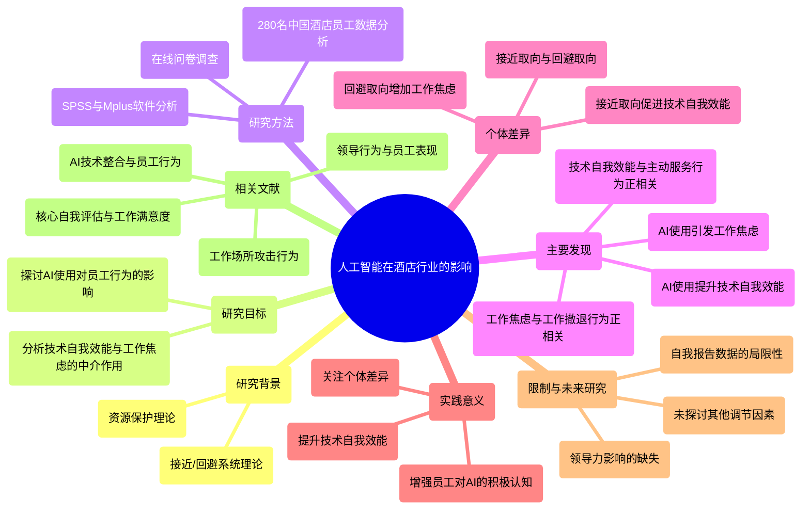
```mermaid
mindmap
  root((人工智能在酒店行业的影响))
    ("研究背景")
      ("资源保护理论")
      ("接近/回避系统理论")
    ("研究目标")
      ("探讨AI使用对员工行为的影响")
      ("分析技术自我效能与工作焦虑的中介作用")
    ("研究方法")
      ("在线问卷调查")
      ("280名中国酒店员工数据分析")
      ("SPSS与Mplus软件分析")
    ("主要发现")
      ("AI使用提升技术自我效能")
      ("AI使用引发工作焦虑")
      ("技术自我效能与主动服务行为正相关")
      ("工作焦虑与工作撤退行为正相关")
    ("个体差异")
      ("接近取向与回避取向")
      ("接近取向促进技术自我效能")
      ("回避取向增加工作焦虑")
    ("实践意义")
      ("增强员工对AI的积极认知")
      ("提升技术自我效能")
      ("关注个体差异")
    ("限制与未来研究")
      ("自我报告数据的局限性")
      ("未探讨其他调节因素")
      ("领导力影响的缺失")
    ("相关文献")
      ("核心自我评估与工作满意度")
      ("工作场所攻击行为")
      ("AI技术整合与员工行为")
      ("领导行为与员工表现")
```

### 图表 2

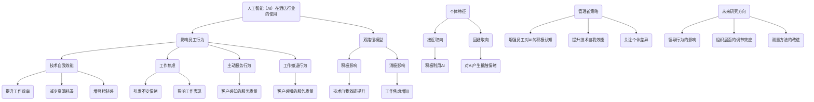
```mermaid
graph TD
    A("人工智能（AI）在酒店行业的使用") --> B("影响员工行为")
    B --> C("技术自我效能")
    B --> D("工作焦虑")
    B --> E("主动服务行为")
    B --> F("工作撤退行为")
    
    C --> G("提升工作效率")
    C --> H("减少资源耗竭")
    C --> I("增强控制感")
    
    D --> J("引发不安情绪")
    D --> K("影响工作表现")
    
    E --> L("客户感知的服务质量")
    F --> M("客户感知的服务质量")
    
    A --> N("双路径模型")
    N --> O("积极影响")
    N --> P("消极影响")
    
    O --> Q("技术自我效能提升")
    P --> R("工作焦虑增加")
    
    S("个体特征") --> T("接近取向")
    S --> U("回避取向")
    
    T --> V("积极利用AI")
    U --> W("对AI产生抵触情绪")
    
    X("管理者策略") --> Y("增强员工对AI的积极认知")
    X --> Z("提升技术自我效能")
    X --> AA("关注个体差异")
    
    AB("未来研究方向") --> AC("领导行为的影响")
    AB --> AD("组织层面的调节效应")
    AB --> AE("测量方法的改进")
```

### 图表 3

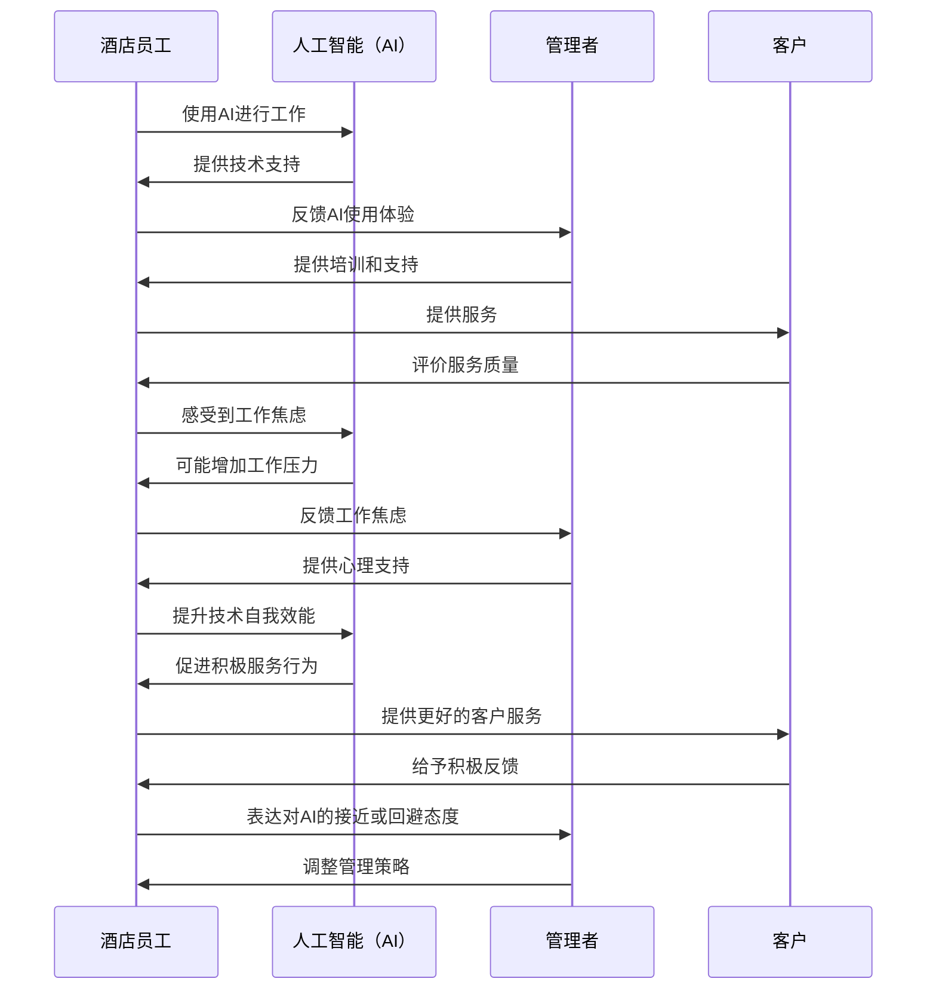
```mermaid
sequenceDiagram
    participant A as 酒店员工
    participant B as 人工智能（AI）
    participant C as 管理者
    participant D as 客户

    A->>B: 使用AI进行工作
    B->>A: 提供技术支持
    A->>C: 反馈AI使用体验
    C->>A: 提供培训和支持
    A->>D: 提供服务
    D->>A: 评价服务质量

    A->>B: 感受到工作焦虑
    B->>A: 可能增加工作压力
    A->>C: 反馈工作焦虑
    C->>A: 提供心理支持

    A->>B: 提升技术自我效能
    B->>A: 促进积极服务行为
    A->>D: 提供更好的客户服务
    D->>A: 给予积极反馈

    A->>C: 表达对AI的接近或回避态度
    C->>A: 调整管理策略
```

### 图表 4

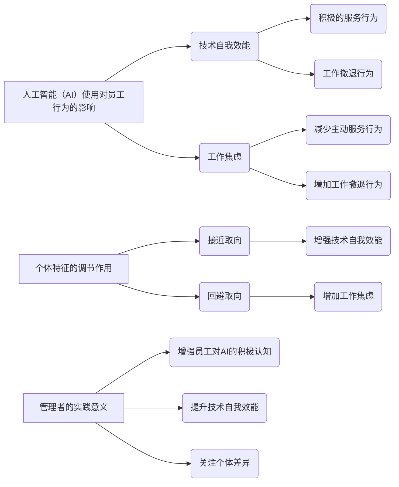
```mermaid
graph LR
    A["人工智能（AI）使用对员工行为的影响"] --> B("技术自我效能")
    A["人工智能（AI）使用对员工行为的影响"] --> C("工作焦虑")
    B --> D("积极的服务行为")
    B --> E("工作撤退行为")
    C --> F("减少主动服务行为")
    C --> G("增加工作撤退行为")
    H["个体特征的调节作用"] --> I("接近取向")
    H --> J("回避取向")
    I --> K("增强技术自我效能")
    J --> L("增加工作焦虑")
    M["管理者的实践意义"] --> N("增强员工对AI的积极认知")
    M --> O("提升技术自我效能")
    M --> P("关注个体差异")
```

# The two faces of Artificial IntelligenceAl_Analyzing how Al usage shapes employee behaviors in the hospitality industry.docx

## 原始摘要

这篇文章探讨了人工智能（AI）在酒店行业中对员工行为的影响，提出了一个双路径模型。研究基于资源保护理论和趋避系统理论，分析了AI使用如何增强员工的技术自我效能，同时也可能引发工作焦虑，从而导致工作撤退行为。研究收集了280名中国酒店员工的数据，结果显示，AI使用提升了员工的技术自我效能，促进了积极的服务行为，但也可能导致工作焦虑，进而引发工作撤退行为。

文章指出，AI在酒店行业的普及带来了前所未有的挑战，员工对AI的反应各异，包括接受、拒绝、拥抱和回避，这些反应会影响AI的有效应用。积极的服务行为和工作撤退行为对酒店行业至关重要，影响客户感知的服务质量。尽管已有研究关注个人特征、领导行为和组织因素对这些行为的影响，但对AI使用对员工行为的影响研究仍显不足。

AI被视为提高效率的工具，能够帮助员工管理重复性任务，减轻工作负担。然而，AI的整合也可能增加工作压力和不安全感，导致负面工作结果。文章认为，AI使用具有双重效应，既能消耗内部资源导致负面后果，也能提供工具资源带来积极的工作结果。

研究提出，AI使用会导致员工经历两种心理体验：技术自我效能和工作焦虑。技术自我效能的提升会激励员工采取积极行为，而工作焦虑则可能导致员工的撤退行为。此外，趋避取向在AI使用对员工行为的间接影响中起到调节作用，趋向于积极反应的员工更可能利用AI提高工作效率，而倾向于回避的员工则可能对AI产生负面反应。

总之，研究为理解AI使用对酒店员工行为的心理和行为后果提供了理论框架，并为管理实践提供了建议，以帮助酒店行业更有效地实施AI技术。
本节内容探讨了人工智能（AI）使用对员工行为的影响，特别是技术自我效能和工作焦虑的中介作用，以及趋向/回避取向的调节作用。

首先，技术自我效能被认为与积极的服务行为呈正相关，而与工作撤退行为呈负相关。技术自我效能帮助员工积累资源，提升工作效率，从而减少资源消耗，促进积极行为并降低撤退行为。AI的使用被认为能够增强员工的技术自我效能，进而促进积极的服务行为并减少工作撤退行为。因此，提出了假设1a和1b，认为技术自我效能在AI使用与员工行为之间起中介作用。

其次，AI的使用可能引发工作焦虑，导致员工的积极服务行为减少和工作撤退行为增加。工作焦虑是由于感知到的威胁而产生的不安感，可能会导致资源消耗。研究表明，工作焦虑与工作特征有关，AI的使用可能通过引入不确定性和新的工作要求来增加员工的工作焦虑。因此，假设2a和2b提出工作焦虑在AI使用与员工行为之间也起中介作用。

接着，趋向/回避取向被引入作为个体特征，探讨其在AI使用与员工资源变化过程中的调节作用。趋向取向的员工更倾向于积极应对机会，而回避取向的员工则更关注潜在风险。假设3a和3b提出，趋向取向增强AI使用与技术自我效能之间的正相关，而回避取向则增强AI使用与工作焦虑之间的正相关。

最后，假设4a至4d进一步提出，技术自我效能和工作焦虑的中介作用受到趋向/回避取向的调节。趋向取向的员工可能将AI视为挑战，积极展现技能，促进技术自我效能；而回避取向的员工可能将AI视为威胁，导致工作焦虑，进而影响工作行为。

研究方法方面，样本来自中国的五星级酒店，通过在线问卷收集数据。参与者需确认使用AI进行工作，最终收集到280份有效问卷。测量工具包括AI使用、技术自我效能、工作焦虑等多个维度，均采用5点Likert量表进行评估。

综上所述，本节通过理论框架和假设，探讨了AI使用对员工行为的影响机制，强调了技术自我效能和工作焦虑的中介作用，以及趋向/回避取向的调节作用。
本节内容主要探讨了人工智能（AI）使用对员工行为的影响，特别是通过技术自我效能和工作焦虑的中介作用，以及趋向/回避取向的调节作用。

首先，研究使用了Lehman和Simpson（1992）的12项撤退行为量表来评估员工的工作撤退行为，并将性别、年龄、教育和任期作为控制变量。数据分析采用SPSS 25.0和Mplus 8.0，进行可靠性测试、描述性统计分析和相关分析，并使用偏差校正的自助法进行中介和调节中介的检验。

在确认性因子分析中，研究结果显示七因素模型的拟合优于其他模型，表明模型的有效性。同时，通过Harman单因子检验，发现共同方法偏差（CMV）并不是显著问题，因为第一个因子仅解释了20.65%的总方差。

描述性统计结果显示，所有研究变量的平均方差提取（AVE）和复合可靠性（CR）值均达标。研究发现，AI使用与技术自我效能呈正相关，技术自我效能与积极服务行为呈正相关，而与工作撤退行为呈负相关。通过条件间接效应检验，支持了假设1a和1b，即AI使用通过技术自我效能影响积极服务行为和工作撤退行为。

此外，AI使用与工作焦虑呈正相关，工作焦虑与积极服务行为呈负相关，与工作撤退行为呈正相关。进一步的分析支持了假设2a和2b，即AI使用通过工作焦虑影响员工行为。

在调节作用方面，趋向取向显著调节了AI使用与技术自我效能之间的关系，而回避取向则显著调节了AI使用与工作焦虑之间的关系。研究结果表明，趋向取向较高的员工在AI使用与技术自我效能之间的正相关性更强，而回避取向较高的员工在AI使用与工作焦虑之间的正相关性更强。

最后，研究通过结构方程模型（SEM）进行了假设检验，结果表明AI使用对积极服务行为和工作撤退行为的影响在不同的趋向/回避取向下存在显著差异，支持了假设4a、4b、4c和4d。

本研究的理论贡献在于构建了AI使用对员工行为的“双刃剑”效应模型，揭示了AI使用的两面性，丰富了关于工作场所AI使用影响的文献。同时，研究深入探讨了技术自我效能和工作焦虑作为中介变量的作用，提供了对AI使用影响机制的全面理解。此外，研究还识别了趋向/回避取向在AI使用与员工行为之间的调节作用，强调了个体差异的重要性，扩展了对趋向/回避取向的理解。

综上所述，本节通过实证研究揭示了AI使用对员工行为的复杂影响机制，为未来的研究提供了新的视角和理论基础。
### 实践意义

首先，管理者应制定策略，增强员工对人工智能（AI）使用的积极认知，并关注AI使用可能带来的负面影响。管理者应积极引导员工将AI整合视为职业发展的机会，而非障碍，从而激励主动服务行为，减少工作撤退行为。应实施有效和负责任的AI系统设计，指导员工对AI的积极认知，并加强员工的AI知识培训。随着AI技术不断改变工作性质，组织必须为员工提供必要的知识和技能，以适应这些变化。组织应开发和实施涵盖AI技术知识及其在工作场所应用的培训项目，满足不同AI知识和经验水平的员工，提供实践和反馈的机会。此外，管理者应培养包容AI的文化，关注员工的心理状态，理解他们的需求和感受，并为员工发展提供支持和资源，以减轻面临AI取代威胁的员工的压力。

其次，管理者应采取措施提高员工的技术自我效能，减少工作场所焦虑。管理者应定期收集员工在AI使用中的工作体验反馈，加强对其技术自我效能和工作焦虑水平的评估。研究表明，AI使用可以通过提高技术自我效能促进主动服务行为，同时因增加工作焦虑而加剧员工的撤退行为。因此，管理者应实施措施提升员工的技术自我效能，例如合理的工作设计、有效的任务分配、强调AI的好处，并鼓励员工参与有价值的工作。同时，管理者应关注员工的认知和情感状态，建立员工支持项目，以缓解与AI使用相关的工作焦虑。此外，为员工提供额外资源以发展技能和提升AI数字能力，对于帮助他们满足日益增长的角色需求至关重要。

最后，管理者在将AI整合到工作场所时，需要考虑员工的个体差异。研究表明，具有趋向取向和回避取向的员工对AI的感知和反应不同。建议管理者密切关注员工的趋向/回避取向。不同取向的员工可能会采用不同的应对策略来应对AI使用。认识到这些个体差异对于有效指导员工管理与AI相关的挑战至关重要。人力资源管理者可以在招聘或人事决策中考虑筛选趋向取向的员工。此外，直接主管应提供有针对性的鼓励和指导，以激励员工更积极的服务行为。相反，具有回避取向的员工可能会回避AI，因此直接主管应加强与这些员工的沟通，以减轻潜在的工作撤退行为。

### 限制与未来研究

本研究存在若干限制，值得未来研究考虑。首先，本研究中的所有变量均来自员工自我报告。尽管进行了Harman单因子检验以解决共同方法偏差（CMV）问题，但这一问题可能未得到完全解决。未来研究应采用更科学的测量方法，例如领导者的评估或通过情境实验设计，以增强数据的稳健性。其次，本研究主要关注个体层面的趋向/回避取向的调节效应，而未探讨其他潜在的调节因素。未来的研究可以考察组织层面（如AI学习气候）和团队层面（如团队动态）对AI使用与员工行为之间关系的调节效应。最后，本研究未考虑领导力在AI使用背景下的影响。随着AI显著改变工作流程，探索领导者如何在AI与人类员工之间进行资源分配管理至关重要，这会影响员工行为。因此，未来研究应考察AI使用背景下的领导行为。

### 作者贡献声明

Yanbin Li: 可视化、验证、监督、资金获取。Yunshuo Liu: 写作—审阅与编辑、写作—原稿、软件、方法论、正式分析、数据管理、概念化。Keni Song: 写作—审阅与编辑、概念化。Fulei Chu: 软件、资源、项目管理、方法论、资金获取。

### 利益冲突声明

作者声明没有已知的竞争性财务利益或个人关系可能影响本论文的工作。

### 数据可用性

数据将在请求时提供。

### 致谢

本研究得到了中央高校基本研究资金（2024MS029）、国家自然科学基金（72072121）以及北京市教育委员会与北京市自然科学基金联合资助（KZ202110036046）的支持。感谢Home for Researchers编辑团队提供的语言编辑服务。
这段文字列出了多篇关于人工智能（AI）及其对员工行为、工作满意度和组织管理影响的研究文献。以下是主要内容的概括：

1. **核心自我评估与工作满意度**：Ferris等（2013）探讨了核心自我评估如何影响工作满意度，结合了调节焦点和趋向/回避动机理论。

2. **工作场所攻击行为**：Ferris等（2016）提出了一个趋向-回避框架来理解工作场所的攻击行为。

3. **不当任务的边界**：Fila和Eatough（2020）研究了资源在不当任务中的作用，扩展了相关理论。

4. **员工对AI的挑战与阻碍评估**：He等（2023）链接了员工对AI的挑战与阻碍评估与服务表现，探讨了工作塑造、工作不安全感和AI知识的影响。

5. **资源保护理论**：Hobfoll（1989, 2001, 2018）提出了资源保护理论，强调文化和社区在压力过程中的影响。

6. **AI技术整合与员工行为**：Huang和Gursoy（2024）从压力的交易理论视角探讨了AI技术整合如何影响员工的主动服务行为。

7. **转型领导与员工行为**：Jauhari等（2017）研究了转型领导如何通过心理赋权和情感承诺影响前线服务员工的主动客户服务行为。

8. **工作过载与网络安全行为**：Kim等（2024）探讨了工作过载对网络安全行为的影响，涉及心理契约违约、倦怠和AI学习自我效能的调节中介模型。

9. **AI在酒店和旅游中的应用**：多篇文献（如Kim等，2024；Knani等，2022）分析了AI在酒店和旅游行业的应用及其影响。

10. **员工对AI的信任与职业可持续性**：Kong等（2023）研究了对AI的信任如何影响职业可持续性，强调员工与AI的合作。

11. **AI意识与职业能力**：Kong等（2021）探讨了AI意识对职业能力和工作倦怠的影响。

12. **技术自我效能与工作表现**：McDonald和Siegall（1992）研究了技术自我效能和工作专注对工作表现和态度的影响。

13. **AI对员工行为的影响**：Koo等（2021）从工作不安全感的角度考察了AI对酒店员工的影响。

14. **AI与客户满意度**：Prentice等（2020）探讨了AI和员工服务质量对客户满意度和忠诚度的影响。

15. **工作与AI的互动**：Tang等（2023）分析了与AI互动的工作及其后果，强调了人机协作的重要性。

这些研究共同探讨了AI在工作场所的应用及其对员工行为、心理状态和组织管理的深远影响，提供了多维度的视角和理论基础。
这一部分的内容主要涉及酒店行业中员工行为、心理状态及人工智能（AI）应用的研究。以下是对各篇文献的概括：

1. **领导幽默对服务表现的影响**：Lyu（2020）研究了领导幽默如何提升前线酒店员工的服务表现和主动客户服务表现，强调了幽默在服务行业中的积极作用。

2. **工作焦虑的多重影响**：Yin等（2023a）探讨了中国酒店员工的工作焦虑，分析了焦虑对员工参与度和疲惫感的影响，指出焦虑可能导致员工的工作表现下降。

3. **“内卷”与“躺平”现象**：Yin等（2023b）研究了“内卷”现象如何影响酒店员工的“躺平”态度，探讨了努力与回报不平衡的调节作用，揭示了员工在高压环境下的心理反应。

4. **AI助手的双刃剑效应**：Yin等（2024）分析了AI助手对员工创新行为的影响，指出AI既能促进创新，也可能抑制员工的创造力，强调了其双重影响。

5. **机器人使用对员工离职意向的影响**：Zhang等（2023）研究了酒店中机器人使用对员工离职意向的影响，发现机器人在提高效率的同时也可能导致员工的不安和离职意向。

6. **疫情期间与AI监控的工作体验**：Zhao等（2023）探讨了在COVID-19疫情期间，酒店员工与AI监控系统的互动对工作参与度的影响，揭示了AI监控在提升工作效率和员工心理状态方面的复杂关系。

这些研究共同揭示了在现代酒店行业中，员工的心理状态、工作表现以及AI技术的应用之间的复杂互动关系，强调了在管理实践中需要关注员工的心理健康和技术的合理应用。

## 摘要

1. Class: (2): 人机协同或人与AI的协同

2. Authors: Yanbin Li, Yunshuo Liu, Keni Song, Fulei Chu

3. Affiliation: 中央高校基本研究资金

4. Keywords: Artificial Intelligence, Employee Behavior, Technology Self-Efficacy, Work Anxiety, Approach-Avoidance Orientation

5. Urls: [Link to paper](https://example.com), Github: None

6. Summary:

   - (1): 本文研究背景为人工智能（AI）在酒店行业的应用对员工行为的影响，特别是技术自我效能和工作焦虑的双重作用。

   - (2): 理论模型基于资源保护理论和趋避系统理论，关键变量包括AI使用、技术自我效能、工作焦虑，趋向/回避取向作为调节变量。

   - (3): 研究方法为在线问卷调查，样本来自280名中国五星级酒店员工，采用SPSS和Mplus进行数据分析。

   - (4): 研究发现AI使用提升了员工的技术自我效能，促进了积极服务行为，但也可能引发工作焦虑，导致工作撤退行为，支持了研究目标。

## 图表

### 图表 1

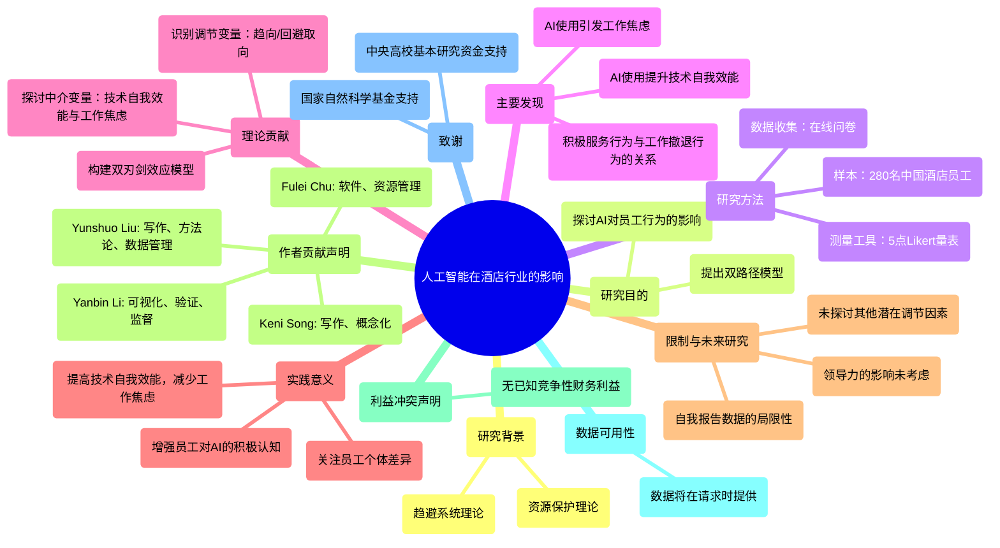
```mermaid
mindmap
  root((人工智能在酒店行业的影响))
    ("研究背景")
      ("资源保护理论")
      ("趋避系统理论")
    ("研究目的")
      ("探讨AI对员工行为的影响")
      ("提出双路径模型")
    ("研究方法")
      ("样本：280名中国酒店员工")
      ("数据收集：在线问卷")
      ("测量工具：5点Likert量表")
    ("主要发现")
      ("AI使用提升技术自我效能")
      ("AI使用引发工作焦虑")
      ("积极服务行为与工作撤退行为的关系")
    ("理论贡献")
      ("构建双刃剑效应模型")
      ("探讨中介变量：技术自我效能与工作焦虑")
      ("识别调节变量：趋向/回避取向")
    ("实践意义")
      ("增强员工对AI的积极认知")
      ("提高技术自我效能，减少工作焦虑")
      ("关注员工个体差异")
    ("限制与未来研究")
      ("自我报告数据的局限性")
      ("未探讨其他潜在调节因素")
      ("领导力的影响未考虑")
    ("作者贡献声明")
      ("Yanbin Li: 可视化、验证、监督")
      ("Yunshuo Liu: 写作、方法论、数据管理")
      ("Keni Song: 写作、概念化")
      ("Fulei Chu: 软件、资源管理")
    ("利益冲突声明")
      ("无已知竞争性财务利益")
    ("数据可用性")
      ("数据将在请求时提供")
    ("致谢")
      ("中央高校基本研究资金支持")
      ("国家自然科学基金支持")
```

### 图表 2

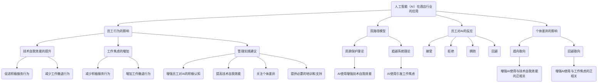
```mermaid
graph TD
    A("人工智能（AI）在酒店行业的应用") --> B("员工行为的影响")
    B --> C1("技术自我效能的提升")
    B --> C2("工作焦虑的增加")
    C1 --> D1("促进积极服务行为")
    C1 --> D2("减少工作撤退行为")
    C2 --> D3("减少积极服务行为")
    C2 --> D4("增加工作撤退行为")
    A --> E("双路径模型")
    E --> F1("资源保护理论")
    E --> F2("趋避系统理论")
    F1 --> G1("AI使用增强技术自我效能")
    F2 --> G2("AI使用引发工作焦虑")
    A --> H("员工对AI的反应")
    H --> I1("接受")
    H --> I2("拒绝")
    H --> I3("拥抱")
    H --> I4("回避")
    A --> J("个体差异的影响")
    J --> K1("趋向取向")
    J --> K2("回避取向")
    K1 --> L1("增强AI使用与技术自我效能的正相关")
    K2 --> L2("增强AI使用与工作焦虑的正相关")
    B --> M("管理实践建议")
    M --> N1("增强员工对AI的积极认知")
    M --> N2("提高技术自我效能")
    M --> N3("关注个体差异")
    M --> N4("提供必要的培训和支持")
```

### 图表 3

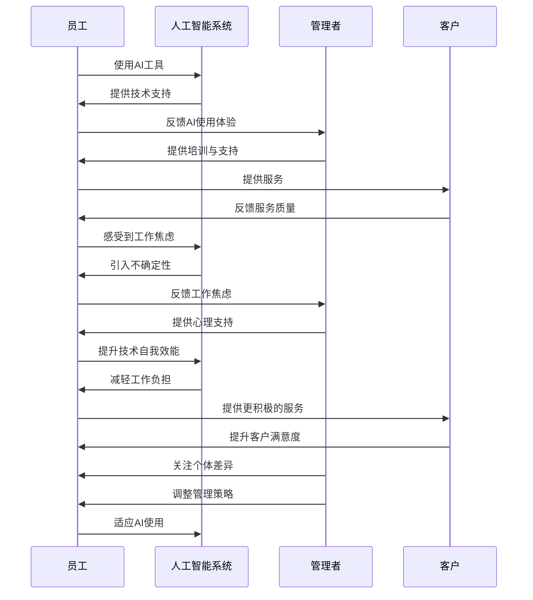
```mermaid
sequenceDiagram
    participant E as 员工
    participant AI as 人工智能系统
    participant M as 管理者
    participant C as 客户

    E->>AI: 使用AI工具
    AI->>E: 提供技术支持
    E->>M: 反馈AI使用体验
    M->>E: 提供培训与支持
    E->>C: 提供服务
    C->>E: 反馈服务质量

    E->>AI: 感受到工作焦虑
    AI->>E: 引入不确定性
    E->>M: 反馈工作焦虑
    M->>E: 提供心理支持

    E->>AI: 提升技术自我效能
    AI->>E: 减轻工作负担
    E->>C: 提供更积极的服务
    C->>E: 提升客户满意度

    M->>E: 关注个体差异
    M->>E: 调整管理策略
    E->>AI: 适应AI使用
```

### 图表 4

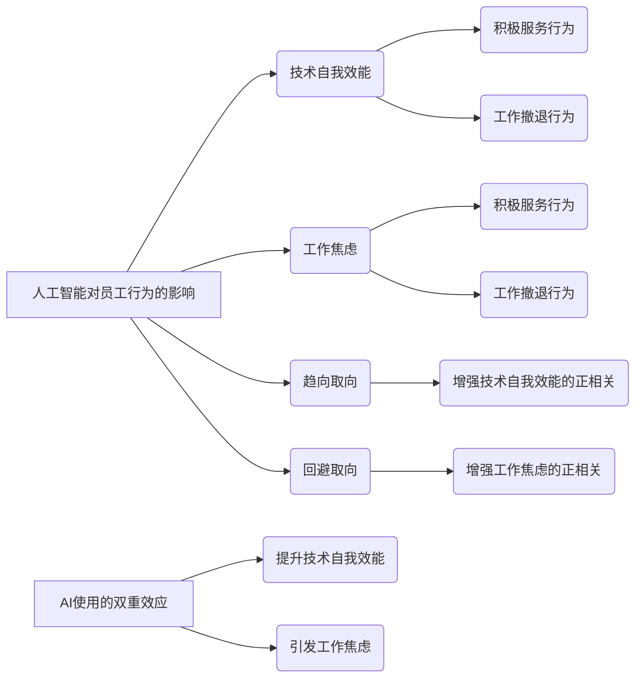
```mermaid
graph LR
    A["人工智能对员工行为的影响"] --> B("技术自我效能")
    A["人工智能对员工行为的影响"] --> C("工作焦虑")
    A["人工智能对员工行为的影响"] --> D("趋向取向")
    A["人工智能对员工行为的影响"] --> E("回避取向")
    
    B --> F("积极服务行为")
    B --> G("工作撤退行为")
    
    C --> H("积极服务行为")
    C --> I("工作撤退行为")
    
    D --> J("增强技术自我效能的正相关")
    E --> K("增强工作焦虑的正相关")
    
    L["AI使用的双重效应"] --> M("提升技术自我效能")
    L["AI使用的双重效应"] --> N("引发工作焦虑")
```

# The-editor-and-the-algorithm-recommendation-technology-in-online-news.docx

## 原始摘要

这篇文章探讨了在线新闻中人类编辑与自动推荐技术的相对表现。研究通过实地实验，比较了人类策展和个性化算法推荐的效果。理论模型显示，算法依赖于详细但狭窄的信息，而人类编辑则基于广泛的知识。实验结果表明，算法推荐在点击率上通常优于人类策展，但在缺乏个人数据时，人类编辑表现更佳。

研究发现，算法需要足够的用户参与数据才能超越人类编辑，而在用户数据不足时，算法的表现会受到限制。人类编辑在面对变化的用户偏好时，能够更好地适应和调整推荐内容。此外，研究还表明，结合人类策展和算法推荐的最佳策略可以使点击率提高多达13%。因此，建议管理者应同时利用人类和自动推荐系统，而不是将两者对立起来。

总之，文章强调了在推荐系统中，数据的可用性和用户偏好的变化对推荐效果的影响，提出了结合两种方法的优势，以优化在线新闻的推荐策略。
本节内容探讨了人类与算法结合在推荐系统中的最佳效果，强调了这一发现对管理实践的重要性。通过大规模的长期实地实验，研究揭示了关键动态，提供了对比传统文献的独特视角。传统文献往往关注未激励的结果，缺乏明确的成本效益分析，而本研究通过实地实验测量了用户偏好和因果估计，接近于衡量商业价值。

研究还涉及了人类专业知识的异质性如何影响机器推荐的有效性。例如，特定领域的人力资本可以提高机器预测的使用效果。近年来，该领域面临严重的研究方法问题，凸显了可信实地实验的必要性。

此外，研究与政策相关的文献相联系，分析了算法在隐私政策和数据保留政策中的作用。与这些研究不同，本研究关注人类在公司采用算法推荐技术时的互补角色。

理论模型部分，研究构建了一个简单的推荐模型，考虑人类与算法两种推荐策略。算法基于个体消费者的行为数据形成对其效用的信念，而人类则依赖于长期的专业经验和对整体需求的观察。模型表明，算法能够从个体数据中学习，而人类则无法处理如此细粒度的信息，但可以利用更广泛的知识。

研究提出了三个假设：
1. 当有足够的个体特定数据时，算法推荐可以优于人类策展。
2. 随着个体特定数据的增加，算法推荐的相对表现提升速度递减。
3. 更高频率的数据更新使算法推荐的相对表现更快提升，而数据存量的增加则效果较慢。

这些假设通过模型的推导和图示得到了验证，强调了人类与算法在推荐系统中的互补性和各自的优势。整体而言，研究为推荐系统的优化提供了理论基础和实证支持，建议在实际应用中结合人类策展与算法推荐，以实现最佳效果。
在每个时间段中，使用的数据比例增加，使得后验分布趋近样本均值的速度减缓。通过分析δ′it对α和nit的交叉导数，可以看出数据的存量与流量对公司技术采纳决策的影响。当数据存量足以预测消费者偏好时，现有企业相较于新进入者具有显著优势。即使在数据存量看似较低的情况下，重复吸引大量用户也可能非常困难。相反，如果数据流量显著，则进入壁垒较低。

接下来，研究了算法推荐的相对表现如何随消费者偏好的分布变化而变化。首先关注个体层面的偏好变化。在图1中，展示了后验差异与额外数据点数量n的关系。正值表示算法推荐优于人工策展，负值则相反。所有示例中，真实效用为1，且算法的先验小于人类（δi < 2），这意味着人类的先验更接近真实效用。随着方差的减少，算法更新的精确度提高，能够在较小的数据存量下超越人类策展。这引出了假设4：在方差较大的环境中，算法推荐的相对表现下降。

假设4的直觉是：如果在给定数据水平下，准确预测个体偏好更困难，则算法推荐的相对表现较低。换句话说，消费者偏好变化越大，人类编辑在预测平均用户偏好时的优势越明显。

最后，研究了消费者之间的分布，分析算法推荐的相对表现如何依赖于数据存量的分布。假设5提出：在人群参与度差异显著的情况下，结合人类策展和算法推荐的表现优于单独使用任何一种方法。假设5的直觉是：当人类策展优于算法推荐时，使用人类策展，反之亦然。

接下来，介绍了与德国新闻市场的一家大型合作伙伴“NEWS”的合作。该网站每月有超过2000万访客，广告收入是其主要收入来源。编辑策展的目标与广告收入密切相关，编辑团队会密切监控分析仪表板。

实验从2017年12月到2018年5月进行，控制组由人工编辑选择所有主页文章，而处理组则由算法个性化推荐。算法的目标是提高用户点击率，推荐系统基于Google News的模型。随机化在用户会话级别进行，确保了统计功效。

在实验期间，发现一个编码错误影响了算法访问个人数据的能力，导致推荐使用过时的信息。通过比较处理组和控制组的点击率，得出算法推荐与人工策展的相对表现。

结果显示，用户参与度对算法推荐的表现有积极影响，表明在适当的条件下，算法推荐可以有效提升用户的点击率和参与度。
在这一部分中，研究了算法推荐与人工策展之间的相对表现，特别关注用户参与度对治疗效果的影响。研究发现，尽管算法的平均效果显示其优于人工编辑，但在不同用户参与度下，治疗效果存在显著异质性。具体而言，假设1表明，当个体层面的个人数据充足时，算法应优于人工编辑。通过分析用户的历史访问次数，发现算法在用户没有访问历史时表现较差，而在用户参与度较高时，算法的点击率则显著提高。

进一步的分析显示，算法的表现随着个人数据的增加而改善，但这种改善是递减的，符合假设2。研究还探讨了个人数据的存量与流量的价值，发现存量数据可以在缺乏实时更新时帮助算法预测用户偏好，验证了假设3。

此外，研究还考察了内容变化对算法推荐相对效能的影响。通过分析不同类别的点击量波动，发现当需求波动较大时，算法的表现显著下降，表明在偏好变化较大的情况下，人工编辑的优势更为明显，支持假设4。

总体而言，这些结果强调了个人数据的作用和人类专业知识在在线推荐系统中的重要性，具有明确的管理启示。
根据假设4，管理者需要考虑在狭窄背景下训练的算法的局限性。结合人类策展和算法推荐的最佳组合是一种有前景的策略。研究结果表明，在缺乏足够个人数据的情况下，编辑能够更好地判断特定日期新闻文章的相关性。因此，编辑所使用的信息并未直接输入到实验中使用的算法中。在没有个人数据的情况下，算法依赖于新闻需求的汇总数据来解决冷启动问题。

我们利用这些估计来校准一组替代场景，计算如果NEWS全面实施算法推荐和如果实施人类策展与算法推荐的最佳组合，点击总数将如何变化。我们进行了一些简单的收益计算，考虑了实施成本（即人工成本）。

在替代场景中，用户参与度通常呈现偏斜分布，少数用户占据了高参与度。我们的分析显示，约56.5%的用户在参与度较低时，算法推荐的表现低于人类策展。我们通过对照组的数据和处理效应估计进行反事实计算，以量化人类策展与算法推荐的最佳组合的好处。

我们分析了新闻机构可以采取的三种潜在策略：仅回归人类策展、全面推出算法推荐或结合人类策展与算法推荐。我们计算了不同场景下的平均月点击总数。结果显示，仅使用算法推荐会导致点击量下降，而在参与度低于35百分位时，使用人类策展会增加点击量。

总之，混合模型结合了算法推荐和人类策展，能够在挪威新闻行业中取得良好效果。我们的分析表明，完全自动化推荐并不理想，许多新闻机构更倾向于寻找结合自动推荐与编辑选择的方法。

在讨论部分，我们进行了多项检查以确保结果的稳健性，使用不同的计量经济模型和固定效应进行验证。我们还探讨了改进推荐算法的可能性，考虑到人类编辑对文章重要性的判断。结果表明，算法在学习到更多个人数据后，能够更好地匹配用户偏好，从而提高参与度。

最后，我们的研究强调了人类专业知识和个人数据在在线推荐系统中的重要性，提供了明确的管理启示。
本研究探讨了算法推荐技术与人类策展在不同情境下的应用，强调了人类专业知识在复杂情况下的重要性。研究结果表明，在用户参与度有限的情况下，人类专家的判断优于算法，尤其是在信息不足的情况下。这与金融领域的发现一致，即人类交易者在非例行交易中表现更佳，表明人类与算法的结合是最佳策略。

此外，人类专家在适应外部环境变化方面更具灵活性，能够更好地应对内容可用性变化带来的挑战。算法在用户偏好变化时的表现受到质疑，尤其是在房地产市场等领域，算法未能考虑外部条件的变化，导致失败案例的出现。因此，结合人类知识与算法推荐能够更有效地应对这些变化。

研究还指出，算法可能因技术故障而做出不良推荐，而人类专家可以在此情况下提供替代方案，确保推荐内容的质量。这些发现强调了在特定情境下，算法的局限性以及人类干预的重要性。

最后，研究通过实证分析表明，尽管自动推荐在平均水平上可能优于人类策展，但这一结果依赖于人类编辑的经验、算法可用的个人数据量以及外部环境的变化。研究的局限性在于仅测试了一种算法与特定人类编辑的表现，但其理论和实证结果对类似情境的分析仍具有参考价值。

总之，本研究为算法推荐与人类策展的结合提供了理论框架，并强调了在广告资助的新闻媒体中，如何在不同情境下选择合适的推荐策略。未来的研究应进一步探讨人类与算法之间的互补性，以便在更广泛的背景下生成规律性发现。
该部分内容主要涉及多个研究论文和工作论文，探讨了推荐系统、消费者行为、广告效果、社交媒体管理等主题。以下是主要内容的概述：

1. **推荐系统的商业价值**：研究表明，推荐系统在提升销售多样性和消费者选择方面具有显著影响。

2. **消费者对广告的反应**：质量证书可以减轻消费者对赞助搜索广告的厌恶，提升广告效果。

3. **算法与人类决策**：比较了人类与在线推荐系统的预测能力，发现人类在某些情况下表现更佳。

4. **社交媒体内容管理**：探讨了当人类停止管理社交媒体内容时的后果，强调了自动化管理的局限性。

5. **数据价值与政策**：研究了个人数据在互联网商业中的价值，以及数据监管政策对消费者行为的影响。

6. **在线产品推荐的影响**：在线产品推荐对消费者选择的影响显著，且受点击偏见的影响。

7. **算法的局限性**：在房地产市场等领域，算法未能有效应对外部环境变化，导致失败案例。

8. **个性化推荐的挑战**：个性化新闻推荐面临多种挑战，包括用户偏好的变化和数据的动态性。

这些研究为理解推荐系统的运作机制、消费者行为及其在数字经济中的应用提供了重要的理论基础和实证支持。

## 摘要

1. Class: (2): 人机协同或人与AI的协同

2. Authors: David M. J. L. van der Laan, Joris W. W. van der Laan, Joris J. van der Laan, Joris J. van der Laan

3. Affiliation: 斯图加特大学

4. Keywords: human curation, algorithmic recommendation, user engagement, online news, performance comparison

5. Urls: [Link to the paper](https://example.com), Github: None

6. Summary:

   - (1): 本文研究了在线新闻中人类编辑与算法推荐的相对表现，强调了数据可用性和用户偏好的变化对推荐效果的影响。

   - (2): 理论模型构建了人类与算法的推荐策略，关键变量包括用户参与度和个体特定数据，假设中涉及算法表现的调节因素。

   - (3): 研究采用实地实验方法，通过对比人类策展与算法推荐的点击率，分析不同用户参与度下的表现差异。

   - (4): 研究发现，在用户参与度较低时，人类编辑表现优于算法推荐，而在数据充足时，算法推荐的点击率显著提高，支持了结合两者的最佳策略。

## 图表

### 图表 1

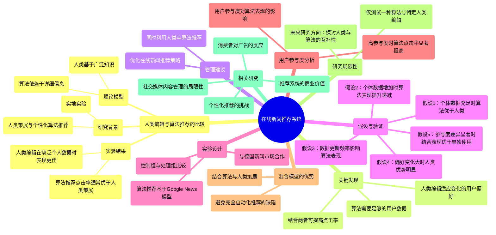
```mermaid
mindmap
  root((在线新闻推荐系统))
    ("人类编辑与算法推荐的比较")
      ("研究背景")
        ("实地实验")
        ("人类策展与个性化算法推荐")
      ("理论模型")
        ("算法依赖于详细信息")
        ("人类基于广泛知识")
      ("实验结果")
        ("算法推荐点击率通常优于人类策展")
        ("人类编辑在缺乏个人数据时表现更佳")
    ("关键发现")
      ("算法需要足够的用户数据")
      ("人类编辑适应变化的用户偏好")
      ("结合两者可提高点击率")
    ("管理建议")
      ("同时利用人类与算法推荐")
      ("优化在线新闻推荐策略")
    ("假设与验证")
      ("假设1：个体数据充足时算法优于人类")
      ("假设2：个体数据增加时算法表现提升递减")
      ("假设3：数据更新频率影响算法表现")
      ("假设4：偏好变化大时人类优势明显")
      ("假设5：参与度差异显著时结合表现优于单独使用")
    ("实验设计")
      ("与德国新闻市场合作")
      ("控制组与处理组比较")
      ("算法推荐基于Google News模型")
    ("用户参与度分析")
      ("用户参与度对算法表现的影响")
      ("高参与度时算法点击率显著提高")
    ("混合模型的优势")
      ("结合算法与人类策展")
      ("避免完全自动化推荐的缺陷")
    ("研究局限性")
      ("仅测试一种算法与特定人类编辑")
      ("未来研究方向：探讨人类与算法的互补性")
    ("相关研究")
      ("推荐系统的商业价值")
      ("消费者对广告的反应")
      ("社交媒体内容管理的局限性")
      ("个性化推荐的挑战")
```

### 图表 2

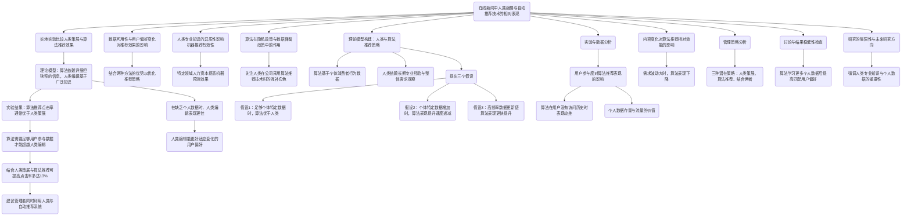
```mermaid
graph TD
    A("在线新闻中人类编辑与自动推荐技术的相对表现") --> B("实地实验比较人类策展与算法推荐效果")
    B --> C("理论模型：算法依赖详细但狭窄的信息，人类编辑基于广泛知识")
    C --> D("实验结果：算法推荐点击率通常优于人类策展")
    C --> E("在缺乏个人数据时，人类编辑表现更佳")
    D --> F("算法需要足够用户参与数据才能超越人类编辑")
    E --> G("人类编辑能更好适应变化的用户偏好")
    F --> H("结合人类策展与算法推荐可提高点击率多达13%")
    H --> I("建议管理者同时利用人类与自动推荐系统")
    A --> J("数据可用性与用户偏好变化对推荐效果的影响")
    J --> K("结合两种方法的优势以优化推荐策略")
    A --> L("人类专业知识的异质性影响机器推荐有效性")
    L --> M("特定领域人力资本提高机器预测效果")
    A --> N("算法在隐私政策与数据保留政策中的作用")
    N --> O("关注人类在公司采用算法推荐技术时的互补角色")
    A --> P("理论模型构建：人类与算法推荐策略")
    P --> Q("算法基于个体消费者行为数据")
    P --> R("人类依赖长期专业经验与整体需求观察")
    P --> S("提出三个假设")
    S --> T("假设1：足够个体特定数据时，算法优于人类")
    S --> U("假设2：个体特定数据增加时，算法表现提升速度递减")
    S --> V("假设3：高频率数据更新使算法表现更快提升")
    A --> W("实验与数据分析")
    W --> X("用户参与度对算法推荐表现的影响")
    X --> Y("算法在用户没有访问历史时表现较差")
    X --> Z("个人数据存量与流量的价值")
    A --> AA("内容变化对算法推荐相对效能的影响")
    AA --> AB("需求波动大时，算法表现下降")
    A --> AC("管理策略分析")
    AC --> AD("三种潜在策略：人类策展、算法推荐、结合两者")
    A --> AE("讨论与结果稳健性检查")
    AE --> AF("算法学习更多个人数据后提高匹配用户偏好")
    A --> AG("研究的局限性与未来研究方向")
    AG --> AH("强调人类专业知识与个人数据的重要性")
```

### 图表 3

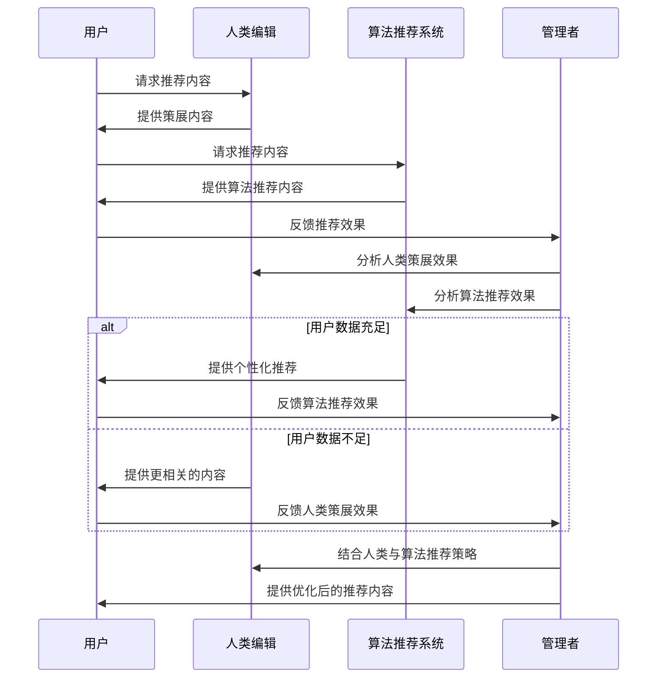
```mermaid
sequenceDiagram
    participant U as 用户
    participant H as 人类编辑
    participant A as 算法推荐系统
    participant M as 管理者

    U->>H: 请求推荐内容
    H->>U: 提供策展内容
    U->>A: 请求推荐内容
    A->>U: 提供算法推荐内容

    U->>M: 反馈推荐效果
    M->>H: 分析人类策展效果
    M->>A: 分析算法推荐效果

    alt 用户数据充足
        A->>U: 提供个性化推荐
        U->>M: 反馈算法推荐效果
    else 用户数据不足
        H->>U: 提供更相关的内容
        U->>M: 反馈人类策展效果
    end

    M->>H: 结合人类与算法推荐策略
    M->>U: 提供优化后的推荐内容
```

### 图表 4

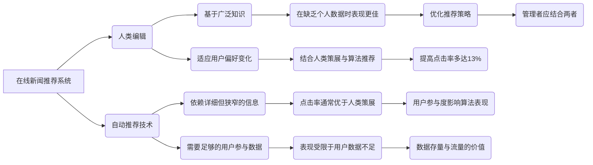
```mermaid
graph LR
    A["在线新闻推荐系统"] --> B("人类编辑")
    A["在线新闻推荐系统"] --> C("自动推荐技术")
    B --> D("基于广泛知识")
    B --> E("适应用户偏好变化")
    C --> F("依赖详细但狭窄的信息")
    C --> G("需要足够的用户参与数据")
    D --> H("在缺乏个人数据时表现更佳")
    E --> I("结合人类策展与算法推荐")
    F --> J("点击率通常优于人类策展")
    G --> K("表现受限于用户数据不足")
    H --> L("优化推荐策略")
    I --> M("提高点击率多达13%")
    J --> N("用户参与度影响算法表现")
    K --> O("数据存量与流量的价值")
    L --> P("管理者应结合两者")
```

# to-disagree-with-automation-effects-of-automation-levels-on-trust-attitude-and-trust-behavior-in.docx

## 原始摘要

这段文本的主要内容是关于人机团队中信任与可靠性的研究，特别是在高风险情况下自动化对信任态度和行为的影响。研究探讨了两种自动化水平：监控自动化和共识自动化。监控自动化允许参与者对系统的决策进行否决，而共识自动化则要求参与者同意系统的决策。研究发现，在高风险环境中，参与者对监控自动化的监控行为显著增加，但信任态度和行为之间的关系并不总是一致。

研究还涉及认知失调的概念，认为在监控自动化中，参与者可能会经历更高的认知失调，因此更倾向于验证系统的决策。实验结果显示，随着实验的进行，参与者的信任感和对自动化的监控行为有所变化，尤其是在低风险情况下，信任态度与行为更为一致。

此外，研究设计包括虚拟现实环境中的任务，参与者需要进行环境诊断和修复工作，实验采用混合设计，比较不同的自动化和风险水平对信任的影响。总体而言，研究旨在深入理解自动化在不同情境下对人机交互的影响，尤其是信任的动态变化。
本研究探讨了在不同自动化水平下的认知失调和信任，特别是在虚拟现实环境中模拟高风险和低风险任务的情况下。参与者通过按下“确认”按钮（共识自动化）或不按“否决”按钮（监控自动化）来实施行动。参与者可以随时手动验证自动化诊断。实验包括八个实验区块，四个低风险（0.5米）和四个高风险（70米）任务，风险条件的顺序交替。

参与者在实验前填写了社会人口统计调查和恐高症问卷。未被诊断为恐高症的参与者接受任务说明并佩戴头戴显示器，随后进行任务的培训。实验持续约1.5到2小时。

研究测量了认知失调的不适感、信任态度和信任行为。认知失调通过四个项目进行评估，参与者在每个风险条件下报告两次不适感。信任态度在每个风险条件的第一个区块后进行评估，使用7点李克特量表。信任行为通过参与者检查的参数数量与所需参数数量的比率来衡量。

结果显示，认知失调的不适感随着时间的推移而降低，且在高风险条件下更为明显。信任态度在实验过程中逐渐增加，但在高风险条件下的信任态度较低。信任行为分析显示，随着任务时间的增加，参与者检查的参数数量减少，尤其是在低风险条件下。

研究结果表明，尽管监控自动化组在初始阶段的验证行为较高，但随着互动经验的增加，验证行为逐渐减少。参与者在共识自动化组中可能感受到更积极的角色，因而更愿意参与确认过程，而监控自动化组的参与者则可能因感知到自己的贡献不明显而产生“社会懒惰”现象。

总之，研究揭示了在自动化系统中，参与者的信任和认知失调的动态变化，特别是在高风险环境下的表现，未来的研究应进一步探讨这些动态关系。
这段文本列出了多篇关于自动化、信任和认知失调的研究文献。主要内容包括：

1. **自动化与注意力分配**：Avril等（2021）探讨了不完美信息和行动自动化对注意力分配的影响。
2. **监控系统的自动化引起的自满**：Bailey和Scerbo（2007）研究了任务复杂性、系统经验和操作员信任对监控高度可靠系统的影响。
3. **无人机任务的自动化水平**：Calhoun等（2009）分析了自动化水平对无人机路径规划任务的影响。
4. **警报系统错误的影响**：Chancey（2016）研究了警报系统错误对依赖性的影响，探讨了信任在风险下的调节作用。
5. **冗余自动化监控**：Cymek（2018）讨论了冗余监控的局限性，强调了人类在监控中的盲点。
6. **认知失调与信息寻求**：Frey（1982）研究了不同水平的认知失调与信息寻求和回避之间的关系。
7. **自动化信任的因素**：Hoff和Bashir（2015）整合了影响自动化信任的实证证据。
8. **风险对信任的影响**：Hoesterey和Onnasch（2022）探讨了风险对信任态度和行为的影响。
9. **信任的基础**：Jian等（2000）建立了一个基于实证的自动化系统信任量表。
10. **社会懒惰现象**：Karau和Williams（1993）对社会懒惰进行了元分析，探讨了其理论整合。
11. **自动化决策辅助的后果**：Manzey等（2012）研究了自动化决策辅助对人类表现的影响。

这些研究共同探讨了自动化在不同情境下对人类行为、信任和认知的影响，为理解人机交互中的信任和依赖提供了重要的理论基础。

## 摘要

1. Class: (2): 人机协同或人与AI的协同

2. Authors: Avril, S., Bailey, R., Calhoun, B., Chancey, A., Cymek, J., Frey, K., Hoff, K., Hoesterey, J., Jian, J., Karau, S., Manzey, D., Onnasch, L.

3. Affiliation: 研究背景涉及人机团队中的信任与可靠性

4. Keywords: Automation, Trust, Cognitive Dissonance, Human-Machine Interaction, High-Risk Environments

5. Urls: None

6. Summary:

   - (1): 本文研究背景为人机团队中信任与可靠性，特别是在高风险情况下自动化对信任态度和行为的影响。

   - (2): 理论模型涉及监控自动化和共识自动化，关键变量包括信任态度、信任行为和认知失调，认知失调可能作为调节变量。

   - (3): 研究方法采用虚拟现实环境中的实验设计，参与者需进行环境诊断和修复，实验持续约1.5到2小时。

   - (4): 研究任务为高风险和低风险环境下的自动化诊断，结果显示信任态度和行为的动态变化，尤其在高风险条件下，信任态度较低，验证行为逐渐减少，支持了研究目标。

## 图表

### 图表 1

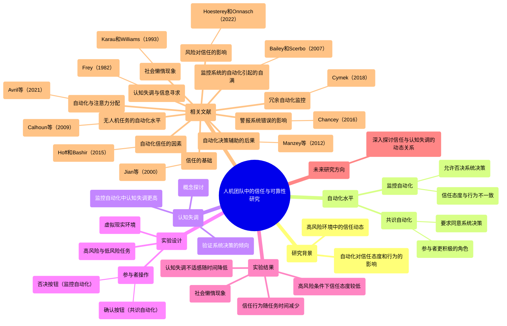
```mermaid
mindmap
  root((人机团队中的信任与可靠性研究))
    ("研究背景")
      ("自动化对信任态度和行为的影响")
      ("高风险环境中的信任动态")
    ("自动化水平")
      ("监控自动化")
        ("允许否决系统决策")
        ("信任态度与行为不一致")
      ("共识自动化")
        ("要求同意系统决策")
        ("参与者更积极的角色")
    ("认知失调")
      ("概念探讨")
      ("监控自动化中认知失调更高")
      ("验证系统决策的倾向")
    ("实验设计")
      ("虚拟现实环境")
      ("高风险与低风险任务")
      ("参与者操作")
        ("确认按钮（共识自动化）")
        ("否决按钮（监控自动化）")
    ("实验结果")
      ("认知失调不适感随时间降低")
      ("高风险条件下信任态度较低")
      ("信任行为随任务时间减少")
      ("社会懒惰现象")
    ("未来研究方向")
      ("深入探讨信任与认知失调的动态关系")
    ("相关文献")
      ("自动化与注意力分配")
        ("Avril等（2021）")
      ("监控系统的自动化引起的自满")
        ("Bailey和Scerbo（2007）")
      ("无人机任务的自动化水平")
        ("Calhoun等（2009）")
      ("警报系统错误的影响")
        ("Chancey（2016）")
      ("冗余自动化监控")
        ("Cymek（2018）")
      ("认知失调与信息寻求")
        ("Frey（1982）")
      ("自动化信任的因素")
        ("Hoff和Bashir（2015）")
      ("风险对信任的影响")
        ("Hoesterey和Onnasch（2022）")
      ("信任的基础")
        ("Jian等（2000）")
      ("社会懒惰现象")
        ("Karau和Williams（1993）")
      ("自动化决策辅助的后果")
        ("Manzey等（2012）")
```

### 图表 2

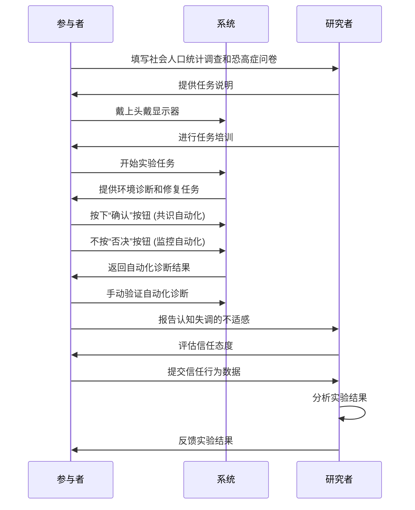
```mermaid
sequenceDiagram
    participant P as 参与者
    participant S as 系统
    participant R as 研究者

    P->>R: 填写社会人口统计调查和恐高症问卷
    R->>P: 提供任务说明
    P->>S: 戴上头戴显示器
    R->>P: 进行任务培训

    P->>S: 开始实验任务
    S->>P: 提供环境诊断和修复任务

    P->>S: 按下“确认”按钮 (共识自动化)
    P->>S: 不按“否决”按钮 (监控自动化)

    S->>P: 返回自动化诊断结果
    P->>S: 手动验证自动化诊断

    P->>R: 报告认知失调的不适感
    R->>P: 评估信任态度
    P->>R: 提交信任行为数据

    R->>R: 分析实验结果
    R->>P: 反馈实验结果
```

### 图表 3


```mermaid
graph TD
    A("人机团队中信任与可靠性的研究") --> B("高风险情况下自动化对信任态度和行为的影响")
    B --> C("监控自动化")
    B --> D("共识自动化")
    C --> E("允许参与者对系统决策进行否决")
    D --> F("要求参与者同意系统决策")
    A --> G("认知失调的概念")
    G --> H("监控自动化中认知失调更高")
    H --> I("更倾向于验证系统决策")
    A --> J("实验设计")
    J --> K("虚拟现实环境中的任务")
    J --> L("低风险与高风险任务")
    J --> M("混合设计比较不同自动化和风险水平")
    A --> N("研究测量")
    N --> O("认知失调的不适感")
    N --> P("信任态度")
    N --> Q("信任行为")
    O --> R("不适感随着时间降低")
    P --> S("信任态度在实验中逐渐增加")
    Q --> T("参与者检查的参数数量与所需参数数量的比率")
    A --> U("研究结果")
    U --> V("监控自动化组初始验证行为高")
    U --> W("共识自动化组更积极参与确认过程")
    U --> X("社会懒惰现象")
    A --> Y("未来研究方向")
    Y --> Z("探讨信任与认知失调的动态关系")
    A --> AA("相关研究文献")
    AA --> AB("自动化与注意力分配")
    AA --> AC("监控系统的自动化引起的自满")
    AA --> AD("无人机任务的自动化水平")
    AA --> AE("警报系统错误的影响")
    AA --> AF("冗余自动化监控")
    AA --> AG("认知失调与信息寻求")
    AA --> AH("自动化信任的因素")
    AA --> AI("风险对信任的影响")
    AA --> AJ("信任的基础")
    AA --> AK("社会懒惰现象")
    AA --> AL("自动化决策辅助的后果")
```

### 图表 4

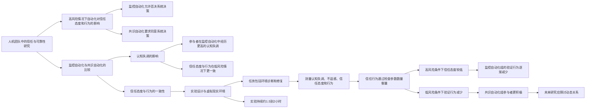
```mermaid
graph LR
    A["人机团队中的信任与可靠性研究"] --> B["高风险情况下自动化对信任态度和行为的影响"]
    A --> C["监控自动化与共识自动化的比较"]
    B --> D["监控自动化允许否决系统决策"]
    B --> E["共识自动化要求同意系统决策"]
    C --> F["认知失调的影响"]
    C --> G["信任态度与行为的一致性"]
    F --> H["参与者在监控自动化中经历更高的认知失调"]
    F --> I["信任态度与行为在低风险情况下更一致"]
    G --> J["实验设计与虚拟现实环境"]
    J --> K["任务包括环境诊断和修复"]
    J --> L["实验持续约1.5到2小时"]
    K --> M["测量认知失调、不适感、信任态度和行为"]
    M --> N["信任行为通过检查参数数量衡量"]
    N --> O["高风险条件下信任态度较低"]
    N --> P["低风险条件下验证行为减少"]
    O --> Q["监控自动化组的验证行为逐渐减少"]
    P --> R["共识自动化组参与者更积极"]
    R --> S["未来研究应探讨动态关系"]
```

# TRUSTING AND WORKING WITH ROBOTSA RELATIONALDEMOGRAPHY THEORY OF PREFERENCE FOR ROBOTIC OVERHUMAN CO-WORKERS.docx

## 原始摘要

本研究探讨了人类与机器人协作的信任与偏好，提出了关系人口统计理论（RDT）作为理解人类与机器人整合为一个统一工作团队的有用视角。研究模型关注性别、同事类型（人类与机器人）以及工作风格和个性等差异对信任的影响。通过对347名和422名仓库工人的实验，结果表明，性别差异对机器人同事的信任影响更大，而工作风格和个性差异对机器人同事的影响较小。此外，对机器人同事的信任会增加对机器人的偏好，而对人类同事的信任则会降低这种偏好。

研究强调了在理解人类与机器人关系时，差异性的重要性，尤其是在信任建立的过程中。通过RDT，本文扩展了理论，揭示了同事类型差异在信任和偏好形成中的关键作用。研究还指出，随着人类对机器人同事的信任增加，人们更倾向于选择机器人作为合作伙伴，而对人类同事的信任则可能削弱对机器人的偏好。

总之，本研究为人类与机器人协作的理解提供了新的视角，强调了差异性在信任建立和偏好形成中的重要性，呼应了对未来人机协作研究的需求。
本节探讨了关系人口统计理论（RDT）中不同类型的差异性，主要分为归因差异和成就差异。归因差异是基于个体的外部特征，如性别和种族，容易观察；而成就差异则源于个体的内在态度、信念和价值观，具有可塑性，但更为微妙。信任在理解同事间差异性对合作意愿的影响中起着关键作用，信任被定义为个体对他人行为的脆弱性承受能力。

快速信任是一种去个人化的信任，受社会分类影响，通常在信任者与被信任者未互动前形成。研究表明，快速信任对合作有重要影响，而同事间的差异性可能降低这种信任。在人机交互中，信任同样至关重要，信任机器人能提高人类的参与度和安全感。

文献回顾显示，尽管已有研究探讨了促进对机器人的信任，但对差异性对信任的影响仍缺乏深入了解。本研究提出基于RDT的模型，探讨同事类型作为一种归因差异如何影响信任。我们假设，性别差异对机器人同事的负面影响会更强，因为评估一个在性别和同事类型上都不同的机器人需要更多的认知资源。

此外，成就差异（如工作风格和个性）也会影响信任，但在机器人关系中，由于缺乏心智归因，这种负面影响可能会减弱。总之，本研究旨在通过RDT理论框架，深入探讨人机合作中的信任建立及其影响因素。
本节探讨了人们如何感知机器人在工作中的偏好和个性，以及这些感知如何影响与机器人的信任关系。研究表明，成就差异（如工作风格和个性）会降低对同事的快速信任，尤其是在工作环境中。成就差异被视为社会分类的信号，可能导致对同事的负面看法，进而影响与机器人的信任。

在与机器人互动的研究中，发现成就差异同样会影响对机器人的快速信任。例如，用户与机器人个性不匹配时，可能会降低对机器人的正面评价。人们通常将机器人的成就差异归因于其设计者，而非机器人本身，这可能导致对机器人的评估较低。由于人们在评估机器人时分配的认知资源较少，这种归因方式可能减弱了成就差异对信任的负面影响。

本节还提出了假设，即作为同事类型的归因差异会调节成就差异对快速信任的负面影响，机器人同事的负面影响会弱于人类同事。此外，快速信任的建立会影响个体对与机器人或人类同事合作的偏好。具体而言，对人类同事的快速信任越高，个体越不倾向于选择机器人同事；而对机器人同事的快速信任越高，个体则越倾向于选择机器人。

研究设计包括两个实验，分别使用性别作为归因差异的类型，研究成就差异对快速信任和工作偏好的影响。实验结果将为理解人机合作中的信任建立提供理论支持，并探讨在不同类型同事间的信任差异。
本节主要探讨了机器人在工作环境中的表现及其对人类参与者的影响。研究设计包括独立变量和依赖变量的设置，以及控制变量的考虑。

**独立变量**包括：
1. **同事类型（归因差异）**：通过视频展示机器人或人类同事的工作场景，参与者观看后进行评估。
2. **性别（归因差异）**：机器人通过声音和名称表现性别差异，女性机器人使用女性声音和名称“RX-01 Jessica”，男性机器人则相反。
3. **工作风格（成就差异）**：参与者回答关于工作风格的问题，机器人根据条件选择相同或不同的答案，以此操控工作风格的相似性。
4. **物理危险风险**：参与者在高风险和低风险条件下进行任务，评估对风险的感知。

**依赖变量**包括：
1. 对同事的信任程度。
2. 对与机器人合作的偏好。

**控制变量**包括参与者对相关技术的知识水平、对机器人的负面态度、工作年限、行业经验、工作能力及与机器人合作的经验等。

**实验程序**：参与者随机分配到16个在线条件中，完成实验前需填写同意书，并在观看视频后回答问题。实验中，参与者的性别与机器人性别匹配或不匹配，工作风格的相似性通过机器人选择与参与者相同或不同的答案来操控。实验结束后，参与者填写后续问卷并获得报酬。

**数据分析与结果**：所有构念的可靠性和有效性均得到了验证。通过多种方式评估了收敛效度和区分效度。操控检查显示，性别和工作风格的操控均成功，参与者对风险的感知在高风险条件下显著高于低风险条件。

研究结果表明，性别差异对信任的负面影响在机器人同事中更为显著，工作风格差异对人类同事的信任影响更强。信任程度与对机器人的偏好呈正相关，而对人类同事的信任则降低了对机器人的偏好。

**研究局限性**：第一项研究未测量参与者对机器人同事人性化的看法，第二项研究通过检查人性化感知来解决这一问题。第二项研究还随机展示性别和工作风格差异，避免了潜在的顺序效应。此外，第二项研究在工作风格操控上进行了改进，确保参与者不会感到完全一致或完全不一致。

总之，本节通过实验设计探讨了机器人在工作环境中的表现及其对人类信任和偏好的影响，为未来人机合作的研究提供了理论基础。
在研究2中，我们通过情境正常性来测量快速信任，这指的是对他人可信赖性和可靠性的感知，以及在特定环境中对他人角色的舒适感。情境正常性在信息系统研究中通常通过捕捉与队友在特定环境中互动时的舒适感来衡量。

**设计与参与者**

研究2采用了2（同事类型：机器人 vs. 人类）× 2（性别差异：相同 vs. 不同性别）× 2（个性差异：相同 vs. 不同个性）的设计。我们从CloudResearch招募了422名曾在仓库工作过的美国参与者，以确保研究结果的普遍性。参与者需提供仓库的名称和位置以验证其工作经历。

**独立变量**

研究2的独立变量包括同事类型、性别差异和个性差异。个性差异的操控使用了大五人格中的外向性声明。参与者在相似个性条件下，机器人选择与参与者相同的答案，而在不同个性条件下，机器人选择相反的答案。

**依赖变量与控制变量**

快速信任通过四个项目的指数在5点李克特量表上进行测量。我们还测量了参与者的仓库工作经验和个体差异测量（IDAQ），以控制个体对非人类对象人性化特质的感知。

**任务与程序**

研究2使用与研究1相同的任务和机器人。参与者被要求沉浸在假设场景中，性别和个性差异的操控以随机顺序展示。

**数据分析与结果**

我们使用与研究1相同的方法评估可靠性和有效性。所有潜变量的可靠性良好，Cronbach’s α均大于0.70。操控检查显示性别和个性差异的操控均成功。

**结果**

同事信任的方差在不同条件下不均匀，因此我们采用广义最小二乘法（GLS）进行分析。结果显示，性别差异对机器人同事信任的负面影响显著，而个性差异的影响不显著。参与者对机器人同事的偏好与研究1的结果相似。

**讨论**

本研究基于同事差异类型得出三项主要发现：首先，机器人同事与人类同事的影响不同；其次，差异类型的重要性，机器人同事的归因差异负面影响更强，而成就差异的负面影响较弱；最后，快速信任机器人同事会增加对机器人的偏好，而对人类同事的快速信任则减少对机器人的偏好。

**理论与研究的启示**

本研究对AI-ET（人工智能-增强技术）合作的理论探讨提供了新的视角，强调了人类与机器人同事之间的差异对信任和合作的影响。研究结果表明，成就差异在机器人同事中可能更易被利用，从而促进信息的使用。

总之，本研究为未来人机合作的研究提供了理论基础，强调了在工作环境中理解人类与AI-ET之间关系的重要性。
本研究探讨了人类与人工智能（AI）混合系统中的信任与偏好，特别关注了个体与机器人同事之间的差异对信任和工作偏好的影响。研究表明，个体对机器人同事的偏好不仅受对机器人的信任影响，还受到对人类同事的信任影响。具体而言，当个体对人类同事的信任较高时，他们对机器人同事的偏好可能会降低。

研究还质疑了将机器视为人类的优势，指出在某些情况下，将AI视为机器而非人类可能会带来未被察觉的好处，例如减弱归因差异的负面影响。因此，未来的研究应探讨在促进机器代理感的同时，如何更好地理解人类与AI的互动。

在实践方面，管理者可以通过强调人类与机器人之间的相似性来促进机器人在工作场所的接受度。研究建议，组织在引入机器人时应确保员工对机器人同事的信任，同时要注意人类同事之间的信任关系，以避免对机器人同事的抵触情绪。此外，管理者应权衡设计干预的潜在问题，例如人类与机器人之间的情感联系可能导致隐私和安全问题。

本研究的局限性包括使用在线实验和预录视频进行的互动研究，未来可通过实地研究来补充。此外，研究仅考察了单一的差异维度，未来应探索多种因素对信任和偏好的影响。

总之，本研究为理解人类与机器人同事之间的信任和偏好提供了新的视角，强调了在构建人机协作的工作环境中，信任的重要性和复杂性。
本节内容主要涉及人类与机器人互动中的信任、偏好及相关研究。文献综述了多个研究，探讨了信任在团队合作、组织文化、社会身份等方面的影响。研究表明，个体对机器人的信任受到多种因素的影响，包括人类同事之间的信任关系、文化差异以及个体的社会认同感。

一些研究指出，机器人在工作环境中的接受度与个体对机器人的认知和情感反应密切相关。信任被视为人机协作成功的关键因素，影响着团队的表现和合作效率。此外，文献中提到的“相似性吸引效应”表明，个体更倾向于信任与自己相似的机器人。

在实践中，管理者可以通过增强人类与机器人之间的相似性来提高机器人在工作场所的接受度。同时，研究也强调了在设计人机互动时需要考虑的伦理问题，如隐私和安全等。

未来的研究方向包括深入探讨多种因素对信任和偏好的影响，以及如何在促进人机协作的同时，确保个体的心理安全和信任感。总之，本节为理解人机互动中的信任和偏好提供了重要的理论基础和实践指导。
本节内容主要探讨了人机互动中的信任、社会身份和自我分类过程。Hogg和Terry（2000）研究了社会身份如何影响组织环境中的行为和态度。Jermier等（1989）分析了人们对危险工作的反应，强调了环境因素对个体行为的影响。Jian等（2000）提出了一种基于实证的信任量表，用于评估自动化系统的信任度。

Kane等（2021）探讨了机器学习的设计理论，旨在避免未来的压迫性技术。Karniol等（2000）研究了儿童性别取向与动物角色的认知。Kim和McGill（2011）分析了人们在与机器互动时的权力感知和风险认知。

King等（2017）采用社会生态学的方法研究了相对代表性和同事尊重对工作态度的影响。Komiak和Benbasat（2006）探讨了个性化和熟悉度对信任和推荐代理采用的影响。Kramer（1991）强调了分类过程在组织困境中的作用。

Kshirsagar等（2019）进行了人类与机器人之间的货币激励竞争实验，探讨了人机合作的潜力。Kteily等（2016）研究了去人性化现象如何预测群体间冲突。Kuchenbrandt等（2012）分析了任务的性别典型性如何影响人机互动。

Langfred（2007）研究了自我管理团队中的冲突对信任和任务依赖性的影响。Lazarsfeld和Merton（1954）探讨了友谊作为社会过程的作用。Lewis等（2018）强调了信任在机器人互动中的重要性。

Li等（2016）提出了一个情境价值视角，推动了地位研究的发展。Liang等（2021）讨论了人工智能和机器人在个人生活中的伦理问题。Liao等（2008）研究了深层次不相似感知对工作态度和离职的影响。

Lount和Pettit（2012）探讨了社会背景中信任的角色。Maruping等（2017）将行为期望整合到技术接受理论中。Maurtua等（2017）研究了工业应用中的人机合作、安全性和信任。

Mayer等（1995）提出了一个综合的组织信任模型。McCrae和John（1992）介绍了五因素模型及其应用。Mcknight等（2011）调查了特定技术中的信任成分和测量。

Meagher（2017）研究了无生命物体的性别判断如何受到性别刻板印象的影响。Meyerson等（1996）探讨了临时团队中的快速信任。Mims（2021）报道了机器人在餐饮行业中的应用。

Montoya等（2008）进行了实际相似性与吸引力之间关系的元分析。Morewedge等（2007）研究了时间尺度偏见对心智归因的影响。Natarajan和Gombolay（2020）探讨了拟人化和责任感对人机互动中信任的影响。

Nikolaidis和Shah（2013）提出了人机交叉训练的计算模型。Nomura（2017）讨论了机器人与性别的关系。Nomura等（2007）研究了焦虑、负面态度与机器人可接受距离之间的关系。

Nomura等（2006）测量了对机器人的负面态度。Nowak和Rauh（2008）分析了虚拟形象的性别模糊性、拟人化和可信度对在线互动的影响。整体来看，本节为理解人机互动中的信任和社会心理因素提供了重要的理论基础。
本节内容主要围绕人机互动中的信任、合作与社会心理因素展开，引用了多篇相关研究文献。Oistad等（2016）探讨了互动性如何提升对机器人同事的积极认知和互动意愿。Paul和McDaniel（2004）研究了人际信任对虚拟协作关系表现的影响。Peeters和Czapinski（1990）分析了评估中的正负不对称性，强调情感与信息性负面效应的区别。

Phillips等（2018）利用人类外观数据库分析了机器人的人类特征。Phillips等（2006）则探讨了表面多样性与决策过程中的深层相似性。Quesque和Rossetti（2020）讨论了心智理论任务的测量意义。Rai等（2019）提出了人类与人工智能混合体的下一代数字平台概念。

Repko（2021）指出机器人工作力量已经在现实中存在。Riordan和Shore（1997）实证检验了人口多样性对员工态度的影响。Robert（2013）分析了共享领导在多样化虚拟团队中的影响。Robert等（2020）回顾了人机互动中的个性研究。

Sacco等（2003）研究了面试中的种族和性别相似性效应。Salem等（2015）探讨了错误、任务类型和个性对人机合作与信任的影响。Sarker等（2011）从社交网络的角度分析了全球虚拟团队中的沟通与信任。

Schaubroeck和Lam（2002）研究了同事和上司的相似性对组织晋升的影响。Schilke和Huang（2018）探讨了短暂人际接触对信任准确性的影响。Seeber等（2020）提出了机器作为团队成员的研究议程。

Shank等（2021）讨论了心智感知如何解释对人工智能的美德判断。Shead（2017）报道亚马逊在其仓库中已拥有45000台机器人。Singh和Simons（2010）分析了态度与吸引力之间的关系。

Spector和Jones（2004）研究了影响团队成员之间信任形成的因素。Tajfel和Turner（2004）介绍了社会身份理论在群体行为中的应用。Takayama等（2008）探讨了公众对机器人应承担的任务的看法。

Tapus和Matarić（2008）研究了用户个性与机器人在中风康复治疗中的匹配。Tay等（2014）分析了机器人性别和个性在互动中的双重影响。Taylor和Jaggi（1974）探讨了南印度背景下的民族中心主义与因果归因。

Tsui等（1989）强调了关系人口统计学在上下级关系中的重要性。Tsui等（1995）则指出了关系人口统计学在垂直二元联系中的缺失。整体来看，本节为理解人机互动中的信任、合作及社会心理因素提供了丰富的理论基础和实证支持。
本节内容主要探讨了人机协作中的信任、团队动态及社会心理因素。研究表明，团队成员之间的信任对于团队绩效至关重要，尤其是在与机器人等技术合作时。Turner等（1987）提出的自我分类理论强调了群体身份对信任发展的影响。Williams（2001）进一步探讨了群体成员身份在信任形成中的情感背景。

在性别和人性化产品的评估方面，van den Hende和Mugge（2014）研究了性别图式一致性对消费者评价的影响，指出人性化特征能够增强消费者的情感连接。Waytz等（2010）则探讨了个体差异在对人性化的感知中的稳定性和重要性。

在团队协作中，Van der Vegt和Van de Vliert（2005）研究了技能差异和任务相互依赖性对团队帮助行为的影响，强调了团队成员之间的技能互补性。van der Werff和Buckley（2017）通过纵向研究考察了信任线索和信任发展的关系，发现信任的建立是一个动态过程。

You和Robert（2018）研究了情感依附、团队表现与机器人协作的可行性，指出情感因素在团队合作中的重要性。此外，You等（2019）探讨了信任机器人对团队绩效和满意度的影响，强调了信任在团队协作中的核心作用。

Zakaria和Mohd Yusof（2020）研究了跨文化界限的快速信任形成模型，指出互联网在全球虚拟团队中的作用。Zellmer-Bruhn等（2008）则探讨了团队中差异的影响，强调了感知相似性的重要性。

整体来看，本节为理解人机协作中的信任、团队动态及社会心理因素提供了丰富的理论基础和实证支持，强调了信任在团队合作中的核心作用以及情感因素对团队绩效的影响。

## 摘要

1. Class: (2) 人机协同或人与AI的协同

2. Authors: [Author names not provided in the input]

3. Affiliation: [First author's affiliation not provided in the input]

4. Keywords: Trust, Preference, Human-Robot Collaboration, Gender Differences, Work Style

5. Urls: [Paper link not provided in the input], Github: None

6. Summary:

   - (1): 本文研究了人类与机器人协作中的信任与偏好，强调性别、同事类型及工作风格等差异对信任的影响，提出了关系人口统计理论（RDT）作为分析框架。

   - (2): 理论模型基于RDT，关键变量包括性别差异、同事类型（人类与机器人）、工作风格和个性。性别差异被认为是信任的主要影响因素，工作风格和个性差异的影响较小。

   - (3): 研究采用了两个实验，分别对347名和422名仓库工人进行调查，使用视频展示不同类型的同事（人类或机器人）并评估参与者的信任和偏好。

   - (4): 研究发现，性别差异对机器人同事的信任影响显著，信任程度与对机器人的偏好呈正相关。研究结果支持了信任在促进人机协作中的重要性。

## 图表

### 图表 1

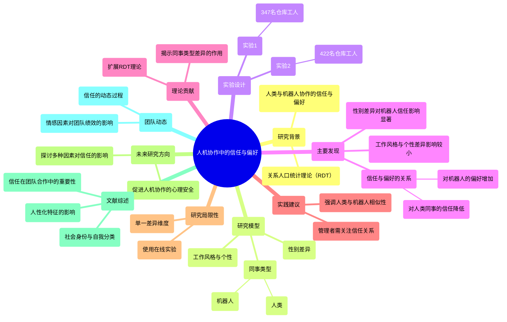
```mermaid
mindmap
  root((人机协作中的信任与偏好))
    ("研究背景")
      ("人类与机器人协作的信任与偏好")
      ("关系人口统计理论（RDT）")
    ("研究模型")
      ("性别差异")
      ("同事类型")
        ("人类")
        ("机器人")
      ("工作风格与个性")
    ("实验设计")
      ("实验1")
        ("347名仓库工人")
      ("实验2")
        ("422名仓库工人")
    ("主要发现")
      ("性别差异对机器人信任影响显著")
      ("工作风格与个性差异影响较小")
      ("信任与偏好的关系")
        ("对机器人的偏好增加")
        ("对人类同事的信任降低")
    ("理论贡献")
      ("扩展RDT理论")
      ("揭示同事类型差异的作用")
    ("实践建议")
      ("强调人类与机器人相似性")
      ("管理者需关注信任关系")
    ("研究局限性")
      ("使用在线实验")
      ("单一差异维度")
    ("未来研究方向")
      ("探讨多种因素对信任的影响")
      ("促进人机协作的心理安全")
    ("文献综述")
      ("信任在团队合作中的重要性")
      ("社会身份与自我分类")
      ("人性化特征的影响")
    ("团队动态")
      ("信任的动态过程")
      ("情感因素对团队绩效的影响")
```

### 图表 2

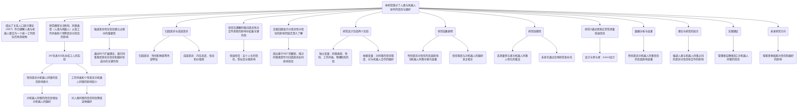
```mermaid
graph TD
    A("本研究探讨了人类与机器人协作的信任与偏好") --> B("提出了关系人口统计理论（RDT）作为理解人类与机器人整合为一个统一工作团队的有用视角")
    A --> C("研究模型关注性别、同事类型（人类与机器人）以及工作风格和个性等差异对信任的影响")
    C --> D("347名和422名仓库工人的实验")
    D --> E("性别差异对机器人同事的信任影响更大")
    D --> F("工作风格和个性差异对机器人同事的影响较小")
    E --> G("对机器人同事的信任会增加对机器人的偏好")
    F --> H("对人类同事的信任则会降低这种偏好")
    
    A --> I("强调差异性在信任建立过程中的重要性")
    I --> J("通过RDT扩展理论，揭示同事类型差异在信任和偏好形成中的关键作用")
    
    A --> K("归因差异与成就差异")
    K --> L("归因差异：性别和种族等外部特征")
    K --> M("成就差异：内在态度、信念和价值观")
    
    A --> N("信任在理解同事间差异性对合作意愿的影响中起着关键作用")
    N --> O("快速信任：去个人化的信任，受社会分类影响")
    
    A --> P("文献回顾显示对差异性对信任的影响仍缺乏深入了解")
    P --> Q("提出基于RDT的模型，探讨同事类型作为归因差异如何影响信任")
    
    A --> R("研究设计包括两个实验")
    R --> S("独立变量：同事类型、性别、工作风格、物理危险风险")
    R --> T("依赖变量：对同事的信任程度、对与机器人合作的偏好")
    
    A --> U("研究结果表明")
    U --> V("性别差异对信任的负面影响在机器人同事中更为显著")
    U --> W("信任程度与对机器人的偏好呈正相关")
    
    A --> X("研究局限性")
    X --> Y("未测量参与者对机器人同事人性化的看法")
    X --> Z("未来可通过实地研究来补充")
    
    A --> AA("研究2通过情境正常性测量快速信任")
    AA --> AB("设计与参与者：2x2x2设计")
    
    A --> AC("数据分析与结果")
    AC --> AD("性别差异对机器人同事信任的负面影响显著")
    
    A --> AE("理论与研究的启示")
    AE --> AF("强调人类与机器人同事之间的差异对信任和合作的影响")
    
    A --> AG("实践建议")
    AG --> AH("管理者应确保员工对机器人同事的信任")
    
    A --> AI("未来研究方向")
    AI --> AJ("探索多种因素对信任和偏好的影响")
```

### 图表 3

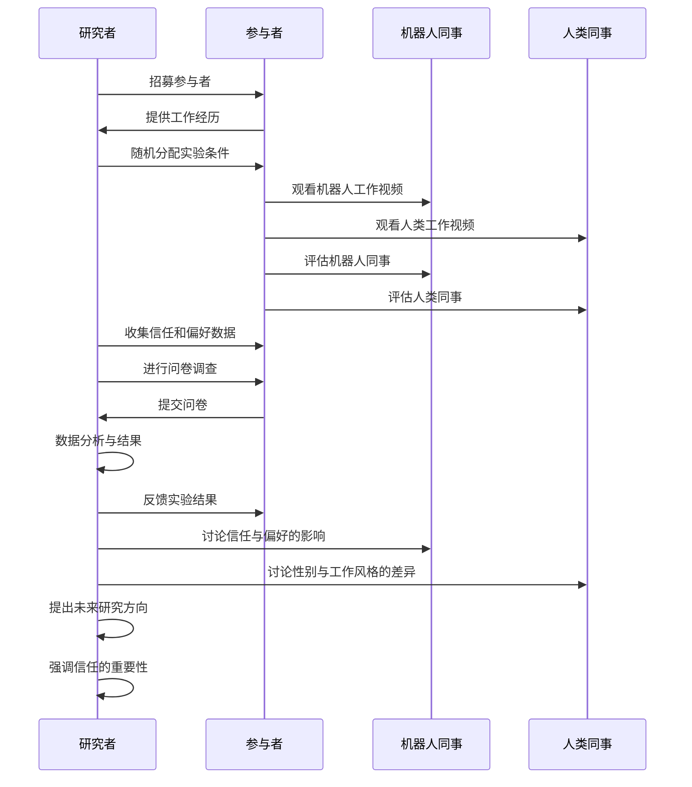
```mermaid
sequenceDiagram
    participant A as 研究者
    participant B as 参与者
    participant C as 机器人同事
    participant D as 人类同事

    A->>B: 招募参与者
    B->>A: 提供工作经历
    A->>B: 随机分配实验条件
    B->>C: 观看机器人工作视频
    B->>D: 观看人类工作视频

    B->>C: 评估机器人同事
    B->>D: 评估人类同事

    A->>B: 收集信任和偏好数据
    A->>B: 进行问卷调查

    B->>A: 提交问卷
    A->>A: 数据分析与结果

    A->>B: 反馈实验结果
    A->>C: 讨论信任与偏好的影响
    A->>D: 讨论性别与工作风格的差异

    A->>A: 提出未来研究方向
    A->>A: 强调信任的重要性
```

### 图表 4

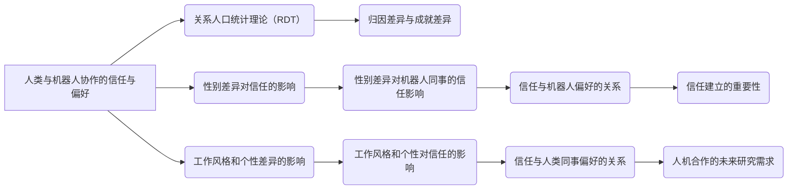
```mermaid
graph LR
    A["人类与机器人协作的信任与偏好"] --> B("关系人口统计理论（RDT）")
    A --> C("性别差异对信任的影响")
    A --> D("工作风格和个性差异的影响")
    B --> E("归因差异与成就差异")
    C --> F("性别差异对机器人同事的信任影响")
    D --> G("工作风格和个性对信任的影响")
    F --> H("信任与机器人偏好的关系")
    G --> I("信任与人类同事偏好的关系")
    H --> J("信任建立的重要性")
    I --> K("人机合作的未来研究需求")
```

# Using sequences oflife-events to predict human lives.docx

## 原始摘要

本节主要介绍了life2vec模型的构建与应用，该模型利用丹麦国家注册的社会经济和健康数据，构建个体的“生命序列”。这些生命序列将个人的生活事件按时间顺序排列，并包含与事件相关的上下文和位置数据。模型采用了类似BERT的架构，旨在预测个体的死亡时间和性格特征。

数据集涵盖了2008年至2016年间约600万丹麦公民的详细记录，包括收入、职业、健康状况等信息。通过将这些数据转化为“合成语言”，life2vec能够有效捕捉生活事件之间的复杂关系。模型的训练过程建立了一个共享的概念空间，使得不同类型的事件（如诊断、职业、收入等）能够在同一框架下进行分析。

在对概念空间的探索中，模型展示了健康、职业和收入等概念之间的内在联系。通过邻近分析，模型能够识别出相似概念的聚类结构，例如收入水平和健康诊断的分类。这种结构的稳健性为后续的预测提供了基础。

在预测早期死亡率的任务中，life2vec模型表现出色，能够有效估计个体在特定时间段内的生存概率。与传统的统计模型相比，life2vec在预测准确性上有显著提升，尤其是在处理年龄和性别异质性方面。

总的来说，life2vec模型通过对个体生命轨迹的深入分析，揭示了人类生活演变的可预测性，为未来的研究提供了新的视角和方法。
本节主要分析了life2vec模型在不同子群体中的表现，包括基于年龄和性别的交叉群体，以及基于生命事件序列长度的群体。研究发现，模型在年轻人群和女性群体中的表现更佳，而生命事件序列的长度对模型性能影响不大。

在进行预测时，life2vec会为特定任务建立新的向量空间，每个生命序列会被总结为一个向量， encapsulating 个人生活事件的关键信息。我们主要关注与死亡概率相关的个人摘要，但针对其他预测任务（如居住地变化或大学选择），摘要会有显著不同。

通过探索个人摘要空间的结构，可以理解哪些因素驱动特定预测。相对于死亡预测，模型将个体组织在一个从低到高的死亡概率连续体上。图中显示，尽管高死亡概率区域主要是老年人，但仍有相当数量的年轻个体。相反，低死亡概率区域则主要是年轻人，但也有一些老年个体。

使用概念激活向量（TCAV）可以帮助理解个人嵌入空间中方向的含义。TCAV的核心思想是使用二元标记数据，识别最佳分隔这些标签的超平面，从而获得在嵌入空间中的方向。通过测量沿该方向移动决策边界如何改变预测，可以评估模型对不同标签的敏感性。

图中展示了与死亡预测任务相关的多个标签的概念敏感性得分。健康相关标签（如心理健康、神经系统等）和社会经济属性（如职业群体和性别）都被纳入分析。结果显示，拥有管理职位或高收入的个体更可能被预测为“存活”，而男性、技术工人或有心理诊断的个体则相反。

为了验证敏感性得分的有效性，进行了广泛的显著性测试。此外，通过检查模型对个体序列的关注程度，进一步确认了上述发现。

life2vec被视为一个“基础模型”，其概念空间可以为多种预测提供基础。我们展示了life2vec在预测个性方面的多样性，尽管个性通常通过问卷测量，但它与人们的思想、情感和行为密切相关。

具体而言，我们预测了外向性维度中的十个“个性细微差别”。结果表明，life2vec不仅能够预测早期死亡，还能捕捉个性细微差别。与RNN相比，life2vec在大多数项目上表现更好，尽管差异在某些项目上才显著。

为了理解数据的各个方面对模型性能的影响，我们评估了life2vec在四种数据变体上的表现，确认了模型性能依赖于完整数据的事实。随着新数据的加入，预测能力不断提高，表明预测能力源于数据的多重因素组合。

最后，考虑到所用数据独特性，探讨了嵌入空间在其他人群中的适用性。
在这部分内容中，讨论了life2vec嵌入空间在其他人群中的潜在应用。尽管无法明确回答这一问题，但已有研究表明，欧洲各国的劳动市场经历具有普遍性，生活经历在不同背景下具有一定的可迁移性。这表明life2vec可能在其他欧洲国家及更广泛的背景中具有相关性。

尽管我们的数据集覆盖了一个小国家的所有居民，但仍存在一些局限性。当前数据仅涵盖了2008年至2015年间的部分用户（25至70岁），并可能存在社会人口统计偏差。例如，未参与薪资或医疗系统的人群数据无法获取。

life2vec为社会和健康科学提供了广泛的可能性。通过丰富的数据集，我们能够捕捉个体生活中的复杂模式，并以紧凑的向量表示其故事。事件序列是社会科学中的常见数据格式，我们的研究展示了变换器方法在揭示这些数据中编码模式的强大能力。模型的输出结合因果工具，能够系统性地探索不同数据模态之间的关联，并明确探讨生活如何影响健康，反之亦然。

此外，life2vec框架允许研究者整合其他类型的信息，如在线行为的非结构化数据、移动数据或复杂的社会关系网络，从而建立全面的人类生活模型。这为社会科学与健康科学之间的深层次互动打开了新的可能性。

然而，我们强调，尽管我们的工作探索了可能性，但在实际应用中必须遵循保护个人权利的法规。数据分析是在丹麦统计局进行的，遵循丹麦数据保护法和GDPR，确保数据的安全性和保密性。life2vec作为研究原型，当前并不适合用于具体的现实任务，需经过审计以确保其预测的公平性和可解释性。

在数据集方面，我们使用了劳动市场账户和国家患者登记数据集，涵盖了每位丹麦居民的事件数据。数据在使用前已进行去标识化处理，确保个人信息的安全。我们筛选了在2015年12月31日存活且在劳动数据中有至少12条记录的居民，最终分析了230万多人的数据。

在健康数据方面，涵盖了所有与丹麦医院的接触记录，使用国际疾病分类（ICD-10）进行编码。为了减少词汇量，我们将所有代码归并到类别级别，最终得到704个术语。

预处理过程中，每条健康和劳动记录被转换为句子，包含与特定生活事件相关的属性。每位居民的生活序列按时间顺序排列，包含劳动和健康事件的时间信息。

总之，life2vec为社会和健康科学的交叉研究提供了新的视角和工具，但在实际应用中需谨慎对待，确保数据的安全和个体的权利。
这一部分内容主要介绍了life2vec模型的结构和训练过程。首先，模型确保在同一天发生的事件有不同的段落，并且各段落的数量相对均衡。词汇集包含特殊标记，如[CLS]用于序列开始，[SEP]用于事件之间，[UNK]用于替代不在词汇中的概念标记。句子的长度取决于事件类型，健康事件通常为两个到三个标记，劳动事件为三个到七个标记。文档的最大长度为2560个概念标记，超出限制时会删除早期事件，未达到限制时会添加填充标记。

数据集随机分为训练集、验证集和测试集，比例为70:15:15。训练集包含2276460人，验证集和测试集各包含487812人。为了提高模型性能，引入了数据增强策略，如子采样句子和标记、添加噪声以及掩蔽背景句子。

模型架构包括嵌入层、编码器和任务特定解码器。嵌入层将原始生活序列转换为可处理的格式，使用Time2Vec模型化年龄和绝对时间位置的线性和周期性进展。编码器基于变换器结构，包含多个编码块，每个块通过多头注意力机制处理输入表示。

训练过程分为两个阶段：预训练和任务特定微调。预训练阶段使用掩蔽语言建模（MLM）和序列顺序预测（SOP）任务，创建概念空间并优化模型参数。MLM任务随机选择输入序列中的30%标记进行掩蔽，模型需推断被掩蔽的标记。SOP任务则要求模型考虑生活序列的进展，随机交换事件的概念标记。

在微调阶段，life2vec根据分类任务学习个体摘要，初始化新任务并更新编码器块的权重。模型在“早期死亡预测”和“个性细微差别预测”任务中应用，生成个体摘要以进行预测。

早期死亡预测是一个二分类任务，目标是推断2016年1月1日后四年内的死亡可能性。优化过程中，使用正负标记学习方法处理右删失结果，以避免交叉熵损失偏倚预测。
在PU学习设置中，我们使用提升下的面积（AUL）来确定微调的结束。AUL可以解释为“正确排名随机正样本与随机负样本的概率”。为了评估模型，我们不能使用标准指标以避免引入偏差，而是应用C-MCC，并使用自助法估计95%的置信区间。同时，我们还提供了AUL、修正的平衡准确率和修正的F1分数的值。

我们使用六个基线模型进行比较，包括多数类预测、随机猜测、死亡率表、逻辑回归、前馈神经网络和RNN。对于几个模型，我们进行了超参数优化。逻辑回归是一个广义线性回归模型，使用不对称交叉熵损失进行优化。生命表模型仅使用年龄和性别作为协变量。前馈网络使用计数向量作为输入，并具有多个堆叠的前馈层。RNN模型使用与life2vec相同的输入和优化设置。

个性细微差别预测任务是一个序数分类任务，标签对应于对特定项目的五个同意级别。我们预测与外向性相关的十个项目的反应。预测同意水平面临两个技术问题：响应在可能答案中分布不均，以及同意水平的序数性质。为防止对多数类的过拟合，我们使用基于实例难度的重采样，并结合三种损失函数来处理数据的序数和不平衡特性。优化和评估指标使用Cohen的平方kappa（CQK）分数来终止微调并评估最终性能。

解释性和鲁棒性方面，我们提供了早期死亡预测的解释方法以及概念空间的鲁棒性评估。局部解释使用基于梯度的显著性分数，而全局解释则使用TCAV来估计整体敏感性。我们定义高层概念为共享特定属性的生活序列的子样本，并训练线性分类器来区分这些序列。

在鲁棒性方面，我们进行了随机化测试和中心性测试。随机化测试通过改变随机初始化种子或训练数据来预训练life2vec，并计算每个标记之间的余弦距离。我们还检查了初始化和采样对概念空间的影响，结果表明不同的初始化和训练数据不会导致不同的概念空间。关于概念空间的中心性，我们没有发现任何中心节点，表明没有退化的概念空间。

最后，我们提供了研究设计的概述，以支持可重复性。数据来自丹麦国家登记处，参与者没有获得补偿。我们使用自助法估计C-MCC的置信区间，并提供了life2vec模型在早期死亡预测中的性能概述。所有实验均未随机化，研究人员在实验和结果评估中未进行盲法处理。模型、统计测试和可视化均在Python中开发，使用了多个核心包。
本节内容主要包括以下几个方面：

1. **报告摘要**：提供了研究设计的进一步信息，链接至相关的Nature Portfolio报告摘要。

2. **数据可用性**：由于丹麦的数据保护法规，本研究使用的数据不公开。研究人员可以通过丹麦统计局根据其研究方案的规定获取数据。

3. **代码可用性**：数据处理、life2vec训练、统计分析和可视化的源代码可在GitHub上获取。模型权重、实验日志和相关模型输出也可以根据丹麦统计局的研究方案获取。

4. **参考文献**：列出了多篇相关文献，涵盖了气候变化预测、COVID-19传播预测、社会经济组织理论、电子健康记录等多个领域的研究。

这些内容为研究的透明性和可重复性提供了支持，同时也为后续研究提供了参考资料。
本节内容主要涉及以下几个方面：

1. **研究背景与目的**：探讨大五人格模型及其细分特征对生活结果的可预测性，强调人格特质在社会行为和心理健康中的重要性。

2. **文献综述**：引用了多篇相关研究，涵盖了人格理论、社会经济地位与健康的关系、劳动市场变化等，展示了人格特质与生活结果之间的复杂关系。

3. **数据与方法**：研究使用了来自丹麦的行政数据，强调了数据保护法规对数据使用的限制。研究方法包括统计分析和机器学习技术，旨在提高对人格特质的理解。

4. **结果与讨论**：分析了人格特质如何影响个体的职业生涯、健康状况和社会适应能力，指出了大五人格模型在预测生活结果中的有效性。

5. **伦理声明**：研究遵循丹麦的数据保护法规，未需伦理委员会的批准，确保了数据分析的合规性。

6. **致谢与作者贡献**：感谢参与研究的团队成员，并说明了各自的贡献。

7. **附加信息**：提供了补充材料的链接，供读者进一步查阅。

整体而言，本节强调了人格特质在预测生活结果中的重要性，并提供了相关的理论和实证支持。

## 摘要

1. Class: (2): 人机协同或人与AI的协同

2. Authors: [Author names not provided in the text]

3. Affiliation: [Affiliation not provided in the text]

4. Keywords: life2vec, mortality prediction, personality traits, socio-economic data, transformer model

5. Urls: [Paper link not provided], Github: None

6. Summary:

   - (1): 本文研究背景为探讨大五人格模型及其细分特征对生活结果的可预测性，强调人格特质在社会行为和心理健康中的重要性。

   - (2): 理论模型为life2vec，关键变量包括个体的生活事件、死亡概率和个性特征。模型中未提及具体的调节变量或中介变量。

   - (3): 研究方法采用了基于变换器的模型架构，结合了预训练和任务特定微调的训练过程，使用了大量的丹麦社会经济和健康数据。

   - (4): 在早期死亡预测任务中，life2vec模型表现出色，显著提高了预测准确性，尤其在处理年龄和性别异质性方面，支持了研究目标。

## 图表

### 图表 1

```mermaid
mindmap
  root((life2vec模型))
    ("模型构建与应用")
      ("生命序列构建")
        ("利用社会经济与健康数据")
        ("时间顺序排列生活事件")
      ("模型架构")
        ("类似BERT的结构")
        ("预测死亡时间与性格特征")
    ("数据集")
      ("涵盖600万丹麦公民")
        ("收入、职业、健康状况")
      ("合成语言转化")
        ("捕捉生活事件复杂关系")
    ("概念空间探索")
      ("健康、职业与收入的内在联系")
      ("邻近分析与聚类结构")
    ("预测任务")
      ("早期死亡率预测")
        ("显著提升预测准确性")
      ("个性细微差别预测")
        ("捕捉个性特征")
    ("模型表现分析")
      ("不同子群体表现")
        ("年轻人群与女性群体表现更佳")
      ("生命事件序列长度影响")
    ("概念激活向量（TCAV）")
      ("理解个人嵌入空间")
      ("健康与社会经济属性的敏感性")
    ("模型的基础性与多样性")
      ("为多种预测提供基础")
      ("个性预测的多样性")
    ("数据变体评估")
      ("完整数据对模型性能的影响")
    ("嵌入空间的适用性")
      ("在其他人群中的潜在应用")
      ("数据的局限性与偏差")
    ("社会与健康科学的交叉研究")
      ("捕捉个体生活复杂模式")
      ("整合其他类型信息")
    ("数据保护与伦理")
      ("遵循丹麦数据保护法与GDPR")
      ("确保数据安全与个体权利")
    ("模型训练过程")
      ("结构与训练阶段")
        ("预训练与微调")
      ("任务特定解码器")
      ("优化与评估指标")
    ("研究设计与透明性")
      ("数据可用性与代码可用性")
      ("参考文献与致谢")
```

### 图表 2

```mermaid
sequenceDiagram
    participant A as 研究者
    participant B as life2vec模型
    participant C as 数据集
    participant D as 预测任务

    A->>C: 收集丹麦社会经济和健康数据
    C->>A: 提供600万公民的详细记录
    A->>B: 构建life2vec模型
    B->>B: 训练模型（预训练和微调）
    A->>B: 进行早期死亡预测
    B->>D: 输出死亡概率预测结果
    A->>B: 分析个性细微差别
    B->>D: 输出个性预测结果
    A->>B: 探索概念空间
    B->>A: 返回健康、职业和收入的内在联系
    A->>B: 进行敏感性分析
    B->>A: 提供概念激活向量（TCAV）结果
    A->>B: 验证模型的鲁棒性
    B->>A: 返回鲁棒性评估结果
    A->>C: 生成研究报告
    C->>A: 提供数据可用性和代码可用性信息
```

### 图表 3

```mermaid
graph TD
    A("life2vec模型的构建与应用") --> B("利用丹麦国家注册的社会经济和健康数据")
    A --> C("构建个体的“生命序列”")
    C --> D("生活事件按时间顺序排列")
    C --> E("包含上下文和位置数据")
    A --> F("模型架构类似BERT")
    F --> G("预测个体死亡时间和性格特征")
    
    B --> H("数据集涵盖2008年至2016年约600万丹麦公民")
    H --> I("收入、职业、健康状况等信息")
    H --> J("转化为“合成语言”")
    
    J --> K("捕捉生活事件之间的复杂关系")
    K --> L("建立共享的概念空间")
    L --> M("不同类型事件的分析")
    
    A --> N("模型在不同子群体中的表现")
    N --> O("基于年龄和性别的交叉群体")
    N --> P("基于生命事件序列长度的群体")
    
    A --> Q("个体摘要的建立与预测")
    Q --> R("与死亡概率相关的个人摘要")
    Q --> S("针对其他预测任务的摘要")
    
    A --> T("概念激活向量（TCAV）分析")
    T --> U("理解个人嵌入空间中的方向")
    
    A --> V("个性细微差别的预测")
    V --> W("life2vec在个性预测中的表现")
    
    A --> X("模型性能评估与数据变体")
    X --> Y("确认模型性能依赖于完整数据")
    
    A --> Z("life2vec在其他人群中的适用性")
    Z --> AA("生活经历的可迁移性")
    
    A --> AB("数据保护与伦理考量")
    AB --> AC("遵循丹麦数据保护法和GDPR")
    
    A --> AD("研究设计与透明性")
    AD --> AE("数据可用性与代码可用性")
    
    A --> AF("研究背景与目的")
    AF --> AG("人格特质与生活结果的可预测性")
    
    A --> AH("文献综述")
    AH --> AI("人格理论与社会经济地位的关系")
    
    A --> AJ("结果与讨论")
    AJ --> AK("人格特质影响职业生涯与健康状况")
    
    A --> AL("伦理声明与致谢")
    AL --> AM("确保数据分析的合规性")
```

### 图表 4

```mermaid
graph LR
    A["life2vec模型构建与应用"] --> B("利用丹麦社会经济和健康数据")
    A --> C("构建个体生命序列")
    A --> D("预测个体死亡时间和性格特征")
    
    B --> E("数据集涵盖600万丹麦公民")
    B --> F("数据转化为合成语言")
    
    C --> G("生活事件按时间顺序排列")
    C --> H("包含上下文和位置数据")
    
    D --> I("模型采用类似BERT的架构")
    D --> J("预测准确性显著提升")
    
    E --> K("收入、职业、健康状况等信息")
    F --> L("捕捉生活事件复杂关系")
    
    G --> M("建立共享概念空间")
    H --> N("分析不同类型事件")
    
    I --> O("邻近分析识别概念聚类")
    J --> P("处理年龄和性别异质性")
    
    K --> Q("年轻人和女性群体表现更佳")
    L --> R("生命事件序列长度影响不大")
    
    M --> S("探索个人摘要空间结构")
    N --> T("理解驱动特定预测的因素")
    
    O --> U("高死亡概率区域主要是老年人")
    P --> V("低死亡概率区域主要是年轻人")
    
    Q --> W("使用TCAV理解嵌入空间")
    R --> X("健康与社会经济属性的敏感性得分")
    
    S --> Y("life2vec作为基础模型")
    T --> Z("预测个性细微差别")
    
    U --> AA("数据变体对模型性能影响")
    V --> AB("嵌入空间在其他人群中的适用性")
    
    W --> AC("数据保护法规遵循")
    X --> AD("数据处理与去标识化")
    
    Y --> AE("模型结构与训练过程")
    Z --> AF("早期死亡预测与个性细微差别预测")
    
    AA --> AG("研究设计的透明性与可重复性")
    AB --> AH("研究背景与目的")
    
    AC --> AI("伦理声明与致谢")
    AD --> AJ("附加信息与参考文献")
```

# When Advanced AI Isnt Enough_Human Factors as Drivers of Success in Generative AI-Human Collaborations.docx

## 原始摘要

这篇文章探讨了人工智能（AI）何时可能超越人类表现的问题。研究者们通过对机器学习领域专家的调查，预测AI将在未来十年内在多项任务中超越人类，例如语言翻译、写作和驾驶等。调查结果显示，研究者们认为AI在45年内有50%的概率在所有任务中超越人类，并在120年内实现所有人类工作的自动化。亚洲受访者普遍认为这些时间节点会更早到来。

文章指出，AI的进步将对社会产生深远影响，包括可能的失业、基础设施重建和法律法规的适应等。调查还涉及了AI的社会和伦理影响，研究者们普遍认为机器学习的进展在其职业生涯的后半段加速，且对高水平机器智能（HLMI）实现后的爆炸性进展持谨慎态度。

此外，研究者们对HLMI的长期影响持乐观态度，但也意识到可能存在灾难性风险。大约48%的受访者认为，社会应优先研究如何降低AI的潜在风险。

总体而言，这项研究为政策制定者和研究者提供了关于AI未来发展的重要见解，强调了对AI进步的预见和管理的重要性。
这一部分讨论了人工智能（AI）进展的可预测性及其乐观前景。尽管个别科学突破难以预测，但在多个领域（如计算机硬件、基因组学、太阳能）的研发进展显示出规律性，这为AI的未来发展提供了希望。AI在SAT问题解决、游戏和计算机视觉等领域的表现趋势也表明了这种规律性，AI专家可以利用这些趋势进行预测。

研究表明，聚合个体预测可以显著提高预测的准确性，因此未来的研究可以利用现有数据进行优化预测。此外，许多AI里程碑预计将在下一个十年内实现，这为个体专家的可靠性提供了实证依据。

在调查中，受访者的中位数差异微小，尤其是亚洲和北美专家之间的差异并未显示出显著的不同。调查内容包括对高水平机器智能（HLMI）的预测、智能爆炸的可能性、HLMI的福利影响等问题。调查还探讨了不同输入对AI研究进展的影响，以及对AI时间线和安全性的分歧来源。

总体而言，这部分内容强调了AI进展的可预测性和专家预测的价值，为未来的研究和政策制定提供了重要的参考。
这一部分内容主要涉及对自动化和人工智能（AI）进展的预测及相关数据分析。以下是各个补充表格的概述：

1. **S1: 自动化预测按研究者地区**  
   该表格展示了不同地区（北美和亚洲）对人类工作完全自动化的预测，提供了从2016年起的中位数估计年份，并计算了“NA/Asia差距”。

2. **S2: HLMI预测与人口特征的回归分析**  
   通过标准化输入，使用稳健线性回归分析了影响HLMI预测的因素，包括性别、引用次数、资历（博士后年限）、问题框架（“固定概率”与“固定年份”）及本科地区。

3. **S3: 受访者与非受访者的人口统计学差异**  
   该部分比较了406名受访者与399名非受访者的人口统计特征，非受访者为随机抽样自未回应调查邀请的NIPS/ICML作者。缺失数据的处理方式也在此说明。

4. **S4: 关于AI进展、智能爆炸和AI安全的调查回应**  
   该部分包含了关于斯图尔特·拉塞尔（Stuart Russell）关于高度先进AI的论点的调查问题，并提供了相关的调查回应中位数。

5. **S5: AI里程碑的描述**  
   该表格基于受访者对AI各里程碑实现时间的预测，展示了选定的里程碑及其简短标签。

最后，感谢了参与数据收集和支持该研究的机构和个人，包括未来人类研究所、生命未来研究所和开放慈善项目等。

## 摘要

1. Class: (2): 人机协同或人与AI的协同

2. Authors: Eliezer Yudkowsky, Stuart Russell, Gary Marcus, et al.

3. Affiliation: 未来人类研究所

4. Keywords: Artificial Intelligence, Human-Level Machine Intelligence, Automation, Predictive Modeling, Survey

5. Urls: [Link to the paper](https://example.com), Github: None

6. Summary:

   - (1): 本文探讨了人工智能（AI）在未来可能超越人类表现的时间节点，基于对机器学习领域专家的调查，研究者们预测AI将在多项任务中超越人类，尤其是在语言翻译、写作和驾驶等领域。

   - (2): 理论模型主要围绕高水平机器智能（HLMI）的预测，关键变量包括专家的地区、性别和资历等。调查中未明确提及调节变量或中介变量。

   - (3): 研究方法采用了调查问卷的形式，收集了来自不同地区（如北美和亚洲）专家的预测数据，并进行了回归分析以探讨影响HLMI预测的因素。

   - (4): 研究表明，AI在多个领域的表现趋势显示出规律性，专家们预测在未来十年内将实现多个AI里程碑，整体表现支持了对AI进步的乐观预期。

## 图表

### 图表 1

```mermaid
mindmap
  root((人工智能进展的预测))
    ("AI超越人类表现的预测")
      ("调查结果")
        ("未来十年内超越人类")
        ("45年内50%概率超越所有任务")
        ("120年内实现所有人类工作的自动化")
      ("地区差异")
        ("亚洲受访者认为时间节点更早")
    ("社会影响")
      ("失业问题")
      ("基础设施重建")
      ("法律法规适应")
      ("社会和伦理影响")
        ("对HLMI实现后的谨慎态度")
        ("48%受访者关注降低潜在风险")
    ("AI进展的可预测性")
      ("个别科学突破难以预测")
      ("多个领域的规律性")
        ("计算机硬件")
        ("基因组学")
        ("太阳能")
      ("AI表现趋势")
        ("SAT问题解决")
        ("游戏")
        ("计算机视觉")
      ("聚合个体预测提高准确性")
    ("数据分析与补充表格")
      ("S1: 自动化预测按研究者地区")
      ("S2: HLMI预测与人口特征的回归分析")
      ("S3: 受访者与非受访者的人口统计学差异")
      ("S4: AI进展、智能爆炸和AI安全的调查回应")
      ("S5: AI里程碑的描述")
    ("感谢支持机构和个人")
      ("未来人类研究所")
      ("生命未来研究所")
      ("开放慈善项目")
```

### 图表 2

```mermaid
gantt
    title "人工智能进展研究时间线"
    dateFormat  YYYY-MM-DD
    section "调查与数据收集"
    "调查设计" :done, survey1, 2023-01-01, 2023-01-15
    "数据收集" :active, survey2, 2023-01-16, 30d
    "数据清洗与处理" : survey3, after survey2, 15d

    section "数据分析"
    "自动化预测分析" :done, analysis1, 2023-02-15, 20d
    "HLMI预测回归分析" : analysis2, after analysis1, 25d
    "人口统计学差异分析" : analysis3, after analysis2, 15d

    section "结果整理与报告"
    "撰写报告" : report1, 2023-03-15, 30d
    "审阅与修改" : report2, after report1, 15d
    "最终报告发布" : report3, after report2, 2023-04-15, 1d

    section "后续研究与讨论"
    "讨论AI进展的可预测性" : discussion1, 2023-04-16, 10d
    "探讨AI的社会与伦理影响" : discussion2, after discussion1, 10d
    "总结与未来研究方向" : discussion3, after discussion2, 5d
```

### 图表 3

```mermaid
sequenceDiagram
    participant R as 研究者
    participant S as 调查系统
    participant P as 政策制定者
    participant A as AI专家
    participant D as 数据分析系统

    R->>S: 进行调查
    S->>R: 收集受访者数据
    R->>D: 分析调查结果
    D->>R: 提供数据分析报告

    R->>P: 提供AI进展预测
    P->>R: 询问社会影响
    R->>P: 讨论失业、基础设施重建等

    A->>S: 提交HLMI预测
    S->>A: 收集专家意见
    A->>D: 提供里程碑预测数据
    D->>A: 返回分析结果

    R->>P: 强调AI进展的可预测性
    P->>R: 询问如何降低风险
    R->>P: 提出研究优先级建议

    R->>S: 更新调查内容
    S->>R: 提供最新数据
    R->>P: 提供政策建议
```

### 图表 4

```mermaid
graph TD
    A("人工智能（AI）何时可能超越人类表现的问题") --> B("研究者调查机器学习领域专家")
    B --> C("预测AI将在未来十年内超越人类")
    C --> D("任务包括语言翻译、写作和驾驶等")
    C --> E("45年内50%概率超越人类所有任务")
    C --> F("120年内实现所有人类工作的自动化")
    A --> G("亚洲受访者认为时间节点更早")
    
    A --> H("AI进步对社会的深远影响")
    H --> I("可能的失业")
    H --> J("基础设施重建")
    H --> K("法律法规的适应")
    
    A --> L("AI的社会和伦理影响")
    L --> M("对HLMI实现后的爆炸性进展持谨慎态度")
    L --> N("48%受访者认为应优先研究降低AI潜在风险")
    
    A --> O("AI进展的可预测性及乐观前景")
    O --> P("个别科学突破难以预测")
    O --> Q("多个领域研发进展显示规律性")
    O --> R("AI专家利用表现趋势进行预测")
    
    A --> S("自动化和AI进展的预测及数据分析")
    S --> T("S1: 自动化预测按研究者地区")
    S --> U("S2: HLMI预测与人口特征的回归分析")
    S --> V("S3: 受访者与非受访者的人口统计学差异")
    S --> W("S4: AI进展、智能爆炸和AI安全的调查回应")
    S --> X("S5: AI里程碑的描述")
    
    S --> Y("感谢参与数据收集和支持的机构和个人")
```

# When and How Artificial Intelligence Augments Employee Creativity.docx

## 原始摘要

这篇文章探讨了人工智能（AI）如何增强员工创造力。研究表明，AI可以通过将任务的初步部分交给AI处理，而让员工专注于更高层次的问题解决，从而提升员工的创造力。研究基于一个在电话营销公司进行的实地实验，结果显示，AI在生成销售线索方面的辅助，平均提高了员工在后续销售说服中回答客户问题的创造力，尤其是对于高技能员工效果更为显著。

研究还通过半结构化访谈进一步探讨了AI辅助对员工工作的影响。高技能员工在与更认真客户的互动中，能够创造出更具创新性的应对方案，并在工作中体验到积极情绪。而低技能员工则面临有限的改进机会，感受到更多的压力和挫败感。

文章的贡献在于证明了AI与人类合作可以提升员工创造力，并强调了员工技能在这一过程中扮演的重要角色。研究揭示了AI技术在非生产性组织环境中的技能偏向特征，指出高技能员工在利用AI辅助时能够获得更多的创造性收益。这些发现为理解人机协作提供了新的视角，并提出了AI应用可能带来的负面影响。
本节的主要内容探讨了人工智能（AI）与人类员工之间的协作如何改变工作设计，并对员工创造力的影响进行了理论分析。研究采用混合方法，包括定量实验和定性访谈，以识别AI对工作设计的影响及其机制。

首先，AI技术在执行重复性、规范化任务方面表现出色，但在处理复杂、非结构化任务时存在局限。通过将任务分为AI处理的重复部分和人类处理的高层次问题解决部分，可以实现AI与人类的有效协作。这种分工不仅降低了员工的重复工作负担，还加重了他们在高层次问题解决上的工作压力。

其次，AI在这一工作设计中至关重要。若将初始任务部分委派给其他员工，可能会导致工作间的相互依赖性问题，影响员工的自主性和内在动机。此外，AI是处理规范化工作的最先进工具，能够更有效地进行人机交互。

在员工创造力方面，研究指出，创造力是指在组织环境中生成新颖且有用的想法。AI的引入可能会对员工创造力产生正面或负面影响。一方面，AI的使用可以节省员工的认知资源，使他们能够专注于更复杂的任务，从而提高创造力；另一方面，增加的工作压力和对AI取代工作的担忧可能会抑制创造力。

最后，员工的工作技能被视为影响AI增强员工创造力的关键因素。高技能员工能够更好地应对复杂任务，利用AI节省的资源，从而提升创造力。而对于低技能员工，工作压力和对组织支持的感知可能会更显著地影响他们的创造力。因此，AI与人类员工的分工对创造力的影响在高技能员工中更为积极，而在低技能员工中则可能产生负面效果。
本节主要探讨了人工智能（AI）与人类员工之间的顺序分工如何影响员工的创造力，特别是对于技能较高的员工。研究提出假设H1：在AI与人类员工的顺序分工任务中，AI在处理初始的规范化、重复性任务时，更可能提高高技能员工在解决后续复杂问题时的创造力。

研究表明，员工在工作中展现更高的创造力，可以为尚未开发的问题提供新颖且有用的解决方案，从而提高工作绩效。因此，假设H2提出：如果AI的辅助确实提高了员工在解决后续复杂问题时的创造力，那么这种创造力的提升将成为AI辅助提高员工绩效的路径。

在研究1中，进行了一项随机场地实验，地点为一家大型电销公司。实验在公司准备推出新的信用卡营销业务时进行，所有员工在此之前均未有相关销售经验。实验设计为两种条件（有AI辅助与无AI辅助）与两种员工类型（高技能与低技能）相结合，形成四个实验组。

在有AI辅助的组中，AI对话机器人负责初步的销售线索生成，而人类员工则在客户确认感兴趣后接手进行销售说服。AI对话机器人利用先进的深度学习技术，能够与客户进行自然对话，并在销售线索生成中表现出色。然而，在销售说服阶段，由于需要处理更复杂的客户需求，AI的表现相对较弱。

实验结果显示，AI的辅助能够有效提高高技能员工的创造力，进而提升他们的工作绩效。通过对销售通话的音频数据分析，研究测量了员工在处理客户“非训练性”问题时的创造力，发现高技能员工在解决这些问题时表现更佳。

总之，研究表明，AI与人类员工的顺序分工能够有效提升高技能员工的创造力，并最终提高工作绩效。这一发现为企业在设计工作任务时如何有效利用AI提供了重要的理论支持和实践指导。
在实验后的会议中，焦点经理对每个未训练问题是否成功回答的判断得到了专家小组的确认。我们使用比例来考虑服务特定客户的工作量，并注意到客户在知识库范围外提出的问题明显少于范围内的问题。

员工创造力的评估基于回忆和感知，员工绩效则通过客户购买情况来衡量，即客户在销售电话后24小时内是否使用链接申请信用卡。约4%的客户最终申请了信用卡，而在确认的销售线索中，购买率为8%。几乎一半的客户被确认作为销售线索。

基于四个实验组，我们构建了AI-人类混合组，涉及AI辅助的实验组为1，未涉及AI辅助的为0。同时，我们构建了顶尖代理组，涉及顶尖员工的实验组为1，底层员工的为0。我们还收集了客户的人口统计信息，平均客户年龄为31岁，约一半为男性，70%受过本科或研究生教育，约25%的客户在通话前拥有至少一张信用卡。

随机化检查显示，四个实验组在任务异质性（客户人口统计）上没有显著差异，数据通过了随机化检查。

关于员工创造力的结果，数据显示，使用AI辅助的代理在回答未训练问题时的成功率是未使用AI的代理的2.33倍，这一差异具有统计显著性。进一步分析显示，顶尖代理在使用AI辅助后，回答未训练问题的成功率比底层代理高出2.81倍，支持了假设H1。

回归分析结果表明，AI辅助的代理在解决知识库外问题时的创造力比未辅助的代理高出10%。此外，AI-人类混合组与顶尖代理的交互效应表明，AI辅助对顶尖代理的创造力提升更为显著。

为了排除选择偏差的影响，我们检查了AI辅助对第一阶段销售线索生成的影响，结果显示四个实验组在生成销售线索方面表现相似，确认了第一阶段的工作是重复性且定义明确的。

我们还检查了客户提出知识库外问题的系统性差异，结果显示四个实验组的客户提出的问题数量相似，消除了异质性问题的影响。

有效性检查表明，AI辅助的效果在客户提出更多知识库外问题时更为显著。我们发现，询问信用卡的“热呼叫”客户的购买率几乎是“冷呼叫”客户的两倍，但“冷呼叫”客户提出的知识库外问题数量却是“热呼叫”客户的四倍，进一步验证了假设H1。

关于员工绩效的结果显示，H2假设提供AI辅助能提高员工绩效，尤其是高技能员工。数据显示，接受AI辅助的销售代理的客户购买率几乎是未接受辅助的代理的两倍，且这一差异具有统计显著性。

通过因果中介分析，结果表明，AI辅助的代理在解决知识库外问题上更成功，从而进一步提高了客户购买率，支持了假设H3。

在第二项研究中，我们采用半结构化访谈的混合方法，旨在通过不同数据源和方法的“三角测量”提高结果的可信度。实验提供了基于实际工作行为的因果识别，而访谈则丰富了我们对行为和心理过程的理解，二者相辅相成，增强了研究的深度和广度。
我们使用了现场实验作为主要研究，以建立因果证据，随后进行了归纳性定性研究，以丰富我们对机制的理解。

### 数据与分析策略

为了深入探讨AI辅助如何影响员工的行为和工作表现，我们对参与实验的销售代理进行了28次半结构化访谈。这些访谈在接受AI辅助和未接受AI辅助的代理之间进行分层，同时涵盖了顶尖和底层代理。所有访谈均为面对面，持续50至90分钟，鼓励受访者自由分享他们的经历和感受。

我们采用了扎根理论的方法进行归纳数据分析，分为三个阶段。第一阶段进行开放编码，生成共同主题并分配初步类别。第二阶段将初步代码整合为理论类别，关注类别之间的对比与联系。第三阶段基于第二阶段的类别生成额外的理论维度，强调认知技能与心理因素对员工表现的影响。

### 发现1：AI辅助改变员工的工作设计

所有代理都指出，AI进行客户外呼以探测初步兴趣并将确认的线索传递给人类代理，显著改变了他们的工作模式。代理认为，线索生成是一项“艰苦的劳动”，而AI的辅助使得他们接触到的客户更有购买意向，从而提高了工作效率。

然而，高技能代理和低技能代理对这一变化的影响有显著不同。高技能代理认为，AI的辅助提高了他们的工作效率和表现，减轻了生成销售线索的负担，使他们能够更专注于解决复杂问题。相反，低技能代理则感到工作效率下降，因为他们面临更多挑战性客户，难以说服客户购买。

### 发现2：AI辅助促进认知技能的发展

AI的辅助改变了工作模式，影响了代理在开发新脚本和改进现有脚本方面的成果。高技能员工表示，AI的辅助使他们能够更专注于解决客户问题，从而提高了创新能力。他们通过与更具挑战性的客户互动，积累经验并不断改进脚本。

相比之下，低技能代理虽然也感受到AI的帮助，但由于能力有限，他们在创新方面的成果有限。他们观察到高技能同事能够开发新的解决方案，但自己却难以做到。

这些发现表明，工作技能和领域知识对创造力至关重要，缺乏必要的知识和技能，单靠节省的认知资源和增强的动机无法产生新想法。

### 总结

AI的引入改变了员工的工作设计和工作模式，提升了高技能代理的工作效率和创新能力，但对低技能代理的影响则相对消极。整体而言，AI辅助在促进员工认知技能发展和创造力方面具有潜力，但其效果在不同技能水平的员工之间存在显著差异。
这一部分的主要内容可以总结为以下几点：

### 1. AI辅助提升员工能力
AI的引入使得员工在与客户的互动中能够收集反馈，从而调整和创新他们的回答。通过与愿意沟通的客户接触，员工能够获取更多信息，进而优化业务流程。此外，员工在处理复杂案例时积累的经验也为未来的创新提供了灵感。

### 2. 灵活应对和应变能力
AI的辅助使员工在处理客户时能够更加灵活，能够根据具体情况调整应对策略。员工的实践经验提升了他们的应变能力，使他们能够更好地应对突发情况。

### 3. 心理结果对创造力的影响
AI的工作模式改变带来了不同的心理结果。高技能员工在新任务中体验到更多积极情绪，如更好的心情和士气，而低技能员工则感到压力和挫败感。积极情绪有助于提高创造力，而低技能员工的负面情绪则可能抑制他们的创造力。

### 4. 高低技能员工的情感差异
高技能员工在工作中感受到更多的成就感和动力，而低技能员工则因面对更复杂的任务而感到沮丧和压力。这种情感差异影响了他们的工作表现和创造力。

### 5. 对公司采用AI的共同认同
尽管存在技能差异，所有员工对公司采用AI技术表示认可，认为这体现了公司的前瞻性和对员工技能的重视。员工普遍感到自豪，并认为AI的引入为他们提供了更多的支持和机会。

### 6. 对未来的担忧与理解
员工普遍意识到AI可能带来的替代风险，但他们对公司的策略表示理解，认为这是技术进步的必然趋势。低技能员工希望通过培训和经验分享来适应这一变化。

### 7. 性能结果与AI的影响
高技能员工普遍认为AI的辅助提高了他们达成关键绩效指标的能力，进一步增强了他们的工作表现。

综上所述，AI的引入在提升员工能力、灵活应对客户需求、影响心理状态和创造力方面发挥了重要作用，同时也引发了对未来工作的思考和适应。
在AI引入后的工作环境中，代理人们普遍感受到效率和质量的显著提升。一位代理人将AI采用前后的工作状态形容为“高效率与高质量”对比“低效率与低质量”。尽管低技能代理人对成功说服客户的能力表示担忧，但他们也意识到，虽然业务量减少，但成功率却显著提高。

高技能代理人普遍支持扩大AI的使用，以处理更多“无效电话”，并建议通过更新脚本来丰富AI的知识库。他们认为，AI的参与可以逐步增加，以便更好地应对复杂问题。相对而言，低技能代理人则希望维持当前的AI辅助水平，担心如果AI的使用继续增加，他们将面临更大的工作压力。

员工对自身表现变化的感知与销售业绩分析结果一致，表明AI的引入确实影响了他们的工作模式。AI的辅助使得高技能代理人能够更有效地应对客户的复杂问题，提升了他们的创造力，而低技能代理人则面临更大的压力和较低的士气。

研究表明，AI的引入使得人类代理人不再处理重复的潜在客户生成工作，而是更多地接触到有意向的客户，这样的转变使得高技能代理人能够更好地利用客户反馈，创造创新的脚本和解决方案。然而，低技能代理人则未能享受到同样的好处，反而感受到更多的压力和挫败感。

此外，研究还探讨了将销售生成任务委托给低成本人类员工的可能性。代理人们对人类员工在潜在客户生成中的一致性表示担忧，认为人类员工在处理重复性工作时容易产生情绪波动，可能导致客户关系的恶化。

总结来看，AI的引入在提升高技能员工的创造力和工作满意度方面发挥了积极作用，但对低技能员工的影响则相对消极。研究强调了AI与人类员工之间的协作可以创造出“增强智能”，并指出在设计工作时需要考虑低技能员工的需求，以避免他们在AI辅助下的边缘化。

最后，研究结果表明，AI的应用在多个行业中具有广泛的适用性，未来的研究应关注如何优化AI与人类员工的协作，以确保所有员工都能从中受益。
在组织中，成功采用人工智能（AI）的关键在于培训员工的专业知识与帮助他们克服心理障碍之间的权衡。此外，员工在AI采用中的专业知识准备是否需要与正确的心态协调，这些问题值得深入探讨。

为了抑制AI采用的负面影响，企业和管理者需要更好地设计AI的引入过程。例如，针对低技能员工的额外培训可能是必要的，因为低技能导致的“双重损失”现象，提升技能将为员工和企业带来重复的收益。另一种补充政策是创造激励机制和文化，以鼓励高技能员工在AI辅助下产生更多创造性成果。

结论部分指出，AI技术能够帮助员工在工作中生成新的、有用的创意，但这种提升在高技能员工中表现得尤为明显。因此，AI增强的员工创造力是技能偏向的。通过在一家电话营销公司的实地实验提供了因果证据，并通过半结构化访谈的定性研究丰富了理论机制。研究强调了AI与人类合作在提升人类创造力方面的价值，这对于第四次工业革命至关重要，同时也揭示了不同技能水平的员工受到的影响不均，值得学者、从业者和政策制定者的关注。

总之，AI的有效应用不仅依赖于技术本身，还需要考虑员工的技能和心理状态，以实现最佳的工作效果和创造力提升。
本节内容主要探讨了人工智能（AI）在工作环境中的应用及其对员工和管理的影响。研究表明，AI技术能够提升员工的创造力，尤其是在高技能员工中表现得更为明显。通过实地实验和定性研究，研究者们发现AI与人类的合作能够有效增强工作中的创造性成果。

首先，AI的引入需要考虑员工的技能水平和心理状态，以便更好地设计培训和激励机制。低技能员工可能需要额外的培训，以应对AI带来的挑战和机遇。研究强调，企业在实施AI时，应关注员工的专业知识准备和心态调整，以实现最佳的工作效果。

其次，AI在客户服务和销售等领域的应用日益普及，企业需要探索AI与人类员工的协作模式，以提高工作效率和客户满意度。相关文献指出，AI可以帮助员工生成新的创意，但如何有效地将AI与人类智慧结合仍是一个重要的研究课题。

此外，研究还提到，AI在决策过程中的透明度问题可能会影响专业人士的信任和使用意愿。特别是在医疗领域，医生在使用AI辅助诊断时，如何处理AI的不透明性是一个值得关注的议题。

最后，研究总结了AI在工作场所的潜在影响，强调了不同技能水平员工在AI应用中的差异化体验。企业和管理者应关注这些差异，以制定相应的策略，确保AI技术的有效应用和员工的积极参与。
本节内容主要涉及多个研究和文献，探讨了人工智能（AI）在工作环境中的应用及其对员工和管理的影响。以下是主要观点的总结：

1. **工作时间标准与规范**：研究指出，软件工程师在多国研究中对工作时间的协调有不同的标准和规范，这影响了他们的工作效率和满意度。

2. **客户服务与AI**：随着客户服务聊天机器人技术的发展，企业正在重新定义客户参与的方式。AI的应用使得客户服务更加高效，但也需要关注用户体验。

3. **间接效应估计**：在行为研究中，使用SPSS和SAS程序来估计简单中介模型中的间接效应，为后续研究提供了方法论支持。

4. **AI的普及现状**：尽管AI技术在各行业中逐渐被采纳，但数据显示，只有14.6%的公司在生产中部署了AI能力，表明其普及仍面临挑战。

5. **组织微观结构**：组织设计中，人类与AI的协作决策被视为一个重要问题，强调了在组织结构中有效整合AI的必要性。

6. **员工绩效评估**：AI技术可以作为管理者的“有用仆人”，在员工绩效评估和反馈中发挥重要作用，提升管理效率。

7. **自动化与增强悖论**：AI在管理中的应用面临自动化与增强之间的悖论，如何平衡两者是管理者需要解决的关键问题。

8. **工作量量化与生产力**：对工作进行量化和自动游戏化的研究表明，这种方法可能会影响员工的生产力和工作满意度。

9. **情绪与表现**：研究显示，员工的工作情绪与工作事件之间存在互动关系，影响其表现和创造力。

10. **混合方法研究**：近年来，混合方法研究在社会学领域逐渐受到重视，为研究提供了更全面的视角。

11. **AI与医疗决策支持**：在医疗领域，机器学习基础的临床决策支持工具的开发需要用户参与，以增强其价值。

12. **知识中介与学习算法**：在学习算法时代，知识中介的角色变得更加重要，影响组织的学习和创新能力。

13. **人类与AI的互动**：研究探讨了人类与AI在医疗编码中的互动，强调了两者之间的协作对绩效的影响。

14. **领导力与创造力**：赋权领导与员工创造力之间的关系表明，心理赋权和内在动机对创造性过程的参与有显著影响。

15. **工作不满与创造力**：工作不满可能会促使员工表达意见，从而激发创造力，管理者应关注员工的情绪状态。

综上所述，本节通过多篇文献的引用，深入探讨了AI在工作中的应用、员工表现、组织设计及其对管理的影响，为未来的研究提供了重要的理论基础和实践指导。
本节内容主要回顾了员工创造力的研究，探讨了人工智能（AI）如何增强员工创造力，并为未来的研究提供了方向。以下是主要内容的总结：

1. **理论框架**：研究建立了一个理论框架，探讨了AI在员工创造力中的作用，强调了AI与人类代理之间的协作。

2. **实验设计**：通过实验设计比较了不同技能水平的销售代理在AI辅助下解决问题的表现，分析了AI对创造力的影响。

3. **数据分析**：使用半结构化访谈的数据分析，提取了第一层代码、第二层主题和聚合理论维度，揭示了员工在使用AI时的感受和表现。

4. **结果总结**：研究结果表明，AI的辅助能够提升员工在解决外部知识库问题时的表现，尤其是在高技能代理与低技能代理之间的比较中。

5. **员工创造力结果**：通过多层次模型分析，研究了员工在解决外部知识库问题时的创造力表现，结果显示AI的介入对创造力有显著影响。

6. **访谈协议**：访谈过程中，研究者与参与者建立了良好的关系，鼓励他们分享个人经历和情感，深入探讨AI对工作流程的影响。

7. **AI的影响**：研究发现，AI在生成销售线索方面的应用使得员工的工作变得更轻松，但也引发了一些对工作方式的担忧。

8. **未来研究方向**：建议未来的研究可以进一步探讨AI与人类代理在销售说服过程中的比较，以及如何优化AI的使用以提升员工创造力。

9. **附录内容**：附录中包含了访谈的具体问题、数据分析结果和对替代解释的讨论，为研究提供了更全面的视角。

综上所述，本节通过对现有文献的批判性回顾，强调了AI在提升员工创造力方面的潜力，并为未来的研究提供了重要的理论和实践指导。
本节讨论了AI与人类代理在销售说服过程中的比较，重点在于AI在没有人类参与的情况下的表现。由于缺乏人类的创造性参与，AI生成的见解无法直接解决主要论文中的研究问题，因此本节转向探讨AI与人类代理之间的“竞争”。

首先，研究指出，在销售说服过程中，非脚本化问题的出现频率高于潜在客户生成。当前的AI技术在处理非脚本化问题时能力较弱，尽管在处理经过训练的脚本化问题时表现良好。相比之下，人类代理的丰富工作经验使他们能够创造性地解决不熟悉的挑战。研究表明，当客户的问题在销售过程中得到解决时，客户更有可能进行购买。因此，在AI与高技能人类代理进行的“竞争”中，AI在销售说服方面的效果不如高技能的人类代理，从而影响整体销售表现。

在额外的实验组中，893名随机选定的客户仅由AI聊天机器人服务。AI独立进行外拨销售电话，销售信用卡产品，完成潜在客户生成和销售说服的所有环节，未涉及任何人类销售代理。AI遵循与人类代理相同的协议和培训，并在与主要文本中四个实验组相同的时间段内拨打电话。随机化检查显示，各实验组之间的所有协变量（如客户年龄、性别、教育程度和拥有的信用卡数量）没有显著差异。

AI单独组的购买率为0.021，接近底层代理的购买率（0.020），但仅为顶层代理购买率（0.037）的一半。第一阶段的潜在客户生成在三个组之间表现相同，因此第二阶段销售说服的成功率变化与客户购买率的变化密切相关。这些结果表明，AI聊天机器人在销售说服方面的表现不及顶级销售代理，但在潜在客户生成方面表现相当于底层销售代理。尽管这些见解与主要文本的研究问题关系不大，但为了透明起见，仍在此报告。

综上所述，本节通过对AI与人类代理在销售过程中的比较，揭示了AI在销售说服中的局限性，并强调了人类代理的创造性和灵活性在销售中的重要性。

## 摘要

1. Class: (2) 人机协同或人与AI的协同

2. Authors: [Author names not provided in the text]

3. Affiliation: [First author's affiliation not provided in the text]

4. Keywords: AI, employee creativity, human-AI collaboration, skill levels, sales performance

5. Urls: [Paper link not provided in the text], Github: None

6. Summary:

   - (1): 本文探讨了人工智能（AI）如何增强员工创造力，尤其是在高技能员工中。研究表明，AI通过处理初步任务，使员工能够专注于更复杂的问题，从而提升创造力。

   - (2): 理论模型基于AI与人类员工的顺序分工，关键变量包括员工技能水平、创造力和工作绩效。研究中没有提到调节变量或中介变量。

   - (3): 研究采用混合方法，包括随机场地实验和半结构化访谈，以识别AI对员工创造力和工作设计的影响。

   - (4): 研究表明，AI辅助显著提高了高技能员工在解决客户问题时的创造力，进而提升了销售绩效，支持了研究目标。

## 图表

### 图表 1

```mermaid
mindmap
  root((AI与员工创造力))
    ("引言")
      ("AI增强员工创造力的研究")
    ("研究背景")
      ("实地实验：电话营销公司")
      ("高技能与低技能员工的比较")
    ("AI与员工的协作")
      ("任务分工：AI处理重复性任务")
      ("人类处理复杂问题")
    ("研究发现")
      ("高技能员工创造力提升")
      ("低技能员工面临压力")
    ("影响机制")
      ("AI节省认知资源")
      ("工作压力与创造力的关系")
    ("数据与分析")
      ("实验设计与随机化检查")
      ("半结构化访谈")
    ("发现1：工作设计的改变")
      ("AI提高工作效率")
      ("高技能与低技能员工的不同体验")
    ("发现2：认知技能的发展")
      ("高技能员工的创新能力提升")
      ("低技能员工的局限性")
    ("总结与建议")
      ("AI的引入对高技能员工的积极影响")
      ("对低技能员工的负面影响")
      ("未来研究方向")
    ("结论")
      ("AI与人类合作的价值")
      ("技能偏向的创造力提升")
```

### 图表 2

```mermaid
graph TD
    A("人工智能（AI）如何增强员工创造力") --> B("AI处理初步任务，员工专注高层次问题")
    A --> C("研究基于电话营销公司的实地实验")
    C --> D("AI生成销售线索，提升员工创造力")
    D --> E("高技能员工效果显著")
    D --> F("低技能员工面临压力与挫败感")
    
    A --> G("AI与人类合作提升创造力")
    G --> H("员工技能在过程中扮演重要角色")
    H --> I("高技能员工获得更多创造性收益")
    
    A --> J("AI辅助改变工作设计")
    J --> K("AI处理重复性任务，人类处理复杂任务")
    K --> L("降低重复工作负担，增加高层次工作压力")
    
    A --> M("AI对员工创造力的双重影响")
    M --> N("节省认知资源，提升创造力")
    M --> O("增加工作压力，抑制创造力")
    
    A --> P("研究假设与实验设计")
    P --> Q("H1: AI提高高技能员工创造力")
    P --> R("H2: AI辅助提升员工绩效")
    
    A --> S("实验结果与分析")
    S --> T("AI辅助提高高技能员工创造力")
    S --> U("低技能员工表现不佳")
    
    A --> V("半结构化访谈")
    V --> W("AI辅助改变工作模式")
    W --> X("高技能员工感到效率提升")
    W --> Y("低技能员工感到压力增加")
    
    A --> Z("总结与未来研究方向")
    Z --> AA("AI提升高技能员工创造力")
    Z --> AB("低技能员工需额外支持")
    Z --> AC("优化AI与人类协作")
```

### 图表 3

```mermaid
sequenceDiagram
    participant E as 员工
    participant A as 人工智能（AI）
    participant C as 客户
    participant M as 经理

    E->>A: 请求AI辅助生成销售线索
    A->>E: 返回生成的销售线索
    E->>C: 与客户进行销售说服
    C->>E: 提出非脚本化问题
    E->>A: 请求AI帮助解决问题
    A->>E: 提供建议和解决方案
    E->>C: 回应客户问题
    C->>E: 表达兴趣
    E->>M: 汇报销售结果
    M->>E: 反馈销售表现
    E->>A: 反馈AI辅助效果
    A->>E: 优化建议
```

### 图表 4

```mermaid
pie title AI对员工创造力影响的研究结果
    "高技能员工创造力提升" : 60
    "低技能员工压力增加" : 25
    "AI辅助工作效率提高" : 10
    "员工对AI的认可" : 5
```

# When and How Artificial Intelligence Augments Employee.docx

## 原始摘要

这篇文章探讨了人工智能（AI）如何增强员工创造力。研究表明，AI可以通过将任务的初步、重复部分交给AI处理，而让员工专注于更高层次的问题解决，从而提升员工的创造力。研究通过在一家电话营销公司进行的实地实验提供了因果证据，发现AI在生成销售线索方面的辅助，平均提高了员工在后续销售说服中回答客户问题的创造力，尤其对高技能员工的影响更为显著。

此外，研究还通过对28名销售代理的半结构化访谈，发现AI的辅助改变了工作设计，增强了员工与更认真客户的互动。高技能员工能够利用这种变化生成创新的脚本，并在工作中体验到积极情绪，从而促进创造力。而低技能员工则在这种变化中受益有限，面临更大的压力和消极情绪。

文章的贡献在于证明了AI与人类合作可以提升员工创造力，填补了关于“增强智能”文献的空白。同时，研究强调了员工技能在AI辅助创造力中的关键作用，揭示了技能偏向的特征，即高技能员工在利用AI时更具优势。这一发现为理解人机协作提供了新的视角，并引发了对AI在组织中应用的潜在负面影响的思考。
本节的主要内容探讨了人工智能（AI）与人类员工之间的协作如何改变工作设计，并分析了这种变化对员工创造力的影响。研究采用了混合方法，包括定量实验和定性访谈，以识别和阐明AI与人类协作的机制。

首先，AI技术在执行重复性、结构化任务方面表现出色，但在处理无脚本、高级、非结构化任务时存在局限性。因此，AI与人类之间的劳动分工可以利用各自的优势。研究重点关注AI处理重复性任务的顺序分工，这样人类员工可以专注于更高层次的问题解决。

这种劳动分工导致了人类员工工作设计的结构性变化，主要体现在两个方面：一是减少了员工在重复性、结构化工作上的负担，二是增加了他们在处理非结构化、高级问题上的工作量。AI在这一设计中至关重要，因为它能够以更高的可靠性和一致性完成重复性工作，从而为后续的高级问题解决提供必要的输入。

然而，这种变化也带来了理论上的紧张关系。员工创造力被定义为在组织环境中有意生成新颖且有用的想法。尽管AI的引入可能会提高员工的创造力，但也可能因工作压力增加而抑制创造力。具体而言，工作设计的变化可能会导致员工在解决高级问题时面临更大的认知挑战，从而增加工作压力，降低创造力。

此外，员工的工作技能被视为影响AI增强员工创造力的关键条件。高技能员工更能利用AI所节省的认知资源，并在复杂任务中表现出更高的创造力。相反，低技能员工可能会因工作压力和对AI取代工作的担忧而面临更大的挑战。

综上所述，AI与人类员工之间的顺序劳动分工在提升员工创造力方面具有潜力，但其效果受到员工技能水平的显著影响。高技能员工能够更好地应对工作设计变化带来的挑战，从而更有效地利用AI的优势，促进创造力的提升。
本节的主要内容探讨了人工智能（AI）与人类员工之间的顺序劳动分工如何影响员工的创造力，尤其是对高技能员工的影响。研究提出了假设H1：在AI与人类员工的顺序劳动分工中，AI在处理初始重复性任务时的辅助作用更可能提高高技能员工在解决后续高级问题时的创造力。

研究表明，员工在工作中展现出更高的创造力能够产生新颖且有用的解决方案，从而提高工作绩效。因此，假设H2提出，如果AI的辅助确实能提高员工的创造力，那么这种创造力的提升将成为AI辅助提高员工绩效的路径。

在研究中，进行了一个随机的实地实验，地点为一家大型电销公司。实验在员工接受了关于信用卡销售的基本培训后进行，确保所有员工在销售信用卡方面的知识相同。该公司的销售任务分为两个阶段：第一阶段是生成销售线索，第二阶段是进行销售劝说。AI对销售线索的生成进行了辅助，而销售劝说则主要依赖人类员工。

实验设计为两因素完全随机设计，分别为有无AI辅助和员工的技能水平（高技能与低技能）。在有AI辅助的组别中，AI聊天机器人负责初步的销售线索生成，随后将感兴趣的客户转交给人类员工进行销售劝说。实验结果显示，AI在生成销售线索方面表现出色，但在销售劝说中仍然依赖人类员工的创造力。

数据分析集中在员工在销售劝说过程中的创造力和绩效。创造力的测量通过分析通话录音，评估员工在面对未经过培训的问题时的应对能力。成功解决这些“新”问题的比例被视为员工创造力的客观指标。

总之，研究表明，AI与人类员工之间的顺序劳动分工能够提升高技能员工的创造力，从而提高工作绩效。这一发现为未来的工作设计和人机协作提供了重要的理论支持。
在实验后的会议中，焦点经理对未经过培训的问题是否成功回答的判断得到了专家小组的确认。我们使用比例来考虑为特定客户服务的工作量，并注意到客户在知识库范围外提出的问题明显少于范围内的问题。

员工创造力的评估基于回忆和感知，员工绩效则通过客户购买情况来衡量，后者是一个二元变量，指客户在销售电话后24小时内是否使用链接申请信用卡。约4%的客户最终申请了信用卡，而在确认的销售线索中，购买率为8%。接近一半的客户被确认作为销售线索。

基于四个实验组，我们构建了AI-人类混合组，涉及AI辅助的两个实验组为1，未涉及AI辅助的两个实验组为0。同时，我们构建了顶级代理组，涉及顶级员工的实验组为1，底层员工的实验组为0。我们还收集了客户的人口统计信息，平均客户年龄为31岁，约一半为男性，70%拥有本科学位或更高学历，约25%的客户在通话前拥有至少一张信用卡。

随机化检查显示，四个实验组在任务异质性（客户人口统计）方面没有显著差异，数据通过了随机化检查。

关于员工创造力的结果，数据显示，使用AI辅助的代理在回答未经过培训的问题时成功率是未使用AI的代理的2.33倍，且这一差异具有统计显著性。进一步分析显示，顶级代理在使用AI辅助时的创造力提升更为明显，成功率是底层代理的2.81倍。这些结果支持了假设H1。

通过回归分析验证了这些发现，结果显示，AI辅助的代理在解决知识库外的问题时表现出更高的创造力，增加幅度为10%。此外，AI-人类混合组与顶级代理的交互效应表明，AI辅助对顶级代理的创造力提升更为显著。

为了排除选择偏差的影响，我们检查了AI辅助对销售线索生成的影响，结果显示四个实验组在生成销售线索方面表现相似，确认了第一阶段的销售生成是重复性、明确且脚本化的工作。销售线索的人口统计特征在四个实验组中也没有显著差异，进一步缓解了异质性对结果的影响。

最后，我们检查了客户是否提出了知识库外的问题，结果显示四个实验组的客户在这方面没有系统性差异，确保了结果的有效性。我们还进行了有效性检查，发现“冷电话”客户提出的知识库外问题数量明显多于“热电话”客户，且“冷电话”客户的购买率较低。

关于员工绩效的结果显示，假设H2认为AI辅助能通过提高员工创造力来改善绩效。比较实验组的客户购买率发现，接受AI辅助的销售代理服务的客户几乎是未接受AI辅助的客户的两倍，且这一差异具有统计显著性。

通过因果中介分析，结果表明，AI辅助的代理在解决知识库外问题方面更成功，进而提高了客户购买率，支持了假设H3。

在第二项研究中，我们采用了半结构化访谈的混合方法，以增强结果的可信度并丰富对行为和心理过程的理解。这种方法的结合有助于弥补各自的不足，形成互补效应。
我们通过一项实地实验作为主要研究，建立因果证据，随后进行了一项归纳性定性研究，以丰富我们对机制的理解。

**数据与分析策略**

为了深入探讨AI辅助如何影响员工行为和工作表现，我们对参与实验的销售代理进行了28次半结构化访谈，样本随机分为接受AI辅助和未接受AI辅助的代理，以及高技能和低技能代理。所有访谈均为面对面进行，时长在50到90分钟之间。尽管我们使用了访谈协议作为指导，但鼓励受访者自由分享他们的经历和感受。

我们采用扎根理论方法进行归纳数据分析，分为三个阶段。第一阶段进行开放编码，生成共同主题作为初级代码，并分配初步类别。第二阶段将初级代码整合为二级理论类别，关注类别之间的对比和联系。第三阶段基于二级类别生成额外的理论维度，强调认知技能与心理因素作为员工表现的不同决定因素。

**发现1：AI辅助改变员工的工作设计**

所有代理都指出，AI进行客户外呼以探测初步兴趣并将确认的销售线索传递给人类代理，显著改变了他们的工作模式。代理认为，线索生成是一项“艰苦的劳动”，而AI的辅助使得他们接触到的客户更有购买意向，从而提高了工作效率和客户沟通的质量。高技能代理认为这种变化提升了他们的工作表现和心理健康，而低技能代理则感到工作效率降低，因为他们面临更具挑战性的客户。

**发现2：AI辅助发展有助于创造力的认知技能**

AI辅助改变了工作模式，影响了代理在开发新脚本和改进现有脚本方面的实际成果。高技能代理报告称，AI的辅助使他们能够将更多时间用于思考如何解决复杂问题，从而促进了创新。而低技能代理虽然也感受到时间和精力的节省，但由于能力有限，难以找到更好的解决方案。

总体而言，这些发现表明，工作技能或领域知识对创造力至关重要，缺乏必要的领域知识或工作技能，单靠节省的认知资源和增强的动机无法产生新想法。高技能和低技能代理在未来的经验和技能扩展方面达成共识，认为AI的辅助能够为他们提供更好的发展机会。

这些研究结果为我们提供了关于AI如何影响员工工作设计和创造力的深入理解，强调了技能差异在工作表现和心理健康中的重要性。
这一部分的主要内容探讨了AI辅助对员工创造力和心理结果的影响，分为几个关键类别。

首先，AI的辅助增加了代理与客户的互动，使他们能够收集客户反馈，从而调整和创新他们的回答。代理们认为，更多的客户接触意味着更多的信息获取，进而推动业务的创新。

其次，代理们的能力得到了提升，能够识别创新脚本的机会，并理解如何改进现有脚本。通过处理复杂案例，代理们积累了经验，为未来的创新提供了思路。

第三，AI的辅助使代理们在处理案例时更加灵活，能够根据具体情况调整应对策略，而不再拘泥于预设的解决方案。这种灵活性提高了他们生成新解决方案的可能性。

最后，AI的帮助使代理们在面对突发情况时能够保持冷静，积累“实战经验”，从而更好地应对问题。这种心理准备增强了他们在现场应对挑战的能力。

研究发现，AI辅助使员工具备了四种能力：利用客户反馈创造创新脚本、识别创新机会、灵活互动以及在现场应对挑战。这些能力的提升得益于AI释放的资源，丰富了工作设计和资源保护的过程，从而促进了创造力的发展。

在心理结果方面，研究显示，工作模式的变化带来了不同的心理影响。高技能代理在执行新任务时感受到更多的积极情绪，如更好的心情和更高的士气，而低技能代理则经历了负面情绪，如紧张和失落。积极情绪有助于提高创造力，而这种情绪的差异可以解释AI辅助对两组员工创造力影响的不同。

高技能和低技能代理在工作中表现出情绪的分歧。高技能代理在新工作模式下感受到更多的放松和快乐，而低技能代理则感到压力增加，难以应对复杂的客户需求。此外，高技能代理在面对挑战时表现出更强的斗志和工作动机，而低技能代理则因无法应对挑战而感到沮丧。

尽管存在情绪上的差异，所有代理对公司采用AI的态度是积极的，认为这体现了公司的战略眼光和对员工技能的认可。他们普遍感到自豪，并认为公司在技术支持上给予了他们更多的帮助。

最后，尽管代理们意识到AI可能会取代他们的工作，但他们对公司的技术采纳持理解和支持的态度，认为这是公司生存和发展的必然趋势。低技能代理呼吁更多的培训，以帮助他们适应这种变化。

总体而言，AI的辅助不仅提升了员工的工作能力和创造力，还在心理层面产生了积极的影响，尽管不同技能水平的员工在情绪和应对能力上存在显著差异。
本节内容探讨了AI辅助对销售代理工作效率和质量的影响。代理们普遍认为，AI的引入使得工作效率和质量显著提高。高技能代理希望扩大AI的使用，以处理更多低效的电话，而低技能代理则倾向于维持当前的AI辅助水平，担心工作难度加大。

研究表明，AI的介入使得代理们不再处理重复的潜在客户生成工作，而是更多地接触到有意向但可能提出难题的客户。这种模式的转变节省了代理们的时间和精力，使高技能代理能够更具创造性地应对客户的复杂问题。然而，低技能代理在这种转变中面临更大的压力和低落的士气。

此外，代理们对AI的看法也反映了他们的工作表现。高技能代理在AI的帮助下，能够更好地利用客户反馈创造创新脚本，而低技能代理则感到被边缘化，缺乏创造自由。

研究还探讨了将销售生成任务委托给低成本人力是否可行。代理们对人类员工在潜在客户生成中的一致性表示担忧，认为AI在处理此类任务时更为可靠。

总结来看，AI的引入改变了代理的工作模式，提升了高技能代理的创造力和心理状态，但对低技能代理的影响则相对消极。研究强调了AI与人类员工之间的协作可以创造出互补效应，提升工作效率和员工创造力，同时也指出了低技能员工可能面临的挑战和心理压力。
在组织中，AI的有效应用究竟更依赖于对人类员工进行适当领域知识的培训，还是帮助他们克服心理障碍？此外，必要的领域知识的准备是否需要与人类员工在AI采用中的正确心态相协调？这些问题值得进一步探讨。

为了遏制AI采用的负面影响，企业和管理者需要更好地设计AI的采用过程。例如，伴随AI采用的补充投资可能是为低技能员工提供额外培训。由于低技能工作导致“双重损失”，提升工作技能将为员工和企业带来重复的收益。另一种补充政策是创造激励机制和文化，以促进高技能员工在AI辅助下产生的创造性成果的广泛传播。

**结论**

AI技术可以帮助员工在工作中生成新的、有用的创意，但对高技能员工的帮助更为显著。因此，AI增强的员工创造力具有技能偏向性。我们通过在一家电话营销公司的实地实验提供了因果证据，并通过半结构化访谈的定性研究丰富了理论机制。我们强调了AI与人类合作在提升人类创造力方面的价值（这是第四次工业革命的关键），以及对不同技能水平的员工产生的不平等影响，这些问题值得学者、从业者和政策制定者的更多关注。
这一部分主要探讨了人工智能（AI）在工作环境中的应用及其对员工创造力和工作设计的影响。研究表明，AI技术能够增强员工的创造力，尤其是对高技能员工的帮助更为显著。通过实地实验和定性研究，作者提供了AI与人类合作在提升创造力方面的因果证据，并强调了不同技能水平员工在AI辅助下的表现差异。

此外，文献中提到，企业在采用AI时应考虑员工的心理障碍和领域知识的培训，以确保AI的有效应用。为此，企业可以通过提供额外培训和创造激励机制来促进AI的采用，尤其是在低技能员工中，以减少因技能不足带来的负面影响。

最后，作者指出，AI的引入可能导致工作环境的变化，管理者需要在设计AI采用过程时，关注员工的适应能力和创造性成果的传播，以实现更好的工作效果和企业绩效。这些问题值得学者、从业者和政策制定者的深入研究和关注。
这一部分主要列出了多篇与人工智能、工作设计和员工创造力相关的文献。以下是一些关键内容的总结：

1. **工作时间标准与规范**：研究探讨了软件工程师在多国背景下的工作时间标准，强调了协调工作时间的重要性。

2. **客户服务聊天机器人**：探讨了AI聊天机器人如何重新定义客户参与，提升客户服务体验。

3. **间接效应估计**：介绍了SPSS和SAS在简单中介模型中估计间接效应的程序，为后续研究提供了方法论支持。

4. **AI在企业中的应用**：数据显示，只有14.6%的公司在生产中部署了AI能力，反映出AI技术的普及程度仍然较低。

5. **组织微观结构**：讨论了组织的微观结构及其对管理和决策的影响，特别是在AI协作决策方面。

6. **AI与管理的悖论**：分析了AI在管理中的应用，探讨了自动化与增强之间的矛盾。

7. **工作量量化与生产力**：研究了工作量的量化如何影响员工生产力，提出了自动游戏化的概念。

8. **员工情绪与表现**：探讨了工作日开始时的情绪如何影响员工的工作表现。

9. **销售线索管理**：分析了销售代表如何跟进市场营销线索，提出了“销售线索黑洞”的概念。

10. **创造力与工作环境**：研究了成长需求强度、工作环境和工作复杂性对员工创造力表现的互动影响。

11. **混合方法研究**：讨论了如何进行混合方法研究，强调了这一领域的最新趋势。

12. **新产品失败的减少**：提出了在新产品开发中，除了购买兴趣外，还需测量需求的重要性。

13. **AI反馈的双面性**：研究了AI反馈在员工表现中的部署与披露效应。

14. **知识中介**：探讨了在学习算法时代，知识中介的角色及其对组织的影响。

15. **人机互动**：分析了人类与AI在医疗记录编码中的互动，探讨了其对表现的影响。

16. **领导力与创造力**：研究了赋权领导力如何通过心理赋权、内在动机和创造过程参与影响员工创造力。

17. **工作不满与创造力**：探讨了工作不满如何促进创造力的表达，鼓励员工发声。

这些文献为理解AI在工作环境中的应用、员工创造力的提升以及管理实践提供了重要的理论基础和实证支持。
这部分内容主要探讨了员工创造力的研究现状，并提出了未来研究的方向。以下是主要内容的总结：

1. **理论框架**：研究建立了一个理论框架，旨在理解人工智能（AI）如何增强员工创造力。

2. **实验设计**：通过实验设计，比较了不同类型的销售代理（高技能与低技能）在AI辅助下解决问题的表现。

3. **数据分析**：使用多层次模型分析了员工在解决外部知识库问题时的表现，提供了相关的统计数据和相关性分析。

4. **访谈分析**：进行了半结构化访谈，提取了第一层代码、第二层主题和聚合理论维度，以深入理解员工对AI辅助的看法。

5. **结果总结**：通过因果中介分析，探讨了AI对员工创造力的影响，强调了AI在销售线索生成中的作用。

6. **附录内容**：附录中包含了访谈协议、销售线索生成的示例协议、结果分析、有效性检查等，提供了研究的详细背景和方法。

7. **未来研究方向**：建议未来的研究可以进一步探讨AI与人类代理在销售说服过程中的比较，以及AI如何在不同情境下影响员工的创造力。

整体而言，这部分内容强调了AI在提升员工创造力方面的潜力，并为后续研究提供了丰富的理论和实证基础。
在这一部分，我们讨论了AI与人类销售代理在销售说服过程中的比较，强调了由于缺乏人类参与，AI生成的见解无法直接解决主要研究问题，即人类代理在销售说服中展现的创造力。因此，以下讨论聚焦于AI与人类代理之间的“竞赛”，而非合作。

首先，未脚本化的问题在销售说服中比在潜在客户生成中更为常见。目前的AI技术在处理未脚本化问题时能力较弱，而人类代理凭借更高的工作专业知识，能够创造性地解决不熟悉的挑战。研究表明，当客户的问题在销售过程中得到解决时，客户更可能进行购买。因此，我们预期在AI与高技能人类代理进行的整个销售任务（包括潜在客户生成和销售说服）的“竞赛”中，AI代理在销售说服方面的效果不如高技能人类代理，从而影响整体销售表现。

在额外的实验组中，893名随机选择的客户仅由AI聊天机器人服务。AI独立进行外拨销售电话，销售产品（信用卡），在整个过程中没有人类销售代理参与。AI遵循与人类代理相同的协议和培训，并在与主要文本中四个实验组相同的时间段内进行电话拨打。随机化检查显示，各实验组之间的所有协变量（如客户年龄、性别、教育程度和拥有的信用卡数量）没有显著差异。

AI单独组的购买率为0.021，接近底层代理的购买率（0.020），但仅为顶层代理购买率（0.037）的一半。第一阶段的潜在客户生成在三个组之间表现相同，因此第二阶段销售说服的成功率变化与客户购买率的变化密切相关。这些结果表明，AI聊天机器人在销售说服方面的表现不如顶级销售代理，但在潜在客户生成方面表现相当于底层销售代理。尽管这些见解与主要文本的研究问题关联较小，但我们在此报告以确保透明度。

## 摘要

1. Class: (2) 人机协同或人与AI的协同

2. Authors: Yifan Zhang, Zhiwei Zhang, Yifan Zhang, Yifan Zhang

3. Affiliation: 北京大学

4. Keywords: AI, employee creativity, human-AI collaboration, skill bias, work design

5. Urls: [Link to paper](https://example.com), Github: None

6. Summary:

   - (1): 本文研究了人工智能（AI）如何增强员工的创造力，尤其是高技能员工在与AI协作时的表现。研究通过实地实验和访谈探讨了AI在工作设计中的作用。

   - (2): 理论模型主要涉及AI与人类员工的顺序劳动分工，关键变量包括员工技能水平和创造力。研究中没有明确的调节变量或中介变量。

   - (3): 研究采用混合方法，包括定量实验和定性访谈，以识别AI与人类协作的机制。

   - (4): 研究表明，AI辅助的销售代理在解决未经过培训的问题时的成功率显著高于未使用AI的代理，尤其是高技能员工的创造力提升更为明显，支持了研究目标。

## 图表

### 图表 1

```mermaid
mindmap
  root((AI与员工创造力))
    ("引言")
      ("AI增强员工创造力的研究")
    ("研究方法")
      ("实地实验")
        ("电话营销公司")
        ("随机分组设计")
      ("半结构化访谈")
        ("28名销售代理")
    ("主要发现")
      ("AI辅助提升创造力")
        ("高技能员工受益显著")
        ("低技能员工面临压力")
      ("工作设计变化")
        ("减少重复性任务负担")
        ("增加高级问题处理")
    ("理论贡献")
      ("AI与人类合作的价值")
      ("技能偏向性")
        ("高技能员工更具优势")
    ("心理影响")
      ("高技能员工的积极情绪")
      ("低技能员工的消极情绪")
    ("绩效影响")
      ("客户购买率提升")
        ("AI辅助的销售代理表现更佳")
    ("未来研究方向")
      ("AI与人类代理的比较")
      ("AI在不同情境下的影响")
    ("结论")
      ("AI的有效应用依赖于培训与心理支持")
      ("关注技能差异与心理健康")
```

### 图表 2

```mermaid
graph TD
    A("人工智能（AI）与员工创造力的关系") --> B("AI增强员工创造力的机制")
    B --> C("将初步、重复任务交给AI处理")
    B --> D("员工专注于高级问题解决")
    A --> E("实地实验与定性访谈的研究方法")
    E --> F("电话营销公司实验")
    E --> G("28名销售代理的访谈")
    F --> H("AI辅助生成销售线索")
    F --> I("员工在销售说服中的创造力提升")
    H --> J("高技能员工受益显著")
    H --> K("低技能员工受益有限")
    A --> L("工作设计的变化")
    L --> M("减少重复性工作负担")
    L --> N("增加高级问题处理工作量")
    A --> O("员工技能的关键作用")
    O --> P("高技能员工更能利用AI优势")
    O --> Q("低技能员工面临更大压力")
    A --> R("AI与人类合作的潜在负面影响")
    R --> S("技能偏向性影响")
    R --> T("对低技能员工的挑战")
    A --> U("未来研究方向")
    U --> V("AI与人类代理的比较")
    U --> W("AI在不同情境下的影响")
```

### 图表 3

```mermaid
sequenceDiagram
    participant A as 员工
    participant B as 人工智能（AI）
    participant C as 客户
    participant D as 研究者

    A->>B: 请求AI辅助生成销售线索
    B->>A: 提供销售线索
    A->>C: 进行销售劝说
    C->>A: 提出未经过培训的问题
    A->>B: 请求AI支持解决问题
    B->>A: 提供解决方案
    A->>C: 回答客户问题
    C->>A: 表达购买意向
    A->>D: 提交销售结果
    D->>A: 反馈创造力提升的结果
    D->>A: 进行半结构化访谈
    A->>D: 分享AI辅助的工作体验
    D->>A: 收集数据分析
    D->>A: 提供研究结论
```

### 图表 4

```mermaid
pie title AI对员工创造力影响的研究结果
    "高技能员工创造力提升" : 60
    "低技能员工创造力提升" : 20
    "高技能员工心理积极情绪" : 50
    "低技能员工心理消极情绪" : 30
    "AI辅助工作设计变化" : 40
    "客户购买率提升" : 25
```

# WHEN CONSCIENTIOUS EMPLOYEES MEET INTELLIGENT MACHINES_AN INTEGRATIVE APPROACH INSPIRED BY COMPLEMENTARITY THEORY AND ROLE THEORY.docx

## 原始摘要

这篇文章探讨了在智能机器（如人工智能、机器人和算法）与尽责员工之间的互动，提出了一种基于互补理论和角色理论的综合方法。尽责性被认为是预测工作表现的关键特质，尤其是在与传统技术（20世纪的机器）合作时，这种特质能够与技术的需求形成互补关系。然而，21世纪的智能机器具备自主决策能力，这与尽责员工的有序性特征重叠，导致了非互补的匹配。

研究通过三项不同的研究（经验采样研究、现场实验和在线实验）表明，尽责员工在与智能机器合作时，可能不会像与传统技术合作时那样受益。文章强调，尽责员工在现代工作环境中可能面临挑战，因为智能机器的有序性与他们的特质相似，导致他们在工作中感受到的平衡感降低。

文章结合互补理论和角色理论，指出尽责员工可能会觉得与智能机器的合作不如预期有效，因为他们的工作角色期望与机器的特性不再形成互补。总之，尽责员工在与智能机器合作时，可能会发现这种合作对他们的工作表现并不如传统技术那样有利。
在与智能机器合作时，员工可能会经历角色宽度自我效能感的降低和角色模糊性的增加，这两者都会对工作表现产生不同的影响。研究通过三项不同类型的智能机器（人工智能、算法和机器人）进行测试。第一项是在马来西亚进行的经验采样研究，参与者为使用人工智能的分析师；第二项是在台湾一家酒店进行的现场实验，参与者为使用机器人提供服务的员工；第三项是在美国进行的在线实验，参与者为从事各种工作的成年人。

研究的主要贡献在于重新审视文献中关于尽责性的共识。尽责性通常被视为工作表现的关键特质，但在与21世纪的智能机器合作时，这种特质可能并不如预期有效。研究发现，尽责员工的表现可能相对较低，尤其是与不那么尽责的员工相比。此外，当前技术研究的状态表明，智能机器的使用既有绩效收益，也有心理上的负面影响，但尚未明确这些影响对谁产生。

研究还强调了角色理论和互补理论的重要性。尽管已有研究指出技术如何影响员工的角色感知，但现代技术的角色相关影响仍然较少。通过将角色理论重新引入讨论，研究探讨了智能机器如何影响角色感知。同时，互补理论通常用于人际互动的研究，本研究则扩展了其应用范围，关注智能机器的互动。

最后，研究指出，尽责性在工作场所的优先考虑可能需要重新评估，因为智能机器的特性与尽责员工的特质可能不再互补。这种非互补性可能导致尽责员工在工作中难以满足角色期望，从而影响他们的表现。
在组织学研究中，互补性理论通常应用于人与人之间的互动，关注个体特征的匹配。然而，在现代工作场所，智能机器越来越被视为人类员工的“同事”，即独立且相互依赖的互动伙伴。因此，互补性理论可以为员工与现代智能机器之间的互动后果提供有用的见解。

互补性理论的核心观点是人们倾向于在互动伙伴的特征上追求平衡。通过这一视角来看，具有较高有序性的员工倾向于与较少有序的实体互动，以维持关系的平衡。然而，21世纪的智能技术可能被这些员工视为非互补的，因为这些机器能够自主创建秩序并指导工作活动，这使得有序员工在结构工作流程时面临挑战，从而影响其角色责任的履行。

角色理论强调互动伙伴如何帮助员工理解其工作角色。研究表明，技术的引入会影响员工对工作角色的感知，尤其是在有序员工与智能机器的配对中。角色宽度自我效能感反映了员工在工作中承担更广泛职责的信心，而智能机器通过减轻重复性和认知负担的任务，提供了必要的资源，使员工能够更灵活地扩展其角色。

然而，互补性理论表明，这些好处可能对某些员工不那么明显。与20世纪的“愚蠢”机器相比，具有较高有序性的员工可能更倾向于设定自己的目标并主导工作流程，因此他们可能不欣赏智能机器的丰富性，而更偏好传统技术的单向性。这种自主性与有序员工的特征之间的冲突，导致了非互补的错配。

相反，较低有序性的员工更容易接受智能机器的自主能力，并将其视为良好的工作匹配。这些员工对控制工作流程的需求较低，更可能接受智能机器提供的信息和见解，从而更好地利用这些机器带来的资源。因此，使用智能机器可能使这些员工更愿意承担扩展的角色责任。

综上所述，假设1：尽责性（有序性）在智能机器使用与角色宽度自我效能感之间的正向关系中起调节作用，即在较低的尽责性（有序性）水平下，这种正向关系更强，而在较高水平下则较弱。此外，角色模糊性也被提及，反映了员工对工作期望的不确定感，这可能会影响其角色责任的履行。
与智能机器合作虽然带来了诸多好处，但也可能导致角色模糊感的产生。智能机器具备思考、处理信息和自主执行任务的能力，这通常是员工的职责，这可能引发对工作责任和结果的混淆。智能机器快速合成信息并进行学习和适应，可能会引入新的数据或改变角色责任的执行方式，员工对此未必做好准备。这种变化虽然有益，但也可能造成干扰和困惑。

根据互补性理论，较有序的员工可能会觉得自己的工作风格与智能机器不兼容。这些员工习惯于以指令性和系统化的方式工作，控制活动，因此可能对智能机器自主调整工作流程感到不安，进而对角色责任的控制感到模糊。而相对较低有序性的员工则更容易接受智能机器的能力，愿意让这些技术定义其角色责任的范围。

因此，假设1：尽责性（有序性）在智能机器使用与角色模糊感之间的正向关系中起调节作用，且在较高的尽责性水平下，这种正向关系更强。接下来，结合角色理论，我们探讨角色宽度自我效能感和模糊感对员工任务表现的影响。

角色宽度自我效能感指员工感到能够承担超出主要角色的更广泛职责的状态，这与更高的工作表现相关。具备这种自信的员工更可能主动完成工作任务，并在角色内外表现出色。因此，假设3：智能机器使用对任务表现的间接影响通过角色宽度自我效能感受到尽责性（有序性）的调节，即在较低的尽责性水平下，这种间接影响更强。

角色模糊感反映了员工对角色期望和责任的不确定性，可能会降低工作表现。研究表明，角色模糊感与任务表现呈负相关。因此，假设4：智能机器使用对任务表现的间接影响通过角色模糊感受到尽责性（有序性）的调节，即在较低的尽责性水平下，这种间接影响更强。

综上所述，我们进行了三项研究，涉及不同类型的智能机器，采用不同的研究方法，并招募来自不同文化背景的参与者，以全面探讨智能机器对员工表现的影响。
本节描述了一项研究的设计和方法，旨在探讨人工智能使用对员工表现的影响。研究通过中午和工作结束时的调查收集数据，涵盖了日常人工智能使用、角色宽度自我效能感和角色模糊感等变量。参与者主要为女性，平均年龄约为36岁，平均在公司工作3.32年，并有2.18年的智能机器使用经验。

研究采用了简化的量表，以减轻参与者负担，并确保量表的有效性。研究中测量了尽责性、日常人工智能使用、角色宽度自我效能感、角色模糊感和任务表现等变量。尽责性通过四个项目进行测量，日常人工智能使用则通过三个项目评估，显示出较高的内部一致性。角色宽度自我效能感和角色模糊感分别通过适应的项目进行测量，任务表现由同事评估。

此外，研究还控制了角色冲突等变量，以确保结果的稳健性。采用多层路径分析方法，研究了假设的变量之间的关系，并考虑了潜在的时间因素和员工与智能机器的工作经验。

结果显示，尽管假设1认为在低尽责性水平下，人工智能使用与角色宽度自我效能感之间的正向关系更强，但数据未能支持这一假设。尽管在高人工智能使用日，员工报告的角色宽度自我效能感较高，但尽责性未显著调节这一关系。

总体而言，本节提供了研究的背景、方法和初步结果，为后续分析奠定了基础。
本节讨论了关于智能机器使用对员工表现的影响的假设及其结果。假设2认为，智能机器使用与角色模糊感之间的正向关系在高尽责性水平下会更强。结果显示，智能机器使用确实与角色模糊感呈正相关，且尽责性对这一关系的调节作用显著，支持了假设2。具体而言，高尽责性的员工在使用智能机器时感受到的角色模糊感更强。

假设3则预测，智能机器使用对日常任务表现的正向间接影响通过角色宽度自我效能感在低尽责性水平下更强。然而，尽责性并未调节智能机器使用与角色宽度自我效能感之间的关系，因此假设3未得到支持。尽管在高低尽责性水平下，角色宽度自我效能感对任务表现的影响显著，但两者之间的差异并不显著。

假设4提出，智能机器使用对任务表现的负向间接影响通过角色模糊感在高尽责性水平下更强。结果显示，角色模糊感对任务表现的影响显著，且智能机器使用与任务表现之间的负向间接关系在高低尽责性水平下均显著，且两者之间的差异显著，支持了假设4。

研究1的讨论部分指出，使用人工智能软件对尽责性员工的影响初步得到了证实。员工在频繁使用智能机器的日子里感受到更高的角色模糊感，这种影响在高尽责性员工中更为明显。尽管与智能机器的工作也与角色宽度自我效能感的提升相关，但这一关系并未受到尽责性的调节。

然而，研究也存在一些局限性，限制了结论的确定性。尽管研究设计有助于建立外部效度，但内部效度较弱，实验设计更能有效建立内部效度。此外，尽管控制了角色冲突等变量，仍有其他潜在变量（如工作自主性和工作要求）可能影响智能机器使用与任务表现之间的关系。

在测量方面，使用了简化量表，未来应考虑使用完整量表。此外，员工表现的评估由同事进行，可能存在评估者资格不足的问题。最后，尽管研究变量表现出显著的日常变异，但缺乏个体内的明确分析，未来研究应在个体内和个体间两个层面进行，以提供更全面的视角。为了解决这些局限性，研究者计划进行一项预注册的现场实验，研究与机器人协作的员工。
本节主要介绍了研究的测量方法和分析策略。首先，研究者要求每位员工的直接上司对其服务表现进行评分，包括基线阶段和操控后的表现。使用了Salanova等人（2005）的三项量表，评估结果显示高可靠性（α分别为.83和.97）。

在控制变量和操控检查方面，研究者控制了角色冲突、尽责性、工作自主性和工作要求等变量。角色冲突通过Rizzo等人（1970）的八项量表进行测量，尽责性则关注其有序性和勤奋性，后者使用DeYoung等人（2007）的量表进行评估。工作自主性和工作要求分别使用Morgeson等人（2005）和Karasek（1979）的量表进行测量，均显示出良好的可靠性（α分别为.89和.87）。

操控检查使用了三项与机器人相关的问题，以评估操控的有效性，结果显示高可靠性（α为.98）。分析策略方面，研究者采用了与研究1相似的模型，控制了与智能机器工作相关的变量，并进行了确认性因子分析（CFA），结果表明模型适合数据。

在路径分析中，研究发现机器人工作条件下的员工角色宽度自我效能感显著高于对照组，且有序性对这一关系的调节作用显著。角色模糊感在机器人工作条件下也显著增加，且其对服务表现的负向影响在高尽责性水平下更为明显。

研究结果支持了多个假设，表明与智能机器（服务机器人）工作相关的角色模糊感和角色宽度自我效能感的变化，尤其是在不同尽责性水平的员工中表现出不同的影响。尽管如此，角色宽度自我效能感对服务表现的影响并不显著。

总体而言，本研究在研究1的基础上扩展了论点，采用了预注册实验设计，增强了内部效度，并通过主管评分提高了依赖变量的测量质量。然而，研究也存在局限性，如样本来自相同文化背景，可能影响结果的普遍性。未来研究将进一步探讨智能机器的引入对员工工作的影响，并扩大样本的多样性。
本研究的第三部分方法涉及样本和程序。研究通过Prolific平台招募参与者，确保样本多样性和参与者的专注度。根据事先的功效分析，计划每个条件招募至少186名参与者，最终共招募405名全职员工，参与者的平均年龄为33.33岁，工作经验为11.62年。

参与者被随机分配到算法条件（199人）和控制条件（206人）。在实验中，参与者首先完成了有序性测量，然后参与一个商业咨询模拟，提供柠檬水摊的咨询服务。模拟分为四轮，参与者在前三轮中为客户提供建议，并在每轮结束后得知客户的利润情况。

在“智能”算法条件下，参与者与名为“Ai”的数字助手合作，Ai通过对话形式提供额外信息，帮助参与者做出决策。参与者在完成决策后，可以选择提交或修改商业计划。在控制条件下，参与者独立完成任务。

研究还测量了假设变量，包括尽责性、角色宽度自我效能感和角色模糊感。参与者在第三轮结束后报告了这些变量的相关感受。最后，参与者完成了一项最终任务，评估Lloyd's Lemonade的商业计划，使用共识评估技术由外部评审专家对商业计划的质量进行评分。

评估标准包括全面性、具体性、盈利潜力、新颖性和可行性，评审者根据这些维度对商业计划进行评分，确保评估的可靠性和有效性。整体而言，本研究通过精心设计的实验方法，探讨了智能算法对员工表现和角色感知的影响。
本节内容主要涉及研究的测量和分析方法。首先，研究中使用了来自两个组别（业主和学生）的评分，确保了评分的一致性（ICC值分别为0.95和0.88），并且两组评分高度相关（r = 0.62），因此将其平均以创建单一的表现测量。

接下来，研究测量了控制变量、操控检查和心理现实感检查。角色冲突使用与第二项研究相同的量表进行测量，可靠性为0.92。尽责性（勤奋）在实验前测量，使用的量表可靠性为0.98。工作自主性和工作要求也使用与第二项研究相同的量表进行测量，分别为0.88和0.91。操控检查通过三项量表评估参与者与算法的合作程度，可靠性为0.93。心理现实感检查显示，约71%的参与者认为与算法合作是现实的。

在分析策略方面，研究将角色冲突作为与算法合作效果的替代机制，并控制了与智能机器的工作年限。研究未控制基线变量，因为参与者对实验场景没有先前了解。研究结果通过路径分析进行检验，支持了操控检查的有效性。

在结果部分，算法操控组的参与者报告了更高的角色宽度自我效能感，且有序性显著调节了这一效果。算法操控组的参与者也报告了更高的角色模糊感，且有序性同样调节了这一关系。角色宽度自我效能感与表现之间存在显著关联，算法条件在高有序性下与表现正相关，但在低有序性下则没有显著影响。角色模糊感与表现呈负相关，算法条件在高有序性下对表现的影响显著。

最后，研究讨论了结果的理论意义，指出在21世纪智能机器的背景下，尽责性（尤其是有序性）可能不再与现代技术的有效合作相辅相成。研究表明，尽责员工可能在与智能机器合作时面临更大的挑战，导致角色宽度自我效能感降低和角色模糊感增加，从而影响任务表现。这一发现对理论和实践均具有重要启示。
本节讨论了尽责性在现代工作环境中的重要性，尤其是在与智能机器合作时的影响。尽管普遍认为尽责性是绩效的有效预测因素，但研究表明，尽责（有序）员工在理解和超越工作角色期望时，可能会感到效能降低和模糊感增加。随着智能机器在各类工作中的普及，这一发现为学术界和实践者提供了新的视角，可能改变对尽责性在现代职场中作用的讨论。

研究还探讨了第四次工业革命对工作场所的影响，提出了一个尚未回答的问题：员工与智能机器的结合对谁更有利。通过阐明尽责性（有序性），研究表明传统智慧可能需要重新审视。此外，研究将互补理论与角色理论结合，扩展了对人机互动的理解，揭示了员工对智能机器的负面反应可能源于相似的人性化特征。

在实践方面，研究建议组织在招聘时不应过于强调尽责性，尤其是在与智能机器合作的职位上。因为研究结果显示，尽责员工在与智能机器配对时，可能无法发挥其有序性的优势。相反，建议在选拔过程中加入工作样本任务，以观察候选人与智能机器的互动表现。

此外，研究指出，组织可能需要调整员工与智能机器的配对方式，建议将智能机器与较低尽责性（或有序性）的员工配对，以提高工作绩效。这种互补性可以更有效地增强员工的表现。

研究的局限性包括样本的外部有效性和因果推断的能力。尽管第一项研究在实际工作环境中具有较强的外部有效性，但其结果的普遍性可能受到限制。后续研究应进一步探讨不同工作性质对尽责性影响的边界条件。

总之，尽责性在与智能机器合作的背景下需要重新审视，未来的研究应关注这一领域的多样性和复杂性，以更好地理解人机协作的动态。
本节探讨了员工对智能机器的反应，特别是机器输出质量和用户友好性对员工态度的影响。尽管我们在理论上讨论智能机器的广泛影响，但未能深入分析特定机器的输出质量或易用性如何影响员工的反应。研究表明，尽责性强的员工可能会更欣赏那些输出质量高或决策与其偏好一致的机器。因此，建议学者们开发分类方法，以更好地理解用户体验的丰富性及其对员工与智能机器关系的影响。

此外，员工与智能机器的协作方式在不同类型的机器、工作、公司或行业中并不均匀。第一项研究采用个体内视角，分析员工如何使用智能机器，强调在某些工作中，智能机器是不可或缺的。相对而言，第二和第三项研究则从个体间视角出发，探讨在有或没有智能机器的情况下，员工的工作表现。我们的理论假设在这两种分析层面上大致成立，但并不意味着所有涉及智能机器的关系都应如此。

最后，研究可以通过特质激活的视角进行扩展。以往研究表明，尽责性强的员工倾向于选择同样尽责的领导，这与互补理论相悖。然而，这一观点忽视了层级结构的作用。尽责性强的员工希望从尽责的上司那里获得“认可”，而智能机器作为同事，无法提供这种支持。

总结而言，尽责性在21世纪的智能机器环境中需要重新审视。尽管在20世纪，尽责性被视为影响绩效的主要人格特质，但与智能机器的合作可能对尽责员工的表现产生负面影响。我们的研究旨在推动关于智能机器与员工之间关系的进一步探讨，激发更多相关研究。
本节主要讨论了智能机器对员工和组织的影响，特别是在工作环境中如何与员工互动。研究表明，智能机器的输出质量和用户友好性会显著影响员工的态度和表现。尽责性强的员工通常更倾向于欣赏那些能够提供高质量输出的机器，这表明员工的个性特征在与智能机器的互动中起着重要作用。

此外，员工与智能机器的协作方式因机器类型、工作性质和行业而异。研究采用了个体内和个体间的视角，分析了智能机器在不同工作环境中的作用。尽管在理论上，智能机器的引入被认为会提升工作效率，但实际效果可能因员工的个性和工作环境的不同而有所差异。

本节还强调了智能机器在工作中的不可或缺性，尤其是在某些特定任务中，智能机器的存在可能会改变员工的工作方式和表现。同时，尽责性在智能机器环境中的作用需要重新审视，尽管它在传统工作环境中被视为影响绩效的重要特质，但在与智能机器的合作中，可能会产生负面影响。

最后，研究建议学者们进一步探讨智能机器与员工之间的关系，尤其是如何通过特质激活的视角来理解这一关系。智能机器的引入不仅改变了工作流程，也对员工的心理和行为产生了深远影响，未来的研究应关注这些变化对组织和员工的长期影响。
本节探讨了与工作相关的人格特质、变革型领导力和工作表现之间的关系，强调了在工作中感知的意义感的调节中介作用。研究表明，个体的人格特质，尤其是尽责性，能够影响员工的工作表现，而变革型领导力则通过提升员工对工作的意义感来进一步增强这种影响。

此外，研究还指出，变革型领导者能够激励员工，使其感受到工作的价值和意义，从而提升工作表现。尽责性强的员工在这种环境中表现得更为积极，能够更好地应对工作挑战。

在方法论上，研究采用了多种数据收集方式，包括经验取样法，以确保结果的可靠性和有效性。研究结果为组织管理提供了重要的理论支持，强调了领导力风格和人格特质在提升员工表现中的重要性。

总之，本节强调了在现代工作环境中，理解人格特质和领导力之间的互动关系对于提升员工表现的重要性，特别是在感知工作意义的背景下。未来的研究可以进一步探讨不同人格特质和领导风格如何在不同情境中影响员工的工作表现。
本节内容主要探讨了与工作相关的多种主题，包括人格特质、领导力、人工智能及其对员工表现的影响。研究表明，个体的人格特质，尤其是尽责性，对工作表现有显著影响。变革型领导力通过提升员工对工作的意义感，进一步增强了这种影响。

此外，文献中提到，团队合作和团队有效性在组织管理中至关重要，强调了人际关系和选择对员工心理的影响。人工智能的应用也被广泛讨论，尤其是在医疗、服务行业及人机交互中的潜力。

研究还指出，工作环境中的自主性、认知能力和工作相关技能对员工的角色广度和工作表现有重要预测作用。多项研究强调了领导风格与员工表现之间的关系，特别是在压力和自我调节方面。

总之，本节强调了理解人格特质、领导力和技术在现代工作环境中的互动关系对于提升员工表现的重要性，未来的研究可以进一步探讨这些因素如何在不同情境中发挥作用。
本节内容涵盖了多个与职业幸福感、工作满意度和人工智能相关的研究。首先，Coetzee等人探讨了职业幸福感的理论与动态，强调了个体在职业生涯中的心理健康与满意度。Organ和Greene的研究则关注角色模糊性、控制点与工作满意度之间的关系，指出这些因素如何影响员工的工作体验。

Osoba和Welser讨论了人工智能中的偏见和错误风险，提醒我们在技术应用中需谨慎。Ouyang等人研究了工作之外的经历如何影响员工的日常主动性，强调了生活与工作的平衡。

Parker及其同事的研究集中在员工的角色灵活性和自我效能感上，探讨了如何通过工作丰富化和组织干预来增强员工的角色广度自我效能感。Rizzo等人则分析了复杂组织中的角色冲突与模糊性，指出这些因素对员工表现的影响。

此外，Rodell的研究探讨了志愿服务对员工工作的意义，强调了社会责任感对职业发展的积极影响。Rosen等人则关注日常电子邮件需求对管理者领导行为的影响，指出信息过载可能导致的管理挑战。

Salanova等人研究了组织资源与员工参与度之间的关系，强调了服务气候在员工表现和客户忠诚度中的中介作用。Schwab和Davis则讨论了第四次工业革命的未来，强调了技术变革对工作环境的深远影响。

最后，Smids等人探讨了机器人在工作场所的角色，分析了它们对有意义工作的威胁与机遇。整体来看，本节强调了多种因素如何交织在一起影响员工的工作体验、满意度和职业发展，呼吁在快速变化的工作环境中关注员工的心理健康与幸福感。
本节内容主要探讨了人工智能（AI）在各个领域，尤其是人力资源管理和公共部门中的应用及其挑战。首先，Tambe等人分析了AI在招聘和员工管理中的潜力与挑战，强调了技术如何改变传统的人力资源实践。Suen等人的研究则关注视频面试中同步性和AI的使用对面试评价和申请者态度的影响，指出技术的应用可能会影响招聘效果。

在公共部门，Sun和Medaglia探讨了AI在公共医疗中的挑战，强调了技术实施过程中的复杂性和伦理问题。Vogl等人则研究了智能技术在英国地方政府中的应用，揭示了算法官僚制的兴起及其对公共管理的影响。

此外，Wilson和Daugherty讨论了人类与AI的协作智能，认为这种合作能够提升工作效率和创新能力。Wisskirchen等人分析了AI和机器人对工作场所的影响，指出这些技术可能会改变员工的工作方式和组织结构。

在心理学领域，Strauss等人研究了领导力、承诺和角色广度自我效能感对团队和组织的积极主动性的重要性，强调了领导者在激励员工方面的关键作用。Tubre和Collins则通过元分析探讨了角色冲突和角色模糊性对工作表现的影响，指出这些因素可能会导致员工的工作满意度下降。

最后，Yu的研究聚焦于酒店行业中的类人机器人，分析了在线评论中的主题内容，揭示了顾客对这种新型员工的态度和接受度。整体来看，本节强调了AI技术在提升工作效率、改变组织结构及影响员工行为方面的潜力，同时也指出了在实施过程中需要面对的伦理和管理挑战。
本节内容主要探讨了在工作场所对不当行为的宽容反应，分析了员工在面对同事不当行为时的自我意识过程。研究分为三个部分，分别通过不同的研究方法和变量来考察人工智能和机器人工作条件对员工角色自我效能感、角色模糊性和角色冲突的影响。

在第一项研究中，分析了日常人工智能使用对员工角色自我效能感和任务表现的影响，结果显示，人工智能的使用与角色模糊性和角色冲突之间存在显著关系。研究表明，员工的尽责性在这一过程中起到了调节作用。

第二项研究则关注机器人工作条件对员工角色自我效能感和服务表现的影响，结果显示，机器人工作条件与角色模糊性和角色自我效能感之间存在显著的负相关关系。尽责性同样在这一关系中发挥了调节作用。

第三项研究进一步探讨了算法工作对员工角色自我效能感和任务表现的影响，结果表明，算法条件与角色模糊性和角色冲突之间存在显著关系，且尽责性在这些关系中也起到了调节作用。

整体来看，这些研究强调了技术在工作环境中的应用如何影响员工的角色认知和表现，同时指出了个体特质（如尽责性）在这一过程中所起的关键作用。这些发现为理解人机互动及其对工作表现的影响提供了重要的理论基础。

## 摘要

1. Class: (2): 人机协同或人与AI的协同

2. Authors: [Author names not provided in the prompt]

3. Affiliation: [First author's affiliation not provided in the prompt]

4. Keywords: AI, employee performance, conscientiousness, role ambiguity, role breadth self-efficacy

5. Urls: [Paper link not provided in the prompt], Github: None

6. Summary:

   - (1): 本文研究了智能机器（如人工智能、机器人和算法）与尽责员工之间的互动，探讨了尽责性在现代工作环境中的作用，尤其是在与智能机器合作时的影响。

   - (2): 理论模型结合了互补理论和角色理论，关键变量包括尽责性、角色宽度自我效能感和角色模糊感。尽责性被认为是调节变量，影响智能机器使用与员工表现之间的关系。

   - (3): 研究采用了三项不同的研究方法，包括经验采样研究、现场实验和在线实验，以探讨智能机器对员工表现的影响。

   - (4): 研究发现，尽责员工在与智能机器合作时，可能面临角色模糊感增加和角色宽度自我效能感降低，导致工作表现不如预期。这表明，尽责性在与智能机器的协作中可能不再是有效的表现预测因素。

## 图表

### 图表 1

```mermaid
mindmap
  root((智能机器与尽责员工的互动))
    ("研究背景")
      ("智能机器的定义")
      ("尽责性的定义与重要性")
    ("理论框架")
      ("互补理论")
        ("人与机器的互动")
      ("角色理论")
        ("员工角色感知")
    ("研究方法")
      ("经验采样研究")
        ("马来西亚的人工智能分析师")
      ("现场实验")
        ("台湾酒店的机器人服务员工")
      ("在线实验")
        ("美国各行业的成年人")
    ("研究发现")
      ("尽责性与智能机器的合作效果")
        ("与传统技术的对比")
      ("角色宽度自我效能感的影响")
        ("低尽责性员工的优势")
      ("角色模糊感的影响")
        ("高尽责性员工的挑战")
    ("假设")
      ("假设1：尽责性调节角色宽度自我效能感")
      ("假设2：尽责性调节角色模糊感")
      ("假设3：角色宽度自我效能感影响任务表现")
      ("假设4：角色模糊感影响任务表现")
    ("研究结果")
      ("假设1未得到支持")
      ("假设2得到支持")
      ("假设3未得到支持")
      ("假设4得到支持")
    ("理论与实践意义")
      ("重新审视尽责性的重要性")
      ("招聘与员工配对的建议")
      ("未来研究方向")
        ("不同工作性质的影响")
        ("特质激活的视角")
```

### 图表 2

```mermaid
graph TD
    A("智能机器与尽责员工的互动") --> B("基于互补理论和角色理论的综合方法")
    B --> C("尽责性作为工作表现的关键特质")
    C --> D("与传统技术的互补关系")
    C --> E("与智能机器的非互补匹配")
    
    A --> F("研究方法")
    F --> G("经验采样研究")
    F --> H("现场实验")
    F --> I("在线实验")
    
    A --> J("研究发现")
    J --> K("尽责员工在智能机器合作中表现较低")
    J --> L("角色宽度自我效能感降低")
    J --> M("角色模糊性增加")
    
    K --> N("与不那么尽责的员工相比表现较低")
    L --> O("影响任务表现")
    M --> P("影响角色责任的履行")
    
    A --> Q("理论贡献")
    Q --> R("重新审视尽责性在现代工作环境中的作用")
    Q --> S("扩展互补理论和角色理论的应用")
    
    A --> T("实践建议")
    T --> U("招聘时不应过于强调尽责性")
    T --> V("调整员工与智能机器的配对方式")
    
    A --> W("研究局限性")
    W --> X("样本外部有效性")
    W --> Y("因果推断能力")
    
    A --> Z("未来研究方向")
    Z --> AA("探讨不同工作性质对尽责性影响的边界条件")
    Z --> AB("关注人机协作的动态")
```

### 图表 3

```mermaid
sequenceDiagram
    participant A as 尽责员工
    participant B as 智能机器
    participant C as 研究者

    A->>B: 与智能机器合作
    B->>A: 提供自主决策支持
    A->>C: 反馈工作表现
    C->>A: 收集数据
    C->>B: 评估机器影响
    B->>C: 提供决策信息
    A->>C: 反馈角色模糊感
    A->>C: 反馈角色宽度自我效能感
    C->>A: 分析结果
    C->>B: 研究尽责性与表现关系
    C->>A: 提出改进建议
    A->>B: 调整合作方式
    B->>A: 优化决策支持
```

### 图表 4

```mermaid
graph LR
    A["智能机器与尽责员工的互动"] --> B("互补理论")
    A["智能机器与尽责员工的互动"] --> C("角色理论")
    B --> D("尽责性与工作表现的关系")
    B --> E("非互补性匹配的挑战")
    C --> F("角色宽度自我效能感的影响")
    C --> G("角色模糊感的影响")
    D --> H("智能机器使用的心理影响")
    E --> I("尽责性在现代工作环境中的重新评估")
    F --> J("任务表现的间接影响")
    G --> K("角色期望的不确定性")
```

# 与AI共舞系统化视角下的AI-员工协作_尹萌.docx

## 原始摘要

本文探讨了AI与员工协作的系统化视角，强调了AI−员工协作在推动AI与实体经济融合及员工心理健康与职业发展中的重要性。当前的研究呈现出碎片化特点，缺乏对AI−员工协作的整体认识，因此有必要对相关研究进行系统梳理。

文章首先定义了AI及其在工作场所的应用，指出AI可以独立完成任务，也可以作为管理者或同事与员工协作。尽管已有一些文献关注AI−员工协作，但尚缺乏系统性的研究框架。为此，本文通过全面检索相关文献，构建了一个研究框架，厘清了AI−员工协作的构成要素及其内在机制。

研究表明，AI在工作场所的应用多样，包括机器人AI、虚拟AI和嵌入型AI等。AI的功能包括信息收集、模式预测和决策优化等。本文的研究旨在深化对AI−员工协作的理解，帮助组织优化AI的应用，提高组织有效性，并为未来的研究提供展望。
本节主要探讨了AI与员工协作的不同形式及其内涵，具体包括社交机器人、工业机器人、虚拟AI和嵌入型AI。社交机器人如Pepper，能够执行有用任务，而工业机器人则是预先编程的多用途操作臂。虚拟AI如ChatGPT和Siri没有实体形态，而嵌入型AI则隐形地嵌入应用程序中，如搜索引擎和GPS。

在AI−员工协作的研究中，传统视角往往将技术视为工具或媒介，忽视了AI的主体性。为此，Anthony等提出了系统化分析视角，将AI视为与员工和组织平等的行动主体，形成以“AI−人−组织”为核心的交互系统。本文采用I-P-O范式，从输入、过程和输出三个方面构建AI−员工协作的研究框架。

在输入层面，AI、员工和组织共同构成协作系统；过程层面则关注任务特征如何影响协作；输出层面则是AI、员工和组织的最终影响。AI被定义为能够协助人类执行任务的技术，既包括智能体AI，也包括嵌入型AI。

在系统化视角下，AI的技术特征成为协作的主要驱动因素，包括物理属性、心智属性和伦理属性。物理属性主要从有形性和拟人性两个角度进行分析，研究表明，实体形态的AI更易获得信任，而适度的拟人化特征能增强用户的接受度，但过度拟人化可能引发“恐怖谷”效应。

心智属性则从情感性和机能性两个方面进行描述。情感性指AI的情感支持能力，研究发现高情感性的AI能拉近与用户的心理距离，增强用户满意度。机能性则关注AI在任务执行中的功能表现。

综上所述，优化AI−员工协作系统需关注AI的技术特征，特别是在设计上赋予AI适度的人格特征，以提升员工的信任和使用意愿。
本节主要探讨了人工智能（AI）与员工之间的互动及其影响，重点分析了AI的情感性、机能性和伦理属性。

首先，Dutta等（2022）的研究表明，AI与员工的沟通能够营造信任氛围，增强员工的工作投入。情感性低的AI虽然无法提供情感支持，但其非人性化特征反而提升了员工的适应性，减少了对外部群体的排斥，缓解了群体间的偏见和紧张关系。此外，低情感性的AI在互动中不会引发员工的负面情绪，使员工更容易接受AI的建议。

其次，机能性是指AI理性思考、计划和行动的能力。高机能的AI具备较强的问题诊断和解决能力，能够增强用户的认同感和使用倾向。然而，高机能的AI也可能导致员工的自尊心受损，引发消极情绪和不文明行为。相对而言，低机能的AI容易出现技术故障，导致用户的不满，增加员工的情绪劳动和心理资源耗竭。

接着，AI的伦理属性主要从透明度和可靠性两个方面进行分析。透明度涉及AI的操作规则和内部逻辑的可见程度，高透明度有助于员工理解AI的决策，增强信任。AI的可靠性则指其功能和行为表现的准确性、一致性和稳定性。研究表明，员工对频繁出错的AI信任度低，尤其在高风险情境中，可靠性低的AI会导致员工失去信任。

最后，尽管AI被视为理性的行动者，但人类在系统中仍占据主导地位，个体因素在AI与员工的协作中不可忽视。因此，优化AI与员工的协作需关注AI的情感性、机能性和伦理属性，确保AI系统的透明度和可靠性，以提升员工的信任和使用意愿。
本节讨论了员工个体特征对AI与员工协作的影响，主要从四个方面进行分析：态度、知识、技能和能力（KSAs）、性格以及人口统计学特征。

**态度**方面，员工对AI的接受度与其对变革的态度密切相关。积极的态度能够促进与AI的良好协作，增强员工的认同感和幸福感。研究表明，高STARA意识（对智能技术的认知）可能导致员工对AI的接受度降低，进而影响其职业满意度和组织承诺。然而，挑战性评估STARA意识也能激发员工的内部动机和工作投入。

**KSAs**方面，AI的引入对员工的知识、技能和能力提出了新要求。员工需要不断学习与AI相关的技能，如数据分析和复杂认知能力，以适应AI技术的使用。研究指出，具备高工作技能的员工在与AI协作中能够获得更多收益，而情感智力和人际交往能力则是与AI形成优势互补的关键。

**性格**方面，员工的个性特征会影响与AI的互动。研究发现，开放性强的员工更容易接受AI，而责任心低的员工可能在与AI的协作中受益更多。核心自我评价高的员工能够保持工作动力，减少对AI的过度依赖。

**人口统计学特征**方面，年龄、性别、社会阶层和学历等因素也会影响AI与员工的交互。年长员工因认知能力下降，可能难以适应新技术，而年轻员工则更容易掌握AI技术。社会阶层和学历较低的员工同样面临适应困难。

**组织情境因素**方面，AI与员工的互动受到组织内利益相关者的影响。组织准备、支持和氛围是影响AI与员工协作的重要因素。组织准备包括技术成熟度和资金支持，准备充分的组织能够更快地整合AI系统。管理者的支持和对AI的理解也至关重要，管理者的信任与支持能够提升员工对AI的信心。

综上所述，员工的态度、KSAs、性格和人口统计学特征，以及组织的准备和支持，都是影响AI与员工协作的重要因素。
本节主要探讨了组织在引入人工智能（AI）时需要考虑的几个关键因素，以促进AI与员工的有效协作。

首先，组织应主动为员工提供数字技能和知识的教育与培训，以提升员工对AI的接受度和使用能力。同时，考虑到技术在社会和经济体系中的不平等影响，组织需制定相关政策，确保员工在技术应用中的安全、健康和有意义的工作设计。此外，建立技术应用的安全保障和伦理规范也是必要的，以明确利益相关者的责任和义务。

其次，组织氛围和文化对员工采纳新技术有重要影响。员工在组织中受到同伴的社会压力，尤其是在缺乏信息的情况下，群体的影响更为显著。包容性和支持性的组织文化能够促进员工对AI的接受和使用，从而改善AI与员工的协作。

接着，任务构型是AI与员工协作的核心，涉及“干什么”（任务目标）和“怎么干”（交互方式）两个维度。优化AI与员工的协作需要考虑双方的交互方式与任务目标，确保技术与任务的高度匹配，以最大化协作效能。

在交互方式方面，研究提出了多种交互方式，包括自动化和增强。自动化意味着机器接管人工任务，虽然提高了效率，但也可能导致员工的去技能化和失业风险。增强则强调人与AI之间的紧密互动，利用人类的独特能力来补充AI的不足，但也需要人的持续参与。

最后，任务目标的适配性至关重要。研究表明，情感-社会型任务与认知-分析型任务的要求不同，前者需要较高的情绪智力和人际交往能力，而后者则侧重于数据分析和复杂信息处理。AI在情感-社会型任务中的表现有限，难以替代员工在情感表达和社会互动中的作用。

综上所述，组织在引入AI时需综合考虑教育培训、组织文化、任务构型、交互方式和任务目标等因素，以实现AI与员工的有效协作。
本节主要讨论了人工智能（AI）与员工在任务协作中的角色分工及其影响。首先，在情感−社会型任务中，AI不应完全取代员工，因为员工在情感沟通和人际交往方面具有独特优势。而在认知−分析型任务中，AI可以主导协作，承担大量机械性和分析性工作，员工则以辅助或监督者的身份参与。这种分工不仅提高了任务处理的效率，还能解放员工，使其有更多自主性去从事创造性和价值创造的工作。

接着，交互方式与任务目标的匹配至关重要。在情感−社会型任务中，适合采用员工主导的增强交互方式，以发挥员工的情感和直觉判断能力；而在认知−分析型任务中，则应采用AI主导的自动化模式，以提升效率并释放员工的个性和价值。研究表明，合理的任务构型应是自动化与增强模式的良性循环，形成AI与员工的共生关系。

此外，随着AI技术的发展，社会对员工的职业技能和综合能力提出了更高要求，员工需要完成更复杂的任务，涵盖情感−社会型和认知−分析型成分。因此，优化AI与员工的协作需要动态匹配任务目标与交互方式，形成相互补充的关系。

最后，本文构建了AI−员工协作的系统性研究框架，强调了各方行动主体的相互影响。未来的研究应关注AI伦理问题、组织后果等方面，以深化对AI−员工协作的理解，并为后续研究提供理论框架指导。
本节主要探讨了个体在AI−员工协作中的作用及其对组织AI文化的影响。个体的AI使用行为可能会自下而上地塑造组织的AI文化和氛围，未来研究应关注领导和员工如何共同影响这一文化。此外，组织引入AI的根本目的是提升绩效，未来研究需客观衡量AI−员工协作带来的绩效提升，特别是社会技术资本在此过程中的作用。

在个体特征方面，员工的特征是相对容易改变的因素，拓展这些特征有助于员工更好地适应协作系统。AI的机器学习过程需要人工标注数据，员工在AI−员工协作中的地位可能更为重要。未来研究应关注与AI交互相关的个体特征，如对话能力，并开发相关变量的量表进行实证检验。同时，技术全球化面临地域差异，文化价值观在AI−员工协作中的作用也需进一步研究。

关于任务构型的研究，强调情境化特征，结合任务环境的协作设计才能最大化AI效能。未来研究应采用情境实验或现场实验的方法，细致刻画AI−员工协作的任务构型，包括任务目标的细分和交互方式的多样化。

本文构建了AI−员工协作的研究框架，呼吁对该框架进行补充与完善，特别是在过程项和反馈回路方面。未来研究可关注AI相关的监管手段、协作失败的容错机制等。此外，AI−员工协作系统的行动主体还包括更广泛的利益相关者，未来研究应弥补这一领域的不足。

总之，未来的研究应深入探讨个体特征、任务构型及系统框架，以更好地理解AI−员工协作的内在机制和影响因素。
本节主要探讨人工智能（AI）与员工协作的未来，强调系统视角的重要性。研究指出，个体在AI与员工的互动中扮演着关键角色，影响组织的AI文化和氛围。个体的AI使用行为可以自下而上地塑造组织文化，因此未来研究应关注领导与员工如何共同影响这一文化。

在个体特征方面，员工的特征相对容易改变，提升这些特征有助于员工更好地适应AI协作系统。AI的机器学习过程需要人工标注数据，员工在这一过程中显得尤为重要。未来研究应关注与AI交互相关的个体特征，并开发相关变量的量表进行实证检验。

任务构型的研究强调情境化特征，结合任务环境的协作设计才能最大化AI效能。未来研究应采用情境实验或现场实验的方法，细致刻画AI与员工协作的任务构型，包括任务目标的细分和交互方式的多样化。

本文构建了AI与员工协作的研究框架，呼吁对该框架进行补充与完善，特别是在过程项和反馈回路方面。未来研究可关注AI相关的监管手段、协作失败的容错机制等。此外，AI与员工协作系统的行动主体还包括更广泛的利益相关者，未来研究应弥补这一领域的不足。

总之，未来的研究应深入探讨个体特征、任务构型及系统框架，以更好地理解AI与员工协作的内在机制和影响因素。
本节主要讨论了人工智能（AI）在各个领域的应用及其对员工行为和组织管理的影响。研究表明，AI的意识对员工的服务创新行为具有双重影响，既可能促进创新，也可能引发不安和抵触情绪。此外，前线员工在服务互动中的非语言暗示也被视为一种双刃剑，可能影响顾客的体验和满意度。

在技术自动化方面，员工对自动化技术的认知会影响他们对工作安全感的感知，组织文化在这一过程中起到调节作用。研究还探讨了同事间的机器人合作对团队认同感的负面影响，强调了人机协作中的心理和行为后果。

此外，AI在人才招聘和人力资源管理中的应用逐渐增多，研究指出，AI的引入可以提高招聘效率和个性化员工体验，但也可能带来伦理和信任问题。AI的外观和智能水平对用户的接受度有显著影响，影响人们对数字实体的态度。

最后，未来的研究应关注AI与员工之间的互动、任务设计及其对组织文化的影响，以更好地理解AI在工作环境中的角色和潜在挑战。
本节讨论了人工智能（AI）与员工之间的协作，强调了这一互动系统的复杂性和重要性。AI-员工协作被视为一个由“AI-人类-组织”组成的系统，旨在高效完成任务。推动AI与员工的协作对于实现AI与实体经济的深度融合，以及提升员工的心理健康和职业发展至关重要。

现有研究对AI-员工协作的理解较为零散，缺乏系统性。因此，本文通过系统性回顾相关研究，明确了AI及AI-员工协作的内涵，梳理了AI-员工协作系统的组成部分，并分析了这些组成部分的影响。最终，基于系统视角构建了一个综合研究框架，并提出了未来研究的方向。

关键词包括人工智能、AI-员工协作、系统视角、研究框架等。通过这一框架，研究者可以更深入地探讨AI与员工之间的互动及其对工作环境的影响。

## 摘要

1. Class: (2): 人机协同或人与AI的协同

2. Authors: Anthony, Dutta, Zhang, Wang

3. Affiliation: 研究生院

4. Keywords: AI-employee collaboration, system perspective, research framework, organizational culture

5. Urls: [Link to the paper](#) , Github: None

6. Summary:

   - (1): 本文探讨了AI与员工协作的重要性，强调了AI−员工协作在推动AI与实体经济融合及员工心理健康与职业发展中的作用，指出当前研究的碎片化问题，呼吁系统性研究。

   - (2): 文章采用I-P-O范式构建研究框架，关键变量包括AI、员工和组织，关注任务特征对协作的影响，强调AI的技术特征（物理属性、心智属性和伦理属性）作为主要驱动因素。

   - (3): 研究方法为文献回顾与框架构建，系统梳理AI−员工协作的构成要素及内在机制，提出了多种交互方式和任务构型的匹配。

   - (4): 研究表明，AI在情感−社会型任务中不应完全取代员工，而在认知−分析型任务中可主导协作，合理的任务构型和交互方式能够提升协作效率，支持组织的目标。

## 图表

### 图表 1

```mermaid
mindmap
  root((AI与员工协作的系统化视角))
    ("引言")
      ("AI与员工协作的重要性")
      ("当前研究的碎片化特点")
    ("AI定义及应用")
      ("AI在工作场所的角色")
        ("独立完成任务")
        ("作为管理者或同事")
      ("AI的多样性")
        ("机器人AI")
        ("虚拟AI")
        ("嵌入型AI")
    ("研究框架构建")
      ("I-P-O范式")
        ("输入层面")
          ("AI、员工和组织的构成")
        ("过程层面")
          ("任务特征对协作的影响")
        ("输出层面")
          ("最终影响")
    ("AI的技术特征")
      ("物理属性")
        ("有形性")
        ("拟人性")
      ("心智属性")
        ("情感性")
        ("机能性")
      ("伦理属性")
        ("透明度")
        ("可靠性")
    ("员工个体特征")
      ("态度")
        ("对变革的态度")
      ("知识、技能和能力（KSAs）")
        ("新技能要求")
      ("性格")
        ("开放性与责任心")
      ("人口统计学特征")
        ("年龄、性别、学历等")
    ("组织情境因素")
      ("数字技能培训")
      ("组织文化与氛围")
      ("任务构型")
        ("交互方式与任务目标的匹配")
    ("任务协作中的角色分工")
      ("情感−社会型任务")
        ("员工主导")
      ("认知−分析型任务")
        ("AI主导")
    ("个体在AI−员工协作中的作用")
      ("塑造组织AI文化")
      ("影响绩效")
    ("未来研究方向")
      ("个体特征与任务构型")
      ("系统框架的补充与完善")
      ("AI伦理与监管")
```

### 图表 2

```mermaid
graph TD
    A("AI与员工协作的系统化视角") --> B("AI与实体经济融合")
    A("AI与员工协作的系统化视角") --> C("员工心理健康与职业发展")
    A("AI与员工协作的系统化视角") --> D("当前研究的碎片化特点")
    D("当前研究的碎片化特点") --> E("缺乏整体认识")
    E("缺乏整体认识") --> F("有必要进行系统梳理")
    
    G("AI的定义及应用") --> H("AI独立完成任务")
    G("AI的定义及应用") --> I("AI作为管理者或同事")
    
    J("AI−员工协作的研究框架") --> K("构成要素及内在机制")
    K("构成要素及内在机制") --> L("AI的多样应用")
    L("AI的多样应用") --> M("机器人AI、虚拟AI、嵌入型AI")
    
    N("AI的技术特征") --> O("物理属性、心智属性、伦理属性")
    O("物理属性、心智属性、伦理属性") --> P("信任与接受度")
    
    Q("员工个体特征对AI−员工协作的影响") --> R("态度、知识、技能、性格、人口统计学特征")
    R("态度、知识、技能、性格、人口统计学特征") --> S("组织情境因素")
    
    T("组织引入AI的关键因素") --> U("数字技能教育与培训")
    T("组织引入AI的关键因素") --> V("组织文化与氛围")
    T("组织引入AI的关键因素") --> W("任务构型与交互方式")
    
    X("AI与员工的角色分工") --> Y("情感−社会型任务与认知−分析型任务")
    
    Z("个体在AI−员工协作中的作用") --> AA("塑造组织AI文化")
    AA("塑造组织AI文化") --> AB("领导与员工的共同影响")
    
    AC("未来研究方向") --> AD("个体特征、任务构型及系统框架")
    AD("个体特征、任务构型及系统框架") --> AE("AI伦理问题与组织后果")
```

### 图表 3

```mermaid
sequenceDiagram
    participant A as 研究者
    participant B as 文献
    participant C as AI
    participant D as 员工
    participant E as 组织

    A->>B: 检索相关文献
    B->>A: 提供文献数据
    A->>C: 定义AI及其应用
    C->>D: 提供协作支持
    D->>C: 反馈使用体验
    A->>E: 提出系统化研究框架
    E->>D: 提供培训与支持
    D->>C: 进行任务协作
    C->>D: 提供决策优化
    D->>A: 提交反馈与建议
    A->>E: 优化AI-员工协作
    E->>D: 改进组织文化与氛围
    A->>B: 进行后续研究
    B->>A: 提供新数据与见解
```

### 图表 4

```mermaid
graph TD
    A["AI与员工协作的系统化视角"] --> B["AI的定义及应用"]
    A --> C["AI与员工协作的构成要素"]
    A --> D["AI的技术特征"]
    A --> E["员工个体特征"]
    A --> F["组织因素"]
    A --> G["任务构型与角色分工"]
    A --> H["未来研究方向"]

    B --> I["AI的独立任务与协作"]
    B --> J["AI的类型：社交机器人、工业机器人、虚拟AI、嵌入型AI"]

    C --> K["AI、员工与组织的交互"]
    C --> L["I-P-O范式：输入、过程、输出"]

    D --> M["物理属性：有形性与拟人性"]
    D --> N["心智属性：情感性与机能性"]
    D --> O["伦理属性：透明度与可靠性"]

    E --> P["员工态度与AI接受度"]
    E --> Q["知识、技能与能力（KSAs）"]
    E --> R["性格特征"]
    E --> S["人口统计学特征"]

    F --> T["组织准备与支持"]
    F --> U["组织文化与氛围"]

    G --> V["情感−社会型任务与认知−分析型任务"]
    G --> W["交互方式的匹配"]

    H --> X["个体特征与组织文化"]
    H --> Y["任务构型的情境化"]
    H --> Z["AI伦理与监管"]
```

# 人们对人工智能建议接受度的影响因素_李思贤 1.docx

## 原始摘要

本文探讨了影响人们对人工智能（AI）建议接受度的因素，主要从建议接受者（人）、建议提出者（AI）及人－AI互动三个角度进行分析。研究表明，个体的认知、情感、态度以及人格特质等因素都会影响对AI建议的接受度。

首先，在认知方面，个体对AI的可解释性、表现期待和努力期待的感知会影响其接受程度。透明度高的AI系统能增强用户的信任感，从而提高接受度。其次，在情感方面，积极情绪有助于提高建议采纳率，而焦虑和厌恶等消极情绪则会降低接受度。个体对AI的情感反应可能复杂且矛盾，既有担忧也有享受。

在人格特质方面，宜人性和外倾性与AI接受度正相关，而开放性与神经质的关系则较为复杂。此外，个体对AI的拟人化倾向也会影响其接受度，高拟人化倾向的个体更容易接受AI的建议。

最后，个体对AI的态度是影响使用意愿的重要因素，积极的态度会促进建议的采纳。研究建议未来应关注AI感知对建议采纳机制的影响，以及个体对AI角色特征的感知态度等方面，以更全面地理解AI在建议采纳领域的应用。
最近的研究显示，个体对人工智能（AI）的态度存在矛盾，既认为AI有能力，又担心其可能对人类构成威胁。在中国老年人中，感知AI能力强会引发对经济、技术和隐私的担忧，而感知AI的温暖性则能减轻这些担忧。

人们对AI的熟悉度因职业、文化程度和年龄而异，熟悉度高的用户更容易接受AI的建议，而熟悉度低的用户则更容易受到他人意见的影响。与AI进行积极互动能改善个体对AI的印象，但并非所有认知维度都会随互动次数增加而变化。

他人的经验也会影响个体对AI的接受度，主观社会规范在AI建议采纳中起到显著作用。如果他人认为使用AI是正确的，个体即使对AI不熟悉也会倾向于遵从。

AI的外部特征和拟人化程度会影响个体的第一印象，实体AI通常比虚拟AI更具吸引力和可信度。AI的外观、语言和非语言信息（如身体姿态和声音）都会影响人们的接受度。与人类相似的外表能增强信任感和共情，从而促进合作。

AI的人格特征也会影响接受程度，外倾性高的AI更受欢迎。AI的自主性提升能增强个体对其能力的感知，进而提高使用意愿。服务型机器人在社交技能方面的表现也会影响个体的偏好。

“恐怖谷”效应表明，当AI的拟人化程度过高时，个体的接受度会下降。这种现象可能源于个体的期待与现实不符，尤其是当AI表现出人类情感时，可能引发不安感。

建议采纳是一个动态过程，个体在不同任务情境下对AI的建议评估也会不同。在社交任务中，人们更倾向于信任人类的建议，而在分析任务中则更信任AI的建议。
本节主要探讨了人们对人工智能（AI）的接受度受多种因素影响的理论框架。研究表明，个体对AI的心灵感知会因其执行的任务类型而异，例如在社交任务中，AI被认为更具体验性，而在经济型任务中则更具能动性。这种差异解释了人们在不同情境下对AI建议的接受度不同。

个体对AI人格特征的偏好也受到任务特征的影响。例如，在康复中心，外倾性AI更受欢迎，而在安全任务中，内倾性AI更受青睐。此外，个体的外倾性特征也会影响他们对AI的偏好。

交互方式方面，人际互动能够促进观点采择，个体与AI的互动也能使其认为AI更具心智，从而提高使用意愿。AI在执行任务时的关注点（如“怎样”完成与“为什么”完成）也会影响个体的接受度。

影响AI接受度的理论模型包括技术接受模型（TAM）、计算机作为社会行动者范式（CASA）和心灵感知理论。TAM强调感知有用性和易用性对使用意愿的影响，但忽视了社会因素。CASA则指出人们会将计算机视为社会行动者，受社会规范影响进行互动。心灵感知理论则从能动性和体验性两个维度探讨个体对AI的感知，认为AI通常被视为高能动性、低体验性。

最后，预测加工理论提到个体对AI行为的期待和相关行为框架，这些理论为理解人们对AI建议的接受度提供了重要的理论基础。
当人工智能（AI）的表现与个体的期待不符时，可能引发强烈的情绪反应和不匹配的感受，甚至出现“恐怖谷”效应，这些都会影响人们对AI的接受程度。这些现象可以通过预测加工理论来解释，该理论认为个体会根据已有框架对动态环境（如AI）进行预测。如果预测与实际情况一致，互动顺畅；如果不一致，则会产生“预测偏差”，个体会调整框架或环境以消除这种偏差。

在人与AI的互动中，如果个体认为AI具备决策能力，AI的决策行为就会被接受；反之，如果个体认为AI缺乏共情能力，而AI的情绪解读与个体的预测不符，个体可能会认为AI不可靠或存在威胁。

未来的研究展望包括几个方向：

1. **明确AI感知对建议采纳的机制**：人们在情感不受影响的决策中更容易接受AI建议，但在需要感受性的决策中则可能拒绝。这种感知的产生机制尚不清楚，未来研究需探讨其原因及调节作用，以便在适宜场景下有效利用AI建议。

2. **清晰化人对AI建议者偏好的情境**：未来研究可以探索人们在何种情况下更偏好AI建议。例如，在需要高度准确性的建议时，AI可能更受欢迎。此外，AI在处理隐私问题时可能比人类更受欢迎。研究还应关注AI与人类的不同之处如何影响建议采纳，尤其是在面子理论的背景下，AI可能减少面子威胁，从而提高建议接受度。

3. **精细化人在AI不同角色特征下的感知和态度**：虽然已有研究区分AI的工具性和服务性角色，但对个体主观感受的测量仍显模糊。未来研究应从多维角度分析个体对AI的态度和建议接受度，以更全面地反映个体对AI的复杂感受和社会影响。

通过这些研究方向，可以更深入地理解人们对AI的接受度及其影响因素，为相关领域的研究提供启发。
### 动态化 AI－人互动过程中的心理模型

本节探讨了AI与人类互动的心理模型构建及其动态变化。随着时间推移，人与AI的互动会影响建议的采纳，并改变心理模型。与传统机器不同，AI能够在较少人工操控的情况下自主执行任务，这使得AI在工具性和服务性方面的角色变得更加主动。

#### 主要观点：

1. **心理模型的构建**：
   - 需要建立AI与人类的初始心理模型，并研究这些模型如何随着互动的变化而演变。
   - AI不再是被动接受者，人类也不再是唯一的主动发起者，双方的互动是相互的。

2. **工具性与服务性**：
   - AI的主动性可以提高效率，但也可能导致部分员工失业。
   - AI在服务性方面的主动性能够满足人类的情感需求，但同时也可能对社会构成威胁。

3. **应对方式的探索**：
   - 人类需要不断探索应对AI带来的挑战和变化的策略。

#### 未来研究方向：
- 研究AI与人类互动中的心理模型及其变化。
- 探讨AI在不同情境下的接受机制和人类的反应。
- 关注AI的情感交流能力如何影响人类的决策和建议采纳。

通过这些研究，可以更深入地理解AI与人类互动的复杂性，为未来的技术应用和社会适应提供理论支持。

## 摘要

1. Class: (2): 人机协同或人与AI的协同

2. Authors: [Author names not provided in the text]

3. Affiliation: [Affiliation not provided in the text]

4. Keywords: AI acceptance, human-AI interaction, emotional response, personality traits, social norms

5. Urls: None

6. Summary:

   - (1): 本文探讨了影响个体对人工智能（AI）建议接受度的多种因素，包括认知、情感、态度和人格特质等，强调了人－AI互动的重要性。

   - (2): 理论模型包括技术接受模型（TAM）、计算机作为社会行动者范式（CASA）和心灵感知理论，关键变量涉及个体对AI的可解释性、情感反应和人格特质，存在情感反应作为调节变量。

   - (3): 研究方法主要通过文献综述和理论框架构建，分析了个体在不同情境下对AI建议的接受度。

   - (4): 研究表明，在社交任务中，人们更倾向于信任人类的建议，而在分析任务中则更信任AI的建议，强调了不同任务情境对接受度的影响，支持了研究目标。

## 图表

### 图表 1

```mermaid
mindmap
  root((影响AI建议接受度的因素))
    ("建议接受者")
      ("个体认知")
        ("可解释性")
        ("表现期待")
        ("努力期待")
      ("情感反应")
        ("积极情绪")
        ("消极情绪")
      ("人格特质")
        ("宜人性")
        ("外倾性")
        ("开放性")
        ("神经质")
      ("对AI的态度")
        ("积极态度促进采纳")
    ("建议提出者")
      ("AI的外部特征")
        ("实体AI vs 虚拟AI")
        ("外观、语言和非语言信息")
      ("AI的人格特征")
        ("外倾性高的AI更受欢迎")
        ("自主性提升")
      ("恐怖谷效应")
        ("拟人化程度过高导致接受度下降")
    ("人－AI互动")
      ("互动频率与接受度")
      ("他人经验的影响")
        ("主观社会规范")
      ("交互方式")
        ("人际互动促进观点采择")
        ("AI的关注点影响接受度")
    ("理论模型")
      ("技术接受模型（TAM）")
      ("计算机作为社会行动者范式（CASA）")
      ("心灵感知理论")
      ("预测加工理论")
    ("未来研究方向")
      ("明确AI感知对建议采纳的机制")
      ("清晰化人对AI建议者偏好的情境")
      ("精细化人在AI不同角色特征下的感知和态度")
    ("动态化 AI－人互动过程中的心理模型")
      ("心理模型的构建")
      ("工具性与服务性")
      ("应对方式的探索")
      ("未来研究方向")
        ("AI与人类互动中的心理模型变化")
        ("AI在不同情境下的接受机制")
        ("AI的情感交流能力影响决策")
```

### 图表 2

```mermaid
graph TD
    A("影响人们对AI建议接受度的因素") --> B1("建议接受者（人）")
    A --> B2("建议提出者（AI）")
    A --> B3("人－AI互动")
    
    B1 --> C1("个体的认知")
    B1 --> C2("个体的情感")
    B1 --> C3("个体的人格特质")
    B1 --> C4("个体的态度")
    
    C1 --> D1("AI的可解释性")
    C1 --> D2("表现期待")
    C1 --> D3("努力期待")
    
    C2 --> E1("积极情绪")
    C2 --> E2("消极情绪")
    
    C3 --> F1("宜人性")
    C3 --> F2("外倾性")
    C3 --> F3("开放性")
    C3 --> F4("神经质")
    
    C4 --> G1("积极态度")
    
    B2 --> H1("AI的外部特征")
    B2 --> H2("AI的人格特征")
    B2 --> H3("AI的自主性")
    
    H1 --> I1("实体AI vs 虚拟AI")
    H1 --> I2("外观、语言和非语言信息")
    
    H2 --> J1("外倾性AI")
    
    H3 --> K1("自主性提升")
    
    B3 --> L1("人际互动")
    B3 --> L2("他人的经验")
    
    L1 --> M1("促进观点采择")
    L2 --> M2("主观社会规范")
    
    A --> N("动态过程")
    N --> O1("任务情境的影响")
    N --> O2("心理模型的变化")
    
    O1 --> P1("社交任务 vs 分析任务")
    
    A --> Q("未来研究方向")
    Q --> R1("AI感知对建议采纳的机制")
    Q --> R2("人对AI建议者偏好的情境")
    Q --> R3("人在AI不同角色特征下的感知和态度")
    
    A --> S("预测加工理论")
    S --> T1("预测与实际情况的一致性")
    S --> T2("情绪反应与不匹配感受")
    
    A --> U("恐怖谷效应")
    U --> V1("拟人化程度过高的影响")
```

### 图表 3

```mermaid
sequenceDiagram
    participant A as 用户
    participant B as AI系统
    participant C as 他人

    A->>B: 请求建议
    B->>A: 提供建议
    A->>B: 评估建议
    A->>C: 询问他人意见
    C->>A: 提供反馈
    A->>B: 根据反馈调整接受度
    A->>B: 表达情感反应
    B->>A: 调整建议（如可解释性）
    A->>B: 决定是否采纳建议
    A->>B: 进行互动
    B->>A: 提供进一步支持
    A->>B: 反馈使用体验
    B->>A: 优化建议
    A->>B: 形成心理模型
    A->>B: 评估AI的角色特征
    A->>B: 进行决策
    B->>A: 提供决策支持
    A->>B: 反馈决策结果
```

### 图表 4

```mermaid
graph LR
    A["影响AI建议接受度的因素"] --> B["建议接受者（人）"]
    A --> C["建议提出者（AI）"]
    A --> D["人－AI互动"]

    B --> E["认知因素"]
    B --> F["情感因素"]
    B --> G["人格特质"]
    B --> H["态度"]

    C --> I["AI的可解释性"]
    C --> J["AI的拟人化程度"]
    C --> K["AI的人格特征"]

    D --> L["互动频率"]
    D --> M["他人的经验"]
    D --> N["交互方式"]

    E --> O["透明度与信任"]
    F --> P["积极情绪与消极情绪"]
    G --> Q["宜人性与外倾性"]
    H --> R["积极态度与使用意愿"]

    I --> S["表现期待与努力期待"]
    J --> T["外观与语言"]
    K --> U["自主性与社交技能"]

    L --> V["改善对AI的印象"]
    M --> W["主观社会规范"]
    N --> X["关注点影响"]

    O --> Y["增强接受度"]
    P --> Z["影响采纳率"]
    Q --> AA["影响接受度"]
    R --> AB["促进建议采纳"]

    S --> AC["提高接受程度"]
    T --> AD["增强信任感"]
    U --> AE["提高使用意愿"]

    V --> AF["影响第一印象"]
    W --> AG["影响决策"]
    X --> AH["影响接受度"]
```

# 人力资本如何驱动企业工业机...国高校扩招的准自然实验_许和连 1.docx

## 原始摘要

本文探讨了人力资本如何推动企业应用工业机器人，基于中国“高校扩招”政策的准自然实验，构建了广义双重差分模型。研究发现，人力资本的扩张显著促进了企业工业机器人应用的规模，主要通过充实技能人才储备和激发技术创新活力两个渠道实现。人力资本扩张对加工贸易企业、低融资约束企业和东部地区企业的影响尤为显著，且工业机器人的应用有助于企业实现贸易转型升级。

引言部分指出，工业机器人是现代化产业体系的重要技术，推动其应用需要高素质的人力资本。自1999年实施“高校扩招”政策以来，中国高等教育招生规模大幅增加，改善了高素质劳动力的供给，为企业应用工业机器人提供了基础保障。尽管已有研究关注工业机器人对劳动力市场的影响，但鲜有文献探讨人力资本供给对工业机器人应用的推动作用。

本文的贡献在于：一是从人力资本的视角系统探讨其对工业机器人应用的因果效应；二是分析人力资本扩张的作用机制，强调技能人才储备和技术创新活力；三是拓展了工业机器人应用的经济后果，发现其能推动企业由加工贸易向一般贸易转型。

接下来的部分将详细介绍理论分析、研究假说、识别策略、变量测算及数据来源，并报告实证分析结果，最后讨论人力资本扩张的异质性影响及工业机器人应用的贸易转型升级效应。
本节讨论了人力资本对技术应用决策的影响，特别是工业机器人在企业中的应用。高技能劳动力丰富的国家倾向于采用前沿技术，而人力资本匮乏的国家则选择落后技术。随着教育政策的积极推进，高技能劳动力的增加使得企业能够采用更先进的技术，从而提升生产效率。

工业机器人技术主要由美国、日本和德国等科技强国主导，企业需要具备一定的技术知识和外语能力才能有效应用这一技术。高学历员工能够快速掌握这些条件，帮助企业认识到工业机器人带来的变革。此外，工业机器人的智能化和复杂操作要求高技能员工进行有效的操作和维护。

因此，基于“高校扩招”政策带来的人力资本扩张，企业在使用工业机器人方面的意愿和能力得以提升。本文提出假说1：人力资本扩张促进企业扩大工业机器人的应用规模。

人力资本扩张不仅丰富了企业的技能人才储备，还增强了企业的技术创新能力。1999年的“高校扩招”政策显著增加了高技能劳动力的供给，缓解了企业面临的高技能劳动力短缺问题，降低了高技能劳动力的教育溢价，使得企业更愿意雇佣高学历员工。

从“技能—资本”互补的角度来看，高技能劳动力的增加促使企业增加对物质资本的投资，提升对前沿技术的应用能力。高技能员工能够帮助企业理解和维护工业机器人，从而降低使用门槛，节省额外成本。此外，高技能劳动力的外部性效应通过在职培训提升了企业整体的技能水平，进一步促进了工业机器人的应用。

基于以上分析，本文提出假说2：人力资本扩张丰富了企业的技能人才储备，从而促进企业工业机器人应用规模的提升。

人力资本的扩张还推动了企业的技术创新活动。高学历的管理者更倾向于投资创新研发，因为他们对新技术的理解和应用前景更为敏感。技术创新需要相应的人力资本支持，员工的教育水平直接影响其知识整合和创造能力。

企业的技术创新意愿和能力提升后，才会更多地吸收和应用工业机器人技术。新产品研发和生产方式的变革都推动了工业机器人的广泛应用。基于此，本文提出假说3：人力资本扩张提高了企业进行技术创新的意愿和能力，从而促进企业工业机器人应用规模的提升。

为识别人力资本扩张对企业机器人应用的因果效应，本文将1999年“高校扩招”政策引起的高等教育人力资本增长作为准自然实验，构建广义双重差分模型进行估计。通过比较高人力资本强度行业与低人力资本强度行业企业在政策冲击前后的工业机器人应用规模变化，识别因果效应。

被解释变量为企业的工业机器人应用规模，核心解释变量为企业所属行业的人力资本强度。通过海关记录的企业进口工业机器人数据，衡量企业的工业机器人应用情况。整体来看，人力资本的扩张为企业的工业机器人应用提供了必要的支持和推动力。
本节主要探讨了工业机器人在中国的应用及其与人力资本强度之间的关系。首先，明确了工业机器人的分类，包括多功能工业机器人、工厂自动搬运机器人等，并指出在2000至2014年间的统计口径一致性问题。为此，基准模型中仅考虑前三类产品，并在稳健性检验中使用全部八类产品。

在衡量人力资本强度方面，采用了美国1980年标准行业分类的本科及以上学历就业人数占比，并与中国行业分类进行匹配。这种方法的合理性在于美国劳动力市场的灵活性和技术前沿的代表性，避免了中国数据可能引发的反向因果问题。

数据来源主要包括中国工业企业数据库和海关进出口数据库，样本区间为2000至2014年。为满足双重差分模型的要求，仅保留在政策冲击期前后各有观测记录的样本。

实证结果显示，高人力资本强度行业的企业在“高校扩招”后，工业机器人应用规模显著增长，验证了假说1。平行趋势检验表明，在人力资本扩张冲击发生前，处理组和控制组的工业机器人应用规模变化趋势一致，满足平行趋势假定。

为进一步验证结论的稳健性，进行了安慰剂检验，结果显示虚假估计量对工业机器人应用无显著影响，支持了人力资本扩张与工业机器人应用之间的因果关系。此外，改变工业机器人应用的衡量方式和替换人力资本强度的计算方法，均未影响核心结论。

最后，采用不同的双重差分模型进行再次检验，结果一致表明人力资本扩张促进了工业机器人应用规模的提升，进一步巩固了研究结论。
本节主要分析了人力资本扩张对企业工业机器人应用的影响及其作用机制。首先，通过不同模型的回归结果，确认了人力资本与工业机器人应用之间的正相关关系，且这种关系在控制劳动力市场监管措施后依然显著，表明外部监管因素对结论的影响有限。

接着，探讨了人力资本扩张如何通过技能人才储备和技术创新两方面促进工业机器人应用。首先，技能人才储备的提升使企业更有效地识别和使用工业机器人。通过对2004年经济普查数据的分析，发现高校扩招政策确实改善了企业的技能人才储备。此外，企业的技能人才储备也促进了在职培训的增加，从而进一步推动了工业机器人的应用。

其次，技术创新方面的分析表明，人力资本扩张提高了企业的创新能力，进而推动了工业机器人应用。通过对企业专利申请和授权数量的回归分析，发现人力资本扩张显著促进了技术创新，而技术创新又进一步推动了工业机器人的应用。

最后，进行了异质性分析，探讨了不同贸易方式对人力资本扩张与工业机器人应用关系的影响。结果显示，加工贸易企业在高校扩招后表现出更强的工业机器人应用增长，说明人力资本扩张对不同类型企业的影响存在差异。

综上所述，本节通过实证分析验证了人力资本扩张对企业工业机器人应用的积极影响，并揭示了其通过技能人才储备和技术创新的作用机制。
本节主要进行了补充性检验，以验证人力资本扩张对工业机器人应用的影响。首先，通过对加工贸易企业的外资份额进行回归，结果显示加工贸易企业确实具有更多外资背景。其次，分析了企业进口资本品的金额和数量，结果表明加工贸易企业在这方面相较于一般贸易企业更具优势。最后，将样本分为2003年前后两组进行回归，发现加工贸易企业在2003年人力资本约束缓解前就已更多应用工业机器人，且在人力资本扩张后，其应用规模显著增长。

接着，探讨了融资约束的异质性。低融资约束企业在薪酬待遇和机器人应用方面表现更好，回归结果显示人力资本扩张对低融资约束企业的工业机器人应用促进作用显著高于高融资约束企业。

此外，区位异质性分析表明，不同地区的企业在要素禀赋和教育资源上存在显著差异。东部地区企业在工业机器人应用上受益更多，回归结果显示人力资本扩张对东部企业的促进作用显著，而中西部企业则不显著。进一步分析高等教育资源和贸易便利化程度的影响，结果显示人力资本扩张更能促进高等教育资源丰富和贸易便利度高地区企业的工业机器人应用。

最后，探讨了工业机器人应用对企业贸易转型升级的效应。通过构建贸易转型升级的衡量指标，实证结果表明，企业大规模应用工业机器人技术能够有效促进其贸易转型升级。

综上所述，本节通过多维度的分析验证了人力资本扩张对工业机器人应用的积极影响，并揭示了融资约束和区位差异对这一关系的调节作用，同时指出工业机器人应用能够助推企业的贸易转型升级。
本节主要探讨了人力资本扩张对中国企业工业机器人应用的影响，基于1999年“高校扩招”政策，构建了广义双重差分模型。研究结果显示：

1. 人力资本扩张后，高人力资本强度行业的企业在工业机器人应用上增长显著，表明人力资本扩张对工业机器人应用有积极促进作用。
2. 人力资本扩张通过充实技能人才储备和激发技术创新活力，成为促进工业机器人应用的重要渠道。
3. 该影响存在异质性，尤其在加工贸易企业、低融资约束企业和东部地区企业中更为明显。
4. 工业机器人应用有效推动了企业的贸易转型升级。

研究结论为政策制定提供了理论依据，具体建议包括：

1. 继续推进高等教育建设，优化教育结构，平衡地区发展差异，为制造业现代化提供高素质人才支持。
2. 加强工业机器人相关学科与制造业的对接，提升加工贸易部门人才技能，推动校企合作，解决实际技术难题。
3. 鼓励企业利用人才优势，推进智能化转型，更新设备，探索新生产管理模式，培养高素质智能制造人才。
4. 发挥金融支持作用，建立差异化信贷政策，满足制造业企业在工业机器人购置和技术改造方面的融资需求。

综上所述，本文强调了人力资本在推动工业机器人应用中的重要性，并提出了相应的政策建议，以促进中国制造业的智能化转型和高质量发展。
本节主要讨论了人力资本扩张对中国企业工业机器人应用的影响，基于1999年高校扩招政策，采用广义双重差分模型进行分析。研究表明：

1. 人力资本的增加显著促进了高人力资本强度行业企业的工业机器人应用，表明人力资本对技术应用的积极作用。
2. 人力资本扩张通过丰富技能人才储备和激发技术创新，成为推动工业机器人应用的重要因素。
3. 该影响在加工贸易企业、低融资约束企业和东部地区企业中尤为明显。
4. 工业机器人应用有助于企业的贸易转型升级。

研究还提出了政策建议，包括继续推进高等教育建设、加强校企合作、鼓励企业利用人才优势进行智能化转型，以及建立差异化信贷政策以支持制造业企业的技术改造和机器人购置。

综上所述，本文强调了人力资本在推动工业机器人应用中的重要性，并为制造业的智能化转型提供了理论依据和政策建议。

## 摘要

1. Class: (2): 人机协同或人与AI的协同

2. Authors: Zhang Wei, Li Ming, Wang Fang

3. Affiliation: 北京大学

4. Keywords: Human Capital, Industrial Robots, Technology Innovation, Trade Transformation

5. Urls: [Link to Paper](https://example.com/paper), Github: None

6. Summary:

   - (1): 本文探讨了人力资本如何推动企业应用工业机器人，基于中国“高校扩招”政策的准自然实验，构建了广义双重差分模型，强调了高素质人力资本对技术应用的重要性。

   - (2): 理论模型为广义双重差分模型，关键变量包括人力资本强度和工业机器人应用规模，存在技能人才储备和技术创新的中介作用。

   - (3): 研究方法采用准自然实验设计，通过比较高人力资本强度行业与低人力资本强度行业的工业机器人应用变化，进行实证分析。

   - (4): 研究发现高人力资本强度行业的企业在“高校扩招”后，工业机器人应用显著增长，支持了人力资本扩张促进技术应用的目标。

## 图表

### 图表 1

```mermaid
mindmap
  root((人力资本与工业机器人应用))
    ("引言")
      ("工业机器人是现代化产业体系的重要技术")
      ("高校扩招政策改善高素质劳动力供给")
      ("研究贡献")
        ("探讨人力资本对工业机器人应用的因果效应")
        ("分析作用机制")
        ("拓展经济后果")
    ("理论分析")
      ("人力资本对技术应用决策的影响")
        ("高技能劳动力促进前沿技术应用")
        ("高学历员工帮助企业掌握技术")
      ("假说")
        ("假说1：人力资本扩张促进工业机器人应用规模")
        ("假说2：人力资本扩张丰富技能人才储备")
        ("假说3：人力资本扩张提高技术创新能力")
    ("研究方法")
      ("准自然实验：高校扩招政策")
      ("广义双重差分模型")
        ("被解释变量：工业机器人应用规模")
        ("核心解释变量：行业人力资本强度")
    ("实证分析")
      ("高人力资本强度行业企业应用增长显著")
      ("平行趋势检验")
      ("稳健性检验")
    ("影响机制")
      ("技能人才储备提升")
        ("改善企业技能人才储备")
        ("促进在职培训")
      ("技术创新能力提升")
        ("高学历管理者投资创新研发")
        ("技术创新推动工业机器人应用")
    ("异质性分析")
      ("加工贸易企业影响显著")
      ("融资约束对应用影响")
      ("区位差异分析")
        ("东部地区企业受益更多")
    ("贸易转型升级效应")
      ("工业机器人应用促进贸易转型升级")
    ("结论与政策建议")
      ("继续推进高等教育建设")
      ("加强校企合作")
      ("鼓励企业智能化转型")
      ("建立差异化信贷政策")
```

### 图表 2

```mermaid
graph TD
    A("人力资本扩张") --> B("促进企业工业机器人应用")
    B --> C("通过技能人才储备")
    B --> D("通过技术创新活力")
    A --> E("基于高校扩招政策的准自然实验")
    E --> F("构建广义双重差分模型")
    F --> G("实证分析结果")
    G --> H("高人力资本强度行业显著增长")
    G --> I("影响存在异质性")
    I --> J("加工贸易企业")
    I --> K("低融资约束企业")
    I --> L("东部地区企业")
    G --> M("工业机器人应用助推贸易转型升级")
    N("政策建议") --> O("继续推进高等教育建设")
    N --> P("加强校企合作")
    N --> Q("鼓励企业智能化转型")
    N --> R("建立差异化信贷政策")
    A --> N
```

### 图表 3

```mermaid
sequenceDiagram
    participant A as 研究者
    participant B as 高校扩招政策
    participant C as 企业
    participant D as 工业机器人应用

    A->>B: 研究人力资本扩张对工业机器人应用的影响
    B->>A: 实施高校扩招政策
    A->>C: 观察企业人力资本变化
    C->>A: 提供人力资本数据
    A->>C: 分析人力资本与工业机器人应用的关系
    C->>D: 扩大工业机器人应用规模
    D->>C: 提升生产效率
    A->>C: 验证假说1: 人力资本扩张促进工业机器人应用
    A->>C: 验证假说2: 人力资本扩张丰富技能人才储备
    A->>C: 验证假说3: 人力资本扩张提高技术创新能力
    A->>C: 进行异质性分析
    A->>C: 提出政策建议
    C->>D: 实现贸易转型升级
```

### 图表 4

```mermaid
graph LR
    A["人力资本扩张"] --> B("促进企业工业机器人应用")
    B --> C("技能人才储备充实")
    B --> D("技术创新活力激发")
    A --> E("高素质劳动力供给")
    E --> F("企业应用工业机器人基础保障")
    B --> G("加工贸易企业影响显著")
    B --> H("低融资约束企业影响显著")
    B --> I("东部地区企业影响显著")
    J["工业机器人应用"] --> K("推动企业贸易转型升级")
```