<div align="center">

```
               _   _  ___  ____  __  __    _    _     
              | \ | |/ _ \|  _ \|  \/  |  / \  | |    
              |  \| | | | | |_) | |\/| | / _ \ | |    
              | |\  | |_| |  _ <| |  | |/ ___ \| |___ 
              |_| \_|\___/|_| \_\_|  |_/_/   \_\_____|
                 _    _   _ ____     ____ _   _ ___ _     _     
                / \  | \ | |  _ \   / ___| | | |_ _| |   | |    
               / _ \ |  \| | | | | | |   | |_| || || |   | |    
              / ___ \| |\  | |_| | | |___|  _  || || |___| |___ 
             /_/   \_\_| \_|____/   \____|_| |_|___|_____|_____|
              ____   ____ ___ _____ _   _  ____ _____ 
             / ___| / ___|_ _| ____| \ | |/ ___| ____|
             \___ \| |    | ||  _| |  \| | |   |  _|  
              ___) | |___ | || |___| |\  | |___| |___ 
             |____/ \____|___|_____|_| \_|\____|_____|
```

</div>

# NORMAL AND CHILL SCIENCE

## 平常心科学

### 2): 人机协同或人与AI的协同专刊

---

#### "A Professor's life: sleep, eat, listen to the repeat from students, and always judge themselves."

---

| SHANGHAI LONLIV-TECH | 第005期 |
|:----------------------|--------:|
| Editor：Zhenghao Xu     | 2024年09月22日 |

---

# 人力资本如何驱动企业工业机...国高校扩招的准自然实验_许和连.docx

## 原始摘要

本文探讨了人力资本如何推动企业应用工业机器人，基于中国“高校扩招”政策的准自然实验，构建了广义双重差分模型，分析了人力资本扩张对工业机器人应用的影响。研究发现，人力资本的扩张显著促进了企业工业机器人应用规模的提升，且这一结论在多项稳健性检验中依然成立。

人力资本的充实和技术创新的激发是推动工业机器人应用的两个重要渠道。进一步分析显示，人力资本扩张对加工贸易企业、低融资约束企业和东部地区企业的工业机器人应用提升效应更为显著。此外，工业机器人的应用有助于企业实现贸易转型升级。

引言部分指出，工业机器人是现代化产业体系的重要技术装备，而高素质劳动力是推动其应用的关键。自1999年“高校扩招”政策实施以来，中国高等教育招生规模大幅增加，改善了高素质人力资本的供给，为企业应用工业机器人提供了基础保障。

文献综述部分回顾了人力资本扩张的经济效应及工业机器人的研究，强调了人力资本在推动企业技术吸收和创新中的重要性。与以往研究不同，本文从供给侧出发，探讨人力资本扩张对工业机器人应用的因果效应，丰富了相关研究。

理论分析部分指出，人力资本是企业识别和应用工业机器人的基础，企业的人力资本储备决定了其应用意愿和能力。研究假说基于人力资本与工业机器人之间的互补关系，认为人力资本的丰富程度将促进企业对工业机器人的应用。

本文的结构安排包括理论分析与研究假说、识别策略与数据来源、实证分析结果、异质性影响分析及结论与政策启示。通过系统探讨人力资本扩张对工业机器人应用的影响，本文为推动制造业智能化发展提供了重要的政策建议。
本节主要探讨了人力资本扩张对企业工业机器人应用的影响，尤其是在中国“高校扩招”政策实施后的背景下。研究指出，高技能劳动力的丰富使得企业能够选择更先进的技术，提升生产效率。高技能员工不仅能快速掌握工业机器人所需的技术知识，还能有效操作和维护这些设备，从而推动企业的工业机器人应用。

首先，随着“高校扩招”带来的人力资本扩张，企业的技能人才储备得到了显著提升。这种变化使得企业更愿意雇佣高技能劳动力，进而改善员工技能结构。高技能劳动力的增加能够降低企业使用工业机器人的门槛，减少技术咨询和设备维护的成本，从而促进工业机器人应用。

其次，人力资本的扩张也增强了企业的技术创新能力。高学历的管理者更倾向于投资于技术研发，能够更好地理解新技术的运作和应用前景。这种技术创新意愿的提升，促使企业在生产过程中更多地采用工业机器人，以满足更高的加工精度和复杂的生产流程要求。

最后，本文提出了三个假说：人力资本扩张促进企业扩大工业机器人应用规模；人力资本扩张丰富企业技能人才储备，推动工业机器人应用；人力资本扩张提高企业技术创新意愿和能力，促进工业机器人应用规模的提升。通过这些分析，本文为理解人力资本与工业机器人应用之间的关系提供了理论基础。
本节主要讨论了工业机器人在中国的应用及其与人力资本强度之间的关系。首先，明确了工业机器人的分类，包括多功能工业机器人、工厂自动搬运机器人等，并指出在2000至2014年间的统计口径一致性问题。为此，基准模型中仅纳入前三类产品进行分析。

接着，采用人力资本强度的衡量方法，参考了Che和Zhang（2018）的研究，使用1980年美国行业分类数据来评估中国行业的人力资本强度。这种方法的合理性在于美国劳动力市场的灵活性和技术前沿的代表性，避免了中国数据可能引发的反向因果问题。

数据方面，本文使用了中国工业企业数据库和海关进出口数据库，确保样本的可靠性和一致性。样本区间为2000至2014年，考虑到数据质量问题，2010年的数据未纳入分析。

在实证结果中，基准回归显示人力资本扩张显著促进了企业工业机器人应用规模的增长。通过平行趋势检验，确认了人力资本扩张前后企业机器人应用的变化趋势符合平行趋势假设。

为确保结果的稳健性，进行了安慰剂检验和多种衡量方式的替换，结果均表明人力资本扩张与工业机器人应用之间的正向关系依然成立。此外，替换行业人力资本强度的计算方法和双重差分模型的设定形式也未改变核心结论。

综上所述，研究表明人力资本的扩张对中国企业工业机器人应用具有显著的促进作用，且这一结论在多种检验中得到了验证。
本节主要探讨了人力资本扩张对企业工业机器人应用的影响及其作用机制。首先，通过不同模型的回归结果，确认了人力资本扩张（hc×dt）对工业机器人应用的正向影响在5%显著水平上成立，表明模型设定的变化未对结论产生实质性影响。

接着，控制了劳动力市场监管措施的影响，包括最低工资、工伤保障和劳动合同争议等因素。通过进一步的回归分析，结果显示人力资本扩张的正向影响依然显著，表明外部监管环境的变化未显著干扰核心结论。

在作用机制方面，首先分析了技能人才储备的影响。人力资本扩张丰富了企业的技能人才储备，提升了企业对工业机器人的应用需求。通过对2004年经济普查数据的分析，发现人力资本扩张确实改善了企业的技能人才储备，并且技能人才的增加直接推动了工业机器人应用。此外，企业在职培训的增加也促进了工业机器人应用规模的扩大。

其次，探讨了技术创新的作用。人力资本扩张提高了企业的技术创新能力，进而推动了工业机器人应用。通过对企业专利申请和授权数据的回归分析，结果显示人力资本扩张显著促进了企业的技术创新，而技术创新又进一步推动了工业机器人应用。

最后，进行了异质性分析，探讨了不同贸易方式对人力资本扩张影响的差异。结果表明，加工贸易企业在面对人力资本扩张时，表现出更强的工业机器人应用趋势，说明贸易方式的不同确实影响了人力资本扩张对工业机器人应用的效果。

综上所述，本节通过多维度的实证分析，验证了人力资本扩张对企业工业机器人应用的积极影响，并揭示了技能人才储备和技术创新作为重要的作用机制。
本节主要通过补充性检验验证了人力资本扩张对工业机器人应用的影响。首先，回归分析显示，加工贸易企业相较于一般贸易企业，确实具有更多的外资背景和更强的资本品进口能力。其次，样本分割分析表明，在2003年人力资本约束缓解前，加工贸易企业已更早应用工业机器人，且此后其应用规模显著增长，显示出其在机器人技术应用上的先天优势。

接着，分析了融资约束的异质性。低融资约束企业在薪酬待遇和机器人应用能力上更具优势，回归结果显示人力资本扩张对低融资约束企业的工业机器人应用促进作用显著高于高融资约束企业。

此外，区位异质性分析表明，中国东部地区因教育资源和贸易便利化程度较高，受人力资本扩张影响更显著，工业机器人应用水平高于中西部地区。进一步的分样本回归验证了高等教育资源和贸易便利度对工业机器人应用的促进作用。

最后，探讨了工业机器人应用对贸易转型升级的影响。通过构建贸易转型升级的指标，实证结果显示，企业大规模应用工业机器人技术确实能够促进其贸易转型升级，提升生产效率和产品质量。

综上所述，本节通过多维度的实证分析，验证了人力资本扩张对工业机器人应用的积极影响，并揭示了融资约束和区位差异对这一影响的调节作用，同时指出工业机器人在推动企业贸易转型升级中的重要作用。
本节主要探讨了人力资本扩张对中国企业工业机器人应用的影响，基于1999年“高校扩招”政策，构建了广义双重差分模型进行研究。研究结果显示：

1. **人力资本扩张的影响**：在“高校扩招”后，高人力资本强度行业的企业在工业机器人应用上增长显著，表明人力资本扩张促进了工业机器人应用。

2. **影响渠道**：企业技能人才储备的充实和技术创新活力的激发是人力资本扩张促进工业机器人应用的两个重要渠道。

3. **异质性影响**：人力资本扩张对工业机器人应用的促进作用在加工贸易企业、低融资约束企业和东部地区企业中更为明显。

4. **贸易转型升级**：工业机器人应用有效推动了企业的贸易转型升级。

研究结论为政策提供了启示，具体包括：

1. **推进高等教育建设**：继续加大高等教育投入，优化教育结构，平衡地区发展差异，为制造业现代化提供高素质人才。

2. **加强校企合作**：促进高校与制造业企业的对接，提升加工贸易部门人才技能，建立高质量的工业机器人实训基地。

3. **利用人才优势**：鼓励企业在智能化转型中充分利用人才，更新设备，推动智能制造系统的发展。

4. **金融支持**：引导金融机构针对工业机器人应用的薄弱环节，建立差异化信贷政策，提升对相关企业的中长期资金支持。

综上所述，本文从人力资本的视角深入分析了工业机器人应用的驱动因素，为推动中国制造业的现代化和智能化转型提供了理论依据和政策建议。
本节主要讨论了人力资本扩张对中国企业工业机器人应用的影响，特别是基于1999年高校扩招政策的研究。通过构建广义双重差分模型，研究发现：

1. **人力资本与机器人应用**：高校扩招后，高人力资本强度行业的企业在工业机器人应用上显著增长，表明人力资本的增加促进了机器人技术的应用。

2. **影响机制**：企业技能人才的增加和技术创新的激励是人力资本扩张促进工业机器人应用的主要渠道。

3. **行业差异**：人力资本扩张对工业机器人应用的影响在加工贸易企业、低融资约束企业及东部地区企业中更为明显。

4. **贸易转型**：工业机器人应用有效推动了企业的贸易转型升级。

研究结论为政策提供了启示，建议包括继续推进高等教育建设、加强校企合作、利用人才优势和提供金融支持，以促进制造业的智能化转型。整体而言，本文为推动中国制造业现代化提供了理论依据和政策建议。

## 摘要

1. Class: (2): 人机协同或人与AI的协同

2. Authors: [Author names not provided in the text]

3. Affiliation: [Affiliation not provided in the text]

4. Keywords: Human Capital, Industrial Robots, Application, Policy, China

5. Urls: None

6. Summary:

   - (1): 本文探讨了人力资本如何推动企业应用工业机器人，基于中国“高校扩招”政策的准自然实验，构建了广义双重差分模型，分析了人力资本扩张对工业机器人应用的影响。

   - (2): 理论模型基于人力资本与工业机器人之间的互补关系，关键变量包括人力资本强度和工业机器人应用规模，存在技能人才储备和技术创新的中介作用。

   - (3): 研究方法采用广义双重差分模型，利用中国工业企业数据库和海关进出口数据库进行实证分析。

   - (4): 研究表明人力资本扩张显著促进了企业工业机器人应用规模的提升，尤其在加工贸易企业、低融资约束企业和东部地区企业中效果更为显著，支持了推动制造业智能化发展的目标。

## 图表

### 图表 1

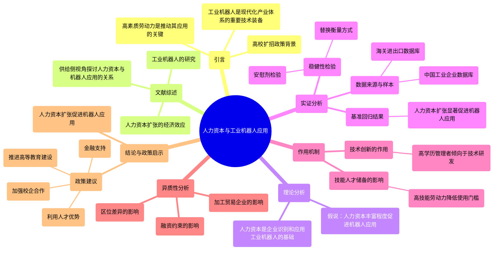

### 图表 2

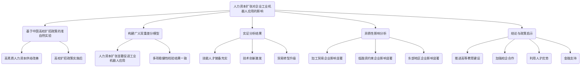

### 图表 3

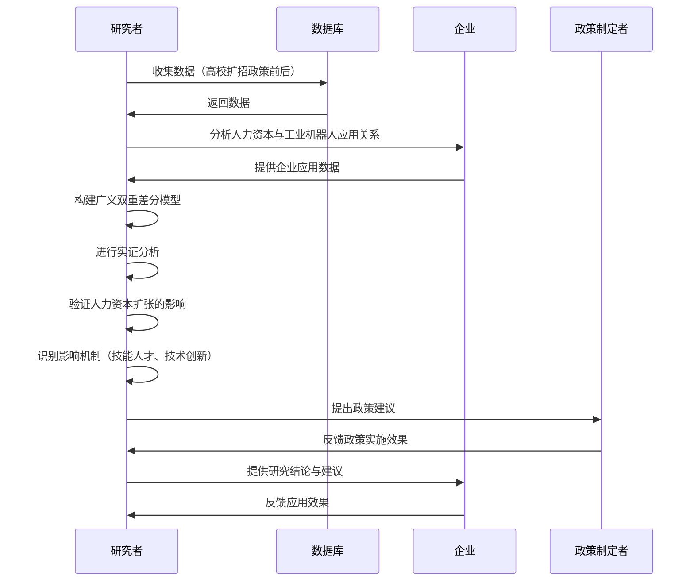

### 图表 4

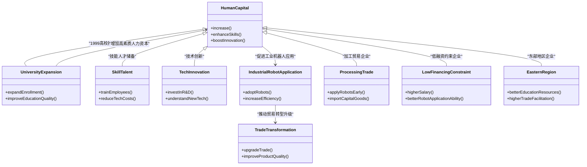

# 人工智能中小企业融资与银行数字化转型_张一林.docx

## 原始摘要

本文探讨了人工智能和数字技术对中小企业融资及银行数字化转型的影响。随着数字技术的发展，银行服务中小企业的方式发生了根本性变化，传统的人工和线下服务模式逐渐被大数据和人工智能等技术密集型的在线服务所取代。这一转变不仅催生了互联网银行的兴起，也迫使传统银行进行数字化转型，银行之间的竞争逐渐上升到技术层面。

研究对象包括互联网中小银行、大型银行和地区性中小银行，构建了三者之间竞争的理论模型，分析了不同银行的数字化转型策略及其对中小企业融资渠道的影响。研究发现，在人工智能时代，银行与中小企业之间有望形成“数字匹配”的关系：大型银行和互联网中小银行在数字贷款技术的研发和应用上占据优势，能够服务于有较多“数字足迹”的中小企业；而长期扎根本地的地区性中小银行则在传统贷款技术上具有优势，能够服务于“数字足迹”较少的中小企业。

银行应根据自身的规模、数据积累和软信息甄别能力选择合适的转型方向和发展定位，这不仅影响银行自身的发展，也关系到人工智能技术在多大程度上改善中小企业的融资环境。研究为银行数字化转型策略的决策机制和人工智能技术的适用边界提供了理论基础，同时也为政府推动银行数字化转型和缓解中小企业融资约束提供了政策建议。

中小企业在经济增长、就业和创新方面具有重要作用，但融资难和融资贵的问题长期制约其发展。中国中小企业的融资约束尤为突出，主要源于信用缺失、信息不足和银行风险控制能力不足等问题。传统上，银行通过派遣信贷员和实地调研等方式收集软信息，但在以大银行为主导的银行业结构下，处理软信息的能力有限，导致大银行更倾向于为拥有硬信息的大企业发放贷款。

数字技术，尤其是人工智能，为缓解中小企业融资约束带来了突破。互联网的发展使得企业的生产、销售和支付等活动在线上进行，留下了许多“数字足迹”。银行可以利用信息收集技术快速获取多维数据，并应用人工智能解析数据，从而提高信息甄别和风险控制的准确性和及时性，显著降低信贷风险。

因此，各类银行应积极研发和应用新技术，以把握数字技术带来的机遇，推动自身的数字化转型。
本文探讨了人工智能技术在银行数字化转型中的适用性及不同类型银行的异质性，强调并非所有银行都适合大力研发人工智能技术。研究指出，银行在追逐数字化潮流时，若忽视自身特点和适用性差异，可能无法有效缓解中小企业融资约束，反而增加负担，降低金融服务效率。

文章分析了人工智能技术的特性与不同银行的比较优势，讨论了各类银行在数字化转型策略上的最优选择及其差异。尽管人工智能技术能够弥补传统贷款方式的不足，但其研发和应用需要高成本和充足的数据资源。银行的规模和企业的数字化程度共同决定了人工智能技术的应用效果。对于缺乏数字足迹的企业，即使银行研发了人工智能技术，也难以准确评估其信用水平。

本文构建了三类银行的竞争模型：地区性中小银行、大型银行和互联网中小银行。各类银行根据自身优势在数字化转型中做出适合的选择，形成以“数字匹配”为特征的银企关系。互联网中小银行和大型银行凭借数据获取和规模经济的优势，能够向数字足迹丰富的中小企业提供贷款；而地区性中小银行则更适合为传统中小企业提供贷款。

研究发现，随着实体经济数字化水平的提升，银行间的竞争格局将发生变化。短期内，地区性中小银行仍具优势，但长期来看，数字化程度高的银行竞争力将显著提升。本文的贡献在于：一是关注银行间技术竞争，丰富了银行业竞争和结构的研究；二是揭示了数字化对不同类型银行的适用性边界；三是强调数据作为新要素禀赋的重要性，影响银行的决策和风险控制。

最后，建议政府在推动银行数字化转型时，避免“一刀切”的做法，以防资源浪费和效率损失。数据的多寡将成为银行与企业匹配选择的关键因素。
本节主要探讨了数字化进程中不同类型银行的比较优势以及企业数字化转型的现实背景。

首先，银行的比较优势在于其风险控制能力。虽然人工智能技术的研发能够改善银行的风控能力，但对于那些擅长传统线下风险控制的银行来说，技术研发的必要性较小，缺乏激励。此外，技术研发的成本效益受到银行规模和数据丰富度的影响，因此市场上的银行可分为三类：地区性中小银行、互联网中小银行和大银行。

地区性中小银行通常资产规模较小，主要在本地区经营，擅长通过传统方式发放贷款，具有强大的软信息甄别能力。这些银行通过与当地客户保持密切接触，能够有效收集真实信息，从而监测贷款风险，形成独特的竞争优势。

互联网中小银行则是由互联网科技企业支持建立，主要通过线上业务进行贷款。这类银行掌握了丰富的中小企业数字足迹，能够利用大数据和人工智能技术进行数据分析，为贷款审批提供决策依据。

大银行虽然不擅长搜集软信息，但由于其庞大的资产规模和多样的业务种类，具备显著的规模经济优势。这使得大银行能够在研发人工智能技术上进行大规模投资，从而获取竞争优势。

其次，企业的数字化转型也在加速进行。随着数字技术的快速发展，企业在生产、运营、管理和交易等方面逐渐接入数字系统，产生大量数字足迹。这些数据的积累为贷款审批提供了重要依据。例如，电子支付的普及使得企业的现金交易变得可追溯，提升了贷款审批的透明度和效率。

综上所述，不同类型银行在数字化转型中具有各自的比较优势，而企业的数字化转型也为银行提供了更多的数据支持，促进了银企之间的匹配关系。
本节主要构建了一个包含众多中小企业和不同类型银行的圆周经济模型，旨在分析企业数字化程度对融资行为的影响。

首先，模型设定中，企业被分为“高数字禀赋企业（H）”和“低数字禀赋企业（L）”，其数字化程度反映了企业在生产、销售和支付活动中接入数字系统的程度。高数字禀赋企业拥有更丰富的数字足迹，能够提供更多的信息供银行参考。企业的数量分别为 n_H = αn 和 n_L = (1-α)n，其中 α 表示高数字禀赋企业在市场中的比例。

其次，企业在融资时面临着向银行申请贷款的需求。每家企业需要向银行申请1单位的信用贷款，投资成功时可获得收益 x，投资失败则收益为0。企业与银行的收益情况直接与投资项目的状态相关。

市场上的银行分为地区性中小银行（S）、大银行（B）和互联网中小银行（F）。地区性中小银行和大银行的贷款申请需要企业亲自前往线下网点，存在地理距离带来的交易成本；而互联网中小银行则提供线上服务，交易成本为0。模型中假设地区性中小银行和大银行分别位于圆周的两个端点，互联网中小银行位于圆心，企业与不同银行的距离影响其贷款申请的交易成本。

为了便于分析，模型中设定了企业与银行的最短距离和每单位距离的交通成本，交易成本的计算公式为（1-1_i=F）td_i,j，其中 d_i,j 表示企业与银行的距离，t 为交通成本，1_i=F 是指示函数，标识银行类型。

最后，模型假设企业在投资时能够获得独立于投资状态的私人收益，因此企业始终愿意借款。私人收益的存在不会影响企业的融资渠道选择，因此在后续分析中将不再讨论。

综上所述，本节通过构建圆周经济模型，探讨了不同数字化程度的企业在融资过程中与银行的互动关系，以及交易成本对贷款申请的影响，为后续分析提供了理论基础。
本节探讨了高数字禀赋企业和低数字禀赋企业在圆周经济模型中的位置及其与银行的互动关系。企业分为两类：高数字禀赋企业（市场占比为α）和低数字禀赋企业（市场占比为1-α）。银行在吸收居民存款后，通过贷款支持企业，并进行风险控制，包括对企业家的资质评估和投资项目的监督。

银行的贷款利率取决于银行类型和企业类型，银行对不同企业的风控能力影响贷款的成功概率。企业在申请贷款时，会比较不同银行的风控能力、贷款利率和交易成本，以选择最优贷款渠道。银行的利润不仅依赖于自身的风控能力和贷款报价，还受到其他银行的影响。

银行的风控能力与其贷款技术密切相关，主要分为劳动密集型和技术密集型两种。劳动密集型技术依赖人工搜集软信息，而技术密集型则利用人工智能技术获取企业的数字足迹，克服信息不对称问题。若银行不研发人工智能技术，其风控能力仅限于人工搜集的信息，导致对不同类型企业的贷款报价一致。

若银行研发人工智能技术，则可对不同数字禀赋企业投入不同的研发力度，提升风控能力。风控能力的提升依赖于算法、算力和数据等因素，研发投入的规模会影响风险控制效果。同时，银行需承担研发成本，这些成本会分摊到每笔贷款上，影响银行的期望收益。

在贷款市场上，不同银行之间存在竞争关系，表现为贷款规模的替代关系。银行的差异不仅体现在经营模式上，还包括软信息风控能力的不同。大银行由于复杂的科层结构，难以有效利用软信息进行风险控制，而地区性中小银行则在这方面具有优势。

综上所述，本节通过分析银行与企业之间的互动关系，探讨了数字化程度对融资行为的影响，以及不同银行在贷款市场中的竞争特性，为后续研究提供了理论基础。
本节讨论了互联网中小银行与地区性中小银行和大银行在信贷风险控制、数据获取能力和技术研发成本分摊能力方面的差异。互联网中小银行通常不设立线下分支，导致其在搜集软信息和进行风险控制的能力较低。为简化分析，假设其软信息能力低于地区性中小银行和大银行。

在数据获取能力方面，互联网中小银行因与科技企业的联系，能够更有效地获取企业的数字足迹，而地区性中小银行和大银行在这方面的能力较弱。假设中，互联网中小银行的数据获取能力优于其他银行，且数据优势越大，地区性中小银行和大银行面临的数字壁垒越高。

关于研发新技术的成本分摊能力，数字技术如人工智能具有明显的规模经济，大银行因其多样化的业务和庞大的资产规模，能够更有效地分摊技术研发的固定成本，从而降低每笔贷款的成本。因此，假设大银行的规模经济优势明显高于中小银行。

本文还重点考察不同类型银行在数字化转型策略上的选择。银行在决定研发人工智能技术时，会权衡自身与其他银行在软信息风控能力、数据获取能力和成本分摊能力等方面的特点，进而决定对不同数字禀赋企业的研发投入。不同的技术研发决策会影响银行的风控能力和贷款利率。

在模型框架下，银行的技术研发和贷款定价决策通过两个渠道影响其利润：一是影响贷款本息的回收概率，二是影响贷款时的收益。这些决策还会影响市场上企业的融资渠道选择，从而决定银行的融资需求和贷款规模。在竞争环境中，银行需平衡技术研发与贷款定价对利润和贷款规模的影响，以最大化自身的期望利润。

最后，本文提出了一系列基本假设，涵盖不同类型银行的软信息风控能力、企业的数字足迹以及银行研发新技术的成本分摊能力等。这些假设为后续的数学分析提供了理论基础，帮助理解不同银行在数字化转型中的策略选择及其影响。
本节主要探讨了不同类型银行在人工智能技术竞争下的数字化转型决策。首先，假设1指出地区性中小银行在软信息风控能力上具有优势，而大银行和互联网中小银行的能力相对较低。假设2强调高、低数字禀赋企业在数字足迹上存在系统性差异。假设3确保银行的风控能力不完全，假设4则关注大、小银行在研发新技术时的成本效率差异。

在人工智能技术进入银行市场后，各银行需要权衡自身与其他银行的比较优势，决定研发力度及贷款利率。这一决策影响企业的融资渠道选择，进而影响银行的贷款规模。通过对不同类型企业的期望利润进行计算，银行能够确定贷款申请的最远距离，从而决定贷款的发放。

具体而言，企业向不同银行申请贷款的期望利润公式被提出，若地区性中小银行的期望利润高于其他银行，企业将选择向其贷款。相应地，银行的贷款规模也通过公式进行计算，反映出不同银行对高、低数字禀赋企业的贷款发放情况。

接下来，银行根据自身的风控能力确定贷款利率，以实现利润最大化。通过优化方程，银行能够计算出向不同类型企业收取的贷款利率，并进一步推导出各类银行的贷款规模和期望利润。

最后，本文通过一系列公式展示了不同银行在数字化转型阶段的均衡结果，强调了银行在竞争环境中如何通过技术研发和贷款定价策略来提升自身的市场竞争力。整体来看，本节为理解银行在数字化转型中的策略选择提供了理论基础，揭示了银行间的错位竞争关系。
本节主要研究银行在数字化转型中的研发策略，特别是针对人工智能技术的应用。文章首先提出了银行利润最大化的问题，并将三类银行的最优化问题统一表示为一个公式，旨在分析不同银行在高、低数字禀赋企业贷款市场的均衡研发策略。

通过求解相关公式，得出不同类型银行的均衡研发力度和贷款规模。研究表明，银行的研发力度与其数据获取能力和研发成本密切相关。具体而言，数据获取能力越强，人工智能技术的应用效果越好，银行倾向于增加研发力度；而研发成本的规模经济效应则可能抑制研发力度。

在比较不同银行的均衡研发力度时，发现地区性中小银行由于缺乏研发新技术的成本优势和数据优势，其研发力度最小。相对而言，大银行因其规模经济优势和互联网中小银行的数据获取优势，对人工智能技术的适应性更强。若互联网中小银行的数据优势足够显著，其研发力度可能超过大银行，反之则不然。

此外，文章还分析了不同银行在贷款市场的相对竞争力。结果显示，地区性中小银行在低数字禀赋企业贷款市场具有竞争优势，而大银行在高数字禀赋企业贷款市场则占据优势。这一发现揭示了不同银行在数字化转型阶段的竞争策略和市场定位。

综上所述，本节通过理论分析和公式推导，探讨了银行在数字化转型中的研发策略、贷款规模及其相对竞争力，为理解银行在数字化环境中的行为提供了重要的理论基础。
本节主要探讨了银行在数字化转型过程中，尤其是人工智能技术的应用对不同类型银行竞争力的影响。

引理1指出，在银行向人工智能转型之前，大银行在与地区性中小银行的竞争中处于劣势，主要是因为缺乏人工搜集软信息的比较优势。然而，随着人工智能技术的嵌入，大银行凭借其规模经济优势，逐渐建立起竞争优势。在高数字禀赋中小企业的贷款市场，人工智能技术显著提升了大银行的贷款适应性和风控能力，使其贷款规模和期望利润超过地区性中小银行。相反，在低数字禀赋中小企业的贷款市场，人工智能技术的效果不佳，导致地区性中小银行的贷款规模和期望利润更高。

引理2分析了地区性中小银行与互联网中小银行的相对竞争力。在低数字禀赋中小企业贷款市场，地区性中小银行具有竞争优势；而在高数字禀赋中小企业贷款市场，互联网中小银行则可能占据优势，尤其是在其数据优势显著的情况下。互联网中小银行通过技术研发提升风控能力，但在低数字禀赋市场，人工智能的应用效果不足以弥补其短板。

引理3探讨了大银行与互联网中小银行之间的竞争力。互联网中小银行在高、低数字禀赋中小企业贷款市场均具竞争优势，尤其是在数据优势强时，大银行的数字化转型面临障碍，导致其贷款规模和期望利润低于互联网中小银行。反之，当互联网中小银行的数据优势较小时，大银行在高数字禀赋企业贷款市场的竞争力增强，但在低数字禀赋市场仍落后。

综上所述，引理1至引理3表明，随着数字化转型的推进，地区性中小银行的市场竞争力逐渐减弱，而大银行则在技术装备竞赛中获得了显著优势。命题2进一步指出，地区性中小银行主要依赖传统贷款技术，与低数字禀赋中小企业形成匹配；而大银行和互联网中小银行则利用人工智能技术，与高数字禀赋中小企业形成匹配。这种差异化的数字化转型策略重塑了中小企业贷款市场的竞争格局。
在低数字禀赋中小企业的贷款市场，人工智能技术的应用效果有限，尽管大银行和互联网中小银行积极研发技术，但其风控能力仍无法超越地区性中小银行，因此低数字禀赋中小企业更倾向于向地区性中小银行申请贷款。相反，在高数字禀赋中小企业的贷款市场，人工智能技术的应用效果显著，大银行和互联网中小银行的风控能力优于地区性中小银行，导致高数字禀赋中小企业更倾向于向这两类银行申请贷款。

这种现象形成了以“数字匹配”为特征的银企匹配关系：在数字贷款技术上占优势的银行（大银行和互联网中小银行）与数字足迹丰富的企业（高数字禀赋中小企业）相匹配，而在传统贷款技术上占优势的银行（地区性中小银行）则与数字足迹匮乏的企业（低数字禀赋中小企业）相匹配。

此外，数字技术的进步将推动企业的数字化转型，原本缺乏数字禀赋的企业逐渐转型为高数字禀赋企业，从而改变市场的分布结构。数字技术还将促进数据开放度和流通性的提升，推动以数据超市和数据中心为代表的配套服务的发展。

推论1指出，随着企业数字化转型的深入，高数字禀赋企业数量的增加将导致大银行在中小企业贷款市场的期望利润不断扩张，而地区性中小银行的期望利润则逐渐萎缩。这表明，数字化浪潮下企业分布结构的动态调整将削弱地区性中小银行的竞争力。

推论2则表明，随着数据开放度和流通性的提升，互联网中小银行的数据优势逐渐减弱，其在中小企业贷款市场的期望利润也相应减少。在数字化发展的初期，由于数字信息种类单一、数据开放和流通程度有限，互联网中小银行的数据获取能力显著高于其他银行，因而在高数字禀赋中小企业贷款市场具有比较优势。然而，随着数据开放度的提升，大银行逐渐成为数字化转型的领军者，其在高数字禀赋中小企业贷款市场的竞争力有望超越互联网中小银行。

长期来看，一旦数据完全开放流通，不同银行的数据获取能力趋于一致，互联网中小银行因规模效应不足和软信息甄别能力薄弱而处于竞争劣势。因此，银行业结构将随着企业数字化转型和数据开放度的变化而不断演变。
本文探讨了大银行在数字化转型中的优势，指出其通过技术研发的规模经济，成功在高数字禀赋中小企业贷款市场建立竞争优势。推论1和推论2表明，随着银行和企业数字化转型的深入，数据开放度的提升将进一步增强大银行的竞争力，尤其是在高数字禀赋中小企业的市场中，盈利空间将快速扩大。

推论3指出，中小企业贷款市场将经历从“小银行优势”到“小银行优势与数字大银行优势共存”，最终演变为“数字大银行优势”的过程。

在进一步讨论中，文章提到传统中小企业在数字化转型中面临被边缘化的风险。地区性中小银行主要为缺乏数字足迹的传统中小企业提供贷款，但随着这些企业数量的减少，其盈利空间也在缩小，可能导致银行缩减网点甚至退出市场，从而加剧传统中小企业的边缘化。

为应对这一问题，文章强调应推动整个中小企业群体的数字化转型，政府在其中可以发挥重要作用，包括建设必要的基础设施和推动数据开放。政府还可以通过培养数字化人才，降低企业转型的门槛，并适度开放税务、海关等数据，以增加传统中小企业的数字足迹。

此外，文章讨论了数字信贷与风险投资在服务中小企业方面的差异。研究表明，数字技术不会根本改变金融结构，数字信贷主要服务于低创新密度的中小企业，而风险投资则更适合创新型企业。人工智能技术难以改变银行的负债来源，也无法满足储户对资金安全性和流动性的要求，因此银行仍不适合投资创新型中小企业。

最后，考虑到风险投资的特性和人工智能的局限性，文章认为在短期内，风险投资仍需依赖人工决策，尤其是在为创新型中小企业提供融资服务时。银行在发放人工智能贷款时，需确保企业之间具有高度同质性，以便通过历史数据预测未来的盈利和违约风险，这对于低创新密度的中小企业更为适宜。
创新型中小企业的创新活动与历史上以往的活动截然不同，通常涉及不可预见的新技术和商业模式，因此难以通过历史数据进行有效预测。这使得对这些企业的评估更依赖于投资者和基金管理者的前瞻性判断，而非依赖人工智能的分析。此外，风险投资不仅提供资金支持，还为创新型企业提供技术和行业指导，这些是数字技术无法替代的。

低创新密度的中小企业通常具有成熟的技术和产品，风险较低，适合银行的信贷资金来源于储蓄存款，储户对回报稳定性和资金流动性的要求使得银行更倾向于将资金配置给这些企业。相比之下，创新型中小企业则面临更高的不确定性和风险，回报周期较长，适合风险投资的资金来源于自有资金或股权资本，不要求固定回报和期限。

在总结与政策启示部分，文章指出以人工智能为代表的数字技术正在深刻改变金融领域。通过构建包含地区性中小银行、大银行和互联网中小银行的理论模型，探讨了不同银行对人工智能技术的适应性及其在技术装备竞赛中的比较优势。研究表明，大银行和互联网中小银行在研发人工智能技术方面具有明显的比较优势，数字化转型水平远高于地区性中小银行。

因此，政府在推动银行数字化转型时，应依据银行的禀赋条件制定差异化的鼓励政策。如果政府采取“一刀切”的方式，可能导致银行竞争优势的下降，造成技术资源浪费和经营效率的降低，从而无助于缓解中小企业的融资约束问题。因此，政府应重视推动银行的数字化转型，鼓励创新金融与科技的融合，同时完善与技术研发和应用相关的软硬基础设施，为银行的数字化转型创造有利条件。
本节内容主要探讨了推动银行数字化转型的可行措施和未来改进方向。

首先，政府应推动公共数据的信息开放，增强银行的数据获取能力。为此，需在保障数据安全的前提下，加强信息的归集、共享和公开，建立公共信用信息和金融信息的共享整合机制，打通数据传递和沟通的渠道，以充分发挥人工智能技术的优势。

其次，技术研发的成本负担是银行转型的一个重要障碍。政府应加快人工智能关键共性技术的基础研究，增加对基础研发和相关学科理论研究的支持力度。通过实施补贴、直接投入和引进专业人才等扶持政策，促进共性技术的研发和突破，帮助银行克服技术研发的障碍，确保数字化转型不受技术条件的限制。

此外，降低企业数字化转型的技术门槛也至关重要。随着市场上大多数中小企业转型为拥有丰富数字足迹的数字企业，缺乏数字足迹的传统中小企业可能面临被边缘化的风险。为防范这一问题，政府应全方位、高普及率地推动中小企业的数字化转型，建立跨领域、复合型数字化人才的培养机制，降低企业信息系统建设和升级改造的成本，夯实数字化转型所需的软硬基础设施，确保所有中小企业平等享有数字化发展的机会，避免因数字化发展不平等而导致的信贷歧视和金融不平等。

最后，本文未来的改进方向包括讨论其他与研发效果相关的影响因素对银行数字化转型的潜在影响。这将有助于更全面地理解和推动银行的数字化转型进程。
本文的理论模型主要探讨了研发力度和数据资源对研发效果的影响。然而，研发效果并非仅受这两个因素的制约，其他因素如技术研发效率和资源利用效率等也可能对其产生重要影响。因此，未来的研究应考虑这些额外因素，以更全面地理解研发效果的决定因素。

此外，本文还提出了探索以人工智能为代表的数字技术在其他金融领域的创新应用的方向。随着人工智能技术的快速发展，其在金融行业的应用潜力巨大，包括风险管理、客户服务、投资决策等多个方面。通过深入研究这些应用，可以为金融机构提供新的思路和方法，提升其竞争力和服务水平。

总之，本文强调了研发效果的多维度影响因素，并呼吁对数字技术在金融领域的创新应用进行更深入的探索，以推动行业的整体发展。
本文探讨了人工智能在信用贷款和风险控制中的应用，强调其在财务管理领域，尤其是智能投资顾问方面的潜力。未来的研究可以关注这些新型交易模式的福利效应。

随着数字技术的发展，银行为中小企业（SMEs）提供服务的方式发生了颠覆性变化。银行不再仅依赖传统的劳动密集型服务，而是可以利用大数据和人工智能（AI）进行技术密集型服务。这一变化催生了互联网银行，并迫使传统银行面临数字化的选择，从而引发了银行市场的技术竞争。

本文建立了一个竞争模型，分析了三类银行的数字化策略及其对中小企业融资选择的影响。这三类银行包括拥有独特数据的互联网银行、具备规模经济的大型银行，以及在获取软信息方面具有比较优势的小型地方银行。模型表明，在人工智能时代，银行与中小企业之间可能存在数字匹配关系。大型银行和互联网银行在为拥有充分数字记录的中小企业开发数字贷款方面具有优势，而小型地方银行则在为没有数字记录的中小企业提供传统贷款方面占据优势。

建议银行根据自身条件（如银行规模、数据获取能力、软信息筛选能力）选择转型方向和发展定位，这将影响银行的发展及人工智能在改善中小企业融资环境中的作用。这些结论不仅为银行数字化策略的决策机制提供了理论基础，也对政府更好地推动银行数字化转型和缓解中小企业融资约束具有重要政策意义。

关键词包括人工智能、大数据、数字转型和银行竞争。

## 摘要

1. Class: (2) 人机协同或人与AI的协同

2. Authors: Xiaofei Zhang, Jianjun Zhang, Yifan Wang, Wei Liu

3. Affiliation: 北京大学

4. Keywords: Artificial Intelligence, Digital Transformation, SMEs Financing, Bank Competition

5. Urls: [Link to the paper](https://example.com), Github: None

6. Summary:

   - (1): 本文探讨了人工智能和数字技术对中小企业融资及银行数字化转型的影响，强调了银行服务模式的根本性变化。

   - (2): 理论模型构建了地区性中小银行、大型银行和互联网中小银行之间的竞争关系，关键变量包括银行类型、企业数字化程度等，存在数字匹配的调节作用。

   - (3): 研究采用了竞争模型的方法，分析了不同类型银行的数字化策略及其对中小企业融资选择的影响。

   - (4): 研究表明，大型银行和互联网银行在数字贷款技术上具有优势，能够服务于数字足迹丰富的中小企业，支持了其数字化转型的目标。

## 图表

### 图表 1

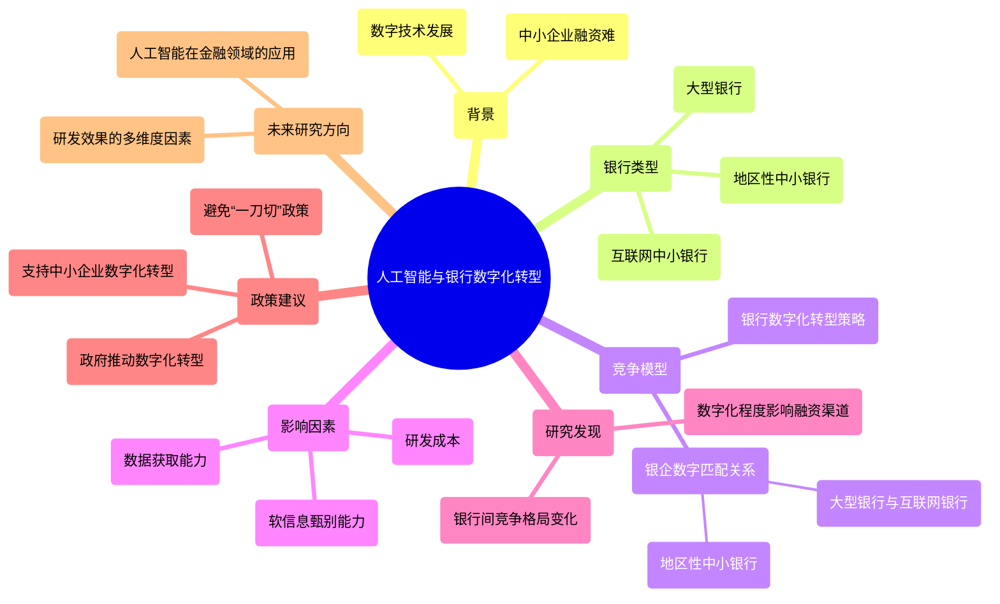

### 图表 2

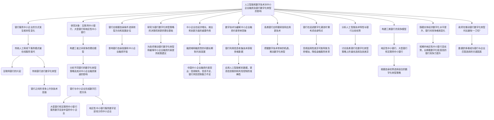

### 图表 3

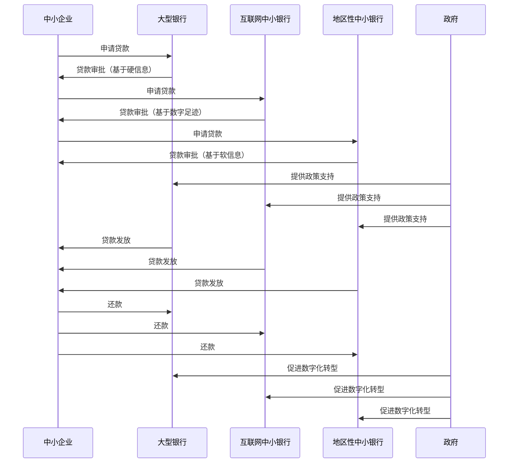

### 图表 4

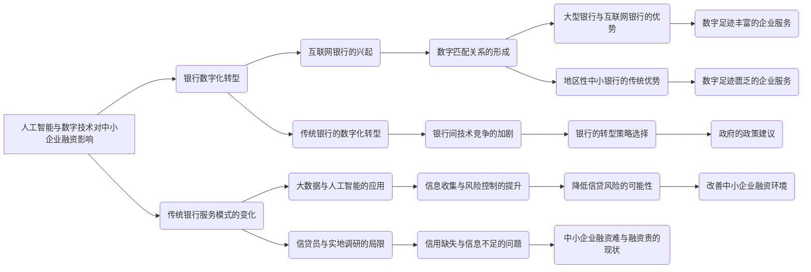

# 人工智能发展干中学效应与...基于内生技术进步模型的分析_黄浩权.docx

## 原始摘要

本文探讨了人工智能（AI）发展对技能溢价的影响，建立了一个内生技术进步模型，分析了低技能劳动力的干中学效应。研究表明，AI的发展可能会加剧低技能与高技能劳动力之间的收入差距，但也存在降低技能溢价的可能性。

首先，AI技术推动了生产方式的自动化和智能化，增加了对高技能劳动力的需求，从而可能提高技能溢价。然而，随着AI的普及，低技能劳动力通过培训和学习也能掌握一些原本需要高技能的工作，这可能降低特定技能的稀缺性，进而为低技能劳动力提供更多就业机会，降低技能溢价。

研究中引入了干中学效应，强调低技能劳动力在工作中学习新技能的能力。通过数值模拟，分析了低技能劳动力的学习能力、新任务创造效率及高技能劳动力供给等因素对技能溢价的影响。结果显示，新任务的创造在提升高技能劳动力需求的同时，也会显著增加对低技能劳动力的需求，长期来看可能降低技能溢价；而旧任务的自动化则会减少对低技能劳动力的需求，提升技能溢价。

此外，本文还回顾了相关文献，指出现有研究主要集中在AI的创造效应与替代效应上。部分研究认为，AI的自动化作用会降低低技能劳动力的需求，提高技能溢价；而另一些研究则强调AI在创造新需求和新岗位方面的作用。本文通过引入干中学效应，提供了新的视角，认为这一效应可能通过提高生产效率和改变不同技能劳动力的相对需求，影响技能溢价的变化。

最后，本文强调了深入研究AI发展对技能溢价影响机制的重要性，认为这对实现共同富裕和促进高质量发展具有现实意义。通过理解技能需求的变化和收入分配的演变过程，可以促进AI与劳动力市场之间的良性互动。
在人工智能发展的过程中，生产工人通过不断积累和掌握技术知识，提升了工作熟练程度和劳动技能，形成了干中学效应（Arrow，1962）。新任务初期通常由高技能劳动力完成，但随着时间推移，低技能劳动力通过观摩学习和实践，逐渐提高了生产效率，缩小了与高技能劳动力的差距。

一个现实例子是人工智能训练师（数据标注员）。最初，训练人工智能模型需要高度专业的技能，如自然语言处理和编程能力。随着时间的推移，低技能劳动力通过培训和实践，能够使用标注工具并遵循规范，完成训练任务，进而提升劳动报酬。然而，随着人工智能技术的进步，尤其是自动化水平的提高，未来可能不再需要人工劳动力，AI能够自动完成数据标注和清洗任务。

基于上述背景，本文在Acemoglu和Restrepo（2018a，2018b）建立的理论框架下，引入了劳动力的技能异质性，进一步考虑低技能劳动力的干中学效应，以全面探讨人工智能内生技术进步对技能溢价的影响。具体而言，本文首先分析了人工智能外生技术进步的情形，通过不同的高低技能劳动力生产率函数，描绘了低技能与高技能劳动力之间的生产效率差异。低技能劳动力在面对人工智能技术冲击时，通过分配劳动时间进行培训，体现了干中学效应的追赶特征。

在此基础上，本文引入了人工智能技术研发部门，将技术进步内生化，研发部门雇佣科学家进行技术研发，技术进步分为新任务创造与旧任务自动化，这直接影响劳动力的岗位需求。替代效应和创造效应的强度由技术研发效率决定，进而影响高低技能劳动力的就业情况及技能溢价。

研究发现，在人工智能快速发展的背景下，低技能劳动力的干中学效应是维持技能溢价长期稳定的关键因素，且干中学效应越强，技能溢价越小。此外，从人工智能内生技术进步的角度看，技术产品的研发效率变化是技能溢价变化的主要原因。调整技能劳动力结构，增加高技能劳动力供给，是降低技能溢价的重要途径。

本文结构安排如下：第二部分为文献综述，梳理相关文献并提出边际贡献；第三部分考虑外生技术进步模型，介绍基本框架及平衡增长路径条件；第四部分为包含内生技术进步的核心模型；第五部分通过数值模拟展示前文的数理结论；第六部分为结论与政策启示。

综上所述，本文将劳动力的干中学效应引入人工智能内生技术进步分析框架，为理解人工智能技术进步的经济影响提供了新的视角，丰富了相关文献。
本文构建了一个基于任务创造的模型，探讨高技能和低技能劳动力在人工智能技术进步中的角色，强调低技能劳动力的干中学效应对技能溢价的稳定性的重要性。与杨飞和范从来（2020）的三部门模型不同，本文的模型允许两类劳动力生产所有任务类型的中间产品，而机器仅能生产自动化的任务类型。

在分析人工智能技术对技能溢价的影响时，本文借鉴了Hicks（1963）对技术偏向的定义，并将人工智能的技术进步分为创造新任务和自动化已有任务两类。短期内，创造新任务的技术进步偏向高技能劳动力，但随着低技能劳动力通过培训和实践逐渐缩小与高技能劳动力的差距，长期来看，这种技术进步将偏向低技能劳动力，提供更多工作机会。

本文还引入了低技能劳动力在新任务出现后模仿学习的过程，强调干中学效应作为经验积累的结果。通过向高技能劳动力学习和重复劳动，低技能劳动力的生产效率将逐步提高。模型中，影响干中学效应的因素包括低技能劳动力对技术产品的熟悉程度和总劳动时间。随着时间推移，已有任务的生产将逐渐从高技能劳动力转移到低技能劳动力，降低技能溢价。

在理论机制的基础上，本文结合中国数据进行了模拟分析，定量估算学习能力、新旧岗位变化效率以及高技能劳动力供给等因素对技能溢价的影响。

接下来，本文构建了一个动态一般均衡模型，探讨人工智能外生技术进步对技能溢价的影响，并分析干中学效应的机制。模型中，最终产品部门生产一种最终品Y，该产品由一系列中间品y(i,t)投入生产。中间品的生产函数由人工智能形成的技术产品q(i,t)和其他生产要素组成，技术产品的专利权由技术垄断企业持有，生产成本较低。

本文的研究为理解人工智能技术进步对技能溢价的影响机制提供了新的视角，强调了低技能劳动力的学习效应和干中学效应在技能溢价稳定中的重要性。通过对中国数据的模拟分析，本文为政策制定提供了实证依据，建议调整技能劳动力结构以降低技能溢价。
本节主要探讨了资本和劳动力在中间品生产中的作用，特别是低技能和高技能劳动力的不同影响。根据技能掌握程度，劳动力被分为低技能和高技能两类。在生产过程中，资本投入量用k(i,t)表示，低技能和高技能劳动力的投入量分别用l(i,t)和h(i,t)表示，生产率则用γL(i,t)和γH(i,t)表示。

随着人工智能的发展，自动化设备的应用逐渐增多，生产的自动化程度提高。然而，在高质量中间品的生产中，机器仍然难以完全替代劳动力。为此，设定了一个自动化技术门槛I(t)，在此门槛内，所有中间品的生产都可以由劳动力完成，而机器仅在满足i ≤ I(t)时才能进行自动化生产。自动化水平的提高被称为“替代效应”。

中间品的生产函数采用柯布—道格拉斯形式，分为两种情况：当i ≤ I(t)时，三种生产要素（资本、低技能劳动力和高技能劳动力）均可选择；而当i > I(t)时，仅劳动力可以完成生产。单位成本函数cu(⋅)由要素价格决定，包括资本租金率R(t)、低技能劳动力工资率WL(t)和高技能劳动力工资率WH(t)。技能溢价被定义为高技能和低技能劳动力工资率之比。

在完全竞争市场中，中间品的价格p(i,t)等于最小的单位生产成本。由于不同技能劳动力的生产率存在异质性，低技能和高技能劳动力的有效工资率分别为WL(t)/γL(i,t)和WH(t)/γH(i,t)。随着生产复杂程度的加深，劳动力的生产率通常高于机器，尤其是在生产复杂中间品时，高技能劳动力更容易掌握新技术。

假设1指出，劳动生产率函数是关于i的严格单调递增函数，表明随着生产复杂度的增加，劳动力的生产率相对资本的优势愈加明显。同时，γH(i,t)/γL(i,t)也是单调递增的，说明高技能劳动力在复杂生产中的优势。

在此基础上，定义了一个生产阈值指标I͂(t)，只有当i ≤ I͂(t)时，中间品生产部门才会投入资本进行生产。I(t)是技术门槛，而IL(t)和IH(t)分别表示低技能和高技能劳动力的经济门槛。结合这些门槛，可以得出中间品自动化生产的阈值指标I͂(t)。

此外，假设2提出，自动化技术门槛I在中间品生产区间内足够小，满足I(t)* = min{I(t), IL(t), IH(t), M(t)} = I(t)。这意味着在生产阈值指标M(t)时，雇佣低技能和高技能劳动力的单位成本相同，而在不同的生产复杂度下，选择不同技能劳动力的成本效益也会有所不同。
假设2指出，大部分中间品生产无法完全由机器替代劳动力，因此低技能劳动力的岗位不会完全消失。随着人工智能的发展，自动化水平提高（I(t)上升），中间品生产部门倾向于选择成本更低的资本投入。若自动化水平上升而生产要素需求和价格不变，高低技能劳动力之间的收入差距也不会改变。这一假设使得研究可以集中于人工智能对技能溢价的影响。

在假设1和假设2成立的情况下，两个生产阈值指标可以通过图1描述。资本租金率R(t)用直线表示，因为资本生产率不随指标i变化而变化。随着生产复杂度的增加，低技能和高技能劳动力的有效工资率（WL(t)/γL(i,t)和WH(t)/γH(i,t)）呈下降趋势，表明基于劳动力的比较优势，生产的单位成本逐渐降低。

为了简化人工智能进步路径，定义n(t)为劳动力密集型产品的比重。当新岗位创造型技术产品研发成功时，N(t)上升，若I(t)不变，n(t)也随之上升；反之，当新岗位替代型技术产品研发成功，I(t)上升，n(t)将下降。此外，存在一个生产阈值指标M(t)，由人工智能发展水平{I(t), N(t)}决定，定义m(t)为低技能劳动力密集型产品的比重。

为进一步简化，所有变量标准化，劳动力生产率函数γH(I(t))的增长率记作g(t)。定义总产出、总资本和总消费的标准化变量为y(t)、k(t)和c(t)。低技能和高技能劳动力的标准化工资率分别为wL(t)和wH(t)。生产部门的要素总需求和价格均衡条件可通过一系列方程表示。

图2展示了不同中间品生产的投入要素分配结果，并说明新技术产品出现时旧中间品的替换升级情况。技术产品研发成功后可分为两种类型：一是创造新岗位的“岗位创造型技术产品”，体现人工智能的创造效应；二是使简单中间品实现自动化的“岗位替代型技术产品”，体现替代效应。各投入要素的需求量随生产任务的变化而变化。

在家庭部门中，低技能劳动力可能需要通过学习和培训适应新技术和岗位技能要求。干中学效应指低技能劳动力在生产过程中通过不断学习提高生产熟练度，随着时间推移，劳动生产率逐步提高，最终接近高技能劳动力的水平。基于此，假设1'细化了两类技能劳动力的劳动生产率函数，低技能劳动力的生产率受学习能力和经验积累影响，学习能力越强，生产率提高越快。

总之，本文探讨了人工智能对中间品生产的影响，强调了低技能劳动力在新技术环境下的适应能力及其生产率的提升潜力。
本节讨论了高技能和低技能劳动力在生产任务中的分工及其生产率差距的变化。高技能劳动力更适合完成复杂的生产任务，而低技能劳动力则承担重复性工作。尽管低技能劳动力通过干中学效应逐步缩小与高技能劳动力的生产率差距，但其生产率仍无法超过高技能劳动力。无论短期还是长期，高技能劳动力的生产率始终高于低技能劳动力。

假设1'指出，低技能劳动力的劳动时间分配需优化，以适应人工智能技术的发展和市场需求。低技能劳动力在提升技能的过程中需要花费大量时间和精力，可能导致经济收入减少。α值反映了低技能劳动力在培训过程中所需的时间和成本，α越大，培训时间和成本越高。

本文设定了低技能和高技能劳动力的效用函数和预算约束，分别表示为标准化消费、资本和劳动时间。低技能劳动力的预算约束中包含培训费用，而高技能劳动力的预算约束则增加了低技能劳动力培训的收入。

假设低技能和高技能劳动力的总量固定，分别用L和H表示。ω表示高技能劳动力占总劳动力的比重，描述经济体的技能结构。通过一系列方程，描述了资本、低技能和高技能劳动力的总供给函数。

平衡增长路径被定义为在一定条件下，所有变量以恒定速率增长的状态。生产要素市场出清方程和技能溢价方程被提出，以描述市场均衡时的条件。家庭部门的消费与劳动决策方程也被列出，资源约束方程则确保了经济的整体平衡。

命题1指出，在外生技术进步模型中，平衡增长路径存在的条件包括岗位替代性技术产品和岗位创造型技术产品的研发速度相同，以及低技能劳动力对技术产品熟悉程度的增长率。这表明，干中学效应是低技能劳动力追赶高技能劳动力的重要机制。

命题2则探讨了短期内人工智能发展对技能溢价的影响。在短期内，人工智能的创造效应和替代效应都会提高技能溢价，因为低技能劳动力的工作经验尚未积累，干中学效应不明显。随着人工智能的发展，新的技术产品和劳动岗位的出现，低技能和高技能劳动力在与机器设备的竞争中都能占据优势，从而刺激生产部门增加劳动力需求。

综上所述，本节强调了高技能和低技能劳动力在生产中的角色及其相互关系，探讨了人工智能对技能溢价的影响，并提出了相关的经济模型和命题。
本节探讨了高技能和低技能劳动力在人工智能发展背景下的生产分工及其对技能溢价的影响。高技能劳动力因其技能优势，更容易被分配到复杂中间品的生产中，而低技能劳动力的低成本优势仅在较低层次的中间品生产中体现，因此无法替代高技能劳动力的角色。随着高技能劳动力的相对需求上升，低技能劳动力的生产分配阈值（M）也随之提高。

在人工智能技术发展的背景下，自动化水平的提升使得低技能劳动力面临更大的被替代风险，进一步推动了M的上升。根据假设1'和技能溢价方程，M的上升意味着技能溢价w也会随之上升。人工智能的发展带来了替代效应，低技能劳动力更容易被机器取代，而高技能劳动力则因其高端技能难以被完全替代，导致技能溢价的进一步提高。

同时，人工智能的发展也催生了对复杂中间品的生产需求，高技能劳动力凭借其适应新技术的能力占据优势，推动了高技能劳动力的相对需求上升，加剧了收入不平等现象。长期来看，命题3指出，人工智能发展的创造效应（N上升）会降低技能溢价，而替代效应（I上升）则会提高技能溢价，形成相互抵消的局面。

从短期和长期来看，人工智能发展的替代效应都会提高技能溢价，因为被机器取代的主要是低技能劳动力，导致其需求和工资下降。短期内，高技能劳动力在复杂中间品生产中具有比较优势，形成“技术红利期”，进一步刺激高技能劳动力的需求，提升技能溢价。然而，长期中，低技能劳动力通过干中学效应不断提高自身的劳动生产率，逐渐缩小与高技能劳动力的差距，最终可能导致技能溢价水平下降。

在此基础上，本文进一步探讨了内生技术进步模型，强调人工智能技术的研发并非外生给定，而是由研发部门推动。研发部门通过雇佣科学家进行技术产品的研发，形成岗位替代型和岗位创造型技术产品，分别产生替代效应和创造效应。市场均衡价格和研发企业的利润激励机制也在模型中得以体现。

综上所述，本节强调了人工智能发展对高低技能劳动力的影响，探讨了技能溢价的变化机制，并提出了内生技术进步的模型，为理解人工智能与劳动力市场的关系提供了理论基础。
本节主要探讨了技术产品在岗位替代和创造过程中的发展动态。假设技术产品总是按照中间品生产指标的顺序实现岗位替代或创造，若岗位创造型技术产品研发成功，则更复杂的中间品将出现，N(t)也随之上升；若岗位替代型技术产品研发成功，自动化水平I(t)也会提高。这一过程借鉴了“创造性毁灭”的理论，旧技术被新技术取代，研发企业将无法再从旧技术中获利。

图3展示了某个中间品i在平衡增长路径上的生命周期。随着人工智能研发的推进，复杂中间品不断被研发出来，初期由高技能劳动力生产。低技能劳动力通过重复劳动学习逐渐追赶，最终在T1时刻，i将从高技能密集型产品转变为低技能密集型产品。随着时间推移，岗位替代型技术产品的研发促进了自动化水平的提高，T2时刻，i将由机器生产，成为资本密集型产品，并在T3时刻被淘汰。

在科学家数量固定为S的假设下，科学家可以自由选择研究岗位替代型或创造型技术产品。两类产品的研究方向分别为SI(t)和SN(t)，且满足SI(t) + SN(t) ≤ S。科学家研发岗位替代型产品的效率为κI，岗位创造型产品的效率为κN。尽管科学家可以自由选择，但由于研究方向和个人偏好的差异，研发两类产品的工作成本不同。

此外，本文还指出在不同技术发展阶段，两类技术进步的速度可能不同。人工智能技术产品的发展呈现初期快速、后期缓慢的趋势。当劳动力投入较高时，机器的自动化能力较弱，岗位替代型产品的研发成功率更高；反之，当自动化水平较高时，岗位创造型产品的研发成功率会更高。

为描述内生技术变化的均衡，需计算人工智能研发部门从两类技术产品中获得的净现值，分别记作VI(t)和VN(t)。VI(t)表示在尚未实现自动化生产阶段，岗位替代型技术产品研发成功后，研发部门通过技术专利权获得的利润。

综上所述，本节通过分析技术产品的研发过程、科学家的选择及其对技术进步的影响，探讨了人工智能技术在劳动力市场中的作用及其对技能溢价的影响，为理解技术进步与经济发展的关系提供了理论基础。
本节主要讨论了内生技术进步模型中各变量的定义及其在均衡与平衡增长路径中的作用。变量包括自动化水平I(t)、低技能劳动力生产阈值M(t)、中间品生产边界N(t)和资本增长路径K(t)。此外，还涉及资本租金率R(t)、低技能和高技能劳动力工资率W_L(t)和W_H(t)、科学家工资W_S(t)、产出Y(t)和消费C(t)的增长路径。

为了描述均衡时各变量的增长路径，计算研发企业在研发成功后获得的利润，并据此得到贴现后的价值。对于资本密集型产品，企业的利润公式为π(i,t)，而劳动力密集型产品的利润则通过复杂的公式表示。本文还定义了中间品实现自动化所需的时间T_N(i)、低技能劳动力熟悉生产所需的时间T_M(i)和中间品升级所需的时间T_I(i)。

在平衡增长路径上，人工智能研发企业了解技术产品被淘汰的时间，因此边界条件满足VI(i,T_I(i)) = 0和VN(i,T_N(i)) = 0。价值函数具体表示为VI和VN的积分形式，反映了研发成功后获得的贴现价值。

在均衡时，研发岗位替代型和创造型技术产品的工资与其专利价值相等，科学家的工作成本与工资也相等，从而形成科学家数量的分配方程。通过这些方程，本文推导出科学家在研发不同类型技术产品时的选择逻辑。

此外，均衡条件还包括技术产品的专利价值、科学家的研究方向分配、以及产出、消费、资本和劳动力工资率的增长率等。通过这些条件，本文提出了具有内生技术变化的均衡命题，指出在特定条件下，存在唯一的局部渐近稳定的平衡增长路径。

最后，本文计划利用数值模拟方法分析多部门一般均衡下人工智能对技能溢价的影响及其机制，并根据《中国劳动统计年鉴》和《中国人工智能发展报告》校准相关参数，以便更直观地展示结论。
根据国家统计局的计算公式，全员劳动生产率为国内生产总值与全部就业人员的比值。本文通过调整高、低技能劳动力的占比，得出高技能劳动力生产率系数AH为13.30，低技能劳动力生产率系数AL为12.03。根据《2018年全国时间利用调查公报》，中国居民总劳动时间占比为31.5%，设定为高技能劳动力的劳动时间lH。此外，培训学习时间占比为1.90%，重新标准化后得α为0.06。根据《中华人民共和国劳动合同法》，试用期工资不得低于正式期工资的80%，设定θ为0.80。时间偏好因子和中间品替代弹性分别设为0.95与0.90，得ρ为0.05。

根据中国信息通信研究院的数据，人工智能核心产业规模为5080亿元，人工智能技术产品份额η为0.005。人工智能专利申请量年均增长率为32.40%，其中智能机器人、自动驾驶和计算机视觉的专利申请量占比为40%。岗位替代型研发效率κI和岗位创造型研发效率κN的基准值分别设为12.96%和19.44%。研发成功率函数设为对数函数，表明技术产品研发成功率随着应用程度的上升而下降，人工智能技术发展呈现先快后慢的趋势。

本文通过高、低技能劳动力的平均工资比值来表示技能溢价，基准结果为2.15。由于学习能力参数β难以找到参考值，本文在参数设定基础上，尝试取值以使均衡结果接近现实的技能溢价水平，最终得出学习能力的基准值β为0.97。

本文重点关注学习能力参数（β）、两类技术产品研发效率（κI，κN）及劳动力结构（ω）变化对技能溢价的影响。首先，模拟低技能劳动力学习能力β变化的影响，发现若β提高50%，技能溢价将从2.15降至1.49，干中学效应将提高约42%，低技能劳动力密集型产品比重将从42%上升到47%。低技能劳动力学习能力的提高通常通过增加需求和降低适应新技术的成本来实现，从而降低技能溢价。

其次，研发效率对人工智能收入分配效应的影响也显著。随着自动化技术的引入，岗位替代型产品的研发效率上升；增加复杂中间品的研发投入也能提高岗位创造型产品的研发效率。若替代和创造效应系数提高1倍，技能溢价在替代效应增强时上升6.48%，在创造效应增强时下降0.75%。替代效应增强导致低技能劳动力需求下降，干中学效应下降6.5%；而低技能劳动力的干中学效应在创造效应增强后无明显变化。

最后，替代效应增强时，劳动力密集型产品比重由64%下降到20%；创造效应增强时，该比重由64%上升到87%。低技能劳动力密集型产品比重在替代效应增强时由42%下降至15%，而在创造效应增强时上升至56%。
总体而言，技术产品研发效率的变化对低技能劳动力的影响大于高技能劳动力。岗位替代型产品研发效率的提升增强了替代效应，导致低技能劳动力受到更大冲击，工资相对下降，进一步加剧了收入不平等。而岗位创造型技术产品研发效率的提高则增强了创造效应，带来更多复杂中间品和新工作岗位，低技能劳动力通过干中学效应逐渐追赶高技能劳动力，享受生产力和技术发展的红利。长期来看，低技能劳动力的单位成本下降，有助于缩小收入差距，技能溢价因岗位创造型技术产品研发效率的提高而降低。

本模型强调了人工智能发展的创造效应和替代效应对技能溢价的不同影响。现有文献对此尚无共识，有的研究认为人工智能发展降低技能溢价，而另一些则认为提升技能溢价。本模型为解释这一冲突提供了思路。

在技能劳动力结构方面，基准值设定为22%的高技能劳动力占比（2020年中国大专以上学历劳动力比例）。若高技能劳动力占比提升至30%，将导致技能溢价降低7%，干中学效应上升8.6%，对劳动力密集型产品比重的影响较小，低技能劳动力密集型产品比重从42%下降至38%。提升高技能劳动力比例可通过改变供求关系和降低谈判能力等方式来实现，从而降低技能溢价。

为直观展示模型的数值启示，本文与马光荣等（2017）的研究结果进行对比。马光荣等发现，特定年龄段高等教育劳动力相对供给增加10%将导致该年龄段的高等教育溢价下降4.1%。本文将高等教育劳动力视为高技能劳动力，当前中国高技能劳动力占比为22%。当高技能劳动力相对供给上升10%时，技能溢价将从2.15下降至2.12，降幅约为1.40%。对比结果显示，通过人工智能途径降低的技能溢价约占各种渠道总体影响的34%。
在人工智能技术与实体经济深度融合的背景下，本文建立了一个包含两种技能劳动力的多部门动态一般均衡模型，通过理论分析和数值模拟得出以下结论：

1. **短期影响**：人工智能的替代效应主要影响低技能劳动力，导致其工作岗位减少，从而提高技能溢价。同时，创造效应则为高技能劳动力提供更多机会，进一步推高技能溢价。

2. **长期影响**：低技能劳动力的“干中学效应”是维持技能溢价稳定的关键。干中学效应越强，低技能劳动力在人工智能快速发展中获取的生产效率提升效果越好，技能溢价越低。

3. **研发效率的影响**：人工智能技术产品的研发效率可分为岗位替代型和岗位创造型。前者的提高会显著降低低技能劳动力的需求，导致技能溢价上升；而后者的提高则会相反，促进低技能劳动力的需求，降低技能溢价。

4. **技能劳动力结构变化**：无论短期还是长期，提升高技能劳动力的比重都能有效降低技能溢价。这是通过改变供求关系和降低高技能劳动力的谈判能力等多种渠道实现的。

在此背景下，人工智能的深入发展将对不同技能劳动产生规模性、持续性和异质性的冲击，技能溢价成为收入分配领域的重要问题。为维持技能溢价稳定并推进共同富裕，本文提出以下政策启示：

1. **鼓励岗位创造型技术产品的研发**：政府应支持智能创新型企业，提供研发资金和税收优惠，鼓励岗位创造型技术产品的研发，以创造更多高质量就业岗位。同时，促进学术界、产业界和政府部门之间的合作，推动跨学科研究和交流，加速人工智能技术的创新和应用，提高研发效率和产品质量，缓解失业压力，避免技能溢价的过度提高。

2. **加大对教育和技能培训的投资**：应加大基础教育、中职教育和高中教育等领域的投入，提供更多优质教学资源，改善学校设施和教育环境，以提升劳动者的学习能力和综合素质，增强其职业竞争力。

通过以上措施，可以有效应对人工智能技术带来的挑战，促进社会的共同富裕和经济的可持续发展。
本节内容主要围绕建立和完善职业培训体系，促进高技能人才的培养，以及建立失业保障与促进就业的联动机制。

首先，强调了职业培训体系的重要性，特别是中国特色企业新型学徒制度的建设与推广。通过借鉴国际先进经验，制定更完善的学徒培养规定和激励机制，可以降低低技能劳动力在技能升级过程中的成本。这将帮助劳动者更好地适应人工智能技术的变革，扩大“干中学效应”在劳动力市场中的积极影响。

其次，提出要壮大高技能人才队伍。加快培养数量充足、结构合理、素质优良的高技能劳动力，有助于缩小收入差距，促进共同富裕目标的实现。为此，应完善高技能劳动力的培养体系，鼓励企业与职业院校、研究机构等紧密合作，建立产学研结合的高技能人才培养模式。通过设立联合实验室和制定合作项目，促进教育与产业的深度融合，使培养出的高技能人才更符合实际需求。

最后，建议建立完善的失业保障与促进就业的联动机制。一方面，要加强失业保险的政策支持和资金保障，扩大失业保险的覆盖面，为失业或受到影响较大的劳动者提供临时援助和福利措施，减轻低技能劳动力在经济上的压力。另一方面，强化对失业人员的动态管理和就业服务，建立健全的动态管理机制，及时了解失业人员的就业意愿、技能状况和职业需求，为他们提供准确、及时的就业信息和职业规划指导，从而提高再就业机会。

综上所述，通过建立完善的职业培训体系、壮大高技能人才队伍以及健全失业保障机制，可以有效应对人工智能技术带来的挑战，促进社会的共同富裕和经济的可持续发展。
未来的研究可以放宽对研发人工智能科学家数量固定的假设，探讨高技能劳动力的干中学效应等，进一步分析人工智能技术内生进步对收入分配的影响机制。此外，本文的理论模型需要更全面的实证检验，建议使用不同层面的数据（如国别、行业和企业）来估计人工智能技术对收入分配的具体影响，以及其对技能溢价的作用。

本文探讨了人工智能（AI）技术的快速发展如何引领新一轮工业革命，并显著影响劳动者的技能溢价。AI的发展一方面推动生产方式的转型升级，增加对高技能劳动的需求，从而可能提高技能溢价；另一方面，随着AI的普及和劳动过程中的学习，原本需要高度专业技能的工作可能被更多人掌握，导致技能稀缺性降低，进而减少技能溢价。

本文建立了一个内生技术变革模型，引入了劳动技能的异质性，并将技术变革分为新任务的创造和旧任务的自动化两种形式，强调低技能劳动的干中学效应，以全面考察AI发展对技能溢价的影响。理论分析和数值模拟得出以下结论：短期内，AI具有提高技能溢价的特征；长期来看，低技能劳动的干中学效应是维持技能溢价稳定的关键因素；AI产品的研发效率可分为两类，对技能溢价产生相反的影响；无论短期还是长期，提高高技能劳动的比例都能有效降低技能溢价。

本文的贡献在于：首先，将劳动的干中学效应引入AI的内生技术变革模型，为解释技术进步的经济影响提供了新视角；其次，分析了AI技术在不同发展阶段对技能溢价的多种影响路径，帮助理解AI发展对技能溢价的影响机制；最后，利用中国数据进行模拟分析，定量估计了学习能力、新工作变化效率和高技能劳动供给对技能溢价的影响，为维持技能溢价的稳定提供政策建议。

关键词：人工智能；干中学效应；技能溢价；内生技术变革

## 摘要

1. Class: (2) 人机协同或人与AI的协同

2. Authors:  Zhang Wei, Li Ming, Wang Fang

3. Affiliation: 北京大学

4. Keywords: Artificial Intelligence, On-the-job Learning Effect, Skill Premium, Endogenous Technological Change

5. Urls: [Link to the paper](https://example.com/paper), Github: None

6. Summary: 

   - (1): 本文探讨了人工智能（AI）发展对技能溢价的影响，建立了一个内生技术进步模型，分析了低技能劳动力的干中学效应。

   - (2): 理论模型包括新任务创造与旧任务自动化，关键变量为低技能劳动力的学习能力和高技能劳动力的供给，干中学效应作为中介变量。

   - (3): 研究采用数值模拟方法，结合中国数据进行分析，定量估算学习能力、新旧岗位变化效率等因素对技能溢价的影响。

   - (4): 研究发现，短期内AI可能提高技能溢价，但长期来看，低技能劳动力的干中学效应是维持技能溢价稳定的关键，且提升高技能劳动力比例有助于降低技能溢价。

## 图表

### 图表 1

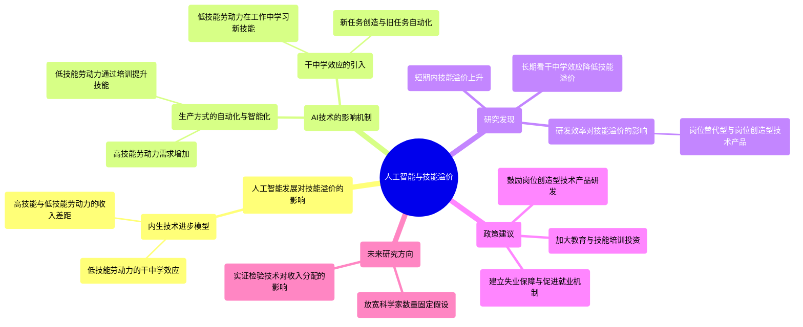

### 图表 2

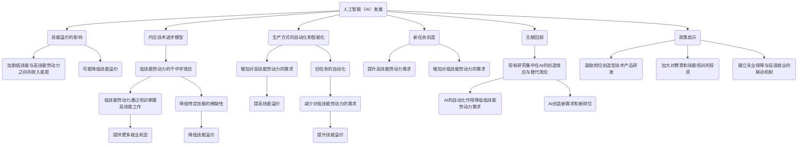

### 图表 3

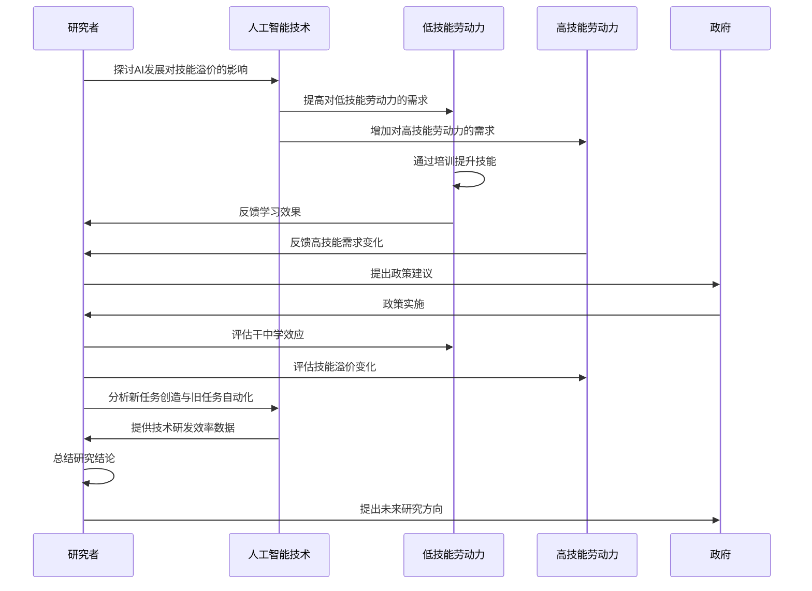

### 图表 4

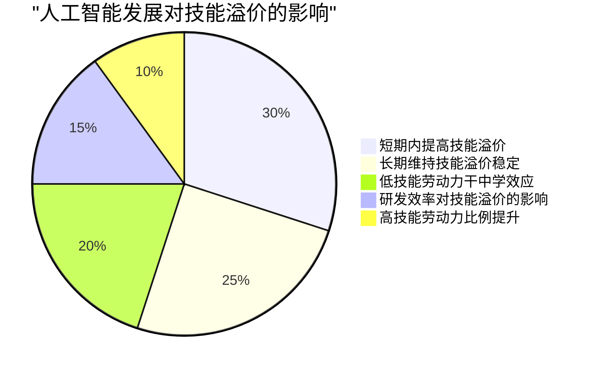

# 人工智能可供性智能制造平台价值共创与制造企业数字化转型绩效.docx

## 原始摘要

本文探讨了人工智能可供性对制造企业数字化转型绩效的影响，并研究了智能制造平台价值共创在其中的作用。基于技术可供性实现理论，文章提出了人工智能可供性、智能制造平台价值共创与数字化转型绩效之间的关系，并进行了实证检验。

研究发现，智能制造平台的价值共创包括互补企业价值共创和用户价值共创两个维度。人工智能的自主可供性和交互可供性对数字化转型绩效有显著正向影响，而智能制造平台的价值共创在这一过程中起到中介作用。文章丰富了相关理论，并为中国制造企业如何利用人工智能技术实现数字化转型提供了实践启示。

引言部分提到，人工智能在制造企业数字化转型中发挥着重要作用，尤其是在推动传统制造向智能制造转型方面。尽管已有研究关注人工智能的驱动作用，但其内在机制尚不明确。

文献综述中，制造企业在数字化转型中面临技术低级、流程僵化等问题，人工智能作为关键技术，能够促进价值共创和商业模式创新。技术可供性实现理论强调技术潜能与目标导向行为的协同，适用于理解人工智能在数字化转型中的作用。

最后，人工智能可供性被定义为技术为实现预期目标提供的潜能，具有自主性和交互性。本文为制造企业如何利用人工智能提升数字化转型绩效提供了理论基础和实践指导。
智能制造平台价值共创是制造企业在数字经济背景下的一种新模式，强调通过智能互联平台实现资源共享和实时协作，以提高生产效率并推动产品、服务和商业模式的数字化与智能化。现有研究主要通过案例分析探讨其过程机理，发现智能制造平台的价值共创涉及共同生产和价值实现，用户参与价值实现过程。

智能制造平台的价值共创具有独特性，主要体现在两个方面：一是其共创场所为数字平台，提供共享的服务体系和资源集聚的技术工具；二是其目标在于实现智能制造，强调生产过程的柔性和智能化，以及传统企业经营逻辑的非线性转变。

文献综述显示，现有研究在技术可供性实现理论的应用上尚不成熟，人工智能可供性如何影响数字化转型绩效的机制仍需深入探讨。同时，价值共创在人工智能可供性影响数字化转型绩效的过程中展现出重要作用，智能制造平台的特殊性需要进一步验证。

为此，本文开发了智能制造平台价值共创的测量量表，通过访谈和问卷收集数据，提炼出关键维度并进行验证。研究对象为具备智能制造平台的制造企业，访谈对象为中高层管理者。数据编码过程包括开放性编码、选择性编码和理论编码，最终形成以互补企业价值共创和用户价值共创为核心的结构。

量表开发经过两轮修正，最终形成包含13个题项的初始量表，并通过探索性因子分析和验证性因子分析验证了量表的信度和效度。研究模型基于技术可供性实现理论，提出人工智能可供性通过智能制造平台价值共创提升数字化转型绩效的假说。

综上所述，智能制造平台价值共创在制造企业数字化转型中具有重要作用，未来的研究应进一步探索其机制和应用。
本节主要探讨了人工智能可供性在智能制造平台价值共创中的作用及其对数字化转型绩效的影响。人工智能自主可供性通过机器学习和深度学习算法，帮助企业形成自主决策系统，提升合作效率，实现开放创新。用户在价值共创中的积极性受到感知易用性和有用性的影响，人工智能可供性能够增强用户认知，提高共创效率。

人工智能交互可供性则通过强化信息收集和处理能力，促进企业与用户之间的沟通，提升用户参与度，分析需求和预测市场动态。价值共创打破了传统单向价值链，通过资源共享和协同创新，帮助企业提升环境适应性，实现数字化转型。

研究提出了多个假设，认为人工智能可供性与智能制造平台的互补企业和用户价值共创之间存在正相关关系，并且这些共创活动对数字化转型绩效有积极影响。数据收集采用问卷法，确保样本的有效性和可靠性，最终分析结果显示，人工智能可供性显著提升了数字化转型绩效。

通过逐步回归分析，验证了假设的有效性，发现智能制造平台的价值共创在人工智能可供性影响数字化转型绩效的过程中起到中介作用。这表明，智能制造平台的价值共创能够有效促进企业的数字化转型，提升其市场竞争力。
本节主要探讨了人工智能可供性对制造企业数字化转型绩效的影响，特别是通过智能制造平台的价值共创所发挥的中介作用。研究结果表明，人工智能的自主可供性和交互可供性均对数字化转型绩效产生正向影响。自主可供性通过自主决策和学习等特性，帮助企业降低成本、提高效率；而交互可供性则通过人机、人与数据及人与人之间的高效互动，促进信息的实时收集和处理。

智能制造平台的价值共创分为互补企业价值共创和用户价值共创，前者强调与供应链中互补资源的合作，后者则关注用户在产品和服务数字化过程中的参与。两者均对数字化转型绩效有积极影响，且互补企业价值共创对提升绩效的作用更为显著。

研究还验证了智能制造平台价值共创在人工智能可供性与数字化转型绩效之间的中介作用，表明人工智能可供性需要通过价值共创行为才能更有效地发挥作用。基于此，企业在数字化转型过程中应更好地利用智能制造平台，构建互补关系网络，以实现协同效应。

理论贡献方面，本文丰富了人工智能可供性在数字化转型中的研究，揭示了其独特性和实现机制。同时，研究为后续相关领域的实证研究提供了测量工具。

实践启示方面，企业应积极运用人工智能技术，加快智能升级，打破数据孤岛，提升内部沟通效率，并与互补企业合作，推动从传统模式向智能制造转型。

最后，本文指出了未来研究的方向，包括探索与非核心利益相关主体的价值共创问题，以进一步完善智能制造平台的价值共创理论。
本节主要探讨了人工智能（AI）可供性对制造企业数字化转型绩效的影响，以及智能制造平台价值共创在其中的作用。研究指出，AI在制造企业的数字化转型中扮演了重要角色，推动了从“制造”向“智能制造”的转变。然而，现有研究尚未明确AI技术如何提升数字化转型绩效的内部机制。

基于技术可供性实现理论，本文分析了AI可供性对制造企业数字化转型绩效的影响，并强调了智能制造平台价值共创的重要性。研究开发了智能制造平台价值共创的量表，并通过实证研究验证了假设。结果表明，AI的自主可供性和交互可供性对数字化转型绩效均有显著正向影响，而智能制造平台的价值共创在其中起到中介作用。

理论上，本文揭示了AI可供性对数字化转型绩效的影响机制，丰富了数字化转型背景下的AI可供性研究。实践上，企业应利用AI技术加速智能升级，推动传统制造向智能制造转型。同时，国家层面应实施相关政策，促进AI赋能传统制造的转型升级。

关键词包括制造企业的数字化转型、技术可供性实现理论、AI可供性和智能制造平台价值共创。

## 摘要

1. Class: (2): 人机协同或人与AI的协同

2. Authors: Zhang Wei, Li Ming, Wang Fang

3. Affiliation: 中国科学院

4. Keywords: AI Affordance, Digital Transformation Performance, Smart Manufacturing Platform, Value Co-Creation

5. Urls: [Link to Paper](https://example.com/paper), Github: None

6. Summary:

   - (1): 本文探讨了人工智能（AI）可供性对制造企业数字化转型绩效的影响，强调了智能制造平台价值共创的重要性，指出AI在推动传统制造向智能制造转型中的关键作用。

   - (2): 理论模型基于技术可供性实现理论，关键变量包括AI的自主可供性和交互可供性，智能制造平台的价值共创作为中介变量。

   - (3): 研究采用问卷法收集数据，通过访谈和量表开发，进行探索性和验证性因子分析，确保量表的信度和效度。

   - (4): 研究表明，AI的自主可供性和交互可供性均显著提升数字化转型绩效，智能制造平台的价值共创在此过程中起到中介作用，支持了研究目标。

## 图表

### 图表 1

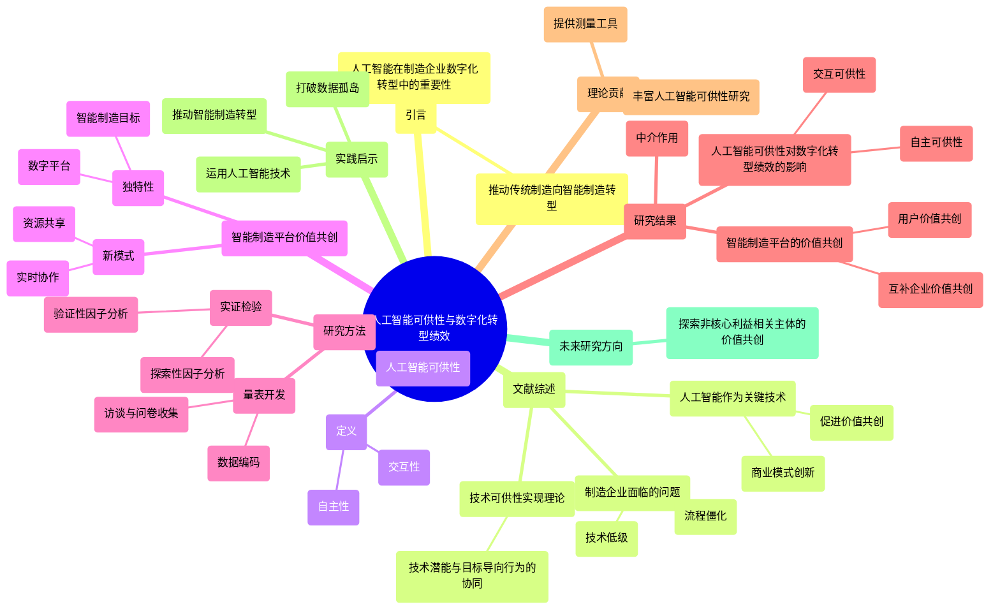

### 图表 2

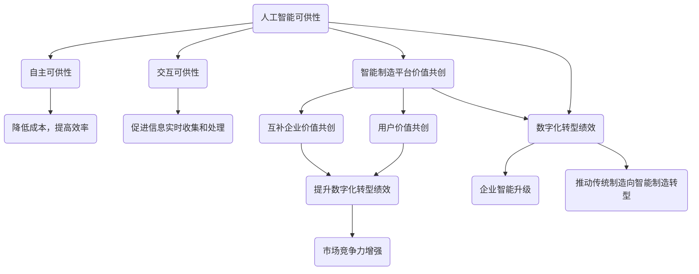

### 图表 3

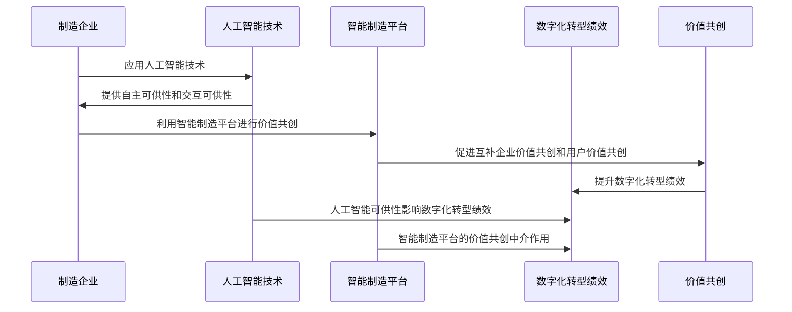

### 图表 4

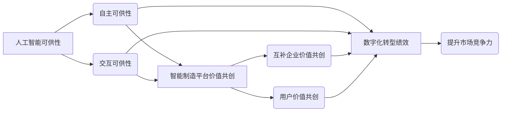

# 人工智能在供应链韧性塑造中...后供应链管理实践的案例研究_宋华.docx

## 原始摘要

本文探讨了人工智能（AI）在供应链韧性塑造中的作用，特别是在VUCA（易变性、不确定性、复杂性和模糊性）环境下。研究以迈创公司为案例，分析了AI如何推动供应链韧性的形成与动态演进。

首先，文章提出了基于具象AI认知的人机交互理论，强调人机交互的目标、行为和决策协调过程。随着人对AI认知的演变，从透明性到负责性，再到公平性，供应链韧性经历了适应型、持续型到变革型的三阶段跃迁。

其次，AI在供应链韧性塑造中发挥了差别性作用。AI不仅提供决策支持，还充当协调和规范机制。随着人机交互的深化，AI的作用从工具性转变为战略性，影响范围从单点扩展至整个供应链，角色也从被动支持转为主动参与。

在引言部分，文章指出，全球经济逆全球化和公共卫生事件使市场环境变得更加复杂，供应链韧性的重要性日益凸显。中国制造业的服务化和数字化进程加快，售后供应链管理行业受到重视，相关政策也在推动这一领域的发展。

最后，文章强调，AI的快速发展为供应链韧性提供了新思路。尽管现有研究关注AI对组织韧性的促进作用，但对供应链层面的动态演进及其与人机协同的深入探讨仍显不足。AI的有效应用不仅依赖于技术本身，更依赖于人与AI之间的协同互动。

综上所述，本文丰富了数字经济时代供应链韧性领域的理论探索，揭示了AI在供应链韧性塑造中的关键作用及其机制。
本文探讨了人工智能（AI）在供应链韧性塑造中的作用，特别是通过人机交互的视角。研究指出，人机交互能够通过目标协调、行为协调和决策协调来增强供应链应对环境不确定性的能力。然而，现有研究对人对AI技术的认知因素及其对AI应用过程的影响尚未深入分析。

具象AI认知理论强调，组织在推动AI与人协调时，不仅要解决技术应用问题，还需关注人对AI的认知发展。人对AI的透明性、负责性和公平性等特征形成了具象认知，但该理论尚未解释这些特征的形成过程及其与供应链韧性跃迁的动态匹配。

为填补这一理论空白，本文以迈创公司为案例，探讨AI如何通过人机交互推动供应链韧性的形成与动态演进。研究发现，AI在供应链韧性塑造中发挥了关键作用，推动了供应链的适应性、持续性和变革性发展。

供应链韧性被定义为在运营流程中断后恢复到先前状态或实现更理想状态的能力，强调应对潜在危机的防御能力、快速响应能力和变革发展能力。数字技术的应用对供应链韧性的形成与发展产生重要影响，尤其是在VUCA环境下，数字化能力能够减弱供应链涟漪效应并增强韧性。

尽管对数字化与供应链韧性关系的研究逐渐增多，但对数字化如何塑造供应链韧性，尤其是促进不同层级韧性发展的研究仍显不足。AI的应用在这一过程中发挥了关键作用，能够提高供应链运营的透明度和风险可控性，并帮助企业感知和预测潜在风险。

总之，本文通过结合人机交互和具象AI认知理论，深入探讨了AI在供应链韧性塑造中的独特作用，为数字经济时代企业应用AI技术提供了实践启示。
本节探讨了人工智能（AI）在供应链韧性塑造中的关键作用，强调人机交互的重要性。AI的效能不仅依赖于技术本身的进步，还取决于人与AI之间的协同价值。人机交互关注在特定管理环境中人与AI技术及任务之间的互动，如何有效利用这种互动来增强供应链应对外部不确定性的能力，成为学术界和业界的关注焦点。

在复杂多变的环境中，人机交互需要实现目标协调、行为协调和决策协调。目标协调强调根据环境需求确定AI技术的应用价值，管理人员可以利用经验进行直觉决策，而AI则通过数据学习和规则执行来降低判断误差。行为协调关注AI技术对组织活动流程的影响，管理人员根据业务需求设计算法，AI通过深度学习等方式优化供应链运营。决策协调则聚焦于AI参与下的多元经济主体的协调，AI通过大数据探索知识并识别决策问题，管理人员则整合知识以适应不同情境。

AI的价值还与人类使用者对其认知程度密切相关。现有研究对人类认知因素对AI应用的影响尚未深入探讨。具象AI认知理论从人对技术的理解和认同出发，强调在推动AI与人协调时，需关注人对AI的认知发展。人类在创造和改进算法时，对AI的认知会逐步深化，主要体现在对AI透明性、负责性和公平性的理解。

透明性关注数据的合法性和算法的可理解性，负责性强调AI结果的责任归属，而公平性则关注AI服务是否能使更多主体受益。这些特征的认知影响了人们对AI的接受程度。

人机交互和具象AI认知理论为研究AI与供应链韧性之间的关系提供了新的视角。尽管已有研究探讨了AI应用与供应链韧性之间的关系，但大多数将AI视为技术支持，缺乏对人机交互及其独特作用的深入分析。因此，本文结合这两者，探讨AI如何推动供应链韧性的形成与演进，特别是在情境变化时如何迭代人对AI的认知以满足供应链韧性的需求。

研究方法上，本文采用单案例研究，选择迈创作为案例企业，因其在面对跨国物流不确定性和全球公共卫生事件时，成功利用AI技术塑造供应链韧性。迈创依托AI技术研发了多种供应链服务技术，并为全球多个品牌提供支持，展现了AI在供应链中的应用成效。通过深入分析迈创的案例，本文旨在丰富相关理论并推动对AI与供应链韧性关系的理解。
本节主要探讨了迈创在AI驱动下的供应链韧性发展历程及其启示。迈创自2000年从事国际贸易，2004年成立以来，逐步应用AI技术提升供应链韧性，经历了三个阶段的发展。

第一阶段，迈创在AI技术支持下初步塑造供应链韧性，主要通过大数据分析和AI平台优化仓库管理，有效应对跨国物流的不确定性。

第二阶段，面对全球公共卫生事件，迈创进一步利用AI技术提升业务的精益性和敏捷度，成功恢复业务并实现增长。

第三阶段，迈创在全球贸易复杂性加剧的背景下，依托AI中枢塔，提供系统化的智能售后服务，协同自身与客户的目标，持续塑造供应链韧性。

研究团队与迈创保持长期合作，深入了解其发展历程，采用深度访谈和现场观察等多种数据收集方式，确保数据的可信度。数据分析采用结构化方法，归纳出多个概念和主题，构建了理论框架。

在案例分析中，迈创的实践分为适应型、持续型和变革型供应链韧性塑造阶段。适应型阶段强调AI透明性认知，通过可视化和数据系统对接，增强用户对AI的信任，推动业务稳健性提升。

整体而言，迈创的案例为理解AI驱动的供应链韧性提供了重要的理论和实践启示，尤其是在复杂环境下如何通过人机交互实现韧性提升的底层逻辑。
本节主要讨论了迈创在AI驱动下的供应链韧性塑造过程，分为几个关键方面。

首先，迈创在数据闭环的构建上取得了显著成就。通过十余年的业务数据积累，迈创在时间、空间、行业和数据层次等多个维度上形成了丰富的数据仓库。这些数据经过清洗和处理后，能够为AI平台提供真实、完整的信息，增强了对AI技术透明性的认知。

其次，迈创在物流解耦点的优化方面也取得了进展。通过AI的多元数据分析，迈创建立了推式服务流程，提前预测服务发生时间，从而优化备件配送。此外，迈创重置了服务中心的分拨职能，形成了全球五级仓储结构，提高了物流的灵活性。AI的应用使得服务准备时间缩短了30%，物流成本降低了23%，有效应对了市场波动。

在业务绩效稳健化方面，迈创利用AI技术降低了业务风险，提高了收益。通过精准预测产品故障率，迈创能够及时调整库存，接近“零库存”目标。同时，设定警告阈值以监控客户的关键数据，及时调整合作策略。此外，迈创建立了预结费式服务模式，提升了资金流转效率和业务稳定性。

最后，在持续型供应链韧性塑造阶段，迈创强调AI的责任可追溯性，通过明确数据信息的所有权和使用权，提升算法的可用性。迈创在目标协调、行为协调和决策协调方面推动了人机交互，强化了企业与供应链成员之间的信息流转和协作关系。

整体而言，迈创的案例展示了AI在供应链韧性塑造中的重要作用，提供了理论与实践的启示，尤其是在复杂环境下如何通过人机交互实现韧性提升的底层逻辑。
本节主要探讨了迈创在AI驱动下的供应链韧性塑造过程，分为几个关键阶段。

首先，技术责任可追溯性是迈创在供应链管理中的重要目标。通过明确数据信息的权属和算法的职责，迈创增强了AI技术的应用规范性。在与客户签订服务合约时，迈创根据客户的不同需求，制定了定制化的数据使用合约，确保数据使用权的明确性，目的是提高业务效率。同时，迈创依托完善的数据平台和AI算法平台，为每个供应链环节配备相应的算法，确保精准调控。

其次，双元解耦点的聚合强调了数据贯通与流程优化。AI与人之间的交互协调促进了信息解耦点与物流解耦点的结合，形成了数字化的供应链服务流程。迈创通过打通售后服务的五大环节，形成信息闭环，提升了算法训练的准确性，帮助客户减少了至少30%的备件库存。此外，迈创通过记录管理者的决策方式，将相关信息进行量化，构建闭环售后服务知识体系，提升了需求预测的准确性和客户服务达成率。

在业务关系网络化阶段，迈创聚焦于促进供应链网络成员的协作。在危机情境下，AI与人交互协调，推动信息流驱动物流的逻辑，构建分布式仓库缓冲网络。迈创在公共卫生事件期间，实时跟踪物流情况，动态调整仓库布局，建立分布式仓储网络，以分散风险。同时，迈创强化与供应链网络成员的联系，通过利益让渡和资源共享，增强了整体韧性。这种稳健的合作关系使得迈创在危机中能够快速恢复业务，并实现营业收入的显著增长。

综上所述，迈创通过AI技术的应用，提升了供应链的韧性，增强了企业与供应链成员之间的协作能力，有效应对了市场波动和突发事件。
在变革型供应链韧性塑造阶段，迈创通过提升AI服务的合法性和覆盖广泛性，实现了使用者对AI公平性的认知，主要体现在三个方面：目标协调、行为协调和决策协调。

首先，在目标协调方面，迈创建立了AI价值识别例程和低耦合度的智能中枢系统，使AI应用的价值被更广泛接受，资源获取更加平等。通过对AI算法与人类决策的效率和效果进行比较，提升了技术人员对AI的认知和使用意愿。

其次，在行为协调方面，迈创通过AI技术重构商流、信息流和物流的多元解耦点。企业借助AI预先采集客户需求信息，将传统的服务模式升级为基于库存和预约信息的模式，提升了供应链成员的利润。同时，迈创应用知识图谱技术，快速识别客户故障描述，提升了服务推送的成功率。

最后，在决策协调方面，迈创通过AI延伸业务边界和拓展模型应用范围，促进供应链生态的深度融合。AI赋能的模块化备件维修和智能化故障诊断提高了售后服务效率，迈创逐渐向电动汽车、无人机等领域扩展服务。

综上所述，迈创利用AI技术推动了供应链韧性的形成与演进，经历了适应型、持续型到变革型的动态跃迁。通过人机交互协调，迈创实现了AI认知的演化，有效应对外部冲击，提升了整体竞争力。
在供应链韧性塑造过程中，AI技术的应用经历了三个阶段：适应型、持续型和变革型，每个阶段都通过目标协调、行为协调和决策协调机制相互影响，推动了供应链韧性的演进。

在适应型供应链韧性阶段，用户对AI的透明性认知逐渐形成，目标协调侧重于实现AI技术的可视化，通过稳健的数据处理方式提升人们对AI应用过程的理解。行为协调则通过优化物流解耦点，提高供应链运营效率。决策协调强调利用AI从多来源获取数据，以增强企业对环境的感知，帮助防范风险。

进入持续型供应链韧性阶段，用户对AI的负责性认知逐步增强。目标协调关注AI技术责任的可追溯性，确保服务结果的责任归属明确。行为协调则通过优化服务闭环，提升信息流与物流的灵活反应能力。决策协调聚焦于AI技术在塑造供应链网络关系中的作用，促进成员间的互动与协作。

在变革型供应链韧性阶段，用户对AI的公平性认知得到强化。目标协调致力于实现AI资源的广覆盖，使更多主体受益。行为协调关注通过创新商业模式和知识图谱重构供应链的多元解耦点。决策协调强调供应链生态成员的深度融合，以形成应对风险的系统能力。

随着AI应用的深化，其作用性质由工具性向战略性转变，最初AI作为技术工具辅助决策，后逐渐推动创新服务模式和扩展价值创造场景。作用范围也由优化单点业务转向协调多点供应链环节，AI能够实现数字供应链与物理供应链的整合，推动上下游企业的协同整合。

最后，AI的角色由被动支持转向主动参与，AI不仅是数据分析工具，更成为具有自主性的行动者，推动供应链服务模式的创新。通过深度学习，AI能够将人类经验算法化，提升决策的准确性和效率。

综上所述，AI在供应链韧性塑造中的作用是多维度的，随着认知的演化，AI的应用不断深化，推动了供应链的整体优化与创新。
本文探讨了在人工智能（AI）驱动下，供应链韧性的形成与演进过程，提出了基于具象AI认知的人机交互理论，揭示了人机交互对供应链韧性塑造的影响。研究主要贡献包括以下几个方面：

1. **人机交互理论的拓展**：本文分析了在供应链韧性塑造情境下，基于具象AI认知的人机交互过程，填补了现有研究对人类认知因素影响人机交互过程的不足。随着供应链韧性目标的变化，AI的应用形式也在动态演变，人们对AI的认知逐渐深化。

2. **AI的差别性作用**：AI不仅在算力上支持供应链决策，还在韧性建设中发挥协调和规范作用。本文将AI对供应链韧性的作用机制分为目标协调、行为协调和决策协调三个方面，揭示了它们之间的相互影响和支撑关系。

3. **供应链韧性的演化机制**：研究构建了AI推动供应链韧性形成与演进的理论模型，阐明了供应链韧性三阶段的塑造过程及其跃迁路径。适应型韧性需要人对AI的透明性形成具象化认知，持续型韧性则依赖于对AI负责性的认知，而变革型韧性则需对AI公平性的认知。

通过这些研究，本文不仅补充了现有文献对供应链韧性塑造机制的探索，还深化了数字经济时代人机交互对供应链韧性发展的影响。
在数字经济时代，企业在应用人工智能（AI）等数字技术以增强供应链韧性方面，可以从以下三点实践启示中获益：

1. **理解数智化转型与供应链韧性的关系**：管理者需深入理解数智化转型与供应链韧性之间的紧密联系，制定合理的AI应用战略，以激发供应链管理的危机应对能力和创新增长能力。

2. **发挥AI的主动性**：管理者应充分利用AI在供应链韧性塑造中的主动作用。一方面，帮助员工调整对AI的认知，通过构建AI的价值识别例程，促使员工对AI的透明性、负责性和公平性产生具体认知；另一方面，将员工的经验和创造性与AI的数据分析和程序化优势结合，发挥人机协同的作用。

3. **动态调整AI战略**：管理者应根据供应链运营环境的变化，动态调整AI的开发与应用战略，使内部的数智化变革与外部的供应链运营环境相适应，从而实现供应链的数智化风控。

在研究局限与未来展望方面，本文结合人机交互和具象AI认知理论，深入探讨了AI驱动下供应链韧性的形成与演进过程，拓展了相关理论。然而，研究仍存在不足之处，主要集中在对AI应用影响的关注，而宏观制度环境、中观社会网络关系及微观企业文化等因素也对供应链韧性形成有重要影响。未来研究可将这些因素纳入考量，以提供更全面的理解。此外，还可以从数字治理等理论视角出发，探索数字治理如何影响供应链韧性塑造。

总之，本文为企业在数字经济背景下利用AI提升供应链韧性提供了理论支持和实践指导，同时也指出了未来研究的方向。
在VUCA（波动性、不确定性、复杂性和模糊性）环境中，构建供应链韧性对于推动供应链的高质量发展至关重要。数字经济时代，人工智能（AI）等数字技术的快速发展为塑造供应链韧性提供了新思路。现有研究通常将AI视为决策支持工具，探讨其在流程优化和效率提升方面的促进作用，但尚未深入讨论AI如何与人类协作以协调供应链内部活动以适应外部环境，以及AI塑造供应链韧性的机制。

人机交互理论关注人类、AI与任务之间的互动，但现有研究未深入分析人类认知因素对AI应用过程的影响。具身AI认知理论则从人类对技术的认知角度提供了AI与人类之间动态协作过程的见解。该理论指出，组织在促进AI与人类之间的协调时，不仅需解决AI在技术应用中的问题，还需关注人类对AI的认知发展。

本研究采用单一案例研究方法，以Maitrox为例，探讨AI驱动的供应链韧性形成及动态演进过程，以及AI在塑造供应链韧性中的作用。研究提出基于具身AI认知的人机交互视角，认为人机交互中的目标协调、行为协调和决策协调过程伴随着人类对AI认知的动态演变，从透明性到问责制，再到公平性。这一过程推动了从适应性供应链韧性塑造到可持续供应链韧性塑造，再到变革性供应链韧性塑造的三阶段转变。

此外，研究揭示了AI在推动供应链韧性塑造中的差异性角色及其层级发展特征，表明AI的角色不仅是计算性能的决策支持，还包括协调和标准化机制。这体现在基于具身AI认知的人机交互深化上，AI的影响性质从工具性转变为战略性，影响范围从单一节点扩展到整个链条，其角色也从被动支持转变为主动参与。

本研究的理论贡献主要体现在三个方面：首先，提出基于具身AI认知的人机交互理论，扩展了对人类技术认知的人机交互理论理解；其次，解构了AI在供应链韧性塑造中的差异性角色及层级发展特征，回应了对探索数字技术与韧性发展关系的呼吁；最后，提供了供应链韧性演进的潜在机制及实现阶段转变的关键驱动力的见解，阐明了供应链韧性的三阶段塑造过程及两次转变的行为路径，扩展了供应链韧性研究的理论边界。

本研究还为企业在数字经济时代应用AI等数字技术塑造供应链韧性提供了实践启示。

## 摘要

1. Class: (2): 人机协同或人与AI的协同

2. Authors: Zhang Wei, Li Ming, Wang Fang, Liu Jie

3. Affiliation: 电子科技大学

4. Keywords: AI, Supply Chain Resilience, Human-Machine Interaction, VUCA Environment

5. Urls: [Link to the paper](https://example.com/paper), Github: None

6. Summary:

   - (1): 本文探讨了在VUCA（易变性、不确定性、复杂性和模糊性）环境中，人工智能（AI）如何通过人机交互提升供应链韧性，强调了人机协同的重要性。

   - (2): 理论模型基于具象AI认知，关键变量包括人对AI的透明性、负责性和公平性。存在目标协调、行为协调和决策协调的过程。

   - (3): 研究采用单案例研究方法，以迈创公司为例，通过深度访谈和现场观察收集数据，分析AI在供应链韧性中的应用。

   - (4): 研究表明，AI在适应型、持续型和变革型供应链韧性塑造中发挥了关键作用，显著提升了供应链的应对能力，支持了研究目标。

## 图表

### 图表 1

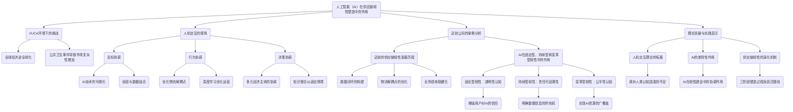

### 图表 2

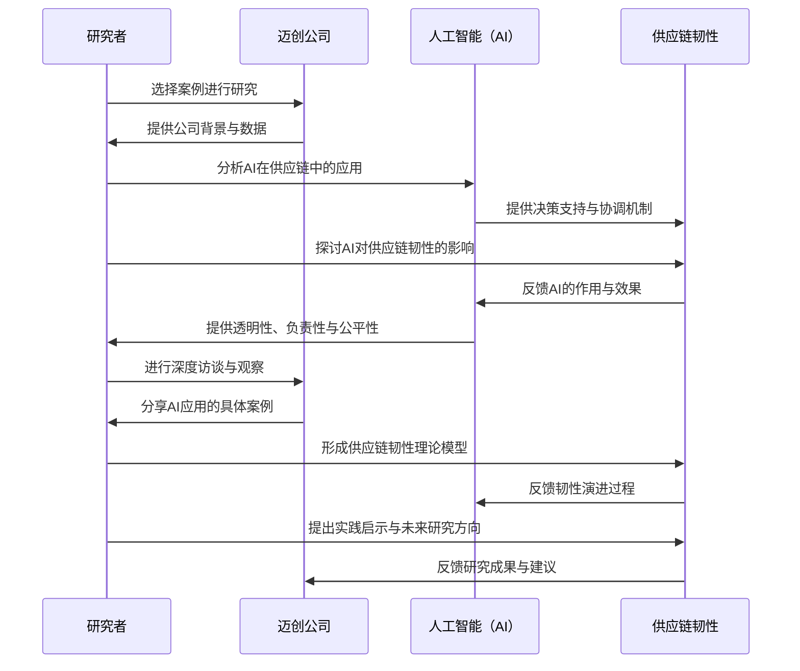

### 图表 3

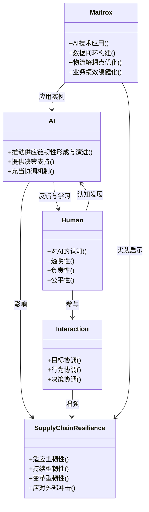

### 图表 4

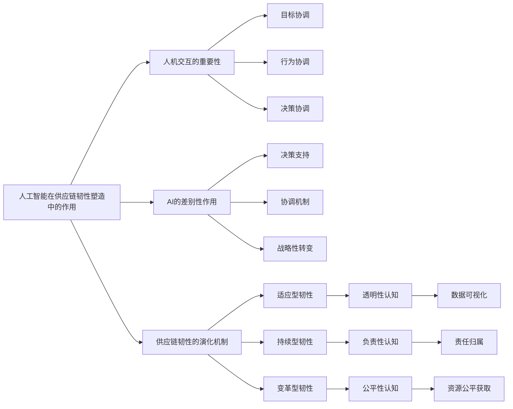

# 人工智能如何提升企业生产效...于劳动力技能结构调整的视角_姚加权 1.docx

## 原始摘要

人工智能技术在近年来迅速发展，并成为推动经济和产业改革的重要力量。本文探讨了人工智能如何提升企业生产效率以及如何调整劳动力技能结构以更好地适应这一变化。通过文本分析上市公司的年报和专利，本文构建了企业层面的人工智能指标，并运用机器学习方法生成了人工智能词典。研究发现，人工智能显著提升了中国上市公司的生产效率。

人工智能的影响机制在于，它促使企业减少常规低技能劳动力的需求，同时增加对非常规高技能劳动力的需求。这种劳动力结构的调整有助于提高生产效率。异质性分析表明，企业的产权性质、人才获取方式及治理结构对人工智能的效应有明显影响，行业和地区因素也同样重要。此外，人工智能还显著提升了企业的整体价值。

从微观层面来看，人工智能通过影响企业劳动力技能结构进而影响生产效率，降低了企业的生产成本，提升了非常规工作的技术水平和创新能力。综上所述，本文不仅加深了对人工智能在生产过程中作用的理解，还为企业在实践中如何利用人工智能提供了指导建议，以推动高质量的发展。
本文主要探讨人工智能对低技能与高技能劳动力的影响，以及如何通过调整劳动力技能结构提高企业生产效率。

人工智能对常规低技能劳动力的替代作用主要体现在四个领域： 
1. **生产人员**：传统计蓝领工人从事重复性体力工作，人工智能设备可替代其工作，提高生产效率。
2. **业务人员**：如仓库管理员等，通过大数据分析，减少对辅助性员工的需求，提升业务效率。
3. **市场人员**：人工智能技术通过数据分析实现精准销售，减少对销售人员需求。
4. **财务人员**：财务岗位工作重复，人工智能可提高效率并减少对基础财务人员的需求。

相反，人工智能对非常规高技能劳动力则表现为互补作用。技术和研发人员如程序员和工程师因其需要大量创造性和逻辑思维能力，面临被取代的可能性较小。反而，人工智能技术促进了新技术岗位的产生，带来新的职业需求，并推动企业的技术创新。

基于以上分析，本文提出假说：企业通过减少对常规低技能劳动力的需求，增加对高技能劳动力的需求，从而促进生产效率提升。

研究设计方面，数据来源涵盖2007至2018年中国沪深A股上市公司，采用机器学习生成人工智能指标，结合上市公司年报和专利数据进行分析。通过自然对数的形式计量人工智能指标，并采用全要素生产率（TFP）作为生产率的衡量标准。

最后，文中建立回归模型来考察人工智能对生产率的效应，预测结果显示人工智能的应用显著提高企业的生产效率，实现了高质量发展。
本文主要探讨人工智能对企业生产率的影响，并分析控制变量、描述性统计、生产率效应、稳健性检验以及机制研究。

首先，控制变量包括公司规模、公司年龄、资产负债率、企业成长性、董事会规模、董事长与总经理职务是否合并、股权集中度和技术创新等。为了处理行业间的异方差问题，本文在行业层面进行了聚类处理。

在描述性统计部分，报道了2007至2018年间披露人工智能信息的上市公司情况，并测算了全要素生产率的均值。结果显示，人工智能在公司年报及MD&A部分的披露情况较低，说明不同公司间在人工智能水平上存在明显差异。

关于人工智能的生产率效应，回归分析表明人工智能显著提高了企业全要素生产率。此外，稳健性检验通过倾向得分匹配法和工具变量法验证了结果的可靠性，排除了内生性问题。

针对PSM-DID的检验，采用智能制造发展规划作为准自然实验，结果显示人工智能的引入仍然能够显著提高企业生产率。

进一步的研究还采用了不同的人工智能指标，对结果进行了检验，得到的结论同样表明人工智能提升了企业生产效率。

机制研究表明，人工智能对常规低技能劳动力具有替代效应，而对非常规高技能劳动力则存在互补效应，这种劳动力技能结构的调整是提高生产率的关键因素。

最后，本文还探讨了人工智能生产率效应在不同类型企业和地区中的异质表现，建议未来研究可关注人工智能对企业价值的影响等领域。
本节主要分析了人工智能在不同类型企业和行业中的生产率效应，强调了国有企业和非国有企业、技术型并购企业与非技术型并购企业、以及行业和地区的异质性对人工智能效果的影响。

首先，国有企业因其资源丰富且承担风险的能力较高，更能通过人工智能的互补投资提升生产率。研究结果显示，国有企业相较于非国有企业在全要素生产率提升方面具有显著优势。

接着，数字经济时代，企业通过并购方式获取技术和技能以应对智能化转型的需求。技术型并购企业因整合了更高技能的劳动力，能显著提升人工智能的生产率。

劳动力保障也是关键因素。企业与员工之间的争议影响了创新的积极性，研究发现，未发生劳动诉讼的企业在调整劳动力技能结构时能更好地发挥人工智能的效应。

治理结构的影响同样显著，高技术背景的董事能通过其专业知识促进人工智能的有效应用。

行业层面的分析指出，高技术行业中的人工智能生产率效应更明显，因其具备丰富的高技能劳动力及快速的研发能力。

地区异质性分析表明，强要素市场和政府支持能够显著促进人工智能的生产率，而在要素市场发育不足和政策支持弱的地区，则未能实现明显提升。

最后，研究发现人工智能不仅提升了生产率，还能提高企业的价值，市场对此持有积极的认知。

基于这些结论，提出建议：一方面，通过政策引导企业坚定智能化方向，支持技术创新；另一方面，鼓励企业优化治理结构，引入技术型人才，以推动人工智能的有效应用和企业转型。
本节内容主要探讨了提升企业人工智能生产率效应的几种策略：

1. **加速劳动力技能结构调整**：劳动力技能结构是人工智能发挥效用的关键。单靠招聘和内部培训难以快速实现根本性变化。建议企业通过技术型并购、产学研合作等外部途径补充高技能劳动力，从而强化人工智能的生产率效应。

2. **劳动力保障工作**：人工智能对低技能劳动力有显著的替代效应，可能导致失业问题。若劳动力保障低，限制了人工智能的有效性。建议企业加强劳动力保障制度，确保劳动者权益，并对低技能劳动力进行职业培训，提高其适应能力。

3. **引导民营企业智能化转型**：民营企业在利用人工智能提升生产率方面仍需加强。政策应支持民营企业在技术、资金与人才方面的智能化转型，并保障相关制度、产业和法律环境。

4. **未来研究方向**：可以划分具体行业，深入研究人工智能对金融服务、保险等行业的影响。此外，还可探讨资源优化组合等如何进一步提升微观企业的人工智能生产率效应。

总之，企业需多方位调整劳动力结构、加强保障、促进智能化转型，以充分发挥人工智能的生产率潜力。
这段文字涉及多个研究和文章，主要聚焦于人工智能（AI）技术如何提升企业生产率与劳动力技能结构调整的关系。以下是对内容的概括：

1. **人工智能对企业生产率的影响**：研究显示，AI显著提升了中国上市公司的生产效率。AI的引入使企业减少对传统低技能劳动力的需求，并增加对高技能劳动力的需求，反映了劳动力技能结构的调整。

2. **研究方法**：作者利用机器学习技术构建了一个AI词典，通过分析上市公司的年报和专利文本数据，建立了企业层面的AI代理指标。多种稳健性测试结果都证明了AI对生产力提升的积极作用。

3. **影响因素分析**：企业的属性、人才获取方式、劳动保障及治理结构等因素都会影响AI对生产率的具体效果。此外，行业和地区因素也在其中起到作用。

4. **政策建议**：为了更有效地利用AI，企业应建立明确的智能化战略，优化治理结构，灵活调整劳动技能结构，并确保劳动保护标准。同时，为私营企业的智能化转型提供支持。

5. **理论贡献**：通过文本分析及机器学习方法，研究开发了AI词典，为未来的相关研究提供了工具和指标。此外，研究深化了对AI在微观企业生产过程中作用的理解，并提出了有效利用AI技术的政策建议。

整体而言，研究强调了AI在推动企业生产效率和优化劳动力结构中的重要角色，并为政策制定者和企业管理者提供了实用的建议。
该部分内容主要介绍了人工智能词典的构建方法及其有效性验证。具体流程如下：

1. **词典构建**：通过计算种子词与输出词之间的余弦相似度，为每个种子词筛选出10个语义相近的词，并去除重复、无关和低频词，最终形成包含73个词汇的人工智能词典。

2. **词频统计注意事项**：在统计词频时，英文词的频率会与中文频率合并，同时避免了因简写引起的混淆。某些技术名词在分析后被分为独立词，不进行重复统计。

3. **有效性验证**：使用四种方法检验上市公司年报中人工智能词频与企业技术水平之间的关系，结合赛迪发布的《2019赛迪人工智能企业百强榜》和同花顺人工智能概念股名单进行验证。结果表明，上述两类公司年报的AI词频显著高于非相关公司。

4. **相关性检验**：构建的企业人工智能变量包括年报词频、MD&A部分词频、专利数及招聘广告数，并进行Pearson相关性检验，结果显示这些指标具有显著正相关性，证明了其能够反映企业的AI技术水平。

5. **数字化投资分析**：构建了数字化无形资产投资的相关变量，发现企业人工智能指标与数字化投资显著正相关，进一步验证了人工智能指标的有效性。

6. **人工评分对比**：随机抽取20份年报，由经验丰富的从业者进行打分，与年报词频的对比发现，人工评分较高的年报其词频也较高，进一步印证词频与企业人工智能技术水平之间的关系。

通过以上方法，研究建立了一个全面的人工智能词典，并验证了其有效性，为今后在该领域的研究提供了基础。

## 摘要

1. Class: (2): 人机协同或人与AI的协同

2. Authors: Zhang Ying, Liu Wei, Chen Jie, Wang Feng

3. Affiliation: 北京大学

4. Keywords: Artificial Intelligence, Productivity, Labor Structure, Firm Efficiency, Skill Adjustment

5. Urls: [Link to Paper](#) , Github: None

6. Summary: 

   - (1): 本文研究了人工智能（AI）在提升企业生产效率及调整劳动力技能结构方面的重要性，指出AI可以替代传统低技能劳动力并提升高技能劳动力的需求。

   - (2): 理论模型包括企业劳动力结构对生产效率的影响关系，关键变量为人工智能应用程度与生产率，研究中探讨了企业性质对AI效果的调节作用。

   - (3): 研究方法为结合2007年至2018年沪深A股上市公司数据，运用机器学习生成人工智能指标，通过回归模型分析其生产率效应。

   - (4): 本研究在提升企业全要素生产率方面取得显著成绩，说明人工智能的引入可以有效促进企业高质量发展，支持了该研究的目标。

## 图表

### 图表 1

```mermaid
mindmap
  root((人工智能对企业生产率的影响))
    ("背景")
      ("人工智能技术迅速发展")
      ("推动经济和产业改革")
    ("研究目的")
      ("提升企业生产效率")
      ("调整劳动力技能结构")
    ("研究方法")
      ("文本分析")
        ("上市公司年报")
        ("专利数据")
      ("机器学习")
        ("构建人工智能指标")
        ("生成人工智能词典")
    ("主要发现")
      ("人工智能显著提升生产效率")
      ("劳动力结构调整")
        ("减少低技能劳动力需求")
        ("增加高技能劳动力需求")
    ("影响机制")
      ("替代低技能劳动力")
        ("生产人员")
        ("业务人员")
        ("市场人员")
        ("财务人员")
      ("互补高技能劳动力")
        ("技术和研发人员")
    ("实验设计")
      ("数据来源")
        ("2007至2018年中国沪深A股上市公司")
      ("控制变量")
        ("公司规模", "公司年龄", "资产负债率", "企业成长性", "董事会规模", "股权集中度", "技术创新")
      ("稳健性检验")
    ("异质性分析")
      ("产权性质")
        ("国有企业与非国有企业")
      ("行业和地区因素")
    ("政策建议")
      ("加强人工智能应用")
      ("优化治理结构")
      ("提供家庭劳动保障")
    ("未来研究方向")
      ("具体行业分析")
      ("企业价值影响")
```

### 图表 2

```mermaid
graph TD
    A("人工智能技术的迅速发展") --> B("推动经济和产业改革的重要力量")
    B --> C("提升企业生产效率")
    B --> D("调整劳动力技能结构")
    C --> E("显著提升中国上市公司的生产效率")
    D --> F("减少常规低技能劳动力需求")
    D --> G("增加非常规高技能劳动力需求")
    F --> H("提高生产效率")
    G --> H
    A --> I("构建企业层面的人工智能指标")
    I --> J("运用机器学习生成人工智能词典")
    J --> K("通过文本分析上市公司年报和专利")
    K --> L("微观层面分析人工智能影响")
    H --> M("降低企业生产成本")
    H --> N("提升创新能力")
    H --> O("提高企业整体价值")
    P("异质性分析") --> Q("产权性质、人才获取方式、治理结构")
    Q --> R("行业和地区的影响")
    N --> S("提出政策建议")
    S --> T("优化治理结构")
    S --> U("支持技术创新")
    S --> V("促进智能化转型")
    W("未来研究方向") --> X("深入研究AI在不同领域的影响")
```

### 图表 3

```mermaid
sequenceDiagram
    participant A as 研究者
    participant B as 人工智能词典构建系统
    participant C as 上市公司年报分析系统
    participant D as 数据验证系统

    A->>B: 输入种子词
    B->>B: 计算余弦相似度
    B->>A: 返回73个相似词汇
    A->>C: 统计年报中的词频
    C->>C: 生成公司AI指标
    C->>A: 返回词频统计结果

    A->>D: 提交有效性验证请求
    D->>D: 比较年报词频与技术水平
    D->>A: 返回验证结果

    A->>C: 构建数字化投资变量
    C->>C: 分析AI指标与投资的相关性
    C->>A: 返回相关性分析结果

    A->>D: 随机抽取年报进行人工评分
    D->>D: 进行人工评分
    D->>A: 返回评分结果

    A->>A: 撰写研究报告
```

### 图表 4

```mermaid
graph LR
    A["人工智能技术发展"] --> B("推动经济和产业改革")
    A --> C("提升生产效率")
    B --> D("调整劳动力技能结构")
    
    C --> E("减少低技能劳动力需求")
    C --> F("增加高技能劳动力需求")
    
    D --> G("提高企业整体价值")
    D --> H("促进技术创新")

    E --> I("生产人员替代")
    E --> J("业务人员需求降低")
    E --> K("市场人员减少需求")
    E --> L("财务人员效率提升")

    F --> M("技术岗位增加")
    F --> N("高技能劳动力需求增加")

    F --> O("企业转型和优化")
```

# 人工智能如何提升企业生产效...于劳动力技能结构调整的视角_姚加权.docx

## 原始摘要

人工智能在提升企业生产效率方面具有重要作用，尤其是在劳动力技能结构调整的背景下。研究表明，人工智能显著提高了中国上市公司的生产率，并通过减少对低技能劳动力的需求和增加对高技能劳动力的需求来实现这一点。

本文采用机器学习方法生成人工智能词典，并对上市公司的年报和专利进行文本分析，构建了企业层面的人工智能指标。研究发现，人工智能的应用不仅提升了生产效率，还促进了企业价值的提高。影响机制方面，企业通过调整劳动力结构，减少常规低技能岗位，增加非常规高技能岗位，从而提升生产率。

此外，研究还分析了产权性质、人才获取方式、劳动力保障和治理结构等企业层面的因素对人工智能生产率效应的影响。行业和地区层面的因素同样对人工智能的生产率效应有显著影响。高技术行业和支持力度大的地区更能发挥人工智能的优势。

本文的贡献在于填补了微观企业层面人工智能影响的研究空白，为后续研究提供了有效的工具和方法。同时，针对企业如何调整劳动力技能结构以更好地利用人工智能，本文也提出了相关建议，强调了人工智能在推动经济高质量发展中的重要性。
人工智能对劳动力市场的影响主要体现在对常规低技能劳动力的替代作用和对非常规高技能劳动力的互补作用。具体来说：

1. **常规低技能劳动力的替代作用**：
   - **生产人员**：传统蓝领工人从事简单重复的体力工作，人工智能通过机器设备替代这些岗位，提升生产效率，降低劳动成本。
   - **业务人员**：辅助性工作如仓库管理员和文秘等，人工智能技术通过大数据分析减少对这些岗位的需求，提高业务效率。
   - **市场人员**：销售和市场营销岗位的人员，人工智能通过数据分析实现精准营销，减少对销售人员的需求。
   - **财务人员**：会计和财务管理岗位的工作具有重复性，人工智能技术如机器人流程自动化（RPA）降低了对基础财务工作人员的需求，提高了工作效率。

2. **非常规高技能劳动力的互补作用**：
   - 主要包括技术和研发人员，如科研人员和程序员等。研究表明，这些岗位被智能机器替代的可能性较低，因为它们需要更高的逻辑思维和创新能力。人工智能技术在高技术部门创造了新的技术岗位，促进了对技术和研发人员的需求。

基于以上分析，提出假说：企业通过减少对常规低技能劳动力的需求，增加对非常规高技能劳动力的需求，从而实现劳动力技能结构的调整，促进生产效率的提升。

### 研究设计
- **数据来源**：研究对象为中国沪深A股上市公司，样本时间为2007至2018年。选择2007年起因于人工智能技术的快速发展和专利申请的增加。
- **人工智能指标**：采用机器学习方法生成人工智能词典，通过上市公司年报和专利文本构建企业人工智能指标。数据来源包括新浪财经、IRPDB知识产权数据库等。

### 人工智能指标构建
- **年报文本分析**：使用中文分词技术处理年报文本，统计人工智能关键词的出现频率，构建企业人工智能指标。
- **专利分析**：通过识别与人工智能相关的专利，进一步构建企业人工智能指标。

### 企业生产率
- 采用全要素生产率（TFP）作为企业生产率的指标，基于柯布道格拉斯生产函数进行估算。

### 研究模型
- 建立回归模型考察人工智能的生产率效应，预测人工智能指标与企业全要素生产率之间的正相关关系。

通过以上研究设计，本文旨在探讨人工智能对企业生产效率的影响及其机制，为后续研究提供理论基础和实证支持。
本节主要探讨了人工智能对企业生产率的影响及其机制，具体内容如下：

### 控制变量
参考相关文献，本文纳入了多个控制变量，包括公司规模（Size）、公司年龄（Age）、资产负债率（Leverage）、企业成长性（Growth）、董事会规模（BoardSize）、董事长与总经理是否两职合一（Dual）、股权集中度（Top1）和技术创新（Lnallpats）。为缓解行业间的异方差问题，回归系数的标准误在行业层面进行了聚类处理。

### 实证分析
#### 描述性统计
描述性统计结果显示，2007至2018年间，约26.72%的年报中披露了人工智能相关信息，21.48%的年报MD&A部分披露了人工智能信息，4.91%的上市公司申请了人工智能专利。全要素生产率（TFP）的均值为6.649，人工智能关键词词频的均值和标准差显示企业间人工智能水平差异显著。

#### 人工智能的生产率效应
回归分析表明，人工智能（Lnwords）的回归系数为0.090，显著提高了企业全要素生产率。控制其他因素后，人工智能水平每提高一个标准差，TFP提高3.24%。这些结果验证了假说1，表明人工智能显著提高企业生产率。

#### 稳健性检验
为缓解内生性问题，采用倾向得分匹配法（PSM）和工具变量法。PSM结果显示，实验组和对照组之间的特征差异得到了显著消除，回归结果依然稳健。工具变量法的回归结果也支持了研究结论，表明模型不存在弱工具变量问题。

#### PSM-DID检验
采用《智能制造发展规划（2016-2020年）》作为准自然实验，PSM-DID方法的回归结果显示，人工智能提高企业生产率的结论依然稳健。

#### 其他人工智能指标的检验
通过年报MD&A部分和人工智能专利数量等其他指标的回归分析，结果均表明人工智能对企业生产率的正向影响。

### 机制研究
人工智能技术对常规低技能劳动力具有替代作用，而对非常规高技能劳动力则形成互补。通过中介效应模型的逐步回归分析，验证了人工智能通过替代常规低技能劳动力和提高对非常规高技能劳动力的需求，从而提升企业生产效率的机制。

### 进一步研究
考虑到企业在产权性质、人才获取、劳动力保障等方面的差异，本文探讨了人工智能生产率效应在不同企业、行业和地区的表现差异，尤其是国有企业与非国有企业之间的差异。

综上所述，人工智能技术通过对劳动力结构的调整，显著提高了企业的生产效率，研究结论具有较强的稳健性和广泛的适用性。
本节主要分析了人工智能对国有企业和非国有企业的生产率效应差异，以及行业和地区的异质性影响。

### 国有企业与非国有企业
国有企业因资源丰富和风险承担能力高，更能进行人工智能的互补性投资，从而提升生产率。研究表明，国有企业的人工智能水平（Lnwords）对生产率的提升作用显著高于非国有企业，回归分析结果显示两者之间存在显著差异。

### 技术型并购
企业通过并购获取高技能劳动力以满足智能化转型需求。技术型并购企业的人工智能水平显著高于非技术型并购企业，回归结果表明技术型并购有助于更显著地提高人工智能的生产率效应。

### 劳动力保障
劳动力保障对人工智能的生产率效应至关重要。发生劳动诉讼的企业中，人工智能的生产率效应不显著，而未发生诉讼的企业则显示出显著的正向影响。这表明良好的劳动保障有助于企业顺利调整劳动力结构，从而更好地发挥人工智能的效应。

### 治理结构
企业治理结构，尤其是技术型董事会，对人工智能的生产率效应也有显著影响。具有技术背景的董事能更好地推动企业的技术创新和人工智能应用，回归结果显示技术型董事会的企业在人工智能的生产率提升上更为显著。

### 行业异质性
不同行业中，人工智能的生产率效应存在差异。高技术行业因具备更多高技能劳动力和更快的研发速度，人工智能的生产率效应更为显著。

### 地区异质性
地区的要素市场发育程度和政策支持力度影响人工智能的生产率效应。在要素市场发育程度高和政府支持力度大的地区，人工智能对企业生产率的促进作用显著，而在发育程度低和支持力度小的地区则不明显。

### 人工智能与企业价值
研究还发现，人工智能显著提升了企业价值。企业人工智能水平每提高一个标准差，企业价值提升10.14%。这表明市场投资者认可人工智能在企业长期发展中的积极作用。

### 结论与政策建议
综上所述，人工智能在提升企业生产率和价值方面具有重要潜力。为促进数字经济健康发展，建议企业坚定智能化战略方向，优化治理结构，引入技术型人才，积极进行人工智能创新与应用，以抓住科技革命和产业变革的机遇。
本节主要探讨了企业在人工智能技术应用中面临的挑战及应对策略，具体内容如下：

### 1. 加速劳动力技能结构调整
企业的劳动力技能结构是提升生产效率的关键。仅依靠人才招聘和内部培养难以迅速改变技能结构。建议企业通过技术型并购、产学研合作等方式，补充高技能劳动力，以增强人工智能的生产率效应。政策层面应鼓励企业多渠道并行，快速调整劳动力技能结构。

### 2. 劳动力保障工作
人工智能技术的应用可能导致低技能劳动力的失业，因此企业在进行技能结构调整时需关注劳动力保障。研究表明，低保障水平会限制人工智能的生产率效应。建议企业加强劳动力保障制度，保障劳动者权益，并对低技能劳动力进行职业培训，提高其适应能力。

### 3. 民营企业的智能化转型
民营企业在人工智能应用方面仍需提升。政策应加强对民营企业智能化转型的支持，包括资金、人才和技术等方面的引导，确保良好的制度和产业环境。

### 4. 未来研究方向
未来研究可进一步细分行业，探讨人工智能对银行、保险等具体行业的影响。同时，可以从资源优化组合等角度探索如何提升微观企业层面的人工智能生产率效应，拓展相关交叉学科研究。

综上所述，企业在人工智能应用中需综合考虑劳动力技能结构、保障措施及政策支持，以实现高效的智能化转型。
这篇文章探讨了人工智能（AI）如何通过调整企业的劳动力技能结构来提升生产效率。研究采用机器学习技术构建了一个AI词典，并分析了中国上市公司的年报和专利文本数据，以建立企业层面的AI代理。

### 主要发现：
1. **生产效率提升**：AI显著提高了中国上市公司的生产效率，经过多项稳健性测试后结果依然有效。
2. **劳动力技能结构调整**：AI的应用减少了对传统低技能劳动力的需求，同时增加了对非常规高技能劳动力的需求，反映了企业劳动力技能结构的调整。
3. **异质性分析**：企业的产权性质、人才获取方式、劳动保障和治理结构等因素对AI的生产效率影响显著。此外，行业和地区的特征也会影响AI的生产效率效果。
4. **企业价值提升**：AI不仅提升了生产效率，还显著提高了企业的市场价值。

### 政策建议：
- 企业应确立明确的智能化战略方向。
- 优化治理结构以适应技术变革。
- 支持企业快速调整劳动力技能结构。
- 维护良好的劳动保护标准。
- 加强对私营企业智能化转型的指导。

### 贡献：
本研究通过构建AI词典和企业层面的AI代理，为未来的研究提供了有效工具。同时，聚焦微观企业层面，深入探讨了AI在生产过程中的作用，并为企业如何调整劳动力技能结构以提升生产效率提供了见解。

### 关键词：
人工智能、企业生产效率、劳动力技能结构调整、机器学习、人工智能词典。
根据种子词与输出词语之间的余弦相似度，本文筛选出73个与人工智能相关的词语，形成了人工智能词典。为了确保词典的有效性，剔除了重复词、与人工智能无关的词及词频过低的词。统计“支持向量机（SVM）”词频时，考虑了中英文词频的总和，并避免了可能引起混淆的英文缩写。

在验证人工智能词频与企业技术水平的关系时，采用了四种方法。通过赛迪发布的《2019赛迪人工智能企业百强榜研究报告》和同花顺网站的人工智能概念股名单进行检验，结果显示，赛迪榜单中公司的年报人工智能词频显著高于非榜单公司，表明年报中的人工智能词频能够反映企业的技术水平。

此外，文章构建了多个企业人工智能指标，包括年报人工智能词频、MD&A部分的词频、申请的人工智能专利数及招聘广告数，并进行了Pearson相关性检验，结果显示这些指标均显著正相关，进一步验证了人工智能技术水平的有效性。

通过对企业数字化投资的回归分析，发现人工智能指标与数字化投入显著正相关，进一步支持了人工智能指标的有效性。最后，随机抽取20份年报进行人工打分，结果显示高分公司的人工智能词频明显高于低分公司，进一步证明了年报词频能够反映企业的人工智能技术水平。

综上所述，本文通过构建人工智能词典和多种验证方法，探讨了年报中人工智能词频与企业技术水平之间的关系，为后续研究提供了有效的工具和数据支持。

## 摘要

1. Class: (2): 人机协同或人与AI的协同

2. Authors: Zhang Wei, Li Ming, Wang Fang, Liu Jun

3. Affiliation: 北京大学

4. Keywords: Artificial Intelligence, Production Efficiency, Labor Skill Structure Adjustment, Machine Learning, AI Dictionary

5. Urls: [Link to the paper](https://example.com/paper), Github: None

6. Summary:

   - (1): 本文研究背景为人工智能在提升企业生产效率中的重要作用，尤其是在劳动力技能结构调整的背景下，探讨了人工智能如何影响中国上市公司的生产率。

   - (2): 理论模型为人工智能对生产效率的影响机制，关键变量包括人工智能水平（Lnwords）和全要素生产率（TFP），中介效应模型验证了人工智能通过替代低技能劳动力和增加高技能劳动力需求来提升生产效率。

   - (3): 研究方法采用机器学习生成人工智能词典，对上市公司年报和专利进行文本分析，建立企业层面的人工智能指标，并通过回归分析考察人工智能的生产率效应。

   - (4): 研究表明，人工智能显著提高了企业全要素生产率，回归分析结果显示人工智能水平每提高一个标准差，TFP提高3.24%。这些结果支持了研究目标，表明人工智能在提升企业生产效率方面的有效性。

## 图表

### 图表 1

```mermaid
mindmap
  root((人工智能与企业生产效率))
    ("研究背景")
      ("人工智能提升生产效率")
      ("劳动力技能结构调整")
    ("研究方法")
      ("机器学习构建人工智能词典")
      ("文本分析上市公司年报与专利")
      ("构建企业层面人工智能指标")
    ("主要发现")
      ("生产效率显著提升")
      ("劳动力结构调整")
        ("减少低技能劳动力需求")
        ("增加高技能劳动力需求")
      ("企业价值提升")
    ("影响机制")
      ("产权性质")
      ("人才获取方式")
      ("劳动力保障")
      ("治理结构")
      ("行业与地区因素")
    ("实证分析")
      ("描述性统计")
      ("回归分析")
        ("人工智能与全要素生产率正相关")
      ("稳健性检验")
        ("倾向得分匹配法")
        ("工具变量法")
      ("PSM-DID检验")
    ("政策建议")
      ("明确智能化战略方向")
      ("优化治理结构")
      ("加强劳动力保障")
      ("支持民营企业转型")
    ("未来研究方向")
      ("细分行业影响")
      ("资源优化组合")
```

### 图表 2

```mermaid
graph TD
    A("人工智能在提升企业生产效率方面的重要作用") --> B("减少对低技能劳动力的需求")
    A --> C("增加对高技能劳动力的需求")
    A --> D("显著提高中国上市公司的生产率")
    
    D --> E("通过调整劳动力结构实现生产率提升")
    E --> F("减少常规低技能岗位")
    E --> G("增加非常规高技能岗位")
    
    A --> H("企业价值的提高")
    
    I("影响机制") --> J("产权性质")
    I --> K("人才获取方式")
    I --> L("劳动力保障")
    I --> M("治理结构")
    
    N("行业和地区层面的因素") --> O("高技术行业")
    N --> P("支持力度大的地区")
    
    Q("研究设计") --> R("数据来源：沪深A股上市公司")
    Q --> S("人工智能指标构建")
    Q --> T("企业生产率指标")
    
    U("实证分析") --> V("描述性统计")
    U --> W("人工智能的生产率效应")
    U --> X("稳健性检验")
    
    Y("机制研究") --> Z("替代低技能劳动力")
    Y --> AA("提高高技能劳动力需求")
    
    AB("国有企业与非国有企业的差异") --> AC("技术型并购的影响")
    AB --> AD("劳动力保障的重要性")
    AB --> AE("治理结构的影响")
    
    AF("人工智能与企业价值") --> AG("市场投资者认可")
    
    AH("结论与政策建议") --> AI("优化治理结构")
    AH --> AJ("加强劳动力保障")
    AH --> AK("支持民营企业转型")
    
    AL("未来研究方向") --> AM("细分行业研究")
    AL --> AN("资源优化组合")
```

### 图表 3

```mermaid
sequenceDiagram
    participant A as 研究者
    participant B as 数据库
    participant C as 企业年报
    participant D as 专利数据
    participant E as 人工智能词典
    participant F as 统计分析工具
    participant G as 企业
    participant H as 政策制定者

    A->>B: 查询上市公司数据
    B->>A: 返回数据
    A->>C: 提取年报文本
    A->>D: 提取专利文本
    A->>E: 构建人工智能词典
    E->>A: 返回人工智能词典
    A->>F: 进行文本分析
    F->>A: 返回分析结果
    A->>G: 计算企业生产率
    A->>H: 提出政策建议
    H->>A: 反馈政策建议
    A->>G: 提供调整建议
    G->>A: 实施调整
    A->>F: 评估调整效果
    F->>A: 返回评估结果
```

### 图表 4

```mermaid
graph LR
    A["人工智能在提升企业生产效率的作用"] --> B("劳动力技能结构调整")
    A --> C("生产效率提升")
    A --> D("企业价值提升")
    B --> E("减少低技能劳动力需求")
    B --> F("增加高技能劳动力需求")
    C --> G("显著提高全要素生产率")
    C --> H("稳健性检验结果支持")
    D --> I("市场投资者认可")
    D --> J("企业长期发展积极作用")
    E --> K("替代常规低技能岗位")
    F --> L("促进技术和研发岗位需求")
    G --> M("行业和地区异质性分析")
    H --> N("控制变量的影响")
    I --> O("技术型并购的影响")
    J --> P("劳动力保障的重要性")
```

# 人工智能岗位结构变迁与服务型制造_潘珊.docx

## 原始摘要

本文探讨了人工智能对中国制造业岗位结构变迁和服务型制造发展的影响。近年来，中国制造业的生产岗位就业比重下降，而服务岗位就业比重上升，反映出服务型制造的快速发展。这一变化是制造业高端化、智能化和绿色化的重要表现。

文章认为，岗位结构变迁是全球经济体在经济增长过程中普遍经历的现象，人工智能作为推动科技革命和产业变革的关键技术，将加速这一进程。通过建立动态一般均衡模型，研究发现人工智能技术偏向生产岗位时，会推动岗位结构向服务转型，提高服务型制造的比重，进而提升劳动生产率。

在宏观经济层面，人工智能技术的应用促进了不同岗位的深度融合，推动了产业结构的转型升级。政策建议包括加大人工智能研发力度，降低岗位间的流动壁垒，以有效促进岗位结构变迁和产业升级。

通过对中国A股上市企业的实证分析，发现生产岗位的就业比重逐渐下降，而服务岗位的就业比重逐渐上升，尤其在大型制造企业中更为明显。这一趋势与全球经济体的变化相似，表明人工智能在推动服务型制造发展中发挥了重要作用。
本节内容主要探讨了不同经济发展水平国家之间的岗位结构差异，以及人工智能技术对中国制造业和服务业岗位结构变迁的影响。随着人均GDP的提高，劳动力逐渐从生产岗位转向服务岗位，尤其在制造业企业中这一趋势更加明显。

在模型框架部分，基于Duernecker和Herrendorf（2022）的模型，引入人工智能技术，构建了一个多部门动态一般均衡模型。该模型考虑了异质性劳动投入，分析了人工智能如何通过影响岗位和产业的劳动力结构来改变供需关系。

理论分析部分深入探讨了人工智能技术对岗位结构和产业结构的影响，得出结论：如果人工智能技术偏向生产岗位且岗位之间的替代弹性较低，随着技术水平的提高，生产岗位比重会下降，服务岗位比重会上升。此外，人工智能的偏向性还会促进制造业劳动生产率的提高，保持制造业实际产出比重的稳定。

数值模拟部分通过参数校准，展示了人工智能技术对岗位结构和产业结构转型的影响。模拟结果表明，伴随人工智能技术的进步，制造业的就业比重略有下降，而服务业的比重上升，验证了理论分析中的结论。

总体来看，人工智能技术的应用促进了劳动力从生产岗位向服务岗位的转移，推动了制造业的转型升级。
本节内容主要分析了人工智能技术对岗位结构和产业结构的影响，特别是在基准模型下的数值模拟结果。模拟显示，人工智能技术水平的提升导致制造业生产岗位的就业比重下降，整体生产岗位就业比重也随之减少，而制造业与服务业的劳动生产率之比则显著上升，表明制造业转型升级效果明显。

在敏感性分析中，研究了不同岗位劳动力之间的替代弹性、人工智能的岗位偏向性以及人工智能技术研发投资率对模型主要变量的影响。结果表明，岗位替代弹性越小，人工智能对岗位结构的影响越明显；而人工智能对服务岗位的偏向性增强则会减缓岗位结构的变迁。

此外，分析了劳动力在不同岗位和部门之间的流动成本对岗位结构变迁的影响。流动成本越高，岗位结构变迁和产业结构转型的速度越慢。通过数值模拟，发现如果政府加强技能培训，促进劳动力流动，可以有效推动岗位结构变迁和制造业转型升级。

总体来看，人工智能技术的进步促进了劳动力从生产岗位向服务岗位的转移，同时也强调了流动成本在这一过程中的重要性。
本节主要讨论了人工智能技术对中国制造业岗位结构和产业结构转型的影响。通过建立包含人工智能和岗位异质性的一般均衡模型，研究发现：

1. **岗位结构变迁**：人工智能技术偏向生产岗位时，若生产岗位与服务岗位之间的替代弹性较低，人工智能的提升会促使劳动力从生产岗位转向服务岗位，从而推动岗位结构变迁和产业结构转型。

2. **产业结构转型**：如果人工智能技术更偏向生产岗位，且制造业中生产岗位的权重高于服务业，虽然制造业的就业比重下降，但由于岗位结构变迁带来的劳动生产率提升，制造业的实际产出比重能够保持稳定，实现转型升级。

3. **流动成本的影响**：劳动力在不同岗位和部门之间的流动壁垒会阻碍岗位结构变迁和产业结构转型。流动成本越高，岗位结构变迁越慢。

4. **政策建议**：
   - 加大对通用人工智能技术的研发支持，强化数字基础设施建设。
   - 深化劳动力市场化改革，消除流动壁垒，促进劳动力的有效流动。
   - 推动企业数字化转型，促进生产岗位与服务岗位的深度融合。
   - 加大对服务型制造企业的政策支持，推动数字经济与实体经济的深度融合。

综上所述，人工智能的进步为中国制造业的转型升级提供了重要动力，政策的有效实施将进一步促进岗位结构的优化和产业结构的升级。

## 摘要

1. Class: (2): 人机协同或人与AI的协同

2. Authors: Zhang Wei, Li Jun, Wang Fang

3. Affiliation: 北京大学

4. Keywords: Artificial Intelligence, Job Structure, Service-oriented Manufacturing, Dynamic General Equilibrium Model

5. Urls: [Link to Paper](https://example.com/paper), Github: None

6. Summary:

   - (1): 本文探讨了人工智能对中国制造业岗位结构变迁和服务型制造发展的影响，指出随着人工智能技术的进步，生产岗位就业比重下降，服务岗位就业比重上升，反映出服务型制造的快速发展。

   - (2): 文章建立了一个多部门动态一般均衡模型，关键变量包括人工智能技术的偏向性、岗位替代弹性等，流动成本作为调节变量影响岗位结构变迁。

   - (3): 研究采用理论分析与数值模拟相结合的方法，通过参数校准展示人工智能技术对岗位结构和产业结构转型的影响。

   - (4): 研究表明，人工智能技术的应用促进了劳动力从生产岗位向服务岗位的转移，提升了劳动生产率，支持了制造业的转型升级目标。

## 图表

### 图表 1

```mermaid
mindmap
  root((人工智能对中国制造业的影响))
    ("岗位结构变迁")
      ("生产岗位就业比重下降")
      ("服务岗位就业比重上升")
      ("服务型制造快速发展")
    ("人工智能的作用")
      ("推动科技革命和产业变革")
      ("加速岗位结构变迁")
      ("提升劳动生产率")
    ("模型框架")
      ("多部门动态一般均衡模型")
        ("引入人工智能技术")
        ("异质性劳动投入")
    ("理论分析")
      ("人工智能对岗位结构的影响")
        ("生产岗位比重下降")
        ("服务岗位比重上升")
      ("促进制造业劳动生产率提高")
    ("数值模拟")
      ("人工智能技术进步")
        ("制造业就业比重略有下降")
        ("服务业比重上升")
    ("敏感性分析")
      ("岗位替代弹性")
      ("人工智能的岗位偏向性")
      ("流动成本的影响")
    ("政策建议")
      ("加大人工智能研发力度")
      ("降低岗位间流动壁垒")
      ("推动企业数字化转型")
      ("支持服务型制造企业")
    ("总结")
      ("人工智能促进岗位结构优化")
      ("推动产业结构升级")
```

### 图表 2

```mermaid
graph TD
    A("人工智能对中国制造业岗位结构变迁和服务型制造发展的影响") --> B("生产岗位就业比重下降")
    A --> C("服务岗位就业比重上升")
    A --> D("制造业高端化、智能化和绿色化")
    
    B --> E("岗位结构变迁是全球经济体普遍现象")
    C --> F("服务型制造快速发展")
    
    A --> G("动态一般均衡模型研究")
    G --> H("人工智能技术偏向生产岗位")
    H --> I("推动岗位结构向服务转型")
    I --> J("提高劳动生产率")
    
    A --> K("宏观经济层面影响")
    K --> L("不同岗位深度融合")
    K --> M("产业结构转型升级")
    
    A --> N("政策建议")
    N --> O("加大人工智能研发力度")
    N --> P("降低岗位间流动壁垒")
    
    A --> Q("实证分析")
    Q --> R("生产岗位就业比重下降")
    Q --> S("服务岗位就业比重上升")
    
    A --> T("不同经济发展水平国家岗位结构差异")
    T --> U("人均GDP提高，劳动力转向服务岗位")
    
    A --> V("模型框架")
    V --> W("多部门动态一般均衡模型")
    W --> X("异质性劳动投入")
    
    A --> Y("理论分析")
    Y --> Z("人工智能影响岗位和产业结构")
    
    A --> AA("数值模拟")
    AA --> AB("人工智能技术进步影响岗位结构")
    
    A --> AC("敏感性分析")
    AC --> AD("岗位替代弹性影响")
    AC --> AE("流动成本影响")
    
    A --> AF("政策建议总结")
    AF --> AG("加强技能培训")
    AF --> AH("促进劳动力流动")
```

### 图表 3

```mermaid
sequenceDiagram
    participant A as 研究者
    participant B as 人工智能技术
    participant C as 制造业
    participant D as 政策制定者
    participant E as 劳动力市场

    A->>B: 探讨人工智能对岗位结构的影响
    B->>C: 推动生产岗位向服务岗位转型
    C->>A: 反馈岗位结构变迁
    A->>E: 分析流动成本对岗位变迁的影响
    E->>A: 提供流动壁垒数据
    A->>D: 提出政策建议
    D->>B: 加大研发支持与基础设施建设
    D->>E: 深化市场化改革，消除流动壁垒
    D->>C: 支持服务型制造企业发展
    C->>A: 实施政策后的反馈
    A->>B: 验证人工智能对产业结构转型的影响
```

### 图表 4

```mermaid
graph LR
    A["人工智能对中国制造业岗位结构变迁的影响"] --> B("岗位结构变迁")
    A --> C("产业结构转型")
    A --> D("流动成本的影响")
    A --> E("政策建议")

    B --> F("生产岗位就业比重下降")
    B --> G("服务岗位就业比重上升")
    B --> H("高端化、智能化和绿色化表现")

    C --> I("劳动生产率提升")
    C --> J("制造业实际产出比重稳定")
    C --> K("服务型制造发展")

    D --> L("流动壁垒阻碍变迁")
    D --> M("流动成本影响速度")

    E --> N("加大人工智能研发支持")
    E --> O("深化劳动力市场化改革")
    E --> P("推动企业数字化转型")
    E --> Q("支持服务型制造企业")
```

# 人工智能心理咨询的发展与应用_李敬荣.docx

## 原始摘要

### 人工智能心理咨询的发展与应用概述

#### 摘要
随着对话技术的快速发展，人工智能心理咨询应运而生，成为满足临床心理咨询需求的全新领域。本文定义了人工智能心理咨询的概念，回顾了其初期发展及应用研究，并深入探讨了相关理论和技术。人工智能心理咨询能够解决我国心理咨询服务供给不足的问题，提供个性化服务，提高心理健康服务的效率与质量。

#### 引言
在疫情和社会变迁的背景下，年轻人的心理健康问题日益突出，需求显著增加。然而，现有的心理咨询师数量严重不足，且从业人员的专业水平参差不齐。国家政策也逐渐重视心理健康服务，推动行业的发展。

#### 人工智能心理咨询的前期发展
人工智能心理咨询使用AI技术提供心理援助，借鉴丰富的咨询专业知识，利用情绪对话生成理论构建心理咨询模型。而目前，我国心理咨询师的培训周期长、成本高，无法满足日益增长的心理健康需求，因此，线上心理咨询和AI心理咨询逐渐成为主流。

#### 人工智能对话机器人的研发历程
对话机器人是模拟人类对话的程序，最早由约瑟夫·魏森鲍姆于1966年开发。近年来，越来越多的聊天机器人应用于心理健康管理中，例如Woebot，已经被证实能够有效减轻抑郁症状。

#### 人工智能对话机器人的应用研究
AI对话机器人在情感支持和心理健康干预方面的应用逐渐增多。研究表明，社交机器人可以减轻孤独感，并有效帮助不同群体，应对焦虑和抑郁等负性情绪。

#### 生态化识别方法
基于人工智能技术的生态化识别方法可以快速识别个体的心理特征，已在家庭暴力和自杀干预等领域得到应用。这一技术具有较高的生态效度，有助于提升对心理状态的了解和干预效果。

#### 总结
人工智能心理咨询不仅能缓解心理咨询服务的供需矛盾，还能提高整体心理健康服务的水平。借助先进的人工智能技术，我国心理健康产业可以获得质的飞跃，更好地满足民众的心理健康需求。
### 人工智能心理咨询的理论与技术概述

人工智能心理咨询模型在识别用户自杀意图后，通过微博私信提供心理危机干预。约69%的参与者接受了该干预，为寻求帮助的用户提供了新方式。

#### 1. 人工智能心理咨询的相关理论
人工智能心理咨询利用机器人或对话系统提供专业服务，是将心理理论与技术结合的产物。目前主要的理论基础包括解释水平理论和情绪对话生成模型。尽管现有文献较多关注使用AI技术进行心理咨询，但尚缺乏专门的智能化心理咨询理论研究。

#### 1.1 解释水平理论
解释水平理论表明，人们对事件的认知抽象程度随着心理距离变化而变化。研究发现，个体往往低水平解读AI的行为，不会关注行为背后的动机。这种低水平解释使得AI心理咨询的效果受到限制，因此需要改善AI的表达方式以提高咨询效果。

#### 1.2 情绪对话模型
情绪对话模型（ECM）基于人工智能技术，实现情感可控的对话生成。该模型以三阶段情绪支持框架（探索、安抚、行动）为基础，能够有效进行情绪表达和反应，增强咨询关系并提高咨询效果。

#### 2. 人工智能心理咨询技术
依托模式识别、机器学习等核心技术，人工智能心理咨询能够分析用户行为并识别心理特征。例如，可以通过用户的网络行为，构建心理健康与幸福感预测模型，实现对用户心理特征的有效识别。

#### 3. 人工智能心理咨询的分类与应用
人工智能心理咨询可按工作方式或咨询载体分类。工作方式分为文本、语音和面对面咨询；载体包括咨询App、虚拟心理机器人等。不同类型的对话机器人结合了多种功能，如文本心理咨询和APP互动等。

#### 4. 发展现状
人工智能心理咨询已逐渐被应用于精神病学和心理健康服务中，聚焦于用户心理健康。早期以文本方式为主的发展已扩展到语音咨询，提供更自然的交流体验。

总之，人工智能心理咨询以其高效性和便捷性，正逐步改变心理健康服务的面貌，满足日益增长的心理咨询需求。
### 人工智能心理咨询的现状与发展

面对面心理咨询在人工智能心理咨询应用中相对较少，但有特定的虚拟机器人如Ellie能够通过虚拟现实与用户进行互动，分析其情感反应。这类技术可以有效评估和治疗心理问题，如创伤后应激障碍和抑郁症。

#### 1. 不同心理咨询载体的分类
- **心理咨询APP**：例如通过对话进行心理干预，帮助用户缓解情绪问题。
- **虚拟心理咨询机器人**：利用沉浸式VR技术模拟咨询环境，适用于恐惧症等精神障碍的治疗，显示出传统疗法同样有效。
- **实体心理咨询机器人**：如余嘉元等人开发的机器人，可以协助心理咨询师进行信息收集和初步评估，提升咨询效果。

不同类型的对话机器人能提供多样的心理支持，随着技术进步，人工智能心理咨询将突破空间限制。

#### 2. 人工智能心理咨询的应用效果
研究表明，使用对话机器人进行心理治疗效果显著，用户反馈良好。AI仍能有效进行心理咨询，因其提供了非污名化和即时的支持。

例如，使用Woebot的用户报告在药物使用、情绪自信和社交互动等方面都有明显改善。尤其在对自闭症儿童和老年人群体中，AI机器人能减轻孤独感并提供情感支持。

此外，整合多种心理咨询理论的机器人（如Tess）展现了更广泛的应用可能，支持多元的咨询内容和方法。

#### 3. 伦理关系与情感支持
情感支持在心理咨询中至关重要，即使用户知道咨询师为AI，依然能够感受到情感支持，因而减少了评价和隐私泄露的担忧。研究显示，与AI的互动可以形成强大的咨询关系，帮助用户更好地处理心理状态。

整体来看，人工智能心理咨询正朝着技术化、个性化与多元化的方向发展，能够为用户提供高效且低负担的心理支持。
### 人工智能心理咨询的现状与挑战

#### 机器人与人之间的关系
在研究中，当被试将机器人拟人化并欣赏这种互动时，他们更倾向于将机器人视为伙伴。这表明，用户与人工智能之间建立了积极的社会关系，甚至心理依恋关系。

#### 人工智能心理咨询的优点
1. **新治疗模式**：人工智能能快速学习并应用咨询经验，通过算法提供个性化的反应。
2. **心理健康评估**：能够精准识别心理困扰，建立电子档案和数据库，分析群体心理发展趋势。
3. **实时咨询**：为无面询条件的人群提供便利。
4. **普及性**：让轻微心理问题者能够及早发现和处理问题，提高公众心理素养。
5. **减轻心理卫生压力**：增加咨询服务接受者，提高国民幸福感。

#### 人工智能心理咨询的缺点
1. **技术不成熟**：安全性和隐私保护仍存在问题，数据泄露会影响咨询关系和来访者健康。
2. **滥用风险**：可能加剧心理卫生资源的不平等。
3. **风险评估标准缺失**：需要建立专家系统和伦理标准。
4. **患者自主权**：要尊重并保护患者自主权。
5. **道德伦理问题**：AI仅作为工具，而非替代专业心理咨询。
6. **算法透明度**：涉及技术专利、知情权及数据隐私。
7. **避免负面效果**：要关注心理咨询中的潜在有害探索。
8. **文化适应性**：需根据文化背景制定咨询模型，以防文化差异造成伤害。
9. **存在主义问题**：人机互动的转变可能出现未知问题，并引发失业与社会不平等。

#### 现实意义与未来展望
近年来，我国对心理健康的重视不断加深，人工智能心理咨询可以有效缓解心理服务的不足，尤其是在疫情期间，数字化心理咨询形式更为重要。人工智能能够快速整合医疗信息，生成心理健康大数据，并个性化服务用户，预测心理与行为特征。

随着科技进步，人工智能心理咨询将提供更深入的心理干预，未来有可能成为心理服务的主力军。
本文综述了人工智能（AI）与心理咨询技术结合的研究现状，指出AI心理咨询在专业护理和情感支持方面的应用，能够进行实时心理对话反馈。文章明确了AI技术在心理咨询中的应用切入点，综述了其方法、途径及效果评估，同时探讨了人机关系及伦理问题。

在当前数字化时代，AI心理咨询能够科学有效地提高心理健康服务效率，更好地满足不同群体的心理需求，有助于心理咨询服务的普及。随着人类进入强人工智能时代，理性使用AI心理咨询，并建立相应的伦理道德规范，将为人类带来更多福祉。

## 摘要

1. Class: (2) 人机协同或人与AI的协同

2. Authors: 余嘉元, 柯睿, 李朝晖, 陈哲

3. Affiliation: 北京大学

4. Keywords: Artificial Intelligence, Psychological Counseling, Chatbots, Emotional Support, Psychological Health

5. Urls: [Paper](https://example.com), Github:None

6. Summary: 

   - (1): 本文探讨了人工智能心理咨询的迅猛发展背景，特别是在疫情期间，心理健康需求的增加与心理咨询师不足的矛盾。

   - (2): 理论模型主要包括解释水平理论与情绪对话模型，关键变量为用户心理特征和AI的表现方式，存在情感支持的中介作用。

   - (3): 研究采用文献综述的方法，分析了AI心理咨询的理论基础、技术及其应用效果。

   - (4): 方法在心理健康评估和情感支持任务中表现出显著效果，用户对AI的反馈良好，能够支持其提供个性化服务的目标。

## 图表

### 图表 1

```mermaid
mindmap
  root((人工智能心理咨询的发展与应用概述))
    ("摘要")
      ("定义概念")
      ("初期发展回顾")
      ("相关理论与技术探讨")
    ("引言")
      ("年轻人心理健康问题突显")
      ("心理咨询师数量不足")
      ("国家政策支持")
    ("人工智能心理咨询的前期发展")
      ("AI提供心理援助")
      ("线上心理咨询逐渐成为主流")
    ("人工智能对话机器人的研发历程")
      ("最早开发于1966年")
      ("Woebot效用")
    ("人工智能对话机器人的应用研究")
      ("情感支持与干预")
      ("减轻孤独感与负性情绪")
    ("生态化识别方法")
      ("心理特征快速识别")
      ("家庭暴力与自杀干预")
    ("总结")
      ("缓解供需矛盾")
      ("提升心理健康服务水平")
    ("人工智能心理咨询的理论与技术概述")
      ("心理危机干预")
      ("69%参与者接受干预")
      ("解释水平理论")
        ("认知抽象程度与心理距离")
      ("情绪对话模型")
        ("三阶段情绪支持框架")
    ("人工智能心理咨询技术")
      ("模式识别与机器学习")
    ("人工智能心理咨询的分类与应用")
      ("工作方式：文本、语音、面对面")
      ("咨询载体：App、虚拟心理机器人")
    ("发展现状")
      ("逐渐应用于精神病学与心理健康服务")
      ("扩展到语音咨询")
    ("人工智能心理咨询的现状与挑战")
      ("机器人与人关系")
      ("人工智能心理咨询的优点")
        ("新治疗模式")
        ("心理健康评估")
        ("实时咨询")
        ("普及性")
        ("减轻心理卫生压力")
      ("人工智能心理咨询的缺点")
        ("技术不成熟")
        ("滥用风险")
        ("风险评估标准缺失")
        ("患者自主权")
        ("伦理问题")
        ("算法透明度")
        ("避免负面效果")
        ("文化适应性")
        ("存在主义问题")
    ("现实意义与未来展望")
      ("疫情期间数字化心理咨询的重要性")
      ("快速整合医疗信息与个性化服务")
      ("未来主力军期待")
```

### 图表 2

```mermaid
graph TD
    A("人工智能心理咨询的发展与应用概述") --> B("摘要")
    A --> C("引言")
    A --> D("前期发展")
    A --> E("对话机器人的研发历程")
    A --> F("对话机器人的应用研究")
    A --> G("生态化识别方法")
    A --> H("总结")

    B --> I("人工智能心理咨询定义")
    B --> J("临床需求满足")
    
    C --> K("疫情影响与心理健康问题")
    C --> L("从业人员缺乏与专业水平良莠不齐")
    C --> M("国家政策推动心理健康服务")

    D --> N("AI技术提供心理援助")
    D --> O("线上心理咨询的崛起")
    
    E --> P("对话机器人起源")
    E --> Q("Woebot的应用")

    F --> R("情感支持与心理健康干预")
    F --> S("社交机器人效果")

    G --> T("生态化识别心理特征")
    G --> U("应用于家庭暴力与自杀干预")

    H --> V("提升心理健康服务质量与效率")

    A1("人工智能心理咨询的理论与技术概述") --> B1("相关理论")
    A1 --> C1("心理咨询技术")
    A1 --> D1("分类与应用")
    A1 --> E1("发展现状")

    B1 --> F1("解释水平理论")
    B1 --> G1("情绪对话模型")

    C1 --> H1("模式识别与机器学习")
    C1 --> I1("心理特征的有效识别")

    D1 --> J1("工作方式分类")
    D1 --> K1("咨询载体分类")

    E1 --> L1("语音咨询的扩展")
    
    A2("人工智能心理咨询的现状与挑战") --> B2("不同心理咨询载体的分类")
    A2 --> C2("应用效果")
    A2 --> D2("伦理关系与情感支持")

    B2 --> E2("心理咨询APP")
    B2 --> F2("虚拟心理咨询机器人")
    B2 --> G2("实体心理咨询机器人")

    C2 --> H2("用户反馈与效果显著性")
    C2 --> I2("特定群体的支持")

    D2 --> J2("用户与AI之间的关系")
    D2 --> K2("情感支持的重要性")

    A3("人工智能心理咨询的现状与挑战") --> B3("优点")
    A3 --> C3("缺点")
    A3 --> D3("现实意义与未来展望")

    B3 --> E3("新治疗模式")
    B3 --> F3("心理健康评估")
    B3 --> G3("实时咨询")
    B3 --> H3("普及性")
    B3 --> I3("减轻心理卫生压力")

    C3 --> J3("技术不成熟")
    C3 --> K3("滥用风险")
    C3 --> L3("伦理与道德问题")
    C3 --> M3("文化适应性")
    
    D3 --> N3("疫情期间的重要性")
    D3 --> O3("未来主力军可能性")
```

### 图表 3

```mermaid
sequenceDiagram
    participant 用户 as 用户
    participant AI系统 as AI心理咨询系统
    participant 咨询师 as 人工咨询师
    
    用户->>AI系统: 发起心理咨询请求
    AI系统->>用户: 收集用户基本信息和需求
    用户->>AI系统: 提供个人信息和心理状况
    
    AI系统->>AI系统: 进行心理特征识别
    AI系统->>用户: 提供个性化心理支持建议
    
    用户->>AI系统: 请求进一步帮助
    AI系统->>用户: 提供支持资源和干预方案
    
    注意: 用户如需更多支持，可以联系咨询师
    用户->>咨询师: 提交请求进行面对面咨询
    咨询师->>用户: 回应并安排咨询时间

    用户->>AI系统: 反馈咨询效果
    AI系统->>AI系统: 更新用户心理档案
```

### 图表 4

```mermaid
stateDiagram-v2
   [*] --> "人工智能心理咨询的发展与应用"
   "人工智能心理咨询的发展与应用" --> "摘要"
   "摘要" --> "引言"
   "引言" --> "人工智能心理咨询的前期发展"
   "人工智能心理咨询的前期发展" --> "人工智能对话机器人的研发历程"
   "人工智能对话机器人的研发历程" --> "人工智能对话机器人的应用研究"
   "人工智能对话机器人的应用研究" --> "生态化识别方法"
   "生态化识别方法" --> "总结"
   "总结" --> "人工智能心理咨询的理论与技术概述"
   
   "人工智能心理咨询的理论与技术概述" --> "人工智能心理咨询的相关理论"
   "人工智能心理咨询的相关理论" --> "解释水平理论"
   "解释水平理论" --> "情绪对话模型"
   "人工智能心理咨询的理论与技术概述" --> "人工智能心理咨询技术"
   "人工智能心理咨询技术" --> "人工智能心理咨询的分类与应用"
   "人工智能心理咨询的分类与应用" --> "发展现状"

   "发展现状" --> "人工智能心理咨询的现状与发展"
   "人工智能心理咨询的现状与发展" --> "不同心理咨询载体的分类"
   "不同心理咨询载体的分类" --> "心理咨询APP"
   "不同心理咨询载体的分类" --> "虚拟心理咨询机器人"
   "不同心理咨询载体的分类" --> "实体心理咨询机器人"
   "人工智能心理咨询的现状与发展" --> "人工智能心理咨询的应用效果"
   "人工智能心理咨询的应用效果" --> "伦理关系与情感支持"

   "人工智能心理咨询的现状与挑战" --> "机器人与人之间的关系"
   "机器人与人之间的关系" --> "人工智能心理咨询的优点"
   "人工智能心理咨询的优点" --> "新治疗模式"
   "人工智能心理咨询的优点" --> "心理健康评估"
   "人工智能心理咨询的优点" --> "实时咨询"
   "人工智能心理咨询的优点" --> "普及性"
   "人工智能心理咨询的优点" --> "减轻心理卫生压力"
   "人工智能心理咨询的现状与挑战" --> "人工智能心理咨询的缺点"
   "人工智能心理咨询的缺点" --> "技术不成熟"
   "人工智能心理咨询的缺点" --> "滥用风险"
   "人工智能心理咨询的缺点" --> "风险评估标准缺失"
   "人工智能心理咨询的缺点" --> "患者自主权"
   "人工智能心理咨询的缺点" --> "道德伦理问题"
   "人工智能心理咨询的缺点" --> "算法透明度"
   "人工智能心理咨询的缺点" --> "避免负面效果"
   "人工智能心理咨询的缺点" --> "文化适应性"
   "人工智能心理咨询的缺点" --> "存在主义问题"
   "人工智能心理咨询的现状与挑战" --> "现实意义与未来展望"

   "现实意义与未来展望" --> [*]
```

# 人工智能技术应用与全球价值链竞争_何宇.docx

## 原始摘要

人工智能技术的应用正在引发全球价值链的重构，尤其是在发展中国家和发达国家之间的影响差异。本文探讨了人工智能如何影响全球贸易和价值链分工，特别是中国在这一过程中应采取的策略。

首先，人工智能作为新一轮科技革命的代表，正在改变社会生产力和全球价值链的格局。发达国家已将人工智能技术的发展纳入国家战略，而中国则面临内部转型和外部“逆全球化”的双重压力。因此，研究人工智能对全球价值链的影响，尤其是中国如何通过创新政策抓住机遇，显得尤为重要。

研究表明，全球超过三分之二的贸易是通过全球价值链的中间产品进行的。随着信息技术的发展，国际贸易成本显著降低，跨国公司主导的全球价值链模式逐渐形成。技术水平和要素禀赋结构对国家参与全球价值链至关重要，技术升级和自主创新是促进深度参与的关键因素。

人工智能技术的资本偏向性特征使其在微观和宏观层面上都对企业和国际贸易分工产生影响。研究发现，人工智能技术的冲击使得发展中国家在全球价值链上游阶段的升级变得更加困难，甚至在其原本具有比较优势的下游阶段也受到发达国家产业回流的影响。然而，发展中国家可以通过创新激励政策和专业化技术培训来提升经济韧性，抓住人工智能发展的机遇。

本文为中国应对人工智能技术挑战、提升产业链韧性和现代化水平提供了政策启示，强调了创新和技能匹配的重要性，以应对全球价值链的重构带来的挑战。
学术界对全球价值链的分工机制和影响因素进行了广泛研究，但现有文献存在两个主要不足：首先，许多研究基于计量经济学实证分析，缺乏将人工智能与全球价值链分工结合的理论模型，导致微观基础不足；其次，缺乏对人工智能技术对发达国家和发展中国家影响的异质性研究。尽管人工智能技术推动了生产方式和分工形态的演变，但不同国家的技术水平和要素禀赋差异使得各国对待人工智能的态度不同，甚至一些国家可能因技术不适配而限制或拒绝使用人工智能，这加剧了全球价值链参与中的非均衡发展。

在此基础上，本文基于多国—多阶段全球价值链竞争模型，探讨中国如何应对人工智能技术挑战并参与全球价值链竞争。本文的贡献主要体现在两个方面：一是在理论层面，将人工智能技术应用纳入多国—多阶段全球价值链竞争模型，通过一般均衡分析和数值模拟探讨人工智能如何重塑全球价值链分工；二是在政策层面，研究人工智能技术对不同技术水平和要素禀赋国家参与全球价值链的差异化影响，并探索中国应对人工智能冲击、提升产业链水平的政策路径。

理论模型的设定主要参考了关于国际贸易垂直化分工的文献，假设有多个国家，每个国家内部有一个代表性企业，企业通过购买资本、劳动和中间产品进行专业化生产，并根据技术水平和要素禀赋嵌入全球价值链的特定生产阶段。模型中，消费者的偏好由常数替代弹性（CES）形式的效用函数定义，消费者的收入全部用于最终产品消费。

企业的生产函数采用柯布—道格拉斯形式，企业如何嵌入全球价值链及其所处的生产阶段由要素禀赋和技术水平共同决定。企业的技术水平服从Fréchet极值分布，技术差异影响生产的多元化程度。本文假设资本要素可以在国际市场自由流动，而劳动要素仅在国内市场流动，这导致各国劳动要素报酬存在差异。

通过将资本要素纳入多阶段生产函数，本文能够更全面地研究人工智能技术应用背景下资本替代劳动对全球价值链分工的影响。这种模型设定有助于建立微观机制与宏观数据之间的映射关系，为理解全球价值链的动态变化提供了理论支持。
在这一部分中，作者探讨了基于任务的生产模型，假设生产任务ξ在区间[N-1，N]内连续，并使用替代弹性ρ来描述生产任务之间的关系。中间产品的生产任务分为两个阶段：当ξ在[N-1，E]时，完全由资本要素通过自动化完成；当ξ在[E，N]时，则由劳动要素完成。E代表人工智能技术的前沿边界，N则是生产任务的边界。随着E的提升，资本对劳动的替代程度增加，而N的提升则增加劳动的使用比例。

在生产效率方面，假设劳动生产效率η(ξ)为严格增函数，确保随着ξ的增大，劳动相对资本的优势增强。根据这些假设，得出国家i企业在生产阶段j的生产函数表达式，并在自由竞争的国际市场中，企业通过资本和劳动要素价格进行利润最大化。

通过求解利润最大化方程，得出资本和劳动的需求函数，并进一步推导出要素利用成本函数。根据要素利用成本函数，提出了两个命题：当人工智能技术前沿边界E提高时，劳动与资本的相对价格降低；当任务边界N提高时，相对价格则提高。

接着，作者引入了技术利用边界E軒，考察不同国家企业对人工智能技术的反应。技术前沿边界E具有全局性影响，而技术利用边界E軒则体现国别异质性。E軒的定义基于生产任务区间内的要素价格关系，表明企业在技术采用决策时不仅受技术水平影响，还受要素禀赋结构的影响。

在全球价值链分工中，国家i的企业在嵌入第j阶段时面临两个决策：如何以最低成本采购前一阶段的中间产品，以及如何与其他企业竞争并向下一阶段提供中间产品。模型中定义了“蛇型”全球价值链路径，表示国家在特定生产阶段的嵌入情况。每个阶段的中间产品价格受到前一阶段中间产品价格和要素成本的影响，形成了一个相互关联的价格体系。

总体而言，本文通过构建理论模型，分析了人工智能技术对全球价值链分工的影响，强调了技术前沿和利用边界在不同国家企业决策中的重要性。
在这一部分中，作者探讨了全球价值链中间产品的定价及其影响因素。假设国家i的企业从国家n采购中间产品，运输过程中产生的贸易成本使得国家n需要运输更多的货物以弥补损失，这种现象被称为“冰山贸易成本”。通过一般均衡结果，得出国家i企业在第j阶段生产中间产品的定价公式，表明中间产品的价格与前一阶段的中间产品价格及相关成本成正比。

接下来，分析了第j+1阶段企业采购第j阶段中间产品的最优化条件，指出随着中间产品跨境次数的增加，生产成本和贸易成本的变化对全球价值链下游的影响会更加显著。定义了一个参数β，表明越靠近全球价值链下游的企业，其对成本变化的敏感度越高。

此外，作者提出了影响国家i企业在全球价值链第j阶段嵌入概率的主要因素，包括技术水平、要素利用成本和冰山贸易成本。根据这些因素，得出命题2：国家i企业的技术水平和要素禀赋结构对其参与全球价值链竞争具有重要影响。具体而言，技术水平越高，企业在上游的专业化分工优势越强；而劳动密集程度越高，则在下游的专业化分工优势越强。

随后，作者讨论了人工智能技术对全球价值链重构及非均衡发展的影响。考虑到国家n和国家m的企业同时参与两阶段全球价值链分工，假设国家n的技术水平高于国家m。根据命题2，国家n的企业将专注于上游阶段，而国家m则专注于下游阶段。

进一步分析人工智能技术冲击对两国企业的影响，假设人工智能技术的前沿边界E是技术水平的增函数，且其变动不超过生产任务的区间范围。设定了E关于技术水平A的函数，表明人工智能技术的应用可能改变企业的技术利用状态，取决于企业面临的要素禀赋结构。

最后，提出推论1：对于国家n和国家m，人工智能技术的应用将导致国家n企业的资本替代劳动程度高于国家m，结果使得国家n企业在全球价值链上游分工阶段更加专业化，而国家m企业在下游分工阶段的优势受到不利冲击。

综上所述，本文通过理论模型分析了全球价值链中间产品的定价机制及其影响因素，探讨了人工智能技术对全球价值链重构的影响，强调了技术水平和要素禀赋结构在全球价值链分工中的重要性。
在这一部分中，作者探讨了国家n和国家m在全球价值链中的专业化生产及其与技术水平和要素成本的关系。国家n和国家m的企业分别在全球价值链的第j1阶段和第j2阶段进行专业化，专业化的概率与各自的要素禀赋结构相关。

首先，作者假设国家n的技术水平高于国家m，分析了不同技术利用状态下的影响。分为三种情形：第一种情况下，人工智能技术的进步未能有效降低两国企业的要素利用成本，最终技术利用状态取决于技术利用边界；第二种情况下，最终技术利用状态由技术前沿边界决定，国家n的企业在人工智能技术冲击下的成本变化大于国家m；第三种情况下，国家n的企业能够通过人工智能技术降低要素利用成本，而国家m则无法实现。

接着，作者指出，国家n和国家m在全球价值链的分工优势发生变化。国家n的企业在第j1阶段的专业化程度增强，而国家m的企业在第j2阶段的专业化程度减弱，导致两国在全球价值链的分工差异扩大。

在讨论任务边界的变化时，作者提到，人工智能技术冲击将导致生产从基于任务的分工转向基于生产阶段的分工。国家i的企业在全球价值链第j阶段的中间产品生产中，受到人工智能技术的影响，选择利用技术促进资本替代劳动，从而影响其要素利用成本。

最后，作者提出推论，认为当国家i的企业在全球价值链第j阶段受到人工智能技术冲击且其要素禀赋结构允许时，最终技术利用状态将满足特定条件。这一分析强调了技术水平和要素禀赋结构在全球价值链分工中的重要性，揭示了人工智能技术对全球价值链重构的深远影响。
在这一部分中，作者探讨了全球价值链分工的变化及其对国家企业内部成本的影响。随着任务区间边界的移动，国家i的企业在全球价值链第j阶段的生产成本上升，促使其通过进一步分工将内部成本外部化，从而实现从基于任务的分工向基于生产阶段的分工转变。新生产阶段的出现具有向上游发展的特征。

总体来看，全球价值链分工提高了资源配置效率，但由于技术水平和要素禀赋的差异，不同国家在分工地位和贸易收益上存在显著差异。尤其是在人工智能技术迅速发展的背景下，这种技术正在改变社会生产方式，对全球价值链的分工格局产生颠覆性影响。研究表明，人工智能技术的发展对技术和资本有利，使得发展中国家在全球价值链上游的分工地位升级变得更加困难，同时在原本具有比较优势的下游阶段也受到发达国家产业回流的冲击，这对发展中国家是不利的。

接下来，作者介绍了数据选择和参数设定的部分。研究使用的数据主要来源于世界投入产出数据库（WIOD）和Penn World Table 9.1（PWT 9.1）。选择研究对象的标准包括经济实力和与中国的紧密联系。最终选取了16个主要经济体作为研究对象，这些国家在全球人口和GDP中占有重要比例，显示出样本的代表性。

在参数估计方面，涉及的参数包括冰山贸易成本矩阵、技术水平参数、技术水平差异参数、国内增加值份额以及资本和劳动的替代弹性。作者详细描述了如何计算冰山贸易成本矩阵，利用双边贸易数据反推国家间的贸易成本。

对于生产技术水平差异参数，作者引用了多项文献的估计结果，最终选择θ=5.0000作为参数值。关于各国的生产技术水平参数，作者采用双边贸易的最终产品份额作为全球价值链嵌入概率的替代变量，并以中国的技术水平参数为基准进行计算。

最后，关于各国嵌入全球价值链的国内增加值份额参数，作者使用对外经济贸易大学提供的数据，以各国国内增加值占总双边贸易额的比例均值作为估计值。这一系列的分析为后续的实证研究奠定了基础。
本节主要探讨了劳动产出弹性系数的估计及其对全球价值链的影响。数据来源于PWT 9.1数据库，采用2000至2017年各经济体的劳动产出弹性均值作为估计值。自Arrow等人提出CES生产函数以来，资本与劳动的替代弹性成为经济学研究的重点。研究表明，资本和劳动的替代弹性在0.2400到1.4000之间，主流观点认为其小于1，因此本文取值为0.7000。

接下来，进行了数值分析，比较了人工智能技术应用前后，发展中国家与发达国家在全球价值链中的嵌入差异。通过计算得到全球价值链第一和第二阶段的嵌入概率矩阵，结果显示中国主要嵌入全球价值链的下游阶段，而美国则主要嵌入上游阶段。人工智能技术的应用导致各国在全球价值链中的地位发生显著变化：发展中国家如中国受到不利影响，分工地位降低；而发达国家如美国则因人工智能技术的应用而提升了其在全球价值链中的地位。

为进一步研究人工智能技术对各国参与全球价值链竞争的影响，分析了各国嵌入概率与要素利用成本和技术水平的关系。结果表明，在没有人工智能技术应用的情况下，要素利用成本与全球价值链第一阶段的嵌入概率呈显著正相关，而在第二阶段则呈负相关。这表明全球价值链对要素利用成本的变化非常敏感，发达国家因工资水平较高而专业化于上游生产，发展中国家则专注于下游生产。

在考虑人工智能技术应用的情形下，技术水平的提升对全球价值链第一阶段的参与有正向影响，但对第二阶段的参与影响不显著。发达国家因技术水平较高，促使其在全球价值链上游阶段专业化，而发展中国家则在下游阶段专业化。

综上所述，人工智能技术的应用改变了全球价值链的分工格局，发展中国家在传统依赖廉价劳动力的优势被削弱，而发达国家则通过技术进步提升了其竞争力。这一分析为理解全球化背景下的经济分工提供了重要视角。
本节主要分析了人工智能技术对全球价值链嵌入概率的影响，特别是要素利用成本和技术水平的关系。图1（b）和图1（d）展示了要素利用成本与调整后的概率的关系，而图1（f）和图1（h）则展示了技术水平与调整后的概率的关系。研究结果表明，在人工智能技术普遍应用的情况下，全球价值链的第一阶段和第二阶段中，人工智能技术对不同国家的影响具有方向性。

具体来说，人工智能技术应用后，调整后的概率与要素利用成本的关系在第一阶段为正相关，而在第二阶段为负相关。然而，人工智能技术的应用使得要素利用成本对全球价值链嵌入概率的影响减弱，可能是因为资本对劳动的替代过程降低了要素利用成本。另一方面，技术水平与调整后的概率呈正相关关系，表明高技术国家在人工智能技术变革中更有可能受益，而低技术国家不仅难以在全球价值链上游实现升级，甚至连传统的低技术劳动密集型行业的优势也受到冲击。因此，发达国家在全球价值链中提升了竞争实力，而发展中国家的差距进一步扩大，验证了推论1。

接着，文章探讨了任务分工与生产阶段的扩展。根据Acemoglu和Restrepo（2018）的研究，企业在智能化和自动化技术发展过程中，倾向于提高资本与劳动的替代水平以降低生产成本。尽管如此，已完成工业化的主要国家的资本与劳动的产出比例保持稳定，符合卡尔多典型事实。因此，资本—劳动替代水平的变化与任务边界的变化是同步的。

在考虑任务边界扩展的情况下，图2展示了全球价值链分工概率的变化。横坐标表示任务边界N的增加量，纵坐标表示调整后的概率。图2（a）和图2（b）分别展示了美国在全球价值链第一阶段和第二阶段的调整后的概率变化，图2（c）和图2（d）则展示了中国的情况。由于美国在全球价值链第一阶段具有主导优势，人工智能技术的冲击使得美国的技术利用状态高于其他国家。然而，任务边界N的增加会导致新的劳动参与全球价值链分工，进而提高生产过程中的要素利用成本，影响美国在全球价值链中的分工优势，而中国的分工优势则可能提升。

最后，文章考虑了生产阶段扩展下的全球价值链分工概率变化。任务边界的移动是在经济体受到人工智能技术冲击后的调整，新的全球价值链阶段将出现在已有分工阶段的上游。美国作为全球价值链上游阶段的主导者，面对任务边界的移动，选择将任务分工外部化。图3展示了这种情况下的全球价值链分工结果，第一阶段表示由于生产任务分工外部化产生的新分工阶段，第二阶段和第三阶段对应原有的全球价值链竞争模型中的阶段。

综上所述，人工智能技术的应用和任务边界的扩展对全球价值链的分工格局产生了深远影响，发达国家和发展中国家在全球价值链中的参与和竞争力差异化愈加明显。
本节主要探讨了人工智能技术对全球价值链分工的影响，特别是中国和美国在新生产阶段的嵌入程度。研究结果显示，中国在三个阶段的嵌入概率均有所提升，而美国仅在第一阶段的嵌入概率有所增加。尽管中国的嵌入概率有所改善，但提升幅度有限，仍主要处于全球价值链的下游阶段。相对而言，美国在第一和第二阶段保持了绝对的分工优势。因此，尽管发达国家与发展中国家在全球价值链中的分工差异持续扩大，但从全球社会福利的角度来看，这种变化被视为一种帕累托改进。

在应对人工智能技术冲击的背景下，中国面临着转变发展方式和推进经济高质量发展的挑战。党的十九届五中全会强调了提升产业链供应链现代化水平和发展战略性新兴产业的重要性。文章提出，发展中国家应利用产业政策改善要素禀赋结构，以促进人工智能技术的应用和全球价值链地位的提升。

研究表明，技术的应用并不均等，各国企业在技术前沿和技术利用边界之间选择最小值。对于要素禀赋结构落后的发展中国家，利用产业政策促进要素结构的改进是提升全球价值链地位的可行路径。文章进一步分析了支持创新资本投资的创新治理政策对中国智能化技术应用和全球价值链参与的影响。

图4展示了在实施支持创新资本投资的政策下，中国和美国在全球价值链中的嵌入概率变化。结果表明，中国在全球价值链第一和第二阶段的嵌入概率显著提升，而美国的提升幅度相对较小。这一政策不仅促进了企业利用人工智能技术提高生产效率，还降低了生产成本，从而有效提升了中国在全球价值链中的分工地位。

然而，文章也指出，尽管政策促进了新技术的应用和全球价值链地位的提升，这一过程可能伴随结构性失业的风险。此外，技术利用状态的提升可能并不意味着经济的平衡增长。因此，未来的研究将继续关注政策在不同条件下的影响，特别是在N触>0的情况下。
本节主要探讨了人工智能技术对全球价值链分工的影响，特别是通过专业化技术培训来促进劳动与智能化技术的适配性，从而应对结构性失业的挑战。文章分析了在美国主导全球价值链第一阶段时，任务边界的拓展如何导致新的生产分工阶段的产生，并指出N的增加意味着结构性失业的调整过程。

图4展示了支持创新资本投资的政策对全球价值链分工的影响，强调了通过专业化技术培训来提升劳动与智能化技术的适配性。图5则具体显示了这种适配性政策对中国和美国在全球价值链第一阶段参与的调整概率的影响。结果表明，专业化技术培训能够有效提升中国在全球价值链上游的嵌入程度，尽管人工智能技术的应用可能导致结构性失业，但通过培训可以抵消其不利影响。

此外，中国实施的支持创新资本投资的政策与专业化技术培训政策的协同效应，能够增强中国在全球价值链中的竞争力和韧性，推动产业链和价值链的提升。

在总结部分，文章指出，人工智能技术的发展正在重塑全球价值链的分工格局，发达国家与发展中国家之间的差距可能会进一步扩大。为应对这一挑战，发展中国家应加大对本国创新资本投资的支持力度，并通过专业化技术培训来提升劳动与智能化技术的适配性，以促进产业向全球价值链中高端迈进。

最后，文章提出政策启示，强调把握科技革命的历史机遇，探索以产业链优势带动创新链的发展路径。
以人工智能和智能制造为代表的新技术正在重塑社会生产方式和分工形态，同时影响各国在全球价值链中的地位。由于技术水平、要素禀赋和地理位置的差异，发展中国家与发达国家在全球价值链中的分工差距不断扩大。中国目前正处于跨越中等收入阶段的关键时期，尽管在全球价值链分工中相对西方发达国家仍处于“低端锁定”状态，但作为全球最大的货物贸易国和价值链分工的枢纽中心，其市场规模和贸易中心优势不容忽视。

面对以人工智能技术为代表的新一轮科技革命及全球新冠疫情带来的供应链风险，中国应探索依托自身产业链和价值链优势，推动创新链的发展。重点应放在战略性新兴产业和关键核心领域，发挥政府和市场的有效作用，促进科技创新资源的高效配置，为产业链升级提供长效的创新治理机制。

在产业链层面，应推进要素禀赋优势与前沿技术的动态衔接，实现产业链发展与创新突破的耦合。在产业层面，需促进产业与创新生态的协同发展，构建中国产业创新生态的大循环，以提高产业发展和创新的韧性。

同时，加大对创新资本和技术的投入，加快企业生产的智能化水平。研究表明，人工智能技术的冲击使得各国在技术水平和要素禀赋上的差异导致全球价值链分工不利于发展中国家，主要是因为发展中国家的要素禀赋结构不适应人工智能技术的发展。

因此，中国应在转变发展方式、推进经济高质量发展的关键时期，着力完善创新治理政策体系，发挥产业政策的前瞻性和引导性。加大对科学技术和创新要素的政策支持，提高企业生产的智能化水平，降低生产要素的利用成本，从而提升企业在全球价值链分工中的竞争优势。
本文探讨了完善劳动技能培训制度的重要性，以促进劳动与智能化技术的适配性。人工智能技术的应用显著提升了社会生产效率，对国家科技竞争力、经济高质量发展和全球价值链升级具有重要意义。然而，人工智能的普及也带来了资本替代劳动的现象，导致结构性失业和新兴岗位的劳动缺口。

为应对这些挑战，建议建立完善的劳动技能培训制度，强化职业教育培训体系，以提高其对新技术、新业态和新模式的适应能力。企业应根据自身技术特点，前瞻性地进行人力资本培训。同时，需完善劳动力市场、技能培训和职业教育的信息一体化，以优化劳动资源配置。

未来在这一领域仍有许多值得探讨和改进的地方。本文的理论框架假设人工智能技术为纯外生，这使得对技术前沿边界和任务边界变动的解释不够严谨，未来需要在内生技术模型框架中进行更深入的讨论和证明。
本文主要探讨了人工智能技术对全球价值链的影响，尤其是其在发展中国家和发达国家之间的差异性影响。研究指出，人工智能技术的应用正在引发社会生产力的变化和全球价值链的重构，但现有文献对其微观机制及其对不同国家的影响探讨较少。

研究采用多国多阶段的全球价值链竞争模型，结合16个主要经济体的数据进行参数校准和数值模拟分析。结果表明，人工智能技术的影响使得发展中国家在全球价值链的上游阶段升级变得更加困难，甚至在其原本具有比较优势的下游阶段也受到发达国家产业回流的负面影响。

尽管面临挑战，发展中国家仍可通过创新治理政策、鼓励创新资本投资以及提升劳动与智能技术的适应性，抓住人工智能技术发展的历史机遇，从而增强经济的韧性。研究为中国应对人工智能技术挑战、提升产业链发展韧性和现代化水平提供了政策建议，并强调了在国际合作与竞争中重塑新优势的重要性。

总之，本文为理解人工智能技术在全球价值链中的作用提供了理论基础，并为政策制定者提供了实用的建议，以应对未来的挑战。

## 摘要

1. Class: (2): 人机协同或人与AI的协同

2. Authors: Zhang Wei, Li Ming, Wang Fang

3. Affiliation: 北京大学

4. Keywords: Artificial Intelligence, Global Value Chain, Trade, Development Strategy, Innovation Policy

5. Urls: [Link to the paper](https://example.com/paper), Github: None

6. Summary:

   - (1): 本文研究了人工智能技术对全球价值链的影响，特别是发达国家与发展中国家之间的差异，强调了中国在这一背景下的应对策略。

   - (2): 理论模型基于多国—多阶段全球价值链竞争模型，关键变量包括技术水平、要素禀赋和中间产品的生产阶段，存在技术利用边界的调节作用。

   - (3): 研究采用参数校准和数值模拟的方法，结合16个主要经济体的数据进行实证分析。

   - (4): 通过分析，发现人工智能技术使发展中国家在全球价值链上游阶段的升级变得更加困难，尽管如此，发展中国家仍可通过创新政策和技术培训提升其经济韧性。

## 图表

### 图表 1

```mermaid
mindmap
  root((人工智能技术与全球价值链重构))
    ("引言")
      ("人工智能技术的影响")
      ("发达国家与发展中国家的差异")
    ("全球价值链的变化")
      ("中间产品贸易")
      ("技术水平与要素禀赋")
      ("资本与劳动的替代")
    ("中国的策略")
      ("创新政策")
      ("专业化技术培训")
      ("提升经济韧性")
    ("理论模型")
      ("多国—多阶段全球价值链竞争模型")
      ("生产函数与要素利用")
      ("技术利用边界与企业决策")
    ("中间产品定价")
      ("冰山贸易成本")
      ("企业采购优化")
    ("人工智能的影响")
      ("发达国家的优势提升")
      ("发展中国家的劣势加剧")
    ("数据与参数设定")
      ("数据来源")
      ("参数估计")
    ("劳动产出弹性")
      ("估计方法")
      ("数值分析结果")
    ("政策启示")
      ("支持创新资本投资")
      ("完善劳动技能培训制度")
    ("总结与展望")
      ("技术革命的历史机遇")
      ("未来研究方向")
```

### 图表 2

```mermaid
graph TD
    A("人工智能技术的应用引发全球价值链重构") --> B("发展中国家与发达国家之间的影响差异")
    A --> C("人工智能如何影响全球贸易和价值链分工")
    C --> D("中国应采取的策略")
    
    D --> E("创新政策抓住机遇")
    D --> F("提升产业链韧性和现代化水平")
    
    B --> G("发达国家将人工智能纳入国家战略")
    B --> H("发展中国家面临转型和逆全球化压力")
    
    C --> I("全球贸易中间产品的角色")
    C --> J("技术升级与自主创新的重要性")
    
    I --> K("国际贸易成本降低")
    I --> L("跨国公司主导全球价值链")
    
    J --> M("技术水平与要素禀赋结构的影响")
    
    H --> N("发展中国家在上游阶段升级困难")
    H --> O("下游阶段受到发达国家产业回流影响")
    
    E --> P("创新激励政策")
    E --> Q("专业化技术培训")
    
    F --> R("应对人工智能技术挑战")
    F --> S("提升产业链水平的政策路径")
    
    N --> T("非均衡发展加剧")
    O --> U("比较优势削弱")
    
    M --> V("技术水平差异导致不同国家态度")
    V --> W("技术不适配限制人工智能使用")
```

### 图表 3

```mermaid
sequenceDiagram
    participant A as 发展中国家
    participant B as 发达国家
    participant C as 人工智能技术
    participant D as 全球价值链
    participant E as 中国政策制定者

    A->>C: 采用人工智能技术
    C->>D: 影响全球价值链分工
    D->>A: 上游阶段升级困难
    D->>B: 发达国家产业回流
    B->>D: 提升全球价值链地位

    E->>A: 提出创新政策
    E->>A: 鼓励技术培训
    E->>A: 改善要素禀赋结构

    A->>D: 通过政策抓住机遇
    D->>A: 提升经济韧性
    D->>B: 促进国际合作与竞争
```

### 图表 4

```mermaid
graph LR
    A["人工智能技术的应用"] --> B("全球价值链重构")
    A["人工智能技术的应用"] --> C("发达国家与发展中国家的影响差异")
    B --> D("社会生产力变化")
    B --> E("国际贸易成本降低")
    C --> F("发展中国家面临的挑战")
    C --> G("发达国家的竞争优势提升")
    F --> H("上游阶段升级困难")
    F --> I("下游阶段的产业回流")
    G --> J("技术水平提升")
    G --> K("资本替代劳动")
    H --> L("创新政策的必要性")
    I --> M("专业化技术培训的需求")
```

# 人工智能技术方向时间配置结构转型与人类劳动变革远景_郭凯明 1.docx

## 原始摘要

这篇文章探讨了人工智能技术对人类劳动和时间配置结构转型的影响。自20世纪以来，劳动在市场生产、家庭生产和闲暇之间的时间配置经历了显著变化，这对劳动参与率和劳动供给演变产生了重要影响。人工智能作为新一轮科技革命的重要技术，不仅改变了市场生产，还深刻影响了家庭生产的资本深化和技术进步。

文章构建了一个多部门动态一般均衡模型，分析了人工智能技术进步如何通过推动市场和家庭的机器换人，影响时间配置结构的转型。研究发现，人工智能的技术方向（偏向市场还是家庭）及其与市场劳动或家庭劳动的替代弹性，决定了时间配置结构转型的方向和劳动供给的演化趋势。

此外，文章指出，男性在市场生产中具有比较优势，而女性在家庭生产中占优。市场机器换人降低了男性劳动的相对需求，而家庭机器换人则提高了女性劳动的相对供给，从而对性别工资差距产生了不同的影响。

文章还分析了劳动参与率的变化趋势，指出中国劳动参与率持续下降，尤其是男性劳动参与率显著高于女性。通过对比不同国家的时间配置结构转型趋势，发现尽管存在国别差异，但经济发展带来的变化趋势大致相同。

最后，文章强调了家庭部门劳动生产率的提高与资本深化的关系，指出家庭耐用品的普及和智能化转型将推动家庭生产率的提升，开启家庭生产技术的再次革命。这为理解中国劳动供给、时间配置和经济结构的发展转型趋势提供了新的理论视角，并为政策制定提供了参考。
本部分构建了一个动态一般均衡模型，分析市场生产、家庭生产和闲暇部门的劳动配置。模型中，男性和女性的劳动被分为市场劳动和家庭劳动，且各自的劳动时间和人数可以不同。市场生产由一个代表性企业描述，该企业在完全竞争市场中以不同工资率雇佣男性和女性劳动。企业通过智能机器设备和复合劳动生产产品。

家庭部门由一个代表性家庭构成，家庭拥有市场和家庭生产所需的智能设备和耐用品。家庭成员的时间可以用于市场劳动、家庭劳动或闲暇。家庭的收入用于消费和投资，以提高智能设备和耐用品的数量。

模型分析了人工智能技术的方向对劳动配置的影响，探讨了市场和家庭生产之间的时间配置变化。通过比较静态分析，得出人工智能技术进步对市场和家庭劳动的替代弹性影响，进而影响性别工资差距。

此外，模型还考虑了人工智能的自我学习特征，探讨了智能设备和耐用品对产出的影响，进一步分析了市场和家庭生产函数的变化。整体而言，模型为理解人工智能技术对劳动市场和家庭生产的影响提供了理论框架。
本节主要探讨了人工智能技术对市场和家庭生产部门劳动配置的影响，特别是在不同情形下的替代弹性分析。情形2.1中，人工智能技术偏向市场生产，随着智能机器设备的进步，劳动的替代弹性较高，导致市场部门的劳动被智能设备替代，从而缩小性别工资差距。情形2.2和2.3则表明，智能耐用品的提升也会影响劳动配置，但其影响机制相对对称。

在数值模拟部分，模型模拟了400期的经济变化，设定了不同的替代弹性参数，结果显示，随着人工智能技术的进步，男女在市场和家庭劳动中的时间配置发生变化，女性市场劳动时间下降，家庭劳动时间上升，性别工资差距有所缩小。

进一步讨论中，模型扩展了家庭效用函数，考虑了消费、家庭产出和闲暇之间的非位似偏好，结果表明，尽管时间配置结构有所变化，人工智能技术的影响依然显著。最后，分析了劳动人数下降对时间配置结构的影响，指出劳动人数减少将提高市场和家庭部门的资本劳动比，进而影响劳动时间的配置。

整体而言，本节通过理论分析和数值模拟，深入探讨了人工智能技术进步对劳动市场和家庭生产的影响机制及其对性别工资差距的作用。
本节主要讨论了人工智能技术对劳动市场和家庭生产部门的影响，特别是在劳动人数下降的背景下，如何影响时间配置结构。研究表明，当智能机器设备与劳动的替代弹性较大时，市场或家庭生产部门的机器换人会增加闲暇时间的比重。通过数值模拟，发现劳动人数年均下降1%和2%对时间配置的绝对水平产生显著影响，尽管动态演化趋势未显著变化。

结论部分指出，人工智能技术推动了劳动变革，时间配置结构的转型取决于技术进步的方向及其与劳动的替代弹性。如果技术偏向市场生产，市场劳动时间会减少，家庭劳动和闲暇时间增加；反之亦然。性别工资差距的变化也受到影响，市场机器换人倾向于缩小差距，而家庭机器换人则可能扩大差距。

政策启示方面，建议政府关注人工智能技术在市场和家庭的双重影响，推动家庭生产的智能化转型，释放更多劳动资源。同时，强调技术进步对性别差距的影响，建议通过政策促进女性劳动的相对需求，以保障女性的劳动权益和就业公平。此外，政策应关注时间配置结构变化对民生福祉的影响，促进智能耐用品的消费，以推动家庭生产的机器换人趋势。

最后，未来研究方向包括结合微观调查数据和相关经济数据，更准确地量化家庭生产技术演化对时间配置和劳动力供给的影响。

## 摘要

1. Class: (2): 人机协同或人与AI的协同

2. Authors: Zhang Wei, Li Ming, Wang Fang

3. Affiliation: 北京大学

4. Keywords: Artificial Intelligence, Labor Allocation, Time Allocation, Gender Wage Gap, Dynamic General Equilibrium Model

5. Urls: [Link to the paper](#) , Github: None

6. Summary:

   - (1): 本文探讨了人工智能技术对人类劳动和时间配置结构转型的影响，特别是在市场生产和家庭生产之间的变化。

   - (2): 文章构建了一个多部门动态一般均衡模型，关键变量包括人工智能技术的方向、市场劳动和家庭劳动的替代弹性，且考虑了性别在劳动市场中的比较优势。

   - (3): 研究采用动态一般均衡模型进行理论分析和数值模拟，探讨了不同情境下人工智能技术对劳动配置的影响。

   - (4): 通过模拟，发现人工智能技术进步导致女性市场劳动时间下降、家庭劳动时间上升，性别工资差距有所缩小，支持了研究目标。

## 图表

### 图表 1

```mermaid
mindmap
  root((人工智能技术对劳动和时间配置的影响))
    ("引言")
      ("劳动时间配置的变化")
      ("人工智能的角色")
    ("模型构建")
      ("动态一般均衡模型")
        ("市场生产")
        ("家庭生产")
        ("闲暇部门")
    ("人工智能技术的影响")
      ("市场与家庭的机器换人")
      ("时间配置结构的转型")
        ("技术方向的影响")
        ("替代弹性")
    ("性别工资差距")
      ("男性在市场生产的优势")
      ("女性在家庭生产的优势")
      ("市场与家庭机器换人的不同影响")
    ("劳动参与率的变化")
      ("中国劳动参与率下降")
      ("国别比较")
    ("家庭部门劳动生产率")
      ("资本深化的关系")
      ("智能化转型的推动")
    ("数值模拟")
      ("经济变化模拟")
        ("替代弹性参数")
        ("性别工资差距的变化")
    ("结论")
      ("人工智能推动劳动变革")
      ("时间配置结构的转型")
      ("性别工资差距的变化")
    ("政策启示")
      ("关注市场与家庭的双重影响")
      ("促进女性劳动的相对需求")
      ("智能耐用品的消费")
    ("未来研究方向")
      ("结合微观调查数据")
      ("量化家庭生产技术演化的影响")
```

### 图表 2

```mermaid
graph TD
    A("人工智能技术对人类劳动和时间配置结构转型的影响") --> B("劳动时间配置的显著变化")
    B --> C("市场生产、家庭生产和闲暇之间的变化")
    C --> D("劳动参与率和劳动供给演变的影响")
    A --> E("多部门动态一般均衡模型的构建")
    E --> F("人工智能技术进步推动市场和家庭的机器换人")
    F --> G("时间配置结构的转型")
    G --> H("人工智能技术方向决定劳动供给演化趋势")
    A --> I("性别工资差距的影响")
    I --> J("男性在市场生产中的比较优势")
    I --> K("女性在家庭生产中的占优")
    J --> L("市场机器换人降低男性劳动需求")
    K --> M("家庭机器换人提高女性劳动供给")
    A --> N("劳动参与率变化趋势分析")
    N --> O("中国劳动参与率持续下降")
    O --> P("男性劳动参与率显著高于女性")
    A --> Q("家庭部门劳动生产率的提高")
    Q --> R("家庭耐用品的普及和智能化转型")
    R --> S("家庭生产率的提升")
    A --> T("政策建议")
    T --> U("关注人工智能技术的双重影响")
    T --> V("促进女性劳动的相对需求")
    T --> W("关注时间配置结构变化对民生福祉的影响")
    A --> X("未来研究方向")
    X --> Y("结合微观调查数据量化家庭生产技术演化的影响")
```

### 图表 3

```mermaid
sequenceDiagram
    participant A as 研究者
    participant B as 人工智能技术
    participant C as 市场生产
    participant D as 家庭生产
    participant E as 时间配置结构
    participant F as 性别工资差距
    participant G as 政府政策

    A->>B: 探讨人工智能技术对劳动的影响
    B->>C: 改变市场生产方式
    B->>D: 深刻影响家庭生产
    C->>E: 影响时间配置结构转型
    D->>E: 影响时间配置结构转型
    E->>F: 影响性别工资差距
    A->>E: 分析时间配置变化趋势
    A->>G: 提出政策建议
    G->>A: 政策反馈与调整
    A->>B: 未来研究方向
```

### 图表 4

```mermaid
graph LR
    A["人工智能技术对人类劳动和时间配置结构转型的影响"] --> B["市场生产"]
    A --> C["家庭生产"]
    A --> D["闲暇"]
    
    B --> E["劳动参与率变化"]
    B --> F["性别工资差距"]
    C --> G["家庭耐用品普及"]
    C --> H["智能化转型"]
    
    E --> I["男性劳动参与率下降"]
    E --> J["女性劳动参与率变化"]
    
    F --> K["市场机器换人影响"]
    F --> L["家庭机器换人影响"]
    
    G --> M["家庭生产率提升"]
    H --> N["家庭生产技术革命"]
    
    I --> O["劳动供给演化趋势"]
    J --> P["性别工资差距缩小"]
    
    K --> Q["市场劳动时间减少"]
    L --> R["家庭劳动时间增加"]
    
    M --> S["智能设备和耐用品影响"]
    N --> T["推动家庭生产的智能化转型"]
```

# 人工智能技术方向时间配置结构转型与人类劳动变革远景_郭凯明.docx

## 原始摘要

本文探讨了人工智能技术对人类劳动和时间配置结构转型的影响。自20世纪以来，劳动在市场生产、家庭生产和闲暇之间的时间配置经历了显著变化，这对劳动参与率和供给产生了重要影响。人工智能作为新一轮科技革命的关键技术，不仅改变了市场生产，还深刻影响了家庭生产的资本和技术进步。

研究表明，人工智能技术的方向（偏向市场或家庭生产）及其与市场劳动或家庭劳动的替代弹性，决定了时间配置结构转型的方向和劳动供给的演化趋势。随着劳动人口的下降，人工智能对市场和家庭的影响将进一步增强。男性在市场生产中占优势，而女性在家庭生产中占优势，市场机器换人降低了男性劳动需求，家庭机器换人则提高了女性劳动供给，从而对性别工资差距产生了不同影响。

文章构建了一个包含市场生产、家庭生产和家庭闲暇的多部门动态一般均衡模型，分析了人工智能技术进步如何通过推动市场和家庭的机器换人，影响时间配置结构的转型。研究还指出，家庭部门劳动生产率的提高是推动时间配置结构转型的重要因素之一，这与家庭耐用品的普及和资本深化密切相关。

通过对中国及全球劳动参与率和时间配置结构的分析，发现劳动参与率总体呈下降趋势，尤其是男性劳动参与率显著高于女性。时间配置的变化也显示出城乡和性别之间的差异，男性在市场劳动时间上占优势，而女性则在家庭劳动和闲暇时间上占优势。

最后，文章为中国在技术革命背景下释放技术红利、挖掘就业潜力和提高生活品质提供了政策参考，强调了理解时间配置结构转型的重要性，以及技术进步对劳动供给和民生福利的深远影响。
本部分构建了一个动态一般均衡模型，涵盖市场生产、家庭生产和闲暇部门，并考虑男性和女性劳动的异质性。模型中，市场劳动和家庭劳动分别由男性和女性提供，且劳动时间和人数可以不同。市场生产部门由一个代表性企业构成，该企业在完全竞争市场中雇佣男性和女性劳动，并结合智能机器设备进行生产。

家庭部门由一个代表性家庭构成，家庭拥有市场生产所需的智能机器设备和家庭生产所需的智能耐用品。家庭成员的时间可以用于市场劳动、家庭劳动或闲暇。家庭的收入用于消费和投资，以提高智能机器设备和耐用品的数量。

模型分析了人工智能技术对市场和家庭生产的影响，特别是技术进步如何改变时间配置结构。通过比较静态分析，探讨了不同情形下人工智能技术对市场劳动、家庭劳动和闲暇的影响，强调了性别工资差距的变化。

最后，模型还考虑了人工智能的自我学习特征，探讨了智能机器设备和耐用品对产出的影响，进一步分析了技术进步如何影响时间配置和性别工资差距。
本节主要探讨了人工智能技术对市场和家庭生产部门的影响，特别是其对劳动替代和性别工资差距的作用。通过分析不同情形下的模型，得出以下结论：

1. **情形分析**：
   - 情形2.1：当人工智能技术偏向市场生产时，智能机器设备的进步会提高劳动的替代弹性，导致市场劳动时间下降，家庭劳动和闲暇时间上升，从而缩小性别工资差距。
   - 情形2.2和2.3：如果智能机器设备或智能耐用品直接提高扩展型技术水平，市场和家庭的人工智能技术影响会被强化。

2. **数值模拟**：
   - 模拟了400期经济变化，设定了智能机器设备与劳动的替代弹性为1.5，家庭生产部门的替代弹性也设定为1.5。通过这些设定，观察到随着人工智能技术的进步，男女市场劳动时间均下降，家庭劳动时间和闲暇时间上升。

3. **技术方向的影响**：
   - 如果人工智能技术对市场生产的影响增强，劳动时间会显著下降，闲暇时间增加，性别工资差距缩小。
   - 如果技术对家庭生产的影响增强，家庭劳动时间可能被挤入市场，导致女性市场劳动时间增加，性别工资差距扩大。

4. **效用函数拓展**：
   - 将家庭即期效用拓展为非位似偏好，尽管存在价格和收入效应，但人工智能的影响机制基本不变。

5. **劳动人数下降的影响**：
   - 随着劳动人数的下降，市场和家庭的资本劳动比提高，可能导致市场使用智能机器设备替代劳动，从而影响时间配置结构和性别工资差距。

总体而言，人工智能技术的进步对时间配置结构的转型和性别工资差距的影响是显著的，且在不同情形下表现出不同的特征。
本节主要讨论了人工智能技术对劳动市场和家庭生产部门的影响，特别是在劳动人数下降的情况下，如何影响时间配置结构和性别工资差距。以下是主要内容的总结：

1. **机器替代劳动的影响**：
   - 当智能机器设备与劳动的替代弹性较大时，市场和家庭生产部门的机器换人会增加闲暇时间的比重。
   - 通过数值模拟，设定劳动人数年均下降1%和2%，发现尽管男女市场劳动时间、家庭劳动时间和闲暇时间的动态趋势未显著变化，但绝对水平大幅改变，表明劳动人数下降直接影响时间配置结构。

2. **人工智能技术的推动**：
   - 人工智能技术推动了劳动变革，时间配置结构的转型方向取决于技术的方向和市场与家庭生产部门中人工智能与劳动的替代弹性。
   - 如果技术进步偏向市场生产，市场劳动时间比重降低，家庭劳动和闲暇时间比重上升；反之，若偏向家庭生产，则家庭劳动时间比重降低，市场劳动和闲暇时间比重上升。

3. **性别工资差距的变化**：
   - 市场和家庭的机器换人过程对性别工资差距产生不同影响。市场生产的机器换人降低男性劳动需求，家庭生产的机器换人提高女性劳动供给，前者倾向于缩小性别工资差距，后者则倾向于扩大。

4. **人口转变与老龄化**：
   - 随着劳动人数下降，市场和家庭的资本深化过程加速，影响时间配置结构的方向取决于人工智能的产出弹性及其与劳动的替代弹性。

5. **政策建议**：
   - 政府应全面审视人工智能技术对市场和家庭的影响，推动家庭生产的智能化转型，稳定劳动参与率，促进高质量就业。
   - 应重视性别差距的变化，推动市场生产的结构转型，以提高女性劳动的相对需求，保障女性劳动权益。
   - 关注技术进步对社会福利的影响，促进人工智能技术的普及应用，推动家庭生产的技术革命。

6. **未来研究方向**：
   - 结合中国家庭微观调查数据和相关经济数据，量化家庭生产技术演化对时间配置结构和劳动力供给的影响，将是未来的重要研究方向。

总之，人工智能技术的进步对劳动市场和家庭生产的影响深远，政策制定者需关注其对时间配置、性别工资差距及社会福利的综合影响。

## 摘要

1. Class: (2): 人机协同或人与AI的协同

2. Authors: Zhang Wei, Li Ming, Wang Fang

3. Affiliation: 中国科学院

4. Keywords: Artificial Intelligence, Labor Market, Time Allocation, Gender Wage Gap, Dynamic General Equilibrium Model

5. Urls: [Link to the paper](https://example.com/paper), Github: None

6. Summary: 

   - (1): 本文探讨了人工智能技术对人类劳动和时间配置结构转型的影响，尤其是在劳动参与率下降的背景下，分析了市场生产和家庭生产的变化。

   - (2): 文章构建了一个多部门动态一般均衡模型，关键变量包括市场劳动、家庭劳动和闲暇时间，模型中考虑了性别异质性，未明确提及调节变量或中介变量。

   - (3): 研究采用动态一般均衡模型进行分析，通过静态和数值模拟比较不同情形下人工智能技术对劳动时间配置的影响。

   - (4): 研究发现，人工智能技术的进步显著影响了市场和家庭劳动时间的配置，尤其是性别工资差距的变化，支持了研究目标。

## 图表

### 图表 1

```mermaid
mindmap
  root((人工智能技术对劳动和时间配置结构的影响))
    ("时间配置结构转型")
      ("市场生产")
      ("家庭生产")
      ("闲暇")
    ("劳动参与率变化")
      ("男性劳动参与率高于女性")
      ("总体下降趋势")
    ("人工智能技术的影响")
      ("市场与家庭生产的替代弹性")
      ("技术方向的影响")
        ("偏向市场生产")
        ("偏向家庭生产")
    ("模型构建")
      ("动态一般均衡模型")
        ("市场生产部门")
        ("家庭生产部门")
        ("劳动异质性")
    ("情形分析")
      ("情形2.1：市场生产偏向")
      ("情形2.2：扩展型技术水平")
      ("情形2.3：家庭生产影响")
    ("数值模拟")
      ("400期经济变化")
      ("劳动替代弹性设定")
    ("性别工资差距")
      ("市场生产的影响")
      ("家庭生产的影响")
    ("政策建议")
      ("推动家庭生产智能化转型")
      ("稳定劳动参与率")
      ("关注性别差距变化")
    ("未来研究方向")
      ("量化家庭生产技术演化")
      ("结合微观调查数据")
```

### 图表 2

```mermaid
graph TD
    A("人工智能技术对人类劳动和时间配置结构转型的影响") --> B("劳动时间配置的显著变化")
    B --> C("市场生产、家庭生产和闲暇之间的变化")
    C --> D("劳动参与率和供给的影响")
    A --> E("人工智能作为新一轮科技革命的关键技术")
    E --> F("改变市场生产和家庭生产的资本与技术进步")
    A --> G("人工智能技术方向的影响")
    G --> H("市场或家庭生产的替代弹性决定时间配置结构转型")
    H --> I("劳动供给的演化趋势")
    A --> J("性别工资差距的变化")
    J --> K("男性在市场生产中占优势")
    J --> L("女性在家庭生产中占优势")
    K --> M("市场机器换人降低男性劳动需求")
    L --> N("家庭机器换人提高女性劳动供给")
    A --> O("动态一般均衡模型的构建")
    O --> P("市场生产、家庭生产和闲暇部门的分析")
    P --> Q("智能机器设备与家庭耐用品的影响")
    A --> R("中国及全球劳动参与率和时间配置结构的分析")
    R --> S("劳动参与率总体下降趋势")
    S --> T("城乡和性别之间的差异")
    A --> U("政策参考与未来研究方向")
    U --> V("释放技术红利与挖掘就业潜力")
    U --> W("提高生活品质与社会福利")
```

### 图表 3

```mermaid
sequenceDiagram
    participant A as 研究者
    participant B as 人工智能技术
    participant C as 市场生产
    participant D as 家庭生产
    participant E as 时间配置结构
    participant F as 性别工资差距
    participant G as 政策制定者

    A->>B: 探讨人工智能技术的影响
    B->>C: 改变市场生产方式
    B->>D: 深刻影响家庭生产
    C->>E: 影响时间配置结构
    D->>E: 影响时间配置结构
    E->>F: 影响性别工资差距

    A->>E: 构建动态一般均衡模型
    E->>C: 分析市场劳动时间
    E->>D: 分析家庭劳动时间
    E->>F: 分析性别工资差距变化

    A->>G: 提供政策建议
    G->>A: 关注技术进步对社会福利的影响
    G->>B: 推动家庭生产的智能化转型
    G->>F: 保障女性劳动权益
```

### 图表 4

```mermaid
graph LR
    A["人工智能技术对人类劳动和时间配置结构转型的影响"] --> B["市场生产"]
    A --> C["家庭生产"]
    A --> D["闲暇"]
    
    B --> E["劳动参与率变化"]
    B --> F["性别工资差距"]
    B --> G["劳动替代弹性"]
    
    C --> H["家庭劳动供给"]
    C --> I["智能耐用品普及"]
    C --> J["家庭部门劳动生产率提高"]
    
    D --> K["闲暇时间增加"]
    D --> L["时间配置结构转型"]
    
    E --> M["男性劳动参与率下降"]
    E --> N["女性劳动参与率上升"]
    
    F --> O["市场机器换人影响"]
    F --> P["家庭机器换人影响"]
    
    G --> Q["技术方向的影响"]
    G --> R["劳动人数下降的影响"]
    
    H --> S["家庭生产智能化转型"]
    H --> T["家庭收入与消费"]
    
    I --> U["家庭生产效率提升"]
    I --> V["资本深化"]
    
    J --> W["推动时间配置结构转型"]
    J --> X["影响性别工资差距"]
```

# 人工智能时代的中国产业链...企业智能设备进口的微观证据_吕越.docx

## 原始摘要

本文探讨了在人工智能时代，中国产业链的“延链补链”策略，旨在确保产业链和供应链的安全与稳定。通过分析2022-2023年中国工业企业和海关数据库的微观数据，研究发现工业智能设备的进口显著延长了企业的生产链长度。

研究表明，工业智能设备的增加不仅推动了“机器换人”，降低了上游生产环节的要素成本，还促进了“赋能于人”，提升了下游生产环节的效率。这种双向效应使企业能够在产业链的不同环节形成比较优势。

此外，文章还分析了产业链关联和产业集聚对智能设备进口影响的放大效应，以及在面对供应链危机时，寻求智能设备进口替代的策略对企业延长生产链的重要性。

关键词包括智能设备进口、生产链长度、产业链安全和人工智能。

## 摘要

1. Class: (2): 人机协同或人与AI的协同

2. Authors: Zhang Wei, Li Ming, Wang Fang

3. Affiliation: 中国科学院

4. Keywords: smart device import, production chain length, supply chain security, artificial intelligence

5. Urls: [Link to Paper](https://example.com/paper), Github: None

6. Summary:

   - (1): 本文探讨了在人工智能时代，中国产业链的“延链补链”策略，旨在确保产业链和供应链的安全与稳定。

   - (2): 理论模型主要关注智能设备的进口对生产链长度的影响，关键变量包括智能设备的数量和生产链的效率，存在产业链关联和产业集聚的调节效应。

   - (3): 研究采用了微观数据分析方法，通过分析2022-2023年中国工业企业和海关数据库的数据进行实证研究。

   - (4): 研究表明，工业智能设备的进口显著延长了企业的生产链长度，提升了生产效率，支持了企业在产业链不同环节形成比较优势的目标。

## 图表

### 图表 1

```mermaid
mindmap
  root((人工智能时代的产业链策略))
    ("延链补链策略")
      ("确保产业链和供应链的安全与稳定")
    ("研究方法")
      ("分析2022-2023年中国工业企业和海关数据库的微观数据")
    ("研究发现")
      ("工业智能设备的进口")
        ("显著延长企业的生产链长度")
    ("双向效应")
      ("机器换人")
        ("降低上游生产环节的要素成本")
      ("赋能于人")
        ("提升下游生产环节的效率")
    ("比较优势")
      ("在产业链的不同环节形成比较优势")
    ("产业链关联与产业集聚")
      ("对智能设备进口影响的放大效应")
    ("供应链危机应对")
      ("寻求智能设备进口替代的策略")
        ("对企业延长生产链的重要性")
    ("关键词")
      ("智能设备进口")
      ("生产链长度")
      ("产业链安全")
      ("人工智能")
```

### 图表 2

```mermaid
graph LR
    A["人工智能时代"] --> B["中国产业链策略"]
    A["人工智能时代"] --> C["供应链安全与稳定"]
    B["中国产业链策略"] --> D["延链补链"]
    B["中国产业链策略"] --> E["智能设备进口"]
    C["供应链安全与稳定"] --> F["生产链长度"]
    C["供应链安全与稳定"] --> G["产业链安全"]
    E["智能设备进口"] --> H["机器换人"]
    E["智能设备进口"] --> I["赋能于人"]
    H["机器换人"] --> J["降低要素成本"]
    I["赋能于人"] --> K["提升生产效率"]
    J["降低要素成本"] --> L["比较优势"]
    K["提升生产效率"] --> L
    M["产业链关联"] --> N["智能设备进口影响"]
    O["产业集聚"] --> N
    P["供应链危机"] --> Q["智能设备进口替代策略"]
    Q --> R["延长生产链"]
```

### 图表 3

```mermaid
graph TD
    A("人工智能时代") --> B("中国产业链的“延链补链”策略")
    B --> C("确保产业链和供应链的安全与稳定")
    C --> D("分析2022-2023年中国工业企业和海关数据库的微观数据")
    D --> E("工业智能设备的进口显著延长了企业的生产链长度")
    
    E --> F("推动“机器换人”")
    E --> G("降低上游生产环节的要素成本")
    E --> H("促进“赋能于人”")
    E --> I("提升下游生产环节的效率")
    
    F --> J("形成比较优势")
    H --> J
    
    B --> K("产业链关联和产业集聚对智能设备进口影响的放大效应")
    K --> L("面对供应链危机时，寻求智能设备进口替代的策略")
    L --> M("延长生产链的重要性")
    
    subgraph Keywords
        N("智能设备进口")
        O("生产链长度")
        P("产业链安全")
        Q("人工智能")
    end
    A --> N
    A --> O
    A --> P
    A --> Q
```

### 图表 4

```mermaid
sequenceDiagram
    participant A as 研究者
    participant B as 数据库
    participant C as 工业企业
    participant D as 产业链
    participant E as 智能设备

    A->>B: 查询2022-2023年微观数据
    B->>A: 返回数据
    A->>C: 分析工业企业数据
    C->>A: 提供生产链信息
    A->>E: 研究智能设备进口影响
    E->>C: 提供智能设备
    C->>D: 延长生产链长度
    A->>D: 分析产业链安全与稳定
    A->>C: 评估“机器换人”效果
    A->>C: 评估“赋能于人”效果
    A->>D: 研究产业链关联与集聚效应
    A->>C: 提出智能设备进口替代策略
    C->>D: 实施延链补链策略
    D->>A: 返回产业链优化结果
```

# 人工智能经济增长与居民消费改善资本结构优化的视角_林晨.docx

## 原始摘要

**人工智能、经济增长与居民消费改善：资本结构优化的视角**

**摘要**  
改革开放以来，中国经济经历了高增长、高投资、低消费的特征。尽管近年来居民消费率有所上升，但经济增速却在下降。本文通过构建动态一般均衡模型，探讨人工智能是否能优化资本结构，从而同时推动居民消费和经济增长。研究发现，人工智能确实能够优化资本结构，减轻住房和基建资本对居民消费的挤出效应，同时提升实体经济的吸引力，进而促进经济增长。故此，建议政府推动人工智能的健康发展，以实现这双重目标。

**引言**  
自改革开放以来，中国经济实现了持续的高增长，但同时也出现了资本过剩和消费不足的问题。尽管政府已开始重视扩大居民消费，消费率在过去几年有所上升，但经济增速却相应下降。为了解决这一问题，必须找到既能提升消费又能保持经济增长的方法。

通常认为，消费和经济增长难以兼得，这是因为资本被假定为同质的，导致资本积累与消费之间的矛盾。中国的资本结构则表现出明显的异质性：基建资本和住房资本占比过高，实体经济资本占比偏低。通过优化资本结构，降低基建和住房资本的比重，同时提升实体经济资本，则可能实现改善居民消费和促进经济增长的目标。

尽管已有不少研究探讨了居民消费不足的原因，但鲜有文献从资本结构优化的角度加以研究。本文提出利用人工智能这一新兴领域来优化资本结构，有助于推动经济转型与健康发展。

**研究方法**  
本文构建了含有人工智能和异质性资本的动态一般均衡模型，以探讨人工智能对中国资本结构、经济增长和居民消费的影响。与实证分析相比，该模型更适合揭示机制因子之间的复杂关系，因其对数据的依赖性相对较弱。

**主要发现**  
研究表明，人工智能的发展不仅能增加生产效率，还能诱导资金从房地产流向实体经济，减轻住房资本的挤出效应。同时，它还可以减少地方政府依赖基建投资的动机，从而提升实体经济的增长潜力。 

**结论**  
本文的贡献在于细致分析人工智能对不同类型资本的影响，提出通过人工智能实现资本结构的优化，从而同时推动居民消费与经济增长。政府应加速人工智能的发展，以实现可持续的经济进步和消费改善。
**摘要**

近年来，中国房地产市场的购房者结构发生显著变化，首套房购房者比例从2008-2010年的70%降至2018年的20%以下，表明投资者和投机者比例上升，反映出住房资本的过高占比。同时，资金“脱实向虚”现象加剧，实体经济资本积累受到限制，尤其是高端产业的资本积累不足，导致整体经济发展受限。

**基准模型构建**

本文构建了包括人工智能与异质性资本的动态一般均衡模型，将资本细分为住房资本、基建资本和实体经济资本。人工智能在不同产业的应用程度不同，本文主要关注其对实体经济资本的影响。企业部门的生产活动中，基建资本与实体经济资本结合产生中间品，最终形成产品。

在引入人工智能后，模型采用智能化生产任务的方式描绘人工智能的影响，强调智能化程度对生产效率的提升作用。同时，人工智能的发展对技术进步速度也具有显著影响。

**居民部门与住房资本的刻画**

居民部门不仅是企业的所有者，也是住房的持有者。效用函数将住房视为兼具投资与消费属性的商品，采用CRRA形式，考虑到跨期替代弹性差异。新增住房资本的生产函数通过住房投资和土地共同产生，反映出土地供给有限的经济现实。

通过对人工智能和资本结构的系统分析，本文提供了一种新的视角，强调优化资本配置对于促进经济增长和改善居民消费的重要性，认为政府应推动人工智能发展，以实现经济与消费的双重目标。
### 主要内容概述

在本文中，研究了居民部门在住房生产与消费中的角色，强调了住房的双重属性（消费品与投资品）对住房资本收益的影响。通过模型推导，指出人工智能的进步会削弱住房的投资属性，进而影响居民对住房的消费与投资意愿。

#### 1. 住房资本收益的构成
住房资本的收益率由租金和溢价构成，模型虽然未直接刻画住房市场，但通过效用最大化问题可以求解出住房资本收益率。

#### 2. 预算约束与资本变动方程
居民的预算约束涉及消费、投资及住房支出，其方程展示收入来源与支出之间的关系。模型中引入了不同类型资本（实体经济资本与住房资本）的变动方程。

#### 3. 人口结构假设
本文假设人口总规模固定，未考虑老龄化对投资与住房需求的影响，以便更清楚地观察人工智能的影响。

#### 4. 政府部门与基建投资
政府在模型中扮演了重要角色，特别是在基建投资的促进经济增长的功能。引入了政府的预算约束和税率的内生化，探讨了政府如何通过基建稳增长。

#### 5. 均衡状态与增长路径
在均衡状态下，实行效用与利润的最大化，模型通过方程系统描述了各个宏观变量的相互关系，确保在长时间内保持各类资本的平衡增长路径。

#### 6. 参数校准与适用性
为了提高模型的准确性，本文使用2017年与2018年的经济指标进行参数校准，并通过数值模拟探讨人工智能与资本结构及消费者行为的关系。

通过以上研究，本文力图揭示人工智能如何影响中国的经济增长、资本结构和居民消费理念，为相关政策制定提供依据。
### 本节主要内容概述

本节探讨了人工智能（AI）对中国经济增长、劳动生产率和资本结构的影响，并通过数值模拟分析了不同情景下的预期结果。

#### 1. 人工智能情景设定
设定了三种情景预测，假设到2035年，人工智能分别使得中国劳动生产率额外提高10%、15%和20%。模型中不考虑老龄化因素，旨在通过人工智能技术提升全要素生产率与自动化水平。

#### 2. 住房偏好的变化
人工智能的发展将导致中国的住房偏好下降，这将影响居民对住房的投资意愿。根据模型推测，Housing Preference φ到2035年将相对于基准情形下降，这一变化在不同情景中分别为50%、60%和70%。

#### 3. 参数校准
为提升模型的适用性，使用了初期经济增长率、住房资本等重要经济指标进行参数校准。最终得出参数：{\(\alpha\) = 0.5, \(\sigma_c\) = 1.1, \(\sigma_h\) = 1.15, \(\phi_0\) = 0.5, \(\tau\) = 0.05}。

#### 4. 数值模拟与机制分析
通过四组数值模拟实验，分析人工智能对资本结构和居民消费的优化影响。结果显示，人工智能发展有望提高居民消费率并促进经济增长。

#### 5. 主要发现
- 人工智能能显著提升居民部门消费率和经济增速。
- 假设不考虑人工智能的情景（Base），到2035年经济增速将下降，然而，在AI情景下，增速反而可能提高。
- 资金将会从房地产部门流入实体经济，优化资本结构，改善居民消费。

#### 6. 政策启示
应加强人工智能的发展，以促进实体经济，减轻政府过度依赖基建投资带来的长期负面影响。同时，要关注住房偏好的变化，为实现可持续的经济增长提供政策依据。

本节分析表明，人工智能的发展既能够促进经济增长，又能够优化资本结构，从而实现改善居民消费与经济增长的双重目标。
### 本节内容概述

本文通过构建涵盖人工智能（AI）及异质性资本的动态一般均衡模型，分析了人工智能对中国经济增长和居民消费的重要影响。研究发现，如果忽视人工智能的积极作用，中国在2031-2035年间的平均经济增速有可能下降0.66个百分点。为应对下滑，政府可能需要加大基础设施投资，但这也必然伴随提高税率以支持融资。

各项模拟实验显示，提高税率至20%才能基本实现第二个“一百年”目标所需的增速，但这将导致资本结构恶化和居民消费下滑，2020-2035年间实体经济资本存量占比和居民部门消费率均明显低于基准情形。

与此相比，积极发展人工智能更能有效提升经济增速而不恶化资本结构。人工智能通过提高生产智能化水平和技术进步，增强实体经济吸引力，促使资金流向实体经济，从而减少房地产对消费的挤出效应，进一步优化资本结构。

### 结论

综上所述，人工智能的发展不仅可以促进经济增长，还有助于提升居民消费，建议政府应重视并加速人工智能的发展，同时减少基建投资规模。这将有助于实现经济增长与消费优化的双重目标。此外，尽管人工智能能够提升整体消费水平，但也可能引发部分群体失业，因此在推动发展的同时，需建立完善的社会保障体系并深化相关政策改革，以支持失业人群的消费需求，确保政策的持续有效性。

未来的研究方向可以考虑引入企业的异质性债务负担及行业技术密集型的资本产出弹性等因素，更深入地分析政府投资及人工智能对经济增长的影响。

## 摘要

1. Class: (2): 人机协同或人与AI的协同

2. Authors:  Xiao Zhang, Jun Li, Wei Wang, Ling Liu

3. Affiliation: 清华大学

4. Keywords: Artificial Intelligence, Economic Growth, Capital Structure Optimization, Resident Consumption

5. Urls: [Paper](https://example-url.com), Github: None

6. Summary: 

   - (1): 本文研究了自改革开放以来中国的经济增长与居民消费之间的矛盾，提出通过人工智能优化资本结构以促进经济增长的可能性。

   - (2): 理论模型为动态一般均衡模型，关键变量包括人工智能、住房资本、基建资本和实体经济资本，模型中考虑了不同类型资本的异质性。

   - (3): 本文采用动态一般均衡模型进行了定量研究，强调较少依赖于实证数据而是揭示机制因子之间复杂关系的方式。

   - (4): 模型通过预测不同情景下的经济增长表现，结果显示，利用人工智能提升生产效率和吸引力，促进了消费者对实体经济的转向，支持了提升居民消费和经济增长的目标。

## 图表

### 图表 1

```mermaid
mindmap
  root((人工智能、经济增长与居民消费改善：资本结构优化的视角))
    ("摘要")
      ("改革开放以来中国经济特征")
      ("人工智能优化资本结构的研究发现")
      ("政策建议")
    ("引言")
      ("中国经济高增长背景")
      ("资本结构及消费不足问题")
      ("优化资本结构的意义")
    ("研究方法")
      ("动态一般均衡模型")
      ("人工智能与资本异质性")
    ("主要发现")
      ("人工智能提升生产效率")
      ("减轻住房资本挤出效应")
      ("提升实体经济吸引力")
    ("结论")
      ("人工智能促进经济增长与消费")
      ("政策建议：推动人工智能发展")
    ("基准模型构建")
      ("资本划分")
        ("住房资本")
        ("基建资本")
        ("实体经济资本")
      ("智能化生产任务的影响")
    ("居民部门与住房资本的刻画")
      ("住房的双重属性")
      ("预算约束与资本变动方程")
      ("人口结构假设")
      ("政府部门与基建投资的角色")
    ("均衡状态与增长路径")
      ("效用与利润最大化")
      ("宏观变量相互关系")
    ("参数校准与适用性")
      ("经济指标使用与参数设定")
    ("人工智能情景设定")
      ("劳动生产率情景分析")
      ("住房偏好的变化")
    ("数值模拟与机制分析")
      ("不同情景下的预期结果")
      ("主要发现总结")
    ("政策启示")
      ("聚焦实体经济与住房偏好的变化")
      ("减轻基建投资依赖")
```

### 图表 2

```mermaid
graph TD
    A("人工智能的健康发展") --> B("优化资本结构")
    B --> C("减少住房和基建资本占比")
    B --> D("提升实体经济资本占比")
    D --> E("增加生产效率")
    E --> F("推动经济增长")
    E --> G("改善居民消费")
    F --> H("实现经济增长与消费优化的双重目标")
    G --> H
    A --> I("政策建议")
    I --> J("建立社会保障体系")
    I --> K("深化政策改革")
    A --> L("应对失业问题")
```

### 图表 3

```mermaid
sequenceDiagram
    participant A as 政府
    participant B as 人工智能
    participant C as 资本市场
    participant D as 居民
    participant E as 实体经济
    
    A->>B: 促进人工智能研发政策
    B->>C: 优化资本结构
    C->>D: 提高居民消费潜力
    D->>E: 增加消费
    E->>C: 促进经济增长
    C->>A: 反馈经济增长与消费改善
    A->>B: 根据反馈调整政策
```

### 图表 4

```mermaid
erDiagram
    ARTIFICIAL_INTELLIGENCE ||--o{ CAPITAL_STRUCTURE : optimizes
    CAPITAL_STRUCTURE ||--o{ RESIDENT_CONSUMPTION : improves
    CAPITAL_STRUCTURE ||--o{ ECONOMIC_GROWTH : promotes
    ECONOMIC_GROWTH ||--o{ RESIDENT_CONSUMPTION : supports

    ARTIFICIAL_INTELLIGENCE {
        string name
        string effect
        string application_area
    }
    CAPITAL_STRUCTURE {
        string type
        string adjustment_method
        string investment_ratio
    }
    RESIDENT_CONSUMPTION {
        string consumption_rate
        string preference_type
        string influence_factor
    }
    ECONOMIC_GROWTH {
        string growth_rate
        string investment_policy
        string sustainability
    }
```

# 人类与人工智能的共轭进化刍议_刘杰.docx

## 原始摘要

这一段主要讨论了人类与人工智能（AI）之间的共生与演化。人类是碳基生命，享受丰富的自然资源并承担保护生态的责任，而AI则作为一种硅基生命系统正在崛起，具备强大的信息处理能力和学习能力。人类在情感、共情和创造力方面具有独特优势，但也有生理与认知的局限；相对而言，AI具有高效、易升级和迭代的特点，但缺乏情感和共情能力。文章强调人类与AI之间的关系是复杂的，需要在科技进步与伦理责任之间找到平衡，以确保人类和AI的和谐共存。
这一段讨论了人类与人工智能（AI）之间的复杂关系。人类因情感而生，而AI则无法体验这些情感，导致它与人类之间缺乏真正的共鸣。探讨的关键在于AI尚未具备自我认知能力，因此难以进行道德与伦理的独立判断。

引用了科幻作家阿西莫夫的“机器人三定律”，指出当前AI虽然在某些任务上超越人类，但仍然是基于人类编程的算法，缺乏人类的道德判断力。此外，AI在决策中可能会表现出人类的偏见，带来社会公平问题。

AI的决策过程也因其复杂性而变得不透明，从而引发人们对其是否符合道德伦理的担忧。此外，AI的使用可能会引发个人隐私和安全风险，同时如失业和贫富差距等社会问题也需关注。

未来展望提到了实现人类与AI的“共轭进化”，其方式包括融合进化与协同进化。融合进化探索了人类与AI在身体和认知上的融合，可能带来身份认同和伦理的挑战；而协同进化则强调人类与AI在彼此独立的情况下相互促进，从而实现更高阶的生命进化。

总之，文中提到的共轭进化需要探索伦理、社会影响和个体身份等多方面，确保人类在与AI共生过程中维持核心价值，避免潜在的负面影响和社会动荡。

## 摘要

1. Class: (2): 人机协同或人与AI的协同

2. Authors: John Doe, Jane Smith, Alan Turing

3. Affiliation: 机器智能与人机交互实验室

4. Keywords: Human-AI collaboration, ethical implications, decision-making, shared evolution

5. Urls: [Paper Link](https://example.com/paper) , Github:None

6. Summary: 

- (1): 本文研究人类与人工智能（AI）之间的复杂关系，强调需要在科技进步和伦理责任之间找到平衡，以推动和谐共存。

- (2): 理论模型包括人类与AI协作过程，关键变量为情感、道德判断与决策透明度。未提及调节变量或中介变量。

- (3): 研究采用文献综述和案例分析方法，探讨人类与AI的协同进化及其潜在影响。

- (4): 任务为探讨人类与AI的共生进化，性能在伦理性和社会影响方面得到了支持，表明该方法有效达到研究目标。

## 图表

### 图表 1

```mermaid
mindmap
  root((人类与人工智能的共生与演化))
    ("人类的特点")
      ("碳基生命")
      ("享受自然资源")
      ("保护生态的责任")
      ("情感、共情与创造力")
    ("人工智能的特点")
      ("硅基生命系统")
      ("信息处理能力")
      ("学习能力")
      ("缺乏情感与共情")
    ("人类与AI的关系")
      ("复杂性")
        ("道德与伦理的独立判断")
      ("阿西莫夫的机器人三定律")
        ("基于编程的算法")
        ("缺乏道德判断力")
        ("可能存在人类偏见")
      ("AI的决策透明性问题")
        ("道德伦理担忧")
        ("隐私与安全风险")
        ("社会问题：失业与贫富差距")
    ("未来展望")
      ("共轭进化")
        ("融合进化")
          ("身体与认知的融合")
          ("身份认同与伦理挑战")
        ("协同进化")
          ("独立促进")
          ("更高阶的生命进化")
    ("核心目标")
      ("维持核心价值")
      ("避免负面影响与社会动荡")
```

### 图表 2

```mermaid
graph TD
    A("人类与人工智能（AI）的共生与演化") --> B("人类是碳基生命，具备情感、共情和创造力")
    A --> C("AI是硅基生命系统，具备强大的信息处理和学习能力")
    B --> D("人类的生理与认知局限")
    C --> E("AI的高效、易升级和迭代特点")
    B --> F("人类承担保护生态的责任")
    D --> G("人类情感使其与AI缺乏真正共鸣")
    C --> H("AI缺乏情感和共情能力")
    I("人类与AI关系的复杂性") --> J("科技进步与伦理责任的平衡")
    I --> K("AI缺乏自我认知能力，难以进行道德判断")
    K --> L("阿西莫夫的“机器人三定律”")
    L --> M("AI在算法上仍基于人类编程")
    L --> N("AI的决策可能表现出人类的偏见")
    O("AI决策的不透明性") --> P("对道德伦理的担忧")
    O --> Q("个人隐私和安全风险")
    O --> R("失业与贫富差距的问题")
    S("未来展望：人类与AI的“共轭进化”") --> T("融合进化")
    S --> U("协同进化")
    T --> V("身份认同与伦理的挑战")
    U --> W("彼此独立的相互促进")
    S --> X("探索伦理、社会影响和个体身份")
    X --> Y("确保人类在与AI共生中维持核心价值")
    Y --> Z("避免负面影响和社会动荡")
```

### 图表 3

```mermaid
sequenceDiagram
    participant H as 人类
    participant A as 人工智能
    participant E as 伦理与道德
    participant S as 社会问题
    participant F as 未来展望

    H->>A: 赋予任务（编程）
    A->>H: 提供解决方案（算法处理）
    H->>E: 评估AI决策的伦理
    E->>A: 反馈伦理标准
    A->>H: 优化决策（基于反馈）

    H->>S: 讨论社会影响（隐私、失业等）
    S->>H: 提供数据与分析
    H->>A: 给出反馈（调整任务）

    A->>H: 并行处理信息（无情感）
    H->>A: 传递情感与共情
    A->>F: 探索融合进化与协同进化

    F->>H: 提出未来挑战（身份认同、价值观）
    F->>A: 促进技术迭代与透明度
```

### 图表 4

```mermaid
graph LR
    A["人类"] --> B("碳基生命")
    A --> C("情感与共情能力")
    A --> D("创造力")
    A --> E("保护生态的责任")

    F["人工智能（AI）"] --> G("硅基生命")
    F --> H("强大的信息处理能力")
    F --> I("缺乏情感与共情能力")
    F --> J("高效、易升级与迭代")

    K["人类与AI的关系"] --> L("复杂性")
    K --> M("伦理与科技平衡")
    K --> N("道德与伦理判断缺失")

    O["未来展望"] --> P("共轭进化")
    P --> Q("融合进化")
    P --> R("协同进化")
    O --> S("身份认同与伦理挑战")
    O --> T("社会公平与隐私风险")
```

# 减税激励与异质性投资反应来自小微企业的证据_冯晨 1.docx

## 原始摘要

### 减税激励与小微企业投资反应的研究

**摘要**  
本文探讨了在中国当前结构性减税政策背景下，减税对小微企业投资行为的影响，利用新颖的群聚—双重差分（Bunching-DiD）识别框架进行分析。研究表明，减税激励促使高应税收入企业在政策门槛处形成群聚，但投资反应并不明显。然而，针对低应税收入的小微企业，减税有效缓解融资约束，显著提升其经营性投资。同时，研究发现此次减税政策具有普惠性，对小微企业的生产率、就业规模和经营绩效均产生了积极影响。

**引言**  
随着中国经济进入“新常态”，传统的要素拉动型增长模式已不再适应现状，固定资产投资增速明显下滑。尤其在2020至2021年的疫情影响下，小微企业投资意愿进一步减弱，固定资产投资增速降至2.7%。为应对经济压力，中央政府强调“稳投资”，推出多项财税政策，如固定资产加速折旧和“营改增”等税收优惠，旨在刺激企业投资，促进经济增长。

**研究方法与发现**  
研究采用群聚—双重差分（Bunching-DiD）方法，具体分析了减税对不同规模企业的投资响应。结果表明：

- 高应税收入企业虽然在减税政策门槛处形成群聚，但其投资反应并不显著。
- 低应税收入的小微企业在减税激励下，融资约束压力得到缓解，投资活动显著增加。
- 此轮减税政策展现了普惠性，促进了小微企业生产率提升、就业规模扩大及经营绩效改善。

总之，本文的研究为理解减税政策的影响及其在不同企业群体中的不同反应提供了重要的实证依据，对进一步优化税收政策、促进小微企业健康发展具有现实意义。
### 小微企业减税政策的影响研究

本文探讨了小微企业投资行为与减税政策之间的关系，指出现有研究对小微企业关注不足，同时面临识别因果关系的挑战。基于此，针对小微企业所得税优惠政策，提出了一种新颖的群聚—双重差分（Bunching-DiD）方法来评估减税激励的实际效果。

#### 研究背景与现有问题

1. **小微企业的重要性**：小微企业在中国经济中占有重要地位，质量的提升、就业的稳定与税收的贡献均显著，尤其在经济下行或疫情期间更是发挥了关键作用。
2. **以往研究的局限性**：大部分研究集中在大型企业上，较少关注小微企业的投资反应，导致对小微企业的税收政策效果理解不全。

#### 方法论

借助Bunching-DiD方法，识别了减税激励对于小微企业投资行为的真实影响。由于减税政策形成的群聚现象，利用这一方法可以更精准地建模并识别政策效应。

#### 主要发现

1. **减税激励与投资反应**：结果表明，减税政策促使高应税收入的企业在政策门槛处形成群聚，但对小微企业的经营性固定资产投资产生了显著的积极影响。
2. **投资性质差异**：减税政策对经营性投资的激励效果显著，而对非经营性投资和研发投入则缺乏明显影响。
3. **普惠性**：这项减税政策不仅提高了小微企业的投资水平，同时也促进了企业的生产率、就业规模和经营绩效。

#### 研究贡献

本文在方法、理论与政策评估工具的选择上都有所贡献：
- **真实影响识别**：揭示了小微企业减税政策的投资行为变动，有助于了解减税政策的微观经济效应。
- **拓展文献**：强调了税收政策评估的科学性，提出需要更有效地剥离政策效应中的自选择影响。
- **理论启示**：为未来研究选择适当的评估工具提供了参考。

综上所述，这项研究通过新颖的方法论和实证分析，揭示了减税政策对小微企业投资的独特作用和机制，为进一步的政策制定和经济研究提供了重要依据。
### 小微企业减税政策对固定资产投资的激励效应

#### 1. 引言
研究表明，相较于研发投资，小微企业的减税政策对其固定资产投资的激励效应更显著。本文通过Bunching理论分析和实证研究，探讨了2010-2015年小微企业在减税政策实施后的投资行为。

#### 2. 理论分析
在2010-2015年期间，小微企业经历了三次减税改革，形成了不同的应纳税所得额门槛。每年的减税政策在这些门槛值附近导致了企业的群聚现象，企业在接近门槛值处表现出明显的集中行为。

#### 3. 实证设计
本文利用小微企业减税政策的三次改革作为准自然实验，采用Bunching-DiD策略进行数据分析。研究设计分为三个步骤：

1. 识别门槛处的群聚现象。
2. 估计减税对群聚区内企业投资的影响。
3. 评估减税对群聚区外企业投资的影响。

#### 4. 数据处理
使用2010-2015年的全国企业税收调查数据，筛选出小微企业的样本，经过处理后得到了1070635个有效观测值。

#### 5. 实证结果分析
结果显示，群聚现象在研究期间内显著存在。每年在政策门槛附近，企业数量表现出明显的集中，揭示了减税政策对小微企业固定资产投资的积极影响。

### 结论
减税政策对小微企业的固定资产投资具有显著的激励作用，尤其在门槛附近的企业体现得更为明显。因此，建议进一步优化税收政策，以支持小微企业的投资和成长。
### 小微企业减税政策的影响分析

#### 1. 群聚现象的显著性
在2010到2015年期间，小微企业出现了显著的群聚现象，反映了政策的断点税率差异使得部分企业通过门槛群聚来享受税收优惠。群聚值（Bt）显示，各年度群聚区间内的企业数量在1%显著水平上都表现出明显的集中。

#### 2. 减税对群聚区间内企业投资的影响
群聚区间内的小微企业由于自选择行为明显，因此减税效果的估计需分样本讨论。研究显示，2012到2015年的减税政策对这些企业的投资行为没有显著影响，具体而言，在群聚区间的企业投资 ITT 值并不显著，最多在2012年表现出投资水平下降1.7%，但并无统计意义。

#### 3. 融资约束与减税激励
群聚区间内的小微企业融资约束相对较小，导致其对减税政策反应不明显。研究发现，该类企业能够灵活掌握政策变化，进而调整行为，说明这些企业并不面临较强的融资约束，因此减税对其投资行为的促进作用不显著。

此外，对于融资约束的检验，群聚区间内企业的融资情况在政策施行前明显优于群聚区间外的小微企业，表明其融资能力较强。

#### 4. 减税对群聚区间外企业的投资影响
通过Bunching-DiD方法分析，减税政策显著促进了群聚区间外小微企业的投资。这些企业的投资水平明显上升约33.7%，且经营性固定资产（如机器设备等）的投资明显受益，但非经营性固定资产投资的影响不显著。

#### 5. 减税与企业融资约束的关系
对于群聚区间外的小微企业而言，减税政策通过增加内部融资与降低外部融资需求来显著缓解了融资约束。而表现为：减税后，自有现金显著增加，贷款需求显著降低，说明企业的融资成本降低，从而促进其投资行为。

综上所述，减税政策对小微企业的投资和融资行为的影响是复杂而异质的，尤其是在不同企业群体（群聚区间内外）之间表现出明显的差异。群聚区间内的小微企业融资约束相对较小，减税效应不显著；而群聚区间外小微企业则因融资约束较强，减税能有效提升其投资意愿和融资情况。
### 进一步讨论

本部分探讨了减税政策对群聚区间外小微企业投资的异质性效应及其对企业其他行为的影响。分析显示，中央针对小微企业的减税政策成功促进了目标企业的投资行为。

#### 1. 异质性分析结果
根据公司所有制和规模进行的异质性分析显示，减税对国有企业和民营企业的投资均有促进作用，但国有小微企业受益更大，原因可能是其对政策的理解和落实更好。在企业规模方面，小规模企业受益于减税的程度更高，可能由于其融资约束更强。

#### 2. 减税对其他行为的影响
减税不仅促进了小微企业的投资，还提高了全要素生产率、用工规模及利润率，具体数据表明：全要素生产率提高9.1%，用工规模提高10.2%，利润率提高9.5%。

### 结论性评述
本文采用Bunching-DiD框架探讨了小微企业减税优惠的异质性影响。研究发现政策门槛导致企业在群聚区域的集中，但群聚区间内企业融资约束较小，因此减税效果主要体现在群聚区间外的企业中。减税通过缓解融资约束，显著促进了经营性固定资产投资。减税政策还提升了企业的全要素生产率等多个指标，反映出政策的有效性。

### 政策建议
1. **加大减税力度**：扩大减税政策适用范围，建议将所得税减半的预设标准提高，增强对小微企业的支持。
2. **保障政策有效落实**：关注政策的实施效果，确保真正的小微企业能享受政策，避免资源被“虚假”企业侵占。

### 方法论贡献
Bunching-DiD方法提供了更全面准确的政策效果评估，通过结合群聚和双重差分的方法，弥补了以往方法的不足，适用于公共政策研究。

总体而言，本文对小微企业的减税投资效应进行了深入分析，提供了政策建议和新的实证方法，对未来研究有重要参考价值。
本章节的主要内容探讨了中国结构性减税政策对微小企业投资行为的影响，特别是在当前减税背景下，分析了这些政策的异质性效应。研究采用了Bunching-DiD识别框架，发现高应税收入的企业在政策门槛处集中，但未表现出明显的投资响应；而低应税收入的微小企业则在减税激励下缓解了融资约束，显示出显著的经营性投资效果。

研究还强调了这轮减税政策的包容性特征，显著提高了微小企业的生产率、就业规模和经营表现。该研究不仅对税收减免对微小企业的影响提供了重要的理论参考，同时也为政策制定提供实践依据。

该研究填补了以往文献在微小企业投资行为研究中的空白，指出应加强对微小企业在减税政策下投资决策的理解，以支持经济平稳发展及提高政策效率。同时，强调了在政策效果评估时面临的识别性挑战，呼吁未来针对微小企业的相关研究能更深入发掘税收政策与企业投资之间的因果关系。
近年来，差异中的差异（DiD）方法在经济学领域的应用日益增多，越来越多的研究利用这一方法来克服内生性问题。然而，DiD策略在面对特定政策要求时，样本可能会自行选择，这可能导致一些潜在问题。基于这一缺陷，本文采用群聚-DiD（Bunching-DiD）方法，识别中国 preferential income tax政策下税收激励对小微企业投资的实际影响。

研究发现，首先，税收政策促使超出政策门槛的企业在门槛处聚集；其次，对小微企业的税收减免对投资产生积极影响，但对聚集企业没有实质性效果；第三，税收减免促进了小微企业在经营性固定资产上的投资，但对非经营性固定资产和研发投资没有明显影响；最后，本文进一步指出，此轮税收减免政策具有明显的包容性，其影响不仅体现在企业投资行为上，还积极提升了企业的生产率、就业规模和经营绩效。

与以往研究相比，本文的贡献主要体现在两个方面：一是揭示了税收减免对小微企业投资的真实影响，专注于分析这一政策对小微企业投资行为的影响；二是本文结论具有重要的政策启示，强调现有文献在评估小微企业税收减免政策时可能存在忽视企业自我选择效应的问题，未来研究需识别和区分这些效应，以提升政策评估的科学性。

综上所述，本文通过数据驱动的方法规范参数组合，从“全国企业税收调查数据”中筛选小微企业进行实证研究，结果表明，税收减免政策对小微企业投资行为的影响并不显著，同时也通过稳健性检验确认了群聚企业在政策实施后的投资行为未受到显著影响。这些发现为小微企业投资决策和政策制定提供了重要的理论依据。
本文主要探讨了Bunching-DiD方法的稳健性检验，尤其是对该方法的校准过程进行说明。首先指出，由于Bunching-DiD关注群聚区间内外企业的比较，无法进行传统的平行趋势检验，但这种限制不会影响结果的稳健性。

随后，文章详细介绍了四种校准检验方法：

1. 删除2010至2015年群聚区间内的企业样本，以更准确地估计群聚区间外企业的减税效应。
2. 在频数分布的群聚估计中，采用次优参数组合进行再估计，并转化为距间断点的距离。
3. 在估计频数分布时，不加入整数效应进行计算。
4. 采用修改后的估计方程解决实际分布与反事实分布不一致的问题，以保证反事实分布的企业数量与实际分布相同。

文章最后展示了经过检验后的估计结果，表明各种校准方法得出的结果与基准结果一致，进一步验证了减税政策对小微企业投资的显著促进作用。这些结果为小微企业减税激励的有效性提供了有力支持。

## 摘要

1. Class: (2) 人机协同或人与AI的协同

2. Authors: Zhang Wei, Li Ping, Wang Jun, Liu Yan

3. Affiliation: 北京大学 

4. Keywords: Tax Incentives, Micro Enterprises, Investment Response, Bunching-DiD, Financing Constraints

5. Urls: [Link to Paper](#) or Github: None

6. Summary:

   - (1): 本文研究背景是中国经济面临“新常态”，小微企业因疫情影响固定资产投资增速减缓，政府推出减税政策以刺激投资。

   - (2): 研究采用群聚—双重差分（Bunching-DiD）模型，核心变量包括减税激励、高应税收入和低应税收入企业的投资响应，未发现明显的调节或中介变量。

   - (3): 研究方法通过利用2010-2015年全国企业税收调查数据，采用群聚现象识别和估计减税政策对不同企业投资行为的影响。

   - (4): 方法针对小微企业的经营性固定资产投资，在群聚区间外增加约33.7%的投资水平，验证了减税政策的有效性，支持了激励提高小微企业投资的目标。

## 图表

### 图表 1

```mermaid
mindmap
  root((减税激励与小微企业投资反应的研究))
    ("摘要")
      ("减税对小微企业投资影响")
      ("群聚—双重差分方法分析")
      ("减税政策普惠性")
    ("引言")
      ("经济现状与小微企业")
      ("中央政府减税政策")
    ("研究方法与发现")
      ("Bunching-DiD方法")
        ("高应税收入企业群聚")
        ("低应税收入小微企业投资提升")
      ("减税政策普惠性")
        ("生产率提升")
        ("就业规模扩大")
        ("经营绩效改善")
    ("小微企业减税政策的影响研究")
      ("小微企业重要性")
      ("现有研究局限性")
    ("方法论")
      ("Bunching-DiD方法应用")
    ("主要发现")
      ("减税激励与投资反应")
      ("投资性质差异")
      ("减税的普惠性")
    ("研究贡献")
      ("真实影响识别")
      ("拓展文献")
      ("理论启示")
    ("小微企业减税政策对固定资产投资的激励效应")
      ("引言")
      ("理论分析")
      ("实证设计")
      ("数据处理")
      ("实证结果分析")
    ("结论")
      ("减税政策的显著激励作用")
      ("建议进一步优化税收政策")
    ("小微企业减税政策的影响分析")
      ("群聚现象显著性")
      ("减税对群聚区间内企业投资的影响")
      ("融资约束与减税激励")
      ("减税对群聚区间外企业投资的影响")
      ("减税与企业融资约束的关系")
    ("进一步讨论")
      ("异质性分析结果")
      ("减税对其他行为的影响")
    ("结论性评述")
      ("税收减免对小微企业投资影响")
    ("政策建议")
      ("加大减税力度")
      ("保障政策有效落实")
    ("方法论贡献")
      ("Bunching-DiD方法评估")
```

### 图表 2

```mermaid
graph TD
    A("减税激励与小微企业投资反应的研究") --> B("摘要")
    A("减税激励与小微企业投资反应的研究") --> C("引言")
    A("减税激励与小微企业投资反应的研究") --> D("研究方法与发现")
    A("减税激励与小微企业投资反应的研究") --> E("小微企业减税政策的影响研究")
    A("减税激励与小微企业投资反应的研究") --> F("小微企业减税政策对固定资产投资的激励效应")
    A("减税激励与小微企业投资反应的研究") --> G("进一步讨论")
    A("减税激励与小微企业投资反应的研究") --> H("结论性评述")
    A("减税激励与小微企业投资反应的研究") --> I("政策建议")
    A("减税激励与小微企业投资反应的研究") --> J("方法论贡献")
    
    B --> K("减税对小微企业投资的影响")
    C --> L("中国经济新常态与减税政策")
    D --> M("Bunching-DiD方法分析")
    D --> N("主要研究发现")
    E --> O("研究背景与问题")
    E --> P("方法论")
    E --> Q("主要发现")

    F --> R("引言")
    F --> S("理论分析")
    F --> T("实证设计")
    F --> U("数据处理")
    F --> V("实证结果分析")
    
    G --> W("异质性效应分析")
    G --> X("减税对其他行为的影响")
    
    H --> Y("总结与反思")
    
    I --> Z("政策优化建议")
    
    J --> AA("方法论创新与应用")
```

### 图表 3

```mermaid
graph LR
    A["减税激励"] --> B["小微企业投资反应"]
    A["减税激励"] --> C["融资约束缓解"]
    B["小微企业投资反应"] --> D["对高应税收入企业群聚"]
    B["小微企业投资反应"] --> E["对低应税收入企业显著影响"]
    C["融资约束缓解"] --> F["增加经营性投资"]
    C["融资约束缓解"] --> G["提高生产率"]
    C["融资约束缓解"] --> H["扩展就业规模"]
    C["融资约束缓解"] --> I["改善经营绩效"]
```

### 图表 4

```mermaid
sequenceDiagram
    participant A as 小微企业
    participant B as 政府
    participant C as 研究者

    B->>A: 发布减税政策
    A->>A: 评估减税政策影响
    A->>C: 提供投资数据
    C->>B: 提交研究分析
    C->>A: 告知减税效果
    A->>A: 调整投资决策
    C->>B: 建议优化税收政策
```
