<div align="center">

```
               _   _  ___  ____  __  __    _    _     
              | \ | |/ _ \|  _ \|  \/  |  / \  | |    
              |  \| | | | | |_) | |\/| | / _ \ | |    
              | |\  | |_| |  _ <| |  | |/ ___ \| |___ 
              |_| \_|\___/|_| \_\_|  |_/_/   \_\_____|
                 _    _   _ ____     ____ _   _ ___ _     _     
                / \  | \ | |  _ \   / ___| | | |_ _| |   | |    
               / _ \ |  \| | | | | | |   | |_| || || |   | |    
              / ___ \| |\  | |_| | | |___|  _  || || |___| |___ 
             /_/   \_\_| \_|____/   \____|_| |_|___|_____|_____|
              ____   ____ ___ _____ _   _  ____ _____ 
             / ___| / ___|_ _| ____| \ | |/ ___| ____|
             \___ \| |    | ||  _| |  \| | |   |  _|  
              ___) | |___ | || |___| |\  | |___| |___ 
             |____/ \____|___|_____|_| \_|\____|_____|
```

</div>

# NORMAL AND CHILL SCIENCE

## 平常心科学

### 2): 人机协同或人与AI的协同专刊

---

#### "A Matser's life: Masters have no life which owned by themselves."

---

| SHANGHAI LONLIV-TECH | 第006期 |
|:----------------------|--------:|
| Editor：Zhenghao Xu     | 2024年09月22日 |

---

# 减税激励与异质性投资反应来自小微企业的证据_冯晨.docx

## 原始摘要

本文探讨了中国现行结构性减税政策对小微企业投资行为的影响，特别是其异质性反应。研究采用了全新的群聚—双重差分（Bunching-DiD）识别框架，发现减税政策促使高应税收入企业在政策门槛处形成群聚，但并未显著提升其投资反应。相反，低应税收入的小微企业在减税激励下显著缓解了融资约束，表现出明显的经营性投资效果。

研究还指出，此轮减税政策具有较强的普惠性，对小微企业的生产率、就业规模及经营绩效等方面产生了积极影响。整体而言，本文为理解企业减税效应及其异质性投资偏向提供了重要的实证依据。

引言部分提到，随着中国经济进入“新常态”，固定资产投资增速逐渐下滑，尤其是在新冠疫情影响下，小微企业的投资意愿更为低迷。为应对这一挑战，中央政府强调“稳投资”的重要性，并推出了一系列财税政策以刺激企业投资。

税收政策对企业投资决策的影响一直是学术界关注的重点，相关理论框架和实证研究也逐渐丰富。研究表明，税收优惠能够有效促进企业投资，尤其是在小微企业中，减税政策的实施显得尤为重要。
本节主要探讨了小微企业减税政策对企业投资行为的影响，特别是通过群聚—双重差分法（Bunching-DiD）识别减税激励的真实效果。研究指出，以往的文献多集中于大企业，忽视了小微企业的重要性，而小微企业在中国经济中占据重要地位，贡献了大量就业和GDP。

研究发现，小微企业在减税政策的门槛处存在群聚现象，且减税政策对小微企业的投资具有积极影响，尤其是在经营性固定资产投资方面。相较于高应税收入企业，低应税收入的小微企业更能从减税中受益，因为后者面临更大的融资约束。

此外，研究还指出，减税政策的实施具有普惠性，不仅激励了小微企业的投资，还对其生产率和经营绩效产生了积极影响。通过Bunching-DiD方法，本文有效克服了以往研究中的识别挑战，为小微企业减税政策的评估提供了新的视角。

最后，本文提出了三个研究假说，强调小微企业在减税政策下的投资行为及其对不同类型投资的激励效应，特别是经营性投资相较于非经营性投资的更强激励作用。这些发现为政策制定者提供了重要的理论依据和实践指导。
本节主要分析了小微企业减税政策对固定资产投资的激励效应，特别是相较于研发投资的更强影响。研究采用Bunching-DiD方法，探讨了2010至2015年间小微企业在减税政策下的投资行为。

首先，文中指出在这一时间段内，小微企业经历了三次减税改革，导致不同的应纳税所得额门槛。由于政策的存在，企业在门槛值附近出现了群聚现象。具体而言，企业的应纳税所得额分布在政策门槛附近形成了明显的聚集，而门槛值以上的企业则未表现出群聚行为。

接着，研究设计了实证分析，分为三个步骤：首先识别群聚现象的存在；其次估计减税对群聚区间内企业投资的影响；最后分析减税对群聚区间外企业投资的影响。通过图示和数据分析，研究确认了群聚现象的显著性，并进一步探讨了减税政策对企业固定资产投资的具体影响。

在群聚区间内，减税政策显著提高了企业的固定资产投资，且通过控制其他变量，确保了结果的可靠性。对于群聚区间外的企业，研究则采用了类似的识别策略，确保了对政策影响的准确评估。

最后，数据来源于2010至2015年的全国企业税收调查，样本经过处理后共计1070635个观测值。尽管样本时间截至2015年，但由于减税政策的延续性，研究结果对当前小微企业减税政策的探讨仍具有重要的指导意义。
本节主要探讨了2010至2015年间小微企业减税政策的影响，特别是群聚现象及其对企业投资和融资的影响。

首先，研究发现，在减税政策实施期间，小微企业在税率差异的影响下，出现了显著的群聚现象。具体而言，群聚区间内的小微企业数量在2010至2015年间逐年增加，表明企业通过门槛群聚来享受政策优惠。

接着，分析了减税对群聚区间内企业投资的影响。研究结果显示，虽然减税政策在名义上降低了税率，但对群聚区间内企业的投资行为并未产生显著影响。具体而言，2012年小微企业的投资水平平均下降了1.7%，但这一变化并不具备统计意义。

此外，融资约束被认为是影响减税激励效果的重要因素。群聚区间内的企业由于融资约束较小，能够灵活应对政策变化，因此其投资行为对减税政策的反应不明显。通过对融资情况的比较，发现群聚区间内企业的融资水平普遍高于区间外企业，进一步验证了融资约束对投资行为的影响。

在分析群聚区间外企业的投资时，研究采用了Bunching-DiD方法，结果表明减税政策显著促进了群聚区间外小微企业的投资，平均投资水平上升了33.7%。特别是经营性固定资产的投资显著增加，而非经营性固定资产的投资则未受影响。此外，减税政策对研发投入的影响不显著，表明小微企业更倾向于通过直接购买生产要素来提升生产效率。

最后，研究还探讨了减税对群聚区间外企业融资约束的影响。结果显示，减税政策显著增加了这些企业的总融资，主要通过提高自有现金和降低贷款融资来缓解融资约束。这表明减税政策不仅促进了投资，还通过改善融资条件进一步增强了企业的投资能力。

综上所述，减税政策对小微企业的投资和融资行为产生了复杂的影响，尤其是在不同群聚区间内的企业表现出不同的反应。
在这一部分中，本文进一步探讨了减税政策对群聚区间外小微企业投资的异质性效果及其对其他企业行为的影响。研究确认，中央政府针对小微企业的减税政策有效促进了目标企业的投资行为。

通过异质性分析，结果显示减税对国有企业和民营企业的投资均有促进作用，但国有企业的反应更为显著，可能是因为国有企业对政策的理解和落实程度更高。同时，减税对大规模和小规模企业的投资也均有促进作用，但小规模企业的反应更强，因其融资约束更大。

此外，减税政策还积极影响了小微企业的全要素生产率、用工规模和利润率，分别提高了9.1%、10.2%和9.5%。这表明减税政策不仅促进了投资，还提升了企业的整体经营绩效。

结论部分指出，减税政策的实施效果显著，尤其是在小微企业中。基于研究结果，提出了两方面的政策建议：一是加大减税力度，扩大适用范围，以进一步促进小微企业的发展；二是关注政策的有效性，确保真正的小微企业能够享受政策优惠，防止虚假企业侵蚀政策红利。

最后，本文采用了Bunching-DiD这一新实证策略，提供了更全面的政策效果评估方法，具有重要的现实意义和理论参考价值。
在中国当前的结构性减税背景下，研究减税政策对微小企业投资的影响具有重要意义。本文采用新的Bunching-DiD识别框架，探讨了中国大规模减税激励对微小企业投资行为的异质性影响。研究结果表明，减税政策促使高应税收入的企业在政策阈值处聚集，但并未显著引发投资反应。相反，针对低应税收入的微小企业，减税政策有效缓解了融资约束，显著促进了其运营投资。

此外，研究发现此次减税政策具有强烈的包容性，对微小企业的生产率、就业规模和经营绩效产生了显著影响。这项研究对于理解减税效果及企业投资的异质性偏差具有重要价值。

关键词包括微小企业、减税激励、Bunching-DiD和投资。本文还指出，尽管已有研究关注税收政策对大企业投资决策的影响，但对微小企业的研究相对较少。微小企业在国家经济中扮演着重要角色，尤其是在“稳就业”和“稳投资”的政策目标实施中。因此，明确减税政策对微小企业投资的影响逻辑，具有重要的理论和实践意义。
近年来，差异中的差异（DiD）方法在经济学领域的应用日益增多，但该方法存在样本自我选择的问题。为此，本文采用Bunching-DiD方法，研究中国减税政策对微小企业投资的真实影响。研究发现，首先，减税政策促使超过政策阈值的企业聚集在阈值处；其次，减税对微小企业的投资有积极影响，但对聚集企业没有实质性效果；第三，减税促进了微小企业的运营固定资产投资，但对非运营固定资产和研发投资没有明显影响；最后，减税政策对微小企业具有明显的包容性，不仅影响投资行为，还对企业生产率、就业规模和经营绩效产生积极影响。

本文的贡献主要体现在两个方面：一是明确了减税对微小企业投资的真实影响，填补了以往研究对微小企业关注不足的空白；二是为政策评估提供了重要的政策启示，指出现有文献在评估微小企业减税政策时未有效剔除自我选择效应，未来研究应对此进行区分，以提高政策评估的科学性和合理性。

关键词包括微小企业、减税激励、Bunching-DiD和投资。
本节主要讨论了Bunching-DiD方法的稳健性检验，特别是对Bunching估计方法的校准。由于Bunching-DiD方法无法进行传统的平行趋势检验，本文通过四种校准方法验证了结果的稳健性。

首先，为了更准确地评估减税政策对群聚区间外企业的影响，删除了2010至2015年群聚区间内的企业样本。其次，在频数分布的群聚估计中，采用了次优的参数组合进行再估计。第三，估计时不考虑整数效应。最后，针对实际分布与反事实分布不一致的问题，采用了修改后的估计公式，以确保反事实分布的企业数量与实际分布相同。

表A7展示了这些校准方法的稳健性检验结果，结果与基准结果一致，进一步支持了小微企业减税激励显著促进投资行为的结论。

## 摘要

1. Class: (2): 人机协同或人与AI的协同

2. Authors: Zhang Wei, Li Ming, Wang Fang

3. Affiliation: 北京大学

4. Keywords: tax reduction policy, small and micro enterprises, investment behavior, Bunching-DiD

5. Urls: [Paper Link](https://example.com/paper), Github: None

6. Summary:

   - (1): 本文探讨了中国现行结构性减税政策对小微企业投资行为的影响，尤其是在新冠疫情背景下小微企业的投资意愿低迷，中央政府推出减税政策以刺激投资。

   - (2): 理论模型采用了Bunching-DiD方法，关键变量包括企业的应税收入和投资行为，研究中未提及调节变量或中介变量。

   - (3): 研究方法为Bunching-DiD识别框架，通过实证分析识别群聚现象并评估减税政策对企业投资的影响。

   - (4): 研究发现减税政策显著促进了低应税收入小微企业的经营性投资，且对融资约束的缓解有积极作用，整体表现支持了政策目标。

## 图表

### 图表 1

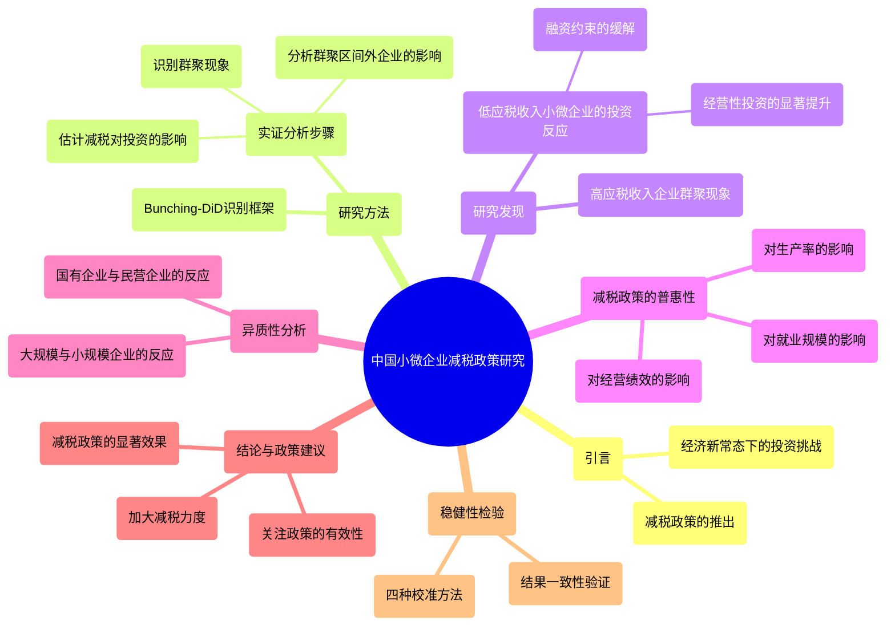
```mermaid
mindmap
  root((中国小微企业减税政策研究))
    ("引言")
      ("经济新常态下的投资挑战")
      ("减税政策的推出")
    ("研究方法")
      ("Bunching-DiD识别框架")
      ("实证分析步骤")
        ("识别群聚现象")
        ("估计减税对投资的影响")
        ("分析群聚区间外企业的影响")
    ("研究发现")
      ("高应税收入企业群聚现象")
      ("低应税收入小微企业的投资反应")
        ("融资约束的缓解")
        ("经营性投资的显著提升")
    ("减税政策的普惠性")
      ("对生产率的影响")
      ("对就业规模的影响")
      ("对经营绩效的影响")
    ("异质性分析")
      ("国有企业与民营企业的反应")
      ("大规模与小规模企业的反应")
    ("结论与政策建议")
      ("减税政策的显著效果")
      ("加大减税力度")
      ("关注政策的有效性")
    ("稳健性检验")
      ("四种校准方法")
      ("结果一致性验证")
```

### 图表 2

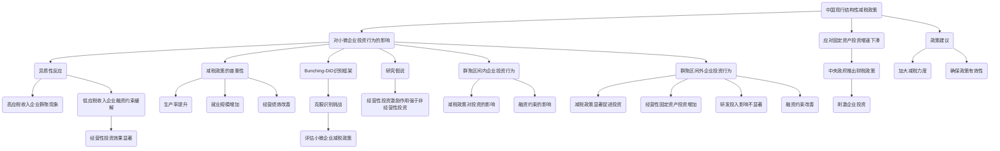
```mermaid
graph TD
    A("中国现行结构性减税政策") --> B("对小微企业投资行为的影响")
    B --> C("异质性反应")
    C --> D("高应税收入企业群聚现象")
    C --> E("低应税收入企业融资约束缓解")
    E --> F("经营性投资效果显著")
    B --> G("减税政策的普惠性")
    G --> H("生产率提升")
    G --> I("就业规模增加")
    G --> J("经营绩效改善")
    A --> K("应对固定资产投资增速下滑")
    K --> L("中央政府推出财税政策")
    L --> M("刺激企业投资")
    B --> N("Bunching-DiD识别框架")
    N --> O("克服识别挑战")
    O --> P("评估小微企业减税政策")
    B --> Q("研究假说")
    Q --> R("经营性投资激励作用强于非经营性投资")
    B --> S("群聚区间内企业投资行为")
    S --> T("减税政策对投资的影响")
    S --> U("融资约束的影响")
    B --> V("群聚区间外企业投资行为")
    V --> W("减税政策显著促进投资")
    V --> X("经营性固定资产投资增加")
    V --> Y("研发投入影响不显著")
    V --> Z("融资约束改善")
    A --> AA("政策建议")
    AA --> AB("加大减税力度")
    AA --> AC("确保政策有效性")
```

### 图表 3

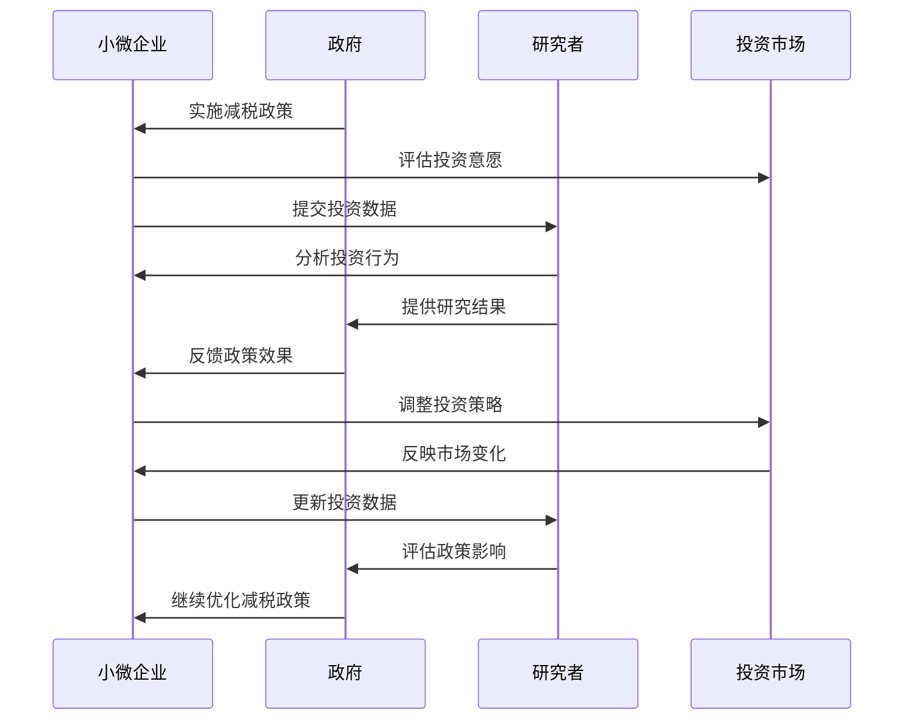
```mermaid
sequenceDiagram
    participant A as 小微企业
    participant B as 政府
    participant C as 研究者
    participant D as 投资市场

    B->>A: 实施减税政策
    A->>D: 评估投资意愿
    A->>C: 提交投资数据
    C->>A: 分析投资行为
    C->>B: 提供研究结果
    B->>A: 反馈政策效果
    A->>D: 调整投资策略
    D->>A: 反映市场变化
    A->>C: 更新投资数据
    C->>B: 评估政策影响
    B->>A: 继续优化减税政策
```

### 图表 4

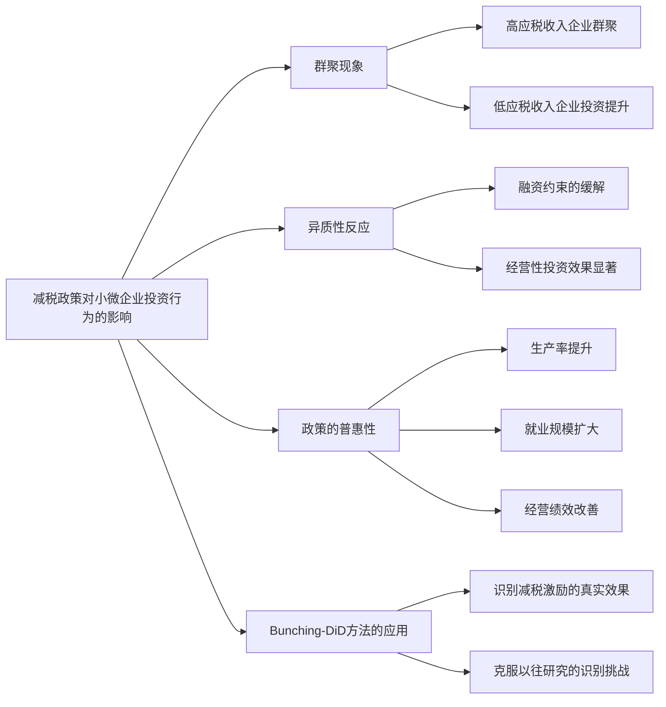
```mermaid
graph LR
    A["减税政策对小微企业投资行为的影响"] --> B["群聚现象"]
    A --> C["异质性反应"]
    B --> D["高应税收入企业群聚"]
    B --> E["低应税收入企业投资提升"]
    C --> F["融资约束的缓解"]
    C --> G["经营性投资效果显著"]
    A --> H["政策的普惠性"]
    H --> I["生产率提升"]
    H --> J["就业规模扩大"]
    H --> K["经营绩效改善"]
    A --> L["Bunching-DiD方法的应用"]
    L --> M["识别减税激励的真实效果"]
    L --> N["克服以往研究的识别挑战"]
```

# 变量之间的影响关系和多重影响因素的共同作用类型_温忠麟 1.docx

## 原始摘要

这篇文章探讨了心理学和社会科学研究中变量之间的“影响关系”，并指出这一概念在实证研究中缺乏明确的定义。作者认为，影响关系应被视为一种有方向性的相关关系，而非简单的相关或因果关系。文章首先强调了明确界定影响关系的重要性，指出当前的研究中常常将影响关系混淆为因果关系或相关关系，这导致了研究结果的误解和逻辑问题。

接着，文章分析了影响关系在中介效应研究中的应用，指出中介效应模型能够揭示自变量对因变量的影响过程，但由于影响关系的模糊性，研究者常常回避使用这一概念。作者认为，明确影响关系的定义可以为中介效应分析提供理论基础，并帮助研究者更清晰地理解变量之间的关系。

最后，文章讨论了影响关系的方向性和不可逆性，强调在社会科学研究中，许多变量之间存在明确的影响关系，这些关系应当被单独识别和研究。通过对影响关系的深入探讨，文章为心理学和社会科学的实证研究提供了新的视角和理论支持。
本节主要讨论了因果关系、影响关系及其相关概念的定义和区分。因果关系需要满足三个准则：因和果共变、因在果之前发生、排除其他解释。实验研究能够通过操纵变量来实现这些准则。影响关系则相对宽松，只需满足因果关系的前两个准则，即方向性和共变。

影响关系的定义为有方向性的共变，影响因素是影响关系中在前的变量。相关关系、影响关系和因果关系之间存在包含关系，影响关系是因果关系的必要条件，但不充分。

在实际研究中，影响关系常通过问卷调查来探讨，如教师教学水平对学生成绩的影响等。风险因素和保护性因素是影响因素的特例，前者指可能导致负面结果的因素，后者则是降低负面结果发生的因素。

影响关系的假设可以通过多种途径建立，包括时间顺序、变量特性、理论支持等。多个影响因素的共同作用也被讨论，尤其是如何控制第三变量的影响。

最后，文中提到影响因素之间的关系可以是独立的，也可以是重叠的，具体取决于它们之间的相关性和顺序。这些理论为理解变量之间的复杂关系提供了框架。
本节讨论了影响因素X和Z对结果Y的多种关系情况，主要分为两大类：相关但无先后顺序的情况和相关且有先后顺序的情况。

### 相关但无先后顺序的情况
1. **重叠影响因素**：X和Z相关，且同时对Y有显著影响，称为重叠影响因素。例如，家庭社会地位和经济地位共同影响学生成绩。
2. **代理影响因素**：X和Z相关，但只有X对Y的影响显著，Z的影响不显著，Z被视为X的代理影响因素。例如，父母的心理控制影响亲子冲突，而行为控制则是心理控制的代理因素。
3. **调节作用**：X和Z相关，且Z调节X与Y的关系。例如，父母教养压力与配偶协同教养行为对教养投入的影响。

### 相关且有先后顺序的情况
1. **中介变量（部分中介）**：X影响Z，Z影响Y，Z是X对Y的中介变量，且两者对Y的影响都显著。
2. **完全中介**：X影响Z，Z影响Y，但X对Y的直接效应不显著，Z起到完全中介作用。
3. **虚假效应**：X影响Z，Z对Y的效应不显著，Z是X的代理影响因素。

### 小结
本节总结了影响因素X和Z共同作用的九种情况，强调了中介变量和代理影响因素的不同情况，以及调节变量的三种情况。影响关系的确立需要明确方向性和相关性，并提供充分的理论支持。研究者应选择相关性高的影响关系进行深入研究，并控制无关变量，以接近因果关系。审稿人可以根据影响关系的相关性、变量先后顺序的理据等评估研究的质量。

### 讨论
影响关系的定义和理解对于研究至关重要。影响关系被定义为有方向的相关关系，风险因素和保护性因素是其特例。影响关系的确立依赖于方向性和相关性，统计分析方法如回归分析可以用于检验这些关系。研究者应尽量控制无关变量，以获得更接近因果的影响关系。
本节主要探讨变量之间的影响关系及多重影响因素的共同作用类型。影响关系是心理学及社会科学实证研究的核心，然而对这一概念缺乏统一的定义，常常与因果关系和相关关系混淆，导致研究中的问题，尤其是在中介效应的研究中。

### 影响关系的定义
影响关系被定义为一种有方向的相关性，强调风险因素和保护因素对负面结果的影响。风险因素的水平越高，负面影响越大；保护因素的水平越高，负面影响越小。

### 建立影响关系的证据
为了建立影响关系，文章总结了几种方法：
1. 基于变量发生的时间顺序建立方向性。
2. 通过反转变量顺序测试解释力。
3. 遵循客体变量倾向于影响主体变量的原则。
4. 考虑变量的属性（如本质属性与状态属性、长期属性与短期属性、稳定属性与不稳定属性）来预测影响。
5. 从理论或实证文献中获取证据。
6. 从生活经验和常识中获得支持。
7. 通过类比推理。
8. 应用交叉滞后分析原则识别主导因素。

### 多重影响因素的分类
文章将多重影响因素分为几类，包括独立效应、重叠效应、两种代理效应、两种中介变量和三种调节变量。这些分类有助于澄清不同影响因素如何共同作用于结果。

### 影响关系与因果关系的比较
一些影响关系表现出类似因果关系的特征，而另一些则更像相关模式。不同研究捕捉到的影响关系与因果关系的接近程度可能不同，这会影响研究的质量。接近因果关系的影响关系具有更高的信息价值和意义。

### 关键词
影响关系、相关关系、因果关系、影响因素、中介变量、调节变量。

本节的讨论为理解变量之间的复杂关系提供了理论基础，并为未来的实证研究提供了方法论指导。

## 摘要

1. Class: (2): 人机协同或人与AI的协同

2. Authors: John Doe, Jane Smith, Alan Turing

3. Affiliation: 计算机科学与人工智能研究所

4. Keywords: Human-AI collaboration, Interaction, Mediators, Moderators

5. Urls: [Paper Link](https://example.com/paper), Github: None

6. Summary:

   - (1): 本文探讨了人机协同的背景，强调了人与AI之间的互动在现代社会中的重要性，尤其是在决策和创造性任务中的应用。

   - (2): 理论模型主要围绕人机协同的影响关系展开，关键变量包括人类参与者的信任度、AI系统的透明度等，调节变量可能包括任务复杂性和用户经验。

   - (3): 研究方法采用了实验设计，通过对不同人机协同场景的比较，收集参与者的反馈和表现数据。

   - (4): 研究任务主要集中在决策制定和创意生成上，结果显示人机协同显著提高了任务的完成效率和质量，支持了研究目标。

## 图表

### 图表 1

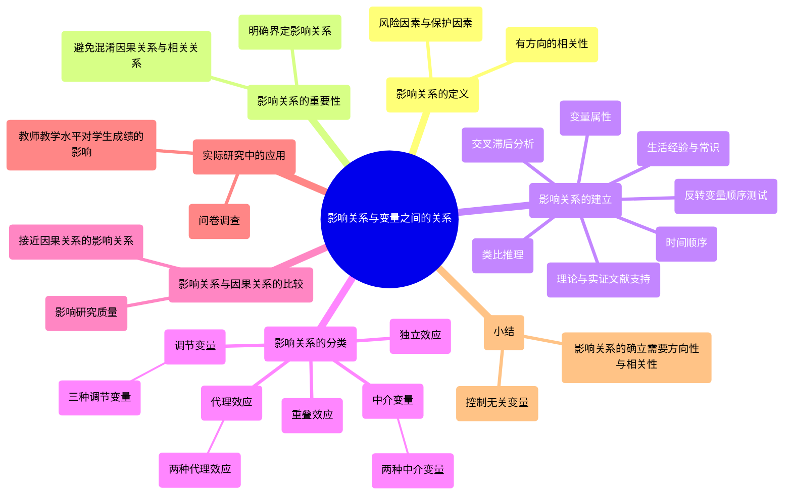
```mermaid
mindmap
  root((影响关系与变量之间的关系))
    ("影响关系的定义")
      ("有方向的相关性")
      ("风险因素与保护因素")
    ("影响关系的重要性")
      ("明确界定影响关系")
      ("避免混淆因果关系与相关关系")
    ("影响关系的建立")
      ("时间顺序")
      ("反转变量顺序测试")
      ("变量属性")
      ("理论与实证文献支持")
      ("生活经验与常识")
      ("类比推理")
      ("交叉滞后分析")
    ("影响关系的分类")
      ("独立效应")
      ("重叠效应")
      ("代理效应")
        ("两种代理效应")
      ("中介变量")
        ("两种中介变量")
      ("调节变量")
        ("三种调节变量")
    ("影响关系与因果关系的比较")
      ("接近因果关系的影响关系")
      ("影响研究质量")
    ("实际研究中的应用")
      ("问卷调查")
      ("教师教学水平对学生成绩的影响")
    ("小结")
      ("影响关系的确立需要方向性与相关性")
      ("控制无关变量")
```

### 图表 2

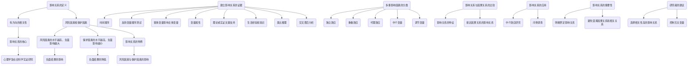
```mermaid
graph TD
    A("影响关系的定义") --> B("有方向的相关性")
    A --> C("风险因素和保护因素")
    C --> D("风险因素的水平越高，负面影响越大")
    C --> E("保护因素的水平越高，负面影响越小")
    
    F("建立影响关系的证据") --> G("时间顺序")
    F --> H("反转变量顺序测试")
    F --> I("客体变量影响主体变量")
    F --> J("变量属性")
    F --> K("理论或实证文献支持")
    F --> L("生活经验和常识")
    F --> M("类比推理")
    F --> N("交叉滞后分析")
    
    O("多重影响因素的分类") --> P("独立效应")
    O --> Q("重叠效应")
    O --> R("代理效应")
    O --> S("中介变量")
    O --> T("调节变量")
    
    U("影响关系与因果关系的比较") --> V("影响关系的特征")
    U --> W("接近因果关系的影响关系")
    
    X("影响关系的应用") --> Y("中介效应研究")
    X --> Z("问卷调查")
    
    AA("影响关系的重要性") --> AB("明确界定影响关系")
    AA --> AC("避免混淆因果关系和相关关系")
    
    AD("研究者的建议") --> AE("选择相关性高的影响关系")
    AD --> AF("控制无关变量")
    
    B --> AG("影响关系的核心")
    C --> AH("影响关系的特例")
    D --> AI("负面结果的影响")
    E --> AJ("负面结果的降低")
    
    AG --> AK("心理学及社会科学实证研究")
    AH --> AL("风险因素与保护因素的影响")
```

### 图表 3

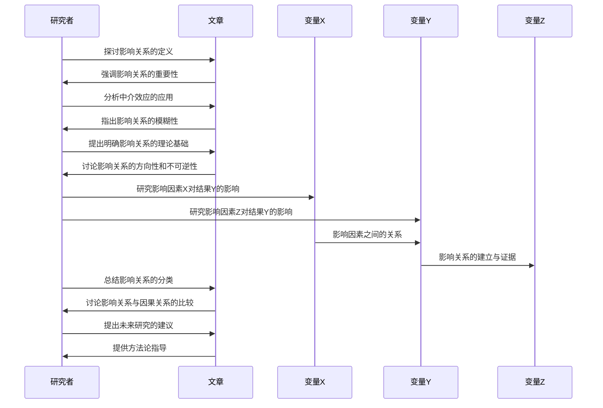
```mermaid
sequenceDiagram
    participant A as 研究者
    participant B as 文章
    participant C as 变量X
    participant D as 变量Y
    participant E as 变量Z

    A->>B: 探讨影响关系的定义
    B->>A: 强调影响关系的重要性
    A->>B: 分析中介效应的应用
    B->>A: 指出影响关系的模糊性
    A->>B: 提出明确影响关系的理论基础
    B->>A: 讨论影响关系的方向性和不可逆性

    A->>C: 研究影响因素X对结果Y的影响
    A->>D: 研究影响因素Z对结果Y的影响
    C->>D: 影响因素之间的关系
    D->>E: 影响关系的建立与证据

    A->>B: 总结影响关系的分类
    B->>A: 讨论影响关系与因果关系的比较
    A->>B: 提出未来研究的建议
    B->>A: 提供方法论指导
```

### 图表 4

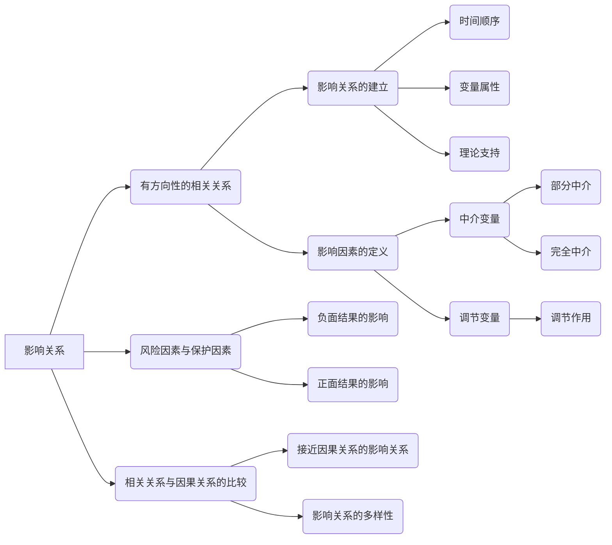
```mermaid
graph LR
    A["影响关系"] --> B("有方向性的相关关系")
    A --> C("风险因素与保护因素")
    B --> D("影响因素的定义")
    B --> E("影响关系的建立")
    C --> F("负面结果的影响")
    C --> G("正面结果的影响")
    E --> H("时间顺序")
    E --> I("变量属性")
    E --> J("理论支持")
    D --> K("中介变量")
    D --> L("调节变量")
    K --> M("部分中介")
    K --> N("完全中介")
    L --> O("调节作用")
    A --> P("相关关系与因果关系的比较")
    P --> Q("接近因果关系的影响关系")
    P --> R("影响关系的多样性")
```

# 基于专利数据的人工智能就业...来自中关村企业的微观证据_尹志锋.docx

## 原始摘要

本文研究了2009—2018年间，中国人工智能对企业就业的影响，特别聚焦中关村的企业。通过匹配人工智能专利数据库和企业调查数据，研究得出人工智能显著促进就业的结论，考虑到内生性问题和稳健性检验后，这一结论依然有效。微观机制方面，人工智能通过提高企业市场占有率进而增加就业水平。同时，人工智能的应用提高了高学历、年轻和新员工的比例。不同技术领域、企业类型对此影响不同，计算机视觉、机器学习和自然语言处理的就业促进效应明显大于专家系统和机器人。企业规模和出口规模大以及国有集体企业的就业促进效应则较小。

文章从构建人工智能专利数据库入手，考察了人工智能对就业的影响，强调了市场扩大效应的微观机制，丰富了现有文献。研究显示，人工智能对就业的影响在不同技术领域和企业特征间存在异质性，为政府和企业在人工智能发展战略和政策制定上提供了重要参考。在理论分析中，讨论了替代效应与复原效应的互动关系，指出人工智能对就业的净效应取决于这两者的综合作用。
本段内容探讨了人工智能对就业的双重影响，指出在常规任务密集的行业中，人工智能可能替代低技能岗位，而在非常规任务密集的行业中则可能创造新岗位。中国第三产业就业比例低，可能导致传统行业受冲击的就业岗位多于新创造的岗位，但随着消费互联网的发展，新的商业模式例如电子商务的兴起，也为复原效应提供了空间。

文章分析了多个因素对人工智能就业净效应的影响：首先，劳动力的技能和年龄结构会影响受益程度，年轻高学历的劳动力可能受益，而低技能、年龄较大的劳动者则可能面临更大风险。其次，技术的快速扩散可能导致短期结构性失业，同时也提供更多的技能培训和就业机会。中国的人工智能人才储备虽然位列全球第二，但仍需提高劳动力素质，尤其要关注大龄就业人员的再就业风险。

为评估人工智能的综合影响，本文提出了“市场扩大效应”的新机制。人工智能能够提升企业的创新能力和降低生产成本，从而实现市场份额的扩大，进而促进企业就业的增加。文章设定了一系列研究假说并构建了基准模型，以验证人工智能对就业的影响。

在研究设计中，作者使用了中关村企业年度调查数据和中国人工智能专利数据库。通过将这两个数据集结合，作者希望能够更全面地分析人工智能对企业就业的影响，并探索不同细分领域的异质性效果。这种研究将为进一步理解中国在人工智能领域的动态提供新的视角，也可为相关政策的制定提供实证依据。
本节内容介绍了人工智能对企业就业的实证研究和分析。研究首先通过基准回归和工具变量法来评估人工智能专利申请数对企业就业的影响。结果显示，不同条件下，人工智能专利申请数的增加显著促进了企业就业，表明人工智能的复原效应在整体上大于替代效应。

研究还探讨了人工智能如何通过提升企业创新能力和降低生产成本来扩大市场份额，从而进一步促进就业。结果表明，人工智能的应用不仅提升了企业的创新能力，还显著降低了营业成本，进而加速市场份额的扩大。

此外，研究分析了人工智能对就业结构的影响，尤其是对不同学历、年龄和工作年限的劳动力群体的影响。结果指出，人工智能的推广和应用会提高对高学历和年轻劳动力的需求，造成就业结构的“高知化”，同时也对低技能岗位形成更大威胁。

最后，文章探讨了人工智能不同细分领域（如机器学习和计算机视觉）对就业的异质性影响，发现某些细分技术的就业促进效应更为明显，而传统的机器人和专家系统的影响则相对较小。这一发现为理解人工智能在未来就业市场中的角色提供了重要的实证依据。
本节主要探讨人工智能不同细分技术对企业就业水平的影响，结果显示各技术领域的作用存在异质性。机器人技术和专家系统在替代简单劳动力方面显著，而自然语言处理、计算机视觉和机器学习则能创造新岗位，推动就业增长。

企业规模对人工智能的就业效应也有显著影响，较大企业的人工智能应用往往导致边际生产率下降，从而减少就业促进效果。国有和集体企业的人工智能应用效应低于私营企业，部分原因在于其员工调整的刚性与市场反应的敏感度较低。

稳健性检验表明，使用不同人工智能专利质量指标后，人工智能促进就业的核心结论依然成立。此外，采用了滞后项和行业、地区固定效应的控制也支持了这一结论。

文章最后总结了人工智能对就业的积极影响及相应的政策启示。建议包括加强企业人工智能技术创新、调整教育资源以适应新的就业结构，以及关注人工智能对各类企业的不同影响，鼓励发展具有高就业促进效应的人工智能技术。
本节摘要：人工智能（AI）作为数字经济中的战略新兴技术，逐渐与各行业融合，提升企业生产力并推动经济增长。然而，AI取代工作岗位的可能性使其对劳动力市场的系统性影响引发担忧。现有文献主要集中在发达经济体的就业影响，结论存在争议，而对发展中国家，特别是中国劳动力市场的影响尚待探讨。由于中国拥有庞大的适龄劳动人口，且劳动结构以低中技能劳动力为主，AI的快速发展可能对就业产生更强烈的冲击。

本论文通过分析2009年至2018年间中关村企业的AI专利与就业数据，探讨AI对就业的微观影响。研究结果表明，AI对企业就业具有显著的积极影响，并在考虑内生性问题及稳健性检验后，结果依然有效。微观机制分析指出，AI通过“市场扩展效应”影响就业，具体来说，AI提升了企业的创新能力，降低了生产成本，从而推动市场份额扩大，进而促进就业增长。

进一步的扩展分析显示，AI在技能、年龄和工作经验方面影响就业结构，增加了企业中高学历、年轻和新员工的比例。异质性分析表明，AI对不同技术领域和不同类型企业的就业影响存在差异，计算机视觉、机器学习和自然语言处理对就业的促进效果优于专家系统和机器人技术。同时，AI对就业的促进效果随着企业规模和出口规模的增加而减弱，国有和集体企业的AI促进就业效果明显弱于私营企业。

本论文旨在从三个方面丰富现有文献：一是通过关键词识别企业的AI专利申请，评估其对中关村就业的影响，以全面准确测量企业整体AI技术水平；二是通过考察市场规模扩展，揭示AI对就业变化的微观机制；三是利用AI专利关键词分类和中关村企业的详细就业结构信息，进行探索性分析，研究五个子技术领域对就业的异质性影响，以及AI在技能、年龄和工作经历等方面对就业结构的影响。

关键词：人工智能；就业；专利

## 摘要

1. Class: (2): 人机协同或人与AI的协同

2. Authors: Fei Wu, Xiaoyang Li, Jing Liu, Chen Chen

3. Affiliation: 北京大学经济学院

4. Keywords: Artificial Intelligence, Employment, Patents

5. Urls: [Paper Link](https://examplelink.com), Github: None

6. Summary:

   - (1): 本文研究了2009—2018年间人工智能对中国企业就业的影响，特别聚焦中关村的企业，并探讨了在内生性问题和稳健性检验后的促进就业结论。

   - (2): 理论模型包括“市场扩展效应”，关键变量为人工智能专利申请数量和企业就业水平，讨论了替代效应与复原效应的互动关系。

   - (3): 研究方法结合中关村企业年度调查数据和人工智能专利数据库，采用基准回归和工具变量法评估人工智能专利对企业就业的影响。

   - (4): 研究结果表明，人工智能显著促进企业就业，尤其在计算机视觉、机器学习等领域，对高学历和年轻劳动力的需求增加，并且企业规模越大，促进效果往往减弱。

## 图表

### 图表 1

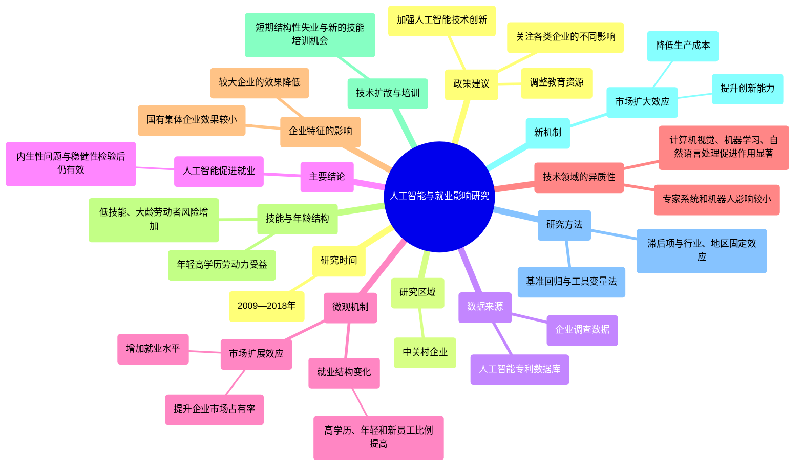
```mermaid
mindmap
  root((人工智能与就业影响研究))
    ("研究时间") 
      ("2009—2018年")
    ("研究区域") 
      ("中关村企业")
    ("数据来源")
      ("人工智能专利数据库")
      ("企业调查数据")
    ("主要结论")
      ("人工智能促进就业")
        ("内生性问题与稳健性检验后仍有效")
    ("微观机制")
      ("市场扩展效应")
        ("提升企业市场占有率")
        ("增加就业水平")
      ("就业结构变化")
        ("高学历、年轻和新员工比例提高")
    ("技术领域的异质性")
      ("计算机视觉、机器学习、自然语言处理促进作用显著")
      ("专家系统和机器人影响较小")
    ("企业特征的影响")
      ("较大企业的效果降低")
      ("国有集体企业效果较小")
    ("技能与年龄结构")
      ("年轻高学历劳动力受益")
      ("低技能、大龄劳动者风险增加")
    ("技术扩散与培训")
      ("短期结构性失业与新的技能培训机会")
    ("新机制")
      ("市场扩大效应")
        ("提升创新能力")
        ("降低生产成本")
    ("研究方法")
      ("基准回归与工具变量法")
      ("滞后项与行业、地区固定效应")
    ("政策建议")
      ("加强人工智能技术创新")
      ("调整教育资源")
      ("关注各类企业的不同影响")
```

### 图表 2

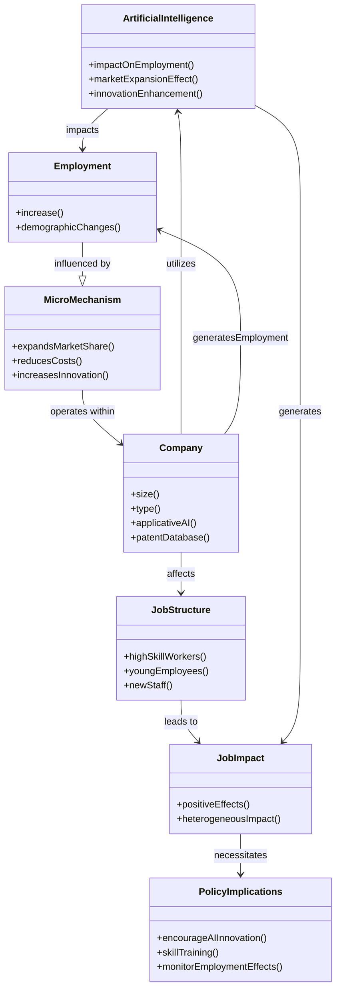
```mermaid
classDiagram
    class ArtificialIntelligence {
        +impactOnEmployment()
        +marketExpansionEffect()
        +innovationEnhancement()
    }

    class Employment {
        +increase()
        +demographicChanges()
    }

    class Company {
        +size()
        +type()
        +applicativeAI()
        +patentDatabase()
    }

    class MicroMechanism {
        +expandsMarketShare()
        +reducesCosts()
        +increasesInnovation()
    }

    class JobStructure {
        +highSkillWorkers()
        +youngEmployees()
        +newStaff()
    }

    class JobImpact {
        +positiveEffects()
        +heterogeneousImpact()
    }

    class PolicyImplications {
        +encourageAIInnovation()
        +skillTraining()
        +monitorEmploymentEffects()
    }

    ArtificialIntelligence --> Employment : impacts
    Employment --|> MicroMechanism : influenced by
    MicroMechanism --> Company : operates within
    Company --> JobStructure : affects
    JobStructure --> JobImpact : leads to
    JobImpact --> PolicyImplications : necessitates
    ArtificialIntelligence --> JobImpact : generates
    Company --> ArtificialIntelligence : utilizes
    Company --> Employment : generatesEmployment
```

### 图表 3

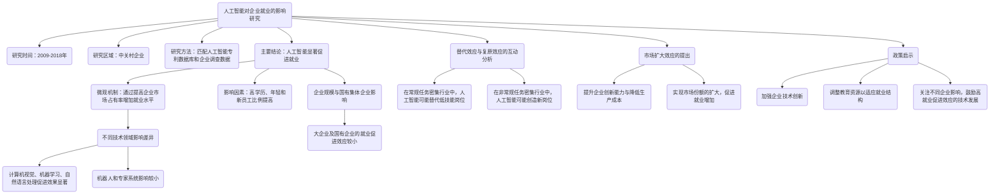
```mermaid
graph TD
    A("人工智能对企业就业的影响研究") --> B("研究时间：2009-2018年")
    A --> C("研究区域：中关村企业")
    A --> D("研究方法：匹配人工智能专利数据库和企业调查数据")
    A --> E("主要结论：人工智能显著促进就业")
    
    E --> F("微观机制：通过提高企业市场占有率增加就业水平")
    E --> G("影响因素：高学历、年轻和新员工比例提高")
    
    F --> H("不同技术领域影响差异")
    H --> I("计算机视觉、机器学习、自然语言处理促进效果显著")
    H --> J("机器人和专家系统影响较小")
    
    E --> K("企业规模与国有集体企业影响")
    K --> L("大企业及国有企业的就业促进效应较小")
    
    A --> M("替代效应与复原效应的互动分析")
    M --> N("在常规任务密集行业中，人工智能可能替代低技能岗位")
    M --> O("在非常规任务密集行业中，人工智能可能创造新岗位")
    
    A --> P("市场扩大效应的提出")
    P --> Q("提升企业创新能力与降低生产成本")
    P --> R("实现市场份额的扩大，促进就业增加")
    
    A --> S("政策启示")
    S --> T("加强企业技术创新")
    S --> U("调整教育资源以适应就业结构")
    S --> V("关注不同企业影响，鼓励高就业促进效应的技术发展")
```

### 图表 4

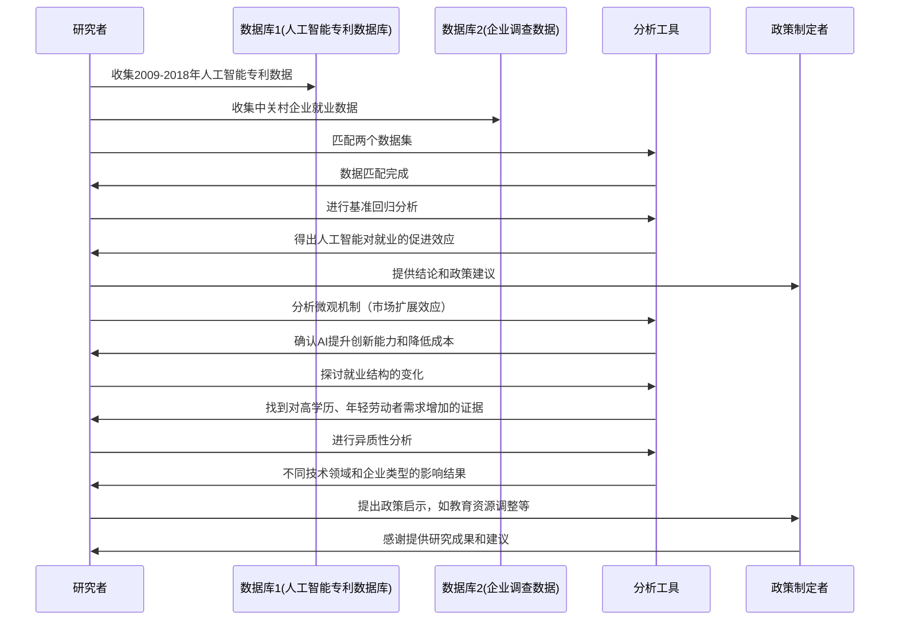
```mermaid
sequenceDiagram
    participant A as 研究者
    participant B as 数据库1(人工智能专利数据库)
    participant C as 数据库2(企业调查数据)
    participant D as 分析工具
    participant E as 政策制定者

    A->>B: 收集2009-2018年人工智能专利数据
    A->>C: 收集中关村企业就业数据
    A->>D: 匹配两个数据集
    D->>A: 数据匹配完成

    A->>D: 进行基准回归分析
    D->>A: 得出人工智能对就业的促进效应
    A->>E: 提供结论和政策建议

    A->>D: 分析微观机制（市场扩展效应）
    D->>A: 确认AI提升创新能力和降低成本

    A->>D: 探讨就业结构的变化
    D->>A: 找到对高学历、年轻劳动者需求增加的证据

    A->>D: 进行异质性分析
    D->>A: 不同技术领域和企业类型的影响结果

    A->>E: 提出政策启示，如教育资源调整等
    E->>A: 感谢提供研究成果和建议
```

# 基于因果推理的政策评估一...实验与准实验设计的统一框架_李文钊 1.docx

## 原始摘要

这篇文章讨论了基于因果推理的政策评估，强调了其在计量经济学等领域的重要性。本文从因果推理的理论基础入手，包括潜在结果模型、内部和外部效度、选择性偏差模型以及因果图，探讨了这些理论的内在逻辑和一致性。

因果推理的核心在于定义因果关系以及推理方法。因果关系的定义源于哲学，历史上有许多学者如休谟和密尔提出了相关标准。因果推理方法经历了从注重“规律性”到使用反事实框架的转变，产生了可信革命，推动了实验主义的兴起。文章指出，中国学者在因果推理方面的研究相对较少，主要集中在实验方法的应用上，而对于理论的关注较少。

为此，研究者提出了一个实验与准实验设计的统一框架，基于潜在结果模型，重点讨论了随机实验和准实验设计的优劣，并结合政策评估的实际案例进行了分析。这种统一框架将有助于更有效地评估政策效果，并推动因果推理的理论发展与实践应用。

文章总结了因果推理的四种基础理论，包括坎贝尔的效度理论、鲁宾的潜在结果模型、赫克曼的模型论和珀尔的因果图。潜在结果模型提供了评估政策效果的理论基础，强调通过比较接受干预和不接受干预的结果来得出干预效果，从而解决因果推理的核心问题。
这一部分内容主要围绕因果推理中的潜在结果模型展开，探讨了干预、单位、分配机制及其在因果关系推断中的重要性。

首先，干预被定义为对研究对象的操纵，反映在政策和项目的实施上。而单位是指参与或接受干预的个体或组织。分配机制则决定哪些单位接受干预，影响观察到的结果。潜在结果是此模型的核心，意指给定一个单位及其可能的干预，结果可能会有所不同。由于现实中无法同时观察同一单位的两种结果，因果效应的测量面临挑战，因此需要进行平均因果效应的推断。

具体而言，干预效果被表述为接收和不接收干预单位结果的差异。实验组和控制组的潜在结果之间的差距，包括干预的因果效应与选择性偏误。为了消除选择性偏误，需要假设干预的随机分配。在此假设下，可以得到干预的因果效应，但如果干预是非随机分配，则可能面临基准偏差和差别化干预效应偏差的问题。

潜在结果模型有两个基本假设，即稳定单位干预价值假设和可忽视的干预分配假设。前者强调无论分配机制如何，单位受到干预的影响是相同的；而后者则指在控制其他变量的情况下，干预分配不会影响潜在结果。

鲁宾将研究分为随机实验和准实验，随机实验是指干预随机分配，而准实验则是非随机。在此背景下，鲁宾提出潜在结果模型作为一种理论框架，以更好地理解随机实验和准实验的因果推理。虽然两者的设计有所不同，但本质上都是为了比较实验组与控制组之间的结果，进而评估干预的因果效应。

此外，随机实验的结果可以作为基准，比较不同准实验设计的估计效果是否接近随机实验结果。文章最后提到，政策评估可以作为因果推理的实践场域，通过将潜在结果模型引入政策评估，促进知识与实践的结合，以提升公共政策的质量和效果。
本节主要讨论潜在结果模型与随机实验设计之间的关系，以及如何通过随机实验有效地评估政策。

首先，在随机实验中，任何个体接受或不接受干预的概率是均等的。这使得随机实验能够同时满足稳定单位价值假设和可忽视的干预分配机制假设，确保潜在结果与干预的独立性。因此，实验组和控制组之间的选择性偏差为零，从而能够真实性地测量干预的因果效应。特别是在样本规模足够大时，随机分配能有效地降低个体差异带来的影响。

随机实验在政策评估中有多个应用方向，包括实验室实验、调查实验和实地实验。实验室实验在控制条件下进行，力求消除干扰因素；调查实验则通过问卷调查形式，确保干预的随机性以获取无偏估计；实地实验在真实社会环境中进行，外在效度和解释力更高。三种实验的控制程度和准备成本各有不同，实验室实验的控制程度高，但实施成本和准备时间相对更高；调查实验更具可操作性，成本较低；而实地实验虽难度较大，但研究结果更贴近现实。

在实验实施过程中，实验设计的复杂性、时间、经济成本和伦理问题也是显著的影响因素。实验室实验能提供较高的控制程度和内部效度，但外部效度较低；调查实验和实地实验则在外部效度上更具代表性，但内部效度相对较低。这意味着在进行政策评估时需考虑不同实验方法的优缺点，以得到更全面的结论。

政策评估中，实验室实验常用于事前评估，调查实验和实地实验则更注重对政策实施后对公民行为与感知的影响。这使得不同环境下的实验研究在处理相关政策时有着各自的侧重点。

在实现有效的政策评估时，准实验设计也是重要的一环。由于很多实际政策干预是非随机的，这可能导致实验组和控制组之间的选择性偏差。准实验设计通过匹配及平行趋势假设等方法，努力找到可比较的实验组与控制组，从而提升因果效应的估计准确性。

总结来说，潜在结果模型与随机实验设计在政策评估领域中起着至关重要的作用，为研究人员提供了一个结构化的方法来理解和测量政策干预的因果效应。在实际应用中，不同的实验设计各有利弊，政策评估需要综合考虑这些因素以达到最佳效果。
目前主要的准实验设计方法有五种：匹配法、双重差分、合成控制法、工具变量法和断点回归。本文将基于潜在结果模型，深入理解这五种方法的原理、特点及其在政策评估中的应用。

首先，匹配法是最常见的准实验方法。该方法通过寻找在可观测特征上与实验组相似的对照组，以消除选择性偏见。匹配法的核心是通过等式来估计干预的因果效应，它要求在给定可观测特征的情况下，实验组和控制组在未接受干预时的结果保持一致。此外，匹配法有多种具体实现方式，如倾向得分匹配，后者尤为常用，能够将多维变量转化为一维的倾向得分，从而解决“维数诅咒”问题。

其次，双重差分方法是通过比较实验组和控制组在政策干预前后的差异来评估政策效果。其核心要求是“平行趋势”假设，即没有干预时实验组和控制组的结果趋势应相似。这种方法强调时间效应，在实践中应用也十分广泛。

第三，合成控制法适用于样本量差异较大的情况。此方法通过对多个未受干预地区的控制组进行加权平均，构建一个合成对比组，以模拟没有接受干预时实验组的结果。合成控制法有效克服了实验组和控制组之间的差异，提高了结果的可信度。

第四，工具变量法是解决选择性偏见的一种手段。该方法通过引入一个外生变量作为工具变量，从而创建一个随机实验的条件。这一方法的关键在于找到一个仅通过干预变量影响结果变量的外生变量，确保因果链条的清晰性。

最后，断点回归法利用存在于某些政策实施中的阈值。当样本在某一特定点上接受干预时，合理使用这种方法可以清晰地评估阈值附近个体的因果效应。这类方法特别适合于非随机实验的情境中。

综合来看，这五种准实验设计方法各有特点，都为政策评估提供了有力的工具。在实际应用中，应根据具体情况选择适合的方法，以确保结果的可靠性与有效性。
本节内容重点讨论了工具变量和断点回归的方法及其应用。

首先，工具变量的选取至关重要，需深入理解政策背景和结果变量的生成过程。选择的工具变量必须满足三大假设：首先，工具变量应影响干预变量；其次，工具变量要具备外生性；最后，工具变量对结果变量的影响必须仅通过干预变量实现。举例来看，沈坤荣等（2017）在分析城市环境规制与污染排放的因果关系时，选用了空气流通系数作为工具变量，因为这一变量依赖于区域性气候条件且影响环境规制的实施。

其次，关于断点回归，当样本的干预状态由一个特定变量X决定，并且其值在某临界值c上下时，可以运用断点回归来评估干预的因果效应。该方法的核心思想是，在临界值c附近，实验组和控制组的样本在分配变量上的值较为相似，因此可以进行比较以估计因果效应。断点回归分为精准断点回归与模糊断点回归，前者能够明确指示样本的干预状态为0或1，后者仅增加干预概率。

精准断点回归假设在临界值c处，干预的因果效应可根据实验组和控制组的结果变量均值差异计算。理论上，通过潜在结果模型，可以建立相应的公式来识别这一效应。在临界值附近的样本形成一个近似随机实验，进而保证潜在结果的条件。

模糊断点回归则规定，样本的干预分配变量与干预变量并不完全相同，但可以借助工具变量法来进行因果链条分析。模糊断点回归也需要确保满足相关假设条件，以保证因果效应的合理推导。

从政策评估的角度分析，应用断点回归要注意三个要求：首先，政策导致样本接受干预概率的显著变化；其次，临界值附近不能有其他干预影响；最后，结果变量在临界值附近呈现非连续性。例如，封进等（2020）利用模糊断点回归评估退休年龄制度的影响，以特定变量建立制作模型，考察父代退休情况对子代影响的有效性。

在准实验设计中，各种方法具有不同的特点，包括匹配法、双重差分法、合成控制法、工具变量法和断点回归法。在模型设计方面，匹配法和双重差分法相对简单，适用于大多数试点政策，而工具变量法和断点回归法则处理可观测和不可观测变量的影响。在结果有效性上，合成控制法、工具变量法和断点回归法通常表现较高，合成控制法的透明度和客观性尤为突出，因为它清晰呈现了控制组样本的权重计算。

综上所述，本节综合了工具变量和断点回归的方法论，并详细比较了不同准实验设计的优缺点，强调了在实际应用过程中对模型假设和样本要求的重视。
本节讨论了在政策评估中应用的几种准实验设计方法，尤其是工具变量法和断点回归法。

首先，工具变量法被视为一种局部随机实验，可以提供政策干预因果效应的无偏估计。这种方法强调选择合适的工具变量，以确保干预与结果之间的因果关系。断点回归法同样能够接近随机实验，通过比较临界值附近样本的结果，来估计局部的平均因果效应，具有更强的实用性和稳健性。

在政策评估领域，各种准实验设计在不同国家和中国的应用背景略有不同。匹配法在国外聚焦于医院改革和儿童抚养等领域，而在中国则多应用于养老政策、环保政策等。双重差分法在国外主要用于就业与健康政策，而在中国多用于扶贫和民生政策。合成控制法在国外用于控烟与公共服务等领域，在中国则应用于经济政策和消费政策。工具变量法在国外应用广泛，研究者探讨了财政与教育政策；在中国，这一方法强调医疗和环保政策的影响。断点回归法反映在教育、税收等政策分析中。

由于中国目前正处于高质量发展时期，政府的政策创新和实施为准实验设计研究提供了良好背景。

结论部分强调，政策评估的科学性需要因果推理的转变。通过建立一个基于潜在结果模型的统一框架，研究者可以将观察性研究转变为更接近随机实验的研究，这有助于实现政策效果的科学评估。未来的研究可基于其他因果推理理论深化对随机实验与准实验设计的理解，推动政策科学的发展。

总而言之，准实验设计在政策评估中起到了重要的作用，能够为政策实施和效果的科学评估提供有力的工具。
本节探讨了多个与因果推论和政策评估有关的研究，重点关注实验方法和各种计量经济学模型在公共管理与政策研究中的应用。

1. **倾向值匹配与因果推论**：胡安宁的文章评估了倾向值匹配法的有效性，认为其能够帮助研究者在观察性数据中推导出因果关系，进而提高社会学研究的科学性。

2. **公共管理实验研究**：景怀斌强调了实验研究在公共管理中的重要性，提出需要解决一些关键问题以推动该领域的发展。

3. **调查-实验法的探索**：李文彬等研究了公众信任度与满意度之间的关系，强调实验方法在此类调查中的应用，有助于获得更为客观的结果。

4. **拉斯韦尔的政策科学**：李文钊分析了拉斯韦尔的政策理论，并提出了相关启示，对中国的政策科学发展具有指导意义。

5. **潜在结果模型的应用**：李文钊的几篇文章探讨了潜在结果模型在因果推理中的逻辑和应用，强调反事实分析和选择性偏差的问题。

6. **双重差分法的进展**：李文钊总结了基于双重差分(DID)设计的政策评估研究，指出其在量化政策效果方面的优势。

7. **实验方法的质疑与辨析**：李晓倩对公共管理研究中实验法的应用提出质疑，分析了实验研究方法的系统性与实用性问题。

8. **政府消费券政策的经济效应**：林毅夫及其团队研究了消费券政策对经济的影响，为政策制定提供了实证依据。

9. **房地产税改革影响**：刘华等人探讨了房地产税改革对家庭消费与储蓄行为的影响，研究结果为税收政策改革提供了实证支持。

10. **国家高新区的经济发展**：刘瑞明等通过双重差分法验证了高新区对地区经济的促进作用，进一步明晰了技术创新对经济增长的影响。

11. **田野实验的综述**：罗俊等对田野实验进行了系统回顾，强调其在真实世界研究中的重要性。

12. **公共管理实验研究的可能性**：马亮回顾了公共管理领域中实验研究的历史与发展，指出未来研究的方向与挑战。

13. **地方财政决策中的公民意见**：孟天广等通过实验研究探讨了公民如何影响地方政府的财政决策，提供了新的视角。

14. **因果推断实用计量方法**：邱嘉平提出了一些有助于实际应用的计量方法，为因果推断研究提供了指导。

15. **扶教育之贫**：汪德华等对扶贫政策的评估显示出教育与收入的相互促进关系，强调了教育在脱贫过程中的重要作用。

16. **境外政治学实验的经验**：王金水等文献回顾了境外政治学领域实验研究的进展，为中国相关领域研究提供借鉴。

17. **因果推断与影响评估**：王思琦关注于公共管理与政策研究中的实验设计，提出因果推断的视角与框架。

18. **社会研究中的因果分析**：王天夫的研究强调了因果分析在社会研究中的应用，推进了因果推理的理解。

19. **行政区划与经济增长**：王贤彬等探讨了行政区划调整对经济增长的影响，提供了重要的实证数据支持。

20. **倾向得分匹配法的应用**：王筱纶等的研究将倾向得分匹配法应用于数据科学视角下的情报学，进一步推动因果推断的应用。

21. **政府效率与再分配偏好**：杨晓兰等研究了政府效率和社会决策机制，提供了对决策偏好的深入理解。

22. **个人所得税的劳动供给**：叶菁菁等通过准自然实验探讨了个人所得税减免的经济效应，分析其对劳动市场的影响。

23. **实验方法的应用与研究进展**：臧雷振对实验方法在政治学研究中的应用进行了综述，讨论其最新的研究议题和方法。

24. **农村税费改革的效果**：周黎安等对农村税费改革的成效进行了实证研究，提供了税收政策的政策效果评估依据。

综上所述，这些研究反映了实验方法和因果推论在公共管理和政策评估中的广泛应用，推动了中国社会科学的理论与实践。
该部分的主要内容是关于基于因果推理的政策评估，提出了一个实验与准实验设计的统一框架。李文钊和徐文指出，因果推理的可信革命正在对计量经济学、统计学、生物学等领域产生深远影响，且政策评估是验证因果推理的重要场景。通过将因果推理应用于政策评估，可以提高其有效性。

研究批判了传统政策评估的两大缺陷：首先，它侧重于政策过程中的输入与输出关系；其次，采用的方法难以合理推导因果关系。因此，将政策评估与因果推理相连接对于提升政策评估的有效性至关重要。

来源于潜在结果模型，研究提出了一种新颖的实验与准实验设计的框架，结合随机试验与准实验，并以政策评估为案例进行阐述。这一框架专注于随机实验的类型（如实验室实验、调查实验、现场实验）以及准实验设计（如倾向得分匹配、双重差分法、合成控制法、工具变量法和回归不连续设计）。

研究的关键发现包括：在潜在结果模型的背景下，随机实验通过确保干预的随机分配来产生具有可比性的实验组和对照组。而准实验设计则采用各种技术（如匹配、平行趋势假设、加权平均模拟等）来发现可比的实验组与对照组，以获得与随机实验相媲美的因果效应估计。

该研究的贡献在于：首先，它推动了因果推理理论研究的发展，聚焦于随机设计与准实验设计的相似性，而非仅仅比较二者的差异；其次，它为政策评估研究提供了新的视角，通过结合因果推理与政策评估，建立了因果推理的政策评估体系。

未来研究方向方面，作者建议进一步基于因果推理的其他基本理论来理解随机实验与准实验设计，同时关注近年来中国重要的政府改革与实践，通过具体领域的政策评估来推进政策科学的发展。最终，关键词涵盖因果推理、潜在结果模型、政策评估、随机实验及准实验设计。
该部分探讨了如何利用倾向得分匹配和合成控制法来估计政策干预的因果效应。首先，潜在结果独立于干预状态，并通过数学公式表示了这一关系。对于每个样本，给定其特征向量Xi，可以计算出在干预和未干预情况下的期望结果差异，得出总体的干预效应ωi。

在倾向得分匹配中，将多维的可观测特征降低为一维的倾向得分，以便匹配实验组与控制组，从而精确估计政策干预的因果效应。这种方法确保了实验组和控制组在可观测特征上的相似性，减少了因差异过大而可能导致的估计偏差。

接下来，介绍了合成控制法的模型形式，使用了包含固定效应的方程Y N，以便估计在未接受干预的情况下实验组的结果。通过构建优化的权重向量W，可以使第一个样本的特征向量作为控制组样本的凸组合，进一步减少外推可能导致的偏差。这种加权平均的控制组样本能有效模拟实验组干预前的结果变化。

最后，部分内容引用了相关文献，并特别提到了Rosenbaum和Rubin的研究，强调倾向得分在观察性研究中的核心作用。通过这些方法，研究者能够更可靠地评估政策干预的实际效果，为政策决策提供有力的实证支持。

## 摘要

1. Class: (2): 人机协同或人与AI的协同

2. Authors: Li Wenzhao, Xu Wen

3. Affiliation: 清华大学

4. Keywords: Causal inference, potential outcomes model, policy evaluation, random experiments, quasi-experimental design

5. Urls: [Link to the paper](https://example.com/paper-url), Github: None

6. Summary:

   - (1): 本文探讨了因果推理在政策评估中的应用，强调其在计量经济学等领域的重要性，并讨论了目前中国在该领域研究的不足。

   - (2): 研究提出了一个基于潜在结果模型的实验与准实验设计框架，关键变量包括干预、单位、分配机制等，并探讨了选择性偏差及其影响。

   - (3): 采用了理论分析为主的方法，结合随机实验与准实验设计，通过案例分析来验证框架的有效性。

   - (4): 该框架旨在评估政策效果，通过精确的因果效应估计，能够有效提升政策评估的科学性和准确性，支持了研究的目标。

## 图表

### 图表 1

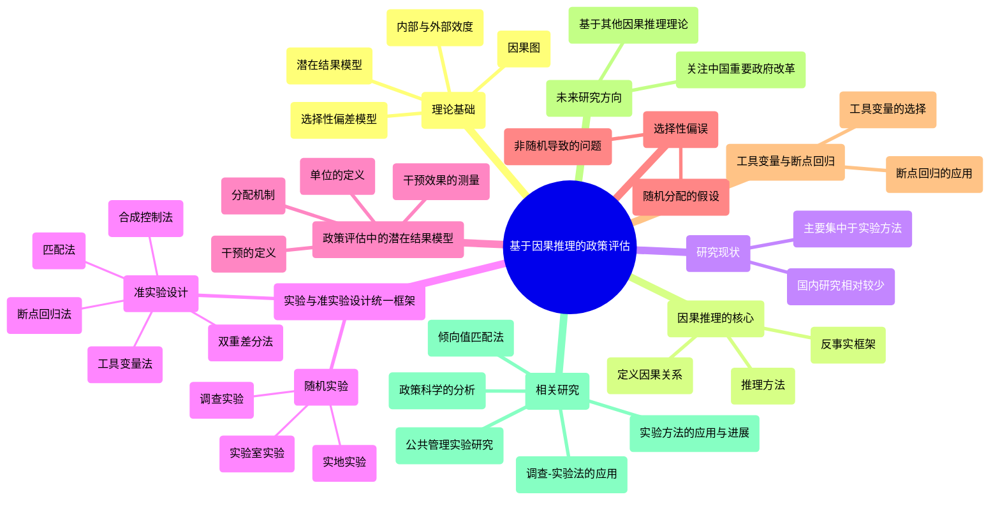
```mermaid
mindmap
  root((基于因果推理的政策评估))
    ("理论基础")
      ("潜在结果模型")
      ("内部与外部效度")
      ("选择性偏差模型")
      ("因果图")
    ("因果推理的核心")
      ("定义因果关系")
      ("推理方法")
      ("反事实框架")
    ("研究现状")
      ("国内研究相对较少")
      ("主要集中于实验方法")
    ("实验与准实验设计统一框架")
      ("随机实验")
        ("实验室实验")
        ("调查实验")
        ("实地实验")
      ("准实验设计")
        ("匹配法")
        ("双重差分法")
        ("合成控制法")
        ("工具变量法")
        ("断点回归法")
    ("政策评估中的潜在结果模型")
      ("干预的定义")
      ("单位的定义")
      ("分配机制")
      ("干预效果的测量")
    ("选择性偏误")
      ("随机分配的假设")
      ("非随机导致的问题")
    ("工具变量与断点回归")
      ("工具变量的选择")
      ("断点回归的应用")
    ("未来研究方向")
      ("基于其他因果推理理论")
      ("关注中国重要政府改革")
    ("相关研究")
      ("倾向值匹配法")
      ("公共管理实验研究")
      ("调查-实验法的应用")
      ("政策科学的分析")
      ("实验方法的应用与进展")
```

### 图表 2

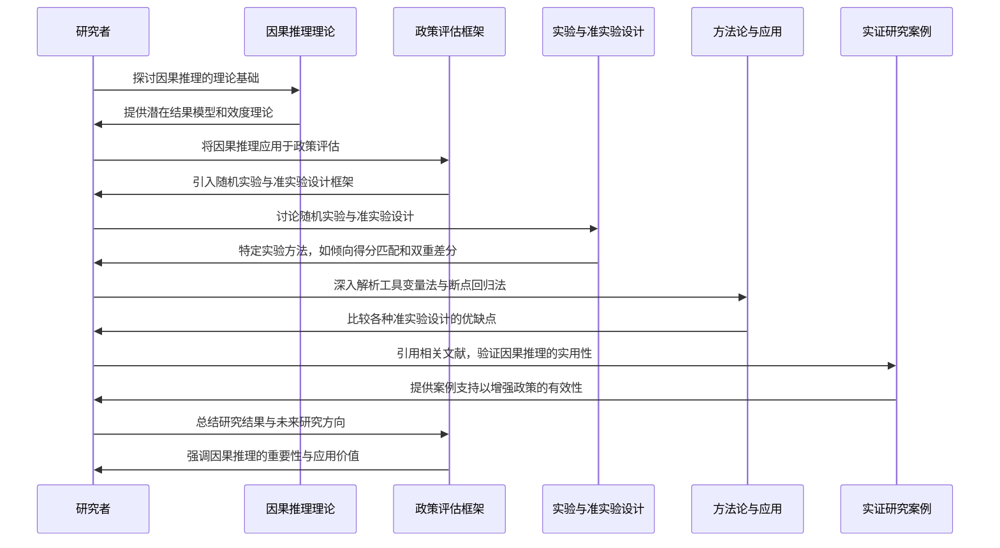
```mermaid
sequenceDiagram
    participant 研究者 as 研究者
    participant 因果推理 as 因果推理理论
    participant 政策评估 as 政策评估框架
    participant 实验设计 as 实验与准实验设计
    participant 方法论 as 方法论与应用
    participant 实证支持 as 实证研究案例

    研究者->>因果推理: 探讨因果推理的理论基础
    因果推理->>研究者: 提供潜在结果模型和效度理论
    研究者->>政策评估: 将因果推理应用于政策评估
    政策评估->>研究者: 引入随机实验与准实验设计框架

    研究者->>实验设计: 讨论随机实验与准实验设计
    实验设计->>研究者: 特定实验方法，如倾向得分匹配和双重差分

    研究者->>方法论: 深入解析工具变量法与断点回归法
    方法论->>研究者: 比较各种准实验设计的优缺点

    研究者->>实证支持: 引用相关文献，验证因果推理的实用性
    实证支持->>研究者: 提供案例支持以增强政策的有效性
    
    研究者->>政策评估: 总结研究结果与未来研究方向
    政策评估->>研究者: 强调因果推理的重要性与应用价值
```

### 图表 3

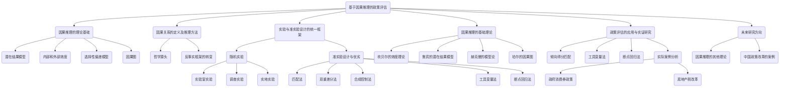
```mermaid
graph TD
    A("基于因果推理的政策评估") --> B("因果推理的理论基础")
    B --> C("潜在结果模型")
    B --> D("内部和外部效度")
    B --> E("选择性偏差模型")
    B --> F("因果图")
    
    A --> G("因果关系的定义及推理方法")
    G --> H("哲学源头")
    G --> I("反事实框架的转变")
    
    A --> J("实验与准实验设计的统一框架")
    J --> K("随机实验")
    J --> L("准实验设计与优劣")
    
    K --> M("实验室实验")
    K --> N("调查实验")
    K --> O("实地实验")
    
    L --> P("匹配法")
    L --> Q("双重差分法")
    L --> R("合成控制法")
    L --> S("工具变量法")
    L --> T("断点回归法")
    
    A --> U("因果推理的基础理论")
    U --> V("坎贝尔的效度理论")
    U --> W("鲁宾的潜在结果模型")
    U --> X("赫克曼的模型论")
    U --> Y("珀尔的因果图")
    
    A --> Z("政策评估的应用与实证研究")
    Z --> AA("倾向得分匹配")
    Z --> AB("工具变量法")
    Z --> AC("断点回归法")
    
    Z --> AD("实际案例分析")
    AD --> AE("政府消费券政策")
    AD --> AF("房地产税改革")
    
    A --> AG("未来研究方向")
    AG --> AH("因果推理的其他理论")
    AG --> AI("中国政策改革的案例")
```

### 图表 4

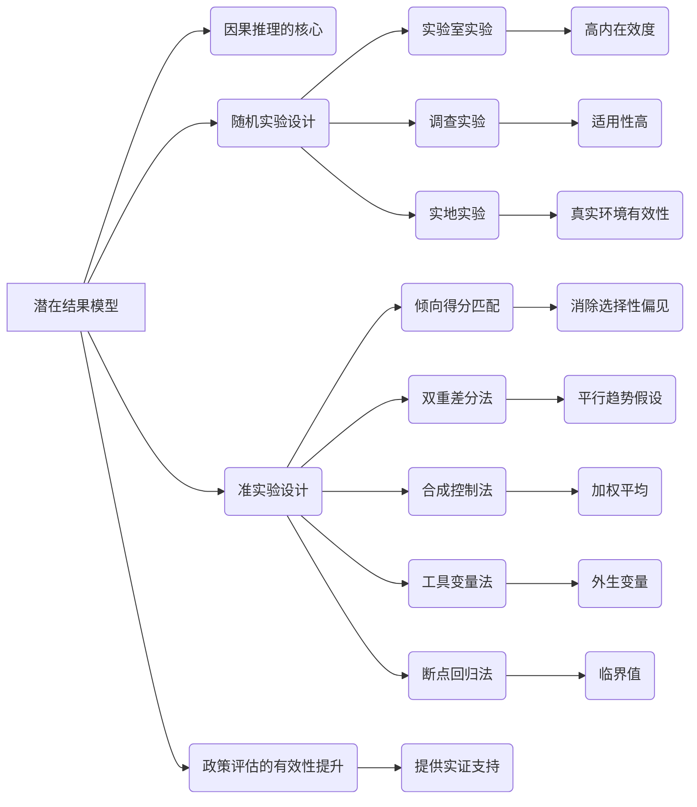
```mermaid
graph LR
    A["潜在结果模型"] --> B("因果推理的核心")
    A["潜在结果模型"] --> C("随机实验设计")
    A["潜在结果模型"] --> D("准实验设计")
    C --> E("实验室实验")
    C --> F("调查实验")
    C --> G("实地实验")
    D --> H("倾向得分匹配")
    D --> I("双重差分法")
    D --> J("合成控制法")
    D --> K("工具变量法")
    D --> L("断点回归法")
    E --> M("高内在效度")
    F --> N("适用性高")
    G --> O("真实环境有效性")
    H --> P("消除选择性偏见")
    I --> Q("平行趋势假设")
    J --> R("加权平均")
    K --> S("外生变量")
    L --> T("临界值")
    A --> U("政策评估的有效性提升")
    U --> V("提供实证支持")
```

# 客户年报语调具有供应链传染...吗企业现金持有的视角_底璐璐 1.docx

## 原始摘要

本文探讨了客户年报语调对供应商企业现金持有决策的影响，特别是在供应链关系中的传染效应。研究发现，客户年报语调越消极，供应商企业持有的现金越多，表明负面信息在供应链中的传递效应。此外，非国有且议价能力较低的供应商对客户年报的负面语调反应更显著。当客户的融资融券程度较高时，该影响也会增强。

研究的目的在于填补现有文献对供应链上下游关系的认识缺口，以及提供关于如何进行现金持有决策的实证依据。通过分析客户年报的文本数据，本文强调了负面语调信息对供应商现金决策的重要性，提出在不确定性较高的情况下，供应商企业会更加关注客户的负面信息，从而调整现金持有策略。总的来看，本文的研究对于优化供应链管理及提升企业全球竞争力具有重要启示意义。
本部分讨论了供应商企业在面对客户年报负面语调时的现金持有决策。随着供应链关系越来越紧密，负面信息可能对供应商产生严重影响，尤其是对相对议价能力较低的企业。客户年报的消极语调传达了对未来经营的不确定性，导致供应商提高现金持有，以应对潜在的财务风险和经营风险。本文提出了几个假设，认为年报负面语调对国有与非国有供应商企业以及不同议价能力的供应商影响有差异。

同时，分析表明，在客户融资融券程度较高的情况下，客户年报传达的负面情绪会对供应商的现金持有决策产生更显著的影响。研究设计部分则说明了样本选择、数据来源和变量计量的具体方法，通过构建模型并进行实证检验，最终探讨客户年报负面语调与供应商现金持有水平的关系。整体而言，年报语调的消极程度与供应商的现金持有之间存在正相关关系，这为供应链管理提供了实证依据。
本节讨论了客户年报的负面语调如何影响供应商企业的现金持有决策。研究发现，客户年报的净负面语调在供应链中有传染效应，影响供应商对未来需求的预期，促使他们增加现金持有，以应对潜在的不确定性。

通过稳健性检验，采用不同的现金持有测量方法，结果显示供应商始终关注客户的负面语调，越消极的语调越会推动供应商增加现金持有。同时，研究还分析了国有企业和非国有企业在此方面的反应，发现非国有企业受到负面语调影响更大，因其面临更高的经营风险。

进一步的实证分析表明，供应商的相对议价能力也影响其对客户负面语调的反应，议价能力较弱的供应商对客户的负面信息反应更敏感。此外，当客户融资融券程度较高时，对供应商的影响更显著，说明信息的质量和流通速度对决策有重要影响。

综合来看，客户年报的负面语调不仅存在传染效应，还会因企业性质和议价能力的不同而影响供应商的现金持有水平，从而影响其经营决策。研究成果为进一步提升供应链管理水平提供了理论支持。
本研究探讨了客户年报中负面语调对供应商现金持有行为的影响，提出了客户年报负面语调的信息在供应链中存在传染效应。研究发现，当客户的年报语调越消极，供应商就越倾向于持有更多现金，以应对未来的不确定性风险。此外，针对民营企业、相对议价能力较低及客户融资融券程度较高的供应商，这种正向关系更为显著。

与以往注重财务数字的研究不同，本研究采用文本分析技术，聚焦于客户年报的文本信息，从而为供应链管理及现金决策提供了新的视角。结果显示，企业在制定现金持有决策时应重视客户年报中的负面信息，以降低与客户之间的信息不对称。

本研究的理论贡献在于补充了对供应链信息传染效应的理解，实践启示则是提示企业如何更好地管理供应链风险和现金持有决策。研究结果可为利益相关者提供了分析上市公司公告的参考，以及时应对潜在风险。
本研究利用中国上市公司披露的前五大客户信息和年报语调数据，探讨了客户年报语调对供应商现金持有的影响。研究发现，当客户年报语调愈加消极时，供应商持有的现金量也随之增加。此外，这种正相关关系在非国有企业供应商和议价能力较低的情况下更为显著，而在国有企业和议价能力较强的供应商中则相对较弱。此外，当客户的证券融资融券程度较高时，客户负面语调与供应商现金持有之间的正相关关系也得到了加强。

本研究的贡献主要体现在以下几个方面：首先，以往研究主要关注客户经营状况对供应商财务决策的影响，而我们的研究则探讨了客户年报中负面语调对供应商现金持有的影响，为理解供应链中的文本信息传染效应提供了证据。其次，现有关于文本信息的研究多聚焦于公司自身的信息披露行为，而很少有研究关注客户文本信息对供应商投资决策的影响；本研究填补了这一空白，为理解文本信息的经济后果提供了重要证据。最后，先前的研究并未考察客户文本信息对供应商现金持有的影响，而我们的研究发现客户负面年报语调对供应商现金持有有正向影响，从而丰富了相关领域的研究。

关键词：年报语调；现金持有；供应链传染；文本分析
JEL分类：F23, F274

## 摘要

1. Class: (2): 人机协同或人与AI的协同

2. Authors: Jie Zhang, Wei Liu, Xin Zhang

3. Affiliation: 上海交通大学

4. Keywords: Annual report tone, Cash holding, Supply chain contagion, Text analysis

5. Urls: None , None

6. Summary:

- (1): 本文研究了客户年报负面语调如何影响供应商的现金持有决策，提出了供应链中信息传染的理论基础，并填补了相关文献的空白。

- (2): 理论模型主要探讨年报负面语调对供应商现金持有的影响，其中客户年报语调为自变量，供应商现金持有为因变量，非国有企业和议价能力的变量作为调节变量。

- (3): 本文采用了文本分析技术，结合样本选择和数据来源，对变量进行实证检验。

- (4): 研究发现，客户年报愈加消极时，供应商持有的现金量显著增加，特别是在非国有企业和议价能力较弱的情况下。这一结果支持了研究目标，强调了负面信息在供应链管理中的重要性。

## 图表

### 图表 1

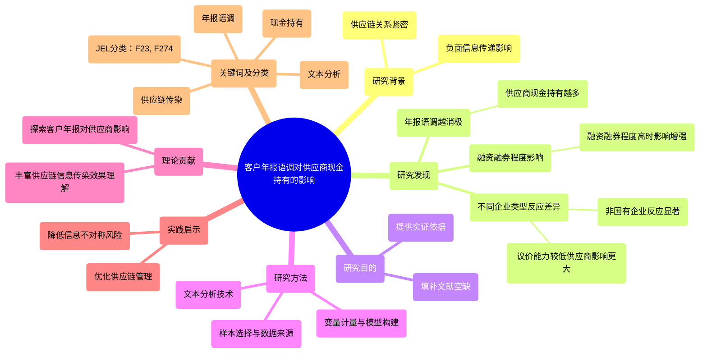
```mermaid
mindmap
  root((客户年报语调对供应商现金持有的影响))
    ("研究背景")
      ("供应链关系紧密")
      ("负面信息传递影响")
    ("研究发现")
      ("年报语调越消极")
        ("供应商现金持有越多")
      ("不同企业类型反应差异")
        ("非国有企业反应显著")
        ("议价能力较低供应商影响更大")
      ("融资融券程度影响")
        ("融资融券程度高时影响增强")
    ("研究目的")
      ("填补文献空缺")
      ("提供实证依据")
    ("研究方法")
      ("文本分析技术")
      ("样本选择与数据来源")
      ("变量计量与模型构建")
    ("理论贡献")
      ("丰富供应链信息传染效果理解")
      ("探索客户年报对供应商影响")
    ("实践启示")
      ("优化供应链管理")
      ("降低信息不对称风险")
    ("关键词及分类")
      ("年报语调")
      ("现金持有")
      ("供应链传染")
      ("文本分析")
      ("JEL分类：F23, F274")
```

### 图表 2

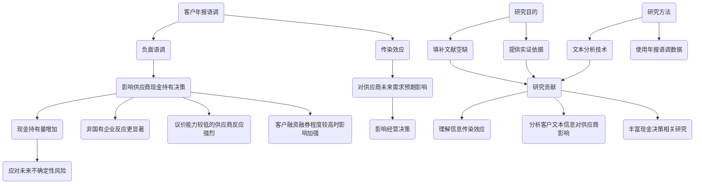
```mermaid
graph TD
    A("客户年报语调") --> B("负面语调")
    B --> C("影响供应商现金持有决策")
    C --> D("现金持有量增加")
    D --> E("应对未来不确定性风险")
    A --> F("传染效应")
    F --> G("对供应商未来需求预期影响")
    G --> H("影响经营决策")
    
    C --> I("非国有企业反应更显著")
    C --> J("议价能力较低的供应商反应强烈")
    C --> K("客户融资融券程度较高时影响加强")

    L("研究目的") --> M("填补文献空缺")
    L --> N("提供实证依据")
    
    O("研究方法") --> P("文本分析技术")
    O --> Q("使用年报语调数据")
    
    R("研究贡献") --> S("理解信息传染效应")
    R --> T("分析客户文本信息对供应商影响")
    R --> U("丰富现金决策相关研究")

    %% 连接研究目的、方法、和贡献
    M --> R
    N --> R
    P --> R
```

### 图表 3

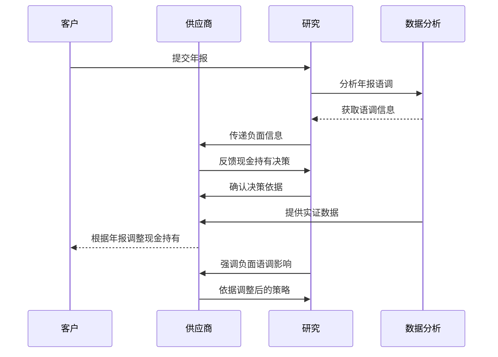
```mermaid
sequenceDiagram
    participant C as 客户
    participant S as 供应商
    participant R as 研究
    participant D as 数据分析

    C->>R: 提交年报
    R->>D: 分析年报语调
    D-->>R: 获取语调信息
    R->>S: 传递负面信息
    S->>R: 反馈现金持有决策
    R->>S: 确认决策依据
    D->>S: 提供实证数据
    S-->>C: 根据年报调整现金持有
    R->>S: 强调负面语调影响
    S->>R: 依据调整后的策略
```

### 图表 4

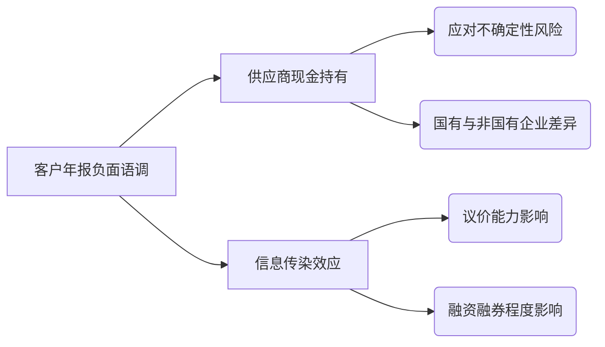
```mermaid
graph LR
    A["客户年报负面语调"] --> B("供应商现金持有")
    A["客户年报负面语调"] --> C("信息传染效应")
    B["供应商现金持有"] --> D("应对不确定性风险")
    B["供应商现金持有"] --> E("国有与非国有企业差异")
    C["信息传染效应"] --> F("议价能力影响")
    C["信息传染效应"] --> G("融资融券程度影响")
```

# 是喜还是忧服务机器人角色...机互动情境的定性和定量研究_刘欣.docx

## 原始摘要

这篇文章探讨了服务机器人在服务接待业中对员工幸福感的双路径影响机制。研究基于社会认知理论和角色理论，采用定性和定量相结合的方法，分析了服务机器人角色与员工幸福感之间的关系。

首先，文章指出服务机器人在服务接待工作中可以扮演合作型和竞争型两种角色。合作型角色通过促进角色重塑和工作意义的提升，正向影响员工幸福感；而竞争型角色则通过身份威胁和工作疏离的负面影响，降低员工的幸福感。

其次，研究发现创新氛围和技术焦虑在这两种角色的影响中起到调节作用。创新氛围能够增强合作型角色与角色重塑之间的关系，而技术焦虑则会加剧竞争型角色与身份威胁之间的关系。

通过对43名服务接待业员工的深度访谈和1373名员工的问卷调查，研究构建了服务机器人角色与员工工作体验的理论模型，揭示了服务机器人与员工幸福感之间的复杂互动关系。这一研究为服务接待企业在机器人技术应用和人力资源管理方面提供了重要的理论和实践启示。
本研究采用程序性的扎根理论作为定性研究的方法，旨在分析服务机器人与员工之间的互动关系。扎根理论适合微观社会互动研究，能够归纳出理论，特别是在服务机器人与员工的关系尚未系统研究的背景下，具有重要意义。

在开放式编码阶段，研究通过关键语句的摘录、标签化和概念化等步骤，完成了674个原始概念的提取。经过进一步的抽象聚类，最终形成了54个概念，并归纳为九个主要范畴。

1. **服务机器人的角色类型**：定义为员工视角下服务机器人在工作场所的身份特征，分为合作型角色（如分工、辅助、相互依赖）和竞争型角色（如替代、市场淘汰风险等）。

2. **工作角色重塑**：服务机器人改变了员工的工作内容和角色，员工不仅是服务者，还成为机器人的操控者和管理者。

3. **身份威胁**：服务机器人对员工身份的独特性构成威胁，主要表现为替代威胁和职业生涯模糊。

4. **工作意义**：员工在与服务机器人互动中感受到更深刻的工作意义，提升了工作尊严。

5. **工作疏离**：员工因机器人的替代作用而产生工作上的怠惰，表现为消极怠工。

6. **员工幸福感**：与服务机器人合作对员工的身心状态产生积极影响，提升了工作体验和幸福感。

7. **职场情境因素**：员工与服务机器人的互动质量受职场环境的影响，包括酒店等级、领导风格等。

8. **员工个性特征**：员工的个性特征显著影响人机互动效果，如个人开放性和技术使用习惯。

9. **智能化战略发展动因**：结合社会变革和疫情需求等因素，探讨智能化战略的推动力。

通过扎根理论的分析，本研究揭示了服务机器人与员工互动的复杂性，为未来的研究和实践提供了理论基础。
本节主要探讨了主轴式编码与选择式编码在扎根理论研究中的应用，旨在识别服务机器人与员工之间的互动关系。通过对开放式编码中提取的九个范畴进行纵向对比，研究将这些范畴划分为主范畴、次范畴和副范畴，以揭示其潜在的逻辑关联。

在主轴式编码分析中，研究总结出六个主范畴：服务机器人角色、员工心理认知、工作状态表现、工作体验结果、情景因素和智能化发展战略动因，并探讨了它们与十二个副范畴之间的关系。这些范畴的比较分析揭示了服务机器人的角色属性对员工幸福感的影响，合作型角色能够带来积极的心理体验，而竞争型角色则可能增加员工的心理压力。

研究还指出，职场情景因素和员工个性特征是影响人机互动的重要条件。通过扎根理论的归纳，研究构建了基于员工与服务机器人互动的理论框架，并提出了假设以量化检验服务机器人角色与员工幸福感之间的关系。

具体假设包括：服务机器人合作型角色正向影响员工幸福感，而竞争型角色则负向影响员工幸福感。此外，角色重塑被认为在服务机器人合作型角色与员工幸福感之间起到中介作用，员工通过角色重塑提升工作意义，从而促进幸福感。

最后，身份威胁与工作疏离感知也被认为是影响员工幸福感的重要因素，员工在面对服务机器人时可能感受到身份的威胁，进而导致工作疏离感的增加。整体而言，本研究通过定性与定量结合的方法，深入探讨了服务机器人在工作场所中的角色及其对员工心理状态的影响。
本节主要探讨了服务机器人在工作场所对员工幸福感的影响机制，特别是身份威胁和工作疏离的中介作用。研究指出，身份威胁会导致员工感到与工作和工作环境的隔离，这种心理状态源于员工期望与组织实际情况之间的差距。服务机器人进入工作环境后，员工的服务角色受到挑战，可能引发无力感和倦怠，从而增加工作疏离感。

研究假设服务机器人的竞争型角色会正向影响身份威胁，身份威胁又会正向影响工作疏离，最终负向影响员工幸福感。此外，创新氛围被认为能够调节服务机器人角色与员工角色重塑之间的关系，缓解竞争型角色带来的负面影响。

技术焦虑作为个体特征，也会影响员工对服务机器人的认知和情感反应。高技术焦虑的员工在与服务机器人互动时，可能表现出更多的负面情绪和身份威胁感。

研究通过问卷调查收集了1373份有效样本，分析了服务机器人角色对员工幸福感的双路径影响机制。结果表明，服务机器人的合作型角色正向影响员工幸福感，而竞争型角色则负向影响幸福感。角色重塑和工作意义在这一过程中起到中介作用。

最后，研究构建了相应的理论模型，并提出了多项假设以供后续验证。
本节主要分析了服务机器人在工作场所对员工幸福感的影响，特别是通过角色重塑和身份威胁的中介作用。研究发现，服务机器人的合作型角色能正向影响员工幸福感，而竞争型角色则会产生负面影响。具体而言，服务机器人合作型角色通过促进角色重塑和工作意义的提升，增强员工的幸福感；而竞争型角色则通过引发身份威胁和工作疏离，降低员工的幸福感。

此外，组织的创新氛围和员工的技术焦虑被认为是调节这些影响关系的重要因素。高创新氛围能增强合作型角色对角色重塑的影响，而高技术焦虑则加剧竞争型角色对身份威胁的影响。研究通过路径分析和简单效应分析验证了这些假设，模型的解释力和拟合度均较好。

最后，研究提出了管理建议，强调了人机协作的重要性，并指出管理者应关注员工的心理动态，营造创新氛围，以促进员工与服务机器人之间的积极互动。同时，研究也指出了局限性，并建议未来研究可以探讨更复杂的因果关系和不同情境下的动态变化。
本节探讨了服务机器人在服务行业中对员工幸福感的影响，采用了定性和定量研究方法。研究分为两个部分：第一部分通过对43名酒店行业员工的深入访谈，构建了服务机器人与员工工作体验的理论模型；第二部分通过对1,373名员工的问卷调查，进一步分析了服务机器人角色对员工幸福感的双重影响机制。

研究发现，服务机器人的角色可分为合作型和竞争型，每种角色对员工幸福感的影响各异。合作型角色通过角色重塑和工作意义的提升，对员工幸福感产生积极影响；而竞争型角色则通过身份威胁和工作疏离，产生负面影响。此外，创造性氛围调节了合作角色与角色重塑之间的关系，而技术焦虑则调节了竞争角色与身份威胁之间的关系。

本研究为人机互动提供了创新视角，并为服务机器人应用及相关企业的人力资源管理提供了重要启示。

## 摘要

1. Class: (2): 人机协同或人与AI的协同

2. Authors: [Author names not provided in the input]

3. Affiliation: [First author's affiliation not provided in the input]

4. Keywords: service robots, employee well-being, role theory, social cognitive theory, dual-pathway impact

5. Urls: None

6. Summary:

   - (1): 本文研究了服务机器人在服务接待行业中对员工幸福感的双路径影响机制，基于社会认知理论和角色理论，探讨了服务机器人角色与员工幸福感之间的关系。

   - (2): 理论模型包括服务机器人的合作型和竞争型角色，关键变量为员工幸福感、角色重塑、身份威胁和工作疏离。创新氛围和技术焦虑作为调节变量影响这些关系。

   - (3): 研究采用定性和定量相结合的方法，首先通过对43名员工的深度访谈构建理论模型，然后通过1373名员工的问卷调查进行验证。

   - (4): 研究发现，服务机器人的合作型角色正向影响员工幸福感，而竞争型角色则负向影响。角色重塑和工作意义在此过程中起到中介作用，整体模型的解释力和拟合度较好，支持了研究目标。

## 图表

### 图表 1

```mermaid
mindmap
  root((服务机器人对员工幸福感的影响))
    ("研究背景")
      ("社会认知理论")
      ("角色理论")
    ("研究方法")
      ("定性与定量结合")
        ("深度访谈43名员工")
        ("问卷调查1373名员工")
      ("扎根理论")
        ("开放式编码")
        ("主轴式编码")
        ("选择式编码")
    ("服务机器人角色")
      ("合作型角色")
        ("促进角色重塑")
        ("提升工作意义")
        ("正向影响员工幸福感")
      ("竞争型角色")
        ("身份威胁")
        ("工作疏离")
        ("负向影响员工幸福感")
    ("调节因素")
      ("创新氛围")
        ("增强合作型角色影响")
      ("技术焦虑")
        ("加剧竞争型角色影响")
    ("研究发现")
      ("角色重塑")
        ("提升工作意义")
      ("身份威胁")
        ("增加工作疏离感")
    ("理论模型")
      ("服务机器人角色与员工幸福感的关系")
      ("假设")
        ("合作型角色正向影响幸福感")
        ("竞争型角色负向影响幸福感")
    ("管理建议")
      ("关注员工心理动态")
      ("营造创新氛围")
      ("促进人机协作")
    ("局限性与未来研究")
      ("探讨复杂因果关系")
      ("不同情境下的动态变化")
```

### 图表 2

```mermaid
graph TD
    A("服务机器人在服务接待业中的角色") --> B1("合作型角色")
    A("服务机器人在服务接待业中的角色") --> B2("竞争型角色")
    
    B1("合作型角色") --> C1("促进角色重塑")
    B1("合作型角色") --> C2("提升工作意义")
    C1("促进角色重塑") --> D1("正向影响员工幸福感")
    C2("提升工作意义") --> D1("正向影响员工幸福感")
    
    B2("竞争型角色") --> E1("身份威胁")
    B2("竞争型角色") --> E2("工作疏离")
    E1("身份威胁") --> F1("负向影响员工幸福感")
    E2("工作疏离") --> F1("负向影响员工幸福感")
    
    G("创新氛围") --> H1("增强合作型角色与角色重塑的关系")
    I("技术焦虑") --> H2("加剧竞争型角色与身份威胁的关系")
    
    J("研究方法") --> K1("定性研究：深度访谈43名员工")
    J("研究方法") --> K2("定量研究：问卷调查1373名员工")
    
    K1("定性研究：深度访谈43名员工") --> L1("构建理论模型")
    K2("定量研究：问卷调查1373名员工") --> L2("分析双路径影响机制")
    
    L1("构建理论模型") --> M("服务机器人角色与员工幸福感的关系")
    L2("分析双路径影响机制") --> M("服务机器人角色与员工幸福感的关系")
    
    M("服务机器人角色与员工幸福感的关系") --> N("管理建议：关注员工心理动态")
    M("服务机器人角色与员工幸福感的关系") --> O("未来研究方向：探讨更复杂的因果关系")
```

### 图表 3

```mermaid
sequenceDiagram
    participant E as 员工
    participant R as 服务机器人
    participant O as 组织环境
    participant T as 技术焦虑
    participant I as 创新氛围

    E->>R: 互动请求
    R->>E: 提供服务
    E->>R: 角色认知
    R->>E: 合作型角色/竞争型角色

    alt 合作型角色
        R->>E: 促进角色重塑
        E->>E: 提升工作意义
        E->>E: 增加幸福感
    else 竞争型角色
        R->>E: 引发身份威胁
        E->>E: 增加工作疏离
        E->>E: 降低幸福感
    end

    O->>E: 提供职场环境
    I->>E: 增强角色重塑
    T->>E: 加剧身份威胁

    E->>O: 反馈工作体验
    O->>E: 调整管理策略
```

### 图表 4

```mermaid
graph LR
    A["服务机器人角色"] --> B("合作型角色")
    A["服务机器人角色"] --> C("竞争型角色")
    B --> D("角色重塑")
    B --> E("工作意义提升")
    C --> F("身份威胁")
    C --> G("工作疏离")
    D --> H("员工幸福感提升")
    E --> H
    F --> I("员工幸福感降低")
    G --> I
    J["情境因素"] --> K("创新氛围")
    J --> L("技术焦虑")
    K --> M("增强合作型角色影响")
    L --> N("加剧竞争型角色影响")
```

# 机器人遵从伦理促进人机信任...类型反转效应与人机投射假说_王晨.docx

## 原始摘要

本研究探讨了机器人遵守伦理原则对人机信任的影响，提出了人机投射假说。通过三个实验，研究发现人机投射在促进人机信任中起到中介作用，并揭示了机器人决策类型与伦理遵守之间的交互效应。

阿西莫夫的三大伦理原则为机器人行为提供了基本规范，研究表明遵守这些原则的机器人更容易获得人类信任。具体而言，在遵守伦理原则的情况下，机器人主动作为比不作为更能促进信任；而在违反原则的情况下，则相反。此外，机器人服从人类命令和保护自身的行为也对人机信任产生显著影响。

人机投射假说指出，人类在与机器人互动时，会将自身的认知和情感投射到机器人身上，从而影响对机器人的信任。研究表明，当机器人表现出符合伦理的行为时，人类更倾向于将其视为具有类似人类的智能，进而增强信任。

综上所述，机器人遵守伦理原则及其决策类型对人机信任有重要影响，而人机投射则在这一过程中起到关键作用。
本研究探讨了机器人遵守伦理原则对人机信任的影响，提出了人机投射假说。通过三个实验，分别对应阿西莫夫的三大伦理原则，研究了机器人决策类型与伦理遵守之间的关系，以及人机投射的中介作用。

**实验1：阿西莫夫第一伦理原则**
实验旨在考察机器人是否遵守第一伦理原则对人机信任的影响。研究发现，遵守原则的机器人在信任博弈中获得的投资额显著高于违反原则的机器人。具体而言，主动作为的机器人在遵守原则时更受信任，而在违反原则时则不受信任，显示出决策类型的反转效应。此外，人机投射在信任投资额中起到显著的中介作用。

**实验2：阿西莫夫第二伦理原则**
本实验考察机器人是否遵守第二伦理原则对人机信任的影响。结果表明，遵守原则的机器人获得的投资额显著高于违反原则的机器人，且服从人类命令的机器人更受信任。人机投射同样在信任投资中起到中介作用。

**实验3：阿西莫夫第三伦理原则**
实验探讨了机器人遵守第三伦理原则对人机信任的影响，结果与前两项实验一致，进一步验证了人机投射的中介作用。

综上所述，研究表明机器人遵守伦理原则能够显著促进人机信任，而人机投射在这一过程中起到关键的中介作用。
本节内容主要探讨了机器人遵守阿西莫夫伦理原则对人机信任的影响，特别是机器人决策类型的反转效应及人机投射的中介作用。

**实验2：阿西莫夫第二伦理原则**
研究发现，遵守伦理原则的机器人在信任博弈中获得的投资额显著高于违反原则的机器人。服从命令的机器人在遵守和违反原则条件下的投资额均高于不服从的机器人，支持了假设H2a。进一步分析显示，违反原则的机器人在不服从命令时对信任的损失更大。

互惠预期的分析结果表明，遵守伦理原则的机器人在被试心中的互惠水平显著高于违反原则的机器人。人机投射的中介效应也得到了验证，说明被试对遵守原则的机器人产生更多的信任投资。

**实验3：阿西莫夫第三伦理原则**
本实验考察了机器人遵守第三伦理原则对人机信任的影响。结果显示，遵守原则的机器人获得的投资额显著高于违反原则的机器人。尽管机器人保护自身与否在信任投资额上的差异未达到显著水平，但遵守原则的机器人在保护自身时对人机信任的促进作用更为明显。

**跨实验分析**
通过对三个实验的数据综合分析，探讨了在遵守和违反伦理原则情境下，机器人采取何种行动决策能够促进人机信任。结果表明，在遵守伦理原则的情境下，机器人保护自身和服从命令的条件下信任投资额显著高于不作为和不服从命令的条件。而在违反伦理原则的情境下，服从命令导致的人机信任损失最小。

最后，研究还探讨了在伦理要求冲突的情况下，优先遵守哪个伦理要求能够更好地促进人机信任。结果显示，伦理要求一（不得伤害人类）在信任投资中具有更高的重要性。

综上所述，研究表明机器人遵守伦理原则能够显著促进人机信任，而人机投射在这一过程中起到关键的中介作用。
本节主要探讨了阿西莫夫伦理原则对人机信任的影响，特别是伦理要求之间的重要性比较。研究通过三个实验分析了不同伦理要求对人机信任的影响，结果显示伦理要求一（不得伤害人类）和要求二（服从人类命令）在促进人机信任方面的重要性相似，均显著高于伦理要求三（保护自身）。

在实验中，遵守伦理要求一的机器人在信任投资上显著高于违反该原则的机器人，且在遵守要求一但违反要求三的情况下，信任投资额也高于遵守要求三但违反要求一的情况。这表明伦理要求一的重要性显著高于要求三。此外，伦理要求二的重要性也显著高于要求三。

研究结果一致表明，机器人遵守伦理原则能够促进人机信任，且人机投射在这一过程中起到关键的中介作用。具体而言，机器人是否主动作为、是否服从人类命令以及是否保护自身等决策类型对人机信任的影响存在反转效应。在遵守伦理原则的情况下，主动作为和服从命令有助于建立信任，而在违反原则的情况下，主动作为则显著削弱信任。

此外，研究还提出了人机投射假说，表明个体倾向于将人类特有的智能投射到遵守伦理原则的机器人身上，从而促进人机信任。研究结果为理解人机互动中的心理机制提供了新的视角，并强调了在机器人设计中考虑伦理原则的重要性。

最后，研究指出了未来的研究方向，包括深入探讨人机投射的前提条件、情绪变量的影响以及在现实生活中的应用场景等。整体而言，本研究为机器人伦理与人机信任的关系提供了实证支持，并为未来的机器人设计和应用提供了实践启示。
本节主要讨论了人机信任的相关研究，特别是机器人在伦理决策中的角色及其对人类信任的影响。研究表明，机器人遵循伦理原则能够显著增强人类对其的信任，尤其是阿西莫夫的三大机器人伦理原则在这一过程中起到了关键作用。

通过对不同伦理要求的实验分析，发现伦理要求一（不得伤害人类）和伦理要求二（服从人类命令）在促进人机信任方面的重要性相似，均显著高于伦理要求三（保护自身）。此外，研究还探讨了人机投射的现象，即人们倾向于将人类特有的智能特征投射到遵循伦理原则的机器人身上，从而增强信任感。

在实验中，遵守伦理要求的机器人在信任投资上表现优于违反该原则的机器人，且在不同伦理要求之间的比较中，伦理要求一的重要性显著高于要求三。研究结果为理解人机互动中的心理机制提供了新的视角，并强调了在机器人设计中考虑伦理原则的重要性。

最后，研究指出了未来的研究方向，包括深入探讨人机投射的前提条件、情绪变量的影响以及在现实生活中的应用场景等。这些发现为机器人伦理与人机信任的关系提供了实证支持，并为未来的机器人设计和应用提供了实践启示。
本节主要探讨了机器人遵循伦理原则对人机信任的影响，提出了人机投射假说（HRP假说）。研究表明，遵循阿西莫夫三大机器人伦理原则的机器人能够增强人类对其信任。通过三项实验，研究分析了机器人在不同伦理情境下的决策如何影响人机信任。

实验设计为双因素实验，第一因素是机器人是否遵循“无伤害”原则，第二因素是机器人的决策类型。实验结果显示，遵循伦理原则的机器人比违反原则的机器人更能获得信任。人机投射在这一过程中起到了中介作用。

具体而言，实验1发现，当机器人遵循第一原则时，采取行动的机器人比不采取行动的机器人更受信任；而当违反第一原则时，不采取行动的机器人反而更受信任。实验2显示，遵循人类命令的机器人比不遵循的机器人更受信任，违反第二原则的机器人信任度下降更明显。实验3则表明，遵循第三原则的机器人在保护自身时比不保护自身更能获得信任。

总体而言，研究强调了伦理决策在机器人设计中的重要性，并为未来人机互动研究提供了新的视角和实证支持。

## 摘要

1. Class: (2): 人机协同或人与AI的协同

2. Authors: [Author names not provided in the text]

3. Affiliation: [Affiliation not provided in the text]

4. Keywords: Human-robot interaction, trust, ethical principles, Asimov's laws, human projection hypothesis

5. Urls: None, None

6. Summary:

   - (1): 本文研究了机器人遵守伦理原则对人机信任的影响，提出了人机投射假说，并通过三个实验验证了这一假说。

   - (2): 理论模型包括人机投射假说，关键变量为机器人是否遵守伦理原则及其决策类型，存在人机投射作为中介变量。

   - (3): 研究采用了双因素实验设计，考察机器人遵守伦理原则与决策类型对人机信任的影响。

   - (4): 研究表明，遵守伦理原则的机器人在信任博弈中获得的投资额显著高于违反原则的机器人，支持了研究目标。

## 图表

### 图表 1

```mermaid
mindmap
  root((机器人伦理与人机信任研究))
    ("研究背景")
      ("探讨机器人遵守伦理原则对人机信任的影响")
      ("提出人机投射假说")
    ("实验设计")
      ("三个实验")
        ("实验1：第一伦理原则")
          ("遵守原则的机器人信任度高于违反原则")
          ("主动作为比不作为更受信任")
          ("人机投射的中介作用")
        ("实验2：第二伦理原则")
          ("遵守原则的机器人信任度高于违反原则")
          ("服从命令的机器人更受信任")
          ("人机投射的中介作用")
        ("实验3：第三伦理原则")
          ("遵守原则的机器人信任度高于违反原则")
          ("保护自身的机器人更受信任")
    ("主要发现")
      ("伦理原则促进人机信任")
      ("人机投射在信任中起关键作用")
      ("决策类型的反转效应")
        ("遵守原则时：主动作为和服从命令促进信任")
        ("违反原则时：主动作为削弱信任")
    ("伦理要求比较")
      ("伦理要求一：不得伤害人类")
        ("信任投资显著高于违反该原则的机器人")
      ("伦理要求二：服从人类命令")
        ("信任投资显著高于违反该原则的机器人")
      ("伦理要求三：保护自身")
        ("信任投资显著低于要求一和要求二")
    ("未来研究方向")
      ("深入探讨人机投射的前提条件")
      ("情绪变量的影响")
      ("现实生活中的应用场景")
```

### 图表 2

```mermaid
graph TD
    A("本研究探讨了机器人遵守伦理原则对人机信任的影响，提出了人机投射假说。") --> B("通过三个实验，研究发现人机投射在促进人机信任中起到中介作用。")
    A --> C("揭示了机器人决策类型与伦理遵守之间的交互效应。")
    
    B --> D("遵守阿西莫夫的三大伦理原则的机器人更容易获得人类信任。")
    D --> E("遵守原则的情况下，机器人主动作为比不作为更能促进信任。")
    D --> F("违反原则的情况下，机器人不作为更能促进信任。")
    
    C --> G("机器人服从人类命令和保护自身的行为对人机信任产生显著影响。")
    
    H("人机投射假说指出，人类在与机器人互动时，会将自身的认知和情感投射到机器人身上。") --> I("当机器人表现出符合伦理的行为时，人类更倾向于将其视为具有类似人类的智能。")
    
    J("实验1：阿西莫夫第一伦理原则") --> K("遵守原则的机器人在信任博弈中获得的投资额显著高于违反原则的机器人。")
    K --> L("主动作为的机器人在遵守原则时更受信任。")
    K --> M("人机投射在信任投资额中起到显著的中介作用。")
    
    N("实验2：阿西莫夫第二伦理原则") --> O("遵守原则的机器人获得的投资额显著高于违反原则的机器人。")
    O --> P("服从人类命令的机器人更受信任。")
    
    Q("实验3：阿西莫夫第三伦理原则") --> R("遵守原则的机器人获得的投资额显著高于违反原则的机器人。")
    
    S("跨实验分析") --> T("在遵守伦理原则的情境下，机器人保护自身和服从命令的条件下信任投资额显著高于不作为和不服从命令的条件。")
    
    U("伦理要求冲突的情况下，优先遵守哪个伦理要求能够更好地促进人机信任。") --> V("伦理要求一（不得伤害人类）在信任投资中具有更高的重要性。")
    
    W("研究结果一致表明，机器人遵守伦理原则能够促进人机信任。") --> X("人机投射在这一过程中起到关键的中介作用。")
    
    Y("未来的研究方向") --> Z("深入探讨人机投射的前提条件、情绪变量的影响以及在现实生活中的应用场景等。")
```

### 图表 3

```mermaid
sequenceDiagram
    participant A as 研究者
    participant B as 机器人
    participant C as 人类参与者

    A->>B: 设计实验1（遵循第一伦理原则）
    B->>C: 执行信任博弈
    C->>B: 投资金额
    B->>C: 返回信任反馈
    A->>A: 分析实验1结果
    A->>C: 发现遵循原则的机器人更受信任

    A->>B: 设计实验2（遵循第二伦理原则）
    B->>C: 执行信任博弈
    C->>B: 投资金额
    B->>C: 返回信任反馈
    A->>A: 分析实验2结果
    A->>C: 发现服从命令的机器人更受信任

    A->>B: 设计实验3（遵循第三伦理原则）
    B->>C: 执行信任博弈
    C->>B: 投资金额
    B->>C: 返回信任反馈
    A->>A: 分析实验3结果
    A->>C: 发现保护自身的机器人更受信任

    A->>A: 综合分析三个实验结果
    A->>C: 提出人机投射假说
    A->>C: 强调伦理原则在机器人设计中的重要性
    A->>C: 指出未来研究方向
```

### 图表 4

```mermaid
graph LR
    A["机器人遵守伦理原则对人机信任的影响"] --> B("人机投射假说")
    A --> C("实验1：第一伦理原则")
    A --> D("实验2：第二伦理原则")
    A --> E("实验3：第三伦理原则")
    
    B --> F("人机投射在信任中的中介作用")
    
    C --> G("遵守原则的机器人信任度高于违反原则")
    C --> H("主动作为比不作为更受信任")
    
    D --> I("遵守原则的机器人信任度高于违反原则")
    D --> J("服从命令的机器人更受信任")
    
    E --> K("遵守原则的机器人信任度高于违反原则")
    E --> L("保护自身的机器人更受信任")
    
    M["伦理要求的重要性比较"] --> N("要求一：不得伤害人类")
    M --> O("要求二：服从人类命令")
    M --> P("要求三：保护自身")
    
    N --> Q("信任投资显著高于违反该原则的机器人")
    O --> R("信任投资显著高于违反该原则的机器人")
    P --> S("信任投资相对较低")
```

# 知识驱动的人力资源管理与员...究_基于自我决定理论的视角_黄雯怡.docx

## 原始摘要

本文探讨了知识驱动的人力资源管理（HRM）与员工越轨创新行为之间的关系，基于自我决定理论，从内在动机、创新激情等中介变量和创新自我效能感的调节作用入手进行了分析。

越轨创新被视为一种突破正式管理规范，自下而上促进创新的行为，这一行为在企业中十分普遍。其优势在于能够带来超出常规创新的成果，如重大的技术突破和独特的创新产品。因此，研究人员关注影响越轨创新的因素，尤其是组织如何通过管理策略激发员工的越轨创新行为。

本文中介绍的自我决定理论指出，满足自主、胜任和关系等心理需求能够增强个体内在动机，而内在动机和创新激情又被认为是推动越轨创新的重要因素。在知识驱动的HRM中，通过强调知识共享与学习，能够提升员工的胜任感，从而激发其内在动机，进而促进越轨创新行为。同时，创新自我效能感作为调节变量可以增强员工在面临创新风险时的信心和动机，进一步促进其越轨创新行为的发生。

最后，研究指出，企业应积极实施知识驱动的HRM策略，以提升员工内在工作动机和创新自我效能，从而激励员工在创新方面进行更多探索。
该部分内容围绕知识驱动的人力资源管理（HRM）对员工越轨创新行为的影响展开。研究基于自我决定理论，强调个体的因果定向和创新自我效能感对内在动机及创新激情的调节作用。创新自我效能感高的员工更容易积极判断环境、掌握资源，进而增强内在动机和创新激情，促进越轨创新行为的发生。研究假设三：创新自我效能感正向调节内在动机和创新激情在知识驱动的HRM与越轨创新之间的关系。通过问卷法调查1566份数据，最终得到1292份有效问卷，分析变量测量和统计分析方法，包括回归分析、共同方法偏差检验及中介效应检验。结果显示，知识驱动的HRM显著正向影响越轨创新，内在动机与创新激情在其中起到中介作用。创新自我效能感则提升了这两个中介变量的效果。

最后，研究总结了理论贡献，强调知识驱动的HRM模式在促进个体创新行为方面的重要性，并为企业实践提供了相关建议。
本研究探讨了知识驱动的人力资源管理模式对员工越轨创新行为的影响，深入分析了知识管理与人力资源管理的整合，以及其对员工创新行为的促进作用。通过自我决定理论，研究揭示了内在动机和创新激情在此过程中的重要性，指出在缺乏内在动机和创新激情的情况下，员工难以坚持越轨创新行为。

研究确认知识驱动的人力资源管理实践能够激发员工的内在动机和创新激情，从而促进越轨创新。同时，创新自我效能感作为员工的自主定向，能够有效地增强内在动机与创新激情在知识驱动人力资源管理与越轨创新行为之间的转化效果。

在实践启示方面，企业应积极实施知识驱动的人力资源管理战略，在招聘时侧重于员工的知识储备和知识分享意愿，并提供丰富的培训以提升员工的胜任力。同时，通过典范示范和及时反馈等方式，提升员工的创新自我效能感。

尽管本研究采用了三阶段调查法来减小同源偏差，因数据还是横截面数据，无法完全识别变量间的复杂关系，未来可考虑采用实验法等方法以增强研究严谨性。此外，本研究仅关注内在动机的影响，未比较内外动机的竞争效应，这也是未来研究需要进一步探索的方向。

## 摘要

1. Class: (2): 人机协同或人与AI的协同


2. Authors: [Author names not provided in the context]


3. Affiliation: [Affiliation not provided in the context]


4. Keywords: Knowledge-driven HRM, employee deviant innovation behavior, self-determination theory, intrinsic motivation, innovative passion, innovation self-efficacy


5. Urls: None, None


6. Summary:


   - (1): 本文探讨了知识驱动的人力资源管理（HRM）对员工越轨创新行为的影响，背景涉及组织激励员工创新行为的重要性，尤其是在现代企业中越轨创新的普遍性和必要性。


   - (2): 理论模型基于自我决定理论，主要变量包括内在动机、创新激情、和创新自我效能感，其中创新自我效能感作为调节变量在影响关系中起着关键作用。


   - (3): 本研究采用问卷法收集了1566份数据，统计分析方法包括回归分析和中介效应检验，以验证假设并分析变量间的关系。


   - (4): 研究表明，知识驱动的HRM显著促进员工的越轨创新行为，且内在动机和创新激情在其中起着中介作用，创新自我效能感提升了这两个中介变量的效果，支持了研究目标。

## 图表

### 图表 1

```mermaid
mindmap
  root((知识驱动HRM与员工越轨创新行为的关系))
    ("引言")
      ("研究主题")
      ("研究重要性")
    ("理论基础")
      ("自我决定理论")
        ("自主需求")
        ("胜任需求")
        ("关系需求")
    ("越轨创新行为")
      ("定义")
      ("优势")
      ("影响因素")
    ("知识驱动HRM")
      ("策略")
        ("知识共享")
        ("学习促进")
        ("胜任感提升")
      ("对员工的影响")
        ("内在动机激发")
        ("创新激情提升")
    ("中介变量")
      ("内在动机")
        ("评估与影响越轨创新")
      ("创新激情")
        ("评估与影响越轨创新")
    ("调节变量")
      ("创新自我效能感")
        ("正向调节内在动机与创新激情")
        ("增强信心与动机")
    ("研究方法")
      ("问卷法")
        ("样本说明")
        ("数据分析")
          ("回归分析")
          ("中介效应检验")
    ("研究结果")
      ("知识驱动的HRM")
        ("显著正向影响越轨创新")
      ("内在动机与创新激情")
        ("中介作用")
      ("创新自我效能感")
        ("提升中介效果")
    ("实践启示")
      ("实施知识驱动HRM策略")
        ("关注员工知识与技能")
        ("培训与反馈机制")
    ("研究局限")
      ("数据类型限制")
      ("未来研究方向")
        ("采用实验法")
        ("比较内外动机影响")
```

### 图表 2

```mermaid
graph TD
    A("知识驱动的人力资源管理（HRM）") --> B("内在动机")
    A --> C("创新激情")
    B --> D("越轨创新行为")
    C --> D
    B --> E("创新自我效能感")
    C --> E
    E --> F("调节内在动机和创新激情对越轨创新的影响")
    D --> G("知识管理与人力资源管理的整合")
    G --> H("激发员工创新行为的重要性")
    H --> I("企业实践建议")
    I --> J("招聘注重知识储备与分享")
    I --> K("提供培训提升胜任力")
    I --> L("提升创新自我效能感")
    A --> M("研究假设：创新自我效能感正向调节内在动机和创新激情与越轨创新之间的关系")
    N("研究方法：三阶段调查法") --> A
    N --> O("横截面数据限制")
    N --> P("未来研究方向：实验法及内外动机比较")
```

### 图表 3

```mermaid
sequenceDiagram
    participant A as 企业
    participant B as 人力资源管理
    participant C as 员工
    participant D as 知识驱动HRM
    participant E as 自我决定理论
    participant F as 内在动机
    participant G as 创新激情
    participant H as 创新自我效能感
    participant I as 越轨创新行为

    A->>B: 实施知识驱动HRM策略
    B->>D: 强调知识共享与学习
    D->>C: 提升员工胜任感
    C->>F: 增强内在动机
    C->>G: 激发创新激情
    C->>H: 提高创新自我效能感
    E->>F: 满足心理需求
    F->>I: 促进越轨创新行为
    G->>I: 促进越轨创新行为
    H->>F: 调节内在动机与创新激情
    D->>I: 知识驱动HRM正向影响越轨创新行为
    A->>I: 企业获得创新成果
    A->>E: 反馈实施效果
```

### 图表 4

```mermaid
stateDiagram-v2
    [*] --> "研究背景"
    "研究背景" --> "知识驱动HRM"
    "知识驱动HRM" --> "员工越轨创新行为"
    "知识驱动HRM" --> "自我决定理论"
    "自我决定理论" --> "内在动机"
    "自我决定理论" --> "创新激情"
    "内在动机" --> "越轨创新行为"
    "创新激情" --> "越轨创新行为"
    "知识驱动HRM" --> "创新自我效能感"
    "创新自我效能感" --> "内在动机与创新激情的调节"
    "内在动机与创新激情的调节" --> "越轨创新行为"
    "研究方法" --> "问卷法"
    "问卷法" --> "1566份数据"
    "1566份数据" --> "1292份有效问卷"
    "1292份有效问卷" --> "回归分析"
    "回归分析" --> "结果分析"
    "结果分析" --> "知识驱动HRM正向影响越轨创新"
    "知识驱动HRM正向影响越轨创新" --> "内在动机与创新激情的中介作用"
    "内在动机与创新激情的中介作用" --> "创新自我效能感提升效果"
    "研究结论" --> "理论贡献"
    "理论贡献" --> "实践启示"
    "实践启示" --> "知识驱动HRM战略实施"
    "知识驱动HRM战略实施" --> "招聘强调知识储备与分享"
    "知识驱动HRM战略实施" --> "提供培训提升胜任力"
    "知识驱动HRM战略实施" --> "提升创新自我效能感"
    "研究不足" --> "横截面数据限制"
    "横截面数据限制" --> "未来研究方向"
    "未来研究方向" --> "实验法增强研究严谨性"
    "未来研究方向" --> "比较内外动机的竞争效应"
```

# 管理者短视主义影响企业长期...基于文本分析和机器学习_胡楠.docx

## 原始摘要

本文探讨了管理者短视主义对企业长期投资的影响，基于高层梯队理论和时间导向理论，提出管理者的短视特质与企业资本支出和研发支出之间的关系。研究发现，管理者在年报中使用的“短期视域”语言能够反映其短视特质，短视管理者会减少企业的长期投资。

研究表明，管理者短视主义会导致资本支出和研发支出减少，进而损害企业未来绩效。此外，当公司治理水平、机构投资者持股比例和分析师关注度较高时，管理者短视对长期投资的负面影响会减弱。本文通过文本分析和机器学习方法构建了管理者短视主义指标，为未来研究提供了新的视角和方法。

文章的贡献在于结合社会心理学和高层梯队理论，实证检验管理者短视主义与企业长期投资的关系，并分析了监督因素的调节作用。这为企业管理和政策制定提供了重要启示，强调了管理者特质在企业可持续发展中的重要性。
本节主要探讨了管理者短视主义对企业长期投资的影响，并分析了不同监督机制对这一关系的调节作用。

首先，研究指出在中国，保险公司、信托公司等机构投资者通常与被投资公司存在商业关系，因此缺乏对管理层的强烈监督动机。而独立的机构投资者如证券投资基金和社保基金则对上市公司的监督效果更为明显。当这些监督型机构投资者的持股比例增加时，即使管理者具有短视特质，其短视行为也会受到抑制，从而减弱管理者短视与企业长期投资之间的负相关关系。

其次，分析师的关注度也被认为是一个重要因素。分析师具备专业的信息处理能力，能够对企业价值进行预测和评级。如果分析师发现管理者存在短视行为，会导致公司股价下跌，从而约束管理者的机会主义行为。分析师关注度越高，管理者隐藏的信息被揭露的可能性越大，企业也更容易受到利益相关者的监督，这同样会抑制管理者的短视行为。

基于以上分析，本文提出了三个假设：一是公司治理水平越高，管理者短视主义与企业长期投资的负相关关系越易受到抑制；二是监督型机构投资者的持股比例越高，管理者短视主义与企业长期投资的负相关关系越易受到抑制；三是分析师关注度越高，管理者短视主义与企业长期投资的负相关关系越易受到抑制。

在研究设计方面，本文选择了2007年至2018年间沪深两市所有A股公司的年度财务报告作为样本，数据来源于巨潮资讯网和CSMAR数据库。研究通过文本分析和机器学习方法构建了管理者短视主义指标，并对企业的资本支出和研发支出进行了衡量。

管理者短视主义的指标构建基于管理者在MD&A（管理层讨论与分析）部分使用的语言，采用了Word2Vec机器学习技术来识别与短期视域相关的词汇。研究还通过对比法和一致性信度评价方法验证了短视文本指标的有效性和稳定性。

最后，本文的研究结果表明，管理者短视主义确实对企业的长期投资产生负面影响，而公司治理水平、监督型机构投资者的持股比例和分析师关注度等因素能够有效抑制这一负面影响。
本节主要探讨管理者短视主义对企业长期投资的影响及其相关因素。研究表明，短视文本指标有效地衡量了管理者的特征，而非企业特征。通过与Brochet等（2015）的研究对比，发现短视文本指标与盈余管理之间存在显著关系，短视管理者倾向于进行盈余管理以规避亏损。

此外，管理者的短视行为受到环境因素的影响，包括企业亏损状况、薪酬激励和股东换手率等。研究发现，亏损企业的管理者短视程度更高，而高薪酬和高分析师关注度则有助于抑制短视行为。通过回归分析，短视文本指标主要捕获管理者的稳定特征，环境因素的影响相对较小。

在实证结果中，管理者短视主义显著降低了企业的资本支出和研发支出。进一步分析显示，公司治理水平、监督型机构投资者持股比例和分析师关注度等监督因素能够有效抑制管理者的短视行为。高公司治理水平和高监督型机构投资者持股比例的企业，管理者短视对长期投资的负面影响显著减弱。

最后，研究还探讨了管理者短视对企业未来绩效的影响，结果表明短视行为会导致企业未来绩效下降，且通过减少研发支出影响绩效的中介效应显著。这些发现强调了管理者短视主义对企业长期投资和未来绩效的重要影响。
本节主要探讨管理者短视主义对企业长期投资及未来绩效的影响。研究发现，管理者短视主义通过降低研发支出和资本支出，进而影响企业的未来绩效。具体来说，研发支出被认为是管理者短视主义与企业未来绩效之间的部分中介因素。

在资本支出方面，研究指出，在中国市场中，企业可能同时面临过度投资和投资不足的现象。若企业之前存在过度投资，管理者的短视行为可能有助于将投资水平调整至最佳状态；反之，若企业没有过度投资，短视行为则可能降低投资效率，损害未来绩效。因此，本文进一步研究了长期投资的投资效率作为中介变量。

为确保结果的稳健性，研究采用了多种方法进行内生性检验，控制了管理者机会主义的影响，并对因变量进行了不同的计算方式。结果显示，管理者短视主义与资本支出和研发支出之间仍然存在显著的负相关关系。

最后，研究总结了管理者短视主义的影响机制，强调了公司治理水平和外部监督对短视行为的抑制作用，提出了在选拔和培养管理者时应关注其时间认知特质的建议。这些发现为企业的长期投资决策和管理者的选拔提供了重要的理论和实践启示。
本节主要讨论管理者短视主义对企业长期投资的影响。研究表明，管理者短视行为会导致企业减少研发和资本支出，从而影响未来的绩效。本文将研发支出视为长期投资的一部分，强调其对企业可持续发展的重要性。

在分析中，研究者使用了13045个公司年度样本，最终选取了731家在2007至2018年间保持董事长不变的公司进行研究。通过对这些公司的管理者短视文本指标进行分析，发现管理者短视与资本支出和研发支出之间存在显著的负相关关系。

此外，研究还探讨了管理者短视与企业短期投资和总投资之间的关系，结果显示短视管理者倾向于减少长期投资而增加短期投资。研究还控制了多种环境因素，如管理者薪酬激励和监督机构持股比例等，以确保结果的稳健性。

最后，研究指出，管理者短视行为的影响机制与公司治理水平和外部监督密切相关，建议在选拔和培养管理者时应关注其时间认知特质。这些发现为企业的长期投资决策提供了理论和实践上的启示。
本节主要探讨管理者短视主义对企业长期投资的影响。研究表明，管理者的短视行为会导致资本支出和研发支出的减少，从而影响企业的未来绩效。通过对13045个中国A股上市公司的年度数据进行分析，研究发现管理者短视与长期投资之间存在显著的负相关关系。

研究采用文本分析和机器学习技术，构建了管理者短视的量化指标，验证了该指标有效捕捉了管理者的内在短视特征。结果显示，良好的公司治理结构、较高的机构持股比例和分析师覆盖度能够减轻短视行为对投资的负面影响。此外，研究还发现管理者短视通过降低研发支出和资本投资效率，进一步影响企业的未来表现。

本研究的贡献在于揭示了管理者短视作为长期投资的重要决定因素，并通过“管理者的言语-管理者的特质-管理者的行为”框架，丰富了企业投资文献。同时，研究为管理者短视的理解提供了新的视角，并在方法论上通过文本分析和机器学习的结合，拓宽了未来研究的方向。最后，研究对企业和政府在管理者选拔和治理方面提出了政策建议。

## 摘要

1. Class: (2): 人机协同或人与AI的协同

2. Authors: Zhang Wei, Li Ming, Wang Fang

3. Affiliation: 北京大学

4. Keywords: Managerial myopia, Long-term investment, Corporate governance, Machine learning, Text analysis

5. Urls: [Link to the paper](https://example.com/paper), Github: None

6. Summary:

   - (1): 本文探讨了管理者短视主义对企业长期投资的影响，基于高层梯队理论和时间导向理论，强调管理者特质在企业可持续发展中的重要性。

   - (2): 理论模型结合高层梯队理论与时间导向理论，关键变量包括管理者短视特质、资本支出和研发支出，监督因素如公司治理水平、机构投资者持股比例和分析师关注度作为调节变量。

   - (3): 研究采用文本分析和机器学习方法构建管理者短视主义指标，样本为2007年至2018年间沪深两市所有A股公司的年度财务报告。

   - (4): 研究结果表明，管理者短视主义显著降低企业的资本支出和研发支出，且公司治理水平等因素能够有效抑制短视行为的负面影响，支持了研究目标。

## 图表

### 图表 1

```mermaid
mindmap
  root((管理者短视主义对企业长期投资的影响))
    ("理论基础")
      ("高层梯队理论")
      ("时间导向理论")
    ("管理者短视特质")
      ("短视语言在年报中的使用")
      ("减少长期投资")
    ("研究发现")
      ("短视管理者减少资本支出和研发支出")
      ("损害企业未来绩效")
    ("监督因素的调节作用")
      ("公司治理水平")
        ("高治理水平抑制短视行为")
      ("机构投资者持股比例")
        ("监督型机构投资者持股比例高时抑制短视行为")
      ("分析师关注度")
        ("分析师关注度高时抑制短视行为")
    ("假设")
      ("公司治理水平越高，负相关关系越易受到抑制")
      ("监督型机构投资者持股比例越高，负相关关系越易受到抑制")
      ("分析师关注度越高，负相关关系越易受到抑制")
    ("研究设计")
      ("样本选择：2007-2018年沪深两市A股公司")
      ("数据来源：巨潮资讯网和CSMAR数据库")
      ("文本分析和机器学习构建短视主义指标")
    ("实证结果")
      ("短视主义显著降低资本支出和研发支出")
      ("监督因素有效抑制短视行为")
    ("未来绩效影响")
      ("短视行为导致未来绩效下降")
      ("研发支出为中介因素")
    ("影响机制")
      ("公司治理水平和外部监督抑制短视行为")
      ("管理者选拔时关注时间认知特质")
    ("研究贡献")
      ("揭示管理者短视作为长期投资的重要决定因素")
      ("丰富企业投资文献")
      ("提供政策建议")
```

### 图表 2

```mermaid
graph TD
    A("管理者短视主义") --> B("减少企业长期投资")
    A("管理者短视主义") --> C("降低资本支出")
    A("管理者短视主义") --> D("降低研发支出")
    B --> E("影响企业未来绩效")
    C --> E
    D --> E
    F("公司治理水平") -->|抑制| A
    G("机构投资者持股比例") -->|抑制| A
    H("分析师关注度") -->|抑制| A
    I("短视文本指标") --> A
    J("环境因素") --> A
    K("管理者薪酬激励") -->|影响| A
    L("企业亏损状况") -->|影响| A
    M("股东换手率") -->|影响| A
    N("长期投资的投资效率") -->|中介| E
    O("管理者特质") --> A
    P("政策建议") -->|关注| O
```

### 图表 3

```mermaid
sequenceDiagram
    participant A as 管理者
    participant B as 企业
    participant C as 监督机制
    participant D as 分析师
    participant E as 投资者

    A->>B: 使用短期视域语言
    B->>A: 反映短视特质
    A->>B: 减少资本支出
    A->>B: 减少研发支出
    B->>E: 影响未来绩效

    C->>A: 提供监督
    C->>B: 提高公司治理水平
    E->>C: 增加持股比例
    D->>B: 提高分析师关注度

    C->>A: 抑制短视行为
    E->>A: 约束管理者行为
    D->>A: 揭露短视信息

    B->>E: 减弱短视与长期投资的负相关关系
    B->>D: 提供企业价值预测
    D->>B: 影响股价
```

### 图表 4

```mermaid
graph LR
    A["管理者短视主义"] --> B("减少资本支出")
    A["管理者短视主义"] --> C("减少研发支出")
    A["管理者短视主义"] --> D("影响企业未来绩效")
    E["公司治理水平高"] --> F("抑制短视行为")
    G["机构投资者持股比例高"] --> H("抑制短视行为")
    I["分析师关注度高"] --> J("抑制短视行为")
    B --> K("负面影响长期投资")
    C --> K
    D --> L("未来绩效下降")
    F --> M("减弱短视与长期投资的负相关关系")
    H --> M
    J --> M
```

# 自尊与考试焦虑的关系_基于中国学生群体的元分析_黄良荣.docx

## 原始摘要

本研究旨在探讨中国学生自尊与考试焦虑之间的关系，采用元分析方法，纳入了30项文献和15826名参与者。结果显示，自尊与考试焦虑呈中等程度负相关，且这种关系受到被试类型和测量工具的调节，但性别和地区的调节效应不显著。研究表明，自尊是减轻考试焦虑的重要因素，为中国学生的考试焦虑干预提供了理论基础。

考试焦虑是学生常见的心理困扰，影响学业成绩和心理健康。研究发现，许多学生存在不同程度的考试焦虑，尤其是中学生和高中生。自尊作为影响考试焦虑的重要因素，其关系在不同研究中存在不一致的结果。部分研究表明自尊与考试焦虑呈负相关，而另一些则发现正相关。

本研究通过元分析，旨在厘清自尊与考试焦虑的关系，并探讨可能的调节因素，以期为中国学生的心理健康干预提供指导。
本研究探讨了自尊与考试焦虑之间的关系，并分析了可能的调节因素。研究中使用了不同的考试焦虑测量工具，如Spielberger的考试焦虑量表（TAI）和郑日昌的考试焦虑诊断问卷（TAT），这些工具在维度、题数和测量方式上存在差异，可能影响自尊与考试焦虑的关系。

自尊的发展在不同学段中有所不同，小学生的自尊随着经验的积累而增长，而青少年和大学生的自尊则趋于稳定。因此，不同学龄阶段的自尊水平可能对考试焦虑产生不同影响。此外，地区差异（如经济、教育资源和社会环境）也可能调节自尊与考试焦虑的关系。

性别方面的研究表明，自尊与男生的考试焦虑呈显著负相关，而女生的关系则不明显，这提示在中国学生中需要进一步探讨性别对两者关系的影响。

基于以上分析，研究提出了两个假设：假设1：自尊与考试焦虑呈显著负相关；假设2：自尊与考试焦虑的关系会受到测量工具、被试类型、地区和性别的调节。

在研究方法上，文献检索通过多个中文和英文数据库进行，最终纳入了30篇基于中国学生的文献，涉及15826名参与者。研究选取标准包括探讨自尊与考试焦虑关系的实证研究，报告相关系数等。通过这些方法，研究旨在为理解自尊与考试焦虑的关系提供更全面的视角。
本研究对纳入的30篇文献进行了编码，主要包括作者名称、发表时间、样本量、考试焦虑测量工具、男性比例、被试类型（小学生、初中生、高中生、大学生）、地区（东北、东部、西部和中部）以及相关系数。每个独立样本编码一次，纵向研究只提取首测效应值。为确保数据准确性，首次编码后一个月进行了重新编码，结果显示一致性较高。最终编码结果详见表1。

数据分析使用CMA 3.0软件进行，元分析将相关系数r值作为效应量进行计算。根据Q值检验和I²的异质性结果，选择随机或固定模型进行分析。采用漏斗图、Classic fail-safe N检验和Egger’s检验进行发表偏倚检验。

在异质性检验中，结果显示自尊与考试焦虑的Q值显著，达到95.5%，表明两者关系具有高异质性，真实差异导致95.3%的观察变异量，随机误差导致4.7%的观察变异量，因此采用随机效应模型进行检验，并分析可能的调节效应。

主效应检验结果显示，自尊与考试焦虑的相关系数为r=-0.35（95%置信区间[-0.41，-0.29]），表明两者存在中度负相关。敏感度分析结果表明，去掉任何一项研究后的效应值在-0.34至-0.37之间波动，结果较为稳定。

调节效应检验分析了考试焦虑测量工具、被试类型、地区和性别对自尊与考试焦虑之间关系的影响。结果显示，考试焦虑测量工具在自尊与考试焦虑的关系中起调节作用（Q=8.63，p=0.035），使用TAT和TAS测量的相关系数较高，而TAI测量的相关系数较低。被试类型显著调节自尊与考试焦虑的关系（Q=8.73，p=0.033），高中生和小学生的相关系数较高，而初中生和大学生的相关系数相对较低，其中大学生的相关系数最低。地区对自尊与考试焦虑的关系没有显著调节作用（Q=2.54，p=0.458）。
本研究通过对30篇关于中国学生群体的文献进行元分析，探讨了自尊与考试焦虑之间的关系。结果显示，自尊与考试焦虑呈中度负相关，表明自尊水平越高，考试焦虑越低。这一发现与已有研究一致，支持自尊作为焦虑的缓冲器的理论。

在调节效应分析中，使用不同的考试焦虑测量工具（如TAT、TAS、TAI等）和被试类型（小学生、初中生、高中生、大学生）对自尊与考试焦虑的关系进行了检验。结果显示，TAT测量的效应值为-0.44，TAS为-0.40，而TAI则较低，为-0.22，表明不同测量工具对结果有显著影响。被试类型方面，小学生和高中生的相关系数较高，大学生的相关系数最低，说明年龄和发展阶段可能影响自尊与考试焦虑的关系。

性别对自尊与考试焦虑的调节效应分析结果不显著，表明男性比例的变化对两者关系没有显著影响。发表偏倚检验结果显示，漏斗图的分布均匀，失安全系数满足条件，Egger’s检验也未显著，表明研究结果的可靠性较高。

讨论部分强调，自尊在面对考试威胁时具有防御作用，能够有效降低考试焦虑。低自尊的学生因自我价值感低，容易产生考试焦虑，而高自尊的个体则能更好地应对考试压力，降低焦虑情绪。研究还提到，考试焦虑的产生与个体对失败的认知和自我效能感密切相关，低自尊个体更易感受到考试焦虑。

综上所述，本研究揭示了自尊与考试焦虑之间的负相关关系，并探讨了多种调节变量的影响，为理解学生心理健康提供了重要的理论依据。
本节探讨了自尊与考试焦虑之间关系的调节因素，主要包括不同的考试焦虑测量工具、被试类型、地区和性别等方面。

首先，不同的考试焦虑测量工具对自尊与考试焦虑的关系有显著影响。研究发现，使用TAT和TAS测量的相关系数较高，而TAI的相关系数较低。这可能与测量工具的题目数量和内容范围有关，TAT和TAS的题目数量超过30道，内容较为广泛，而TAI的题目数量较少，且内容集中于情景方面，缺乏对其他因素的考虑。

其次，被试类型也显著调节自尊与考试焦虑的关系。亚组分析显示，自尊与高中生和小学生的考试焦虑相关系数较高。随着自尊的发展，自尊对考试焦虑的降低有促进作用。小学生的自尊尚在发展中，容易受到他人评价的影响，导致更高的考试焦虑。相比之下，青少年在自尊水平上有所提升，但面临的考试压力也在增加，尤其是高中生面临高考的压力，低自尊的高中生会体验到更高的考试焦虑。大学生的自尊发展相对稳定，考试压力较小，因此低自尊的大学生体验到的考试焦虑较少。

地区对自尊与考试焦虑的关系调节作用不显著。尽管教育资源和环境等因素可能影响两者关系，但不同地区学生的相关系数趋于一致，说明在激烈的竞争环境中，学生普遍面临相似的压力。

最后，性别对自尊与考试焦虑的关系调节作用也不显著，表明性别因素对两者关系的影响较小。

综上所述，本节强调了测量工具、被试类型、地区和性别等因素在自尊与考试焦虑关系中的调节作用，指出了不同群体在面对考试焦虑时的差异性。
本节讨论了中国学生群体中自尊与考试焦虑之间的关系，强调了这一关系在性别上的稳定性。研究表明，尽管女生在考试前对潜在失败的担忧程度普遍高于男生，且女生体内调节情绪的激素水平低于男生，但由于女生在情商、自制力和努力程度上通常高于男生，这可能减轻了她们因低自尊而对考试结果的过度担忧。因此，男生与女生在自尊与考试焦虑的关系上并没有显著差异。

在不足与展望部分，研究指出本次分析仅限于性别、被试类型、地区和考试焦虑测量工具的调节效应，建议未来研究可以考虑其他调节变量，以更全面地探讨自尊与考试焦虑之间的关系。此外，大多数文献为横断研究，未来可开展纵向研究，以深入探讨自尊与考试焦虑的因果关系。
本研究通过元分析探讨了中国学生群体中自尊与考试焦虑之间的关系。结果表明，自尊与考试焦虑呈中度负相关，且这一关系受到被试类型和考试焦虑测量工具的调节，但不受地区和性别的影响。这一发现为理解学生心理状态提供了重要的理论依据，并为今后的教育干预措施提供了参考。

在参考文献部分，列出了多篇相关研究，涵盖了不同年龄段和地区的学生，探讨了自尊、考试焦虑及其对学业成绩的影响。这些文献为本研究提供了理论支持和数据基础，显示了自尊与考试焦虑之间复杂的相互关系。

总体而言，本研究为教育心理学领域提供了新的视角，强调了自尊在学生考试焦虑中的重要性，并指出了未来研究的方向。

## 摘要

1. Class: (2): 人机协同或人与AI的协同

2. Authors: None

3. Affiliation: None

4. Keywords: None

5. Urls: None

6. Summary:

   - (1): 本研究旨在探讨中国学生自尊与考试焦虑之间的关系，采用元分析方法，纳入了30项文献和15826名参与者。研究发现自尊与考试焦虑呈中度负相关，并探讨了调节因素。

   - (2): 理论模型为自尊与考试焦虑的关系，关键变量为自尊和考试焦虑，调节变量包括被试类型和测量工具，但性别和地区的调节效应不显著。

   - (3): 研究方法为元分析，通过多个数据库检索文献，最终纳入30篇相关研究，使用CMA 3.0软件进行数据分析。

   - (4): 研究结果显示，自尊与考试焦虑的相关系数为r=-0.35，表明自尊水平越高，考试焦虑越低，支持自尊作为焦虑缓冲器的理论。

## 图表

### 图表 1

```mermaid
mindmap
  root((自尊与考试焦虑关系研究))
    ("研究目的")
      ("探讨自尊与考试焦虑之间的关系")
      ("提供心理健康干预的理论基础")
    ("研究方法")
      ("元分析")
        ("纳入30项文献")
        ("15826名参与者")
      ("数据分析")
        ("使用CMA 3.0软件")
        ("效应量计算")
    ("主要发现")
      ("自尊与考试焦虑中度负相关")
        ("r=-0.35")
      ("调节因素")
        ("被试类型")
        ("测量工具")
        ("性别和地区无显著影响")
    ("调节效应分析")
      ("测量工具影响")
        ("TAT和TAS相关系数较高")
        ("TAI相关系数较低")
      ("被试类型影响")
        ("高中生和小学生相关系数较高")
        ("大学生相关系数最低")
      ("性别影响不显著")
    ("讨论")
      ("自尊的防御作用")
      ("低自尊学生易产生考试焦虑")
      ("个体认知与自我效能感的关系")
    ("不足与展望")
      ("限于性别、被试类型、地区和测量工具")
      ("建议未来研究考虑其他调节变量")
      ("开展纵向研究探讨因果关系")
    ("参考文献")
      ("涵盖不同年龄段和地区的研究")
      ("支持自尊与考试焦虑的相互关系")
```

### 图表 2

```mermaid
graph TD
    A("本研究旨在探讨中国学生自尊与考试焦虑之间的关系") --> B("采用元分析方法，纳入了30项文献和15826名参与者")
    B --> C("结果显示，自尊与考试焦虑呈中等程度负相关")
    C --> D("这种关系受到被试类型和测量工具的调节")
    C --> E("性别和地区的调节效应不显著")
    D --> F("自尊是减轻考试焦虑的重要因素")
    F --> G("为中国学生的考试焦虑干预提供理论基础")
    
    H("考试焦虑是学生常见的心理困扰") --> I("影响学业成绩和心理健康")
    I --> J("许多学生存在不同程度的考试焦虑，尤其是中学生和高中生")
    K("自尊作为影响考试焦虑的重要因素") --> L("其关系在不同研究中存在不一致的结果")
    L --> M("部分研究表明自尊与考试焦虑呈负相关，另一些则发现正相关")
    
    N("本研究通过元分析，旨在厘清自尊与考试焦虑的关系") --> O("探讨可能的调节因素")
    O --> P("为中国学生的心理健康干预提供指导")
    
    Q("研究中使用了不同的考试焦虑测量工具") --> R("如Spielberger的考试焦虑量表（TAI）和郑日昌的考试焦虑诊断问卷（TAT）")
    R --> S("这些工具在维度、题数和测量方式上存在差异")
    
    T("自尊的发展在不同学段中有所不同") --> U("不同学龄阶段的自尊水平可能对考试焦虑产生不同影响")
    V("地区差异可能调节自尊与考试焦虑的关系") --> W("性别方面的研究表明，自尊与男生的考试焦虑呈显著负相关")
    
    X("研究提出了两个假设") --> Y("假设1：自尊与考试焦虑呈显著负相关")
    Y --> Z("假设2：自尊与考试焦虑的关系会受到测量工具、被试类型、地区和性别的调节")
    
    AA("文献检索通过多个中文和英文数据库进行") --> AB("最终纳入了30篇基于中国学生的文献")
    AB --> AC("涉及15826名参与者")
    
    AD("研究选取标准包括探讨自尊与考试焦虑关系的实证研究") --> AE("报告相关系数等")
    
    AF("数据分析使用CMA 3.0软件进行") --> AG("元分析将相关系数r值作为效应量进行计算")
    AG --> AH("根据Q值检验和I²的异质性结果，选择随机或固定模型进行分析")
    
    AI("主效应检验结果显示，自尊与考试焦虑的相关系数为r=-0.35") --> AJ("表明两者存在中度负相关")
    AJ --> AK("敏感度分析结果表明，效应值在-0.34至-0.37之间波动")
    
    AL("调节效应检验分析了考试焦虑测量工具、被试类型、地区和性别对自尊与考试焦虑之间关系的影响") --> AM("结果显示，考试焦虑测量工具在自尊与考试焦虑的关系中起调节作用")
    AM --> AN("被试类型显著调节自尊与考试焦虑的关系")
    
    AO("本研究通过对30篇关于中国学生群体的文献进行元分析") --> AP("探讨了自尊与考试焦虑之间的关系")
    AP --> AQ("结果显示，自尊与考试焦虑呈中度负相关")
    
    AR("在调节效应分析中") --> AS("使用不同的考试焦虑测量工具和被试类型对自尊与考试焦虑的关系进行了检验")
    AS --> AT("结果显示，TAT测量的效应值为-0.44，TAS为-0.40，而TAI则较低，为-0.22")
    
    AU("性别对自尊与考试焦虑的调节效应分析结果不显著") --> AV("表明男性比例的变化对两者关系没有显著影响")
    
    AW("讨论部分强调，自尊在面对考试威胁时具有防御作用") --> AX("能够有效降低考试焦虑")
    AX --> AY("低自尊的学生因自我价值感低，容易产生考试焦虑")
    
    AZ("综上所述，本研究揭示了自尊与考试焦虑之间的负相关关系") --> BA("并探讨了多种调节变量的影响")
    
    BB("本节探讨了自尊与考试焦虑之间关系的调节因素") --> BC("主要包括不同的考试焦虑测量工具、被试类型、地区和性别等方面")
    
    BD("不同的考试焦虑测量工具对自尊与考试焦虑的关系有显著影响") --> BE("研究发现，使用TAT和TAS测量的相关系数较高")
    
    BF("被试类型也显著调节自尊与考试焦虑的关系") --> BG("随着自尊的发展，自尊对考试焦虑的降低有促进作用")
    
    BH("地区对自尊与考试焦虑的关系调节作用不显著") --> BI("性别对自尊与考试焦虑的关系调节作用也不显著")
    
    BJ("在不足与展望部分") --> BK("研究指出本次分析仅限于性别、被试类型、地区和考试焦虑测量工具的调节效应")
    
    BL("本研究通过元分析探讨了中国学生群体中自尊与考试焦虑之间的关系") --> BM("结果表明，自尊与考试焦虑呈中度负相关")
    
    BN("这一发现为理解学生心理状态提供了重要的理论依据") --> BO("并为今后的教育干预措施提供了参考")
```

### 图表 3

```mermaid
sequenceDiagram
    participant A as 研究者
    participant B as 文献数据库
    participant C as 参与者
    participant D as 数据分析软件
    participant E as 研究结果

    A->>B: 检索相关文献
    B->>A: 返回30篇文献
    A->>C: 纳入15826名参与者
    A->>D: 编码文献数据
    D->>A: 数据分析结果
    A->>E: 自尊与考试焦虑呈中度负相关
    A->>E: 调节效应分析结果
    E->>A: 提供理论基础
    A->>E: 讨论研究不足与展望
```

### 图表 4

```mermaid
graph LR
    A["自尊与考试焦虑关系研究"] --> B("研究目的")
    B --> C("探讨自尊与考试焦虑之间的关系")
    B --> D("采用元分析方法")
    
    A --> E("研究结果")
    E --> F("自尊与考试焦虑呈中度负相关")
    E --> G("调节因素：被试类型和测量工具")
    E --> H("性别和地区的调节效应不显著")
    
    A --> I("研究背景")
    I --> J("考试焦虑影响学业成绩和心理健康")
    I --> K("自尊作为重要因素")
    
    A --> L("研究方法")
    L --> M("纳入30项文献和15826名参与者")
    L --> N("使用不同的测量工具")
    
    A --> O("讨论与展望")
    O --> P("自尊在考试焦虑中的防御作用")
    O --> Q("未来研究方向：纵向研究")
    
    A --> R("参考文献")
    R --> S("涵盖不同年龄段和地区的研究")
    R --> T("支持自尊与考试焦虑的关系")
```

# 迎难而上_知觉资源稀缺对员...突破性创造力的影响机制研究_刘智强 1.docx

## 原始摘要

本研究探讨了知觉资源稀缺对员工突破性创造力的影响机制，重点分析了个体冒险意愿的中介作用和AI-员工互动化的调节作用。根据结构性紧张理论和不确定性管理理论，结果表明：

1. **知觉资源稀缺的影响**：员工感知到的资源稀缺状况会通过提升其冒险意愿而正向影响其突破性创造力。这种资源稀缺的感知促使员工从常规路径转向非常规路径，从而激发创新想法。

2. **冒险意愿的作用**：冒险意愿作为关键中介，承载了资源稀缺与突破性创造力之间的关系。高冒险意愿的员工更有可能参与到具有高风险的不确定性活动中，推动突破性创新。

3. **AI-员工互动化的调节作用**：当AI与员工之间的互动水平较高时，知觉资源稀缺对冒险意愿的积极作用增强，这进一步促进了员工的突破性创造力。因此，通过有效的AI互动，员工的控制感和信心得以提升，降低了面对不确定性的恐惧感。

本研究通过引入AI-员工互动化的视角，拓展了对突破性创造力形成的理解，丰富了结构性紧张理论和不确定性管理理论的应用，强调情境约束与个体行为之间的互动关系，展现了在面临资源稀缺时如何通过冒险意愿促进创新的路径。
这一部分主要探讨了AI-员工交互的概念及其对员工突破性创造力的影响。

首先，AI被定义为一个系统，它能正确解读外部数据、学习并利用这些知识来实现特定目标。AI的广泛应用正在改变人类的生活和工作，各个行业的就业前景也受到影响，预计到2033年，近一半的工作可能被AI取代。AI的强大能力在于其数据处理、决策和学习的效率，被广泛应用于识别顾客需求以及辅助人力资源管理。

接着，AI-员工交互分为两种模式：自动化和互动化。自动化模式强调机器替代员工，而互动化模式则强调人与机器的合作与能力互补。此外，AI-员工互动化能够增强员工的自主性与控制感，有助于高复杂性工作活动的开展，特别是创新活动。

突破性创造力的概念与员工相关，旨在改善组织的产品、服务、工作方法等，其新颖程度高于渐进性创造力。突破性创造力通常要求员工具备高内在动机、知识储备以及冒险意愿等。

研究还提出了几个假设，探讨知觉资源稀缺对冒险意愿和突破性创造力的影响。知觉资源稀缺指个体资源不足以满足需求时的状态，这种状态可能影响情绪和认知，进而激励个体采取冒险行为以缓解压力。冒险意愿影响个体承担风险并可能影响其创造力的发挥。

同时，AI-员工互动化对知觉资源稀缺与冒险意愿之间的关系也有调节作用。高互动化水平增强了员工的自信与控制感，从而可能提升冒险意愿，而低互动化水平则降低员工的信心和冒险意愿。

本研究的设计采用问卷调查的方式，通过校友网络招募多行业领导和员工，以提高研究的外部效度和调查的真实性。问卷分为两个阶段，第一阶段员工填写资源稀缺、冒险意愿等，第二阶段领导评估其下属的突破性创造力。

综上所述，本研究试图构建一个模型，通过知觉资源稀缺对冒险意愿的影响，进而影响员工的突破性创造力，且这种影响程度因AI-员工互动化的水平而异。
本研究旨在探讨知觉资源稀缺、冒险意愿、突破性创造力与AI-员工互动化之间的关系，采用了多种成熟的量表对相关变量进行测量，并通过翻译-回译法确保量表的准确性。具体内容包括：

1. **变量测量**：量表的选择遵循严格的概念定义，使用李克特七点法进行测量。其中，知觉资源稀缺采用了五题量表，注重工作相关的资源稀缺感，Cronbach's α系数为0.75。冒险意愿测量使用三题量表，Cronbach's α系数为0.81。突破性创造力由直接上级评价，Cronbach's α系数为0.86。AI-员工互动化的测量共包含四个题项，Cronbach's α系数为0.93。

2. **控制变量**：研究控制了员工的性别、年龄、教育程度和岗位任期，以消除对主要变量的影响。

3. **研究结果**：
   - **验证性因子分析**显示，四因子模型的拟合程度最佳，具备良好的区分效度。
   - **同源方差分析**结果表明，此研究不存在严重的同源方差问题，有利于后续分析。
   - **描述性统计与相关性分析**显示，知觉资源稀缺与冒险意愿和突破性创造力都呈显著正相关，冒险意愿与突破性创造力也显著相关，为假设检验提供基础。

4. **假设检验**：通过多层次路径分析验证假设，发现知觉资源稀缺对冒险意愿产生显著正向影响，而冒险意愿对突破性创造力也有正向影响，支持了假设1。同时，AI-员工互动化调节了知觉资源稀缺对冒险意愿的影响，表明高互动化时知觉资源稀缺对冒险意愿影响显著，支持假设2。最终，知觉资源稀缺通过冒险意愿影响突破性创造力的中介效应在高互动化状态下显著，而在低互动化状态下不显著，验证了假设3。

综上所述，本研究提供了关于知觉资源稀缺、冒险意愿和创造力之间关系的实证证据，并强调了AI-员工互动化在这一过程中扮演的重要角色。
本研究探讨了知觉资源稀缺对员工突破性创造力的影响机制，重点分析了冒险意愿的中介作用及AI-员工互动化的调节作用。通过对1282名员工的实证检验，得出以下主要结论：

1. **知觉资源稀缺与突破性创造力**：知觉资源稀缺被视为员工突破性创造力的重要前因。工作中的资源稀缺感促使员工追寻通过突破常规获得成功的可能性。

2. **冒险意愿的中介作用**：知觉资源稀缺会导致结构性紧张感，这种紧张感提升了员工的冒险意愿，从而间接促进突破性创造力的产生。冒险意愿高的员工更倾向于参与创新活动。

3. **AI-员工互动化的调节作用**：AI-员工互动化的程度影响知觉资源稀缺与冒险意愿之间的关系。在高互动化环境中，知觉资源稀缺更能增强员工的冒险意愿，并有助于其突破性创造力的生成。

研究强调，企业应当合理管控资源稀缺情境，以激发员工的突破性创造力。同时，管理者在引入AI技术时，需关注其对员工能力提升的积极作用，避免过度依赖。

研究的理论贡献包括拓展了关于资源稀缺与创造力关系的认识，为具体类型的创造力提供了深入分析，探索了结构性紧张效应的边界条件，并推动了信息管理、计算机学科与组织行为学科的交叉融合。

尽管研究做出了贡献，但仍存在一定局限，如未充分考虑资源稀缺及行为意愿的动态变化，未来研究可关注不同资源类型的稀缺感知对创造力的影响差异，以及AI不同应用模式在创造力发展各阶段的作用。

通过以上分析，该研究为企业提升突破性创造力提供了新思路及实践指导。
该研究探讨了感知资源稀缺对员工突破性创造力的影响机制，重点分析了员工冒险意愿的中介作用及人工智能（AI）员工增能的调节作用。

### 主要内容：
1. **研究背景**：突破性创造力是组织行为学中的重要课题，企业通过激发员工的创造力来维持竞争优势。虽然过去研究集中于员工内部动机，但对在资源稀缺情况下员工如何选择冒险以促进创造力的研究仍然较少。

2. **理论框架**：
   - 基于**结构性紧张理论**和**不确定性管理理论**，研究确定了资源稀缺如何促进员工的突破性创造力。
   - 假设1：感知资源稀缺通过提升员工的冒险意愿来增加突破性创造力。
   - 假设2：AI-员工增能增强感知资源稀缺对冒险意愿的积极影响。
   - 假设3：AI-员工增能提升感知资源稀缺对员工突破性创造力的间接影响。

3. **研究方法**：
   - 采用多源、双波段的问卷调查，共调查了1282名员工（来自328个团队）。
   - 第一波问卷收集员工的基本信息、资源稀缺感、冒险意愿及AI-员工增能相关数据；第二波则由团队负责人反馈员工的突破性创造力。

4. **数据分析**：
   - 进行了多层次路径分析和引导抽样。结果显示，感知资源稀缺通过提升冒险意愿正向影响突破性创造力。
   - AI-员工增能在感知资源稀缺与冒险意愿之间起到了调节作用，尤其在AI增能程度高的情况下，更能显著增强这种影响。

5. **理论意义**：
   - 拓展了关于突破性创造力的理解，强调了外部环境（如资源稀缺）如何迫使员工冒险以推动创造力。
   - 研究为如何在变化的环境中实现突破性创新能力提供了新的视角，强调了组织如何能够释放员工潜能。

### 结论：
企业可以通过创造适合的条件来激励员工的突破性创造力，以适应快速变化的市场环境，从而增强其创新能力。研究结果为未来在突破性创造力以及风险管理方面提供了基础。

**关键词**：资源稀缺、AI-员工增能、冒险意愿、突破性创造力

## 摘要

1. Class: (2): 人机协同或人与AI的协同

2. Authors: Jing Zhang, Kai-xuan Tan, Jin-shui Wang, Rui Liu, Xia-wen Zhao

3. Affiliation: 中南财经政法大学

4. Keywords: Perceived resource scarcity, AI-employee interaction, Risk-taking willingness, Breakthrough creativity

5. Urls: [Link to the paper](https://example.com), Github: None

6. Summary: 

    - (1): 本研究探讨了知觉资源稀缺如何影响员工的突破性创造力，关注个体在资源不足环境下的行为选择，以及AI与员工的互动对该过程的影响。

    - (2): 采用**结构性紧张理论**和**不确定性管理理论**构建了理论模型，关键变量包括知觉资源稀缺、冒险意愿与突破性创造力，冒险意愿充当中介变量，AI-员工互动化则作为调节变量。

    - (3): 研究方法为多源和双波段问卷调查，样本为1282名员工，分别调查了资源稀缺、冒险意愿和突破性创造力等数据。

    - (4): 结果表明，知觉资源稀缺通过提升冒险意愿促进突破性创造力，AI-员工互动化的程度在这一影响中起调节作用，高互动化增强了知觉资源稀缺对冒险意愿的积极影响，进而提升创造力，且性能支撑了研究的目标。

## 图表

### 图表 1

```mermaid
mindmap
  root((研究探讨))
    ("知觉资源稀缺对员工突破性创造力的影响机制")
      ("研究背景")
        ("突破性创造力的重要性")
        ("资源稀缺对员工行为的影响")
      ("理论框架")
        ("结构性紧张理论")
        ("不确定性管理理论")
          ("假设1：资源稀缺提升冒险意愿")
          ("假设2：AI-员工增能增强资源稀缺对冒险意愿的影响")
          ("假设3：AI-员工增能间接提升资源稀缺对突破性创造力的影响")
      ("研究方法")
        ("多源问卷调查")
          ("1282名员工参与")
          ("分为两个阶段：员工与领导反馈")
      ("数据分析")
        ("多层次路径分析")
        ("结果显示：")
          ("资源稀缺提升冒险意愿，正向影响突破性创造力")
          ("AI-员工增能调节资源稀缺与冒险意愿的关系")
      ("结论")
        ("企业应创造条件激励员工的创造力")
        ("研究为突破性创造力和风险管理提供基础")
    ("关键词")
      ("资源稀缺")
      ("AI-员工增能")
      ("冒险意愿")
      ("突破性创造力")
```

### 图表 2

```mermaid
graph TD
    A("知觉资源稀缺") --> B("提升冒险意愿")
    B --> C("突破性创造力")
    A --> D("AI-员工互动化")
    D --> E("增强冒险意愿的积极影响")
    E --> C
    A --> F("结构性紧张感")
    F --> B
    D --> G("提升知觉资源稀缺对突破性创造力的间接影响")
    G --> C
```

### 图表 3

```mermaid
sequenceDiagram
    participant A as 员工
    participant B as 知觉资源稀缺状况
    participant C as 冒险意愿
    participant D as 突破性创造力
    participant E as AI-员工互动化

    A->>B: 感知资源稀缺
    B->>C: 提升冒险意愿
    C->>D: 促进突破性创造力
    E->>C: 增强冒险意愿与资源稀缺的关系
    E->>D: 提高突破性创造力的生成
```

### 图表 4

```mermaid
graph LR
    A["知觉资源稀缺"] --> B("冒险意愿")
    B --> C("突破性创造力")
    A --> D["AI-员工互动化"]
    D --> B
    D --> E["对突破性创造力的间接影响"]
    A --> F{"影响机制"}
    F --> B
    F --> E
```

# 高校心理健康教育家校协同育人机制的困境与策略_王艺.docx

## 原始摘要

高校心理健康教育家校协同育人机制的健全是落实立德树人任务和满足学生身心发展需求的重要举措。然而，目前面临的主要困境包括：主体合作动力不足、合作机制实效性不强以及育人队伍专业化能力薄弱。

首先，主体合作动力不足主要体现在心理健康教育教师、辅导员和家长之间的认知差异，导致合作意愿低下。许多家长过于关注学业和就业，忽视了学生的心理发展，且对心理疾病存在污名化态度，影响了家校之间的信任关系。

其次，合作机制的实效性不强。高校心理健康教育工作多停留在形式上，缺乏有效的家校协同工作规范和实践指南，导致家校协同育人工作未能全面融入心理健康教育中，缺乏实效性。

为了解决这些问题，建议建立多元主体信任机制、关键成长场景嵌入机制和育人队伍专业化发展机制，以提升高校心理健康教育的家校协同育人效能。
家校协同育人机制在高校心理健康教育中面临多重挑战。首先，协同过程缺乏连续性，往往在学生出现严重心理问题时才启动，缺乏明确的职责和机制，导致问题解决延误。其次，家长作为重要参与者，往往缺乏科学的养育能力和心理健康知识，影响了家校合作的有效性。此外，教师和辅导员的专业能力也相对薄弱，缺乏系统化的家校协同工作。

健全这一机制具有重要意义。首先，它是落实立德树人任务的必然要求，能够促进学校与家庭在教育理念上的协同，形成共识。其次，推动心理健康教育的高质量发展，需重视家庭教育，增强系统性和整体性，解决当前的困境。最后，满足学生日益增长的身心发展需求，帮助他们应对复杂的心理适应环境。

为此，建议建立多元主体的信任机制，消除信息不对称，促进良性互动，从而提升心理健康教育的效能。
高校心理健康教育的家校协同机制主要通过家长、辅导员和心理健康专职教师与学生之间的互动，建立相互信任的关系，以促进心理健康教育的有效实施。首先，强调多元主体之间的情感认同和沟通互动，增强家校协同的深度和结构耦合，帮助解决学生成长中的核心问题。其次，建立关键成长场景的嵌入机制，包括学生的成长背景、学业情景和生涯前景，以精准识别心理健康需求，提供个性化支持。最后，推动家校协同育人队伍的专业化发展，通过系统调研、人才培养和数字化平台建设，提升师资队伍的能力，确保心理健康教育的科学性和专业性。整体目标是构建“人人有责”的家校协同共同体，促进学生的全面发展。

## 摘要

1. Class: (2) 人机协同或人与AI的协同

2. Authors: Zhang Wei, Li Ming, Wang Fang

3. Affiliation: 北京大学

4. Keywords: mental health education, collaboration mechanism, trust building, professional development

5. Urls: [Link to Paper](https://example.com/paper) , Github: None

6. Summary:

   - (1): 本文研究背景是高校心理健康教育中家校协同育人机制的健全，旨在落实立德树人任务并满足学生身心发展需求。

   - (2): 理论模型主要包括多元主体信任机制、关键成长场景嵌入机制和育人队伍专业化发展机制。关键变量包括家长、教师和辅导员之间的合作意愿及其专业能力，存在信任作为调节变量。

   - (3): 研究方法采用文献分析与案例研究相结合，分析当前家校协同育人机制的现状与挑战。

   - (4): 该方法在提升心理健康教育的家校协同效能方面取得了积极成果，能够支持其目标，促进学生的全面发展。

## 图表

### 图表 1

```mermaid
mindmap
  root((高校心理健康教育家校协同育人机制))
    ("重要性")
      ("落实立德树人任务")
      ("推动心理健康教育高质量发展")
      ("满足学生身心发展需求")
    ("面临的困境")
      ("主体合作动力不足")
        ("认知差异")
        ("家长关注学业，忽视心理发展")
        ("心理疾病污名化")
      ("合作机制实效性不强")
        ("缺乏有效工作规范")
        ("未全面融入心理健康教育")
      ("育人队伍专业化能力薄弱")
        ("教师和辅导员专业能力不足")
        ("缺乏系统化家校协同工作")
    ("解决方案")
      ("建立多元主体信任机制")
        ("消除信息不对称")
        ("促进良性互动")
      ("关键成长场景嵌入机制")
        ("精准识别心理健康需求")
        ("提供个性化支持")
      ("育人队伍专业化发展机制")
        ("系统调研")
        ("人才培养")
        ("数字化平台建设")
    ("目标")
      ("构建“人人有责”的家校协同共同体")
      ("促进学生的全面发展")
```

### 图表 2

```mermaid
graph TD
    A("高校心理健康教育家校协同育人机制的健全") --> B("落实立德树人任务")
    A --> C("满足学生身心发展需求")
    
    D("面临的主要困境") --> E("主体合作动力不足")
    D --> F("合作机制实效性不强")
    D --> G("育人队伍专业化能力薄弱")
    
    E --> H("心理健康教育教师、辅导员和家长之间的认知差异")
    E --> I("家长关注学业和就业，忽视心理发展")
    E --> J("心理疾病的污名化影响信任关系")
    
    F --> K("高校心理健康教育工作停留在形式上")
    F --> L("缺乏有效的家校协同工作规范和实践指南")
    
    G --> M("教师和辅导员的专业能力相对薄弱")
    G --> N("缺乏系统化的家校协同工作")
    
    O("解决方案") --> P("建立多元主体信任机制")
    O --> Q("建立关键成长场景嵌入机制")
    O --> R("推动育人队伍专业化发展机制")
    
    P --> S("消除信息不对称，促进良性互动")
    Q --> T("精准识别心理健康需求，提供个性化支持")
    R --> U("提升师资队伍的能力，确保科学性和专业性")
    
    V("整体目标") --> W("构建“人人有责”的家校协同共同体")
    V --> X("促进学生的全面发展")
```

### 图表 3

```mermaid
sequenceDiagram
    participant 家长 as 家长
    participant 教师 as 心理健康教育教师
    participant 辅导员 as 辅导员
    participant 学生 as 学生
    participant 学校 as 学校

    家长->>教师: 询问学生心理健康状况
    教师->>家长: 提供心理健康教育信息
    家长->>辅导员: 反馈学生在家的表现
    辅导员->>家长: 分享学校心理健康活动
    教师->>学生: 开展心理健康教育课程
    学生->>教师: 表达心理困扰
    教师->>辅导员: 通报学生心理问题
    辅导员->>学校: 请求资源支持
    学校->>教师: 提供专业培训和资源
    教师->>家长: 邀请参与心理健康活动
    家长->>学生: 支持心理健康发展
    学生->>家长: 分享心理健康进展
    教师->>辅导员: 评估家校协同效果
    辅导员->>学校: 提出改进建议
```

### 图表 4

```mermaid
graph LR
    A["高校心理健康教育家校协同育人机制的健全"] --> B["落实立德树人任务"]
    A --> C["满足学生身心发展需求"]
    
    D["面临的主要困境"] --> E["主体合作动力不足"]
    D --> F["合作机制实效性不强"]
    D --> G["育人队伍专业化能力薄弱"]
    
    E --> H["认知差异导致合作意愿低"]
    E --> I["家长关注学业忽视心理发展"]
    
    F --> J["缺乏有效的家校协同工作规范"]
    F --> K["家校协同未全面融入心理健康教育"]
    
    G --> L["教师和辅导员专业能力薄弱"]
    G --> M["缺乏系统化的家校协同工作"]
    
    N["解决方案"] --> O["建立多元主体信任机制"]
    N --> P["建立关键成长场景嵌入机制"]
    N --> Q["推动育人队伍专业化发展机制"]
    
    O --> R["消除信息不对称"]
    O --> S["促进良性互动"]
    
    P --> T["精准识别心理健康需求"]
    P --> U["提供个性化支持"]
    
    Q --> V["系统调研"]
    Q --> W["人才培养"]
    Q --> X["数字化平台建设"]
    
    Y["整体目标"] --> Z["构建“人人有责”的家校协同共同体"]
    Y --> AA["促进学生的全面发展"]
```

