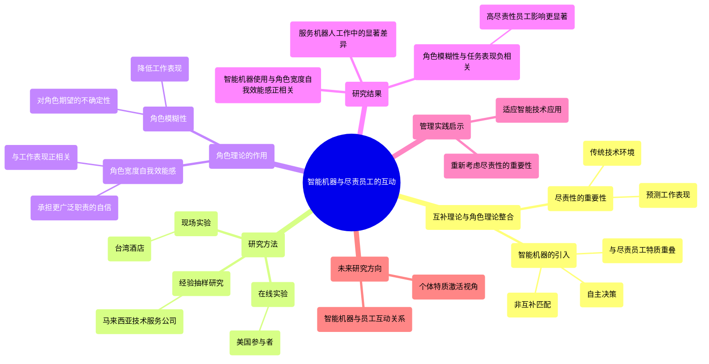
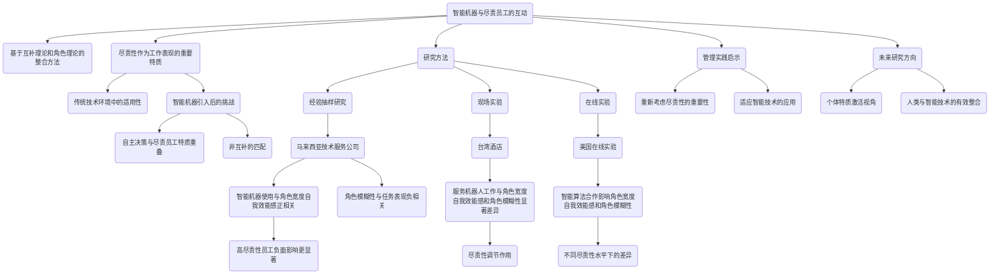
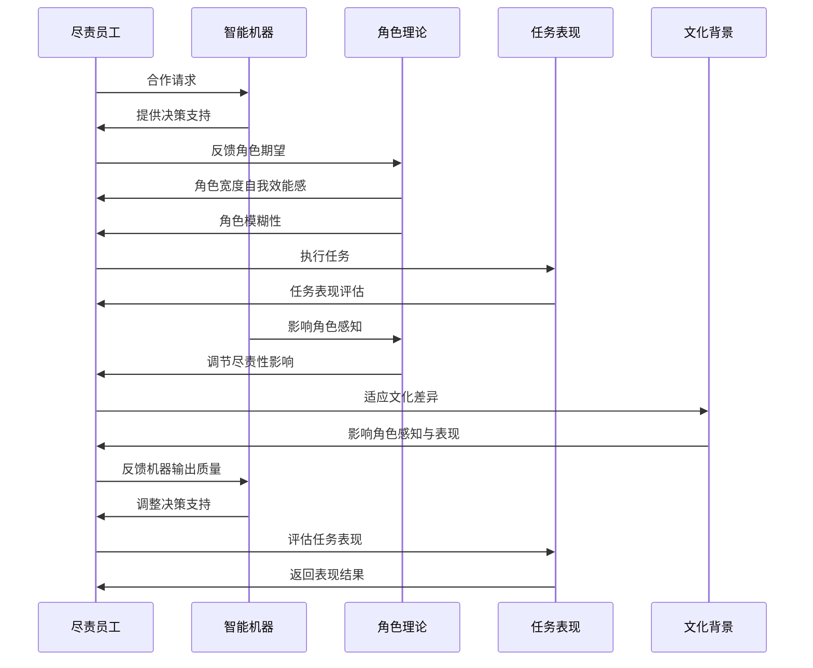
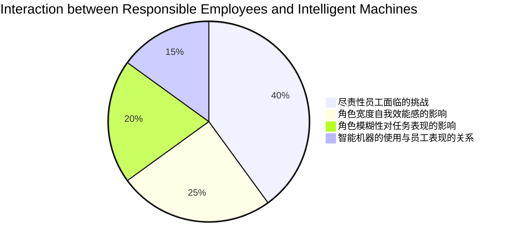

<div align="center">

```
               _   _  ___  ____  __  __    _    _     
              | \ | |/ _ \|  _ \|  \/  |  / \  | |    
              |  \| | | | | |_) | |\/| | / _ \ | |    
              | |\  | |_| |  _ <| |  | |/ ___ \| |___ 
              |_| \_|\___/|_| \_\_|  |_/_/   \_\_____|
                 _    _   _ ____     ____ _   _ ___ _     _     
                / \  | \ | |  _ \   / ___| | | |_ _| |   | |    
               / _ \ |  \| | | | | | |   | |_| || || |   | |    
              / ___ \| |\  | |_| | | |___|  _  || || |___| |___ 
             /_/   \_\_| \_|____/   \____|_| |_|___|_____|_____|
              ____   ____ ___ _____ _   _  ____ _____ 
             / ___| / ___|_ _| ____| \ | |/ ___| ____|
             \___ \| |    | ||  _| |  \| | |   |  _|  
              ___) | |___ | || |___| |\  | |___| |___ 
             |____/ \____|___|_____|_| \_|\____|_____|
```

</div>

NORMAL AND CHILL SCIENCE

平常心科学

2) 人机协同或人与AI的协同

---

Slow down but step by step

---

| SHANGHAI LONLIV-TECH | 第001期 |
|:----------------------|--------:|
| Editor：Zhenghao Xu     | 2024年09月21日 |

---


# WHEN CONSCIENTIOUS EMPLOYEES MEET INTELLIGENT MACHINES_AN INTEGRATIVE APPROACH INSPIRED BY COMPLEMENTARITY THEORY AND ROLE THEORY.docx

## 原始摘要

这篇文章探讨了在智能机器与尽责员工之间的互动，提出了基于互补理论和角色理论的整合方法。尽责性被认为是预测工作表现的重要特质，尤其是在传统技术环境中。然而，随着智能机器（如人工智能和机器人）的引入，这种互补关系受到挑战，因为这些机器能够自主决策，与尽责员工的有序特质重叠，导致非互补的匹配。

研究通过三项不同类型的研究（经验抽样研究、现场实验和在线实验）验证了这一理论，结果表明，尽责员工在与智能机器合作时，可能不会获得预期的好处，反而可能面临角色模糊和角色宽度自我效能感降低的问题。文章强调，尽责性（特别是有序性）在智能机器使用与工作表现之间的关系中起到调节作用。

总之，文章提出了在21世纪工作环境中，尽责员工与智能机器之间的互动可能需要重新审视，传统的关于尽责性与技术有效性的共识可能不再适用。
这一部分内容主要探讨了角色理论在员工任务表现中的作用，特别是角色宽度自我效能感和角色模糊性对员工表现的影响。角色宽度自我效能感指的是员工感到自己能够承担超出主要角色的更广泛职责，这种自信心与工作表现正相关。研究假设，智能机器的使用通过角色宽度自我效能感间接影响任务表现，而这种影响在尽责性较低时更为显著。

另一方面，角色模糊性则反映了员工对角色期望和责任的不确定性，这通常会降低工作表现。研究假设，智能机器的使用通过角色模糊性对任务表现的负面影响在尽责性较高时更为明显。

研究包括三项不同类型的研究，涉及人工智能、算法和机器人，采用不同的研究方法，并招募来自不同国家文化的参与者。第一项研究在马来西亚的一家技术服务公司进行，第二项研究在台湾的一家酒店进行，第三项研究则是在线实验。

在第一项研究中，结果显示，智能机器的使用与角色宽度自我效能感正相关，但尽责性并未显著调节这一关系。相反，角色模糊性与任务表现呈负相关，且在高尽责性员工中，这种负面影响更为显著。

第二项研究则进一步验证了这些假设，结果显示，参与机器人工作的员工在角色宽度自我效能感和角色模糊性上表现出显著差异，且尽责性在这些关系中起到了调节作用。

总体而言，这些研究表明，智能机器的使用对员工的角色感知和任务表现有重要影响，尤其是在不同尽责性水平的员工中。研究强调了在现代工作环境中重新审视员工与智能机器之间的互动的重要性。
本节主要讨论了智能机器对员工任务表现的影响，特别是角色宽度自我效能感和角色模糊性在不同尽责性水平下的作用。研究发现，角色模糊性对员工服务表现有显著负面影响，尤其是在高尽责性员工中。智能机器的使用与角色模糊性正相关，而角色宽度自我效能感在高尽责性员工中对任务表现的影响更为明显。

第二项研究进一步验证了这些假设，结果显示，服务机器人工作与角色模糊性和角色宽度自我效能感之间的关系在高尽责性员工中更为显著。研究强调了智能机器对员工角色感知和表现的影响，尤其是在不同文化和行业背景下。

第三项研究采用了不同的实验设计，参与者来自美国，结果支持了所有假设，表明在与智能算法合作时，员工的角色宽度自我效能感和角色模糊性受到影响，且这种影响在不同尽责性水平下存在差异。

总体而言，这些研究表明，尽责性较高的员工在与智能机器合作时可能面临更多挑战，尤其是在角色模糊性方面。研究结果对管理实践提出了重要启示，建议在招聘和工作安排中重新考虑尽责性的重要性，以更好地适应智能技术的应用。
本节讨论了智能机器对员工表现的影响，特别是尽责性员工在与智能机器合作时可能面临的挑战。研究指出，智能机器的输出质量和用户友好性可能会影响员工对这些机器的接受程度。尽责性员工可能会更欣赏高质量输出的机器，或是机器的决策与他们的偏好一致。

此外，员工与智能机器的合作方式因机器类型、工作性质和行业而异。研究采用了个体内和个体间的视角，发现尽责性员工在使用智能机器时的表现可能与预期不同，尤其是在角色模糊性较高的情况下。

最后，研究建议未来的研究应考虑个体特质激活的视角，探讨尽责性员工与智能机器之间的互动关系。整体而言，智能机器的引入可能会改变员工的工作表现，尤其是在高尽责性员工中，值得进一步研究。
本节主要探讨了人工智能和机器人技术对员工工作表现的影响，尤其是如何通过角色宽度自我效能感、角色模糊性和角色冲突等因素来影响任务表现。研究表明，个体的尽责性在这些关系中起到了调节作用。具体来说，尽责性较高的员工在使用人工智能和机器人技术时，能够更好地应对角色模糊性和角色冲突，从而提升工作表现。

研究分为三个部分，分别通过不同的实验设计来验证这些假设。结果显示，尽责性不仅影响员工对技术的接受程度，还影响他们在面对技术带来的不确定性时的应对策略。此外，研究还强调了在未来工作环境中，如何有效整合人类与智能技术的合作，以提升整体工作效率和员工满意度。

总的来说，本节为理解智能技术在工作场所的应用提供了重要的理论基础，并为人力资源管理实践提供了指导。

## 摘要

1. Class: (2) 人机协同或人与AI的协同

2. Authors: [Author names not provided in the prompt]

3. Affiliation: [Affiliation not provided in the prompt]

4. Keywords: intelligent machines, conscientiousness, role ambiguity, role breadth self-efficacy, task performance

5. Urls: [Paper link not provided in the prompt] or Github: None

6. Summary:

   - (1): 本文探讨了智能机器与尽责员工之间的互动，提出了基于互补理论和角色理论的整合方法，强调尽责性在工作表现中的重要性，尤其是在智能机器引入后。

   - (2): 理论模型包括角色理论，关键变量为尽责性、角色宽度自我效能感和角色模糊性，尽责性在智能机器使用与任务表现之间起调节作用。

   - (3): 研究采用了三项不同类型的研究方法，包括经验抽样研究、现场实验和在线实验，参与者来自不同文化背景。

   - (4): 研究发现，智能机器的使用对员工的角色感知和任务表现有显著影响，尤其是在高尽责性员工中，角色模糊性对表现的负面影响更为明显，支持了研究目标。

## 图表

### 图表 1



### 图表 2



### 图表 3



### 图表 4



