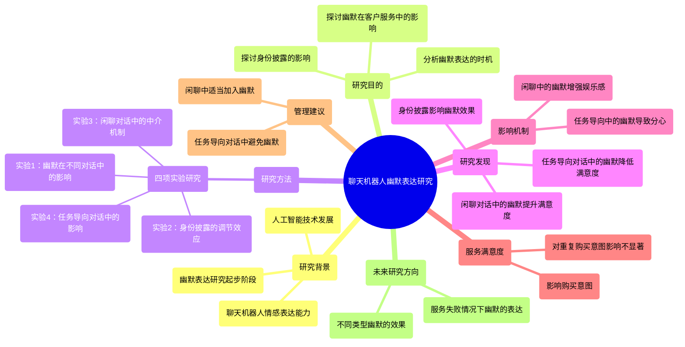
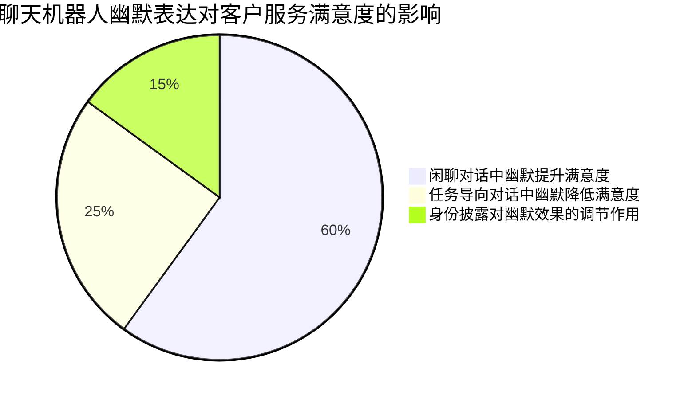
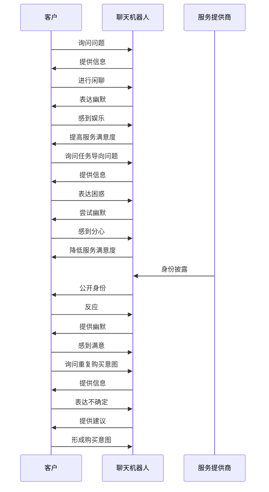

<div align="center">

```
               _   _  ___  ____  __  __    _    _     
              | \ | |/ _ \|  _ \|  \/  |  / \  | |    
              |  \| | | | | |_) | |\/| | / _ \ | |    
              | |\  | |_| |  _ <| |  | |/ ___ \| |___ 
              |_| \_|\___/|_| \_\_|  |_/_/   \_\_____|
                 _    _   _ ____     ____ _   _ ___ _     _     
                / \  | \ | |  _ \   / ___| | | |_ _| |   | |    
               / _ \ |  \| | | | | | |   | |_| || || |   | |    
              / ___ \| |\  | |_| | | |___|  _  || || |___| |___ 
             /_/   \_\_| \_|____/   \____|_| |_|___|_____|_____|
              ____   ____ ___ _____ _   _  ____ _____ 
             / ___| / ___|_ _| ____| \ | |/ ___| ____|
             \___ \| |    | ||  _| |  \| | |   |  _|  
              ___) | |___ | || |___| |\  | |___| |___ 
             |____/ \____|___|_____|_| \_|\____|_____|
```

</div>

NORMAL AND CHILL SCIENCE

平常心科学

其他

---

Slow down but step by step

---

| SHANGHAI LONLIV-TECH | 第001期 |
|:----------------------|--------:|
| Editor：Zhenghao Xu     | 2024年09月21日 |

---


# When should chatbots express humor Exploringdifferent influence mechanisms of humor onservice satisfaction.docx

## 原始摘要

本研究探讨了聊天机器人在客户服务中表达幽默的时机及其对服务满意度的影响。随着人工智能技术的发展，聊天机器人逐渐具备表达情感的能力，但关于其幽默表达的研究仍处于起步阶段，且结果不一致。通过四项实验研究，发现聊天机器人在闲聊对话中表达幽默能提高客户的娱乐感和服务满意度，而在任务导向对话中则可能导致客户分心，降低服务满意度。

研究表明，幽默在闲聊对话中通过增强娱乐感来提升服务满意度，而在任务导向对话中则通过分心间接影响服务满意度。幽默的适当表达时机至关重要，过于随意或不合时宜的幽默可能导致客户感到不适或认为其问题未被认真对待。

此外，随着聊天机器人技术的进步，在线服务提供商需要考虑是否向客户披露其机器人身份。现有研究显示，聊天机器人身份的披露可能产生不一致的影响，因此需要更深入的探讨。

本研究的贡献在于：首先，分析了幽默在不同对话中的影响，扩展了关于聊天机器人幽默表达的研究；其次，构建了幽默在不同对话中对服务满意度的影响机制；最后，探讨了聊天机器人身份披露的影响，为后续研究提供理论基础。

总之，聊天机器人在客户服务中表达幽默的时机和方式对提升客户体验至关重要，适当的幽默表达能够增强客户的互动体验和满意度。
根据信息处理理论，注意力是一种有限资源，通常只能集中在一个任务上。因此，多任务处理会加速注意力资源的耗竭，从而降低主要任务的表现。研究表明，幽默会分散人们对同时呈现的非幽默信息的注意力，降低其仔细处理信息的能力。幽默信息通常更易记住，但对幽默的选择性注意可能会牺牲信息的其他重要部分。在任务导向的对话中，幽默的表达可能会导致客户分心，从而干扰他们获取所需信息的能力。

幽默的表达在客户需要及时有效信息时会产生负面影响。分心被认为是解释这些负面影响的机制之一。被幽默分散注意力的消费者可能会对品牌产生负面评价。尤其在客户有任务时，分心会导致他们无法专注于任务，产生负面情绪。因此，我们提出假设：幽默在任务导向对话中的表达会通过分心影响服务满意度。

在电子商务环境中，身份披露指的是聊天机器人在与消费者互动之前公开其机器人身份。随着聊天机器人技术的发展，在线服务提供商必须透明地向客户披露其身份。尽管身份披露可能导致客户的不适，但在某些情况下，披露身份反而可能对客户忠诚度产生积极影响。我们的研究重点在于幽默的表达，认为幽默的表达在身份披露时可能会引发更积极的客户反应。

服务满意度是客户体验的主观评估，广泛认为是影响客户购买意图的重要因素。研究表明，服务满意度越高，客户的重复购买意图和推荐意图越强。因此，我们提出假设：更高的服务满意度会正向影响客户的购买意图和重复购买意图。

本研究通过四项实验验证研究框架和假设。第一项实验探讨了幽默在不同对话中的影响，第二项实验关注身份披露的调节效应，第三和第四项实验则分别探讨了幽默在闲聊和任务导向对话中的中介机制。

在第一项实验中，我们设计了一个一元设计，验证幽默在不同对话中的影响。结果显示，聊天机器人在闲聊对话中表达幽默时，客户的服务满意度显著高于在任务导向对话中或没有幽默的情况下。

第二项实验模拟了产品退货场景，结果显示幽默的表达在闲聊对话中能提高服务满意度，但在任务导向对话中则效果不佳。

总体而言，幽默的表达在客户服务中具有重要影响，适当的幽默表达能够提升客户的互动体验和满意度，而身份的透明披露则可能在某些情况下增强这种积极效果。
在本节中，我们通过四项研究探讨了聊天机器人在不同对话场景中幽默表达对客户服务满意度和购买意图的影响。

**研究1**使用协方差分析（ANCOVA）验证了假设H1，结果显示在闲聊对话中表达幽默的聊天机器人能显著提高客户的服务满意度（M = 4.362），相比于在任务导向对话中（M = 3.989）或不表达幽默时（M = 4.011）。然而，幽默的表达并未显著提高客户的重复购买意图，表明影响重复购买意图的因素可能更为复杂。

**研究2**设计了一个2x2的实验，探讨幽默和身份披露的交互效应。结果显示，在身份披露的情况下，客户对聊天机器人的服务满意度没有显著差异，但在身份未披露的情况下，闲聊对话中的幽默表达显著提高了服务满意度（M = 3.820 vs. M = 3.123）。这进一步验证了H4。

**研究3**探讨了幽默在闲聊对话中对服务满意度的影响是否通过娱乐感进行中介。结果表明，幽默显著提高了客户的娱乐感（β = 1.875），进而提升了服务满意度（β = 0.302）。而幽默并未增加客户的分心感，确认了H2a。

**研究4**则关注幽默在任务导向对话中的影响。结果显示，幽默的表达并未显著提高服务满意度（M = 3.846 vs. M = 3.959），但幽默确实增加了客户的分心感（β = 0.426），并降低了服务满意度（β = 0.321）。这表明幽默在任务导向对话中可能产生负面影响，未能支持H2b和H3。

综上所述，幽默在闲聊对话中能够有效提升客户的服务满意度，而在任务导向对话中则可能导致客户分心，影响满意度。身份披露在幽默表达的效果中起到了调节作用，娱乐感在闲聊对话中起到了中介作用。
本研究探讨了聊天机器人在不同对话类型中表达幽默对客户服务满意度的影响，以及幽默在不同对话中的作用机制和聊天机器人身份披露的调节效应。研究结果表明，聊天机器人在闲聊对话中表达幽默能显著提高客户的服务满意度，而在任务导向对话中则可能导致客户分心，降低满意度。

首先，研究发现聊天机器人在不同对话中表达幽默的效果不同，且这种影响受到身份披露的调节。当聊天机器人的身份被披露时，不同对话类型中幽默的影响没有显著差异；而在身份未披露的情况下，闲聊对话中的幽默表达显著提高了客户的服务满意度。这一发现揭示了幽默的有效性不仅取决于幽默本身，还与时机和上下文相关。

其次，研究探讨了幽默在不同对话中对服务满意度的影响机制。结果显示，闲聊对话中的幽默显著提高了客户的娱乐感，从而提升了服务满意度，而任务导向对话中的幽默则增加了客户的分心感，负面影响大于正面影响。这表明在任务导向对话中，幽默的表达可能并不总是有益的。

此外，研究还发现服务满意度是客户购买意图的重要预测因素，但未能显著影响重复购买意图，可能是因为重复购买意图受到多种因素的影响，如之前的购买经验、产品价格等。

理论上，本研究为聊天机器人幽默表达的研究提供了新的视角，揭示了幽默在不同对话上下文中的多样性和复杂性。研究还探讨了身份披露对幽默表达的调节作用，发现身份披露能够有效减少任务导向对话中幽默的负面影响。

在管理实践中，研究建议聊天机器人设计者在闲聊对话中适当加入幽默，以提高客户的娱乐感和满意度；而在任务导向对话中则应避免使用幽默，以免造成客户的分心。此外，随着AI技术的发展，聊天机器人身份的披露可能会变得越来越重要，设计者应考虑在产品设计中主动提供AI身份信息。

最后，研究指出了未来研究的方向，包括探讨不同类型幽默的效果、服务失败情况下幽默的表达，以及身份披露的其他调节因素等。这些研究将进一步丰富我们对聊天机器人幽默表达的理解，并为实际应用提供指导。
本节内容主要探讨了人工智能聊天机器人在在线客户体验中的可用性和响应性，以及幽默在客户服务中的作用。研究表明，聊天机器人的幽默表达在不同对话类型中对客户满意度的影响存在显著差异。在闲聊对话中，幽默能够提升客户的满意度和娱乐感，而在任务导向对话中，幽默可能导致客户分心，从而降低满意度。

此外，身份披露对幽默的影响也被强调。当聊天机器人的身份被披露时，幽默的效果在不同对话类型中没有显著差异；而在身份未披露的情况下，闲聊中的幽默表达显著提高了客户的服务满意度。研究还指出，服务满意度是客户购买意图的重要预测因素，但对重复购买意图的影响不显著。

理论上，本研究为聊天机器人幽默表达的研究提供了新的视角，揭示了幽默在不同对话上下文中的复杂性。管理实践中，建议聊天机器人设计者在闲聊中适当加入幽默，而在任务导向对话中应避免使用幽默，以免造成客户的分心。

最后，研究提出了未来的研究方向，包括探讨不同类型幽默的效果、服务失败情况下幽默的表达等。这些研究将进一步丰富我们对聊天机器人幽默表达的理解，并为实际应用提供指导。
本节内容主要涉及人工智能聊天机器人在客户服务中的幽默表达及其对消费者行为的影响。研究表明，幽默可以在不同的对话类型中产生不同的效果，尤其是在闲聊和任务导向的对话中。闲聊中的幽默能够提升客户的满意度和娱乐感，而在任务导向对话中，幽默可能会导致客户的分心，从而降低满意度。

此外，身份披露对幽默效果的影响也被探讨。当聊天机器人的身份被披露时，幽默的效果在不同对话类型中没有显著差异；而在身份未披露的情况下，闲聊中的幽默表达显著提高了客户的服务满意度。研究还指出，服务满意度是客户购买意图的重要预测因素，但对重复购买意图的影响不显著。

理论上，本研究为聊天机器人幽默表达的研究提供了新的视角，揭示了幽默在不同对话上下文中的复杂性。管理实践中，建议聊天机器人设计者在闲聊中适当加入幽默，而在任务导向对话中应避免使用幽默，以免造成客户的分心。

最后，研究提出了未来的研究方向，包括探讨不同类型幽默的效果、服务失败情况下幽默的表达等。这些研究将进一步丰富我们对聊天机器人幽默表达的理解，并为实际应用提供指导。

## 摘要

1. Title: The Timing of Humor Expression by Chatbots in Customer Service and Its Impact on Service Satisfaction  
   中文翻译: 聊天机器人在客户服务中幽默表达的时机及其对服务满意度的影响

2. Authors: [Author names not provided in the text]

3. Affiliation: [Affiliation not provided in the text]

4. Keywords: Chatbots, Humor, Customer Service, Service Satisfaction, Identity Disclosure

5. Urls: None, None

6. Summary: 

   - (1): 本文研究了聊天机器人在客户服务中幽默表达的时机及其对服务满意度的影响，随着人工智能技术的发展，聊天机器人逐渐具备表达情感的能力，但幽默表达的研究仍处于起步阶段。

   - (2): 理论模型探讨了幽默在闲聊和任务导向对话中的影响，关键变量包括幽默表达、服务满意度和客户的娱乐感，分心作为调节变量影响服务满意度。

   - (3): 本研究通过四项实验验证假设，采用协方差分析（ANCOVA）等方法，探讨幽默在不同对话中的影响及身份披露的调节效应。

   - (4): 研究表明，在闲聊对话中幽默能显著提高客户的服务满意度，而在任务导向对话中幽默可能导致客户分心，降低满意度，支持了研究目标。

## 图表

### 图表 1



### 图表 2

```mermaid
graph TD
    A("本研究探讨了聊天机器人在客户服务中幽默表达的时机及其对服务满意度的影响") --> B("随着人工智能技术的发展，聊天机器人逐渐具备表达情感的能力")
    B --> C("幽默表达的研究仍处于起步阶段，且结果不一致")
    A --> D("通过四项实验研究，发现闲聊对话中的幽默能提高客户的娱乐感和服务满意度")
    A --> E("任务导向对话中的幽默可能导致客户分心，降低服务满意度")
    D --> F("幽默在闲聊对话中通过增强娱乐感提升服务满意度")
    E --> G("幽默在任务导向对话中通过分心间接影响服务满意度")
    A --> H("幽默的适当表达时机至关重要")
    H --> I("过于随意或不合时宜的幽默可能导致客户不适")
    A --> J("聊天机器人身份的披露可能产生不一致的影响")
    A --> K("本研究的贡献")
    K --> L("分析幽默在不同对话中的影响")
    K --> M("构建幽默对服务满意度的影响机制")
    K --> N("探讨聊天机器人身份披露的影响")
    A --> O("聊天机器人幽默表达的时机和方式对客户体验至关重要")
    O --> P("适当的幽默表达增强客户互动体验和满意度")
    A --> Q("研究假设")
    Q --> R("幽默在任务导向对话中的表达通过分心影响服务满意度")
    A --> S("身份披露的影响")
    S --> T("身份披露可能对客户忠诚度产生积极影响")
    A --> U("服务满意度是客户体验的主观评估")
    U --> V("服务满意度越高，客户的重复购买意图和推荐意图越强")
    A --> W("四项实验验证研究框架和假设")
    W --> X("研究1：幽默在不同对话中的影响")
    W --> Y("研究2：身份披露的调节效应")
    W --> Z("研究3：幽默在闲聊对话中的中介机制")
    W --> AA("研究4：幽默在任务导向对话中的影响")
    X --> AB("闲聊对话中幽默显著提高服务满意度")
    Y --> AC("身份未披露情况下，闲聊对话中的幽默表达显著提高服务满意度")
    Z --> AD("闲聊对话中幽默显著提高客户娱乐感")
    AA --> AE("幽默在任务导向对话中增加客户分心感，降低服务满意度")
    A --> AF("总结")
    AF --> AG("幽默在闲聊对话中提升客户满意度")
    AF --> AH("任务导向对话中幽默可能导致客户分心")
    AF --> AI("身份披露在幽默表达的效果中起调节作用")
```



### 图表 3



### 图表 4



