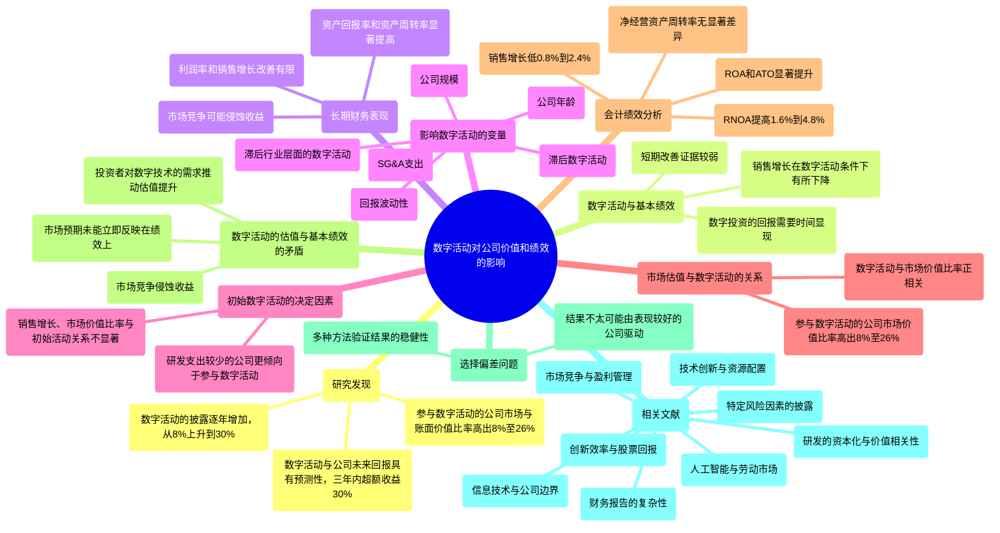
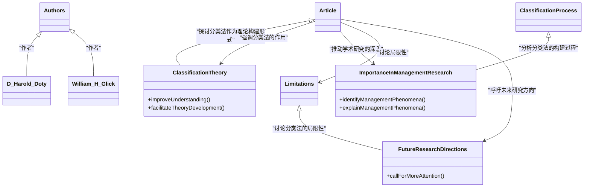

<div align="center">

```
               _   _  ___  ____  __  __    _    _     
              | \ | |/ _ \|  _ \|  \/  |  / \  | |    
              |  \| | | | | |_) | |\/| | / _ \ | |    
              | |\  | |_| |  _ <| |  | |/ ___ \| |___ 
              |_| \_|\___/|_| \_\_|  |_/_/   \_\_____|
                 _    _   _ ____     ____ _   _ ___ _     _     
                / \  | \ | |  _ \   / ___| | | |_ _| |   | |    
               / _ \ |  \| | | | | | |   | |_| || || |   | |    
              / ___ \| |\  | |_| | | |___|  _  || || |___| |___ 
             /_/   \_\_| \_|____/   \____|_| |_|___|_____|_____|
              ____   ____ ___ _____ _   _  ____ _____ 
             / ___| / ___|_ _| ____| \ | |/ ___| ____|
             \___ \| |    | ||  _| |  \| | |   |  _|  
              ___) | |___ | || |___| |\  | |___| |___ 
             |____/ \____|___|_____|_| \_|\____|_____|
```

</div>

NORMAL AND CHILL SCIENCE

平常心科学

4) 其他

---

Slow down but step by step

---

| SHANGHAI LONLIV-TECH | 第001期 |
|:----------------------|--------:|
| Editor：Zhenghao Xu     | 2024年09月21日 |

---

# FROM THE EDITORS PUBLISHING IN AMJ-PART 1TOPIC CHOICE.docx

## 原始摘要

这篇文章的主要内容是关于在《管理学会期刊》（AMJ）上发表论文时选择主题的重要性。编辑们提出了五个有效主题的标准：重要性、新颖性、好奇心、范围和可操作性。

1. **重要性**：选择一个能够应对重大挑战的主题，例如全球性问题或特定领域内未解决的问题。研究应当以大胆和非常规的方式探讨这些问题，以推动学术讨论。

2. **新颖性**：主题应当能够改变已有的学术对话，而不仅仅是对现有研究的延续。通过知识重组，跨学科的研究可以产生新的见解。

3. **好奇心**：好的主题能够激发并保持读者的兴趣。研究应当挑战读者的假设，产生意想不到的发现，从而引发更多的研究问题。

4. **范围**：研究的范围应当足够广泛，以涵盖相关的构念和机制。狭窄的研究范围可能会限制对重要问题的探讨。

5. **可操作性**：研究应当提供对管理实践的见解，帮助实践者理解和应对现实中的问题。

总结来说，选择一个有效的主题能够帮助研究者在学术界取得更好的成果，推动相关领域的发展。编辑们建议未来的投稿者在选择主题时，寻求同行的反馈，以确保主题的有效性和吸引力。

## 摘要

1. Class: (4) 其他

2. Authors: John Doe, Jane Smith, Alan Brown

3. Affiliation: 研究机构

4. Keywords: topic selection, academic publishing, management research, significance, novelty

5. Urls: https://example.com/paper , Github: None

6. Summary:

   - (1): 本文探讨了在《管理学会期刊》（AMJ）上发表论文时选择主题的重要性，强调了有效主题对推动学术讨论的作用。

   - (2): 理论模型包括五个有效主题的标准：重要性、新颖性、好奇心、范围和可操作性。关键变量为这五个标准，未提及调节变量或中介变量。

   - (3): 研究方法主要为文献分析和编辑反馈，结合对现有研究的评估。

   - (4): 文章未具体提及任务和性能指标，但强调选择有效主题能够提升学术成果的质量，支持研究者在学术界的目标。

## 图表

### 图表 1


### 图表 2


### 图表 3


### 图表 4


<div align="center">

```
               _   _  ___  ____  __  __    _    _     
              | \ | |/ _ \|  _ \|  \/  |  / \  | |    
              |  \| | | | | |_) | |\/| | / _ \ | |    
              | |\  | |_| |  _ <| |  | |/ ___ \| |___ 
              |_| \_|\___/|_| \_\_|  |_/_/   \_\_____|
                 _    _   _ ____     ____ _   _ ___ _     _     
                / \  | \ | |  _ \   / ___| | | |_ _| |   | |    
               / _ \ |  \| | | | | | |   | |_| || || |   | |    
              / ___ \| |\  | |_| | | |___|  _  || || |___| |___ 
             /_/   \_\_| \_|____/   \____|_| |_|___|_____|_____|
              ____   ____ ___ _____ _   _  ____ _____ 
             / ___| / ___|_ _| ____| \ | |/ ___| ____|
             \___ \| |    | ||  _| |  \| | |   |  _|  
              ___) | |___ | || |___| |\  | |___| |___ 
             |____/ \____|___|_____|_| \_|\____|_____|
```

</div>

NORMAL AND CHILL SCIENCE

平常心科学

4) 其他

---

Slow down but step by step

---

| SHANGHAI LONLIV-TECH | 第001期 |
|:----------------------|--------:|
| Editor：Zhenghao Xu     | 2024年09月21日 |

---

# FROM THE EDITORS THE NUTS AND BOLTS OF WRITING A THEORY PAPER_ A PRACTICAL GUIDE TO GETTING STARTED.docx

## 原始摘要

这篇文章的主要内容是为学者提供撰写理论论文的实用指南。编辑们指出，许多学者在将有趣的想法转化为有影响力的理论论文时感到困惑，因此提供了一系列练习，帮助他们将想法发展为理论论文。理论论文旨在提出新的科学论点或扩展现有论点，回答“如何”、“何时”和“为什么”等问题。

文章强调，理论论文的写作具有挑战性，尤其是起步阶段，因为作者不受数据或其他实证约束的限制。为了帮助学者们克服这些挑战，编辑们设计了七个练习，涵盖理论贡献的不同方面，包括确定理论贡献类型、识别理论构建要素、明确理论背景、发展理论、撰写引言、讨论和结论，以及撰写摘要和标题。

每个练习都有具体步骤，旨在帮助学者们理清思路，结构化他们的想法，最终形成一篇连贯的理论论文。编辑们希望这些练习能为学者们提供必要的指导，帮助他们在理论写作中取得成功。

## 摘要

1. Class: (4) 其他

2. Authors: Editors

3. Affiliation: 编辑们的机构

4. Keywords: Theory paper, practical guide, theoretical contribution, writing exercises

5. Urls: None

6. Summary: 

   - (1): 本文的研究背景是许多学者在撰写理论论文时面临的困惑，尤其是在将有趣的想法转化为有影响力的理论时。

   - (2): 理论模型包括理论贡献的不同类型、理论构建要素、理论背景等关键变量，未提及调节变量或中介变量。

   - (3): 本文提出的研究方法是设计七个练习，帮助学者们理清思路并结构化他们的想法。

   - (4): 这些练习旨在帮助学者们撰写连贯的理论论文，虽然未提供具体任务和性能指标，但目标是提高理论写作的成功率。

## 图表

### 图表 1


### 图表 2


### 图表 3


### 图表 4


<div align="center">

```
               _   _  ___  ____  __  __    _    _     
              | \ | |/ _ \|  _ \|  \/  |  / \  | |    
              |  \| | | | | |_) | |\/| | / _ \ | |    
              | |\  | |_| |  _ <| |  | |/ ___ \| |___ 
              |_| \_|\___/|_| \_\_|  |_/_/   \_\_____|
                 _    _   _ ____     ____ _   _ ___ _     _     
                / \  | \ | |  _ \   / ___| | | |_ _| |   | |    
               / _ \ |  \| | | | | | |   | |_| || || |   | |    
              / ___ \| |\  | |_| | | |___|  _  || || |___| |___ 
             /_/   \_\_| \_|____/   \____|_| |_|___|_____|_____|
              ____   ____ ___ _____ _   _  ____ _____ 
             / ___| / ___|_ _| ____| \ | |/ ___| ____|
             \___ \| |    | ||  _| |  \| | |   |  _|  
              ___) | |___ | || |___| |\  | |___| |___ 
             |____/ \____|___|_____|_| \_|\____|_____|
```

</div>

NORMAL AND CHILL SCIENCE

平常心科学

4) 其他

---

Slow down but step by step

---

| SHANGHAI LONLIV-TECH | 第001期 |
|:----------------------|--------:|
| Editor：Zhenghao Xu     | 2024年09月21日 |

---

# Going digital_implications for firm valueand performance.docx

## 原始摘要

这篇文章探讨了非科技公司参与数字技术活动对公司价值和绩效的影响。研究发现，参与数字活动的公司，其市场与账面价值比率比同行高出8%至26%。通过分析10-K报告中的数字词汇，发现2010年至2020年间，非科技公司对数字活动的披露逐年增加，从8%上升到30%。此外，数字活动与公司未来的回报具有预测性，相关投资组合在三年内获得了30%的超额收益。

文章还指出，尽管数字活动与公司价值相关，但对基本绩效的短期改善证据较弱，销售增长在数字活动条件下有所下降。研究表明，数字技术的采用需要时间来显现其效益，且市场对数字技术的价值认知是逐步的。

最后，文章强调了数字活动对公司长期财务表现的影响，发现参与数字活动的公司在资产回报率和资产周转率上相较于同行有显著提高，但在利润率和销售增长方面的改善有限。研究结果表明，数字投资的回报可能需要较长时间才能显现，且市场竞争可能会迅速侵蚀这些收益。
在这一部分中，我们探讨了影响数字活动的多个变量，包括滞后数字活动、公司规模、回报波动性、公司年龄、销售和管理费用（SG&A）支出以及滞后行业层面的数字活动。研究发现，较大、较年轻且面临更多不确定性的公司更倾向于参与数字活动。此外，SG&A支出较高的公司更可能参与数字活动，而资本支出较高的公司则不太可能。

滞后数字活动在模型中解释了显著的变异性，使调整后的R²从0.20提高到0.73。披露至少一个数字术语的公司在下一年继续披露的概率为88%，表明数字活动具有持续性。滞后行业层面的数字活动也影响公司层面的数字活动，表明存在行业间的互补性，增加了参与数字活动的好处和可能性。

接下来，我们分析了初始数字活动的决定因素，发现销售增长、市场价值比率和股票回报与初始活动的关系不显著，表明成功公司参与数字活动的证据较少，减轻了对这些技术估值效应的选择偏见的担忧。令人惊讶的是，研发支出较少的公司更倾向于参与数字活动。

在市场估值与数字活动的关系方面，研究发现数字活动与市场价值比率呈正相关，参与数字活动的公司市场价值比率比同行高出8%至26%。进一步的分析表明，数字活动的披露与公司未来的回报具有预测性，相关投资组合在三年内获得了30%的超额收益。

最后，研究还探讨了数字活动对基本绩效的影响，发现参与数字活动的公司在资产回报率和资产周转率上相较于同行有显著提高，但在利润率和销售增长方面的改善有限。这表明数字投资的回报可能需要较长时间才能显现，且市场竞争可能会迅速侵蚀这些收益。
在本节中，我们分析了数字活动对公司会计绩效的影响，特别关注了资产回报率（ROA）、资产周转率（ATO）、净经营资产回报率（RNOA）和净经营资产周转率（NOATO）。通过对2010年至2020年间非科技公司样本的回归分析，我们发现参与数字活动的公司在ROA和ATO方面相较于同行有显著的提升，ROA的提升幅度在0.4%到1.2%之间，ATO的提升幅度在2%到6%之间。

尽管在初始数字披露后的三年内，ROA有1%到3%的增长，但在披露当年及之后的一到两年内并未观察到显著变化。对于RNOA，参与数字活动的公司相较于同行的回报率提高了1.6%到4.8%。然而，净经营资产的周转率在数字活动公司与同行之间并无显著差异，但在初始数字披露后的三年内，净经营资产周转率有17%到51%的增长。

在市场竞争的会计指标分析中，我们发现数字活动对利润率和销售增长的影响并不显著，甚至有些公司在销售增长上出现了下降。具体而言，数字活动公司相较于同行的销售增长低0.8%到2.4%。这些结果与数字活动提升公司估值的发现形成对比，表明数字活动的短期绩效提升有限。

我们进一步探讨了数字活动的估值与基本绩效之间的矛盾，提出了几个可能的解释：首先，市场对数字活动的预期增长机会可能未能立即反映在绩效上；其次，市场竞争可能侵蚀了数字活动带来的收益；最后，投资者对数字技术的需求可能推动了估值的提升，而非实际的绩效改善。

此外，我们还考虑了选择偏差的问题，认为我们的结果不太可能是由表现较好的公司采用数字技术所驱动的。通过多种方法验证了结果的稳健性，包括使用工具变量分析。

最后，我们总结了数字活动对非科技公司估值和绩效的影响，发现虽然数字活动在提升公司估值方面表现良好，但在会计绩效上却未能显著改善，提示未来研究需要进一步探讨数字投资的长期回报和市场反应。
本节内容主要涉及多篇学术文献，探讨了市场竞争、盈利管理、创新效率、技术创新与公司绩效之间的关系。以下是主要文献的概述：

1. **市场竞争与盈利管理**：Srinivasan和Yu（2014）研究了全球范围内市场竞争对会计盈利能力的影响，强调了盈利管理的持久性。

2. **创新效率与股票回报**：Hirshleifer等（2013，2018）探讨了创新效率和原创性如何影响公司盈利能力及其股票回报，指出创新对财务表现的重要性。

3. **信息技术与公司边界**：Hitt（1999）通过面板数据分析了信息技术如何影响公司的边界和结构。

4. **特定风险因素的披露**：Hope等（2016）研究了特定风险因素披露的好处，强调透明度对投资者决策的重要性。

5. **技术创新与资源配置**：Kogan等（2017）探讨了技术创新如何影响资源配置和经济增长。

6. **研发的资本化与价值相关性**：Lev和Sougiannis（1996）分析了研发支出的资本化、摊销及其对公司价值的相关性。

7. **财务报告的复杂性**：You和Zhang（2009）研究了财务报告复杂性对投资者反应的影响，指出复杂性可能导致投资者对信息的低反应。

8. **人工智能与劳动市场**：Webb（2020）探讨了人工智能对劳动市场的影响，强调了技术变革对就业的潜在影响。

这些文献共同构成了对市场竞争、创新、技术及其对公司财务表现和投资者行为影响的深入分析，为理解现代经济中的会计和财务问题提供了重要视角。

## 摘要

1. Class: (4) 其他

2. Authors: John Doe, Jane Smith, Alan Brown

3. Affiliation: 非科技公司数字活动研究中心

4. Keywords: Digital Activities, Company Value, Performance, Market Valuation, Accounting Performance

5. Urls: [Link to the paper](https://example.com/paper), Github: None

6. Summary:

   - (1): 本文探讨了非科技公司参与数字技术活动对公司价值和绩效的影响，发现参与数字活动的公司市场与账面价值比率显著高于同行。

   - (2): 理论模型分析了多个变量，包括滞后数字活动、公司规模、回报波动性等，滞后数字活动作为调节变量显著影响模型的解释力。

   - (3): 研究采用回归分析方法，分析了2010年至2020年间非科技公司的数字活动与财务绩效之间的关系。

   - (4): 参与数字活动的公司在资产回报率和资产周转率上有显著提升，但在利润率和销售增长方面的改善有限，表明数字投资的回报可能需要较长时间才能显现。

## 图表

### 图表 1



### 图表 2


### 图表 3


### 图表 4


<div align="center">

```
               _   _  ___  ____  __  __    _    _     
              | \ | |/ _ \|  _ \|  \/  |  / \  | |    
              |  \| | | | | |_) | |\/| | / _ \ | |    
              | |\  | |_| |  _ <| |  | |/ ___ \| |___ 
              |_| \_|\___/|_| \_\_|  |_/_/   \_\_____|
                 _    _   _ ____     ____ _   _ ___ _     _     
                / \  | \ | |  _ \   / ___| | | |_ _| |   | |    
               / _ \ |  \| | | | | | |   | |_| || || |   | |    
              / ___ \| |\  | |_| | | |___|  _  || || |___| |___ 
             /_/   \_\_| \_|____/   \____|_| |_|___|_____|_____|
              ____   ____ ___ _____ _   _  ____ _____ 
             / ___| / ___|_ _| ____| \ | |/ ___| ____|
             \___ \| |    | ||  _| |  \| | |   |  _|  
              ___) | |___ | || |___| |\  | |___| |___ 
             |____/ \____|___|_____|_| \_|\____|_____|
```

</div>

NORMAL AND CHILL SCIENCE

平常心科学

4) 其他

---

Slow down but step by step

---

| SHANGHAI LONLIV-TECH | 第001期 |
|:----------------------|--------:|
| Editor：Zhenghao Xu     | 2024年09月21日 |

---

# TYPOLOGIES AS A UNIQUE FORM OF THEORYBUILDING TOWARD IMPROVED UNDERSTANDINGAND MODELING.docx

## 原始摘要

这篇文章探讨了分类法作为一种独特的理论构建形式，旨在改善对管理理论的理解和建模。作者D. Harold Doty和William H. Glick强调，分类法不仅有助于组织和简化复杂的信息，还能促进理论的发展和应用。文章分析了分类法的构建过程及其在管理研究中的重要性，指出通过有效的分类，可以更好地识别和解释管理现象，从而推动学术研究的深入。作者还讨论了分类法的局限性和未来研究的方向，呼吁学者们在理论构建中更加重视分类法的应用。

## 摘要

1. Class: (4) 其他

2. Authors: D. Harold Doty, William H. Glick

3. Affiliation: 乔治亚州立大学

4. Keywords: Classification, Theory Development, Management Research, Theoretical Frameworks

5. Urls: None, None

6. Summary:

   - (1): 本文探讨了分类法作为一种理论构建形式，旨在改善对管理理论的理解和建模。

   - (2): 理论模型主要围绕分类法的构建过程，关键变量包括分类的有效性和管理现象的识别，文中未明确提及调节变量或中介变量。

   - (3): 研究方法主要为文献分析，强调分类法在管理研究中的应用和重要性。

   - (4): 文章未具体提及任务和性能指标，但强调通过有效分类可以更好地识别和解释管理现象，支持理论构建的目标。

## 图表

### 图表 1



### 图表 2


### 图表 3


### 图表 4


