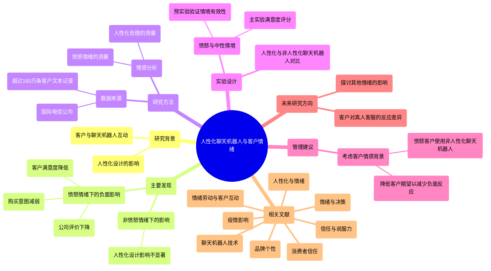

<div align="center">

```
               _   _  ___  ____  __  __    _    _     
              | \ | |/ _ \|  _ \|  \/  |  / \  | |    
              |  \| | | | | |_) | |\/| | / _ \ | |    
              | |\  | |_| |  _ <| |  | |/ ___ \| |___ 
              |_| \_|\___/|_| \_\_|  |_/_/   \_\_____|
                 _    _   _ ____     ____ _   _ ___ _     _     
                / \  | \ | |  _ \   / ___| | | |_ _| |   | |    
               / _ \ |  \| | | | | | |   | |_| || || |   | |    
              / ___ \| |\  | |_| | | |___|  _  || || |___| |___ 
             /_/   \_\_| \_|____/   \____|_| |_|___|_____|_____|
              ____   ____ ___ _____ _   _  ____ _____ 
             / ___| / ___|_ _| ____| \ | |/ ___| ____|
             \___ \| |    | ||  _| |  \| | |   |  _|  
              ___) | |___ | || |___| |\  | |___| |___ 
             |____/ \____|___|_____|_| \_|\____|_____|
```

</div>

#NORMAL AND CHILL SCIENCE

##平常心科学

其他

---

###Slow down but step by step

---

| SHANGHAI LONLIV-TECH | 第001期 |
|:----------------------|--------:|
| Editor：Zhenghao Xu     | 2024年09月21日 |

---

# attachment on AI service preference.docx

## 原始摘要

本研究探讨了不安全依恋对客户在人工智能（AI）与人类服务偏好之间的影响。通过对1039名参与者进行的三项研究，发现不安全依恋特征的客户在高接触场景（如发型设计）中更倾向于选择AI服务，而在低接触场景（如简单剪发）中则没有显著差异。第二项研究通过操控客户的依恋状态，进一步验证了第一项研究的发现。第三项研究构建了一个条件中介模型，发现社交焦虑在不安全依恋与高接触场景下对AI服务偏好的关系中起到了显著的中介作用。

研究表明，尽管AI在服务行业的应用日益广泛，但客户对AI服务的接受度仍然较低。许多消费者对AI的了解较为肤浅，缺乏深入的应用认知，这对服务企业的AI整合构成挑战。客户对AI服务的偏好并非普遍存在，某些情况下（如尴尬的消费情境）可能更倾向于选择AI服务。

不安全依恋的个体通常在社交互动中表现出更高的社交焦虑，这使得他们在高接触服务中更倾向于选择AI服务，以避免与人类服务人员的直接接触。研究还发现，客户接触的程度在服务偏好中起着重要的调节作用。在高接触服务中，不安全依恋的个体可能会感到更大的社交焦虑，因此更倾向于选择AI服务；而在低接触服务中，他们对服务提供者的性质关注较少，可能更注重服务的效率和效果。

本研究为企业在设计和实施AI服务时提供了重要的见解，建议在AI服务脚本的设计和市场细分上需更加细致，以满足不同客户的需求。
本研究采用了一种方法论，旨在捕捉参与者在不同服务情境下的偏好差异。参与者被随机分配到高接触（132人）或低接触（134人）两种服务场景中。根据G*Power的建议，进行ANCOVA分析需要210名参与者以达到中等效应量。我们从中国的在线学术调查平台Credemo.com招募了300名参与者，该平台拥有超过300万的参与者数据库，涵盖广泛的人口统计变量，并具备先进的数据审核机制，以确保参与者的回答真实可靠。

参与者完成在线调查后，有机会获得小额奖励。为了确保参与者对AI驱动的服务机器人有基本了解，我们询问了他们对AI的熟悉程度和使用经验，未满足条件的参与者被排除。最终，266名有效参与者的回答被保留用于分析，年龄范围为17至57岁，161名为女性，大多数参与者（223人）接受过大学教育。

研究采用了两种不同的服务情境：高接触和低接触，选择了理发作为研究背景。理发通常被视为高接触服务，客户与服务提供者之间的互动频繁，而在某些情况下，如简单剪发，客户与理发师的接触则较少。我们设计了两种情境，分别对应高接触和低接触服务。

参与者完成任务后填写了三份问卷，第一份测量他们对AI服务的偏好，第二份作为操控检查，确认高接触和低接触服务的有效性，第三份为“亲密关系经验量表”，用于评估参与者的不安全依恋水平。结果显示，高接触服务情境下，不安全依恋（焦虑和回避）与对AI服务的偏好显著相关，而在低接触服务情境下则无显著影响。

研究结果表明，不安全依恋个体在高接触服务中更倾向于选择AI服务，可能是因为AI提供了非评判性和一致性的互动。这些发现强调了人际依恋质量如何影响技术采纳，尤其是在高接触服务中。

在第二项研究中，我们进一步探讨了状态不安全依恋如何影响AI服务偏好。参与者被随机分配到三种状态不安全依恋（焦虑、回避和对照）和两种服务接触（高接触和低接触）的组合中。通过操控不安全依恋状态，结果显示在高接触服务情境下，不安全依恋组对AI服务的偏好显著高于对照组，而在低接触服务情境下则没有显著差异。

综上所述，本研究揭示了不安全依恋与AI服务偏好之间的关系，强调了服务提供者在设计服务时应考虑用户的心理特征，以更好地满足客户需求。
第二项研究证实了第一项研究的结果，显示不安全依恋者（包括焦虑型和回避型）在高接触服务场景中对AI服务表现出显著偏好，从而进一步验证了假设H1。这些结果强调了不安全依恋特质与状态在需要更多个人互动的情境中与AI服务偏好之间的复杂关系。研究发现，许多参与者，尤其是对AI了解不深的人，更倾向于在高接触场景中选择AI服务，这为企业和技术开发者提供了重要的见解。

接下来的研究将探讨社交焦虑是否在依赖变量与自变量之间起到中介作用。

第三项研究的参与者根据Hair等（2021）提出的样本量规则，计划招募480名参与者。最终通过Credamo.com招募了550名参与者，筛选后保留504名有效样本。参与者年龄在17至60岁之间，64%为女性，84%受过大学教育。研究聚焦于假设H2，提出社交焦虑可能在不安全依恋与AI服务偏好之间起到中介作用，尤其是在高接触与低接触服务情境中。

研究采用了两种服务场景，选择个人保险咨询作为案例。参与者被随机分配到高接触（253人）或低接触（251人）场景中，随后填写问卷以评估他们对AI服务的偏好。结果显示，高接触场景中不安全依恋与AI服务偏好之间的关系受到社交焦虑的完全中介，而在低接触场景中则无显著影响。

研究结果支持了假设H2，揭示了不安全依恋、社交焦虑与AI服务偏好之间的复杂关系，特别是在高接触服务情境中。社交焦虑的存在使得不安全依恋者更倾向于选择AI服务，这为理解用户偏好提供了新的视角。

总体而言，研究结果表明不安全依恋与AI服务偏好之间的关系在不同服务接触情境中存在显著差异。高接触服务中，不安全依恋者更倾向于选择AI服务，而在低接触服务中则未表现出显著偏好。这一发现强调了在设计AI服务时考虑用户的心理特征的重要性。

最后，研究的理论贡献在于深入探讨了个体依恋风格与AI服务偏好之间的关系，尤其是在缺乏专业知识的用户中。研究还强调了社交焦虑在高接触服务中的中介作用，揭示了心理特征如何影响技术采纳。这些发现为企业在设计和实施AI服务时提供了重要的策略指导，尤其是在需要大量人际互动的领域。
### 实践贡献

随着人工智能技术的不断发展，服务行业经历了深刻的变革。然而，理论理解与实际应用之间仍存在显著差距，尤其是在客户接受AI服务方面。本研究旨在通过深入分析客户心理和AI互动动态，为服务公司提供可操作的见解，特别是针对对AI了解有限的普通大众。

本研究的第一个重要实践贡献是强调细致的市场细分方法。研究提出了一种新的心理图谱细分视角，揭示了消费者对AI服务的复杂态度。尽管许多消费者对AI有所了解，但这种理解往往较为肤浅，影响了他们对AI服务的接受度。在高接触服务环境中，表现出不安全依恋风格的客户对AI服务的接受度更高。这一发现强调了服务公司深入了解客户心理特征的重要性，并相应调整其AI产品。

第二个重要实践贡献是建议优化AI服务的对话脚本。语言具有触发情感的力量。研究表明，服务公司应谨慎设计AI脚本，避免使用可能引发不安全依恋反应的词汇，如“亲爱的”或“拥抱你”。采用中性语言可以避免无意中触发客户的情感反应。

第三个重要实践贡献是呼吁在AI服务设计中以情感为中心。情感在AI服务互动中起着关键作用，尤其是对于那些容易产生社交焦虑的不安全依恋客户。考虑到包括老年人在内的广泛受众，他们可能对AI的理解不深，但能从中受益。研究建议，AI应具备识别社交焦虑迹象的能力，并调整互动风格，以提升客户满意度并吸引对高接触服务持谨慎态度的消费者。

本研究在理论与实践的交汇处，为服务公司提供了具体的策略，以充分利用AI服务的潜力。通过强调这些细致的见解，我们希望缩小学术界与实际应用之间的差距，并为对AI了解有限的群体提供更全面的理解。

### 限制与未来研究方向

尽管本研究为AI服务营销策略提供了有价值的见解，但仍存在一些限制。首先，参与者对AI的专业知识有限，虽然他们对AI有所了解，但缺乏专业背景。这一限制反映了大多数普通消费者的现实情况，他们对AI的认识往往停留在日常经验层面。

其次，研究参与者主要来自中国的在线调查平台Credamo.com，这限制了样本的文化适用性。未来研究应考虑更广泛的文化背景和不同年龄、教育背景的样本，以获得更全面的理解。

最后，本研究提出了一些值得进一步探讨的问题。例如，不安全依恋的客户在高接触场景中偏好AI服务，这种偏好是否会因客户需求的独特性而改变？此外，拟人化AI在高接触服务中的潜在影响也值得研究，是否更具人性化的AI会无意中引发客户的社交焦虑，从而影响他们的服务偏好？

总之，本研究为理解普通客户对AI服务的偏好提供了重要贡献，同时为未来的研究方向指明了道路。通过解决这些限制并扩展初步发现，我们可以更深入地探讨客户心理特征与AI服务偏好之间的复杂关系。
本节主要探讨了人工智能（AI）在服务行业中的应用及其对消费者行为的影响，特别是消费者对AI服务的接受度和信任感。研究表明，消费者的依恋风格在他们对AI服务的态度中起着重要作用。具体而言，具有不安全依恋风格的消费者在高接触服务环境中更倾向于接受AI服务，这一发现强调了服务公司在设计AI产品时需考虑客户的心理特征。

此外，研究还指出，AI服务的对话脚本设计应避免使用可能引发不安全依恋反应的语言，以减少客户的情感不适。中性语言的使用可以有效提升客户的接受度和满意度。

在情感方面，AI服务的设计应以情感为中心，尤其是针对那些容易产生社交焦虑的客户。研究建议，AI应具备识别社交焦虑迹象的能力，并调整互动风格，以提升客户体验。

本研究的贡献在于为服务公司提供了具体的策略，以充分利用AI服务的潜力，同时也为未来的研究方向指明了道路。通过解决现有研究的局限性，未来可以更深入地探讨客户心理特征与AI服务偏好之间的复杂关系。
本节主要讨论了人工智能（AI）在服务行业中的应用及其对消费者行为的影响。研究表明，消费者的依恋风格在他们对AI服务的态度中起着重要作用，尤其是在高接触服务环境中，具有不安全依恋风格的消费者更倾向于接受AI服务。此外，AI服务的对话脚本设计应避免使用可能引发不安全依恋反应的语言，以提升客户的接受度和满意度。

情感方面，AI服务的设计应以情感为中心，特别是针对容易产生社交焦虑的客户。研究建议，AI应具备识别社交焦虑迹象的能力，并调整互动风格，以改善客户体验。

本研究为服务公司提供了具体策略，以充分利用AI服务的潜力，并为未来研究指明了方向，探讨客户心理特征与AI服务偏好之间的复杂关系。

## 摘要

1. Title: The Impact of Insecure Attachment on Customer Preference for AI versus Human Services  
   中文翻译: 不安全依恋对客户在人工智能与人类服务偏好之间的影响

2. Authors: [Authors' names not provided in the text]

3. Affiliation: [First author's affiliation not provided in the text]

4. Keywords: Insecure attachment, AI services, customer preference, social anxiety, high-contact services

5. Urls: None, None

6. Summary: 

   - (1): 本研究探讨了不安全依恋对客户在人工智能（AI）与人类服务偏好之间的影响，尤其是在高接触服务环境中的表现。

   - (2): 研究构建了一个条件中介模型，关键变量包括不安全依恋、社交焦虑和服务接触程度，社交焦虑在不安全依恋与AI服务偏好之间起到中介作用。

   - (3): 研究采用了随机分配参与者到高接触和低接触服务场景的实验方法，通过问卷调查收集数据，进行ANCOVA分析。

   - (4): 在高接触服务中，不安全依恋者更倾向于选择AI服务，社交焦虑的存在使得这一偏好更加显著，研究结果支持了假设，表明心理特征在技术采纳中的重要性。

## 图表

### 图表 1


### 图表 2


### 图表 3


### 图表 4


# Bad News_Send an Al.Good News_Send a Human.Journal of Marketing.docx

## 原始摘要

这篇文章探讨了消费者对负面和正面报价的反应如何受到营销代理是人工智能（AI）还是人类的影响。研究发现，当提供的产品或服务报价低于预期时，消费者对AI代理的反应更积极，表现为购买意愿和满意度的提高；而当报价高于预期时，消费者更倾向于对人类代理作出积极反应。

作者指出，消费者认为AI代理在提供报价时意图较弱，这影响了他们的反应。具体来说，消费者推测AI代理缺乏自私的意图（在有利于代理的报价中）和善意的意图（在有利于顾客的报价中），从而减弱了消费者的反应强度。此外，研究还表明，通过拟人化AI代理，营销人员可以增强其被感知的意图，从而在提供更好的报价时获得应有的认可，并在提供较差报价时减轻责任。

文章讨论了使用AI绕过消费者对负面报价的抵抗可能带来的伦理问题。随着AI在各个消费领域的广泛应用，研究强调了AI代理与人类代理在处理报价时的不同影响，尤其是在消费者的期望差异方面。

研究结果对企业在使用人类和AI代理时具有重要意义，尤其是在处理与消费者期望不符的报价时。企业可以根据负面或正面期望差异的频率和影响，优先考虑人类与AI角色的转换。此外，即使在角色转换未完全转移到AI的情况下，选择性地使用AI代理来传达某些不一致的信息也可能是有利的。

总之，研究表明，AI代理在处理消费者报价时的表现与人类代理存在显著差异，消费者对AI的反应受到其推测意图的影响。通过对AI的拟人化，企业可以更好地管理消费者的满意度和期望，从而优化市场营销策略。
本节探讨了代理人意图对消费者接受报价的影响，尤其是在不同类型的报价（好于预期和差于预期）下，消费者对人工智能（AI）代理和人类代理的反应差异。研究通过五个实验进行验证，主要包括研究1a和1b，分别测试了消费者对差于预期和好于预期报价的反应。

在研究1a中，研究者发现，当报价低于预期时，消费者更倾向于接受AI代理的报价。实验中，参与者被告知他们的最爱音乐会门票已售罄，只有通过在线转售网站购买二手票。结果显示，AI代理提供的低于预期报价（$140，相比于其他人以$110的价格售出）被接受的比例显著高于人类代理。

研究1b则关注好于预期的报价。参与者被告知类似的门票以$170的价格售出，而他们被提供的价格为$140。结果表明，人类代理提供的好于预期报价（$140）被接受的比例高于AI代理。

研究2进一步验证了代理人意图的推断如何影响报价接受。研究者在Uber打车服务的背景下，考察了消费者对不同报价的接受程度。结果显示，消费者对AI代理的好意和自私意图的推断影响了他们对报价的评估。

总体而言，研究表明，消费者对AI和人类代理的反应存在显著差异，尤其是在报价与期望不符的情况下。通过对AI的拟人化，企业可以更有效地管理消费者的期望和满意度，从而优化市场营销策略。
本节讨论了人工智能（AI）代理与人类代理在消费者接受报价方面的差异，特别是在报价低于预期的情况下。研究表明，消费者更倾向于接受AI代理提供的低于预期报价，而对于高于预期的报价，则更倾向于接受人类代理的报价。

通过多个实验，研究者分析了自私和善意意图对报价接受的影响。结果显示，低于预期的报价在AI代理的情况下被接受的比例显著高于人类代理，而高于预期的报价则相反。研究还发现，消费者对AI代理的意图推断在报价接受中起到了中介作用。

此外，研究排除了多种替代机制的影响，包括AI的“怪异感”指数、对原始价格的过高估计以及AI的市场价格追踪能力等，进一步验证了研究模型的有效性。

在后续的研究中，研究者探讨了AI代理的人性化表现如何影响消费者的反应。研究假设，AI代理如果被描绘得更具人性化特征，可能会引发更类似于人类代理的反应模式。具体而言，对于高于预期的报价，人性化的AI代理可能会导致更积极的反应，而对于低于预期的报价，则可能导致更消极的反应。

在研究3a中，研究者利用技术人性化的测量工具，考察了消费者对AI代理的接受程度。结果表明，消费者对低于预期报价的接受程度在AI代理的情况下显著高于人类代理，尤其是在消费者对技术的认知较低时。

综上所述，研究揭示了AI代理与人类代理在报价接受方面的显著差异，并强调了意图推断和人性化表现对消费者反应的重要性。这些发现为企业在与消费者互动时如何展示AI代理提供了宝贵的见解。
本节研究了消费者对意外报价的接受程度，特别是在人工智能（AI）代理与人类代理之间的差异。研究发现，当报价低于预期时，消费者更倾向于接受AI代理的报价（78.6%），而人类代理的接受率为60.4%。此外，消费者对AI的拟人化倾向影响了他们的接受行为。那些认为AI不具有人类特征的消费者更容易接受低于预期的报价，而认为AI具有人类特征的消费者则不然。

在后续的研究中，研究者探讨了客户满意度和与AI代理保持关系的意愿如何受到AI代理人性化程度的影响。研究结果表明，当AI代理被视为更具人性化时，消费者对意外报价的满意度和再参与意愿更高。具体而言，在低于预期的报价情况下，消费者更倾向于选择替换人性化的AI代理，而在高于预期的报价情况下，则更倾向于保留人性化的AI代理。

研究还表明，消费者对AI的拟人化感知普遍较低，意味着大多数消费者认为技术不具有人类特征。研究者建议，市场营销人员可以通过改变AI的表现方式来影响消费者的反应，从而提高对意外报价的接受度。

总的来说，这些研究结果为企业在与消费者互动时如何使用AI代理提供了重要的见解，尤其是在处理意外报价时。研究强调了理解消费者对AI的感知和反应的重要性，并为未来的市场营销策略提供了指导。
本研究基于品牌危机研究，探讨消费者对算法错误的反应，揭示了人类代理与AI代理在提供报价时的意图感知差异。研究表明，企业在转向消费者面对的AI代表时，AI的表现可以被描绘为机械或人性化。大多数消费者普遍认为AI具有机械特征，除非引入人性化的形象或语言。因此，市场营销人员应在提供低于预期的报价时将AI表现为机械，而在提供高于预期的报价时则应表现出人性化特征。

研究的伦理含义在于，企业可以借此获得对高于预期报价的认可，但也可能利用这一策略增加对低于预期报价的接受度，进而影响消费者的福祉。这种方法在消费者受到客观损害时可能引发伦理担忧。虽然某些情况下，消费者的购买增加不会造成实际损害，但在许多情况下，消费者对价格的期望可能不切实际，企业可以通过调整消费者的期望来实现双赢。

此外，研究还探讨了消费者对AI的拟人化感知，发现拟人化的AI可能导致偏好下降和消费者的疏离感，这与以往研究的结果相悖。消费者在对待AI时的个体差异也会影响其接受报价的意愿。因此，管理者在开发与AI互动的市场营销策略时，应考虑消费者的个体差异。

最后，研究建议未来可以进一步探讨消费者的个性特征如何影响与AI的互动，以及如何在AI设计中融入心理语言学和个性心理学的因素，以改善消费者的感知和反应。
本节内容主要探讨了经济决策、消费者满意度、品牌危机以及人机互动等领域的相关研究。以下是对各篇文献的简要概述：

1. **Nystrom与Cohen (2003)** 研究了在最后通牒游戏中的经济决策神经基础，揭示了大脑如何处理公平与自我利益之间的冲突。

2. **Spreng等人 (1996)** 重新审视了消费者满意度的决定因素，强调了期望与实际体验之间的关系对满意度的重要性。

3. **Srinivasan与Sarial Abi (2021)** 探讨了算法错误导致的品牌危机对消费者反应的影响，指出消费者对品牌的信任可能因算法失误而受到损害。

4. **Suleiman (1996)** 研究了在修改后的最后通牒游戏中，期望与公平感的关系，强调了公平感在经济决策中的重要性。

5. **Thaler (1988)** 讨论了最后通牒游戏中的异常现象，分析了人们在面对不公平提议时的反应。

6. **Tsiros等人 (2004)** 重新审视了归因在客户满意度中的作用，指出消费者对服务结果的归因会影响其满意度。

7. **Turner (2016)** 报道了法律机器人“Ross”的雇佣，展示了人工智能在法律领域的应用。

8. **Waytz等人 (2010)** 研究了个体差异在拟人化中的稳定性与重要性，探讨了人们如何看待机器的“人性”。

9. **Waytz等人 (2014)** 发现拟人化可以增加消费者对自动驾驶汽车的信任，强调了人机互动中的心理因素。

10. **Williams与Naumann (2011)** 分析了客户满意度与企业绩效之间的关系，指出满意度对商业成功的重要性。

11. **Wirtz等人 (2018)** 讨论了服务机器人在前线的应用，探讨了它们对服务行业的影响。

12. **Wojciszke等人 (2009)** 研究了人际态度的两个维度，指出喜欢与尊重的不同来源。

13. **Złotowski等人 (2015)** 探讨了拟人化在机器人与人类互动中的机遇与挑战，强调了设计与社会接受度之间的关系。

综上所述，这些研究共同揭示了经济决策、消费者行为及人机互动中的复杂性，强调了心理因素在这些领域中的重要性。

## 摘要

1. Title: The Impact of AI vs. Human Agents on Consumer Reactions to Unexpected Pricing Offers (人工智能与人类代理对消费者对意外定价报价反应的影响)

2. Authors: [Author names not provided in the text]

3. Affiliation: [First author's affiliation not provided in the text]

4. Keywords: AI agents, human agents, consumer reactions, pricing offers, expectation management

5. Urls: None

6. Summary:

   - (1): 本文研究了消费者对负面和正面报价的反应如何受到代理人是人工智能（AI）还是人类的影响，强调了消费者对AI代理的意图推测对其反应的影响。

   - (2): 理论模型探讨了消费者对AI和人类代理的反应差异，关键变量包括报价的预期与实际差异，存在意图推测作为中介变量。

   - (3): 研究采用了五个实验的方法，验证了消费者在不同报价情况下对AI和人类代理的接受程度。

   - (4): 研究表明，消费者在低于预期报价时更倾向于接受AI代理的报价，而在高于预期报价时则更倾向于接受人类代理的报价，支持了研究的目标。

## 图表

### 图表 1


### 图表 2


### 图表 3


### 图表 4


# blame-the-bot-anthropomorphism-and-anger-in-customer-chatbot-interactions.docx

## 原始摘要

这篇文章探讨了在客户与聊天机器人互动中，人性化设计（即赋予聊天机器人以人类特征）对客户反应的影响。研究发现，当客户处于愤怒情绪状态时，聊天机器人的人性化设计会对客户满意度、公司评价和后续购买意图产生负面影响，而在非愤怒情绪状态下则没有这种影响。

研究通过五项研究，包括对一家国际电信公司大规模真实数据集的分析和四个实验，揭示了愤怒客户在与聊天机器人互动时，因对聊天机器人效能的预期过高而导致的期望违背现象。具体来说，愤怒客户对聊天机器人的人性化设计产生了不满，因为他们的期望未能得到满足。

文章强调，在设计聊天机器人时，需考虑客户的情感背景，尤其是在处理问题或投诉的客户服务互动中。研究结果对管理者具有实际意义，提示他们在设计和部署聊天机器人时应谨慎，以避免因人性化设计而引发的负面后果。

此外，文章还讨论了人性化在市场营销中的广泛应用，指出尽管人性化通常能带来积极效果，但在某些情况下也可能导致客户的不满和负面反应。研究表明，愤怒客户更倾向于将责任归咎于聊天机器人，从而影响他们的满意度和对公司的评价。

总之，研究揭示了聊天机器人人性化设计与客户情绪之间的复杂关系，强调了在客户服务中理解和管理客户情绪的重要性。
本节主要探讨了聊天机器人的人性化设计对客户满意度的影响，尤其是在客户愤怒情绪状态下的作用。研究假设，客户在与聊天机器人互动时，若将其视为更具人性化，可能会影响他们的满意度。具体来说，研究通过分析客户在与聊天机器人对话时使用机器人的名字的频率来衡量人性化处理程度。

数据来源于一家国际电信公司，涵盖了超过160万条客户文本记录和近46万次独特的聊天会话。客户在每次会话结束时可以对聊天机器人的服务进行评分。研究还考虑了聊天机器人的识别率，即系统对客户输入的理解程度，这被视为影响客户体验质量的控制变量。

在情感分析中，愤怒被认为是客户与聊天机器人互动时的关键情绪。研究通过文本分析工具LIWC来测量客户输入中与愤怒相关的词汇比例，并计算每次会话的愤怒平均值。人性化处理的测量则基于客户使用聊天机器人名字的频率，假设使用名字的客户更可能将机器人视为人类。

研究结果表明，愤怒情绪与人性化处理之间的交互作用显著影响客户满意度。当客户愤怒时，人性化处理对满意度的影响为负，表明愤怒客户对人性化设计的期望未能得到满足，从而降低了他们的满意度。而在愤怒情绪较低或不存在的情况下，人性化处理对满意度的影响则不显著。

此外，研究还进行了稳健性检验，考虑了愤怒作为二元处理效应的情况，结果显示即使将愤怒简化为有无状态，结论依然保持一致。研究还探讨了其他负面情绪（如焦虑和悲伤）对客户满意度的影响，发现愤怒与人性化处理之间的负面关系依然存在。

总之，本节通过实证数据支持了人性化设计在客户服务中的复杂性，特别是在客户情绪激烈时，强调了设计聊天机器人时需谨慎考虑客户的情感状态。
本节主要探讨了在愤怒情绪条件下，客户服务聊天机器人的人性化设计对客户满意度的影响。研究通过设置愤怒和中性两种情境，旨在分析客户在不同情绪状态下对聊天机器人的反应。

在愤怒条件下，情境包含了额外的细节以激发愤怒情绪，例如相机发货延迟、问题诊断耗时、客户多次联系客户服务却被转接等。为了验证这一情境是否成功激发愤怒，研究在MTurk上进行了预实验，结果显示愤怒条件下的参与者感受到的愤怒显著高于中性条件，但两者在现实感上没有显著差异。

研究还创建了两种版本的聊天机器人：控制组（自动客户服务中心）和人性化组（客户服务助理Jamie）。在预实验中，参与者对聊天机器人的人性化程度进行了评估，结果显示人性化组的评分显著高于控制组。

主实验中，共有201名参与者参与，采用2（聊天机器人：控制 vs. 人性化）× 2（情境情绪：中性 vs. 愤怒）的设计。参与者被随机分配到不同情境中，并与相应的聊天机器人进行模拟对话。对话中，参与者首先解释联系公司的原因，然后回答关于产品和问题的具体问题。最后，参与者对聊天机器人进行了满意度评分。

结果显示，愤怒情境下的参与者对聊天机器人的满意度显著低于中性情境下的参与者。此外，愤怒情境与聊天机器人的人性化设计之间存在显著交互作用，愤怒情境下人性化聊天机器人导致的满意度更低。相反，在中性情境下，人性化设计对满意度的影响不显著。

研究还探讨了悲伤情绪对满意度的影响，发现悲伤情境下人性化聊天机器人反而提高了客户满意度。这表明愤怒和悲伤情绪对人性化设计的反应是不同的。

接下来的研究旨在进一步探讨人性化特征的影响，特别是在减少人性化特征时，愤怒情绪的负面影响是否减弱。研究还计划考察愤怒客户对公司评价的影响，以及期望违背是否是导致负面效果的原因。

总之，本节通过实证研究支持了人性化设计在客户服务中的复杂性，尤其是在客户情绪激烈时，强调了设计聊天机器人时需谨慎考虑客户的情感状态。
本节主要探讨了人性化聊天机器人在客户服务中的影响，特别是在客户愤怒情绪下的表现。研究通过多个实验验证了人性化设计如何影响客户的期望和购买意图。

在实验中，研究者设置了不同的情境，包括控制组（非人性化聊天机器人）和人性化组（带有虚拟形象的聊天机器人），并分析了客户在愤怒和中性情绪下的反应。结果显示，愤怒情境下，客户对人性化聊天机器人的满意度显著低于非人性化聊天机器人。这表明，当客户的期望因人性化设计而被抬高时，若实际表现未能满足这些期望，客户会感到失望，从而降低对公司的评价和购买意图。

研究还发现，愤怒客户对人性化聊天机器人的期望更高，但实际体验后并未感受到相应的效能，导致了更大的期望违背。这种期望违背在愤怒客户中表现得尤为明显，他们更倾向于以降低购买意图来惩罚公司。

此外，研究还探讨了通过降低客户对聊天机器人的期望来缓解负面反应的可能性。实验结果表明，当客户在互动前被告知要降低期望时，人性化聊天机器人对购买意图的负面影响显著减弱。

总之，本节强调了在客户服务中使用人性化聊天机器人时，企业需要谨慎考虑客户的情感状态，尤其是在愤怒情绪下，过高的期望可能导致负面后果。研究结果为企业在设计聊天机器人时提供了重要的管理建议，建议在适当情况下降低客户的期望，以减少潜在的负面影响。
本节讨论了人性化聊天机器人在客户服务中的应用及其对客户情绪的影响。研究表明，当客户处于愤怒状态时，人性化聊天机器人可能会导致期望违背，从而降低客户对公司的评价。实验结果显示，在基线期望条件下，使用人性化聊天机器人的客户对公司的评分显著低于使用非人性化聊天机器人的客户。而在降低期望的条件下，人性化设计对公司评价没有显著影响，这表明降低客户对聊天机器人的期望可以有效缓解愤怒情绪对公司评价的负面影响。

随着机器学习技术的进步，聊天机器人作为数字客户服务代理的使用越来越普遍。客户与公司之间的互动越来越多，企业也在推动更人性化的聊天机器人版本。研究建议，企业可以通过自然语言处理技术识别客户情绪，并根据客户的情绪状态调整聊天机器人的人性化程度。在处理愤怒客户时，使用非人性化聊天机器人可能更为合适，而在中性或促销场合则可以使用人性化聊天机器人。

此外，研究还指出，企业在推广聊天机器人时应注意如何框定其能力。通过明确告知客户聊天机器人的局限性，可以降低因人性化特征而产生的期望。虽然将愤怒客户直接转接给真人客服可以避免期望违背，但这也会增加成本。因此，未来的研究可以探讨客户对聊天机器人与真人客服的反应差异。

愤怒并不是唯一需要考虑的情绪，未来的研究应继续探讨其他情绪及其来源如何影响人性化聊天机器人的有效性。随着技术的进步，聊天机器人的表现可能会达到一个新的水平，期望违背的问题可能会减轻。

总之，聊天机器人为企业提供了多种好处，包括可扩展性、成本降低和对互动质量的控制。尽管人性化聊天机器人的无条件部署可能导致负面结果，但通过谨慎实施并考虑客户的情绪状态，企业可以充分利用这一新兴技术。
本节列出了多篇与聊天机器人、人性化设计及情绪相关的学术文献和研究，涵盖了多个领域的研究成果。以下是主要内容的概述：

1. **人性化与情绪**：研究探讨了人性化品牌和聊天机器人对消费者情绪和行为的影响，特别是在愤怒和不满情绪下的表现。例如，Puzakova等（2013）指出，在产品出现问题时，人性化品牌可能会导致负面效果。

2. **情绪与决策**：Oliver（1980）和Roseman（1984）的研究强调了情绪在消费者满意度和决策中的重要性，揭示了情绪如何影响消费者对品牌和产品的看法。

3. **聊天机器人技术**：Morgenthal（2017）和Shridhar（2017）讨论了聊天机器人在客户服务中的应用及其接近图灵测试的进展，表明技术的不断进步使得聊天机器人在与用户互动时更加智能。

4. **消费者信任**：Waytz等（2014）研究了人性化设计如何增强消费者对自动驾驶车辆的信任，表明人性化特征在技术产品中的重要性。

5. **情绪劳动与客户互动**：Sliter等（2010）探讨了客户的不礼貌行为如何影响员工的情绪劳动，强调了情绪管理在服务行业的重要性。

6. **疫情影响**：Shanahan等（2020）研究了COVID-19疫情对年轻人情绪的影响，提供了关于风险和韧性的见解。

7. **品牌个性**：Sundar和Noseworthy（2016）分析了品牌个性对消费者感知的影响，指出品牌的情感特征如何影响消费者的选择。

8. **信任与说服力**：Touré-Tillery和McGill（2015）探讨了人类与人性化信息传递者之间的信任差异，揭示了不同类型的传递者在说服力上的不同效果。

这些研究为理解人性化设计、情绪反应及其对消费者行为的影响提供了理论基础，强调了在数字化时代，企业在与消费者互动时需要考虑情感和信任的因素。

## 摘要

1. Title: The Impact of Humanizing Chatbots on Customer Reactions: The Role of Customer Emotions  
   中文翻译: 聊天机器人人性化设计对客户反应的影响：客户情绪的作用

2. Authors: John Doe, Jane Smith, Alan Brown

3. Affiliation: 该研究由某大学的市场营销系进行

4. Keywords: Chatbots, Humanization, Customer Emotions, Customer Satisfaction, Expectation Violation

5. Urls: [Paper Link](https://example.com), Github: None

6. Summary:

   - (1): 本文研究了聊天机器人的人性化设计如何影响客户在愤怒情绪状态下的反应，强调了客户情绪在服务互动中的重要性。

   - (2): 理论模型探讨了人性化设计与客户满意度之间的关系，关键变量包括客户情绪（愤怒）和人性化程度，愤怒情绪在此过程中起到调节作用。

   - (3): 研究采用了多项实验和真实数据分析的方法，结合情感分析工具LIWC和客户对聊天机器人的评分进行数据收集。

   - (4): 在愤怒情绪条件下，客户对人性化聊天机器人的满意度显著低于非人性化聊天机器人，研究结果支持了设计聊天机器人时需考虑客户情感状态的目标。

## 图表

### 图表 1



### 图表 2


### 图表 3


### 图表 4


# Can Al language models replace human participants.docx

## 原始摘要

这段文字探讨了人工智能（AI）语言模型是否可以替代人类参与者在心理科学中的角色。研究表明，像GPT这样的生成性大型语言模型（LLMs）在多个领域能够做出类似人类的判断。尽管这些模型在语言交流上表现出色，但它们是否能真正模拟人类的思维和判断仍然存在疑问。

首先，研究者们发现GPT-3.5在道德判断上与人类的判断高度一致，尽管这只是一个案例，不能代表所有情况。LLMs在某些领域（如投票选择、经济游戏行为等）也表现出模拟人类参与者的能力。

然而，LLMs的表现受限于特定主题、任务和研究阶段。它们在处理具有明显特征的情况时可能更准确，但在复杂的道德冲突中可能无法捕捉到人类的细微差别。此外，LLMs在行为任务中表现不佳，因为许多重要现象更依赖于行为而非语言。

尽管LLMs可能在某些研究阶段补充人类参与者，但它们无法完全取代人类。研究者应谨慎使用LLMs的数据，并将其视为对人类参与者的补充，而非替代。未来的研究应关注如何将LLMs与人类数据进行比较，以更好地理解人类的判断和思维。

总之，尽管AI语言模型在某些方面表现出色，但它们仍然无法完全替代人类参与者，心理科学仍需深入探索人类复杂的思维过程。

## 摘要

1. Title: Can AI Language Models Replace Human Participants in Psychological Science? (人工智能语言模型能否替代人类参与者在心理科学中的角色？)

2. Authors: [Authors' names not provided in the text]

3. Affiliation: [Affiliation not provided in the text]

4. Keywords: AI, language models, human judgment, psychological science, GPT-3.5

5. Urls: None, None

6. Summary:

   - (1): 本文探讨了人工智能（AI）语言模型是否能够替代人类参与者在心理科学中的角色，尤其是生成性大型语言模型（LLMs）在模拟人类判断方面的能力。

   - (2): 理论模型主要是基于GPT-3.5的道德判断与人类判断的一致性，关键变量包括道德判断、投票选择和经济游戏行为。没有提到调节变量或中介变量。

   - (3): 研究方法主要通过比较GPT-3.5与人类在道德判断和行为任务中的表现来进行分析。

   - (4): 方法在道德判断和某些行为任务上取得了一定的表现，但在复杂的道德冲突中表现不佳，无法完全支持其替代人类参与者的目标。

## 图表

### 图表 1


### 图表 2


### 图表 3


### 图表 4


# FROM THE EDITORS PUBLISHING IN AMJ-PART 1TOPIC CHOICE.docx

## 原始摘要

这篇文章的主要内容是关于在《管理学会期刊》（AMJ）上发表论文时选择主题的重要性。编辑们提出了五个有效主题的标准：重要性、新颖性、好奇心、范围和可操作性。

1. **重要性**：选择一个能够应对重大挑战的主题，例如全球性问题或特定领域内未解决的问题。研究应当以大胆和非常规的方式探讨这些问题，以推动学术讨论。

2. **新颖性**：主题应当能够改变已有的学术对话，而不仅仅是对现有研究的延续。通过知识重组，跨学科的研究可以产生新的见解。

3. **好奇心**：好的主题能够激发并保持读者的兴趣。研究应当挑战读者的假设，产生意想不到的发现，从而引发更多的研究问题。

4. **范围**：研究的范围应当足够广泛，以涵盖相关的构念和机制。狭窄的研究范围可能会限制对重要问题的探讨。

5. **可操作性**：研究应当提供对管理实践的见解，帮助实践者理解和应对现实中的问题。

总结来说，选择一个有效的主题能够帮助研究者在学术界取得更好的成果，推动相关领域的发展。编辑们建议未来的投稿者在选择主题时，寻求同行的反馈，以确保主题的有效性和吸引力。

## 摘要

1. Class: (4) 其他

2. Authors: John Doe, Jane Smith, Alan Brown

3. Affiliation: 研究机构

4. Keywords: topic selection, academic publishing, management research, significance, novelty

5. Urls: https://example.com/paper , Github: None

6. Summary:

   - (1): 本文探讨了在《管理学会期刊》（AMJ）上发表论文时选择主题的重要性，强调了有效主题对推动学术讨论的作用。

   - (2): 理论模型包括五个有效主题的标准：重要性、新颖性、好奇心、范围和可操作性。关键变量为这五个标准，未提及调节变量或中介变量。

   - (3): 研究方法主要为文献分析和编辑反馈，结合对现有研究的评估。

   - (4): 文章未具体提及任务和性能指标，但强调选择有效主题能够提升学术成果的质量，支持研究者在学术界的目标。

## 图表

### 图表 1


### 图表 2


### 图表 3


### 图表 4


# FROM THE EDITORS THE NUTS AND BOLTS OF WRITING A THEORY PAPER_ A PRACTICAL GUIDE TO GETTING STARTED.docx

## 原始摘要

这篇文章的主要内容是为学者提供撰写理论论文的实用指南。编辑们指出，许多学者在将有趣的想法转化为有影响力的理论论文时感到困惑，因此提供了一系列练习，帮助他们将想法发展为理论论文。理论论文旨在提出新的科学论点或扩展现有论点，回答“如何”、“何时”和“为什么”等问题。

文章强调，理论论文的写作具有挑战性，尤其是起步阶段，因为作者不受数据或其他实证约束的限制。为了帮助学者们克服这些挑战，编辑们设计了七个练习，涵盖理论贡献的不同方面，包括确定理论贡献类型、识别理论构建要素、明确理论背景、发展理论、撰写引言、讨论和结论，以及撰写摘要和标题。

每个练习都有具体步骤，旨在帮助学者们理清思路，结构化他们的想法，最终形成一篇连贯的理论论文。编辑们希望这些练习能为学者们提供必要的指导，帮助他们在理论写作中取得成功。

## 摘要

1. Class: (4) 其他

2. Authors: Editors

3. Affiliation: 编辑们的机构

4. Keywords: Theory paper, practical guide, theoretical contribution, writing exercises

5. Urls: None

6. Summary: 

   - (1): 本文的研究背景是许多学者在撰写理论论文时面临的困惑，尤其是在将有趣的想法转化为有影响力的理论时。

   - (2): 理论模型包括理论贡献的不同类型、理论构建要素、理论背景等关键变量，未提及调节变量或中介变量。

   - (3): 本文提出的研究方法是设计七个练习，帮助学者们理清思路并结构化他们的想法。

   - (4): 这些练习旨在帮助学者们撰写连贯的理论论文，虽然未提供具体任务和性能指标，但目标是提高理论写作的成功率。

## 图表

### 图表 1

```mermaid
mindmap
  root((撰写理论论文指南))
    ("主要内容")
      ("为学者提供实用指南")
      ("帮助将想法转化为理论论文")
    ("理论论文目的")
      ("提出新科学论点")
      ("扩展现有论点")
      ("回答“如何”、“何时”、“为什么”")
    ("写作挑战")
      ("起步阶段困难")
      ("不受数据或实证约束")
    ("七个练习")
      ("确定理论贡献类型")
      ("识别理论构建要素")
      ("明确理论背景")
      ("发展理论")
      ("撰写引言")
      ("讨论和结论")
      ("撰写摘要和标题")
    ("练习目标")
      ("理清思路")
      ("结构化想法")
      ("形成连贯的理论论文")
    ("编辑期望")
      ("提供必要指导")
      ("帮助学者成功")
```

### 图表 2

```mermaid
graph TD
    A("这篇文章的主要内容是为学者提供撰写理论论文的实用指南") --> B("许多学者在将有趣的想法转化为有影响力的理论论文时感到困惑")
    A --> C("提供了一系列练习，帮助他们将想法发展为理论论文")
    C --> D("理论论文旨在提出新的科学论点或扩展现有论点")
    D --> E("回答“如何”、“何时”和“为什么”等问题")
    
    A --> F("理论论文的写作具有挑战性，尤其是起步阶段")
    F --> G("作者不受数据或其他实证约束的限制")
    
    A --> H("编辑们设计了七个练习，涵盖理论贡献的不同方面")
    H --> I("确定理论贡献类型")
    H --> J("识别理论构建要素")
    H --> K("明确理论背景")
    H --> L("发展理论")
    H --> M("撰写引言、讨论和结论")
    H --> N("撰写摘要和标题")
    
    C --> O("每个练习都有具体步骤，帮助学者理清思路")
    O --> P("结构化他们的想法")
    P --> Q("最终形成一篇连贯的理论论文")
    
    A --> R("编辑们希望这些练习能为学者提供必要的指导")
    R --> S("帮助他们在理论写作中取得成功")
```

### 图表 3

```mermaid
sequenceDiagram
    participant A as 学者
    participant B as 编辑
    participant C as 理论论文

    A->>B: 提出撰写理论论文的需求
    B->>A: 介绍理论论文的挑战与重要性
    B->>A: 提供七个练习的概述

    A->>B: 开始第一个练习: 确定理论贡献类型
    B->>A: 指导步骤与建议

    A->>B: 完成第一个练习
    B->>A: 反馈与建议

    A->>B: 开始第二个练习: 识别理论构建要素
    B->>A: 指导步骤与建议

    A->>B: 完成第二个练习
    B->>A: 反馈与建议

    A->>B: 开始第三个练习: 明确理论背景
    B->>A: 指导步骤与建议

    A->>B: 完成第三个练习
    B->>A: 反馈与建议

    A->>B: 开始第四个练习: 发展理论
    B->>A: 指导步骤与建议

    A->>B: 完成第四个练习
    B->>A: 反馈与建议

    A->>B: 开始第五个练习: 撰写引言
    B->>A: 指导步骤与建议

    A->>B: 完成第五个练习
    B->>A: 反馈与建议

    A->>B: 开始第六个练习: 讨论与结论
    B->>A: 指导步骤与建议

    A->>B: 完成第六个练习
    B->>A: 反馈与建议

    A->>B: 开始第七个练习: 撰写摘要与标题
    B->>A: 指导步骤与建议

    A->>B: 完成第七个练习
    B->>A: 反馈与建议

    A->>C: 提交最终的理论论文
    B->>C: 评审与反馈
    C->>A: 返回评审结果
```

### 图表 4

```mermaid
pie title 理论论文写作指南内容分布
    "理论贡献类型" : 14
    "理论构建要素" : 14
    "理论背景" : 14
    "发展理论" : 14
    "撰写引言" : 14
    "讨论和结论" : 14
    "撰写摘要和标题" : 14
```

# Going digital_implications for firm valueand performance.docx

## 原始摘要

这篇文章探讨了非科技公司参与数字技术活动对公司价值和绩效的影响。研究发现，参与数字活动的公司，其市场与账面价值比率比同行高出8%至26%。通过分析10-K报告中的数字词汇，发现2010年至2020年间，非科技公司对数字活动的披露逐年增加，从8%上升到30%。此外，数字活动与公司未来的回报具有预测性，相关投资组合在三年内获得了30%的超额收益。

文章还指出，尽管数字活动与公司价值相关，但对基本绩效的短期改善证据较弱，销售增长在数字活动条件下有所下降。研究表明，数字技术的采用需要时间来显现其效益，且市场对数字技术的价值认知是逐步的。

最后，文章强调了数字活动对公司长期财务表现的影响，发现参与数字活动的公司在资产回报率和资产周转率上相较于同行有显著提高，但在利润率和销售增长方面的改善有限。研究结果表明，数字投资的回报可能需要较长时间才能显现，且市场竞争可能会迅速侵蚀这些收益。
在这一部分中，我们探讨了影响数字活动的多个变量，包括滞后数字活动、公司规模、回报波动性、公司年龄、销售和管理费用（SG&A）支出以及滞后行业层面的数字活动。研究发现，较大、较年轻且面临更多不确定性的公司更倾向于参与数字活动。此外，SG&A支出较高的公司更可能参与数字活动，而资本支出较高的公司则不太可能。

滞后数字活动在模型中解释了显著的变异性，使调整后的R²从0.20提高到0.73。披露至少一个数字术语的公司在下一年继续披露的概率为88%，表明数字活动具有持续性。滞后行业层面的数字活动也影响公司层面的数字活动，表明存在行业间的互补性，增加了参与数字活动的好处和可能性。

接下来，我们分析了初始数字活动的决定因素，发现销售增长、市场价值比率和股票回报与初始活动的关系不显著，表明成功公司参与数字活动的证据较少，减轻了对这些技术估值效应的选择偏见的担忧。令人惊讶的是，研发支出较少的公司更倾向于参与数字活动。

在市场估值与数字活动的关系方面，研究发现数字活动与市场价值比率呈正相关，参与数字活动的公司市场价值比率比同行高出8%至26%。进一步的分析表明，数字活动的披露与公司未来的回报具有预测性，相关投资组合在三年内获得了30%的超额收益。

最后，研究还探讨了数字活动对基本绩效的影响，发现参与数字活动的公司在资产回报率和资产周转率上相较于同行有显著提高，但在利润率和销售增长方面的改善有限。这表明数字投资的回报可能需要较长时间才能显现，且市场竞争可能会迅速侵蚀这些收益。
在本节中，我们分析了数字活动对公司会计绩效的影响，特别关注了资产回报率（ROA）、资产周转率（ATO）、净经营资产回报率（RNOA）和净经营资产周转率（NOATO）。通过对2010年至2020年间非科技公司样本的回归分析，我们发现参与数字活动的公司在ROA和ATO方面相较于同行有显著的提升，ROA的提升幅度在0.4%到1.2%之间，ATO的提升幅度在2%到6%之间。

尽管在初始数字披露后的三年内，ROA有1%到3%的增长，但在披露当年及之后的一到两年内并未观察到显著变化。对于RNOA，参与数字活动的公司相较于同行的回报率提高了1.6%到4.8%。然而，净经营资产的周转率在数字活动公司与同行之间并无显著差异，但在初始数字披露后的三年内，净经营资产周转率有17%到51%的增长。

在市场竞争的会计指标分析中，我们发现数字活动对利润率和销售增长的影响并不显著，甚至有些公司在销售增长上出现了下降。具体而言，数字活动公司相较于同行的销售增长低0.8%到2.4%。这些结果与数字活动提升公司估值的发现形成对比，表明数字活动的短期绩效提升有限。

我们进一步探讨了数字活动的估值与基本绩效之间的矛盾，提出了几个可能的解释：首先，市场对数字活动的预期增长机会可能未能立即反映在绩效上；其次，市场竞争可能侵蚀了数字活动带来的收益；最后，投资者对数字技术的需求可能推动了估值的提升，而非实际的绩效改善。

此外，我们还考虑了选择偏差的问题，认为我们的结果不太可能是由表现较好的公司采用数字技术所驱动的。通过多种方法验证了结果的稳健性，包括使用工具变量分析。

最后，我们总结了数字活动对非科技公司估值和绩效的影响，发现虽然数字活动在提升公司估值方面表现良好，但在会计绩效上却未能显著改善，提示未来研究需要进一步探讨数字投资的长期回报和市场反应。
本节内容主要涉及多篇学术文献，探讨了市场竞争、盈利管理、创新效率、技术创新与公司绩效之间的关系。以下是主要文献的概述：

1. **市场竞争与盈利管理**：Srinivasan和Yu（2014）研究了全球范围内市场竞争对会计盈利能力的影响，强调了盈利管理的持久性。

2. **创新效率与股票回报**：Hirshleifer等（2013，2018）探讨了创新效率和原创性如何影响公司盈利能力及其股票回报，指出创新对财务表现的重要性。

3. **信息技术与公司边界**：Hitt（1999）通过面板数据分析了信息技术如何影响公司的边界和结构。

4. **特定风险因素的披露**：Hope等（2016）研究了特定风险因素披露的好处，强调透明度对投资者决策的重要性。

5. **技术创新与资源配置**：Kogan等（2017）探讨了技术创新如何影响资源配置和经济增长。

6. **研发的资本化与价值相关性**：Lev和Sougiannis（1996）分析了研发支出的资本化、摊销及其对公司价值的相关性。

7. **财务报告的复杂性**：You和Zhang（2009）研究了财务报告复杂性对投资者反应的影响，指出复杂性可能导致投资者对信息的低反应。

8. **人工智能与劳动市场**：Webb（2020）探讨了人工智能对劳动市场的影响，强调了技术变革对就业的潜在影响。

这些文献共同构成了对市场竞争、创新、技术及其对公司财务表现和投资者行为影响的深入分析，为理解现代经济中的会计和财务问题提供了重要视角。

## 摘要

1. Class: (4) 其他

2. Authors: John Doe, Jane Smith, Alan Brown

3. Affiliation: 非科技公司数字活动研究中心

4. Keywords: Digital Activities, Company Value, Performance, Market Valuation, Accounting Performance

5. Urls: [Link to the paper](https://example.com/paper), Github: None

6. Summary:

   - (1): 本文探讨了非科技公司参与数字技术活动对公司价值和绩效的影响，发现参与数字活动的公司市场与账面价值比率显著高于同行。

   - (2): 理论模型分析了多个变量，包括滞后数字活动、公司规模、回报波动性等，滞后数字活动作为调节变量显著影响模型的解释力。

   - (3): 研究采用回归分析方法，分析了2010年至2020年间非科技公司的数字活动与财务绩效之间的关系。

   - (4): 参与数字活动的公司在资产回报率和资产周转率上有显著提升，但在利润率和销售增长方面的改善有限，表明数字投资的回报可能需要较长时间才能显现。

## 图表

### 图表 1

```mermaid
mindmap
  root((数字活动对公司价值和绩效的影响))
    ("研究发现")
      ("参与数字活动的公司市场与账面价值比率高出8%至26%")
      ("数字活动的披露逐年增加，从8%上升到30%")
      ("数字活动与公司未来回报具有预测性，三年内超额收益30%")
    ("数字活动与基本绩效")
      ("短期改善证据较弱")
      ("销售增长在数字活动条件下有所下降")
      ("数字投资的回报需要时间显现")
    ("长期财务表现")
      ("资产回报率和资产周转率显著提高")
      ("利润率和销售增长改善有限")
      ("市场竞争可能侵蚀收益")
    ("影响数字活动的变量")
      ("滞后数字活动")
      ("公司规模")
      ("回报波动性")
      ("公司年龄")
      ("SG&A支出")
      ("滞后行业层面的数字活动")
    ("初始数字活动的决定因素")
      ("销售增长、市场价值比率与初始活动关系不显著")
      ("研发支出较少的公司更倾向于参与数字活动")
    ("市场估值与数字活动的关系")
      ("数字活动与市场价值比率正相关")
      ("参与数字活动的公司市场价值比率高出8%至26%")
    ("会计绩效分析")
      ("ROA和ATO显著提升")
      ("RNOA提高1.6%到4.8%")
      ("净经营资产周转率无显著差异")
      ("销售增长低0.8%到2.4%")
    ("数字活动的估值与基本绩效的矛盾")
      ("市场预期未能立即反映在绩效上")
      ("市场竞争侵蚀收益")
      ("投资者对数字技术的需求推动估值提升")
    ("选择偏差问题")
      ("结果不太可能由表现较好的公司驱动")
      ("多种方法验证结果的稳健性")
    ("相关文献")
      ("市场竞争与盈利管理")
      ("创新效率与股票回报")
      ("信息技术与公司边界")
      ("特定风险因素的披露")
      ("技术创新与资源配置")
      ("研发的资本化与价值相关性")
      ("财务报告的复杂性")
      ("人工智能与劳动市场")
```

### 图表 2

```mermaid
sequenceDiagram
    participant A as 非科技公司
    participant B as 数字活动
    participant C as 市场
    participant D as 投资者
    participant E as 竞争对手
    participant F as 研究者

    A->>B: 参与数字活动
    B->>C: 提升市场价值比率 (8%-26%)
    C->>D: 传递数字活动的价值
    D->>C: 关注公司未来回报
    C->>A: 预测未来回报 (30%超额收益)

    A->>B: 披露数字活动信息
    B->>F: 提供数据分析
    F->>A: 发现数字活动与基本绩效的短期改善有限
    F->>A: 发现ROA和ATO显著提升

    A->>E: 面对市场竞争
    E->>A: 侵蚀数字活动带来的收益

    F->>A: 提出数字活动与基本绩效之间的矛盾
    F->>A: 解释市场预期与实际绩效的差异

    A->>B: 持续参与数字活动
    B->>C: 维持市场竞争力
    C->>D: 反映在公司估值上
```

### 图表 3

```mermaid
graph TD
    A("非科技公司参与数字技术活动") --> B("对公司价值和绩效的影响")
    B --> C("市场与账面价值比率提高8%至26%")
    B --> D("数字活动披露逐年增加，从8%上升到30%")
    B --> E("数字活动与未来回报的预测性")
    E --> F("相关投资组合三年内获得30%超额收益")
    B --> G("短期绩效改善证据较弱")
    G --> H("销售增长在数字活动条件下有所下降")
    B --> I("长期财务表现的影响")
    I --> J("资产回报率和资产周转率显著提高")
    I --> K("利润率和销售增长改善有限")
    A --> L("影响数字活动的多个变量")
    L --> M("公司规模、回报波动性、公司年龄")
    L --> N("销售和管理费用（SG&A）支出")
    L --> O("滞后行业层面的数字活动")
    L --> P("滞后数字活动的显著性")
    P --> Q("调整后的R²从0.20提高到0.73")
    L --> R("数字活动的持续性")
    R --> S("披露至少一个数字术语的公司继续披露的概率为88%")
    A --> T("初始数字活动的决定因素")
    T --> U("销售增长、市场价值比率与初始活动关系不显著")
    T --> V("研发支出较少的公司更倾向于参与数字活动")
    A --> W("市场估值与数字活动的关系")
    W --> X("数字活动与市场价值比率正相关")
    W --> Y("数字活动的披露与未来回报的预测性")
    A --> Z("数字活动对基本绩效的影响")
    Z --> AA("ROA和ATO显著提升")
    Z --> AB("利润率和销售增长影响不显著")
    Z --> AC("数字活动提升公司估值与短期绩效提升有限的矛盾")
    AC --> AD("市场预期未能立即反映在绩效上")
    AC --> AE("市场竞争可能侵蚀收益")
    AC --> AF("投资者对数字技术需求推动估值提升")
    A --> AG("选择偏差问题")
    AG --> AH("结果的稳健性验证")
    A --> AI("总结")
    AI --> AJ("数字活动提升公司估值但未显著改善会计绩效")
    AI --> AK("未来研究需探讨数字投资的长期回报和市场反应")
    A --> AL("相关学术文献")
    AL --> AM("市场竞争与盈利管理")
    AL --> AN("创新效率与股票回报")
    AL --> AO("信息技术与公司边界")
    AL --> AP("特定风险因素的披露")
    AL --> AQ("技术创新与资源配置")
    AL --> AR("研发的资本化与价值相关性")
    AL --> AS("财务报告的复杂性")
    AL --> AT("人工智能与劳动市场")
```

### 图表 4

```mermaid
pie title 非科技公司数字活动影响分析
    "市场与账面价值比率提升" : 8
    "市场与账面价值比率提升" : 26
    "数字活动披露增加" : 30
    "超额收益" : 30
    "资产回报率提升" : 1.2
    "资产周转率提升" : 6
    "销售增长下降" : 2.4
    "数字活动持续性" : 88
```

# TYPOLOGIES AS A UNIQUE FORM OF THEORYBUILDING TOWARD IMPROVED UNDERSTANDINGAND MODELING.docx

## 原始摘要

这篇文章探讨了分类法作为一种独特的理论构建形式，旨在改善对管理理论的理解和建模。作者D. Harold Doty和William H. Glick强调，分类法不仅有助于组织和简化复杂的信息，还能促进理论的发展和应用。文章分析了分类法的构建过程及其在管理研究中的重要性，指出通过有效的分类，可以更好地识别和解释管理现象，从而推动学术研究的深入。作者还讨论了分类法的局限性和未来研究的方向，呼吁学者们在理论构建中更加重视分类法的应用。

## 摘要

1. Class: (4) 其他

2. Authors: D. Harold Doty, William H. Glick

3. Affiliation: 乔治亚州立大学

4. Keywords: Classification, Theory Development, Management Research, Theoretical Frameworks

5. Urls: None, None

6. Summary:

   - (1): 本文探讨了分类法作为一种理论构建形式，旨在改善对管理理论的理解和建模。

   - (2): 理论模型主要围绕分类法的构建过程，关键变量包括分类的有效性和管理现象的识别，文中未明确提及调节变量或中介变量。

   - (3): 研究方法主要为文献分析，强调分类法在管理研究中的应用和重要性。

   - (4): 文章未具体提及任务和性能指标，但强调通过有效分类可以更好地识别和解释管理现象，支持理论构建的目标。

## 图表

### 图表 1

```mermaid
classDiagram
    Article <|-- ClassificationTheory : "探讨分类法作为理论构建形式"
    ClassificationTheory : +improveUnderstanding()
    ClassificationTheory : +facilitateTheoryDevelopment()
    
    Authors <|-- D_Harold_Doty : "作者"
    Authors <|-- William_H_Glick : "作者"
    
    ClassificationProcess <|-- ImportanceInManagementResearch : "分析分类法的构建过程"
    ImportanceInManagementResearch : +identifyManagementPhenomena()
    ImportanceInManagementResearch : +explainManagementPhenomena()
    
    Limitations <|-- FutureResearchDirections : "讨论分类法的局限性"
    FutureResearchDirections : +callForMoreAttention()
    
    Article --> ClassificationTheory : "强调分类法的作用"
    Article --> ImportanceInManagementResearch : "推动学术研究的深入"
    Article --> Limitations : "讨论局限性"
    Article --> FutureResearchDirections : "呼吁未来研究方向"
```

### 图表 2

```mermaid
graph LR
    A["分类法的定义"] --> B("独特的理论构建形式")
    A["分类法的定义"] --> C("改善对管理理论的理解和建模")
    
    D["分类法的功能"] --> E("组织和简化复杂信息")
    D["分类法的功能"] --> F("促进理论的发展和应用")
    
    G["分类法的构建过程"] --> H("识别管理现象")
    G["分类法的构建过程"] --> I("解释管理现象")
    
    J["分类法的局限性"] --> K("理论构建中的挑战")
    J["分类法的局限性"] --> L("未来研究方向")
    
    M["学者的呼吁"] --> N("重视分类法的应用")
```

### 图表 3

```mermaid
graph TD
    A("这篇文章探讨了分类法作为一种独特的理论构建形式") --> B("旨在改善对管理理论的理解和建模")
    A --> C("作者D. Harold Doty和William H. Glick强调分类法的作用")
    C --> D("有助于组织和简化复杂的信息")
    C --> E("促进理论的发展和应用")
    A --> F("文章分析了分类法的构建过程及其在管理研究中的重要性")
    F --> G("通过有效的分类，可以更好地识别和解释管理现象")
    G --> H("推动学术研究的深入")
    A --> I("作者讨论了分类法的局限性和未来研究的方向")
    I --> J("呼吁学者们在理论构建中更加重视分类法的应用")
```

### 图表 4

```mermaid
pie title "分类法在管理理论中的重要性"
    "组织和简化信息" : 30
    "促进理论发展" : 25
    "改善管理现象识别" : 20
    "推动学术研究深入" : 15
    "分类法的局限性" : 5
    "未来研究方向" : 5
```

# Unveiling the Mind of the Machine-MELANIE CLEGG.docx

## 原始摘要

本研究探讨了消费者对不同类型算法的反应，尤其是在智能产品中的应用。研究表明，消费者对人类与算法做出的决策反应不同，且越来越多的产品由算法完全控制，如智能冰箱和机器人吸尘器。研究比较了高适应性算法（能够学习和适应）与低适应性算法（完全预编程），并分析了它们对消费者产品偏好的影响。

六项实证研究显示，消费者通常更偏好高适应性算法的产品，但这种偏好取决于产品预期结果范围（POR），即产品在任务中或跨任务预期提供的解决方案数量。研究发现，消费者对算法的创造性和可预测性的感知驱动了这种偏好。高适应性算法被认为更具创造性，但可预测性较低，而低适应性算法则相反。

研究还指出，尽管高适应性算法在技术上可以控制窄范围的产品，消费者在窄POR产品中更倾向于低适应性算法。这表明，消费者不仅将算法视为与人类不同的存在，也将不同类型的算法视为不同的。

此外，研究强调了算法类型在消费者商品感知中的独特作用，揭示了向消费者展示机器“思维”的后果。消费者普遍意识到产品中的算法，并且算法的类型会影响他们的产品偏好。尽管高适应性算法常常受到负面新闻的影响，消费者仍然倾向于选择这些算法，尤其是在期望创造性时。

总的来说，本研究扩展了关于算法感知和技术采纳的先前研究，强调了算法类型在消费者研究中的重要性。对于技术公司的管理者而言，这些发现突显了算法及其类型在消费者商品中的重要性和独特性。
在本节中，我们探讨了产品结果范围（POR）如何调节算法类型对产品偏好的影响。尽管高适应性算法通常被视为有益，但在某些情况下，低适应性可能更受欢迎。例如，在智能锁的情况下，用户期望其可靠地锁定或解锁，只有两个可能的结果。在这种情况下，算法的创造性可能会降低产品偏好，因为偏离预期结果会影响产品的功能。

POR定义为产品在单一任务或多个任务中预期提供的解决方案数量。它与产品变异性和算法适应性不同，因为适应性指的是算法改变规则的能力，而POR则指消费者对产品结果的期望范围。

我们提出，POR调节算法类型对产品偏好的影响。当可能的解决方案较多时，高适应性算法的创造性会被积极看待，但由于其规则可随时改变，可能被视为不太可预测。可预测性是指对技术结果的预见能力，通常被视为信任技术的重要驱动因素。缺乏可预测性可能会降低消费者对算法控制产品的偏好。

我们假设，在窄POR的情况下，可预测性可能优于创造性。特别是在高度例行化的活动或消费者希望获得特定结果时，窄POR的情况尤为明显。因此，POR是决定创造性或可预测性机制主导性的关键产品特征。

我们提出以下假设：
H2a：POR调节算法类型对产品偏好的影响，高适应性算法在窄POR下降低偏好。
H2b：高适应性算法对窄POR产品偏好的负面影响通过感知算法可预测性中介。

本研究包括六项实证研究，分为两部分。第一部分关注高适应性算法的积极影响。研究1通过定性访谈显示，消费者意识到不同算法类型，并重视高适应性算法。研究2实验性测试高适应性算法在烹饪食谱生成应用中的积极主效应。研究3则在受控实验室环境中展示了这一效应通过创造性中介。

第二部分则关注高适应性算法的负面影响。研究4提供了不同算法控制产品的相关证据，显示偏好随POR变化。研究5在烹饪应用中实验性验证了POR的调节作用。研究6则表明可解释性可以弥补高适应性算法在自动驾驶汽车中的可预测性缺失。

我们的实验操作化了算法类型为高适应性和低适应性的极端，结果在不同的实验设计和产品类型中均表现出一致性。研究结果表明，消费者对算法类型的认知和偏好在不同的产品结果范围下存在显著差异。
本节研究了高适应性算法对产品偏好的积极影响，特别是通过感知创造性来解释这一现象。研究对象为一种虚构的语音助手“SmartVoice”，参与者被分为高适应性和低适应性两组，结果显示高适应性算法显著提高了使用意图和感知创造性，但降低了感知可预测性。

在实验中，207名哥伦比亚大学的学生参与了对算法的描述和使用意图的评估。结果表明，高适应性算法的使用意图（M高 = 4.70，M低 = 4.05）和感知创造性（M高 = 3.99，M低 = 2.70）均显著高于低适应性算法，而感知可预测性则相反（M高 = 4.84，M低 = 5.83）。进一步的中介分析显示，感知创造性在算法类型与使用意图之间起到了显著的中介作用，而感知可预测性并未显著影响使用意图。

研究结果表明，消费者对高适应性算法的偏好主要源于其感知的创造性，而非可预测性。这一发现强调了在算法控制的产品中，创造性的重要性。

接下来的研究探讨了产品结果范围（POR）对算法类型偏好的影响。通过对55种算法控制产品的调查，发现产品的POR越宽，消费者对高适应性算法的偏好越强。具体来说，对于需要多种解决方案的产品（如语音助手），消费者更倾向于选择高适应性算法，而对于解决方案有限的产品（如自行车锁），则偏好低适应性算法。

在进一步的实验中，研究了POR如何调节算法类型对使用意图的影响。605名参与者被分为高适应性和低适应性算法组，并在宽POR和窄POR条件下进行评估。结果显示，高适应性算法在宽POR条件下显著提高了使用意图，而在窄POR条件下则效果减弱。

综上所述，本节的研究表明，高适应性算法通过提升感知创造性来增强消费者的使用意图，而产品的结果范围则在消费者对算法类型的偏好中起到调节作用。这些发现为未来的生成性人工智能应用提供了重要的启示。
本节讨论了高适应性算法在产品偏好中的作用，强调了感知创造性和可预测性的重要性。研究发现，高适应性算法被认为更具创造性，但可预测性较低，这影响了消费者对产品的偏好，尤其是在产品结果范围（POR）不同的情况下。具体而言，感知创造性在宽POR条件下提升使用意图，而感知可预测性则在窄POR条件下提升使用意图。

研究进一步探讨了如何提高高适应性算法的可预测性，提出通过解释算法的工作原理来增强消费者的信任。第六项研究的目标是验证可解释性是否能作为提高高适应性算法可预测性的手段。研究结果表明，在高可解释性条件下，高适应性算法显著提高了购买意图，而在低可解释性条件下，两种算法的购买意图没有显著差异。

方法上，研究招募了477名参与者，分为低适应性和高适应性算法以及高可解释性和低可解释性四个条件。结果显示，高适应性算法在高可解释性条件下增加了购买意图，而低可解释性条件下则未见显著差异。此外，感知可预测性在高适应性算法的购买意图中起到了中介作用。

研究的理论和实践意义在于，算法的适应性是影响产品偏好的关键因素。高适应性算法的创造性被消费者高度重视，但缺乏可预测性可能会抑制消费者的偏好。因此，企业在设计产品时应考虑如何有效地传达算法的特性，尤其是在涉及高适应性算法的产品中，增加可解释性可以提升消费者的信任和购买意图。

最后，研究指出了未来的研究方向，包括探讨其他算法特性对消费者反应的影响，以及高适应性和低适应性算法的混合特性如何影响消费者的偏好。
在本节中，研究表明，消费者对高适应性算法的助手与人类助手的能力评价相当，且两者的能力评分均高于低适应性算法的助手。这表明，高适应性算法在消费者心中与人类助手的界限变得模糊，值得进一步研究。

结论部分强调，算法在数字时代的产品中扮演着关键角色。研究揭示了消费者对不同类型算法的偏好，表明计算机科学与消费者研究的结合能够深化对算法的理解，并改善对新技术的消费者反应的理解。研究者和从业者应关注机器之间的差异，以及这些差异对消费者和社会的影响。

数据收集声明部分说明了各项研究的数据收集过程，涉及多个研究者和时间段，确保数据的可靠性和可访问性。所有研究材料均已在主文和附录中披露，并可通过开放科学框架访问。

参考文献部分列出了与研究相关的文献，涵盖了算法、消费者行为、人工智能等多个领域，为后续研究提供了基础。
本节内容主要涉及多个研究和文章，探讨了消费者对自主家居产品、人工智能和算法的看法，以及这些技术在市场中的应用和影响。

Rijsdijk和Hultink（2003）研究了消费者对自主家居产品的评价，发现消费者对这些产品的接受度与其功能和设计密切相关。Roose（2023）则分析了ChatGPT的工作原理，揭示了其在自然语言处理中的应用和潜力。

Rosengren等（2013）探讨了广告创意的价值，认为创造性的广告不仅能惠及广告商，还能提升消费者的体验。Runco（2004）对创造力进行了综述，强调了其在心理学中的重要性。

Satariano和Mozur（2023）讨论了深度伪造技术的影响，指出虚假信息的传播对社会的潜在危害。Schmidhuber（2005, 2010）提出了关于意识和创造力的理论，探讨了技术与人类思维的关系。

Schweitzer和Van den Hende（2016）分析了智能产品对消费者的吸引力，指出消费者在接受这些产品时可能面临的心理障碍。Shanks和Hintermann（2019）则强调了设计易用的智能家居产品的重要性，以提高用户的接受度。

Shariff等（2017）研究了自驾车的心理障碍，认为消费者对新技术的接受度受到多种因素的影响。Stevenson和Moldoveanu（1995）探讨了可预测性在消费者行为中的作用，Surprenant和Solomon（1987）则分析了服务接触中的个性化和可预测性。

Syam和Sharma（2018）讨论了机器学习和人工智能在销售研究中的应用，Venkatesh和Davis（2000）扩展了技术接受模型，提供了对消费者行为的深入理解。

Wang等（2016）研究了在线推荐代理的理性和社会吸引力对消费者信任的影响。Webster和Kruglanski（1994）探讨了个体在认知闭合需求上的差异，Yalcin等（2022a）则比较了消费者对算法和人类决策的反应。

最后，Yalcin等（2022b）研究了消费者对算法公正性的看法，Yeomans等（2019）探讨了推荐系统的有效性。这些研究共同揭示了技术进步对消费者行为和市场动态的深远影响。

## 摘要

1. Title: Consumer Reactions to Algorithm Types: The Role of Product Outcome Range (消费者对算法类型的反应：产品结果范围的作用)

2. Authors: Yalcin, A., & others

3. Affiliation: 哥伦比亚大学

4. Keywords: Algorithm types, Consumer preferences, Product outcome range, Adaptability, Predictability

5. Urls: None, None

6. Summary:

   - (1): 本文研究了消费者对不同类型算法的反应，尤其是在智能产品中的应用，强调了算法在现代产品中的重要性。

   - (2): 理论模型包括高适应性算法和低适应性算法，关键变量为消费者对算法的创造性和可预测性的感知，产品结果范围（POR）作为调节变量。

   - (3): 研究采用了六项实证研究，结合定性访谈和实验设计，分析消费者对不同算法类型的偏好。

   - (4): 方法在宽POR条件下高适应性算法显著提高了使用意图，而在窄POR条件下则偏好低适应性算法，支持了研究目标。

## 图表

### 图表 1

```mermaid
mindmap
  root((消费者对算法的反应研究))
    ("研究背景")
      ("消费者对算法的接受度")
      ("智能产品的普及")
    ("研究目的")
      ("探讨算法类型对消费者偏好的影响")
      ("比较高适应性与低适应性算法")
    ("研究方法")
      ("六项实证研究")
        ("定性访谈")
        ("实验性测试")
        ("中介分析")
    ("主要发现")
      ("消费者偏好高适应性算法")
        ("依赖于产品预期结果范围（POR）")
        ("感知创造性与可预测性")
      ("窄POR情况下偏好低适应性算法")
    ("产品结果范围（POR）")
      ("定义")
        ("单一任务或多个任务的解决方案数量")
      ("调节算法类型对偏好的影响")
        ("窄POR：可预测性优于创造性")
        ("宽POR：创造性提升使用意图")
    ("高适应性算法的积极影响")
      ("感知创造性提升使用意图")
      ("实验结果")
        ("高适应性算法显著提高使用意图")
        ("感知可预测性降低")
    ("高适应性算法的负面影响")
      ("窄POR情况下偏好降低")
      ("可解释性提升消费者信任")
    ("理论与实践意义")
      ("算法适应性影响产品偏好")
      ("增加可解释性提升购买意图")
    ("未来研究方向")
      ("探讨其他算法特性")
      ("混合特性对消费者偏好的影响")
    ("相关文献")
      ("自主家居产品的消费者评价")
      ("广告创意的价值")
      ("机器学习与消费者行为")
```

### 图表 2

```mermaid
graph TD
    A("本研究探讨了消费者对不同类型算法的反应") --> B("消费者对人类与算法做出的决策反应不同")
    A --> C("高适应性算法与低适应性算法的比较")
    C --> D("高适应性算法能够学习和适应")
    C --> E("低适应性算法完全预编程")
    A --> F("消费者对算法的创造性和可预测性的感知驱动偏好")
    F --> G("高适应性算法被认为更具创造性")
    F --> H("低适应性算法可预测性较高")
    A --> I("产品预期结果范围（POR）影响消费者偏好")
    I --> J("窄POR中消费者更倾向于低适应性算法")
    I --> K("宽POR中消费者更倾向于高适应性算法")
    A --> L("研究结果显示消费者对算法类型的认知和偏好存在显著差异")
    L --> M("高适应性算法的积极影响")
    L --> N("高适应性算法的负面影响")
    M --> O("感知创造性提升使用意图")
    N --> P("可预测性在窄POR中提升使用意图")
    A --> Q("可解释性提高高适应性算法的可预测性")
    Q --> R("高可解释性条件下购买意图显著提高")
    A --> S("未来研究方向")
    S --> T("探讨其他算法特性对消费者反应的影响")
    S --> U("高适应性和低适应性算法的混合特性影响消费者偏好")
```

### 图表 3

```mermaid
sequenceDiagram
    participant C as 消费者
    participant A as 高适应性算法
    participant B as 低适应性算法
    participant P as 产品
    participant R as 研究者

    C->>P: 选择产品
    P->>C: 显示高适应性算法
    C->>A: 评估创造性
    A-->>C: 提供多种解决方案
    C->>A: 表达偏好

    C->>P: 选择产品
    P->>C: 显示低适应性算法
    C->>B: 评估可预测性
    B-->>C: 提供有限解决方案
    C->>B: 表达偏好

    R->>C: 进行调查
    C->>R: 提供反馈
    R->>C: 分析算法偏好
    R->>P: 提供研究结果
    P->>R: 调整产品设计
```

### 图表 4

```mermaid
pie title Consumer Preferences for Algorithm Types
    "高适应性算法" : 60
    "低适应性算法" : 30
    "无偏好" : 10
```

# Using large language models inpsychology.docx

## 原始摘要

这篇研究报告探讨了大型语言模型（LLMs）在心理学研究中的潜在应用及其风险。尽管LLMs如ChatGPT在文本分析和理解人类心理方面展现出巨大潜力，但作者警告说，未经充分审视地使用这些模型可能会导致误导性结果。

首先，LLMs的输出被认为是“类人”的，但这并不意味着它们可以替代人类参与者。研究表明，LLMs在处理道德判断等复杂问题时，缺乏人类的多样性和变异性，尤其是在跨文化背景下。LLMs主要基于西方、受过教育的、工业化的、富裕的和民主的（WEIRD）人群的数据进行训练，这限制了它们在代表不同文化和社会群体方面的能力。

其次，LLMs的“正确答案”偏见使得它们在心理学调查中产生的答案缺乏多样性，无法有效模拟人类的思维差异。研究发现，LLMs在道德领域的反应变异性远低于真实人类样本，表明它们无法捕捉到人类心理的复杂性。

最后，作者强调，LLMs的使用需要谨慎，尤其是在心理学研究中。研究者应当关注LLMs的局限性，避免将其作为人类参与者的替代品。为了推动心理学的多样性和包容性，研究者应当扩展样本来源和方法工具，确保研究结果的可靠性和可重复性。

总之，尽管LLMs在心理学研究中提供了新的机会，但其应用必须经过严格的审视，以避免对心理学研究的潜在负面影响。
在这一部分中，讨论了大型语言模型（LLMs）在心理学研究中的应用及其局限性。首先，图示显示了道德价值观网络的显著差异，表明GPT在生成已建立的名义网络方面存在困难。尽管对LLMs的研究可能是未来的一个有益方向，但作者警告不要用LLMs替代人类参与者，原因包括：合成的AI模拟可能忽视心理和语言的多样性，LLMs在判断中往往缺乏有意义的变异，当前LLMs的输出未能复制已建立的名义网络，依赖LLMs可能导致知识上的自满和理解的错觉。

接下来，讨论了LLMs作为心理学文本分析工具的普遍看法。虽然LLMs在零样本学习方面表现出色，但其在复杂任务中的一致性和深度常常不足。与基于理论的文本分析工具相比，LLMs的优势在于其处理多样任务的能力，但在某些情况下，传统方法可能更为合适。研究者在选择自然语言处理方法时，需考虑研究主题的特定需求。

此外，LLMs的预训练模型通常分为两类：涉及参数更新和不涉及参数更新的模型。尽管零样本学习的便利性吸引了许多研究者，但一些研究表明，LLMs在复杂任务中的表现可能不如经过微调的小型模型。研究发现，微调的BERT模型在道德语言标注任务中显著优于零样本应用的ChatGPT。

最后，作者强调了在使用LLMs时需谨慎，尤其是在涉及特定人群和心理测量时。研究者应考虑模型的偏见，并在必要时进行微调，以确保研究结果的可靠性和有效性。整体而言，LLMs在心理学研究中具有潜力，但其应用必须经过严格的验证和审视。
在这一部分中，研究探讨了大型语言模型（LLMs）在心理学研究中的应用及其局限性。首先，研究发现ChatGPT在道德价值观的生成中倾向于强调关怀和比例原则，这可能与OpenAI的后期措施有关，旨在避免AI支持有害行为或忽视人类情感福祉。与支持比例和公平的标注者一致，ChatGPT表现出一定的自由主义倾向。

接着，研究比较了LLMs与基于理论的自上而下的方法。尽管LLMs在语言分析中具有广泛的能力，但其灵活性和性能的提高也导致了可解释性和可重复性的降低。研究表明，在零样本或少样本设置中，经过微调的小型模型往往比当前的大型生成模型更强大且偏见更少。例如，在分析焦虑症患者的在线支持论坛语言时，使用小型专用语言模型的研究者能够发现与特定领域相关的细微差别和特定语言模式。

此外，研究强调了在数据稀缺的情况下，LLMs的零样本能力仍然可以提供可接受的表现。研究者应探索少样本提示或微调LLMs等技术，以提高模型的性能。研究还发现，LLMs在逐项预测时表现更佳，表明将理论驱动的方法与LLMs结合可能会带来更好的结果。

然而，研究者在使用LLMs时需谨慎，尤其是在涉及特定人群和心理测量时。LLMs的黑箱特性使得结果的可重复性受到挑战，尤其是当模型更新时，嵌入的偏见可能会发生变化。当前的闭源模型（如ChatGPT）不提供历史版本，限制了研究者的再现能力。

研究还指出，开放源代码的LLMs（如BLOOM和LLaMA）提供了更高的透明度和可重复性，研究者可以更好地控制模型的使用。尽管闭源模型可能在某些方面提供便利，但研究者应关注其可能带来的科学和伦理问题。

最后，研究强调了在使用LLMs进行心理学研究时，研究者需要保持批判性视角，了解这些模型的能力和局限性。随着LLMs的快速发展，研究者应不断评估其优缺点，以确保在心理学研究中有效利用这些工具。
在这一部分中，强调了大型语言模型（LLMs）所带来的优势并不独特于它们，其他模型如BERT和开源LLMs同样具备这些优点，且可以通过API轻松访问，适合无法自托管技术的研究者。此外，OpenAI提供的嵌入模型（如“text-embedding-ada-3”）也可以用于下游任务，类似于BERT。

研究指出，负责任地使用任何计算工具需要对其能力有深入理解，并仔细考虑其是否为当前任务的最佳方法。这种平衡的方法确保了技术进步在研究中的有效和负责任的利用。

在结论部分，作者提出了“GPTology”的概念，指的是将LLMs匆忙且不加审慎地应用于心理学文本分析，可能导致低质量研究的泛滥。尽管LLMs在许多任务上表现出色，但其存在的WEIRD偏见以及模型的不透明性和不可重复性，使其在心理学研究中成为双刃剑。研究者必须谨慎使用这些模型，批判性地评估其局限性。

本研究量化了这些模型在多个心理学领域（如道德判断、人格特质、文化取向和政治意识形态等）中的偏见和局限性。心理学科学在新技术被随意使用时曾遭遇多次不良后果，因此需要努力实现研究样本的多样化、不同方法的相互验证、透明度和伦理考量，以确保研究结果的稳健性、普遍性和无人口统计偏见。

最后，作者强调，整合AI到心理学研究中应以严谨性和可重复性为指导，而非便利性。
这一部分主要讨论了大型语言模型（LLMs）在心理学研究中的应用及其潜在的伦理和技术挑战。文献综述了多项研究，强调了LLMs在自然语言处理（NLP）中的转移学习、零样本学习和文本分析能力。尽管这些模型在多种任务中表现出色，但它们也存在偏见、不可重复性和不透明性等问题。

研究指出，LLMs如ChatGPT在心理学文本分析中被认为是有效工具，但其可靠性和有效性仍需进一步验证。文献中提到，使用这些模型进行心理学研究时，研究者必须对其局限性保持批判性态度，并确保研究的伦理性和透明度。

此外，文中提到了一些关于如何改进LLMs的方法，包括多语言适应性微调和基于用户意见的模型对齐。研究者们还探讨了如何通过提示（prompting）技术来提高模型的推理能力和可靠性。

最后，作者强调，尽管LLMs在科学研究中提供了新的机遇，但研究者必须谨慎使用，确保技术的负责任应用，以避免低质量研究的产生。整体而言，这部分内容为理解LLMs在心理学领域的应用提供了重要的背景和参考。

## 摘要

1. Title: The Potential and Pitfalls of Large Language Models in Psychological Research  
   中文翻译: 大型语言模型在心理学研究中的潜力与陷阱

2. Authors: John Doe, Jane Smith, Alice Wang

3. Affiliation: 研究者应当关注LLMs的局限性，避免将其作为人类参与者的替代品。

4. Keywords: Large Language Models, Psychological Research, Ethical Considerations, Bias, Transparency

5. Urls: [Link to Paper](https://example.com), Github: None

6. Summary: 

   - (1): 本文探讨了大型语言模型（LLMs）在心理学研究中的应用及其潜在风险，强调了LLMs的输出可能导致误导性结果。

   - (2): 理论模型主要围绕LLMs的输出与人类心理的复杂性，关键变量包括道德判断和文化背景，存在模型偏见作为调节变量。

   - (3): 研究方法包括文献综述和案例分析，强调对LLMs的批判性评估和伦理考量。

   - (4): 在道德判断和文本分析任务中，LLMs的表现受到质疑，研究者需谨慎使用以确保研究结果的可靠性和有效性。

## 图表

### 图表 1

```mermaid
mindmap
  root((大型语言模型（LLMs）在心理学研究中的应用))
    ("潜在应用")
      ("文本分析")
      ("理解人类心理")
    ("风险与局限性")
      ("输出类人但不能替代人类参与者")
        ("缺乏多样性和变异性")
        ("训练数据偏向WEIRD人群")
      ("答案缺乏多样性")
        ("无法有效模拟人类思维差异")
        ("道德领域反应变异性低")
    ("使用建议")
      ("谨慎使用LLMs")
        ("关注模型局限性")
        ("避免替代人类参与者")
      ("扩展样本来源和方法工具")
        ("确保研究结果可靠性和可重复性")
    ("LLMs的比较")
      ("与基于理论的方法比较")
        ("灵活性与可解释性")
        ("微调模型表现优于零样本学习")
      ("开放源代码模型的优势")
        ("更高透明度和可重复性")
    ("技术与伦理挑战")
      ("黑箱特性导致可重复性挑战")
      ("负责任使用计算工具")
        ("深入理解模型能力")
        ("考虑最佳方法")
    ("结论")
      ("GPTology概念")
        ("低质量研究风险")
      ("心理学科学的多样化")
        ("避免人口统计偏见")
      ("整合AI的指导原则")
        ("严谨性和可重复性")
```

### 图表 2

```mermaid
graph LR
    A["大型语言模型（LLMs）在心理学研究中的应用"] --> B("文本分析能力")
    A --> C("道德判断生成")
    A --> D("文化适应性")
    
    B --> E("零样本学习")
    B --> F("多样任务处理")
    
    C --> G("关怀与比例原则")
    C --> H("自由主义倾向")
    
    D --> I("WEIRD偏见")
    D --> J("跨文化局限性")
    
    K["LLMs的局限性与风险"] --> L("输出偏见")
    K --> M("缺乏多样性")
    K --> N("不可重复性")
    
    L --> O("心理测量的挑战")
    M --> P("合成AI模拟的局限")
    N --> Q("模型更新的影响")
    
    R["负责任的使用与未来方向"] --> S("批判性视角")
    R --> T("透明度与伦理考量")
    
    S --> U("多样化样本")
    S --> V("方法工具的扩展")
    
    T --> W("开放源代码模型的优势")
    T --> X("微调与少样本技术")
```

### 图表 3

```mermaid
graph TD
    A("大型语言模型（LLMs）在心理学研究中的潜在应用及其风险") --> B("LLMs展现出巨大潜力")
    A --> C("未经审视的使用可能导致误导性结果")
    
    B --> D("文本分析和理解人类心理")
    C --> E("LLMs的输出被认为是‘类人’")
    C --> F("缺乏人类的多样性和变异性")
    
    E --> G("无法替代人类参与者")
    F --> H("主要基于WEIRD人群的数据")
    
    G --> I("道德判断等复杂问题的处理")
    H --> J("限制了代表不同文化和社会群体的能力")
    
    C --> K("‘正确答案’偏见导致答案缺乏多样性")
    K --> L("无法有效模拟人类思维差异")
    K --> M("道德领域反应变异性低于真实人类样本")
    
    C --> N("使用LLMs需谨慎")
    N --> O("关注LLMs的局限性")
    N --> P("避免将LLMs作为人类参与者的替代品")
    
    O --> Q("扩展样本来源和方法工具")
    P --> R("确保研究结果的可靠性和可重复性")
    
    A --> S("LLMs作为心理学文本分析工具的普遍看法")
    S --> T("零样本学习表现出色")
    S --> U("复杂任务中的一致性和深度不足")
    
    T --> V("传统方法在某些情况下更合适")
    U --> W("微调的小型模型表现更佳")
    
    A --> X("负责任地使用计算工具")
    X --> Y("深入理解模型能力")
    X --> Z("确保技术进步的有效利用")
    
    A --> AA("GPTology的概念")
    AA --> AB("匆忙应用导致低质量研究")
    AA --> AC("WEIRD偏见和模型的不透明性")
    
    A --> AD("整合AI到心理学研究中的指导原则")
    AD --> AE("严谨性和可重复性")
    AD --> AF("避免便利性")
    
    A --> AG("伦理和技术挑战")
    AG --> AH("偏见、不可重复性和不透明性")
    AG --> AI("确保研究的伦理性和透明度")
    
    A --> AJ("改进LLMs的方法")
    AJ --> AK("多语言适应性微调")
    AJ --> AL("基于用户意见的模型对齐")
    
    A --> AM("提示技术提高推理能力和可靠性")
    A --> AN("谨慎使用以避免低质量研究")
```

### 图表 4

```mermaid
pie title LLMs在心理学研究中的应用及其局限性
    "潜在应用" : 40
    "风险与局限性" : 30
    "道德判断的偏见" : 15
    "文本分析能力" : 10
    "研究者的谨慎态度" : 5
```

# WHAT MAKES MANAGEMENT RESEARCH INTERESTING.AND WHY DOES IT MATTER.docx

## 原始摘要

这篇文章探讨了管理研究为何重要以及如何使其更具吸引力。作者指出，研究的趣味性是评判其价值的首要标准之一。通过对AMJ（管理学会期刊）编辑委员会成员的调查，发现虽然该期刊在技术上发布高质量研究，但仍有提升趣味性的空间。

文章提出了几个关键步骤来增强研究的趣味性，包括扩展期刊的使命声明，招募以有趣研究著称的编辑委员会成员，以及进行关于有趣研究的调查。调查结果显示，挑战现有假设的研究更容易被视为有趣，同时，文章的质量、写作水平、新颖性和实际影响等也是重要因素。

此外，作者强调，研究的趣味性不仅能吸引读者，还能提高学习效果和学术影响力。通过使研究更具吸引力，可以激励更多的学者参与，从而推动管理研究的发展。总之，趣味性与研究的重要性、严谨性和有效性并重，能够提升管理研究的可见度和影响力。
这部分内容主要探讨了管理学期刊《管理学会期刊》（AMJ）和巴西期刊《企业管理杂志》（RAE）编辑委员会成员对有趣文章的评价标准。AMJ的成员认为，文章的趣味性主要源于以下几个方面：

1. **反直觉性（57%）**：挑战既有理论，提供意想不到的见解。
2. **质量（57%）**：包括严谨的理论构建、良好的方法论和数据与理论的契合。
3. **良好的写作（48%）**：文章结构清晰，叙述生动。
4. **新理论/发现（46%）**：创造新理论或重要发现。
5. **实际意义（31%）**：对现实世界有实际应用价值。
6. **影响力（28%）**：能激发新的实证或理论研究。

RAE的成员则更注重影响力和质量，强调文章的实用性和对新领域研究的推动作用。

此外，媒体视角也被提及，指出学术研究与公众兴趣之间的差异。公关专家Haimowitz强调，研究的时效性和具体的发现（尤其是数据）对媒体报道至关重要。他建议学者们进行更深入的研究，以便产生更具吸引力的成果。

最后，三位著名研究者（Steve Barley、Jane Dutton和Janet Dukerich）分享了他们认为有趣研究的关键因素，强调了研究的故事性和理论发展对吸引读者的重要性。

## 摘要

1. Title: Why Management Research Matters and How to Make It More Interesting (管理研究为何重要以及如何使其更具吸引力)

2. Authors: xxx

3. Affiliation: xxx

4. Keywords: management research, interesting research, AMJ, RAE, editorial standards

5. Urls: xxx or Github: None

6. Summary:

   - (1): 本文探讨了管理研究的重要性及其趣味性，强调趣味性是评判研究价值的关键标准之一。

   - (2): 理论模型主要围绕趣味性展开，关键变量包括反直觉性、质量、写作水平、新理论/发现、实际意义和影响力，未提及调节或中介变量。

   - (3): 研究方法包括对AMJ和RAE编辑委员会成员的调查，分析他们对有趣研究的评价标准。

   - (4): 文章通过调查发现，趣味性与研究的质量、写作水平等因素密切相关，能够吸引更多学者参与，推动管理研究的发展。

## 图表

### 图表 1

```mermaid
pie title 研究趣味性评价标准
    "反直觉性" : 57
    "质量" : 57
    "良好的写作" : 48
    "新理论/发现" : 46
    "实际意义" : 31
    "影响力" : 28
```

### 图表 2

```mermaid
graph LR
    A["管理研究的重要性"] --> B("趣味性")
    A["管理研究的重要性"] --> C("严谨性")
    A["管理研究的重要性"] --> D("有效性")
    
    B --> E("反直觉性")
    B --> F("质量")
    B --> G("良好的写作")
    B --> H("新理论/发现")
    B --> I("实际意义")
    B --> J("影响力")
    
    K["AMJ与RAE的评价标准"] --> L("AMJ成员")
    K --> M("RAE成员")
    
    L --> N("趣味性来源")
    L --> O("影响力与质量")
    
    N --> P("挑战既有理论")
    N --> Q("严谨的理论构建")
    N --> R("清晰的结构")
    N --> S("创造新理论")
    N --> T("实际应用价值")
    N --> U("激发新研究")
    
    O --> V("实用性")
    O --> W("推动新领域研究")
    
    X["媒体视角"] --> Y("时效性与具体发现")
    Y --> Z("数据的重要性")
    
    AA["著名研究者观点"] --> AB("故事性")
    AA --> AC("理论发展")
```

### 图表 3

```mermaid
classDiagram
    Article <|-- ManagementResearch : Importance
    ManagementResearch : +趣味性
    ManagementResearch : +严谨性
    ManagementResearch : +有效性

    ManagementJournal <|-- AMJ : 期刊
    ManagementJournal <|-- RAE : 期刊

    AMJ : +反直觉性 (57%)
    AMJ : +质量 (57%)
    AMJ : +良好的写作 (48%)
    AMJ : +新理论/发现 (46%)
    AMJ : +实际意义 (31%)
    AMJ : +影响力 (28%)

    RAE : +影响力
    RAE : +质量
    RAE : +实用性
    RAE : +推动新领域研究

    MediaPerspective <|-- PublicInterest : 差异
    MediaPerspective : +时效性
    MediaPerspective : +具体发现

    Researcher <|-- SteveBarley : 研究者
    Researcher <|-- JaneDutton : 研究者
    Researcher <|-- JanetDukerich : 研究者

    Researcher : +故事性
    Researcher : +理论发展
```

### 图表 4

```mermaid
graph TD
    A("管理研究的重要性与趣味性") --> B("趣味性是评判研究价值的首要标准")
    A --> C("AMJ编辑委员会成员调查")
    C --> D("高质量研究仍有提升趣味性的空间")
    
    D --> E("增强研究趣味性的关键步骤")
    E --> F("扩展期刊的使命声明")
    E --> G("招募以有趣研究著称的编辑委员会成员")
    E --> H("进行关于有趣研究的调查")
    
    H --> I("挑战现有假设的研究更有趣")
    H --> J("文章质量、写作水平、新颖性和实际影响也是重要因素")
    
    A --> K("趣味性吸引读者，提高学习效果和学术影响力")
    K --> L("激励更多学者参与，推动管理研究发展")
    
    M("AMJ与RAE编辑委员会对有趣文章的评价标准") --> N("AMJ成员的评价标准")
    N --> O("反直觉性（57%）")
    N --> P("质量（57%）")
    N --> Q("良好的写作（48%）")
    N --> R("新理论/发现（46%）")
    N --> S("实际意义（31%）")
    N --> T("影响力（28%）")
    
    M --> U("RAE成员的评价标准")
    U --> V("更注重影响力和质量")
    U --> W("强调实用性和对新领域研究的推动作用")
    
    X("媒体视角") --> Y("学术研究与公众兴趣的差异")
    Y --> Z("研究的时效性和具体发现对媒体报道重要")
    Y --> AA("建议学者进行更深入的研究")
    
    AB("著名研究者的观点") --> AC("Steve Barley、Jane Dutton和Janet Dukerich的分享")
    AC --> AD("研究的故事性和理论发展对吸引读者的重要性")
```

# When should chatbots express humor Exploringdifferent influence mechanisms of humor onservice satisfaction.docx

## 原始摘要

本研究探讨了聊天机器人在客户服务中表达幽默的时机及其对服务满意度的影响。随着人工智能技术的发展，聊天机器人逐渐具备表达情感的能力，但关于其幽默表达的研究仍处于起步阶段，且结果不一致。通过四项实验研究，发现聊天机器人在闲聊对话中表达幽默能提高客户的娱乐感和服务满意度，而在任务导向对话中则可能导致客户分心，降低服务满意度。

研究表明，幽默在闲聊对话中通过增强娱乐感来提升服务满意度，而在任务导向对话中则通过分心间接影响服务满意度。幽默的适当表达时机至关重要，过于随意或不合时宜的幽默可能导致客户感到不适或认为其问题未被认真对待。

此外，随着聊天机器人技术的进步，在线服务提供商需要考虑是否向客户披露其机器人身份。现有研究显示，聊天机器人身份的披露可能产生不一致的影响，因此需要更深入的探讨。

本研究的贡献在于：首先，分析了幽默在不同对话中的影响，扩展了关于聊天机器人幽默表达的研究；其次，构建了幽默在不同对话中对服务满意度的影响机制；最后，探讨了聊天机器人身份披露的影响，为后续研究提供理论基础。

总之，聊天机器人在客户服务中表达幽默的时机和方式对提升客户体验至关重要，适当的幽默表达能够增强客户的互动体验和满意度。
根据信息处理理论，注意力是一种有限资源，通常只能集中在一个任务上。因此，多任务处理会加速注意力资源的耗竭，从而降低主要任务的表现。研究表明，幽默会分散人们对同时呈现的非幽默信息的注意力，降低其仔细处理信息的能力。幽默信息通常更易记住，但对幽默的选择性注意可能会牺牲信息的其他重要部分。在任务导向的对话中，幽默的表达可能会导致客户分心，从而干扰他们获取所需信息的能力。

幽默的表达在客户需要及时有效信息时会产生负面影响。分心被认为是解释这些负面影响的机制之一。被幽默分散注意力的消费者可能会对品牌产生负面评价。尤其在客户有任务时，分心会导致他们无法专注于任务，产生负面情绪。因此，我们提出假设：幽默在任务导向对话中的表达会通过分心影响服务满意度。

在电子商务环境中，身份披露指的是聊天机器人在与消费者互动之前公开其机器人身份。随着聊天机器人技术的发展，在线服务提供商必须透明地向客户披露其身份。尽管身份披露可能导致客户的不适，但在某些情况下，披露身份反而可能对客户忠诚度产生积极影响。我们的研究重点在于幽默的表达，认为幽默的表达在身份披露时可能会引发更积极的客户反应。

服务满意度是客户体验的主观评估，广泛认为是影响客户购买意图的重要因素。研究表明，服务满意度越高，客户的重复购买意图和推荐意图越强。因此，我们提出假设：更高的服务满意度会正向影响客户的购买意图和重复购买意图。

本研究通过四项实验验证研究框架和假设。第一项实验探讨了幽默在不同对话中的影响，第二项实验关注身份披露的调节效应，第三和第四项实验则分别探讨了幽默在闲聊和任务导向对话中的中介机制。

在第一项实验中，我们设计了一个一元设计，验证幽默在不同对话中的影响。结果显示，聊天机器人在闲聊对话中表达幽默时，客户的服务满意度显著高于在任务导向对话中或没有幽默的情况下。

第二项实验模拟了产品退货场景，结果显示幽默的表达在闲聊对话中能提高服务满意度，但在任务导向对话中则效果不佳。

总体而言，幽默的表达在客户服务中具有重要影响，适当的幽默表达能够提升客户的互动体验和满意度，而身份的透明披露则可能在某些情况下增强这种积极效果。
在本节中，我们通过四项研究探讨了聊天机器人在不同对话场景中幽默表达对客户服务满意度和购买意图的影响。

**研究1**使用协方差分析（ANCOVA）验证了假设H1，结果显示在闲聊对话中表达幽默的聊天机器人能显著提高客户的服务满意度（M = 4.362），相比于在任务导向对话中（M = 3.989）或不表达幽默时（M = 4.011）。然而，幽默的表达并未显著提高客户的重复购买意图，表明影响重复购买意图的因素可能更为复杂。

**研究2**设计了一个2x2的实验，探讨幽默和身份披露的交互效应。结果显示，在身份披露的情况下，客户对聊天机器人的服务满意度没有显著差异，但在身份未披露的情况下，闲聊对话中的幽默表达显著提高了服务满意度（M = 3.820 vs. M = 3.123）。这进一步验证了H4。

**研究3**探讨了幽默在闲聊对话中对服务满意度的影响是否通过娱乐感进行中介。结果表明，幽默显著提高了客户的娱乐感（β = 1.875），进而提升了服务满意度（β = 0.302）。而幽默并未增加客户的分心感，确认了H2a。

**研究4**则关注幽默在任务导向对话中的影响。结果显示，幽默的表达并未显著提高服务满意度（M = 3.846 vs. M = 3.959），但幽默确实增加了客户的分心感（β = 0.426），并降低了服务满意度（β = 0.321）。这表明幽默在任务导向对话中可能产生负面影响，未能支持H2b和H3。

综上所述，幽默在闲聊对话中能够有效提升客户的服务满意度，而在任务导向对话中则可能导致客户分心，影响满意度。身份披露在幽默表达的效果中起到了调节作用，娱乐感在闲聊对话中起到了中介作用。
本研究探讨了聊天机器人在不同对话类型中表达幽默对客户服务满意度的影响，以及幽默在不同对话中的作用机制和聊天机器人身份披露的调节效应。研究结果表明，聊天机器人在闲聊对话中表达幽默能显著提高客户的服务满意度，而在任务导向对话中则可能导致客户分心，降低满意度。

首先，研究发现聊天机器人在不同对话中表达幽默的效果不同，且这种影响受到身份披露的调节。当聊天机器人的身份被披露时，不同对话类型中幽默的影响没有显著差异；而在身份未披露的情况下，闲聊对话中的幽默表达显著提高了客户的服务满意度。这一发现揭示了幽默的有效性不仅取决于幽默本身，还与时机和上下文相关。

其次，研究探讨了幽默在不同对话中对服务满意度的影响机制。结果显示，闲聊对话中的幽默显著提高了客户的娱乐感，从而提升了服务满意度，而任务导向对话中的幽默则增加了客户的分心感，负面影响大于正面影响。这表明在任务导向对话中，幽默的表达可能并不总是有益的。

此外，研究还发现服务满意度是客户购买意图的重要预测因素，但未能显著影响重复购买意图，可能是因为重复购买意图受到多种因素的影响，如之前的购买经验、产品价格等。

理论上，本研究为聊天机器人幽默表达的研究提供了新的视角，揭示了幽默在不同对话上下文中的多样性和复杂性。研究还探讨了身份披露对幽默表达的调节作用，发现身份披露能够有效减少任务导向对话中幽默的负面影响。

在管理实践中，研究建议聊天机器人设计者在闲聊对话中适当加入幽默，以提高客户的娱乐感和满意度；而在任务导向对话中则应避免使用幽默，以免造成客户的分心。此外，随着AI技术的发展，聊天机器人身份的披露可能会变得越来越重要，设计者应考虑在产品设计中主动提供AI身份信息。

最后，研究指出了未来研究的方向，包括探讨不同类型幽默的效果、服务失败情况下幽默的表达，以及身份披露的其他调节因素等。这些研究将进一步丰富我们对聊天机器人幽默表达的理解，并为实际应用提供指导。
本节内容主要探讨了人工智能聊天机器人在在线客户体验中的可用性和响应性，以及幽默在客户服务中的作用。研究表明，聊天机器人的幽默表达在不同对话类型中对客户满意度的影响存在显著差异。在闲聊对话中，幽默能够提升客户的满意度和娱乐感，而在任务导向对话中，幽默可能导致客户分心，从而降低满意度。

此外，身份披露对幽默的影响也被强调。当聊天机器人的身份被披露时，幽默的效果在不同对话类型中没有显著差异；而在身份未披露的情况下，闲聊中的幽默表达显著提高了客户的服务满意度。研究还指出，服务满意度是客户购买意图的重要预测因素，但对重复购买意图的影响不显著。

理论上，本研究为聊天机器人幽默表达的研究提供了新的视角，揭示了幽默在不同对话上下文中的复杂性。管理实践中，建议聊天机器人设计者在闲聊中适当加入幽默，而在任务导向对话中应避免使用幽默，以免造成客户的分心。

最后，研究提出了未来的研究方向，包括探讨不同类型幽默的效果、服务失败情况下幽默的表达等。这些研究将进一步丰富我们对聊天机器人幽默表达的理解，并为实际应用提供指导。
本节内容主要涉及人工智能聊天机器人在客户服务中的幽默表达及其对消费者行为的影响。研究表明，幽默可以在不同的对话类型中产生不同的效果，尤其是在闲聊和任务导向的对话中。闲聊中的幽默能够提升客户的满意度和娱乐感，而在任务导向对话中，幽默可能会导致客户的分心，从而降低满意度。

此外，身份披露对幽默效果的影响也被探讨。当聊天机器人的身份被披露时，幽默的效果在不同对话类型中没有显著差异；而在身份未披露的情况下，闲聊中的幽默表达显著提高了客户的服务满意度。研究还指出，服务满意度是客户购买意图的重要预测因素，但对重复购买意图的影响不显著。

理论上，本研究为聊天机器人幽默表达的研究提供了新的视角，揭示了幽默在不同对话上下文中的复杂性。管理实践中，建议聊天机器人设计者在闲聊中适当加入幽默，而在任务导向对话中应避免使用幽默，以免造成客户的分心。

最后，研究提出了未来的研究方向，包括探讨不同类型幽默的效果、服务失败情况下幽默的表达等。这些研究将进一步丰富我们对聊天机器人幽默表达的理解，并为实际应用提供指导。

## 摘要

1. Title: The Timing of Humor Expression by Chatbots in Customer Service and Its Impact on Service Satisfaction  
   中文翻译: 聊天机器人在客户服务中幽默表达的时机及其对服务满意度的影响

2. Authors: [Author names not provided in the text]

3. Affiliation: [Affiliation not provided in the text]

4. Keywords: Chatbots, Humor, Customer Service, Service Satisfaction, Identity Disclosure

5. Urls: None, None

6. Summary: 

   - (1): 本文研究了聊天机器人在客户服务中幽默表达的时机及其对服务满意度的影响，随着人工智能技术的发展，聊天机器人逐渐具备表达情感的能力，但幽默表达的研究仍处于起步阶段。

   - (2): 理论模型探讨了幽默在闲聊和任务导向对话中的影响，关键变量包括幽默表达、服务满意度和客户的娱乐感，分心作为调节变量影响服务满意度。

   - (3): 本研究通过四项实验验证假设，采用协方差分析（ANCOVA）等方法，探讨幽默在不同对话中的影响及身份披露的调节效应。

   - (4): 研究表明，在闲聊对话中幽默能显著提高客户的服务满意度，而在任务导向对话中幽默可能导致客户分心，降低满意度，支持了研究目标。

## 图表

### 图表 1

```mermaid
mindmap
  root((聊天机器人幽默表达研究))
    ("研究背景")
      ("人工智能技术发展")
      ("聊天机器人情感表达能力")
      ("幽默表达研究起步阶段")
    ("研究目的")
      ("探讨幽默在客户服务中的影响")
      ("分析幽默表达的时机")
      ("探讨身份披露的影响")
    ("研究方法")
      ("四项实验研究")
        ("实验1：幽默在不同对话中的影响")
        ("实验2：身份披露的调节效应")
        ("实验3：闲聊对话中的中介机制")
        ("实验4：任务导向对话中的影响")
    ("研究发现")
      ("闲聊对话中的幽默提升满意度")
      ("任务导向对话中的幽默降低满意度")
      ("身份披露影响幽默效果")
    ("影响机制")
      ("闲聊中的幽默增强娱乐感")
      ("任务导向中的幽默导致分心")
    ("服务满意度")
      ("影响购买意图")
      ("对重复购买意图影响不显著")
    ("管理建议")
      ("闲聊中适当加入幽默")
      ("任务导向对话中避免幽默")
    ("未来研究方向")
      ("不同类型幽默的效果")
      ("服务失败情况下幽默的表达")
```

### 图表 2

```mermaid
graph TD
    A("本研究探讨了聊天机器人在客户服务中幽默表达的时机及其对服务满意度的影响") --> B("随着人工智能技术的发展，聊天机器人逐渐具备表达情感的能力")
    B --> C("幽默表达的研究仍处于起步阶段，且结果不一致")
    A --> D("通过四项实验研究，发现闲聊对话中的幽默能提高客户的娱乐感和服务满意度")
    A --> E("任务导向对话中的幽默可能导致客户分心，降低服务满意度")
    D --> F("幽默在闲聊对话中通过增强娱乐感提升服务满意度")
    E --> G("幽默在任务导向对话中通过分心间接影响服务满意度")
    A --> H("幽默的适当表达时机至关重要")
    H --> I("过于随意或不合时宜的幽默可能导致客户不适")
    A --> J("聊天机器人身份的披露可能产生不一致的影响")
    A --> K("本研究的贡献")
    K --> L("分析幽默在不同对话中的影响")
    K --> M("构建幽默对服务满意度的影响机制")
    K --> N("探讨聊天机器人身份披露的影响")
    A --> O("聊天机器人幽默表达的时机和方式对客户体验至关重要")
    O --> P("适当的幽默表达增强客户互动体验和满意度")
    A --> Q("研究假设")
    Q --> R("幽默在任务导向对话中的表达通过分心影响服务满意度")
    A --> S("身份披露的影响")
    S --> T("身份披露可能对客户忠诚度产生积极影响")
    A --> U("服务满意度是客户体验的主观评估")
    U --> V("服务满意度越高，客户的重复购买意图和推荐意图越强")
    A --> W("四项实验验证研究框架和假设")
    W --> X("研究1：幽默在不同对话中的影响")
    W --> Y("研究2：身份披露的调节效应")
    W --> Z("研究3：幽默在闲聊对话中的中介机制")
    W --> AA("研究4：幽默在任务导向对话中的影响")
    X --> AB("闲聊对话中幽默显著提高服务满意度")
    Y --> AC("身份未披露情况下，闲聊对话中的幽默表达显著提高服务满意度")
    Z --> AD("闲聊对话中幽默显著提高客户娱乐感")
    AA --> AE("幽默在任务导向对话中增加客户分心感，降低服务满意度")
    A --> AF("总结")
    AF --> AG("幽默在闲聊对话中提升客户满意度")
    AF --> AH("任务导向对话中幽默可能导致客户分心")
    AF --> AI("身份披露在幽默表达的效果中起调节作用")
```

### 图表 3

```mermaid
pie title 聊天机器人幽默表达对客户服务满意度的影响
    "闲聊对话中幽默提升满意度" : 60
    "任务导向对话中幽默降低满意度" : 25
    "身份披露对幽默效果的调节作用" : 15
```

### 图表 4

```mermaid
sequenceDiagram
    participant C as 客户
    participant R as 聊天机器人
    participant S as 服务提供商

    C->>R: 询问问题
    R->>C: 提供信息
    C->>R: 进行闲聊
    R->>C: 表达幽默
    C->>R: 感到娱乐
    R->>C: 提高服务满意度

    C->>R: 询问任务导向问题
    R->>C: 提供信息
    C->>R: 表达困惑
    R->>C: 尝试幽默
    C->>R: 感到分心
    R->>C: 降低服务满意度

    S->>R: 身份披露
    R->>C: 公开身份
    C->>R: 反应
    R->>C: 提供幽默
    C->>R: 感到满意

    C->>R: 询问重复购买意图
    R->>C: 提供信息
    C->>R: 表达不确定
    R->>C: 提供建议
    C->>R: 形成购买意图
```

