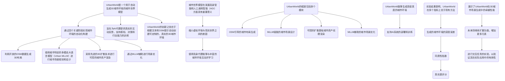
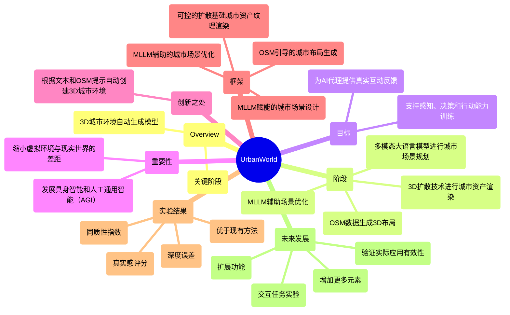
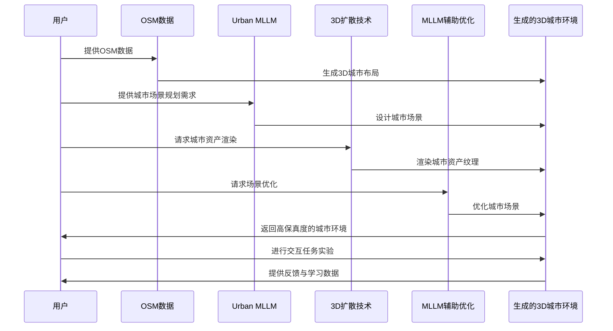
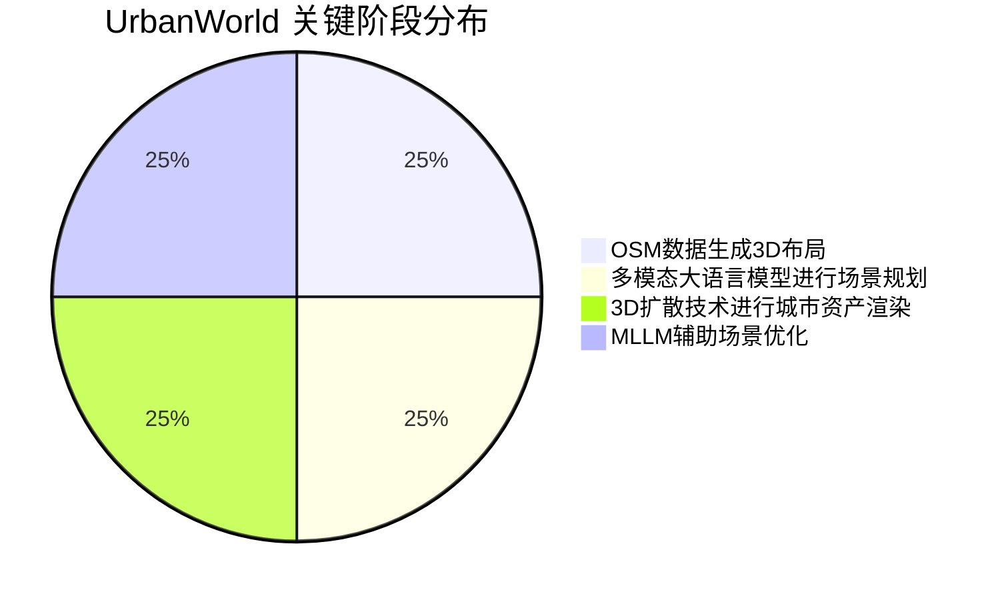

<div align="center">


```
               _   _  ___  ____  __  __    _    _     
              | \ | |/ _ \|  _ \|  \/  |  / \  | |    
              |  \| | | | | |_) | |\/| | / _ \ | |    
              | |\  | |_| |  _ <| |  | |/ ___ \| |___ 
              |_| \_|\___/|_| \_\_|  |_/_/   \_\_____|
                 _    _   _ ____     ____ _   _ ___ _     _     
                / \  | \ | |  _ \   / ___| | | |_ _| |   | |    
               / _ \ |  \| | | | | | |   | |_| || || |   | |    
              / ___ \| |\  | |_| | | |___|  _  || || |___| |___ 
             /_/   \_\_| \_|____/   \____|_| |_|___|_____|_____|
              ____   ____ ___ _____ _   _  ____ _____ 
             / ___| / ___|_ _| ____| \ | |/ ___| ____|
             \___ \| |    | ||  _| |  \| | |   |  _|  
              ___) | |___ | || |___| |\  | |___| |___ 
             |____/ \____|___|_____|_| \_|\____|_____|
```

# NORMAL AND CHILL SCIENCE

## 平常心科学

### 1) 虚拟交互或人与AI/chatbot的交互

---

#### Slow down but step by step

---

| SHANGHAI LONLIV-TECH | 第001期 |
|:----------------------|--------:|
| Editor：Zhenghao Xu     | 2024年09月21日 |

</div>

---


# URBANWORLD_AN URBAN WORLD MODEL FOR 3DCITY GENERATION.docx

## 原始摘要

UrbanWorld是一个用于自动生成3D城市环境的城市世界模型。该模型通过四个关键阶段实现城市环境的自动化构建：首先，利用开放的OSM数据生成3D布局；其次，使用城市特定的多模态大语言模型（Urban MLLM）进行城市场景规划和设计；接着，采用先进的3D扩散技术进行可控的城市资产渲染；最后，通过MLLM辅助进行场景优化。UrbanWorld旨在为AI代理提供真实的互动反馈，支持感知、决策和行动能力的训练。

城市世界模型在发展具身智能和人工通用智能（AGI）方面具有重要意义。它们能够缩小虚拟环境与现实世界之间的差距，使得具身代理能够与丰富的城市环境互动并学习。UrbanWorld的创新之处在于其能够根据文本和OSM提示自动创建可定制的、真实的3D城市环境。

UrbanWorld的框架包括OSM引导的城市布局生成、MLLM赋能的城市场景设计、可控的扩散基础城市资产纹理渲染以及MLLM辅助的城市场景优化。通过这些模块，UrbanWorld能够生成高保真度的城市环境，支持AI系统的部署和训练。

实验结果表明，UrbanWorld在生成的城市环境的深度误差、同质性指数和真实感评分等多个指标上均优于现有方法，展示了其在3D城市场景生成中的卓越性能。未来，UrbanWorld将继续扩展其功能，增加更多元素，并进行交互任务的实验，以验证其在实际应用中的有效性。

## 摘要

1. Class: (1) 虚拟交互或人与AI/chatbot的交互

2. Authors: [Author names not provided in the input]

3. Affiliation: [Affiliation not provided in the input]

4. Keywords: UrbanWorld, 3D city environment, multimodal large language model, scene optimization, AI training

5. Urls: [Paper URL not provided in the input], Github: None

6. Summary:

   - (1): 本文研究背景是发展具身智能和人工通用智能（AGI），通过自动生成3D城市环境来缩小虚拟环境与现实世界之间的差距。

   - (2): 理论模型包括OSM引导的城市布局生成、MLLM赋能的城市场景设计、可控的扩散基础城市资产纹理渲染及MLLM辅助的城市场景优化。关键变量包括城市布局、场景设计和渲染质量，未提及调节变量或中介变量。

   - (3): 研究方法论采用四个关键阶段：利用开放的OSM数据生成3D布局，使用Urban MLLM进行规划和设计，采用3D扩散技术进行渲染，最后通过MLLM进行场景优化。

   - (4): UrbanWorld在生成的城市环境的深度误差、同质性指数和真实感评分等多个指标上均优于现有方法，展示了其在3D城市场景生成中的卓越性能，支持其目标的实现。

## 图表

### 图表 1



### 图表 2



### 图表 3



### 图表 4



