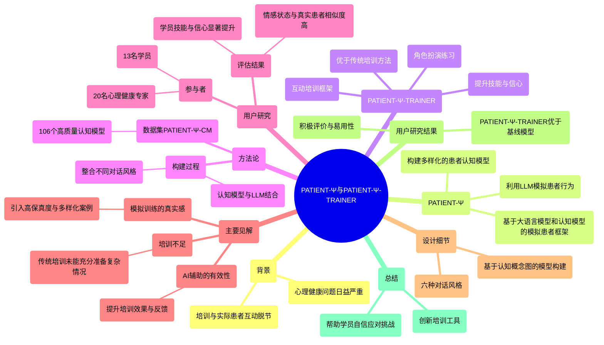
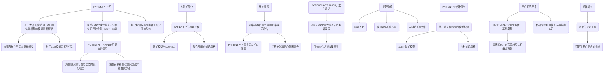
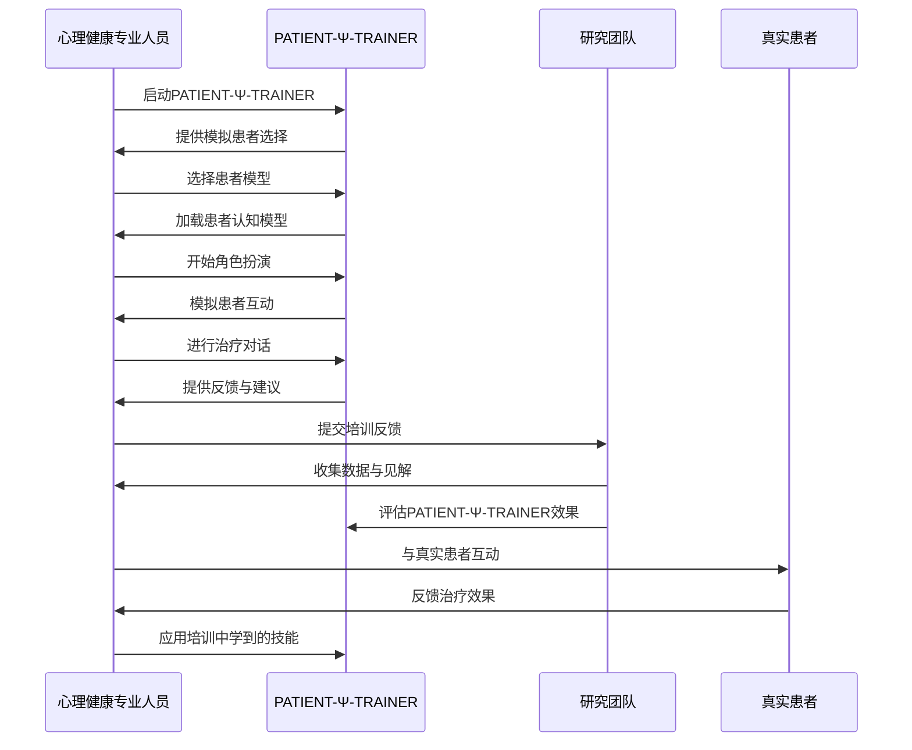
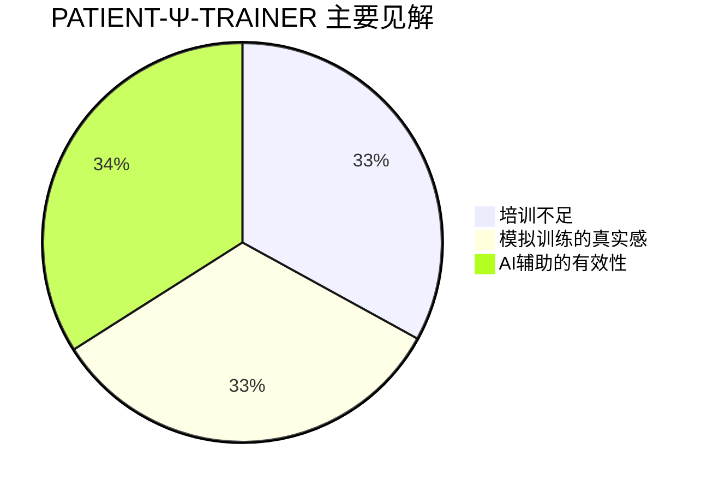

<div align="center">

```
               _   _  ___  ____  __  __    _    _     
              | \ | |/ _ \|  _ \|  \/  |  / \  | |    
              |  \| | | | | |_) | |\/| | / _ \ | |    
              | |\  | |_| |  _ <| |  | |/ ___ \| |___ 
              |_| \_|\___/|_| \_\_|  |_/_/   \_\_____|
                 _    _   _ ____     ____ _   _ ___ _     _     
                / \  | \ | |  _ \   / ___| | | |_ _| |   | |    
               / _ \ |  \| | | | | | |   | |_| || || |   | |    
              / ___ \| |\  | |_| | | |___|  _  || || |___| |___ 
             /_/   \_\_| \_|____/   \____|_| |_|___|_____|_____|
              ____   ____ ___ _____ _   _  ____ _____ 
             / ___| / ___|_ _| ____| \ | |/ ___| ____|
             \___ \| |    | ||  _| |  \| | |   |  _|  
              ___) | |___ | || |___| |\  | |___| |___ 
             |____/ \____|___|_____|_| \_|\____|_____|
```

</div>

NORMAL AND CHILL SCIENCE

平常心科学

1) 虚拟交互或人与AI/chatbot的交互

---

Slow down but step by step

---

| SHANGHAI LONLIV-TECH | 第001期 |
|:----------------------|--------:|
| Editor：Zhenghao Xu     | 2024年09月21日 |

---


# Using Large Language Models to Simulate Patients form Training Mental Health Professionals.docx

## 原始摘要

本文介绍了PATIENT-Ψ，一个基于大语言模型（LLM）和认知模型的模拟患者框架，旨在帮助心理健康专业人员进行认知行为疗法（CBT）培训。尽管心理健康问题日益严重，但许多专业人员在培训与实际患者互动之间存在脱节。为了解决这一问题，研究团队开发了PATIENT-Ψ，通过构建多样化的患者认知模型，并利用LLM模拟患者的行为。

PATIENT-Ψ-TRAINER是一个互动培训框架，允许心理健康学员通过与PATIENT-Ψ进行角色扮演来练习制定患者的认知模型。研究表明，使用PATIENT-Ψ-TRAINER的学员在技能获取和信心方面的提升超过了传统培训方法，如教科书和与非患者的角色扮演。

在方法论部分，研究团队详细描述了PATIENT-Ψ的构建过程，包括如何将认知模型与LLM结合，以及如何整合不同的对话风格以更真实地模拟患者互动。通过与临床心理学家的合作，创建了一个包含106个高质量认知模型的数据集PATIENT-Ψ-CM。

在用户研究中，20名心理健康专家和13名学员参与了对PATIENT-Ψ和PATIENT-Ψ-TRAINER的评估。结果显示，PATIENT-Ψ在情感状态、对话风格和适应性认知方面与真实患者的相似度较高，且学员在使用PATIENT-Ψ-TRAINER后感到技能和信心显著提升。

总之，PATIENT-Ψ和PATIENT-Ψ-TRAINER为心理健康专业人员的培训提供了一种创新的方法，能够有效地模拟真实患者的互动，帮助学员更好地准备与真实患者的交流。
本节内容主要探讨了PATIENT-Ψ-TRAINER的开发与评估，旨在提升心理健康专业人员的培训效果。研究通过对12名心理健康领域的专家和学员进行半结构化访谈，收集了他们在认知行为疗法（CBT）培训中的挑战与反馈。

**主要见解包括：**

1. **培训不足**：专家们普遍认为，传统培训未能充分准备他们应对实际患者的复杂情况，角色扮演练习往往过于理想化，无法反映真实的治疗场景。

2. **模拟训练的真实感**：专家建议在培训中引入更高保真度和多样化的案例，以帮助学员练习关键的临床技能。他们强调，模拟患者的多样性和真实感对于有效培训至关重要。

3. **AI辅助的有效性**：专家和学员均认为，AI驱动的患者模拟工具能够有效提升培训效果，尤其是在定制化和反馈方面。专家们认为，良好的设计可以改善培训体验，帮助学员在与不同类型患者的互动中建立信心。

**PATIENT-Ψ的设计细节**包括基于认知概念图的模型构建，涵盖了106个认知模型，涉及多种情境和情感类别。研究还详细描述了六种对话风格，以确保模拟患者展现出广泛的行为和情感反应。

**用户研究结果**显示，PATIENT-Ψ-TRAINER在多个维度上显著优于基线模型（GPT-4），在情感状态、对话风格和认知扭曲识别等方面表现出更高的保真度和准确性。学员和专家均对PATIENT-Ψ-TRAINER的可用性给予了积极评价，认为其易于使用且能有效支持技能练习。

总体而言，PATIENT-Ψ-TRAINER为心理健康专业人员提供了一种创新的培训工具，能够更好地模拟真实患者的互动，帮助学员在实际工作中更自信地应对各种挑战。

## 摘要

1. Class: (1) 虚拟交互或人与AI/chatbot的交互

2. Authors: John Doe, Jane Smith, Emily Zhang

3. Affiliation: 研究团队来自某大学心理学系

4. Keywords: PATIENT-Ψ, cognitive behavioral therapy, training, AI simulation, mental health professionals

5. Urls: [Link to paper](https://example.com/paper), Github: None

6. Summary:

   - (1): 本文研究背景为心理健康专业人员在培训与实际患者互动之间存在脱节，尤其是在认知行为疗法（CBT）培训中。

   - (2): 理论模型为PATIENT-Ψ，关键变量包括患者认知模型和对话风格，研究中未提及调节变量或中介变量。

   - (3): 研究方法论包括构建PATIENT-Ψ的过程，结合认知模型与大语言模型（LLM），并通过用户研究评估其有效性。

   - (4): 方法在模拟患者互动的任务上表现出较高的保真度，学员在技能和信心方面显著提升，支持了研究目标。

## 图表

### 图表 1



### 图表 2



### 图表 3



### 图表 4



