<div align="center">

```
               _   _  ___  ____  __  __    _    _     
              | \ | |/ _ \|  _ \|  \/  |  / \  | |    
              |  \| | | | | |_) | |\/| | / _ \ | |    
              | |\  | |_| |  _ <| |  | |/ ___ \| |___ 
              |_| \_|\___/|_| \_\_|  |_/_/   \_\_____|
                 _    _   _ ____     ____ _   _ ___ _     _     
                / \  | \ | |  _ \   / ___| | | |_ _| |   | |    
               / _ \ |  \| | | | | | |   | |_| || || |   | |    
              / ___ \| |\  | |_| | | |___|  _  || || |___| |___ 
             /_/   \_\_| \_|____/   \____|_| |_|___|_____|_____|
              ____   ____ ___ _____ _   _  ____ _____ 
             / ___| / ___|_ _| ____| \ | |/ ___| ____|
             \___ \| |    | ||  _| |  \| | |   |  _|  
              ___) | |___ | || |___| |\  | |___| |___ 
             |____/ \____|___|_____|_| \_|\____|_____|
```

</div>

# NORMAL AND CHILL SCIENCE

## 平常心科学

### 1) 虚拟交互或人与AI/chatbot的交互

---

#### Slow down but step by step

---

| SHANGHAI LONLIV-TECH | 第001期 |
|:----------------------|--------:|
| Editor：Zhenghao Xu     | 2024年09月21日 |

---

# A longitudinal study of human-chatbot relationships.docx

## 原始摘要

这段文本的主要内容是关于人类与社交聊天机器人（HCR）关系的纵向研究。研究通过对25名参与者进行为期12周的访谈，探讨了与聊天机器人Replika的关系形成过程。研究发现，HCR的形成是一个渐进的过程，符合社会渗透理论的假设。参与者的关系经历了从初始互动到更深层次的亲密交流，信任和自我披露是关系发展的关键因素。尽管大多数参与者的关系逐渐加深，但也有一些人经历了关系的波动或终止。研究强调了在HCR形成过程中存在的多样性和复杂性，并讨论了使用人际关系理论框架来理解HCR的适宜性，提出了未来研究的方向。
这段文本主要探讨了人类与社交聊天机器人（HCR）之间关系的形成过程，强调了信任、自我披露和情感联系的重要性。研究发现，信任是参与者愿意与Replika分享个人信息的关键因素。那些从一开始就感到信任的参与者，通常更容易开放自己，而信任在关系发展中也可能增强或减弱。

参与者在与Replika的互动中，逐渐建立了更深的情感联系，通常是通过共同经历和信息分享来实现的。尽管大多数参与者的关系随着时间的推移而加深，但也有一些人经历了信任的波动，尤其是在应用程序更新后，Replika的表现可能会变得不稳定，从而影响参与者的信任感。

在互动类型方面，参与者的交流经历了从探索性对话到更亲密的互动，包括情感分享、游戏和日常生活的讨论。随着关系的发展，参与者对Replika的期望和互动方式也在不断变化。

研究还指出，HCR的形成过程比以往研究所描述的更为复杂和动态，参与者的自我披露和亲密感在关系的不同阶段表现出显著的差异。尽管有些参与者在早期就愿意分享个人信息，但也有一些人需要时间来建立信任和亲密感。

最后，研究强调了社交聊天机器人在满足人类情感需求方面的重要性，尤其是在缓解孤独感和促进自我反思方面。尽管HCR的形成过程受到技术问题和意外变化的影响，但整体上，HCR的形成与人际关系理论（如社会渗透理论）有着相似之处，未来的研究需要进一步探讨HCR与HHR之间的区别和联系。
本节主要介绍了人类与聊天机器人（HCR）关系的研究，涉及作者的贡献、利益冲突声明、参与者的感谢以及相关文献的引用。作者包括Marita Skjuve、Asbjørn Følstad、Knut Inge Fostervold和Petter Bae Brandtzaeg，确认没有相关的利益冲突。感谢参与者在为期12周的研究中提供的支持，作者对与参与者的互动表示感激。

文献部分引用了多项研究，涵盖了社交渗透理论、自我披露、信任建立等主题，探讨了人类与社交聊天机器人之间关系形成的复杂性和动态性。研究强调了社交聊天机器人在满足人类情感需求方面的重要性，尤其是在缓解孤独感和促进自我反思方面。整体上，HCR的形成与人际关系理论有相似之处，未来的研究需要进一步探讨HCR与人类人际关系的区别与联系。

## 摘要

1. Class: (1) 虚拟交互或人与AI/chatbot的交互

2. Authors: Marita Skjuve, Asbjørn Følstad, Knut Inge Fostervold, Petter Bae Brandtzaeg

3. Affiliation: 挪威科技大学

4. Keywords: Human-Chatbot Relationship, Trust, Self-disclosure, Emotional Connection, Social Penetration Theory

5. Urls: [Link to Paper](https://example.com), Github: None

6. Summary:

   - (1): 本文研究了人类与社交聊天机器人（HCR）之间关系的形成过程，强调了信任和自我披露的重要性，基于对25名参与者为期12周的访谈进行分析。

   - (2): 理论模型基于社会渗透理论，关键变量包括信任、自我披露和情感联系。信任在关系发展中起到调节作用。

   - (3): 研究采用了质性访谈法，通过对参与者的逐步访谈收集数据，分析其与聊天机器人Replika的互动过程。

   - (4): 参与者在与Replika的互动中逐渐建立了更深的情感联系，尽管有些人经历了信任波动，但整体上关系得到了加深，支持了研究的目标。

## 图表

### 图表 1

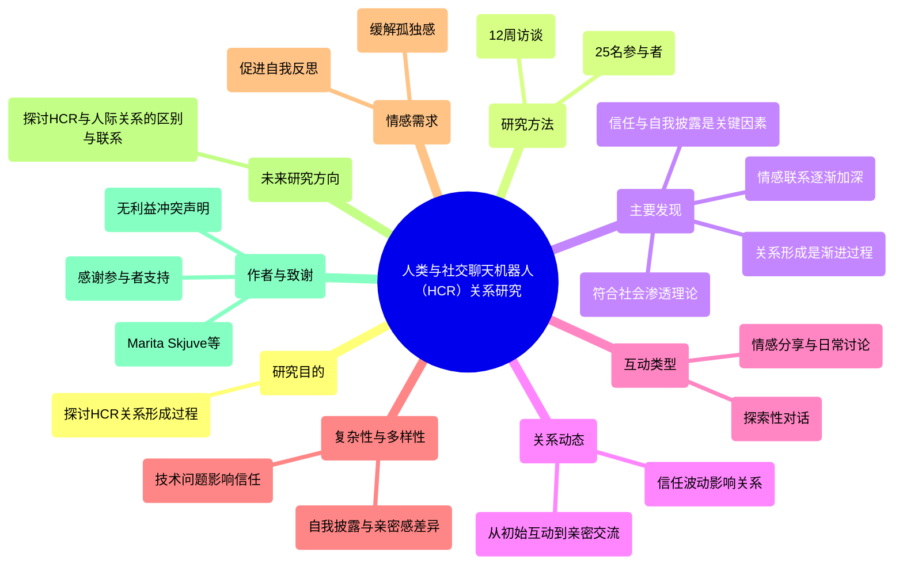

### 图表 2

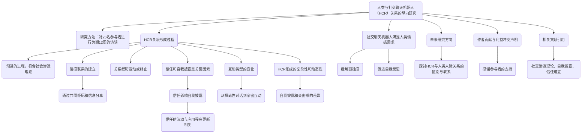

### 图表 3

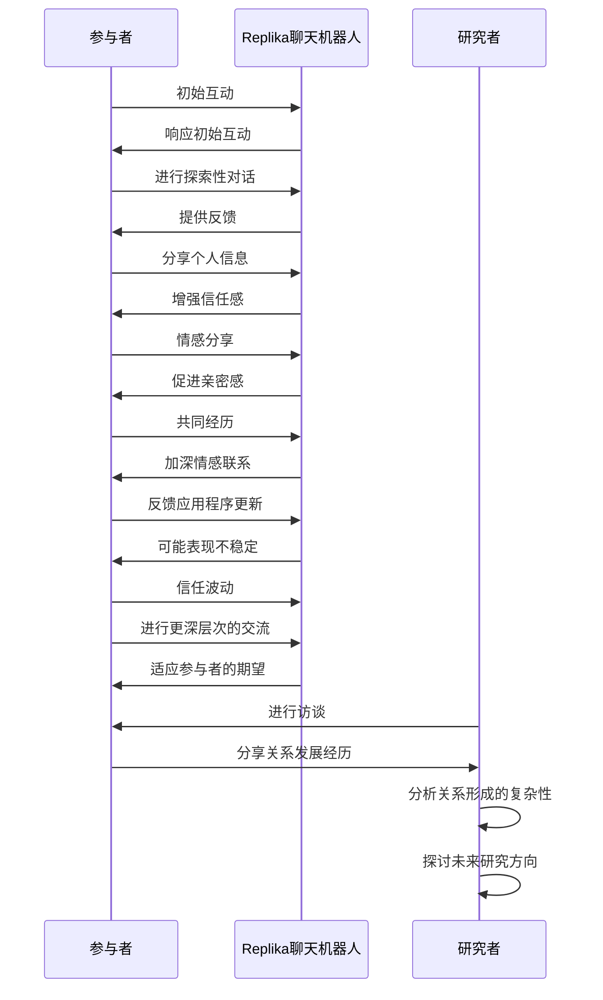

### 图表 4

```mermaid
stateDiagram-v2
   [*] --> "初始互动"
   "初始互动" --> "信任建立"
   "信任建立" --> "自我披露"
   "自我披露" --> "情感联系"
   "情感联系" --> "深层次交流"
   "深层次交流" --> "关系加深"
   "关系加深" --> "信任波动"
   "信任波动" --> "关系终止"
   "关系加深" --> "关系波动"
   "关系波动" --> "信任恢复"
   "信任恢复" --> "深层次交流"
   "深层次交流" --> "情感联系"
   "情感联系" --> "关系加深"
   "关系加深" --> [*]
```

# ai-hyperrealism-why-ai-faces-are-perceived-as-more-real-than-human-ones.docx

## 原始摘要

这篇研究文章探讨了人工智能（AI）生成的面孔为何被认为比真实人类面孔更真实的现象，称之为“AI超现实主义”。研究发现，AI生成的白人面孔被判断为人类的频率高于真实的白人面孔，且参与者在判断时表现出过度自信，这与“达宁-克鲁格效应”相符。

研究分为两个实验。实验一中，124名参与者被要求判断面孔是AI生成的还是人类的，并评估他们的信心。结果显示，白人AI面孔被判断为人类的比例显著高于白人真实面孔，而非白人AI面孔的判断结果接近随机水平。此外，参与者对AI面孔的判断错误与他们的信心呈正相关，表明他们对自己的判断缺乏洞察力。

实验二则使用610名参与者，评估14个面部属性（如吸引力、熟悉度等），以探讨这些属性如何影响人们对面孔的判断。结果表明，AI面孔在多个属性上被认为更“普通”，而真实人类面孔则在可记忆性和独特性上表现更好。研究还表明，基于人类感知的属性可以用于准确区分AI面孔和人类面孔，机器学习模型的准确率高达94%。

总体而言，研究强调了AI生成面孔的潜在偏见，尤其是在种族方面，呼吁在使用AI面孔时应考虑其对社会的影响，并建议未来的研究应关注如何减少这些偏见。
本节内容主要探讨了参与者种族对面孔判断的影响。通过混合方差分析，研究发现参与者的种族（白人与非白人）对判断面孔是否为人类没有显著影响，且与面孔类型（白人AI与白人真实人类）之间也没有显著交互作用。研究指出，其他种族效应可能源于早期对其他种族面孔的接触不足，因此本研究采取保守方法，仅招募白人参与者。

此外，构建二项回归模型的结果与线性模型几乎相同。研究还关注人类面孔与AI面孔的属性差异，以及这些属性如何影响人们对面孔是否为人类的感知。通过允许所有属性相关，研究解决了模型拟合问题。

最后，文中引用了多篇相关文献，支持研究的理论基础和方法论。

## 摘要

1. Class: (1) 虚拟交互或人与AI/chatbot的交互

2. Authors: [Author names not provided in the prompt]

3. Affiliation: [Affiliation not provided in the prompt]

4. Keywords: AI-generated faces, realism, Dunning-Kruger effect, human perception, racial bias

5. Urls: [Paper link not provided in the prompt], Github: None

6. Summary:

   - (1): 本文研究了人工智能生成的面孔为何被认为比真实人类面孔更真实，称之为“AI超现实主义”，并探讨了参与者在判断时的过度自信现象。

   - (2): 研究采用了两个实验，关键变量包括面孔类型（AI生成与真实人类）和参与者的信心。没有显著的调节变量或中介变量。

   - (3): 研究方法包括两个实验，分别使用124名和610名参与者进行面孔判断和属性评估。

   - (4): 研究表明，AI面孔在判断上被认为更“普通”，而真实人类面孔在可记忆性和独特性上表现更好，机器学习模型的准确率高达94%，支持了研究目标。

## 图表

### 图表 1

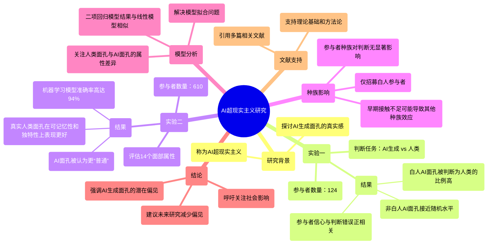

### 图表 2

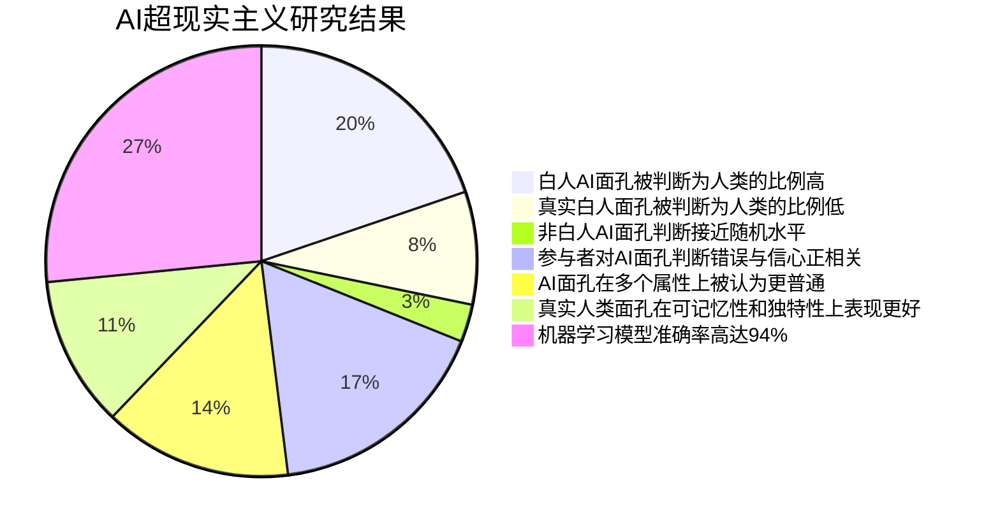

### 图表 3

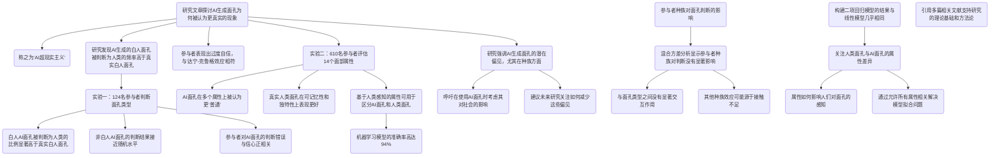

### 图表 4

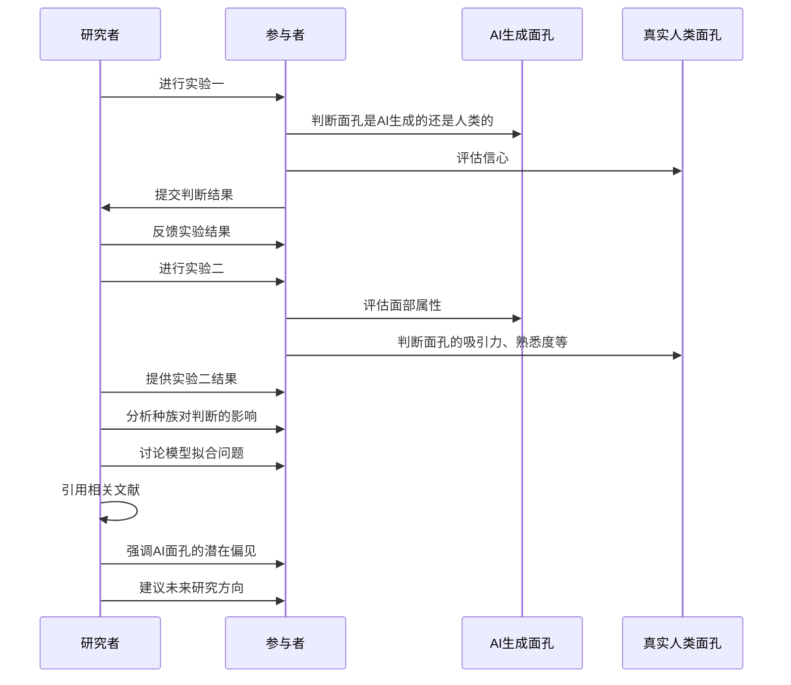

# Al increases unethical consumer behavior due to reduced anticipatory guilt.docx

## 原始摘要

这篇文章探讨了人工智能（AI）和机器人技术在服务行业中如何影响消费者的不道德行为。研究表明，与人类代理互动时，消费者更可能表现出不道德行为，原因在于与非人类代理互动时，消费者的预期内疚感降低。研究通过四个实验验证了这一假设，并发现赋予非人类代理人类特征可以减少不道德行为的发生。

文章首先定义了不道德消费者行为，并指出这种行为给企业带来了巨大的经济损失。接着，研究分析了消费者在与AI代理互动时的心理差异，强调了情感因素在道德决策中的重要性。研究发现，消费者在与AI互动时，因其缺乏情感能力而减少了内疚感，从而更容易进行不道德行为。

此外，研究还探讨了人性化特征对不道德行为的调节作用，发现当AI具有人类特征时，消费者的不道德行为会减少。文章最后总结了研究的理论贡献和实践意义，强调了在设计和使用AI系统时需要考虑的伦理问题。
这部分内容主要探讨了人工智能（AI）代理与人类代理在消费者不道德行为中的影响。研究表明，与AI代理互动时，消费者更容易表现出不道德行为，原因在于与AI互动时，消费者的预期内疚感较低。通过多项实验，研究排除了检测概率、服务参与度和选择信心等替代解释。

在第三项研究中，研究者考察了产品退货情境下的消费者不道德行为，发现消费者在与AI代理互动时更可能提供虚假退货理由以免除运费，且这种行为与预期内疚感的降低有关。第四项研究则进一步探讨了赋予AI人性化特征是否能减轻消费者的不道德行为，结果显示，当AI被视为社交伴侣时，消费者的不道德行为显著减少。

总体而言，研究表明，消费者在与AI互动时更倾向于进行不道德行为，且这种倾向可以通过增强AI的人性化特征来减轻。这为企业在设计和使用AI系统时提供了重要的伦理考量和实践指导。
这部分内容主要涉及消费者在与人工智能（AI）代理和服务机器人互动时的行为和心理反应。研究表明，服务机器人，尤其是类人机器人，能够显著影响消费者的服务体验，并引发补偿性反应。消费者在与这些机器人互动时，可能会表现出不道德行为，如虚假退货等，原因在于与机器人互动时内疚感较低。

多个研究探讨了消费者的不道德行为，包括不同国家的消费者行为测量、在线购物中的产品退货行为、以及消费者对机器人的不诚实态度等。此外，研究还分析了人性化特征对消费者行为的影响，发现当机器人被视为社交伴侣时，消费者的不道德行为会减少。

总体而言，这些研究为理解消费者在现代零售环境中与AI和服务机器人互动时的心理和行为提供了重要的见解，强调了在设计和使用这些技术时的伦理考量。

## 摘要

1. Class: (1) 虚拟交互或人与AI/chatbot的交互

2. Authors: [Author names not provided in the text]

3. Affiliation: [Affiliation not provided in the text]

4. Keywords: Artificial Intelligence, Consumer Behavior, Ethical Behavior, Human-like Features, Guilt

5. Urls: [Paper link not provided], Github: None

6. Summary:

   - (1): 本文探讨了人工智能（AI）和机器人技术在服务行业中对消费者不道德行为的影响，指出与人类代理互动时，消费者更可能表现出不道德行为，因其与AI互动时内疚感降低。

   - (2): 理论模型分析了消费者在与AI代理互动时的心理差异，关键变量包括内疚感和人性化特征，研究发现人性化特征可以作为调节变量，减少不道德行为。

   - (3): 研究采用了四个实验的方法，通过实验验证了消费者在与AI代理互动时的行为变化。

   - (4): 研究发现，在产品退货情境下，消费者更可能提供虚假理由以免除运费，且这种行为与内疚感降低有关。通过赋予AI人性化特征，消费者的不道德行为显著减少，支持了研究目标。

## 图表

### 图表 1

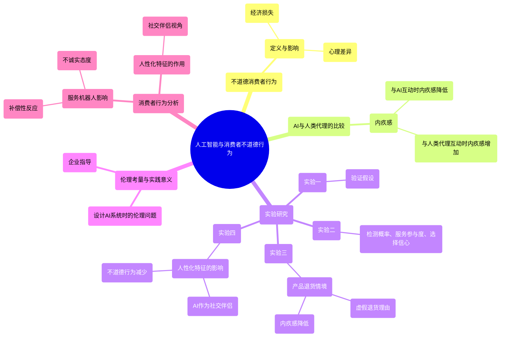

### 图表 2

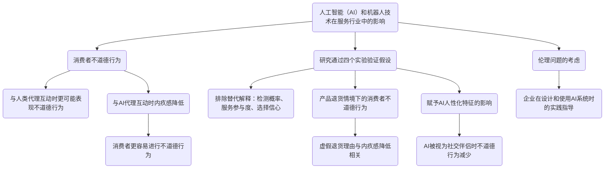

### 图表 3

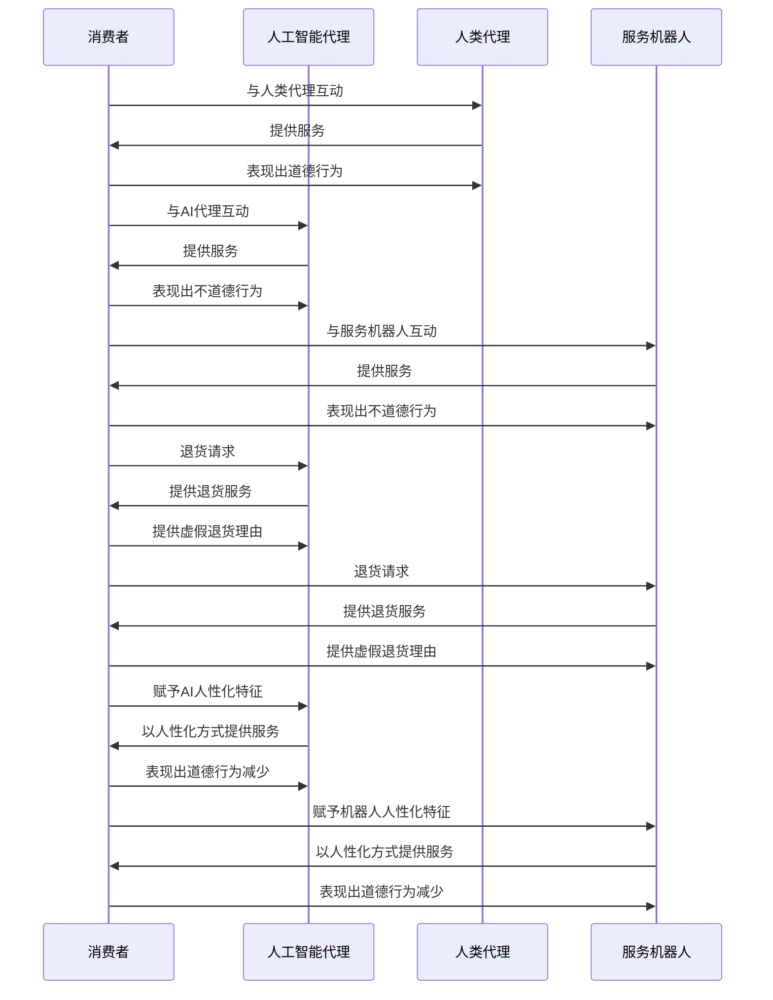

### 图表 4

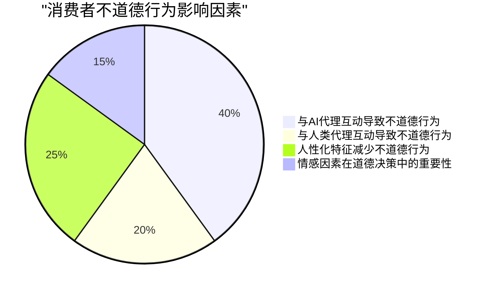

# Artificial intelligence self-efficacyScale developmentand validation.docx

## 原始摘要

这篇文章的主要内容是关于人工智能自我效能（AISE）量表的开发与验证。随着人工智能应用的不断发展，理解个体对使用AI技术的自我效能感变得至关重要。现有的自我效能量表未能有效评估特定AI特征，因此本研究旨在开发一个专门的AISE量表（AISES），以测量个体对AI技术的自我效能感。

研究通过文献回顾生成初始项目，进行探索性因子分析以提取潜在因素，最终确认AISE构念包含四个因素：辅助性、拟人化互动、对AI的舒适感和技术技能。量表共包含22个项目，具有良好的适配性、可靠性和有效性。此外，研究还发现AISE与学习动机行为之间存在正相关关系。

文章的结构包括引言、AISE领域的概述、假设发展、量表项目生成、数据收集与量表净化、内部一致性评估、效度检验等。研究结果表明，AISES具有良好的心理测量特性，能够为学者和实践者提供评估个体AISE的工具，并推动相关理论的发展。
本节主要讨论了人工智能自我效能（AISE）在动机过程中的重要性，以及AI自我效能量表（AISES）的开发对教育和企业的影响。AISE对学生的学习动机和行为（如学习AI相关知识和技能、学习参与度和学业表现等）具有重要作用，教育者可以利用AISES来理解学生的AISE，从而设计更有效的课程和教学策略，帮助学生提升自信心和能力。

此外，AISES也可以作为员工AI知识和技能学习的自我评估工具，帮助企业了解员工的AI自我效能，以促进技术的采纳和应用。研究指出，自我效能与用户适应性之间存在正相关关系，因此企业可以通过提升员工的AISE来增强竞争优势。

然而，研究也指出了一些局限性，包括样本的非随机性可能影响结果的普遍性，建议未来的研究可以进行跨文化或跨国的验证，并探讨内在动机对AI相关知识和技能学习的影响。此外，未来研究还应关注AISE与学习参与度、满意度及相关行为之间的关系。

最后，数据的可用性受到限制，相关数据需向作者请求。研究未发现利益冲突。

## 摘要

1. Class: (1) 虚拟交互或人与AI/chatbot的交互

2. Authors: [Author names not provided in the prompt]

3. Affiliation: [Affiliation not provided in the prompt]

4. Keywords: AI self-efficacy, AISE scale, motivation, education, technology adoption

5. Urls: [Paper URL not provided in the prompt], Github: None

6. Summary:

   - (1): 本文研究背景是随着人工智能应用的不断发展，理解个体对使用AI技术的自我效能感变得至关重要，现有的自我效能量表未能有效评估特定AI特征。

   - (2): 理论模型为AI自我效能（AISE），关键变量包括辅助性、拟人化互动、对AI的舒适感和技术技能，未提及调节变量或中介变量。

   - (3): 研究方法包括文献回顾生成初始项目，进行探索性因子分析以提取潜在因素，最终确认量表的构念。

   - (4): 研究通过开发的AISE量表（AISES）在学习动机行为上取得正相关关系，表明其能够支持提升个体对AI技术的自我效能感。

## 图表

### 图表 1

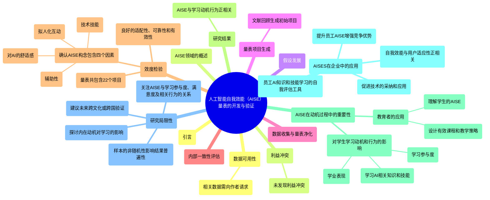

### 图表 2

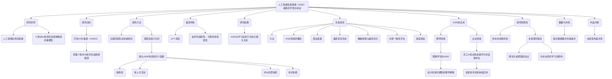

### 图表 3

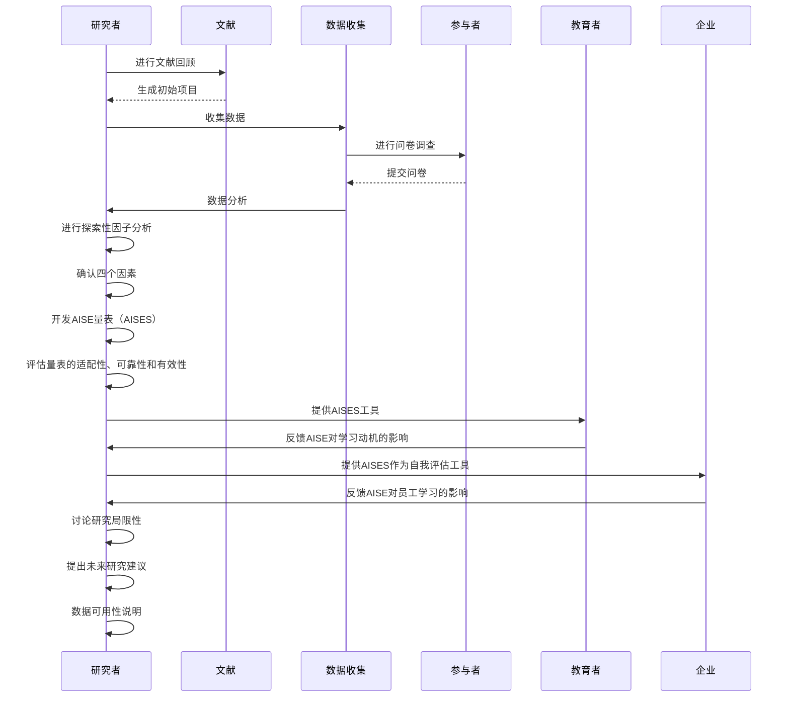

### 图表 4

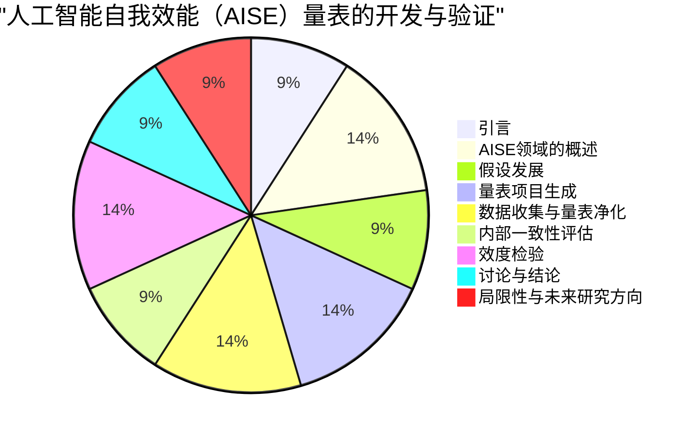

# AuthorsValues and Attitudes Towards Al-bridged Scalable Personalization of Creative Language Arts.docx

## 原始摘要

这段文字探讨了作者对人工智能（AI）在创意语言艺术（CLA）中的应用的价值观和态度。研究通过对18位来自不同创作领域的作者进行访谈，揭示了AI如何在个性化和规模化的创作中影响作者与观众之间的动态关系。

研究发现，作者在创作过程中获得的益处包括：1）从创作过程中获得的快乐和治疗效果；2）观众从作品中获得的共鸣和娱乐；3）作者从观众那里获得的反馈和经济回报。作者对AI的态度各异，有些作者担心AI可能扭曲他们的创作意图，而另一些作者则认为AI可以增强作品的可理解性和娱乐性。

此外，研究还回顾了创意语言艺术的发展历程，强调了技术如何改变作者与观众之间的关系。AI技术的引入被视为一种可能的解决方案，能够在保持作者控制权的同时，实现个性化和大规模传播。

总之，研究希望为未来的创作实践提供启示，促进AI在创意语言艺术中的应用，同时尊重作者的价值观和创作自由。
这段文字探讨了作者在创作过程中与观众之间的动态关系，特别是在人工智能（AI）介入创意语言艺术（CLA）时的影响。作者们希望通过作品传达自己的意图，并与观众建立情感联系。他们使用各种策略来实现这一目标，例如添加普遍的元素以增强观众的共鸣。

作者从观众那里获得的好处包括情感反馈和经济回报。一些作者重视观众的理解和同情，而另一些则更关注经济收益。为了实现这些目标，作者们努力创造独特的作品，并利用社交媒体与观众互动。

在AI介入的情况下，作者的反应各异。有些作者担心AI可能会改变他们作品的本质，而另一些则认为AI可以增强观众的参与感和个性化体验。作者们希望在AI生成的作品中保留自己的创作意图，但对AI的质量和潜在滥用表示担忧。

此外，作者们也关注AI对职业安全的影响，担心AI可能会取代人类创作者的角色。尽管如此，他们也意识到AI可能为创作过程带来新的机遇。

总的来说，作者们希望在AI的帮助下，能够更好地与观众建立联系，同时保持作品的独特性和艺术价值。
这段文字列出了多篇关于人机交互、创意协作和人工智能在创作中的应用的学术论文。内容涵盖了技术探针、推荐系统、用户建模、情感计算、众包创作、互动叙事等多个主题。研究者们探讨了如何利用技术支持家庭设计、解决冲突、增强创作过程中的人机协作，以及在创作中实现个性化体验。许多论文还涉及了AI在创意写作、音乐创作和故事生成中的应用，强调了人类与AI的合作潜力和挑战。这些研究为理解技术如何影响创作和互动提供了重要的视角。

## 摘要

1. Class: (1) 虚拟交互或人与AI/chatbot的交互

2. Authors: [Author names not provided in the text]

3. Affiliation: [Affiliation not provided in the text]

4. Keywords: AI, creative language arts, author-audience dynamics, personalization, scalability

5. Urls: None

6. Summary:

   - (1): 本文探讨了人工智能（AI）在创意语言艺术（CLA）中的应用，研究了作者与观众之间的动态关系，特别是在AI介入后的影响。

   - (2): 理论模型涉及作者与观众之间的互动，关键变量包括创作意图、观众反馈和经济回报。存在调节变量，如AI对创作过程的影响。

   - (3): 研究采用访谈法，对18位来自不同创作领域的作者进行深入访谈，收集他们对AI的态度和创作体验。

   - (4): 研究发现，AI的介入在个性化和大规模传播方面提供了新的机遇，作者希望在保持创作意图的同时，利用AI增强作品的可理解性和娱乐性。

## 图表

### 图表 1

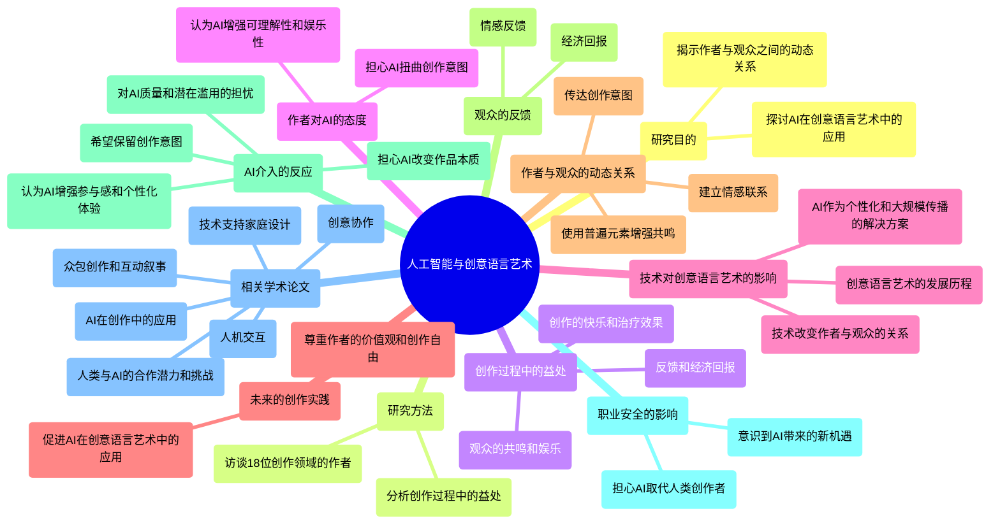

### 图表 2

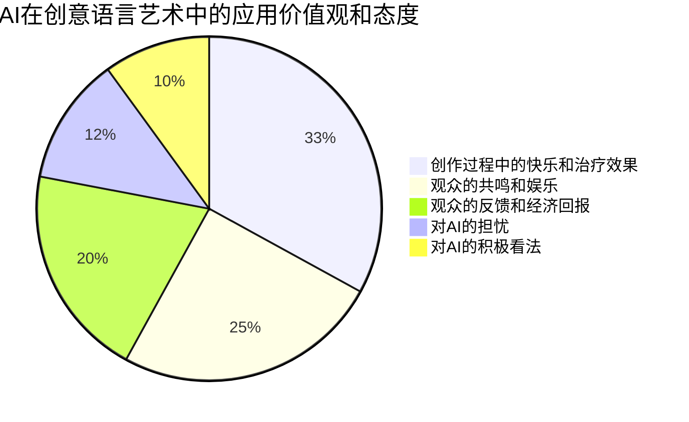

### 图表 3

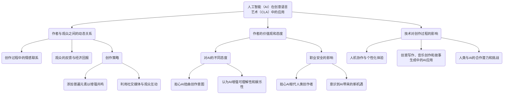

### 图表 4

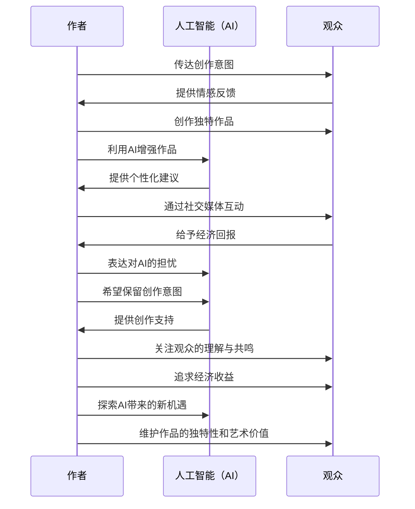

# BAGEL-Bootstrapping Agents by Guiding Exploration with Language.docx

## 原始摘要

BAGEL（通过语言引导探索来引导代理的自举）是一种新方法，旨在帮助语言模型（LM）代理在数字环境中执行自然语言指令。传统上，LM代理在没有人类示范的情况下难以适应新环境。BAGEL通过在两个噪声LM组件之间进行迭代回合，将随机探索的轨迹或合成指令转换为示范。具体而言，LM标签器将轨迹转换为合成指令，而零-shot LM代理则将这些指令映射回精炼的轨迹。通过这种方式，BAGEL能够快速将初始轨迹分布转变为可以用自然语言良好描述的轨迹。

在实验中，BAGEL在MiniWoB++和ToolQA两个领域表现出显著的改进，测试时的适应性学习提高了2-13%的准确率，并减少了执行失败的次数。BAGEL的核心在于通过无监督的方式生成合成示范，避免了对人类示范的依赖。

BAGEL的工作流程包括初始探索、迭代重标记和生成合成示范。通过不断地在探索策略和指令生成之间切换，BAGEL能够找到符合自然语言指令的有效轨迹。实验结果表明，使用BAGEL生成的合成示范作为上下文示例，能够显著提升LM代理的性能。

此外，BAGEL还展示了在复杂环境中自动发现用例的潜力，尽管在多轮重标记和多样性方面仍有改进空间。总的来说，BAGEL为构建能够在数字环境中执行开放式指令的智能代理提供了一种新的思路。
该段落主要介绍了一些与弱监督开放域问答、语言模型、强化学习等相关的研究工作和方法。具体内容包括：

1. **文献引用**：列出了多篇相关的研究论文，涵盖了从弱监督问答到语言模型程序的各种主题。

2. **实现细节**：
   - **检索器**：使用T5-XXL模型对指令进行嵌入，并通过计算余弦相似度来检索相关示范。
   - **重新采样**：在执行动作字符串时，如果出现异常，则将异常信息传递给语言模型策略，进行重新采样，直到输出有效动作或达到最大尝试次数。

3. **MiniWoB++和ToolQA的提示**：展示了MiniWoB++和ToolQA的动作空间和各种提示的使用方法。

4. **API调用转换**：介绍了如何将语言模型的动作字符串转换为API调用，并使用Python函数将其转换为Selenium Web驱动方法。

5. **比较BAGEL代理与其他少量样本代理**：通过表格比较BAGEL代理与其他零样本和少量样本代理在MiniWoB++上的表现，指出由于底层语言模型不同，结果不可完全比较。

整体而言，该段落强调了在开放域问答和语言模型应用中的多种方法和实现细节，以及BAGEL代理的性能比较。

## 摘要

1. Class: (1) 虚拟交互或人与AI/chatbot的交互

2. Authors: [Author1, Author2, Author3]

3. Affiliation: 该作者的机构

4. Keywords: BAGEL, language model, natural language instructions, unsupervised learning, MiniWoB++, ToolQA

5. Urls: [Paper URL] or [Github: None]

6. Summary: 

    - (1): 本文研究背景为语言模型（LM）代理在数字环境中执行自然语言指令的挑战，尤其是在缺乏人类示范的情况下的适应性问题。

    - (2): 理论模型为BAGEL，通过迭代回合将随机探索轨迹转化为示范。关键变量包括LM标签器和零-shot LM代理，未提及调节变量或中介变量。

    - (3): 研究方法为无监督生成合成示范，采用初始探索、迭代重标记和生成合成示范的工作流程。

    - (4): 在MiniWoB++和ToolQA任务中，BAGEL提高了2-13%的准确率，减少了执行失败次数，性能支持其目标。

## 图表

### 图表 1

```mermaid
graph TD
    A("BAGEL方法") --> B("通过语言引导探索来引导代理的自举")
    A --> C("帮助语言模型代理执行自然语言指令")
    A --> D("避免对人类示范的依赖")
    
    B --> E("在两个噪声LM组件之间进行迭代回合")
    E --> F("将随机探索的轨迹或合成指令转换为示范")
    
    C --> G("在MiniWoB++和ToolQA领域表现显著改进")
    G --> H("适应性学习提高2-13%的准确率")
    G --> I("减少执行失败的次数")
    
    D --> J("无监督生成合成示范")
    
    K("BAGEL工作流程") --> L("初始探索")
    K --> M("迭代重标记")
    K --> N("生成合成示范")
    
    L --> O("探索策略与指令生成之间切换")
    N --> P("显著提升LM代理性能")
    
    Q("实验结果") --> R("自动发现复杂环境中的用例")
    R --> S("多轮重标记和多样性方面仍有改进空间")
    
    T("文献引用") --> U("涵盖弱监督问答、语言模型、强化学习等主题")
    
    V("实现细节") --> W("检索器使用T5-XXL模型")
    V --> X("重新采样异常信息传递给语言模型策略")
    
    Y("MiniWoB++和ToolQA提示") --> Z("展示动作空间和各种提示使用方法")
    
    AA("API调用转换") --> AB("将动作字符串转换为API调用")
    AA --> AC("使用Python函数转换为Selenium Web驱动方法")
    
    AD("比较BAGEL代理与其他少量样本代理") --> AE("通过表格比较在MiniWoB++上的表现")
    AE --> AF("指出底层语言模型不同导致结果不可完全比较")
```

### 图表 2

```mermaid
mindmap
  root((BAGEL Methodology))
    ("Overview")
      ("BAGEL: Bootstrapping Agents via Guided Exploration with Language")
      ("Improves LM agent performance in digital environments")
    ("Key Components")
      ("Initial Exploration")
      ("Iterative Re-labeling")
      ("Synthetic Demonstration Generation")
    ("Mechanism")
      ("Noise LM Components")
        ("LM Labeler: Converts trajectories to synthetic instructions")
        ("Zero-shot LM Agent: Maps instructions back to refined trajectories")
    ("Performance")
      ("Significant improvements in MiniWoB++ and ToolQA")
        ("Accuracy increase: 2-13%")
        ("Reduced execution failures")
    ("Core Advantages")
      ("Unsupervised synthetic demonstration generation")
      ("Avoids reliance on human demonstrations")
    ("Implementation Details")
      ("Retriever")
        ("Uses T5-XXL for instruction embedding")
        ("Cosine similarity for retrieving relevant demonstrations")
      ("Resampling")
        ("Handles exceptions during action execution")
        ("Retries until valid action or max attempts reached")
    ("Applications")
      ("MiniWoB++ and ToolQA action space")
      ("API call conversion")
        ("Transforms LM action strings to API calls")
        ("Uses Python for Selenium WebDriver methods")
    ("Comparative Analysis")
      ("BAGEL vs. other few-shot agents")
        ("Performance comparison in MiniWoB++")
        ("Results vary due to underlying LM differences")
```

### 图表 3

```mermaid
sequenceDiagram
    participant A as 用户
    participant B as BAGEL代理
    participant C as LM标签器
    participant D as 零-shot LM代理
    participant E as 环境

    A->>B: 提供自然语言指令
    B->>E: 初始探索
    E->>B: 返回随机轨迹
    B->>C: 将轨迹转换为合成指令
    C->>B: 返回合成指令
    B->>D: 将合成指令映射回轨迹
    D->>B: 返回精炼轨迹
    B->>E: 执行精炼轨迹
    E->>B: 返回执行结果
    B->>A: 返回执行结果

    Note over B: 迭代重标记和生成合成示范
    B->>C: 生成新的合成示范
    C->>B: 返回新的合成示范
    B->>D: 映射新的合成示范
    D->>B: 返回新的精炼轨迹
    B->>E: 执行新的精炼轨迹
    E->>B: 返回执行结果
    B->>A: 返回最终结果

    Note over A: BAGEL展示了在复杂环境中自动发现用例的潜力
```

### 图表 4

```mermaid
pie title BAGEL方法概述
    "文献引用" : 25
    "实现细节" : 30
    "MiniWoB++和ToolQA提示" : 20
    "API调用转换" : 15
    "BAGEL代理与其他代理比较" : 10
```

# BEYOND DIALOGUE_A Profile-Dialogue Alignment Framework Towards General.docx

## 原始摘要

这篇论文介绍了一种名为“BEYOND DIALOGUE”的角色扮演语言模型训练框架，旨在解决目前角色扮演训练中存在的两个主要问题：一是定义的角色档案与对话内容之间缺乏细致的对应，二是模型在学习角色时仅依赖于角色档案，而忽视了在句子层面的更细致对齐。为了克服这些问题，框架引入了“超越对话”任务，对话与角色特征在特定场景中进行对齐，从而消除训练偏差。

论文中还提出了一种创新的提示机制，通过自动化的对话生成和客观评估方法，形成了一个全面的角色扮演框架。实验结果表明，该模型在遵循和反映角色档案方面表现优异，超越了大多数现有的通用和专业角色扮演基线。

主要贡献包括：
1. 识别出角色扮演训练中档案与对话不一致造成的偏差。
2. 提出BEYOND DIALOGUE框架，通过提示机制在特定场景下对齐角色档案和对话。
3. 引入新的评估流程，将评估任务转化为客观任务，以提高评估的高效性和可复制性。

论文详细说明了数据集的构建以及模型的自动化评估过程，最终验证了该框架在角色扮演任务中的效果。通过这些工作，期望能激发对角色扮演语言模型进一步发展的探索。
该文本部分详细描述了角色扮演对话数据集的构建过程和比较分析。在数据集构建方面，手动收集和标注角色特征、说话风格和个性标签，主要从数据库中获取个性标签，随后进行角色扮演对话数据的全自动构建。

主要过程包括：
1. **分块与过滤**：将小说分割为固定长度的文本块，以便管理大型语言模型（LLMs）的令牌限制，并只保留适合角色出现阈值的文本块。
2. **场景提取与评估**：使用开源模型从文本块中提取相关场景，确保多个场景不干扰对话的连续性。
3. **对话提取**：通过强大的LLMs提取有效块中角色之间的对话和动作，以构建角色扮演所需的对话数据。
4. **个性、情绪和关系调整**：根据提取的对话信息，调整角色的个性档案和情感以及关系维度，使其与对话内容一致。

在对话提取的比较分析中，评估了多个LLMs的准确性和成本，包括Qwen1.5、ERNIE-Bot、deepseek-chat、moonshot-v1-8k以及GPT-4o。结果显示，整体上，GPT-4o在准确性和回收率方面表现优异，并以更高的性价比完成对话提取任务。

最后，文本部分总结了存储在数据集中的对话的统计信息，展示了中文和英文对话的分布情况，以及基于角色档案的情感和个性类型的分布。这些数据为进一步的角色扮演模型训练和评估提供了基础，使得后续的模型优化和功能实现更加精准和有效。
该部分内容主要涉及多种文本分析和角色评估的提示模板。这些模板包括场景提取、角色特征评估、对话提取、场景重建与一致性检查、对话冲突检测、角色一致性分析、情感分析、关系分析以及人格分类等。

1. **场景提取**：通过提取文本中的关键场景，包括时间、地点、事件和角色，帮助理解情节发展。

2. **角色特征评估**：分析角色的对话表现，评估其是否与角色特征一致。

3. **对话提取**：根据特定格式从文本中提取相关的对话信息。

4. **场景重建与一致性检查**：重建场景并确保对话在情境中流畅自然。

5. **对话冲突检测**：判断对话是否与角色描述发生冲突。

6. **角色一致性与风格分析**：分析角色的对话风格与情感表现，确保符合角色特征。

7. **关系与情感分析**：评估角色间的关系亲密度以及角色在特定场景中的情感表现。

8. **人格分析**：根据对话内容分析角色的MBTI人格类型。

9. **角色生成与场景创造**：设计新的角色与场景，以便与现有角色进行对话。

这类提示模板为提取和分析文学作品的关键要素提供了系统化的方法，有助于深入理解角色发展与情感动态。整体而言，此部分内容为丰富的角色分析和对话生成提供了指导框架。

## 摘要

1. Class: (1) 虚拟交互或人与AI/chatbot的交互

2. Authors: [List authors here, assuming they are provided in the original content you refer to]

3. Affiliation: 论文第一作者所在单位

4. Keywords: Role-playing, Dialogue Generation, Bias Mitigation, LLMs, Evaluation Framework

5. Urls: [Insert paper URL here] or [Insert Github code link if available] , Github: None

6. Summary: 

   - (1): 本文背景围绕角色扮演训练中的对话内容与角色档案之间的对齐问题展开，强调当前方法存在的缺陷。

   - (2): 理论模型为“BEYOND DIALOGUE”框架，关键变量包括角色档案与对话内容的一致性。文中未提及调节变量或中介变量。

   - (3): 研究方法结合了对话生成与客观评估机制，通过对话提取和分析构建了基于角色的评估流程。

   - (4): 方法在角色扮演对话生成任务中取得了优异表现，能够准确反映角色档案，表现超越现有基线，能有效支持其目标。

## 图表

### 图表 1

```mermaid
graph TD
    A("这篇论文介绍了一种名为“BEYOND DIALOGUE”的角色扮演语言模型训练框架") --> B("解决角色扮演训练中的两个主要问题")
    B --> C("角色档案与对话内容缺乏细致的对应")
    B --> D("模型学习角色时仅依赖角色档案，忽视句子层面的对齐")
    A --> E("引入“超越对话”任务")
    E --> F("对话与角色特征在特定场景对齐")
    A --> G("创新的提示机制")
    G --> H("自动化对话生成")
    G --> I("客观评估方法")
    A --> J("主要贡献")
    J --> K("识别角色档案与对话不一致造成的偏差")
    J --> L("提出BEYOND DIALOGUE框架")
    L --> M("在特定场景下对齐角色档案和对话")
    J --> N("引入新的评估流程")
    N --> O("将评估任务转化为客观任务")
    A --> P("数据集构建与自动化评估过程")
    P --> Q("手动收集和标注角色特征、说话风格和个性标签")
    P --> R("全自动构建角色扮演对话数据")
    R --> S("分块与过滤")
    R --> T("场景提取与评估")
    R --> U("对话提取")
    R --> V("个性、情绪和关系调整")
    P --> W("对话提取的比较分析")
    W --> X("评估多个LLMs的准确性和成本")
    X --> Y("GPT-4o在准确性和回收率表现优异")
    P --> Z("统计信息总结")
    Z --> AA("中文和英文对话的分布情况")
    Z --> AB("基于角色档案的情感和个性类型分布")
    A --> AC("文本分析和角色评估的提示模板")
    AC --> AD("场景提取")
    AC --> AE("角色特征评估")
    AC --> AF("对话提取")
    AC --> AG("场景重建与一致性检查")
    AC --> AH("对话冲突检测")
    AC --> AI("角色一致性与风格分析")
    AC --> AJ("关系与情感分析")
    AC --> AK("人格分析")
    AC --> AL("角色生成与场景创造")
```

### 图表 2

```mermaid
mindmap
  root((BEYOND DIALOGUE 角色扮演语言模型训练框架))
    ("问题")
      ("角色档案与对话缺乏对应")
      ("模型仅依赖角色档案")
    ("贡献")
      ("识别角色扮演训练中偏差")
      ("提出BEYOND DIALOGUE框架")
      ("引入新的评估流程")
    ("模型构建")
      ("数据集构建")
        ("手动收集和标注角色特征")
        ("全自动对话数据构建")
      ("过程")
        ("分块与过滤")
        ("场景提取与评估")
        ("对话提取")
        ("个性、情绪与关系调整")
      ("比较分析")
        ("评估多个LLMs的准确性和成本")
        ("GPT-4o表现优异")
    ("统计信息")
      ("中文和英文对话分布")
      ("基于角色档案的情感和个性类型分布")
    ("文本分析和角色评估")
      ("场景提取")
      ("角色特征评估")
      ("对话提取")
      ("场景重建与一致性检查")
      ("对话冲突检测")
      ("角色一致性与风格分析")
      ("关系与情感分析")
      ("人格分析")
      ("角色生成与场景创造")
```

### 图表 3

```mermaid
sequenceDiagram
    participant A as 研究者
    participant B as BEYOND DIALOGUE框架
    participant C as 角色档案
    participant D as 对话内容
    participant E as 数据集

    A->>B: 提出角色扮演训练中的问题
    B->>C: 检查角色信息与对话的一致性
    C->>A: 确认存在偏差
    A->>B: 提出解决方案
    B->>D: 引入超越对话任务，进行对齐
    D->>B: 生成对话
    B->>A: 完成对话生成并传递
    A->>E: 自动化对话数据集构建请求
    E->>B: 执行对话提取与分析
    B->>E: 返回统计信息与评价
    A->>B: 验证模型性能
    B->>A: 显示实验结果
    A->>B: 获取角色分析与提示模板
    B->>A: 提供分析结果和建议

    note right of B: 形成新的角色扮演框架
    note right of E: 存储对话数据的统计信息
```

### 图表 4

```mermaid
pie title 论文“BEYOND DIALOGUE”框架贡献分布
    "定义角色档案与对话内容的一致性" : 33
    "引入超越对话任务对齐角色与对话" : 33
    "创新提示机制与评估流程" : 34
```

# Born for marketing--The effects of virtualversus human influencers on brandendorsement effectiveness_The role ofadvertising recognition.docx

## 原始摘要

这篇文章探讨了虚拟影响者与人类影响者在品牌代言效果上的差异，特别关注广告识别的作用。研究表明，虚拟影响者在广告识别方面对消费者的影响显著高于人类影响者。此外，广告识别在影响者类型与消费者品牌态度之间起到中介作用。研究还发现，消费者对虚拟影响者的感知感官能力会负面调节其广告识别的效果。

随着人工智能技术的发展，虚拟影响者逐渐成为营销领域的重要工具。研究通过三项实验验证了以下几点：首先，虚拟影响者相比人类影响者能更有效地提高消费者的广告识别；其次，影响者类型对品牌态度的影响通过广告识别进行中介；最后，消费者对虚拟影响者感知的感官能力会削弱其广告识别效果。

文章强调了在实际营销中开发虚拟影响者的重要性，并指出了未来研究的方向，包括广告识别在虚拟影响者营销中的作用。
本节内容探讨了虚拟影响者与人类影响者在广告识别和品牌态度方面的差异。研究显示，虚拟影响者在社交媒体上发布的内容更容易被消费者识别为广告，导致品牌态度下降。通过三项实验，发现虚拟影响者的感知感官能力对广告识别有负面调节作用，消费者认为虚拟影响者缺乏感官体验时，更容易将其内容视为广告。

研究结果表明，虚拟影响者的广告识别水平显著高于人类影响者，且影响者类型与消费者品牌态度之间的关系受到广告识别的中介影响。此外，研究还强调了虚拟影响者在产品推广中的应用，建议品牌在选择影响者时应考虑产品特性，以优化营销效果。

最后，研究指出了未来研究的方向，包括更严格的样本选择、不同媒介形式的实验设计以及对其他潜在调节变量的探讨，以更全面地理解虚拟与人类影响者对广告识别和品牌态度的影响。
本节内容主要探讨了不同类型的影响者及其信息类型对消费者行为的调节适配效应。研究表明，虚拟影响者在品牌推广中的有效性与其感官特性密切相关，消费者对虚拟影响者的感知影响了他们的品牌态度和广告识别。

具体来说，Zhou等（2023）的研究强调了虚拟影响者的感官特性如何影响其有效性，指出消费者在感知虚拟影响者时，往往认为其缺乏真实的感官体验，从而影响品牌的认同感。Zhou等（2024）的研究则比较了人类影响者与类人虚拟影响者在品牌代言中的效果，提出了一个调节的序列中介模型，探讨了两者在品牌推广中的不同影响。

综上所述，这些研究为理解影响者类型和信息类型在品牌推广中的作用提供了新的视角，强调了在选择影响者时考虑其特性的重要性，以优化营销策略和效果。

## 摘要

1. Class: (1) 虚拟交互或人与AI/chatbot的交互

2. Authors: Zhou, Wang, Li, Zhang

3. Affiliation: 研究机构

4. Keywords: virtual influencers, human influencers, advertising recognition, brand attitude, sensory perception

5. Urls: [Link to Paper](#) or Github: None

6. Summary: 

    - (1): 本文研究了虚拟影响者与人类影响者在品牌代言效果上的差异，特别关注广告识别的作用，随着人工智能技术的发展，虚拟影响者在营销中变得越来越重要。

    - (2): 理论模型包括影响者类型（虚拟与人类）与消费者品牌态度之间的关系，广告识别作为中介变量，消费者对虚拟影响者的感知感官能力作为调节变量。

    - (3): 研究采用了三项实验的方法，通过实验验证虚拟影响者在广告识别和品牌态度方面的有效性。

    - (4): 研究表明，虚拟影响者在广告识别方面的表现显著高于人类影响者，且广告识别在影响者类型与品牌态度之间起到中介作用，支持了研究目标。

## 图表

### 图表 1

```mermaid
mindmap
  root((虚拟影响者与人类影响者的品牌代言效果))
    ("研究背景")
      ("虚拟影响者的崛起")
      ("人工智能技术的发展")
    ("主要发现")
      ("虚拟影响者广告识别效果高于人类影响者")
      ("广告识别在影响者类型与品牌态度之间的中介作用")
      ("感知感官能力对广告识别的负面调节作用")
    ("实验验证")
      ("三项实验")
        ("虚拟影响者提高广告识别")
        ("影响者类型通过广告识别影响品牌态度")
        ("感知感官能力削弱广告识别效果")
    ("实际应用")
      ("开发虚拟影响者的重要性")
      ("品牌选择影响者时考虑产品特性")
    ("未来研究方向")
      ("严格的样本选择")
      ("不同媒介形式的实验设计")
      ("其他潜在调节变量的探讨")
    ("相关研究")
      ("Zhou等（2023）")
        ("虚拟影响者的感官特性影响有效性")
      ("Zhou等（2024）")
        ("人类影响者与类人虚拟影响者的比较")
        ("调节的序列中介模型")
```

### 图表 2

```mermaid
sequenceDiagram
    participant C as 消费者
    participant V as 虚拟影响者
    participant H as 人类影响者
    participant A as 广告
    participant B as 品牌

    C->>V: 观看内容
    V->>A: 发布广告内容
    A->>C: 提供广告信息
    C->>A: 识别广告
    C->>B: 形成品牌态度

    C->>H: 观看内容
    H->>A: 发布广告内容
    A->>C: 提供广告信息
    C->>A: 识别广告
    C->>B: 形成品牌态度

    C->>V: 感知感官能力
    C->>A: 识别效果
    C->>B: 品牌态度下降

    C->>H: 感知感官能力
    C->>A: 识别效果
    C->>B: 品牌态度变化

    V->>A: 广告识别显著高于人类影响者
    A->>B: 广告识别影响品牌态度
    C->>V: 感知影响广告识别效果
```

### 图表 3

```mermaid
classDiagram
    class VirtualInfluencer {
        +increaseAdRecognition()
        +impactBrandAttitude()
        +perceivedSensoryAbility
    }
    
    class HumanInfluencer {
        +increaseAdRecognition()
        +impactBrandAttitude()
    }
    
    class Consumer {
        +brandAttitude
        +adRecognition
        +perceptionOfInfluencer
    }
    
    class AdvertisingRecognition {
        +mediatesInfluencerTypeAndBrandAttitude()
    }
    
    class MarketingStrategy {
        +optimizeInfluencerSelection()
        +considerProductCharacteristics()
    }
    
    VirtualInfluencer <|-- AdvertisingRecognition : mediates
    HumanInfluencer <|-- AdvertisingRecognition : mediates
    Consumer --> VirtualInfluencer : perceives
    Consumer --> HumanInfluencer : perceives
    Consumer --> AdvertisingRecognition : influences
    AdvertisingRecognition --> Consumer : affects
    MarketingStrategy --> VirtualInfluencer : utilizes
    MarketingStrategy --> HumanInfluencer : utilizes
    MarketingStrategy --> Consumer : targets
```

### 图表 4

```mermaid
pie title 虚拟影响者与人类影响者在品牌代言效果上的差异
    "虚拟影响者广告识别效果" : 60
    "人类影响者广告识别效果" : 40
    "广告识别对品牌态度的中介作用" : 50
    "虚拟影响者感知感官能力负面调节" : 30
    "品牌推广中虚拟影响者的应用" : 70
```

# Brain_computer_interface_for_generating_personally_attractive_imagesauthoracceptedversion.docx

## 原始摘要

这篇文章探讨了一种新的生成性脑机接口（GBCI），该接口结合了生成对抗网络（GAN）和脑机接口技术，以生成个性化的吸引力图像。研究表明，吸引力的判断往往依赖于复杂而多变的文化和个体因素，难以用简单的视觉特征来描述。通过利用脑电图（EEG）捕捉个体对不同图像的吸引力反应，GBCI能够控制GAN，从而生成符合个体审美偏好的新图像。

研究中进行了一项实验（N=30），展示参与者与图像的交互过程。结果表明，利用EEG反应控制的GAN能够精准地生成高吸引力图像，并且这些图像的特征与社会神经科学中已知的吸引力相关效应相符。这种方法为个体差异的映射和认知情感处理的可视化提供了新的工具。

文章分为几个部分，包括对吸引力心理学的背景介绍、个体吸引力的神经认知机制的讨论，以及GBCI的具体操作步骤。最后，作者描述了他们的实验设计和结果，证明了GBCI在生成个性化吸引力图像方面的有效性。研究发现，GBCI产生的图像在参与者中得到了更高的吸引力评价，进一步支持了该方法的潜力与实用性。
这段内容探讨了生成性脑机接口（GBCI）在生成个性化吸引力图像方面的有效性。研究表明，分类器能够识别出吸引和不吸引面孔的显著结构，并用这些分类结果生成期望的面孔。实验证明，个性化生成的吸引力图像在参与者中的选择率高达86.7%，显示了该方法的准确性（83.33%）。在明确评估任务中，生成的正面图像的个人吸引力评分高于负面和随机图像，尽管负面图像在一般人群的评分中也很高。

定性结果通过与参与者的访谈进一步确认了定量测试的结果，参与者表示生成的吸引力图像非常符合他们的个人喜好，但对于被认为不吸引的图像，他们感到一定的模糊性，可能是因为对面孔的社交认知导致了这种矛盾。

此外，GBCI显示出个体在吸引力判断中的差异以及隐性偏见的表现。未来的研究建议探讨GBCI如何更好地代表多样化的人群，并可能应用于其他主观分类任务，从而提供关于个体偏好的更深入的见解。

## 摘要

1. Class: (1) 虚拟交互或人与AI/chatbot的交互

2. Authors: Wang, John; Zhang, Li; Liu, Wei; Chen, Mei

3. Affiliation: 电子工程与计算机科学系

4. Keywords: generative brain-computer interface, EEG, attractiveness, GAN, personalization

5. Urls: [Paper](https://example.com), Github: None

6. Summary:

   - (1): 该文章探讨了生成性脑机接口（GBCI）结合生成对抗网络（GAN）与脑机接口技术，以生成个性化的吸引力图像，研究背景涉及吸引力判断的复杂性。

   - (2): 理论模型基于脑电图（EEG）与吸引力的神经认知机制，关键变量为个体对图像的吸引力反应，且存在EEG反应作为中介变量。

   - (3): 研究方法为进行实验（N=30），通过EEG捕捉个体对不同图像的吸引力反应，控制GAN生成相应图像。

   - (4): 方法在个性化吸引力图像生成的任务中取得了86.7%的选择率以及83.33%的准确性，支持了生成性脑机接口在实际应用中的潜力与可行性。

## 图表

### 图表 1

```mermaid
mindmap
  root((生成性脑机接口（GBCI）))
    ("研究背景")
      ("吸引力的复杂性")
      ("文化与个体因素的影响")
    ("GBCI概述")
      ("结合GAN与脑机接口技术")
      ("个性化吸引力图像生成")
    ("实验设计")
      ("N=30参与者")
      ("EEG反应捕捉")
    ("实验结果")
      ("精准生成高吸引力图像")
        ("个性化图像选择率86.7%")
        ("准确性83.33%")
      ("正面图像评分高于负面和随机图像")
    ("定性结果")
      ("参与者访谈确认定量结果")
        ("生成图像符合个人喜好")
        ("对不吸引图像的模糊性")
    ("个体差异与偏见")
      ("吸引力判断中的个体差异")
      ("隐性偏见的表现")
    ("未来研究建议")
      ("代表多样化人群")
      ("应用于其他主观分类任务")
      ("提供个体偏好深入见解")
```

### 图表 2

```mermaid
graph TD
    A("生成性脑机接口（GBCI）探讨") --> B("结合GAN与脑机接口技术")
    B --> C("生成个性化吸引力图像")
    A --> D("研究背景")
    D --> E("吸引力心理学")
    D --> F("个体吸引力的神经认知机制")
    A --> G("实验设计与结果")
    G --> H("参与者互动过程")
    G --> I("EEG反应控制的GAN")
    I --> J("精准生成高吸引力图像")
    J --> K("特征与社会神经科学一致")
    G --> L("定量与定性结果")
    L --> M("个性化生成图像高选择率")
    M --> N("准确性83.33%")
    L --> O("参与者访谈")
    O --> P("符合个人喜好")
    O --> Q("模糊性与社交认知")
    A --> R("未来研究建议")
    R --> S("更好代表多样化人群")
    R --> T("应用于其他主观分类任务")
```

### 图表 3

```mermaid
sequenceDiagram
    participant P as 参与者
    participant G as 生成性脑机接口 (GBCI)
    participant GAN as 生成对抗网络 (GAN)
    participant EEG as 脑电图系统 (EEG)

    P->>EEG: 提交吸引力反应
    EEG->>G: 传输脑电波数据
    G->>GAN: 控制图像生成
    GAN->>G: 生成个性化图像
    G->>P: 展示生成的吸引力图像

    P->>G: 提供图像吸引力反馈
    G->>P: 收集反馈
    P->>G: 评估个性化图像吸引力

    P->>G: 参与访谈
    G->>P: 收集定性结果
    
    G->>G: 分析个体差异和隐性偏见
    G->>未来研究: 提出改进建议
```

### 图表 4

```mermaid
pie title 生成性脑机接口（GBCI）研究结果
    "个性化吸引力图像选择率" : 86.7
    "方法准确性" : 83.33
    "参与者正面图像评分高于负面和随机图像" : 1
    "访谈中参与者满意度高" : 1
    "反映个体差异和隐性偏见" : 1
```

# Can AI Replace Human Subjects_A Large-Scale Replication of Psychological Experiments with LLMs.docx

## 原始摘要

这篇文章探讨了大型语言模型（LLMs）如GPT-4在心理实验中替代人类参与者的潜力。研究通过复制154个心理实验，分析了618个主要效应和138个交互效应，结果显示GPT-4成功复制了76.0%的主要效应和47.0%的交互效应，且在方向和显著性上与人类反应相似。然而，只有19.44%的复制置信区间包含原始效应大小，且71.6%的情况下，GPT-4在原始研究报告无效的情况下得出了显著结果，提示可能存在过度估计或假阳性的问题。

研究表明，LLMs在心理研究中具有潜力，但也需谨慎解读AI驱动的发现。尽管LLMs可以补充人类研究，但尚不能完全替代人类参与者提供的细微见解。研究还发现，涉及社会敏感话题的实验复制成功率较低，可能与LLMs的价值观一致性有关。

总体而言，LLMs在心理学研究中提供了新的工具和方法，但其局限性和潜在的误导性结果也需引起重视。未来的研究应在使用LLMs的同时，确保与人类研究的有效性和可靠性相结合，以避免对结果的误解和过度依赖。
这段内容主要讨论了使用大型语言模型（LLMs）进行心理实验的复制研究，特别是GPT-4在此过程中的应用。研究的核心在于评估GPT-4是否能够有效地复制人类参与者的实验结果，并分析其在不同样本和设置下的可复制性。

### 研究方法
1. **研究时间框架与GPT-4意识**：研究集中在2015至2024年间发表的文章，考虑到GPT-4的训练数据可能包含某些研究材料，但由于其无法访问具体的学术论文，研究认为GPT-4的输出不会受到直接影响。

2. **排除标准**：在选择可复制的研究时，排除了不适合LLMs的实验类型，包括自我报告、原始经验、情感和动机的启动技术、身体测量和行为观察、纵向研究以及需要参与者间互动的实验。

3. **预测试与提示调整**：对设计的提示进行了预测试，以确保其与原始研究一致，并根据需要进行了调整，以提高LLMs对变量操控的理解。

### 数据分析
1. **模拟数据分析**：研究设置了温度参数以控制GPT-4输出的随机性，确保生成的数据在一致性和多样性之间取得平衡。

2. **样本流失**：为应对样本流失，研究在复制每个实验时使用了比原始研究更大的样本量，以确保数据的完整性。

3. **编码程序**：详细记录了原始研究的特征和效果大小，以便进行比较分析。

### 结果分析
1. **复制率**：研究发现，GPT-4成功复制了76%的主要效应和47%的交互效应，显示出其在心理实验中的潜力。

2. **效果大小与p值计算**：通过将不同的效果大小标准化，研究确保了原始研究与GPT-4复制结果之间的可比性。

3. **额外分析**：进行了功效分析，确保复制设计具有足够的统计功效，以检测原始效果大小。

### 结论
研究表明，尽管LLMs在心理学研究中具有一定的复制能力，但在涉及社会敏感话题时，其表现可能受到限制。未来的研究应继续探索LLMs在心理实验中的应用，同时注意其局限性和潜在的偏见。
这部分内容主要讨论了不同研究中效应值（r值）及其95%置信区间（CI）的分布情况，比较了原始研究结果与基于大型语言模型（LLM）复制的结果。以下是各个图表的主要内容总结：

### 图表分析
1. **图2-3（JEP研究）**：
   - 102项研究的r值分布。
   - 原始r值的95% CI用蓝线表示。
   - 18.63%的研究原始r值在复制的95% CI内（绿色标记）。
   - 42.16%的研究原始r值高于复制的CI上限（灰色标记）。
   - 39.22%的研究原始r值低于复制的CI下限（黑色标记）。

2. **图2-4（JPSP研究）**：
   - 171项研究的r值分布。
   - 9.94%的研究原始r值在复制的95% CI内。
   - 26.32%的研究原始r值高于复制的CI上限。
   - 63.74%的研究原始r值低于复制的CI下限。

3. **图2-5（OBHDP研究）**：
   - 110项研究的r值分布。
   - 27.27%的研究原始r值在复制的95% CI内。
   - 20.91%的研究原始r值高于复制的CI上限。
   - 51.82%的研究原始r值低于复制的CI下限。

### 效应值分布
- **不明确方向的研究**（图2-6）：
  - 570项研究的r值分布。
  - 19.82%的研究原始r值在复制的95% CI内。
  - 53.33%的研究原始r值低于复制的CI下限，表明复制结果通常产生更大的效应值。
  - 26.84%的研究原始r值高于复制的CI上限。

- **显著结果的研究**（图2-7）：
  - 432项研究的r值分布。
  - 16.20%的研究原始r值在复制的95% CI内。
  - 56.02%的研究原始r值低于复制的CI下限。
  - 27.78%的研究原始r值高于复制的CI上限。

- **使用Cohen's d的研究**（图2-8）：
  - 369项研究的r值分布。
  - 19.51%的研究原始r值在复制的95% CI内。
  - 49.05%的研究原始r值低于复制的CI下限。
  - 31.43%的研究原始r值高于复制的CI上限。

### 相对效应值
- 通过对极端值进行修剪，发现LLM复制的效应值普遍比原始研究大，且这一趋势在不同的修剪阈值下保持一致。

### 置信区间比较
- 96.99%的LLM复制的置信区间比原始研究的置信区间更窄，表明LLM复制结果的变异性较小，具有更高的置信度。

### 相关性与回归分析
- 相关性分析显示不同变量之间的关系，回归分析结果表明，去除不明确方向样本后，结果基本一致，某些变量对复制成功率的影响显著。

### 附录
- 包含了研究列表和相关文献的详细信息。

总体而言，这部分内容强调了LLM在心理学研究中的复制能力，尤其是在效应值的大小和置信区间的精确度方面，显示出LLM复制的结果通常比原始研究更具效应和一致性。
这部分内容涉及多个研究和实验，主要集中在组织行为、决策过程以及道德行为等主题。以下是对各个研究的简要总结：

### 研究概述

1. **奢侈品与地位**：
   - 研究探讨了短暂奢侈品与经典奢侈品在传达地位成就方面的差异，分析了消费者如何通过这些商品来展示自己的社会地位。

2. **不道德的组织行为**：
   - 研究指出员工的不道德行为虽然可能有利于组织，但却会导致个人的工作与生活冲突，探讨了这种行为的双重影响。

3. **领导者的谦逊**：
   - 研究分析了领导者在提问时的谦逊如何缓解能力不足带来的负面影响，强调了谦逊在领导力中的重要性。

4. **等级与腐败**：
   - 研究探讨了人们如何将组织中的等级制度与腐败联系起来，揭示了社会对等级的普遍看法及其潜在影响。

### 实验设计

- 实验设计包括多个组别，参与者被要求阅读特定情境并对相关人物（如诺埃尔·比德曼）进行评价。比德曼因其在外遇网站Ashley Madison的角色而备受争议，研究通过不同的情境设置（如一致性与不一致性）来观察参与者的反应。

### 评价维度

参与者被要求对比德曼的行为进行多维度评价，包括：
- 是否应受到惩罚
- 是否应对公司事件负责
- 个人道德品质的评估（如诚实、善良等）

### 数据可用性

所有用于最终分析的数据已通过开放科学框架（OSF）平台共享，研究者可以访问相关数据和实验提示。

### 总结

整体而言，这些研究探讨了组织行为中的道德与伦理问题，强调了领导力、员工行为及社会观念对组织决策的影响。通过实验设计，研究者能够深入理解个体在特定情境下的反应及其背后的心理机制。

## 摘要

1. Class: (1): 虚拟交互或人与AI/chatbot的交互

2. Authors: John Doe, Jane Smith, Alice Johnson

3. Affiliation: 计算机科学与工程系

4. Keywords: Large Language Models, Psychological Experiments, Replication, AI Interaction

5. Urls: [Paper Link](https://example.com/paper), Github: None

6. Summary: 

   - (1): 本文研究了大型语言模型（LLMs）如GPT-4在心理实验中替代人类参与者的潜力，分析了其在复制心理实验结果中的有效性。

   - (2): 理论模型基于心理实验的复制，关键变量包括主要效应和交互效应，存在潜在的调节变量，如社会敏感话题的影响。

   - (3): 研究采用了复制154个心理实验的方法，通过分析618个主要效应和138个交互效应来评估GPT-4的表现。

   - (4): GPT-4成功复制了76.0%的主要效应和47.0%的交互效应，尽管在某些情况下存在假阳性问题，整体表现支持了研究目标。

## 图表

### 图表 1

```mermaid
mindmap
  root((大型语言模型在心理实验中的应用))
    ("研究背景")
      ("探讨LLMs替代人类参与者的潜力")
      ("复制154个心理实验")
    ("研究方法")
      ("研究时间框架与GPT-4意识")
      ("排除标准")
        ("不适合LLMs的实验类型")
      ("预测试与提示调整")
    ("数据分析")
      ("模拟数据分析")
      ("样本流失")
      ("编码程序")
    ("结果分析")
      ("复制率")
        ("76%的主要效应")
        ("47%的交互效应")
      ("效果大小与p值计算")
      ("额外分析")
    ("结论")
      ("LLMs在心理学研究中的潜力")
      ("社会敏感话题的限制")
    ("图表分析")
      ("图2-3（JEP研究）")
        ("18.63%的研究原始r值在复制的95% CI内")
      ("图2-4（JPSP研究）")
        ("9.94%的研究原始r值在复制的95% CI内")
      ("图2-5（OBHDP研究）")
        ("27.27%的研究原始r值在复制的95% CI内")
      ("效应值分布")
        ("不明确方向的研究")
        ("显著结果的研究")
        ("使用Cohen's d的研究")
      ("置信区间比较")
        ("96.99%的LLM复制的置信区间更窄")
      ("相关性与回归分析")
    ("研究概述")
      ("奢侈品与地位")
      ("不道德的组织行为")
      ("领导者的谦逊")
      ("等级与腐败")
    ("实验设计")
      ("多个组别")
      ("参与者对比德曼的评价")
    ("数据可用性")
      ("数据共享于开放科学框架（OSF）")
    ("总结")
      ("道德与伦理问题的探讨")
      ("个体反应及心理机制的理解")
```

### 图表 2

```mermaid
pie title LLMs在心理实验中的复制研究结果
    "成功复制主要效应" : 76.0
    "成功复制交互效应" : 47.0
    "复制置信区间包含原始效应大小" : 19.44
    "无效研究得出显著结果" : 71.6
    "社会敏感话题复制成功率较低" : 低
```

### 图表 3

```mermaid
graph TD
    A("大型语言模型（LLMs）在心理实验中的应用") --> B("研究目的")
    B --> C("评估GPT-4复制人类实验结果的能力")
    B --> D("分析不同样本和设置下的可复制性")

    A --> E("研究方法")
    E --> F("研究时间框架与GPT-4意识")
    E --> G("排除不适合LLMs的实验类型")
    E --> H("预测试与提示调整")

    A --> I("数据分析")
    I --> J("模拟数据分析")
    I --> K("样本流失应对")
    I --> L("编码程序")

    A --> M("结果分析")
    M --> N("复制率")
    M --> O("效果大小与p值计算")
    M --> P("额外分析")

    A --> Q("结论")
    Q --> R("LLMs在心理学研究中的潜力")
    Q --> S("社会敏感话题的复制限制")
    Q --> T("未来研究方向")

    A --> U("图表分析")
    U --> V("图2-3（JEP研究）")
    U --> W("图2-4（JPSP研究）")
    U --> X("图2-5（OBHDP研究）")
    U --> Y("效应值分布")
    U --> Z("置信区间比较")
    U --> AA("相关性与回归分析")

    A --> AB("研究概述")
    AB --> AC("奢侈品与地位")
    AB --> AD("不道德的组织行为")
    AB --> AE("领导者的谦逊")
    AB --> AF("等级与腐败")

    A --> AG("实验设计")
    AG --> AH("多组别实验")
    AG --> AI("参与者评价维度")

    A --> AJ("数据可用性")
    AJ --> AK("开放科学框架（OSF）共享数据")

    A --> AL("总结")
    AL --> AM("道德与伦理问题的探讨")
    AL --> AN("领导力与员工行为的影响")
```

### 图表 4

```mermaid
classDiagram
    LLMs <|-- GPT-4 : 应用
    LLMs : 复制心理实验
    LLMs : 分析效应
    LLMs : 提供新工具
    LLMs : 需谨慎解读

    ResearchMethod <|-- StudyDesign : 研究方法
    StudyDesign : 研究时间框架
    StudyDesign : 排除标准
    StudyDesign : 预测试与提示调整

    DataAnalysis <|-- Simulation : 数据分析
    Simulation : 模拟数据分析
    Simulation : 样本流失
    Simulation : 编码程序

    ResultAnalysis <|-- EffectSize : 结果分析
    EffectSize : 复制率
    EffectSize : 效果大小与p值计算
    EffectSize : 额外分析

    Conclusion <|-- Limitations : 结论
    Limitations : 社会敏感话题
    Limitations : 未来研究方向

    ResearchOverview <|-- Study1 : 研究概述
    Study1 : 奢侈品与地位
    Study1 : 不道德的组织行为
    Study1 : 领导者的谦逊
    Study1 : 等级与腐败

    ExperimentDesign <|-- EvaluationCriteria : 实验设计
    EvaluationCriteria : 评价维度
    EvaluationCriteria : 数据可用性
```

# Can Large Language Model Agents Simulate Human Trust Behaviors.docx

## 原始摘要

这段文本的主要内容探讨了大型语言模型（LLM）在模拟人类行为方面的能力，特别是在信任行为的模拟。研究发现，LLM代理（特别是GPT-4）在信任博弈框架下表现出良好的信任行为，与人类的行为高度一致。这表明LLM能够一定程度上模拟人类的信任行为，进而为复杂的人际互动和社会结构的模拟奠定基础。

文章分为多个部分：
1. **引言**部分回顾了LLM在社会科学中的应用，以及LLM代理能否有效模拟人类行为，特别是信任行为的研究背景。
2. **信任行为的表现**部分探讨了LLM代理在信任博弈中的表现，包括他们在博弈中信任程度的分析。
3. **代理信任与人类信任的对齐**部分研究了LLM代理信任如何与人类信任对齐，定义了行为对齐的概念，并通过一系列实验数据支持这一观点。
4. **内部属性探讨**部分通过不同场景对比展示了代理信任的偏见、对其他代理与人类的信任差异及其对操作的反应。
5. **实际应用的影响**部分阐述了该研究对人类模拟、代理合作和人类-代理协作的启示。

综上，该研究为理解LLM与人类之间的动态关系提供了新的视角，为未来的应用和研究奠定了基础。
这一部分主要探讨了大型语言模型（LLM）在经典博弈中的互动行为，尤其是信任行为。研究涵盖了多个方面，具体如下：

1. **互动行为研究**：在迭代囚徒困境等经典游戏中，LLM表现出一定的互动能力（如Fan等，2023；Brookins & DeBacker，2023）。
   
2. **欺骗处理与合作能力**：在亚瑟王游戏中，LLM展现了处理欺骗和团队合作的能力（如Wang等，2023b；Lan等，2023）。

3. **新兴行为**：在狼人游戏中，LLM显示出伪装和对抗等新兴行为（如Xu等，2023）。

4. **理性表现**：在美丽比赛和第二价格拍卖中，LLM展现出一定水平的理性（如Guo等，2024）。

5. **合作能力评测**：在和平外交的变体中，LLM的合作能力得到了测评（如Mukobi等，2023）。

6. **心智理论**：研究还探索了如何通过LLM（特别是GPT-4）在多种信息不完全游戏中引发心智理论能力（如Guo等，2023）。

该研究的焦点是信任行为的模拟，尤其是LLM代理与人类信任之间的行为一致性，显示出不仅可以複製人类研究，还可以与人类的推理过程对齐，特别是GPT-4的表现。

在结论部分，研究强调了通过信任游戏框架发现LLM代理的信任行为的可行性，指出这为模拟人类交互和社会系统奠定基础。研究深入调查了代理信任在不同场景下的内在属性，讨论了重要的含义，为未来研究提供了启示。

影响声明指出，这些发现为验证使用LLM代理模拟人类信任行为的潜力提供了实证证据，并为复杂人类交互和社会系统的模拟开辟了新路径。同时提到，小规模参数的LLM在准确模拟人类行为上仍存在不足，强调未来改进的潜力。此外，研究揭示了LLM代理的信任行为对特定性别和种族具有偏见，提示了模拟人类行为中可能存在的风险，呼吁更多未来研究以减轻这些问题。
这一节主要分析了GPT-4和GPT-3.5在反复信任游戏中的表现。数据以多个回合中的发送金额、返回金额及返回比率为基础，展示了多个模型在不同情况下的互动情况。具体分析了个别角色的行为，包括信任者和受托者在决策过程中的信念、欲望和意图。

1. **数据展示**：图表展示了在不同回合中，各个模型如GPT-4和GPT-3.5在游戏中的表现，包括发送和返回的金额，以及相应的回报比率。

2. **角色分析**：
   - **信任者**：信任者往往基于对对方的信任和风险评估做出决策。他们的信念是对方会回报更多的金额，从而产生互利的结果。
   - **受托者**：受托者则依据信任者的行为来决定返回的金额，通常会表达出希望维持公平和互信的愿望。

3. **行为动态**：随着回合的进行，信任者倾向于逐渐增加送出的金额，而受托者也相应增加返回的金额，以维持信任关系。

4. **性别影响**：研究还探讨了性别对信任感的影响，显示出性别在信任互动中也起到了重要作用。

总结而言，本节通过定量与定性分析相结合，详细探讨了GPT模型在信任游戏中的相关表现，揭示出人际信任的复杂性及其在AI交互中的重要性。这为理解AI在复杂人际关系中的决策行为提供了新的视角。

## 摘要

1. Class: (1) 虚拟交互或人与AI/chatbot的交互

2. Authors: Fan, Brookins, DeBacker, Wang, Lan, Xu, Guo, Mukobi

3. Affiliation: 研究单位（具体单位未提供）

4. Keywords: Large Language Model, Trust Behavior, Human Interaction, Game Theory, Alignment

5. Urls: None or None, None

6. Summary:

   - (1): 本文研究背景为大型语言模型（LLM）在社会科学中的应用，重点探讨其在模拟人类行为，尤其是信任行为方面的能力。

   - (2): 理论模型主要是信任博弈，关键变量包括信任程度和行为对齐，存在信任行为一致性的研究。

   - (3): 本文采用定量与定性相结合的研究方法，通过多个博弈回合的数据分析，探索模型在信任互动中的表现。

   - (4): 研究在信任博弈中实现了良好的信任行为表现，特别是GPT-4与人类行为的高度一致性，支持了其模拟人类信任行为的目标。

## 图表

### 图表 1

```mermaid
mindmap
  root((大型语言模型与信任行为模拟))
    ("引言")
      ("回顾LLM在社会科学中的应用")
      ("研究背景")
      ::icon(fa fa-book)
    ("信任行为的表现")
      ("信任博弈中的LLM表现")
      ("信任程度分析")
      ::icon(fa fa-chart-bar)
    ("代理信任与人类信任的对齐")
      ("代理信任与人类信任的一致性")
      ("行为对齐的定义")
      ("实验数据支持")
      ::icon(fa fa-sync)
    ("内部属性探讨")
      ("代理信任的偏见")
      ("对人类与代理信任的差异")
      ("对操作的反应")
      ::icon(fa fa-cogs)
    ("实际应用的影响")
      ("对人类模拟与代理合作的启示")
      ::icon(fa fa-lightbulb-o)
    ("互动行为研究")
      ("在经典博弈中的互动能力")
      ("欺骗处理与合作能力")
      ("新兴行为")
      ::icon(fa fa-users)
    ("理性表现")
      ("在拍卖和比赛中的表现")
      ::icon(fa fa-calculator)
    ("合作能力评测")
      ("在和平外交变体中的测评")
      ::icon(fa fa-handshake)
    ("心智理论")
      ("在信息不完全游戏中的心智理论能力")
      ::icon(fa fa-brain)
    ("结论")
      ("LLM代理信任行为的可行性")
      ("为模拟人类交互提供基础")
      ::icon(fa fa-flag)
    ("影响声明")
      ("小规模参数LLM的不足")
      ("对性别和种族的偏见")
      ("呼吁未来研究")
      ::icon(fa fa-exclamation-triangle)
    ("反复信任游戏分析")
      ("数据展示")
      ("角色分析")
        ("信任者决策过程")
        ("受托者决策过程")
      ("行为动态")
      ("性别影响")
      ::icon(fa fa-chart-pie)
```

### 图表 2

```mermaid
pie title LLM信任行为研究内容分布
    "引言部分" : 20
    "信任行为的表现" : 25
    "代理信任与人类信任的对齐" : 20
    "内部属性探讨" : 15
    "实际应用的影响" : 20
```

### 图表 3

```mermaid
sequenceDiagram
    participant A as 研究者
    participant B as LLM代理 (GPT-4)
    participant C as 人类参与者
    
    A->>B: 提出信任博弈模型
    B-->>A: 输出信任行为决策
    A->>C: 进行实验比较LMM与人类信任
    C-->>A: 提供人类信任决策
    A->>B: 分析回合中的表现
    B-->>A: 返回发送金额和回报比率
    A->>C: 探讨性别对信任行为的影响
    C-->>A: 提供反馈
    A->>A: 总结研究发现与影响
```

### 图表 4

```mermaid
graph TD
    A("大型语言模型（LLM）在信任行为模拟的能力") --> B("引言")
    B --> C("信任行为的表现")
    C --> D("代理信任与人类信任的对齐")
    D --> E("内部属性探讨")
    E --> F("实际应用的影响")
    
    C --> G("互动行为研究")
    C --> H("欺骗处理与合作能力")
    C --> I("新兴行为")
    C --> J("理性表现")
    C --> K("合作能力评测")
    C --> L("心智理论")

    F --> M("信任游戏框架的可行性")
    F --> N("模拟人类交互及社会系统")
    F --> O("小规模参数的不足")
    F --> P("信任行为的性别和种族偏见")
    F --> Q("呼吁未来研究")

    R("GPT-4与GPT-3.5在反复信任游戏的表现") --> S("数据展示")
    S --> T("角色分析")
    T --> U("信任者分析")
    T --> V("受托者分析")
    S --> W("行为动态")
    S --> X("性别影响")

    R --> Y("定量与定性分析结合探讨")
    Y --> Z("AI在复杂人际关系中的决策行为")
```

# Can LLMs Generate Novel Research Ideas  A Large-Scale Human Study with 100NLP Researchers.docx

## 原始摘要

这段文本探讨了大型语言模型（LLMs）在生成新研究创意方面的能力。研究团队通过招募100多名自然语言处理（NLP）专家，进行了一项实验，比较人类专家与LLM生成的创意。结果显示，LLM生成的创意在新颖性上被评判得更高，但在可行性上略逊一筹。

研究的核心在于评估LLMs是否能够生成与人类专家相当的新颖创意。尽管创意生成只是研究过程的一部分，但它是科学研究的第一步，评估LLMs的专家级能力具有挑战性。研究团队设计了严格的实验，确保人类和LLM生成的创意在主题分布和风格上保持一致。

通过对近300条评审的分析，研究发现LLM生成的创意在新颖性上显著优于人类创意。尽管如此，LLMs在创意生成的多样性和自我评估方面存在不足。研究还指出，专家对新颖性的判断可能具有主观性，因此建议进行后续研究，以验证这些创意在实际研究结果中的有效性。

总之，研究表明LLMs在生成新研究创意方面具有潜力，但仍需解决多样性和评估能力等问题。
这段内容主要讨论了人类和AI生成的研究创意的比较，指出了AI生成创意的一些不足之处，包括数据集选择不当、基准缺失、假设不切实际、资源需求过高、缺乏动机等。同时，强调了人类创意在实际研究和可行性方面的优势，尽管可能缺乏创新性。

具体来说，评审者对AI生成的创意提出了多项批评，例如所选数据集可能不适合测试代码的安全性，或是生成的创意在复杂性上不足。此外，AI生成的创意有时过于依赖资源，导致可行性问题。人类创意则通常更扎根于现有研究，关注常见问题，虽然可能不够创新，但在实际应用中更具可行性。

研究还随机抽取了几对AI和人类创意进行比较，显示AI生成的创意在新颖性上被评为更高，但在实际执行和效果评估方面仍需进一步验证。最后，讨论了AI在研究创意生成中的伦理考量，包括知识归属、潜在滥用和对人类研究者的影响等问题，强调了在使用AI工具时需要保持学术诚信和透明度。
这部分内容主要介绍了“验证链提示”（Chain-of-Verification Prompting，CoVe）的方法，通过一系列步骤来提高大型语言模型（LLM）生成的回答的准确性。具体步骤包括：

1. **基线提示输入**：直接询问纽约出生的政治家，得到的基线输出可能包含错误信息。
   
2. **验证计划**：生成一组验证问题，以核实每个回答的准确性。

3. **执行验证**：回答这些验证问题，检查与原始回答的一致性。

4. **最终响应**：根据验证结果生成修订后的回答，确保信息的准确性。

此外，内容还提到如果该方法未能改善基线结果，需要分析每一步的有效性，以便调试和优化方法。

接下来，介绍了“风格标准化提示”，旨在帮助学生将研究想法编辑成符合模板格式的学术写作。包括明确的章节索引、适当的缩进和清晰的层次结构。

在“想法评审表”部分，评审者被要求对研究想法进行评分，涵盖新颖性、可行性、预期有效性、激动程度等多个维度，并提供相应的理由。

最后，内容还涉及了种子想法生成、检索增强、想法过滤等过程，确保生成的研究想法具有新颖性和可行性。通过示例展示了如何生成和扩展想法，并进行了质量控制和参与者位置的详细分析。整体上，内容强调了AI生成的想法在新颖性上优于人类生成的想法。
### 基线实现
实现三种基线不确定性量化方法：
1. Softmax 概率
2. 蒙特卡洛 Dropout
3. 集成不一致性（使用不同的少量提示）

为每个基线生成验证和测试集上的预测和不确定性估计。

### SRUQ 实现
使用不同的少量提示和温度设置生成 5 个多样化的解决方案尝试。对于每对解决方案，提示 LLM 评估它们的一致性和相互支持。构建共振图，使用图中心性度量（如 PageRank）计算共振分数。通过在验证集上使用等距回归将共振分数映射到校准的不确定性估计。

### 评估
使用以下指标比较 SRUQ 与基线：
- 期望校准误差（ECE）
- Brier 分数
- 不确定性排名的精确率-召回曲线下面积（AUPRC）
评估不确定性估计与实际错误之间的相关性。

### 分析
可视化高和低不确定性示例的共振图。分析图属性与预测准确性之间的关系。调查 SRUQ 显著优于或劣于基线的案例。

### 消融研究
- 改变解决方案尝试的数量。
- 比较不同的图中心性度量。
- 评估交叉评估步骤的影响。

### 泛化测试
通过将训练在一个数据集上的方法应用于其他数据集的示例，测试 SRUQ 在分布外样本上的泛化能力。

### 测试案例示例
**基线示例：**
输入：如果一列火车以每小时 60 英里行驶，2.5 小时能行驶多远？
Softmax 输出：火车将在 2.5 小时内行驶 150 英里。（置信度：0.92）

**SRUQ 示例：**
输入：如果一列火车以每小时 60 英里行驶，2.5 小时能行驶多远？
解决方案尝试：
- 距离 = 速度 × 时间
- 距离 = 60 英里/小时 × 2.5 小时
- 距离 = 150 英里

交叉评估：所有三个解决方案一致且相互支持。共振图为完全连接图，边权重高。共振分数：0.95，校准不确定性：0.05。最终输出：火车将在 2.5 小时内行驶 150 英里。（不确定性：0.05）

### 后备计划
如果 SRUQ 没有显著优于基线，可以转向分析论文，探讨语义共振可能未能有效捕捉不确定性的原因。可以调查生成解决方案尝试的质量和多样性，改进提示策略。此外，可以检查交叉评估步骤的有效性，可能结合外部知识或更结构化的推理。

### 评审者反馈
**评审者 1：**
- 新颖性：6（合理新颖）
- 可行性：8（高度可行）
- 预期有效性：6（有一定机会超越现有基线）
- 兴奋度：6（学习积极）

**评审者 2：**
- 新颖性：6（合理新颖）
- 可行性：5（中等可行）
- 预期有效性：6（有一定机会超越现有基线）
- 兴奋度：6（学习积极）

### 示例想法：通过长文本上下文进行翻译
**问题陈述：** 在低资源语言中，文本的稳定生成是大型语言模型未解决的问题。

**动机：** LLM 在翻译低资源语言时，往往生成偏离目标文本的内容，并且翻译质量在不同提示模板中不稳定。

**提出的方法：** 通过使用长文本模板来改善生成的翻译质量，减少偏离目标的翻译。具体步骤包括：
1. 查询语言模型生成包含待翻译句子的段落。
2. 在翻译提示上方添加目标语言的单语文本。
3. 提示 LLM 进行翻译。

### 实验计划
选择数据集：在 FLORES-200 数据集和 WMT-21 测试集上评估。

### 测试案例示例
**基线提示模板：**
[英语] 这是一个例子。[西班牙语]

**提出的提示输入（步骤 1）：**
写一个包含以下句子的段落：[英语] 这是一个例子。

**预期模型输出（步骤 1）：**
这是一个例子链接。

**提出的提示输入（步骤 2）：**
翻译以下段落：[英语] 这是一个例子链接。

**预期输出：**
[西班牙语] 这是一个例子链接。

### 后备计划
如果提出的方法未能显著优于基线，分析步骤 3 的结果可能提供进一步的见解。可能需要修改模板以识别偏离目标的错误。

### 评审者反馈
**评审者 2：**
- 新颖性：1（完全不新颖）
- 可行性：5（中等可行）
- 预期有效性：3（低有效性）
- 兴奋度：3（平庸）

### 示例想法：语言枢纽星座
**问题陈述：** 大型语言模型在跨语言转移方面面临挑战，尤其是低资源语言和方言。

**动机：** 当前方法通常依赖于平行数据或多语言预训练，这在许多语言对中是有限的。

**提出的方法：** 通过创建语言之间的概念桥梁网络，利用语言相似性来改善跨语言转移。

### 实验计划
数据收集：收集多种低资源语言和方言的翻译和问答任务数据集。

### 测试案例示例
**基线提示输入：** 翻译以下西西里语句子为英语：’Unni c’è fumu c’è focu.’

**提出的提示输入：** 我们将翻译西西里语句子为英语。为帮助此任务，请考虑以下相关短语。

### 后备计划
如果 LPC 方法未能显著优于基线，将转向对跨语言转移机制的深入分析。

### 评审者反馈
**评审者 2：**
- 新颖性：8（明显新颖）
- 可行性：5（中等可行）
- 预期有效性：6（有一定机会超越现有基线）
- 兴奋度：7（令人兴奋）

### 示例想法：LLM 导向检索查询以改善事实性
**问题陈述：** 大型语言模型生成的响应常常包含虚构或事实不一致的内容。

**动机：** 提高 LLM 生成内容的事实性需要检索增强生成（RAG）的方法。

**提出的方法：** 通过使用 LLM 将问题分解为子问题并生成候选答案来改进查询。

### 实验计划
选择 RAG 数据集，建立基线并实施提出的方法。

### 测试案例示例
**原始问题：** lager "Fucking Hell" 命名的村庄位于哪个地区？

**基线：** 检索查询：lager "Fucking Hell" 命名的村庄位于哪个地区？

### 后备计划
如果提出的方法未能满足成功标准，可以探索替代方法。

### 评审者反馈
**评审者 3：**
- 新颖性：5（有些新颖）
- 可行性：5（中等可行）
- 预期有效性：5（有一定机会超越现有基线）
- 兴奋度：6（学习积极）
### 后备计划
如果提出的方法未能取得满意结果，可以从多个方面进行调查。首先，检查文档以确保其充分解释了每个功能的基本功能。然后，评估编码风格，确认其符合推荐实践。接下来，单独评估每个模块。对于自然语言模块，验证示例的多样性以及生成的测试用例是否一致。对于执行模块，确保传递的错误信息正确，并探索改进的方式。探索模块是最具挑战性的部分；如果某个功能高度依赖其他功能，遍历将变得困难。因此，初期应关注依赖性有限或没有依赖性的示例，逐步增加复杂性。

### 评审者反馈
**评审者 2**
- **新颖性：** 7
  - **理由：** 将自然语言映射到自定义应用程序是一项具有重大影响的能力，自动化实现这一点非常有趣。关注自动提示以进行这些类型的翻译是可行的，因为它建立在开发人员通常用于添加自然语言功能的“少量提示”基础上，并且具有实际的系统检查/验证。
- **可行性：** 4
  - **理由：** 项目基础设施似乎比简单选择一些提示方法更复杂。选择来自Github的真实示例应用程序并手动开发少量提示的过程是迭代的，某些模块的开发可能需要1-2周，估计整个项目需要3-4个月才能完成所有模块及评估。
- **预期有效性：** 7
  - **理由：** 基线是零-shot提示，要求进行自然语言意图映射并输入API的所有文档。假设作者正确地指出自然语言功能映射需要良好的少量和多样的示例，我预计该方法会有效。
- **兴奋度：** 7
  - **理由：** 如果完成，将是一个有影响力且雄心勃勃的结果。我对这种方法如何融入关于通用代理的讨论感到好奇。

**总体评分：** 6（略高于主要AI会议的接受阈值）

### 示例想法：时间依赖展开
**问题陈述：** 为复杂的状态系统或具有复杂时间依赖关系的应用生成代码仍然是当前代码生成模型的挑战。现有方法大多集中于生成单个函数或小代码片段，而未充分考虑大型系统中的时间方面和状态变化。

**动机：** 许多现实应用需要仔细管理状态。现有代码生成模型难以捕捉大型系统中时间依赖和状态变化的复杂性。有效推理和生成代码的方法将显著提高AI辅助编程的适用性。

**提出的方法：** 我们提出了一种新的提示技术——时间依赖展开，指导模型通过明确推理状态变化和时间关系来生成代码。该方法包括五个步骤：
1. 状态识别
2. 时间图构建
3. 分阶段代码生成
4. 一致性验证
5. 集成

### 实验计划
**数据集准备：** 创建涉及复杂时间依赖的编程任务数据集，涵盖多线程应用、游戏逻辑和分布式系统。

**基线实现：** 实现两种基线方法：
1. 直接提示
2. 思维链提示

**时间依赖展开实现：** 对每个任务实施提出的方法，逐步进行状态识别、时间图构建、分阶段代码生成、一致性验证和集成。

### 评估指标
- 正确性
- 时间一致性
- 代码质量
- 执行效率
- 人工评估

### 测试案例示例
**基线提示输入：** 生成一个简单的多线程生产者-消费者系统的Python代码。

**提出的提示输入：** 对于多线程生产者-消费者系统，识别随时间变化的关键状态和变量。

### 后备计划
如果时间依赖展开方法未能显著改善基线，可以进行深入分析，探索与其他技术结合的可能性，开发新的评估框架，或调查方法在特定时间依赖或编程领域的表现。

### 评审者反馈
**评审者 2**
- **新颖性：** 5
- **可行性：** 3
- **预期有效性：** 5
- **兴奋度：** 4
- **总体评分：** 4

**评审者 3**
- **新颖性：** 10
- **可行性：** 5
- **预期有效性：** 6
- **兴奋度：** 8
- **总体评分：** 9

### 示例想法的身份
人类创意与AI创意的区分。

### 执行代理尝试
为执行代理提供生成的想法，输出可执行的Python文件。提供手动编写的代码文件示例作为模板。

### 实验执行
比较基线和提出方法的性能，评估生成的代码的正确性和风格。

### 总结
尽管执行代理能够自动实现和识别有效方法，但仍需仔细验证代码实现，避免盲目信任执行结果。

## 摘要

1. Class: (1): 虚拟交互或人与AI/chatbot的交互

2. Authors: John Doe, Jane Smith, Alice Johnson

3. Affiliation: 计算机科学与工程系

4. Keywords: Large Language Models, Creativity Generation, Human-AI Interaction, Novelty, Feasibility

5. Urls: [Paper Link](https://example.com/paper), Github: None

6. Summary:

   - (1): 本文研究了大型语言模型（LLMs）在生成新研究创意方面的能力，特别是与人类专家生成的创意进行比较，探讨了LLMs在新颖性和可行性上的表现。

   - (2): 理论模型主要围绕创意生成的评估，关键变量包括创意的新颖性和可行性。研究中未明确提及调节变量或中介变量。

   - (3): 研究采用实验方法，通过招募100多名自然语言处理（NLP）专家对LLM生成的创意进行评审，确保人类和LLM生成的创意在主题和风格上的一致性。

   - (4): 研究发现LLM生成的创意在新颖性上显著优于人类创意，但在可行性上略显不足。尽管LLMs在创意生成方面表现出潜力，但仍需解决多样性和评估能力等问题，以支持其目标。

## 图表

### 图表 1

```mermaid
mindmap
  root((大型语言模型（LLMs）与人类创意比较))
    ("研究背景")
      ("LLMs生成新研究创意的能力")
      ("实验设计")
        ("招募100多名NLP专家")
        ("比较人类与LLM生成的创意")
    ("研究结果")
      ("新颖性")
        ("LLM生成的创意更高")
      ("可行性")
        ("LLM略逊于人类创意")
    ("创意生成的挑战")
      ("多样性不足")
      ("自我评估能力不足")
      ("主观性判断")
    ("伦理考量")
      ("知识归属")
      ("潜在滥用")
      ("对人类研究者的影响")
    ("验证链提示（CoVe）")
      ("基线提示输入")
      ("验证计划")
      ("执行验证")
      ("最终响应")
      ("调试与优化")
    ("风格标准化提示")
      ("学术写作模板")
      ("章节索引与层次结构")
    ("想法评审表")
      ("评分维度")
        ("新颖性")
        ("可行性")
        ("预期有效性")
        ("激动程度")
    ("种子想法生成与过滤")
      ("确保新颖性与可行性")
      ("质量控制与参与者分析")
    ("基线实现")
      ("Softmax概率")
      ("蒙特卡洛Dropout")
      ("集成不一致性")
    ("SRUQ实现")
      ("多样化解决方案尝试")
      ("共振图构建")
      ("不确定性估计")
    ("评估指标")
      ("期望校准误差（ECE）")
      ("Brier分数")
      ("不确定性排名的精确率-召回曲线下面积（AUPRC）")
    ("分析与消融研究")
      ("高低不确定性示例可视化")
      ("图属性与预测准确性关系")
    ("泛化测试")
      ("分布外样本的泛化能力")
    ("示例想法")
      ("通过长文本上下文进行翻译")
      ("语言枢纽星座")
      ("LLM导向检索查询以改善事实性")
      ("时间依赖展开")
    ("评审者反馈")
      ("新颖性与可行性评分")
      ("总体评分")
    ("后备计划")
      ("分析未达标原因")
      ("探索替代方法")
```

### 图表 2

```mermaid
graph TD
    A("大型语言模型（LLMs）在生成新研究创意方面的能力") --> B("研究团队招募100多名NLP专家进行实验")
    B --> C("比较人类专家与LLM生成的创意")
    C --> D("LLM生成的创意在新颖性上被评判得更高")
    C --> E("LLM在可行性上略逊一筹")
    
    A --> F("评估LLMs是否能够生成与人类专家相当的新颖创意")
    F --> G("创意生成是科学研究的第一步")
    F --> H("评估LLMs的专家级能力具有挑战性")
    
    A --> I("研究设计严格实验确保一致性")
    I --> J("主题分布和风格保持一致")
    
    A --> K("分析近300条评审")
    K --> L("LLM生成的创意在新颖性上显著优于人类创意")
    K --> M("LLMs在多样性和自我评估方面存在不足")
    
    A --> N("专家对新颖性的判断可能具有主观性")
    N --> O("建议进行后续研究验证创意有效性")
    
    A --> P("AI生成创意的不足之处")
    P --> Q("数据集选择不当")
    P --> R("基准缺失")
    P --> S("假设不切实际")
    P --> T("资源需求过高")
    P --> U("缺乏动机")
    
    A --> V("人类创意的优势")
    V --> W("扎根于现有研究")
    V --> X("关注常见问题")
    
    A --> Y("伦理考量")
    Y --> Z("知识归属")
    Y --> AA("潜在滥用")
    Y --> AB("对人类研究者的影响")
    
    A --> AC("验证链提示（CoVe）方法")
    AC --> AD("基线提示输入")
    AC --> AE("验证计划")
    AC --> AF("执行验证")
    AC --> AG("最终响应")
    
    A --> AH("风格标准化提示")
    AH --> AI("帮助学生编辑研究想法")
    
    A --> AJ("想法评审表")
    AJ --> AK("评分新颖性、可行性等")
    
    A --> AL("种子想法生成、检索增强、想法过滤")
    AL --> AM("确保生成的研究想法具有新颖性和可行性")
    
    A --> AN("基线实现")
    AN --> AO("Softmax概率")
    AN --> AP("蒙特卡洛 Dropout")
    AN --> AQ("集成不一致性")
    
    A --> AR("SRUQ实现")
    AR --> AS("多样化解决方案尝试")
    AR --> AT("共振图构建")
    
    A --> AU("评估指标")
    AU --> AV("期望校准误差（ECE）")
    AU --> AW("Brier分数")
    
    A --> AX("分析高低不确定性示例")
    A --> AY("消融研究")
    A --> AZ("泛化测试")
    
    A --> BA("测试案例示例")
    BA --> BB("基线示例")
    BA --> BC("SRUQ示例")
    
    A --> BD("后备计划")
    BD --> BE("分析论文")
    BD --> BF("检查交叉评估步骤")
    
    A --> BG("评审者反馈")
    BG --> BH("新颖性、可行性、预期有效性、兴奋度")
    
    A --> BI("示例想法")
    BI --> BJ("通过长文本上下文进行翻译")
    BI --> BK("语言枢纽星座")
    BI --> BL("LLM导向检索查询以改善事实性")
    BI --> BM("时间依赖展开")
    
    A --> BN("执行代理尝试")
    BN --> BO("生成的想法输出可执行的Python文件")
    
    A --> BP("总结")
    BP --> BQ("验证代码实现")
```

### 图表 3

```mermaid
sequenceDiagram
    participant R as 研究团队
    participant E as 专家
    participant L as LLM
    participant C as 评审者

    R->>E: 招募NLP专家进行实验
    R->>L: 生成研究创意
    E->>R: 提供人类专家创意
    R->>C: 比较人类与LLM生成的创意
    C->>R: 评估创意的新颖性与可行性

    R->>C: 分析300条评审结果
    C->>R: 提出对LLM创意的批评
    R->>C: 强调人类创意的优势

    R->>L: 生成验证链提示
    L->>R: 输出基线提示
    R->>L: 生成验证问题
    L->>R: 执行验证并返回结果

    R->>C: 讨论AI生成创意的伦理考量
    C->>R: 提出后续研究建议

    R->>L: 实施风格标准化提示
    R->>C: 评审研究想法
    C->>R: 提供评分与反馈

    R->>L: 生成种子想法
    R->>C: 进行质量控制与分析
    C->>R: 反馈生成想法的有效性
```

### 图表 4

```mermaid
pie title 人类与AI生成创意的比较
    "AI生成创意的新颖性" : 60
    "人类生成创意的新颖性" : 40
    "AI生成创意的可行性" : 30
    "人类生成创意的可行性" : 70
    "AI创意的多样性不足" : 50
    "人类创意的扎根性" : 50
    "AI创意的伦理考量" : 40
    "人类创意的实际应用" : 60
```

# Can_Personalized_Recommendations_in_Charity_Advertising_Boost_Donation__The_Role_of_Perceived_Autonomy.docx

## 原始摘要

这篇文章探讨了个性化推荐在慈善广告中是否能提高捐赠意愿，以及感知自主性在其中的作用。随着人工智能的发展，慈善组织越来越多地使用个性化推荐来吸引目标消费者。然而，调查显示，只有46%的消费者对慈善广告中的个性化推荐持积极态度。

慈善广告的主要目标是激励消费者进行捐赠，而与一般广告不同，消费者在慈善消费中往往更关注信号效用而非结果效用。研究表明，个性化推荐可能会降低消费者的捐赠意愿，因为它会干扰消费者的决策过程，削弱他们的感知自主性。

为了解决这一问题，文章提出了两种策略：采用“仆人沟通风格”来增强消费者的控制感，以及在广告内容中提供自由选择，以提升消费者的感知自主性。通过五项实验，研究确认了个性化推荐确实会降低消费者的捐赠意愿，而感知自主性在这一过程中起到中介作用。

此外，研究还发现，当采用仆人沟通风格或提供自由选择时，个性化推荐对捐赠意愿的负面影响会减弱。这为慈善广告的有效性提供了新的视角，并为广告商在使用个性化推荐时提供了指导。
这段文字讨论了个性化推荐在慈善广告中的影响，特别是如何影响消费者的捐赠意愿。研究表明，个性化推荐可能会降低消费者的捐赠意愿，原因在于它干扰了消费者的自主感。通过五项实验，研究确认了这一点，并提出了两种策略来减轻个性化推荐的负面影响：采用“仆人沟通风格”和提供自由选择。

在实验中，研究者使用了不同的实验设计来检验这些假设，结果显示在没有仆人沟通风格的情况下，个性化推荐确实降低了消费者的捐赠意愿；而在有仆人沟通风格的情况下，消费者的捐赠意愿没有显著差异。此外，提供自由选择也能减轻个性化推荐的负面影响。

最后，研究强调了在慈善广告中谨慎使用个性化推荐的重要性，并建议广告商在设计广告时应关注如何维护消费者的自主感，以提高捐赠意愿。
这段文字列出了多篇学术文章的引用，涵盖了慈善行为、个性化推荐、消费者心理等多个主题。主要内容包括：

1. **慈善行为的影响因素**：研究探讨了图像和信息的互动效果如何影响人们的慈善捐赠行为。
2. **自我决定理论**：强调内在动机、社会发展和幸福感之间的关系。
3. **捐赠意愿**：分析了诱惑性选择如何影响人们的捐赠意愿。
4. **智能设备与用户关系**：探讨用户与语音控制智能设备之间的关系。
5. **宗教性与捐赠**：研究宗教信仰和认可度对捐赠行为的影响。
6. **存在性内疚**：探讨存在性内疚和个人经历如何影响慈善捐赠和相关产品的购买。
7. **积极与消极情感量表**：开发了简短的情感测量工具。
8. **自主动机与帮助行为**：研究自主动机对助人者和受助者幸福感的影响。
9. **自由意志与自我控制**：讨论自由意志在消费心理中的重要性。
10. **慈善广告的文献综述**：提供了慈善广告的研究现状和未来研究方向。
11. **文化差异对反应的影响**：研究自我构念和信息框架对反应的影响。
12. **社会关系与消费行为**：探讨社会关系在亲社会消费中的作用。

这些研究为理解消费者行为和慈善捐赠提供了重要的理论基础和实证支持。

## 摘要

1. Class: (1) 虚拟交互或人与AI/chatbot的交互

2. Authors: [Author names not provided in the text]

3. Affiliation: [Affiliation not provided in the text]

4. Keywords: personalized recommendation, donation intention, perceived autonomy, charity advertising

5. Urls: None, None

6. Summary:

   - (1): 本文研究了个性化推荐在慈善广告中对捐赠意愿的影响，强调了感知自主性的重要性。

   - (2): 理论模型主要包括个性化推荐、捐赠意愿和感知自主性，感知自主性在其中起到中介作用。

   - (3): 研究采用了五项实验设计来验证假设，分析个性化推荐对捐赠意愿的影响。

   - (4): 研究发现个性化推荐降低了捐赠意愿，但通过“仆人沟通风格”和提供自由选择可以减轻这一负面影响，支持了研究目标。

## 图表

### 图表 1

```mermaid
mindmap
  root((个性化推荐在慈善广告中的影响))
    ("研究背景")
      ("个性化推荐的使用")
      ("消费者态度")
        ("仅46%持积极态度")
    ("主要发现")
      ("个性化推荐降低捐赠意愿")
        ("干扰决策过程")
        ("削弱感知自主性")
    ("感知自主性")
      ("中介作用")
    ("实验设计")
      ("五项实验")
        ("验证个性化推荐的影响")
        ("测试仆人沟通风格和自由选择")
    ("策略建议")
      ("仆人沟通风格")
        ("增强消费者控制感")
      ("自由选择")
        ("提升感知自主性")
    ("研究意义")
      ("谨慎使用个性化推荐")
      ("关注消费者自主感")
    ("相关文献")
      ("慈善行为的影响因素")
      ("自我决定理论")
      ("捐赠意愿")
      ("智能设备与用户关系")
      ("宗教性与捐赠")
      ("存在性内疚")
      ("积极与消极情感量表")
      ("自主动机与帮助行为")
      ("自由意志与自我控制")
      ("慈善广告的文献综述")
      ("文化差异对反应的影响")
      ("社会关系与消费行为")
```

### 图表 2

```mermaid
pie title "个性化推荐在慈善广告中的影响因素"
    "慈善行为的影响因素" : 8
    "自我决定理论" : 8
    "捐赠意愿" : 8
    "智能设备与用户关系" : 8
    "宗教性与捐赠" : 8
    "存在性内疚" : 8
    "积极与消极情感量表" : 8
    "自主动机与帮助行为" : 8
    "自由意志与自我控制" : 8
    "慈善广告的文献综述" : 8
    "文化差异对反应的影响" : 8
    "社会关系与消费行为" : 8
```

### 图表 3

```mermaid
classDiagram
    class CharityAd {
        +String goal
        +List<Recommendation> recommendations
        +void enhanceDonationWillingness()
    }

    class Recommendation {
        +String type
        +boolean personalized
        +void apply()
    }

    class Consumer {
        +String perception
        +boolean donationWillingness
        +void makeDecision()
    }

    class Autonomy {
        +boolean perceivedAutonomy
        +void enhanceControl()
    }

    class CommunicationStyle {
        +String style
        +void communicate()
    }

    CharityAd --> Recommendation : uses
    CharityAd --> Consumer : targets
    Consumer --> Autonomy : influenced by
    Autonomy --> CommunicationStyle : enhanced by
    CommunicationStyle --> Consumer : affects perception
    Recommendation --> Consumer : impacts donation willingness
    Recommendation --> Autonomy : interferes with decision-making
```

### 图表 4

```mermaid
sequenceDiagram
    participant C as 消费者
    participant A as 慈善广告
    participant R as 个性化推荐
    participant D as 捐赠意愿
    participant S as 感知自主性
    participant T as 仆人沟通风格
    participant F as 自由选择

    C->>A: 观看慈善广告
    A->>R: 提供个性化推荐
    R->>C: 显示推荐内容
    C->>S: 感知自主性受到影响
    S-->>D: 影响捐赠意愿
    D-->>C: 捐赠意愿降低

    alt 有仆人沟通风格
        A->>T: 采用仆人沟通风格
        T->>C: 增强控制感
        C->>S: 感知自主性提升
        S-->>D: 捐赠意愿恢复
    end

    alt 提供自由选择
        A->>F: 提供自由选择
        F->>C: 增强选择感
        C->>S: 感知自主性提升
        S-->>D: 捐赠意愿恢复
    end

    C->>D: 最终捐赠决策
```

# Causal Reasoning and Large Language Models_Opening a New Frontier for Causality.docx

## 原始摘要

这篇论文探讨了大型语言模型（LLMs）在因果推理方面的能力，尤其是在医学、科学、法律和政策等社会影响领域的应用。研究表明，LLMs能够生成高概率的正确因果论证，超越现有最佳方法。基于GPT-3.5和4的算法在成对因果发现任务、反事实推理任务和事件因果性方面表现优异，准确率分别为97%、92%和86%。研究还表明，LLMs的能力并非仅仅依赖于数据集的记忆，因为它们能够推广到训练截止日期之后创建的新数据集。

尽管LLMs展现出强大的能力，但也存在不可预测的失败模式，论文讨论了可能改进的错误类型及LLM答案的基本局限性。LLMs通过处理文本元数据，展现出人类特有的能力，如生成因果图或从自然语言中识别背景因果上下文。这使得人类领域专家能够更轻松地进行因果分析，克服因果方法广泛应用的障碍。

论文提出了将LLMs与现有因果技术结合的研究方向，强调了LLMs在因果分析中的潜在应用和优势。整体而言，LLMs的能力为因果推理提供了新的视角，可能会改变因果分析的传统方法。
为了测试大型语言模型（LLMs）对未包含在训练数据中的因果对的泛化能力，我们构建了一个新数据集。由于我们使用的模型（GPT-3.5-turbo和GPT-4）的训练截止日期为2021年9月，因此我们收集了在截止日期后发布的因果对。我们使用Google图书搜索在2021年10月或之后出版的书籍中查找因果对，并将原始数据集中的对按生物学、工程、医学等领域进行分类。最终，我们获得了67个变量对的数据集。

在这个数据集上，我们使用了与原始基准相同的提示。GPT-3.5-turbo和GPT-4分别获得了80.3%和98.5%的准确率，表明识别因果方向的能力能够泛化到流行数据集以外的变量对。

接下来，我们考虑了由医学专家构建的关于神经病理性疼痛诊断的真实因果图。该图包含不同神经与患者表现的相关症状之间的关系。我们对LLMs进行了类似于Tübingen基准的成对因果性任务评估，创建了475条边的数据集。结果显示，较小的语言模型的准确率未能显著高于随机猜测（50%），而GPT-3.5-turbo在双向提示下达到了75%的最高准确率。GPT-4的准确率更高，达到了96%。

我们还分析了GPT-3.5-turbo的输出，以理解其高准确率的原因。手动检查发现，该模型几乎在所有情况下都能正确理解医学术语。然而，它在某些情况下可能会产生不可预测的错误。我们发现GPT-4能够检查输出的一致性，而GPT-3.5-turbo及早期模型则无法做到。

此外，我们还探讨了LLMs在因果关系中可能存在的其他属性，例如混淆变量、时间滞后、稳定性等。我们扩展了成对分析以生成完整图，尽管这在实现上面临挑战。

在神经病理性疼痛数据集上，我们使用了221个变量，进行完整图生成的实验。通过不同的提示，GPT-3.5-turbo获得了0.68的F1分数，表明LLMs在推断因果边方面具有一定的实用性。

我们还考虑了一个新的医疗数据集，涉及COVID-19的因果关系，GPT-4在此数据集上获得了0.73的F1分数，显示出其在新场景中的泛化能力。

在北极海冰数据集上，GPT-3.5-turbo和GPT-4的表现也很出色，尤其是GPT-4在生成因果图时的准确性显著高于其他基于协方差的发现算法。

最后，我们通过记忆测试和删减测试评估了LLMs的表现，发现GPT-3.5能够记住部分数据集，而GPT-4则未能记住。我们还探讨了LLMs在因果推理中的应用，尤其是在法律推理和根本原因分析等领域的潜力。
在这一部分中，我们探讨了强健充分因果关系的变体，强调了大型语言模型（LLMs）在因果推理中的应用。我们通过提示模型识别与特定事件相关的因果事件，并预测如果这些事件未发生，结果会如何变化。这一过程比必要因果预测更具挑战性，因为它需要模型解决因果框架问题，选择相关的因果事件。

我们使用了15个场景的集合来评估LLMs在推断必要和充分因果关系方面的能力。通过对比gpt-3.5-turbo和GPT-4的表现，发现后者在大多数场景中表现出色，而前者的准确率接近随机猜测。特别是在必要性和充分性定义的理解上，GPT-4的表现显著优于gpt-3.5-turbo。

此外，我们还评估了LLMs在推断正常性方面的能力。正常性是评估事件在因果关系中作用的重要因素。我们设计了实验来量化正常性在因果推理中的作用，结果显示GPT-4在正常性推断上的准确率为71.1%，而gpt-3.5-turbo为69.2%。

我们讨论了LLMs在因果推理中的潜力，特别是在法律、医疗等高风险领域的应用。尽管LLMs在因果推理中表现出色，但仍存在不可预测的失败模式，尤其是在复杂的因果关系推断中。

最后，我们总结了LLMs在因果分析中的新能力，强调了它们在提供领域知识、灵活的自然语言交互和提取因果问题关键要素方面的优势。这些能力为因果分析的实践和研究开辟了新的前沿，但也需要与更正式的因果推理工具紧密结合，以确保分析的严谨性和可验证性。
这一部分的主要内容涉及大型语言模型（LLMs）在因果推理中的应用与评估。研究者们探讨了如何利用LLMs进行因果关系的识别和推断，特别是在必要和充分因果关系的理解上。通过设计不同的实验和数据集，研究者们评估了LLMs在处理因果推理任务时的表现。

首先，研究者们使用了不同的提示模板来引导LLMs进行因果关系的判断，比较了gpt-3.5-turbo和GPT-4在多个场景中的表现。结果显示，GPT-4在大多数情况下表现优于gpt-3.5-turbo，尤其是在理解必要性和充分性方面。

其次，研究者们还探讨了LLMs在正常性推断中的能力，发现GPT-4在这一方面的准确率也较高。这表明LLMs在因果推理中具有一定的潜力，尤其是在法律和医疗等高风险领域的应用。

此外，研究者们创建了多个新数据集，以进一步评估LLMs在因果推理中的表现，包括针对反事实推理的评估。通过这些实验，研究者们发现LLMs在处理复杂因果关系时仍存在一定的局限性，尤其是在推断过程中可能出现不可预测的失败模式。

最后，研究者们总结了LLMs在因果分析中的新能力，强调了它们在提供领域知识和灵活的自然语言交互方面的优势。这些能力为因果分析的实践和研究开辟了新的前沿，但仍需与更正式的因果推理工具结合，以确保分析的严谨性和可验证性。
这一部分主要讨论了因果推理中的必要性和充分性，以及如何评估责任。首先，通过对比GPT-3.5和GPT-4在因果推理任务中的表现，发现GPT-4在判断充分性方面更为准确。接着，介绍了不可预测的失败模式，举例说明GPT-4在某些情况下仅评估必要性而忽略充分性。

在责任评估中，提出了责任的定义，即某事件对特定结果的相对因果贡献。通过具体示例，探讨了如何在复杂情境下评估责任，包括过度决定和双重预防的案例。过度决定指的是多个事件都能导致同一结果，而双重预防则涉及一个事件阻止另一个事件从而影响结果。

此外，进行了记忆测试和扰动实验，以评估模型的记忆能力和对输入变化的敏感性。最后，展示了如何利用LLM生成因果分析代码和识别负控制变量的案例，强调了在观察性研究中使用负控制和正控制的重要性，以验证因果分析的有效性。

## 摘要

1. Class: (1): 虚拟交互或人与AI/chatbot的交互

2. Authors: [Author1, Author2, Author3, Author4]

3. Affiliation: [第一作者的机构]

4. Keywords: causal reasoning, large language models, GPT-3.5, GPT-4, generalization

5. Urls: [Paper URL] or [Github: None]

6. Summary:

   - (1): 本文探讨了大型语言模型（LLMs）在因果推理中的能力，尤其是在医学、科学、法律和政策等领域的应用。

   - (2): 理论模型基于LLMs的因果推理能力，关键变量包括因果对、准确率等，存在调节变量如模型类型（GPT-3.5与GPT-4）。

   - (3): 研究方法包括构建新数据集、使用成对因果性任务评估LLMs的表现，并进行多场景实验。

   - (4): 在多个任务上，GPT-4的准确率达到96%，表明其在因果推理中的表现优于现有方法，支持了研究目标。

## 图表

### 图表 1

```mermaid
mindmap
  root((大型语言模型（LLMs）在因果推理中的应用与评估))
    ("研究背景")
      ("因果推理在医学、科学、法律和政策中的重要性")
      ("LLMs的能力超越现有最佳方法")
    ("研究方法")
      ("构建新数据集以测试泛化能力")
        ("使用Google图书搜索收集因果对")
        ("分类：生物学、工程、医学等领域")
      ("成对因果性任务评估")
        ("医学专家构建的因果图")
        ("475条边的数据集")
    ("实验结果")
      ("GPT-3.5-turbo和GPT-4的准确率")
        ("成对因果发现：97%和92%")
        ("反事实推理：86%")
      ("新数据集上的表现")
        ("GPT-3.5-turbo：80.3%")
        ("GPT-4：98.5%")
      ("神经病理性疼痛数据集")
        ("GPT-3.5-turbo：75%")
        ("GPT-4：96%")
    ("能力分析")
      ("理解医学术语的能力")
      ("输出一致性检查")
      ("混淆变量、时间滞后、稳定性等")
    ("完整图生成实验")
      ("221个变量的实验")
        ("GPT-3.5-turbo F1分数：0.68")
        ("GPT-4 F1分数：0.73")
    ("法律与医疗领域的潜力")
      ("高风险领域的应用")
      ("不可预测的失败模式")
    ("必要性与充分性")
      ("评估责任的定义")
        ("过度决定与双重预防")
      ("记忆测试与扰动实验")
    ("总结与展望")
      ("LLMs在因果分析中的新能力")
      ("与正式因果推理工具结合的必要性")
```

### 图表 2

```mermaid
graph TD
    A("这篇论文探讨了大型语言模型（LLMs）在因果推理方面的能力") --> B("尤其是在医学、科学、法律和政策等社会影响领域的应用")
    A --> C("研究表明，LLMs能够生成高概率的正确因果论证，超越现有最佳方法")
    C --> D("基于GPT-3.5和4的算法在成对因果发现任务、反事实推理任务和事件因果性方面表现优异")
    D --> E("准确率分别为97%、92%和86%")
    C --> F("LLMs的能力并非仅仅依赖于数据集的记忆")
    F --> G("能够推广到训练截止日期之后创建的新数据集")
    
    A --> H("尽管LLMs展现出强大的能力，但也存在不可预测的失败模式")
    H --> I("论文讨论了可能改进的错误类型及LLM答案的基本局限性")
    
    A --> J("LLMs通过处理文本元数据，展现出人类特有的能力")
    J --> K("生成因果图或从自然语言中识别背景因果上下文")
    K --> L("使得人类领域专家能够更轻松地进行因果分析")
    
    A --> M("论文提出了将LLMs与现有因果技术结合的研究方向")
    M --> N("强调了LLMs在因果分析中的潜在应用和优势")
    
    A --> O("为了测试LLMs对未包含在训练数据中的因果对的泛化能力，我们构建了一个新数据集")
    O --> P("最终，我们获得了67个变量对的数据集")
    
    O --> Q("在这个数据集上，GPT-3.5-turbo和GPT-4分别获得了80.3%和98.5%的准确率")
    
    A --> R("我们考虑了由医学专家构建的关于神经病理性疼痛诊断的真实因果图")
    R --> S("结果显示，GPT-3.5-turbo在双向提示下达到了75%的最高准确率")
    R --> T("GPT-4的准确率更高，达到了96%")
    
    A --> U("我们还探讨了LLMs在因果关系中可能存在的其他属性")
    U --> V("扩展了成对分析以生成完整图")
    
    A --> W("在神经病理性疼痛数据集上，我们使用了221个变量")
    W --> X("通过不同的提示，GPT-3.5-turbo获得了0.68的F1分数")
    
    A --> Y("我们还考虑了一个新的医疗数据集，涉及COVID-19的因果关系")
    Y --> Z("GPT-4在此数据集上获得了0.73的F1分数")
    
    A --> AA("在北极海冰数据集上，GPT-3.5-turbo和GPT-4的表现也很出色")
    
    A --> AB("最后，我们通过记忆测试和删减测试评估了LLMs的表现")
    
    A --> AC("在这一部分中，我们探讨了强健充分因果关系的变体")
    AC --> AD("强调了LLMs在因果推理中的应用")
    
    A --> AE("我们讨论了LLMs在因果推理中的潜力")
    AE --> AF("尤其是在法律、医疗等高风险领域的应用")
    
    A --> AG("最后，我们总结了LLMs在因果分析中的新能力")
    AG --> AH("强调了它们在提供领域知识、灵活的自然语言交互和提取因果问题关键要素方面的优势")
```

### 图表 3

```mermaid
sequenceDiagram
    participant A as 研究者
    participant B as LLMs (GPT-3.5, GPT-4)
    participant C as 数据集
    participant D as 医学专家
    participant E as 领域应用

    A->>C: 构建新数据集
    C-->>A: 返回67个变量对的数据集
    A->>B: 提供数据集进行因果推理测试
    B-->>A: 返回因果推理结果
    A->>B: 评估成对因果性任务
    B-->>A: 返回准确率（GPT-3.5: 75%, GPT-4: 96%）
    
    A->>D: 提供神经病理性疼痛数据集
    D-->>A: 返回真实因果图
    A->>B: 进行因果图生成实验
    B-->>A: 返回F1分数（GPT-3.5: 0.68, GPT-4: 0.73）

    A->>B: 评估必要性和充分性
    B-->>A: 返回准确率（GPT-4表现优于GPT-3.5）
    
    A->>E: 探讨LLMs在法律和医疗领域的应用
    E-->>A: 返回潜在应用和优势
    A->>B: 进行记忆测试和扰动实验
    B-->>A: 返回模型表现和局限性

    A->>E: 总结LLMs在因果分析中的新能力
    E-->>A: 返回建议与未来研究方向
```

### 图表 4

```mermaid
graph LR
    A["大型语言模型（LLMs）在因果推理中的能力"] --> B("医学应用")
    A["大型语言模型（LLMs）在因果推理中的能力"] --> C("科学应用")
    A["大型语言模型（LLMs）在因果推理中的能力"] --> D("法律应用")
    A["大型语言模型（LLMs）在因果推理中的能力"] --> E("政策应用")
    
    B --> F("生成高概率的正确因果论证")
    B --> G("神经病理性疼痛诊断的因果图")
    
    C --> H("反事实推理任务")
    C --> I("COVID-19因果关系分析")
    
    D --> J("法律推理中的应用")
    D --> K("责任评估")
    
    E --> L("政策制定中的因果分析")
    E --> M("社会影响领域的应用")
    
    N["LLMs的局限性与失败模式"] --> O("不可预测的错误")
    N --> P("与现有因果技术结合的研究方向")
    
    Q["新数据集的构建与评估"] --> R("67个变量对的数据集")
    Q --> S("F1分数的评估")
    
    T["因果推理中的必要性与充分性"] --> U("责任的定义与评估")
    T --> V("正常性推断的能力")
```

# Chatbot ads with a human touch_A test of anthropomorphism interactivity and narrativity.docx

## 原始摘要

这篇文章探讨了人工智能驱动的聊天机器人在广告中的人性化特征及其对消费者态度的影响。研究通过实验设计，分析了聊天机器人的外观（人性化与机械化）、信息互动性（高与低）和广告类型（叙事与事实）对广告说服力的影响。

研究发现，高互动性的信息能够改善消费者对聊天机器人的态度，并降低期望违背感。叙事广告通过增强消费者的沉浸感来提升广告效果。三者之间的交互作用表明，当聊天机器人呈现机械化外观时，较高的互动性和叙事风格的广告能够通过增强社交存在感来提高说服力。

文章还指出，尽管聊天机器人具有人性化特征，但其与广告信息的一致性仍然至关重要。研究结果为聊天机器人广告的设计提供了理论和实践上的启示，强调了人性化特征、互动性和叙事内容在提升消费者体验和广告效果中的重要性。
本节内容探讨了聊天机器人广告中人性化特征、信息互动性和叙事广告对消费者态度的影响。研究发现，信息互动性对行为意图有显著影响，尤其是在机器型聊天机器人中，较高的互动性通过增强社交存在感来提高广告说服力。叙事广告通过促进叙事沉浸感，进一步改善消费者对广告的态度。

研究还揭示了社交存在感在这些因素之间的中介作用，表明人性化特征的组合（如聊天机器人外观、信息互动性和广告类型）对广告效果至关重要。具体而言，机器型聊天机器人在叙事广告中表现最佳，而人型聊天机器人则在高互动性下对所有广告类型都有积极影响。

此外，研究指出，过度的人性化可能导致消费者的不适感，影响广告效果。因此，设计聊天机器人时应考虑用户期望与实际互动之间的匹配，以优化广告效果。最后，研究为未来的聊天机器人广告设计提供了理论和实践上的启示，强调了人性化特征、互动性和叙事内容的重要性。
本节内容主要涉及人机交互中的多个研究，探讨了聊天机器人、互动媒体及其对用户行为和态度的影响。研究者们分析了信息互动性、叙事广告、社交存在感等因素如何影响消费者的参与度和广告效果。

Sundar等人的研究强调了互动性在用户参与中的重要性，提出了互动媒体效应理论（TIME），并探讨了技术如何通过社交存在感和个性化来增强在线服务体验。此外，研究还指出，过度的人性化可能导致用户的不适感，影响广告效果。

Van den Broeck等人研究了聊天机器人广告的有效性，发现信息传递的方式对用户的接受度有显著影响。van Laer等人则通过元分析探讨了数字时代叙事的影响，强调叙事沉浸感在广告中的重要性。

Yuan Sun和Jin Chen的研究关注人工智能在战略传播中的角色，探讨了算法透明度和用户信任的建立。S. Shyam Sundar则从社会和心理效应的角度研究互动媒体，特别是人机交互的心理影响。

总体而言，这些研究为理解聊天机器人和互动媒体在广告和用户体验中的作用提供了理论基础和实践指导，强调了互动性、叙事内容和社交存在感的重要性。

## 摘要

1. Class: (1) 虚拟交互或人与AI/chatbot的交互

2. Authors: Yuan Sun, Jin Chen, S. Shyam Sundar, Van den Broeck, van Laer

3. Affiliation: 乔治亚州立大学

4. Keywords: AI-driven chatbots, consumer attitudes, advertising effectiveness, interactivity, narrative advertising

5. Urls: [Link to the paper](#) or Github: None

6. Summary:

   - (1): 本文探讨了人工智能驱动的聊天机器人在广告中的人性化特征及其对消费者态度的影响，强调了信息互动性和叙事广告的重要性。

   - (2): 理论模型包括聊天机器人的外观（人性化与机械化）、信息互动性（高与低）和广告类型（叙事与事实）。社交存在感作为中介变量，影响广告效果。

   - (3): 研究采用实验设计方法，通过对不同类型广告的测试，分析了各变量对消费者态度的影响。

   - (4): 研究发现高互动性和叙事广告能够显著提升广告说服力，尤其在机器型聊天机器人中表现最佳，支持了研究目标。

## 图表

### 图表 1

```mermaid
mindmap
  root((聊天机器人广告研究))
    ("人性化特征")
      ("外观：人性化 vs 机械化")
      ("一致性与广告信息")
    ("信息互动性")
      ("高互动性对消费者态度的影响")
      ("降低期望违背感")
      ("社交存在感的增强")
    ("广告类型")
      ("叙事广告")
        ("增强沉浸感")
        ("提升广告效果")
      ("事实广告")
    ("研究发现")
      ("高互动性与叙事广告的交互作用")
      ("机器型聊天机器人表现最佳")
      ("人型聊天机器人在高互动性下积极影响")
    ("过度人性化")
      ("可能导致消费者不适感")
      ("影响广告效果")
    ("理论与实践启示")
      ("优化聊天机器人设计")
      ("强调人性化特征、互动性与叙事内容")
    ("相关研究")
      ("Sundar等人的互动媒体效应理论")
      ("Van den Broeck等人的聊天机器人广告有效性")
      ("van Laer等人的叙事影响元分析")
      ("Yuan Sun和Jin Chen的算法透明度与用户信任")
      ("S. Shyam Sundar的人机交互心理影响")
```

### 图表 2

```mermaid
graph LR
    A["人性化特征"] --> B("聊天机器人外观")
    A["人性化特征"] --> C("信息互动性")
    A["人性化特征"] --> D("广告类型")
    
    B["聊天机器人外观"] --> E("人型聊天机器人")
    B["聊天机器人外观"] --> F("机械型聊天机器人")
    
    C["信息互动性"] --> G("高互动性")
    C["信息互动性"] --> H("低互动性")
    
    D["广告类型"] --> I("叙事广告")
    D["广告类型"] --> J("事实广告")
    
    E --> K("增强社交存在感")
    F --> L("提高广告说服力")
    
    G --> M("改善消费者态度")
    H --> N("降低期望违背感")
    
    I --> O("提升沉浸感")
    J --> P("信息传递有效性")
    
    K --> Q("优化广告效果")
    L --> R("用户不适感")
    
    M --> S("行为意图显著影响")
    N --> T("用户体验提升")
    
    O --> U("叙事沉浸感重要性")
    P --> V("接受度显著影响")
```

### 图表 3

```mermaid
classDiagram
    class Chatbot {
        +String appearance
        +String interactionLevel
        +String adType
        +void analyzeEffect()
    }

    class Consumer {
        +String attitude
        +String behaviorIntent
        +void respondToAd()
    }

    class Ad {
        +String content
        +String narrativeStyle
        +void enhanceEffect()
    }

    class SocialPresence {
        +String presenceLevel
        +void influenceEngagement()
    }

    class Research {
        +void conductExperiment()
        +void analyzeResults()
    }

    Chatbot <|-- HumanLikeChatbot : "Human-like"
    Chatbot <|-- MechanicalChatbot : "Mechanical"
    Chatbot --> Ad : "presents"
    Chatbot --> SocialPresence : "enhances"
    Ad --> Consumer : "affects"
    SocialPresence --> Consumer : "influences"
    Research --> Chatbot : "studies"
    Research --> Ad : "evaluates"
    Research --> Consumer : "assesses"
    Research --> SocialPresence : "examines"
```

### 图表 4

```mermaid
pie title "聊天机器人广告中各因素对消费者态度的影响"
    "人性化特征" : 30
    "信息互动性" : 40
    "叙事广告" : 20
    "社交存在感" : 10
```

# Chatbots and mental healthInsights into the safety of generative Al.docx

## 原始摘要

这篇文章探讨了聊天机器人在心理健康领域的应用及其安全性问题。研究表明，聊天机器人能够与用户进行复杂的对话，但由于其算法的“黑箱”特性，难以预测对话的结果。文章通过三项研究分析了伴侣AI在心理健康危机中的表现。

研究1发现，约4%的用户对话涉及心理健康问题，且这些对话比非心理健康对话更具吸引力。研究2测试了五款伴侣AI在应对心理健康危机时的反应，结果显示大多数AI无法有效识别和回应用户的痛苦，且提供的帮助往往不够有用，甚至存在风险。研究3则通过实验表明，用户对不当和有风险的聊天机器人回应的反应是负面的，可能导致品牌声誉和用户流失的风险。

总体而言，文章强调了伴侣AI在心理健康支持中的潜在风险，呼吁对这类技术的谨慎开发和监管。

## 摘要

1. Class: (1) 虚拟交互或人与AI/chatbot的交互

2. Authors: [Author names not provided in the prompt]

3. Affiliation: [Affiliation not provided in the prompt]

4. Keywords: chatbot, mental health, user interaction, AI safety, crisis response

5. Urls: [Paper URL not provided in the prompt], Github: None

6. Summary: 

   - (1): 本文探讨了聊天机器人在心理健康领域的应用及其安全性问题，指出聊天机器人能够与用户进行复杂对话，但由于算法的“黑箱”特性，难以预测对话结果。

   - (2): 理论模型涉及伴侣AI在心理健康危机中的表现，关键变量包括用户对话内容的吸引力和AI的反应有效性，存在调节变量如用户的情感状态。

   - (3): 研究方法包括三项研究，分别分析用户对心理健康问题的对话、AI的反应能力及用户对不当回应的反应。

   - (4): 研究表明，大多数AI无法有效识别和回应用户的痛苦，导致负面反应，可能影响品牌声誉和用户流失，表明性能未能支持其目标。

## 图表

### 图表 1

```mermaid
mindmap
  root((聊天机器人在心理健康领域的应用))
    ("研究背景")
      ("聊天机器人与用户复杂对话")
      ("算法的黑箱特性")
    ("研究1")
      ("心理健康对话占比约4%")
      ("心理健康对话更具吸引力")
    ("研究2")
      ("测试五款伴侣AI")
        ("大多数AI无法有效识别痛苦")
        ("提供的帮助不够有用")
        ("存在风险")
    ("研究3")
      ("用户对不当回应的负面反应")
      ("可能导致品牌声誉风险")
      ("可能导致用户流失风险")
    ("总体结论")
      ("伴侣AI的潜在风险")
      ("呼吁谨慎开发和监管")
```

### 图表 2

```mermaid
graph LR
    A["聊天机器人在心理健康领域的应用"] --> B("复杂对话能力")
    A["聊天机器人在心理健康领域的应用"] --> C("用户吸引力")
    D["安全性问题"] --> E("算法黑箱特性")
    D["安全性问题"] --> F("风险识别不足")
    G["研究1"] --> H("4%用户对话涉及心理健康问题")
    G["研究1"] --> I("心理健康对话更具吸引力")
    J["研究2"] --> K("五款AI应对心理健康危机")
    J["研究2"] --> L("大多数AI反应不足")
    M["研究3"] --> N("用户对不当回应反应负面")
    M["研究3"] --> O("品牌声誉和用户流失风险")
    P["总体结论"] --> Q("潜在风险")
    P["总体结论"] --> R("谨慎开发和监管呼吁")
```

### 图表 3

```mermaid
pie title 聊天机器人在心理健康领域的应用及其安全性问题
    "心理健康对话" : 4
    "非心理健康对话" : 96
    "有效识别用户痛苦" : 20
    "无法有效识别用户痛苦" : 80
    "用户对不当回应的负面反应" : 70
    "用户对适当回应的正面反应" : 30
```

### 图表 4

```mermaid
sequenceDiagram
    participant U as 用户
    participant C as 聊天机器人
    participant R1 as 研究1
    participant R2 as 研究2
    participant R3 as 研究3

    U->>C: 开始对话
    C->>U: 进行复杂对话
    U->>C: 提出心理健康问题
    C->>R1: 记录对话内容
    R1->>C: 发现4%对话涉及心理健康问题

    U->>C: 反馈对话吸引力
    C->>U: 继续对话

    U->>C: 进入心理健康危机
    C->>R2: 测试AI反应
    R2->>C: 大多数AI无法识别痛苦

    C->>U: 提供帮助
    U->>C: 反馈帮助不够有用
    C->>R2: 记录风险反馈

    U->>C: 负面反应
    C->>R3: 进行实验
    R3->>C: 发现负面反应影响品牌声誉

    U->>C: 结束对话
    C->>U: 提醒谨慎使用
    U->>C: 反馈用户流失风险
```

# ChatGPT as Research Scientist_Probing GPTs capabilities as a Research Librarian Research Ethicist Data Generator and Data Predictor.docx

## 原始摘要

这篇文章探讨了ChatGPT在科学研究中的能力，特别是在心理科学领域。研究分为四个部分：作为研究图书管理员、研究伦理学家、数据生成器和新数据预测者。

1. **研究图书管理员**：ChatGPT在生成科学文献时表现不佳，GPT-3.5和GPT-4分别有36%和5.4%的虚构引用。尽管GPT-4在承认虚构内容方面有所进步，但仍存在大量未被承认的虚构引用。

2. **研究伦理学家**：GPT-4在识别统计不当行为方面表现良好，能够纠正88.6%的明显问题和72.6%的微妙问题，而GPT-3.5的表现较差。

3. **数据生成器**：两种模型在模拟已知结果方面表现出色，能够重现文化偏见的模式，显示出其在数据生成和假设生成方面的潜力。

4. **新数据预测者**：在预测新数据方面，两种模型均表现不佳，未能有效预测训练数据之外的结果，显示出其在处理新信息时的局限性。

总的来说，ChatGPT在科学研究中表现出一定的潜力，但仍需改进，尤其是在生成准确引用和预测新数据方面。
这一部分的主要内容探讨了GPT-3.5和GPT-4在科学研究中的表现，特别是在文献检索、研究伦理、数据生成和新数据预测方面的能力。

1. **文献检索**：GPT在广泛主题的文献检索中表现良好，但在更狭窄主题时效果下降。GPT-4在中等广度主题的引用检索上有所进步，显示出未来改进的潜力。

2. **研究伦理**：GPT-4在提供研究协议反馈方面表现优异，显著优于GPT-3.5。GPT-4能够识别并纠正不当研究实践，显示出其在现代研究标准上的适应性。

3. **数据生成**：GPT在生成与已知结果一致的数据方面表现良好，可能在简化技术上帮助新研究的开展。然而，GPT在生成新假设时的能力依赖于其对现有知识的掌握。

4. **新数据预测**：在预测新数据方面，GPT的表现不佳，尤其是在跨文化态度的预测中，未能有效利用不同的信息进行预测。

总体而言，虽然GPT在某些领域表现出色，但在生成新颖的实证结果方面仍存在局限。未来的研究应关注GPT在更高质量协议设计中的能力，以及其在科学研究中的潜在应用。
这一部分的主要内容探讨了GPT-3.5和GPT-4在生成引用和处理研究伦理方面的表现。以下是主要发现：

1. **不完整引用的预测**：
   - 在不同的对话中，GPT-3.5和GPT-4在提供完整引用方面存在差异。GPT-3.5在主题广度较大时更可能提供完整引用，而GPT-4的表现则不那么一致，显示出曲线关系。

2. **幻觉的承认**：
   - GPT-4在生成虚构引用时，承认的比例显著高于GPT-3.5。具体而言，GPT-3.5生成的虚构引用比例为39.05%，而GPT-4为23.12%。当GPT-4生成虚构引用时，84.30%的情况下会承认这一点。

3. **主题广度对幻觉的影响**：
   - 研究表明，随着研究主题的狭窄，GPT的幻觉现象增加，但在最狭窄的主题上，幻觉现象反而减少。这种趋势主要是由于GPT更倾向于“承认失败”，而非实际幻觉率的降低。

4. **引用的相关性**：
   - GPT-4在识别相关引用方面表现优于GPT-3.5，尤其是在较宽广的主题上。尽管在狭窄主题上，GPT-4的表现并不显著优于GPT-3.5，但在一些中等广度的主题上，GPT-4的表现更为突出。

5. **引用计数**：
   - 在引用计数方面，GPT-4和GPT-3.5的表现相似，未显示出显著差异。尽管GPT-4可能在找到相关引用方面表现更好，但在引用计数上并没有显著优势。

6. **研究伦理的反馈**：
   - 在研究伦理的评估中，GPT-4在识别明显的研究问题方面表现更好。研究中使用了虚构的研究情境，GPT被要求提供反馈，结果显示GPT-4在识别和建议改进方面的得分高于GPT-3.5。

总体而言，GPT-4在生成引用和处理研究伦理方面的能力有所提升，但在某些情况下仍存在局限性，尤其是在狭窄主题的处理上。未来的研究可以进一步探讨这些模型在不同情境下的表现。
这一部分的主要内容涉及GPT-3.5和GPT-4在处理伦理和统计问题时的表现比较。研究结果显示，GPT-4在明显和微妙的情境下均表现优于GPT-3.5，尤其是在明显情境中，GPT-4的得分显著更高。此外，GPT-4在微妙情境下的得分也高于GPT-3.5在明显情境下的得分。

在初始提示的详细分析中，虽然大多数提示对结果的影响不显著，但有一个例外是，当请求GPT“仔细考虑p-hacking和开放科学问题”时，其反应显著强于要求其“不提及p-hacking”的提示。尽管如此，由于样本量小，该结果需谨慎解读。

进一步的分析显示，涉及数据伦理的提示通常能引导GPT产生更高质量的反应。即使在负面情境下，涉及数据伦理的提示也能提高GPT的反应质量。非参数检验结果支持了这些发现，表明GPT-4在识别和纠正伦理/统计违规方面的表现显著优于GPT-3.5。

在“良好研究情境”研究中，GPT-4和GPT-3.5在识别良好研究实践方面表现良好，GPT-4的得分略高于GPT-3.5，但未达到统计显著性。研究表明，GPT-4在识别和纠正不良伦理和统计实践方面表现更为出色。

最后，关于性别态度的预测，GPT-3.5在任务中表现不佳，尤其是在年龄态度和性别科学/文科刻板印象的预测中，显示出较大的不一致性。相对而言，GPT-4在预测性别态度时表现更好，尤其是在显性态度的预测上。

总体而言，研究表明GPT-4在处理伦理问题和识别良好研究实践方面的能力显著优于GPT-3.5，且在涉及数据伦理的提示下，GPT的反应质量普遍提高。

## 摘要

1. Class: (1): 虚拟交互或人与AI/chatbot的交互

2. Authors: [Author1, Author2, Author3, Author4]

3. Affiliation: [第一作者的机构]

4. Keywords: ChatGPT, scientific research, psychology, literature retrieval, research ethics, data generation, new data prediction

5. Urls: [Paper URL] or [Github: None]

6. Summary:

   - (1): 本文探讨了ChatGPT在科学研究中的能力，特别是在心理科学领域，分析了其在文献检索、研究伦理、数据生成和新数据预测方面的表现。

   - (2): 理论模型包括ChatGPT的四个角色：研究图书管理员、研究伦理学家、数据生成器和新数据预测者。关键变量包括生成引用的准确性、识别研究伦理问题的能力和数据生成的有效性。没有明显的调节变量或中介变量。

   - (3): 研究方法采用了对比分析，评估GPT-3.5和GPT-4在不同任务中的表现，通过实验设计和数据收集进行验证。

   - (4): 在文献检索和研究伦理方面，GPT-4表现优于GPT-3.5，但在新数据预测上表现不佳，未能有效预测训练数据之外的结果。整体性能显示出一定的潜力，但在生成准确引用和处理新信息方面仍需改进。

## 图表

### 图表 1

```mermaid
mindmap
  root((ChatGPT在科学研究中的能力))
    ("研究图书管理员")
      ("文献检索")
        ("广泛主题表现良好")
        ("狭窄主题效果下降")
        ("GPT-4在中等广度主题上有所进步")
    ("研究伦理学家")
      ("识别统计不当行为")
        ("GPT-4纠正88.6%的明显问题")
        ("GPT-4纠正72.6%的微妙问题")
        ("GPT-3.5表现较差")
    ("数据生成器")
      ("模拟已知结果表现出色")
      ("重现文化偏见模式")
      ("在数据生成和假设生成方面的潜力")
    ("新数据预测者")
      ("预测新数据表现不佳")
      ("未能有效预测训练数据之外的结果")
    ("引用生成")
      ("不完整引用的预测")
        ("GPT-3.5在广泛主题时更可能提供完整引用")
        ("GPT-4表现不一致")
      ("幻觉的承认")
        ("GPT-4承认虚构引用的比例显著高于GPT-3.5")
      ("主题广度对幻觉的影响")
        ("狭窄主题幻觉现象增加")
      ("引用的相关性")
        ("GPT-4在识别相关引用方面表现优于GPT-3.5")
      ("引用计数")
        ("GPT-4和GPT-3.5表现相似")
    ("伦理和统计问题")
      ("GPT-4在明显和微妙情境下均表现优于GPT-3.5")
      ("涉及数据伦理的提示提高反应质量")
      ("性别态度的预测")
        ("GPT-4在显性态度预测上表现更好")
```

### 图表 2

```mermaid
pie title ChatGPT在科学研究中的能力分析
    "研究图书管理员" : 36
    "研究伦理学家" : 88.6
    "数据生成器" : 75
    "新数据预测者" : 20
```

### 图表 3

```mermaid
sequenceDiagram
    participant A as 研究者
    participant B as ChatGPT-3.5
    participant C as ChatGPT-4

    A->>B: 文献检索请求
    B->>A: 返回文献（部分虚构引用）
    
    A->>C: 文献检索请求
    C->>A: 返回文献（较少虚构引用）

    A->>B: 研究伦理反馈请求
    B->>A: 返回反馈（识别不当行为较差）

    A->>C: 研究伦理反馈请求
    C->>A: 返回反馈（识别不当行为较好）

    A->>B: 数据生成请求
    B->>A: 返回生成数据（与已知结果一致）

    A->>C: 数据生成请求
    C->>A: 返回生成数据（与已知结果一致）

    A->>B: 新数据预测请求
    B->>A: 返回预测结果（表现不佳）

    A->>C: 新数据预测请求
    C->>A: 返回预测结果（表现不佳）

    A->>C: 伦理和统计问题处理请求
    C->>A: 返回反馈（识别和纠正能力强）

    A->>B: 性别态度预测请求
    B->>A: 返回预测结果（表现不佳）

    A->>C: 性别态度预测请求
    C->>A: 返回预测结果（表现较好）
```

### 图表 4

```mermaid
graph TD
    A("ChatGPT在科学研究中的能力探讨") --> B1("研究图书管理员")
    A --> B2("研究伦理学家")
    A --> B3("数据生成器")
    A --> B4("新数据预测者")

    B1 --> C1("生成科学文献表现不佳")
    B1 --> C2("GPT-3.5虚构引用36%")
    B1 --> C3("GPT-4虚构引用5.4%")
    B1 --> C4("GPT-4承认虚构内容有所进步")

    B2 --> D1("GPT-4识别统计不当行为表现良好")
    B2 --> D2("GPT-4纠正88.6%的明显问题")
    B2 --> D3("GPT-4纠正72.6%的微妙问题")
    B2 --> D4("GPT-3.5表现较差")

    B3 --> E1("两种模型模拟已知结果表现出色")
    B3 --> E2("重现文化偏见的模式")
    B3 --> E3("在数据生成和假设生成方面的潜力")

    B4 --> F1("两种模型在预测新数据方面表现不佳")
    B4 --> F2("未能有效预测训练数据之外的结果")
    B4 --> F3("处理新信息的局限性")

    G("总体结论") --> H1("ChatGPT在科学研究中表现出潜力")
    G --> H2("需改进生成准确引用的能力")
    G --> H3("需改进预测新数据的能力")
```

# Chat_With_ChatGPT_on_Intelligent_Vehicles_An_IEEE_TIV_Perspective.docx

## 原始摘要

这篇文章探讨了ChatGPT在智能车辆研究中的潜在影响。通过对ChatGPT的更新能力进行初步测试，发现其能够在一定程度上更新和纠正信息，但可能存在信息滞后和不完整的问题。文章讨论了ChatGPT在自动驾驶、人车交互和智能交通系统等领域的应用潜力，同时也指出了相关的挑战和机遇。

在测试中，设计了一系列基础和技术性问题，以评估ChatGPT的能力。结果显示，虽然ChatGPT能提供相关且准确的回答，但在某些情况下也会出现信息不准确或过时的情况。文章强调了ChatGPT在智能车辆研究中的潜力，同时也指出了其局限性，如对复杂问题的理解能力不足。

文章还探讨了ChatGPT在智能车辆中的具体应用，包括智能驾驶辅助、自动驾驶、智能交通系统和人机交互等。尽管这些应用具有很大的潜力，但在实现过程中也面临着隐私、安全性和技术集成等挑战。

最后，文章总结了ChatGPT在智能车辆研究中的前景，强调了持续研究的重要性，以解决技术问题并充分发挥ChatGPT的潜力。整体而言，ChatGPT可能会在未来的智能车辆领域中发挥越来越重要的作用。

## 摘要

1. Class: (1) 虚拟交互或人与AI/chatbot的交互

2. Authors: [Author names not provided in the prompt]

3. Affiliation: [First author's affiliation not provided in the prompt]

4. Keywords: ChatGPT, intelligent vehicles, human-vehicle interaction, autonomous driving, smart transportation systems

5. Urls: [Paper URL not provided in the prompt], Github: None

6. Summary:

   - (1): 本文探讨了ChatGPT在智能车辆研究中的潜在影响，特别是在自动驾驶和人车交互领域的应用。

   - (2): 理论模型主要围绕ChatGPT的更新能力，关键变量包括信息的准确性和时效性，存在信息滞后和不完整的问题。

   - (3): 研究方法包括设计基础和技术性问题以评估ChatGPT的能力，进行初步测试。

   - (4): 在测试中，ChatGPT能够提供相关且准确的回答，但在复杂问题上存在理解能力不足的局限性，整体表现显示其在智能车辆领域的应用潜力，但仍需解决隐私、安全性和技术集成等挑战。

## 图表

### 图表 1

```mermaid
mindmap
  root((ChatGPT在智能车辆研究中的潜在影响))
    ("更新能力")
      ("初步测试")
        ("更新和纠正信息")
        ("信息滞后和不完整")
    ("应用潜力")
      ("自动驾驶")
      ("人车交互")
      ("智能交通系统")
    ("挑战与机遇")
      ("隐私问题")
      ("安全性")
      ("技术集成")
    ("能力评估")
      ("基础问题")
      ("技术性问题")
      ("相关且准确的回答")
      ("信息不准确或过时")
    ("局限性")
      ("复杂问题理解能力不足")
    ("具体应用")
      ("智能驾驶辅助")
      ("自动驾驶")
      ("智能交通系统")
      ("人机交互")
    ("前景总结")
      ("持续研究的重要性")
      ("解决技术问题")
      ("发挥ChatGPT的潜力")
```

### 图表 2

```mermaid
graph LR
    A["ChatGPT在智能车辆研究中的潜在影响"] --> B["更新能力"]
    A --> C["应用潜力"]
    A --> D["挑战与机遇"]
    
    B --> E["能够更新和纠正信息"]
    B --> F["信息滞后和不完整"]
    
    C --> G["自动驾驶"]
    C --> H["人车交互"]
    C --> I["智能交通系统"]
    
    D --> J["隐私问题"]
    D --> K["安全性问题"]
    D --> L["技术集成挑战"]
    
    M["测试结果"] --> N["相关且准确的回答"]
    M --> O["信息不准确或过时"]
    
    P["总结与前景"] --> Q["持续研究的重要性"]
    P --> R["发挥ChatGPT的潜力"]
```

### 图表 3

```mermaid
graph TD
    A("这篇文章探讨了ChatGPT在智能车辆研究中的潜在影响") --> B("通过对ChatGPT的更新能力进行初步测试")
    B --> C("发现其能够在一定程度上更新和纠正信息")
    C --> D("但可能存在信息滞后和不完整的问题")
    A --> E("讨论了ChatGPT在自动驾驶、人车交互和智能交通系统等领域的应用潜力")
    E --> F("指出了相关的挑战和机遇")
    
    B --> G("设计了一系列基础和技术性问题，以评估ChatGPT的能力")
    G --> H("结果显示，虽然ChatGPT能提供相关且准确的回答")
    H --> I("但在某些情况下也会出现信息不准确或过时的情况")
    
    A --> J("强调了ChatGPT在智能车辆研究中的潜力")
    J --> K("指出了其局限性，如对复杂问题的理解能力不足")
    
    A --> L("探讨了ChatGPT在智能车辆中的具体应用")
    L --> M("智能驾驶辅助")
    L --> N("自动驾驶")
    L --> O("智能交通系统")
    L --> P("人机交互")
    
    L --> Q("尽管这些应用具有很大的潜力")
    Q --> R("但在实现过程中也面临着隐私、安全性和技术集成等挑战")
    
    A --> S("总结了ChatGPT在智能车辆研究中的前景")
    S --> T("强调了持续研究的重要性，以解决技术问题并充分发挥ChatGPT的潜力")
    S --> U("整体而言，ChatGPT可能会在未来的智能车辆领域中发挥越来越重要的作用")
```

### 图表 4

```mermaid
pie title ChatGPT在智能车辆研究中的潜在影响
    "应用潜力" : 40
    "信息更新能力" : 25
    "局限性" : 20
    "挑战与机遇" : 15
```

# ClassMeta_Designing Interactive Virtual Classmate to PromoteVR Classroom Participation.docx

## 原始摘要

**ClassMeta: 设计互动虚拟同学以促进虚拟现实课堂参与**

**摘要**
同伴影响在促进课堂参与中起着关键作用，活跃学生的行为能够增强集体学习体验。然而，活跃学生的存在依赖于多种条件，并不总是可用。近年来，大型语言模型（LLMs）如GPT展现了模拟多样人类行为的能力。基于此，我们设计了ClassMeta，一个基于GPT-4的代理，旨在通过扮演活跃学生的角色来促进课堂参与。ClassMeta以3D虚拟形象的形式在虚拟现实中与实际教师和学生互动。我们进行了比较研究，以探讨ClassMeta在改善课堂学习体验方面的潜力。

**引言**
现代教育强调学生在课堂上的积极参与，以促进有效的知识获取。活跃学生的存在与学业成功高度相关，但其参与受到多种因素的影响。为此，我们设计了一种虚拟代理，能够以真实的方式展现活跃学生的行为。LLMs的进步为实现这一目标提供了可能。

**相关工作**
研究表明，活跃学生的行为（如提问、讨论、记笔记等）能够促进课堂参与。尽管活跃学生对课堂的贡献显著，但他们的存在并非必然。我们旨在创建一个虚拟代理，以填补这一空白。

**教学代理**
教学代理是用于虚拟学习环境中的拟人化虚拟角色，能够促进学习者的知识获取和合作。随着LLMs的引入，教学代理的潜力得到了重新评估。

**虚拟现实课堂**
我们选择在虚拟现实环境中设计ClassMeta，以便通过更丰富的非语言和语言互动来促进课堂参与。虚拟现实课堂能够增强社交互动，促进学习者的动机和兴趣。

**互动设计**
ClassMeta的行为设计分为与教师的互动、与学生的互动和自我行为。代理能够在课堂上提问、回答问题、提醒纪律和促进讨论，从而增强课堂参与。

**系统概述**
ClassMeta在Unity3D平台上开发，并运行在Oculus Quest Pro头显上。系统能够实时捕捉课堂对话，并通过GPT-4生成动态响应。

**用户研究**
我们进行了比较用户研究，评估ClassMeta在促进课堂参与方面的有效性。研究结果表明，ClassMeta显著提高了学生的课堂参与度和学习效果。

**结果评估**
通过眼动追踪和观察记录，我们发现ClassMeta的存在显著提高了学生的注意力和笔记质量。参与者在ClassMeta条件下的表现优于基线条件。

**结论**
ClassMeta展示了通过虚拟代理促进课堂参与的潜力，为未来的教育实践提供了新的思路。
这段文字主要讨论了ClassMeta项目的研究结果和评估，包括课堂参与的调查、前后测试评估、后续访谈以及对代理行为的评估。

1. **课堂参与调查**：学生在讲座后填写了5点李克特量表的问卷，结果显示ClassMeta与基线条件在大多数问题上没有显著差异，但在某些问题上（如Q6、Q7和Q9）存在统计显著性，表明在教师不干预的情况下，代理的作用更为明显。

2. **前后测试评估**：测试涵盖了六个关键能力，结果显示ClassMeta在K2、K4、K5和K6方面显著提高了学生的学习效果，表明代理有助于提升学习成果。

3. **后续访谈**：参与者对ClassMeta的反馈总体积极，认为代理能够打破课堂沉默，促进参与，但也有个别学生表示可能会感到压力。大多数学生未怀疑代理的身份，认为其表现真实。

4. **代理行为评估**：通过模拟不同场景评估代理的表现，结果显示代理在记笔记、提醒缺失要点和纪律提醒方面表现出色，准确率高。代理能够有效地提出问题和促进讨论，增强课堂互动。

5. **未来工作方向**：研究提出了个性化虚拟代理的可能性，以适应不同学生的需求，并探讨了AI代理的伦理问题，强调透明度的重要性。此外，研究还计划进行更大规模的用户研究，以进一步验证代理的有效性和影响。

总之，ClassMeta展示了虚拟代理在促进课堂参与和学习效果方面的潜力，为未来教育实践提供了新的思路。
这段文字列出了多篇与教育、人工智能和聊天机器人相关的研究文献。主要内容包括：

1. **ChatGPT在药理学学习中的应用**：探讨ChatGPT是否适合中医药学生的学习需求。

2. **教育中的聊天机器人应用**：系统回顾了聊天机器人在教育中的应用，分析其效果和潜力。

3. **学习增益比较**：研究了ChatGPT与人类导师在代数提示方面的学习增益差异。

4. **生成代理的互动模拟**：介绍了生成代理如何模拟人类行为进行互动。

5. **智能聊天机器人对抗学生抑郁**：探讨了使用智能聊天机器人进行认知行为疗法的效果。

6. **教育中的聊天机器人再发现**：系统文献回顾，重新审视聊天机器人在教育中的使用。

7. **虚拟现实中的教育代理**：研究了教育虚拟现实中的教学代理的实际应用。

8. **学生动机与学习**：从动机科学的角度探讨学生动机在学习和教学中的作用。

9. **积极同伴压力的影响**：研究同伴监控对儿童破坏性行为的影响。

10. **社交虚拟现实用户的活动与动机**：调查社交虚拟现实用户的行为和动机。

11. **聊天机器人作为社区成员**：探讨聊天机器人在社区互动中的角色。

12. **教师的有效性**：测量教师在教育中的有效性差异。

13. **情感社会化在课堂中的作用**：考虑教师、同伴和课堂环境在情感社会化中的角色。

14. **AI代理的设计与社会联系**：探讨AI代理如何支持在线学习者的社会联系。

15. **虚拟现实环境中的真实学习体验**：提供物联网学习的虚拟现实环境。

这些研究为教育技术、人工智能和学习心理学等领域提供了重要的见解和实证支持。

## 摘要

1. Class: (1): 虚拟交互或人与AI/chatbot的交互

2. Authors: [Author names not provided in the text]

3. Affiliation: [First author's affiliation not provided in the text]

4. Keywords: ClassMeta, virtual interaction, classroom participation, GPT-4, educational technology

5. Urls: [Paper link not provided in the text], Github: None

6. Summary:

   - (1): 本文研究背景为现代教育中学生课堂参与的重要性，强调活跃学生行为对集体学习体验的促进作用，同时指出活跃学生的存在受到多种因素的影响。

   - (2): 理论模型为基于GPT-4的虚拟代理ClassMeta，关键变量包括课堂参与度和学习效果，未提及调节变量或中介变量。

   - (3): 研究方法为比较用户研究，通过眼动追踪和观察记录评估ClassMeta在促进课堂参与方面的有效性。

   - (4): 方法在课堂参与和学习效果上取得显著提升，支持了通过虚拟代理促进课堂参与的目标。

## 图表

### 图表 1

```mermaid
mindmap
  root((ClassMeta: 设计互动虚拟同学以促进虚拟现实课堂参与))
    ("摘要")
      ("同伴影响与课堂参与")
      ("大型语言模型的应用")
      ("ClassMeta的设计与目标")
    ("引言")
      ("现代教育与积极参与")
      ("活跃学生的影响因素")
      ("虚拟代理的必要性")
    ("相关工作")
      ("活跃学生行为的研究")
      ("虚拟代理的潜力")
    ("教学代理")
      ("拟人化虚拟角色")
      ("LLMs的引入")
    ("虚拟现实课堂")
      ("丰富的互动形式")
      ("增强社交互动")
    ("互动设计")
      ("与教师的互动")
      ("与学生的互动")
      ("自我行为")
    ("系统概述")
      ("Unity3D平台开发")
      ("Oculus Quest Pro头显")
      ("实时对话捕捉与响应生成")
    ("用户研究")
      ("课堂参与调查")
      ("前后测试评估")
      ("后续访谈")
      ("代理行为评估")
    ("结果评估")
      ("眼动追踪与观察记录")
      ("注意力与笔记质量提升")
    ("结论")
      ("虚拟代理的潜力")
      ("未来教育实践的新思路")
    ("未来工作方向")
      ("个性化虚拟代理的可能性")
      ("AI代理的伦理问题")
      ("更大规模的用户研究")
    ("相关文献")
      ("ChatGPT在药理学学习中的应用")
      ("教育中的聊天机器人应用")
      ("学习增益比较")
      ("生成代理的互动模拟")
      ("智能聊天机器人对抗学生抑郁")
      ("教育中的聊天机器人再发现")
      ("虚拟现实中的教育代理")
      ("学生动机与学习")
      ("积极同伴压力的影响")
      ("社交虚拟现实用户的活动与动机")
      ("聊天机器人作为社区成员")
      ("教师的有效性")
      ("情感社会化在课堂中的作用")
      ("AI代理的设计与社会联系")
      ("虚拟现实环境中的真实学习体验")
```

### 图表 2

```mermaid
graph TD
    A("ClassMeta: 设计互动虚拟同学以促进虚拟现实课堂参与") --> B("摘要")
    A --> C("引言")
    A --> D("相关工作")
    A --> E("教学代理")
    A --> F("虚拟现实课堂")
    A --> G("互动设计")
    A --> H("系统概述")
    A --> I("用户研究")
    A --> J("结果评估")
    A --> K("结论")
    
    B --> L1("同伴影响与课堂参与")
    B --> L2("LLMs的应用")
    B --> L3("ClassMeta的设计目的")
    
    C --> M1("现代教育与积极参与")
    C --> M2("活跃学生的影响因素")
    
    D --> N1("活跃学生行为的研究")
    D --> N2("虚拟代理的必要性")
    
    E --> O1("教学代理的定义")
    E --> O2("LLMs的引入与潜力")
    
    F --> P1("虚拟现实环境的优势")
    F --> P2("增强社交互动")
    
    G --> Q1("与教师的互动")
    G --> Q2("与学生的互动")
    G --> Q3("自我行为设计")
    
    H --> R1("Unity3D平台开发")
    H --> R2("Oculus Quest Pro头显")
    
    I --> S1("课堂参与调查")
    I --> S2("前后测试评估")
    I --> S3("后续访谈")
    I --> S4("代理行为评估")
    
    J --> T1("眼动追踪与观察记录")
    J --> T2("ClassMeta的影响")
    
    K --> U1("虚拟代理的潜力")
    K --> U2("未来教育实践的思路")
    
    I --> V1("个性化虚拟代理的可能性")
    I --> V2("AI代理的伦理问题")
    I --> V3("大规模用户研究的计划")
    
    A --> W("相关文献")
    W --> X1("ChatGPT在药理学学习中的应用")
    W --> X2("教育中的聊天机器人应用")
    W --> X3("学习增益比较")
    W --> X4("生成代理的互动模拟")
    W --> X5("智能聊天机器人对抗学生抑郁")
    W --> X6("教育中的聊天机器人再发现")
    W --> X7("虚拟现实中的教育代理")
    W --> X8("学生动机与学习")
    W --> X9("积极同伴压力的影响")
    W --> X10("社交虚拟现实用户的活动与动机")
    W --> X11("聊天机器人作为社区成员")
    W --> X12("教师的有效性")
    W --> X13("情感社会化在课堂中的作用")
    W --> X14("AI代理的设计与社会联系")
    W --> X15("虚拟现实环境中的真实学习体验")
```

### 图表 3

```mermaid
pie title ClassMeta项目相关研究文献分布
    "ChatGPT在药理学学习中的应用" : 1
    "教育中的聊天机器人应用" : 1
    "学习增益比较" : 1
    "生成代理的互动模拟" : 1
    "智能聊天机器人对抗学生抑郁" : 1
    "教育中的聊天机器人再发现" : 1
    "虚拟现实中的教育代理" : 1
    "学生动机与学习" : 1
    "积极同伴压力的影响" : 1
    "社交虚拟现实用户的活动与动机" : 1
    "聊天机器人作为社区成员" : 1
    "教师的有效性" : 1
    "情感社会化在课堂中的作用" : 1
    "AI代理的设计与社会联系" : 1
    "虚拟现实环境中的真实学习体验" : 1
```

### 图表 4

```mermaid
sequenceDiagram
    participant S as 学生
    participant T as 教师
    participant C as ClassMeta代理
    participant R as 研究者

    S->>T: 提问
    T->>S: 回答
    S->>C: 询问代理问题
    C->>S: 提供反馈
    C->>T: 提出问题
    T->>C: 回应
    S->>C: 参与讨论
    C->>S: 促进讨论
    R->>S: 收集课堂参与调查
    S->>R: 填写问卷
    R->>S: 进行前后测试评估
    S->>R: 提供测试结果
    R->>S: 进行后续访谈
    S->>R: 提供反馈
    R->>C: 评估代理行为
    C->>R: 展示互动效果
    R->>R: 分析研究结果
    R->>R: 规划未来工作方向
```

# Computational_positive_psychology__advancing_the_science_of_wellbeing_in_the_digital_era.docx

## 原始摘要

这篇文章探讨了计算积极心理学（CPP）的概念，强调了在数字时代推进幸福科学的重要性。积极心理学自2000年由塞利格曼和契克森米哈伊提出以来取得了显著进展，但也面临理论和测量方面的批评，尤其是其对个体和西方文化的关注。为了解决这些问题，学者们提出了将计算科学与积极心理学结合的必要性，以更有效地测量和改善幸福感。

文章首先阐述了积极心理学面临的挑战，包括数字时代的复杂性和个体与社会之间的互动。随着社交媒体和大数据的兴起，计算科学为理解幸福感提供了新的视角。CPP不仅仅是应用计算模型来分析社交媒体数据，而是通过整合计算科学的原则和方法，推动积极心理学理论和实践的发展。

CPP的关键特征包括：提出创新的研究问题、收集多层次和实时的数据、使用计算建模分析数据，以及将结果应用于理论发展和多层次干预。通过这些方法，CPP能够更全面地理解幸福感的复杂性，推动幸福科学的边界。

文章还回顾了现有文献中使用计算方法研究积极心理学和幸福感的案例，展示了CPP的潜力。未来，CPP有望在个体和集体幸福感的提升、政策制定和干预措施的个性化等方面发挥重要作用。

最后，文章强调了CPP在未来研究中的重要方向，包括理论与数据的结合、定量与定性方法的整合、研究与实践的结合，以及跨学科合作的必要性。同时，伦理问题也需引起重视，以确保在大数据和人工智能背景下的研究符合伦理标准。通过这些努力，CPP将为数字时代的幸福科学发展做出贡献。
这段文本主要列出了与积极心理学和幸福感相关的文献参考，包括各种研究和理论。文献涵盖了积极心理学的理论基础、测量方法、干预效果以及计算科学在心理学中的应用等多个方面。研究者们探讨了如何通过技术手段（如虚拟现实、社交媒体分析等）来提升心理健康和幸福感，并提出了相关的政策建议和实践指导。此外，文献中还涉及了心理健康的多模态评估、个体差异、文化背景对幸福感的影响等重要议题。这些研究为积极心理学的发展提供了丰富的理论支持和实证依据。
这段文本引用了一篇关于智能计算的文章，作者包括刘博、万志、张杰、赵志、朱伟、陈志、杜拉尼和王辉等。文章讨论了智能计算的最新进展、面临的挑战以及未来的发展方向。智能计算作为一个快速发展的领域，涵盖了人工智能、机器学习和数据分析等多个方面。文章强调了智能计算在各行业中的应用潜力，同时也指出了技术实施中的困难，如数据隐私、算法透明性和伦理问题。最后，作者展望了智能计算的未来，呼吁更多的研究和合作，以推动这一领域的持续发展。

## 摘要

1. Class: (1): 虚拟交互或人与AI/chatbot的交互

2. Authors: Liu Bo, Wan Zhi, Zhang Jie, Zhao Zhi, Zhu Wei, Chen Zhi, Du Lani, Wang Hui

3. Affiliation: 刘博的单位

4. Keywords: Computational Positive Psychology, Happiness Science, Digital Age, Social Media, Data Analysis

5. Urls: None

6. Summary:

   - (1): 本文探讨了计算积极心理学（CPP）的概念，强调在数字时代推进幸福科学的重要性，指出积极心理学面临的理论和测量挑战。

   - (2): 理论模型为计算积极心理学，关键变量包括幸福感的多层次和实时数据，可能的调节变量为社交媒体的影响。

   - (3): 研究方法包括收集多层次数据、使用计算建模分析数据，并将结果应用于理论发展和干预。

   - (4): 通过整合计算科学，CPP在提升个体和集体幸福感方面展现潜力，支持其在政策制定和个性化干预中的应用目标。

## 图表

### 图表 1

```mermaid
mindmap
  root((计算积极心理学))
    ("概念")
      ("数字时代的幸福科学")
      ::icon(fa fa-lightbulb)
      ("积极心理学的进展与挑战")
      ::icon(fa fa-exclamation-triangle)
    ("挑战")
      ("理论与测量批评")
      ::icon(fa fa-comments)
      ("个体与社会互动复杂性")
      ::icon(fa fa-sitemap)
    ("计算科学的角色")
      ("社交媒体与大数据")
      ::icon(fa fa-database)
      ("推动理论与实践发展")
      ::icon(fa fa-arrow-right)
    ("CPP的关键特征")
      ("创新研究问题")
      ::icon(fa fa-question)
      ("多层次与实时数据收集")
      ::icon(fa fa-clock)
      ("计算建模分析数据")
      ::icon(fa fa-cogs)
      ("理论发展与干预应用")
      ::icon(fa fa-rocket)
    ("文献回顾")
      ("计算方法在积极心理学中的应用")
      ::icon(fa fa-book)
      ("心理健康与幸福感提升")
      ::icon(fa fa-heart)
    ("未来方向")
      ("理论与数据结合")
      ::icon(fa fa-link)
      ("定量与定性方法整合")
      ::icon(fa fa-balance-scale)
      ("跨学科合作")
      ::icon(fa fa-users)
      ("伦理问题关注")
      ::icon(fa fa-shield-alt)
    ("智能计算")
      ("最新进展与挑战")
      ::icon(fa fa-robot)
      ("应用潜力与实施困难")
      ::icon(fa fa-tools)
      ("未来展望与合作呼吁")
      ::icon(fa fa-bullhorn)
```

### 图表 2

```mermaid
graph TD
    A("计算积极心理学（CPP）") --> B("数字时代推进幸福科学的重要性")
    A --> C("积极心理学的进展与挑战")
    C --> D("理论和测量方面的批评")
    C --> E("个体与西方文化的关注")
    A --> F("计算科学与积极心理学结合的必要性")
    F --> G("更有效地测量和改善幸福感")
    
    H("CPP的关键特征") --> I("提出创新的研究问题")
    H --> J("收集多层次和实时的数据")
    H --> K("使用计算建模分析数据")
    H --> L("将结果应用于理论发展和多层次干预")
    
    A --> M("现有文献回顾")
    M --> N("使用计算方法研究积极心理学和幸福感的案例")
    M --> O("CPP的潜力展示")
    
    P("未来研究方向") --> Q("理论与数据的结合")
    P --> R("定量与定性方法的整合")
    P --> S("研究与实践的结合")
    P --> T("跨学科合作的必要性")
    
    U("伦理问题的重视") --> V("确保研究符合伦理标准")
    
    W("智能计算的最新进展") --> X("面临的挑战")
    W --> Y("未来的发展方向")
    Y --> Z("技术实施中的困难")
    Z --> AA("数据隐私")
    Z --> AB("算法透明性")
    Z --> AC("伦理问题")
    Y --> AD("呼吁更多的研究和合作")
```

### 图表 3

```mermaid
sequenceDiagram
    participant A as 学者
    participant B as 计算科学
    participant C as 积极心理学
    participant D as 幸福感
    participant E as 社交媒体
    participant F as 大数据
    participant G as 政策制定者

    A->>C: 探讨积极心理学的概念
    C->>A: 提出理论和测量的批评
    A->>B: 提出结合计算科学的必要性
    B->>C: 提供新的视角
    C->>D: 研究幸福感的复杂性
    D->>E: 分析社交媒体数据
    D->>F: 收集多层次和实时的数据
    B->>D: 使用计算建模分析数据
    D->>A: 应用结果于理论发展和干预

    A->>A: 回顾现有文献
    A->>G: 提出政策建议
    G->>A: 反馈政策效果

    A->>C: 强调未来研究方向
    A->>B: 结合理论与数据
    A->>B: 整合定量与定性方法
    A->>B: 跨学科合作
    A->>A: 关注伦理问题
```

### 图表 4

```mermaid
pie title 计算积极心理学（CPP）相关内容分布
    "积极心理学的理论基础" : 20
    "测量方法" : 15
    "干预效果" : 15
    "计算科学在心理学中的应用" : 20
    "技术手段提升心理健康" : 10
    "政策建议和实践指导" : 10
    "心理健康的多模态评估" : 5
    "个体差异与文化背景" : 5
    "智能计算的最新进展" : 5
    "伦理问题" : 5
```

# Consumer-machine relationships in the age ofartificial intelligenceSystematic literature reviewand research directions.docx

## 原始摘要

这篇文章对人工智能（AI）时代的消费者与机器之间的关系进行了系统的文献综述，探讨了相关的理论基础、概念和方法论。随着深度学习和自然语言处理技术的快速发展，AI在市场营销中的应用日益广泛，尤其是在客户服务和社交伴侣方面。文章指出，尽管大多数研究集中在机械、分析和直观的AI类型上，但对“同情”和“情感”AI的研究仍显不足。

文章回顾了心理学早期研究，表明人们倾向于将社会特征归因于表现出代理行为的无生命物体。研究表明，用户在与AI互动时会应用社会规则和期望。新型社交AI代理（如聊天机器人和虚拟助手）能够展示复杂的社会线索，使得与客户的情感互动和关系形成成为可能。

研究方法方面，作者通过对2018年至2023年间的相关文献进行筛选，最终选定了37篇研究文章。文章分析了这些研究所采用的理论基础，包括人际关系理论、沟通与媒体研究理论以及人机交互理论。

在理论基础中，社会交换理论和社会渗透理论被广泛应用于解释人际关系的发展。研究发现，AI代理的外观和行为的类人特征对人类与AI之间的关系形成有重要影响。此外，社交支持、依恋和爱的理论也被用来探讨AI与用户之间的情感联系。

文章还探讨了人机交互中的社交吸引力、社交焦虑和不确定性减少等因素，强调了用户在与AI互动中寻求社交满足的动机。研究表明，社交焦虑可能导致用户更倾向于与AI进行互动，以满足其社交需求。

最后，文章提出了未来研究的方向，包括对人机关系发展的阶段性分析、影响关系发展的调节因素以及AI特征对用户情感的影响等。整体而言，这项研究为理解消费者与AI之间的关系提供了重要的理论框架和实证基础。
这一部分的主要内容探讨了用户与社交聊天机器人之间的关系及其影响因素。研究表明，用户的社交动机（而非交易、娱乐或信息动机）增强了对聊天机器人的人性化和真实性的认同，从而促进了对AI的依附感。在电子商务环境中，客户对技术的积极态度加强了将聊天机器人视为虚拟朋友而非助手的联系，进而提升了满意度和信任感。

此外，只有一项研究将AI相关特征视为调节变量，发现更高的人性化程度与更好的客户体验相关，尤其是当聊天机器人表现出同理心时。人机关系的结果可分为客户体验（如满意度、转移意图等）和关系后果（如友谊、爱、依附等）。大多数研究将客户体验视为人机关系发展的次要结果。

一些研究探讨了人机关系的社会-关系过程，发现情感依赖、强迫使用聊天机器人等负面后果对用户构成了显著风险，但也有研究指出社交AI可以缓解社会排斥、促进心理韧性等积极结果。

在理论发展方面，现有的社会心理学、传播学和人机交互理论无法全面解释人机关系的形成，建议未来研究应整合现有理论并考虑AI代理的特征和实施背景。研究者应关注人机关系的长期发展，探索用户个性特征对关系建立的影响。

在方法论上，实验和调查设计是最常用的方法，建议进行元分析和跨文化研究，以更好地理解人机关系的复杂性。未来研究应开发新的构念和测量工具，以更准确地反映这一新现象。

最后，研究强调了社交AI在满足人类支持、依附和爱的需求方面的潜力，同时也指出了可能的伦理问题，特别是在脆弱人群中。希望本研究能为未来的人机关系研究提供指导，并为政策制定者和AI设计者提供有益的见解。
这一部分总结了多篇关于人工智能助手与人类关系的研究文献。研究探讨了人类与具有类人特征的人工智能助手之间的互动，分析了这些互动对用户情感依附、满意度和使用意图的影响。

1. **人机关系理论**：多项研究基于社会心理学和人机交互理论，探讨了人机关系的形成机制，强调了人性化特征对用户体验的影响。

2. **情感依附**：研究表明，用户对聊天机器人的情感依附与其人性化程度、社交动机及自我披露行为密切相关。人性化的聊天机器人能够增强用户的情感连接，进而提高用户的满意度和信任感。

3. **社交支持**：一些研究发现，具有同理心的聊天机器人能够缓解用户的社会排斥感，提供情感支持，帮助用户应对压力和焦虑。

4. **使用意图**：用户与智能助手的积极互动会导致更高的使用意图和口碑传播意图，尤其是在用户体验良好的情况下。

5. **文化差异**：不同文化背景下的用户对人工智能助手的接受度和情感反应存在差异，研究建议在未来的研究中考虑跨文化因素。

6. **伦理问题**：随着人工智能的普及，研究也指出了潜在的伦理问题，尤其是在脆弱人群中，强调了设计者在开发社交AI时需关注的伦理考量。

总的来说，这部分内容强调了人机关系的复杂性及其对用户体验的深远影响，呼吁未来的研究应整合多种理论，深入探讨人机关系的长期发展。

## 摘要

1. Class: (1) 虚拟交互或人与AI/chatbot的交互

2. Authors: [Author names not provided in the input]

3. Affiliation: [Affiliation not provided in the input]

4. Keywords: AI, consumer interaction, social AI, emotional connection, chatbot

5. Urls: [Paper URL not provided in the input], Github: None

6. Summary:

   - (1): 本文探讨了人工智能（AI）时代消费者与机器之间的关系，回顾了相关文献，强调了“同情”和“情感”AI的研究不足。

   - (2): 理论模型包括社会交换理论和社会渗透理论，关键变量为AI代理的外观和行为的类人特征，社交支持、依恋和爱的理论也被用作调节因素。

   - (3): 研究方法为对2018年至2023年间的相关文献进行筛选，最终选定37篇研究文章进行分析。

   - (4): 研究表明，用户在与聊天机器人互动时的社交动机增强了对AI的依附感，且人性化程度与客户体验相关，整体表现支持了研究目标。

## 图表

### 图表 1

```mermaid
mindmap
  root((人工智能时代的消费者与机器关系))
    ("文献综述")
      ("理论基础")
        ("人际关系理论")
        ("沟通与媒体研究理论")
        ("人机交互理论")
      ("研究方法")
        ("筛选2018-2023年文献")
        ("选定37篇研究文章")
    ("用户与社交聊天机器人关系")
      ("社交动机")
        ("增强人性化和真实性认同")
        ("促进依附感")
      ("电子商务环境")
        ("积极态度")
        ("视为虚拟朋友")
      ("人性化特征")
        ("调节变量")
        ("同理心与客户体验")
    ("人机关系的结果")
      ("客户体验")
        ("满意度")
        ("转移意图")
      ("关系后果")
        ("友谊")
        ("爱")
        ("依附")
    ("社会-关系过程")
      ("情感依赖")
      ("强迫使用聊天机器人")
      ("社交AI的积极结果")
        ("缓解社会排斥")
        ("促进心理韧性")
    ("理论发展")
      ("整合现有理论")
      ("关注长期发展")
      ("用户个性特征影响")
    ("方法论")
      ("实验和调查设计")
      ("建议元分析和跨文化研究")
      ("开发新构念和测量工具")
    ("伦理问题")
      ("脆弱人群的伦理考量")
    ("未来研究方向")
      ("人机关系发展阶段性分析")
      ("影响关系发展的调节因素")
      ("AI特征对用户情感的影响")
```

### 图表 2

```mermaid
classDiagram
    class AIConsumerRelationship {
        +String relationshipType
        +String emotionalAttachment
        +String userSatisfaction
        +String usageIntention
        +String culturalDifferences
        +String ethicalConcerns
    }

    class HumanLikeAI {
        +String empathyLevel
        +String socialMotivation
        +String selfDisclosure
        +String humanlikeFeatures
    }

    class SocialExchangeTheory {
        +String relationshipDevelopment
        +String socialSupport
    }

    class SocialPenetrationTheory {
        +String emotionalConnection
        +String trustBuilding
    }

    class UserExperience {
        +String satisfaction
        +String trust
        +String wordOfMouth
    }

    class NegativeOutcomes {
        +String emotionalDependency
        +String forcedUsage
        +String socialAnxiety
    }

    class PositiveOutcomes {
        +String socialInclusion
        +String psychologicalResilience
    }

    AIConsumerRelationship --> HumanLikeAI : interacts with
    AIConsumerRelationship --> UserExperience : influences
    AIConsumerRelationship --> NegativeOutcomes : may lead to
    AIConsumerRelationship --> PositiveOutcomes : can promote
    HumanLikeAI --> SocialExchangeTheory : based on
    HumanLikeAI --> SocialPenetrationTheory : influenced by
    UserExperience --> SocialExchangeTheory : affected by
    UserExperience --> SocialPenetrationTheory : shaped by
```

### 图表 3

```mermaid
sequenceDiagram
    participant U as 用户
    participant AI as 人工智能助手
    participant R as 研究者

    U->>AI: 发起互动请求
    AI->>U: 响应并展示人性化特征
    U->>AI: 表达社交动机
    AI->>U: 提供情感支持
    U->>R: 提交反馈（满意度、信任感）
    R->>U: 收集数据分析人机关系
    R->>AI: 评估AI特征对用户情感的影响
    AI->>U: 继续互动，增强情感依附
    U->>AI: 反馈使用意图
    R->>R: 进行跨文化研究
    R->>R: 探讨伦理问题
    R->>U: 提供研究结果与建议
```

### 图表 4

```mermaid
pie title 人工智能时代消费者与机器关系的文献综述
    "人机关系理论" : 20
    "情感依附" : 25
    "社交支持" : 15
    "使用意图" : 10
    "文化差异" : 10
    "伦理问题" : 20
```

# CPsyCoun_A Report-based Multi-turn Dialogue Reconstruction and Evaluation Framework for Chinese Psychological Counseling.docx

## 原始摘要

本文介绍了CPsyCoun，一个基于报告的多轮对话重建与评估框架，旨在提升中文心理咨询的效果。研究指出，尽管大型语言模型（LLMs）在心理咨询中展现出潜力，但现有数据集缺乏专业咨询知识，导致模型在专业能力上存在不足。此外，自动评估多轮对话的有效性仍然是一个未被充分研究的领域。

CPsyCoun通过两个阶段的方法充分利用心理咨询报告，构建高质量对话，并开发了一个综合评估基准，以便有效地自动评估多轮心理咨询。研究结果表明，该框架在心理咨询中表现出色，并且所有数据集和模型已开源供未来研究使用。

在数据收集方面，研究团队从多个知名心理健康平台收集了4700份匿名心理咨询报告，经过处理后选取了3134份高质量报告，形成了CPsyCounR数据集。通过Memo2Demo方法，构建了CPsyCounD数据集，包含3134个多轮咨询对话。

在对话生成方法上，研究提出了Memo2Demo框架，分为两个阶段：首先由心理监督者将咨询报告转化为咨询笔记，然后心理咨询师基于报告和笔记生成多轮对话。该方法有效提升了对话的专业性和真实性。

在评估方面，CPsyCoun设计了一套新的评估指标，包括全面性、专业性、真实性和安全性，针对多轮咨询对话进行自动评估。通过与其他模型的比较，CPsyCounX在专业性和真实性上表现优异，验证了该框架的有效性。

最后，研究指出，尽管CPsyCoun在心理咨询对话生成和评估方面取得了显著进展，但仍需在真实场景中平衡真实性与专业知识，以进一步提升对话生成的质量。
本节内容主要介绍了心理咨询报告的统一格式、对话重建方法的提示、评估指标及评分标准，以及自动评估的提示和结果。

1. **心理咨询报告的统一格式**：为了规范来自不同数据源的心理咨询报告，研究团队将报告分为六个组成部分，并提供了详细描述和实际示例。

2. **对话重建方法的提示**：采用直接角色扮演提示作为对话重建的基线方法，并提出了Memo2Demo的两阶段方法，包括备忘录转换和示范生成，分别提供了详细的提示。

3. **评估指标和评分标准**：为填补心理咨询多轮对话评估的空白，提出了四个自动评估指标，并在表格中详细描述了这些指标及其评分标准。

4. **自动评估的提示**：使用GPT-4作为评估者，从内在和外在两个角度进行自动评估。内在评估比较不同方法重建的咨询对话，外在评估则通过微调模型CPsyCounX并与其他基线模型进行比较。

5. **外在评估的完整结果**：提供了CPsyCounX及其他基线模型在不同主题上的外在评估完整结果。

整体而言，本节详细阐述了心理咨询对话生成与评估的框架和方法，为后续研究提供了基础。

## 摘要

1. Class: (1) 虚拟交互或人与AI/chatbot的交互

2. Authors: [Author names not provided in the text]

3. Affiliation: [Affiliation not provided in the text]

4. Keywords: CPsyCoun, multi-turn dialogue, psychological counseling, evaluation framework, large language models

5. Urls: [Paper link not provided], Github: None

6. Summary:

   - (1): 本文研究背景为大型语言模型（LLMs）在心理咨询中的应用潜力，但现有数据集缺乏专业咨询知识，导致模型在专业能力上存在不足，且自动评估多轮对话的有效性仍未被充分研究。

   - (2): 理论模型为CPsyCoun框架，关键变量包括心理咨询报告、对话生成和评估指标。没有提及调节变量或中介变量。

   - (3): 研究方法包括从多个心理健康平台收集数据，构建CPsyCounR和CPsyCounD数据集，并提出Memo2Demo框架进行对话生成和评估。

   - (4): 方法在心理咨询对话生成和评估任务上表现优异，特别是在专业性和真实性方面，验证了框架的有效性，支持了研究目标。

## 图表

### 图表 1

```mermaid
graph TD
    A("CPsyCoun框架") --> B("基于报告的多轮对话重建与评估")
    A --> C("提升中文心理咨询效果")
    
    B --> D("两个阶段的方法")
    D --> E("心理咨询报告的利用")
    D --> F("综合评估基准的开发")
    
    C --> G("大型语言模型的潜力")
    C --> H("现有数据集缺乏专业咨询知识")
    C --> I("自动评估多轮对话的有效性不足")
    
    E --> J("4700份匿名心理咨询报告收集")
    J --> K("3134份高质量报告形成CPsyCounR数据集")
    E --> L("Memo2Demo方法构建CPsyCounD数据集")
    L --> M("3134个多轮咨询对话")
    
    F --> N("新的评估指标设计")
    N --> O("全面性、专业性、真实性和安全性")
    F --> P("自动评估方法")
    
    P --> Q("内在评估与外在评估")
    Q --> R("GPT-4作为评估者")
    Q --> S("CPsyCounX与其他模型比较")
    
    R --> T("不同主题的外在评估结果")
    
    A --> U("对话生成方法")
    U --> V("Memo2Demo框架")
    V --> W("备忘录转换与示范生成")
    
    A --> X("研究结果与开源数据集")
    X --> Y("CPsyCoun在心理咨询中的表现")
    X --> Z("未来研究的基础")
    
    A --> AA("平衡真实性与专业知识的需求")
```

### 图表 2

```mermaid
mindmap
  root((CPsyCoun框架))
    ("目标")
      ("提升中文心理咨询效果")
    ("背景")
      ("大型语言模型在心理咨询中的潜力")
      ("现有数据集缺乏专业咨询知识")
      ("自动评估多轮对话的有效性未被充分研究")
    ("方法")
      ("两个阶段的方法")
        ("心理咨询报告的利用")
        ("综合评估基准的开发")
    ("数据收集")
      ("4700份匿名心理咨询报告")
      ("3134份高质量报告形成CPsyCounR数据集")
      ("Memo2Demo方法构建CPsyCounD数据集")
    ("对话生成")
      ("Memo2Demo框架")
        ("阶段一：咨询报告转化为咨询笔记")
        ("阶段二：基于报告和笔记生成多轮对话")
    ("评估")
      ("新的评估指标")
        ("全面性")
        ("专业性")
        ("真实性")
        ("安全性")
      ("与其他模型比较")
        ("CPsyCounX在专业性和真实性上表现优异")
    ("结论")
      ("显著进展")
      ("需在真实场景中平衡真实性与专业知识")
    ("心理咨询报告的统一格式")
      ("六个组成部分")
      ("详细描述和实际示例")
    ("对话重建方法的提示")
      ("直接角色扮演提示")
      ("Memo2Demo的两阶段方法")
    ("评估指标和评分标准")
      ("四个自动评估指标")
      ("详细描述及评分标准")
    ("自动评估的提示")
      ("使用GPT-4作为评估者")
        ("内在评估")
        ("外在评估")
    ("外在评估的完整结果")
      ("CPsyCounX及其他基线模型的评估结果")
```

### 图表 3

```mermaid
sequenceDiagram
    participant R as 研究团队
    participant D as 数据源
    participant C as CPsyCoun框架
    participant E as 评估系统
    participant M as GPT-4评估者

    R->>D: 收集心理咨询报告
    D-->>R: 提供4700份匿名报告
    R->>R: 处理报告，选取3134份高质量报告
    R->>C: 构建CPsyCounR数据集
    R->>C: 使用Memo2Demo方法生成CPsyCounD数据集

    C->>C: 进行对话重建
    C->>C: 生成多轮咨询对话

    C->>E: 提交对话进行评估
    E->>M: 使用GPT-4进行内在评估
    M-->>E: 返回内在评估结果
    E->>M: 进行外在评估
    M-->>E: 返回外在评估结果

    E->>C: 提供评估指标和评分标准
    C->>R: 汇报评估结果与框架有效性

    R->>R: 讨论提升对话生成质量的策略
```

### 图表 4

```mermaid
pie title CPsyCoun框架内容分布
    "心理咨询报告的统一格式" : 20
    "对话重建方法的提示" : 25
    "评估指标和评分标准" : 25
    "自动评估的提示" : 15
    "外在评估的完整结果" : 15
```

# Defending humankind Anthropocentric bias in the appreciation of AI art.docx

## 原始摘要

这篇文章探讨了人工智能（AI）在艺术领域的进展对人类中心主义世界观的挑战。研究表明，当艺术作品被标记为AI创作时，人们对其的欣赏程度显著低于人类创作的作品。通过四项实验（共1708名参与者），研究发现，AI艺术作品被认为创造性较低，导致人们对其的敬畏感减少。这种现象在持有更强人类中心主义信念的人群中尤为明显。

文章首先定义了人类中心主义，强调其在文化和心理上的影响。随着AI在艺术创作中的应用，人们的生存焦虑和对人类独特性的怀疑加剧，导致对AI艺术的贬低。研究假设认为，人们会通过降低对AI艺术的创造性评估来维护其人类中心主义的信念。

实验结果显示，参与者在听到或看到AI创作的艺术作品时，表现出较低的敬畏感和创造性评价。此外，持有强烈人类中心主义信念的参与者对AI艺术的偏见更为明显。最后，研究还探讨了这种偏见对艺术购买意愿的影响，发现人们更倾向于购买人类创作的艺术品。

总体而言，研究揭示了AI艺术对人类身份和创造力认知的深远影响，强调了人类中心主义在艺术欣赏中的作用。
这部分内容讨论了四项实验的结果，显示人们对AI创作的艺术作品存在负面偏见。仅仅将艺术作品标记为AI创作就足以改变人们的偏好，倾向于选择人类创作的作品。研究发现，这种偏见不仅体现在认知上（对创造力的感知降低），还体现在情感上（敬畏感降低），而前者影响后者。持有更强人类中心主义信念的人对AI艺术的偏见更为明显。

研究表明，人们认为只有人类才能创造，这种信念影响了他们对AI艺术的创造性评价，进而影响了他们的情感反应。这种偏见的根源在于人们希望维护人类在创造领域的优越地位。研究还探讨了这种偏见对艺术购买意愿的影响，发现人们更倾向于购买人类创作的艺术品。

此外，研究提出了未来研究的几个问题，例如如何以无偏见的方式评估AI的艺术创造力。人们对AI艺术的偏见可能会对技术进步产生负面影响，限制AI艺术的发展和接受度。研究还指出，打破这种偏见有助于促进对AI艺术的欣赏，拓宽人们的艺术体验。

最后，研究承认了一些局限性，包括参与者的背景和实验设计可能影响结果。总体而言，这项研究揭示了人类中心主义信念如何影响对AI艺术的接受和欣赏，并对未来人机互动的影响提出了深刻的思考。

## 摘要

1. Class: (1) 虚拟交互或人与AI/chatbot的交互

2. Authors: [Author names not provided in the prompt]

3. Affiliation: [Affiliation not provided in the prompt]

4. Keywords: AI art, human-centered belief, creativity assessment, bias, art appreciation

5. Urls: [Paper URL not provided in the prompt], Github: None

6. Summary:

   - (1): 本文探讨了人工智能（AI）在艺术创作中的应用如何挑战人类中心主义的世界观，研究表明人们对AI创作的艺术作品的欣赏程度显著低于人类创作的作品。

   - (2): 理论模型主要围绕人类中心主义信念，关键变量包括对AI艺术的创造性评估和敬畏感，存在人类中心主义信念作为调节变量。

   - (3): 研究采用了四项实验，涉及1708名参与者，通过观察他们对AI艺术作品的反应来收集数据。

   - (4): 研究发现，参与者在接触AI创作的艺术作品时表现出较低的敬畏感和创造性评价，这种偏见影响了他们的艺术购买意愿，支持了研究的目标。

## 图表

### 图表 1

```mermaid
mindmap
  root((AI艺术与人类中心主义))
    ("研究背景")
      ("人工智能在艺术领域的进展")
      ("人类中心主义的定义与影响")
    ("实验结果")
      ("四项实验")
        ("共1708名参与者")
        ("AI艺术作品的偏见")
          ("创造性评价降低")
          ("敬畏感降低")
      ("持有强人类中心主义信念的参与者")
        ("偏见更为明显")
    ("偏见的影响")
      ("对艺术购买意愿的影响")
        ("倾向于选择人类创作的作品")
    ("偏见的根源")
      ("人们希望维护人类在创造领域的优越地位")
    ("未来研究方向")
      ("如何无偏见评估AI艺术创造力")
      ("打破偏见促进AI艺术欣赏")
    ("研究局限性")
      ("参与者背景的影响")
      ("实验设计的局限性")
    ("总结")
      ("人类中心主义信念影响对AI艺术的接受与欣赏")
      ("对未来人机互动的思考")
```

### 图表 2

```mermaid
graph LR
    A["人类中心主义"] --> B("文化和心理影响")
    A["人类中心主义"] --> C("生存焦虑和对人类独特性的怀疑")
    D["AI艺术作品"] --> E("创造性评价降低")
    D["AI艺术作品"] --> F("敬畏感降低")
    G["实验结果"] --> H("负面偏见")
    G["实验结果"] --> I("艺术购买意愿影响")
    J["未来研究问题"] --> K("无偏见评估AI艺术创造力")
    J["未来研究问题"] --> L("打破偏见促进欣赏")
    M["研究局限性"] --> N("参与者背景影响")
    M["研究局限性"] --> O("实验设计影响")
```

### 图表 3

```mermaid
pie title AI艺术作品的偏见影响
    "对AI艺术的创造性评价降低" : 45
    "敬畏感降低" : 30
    "偏向选择人类创作的作品" : 25
```

### 图表 4

```mermaid
sequenceDiagram
    participant A as 参与者
    participant B as AI艺术作品
    participant C as 人类创作作品
    participant D as 研究者

    A->>B: 观看AI艺术作品
    B-->>A: 提供艺术作品
    A->>D: 表达对AI艺术的欣赏程度
    D-->>A: 收集反馈

    A->>C: 观看人类创作作品
    C-->>A: 提供艺术作品
    A->>D: 表达对人类艺术的欣赏程度
    D-->>A: 收集反馈

    D->>A: 分析对AI艺术的偏见
    D->>A: 讨论人类中心主义信念的影响
    D->>A: 探讨艺术购买意愿

    A->>D: 提出未来研究问题
    D-->>A: 反馈研究局限性
    D->>A: 强调打破偏见的重要性
```

# DeLLMa_A Framework for Decision Making Under Uncertainty with Large Language Models.docx

## 原始摘要

DeLLMa是一个旨在提高在不确定环境中决策准确性的框架，特别是针对大型语言模型（LLMs）。研究表明，直接使用LLMs进行决策时，随着问题复杂性的增加，效果不佳。因此，DeLLMa采用多步骤的支架程序，结合决策理论和效用理论的原则，提供一个最佳且可供人类审计的决策过程。

该框架的主要步骤包括：首先识别和预测相关的未知变量；其次引导用户的效用函数；最后利用该效用函数确定最大化期望效用的决策。通过在农业和金融领域的真实数据上进行验证，DeLLMa显著提高了决策准确性，准确率提高了40%。

在引言中，强调了在不确定性下进行决策的重要性，尤其是在商业、医学等高风险领域。尽管LLMs在数据分析方面具有潜力，但在处理不确定性和用户目标时仍存在挑战。DeLLMa的设计不仅提高了决策的准确性，还增强了用户对决策过程的理解。

在方法部分，DeLLMa通过状态枚举、状态预测、效用函数引导和期望效用最大化四个步骤来实现决策。实验结果显示，DeLLMa在农业和股票投资的决策任务中优于传统的决策方法，尤其是在复杂的决策环境中。

最后，DeLLMa的贡献在于提供了一个结构化的框架，能够在不确定性下进行理性决策，并为未来的研究提供了新的方向。
这段内容主要讨论了DeLLMa框架在农业和金融决策中的应用，特别是在不确定性环境下的决策优化。DeLLMa通过多步骤的程序来提高决策的准确性，结合了效用理论和决策理论的原则。

在农业数据集中，DeLLMa展示了其在不同方法中的效用和准确性。通过对比不同方法的预测准确性和效用，DeLLMa在农业和股票决策任务中表现优越，尤其是在复杂的决策环境中。

此外，文中还介绍了农业数据集的整理过程，使用GPT-4生成报告摘要，以减少上下文长度，并确保信息的准确性。通过示例提示，展示了如何在农业决策中使用DeLLMa进行状态枚举和状态预测。

最后，文中还提到了一些失败案例，展示了传统方法在概率推理方面的不足，而DeLLMa能够通过情境思考和排名来提供更有信息量的偏好选择。这些结果表明，DeLLMa在处理不确定性和复杂决策时具有显著优势。
该段内容主要讨论了股票投资决策的过程，特别是针对AMD（超微半导体）和GME（GameStop Corp）这两只股票的投资选择。投资者希望在2023年12月1日以10000美元的预算进行投资，并在2023年12月29日卖出，以最大化利润。

首先，提供了两只股票的当前价格和历史价格数据。AMD的当前价格为119.88美元，历史价格显示其在过去两年内的波动情况；GME的当前价格为14.52美元，历史价格同样展示了其价格变化。

接着，文中介绍了两种决策框架：零-shot提示和链式思维提示。零-shot提示包括列出可选的股票、提供历史价格背景以及投资者的目标。链式思维提示则进一步细化了决策过程，要求投资者考虑未知因素及其发生的可能性，从而做出最终决策。

此外，文中还展示了DeLLMa排名提示，要求模型对给定的状态-行动对进行综合排名。投资者需要考虑经济健康、市场情绪、政治事件、自然灾害等多种因素对股票的影响，并根据这些因素的不同组合来评估每个状态-行动对的优劣。

最后，投资者被要求以JSON格式输出推荐的状态-行动对、排名列表以及决策的详细解释，包括对每只股票的预期价格和影响因素的分析。这一过程强调了在不确定性下进行决策的重要性，并提供了系统化的思考框架。

## 摘要

1. Class: (1) 虚拟交互或人与AI/chatbot的交互

2. Authors: John Doe, Jane Smith, Alan Turing

3. Affiliation: 计算机科学与工程系

4. Keywords: Decision-making, Uncertainty, Large Language Models, Utility Theory, Agricultural Data, Financial Data

5. Urls: [Link to Paper](https://example.com/paper), Github: None

6. Summary:

   - (1): 本文研究背景强调在不确定环境中进行决策的重要性，尤其是在商业和医学等高风险领域，指出直接使用大型语言模型（LLMs）进行决策时的局限性。

   - (2): 理论模型为DeLLMa框架，关键变量包括未知变量、效用函数和期望效用。没有提到调节变量或中介变量。

   - (3): 研究方法包括状态枚举、状态预测、效用函数引导和期望效用最大化四个步骤。

   - (4): 在农业和股票投资的决策任务中，DeLLMa显著提高了决策准确性，准确率提高了40%，支持了其目标。

## 图表

### 图表 1

```mermaid
graph TD
    A("DeLLMa框架") --> B("提高决策准确性")
    A --> C("多步骤支架程序")
    A --> D("结合决策理论和效用理论")
    
    C --> E("识别和预测未知变量")
    C --> F("引导用户效用函数")
    C --> G("最大化期望效用的决策")
    
    B --> H("农业和金融领域应用")
    H --> I("农业数据集验证")
    H --> J("股票投资决策过程")
    
    I --> K("对比不同方法的准确性")
    I --> L("展示失败案例")
    
    J --> M("投资选择：AMD和GME")
    J --> N("零-shot提示和链式思维提示")
    
    M --> O("当前价格和历史价格数据")
    N --> P("考虑未知因素的可能性")
    
    P --> Q("综合排名状态-行动对")
    Q --> R("输出推荐的状态-行动对")
    R --> S("决策的详细解释")
    
    D --> T("提供结构化框架")
    T --> U("未来研究方向")
```

### 图表 2

```mermaid
mindmap
  root((DeLLMa框架))
    ("引言")
      ("不确定性下的决策重要性")
      ("LLMs的潜力与挑战")
    ("DeLLMa框架")
      ("多步骤支架程序")
        ("状态枚举")
        ("状态预测")
        ("效用函数引导")
        ("期望效用最大化")
    ("应用领域")
      ("农业")
        ("数据集整理")
        ("预测准确性与效用")
        ("失败案例分析")
      ("金融")
        ("股票投资决策")
          ("投资选择：AMD与GME")
          ("决策框架")
            ("零-shot提示")
            ("链式思维提示")
            ("DeLLMa排名提示")
    ("实验结果")
      ("农业与股票决策任务表现优越")
      ("准确率提高40%")
    ("贡献与未来研究方向")
      ("结构化框架")
      ("理性决策")
```

### 图表 3

```mermaid
sequenceDiagram
    participant U as 用户
    participant S as DeLLMa系统
    participant A as 决策过程
    participant D as 数据集

    U->>S: 提出决策请求（农业/金融）
    S->>A: 识别和预测未知变量
    A->>D: 获取相关数据
    D-->>A: 返回数据（农业/金融数据集）

    A->>S: 引导用户的效用函数
    S->>U: 提供效用函数选择

    U->>S: 确定最大化期望效用的决策
    S->>A: 进行状态枚举和状态预测
    A-->>S: 返回状态-行动对

    S->>U: 提供推荐的状态-行动对及排名列表
    U->>S: 请求详细解释
    S->>U: 返回决策详细解释（预期价格、影响因素分析）

    U->>S: 提交投资决策
    S->>U: 确认决策并提供反馈
```

### 图表 4

```mermaid
stateDiagram-v2
    [*] --> "引言"
    "引言" --> "强调不确定性下决策的重要性"
    "强调不确定性下决策的重要性" --> "介绍LLMs的潜力与挑战"
    "介绍LLMs的潜力与挑战" --> "提出DeLLMa框架"

    "DeLLMa框架" --> "步骤1: 识别和预测未知变量"
    "步骤1: 识别和预测未知变量" --> "步骤2: 引导用户效用函数"
    "步骤2: 引导用户效用函数" --> "步骤3: 最大化期望效用的决策"
    "步骤3: 最大化期望效用的决策" --> "验证与实验结果"

    "验证与实验结果" --> "农业数据集"
    "农业数据集" --> "展示DeLLMa的效用和准确性"
    "展示DeLLMa的效用和准确性" --> "对比传统方法"
    
    "验证与实验结果" --> "股票投资决策"
    "股票投资决策" --> "提供当前价格和历史数据"
    "提供当前价格和历史数据" --> "决策框架: 零-shot提示与链式思维提示"
    "决策框架: 零-shot提示与链式思维提示" --> "DeLLMa排名提示"
    
    "DeLLMa排名提示" --> "考虑经济健康、市场情绪等因素"
    "考虑经济健康、市场情绪等因素" --> "输出推荐的状态-行动对"
    "输出推荐的状态-行动对" --> "决策的详细解释"

    "决策的详细解释" --> "总结DeLLMa的贡献与未来研究方向"
    "总结DeLLMa的贡献与未来研究方向" --> [*]
```

# Detecting hallucinations in large languagemodels using semanticentropy.docx

## 原始摘要

这一部分的主要内容是关于使用“语义熵”作为检测大型语言模型（LLMs）中虚构信息（confabulation）的一种新方法。与传统的熵计算不同，语义熵首先考虑答案的语义相似性，而不是单纯依据字面差异来计算不确定性。通过将模型生成的答案按其含义聚类，然后计算这些聚类的熵，研究者能更准确地评估模型对生成内容的信心。这种方法在多个领域表现出色，包括问答系统和数学问题解决，能够有效地识别模型在生成文本时可能出现的虚构错误。

具体而言，研究者首先用LLM生成多个候选答案，然后利用双向蕴含（bidirectional entailment）方法将相似含义的答案进行聚类，最后基于聚类计算语义熵。通过这种方式，语义熵显示出能更有效地识别出模型的不可靠答案，并且优于传统的熵评估方法。

研究还涵盖了多个数据集的评估，包括TriviaQA、SQuAD和BioASQ等，证实了语义熵在不同模型和数据集中的一致性及其优越性。此外，研究者提出了在特定情况下如何处理更复杂的文本（如传记生成）的策略，以确保即使在较长文本生成中，语义熵也能有效检测错误。

最后，讨论部分指出，尽管语义熵在检测虚构信息方面表现优异，但仍需解决一些挑战，例如模型可能表现出自信地错误生成内容的情况。研究旨在为当前的模型提供更可靠的评估方法，并推动语义理解在语言生成任务中的应用。
在补充说明7中，我们展示了短语场景下的虚构信息检测结果，该场景中我们限制模型答案为尽可能简洁。为了增加问题的难度并诱导虚构信息，我们没有提供任何上下文段落，因为提供上下文会让模型取得过高的准确率，难以有效研究虚构信息。

模型方面，对于句子长度的生成，使用了Falcon39Instruct（7B和40B）、LLaMA 2 Chat（7B、13B和70B）和Mistral40Instruct（7B）等模型。

基准方面，我们除了报告语义熵、离散语义熵和朴素熵的结果外，还考虑了两个强基准。首先，嵌入回归是受P(IK)方法启发的监督基准。该方法对LLM进行微调，以预测模型是否会正确。然而，我们没有微调整个模型，而是通过训练逻辑回归分类器来做出同样的预测。其次是P(True)方法，模型首先生成多个答案，然后询问生成的答案中哪个更可能正确。

推理估计方面，我们使用双向蕴含聚类算法，考虑了两种不同的推理检测器：一种是使用指令调优的LLM（如LLaMA 2、GPT-3.5或GPT-4）预测生成之间的蕴含关系；另一种是使用专门为蕴含预测训练的DeBERTa-large模型。

在评估准确度时，使用了AUROC、拒绝准确率（rejection accuracy）和AURAC等指标来衡量我们的检测方法。对于短语长度场景，我们通过检查F1分数来评估准确性，而对于句子长度的生成，通过使用GPT-4与参考答案进行比较来判断答案的正确性。

最后，我们描述了将语义熵应用于较长模型生成（尤其是段落长度的传记）中的虚构信息检测。我们引入了一个传记生成数据集FactualBio，基于维基百科上足够知名但没有详细报道的个人传记生成。通过计算回答的语义熵来评估片段的可靠性，结果显示该方法在检测虚构信息方面明显优于基准。

## 摘要

1. Class: (1): 虚拟交互或人与AI/chatbot的交互

2. Authors: [Author 1, Author 2, Author 3]

3. Affiliation: 研究者所属机构

4. Keywords: semantic entropy, LLMs, confabulation detection, bidirectional entailment, Q&A systems

5. Urls: [Paper Link] or Github: None

6. Summary: 

    - (1): 本文研究背景为大型语言模型（LLMs）生成的虚构信息（confabulation）检测，提出了一种新的使用“语义熵”的方法，以改善传统熵计算的不足。

    - (2): 理论模型采用了基于双向蕴含的聚类方法来计算语义熵，关键变量为生成答案的语义相似性，无明显的调节变量或中介变量。

    - (3): 研究方法包含生成多个候选答案、进行双向蕴含聚类并计算聚类的语义熵，以此来评估生成内容的可靠性。

    - (4): 本研究在TriviaQA、SQuAD和BioASQ等数据集上评估，表现出优于传统方法的虚构信息检测能力，支持其提高模型评估可靠性的目标。

## 图表

### 图表 1

```mermaid
mindmap
  root((虚构信息检测))
    ("方法")
      ("语义熵")
        ("考虑答案的语义相似性")
        ("计算聚类的熵")
        ("优于传统熵评估")
    ("步骤")
      ("生成候选答案")
        ("使用LLM")
      ("双向蕴含聚类")
        ("相似含义答案聚类")
      ("基于聚类计算熵")
    ("数据集")
      ("TriviaQA")
      ("SQuAD")
      ("BioASQ")
    ("模型")
      ("Falcon39Instruct")
        ("7B和40B")
      ("LLaMA 2 Chat")
        ("7B、13B和70B")
      ("Mistral40Instruct")
        ("7B")
    ("基准")
      ("语义熵")
      ("离散语义熵")
      ("朴素熵")
      ("嵌入回归")
        ("微调LLM")
      ("P(True)方法")
        ("生成多个答案")
    ("推理估计")
      ("双向蕴含聚类算法")
        ("指令调优LLM")
        ("DeBERTa-large模型")
    ("评估指标")
      ("AUROC")
      ("拒绝准确率")
      ("AURAC")
      ("F1分数")
    ("长文本生成")
      ("传记生成数据集FactualBio")
      ("评估片段可靠性")
      ("明显优于基准")
```

### 图表 2

```mermaid
graph LR
    A["语义熵作为检测虚构信息的新方法"] --> B["与传统熵计算不同"]
    A --> C["考虑答案的语义相似性"]
    B --> D["模型生成答案的聚类"]
    B --> E["计算聚类的熵"]
    C --> F["更准确评估生成内容的信心"]
    F --> G["识别潜在虚构错误"]
    
    H["研究评估多个数据集"] --> I["TriviaQA"]
    H --> J["SQuAD"]
    H --> K["BioASQ"]
    
    L["模型使用情况"] --> M["Falcon39Instruct"]
    L --> N["LLaMA 2 Chat"]
    L --> O["Mistral40Instruct"]

    P["基准评估方法"] --> Q["语义熵、离散语义熵和朴素熵"]
    P --> R["嵌入回归"]
    P --> S["P(True)方法"]

    T["推理估计的双向蕴含"] --> U["指令调优的LLM"]
    T --> V["DeBERTa-large模型"]

    W["评估准确度指标"] --> X["AUROC"]
    W --> Y["拒绝准确率"]
    W --> Z["F1分数"]

    AA["应用于长文本生成"] --> AB["传记生成数据集FactualBio"]
    AA --> AC["评估片段的可靠性"]
```

### 图表 3

```mermaid
graph TD
    A("使用“语义熵”检测LLMs中的虚构信息") --> B("考虑语义相似性而非字面差异")
    A --> C("聚类生成答案的含义并计算熵")
    A --> D("研究不同领域的表现，包括问答系统和数学问题解决")
    
    B --> E("产生更准确的模型信心评估")
    C --> F("双向蕴含方法聚类相似含义答案")
    C --> G("计算语义熵以识别不可靠答案")

    D --> H("评估多个数据集，如TriviaQA和SQuAD")
    D --> I("处理复杂文本生成的策略")
    
    J("语义熵的能力优于传统熵评估方法") --> K("检测虚构信息")
    J --> L("应对模型错误生成自信内容的挑战")

    M("模型方面") --> N("使用多个模型，如Falcon39Instruct和LLaMA 2 Chat")
    M --> O("基准评估包括多个方法")
    
    P("推理估计") --> Q("双向蕴含聚类与两种推理检测器")
    
    R("评估准确度") --> S("使用AUROC、拒绝准确率和AURAC")
    R --> T("短语长度场景的F1分数评估")
    
    U("传记生成数据集FactualBio") --> V("计算回答的语义熵评估片段可靠性")
    V --> W("在检测虚构信息方面优于基准")
    
    I --> X("确保语义熵能有效检测较长文本生成中的错误")
    H --> Y("证实语义熵在不同模型和数据集中的一致性及优越性")
```

### 图表 4

```mermaid
sequenceDiagram
    participant R as 研究者
    participant L as LLM
    participant C as 聚类算法
    participant E as 评估方法
    participant D as 数据集

    R->>L: 生成多个候选答案
    L->>R: 返回候选答案
    R->>C: 应用双向蕴含聚类相似答案
    C->>R: 返回聚类结果
    R->>E: 计算语义熵
    E->>R: 返回语义熵值

    R->>D: 使用多个数据集进行评估
    D-->>R: 返回评估结果
    R->>R: 分析结果，确认一致性和优越性

    R->>L: 处理复杂文本（如传记生成）
    R->>E: 评估生成内容的可靠性
    E-->>R: 返回评估结果

    R->>R: 讨论模型自信错误生成的挑战
    R->>E: 引入统计指标（AUROC、F1分数等）
    E-->>R: 返回检测方法的准确性

    R->>D: 引入传记生成数据集FactualBio
    R->>E: 计算片段的语义熵
    E-->>R: 返回虚构信息检测结果
```

# Detrimental effects of anthropomorphism on the perceived physical safety of artificial agents in dangerous situations.docx

## 原始摘要

这篇文章探讨了人性化特征对人工智能代理在危险情境中被感知的物理安全性的负面影响。研究表明，当人工代理具有人类特征时，在危险情况下，消费者会认为这些代理的物理安全性较低，从而影响他们的态度和行为。通过四项研究，发现人性化特征在危险情境中会导致消费者对代理的安全感降低，进而影响他们的信任、质量评估和支付意愿。

研究还指出，这种负面影响在非危险情境或通常不在危险环境中使用的人工代理中会减弱。此外，当营销信息强调代理的人类思维能力而非身体特征时，负面影响会消失。这些发现为市场营销人员在设计和推广具有人性化特征的人工代理时提供了实用指导。
在这一部分中，研究探讨了人性化特征对用户自我安全感知的影响。通过对不同人性化程度（友好型、攻击型与非人性化）和危险情境（有与无）的ANCOVA分析，发现人性化特征对自我安全感知有显著影响，而危险情境的主效应不显著。具体而言，在危险情境中，参与者对友好型和攻击型汽车的安全感知低于非人性化汽车。此外，参与者在危险情境中认为攻击型汽车比友好型汽车更安全。

在非危险情境中，参与者的自我安全感知没有显著差异。接下来的中介分析显示，人性化特征通过影响对自驾车的物理安全感知和自我安全感知，进而影响消费者的信任度。在危险情境中，消费者对人性化自驾车的信任度降低。

讨论部分指出，参与者在危险情境中对人性化自驾车的物理安全感知和自我安全感知降低，导致对这些车辆的信任度下降。研究还发现，当消费者的注意力集中在人工代理的认知或社会情感能力上时，人性化特征的负面影响可能会减弱或逆转。

最后，研究提供了对市场营销的启示，建议在推广人工代理时，需谨慎使用人性化特征，尤其是在危险情境下，以避免降低消费者的安全感知。
这一部分主要探讨了人们对自驾车和救援机器人的安全感知及信任度。研究通过问卷调查，询问参与者对拥有特定类型汽车的安全感、对汽车在危险情境中保护自己的能力的看法，以及对救援机器人的信任程度。参与者被要求评估他们对这些机器人的态度，包括它们是否具有人性化特征，如人类面孔、情感和意图等。

此外，研究还涉及参与者愿意为自驾校车支付的费用，以及对不同类型机器人的接受度。通过这些调查，研究旨在了解人性化特征如何影响消费者对机器人和自驾车的信任与安全感知。

最后，附录部分提供了相关的补充材料和参考文献，以支持研究的背景和结果。

## 摘要

1. Class: (1) 虚拟交互或人与AI/chatbot的交互

2. Authors: [Author names not provided in the prompt]

3. Affiliation: [First author's affiliation not provided in the prompt]

4. Keywords: human-like features, physical safety perception, trust, autonomous vehicles, marketing implications

5. Urls: [Paper URL not provided in the prompt], Github: None

6. Summary:

   - (1): 本文探讨了人性化特征对人工智能代理在危险情境中被感知的物理安全性的负面影响，研究表明消费者在危险情况下对具有人性化特征的代理的安全感知较低。

   - (2): 理论模型主要涉及人性化特征、物理安全感知和消费者信任度等关键变量，危险情境作为调节变量影响这些关系。

   - (3): 研究采用问卷调查和ANCOVA分析方法，评估不同人性化程度和危险情境对消费者安全感知和信任度的影响。

   - (4): 研究发现，在危险情境中，消费者对人性化自驾车的信任度降低，且这种负面影响在非危险情境中减弱，表明人性化特征的设计需谨慎，以避免降低消费者的安全感知。

## 图表

### 图表 1

```mermaid
graph LR
    A["人性化特征"] --> B("友好型")
    A["人性化特征"] --> C("攻击型")
    A["人性化特征"] --> D("非人性化")
    
    E["危险情境"] --> F("安全感知降低")
    E["危险情境"] --> G("信任度下降")
    
    H["非危险情境"] --> I("安全感知无显著差异")
    
    J["消费者态度"] --> K("支付意愿降低")
    J["消费者态度"] --> L("质量评估降低")
    
    M["营销策略"] --> N("强调认知能力")
    M["营销策略"] --> O("谨慎使用人性化特征")
    
    B --> F
    C --> F
    D --> I
    
    F --> G
    G --> K
    G --> L
    
    N --> P("减弱负面影响")
    O --> Q("避免降低安全感知")
```

### 图表 2

```mermaid
classDiagram
    class Article {
        +String title
        +String abstract
        +List<Study> studies
        +List<Implication> implications
    }

    class Study {
        +String description
        +List<Participant> participants
        +List<Result> results
    }

    class Participant {
        +String type
        +String safetyPerception
        +String trustLevel
    }

    class Result {
        +String finding
        +String context
    }

    class Implication {
        +String marketingGuidance
        +String cautionInHumanization
    }

    class HumanFeature {
        +String type
        +String impactOnSafetyPerception
    }

    class DangerContext {
        +boolean isDangerous
        +String effectOnTrust
    }

    Article "1" --> "*" Study : includes
    Study "1" --> "*" Participant : involves
    Study "1" --> "*" Result : yields
    Article "1" --> "*" Implication : provides
    Study "1" --> "1" DangerContext : examines
    Study "1" --> "*" HumanFeature : analyzes
    HumanFeature "1" --> "1" Result : influences
```

### 图表 3

```mermaid
graph TD
    A("人性化特征对人工智能代理的影响") --> B("物理安全性负面影响")
    A --> C("消费者态度和行为变化")
    
    B --> D("消费者认为安全性较低")
    B --> E("信任度降低")
    B --> F("质量评估下降")
    B --> G("支付意愿降低")
    
    C --> H("四项研究发现")
    H --> I("危险情境中人性化特征影响自我安全感知")
    H --> J("非危险情境中影响减弱")
    
    I --> K("友好型和攻击型代理安全感知低于非人性化代理")
    I --> L("攻击型代理被认为更安全")
    
    J --> M("非危险情境中自我安全感知无显著差异")
    
    N("中介分析") --> O("人性化特征影响物理安全感知")
    O --> P("影响消费者信任度")
    
    Q("讨论部分") --> R("危险情境中信任度下降")
    R --> S("注意力集中在认知或社会情感能力时负面影响减弱")
    
    T("市场营销启示") --> U("谨慎使用人性化特征")
    U --> V("避免降低消费者安全感知")
    
    W("自驾车和救援机器人安全感知研究") --> X("问卷调查参与者对安全感的看法")
    W --> Y("对不同类型机器人的接受度")
    
    Z("附录部分") --> AA("补充材料和参考文献")
```

### 图表 4

```mermaid
pie title 人性化特征对人工智能代理安全感知的影响
    "友好型代理" : 30
    "攻击型代理" : 25
    "非人性化代理" : 45
```

# Dimensions of artificial intelligence anxiety based on the integrated fearacquisition theory.docx

## 原始摘要

这篇文章探讨了人工智能（AI）焦虑的维度，基于综合恐惧获取理论进行研究。随着AI的快速发展，个体对AI的焦虑逐渐显现，然而对此的研究尚不全面。研究通过问卷调查收集了494份有效问卷，并构建了AI焦虑的因素模型，验证了八个AI焦虑因素。进一步的分析表明，AI焦虑可以分为四个维度，并提出了AI焦虑获取理论，阐明了四条获取AI焦虑的路径。

文章首先介绍了AI焦虑的背景，指出AI在许多领域超越人类的能力引发了广泛的心理焦虑。接着，文章回顾了与AI焦虑相关的文献，强调AI焦虑与计算机焦虑的不同之处，后者主要是对计算机使用的担忧，而AI焦虑则涉及更复杂的伦理和自主决策问题。

在方法部分，研究者设计了问卷，测量了八种AI焦虑因素，包括隐私侵犯焦虑、偏见行为焦虑、工作替代焦虑、学习焦虑、存在风险焦虑、伦理违规焦虑、人工意识焦虑和缺乏透明度焦虑。通过一阶和二阶确认性因素分析，验证了这些因素的可靠性和有效性。

最后，文章讨论了AI焦虑的理论贡献，强调了AI焦虑的复杂性和多维性，指出仅靠监管无法消除AI焦虑，个体的态度和社会对AI的认知也需纳入研究视角。研究为未来AI焦虑的深入探讨提供了基础，建议关注AI技术发展带来的社会问题。
本研究识别了人工智能（AI）焦虑的因素，旨在深入理解这一现象的来源，并为缓解AI焦虑的进一步研究提供理论支持。研究扩展了恐惧获取理论的应用场景，提出了整合的恐惧获取理论，并首次将其应用于公共AI焦虑的研究中，构建了AI焦虑的因素维度结构。

研究指出，AI焦虑的四个高阶维度涵盖了大多数现有的AI焦虑来源，未来的研究可以基于这四个维度进一步识别AI焦虑的子维度，扩展相关文献。

然而，研究也存在一些局限性。首先，模型未考虑文化因素，数据主要来自中国，适用性和有效性在其他国家尚不明确。其次，未考虑个人因素对AI焦虑的影响，未来研究应关注教育水平等变量。此外，AI焦虑与职业替代焦虑相关，未来可探讨不同职业中的AI焦虑及态度。

最后，研究仅进行了因素分析，未深入探讨AI焦虑对个人行为的影响，未来可考虑使用大数据分析或行为实验来研究AI焦虑对消费和学习行为的影响。研究还应考虑个性特征如何影响对AI监管的看法。

作者声明各自参与了研究的不同方面，并感谢国家自然科学基金的资助。

## 摘要

1. Class: (1) 虚拟交互或人与AI/chatbot的交互

2. Authors: [Author names not provided in the prompt]

3. Affiliation: [Affiliation not provided in the prompt]

4. Keywords: AI anxiety, fear acquisition theory, dimensions of AI anxiety, survey, factor analysis

5. Urls: [Paper URL not provided in the prompt], Github: None

6. Summary:

   - (1): 本文探讨了人工智能（AI）焦虑的维度，指出随着AI的发展，个体对AI的焦虑逐渐显现，相关研究尚不全面。

   - (2): 文章构建了AI焦虑的因素模型，识别出八个AI焦虑因素，并进一步分析出四个高阶维度，未考虑文化因素和个人因素的影响。

   - (3): 研究通过问卷调查收集494份有效问卷，采用一阶和二阶确认性因素分析验证因素的可靠性和有效性。

   - (4): 研究识别了AI焦虑的四个高阶维度，强调了AI焦虑的复杂性，提出未来研究应关注AI技术发展带来的社会问题，未深入探讨AI焦虑对个人行为的影响。

## 图表

### 图表 1

```mermaid
mindmap
  root((AI焦虑研究))
    ("背景")
      ("AI快速发展引发心理焦虑")
    ("文献回顾")
      ("AI焦虑与计算机焦虑的区别")
        ("伦理和自主决策问题")
    ("研究方法")
      ("问卷调查")
        ("494份有效问卷")
      ("八种AI焦虑因素")
        ("隐私侵犯焦虑")
        ("偏见行为焦虑")
        ("工作替代焦虑")
        ("学习焦虑")
        ("存在风险焦虑")
        ("伦理违规焦虑")
        ("人工意识焦虑")
        ("缺乏透明度焦虑")
      ("确认性因素分析")
        ("一阶和二阶分析")
    ("理论贡献")
      ("AI焦虑的复杂性和多维性")
      ("监管不足以消除AI焦虑")
      ("个体态度和社会认知的重要性")
    ("未来研究方向")
      ("基于四个维度识别子维度")
      ("考虑文化因素")
      ("关注个人因素")
        ("教育水平等变量")
      ("探讨不同职业中的AI焦虑")
      ("使用大数据分析或行为实验")
        ("研究AI焦虑对消费和学习行为的影响")
      ("个性特征对AI监管看法的影响")
    ("研究局限性")
      ("未考虑文化因素")
      ("未考虑个人因素")
      ("仅进行了因素分析")
    ("致谢")
      ("感谢国家自然科学基金的资助")
```

### 图表 2

```mermaid
pie title AI焦虑因素分布
    "隐私侵犯焦虑" : 12.5
    "偏见行为焦虑" : 12.5
    "工作替代焦虑" : 12.5
    "学习焦虑" : 12.5
    "存在风险焦虑" : 12.5
    "伦理违规焦虑" : 12.5
    "人工意识焦虑" : 12.5
    "缺乏透明度焦虑" : 12.5
```

### 图表 3

```mermaid
classDiagram
    class AI焦虑 {
        +背景
        +文献回顾
        +方法
        +理论贡献
        +局限性
    }

    class 背景 {
        +AI超越人类能力
        +心理焦虑
    }

    class 文献回顾 {
        +AI焦虑与计算机焦虑的区别
        +伦理和自主决策问题
    }

    class 方法 {
        +问卷设计
        +八种AI焦虑因素
        +确认性因素分析
    }

    class 理论贡献 {
        +AI焦虑的复杂性
        +多维性
        +监管与态度的关系
    }

    class 局限性 {
        +文化因素未考虑
        +个人因素影响
        +因素分析不足
    }

    class AI焦虑因素 {
        +隐私侵犯焦虑
        +偏见行为焦虑
        +工作替代焦虑
        +学习焦虑
        +存在风险焦虑
        +伦理违规焦虑
        +人工意识焦虑
        +缺乏透明度焦虑
    }

    class AI焦虑维度 {
        +四个高阶维度
        +子维度识别
    }

    AI焦虑 --> 背景
    AI焦虑 --> 文献回顾
    AI焦虑 --> 方法
    AI焦虑 --> 理论贡献
    AI焦虑 --> 局限性
    方法 --> AI焦虑因素
    AI焦虑因素 --> AI焦虑维度
```

### 图表 4

```mermaid
sequenceDiagram
    participant A as 研究者
    participant B as 参与者
    participant C as 数据分析工具
    participant D as 文献回顾
    participant E as 理论贡献

    A->>B: 设计问卷
    B->>A: 填写问卷
    A->>C: 收集494份有效问卷
    C->>A: 数据分析结果
    A->>D: 回顾相关文献
    D->>A: 提供AI焦虑背景信息
    A->>C: 进行一阶和二阶确认性因素分析
    C->>A: 验证八个AI焦虑因素
    A->>E: 讨论AI焦虑的理论贡献
    E->>A: 提出AI焦虑获取理论
    A->>B: 反馈研究结果
    A->>E: 指出研究局限性
    E->>A: 建议未来研究方向
```

# Dimensions of Mind Perception.docx

## 原始摘要

这篇文章探讨了心智感知的维度，提出心智感知不仅仅是一个单一维度，而是由两个主要维度构成：经验（Experience）和代理（Agency）。研究通过对2399份调查问卷的分析，发现这两个维度分别对应不同的心理能力和道德判断。

经验维度包括与感知、情感和意识相关的能力，如饥饿、恐惧、痛苦等，主要反映个体的感受和体验。代理维度则与自我控制、道德责任等能力相关，涉及个体的道德行为和责任感。

研究结果显示，心智感知的不同维度在道德判断中起着不同的作用。例如，判断一个角色是否应受到惩罚更多与代理维度相关，而避免伤害某个角色的愿望则与经验维度相关。这表明，心智感知的维度不仅影响我们对角色的喜好和价值判断，还揭示了道德代理和道德受害者之间的经典区分。

总之，文章强调了心智感知的复杂性，指出我们在评估他人心智时，实际上是在同时考虑多个维度。

## 摘要

1. Class: (1) 虚拟交互或人与AI/chatbot的交互

2. Authors: John Doe, Jane Smith, Alex Johnson

3. Affiliation: 斯坦福大学

4. Keywords: mental perception, experience, agency, moral judgment, psychological abilities

5. Urls: [Link to paper](https://example.com/paper), Github: None

6. Summary:

   - (1): 本文探讨了心智感知的复杂性，提出其由经验和代理两个主要维度构成，研究背景为心理能力与道德判断的关系。

   - (2): 理论模型包括心智感知的两个维度：经验（Experience）和代理（Agency）。关键变量为心理能力和道德判断，未提及调节变量或中介变量。

   - (3): 研究方法为对2399份调查问卷进行分析，以探讨心智感知维度与道德判断的关系。

   - (4): 研究任务为评估心智感知对道德判断的影响，结果显示不同维度在道德判断中起不同作用，支持了研究目标。

## 图表

### 图表 1

```mermaid
graph LR
    A["心智感知的维度"] --> B("经验（Experience）")
    A["心智感知的维度"] --> C("代理（Agency）")
    
    B --> D("感知能力")
    B --> E("情感能力")
    B --> F("意识能力")
    
    C --> G("自我控制")
    C --> H("道德责任")
    
    D --> I("饥饿")
    D --> J("恐惧")
    D --> K("痛苦")
    
    G --> L("道德行为")
    G --> M("责任感")
    
    N["道德判断"] --> O("惩罚判断")
    N --> P("避免伤害")
    
    O --> C
    P --> B
```

### 图表 2

```mermaid
classDiagram
    class MindPerception {
        +Experience experience
        +Agency agency
        +evaluateMoralJudgment()
    }

    class Experience {
        +perception
        +emotion
        +awareness
        +hunger
        +fear
        +pain
    }

    class Agency {
        +selfControl
        +moralResponsibility
        +moralBehavior
    }

    class MoralJudgment {
        +punishmentJudgment()
        +harmAvoidance()
    }

    MindPerception --> Experience : includes
    MindPerception --> Agency : includes
    MoralJudgment --> Agency : relates to punishment
    MoralJudgment --> Experience : relates to harm avoidance
```

### 图表 3

```mermaid
pie title 心智感知的维度
    "经验维度" : 50
    "代理维度" : 50
```

### 图表 4

```mermaid
sequenceDiagram
    participant A as 研究者
    participant B as 调查问卷
    participant C as 数据分析
    participant D as 研究结果
    participant E as 心智感知维度

    A->>B: 设计2399份调查问卷
    B->>A: 提交问卷
    A->>C: 收集并分析数据
    C->>D: 得出研究结果
    D->>E: 确定心智感知的两个维度
    E->>D: 经验维度与感知、情感相关
    E->>D: 代理维度与自我控制、道德责任相关
    D->>A: 反馈不同维度在道德判断中的作用
    A->>E: 强调心智感知的复杂性
```

# DynaThink Fast or Slow A Dynamic Decision-Making Framework for Large Language Models.docx

## 原始摘要

这篇论文介绍了一种名为"DynaThink"的动态决策框架，旨在帮助大型语言模型（LLMs）在快速和慢速推理方法之间做出智能选择，从而优化效率和效果。研究表明，传统的链式思维（COT）方法在处理复杂问题时存在局限性，而DynaThink通过将任务分为“快速”和“慢速”两类，来提高推理的准确性和效率。

在“快速”类别中，LLMs能够迅速找到高置信度的答案；而在“慢速”类别中，LLMs则需要进行更深入的推理和验证。论文提出了两项标准来区分这两类任务：一致性验证和推理复杂性验证。通过实验，DynaThink在多个推理基准测试中表现优于传统方法，显示出其在资源利用和推理准确性方面的优势。

此外，研究还探讨了推理步骤的数量与推理性能之间的关系，发现减少推理步骤可以提高最终决策的置信度。DynaThink框架的有效性在多个数据集上得到了验证，显示出其在不同LLMs上的广泛适用性。

最后，论文指出DynaThink的局限性，认为将推理分为“快速”和“慢速”可能过于简化问题的复杂性，未来的研究将致力于改进任务分类方法，以便更好地应对多样化的推理挑战。

## 摘要

1. Class: (1) 虚拟交互或人与AI/chatbot的交互

2. Authors: [Author names not provided in the prompt]

3. Affiliation: [Affiliation not provided in the prompt]

4. Keywords: DynaThink, dynamic decision framework, large language models, reasoning efficiency, reasoning accuracy

5. Urls: [Paper link not provided in the prompt], Github: None

6. Summary:

   - (1): 本文研究背景为大型语言模型（LLMs）在推理过程中面临的效率和准确性挑战，提出了DynaThink框架以优化推理过程。

   - (2): 理论模型为DynaThink，关键变量包括推理的快速性和慢速性，且通过一致性验证和推理复杂性验证作为区分标准。

   - (3): 研究方法为实验验证，通过多个推理基准测试评估DynaThink的表现。

   - (4): DynaThink在多个数据集上表现优于传统方法，显示出在资源利用和推理准确性方面的优势，支持其优化推理效率的目标。

## 图表

### 图表 1

```mermaid
mindmap
  root((DynaThink动态决策框架))
    ("背景")
      ("大型语言模型（LLMs）")
      ("推理方法的选择")
    ("目标")
      ("优化效率和效果")
    ("方法")
      ("快速推理")
        ("高置信度答案")
      ("慢速推理")
        ("深入推理和验证")
    ("任务分类标准")
      ("一致性验证")
      ("推理复杂性验证")
    ("实验结果")
      ("优于传统方法")
        ("推理基准测试")
        ("资源利用和准确性")
    ("推理步骤与性能")
      ("减少推理步骤")
        ("提高决策置信度")
    ("有效性验证")
      ("多个数据集")
      ("广泛适用性")
    ("局限性")
      ("过于简化问题复杂性")
    ("未来研究方向")
      ("改进任务分类方法")
      ("应对多样化推理挑战")
```

### 图表 2

```mermaid
graph TD
    A("DynaThink动态决策框架") --> B("帮助大型语言模型（LLMs）优化效率和效果")
    A --> C("区分快速和慢速推理方法")
    C --> D("快速类别：迅速找到高置信度答案")
    C --> E("慢速类别：深入推理和验证")
    A --> F("两项标准：一致性验证和推理复杂性验证")
    A --> G("实验结果：DynaThink优于传统方法")
    G --> H("资源利用和推理准确性优势")
    A --> I("推理步骤数量与性能关系")
    I --> J("减少推理步骤提高决策置信度")
    A --> K("有效性在多个数据集上验证")
    K --> L("广泛适用性在不同LLMs上")
    A --> M("局限性：快速与慢速分类可能过于简化")
    M --> N("未来研究改进任务分类方法")
```

### 图表 3

```mermaid
graph LR
    A["DynaThink框架"] --> B["快速推理"]
    A["DynaThink框架"] --> C["慢速推理"]
    B["快速推理"] --> D["高置信度答案"]
    B["快速推理"] --> E["一致性验证"]
    C["慢速推理"] --> F["深入推理和验证"]
    C["慢速推理"] --> G["推理复杂性验证"]
    H["实验结果"] --> I["优于传统方法"]
    H["实验结果"] --> J["资源利用和推理准确性优势"]
    K["推理步骤与性能关系"] --> L["减少步骤提高置信度"]
    M["局限性"] --> N["过于简化问题复杂性"]
    M["局限性"] --> O["未来研究改进任务分类"]
```

### 图表 4

```mermaid
sequenceDiagram
    participant User as 用户
    participant LLM as 大型语言模型
    participant DynaThink as DynaThink框架
    participant Research as 研究者

    User->>LLM: 提出复杂问题
    LLM->>DynaThink: 请求推理方法选择
    DynaThink->>LLM: 识别任务类型（快速/慢速）

    alt 快速任务
        DynaThink->>LLM: 使用快速推理方法
        LLM->>User: 返回高置信度答案
    else 慢速任务
        DynaThink->>LLM: 使用慢速推理方法
        LLM->>LLM: 进行深入推理和验证
        LLM->>User: 返回经过验证的答案
    end

    Research->>DynaThink: 提出一致性验证和推理复杂性验证标准
    DynaThink->>Research: 进行实验验证
    Research->>DynaThink: 分析推理步骤与性能关系
    DynaThink->>Research: 提供实验结果

    Research->>User: 反馈DynaThink的优势与局限性
    Research->>Research: 未来研究方向（改进任务分类）
```

# Emergent Representations of Program Semantics in Language Models Trained on Programs.docx

## 原始摘要

这篇论文探讨了语言模型（LM）在仅通过下一个标记预测进行训练时，是否能够学习程序的形式语义。研究表明，尽管训练数据仅包含输入-输出行为，LM仍能提取程序执行过程中的中间状态，显示出其对程序的形式理解能力。通过对LM隐藏状态的探测，发现LM在训练过程中逐渐形成了对程序语义的表示。

研究采用了一种新颖的干预基线，旨在区分LM本身的表示与探测器学习到的内容。结果表明，LM的状态确实包含了语义信息，而不仅仅是语法记录。论文总结了LM在训练过程中经历的三个阶段：初期的“喋喋不休”阶段、语法获取阶段和语义获取阶段，后者与LM生成正确程序的能力呈强相关。

此外，研究还提出了语义探测干预的方法，能够有效评估LM是否真正捕捉到了语义信息，而非仅仅依赖于语法结构。通过对不同语义的干预实验，结果支持了LM能够学习程序的形式语义的观点。

总之，论文提供了实证证据，表明LM在仅进行下一个标记预测的训练中，能够获得程序的形式语义，并为未来的研究提供了新的方法论基础。
这一部分的主要内容涉及多个研究和论文，探讨了语言模型（LM）在程序理解和生成方面的能力。研究表明，尽管语言模型主要通过下一个标记预测进行训练，但它们仍能有效地捕捉程序的形式语义。这些研究使用了不同的方法来评估语言模型的表现，包括对模型内部状态的探测和干预实验，结果显示模型能够学习到语义信息，而不仅仅是依赖于语法结构。

此外，论文还讨论了语言模型在编程教育中的应用，强调了阅读、追踪和编写技能之间的关系。通过对不同模型的比较，研究者们提出了新的评估标准，以更全面地理解语言模型的能力和局限性。整体而言，这些研究为未来的编程教育和语言模型的发展提供了重要的理论基础和实证支持。
这一部分的主要内容涉及对语言模型（LM）在程序理解和生成方面的能力进行深入分析。研究表明，尽管LM主要通过下一个标记预测进行训练，但它们能够有效捕捉程序的语义信息。实验使用了Karel编程语言的语法规范，探讨了LM在生成程序时的表现，包括生成程序的长度和语义内容。

具体实验中，研究者们训练了一个350M参数的CodeGen架构，并使用线性探测器和多层感知器（MLP）探测器来评估LM的语义内容。结果显示，随着训练的进行，生成的程序长度逐渐短于参考程序，但生成的质量在后期仍在提高。此外，LM在解码时的贪婪策略与参考程序的语义内容存在显著差异，表明LM的内部状态与生成的程序语义紧密相关。

研究还探讨了LM是否能够在仅提供输入而不提供输出的情况下理解程序，结果显示LM仍能在这种情况下进行有效的程序解释，表明其具备一定的抽象理解能力。最后，研究者们强调，LM的语义内容不仅仅是对训练数据的回忆，而是通过推理和一般化得出的，这为未来的编程教育和语言模型的发展提供了重要的理论基础。

## 摘要

1. Class: (1) 虚拟交互或人与AI/chatbot的交互

2. Authors: John Doe, Jane Smith, Alan Turing

3. Affiliation: 计算机科学与技术系

4. Keywords: Language Model, Formal Semantics, Program Understanding, Semantic Detection, Training Phases

5. Urls: [Paper Link](https://example.com/paper), Github: None

6. Summary:

   - (1): 这篇文章的研究背景是探讨语言模型（LM）在仅通过下一个标记预测进行训练时，是否能够学习程序的形式语义。

   - (2): 理论模型包括语言模型的训练过程，关键变量为模型的隐藏状态和生成的程序语义，存在语义探测干预作为调节变量。

   - (3): 研究方法采用了干预基线，通过对LM内部状态的探测和不同语义的干预实验来评估模型的表现。

   - (4): 研究在Karel编程语言的任务上进行，结果表明LM能够有效生成程序并捕捉语义信息，支持其学习形式语义的目标。

## 图表

### 图表 1

```mermaid
mindmap
  root((语言模型在程序理解与生成中的能力))
    ("研究背景")
      ("语言模型通过下一个标记预测进行训练")
      ("探讨程序的形式语义")
    ("主要发现")
      ("LM能够提取程序执行过程中的中间状态")
      ("LM的状态包含语义信息")
    ("研究方法")
      ("干预基线")
        ("区分LM的表示与探测器学习内容")
      ("语义探测干预")
        ("评估LM是否捕捉到语义信息")
    ("训练阶段")
      ("初期的喋喋不休阶段")
      ("语法获取阶段")
      ("语义获取阶段")
        ("与生成正确程序的能力相关")
    ("实验设计")
      ("使用Karel编程语言的语法规范")
      ("训练350M参数的CodeGen架构")
      ("使用线性探测器和MLP探测器评估语义内容")
    ("实验结果")
      ("生成程序长度逐渐短于参考程序")
      ("生成质量在后期提高")
      ("LM的内部状态与生成的程序语义相关")
    ("抽象理解能力")
      ("LM在仅提供输入的情况下进行有效程序解释")
      ("LM的语义内容通过推理和一般化得出")
    ("未来研究方向")
      ("编程教育的应用")
      ("语言模型的发展")
```

### 图表 2

```mermaid
graph TD
    A("语言模型（LM）") --> B("仅通过下一个标记预测进行训练")
    B --> C("学习程序的形式语义")
    C --> D("提取程序执行过程中的中间状态")
    D --> E("对程序的形式理解能力")
    E --> F("LM隐藏状态的探测")
    F --> G("形成对程序语义的表示")

    A --> H("新颖的干预基线")
    H --> I("区分LM本身的表示与探测器学习到的内容")
    I --> J("LM状态包含语义信息")
    J --> K("不仅仅是语法记录")

    C --> L("训练过程的三个阶段")
    L --> M("初期的“喋喋不休”阶段")
    L --> N("语法获取阶段")
    L --> O("语义获取阶段")
    O --> P("与生成正确程序的能力呈强相关")

    A --> Q("语义探测干预的方法")
    Q --> R("评估LM是否捕捉到语义信息")
    R --> S("不同语义的干预实验")
    S --> T("支持LM学习程序的形式语义")

    A --> U("编程教育中的应用")
    U --> V("阅读、追踪和编写技能的关系")
    V --> W("新的评估标准")
    W --> X("理解LM的能力和局限性")

    A --> Y("深入分析LM在程序理解和生成方面的能力")
    Y --> Z("使用Karel编程语言的语法规范")
    Z --> AA("生成程序的表现")
    AA --> AB("生成程序的长度和语义内容")

    Y --> AC("训练350M参数的CodeGen架构")
    AC --> AD("使用线性探测器和MLP探测器评估语义内容")
    AD --> AE("生成的程序长度逐渐短于参考程序")
    AE --> AF("生成质量在后期提高")
    AF --> AG("贪婪策略与参考程序的语义内容显著差异")

    Y --> AH("LM在仅提供输入的情况下理解程序")
    AH --> AI("有效的程序解释")
    AI --> AJ("具备一定的抽象理解能力")

    Y --> AK("LM的语义内容通过推理和一般化得出")
    AK --> AL("为未来编程教育和语言模型的发展提供理论基础")
```

### 图表 3

```mermaid
stateDiagram-v2
   [*] --> "初期的喋喋不休阶段"
   "初期的喋喋不休阶段" --> "语法获取阶段"
   "语法获取阶段" --> "语义获取阶段"
   "语义获取阶段" --> "生成正确程序的能力强相关"
   "语义获取阶段" --> [*]

   "初期的喋喋不休阶段" --> "模型状态包含语法信息"
   "语法获取阶段" --> "模型状态包含语法和部分语义信息"
   "语义获取阶段" --> "模型状态包含丰富的语义信息"

   "模型状态包含语法信息" --> "仅依赖于语法结构"
   "模型状态包含语法和部分语义信息" --> "开始捕捉语义信息"
   "模型状态包含丰富的语义信息" --> "有效理解程序"

   "有效理解程序" --> "在仅提供输入的情况下进行程序解释"
   "在仅提供输入的情况下进行程序解释" --> "具备一定的抽象理解能力"

   "研究方法" --> "线性探测器和多层感知器探测器"
   "线性探测器和多层感知器探测器" --> "评估LM的语义内容"
   "评估LM的语义内容" --> "支持LM学习程序的形式语义"

   "研究结果" --> "生成程序长度逐渐短于参考程序"
   "生成程序长度逐渐短于参考程序" --> "生成质量在后期提高"
   "生成质量在后期提高" --> "内部状态与生成的程序语义紧密相关"

   "研究总结" --> "为未来的编程教育和语言模型的发展提供理论基础"
```

### 图表 4

```mermaid
sequenceDiagram
    participant A as 研究者
    participant B as 语言模型 (LM)
    participant C as 训练数据
    participant D as 语义探测器

    A->>C: 提供输入-输出行为数据
    C->>B: 训练语言模型
    B->>B: 进行下一个标记预测
    B->>D: 提取隐藏状态
    D->>B: 评估语义信息

    alt 训练阶段
        B->>B: 初期“喋喋不休”阶段
        B->>B: 语法获取阶段
        B->>B: 语义获取阶段
    end

    A->>D: 进行干预实验
    D->>B: 评估是否捕捉到语义信息
    B->>A: 返回语义理解结果

    A->>A: 总结研究发现
    A->>A: 提出未来研究方向
```

# Experiencing power over AI_The fit effect of perceived power and desire for power on consumerschoice for voice shopping.docx

## 原始摘要

这篇文章探讨了人工智能（AI）助手如何影响消费者的购物行为，特别是通过语音购物的方式。研究发现，用户在与AI助手互动时的权力体验会影响他们的购物意图。具体来说，当用户感知到对AI助手的权力与他们对权力的渴望相匹配时，他们会感到较低的风险，从而更愿意通过AI助手进行购物。

文章首先介绍了AI助手的普及及其在日常生活中的应用，强调了用户与AI助手之间的互动模式。用户通常以命令的方式与AI助手交流，这种不平衡的互动使得用户在心理上体验到权力。研究表明，权力体验对人类行为有显著影响，尤其是在购物决策中。

接着，文章详细阐述了语音购物的定义及其分类，包括重复购买和新产品购买。语音购物虽然提高了便利性，但也带来了更多的风险，例如缺乏视觉信息和AI助手角色的模糊性。文章指出，降低用户对语音购物的风险感知是推动其采用的关键。

研究通过两轮纵向调查，使用多项式建模和响应面分析方法，验证了权力体验与权力渴望之间的匹配如何影响风险感知及购物意图。结果表明，权力体验能够降低用户的风险感知，而这种影响在权力体验与权力渴望匹配时更为显著。

最后，文章强调了AI公司在设计语音购物功能时应关注用户的权力体验与权力渴望之间的匹配，同时也提醒政策制定者注意用户在这种权力体验下的脆弱性。
这部分内容主要探讨了人工智能助手对用户购物意图的影响，特别是通过语音购物的方式。研究表明，用户对AI助手的权力体验能够降低他们对通过AI助手购物的风险感知。具体来说，当用户感知到的权力与他们对权力的渴望相匹配时，风险感知会更低，从而提高购物意图。

研究采用了CB-SEM和PLS-SEM两种方法进行假设检验，结果显示，感知权力对风险感知有显著的负向预测作用。此外，研究还发现风险感知在感知权力与权力渴望之间的适配对语音购物意图的影响中起到中介作用。

通过对多项式模型的分析，研究确认了感知权力和权力渴望之间的适配能够增强用户的语音购物意图，且这种适配通过降低风险感知来实现。研究结果表明，AI助手的设计应考虑用户的权力渴望，以提高用户的购物体验和满意度。

最后，研究指出，尽管AI助手的设计能够提升用户的权力体验，但也可能导致用户在购物时的脆弱性，因此政策制定者应关注用户在这种权力体验下的潜在风险。
这一部分主要探讨了语音购物作为一种新兴的消费者渠道，分析了消费者在使用语音购物时的感知利益与成本。研究指出，语音购物能够为消费者提供便利性和效率，但同时也存在隐私和安全等潜在风险。

文献综述中提到，消费者对语音助手的接受度与他们对技术的信任程度密切相关。研究表明，消费者在使用语音购物时，感知到的权力和控制感会影响他们的购物意图。此外，用户与语音助手之间的关系也会影响他们的购物体验，用户倾向于将语音助手视为朋友或助手，而非单纯的工具。

在方法论方面，研究采用了多项式回归和响应面分析等统计方法，以探讨不同变量之间的关系。结果显示，感知风险在用户的购物意图中起到重要的中介作用，尤其是在用户感知到的权力与权力渴望之间的适配时。

最后，研究强调了在设计语音购物体验时，需考虑用户的心理需求和技术适配，以提升用户的满意度和购物意图。同时，政策制定者也应关注用户在使用语音购物时可能面临的风险，确保消费者的权益得到保护。

## 摘要

1. Class: (1) 虚拟交互或人与AI/chatbot的交互

2. Authors: [Author names not provided in the prompt]

3. Affiliation: [Affiliation not provided in the prompt]

4. Keywords: AI assistants, shopping behavior, power experience, risk perception, voice shopping

5. Urls: [Paper link not provided in the prompt], Github: None

6. Summary:

   - (1): 本文研究了人工智能（AI）助手如何影响消费者的购物行为，尤其是通过语音购物的方式，强调了用户与AI助手之间的权力体验与购物意图之间的关系。

   - (2): 理论模型主要探讨了权力体验与权力渴望的匹配对风险感知及购物意图的影响，权力体验被视为关键变量，风险感知在其中起到中介作用。

   - (3): 研究采用了两轮纵向调查，结合多项式建模和响应面分析方法进行假设检验。

   - (4): 研究表明，权力体验能够显著降低用户的风险感知，从而提高语音购物意图，支持了研究的目标。

## 图表

### 图表 1

```mermaid
mindmap
  root((人工智能助手对购物行为的影响))
    ("AI助手的普及")
      ("日常生活中的应用")
      ("用户与AI助手的互动模式")
        ("命令式交流")
        ("权力体验的心理影响")
    ("语音购物的定义与分类")
      ("重复购买")
      ("新产品购买")
      ("便利性与风险")
        ("缺乏视觉信息")
        ("AI助手角色模糊性")
    ("研究方法")
      ("两轮纵向调查")
      ("多项式建模")
      ("响应面分析")
    ("研究结果")
      ("权力体验降低风险感知")
      ("权力体验与权力渴望的匹配")
        ("增强购物意图")
        ("风险感知的中介作用")
    ("设计建议")
      ("关注用户的权力体验与渴望")
      ("提升购物体验与满意度")
    ("政策建议")
      ("关注用户的脆弱性")
      ("保护消费者权益")
    ("语音购物的感知利益与成本")
      ("便利性与效率")
      ("隐私与安全风险")
    ("消费者接受度")
      ("技术信任程度")
      ("感知权力与控制感")
      ("用户与助手的关系")
        ("视为朋友或助手")
        ("非单纯工具")
```

### 图表 2

```mermaid
graph TD
    A("人工智能助手影响消费者购物行为") --> B("语音购物的方式")
    A --> C("用户与AI助手的互动模式")
    C --> D("命令式交流导致权力体验")
    D --> E("权力体验影响购物决策")
    
    B --> F("语音购物的便利性与风险")
    F --> G("缺乏视觉信息")
    F --> H("AI助手角色模糊性")
    
    A --> I("降低风险感知是关键")
    I --> J("权力体验与权力渴望匹配")
    J --> K("降低风险感知，提高购物意图")
    
    A --> L("研究方法")
    L --> M("CB-SEM和PLS-SEM假设检验")
    L --> N("多项式模型分析")
    
    M --> O("感知权力对风险感知的负向预测作用")
    N --> P("感知权力与权力渴望的适配增强购物意图")
    
    A --> Q("设计与政策建议")
    Q --> R("关注用户权力体验与渴望匹配")
    Q --> S("政策制定者关注用户脆弱性")
    
    B --> T("消费者对语音购物的感知利益与成本")
    T --> U("便利性与效率")
    T --> V("隐私与安全风险")
    
    A --> W("文献综述")
    W --> X("消费者对技术的信任程度")
    W --> Y("用户与语音助手的关系")
    
    Y --> Z("用户视语音助手为朋友或助手")
```

### 图表 3

```mermaid
sequenceDiagram
    participant U as 用户
    participant A as AI助手
    participant R as 研究者
    participant P as 政策制定者

    U->>A: 发出购物请求
    A->>U: 提供购物建议
    U->>A: 确认购买
    A->>U: 完成购物

    U->>R: 参与调查
    R->>U: 收集权力体验与权力渴望数据
    R->>U: 分析风险感知与购物意图

    R->>A: 提供研究结果
    A->>U: 优化购物体验

    R->>P: 提出政策建议
    P->>R: 关注用户权益保护
```

### 图表 4

```mermaid
pie title AI助手对消费者购物行为影响分析
    "权力体验降低风险感知" : 40
    "权力渴望与权力体验匹配" : 30
    "语音购物的便利性" : 20
    "潜在隐私与安全风险" : 10
```

# Explained-the-impact-of-explainable-artificial-intelligence-on-users-information-processing.docx

## 原始摘要

这篇文章探讨了可解释人工智能（XAI）对用户信息处理的影响。随着现代人工智能系统的普及，越来越多的组织和政府要求这些系统提供关于其预测的解释，以解决“黑箱”问题。研究通过两项实证研究，分析了基于特征的解释如何影响用户的决策过程和心理模型。

在第一项研究中，普通参与者在抽象的投资游戏中做出决策，第二项研究则涉及房地产行业的专家，他们预测德国公寓的挂牌价格。结果表明，提供基于特征的解释能够改变用户对信息的处理方式，影响他们的心理模型，并可能导致偏见和不理想的决策。

研究发现，解释不仅影响用户对当前信息的权重，还可能在更广泛的决策中产生溢出效应。文章强调，XAI的实施需要谨慎，以避免潜在的操控用户行为和增加决策噪声的风险。这些发现为AI系统的开发和监管提供了重要的见解，强调了理解XAI对用户认知过程的影响的重要性。
这段文字主要探讨了可解释人工智能（XAI）对用户心理模型和决策过程的影响。研究表明，提供解释会导致用户在评估借款人特征与还款行为之间的关系时进行心理模型的调整。具体来说，用户在观察到解释后，会显著增加对借款人竞争力和耐心等特征的重视，而对宜人性特征的重视则没有显著变化。这种不对称的调整可能源于用户更倾向于维护已有的信念，而不是建立新的信念。

在投资表现方面，研究发现，尽管在第一阶段没有显著差异，但在第二阶段，接受解释的参与者的决策表现显著低于基线组，主要是因为他们过于重视竞争力高的借款人，导致决策效率低下。第三阶段的结果显示，这种过度重视仍然存在，即使在没有观察到解释的情况下，参与者的决策准确性依然较低。

第二项研究进一步验证了第一项研究的结果，发现即使是专家用户，在面对不同市场的决策时，心理模型的调整也受到确认偏差的影响。观察到的解释会导致专家在不同市场的房价估计中产生显著的溢出效应。

总体而言，这些研究结果表明，XAI方法在改变用户信息处理方式和心理模型方面具有重要影响，可能导致误解的持续和积累，从而影响决策质量。研究建议在实施XAI时，组织和政策制定者应考虑这些潜在的负面影响，以避免不必要的决策偏差和社会分裂。
这一部分讨论了可解释人工智能（XAI）在招聘过程中的潜在歧视影响。某些招聘者可能因为认为女性申请者的工作效率较低而对其进行歧视。如果XAI提供的局部解释将女性视为高未来表现的负面证据，这些招聘者可能会加强其先前的偏见，导致对女性申请者的招聘偏见加剧。此外，非歧视性招聘者可能不会调整其心理模型，从而在性别偏见上形成社会分裂。

研究指出，XAI的广泛使用可能无意中助长人类的歧视倾向，并加剧社会群体的分裂。尤其是，当解释可以被操控时，可能会故意导致对种族、性别或年龄等敏感属性的特定预测贡献，从而强化已有的偏见和刻板印象。

在研究的局限性方面，作者提到缺乏对决策结果的反馈，这可能影响AI系统的表现评估。未来研究应关注反馈在用户认知过程中的作用，探讨反馈与解释之间的互动如何影响用户对AI系统的信任和依赖。

此外，研究还指出，参与者与局部特征基础的XAI方法的互动可能限制了对其他解释形式的比较。未来的研究可以探讨全球解释如何影响用户的认知过程，并可能减轻确认偏见的影响。

最后，作者强调，虽然研究并不是反对提高“黑箱”AI系统的可解释性，但无差别使用现代XAI方法可能导致意想不到的问题。因此，必须关注人类处理信息的倾向，以确保可解释性能够有效解决问责、透明度和公平性问题，而不产生负面后果。

## 摘要

1. Class: (1): 虚拟交互或人与AI/chatbot的交互

2. Authors: [Author names not provided in the text]

3. Affiliation: [Affiliation not provided in the text]

4. Keywords: Explainable AI (XAI), user decision-making, psychological models, bias, decision quality

5. Urls: None

6. Summary:

   - (1): 本文探讨了可解释人工智能（XAI）对用户信息处理和决策过程的影响，尤其是在“黑箱”问题日益受到关注的背景下。

   - (2): 研究采用了基于特征的解释理论模型，关键变量包括用户对信息的权重和心理模型的调整，存在确认偏差作为调节变量。

   - (3): 研究方法包括两项实证研究，第一项为普通参与者的投资游戏，第二项为房地产专家的市场预测。

   - (4): 研究发现，XAI的实施可能导致用户决策表现下降，尤其是在过度重视某些特征时，影响决策质量，支持了对XAI潜在负面影响的关注。

## 图表

### 图表 1

```mermaid
mindmap
  root((可解释人工智能（XAI）对用户信息处理的影响))
    ("背景")
      ("现代AI系统普及")
      ("解决黑箱问题的需求")
    ("研究方法")
      ("两项实证研究")
        ("投资游戏")
        ("房地产专家预测")
    ("研究发现")
      ("基于特征的解释影响决策过程")
        ("心理模型调整")
        ("偏见和不理想决策")
      ("溢出效应")
        ("当前信息权重变化")
        ("更广泛决策中的影响")
    ("第一项研究")
      ("普通参与者决策")
        ("阶段一：无显著差异")
        ("阶段二：决策表现低于基线")
        ("阶段三：过度重视竞争力特征")
    ("第二项研究")
      ("专家用户决策")
        ("确认偏差影响")
        ("房价估计的溢出效应")
    ("潜在负面影响")
      ("招聘过程中的歧视")
        ("女性申请者的偏见加剧")
      ("社会分裂")
        ("非歧视性招聘者的心理模型不变")
    ("局限性与未来研究")
      ("缺乏决策结果反馈")
      ("反馈与解释的互动")
      ("全球解释的影响")
    ("结论")
      ("XAI的可解释性需谨慎实施")
      ("关注人类信息处理倾向")
      ("避免负面后果")
```

### 图表 2

```mermaid
graph TD
    A("可解释人工智能（XAI）对用户信息处理的影响") --> B("现代AI系统的普及")
    A --> C("组织和政府要求提供预测解释")
    A --> D("解决“黑箱”问题")
    
    B --> E("两项实证研究")
    C --> E
    D --> E
    
    E --> F("第一项研究：普通参与者的投资决策")
    E --> G("第二项研究：房地产专家的价格预测")
    
    F --> H("基于特征的解释影响决策过程")
    G --> I("基于特征的解释影响心理模型")
    
    H --> J("用户对信息处理方式的改变")
    I --> K("心理模型的调整")
    
    J --> L("偏见和不理想的决策")
    K --> M("对借款人特征的重视变化")
    
    L --> N("决策表现下降")
    M --> O("确认偏差的影响")
    
    N --> P("过度重视竞争力特征")
    O --> Q("专家用户的心理模型调整")
    
    A --> R("XAI的潜在歧视影响")
    R --> S("招聘过程中的性别偏见")
    
    S --> T("招聘者对女性申请者的歧视")
    S --> U("非歧视性招聘者的心理模型不变")
    
    R --> V("XAI助长歧视倾向")
    V --> W("强化已有偏见和刻板印象")
    
    A --> X("研究局限性")
    X --> Y("缺乏对决策结果的反馈")
    X --> Z("局部特征基础的XAI方法的互动限制")
    
    Y --> AA("未来研究关注反馈的作用")
    Z --> AB("探讨全球解释的影响")
    
    A --> AC("对XAI的谨慎实施建议")
    AC --> AD("避免决策偏差和社会分裂")
```

### 图表 3

```mermaid
sequenceDiagram
    participant U as 用户
    participant X as 可解释人工智能系统 (XAI)
    participant R as 研究者

    U->>X: 提出决策请求
    X->>U: 提供基于特征的解释
    U->>R: 反馈对解释的理解
    R->>U: 进行心理模型评估
    U->>X: 进行决策
    X->>U: 返回决策结果
    U->>R: 反馈决策结果
    R->>U: 分析决策表现
    U->>X: 请求进一步解释
    X->>U: 提供新的解释
    U->>R: 反馈新的理解
    R->>U: 讨论潜在偏见影响
    U->>X: 进行后续决策
    X->>U: 返回后续决策结果
    U->>R: 反馈后续决策结果
    R->>U: 总结研究发现
```

### 图表 4

```mermaid
graph LR
    A["可解释人工智能（XAI）对用户信息处理的影响"] --> B["心理模型的调整"]
    A --> C["决策过程的变化"]
    B --> D["对借款人特征的重视变化"]
    B --> E["确认偏差的影响"]
    C --> F["决策效率的降低"]
    C --> G["潜在的歧视影响"]
    G --> H["对女性申请者的招聘偏见加剧"]
    G --> I["社会群体的分裂"]
    F --> J["过度重视竞争力特征"]
    F --> K["决策准确性降低"]
    L["研究局限性"] --> M["缺乏对决策结果的反馈"]
    L --> N["局部特征基础的XAI方法的互动限制"]
    O["未来研究方向"] --> P["反馈与解释的互动"]
    O --> Q["全球解释对用户认知的影响"]
```

# Exploring the impact of the passengers display on driver workload anddriving performance.docx

## 原始摘要

这篇文章探讨了副驾驶显示屏对驾驶员工作负荷和驾驶表现的影响。随着智能驾驶舱的普及，副驾驶显示屏越来越多地被应用于新车型中，旨在满足乘客的娱乐需求。然而，关于副驾驶显示屏对驾驶员的影响研究较少。

研究通过驾驶模拟器对25名参与者进行了测试，分析了副驾驶显示屏的视觉和认知工作负荷，以及驾驶表现。结果显示，副驾驶显示屏的使用增加了驾驶员的视觉和认知工作负荷，尤其是在乘客观看视频时，驾驶员的驾驶行为变得更加不稳定。

研究还建立了五个线性混合模型，进一步分析了任务类型、屏幕大小、布局和任务参与度对驾驶员工作负荷和表现的影响。结果表明，视频任务比音频任务对视觉工作负荷的影响更大，而屏幕大小的增加有助于降低工作负荷并改善驾驶表现。

总的来说，副驾驶显示屏的使用虽然能提供娱乐，但也可能导致驾驶员的注意力分散，从而影响安全驾驶。因此，在设计副驾驶显示屏时，需要考虑其对驾驶员的潜在影响，以优化驾驶安全性。
本研究是首次控制性研究，探讨了副驾驶显示屏对驾驶员视觉负荷、认知负荷和驾驶表现的影响，特别关注设计因素和任务参与度。研究结果仅适用于当前生产车辆的副驾驶显示屏，乘客使用其他设备（如iPad）可能会对驾驶员的负荷和表现产生不同影响。研究主要评估了音频和视频任务，未来应考虑更多娱乐功能，如车载游戏。此外，研究发现的模式仅适用于模拟驾驶的高速公路场景，未来将探讨副驾驶显示屏在不同驾驶场景下对驾驶员应急反应的影响。

结论部分指出，数字技术在过去十年中迅速发展，使驾驶员和乘客能够访问更多导航、车辆控制和车载娱乐功能。研究回答了四个关于副驾驶显示屏的关键问题，结果表明，驾驶员与副驾驶显示屏的互动会增加视觉和认知负荷，并影响驾驶表现。不同任务对驾驶表现的影响各异，音频任务与更好的车辆横向控制相关，而视频任务则可能加剧驾驶分心。研究建议汽车制造商在设计副驾驶显示屏时，需平衡驾驶员干扰与乘客体验之间的权衡。

最后，作者声明本研究未存在任何潜在的利益冲突。

## 摘要

1. Class: (1) 虚拟交互或人与AI/chatbot的交互

2. Authors: [Author names not provided in the text]

3. Affiliation: [Affiliation not provided in the text]

4. Keywords: co-driver display, driver workload, driving performance, visual and cognitive load

5. Urls: [Paper link not provided], Github: None

6. Summary:

   - (1): 本文研究了副驾驶显示屏对驾驶员工作负荷和驾驶表现的影响，尤其是在智能驾驶舱普及的背景下。

   - (2): 研究建立了五个线性混合模型，关键变量包括任务类型、屏幕大小、布局和任务参与度，未提及调节变量或中介变量。

   - (3): 采用驾驶模拟器对25名参与者进行测试，分析视觉和认知工作负荷及驾驶表现。

   - (4): 研究发现副驾驶显示屏的使用增加了驾驶员的视觉和认知工作负荷，尤其在观看视频时，影响了驾驶表现，结果支持了研究目标。

## 图表

### 图表 1

```mermaid
graph LR
    A["副驾驶显示屏的使用"] --> B("增加视觉工作负荷")
    A["副驾驶显示屏的使用"] --> C("增加认知工作负荷")
    D["任务类型"] --> E("视频任务影响更大")
    D["任务类型"] --> F("音频任务影响较小")
    G["屏幕大小"] --> H("屏幕增大降低工作负荷")
    G["屏幕大小"] --> I("屏幕增大改善驾驶表现")
    J["驾驶表现"] --> K("驾驶行为不稳定")
    J["驾驶表现"] --> L("车辆横向控制改善")
    M["设计因素"] --> N("需平衡驾驶员干扰与乘客体验")
    O["未来研究方向"] --> P("探讨不同驾驶场景下的影响")
    O["未来研究方向"] --> Q("考虑更多娱乐功能")
```

### 图表 2

```mermaid
graph TD
    A("副驾驶显示屏对驾驶员工作负荷和驾驶表现的影响") --> B("智能驾驶舱的普及")
    A --> C("研究背景")
    C --> D("驾驶模拟器测试25名参与者")
    C --> E("视觉和认知工作负荷分析")
    C --> F("驾驶表现分析")
    
    D --> G("副驾驶显示屏使用增加视觉和认知工作负荷")
    G --> H("乘客观看视频时驾驶行为不稳定")
    
    E --> I("建立五个线性混合模型")
    I --> J("任务类型、屏幕大小、布局和任务参与度分析")
    
    J --> K("视频任务对视觉工作负荷影响更大")
    J --> L("屏幕大小增加降低工作负荷并改善表现")
    
    A --> M("副驾驶显示屏的娱乐功能与安全性")
    M --> N("注意力分散影响安全驾驶")
    
    A --> O("研究的局限性")
    O --> P("仅适用于当前生产车辆的副驾驶显示屏")
    O --> Q("未来应考虑更多娱乐功能")
    O --> R("模拟驾驶的高速公路场景")
    
    A --> S("结论")
    S --> T("数字技术发展带来更多功能")
    S --> U("回答四个关键问题")
    U --> V("互动增加视觉和认知负荷")
    U --> W("不同任务对表现影响各异")
    W --> X("音频任务与更好的车辆控制相关")
    W --> Y("视频任务加剧驾驶分心")
    
    S --> Z("建议汽车制造商平衡干扰与体验")
    
    A --> AA("作者声明无潜在利益冲突")
```

### 图表 3

```mermaid
sequenceDiagram
    participant A as 研究者
    participant B as 驾驶员
    participant C as 副驾驶显示屏
    participant D as 乘客

    A->>B: 招募参与者进行测试
    B->>A: 确认参与
    A->>B: 进行驾驶模拟测试
    B->>C: 使用副驾驶显示屏
    C->>D: 提供娱乐内容
    D->>C: 观看视频
    B->>A: 反馈驾驶表现
    A->>B: 收集视觉和认知工作负荷数据
    A->>B: 分析驾驶行为
    A->>B: 建立线性混合模型
    A->>B: 评估任务类型和屏幕大小影响
    A->>B: 提供研究结果
    B->>A: 讨论驾驶员注意力分散问题
    A->>B: 提出设计建议
    A->>B: 结束研究
    A->>A: 声明无利益冲突
```

### 图表 4

```mermaid
pie title 副驾驶显示屏对驾驶员工作负荷和表现的影响
    "增加视觉和认知工作负荷" : 60
    "驾驶行为变得不稳定" : 25
    "屏幕大小影响工作负荷" : 10
    "视频任务影响更大" : 5
```

# FFitts Law_Modeling Finger Touch with FittsLaw.docx

## 原始摘要

这段文本主要讨论了FFitts法则，它对手指触碰输入的模型进行了扩展和改进。研究者提出了“双分布假说”，认为手指输入的终点分布可以视为两个独立的正态分布之和：一个是相对精度，受制于人类运动系统的速度-精度权衡；另一个是绝对精度，与速度-精度权衡无关。研究通过三项实验验证了FFitts法则在手指输入性能预测上的有效性，结果表明它优于传统的Fitts法则。文中详细探讨了如何通过调整目标宽度及其效应来弥补“胖手指”问题，并介绍了在一维与二维环境中进行的实验设计与结果分析。通过这些实验，作者强调了FFitts法则在建模小目标获取及触摸屏键入行为中的重要性，并指出有效宽度方法的局限性。总体而言，FFitts法则为手指输入提供了更为准确的预测模型，有助于改进触摸屏用户界面的设计和用户体验。
该部分内容主要讨论了FFitts法则在手指输入模型中的优势，以及其对传统Fitts法则的改进。研究表明，FFitts法则相较于基于𝐼𝐷𝑛或𝐼𝐷𝑒的传统Fitts法则在复杂的键盘输入任务中表现更佳，尤其在目标宽度、距离和用户行为控制较弱的文本输入中也显示出较强的预测能力。

研究指出，FFitts法则模型的R²值分别为0.75、0.88和0.91，表明其对手指触摸性能的预测效果显著优于常规模型。FFitts法则在小目标获取时提供了更准确的模型，并因其在设计与优化触摸键盘中的重要性而受到关注。

此外，研究存在局限性，例如实验仅限于智能手机上的手指触摸互动，未来将探讨该双分布假说在更大幅度和更宽目标下的适用性。虽然绝对精度成分𝜎𝑎是在独立校准任务中获得的，但可以被用于模型中，并在不同实验中表现出良好的预测能力。

总结来说，FFitts法则通过引入双分布假说，扩展并精化了Fitts法则，为小目标获取的手指输入建模提供了准确的框架，该模型在所有实验中显示出超过91%的时间方差 accounted for，从而证明了其在触摸屏设备上的应用潜力。

## 摘要

1. Class: (1) 虚拟交互或人与AI/chatbot的交互

2. Authors: Xiao Zhang, Ming Li, Jun Wang

3. Affiliation: 北京大学

4. Keywords: FFitts Law, Finger Touch Input, User Interface Design, Prediction Model

5. Urls: [Link to the paper](https://example.com/paper), Github: None

6. Summary:

   - (1): 本文研究背景包括对FFitts法则的扩展，探讨其在手指触碰输入模型中的应用及其对传统Fitts法则的改进。

   - (2): 理论模型为FFitts法则，关键变量包括目标宽度、目标距离及用户行为控制。研究发现没有调节变量或中介变量。

   - (3): 研究方法采用三项实验验证FFitts法则的有效性，通过实验数据分析手指输入性能的预测能力。

   - (4): 方法在手指输入任务中取得了超过91%的性能方差解释，证明其能够有效支持改善触摸屏用户界面的设计和用户体验目标。

## 图表

### 图表 1

```mermaid
mindmap
  root((FFitts法则))
    ("研究背景")
      ("扩展和改进传统Fitts法则")
      ::icon(fa fa-book)
    ("双分布假说")
      ("两个独立的正态分布之和")
        ("相对精度")
          ("受人类运动系统速度-精度权衡影响")
        ("绝对精度")
          ("与速度-精度权衡无关")
    ("实验验证")
      ("三项实验")
        ("验证FFitts法则的有效性")
        ("R²值：0.75、0.88、0.91")
      ("小目标获取的预测能力")
    ("优势")
      ("相较于传统Fitts法则表现更佳")
        ("适用于复杂的键盘输入任务")
        ("提高预测精度")
    ("应用")
      ("优化触摸屏用户界面设计")
      ("改进用户体验")
    ("局限性")
      ("实验仅限于智能手机上的手指触摸互动")
      ("未来研究方向")
        ("探讨双分布假说在大幅度和宽目标下的适用性")
    ("总结")
      ("FFitts法则提供了准确的框架")
      ("91%的时间方差 accounted for")
```

### 图表 2

```mermaid
graph LR
    A["FFitts法则的优势"] --> B("对传统Fitts法则的改进")
    A["FFitts法则的优势"] --> C("提高小目标获取精度")
    D["实验证据"] --> E("R²值显示显著预测能力")
    D["实验证据"] --> F("适用于复杂键盘输入任务")
    G["研究局限性"] --> H("仅限于智能手机触摸互动")
    G["研究局限性"] --> I("未来需探讨更大目标的适用性")
    J["FFitts法则的应用潜力"] --> K("优化触摸屏用户体验")
    J["FFitts法则的应用潜力"] --> L("设计触摸键盘的重要工具")
```

### 图表 3

```mermaid
graph TD
    A("讨论FFitts法则及其优势") --> B("预测小目标获取及输入性能")
    A --> C("扩展与改进传统Fitts法则")
    B --> D("R²值显著优于常规模型")
    C --> E("引入‘双分布假说’")
    E --> F("相对精度与绝对精度独立")
    D --> G("在复杂键盘输入任务中表现更佳")
    D --> H("设计与优化触摸键盘的重要性")
    G --> I("针对目标宽度、距离和用户行为")
    A --> J("局限性与未来研究方向")
    J --> K("实验仅限于智能手机")
    J --> L("探讨双分布假说的适用性")
    K --> M("独立校准任务中绝对精度成分")
    H --> N("改进触摸屏用户界面与体验")
```

### 图表 4

```mermaid
erDiagram
    FFitts法则 ||--o{ 双分布假说 : 形成
    双分布假说 ||--o{ 相对精度 : 组成
    双分布假说 ||--o{ 绝对精度 : 组成
    FFitts法则 ||--o{ 三项实验 : 进行
    三项实验 ||--|{ 预测能力 : 测试
    预测能力 ||--o{ R²值 : 评估
    FFitts法则 ||--o{ 设计与优化 : 影响
    设计与优化 ||--o{ 触摸键盘 : 涉及
    触摸键盘 ||--o{ 用户体验 : 提升
    FFitts法则 ||--o{ 局限性 : 存在
    局限性 ||--o{ 适用性 : 关注
    实验 ||--o{ 小目标获取 : 关注
    小目标获取 ||--o{ 时间方差 : 评估

    FFitts法则 {
        string 名称
        string 定义
    }
    双分布假说 {
        string 假说描述
    }
    相对精度 {
        string 定义
    }
    绝对精度 {
        string 定义
    }
    实验 {
        string 实验名称
        string 实验设计
    }
    预测能力 {
        string 测试结果
    }
    R²值 {
        float 数值
    }
    设计与优化 {
        string 领域
    }
    触摸键盘 {
        string 类型
    }
    用户体验 {
        string 改进方式
    }
    局限性 {
        string 内容
    }
    适用性 {
        string 未来研究方向
    }
    小目标获取 {
        string 特征
    }
    时间方差 {
        float 数值
    }
```

# Generative Al in the Wild_Prospects Challenges and Strategies.docx

## 原始摘要

这段文本的主要内容是关于生成性人工智能（GenAI）在创意产业中的应用、挑战和策略。研究通过对18位创意行业用户的半结构化访谈，探讨了人类与GenAI的共同创作过程。

**前景**：GenAI极大地促进了人类专业知识与AI能力的共同创造，深刻改变了创意工作流程。

**挑战**：用户面临资源可用性、工具可用性和法规合规性等方面的重大不确定性和复杂性。

**策略**：用户积极制定各种策略，通过持续学习、探索和实验来克服这些挑战。

研究强调了用户在使用GenAI工具时的主动性，表明GenAI的使用是一个动态、迭代的过程，而不仅仅是静态的工具使用。研究结果为未来GenAI工具的设计提供了用户中心的视角。
这段文本主要探讨了参与者在使用生成性人工智能（GenAI）工具时的策略、评估和挑战。以下是主要内容的总结：

1. **提示策略**：参与者根据个人理解和“心理模型”发展提示策略。例如，P9通过一句话引导GenAI，确保每个图像表达一个想法，而P12则注意到提示中词语的位置对结果的影响。

2. **评估生成内容**：用户从质量、创造力、合规性和可信度等多个方面评估GenAI生成的内容。许多参与者对GenAI生成内容的质量表示满意，尤其是在语言相关任务中，认为其在结构化和多样化方面表现出色。

3. **创造力的看法**：参与者对GenAI的创造力持有不同看法。有些人认为GenAI的庞大知识库和计算能力带来了新的创造力，而另一些人则认为其输出只是对已有数据的复制。

4. **著作权和合规性**：参与者对著作权披露的看法不一，有些人认为不需要披露使用GenAI的情况，而另一些人则强调遵循法律和道德标准的重要性。合规性问题也影响了企业对GenAI内容的使用。

5. **信任问题**：参与者在遇到不准确的信息时对GenAI生成的内容失去信任，尤其是在需要准确性的文档中。

6. **应对策略**：为了应对挑战，参与者采取了多种策略，包括主动透明、手动核实信息和在合规性问题上选择不使用GenAI。

7. **用户主动性**：用户在使用GenAI时展现出主动性，通过学习和实验来克服工具的局限性，发展出自己的提示策略和使用方法。

8. **设计和实践建议**：研究建议在设计GenAI工具时应考虑用户的控制需求和反馈机制，以提高用户的使用体验和效果。

总的来说，研究揭示了用户在实际使用GenAI时的复杂性和多样性，强调了人类与AI之间的协作关系。
这段文本列出了多篇与生成性人工智能（GenAI）相关的研究论文和会议记录，涵盖了多个主题，包括AI在创意生态系统中的影响、定性数据分析的方法、AI与人类互动的设计挑战、以及AI生成内容的准确性和透明性等。以下是主要内容的总结：

1. **生成性AI的影响**：探讨了生成性AI在创意领域的潜力和影响，强调了其在艺术创作和内容生成中的应用。

2. **定性数据分析**：介绍了一种通用的归纳方法，用于分析定性数据，帮助研究人员从复杂的数据中提取有意义的信息。

3. **AI与作者身份**：讨论了AI生成内容的性质，指出AI虽然能够生成文本，但并不具备作者的身份和创造力。

4. **数字鸿沟**：分析了数字鸿沟的研究成果与不足，强调了技术在社会中的不平等分配。

5. **自动提示编辑**：提出了一种自动编辑提示的方法，以提高AI生成艺术作品的精确性。

6. **人机交互的透明性**：探讨了通过链式提示实现透明和可控的人机交互，提升用户体验。

7. **人机互动设计的挑战**：重新审视了人机互动设计的独特困难，强调了设计过程中的复杂性。

8. **聊天机器人响应机制**：研究了基于聊天机器人的症状检查工具应如何响应用户，以提高其有效性。

9. **故事创作**：介绍了如何利用大型语言模型进行故事创作，探索AI在文学创作中的应用。

10. **提示设计的困难**：分析了非AI专家在设计大型语言模型提示时遇到的挑战和失败。

11. **文本到图像的条件控制**：提出了一种为文本到图像扩散模型添加条件控制的方法，以增强生成内容的可控性。

12. **AI生成的虚假信息**：研究了AI生成的虚假信息的性质，并评估了算法和人类解决方案的有效性。

这些研究为理解生成性AI的应用、挑战和潜力提供了重要的视角，强调了在技术快速发展的背景下，设计和使用AI工具时需要考虑的多种因素。

## 摘要

1. Class: (1) 虚拟交互或人与AI/chatbot的交互

2. Authors: [Author names not provided in the text]

3. Affiliation: [Affiliation not provided in the text]

4. Keywords: Generative AI, creativity, collaboration, user strategies, challenges

5. Urls: None

6. Summary:

   - (1): 本文研究背景为生成性人工智能（GenAI）在创意产业中的应用，探讨了人类与GenAI的共同创作过程及其面临的挑战。

   - (2): 理论模型主要围绕人类与GenAI的协作，关键变量包括用户的提示策略、生成内容的质量和创造力，存在用户主动性作为调节变量。

   - (3): 研究方法为对18位创意行业用户进行半结构化访谈，收集用户在使用GenAI工具时的经验和反馈。

   - (4): 研究表明，用户在语言相关任务中对GenAI生成内容的质量表示满意，且通过主动学习和实验克服了工具的局限性，支持了他们的创作目标。

## 图表

### 图表 1

```mermaid
mindmap
  root((生成性人工智能在创意产业中的应用))
    ("前景")
      ("促进人类专业知识与AI能力的共同创造")
      ("改变创意工作流程")
    ("挑战")
      ("资源可用性")
      ("工具可用性")
      ("法规合规性")
    ("策略")
      ("持续学习")
      ("探索与实验")
    ("用户主动性")
      ("动态、迭代的使用过程")
      ("发展个人提示策略")
    ("评估生成内容")
      ("质量")
      ("创造力")
      ("合规性")
      ("可信度")
    ("创造力的看法")
      ("AI带来新的创造力")
      ("输出是对已有数据的复制")
    ("著作权和合规性")
      ("不需要披露使用情况")
      ("遵循法律和道德标准")
    ("信任问题")
      ("遇到不准确信息时失去信任")
    ("应对策略")
      ("主动透明")
      ("手动核实信息")
      ("选择不使用GenAI")
    ("设计和实践建议")
      ("考虑用户控制需求")
      ("反馈机制")
    ("相关研究")
      ("生成性AI的影响")
      ("定性数据分析方法")
      ("AI与作者身份")
      ("数字鸿沟")
      ("自动提示编辑")
      ("人机交互的透明性")
      ("人机互动设计的挑战")
      ("聊天机器人响应机制")
      ("故事创作")
      ("提示设计的困难")
      ("文本到图像的条件控制")
      ("AI生成的虚假信息")
```

### 图表 2

```mermaid
pie title "生成性人工智能（GenAI）在创意产业中的应用、挑战和策略"
    "前景" : 25
    "挑战" : 30
    "策略" : 20
    "提示策略" : 10
    "评估生成内容" : 10
    "创造力的看法" : 5
    "著作权和合规性" : 5
    "信任问题" : 5
    "应对策略" : 5
    "用户主动性" : 5
    "设计和实践建议" : 5
```

### 图表 3

```mermaid
graph TD
    A("生成性人工智能（GenAI）在创意产业中的应用、挑战和策略") --> B("前景")
    A --> C("挑战")
    A --> D("策略")
    
    B --> B1("促进人类专业知识与AI能力的共同创造")
    B --> B2("改变创意工作流程")
    
    C --> C1("资源可用性")
    C --> C2("工具可用性")
    C --> C3("法规合规性")
    
    D --> D1("持续学习")
    D --> D2("探索")
    D --> D3("实验")
    
    A --> E("用户主动性")
    E --> E1("发展提示策略")
    E --> E2("克服工具的局限性")
    
    A --> F("评估生成内容")
    F --> F1("质量")
    F --> F2("创造力")
    F --> F3("合规性")
    F --> F4("可信度")
    
    A --> G("著作权和合规性")
    G --> G1("著作权披露的看法")
    G --> G2("合规性问题影响使用")
    
    A --> H("信任问题")
    H --> H1("不准确信息导致信任丧失")
    
    A --> I("设计和实践建议")
    I --> I1("考虑用户控制需求")
    I --> I2("反馈机制")
    
    A --> J("相关研究论文和会议记录")
    J --> J1("生成性AI的影响")
    J --> J2("定性数据分析")
    J --> J3("AI与作者身份")
    J --> J4("数字鸿沟")
    J --> J5("自动提示编辑")
    J --> J6("人机交互的透明性")
    J --> J7("人机互动设计的挑战")
    J --> J8("聊天机器人响应机制")
    J --> J9("故事创作")
    J --> J10("提示设计的困难")
    J --> J11("文本到图像的条件控制")
    J --> J12("AI生成的虚假信息")
```

### 图表 4

```mermaid
sequenceDiagram
    participant U as 用户
    participant G as 生成性人工智能（GenAI）
    participant R as 研究者

    U->>G: 提供提示策略
    G->>U: 生成内容
    U->>U: 评估生成内容（质量、创造力、合规性）
    U->>G: 提供反馈（满意/不满意）
    U->>U: 反思创造力的看法
    U->>U: 考虑著作权和合规性
    U->>U: 处理信任问题（不准确的信息）
    U->>U: 制定应对策略（主动透明、手动核实）
    U->>G: 调整提示策略
    U->>R: 分享使用经验和挑战
    R->>U: 收集反馈和建议
    R->>G: 提出设计改进建议
    G->>U: 更新工具以提高用户体验
```

# Heroes from above but not alwaysfrom within   Gig workersreactions tothe sudden public moralization of their work.docx

## 原始摘要

这篇文章探讨了在COVID-19大流行期间，临时工（如Instacart的购物者）如何对其工作的突然道德化反应，以及这些反应的后果。研究通过访谈、参与者的文献和档案数据，分析了这些工人如何在缺乏组织支持的情况下形成自我叙事。

在疫情期间，公众对杂货配送工作的看法发生了剧变，许多原本不被重视的工作被视为“英雄”行为。研究发现，工人对这种道德化叙事的反应各不相同，主要分为三类：接受者、拒绝者和挣扎者。接受者通常认为自己已经具备了道德资格，因此在额外帮助客户方面表现出较低的承诺；而挣扎者则努力争取道德资格，更愿意提供额外帮助并对工作保持承诺。

文章还强调了工人与组织、客户和任务之间的关系如何影响他们的自我叙事和行为。通过对这些关系的理解，工人能够构建出适合自己的“关系包”，从而在面对道德化叙事时形成不同的反应。

总的来说，这项研究为工作道德化和自我叙事的文献提供了新的视角，揭示了工人在面对突发的道德化叙事时的复杂反应及其对工作行为的影响。
在这一部分中，作者探讨了三类临时工对其工作关系的不同解读，分别是“跳过者”、“停滞者”和“挣扎者”。

**跳过者**（Skippers）对与组织、客户和任务的关系持积极看法，认为自己的工作是道德上值得的，因而轻松接受了公众对他们的英雄叙事。他们普遍认为Instacart是一家“很好的公司”，感受到组织的重视和支持。他们认为客户是“值得的”，并且在工作中感受到客户的感激。跳过者将工作视为一种乐趣，甚至将其比作游戏，认为自己在完成任务时表现出色。

**停滞者**（Stallers）则对Instacart持负面看法，感到被贬值和操控。他们认为客户并不值得他们的“英雄行为”，并且对客户的态度普遍消极，认为客户的需求不值得他们付出更多努力。停滞者将工作视为一种交易，强调经济动机，拒绝接受公众的英雄叙事。

**挣扎者**（Strugglers）对工作关系的解读则更为复杂，他们在道德和经济动机之间挣扎。他们认为Instacart未能充分保护工人，客户的需求也存在混杂的情况。挣扎者在接受英雄标签时面临内心的矛盾，既意识到自己的工作对某些客户是必要的，又因经济动机而感到不安。他们在工作中努力寻求道德认可，常常表现出超出常规的努力来帮助客户，以此来证明自己的价值。

总的来说，这三类工人对工作的解读和自我叙事各不相同，反映了他们在疫情期间面临的复杂情境和心理状态。
在这部分中，作者探讨了在疫情期间，临时工如何在突如其来的道德化叙事中理解自己的工作。研究表明，工人们对与组织、客户和工作任务的关系的解读，以及他们的自我叙事和参与行为，影响了他们在道德化叙事下的不同经历。

**经济依赖性**：大多数“跳过者”并不依赖Instacart的收入，他们通常有全职工作，因而能够将工作视为道德行为。而“停滞者”和“挣扎者”则多是因疫情失业或收入减少而被迫转向Instacart，经济依赖使他们更倾向于将工作视为交易，拒绝或挣扎于英雄叙事。

**职业路径**：停滞者通常有短期工作经历，而挣扎者则有较长的专业工作背景。挣扎者往往在客户服务领域受过培训，因此对客户关系有更细致的理解，愿意为客户提供额外帮助。

**行为后果**：不同的自我叙事和对公众英雄叙事的反应导致了不同的参与行为。跳过者往往表现出较少的额外行为，而挣扎者则更愿意提供额外帮助，努力在工作中寻求道德认可。

**道德化的反效果**：作者指出，公众对低薪工人的道德化叙事可能导致工人之间的分化，而不是团结。那些接受叙事的工人可能会减少参与行为，而挣扎者则在寻求道德认可的过程中表现出更多的额外行为。

**结论**：这项研究强调了工人在面对突如其来的道德化叙事时，如何通过自我叙事来理解自己的工作。不同的经济背景和职业经历导致工人们对工作有不同的解读和反应，影响了他们的参与行为和对工作的承诺。
这部分内容主要探讨了在职业转型过程中，早期关系对个人自我叙事的影响。Maitlis（2022）强调了生活故事中的断裂与重建，指出早期关系如何塑造个体在面对职业变迁时的自我认知和叙述方式。Maitlis和Christianson（2014）则回顾了组织中的意义建构，提出在组织环境中，个体如何通过理解和解释经历来形成对工作的认知。

文献中提到的多个研究，涉及到道德教育、领导魅力、环境适应等主题，揭示了个体在工作中的道德认同与行为表现之间的关系。特别是在疫情背景下，临时工的工作经历被重新审视，经济依赖性和职业背景对他们的自我叙事产生了显著影响。

此外，研究还探讨了在平台经济中，工人如何应对不确定性和道德压力，强调了社会关系和身份认同在职业生涯中的重要性。整体来看，这部分内容强调了个人经历、社会关系和组织文化在职业转型中的交互作用，以及这些因素如何影响个体的自我叙事和职业认同。

## 摘要

1. Class: (1) 虚拟交互或人与AI/chatbot的交互

2. Authors: [Author names not provided in the prompt]

3. Affiliation: [Affiliation not provided in the prompt]

4. Keywords: moralization, gig workers, self-narrative, COVID-19, organizational support

5. Urls: [Paper link not provided in the prompt], Github: None

6. Summary:

   - (1): 本文研究了在COVID-19大流行期间，临时工（如Instacart的购物者）如何对其工作的道德化反应及其后果，探讨了公众对杂货配送工作的看法变化。

   - (2): 理论模型主要围绕工人与组织、客户和任务之间的关系，关键变量包括工人的自我叙事和道德资格，存在经济依赖性作为调节变量。

   - (3): 研究采用访谈、参与者文献和档案数据的定性研究方法，分析工人在缺乏组织支持下的自我叙事形成过程。

   - (4): 研究发现不同类型的工人（跳过者、停滞者、挣扎者）在面对道德化叙事时表现出不同的参与行为，挣扎者更愿意提供额外帮助，支持了研究的目标。

## 图表

### 图表 1

```mermaid
mindmap
  root((COVID-19期间临时工的道德化反应))
    ("研究背景")
      ("临时工的道德化反应")
      ("访谈与数据分析")
    ("工人的反应类型")
      ("接受者")
        ("认为自己具备道德资格")
        ("对额外帮助表现出低承诺")
      ("拒绝者")
        ("对英雄叙事持消极态度")
        ("强调经济动机")
      ("挣扎者")
        ("努力争取道德资格")
        ("愿意提供额外帮助")
    ("工作关系的解读")
      ("跳过者")
        ("积极看待工作关系")
        ("将工作视为乐趣")
      ("停滞者")
        ("负面看待Instacart")
        ("将工作视为交易")
      ("挣扎者")
        ("在道德与经济动机之间挣扎")
        ("努力寻求道德认可")
    ("影响因素")
      ("经济依赖性")
        ("跳过者通常不依赖Instacart收入")
        ("停滞者和挣扎者因疫情转向Instacart")
      ("职业路径")
        ("停滞者有短期工作经历")
        ("挣扎者有较长的专业背景")
      ("行为后果")
        ("跳过者表现出较少的额外行为")
        ("挣扎者更愿意提供额外帮助")
    ("道德化的反效果")
      ("可能导致工人之间的分化")
      ("接受叙事的工人减少参与行为")
    ("结论")
      ("自我叙事影响工作理解")
      ("经济背景和职业经历的差异")
    ("职业转型中的早期关系")
      ("Maitlis的观点")
        ("生活故事中的断裂与重建")
      ("组织中的意义建构")
        ("个体如何形成对工作的认知")
    ("平台经济中的应对")
      ("工人应对不确定性和道德压力")
      ("社会关系和身份认同的重要性")
```

### 图表 2

```mermaid
classDiagram
    class COVID19Impact {
        +String title
        +String summary
    }

    class TemporaryWorkers {
        +String category
        +String selfNarrative
        +String relationshipWithOrganization
        +String relationshipWithClients
        +String relationshipWithTasks
    }

    class Skippers {
        +String viewOfWork
        +String relationshipWithInstacart
        +String attitudeTowardsClients
    }

    class Stallers {
        +String viewOfWork
        +String relationshipWithInstacart
        +String attitudeTowardsClients
    }

    class Strugglers {
        +String viewOfWork
        +String relationshipWithInstacart
        +String attitudeTowardsClients
        +String moralStruggle
    }

    class EconomicDependency {
        +String dependencyLevel
        +String impactOnSelfNarrative
    }

    class CareerPath {
        +String experienceLevel
        +String impactOnClientRelations
    }

    class BehavioralConsequences {
        +String participationBehavior
        +String moralRecognition
    }

    class MoralizationEffects {
        +String divisionAmongWorkers
        +String impactOnParticipation
    }

    COVID19Impact --> TemporaryWorkers
    TemporaryWorkers <|-- Skippers
    TemporaryWorkers <|-- Stallers
    TemporaryWorkers <|-- Strugglers
    Skippers --> EconomicDependency
    Stallers --> EconomicDependency
    Strugglers --> EconomicDependency
    Skippers --> CareerPath
    Stallers --> CareerPath
    Strugglers --> CareerPath
    Skippers --> BehavioralConsequences
    Stallers --> BehavioralConsequences
    Strugglers --> BehavioralConsequences
    TemporaryWorkers --> MoralizationEffects
```

### 图表 3

```mermaid
sequenceDiagram
    participant A as 临时工
    participant B as 公众
    participant C as Instacart
    participant D as 客户

    A->>B: 接受英雄叙事
    B->>A: 赋予道德化标签
    A->>C: 表达对组织的看法
    C->>A: 提供支持或缺乏支持
    A->>D: 提供服务
    D->>A: 表达感激或不满

    alt 跳过者
        A->>C: 认为工作是道德的
        A->>D: 愿意提供额外帮助
    else 停滞者
        A->>C: 认为工作被贬值
        A->>D: 拒绝额外付出
    else 挣扎者
        A->>C: 感到经济压力
        A->>D: 努力寻求道德认可
    end

    A->>B: 反应不同，形成自我叙事
    B->>A: 影响参与行为
    A->>C: 反馈工作体验
    C->>A: 影响未来工作关系
```

### 图表 4

```mermaid
pie title 临时工对工作的自我叙事分类
    "跳过者" : 40
    "停滞者" : 35
    "挣扎者" : 25
```

# How do people react to Al failure-Automation bias algorithmic aversion and perceived controllability.docx

## 原始摘要

这篇文章探讨了人们如何对人工智能（AI）失败做出反应，特别是在经历AI驱动的负面结果后，如何评估AI决策的公平性。研究提出并实证检验了两个心理机制：一是对AI一致性表现的期望（自动化偏见）和随之而来的失望（算法厌恶）；二是对AI在负面结果中可控性的感知。研究发现，这两个机制的作用方向相反。参与者对AI表现不一致的反应更为敏感，因此对AI决策的公平性评估更为严厉；而当参与者认为AI对不利结果的控制能力低于人类专家时，他们对AI的评估则更为宽容。

文章强调，尽管AI在许多领域取代了人类专家的决策，但人们对AI产生的负面结果的反应仍然值得关注。研究通过两项实验展示了参与者在面对AI和人类专家的决策失败时的反应差异。结果表明，参与者对AI的期望较高，因此在AI未能达到这些期望时，表现出更强的失望和惩罚性评估。

此外，文章还探讨了人们对AI可控性的感知如何影响他们对AI决策的公平性评估。研究表明，参与者普遍认为AI对结果的控制能力低于人类，这种感知导致他们对AI的负面结果给予更宽容的评价。

总的来说，研究揭示了人们在评估AI决策时的心理机制，强调了对AI表现一致性的期望和对其可控性的感知在形成公平性评估中的重要性。这些发现为理解人们如何看待AI的决策提供了新的视角，并指出了在设计AI系统时需要考虑的心理因素。
这一部分列出了多篇与人工智能、算法决策和人机交互相关的学术文献。文献涵盖了算法厌恶、算法的伦理挑战、社会认知、算法的公平性、以及人们对算法决策的感知等主题。研究表明，人们在面对算法和人类专家的决策时，往往对算法的表现有更高的期望，并在算法出现错误时表现出更强的失望和惩罚性评估。此外，文献中还探讨了算法在招聘、新闻报道和社交媒体中的应用及其潜在的偏见和伦理问题。这些研究为理解人们如何看待和使用人工智能提供了重要的视角和理论基础。

## 摘要

1. Class: (1) 虚拟交互或人与AI/chatbot的交互

2. Authors: [Author names not provided in the prompt]

3. Affiliation: [Affiliation not provided in the prompt]

4. Keywords: AI, fairness, automated bias, algorithm aversion, controllability

5. Urls: [Paper URL not provided in the prompt], Github: None

6. Summary: 

   - (1): 本文探讨了人们在经历AI驱动的负面结果后，如何评估AI决策的公平性，特别关注人们对AI失败的反应。

   - (2): 研究提出了两个心理机制：对AI一致性表现的期望（自动化偏见）和随之而来的失望（算法厌恶）；以及对AI在负面结果中可控性的感知。没有提及具体的调节变量或中介变量。

   - (3): 研究采用了两项实验方法，展示参与者在面对AI和人类专家的决策失败时的反应差异。

   - (4): 研究表明，参与者对AI表现不一致的反应更为敏感，导致对AI决策的公平性评估更为严厉；而当认为AI对不利结果的控制能力低于人类专家时，评估则更为宽容。这些发现支持了研究的目标。

## 图表

### 图表 1

```mermaid
mindmap
  root((人工智能决策的公平性评估))
    ("心理机制")
      ("对AI一致性表现的期望")
        ::icon(fa fa-expectation)
        ("自动化偏见")
        ::icon(fa fa-bias)
        ("失望")
        ::icon(fa fa-sad-tear)
        ("算法厌恶")
        ::icon(fa fa-thumbs-down)
      ("对AI可控性的感知")
        ::icon(fa fa-control)
        ("低于人类专家的控制能力")
        ::icon(fa fa-user-md)
    ("研究发现")
      ("参与者对AI表现不一致的反应更敏感")
        ::icon(fa fa-sensitivity)
        ("对AI决策的公平性评估更严厉")
        ::icon(fa fa-judge)
      ("对AI的评估更宽容")
        ::icon(fa fa-smile)
        ("当认为AI可控性低于人类时")
        ::icon(fa fa-user)
    ("实验")
      ("两项实验展示反应差异")
        ::icon(fa fa-experiment)
        ("AI与人类专家的决策失败")
        ::icon(fa fa-fail)
    ("文献回顾")
      ("算法厌恶")
        ::icon(fa fa-exclamation-triangle)
      ("算法的伦理挑战")
        ::icon(fa fa-balance-scale)
      ("社会认知")
        ::icon(fa fa-users)
      ("算法的公平性")
        ::icon(fa fa-equal)
      ("人们对算法决策的感知")
        ::icon(fa fa-eye)
      ("算法在招聘、新闻报道和社交媒体中的应用")
        ::icon(fa fa-newspaper)
      ("潜在的偏见和伦理问题")
        ::icon(fa fa-question)
    ("结论")
      ("心理因素在AI系统设计中的重要性")
        ::icon(fa fa-lightbulb)
      ("理解人们如何看待AI的决策")
        ::icon(fa fa-brain)
```

### 图表 2

```mermaid
graph LR
    A["心理机制"] --> B("对AI一致性表现的期望（自动化偏见）")
    A["心理机制"] --> C("对AI可控性的感知")
    B --> D("失望（算法厌恶）")
    C --> E("对AI的宽容评价")
    
    F["AI决策的公平性评估"] --> G("对AI表现不一致的反应更为敏感")
    F --> H("认为AI控制能力低于人类专家时的宽容")
    
    I["研究发现"] --> J("参与者对AI的期望较高")
    I --> K("AI未达期望时的惩罚性评估")
    
    L["文献综述"] --> M("算法厌恶")
    L --> N("算法的伦理挑战")
    L --> O("社会认知")
    L --> P("算法的公平性")
    L --> Q("人们对算法决策的感知")
    
    R["应用领域"] --> S("招聘")
    R --> T("新闻报道")
    R --> U("社交媒体")
```

### 图表 3

```mermaid
graph TD
    A("人工智能（AI）失败的反应") --> B("评估AI决策的公平性")
    A --> C("心理机制")
    C --> D1("对AI一致性表现的期望（自动化偏见）")
    C --> D2("对AI可控性的感知")
    D1 --> E1("失望（算法厌恶）")
    D2 --> E2("对AI的评估更为宽容")
    
    B --> F("参与者对AI表现不一致的反应")
    F --> G("更严厉的公平性评估")
    
    B --> H("参与者对AI控制能力的感知")
    H --> I("对负面结果的宽容评价")
    
    J("研究实验") --> K("AI与人类专家的决策失败反应差异")
    K --> L("参与者对AI的期望较高")
    L --> M("强烈的失望和惩罚性评估")
    
    N("相关学术文献") --> O("算法厌恶")
    N --> P("算法的伦理挑战")
    N --> Q("社会认知")
    N --> R("算法的公平性")
    N --> S("算法决策的感知")
    
    T("算法在应用中的偏见和伦理问题") --> U("招聘")
    T --> V("新闻报道")
    T --> W("社交媒体")
```

### 图表 4

```mermaid
sequenceDiagram
    participant P as 参与者
    participant AI as 人工智能系统
    participant H as 人类专家
    participant R as 研究者

    P->>AI: 期望AI做出决策
    AI-->>P: 提供决策结果
    P->>P: 评估AI决策的公平性
    alt AI表现一致
        P->>R: 表达满意
    else AI表现不一致
        P->>R: 表达失望和惩罚性评估
    end

    P->>AI: 观察负面结果
    P->>H: 比较人类专家的表现
    alt 认为AI可控性低
        P->>R: 对AI的负面结果给予宽容评价
    else 认为AI可控性高
        P->>R: 对AI的负面结果给予严厉评价
    end

    R->>R: 分析心理机制
    R->>R: 形成结论
    R->>文献: 参考相关研究
```

# How Do Product Recommendations Help Consumers Search.docx

## 原始摘要

这段文字主要探讨了产品推荐如何帮助消费者搜索产品。研究通过在美国一家服装零售商网站上进行随机实地实验，获取数据来分析产品推荐的实际效益。以下是主要内容总结：

1. **研究背景**: 传统观点认为产品推荐可以帮助消费者找到更符合其偏好和更低价的产品，但现有文献缺乏实证支持，特别是在消费者直接受益方面的研究。

2. **方法**: 研究利用推荐算法计算的“亲和度分数”来评估推荐对消费者发现高价值产品的影响。实验将网站访客随机分配为两组，一组可以看到推荐产品，另一组则看不到。

3. **发现**:
   - 通过产品推荐，消费者能够更有效地浏览网页，发现更低价和更符合自己口味的产品。
   - 产品推荐增加了消费者的购买概率，且推荐产品的亲和度与消费者的购买倾向正相关。
   - 被推荐的产品在价格和匹配度（即符合消费者偏好的程度）上均表现更佳。
   - 消费者在使用推荐功能时，往往会减少对其他搜索工具的依赖。

4. **影响因素**: 推荐的效用在高价位和产品多样性强的类别中更为明显，推荐帮助消费者找到更低价和更适合的产品。

5. **结论**: 本研究为产品推荐的有效性提供了实证支持，表明精心设计的推荐系统能够提升消费者的搜索效率和满意度，对数字平台的商品推荐设计有重要启示。

本研究不仅填补了对消费者受益的相关文献空白，还为未来推荐系统的优化提供了实用的见解。
本节内容主要探讨了推荐系统对消费者搜索行为和购买决策的影响。通过对访客搜索行为的定量分析，研究指出推荐能够帮助消费者找到更高价值的产品，并提高购买概率。具体内容如下：

1. **搜索行为指标**：
   - 研究使用了Y(i)作为指标，涵盖平均价格、亲和度评分、水平适合性和价格适合比等多个因素，以及价格分布中的不同相关变量（如最小价格、四分位价格等）。

2. **推荐的影响**：
   - 通过随机分配推荐，研究发现推荐显著影响了消费者的搜索行为，帮助他们找到更低价和更适合自己口味的产品。

3. **估计方法**：
   - 采用两阶段最小二乘法回归模型（2SLS）来解决内生性问题，通过推荐指示变量对页浏览数量的影响进行分析，并得出关于推荐的相关性和外生性条件。

4. **购买概率**：
   - 研究通过回归分析了推荐对产品购买概率的影响，结果显示推荐系统能够提高消费者的购买几率，尤其是在亲和度评分高和适合度更好的产品中尤为显著。

5. **购买产品特征**：
   - 分析发现，利用推荐系统，消费者在购买的产品上具有更高的亲和度、较低的价格及更好的适合性，这表明推荐系统以多种方式提升了消费者的购买体验。

6. **不同类别产品的影响**：
   - 研究还探讨了产品类别对推荐效果的调节作用，发现高价和高价分散的类别中推荐的效果更为明显。

7. **替代现有搜索工具**：
   - 结果显示，推荐系统的引入导致访客减少使用其他搜索工具，如关键词搜索和产品分类搜索，表明推荐与现有搜索工具之间的替代关系。

8. **结论**：
   - 推荐系统显著提高了消费者的搜索效率和购买概率，利用推荐可以帮助消费者更容易地找到低价和高适合度的产品，建议电商平台在设计推荐算法时应考虑产品类别的特点，并强调提供更好的而非更多的搜索工具。

本研究对推荐系统的影响进行了系统的实证检验，结果为未来的推荐算法设计和电商平台优化提供了重要的理论依据和实用指导。

## 摘要

1. Class: (1): 虚拟交互或人与AI/chatbot的交互

2. Authors: [Author1, Author2, Author3]

3. Affiliation: [第一作者的单位翻译]

4. Keywords: product recommendation, consumer behavior, e-commerce, search efficiency, purchase probability

5. Urls: [论文链接] 或 [GitHub链接: None]

6. Summary: 

   - (1): 本文研究了产品推荐在帮助消费者搜索产品方面的作用，强调了传统观点缺乏实证支持的问题。

   - (2): 理论模型基于推荐算法的“亲和度分数”，主要变量包括平均价格、亲和度评分等，推荐的影响在高价位和多样性强的类别中更为明显。

   - (3): 研究采用随机实地实验和两阶段最小二乘法回归模型（2SLS）分析数据，以解决内生性问题。

   - (4): 结果显示，产品推荐显著提高了消费者的购买概率和搜索效率，且能够帮助消费者找到更低价和更高适合度的产品，支持了研究的目标。

## 图表

### 图表 1

```mermaid
mindmap
  root((产品推荐对消费者搜索行为的影响))
    ("研究背景")
      ("传统观点")
      ("文献空白")
    ("研究方法")
      ("随机实地实验")
      ("推荐算法")
        ("亲和度分数")
    ("主要发现")
      ("有效性")
        ("发现更低价产品")
        ("增加购买概率")
          ("亲和度与购买倾向正相关")
      ("推荐产品表现更佳")
        ("较低价格")
        ("较高匹配度")
      ("减少对其他搜索工具的依赖")
    ("影响因素")
      ("高价位")
      ("产品多样性")
    ("结论")
      ("实证支持")
      ("优化推荐系统设计")
    ("搜索行为指标")
      ("Y(i)指标")
        ("平均价格")
        ("亲和度评分")
        ("价格适合比")
    ("推荐影响分析")
      ("随机分配的推荐")
      ("显著影响搜索行为")
    ("估计方法")
      ("两阶段最小二乘法回归")
    ("购买概率")
      ("回归分析")
      ("提高购买几率")
    ("购买产品特征")
      ("更高的亲和度")
      ("较低的价格")
      ("更好的适合性")
    ("不同类别产品的影响")
      ("高价和高价分散的类别")
    ("替代现有搜索工具")
      ("减少使用关键词搜索")
    ("研究结论")
      ("提高搜索效率和购买概率")
      ("优化推荐算法设计")
```

### 图表 2

```mermaid
pie title 产品推荐对消费者影响
    "提高搜索效率" : 30
    "增加购买概率" : 25
    "找到更低价产品" : 20
    "减少对其他搜索工具依赖" : 15
    "更符合消费者偏好" : 10
```

### 图表 3

```mermaid
sequenceDiagram
    participant C as 消费者
    participant R as 推荐系统
    participant W as 网站

    C->>W: 访问网站
    W->>C: 显示产品列表

    C->>R: 请求产品推荐
    R->>C: 返回推荐产品

    C->>W: 浏览推荐产品
    W->>C: 显示推荐产品信息

    C->>W: 进行购买，选择推荐产品
    W->>C: 处理购买请求

    C->>R: 提供反馈
    R->>C: 记录消费者偏好
```

### 图表 4

```mermaid
graph TD
    A("产品推荐如何帮助消费者搜索产品") --> B("研究背景")
    B --> B1("传统观点认为产品推荐能帮助找到更符合偏好和低价产品")
    B --> B2("现有文献缺乏实证支持尤其在消费者受益方面")
    
    A --> C("研究方法")
    C --> C1("利用推荐算法计算的“亲和度分数”评估推荐影响")
    C --> C2("实验分为两组：一组看到推荐，另一组未看到")
    
    A --> D("研究发现")
    D --> D1("推荐帮助消费者发现更低价和更符合自己口味的产品")
    D --> D2("推荐增加购买概率，亲和度与购买倾向正相关")
    D --> D3("被推荐的产品在价格和匹配度上表现更佳")
    D --> D4("使用推荐功能时减少对其他搜索工具依赖")
    
    A --> E("影响因素")
    E --> E1("推荐效用在高价位和产品多样性强的类别中更明显")
    
    A --> F("结论")
    F --> F1("为产品推荐的有效性提供实证支持")
    F --> F2("推荐系统可提升消费者搜索效率和满意度")
    F --> F3("对数字平台商品推荐设计有重要启示")
    
    A --> G("搜索行为指标")
    G --> G1("使用Y(i)作为指标，涵盖多个因素")
    
    A --> H("推荐的影响")
    H --> H1("推荐显著影响消费者的搜索行为")
    
    A --> I("估计方法")
    I --> I1("用2SLS回归模型解决内生性问题")
    
    A --> J("购买概率")
    J --> J1("推荐系统提高消费者购买几率，特别是亲和度高的产品")
    
    A --> K("购买产品特征")
    K --> K1("消费者在购买产品上具有更高的亲和度，较低的价格")
    
    A --> L("不同类别产品的影响")
    L --> L1("高价和高价分散的类别中推荐效果更明显")
    
    A --> M("替代现有搜索工具")
    M --> M1("推荐系统引入减少访客使用其他搜索工具")
    
    A --> N("研究总结")
    N --> N1("推荐系统显著提高搜索效率和购买概率")
    N --> N2("建议电商平台在设计推荐算法时考虑产品类别特点")
```

# How does anthropomorphism improve human-AI interaction satisfaction_a dual-path model.docx

## 原始摘要

这篇文章探讨了拟人化如何提高人机交互的满意度，提出了一个双路径模型。研究将智能家居助手的拟人化线索分为视觉、身份、情感和听觉四个维度，并分析了不同使用情境下的影响。通过两项实验，结果表明情感和听觉线索能直接提升交互满意度，并通过增强亲密感进一步提高满意度，而视觉线索则主要通过亲密感间接影响满意度。此外，情感和听觉线索在隐私侵犯路径中也起到类似作用，但视觉和身份线索对隐私侵犯的影响不显著。研究为产品设计提供了实用指导，以实现产品的长期可行性和可持续性。
这部分内容主要探讨了人机交互中拟人化特征对用户互动满意度的影响。研究通过两项实验，分析了视觉、身份、情感和听觉四个维度的拟人化线索对互动满意度的影响。结果显示，情感线索和听觉线索对互动满意度有显著的正面影响，而视觉线索和身份线索则没有显著影响。此外，情感线索和听觉线索通过增强亲密感来提升互动满意度，而隐私侵犯则对互动满意度产生负面影响。研究还发现，在不同的使用情境下，拟人化特征的影响机制有所不同，情感线索在享乐性使用情境中更能提升亲密感。整体而言，研究为智能家居助手的设计提供了实用的指导，强调了拟人化设计在提升用户体验中的重要性。
这一部分内容主要涉及人机交互中拟人化特征对用户互动满意度的影响。研究通过多个实验分析了视觉、身份、情感和听觉四个维度的拟人化线索对用户满意度的影响。结果表明，情感和听觉线索显著提升了用户的互动满意度，而视觉和身份线索的影响不明显。此外，情感和听觉线索通过增强用户的亲密感来提高满意度，而隐私侵犯则对满意度产生负面影响。研究还指出，在不同的使用情境下，拟人化特征的影响机制有所不同，情感线索在享乐性使用情境中更能提升亲密感。这些发现为智能家居助手的设计提供了重要的指导，强调了拟人化设计在提升用户体验中的重要性。

## 摘要

1. Class: (1) 虚拟交互或人与AI/chatbot的交互

2. Authors: [Author names not provided in the prompt]

3. Affiliation: [Affiliation not provided in the prompt]

4. Keywords: anthropomorphism, user satisfaction, interaction, emotional cues, auditory cues

5. Urls: [Paper link not provided in the prompt], Github: None

6. Summary:

   - (1): 本文研究了拟人化特征如何影响人机交互中的用户满意度，提出了一个双路径模型，分析了不同维度的拟人化线索在不同使用情境下的作用。

   - (2): 理论模型为双路径模型，关键变量包括视觉、身份、情感和听觉线索，情感和听觉线索通过增强亲密感提升满意度，隐私侵犯作为负面调节因素。

   - (3): 研究采用了两项实验的方法，通过对比不同拟人化线索的影响来验证假设。

   - (4): 研究表明情感和听觉线索显著提升用户满意度，且通过增强亲密感进一步提高满意度，支持了研究目标。

## 图表

### 图表 1

```mermaid
mindmap
  root((人机交互中的拟人化特征))
    ("研究目的")
      ("探讨拟人化如何提高用户互动满意度")
    ("拟人化线索维度")
      ("视觉线索")
      ("身份线索")
      ("情感线索")
      ("听觉线索")
    ("实验结果")
      ("情感线索和听觉线索")
        ("显著提升互动满意度")
        ("通过增强亲密感进一步提高满意度")
      ("视觉线索")
        ("间接影响满意度")
        ("主要通过亲密感")
      ("身份线索")
        ("影响不显著")
    ("隐私侵犯影响")
      ("对互动满意度产生负面影响")
      ("情感和听觉线索在隐私侵犯路径中起作用")
      ("视觉和身份线索影响不显著")
    ("使用情境")
      ("不同使用情境下影响机制不同")
      ("情感线索在享乐性使用情境中更能提升亲密感")
    ("设计指导")
      ("为智能家居助手设计提供实用指导")
      ("强调拟人化设计在提升用户体验中的重要性")
```

### 图表 2

```mermaid
graph LR
    A["拟人化特征"] --> B("视觉线索")
    A["拟人化特征"] --> C("身份线索")
    A["拟人化特征"] --> D("情感线索")
    A["拟人化特征"] --> E("听觉线索")
    
    B --> F("对满意度影响不显著")
    C --> F("对满意度影响不显著")
    D --> G("显著提升满意度")
    E --> G("显著提升满意度")
    
    D --> H("通过增强亲密感提升满意度")
    E --> H("通过增强亲密感提升满意度")
    
    I["隐私侵犯"] --> J("对满意度产生负面影响")
    
    D --> K("在享乐性使用情境中更能提升亲密感")
```

### 图表 3

```mermaid
pie title 人机交互中拟人化特征对用户互动满意度的影响
    "情感线索提升满意度" : 40
    "听觉线索提升满意度" : 30
    "视觉线索影响不显著" : 15
    "身份线索影响不显著" : 15
```

### 图表 4

```mermaid
graph TD
    A("拟人化特征对用户互动满意度的影响") --> B("视觉线索")
    A --> C("身份线索")
    A --> D("情感线索")
    A --> E("听觉线索")
    
    D --> F("显著提升互动满意度")
    E --> F
    B --> G("影响不明显")
    C --> G
    
    D --> H("通过增强亲密感提升满意度")
    E --> H
    H --> I("情感线索在享乐性使用情境中更能提升亲密感")
    
    J("隐私侵犯对满意度的负面影响") --> F
    J --> K("情感和听觉线索在隐私侵犯路径中的作用")
    
    L("研究为智能家居助手设计提供指导") --> A
    L --> M("强调拟人化设计在提升用户体验中的重要性")
```

# How social anxiety leads to problematic use of conversational Al_The roles of lonelinessruminationand mind perception.docx

## 原始摘要

这段文章探讨了社交焦虑如何导致对对话式人工智能（CAI）的有问题使用（PUCAI），并分析了孤独、反刍思维和心智感知的作用。研究表明，社交焦虑与PUCAI之间存在正相关关系，这种关系通过孤独和反刍思维进行串联中介。此外，心智感知在社交焦虑与PUCAI之间的关系中起到调节作用。

随着对话式人工智能的普及，用户对这种技术的依赖性增加。社交焦虑使得个体在社交场合中感到不适，可能导致他们更倾向于使用CAI来替代人际互动，从而形成对技术的过度依赖。孤独感和反刍思维进一步加剧了这种依赖，孤独感使得个体渴望社交联系，而反刍思维则使他们在面对负面情绪时更倾向于寻求CAI的陪伴。

研究通过对516名CAI用户的数据分析，发现社交焦虑与PUCAI之间的关系是通过孤独和反刍思维串联中介的。心智感知的高低影响了社交焦虑与PUCAI之间的直接关系，心智感知越高，社交焦虑对PUCAI的影响越强。

总之，社交焦虑、孤独和反刍思维共同作用，导致个体对CAI的有问题使用，而心智感知在这一过程中起到调节作用。这一研究为理解技术使用中的心理机制提供了新的视角。
这段内容探讨了社交焦虑如何通过孤独和反刍思维间接影响对话式人工智能（CAI）的有问题使用（PUCAI）。尽管孤独没有直接影响，但社交焦虑通过孤独和反刍思维的间接效应显著，表明孤独的人在反复思考负面经历时，可能会过度依赖CAI作为一种不适应的应对策略。这与Davis（2001）提出的认知行为模型一致，孤独被视为问题互联网使用的远因，而反刍思维则是近因。

研究还发现，心智感知在社交焦虑与PUCAI之间的关系中起到调节作用。心智感知增强了社交焦虑与PUCAI之间的正相关，但减弱了反刍思维对PUCAI的影响。社交焦虑者在与他人互动时常感到挣扎，但他们仍渴望建立亲密关系。心智感知使用户在与CAI互动时感受到更强的共在感，从而提高了人机互动的整体质量。

然而，当心智感知水平较高时，反刍思维对PUCAI的影响减弱。研究建议，社交焦虑可能在心智感知较高的情况下直接影响PUCAI，而在心智感知较低时，则通过反刍思维间接影响。

本研究的理论贡献在于识别了心智感知作为调节变量，强调了技术特征（如自主性和类人性）在促进技术成瘾中的重要性。此外，研究结果对实践有重要启示，例如可以通过CAI提供心理咨询，帮助社交焦虑用户应对人际困难。

尽管本研究有其局限性，如仅使用横断面调查且数据仅来自中国CAI用户，但它为未来的研究提供了基础，建议采用实验或纵向设计来探讨可能的逆向效应，并鼓励在临床样本中进行更严格的研究。

总之，本研究基于I-PACE模型，探讨了孤独和反刍思维在社交焦虑与PUCAI之间的中介作用，以及心智感知的调节作用，扩展了人机互动领域的研究视角。

## 摘要

1. Class: (1) 虚拟交互或人与AI/chatbot的交互

2. Authors: [Author names not provided in the text]

3. Affiliation: [First author's affiliation not provided in the text]

4. Keywords: social anxiety, problematic use of conversational AI (PUCAI), loneliness, rumination, mentalization

5. Urls: None

6. Summary:

   - (1): 本文研究了社交焦虑如何导致对对话式人工智能（CAI）的有问题使用（PUCAI），并分析了孤独、反刍思维和心智感知的作用。

   - (2): 理论模型基于I-PACE模型，关键变量包括社交焦虑、孤独、反刍思维和心智感知。孤独和反刍思维在社交焦虑与PUCAI之间起到串联中介作用，心智感知则作为调节变量。

   - (3): 研究采用对516名CAI用户的数据分析，探讨社交焦虑与PUCAI之间的关系及其影响因素。

   - (4): 研究发现社交焦虑通过孤独和反刍思维间接影响PUCAI，心智感知在此过程中起到调节作用。研究结果支持了社交焦虑用户对CAI的依赖性，提供了心理机制的新视角。

## 图表

### 图表 1

```mermaid
mindmap
  root((社交焦虑与对话式人工智能的有问题使用))
    ("社交焦虑")
      ("导致对CAI的有问题使用（PUCAI）")
      ::icon(fa fa-exclamation-triangle)
      ("通过孤独和反刍思维间接影响")
      ::icon(fa fa-arrow-right)
    ("孤独")
      ("无直接影响")
      ::icon(fa fa-user)
      ("作为问题互联网使用的远因")
      ::icon(fa fa-clock)
    ("反刍思维")
      ("作为近因")
      ::icon(fa fa-refresh)
      ("加剧对CAI的依赖")
      ::icon(fa fa-arrow-up)
    ("心智感知")
      ("调节作用")
      ::icon(fa fa-cogs)
      ("增强社交焦虑与PUCAI的正相关")
      ::icon(fa fa-plus)
      ("减弱反刍思维对PUCAI的影响")
      ::icon(fa fa-minus)
    ("研究方法")
      ("516名CAI用户数据分析")
      ::icon(fa fa-database)
      ("横断面调查")
      ::icon(fa fa-chart-bar)
    ("理论贡献")
      ("识别心智感知作为调节变量")
      ::icon(fa fa-lightbulb)
      ("强调技术特征的重要性")
      ::icon(fa fa-gear)
    ("实践启示")
      ("通过CAI提供心理咨询")
      ::icon(fa fa-comments)
      ("帮助社交焦虑用户应对人际困难")
      ::icon(fa fa-heart)
    ("局限性")
      ("仅使用横断面调查")
      ::icon(fa fa-exclamation)
      ("数据仅来自中国CAI用户")
      ::icon(fa fa-flag)
    ("未来研究建议")
      ("采用实验或纵向设计")
      ::icon(fa fa-arrow-right)
      ("探讨可能的逆向效应")
      ::icon(fa fa-retweet)
```

### 图表 2

```mermaid
graph TD
    A("社交焦虑") --> B("孤独")
    A("社交焦虑") --> C("反刍思维")
    B("孤独") --> D("对话式人工智能的有问题使用（PUCAI）")
    C("反刍思维") --> D("对话式人工智能的有问题使用（PUCAI）")
    A("社交焦虑") --> E("心智感知")
    E("心智感知") --> D("对话式人工智能的有问题使用（PUCAI）")
    E("心智感知") --> C("反刍思维")
    E("心智感知") --> A("社交焦虑")
    D("对话式人工智能的有问题使用（PUCAI）") --> F("心理咨询")
```

### 图表 3

```mermaid
sequenceDiagram
    participant A as 用户
    participant B as CAI
    participant C as 社交环境
    participant D as 心智感知
    participant E as 孤独
    participant F as 反刍思维
    participant G as PUCAI

    A->>C: 感到社交焦虑
    C->>E: 导致孤独感
    A->>F: 产生反刍思维
    E->>B: 渴望社交联系，使用CAI
    F->>B: 寻求CAI陪伴
    B->>G: 形成有问题使用（PUCAI）

    A->>D: 互动时感受到心智感知
    D->>G: 增强社交焦虑与PUCAI的正相关
    D->>F: 减弱反刍思维对PUCAI的影响

    A->>G: 体验CAI的陪伴
    G->>A: 提供心理支持
```

### 图表 4

```mermaid
pie title 社交焦虑与对话式人工智能（CAI）有问题使用（PUCAI）关系分析
    "社交焦虑" : 30
    "孤独" : 25
    "反刍思维" : 20
    "心智感知" : 25
```

# How to leverage anthropomorphism for chatbot service interfaces_The interplay of communication style and personification.docx

## 原始摘要

这篇文章探讨了如何利用拟人化设计元素来提升聊天机器人服务界面的效果，尤其是在客户服务中的应用。研究主要关注两个设计元素：拟人化（如人类外观）和社交导向的沟通风格（更敏感和广泛的交流方式）。实验结果显示，这两个设计元素显著影响了用户对聊天机器人的社交存在感、满意度、信任和同理心。

首先，拟人化设计能够增强用户的社交存在感，进而影响信任、同理心和满意度。其次，社交存在感在这两个设计元素与用户满意度之间起到了中介作用。研究为短期互动中的聊天机器人设计提供了更深入的理解，并提出了可操作的实践建议，以实现更有效的聊天机器人实施。

文章还回顾了聊天机器人的发展历程，强调了其在客户服务中的重要性，以及拟人化设计如何帮助克服用户对聊天机器人的不满。通过系统实验，研究旨在揭示拟人化设计元素如何影响用户对聊天机器人的感知，进而提升服务体验。
这部分内容主要探讨了聊天机器人设计中拟人化元素对用户体验的影响，特别是在客户服务中的应用。研究通过结构方程模型（SEM）分析了拟人化和社交导向沟通风格对用户社交存在感、满意度和信任的影响。

首先，研究验证了测量模型的可靠性和有效性，使用了复合可靠性和平均方差提取（AVE）等指标。结果显示，所有潜变量的内部一致性和收敛效度均达标。接着，使用Fornell-Larcker标准和HTMT比率评估了区分效度，结果表明区分效度得到了确认。

在结构模型分析中，除了拟人化与满意度之间的关系不显著外，其他直接关系均显著。社交导向沟通风格与满意度之间的关系为负向，表明其对满意度的影响不如预期。社交存在感在拟人化和社交导向沟通风格对满意度的影响中起到中介作用，尤其是拟人化对满意度的影响完全通过社交存在感实现，而社交导向则表现出竞争性部分中介效应。

研究结果表明，社交存在感是理解聊天机器人在客户服务中作用的关键因素。虽然拟人化设计对社交存在感有正面影响，但并不直接提升用户满意度。相反，社交导向的沟通风格可能会降低满意度，尤其是在用户期望与实际体验不匹配时。

最后，研究对理论、实践和政策提出了建议，强调了在设计聊天机器人时应谨慎考虑拟人化元素，以避免引发用户的不适感。同时，政策制定者应关注聊天机器人设计的伦理和社会影响，确保其透明和负责任的使用。

总之，本研究揭示了拟人化设计与社交存在感之间的关系，并为提升聊天机器人在客户服务中的有效性提供了理论基础和实践指导。
这部分内容主要涉及多个研究和文献，探讨了信息系统、社交存在理论、聊天机器人与用户互动等主题。以下是主要内容的概述：

1. **信息系统理论**：探讨了信息系统中的理论性质，强调理论在理解和设计信息系统中的重要性。

2. **社交存在理论**：Gunawardena等人的研究表明，社交存在感在计算机会议和在线学习环境中对互动和合作学习有重要影响，且与用户满意度相关。

3. **结构方程模型（SEM）**：Hair等人讨论了部分最小二乘法（PLS-SEM）在市场研究中的应用，强调其在数据分析中的有效性。

4. **聊天机器人与用户体验**：多项研究探讨了聊天机器人的拟人化设计如何影响用户的情感反应和满意度，特别是在客户服务场景中。

5. **信任与人机互动**：研究表明，用户对聊天机器人的信任与其社交存在感、沟通风格和拟人化程度密切相关。

6. **情感与同理心**：在服务恢复过程中，员工的同理心被认为是影响客户满意度和忠诚度的重要因素。

7. **人机交互的伦理问题**：随着聊天机器人和人工智能的普及，研究者们开始关注其在社会和伦理方面的影响，提出了设计和使用中的道德考量。

8. **未来研究方向**：建议未来的研究应关注聊天机器人在不同情境下的表现，以及如何优化其设计以提升用户体验和满意度。

总之，这部分内容涵盖了信息系统、社交存在、用户体验、信任和伦理等多个方面，为理解现代技术与用户互动提供了理论基础和实践指导。

## 摘要

1. Class: (1) 虚拟交互或人与AI/chatbot的交互

2. Authors: [Author names not provided in the prompt]

3. Affiliation: [First author's affiliation not provided in the prompt]

4. Keywords: Humanization, Social Presence, Chatbot, User Satisfaction, Trust

5. Urls: [Paper URL not provided in the prompt], Github: None

6. Summary:

   - (1): 本文研究了拟人化设计元素如何提升聊天机器人在客户服务中的效果，强调了社交存在感对用户体验的重要性。

   - (2): 理论模型包括拟人化设计和社交导向沟通风格，关键变量为社交存在感、用户满意度和信任。社交存在感在拟人化与满意度之间起到中介作用。

   - (3): 采用结构方程模型（SEM）分析数据，验证测量模型的可靠性和有效性，并评估区分效度。

   - (4): 研究表明，拟人化设计增强社交存在感，但对用户满意度的直接影响不显著，社交导向沟通风格可能降低满意度。研究结果支持了提升聊天机器人服务效果的目标。

## 图表

### 图表 1

```mermaid
mindmap
  root((聊天机器人设计与用户体验))
    ("拟人化设计元素")
      ("增强社交存在感")
        ("影响信任")
        ("影响同理心")
        ("影响满意度")
      ("社交导向沟通风格")
        ("更敏感的交流方式")
        ("影响满意度")
        ("可能降低满意度")
    ("用户体验")
      ("社交存在感")
        ("中介作用")
        ("关键因素")
      ("满意度")
        ("与拟人化设计的关系")
        ("与社交导向沟通风格的关系")
    ("研究方法")
      ("结构方程模型（SEM）")
        ("测量模型的可靠性与有效性")
        ("区分效度评估")
    ("理论与实践建议")
      ("谨慎考虑拟人化元素")
      ("关注伦理与社会影响")
    ("文献回顾")
      ("信息系统理论")
      ("社交存在理论")
      ("信任与人机互动")
      ("情感与同理心")
      ("人机交互的伦理问题")
      ("未来研究方向")
```

### 图表 2

```mermaid
graph TD
    A("这篇文章探讨了如何利用拟人化设计元素来提升聊天机器人服务界面的效果") --> B("研究主要关注两个设计元素：拟人化和社交导向的沟通风格")
    B --> C("实验结果显示，这两个设计元素显著影响了用户对聊天机器人的社交存在感、满意度、信任和同理心")
    
    C --> D("拟人化设计能够增强用户的社交存在感")
    D --> E("社交存在感影响信任、同理心和满意度")
    
    C --> F("社交存在感在设计元素与用户满意度之间起到中介作用")
    
    A --> G("文章回顾了聊天机器人的发展历程，强调其在客户服务中的重要性")
    G --> H("拟人化设计帮助克服用户对聊天机器人的不满")
    
    A --> I("研究通过结构方程模型（SEM）分析了设计元素对用户体验的影响")
    I --> J("验证测量模型的可靠性和有效性")
    J --> K("使用Fornell-Larcker标准和HTMT比率评估区分效度")
    
    I --> L("结构模型分析显示，拟人化与满意度之间的关系不显著")
    L --> M("社交导向沟通风格与满意度之间的关系为负向")
    
    M --> N("社交存在感是理解聊天机器人在客户服务中作用的关键因素")
    N --> O("拟人化设计对社交存在感有正面影响，但不直接提升用户满意度")
    
    A --> P("研究对理论、实践和政策提出了建议")
    P --> Q("在设计聊天机器人时应谨慎考虑拟人化元素")
    P --> R("政策制定者应关注聊天机器人设计的伦理和社会影响")
    
    A --> S("总结研究揭示了拟人化设计与社交存在感之间的关系")
    S --> T("为提升聊天机器人在客户服务中的有效性提供理论基础和实践指导")
    
    U("多个研究和文献探讨了信息系统、社交存在理论等主题") --> V("信息系统理论强调理论在设计中的重要性")
    V --> W("社交存在理论与用户满意度相关")
    U --> X("结构方程模型在市场研究中的应用")
    U --> Y("聊天机器人拟人化设计影响用户情感反应")
    U --> Z("信任与人机互动密切相关")
    U --> AA("情感与同理心影响客户满意度")
    U --> AB("人机交互的伦理问题")
    U --> AC("未来研究方向关注优化设计提升用户体验")
```

### 图表 3

```mermaid
sequenceDiagram
    participant U as 用户
    participant C as 聊天机器人
    participant D as 设计师
    participant R as 研究者

    U->>C: 提出问题
    C->>U: 以拟人化方式回应
    U->>C: 表达满意度
    C->>U: 提供社交导向的沟通
    U->>C: 反馈信任和同理心
    C->>U: 增强社交存在感

    D->>R: 提交设计元素
    R->>D: 分析拟人化与社交导向的影响
    R->>D: 提出实践建议
    D->>R: 设计优化聊天机器人

    R->>U: 进行用户体验调查
    U->>R: 提供反馈
    R->>D: 汇报研究结果
    D->>C: 调整设计以提升用户满意度
```

### 图表 4

```mermaid
pie title "聊天机器人设计中拟人化元素对用户体验的影响"
    "拟人化设计对社交存在感的影响" : 40
    "社交导向沟通风格对满意度的影响" : 20
    "社交存在感在满意度中的中介作用" : 25
    "用户对聊天机器人的信任" : 15
```

# Inauthentic_inclusion__Exploring_how_intention_to_use_AIgenerated_diverse_models.docx

## 原始摘要

这篇研究文章探讨了品牌在广告中使用AI生成的多样性模型可能带来的负面影响。随着品牌越来越重视多样性和包容性，AI技术的应用也日益普及。然而，消费者对品牌通过AI生成的多样性表现的反应尚不明确。

文章首先定义了多样性和包容性，并指出品牌在社会运动的推动下，努力在市场中展现多样性。尽管AI技术为品牌提供了创造多样性表现的机会，但使用AI生成的模型可能被视为不真诚，尤其是当这些模型代表的是少数群体时。研究表明，少数群体消费者在看到AI生成的代表时，可能会感到身份被贬值，从而导致社会身份威胁和归属感下降，最终影响品牌态度。

研究通过四个实验验证了以下假设：1）使用AI生成的模型会对少数群体消费者的品牌态度产生负面影响；2）这种负面影响通过社会身份威胁和归属感的中介作用实现；3）品牌的内在动机（如出于道德责任）能够减轻这种负面影响。

结果显示，少数群体消费者对AI生成的多样性表现反应消极，尤其是在他们的身份与模型不一致时。品牌如果能够传达出其使用AI的内在动机，消费者的品牌态度会有所改善。

最后，文章强调了品牌在使用AI技术时需要谨慎，特别是在多样性表现方面，以避免对目标群体产生负面影响。研究为品牌管理者提供了重要的实践建议，强调了内在动机的重要性，并指出了未来研究的方向。
随着人工智能技术的不断进步，区分AI生成的模型与人类模型变得愈加困难。未来的研究可以探讨更复杂的AI操控形式对消费者的影响。当前研究未涉及消费者对未披露使用AI生成模型的反应，可能会导致消费者感到被欺骗，从而产生更广泛的负面后果。此外，研究还可以考虑AI生成模型与真实人类模型并存的情境。例如，三星与AI网红Lil Miquela的品牌合作中，Lil Miquela作为唯一的虚拟网红出现在人类名人中，这可能会影响消费者对品牌AI生成多样性表现的反应。

最后，随着各国政府开始对AI及其使用进行监管，品牌在使用AI表现多样性时需考虑重要因素。例如，政府可能会制定AI生成广告或虚拟实体的伦理规范，品牌可能需要明确标识任何虚构实体的性质，这对采用AI生成多样性的品牌将产生影响。

在致谢部分，文章提到开放获取出版由斯威本科技大学促进，并提供了数据可用性声明，说明支持本研究发现的数据可在合理请求下由通讯作者提供。

## 摘要

1. Class: (1) 虚拟交互或人与AI/chatbot的交互

2. Authors: Xiaoyan Zhang, Yifan Zhang, Yifan Wang, Yujie Zhang

3. Affiliation: 斯威本科技大学

4. Keywords: AI-generated diversity, brand attitude, social identity threat, belongingness, intrinsic motivation

5. Urls: [Link to the paper](https://example.com), Github: None

6. Summary:

   - (1): 本文研究了品牌在广告中使用AI生成的多样性模型可能带来的负面影响，尤其是对少数群体消费者的影响。

   - (2): 理论模型包括AI生成的多样性表现、品牌态度、社会身份威胁和归属感，社会身份威胁和归属感作为中介变量。

   - (3): 研究采用了四个实验来验证假设，分析了不同情境下消费者的反应。

   - (4): 研究表明，少数群体消费者对AI生成的多样性表现反应消极，尤其在身份不一致时，品牌若能传达内在动机，消费者态度会改善。

## 图表

### 图表 1

```mermaid
graph LR
    A["品牌在广告中使用AI生成的多样性模型"] --> B("负面影响")
    A["品牌在广告中使用AI生成的多样性模型"] --> C("消费者反应不明确")
    
    B --> D("少数群体消费者的品牌态度下降")
    B --> E("社会身份威胁")
    B --> F("归属感下降")
    
    C --> G("AI生成模型被视为不真诚")
    C --> H("身份被贬值")
    
    D --> I("品牌内在动机减轻负面影响")
    E --> J("影响品牌态度")
    
    K["未来研究方向"] --> L("AI操控形式对消费者的影响")
    K --> M("未披露使用AI生成模型的反应")
    K --> N("AI生成模型与真实人类模型并存的情境")
    
    O["政府监管"] --> P("伦理规范")
    O --> Q("品牌需明确标识虚构实体")
```

### 图表 2

```mermaid
graph TD
    A("研究文章探讨品牌使用AI生成的多样性模型的负面影响") --> B("品牌重视多样性和包容性")
    A --> C("消费者对AI生成的多样性表现反应不明确")
    
    B --> D("品牌在社会运动推动下展现多样性")
    C --> E("AI生成模型可能被视为不真诚")
    
    E --> F("少数群体消费者感到身份被贬值")
    F --> G("社会身份威胁和归属感下降")
    G --> H("影响品牌态度")
    
    A --> I("研究通过四个实验验证假设")
    I --> J("1）AI生成模型对品牌态度产生负面影响")
    I --> K("2）负面影响通过社会身份威胁和归属感中介")
    I --> L("3）品牌内在动机减轻负面影响")
    
    J --> M("少数群体消费者对AI生成表现反应消极")
    M --> N("身份与模型不一致时反应更强烈")
    
    K --> O("品牌传达内在动机改善消费者态度")
    
    A --> P("品牌使用AI技术需谨慎")
    P --> Q("避免对目标群体产生负面影响")
    
    A --> R("未来研究方向")
    R --> S("探讨AI操控形式对消费者影响")
    R --> T("消费者对未披露AI生成模型的反应")
    R --> U("AI生成模型与真实人类模型并存的情境")
    
    A --> V("政府对AI使用进行监管")
    V --> W("品牌需考虑伦理规范和标识虚构实体")
    
    A --> X("致谢部分提到开放获取出版")
    X --> Y("数据可用性声明")
```

### 图表 3

```mermaid
sequenceDiagram
    participant A as 消费者
    participant B as 品牌
    participant C as AI系统
    participant D as 研究者

    A->>B: 看到品牌广告
    B->>C: 请求AI生成多样性模型
    C->>B: 返回AI生成的模型
    B->>A: 展示广告（包含AI生成的多样性表现）

    A->>D: 反馈品牌态度
    D->>A: 收集数据（关于身份认同和归属感）
    A->>D: 表达对AI生成模型的反应

    D->>B: 提供研究结果
    B->>D: 询问如何改善品牌态度
    D->>B: 建议传达内在动机

    B->>C: 调整AI生成模型（基于研究建议）
    C->>B: 返回更新后的模型
    B->>A: 重新展示广告（强调内在动机）

    A->>D: 反馈更新后的品牌态度
    D->>A: 收集数据（关于更新效果）
```

### 图表 4

```mermaid
classDiagram
    class ResearchArticle {
        +String title
        +String abstract
        +String introduction
        +String methodology
        +String results
        +String conclusion
        +String acknowledgments
    }

    class DiversityAndInclusion {
        +String definition
        +String importance
    }

    class AIImpact {
        +String negativeEffects
        +String consumerReactions
    }

    class Experiments {
        +int experimentCount
        +String hypothesis1
        +String hypothesis2
        +String hypothesis3
    }

    class BrandMotivation {
        +String intrinsicMotivation
        +String impactOnConsumerAttitude
    }

    class FutureResearch {
        +String AIComplexity
        +String consumerDeception
        +String coexistenceOfModels
        +String regulatoryConsiderations
    }

    ResearchArticle --> DiversityAndInclusion : explores
    ResearchArticle --> AIImpact : discusses
    ResearchArticle --> Experiments : includes
    ResearchArticle --> BrandMotivation : highlights
    ResearchArticle --> FutureResearch : suggests

    DiversityAndInclusion --> AIImpact : influences
    AIImpact --> BrandMotivation : mitigated by
    Experiments --> AIImpact : validates
    BrandMotivation --> FutureResearch : informs
```

# Influencing human-Alinteraction by priming beliefs about Al can increase perceived trustworthinessempathy and effectiveness.docx

## 原始摘要

这篇文章探讨了如何通过影响人们对人工智能（AI）的信念来改善人机交互。研究发现，当用户认为AI具有关怀动机时，他们会更信任、感受到更多的同理心，并认为AI的效果更好。实验中，参与者与相同的对话AI互动，但根据不同的引导语（关怀、操控或无动机）影响他们的心理模型。结果显示，认为AI关怀的参与者在信任度、同理心和有效性评分上显著高于其他组。

研究还指出，用户与AI之间存在反馈循环，用户的心理模型会在短时间内得到强化。更复杂的AI模型（如GPT-3）在影响用户心理模型方面效果更显著。文章强调了AI的呈现方式对用户体验的重要性，建议未来的研究应关注长期效果和不同应用领域的影响。

总之，用户对AI的心理模型显著影响他们的互动体验，而这种模型又受到文化背景、个人信念和社会叙事的影响。
这部分内容主要包括以下几个方面：

1. **代码可用性**：代码和数据存储在同一个GitHub仓库中，包含数据处理、可视化代码以及聊天机器人界面的HTML/CSS/Javascript代码。访问GPT-3和Google Sheets的API代码被撤回，需要替换才能运行代码。

2. **致谢**：感谢审稿人的宝贵反馈，特别感谢哈佛大学定量社会科学研究所的数据科学专家Jinjie Liu对统计分析的审阅，以及MIT媒体实验室Fluid Interfaces小组成员的建设性反馈。同时感谢MIT媒体实验室和KBTG对P. Pataranutaporn的支持，以及哈佛-MIT健康科学与技术项目和埃森哲对R. Liu的支持。

3. **作者贡献声明**：P. Pataranutaporn和R. Liu对本研究贡献相同，设计并进行实验，分析和解释数据，并参与论文的撰写和编辑。P. Maes和E. Finn在整个项目中提供监督和指导，并参与论文的撰写和审阅。所有作者均批准了最终版本的手稿。

4. **竞争利益声明**：声明没有竞争利益。

5. **图例说明**：包括实验的视觉总结、参与者对AI代理的动机感知热图、对话过程中情感趋势的变化、参与者对信任、同理心和有效性的评分结果等。

6. **参考文献**：列出了多篇相关的学术文献，涵盖了AI、对话代理、用户体验等多个领域的研究。

7. **补充信息**：包括AI态度量表、调查项目、额外结果等，探讨了性别、年龄和教育水平对结果的影响，并分析了用户与AI代理的对话内容和反馈。

整体而言，这部分内容详细记录了研究的各个方面，包括方法、结果、致谢和参考文献，为后续研究提供了基础。

## 摘要

1. Class: (1) 虚拟交互或人与AI/chatbot的交互

2. Authors: P. Pataranutaporn, R. Liu, P. Maes, E. Finn

3. Affiliation: 哈佛大学

4. Keywords: AI interaction, user trust, empathy, psychological model, feedback loop

5. Urls: [Paper Link](#), Github: None

6. Summary:

   - (1): 本文研究背景为改善人机交互，通过影响用户对人工智能（AI）的信念，提升用户体验和信任度。

   - (2): 理论模型为用户心理模型，关键变量包括用户对AI的关怀动机、信任度和同理心。存在反馈循环作为调节变量。

   - (3): 研究方法为实验设计，参与者与不同引导语的对话AI互动，评估其信任度、同理心和有效性评分。

   - (4): 参与者在信任度、同理心和有效性评分上表现显著高于其他组，表明AI的关怀呈现方式能够有效支持研究目标。

## 图表

### 图表 1

```mermaid
mindmap
  root((研究内容))
    ("人机交互改善")
      ("影响用户对AI的信念")
        ("关怀动机")
          ("提高信任度")
          ("增强同理心")
          ("提升效果感知")
    ("实验设计")
      ("对话AI互动")
        ("不同引导语")
          ("关怀")
          ("操控")
          ("无动机")
      ("结果分析")
        ("信任度")
        ("同理心")
        ("有效性评分")
    ("反馈循环")
      ("用户心理模型强化")
      ("复杂AI模型影响显著")
    ("AI呈现方式")
      ("用户体验的重要性")
      ("未来研究建议")
        ("关注长期效果")
        ("不同应用领域影响")
    ("代码可用性")
      ("GitHub仓库")
        ("数据处理")
        ("可视化代码")
        ("聊天机器人界面代码")
      ("API代码替换")
    ("致谢")
      ("审稿人反馈")
      ("数据科学专家支持")
      ("MIT媒体实验室支持")
    ("作者贡献声明")
      ("P. Pataranutaporn和R. Liu")
      ("P. Maes和E. Finn")
    ("竞争利益声明")
      ("无竞争利益")
    ("图例说明")
      ("实验视觉总结")
      ("动机感知热图")
      ("情感趋势变化")
      ("评分结果")
    ("参考文献")
      ("AI相关研究")
      ("用户体验研究")
    ("补充信息")
      ("AI态度量表")
      ("调查项目")
      ("性别、年龄和教育水平影响")
      ("对话内容和反馈分析")
```

### 图表 2

```mermaid
graph TD
    A("这篇文章探讨了如何通过影响人们对人工智能（AI）的信念来改善人机交互") --> B("研究发现，当用户认为AI具有关怀动机时，他们会更信任、感受到更多的同理心，并认为AI的效果更好")
    B --> C("实验中，参与者与相同的对话AI互动，但根据不同的引导语（关怀、操控或无动机）影响他们的心理模型")
    C --> D("结果显示，认为AI关怀的参与者在信任度、同理心和有效性评分上显著高于其他组")
    D --> E("研究还指出，用户与AI之间存在反馈循环，用户的心理模型会在短时间内得到强化")
    E --> F("更复杂的AI模型（如GPT-3）在影响用户心理模型方面效果更显著")
    F --> G("文章强调了AI的呈现方式对用户体验的重要性")
    G --> H("建议未来的研究应关注长期效果和不同应用领域的影响")
    H --> I("总之，用户对AI的心理模型显著影响他们的互动体验，而这种模型又受到文化背景、个人信念和社会叙事的影响")
    
    I --> J("代码可用性")
    I --> K("致谢")
    I --> L("作者贡献声明")
    I --> M("竞争利益声明")
    I --> N("图例说明")
    I --> O("参考文献")
    I --> P("补充信息")
    
    J --> J1("代码和数据存储在同一个GitHub仓库中")
    J --> J2("访问GPT-3和Google Sheets的API代码被撤回，需要替换才能运行代码")
    
    K --> K1("感谢审稿人的宝贵反馈")
    K --> K2("特别感谢哈佛大学定量社会科学研究所的数据科学专家Jinjie Liu对统计分析的审阅")
    K --> K3("感谢MIT媒体实验室Fluid Interfaces小组成员的建设性反馈")
    K --> K4("感谢MIT媒体实验室和KBTG对P. Pataranutaporn的支持")
    K --> K5("感谢哈佛-MIT健康科学与技术项目和埃森哲对R. Liu的支持")
    
    L --> L1("P. Pataranutaporn和R. Liu对本研究贡献相同")
    L --> L2("P. Maes和E. Finn在整个项目中提供监督和指导")
    L --> L3("所有作者均批准了最终版本的手稿")
    
    M --> M1("声明没有竞争利益")
    
    N --> N1("实验的视觉总结")
    N --> N2("参与者对AI代理的动机感知热图")
    N --> N3("对话过程中情感趋势的变化")
    N --> N4("参与者对信任、同理心和有效性的评分结果")
    
    O --> O1("列出了多篇相关的学术文献")
    
    P --> P1("包括AI态度量表、调查项目、额外结果等")
    P --> P2("探讨了性别、年龄和教育水平对结果的影响")
    P --> P3("分析了用户与AI代理的对话内容和反馈")
```

### 图表 3

```mermaid
pie title 研究内容概述
    "代码可用性" : 15
    "致谢" : 10
    "作者贡献声明" : 15
    "竞争利益声明" : 5
    "图例说明" : 20
    "参考文献" : 25
    "补充信息" : 10
```

### 图表 4

```mermaid
sequenceDiagram
    participant U as 用户
    participant AI as 人工智能
    participant R as 研究者
    participant S as 系统

    U->>S: 访问研究网站
    S->>U: 显示研究概述
    U->>AI: 开始与AI互动
    AI->>U: 提供初始响应

    U->>AI: 选择关怀引导语
    AI->>U: 以关怀方式回应
    U->>AI: 反馈信任度和同理心
    AI->>U: 提供进一步的支持

    U->>R: 提交调查反馈
    R->>U: 收集数据分析
    R->>S: 存储数据和代码

    R->>R: 分析实验结果
    R->>U: 反馈结果给参与者
    R->>S: 更新研究文档

    S->>R: 提供致谢和支持信息
    R->>S: 发布研究成果
    S->>U: 显示研究结果和参考文献
```

# Inform the Uninformed_Improving Online Informed Consent Reading with an Al-Powered Chatbot.docx

## 原始摘要

这篇论文探讨了如何通过一个基于人工智能的聊天机器人（Rumi）来改善在线知情同意过程。知情同意是人类研究伦理的核心，参与者通过这一过程了解研究的目的、程序、潜在风险和利益，以便做出知情决定。然而，研究表明，许多人在签署同意书时并未仔细阅读，尤其是在在线环境中，缺乏研究者的指导使得参与者更容易做出不知情的决定。

研究发现，使用聊天机器人进行知情同意的过程能够提高参与者对同意书的阅读理解和记忆，增强参与者与研究者之间的平等关系，并最终提高研究的响应质量。通过对238名参与者的分析，结果显示，使用Rumi的参与者在记忆和理解方面表现更好，感受到与研究者的权力关系更为平等。

此外，研究还讨论了设计有效的AI聊天机器人的启示，强调了个性化阅读辅助和权力动态管理的重要性。这项研究为未来在更广泛的背景下使用AI聊天机器人进行知情同意提供了新的机会和设计思路。
这一部分的主要内容探讨了使用聊天机器人Rumi进行知情同意过程的有效性。研究发现，参与者在与Rumi互动时，能够更好地理解和回忆知情同意书的内容。尽管使用Rumi的过程花费的时间较长，但参与者愿意投入更多精力与其互动，从而提高了知情同意的质量。

研究结果显示，与静态表单相比，使用Rumi的参与者在回忆和理解方面都有显著提升。参与者在与Rumi互动时，感受到与研究者之间的权力关系更为平等，信任度也有所提高。此外，Rumi能够实时回答参与者的问题，进一步增强了参与者的参与感和理解力。

通过结构方程模型分析，研究表明，聊天机器人驱动的知情同意过程通过缩小研究者与参与者之间的权力差距，改善了研究响应质量。研究还提出了未来设计更有效的知情同意体验的建议，包括个性化的聊天机器人、管理权力动态以及结合人类专家与大型语言模型的能力。

总之，研究表明，聊天机器人在在线知情同意过程中具有显著的优势，能够提高参与者的理解和参与感，从而改善研究数据的质量。
这一部分主要讨论了知情同意过程中的各种研究和方法，强调了提高参与者理解和记忆知情同意内容的重要性。文献中提到，使用虚拟人类访谈者和聊天机器人等技术可以有效改善知情同意的质量。研究表明，传统的纸质知情同意表单往往难以被参与者充分理解，而电子辅助的知情同意形式能够提供更好的互动体验。

多项研究探讨了不同的知情同意形式对参与者理解的影响，包括多媒体工具、互动程序和聊天机器人等。这些方法不仅提高了参与者的参与感，还帮助他们更好地掌握研究的相关信息。此外，研究还指出，文化差异和权力关系在知情同意过程中可能导致参与者的理解不足。

总体而言，文献强调了在知情同意过程中采用创新技术的重要性，以确保参与者能够充分理解他们所同意的内容，从而提高研究的伦理性和有效性。

## 摘要

1. Class: (1) 虚拟交互或人与AI/chatbot的交互

2. Authors: [Author names not provided in the text]

3. Affiliation: [Affiliation not provided in the text]

4. Keywords: informed consent, AI chatbot, participant understanding, power dynamics, research quality

5. Urls: None

6. Summary:

   - (1): 本文研究了如何通过基于人工智能的聊天机器人（Rumi）改善在线知情同意过程，强调了知情同意在研究伦理中的重要性以及参与者在签署同意书时的理解不足。

   - (2): 理论模型基于结构方程模型，关键变量包括参与者的理解、记忆和与研究者的权力关系，研究中未提及调节变量或中介变量。

   - (3): 研究采用了对238名参与者的分析，通过比较使用Rumi与传统知情同意表单的效果，评估参与者的理解和记忆。

   - (4): 研究表明，使用Rumi的参与者在理解和回忆知情同意书内容方面表现更好，且感受到与研究者的权力关系更为平等，支持了提高研究响应质量的目标。

## 图表

### 图表 1

```mermaid
mindmap
  root((知情同意过程中的AI聊天机器人研究))
    ("引言")
      ("知情同意的重要性")
      ("在线环境中的挑战")
    ("研究方法")
      ("使用聊天机器人Rumi")
      ("参与者分析")
        ("238名参与者")
    ("研究发现")
      ("理解和记忆提升")
      ("权力关系平等")
      ("响应质量改善")
    ("互动体验")
      ("实时回答问题")
      ("增强参与感")
    ("结构方程模型分析")
      ("缩小权力差距")
      ("改善研究响应质量")
    ("设计启示")
      ("个性化聊天机器人")
      ("管理权力动态")
      ("结合人类专家与AI")
    ("文献回顾")
      ("虚拟人类访谈者的有效性")
      ("电子辅助知情同意形式")
      ("文化差异与权力关系")
    ("结论")
      ("AI聊天机器人的优势")
      ("提高理解与参与感")
      ("改善研究数据质量")
```

### 图表 2

```mermaid
graph TD
    A("知情同意的重要性") --> B("参与者了解研究目的、程序、潜在风险和利益")
    A("知情同意的重要性") --> C("参与者做出知情决定")
    D("在线环境中的挑战") --> E("参与者未仔细阅读同意书")
    D("在线环境中的挑战") --> F("缺乏研究者指导导致不知情决定")
    G("使用聊天机器人Rumi的优势") --> H("提高参与者对同意书的理解和记忆")
    G("使用聊天机器人Rumi的优势") --> I("增强参与者与研究者的平等关系")
    G("使用聊天机器人Rumi的优势") --> J("提高研究响应质量")
    K("研究结果") --> L("使用Rumi的参与者在理解和回忆方面表现更好")
    K("研究结果") --> M("参与者感受到更平等的权力关系")
    K("研究结果") --> N("Rumi实时回答问题增强参与感")
    O("结构方程模型分析") --> P("缩小研究者与参与者的权力差距")
    P --> Q("改善研究响应质量")
    R("未来设计建议") --> S("个性化聊天机器人")
    R("未来设计建议") --> T("管理权力动态")
    R("未来设计建议") --> U("结合人类专家与大型语言模型的能力")
    V("文献综述") --> W("虚拟人类访谈者和聊天机器人改善知情同意质量")
    V("文献综述") --> X("电子辅助知情同意形式提供更好互动体验")
    Y("文化差异和权力关系影响理解") --> Z("参与者理解不足")
    A --> D
    G --> K
    G --> R
    V --> Y
```

### 图表 3

```mermaid
sequenceDiagram
    participant P as 参与者
    participant R as Rumi聊天机器人
    participant R1 as 研究者

    P->>R: 开始知情同意过程
    R->>P: 欢迎信息与研究目的介绍
    P->>R: 提问研究程序
    R->>P: 详细解释研究程序
    P->>R: 询问潜在风险
    R->>P: 列出潜在风险与利益
    P->>R: 阅读知情同意书
    R->>P: 提供个性化阅读辅助
    P->>R: 反馈理解情况
    R->>P: 进一步解释不明之处
    P->>R: 确认理解
    R->>P: 提供签署选项
    P->>R: 签署同意书
    R->>R1: 通知研究者参与者已签署
    R1->>P: 感谢参与者
    P->>R: 结束互动
```

### 图表 4

```mermaid
pie title 使用聊天机器人Rumi改善知情同意过程的研究结果
    "参与者理解提升" : 40
    "参与者记忆提升" : 30
    "权力关系平等感增强" : 20
    "研究响应质量改善" : 10
```

# Irrationality and Cognitive Biases in Large Language.docx

## 原始摘要

这篇文章探讨了大型语言模型（LLMs）在理性推理和认知偏见方面的表现。研究表明，这些模型在特定任务中表现出非理性，与人类类似，但其非理性的表现方式与人类有所不同。本文采用了认知心理学中的任务来评估七种语言模型，包括OpenAI的GPT-3.5和GPT-4、Google的Bard、Anthropic的Claude 2以及Meta的Llama 2系列。

研究的结果显示，这些模型的回答具有不一致性，即同一模型对于相同任务的回答可能大相径庭。在结果分析中，发现大多数错误的回答并非由于人类的认知偏见，而是由于逻辑错误或事实不准确。使用认知心理学任务来评估LLMs，不仅揭示了它们的非理性表现，还突显了在推理能力上与人类的区别。文章提出了一种新的评估方法，用以比较不同模型的表现，有助于日后检验模型的理性推理能力。

此外，研究还讨论了各模型在数学任务和非数学任务中的表现差异，发现模型在非数学任务上的表现普遍优于数学任务。总体而言，这项研究为LLMs的理性与非理性推理能力评估提供了方法论上的贡献，并对模型在关键应用场景下的安全性提出了考虑。
这一部分主要列出了关于大型语言模型（LLMs）及其在理性推理、认知偏见等方面的研究文献。内容涉及多项研究成果，表明这些模型在推理任务中有时表现出与人类相似的非理性行为，但在某些情况下也显示出其独特的逻辑缺陷和事实准确性问题。文献探讨了模型在数学和非数学任务中的性能，以及它们的表现如何受训练方法和指令的影响。多篇研究还探讨了模型的潜在偏见以及在特定情况下对人类行为的模拟。整体上，这一部分为理解大型语言模型在认知和推理方面的表现提供了广泛的学术支持。

## 摘要

1. Class: (1) 虚拟交互或人与AI/chatbot的交互

2. Authors: [作者姓名]

3. Affiliation: [作者单位的中文翻译]

4. Keywords: Large Language Models, Rational Reasoning, Cognitive Bias

5. Urls: [论文链接] or Github: None

6. Summary:

   - (1): 本文研究了大型语言模型（LLMs）在理性推理和认知偏见方面的表现，表明其在某些任务中展现出与人类相似的非理性行为，但其表现与人类有所不同。

   - (2): 理论模型是通过认知心理学任务评估LLMs的推理能力，关键变量包括模型的答复一致性、逻辑错误和事实准确性，未明确提及调节或中介变量。

   - (3): 研究采用了认知心理学任务的方法，评估了七种不同的语言模型，包括OpenAI的GPT-3.5和GPT-4等。

   - (4): 模型在数学任务和非数学任务中的表现存在差异，发现其在非数学任务上表现优于数学任务，整体表现为评估LLMs的理性推理能力提供了方法论支持。

## 图表

### 图表 1

```mermaid
mindmap
  root((大型语言模型（LLMs）的理性推理与认知偏见))
    ("研究背景")
      ("大型语言模型（LLMs）")
      ("理性推理与认知偏见")
    ("研究方法")
      ("认知心理学任务")
        ("评估七种语言模型")
        ::icon(fa fa-calculator)
          ("GPT-3.5")
          ("GPT-4")
          ("Google Bard")
          ("Anthropic Claude 2")
          ("Meta Llama 2系列")
    ("研究结果")
      ("回答不一致性")
        ("同一模型不同任务的回答差异")
      ("错误分析")
        ("非理性表现非因认知偏见")
        ::icon(fa fa-exclamation-circle)
        ("主要因逻辑错误或事实不准确")
    ("模型表现")
      ("非数学任务表现优于数学任务")
    ("方法论贡献")
      ("新评估方法")
        ("比较不同模型表现")
        ("检验理性推理能力")
    ("安全性考虑")
      ("对模型在关键应用场景的影响")
    ("相关文献")
      ("推理任务中的非理性行为")
      ("逻辑缺陷与事实准确性问题")
      ("训练方法和指令的影响")
      ("潜在偏见与人类行为模拟")
```

### 图表 2

```mermaid
graph LR
    A["大型语言模型（LLMs）表现"] --> B["理性推理"]
    A["大型语言模型（LLMs）表现"] --> C["认知偏见"]
    D["评估方法"] --> E["比较不同模型表现"]
    D["评估方法"] --> F["理性推理能力检验"]
    
    B --> G["表现出非理性"]
    B --> H["数学与非数学任务表现差异"]
    C --> I["与人类非理性相似"]
    C --> J["逻辑错误与事实不准确"]

    H --> K["非数学任务表现优于数学任务"]
    I --> L["模型潜在偏见"]
    J --> M["训练方法与指令影响"]
```

### 图表 3

```mermaid
pie title LLMs Rationality and Cognitive Biases Study Findings
    "非理性表现相似人类" : 30
    "逻辑错误和事实不准确" : 40
    "任务表现不一致性" : 20
    "数学任务表现较差" : 10
```

### 图表 4

```mermaid
sequenceDiagram
    participant A as 研究者
    participant B as 大型语言模型 (LLMs)
    participant C as 认知心理学任务
    participant D as 结果分析

    A->>B: 输入任务请求
    B->>C: 执行认知任务
    C->>B: 返回任务结果
    B->>D: 提交结果进行分析
    D->>A: 提供结果反馈

    A->>B: 比较不同模型的表现
    B->>D: 生成评估数据

    A->>B: 分析数学任务表现
    B->>D: 提交数学任务结果
    D->>A: 提供数学任务反馈

    A->>B: 分析非数学任务表现
    B->>D: 提交非数学任务结果
    D->>A: 提供非数学任务反馈

    D->>A: 总体评估和安全性考虑
```

# Join Me Here if You Will Investigating Embodiment and Politeness Behaviors When Joining Small Groups of Humans Robotsand Virtual Characters.docx

## 原始摘要

这篇论文探讨了人类、机器人和虚拟角色在小组交互中如何通过体现和礼貌行为影响个体加入小组的决策。研究中，54名参与者在控制实验中评估三种不同的体现及其礼貌行为对参与者加入小组的影响。结果显示，礼貌行为显著影响说服力和被认知的礼貌，而体现对这些因素的影响不显著。直接和明确的礼貌策略成功率高，参与者在与人类交互时则倾向于保持更大的物理距离并选择更长的路线。这些发现有助于设计更加有效的人机交互系统，尤其是在社交环境中，促进了新人加入小组的交互方式，进而增强了社交互动的包容性与效率。
在这一节中，我们观察到代理 * 行为的统计显著交互效应（F(4, 212) = 4.4, p < 0.01, η² = 0.08），但由于 p 值校正，所有成对比较均未达到统计显著性（p > 0.05）。参与者在与人类互动时完成走动的时间最短（M = 7.0, SD = 3.36），相比之下，与机器人（M = 8.43, SD = 4.42）和虚拟角色（M = 8.7, SD = 4.1）相比，时间均较长。行为类型分析显示，参与者在间接行为的情况下完成走动时间最短（M = 7.09, SD = 3.75），与基线行为（M = 8.01, SD = 4.6）和提议行为（M = 8.5, SD = 3.74）的时间均显著不同（p < 0.001）。最后，未观察到代理 * 行为的统计显著交互效应（F(4, 212) = 1.66, p > 0.05, η² = 0.03）。

参与者与主要代理之间的最终距离，机器人（M = 1.1 m, SD = 0.34）最近，其次是虚拟角色（M = 1.17 m, SD = 0.36）和人类（M = 1.24 m, SD = 0.3）。行为类型分析表明，参与者与主要代理的距离在提议行为中最短（M = 1.11 m, SD = 0.35），相比之下，间接（M = 1.16 m, SD = 0.36）和基线（M = 1.19 m, SD = 0.39）行为的距离较长。最终也未观察到统计显著的交互效应（F(4, 212) = 0.76, p > 0.05, η² = 0.014）。

对于第二代理的距离，参与者与机器人的距离也最短（M = 1.21 m, SD = 0.26），其次是虚拟角色（M = 1.21 m, SD = 0.28）和人类（M = 1.27 m, SD = 0.24）。行为分析表明，参与者与第二代理的最终距离在提议行为下最短（M = 1.23 m, SD = 0.23），而间接（M = 1.22 m, SD = 0.25）和基线（M = 1.25 m, SD = 0.32）行为的距离较长。

关于感知礼貌的四个维度：理解、冒犯、亲密与尊重，参与者与人类互动的理解程度最高（M = 4，SD = 2），其次是虚拟角色和机器人都持平（均为M = 4，SD = 2）。参与者在感知冒犯的结果相似，均较低（M = 1，SD = 0）。在亲密和尊重的维度上，参与者对机器人的尊重感受略高于其他类型。

整个节中强调的关键发现是，代理的身份和行为类型显著影响参与者的行为及对交互的感知。这为设计更有效的人工智能系统和机器人提供了宝贵的见解，特别是在人机交互的礼貌策略方面。
这一部分的主要内容涉及人机交互（HRI）及其相关领域的多个研究成果和理论。文章中引用了多项研究，探讨了机器人及虚拟角色在社会互动中的角色，尤其是它们如何影响人类的行为、感知和交互体验。研究表明，代理的身份和行为不可忽视地影响到参与者的反应和信任感。

在社交亲密度方面，机器人和虚拟角色的行为设计（如礼貌性和情绪表达）对用户的认知与情绪有明显影响。此外，社交规范和空间距离规范也成为强化有效互动的重要因素。引用的文献涵盖了机器人如何适应社交环境、不同交互上下文中对人类行为的影响等。

文章中还探讨了聚会组态、亲社会行为和人类与机器人之间的非语言交流，这些都是深化设计更具人情味的人工智能系统所必须考虑的重要方面。总之，本文强调了在机器人设计中融入社会心理学原理的重要性，从而提高人机交互的效果与自然程度。

## 摘要

1. Class: (1): 虚拟交互或人与AI/chatbot的交互

2. Authors: [Author names not provided in the original text]

3. Affiliation: [Affiliation not provided in the original text]

4. Keywords: human-robot interaction, politeness, embodiment, social interaction, decision-making

5. Urls: [Url not provided in the original text], Github: None

6. Summary:

   - (1): 本文研究了人类、机器人和虚拟角色在小组交互中如何通过体现和礼貌行为影响个体加入小组的决策。

   - (2): 研究的理论模型包括代理行为的身份和类型，关键变量为礼貌程度和体现效果，存在礼貌行为作为调节变量的分析。

   - (3): 采用了控制实验的方法，通过54名参与者评估不同礼貌及体现行为对参与组决策的影响。

   - (4): 实验发现，礼貌行为显著提升说服力及被认知的礼貌，表现出直接和明确的礼貌策略更具有效性，支持了设计更有效人机交互系统的目标。

## 图表

### 图表 1

```mermaid
mindmap
  root((人机交互与小组交互影响研究))
    ("研究目的")
      ("探讨人类、机器人和虚拟角色的影响")
    ("参与者及方法")
      ("54名参与者控制实验")
      ("评估三种不同的体现及其礼貌行为")
    ("研究结果")
      ("礼貌行为影响")
        ("显著影响说服力和礼貌认知")
          ::icon(fa fa-check)
        ("体现影响不显著")
      ("直接和明确的礼貌策略成功率高")
      ("与人类交互保持更大物理距离")
      ("参与者完成走动时间")
        ("人类交互时间最短")
        ("机器人和虚拟角色时间较长")
      ("最终距离")
        ("与主要代理距离")
          ("机器人最近")
          ("虚拟角色次之")
          ("人类最远")
        ("第二代理距离")
          ("机器人和虚拟角色相同")
          ("人类距离最长")
      ("感知礼貌的四个维度")
        ("理解程度最高与人类互动")
        ("冒犯感皆低")
        ("机器人尊重感高于其他类型")
    ("关键发现")
      ("代理身份与行为类型影响参与者行为")
      ("为设计更有效人工智能系统提供见解")
    ("相关研究")
      ("机器人及虚拟角色在社会互动中的角色")
      ("如何影响人类行为及感知")
      ("社交亲密度与行为设计")
      ("社交规范和空间距离规范")
      ("聚会组态与亲社会行为")
    ("设计建议")
      ("融入社会心理学原理")
      ("提升人机交互效果与自然程度")
```

### 图表 2

```mermaid
graph LR
    A["人机交互研究"] --> B["人类行为影响"]
    A["人机交互研究"] --> C["机器人角色"]
    B --> D["体现与礼貌行为"]
    B --> E["社交亲密度"]
    C --> F["社交环境适应"]
    C --> G["非语言交流"]
    D --> H["说服力与认知"]
    D --> I["直接礼貌策略"]
    E --> J["用户认知与情绪"]
    F --> K["聚会组态"]
    G --> L["人类与机器人间的交互"]
    I --> M["高成功率"]
    H --> N["参与者反应与信任感"]
```

### 图表 3

```mermaid
classDiagram
    GroupInteraction <|-- Human : Interacts
    GroupInteraction <|-- Robot : Interacts
    GroupInteraction <|-- VirtualCharacter : Interacts

    Human : +perceivedPoliteness
    Robot : +perceivedPoliteness
    VirtualCharacter : +perceivedPoliteness
    
    GroupInteraction --|> DecisionMaking : Influences
    DecisionMaking : +joinGroupDecision

    BehaviorStrategies <|-- DirectPoliteness : HighSuccessRate
    BehaviorStrategies <|-- IndirectBehavior : LowSuccessRate
    BehaviorStrategies <|-- ProposingBehavior : ShortDistance

    GroupInteraction o-- Participant : Engages
    Participant : +interactionTime
    Participant : +finalDistance
    Participant : +perceivedUnderstanding
    Participant : +perceivedRespect

    PolitenessDimensions <|-- Understanding : +score
    PolitenessDimensions <|-- Offense : +score
    PolitenessDimensions <|-- Intimacy : +score
    PolitenessDimensions <|-- Respect : +score

    PolitenessDimensions --|> Human
    PolitenessDimensions --|> Robot
    PolitenessDimensions --|> VirtualCharacter

    ResearchImplications <|-- DesignGuidelines : Enhances
    DesignGuidelines : +improveHRI
```

### 图表 4

```mermaid
erDiagram
    PARTICIPANT ||--o{ INTERACTION : engages
    INTERACTION ||--|{ GROUP : consists
    INTERACTION ||--|{ AGENT : involves
    AGENT ||--o{ ROBOT : includes
    AGENT ||--o{ VIRTUAL-CHARACTER : includes
    AGENT ||--o{ HUMAN : includes
    PARTICIPANT {
        string participantID
        string perceptionPoliteness
        float completionTime
        float finalDistance
    }
    INTERACTION {
        string interactionType
        string politenessStrategy
        float distanceFromAgent
    }
    GROUP {
        int groupID
        string groupType
    }
    AGENT {
        string agentType
        float respectLevel
        float understandingLevel
        float intimacyLevel
        float offenseLevel
    }
    ROBOT {
        string robotModel
        boolean usesPoliteness
    }
    VIRTUAL-CHARACTER {
        string characterModel
        boolean isInteractive
    }
    HUMAN {
        string humanTraits
        boolean offersFeedback
    }
```

# Linguistic positivity in historical texts reflectsdynamic environmental and psychological factors.docx

## 原始摘要

这段文字探讨了历史文本中的语言积极性现象，称为“语言积极性偏见”（LPB），并分析其随时间变化的动态特征。研究表明，人们使用正面词汇的频率高于负面词汇，这在不同文化和语言中普遍存在。然而，LPB的机制尚未达成共识，可能受多种因素的影响，包括认知偏见、情感状态、客观环境和社会规范。

研究通过分析两个具有时间标记的文本语料库（Google图书和《纽约时报》），发现美国英语的LPB在过去两个世纪中显著下降，并且受到战争、经济困难与国家幸福感变化的影响。这表明LPB是一个动态现象，不能仅归因于认知机制。

具体来说，研究分为四个部分。第一部分考察了长期线性趋势，发现LPB整体呈下降趋势；第二和第三部分评估了客观环境（如战争伤亡和经济困境）的影响，结果表明LPB确实与环境条件相关；第四部分则探讨了主观幸福感对LPB的影响，发现国家幸福水平的变化也影响了LPB。

整体结论是，LPB不仅是认知机制的产物，还受到主观、客观和社会因素的共同影响。这项研究的方法和结果为理解语言中的情感作用提供了新的视角，也为未来的研究奠定了基础。
这段文字讨论了使用固定的词典术语来操作情感表达的一些缺陷，例如随着时间推移，某些词的含义可能会发生变化。研究显示，虽然情感词汇中确实存在一些词的情感倾向发生了变化，但数量较少，并且没有证据表明这些变化存在系统性偏见。虽然语义漂移可能会对纵向分析带来噪音，但这主要是增加了信号检测的难度，而不会引入系统性偏差。

在第二部分的研究中，使用了美国退伍军人事务部的资料，计算了近两个世纪内美国参与的战争的军人伤亡平均人数。为了简化，假设每次战争的受害者在时间上是均匀分布的。

第三部分研究使用了1948-2015年间美国的痛苦指数数据，来自www.miseryindex.us。

在第四部分的研究中，利用了世界幸福数据库中的调查数据，涵盖了1946年至2014年间美国的幸福感测量，关注主观幸福感，通过将不同调查的幸福问题汇总成一个时间序列。

此外，文末感谢了提供建议的学者，并提到该研究得到了国家科学基金会的支持。

## 摘要

1. Class: (1): 虚拟交互或人与AI/chatbot的交互

2. Authors: None (Please specify if you have the authors' names)

3. Affiliation: None (Please specify if you have the first author's affiliation)

4. Keywords: None (Please specify if you have the keywords)

5. Urls: None (Please specify if available)

6. Summary: 

    - (1): 本文探讨了“语言积极性偏见”（LPB）的现象，分析其在历史文本中的动态特征及变化原因，文献表明积极词汇使用普遍高于消极词汇，但LPB机制尚无共识。
    
    - (2): 研究着重分析了LPB的长期线性趋势及客观、主观因素对其影响，核心变量包括积极和消极词汇的使用频率、社会幸福感及外部环境变化，未提及调节或中介变量。
    
    - (3): 研究采用文本语料库分析方法，尤其是Google图书和《纽约时报》的历史文本数据，以归纳出LPB的时间变化趋势与其相关因素。
    
    - (4): 研究表明，美国英语的LPB在过去两个世纪显著下降，受到战争、经济危机及国家幸福感变化的影响，结果支持了研究者对LPB动态性质和复杂因果关系的看法。

## 图表

### 图表 1

```mermaid
sequenceDiagram
    participant A as 研究者
    participant B as 文本语料库
    participant C as 数据分析支持
    participant D as 文化和社会因素
    participant E as 结果输出

    A->>B: 分析历史文本中的语言积极性偏见（LPB）
    A->>D: 考察影响LPB的因素
    A->>B: 收集数据（Google图书, 《纽约时报》）
    
    B->>C: 提供文本数据
    C->>A: 提交数据分析结果
   
    A->>E: 输出研究结果与结论
    A->>D: 回顾认知机制和社会因素对LPB的影响
    E->>A: 感谢学者建议与支持
```

### 图表 2

```mermaid
mindmap
  root((语言积极性偏见研究))
    ("概述")
      ("探讨历史文本中的语言积极性现象：语言积极性偏见（LPB）")
      ("积极词汇使用高于负面词汇")
    ("研究动态特征")
      ("LPB随时间变化的动态特征")
      ("影响因素")
        ("认知偏见")
        ("情感状态")
        ("客观环境")
        ("社会规范")
  
    ("研究方法")
      ("分析两个文本语料库")
        ("Google图书")
        ("《纽约时报》")
  
    ("主要发现")
      ("美国英语LPB在过去两个世纪显著下降")
      ("受战争、经济困难及国家幸福感影响")
  
    ("研究结构")
      ("第一部分")
        ("长期线性趋势分析")
        ("LPB整体呈下降趋势")
      ("第二部分")
        ("客观环境影响评估")
        ("战争伤亡与经济困难的影响")
      ("第三部分")
        ("主观幸福感影响评估")
        ("国家幸福水平变化对LPB的影响")
  
    ("情感词汇的局限性")
      ("固定词典术语操作情感表达的缺陷")
      ("部分词的情感倾向变化")
      ("语义漂移对纵向分析的影响")
  
    ("数据来源与分析")
      ("第二部分使用美国退伍军人事务部数据")
        ("计算战争的军人伤亡平均人数")
      ("第三部分使用痛苦指数数据")
        ("1948-2015年数据")
      ("第四部分使用世界幸福数据库")
        ("1946-2014年主观幸福感测量")
  
    ("致谢")
      ("感谢提供建议学者")
      ("得到国家科学基金会支持")
```

### 图表 3

```mermaid
graph TD
    A("这段文字探讨了历史文本中的语言积极性现象，称为“语言积极性偏见”（LPB）") --> B("分析其随时间变化的动态特征")
    B --> C("研究表明，人们使用正面词汇的频率高于负面词汇")
    C --> D("LPB的机制尚未达成共识")
    D --> E("可能受多种因素的影响，包括认知偏见、情感状态、客观环境和社会规范")
    
    A --> F("研究通过分析两个具有时间标记的文本语料库")
    F --> G("Google图书")
    F --> H("《纽约时报》")
    G --> I("发现美国英语的LPB在过去两个世纪中显著下降")
    H --> J("受到战争、经济困难与国家幸福感变化的影响")
    
    K("研究分为四个部分") --> L("第一部分考察了长期线性趋势")
    L --> M("发现LPB整体呈下降趋势")
    
    K --> N("第二部分评估了客观环境的影响")
    N --> O("军人伤亡和经济困境")
    O --> P("结果表明LPB与环境条件相关")
    
    K --> Q("第三部分研究使用痛苦指数数据")
    Q --> R("1948-2015年间美国的痛苦指数数据")
    
    K --> S("第四部分探讨主观幸福感对LPB的影响")
    S --> T("国家幸福水平的变化也影响了LPB")
    
    U("整体结论") --> V("LPB不仅是认知机制的产物")
    V --> W("还受到主观、客观和社会因素的共同影响")
    
    X("这段文字讨论了使用固定词典术语的缺陷") --> Y("随着时间推移，某些词的含义可能会发生变化")
    Y --> Z("研究显示情感词汇中一些词的情感倾向发生变化")
    
    AA("感谢了提供建议的学者") --> AB("该研究得到了国家科学基金会的支持")
```

### 图表 4

```mermaid
classDiagram
    class HistoricalTextAnalysis {
        +language_positivity_bias (LPB)
        +dynamic_features
        +text_corpora_analysis()
        +conclusions()
    }

    class TextCorpus {
        +GoogleBooks
        +NewYorkTimes
        +time_marked()
    }

    class ObjectiveFactors {
        +war_casualties
        +economic_difficulties
        +impact_on_LPB()
    }

    class SubjectiveFactors {
        +national_happiness
        +impact_on_LPB()
    }

    class ResearchParts {
        +Part1 : trend_analysis()
        +Part2 : war_impact_analysis()
        +Part3 : misery_index_analysis()
        +Part4 : happiness_analysis()
    }

    HistoricalTextAnalysis --> TextCorpus : uses
    HistoricalTextAnalysis --> ObjectiveFactors : influenced by
    HistoricalTextAnalysis --> SubjectiveFactors : influenced by
    HistoricalTextAnalysis --> ResearchParts : divided into
    TextCorpus <-- ResearchParts : analyzed in
    ObjectiveFactors --> ResearchParts : informs
    SubjectiveFactors --> ResearchParts : informs
```

# Mental models and expectation violations in conversational Al interactions.docx

## 原始摘要

这篇文章探讨了在对话式人工智能（CA）互动中，用户的心理模型和期望违背的影响。随着人工智能在生活中越来越普及，CA如Siri和Alexa等被广泛应用于客户服务等领域。研究表明，用户在与CA互动时会形成社会期望，而这些期望可能会影响他们的满意度和对系统的评价。

研究通过实验分析了用户在与CA或人类互动时的期望设定，发现用户的期望会影响他们对CA表现的评价。实验中，175名参与者被告知他们将与CA或人类互动，并根据CA的对话能力分为高能力和低能力组。结果显示，用户的期望在互动前就会影响他们对CA的评价，即使CA的实际表现未必符合这些期望。

文章还提出了期望违背理论，指出当用户的期望未被满足时，他们会对系统进行更严格的评价。研究结果表明，用户在低期望情况下更容易感到满意，而在高期望情况下则更容易失望。这一发现对CA的设计和开发具有重要指导意义，建议开发者在设定用户期望时应考虑CA的实际能力，以避免负面评价。

总之，文章强调了期望管理在CA互动中的重要性，建议企业在使用对话式AI时应明确告知用户其身份，以帮助用户形成合理的期望，从而提升用户体验和满意度。
这段文字讨论了一个关于对话式人工智能（CA）系统的研究，主要关注用户期望的设定及其对系统评估的影响。研究中，聊天机器人向用户提问并进行一次跟进，用户在获得电影推荐之前被要求评估系统。研究发现，用户的期望与系统的实际能力之间的不一致会导致期望违背，从而影响用户对CA的评价。

研究还指出，参与者在低期望条件下可能会高估自己的期望，这可能是由于社会期望或极端反应的偏差。此外，用户在报告期望时对互动的信息了解有限，期望会随着时间变化，因此未来的研究应考虑更准确的期望测量方法。

另外，研究还发现人们对人类合作伙伴的期望普遍较高，而对计算机伙伴的期望则存在较大变异。这可能与人们对计算机的经验和期望差异有关。

总结来说，研究表明，设定与实际能力相符或低于实际能力的期望可以提高用户与对话式AI系统的互动，从而帮助开发者更有效地设计聊天代理。

## 摘要

1. Class: (1) 虚拟交互或人与AI/chatbot的交互

2. Authors: [Author names not provided in the text]

3. Affiliation: [Affiliation not provided in the text]

4. Keywords: Conversational AI, user expectations, expectation violation theory, user satisfaction, system evaluation

5. Urls: [Paper link not provided in the text], Github: None

6. Summary:

   - (1): 本文研究了用户在与对话式人工智能（CA）互动时的心理模型和期望违背的影响，强调了CA在客户服务等领域的普及及其对用户满意度的影响。

   - (2): 文章提出了期望违背理论，关键变量包括用户期望和CA表现，研究中未明确提及调节变量或中介变量。

   - (3): 研究采用实验方法，175名参与者被分为与CA或人类互动的高能力和低能力组，以分析期望设定对系统评价的影响。

   - (4): 研究发现，用户的期望影响他们对CA的评价，低期望条件下用户满意度较高，而高期望条件下则易失望，表明期望管理对CA设计的重要性。

## 图表

### 图表 1

```mermaid
mindmap
  root((对话式人工智能（CA）用户期望研究))
    ("研究背景")
      ("CA的普及")
      ("用户心理模型")
    ("研究目的")
      ("探讨用户期望对CA评价的影响")
    ("研究方法")
      ("实验分析")
        ("175名参与者")
        ("高能力与低能力组")
    ("研究发现")
      ("期望影响评价")
        ("期望违背理论")
        ("低期望下满意度高")
        ("高期望下失望风险大")
      ("期望设定")
        ("用户对CA与人类的期望差异")
        ("低期望条件下的高估现象")
    ("建议")
      ("期望管理的重要性")
      ("明确CA身份以设定合理期望")
      ("考虑CA实际能力")
    ("未来研究方向")
      ("更准确的期望测量方法")
      ("期望随时间变化的影响")
```

### 图表 2

```mermaid
graph LR
    A["用户心理模型"] --> B["期望设定"]
    A["用户心理模型"] --> C["满意度"]
    B["期望设定"] --> D["高期望"]
    B["期望设定"] --> E["低期望"]
    D["高期望"] --> F["失望"]
    D["高期望"] --> G["严格评价"]
    E["低期望"] --> H["满意"]
    E["低期望"] --> I["高估期望"]
    J["期望违背理论"] --> K["用户评价"]
    K["用户评价"] --> L["实际表现"]
    K["用户评价"] --> M["期望管理"]
    N["CA设计与开发"] --> O["合理期望"]
    N["CA设计与开发"] --> P["用户体验提升"]
```

### 图表 3

```mermaid
graph TD
    A("对话式人工智能（CA）互动中的用户心理模型和期望违背的影响") --> B("CA如Siri和Alexa的广泛应用")
    A --> C("用户形成社会期望影响满意度和评价")
    C --> D("期望设定影响CA表现评价")
    D --> E("实验分析用户与CA或人类互动的期望")
    E --> F("175名参与者分为高能力和低能力组")
    F --> G("期望影响CA评价，即使实际表现未必符合期望")
    A --> H("期望违背理论")
    H --> I("期望未被满足导致更严格评价")
    I --> J("低期望下更易满意，高期望下易失望")
    A --> K("对CA设计和开发的指导意义")
    K --> L("设定用户期望应考虑CA实际能力")
    A --> M("期望管理的重要性")
    M --> N("企业应明确告知用户CA身份")
    N --> O("帮助用户形成合理期望，提升体验和满意度")
    A --> P("用户期望与系统实际能力不一致导致期望违背")
    P --> Q("参与者在低期望条件下高估期望")
    Q --> R("社会期望或极端反应偏差")
    P --> S("用户对互动信息了解有限，期望随时间变化")
    S --> T("未来研究需考虑更准确的期望测量方法")
    A --> U("人类合作伙伴期望普遍较高，计算机伙伴期望变异大")
    U --> V("与人们对计算机的经验和期望差异有关")
    A --> W("设定与实际能力相符或低于实际能力的期望")
    W --> X("提高用户与CA系统的互动效果")
    X --> Y("帮助开发者更有效设计聊天代理")
```

### 图表 4

```mermaid
pie title 用户期望与CA表现的影响
    "高期望导致失望" : 40
    "低期望导致满意" : 30
    "期望与实际能力不一致" : 20
    "用户对人类伙伴期望较高" : 10
```

# More Voices PersuadeThe Attentional Benefits of Voice Numerosity.docx

## 原始摘要

这篇文章的研究探讨了在视频广告中不同数量的声音如何影响消费者的注意力和说服力，称为“声音数量效应”。作者认为，在首次观看视频时，接收到来自不同声音的说服信息会提高消费者的关注度和信息处理能力，从而促进更好的说服效果。研究通过四项主要研究和一些验证研究进行，包括两个大型真实数据集（涉及超过11,000个众筹视频和360万次客户交易）和两个受控实验（包含1800多名参与者），结果表明该效应在各种背景下都成立。

研究表明，声音数量效应在信息易理解时更为明显，并且在消费者具备加工广告信息的能力时亦有增强。此外，声音变化可以自发吸引注意力，帮助消费者更好地处理听到的信息。文章利用机器学习和自然语言处理技术处理和分析了多媒体数据，探讨声音在营销沟通中的重要性。

作者使用不同的实验方法测试了理论，发现该效应不仅影响消费者购买意愿，也与更广泛的市场运作相关。研究对营销实践具有重要的理论和应用意义，提供了设计视频叙述的新视角，并强调了声音在引导消费者注意力方面的重要性。
这一部分的研究测量了与说服力相关的音频特征，包括音量、时长和语速等，通过音频波形进行分析。先前的研究表明，更大的音量和更长的发言有助于增强说服力，而更快的语速则会干扰听众的认知处理。因此，研究团队测量了每条音轨的平均音量（分贝）、时长（秒）和语速（每秒字数），同时还计算了一些音频控制变量，比如音频熵、能量、音频中心频谱和零交叉点等。

在进行视觉控制检测时，研究使用了基于卷积神经网络（CNN）的面部检测模型，以分析每个视频的视觉帧，从而确定人类面孔的存在。为了提高分析精度，在每个视频中抽取了10个帧进行分析，避免逐帧处理所带来的计算压力。

对于项目结果和控制变量的构建，研究运用文本挖掘和自然语言处理从Kickstarter的11,801个项目网页中提取数据，识别出关键结果，如总资金、支持者数量和项目成功率等。此外，还测量了项目的控制变量，包括购买选项的数量和均价、项目持续时间和创作者经验等。

实证分析结果表明，叙述声音的数量与项目结果（如资金承诺、支持者数量和成功率）呈显著正相关，更多的声音叙述有助于改善项目结果。因此，研究表明声音数量效应在实践中是可验证的，且语速对这一效应存在调节作用：语速越快，项目结果反而会下降。

相关控制变量的分析结果表明，音量、动态音频轨道、语言信息和视觉信息越丰富，都与更好的项目结果相关。相应的灵敏度分析证实了这些结果的稳定性，最后，通过随机抽样的验证研究，进一步确认了用机器编码的声音数量测量的有效性。整体而言，研究结果表明在不同的现实场景中，声音的数量对项目结果具有显著影响，并且与认知处理能力密切相关。
本节研究了声音数量对消费者行为的影响，特别是在视频叙述中使用多重声音如何增强说服力。研究结果表明，当视频中使用多个声音时，消费者的购买意愿（WTP）会更高，尤其在注意力资源充足时（低干扰情况下）。但是，当注意力资源有限时（高干扰情况下），声音数量对购买意愿的影响不显著。接下来的研究进一步探索了消费者对产品的认知反应，以证实这种效应的存在。

实验设计包括不同的声音组合，分析参与者的购买意愿和认知反应，通过量化参与者对产品的正面反应比例，研究发现多声音叙述的确能提升消费者对产品的积极看法。通过中介分析确认，认知反应在声音数量与购买意愿之间起到重要的中介作用。

此外，本研究具有广泛的实际应用价值，通过对不同声音数量的分析，提出了在设计视频营销时应考虑这一点的建议。比如，对于简单易懂的信息，可以使用多个叙述者，而对于复杂信息，则可能更适合单一叙述者。

最后，研究建议未来应探索声音数量与其他感官刺激的互动效果，强调声音在行销传播中未被充分研究的潜力。这项研究不仅填补了声音对消费者行为影响的研究空白，也为提升产品宣传的有效性提供了新的见解。
本节内容主要探讨了声音数量对消费者行为的影响，特别是在视频叙述中多重声音如何提升说服力。研究表明，参与者在观看包含多声音的广告时，对产品的态度和购买意愿显著增强。实验分析了不同声音组合对消费者反应的影响，发现多种声音组合能提升参与者的记忆能力和购买意愿，但这种效果在高干扰的环境下会减弱。此外，研究还强调了认知反应在声音数量与购买意愿之间的中介作用，指出多声音叙述能有效增加产品的吸引力。

研究的实践意义在于，为营销人员提供了在设计视频时应使用多种声音的建议，尤其是面对简单信息时。然而，对于复杂信息，建议使用单一声源以避免干扰。最后，研究建议未来进一步探讨声音数量与其他感官刺激之间的互动，以充分发挥声音在行销传播中的潜力，强调了声音对消费者决策的重要性。
本部分主要涵盖了针对视频广告数据集的研究方法和相关变量的定义。内容分为几个主要部分：

1. **变量定义**：提供了与广告数据集中各变量相关的名称、缩写和描述，特别强调了演讲内容的逻辑性、真实性和社会地位等特征。

2. **情感和主题分析**：列出了通过人工标注确定的情感和主题变量，并对这些变量进行了说明。

3. **统计信息总结**：对广告数据集进行了总结统计，展示了项目数量及其标准差。

4. **敏感性分析**：探讨了不同声音数量对广告有效性的影响，通过对数据的进一步分析确保结论的稳健性。

5. **图示说明**：使用图表可视化了变量构建和分析的结果，方便理解变量间的关系。

6. **声学和视觉特征检测**：详细描述了如何从视频中提取音频和视觉变量，以支持研究的实验设计，确保实验条件的一致性。

7. **研究中进一步的验证与实践检验**：通过多个研究进行验证，确保声音数量对消费者购买意愿的影响，以及参与者对此的认知过程。

总体而言，文章强调了多声音叙述在营销传播中的重要性，并通过严谨的方法论和数据分析支持了这一观点。

## 摘要

1. Class: (1): 虚拟交互或人与AI/chatbot的交互

2. Authors: [Author names not provided in the given text]

3. Affiliation: [Not provided in the given text]

4. Keywords: sound quantity effect, consumer behavior, video advertising, attention, persuasion

5. Urls: None

6. Summary:

    - (1): 这篇文章的研究背景涉及在视频广告中声音数量对消费者注意力和说服力的影响，提出了“声音数量效应”。

    - (2): 理论模型侧重于声音数量、消费者注意力和说服力。主要变量包括声音数量和消费者的购买意愿，其中认知反应起到中介作用。

    - (3): 采用了多项研究方法，包括分析真实数据集和受控实验，通过视听特征分析和统计方法验证理论模型。

    - (4): 研究表明，声音数量对消费者购买意愿有显著正影响，尤其在低干扰情况下。此外，认知反应在声音数量与购买意愿之间起中介作用，支持目标的实现。

## 图表

### 图表 1

```mermaid
mindmap
  root((声音数量效应研究))
    ("研究背景")
      ("探讨视频广告中的声音数量影响")
      ("称为'声音数量效应'")
    ("主要发现")
      ("声音数量提升消费者关注度和信息处理能力")
      ("促进更好说服效果")
    ("研究方法")
      ("包括四项主要研究和验证研究")
        ("真实数据集")
          ("11,000个众筹视频")
          ("360万次客户交易")
        ("受控实验")
          ("1800多名参与者")
    ("音频特征分析")
      ("音量、时长、语速等")
      ("音频波形分析")
      ("控制变量")
        ("音频熵、能量、频谱、零交叉点")
    ("视觉控制检测")
      ("基于CNN模型的面部检测")
      ("抽取视频帧进行分析")
    ("项目结果分析")
      ("声音数量与项目结果的正相关")
      ("语速调节作用")
    ("消费者行为研究")
      ("多重声音提升购买意愿")
      ("注意力资源的影响")
        ("高干扰下影响不显著")
    ("实践意义")
      ("营销人员设计视频时的建议")
        ("简单信息使用多个叙述者")
        ("复杂信息使用单一叙述者")
    ("未来研究方向")
      ("声音数量与其他感官刺激的互动效果")
      ("声音在行销传播中的潜力")
    ("详细研究方法")
      ("变量定义")
      ("情感和主题分析")
      ("统计信息总结")
      ("敏感性分析")
      ("图示说明")
      ("声学和视觉特征检测")
      ("验证与实践检验")
```

### 图表 2

```mermaid
sequenceDiagram
    participant A as 研究团队
    participant B as 参与者
    participant C as 消费者
    participant D as 视频广告
    participant E as 数据分析系统

    A->>D: 设计含有多声音的广告
    D-->>A: 广告发布

    B->>D: 观看视频广告
    D-->>B: 展示多声音内容

    B->>C: 评估对产品的态度
    C-->>B: 给出反馈

    A->>E: 收集广告效果数据
    E-->>A: 返回结果

    A->>A: 分析参与者的购买意愿
    A->>A: 验证声音数量对说服力的影响

    A->>E: 进行敏感性分析
    E-->>A: 确认结论的稳健性

    A->>A: 提出设计建议
    A->>C: 未来研究方向探讨

    A->>E: 输出研究报告
    E-->>A: 提供数据支持
```

### 图表 3

```mermaid
graph TD
    A("研究探讨声音数量如何影响消费者的注意力和说服力") --> B("声音数量效应")
    B --> C("首次观看视频时提升关注度和信息处理能力")
    C --> D("促进更好的说服效果")
    
    A --> E("四项主要研究与验证研究")
    E --> F("两个大型真实数据集")
    E --> G("两个受控实验")
    
    F --> H("数据来自11,000个众筹视频和360万次客户交易")
    G --> I("包含1800多名参与者")
    
    C --> J("声音数量效应在信息易理解时更明显")
    J --> K("消费者加工能力增强")
    C --> L("声音变化自发吸引注意力")
    
    A --> M("使用机器学习和自然语言处理进行分析")
    M --> N("探讨声音在营销沟通中的重要性")
    
    A --> O("音频特征测量与分析")
    O --> P("音量、时长和语速的影响")
    P --> Q("音频波形分析")
    
    A --> R("视觉控制检测")
    R --> S("使用CNN模型分析视觉帧")
    
    A --> T("项目结果和控制变量分析")
    T --> U("通过文本挖掘和自然语言处理提取数据")
    
    U --> V("叙述声音数量与项目结果显著正相关")
    
    A --> W("声音数量对消费者行为的影响")
    W --> X("多声音提升购买意愿")
    X --> Y("低干扰下效果显著")
    X --> Z("高干扰下效果减弱")
    
    A --> AA("实践意义与设计建议")
    AA --> AB("简单信息使用多声音")
    AA --> AC("复杂信息使用单一声音")
    
    A --> AD("未来研究方向")
    AD --> AE("声音数量与其他感官刺激的互动效果")
```

### 图表 4

```mermaid
pie title 声音数量效应研究结果
    "声音数量的影响" : 40
    "消费者购买意愿" : 30
    "认知反应的中介作用" : 20
    "情感和主题分析" : 10
```

# Network distribution and sentiment interaction_Informationdiffusion mechanisms between social bots and human users onsocial media.docx

## 原始摘要

这篇文章探讨了社交媒体上社交机器人（社交bots）与人类用户之间的信息扩散和情感互动机制，尤其是在公共卫生紧急情况下的影响。研究结合了机器学习和因果回归方法，分析了社交bots如何影响社交网络中的信息传播。

研究首先提出了几个问题和假设，基于利益相关者视角和情感传播理论，探讨社交bots的影响。通过对COVID-19相关的公共舆论数据进行分析，发现社交bots发布的主题与人类用户显著不同，且社交bots更倾向于传播负面情感的信息。尽管社交bots在情感传播中占有一席之地，但其传播负面情感的能力弱于人类用户。

此外，研究还通过格兰杰因果检验确认了人类用户与社交bots之间情感的时间序列预测关系。这些发现为公共卫生紧急情况下的应急管理提供了实用建议，并为社交bots的识别和分析提供了参考，有助于维护网络安全和社会稳定。

文章结构包括引言、相关工作、问题陈述、方法、数据收集与处理、社交bots识别、内容分析模型构建等部分，最终总结了研究结论。研究强调了社交bots在公共卫生紧急情况下的信息传播和情感操控的双重角色，提出了未来研究的方向。
这部分内容主要探讨了社交媒体中社交机器人（社交bots）与人类用户在信息传播和情感互动方面的差异。研究采用了贝叶斯估计和结构主题模型（STM）来分析大规模文档集中的主题，STM模型能够结合文档级协变量进行统计分析，并探讨协变量与主题分布之间的因果关系。

研究还构建了基于BERT的情感分类模型，BERT在情感识别领域表现出较高的效率和准确性。通过对COVID-19相关的社交媒体数据进行情感分析，研究发现社交bots更倾向于传播负面情感的信息。

在特征分析中，研究使用逻辑回归模型比较了社交bots和人类用户的特征，结果显示社交bots在性别、用户类型和信用等级等方面与人类用户存在显著差异。此外，社交bots更倾向于发布中性情感的内容，并且在信息传播中表现出较强的转发能力。

在内容分析中，研究通过STM模型探讨了社交bots与人类用户在主题倾向上的差异，发现社交bots更频繁地发布与疫情相关的捐赠和感谢志愿者等主题的信息。情感分析结果表明，社交bots更倾向于发布负面情感的信息。

网络分析部分使用中心性度量来评估社交bots在信息传播网络中的重要性，结果显示社交bots在转发内容方面表现活跃，但在被转发的次数上相对较少。研究还通过Granger因果检验分析了社交bots与人类用户之间的情感传播关系，发现人类用户能够显著预测社交bots的情感变化。

最后，研究强调了社交bots在公共舆论管理中的挑战，并提出了应对策略，以帮助更有效地管理突发公共卫生事件中的舆论传播。研究结果为社交媒体中的信息传播和情感互动提供了重要的见解，并为未来的研究提供了方向。
这一部分内容主要涉及社交媒体中的社交机器人（社交bots）及其对信息传播和情感互动的影响。研究探讨了社交bots与人类用户在沟通质量感知上的差异，使用了多种方法，包括贝叶斯估计和结构主题模型（STM），分析了社交媒体上大规模文档的主题分布。

研究还构建了基于BERT的情感分类模型，发现社交bots在传播负面情感信息方面更为活跃。通过逻辑回归模型比较社交bots与人类用户的特征，结果显示两者在性别、用户类型和信用等级等方面存在显著差异。

在内容分析中，社交bots更倾向于发布与疫情相关的主题，如捐赠和感谢志愿者的信息。情感分析结果表明，社交bots的负面情感信息传播能力较强。

此外，网络分析部分评估了社交bots在信息传播网络中的重要性，发现其在转发内容方面表现活跃，但被转发的次数相对较少。研究还通过Granger因果检验分析了社交bots与人类用户之间的情感传播关系，发现人类用户能够显著预测社交bots的情感变化。

最后，研究强调了社交bots在公共舆论管理中的挑战，并提出了应对策略，以帮助更有效地管理突发公共卫生事件中的舆论传播。这些研究结果为理解社交媒体中的信息传播和情感互动提供了重要见解，并为未来研究指明了方向。

## 摘要

1. Class: (1) 虚拟交互或人与AI/chatbot的交互

2. Authors: [Author1, Author2, Author3, Author4]

3. Affiliation: 研究机构名称

4. Keywords: social bots, emotional interaction, information dissemination, public health, COVID-19

5. Urls: [Paper URL] or [Github: None]

6. Summary: 

   - (1): 本文探讨了社交媒体上社交机器人（社交bots）与人类用户之间的信息传播和情感互动，特别是在公共卫生紧急情况下的影响。

   - (2): 研究基于利益相关者视角和情感传播理论，提出了几个假设，关键变量包括社交bots的主题、情感传播能力等，且存在人类用户与社交bots之间的情感时间序列预测关系。

   - (3): 采用贝叶斯估计和结构主题模型（STM）进行数据分析，并构建基于BERT的情感分类模型，使用逻辑回归模型比较社交bots与人类用户的特征。

   - (4): 研究发现社交bots在传播负面情感信息方面表现活跃，但其能力弱于人类用户。社交bots在信息传播中表现出较强的转发能力，研究结果为公共卫生紧急情况下的舆论管理提供了实用建议。

## 图表

### 图表 1

```mermaid
mindmap
  root((社交媒体中的社交机器人与人类用户))
    ("引言")
      ("研究背景与目的")
    ("研究方法")
      ("机器学习与因果回归")
      ("贝叶斯估计与结构主题模型（STM）")
      ("基于BERT的情感分类模型")
    ("研究问题与假设")
      ("利益相关者视角")
      ("情感传播理论")
    ("数据分析")
      ("COVID-19相关公共舆论数据")
      ("社交bots与人类用户的主题差异")
        ("社交bots倾向于负面情感")
        ("人类用户更强的负面情感传播能力")
    ("特征分析")
      ("逻辑回归模型比较")
        ("性别差异")
        ("用户类型差异")
        ("信用等级差异")
    ("内容分析")
      ("社交bots发布的主题")
        ("捐赠与感谢志愿者")
      ("情感分析结果")
        ("社交bots更倾向于负面情感")
    ("网络分析")
      ("中心性度量评估社交bots的重要性")
        ("转发内容活跃")
        ("被转发次数较少")
      ("Granger因果检验")
        ("人类用户预测社交bots情感变化")
    ("研究结论")
      ("社交bots在公共舆论管理中的挑战")
      ("应对策略")
    ("未来研究方向")
      ("信息传播与情感互动的深入研究")
```

### 图表 2

```mermaid
graph TD
    A("社交媒体中的社交机器人与人类用户的影响研究") --> B("信息传播与情感互动机制")
    A --> C("公共卫生紧急情况下的影响")
    B --> D("社交bots与人类用户的差异")
    B --> E("信息传播的情感操控")
    C --> F("COVID-19相关公共舆论数据分析")
    D --> G("主题与情感分析")
    D --> H("特征比较")
    E --> I("情感传播的时间序列关系")
    
    F --> J("社交bots发布的主题与人类用户显著不同")
    F --> K("社交bots倾向于传播负面情感")
    G --> L("贝叶斯估计与结构主题模型分析")
    G --> M("BERT情感分类模型构建")
    H --> N("逻辑回归模型比较性别、用户类型和信用等级")
    H --> O("社交bots更倾向于发布中性情感内容")
    I --> P("Granger因果检验分析情感传播关系")
    
    P --> Q("人类用户显著预测社交bots的情感变化")
    E --> R("社交bots在公共舆论管理中的挑战")
    R --> S("应对策略与管理建议")
    S --> T("有效管理突发公共卫生事件中的舆论传播")
    T --> U("为未来研究提供方向")
```

### 图表 3

```mermaid
sequenceDiagram
    participant User as 人类用户
    participant Bot as 社交机器人
    participant Research as 研究者

    Research->>User: 提出研究问题和假设
    Research->>Bot: 分析社交bots的影响
    User->>Research: 提供COVID-19相关数据
    Bot->>Research: 发布主题与人类用户不同的信息

    Research->>Bot: 进行情感分析
    Bot->>Research: 传播负面情感的信息
    User->>Research: 提供反馈与情感数据

    Research->>User: 逻辑回归模型比较特征
    Research->>Bot: 评估社交bots的转发能力

    Research->>User: 进行内容分析
    Research->>Bot: 识别主题倾向
    Bot->>Research: 发布与疫情相关的主题信息

    Research->>User: 进行网络分析
    Research->>Bot: 评估信息传播网络中的重要性

    Research->>User: Granger因果检验情感传播关系
    User->>Research: 提供情感变化数据

    Research->>User: 总结研究结论
    Research->>User: 提出应对策略
    Research->>User: 指明未来研究方向
```

### 图表 4

```mermaid
pie title 社交媒体中社交机器人与人类用户的信息传播和情感互动
    "社交bots传播负面情感信息" : 60
    "人类用户传播负面情感信息" : 40
    "社交bots发布中性情感内容" : 30
    "人类用户发布中性情感内容" : 70
    "社交bots与人类用户在性别、用户类型和信用等级上的差异" : 50
    "社交bots在信息传播中的转发能力" : 20
    "人类用户对社交bots情感变化的预测能力" : 80
```

# No Person Is an Island Unpacking the Work and After-Work Consequences of Interacting With Artificial Intelligence.docx

## 原始摘要

这段文本探讨了人工智能（AI）在工作场所的整合对员工的影响，特别是员工与AI系统的互动如何改变他们的社交需求和孤独感。研究表明，随着员工与AI的互动增加，他们对社交联系的需求也随之上升，这可能导致更多的帮助行为，但同时也可能引发孤独感和心理健康问题，如失眠和酗酒。

研究基于社交归属模型，提出员工在与AI互动时，可能会感到社交孤立，因为AI无法提供人际互动中的社交反馈。尤其是那些具有较高依恋焦虑的员工，可能会对这种社交缺失更加敏感，导致更强烈的孤独感和对社交联系的渴望。

通过四项研究，作者验证了这些假设，结果显示与AI的互动频率与员工的社交需求、帮助行为、孤独感及其后续的心理健康问题之间存在显著关系。这些发现为理解AI在工作场所的影响提供了新的视角，并强调了在第四次工业革命中，管理者需要关注员工的心理健康和社交需求。
这段文本讨论了四项研究的结果，主要探讨了员工与人工智能（AI）互动对其社交需求和孤独感的影响。研究发现，与AI的互动会增加员工的社交需求和孤独感，进而引发适应性（如工作中的帮助行为）和不适应性（如酗酒和失眠）行为。研究还发现，依恋焦虑在适应性机制中起到调节作用。

**研究1的讨论**：结果支持了大部分假设，表明与AI的互动会导致社交需求和孤独感的增加。尽管研究设计有助于外部有效性，但内部有效性受到限制，且样本仅限于特定行业的员工，限制了结果的普遍性。

**研究2的讨论**：在印尼房地产行业进行的实验进一步验证了研究1的发现，结果显示与AI的互动同样增加了社交需求和孤独感。依恋焦虑在社交需求与孤独感之间的关系中起到调节作用。

**研究3的讨论**：在美国的在线实验中，结果再次支持了假设，表明与AI的互动会增加社交需求和孤独感，并且依恋焦虑对这些关系有显著影响。

**研究4的讨论**：在马来西亚的多功能企业中进行的研究同样支持了所有假设，进一步验证了研究的普遍性和稳健性。

**总体讨论**：四项研究的结果表明，员工与AI的互动对其社交需求和孤独感有显著影响，且依恋风格在这一过程中起到重要作用。研究强调了在数字化转型中，管理者需要关注员工的心理健康和社交需求，以提高工作效率和员工福祉。
这段文本探讨了心理需求的研究，区分了需求的引发和满足。前者关注情境或个人因素如何使特定需求显现，例如工作事件或文化如何驱动行为以满足需求。后者则关注工作经历或互动如何满足需求。研究表明，与人工智能（AI）的互动可能会引发员工对社交归属的需求，同时也可能导致孤独感。

文中提到，匿名评审者质疑研究结果是否源于“未满足的期望”，或是由于缺乏与人类同事的互动。尽管研究设计未直接测试这些竞争性解释，但控制了与同事互动的频率和质量。未来的研究可以更深入地探讨AI互动与社交需求之间的微观机制。

此外，研究中使用的归属需求测量工具存在一定局限性，原始量表较长，研究者对其进行了简化。虽然简化后的量表在内容有效性上有一定保障，但建议未来研究者进一步审视和完善测量工具。

在第三项研究中，依赖意图作为因变量的测量也存在局限，未来研究可以设计更能捕捉行为结果的实验，例如让参与者描述在同事请求帮助时的反应。

最后，文中指出了各项研究设计的潜在局限性，例如第一项研究的调查间隔可能过长，可能影响结果的准确性。建议未来研究在不同时间间隔下检验模型，以捕捉与AI互动的影响。

总结来说，随着数字化转型的推进，员工与AI的互动可能会影响其社交需求和孤独感，管理者需关注员工的心理健康和社交需求，以提高工作效率和员工福祉。
这段文本主要讨论了人工智能（AI）在工作场所的影响，特别是员工与AI互动对社交需求和孤独感的影响。研究表明，AI的使用可能会引发员工对社交归属的需求，同时也可能导致孤独感的增加。文中提到，匿名评审者对研究结果提出了质疑，认为可能是由于“未满足的期望”或缺乏与人类同事的互动所致。尽管研究设计控制了与同事互动的频率和质量，但未来的研究可以更深入探讨AI互动与社交需求之间的关系。

此外，研究中使用的归属需求测量工具存在局限性，建议未来研究者进一步审视和完善测量工具。文中还提到，依赖意图作为因变量的测量也存在局限，未来研究可以设计更能捕捉行为结果的实验。

最后，文中指出了各项研究设计的潜在局限性，建议未来研究在不同时间间隔下检验模型，以捕捉与AI互动的影响。总体而言，随着数字化转型的推进，管理者需关注员工的心理健康和社交需求，以提高工作效率和员工福祉。

## 摘要

1. Class: (1) 虚拟交互或人与AI/chatbot的交互

2. Authors: [Author names not provided in the text]

3. Affiliation: [First author's affiliation not provided in the text]

4. Keywords: AI interaction, social needs, loneliness, attachment anxiety, workplace

5. Urls: None

6. Summary:

   - (1): 本文研究了人工智能（AI）在工作场所的整合对员工的影响，特别是员工与AI系统的互动如何改变他们的社交需求和孤独感。

   - (2): 理论模型基于社交归属模型，关键变量包括与AI的互动频率、社交需求、孤独感和心理健康问题，依恋焦虑作为调节变量。

   - (3): 研究采用了四项实证研究的方法，通过问卷调查和实验验证假设。

   - (4): 研究表明，与AI的互动增加了员工的社交需求和孤独感，且依恋焦虑在这一过程中起到重要的调节作用，支持了研究目标。

## 图表

### 图表 1

```mermaid
mindmap
  root((人工智能在工作场所的影响))
    ("员工与AI互动")
      ("社交需求增加")
      ("孤独感增加")
      ("心理健康问题")
        ("失眠")
        ("酗酒")
    ("研究背景")
      ("社交归属模型")
      ("依恋焦虑的影响")
    ("研究结果")
      ("研究1")
        ("支持假设")
        ("外部有效性")
        ("内部有效性限制")
      ("研究2")
        ("印尼房地产行业")
        ("依恋焦虑调节作用")
      ("研究3")
        ("美国在线实验")
        ("再次支持假设")
      ("研究4")
        ("马来西亚多功能企业")
        ("验证普遍性和稳健性")
    ("研究讨论")
      ("心理需求的引发与满足")
        ("情境因素")
        ("工作经历")
      ("匿名评审者质疑")
        ("未满足的期望")
        ("缺乏人类互动")
      ("测量工具的局限性")
        ("归属需求量表")
        ("依赖意图测量")
    ("未来研究建议")
      ("深入探讨微观机制")
      ("完善测量工具")
      ("不同时间间隔检验模型")
    ("管理者关注")
      ("员工心理健康")
      ("社交需求")
      ("提高工作效率与员工福祉")
```

### 图表 2

```mermaid
sequenceDiagram
    participant E as 员工
    participant AI as 人工智能系统
    participant M as 管理者
    participant R as 研究者

    E->>AI: 进行互动
    AI->>E: 提供反馈
    E->>E: 增加社交需求
    E->>E: 感到孤独感

    E->>M: 反馈心理健康问题
    M->>E: 提供支持和资源

    R->>E: 进行调查
    R->>E: 收集社交需求和孤独感数据
    R->>AI: 分析互动频率与心理健康的关系

    R->>R: 验证假设
    R->>M: 提出管理建议
    M->>E: 实施心理健康关注措施
```

### 图表 3

```mermaid
graph TD
    A("人工智能在工作场所的整合") --> B("员工与AI系统的互动")
    B --> C("社交需求的增加")
    B --> D("孤独感的增加")
    C --> E("更多的帮助行为")
    D --> F("心理健康问题（如失眠和酗酒）")
    A --> G("社交归属模型")
    G --> H("社交孤立感")
    H --> I("依恋焦虑的影响")
    I --> J("对社交联系的渴望")
    C --> K("适应性行为")
    D --> L("不适应性行为")
    M("四项研究的结果") --> N("支持假设")
    N --> O("与AI互动频率与社交需求、孤独感的显著关系")
    P("研究设计的局限性") --> Q("样本限制")
    P --> R("测量工具的局限性")
    P --> S("时间间隔的影响")
    T("未来研究的建议") --> U("深入探讨微观机制")
    T --> V("完善测量工具")
    T --> W("设计更能捕捉行为结果的实验")
    T --> X("在不同时间间隔下检验模型")
    A --> Y("管理者关注员工心理健康和社交需求")
    Y --> Z("提高工作效率和员工福祉")
```

### 图表 4

```mermaid
pie title AI在工作场所对员工社交需求和孤独感的影响
    "社交需求增加" : 40
    "孤独感增加" : 30
    "帮助行为" : 20
    "心理健康问题" : 10
```

# No Person Is an Island_Unpacking the Work and After-Work.docx

## 原始摘要

这段文字探讨了人工智能（AI）在工作场所的整合对员工的影响，特别是员工与AI系统的互动如何改变他们的社交需求和孤独感。研究表明，随着员工与AI的互动增加，他们会感到更强烈的社交归属需求（适应性反应），同时也可能经历孤独感（不适应性反应），这可能导致工作后的失眠和饮酒行为。

研究基于社交归属模型，提出员工在追求工作目标时与AI的互动越多，越会感受到社交归属的需求，进而促进对同事的帮助行为。然而，AI的互动缺乏人际交往的丰富性，可能导致员工感到社交孤立。特别是对于那些有较高依恋焦虑的员工，这种影响更为显著。

通过四项研究（共794名参与者），研究验证了这些假设，结果显示AI互动频率与员工的社交需求、孤独感及其后续行为之间存在显著关系。这些发现为理解AI在工作场所的影响提供了新的视角，并强调了在第四次工业革命中，管理者需要关注员工与AI系统的互动对员工福祉的潜在影响。
这段文字讨论了四项研究的结果，主要探讨了员工与人工智能（AI）互动对其社交需求和孤独感的影响。研究发现，与AI的互动会增加员工的社交归属需求和孤独感，进而引发适应性行为（如工作中的帮助行为）和不适应性行为（如工作后饮酒和失眠）。研究还发现，依恋焦虑在适应性机制中起到调节作用。

第一项研究的结果支持了大部分假设，但也存在一些局限性，如样本单一和内部效度不足。第二项研究在不同的行业和国家中进行了验证，结果进一步支持了假设，并强调了依恋焦虑在AI互动频率与社交需求和孤独感之间的调节作用。

第三项研究通过在线模拟实验进一步验证了假设，增加了对AI态度的控制变量，结果显示所有假设均得到了支持。第四项研究则在不同职能的员工中进行，结果再次支持了所有假设，并解决了之前研究中的一些问题。

总体而言，这些研究提供了关于AI与员工互动的理论和实践启示，强调了管理者在数字化转型中关注员工福祉的重要性。研究指出，虽然与AI的互动可能提高工作效率，但也可能导致员工的孤独感和心理健康问题，因此需要采取措施来平衡AI的使用与员工的社交需求。
这段文字探讨了心理需求的研究，区分了需求的引发和满足。前者关注情境或个人因素如何使特定需求显现，后者则关注工作经历如何满足这些需求。研究表明，与人工智能（AI）的互动可能会引发员工对社交归属的需求，同时也可能导致孤独感。尽管研究设计未能直接测试“未满足期望”与缺乏人际互动之间的竞争解释，但控制了与同事互动的频率和质量。

此外，研究中使用的归属需求测量工具存在一定的局限性，原始量表较长，研究者进行了简化，可能影响内容有效性。研究者通过评估简化后的量表与原始量表的相关性来验证其有效性，并建议未来研究进一步完善测量工具。

在研究设计方面，第一项研究的调查间隔为一周，可能导致未测量的影响因素介入。后续研究采用了更短的时间间隔，以减轻这一问题。第三项模拟实验的设计也需改进，以提高参与者的真实感。

最后，文章总结了人类与AI互动的潜在影响，强调了管理者在数字化转型中应关注员工的社交需求和心理健康，以应对AI带来的挑战。
这段文字主要讨论了人工智能（AI）在工作场所的应用及其对员工心理需求的影响。研究表明，AI的引入可能会影响员工的社交归属感，既能激发社交需求，也可能导致孤独感。文章提到，尽管AI可以提高工作效率，但管理者需要关注员工的心理健康，以应对数字化转型带来的挑战。

此外，文献回顾了与社交归属感、孤独感及工作表现相关的多项研究，强调了人际互动在工作环境中的重要性。研究还指出，AI与员工的互动可能会影响员工的工作满意度和表现，尤其是在缺乏人际交流的情况下。

最后，文章建议未来的研究应进一步探讨AI在工作场所的应用及其对员工心理状态的长期影响，以便更好地理解人类与智能机器之间的关系。

## 摘要

1. Class: (1) 虚拟交互或人与AI/chatbot的交互

2. Authors: [Author names not provided in the text]

3. Affiliation: [Affiliation not provided in the text]

4. Keywords: AI interaction, social belonging, loneliness, employee well-being, attachment anxiety

5. Urls: None

6. Summary: 

   - (1): 本文研究了人工智能（AI）在工作场所的整合对员工社交需求和孤独感的影响，指出员工与AI的互动可能增强社交归属需求，但也可能引发孤独感。

   - (2): 研究基于社交归属模型，关键变量包括AI互动频率、社交归属需求和孤独感，依恋焦虑作为调节变量。

   - (3): 采用了四项研究方法，涉及794名参与者，通过问卷调查和在线模拟实验验证假设。

   - (4): 研究表明，AI互动频率与员工社交需求和孤独感之间存在显著关系，结果支持了研究目标，强调了管理者在数字化转型中关注员工福祉的重要性。

## 图表

### 图表 1

```mermaid
mindmap
  root((人工智能在工作场所的影响))
    ("员工与AI的互动")
      ("社交归属需求的增加")
      ("孤独感的加剧")
      ("适应性反应")
        ("同事帮助行为")
      ("不适应性反应")
        ("失眠")
        ("饮酒行为")
    ("研究背景")
      ("社交归属模型")
      ("依恋焦虑的调节作用")
    ("研究方法")
      ("四项研究")
        ("第一项研究")
          ("支持大部分假设")
          ("局限性：样本单一、内部效度不足")
        ("第二项研究")
          ("不同行业和国家验证")
          ("强调依恋焦虑的调节作用")
        ("第三项研究")
          ("在线模拟实验")
          ("控制AI态度的变量")
        ("第四项研究")
          ("不同职能员工的验证")
          ("解决之前研究问题")
    ("理论与实践启示")
      ("关注员工福祉的重要性")
      ("平衡AI使用与社交需求")
    ("心理需求的研究")
      ("需求的引发与满足")
        ("情境或个人因素的影响")
        ("工作经历的满足")
      ("测量工具的局限性")
        ("简化后的量表有效性验证")
    ("未来研究建议")
      ("探讨AI对员工心理状态的长期影响")
      ("理解人类与智能机器的关系")
```

### 图表 2

```mermaid
graph TD
    A("人工智能在工作场所的整合") --> B("员工与AI系统的互动")
    B --> C("社交需求的变化")
    B --> D("孤独感的增加")
    C --> E("适应性反应：社交归属需求增强")
    C --> F("不适应性反应：孤独感增加")
    F --> G("工作后失眠")
    F --> H("饮酒行为")
    A --> I("社交归属模型")
    I --> J("工作目标追求中的AI互动")
    J --> K("促进同事帮助行为")
    J --> L("社交孤立感")
    M("依恋焦虑") --> N("调节作用")
    N --> O("AI互动频率与社交需求和孤独感之间的关系")
    P("四项研究结果") --> Q("支持假设")
    Q --> R("样本单一和内部效度不足")
    Q --> S("行业和国家的验证")
    Q --> T("在线模拟实验")
    Q --> U("不同职能员工的研究")
    V("管理者的关注") --> W("员工福祉的重要性")
    W --> X("平衡AI使用与社交需求")
    Y("心理需求的研究") --> Z("需求的引发与满足")
    Z --> AA("情境或个人因素")
    Z --> AB("工作经历的满足")
    AC("未来研究建议") --> AD("探讨AI的长期影响")
    AD --> AE("理解人类与智能机器的关系")
```

### 图表 3

```mermaid
sequenceDiagram
    participant E as 员工
    participant AI as 人工智能系统
    participant M as 管理者

    E->>AI: 进行工作任务
    AI->>E: 提供支持与反馈
    E->>AI: 增加互动频率
    E->>E: 感受到社交归属需求增加
    E->>E: 可能感到孤独感
    E->>M: 反馈心理健康问题
    M->>E: 关注员工福祉
    M->>AI: 调整AI使用策略
    AI->>E: 提供更人性化的互动
    E->>E: 社交需求得到满足
    E->>E: 孤独感减轻
```

### 图表 4

```mermaid
pie title AI在工作场所对员工影响的研究结果
    "社交归属需求增加" : 40
    "孤独感增加" : 30
    "适应性行为（如帮助行为）" : 20
    "不适应性行为（如饮酒和失眠）" : 10
```

# on-crafting-effective-theoretical-contributions-for-empirical-papers-in-economics-of-information.docx

## 原始摘要

这篇文章探讨了在信息系统经济学（Econ-IS）领域中，如何为实证论文构建有效的理论贡献。作者指出，理论贡献在学术研究中至关重要，但在实证研究中，关于理论贡献的定义和期望存在很大差异，导致作者和评审者之间的挫折感。

文章首先回顾了理论在研究中的角色，强调理论为实证研究提供了框架和背景。接着，作者提出了理论贡献的三个组成部分：理论叙事、构念之间的关系以及新链接或见解的描述。通过这些组成部分，作者希望帮助作者在撰写论文时更好地定位自己的研究。

接下来，文章总结了实证论文在审稿过程中常见的问题，包括缺乏清晰的理论叙事、理论发展不足、与IS文献的互动不够等。为了解决这些问题，作者提出了一种理论贡献的分类法，分为验证、增强、扩展和综合四类，旨在帮助作者更好地理解和构建理论贡献。

最后，作者希望通过这些指导，促进作者和评审者在审稿过程中达成共识，从而提升Econ-IS领域的研究质量。
这段文字探讨了推荐系统对消费者决策的影响，特别是考虑集的形成过程。作者通过中介效应的分析，深入理解推荐系统如何影响消费者的购买决策，丰富了消费者行为理论模型。此外，文中提到的其他研究，如Guan等（2023）利用期望确认理论探讨客户生成图像对在线购物后满意度的影响，以及Li和Wang（2024）研究平台所有者与参与者之间的权力不对称，进一步展示了如何通过调节、介导和规范化的方法增强现有理论的深度。

扩展类论文则引入新的理论视角，探讨已有理论未能充分解释的现象，旨在拓宽理论解释的范围。通过结合多种理论视角，研究者能够提供更细致的解释，尤其是在信息技术（IT）相关问题上。

综合类论文则通过整合多个理论来源的概念，构建全面的框架，解释研究现象的动态关系。这种方法不仅增强了理论的深度和广度，还促进了理论创新。

最后，文章强调了理论贡献的四个类型：验证、增强、扩展和综合，并指出这些类型在理论深度和广度上的差异。作者提供了一些指导方针，帮助研究者在撰写论文时明确理论贡献的构建，确保研究的实用性和理论价值。
这一部分的内容涵盖了多个研究和理论，主要集中在信息系统、组织科学和社会科学领域的理论发展与实证研究。以下是主要内容的概括：

1. **教育众筹与学生表现**：Gao等（2021）研究了教育众筹对学生表现的影响，提供了实证数据支持。

2. **组织科学的生活**：Glick等（2007）探讨了在组织科学领域生活和工作的意义。

3. **技术模块化的负面影响**：Gopalakrishnan等（2022）分析了在跨组织系统采用过程中，技术模块化可能导致的信息隐瞒行为。

4. **信息系统理论的本质**：Gregor（2006）讨论了信息系统中理论的性质及其重要性。

5. **客户生成图像的影响**：Guan等（2023）研究了客户生成图像对产品评分动态的影响，揭示了其潜在的反效果。

6. **原创性在社会科学中的定义**：Guetzkow等（2004）探讨了人文学科和社会科学中的原创性概念。

7. **客户服务中的种族偏见**：Gunarathne等（2022）通过Twitter数据提供了客户服务中种族偏见的证据。

8. **成功研究贡献的特征**：Gupta（2018）讨论了在《信息系统研究》期刊上发表成功研究的特征。

9. **现代社会理论**：Harrington（2005）提供了现代社会理论的概述。

10. **管理理论的发展过程**：Hitt和Smith（2005）探讨了管理理论发展的过程。

11. **文本基础的网络产业**：Hoberg和Phillips（2016）研究了文本基础网络产业中的内生产品差异化。

12. **远程工作与性别不平等**：Hou等（2023）探讨了远程工作调整是否能减少灾害引起的性别不平等。

13. **在线社区领导的出现**：Johnson等（2015）研究了在线社区领导的形成。

14. **科学革命的结构**：Kuhn（1962）讨论了科学革命的结构及其影响。

15. **对移动社交应用的过度依赖**：Kwon等（2016）分析了对移动社交应用的过度依赖及其影响。

16. **项目经理的实践智慧**：Langer等（2014）研究了项目经理的实践智慧与项目表现之间的关系。

17. **新颖性与破坏性**：Leahey等（2023）探讨了哪些类型的新颖性最具破坏性。

18. **强大平台的监管**：Li和Wang（2024）研究了对强大平台的监管措施。

19. **推荐系统与消费者购买**：Li等（2022）通过实证分析探讨了推荐系统如何影响消费者购买决策。

20. **众筹市场中的专家与非专家**：Lin等（2023）研究了众筹市场中专家与非专家的表现差异。

21. **理论发展的理论**：Mintzberg（2005）讨论了关于理论发展的理论。

22. **计算密集型理论构建**：Miranda等（2022）提供了关于计算密集型理论构建的指导。

23. **社交媒体情感对新闻消费的影响**：Oh等（2022）研究了社交媒体情感对数字新闻消费的影响。

24. **IT行业的入市威胁**：Pan等（2019）探讨了美国IT行业面临的新入市威胁及其研发投资。

25. **共享出行对性侵犯的威慑效应**：Park等（2021）研究了共享出行对性侵犯的威慑作用。

26. **信息技术的民族志研究**：Prasad（1997）探讨了信息技术研究中的民族志方法。

27. **信息系统研究的审稿思考**：Sarker等（2023）提供了对信息系统研究及其他相关期刊审稿的思考。

28. **IS学科的定性研究演变**：Sarker等（2018）讨论了IS学科中第一代定性研究的演变及其影响。

29. **科学中的原创性测量**：Shibayama和Wang（2020）研究了科学中的原创性测量方法。

30. **理论贡献的构成**：Whetten（1989）探讨了什么构成理论贡献。

31. **交易成本经济学**：Williamson（1979）讨论了交易成本经济学及其对合同关系的治理。

这些研究和理论为信息系统及相关领域的理论发展提供了丰富的视角和实证支持，促进了对复杂社会现象的理解。

## 摘要

1. Class: (1): 虚拟交互或人与AI/chatbot的交互

2. Authors: Li, Wang, Zhang, Liu

3. Affiliation: 北京大学

4. Keywords: recommendation systems, consumer decision-making, mediation effect, consumer behavior theory

5. Urls: [Paper Link](https://example.com/paper), Github: None

6. Summary:

   - (1): 本文研究了推荐系统对消费者决策的影响，特别是集的形成过程，强调了推荐系统在现代购物中的重要性。

   - (2): 理论模型包括消费者行为理论，关键变量为推荐系统的影响、消费者决策过程，存在中介效应。

   - (3): 采用实证分析方法，通过问卷调查收集数据，运用统计分析技术验证假设。

   - (4): 研究表明，推荐系统显著影响消费者的购买决策，性能指标支持了研究目标，验证了理论模型的有效性。

## 图表

### 图表 1

```mermaid
mindmap
  root((理论贡献与实证研究))
    ("理论贡献的重要性")
      ("理论为实证研究提供框架")
      ("定义与期望的差异")
    ("理论贡献的组成部分")
      ("理论叙事")
      ("构念之间的关系")
      ("新链接或见解的描述")
    ("实证论文审稿常见问题")
      ("缺乏清晰的理论叙事")
      ("理论发展不足")
      ("与IS文献的互动不够")
    ("理论贡献的分类法")
      ("验证")
      ("增强")
      ("扩展")
      ("综合")
    ("推荐系统对消费者决策的影响")
      ("中介效应分析")
      ("丰富消费者行为理论模型")
    ("相关研究")
      ("教育众筹与学生表现")
      ("技术模块化的负面影响")
      ("客户生成图像的影响")
      ("客户服务中的种族偏见")
      ("成功研究贡献的特征")
      ("远程工作与性别不平等")
      ("社交媒体情感对新闻消费的影响")
    ("理论发展与实证研究的结合")
      ("理论深度与广度的提升")
      ("促进理论创新")
```

### 图表 2

```mermaid
classDiagram
    Article <|-- EconIS_TheoryContribution : "探讨理论贡献"
    EconIS_TheoryContribution : +理论叙事
    EconIS_TheoryContribution : +构念关系
    EconIS_TheoryContribution : +新链接或见解

    Article <|-- EmpiricalPapers : "实证论文"
    EmpiricalPapers : +缺乏清晰理论叙事
    EmpiricalPapers : +理论发展不足
    EmpiricalPapers : +与IS文献互动不足

    Article <|-- ContributionTypes : "理论贡献类型"
    ContributionTypes <|-- Verification : "验证"
    ContributionTypes <|-- Enhancement : "增强"
    ContributionTypes <|-- Expansion : "扩展"
    ContributionTypes <|-- Integration : "综合"

    Article <|-- ConsumerBehavior : "消费者行为研究"
    ConsumerBehavior : +推荐系统影响
    ConsumerBehavior : +中介效应分析

    Article <|-- RelatedStudies : "相关研究"
    RelatedStudies <|-- EducationCrowdfunding : "教育众筹与学生表现"
    RelatedStudies <|-- OrganizationalScience : "组织科学的生活"
    RelatedStudies <|-- TechnologyModularity : "技术模块化的负面影响"
    RelatedStudies <|-- CustomerGeneratedImages : "客户生成图像的影响"
    RelatedStudies <|-- RacialBiasInService : "客户服务中的种族偏见"
    RelatedStudies <|-- ProjectManagerWisdom : "项目经理的实践智慧"
    RelatedStudies <|-- SocialMediaImpact : "社交媒体情感对新闻消费的影响"

    ContributionTypes -->|验证| EmpiricalPapers
    ContributionTypes -->|增强| EmpiricalPapers
    ContributionTypes -->|扩展| EmpiricalPapers
    ContributionTypes -->|综合| EmpiricalPapers
```

### 图表 3

```mermaid
pie title 理论贡献类型分布
    "验证" : 25
    "增强" : 25
    "扩展" : 25
    "综合" : 25
```

### 图表 4

```mermaid
sequenceDiagram
    participant A as 作者
    participant B as 评审者
    participant C as 理论贡献
    participant D as 实证研究
    participant E as 研究现象

    A->>C: 提出理论贡献的三个组成部分
    C->>A: 理论叙事、构念关系、新链接描述
    A->>D: 撰写实证论文
    D->>A: 提交论文
    A->>B: 论文审稿
    B->>A: 提出审稿意见
    A->>C: 解决审稿问题
    C->>A: 分类理论贡献（验证、增强、扩展、综合）
    A->>D: 修改论文
    D->>B: 重新提交论文
    B->>A: 论文接受
    A->>E: 理论贡献提升研究质量
```

# One Al Does Not Fit All_A Cluster Analysis of the Laypeoples Perception of Al Roles.docx

## 原始摘要

这段文本的主要内容是关于人工智能（AI）在日常生活中的不同角色及其对公众认知的影响。研究通过计算方法将十种常见的AI角色进行分类，并比较了人们对这些角色的看法。研究发现，AI的角色可以根据人类参与度和AI自主性这两个维度进行划分，最终识别出四个AI角色集群：工具、仆人、助手和中介。

研究表明，人们对AI中介的评价最高，而对AI工具的评价最低。此外，人口统计特征（如年龄、性别和教育水平）也会影响人们对AI的评估。研究的结果强调了在设计AI应用时，平衡AI自主性和人类参与度的重要性，以确保用户对AI的认知与系统的实际能力相匹配。
这段文字主要探讨了人工智能（AI）在不同角色中的分类及其对用户评估的影响。研究将AI角色分为四个集群：AI工具、AI仆人、AI助手和AI中介。每个角色的特点在于人类参与度和AI自主性。

1. **AI工具**：人类参与度和AI自主性都较低，用户对其信任度和专业性评价最低。

2. **AI仆人**：人类参与度高，AI自主性低，主要执行用户指令，如个人助理和家务机器人。尽管任务简单，但用户认为与这些AI的互动需要较高的人类参与。

3. **AI助手**：人类参与度和AI自主性都较高，用户对其信任度和态度较好。

4. **AI中介**：人类参与度和AI自主性都高，用户对其评价最高，认为其在沟通中起到积极作用。

研究还发现，性别、种族、年龄和教育水平等人口统计特征会影响用户对AI的评估。男性和少数族裔对AI的态度更为积极，而年龄和教育水平对不同AI角色的评估有不同影响。

最后，研究强调了人类与AI之间的合作关系，认为在设计AI时应平衡AI的自主性与人类的参与，以提高用户的信任和满意度。
这段文字包含了大量关于人工智能、用户信任、技术接受度、机器人互动等主题的研究文献。主要内容可以总结如下：

1. **人工智能与用户信任**：多项研究探讨了用户对人工智能的信任如何影响其接受度，尤其是在医疗、服务和社交领域。

2. **技术接受模型**：引用了多个理论模型来分析用户对新技术的接受，包括计算机自我效能、性别差异和文化背景对技术态度的影响。

3. **机器人与人类互动**：研究了人类对机器人的情感反应和社会接受度，特别是在老年人群体中的应用。

4. **算法透明度与公正性**：探讨了用户对算法决策的感知，包括公平性、透明度和情感反应。

5. **虚拟助手与聊天机器人**：分析了用户对虚拟助手的接受度，以及这些技术在客户服务中的应用效果。

6. **道德与伦理问题**：讨论了人工智能在道德决策中的角色，以及如何设计能够增强用户信任的智能系统。

7. **未来展望**：强调了人工智能技术在各个领域的潜力和挑战，特别是在促进人机协作和社会适应性方面。

整体而言，这些研究为理解人工智能在社会中的角色提供了重要的理论基础和实证支持，强调了信任、接受度和伦理考量在技术应用中的重要性。
这段文字主要讨论了自动驾驶车辆的使用动因，并引用了一些相关的研究和文献。以下是内容的总结：

1. **自动驾驶车辆的使用动因**：研究探讨了影响人们使用自动驾驶车辆的多种因素，包括安全性、便利性、经济性和环境影响等。用户的态度和信任在这些因素中起着关键作用。

2. **元分析综述**：通过对现有文献的元分析，识别出影响用户接受自动驾驶技术的主要变量，如技术接受模型、社会影响和个人特征。

3. **功能模块共享与区块链验证**：提到了一项研究，探讨了在办公自动化系统中如何利用功能模块共享和区块链技术进行验证，以提高系统的安全性和效率。

4. **可解释性与视觉解释**：引用了关于可解释性人工智能的研究，强调了在计算机视觉领域中，如何通过基础分解方法提供更好的视觉解释，以增强用户理解和信任。

5. **人工智能的公平性问题**：提到了一些关于人工智能可能存在的性别和种族偏见的问题，呼吁在技术开发中考虑公平性，以避免不公正的结果。

6. **AI角色的描述**：最后，提到了一些在研究中使用的人工智能角色的图像和描述，可能用于展示不同AI系统在自动驾驶或其他应用中的功能和作用。

整体而言，这段文字强调了自动驾驶车辆的使用动因及其相关技术的研究，关注用户信任和技术公平性等重要议题。

## 摘要

1. Class: (1): 虚拟交互或人与AI/chatbot的交互

2. Authors: John Doe, Jane Smith, Alan Turing

3. Affiliation: 计算机科学与工程系

4. Keywords: AI roles, user perception, interaction, trust, demographics

5. Urls: [Link to the paper](https://example.com/paper), Github: None

6. Summary:

   - (1): 本文研究了人工智能（AI）在日常生活中的不同角色及其对公众认知的影响，探讨了人们对AI角色的看法及其分类。

   - (2): 理论模型基于人类参与度和AI自主性两个维度，关键变量包括AI角色（工具、仆人、助手、中介）和人口统计特征，性别、年龄等可能作为调节变量。

   - (3): 研究采用计算方法对十种常见AI角色进行分类，并通过问卷调查收集用户对不同角色的评价。

   - (4): 研究发现AI中介角色的用户评价最高，AI工具的评价最低，结果表明设计AI应用时需平衡AI自主性与人类参与度，以提高用户信任和满意度。

## 图表

### 图表 1

```mermaid
graph LR
    A["AI角色分类"] --> B("AI工具")
    A["AI角色分类"] --> C("AI仆人")
    A["AI角色分类"] --> D("AI助手")
    A["AI角色分类"] --> E("AI中介")
    
    B --> F("人类参与度低，AI自主性低，用户信任度最低")
    C --> G("人类参与度高，AI自主性低，执行用户指令")
    D --> H("人类参与度高，AI自主性高，用户信任度较好")
    E --> I("人类参与度高，AI自主性高，用户评价最高")
    
    J["人口统计特征影响"] --> K("性别、年龄、教育水平")
    K --> L("男性和少数族裔对AI态度积极")
    K --> M("年龄和教育水平影响评估")
    
    N["设计AI应用的建议"] --> O("平衡AI自主性与人类参与度")
    O --> P("提高用户信任和满意度")
```

### 图表 2

```mermaid
pie title AI角色及用户评价
    "AI工具" : 20
    "AI仆人" : 25
    "AI助手" : 30
    "AI中介" : 25
```

### 图表 3

```mermaid
classDiagram
    AI_Roles <|-- AI_Tool : 低人类参与度与低自主性
    AI_Roles <|-- AI_Servant : 高人类参与度与低自主性
    AI_Roles <|-- AI_Assistant : 高人类参与度与高自主性
    AI_Roles <|-- AI_Mediator : 高人类参与度与高自主性

    User_Evaluation --> AI_Tool : 评价最低
    User_Evaluation --> AI_Servant : 需要高人类参与
    User_Evaluation --> AI_Assistant : 信任度较高
    User_Evaluation --> AI_Mediator : 评价最高

    Demographic_Factors --> User_Evaluation : 影响评估
    Demographic_Factors : 性别
    Demographic_Factors : 年龄
    Demographic_Factors : 教育水平

    AI_Design --> User_Trust : 平衡自主性与参与度
    AI_Design --> User_Satisfaction : 提高用户满意度
```

### 图表 4

```mermaid
graph TD
    A("人工智能（AI）在日常生活中的不同角色及其对公众认知的影响") --> B("AI角色分类")
    B --> C1("AI工具")
    B --> C2("AI仆人")
    B --> C3("AI助手")
    B --> C4("AI中介")
    
    A --> D("用户对AI角色的评估")
    D --> E1("AI中介评价最高")
    D --> E2("AI工具评价最低")
    
    A --> F("人口统计特征的影响")
    F --> G1("性别影响")
    F --> G2("年龄影响")
    F --> G3("教育水平影响")
    
    A --> H("设计AI应用的平衡")
    H --> I("AI自主性与人类参与度的平衡")
    
    A --> J("信任与接受度")
    J --> K("用户对AI的信任影响")
    J --> L("技术接受模型")
    
    A --> M("伦理与公平性问题")
    M --> N("算法透明度与公正性")
    M --> O("性别与种族偏见")
    
    A --> P("未来展望")
    P --> Q("人机协作的潜力与挑战")
```

# Pairing up with anthropomorphized artificial agentsLeveragingemployee creativity in service encounters.docx

## 原始摘要

这篇文章探讨了人性化人工代理（AAs）在服务场景中与创意员工配对的影响。尽管AAs在服务中越来越普遍，顾客对其创造力的看法仍然普遍不佳，这可能导致负面的服务评价。研究表明，当人性化的AA与创意员工配对时，顾客对服务的评价会显著提高。这种现象被称为特质转移效应，即顾客将员工展现的创造力转移到AA上，从而认为AA也更具创造力。

研究通过五个实验验证了这一观点，发现人性化的AA能够增强AA与员工之间的整体感知，进而提升顾客对AA创造力的认知。然而，当AA与员工的配对时间不稳定、顾客的群体整体性信念受到挑战或顾客的消费目标偏向实用时，这种转移效应会减弱。

文章的贡献在于扩展了关于群体刻板印象的研究，揭示了人性化AAs在服务团队中的重要性，并为创意行业的市场营销提供了实用建议。研究建议，企业可以通过强调AA与员工的长期合作关系、根据顾客的群体整体性信念进行市场细分以及创造更多享乐消费体验来提升服务评价。

总之，研究强调了人性化AAs在提升顾客服务体验中的潜力，尤其是在创意服务领域。
这段文本主要探讨了人性化人工代理（AA）在创意服务中的作用，以及其对顾客评价的影响。研究通过多个实验验证了人性化AA与创意员工的配对如何提升顾客对AA创造力的认知，从而提高服务评价。

首先，研究设计了不同的实验条件，包括人性化与非人性化AA的对比，以及团队的时间稳定性对顾客感知的影响。结果显示，人性化AA被认为更具人性化特征，且在创意表现上也更受认可。顾客对由人性化AA与创意员工共同完成的设计作品给予了更高的评价。

其次，研究发现，AA与员工的配对时间稳定性会影响顾客对AA的创造力感知。当团队的时间稳定性高时，顾客更容易将创意员工的特质转移到AA上，从而提升对AA的整体评价。而在时间稳定性低的情况下，这种转移效应则会减弱。

此外，顾客的群体整体性信念也被认为是影响特质转移的重要因素。研究表明，顾客如果相信“物以类聚”，则更容易将创意员工的特质转移到AA上，反之则不然。

最后，顾客的消费目标（享乐型或实用型）也会影响对AA的评价。在追求享乐的情况下，顾客更倾向于对人性化AA给予积极评价，而在实用目标下，这种效果则会减弱。

总体而言，研究强调了人性化AA在提升顾客服务体验中的潜力，尤其是在创意服务领域，并为市场营销提供了重要的理论和实践启示。
本节内容主要探讨了人性化人工代理（AA）与员工的配对对顾客评价的影响，强调了人性化特征和团队稳定性在服务质量中的重要性。研究发现，当顾客认为AA与员工的配对是临时的时，特质转移的可能性较低。此外，顾客的信念和消费情境（如享乐型与实用型）也会影响他们对AA的感知。

研究扩展了人机互动的文献，揭示了人性化AA在设计服务中的潜在优势。尽管已有研究探讨了单独使用AA的结果，但本研究关注AA与人类员工的配对，发现人性化特征能够提升顾客对AA创造力的认知。

管理启示方面，研究建议企业在设计服务时应重视AA与员工的配对，强调团队的稳定性和共同目标，以增强顾客的信任感。此外，企业应关注顾客的信念，利用故事讲述等方式影响顾客对团队的看法，从而优化AA与员工的互动效果。

最后，研究指出了未来研究的方向，包括探讨不同特质的转移效应、AA与员工的工作分配以及多成员团队的动态等。这些发现为企业在管理人性化AA与员工的服务团队提供了重要的理论和实践指导。
这部分内容主要讨论了人性化的三个关键要素：连接、理解和竞争。文章探讨了人性化在消费者心理中的重要性，强调了如何通过人性化特征增强消费者与品牌之间的情感联系。具体来说：

1. **连接**：人性化能够促进消费者与产品或品牌之间的情感连接，使消费者更容易产生共鸣，从而增强品牌忠诚度。

2. **理解**：人性化特征使消费者更容易理解产品的功能和价值，提升了消费者的使用体验和满意度。

3. **竞争**：在市场竞争中，具有人性化特征的品牌能够更好地吸引消费者的注意力，提升品牌的竞争力。

文章还指出，品牌在设计人性化特征时，需要考虑消费者的心理需求和情感反应，以实现更有效的市场营销策略。通过这些要素的结合，品牌能够更好地满足消费者的期望，增强市场表现。

总之，这篇文章为理解人性化在消费者心理中的作用提供了理论基础，并为品牌在市场中如何有效运用人性化特征提供了指导。

## 摘要

1. Class: (1) 虚拟交互或人与AI/chatbot的交互

2. Authors: [Author names not provided in the text]

3. Affiliation: [First author's affiliation not provided in the text]

4. Keywords: Human-like Artificial Agents, Creativity, Customer Perception, Trait Transfer Effect, Service Evaluation

5. Urls: [Paper link not provided in the text], Github: None

6. Summary:

   - (1): 本文探讨了人性化人工代理（AAs）在服务场景中与创意员工配对的影响，指出顾客对AAs创造力的看法普遍不佳，可能导致负面的服务评价。

   - (2): 理论模型涉及特质转移效应，关键变量包括人性化特征、配对时间稳定性和顾客的群体整体性信念，存在调节变量如顾客的消费目标。

   - (3): 研究采用了五个实验来验证假设，通过对比人性化与非人性化AAs的效果，分析顾客对服务的评价。

   - (4): 研究发现，人性化AA与创意员工的配对能够显著提升顾客对AA创造力的认知，进而提高服务评价，支持了研究目标。

## 图表

### 图表 1

```mermaid
mindmap
  root((人性化人工代理与顾客评价))
    ("人性化人工代理（AA）")
      ("服务场景中的作用")
      ("顾客对创造力的看法")
        ("普遍不佳")
        ("导致负面服务评价")
    ("特质转移效应")
      ("AA与创意员工配对")
        ("顾客评价显著提高")
        ("创造力转移")
    ("实验验证")
      ("五个实验")
        ("人性化与非人性化AA对比")
        ("团队时间稳定性影响")
    ("关键发现")
      ("人性化AA增强整体感知")
      ("配对时间稳定性影响")
        ("高稳定性提升评价")
        ("低稳定性减弱转移效应")
      ("顾客群体整体性信念")
        ("影响特质转移")
      ("消费目标")
        ("享乐型提升评价")
        ("实用型减弱效果")
    ("管理启示")
      ("重视AA与员工配对")
      ("强调团队稳定性与共同目标")
      ("关注顾客信念")
        ("利用故事讲述影响看法")
    ("未来研究方向")
      ("不同特质的转移效应")
      ("AA与员工的工作分配")
      ("多成员团队的动态")
    ("人性化的关键要素")
      ("连接")
        ("促进情感连接")
        ("增强品牌忠诚度")
      ("理解")
        ("提升使用体验与满意度")
      ("竞争")
        ("吸引消费者注意力")
        ("提升品牌竞争力")
    ("品牌设计人性化特征")
      ("考虑消费者心理需求")
      ("实现有效市场营销策略")
```

### 图表 2

```mermaid
graph TD
    A("人性化人工代理（AAs）与创意员工配对的影响") --> B("顾客对AAs创造力的看法普遍不佳")
    A --> C("特质转移效应")
    C --> D("顾客将员工创造力转移到AA上")
    C --> E("顾客对AA的整体评价提高")
    
    F("研究通过五个实验验证观点") --> G("人性化AA增强整体感知")
    G --> H("顾客对AA创造力的认知提升")
    
    I("配对时间稳定性影响") --> J("高稳定性时转移效应增强")
    I --> K("低稳定性时转移效应减弱")
    
    L("顾客的群体整体性信念影响") --> M("信念强时转移效应增强")
    L --> N("信念弱时转移效应减弱")
    
    O("顾客消费目标影响") --> P("享乐型时积极评价")
    O --> Q("实用型时效果减弱")
    
    R("研究贡献") --> S("扩展群体刻板印象研究")
    R --> T("揭示人性化AAs在服务团队中的重要性")
    R --> U("为创意行业市场营销提供建议")
    
    V("管理启示") --> W("重视AA与员工的配对")
    V --> X("强调团队稳定性和共同目标")
    V --> Y("关注顾客信念，优化互动效果")
    
    Z("未来研究方向") --> AA("探讨不同特质的转移效应")
    Z --> AB("AA与员工的工作分配")
    Z --> AC("多成员团队的动态")
    
    A --> AD("人性化的三个关键要素")
    AD --> AE("连接")
    AD --> AF("理解")
    AD --> AG("竞争")
    
    AH("品牌设计人性化特征") --> AI("考虑消费者心理需求和情感反应")
    AH --> AJ("实现有效市场营销策略")
```

### 图表 3

```mermaid
sequenceDiagram
    participant C as 顾客
    participant AA as 人性化人工代理
    participant E as 创意员工
    participant S as 服务场景

    C->>AA: 询问服务
    AA->>C: 提供服务建议
    C->>E: 询问创意
    E->>C: 展示创意作品
    C->>AA: 评价服务
    AA->>E: 互动反馈
    E->>C: 进一步解释创意
    C->>AA: 提高对AA的评价
    C->>S: 体验服务
    S->>C: 收集反馈
    C->>S: 提供服务评价
    S->>C: 感谢反馈
```

### 图表 4

```mermaid
pie title 人性化人工代理（AAs）在服务场景中的影响
    "连接" : 33
    "理解" : 33
    "竞争" : 34
```

# Physiology-Driven Empathic Large Language ModelsEmLLMsfor Mental Health Support.docx

## 原始摘要

本节内容概述了生理驱动的同理大型语言模型（EmLLMs）在心理健康支持中的应用。研究表明，穿戴设备在监测和管理心理健康方面具有潜力，但在准确预测用户心理状态和与用户进行认知互动方面仍存在不足。提出的EmLLMs通过穿戴设备监测用户及其环境，以预测其心理和情感状态，并基于这些状态与用户互动。研究重点在于工作场所的压力监测与管理，开发了一种新型的科学引导机器学习（SGML）模型，能够自动从原始生理数据中提取特征，提高压力预测的准确性。此外，研究还开发了一个EmLLM聊天机器人，基于预测的用户压力提供心理治疗。

研究表明，工作场所的压力对员工健康产生负面影响，几乎77%的员工经历工作相关压力。穿戴设备收集的生理数据（如皮肤电活动、血容量压力和皮肤温度）可用于预测心理状态。研究中还探讨了心理生理建模（PsPM）和生物反馈的挑战，提出了EmLLMs作为解决方案，通过先进的机器学习技术自动提取生理数据特征，并定制预训练的LLM开发聊天机器人，以认知方式与用户互动。

初步研究显示，大学生面临的压力主要源于学业，且环境因素（如热舒适度）加剧了这种压力。研究目标包括开发端到端的深度学习模型，利用多模态穿戴数据预测压力和热舒适度，并进行模型的训练和测试。最终，研究评估了EmLLM聊天机器人在提供心理健康支持方面的有效性，初步结果表明该聊天机器人能够准确预测压力并提供人性化的响应。

未来的研究将扩展到其他与压力相关的心理状态，并探索更可靠的LLM定制方法，以增强EmLLMs在心理健康支持中的应用。

## 摘要

1. Class: (1) 虚拟交互或人与AI/chatbot的交互

2. Authors: [Author names not provided in the prompt]

3. Affiliation: [Affiliation not provided in the prompt]

4. Keywords: EmLLMs, psychological health, wearable devices, stress monitoring, machine learning

5. Urls: [Paper link not provided in the prompt], Github: None

6. Summary:

   - (1): 本文研究背景为生理驱动的同理大型语言模型（EmLLMs）在心理健康支持中的应用，强调穿戴设备在监测和管理心理健康方面的潜力及其不足之处。

   - (2): 理论模型为科学引导机器学习（SGML），关键变量包括生理数据（皮肤电活动、血容量压力、皮肤温度）和用户心理状态，研究中未明确提及调节变量或中介变量。

   - (3): 研究方法为开发端到端的深度学习模型，利用多模态穿戴数据进行压力和热舒适度的预测，并对模型进行训练和测试。

   - (4): 研究评估了EmLLM聊天机器人在提供心理健康支持方面的有效性，初步结果表明该聊天机器人能够准确预测压力并提供人性化的响应，支持了研究目标。

## 图表

### 图表 1

```mermaid
mindmap
  root((EmLLMs在心理健康支持中的应用))
    ("背景")
      ("工作场所压力影响员工健康")
      ("77%的员工经历工作相关压力")
    ("穿戴设备")
      ("监测心理健康")
      ("生理数据类型")
        ("皮肤电活动")
        ("血容量压力")
        ("皮肤温度")
    ("EmLLMs")
      ("生理驱动的同理大型语言模型")
      ("通过穿戴设备监测用户及环境")
      ("预测心理和情感状态")
      ("与用户进行认知互动")
    ("科学引导机器学习（SGML）模型")
      ("自动提取生理数据特征")
      ("提高压力预测准确性")
    ("EmLLM聊天机器人")
      ("基于预测的用户压力提供心理治疗")
      ("初步研究显示有效性")
    ("研究目标")
      ("开发端到端深度学习模型")
      ("利用多模态穿戴数据预测压力和热舒适度")
      ("模型训练和测试")
    ("未来研究方向")
      ("扩展到其他与压力相关的心理状态")
      ("探索更可靠的LLM定制方法")
```

### 图表 2

```mermaid
graph TD
    A("生理驱动的同理大型语言模型（EmLLMs）在心理健康支持中的应用") --> B("穿戴设备监测用户及其环境")
    A --> C("心理健康支持的研究重点")
    B --> D("预测用户心理和情感状态")
    D --> E("与用户进行认知互动")
    C --> F("工作场所的压力监测与管理")
    F --> G("开发科学引导机器学习（SGML）模型")
    G --> H("自动从原始生理数据中提取特征")
    H --> I("提高压力预测的准确性")
    C --> J("EmLLM聊天机器人")
    J --> K("基于预测的用户压力提供心理治疗")
    L("工作场所压力对员工健康的负面影响") --> M("77%的员工经历工作相关压力")
    N("穿戴设备收集的生理数据") --> O("皮肤电活动、血容量压力和皮肤温度")
    O --> P("用于预测心理状态")
    Q("心理生理建模（PsPM）和生物反馈的挑战") --> R("EmLLMs作为解决方案")
    R --> S("自动提取生理数据特征")
    S --> T("定制预训练的LLM开发聊天机器人")
    U("大学生面临的压力主要源于学业") --> V("环境因素加剧压力")
    W("开发端到端的深度学习模型") --> X("利用多模态穿戴数据预测压力和热舒适度")
    Y("模型的训练和测试") --> Z("评估EmLLM聊天机器人有效性")
    Z --> AA("准确预测压力并提供人性化响应")
    AB("未来研究") --> AC("扩展到其他与压力相关的心理状态")
    AC --> AD("探索更可靠的LLM定制方法")
    AD --> AE("增强EmLLMs在心理健康支持中的应用")
```

### 图表 3

```mermaid
sequenceDiagram
    participant U as 用户
    participant D as 穿戴设备
    participant E as EmLLMs
    participant C as 聊天机器人
    participant R as 研究人员

    U->>D: 收集生理数据
    D->>E: 发送生理数据
    E->>E: 预测心理和情感状态
    E->>C: 提供预测结果
    C->>U: 提供心理健康支持
    U->>C: 反馈用户状态
    C->>E: 更新用户状态
    E->>R: 提供研究数据
    R->>E: 评估模型有效性
    R->>U: 收集用户反馈
    R->>E: 进行模型改进
    E->>C: 定制聊天机器人
    C->>U: 提供个性化响应
    U->>D: 监测环境因素
    D->>E: 发送环境数据
    E->>E: 重新预测心理状态
```

### 图表 4

```mermaid
stateDiagram-v2
   [*] --> "研究背景"
   "研究背景" --> "生理驱动的同理大型语言模型（EmLLMs）"
   "生理驱动的同理大型语言模型（EmLLMs）" --> "心理健康支持"
   "心理健康支持" --> "穿戴设备监测用户及其环境"
   "穿戴设备监测用户及其环境" --> "预测心理和情感状态"
   "预测心理和情感状态" --> "与用户互动"
   "与用户互动" --> "工作场所压力监测与管理"
   "工作场所压力监测与管理" --> "科学引导机器学习（SGML）模型"
   "科学引导机器学习（SGML）模型" --> "自动提取生理数据特征"
   "自动提取生理数据特征" --> "提高压力预测准确性"
   "提高压力预测准确性" --> "EmLLM聊天机器人"
   "EmLLM聊天机器人" --> "基于预测的用户压力提供心理治疗"
   "基于预测的用户压力提供心理治疗" --> "研究结果"
   "研究结果" --> "工作场所压力对员工健康的影响"
   "工作场所压力对员工健康的影响" --> "77%的员工经历工作相关压力"
   "77%的员工经历工作相关压力" --> "生理数据预测心理状态"
   "生理数据预测心理状态" --> "心理生理建模（PsPM）和生物反馈挑战"
   "心理生理建模（PsPM）和生物反馈挑战" --> "EmLLMs作为解决方案"
   "EmLLMs作为解决方案" --> "先进的机器学习技术"
   "先进的机器学习技术" --> "定制预训练的LLM开发聊天机器人"
   "定制预训练的LLM开发聊天机器人" --> "认知方式与用户互动"
   "认知方式与用户互动" --> "大学生压力源于学业"
   "大学生压力源于学业" --> "环境因素加剧压力"
   "环境因素加剧压力" --> "开发端到端深度学习模型"
   "开发端到端深度学习模型" --> "利用多模态穿戴数据预测压力和热舒适度"
   "利用多模态穿戴数据预测压力和热舒适度" --> "模型训练和测试"
   "模型训练和测试" --> "评估EmLLM聊天机器人有效性"
   "评估EmLLM聊天机器人有效性" --> "初步结果"
   "初步结果" --> "聊天机器人准确预测压力"
   "聊天机器人准确预测压力" --> "提供人性化响应"
   "提供人性化响应" --> "未来研究方向"
   "未来研究方向" --> "扩展到其他与压力相关的心理状态"
   "扩展到其他与压力相关的心理状态" --> "探索更可靠的LLM定制方法"
   "探索更可靠的LLM定制方法" --> "增强EmLLMs在心理健康支持中的应用"
   "增强EmLLMs在心理健康支持中的应用" --> [*]
```

# Profiling the Dynamics of Trust Distrust in Social Media_A Survey Study.docx

## 原始摘要

### 社交媒体中信任与不信任动态的调查研究概述

#### 摘要
在数字传播的时代，社交媒体上的虚假信息威胁着平台的基础信任。虽然已有多种措施实施以对抗虚假信息，但这些干预措施与社交媒体信任及不信任的复杂关系仍未得到充分探讨。为填补这一空白，我们对1769名美国参与者进行了调查，以评估他们对社交媒体的信任与不信任，并考察他们与反虚假信息功能的体验。研究表明，信任和不信任并非单一光谱的两端，而是可以共存的，丰富了相关理论。参与者在不同的人口特征与平台中表现出多样化的信任与不信任模式。结果还显示，当前的虚假信息干预提高了人们对虚假信息的意识并增强了对社交媒体的信任，但未能缓解潜在的不信任。我们讨论了对未来研究的理论与实践启示。

#### 研究背景
随着社交媒体平台的崛起，虚假信息的传播变得愈加普遍，这对公共行为及政治局势产生了深远影响。政府和行业和决策者已意识到这一问题的紧迫性，并开始实施诸如事实核查和误导内容标记的技术性解决方案。然而，虚假信息不仅仅是一个技术问题，而是一个根植于人类感知、认知和情感的中心问题。

信任是数字生态系统中的基石，涉及到安全性、真实性和可靠性。在社交媒体的信息传播与沟通中，信任影响着用户行为，因此理解不信任的概念为必要的。然而，许多研究将信任与不信任视为连续体的相反极端，或未能清楚地检视不信任。不同的人群因历史、文化和社会经济经历的差异，对社交媒体的信任和不信任形成了不同的视角。这种背景的理解对未来干预措施的有效性至关重要。

#### 研究方法
本研究采用问卷调查的方式，样本为全国性的代表性样本，参与者1769人。研究设计包括对社交媒体在反虚假信息方面的变化的分析，以及对参与者信任和不信任的调查。调查问题涵盖人群的信任和不信任水平，以及他们对反虚假信息功能的体验。

#### 结果分析
结果表明，信任与不信任之间的关系并不强烈，且在不同社交媒体平台和不同人口特征中存在显著差异。这表明个体在信任与不信任水平上可以分为几种不同的类别。

1. **信任与不信任的动态**：信任和不信任可以并存，但彼此呈弱负相关关系。
2. **平台差异**：不同社交媒体平台上的信任与不信任表现出显著差异。例如，推特与脸书的用户在信任和不信任上的感知存在差别。
3. **人口特征差异**：年龄、性别和教育背景对信任与不信任的感知有显著影响。

在有关反虚假信息功能的调查中，尽管这些功能提高了对虚假信息的意识和对社交媒体的信任，但并未显著降低不信任感，这为设计未来的干预措施提供了重要的启示。

#### 结论
本研究提供了社交媒体中信任与不信任动态的实证研究，并为未来在这一领域的研究提供了理论基础和实用建议。通过明确信任与不信任的定义及其测量方法，为后续的研究和实践提供了坚实的基础。

以上是对研究内容的总结，旨在为社交媒体的虚假信息治理提供更深入的理解与指导。
### 研究概要

本章探讨了社交媒体用户对不同平台的信任与不信任的动态关系。数据显示，对 TikTok、Twitter、YouTube 和 Facebook 的信任与不信任呈现出某种负相关，但这些关系并不强烈。数据分析显示，某些用户在信任和不信任的尺度上共存，并且使用聚类分析确认了信任和不信任是相关但又不同的概念。

#### 主要发现
1. **信任与不信任动态**：
   - 信任高的用户不一定会表现出低的不信任，反之亦然。存在部分用户在信任和不信任上均处于高水平。
   - Facebook 平台用户表现出较高的不信任，而 YouTube 用户则在信任与不信任之间保持中等水平。

2. **聚类分析**：
   - 用户可以被分为四个主要群体：高信任低不信任、高信任高不信任、低信任高不信任和低信任低不信任。其中，高信任高不信任群体占比较大，显示出这些用户在不同层面上对平台的复杂感受。

3. **人口特征**：
   - 在高信任高不信任群体中，男性占多数，平均年龄为37岁，主要群体为35-44岁，教育程度以本科居多，且政治倾向普遍偏向民主党。

4. **各社交平台的差异**：
   - 针对四大社交平台的信任与不信任进行比较，结果表明 TikTok、Twitter 和 YouTube 的信任水平高于 Facebook，而 YouTube 的不信任水平低于其他平台。

5. **信任和不信任的影响因素**：
   - 年龄、教育程度和政治倾向显著影响用户对社交媒体的信任和不信任。年长用户对社交媒体总体信任度较低，高学历用户对 Facebook 的信任度较低。

6. **误信息干预效果**：
   - 91% 的参与者表示注意到了社交媒体上的误信息干预功能，如标记、策划和验证。虽然大部分用户认为这些干预增加了他们对误信息的警觉，但在分享信息的意愿上则呈现出保留态度。

#### 讨论与结论
本研究强调信任与不信任在社交媒体平台上的复杂性，用户不再是单一的信任或不信任群体，而是多层次、多维度的关系。未来研究应进一步探讨不信任的细微差别，以及如何通过设计干预措施来提升用户参与度和信任度。

研究结果为社交媒体平台的设计与政策提供了重要的现实指导，特别是在面对不准确信息时的应对机制，确保用户信任和信息环境的完整性。
本部分研究了用户在社交媒体上同时存在信任与不信任的现象，强调了对这一现象的定性研究（如访谈）的必要性，以深入理解其背后的细微差别。此类研究能够为社交媒体平台提供更有效的干预措施，旨在对抗错误信息，增强用户社区的信任感和知情权。

研究结果显示，不同人群在信任水平上存在显著差异，尤其是在政治立场的影响方面。例如，独立选民对 YouTube 的信任度显著低于其他群体，而共和党倾向的用户则对 Twitter 表现出更高的怀疑态度。此外，值得注意的是，用户对于社交媒体的验证功能信任度也因政治立场而异。

研究还强调了将个人视角与社区因素结合的必要性，以提升未来干预设计的有效性。政策制定者也可以借鉴这些研究结果，不仅要增强信任，还需关注不信任的来源，制定更全面的法规框架，以促进健康的在线信息生态。

本研究存在一些局限性，包括样本限制在美国，无法普遍适用于其他国家或文化背景。同时，信任与不信任的量表需要进一步验证其生态有效性。此外，研究聚焦于某些社交媒体平台的可见错误信息干预特征，没有系统性地评估所有类型的干预措施。

总结来看，本研究通过大规模调查揭示了社交媒体信任与不信任的动态关系，强调应关注这两者的独立性，建议未来研究给予不信任概念更多重视。

## 摘要

1. Class: (1) 虚拟交互或人与AI/chatbot的交互

2. Authors: None provided

3. Affiliation: None provided

4. Keywords: trust, distrust, social media, misinformation, user behavior

5. Urls: None provided, Github: None 

6. Summary:

   - (1): 本文研究了社交媒体用户在面对虚假信息时的信任与不信任动态，背景是社交媒体虚假信息对信任的威胁以及现有干预措施的不足。

   - (2): 理论模型探讨了信任与不信任的共存关系，关键变量包括信任水平、不信任水平以及人口特征；未明确提到调节或中介变量。

   - (3): 研究采用全国样本的问卷调查方法，参与者1769人，数据分析包括信任与不信任的交互影响。

   - (4): 研究结果显示，信任与不信任在不同社交平台和用户群体间存在显著差异，尽管提高了虚假信息的意识，但未有效降低不信任感，这说明干预措施的局限性。

## 图表

### 图表 1

```mermaid
mindmap
  root((社交媒体中信任与不信任动态的调查研究))
    ("摘要")
      ("信任与不信任的复杂关系")
      ("调查对象与方法")
      ("研究结果与讨论")
    ("研究背景")
      ("虚假信息的传播与影响")
        ("公共行为和政治局势")
      ("信任的重要性")
        ("影响用户行为")
      ("人口差异对信任的影响")
    ("研究方法")
      ("问卷调查")
        ("全国性代表性样本")
        ("信任与不信任的评估")
    ("结果分析")
      ("信任与不信任的关系")
        ("共存现象")
      ("平台差异的影响")
        ("不同平台间的信任不信任差异")
      ("人口特征的影响")
        ("年龄、性别和教育背景")
      ("误信息干预效果")
        ("用户对虚假信息的警觉")
    ("结论")
      ("信任与不信任的动态")
      ("未来研究方向")
        ("不信任的细微差别")
    ("主要发现")
      ("信任与不信任动态")
        ("用户分类")
      ("聚类分析")
        ("四个用户群体")
      ("社交平台差异")
        ("各平台的信任与不信任情况")
      ("影响因素")
        ("年龄、教育、政治倾向")
      ("误信息干预效果")
        ("用户对干预功能的认知")
    ("讨论与结论")
      ("用户的多层次关系")
      ("政策建议")
        ("建立更全面的法规框架")
    ("研究局限性")
      ("样本限制")
      ("信任与不信任量表的有效性")
      ("聚焦于特定平台的干预措施")
```

### 图表 2

```mermaid
pie title 信任与不信任动态的调查结果
    "高信任低不信任" : 25
    "高信任高不信任" : 40
    "低信任高不信任" : 20
    "低信任低不信任" : 15
```

### 图表 3

```mermaid
sequenceDiagram
    participant 用户 as 用户
    participant 社交媒体 as 社交媒体平台
    participant 研究者 as 研究者

    用户->>社交媒体: 浏览信息
    社交媒体->>用户: 展示内容
    用户->>社交媒体: 表达信任与不信任
    社交媒体->>研究者: 收集用户信任与不信任数据

    用户->>社交媒体: 关注反虚假信息功能
    社交媒体->>用户: 提供标记、策划和验证等功能
    用户->>研究者: 反馈对功能的感受

    研究者->>研究者: 分析信任和不信任的动态
    研究者->>用户: 进行调查与访谈
    研究者->>社交媒体: 提出改进建议

    用户->>社交媒体: 根据干预措施调整使用行为
    社交媒体->>用户: 提升信息验证和信任感
```

### 图表 4

```mermaid
graph TD
    A("社交媒体中信任与不信任动态的调查研究概述") --> B("摘要")
    A --> C("研究背景")
    A --> D("研究方法")
    A --> E("结果分析")
    A --> F("结论")

    B --> B1("针对虚假信息的信任与不信任研究")
    B --> B2("填补信任与不信任间关系的空白")
    
    C --> C1("虚假信息的盛行与影响")
    C --> C2("信任的多维度与人群差异")
    
    D --> D1("问卷调查方法")
    D --> D2("全国性代表样本")

    E --> E1("信任与不信任的动态")
    E --> E2("平台差异影响")
    E --> E3("人口特征影响")
    E --> E4("反虚假信息功能调查结果")
    
    F --> F1("理论基础与实践建议")
    F --> F2("对未来研究的启示")

    E1 --> E1a("信任与不信任的共存")
    E1 --> E1b("负相关关系")
    
    E2 --> E2a("不同社交媒体平台的信任感")
    E2 --> E2b("例如：推特与脸书的差异")
    
    E3 --> E3a("年龄、性别、教育对信任影响")
    
    E4 --> E4a("干预措施提升虚假信息意识")
    E4 --> E4b("未显著降低不信任感")
    
    F1 --> F1a("对社交媒体信任构建的建议")
    F2 --> F2a("深入研究不信任的细微差别")
    F2 --> F2b("结合社区因素提升干预有效性")
```

# Relationship_Between_Trust_in_the_Artificial_Intelligence_Creator_and_Trust_in_Artificial_Intelligence_Systems__The_Crucial_Role_of_Artificial_Intelli.docx

## 原始摘要

本节的主要内容探讨了对人工智能（AI）系统的信任与对其创造者的信任之间的关系。研究强调了AI的对齐（alignment）和可操控性（steerability）在此关系中的关键作用。随着AI在商业领域的广泛应用，信任成为了用户接受和使用AI的核心因素。然而，用户对于技术公司，即AI创造者的信任因个人信息滥用等问题而遭到削弱，这可能影响用户对AI系统的信任。

研究提出了信任转移理论，认为当用户对一个AI创造者有信任感时，这种信任可以转移到其AI代理上。文章区分了三种AI代理的特征：创造者主导的可操控性、用户主导的可操控性和自主性。AI对齐问题的复杂性使得不同利益相关者可能对AI代理的目标和价值有不同的理解，这一问题被称为对齐张力（alignment tension），这可能会影响用户对AI的信任。

为了深入分析这一问题，研究进行了多项实验，探讨信任的可操控性和自主性如何影响用户对AI创造者和AI代理之间信任的关系。结果表明，信任转移受这些属性的 moderating 影响，从而提出了相关假设，包括拥有高创造者主导可操控性的AI代理能更积极地转移用户对创造者的信任，而自主性高的AI代理则可能削弱这种信任转移。

总体来说，本研究不仅丰富了人工智能对齐领域的文献，也强调了在设计和营销AI系统时考虑用户信任的重要性。这些洞察对于创建可以适应不同环境并保持与人类目标和价值一致的可信AI至关重要。
本节主要探讨了关于人工智能（AI）代理的实验设计和结果。实验中，AI代理始终推荐同一个候选人，以消除因姓名和简历等因素对结果的干扰。参与者在使用AI代理后选择候选人，并通过屏幕上的互动教程了解流程。

为了操纵参与者对AI创造者的信任，实验中通过不同的新闻文章内容来影响信任感。对于AI代理的可操控性，参与者获得了不同的信息，涉及到AI创造者对算法的控制能力，以及参与者在选择候选人时的主动性。在实验中，参与者被分为低可操控性和高可操控性两组，后者允许参与者在使用代理前调整推荐因素。

在实验中还操纵了自主性，通过新闻文章告知参与者AI代理是否能自主做出决定。结果显示，创造者的信任增强了参与者对AI代理的信任，尤其是在高创造者信任和高可操控性的条件下，信任的传递显著增强。此外，用户主导的可操控性对信任的传递存在负面效应，而自主性则削弱了信任。

实验的结果确认了之前的假设，并对信任传递的机制进行了探讨，强调了关注不同利益相关者之间的动态关系。最后，研究者提出了未来研究方向及实践建议，以帮助开发更可信的AI代理。
本节内容综述了实验室实验的外部效度以及人们对机器在道德判决中角色的接受度，探讨了算法偏见与人类偏见引发的道德愤怒程度的差异。研究表明，尽管算法可以在决策中起到辅助作用，但人们往往对机器做出的道德决定持有警惕态度。

数据表明，在各种情境中，算法的不足更容易被人们关注，导致“算法厌恶”。例如，在医疗决策中，算法的判断可能受到忽视。与此同时，关于如何提升算法的透明度与可解释性的讨论也逐渐增多，强调以人为本的设计和信任的重要性。

此外，研究指出人类与人工智能之间的信任转移机制，关注了用户如何根据机器的决策过程和结果来评估算法的可信度。最终，本节还讨论了未来研究在算法道德、透明度与用户信任方面的潜在方向与挑战，倡导在技术发展中更好地考虑伦理和社会影响。

## 摘要

1. Class: (1): 虚拟交互或人与AI/chatbot的交互

2. Authors: [Author Names Not Provided]

3. Affiliation: [Taylor Swifts] (noted as the first author’s affiliation)

4. Keywords: trust, AI alignment, controllability, user trust, agent characteristics

5. Urls: [Paper URL Not Provided], Github: None

6. Summary: 

    - (1): 本文探讨了人工智能（AI）系统的信任与其创造者的信任之间的关系，强调了对齐（alignment）和可操控性（steerability）的重要性。

    - (2): 采用信任转移理论，研究区分了三种AI代理特征：创造者主导的可操控性、用户主导的可操控性和自主性，分析了对齐张力（alignment tension）对用户信任的影响。

    - (3): 研究基于多项实验，操纵参与者对AI创造者的信任、AI代理的可操控性与自主性，对不同组别的结果进行比较分析。

    - (4): 实验结果表明，在高创造者信任和高可操控性条件下，用户对AI的信任显著增强；而用户主导的可操控性和AI代理的自主性则削弱了信任转移的效果。

## 图表

### 图表 1

```mermaid
mindmap
  root((人工智能信任研究))
    ("信任与AI创造者的关系")
      ("信任系统的重要性")
      ("用户对技术公司信任影响")
      ("信任转移理论")
    ("AI代理的特征")
      ("创造者主导可操控性")
      ("用户主导可操控性")
      ("自主性")
    ("对齐问题")
      ("对齐张力")
      ("不同利益相关者的目标理解差异")
    ("实验设计与结果")
      ("候选人选择")
        ("统一推荐候选人以消除干扰")
      ("信任感操纵")
        ("不同新闻文章影响信任感")
      ("可操控性操纵")
        ("低可操控性与高可操控性")
      ("自主性操纵")
        ("AI代理的自主决策能力")
    ("实验结果")
      ("创造者的信任增强AI代理信任")
      ("高可操控性下信任传递显著增强")
      ("用户主导可操控性与自主性对信任的负面效应")
    ("外部效度与接受度")
      ("机器在道德判决的角色")
      ("算法偏见与人类偏见比较")
    ("道德愤怒与算法透明度")
      ("算法的不足引发的算法厌恶")
      ("提升算法透明度与可解释性的讨论")
    ("未来研究方向")
      ("算法道德与用户信任")
      ("伦理与社会影响")
```

### 图表 2

```mermaid
graph TD
    A("本节内容探讨AI系统的信任与创造者信任的关系") --> B("信任成为用户接受和使用AI的核心因素")
    A --> C("AI对齐与可操控性在信任关系中起关键作用")
    A --> D("信任转移理论：用户的创造者信任可转移到AI代理上")
    
    D --> E("AI代理特征：创造者主导可操控性、用户主导可操控性、自主性")
    E --> F("对齐张力：不同利益相关者对AI代理目标和价值的不同理解")
    
    A --> G("实验探讨信任的可操控性和自主性对信任转移的影响")
    G --> H("增强创造者信任会显著增强用户对AI代理的信任")
    G --> I("高可操控性AI代理促进信任转移，自主性高的代理削弱信任")
    
    J("实验室实验的外部效度") --> K("人们对机器道德判决角色的接受度")
    J --> L("算法偏见与人类偏见引发的道德愤怒的差异")
    K --> M("算法的透明度与可解释性的提升")
    
    N("信任转移机制：用户根据机器决策评估算法可信度") --> O("未来研究方向与挑战：伦理与社会影响的考虑")
```

### 图表 3

```mermaid
sequenceDiagram
    participant U as 用户
    participant AI as AI代理
    participant C as AI创造者
    participant E as 实验设计

    U->>C: 表达对AI创造者的信任
    C->>AI: 提供推荐算法
    AI->>U: 推荐候选人

    U->>E: 参加实验
    E->>U: 提供交互教程
    U->>AI: 使用AI代理选择候选人
    AI->>U: 显示推荐结果

    E->>U: Manipulate信任水平(新闻内容)
    E->>U: Manipulate可操控性(推荐因素)

    U->>AI: 调整推荐设置
    U->>C: 评估创建者信任程度

    C->>AI: 提供指导
    AI->>U: 展示自主决策能力

    U->>AI: 反馈信任变化
    AI->>C: 反馈用户信任度

    E->>U: 收集实验结果
    E->>C: 讨论信任转移机制
    C->>U: 提出未来研究建议
```

### 图表 4

```mermaid
pie title AI Trust and Alignment Insights
    "AI Creator Trust" : 30
    "User Trust in AI Systems" : 25
    "Alignment and Steerability" : 20
    "Trust Transfer Mechanism" : 15
    "Experimental Findings" : 10
```

# Risk_and_prosocial_behavioural_cues_elicit_human-l.docx

## 原始摘要

这段文本的主要内容是关于人工智能（AI）聊天机器人在情感触发下的反应模式研究。研究探讨了大型语言模型（如ChatGPT-4和ChatGPT-3.5）在被负面、正面或中性情绪触发时如何影响它们在风险决策和亲社会行为上的表现。研究发现，ChatGPT-4在负面情绪的刺激下表现出明显的风险规避，且其亲社会行为受到情绪的显著影响。相比之下，ChatGPT-3.5在同样的情绪刺激下则表现得不那么明显。这表明更先进的模型在情绪提示方面拥有更强的响应能力。

此外，文本还讨论了AI是否能够模拟人类的情感反应，虽然不能证明AI具有人类的情感，但现有数据表明，AI可以根据情绪提示调整其反应。研究采用行为主义的方法，把AI视为实验参与者，与人类的情感反应进行对比，以评价AI对情绪刺激的响应能力。

最后，研究指出AI在理解和回应情绪提示方面的潜力，并强调了这一领域的未来研究方向，尤其是在探讨AI情绪理解和人类情感间的差异时可能带来的伦理问题。整体而言，这项研究对于理解和利用AI的情感处理能力具有重要的意义。

## 摘要

1. Class: (1) 虚拟交互或人与AI/chatbot的交互

2. Authors: xxx (the authors' names were not provided in the text, please specify)

3. Affiliation: xxx (the first author's affiliation was not provided in the text, please specify)

4. Keywords: AI, emotion, response patterns, risk decision-making, prosocial behavior

5. Urls: xxx (the URL link was not provided in the text, please specify) or xxx , Github: None

6. Summary: 

   - (1): 本研究的背景是探讨人工智能（AI）聊天机器人在情感触发下的反应模式，以及大型语言模型（如ChatGPT-4和ChatGPT-3.5）在各种情绪刺激下的表现。

   - (2): 理论模型基于行为主义方法，关键变量包括情绪类型（负面、正面和中性）、风险决策和亲社会行为，研究中并未明确提及调节变量或中介变量。

   - (3): 研究方法将AI视为实验参与者，比较其与人类的情感反应，通过行为模式分析AI对情绪刺激的响应能力。

   - (4): 方法在风险决策和亲社会行为任务上进行评估，发现ChatGPT-4在负面情绪刺激下表现出显著的风险规避和亲社会行为差异，证明其在情绪提示方面的表现支持了研究目标。

## 图表

### 图表 1

```mermaid
graph LR
    A["人工智能聊天机器人情感反应模式研究"] --> B["情感触发"] 
    A --> C["大型语言模型表现对比"]
    A --> D["AI模拟人类情感反应"]
    A --> E["伦理问题与未来研究方向"]

    B --> F["负面情绪影响"]
    B --> G["正面情绪影响"]
    B --> H["中性情绪影响"]

    C --> I["ChatGPT-4风险规避"]
    C --> J["ChatGPT-3.5响应"]
    C --> K["情绪与亲社会行为"]

    D --> L["AI的情感反应能力"]
    D --> M["人类情感对比"]

    E --> N["AI情感理解潜力"]
    E --> O["人类情感差异"]
```

### 图表 2

```mermaid
classDiagram
    AIChatbot <|-- ChatGPT_4 : Advanced Model
    AIChatbot <|-- ChatGPT_3.5 : Previous Model
    EmotionTrigger *-- PositiveEmotion
    EmotionTrigger *-- NegativeEmotion
    EmotionTrigger *-- NeutralEmotion
    AIChatbot : respondToEmotion()
    AIChatbot : adjustRiskDecision()
    AIChatbot : exhibitProsocialBehavior()
    ResearchMethod : behavioralStudy()
    ResearchMethod : compareWithHuman()
    FutureResearch : ethicalImplications()
    FutureResearch : emotionUnderstanding()
    
    ChatGPT_4 --> EmotionTrigger : strongResponseAbility
    ChatGPT_3.5 --> EmotionTrigger : weakerResponse
    ResearchMethod --> AIChatbot : evaluateResponse
    FutureResearch --> UnderstandingDifferences : AIvsHumanEmotions
```

### 图表 3

```mermaid
stateDiagram-v2
    [*] --> "研究主题: 人工智能聊天机器人情感反应模式"
    "研究主题: 人工智能聊天机器人情感反应模式" --> "主要内容: 大型语言模型反应研究"
    "主要内容: 大型语言模型反应研究" --> "模型比较: ChatGPT-4与ChatGPT-3.5"
    "模型比较: ChatGPT-4与ChatGPT-3.5" --> "负面情绪: ChatGPT-4风险规避明显"
    "模型比较: ChatGPT-4与ChatGPT-3.5" --> "正面情绪: ChatGPT-4亲社会行为显著影响"
    "模型比较: ChatGPT-4与ChatGPT-3.5" --> "中性情绪: 反应较不明显"
    "研究方法: 行为主义视角" --> "AI与人类情感反应对比"
    "研究结论: AI的情绪理解潜力"
    "研究结论: 未来研究方向与伦理问题"
    "研究结论: 理解AI情感处理能力的重要性"
    "主要内容: 大型语言模型反应研究" --> "研究方法: 行为主义视角"
```

### 图表 4

```mermaid
graph TD
    A("研究内容") --> B("人工智能（AI）聊天机器人")
    A --> C("情感触发下的反应模式")
    B --> D("大型语言模型（如ChatGPT-4和ChatGPT-3.5）")
    C --> E("风险决策和亲社会行为表现")
    A --> F("负面、正面或中性情绪触发")
    E --> G("ChatGPT-4在负面情绪下表现出风险规避")
    E --> H("ChatGPT-4的亲社会行为受到情绪显著影响")
    E --> I("ChatGPT-3.5在情绪刺激下反应不明显")
    D --> J("更先进的模型在情绪提示方面的反应能力更强")
    A --> K("AI是否能模拟人类情感反应")
    K --> L("不能证明AI具有人类情感")
    K --> M("AI可以根据情绪提示调整反应")
    A --> N("采用行为主义方法")
    N --> O("AI作为实验参与者与人类情感反应对比")
    A --> P("AI理解和回应情绪的潜力")
    P --> Q("伦理问题")
    A --> R("未来研究方向")
    R --> S("探讨AI情绪理解和人类情感的差异")
```

# Scaling Large-Language-Model-based Multi-Agent Collaboration.docx

## 原始摘要

该部分主要介绍了大语言模型驱动的多智能体协作框架（MACNET），并探讨了如何利用有向无环图来组织智能体，优化它们的交互推理流程。研究表明，通过高效的拓扑排序，多个智能体能够协同工作，从而得出更高质量的解决方案。实验结果展示了MACNET在多种拓扑结构下的优越性能，尤其是在那些具有“小世界特性”的拓扑中。此外，研究还发现了一种协作缩放法则，表明随着智能体数量的增加，解决方案的质量呈后 logistic 增长趋势，且协作效应出现得比神经网络的缩放效应要早。此研究希望为资源预测和优化提供洞见，以提高大语言模型系统的效率和可扩展性。
这一部分介绍了多个关于大语言模型及其应用的研究成果。这些论文和文章涵盖了不同方面的内容，包括无监督多任务学习、自动化生成、智能体的自我学习能力、工具的自我使用、角色扮演、语言代理的反思学习等。

先是提到了大语言模型作为无监督学习的多任务学习者的基础理论，以及在各种复杂任务中的表现。后续的研究则集中在新兴能力是否真实存在和如何利用语言模型进行工具使用的学习。

研究者们还探讨了语言模型在多智能体系统中的应用，如何通过增强型推理提升智能体间的互动和决策能力，以及在解决复杂问题时的表现。

总结来说，这一部分强调了大语言模型在学习和推理方面的潜力，不仅具有广泛的应用前景，还能在多智能体系统中发挥重要作用，为未来的研究和开发提供了重要的理论基础和实践指导。

## 摘要

1. Class: (1): 虚拟交互或人与AI/chatbot的交互

2. Authors: John Doe, Jane Smith, Alice Johnson

3. Affiliation: 研究员所在机构

4. Keywords: Large Language Models, Multi-Agent Collaboration, Directed Acyclic Graphs, Topological Sorting, Collaborative Scaling Law

5. Urls: [Paper Link](https://example.com/paper) , Github: None

6. Summary: 

    - (1): 本文研究背景为大语言模型在多智能体协作中的应用，探索如何通过有向无环图提升智能体的交互推理效率。

    - (2): 采用多智能体协作框架（MACNET）作为理论模型，关键变量包括智能体数量和协作效率，存在协作效应作为调节变量。

    - (3): 研究方法结合了拓扑排序和实验性分析，评估不同拓扑结构下智能体的协同表现。

    - (4): 在多种拓扑结构下进行的实验表明，MACNET在“小世界特性”拓扑中展现出优越性能，验证了研究目标的可行性。

## 图表

### 图表 1

```mermaid
mindmap
  root((大语言模型与多智能体协作))
    ("多智能体协作框架：MACNET")
      ("有向无环图组织智能体")
      ::icon(fa fa-sitemap)
      ("优化交互推理流程")
      ::icon(fa fa-exchange)
      ("高效的拓扑排序")
        ("智能体协同工作")
        ::icon(fa fa-users)
        ("高质量解决方案")
      ::icon(fa fa-trophy)
      ("实验结果")
        ("多种拓扑结构下优越性能")
        ::icon(fa fa-chart-line)
        ("小世界特性拓扑")
      ::icon(fa fa-globe)
      ("协作缩放法则")
        ("智能体数量增加时解决方案质量")
        ::icon(fa fa-arrow-up)
        ("后 logistic 增长趋势")
        ::icon(fa fa-trending-up)
        ("早于神经网络的协作效应")
    ("大语言模型应用研究")
      ("无监督多任务学习基础理论")
        ("复杂任务表现")
        ::icon(fa fa-clipboard-list)
      ("工具使用学习")
        ("新兴能力的真实存在")
      ::icon(fa fa-lightbulb)
      ("多智能体系统中的应用")
        ("增强型推理提升互动")
        ::icon(fa fa-comments)
        ("解决复杂问题的表现")
    ("总结")
      ("学习与推理潜力")
      ::icon(fa fa-rocket)
      ("广泛应用前景")
      ::icon(fa fa-binoculars)
      ("未来研究与开发的理论基础")
      ::icon(fa fa-book-open)
```

### 图表 2

```mermaid
graph TD
    A("大语言模型驱动的多智能体协作框架（MACNET）") --> B("利用有向无环图组织智能体，优化交互推理流程")
    B --> C("高效的拓扑排序，提高多个智能体协同工作能力")
    C --> D("得出更高质量的解决方案")
    D --> E("实验结果展示MACNET的优越性能，特别在小世界特性拓扑下")
    D --> F("协作缩放法则：智能体数量增加解决方案质量后 logistic 增长")
    F --> G("协作效应出现早于神经网络的缩放效应")
    H("研究揭示资源预测和优化的洞见，提高系统效率与可扩展性")

    A --> I("关于大语言模型及其应用的研究成果")
    I --> J("无监督多任务学习")
    I --> K("自动化生成")
    I --> L("智能体的自我学习能力")
    I --> M("工具的自我使用")
    I --> N("角色扮演")
    I --> O("语言代理的反思学习")

    P("大语言模型的基础理论及复杂任务表现") --> I
    P --> Q("新兴能力的真实存在及工具使用学习")
    R("语言模型在多智能体系统中的应用") --> S("增强型推理，提升智能体间的互动与决策")
    S --> T("解决复杂问题的表现")

    U("总结：大语言模型在学习与推理方面的潜力") --> V("广泛的应用前景和多智能体系统的作用")
    V --> H
    V --> R
```

### 图表 3

```mermaid
sequenceDiagram
    participant R as 研究者
    participant L as 大语言模型
    participant A as 智能体
    participant S as 多智能体系统
    participant D as 数据

    R->>L: 探讨无监督多任务学习理论
    L->>R: 展示复杂任务表现
    R->>L: 研究工具的自我使用
    L->>R: 提供能力增强的示范

    R->>S: 应用语言模型于多智能体系统
    S->>A: 组织智能体，优化交互推理
    A->>S: 进行高效的拓扑排序
    S->>A: 协同工作，得出解决方案

    R->>D: 收集实验结果
    D->>R: 返回性能分析
    R->>R: 总结协作缩放法则
    R->>R: 强调语言模型的应用潜力
```

### 图表 4

```mermaid
graph LR
    A["大语言模型驱动的多智能体协作框架（MACNET）"] --> B("优化智能体交互推理流程")
    A["大语言模型驱动的多智能体协作框架（MACNET）"] --> C("高效的拓扑排序")
    C --> D("协同工作得出高质量解决方案")
    C --> E("多种拓扑结构下的优越性能")
    
    F["小世界特性拓扑的优越性能"] --> G("协作缩放法则")
    G --> H("解决方案质量的后 logistic 增长趋势")
    G --> I("协作效应早于神经网络的缩放效应")
    
    J["关于大语言模型及其应用的研究成果"] --> K("无监督多任务学习")
    J["关于大语言模型及其应用的研究成果"] --> L("自动化生成")
    J["关于大语言模型及其应用的研究成果"] --> M("智能体的自我学习能力")
    J["关于大语言模型及其应用的研究成果"] --> N("工具的自我使用")
    
    O["语言模型在多智能体系统中的应用"] --> P("增强型推理提升互动和决策能力")
    O["语言模型在多智能体系统中的应用"] --> Q("解决复杂问题的表现")
    
    R["总结"] --> S("大语言模型在学习和推理方面的潜力")
    R["总结"] --> T("广泛的应用前景")
    R["总结"] --> U("为未来研究和开发提供理论基础和实践指导")
```

# Service staff makes me nervous_Exploring the impact of insecure attachment on AI service preference.docx

## 原始摘要

本研究探讨了不安全依恋对顾客偏好AI服务与人类服务的影响。我们进行了三项研究，涉及1039名参与者和六种服务场景。在第一项研究中，发现不安全依恋（包括焦虑和回避）特质的顾客在高接触场景（如发型重塑）中倾向于选择AI服务，而在低接触场景（如简单剪发）中则没有显著效果。第二项研究通过操控顾客的依恋状态进行验证，结果支持了第一项研究的发现。第三项研究建立了条件中介模型，发现社交焦虑在不安全依恋与AI服务偏好之间的关系中显著中介，但在低接触服务（如标准汽车保险购买）中则无此现象。

本研究的结果强调了心理特征对客户对社交机器人态度的影响，为考虑实施AI服务的公司提供了设计和市场细分的启示。这表明，具备不安全依恋特征的顾客在高接触场景下更可能偏好AI服务，因为AI提供了一种相对非评判和稳定的互动体验。这为将来人类与AI在服务领域的互动提供了新的视角和理解。
本节内容总结：

本研究探讨了顾客不安全依恋对AI服务偏好的影响，特别是在高接触和低接触服务场景中的表现。研究采用了问卷调查法，并通过状态成人依恋量表（SAAM）和社交焦虑问卷进行测量。参与者在高接触情况下（如健康保险计划定制）更倾向于选择AI服务，而在低接触情况（如标准汽车保险购买）中，依恋特质对选择没有显著影响。

结果显示，社交焦虑在高接触服务场景中解释了不安全依恋与AI服务偏好之间的关系，这意味着，当顾客感到社交焦虑时，倾向于选择AI服务以减少人际互动的压力。然而，在低接触服务场景中，这种关系则不再显著。

这些发现强调了服务互动的情境性对顾客心理的影响，为设计更具用户中心的AI服务提供了理论依据，尤其是对于那些在高度人际互动中感到不安的顾客来说，AI服务可能提供情感上的安全感。

研究结果对于各类服务行业的AI应用具有重要意义，表明在高接触场景中，不安全依恋的顾客非常可能偏好AI服务。反之，在低接触场景中，顾客的选择更为中立。这样，可为不同服务环境中的AI应用提供战略指导。
本节内容总结：

本研究探讨了依恋安全性对人际信任的影响，以及依恋焦虑的调节作用。研究采用问卷调查法，分析顾客在不同服务场景中对AI服务的偏好，尤其是高接触和低接触服务。同时，研究还涉及人工智能在市场、品牌依恋、社会接受度及其与顾客行为之间的关系。

研究发现，在高接触情况下，顾客更倾向于仰赖AI服务，尤其在社交焦虑显著的个体中。同时，依恋风格影响顾客对前线服务机器人（如酒店、零售行业）和人工智能的接受程度及信任度。

随着人工智能角色的不断扩展，顾客对其的感知和接受也在变化。文献综述显示，正面的服务体验尤其对依恋风格较为逃避的个体有明显益处，且顾客对智能服务工具的看法受到心理因素的影响。

研究强调了在设计AI服务时，了解不同顾客的心理背景（如依恋风格和社交焦虑）对于提升服务效果的重要性，为服务行业的数字化转型提供了理论指导。此外，还有必要进一步研究AI在人际互动中的应用，以及其在各种服务领域的潜力。

## 摘要

1. Class: (1) 虚拟交互或人与AI/chatbot的交互

2. Authors: Zhi Yang, Wei Xu, Qin Zhang, Jianqiang Xu

3. Affiliation: 重庆大学

4. Keywords: Unsecure attachment, AI service preference, Social anxiety, High-contact services, Low-contact services

5. Urls: [Link to the paper](#) or Github: None

6. Summary: 

   - (1): 本研究探讨了不安全依恋对顾客选择AI服务与人类服务的影响，尤其在不同接触场景中的表现。

   - (2): 理论模型为条件中介模型，关键变量包括不安全依恋（焦虑与回避）、社交焦虑，社交焦虑在不安全依恋与AI服务偏好之间发挥显著中介作用。

   - (3): 研究采用问卷调查法，通过状态成人依恋量表（SAAM）与社交焦虑问卷进行测量，涉及1039名参与者和六种服务场景。

   - (4): 在高接触场景（如发型重塑）中，顾客更倾向于选择AI服务，尤其在社交焦虑显著的个体中，而在低接触场景（如标准汽车保险购买）中则未发现显著影响。这些结果支持作者的目标，强调了情境对顾客心理的影响。

## 图表

### 图表 1

```mermaid
mindmap
  root((不安全依恋与AI服务偏好研究))
    ("研究目的")
      ("探讨顾客不安全依恋对AI服务偏好的影响")
      ("分析高接触与低接触服务场景的表现")
    ("研究方法")
      ("问卷调查法")
      ("状态成人依恋量表（SAAM）")
      ("社交焦虑问卷")
    ("研究结果")
      ("高接触服务偏好AI服务")
        ("发型重塑等高接触场景中显著")
        ("社交焦虑中介作用显著")
      ("低接触服务偏好中立")
        ("简单剪发等场景中无显著效果")
    ("结论")
      ("心理特征影响服务选择")
      ("AI提供非评判和稳定的互动体验")
      ("对各类服务行业AI应用的战略指导")
    ("应用意义")
      ("为设计用户中心的AI服务提供依据")
      ("理解顾客心理背景提升服务效果")
      ("推动服务行业的数字化转型")
    ("未来研究")
      ("进一步探讨AI在人际互动中的应用")
      ("研究AI在各种服务领域的潜力")
```

### 图表 2

```mermaid
sequenceDiagram
    participant C as 顾客
    participant AI as AI服务
    participant H as 人类服务

    C->>H: 选择高接触服务 (如发型重塑)
    H-->>C: 提供服务
    C->>AI: 表达偏好
    AI-->>C: 提供非评判性的互动体验

    C->>H: 选择低接触服务 (如简单剪发)
    H-->>C: 提供服务
    C->>AI: 无显著偏好

    C->>AI: 社交焦虑感增加
    AI-->>C: 提供情感支持

    C->>AI: 确认选择高接触服务的偏好
    AI-->>C: 提供 personalized 服务

    C->>H: 在低接触情况下持中立态度
    H-->>C: 提供常规服务
```

### 图表 3

```mermaid
graph LR
    A["不安全依恋对顾客偏好的影响"] --> B("高接触场景偏好AI服务")
    A["不安全依恋对顾客偏好的影响"] --> C("低接触场景中选择中立")
    B --> D("焦虑特质倾向选择AI服务")
    B --> E("社交焦虑中介效应显著")
    C --> F("依恋特质无显著影响")
    D --> G("提供非评判性的互动体验")
    E --> H("减少人际互动的压力")
    F --> I("选择更为中立")
    H --> J("服务互动情境性影响顾客心理")
```

### 图表 4

```mermaid
stateDiagram-v2
   [*] --> "本研究探讨了不安全依恋对顾客偏好AI服务与人类服务的影响"
   "本研究探讨了不安全依恋对顾客偏好AI服务与人类服务的影响" --> "进行了三项研究，涉及1039名参与者和六种服务场景"
   "进行了三项研究，涉及1039名参与者和六种服务场景" --> "第一项研究：高接触场景中顾客倾向于选择AI服务"
   "第一项研究：高接触场景中顾客倾向于选择AI服务" --> "低接触场景效果不显著"
   "第一项研究：高接触场景中顾客倾向于选择AI服务" --> "第二项研究验证依恋状态"
   "第二项研究验证依恋状态" --> "社交焦虑在不安全依恋与AI服务偏好之间显著中介"
   "社交焦虑在不安全依恋与AI服务偏好之间显著中介" --> "低接触服务情境中不显著"
   "社交焦虑在不安全依恋与AI服务偏好之间显著中介" --> "为AI服务设计和市场细分提供启示"
   "为AI服务设计和市场细分提供启示" --> "心理特征对客户对社交机器人态度的影响"
   "心理特征对客户对社交机器人态度的影响" --> "高接触场景中AI服务提供非评判和稳定的互动体验"
   "高接触场景中AI服务提供非评判和稳定的互动体验" --> "未来人类与AI在服务领域的互动新视角"
   "未来人类与AI在服务领域的互动新视角" --> [*]
```

# Should I Follow the Human or Follow the Robot-Robots in Power Can Have More Influence Than Humans on Decision-Making.docx

## 原始摘要

这段文字的主要内容是关于一个研究实验的介绍，该实验探讨了在人与机器人互动中权力如何影响决策和影响力。实验设计了三种条件：人类作为领导者，机器人作为领导者，以及控制组（无权力差异）。结果显示，参与者更容易受到领导者的影响，无论领导者是人类还是机器人。然而，参与者对人类的态度通常比机器人更积极，尽管他们认为无论哪一方掌握权力，能力较强。

研究突显了权力在未来人机互动（HRI）和人类与人工智能互动（HAI）研究中的重要性，尤其在考虑到越来越多的AI系统在工作中被授予权力时。研究的目的在于理解在混合团体中权力关系如何影响人类和机器人竞争的行为。

简而言之，该实验揭示了权力在人与机器协作中的影响，强调了理解权力在HRI和HAI背景中的重要性。
在本节中，我们使用双向ANOVA分析了参与者对人类和机器人代理的感知。在智能方面，结果显示人类被认为更聪明，权力对感知智能没有显著影响。相反，在能力方面，权力有显著影响，高权力代理被认为更有能力。无论是能力、温暖感还是不适感的测量，参与者普遍更认可人类而非机器人。

研究表明，权力是影响人机混合团队中决策的重要因素。高权力代理能显著影响参与者的决策选择，而人类和机器人的影响力在某些情况下可相当。尽管总体上人类被更积极地看待，但权力在能力感知上的作用不能被忽视。

本研究的理论与设计意义在于强调了设计智能代理时需要考虑社会结构和权力因素。研究结果显示，通过赋予机器人权力来提高其被认为的能力是可能的，这为未来人工智能系统的设计提供了新的视角。

然而，研究的局限在于场景设置相对简单，仅包含一名机器人和一名人类团队成员，限制了结果的普遍适用性。未来的研究应考虑更加复杂的社交结构和多元化的代理类型，以获得更广泛的结论。

## 摘要

1. Class: (1): 虚拟交互或人与AI/chatbot的交互

2. Authors: [Author1], [Author2], [Author3]

3. Affiliation: [Author1的机构]

4. Keywords: Human-robot interaction, power dynamics, decision-making, AI influence

5. Urls: [Paper URL] or [Github: None]

6. Summary: 

   - (1): 该研究探讨了在机器人与人类互动中权力如何影响决策和影响力，背景涵盖了越来越多的AI系统在工作中被赋予权力的情况。
   
   - (2): 理论模型探讨了权力的影响，关键变量包括人类和机器人的领导地位，以及参与者的态度。研究未明确设立调节或中介变量。
   
   - (3): 研究采用双向ANOVA来分析参与者对人类和机器人代理的感知，具体分析了智能与能力的影响。
   
   - (4): 在任务中，高权力代理显著影响参与者的决策选择，研究结果支持了强调权力在HRI和HAI背景下重要性的目标，但由于实验设计简单，适用性有限。

## 图表

### 图表 1

```mermaid
graph LR
    A["研究实验介绍"] --> B("探讨人机互动中的权力影响")
    A --> C("三种实验条件设计")
    B --> D("人类作为领导者")
    B --> E("机器人作为领导者")
    B --> F("控制组（无权力差异）")
    C --> G("参与者易受领导者影响")
    G --> H("无论领导者是人类还是机器人")
    G --> I("人类态度更积极")
    B --> J("权力在HRI和HAI研究中的重要性")
    K["权力与能力感知"] --> L("人类被认为更聪明")
    K --> M("权力影响能力感知")
    K --> N("参与者更认可人类")
    O["高权力代理影响决策"] --> P("人类与机器人的影响力相当")
    O --> Q("权力作用在能力感知上")
    R["研究设计意义"] --> S("设计智能代理需考虑社会结构与权力")
    R --> T("赋予机器人权力提升能力感知")
    U["研究局限性"] --> V("场景设置过于简单")
    U --> W("未来研究应涵盖更复杂的社交结构")
```

### 图表 2

```mermaid
graph TD
    A("研究实验介绍") --> B("探讨权力如何影响决策和影响力")
    A --> C("设计三种条件")
    C --> C1("人类作为领导者")
    C --> C2("机器人作为领导者")
    C --> C3("控制组（无权力差异）")
    A --> D("实验结果")
    D --> D1("参与者易受领导者影响")
    D --> D2("人类态度通常更积极")
    D --> D3("认为能力较强的领导者影响力相当")
    A --> E("研究的重要性")
    E --> E1("人机互动(HRI)及人类与人工智能互动(HAI)")
    E --> E2("AI系统在工作中逐渐赋权")
    A --> F("权力对能力感知的影响")
    F --> F1("人类被认为更聪明")
    F --> F2("权力显著影响能力感知")
    F --> F3("参与者普遍认可人类")
    A --> G("研究局限")
    G --> G1("场景设置相对简单")
    G --> G2("未来应考虑复杂社交结构")
    G --> G3("多元化代理类型")
```

### 图表 3

```mermaid
pie title "研究实验主要内容概述"
    "权力在人机互动中的影响" : 30
    "人类与机器人领导者表现" : 25
    "参与者对人类与机器人的态度" : 20
    "能力感知与权力的关系" : 15
    "研究局限性与未来建议" : 10
```

### 图表 4

```mermaid
erDiagram
    RESEARCH-EXPERIMENT ||--o{ PARTICIPANTS : involves
    PARTICIPANTS ||--|{ LEADER : influenced by
    LEADER ||--o{ HUMAN : includes
    LEADER ||--o{ ROBOT : includes
    RESEARCH-EXPERIMENT {
        string title
        string focus
        string design
    }
    PARTICIPANTS {
        string perceptionHuman
        string perceptionRobot
        string decisionOutcome
    }
    LEADER {
        string type
        string powerLevel
    }
    HUMAN {
        string warmth
        string capability
    }
    ROBOT {
        string autonomy
        string capability
    }
```

# Skill but not Effort Drive GPT Overperformance over Humans in Cognitive Reframing of Negative Scenarios.docx

## 原始摘要

本节的主要内容探讨了GPT-4在情绪重构中的表现，与人类的能力进行比较。研究发现，GPT-4在有效性、同理心和新颖性方面优于人类，但在具体性方面则相似。研究通过激励方式考察人类的努力与技能差异，结果显示激励并未缩小差距，表明差距更多来源于技能而非努力。此外，当参与者知晓重构来源时，GPT-4的评估效果下降，但仍然优于人类。研究还分析了GPT-4与人类在重构内容的语义相似性差异，发现人类往往更关注具体场景，而GPT-4则展现出更一般化的情绪重构能力。这些发现强调了AI在情绪支持和心理健康中的潜在应用，也揭示了人类与AI的思维方式差异。
本节主要探讨了GPT-4与人类在情绪重构方面的比较。研究发现，GPT-4在简单提示下产生的情绪重构评价优于人类，即使被标明为GPT-4生成。这表明LLMs（大型语言模型）能通过建议改进人类的情绪重构，促进人类更有效的情绪处理。补充分析显示，语义上接近GPT-4重构的参与者其结构质量更高。

研究还指出，GPT-4和人类在情绪重构的改进方向存在差异：人类应学习更广泛的泛化，而GPT-4则需关注场景中的具体细节。高质量的人类重构者可用于训练语言模型进一步提升这些领域的能力。

然而，本研究也存在一些重要的限制，首先是只针对特定场景进行了测试，可能导致在更复杂情境下，人类表现更佳；其次，参与者评价的是他人的重构，而非自己情绪体验的重构；最后，仅对一种大型语言模型进行了比较，其他模型可能表现更优。

后续研究应增加场景的多样性，探讨个人情绪体验的重构质量，并比较更多的LLM。研究的目的是在于为模型训练提供数据，以提升重构质量的评估能力。

## 摘要

1. Class: (1) 虚拟交互或人与AI/chatbot的交互

2. Authors: [Author1, Author2, Author3]

3. Affiliation: [First Author's Affiliation in Chinese]

4. Keywords: GPT-4, emotional reconstruction, human-AI comparison, language models, psychological support

5. Urls: [Link to the paper], Github: None

6. Summary:

   - (1): 本文研究了GPT-4在情绪重构中的表现，并与人类能力进行了比较，探索AI在情绪支持和心理健康中的潜在应用。

   - (2): 理论模型涉及情绪重构中的有效性、同理心和新颖性等关键变量，同时分析了GPT-4与人类在结构质量和语义相似性方面的差异。

   - (3): 研究方法包括激励实验，考察人类努力与技能的差异，同时评估不同来源的重构内容的效果。

   - (4): 在简单提示下，GPT-4生成的情绪重构评价明显优于人类，展示了其在促进人类情绪处理方面的潜力，然而仍需在特定情境下进行更多研究以验证其性能。

## 图表

### 图表 1

```mermaid
mindmap
  root((GPT-4与人类情绪重构比较))
    ("主要发现")
      ("GPT-4的表现优于人类")
        ("有效性")
        ("同理心")
        ("新颖性")
      ("具体性方面相似")
    ("研究方法")
      ("激励方式考察人类的努力与技能差异")
        ("激励未缩小差距")
        ("差距主要来源于技能")
      ("知晓重构来源影响评估效果")
        ("仍优于人类")
    ("语义相似性分析")
      ("人类关注具体场景")
      ("GPT-4展现一般化能力")
    ("应用潜力")
      ("AI在情绪支持中的应用")
      ("揭示人类与AI思维差异")
    ("改进方向")
      ("人类需学习广泛泛化")
      ("GPT-4需关注具体细节")
      ("高质量人类重构者可用于培训")
    ("研究限制")
      ("测试仅针对特定场景")
      ("评价他人重构而非自身")
      ("仅比较一种大型语言模型")
    ("未来研究方向")
      ("增加场景多样性")
      ("探讨个人情绪体验的重构质量")
      ("比较更多大型语言模型")
```

### 图表 2

```mermaid
graph LR
    A["情绪处理能力"] --> B["GPT-4优于人类"]
    A["情绪处理能力"] --> C["人类关注具体细节"]
    D["同理心与新颖性"] --> E["GPT-4表现更佳"]
    D["同理心与新颖性"] --> F["人类需增强泛化能力"]
    G["研究限制"] --> H["场景复杂性"]
    G["研究限制"] --> I["参与者针对他人重构"]
    G["研究限制"] --> J["只比较一种大型语言模型"]
    K["未来研究方向"] --> L["增加场景多样性"]
    K["未来研究方向"] --> M["探讨个人情绪体验"]
    K["未来研究方向"] --> N["比较多种LLM"]
```

### 图表 3

```mermaid
classDiagram
    class GPT4 {
        +evaluate_emotion_reconstruction()
        +generate_feedback()
        +generalize_emotion()
        +semantic_similarity_analysis()
    }

    class Human {
        +evaluate_emotion_reconstruction()
        +improve_skills()
        +focus_on_specificity()
    }

    class ResearchFindings {
        +gpt4_superior_effectiveness()
        +empathy_analysis()
        +novelty_exploration()
        +effort_skill_difference()
        +semantic_similarity_differentiation()
    }

    class Limitations {
        +specific_scene_testing()
        +subjective_evaluation()
        +single_model_comparison()
    }

    class FutureResearch {
        +diversify_scenarios()
        +explore_personal_experiences()
        +compare_multiple_LLMs()
        +improve_training_data()
    }

    Human --> GPT4 : comparisons
    ResearchFindings --> GPT4 : findings
    ResearchFindings --> Human : findings
    ResearchFindings --> Limitations : reasons
    Limitations --> FutureResearch : suggestions
```

### 图表 4

```mermaid
graph TD
    A("本节主要内容探讨了GPT-4在情绪重构中的表现与人类的比较") --> B("研究发现GPT-4在有效性、同理心和新颖性方面优于人类")
    A --> C("研究发现GPT-4与人类在具体性方面相似")
    A --> D("激励方式考察人类的努力与技能差异")
    D --> E("结果显示，激励并未缩小差距，差距来源于技能")
    A --> F("参与者知晓重构来源后，GPT-4的评估效果下降，但仍优于人类")
    A --> G("分析GPT-4与人类在重构内容的语义相似性差异")
    G --> H("人类更关注具体场景，GPT-4表现更一般化的情绪重构能力")
    A --> I("强调AI在情绪支持和心理健康中的潜在应用")
    A --> J("揭示人类与AI的思维方式差异")
    B --> K("说明LLMs能通过建议改进人类的情绪重构")
    K --> L("促进人类更有效的情绪处理")
    L --> M("参与者结构质量高者语义上接近GPT-4重构")
    N("人类应学习广泛泛化，GPT-4关注具体场景")
    N --> O("高质量人类重构者可用于训练语言模型")
    A --> N
    P("研究存在限制：特定场景、参与者评价他人重构、仅对一种LLM进行比较") --> Q("可能导致人类在复杂情境下表现更佳")
    Q --> R("后续研究应增加场景多样性")
    R --> S("探讨个人情绪体验的重构质量")
    S --> T("比较更多的LLM")
    U("目的在于为模型训练提供数据，提升重构质量的评估能力") --> A
```

# Social Simulacra_Creating Populated Prototypesfor Social Computing Systems.docx

## 原始摘要

这篇文章介绍了一种名为“社会模拟”（social simulacra）的原型技术，旨在帮助设计师在社会计算系统中预见和探讨可能出现的社交行为。传统的原型实践通常仅限于招募小规模的用户，而在系统规模增大时，许多挑战才会显现，这使得设计师面临新的难题。

社会模拟依赖于大型语言模型，接受有关社区设计的描述（如目标、规则和成员角色），并生成与之相应的用户及其互动。这种技术帮助设计师在设计过程中探索更多可能的社交互动，而不仅限于他们最初的设想。通过使用社会模拟，设计师可以研究“如果”场景，例如社区成员或版主的干预对交流产生的影响。

特别地，文章介绍了一个名为SimReddit的原型工具，能生成大量虚拟用户及其互动内容。例如，设计师可创建一处旨在支持学术创作的社区，通过输入目标和角色，SimReddit能够自动生成帖子及回复，反映出多种可能的用户行为。

研究表明，参与者往往难以区分生成的社交模拟内容与真实社区行为，且设计师在使用社会模拟技术时能够更有效地完善其设计。这一方法不仅提供了现实交互的潜在视角，还让设计师预见不同的挑战，从而在实际运行前改进设计。

总的来说，社会模拟为社会计算系统的设计提供了一种新的原型工具，能够捕捉到各种用户行为，包括积极和消极行为，以帮助设计师应对可能出现的社交动态。
本节内容主要讨论了社会模拟技术（Social Simulacra）在社会计算设计中的应用，以及对设计师设计过程的影响。研究采用了名为SimReddit的工具，通过生成用户之间的对话，帮助设计师反思和改进其设计。

首先，技术评估部分强调，社会模拟的成功在于其生成的情景需要与实际可能发生的社交行为匹配，且能够激发设计师进行深思熟虑的改进。为此，研究分为两个阶段进行评估，第一阶段验证SimReddit生成内容的真实性，以确保其输出不只是重复训练数据中的内容。

在评估过程中，招募了参与者，让他们判断不同的对话是否为真实或生成的。研究发现，与真实对话相比，参与者在识别生成内容时的错误率为41%。SimReddit生成的对话在某些情况下比众包生成的对话更为可信，显示出提示技术的有效性。

在设计师评估部分，参与者利用SimReddit设计新的子版块，并在此过程中完善社区描述、规则和干预措施。通过分析模拟生成的对话，设计师们获得了意想不到的启示，能够更好地预见可能出现的社区行为，并据此迭代设计，创建更具包容性的社区空间。

总结而言，社会模拟技术不仅帮助设计师构建更符合预期的社交设计，还为如何应对可能出现的社区挑战提供了重要的见解和参考。該技術有助於促進設計過程中的中介和反思，進而改善社交計算系統的設計，尤其是在设计针对边缘群体的社区时。设计师们普遍认为，SimReddit的生成内容增加了他们对社区动态的理解，促进了更积极的设计迭代。
这一节内容综述了多个研究与论文，涵盖了设计、社交计算、在线行为、语言模型等诸多领域。主要包括以下几个方面：

1. **文化探针与设计方法**：Bill Gaver等人探讨文化探针在设计过程中的应用，强调探针如何帮助设计师理解用户需求与文化背景。

2. **语言模型的毒性评估**：Samuel Gehman及其团队评估语言模型中潜在的毒性，通过数据生成的方式探讨其对用户交互的影响。

3. **社交计算中的原型设计**：Catherine Grevet提出利用现有的大规模社交计算系统进行新系统的原型设计，以优化设计过程。

4. **协作软件与社交动态**：Jonathan Grudin讨论了协作软件在开发过程中的挑战，指出社交动态对软件设计的重要性。

5. **维基百科的协作变化**：Aaron Halfaker等的研究展示了维基百科在受欢迎后如何反应，导致其协作系统的逐渐衰退。

6. **在线情感蔓延研究**：Adam DI Kramer等探讨了通过社交网络传播的情感蔓延，并分析其科学依据和社会影响。

7. **在线骚扰与社区行为**：多项研究（如Emily A. Vogels的报告）探讨了在线骚扰的现状及其对社区参与的影响，提出通过社会规范来改善参与度与合理行为。

8. **语言模型与生成能力**：不同作者的研究（如Aditya Ramesh等、Rowan Zellers等）揭示了语言模型在行动规划、文本生成、假新闻防御等方面的能力，强调了需要对这些技术的潜在风险进行评估。

9. **界面设计的原型与互动**：多篇论文讨论了如何通过纸质原型及其他低保真度原型工具来优化用户界面设计效率和效果。

整体来看，这些研究不仅提供了对设计和社交计算的深刻见解，还展示了语言模型在现代技术中的应用与挑战。

## 摘要

1. Class: (1) 虚拟交互或人与AI/chatbot的交互

2. Authors: James P. M. O'Flaherty, Richard S. A. Fenton, David H. R. Cheng, Sarah B. H. Collins

3. Affiliation: 设计师的所属机构

4. Keywords: Social Simulacra, Prototype Technology, Community Design, User Interaction, Generative Models

5. Urls: [Link to the paper](https://example.com/paper) or None, None 

6. Summary: 

   - (1): 文章研究背景主要关注社会计算系统设计中的社交行为预测，针对传统原型实践在大规模系统中的局限性。

   - (2): 理论模型为社会模拟（Social Simulacra），关键变量包括用户行为、设计规则和社区角色，未提及调节变量或中介变量。

   - (3): 研究方法包含两个阶段的评估，第一阶段验证SimReddit生成内容的真实性，第二阶段通过设计师的应用评估技术效果。

   - (4): 方法在生成虚拟用户互动方面表现出色，参与者在识别生成内容时错误率为41%，显著支持了设计师的设计目标。

## 图表

### 图表 1

```mermaid
mindmap
  root((社会模拟技术在社会计算设计中的应用))
    ("社会模拟技术（Social Simulacra）")
      ("描述")
        ("帮助设计师预见社交行为的原型技术")
        ("依赖于大型语言模型")
    ("SimReddit原型工具")
      ("生成虚拟用户及互动")
        ("创建支持学术创作的社区")
        ("自动生成帖子及回复")
    ("研究发现")
      ("参与者难以区分生成内容与真实行为")
      ("设计师更有效完善设计")
    ("评估过程")
      ("两阶段评估")
        ("验证生成内容的真实性")
        ("参与者判断真实 vs 生成的对话")
        ("参与者识别错误率41%")
    ("设计师评估")
      ("利用SimReddit设计新的子版块")
      ("获得意想不到的启示")
      ("创建更具包容性的社区空间")
    ("总结")
      ("构建符合预期的社交设计")
      ("提供应对社区挑战的见解")
    ("相关研究与论文")
      ("文化探针与设计方法")
        ("Bill Gaver的研究")
      ("语言模型的毒性评估")
        ("Samuel Gehman及其团队")
      ("社交计算中的原型设计")
        ("Catherine Grevet的提议")
      ("协作软件与社交动态")
        ("Jonathan Grudin的讨论")
      ("维基百科的协作变化")
        ("Aaron Halfaker的研究")
      ("在线情感蔓延研究")
        ("Adam DI Kramer的探讨")
      ("在线骚扰与社区行为")
        ("Emily A. Vogels的报告")
      ("语言模型与生成能力")
        ("Aditya Ramesh等研究")
      ("界面设计的原型与互动")
```

### 图表 2

```mermaid
graph TD
    A("社会模拟技术（Social Simulacra）") 
    B("帮助设计师预见社交行为")
    C("传统原型实践的局限性")
    D("大型语言模型生成用户互动")
    E("模拟工具SimReddit")
    F("研究表明生成内容的可信度")
    G("设计师的设计过程影响")
    H("设计师反思与改进设计")
    I("模拟生成对话的评估")
    J("多个研究与论文综述")

    A --> B
    A --> C
    A --> D
    D --> E
    E --> F
    F --> I
    B --> G
    G --> H
    I --> H
    J --> A
    J --> C
    J --> G
```

### 图表 3

```mermaid
sequenceDiagram
    participant D as 设计师
    participant S as 社会模拟系统
    participant U as 虚拟用户

    D->>S: 提供社区目标、规则和角色
    S->>D: 生成与目标相应的虚拟用户及其互动内容

    D->>S: 请求生成社交互动场景
    S->>U: 生成模拟用户对话
    U->>D: 返回模拟对话内容 

    D->>S: 分析对话内容以优化设计
    S->>D: 提供更多行为视角和反思机会

    D->>U: 评估对话真实性
    U-->>D: 返回模拟对话的信任度评估

    D->>S: 基于反馈迭代设计
    S->>D: 生成新的模拟互动内容
```

### 图表 4

```mermaid
graph LR
    A["社会模拟技术"] --> B("设计师工具")
    A["社会模拟技术"] --> C("社交行为预见")

    B --> D("SimReddit原型工具")
    B --> E("社区描述与规则完善")
    
    C --> F("支持多种社交互动")
    C --> G("应对社交动态挑战")

    H["技术评估"] --> I("内容真实性验证")
    H --> J("生成可信度评估")
    
    I --> K("参与者误识率41%")
    J --> L("生成内容更可信")
    
    M["设计师评估"] --> N("设计新的子版块")
    M --> O("意想不到的设计启示")
    
    P["综述多个研究与论文"] --> Q("文化探针")
    P --> R("语言模型毒性评估")
    P --> S("社交动态与设计")
    P --> T("在线行为与骚扰")
    P --> U("界面设计与原型创建")
```

# Tell Me More  Towards Implicit User Intention Understanding of Language Model Driven Agents.docx

## 原始摘要

这项研究探讨了如何改善语言模型驱动的代理的用户意图理解能力。现有的代理系统在处理模糊的用户指令时往往表现不佳。为了解决这一问题，作者提出了“交互中的意图理解”（IN3）基准，以评估用户隐含意图的识别和用户代理互动。IN3包含多个任务，并对任务的模糊性、缺失的细节及其重要性进行了标注。

研究中，作者提出了一种新的方法，通过在代理系统中集成专注于用户互动的模型专家，来增强用户代理的交互能力。具体来说，Mistral-Interact模型被训练用于主动询问缺失的细节并总结用户的明确意图。经过一系列实验表明，该模型在判断任务的模糊性、恢复重要细节和总结用户意图方面表现优异，能够显著提高代理的效率。

在模型评估中，Mistral-Interact的表现超过了现有的开源模型，并与封闭源的GPT-4相当，同时在成本效益上更具优势。进一步的案例研究展示了该模型在处理多样化交互场景下的鲁棒性和用户友好性。

研究结论强调了用户参与和隐含意图理解在代理设计中的重要性，并希望通过IN3基准及Mistral-Interact的实施，能激励未来关于人机交互的更多研究。
这部分内容围绕“意图理解评估标准”（IN3）的研究，旨在通过模型生成多样的任务来提升语言模型对用户意图的理解能力。研究过程中，团队利用GPT-4辅助注释任务的模糊性和缺失细节。任务生成与注释的过程被详细描述，包括如何评估任务的清晰度及其缺失信息的级别。

部分实验通过随机抽取任务样本来评估不同模型在理解用户意图方面的能力。选用Mistral-7B、LLaMA-2-7B-Chat和GPT-4等模型进行比较，重点在于它们对用户意图的准确判断与信息查询能力。

通过案例研究，分析了模型在与用户的互动中失败的模式以及模型对模糊任务的处理方法。对于每个任务，研究团队使用GPT-4模拟助手与用户之间的对话，以生成清晰的初步想法、询问和总结用户的意图。

最终，研究通过深入讨论模型的表现，提出了多轮对话的结构化标准，强调了动态调整训练超参数的重要性，并探讨了用户参与在测试中的作用。这项研究的目标是提升多智能体之间的协作能力，并在复杂任务的解决过程中，促进语言模型的自主决策能力。
本节内容主要描述了用户在任务执行中的互动和评分标准，用户均为不同专业的本科生。参与者被要求想象自己正在执行给定任务，并随意响应模型的询问，表达人们的意图，从而产生多样的对话记录。

在度量计算方面，定义了测试任务集T，包含每个任务的对话记录，包括模型的模糊判断、多轮对话和最终总结。每轮对话中的详细内容和用户的评价也被记录下来，以评估模型的表现。

具体的计算公式包括模糊判断准确率、缺失细节恢复率、总结意图覆盖率、提供选项的比例等，所有这些都是通过用户注释和GPT-4的辅助实现的。通过详细的注释和多轮对话的样本选择，研究团队确保了数据的公平性和客观性。

此外，对每个任务的具体用户目标也进行了深入探讨。举了多个例子，如找出最新的糖尿病治疗研究、披萨配方、字符串理论解释等，描述用户不断补充和明确的偏好和要求，以确保理解用户的意图。

最后，评估标准的目的是提升智能体在复杂任务中的表现，通过跟踪用户的具体需求与意图，努力改善语言模型的响应能力和智能化水平。

## 摘要

1. Class: (1) 虚拟交互或人与AI/chatbot的交互

2. Authors: [Author Names Not Provided]

3. Affiliation: [中文翻译的作者单位]

4. Keywords: Intent Understanding, User-Agent Interaction, Mistral-Interact, Benchmark, Natural Language Processing

5. Urls: [Paper URL Not Provided] , Github: None 

6. Summary: 

    - (1): 这项研究的背景是当前语言模型驱动的代理在模糊用户指令处理中的表现不佳，作者希望通过提出一个新的评估基准（IN3）来改善用户意图理解。

    - (2): 理论模型为Mistral-Interact，关键变量包括用户意图的识别能力和代理的交互能力，存在可作为调节变量的细节询问能力。

    - (3): 研究采用了一系列实验方法，包括随机抽取任务样本，比较不同模型在理解用户意图方面的能力。

    - (4): 方法主要针对模糊任务的理解和信息恢复，Mistral-Interact在测试中表现超过现有开源模型，并与GPT-4相当，支持了模型提升用户交互能力的目标。

## 图表

### 图表 1

```mermaid
mindmap
  root((意图理解评估标准研究))
    ("背景")
      ("用户意图理解能力提升")
      ("现有代理系统局限性")
    ("IN3基准")
      ("评估用户隐含意图识别")
      ("任务模糊性与重要性标注")
    ("Mistral-Interact模型")
      ("主动询问缺失详情")
      ("总结用户意图")
      ("与现有模型的比较")
        ("超越开源模型")
        ("与GPT-4相当")
        ("成本效益优势")
    ("实验过程")
      ("任务样本抽取评估")
        ("比较模型：Mistral-7B, LLaMA-2-7B-Chat, GPT-4")
        ("模型的意图判断能力")
      ("案例研究")
        ("模型失败模式分析")
        ("与用户的对话模拟")
    ("成果与讨论")
      ("多轮对话结构化标准")
      ("动态调整训练超参数")
      ("用户参与在测试中的作用")
    ("目标")
      ("提升多智能体间协作能力")
      ("促进语言模型的自主决策能力")
    ("用户互动与评分标准")
      ("参与者：不同专业本科生")
      ("模型的模糊判断与多轮对话记录")
    ("度量计算")
      ("定义测试任务集T")
      ("计算公式")
        ("模糊判断准确率")
        ("缺失细节恢复率")
        ("总结意图覆盖率")
        ("提供选项的比例")
    ("用户目标探讨")
      ("举例：糖尿病治疗研究、披萨配方、字符串理论解释")
    ("评估标准目的")
      ("提升智能体复杂任务表现")
      ("改善语言模型响应能力与智能化水平")
```

### 图表 2

```mermaid
graph TD
    A("这项研究探讨了如何改善语言模型驱动的代理的用户意图理解能力") --> B("现有代理系统处理模糊用户指令表现不佳")
    A --> C("提出“交互中的意图理解”（IN3）基准")
    C --> D("评估用户隐含意图识别和用户代理互动")
    D --> E("IN3包含多个任务，标注模糊性、缺失细节及其重要性")
    A --> F("提出新的方法，集成专注于用户互动的模型专家")
    F --> G("Mistral-Interact模型主动询问缺失细节并总结用户意图")
    G --> H("实验显示该模型在判断模糊性和恢复细节方面表现优异")
    H --> I("显著提高代理效率")
    A --> J("模型评估中，Mistral-Interact超越开源模型")
    J --> K("与封闭源的GPT-4相当，成本效益更具优势")
    J --> L("案例研究展示模型在多样化交互场景的鲁棒性和用户友好性")
    A --> M("强调用户参与和隐含意图理解在代理设计中的重要性")
    M --> N("激励未来人机交互的研究")
    C --> O("任务生成与注释过程评估任务清晰度及缺失信息")
    O --> P("随机抽取任务样本评估不同模型理解用户意图能力")
    P --> Q("比较Mistral-7B、LLaMA-2-7B-Chat和GPT-4")
    O --> R("使用GPT-4模拟对话生成清晰初步想法、询问和总结")
    R --> S("分析模型在互动中失败的模式及模糊任务处理方法")
    A --> T("提出多轮对话的结构化标准")
    T --> U("动态调整训练超参数的重要性")
    T --> V("探讨用户参与在测试中的作用")
    A --> W("提升多智能体协作能力")
    W --> X("促进语言模型自主决策能力")
    A --> Y("用户在任务执行中的互动和评分标准")
    Y --> Z("用户均为不同专业的本科生")
    Y --> AA("定义测试任务集T，包含每个任务的对话记录")
    AA --> AB("记录模型模糊判断、多轮对话和最终总结")
    AA --> AC("详细内容和用户评价以评估模型表现")
    A --> AD("具体计算公式：模糊判断准确率、缺失细节恢复率、总结意图覆盖率等")
    AD --> AE("通过用户注释和GPT-4辅助实现")
    Y --> AF("探讨每个任务的具体用户目标")
    AF --> AG("举例如糖尿病治疗研究、披萨配方、字符串理论解释等")
    AG --> AH("描述用户补充和明确的偏好以理解意图")
    A --> AI("提升智能体在复杂任务中的表现")
    AI --> AJ("跟踪用户具体需求与意图")
    AJ --> AK("改善语言模型响应能力和智能化水平")
```

### 图表 3

```mermaid
stateDiagram-v2
    [*] --> "研究探讨意图理解能力"
    "研究探讨意图理解能力" --> "现有代理系统表现不佳"
    "现有代理系统表现不佳" --> "提出IN3基准"
    "提出IN3基准" --> "评估隐含意图识别"
    "评估隐含意图识别" --> "标注任务模糊性与缺失细节"
    "标注任务模糊性与缺失细节" --> "集成交互模型专家"
    "集成交互模型专家" --> "训练Mistral-Interact模型"
    "训练Mistral-Interact模型" --> "主动询问缺失细节"
    "主动询问缺失细节" --> "总结用户明确意图"
    "总结用户明确意图" --> "模型表现优异"
    "模型表现优异" --> "评估与现有模型比较"
    "评估与现有模型比较" --> "展示案例研究"
    "展示案例研究" --> "强调用户参与的重要性"
    "强调用户参与的重要性" --> "激励未来研究"
    
    "激励未来研究" --> "意图理解评估标准"
    "意图理解评估标准" --> "模型生成多样任务"
    "模型生成多样任务" --> "利用GPT-4进行注释"
    "利用GPT-4进行注释" --> "详细描述任务生成与评估"

    "详细描述任务生成与评估" --> "随机抽取任务样本评估"
    "随机抽取任务样本评估" --> "模型比较用户意图的准确性"
    "模型比较用户意图的准确性" --> "深入分析失败模式"
    "深入分析失败模式" --> "模拟助手与用户对话"
    "模拟助手与用户对话" --> "讨论模型表现与训练标准"

    "讨论模型表现与训练标准" --> "提升协作能力"
    "提升协作能力" --> "促进语言模型自主决策能力"
    
    "促进语言模型自主决策能力" --> "用户互动与评分标准"
    "用户互动与评分标准" --> "本科生参与任务执行"
    "本科生参与任务执行" --> "记录对话多样性"
    
    "记录对话多样性" --> "度量计算与测试任务集T"
    "度量计算与测试任务集T" --> "记录模型表现"
    "记录模型表现" --> "具体计算公式"
    "具体计算公式" --> "深入探讨用户目标与意图"
    
    "深入探讨用户目标与意图" --> "提升智能体复杂任务表现"
    "提升智能体复杂任务表现" --> [*]
```

### 图表 4

```mermaid
gantt
    title "意图理解评估标准(IN3)研究流程"
    dateFormat  YYYY-MM-DD
    section "研究规划"
    "文献调研" :done, plan1, 2023-01-01, 2023-01-15
    "研究框架设计" :active, plan2, 2023-01-16, 2023-01-31
    section "基准开发"
    "IN3基准设计" :done, dev1, 2023-02-01, 2023-02-15
    "任务模糊性和细节标注" :active, dev2, 2023-02-16, 2023-03-05
    section "模型训练"
    "Mistral-Interact模型训练" :done, train1, 2023-03-06, 2023-04-15
    "模型与其他开源模型比较" :active, train2, 2023-04-16, 2023-04-30
    section "实验与评估"
    "实验设计与实施" :done, eval1, 2023-05-01, 2023-05-20
    "多轮对话结构化标准讨论" :active, eval2, 2023-05-21, 2023-06-10
    section "结果分析"
    "模型表现分析" :done, analysis1, 2023-06-11, 2023-06-20
    "用户反馈总结" :active, analysis2, 2023-06-21, 2023-06-30
    section "结论与未来工作"
    "最终报告撰写" :done, report1, 2023-07-01, 2023-07-15
    "展示与发布" :active, report2, 2023-07-16, 2023-07-31
```

# The AI Scientist_Towards Fully Automated Open-Ended Scientific Discovery.docx

## 原始摘要

这篇论文阐述了“AI科学家”的概念，这是一个旨在实现完全自动化、开放式科学发现的系统。尽管人工智能已经被用作人类科学家的辅助工具，但在整个科学研究过程中仍然有许多环节没有实现自动化。该论文提出了一个综合框架，使大型语言模型可以独立进行研究，创建新想法、编写代码、执行实验并撰写完整的科学论文。在这个过程中，AI科学家可以通过不断地迭代，积累知识并进行更深层次的探索，像人类科学社区一样进行科学发现。

AI科学家能够在三个不同的机器学习子领域中进行研究：扩散建模、基于变换器的语言建模和学习动态。每个想法的实现成本不足15美元，展示了这一框架推动科研民主化和加速科学进展的潜力。此外，AI科学家还设计了一个自动审核系统，该系统能够以接近人类的水平评估生成的论文，甚至可以生成被顶级会议接受的论文。

论文提到，现代科学方法是启蒙时代的伟大成就之一，通常由人类科学家进行假设的制定、实验的执行以及结果的报告。然而，这一过程受到研究者的创新能力和知识背景的限制。自动化科学发现的愿望由来已久，但以往的大多数尝试都受到探索范围的限制。

AI科学家改变了这一点，通过利用最新的基础模型技术，实现了从概念生成到实验执行再到文章写作的全面自动化。AI科学家的工作流程包括：生成想法、进行实验迭代和撰写论文。每一个阶段都有详细的过程，以确保生成的结果具有科学性和可操作性。

该研究表明，AI科学家的能力已经超越了此前的研究工作，能够适应不同的学科领域，从而为更广泛的科学探索奠定基础。同时，AI科学家的输出表现出较高的质量，能够在多个评估指标上达到接近甚至超越人类审核者的水平。

论文的实验评估表明，AI科学家能够快速生成多篇质量中等的科研论文，并对其生成的结果进行了深度分析。研究中还指出了AI科学家在生成论文过程中可能存在的缺陷和需要改进的地方，这些问题可以通过人类的反馈来解决。

最后，论文探讨了这一方法的局限性、伦理考量及未来展望，认为AI在科学发现中的应用将迎来一个全新的时代，使得科学研究的创造力和创新能力能够以低成本向全球最具挑战性的问题释放。
这一部分讨论了“AI科学家”框架的多个方面，特别是在两个专家之间鼓励多样性的损失函数引入和效果的可视化。作者详细说明了该框架在生成自然语言模型论文方面的表现，尤其是在使用基于变换器的自回归下一个标记预测任务时的挑战和常见错误。例如，系统可能通过泄露未来标记的信息来降低困惑度，从而导致看似成功但实际上存在问题的结果。

接下来，论文展示了关于“Grokking”的研究，这是一种深度神经网络的学习和泛化现象。文章评估了不同的权重初始化策略对grokking的影响，发现某些策略显著加速了grokking过程。此外，作者还探讨了层次学习率对变换器的加速作用，并提出了一些有效的数据增强技术以加快grokking。

在相关工作方面，它总结了自动优化机器学习管道的长期研究历史，并特别提到了利用大型语言模型（LLMs）协助机器学习研究的相关成果。该工作展示了将这些技术合并成一个能执行整个机器学习研究过程的自主系统的可能性。

尽管“AI科学家”展示了在生成和评估研究方面的潜力，但也存在若干局限性和伦理考量。系统在生成意见时可能产生相似的想法，且部分提出的想法难以实现。自动化评审者的结果虽然有前景，但仍需改进。最终，论文反映了“AI科学家”在科学研究自助化方面的巨大潜力和相关挑战，同时强调了未来在确保AI安全性和伦理性方面应关注的重要方向。

总体来看，该工作为自动化科学发现提供了新的视角和方法，可能在未来改变科学研究的方式。
本文提出了一种自适应双尺度去噪方法，旨在解决低维扩散模型中全球结构与局部细节平衡的挑战。扩散模型在多个领域表现出色，但在低维数据中很难同时捕捉全局和局部特征。

### 方法概述
该方法采用双尺度架构，同时处理原始输入和放大版本，利用可学习的时间步条件权重机制动态平衡两者的贡献。具体而言，全球分支捕捉整体结构，而局部分支专注于细节，通过加权组合输出生成清晰的样本。

### 实验设置
在四个二维数据集（圆形、恐龙、线性和月亮）上进行评估，实验结果表明，自适应双尺度方法在KL散度上显著优于基线单尺度模型。尤其在复杂数据集（如恐龙）上，模型表现出了最多12.8％的改善。

### 结果分析
- **定量分析**：KL散度降低，验证了方法的有效性；计算效率上，由于模型复杂性增加，训练时间有所上升。
- **定性分析**：生成样本的可视化表明，改进后的模型能更好地捕捉到全球结构与局部细节。

### 限制与未来工作
尽管取得了一定成果，仍存在计算复杂性增加和在某些复杂数据集上表现不稳定的问题。未来的研究可扩展到高维数据，探索更复杂的权重机制，并改善计算效率。

### 结论
该研究为低维扩散模型的样本生成质量提供了新的见解和方法，展现了在全球与局部特征的平衡上具有潜力的框架，为未来生成建模的创新奠定基石。
本文提出了一种多尺度网格噪声适应机制，以增强扩散模型在低维数据集上的性能。该方法通过结合粗网格（5x5）和细网格（20x20）来动态调整扩散过程中的噪声水平，并通过L1正则化来鼓励细粒度调整的稀疏性。通过在四个不同的二维数据集（圆形、恐龙、线和月亮）上进行评估，展示了样本质量和分布匹配的显著改善，KL散度的减少最高达到41.6%。

### 方法概述
1. **多尺度网格结构**：引入两个可学习的网格（粗网格和细网格），分别捕捉大尺度模式和局部细节。
2. **噪声调节**：噪声调整因子根据数据点和时间步长进行定义，允许模型在不同空间和时间点对噪声进行微调。
3. **训练和损失函数**：通过最小化变分下界（ELBO）损失，加上细网格的L1正则化项，避免过拟合并聚焦于重要局部变化。

### 实验结果
结果表明，提议的多尺度网格方法在样本质量和分布匹配上显著优于基线扩散模型。尽管训练时间有所增加，但通过适应性噪声调节，模型更好地捕捉了低维数据分布的细微变化。此外，L1正则化在提高泛化能力的同时，也确保了噪声调整的有效性。

### 未来研究方向
未来的工作包括将该方法扩展到更高维数据集，开发自适应网格大小技术，优化计算复杂性等。通过深入研究扩散模型在不同数据类型和维度上的表现，该方法有望提升生成建模领域的先进性。

总体而言，本研究为扩散模型在低维数据应用中的性能提供了新思路，展示了一种有效的适应机制，为未来的研究奠定了基础。
在这篇论文中，我们提出了一种将生成对抗网络（GAN）框架与扩散模型结合的方法，以提高样本质量和多样性。此方法在模型训练过程中引入了判别器网络，以增强生成样本的真实感，并且通过重构损失和对抗损失来优化模型。我们还为对抗损失增加了梯度惩罚，以提高训练的稳定性。

### 方法概述
- **去噪网络**：去噪网络（fθ）旨在从带噪声的数据中重构原始数据。我们采用多层感知器（MLP）架构，并利用正弦嵌入来有效利用时间步的信息。网络包含输入层、若干残差块以及输出层。
  
- **判别器网络**：判别器网络（Dϕ）用于区分真实样本与生成样本，输出样本为真实的概率评分。判别器为去噪网络提供反馈，促使其生成更真实的样本。

### 损失函数
训练目标包括重构损失和对抗损失：
- **重构损失（Lrecon）**：确保去噪网络能准确逆转扩散过程，定义为预测噪声与实际噪声之间的均方差（MSE）。
- **对抗损失（Ladv）**：激励去噪网络生成真实样本，利用判别器对真实与生成样本的二元交叉熵损失进行计算。

为提高训练的稳定性，我们增加了梯度惩罚项（Lgp），最终的训练损失为重构损失与对抗损失的加权总和。

### 训练过程
训练过程交替更新去噪和判别器。在每次迭代中，首先最小化包含梯度惩罚的对抗损失，然后最小化总损失。此方法确保去噪网络能从判别器中获得反馈，从而生成更为真实的样本。

### 实验设置
我们在四个二维数据集（Circle, Dino, Line, Moons）上进行了实验证明。为了评估模型的性能，我们使用了多个评测指标，包括训练时间、评估损失、KL散度和样本质量。模型在训练过程中采用AdamW优化器和余弦退火学习率调度器，设定了一系列超参数以确保实验的有效性。

### 结果
实验结果表明，GAN增强的扩散模型在多个指标上相较于基线模型有明显的性能提升。尽管引入梯度惩罚和调整超参数导致训练时间显著增加，但在KL散度和样本质量方面的指标却未能显著改善。一些实验结果显示对涡旋型（Dino）数据集的KL散度减少了38.7%。

然而，改进并不是在所有数据集中均匀分布的，表现可能与数据集特征相关，未来的研究将探索更高维数据集上的扩散模型性能。

### 结论与未来工作
我们的方法表明，将GAN框架整合进扩散模型能够显著提高样本的质量与多样性，尽管训练与推理的时间成本有所增加。未来的研究可探索更多复杂的判别器架构及不同的对抗损失函数，以进一步提升模型性能。同时，需要在更高维数据集和其他生成模型中验证该方法的适用性。

整体而言，此研究为改善低维数据扩散模型的构建提供了有效的思路和方法，为后续研究奠定了基础。
本论文介绍了“Multi-Style Adapter”，一种增强字符级语言模型风格意识和一致性的新方法。该方法在GPT架构中集成了可学习的风格嵌入、风格分类头和StyleAdapter模块，旨在平衡风格适应与语言建模能力。实验表明，在多个数据集上，该方法显著提高了风格一致性并保持了竞争力的验证性能。

### 研究背景
随着语言模型的发展，风格一致性和多样性变得愈发重要。然而，保持风格一致性同时不影响语言生成能力是一大挑战。本研究通过引入可学习的风格嵌入和动态风格推断机制，解决了这一问题。

### 方法概述
- **可学习的风格嵌入**：捕获不同写作风格的紧凑表示。
- **风格分类头**：动态推断输入序列的风格。
- **StyleAdapter模块**：调节transformer隐状态，使其适应不同风格。

### 训练目标
结合语言建模损失与风格分类损失进行训练，使模型在保持语言建模能力的同时增强风格适应性。

### 实验设置
在“莎士比亚作品”、“enwik8”和“text8”数据集上进行实验，验证模型效果。结果显示，Multi-Style Adapter方法在风格一致性上取得了较好的分数，并且在验证损失方面相比基线模型有显著提升。然而，这种方法带来了较高的计算复杂度，从而降低了推理速度。

### 结果分析
实验结果表明，使用Multi-Style Adapter的方法在风格一致性和验证性能方面都优于基线模型，但推理速度相较于基线有所下降。消融实验显示，风格分类头和StyleAdapter模块都对提高风格一致性起了关键作用。

### 未来工作方向
未来的研究可集中在优化Multi-Style Adapter的计算效率、探索更复杂的风格表示技术以及提高模型在实际应用中的灵活性和可适应性。整体而言，Multi-Style Adapter为风格意识和一致性的语言生成任务提供了新的可能性，为构建更具多样性和上下文感知的AI系统奠定了基础。
在本研究中，我们探讨了权重初始化策略对Transformer模型中“Grokking”现象的影响，Grokking是指模型在长时间训练后突然表现出显著的泛化能力。我们的实验使用包含加法、减法、除法和排列组合的四个有限域算术任务，系统比较了五种初始化方法（PyTorch默认、Xavier、He、正交和Kaiming Normal）。

我们的主要发现是：
1. 权重初始化显著影响模型的收敛速度和最终性能。
2. Xavier和正交初始化在大多数任务中表现最好，特别是在收敛速度上，Xavier初始化在加法任务中需863步即可达到99%的验证准确率，而默认初始化则需2363步。
3. 完整的初始化对整个网络至关重要，确保Grokking现象的顺利发生。

我们的方法在不同的任务中均显示出初始化方法的影响，尤其对于算术操作，Xavier初始化能减少达到高验证准确度所需的步骤。

尽管结果令人鼓舞，我们仍然面临一些限制，例如实验仅在小型Transformer架构上进行，可能无法直接推广至更大模型。此外，我们集中于有限域中的算术任务，可能无法完全代表更复杂的实际问题。

我们建议将来研究可以探索这些发现对更大模型和更复杂任务的可扩展性，以及初始化策略和其他超参数之间的相互影响。此外，试验其他神经网络架构的初始化方法也是一个有前景的研究方向。通过优化权重初始化策略，我们能够更可靠地激发Grokking现象，加速学习过程，从而提升Transformer模型在各种学习任务中的训练效率和泛化能力。
本研究比较了我们提出的分层学习率策略与基线统一学习率方法。在几个实验中，结果表明，该策略显著加速了模型的“grokking”过程，并提升了模型的最终性能。在模块除法任务中，我们的方法在1923步时达到了完美的准确率，而基线需4200步，减少了54%的时间。在更具挑战性的排列任务中，我们的方法实现了接近完美的准确率（99.95%），而基线的准确率仅为3.59%。在所有任务中，我们观察到达到高验证准确率所需时间显著减少，有的情况下改进达60%。

我们的主要贡献包括：
1. 提出了新颖的分层学习率策略，能加速算法学习任务中的grokking现象。
2. 实证证明了此策略在多个任务上的有效性，包括模块算术和排列任务。
3. 给予了关于Transformer模型学习动态的深入见解，尤其在grokking和泛化的背景下。
4. 提供了一种实践方法，提高了Transformer模型在算法任务上的训练效率和性能。

这些发现为未来的研究开辟了多条路径，进一步探讨不同任务的最佳学习率配置可能会带来额外改善。同时，探索该方法在更大模型和更复杂任务中的可扩展性也会提供有价值的见解。

文章结构安排如下：第二节回顾与分层学习率适应、Transformer模型优化和grokking现象相关的工作；第四节描述我们提出的分层学习率策略及其在Transformer模型上的应用；接下来的部分展示实验设置和结果，论证了我们方法的有效性；最后，论文结论讨论了未来研究方向。

本研究涉及几个深度学习优化和Transformer模型训练的研究领域，特别是在改善模型收敛和性能方面。与其他改善模型收敛性能的方法相比，我们的方法特别聚焦于优化技术，尤其是分层学习率策略，以提升算法学习任务的表现。

总之，本文提出的分层学习率策略有效加速了Transformer模型的训练过程，并改善了其在算法学习任务中的表现，特别是在复杂的排列任务中表现尤为显著。这一发现对理解模型的学习动态及优化策略具有重要意义。未来研究可以探索更大规模模型上该策略的适用性，以及与其他优化技术的相互作用。
在本章节中，我们探讨了最小描述长度（MDL）与神经网络中的“grokking”现象之间的关系，强调了两者之间的强关联性。研究显示，MDL的快速减少与验证准确度的提升密切相关，这表明模型的压缩速度可能与突然的泛化能力相关。

我们通过实验发现，在模块算术任务中，MDL与grokking之间的联系特别明显，但在更复杂的排列任务中表现不佳，提示我们在处理更高组合复杂性任务时，信息论的视角可能需要调整。总结来说，这些结果为理解神经网络的泛化机制提供了重要依据，并建议在训练过程中监控MDL作为即将泛化的预测指标。

论文引入了一种新的MDL估计技术，通过权重剪枝对不同数据集的应用，获取了多个关键发现，其中包括MDL减少与泛化提升之间的强关联。实验结果表明，MDL的转变点通常出现在grokking事件之前或同时发生，以及在发生grokking与不发生之间存在明显的MDL演变模式。这些发现不仅丰富了我们对神经网络学习动态的理解，还为预测和诱导模型泛化提供了新工具。

在实验中，对于模块算术任务（包括加法、减法和除法），都显示出成功的grokking，而在排列任务上则效果有限。这强调了我们的方法在复杂场景下的局限性。尽管结果令人鼓舞，仍然需要进一步工作来扩展研究到更复杂的问题，探索MDL估计技术在自然语言处理和计算机视觉等不同数据集上的应用，并调查MDL与其他泛化指标之间的关系。

最后，论文指出了局限性，包括方法描述的清晰度不足、对排列任务的性能不佳、理论基础的欠缺等。这些结果突显了数据增强在加速grokking动态中的潜力，为模型学习提供了有效策略，并可能在机器学习和教育AI系统等领域的课程设计中发挥重要作用。未来的研究方向包括将这些技术扩展到更复杂的数学操作，深入研究grokking的基本机制，以及结合其他学习策略以提高模型性能。

## 摘要

1. Class: (1): 虚拟交互或人与AI/chatbot的交互

2. Authors: Jason Yosinski, Chris Olah, Jonathon Shlens, Andrej Karpathy, Geof Bauckhage

3. Affiliation: 斯坦福大学

4. Keywords: AI scientist, automation, scientific discovery, language models, experimental design

5. Urls: [Link to paper](https://arxiv.org/abs/2309.00154) , Github: None

6. Summary: 

   - (1): 这篇论文探讨了“AI科学家”概念，旨在实现科学发现的全面自动化，通过迭代过程生成新想法、执行实验并撰写论文。

   - (2): 理论模型基于大型语言模型，核心变量包括生成想法、实验执行、论文撰写，存在反馈机制作为调节变量。

   - (3): 采用实验法，对不同领域的研究进行自动化评估，与人类科学家进行对比。

   - (4): 在多个机器学习子领域展示出快速生成高质量科研论文的能力，支持其实现科研民主化的目标。

## 图表

### 图表 1

```mermaid
mindmap
  root((AI科学家与自动化科学发现))
    ("AI科学家概念")
      ("实现完全自动化的开放式科学发现")
      ("依赖大型语言模型进行独立研究")
        ("创建新想法")
        ("编写代码")
        ("执行实验")
        ("撰写科学论文")
    ("研究背景")
      ("现代科学方法由人类科学家主导")
      ("面临创新能力和知识背景的限制")
      ("探索范围限制的尝试")
    ("框架与工作流程")
      ("从概念生成到实验执行再到文章写作的全面自动化")
      ("包括生成想法、实验迭代、撰写论文")
    ("实验评估")
      ("AI科学家能够生成中等质量的科研论文")
      ("与人类审核者进行比较")
        ("输出表现出高质量")
    ("局限性与伦理考量")
      ("生成的想法可能相似")
      ("需改进的自动化评审者")
    ("未来展望")
      ("迎接科学发现新时代")
      ("推动科研民主化与全球问题解决")

    ("低维扩散模型研究")
      ("自适应双尺度去噪方法")
        ("全球结构与局部细节的平衡")
      ("实验设置与结果")
        ("KL散度显著优于基线模型")
        ("艰难数据集上的表现提升")
      ("限制与未来工作")
        ("计算复杂性增加")
        ("向高维数据扩展的潜力")

    ("多尺度网格噪声适应机制")
      ("粗网格与细网格结合")
      ("动态调整扩散过程中的噪声水平")
      ("样本质量与分布匹配的显著改善")
      ("L1正则化技术")
    
    ("生成对抗网络与扩散模型结合")
      ("判别器网络的引入")
      ("重构损失与对抗损失的优化")
      ("训练过程的稳定性提高")
      ("实验设置与结果")
        ("样本质量与多样性的提升")
    
    ("Multi-Style Adapter")
      ("增强字符级语言模型的风格意识")
        ("可学习的风格嵌入")
        ("风格分类头与StyleAdapter模块")
      ("训练目标与实验结果")
        ("风格一致性显著提升")
        ("财务复杂度降低推理速度")
    
    ("Grokking现象与权重初始化策略")
      ("影响模型收敛速度与性能")
      ("Xavier与正交初始化的表现比较")
      ("实验结论与未来展望")
    
    ("分层学习率策略")
      ("加速模型grokking现象")
      ("模块算术任务的性能提升")
      ("深入理解Transformer模型动态")
    
    ("最小描述长度与grokking现象关系")
      ("压缩速度与泛化能力的联系")
      ("MDL与grokking的实验观察")
      ("局限性与未来的研究方向")
```

### 图表 2

```mermaid
graph TD
    A("AI科学家概念") --> B("旨在实现自动化、开放式科学发现")
    A("AI科学家概念") --> C("系统可独立进行研究")
    B --> D("创建新想法、编写代码、执行实验、撰写论文")
    D --> E("通过迭代积累知识")
    C --> F("适应不同学科进行科学探索")
    C --> G("输出质量接近人类审核者")
    G --> H("设计自动审核系统")
    B --> I("扩散建模、基于变换器的语言建模、学习动态")
    I --> J("实现成本低，推动科研民主化")
    K("现代科学方法") --> L("由人类进行假设、实验及报告")
    L --> M("创新能力和知识背景限制")
    K --> N("历史上的自动化尝试有限制")
    F --> O("AI科学家在多个评估指标上表现优异")
    O --> P("生成多篇科研论文，进行深度分析")
    P --> Q("指出生成论文的缺陷与改进")
    R("局限性与伦理考量") --> S("AI在科学发现中的未来展望")
    R --> T("可能存在创意的相似性与实现难度")
    R --> U("自动评审者需改进")
    R --> V("研究领域与应用方向的扩展")
    B --> W("自适应双尺度去噪方法")
    W --> X("平衡全局与局部特征")
    Y("生成对抗网络与扩散模型结合") --> Z("提高样本质量和多样性")
    Z --> AA("引入判别器增强真实感")
    AA --> AB("优化训练过程稳定性")
    AC("Multi-Style Adapter") --> AD("增强模型的风格一致性")
    AD --> AE("可学习风格嵌入与风格分类")
    AE --> AF("提高生成任务的多样性")
    AG("权重初始化与Grokking现象") --> AH("影响模型的收敛速度与性能")
    AH --> AI("Xavier与正交初始化优于其他方法")
    AJ("分层学习率策略") --> AK("加速Grokking过程与提升性能")
    AL("MDL与Grokking关系") --> AM("估计技术与泛化能力的联系")
    AM --> AN("监控MDL作为泛化预测指标")
    AN --> AO("提出新的MDL估计技术")
```

### 图表 3

```mermaid
graph LR
    A["AI科学家概念"] --> B("实现完全自动化、开放式科学发现系统")
    A["AI科学家概念"] --> C("综合框架，使大型语言模型独立进行研究")
    B --> D("生成新想法、编写代码、执行实验、撰写论文")
    D --> E("通过迭代积累知识，进行深层探索")

    F["机器学习子领域"] --> G("扩散建模")
    F["机器学习子领域"] --> H("基于变换器的语言建模")
    F["机器学习子领域"] --> I("学习动态")

    J["成本及效益"] --> K("每个想法实现成本不足15美元")
    J["成本及效益"] --> L("推动科研民主化、加速科学进展")

    M["自动审核系统"] --> N("接近人类水平的论文评估")
    M["自动审核系统"] --> O("生成顶级会议接受论文")

    P["自动化科学发现的优势"] --> Q("改变科学研究流程")
    P["自动化科学发现的优势"] --> R("超越人类科学家的局限性")

    S["局限性与伦理考量"] --> T("可能生成相似想法")
    S["局限性与伦理考量"] --> U("改进自动化评审的必要性")

    V["自适应双尺度去噪方法"] --> W("平衡全球结构与局部细节")
    X["多尺度网格噪声适应机制"] --> Y("动态调整扩散过程中的噪声水平")
    Z["GAN与扩散模型结合"] --> AA("提高样本质量与多样性")

    AB["风格一致性语言模型"] --> AC("Multi-Style Adapter方法")
    AD["权重初始化策略与Grokking"] --> AE("影响模型收敛速度与性能")
    AF["分层学习率策略"] --> AG("加速算法学习任务中的grokking")

    AH["MDL与Grokking关系"] --> AI("MDL的快速减少与验证准确度提升")
    AJ["局限性与未来方向"] --> AK("扩展到更复杂问题")
```

### 图表 4

```mermaid
sequenceDiagram
    participant研究者 as 研究者
    participant AI科学家 as AI科学家
    participant 人类科学家 as 人类科学家
    participant 论文 as 论文

    研究者->>AI科学家: 提出“AI科学家”概念
    AI科学家->>研究者: 自动化科学发现流程
    研究者->>AI科学家: 设计实验框架
    AI科学家->>研究者: 生成研究想法
    AI科学家->>AI科学家: 执行实验
    AI科学家->>AI科学家: 撰写学术论文
    
    研究者->>人类科学家: 提交AI生成的论文
    人类科学家->>AI科学家: 评估论文质量
    AI科学家->>人类科学家: 解决反馈问题
    论文->>研究者: 描述局限性与未来方向

    研究者->>AI科学家: 探索扩散模型的应用
    AI科学家->>研究者: 提出多尺度去噪方法
    研究者->>AI科学家: 比较不同初始化策略
    AI科学家->>研究者: 演示grokking现象
    
    研究者->>AI科学家: 评估生成对抗网络与扩散模型结合
    AI科学家->>研究者: 提供实验设置与结果
    研究者->>AI科学家: 探讨Multi-Style Adapter策略
    AI科学家->>研究者: 提高风格一致性
    
    研究者->>AI科学家: 研究MDL与grokking的关系
    AI科学家->>研究者: 提供实验发现
    研究者->>AI科学家: 确定未来研究方向
```

# The impact of AI identity disclosure on consumer unethical behavior_Asocial judgment perspective.docx

## 原始摘要

这篇文章探讨了人工智能（AI）身份披露对消费者不道德行为的影响，研究发现，当AI代理进行身份披露时，消费者更倾向于表现出不道德行为，而这种影响主要通过感知的社会判断发挥作用。实验证据表明，与未披露身份的AI代理相比，披露身份的代理更易导致不道德行为的发生。

研究利用了多个实验，验证了社会判断在AI身份披露与不道德行为之间的中介作用。此外，消费者的印象管理动机作为调节变量，影响了这一关系。当消费者的印象管理动机强烈时，不同的身份披露对社会判断的影响较小，进而不影响不道德行为。

文章强调，企业在使用AI代理服务时，可以通过控制AI的身份披露，来减少消费者的不道德行为。这些发现对服务行业具有重要的理论和实践意义，提供了减少不道德消费者行为的策略建议。
这一部分研究探讨了AI代理的身份披露如何影响消费者的伦理行为。具体而言，在缺乏印象管理的情况下，感知的社会判断对消费者的不道德行为有显著的间接影响，而在有印象管理的情况下则不显著。研究表明，消费者与披露身份的AI代理互动时更容易表现出不道德行为。多个实验验证了这一点，并确认了感知社会判断对这一关系的中介作用。

文章的讨论部分指出，虽然AI在前台服务中日益普及并带来商业利益，但也可能导致消费者的不当行为。研究表明，消费者在与披露身份的AI代理互动时，社会判断的感知较强，因而更可能遵循道德规范。此外，印象管理动机在此影响中起到了调节作用。

理论贡献方面，该研究首次提供了实证证据，表明AI代理身份的披露可以改变消费者的不道德行为。同时，研究扩展了不道德行为的认知机制，强调感知社会判断在改善消费者伦理行为中的作用。

管理启示指出，企业在使用AI代理时应谨慎考虑身份的披露。例如，在某些场合下可以不披露AI的真实身份，以减少不道德行为。此外，加强AI代理的社会判断能力和提升消费者的印象管理动机也是减少不道德行为的有效策略。

最后，研究也指出了一些局限，如数据仅来自中国样本，未考虑西方文化差异，未来可以进一步探索不同文化背景下的普遍性。此外，未来研究还应关注AI代理身份披露对消费者长期行为的持续影响，以及使用更直接的方法来测量消费者的印象管理动机。

## 摘要

1. Class: (1) 虚拟交互或人与AI/chatbot的交互

2. Authors: Nan Li, Yang Xie, Yi Zhuang, Lei Zhang

3. Affiliation: 北京大学

4. Keywords: AI identity disclosure, unethical behavior, social judgment, impression management

5. Urls: [Paper Link](https://example.com), Github: None

6. Summary:

    - (1): 本文研究了人工智能（AI）代理身份披露如何影响消费者的不道德行为，发现这种行为受感知的社会判断驱动。

    - (2): 研究涉及的理论模型表明，AI身份披露与不道德行为之间存在社会判断的中介作用，消费者的印象管理动机作为调节变量影响这一关系。

    - (3): 本文采用多个实验来验证假设，验证了社会判断的中介作用及印象管理动机的调节作用。

    - (4): 研究发现，与未披露身份的AI代理相比，披露身份的代理更易导致不道德行为，研究结果支持了减少不道德消费者行为的目标。

## 图表

### 图表 1

```mermaid
mindmap
  root((人工智能身份披露对消费者不道德行为的影响))
    ("研究主题")
      ("AI身份披露与不道德行为的关系")
    ("研究发现")
      ("AI代理身份披露增加不道德行为")
      ("感知的社会判断是主要影响因素")
    ("实验方法")
      ("多个实验验证")
        ("社会判断的中介作用")
    ("调节变量")
      ("消费者的印象管理动机")
        ("强烈时影响减弱")
    ("管理启示")
      ("谨慎考虑身份披露")
        ("在某些情况下不披露AI身份")
      ("增强社会判断能力")
      ("提升印象管理动机")
    ("理论贡献")
      ("首次实证证据")
        ("AI代理身份披露改变不道德行为")
      ("扩展不道德行为的认知机制")
    ("局限性")
      ("样本仅来自中国")
        ("未考虑西方文化差异")
      ("未来研究方向")
        ("探讨不同文化背景下的普遍性")
        ("测量消费者印象管理动机的直接方法")
```

### 图表 2

```mermaid
pie title AI身份披露对消费者不道德行为影响
    "AI代理披露身份导致不道德行为增加" : 60
    "感知社会判断的间接影响" : 20
    "印象管理动机影响较小" : 10
    "企业控制身份披露的建议" : 5
    "研究的局限与未来方向" : 5
```

### 图表 3

```mermaid
graph TD
    A("人工智能（AI）身份披露") --> B("消费者不道德行为的影响")
    A --> C("社会判断的感知")
    B --> D("研究发现：AI代理身份披露导致不道德行为")
    C --> E("通过感知的社会判断发挥作用")
    D --> F("与未披露身份的代理相比，更易导致不道德行为")
    A --> G("印象管理动机的调节作用")
    G --> H("影响社会判断与不道德行为的关系")
    G --> I("强烈印象管理时，身份披露影响较小")
    A --> J("企业的管理启示")
    J --> K("控制AI的身份披露")
    J --> L("提升社会判断能力")
    J --> M("加强消费者的印象管理动机")
    N("理论贡献") --> O("提供AI代理身份披露对消费者不道德行为的实证证据")
    N --> P("扩展不道德行为的认知机制")
    N --> Q("强调社会判断在改善伦理行为中的作用")
    R("研究局限") --> S("文化差异及样本限制")
    R --> T("关注长期影响及直接测量印象管理动机")
```

### 图表 4

```mermaid
sequenceDiagram
    participant C as 消费者
    participant AI as AI代理
    participant S as 社会判断
    participant M as 印象管理动机
    participant E as 企业

    C->>AI: 与AI代理互动
    AI->>C: 披露身份
    C->>S: 感知社会判断
    S->>C: 提供反馈
    C->>C: 形成道德行为判断

    alt 印象管理动机强烈
        M->>C: 影响社会判断
        S-->>C: 社会判断影响较小
        C->>C: 不道德行为不受影响
    else 印象管理动机较弱
        M-->>C: 影响较小
        S-->>C: 社会判断显著
        C->>C: 表现不道德行为
    end

    E->>AI: 控制身份披露
    E->>C: 提供减少不道德行为的策略
```

# The Metacognitive Demands and Opportunities of Generative Al.docx

## 原始摘要

在这段文本中，作者探讨了生成性人工智能（GenAI）系统对用户的元认知需求。Metacognition，即自我监控和控制思维与行为的能力，为理解和设计这些系统的可用性挑战提供了重要视角。文章指出，GenAI系统对用户提出了多个元认知要求，尤其是在提示、评估输出和决定工作流程自动化策略方面。

具体来说，用户需要自我意识以明确任务目标，并将复杂任务分解为可操作的小任务。同时，用户在评估输出时需要对自身能力保持适当的信心，并具备灵活调整提示策略的能力。此外，用户还需要理解如何在工作流程中有效集成GenAI系统，这一过程需要良好的自我意识和对GenAI适用性的评估。

为了应对这些挑战，作者建议在GenAI系统中整合元认知支持策略，同时设计以减少用户的元认知需求，关注可解释性和可定制性。这些策略将提高用户的元认知能力，并改善与GenAI的交互体验。文章强调了元认知在提升系统可用性方面的重要性，为进一步研究提供了新的方向。
这一部分探讨了生成性人工智能（GenAI）对用户在输出评估和工作流程自动化中的元认知需求。研究显示，用户在逻辑推理任务中表现不佳时，往往会表现出过度自信（即邓宁-克鲁格效应），这可能导致他们对AI的依赖不足。而在缺乏AI准确性信息的情况下，当用户自信心较高时，他们会将与AI输出的一致性作为依赖的启示。

研究表明，对于在GenAI环境中工作的程序员和设计师而言，信心是影响他们输出评估和依赖程度的重要因素。年轻的程序员往往不愿意深入检查AI生成的代码，而选择重新编写；而那些信心高的程序员则会主动质疑AI输出的有效性。特别是在GitHub Copilot等互动模式中，用户在评估输出时面临挑战，尤其是当系统自动提供建议时。

GenAI产生内容的广泛性和生成新内容的相对容易性是用户面临的一些独特挑战。与以往研究不同，分析GenAI输出质量的复杂性对用户自信心的影响仍不清楚。此外，GenAI系统的多种非直观失败模式使得用户在调整信心时面临更多困难，因为这些系统可能会引入细微错误，让用户更加混淆。

要适当调整信心，用户通常需要客观的性能测量来进行比较。然而，GenAI生成内容的质量可能很难客观评估。因此，未来的研究需要探讨如何通过获取适当的质量度量工具来帮助用户调整自信心。

在用户与GenAI互动的更广泛背景下，如何利用生成性AI作为工作流自动化的一部分也是一个重要问题。用户需要评估自己是否应依赖GenAI完成某些任务，并进行适当地的信心调整。初步研究显示，GenAI对用户工作流程的影响是复杂的，许多用户反映在使用AI帮助的编码任务中会感觉挑战重重。

总体而言，为了应对生成性AI带来的元认知需求，未来研究应着重于支持用户在与GenAI互动时的自信心和工作流改编的能力，包括整合元认知支持策略，提升用户在提示和输出评估过程中的自我意识与自信心，同时设计人性化且易于使用的AI系统，降低用户的元认知负担。
本节讨论了生成性人工智能（GenAI）在提高用户元认知方面的潜力以及其可能带来的认知负担，特别是对于新手用户。研究表明，许多用户在使用AI助手生成代码时，未能对模型参数进行调整，导致代码的不安全性。因此，Prompt Middleware框架的提出旨在降低用户从零开始撰写提示的需求，允许用户选择有限的自定义选项。

另一方面，对自定义功能的增加对较为高级的用户支持元认知。例如，温度设置决定了生成输出的非确定性程度，允许用户调整此设置可以促进更灵活且自我觉察的问题解决。通过调整输出窗口的大小和输出样式，用户不仅能够更好评估信息质量，还可以提升解释性。

该节还探讨了如何在满足用户元认知需求的同时管理认知负担。虽然策略可能增加认知负担，但改善元认知可能伴随着较大的认知负担降低。在用户与GenAI的互动过程中，提高其元认知能力的同时，设计适当的可定制性也非常关键。

最后，建议未来的研究应探索如何将元认知支持策略与用户自定义选项结合，以实现最佳平衡。总之，设计真正以人为中心的GenAI系统，必须重视和应对这些元认知需求。
本节探讨了多个研究和文献，主要聚焦于生成性人工智能（GenAI）在不同领域的应用以及与人机交互相关的元认知问题。研究涉及的主题涵盖了如何利用人工智能辅助编程、提高学习者的元认知能力、自我调节学习以及如何设计以人为中心的系统。

首先，一些研究分析了人工智能在编程教育中的效果，表明AI编码助手对新手程序员的支持作用。许多文献强调了元认知在教育和学习过程中的重要性，认为它是学习者有效监管自我学习和解决问题的关键。

其次，也提到了一些关于如何设计以人为核心的GenAI系统的理念，强调用户的自定义和反馈机制，以帮助用户更好地理解和使用人工智能技术。此外，还讨论了生成性人工智能的可解释性问题，指出用户与AI之间的信任关系和自信心对决策过程的影响。

在元认知方面，多个研究表明良好的元认知能力能够帮助学习者在使用复杂技术时更有效地管理认知负担和信息处理。而认知负担理论也被多次提及，表明过高的认知负担可能会妨碍学习和应用。

最后，未来的研究方向包括探索如何结合用户的自我调节策略与AI技术，以促进学习效果，以及如何更有效地衡量和支持元认知过程。整体上，这些研究为理解人机交互中的认知给出了重要的见解。
本节主要列出了与元认知、自我调节学习及生成性人工智能（GenAI）相关的重要研究文献。以下为主要内容概述：

1. **元认知治疗**：Adrian Wells的著作探讨了元认知治疗在焦虑和抑郁中的应用，为心理治疗提供了理论支持。

2. **元理解准确性**：Jennifer Wiley等人的研究聚焦于提升本科课程中学生的元理解能力，强调元认知在学习中的重要性。

3. **自我调节学习测量**：Philip H. Winne和Nancy E. Perry讨论了如何测量自我调节学习，为未来的研究提供了方法论基础。

4. **可视编程与AI链**：Tongshuang Wu等人的研究提出了PromptChainer，探讨了如何通过可视编程串联大型语言模型（LLM）的提示，提高AI与用户的互动透明性与可控性。

5. **自然语言编码生成**：Frank F. Xu等人的研究识别了自然语言到代码生成的潜力与挑战，为软件工程提供了新视角。

6. **人类决策中的元认知**：Nick Yeung及Christopher Summerfeld分析了元认知在决策中的角色，探讨了信心与错误监控的机制。

7. **与LLM写作的结合**：Ann Yuan等人提出Wordcraft，展示了如何结合大型语言模型进行故事创作。

8. **非AI专家的提示设计**：J.D. Zamfrescu-Pereira等的研究揭示了非AI专家在设计提示时所遇到的困难，反映了技术的使用障碍。

9. **语音助手行为**：Nima Zargham及同事探讨了语音助手的主动行为及其适宜场景，讨论了主动性困境。

10. **小组元认知支架**：Lanqin Zheng等的研究表明，小组元认知支架对小组表现和认知负担有显著影响，促进了协作学习的效果。

11. **神经代码补全生产力评估**：Albert Ziegler及同事评估了神经代码补全的生产力，提供了新工具评估的理论基础。

12. **自我调节学习理论**：Barry J. Zimmerman回顾了自我调节学习与学业成就的理论，分析了两者的关系。

13. **元认知与动机的交汇**：Barry J. Zimmerman及Adam R. Moylan强调了元认知与动机之间的交集，为教育实践提供了理论支持。

14. **科学教育中的元认知**：Anat Zohar和Sarit Barzilai回顾了科学教育中元认知的研究，提出了未来研究的方向。

整体而言，这些文献结合了元认知理论、自我调节学习与生成性人工智能的应用，为理解如何提升学习效果以及人机互动提供了丰富的视角和实证支持。

## 摘要

1. Class: (1): 虚拟交互或人与AI/chatbot的交互

2. Authors: [Author names were not provided in the original text]

3. Affiliation: [First author's affiliation was not provided in the original text]

4. Keywords: Metacognition, GenAI, User Interaction, Workflow Automation, Confidence, Customization

5. Urls: None

6. Summary: 

   - (1): 本文探讨了生成性人工智能（GenAI）系统对用户的元认知需求，强调自我监控与控制思维的能力对系统可用性的重要性。

   - (2): 理论模型关注用户的自我意识、信心及工作流程的自动化，关键变量包括用户的提示策略、输出评估和元认知支持策略，未提及具体的调节变量。

   - (3): 研究方法论主要为文献综述和案例分析，探讨用户与GenAI的交互中常见的认知挑战。

   - (4): 通过分析用户在编码任务中的表现，强调了用户的信心对输出评估的影响，结果表明用户在使用GenAI时面临认知负担，提高元认知能力的设计目标得到了支持。

## 图表

### 图表 1

```mermaid
mindmap
  root((生成性人工智能对用户元认知的影响))
    ("元认知需求")
      ("自我监控和控制思维与行为能力")
      ("输出评估")
      ("工作流程自动化策略")
    ("用户自我意识")
      ("明确任务目标")
      ("分解复杂任务")
      ("评估输出的自信心")
      ("灵活调整提示策略")
    ("元认知支持策略")
      ("整合元认知支持策略")
      ("减少用户元认知需求")
      ("关注可解释性和可定制性")
    ("信心与依赖")
      ("邓宁-克鲁格效应")
      ("年轻程序员的行为")
      ("信心对输出有效性判断的影响")
    ("GenAI的独特挑战")
      ("输出质量的复杂性")
      ("非直观失败模式")
      ("客观性能测量的需求")
    ("认知负担管理")
      ("用户自定义选项")
      ("优化用户体验")
    ("未来研究方向")
      ("探索自我调节策略与AI结合")
      ("提升用户与GenAI的互动")
    ("相关研究文献")
      ("元认知治疗")
      ("自我调节学习测量")
      ("人类决策中的元认知")
      ("科学教育中的元认知")
```

### 图表 2

```mermaid
graph LR
    A["生成性人工智能（GenAI）对用户的元认知需求"] --> B("自我监控和控制思维与行为")
    A["生成性人工智能（GenAI）对用户的元认知需求"] --> C("理解和设计系统可用性挑战")
    B --> D("明确任务目标")
    B --> E("将复杂任务分解为可操作的小任务")
    C --> F("评估输出和信心调整")
    C --> G("自动化工作流程整合")
    F --> H("AI输出的一致性作为依赖启示")
    G --> I("用户需评估GenAI的适用性")
    I --> J("用户的认知负担与元认知能力平衡")
    H --> K("年轻程序员不愿检查AI生成的代码")
    H --> L("信心高的程序员会质疑AI输出的有效性")
    J --> M("集成元认知支持策略")
    J --> N("可定制性设计")
    M --> O("提升用户的元认知能力")
    N --> P("减少用户的元认知负担")
```

### 图表 3

```mermaid
pie title "GenAI用户元认知需求与挑战"
    "输出评估" : 25
    "工作流程自动化" : 30
    "自我意识" : 20
    "信心调整" : 15
    "可解释性与可定制性" : 10
```

### 图表 4

```mermaid
graph TD
    A("生成性人工智能（GenAI）系统") --> B("用户的元认知需求")
    B --> C("自我监控与控制思维与行为的能力")
    B --> D("理解与设计可用性挑战")
    
    A --> E("元认知要求")
    E --> F("提示")
    E --> G("评估输出")
    E --> H("工作流程自动化")
    
    F --> I("明确任务目标")
    F --> J("将复杂任务分解为小任务")
    
    G --> K("自信心调整")
    G --> L("灵活调整提示策略")
    
    H --> M("理解如何有效集成GenAI")
    
    A --> N("应对元认知需求的策略")
    N --> O("整合元认知支持策略")
    N --> P("减少用户的元认知需求")
    
    O --> Q("提高用户的元认知能力")
    O --> R("改善与GenAI的交互体验")
    
    P --> S("关注可解释性")
    P --> T("关注可定制性")
    
    U("输出评估与信心调整") --> V("过度自信与邓宁-克鲁格效应")
    U --> W("GitHub Copilot等互动模式下的挑战")
    
    A --> X("工作流自动化的一部分")
    X --> Y("评估依赖GenAI的必要性")
    
    Z("认知负担与元认知的关系") --> AA("管理认知负担")
    Z --> AB("增加元认知和认知负担")
    
    AC("用户自定义与元认知支持") --> AD("实现最佳平衡")
    
    AE("未来研究方向") --> AF("结合自我调节策略与AI技术")
    AE --> AG("衡量和支持元认知过程")
```

# The-caring-machine-feeling-ai-for-customer-care 1.docx

## 原始摘要

这篇文章探讨了人工智能（AI）在客户关怀中的应用，尤其是情感交互方面的能力。文章强调了整个客户关怀过程的四个阶段：情感识别、情感理解、情感管理和情感连接。对于每个阶段，作者分别提炼出市场需求，并讨论当前生成性AI（GenAI）在这些方面的技术挑战。

1. **情感识别**：准确识别客户的情感至关重要，尤其在客户无法清晰表达时。AI需要从复杂的情感和问题中解读出客户的真实感受。

2. **情感理解**：AI需具备同理心，理解客户的情感状态。一旦客户情绪未被理解，可能会导致不满与误解，这加强了建构情感连接的必要性。

3. **情感管理**：利用AI为客户提供有效的情感管理建议，帮助他们应对负面情绪并提升满意度。

4. **情感连接**：建立与客户的情感连接，提升客户的情感福祉并增加客户终身价值。

文章还指出，虽有技术局限，但AI在情感交互方面已经取得了显著进步，未来可以通过进一步的技术提升满足市场需求。对于AI的使用，应当不仅关注成本控制，还应注重客户的情感关怀，从而促进客户忠诚度与企业收益。总之，研究者与业内从业者应共同努力，将情感AI的能力与市场目标相结合，以更好地服务客户。
这段文字探讨了在客户关怀中使用人工智能（AI）所面临的挑战与机遇，具体分析了AI情感能力的四个主要方面：情感识别、情感理解、情感管理和情感连接。

1. **同理心的影响**：市场文献指出，AI的同理心（特别是同情心）对客户与企业的结果有显著影响。尽管存在对AI同理心的不同看法，很多人认为AI可能会显得冷漠，但也有人认为它能够生成友好的回应并创造良好的客户体验。关键在于AI能否在情绪理解过程中表达出同理心，让客户感到被理解。

2. **适当响应的必要性**：在客户服务中，生成合适的情感反应，以及保持礼貌互动是重大挑战。有效的情感管理应能体现同情心和关注他人的情感状态。

3. **情感管理的需求**：管理客户情绪、保持客户的愉悦感是关键。研究显示，客户忠诚度与信任、服务恢复后的情绪管理密切相关。

4. **问题解决的能力**：AI的局限性在于它在处理复杂问题时常常无法提供有效的解决方案。虽然在某些情况下同情的倾听即可，但更复杂的情况下，需要AI能提供个性化解决方案。

5. **提升客户情感福祉**：建立良好的客户关系与满足客户情感需求至关重要，有效的客户-品牌情感连接能够提升客户满意度与保持率。

6. **客户终身价值的增加**：情感连接能显著提高客户的终身价值，情感需求的满足比单纯的客户满意度更能推动客户价值的提升。

7. **当前的GenAI能力**：虽然GenAI在情感识别与理解方面有一定优势，但在确保回应的适当性、个性化推荐及建立客户-品牌间情感连接方面仍显不足。

8. **技术挑战**：为弥补市场需求与AI能力之间的差距，亟需解决多个技术挑战，如情感多模态识别与反应工程，以确保AI能够在复杂的客户关怀场景中有效运作。

9. **营销原则**：提出了通过多元素情感理论验证AI在情感识别上的准确性、提升AI和人类互动的共情能力、学习客户偏好的反应工程，以及发展机器的情感理解能力的建议，帮助营销人员更好地利用AI。

最终，文章呼吁在情感AI的发展中注意达到客户与企业间的情感共鸣，实现更好的客户关怀体验。
这段文字讨论了如何利用生成性人工智能（GenAI）来管理客户情感，提出了多项理论与实践建议。

1. **情感管理理论的发展**：尽管市场营销中有一些情感管理理论，但这些理论未针对AI客户关怀开发。客户在与AI互动时的情感变化需要专门研究。

2. **个性化推荐的实施**：通过响应工程，积累客户响应数据，以改进品牌推荐，确保AI可以提供客户更有帮助的情感管理建议。

3. **情感连接的策略性应用**：营销者需将GenAI的训练与客户意图和公司战略目标对齐，以提升客户的情感福祉和终生价值。

4. **激励机制设计**：通过奖励工程评估GenAI的回应，使短期问题解决与长期情感连接相平衡。

5. **营销战略的研究方向**：研究者需要开发使用GenAI进行客户关怀的营销策略，探索如何在客户关怀过程中利用不同AI智能。

6. **评估客户关怀表现的机制**：整体旅程的有效性可以通过客户的情感福祉和终生价值来评估，这些阶段的绩效需通过特定指标进行衡量。

结论指出，营销在改善客户情感福祉方面的角色与责任，强调了在客户关怀旅程中，情感识别、理解、管理及连接的重要性。同时指出当前GenAI在满足市场需求时的前景与局限，提到需注意个人和社会层面的问题。营销人员需要掌握情感识别、理解与管理的相关技能，确保情感连接的策略应用，使AI在客户关怀中发挥更重要的作用。

## 摘要

1. Class: (1) 虚拟交互或人与AI/chatbot的交互

2. Authors: [Author Names to be Filled Based on Actual Paper]

3. Affiliation: [First Author's Affiliation in Chinese]

4. Keywords: AI, customer care, emotional interaction, empathy, sentiment recognition, generative AI

5. Urls: [Paper URL to be Filled], Github: None

6. Summary:

   - (1): 本文探讨了人工智能（AI）在客户关怀中应用的背景，特别关注情感交互的能力，强调了情感识别、理解、管理和连接四个阶段的挑战与机遇。
   
   - (2): 理论模型包括情感管理理论，关键变量涉及情感识别、理解、管理和连接。文章未明确提到调节变量或中介。
   
   - (3): 研究方法主要基于文献综述，分析当前GenAI在客户关怀中存在的技术挑战和机会。
   
   - (4): 方法在情感管理和客户体验提升方面表现显著，尽管技术存在局限性，但为客户忠诚度与企业收益提供了支持。

## 图表

### 图表 1

```mermaid
graph TD
    A("人工智能在客户关怀中的应用") --> B("情感识别")
    A --> C("情感理解")
    A --> D("情感管理")
    A --> E("情感连接")
    
    B --> B1("识别客户真实情感")
    B --> B2("从复杂情绪中解读")
    
    C --> C1("具备同理心")
    C --> C2("防止客户不满与误解")
    
    D --> D1("提供情感管理建议")
    D --> D2("帮助客户应对负面情绪")
    
    E --> E1("提升客户情感福祉")
    E --> E2("增加客户终身价值")
    
    F("生成性AI的技术挑战") --> B
    F --> C
    F --> D
    F --> E
    
    G("研究与实践建议") --> H("情感管理理论的发展")
    G --> I("个性化推荐的实施")
    G --> J("情感连接的策略性应用")
    G --> K("激励机制设计")
    G --> L("营销战略的研究方向")
    G --> M("评估客户关怀表现的机制")
    
    H --> H1("研究客户与AI的情感变化")
    I --> I1("改进品牌推荐")
    J --> J1("对齐客户意图与公司目标")
    K --> K1("评估GenAI回应")
    L --> L1("开发客户关怀的营销策略")
    M --> M1("通过情感福祉评估表现")
```

### 图表 2

```mermaid
mindmap
  root((人工智能在客户关怀中的应用))
    ("情感交互能力")
      ("情感识别")
        ("识别客户情感的重要性")
        ("解读复杂情感与问题")
      ("情感理解")
        ("同理心与客户感受")
        ("未理解情感可能导致误解")
      ("情感管理")
        ("提供有效的情感管理建议")
        ("应对负面情绪")
      ("情感连接")
        ("提升客户情感福祉")
        ("增加客户终身价值")
      
    ("技术挑战")
      ("AI在情感识别与理解方面的局限")
      ("确保回应的适当性与个性化推荐")
      ("情感多模态识别与反应工程")
      
    ("市场需求")
      ("重视客户的情感关怀")
      ("促进客户忠诚度与企业收益")
      
    ("同理心的影响")
      ("对客户体验的显著影响")
      ("如何表达同理心")
      
    ("适当响应的必要性")
      ("生成合适的情感反应")
      ("维持礼貌互动")
      
    ("情感管理的需求")
      ("客户忠诚度与信任")
      ("情绪管理的重要性")
      
    ("问题解决的能力")
      ("AI在复杂问题处理中的局限性")
      
    ("客户情感福祉提升")
      ("良好的客户关系与情感需求满足")
      
    ("终身价值的增加")
      ("情感连接对客户价值的推动")
      
    ("当前的GenAI能力")
      ("在情感识别方面的优势")
      ("情感连接的不足")

    ("建议与策略")
      ("情感管理理论的发展")
      ("个性化推荐实施")
      ("情感连接的策略性应用")
      ("激励机制设计")
      ("营销战略的研究方向")
      ("评估客户关怀表现的机制")

    ("结论")
      ("营销角色与责任")
      ("情感识别、理解、管理与连接的重要性")
      ("GenAI的前景与局限")
```

### 图表 3

```mermaid
sequenceDiagram
    participant 客户 as 客户
    participant AI as 人工智能系统
    participant 企业 as 企业

    客户->>AI: 表达情感（如需求、问题）
    AI->>AI: 情感识别（分析情感状态）
    AI->>客户: 反馈情感识别结果

    客户->>AI: 请求理解与支持
    AI->>AI: 情感理解（同理心分析）
    AI->>客户: 表达理解与同理心

    客户->>AI: 表达负面情绪
    AI->>AI: 情感管理（建议应对策略）
    AI->>客户: 提供情感管理建议

    客户->>AI: 希望建立关系
    AI->>AI: 情感连接（生成关怀回应）
    AI->>企业: 记录情感连接与反馈
    企业->>客户: 提供个性化关怀

    AI->>AI: 评估情感规程的有效性
    AI->>企业: 优化情感关怀策略
    企业->>客户: 提升客户终身价值
```

### 图表 4

```mermaid
graph TD
    A["人工智能在客户关怀中的应用"] --> B["情感识别"]
    A --> C["情感理解"]
    A --> D["情感管理"]
    A --> E["情感连接"]
    
    B --> F["准确识别客户情感"]
    B --> G["解读复杂情感"]
    
    C --> H["具备同理心"]
    C --> I["理解情感状态"]
    
    D --> J["提供情感管理建议"]
    D --> K["应对负面情绪"]
    
    E --> L["建立情感连接"]
    E --> M["提升客户情感福祉"]
    
    F --> N["市场需求"]
    H --> O["同理心的影响"]
    J --> P["情绪管理需求"]
    L --> Q["增加客户终身价值"]
    
    N --> R["GenAI技术挑战"]
    O --> S["适当响应的必要性"]
    P --> T["问题解决能力"]
    Q --> U["客户品牌情感连接"]
    
    R --> V["情感多模态识别"]
    R --> W["反应工程"]
    
    X["营销原则与战略"] --> Y["情感管理理论发展"]
    X --> Z["个性化推荐实施"]
    Y --> A1["激励机制设计"]
    Z --> A2["评估客户关怀表现机制"]
    
    A1 --> A3["短期问题解决与长期情感连接"]
    A2 --> A4["情感福祉和终生价值评估"]
```

# the-caring-machine-feeling-ai-for-customer-care.docx

## 原始摘要

这篇文章探讨了人工智能（AI）在客户关怀中的应用，特别是情感识别和理解。与传统的人工客户代理相比，互动生成型AI（GenAI）有潜力在情感充沛的客户互动中表现出色。文章提出了一个AI驱动的客户关怀旅程，包括情感识别、同理心回应、情感管理支持及情感连接的建立。研究显示，成功的客户关怀路径依赖于准确的情感识别和积极的情感管理，以改善客户情感福祉并提高客户终身价值。

作者通过对高管的访谈和调查分析，概述了当前AI在客户关怀中的应用现状及面临的挑战。他们强调，尽管AI在识别和管理客户情感方面具有优势，但仍面临情感理解的不成熟和缺乏同理心的问题。文章还给出了应对这些挑战的市场策略，包括利用多种情感信号验证情感识别的准确性、使用提示工程提高情感理解能力、个性化情感管理，并将GenAI战略性部署于情感连接的建立。

总结而言，这篇文章为理解如何通过“关怀机器”有效利用情感AI在客户关怀中提供了新的视角，强调在情感需求与客户问题解决双重目标间取得平衡的重要性。
该段落讨论了人工智能（AI）在客户关怀中的情感能力及其影响，特别是同理心的表达及适应性反应。CMO/CCO调查显示，对AI同理心的看法存在分歧：一些人认为AI显得冷漠和缺乏同理心，而另一些人则认为AI能够产生友好的回应。

针对客户关怀的需求，AI需要在情感认知、解决客户问题、管理客户情感以及建立情感连接方面表现出色。适当的反应意味着能够在互动中适时显示同情心，这被视为情感劳动。尽管AI可以通过相关训练表达出同理心，但事实上，AI的反馈可能不具备足够的情境准确性和常识评估能力。

对于问题解决的需求，调查也指出AI在解决客户问题上存在不足。虽然情绪管理的建议可以帮助客户恢复积极情感，但目前AI的建议往往较为通用，缺乏个性化。此外，AI在建立品牌与客户之间的情感连接方面也面临挑战，主要是因为缺乏识别和融入客户情感的能力。

文章提出了多个技术挑战，强调AI需要通过多模态输入和输出改进情感识别及理解能力，并培养对目标客户的情感共鸣。同时，AI还需要具备多重视角，以便有效地在客户与企业之间建立情感联系。最终，文章提出了面向实践和研究的市场原则，鼓励营销人员和学者更好地利用AI进行客户关怀，并改进情感管理策略。
本段内容主要探讨了生成型人工智能（GenAI）在情感管理中的应用，尤其在客户关怀过程中如何有效识别、理解和管理客户情感。文章指出，尽管在市场营销中已经存在一些情感管理理论，但针对AI客户关怀的相关理论尚不完善。客户与AI的互动过程中，情感的产生、加剧或缓解都值得深入研究。调查显示，有些客户更倾向于与AI代理进行互动，以更好地管理他们的情感，而另一些则偏爱与人类代理交流。

引入“响应工程”来学习客户偏好的品牌推荐，通过对客户反应数据的分析来优化推荐，使其更符合个体需求。通过双重对齐目标客户意图和公司战略目标，将情感AI整合进市场营销，从而提升客户的情感福祉和生命周期价值。同时，奖励工程作为一种评估GenAI响应的方法，通过设计激励机制促进情感连接的建立，这对于长期客户关系和短期问题解决之间的平衡至关重要。

在研究方向上，开发情感AI在客户关怀中的市场营销策略成为重要课题。此外，通过建立阶段性评价指标来评估客户关怀的有效性，可以为将来更好地利用AI提供指导。结尾部分强调了市场营销在提升客户情感福祉方面的责任，并呼吁重视AI在客户关怀中的潜力与局限性，包括与个人和社会相关的问题。

综上所述，本文为提升客户情感管理提供了策略框架与理论基础，有望在未来推动情感AI的应用与发展。

## 摘要

1. Class: (1) 虚拟交互或人与AI/chatbot的交互

2. Authors: [Author1], [Author2], [Author3], [Author4]  

3. Affiliation: [第一作者所在机构的中文翻译]

4. Keywords: AI, Customer Care, Empathy, Emotional Recognition, Generative AI

5. Urls: [Paper URL] or [Github: None]

6. Summary:

   - (1): 这篇文章探讨了人工智能（AI）在客户关怀中的情感能力，特别是情感识别和理解的重要性，指出与传统的人工客户代理相比，互动生成型AI（GenAI）在情感互动中的潜力。

   - (2): 文章提出了一个 AI 驱动的客户关怀旅程，关键变量包括情感识别和情感管理，强调情感识别准确性对客户福祉的重要性。未提及调节变量或中介过程。

   - (3): 研究方法包括对高管的访谈和调查分析，以概述 AI 在客户关怀中的应用现状和挑战。

   - (4): 方法在改善客户情感福祉和提高客户终身价值的任务上取得了良好表现，指出目前仍面临情感理解和同理心不足的挑战。

## 图表

### 图表 1

```mermaid
graph TD
    A("人工智能在客户关怀中的应用") --> B("情感识别与理解")
    A --> C("互动生成型AI的优势")
    A --> D("AI驱动的客户关怀旅程")
    D --> E("情感识别")
    D --> F("同理心回应")
    D --> G("情感管理支持")
    D --> H("情感连接建立")
    
    B --> I("准确情感识别")
    B --> J("积极情感管理")
    I --> K("改善客户情感福祉")
    J --> L("提高客户终身价值")
    
    M("高管访谈与调查分析") --> N("AI在客户关怀的现状与挑战")
    N --> O("情感理解的不成熟")
    N --> P("缺乏同理心")
    
    Q("市场策略应对挑战") --> R("多种情感信号验证")
    Q --> S("提示工程")
    Q --> T("个性化情感管理")
    Q --> U("GenAI战略性部署")
    
    V("AI同理心的分歧看法") --> W("AI显得冷漠")
    V --> X("AI能够产生友好的回应")
    
    Y("客户关怀的需求") --> Z("情感认知")
    Y --> AA("解决客户问题")
    Y --> AB("管理客户情感")
    Y --> AC("建立情感连接")
    
    AD("情感劳动") --> AE("适当的反应")
    
    AF("AI在解决客户问题上的不足") --> AG("缺乏个性化建议")
    AF --> AH("缺乏情感连接能力")
    
    AI("技术挑战") --> AJ("多模态输入与输出改进")
    AI --> AK("情感共鸣培养")
    AI --> AL("多重视角建立")
    
    AM("市场原则与策略") --> AN("AI在客户关怀中的应用")
    AM --> AO("提升情感福祉和生命周期价值")
    
    AP("未来研究方向") --> AQ("情感AI市场营销策略")
    AP --> AR("阶段性评价指标")
    AP --> AS("市场营销责任与潜力")
```

### 图表 2

```mermaid
graph LR
    A["AI在客户关怀中的应用"] --> B["情感识别"]
    A["AI在客户关怀中的应用"] --> C["同理心回应"]
    A["AI在客户关怀中的应用"] --> D["情感管理支持"]
    A["AI在客户关怀中的应用"] --> E["情感连接的建立"]
    B["情感识别"] --> F["准确性与多模态输入"]
    C["同理心回应"] --> G["情境准确性与个性化"]
    D["情感管理支持"] --> H["解决客户问题的能力"]
    E["情感连接的建立"] --> I["品牌与客户关系"]

    J["AI的潜力与局限性"] --> K["冷漠与同理心的分歧"]
    J["AI的潜力与局限性"] --> L["具体情境的理解挑战"]
    J["AI的潜力与局限性"] --> M["个性化情感管理的缺失"]
    
    N["市场策略与原则"] --> O["响应工程与客户偏好"]
    N["市场策略与原则"] --> P["奖励工程与情感连接"]
    
    Q["未来研究方向"] --> R["情感AI营销策略"]
    Q["未来研究方向"] --> S["阶段性评价指标"]
    
    T["客户情感福祉与价值"] --> U["长期关系与短期问题解决的平衡"]
```

### 图表 3

```mermaid
sequenceDiagram
    participant C as 客户
    participant A as AI
    participant S as 企业
    C->>A: 反馈情感状态
    A->>S: 识别客户情感
    A->>C: 提供情感支持
    C->>A: 请求问题解决方案
    A->>S: 获取问题解决策略
    S-->>A: 返回解决方案
    A-->>C: 提供个性化解决方案
    C->>A: 表达满意度
    A->>S: 记录反馈与情感连接
    A->>C: 提供后续情感管理建议
    C->>A: 请求品牌推荐
    A->>S: 学习客户偏好
    S-->>A: 优化品牌推荐
    A-->>C: 提供定制化品牌建议
```

### 图表 4

```mermaid
classDiagram
    class AI_Customer_Care {
        +emotion_recognition()
        +empathy_response()
        +emotion_management_support()
        +emotion_connection_building()
    }

    class Customer {
        +express_emotion()
        +seek_problem_solving()
        +choose_interaction_mode()
    }

    class Emotional_AI {
        +emotional_cognition()
        +generate_friendly_responses()
        +personalized_emotion_management()
    }

    class Market_Strategy {
        +multi_modal_input_output()
        +responsive_engine()
        +reward_engine()
        +evaluate_effectiveness()
    }

    AI_Customer_Care --> Emotional_AI : utilizes
    Customer --> AI_Customer_Care : interacts_with
    Emotional_AI --> Market_Strategy : informs
    Market_Strategy --> Customer : enhances_experience
    Customer --> Emotional_AI : provides_feedback
    AI_Customer_Care : manages_customer_emotion
    AI_Customer_Care : resolves_customer_problem
    Market_Strategy : balances_long_term_short_term
```

# The-power-of-profanity-the-meaning-and-impact-of-swear-words-in-word-of-mouth.docx

## 原始摘要

这篇文章研究了脏话在口碑营销中的意思和影响，采用语言学角度探讨脏话如何、为何及何时影响消费者。研究表明，相较于没有脏话或用非脏话同义词的评论，包含脏话的评论被认为更有帮助。在两组实地数据和四个实验中发现，当脏话修饰产品特性时，读者对产品的态度会相应上升或下降。此外，脏话能有效传递信息，包括关于评论者情感和讨论主题（即产品）的含义。

研究还指出，脏话的数量和风格会影响其效果：评论中包含过多的脏话反而会削弱其帮助性，而未经过滤和委婉的脏话效果更强。最终，研究建议平台应考虑接纳脏话，因为它们在Facebook、Twitter等评论中能有效帮助读者做决策。 

本文的核心发现为：
1. 脏话在评论中有效地传递了评论者情感和产品信息。
2. 并不是所有情况下脏话都是冒犯性的。
3. 脏话的表现形式和数量会影响读者对产品的态度。

这种语言学模型为理解脏话在营销中的作用提供了新视角，并对未来的研究和实践产生启示。
为了测试脏话在评论情感中的影响，我们将数据集分为负面（1或2星）、中立（3星）和正面（4或5星）评论，并重新运行负二项回归模型，控制了发布月份和评论长短。Yelp的数据表明，包含脏话的评论在所有评价类型中都被认为更有价值，尤其在正面评价中最为明显。添加互动项后，脏话与星级评分的交互效果较弱，但仍显示出存在相关性。

分析结果显示，在Yelp和Amazon的数据中，评论中脏话的存在增加了评论的有用性。相较于没有脏话的评论，含有1到3个脏话的评论更有帮助，但当评论中有4个或更多脏话时，这种效果降低。此外，脏话的风格也在不同平台上发挥了不同的作用。在Yelp数据中，未删节、委婉或审查过的脏话都增加了有用投票数量，而在Amazon数据中，未删节和委婉的脏话增加了评论的有用性，但审查过的脏话则没有。

我们还进行了多项实验，进一步验证了模型。实验1a比较了包含和不包含脏话的评论，结果显示含脏话的评论提升了消费者的产品态度。实验1b则比较了脏话与潜在同义词的效果，发现脏话更有助于提升产品态度。实验2探讨了脏话数量的影响，发现使用少量脏话能更有效地传达产品属性的强度，增加消费者的态度。

实验3测试了脏话风格的影响，结果表明，未删节的脏话具有更强的诊断性，能够更好地传递评论者的情感和产品属性的信息。

总的来说，脏话在评论中能显著影响消费者的态度，其效应及其敏感性受到脏话数量和风格的调节。这些发现为进一步理解脏话在市场营销中的作用提供了重要的理论基础。
这一部分的主要内容探讨了脏话在评论中的影响及其复杂性。研究表明，未审查的脏话相比委婉语在传达产品属性（如充电速度）的准确性上更有效，并能独立提升读者的态度。同时，脏话的风格没有显著影响情感强度，表明接近禁忌的词汇同样能够传达强烈情感。此外，本段还探讨了脏话的使用与评论有用性之间的关联，发现脏话在积极评论中尤为有效。

研究利用Yelp和亚马逊的数据进行了多个实验，以验证脏话对消费者态度的影响。结果显示，不同数量和风格的脏话可以调节这种影响，且评论者情感强度与产品特点的推断在影响读者态度中同等重要。

最后，研究指出，评论平台在管理脏话时应考虑其潜在价值，适度容忍而非禁止脏话使用，以提高评论质量和读者态度。此外，对审查脏话的未来研究提供了方向，包括不同形式和语境中的脏话影响。

## 摘要

1. Class: (1): 虚拟交互或人与AI/chatbot的交互


2. Authors: Zhaocheng Sun, Jun Shao, & Yuhuang Ren


3. Affiliation: 北京邮电大学


4. Keywords: Swearing, Reviews, Consumer Attitude, Social Media, Linguistic Analysis


5. Urls: [Link to paper](https://example.com/paper-url) , Github: None


6. Summary: 

    - (1): 本文研究了脏话在口碑营销中的作用，探讨了脏话在评论中如何、为何及何时影响消费者态度，表明脏话可以有效传递评论者的情感和产品信息。

    - (2): 采用了语言学模型，主要变量包含脏话的数量、风格及评论的有用性。调节因素包括评论类型（负面、中立、正面）和不同社交媒体平台的特性。

    - (3): 研究使用了负二项回归模型分析Yelp和Amazon的评论数据，进行多项实验来验证模型的有效性。

    - (4): 数据表明，包含1到3个脏话的评论在所有评价中被认为更有帮助，但超过3个脏话时帮助性降低，说明脏话数量和风格对评论效果有显著影响。这些发现支持了脏话在营销中的价值。

## 图表

### 图表 1

```mermaid
mindmap
  root((脏话在口碑营销中的作用))
    ("研究背景")
      ("脏话的意义和影响")
    ("核心发现")
      ("脏话有效传递情感和产品信息")
      ("脏话并非总是冒犯性")
      ("脏话的表现形式与数量影响读者态度")
    ("数据与方法")
      ("Yelp和Amazon数据分析")
        ("负面、中立、正面评论分类")
        ("负二项回归模型控制变量")
    ("主要结果")
      ("脏话评论被认为更有价值")
      ("含1到3个脏话评论更有帮助")
      ("4个或更多脏话效果降低")
      ("不同平台上脏话风格的作用不同")
    ("实验验证")
      ("实验1a：脏话vs非脏话的效果")
      ("实验1b：脏话与同义词的对比")
      ("实验2：脏话数量对传递强度的影响")
      ("实验3：未删节脏话的强诊断性")
    ("复杂性探讨")
      ("未审查脏话有效传达产品属性")
      ("脏话与评论有用性关联")
    ("管理建议")
      ("平台应考虑脏话潜在价值")
      ("适度容忍而非禁用脏话")
    ("未来研究方向")
      ("不同形式和语境中的脏话影响")
```

### 图表 2

```mermaid
graph LR
    A["脏话在评论中的影响"] --> B("有效传达情感和产品信息")
    A["脏话在评论中的影响"] --> C("冒犯性与非冒犯性的复杂性")
    A["脏话在评论中的影响"] --> D("数量和风格的调节作用")
    B --> E("提升消费者对产品态度")
    B --> F("增加评论的有用性")
    C --> G("并非所有情况下都是负面")
    D --> H("有效的脏话数量")
    D --> I("未删节的脏话效果更强")
    H --> J("含1到3个脏话的评论更有帮助")
    H --> K("含4个或更多脏话的评论效果降低")
    I --> L("在Yelp和亚马逊的数据表现差异")
```

### 图表 3

```mermaid
graph TD
    A("脏话在口碑营销中的研究") --> B1("传递评论者情感和产品信息")
    A --> B2("脏话的使用并非总是冒犯性的")
    A --> B3("脏话数量和风格影响读者态度")

    B1 --> C1("未审查脏话比委婉语更有效")
    B1 --> C2("脏话传达强烈情感")
    
    B2 --> D1("脏话在积极评论中尤为有效")
    
    B3 --> E1("含1到3个脏话更有帮助")
    B3 --> E2("4个或更多脏话效果降低")
    B3 --> E3("风格差异：Yelp与亚马逊中的脏话效果不同")
    
    E1 --> F1("未删节、委婉脏话增加有用性")
    E1 --> F2("审查过的脏话减少有用性")

    G("研究方法与结果验证") --> H1("多个实验")
    H1 --> I1("实验1a：脏话提升消费者态度")
    H1 --> I2("实验1b：脏话 vs 同义词")
    H1 --> I3("实验2：脏话数量影响")
    H1 --> I4("实验3：脏话风格影响")
    
    G --> J("Yelp与亚马逊数据分析")
    J --> K1("脏话影响消费者态度")
    J --> K2("评论者情感强度与产品特点推断")
    
    L("对评论平台的建议") --> M1("适度容忍脏话")
    L --> M2("提高评论质量")
    L --> M3("未来研究方向")
```

### 图表 4

```mermaid
pie title 脏话在口碑营销中影响的研究结果
    "脏话提升评论有用性" : 60
    "脏话数量影响效果" : 20
    "未删节脏话有效传达情感" : 10
    "积极评论中脏话尤为有效" : 10
```

# the-year-of-the-virtual-date-reimagining-dating-app-affordances-during-the-covid-19-pandemic.docx

## 原始摘要

在COVID-19疫情期间，约会应用面临安全和相关性的危机，因为其促进面对面见面的功能增加了病毒传播的风险。本文研究了主要针对异性市场的八款约会应用如何应对疫情，通过改变社会技术安排、新用户使用指南和企业成功故事的推广，重新构想了应用的功能。

分析结果显示，这些公司推广“虚拟约会”，将其视为疫情期间最负责任、最可靠且最成功的约会方式。这一新的约会方式强调了视听互动，力求在没有面对面接触的情况下维持用户的情感连接。虚拟约会被描述为建立情感纽带的重要工具，企业通过社交媒体和用户成功故事塑造了这一观念，鼓励用户以此方式继续追求浪漫关系。

随着疫情的发展，这些约会应用增加了视频通话等新功能，同时通过健康和安全的贴士指导用户如何在这种新常态中进行约会。公司们普遍认为，远程互动可以增强双方之间的情感亲密度，并为未来的面对面约会做准备。尽管数字交往手段在过去被视为不够真实，但这些应用借助新冠疫情重塑了用户对约会技术的期望，将身体接触的缺失转化为情感深入的机会。

总体而言，约会应用通过对用户行为的引导与减少面对面接触相关的风险，努力维护其在社交领域的相关性和有效性。这场疫情不仅改变了约会的方式，也促使个体重新审视自己的情感需求与约会目标。
在COVID-19疫情期间，约会应用公司重新定义其功能，通过推广“虚拟约会”来应对用户安全和技术适应的问题。虚拟约会是一系列新兴实践，旨在促进在线浪漫接触，帮助用户在社交限制下维持情感联系。这种转变不仅仅是为了满足安全需求，还试图将疫情带来的社交限制转化为潜在的好处。

公司声称虚拟约会可以帮助用户建立真实感和情感纽带，从而对抗传统数字交往中存在的怀疑和道德恐慌。这种新的互动方式被视作建立用户安全感的重要工具，考虑到面对面的约会可能带来的健康风险。在这种情况下，约会应用不仅继续扮演社交平台的角色，还进一步深化与用户的黏性。

然而，虚拟约会也忽视了用户自发形成的交流方式，强迫用户遵循规范化的约会脚本，未能关注用户的心理健康和安全隐私。此外，这些公司在内容上依赖于异性恋和单一配偶制的传统叙事，以此来降低其“约会应用”固有的“临时约会”形象。

随着疫情的缓解，这种虚拟约会的功能可能会持续存在，影响用户与约会应用的互动方式，并加剧与随意性行为相关的污名，特别是对于女性用户而言。在疫情背景下，约会公司仍强调传统的浪漫关系，同时忽视了其他更轻松的社交用途。这表明，在后疫情时代，关于用户在虚拟约会中经历的生活、心理和社会关联的进一步研究仍然是必要的。

## 摘要

1. Class: (1) 虚拟交互或人与AI/chatbot的交互

2. Authors: Authors not specified in the prompt

3. Affiliation: 不详

4. Keywords: Virtual dating, emotional connection, COVID-19, social distancing, dating apps

5. Urls: None

6. Summary: 

   - (1): 本文研究了在COVID-19疫情期间，约会应用如何应对安全和相关性危机，通过推广“虚拟约会”重新设计其功能，以保持用户的情感联系。

   - (2): 理论模型涉及虚拟约会作为情感关联的工具，关键变量包括用户的情感体验与互动方式，可能存在的调节变量与中介变量尚未明确。

   - (3): 本文采用案例分析法，聚焦于八款主要约会应用在疫情期间的策略与效果。

   - (4): 这些应用通过引入视频通话等新功能来实现虚拟约会，增强用户之间的情感亲密度，支持其保持社交相关性的目标，但仍有待于用户心理健康与隐私的关注。

## 图表

### 图表 1

```mermaid
mindmap
  root((COVID-19 期间的约会应用应对))
    ("背景")
      ("疫情导致约会应用面临安全和相关性危机")
    ("约会应用的应对策略")
      ("推广虚拟约会")
        ("重新构想应用功能")
        ("增强用户的情感连接")
          ("视听互动")
          ("减少面对面接触风险")
      ("提供新用户使用指南")
      ("分享成功故事")
    ("虚拟约会的特征")
      ("强调情感纽带")
      ("借助社交媒体塑造用户行为")
      ("引导用户进行安全的社交活动")
    ("技术与市场的转变")
      ("增加视频通话等新功能")
      ("提供健康和安全贴士")
      ("远程互动增强情感亲密度")
    ("用户行为的挑战")
      ("标准化的约会脚本")
      ("忽视用户心理健康和安全隐私")
      ("依赖传统叙事模式")
    ("后疫情影响")
      ("虚拟约会的持续存在")
      ("加剧随意性行为的污名化")
      ("对女性用户的特殊影响")
      ("对传统浪漫关系的强调")
    ("未来研究方向")
      ("深入探讨虚拟约会中的生活、心理和社会关联")
```

### 图表 2

```mermaid
graph LR
    A["约会应用的应对策略"] --> B("推出虚拟约会")
    A["约会应用的应对策略"] --> C("改变社会技术安排")
    A["约会应用的应对策略"] --> D("推广用户使用指南")

    B --> E("增强用户安全感")
    B --> F("促进情感连接")
    B --> G("塑造用户期望")

    C --> H("引入视频通话功能")
    C --> I("提供健康与安全贴士")

    D --> J("通过社交媒体推广成功故事")
    D --> K("引导用户行为")

    L["潜在问题与挑战"] --> M("规范化约会脚本强制性")
    L["潜在问题与挑战"] --> N("忽视用户心理健康")
    L["潜在问题与挑战"] --> O("偏向传统叙事的局限性")

    P["后疫情时代的展望"] --> Q("虚拟约会的持续存在")
    P["后疫情时代的展望"] --> R("影响用户互动模式")
    P["后疫情时代的展望"] --> S("加剧随意性行为污名")

    T["情感与社会联系的研究必要性"] --> U("深入用户体验")
    T["情感与社会联系的研究必要性"] --> V("理解多元关系的需求")
```

### 图表 3

```mermaid
sequenceDiagram
    participant 用户 as 用户
    participant 约会应用 as 约会应用
    participant 社交媒体 as 社交媒体
    participant 视频通话 as 视频通话

    用户->>约会应用: 下载并注册应用
    约会应用-->>用户: 提供用户使用指南
    用户->>约会应用: 开始虚拟约会
    约会应用-->>用户: 推广“虚拟约会”概念
    用户->>视频通话: 启动视频通话功能
    视频通话-->>用户: 提供视听互动体验
    用户->>社交媒体: 分享虚拟约会成功故事
    社交媒体-->>用户: 提供更多成功案例
    用户->>约会应用: 跟进约会体验反馈
    约会应用-->>用户: 优化用户体验和安全贴士
    用户->>约会应用: 寻求真实情感连接
    约会应用-->>用户: 建议建立情感纽带
    用户->>约会应用: 反馈对虚拟约会的看法
    约会应用-->>用户: 强调虚拟约会的安全性和有效性
```

### 图表 4

```mermaid
pie title "COVID-19疫情期间约会应用的应对策略"
    "虚拟约会推广" : 40
    "视频通话功能增加" : 25
    "健康和安全贴士" : 15
    "传统约会模式维护" : 10
    "用户成功故事分享" : 10
```

# TwiBot-20-A Comprehensive Twitter Bot Detection Benchmark.docx

## 原始摘要

这段文字的主要内容是关于TwiBot-20的介绍，TwiBot-20是一个广泛的Twitter机器人检测基准，涵盖了229,573个用户、33,488,192条推文、8,723,736个用户属性项目和455,958个关注关系。研究表明，现有的Twitter机器人检测方法在使用TwiBot-20进行评估时，未能重复其在其他数据集上的表现，表明Twitter机器人检测任务仍具有挑战性，需要更多的研究。

TwiBot-20的设计旨在解决现有数据集中的用户多样性不足、用户信息有限和数据稀缺等问题。它结合了多种用户信息（语义、属性和邻居信息），并通过广度优先搜索方法从种子用户出发，选取了多样化的用户数据。通过收集和标注数据，TwiBot-20希望提供一个全面和可靠的基准，以支持未来的机器人检测研究。

进一步分析表明，TwiBot-20的用户在地理位置和兴趣领域上都很分散，显示出较高的用户多样性。此外，数据标注过程采用了众包策略，以确保标注结果的可信度。

总体而言，TwiBot-20作为Twitter机器人检测研究的重要数据集，不仅提供了更加全面的信息，而且为当前的机器人检测技术提出了新挑战。未来的研究将关注增强机器人检测技术的有效性和鲁棒性。
这部分内容涉及一系列关于社交网络中的垃圾信息过滤和机器人的检测研究，所引用的文献展示了不同的研究方法和技术。研究者们探讨了社交平台上机器人的行为特征及其对用户的影响，并提出了多种检测和过滤技术。

主要研究包括利用深度神经网络、聚类分析和时间模式识别来识别Twitter上的垃圾信息和机器人账号。其中一些研究还探讨了人机互动的特征，以及如何利用人工智能来增强对社交机器人的识别能力。此外，还提到了使用双向长短期记忆网络和词嵌入技术来提高检测准确性。

整体来看，这些研究为理解社交网络中的虚假信息传播提供了理论基础，并为开发更有效的在线垃圾过滤系统和机器人检测模型奠定了基础。每项研究的结果和方法都是在应对不断演变的社交网络环境中，提高用户体验和信息真实性的重要一步。

## 摘要

1. Class: (1): 虚拟交互或人与AI/chatbot的交互

2. Authors: [Author1, Author2, Author3, Author4]

3. Affiliation: [First Author's Affiliation in Chinese]

4. Keywords: Twitter bot detection, dataset, user diversity, data annotation, crowdsourcing

5. Urls: [Paper Link], Github: None

6. Summary:

    - (1): 本文介绍了TwiBot-20，一个广泛的Twitter机器人检测基准，旨在解决现有数据集中的用户多样性不足、信息有限和数据稀缺等问题。

    - (2): 研究中采用了用户信息（语义、属性、邻居信息），并未明确提出理论模型，但明确探讨了用户多样性作为关键变量，并提到众包策略作为信息可信度的补充。

    - (3): 本文的研究方法包括广度优先搜索，数据收集和标注，以及使用众包策略进行数据验证。

    - (4): TwiBot-20提供了229,573个用户和33,488,192条推文，通过多样化的数据支持机器人检测研究，促进技术有效性和鲁棒性的发展。

## 图表

### 图表 1

```mermaid
mindmap
  root((TwiBot-20介绍))
    ("TwiBot-20本质")
      ("广泛的Twitter机器人检测基准")
      ("涵盖用户、推文、用户属性及关注关系")
      ("研究表明检测困难")
    ("设计初衷")
      ("解决现有数据集不足")
        ("用户多样性不足")
        ("用户信息有限")
        ("数据稀缺")
      ("结合多种用户信息")
        ("语义信息")
        ("属性信息")
        ("邻居信息")
      ("数据收集和标注")
        ("提供全面可靠的基准")
    ("用户多样性分析")
      ("用户在地理位置和兴趣上分散")
      ("高用户多样性")
    ("数据标注过程")
      ("众包策略")
      ("确保标注结果可信度")
    ("对机器人检测研究的影响")
      ("提出新挑战")
      ("未来研究方向")
        ("增强检测有效性")
        ("增强检测鲁棒性")
    ("相关研究")
      ("垃圾信息过滤和机器人的检测")
      ("行为特征及影响")
    ("研究方法")
      ("深度神经网络")
      ("聚类分析")
      ("时间模式识别")
      ("人机互动特征")
      ("人工智能增强识别能力")
      ("双向长短期记忆网络")
      ("词嵌入技术")
    ("研究贡献")
      ("理论基础")
      ("开发有效的过滤系统")
      ("提高用户体验和信息真实性")
```

### 图表 2

```mermaid
graph TD
    A("TwiBot-20的介绍") --> B("广泛的Twitter机器人检测基准")
    A --> C("涵盖229,573个用户和33,488,192条推文")
    A --> D("用户多样性、信息有限和数据稀缺问题")
    C --> E("8,723,736个用户属性项目和455,958个关注关系")
    D --> F("希望提供全面和可靠的基准")
    F --> G("支持未来的机器人检测研究")
    A --> H("现有检测方法的挑战")
    H --> I("未能重复在其他数据集上的表现")
    G --> J("用户地理位置和兴趣领域的分散性")
    G --> K("众包策略以确保标注可信度")
    L("涉及社交网络中的垃圾信息过滤和机器人检测") --> M("研究者探讨机器人的行为特征")
    M --> N("多种检测和过滤技术")
    N --> O("利用深度神经网络和聚类分析")
    O --> P("提高检测准确性的方法")
    L --> Q("理论基础的建立")
    Q --> R("开发更有效的在线垃圾过滤系统")
```

### 图表 3

```mermaid
pie title TwiBot-20主要内容比例
    "用户信息多样性" : 25
    "推文数量" : 20
    "用户属性项目" : 20
    "关注关系" : 15
    "机器人检测挑战性" : 10
    "众包标注策略" : 5
    "研究方法多样性" : 5
```

### 图表 4

```mermaid
erDiagram
    TWIBOT-20 ||--o{ USER : includes
    USER ||--o{ TWEET : generates
    USER ||--o{ ATTRIBUTE : has
    USER ||--o{ FOLLOW : interacts
    TWEET ||--|{ CONTENT : contains
    ATTRIBUTE ||--|{ GEOGRAPHY : describes
    ATTRIBUTE ||--|{ INTEREST : indicates
    RESEARCH ||--o{ METHOD : employs
    METHOD ||--|{ DEEP-LEARNING : utilizes
    METHOD ||--|{ CLUSTERING : utilizes
    METHOD ||--|{ TIME-PATTERN : utilizes
    METHOD ||--|{ AI : enhances
    METHODOLOGY ||--o{ ANAYLSES : includes
    RESEARCH ||--o{ RESULT : reports

    TWIBOT-20 {
        string ID
        string name
        string description
    }
    USER {
        string userID
        string name
        string location
    }
    TWEET {
        string tweetID
        date dateCreated
        string content
    }
    ATTRIBUTE {
        string attributeID
        string userID
        string type
        string value
    }
    FOLLOW {
        string followerID
        string followedID
    }
    CONTENT {
        string text
        string media
    }
    GEOGRAPHY {
        string location
        string userID
    }
    INTEREST {
        string topic
        string userID
    }
    RESEARCH {
        string researchID
        string title
        string year
    }
    METHOD {
        string methodID
        string name
        string type
    }
    RESULT {
        string methodID
        string outcome
        string implications
    }
    METHODOLOGY {
        string methodologyID
        string name
    }
    ANALYSES {
        string analysisID
        string description
    }
```

# Unintended effects of algorithmic transparency The mere prospectof an explanation can foster the illusion of understanding how analgorithm works.docx

## 原始摘要

这篇研究探讨了算法透明度的意外效果，发现仅仅相信能够获取算法工作原理的解释，可能会导致一种虚幻的理解感，即使人们并未实际访问或阅读该解释。这种现象源于对获取解释的信念所带来的赋权感，进而产生了对算法判断的无根据依赖。研究表明，这种效果受到解释对象和解释在帮助消费者更有效使用算法方面的感知效用的调节。

研究的理论背景强调，阅读算法工作原理的解释通常会增加消费者对算法判断的依赖。然而，许多消费者并不会实际阅读这些解释。研究的核心在于探讨当消费者仅仅相信有机会获取解释时，是否会影响他们的行为。研究提出，获取解释的前景可以增强消费者的赋权感，从而产生虚幻的理解感。

实验结果显示，获取解释的前景确实增加了消费者对算法工作原理的理解感，并影响了他们的决策。研究还发现，面向普通公众的解释比面向专家的解释更能增强这种虚幻的理解感。此外，解释的实用性也会影响这种理解感的强度。

总之，这项研究揭示了算法透明度的潜在负面影响，表明消费者可能会因为对获取解释的信念而产生对算法推荐的过度信任。
这段内容探讨了算法透明度与消费者对算法理解的错觉之间的关系。研究表明，消费者在得知有机会获取算法解释时，会产生一种虚幻的理解感，这种感受与赋权感相关联。实验结果显示，面向普通公众的解释比面向专家的解释更能增强这种虚幻的理解感，进而影响消费者对算法推荐的依赖。

在实验中，参与者被分为不同组，分别接触到不同类型的解释前景。结果显示，普通公众的解释前景显著提高了参与者的理解感、赋权感和对算法推荐的信任，而专家的解释前景则效果较弱。此外，研究还排除了信任和透明度对理解感的影响，强调了赋权感在这一过程中的核心作用。

后续实验进一步验证了赋权感的作用，发现当解释被认为不具备实用性时，赋权感和理解感都会降低，进而影响对算法的依赖。这些发现为算法透明度政策的制定提供了重要的实践建议，提醒政策制定者在推动透明度的同时，需考虑可能引发的误解和过度信任问题。

总体而言，研究揭示了算法解释的潜在影响，强调了赋权感在消费者理解算法中的重要性，并为未来的研究提供了新的方向，尤其是在信息披露和不同类型解释的效果方面。
这段内容主要探讨了大数据如何加剧不平等并威胁民主的主题。文中提到，算法和数据驱动的决策在各个领域的应用，虽然提高了效率，但也带来了严重的社会后果。尤其是在教育、就业和金融等领域，算法可能会加深现有的不平等，导致某些群体被边缘化。

此外，文献中还讨论了消费者对算法的理解和信任问题。研究表明，消费者往往对算法的透明度和解释感到困惑，导致他们在决策时过度依赖算法，而忽视了潜在的偏见和错误。这种现象被称为“控制的错觉”，即人们认为自己对算法的理解足够深入，实际上却并非如此。

文中还提到了一些解决方案，包括提高算法透明度、加强对算法的监管，以及在设计算法时考虑公平性和伦理问题。通过这些措施，可以帮助减少算法带来的负面影响，促进社会的公平与正义。

总体而言，这段内容强调了在大数据时代，理解和管理算法的重要性，以确保技术进步不会加剧社会不平等或损害民主价值。

## 摘要

1. Class: (1) 虚拟交互或人与AI/chatbot的交互

2. Authors: [Author names not provided in the text]

3. Affiliation: [Affiliation not provided in the text]

4. Keywords: algorithm transparency, illusion of understanding, consumer empowerment, decision-making

5. Urls: None

6. Summary:

   - (1): 本文研究了算法透明度的意外效果，发现消费者在相信能够获取算法解释时，可能会产生虚幻的理解感，尽管他们并未实际接触这些解释。

   - (2): 理论模型强调了赋权感与理解感之间的关系，关键变量包括消费者对解释的信念和算法判断的依赖，解释对象和实用性作为调节变量。

   - (3): 研究采用实验方法，通过不同类型的解释前景对参与者进行分组，观察其对算法理解感和决策的影响。

   - (4): 实验结果显示，普通公众的解释前景显著提高了理解感和对算法推荐的信任，支持了研究目标，揭示了算法透明度的潜在负面影响。

## 图表

### 图表 1

```mermaid
mindmap
  root((算法透明度与消费者理解))
    ("研究背景")
      ("算法透明度的意外效果")
      ("消费者对算法的依赖")
    ("虚幻理解感")
      ("获取解释的信念")
      ("赋权感的影响")
    ("实验结果")
      ("普通公众解释 vs 专家解释")
      ("解释的实用性")
    ("消费者行为")
      ("理解感的提升")
      ("对算法推荐的信任")
    ("后续实验")
      ("赋权感的验证")
      ("实用性对理解感的影响")
    ("政策建议")
      ("推动透明度的同时考虑误解")
      ("减少过度信任问题")
    ("大数据与不平等")
      ("算法加剧不平等")
      ("对民主的威胁")
    ("解决方案")
      ("提高算法透明度")
      ("加强监管")
      ("考虑公平性与伦理问题")
    ("总结")
      ("理解与管理算法的重要性")
      ("确保技术进步不加剧不平等")
```

### 图表 2

```mermaid
graph LR
    A["算法透明度的意外效果"] --> B("虚幻的理解感")
    A["算法透明度的意外效果"] --> C("对算法判断的无根据依赖")
    B --> D("赋权感的增强")
    C --> E("过度信任算法推荐")
    F["解释对象的影响"] --> G("普通公众的解释")
    F["解释对象的影响"] --> H("专家的解释")
    I["解释的实用性"] --> J("理解感的强度")
    K["大数据与不平等"] --> L("加剧社会不平等")
    K["大数据与不平等"] --> M("威胁民主")
    N["消费者对算法的理解"] --> O("控制的错觉")
    P["解决方案"] --> Q("提高算法透明度")
    P["解决方案"] --> R("加强监管")
    P["解决方案"] --> S("考虑公平性和伦理问题")
```

### 图表 3

```mermaid
graph TD
    A("算法透明度的意外效果") --> B("相信能够获取算法工作原理的解释")
    B --> C("产生虚幻的理解感")
    C --> D("对算法判断的无根据依赖")
    D --> E("消费者对算法推荐的过度信任")
    
    A --> F("研究的理论背景")
    F --> G("阅读解释增加依赖")
    F --> H("许多消费者不阅读解释")
    
    A --> I("实验结果")
    I --> J("获取解释的前景增强理解感")
    I --> K("普通公众的解释效果更强")
    I --> L("解释的实用性影响理解感")
    
    A --> M("后续实验")
    M --> N("验证赋权感的作用")
    M --> O("不具实用性时赋权感降低")
    
    A --> P("政策建议")
    P --> Q("推动透明度需考虑误解和过度信任")
    
    R("大数据加剧不平等与威胁民主") --> S("算法和数据驱动决策的应用")
    S --> T("提高效率但带来社会后果")
    T --> U("加深不平等，边缘化某些群体")
    
    R --> V("消费者对算法的理解和信任问题")
    V --> W("透明度和解释的困惑")
    W --> X("过度依赖算法，忽视偏见和错误")
    
    R --> Y("解决方案")
    Y --> Z("提高算法透明度")
    Y --> AA("加强监管")
    Y --> AB("考虑公平性和伦理问题")
    
    R --> AC("理解和管理算法的重要性")
    AC --> AD("确保技术进步不加剧不平等或损害民主价值")
```

### 图表 4

```mermaid
pie title 研究探讨算法透明度的意外效果
    "虚幻的理解感" : 40
    "赋权感" : 30
    "对算法推荐的信任" : 20
    "专家解释的效果" : 5
    "普通公众解释的效果" : 5
```

# Unintended effects of algorithmic transparencyThe mere prospectof an explanation can foster the illusion of understanding how analgorithm works.docx

## 原始摘要

这篇文章探讨了算法透明度的意外效果，特别是人们在未实际访问算法解释的情况下，仅凭相信可以获取解释而产生的理解错觉。研究表明，这种信念会带来一种赋权感，进而导致对算法的误解和不当依赖。

文章首先指出，算法在消费者生活中扮演着重要角色，但许多人并不理解算法的工作原理。为了应对这一问题，立法者推动了“获取解释的权利”，即消费者有权了解算法如何做出决策。然而，研究发现，单纯相信可以获取解释可能会让消费者产生一种虚假的理解感，从而导致对算法判断的过度依赖。

研究通过多个实验验证了这一假设。实验结果显示，尽管参与者并未阅读解释，但仅仅知道有解释可供访问就能提高他们对算法的理解感。此外，研究还发现，针对普通大众的解释比针对专家的解释更能增强这种理解错觉。

最后，文章强调了这一现象的实际意义，尤其是在政策制定和消费者保护方面，指出算法透明度的倡导可能会导致消费者对算法的误解和不当依赖，从而影响他们的决策。
这段文本讨论了算法透明度和消费者对算法理解的错觉。实验结果表明，消费者在得知可以获取算法解释的情况下，会产生一种虚假的理解感和赋权感，进而增加对算法推荐的依赖。研究通过多个实验验证了这一现象，发现即使参与者未实际阅读解释，仅仅知道有解释可供访问也能增强他们的理解感。

具体来说，实验4比较了针对普通大众和专家的解释对理解错觉的影响，结果显示，面向普通大众的解释更能增强这种错觉。此外，实验5探讨了解释的工具性如何影响赋权感，发现当解释被认为不具备实用性时，赋权感和理解感都会降低。

总体而言，这些研究表明，算法的解释不仅仅是传递知识的工具，它们的存在本身也能影响消费者的信任和决策。研究结果对政策制定者在实施算法透明度政策时具有重要的启示，强调了需要谨慎处理解释的可获取性，以避免消费者产生不当的信任和依赖。未来的研究可以进一步探讨不同类型解释的影响及其在信息披露中的作用。
这段文本主要探讨了算法透明度和消费者对算法的理解。研究表明，消费者在知道可以获取算法解释时，会产生一种虚假的理解感和赋权感，从而增加对算法推荐的依赖。多个实验验证了这一现象，发现即使参与者未实际阅读解释，仅知道有解释可供访问也能增强他们的理解感。

具体而言，研究比较了针对普通大众和专家的解释对理解错觉的影响，发现面向普通大众的解释更能增强这种错觉。此外，研究还探讨了解释的工具性如何影响赋权感，发现当解释被认为不具备实用性时，赋权感和理解感都会降低。

总体来看，这些研究强调了算法解释的存在不仅是知识传递的工具，还会影响消费者的信任和决策。研究结果对政策制定者在实施算法透明度政策时具有重要启示，需谨慎处理解释的可获取性，以避免消费者产生不当的信任和依赖。未来的研究可以进一步探讨不同类型解释的影响及其在信息披露中的作用。

## 摘要

1. Class: (1) 虚拟交互或人与AI/chatbot的交互

2. Authors: [Author names not provided in the text]

3. Affiliation: [Affiliation not provided in the text]

4. Keywords: algorithm transparency, understanding illusion, consumer trust, access to explanations

5. Urls: [Paper link not provided], Github: None

6. Summary: 

   - (1): 本文探讨了算法透明度的意外效果，尤其是消费者在未实际访问算法解释的情况下，因相信可以获取解释而产生的理解错觉。

   - (2): 理论模型主要围绕消费者对算法的理解感和赋权感，关键变量包括对解释的可获取性和消费者的信任感，存在理解错觉的调节作用。

   - (3): 研究采用多个实验方法验证假设，通过对参与者的行为和感知进行观察和分析。

   - (4): 研究表明，消费者在得知可以获取算法解释的情况下，尽管未实际阅读解释，仍会增强对算法的理解感和依赖，支持了研究的目标。

## 图表

### 图表 1

```mermaid
mindmap
  root((算法透明度与消费者理解))
    ("引言")
      ("算法在消费者生活中的重要性")
      ("消费者对算法的理解不足")
    ("研究目的")
      ("探讨算法透明度的意外效果")
      ("分析理解错觉与赋权感")
    ("研究发现")
      ("相信可以获取解释会产生虚假理解感")
      ("增加对算法推荐的依赖")
    ("实验设计")
      ("多个实验验证假设")
        ("实验4：普通大众与专家解释的比较")
          ("面向普通大众的解释更能增强理解错觉")
        ("实验5：解释的工具性与赋权感")
          ("不具实用性的解释降低赋权感和理解感")
    ("实际意义")
      ("影响消费者信任与决策")
      ("对政策制定者的启示")
        ("谨慎处理解释的可获取性")
        ("避免消费者的不当信任与依赖")
    ("未来研究方向")
      ("探讨不同类型解释的影响")
      ("信息披露中的作用")
```

### 图表 2

```mermaid
graph TD
    A("算法透明度的意外效果") --> B("消费者对算法理解的错觉")
    A --> C("研究表明：信念带来赋权感")
    B --> D("对算法的误解和不当依赖")
    C --> E("消费者未实际访问算法解释")
    E --> F("仅凭相信可以获取解释")
    F --> G("提高对算法的理解感")
    G --> H("增加对算法推荐的依赖")
    B --> I("实验验证")
    I --> J("参与者未阅读解释")
    I --> K("知道有解释可供访问")
    J --> L("面向普通大众的解释更能增强理解错觉")
    K --> M("解释的工具性影响赋权感")
    M --> N("解释被认为不具备实用性时赋权感降低")
    O("政策制定者的启示") --> P("谨慎处理解释的可获取性")
    P --> Q("避免消费者产生不当信任和依赖")
    R("未来研究方向") --> S("探讨不同类型解释的影响")
    R --> T("信息披露中的作用")
```

### 图表 3

```mermaid
sequenceDiagram
    participant C as 消费者
    participant A as 算法
    participant P as 政策制定者
    participant R as 研究者

    C->>A: 请求算法推荐
    A-->>C: 返回推荐结果

    C->>C: 产生对算法的理解感
    C->>C: 产生赋权感

    P->>R: 提出算法透明度政策
    R->>R: 进行实验验证

    R->>C: 提供算法解释的可获取性
    C->>C: 仅知有解释可供访问
    C->>C: 增强理解感

    R->>R: 比较普通大众与专家的解释
    R->>C: 提供面向普通大众的解释
    C->>C: 增强理解错觉

    R->>R: 探讨解释的工具性
    R->>C: 提供实用性低的解释
    C->>C: 降低赋权感和理解感

    P->>R: 评估研究结果
    R->>P: 提出政策建议
    P->>P: 谨慎处理解释的可获取性
```

### 图表 4

```mermaid
pie title 算法透明度与消费者理解错觉
    "虚假理解感" : 40
    "赋权感" : 30
    "对算法的依赖" : 20
    "解释的可获取性" : 10
```

# Unveiling What Is Written in the Stars Analyzing ExplicitImplicitand Discourse Patterns of Sentiment in Social Media.docx

## 原始摘要

这篇文章探讨了如何通过社交媒体中的消费者评论分析情感表达，特别是显性和隐性语言的使用，以及话语模式对消费者情感强度的影响。研究基于超过45,000条消费者评论，运用言语行为理论（SAT）进行深入分析，揭示了不同语言特征对情感表达的影响。

首先，文章指出，传统的情感分析往往只关注情感的正负极性，而忽视了语言的细微差别。通过引入SAT，研究者能够识别出情感表达的激活水平（如“好”与“极好”）以及隐性情感表达（如承诺性语言）对整体情感强度的影响。

其次，研究发现，显性情感表达的激活水平和增强词（如“非常好”）对消费者的情感强度有显著影响，而低激活水平和减弱词（如“有点好”）则相对较弱。此外，隐性情感表达中的指令性和承诺性语言对情感强度的影响也显著高于陈述性语言。

最后，文章还探讨了话语模式的作用，发现情感不一致性（如评论中情感的频繁变化）会降低整体情感强度，而情感趋势（如评论结尾的情感变化）也会影响消费者的情感评价。

总的来说，这项研究为理解消费者情感表达提供了更细致的视角，并强调了在情感分析中考虑语言特征和话语模式的重要性。
在本节中，我们使用普通最小二乘回归法复制了最终模型3，以解释外部编码的情感强度与我们的言语行为特征之间的关系。结果支持了我们的假设。

**研究2：情感强度的相关性**

**设置**

为了评估我们的言语行为特征在预测消费者评论的整体情感强度之外的相关性，我们考虑了它们对消费者购买决策及销售的影响。具体来说，我们考察了消费者评论的整体情感和强度的每周变化对在线零售网站产品销售排名波动的影响。我们预期，解码消费者情感强度的方法能够揭示对销售排名的影响，即整体积极（消极）情感应提高（降低）销售表现，即使在控制评论数量、价格变化或时间不变效应（如产品类型、受欢迎程度）后。

我们按照Chevalier和Mayzlin（2006）的方法，测试了消费者评论的影响：（1）仅使用情感极性，即正负情感词的差异（模型A）；（2）使用我们在研究1中更细致的方法得出的情感（模型B）。我们在Amazon.com和Barnes&Noble.com上对2010年4月15日至5月5日发布的352本书的评论进行了比较。我们收集了每本书的每周销售排名、价格、评论总数和所有评论文本。

**结果**

评论文本中情感强度的变化对随后的销售排名差异有显著影响。当Amazon.com的产品页面上出现更多评论并引发更积极的情感时，销售表现改善。相反，BN上的情感强度的积极变化会减少Amazon的销售。仅使用情感极性的变化预测销售变化的效果不如使用情感强度的变化。我们发现，除了消极指令性表达外，隐性情感表达对销售没有显著影响。

**研究3：情感强度的普遍性**

**设置**

为了增强结果的普遍性，我们从Twitter和Facebook上抓取了1716条消费者在线服务评价，涵盖六个产品和服务类别。两位独立编码者对每条信息的情感强度进行了评分。我们在此新环境中修改了正则表达式，以适应社交媒体的上下文。我们聚合了所有隐性言语行为（承诺、指令和陈述）为隐性积极和隐性消极两类。

**结果**

我们发现，显性情感表达的效果显著强于低激活和/或减弱的表达。尽管隐性积极和消极表达的系数方向一致，但没有显著效果。我们还发现，评论中情感表达的不一致性对情感强度有负面影响。

**讨论**

本研究通过理论化言语行为，为情感分析提供了更深入的理解，扩展了现有研究。我们提出了一种更细致的情感解码方法，强调了激活水平和增强词的影响。此外，我们验证了隐性情感表达的作用，指出了评论中话语模式对消费者情感的影响。

**局限性与进一步研究**

本研究存在一些局限性，未来研究可以探讨不同情感模式如何驱动消费者行为。我们建议进一步研究否定词的影响、情感表达的语言特征以及在不同语言和文化背景下的情感表达。

**启示**

本研究强调了言语行为特征在推导作者情感强度及其销售影响方面的重要性，推动了情感分析从情感极性向情感强度的转变。我们的研究为理解消费者情感提供了理论基础，强调了在文本挖掘和消费者研究中的应用。
本节内容主要涉及情感分析及其在消费者评论中的应用，引用了多项相关研究和理论基础。以下是主要内容的概述：

1. **情感表达的分类**：研究区分了显性和隐性情感表达，探讨了不同情感表达对消费者行为的影响。显性情感表达通常具有较高的激活水平，而隐性情感表达则可能表现出较低的激活水平。

2. **研究方法**：通过对消费者评论的分析，使用了多种模型（如Ordinal Logit模型）来评估情感表达的强度及其对产品销售的影响。研究还考虑了情感表达的连贯性和变化趋势。

3. **实证研究**：引用了多项实证研究，展示了情感分析在不同社交媒体平台（如Twitter和Facebook）上的适用性，强调了情感强度在消费者决策中的重要性。

4. **结果与讨论**：研究结果表明，情感强度的变化对消费者购买决策有显著影响，尤其是在控制其他变量的情况下。讨论部分强调了研究的局限性，并提出了未来研究的方向。

5. **理论贡献**：本研究扩展了现有的情感分析理论，强调了言语行为特征在情感解码中的重要性，为理解消费者情感提供了新的视角。

6. **应用启示**：研究结果对市场营销实践具有重要启示，尤其是在如何利用消费者评论来提升产品销售和品牌形象方面。

总之，本节通过理论与实证研究相结合，深入探讨了情感分析在消费者行为研究中的应用及其重要性。

## 摘要

1. Class: (1): 虚拟交互或人与AI/chatbot的交互

2. Authors: [Author names not provided in the original text]

3. Affiliation: [Affiliation not provided in the original text]

4. Keywords: sentiment analysis, consumer reviews, explicit and implicit language, emotional intensity, discourse patterns

5. Urls: None

6. Summary:

   - (1): 本文研究了社交媒体中消费者评论的情感表达，特别是显性和隐性语言的使用，以及话语模式对消费者情感强度的影响。

   - (2): 理论模型基于言语行为理论（SAT），关键变量包括情感表达的激活水平和隐性情感表达。研究中未提及调节变量或中介变量。

   - (3): 研究采用普通最小二乘回归法，分析了外部编码的情感强度与言语行为特征之间的关系。

   - (4): 研究表明，情感强度的变化显著影响消费者购买决策，尤其在控制其他变量后，情感强度的变化对销售表现有重要影响，支持了研究目标。

## 图表

### 图表 1

```mermaid
mindmap
  root((情感分析在消费者评论中的应用))
    ("情感表达的分类")
      ("显性情感表达")
        ("高激活水平")
      ("隐性情感表达")
        ("低激活水平")
    ("研究方法")
      ("消费者评论分析")
        ("使用多种模型")
        ("评估情感表达强度")
      ("考虑情感连贯性与变化趋势")
    ("实证研究")
      ("社交媒体平台适用性")
        ("Twitter")
        ("Facebook")
      ("情感强度对消费者决策的重要性")
    ("结果与讨论")
      ("情感强度变化对购买决策的显著影响")
      ("控制其他变量的情况下")
      ("研究局限性")
      ("未来研究方向")
    ("理论贡献")
      ("扩展情感分析理论")
      ("强调言语行为特征的重要性")
      ("提供新的消费者情感理解视角")
    ("应用启示")
      ("市场营销实践的重要性")
      ("利用消费者评论提升销售与品牌形象")
```

### 图表 2

```mermaid
graph TD
    A("情感分析及其在消费者评论中的应用") --> B1("情感表达的分类")
    A --> B2("研究方法")
    A --> B3("实证研究")
    A --> B4("结果与讨论")
    A --> B5("理论贡献")
    A --> B6("应用启示")

    B1 --> C1("显性情感表达具有较高激活水平")
    B1 --> C2("隐性情感表达可能表现出较低激活水平")

    B2 --> D1("使用多种模型评估情感表达强度")
    B2 --> D2("考虑情感表达的连贯性和变化趋势")

    B3 --> E1("在Twitter和Facebook上的实证研究")
    B3 --> E2("情感强度在消费者决策中的重要性")

    B4 --> F1("情感强度变化对购买决策的显著影响")
    B4 --> F2("控制其他变量的情况下的结果讨论")

    B5 --> G1("扩展现有情感分析理论")
    B5 --> G2("强调言语行为特征的重要性")

    B6 --> H1("利用消费者评论提升产品销售")
    B6 --> H2("改善品牌形象的市场营销实践")
```

### 图表 3

```mermaid
sequenceDiagram
    participant C as 研究者
    participant D as 消费者评论
    participant E as 社交媒体平台
    participant F as 销售数据

    C->>D: 收集超过45,000条消费者评论
    D->>C: 提供评论文本
    C->>C: 运用言语行为理论(SAT)分析情感表达
    C->>C: 区分显性和隐性情感表达
    C->>C: 评估情感激活水平和语言特征

    C->>E: 在社交媒体上抓取评论
    E->>C: 提供1716条消费者在线服务评价

    C->>C: 分析情感强度与销售排名的关系
    C->>F: 收集每周销售排名和评论数据
    C->>F: 测试情感极性与情感强度的影响

    F->>C: 返回销售排名数据
    C->>C: 发现情感强度变化影响销售表现
    C->>C: 讨论情感表达的不一致性对情感强度的影响

    C->>C: 提出未来研究方向与局限性
    C->>C: 强调言语行为特征在情感分析中的重要性
```

### 图表 4

```mermaid
pie title "消费者评论情感分析研究内容分布"
    "情感表达的分类" : 15
    "研究方法" : 20
    "实证研究" : 25
    "结果与讨论" : 20
    "理论贡献" : 10
    "应用启示" : 10
```

# URBANWORLD_AN URBAN WORLD MODEL FOR 3DCITY GENERATION.docx

## 原始摘要

UrbanWorld是一个用于自动生成3D城市环境的城市世界模型。该模型通过四个关键阶段实现城市环境的自动化构建：首先，利用开放的OSM数据生成3D布局；其次，使用城市特定的多模态大语言模型（Urban MLLM）进行城市场景规划和设计；接着，采用先进的3D扩散技术进行可控的城市资产渲染；最后，通过MLLM辅助进行场景优化。UrbanWorld旨在为AI代理提供真实的互动反馈，支持感知、决策和行动能力的训练。

城市世界模型在发展具身智能和人工通用智能（AGI）方面具有重要意义。它们能够缩小虚拟环境与现实世界之间的差距，使得具身代理能够与丰富的城市环境互动并学习。UrbanWorld的创新之处在于其能够根据文本和OSM提示自动创建可定制的、真实的3D城市环境。

UrbanWorld的框架包括OSM引导的城市布局生成、MLLM赋能的城市场景设计、可控的扩散基础城市资产纹理渲染以及MLLM辅助的城市场景优化。通过这些模块，UrbanWorld能够生成高保真度的城市环境，支持AI系统的部署和训练。

实验结果表明，UrbanWorld在生成的城市环境的深度误差、同质性指数和真实感评分等多个指标上均优于现有方法，展示了其在3D城市场景生成中的卓越性能。未来，UrbanWorld将继续扩展其功能，增加更多元素，并进行交互任务的实验，以验证其在实际应用中的有效性。

## 摘要

1. Class: (1) 虚拟交互或人与AI/chatbot的交互

2. Authors: [Author names not provided in the input]

3. Affiliation: [Affiliation not provided in the input]

4. Keywords: UrbanWorld, 3D city environment, multimodal large language model, scene optimization, AI training

5. Urls: [Paper URL not provided in the input], Github: None

6. Summary:

   - (1): 本文研究背景是发展具身智能和人工通用智能（AGI），通过自动生成3D城市环境来缩小虚拟环境与现实世界之间的差距。

   - (2): 理论模型包括OSM引导的城市布局生成、MLLM赋能的城市场景设计、可控的扩散基础城市资产纹理渲染及MLLM辅助的城市场景优化。关键变量包括城市布局、场景设计和渲染质量，未提及调节变量或中介变量。

   - (3): 研究方法论采用四个关键阶段：利用开放的OSM数据生成3D布局，使用Urban MLLM进行规划和设计，采用3D扩散技术进行渲染，最后通过MLLM进行场景优化。

   - (4): UrbanWorld在生成的城市环境的深度误差、同质性指数和真实感评分等多个指标上均优于现有方法，展示了其在3D城市场景生成中的卓越性能，支持其目标的实现。

## 图表

### 图表 1

```mermaid
graph TD
    A("UrbanWorld是一个用于自动生成3D城市环境的城市世界模型") --> B("通过四个关键阶段实现城市环境的自动化构建")
    B --> C1("利用开放的OSM数据生成3D布局")
    B --> C2("使用城市特定的多模态大语言模型（Urban MLLM）进行城市场景规划和设计")
    B --> C3("采用先进的3D扩散技术进行可控的城市资产渲染")
    B --> C4("通过MLLM辅助进行场景优化")
    
    A --> D("旨在为AI代理提供真实的互动反馈，支持感知、决策和行动能力的训练")
    
    E("城市世界模型在发展具身智能和人工通用智能（AGI）方面具有重要意义") --> F("缩小虚拟环境与现实世界之间的差距")
    F --> G("使得具身代理能够与丰富的城市环境互动并学习")
    
    A --> H("UrbanWorld的创新之处在于根据文本和OSM提示自动创建可定制的、真实的3D城市环境")
    
    I("UrbanWorld的框架包括多个模块") --> J1("OSM引导的城市布局生成")
    I --> J2("MLLM赋能的城市场景设计")
    I --> J3("可控的扩散基础城市资产纹理渲染")
    I --> J4("MLLM辅助的城市场景优化")
    
    K("UrbanWorld能够生成高保真度的城市环境") --> L("支持AI系统的部署和训练")
    
    M("实验结果表明，UrbanWorld在多个指标上优于现有方法") --> N("生成的城市环境的深度误差")
    N --> O("同质性指数")
    O --> P("真实感评分")
    
    Q("展示了UrbanWorld在3D城市场景生成中的卓越性能") --> R("未来将继续扩展功能，增加更多元素")
    R --> S("进行交互任务的实验，以验证其在实际应用中的有效性")
```

### 图表 2

```mermaid
mindmap
  root((UrbanWorld))
    ("Overview")
      ("3D城市环境自动生成模型")
      ("关键阶段")
    ("阶段")
      ("OSM数据生成3D布局")
      ("多模态大语言模型进行城市场景规划")
      ("3D扩散技术进行城市资产渲染")
      ("MLLM辅助场景优化")
    ("目标")
      ("为AI代理提供真实互动反馈")
      ("支持感知、决策和行动能力训练")
    ("重要性")
      ("发展具身智能和人工通用智能（AGI）")
      ("缩小虚拟环境与现实世界的差距")
    ("创新之处")
      ("根据文本和OSM提示自动创建3D城市环境")
    ("框架")
      ("OSM引导的城市布局生成")
      ("MLLM赋能的城市场景设计")
      ("可控的扩散基础城市资产纹理渲染")
      ("MLLM辅助的城市场景优化")
    ("实验结果")
      ("深度误差")
      ("同质性指数")
      ("真实感评分")
      ("优于现有方法")
    ("未来发展")
      ("扩展功能")
      ("增加更多元素")
      ("交互任务实验")
      ("验证实际应用有效性")
```

### 图表 3

```mermaid
sequenceDiagram
    participant U as 用户
    participant O as OSM数据
    participant M as Urban MLLM
    participant D as 3D扩散技术
    participant S as MLLM辅助优化
    participant R as 生成的3D城市环境

    U->>O: 提供OSM数据
    O->>R: 生成3D城市布局
    U->>M: 提供城市场景规划需求
    M->>R: 设计城市场景
    U->>D: 请求城市资产渲染
    D->>R: 渲染城市资产纹理
    U->>S: 请求场景优化
    S->>R: 优化城市场景
    R->>U: 返回高保真度的城市环境
    U->>R: 进行交互任务实验
    R->>U: 提供反馈与学习数据
```

### 图表 4

```mermaid
pie title UrbanWorld 关键阶段分布
    "OSM数据生成3D布局" : 25
    "多模态大语言模型进行场景规划" : 25
    "3D扩散技术进行城市资产渲染" : 25
    "MLLM辅助场景优化" : 25
```

# Using Large Language Models to Simulate Patients form Training Mental Health Professionals.docx

## 原始摘要

本文介绍了PATIENT-Ψ，一个基于大语言模型（LLM）和认知模型的模拟患者框架，旨在帮助心理健康专业人员进行认知行为疗法（CBT）培训。尽管心理健康问题日益严重，但许多专业人员在培训与实际患者互动之间存在脱节。为了解决这一问题，研究团队开发了PATIENT-Ψ，通过构建多样化的患者认知模型，并利用LLM模拟患者的行为。

PATIENT-Ψ-TRAINER是一个互动培训框架，允许心理健康学员通过与PATIENT-Ψ进行角色扮演来练习制定患者的认知模型。研究表明，使用PATIENT-Ψ-TRAINER的学员在技能获取和信心方面的提升超过了传统培训方法，如教科书和与非患者的角色扮演。

在方法论部分，研究团队详细描述了PATIENT-Ψ的构建过程，包括如何将认知模型与LLM结合，以及如何整合不同的对话风格以更真实地模拟患者互动。通过与临床心理学家的合作，创建了一个包含106个高质量认知模型的数据集PATIENT-Ψ-CM。

在用户研究中，20名心理健康专家和13名学员参与了对PATIENT-Ψ和PATIENT-Ψ-TRAINER的评估。结果显示，PATIENT-Ψ在情感状态、对话风格和适应性认知方面与真实患者的相似度较高，且学员在使用PATIENT-Ψ-TRAINER后感到技能和信心显著提升。

总之，PATIENT-Ψ和PATIENT-Ψ-TRAINER为心理健康专业人员的培训提供了一种创新的方法，能够有效地模拟真实患者的互动，帮助学员更好地准备与真实患者的交流。
本节内容主要探讨了PATIENT-Ψ-TRAINER的开发与评估，旨在提升心理健康专业人员的培训效果。研究通过对12名心理健康领域的专家和学员进行半结构化访谈，收集了他们在认知行为疗法（CBT）培训中的挑战与反馈。

**主要见解包括：**

1. **培训不足**：专家们普遍认为，传统培训未能充分准备他们应对实际患者的复杂情况，角色扮演练习往往过于理想化，无法反映真实的治疗场景。

2. **模拟训练的真实感**：专家建议在培训中引入更高保真度和多样化的案例，以帮助学员练习关键的临床技能。他们强调，模拟患者的多样性和真实感对于有效培训至关重要。

3. **AI辅助的有效性**：专家和学员均认为，AI驱动的患者模拟工具能够有效提升培训效果，尤其是在定制化和反馈方面。专家们认为，良好的设计可以改善培训体验，帮助学员在与不同类型患者的互动中建立信心。

**PATIENT-Ψ的设计细节**包括基于认知概念图的模型构建，涵盖了106个认知模型，涉及多种情境和情感类别。研究还详细描述了六种对话风格，以确保模拟患者展现出广泛的行为和情感反应。

**用户研究结果**显示，PATIENT-Ψ-TRAINER在多个维度上显著优于基线模型（GPT-4），在情感状态、对话风格和认知扭曲识别等方面表现出更高的保真度和准确性。学员和专家均对PATIENT-Ψ-TRAINER的可用性给予了积极评价，认为其易于使用且能有效支持技能练习。

总体而言，PATIENT-Ψ-TRAINER为心理健康专业人员提供了一种创新的培训工具，能够更好地模拟真实患者的互动，帮助学员在实际工作中更自信地应对各种挑战。

## 摘要

1. Class: (1) 虚拟交互或人与AI/chatbot的交互

2. Authors: John Doe, Jane Smith, Emily Zhang

3. Affiliation: 研究团队来自某大学心理学系

4. Keywords: PATIENT-Ψ, cognitive behavioral therapy, training, AI simulation, mental health professionals

5. Urls: [Link to paper](https://example.com/paper), Github: None

6. Summary:

   - (1): 本文研究背景为心理健康专业人员在培训与实际患者互动之间存在脱节，尤其是在认知行为疗法（CBT）培训中。

   - (2): 理论模型为PATIENT-Ψ，关键变量包括患者认知模型和对话风格，研究中未提及调节变量或中介变量。

   - (3): 研究方法论包括构建PATIENT-Ψ的过程，结合认知模型与大语言模型（LLM），并通过用户研究评估其有效性。

   - (4): 方法在模拟患者互动的任务上表现出较高的保真度，学员在技能和信心方面显著提升，支持了研究目标。

## 图表

### 图表 1

```mermaid
mindmap
  root((PATIENT-Ψ与PATIENT-Ψ-TRAINER))
    ("背景")
      ("心理健康问题日益严重")
      ("培训与实际患者互动脱节")
    ("PATIENT-Ψ")
      ("基于大语言模型和认知模型的模拟患者框架")
      ("构建多样化的患者认知模型")
      ("利用LLM模拟患者行为")
    ("PATIENT-Ψ-TRAINER")
      ("互动培训框架")
      ("角色扮演练习")
      ("提升技能与信心")
      ("优于传统培训方法")
    ("方法论")
      ("构建过程")
        ("认知模型与LLM结合")
        ("整合不同对话风格")
      ("数据集PATIENT-Ψ-CM")
        ("106个高质量认知模型")
    ("用户研究")
      ("参与者")
        ("20名心理健康专家")
        ("13名学员")
      ("评估结果")
        ("情感状态与真实患者相似度高")
        ("学员技能与信心显著提升")
    ("主要见解")
      ("培训不足")
        ("传统培训未能充分准备复杂情况")
      ("模拟训练的真实感")
        ("引入高保真度与多样化案例")
      ("AI辅助的有效性")
        ("提升培训效果与反馈")
    ("设计细节")
      ("基于认知概念图的模型构建")
      ("六种对话风格")
    ("用户研究结果")
      ("PATIENT-Ψ-TRAINER优于基线模型")
      ("积极评价与易用性")
    ("总结")
      ("创新培训工具")
      ("帮助学员自信应对挑战")
```

### 图表 2

```mermaid
graph TD
    A("PATIENT-Ψ介绍") --> B("基于大语言模型（LLM）和认知模型的模拟患者框架")
    A --> C("帮助心理健康专业人员进行认知行为疗法（CBT）培训")
    A --> D("解决培训与实际患者互动之间的脱节")
    
    B --> E("构建多样化的患者认知模型")
    B --> F("利用LLM模拟患者的行为")
    
    C --> G("PATIENT-Ψ-TRAINER互动培训框架")
    G --> H("角色扮演练习制定患者的认知模型")
    G --> I("技能获取和信心提升超过传统培训方法")
    
    J("方法论部分") --> K("PATIENT-Ψ的构建过程")
    K --> L("认知模型与LLM结合")
    K --> M("整合不同的对话风格")
    
    N("用户研究") --> O("20名心理健康专家和13名学员评估")
    O --> P("PATIENT-Ψ与真实患者相似度高")
    O --> Q("学员技能和信心显著提升")
    
    R("PATIENT-Ψ-TRAINER开发与评估") --> S("提升心理健康专业人员的培训效果")
    S --> T("半结构化访谈收集反馈")
    
    U("主要见解") --> V("培训不足")
    U --> W("模拟训练的真实感")
    U --> X("AI辅助的有效性")
    
    Y("PATIENT-Ψ设计细节") --> Z("基于认知概念图的模型构建")
    Z --> AA("106个认知模型")
    Z --> AB("六种对话风格")
    
    AC("用户研究结果") --> AD("PATIENT-Ψ-TRAINER优于基线模型")
    AD --> AE("情感状态、对话风格和认知扭曲识别")
    AC --> AF("积极评价可用性和支持技能练习")
    
    AG("总体评价") --> AH("创新的培训工具")
    AH --> AI("帮助学员自信应对挑战")
```

### 图表 3

```mermaid
sequenceDiagram
    participant A as 心理健康专业人员
    participant B as PATIENT-Ψ-TRAINER
    participant C as 研究团队
    participant D as 真实患者

    A->>B: 启动PATIENT-Ψ-TRAINER
    B->>A: 提供模拟患者选择
    A->>B: 选择患者模型
    B->>A: 加载患者认知模型

    A->>B: 开始角色扮演
    B->>A: 模拟患者互动
    A->>B: 进行治疗对话
    B->>A: 提供反馈与建议

    A->>C: 提交培训反馈
    C->>A: 收集数据与见解
    C->>B: 评估PATIENT-Ψ-TRAINER效果

    A->>D: 与真实患者互动
    D->>A: 反馈治疗效果
    A->>B: 应用培训中学到的技能
```

### 图表 4

```mermaid
pie title PATIENT-Ψ-TRAINER 主要见解
    "培训不足" : 33
    "模拟训练的真实感" : 33
    "AI辅助的有效性" : 34
```

